Group - Zone Controls - Thermostats and Humidistats
---------------------------------------------------

Zone Control objects are used to control zone conditions to a specific setpoint. The six types of zone control are described in this section. They are, by name, ZoneControl:**&lt;name&gt;.**. These types are:

**Thermostat** - The object provides the traditional approach to space control using air temperatures. Each controlled zone contains a thermostat object.

**Humidistat** - The object is used to control a zone to a specified relative humidity.

**Thermostat:ThermalComfort** - The object provides a method to control a zone to a dry-bulb temperature setpoint based on a thermal comfort model (e.g. Fanger) and a user-specified thermal comfort setpoint schedule.

**Thermostat:OperativeTemperature** - The operative temperature control is formulated to reuse all of the traditional thermostat objects. One input object will be used for each thermal zone to indicate if that zone   s thermostat control mode should be overridden to effect operative temperature control rather than traditional air temperature control. The user will still have to input all the traditional ZoneControl:Thermostat and setpoint objects.

**Thermostat:TemperatureAndHumidity** - This thermostat control works together with the traditional ZoneControl:Thermostat object to modify temperature control based on zone air humidity conditions. Currently, this object resets the thermostat   s cooling setpoint temperature downward based on elevated zone air humidity levels, typically yielding additional cooling coil operation and associated dehumidification. A ZoneControl:Thermostat:TemperatureAndHumidity object should be specified to indicate if a zone   s traditional thermostat control mode should be overridden to provide enhanced dehumidification. The user must still input the traditional ZoneControl:Thermostat and setpoint objects.

**Thermostat**:**StagedDualSetpoint** - This thermostat control works alone with "Dual Setpoint" type only. The object provides heating and cooling setpoints, throttling range and offsets, so that zone temperature setpoint used for system load calculation is adjusted by the setpoint and throttling range based on the zone temperature at the previous time step. The stage number is determined by the temperature difference between the setpoint and zone temperature at the previous time step, and offset values. If this object and other zone control thermostat and humidistat are assigned to the same controlled zone, this object takes precedence when the controlled zone is specified in the Controlling Zone or Thermostat Location field of the AirLoopHVAC:UnitaryHeatPump:AirToAir:MultiSpeed object.


### ZoneControl:Thermostat

The thermostatic zone control object is used to control a zone to a specified temperature. ZoneControl:Thermostat references a control type schedule and one or more control type objects which in turn reference one or more setpoint schedules. The example at the end of this section illustrates a complete zone thermostat specification including the control type and setpoint schedules.

The control type schedule and the list of control type/name pairs are directly related. The schedule defines the type of control that is to be used throughout the simulation. Valid Control Types are:

0 - Uncontrolled (No specification or default)

1 - Single Heating Setpoint

2 - Single Cooling SetPoint

3 - Single Heating/Cooling Setpoint

4 - Dual Setpoint (Heating and Cooling) with deadband

Thus, if the schedule referenced in the ZoneControl:Thermostat statement has a control type of 4 for a particular time period, this indicates that during that time period "Dual Setpoint with deadband" control is to be used. The specific "Dual Setpoint (Heating and Cooling) with deadband" control object to be used is specified in the list of control type/name pairs. Then the specific control type objects reference the thermostat setpoint temperature schedule to be used. Because only one control can be specified for each control type in a ZoneControl:Thermostat statement, there are only four pairs possible in a particular ZoneControl:Thermostat type/name list. This is because individual controls can be defined throughout the simulation, thus giving the user a full range of flexibility. Since putting in the name of the control type directly in the schedule would be very cumbersome, the control types are assigned a number which is used in the schedule profile.

#### Field: Name

Unique identifying name for the thermostat.

#### Field: Zone or ZoneList Name

Name of the zone or set of zones that is being controlled. When the ZoneList option is used then this thermostat definition is applied to each of the zones in the zone list effecting a global definition for thermostatic control in the zone.

#### Field: Control Type Schedule Name

Schedule which defines what type of control is active during the simulation. Valid Control Types are:

0 - Uncontrolled (No specification or default)

1 - Single Heating Setpoint

2 - Single Cooling SetPoint

3 - Single Heating Cooling Setpoint

4 - Dual Setpoint with Deadband (Heating and Cooling)

Each non-zero control type which is used in this schedule must appear in the following fields which list the specific thermostat control objects to be used for this zone.

#### Field Set (Control Object Type, Control Name)

Up to four pairs of Control Object Type and Control Name may be listed to specify which control objects are used for this zone. This list is not order-dependent, and the position in this list has no impact on the control type schedule. In the control type schedule, a value of 1 always means "Single Heating Setpoint", even if that control type is not first in this list.

#### Field: Control Object &lt;x&gt;Type

This field specifies the control type to be used for this zone. Available control types are:

ThermostatSetpoint:SingleHeating

ThermostatSetpoint:SingleCooling

ThermostatSetpoint:SingleHeatingOrCooling

ThermostatSetpoint:DualSetpoint

#### Field: Control &lt;x&gt; Name

The corresponding control type name. The name is used in an object with the name of the control type and specifies the schedule.

An example of this statement in an IDF is:

```idf
ZoneControl:Thermostat, Zone 3 Thermostat, NORTH ZONE,
               Zone Control Type Sched,
               DUAL SETPOINT WITH DEADBAND, VAV Setpoints;
```

An example of a global thermostat:

```idf
   ZoneList,AllControlledZones,SPACE1-1,SPACE2-1,SPACE3-1,SPACE4-1,SPACE5-1;

   ZoneControl:Thermostat,
       AllControlledZones Thermostat,               !- Name
       AllControlledZones,                               !- Zone Name
       Zone Control Type Sched, !- Control Type Schedule Name
       ThermostatSetpoint:SingleCooling,   !- Control 1 Object Type
       CoolingSetPoint,                 !- Control 1 Name
       ThermostatSetpoint:SingleHeating,   !- Control 2 Object Type
       HeatingSetpoint,                 !- Control 2 Name
       ThermostatSetpoint:DualSetpoint,   !- Control 3 Object Type
       DualSetPoint;                       !- Control 3 Name
```

A complete zone thermostat example showing this statement and all of the objects it must reference is:

```idf
! Zone control object which links thermostats to a particular zone
       ZoneControl:Thermostat, Zone 2 Thermostat, EAST ZONE,
               Zone Control Type Sched,
               ThermostatSetpoint:SingleCooling, Cooling Setpoint with SB,
               ThermostatSetpoint:SingleHeating; Heating Setpoint with SB;

! Control type objects     these may be used in more than one zone
       ThermostatSetpoint:SingleCooling,
               Cooling Setpoint with SB,
               Cooling Setpoints;

       ThermostatSetpoint:SingleHeating,
               Heating Setpoint with SB,
               Heating Setpoints;

! Schedule type definitions
       ScheduleTypeLimits,Temperature,-60:200,CONTINUOUS;
       ScheduleTypeLimits,Control Type,0:4,DISCRETE;

! Control type schedule definition
       Schedule:Compact, Zone Control Type Sched, Control Type,
               Through: 3/31,
               For: AllDays,
               Until: 24:00, 1,   !- Single Heating
               Through: 9/30,
               For: AllDays,
               Until: 24:00, 2,   !- Single Cooling
               Through: 12/31,
               For: AllDays,
               Until: 24:00, 1;   !- Single Heating

! Heating setpoint schedule definition
       Schedule:Compact, Heating Setpoints, Temperature,
               Through: 12/31,
               For: AllDays,
               Until: 7:00, 15.,
               Until: 17:00,20.,
               Until: 24:00,15.;

! Cooling setpoint schedule definition
       Schedule:Compact, Cooling Setpoints, Temperature,
               Through: 12/31,
               For: AllDays,
               Until: 7:00, 30.,
               Until: 20:00,23.,
               Until: 24:00,30.;
```

### ZoneControl Thermostat Outputs

Outputs available from controlled zones. The "key" in the below is the Zone Name.

* HVAC,Average,Zone Predicted Sensible Load to Setpoint Heat Transfer Rate [W]

* HVAC,Average,Zone Predicted Sensible Load to Heating Setpoint Heat Transfer Rate [W]

* HVAC,Average,Zone Predicted Sensible Load to Cooling Setpoint Heat Transfer Rate [W]

* Zone,Average,Zone Thermostat Control Type []

* Zone,Average,Zone Thermostat Heating Setpoint Temperature [C]

* Zone,Average,Zone Thermostat Cooling Setpoint Temperature [C]

* HVAC,Sum,Facility Any Zone Oscillating Temperatures Time [hr]

* Zone,Sum,Zone Heating Setpoint Not Met Time [hr]

* Zone,Sum,Zone Heating Setpoint Not Met While Occupied Time [hr]

* Zone,Sum,Zone Cooling Setpoint Not Met Time [hr]

* Zone,Sum,Zone Cooling Setpoint Not Met While Occupied Time [hr]

* Zone,Sum,Facility Heating Setpoint Not Met Time [hr]

* Zone,Sum,Facility Cooling Setpoint Not Met Time [hr]

* Zone,Sum,Facility Heating Setpoint Not Met While Occupied Time [hr]

* Zone,Sum,Facility Cooling Setpoint Not Met While Occupied Time [hr]


#### Zone Predicted Sensible Load to Setpoint Heat Transfer Rate [W]

This is the predicted sensible load in W required to meet the current zone thermostat setpoint. A positive value indicates a heating load, a negative value indicates a cooling load. This is calculated and reported from the Predict step in the Zone Predictor-Corrector module. For nearly all equipment types, the Predictor-Corrector evaluates the active heating and/or cooling setpoints, determines if the zone requires heating or cooling or is in the deadband, and then passes this single load to the equipment. This value is not multiplied by zone or group multipliers.

#### Zone Predicted Sensible Load to Heating Setpoint Heat Transfer Rate [W]

This is the predicted sensible load in W required to meet the current zone thermostat heating setpoint. A positive value indicates a heating load, a negative value indicates a cooling load. This is calculated and reported from the Predict step in the Zone Predictor-Corrector module. This value is not multiplied by zone or group multipliers.

#### Zone Predicted Sensible Load to Cooling Setpoint Heat Transfer Rate [W]

This is the predicted sensible load in W required to meet the current zone thermostat cooling setpoint. A positive value indicates a heating load, a negative value indicates a cooling load. This is calculated and reported from the Predict step in the Zone Predictor-Corrector module. This value is not multiplied by zone or group multipliers.

#### Zone Thermostat Control Type []

This is the current zone thermostat control type (0 through 4). This value is set at each zone timestep. Using the averaged value for longer reporting frequencies (hourly, for example) may not be meaningful in some applications.

#### Zone Thermostat Heating Setpoint Temperature [C]

This is the current zone thermostat heating setpoint in degrees C. If there is no heating thermostat active, then the value will be 0. This value is set at each zone timestep. Using the averaged value for longer reporting frequencies (hourly, for example) may not be meaningful in some applications.

When the Thermostat:StagedDualSetpoint object is applied to the current zone, this output variable reports staged zone heating setpoint. When the staged number is not equal to zero, both staged heating and cooling setpoints are the same. When no cooling or heating is required, the staged heating setpoint is equal to the scheduled heating setpoint     0.5 \* heating throttling range, and the staged cooling setpoint is equal to the scheduled cooling setpoint + 0.5 \* cooling throttling range.

#### Zone Thermostat Cooling Setpoint Temperature [C]

This is the current zone thermostat cooling setpoint in degrees C. If there is no cooling thermostat active, then the value will be 0. This value is set at each zone timestep. Using the averaged value for longer reporting frequencies (hourly, for example) may not be meaningful in some applications.

When the Thermostat:StagedDualSetpoint object is applied to the current zone, this output variable reports staged zone cooling setpoint. When the staged number is not equal to zero, both staged heating and cooling setpoints are the same. When no cooling or heating is required, the staged heating setpoint is equal to the scheduled heating setpoint     0.5 \* heating throttling range, and the staged cooling setpoint is equal to the scheduled cooling setpoint + 0.5 \* cooling throttling range.

#### Zone Thermostat Stage Number []

This is the current zone thermostat stage number when the ZoneControl:Thermostat:StagedDualSetpoint object is specified in this zone. When no heating or cooling is required, the stage number is set to 0. When heating is required, the stage number is positive. When cooling is required, the stage number is negative. The absolute number is sent to the AirLoopHVAC:UnitaryHeatPump:AirToAir:MultiSpeed object to specify the speed number accordingly.

#### Zone Heating Setpoint Not Met Time [hr]

Hours when the zone temperature is lower than 0.2 (default) degrees C below the heating setpoint. See the OutputControl:ReportingTolerances object to change the reporting range from 0.2 degrees C.

#### Zone Heating Setpoint Not Met While Occupied Time [hr]

Hours when the zone temperature is lower than 0.2 (default) degrees C below the heating setpoint and when people are present in the zone. To change the reporting range from 0.2 degrees C, see the OutputControl:ReportingTolerances object.

#### Zone Cooling Setpoint Not Met Time [hr]

Hours when the zone temperature is greater than 0.2 (default) degrees C above the cooling setpoint. See the OutputControl:ReportingTolerances object to change the reporting range from 0.2 degrees C.

#### Zone Cooling Setpoint Not Met While Occupied Time [hr]

Hours when the zone temperature is greater than 0.2 (default) degrees C above the cooling setpoint and when people are present in the zone. To change the reporting range from 0.2 degrees C, see the OutputControl:ReportingTolerances object.

#### Facility Heating Setpoint Not Met Time [hr]

Hours when the zone temperature is lower than 0.2 (default) degrees C below the heating setpoint in any one or more zones. See the OutputControl:ReportingTolerances object to change the reporting range from 0.2 degrees C.

#### Facility Heating Setpoint Not Met While Occupied Time [hr]

Hours when the zone temperature is lower than 0.2 (default) degrees C below the heating setpoint and when people are present in any one or more zones. To change the reporting range from 0.2 degrees C, see the OutputControl:ReportingTolerances object.

#### Facility Cooling Setpoint Not Met Time [hr]

Hours when the zone temperature is greater than 0.2 (default) degrees C above the cooling setpoint in any one or more zones. See the OutputControl:ReportingTolerances object to change the reporting range from 0.2 degrees C.

#### Facility Cooling Setpoint Not Met While Occupied Time [hr]

Hours when the zone temperature is greater than 0.2 (default) degrees C above the cooling setpoint and when people are present in any one or more zones. To change the reporting range from 0.2 degrees C, see the OutputControl:ReportingTolerances object.

#### Zone Oscillating Temperatures Time[hr]

Hours when the temperature in the zone is oscillating back and forth. Oscillation is defined as times when the three differences between zone temperatures during successive timesteps are greater in magnitude than 0.15 degrees C and the sign of the differences changes from positive to negative to positive or from negative to positive to negative.

This may indicate a simulation with reduced reliability during the oscillation. Some oscillating hours should be expected in all simulations but excessive oscillations call into question the overall validity of the results. If excessive oscillations are occurring, try reducing the minimum system timestep (see ConvergenceLimits object) and the zone timestep (see the TimeStep object). Reducing these timestep lengths does increase the total computer time needed to complete the simulation. Having the zone timestep and the minimum system timestep the same length of time can also cause more oscillations. What amount of oscillations is considered    excessive    is difficult to quantify. One approach is comparing the number of oscillations to the case with 15 minute zone timesteps (4 per hour) and 1 minute minimum system timesteps. Often this variable is used as an indicator of the validity of the results when trying to decrease the time needed to perform the simulation.

#### Facility Any Zone Oscillating Temperatures Time[hr]

Hours when any zone in the building has oscillations. See Zone Oscillating Temperatures Time definition above.

### Zone Thermostat Setpoints

The syntax for the current set of four zone thermostat setpoint objects is given below. In each case, the keyword is accompanied by an identifying name and either one or two schedule names (depending on whether the control is a single or dual setpoint control). The schedule defines a temperature setpoint for the control type. The schedule would be defined through the standard schedule syntax described earlier in this document. For an uncontrolled zone no thermostat is specified or necessary.

### ThermostatSetpoint:SingleHeating

This would be for a heating only thermostat. The setpoint can be scheduled and varied throughout the simulation but only heating is allowed with this control type.

#### Field: Name

Unique name for this control type.

#### Field: Setpoint Temperature Schedule Name

The name of the associated schedule. Values in the schedule are temperatures {C}.

### ThermostatSetpoint:SingleCooling

This would be for a cooling only thermostat. The setpoint can be scheduled and varied throughout the simulation but only cooling is allowed.

#### Field: Name

Unique name for this control type.

#### Field: Setpoint Temperature Schedule Name

The name of the associated schedule. Values in the schedule are temperatures {C}.

### ThermostatSetpoint:SingleHeatingOrCooling

This would be for heating and cooling thermostat but only heating or cooling can be scheduled at any given time period. The setpoint can be scheduled and varied throughout the simulation for both heating and cooling.

#### Field: Name

Unique name for this control type.

#### Field: Setpoint Temperature Schedule Name

The name of the associated schedule. Values in the schedule are temperatures {C}.

### ThermostatSetpoint:DualSetpoint

This would be for heating and cooling thermostat where both a heating and cooling setpoint can be scheduled for any given time period. The setpoint can be scheduled and varied throughout the simulation for both heating and cooling.

#### Field: Name

Unique name for this control type.

#### Field: Heating Setpoint Temperature Schedule Name

The heating temperature schedule. Values in the schedule are temperatures {C}.

#### Field: Cooling Setpoint Temperature Schedule Name

The cooling temperature schedule. Values in the schedule are temperatures {C}.

Examples of these statements in an IDF are:

```idf
ThermostatSetpoint:SingleHeating, Heating Setpoint with SB, Heating Setpoints;
ThermostatSetpoint:SingleCooling, Cooling Setpoint with SB, Cooling Setpoints;
ThermostatSetpoint:SingleHeatingOrCooling, Heating Cooling Setpoint Sched, Heating Cooling Setpoints;
ThermostatSetpoint:DualSetpoint, VAV Setpoints, Heating Setpoints, Cooling Setpoints;
```

### ZoneControl:Thermostat:OperativeTemperature

This object is used to modify the program   s behavior for ZoneControl:Thermostat objects. One input object is used for each thermal zone to indicate if that zone   s thermostat control mode should be overridden to effect operative temperature control rather than traditional air temperature control. Zone Control:Thermostatic and related set point objects also need to be included in the input file. When this object is used, the zone can be controlled by a weighted mixture of radiant and air temperatures (rather than just air temperatures).

This thermostatic operative temperature, <span>\({T_{OP}}\)</span>, is defined as:

<div>\[{T_{OP}} = \gamma {T_{MRT}} + (1 - \gamma ){T_{drybulb}}\]</div>

where,

<span>\(\gamma \)</span>   is the radiative fraction,

<span>\({T_{MRT}}\)</span>  is the mean radiant temperature for the thermal zone, and

<span>\({T_{drybulb}}\)</span>is the mean zone air temperature.

The radiative fraction <span>\(\gamma \)</span>  is selected by the user and can be scheduled to vary during the simulation. A typical value is 0.5. The maximum value needs to be less than 0.9 and the minimum is 0.0. A value of 0.0 is the same as controlling on only zone air temperature. If air velocities are higher than 0.2 m/s, then lower values for radiative fraction might apply. Niu and Burnett (1998) cite International Standard ISO 77300 in recommending the values for this fraction listed in the following table.

Table 28. Radiative Fraction vs Air Velocity (Operative Temperature Control)

<table class="table table-striped">
<tr>
<th>Air Velocity (m/s)</th>
<th>&lt; 0.2</th>
<th>0.2 to 0.6</th>
<th>0.6 to 1.0</th>
</tr>
<tr>
<td><span>\(\gamma \)</span></td>
<td>0.5</td>
<td>0.4</td>
<td>0.3</td>
</tr>
</table>


Reference: J. Niu and J. Burnett. 1998. Integrating Radiant/Operative Temperature Controls into Building Energy Simulations. ASHRAE Transactions Vol. 104. Part 2. page 210. ASHRAE. Atlanta, GA.

#### Field: Thermostat Name

Name of ZoneControl:Thermostat object defined elsewhere in the input file whose operation is to be modified to effect control based on operative temperature. If the ZoneControl:Thermostat references a ZoneList (set of zones) then, this operative temperature thermostat will be applied to each of those zones. If only a single thermostat/zone is desired, then the name to be put here is &lt;zone name&gt; &lt;Thermostat Name&gt; where the Thermostat name is the thermostat that referenced the set of zones.

#### Field: Radiative Fraction Input Mode

This field controls whether the input for radiative fraction is a constant value or if it is entered using a schedule. Enter    **Constant**    here to use a fixed radiative fraction defined in the following field. Enter    **Scheduled**    to vary the radiative fraction according to the schedule named in the second field below.

#### Field: Fixed Radiative Fraction

This is the fraction, <span>\(\gamma \)</span>, of the operative temperature that is due to the mean radiant temperature in the zone. This field is used by the program if the previous field is set to **Constant**.

#### Field: Radiative Fraction Schedule Name

This field contains the name of a schedule, defined elsewhere, that determines the value for radiative fraction <span>\(\gamma \)</span>  during the simulation period. This schedule should have fractional values from 0.0 to 0.9. When the value of this schedule is 0.0, the controlling will be equivalent to control based only on zone air temperature. This field is used by the program if the Input Mode field is set to **Scheduled**.

Note that by setting the values in this schedule separately for design days, the user can control how operative temperature control is applied during autosizing. (Operative temperature control tends to increase the equipment capacities calculated during sizing.)

An example of this object follows.

```idf
ZoneControl:Thermostat:OperativeTemperature,
Zone 1 Thermostat,   !- ZoneControl:Thermostat Name
Constant,                     !- Radiative Fraction Input Mode
0.5,                               !- Fixed Radiative Fraction
;   !- Radiative Fraction Schedule
```


Global operative temperature applied to all zones for a global thermostat:

```idf
ZoneList,AllControlledZones,SPACE1-1,SPACE2-1,SPACE3-1,SPACE4-1,SPACE5-1;


ZoneControl:Thermostat,
 AllControlledZones Thermostat,               !- Name
 AllControlledZones,                               !- Zone Name
 Zone Control Type Sched, !- Control Type Schedule Name
 ThermostatSetpoint:SingleCooling,   !- Control 1 Object Type
 CoolingSetPoint,                 !- Control 1 Name
 ThermostatSetpoint:SingleHeating,   !- Control 2 Object Type
 HeatingSetpoint,                 !- Control 2 Name
 ThermostatSetpoint:DualSetpoint,   !- Control 3 Object Type
 DualSetPoint;                       !- Control 3 Name


ZoneControl:Thermostat:OperativeTemperature,
 AllControlledZones Thermostat,               !- Thermostat Name
 CONSTANT,                               !- Radiative Fraction Input Mode
 0.4;                                         !- Fixed Radiative Fraction
```


Global operative temperature referencing a single zone from the list:

```idf
ZoneList,AllControlledZones,SPACE1-1,SPACE2-1,SPACE3-1,SPACE4-1,SPACE5-1;
```

```idf

ZoneControl:Thermostat,
 AllControlledZones Thermostat,               !- Name
 AllControlledZones,                               !- Zone Name
 Zone Control Type Sched, !- Control Type Schedule Name
 ThermostatSetpoint:SingleCooling,   !- Control 1 Object Type
 CoolingSetPoint,                 !- Control 1 Name
 ThermostatSetpoint:SingleHeating,   !- Control 2 Object Type
 HeatingSetpoint,                 !- Control 2 Name
 ThermostatSetpoint:DualSetpoint,   !- Control 3 Object Type
 DualSetPoint;                       !- Control 3 Name


ZoneControl:Thermostat:OperativeTemperature,
 SPACE3-1 AllControlledZones Thermostat,               !- Thermostat Name
 CONSTANT,                               !- Radiative Fraction Input Mode
 0.4;                                         !- Fixed Radiative Fraction
```


### Zone Control Themostatic Operative Temperature Outputs

* Zone,Average,Zone Thermostat Operative Temperature [C]

#### Zone Thermostat Operative Temperature [C]

Operative temperature (OT) is a weighted mixture of Zone Mean Air Temperature (MAT) and Zone Mean Radiant Temperature (MRT), using the current value of Radiative Fraction (RF):   OT = (1-RF)\*MAT + RF\*MAT.   This output variable does not include the direct effect of high temperature radiant systems.   See also Zone Operative Temperature.

### ZoneControl:Thermostat:TemperatureAndHumidity

This object is used to modify the behavior of ZoneControl:Thermostat objects (control types ThermostatSetpoint:SingleCooling and ThermostatSetpoint:DualSetpoint only) based on zone air humidity conditions. Specifically, this TemperatureAndHumidity zone control resets the ZoneControl:Thermostat   s cooling setpoint temperature downward when the zone air relative humidity exceeds the Dehumidifying Relative Humidity Setpoint defined in this object. The reduced cooling setpoint temperature typically results in longer cooling coil runtimes and additional dehumidification. The rate at which the cooling setpoint temperature is reduced is dictated by the user-specified Overcool Control Ratio. The maximum reduction in cooling setpoint temperature is defined by the user-entered OverCool Range (user choice of a constant value for the entire simulation or a schedule that can define how the overcool range varies over time). For details regarding the calculations, see the EnergyPlus Engineering Reference.

Note: As described above, this ZoneControl:Thermostat:TemperatureAndHumidity control object modifies the cooling setpoint temperature of ZoneControl:Thermostat objects. The ZoneControl:Thermostat:TemperatureAndHumidity   object works independently of the ZoneControl:Humidistat object; that is, it does not replace the need for, or coordinate its input fields with, ZoneControl:Humidistat objects that are required for other types of high humidity control (e.g., ZoneControl:Humidstat objects are required for ZoneHVAC:Dehumidifier:DX objects, AirLoopHVAC:Unitary\* objects with    CoolReheat    or    MultiMode    dehumidification control types, etc.)

#### Field: Thermostat Name

Name of ZoneControl:Thermostat object defined elsewhere in the input file whose operation is to be modified to effect temperature control based on zone air humidity conditions. If the ZoneControl:Thermostat references a ZoneList (set of zones), then simply enter the name of the ZoneControl:Thermostat object and this TemperatureAndHumidity thermostat control will be applied to all zones in the ZoneList. If the ZoneControl:Thermostat references a ZoneList but it is desired that only a single zone within the ZoneList be controlled based on TemperatureAndHumidity control, then the name to be put here is &lt;zone name&gt; &lt;Thermostat Name&gt; where the Thermostat Name is the name of the ZoneControl:Thermostat object.

#### Field: Dehumidifying Relative Humidity Setpoint Schedule Name

Name of a schedule that defines the dehumidifying relative humidity setpoint, expressed as a percentage (0-100), for each timestep of the simulation. This input field is required.   This input field has absolutely no relationship or influence on the Dehumidifying Relative Humidity Setpoint Schedule Name optional input field in the ZoneControl:Humidistat object.

#### Field:Dehumidification Control Type

This input field defines what type of dehumidification control is active during the simulation. Valid control types are None and Overcool. The default is Overcool if this field is left blank.   Overcool resets the thermostat   s cooling setpoint temperature lower based on the zone air relative humidity level. None means no overcooling (i.e., traditional zone air temperature control based on the associated ZoneControl:Thermostat object [Thermostat Name input field above] will be in effect).

#### Field: Overcool Range Input Method

This field controls whether the input for the overcool (temperature) range is a constant value or if it is entered using a schedule. Enter    **Constant**    here to use a constant overcool range defined in the    Overcool Constant Range    input field below. Enter    **Scheduled**    to vary the overcool range according to the schedule named in the    Overcool Range Schedule Name    input field below. The default is    **Constant**    if this field is left blank.

#### Field: Overcool Constant Range

This field specifies a fixed maximum overcool temperature range for cooling setpoint temperature reduction for zone overcool dehumidification in units of deltaC.   This field is used if the Overcool Range Input Method is specified as **Constant**. The Overcool dehumidification control type only works with ZoneControl:Thermostat control types    ThermostatSetpoint:SingleCooling    and    ThermostatSetpoint:DualSetpoint   .   For    ThermostatSetpoint:DualSetpoint   ,   the model will use the **smaller** of the Overcool Constant Range input value or the difference between the cooling and heating setpoint temperatures specified in the    ThermostatSetpoint:DualSetpoint    object. The Overcool Constant Range must be greater than or equal to zero with a maximum value of 3 &deg;C.   A value of 0.0 indicates no zone air overcooling. The default value is 1.7 &deg;C (3 &deg;F) if this input field is left blank.

#### Field: Overcool Range Schedule Name

This field contains the name of a schedule, defined elsewhere, that determines the value for the overcool range during the simulation period. This schedule should contain values from 0.0 to &lt;=3.0 (deltaC). When the value of this schedule is 0.0, the zone air temperature control will be based only on zone air dry-bulb temperature (i.e., no zone overcooling). This field is used by the program if the Overcool Range Input Method field is set to **Scheduled**. Overcool dehumidification control type only works with ZoneControl:Thermostat control types    ThermostatSetpoint:SingleCooling    and    ThermostatSetpoint:DualSetpoint   .   For    ThermostatSetpoint:DualSetpoint   ,   the model will use the **smaller** of the Overcool Range values specified in this schedule or the difference between the cooling and heating setpoint temperatures specified in the    ThermostatSetpoint:DualSetpoint    object.

Note that by setting the values in this schedule separately for design days, the user can control how Overcool Dehumidification Control is applied during autosizing. (Overcool dehumidification control tends to increase the cooling equipment capacities calculated during sizing.)

#### Field:Overcool Control Ratio

The value of this input field is used to adjust the cooling setpoint temperature (established by the associated ZoneControl:Thermostat object) downward based on the difference between the zone air relative humidity level and the Dehumidifying Relative Humidity Setpoint. This input field is only used with Dehumidification Control Type = Overcool.   Input values must be greater than or equal to 0.0 %RH/K. The default value is 3.6 if this field is left blank.

An example of this object follows.

```idf
ZoneControl:Thermostat:TemperatureAndHumidity,
       Zone Thermostat,                                 !- Thermostat Name
       Seasonal Relative Humidity Sch,   !- Dehumidifying Relative Humidity Setpoint Schedule Name
       Overcool,                                               !- Dehumidification Control Type
       Constant,                                               !- Overcool Range Input Method
       1.7,                                         !- Overcool Constant Range {deltaC}
       ,                                               !- Overcool Range Schedule Name
       3.0;                                         !- Overcool Control Ratio {percent/K}
```


### ZoneControl:Thermostat:StagedDualSetpoint

The thermostatic zone control staged dual setpoint object is used to control a zone to a specified temperature based on multiple stages. The other types of ZoneControl:Thermostat objects reference a control type schedule and one or more control type objects which in turn reference one or more setpoint schedules. This control object does not require a control type schedule and associated one or more control type objects. Instead, the object is defined as a    Dual Setpoint    type only and has two fields to provide heating and cooling setpoints. The object also provides two fields to specify heating and cooling throttling temperature ranges, so that predicted zone loads may be varied within the throttling ranges for both heating and cooling. The number of stages for both heating and cooling varies from 1 to 4 for the time being to match the number of speeds used in the AirLoopHVAC:UnitaryHeatPump:AirToAir:MultiSpeed object. The number of stages may be expanded later to accommodate other objects with the number of speeds higher than 4. The object requires inputs temperature offsets for both heating and cooling based on the number of stages. The stage number is determined by the temperature difference between the setpoint and zone temperature at the previous time step, and offset values. The staged number will be assigned to the speed number for the AirLoopHVAC:UnitaryHeatPump:AirToAir:MultiSpeed system type.

It should be pointed out that If this object and other zone control thermostat and humidistat are assigned to the same controlled zone, this object takes precedence when the controlled zone is specified in the Controlling Zone or Thermostat Location field of the AirLoopHVAC:UnitaryHeatPump:AirToAir:MultiSpeed object.

#### Field: Name

Unique identifying name for the staged dual-setpoint thermostat.

#### Field: Zone or ZoneList Name

Name of the zone or set of zones that is being controlled. When the ZoneList option is used then this thermostat definition is applied to each of the zones in the zone list effecting a global definition for thermostatic control in the zone.

#### Field: Number of Heating Stages

This numerical field defines the number of heating stages, and must be less than or equal to the number of heating speeds defined in the associated heating coil, such as Coil:Heating:DX:MultiSpeed. The value for this input field defines the number of heating temperature offsets that must be defined for heating in the fields below. The minimum value for this field is one (1) and the maximum value is four (4).

#### Field:Heating Temperature Setpoint Schedule Name

The name of the associated schedule to specify heating temperature setpoint. Values in the schedule are temperatures {C}.

#### Field:Heating Throttling Temperature Range

This numeric field defines the heating throttling temperature range in the units of deltaC. When the zone temperature at the previous time step is below the heating temperature setpoint, the zone heating setpoint will be set to the heating temperature setpoint + 0.5 \* heating throttling temperature range. Otherwise, the zone heating setpoint will be set to the heating temperature setpoint - 0.5 \* heating throttling temperature range. The zone heating setpoint is used in the predictor to calculate how much the heating system load is needed to maintain the zone at the heating setpoint.

#### Field: Stage 1 Heating Temperature Offset

This numeric field defines the heating temperature offset in the units of deltaC for Stage 1. The value entered here must be equal to or less than 0. The heating temperature offset fields are used to determine the heating stage number for AirLoopHVAC:UnitaryHeatPump:AirToAir:MultiSpeed object. When the temperature difference between the heating setpoint and the controlled zone temperature at previous time step is less than Stage 1 offset value and greater than Stage 2 offset value, the heating stage number is 1. When the AirLoopHVAC:UnitaryHeatPump:AirToAir:MultiSpeed object is called, Speed 1 is specified.

#### Field: Stage 2 Heating Temperature Offset

This numeric field defines the heating temperature offset in the units of deltaC for Stage 2. The value entered here must be less than the value at the previous field: Stage 1 Heating Temperature Offset. The heating temperature offset fields are used to determine the heating stage number for AirLoopHVAC:UnitaryHeatPump:AirToAir:MultiSpeed object. When the temperature difference between the heating setpoint and the controlled zone temperature at previous time step is less than Stage 2 offset value and greater than Stage 3 offset value, the heating stage number is 2. When the AirLoopHVAC:UnitaryHeatPump:AirToAir:MultiSpeed object is called, Speed 2 is specified.

#### Field: Stage 3 Heating Temperature Offset

This numeric field defines the heating temperature offset in the units of deltaC for Stage 3. The value entered here must be less than the value at the previous field: Stage 3 Heating Temperature Offset. The heating temperature offset fields are used to determine the heating stage number for AirLoopHVAC:UnitaryHeatPump:AirToAir:MultiSpeed object. When the temperature difference between the heating setpoint and the controlled zone temperature at previous time step is less than Stage 3 offset value and greater than Stage 4 offset value, the heating stage number is 3. When the AirLoopHVAC:UnitaryHeatPump:AirToAir:MultiSpeed object is called, Speed 3 is specified.

Note: If the stage number is not equal to the number of heating speed in the AirLoopHVAC:UnitaryHeatPump:AirToAir:MultiSpeed object, the minimum value is set to the speed number for the heat pump object.

#### Field: Stage 4 Heating Temperature Offset

This numeric field defines the heating temperature offset in the units of deltaC for Stage 4. The value entered here must be less than the value at the previous field: Stage 4 Heating Temperature Offset. The heating temperature offset fields are used to determine the heating stage number for AirLoopHVAC:UnitaryHeatPump:AirToAir:MultiSpeed object. When the temperature difference between the heating setpoint and the controlled zone temperature at previous time step is less than Stage 4 offset value, the heating stage number is 4. When the AirLoopHVAC:UnitaryHeatPump:AirToAir:MultiSpeed object is called, Speed 4 is specified.

Note: If the stage number is not equal to the number of heating speed in the AirLoopHVAC:UnitaryHeatPump:AirToAir:MultiSpeed object, the minimum value is set to the speed number for the heat pump object.

#### Field: Number of Cooling Stages

This field defines the number of cooling stages, and must be less than or equal to the number of cooling speeds defined in the associated cooling coil, such as Coil:Cooling:DX:MultiSpeed. The value for this input field defines the number of cooling temperature offsets that must be defined for cooling in the fields below. The minimum value for this field is one (1) and the maximum value is four (4).

#### Field:Cooling Temperature Setpoint Base Schedule Name

The name of the associated schedule to specify cooling temperature base setpoint. Values in the schedule are temperatures {C}.

#### Field:Cooling Throttling Temperature Range

This numeric field defines the cooling throttling temperature range in the units of deltaC. When the zone temperature at the previous time step is above the cooling temperature setpoint, the zone cooling setpoint will be set to the cooling temperature setpoint - 0.5 \* cooling throttling temperature range. Otherwise, the zone cooling setpoint will be set to the cooling temperature setpoint + 0.5 \* cooling throttling temperature range. The zone cooling setpoint is used in the predictor to calculate how much the cooling system load is needed to maintain the zone at the cooling setpoint.

#### Field: Stage 1 Cooling Temperature Offset

This numeric field defines the cooling temperature offset in the units of deltaC for Stage 1. The value entered here must be equal to or greater than 0. The cooling temperature offset fields are used to determine the cooling stage number for AirLoopHVAC:UnitaryHeatPump:AirToAir:MultiSpeed object. When the temperature difference of the cooling setpoint and the controlled zone temperature at previous time step is greater than Stage 1 offset value and less than Stage 2 offset value, the cooling stage number is 1. When the AirLoopHVAC:UnitaryHeatPump:AirToAir:MultiSpeed object is called, Speed 1 is specified.

#### Field: Stage 2 Cooling Temperature Offset

This numeric field defines the cooling temperature offset in the units of deltaC for Stage 2. The value entered here must be greater than the value at the previous field: Stage 1 Cooling Temperature Offset. When the number of cooling stage is equal to 1, this filed is not used in the program. The cooling temperature offset fields are used to determine the cooling stage number for AirLoopHVAC:UnitaryHeatPump:AirToAir:MultiSpeed object. When the temperature difference of the cooling setpoint and the controlled zone temperature at previous time step is greater than Stage 2 offset value and less than Stage 3 offset value, the cooling stage number is 2. When the AirLoopHVAC:UnitaryHeatPump:AirToAir:MultiSpeed object is called, Speed 2 is specified.

#### Field: Stage 3 Cooling Temperature Offset

This numeric field defines the cooling temperature offset in the units of deltaC for Stage 3. The value entered here must be greater than the value at the previous field: Stage 3 Cooling Temperature Offset. When the number of cooling stage is less than 3, this filed is not used in the program. The cooling temperature offset fields are used to determine the cooling stage number for AirLoopHVAC:UnitaryHeatPump:AirToAir:MultiSpeed object. When the temperature difference of the cooling setpoint and the controlled zone temperature at previous time step is greater than Stage 3 offset value and less than Stage 4 offset value, the cooling stage number is 3. When the AirLoopHVAC:UnitaryHeatPump:AirToAir:MultiSpeed object is called, Speed 3 is specified.

Note: If the stage number is not equal to the number of cooling speed in the AirLoopHVAC:UnitaryHeatPump:AirToAir:MultiSpeed object, the minimum value is set to the speed number for the heat pump object.

#### Field: Stage 4 Cooling Temperature Offset

This numeric field defines the cooling temperature offset in the units of deltaC for Stage 4. The value entered here must be greater than the value at the previous field: Stage 4 Cooling Temperature Offset. When the number of cooling stage is less than 4, this filed is not used in the program. The cooling temperature offset fields are used to determine the cooling stage number for AirLoopHVAC:UnitaryHeatPump:AirToAir:MultiSpeed object. When the temperature difference of the cooling setpoint and the controlled zone temperature at previous time step is greater than Stage 4 offset value, the cooling stage number is 4. When the AirLoopHVAC:UnitaryHeatPump:AirToAir:MultiSpeed object is called, Speed 4 is specified.

Note: If the stage number is not equal to the number of cooling speed in the AirLoopHVAC:UnitaryHeatPump:AirToAir:MultiSpeed object, the minimum value is set to the speed number for the heat pump object.

An example of this statement in an IDF is:

```idf
ZoneControl:Thermostat:StagedDualSetpoint,
       ZoneThermostat,                   !- Name
       AllZones,                               !- Zone or ZoneList Name
       2,                                             !- Number of Heating Stages
       Heating Setpoints,             !- Heating Temperature Setpoint Schedule Name
       1.1,                                         !- Heating Throttling Temperature Range {deltaC}
       0.0,                                         !- Stage 1 Heating Temperature Offset {deltaC}
       -0.5,                                       !- Stage 2 Heating Temperature Offset {deltaC}
       -1.0,                                       !- Stage 3 Heating Temperature Offset {deltaC}
       -1.5,                                       !- Stage 4 Heating Temperature Offset {deltaC}
       4,                                             !- Number of Cooling Stages
       Cooling Setpoints,             !- Cooling Setpoint Temperature Schedule Name
       1.1,                                         !- Cooling Throttling Temperature Range {deltaC}
       0.0,                                         !- Stage 1 Cooling Temperature Offset {deltaC}
       1.0,                                         !- Stage 2 Cooling Temperature Offset {deltaC}
       2.0,                                         !- Stage 3 Cooling Temperature Offset {deltaC}
       3.0;                                         !- Stage 4 Cooling Temperature Offset {deltaC}
```


### ZoneControl:Humidistat

The humidistat zone control object is used to control a zone to a single relative humidity setpoint schedule, or to dual humidity setpoint schedules (humidifying/ dehumidifying setpoints with deadband). The single setpoint humidistat requires single setpoint input only, and the dual-setpoint humidistat requires inputs of both humidifying and dehumidifying setpoints. The schedules consist of relative humidities, expressed as a percentage (0-100), to be used during the simulation for that zone   s moisture prediction calculation. Only one humidistat control statement can be specified for each zone. For a single setpoint humidistat, if the zone relative humidity is below the control relative humidity setpoint and the equipment specified can humidify then that equipment will try and meet the zone   s humidification load. The opposite is true if the zone relative humidity is above the control relative humidity setpoint and the equipment can dehumidify. For a dual setpoint humidistat, if the zone relative humidity is below the **humidifying** relative humidity setpoint and the equipment specified can humidify then that equipment will try and meet the zone   s humidification load. The opposite is true if the zone relative humidity is above the **dehumidifying** relative humidity setpoint and the equipment can dehumidify.

If the ZoneControl:Humidistat is used by a furnace or unitary system (Ref. Furnace and Unitary Systems) no other objects are required. The signal from the humidistat is used directly by that component. If the Zone Control:Humidistat object is used to control a Humidifier or used in conjunction with a Controller:WaterCoil object with control variable **TemperatureAndHumidityRatio** or **HumidityRatio**, the following objects are required to determine a setpoint for those components for a single setpoint humidistat:

- SetpointManager:SingleZone:Humidity:Minimum

- SetpointManager:MultiZone:MinimumHumidity:Average

- SetpointManager:MultiZone:MaximumHumidity:Average

- SetpointManager:MultiZone:Humidity:Minimum

- SetpointManager:MultiZone:Humidity:Maximum

- SetpointManager:SingleZone:Humidity:Minimum

For a dual setpoint humidistat, both a maximum humidity setpoint manager object:

- SetpointManager:SingleZone:Humidity:Maximum

- SetpointManager:MultiZone:MaximumHumidity:Average

- SetpointManager:MultiZone:Humidity:Maximum

and a minimum humidity setpoint manager object:

- SetpointManager:SingleZone:Humidity:Minimum

- SetpointManager:MultiZone:MinimumHumidity:Average

- SetpointManager:MultiZone:Humidity:Minimum

are required to determine the setpoints for the corresponding humidification and dehumidification components.

#### Field: Name

Unique identifying name for the humidistat.

#### Field: Zone Name

Name of the zone that is being controlled.

#### Field: Humidifying Relative Humidity Setpoint Schedule Name

Name of a schedule that defines the humidifying relative humidity setpoint, expressed as a percentage (0-100), for each timestep of the simulation.

**Note**: If only a single setpoint humidistat is desired, then input the single schedule name in the Humidifying Setpoint Schedule Name field (and leave the Dehumidifying Setpoint Schedule Name blank).

#### Field: Dehumidifying Relative Humidity Setpoint Schedule Name

Name of a schedule that defines the dehumidifying relative humidity setpoint, expressed as a percentage (0-100), for each timestep of the simulation. This field is optional, only used if a dual setpoint humidistat is to be modeled.

An example of this statement in an IDF is:

```idf
ZoneControl:Humidistat,
       Zone 2 Humidistat,             !- Humidistat Name
      EAST ZONE,                             !- Zone Name
       Min Rel Hum Set Sch,       !- Humidifying Relative Humidity Setpoint SCHEDULE Name
       Max Rel Hum Set Sch;       !- Dehumidifying Relative Humidity Setpoint SCHEDULE Name
```


An example schedule for the Zone Control:Humidistat

```idf
   ScheduleTypeLimits,Humidity,0:100,CONTINUOUS;


   Schedule:Compact,
       Min Rel Hum Set Sch,       !- Name
       Humidity,                               !- ScheduleType
       Through: 12/31,                   !- Complex Field \#1
       For: AllDays,                       !- Complex Field \#2
       Until: 24:00,                       !- Complex Field \#3
       30.0;                                       !- Complex Field \#4
   Schedule:Compact,,
       Max Rel Hum Set Sch,       !- Name
       Humidity,                               !- ScheduleType
       Through: 12/31,                   !- Complex Field \#1
       For: AllDays,                       !- Complex Field \#2
       Until: 24:00,                       !- Complex Field \#3
       55.0;                                       !- Complex Field \#4
```


### ZoneControl Humidistat Outputs

Outputs available from the ZoneControl:Humidistat:

* HVAC,Average,Zone Predicted Moisture Load Moisture Transfer Rate [kgWater/s]

* HVAC,Average,Zone Predicted Moisture Load to Humidifying Setpoint Moisture Transfer Rate [kgWater/s]

* HVAC,Average,Zone Predicted Moisture Load to Dehumidifying Setpoint Moisture Transfer Rate [kgWater/s]

#### Zone Predicted Moisture Load Moisture Transfer Rate [kgWater/s]

This is the predicted latent (moisture) load in kg<sub>water</sub>/s required to meet the current zone humidistat setpoint. A positive value indicates a humidification load, a negative value indicates a dehumidification load. For a dual setpoint humidistat, the value is zero when the controlled zone   s relative humidity is between the defined humidifying and dehumidifying setpoints. This moisture load rate is calculated and reported from the Predict step in the Zone Predictor-Corrector module. For nearly all equipment types, the Predictor-Corrector evaluates the active humidistat setpoints, determines if the zone requires humidification or dehumidification, and then passes this single load to the equipment for the single setpoint humidistat case. This value is not multiplied by zone or group multipliers.

#### Zone Predicted Moisture Load to Humidifying Setpoint Moisture Transfer Rate [kgWater/s]

This is the predicted latent (moisture) load in kg<sub>water</sub>/s required to meet the current zone humidistat **humidifying** setpoint. This is calculated and reported from the Predict step in the Zone Predictor-Corrector module. For nearly all equipment types, the Predictor-Corrector evaluates the active humidistat humidifying setpoints, determines if the zone requires humidification or not, and then passes this load to the equipment for the case of a dual setpoint humidistat (see Zone Predicted Moisture Load Moisture Transfer Rate, above, for single setpoint humidistat case). This value is multiplied by zone or group multipliers.

#### Zone Predicted Moisture Load to Dehumidifying Setpoint Moisture Transfer Rate [kgWater/s]

This is the predicted latent (moisture) load in kg<sub>water</sub>/s required to meet the current zone humidistat **dehumidifying** setpoint. This is calculated and reported from the Predict step in the Zone Predictor-Corrector module. For nearly all equipment types, the Predictor-Corrector evaluates the active humidistat humidifying setpoints, determines if the zone requires dehumidification or not, and then passes this load to the equipment for a dual setpoint humidistat (see Zone Predicted Moisture Load Moisture Transfer Rate, above, for single setpoint humidistat case). This value is multiplied by zone or group multipliers.

### ZoneControl:Thermostat:ThermalComfort

The thermal comfort zone control provides a method to control a zone to a dry-bulb temperature setpoint based on a thermal comfort model (e.g. Fanger) and a user-specified thermal comfort setpoint schedule.

This object references a control type schedule and one or more thermal comfort control type objects which in turn reference one or more setpoint schedules. The example at the end of this section illustrates a complete zone thermal comfort control specification including the control type and setpoint schedules. The control type schedule and the list of control type/name pairs are directly related. The schedule defines the type of control that is to be used during for each hour. Valid Control Types are

0 - Uncontrolled (No thermal comfort control)

1 - Single Thermal Comfort Heating Setpoint:Fanger

2 - Single Thermal Comfort Cooling Setpoint:Fanger

3 - Single Thermal Comfort Heating Cooling Setpoint:Fanger

4 - Dual Thermal Comfort Setpoint with Deadband:Fanger

Thus, if the schedule referenced in the ZoneControl:Thermostat:ThermalComfort statement has a value of 4 for a particular hour, this indicates that during that hour "Dual Thermal Comfort Setpoint with Deadband:Fanger" is to be used. The specific "Dual Thermal Comfort Setpoint with Deadband:Fanger " control object to be used is specified in the list of control type/name pairs. Then the specific control type objects reference the thermal comfort control setpoint schedule to be used. Because only one control can be specified for each control type in a ZoneControl:Thermostat:ThermalComfort statement, there are only four pairs possible in a particular ZoneControl:Thermostat:ThermalComfort type/name list. This is because individual controls can be defined hourly, thus giving the user a full range of flexibility. Since putting in the name of the control type directly in the schedule would be very cumbersome, the control types are assigned a number which is used in the hourly schedule profile.

The ZoneControl:Thermostat:ThermalComfort object can be used alone, or with a ZoneControl:Thermostat object. When both control objects co-exist for a specific zone and the thermal comfort control type value in the thermal comfort control type schedule is non-zero the thermal comfort object will override the value from the zone thermostat object. If the thermal comfort control is specified as    Uncontrolled    (thermal comfort control type value of 0) for a particular period, then control will revert to thermostat control if specified. If the thermal comfort control is specified as    Uncontrolled    for a particular period and thermostat control is not specified in the input, then conditions will float.

This object currently allows only Fanger comfort control (Ref. Thermal Comfort in Engineering Reference). It requires one or more people objects in a specific zone. It also requires inputs of Fields *Activity Level Schedule Name, Work Efficiency Schedule Name, Clothing Insulation Schedule Name* and *Air Velocity Schedule Name* in the people object(s). When thermal comfort control is used in a zone, the air velocity entered in the Air Velocity Schedule (Ref. People) should be greater than or equal to 0.1 and less than or equal to 0.5 m/s. A warning message will be issued if thermal comfort control is active and the air velocity is outside this range.

This object reads input PMV values from a given PMV setpoint schedule to calculate a dry-bulb temperature setpoint based on the selected thermal comfort model. The dry-bulb temperature setpoint calculation uses zone air humidity ratio at the previous system timestep and surface temperatures at the previous zone timestep, along with other conditions at the current timestep (e.g., activity level, clothing level and air velocity from the PEOPLE object).

#### Field: Name

Unique identifying name for this thermal comfort control object.

#### Field: Zone or ZoneList Name

Name of the zone or set of zones that is being controlled. When the ZoneList option is used then this thermostat definition is applied to each of the zones in the zone list effecting a global definition for thermostatic control in the zone.

#### Field: Averaging Method

This choice field specifies the method for calculating the thermal comfort dry-bulb temperature setpoint for a zone with multiple People objects defined. The available choices are: **SpecificObject**, **ObjectAverage**, and **PeopleAverage**. This field is only used when multiple people objects are defined for this zone. If this field is specified as **PeopleAverage** and the total number of people for all people objects is zero for a particular timestep, the PeopleAverage method cannot be applied and the program automatically uses the ObjectAverage method for this timestep. The default input is **PeopleAverage**.

#### Field: Object Name for Specific Object Averaging Method

This choice field specifies the name of the specific People object to be used for calculating comfort control when multiple People objects are defined. Only used if the Averaging Method is specified as    SpecificObject.   

#### Field: Minimum Dry-Bulb Temperature Setpoint

This field specifies the minimum dry-bulb temperature setpoint allowed for this zone. If the dry-bulb temperature calculated by the thermal comfort setpoint model is below this value, then the temperature setpoint will be set to this value. The default value is 0 ˚C.

#### Field: Maximum Dry-Bulb Temperature Setpoint

This field specifies the maximum dry-bulb temperature setpoint allowed for this zone. If the dry-bulb temperature calculated by the thermal comfort setpoint model exceeds this value, then the temperature setpoint will be set to this value. The default value is 50 ˚C.

Note the minimum and maximum temperature setpoint fields are provided to allow the user to bound the temperature control In a specific zone if necessary. These fields are used to provide boundaries for the dry-bulb temperature setpoint calculated at each system timestep when unrealistic inputs have been specified.

#### Field: Thermal Comfort Control Type Schedule Name

Schedule which defines what type of thermal comfort control is active during each simulation timestep.

Valid Control Types are

0 - No thermal comfort control

1 - Single Thermal Comfort Heating Setpoint:Fanger

2 - Single Thermal Comfort Cooling Setpoint:Fanger

3 - Single Thermal Comfort Heating Cooling Setpoint:Fanger

4 - Dual Thermal Comfort Setpoint with Deadband:Fanger

Each non-zero control type used in this schedule must appear in the following fields which list the specific thermal comfort control objects to be used for this zone.

#### Field Set (Thermal Comfort Control Object Type, Thermal Comfort Control Name)

Up to four pairs of Thermal Comfort Control Type and Thermal Comfort Control Type Name fields may be listed to specify which thermal comfort control type objects are used for this zone. This list is not order-dependent, and the position in this list has no impact on the control type schedule. In the control type schedule, a value of 1 always means "Single Thermal Comfort Heating Setpoint:Fanger", even if that control type is not first in this list.

#### Field: Thermal Comfort Control &lt;x&gt; Object Type

This field specifies the first control type name to be used for this zone. Available control types are:

ThermostatSetpoint:ThermalComfort:Fanger:SingleHeating

ThermostatSetpoint:ThermalComfort:Fanger:SingleCooling

ThermostatSetpoint:ThermalComfort:Fanger:SingleHeatingOrCooling

ThermostatSetpoint:ThermalComfort:Fanger:DualSetpoint

#### Field: Thermal Comfort Control &lt;x&gt; Name

The unique name for the corresponding thermal comfort control type.

An example of this statement in an IDF is:

```idf
ZoneControl:Thermostat:ThermalComfort,
       Zone 2 Comfort Control,                   !- Thermal Comfort Control Name
       EAST ZONE,                                             !- Zone Name
       SpecificObject,                                   !- Averaging Method for Zones with Multiple People Objects
       EAST ZONE,                                             !- Object Name for Specific Object Averaging Method
       12.8,                                                       !- Minimum dry-bulb temperature setpoint
       40.0,                                                       !- Maximum dry-bulb temperature setpoint
       Zone Comfort Control Type Sched, !- Thermal Comfort Control Type SCHEDULE Name
       Dual Thermal Comfort Setpoint WITH DEADBAND:Fanger, !- Control Type #1
       Dual Comfort Setpoint;                     !- Thermal Comfort Control Type Name #1
```


Global thermal comfort thermostat example:

```idf
   ZoneList,AllControlledZones,SPACE1-1,SPACE2-1,SPACE3-1,SPACE4-1,SPACE5-1;


   ZoneControl:Thermostat:ThermalComfort,
       ControlledZones Comfort Control,   !- Name
       AllControlledZones,                             !- Zone Name
       PeopleAverage,                     !- Averaging Method
       ,                                               !- Specific People Name
       12.8,                                       !- Minimum Dry-Bulb Temperature Setpoint {C}
       40.0,                                       !- Maximum Dry-Bulb Temperature Setpoint {C}
       Zone Comfort Control Type Sched,   !- Thermal Comfort Control Type Schedule Name
       ThermostatSetpoint:ThermalComfort:Fanger:SingleHeating,   !- Thermal Comfort Control 1 Object Type
       Single Heating Comfort Setpoint,   !- Thermal Comfort Control 1 Name
       ThermostatSetpoint:ThermalComfort:Fanger:SingleCooling,   !- Thermal Comfort Control 2 Object Type
       Single Cooling Comfort Setpoint,   !- Thermal Comfort Control 2 Name
       ThermostatSetpoint:ThermalComfort:Fanger:SingleHeatingOrCooling,   !- Thermal Comfort Control 3 Object Type
       Single Heating Cooling Comfort Setpoint,   !- Thermal Comfort Control 3 Name
       ThermostatSetpoint:ThermalComfort:Fanger:DualSetpoint,   !- Thermal Comfort Control 4 Object Type
       Dual Comfort Setpoint;     !- Thermal Comfort Control 4 Name
```


### ZoneControl Thermostat ThermalComfort Outputs

Three outputs are available from the ZoneControl:Thermostat:ThermalComfort object. Two output variables used primarily for the ZoneControl:Thermost object are also described here to explain their meaning when using thermal comfort control.


**ZoneControl:ThermalComfort**

* Zone,Average,Zone Thermal Comfort Control Type []

* Zone,Average,Zone Thermal Comfort Control Fanger Low Setpoint PMV []

* Zone,Average,Zone Thermal Comfort Control Fanger High Setpoint PMV []


**ZoneControl:Thermostat**

* Zone,Average,Zone Thermostat Heating Setpoint Temperature [C]

* Zone,Average,Zone Thermostat Cooling Setpoint Temperature [C]


#### Zone Thermal Comfort Control Type []

This is the current zone thermal comfort control type (0 through 4). This value is set at each system timestep and averaged over the reporting interval. Using the averaged value for longer reporting frequencies (hourly, for example) may not be meaningful in some applications.

#### Zone Thermal Comfort Control Fanger Low Setpoint PMV []

This is the current zone thermal comfort low Predicted Mean Vote value. Values range between -3 and +3. If there is no heating thermal comfort active, then the value reported will be -999. This value is set at each system timestep and averaged over the reporting interval. Using the averaged value for longer reporting frequencies (hourly, for example) may not be meaningful in some applications.

#### Zone Thermal Comfort Control Fanger High Setpoint PMV []

This is the current zone thermal comfort high Predicted Mean Vote value. Values range between -3 and +3. If there is no cooling thermal comfort active, then the value reported will be 999. This value is set at each system timestep and averaged over the reporting interval. Using the averaged value for longer reporting frequencies (hourly, for example) may not be meaningful in some applications.

#### Zone Thermostat Heating Setpoint Temperature [C]

The Zone Control:Thermal Comfort object shares the same output variable and overwrites the thermal setpoints defined in object Zone Control:Thermostatic when both objects of Zone Control:Thermostatic and Zone Control:Thermal Comfort co-exist. It outputs the current zone thermal comfort heating setpoint in degrees C when thermal comfort control is active, otherwise this output variable will report the thermostat heating setpoint (Ref. Zone Control:Thermostatic Outputs). If there is no heating thermal comfort active and no thermostat heating setpoint is defined for this zone, this value will be 0. This value is set at each system timestep and averaged over the reporting interval. Using the averaged value for longer reporting frequencies (hourly, for example) may not be meaningful in some applications.

#### Zone Thermostat Cooling Setpoint Temperature   [C]

This output variable defined in object Zone Control:Thermostatic. The Thermal Comfort object shares the same output variable and overwrites the thermal setpoints defined in object Zone Control:Thermostatic when both objects of Zone Control:Thermostatic and Zone Control:Thermal Comfort co-exist. It outputs the current zone thermal comfort cooling setpoint in degrees C when thermal comfort control is active, otherwise this output variable will report the thermostat cooling setpoint (Ref. Zone Control:Thermostatic Outputs). If there is no cooling thermal comfort active and no thermostat cooling setpoint is defined for this zone, this value will be 0. This value is set at each system timestep and averaged over the reporting interval. Using the averaged value for longer reporting frequencies (hourly, for example) may not be meaningful in some applications.

### Thermal Comfort Setpoints

The syntax for the current set (4) of zone thermal comfort control types is given below. In each case, the keyword is accompanied by an identifying name and either one or two schedule names (depending on whether the control type is a single or dual setpoint control). The schedule defines a Predicted Mean Vote (PMV) setpoint for the control type. The schedule would be defined through the standard schedule syntax described earlier in this document. For an uncontrolled thermal comfort zone, no Fanger thermal comfort object is specified or necessary.   However, the `Fanger thermal comfort output variables, Zone Thermal Comfort Fanger Model PMV and Zone Thermal Comfort Fanger Model PPD, are reported for thermal comfort uncontrolled conditions as well (e.i., free floating thermal comfort condition) just like a free floating temperature and humidity ratio.   These are indicative of the actual thermal comfort level in uncontrolled thermal comfort zone, and are outputs variables under `People objects`.`

### ThermostatSetpoint:ThermalComfort:Fanger:SingleHeating

This would be used for heating only thermal comfort control. The PMV setpoint can be scheduled and varied throughout the simulation but only heating is allowed with this control type.

#### Field: Name

Unique name for this control type.

#### Field: Fanger Thermal Comfort Schedule Name

The name of the associated schedule containing `Zone Thermal Comfort Fanger Model PMV` values.

### ThermostatSetpoint:ThermalComfort:Fanger:SingleCooling

This would be used for cooling only thermal comfort control. The PMV setpoint can be scheduled and varied throughout the simulation but only cooling is allowed with this control type.

#### Field: Name

Unique name for this control type.

#### Field: Fanger Thermal Comfort Schedule Name

The name of the associated schedule, containing `Zone Thermal Comfort Fanger Model PMV` values.

### ThermostatSetpoint:ThermalComfort:Fanger:SingleHeatingOrCooling

This would be used for heating and cooling thermal comfort control but only heating or cooling can be scheduled at any given time period. The PMV setpoint can be scheduled and varied throughout the simulation for both heating and cooling.

#### Field: Name

Unique name for this control type.

#### Field: Fanger Thermal Comfort Schedule Name

The name of the associated schedule containing `Zone Thermal Comfort Fanger Model PMV` values.

### ThermostatSetpoint:ThermalComfort:Fanger:DualSetpoint

This would be used for heating and cooling thermal comfort control where both a heating and cooling PMV setpoint can be scheduled for any given time period. The PMV setpoint can be scheduled and varied throughout the simulation for both heating and cooling.

#### Field: Name

Unique name for this control type.

#### Field: Fanger Thermal Comfort Heating Schedule Name

The name of the associated schedule containing heating setpoint `Zone Thermal Comfort Fanger Model PMV` values.

#### Field: Fanger Thermal Comfort Cooling Schedule Name

The name of the associated schedule containing cooling setpoint `Zone Thermal Comfort Fanger Model PMV` values.

An example of this statement in an IDF is:

```idf
ThermostatSetpoint:ThermalComfort:Fanger:SingleHeating,
       Heating Comfort Setpoint,!- Name
       Heating PMV Setpoints;     !- Setpoint Temperature SCHEDULE Name


ThermostatSetpoint:ThermalComfort:Fanger:SingleCooling,
       Cooling Comfort Setpoint,!- Name
       Cooling PMV Setpoints;     !- Setpoint Temperature SCHEDULE Name


ThermostatSetpoint:ThermalComfort:Fanger:SingleHeatingOrCooling,
       Heating Cooling Comfort Setpoint,!- Name
       Heating Cooling PMV Setpoints;     !- Setpoint Temperature SCHEDULE Name


ThermostatSetpoint:ThermalComfort:Fanger:DualSetpoint,
       Dual Comfort Setpoint,     !- Name
       Heating PMV Setpoints,     !- Fanger Thermal Comfort Heating Setpoint PMV SCHEDULE Name
       Cooling PMV Setpoints;     !- Fanger Thermal Comfort Cooling Setpoint PMV SCHEDULE Name
```


### ZoneControl:ContaminantController

The ZoneControl:ContaminantController object is used for any of the following two purposes based on the system outdoor air method specified in the Controller:MechanicalVentilation.

1)      To control a zone to a specified indoor level of contaminants. When this zone is served by an AirLoopHVAC, the other zones served by the same AirLoopHVAC will have the same specified indoor level, if no objects in the other zones served by the same AirLoop are specified. Currently, the available contaminant controls are carbon dioxide and generic contaminant controls. The specified carbon dioxide setpoint is used to calculate the required outdoor airflow rate through the HVAC system to reach the setpoint. The AirLoopHVAC system outdoor flow rate is realized by the Controller:MechanicalVentilation object with System Outdoor Air Method = IndoorAirQualityProcedure.The specified generic contaminant setpoint is used to calculate the required outdoor airflow rate through the HVAC system to reach the setpoint. The AirLoopHVAC system outdoor flow rate is realized by the Controller:MechanicalVentilation object with System Outdoor Air Method = IndoorAirQualityProcedure-GenericContaminant.

2)      To specify minimum CO2 concentration schedule name for a zone. The AirLoopHVAC system outdoor flow rate is realized by the Controller:MechanicalVentilation object with System Outdoor Air Method = ProportionalControlBasedonOccupancySchedule or ProportionalControlBasedOnDesignOccupancy.    Carbon Dioxide Control Availability Schedule Name determines the availability of    ProportionalControl   .

For the first purpose above, when multiple zones are served by an AirLoop, those zones that do not have a contaminant controller object specified in the input data file are automatically assigned a carbon dioxide setpoint. Zone objects entered in the input data file are internally assigned an index number from 1 to n (first defined Zone object = 1, next Zone object defined in the input file = 2, etc.). For zones served by an AirLoop that do not have a contaminant controller specified, the zone   s carbon dioxide setpoint will be the same as the zone with the next highest zone index number that has a contaminant controller specified. If a zone with a higher index number and contaminant controller specified does not exist, then the zone with the next lowest zone   index number that has a contaminant controller specified will be used. For example, assume an AirLoop serves zones 1 through 5, but one ZoneControl:ContaminantController object is specified for zone 2, a second ZoneControl:ContaminantController object is specified for zone 4, and no ZoneControl:ContaminantController objects are specified for zones 1, 3 and 5. In this case, zone 1 will be assigned the carbon dioxide setpoint schedule that was specified for zone 2, and zones 3 and 5 will be assigned the carbon dioxide setpoint schedule that was specified for zone 4.

#### Field: Name

Unique identifying name for the ZoneControl:ContaminantController.

#### Field: Controlled Zone Name

Name of the zone that is being controlled.

#### Field:Carbon Dioxide Control Availability Schedule Name

This field contains the name of a schedule that determines whether or not the ZoneControl:ContaminantController is available. When the schedule value is zero, the ZoneControl:ContaminantController is bypassed (not available to operate). When the schedule value is greater than zero, the ZoneControl:ContaminantController is available and will be used to calculate the required outdoor airflow rate to reach the carbon dioxide setpoint. If this field is left blank, the schedule has a value of 1 for all time periods. Schedule values must be between 0 and 1.

#### Field:Carbon Dioxide Setpoint Schedule Name

This field contains the name of a schedule that contains the zone carbon dioxide concentration setpoint as a function of time. The units for carbon dioxide setpoint are ppm. The setpoint values in the schedule must be between 0 and 2000 ppm. . This field is used when the field    System Outdoor Air Method    = IndoorAirQualityProcedure in the Controller:MechanicalVentilation object.

#### Field:Minimum Carbon Dioxide Concentration Schedule Name

This field contains the name of a schedule that contains the minimum zone carbon dioxide concentration setpoint as a function of time. The units for carbon dioxide setpoint are ppm. This field is used when the field    System Outdoor Air Method    = ProportionalControlBasedonOccupancySchedule or ProportionalControlBasedOnDesignOccupancy in the Controller:MechanicalVentilation object.

#### Field: Generic Contaminant Control Availability Schedule Name

This field contains the name of a schedule that determines whether or not the ZoneControl:ContaminantController is available. When the schedule value is zero, the generic contaminant control will not be performed. When the schedule value is greater than zero, the ZoneControl:ContaminantController is available and will be used to calculate the required outdoor airflow rate to reach the generic contaminant setpoint. If this field is left blank, the schedule has a value of 1 for all time periods. Schedule values must be between 0 and 1.

#### Field: Generic Contaminant Setpoint Schedule Name

This field contains the name of a schedule that contains the zone generic contaminant concentration setpoint as a function of time. The units for generic contaminant setpoint are ppm. The setpoint values in the schedule must be&gt;=0.


An IDF example is provided below:

```idf
   ZoneControl:ContaminantController,
       CO2 Controller1,                 !- Name
       EAST ZONE,                             !- Controlled Zone Name
       CO2AvailSchedule,               !- Carbon Dioxide Control Availability Schedule Name
       CO2SetpointSchedule,         !- Carbon Dioxide Setpoint Schedule Name
       ,                                               !- Minimum Carbon Dioxide Concentration Schedule Name
       GCAvailSchedule,                 !- Generic Contaminant Control Availability Schedule Name
       GCSetpointSchedule;           !- Generic Contaminant Setpoint Schedule Name
```


### ZoneControl Contaminant Controller Outputs

The following output variables are available when the ZoneControl:ContaminantController object is specified.

* HVAC,Average,Zone Air CO2 Predicted Load to Setpoint Mass Flow Rate [kg/s]

* HVAC,Average,Zone Air CO2 Setpoint Concentration [ppm]

* HVAC,Average,Zone Generic Air Contaminant Predicted Load to Setpoint Mass Flow Rate [kg/s]

* HVAC,Average,Zone Generic Air Contaminant Setpoint Concentration [ppm]


#### Zone Air CO2 Predicted Load to Setpoint Mass Flow Rate [kg/s]

This output is the average predicted outdoor airflow rate in kg/s required to meet the current zone carbon dioxide setpoint for the time step being reported. This value is calculated and reported from the Predict step in the Zone Contaminant Predictor-Corrector module. The calculated outdoor airflow rate will be specified in the Controller:MechanicalVentilation object with System Outdoor Air Method = IndoorAirQualityProcedureto provide enough outdoor ventilation air to keep the zone air carbon dioxide concentration level at or below the setpoint.

#### Zone Air CO2 Setpoint Concentration [ppm]

This output variable is the average carbon dioxide setpoint value, in parts per million, for the time step being reported.

#### Zone Generic Air Contaminant Predicted Load to Setpoint Mass Flow Rate [kg/s]

This output is the average predicted outdoor airflow rate in kg/s required to meet the current zone generic contaminant setpoint for the time step being reported. This value is calculated and reported from the Predict step in the Zone Contaminant Predictor-Corrector module. The calculated outdoor airflow rate will be specified in the Controller:MechanicalVentilation object with System Outdoor Air Method = IndoorAirQualityProcedure-GenericContaminant****to provide enough outdoor ventilation air to keep the zone air generic contaminant concentration level at or below the setpoint.

#### Zone Generic Air Contaminant Setpoint Concentration [ppm]

This output variable is the averagegeneric contaminant setpoint value, in parts per million, for the time step being reported.

Group -- Air Path
-----------------

### AirLoopHVAC:SupplyPath, AirLoopHVAC:ReturnPath

The zone supply and return air paths are used to describe the configuration of the flow path that the supply air takes in moving from the main air handler to the zone terminal units and that the return air takes on leaving the zones and returning to the central return air duct. The air paths consist of a group of components     AirLoopHVAC:ZoneSplitters and AirLoopHVAC:SupplyPlenums for the supply path and AirLoopHVAC:ReturnPlenums and AirLoopHVAC:ZoneMixers for the return path. The connectivity of the paths is established by the components    node connections. There are no branches defined in the zone air path constructs.

For a typical single duct air system there will be one AirLoopHVAC:SupplyPath and one AirLoopHVAC:ReturnPath. A typical dual duct system would have 2 AirLoopHVAC:SupplyPaths     one for the hot air and one for the cold air     and 1 AirLoopHVAC:ReturnPath.

The AirLoopHVAC:SupplyPlenum component provides the capability to have supply air distributed to the conditioned zones through one or more plenum zones such as would occur in an underfloor air distribution system (UFAD). The AirLoopHVAC:ReturnPlenum component allows the program to model return air plenums. Of course plenums are always optional. The simplest AirLoopHVAC:SupplyPath would consist of only an AirLoopHVAC:ZoneSplitter; similarly the simplest return air path consists of a single AirLoopHVAC:ZoneMixer. A UFAD system supply air path might consist of a single AirLoopHVAC:ZoneSplitter connecting to multiple AirLoopHVAC:SupplyPlenums which in turn could each supply one or more conditioned zones. A system with return plenums would have an AirLoopHVAC:ReturnPath in which the conditioned zones connect to the return plenum inlets and the return plenum   s outlets connect to a single AirLoopHVAC:ZoneMixer.

Both the zone supply and return plenums are solved in the heat balance as thermal zones which couple through heat conduction with adjacent zones. Since they are solved as thermal zones the solution scheme involves the zone predictor-corrector technique which will lag the temperature at the system timestep in every zone. See Summary of Predictor-Corrector Procedure in the EnergyPlus Engineering Reference.

Below are the descriptions of the zone supply and return path statements. Note that each statement type has an identifying name, a single inlet/outlet node name, and a list of component type/name pairs. For a single zone being served by an air loop, the inlet to its air distribution unit and the zone return air outlet can be the zone equipment inlet and outlet nodes directly, thus eliminating the need to specify an AirLoopHVAC:SupplyPath and an AirLoopHVAC:ReturnPath.

### AirLoopHVAC:SupplyPath

The AirLoopHVAC:SupplyPath lists one or more AirLoopHVAC:ZoneSplitter and AirLoopHVAC:SupplyPlenum components comprising the path. The components are listed in flow order: upstream to downstream and may be in series, parallel, or both. Connectivity is established by means of the individual component inlet and outlet nodes.

#### Field: Name

Unique name to identify the supply air path..

#### Field: Supply Air Path Inlet Node Name

The name of an inlet node for the zone equipment half of the air loop. This should be one of the nodes named in the AirLoopHVAC field: Demand Side Inlet Node Names.

#### Field Set Component Type and Name

The remaining fields are sets of two repeated times: a component type and a name.   These pairs of fields define the components on the supply air path.

#### Field: Component &lt;\#&gt; Object Type

Start of the component list for the AirLoopHVAC:SupplyPath. This field should contain either *AirLoopHVAC:SupplyPlenum* or *AirLoopHVAC:ZoneSplitter*.

#### Field: Component &lt;\#&gt; Name

Unique name of the AirLoopHVAC:SupplyPlenum or AirLoopHVAC:ZoneSplitter component.

### AirLoopHVAC:ReturnPath

The AirLoopHVAC:ReturnPath lists one or more AirLoopHVAC:ZoneMixer and AirLoopHVAC:ReturnPlenum components comprising the path. The components are listed in flow order: upstream to downstream and may be in series, parallel, or both. Connectivity is established by means of the individual component inlet and outlet nodes. At this time there can only be 1 AirLoopHVAC:ZoneMixer in an AirLoopHVAC:ReturnPath.

#### Field: Name

Unique name to identify the return air path.

#### Field: Return Air Path Outlet Node Name

The name of the node that is the outlet to the air loop from the AirLoopHVAC:ReturnPath. This should be the same node named in the AirLoopHVAC field: Demand Side Outlet Node Name.

#### Field Set Component Type and Name

The remaining fields are sets of two repeated times: a component type and a name.   These pairs of fields define the components on the return air path.

#### Field: Component &lt;\#&gt; Object Type

Start of the component list for the AirLoopHVAC:ReturnPath. This field should contain either *AirLoopHVAC:ReturnPlenum* or *AirLoopHVAC:ZoneMixer*.

#### Field: Component &lt;\#&gt; Name

Unique name of the AirLoopHVAC:ReturnPlenum or AirLoopHVAC:ZoneMixer.

Example inputs are shown below

```idf
  AirLoopHVAC:SupplyPath,
       SupplyAirPath 1,              !- Name
       Zone Equip In Node,           !- Supply Air Path Inlet Node Name
       AirLoopHVAC:SupplyPlenum,     !- Component 1 Object Type
       Supply-Plenum-1,              !- Component 1 Name
       AirLoopHVAC:ZoneSplitter,     !- Component 2 Object Type
       Zone Supply Air Splitter 1;   !- Component 2 Name


AirLoopHVAC:ReturnPath,
       ReturnAirPath1,               !- Name
       PLENUM-1 Out Node,            !- Return Air Path Outlet Node Name
       Zone Return Plenum,           !- Component 1 Object Type
       Return-Plenum-1;              !- Component 1 Name
```


### AirLoopHVAC:ReturnPlenum

The simple building shown in the figure below consists of a controlled zone and a return plenum zone that is used for the return air. This simple configuration contains a ground floor controlled zone with a window and a return plenum zone which handles the roof load. The return air plenum is a special type of component since there is both a heat balance connection and building description and a system airflow connection that transfers the airflow directly from the controlled zone to the return plenum zone in the system air simulation. The input described in this section is mainly just for the system airflow connections in the HVAC algorithms. In addition the return plenum zone must be fully input as a zone object for the heat balance calculation. The zone description needs to contain the wall descriptions - the interzone ceiling and floor, and for this simple case the roof. All the other attributes of a zone that can be specified in the building description can be used with a return plenum zone if necessary: scheduled loads, windows, etc.

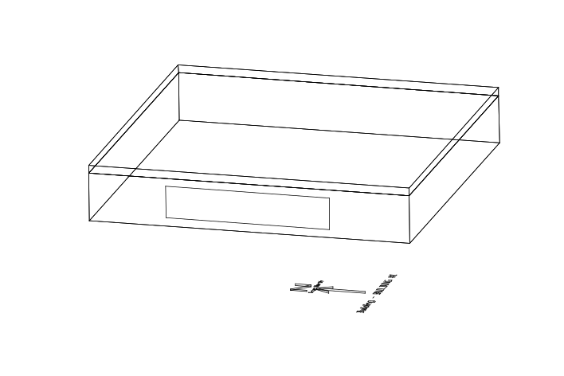

Figure 130. Illustration of Zone Return Plenum

After all the building zone attributes are specified, the AirLoopHVAC:ReturnPlenum object is specified and included as one of the named components in an AirLoopHVAC:ReturnPath.

#### Field: Name

A unique identifying name identifying the AirLoopHVAC:ReturnPlenum system component.

#### Field: Zone Name

The zone name specified in the heat balance portion of the input. This piece of input connects the zone return plenum system component to the heat balance data structure.

#### Field: Zone Node Name

The name of the zone node. The zone node name connects the heat balance data structure to the system airflow data structure through this node. This node name must be unique otherwise a warning is reported. Do not use the Zone Air Node Name specified in any ZoneHVAC:EquipmentConnections object, and since this zone is a plenum a ZoneHVAC:EquipmentConnections object is not required for the zone named in the previous field.

#### Field: Outlet Node Name

The name of the return plenum outlet node. For the zone return plenum there is only one outlet node that can be specified.

#### Field: Induced Air Outlet Node or NodeList Name

The name of an induced air outlet node or the name of a NodeList of such nodes. These nodes are to be used as the secondary inlet air nodes of powered induction terminal units (See **AirTerminal:SingleDuct:SeriesPIU:Reheat** and **AirTerminal:SingleDuct:ParallelPIU:Reheat**).

#### Field: Inlet &lt;\#&gt; Node Name

The name of a plenum inlet node. There is no limit to the number of inlet nodes, and there may be no duplicate inlet node names. (Note that some EnergyPlus editing tools may allow only 500 inlet node names, but this may be increased by extending the object in the Energy+.idd file.)


An IDF example of a zone return plenum component specification:

```idf
   AirLoopHVAC:ReturnPlenum,
       Return-Plenum-1,            !- Name
       PLENUM-1,                   !- Zone Name
       PLENUM-1 Node,              !- Zone Node Name
       PLENUM-1 Out Node,          !- Outlet Node Name
       PLENUM-1 Induced Air Nodes, !- Induced Air Outlet Node or NodeList Name
       SPACE1-1 Out Node,          !- Inlet 1 Node Name
       SPACE2-1 Out Node,          !- Inlet 2 Node Name
       SPACE3-1 Out Node,          !- Inlet 3 Node Name
       SPACE4-1 Out Node,          !- Inlet 4 Node Name
       SPACE5-1 Out Node;          !- Inlet 5 Node Name


   NodeList,
       PLENUM-1 Induced Air Nodes, !- Name
       SPACE1-1 ATU Sec Node,      !- Node 1 Name
       SPACE2-1 ATU Sec Node,      !- Node 2 Name
       SPACE3-1 ATU Sec Node,      !- Node 3 Name
       SPACE4-1 ATU Sec Node;      !- Node 4 Name
```


Below is an example of the AirLoopHVAC:ReturnPath for the simple case shown above.

```idf
   AirLoopHVAC:ReturnPath,
       ReturnAirPath1,              !- Name
       PLENUM-1 Out Node,           !- Return Air Path Outlet Node Name
       AirLoopHVAC:ReturnPlenum,    !- Component 1 Object Type
       Return-Plenum-1;             !- Component 1 Name
```


### AirLoopHVAC:SupplyPlenum

The building shown in the figure below consists of three controlled zones served by an AirLoopHVAC:SupplyPlenum beneath the floor.

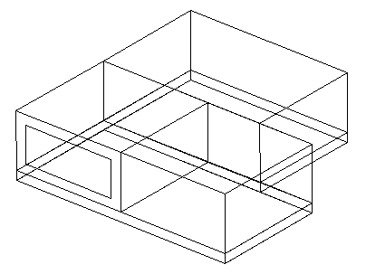

Figure 131. Illustration of AirLoopHVAC:SupplyPlenum

The AirLoopHVAC:SupplyPlenum has a heat balance connection and building description, and a system airflow connection which transfers the airflow from the supply plenum zone to the controlled zones in the system simulation. The input described in this section is mainly just for the system airflow connections in the HVAC algorithms. In addition the supply plenum zone must be fully input in the building zone description. The supply plenum zone description needs to contain the wall descriptions, the interzone ceiling and floor, and the ground connection. All the other attributes of a zone that can be specified in the building description can be utilized with a supply plenum zone if necessary, i.e. scheduled loads, windows, etc.

After all the building zone attributes are specified, the AirLoopHVAC:SupplyPlenum object is specified and included as one of the named components in an AirLoopHVAC:SupplyPath.

#### Field: Name

A unique identifying name identifying the AirLoopHVAC:SupplyPlenum system component.

#### Field: Zone Name

The zone name specified in the heat balance portion of the input. This piece of input connects the AirLoopHVAC:SupplyPlenum system component to the heat balance data structure.

#### Field: Zone Node Name

The name of the zone node. The zone node name connects the heat balance data structure to the system airflow data structure through this node.   This node name is defined by the user in the field    Zone Air Node Name    in the ZoneHVAC:EquipmentConnections object for the zone named in the previous field.

#### Field: Inlet Node Name

The name of the inlet node to the supply plenum. The AirLoopHVAC:SupplyPlenum component can send air to many outlets, but there is only one inlet.

#### Field: Outlet &lt;\#&gt; Node Name

The name of a plenum outlet node. There is no limit to the number of outlet nodes, and there may be no duplicate outlet node names. (Note that some EnergyPlus editing tools may allow only 500 outlet node names, but this may be increased by extending the object in the Energy+.idd file.)

An IDF example of an AirLoopHVAC:SupplyPlenum component specification:

```idf
  AirLoopHVAC:SupplyPlenum,
       Supply Plenum 1,                         ! Name
       SUPPLY PLENUM ZONE,                   ! Zone Name
       Supply Plenum 1 Zone Node,     ! Zone Node Name
       Zone Equipment Inlet Node,     ! Inlet Node Name
       Supply Plenum 1 Outlet Node; ! Outlet 1 Node Name
```


Below is an example of the AirLoopHVAC:SupplyPath for the building shown above.

```idf
  AirLoopHVAC:SupplyPath,
       TermReheatSupplyPath,               ! Name
       Zone Equipment Inlet Node,     ! Supply Air Path Inlet Node Name
       AirLoopHVAC:SupplyPlenum,       ! Component 1 Object Type
       Supply Plenum 1,                         ! Component 1 Name
       AirLoopHVAC:ZoneSplitter,       ! Component 2 Object Type
       Zone Supply Air Splitter;       ! Component 2 Name
```


### AirLoopHVAC:ZoneSplitter

The AirLoopHVAC:ZoneSplitter is a component that splits airflow from a single inlet to multiple outlets. This component must be referenced in an AirLoopHVAC:SupplyPath object. The input contains only node connection information.

#### Field: Name

Unique name for this zone splitter.

#### Field: Inlet Node Name

The name of the single inlet node going into the splitter.

#### Field: Outlet &lt;\#&gt; Node Name

The name of a splitter outlet node. There is no limit to the number of outlet nodes, and there may be no duplicate outlet node names. (Note that some EnergyPlus editing tools may allow only 500 outlet node names, but this may be increased by extending the object in the Energy+.idd file.)

An example is shown below.

```idf
AirLoopHVAC:ZoneSplitter,
           Zone Supply Air Splitter,     ! Name
           Zone Equipment Inlet Node,   ! Inlet Node Name
           Zone 1 Damper Inlet Node,     ! Outlet 1 Node Name
          Zone 2 Damper Inlet Node,     ! Outlet 2 Node Name
           Zone 3 Damper Inlet Node;     ! Outlet 3 Node Name
```

### AirLoopHVAC:ZoneMixer

The AirLoopHVAC:ZoneMixer takes the air from multiple inlets and mixes the streams together to be sent out of a single outlet node. This is a simple process of summing flows and averaging the air properties. This compoment may be part of an air loop return path or part of an induction terminal unit. When used as a return air mixer, this component must be listed in an AirLoopHVAC:ReturnPath object, and the inlets may be zone return air nodes or AirLoopHVAC:ReturnPlenum outlet nodes. When used in an induction terminal unit (ref. AirTerminal:SingleDuct:SeriesPIU:Reheat, AirTerminal:SingleDuct:ParallelPIU:Reheat, and AirTerminal:SingleDuct:ConstantVolume:FourPipeInduction), one inlet node is the supply (primary) air inlet from the central air handler, and the second inlet node is the induced (secondary) air inlet. These node names should match equivalent node names in the terminal unit.

#### Field: Name

Unique name for this zone mixer.

#### Field: Outlet Node Name

The name of the single outlet node leaving the mixer.

#### Field: Inlet &lt;\#&gt; Node Name

The name of a mixer inlet node. There is no limit to the number of inlet nodes, and there may be no duplicate inlet node names. (Note that some EnergyPlus editing tools may allow only 500 inlet node names, but this may be increased by extending the object in the Energy+.idd file.)

An input example is shown below.

```idf
AirLoopHVAC:ZoneMixer,
                 Zone Return Air Mixer,               ! Name
                 Return Air Mixer Outlet Node, ! Outlet Node Name
                 Zone 1 Outlet Node,                     ! Inlet 1 Node Name
                 Zone 2 Outlet Node,                     ! Inlet 2 Node Name
                 Zone 3 Outlet Node;                     ! Inlet 3 Node Name
```

Group -- Non-Zone Equipment
---------------------------

The non-zone equipment group consists of plant objects that connect to the demand side of the plant loop but are not associated with a a specific Zone (and do not have their own group). There is currently one non-zone equipment object called   LoadProfile:Plant. This object places a scheduled demand load on the plant.

Non-zone equipment allows the option of performing a plant-only EnergyPlus simulation, i.e. without any zones. This can be useful for comparing the performance of various plant configurations or components without the added complexity of a full building description.

### LoadProfile:Plant

The LoadProfile:Plant object is used to simulate a scheduled demand profile. This can be useful when the building loads are already known. Demanded load and flow rate are schedules specified in the object definition. The load profile can specify heating and cooling loads. Cooling loads are entered as negative numbers. The actual load met is dependent on the performance of the supply loop components.

The LoadProfile:Plant object must be connected on the demand side of the plant loop. It should be located on a Branch with its control type set to    Active.    If desired, multiple LoadProfile:Plant objects can be combined in series and/or parallel.

#### Field: Name

The unique name of the LoadProfile:Plant object.

#### Field: Inlet Node Name

The name of the inlet node connection to the plant loop.

  This node should be on the demand side.

#### Field: Outlet Node Name

The name of the outlet node connection to the plant loop.

#### Field: Load Schedule Name

Reference to the schedule object specifying the load profile [W].

#### Field: Peak Flow Rate

The peak demanded water flow rate [m<sup>3</sup>/s]. This value is multiplied by the flow rate fraction schedule values (below) to determine the actual volumetric flow rate.

#### Field: Flow Rate Fraction Schedule Name

Reference to the schedule object specifying the flow rate fraction relative to the value in the field Peak Flow Rate (above).

An example of this object follows.

```idf
LoadProfile:Plant,
   Load Profile 1,                                         !- Name
   Demand Load Profile 1 Inlet Node,     !- Inlet Node Name
   Demand Load Profile 1 Outlet Node,   !- Outlet Node Name
   Load Profile 1 Load Schedule,             !- Load Schedule Name {W}
   0.003,                                                           !- Peak Flow Rate {m3/s}
   Load Profile 1 Flow Frac Schedule;   !- Flow Rate Fraction Schedule Name
```


### LoadProfile Plant Outputs

The following output variables and meters are reported for the LoadProfile:Plant object:

* HVAC,Average,Plant Load Profile Mass Flow Rate [kg/s]

* HVAC,Average,Plant Load Profile Heat Transfer Rate [W]

* HVAC,Sum,Plant Load Profile Heat Transfer Energy [J]

* HVAC,Sum,Plant Load Profile Heating Energy [J]

* HVAC,Sum,Plant Load Profile Cooling Energy [J]

#### Plant Load Profile Mass Flow Rate [kg/s]

This is the mass flow of the fluid passing through the load profile object, in kg/s.

#### Plant Load Profile Heat Transfer Rate [W]

#### Plant Load Profile Heat Transfer Energy [J]

These report the overall heat transfer rate and energy for the load profile object, in Watts or Joules.

#### Plant Load Profile Cooling Energy [J]Plant Load Profile Heating Energy [J]

These report the overall cooling or heating energy that the load profile object places on the plant loop, in Joules.


The inlet and outlet node temperatures and mass flow rates can be monitored using the system node output variables:

* HVAC,Average,System Node Temperature [C]

* HVAC,Average,System Node Mass Flow Rate [kg/s]


Group     Solar Collectors
------------------------

Solar collectors are thermal devices that convert solar energy into thermal energy by raising the temperature of a circulating heat transfer fluid. The fluid can then be used to heat water for domestic hot water usage or space heating.

In EnergyPlus solar collectors are components that are connected to the plant loop. A solar heating system can be constructed with a combination of solar collectors, pumps, and hot water tanks.

Flate plate solar collectors are defined using two objects:   SolarCollector:FlatPlate:Water and SolarCollectorPerformance:FlatPlate. Similarly, Integral-Collector-Storage (ICS) solar collectors are defined using two objects: SolarCollector:IntegralCollectorStorage, and SolarCollectorPerformance:IntegralCollectorStorage.   The SolarCollector:FlatPlate:Water and SolarCollector:IntegralCollectorStorage objects describe the plant component connections. These object also reference   SolarCollectorPerformance:FlatPlate and SolarCollectorPerformance:IntegralCollectorStorage performance objects which contains the thermal and optical performance test data for a specific make and model of collector. Parameters are defined separately so that these values can be organized into a reference data set and need only be entered once if for an array of the same type of collectors.

### SolarCollector:FlatPlate:Water

The flat-plate solar collector model simulates glazed, unglazed, and tubular (i.e. evacuated tube) collectors. The SolarCollector:FlatPlate:Water object represents a single collector module connected to the plant loop. The thermal and optical properties of the collector module are taken from the referenced SolarCollectorPerformance:FlatPlate object. A surface or shading object defines the collector tilt, azimuth, and gross area. The collector surface participates normally in all shading calculations if the "FullExterior," "FullInteriorAndExterior,"    FullExteriorWithReflections    , or    FullInteriorAndExteriorWithReflections    flags are set in the Solar Distribution field of the Building object. Inlet and outlet nodes are specified for plant connections on the demand side of the plant loop.

#### Field: Name

The unique name of the SolarCollector:FlatPlate:Water object.

#### Field: Solar Collector Performance Name

Reference name of a SolarCollectorPerformance:FlatPlate object that defines the thermal and optical properties of the collector.

#### Field: Surface Name

Reference to one of the many different types of surfaces such as the BuildingSurface:Detailed or the Shading:Zone:Detailed objects. The surface named here is used to define the solar collector tilt, azimuth, and gross area.

#### Field: Inlet Node Name

The name of the inlet node connection to the plant loop.

#### Field: Outlet Node Name

The name of the outlet node connection to the plant loop.

#### Field: Maximum Flow Rate

The maximum flow rate [m<sup>3</sup>/s] allowed through the collector. This field is optional. If not specified, the collector will allow as much flow as the rest of the plant can deliver.

An example follows.

```idf
  SolarCollector:FlatPlate:Water,
   Collector 1,                                                       !- Name
   ACR Solar International Fireball 2001,   !- Solar Collector Performance Name
   Collector Surface,                                           !- Surface Name
   Collector Inlet Node,                                     !- Inlet Node Name
   Collector Outlet Node,                                   !- Outlet Node Name
   0.00005;                                                               !- Maximum Flow Rate (m3/s)
```


### Solar Collector FlatPlate Water Output

The following output variables are reported for the SolarCollector:FlatPlate:Water object:

* HVAC,Average,Solar Collector Incident Angle Modifier []

* HVAC,Average,Solar Collector Efficiency []

* HVAC,Average,Solar Collector Heat Transfer Rate [W]

* HVAC,Average,Solar Collector Heat Gain Rate [W]

* HVAC,Average,Solar Collector Heat Loss Rate [W]

* HVAC,Sum,Solar Collector Heat Transfer Energy [J]

#### Solar Collector Incident Angle Modifier [ ]

The incident angle modifier is an important intermediate value used in the SRCC calculation of solar collector performance.   The value reported here is the combined result for the current time that includes incident angles of beam solar, diffuse solar from sky, and diffuse solar from ground.

#### Solar Collector Efficiency [ ]

The overall collector efficiency.   This is the ratio of collected energy and the incident solar energy.   The efficiency can be greater than 1 at times when the outdoor air temperature is warm enough.

#### Solar Collector Heat Transfer Rate [W]

#### Solar Collector Heat Transfer Energy [J]

These are the overall rate (in W) and amount of energy ( in J) transferred to the collector   s circulating fluid.   Positive values indicate heating of the fluid while negative values indicate cooling of the fluid.

#### Solar Collector Heat Gain Rate [W]

This is the overall rate of heat addition to the collector   s circulating fluid in Watts.   Values are always positive or zero.   If the fluid is actually cooled then the value is zero.

#### Solar Collector Heat Loss Rate [W]

This is the overall rate of heat loss from the collector   s circulating fluid in Watts.   Values are always positive or zero.   If the fluid is actually heated then the value is zero.

In addition, several surface variables are also relevant for the collector   s surface object (BuildingSurface:Detailed or Shading:Zone:Detailed):

* Zone,Average,Surface Outside Face Sunlit Area [m2]

* Zone,Average,Surface Outside Face Sunlit Fraction []

* Zone,Average,Surface Outside Face Incident Solar Radiation Rate per Area [W/m2]

* Zone,Average,Surface Outside Face Incident Beam Solar Radiation Rate per Area [W/m2]

* Zone,Average,Surface Outside Face Incident Sky Diffuse Solar Radiation Rate per Area [W/m2]

* Zone,Average,Surface Outside Face Incident Ground Diffuse Solar Radiation Rate per Area [W/m2]

* Zone,Average,Surface Outside Face Beam Solar Incident Angle Cosine Value []


The temperatures at the inlet and outlet nodes and the collector mass flow rate can be monitored using the system node output variables:

* HVAC,Average,System Node Temperature [C]

* HVAC,Average,System Node Mass Flow Rate [kg/s]


### SolarCollectorPerformance:FlatPlate

The SolarCollectorPerformance:FlatPlate object contains the thermal and optical performance parameters for a single collector module. These parameters are based on the testing methodologies described in ASHRAE Standards 93 and 96. The Solar Rating and Certification Corporation (SRCC) applies these standards in their rating procedures of solar collectors. The ratings for commercially available collectors in North America are published in the *Directory of SRCC Certified Solar Collector Ratings*. The SRCC database has also been converted into an EnergyPlus data set of SolarCollectorPerformance:FlatPlate objects that is included with the program (see SolarCollectors.idf in the DataSets folder).

The coefficients for the energy conversion efficiency and incident angle modifier allow first order (linear) or second order (quadratic) correlations. To use a first order correlation, the second order coefficient must be left blank or set to zero.

In order for the model to work correctly, the test conditions for which the performance coefficients were measured must be specified in the fields:   *Test Fluid*, *Test Volumetric Flow Rate*, and *Test Correlation Type*. Currently, only water is allowed as the *Test Fluid*.

For more detailed information about the performance coefficients, see the *EnergyPlus Engineering Reference Document*.

#### Field: Name

The unique name of the SolarCollectorPerformance:FlatPlate object.

#### Field: Gross Area

The gross area of the collector module [m<sup>2</sup>]. This value is mainly for reference. The area of the associated collector surface object is used in all calculations.

#### Field: Test Fluid

The fluid that was used in the testing procedure that resulted in the thermal and optical performance coefficients below. Currently only    Water    is allowed.   This the fluid during the collector testing, not the fluid used during a particular EnergyPlus run.

#### Field: Test Flow Rate

The volumetric flow rate during testing [m<sup>3</sup>/s]. If the value is available as flow rate per unit area, it is recommended to multiply by the *Gross Area* of the collector module, not the net aperture area.

#### Field: Test Correlation Type

This field specifies type of temperature used to develop the correlation equations.   The testing procedure is based on an experimental correlation using either    Inlet,       Average,    or    Outlet    temperature.   Enter one of these choices. The ASHRAE Standards 93 and 96 always use Inlet temperature.

#### Field: Coefficient 1 of Efficiency Equation

First coefficient of efficiency equation for energy conversion [dimensionless].   This is the Y-intercept term.

#### Field: Coefficient 2 of Efficiency Equation

Second coefficient of efficiency equation for energy conversion [W/m<sup>2</sup>-K].   This is the first-order term.

#### Field: Coefficient 3 of Efficiency Equation

Third coefficient of efficiency equation for energy conversion [W/m<sup>2</sup>-K<sup>2</sup>]. This field is optional. This is the second-order term. If left blank or set to zero, a first-order linear correlation is used.

#### Field: Coefficient 2 of Incident Angle Modifier

Second coefficient of the incident angle modifier equation. This the first-order term. (There is no *Coefficient 1 of Incident Angle Modifier* because that number is always 1.0.)

#### Field: Coefficient 3 of Incident Angle Modifier

Third coefficient of the incident angle modifier equation. This is the second-order term. This field is optional. If left blank or set to zero, a first order linear correlation is used.

An example of this object follows.

```idf
   SolarCollectorPerformance:FlatPlate,
       Alternate Energy Technologies AE-32,   !- Name
       2.9646,                                   !- Gross Area {m2}
       WATER,                                     !- Test Fluid
       0.0000388,                             !- Test Flow Rate {m3/s}
       INLET,                                     !- Test Correlation Type
       0.691,                                     !- Coefficient 1 of Efficiency Equation {dimensionless}
       -3.396,                                   !- Coefficient 2 of Efficiency Equation {W/m2-K}
       -0.00193,                               !- Coefficient 3 of Efficiency Equation {W/m2-K2}
       -0.1939,                                 !- Coefficient 2 of Incident Angle Modifier
       -0.0055;                                 !- Coefficient 3 of Incident Angle Modifier
```


### SolarCollectorPerformance:FlatPlate Output

This object does not generate any output; see SolarCollector:FlatPlate:Water Output

### SolarCollector:IntegralCollectorStorage

The Integral-Collector-Storage (ICS) solar collector model simulates glazed collectors with integral storage unit. The SolarCollector:IntegralCollectorStorage object represents a single collector module connected to the plant loop. The thermal and optical properties of the collector module are calculated from inputs in SolarCollectorPerformance:IntegralCollectorStorage object. A surface or shading object defines the collector tilt, and azimuth. The collector surface participates normally in all shading calculations if the "FullExterior," "FullInteriorAndExterior,"    FullExteriorWithReflections    , or    FullInteriorAndExteriorWithReflections    flags are set in the Solar Distribution field of the Building object. Inlet and outlet nodes are specified for plant connections on the demand side of the plant loop.   The SurfaceProperty:ExteriorNaturalVentedCavity, object is required to describe the surface properties, the characteristics of the cavity and opening for natural ventilation if OtherSideConditionsModel is specified as the collector bottom surface outside boundary condition type.

#### Field: Name

The unique name of the SolarCollector:IntegralCollectorStorage object.

#### Field: Solar Collector Performance Name

Reference name of a SolarCollectorPerformance:IntegralCollectorStorage object that defines the thermal and optical properties of the collector.

#### Field: Surface Name

Reference to one of the many different types of surfaces such as the BuildingSurface:Detailed or the Shading:Zone:Detailed objects. The surface named here is used to define the solar collector tilt, and azimuth. The collector shades the surface it is mounted on and hence impacts the surface heat balance.

#### Field: Bottom surface Boundary Conditions Type

This field contains the type of boundary conditions applicable to the ICS collector bottom surface. Allowed boundary condition types are: AmbientAir and OtherSideConditionsModel.   If the other side conditions model is selected, specify the name of the SurfaceProperty:OtherSideConditionsModel object in the next input field, otherwise, leave the next input field blank.   The AmbientAir boundary condition uses outdoor air temperature as boundary condition, hence the subsurface is assumed to be exposed to the sun and wind.

#### Field: Other Side Conditions Model Name

This field contains the name of a SurfaceProperty:OtherSideConditionsModel object declared elsewhere in the input file. This will connect the collector to the exterior boundary conditions for the underlying heat transfer surface specified above..

#### Field: Inlet Node Name

The name of the inlet node connection to the plant loop.

#### Field: Outlet Node Name

The name of the outlet node connection to the plant loop.

#### Field: Maximum Flow Rate

The maximum flow rate [m3/s] allowed through the collector. This field is optional. If not specified, the collector will allow as much flow as the rest of the plant can deliver.


An example follows.

```idf
SolarCollector:IntegralCollectorStorage,
   Collector 1,                                                       !- Name
   ICS Solar Collector,                                       !- Solar Collector Performance Name
   ICS Collector Surface,                                   !- Surface Name
   OtherSideConditionsModel,                             !- Bottom Surface Boundary Conditions Type
   ICS OSCM,                                                             !- Boundary Condition Model Name
   Collector Inlet Node,                                     !- Inlet Node Name
   Collector Outlet Node,                                   !- Outlet Node Name
   0.00005;                                                               !- Maximum Flow Rate (m3/s)
```

### SolarCollectorPerformance:IntegralCollectorStorage

The SolarCollectorPerformance:IntegralCollectorStorage object contains the thermal and optical performance parameters for a single collector module. The transmittance-absorptance product of the absorber and cover system is determined from optical properties specified. For more detailed information about the calculation procedure, see the *EnergyPlus Engineering Reference* Document.

#### Field: Name

The unique name of the SolarCollectorPerformance:IntegralCollectorStorage object.

#### Field: ICS Collector Type

This input field is the ICS collector type.     Currently only RectangularTank type is allowed.

#### Field: Gross Area

This input field is the gross area of the collector module in m2.   This gross area is used in the energy balance equations.

#### Field: Collector Water Volume

This input field is the volume of water in the solar collector in m3.

#### Field: Bottom Heat Loss Conductance

This input field is the collector bottom heat loss conductance in W/m2K.   This value is calculated from thermal conductivity and thickness of the bottom insulation.

#### Field: Side Heat Loss Conductance

This input field is the collector side heat loss conductance in W/m2K.   This value is calculated from thermal conductivity and thickness of the side insulation.

#### Field: Collector Aspect Ratio

This input field is the ratio of the short side (width) of the collector to the long side (length) of the collector.   This value is used only for calculating the collector side area along with the collector side height specified in the next input filed.   This ratio is less or equal to 1.0.

#### Field: Collector Side Height

This input field is height of collector side in m.   This height is used to estimate the collector side area for heat loss calculations along with heat loss coefficient specified in the input field above.

#### Field: Thermal Mass of Absorber Plate

This input field is thermal-mass of the absorber plate per unit area of the collector in [J/m2×K].   This input value multiplied by the absorber gross area determines the thermal mass of the absorber plate. It is estimated from the specific heat, density and average thickness of the absorber plate. If zero is specified then the absorber plate energy balance reduces to steady state form.

#### Field: Number of Covers

Number of transparent collector covers.   Common practice is to use two covers: glass as the outer cover and Teflon as the inner cover. If single cover is specified leave the inner cover optical and thermal properties input fields blank.

#### Field: Cover Spacing

This input field provides the spacing between the two transparent covers, and the spacing between the inner cover and the absorber plate in m.   Default value is 0.05m.

#### Field: Refractive Index of Outer Cover

This is the average Refractive index for solar spectrum range of the outer transparent cover material.   Glass is used as the outer cover.   Average refractive index value for non-absorbing glass used in solar collectors over solar spectrum range is 1.526.

#### Field: Extinction Coefficient Times Thickness of Outer Cover

This input field is the product of the extinction coefficient and the thickness of the out cover material.   The extinction coefficient for glass types approximately varies from 4m<sup>-1</sup> to 32 m<sup>-1</sup>.   The extinction coefficient for low-iron glass, which is the default outer cover material, is 15 m<sup>-1</sup>. The default value for extinction coefficient times thickness (KL) is 0.045 (=15.0 x0.003), which is the product of the default extinction coefficient of 15m<sup>-1</sup> and 3.0mm thick glass.

#### Field: Emissivity of Outer Cover

This input field value is thermal emissivity of the outer collector cover.   The default value assumes low-iron glass with thermal emissivity of 0.88.

#### Field: Refractive Index of Inner Cover

This input field is the average Refractive index of the inner transparent cover of the collector.   Commonly Teflon (PolytetraFluoroethylene) is used as the inner cover.   The average refractive index value over the solar spectrum range for Teflon is 1.37.

#### Field: Extinction Coefficient Times Thickness of Inner Cover

This input field is the product of the extinction coefficient (K) and the thickness (L) of the inner cover material.   The inner cover material is more transparent than the out cover, very thin and hence their thickness can be assumed to be negligible. The default value for extinction coefficient times thickness (KL) is 0.008 (=40.0x0.0002), which is the product of extinction coefficient of 40m<sup>-1</sup> and a thickness of 0.2mm.

#### Field: Emissivity of Inner Cover

This input field value is thermal emissivity of the inner transparent collector cover.   The default value assumes plastic sheet with thermal emissivity of 0.30.   This value is used in the thermal analysis only.

#### Field: Absorptance of Absorber Plate

This input field is shortwave or solar absorptance of the absorber plate.   The default value is 0.96.

#### Field: Emissivity of Absorber Plate

This input field value is thermal emissivity of the absorber plate.   Default value is 0.30.   This input value is used in the thermal analysis only.


An example follows.

```idf
     SolarCollectorPerformance:IntegralCollectorStorage,
       ICS Experimental,               !- Name
       RectangularTank,                 !- ICS Collector Type
       0.37275,                                 !- Gross Area {m2}
       0.0195875,                             !- Collector Water Volume {m3}
       0.10,                                       !- Bottom Heat Loss Conductance
       1.00,                                       !- Side Heat Loss Conductance
       0.8,                                         !- Collector Aspect Ratio {dimensionless}
       0.08,                                       !- Collector Side Height {m}
       5800.0,                                         !- Thermal Mass of Absorber Plate {J/m2K}
       1,                                             !- Number of Covers {dimensionless}
       0.05,                                       !- Cover Spacing {m}
       1.526,                                     !- Refractive Index of Outer Cover {dimensionless}
       0.0125,           !- Extinction Coefficient Times Thickness of Outer Cover {dimensionless}
       0.88,                                       !- Emissivity of Outer Cover
       1.126,                                     !- Refractive Index of Inner Cover {dimensionless}
       0.0126,           !- Extinction Coefficient Times Thickness of Inner Cover {dimensionless}
       0.88,                                       !- Emissivity of Inner Cover {dimensionless}
       0.96,                                       !- Absorptance of Absorber Plate {dimensionless}
       0.60;                                       !- Emissivity of Absorber Plate {dimensionless}
```


### Solar Collector Integral Collector Storage Outputs

The following output variables are reported for the SolarCollector:IntegralCollectorStorage object:

* HVAC,Average,Solar Collector Storage Water Temperature [C]

* HVAC,Average,Solar Collector Absorber Plate Temperature [C]

* HVAC,Average,Solar Collector Overall Top Heat Loss Coefficient [W/m2-C]

* HVAC,Average,Solar Collector Thermal Efficiency []

* HVAC,Average,Solar Collector Storage Heat Transfer Rate [W]

* HVAC,Sum,Solar Collector Storage Heat Transfer Energy [J]

* HVAC,Average,Solar Collector Heat Transfer Rate [W]

* HVAC,Sum,Solar Collector Heat Transfer Energy [J]

* HVAC,Average,Solar Collector Skin Heat Transfer Rate [W]

* HVAC,Sum, Solar Collector Skin Heat Transfer Energy [J]

* HVAC,Average,Solar Collector Transmittance Absorptance Product []

#### Solar Collector Storage Water Temperature [C]

This output variable is the ICS collector stored water average temperature at a given time steps in degree Celsius. This temperature is the same as the collector ICS collector leaving water temperature.

#### Solar Collector Absorber Plate Temperature [C]

This output variable is the ICS collector absorber plate average temperature at a given time steps in degree Celsius.

#### Solar Collector Thermal Efficiency [ ]

This output variable is the instantaneous thermal efficiency of the ICS solar collector in per cent.   This value is determined from net useful energy collected and the total incident solar radiation for each time step. The net useful energy collected is the sum of the energy stored in the collector and net useful energy delivered.

#### Solar Collector Storage Heat Transfer Rate [W]

#### Solar Collector Storage Heat Transfer Energy [J]

These output variables are the instantaneous rate of change of the energy and the change in energy of the water in the ICS solar collector in Watts, and Joules, respectively.

#### Solar Collector Skin Heat Transfer Rate [W]

#### Solar Collector Skin Heat Transfer Energy [J]

These output variables are the instantaneous skin heat loss rate and the heat loss energy of the ICS solar collector for each time steps in Watts, and Joules respectively.   The skin heat loss rate is the sum of the heat losses through the top, bottom and sides of the collector surfaces.   This value is mostly negative, but can have a positive value (heat gain) when the outdoor air temperature is warmer than the collector.

#### Solar Collector Heat Transfer Rate [W]

#### Solar Collector Heat Transfer Energy [J]

This output variable is the heat rate and Energy transferred from the ICS collector to the collector loop fluid (water) in Watts and Joule, respectively.   This value is determined from the collector water mass flow rate, specific heat of water and the temperature difference between the collector water outlet and inlet nodes at each time step. The value is positive when the fluid is heated or negative when cooled.

#### Solar Collector Transmittance Absorptance Product [ ]

This output variable is the transmittance-absorptance product of the covers and absorber system of the ICS solar collector.   This value ranges from 0.0 to less than 1.0.

#### Solar Collector Overall Top Heat Loss Coefficient [W/m2-C]

This output variable is the overall heat loss coefficient from the absorber plate to the ambient air calculated for each time step.

### SolarCollector:FlatPlate:PhotovoltaicThermal

This object is used to model hybrid photovoltaic-thermal (PVT) solar collectors that convert incident solar energy into both electricity and useful thermal energy.   This object describes the PVT solar collector by referencing other objects that provide more detail or connections to other parts of the EnergyPlus model.

The PVT solar collectors need to be connected to either an HVAC air system or a plant loop for collected thermal energy to be utilized.   The input field for the type of thermal working fluid informs the program how the PVT collector is expected to be connected.   If the the working fluid is air, then the PVT collectors are modeled as a ventilation air pretreatment component and connected to an outdoor air system.   If the working fluid is water, then the PVT collectors are modeled as a hot water solar collector and are connected to a plant loop with a water thermal storage tank.

#### Field: Name

This field should contain a unique name chosen by the user to identify a specific PVT collector in the building model.

#### Field: Surface Name

This field is the user-defined name of a surface object (defined elsewhere) to which the PVT module is attached.   These can be any type of building surface that is exposed to the exterior environment.   The model uses the named surface   s geometry for the PVT solar collector.

#### Field: Photovoltaic-Thermal Model Performance Name

This field is the user-defined name of an object (defined elsewhere) that provides the performance details of the PVT module.   This should be the name of a SolarCollectorPerformance:PhotovoltaicThermal:Simple object.   Multiple different SolarCollector:FlatPlate:PhotovoltaicThermal objects can reference the same object that provides performance details.

#### Field: Photovoltaic Generator Name

This field is the user-defined name of a Generator:Photovoltaic object (defined elsewhere) that will be used to model the solar electric portion of the PVT solar collector.   The PVT models make any adjustments needed to model PV performance in the context of the PVT collector.

#### Field: Thermal Working Fluid Type

This field is the user   s choice for the type of fluid used to collect thermal energy.   PVT solar collectors can capture thermal energy in either air or water streams.   The choices available for this field are    Water    or    Air.      If the choice is    Air    then the PVT collector needs to be connected to an HVAC air system loop.   The PVT collector should be situated as the first component on an outdoor air inlet stream.   If the choice is    Water    then the PVT collector needs to be connected to a Plant water system loop.   The connections are made via node names which are defined in the following fields, depending on the working fluid type.

#### Field: Water Inlet Node Name

This field is the name of Plant loop node that serves as the inlet to the PVT collector.   This field is only used if the Thermal Working Fluid Type is set to    Plant/Water.   

#### Field: Water Outlet Node Name

This field is the name of a plant loop node that seves as the outlet from the PVT collector.   This field is only used if the Thermal Working Fluid Type is set to    Plant/Water.   

#### Field: Air Inlet Node Name

This field is the name of HVAC air loop node that serves as the inlet to the PVT collector.   This field is only used if the Thermal Working Fluid Type is set to    HVAC/Air.   

#### Field: Air Outlet Node Name

This field is the name of HVAC air loop node that serves as the outlet from the PVT collector.   This field is only used if the Thermal Working Fluid Type is set to    HVAC/Air.   

#### Field: Design Flow Rate

This field is used to describe the nominal volume flow rate of the thermal working fluid.   The units are m3/s.   The volume flow rate is autosizable.

An example of this object follows.

```idf
   SolarCollector:FlatPlate:PhotovoltaicThermal,
       PVT: 1_Ceiling ,                                             !- Name
       1_Ceiling ,                                                       !- Surface Name
       30percentPVThalfArea ,                                 !- Photovoltaic-Thermal Model Performance Name
       PV:ZN_1_FLR_1_SEC_1_Ceiling ,                   !- Photovoltaic Name
       Air ,                                                                   !- Thermal Working Fluid Type
       ,                                                                           !- Water Inlet Node Name
       ,                                                                           !- Water Outlet Node Name
       ZN_1_FLR_1_SEC_1:Sys_OAInlet Node ,       !- Air Inlet Node Name
       PVT:ZN_1_FLR_1_SEC_1_Ceiling Outlet ,   !- Air Outlet Node Name
       Autosize ;                                                         !- Design Flow Rate
```


### Solar Collector FlatPlate PhotovoltaicThermal Outputs

The output variables that are available for flat plate PVT include the following.

* HVAC,Average,Generator Produced Thermal Rate [W]

* HVAC,Sum,Generator Produced Thermal Energy [J]

* HVAC,Average,Generator PVT Fluid Bypass Status [ ]

* HVAC,Average,Generator PVT Fluid Inlet Temperature [C]

* HVAC,Average,Generator PVT Fluid Outlet Temperature [C]

* HVAC,Average,Generator PVT Fluid Mass Flow Rate [kg/s]

#### Generator Produced Thermal Rate [W]

#### Generator Produced Thermal Energy [J]

These outputs are the thermal energy and power produced by the PVT collector.   PVT collectors are a type of cogenerator, producing both electrical and thermal power and these variables report the thermal portion in the same manner as other fuel-based cogenerators.   The thermal energy is placed on    HeatProduced    meter and is attributed to    SolarWater    or    SolarAir    depending on the type of working fluid.   The generator thermal production is also reported at the load center level.

#### Generator PVT Fluid Bypass Status [ ]

This output variable indicates the status a bypass damper.   It is only available for air-based PVT.   There are no dimensions and the range is between 0.0 and 1.0.   If the value is 0.0, then there is no bypassing and all the working fluid goes through the collector.   If the value is 1.0, then there is complete bypassing and all the working fluid goes around the collector.   If the value is between 0.0 and 1.0, then the model is effectively mixing bypass and collector streams to target a temperature setpoint placed on the outlet node.

#### Generator PVT Fluid Inlet Temperature [C]

This report is the inlet temperature of the working fluid that enters the PVT collector

#### Generator PVT Fluid Outlet Temperature [C]

This report is the outlet temperature of the working fluid that leaves the PVT collector

#### Generator PVT Fluid Mass Flow Rate [kg/s]

This report is the mass flow rate of the working fluid through the PVT collector.   This is the overall mass flow rate, portions of the flow may be internally bypassed around the collector itself for control modulation.

### SolarCollectorPerformance:PhotovoltaicThermal:Simple

This object is used to provide performance details for the simple PVT model.   This is a simple user-defined efficiency model.   Thermal conversion efficiency is a constant or scheduled value.   There are no output variable for this object, reporting is done by the parent PVT object.

#### Field: Name

This field is the unique name for this object.

#### Field: Fraction of Surface Area with Active Thermal Collector

This field is the fraction of the surface area that is active.   It should be a decimal fraction between 0.0 and 1.0.   The area of the PVT   s surface will be multiplied by this fraction to determine the active area of the PVT collector(s).

#### Field: Thermal Conversion Efficiency Input Mode Type

This field is used to determine how the thermal efficiency is input.   There are two choices,    Fixed    or    Scheduled.      If this field is set to Fixed, then a constant value for thermal efficiency will be used (set in next field).   If this field is set to Scheduled, then the thermal efficiency values are defined in a schedule.

#### Field: Value for Thermal Conversion Efficiency if Fixed

This field is used to provide a value for the efficiency with which solar energy is collected in the working fluid.   This field is only used if the input mode is set to    Fixed    in the previous field.   Efficiency is defined as the thermal energy collected divided by the incident solar radiation.   The value should be between 0.0 and 1.0.   The user should be careful that the thermal efficiency and the electrical efficiency be consistent with each other because the overall efficiency of the PVT collector is the combination of both thermal and electrical.

#### Field: Name of Schedule for Thermal Conversion Efficiency

This field is used for the name of a schedule that provides values for the efficiency with which solar energy is collected in the working fluid.   This field is only used if the input mode is set to    Scheduled    in the field above.   Efficiency is defined as the thermal energy collected divided by the incident solar radiation.   The values in the named schedule should be between 0.0 and 1.0.   The user should be careful that the thermal efficiency and the electrical efficiency be consistent with each other because the overall efficiency of the PVT collector is the combination of both thermal and electrical.

#### Field: Front Surface Emittance

This field is used to describe an average value for the total hemispherical emittance of the collector   s front face exposed to the sky.   This is used to model cooling applications where the PVT collectors are operated at night to cool the working fluid.

An example input object follows.

```idf
   SolarCollectorPerformance:PhotovoltaicThermal:Simple,
       20percentEffPVhalfArea ,                 !- Name
       0.5 ,                                                       !- Fraction of Surface Area with Active Thermal Collector
       Fixed ,                                                   !- Thermal Conversion Efficiency Input Mode Type
       0.2 ,                                                       !- Value for Thermal Conversion Efficiency if Fixed
         ,                                                             !- Name of Schedule for Thermal Conversion Efficiency
       0.84 ;                                                     !- Front Surface Emittance
```

### Solar Collector Heating System Plant Connections

This section provides an overview of how to model solar heating systems.   A solar heating system can be constructed using a combination of solar collectors, pumps, water tanks and water heaters. The solar collector must be connected on the demand side of the plant loop. Multiple collector modules can be combined in series and parallel using the normal plant connection rules. The supply side of the plant loop should contain a water heater with the solar collector loop connecting to the *Source Side Inlet* and *Source Side Outlet* nodes. As usual, the pump must be the first component on the supply side.

If the solar heating system is for domestic hot water (or service water heating) usage only, the field *Use Flow Rate Fraction Schedule Name* of the WaterHeater:Mixed object can be used to avoid additional plant connections. If the system has more complicated hot water requirements or if the system is for space heating, the *Use Side Inlet* and *Use Side Outlet* nodes must be connected to another plant loop to serve zone and non-zone equipment. (See the WaterHeater:Mixed object documentation for more information.)


Figure 132. Solar Collector Plant Loop Connection Diagram

NOTE:   The EnergyPlus plant simulation requires the pump to be the first component on the supply side. This may be different from the way the solar heating system is actually configured. This should not affect the validity of the simulation results.

In order to realize energy savings with a solar heating system, it is best to use a two-tank system with a storage tank and auxiliary water heater. The storage tank gathers heat directly from the solar collectors and stores it for later use. The storage tank is modeled using a WaterHeater:Mixed object with the *Heater Maximum Capacity* set to zero. The auxiliary water heater is positioned downstream of the storage tank on the supply side of the main plant loop. The auxiliary water heater, or booster water heater, provides additional heat if the storage tank water is not hot enough. The auxiliary water heater can be modeled as an instantaneous/tankless water heater or as a standard tanked water heater with heating source (see WaterHeater:Mixed).


Figure 133. Two-Tank Solar Heating System Connection Diagram

Another strategy to consider for solar heating systems is to allow the storage tank to reach a much higher temperature than necessary for the end use. This allows the tank to store more energy from the solar collectors, when it is available. However, for applications such as domestic hot water, it is undesirable and unsafe to supply excessive hot water temperatures at the point of demand. To take advantage of higher storage temperatures, yet still avoid scalding temperatures at the faucet, the hot water leaving the storage tank can be tempered with cold water using a three-way valve to achieve the target temperature. See the TemperingValve object documentation for more details.

A complete two-tank solar heating system with tempering valve is shown below.


Figure 134. Two-Tank Solar Heating System with Tempering Valve

### Solar Heating System Control

There are several options for controlling a solar heating system in EnergyPlus. Since the solar collectors request a constant flow demand based on their *Maximum Flow Rate*, the limiting factor is actually the flow rate determined by the loop pump. Therefore the entire system can be controlled using the *Pump Flow Rate Schedule* of the pump. If the schedule is omitted, the pump and system will run all the time (without any other controls specified). This is usually not the best way to operate a solar heating system.

To better control the collector loop, a differential thermostat can be used to compare the temperature in the water heater to the temperature in the collector so that the pump is only turned on when there is a useful heat gain. The differential thermostat is simulated using the AvailabilityManager:DifferentialThermostat object. For a typical system, the *Hot Node Name* field refers to an outlet node of one of the collector modules. The *Cold Node Name* field refers to the *Source Side Outlet* node, i.e. the cold storage water leaving the water heater. The fields *Temperature Difference On Limit* and *Temperature Difference Off Limit* are usually 8    12 C and 1     3 C respectively. If the two temperature differences are too close, it is possible for the system to turn on and off rapidly without much useful heat gain. This can also occur if the flow rate through the collector is too high. Without flow the fluid in the collector heats up more quickly; when high flow is turned on, all of the hot fluid is removed and the temperature drops, forcing the system off again.

Another control method is to use a photovoltaic panel to power the pump. The system begins pumping when there is enough solar radiation to operate the pump. This is not yet implemented in EnergyPlus.

#### Freeze Prevention

In climates with a cold season, the solar heating system must be designed to avoid the risk of fluid freezing in the solar collector or exposed pipes and causing damage. This is not a problem if air is the heat transfer fluid. With water, however, there are several strategies that can minimize the risk.

*Seasonal schedule*. The simplest strategy is to not use the system during the cold season. This is a hassle because it requires the collector to be manually drained of all fluid. The benefits of the solar heating system are also lost during this time. This can be simulated in EnergyPlus with the appropriate pump schedule for the collector system.

*Antifreeze*. The freezing point of the liquid is decreased by adding antifreeze to the water or using a different heat transfer liquid with a lower freezing point. This cannot yet be simulated in EnergyPlus because only pure water is currently allowed in plant loops.

*Drain-back system*. This strategy automatically empties the collector when the pump is not running. This scenario is modeled by default in EnergyPlus, although the extra pump energy required to start the system is not taken into account.

*Recirculation system*. This strategy automatically recirculates warm liquid from the storage tank back through the collector to maintain the system above the freezing point. There are system losses using this method. This can be simulated in EnergyPlus by using AvailabilityManager:LowTemperatureTurnOn to force the system to turn on when the outdoor air temperature or collector outlet temperature falls below a specified minimum.

#### Additional Controls

In addition to freeze prevention, it is also necessary to prevent the system from becoming too hot. This is usually a safety issue for the water heater. For this case it is important to have a high temperature cutoff to stop the pump before damaging the water heater. This is accomplished with a AvailabilityManager:HighTemperatureTurnOff.

#### System Availability Manager List Example

To use the availability managers for the control cases described above, a AvailabilityManagerAssignmentList must be defined and referenced in the PlantLoop object of the collector loop. An example of a differential thermostat, recirculation for freeze prevention, and high temperature cutoff is shown below:


```idf
AvailabilityManagerAssignmentList,
   Collector Loop Availability Manager List,             !- Name
   AvailabilityManager:HighTemperatureTurnOff,         !- Availability Manager 1 Object Type
   High Temperature Turn Off Availability Manager, !- Availability Manager 1 Name
   AvailabilityManager:HighTemperatureTurnOn,           !- Availability Manager 2 Object Type
    Low Temperature Turn On Availability Manager,     !- Availability Manager 2 Name
   AvailabilityManager:DifferentialThermostat,         !- Availability Manager 3 Object Type
   Differential Thermostat Availability Manager;     !- Availability Manager 3 Name


  AvailabilityManager:HighTemperatureTurnOff,           ! For water heater safety
   High Temperature Turn Off Availability Manager, !- Name
   Water Heater Use Outlet Node,                                     !- Sensor Node Name
   60.0;                                                                                     !- Temperature (C)


  AvailabilityManager:HighTemperatureTurnOn,             ! For freeze prevention by recirculation
   Low Temperature Turn On Availability Manager,     !- Name
   Collector Outlet Node,                                                   !- Sensor Node Name
   0.0;                                                                                       !- Temperature (C)


  AvailabilityManager:DifferentialThermostat,           ! For useful heat gain from collector to tank
   Differential Thermostat Availability Manager,     !- Name
   Collector Outlet Node,                                                   !- Hot Node Name
   Water Heater Source Outlet Node,                               !- Cold Node Name
   10.0,                                                                                     !- Temperature Difference On Limit (delta C)
   2.0;                                                                                       !- Temperature Difference Off Limit (delta C)
```


The AvailabilityManager:DifferentialThermostat object must always be the last manager in the availability manager list. See the AvailabilityManagerAssignmentList object documentation for more information.

### SolarCollector:UnglazedTranspired

This object is used to model unglazed transpired solar collectors (UTSC) used to condition outdoor air. These collectors are generally used to heat air drawn through perforated absorbers that are heated by the sun and also recover heat conducted out through the underlying wall. The SolarCollector:UnglazedTranspired****object represents a single collector attached to one or more BuildingSurface:Detailed objects and to one or more outdoor air systems. Therefore the transpired collector is part of both the thermal envelope and the HVAC system. An example file is provided called TranspiredCollectors.idf.

The area and orientation of the collector is obtained from BuildingSurface:Detailed objects, which are referenced by name. Although the collector surface itself is slightly detached from the underlying building wall (or roof), no additional surface object is needed to represent the collector itself. When modeling transpired collectors, it is important to consider the size of the collector when developing the building model   s BuildingSurface:Detailed objects because the underlying surfaces must match the collector. For example, if the collector covers only part of the wall, then that wall should be split into separate surfaces where one matches the size of the collector. A single collector can be associated with as many BuildingSurface:Detailed objects as desired (although if you need to use more than 10 surfaces, then the IDD will need to be extended). The collector can be arranged at any tilt angle by describing the surfaces appropriately. The surfaces need not be contiguous nor have the same orientation, but the program will issue warnings if surfaces have widely ranging tilts and azimuths.

The collector conditions outdoor air and is connected to the outdoor air system using the usual method of specifying node names. Using the UTSC model requires specifying a relatively complete HVAC air system that includes an outdoor air path. This will typically require using a set of objects that, at a minimum, will include:   AirLoopHVAC:ControllerList, AirLoopHVAC:OutdoorAirSystem:EquipmentList, AirLoopHVAC:OutdoorAirSystem, OutdoorAir:NodeList, OutdoorAir:Mixer, SetpointManager:MixedAir, and Controller:OutdoorAir. A single UTSC can serve more than one outdoor air system but requires also using a separate object, called SolarCollector:UnglazedTranspired:MultiSystem to specify node connections.

Controls for the UTSC involve setting the rate of air flow and the status of a bypass damper. If the bypass damper is open, then all the ventilation air goes straight into the outdoor air mixer; if it closed, then all the air first passes through the UTSC. The bypass damper is modeled as completely open or completely closed. The UTSC bypass damper control is determined by an availability manager, the airflow set by the outdoor air mixer controls, and thermostatic type controls that decide if heating is useful. An availability schedule is used to bypass the collector for certain times of the year, eg. summer cooling season. The air flow rates are set by controls associated with the outdoor air mixer (see SetpointManager:MixedAir, and Controller:OutdoorAir). Thermostatic type control decides if the collector will provide useful heating based on either of two types of setpoints. The first type of temperature setpoint is managed by SetpointManager:MixedAir, where the UTSC model looks at a control node, usually the mixed air node. The second type is an extra setpoint especially for free heating that is managed within this object where the UTSC model looks at the zone air node.

#### Field: Name

This field contains a unique name for the unglazed transpired solar collector.

#### Field: Boundary Conditions Model Name

This field contains the name of a SurfaceProperty:OtherSideConditionsModel object declared elsewhere in the input file. This will connect the collector to the exterior boundary conditions for the underlying heat transfer surface.

#### Field: Availability Schedule Name

This field contains the name of a schedule that determines whether or not the UTSC is available. When the schedule value is less than or equal to zero, the UTSC is always bypassed. When the schedule value is greater than zero, the UTSC is available and will be used when other conditions are met, such as outdoor air requested by mixer and preheating has been determined to be beneficial based on thermostatic control. If this field is blank, the schedule has values of 1 for all time periods.

#### Field: Inlet Node Name

This field contains the name of an air node that provides air into the UTSC. This node name should also be assigned to be an outdoor air node using the OutdoorAir:NodeList or OutdoorAir:Node objects. This node should also be named as the actuated node in a Controller:OutdoorAir object. If the UTSC is connected to more than one air system, then this field can be left blank and the SolarCollector:UnglazedTranspired:MultiSystem object should be used to define the nodes.

#### Field: Outlet Node Name

This field contains the name of an air node that is the outlet of the UTSC. This node name will typically be the inlet to the OutdoorAir:Mixer (if there is no other equipment on the outdoor air path). If the UTSC is connected to more than one air system, then this field can be left blank and the SolarCollector:UnglazedTranspired:MultiSystem object should be used to define the nodes.

#### Field: Setpoint Node Name

This field contains the name of an air node that has a setpoint manager controlling its temperature setpoint. This node name will typically be named as the control node in a a Controller:OutdoorAir object. If the UTSC is connected to more than one air system, then this field can be left blank and the SolarCollector:UnglazedTranspired:MultiSystem object should be used to define the nodes.

#### Field: Zone Node Name

This field contains the name of an air node for a thermal zone that is ultimately connected to the air system. This node is used with the setpoint schedule, defined in the following field, to provide an added layer of thermostatic control for the UTSC without affecting the control of auxiliary heating. If there is a single air system that is connected to more than one zone, then a single zone should be selected based on where the thermostat might be located. If the UTSC is connected to more than one air system, then this field can be left blank and the SolarCollector:UnglazedTranspired:MultiSystem object should be used to define the nodes.

#### Field: Free Heating Setpoint Schedule Name

This field contains the name of a temperature schedule defined elsewhere in the input file. This schedule should define temperatures *desired* in the zone, but not necessarily *required*. This secondary setpoint schedule is used to allow the UTSC to operate as if it has its own thermostat that is separate from the primary control mechanism. When the UTSC is used with auxiliary heating, the usual setpoint managers and temperature controllers will determine how the auxiliary heaters are controlled. This allows using a higher zone air temperature setpoint for controlling UTSC bypass than for the auxiliary heating system.

#### Field: Diameter of Perforations in Collector

This field is used to enter the effective diameter of the perforations in the collector surface. The diameter should be entered in meters. For perforations other than round, use an equivalent diameter for a round hole that would have the same area.

#### Field: Distance Between Perforations in Collector

This field is used to enter the pitch, or average, shortest distance between perforations.

#### Field: Thermal Emissivity of Collector Surface

This field is used to enter the thermal emissivity of the collector. This surface property is for longwave infrared radiation. The property is used for both sides of collector. Most painted materials have an emissivity of 0.9.

#### Field: Solar Absorbtivity of Collector Surface

This field is used to enter the solar absorbtivity of the collector. This surface property is for shortwave, solar radiation. The property is used for the front side of the collector that faces the environment. Darker colors have a higher absorbtivity. While black is the highest performance, other colors might be used to match the color scheme of the rest of the facade. The following table provides sample solar absorbtivities for different colors (source:   Conserval Engineering Inc., Toronto, Ontario, Canada).


<table class="table table-striped">
  <tr>
    <th>Color Name of Kynar(R) [[1]](#_ftn1) Paint</th>
    <th>Solar Absorptivity</th>
  </tr>
  <tr>
    <td>Black</td>
    <td>0.94</td>
  </tr>
  <tr>
    <td>Classic Bronze</td>
    <td>0.91</td>
  </tr>
  <tr>
    <td>Chocolate Brown</td>
    <td>0.9</td>
  </tr>
  <tr>
    <td>Hartford Green</td>
    <td>0.9</td>
  </tr>
  <tr>
    <td>Med. Bronze</td>
    <td>0.89</td>
  </tr>
  <tr>
    <td>Boysenberry</td>
    <td>0.86</td>
  </tr>
  <tr>
    <td>Rocky Grey</td>
    <td>0.85</td>
  </tr>
  <tr>
    <td>Regal Blue</td>
    <td>0.85</td>
  </tr>
  <tr>
    <td>Forest Green</td>
    <td>0.84</td>
  </tr>
  <tr>
    <td>Hemlock Green</td>
    <td>0.82</td>
  </tr>
  <tr>
    <td>Slate Blue</td>
    <td>0.8</td>
  </tr>
  <tr>
    <td>Redwood</td>
    <td>0.79</td>
  </tr>
  <tr>
    <td>Teal</td>
    <td>0.79</td>
  </tr>
  <tr>
    <td>Slate Grey</td>
    <td>0.79</td>
  </tr>
  <tr>
    <td>Patina Green</td>
    <td>0.77</td>
  </tr>
  <tr>
    <td>Mint Green</td>
    <td>0.71</td>
  </tr>
  <tr>
    <td>Dove Grey</td>
    <td>0.69</td>
  </tr>
  <tr>
    <td>Mission Red</td>
    <td>0.69</td>
  </tr>
  <tr>
    <td>Sierra Tan</td>
    <td>0.65</td>
  </tr>
  <tr>
    <td>Brite Red</td>
    <td>0.59</td>
  </tr>
  <tr>
    <td>Rawhide</td>
    <td>0.57</td>
  </tr>
  <tr>
    <td>Sandstone</td>
    <td>0.54</td>
  </tr>
  <tr>
    <td>Silversmith</td>
    <td>0.53</td>
  </tr>
  <tr>
    <td>Coppertone</td>
    <td>0.51</td>
  </tr>
  <tr>
    <td>Concord Cream</td>
    <td>0.45</td>
  </tr>
  <tr>
    <td>Ascot White</td>
    <td>0.4</td>
  </tr>
  <tr>
    <td>Bone White</td>
    <td>0.3</td>
  </tr>
</table>

([[1]](#_ftnref1) Kynar is a registered trademark of Elf Atochem North America, Inc.)


#### Field: Effective Overall Height of Collector

This field is used to enter a nominal height for the collector. This value is used in the program to determine a length scale in the vertical direction for the buoyancy-driven portion of natural ventilation that occurs when the collector is inactive. (Note that most of the geometry information is obtained from the underlying surfaces.)   The value entered here is adjusted inside the program to account for tilt of the collector. While the value here would generally correspond to the actual distance/height, its value is not critical and it can be used to adjust modeling the air exchange rates in passive mode. If the collector is horizontal, then the length scale is obtained from the following field.

#### Field: Effective Gap Thickness of Plenum Behind Collector

This field is used to enter a nominal gap thickness for the collector. This distance value is only used when the collector is near horizontal to determine a length scale in the vertical direction for buoyancy calculations. For example, if the collector is mounted on a flat roof, its tilt-adjusted height is zero and the program will use this gap thickness as a length scale rather than the height from the previous field.

#### Field: Effective Cross Section Area of Plenum Behind Collector

This field is used to enter the nominal cross sectional area of the gap behind the collector. This area is used to determine a velocity scale for surface convection heat transfer correlations when the collector is active. This value is generally the average gap thickness times the average width of the collector.

#### Field: Hole Layout Pattern for Pitch

This field is used to describe the pattern of perforations in the collector surface. There are currently two choices available:   Square and Triangle. Note that the hole layout pattern should be consistent with how the value for pitch was determined.

#### Field: Heat Exchange Effectiveness Correlation

This field is used to select which correlation is used to model heat transfer from the collector surface to the incoming air when the collector is active. There are two choices available:   Kutscher1994, and VanDeckerHollandsBrunger2001. See the Engineering Reference for details and references.

#### Field: Ratio of Actual Collector Surface Area to Projected Surface Area

This field is used to enter a factor that accounts for the extra surface area resulting from corrugations in the collector surface. Corrugations help stiffen the collector. The projected surface area is obtained by the program from the (flat) underlying surfaces. If the collector is flat then this ratio is 1.0. If the collector is corrugated, then this ratio will be greater than one. A typical value might be 1.165.

#### Field: Roughness of Collector

This field is used to describe the relative roughness of the collector material. This field is similar to one in the Material object. This parameter only influences the convection coefficients, more specifically the outside convection coefficient. A special keyword is expected in this field with the options being    VeryRough   ,    Rough   ,    MediumRough   ,    MediumSmooth   ,    Smooth   , and    VerySmooth    in order of roughest to smoothest options.

#### Field: Collector Thickness

This field is used to enter the thickness of the collector material. This value is only needed for the Van Decker Hollands Brunger 2001 correlation. The material thickness should be entered in meters.

#### Field: Effectiveness for Perforations with Respect to Wind

This field is used to enter a value for the coefficient used to determine natural air exchanges from wind, or Cv. When the collector is inactive, wind will cause exterior air to move in and out of the collector. Cv is an arbitrary coefficient used to model the effectiveness of openings and depends on opening geometry and the orientation with respect to the wind. Cv should probably be in the range 0.25 to 0.65. Increasing Cv will increase the amount of natural ventilation.

#### Field: Discharge Coefficient for Openings with Respect to Buoyancy Driven Flow

This field is used to enter a value for the coefficient used to determine natural air exchanges from buoyancy, or Cd. When the collector is inactive, stack or buoyancy effects will cause exterior air to move in and out of the collector. Cd is an arbitrary discharge coefficient that depends on the geometry of the opening. Cd should probably be in the range 0.4 to 1.0. Increasing Cd will increase the amount of natural ventilation.

#### Field: Surface &lt;\#&gt; Name

The remaining fields are used to name the BuildingSurface:Detailed objects that are associated with the UTSC. These are the underlying heat transfer surfaces and are defined elsewhere in the input file. These other surfaces should all specify OtherSideConditionsModel as their exterior environment. The input object can currently accommodate up to ten surfaces, but it is extensible.

An example of this object follows.

```idf
SolarCollector:UnglazedTranspired,
       Shop OA UTSC ZN11,                               ! Name
       UTSC OSCM ZN11,                                     ! Boundary Conditions Model Name
       HeatingAvailSched ,                             ! Availability Schedule Name
       Outside Air Inlet Node ZN11 ,         ! Inlet Node Name
       UTSC Outlet Node ZN11 ,                     ! Outlet Node Name
       Mixed Air Node ZN11 ,                         ! Setpoint Node Name
       ZN11 Node,                                               ! Zone Node Name
       ShopFreeHeatingSetpoints,                 ! Free Heating Setpoint Schedule Name
       0.0016,                                                     ! Diameter of Perforations in Collector
       0.01689,                                                   ! Distance Between Perforations in Collector
       0.9,                                                           ! Thermal Emissivity of Collector Surface
       0.9,                                                           ! Solar Absorbtivity of Collector Surface
       4.0,                                                           ! Effective Overall Height of Collector
       0.1,                                                           ! Effective Gap Thickness of Plenum Behind Collector
       2.0,                                                           ! Effective Cross Section Area of Plenum Behind Collector
       Triangle,                                                 ! Hole Layout Pattern for Pitch
       Kutscher1994,                                         ! Heat Exchange Effectiveness Correlation
       1.165,                                           ! Ratio of Actual Collector Surface Area to Projected Surface Area
       MediumRough ,                                         ! Roughness of Collector
       0.00086,                                                   ! Collector Thickness
       0.25,                                                         ! Effectiveness for Perforations with Respect to Wind
       0.5,                                 ! Discharge Coefficient for Openings with Respect to Buoyancy Driven Flow
       ZN11_Shop_1:ExtWall:South;               ! Surface 1 Name
```


### Solar Collector Unglazed Transpired Outputs

In addition to related output that can be obtained for air nodes and surfaces, these outputs are available for UTSC systems:

* HVAC,Average,Solar Collector Heat Exchanger Effectiveness []

* HVAC,Average,Solar Collector Leaving Air Temperature [C]

* HVAC,Average,Solar Collector Outside Face Suction Velocity [m/s]

* HVAC,Average,Solar Collector Surface Temperature [C]

* HVAC,Average,Solar Collector Plenum Air Temperature [C]

* HVAC,Average,Solar Collector Sensible Heating Rate [W]

* Zone,Meter,SolarAir:Facility [J]

* Zone,Meter,SolarAir:HVAC [J]

* Zone,Meter,HeatProduced:SolarAir [J]

* HVAC,Sum,Solar Collector Sensible Heating Energy [J]

* HVAC,Average,Solar Collector Natural Ventilation Air Change Rate [ACH]

* HVAC,Average,Solar Collector Natural Ventilation Mass Flow Rate [kg/s]

* HVAC,Average,Solar Collector Wind Natural Ventilation Mass Flow Rate [kg/s]

* HVAC,Average,Solar Collector Buoyancy Natural Ventilation Mass Flow Rate [kg/s]

* HVAC,Average,Solar Collector Incident Solar Radiation [W/m2]

* HVAC,Average,Solar Collector System Efficiency []

* HVAC,Average,Solar Collector Surface Efficiency []


#### Solar Collector Heat Exchanger Effectiveness []

The results from UTSC correlations defined by <span>\({\varepsilon_{HX}} = \frac{{{T_{a,HX}} - {T_{amb}}}}{{{T_{s,coll}} - {T_{amb}}}}\)</span>.

#### Solar Collector Leaving Air Temperature [C]

The temperature of air entering the plenum after being heated by the collector.

#### Solar Collector Outside Face Suction Velocity [m/s]

The bulk velocity of air approaching the collector.

#### Solar Collector Surface Temperature [C]

The surface temperature of the collector itself.

#### Solar Collector Plenum Air Temperature [C]

The temperature of air inside, and leaving, the plenum behind the collector.

#### Solar Collector Sensible Heating Rate [W]

The overall rate at which heat is being added to the outdoor air stream.

#### SolarAir:Facility [J]

A meter that includes the heating energy provided by the UTSC.

#### SolarAir:HVAC [J]

A meter that includes the heating energy provided by the UTSC.

#### HeatProduced:SolarAir [J]

A meter that includes the heating energy provided by the UTSC.

#### Solar Collector Sensible Heating Energy [J]

The overall sum of energy added to the outdoor air stream.

#### Solar Collector Natural Ventilation Air Change Rate [ACH]

The rate of natural ventilation air exchange between the plenum and ambient when the collector is inactive in Air Changes per Hour.

#### Solar Collector Natural Ventilation Mass Flow Rate [kg/s]

The mass flow rate of natural ventilation air exchange between the plenum and ambient when the collector is inactive.

#### Solar Collector Wind Natural Ventilation Mass Flow Rate [kg/s]

The part of mass flow rate of natural ventilation air exchange between the plenum and ambient when the collector is inactive due to wind-driven forces.

#### Solar Collector Buoyancy Natural Ventilation Mass Flow Rate [kg/s]

The part of mass flow rate of natural ventilation air exchange between the plenum and ambient when the collector is inactive due to buoyancy-driven forces.

#### Solar Collector Incident Solar Radiation [W/m2]

The intensity of solar radiation incident on the UTSC collector from all sources.

#### Solar Collector System Efficiency []

The overall efficiency of the UTSC system including collected solar energy and heat recovered from the underlying surface.

#### Solar Collector Surface Efficiency []

The efficiency of the UTSC solar collector.


### SolarCollector:UnglazedTranspired:MultiSystem

This object is used to model unglazed transpired solar collectors (UTSC) that are connected to multiple outdoor air systems. This object supplements the SolarCollector:UnglazedTranspired object and is only necessary if more than one air system is connected to a single transpired collector. After the name field, there are sets of four node names used to define the connections of each air system. Each set contains node names for inlet, outlet, control, and zone. If more than five air systems are needed, this object is extensible.

#### Field: Solar Collector Name

This field is used to identify the name of the SolarCollector:UnglazedTranspired object that needs to be connected to more than one air system. This field must match the name.

#### Field Set: Inlet Node, Outlet Node, Mixed Air Node, Zone Node

The following four fields form a repeating set of four fields.   One set is used for each outdoor air system that is connected to the collector.

#### Field: Outdoor Air System &lt;\#&gt; Collector Inlet Node

This field contains the name of an air node that provides air into the UTSC. This node name should also be assigned to be an outdoor air node using the OutdoorAir:NodeList and OutdoorAir:Node objects. This node is also be named as the actuator node in a Controller:OutdoorAir object.

#### Field: Outdoor Air System &lt;\#&gt; Collector Outlet Node

This field contains the name of an air node that is the outlet of the UTSC. This node name will typically be the Outdoor Air Stream Node Name in the OutdoorAir:Mixer (if there is no other equipment on the outdoor air path).

#### Field: Outdoor Air System &lt;\#&gt; Mixed Air Node

This field contains the name of an air node that has a setpoint manager controlling its temperature setpoint. This node name will typically be named as the mixed air node in a Controller:OutdoorAir object.

#### Field: Outdoor Air System &lt;\#&gt; Zone Node

This field contains the name of an air node for a thermal zone that is ultimately connected to the air system. This node is used with the setpoint schedule, defined in the following field, to provide an added layer of thermostatic control for the UTSC without affecting the control of auxiliary heating. If there is a single air system that is connected to more than one zone, then a single zone should be selected based on where the thermostat might be located.

An example of this object follows.

```idf
   SolarCollector:UnglazedTranspired:Multisystem,
       OFFICE MultiSystem OA UTSC ,   ! Solar Collector Name
       Outside Air Inlet Node ZN1,     ! Outdoor Air System 1 Collector Inlet Node
       UTSC Outlet Node ZN1,                 ! Outdoor Air System 1 Collector Outlet Node
       Mixed Air Node ZN1,                     ! Outdoor Air System 1 Mixed Air Node
       ZN1 Node,                                         ! Outdoor Air System 1 Zone Node
       Outside Air Inlet Node ZN2,     ! Outdoor Air System 2 Collector Inlet Node
       UTSC Outlet Node ZN2,                 ! Outdoor Air System 2 Collector Outlet Node
       Mixed Air Node ZN2,                     ! Outdoor Air System 2 Mixed Air Node
       ZN2 Node,                                         ! Outdoor Air System 2 Zone Node
       Outside Air Inlet Node ZN3,     ! Outdoor Air System 3 Collector Inlet Node
       UTSC Outlet Node ZN3,                 ! Outdoor Air System 3 Collector Outlet Node
       Mixed Air Node ZN3,                     ! Outdoor Air System 3 Mixed Air Node
       ZN3 Node,                                         ! Outdoor Air System 3 Zone Node
       Outside Air Inlet Node ZN4,     ! Outdoor Air System 4 Collector Inlet Node
       UTSC Outlet Node ZN4,                 ! Outdoor Air System 4 Collector Outlet Node
       Mixed Air Node ZN4,                     ! Outdoor Air System 4 Mixed Air Node
       ZN4 Node,                                         ! Outdoor Air System 4 Zone Node
       Outside Air Inlet Node ZN5,     ! Outdoor Air System 5 Collector Inlet Node
       UTSC Outlet Node ZN5,                 ! Outdoor Air System 5 Collector Outlet Node
       Mixed Air Node ZN5,                     ! Outdoor Air System 5 Mixed Air Node
       ZN5 Node;                                         ! Outdoor Air System 5 Zone Node
```


Group     Pumps
-------------

EnergyPlus plant and condenser loops need pump components to drive liquid flow around the loop.   There are various types of pump models available.

### Pump:VariableSpeed

Pumps are needed in both plant and condenser loops. The syntax for a variable speed pump is given below.

#### Field: Name

This alpha field contains the identifying a unique name for the pump.

#### Field: Inlet Node Name

This alpha field contains the identifying name for the pump inlet node.

#### Field: Outlet Node Name

This alpha field contains the identifying name for the pump outlet node.

#### Field: Design Maximum Flow Rate

This numeric field contains the pump's design maximum volume flow rate in cubic meters per second. This field can be autosized.

#### Field: Design Pump Head

This numeric field contains the pump's rated head pressure in Pascals. The default is 179352 Pa, or 60 ftH20, and is for a fairly large building.

#### Field: Design Power Consumption

This numeric field contains the pump's design power consumption in Watts.   If the user is performing a pressure simulation on the loop in which this pump is found, this value would only be used to estimate pump efficiency.   During reported calculations, the pump would use the loop pressure drop and current flow conditions along with efficiency to calculate pump power dynamically. This field can be autosized.  When set to autosize the type of scaling factor is chosen in the input field Design Power Sizing Method.

#### Field: Motor Efficiency

This numeric field contains the pump's efficiency in decimal form (0 = 0%, 1 = 100%).

#### Field: Fraction of Motor Inefficiencies to Fluid Stream

This numeric field contains the pump's fraction of power loss to the fluid.

#### Field: Coefficient 1 of the Part Load Performance Curve

This numeric field contains the first coefficient in the part load ratio curve. The fraction of full load power is determined by the cubic equation:

<div>\[FractionFullLoadPower = {C_1} + {C_2}PLR + {C_3}PL{R^2} + {C_4}PL{R^3}\]</div>

where C<sub>1</sub>,C<sub>2</sub>,C<sub>3</sub>,and C<sub>4</sub> are Coefficients 1     4 (below) and PLR is the Part Load Ratio.

#### Field: Coefficient 2 of the Part Load Performance Curve

This numeric field contains the second coefficient in the part load ratio curve.

#### Field: Coefficient 3 of the Part Load Performance Curve

This numeric field contains the third coefficient in the part load ratio curve.

#### Field: Coefficient 4 of the Part Load Performance Curve

This numeric field contains the fourth coefficient in the part load ratio curve.

#### Field: Design Minimum Flow Rate

This field contains the minimum volume flow rate while operating in variable flow capacity rate in cubic meters per second.  This field is autosizable. When set to autosize the value in the input field Design Minimum Flow Rate Sizing Factor is used to scale the minimum flow rate as a fraction of the Design Maximum Flow Rate.

#### Field: Pump Control Type

This is a choice field of Continuous or Intermittent. A variable speed pump is defined with maximum and minimum flow rates that are the physical limits of the device. If there is no load on the loop and the pump is operating intermittently, then the pump can shutdown. For any other condition such as the loop having a load and the pump is operating intermittently or the pump is continuously operating (regardless of the loading condition), the pump will operate and select a flow somewhere between the minimum and maximum limits. In these cases where the pump is running, it will try to meet the flow request made by demand side components. Applicable availability managers (ref. AvailabilityManagerAssignmentList) may override this control by forcing the pump to be on or off.

#### Field: Pump Flow Rate Schedule Name

The schedule values modify the value for Rated Flow Rate of the pump on a time basis. This essentially sets the maximum value available for the pump at a given time, **not the actual flow rate at that time**.  The default is that the pump is ON and runs according to its other operational requirements specified above. This schedule is for special, not typical pump operations.  For additional control over pump flow, EMS actuators can be employed.

#### Field: Pump Curve Name

This references a pump curve to be used during pump flow-loop head resolution.   This is only applicable for loop simulations which include pressure components on at least a single branch.   More information regarding pressure system simulation is available in the engineering reference.

#### Field: Impeller Diameter

For pressure simulation cases, this is the impeller diameter used during calculations which is used in non-dimensionalizing the pump curve described in the previous field.   The units of this value are meters.

#### Field: VFD Control Type

This string defines which type of VFD control type to perform.   PressureSetPointControl is a realistic approach which requires inputs of pressure range schedules to control the pump rpm to maintain a certain pressure drop (head).   ManualControl is an idealized control strategy in which the pump RPM is maintained at a scheduled value throughout the simulation, abiding by other flow restrictions in the loop.

#### Field: Pump RPM Schedule Name

For VFD Control Type = ManualControl, this defines the pump RPM schedule to use during the simulation.   For VFD Control Type = PressureSetPointControl, this field is not interpreted.   The value of the schedule is RPM.

#### Field: Minimum Pressure Schedule

For VFD Control Type = PressureSetPointControl, this field defines the minimum pressure range setpoint value, or the lower bound of pressure drop (head) to use when determining the required pump speed.   For VFD Control Type = ManualControl, this field is not interpreted.   The value of the schedule is Pascals.

#### Field: Maximum Pressure Schedule

For VFD Control Type = PressureSetPointControl, this field defines the maximum pressure range setpoint value, or the upper bound of pressure drop (head) to use when determining the required pump speed.   For VFD Control Type = ManualControl, this field is not interpreted.   The value of the schedule is Pascals.

#### Field: Minimum RPM Schedule

For VFD Control Type = PressureSetPointControl, this field defines the minimum allowable RPM, or the lower bound of pump speed to use when determining the required pump speed.   For VFD Control Type = ManualControl, this field is not interpreted.   The value of the schedule is RPM.

#### Field: Maximum RPM Schedule

For VFD Control Type = PressureSetPointControl, this field defines the maximum allowable RPM, or the upper bound of pump speed to use when determining the required pump speed.   For VFD Control Type = ManualControl, this field is not interpreted.   The value of the schedule is RPM.

#### Field: Zone Name

This field is optional. It can be used to input the name of the Zone in which the pump is located in the model.   If the pump is outdoors, or skin losses are not to be modeled, then leave this field blank.   If a valid Zone name is entered, then the portion of electrical power consumed by the pump that is not added to the working fluid is added to the surrounding Zone.

#### Field: Skin Loss Radiative Fraction

This field is optional.  If a Zone is named in the previous field and pump losses are to be added to a surrounding thermal zone, then this input determines the split between thermal radiation and thermal convection for the heat losses from the pump.   If it is left blank then all the losses will be convective.  

#### Field: Design Power Sizing Method

This field is optional.   There are two choices PowerPerFlow and PowerPerFlowPerPressure.  If PowerPerFlow is used the pump's Design Power Consumption will be calculated using the sizing factor from the input field Design Electric Power per Unit Flow Rate -- with Design Power Consumption = Design Maximum Flow Rate * scaling factor.  If PowerPerFlowPerPressure is used the pump's Design Power Consumption will use the sizing factor from the input field Design Shaft Power per Unit Flow Rate Per Unit Head -- with Design Power Consumption = Design Maximum Flow Rate * Design Pump Head * scaling factor / Motor Efficiency. If omitted the default method of PowerPerFlowPerPressure will be used.

#### Field: Design Electric Power per Unit Flow Rate

This field is optional.   This input is used when the input field Design Power Consumption is set to autosize and the Design Power Sizing Method is set to PowerPerFlow.  It allows setting the efficiency the pumping system's power consumption using only the design flow rate. If omitted the default value of 348701.1 W/(m<sup>3</sup>/s) ( 22 W/gpm) will be used.

#### Field: Design Shaft Power per Unit Flow Rate Per Unit Head

This field is optional.  This input is used when the input field Design Power Consumption is set to autosize and the Design Power Sizing Method is set to PowerPerFlowPerPressure.  It allows setting the efficiency of the impeller and drive assembly when calculating the pump power consumption for the design flow rate, motor efficiency, and pump head. If omitted the default value of 1.282051 W/((m<sup>3</sup>/s)-Pa) will be used. 

#### Field: Design Minimum Flow Rate Sizing Factor

This field is optional.  If omitted the default value of 0.0 will be used. This input is used when the input field Design Minimum Flow Rate is set to autosize. The minimum flow rate will be set to the product of this sizing factor and the Design Maximum Flow Rate. 

Examples of this object in the IDF follow.

```idf
   Pump:VariableSpeed,
       HW Circ Pump,                          !- Name
       HW Supply Inlet Node,                  !- Inlet Node Name
       HW Pump Outlet Node,                   !- Outlet Node Name
       autosize,                              !- Design Maximum Flow Rate {m3/s}
       179352,                                !- Design Pump Head {Pa}
       autosize,                              !- Design Power Consumption {W}
       0.9,                                   !- Motor Efficiency
       0.0,                                   !- Fraction of Motor Inefficiencies to Fluid Stream
       0,                                     !- Coefficient 1 of the Part Load Performance Curve
       1,                                     !- Coefficient 2 of the Part Load Performance Curve
       0,                                     !- Coefficient 3 of the Part Load Performance Curve
       0,                                     !- Coefficient 4 of the Part Load Performance Curve
       0,                                     !- Minimum Flow Rate {m3/s}
       Intermittent;                          !- Pump Control Type


   Pump:VariableSpeed,
       Circ Pump,                             !- Name
       CW Supply Inlet Node,                  !- Inlet Node Name
       CW Pump Outlet Node,                   !- Outlet Node Name
       .0011,                                 !- Design Maximum Flow Rate {m3/s}
       300000,                                !- Design Pump Head {Pa}
       500,                                   !- Design Power Consumption {W}
       .87,                                   !- Motor Efficiency
       0.0,                                   !- Fraction of Motor Inefficiencies to Fluid Stream
       0,                                     !- Coefficient 1 of the Part Load Performance Curve
       1,                                     !- Coefficient 2 of the Part Load Performance Curve
       0,                                     !- Coefficient 3 of the Part Load Performance Curve
       0,                                     !- Coefficient 4 of the Part Load Performance Curve
       0,                                     !- Minimum Flow Rate {m3/s}
       Intermittent;                          !- Pump Control Type
```


### Variable Speed Pump Outputs

* HVAC,Average,Pump Electric Power [W]

* HVAC,Sum,Pump Electric Energy [J]

* HVAC,Average,Pump Shaft Power [W]

* HVAC,Average,Pump Fluid Heat Gain Rate [W]

* HVAC,Sum,Pump Fluid Heat Gain Energy [J]

* HVAC,Average,Pump Outlet Temperature [C]

* HVAC,Average,Pump Mass Flow Rate [kg/s]

* HVAC,Average,Pump Zone Total Heating Rate [W]

* HVAC,Sum,Pump Zone Total Heating Energy [J]

* HVAC,Average,Pump Zone Convective Heating Rate [W]

* HVAC,Average,Pump Zone Radiative Heating Rate [W]

#### Pump Electric Power [W]

#### Pump Electric Energy [J]

These outputs are the electric power input to the pump motor. Consumption is metered on Pumps:Electricity, Electricity:Plant, and Electricity:Facility.

#### Pump Shaft Power [W]

This is the shaft power delivered from the motor to the pump.

#### Pump Fluid Heat Gain Rate [W]

#### Pump Fluid Heat Gain Energy [J]

These outputs are the energy added to the fluid as heat. For the current algorithm, this is equal to Pump Shaft Power, because the loops are closed and all energy added to the fluid will ultimately become heat due to friction.

#### Pump Outlet Temperature [C]

#### Pump Mass Flow Rate [kg/s]

These outputs are the water outlet temperature and mass flow rate.

#### Pump Zone Total Heating Rate [W]

#### Pump Zone Total Heating Energy [J]

These outputs are the thermal losses from the pump to the surrounding Zone.   They are only available if a Zone was named in the pump   s input.   These indicate the amount of heat added to the zone from the pump   s inefficiencies. They are the total heat loss including both convection and radiation.

#### Pump Zone Convective Heating Rate [W]

This output is the thermal loss from the pump to the surrounding Zone in the form of convective gains directly to the zone air. It is only available if a Zone was named in the pump input.

#### Pump Zone Radiative Heating Rate [W]

This output is the thermal loss from the pump to the surrounding Zone in the form of thermal radiation gains directly to the inside face of the zone   s surfaces. It is only available if a Zone was named in the pump input.

### Pump:ConstantSpeed

Pumps may be found in both plant and condenser loops. The syntax for a constant speed pump is given below.

#### Field: Name

This alpha field contains the identifying name for the pump.

#### Field: Inlet Node Name

This alpha field contains the identifying name for the pump inlet node.

#### Field: Outlet Node Name

This alpha field contains the identifying name for the pump outlet node.

#### Field: Design Flow Rate

This numeric field contains the pump's design volume flow rate in cubic meters per second. This field is autosizable.

#### Field: Design Pump Head

This numeric field contains the pump's design head pressure in Pascals. The default is 179352 Pa, or 60 ftH20, and is for a fairly large building.

#### Field: Design Power Consumption

This numeric field contains the pump's rated power consumption in Watts.  If the user is performing a pressure simulation on the loop in which this pump is found, this value would only be used to estimate pump efficiency.  During reported calculations, the pump would use the loop pressure drop and current flow conditions along with efficiency to calculate pump power dynamically.  This field can be autosized.  When set to autosize the type of scaling factor is chosen in the input field Design Power Sizing Method.

#### Field: Motor Efficiency

This numeric field contains the pump's efficiency in decimal form (0 = 0%, 1 = 100%).

#### Field: Fraction of Motor Inefficiencies to Fluid Stream

This numeric field contains the pump's fraction of power loss to the fluid.

#### Field: Pump Control Type

This is a choice field of Continuous or Intermittent. The operation of a constant speed pump is fairly straightforward. If the user designates a constant speed pump that is operating continuously, the pump will run regardless of whether or not there is a load. This may have the net effect of adding heat to the loop if no equipment is turned on. If the pump is constant speed and operates intermittently, the pump will run at its capacity if a load is sensed and will shut off if there is no load on the loop. Applicable availability managers (ref. AvailabilityManagerAssignmentList) may override this control by forcing the pump to be on or off.

#### Field: Pump Flow Rate Schedule Name

The schedule values modify the value for Rated Flow Rate of the pump on a time basis. This essentially sets the maximum value available for the pump at a given time, **not the actual flow rate at that time**.  The default is that the pump is ON and runs according to its other operational requirements specified above. This schedule is for special, not typical pump operations.  For additional control over pump flow, EMS actuators can be employed.

#### Field:Pump Curve Name

This field is only used if the user is performing a pressure-based simulation in the plant loop of the LoopFlowCorrection type (see PlantLoop section for how to enable this).

This field references a separate pressure head curve that the user has input separately in the input file.   The pressure curve represents a non-dimensional regression of pressure-flow rate data.   The equation should be of the following form:

<div>\[\psi  = {C_4} \times {\varphi ^4} + {C_3} \times {\varphi ^3} + {C_2} \times {\varphi ^2} + {C_1} \times \varphi  + {C_0}.\]</div>

In this equation, the two dimensionless parameters, X and X are defined in terms of physical pump and flow parameters as:

<div>\[\psi  = \frac{{\Delta P}}{{\rho {N^2}{D^2}}}\]</div>

<div>\[\varphi  = \frac{{\dot m}}{{\rho N{D^3}}}\]</div>

Where    Delta P    is the pressure drop, mdot is the fluid mass flow rate, rho is a representative fluid density, N is the rotational speed of the pump, and D is the pump impeller diameter.

Since the user may not need a full fourth order expansion of this, the user may use linear (first order), quadratic (second order), cubic (third order), or full quartic (fourth order).   These are available in the objects Curve:Linear, Curve:Quadratic, Curve:Cubic, Curve:Quartic.

Once this curve is input properly (along with the following two fields), the pump will respond to the plant loop pressure drop when resolving the flow rate.   Note that this simulation method will likely result in a plant loop that does not exactly hit the setpoint as the current simulation method does.   This is due to the loop flow rate now being    pressure-based    and not    decision-based   .

#### Field:Impeller Diameter

This field is only used if the user is performing a pressure-based simulation in the plant loop of the LoopFlowCorrection type (see PlantLoop section for how to enable this).

To re-dimensionalize the dimensionless pump curve, the impeller diameter must be known.   This value is entered in meters.

#### Field:Rotational Speed

This field is only used if the user is performing a pressure-based simulation in the plant loop of the LoopFlowCorrection  type (see PlantLoop section for how to enable this).

To re-dimensionalize  the dimensionless pump curve, the rotational speed must be known.   This value is entered in RPM (revolutions per minute).

#### Field: Zone Name

This field is optional. It can be used to input the name of the Zone in which the pump is located in the model.   If the pump is outdoors, or skin losses are not to be modeled, then leave this field blank.   If a valid Zone name is entered, then the portion of electrical power consumed by the pump that is not added to the working fluid is added to the surrounding Zone.

#### Field: Skin Loss Radiative Fraction

This field is optional.   If a Zone is named in the previous field and pump losses are to be added to a surrounding thermal zone, then this input determines the split between thermal radiation and thermal convection for the heat losses from the pump.   If it is left blank then all the losses will be convective.  

#### Field: Design Power Sizing Method

This field is optional.   There are two choices PowerPerFlow and PowerPerFlowPerPressure. If omitted the default method of PowerPerFlowPerPressure will be used.  

If PowerPerFlow is used the pump's Design Power Consumption will be calculated using the sizing factor from the input field Design Electrical Power per Unit Flow Rate -- with Design Power Consumption = Design Maximum Flow Rate * scaling factor.

If PowerPerFlowPerPressure is used the pump's Design Power Consumption will use the sizing factor from the input field Design Shaft Power per Unit Flow Rate Per Unit Head -- with Design Power Consumption = Design Maximum Flow Rate * Design Pump Head * scaling factor / Motor Efficiency. 

#### Field: Design Electrical Power per Unit Flow Rate

This field is optional.   This input is used when the input field Design Power Consumption is set to autosize and the Design Power Sizing Method is set to PowerPerFlow.  It allows setting the efficiency the pumping system's power consumption using only the design flow rate. If omitted the default value of 348701.1 W/(m<sup>3</sup>/s) (22 W/gpm) will be used.  

#### Field: Design Shaft Power per Unit Flow Rate Per Unit Head

This field is optional.  This input is used when the input field Design Power Consumption is set to autosize and the Design Power Sizing Method is set to PowerPerFlowPerPressure.  It allows controlling the efficiency of the impeller and drive assembly when calculating the pump power consumption for the design flow rate, motor efficiency, and pump head. If omitted the default value of 1.282051 W/((m<sup>3</sup>/s)-Pa) will be used. 


An example of this object follows.

```idf
Pump:ConstantSpeed,
             Circ Pump,                         !- Name
             CW Supply Inlet Node,              !- Inlet Node Name
             PumpChiller Node,                  !- Outlet Node Name
             0.0011,                            !- Design Flow Rate
             300000,                            !- Design Pump Head
             700,                               !- Design Power Consumption
             0.87,                              !- Motor Efficiency
             0.0,                               !- Fraction of Motor Inefficiencies to Fluid Stream
             Intermittent;                      !- Pump Control Type
```


### Constant Speed Pump Outputs

* HVAC,Average,Pump Electric Power [W]

* HVAC,Sum,Pump Electric Energy [J]

* HVAC,Average,Pump Shaft Power [W]

* HVAC,Average,Pump Fluid Heat Gain Rate [W]

* HVAC,Sum,Pump Fluid Heat Gain Energy [J]

* HVAC,Average,Pump Outlet Temperature [C]

* HVAC,Average,Pump Mass Flow Rate [kg/s]

* HVAC,Average,Pump Zone Total Heating Rate [W]

* HVAC,Sum,Pump Zone Total Heating Energy [J]

* HVAC,Average,Pump Zone Convective Heating Rate [W]

* HVAC,Average,Pump Zone Radiative Heating Rate [W]


#### Pump Electric Power [W]

#### Pump Electric Energy [J]

These outputs are the electric power input to the pump motor. Consumption is metered on Pumps:Electricity, Electricity:Plant, and Electricity:Facility.

#### Pump Shaft Power [W]

This is the shaft power delivered from the motor to the pump.

#### Pump Fluid Heat Gain Rate [W]

#### Pump Fluid Heat Gain Energy [J]

These outputs are the energy added to the fluid as heat. For the current algorithm, this is equal to Pump Shaft Power, because the loops are closed and all energy added to the fluid will ultimately become heat due to friction.

#### Pump Outlet Temperature [C]

#### Pump Mass Flow Rate [kg/s]

These outputs are the water outlet temperature and mass flow rate.

#### Pump Zone Convective Heating Rate [W]

This output is the thermal loss from the pump to the surrounding Zone in the form of convective gains directly to the zone air. It is only available if a Zone was named in the pump input.

#### Pump Zone Radiative Heating Rate [W]

This output is the thermal loss from the pump to the surrounding Zone in the form of thermal radiation gains directly to the inside face of the zone   s surfaces. It is only available if a Zone was named in the pump input.

#### Pump Zone Total Heating Energy [J]

#### Pump Zone Total Heating Rate [W]

These outputs are the thermal losses from the pump to the surrounding Zone.   They are only available if a Zone was named in the pump   s input.   These indicate the amount of heat added to the zone from the pump   s inefficiencies. They are the total heat loss including both convection and radiation.

### Pump:VariableSpeed:Condensate

The Pump:VariableSpeed:Condensate object can only be used in steam system simulation for the condensate side of the loop. This is a variable speed pump, which pumps the condensate back to the steam boiler. The syntax for condensate pump is given below.

#### Field: Name

This alpha field contains the identifying unique name for the pump.

#### Field: Inlet Node Name

This alpha field contains the identifying name for the pump inlet node.

#### Field: Outlet Node Name

This alpha field contains the identifying name for the pump outlet node.

#### Field: Design Steam Volume Flow Rate

This numeric field contains the pump's design volume flow rate in cubic meters per second. This field is autosizable. This is the volume flow rate of steam in expanded stated.  The volume of condensate is calculated by the software from the steam density and is much lower. 

#### Field: Design Pump Head

This numeric field contains the pump's design head in Pascals.  The default is 179352 Pa, or 60 ftH20, and is for a fairly large building.

#### Field: Design Power Consumption

This numeric field contains the pump's rated power consumption in Watts.  If the user is performing a pressure simulation on the loop in which this pump is found, this value would only be used to estimate pump efficiency.  During reported calculations, the pump would use the loop pressure drop and current flow conditions along with efficiency to calculate pump power dynamically. This field can be autosized.  When set to autosize the type of scaling factor is chosen in the input field Design Power Sizing Method.

#### Field: Motor Efficiency

This numeric field contains the pump's efficiency in decimal form (0 = 0%, 1 = 100%).

#### Field: Fraction of Motor Inefficiencies to Fluid Stream

This numeric field contains the pump's fraction of power loss to the fluid.

#### Field: Coefficient 1 of the Part Load Performance Curve

This numeric field contains the first coefficient in the part load ratio curve. The fraction of full load power is determined by the cubic equation:

<div>\[FractionFullLoadPower = {C_1} + {C_2}PLR + {C_3}PL{R^2} + {C_4}PL{R^3}\]</div>

where C<sub>1</sub>,C<sub>2</sub>,C<sub>3</sub>,and C<sub>4</sub> are Coefficients 1     4 (below) and PLR is the Part Load Ratio.

#### Field: Coefficient 2 of the Part Load Performance Curve

This numeric field contains the second coefficient in the part load ratio curve.

#### Field: Coefficient 3 of the Part Load Performance Curve

This numeric field contains the third coefficient in the part load ratio curve.

#### Field: Coefficient 4 of the Part Load Performance Curve

This numeric field contains the fourth coefficient in the part load ratio curve.

#### Field: Pump Flow Rate Schedule Name

The schedule values modify the value for Rated Flow Rate of the pump on a time basis. This essentially sets the maximum value available for the pump at a given time, **not the actual flow rate at that time**.  The default is that the pump is ON and runs according to its other operational requirements specified above. This schedule is for special, not typical pump operations.  For additional control over pump flow, EMS actuators can be employed.

#### Field: Zone Name

This field is optional. It can be used to input the name of the Zone in which the pump is located in the model.   If the pump is outdoors, or skin losses are not to be modeled, then leave this field blank.   If a valid Zone name is entered, then the portion of electrical power consumed by the pump that is not added to the working fluid is added to the surrounding Zone.

#### Field: Skin Loss Radiative Fraction

This field is optional.   If a Zone is named in the previous field and pump losses are to be added to a surrounding thermal zone, then this input determines the split between thermal radiation and thermal convection for the heat losses from the pump.   If it is left blank then all the losses will be convective.  

#### Field: Design Power Sizing Method

This field is optional.   There are two choices PowerPerFlow and PowerPerFlowPerPressure.  If PowerPerFlow is used the pump's Design Power Consumption will be calculated using the sizing factor from the input field Design Electric Power per Unit Flow Rate -- with Design Power Consumption = Design Maximum Flow Rate * scaling factor.  If PowerPerFlowPerPressure is used the pump's Design Power Consumption will use the sizing factor from the input field Design Shaft Power per Unit Flow Rate Per Unit Head -- with Design Power Consumption = Design Maximum Flow Rate * Design Pump Head * scaling factor / Motor Efficiency. If omitted the default method of PowerPerFlowPerPressure will be used.

#### Field: Design Electric Power per Unit Flow Rate

This field is optional.   This input is used when the input field Design Power Consumption is set to autosize and the Design Power Sizing Method is set to PowerPerFlow.  It allows setting the efficiency the pumping system's power consumption using only the design flow rate. If omitted the default value of 348701.1 W/(m<sup>3</sup>/s) ( 22 W/gpm) will be used.

#### Field: Design Shaft Power per Unit Flow Rate Per Unit Head

This field is optional.  This input is used when the input field Design Power Consumption is set to autosize and the Design Power Sizing Method is set to PowerPerFlowPerPressure.  It allows setting the efficiency of the impeller and drive assembly when calculating the pump power consumption for the design flow rate, motor efficiency, and pump head. If omitted the default value of 1.282051 W/((m<sup>3</sup>/s)-Pa) will be used. 


Examples of this object in the IDF follow.

```idf
Pump:VariableSpeed:Condensate,
       Steam Boiler Plant Steam Circ Pump,         !- Name
       Steam Boiler Plant Steam Supply Inlet Node, !- Inlet Node Name
       Steam Boiler Plant Steam Pump Outlet Node,  !- Outlet Node Name
       0.36,                                  !- Design Steam Volume Flow Rate {m3/s}
       179352,                                !- Design Pump Head {Pa}
       400,                                   !- Design Power Consumption {W}
       0.9,                                   !- Motor Efficiency
       0.0,                                   !- Fraction of Motor Inefficiencies to Fluid Stream
       0,                                     !- Coefficient 1 of the Part Load Performance Curve
       1,                                     !- Coefficient 2 of the Part Load Performance Curve
       0,                                     !- Coefficient 3 of the Part Load Performance Curve
       0;                                     !- Coefficient 4 of the Part Load Performance Curve


Pump:VariableSpeed:Condensate,
       Steam Boiler Plant Steam Circ Pump,         !- Name
       Steam Boiler Plant Steam Supply Inlet Node, !- Inlet Node Name
       Steam Boiler Plant Steam Pump Outlet Node,  !- Outlet Node Name
       0.36,                                  !- Design Steam Volume Flow Rate {m3/s}
       179352,                                !- Design Pump Head {Pa}
       autosize,                              !- Design Power Consumption {W}
       0.9,                                   !- Motor Efficiency
       0.0,                                   !- Fraction of Motor Inefficiencies to Fluid Stream
       0,                                     !- Coefficient 1 of the Part Load Performance Curve
       1,                                     !- Coefficient 2 of the Part Load Performance Curve
       0,                                     !- Coefficient 3 of the Part Load Performance Curve
       0;                                     !- Coefficient 4 of the Part Load Performance Curve
```


### Variable Speed Condensate Pump Outputs

* HVAC,Average,Pump Electric Power [W]

* HVAC,Sum,Pump Electric Energy [J]

* HVAC,Average,Pump Shaft Power [W]

* HVAC,Average,Pump Fluid Heat Gain Rate [W]

* HVAC,Sum,Pump Fluid Heat Gain Energy [J]

* HVAC,Average,Pump Outlet Temperature [C]

* HVAC,Average,Pump Mass Flow Rate [kg/s]

* HVAC,Average, Pump Zone Total Heating Rate [W]

* HVAC, Sum, Pump Zone Total Heating Energy [J]

* HVAC, Average, Pump Zone Convective Heating Rate [W]

* HVAC, Average, Pump Zone Radiative Heating Rate [W]


#### Pump Electric Power [W]

#### Pump Electric Energy [J]

These outputs are the electric power input to the pump motor. Consumption is metered on Pumps:Electricity, Electricity:Plant, and Electricity:Facility.

#### Pump Shaft Power [W]

This is the shaft power delivered from the motor to the pump.

#### Pump Fluid Heat Gain Rate [W]

#### Pump Fluid Heat Gain Energy [J]

These outputs are the energy added to the fluid as heat. For the current algorithm, this is equal to Pump Shaft Power, because the loops are closed and all energy added to the fluid will ultimately become heat due to friction.

#### Pump Outlet Temperature [C]

#### Pump Mass Flow Rate [kg/s]

These outputs are the water outlet temperature and mass flow rate.

#### Pump Zone Total Heating Rate [W]

#### Pump Zone Total Heating Energy [J]

These outputs are the thermal losses from the pump to the surrounding Zone.   They are only available if a Zone was named in the pump   s input.   These indicate the amount of heat added to the zone from the pump   s inefficiencies. They are the total heat loss including both convection and radiation.

#### Pump Zone Convective Heating Rate [W]

This output is the thermal loss from the pump to the surrounding Zone in the form of convective gains directly to the zone air. It is only available if a Zone was named in the pump input.

#### Pump Zone Radiative Heating Rate [W]

This output is the thermal loss from the pump to the surrounding Zone in the form of thermal radiation gains directly to the inside face of the zone   s surfaces. It is only available if a Zone was named in the pump input.


### HeaderedPumps:ConstantSpeed

Headered pumps are components with more than one identical pumps connected in parallel. The syntax for HeaderedPumps:ConstantSpeed is as follows.

#### Field: Name

This alpha field contains the identifying name for the pump bank.

#### Field: Inlet Node Name

This alpha field contains the identifying name for the pump bank inlet node.

#### Field: Outlet Node Name

This alpha field contains the identifying name for the pump bank outlet node.

#### Field: Total Design Flow Rate

This numeric field contains the pump bank   s rated volumetric flow rate in cubic meters per second. This is equal to the product of number of pumps and the flow rate of each individual pump. The field can be autosized.

#### Field: Number of Pumps in Bank

The numeric field specifies the number of pumps present in the pump bank. All these pumps are connected in parallel internally.

#### Field: Flow Sequencing Control Scheme

The alpha field specifies the scheme for sequencing flow. Currently the only choice is Sequential, where a pump in the pump bank will be turned ON only after fully loading the previous pump.

#### Field: Design Pump Head

This numeric field contains the pump   s rated head pressure in Pascals.

#### Field: Design Power Consumption

This numeric field contains the pump bank   s total power consumption in Watts. This field is equal to the product of number of pumps and the rated power consumption of each individual pump.   If the user is performing a pressure simulation on the loop in which this pump bank is found, this value would only be used to estimate pump efficiency.   During reported calculations, the pump would use the loop pressure drop and current flow conditions along with efficiency to calculate pump power dynamically. This field can be autosized.  When set to autosize the type of scaling factor is chosen in the input field Design Power Sizing Method.

#### Field: Motor Efficiency

This numeric field contains the pump   s efficiency in decimal form (0 = 0%, 1 = 100%).

#### Field: Fraction of Motor Inefficiencies to Fluid Stream

This numeric field contains the pump   s fraction of power loss to the fluid.

#### Field: Pump Control Type

This is a choice field of Continuous or Intermittent. The operation of a constant speed pump bank is fairly straightforward. If the user designates a constant speed pump bank that is operating continuously, the pump bank will run regardless of whether or not there is a load. This may have the net effect of adding heat to the loop if no equipment is turned on. If the pump bank is constant speed and operates intermittently, the pump bank will run at its capacity if a load is sensed and will shut off if there is no load on the loop. Applicable availability managers (ref. AvailabilityManagerAssignmentList) may override this control by forcing the pump to be on or off.

#### Field: Pump Flow Rate Schedule Name

The schedule values modify the value for Rated Flow Rate of the pump on a time basis. This essentially sets the maximum value available for the pump at a given time, **not the actual flow rate at that time**.  The default is that the pump is ON and runs according to its other operational requirements specified above. This schedule is for special, not typical pump operations.  For additional control over pump flow, EMS actuators can be employed.

#### Field: Zone Name

This field is optional. It can be used to input the name of the Zone in which the pump is located in the model.   If the pump is outdoors, or skin losses are not to be modeled, then leave this field blank.   If a valid Zone name is entered, then the portion of electrical power consumed by the pump that is not added to the working fluid is added to the surrounding Zone.

#### Field: Skin Loss Radiative Fraction

This field is optional.   If a Zone is named in the previous field and pump losses are to be added to a surrounding thermal zone, then this input determines the split between thermal radiation and thermal convection for the heat losses from the pump.   If it is left blank then all the losses will be convective.  

#### Field: Design Power Sizing Method

This field is optional.   There are two choices PowerPerFlow and PowerPerFlowPerPressure.  If PowerPerFlow is used the pump's Design Power Consumption will be calculated using the sizing factor from the input field Design Electric Power per Unit Flow Rate -- with Design Power Consumption = Design Maximum Flow Rate * scaling factor.  If PowerPerFlowPerPressure is used the pump's Design Power Consumption will use the sizing factor from the input field Design Shaft Power per Unit Flow Rate Per Unit Head -- with Design Power Consumption = Design Maximum Flow Rate * Design Pump Head * scaling factor / Motor Efficiency. If omitted the default method of PowerPerFlowPerPressure will be used.

#### Field: Design Electric Power per Unit Flow Rate

This field is optional.   This input is used when the input field Design Power Consumption is set to autosize and the Design Power Sizing Method is set to PowerPerFlow.  It allows setting the efficiency the pumping system's power consumption using only the design flow rate. If omitted the default value of 348701.1 W/(m<sup>3</sup>/s) ( 22 W/gpm) will be used.

#### Field: Design Shaft Power per Unit Flow Rate Per Unit Head

This field is optional.  This input is used when the input field Design Power Consumption is set to autosize and the Design Power Sizing Method is set to PowerPerFlowPerPressure.  It allows setting the efficiency of the impeller and drive assembly when calculating the pump power consumption for the design flow rate, motor efficiency, and pump head. If omitted the default value of 1.282051 W/((m<sup>3</sup>/s)-Pa) will be used. 


An example for constant speed pump bank follows.

```idf
   HeaderedPumps:ConstantSpeed,
       Chilled Water Headered Pumps,           !- Name
       CW Supply Inlet Node,                   !- Inlet Node Name
       CW Pumps Outlet Node,                   !- Outlet Node Name
       autosize,                               !- Total Design Flow Rate
       2,                                      !- Number of Pumps in Bank
       SEQUENTIAL,                             !- Flow Sequencing Control Scheme
       179352,                                 !- Design Pump Head
       autosize,                               !- Design Power Consumption
       0.9,                                    !- Motor Efficiency
       0.0,                                    !- Fraction of Motor Inefficiencies to Fluid Stream
       INTERMITTENT,                           !- Pump Control Type
       CoolingPumpAvailSched;                  !- Pump Flow Rate Schedule Name
```


### Constant Speed Headered Pumps Outputs

* HVAC,Average,Pump Electric Power [W]

* HVAC,Sum, Pump Electric Energy [J]

* HVAC,Average,Pump Shaft Power [W]

* HVAC,Average, Pump Fluid Heat Gain Rate [W]

* HVAC,Sum, Pump Fluid Heat Gain Energy [J]

* HVAC,Average, Pump Outlet Temperature [C]

* HVAC,Average,Pump Mass Flow Rate [kg/s]

* HVAC,Average,Number of Pumps Operating []

* HVAC, Average, Pump Zone Total Heating Rate [W]

* HVAC, Sum, Pump Zone Total Heating Energy [J]

* HVAC, Average, Pump Zone Convective Heating Rate [W]

* HVAC, Average, Pump Zone Radiative Heating Rate [W]


#### Pump Electric Power [W]

#### Pump Electric Energy [J]

These outputs are the electric power input to the pump motor. Consumption is metered on Pumps:Electricity, Electricity:Plant, and Electricity:Facility.

#### Pump Shaft Power [W]

This is the shaft power delivered from the motor to the pump.

#### Pump Fluid Heat Gain Rate [W]

#### Pump Fluid Heat Gain Energy [J]

These outputs are the energy added to the fluid as heat. For the current algorithm, this is equal to Pump Shaft Power, because the loops are closed and all energy added to the fluid will ultimately become heat due to friction.

#### Pump Outlet Temperature [C]

#### Pump Mass Flow Rate [kg/s]

These outputs are the water outlet temperature and mass flow rate.

#### Pump Operating Pumps Count []

This output tells the number of pumps in the pump bank operating at any reporting frequency.

#### Pump Zone Total Heating Rate [W]

#### Pump Zone Total Heating Energy [J]

These outputs are the thermal losses from the pump to the surrounding Zone.   They are only available if a Zone was named in the pump   s input.   These indicate the amount of heat added to the zone from the pump   s inefficiencies. They are the total heat loss including both convection and radiation.

#### Pump Zone Convective Heating Rate [W]

This output is the thermal loss from the pump to the surrounding Zone in the form of convective gains directly to the zone air. It is only available if a Zone was named in the pump input.

#### Pump Zone Radiative Heating Rate [W]

This output is the thermal loss from the pump to the surrounding Zone in the form of thermal radiation gains directly to the inside face of the zone   s surfaces. It is only available if a Zone was named in the pump input.


### HeaderedPumps:VariableSpeed

Headered pumps are components with more than one identical pumps connected in parallel. Currently this object may be found only in plant loops. The syntax for a HeaderedPumps:VariableSpeed pump is given below.

#### Field: Name

This alpha field contains the identifying unique name for the pump bank.

#### Field: Inlet Node Name

This alpha field contains the identifying name for the pump bank inlet node.

#### Field: Outlet Node Name

This alpha field contains the identifying name for the pump bank outlet node.

#### Field: Total Design Flow Rate

This numeric field contains the pump bank's rated volume flow rate in cubic meters per second. This is equal to the product of number of pumps and the flow rate of each individual pump. The field can be autosized.

#### Field: Number of Pumps in Bank

The numeric field specifies the number of pumps present in the pump bank. All these pumps are connected in parallel internally.

#### Field: Flow Sequencing Control Scheme

The alpha field specifies the scheme for sequencing flow. Currently the only choice is Sequential, where a pump in the pump bank will be turned ON only after fully loading the previous pump.

#### Field: Design Pump Head

This numeric field contains the pump   s rated head in Pascals.

#### Field: Design Power Consumption

This numeric field contains the pump bank's total power consumption in Watts. This field is equal to the product of number of pumps and the design power consumption of each individual pump.   If the user is performing a pressure simulation on the loop in which this pump bank is found, this value would only be used to estimate pump efficiency.   During reported calculations, the pump would use the loop pressure drop and current flow conditions along with efficiency to calculate pump power dynamically.  This field can be autosized.  When set to autosize the type of scaling factor is chosen in the input field Design Power Sizing Method.

#### Field: Motor Efficiency

This numeric field contains the efficiency of the individual pump (which will be equivalent to pump bank efficiency) in decimal form (0 = 0%, 1 = 100%).

#### Field: Fraction of Motor Inefficiencies to Fluid Stream

This numeric field contains the individual pump   s fraction of power loss to the fluid.

#### Field: Coefficient 1 of the Part Load Performance Curve

This numeric field contains the first coefficient (*C<sub>1</sub>*) in the part load ratio curve. The fraction of full load power is determined by the cubic equation:

<div>\[FractionFullLoadPower = {C_1} + {C_2}PLR + {C_3}PL{R^2} + {C_4}PL{R^3}\]</div>

where C<sub>1</sub>,C<sub>2</sub>,C<sub>3</sub>,and C<sub>4</sub> are Coefficients 1     4 (below) and PLR is the Part Load Ratio.

#### Field: Coefficient 2 of the Part Load Performance Curve

This numeric field contains the second coefficient (*C<sub>2</sub>*) in the part load ratio curve.

#### Field: Coefficient 3 of the Part Load Performance Curve

This numeric field contains the third coefficient (*C<sub>3</sub>*) in the part load ratio curve.

#### Field: Coefficient 4 of the Part Load Performance Curve

This numeric field contains the fourth coefficient (*C<sub>4</sub>*) in the part load ratio curve.

#### Field: Minimum Flow Rate Fraction

The numeric field specifies the minimum flow allowed for the pump bank as a fraction of the nominal flow. If the requested flow is less than minimum flow pump bank runs at minimum flow.

#### Field: Pump Control Type

This is a choice field of Continuous or Intermittent. A variable speed pump bank is defined with maximum and minimum flow rates that are the physical limits of the device. If there is no load on the loop and the pump bank is operating intermittently, then the bank can shutdown. For any other condition such as the loop having a load and the pump bank is operating intermittently or the pump bank is continuously operating (regardless of the loading condition), the bank will operate and select a flow somewhere between the minimum and maximum limits. In these cases where the pump bank is running, it will try to meet the flow request made by demand side components. Applicable availability managers (ref. AvailabilityManagerAssignmentList) may override this control by forcing the pump to be on or off.

#### Field: Pump Flow Rate Schedule Name

The schedule values modify the value for Rated Flow Rate of the pump on a time basis. This essentially sets the maximum value available for the pump at a given time, **not the actual flow rate at that time**.  The default is that the pump is ON and runs according to its other operational requirements specified above. This schedule is for special, not typical pump operations.  For additional control over pump flow, EMS actuators can be employed.

#### Field: Zone Name

This field is optional. It can be used to input the name of the Zone in which the pump is located in the model.   If the pump is outdoors, or skin losses are not to be modeled, then leave this field blank.   If a valid Zone name is entered, then the portion of electrical power consumed by the pump that is not added to the working fluid is added to the surrounding Zone.

#### Field: Skin Loss Radiative Fraction

This field is optional.   If a Zone is named in the previous field and pump losses are to be added to a surrounding thermal zone, then this input determines the split between thermal radiation and thermal convection for the heat losses from the pump.   If it is left blank then all the losses will be convective.  

#### Field: Design Power Sizing Method

This field is optional.   There are two choices PowerPerFlow and PowerPerFlowPerPressure.  If PowerPerFlow is used the pump's Design Power Consumption will be calculated using the sizing factor from the input field Design Electric Power per Unit Flow Rate -- with Design Power Consumption = Design Maximum Flow Rate * scaling factor.  If PowerPerFlowPerPressure is used the pump's Design Power Consumption will use the sizing factor from the input field Design Shaft Power per Unit Flow Rate Per Unit Head -- with Design Power Consumption = Design Maximum Flow Rate * Design Pump Head * scaling factor / Motor Efficiency. If omitted the default method of PowerPerFlowPerPressure will be used.

#### Field: Design Electric Power per Unit Flow Rate

This field is optional.   This input is used when the input field Design Power Consumption is set to autosize and the Design Power Sizing Method is set to PowerPerFlow.  It allows setting the efficiency the pumping system's power consumption using only the design flow rate. If omitted the default value of 348701.1 W/(m<sup>3</sup>/s) ( 22 W/gpm) will be used.

#### Field: Design Shaft Power per Unit Flow Rate Per Unit Head

This field is optional.  This input is used when the input field Design Power Consumption is set to autosize and the Design Power Sizing Method is set to PowerPerFlowPerPressure.  It allows setting the efficiency of the impeller and drive assembly when calculating the pump power consumption for the design flow rate, motor efficiency, and pump head. If omitted the default value of 1.282051 W/((m<sup>3</sup>/s)-Pa) will be used. 


An example of this object follows.

```idf
   HeaderedPumps:VariableSpeed,
       Chilled Water Headered Pumps, !- Name
       CW Supply Inlet Node,       !- Inlet Node Name
       CW Pumps Outlet Node,       !- Outlet Node Name
       autosize,                   !- Total Design Flow Rate {m3/s}
       2,                          !- Number of Pumps in Bank
       SEQUENTIAL,                 !- Flow Sequencing Control Scheme
       179352,                     !- Design Pump Head {Pa}
       autosize,                   !- Design Power Consumption {W}
       0.9,                        !- Motor Efficiency
       0.0,                        !- Fraction of Motor Inefficiencies to Fluid Stream
       0,                          !- Coefficient 1 of the Part Load Performance Curve
       1,                          !- Coefficient 2 of the Part Load Performance Curve
       0,                          !- Coefficient 3 of the Part Load Performance Curve
       0,                          !- Coefficient 4 of the Part Load Performance Curve
       0.1,                        !- Minimum Flow Rate {m3/s}
       INTERMITTENT,               !- Pump Control Type
       CoolingPumpAvailSched;      !- Pump Flow Rate Schedule Name
```


### Variable Speed Headered Pumps Outputs

* HVAC,Average,Pump Electric Power [W]

* HVAC,Sum, Pump Electric Energy [J]

* HVAC,Average,Pump Shaft Power [W]

* HVAC,Average, Pump Fluid Heat Gain Rate [W]

* HVAC,Sum, Pump Fluid Heat Gain Energy [J]

* HVAC,Average, Pump Outlet Temperature [C]

* HVAC,Average,Pump Mass Flow Rate [kg/s]

* HVAC,Average,Number of pumps operating []

* HVAC, Average, Pump Zone Total Heating Rate [W]

* HVAC, Sum, Pump Zone Total Heating Energy [J]

* HVAC, Average, Pump Zone Convective Heating Rate [W]

* HVAC, Average, Pump Zone Radiative Heating Rate [W]


#### Pump Electric Power [W]

#### Pump Electric Energy [J]

These outputs are the electric power input to the pump motor. Consumption is metered on Pumps:Electricity, Electricity:Plant, and Electricity:Facility.

#### Pump Shaft Power [W]

This is the shaft power delivered from the motor to the pump.

#### Pump Fluid Heat Gain Rate [W]

#### Pump Fluid Heat Gain Energy [J]

These outputs are the energy added to the fluid as heat. For the current algorithm, this is equal to Pump Shaft Power, because the loops are closed and all energy added to the fluid will ultimately become heat due to friction.

#### Pump Outlet Temperature [C]

#### Pump Mass Flow Rate [kg/s]

These outputs are the water outlet temperature and mass flow rate.

#### Pump Operating Pumps Count []

This output tells the number of pumps in the pump bank operating at any reporting frequency.

#### Pump Zone Total Heating Rate [W]

#### Pump Zone Total Heating Energy [J]

These outputs are the thermal losses from the pump to the surrounding Zone.   They are only available if a Zone was named in the pump   s input.   These indicate the amount of heat added to the zone from the pump   s inefficiencies. They are the total heat loss including both convection and radiation.

#### Pump Zone Convective Heating Rate [W]

This output is the thermal loss from the pump to the surrounding Zone in the form of convective gains directly to the zone air. It is only available if a Zone was named in the pump input.

#### Pump Zone Radiative Heating Rate [W]

This output is the thermal loss from the pump to the surrounding Zone in the form of thermal radiation gains directly to the inside face of the zone   s surfaces. It is only available if a Zone was named in the pump input.


Group     Heating and Cooling Coils
---------------------------------

Several different coils may be added to zone equipment and air loops. This includes simple heating (gas, electric, and hot water) and a simple water-cooling coil as well as a more detailed flat fin water-cooling coil model. In general, the heating coil description can be used for a heating coil, a reheat coil, or a preheat coil in the air loop simulation or for zone equipment. Figure 135 is an example of a heating and cooling coil in the air loop simulation in a dual duct system. This does show the basic node structure that will be referenced in the input description. The figure does show water coils since they are the most complex to input in the simulation compared to the Electric and Gas coils which only have air connections.


Figure 135. Example Air Loop Heating & Cooling Coil

### Coil:Cooling:Water

The water cooling coil (Coil:Cooling:Water) has the ability to give detailed output with simplified inputs, inputting complicated coil geometry is not required by the user for this model instead the coil is sized in terms of auto-sizeable thermodynamic inputs. The coil requires thermodynamic inputs such as temperatures, mass flow rates and humidity ratios.

The coil is sized using auto-sized/user design input conditions and the UA values are calculated from the design conditions. A rough estimate of the coil area is provided along with percentage of surface wet and/or dry. This model uses the NTU-effectiveness approach to model heat transfer and has two types of flow arrangements cross-flow or counter-flow.

The basic underlying idea is - use auto sizable thermodynamic design inputs, calculate the coil UA   s, use these UA values and operating conditions from the nodes connections, calculate the outlet stream conditions, and calculate the heat transfer rates.

See section    Cooling Coil Model    in the EnergyPlus Engineering Document for further details regarding this model.

#### Field: Name

A unique user-assigned name for an instance of a cooling coil. Any reference to this cooling coil by another object will use this name.

#### Field:Availability Schedule Name

Schedule that defines when the coil is available. The name of the schedule (ref: Schedule) that denotes whether the cooling coil can run during a given time period. A schedule value greater than 0 (usually 1 is used) indicates that the unit can be on during a given time period. A value less than or equal to 0 (usually 0 is used) denotes that the unit is off. If this field is blank, the schedule has a value of 1 for all time periods.

#### Field: Design Water Flow Rate

The maximum possible water volume flow rate (m<sup>3</sup>/sec) through the coil. This is an auto sizable design input.

#### Field: Design Air Flow Rate

The maximum possible air volume flow rate (m<sup>3</sup>/sec) through the coil. This is an auto sizable design input.

#### Field: Design Inlet Water Temperature

The inlet water temperature for the design flow (C). This is an auto sizable design input.

#### Field: Design Inlet Air Temperature

The inlet air temperature for the design flow (C). This is an auto sizable design input.

#### Field: Design Outlet Air Temperature

The outlet air condition desired for design flow (C). This is an auto sizable design input.

#### Field: Design Inlet Air Humidity Ratio

The highest value of humidity ratio possible for the Design inlet air stream (kgWater/kgDryAir). This is an auto sizable input.

#### Field: Design Outlet Air Humidity Ratio

The value of humidity ratio for the Design outlet air stream (kgWater/kgDryAir), it is an auto sizable input.

#### Field: Water Inlet Node Name

The name of the water coil inlet from the chilled water loop, i.e. Cooling Coil Water Inlet Node. It is from this node the operating inputs for water are transferred to the coil.

#### Field: Water Outlet Node Name

The name of the water coil outlet from the chilled water loop, i.e. Cooling Coil Water Outlet Node. It is from this node the operating output for water are reported to the coil.

#### Field: Air Inlet Node Name

The name of the air inlet to the water coil, i.e. Cooling Coil Air Inlet Node. It is from this node the operating inputs for air are transferred to the coil.

#### Field: Air Outlet Node Name

The name of the air outlet from the water coil, i.e. Cooling Coil Air Outlet Node. It is from this node the operating output for airside is reported to the coil.

#### Field: Type of Analysis

The coil has two modes of operation, termed as **SimpleAnalysis** and **DetailedAnalysis**. The difference between the two modes being, the simple mode reports the value of surface area fraction wet of the coil as dry or wet. The detailed mode give the exact value, however the execution time in detailed mode is noticeably higher.

#### Field: Heat Exchanger Configuration

The coil is operable in two modes, Cross Flow for general A/C applications and Counter flow mode. Air-conditioning systems generally use cross flow heat exchangers, hence the default is set to cross flow.

#### Field: Condensate Collection Water Storage Tank Name

This field is optional. It is used to describe where condensate from the coil is collected. If blank or omitted, then any coil condensate is discarded. Enter the name of Water Storage Tank object defined elsewhere and the condensate will then be collected in that tank.

Examples when auto sized in an IDF are as below:

```idf
Coil:Cooling:Water,
       Main Cooling Coil 1,       !- Coil Name
       CoolingCoilAvailSched,   !-Availability Schedule Name
       autosize,         !- Design Water Volume Flow Rate of Coil {m3/s}
       autosize,         !- Design Air Flow Rate of Coil {m3/s}
       autosize,         !- Design Inlet Water Temperature {C}
       autosize,         !- Design Inlet Air Temperature {C}
       autosize,         !- Design Outlet Air Temperature {C}
       autosize,         !- Design Inlet Air Humidity Ratio(kgWater/kgDryAir)
       autosize,         !- Design Outlet Air Humidity Ratio(kgWater/kgDryAir)
       Main Cooling Coil 1 Water Inlet Node,     !- Coil_Water_Inlet_Node
       Main Cooling Coil 1 Water Outlet Node,   !- Coil_Water_Outlet_Node
       Mixed Air Node 1,                                             !- Coil_Air_Inlet_Node
       Main Cooling Coil 1 Outlet Node;               !- Coil_Air_Outlet_Node
```

Examples when values (hard-sized) are input in an IDF are as below:


```idf
Coil:Cooling:Water,
       Main Cooling Coil 1,       !- Coil Name
       CoolingCoilAvailSched,   !-Availability Schedule Name
       0.0022,       !- Design Water Volume Flow Rate of Coil {m3/s}
       1.45,           !- Design Air Flow Rate of Coil {m3/s}
       6.1,             !- Design Inlet Water Temperature {C}
       25,               !- Design Inlet Air Temperature {C}
       10,               !- Design Outlet Air Temperature {C}
       0.012,         !- Design Inlet Air Humidity Ratio
       0.008,         !- Design Outlet Air Humidity Ratio
       Main Cooling Coil 1 Water Inlet Node,     !- Coil_Water_Inlet_Node
       Main Cooling Coil 1 Water Outlet Node,   !- Coil_Water_Outlet_Node
       Mixed Air Node 1,                                             !- Coil_Air_Inlet_Node
       Main Cooling Coil 1 Outlet Node;               !- Coil_Air_Outlet_Node
```


### Cooling Coil (Water) Outputs

Following are the list of possible output output variables from this coil model:

* HVAC,Sum,Cooling Coil Total Cooling Energy [J]

* HVAC,Sum,Cooling Coil Sensible Cooling Energy [J]

* HVAC,Average,Cooling Coil Total Cooling Rate [W]

* HVAC,Average,Cooling Coil Sensible Cooling Rate [W]

* HVAC,Average,Cooling Coil Wetted Area Fraction []

* HVAC,Average,Cooling Coil Condensate Volume Flow Rate [m3/s]

* HVAC,Sum,Cooling Coil Source Side Heat Transfer Energy [J]

* HVAC,Sum,Cooling Coil Condensate Volume [m3]

#### Cooling Coil Total Cooling Energy (J)

Cooling Coil Total Cooling Energy is the total amount of heat transfer taking place in the coil at the operating conditions.

#### Cooling Coil Sensible Cooling Energy (J)

Cooling Coil Sensible Cooling Energy is the total amount of Sensible heat transfer taking place in the coil at the operating conditions. It only takes into account temperature difference in the inlet and outlet air streams at operating conditions.

#### Cooling Coil Total Cooling Rate (W)

Cooling Coil Total Cooling Rate is the Rate of heat transfer taking place in the coil at the operating conditions. The units are (J/sec) or Watts.

#### Cooling Coil Sensible Cooling Rate (W)

Cooling Coil Sensible Cooling Rate is the Rate of Sensible heat transfer taking place in the coil at the operating conditions.

#### Cooling Coil Wetted Area Fraction []

It defines the fraction of total surface area of coil which is wet due to moisture condensation on the surface of the coil. Value varies between 0.0 and 1.0.

In addition, if a Water Storage Tank is used to collect coil condensate, then the following outputs will be available.

#### Cooling Coil Condensate Volume Flow Rate [m3/s]

#### Cooling Coil Condensate Volume [m3]

These reports provide the rate and amount of condensate from the coil. Condensate is water condensed out of the air as a result of cooling. The condensate volume is also reported on the meter for    OnSiteWater.   

#### Cooling Coil Source Side Heat Transfer Energy [J]

This is the energy extracted from the chilled water serving the coil, in Joules.

### Coil:Heating:Water

This simple heating coil model only does sensible heating of the air.   The simple heating coil uses the Effectiveness-NTU algorithm and assumes a cross-flow heat exchanger.

#### Field: Name

A unique identifying name for each coil.

#### Field:Availability Schedule Name

Schedule that defines when the coil is available. A schedule value greater than 0 (usually 1 is used) indicates that the unit can be on during a given time period. A value less than or equal to 0 (usually 0 is used) denotes that the unit is off. If this field is blank, the schedule has a value of 1 for all time periods.

#### Field: U-Factor Times Area Value

The UA value for the coil needed for the Effectiveness-NTU heat exchanger model.   An estimate of the UA can be obtained from:

<div>\[q = UA \times ({T_{water,avg}} - {T_{air,avg}})\]</div>

where q is the heat transferred from water to the air in watts; T<sub>water,\\ avg</sub> is the average water temperature in degrees C; and T<sub>air,\\ avg</sub> is the average air temperature in degrees C. Or the LMTD temperature difference can be used. This field is used when *Performance Input Method* = *UFactorTimesAreaAndDesignWaterFlowRate*.This field is autosizable.

#### Field: Maximum Water Flow Rate

The maximum possible water flow rate (m<sup>3</sup>/sec) through the coil. This field is used when *Coil Performance Input Method* = *UFactorTimesAreaAndDesignWaterFlowRate*. This field is autosizable.

#### Field: Water Inlet Node Name

The name of the coil   s water inlet node from the hot water loop.

#### Field: Water Outlet Node Name

The name of the coil   s water outlet node from the hot water loop.

#### Field: Air Inlet Node Name

The name of the air inlet node to the water coil.

#### Field: Air Outlet Node Name

The name of the air outlet node from the water coil.

#### Field: Performance Input Method

The user can choose either *UFactorTimesAreaAndDesignWaterFlowRate* or *NominalCapacity*. If *UFactorTimesAreaAndDesignWaterFlowRate* is selected, the user must input values for UA of the Coil and Max Water FlowRate of the Coil (and Rated Capacity is ignored). If *NominalCapacity* is chosen, the user must input a Rated Capacity for the coil; UA of the Coil and Max Water FlowRate of the Coil will be ignored. Rated capacity is defined as the heating capacity in watts of the coil at the rating points (i.e., the rated inlet and outlet water/air temperatures defined in the input fields below). The rated capacity is used to calculate a water mass flow rate and a UA for the coil. The default is *NominalCapacity*.

To autosize the capacity, choose *UfactorTimesAreaAndDesignWaterFlowRate* and put autosize as the inputs for *U-Factor Times Area Value, Maximum Water Flow Rate,* and *Rated Capacity*. The program will use the Sizing inputs to size the coil. The rated temperatures (see below) are ignored in autosizing. These are used only when the user is specifying coil performance using the *NominalCapacity* input method.

#### Field: Gross Rated Heating Capacity

The heating capacity of the coil in watts at the rated inlet and outlet air and water temperatures.   The gross rated heating capacity does not account for the effect of supply air fan heat. This field is used when the *Performance Input Method* = *Nominal Capacity*. This field is autosizable. The rating points are given in the four subsequent input fields.

#### Field: Rated Inlet Water Temperature

The inlet water temperature (degrees C) corresponding to the rated heating capacity. The default is 82.2 degrees C (180 degrees F).

#### Field: Rated Inlet Air Temperature

The inlet air temperature (degrees C) corresponding to the rated heating capacity. The default is 16.6 degrees C (60 degrees F).

#### Field: Rated Outlet Water Temperature

The outlet water temperature (degrees C) corresponding to the rated heating capacity. The default is 71.1 degrees C (160 degrees F).

#### Field: Rated Outlet Air Temperature

The outlet air temperature (degrees C) corresponding to the nominal heating capacity. The default is 32.2 degrees C (90 degrees F).

#### Field: Rated Ratio for Air and Water Convection

This is the ratio of convective heat transfers between air side and water side of the heating coil at the rated operating conditions.   The default is .5.   This ratio describes the geometry and the design of the coil and is defined by:

<div>\[ratio = \frac{{{\eta_f}{{\left( {hA} \right)}_{air}}}}{{{{\left( {hA} \right)}_{water}}}}\]</div>

where,

<span>\({\eta_f}\)</span>  is the fin efficiency, (dimensionless)

*h* is the surface convection heat transfer coefficient

*A* is the surface area

An example input of the object is:

```idf
Coil:Heating:Water,
       SPACE3-1 Zone Coil,           !- Coil Name
       ReheatCoilAvailSched,       !- Availability Schedule Name
       ,                                               !- UA of the Coil {W/K}
       ,                                               !- Max Water Flow Rate of Coil {m3/s}
       SPACE3-1 Zone Coil Water In Node,   !- Coil_Water_Inlet_Node
       SPACE3-1 Zone Coil Water Out Node,   !- Coil_Water_Outlet_Node
       SPACE3-1 Zone Coil Air In Node,   !- Coil_Air_Inlet_Node
       SPACE3-1 In Node,               !- Coil_Air_Outlet_Node
       NominalCapacity,                 !- Coil Performance Input Method
       10000.,                                   !- Gross Rated Heating Capacity
       0.55;                                       !- Rated Ratio for Air and Water Convection
```


### Heating Coil (Water) Outputs

* HVAC,Sum, Heating Coil Heating Energy [J]

* HVAC,Sum,Heating Coil Source Side Heat Transfer Energy [J]

* HVAC,Average,Heating Coil Heating Rate [W]

* HVAC,Average, Heating Coil U Factor Times Area Value [W/K]

#### Heating Coil Heating Energy [J]

Heating Coil Heating Energy is the total amount of heat transfer taking place in the coil at the operating conditions.

#### Heating Coil Heating Rate [W]

Heating Coil Heating Rate is the Rate of heat transfer taking place in the coil at the operating conditions. The units are (J/sec) or Watts.

#### Heating Coil U Factor Times Area Value [W/K]

This characterizes the overall heat transfer    UA    value, or U-factor times Area.   The simple heating coil model adjusts UA value based on inlet temperatures and flow rates and this output contains the results from that adjustment.

#### Heating Coil Source Side Heat Transfer Energy [J]

This is the same has the Heating Coil Heating Energy but it is also metered as a plant loop heating demand. This represents the heat in Joules extracted from the hot water serving the coil.

### Coil:Heating:Steam

The simple steam to air heating coil model only does sensible heating of the air. The steam to air coils condenses the steam and sub cools steam at loop pressure and discharges the condensate through steam traps at low pressure condensate line.

#### Field: Name

A unique identifying name for each steam coil.

#### Field:Availability Schedule Name

Schedule that defines when the coil is available. If the schedule   s value is less than or equal to   0.0, then the coil is not available and flow will not be requested. If the schedule   s value is &gt; 0.0 (usually 1 is used), the coil is available. If this field is blank, the schedule has values of 1 for all time periods.

#### Field: Maximum Steam Flow Rate

The maximum possible steam volumetric flow rate in m<sup>3</sup>/s through the steam heating coil. The steam volumetric flow rate is calculated at 100C and 101325 Pa. This field is autosizable.

#### Field: Degree of SubCooling

Ideally the steam trap located at the outlet of steam coil should remove all the condensate immediately, however there is a delay in this process in actual systems which causes the condensate to SubCool by certain degree in the coil before leaving the coil, this SubCool occurs in the steam coil and this SubCool-heat is added to the zone. The minimum value is 2 &deg; Celsius and default is 5 &deg; Celsius.

#### Field: Degree of Loop SubCooling

This essentially represents the heat loss to the atmosphere due to uninsulated condensate return piping to the boiler. Condensate return piping operates at atmospheric pressure and is not insulated. The condensate sub cools to certain degree before it is pumped back to the boiler. The minimum value is 10 &deg; Celsius and default is 20 &deg; Celsius.

#### Field: Water Inlet Node Name

The name of the steam coil inlet from the steam loop, i.e. Steam Coil steam inlet node.

#### Field: Water Outlet Node Name

The name of the steam coil outlet to the condensate loop, i.e. Steam Coil condensate outlet node.

#### Field: Air Inlet Node Name

The name of the air inlet to the steam coil, i.e. Steam Coil Air Inlet Node.

#### Field: Air Outlet Node Name

The name of the air outlet from the steam coil, i.e. Steam Coil Air Outlet Node.

#### Field:Coil Control Type

Choice of either **ZoneLoadControl** steam coil or **TemperatureSetpointControl** steam coil. A zone coil is load controlled and an air loop steam coil is temperature controlled.

#### Field: Temperature Setpoint Node Name

If the coil is used in the air loop simulation and is temperature controlled using a Set Point Manager (i.e., the previous file is TemperatureSetpointConrtol), then the node that is the control node needs to be specified here. If the coil is used in an air terminal unit, the coil is load controlled and a control node set point is not required (i.e., the previous field is ZoneLoadControl).

An example of a Steam Coil input statement (one each for Temperature Controlled and Load Controlled) from an IDF is given below:

```idf
Coil:Heating:Steam,
       VAV SYS 1 Heating Coil,                   !- Coil Name
       ReheatCoilAvailSched,                       !- Availability Schedule Name
       0.06,                                                       !- Max Steam volume Flow rate
       5.0,                                                         !- Deg of Subcooling Desired
       15.0,                                                        !- Loop Subcooling Desired
       VAV SYS 1 Heating Coil Steam Inlet,   !- Coil Steam Inlet Node
       VAV SYS 1 Heating Coil Steam Outlet, !- Coil Water Outlet Node
       VAV SYS 1 Cooling Coil Outlet,       !- Coil Air Inlet Node
       VAV SYS 1 Heating Coil Outlet,       !- Coil Air Outlet Node
       TemperatureSetPointControl,             !- field Coil Control Type
       VAV SYS 1 Heating Coil Outlet;       !- field Coil Temp Setpoint Node


Coil:Heating:Steam,
       SPACE1-1 Reheat Coil,                             !- Coil Name
       ReheatCoilAvailSched,                             !- Availability Schedule Name
       autosize,                                                      !- Max Steam volume Flow rate
       5.0,                                                                !- Deg of Subcooling Desired
       15.0,                                                              !- Loop Subcooling Desired
       SPACE1-1 Reheat Coil Steam Inlet,     !- Coil Steam Inlet Node
       SPACE1-1 Reheat Coil Steam Outlet,   !- Coil Water Outlet Node
       SPACE1-1 Damper Outlet,                         !- Coil Air Inlet Node
       SPACE1-1 Supply Inlet,   !- Coil Air Outlet Node
       ZoneLoadControl;         !- field Coil Control Type
```

### Heating Coil (Steam) Outputs:

* HVAC,Sum, Heating Coil Heating Energy [J]

* HVAC,Average,Total Steam Coil Heating Rate [W]

* HVAC,Average,Heating Coil Steam Trap Loss Rate [W]

* HVAC, Average, Heating Coil Steam Inlet Temperature [C]

* HVAC, Average, Heating Coil Steam Outlet Temperature [C]

* HVAC, Average, Heating Coil Steam Mass Flow Rate [kg/s]

#### Heating Coil Heating Energy [J]

Heating Coil Heating Energy is the total amount of heat transfer taking place in the coil at the operating conditions.

#### Heating Coil Heating Rate [W]

Heating Coil Heating Rate is the Rate of heat transfer taking place in the coil at the operating conditions. The units are (J/sec) or Watts.

#### Heating Coil Steam Trap Loss Rate [W]

Loop losses represent the unavoidable loss due to degree of sub cooling in the condensate return piping back to the boiler and the loss occurring due to flashing of steam across the steam trap due to pressure differential between the steam and the condensate side.

#### Heating Coil Steam Inlet Temperature [C]

#### Heating Coil Steam Outlet Temperature [C]

#### Heating Coil Steam Mass Flow Rate [kg/s]

These outputs are the Steam inlet and condensate outlet temperatures and steam flow rate for the boiler.

### Coil:Heating:Electric

The electric heating coil is a simple capacity model with a user-inputted efficiency. In many cases, this efficiency for the electric coil will be 100%. This coil will be simpler than shown in Figure 135 since it will only have air nodes to connect it in the system. The coil can be used in the air loop simulation or in the zone equipment as a reheat coil. Depending on where it is used determines if this coil is temperature or capacity controlled. If used in the air loop simulation it will be controlled to a specified temperature scheduled from the SetPoint Manager. If it is used in zone equipment, it will be controlled from the zone thermostat by meeting the zone demand.

#### Field: Name

A unique identifying name for each coil.

#### Field:Availability Schedule Name

Schedule that defines when the coil is available. If the schedule   s value is 0.0, then the coil is not available and flow will not be requested. If the schedule   s value is &gt; 0.0 (usually 1 is used), the coil is available. If this field is blank, the schedule has values of 1 for all time periods. Schedule values must be &gt;= 0 and &lt;= 1.

#### Field: Efficiency

This is user-inputted efficiency (decimal units, not percent) and can account for any loss. In most cases for the electric coil, this will be 100%.

#### Field: Nominal Capacity

This is the maximum capacity of the coil (W). This controlled coil will only provide the needed capacity to meet the control criteria whether it is temperature or capacity controlled. This field is autosizable.

#### Field: Air Inlet Node Name

The name of the air inlet to the electric coil, i.e. Heating Coil Air Inlet Node.

#### Field: Air Outlet Node Name

The name of the air outlet from the electric coil, i.e. Heating Coil Air Outlet Node.

#### Field: Temperature Setpoint Node Name

If the coil is used in the air loop simulation and is temperature controlled using a Set Point Manager, then the node that is the control node needs to be specified here. If the coil is used in an air terminal unit, the coil is load controlled and a control node set point is not required.

An example of IDF usage:

```idf
Coil:Heating:Electric,
   AHU Reheater,                     !- Name
   2,                                           !- Availability Schedule Name
   0.99,                                     !- Efficiency
   600000,                                 !- Nominal Capacity {W}
   DOAS Supply Fan Outlet, !- Air Inlet Node Name
   AHU Reheater Outlet,       !- Air Outlet Node Name
   AHU Reheater Outlet;       !- Temperature Setpoint Node Name
```

### Heating Coil (Electric) Outputs

* HVAC,Sum,Heating Coil Air Heating Energy [J]

* HVAC,Average,Heating Coil Air Heating Rate [W]

* HVAC,Sum,Heating Coil Electric Energy [J]

* HVAC,Average,Heating Coil Electric Power [W]

#### Heating Coil Air Heating Energy (J)

Heating Coil Air Heating Energy is the total amount of heat transfer taking place in the coil at the operating conditions.

#### Heating Coil Air Heating Rate [W]

Heating Coil Air Heating Rate is the Rate of heat transfer taking place in the coil at the operating conditions. The units are (J/sec) or Watts.

#### Heating Coil Electric Energy [J]

Heating Coil electric consumption after the efficiency of the coil has been taken into account in Joules for the timestep reported.

#### Heating Coil Electric Power [W]

This field is the average Heating Coil electric power after the efficiency of the coil has been taken into account in Watts for the timestep reported.

### Coil:Heating:Electric:MultiStage

The multi stage electric heating coil is a simple capacity model with a user-inputted efficiencies at different stages. In many cases, the efficiencies for the electric coil will be 100%. This coil will only have air nodes to connect it in the system. The coil can be used in the air loop simulation or in the zone equipment as a reheat coil. Depending on where it is used determines if this coil is temperature or capacity controlled. If used in the air loop simulation it will be controlled to a specified temperature scheduled from the SetPoint Manager. If it is used in zone equipment, it will be controlled from the zone thermostat by meeting the zone demand. For the time being, this coil model can only be called by the parent object AirLoopHVAC:UnitaryHeatPump:AirToAir:MultiSpeed.

#### Field: Name

A unique identifying name for each coil.

#### Field:Availability Schedule Name

Schedule that defines when the coil is available. If the schedule   s value is 0.0, then the coil is not available and flow will not be requested. If the schedule   s value is &gt; 0.0 (usually 1 is used), the coil is available. If this field is blank, the schedule has values of 1 for all time periods. Schedule values must be &gt;= 0 and &lt;= 1.

#### Field: Air Inlet Node Name

The name of the air inlet to the electric coil, i.e. Heating Coil Air Inlet Node.

#### Field: Air Outlet Node Name

The name of the air outlet from the electric coil, i.e. Heating Coil Air Outlet Node.

#### Field: Temperature Setpoint Node Name

If the coil is used in the air loop simulation and is temperature controlled using a Set Point Manager, then the node that is the control node needs to be specified here. If the coil is used in an air terminal unit, the coil is load controlled and a control node set point is not required. At present, the multistage electric heating coil does not model temperature setoint control.

#### Field: Stage 1 Efficiency

This is stage 1 user-inputted efficiency (decimal units, not percent) and can account for any loss. In most cases for the electric coil, this will be 100%.

#### Field: Stage 1 Nominal Capacity

This is stage 1 capacity of the coil (W). This field is autosizable.

#### Field: Stage 2 Efficiency

This is stage 2 user-inputted efficiency (decimal units, not percent) and can account for any loss. In most cases for the electric coil, this will be 100%.

#### Field: Stage 2 Nominal Capacity

This is stage 2 capacity of the coil (W). This field is autosizable.

#### Field: Stage 3 Efficiency

This is stage 3 user-inputted efficiency (decimal units, not percent) and can account for any loss. In most cases for the electric coil, this will be 100%.

#### Field: Stage 3 Nominal Capacity

This is stage 3 capacity of the coil (W). This field is autosizable.

#### Field: Stage 4 Efficiency

This is stage 4 user-inputted efficiency (decimal units, not percent) and can account for any loss. In most cases for the electric coil, this will be 100%.

#### Field: Stage 4 Nominal Capacity

This is stage 4 capacity of the coil (W). This field is autosizable.

An example in IDF form:

```idf
   Coil:Heating:Electric:MultiStage,
       Heat Pump Heating Coil 1,                 !- Name
       FanAndCoilAvailSched,                         !- Availability Schedule Name
       Heating Coil Air Inlet Node,           !- Air Inlet Node Name
       SuppHeating Coil Air Inlet Node,   !- Air Outlet Node Name
       ,                                               !- Temp Setpoint node name
       3,                                             !- Number of Stages
       1,                                             !- Stage 1 Efficiency
       Autosize,                               !- Stage 1 Nominal Capacity {W}
       1,                                             !- Stage 2 Efficiency
       Autosize,                               !- Stage 2 Nominal Capacity {W}
       1,                                             !- Stage 3 Efficiency
       Autosize;                               !- Stage 3 Nominal Capacity {W}
```

### Heating Coil (Electric Multistage) Outputs

* HVAC,Sum,Heating Coil Energy[J]

* HVAC,Average,Heating Coil Rate[W]

* HVAC,Sum,Heating Coil Electric Consumption [J]

* HVAC,Average,Heating Coil Electric Power [W]

#### Heating Coil Energy (J)

Heating Coil Energy is the total amount of heat transfer taking place in the coil at the operating conditions.

#### Heating Coil Rate[W]

Heating Coil Rate is the Rate of heat transfer taking place in the coil at the operating conditions. The units are (J/sec) or Watts.

#### Heating Coil Electric Consumption [J]

Heating Coil electric consumption after the efficiency of the coil has been taken into account in Joules for the timestep reported.

#### Heating Coil Electric Power [W]

This field is the average Heating Coil electric power after the efficiency of the coil has been taken into account in Watts for the timestep reported.

### Coil:Heating:Desuperheater

A simplified approach is used to determine the performance of this air heating coil. The model assumes that the heating energy provided by this coil is reclaimed from the superheated refrigerant gas leaving a compressor (i.e., a desuperheating refrigerant-to-air heating coil) and does not impact the performance of the compressor. This coil can be used in air loop simulations but can   t be used by certain compound objects (e.g., AirLoopHVAC:UnitaryHeatPump:AirToAir, AirLoopHVAC:UnitaryHeatPump:WaterToAir, or Dehumidifier:Desiccant:NoFans) or any air distribution equipment (e.g., AirTerminal:SingleDuct:ConstantVolume:Reheat, AirTerminal:SingleDuct:VAV:Reheat, or AirTerminal:SingleDuct:SeriesPIU:Reheat).

The desuperheater heating coil input requires a coil name, an availability schedule, and a heat reclaim recovery efficiency. The reclaim recovery efficiency determines the amount of heat available for use by this heating coil. Approximately 25-30% of the energy rejected by typical refrigeration system condensers is to reduce the superheated refrigerant vapor temperature to the condensing temperature. Recovery efficiencies higher than 30% may cause the refrigerant gas to condense which in turn impacts the performance of the refrigeration system. For this reason, the maximum heat reclaim recovery efficiency for this coil is 30% for most sources of waste heat, including refrigeration compressor racks. The one exception to this 30% limit is a condenser that is part of a detailed refrigeration system. In a detailed refrigeration system, the portion of the rejected heat that lies within the superheated region is explicitly calculated. Therefore, the desuperheater coils supplied by a condenser attached to a detailed refrigeration system are subject to a maximum reclaim recovery efficiency of 90% of the heat within the superheated region.

The next two input items for the desuperheater heating coil are the node names for the inlet and outlet air streams. The following two input fields define the source of heating energy for the coil. This desuperheater heating coil may only be used with direct expansion (DX) cooling or refrigeration equipment. The first of these two inputs is the heating source object type while the second defines the name of the heating source. For proper modeling, the desuperheater heating coil must be placed downstream of a DX cooling coil when reclaiming heat from that cooling coil. Desuperheating heating coil placement is unrestricted when reclaiming heat from a   Refrigeration:CompressorRack   or Refrigeration:Condenser.

The next input field is optional and defines the set point node name if the desuperheater heating coil is to be controlled based on temperature. When a load-based control scheme is used, this field is left blank. A final optional input is used to model parasitic electric energy use of auxiliary equipment associated with the desuperheater heating coil (e.g., solenoid valve).

#### Field: Name

This alpha field defines a unique user-assigned name for an instance of a desuperheater heating coil. Any reference to this desuperheater heating coil by another object will use this name.

#### Field: Availability Schedule Name

This alpha field defines the name of the schedule (ref: Schedule) that denotes whether the desuperheater heating coil can run during a given time period. Schedule values must range from 0 to 1. A schedule value greater than 0 indicates that the coil can operate during the time period. A value equal to 0 denotes that the coil must be off for that time period. If this field is blank, the schedule has values of 1 for all time periods.

#### Field: Heat Reclaim Recovery Efficiency

This numeric field defines the ratio of recovered waste heat from the superheated refrigerant gas to the total rejected waste heat from the heating source (as if no heat reclaim occurred). Values can range from 0.0 up to a maximum of 0.9 if the source is a refrigeration condenser and 0.3 for all other waste heat sources. If this input field is left blank, the default value is 0.8 for a refrigeration condenser source type and 0.25 for all other sources.

#### Field: Air Inlet Node Name

This alpha field defines the name of the HVAC system node from which the desuperheater heating coil draws its inlet air.

#### Field: Air Outlet Node Name

This alpha field defines the name of the HVAC system node to which the desuperheater heating coil sends its outlet air.

#### Field: Heating Source Object Type

This alpha field defines the source of superheated refrigerant gas from which the desuperheater heating coil recovers energy. Valid choices are:

* Coil:Cooling:DX:SingleSpeed

* Coil:Cooling:DX:TwoSpeed

* Coil:Cooling:DX:TwoStageWithHumidityControlMode

* Refrigeration:CompressorRack

* Refrigeration:Condenser:AirCooled

* Refrigeration:Condenser:EvaporativeCooled

* Refrigeration:Condenser:WaterCooled

When the heating coil source is a DX Coil, the air loop   s supply air fan control mode may be auto fan (cycling fan cycling coil), constant fan, or variable volume. When the heating source is a compressor rack for refrigerated cases or a refrigeration condenser, the supply air fan control mode should be either variable volume or constant fan.

NOTE: Use of the desuperheater heating coil in variable air volume systems should be done with caution since the model assumption of a fixed heat reclaim recovery efficiency may not be valid if the air flow rate over the coil varies significantly.

#### Field: Heating Source Name

This alpha field defines the name of the desuperheater heating coil source (e.g., the name of a specific valid coil (as mentioned in the previous field) which provides waste heat to this desuperheater heating coil).

NOTE: When the heating source is a   Refrigeration Compressor rack, the heat rejection location in the Refrigeration:CompressorRack object must be    Outdoors   . If the compressor rack heat rejection location is    Zone   , the total amount of heat rejection available for reclaim (e.g., by this desuperheater heating coil) is set to zero by the compressor rack object and the simulation proceeds.

#### Field: Temperature Setpoint Node Name

This optional alpha field defines the name of the HVAC system node used for temperature-based control (e.g., controlling the heating coil   s outlet air dry-bulb temperature to a setpoint). If the desuperheater heating coil is temperature controlled through the use of a Set Point Manager, then the control node specified in the Set Point Manager will be entered here. If the desuperheater heating coil is controlled based on a certain heating load to be met (e.g., using this heating coil as part of AirLoopHVAC:Unitary:Furnace:HeatCool for high humidity control), this field should be left blank.

#### Field: Parasitic Electric Load

This optional numeric field defines the parasitic electric load (in Watts) due to control valves or other devices specific to the desuperheater heating coil. The load is applied whenever the coil is heating the air. The model assumes that this electric load is small and does not contribute to heating the air.

Following is an example input for a desuperheater heating coil.

```idf
Coil:Heating:Desuperheater,
   DesuperheaterCoil,                                   !- Coil Name
   FanAndCoilAvailSched,                             !- Availability Schedule
   0.3,                                                               !- Heat Reclaim Recovery Efficiency
   Cooling Coil Air Outlet Node,             !- Coil Air Inlet Node Name
   Air Loop Outlet Node,                             !- Coil Air Outlet Node Name
   Coil:Cooling:DX:SingleSpeed, !- Heating Source Type
   Furnace ACDXCoil 1,                                 !- Heating Source Name
   ,                                                                     !- Coil Temperature Setpoint Node Name
   0.1;                                                               !- Parasitic Electric Load {W}
```

### Heating Coil (Desuperheater) Outputs

* HVAC,Average,Heating Coil Rate [W]

* HVAC,Sum,Heating Coil Energy [J]

* HVAC,Average,Heating Coil Electric Power [W]

* HVAC,Sum,Heating Coil Electric Consumption [J]

* HVAC,Average,Heating Coil Runtime Fraction []

* HVAC,Average,Heating Coil Air Heating Rate [W]

* HVAC,Sum,Heating Coil Air Heating Energy [J]

* HVAC,Average,Heating Coil Electric Power [W]

* HVAC,Sum,Heating Coil Electric Energy [J]

* HVAC,Average,Heating Coil Runtime Fraction

#### Heating Coil Air Heating Rate [W]

This output is the average heating rate of the desuperheater heating coil in Watts over the timestep being reported. This is determined by the coil inlet and outlet air conditions and the air mass flow rate through the coil.

#### Heating Coil Air Heating Energy [J]

This output is the total heating output of the desuperheater heating coil in Joules over the timestep being reported. This is determined by the coil inlet and outlet air conditions and the air mass flow rate through the coil. This output is also added to a meter with Resource Type = EnergyTransfer, End Use Key = HeatingCoils, Group Key = System (ref. Output:Meter objects).

#### Heating Coil Electric Power [W]

This output is the average electric consumption rate for the parasitic load associated with the desuperheater heating coil in Watts.

#### Heating Coil Electric Energy [J]

This output is the electric consumption of the desuperheater heating coil parasitic load in Joules for the timestep being reported. This output is also added to a meter with Resource Type = Electricity, End Use Key = Heating, Group Key = System (ref. Output:Meter objects).

#### Heating Coil Runtime Fraction []

This is the runtime fraction of the desuperheater heating coil for the timestep being reported. Since the desuperheater heating coil can only provide heat when the heat source object is active, the runtime fraction of the desuperheater heating coil will always be less than or equal to the runtime fraction of the heat source object.

### Coil:Cooling:DX:VariableRefrigerantFlow

The variable refrigerant flow (VRF) DX cooling coil model is nearly identical to the single-speed DX cooling coil model (Ref. Coil:Cooling:DX:SingleSpeed). For this reason, an adaptation of the single-speed DX cooling coil model is used to model the variable-speed compression system used in VRF AC systems. The model inputs are quite similar to the input requirements for the single-speed DX cooling coil model, however, the location of a majority of the inputs have been moved to the variable refrigerant flow air conditioner object since multiple DX cooling coils will use the same DX compression system (Ref. AirConditioner:VariableRefrigerantFlow).

#### Field: Coil Name

This alpha field defines a unique user-assigned name for an instance of a VRF DX cooling coil. Any reference to this DX cooling coil by another object will use this name. This cooling coil name must be entered in the AirConditioner:VariableRefrigerantFlow object. No other sytem type uses this specific coil.

#### Field: Availability Schedule Name

This alpha field defines the name of the DX cooling coil availabiltiy schedule. Schedule values of 0 denote the DX cooling coil is off. A schedule value greater than 0 indicates that the coil can operate during the time period. If this field is blank, the schedule has values of 1 for all time periods.

#### Field: Gross Rated Total Cooling Capacity

This numeric field defines the gross rated total cooling capacity of the DX cooling coil in watts. The total cooling capacity should be a    gross   , i.e., the effect of supply air fan heat NOT accounted for.

#### Field: Gross Ratio Sensible Heat Ratio

This numeric field defines the gross sensible heat ratio (sensible capacity divided by total cooling capacity) of the DX cooling coil at rated conditions. Both the sensible and total cooling capacities used to define the Rated SHR should be    gross    (i.e., the effect of supply air fan heat is NOT accounted for)

#### Field: Rated Air Flow Rate

The air volume flow rate, in m<sup>3</sup> per second, across the DX cooling coil at rated conditions. The rated air volume flow rate should be between 0.00004027 m<sup>3</sup>/s and 0.00006041 m<sup>3</sup>/s per watt of rated total cooling capacity (300 to 450 cfm/ton). The gross rated total cooling capacity and gross rated SHR should be performance information for the unit with at this rated air volume flow rate.

#### Field: Cooling Capacity Ratio Modifier Function of Temperature Curve Name

This alpha field defines the cooling capacity ratio modifier as a function of indoor wet-bulb temperature or indoor wet-bulb and outdoor dry-bulb temperatures. This curve is a linear, quadratic, or cubic curve if the cooling capacity is solely a function of indoor wet-bulb temperature (i.e., the indoor terminal units weighted average inlet air wet-bulb temperatures). Without specific manufacturers data indicating otherwise, the use of a single independent variable is recommended for this coil type. If, however, the user has reason to believe the cooling capacity is both a function of indoor wet-bulb temperature and outdoor dry-bulb temperature (and has manufacturers data to create the performance curve), a bi-quadratic equation using weighted average indoor wet-bulb temperature and condenser entering air dry-bulb temperature as the independent variables may be used. See the Engineering Reference for more discussion on using this input field.

#### Field: Cooling Capacity Modifier Curve Function of Flow Fraction Name

This alpha field defines the name of a linear, quadratic or cubic performance curve (ref:   Performance Curves) that parameterizes the variation of total cooling capacity as a function of the ratio of actual air flow rate across the cooling coil to the rated air flow rate (i.e., fraction of full load flow). The output of this curve is multiplied by the gross rated total cooling capacity and the total cooling capacity modifier curve (function of temperature) to give the gross total cooling capacity at the specific temperature and air flow conditions at which the coil is operating. The curve is normalized to have the value of 1.0 when the actual air flow rate equals the rated air flow rate.

#### Field: Coil Air Inlet Node Name

This alpha field defines the name of the air inlet node entering the DX cooling coil.

#### Field: Coil Air Outlet Node Name

This alpha field defines the name of the air outlet node exiting the DX cooling coil.

#### Field: Name of Water Storage Tank for Condensate Collection

This field is optional. It is used to describe where condensate from the coil is collected. If blank or omitted, then any coil condensate is discarded. Enter the name of Water Storage Tank object defined elsewhere and the condensate will then be collected in that tank.

Following is an example input for a Coil:Cooling:DX:VariableRefrigerantFlow object.


```idf
COIL:Cooling:DX:VariableRefrigerantFlow,
       TU1 VRF DX Cooling Coil, !- Coil Name
       VRFAvailSched,                     !- Availability Schedule Name
       autosize,                               !- Gross Rated Total Cooling Capacity {W}
       autosize,                               !- Gross Rated Sensible Heat Ratio
       autosize,                               !- Rated Air Flow Rate {m3/s}
       VRFTUCoolCapFT,                   !- Cooling Capacity Ratio Modifier Function of Temperature Curve Name
       VRFACCoolCapFFF,                 !- Cooling Capacity Modifier Curve Function of Flow Fraction Name
       TU1 VRF DX CCoil Inlet Node,   !- Coil Air Inlet Node
       TU1 VRF DX CCoil Outlet Node;   !- Coil Air Outlet Node
```


### Cooling DX Coil (VariableRefrigerantFlow) Outputs

* HVAC,Average, Cooling Coil Total Cooling Rate [W]

* HVAC,Sum, Cooling Coil Total Cooling Energy [J]

* HVAC,Average, Cooling Coil Sensible Cooling Rate [W]

* HVAC,Sum, Cooling Coil Sensible Cooling Energy [J]

* HVAC,Average, Cooling Coil Latent Cooling Rate [W]

* HVAC,Sum, Cooling Coil Latent Cooling Energy [J]

* HVAC,Average, Cooling Coil Runtime Fraction []


Evaporative-cooled condenser:

* HVAC,Average,Cooling Coil Condensate Volume Flow Rate [m3/s]

* Zone,Meter,Condensate:OnSiteWater [m3]

* HVAC,Sum,Cooling Coil Condensate Volume [m3]

#### Cooling Coil Total Cooling Rate [W]

This field is the total (sensible and latent) cooling rate output of the DX coil in Watts. This is determined by the coil inlet and outlet air conditions and the air mass flow rate through the coil.

#### Cooling Coil Total Cooling Energy [J]

This is the total (sensible plus latent) cooling output of the DX coil in Joules over the time step being reported. This is determined by the coil inlet and outlet air conditions and the air mass flow rate through the coil. This output is also added to a meter with Resource Type = EnergyTransfer, End Use Key = CoolingCoils, Group Key = System (Ref. Output:Meter objects).

#### Cooling Coil Sensible Cooling Rate [W]

This output is the moist air sensible cooling rate output of the DX coil in Watts. This is determined by the inlet and outlet air conditions and the air mass flow rate through the coil.

#### Cooling Coil Sensible Cooling Energy [J]

This is the moist air sensible cooling output of the DX coil in Joules for the time step being reported. This is determined by the inlet and outlet air conditions and the air mass flow rate through the coil.

#### Cooling Coil Latent Cooling Rate [W]

This is the latent cooling rate output of the DX coil in Watts. This is determined by the inlet and outlet air conditions and the air mass flow rate through the coil.

#### Cooling Coil Latent Cooling Energy [J]

This is the latent cooling output of the DX coil in Joules for the time step being reported. This is determined by the inlet and outlet air conditions and the air mass flow rate through the coil.

#### Cooling Coil Runtime Fraction []

This is the runtime fraction of the DX coil compressor and condenser fan(s) for the time step being reported.

#### Cooling Coil Condensate Volume Flow Rate [m3/s]

#### Cooling Coil Condensate Volume [m3]

These outputs are the rate and volume of water collected as condensate from the coil. These reports only appear if a water storage tank is named in the input object.

### Coil:Heating:DX:VariableRefrigerantFlow

The variable refrigerant flow (VRF) DX heating coil model uses performance information at rated conditions along with performance curves for variations in total capacity, energy input ratio and part load fraction to determine performance at part-load conditions. The impacts of defrost operation is modeled based a combination of user inputs and empirical models taken from the air-to-air heat pump algorithms in DOE-2.1E.

The VRF DX heating coil input requires an availability schedule, the gross rated heating capacity and the rated air volume flow rate. The rated air volume flow rate should be between 0.00008056 m<sup>3</sup>/s and 0.00002684 m<sup>3</sup>/s per watt of gross rated heating capacity.

Two performance curves are required. The first performance curve defines the heating capacity as a function of indoor air dry-bulb and outdoor condenser entering air wet-bulb temperature. This curve object is specified in the variable refrigerant flow air-to-air heat pump object. The second performance curve is specific the each VRF DX heating coil and defines the change in heating capacity as a function of air flow fraction. Each of these performance curves are further discussed here.

1)      Heating capacity modifier curve (function of temperature, specified in Heat Pump)

The heating capacity modifier curve (function of temperature) can be a function of both the outdoor wet-bulb temperature and indoor air dry-bulb temperature. Users have the choice of a bi-quadratic curve with two independent variables or a tri-quadratic curve with three independent variable. The tri-quadratic curve is recommended if sufficient manufacturer data is available as it provides sensitivity to the combined total capacity of all indoor units connected to the heat pump condenser and a more realistic output. The output of this curve is multiplied by the gross rated heating capacity to give the gross heating capacity at specific temperature operating conditions (i.e., at an outdoor or indoor air temperature different from the rating point temperature) and the combination ratio of the installed system.

2)      Heating capacity modifier curve (function of flow fraction, specified in DX coil)

The heating capacity modifier curve (function of flow fraction) is a quadratic or cubic curve with the independent variable being the ratio of the actual air flow rate across the heating coil to the rated air flow rate (i.e., fraction of full load flow). The output of this curve is multiplied by the gross rated heating capacity and the heating capacity modifier curve (function of temperature) to give the gross heating capacity at the specific temperature and air flow conditions at which the coil is operating.

#### Field: Name

This alpha field defines a unique user-assigned name for an instance of a VRF DX heating coil. Any reference to this DX heating coil by another object will use this name.

#### Field: Availability Schedule Name

This alpha field defines the name of the schedule (ref: Schedule) that denotes whether the DX heating coil can run during a given time period. A schedule value greater than 0 (usually 1 is used) indicates that the unit can be on during the time period. A value less than or equal to 0 (usually 0 is used) denotes that the unit must be off for the time period. If this field is blank, the schedule has values of 1 for all time periods.

#### Field: Gross Rated Heating Capacity

This numeric field defines the total, full load gross heating capacity in watts of the DX coil unit at rated conditions (outside air dry-bulb temperature of 8.33 C, outside air wet-bulb temperature of 6.11 C, heating coil entering air dry-bulb temperature of 21.11 C, heating coil entering air wet-bulb temperature of 15.55 C, and a heating coil air flow rate defined by field    rated air flow volume    below). The value entered here must be greater than 0. The gross total heating capacity should not account for the effect of supply air fan heat.

#### Field: Rated Air Flow Rate

This numeric field defines the volume air flow rate, in m<sup>3</sup> per second, across the DX heating coil at rated conditions. The value entered here must be greater than 0. The rated air volume flow rate should be between 0.00004027 m<sup>3</sup>/s and 0.00006041 m<sup>3</sup>/s per watt of gross rated heating capacity. The gross rated heating capacity and the gross rated COP should be performance information for the unit with outside air dry-bulb temperature of 8.33 C, outside air wet-bulb temperature of 6.11 C, heating coil entering air dry-bulb temperature of 21.11 C, heating coil entering air wet-bulb temperature of 15.55 C, and the rated air volume flow rate defined here.

#### Field: Coil Air Inlet Node

This alpha field defines the name of the HVAC system node from which the DX heating coil draws its inlet air.

#### Field: Coil Air Outlet Node

This alpha field defines the name of the HVAC system node to which the DX heating coil sends its outlet air.

#### Field: Heating Capacity Ratio Modifier Function of Temperature Curve Name

This alpha field defines the heating capacity ratio modifier as a function of indoor dry-bulb temperature or indoor dry-bulb and outdoor wet-bulb temperatures. This curve is a linear, quadratic, or cubic curve if the heating capacity is solely a function of indoor dry-bulb temperature (i.e., the indoor terminal units weighted average inlet air dry-bulb temperatures). Without specific manufacturers data indicating otherwise, the use of a single independent variable is recommended for this coil type. If, however, the user has reason to believe the heating capacity is both a function of indoor dry-bulb temperature and outdoor wet-bulb temperature (and has manufacturers data to create the performance curve), a bi-quadratic equation using weighted average indoor dry-bulb temperature and condenser entering air wet-bulb temperature as the independent variables may be used. See the Engineering Reference for more discussion on using this input field.

Note: The choice of using either outdoor dry-bulb temperature or outdoor wet-bulb temperature as the independent variable in this performance curve is set in the parent object AirConditioner: VariableRefrigerantFlow.

#### Field: Heating Capacity Ratio Modifier Function of Flow Fraction Curve Name

This alpha field defines the name of a linear, quadratic or cubic performance curve (ref:   Performance Curves) that parameterizes the variation of heating capacity as a function of the ratio of actual air flow rate across the heating coil to the rated air flow rate (i.e., fraction of full load flow). The output of this curve is multiplied by the gross rated heating capacity and the heating capacity modifier curve (function of temperature) to give the gross heating capacity at the specific temperature and air flow conditions at which the coil is operating. The curve is normalized to have the value of 1.0 when the actual air flow rate equals the rated air flow rate.

Following is an example input for the object.


```idf
COIL:Heating:DX:VariableRefrigerantFlow,
       TU1 VRF DX Heating Coil, !- Coil Name
       VRFAvailSched,                     !- Availability Schedule
       autosize,                               !- Gross Rated Heating Capacity {W}
       autosize,                               !- Rated Air Flow Rate {m3/s}
       TU1 VRF DX CCoil Outlet Node,   !- Coil Air Inlet Node
       TU1 VRF DX HCoil Outlet Node,   !- Coil Air Outlet Node
       VRFTUHeatCapFT,                   !- Heating Capacity Ratio Modifier Function of Temperature Curve Name
       VRFACCoolCapFFF;                 !- Total heating capacity modifier curve Function of Flow Fraction
```


### Heating DX Coil (VariableRefrigerantFlow) Outputs

* HVAC,Average, Heating Coil Total Heating Rate [W]

* HVAC,Sum, Heating Coil Total Heating Energy [J]

* HVAC,Average, Heating Coil Runtime Fraction []

#### Heating Coil Total Heating Rate [W]

This field is the total heating rate output of the DX coil in Watts. This is determined by the coil inlet and outlet air conditions and the air mass flow rate through the coil.

#### Heating Coil Total Heating Energy [J]

This is the total heating output of the DX coil in Joules over the time step being reported. This is determined by the coil inlet and outlet air conditions and the air mass flow rate through the coil. This output is also added to a meter with Resource Type = EnergyTransfer, End Use Key = HeatingCoils, Group Key = System (ref. Output:Meter objects).

#### Heating Coil Runtime Fraction []

This is the runtime fraction of the DX coil compressor and condenser fan(s) for the time step being reported.

### Coil:Cooling:DX:VariableRefrigerantFlow:FluidTemperatureControl

This coil object is specifically designed for the physics based VRF model applicable for Fluid Temperature Control (VRF-FluidTCtrl). It describes the performance of the indoor unit coil of the VRF system operating at cooling mode. The name of this object is entered as an input to the object *ZoneHVAC:TerminalUnit:VariableRefrigerantFlow*. The outdoor unit part of the VRF system is modeled separately (refer to *AirConditioner:VariableRefrigerantFlow:FluidTemperatureControl* object).

#### Field: Name

This alpha field defines a unique user-assigned name for an instance of a VRF DX cooling coil. Any reference to this DX cooling coil by another object will use this name. This cooling coil name must be entered in the AirConditioner:VariableRefrigerantFlow:FluidTemperatureControl object. No other system type uses this specific coil.

#### Field: Availability Schedule Name

This alpha field defines the name of the coil availability schedule. A name should be entered to define the availability of the coil. Schedule values of 0 denote the DX cooling coil is off. A schedule value greater than 0 indicates that the coil can operate during the time period. If this field is blank, the schedule has values of 1 for all time periods.

#### Field: Coil Air Inlet Node

This alpha field defines the name of the air inlet node entering the DX cooling coil.

#### Field: Coil Air Outlet Node

This alpha field defines the name of the air outlet node exiting the DX cooling coil.

#### Field: Rated Total Cooling Capacity

This numeric field defines the gross rated total cooling capacity of the DX cooling coil in watts. The total cooling capacity should be a gross , i.e., the effect of supply air fan heat NOT accounted for.
 
#### Field: Rated Sensible Heat Ratio

This numeric field defines the gross sensible heat ratio (sensible capacity divided by total cooling capacity) of the DX cooling coil at rated conditions. Both the sensible and total cooling capacities used to define the Rated SHR should be gross (i.e., the effect of supply air fan heat is NOT accounted for)
	   
#### Field: Indoor Unit Reference Superheating 

This numeric field defines the reference superheating degrees of the indoor unit. If this field is blank, the default value of 5.0 C is used. 
	   
#### Field: Indoor Unit Evaporating Temperature Function of Superheating Curve Name    

This alpha field defines the name of a quadratic performance curve that parameterizes the variation of indoor unit evaporating temperature as a function of superheating degrees. The output of this curve is the temperature difference between the coil surface air temperature and the evaporating temperature.
   
#### Field: Name of Water Storage Tank for Condensate Collection

This field is optional. It is used to describe where condensate from the coil is collected. If blank or omitted, then any coil condensate is discarded. Enter the name of Water Storage Tank object defined elsewhere and the condensate will then be collected in that tank.

Following is an example input for a Coil:Cooling:DX:VariableRefrigerantFlow:FluidTemperatureControl object.

```idf
  Coil:Cooling:DX:VariableRefrigerantFlow:FluidTemperatureControl,
    TU1 VRF DX Cooling Coil, !- Name
    VRFAvailSched,           !- Availability Schedule Name
    TU1 VRF DX CCoil Inlet Node,  !- Coil Air Inlet Node
    TU1 VRF DX CCoil Outlet Node,  !- Coil Air Outlet Node
    autosize,                !- Rated Total Cooling Capacity {W}
    autosize,                !- Rated Sensible Heat Ratio
    3,                       !- Indoor Unit Reference Superheating Degrees {C}    
    IUEvapTempCurve,         !- Indoor Unit Evaporating Temperature Function of Superheating Curve Name    
    ;                        !- Name of Water Storage Tank for Condensate Collection

  Curve:Quadratic,
    IUEvapTempCurve,         !- Name
    0,                       !- Coefficient1 Constant
    0.843,                   !- Coefficient2 x
    0,                       !- Coefficient3 x**2
    0,                       !- Minimum Value of x    
    15,                      !- Maximum Value of x    
    ,                        !- Minimum Curve Output
    ,                        !- Maximum Curve Output
    Temperature,             !- Input Unit Type for X
    Temperature;             !- Output Unit Type

```

### Cooling DX Coil (VariableRefrigerantFlow:FluidTemperatureControl) Outputs

* HVAC,Average, Cooling Coil Total Cooling Rate [W]

* HVAC,Sum, Cooling Coil Total Cooling Energy [J]

* HVAC,Average, Cooling Coil Sensible Cooling Rate [W]

* HVAC,Sum, Cooling Coil Sensible Cooling Energy [J]

* HVAC,Average, Cooling Coil Latent Cooling Rate [W]

* HVAC,Sum, Cooling Coil Latent Cooling Energy [J]

* HVAC,Average, Cooling Coil Runtime Fraction []

* HVAC,Average, Cooling Coil VRF Evaporating Temperature [C]

* HVAC,Average, Cooling Coil VRF Super Heating Degrees [C]

Evaporative-cooled condenser:

* HVAC,Average,Cooling Coil Condensate Volume Flow Rate [m3/s]

* Zone,Meter,Condensate:OnSiteWater [m3]

* HVAC,Sum,Cooling Coil Condensate Volume [m3]

#### Cooling Coil Total Cooling Rate [W]

This field is the total (sensible and latent) cooling rate output of the DX coil in Watts. This is determined by the coil inlet and outlet air conditions and the air mass flow rate through the coil.

#### Cooling Coil Total Cooling Energy [J]

This is the total (sensible plus latent) cooling output of the DX coil in Joules over the time step being reported. This is determined by the coil inlet and outlet air conditions and the air mass flow rate through the coil. This output is also added to a meter with Resource Type = EnergyTransfer, End Use Key = CoolingCoils, Group Key = System (Ref. Output:Meter objects).

#### Cooling Coil Sensible Cooling Rate [W]

This output is the moist air sensible cooling rate output of the DX coil in Watts. This is determined by the inlet and outlet air conditions and the air mass flow rate through the coil.

#### Cooling Coil Sensible Cooling Energy [J]

This is the moist air sensible cooling output of the DX coil in Joules for the time step being reported. This is determined by the inlet and outlet air conditions and the air mass flow rate through the coil.

#### Cooling Coil Latent Cooling Rate [W]

This is the latent cooling rate output of the DX coil in Watts. This is determined by the inlet and outlet air conditions and the air mass flow rate through the coil.

#### Cooling Coil Latent Cooling Energy [J]

This is the latent cooling output of the DX coil in Joules for the time step being reported. This is determined by the inlet and outlet air conditions and the air mass flow rate through the coil.

#### Cooling Coil Runtime Fraction []

This is the runtime fraction of the DX coil compressor and condenser fan(s) for the time step being reported.

#### Cooling Coil VRF Evaporating Temperature [C]

This is the evaporating temperature of the VRF system operating at cooling mode. This value is manipulated by the VRF system considering the load conditions of all the zones it serves. It affects the cooling coil surface temperature and thus the cooling capacity of the coil.

#### Cooling Coil VRF Super Heating Degrees [C]

This is the super heating degrees of the VRF system operating at cooling mode. This value is manipulated by each VRF terminal unit to adjust the cooling capacity of the coil considering the load conditions of the zone. It affects the cooling coil surface temperature and thus the cooling capacity of the coil.

#### Cooling Coil Condensate Volume Flow Rate [m3/s]

This is the volumetric rate of water collected as condensate from the coil. This report only appears if a water storage tank is named in the input object.

#### Cooling Coil Condensate Volume [m3]

This is the volume of water collected as condensate from the coil. This report only appears if a water storage tank is named in the input object.


### Coil:Heating:DX:VariableRefrigerantFlow:FluidTemperatureControl

This coil object is specifically designed for the physics based VRF model applicable for Fluid Temperature Control (VRF-FluidTCtrl). It describes the performance of the indoor unit coil of the VRF system operating at heating mode. The name of this object is entered as an input to the object *ZoneHVAC:TerminalUnit:VariableRefrigerantFlow*. The outdoor unit part of the VRF system is modeled separately (refer to *AirConditioner:VariableRefrigerantFlow:FluidTemperatureControl* object).

#### Field: Name

This alpha field defines a unique user-assigned name for an instance of a VRF DX heating coil. Any reference to this DX heating coil by another object will use this name. This heating coil name must be entered in the AirConditioner:VariableRefrigerantFlow:FluidTemperatureControl object. No other system type uses this specific coil.

#### Field: Availability Schedule

This alpha field defines the name of the schedule (ref: Schedule) that denotes whether the DX heating coil can run during a given time period. A schedule value greater than 0 (usually 1 is used) indicates that the unit can be on during the time period. A value less than or equal to 0 (usually 0 is used) denotes that the unit must be off for the time period. If this field is blank the unit is always available.

#### Field: Coil Air Inlet Node

This alpha field defines the name of the HVAC system node from which the DX heating coil draws its inlet air.

#### Field: Coil Air Outlet Node

This alpha field defines the name of the HVAC system node to which the DX heating coil sends its outlet air.

#### Field: Rated Total Heating Capacity

This numeric field defines the total, full load gross heating capacity in watts of the DX coil unit at rated conditions. The value entered here must be greater than 0. The gross total heating capacity should not account for the effect of supply air fan heat.

#### Field: Indoor Unit Reference Subcooling 

This numeric field defines the reference subcooling degrees of the indoor unit. If this field is blank, the default value of 5.0 C is used. 
       
#### Field: Indoor Unit Condensing Temperature Function of Subcooling Curve Name 

This alpha field defines the name of a quadratic performance curve that parameterizes the variation of indoor unit condensing temperature as a function of subcooling degrees. The output of this curve is the temperature difference between the condensing temperature and the coil surface air temperature.

Following is an example input for a Coil:Heating:DX:VariableRefrigerantFlow:FluidTemperatureControl object.

```idf
  Coil:Heating:DX:VariableRefrigerantFlow:FluidTemperatureControl,
    TU1 VRF DX Heating Coil, !- Name
    VRFAvailSched,           !- Availability Schedule
    TU1 VRF DX CCoil Outlet Node,  !- Coil Air Inlet Node
    TU1 VRF DX HCoil Outlet Node,  !- Coil Air Outlet Node
    autosize,                !- Rated Total Heating Capacity {W}
    5,                       !- Indoor Unit Reference Subcooling Degrees {C}    
    IUCondTempCurve;         !- Indoor Unit Condensing Temperature Function of Subcooling Curve Name

  Curve:Quadratic,
    IUCondTempCurve,         !- Name
    -1.85,                   !- Coefficient1 Constant
    0.411,                   !- Coefficient2 x
    0.0196,                  !- Coefficient3 x**2
    0,                       !- Minimum Value of x    
    20,                      !- Maximum Value of x    
    ,                        !- Minimum Curve Output
    ,                        !- Maximum Curve Output
    Temperature,             !- Input Unit Type for X
    Temperature;             !- Output Unit Type

```

### Heating DX Coil (VariableRefrigerantFlow) Outputs

* HVAC,Average, Heating Coil Total Heating Rate [W]

* HVAC,Sum, Heating Coil Total Heating Energy [J]

* HVAC,Average, Heating Coil Runtime Fraction []

* Heating Coil VRF Condensing Temperature [C]

* Heating Coil VRF Subcooling Degrees [C]

#### Heating Coil Total Heating Rate [W]

This field is the total heating rate output of the DX coil in Watts. This is determined by the coil inlet and outlet air conditions and the air mass flow rate through the coil.

#### Heating Coil Total Heating Energy [J]

This is the total heating output of the DX coil in Joules over the time step being reported. This is determined by the coil inlet and outlet air conditions and the air mass flow rate through the coil. This output is also added to a meter with Resource Type = EnergyTransfer, End Use Key = HeatingCoils, Group Key = System (ref. Output:Meter objects).

#### Heating Coil Runtime Fraction []

This is the runtime fraction of the DX coil compressor and condenser fan(s) for the time step being reported.

#### Cooling Coil VRF Condensing Temperature [C]

This is the condensing temperature of the VRF system operating at heating mode. This value is manipulated by the VRF system considering the load conditions of all the zones it serves. It affects the heating coil surface temperature and thus the heating capacity of the coil.

#### Cooling Coil VRF Subcooling Degrees [C]

This is the subcooling degrees of the VRF system operating at heating mode. This value is manipulated by each VRF terminal unit to adjust the heating capacity of the coil considering the load conditions of the zone. It affects the heating coil surface temperature and thus the heating capacity of the coil.


### Coil:Heating:Gas

The gas heating coil is a simple capacity model with a user inputted gas burner efficiency. The default for the gas burner efficiency is 80%. This coil will be simpler than shown in Figure 135 since it will only have air nodes to connect it in the system. The coil can be used in the air loop simulation or in the zone equipment as a reheat coil. Depending on where it is used determines if this coil is temperature or capacity controlled. If used in the air loop simulation it will be controlled to a specified temperature scheduled from the Setpoint Manager. If it is used in zone equipment, it will be controlled from the zone thermostat by meeting the zone demand.

#### Field: Name

A unique identifying name for each coil.

#### Field: Availability Schedule Name

Schedule that defines when the coil is available. If the schedule   s value is 0.0, then the coil is not available and flow will not be requested. If the schedule   s value is &gt; 0.0 (usually 1 is used), the coil is available. If this field is blank, the schedule has values of 1 for all time periods. Schedule values must be &gt;= 0 and &lt;= 1.

#### Field: Gas Burner Efficiency

This is user inputted gas burner efficiency (decimal, not percent) and is defaulted to 80%.

#### Field: Nominal Capacity

This is the maximum capacity of the coil (W). This controlled coil will only provide the needed capacity to meet the control criteria whether it is temperature or capacity controlled. This field is autosizable.

#### Field: Air Inlet Node Name

The name of the air inlet to the gas coil, i.e. Heating Coil Air Inlet Node.

#### Field: Air Outlet Node Name

The name of the air outlet from the gas coil, i.e. Heating Coil Air Outlet Node.

#### Field: Temperature Setpoint Node Name

If the coil is used in the air loop simulation and is temperature controlled using a Set Point Manager, then the node that is the control node needs to be specified here. If the coil is used in an air terminal unit, the coil is load controlled and a control node set point is not required.

#### Field: Parasitic Electric Load

This is the parasitic electric load associated with the gas coil operation, such as an inducer fan, etc.. This will be modified by the PLR (or coil runtime fraction if a part-load fraction correlation is provided in the next input field) to reflect the time of operation in a simulation timestep.

#### Field: Part Load Fraction Correlation Curve Name

This alpha field defines the name of a quadratic or cubic performance curve (Ref: Performance Curves) that parameterizes the variation of gas consumption rate by the heating coil as a function of the part load ratio (PLR, sensible heating load/nominal capacity of the heating coil). For any simulation timestep, the nominal gas consumption rate (heating load/burner efficiency) is divided by the part-load fraction (PLF) if a part-load curve has been defined. The part-load curve accounts for efficiency losses due to transient coil operation.

The part-load fraction correlation should be normalized to a value of 1.0 when the part load ratio equals 1.0 (i.e., no efficiency losses when the heating coil runs continuously for the simulation timestep). For PLR values between 0 and 1 ( 0 &lt;= PLR &lt; 1), the following rules apply:

PLF &gt;= 0.7     and     PLF &gt;= PLR

If PLF &lt; 0.7 a warning message is issued, the program resets the PLF value to 0.7, and the simulation proceeds. The runtime fraction of the heating coil is defined a PLR/PLF. If PLF &lt; PLR, then a warning message is issues and the runtime fraction of the coil is limited to 1.0.

A typical part load fraction correlation for a conventional gas heating coil (e.g., residential furnace) would be:

           PLF = 0.8 + 0.2(PLR)

#### Field: Parasitic Gas Load

This numeric field is the parasitic gas load associated with the gas coil   s operation (Watts), such as a standing pilot light. The model assumes that this parasitic load is consumed only for the portion of the simulation timestep where the gas heating coil is not operating.

### Heating Coil (Gas) Outputs

* HVAC,Sum,Heating Coil Air Heating Energy [J]

* HVAC,Average,Heating Coil Air Heating Rate [W]

* HVAC,Sum,Heating Coil Gas Energy [J]

* HVAC,Average,Heating Coil Gas Rate [W]

* HVAC,Sum,Heating Coil Electric Energy [J]

* HVAC,Average,Heating Coil Electric Power [W]

* HVAC,Average,Heating Coil Runtime Fraction []

* HVAC,Sum,Heating Coil Ancillary Gas Energy [J]

* HVAC,Average,Heating Coil Ancillary Gas Rate [W]

#### Heating Coil Air Heating Energy [J]

This field is the total heating output of the coil in Joules over the timestep being reported. This output is also added to a meter with Resource Type = EnergyTransfer, End Use Key = HeatingCoils, Group Key = System (ref. Output:Meter objects).

#### Heating Coil Air Heating Rate [W]

This field is the average heating rate output of the coil in Watts over the timestep being reported.

#### Heating Coil Gas Energy [J]

This field is the gas consumption of the heating coil in Joules over the timestep being reported, including the impacts of part-load performance if a part load fraction correlation is specified. This output is also added to a meter with Resource Type = Gas, End Use Key = Heating, Group Key = System (ref. Output:Meter objects).

#### Heating Coil Gas Rate [W]

This field is the average gas consumption rate of the coil in Watts over the timestep being reported, including the impacts of part-load performance if a part load fraction correlation is specified.

#### Heating Coil Electric Energy [J]

This field is the electric consumption of the heating coil auxiliaries in Joules over the timestep being reported (e.g., inducer fan). This output is also added to a meter with Resource Type = Electricity, End Use Key = Heating, Group Key = System (ref. Output:Meter objects).

#### Heating Coil Electric Power [W]

This field is the average electric consumption rate of the heating coil auxiliaries (e.g., inducer fan) in Watts over the timestep being reported.

#### Heating Coil Runtime Fraction []

This field is the runtime fraction of the coil over the timestep being reported.

#### Heating Coil Ancillary Gas Energy [J]

This field is the parasitic gas consumption of the heating coil in Joules over the timestep being reported (e.g., standing pilot light). The model assumes that the parasitic load is accumulated only for the portion of the simulation timestep where the gas heating coil is not operating. This output is also added to a meter with Resource Type = Gas, End Use Key = Heating, Group Key = System (ref. Output:Meter objects).

#### Heating Coil Ancillary Gas Rate [W]

This field is the average parasitic gas consumption rate of the heating coil (e.g., standing pilot light) in Watts over the timestep being reported. The model assumes that the parasitic load is present only for the portion of the simulation timestep where the gas heating coil is not operating.

### Coil:Heating:Gas:MultiStage

The multi stage gas heating coil is a simple capacity model with a user inputted gas burner efficiencies at different stages. This coil will only have air nodes to connect it in the system. The coil can be used in the air loop simulation or in the zone equipment as a reheat coil. Depending on where it is used determines if this coil is temperature or capacity controlled. If used in the air loop simulation it will be controlled to a specified temperature scheduled from the Setpoint Manager. If it is used in zone equipment, it will be controlled from the zone thermostat by meeting the zone demand. For the time being, this coil model can only be called by the parent object AirLoopHVAC:UnitaryHeatPump:AirToAir:MultiSpeed.

#### Field: Name

A unique identifying name for each coil.

#### Field: Availability Schedule Name

Schedule that defines when the coil is available. If the schedule   s value is 0.0, then the coil is not available and flow will not be requested. If the schedule   s value is &gt; 0.0 (usually 1 is used), the coil is available. If this field is blank, the schedule has values of 1 for all time periods. Schedule values must be &gt;= 0 and &lt;= 1.

#### Field: Air Inlet Node Name

The name of the air inlet to the gas coil, i.e. Heating Coil Air Inlet Node.

#### Field: Air Outlet Node Name

The name of the air outlet from the gas coil, i.e. Heating Coil Air Outlet Node.

#### Field: Temperature Setpoint Node Name

If the coil is used in the air loop simulation and is temperature controlled using a Set Point Manager, then the node that is the control node needs to be specified here. If the coil is used in an air terminal unit, the coil is load controlled and a control node set point is not required. At present, the multistage gas heating coil does not model temperature setoint control.

#### Field: Part Load Fraction Correlation Curve Name

This alpha field defines the name of a quadratic or cubic performance curve (Ref: Performance Curves) that parameterizes the variation of gas consumption rate by the heating coil as a function of the part load ratio (PLR, sensible heating load/nominal capacity of the heating coil). For any simulation timestep, the nominal gas consumption rate (heating load/burner efficiency) is divided by the part-load fraction (PLF) if a part-load curve has been defined. The part-load curve accounts for efficiency losses due to transient coil operation.

The part-load fraction correlation should be normalized to a value of 1.0 when the part load ratio equals 1.0 (i.e., no efficiency losses when the heating coil runs continuously for the simulation timestep). For PLR values between 0 and 1 ( 0 &lt;= PLR &lt; 1), the following rules apply:

PLF &gt;= 0.7     and     PLF &gt;= PLR

If PLF &lt; 0.7 a warning message is issued, the program resets the PLF value to 0.7, and the simulation proceeds. The runtime fraction of the heating coil is defined a PLR/PLF. If PLF &lt; PLR, then a warning message is issues and the runtime fraction of the coil is limited to 1.0.

A typical part load fraction correlation for a conventional gas heating coil (e.g., residential furnace) would be:

           PLF = 0.8 + 0.2(PLR)

#### Field: Parasitic Gas Load

This numeric field is the parasitic gas load associated with the gas coil   s operation (Watts), such as a standing pilot light. The model assumes that this parasitic load is consumed only for the portion of the simulation timestep where the gas heating coil is not operating.

#### Field: Stage 1 Gas Burner Efficiency

This is user inputted stage 1 gas burner efficiency (decimal, not percent) and is defaulted to 80%.

#### Field: Stage 1 Nominal Capacity

This is the stage 1 capacity of the coil (W). This controlled coil will only provide the needed capacity to meet the control criteria whether it is temperature or capacity controlled. This field is autosizable.

#### Field: Stage 1 Parasitic Electric Load

This is the stage 1 parasitic electric load associated with the gas coil operation, such as an inducer fan, etc.. This will be modified by the PLR (or coil runtime fraction if a part-load fraction correlation is provided in the next input field) to reflect the time of operation in a simulation timestep.

#### Field: Stage 2 Gas Burner Efficiency

This is user inputted stage 2 gas burner efficiency (decimal, not percent) and is defaulted to 80%.

#### Field: Stage 2 Nominal Capacity

This is the stage 2 capacity of the coil (W). This controlled coil will only provide the needed capacity to meet the control criteria whether it is temperature or capacity controlled. This field is autosizable.

#### Field: Stage 2 Parasitic Electric Load

This is the stage 2 parasitic electric load associated with the gas coil operation, such as an inducer fan, etc.. This will be modified by the PLR (or coil runtime fraction if a part-load fraction correlation is provided in the next input field) to reflect the time of operation in a simulation timestep.

#### Field: Stage 3 Gas Burner Efficiency

This is user inputted stage 3 gas burner efficiency (decimal, not percent) and is defaulted to 80%.

#### Field: Stage 3 Nominal Capacity

This is the stage 3 capacity of the coil (W). This controlled coil will only provide the needed capacity to meet the control criteria whether it is temperature or capacity controlled. This field is autosizable.

#### Field: Stage 3 Parasitic Electric Load

This is the stage 3 parasitic electric load associated with the gas coil operation, such as an inducer fan, etc.. This will be modified by the PLR (or coil runtime fraction if a part-load fraction correlation is provided in the next input field) to reflect the time of operation in a simulation timestep.

#### Field: Stage 4 Gas Burner Efficiency

This is user inputted stage 4 gas burner efficiency (decimal, not percent) and is defaulted to 80%.

#### Field: Stage 4 Nominal Capacity

This is the stage 4 capacity of the coil (W). This controlled coil will only provide the needed capacity to meet the control criteria whether it is temperature or capacity controlled. This field is autosizable.

#### Field: Stage 4 Parasitic Electric Load

This is the stage 4 parasitic electric load associated with the gas coil operation, such as an inducer fan, etc.. This will be modified by the PLR (or coil runtime fraction if a part-load fraction correlation is provided in the next input field) to reflect the time of operation in a simulation timestep.


An example in IDF form:

```idf
   Coil:Heating:Gas:MultiStage,
       Heat Pump Heating Coil 1,                 !- Name
       FanAndCoilAvailSched,                         !- Availability Schedule Name
       Heating Coil Air Inlet Node,           !- Air Inlet Node Name
       SuppHeating Coil Air Inlet Node,   !- Air Outlet Node Name
       ,                                               !- Temp Setpoint node name
       ,                                               !- Part Load Fraction Correlation Curve Name
       ,                                               !- Parasitic Gas Load
       3,                                             !- Number of Speeds
       0.92,                                       !- Speed 1 Gas burner Efficiency
       Autosize,                               !- Speed 1 Nominal Capacity {W}
       ,                                               !- Stage 1 Parasitic Electric Load {W}
       0.88,                                       !- Speed 2 Gas burner Efficiency
       Autosize,                               !- Speed 2 Nominal Capacity {W}
       ,                                               !- Stage 2 Parasitic Electric Load {W}
       0.84,                                       !- Speed 3 Gas burner Efficiency
       Autosize,                               !- Speed 3 Nominal Capacity {W}
       ;                                               !- Stage 3 Parasitic Electric Load {W}
```


### Heating Coil (Gas Multistage) Outputs

* HVAC,Sum,Heating Coil Energy[J]

* HVAC,Average,Heating Coil Rate[W]

* HVAC,Sum,Heating Coil Gas Consumption [J]

* HVAC,Average,Heating Coil Gas Consumption Rate [W]

* HVAC,Sum,Heating Coil Electric Consumption [J]

* HVAC,Average,Heating Coil Electric Power [W]

* HVAC,Average,Heating Coil Runtime Fraction

* HVAC,Sum,Heating Coil Parasitic Gas Consumption [J]

* HVAC,Average,Heating Coil Parasitic Gas Consumption Rate [W]

#### Heating Coil Energy [J]

This field is the total heating output of the coil in Joules over the timestep being reported. This output is also added to an output meter with Resource Type = EnergyTransfer, End Use Key = HeatingCoils, Group Key = System (ref. Output:Meter objects).

#### Heating Coil Rate [W]

This field is the average heating rate output of the coil in Watts over the timestep being reported.

#### Heating Coil Gas Consumption [J]

This field is the gas consumption of the heating coil in Joules over the timestep being reported, including the impacts of part-load performance if a part load fraction correlation is specified. This output is also added to an output meter with Resource Type = Gas, End Use Key = Heating, Group Key = System (ref. Output:Meter objects).

#### Heating Coil Gas Consumption Rate [W]

This field is the average gas consumption rate of the coil in Watts over the timestep being reported, including the impacts of part-load performance if a part load fraction correlation is specified.

#### Heating Coil Electric Consumption [J]

This field is the electric consumption of the heating coil auxiliaries in Joules over the timestep being reported (e.g., inducer fan). This output is also added to an output meter with Resource Type = Electricity, End Use Key = Heating, Group Key = System (ref. Output:Meter objects).

#### Heating Coil Electric Power [W]

This field is the average electric consumption rate of the heating coil auxiliaries (e.g., inducer fan) in Watts over the timestep being reported.

#### Heating Coil Parasitic Gas Consumption [J]

This field is the parasitic gas consumption of the heating coil in Joules over the timestep being reported (e.g., standing pilot light). The model assumes that the parasitic load is accumulated only for the portion of the simulation timestep where the gas heating coil is not operating. This output is also added to an output meter with Resource Type = Gas, End Use Key = Heating, Group Key = System (ref. Output:Meter objects).

#### Heating Coil Parasitic Gas Consumption Rate [W]

This field is the average parasitic gas consumption rate of the heating coil (e.g., standing pilot light) in Watts over the timestep being reported. The model assumes that the parasitic load is present only for the portion of the simulation timestep where the gas heating coil is not operating.

### Coil:Cooling:Water:DetailedGeometry

This detailed flat fin coil model is for continuous plate fins. First, found in Type 12 from MODSIM, but now programmed directly from Elmahdy, A.H. and Mitalas, G.P. Then there was a discontinuity in their original model that was fixed in the EnergyPlus implementation. Now this model can be used in an interval halving solution technique for controlling this coil without the problems of non-convergence.

"A Model for Cooling and Dehumidifying Coils for Use in Energy Requirements for Buildings"   ASHRAE Transactions, Vol. 83, Part 2, pp. 103-117 (1977). For fin efficiency see K.A. Gardner, "Efficiency of Extended   ," Transactions ASME, Vol. 67, pp. 621-631, 1945.

The following figures illustrate the geometry and circuits in a cooling coil.


Figure 136. Geometry of a Cooling Coil (CC)


Figure 137. Number of Coolant Circuits (CCNCC)

#### Field: Name

A unique identifying name for each coil.

#### Field:Availability Schedule Name

Schedule that defines when the coil is available. If the schedule   s value is 0.0, then the coil is not available and flow will not be requested. If the schedule   s value is &gt; 0.0 (usually 1 is used), the coil is available. If this field is blank, the schedule has values of 1 for all time periods.

#### Field: Maximum Water Flow Rate

The maximum possible water flow rate (m<sup>3</sup>/sec) through the coil.

#### Field: Tube Outside Surface Area

The outside surface area (m<sup>2</sup>) of the tubes that is exposed to air (i.e. the outside area of the unfinned tubes minus the area of tubes covered by the fins).

#### Field: Total Tube Inside Area

The total surface area (m<sup>2</sup>) inside the tubes (water side).

#### Field: Fin Surface Area

The total surface area (m<sup>2</sup>) of the fins attached to the coil.

#### Field: Minimum Air Flow Area

The minimum cross sectional area (m<sup>2</sup>) available for air passage. Frequently calculated as

           Amin  = (Amin/Afr)\*Afr

where Afr  is the frontal area of the heat exchanger, and (Amin/Afr) is the ratio of the minimum airflow area to frontal area.

#### Field: Coil Depth

The distance (m) from the front of the coil to the back of the coil in the airflow direction. Also called the fin depth. Illustrated in the figure (Figure 136. Geometry of a Cooling Coil (CC)).

#### Field: Fin Diameter

The outside diameter (m) of the fins. Used instead of COIL HEIGHT

#### Field: Fin Thickness

Thickness (m) of the air side fins.

#### Field: Tube Inside Diameter

The inside diameter (m) of the tubes.

#### Field: Tube Outside Diameter

The outside diameter (m) of the tubes.

#### Field: Tube Thermal Conductivity

The thermal conductivity (W/m-K) of the tube material.

#### Field: Fin Thermal Conductivity

The thermal conductivity (W/m-K) of the fin material.

#### Field: Fin Spacing

The spacing (m) of the fins, centerline to centerline.

#### Field: Tube Depth Spacing

The spacing (m) of the tube rows, centerline to centerline. Also called tube longitudinal spacing.

#### Field: Number of Tube Rows

The number of tube rows in the direction of the airflow.

#### Field: Number of Tubes per Row

The number of tubes per row. (NTPR in the above diagram)

#### Field: Water Inlet Node Name

The name of the water coil inlet from the chilled water loop, i.e. Cooling Coil Water Inlet Node.

#### Field: Water Outlet Node Name

The name of the water coil outlet from the chilled water loop, i.e. Cooling Coil Water Outlet Node.

#### Field: Air Inlet Node Name

The name of the air inlet to the water coil, i.e. Cooling Coil Air Inlet Node.

#### Field: Air Outlet Node Name

The name of the air outlet from the water coil, i.e. Cooling Coil Air Outlet Node.

#### Field: Condensate Collection Water Storage Tank Name

This field is optional. It is used to describe where condensate from the coil is collected. If blank or omitted, then any coil condensate is discarded. Enter the name of Water Storage Tank object defined elsewhere and the condensate will then be collected in that tank.

Examples of these statements in an IDF are:

```idf
Coil:Cooling:Water:DetailedGeometry,
           Detailed Cooling Coil,   !Name of cooling coil
           CoolingCoilAvailSched,   !Cooling Coil Schedule
           0.0011,                   !Max Water Flow Rate of Coil m3/sec
           6.23816,                 !Tube Outside Surf Area
           6.20007018,           !Tube Inside Surf Area
           101.7158224,         !Fin Surf Area
           0.300606367,         !Min Air Flow Area
           0.165097968,         !Coil Depth
           0.43507152,           !Coil Height
           0.001499982,         !Fin Thickness
           0.014449958,         !Tube Inside Diameter
           0.015879775,         !Tube Outside Diameter
           386.0,                     !Tube Thermal Conductivity
           204.0,                     !Fin Thermal Conductivity
           0.001814292,         !Fin Spacing
           0.02589977,           !Tube Depth
           6,                             !Number of Tube Rows
           16,                           !Number of Tubes per Row
           NODE_32,NODE_33, !Coil Water Side Inlet & Outlet Node
           NODE_5, NODE_6;   !Coil Air Side Inlet & Outlet Node
```


### Detailed Geometry Cooling Coil (Water) Outputs

* HVAC,Sum,Cooling Coil Total Cooling Energy [J]

* HVAC,Sum,Cooling Coil Sensible Cooling Energy [J]

* HVAC,Average,Cooling Coil Total Cooling Rate [W]

* HVAC,Average,Cooling Coil Sensible Cooling Rate [W]

* HVAC,Average,Cooling Coil Condensate Volume Flow Rate [m3/s]

* HVAC,Sum,Cooling Coil Source Side Heat Transfer Energy [J]

* HVAC,Sum,Cooling Coil Condensate Volume [m3]

#### Cooling Coil Total Cooling Energy (J)

Cooling Coil Total Cooling Energy is the total amount of heat transfer taking place in the coil at the operating conditions.

#### Cooling Coil Sensible Cooling Energy (J)

Cooling Coil Sensible Cooling Energy is the total amount of Sensible heat transfer taking place in the coil at the operating conditions. It only takes into account temperature difference in the inlet and outlet air streams at operating conditions.

#### Cooling Coil Total Cooling Rate (W)

Cooling Coil Total Cooling Rate is the Rate of heat transfer taking place in the coil at the operating conditions. The units are (J/sec) or Watts.

#### Cooling Coil Sensible Cooling Rate (W)

Cooling Coil Sensible Cooling Rate is the Rate of Sensible heat transfer taking place in the coil at the operating conditions.

In addition, if a Water Storage Tank is used to collect coil condensate, then the following outputs will be available.

#### Cooling Coil Condensate Volume Flow Rate [m3/s]

#### Cooling Coil Condensate Volume [m3]

These reports provide the rate and amount of condensate from the coil. Condensate is water condensed out of the air as a result of cooling. The condensate volume is also reported on the   meter for    OnSiteWater.   

#### Cooling Coil Source Side Heat Transfer Energy [J]

This is the energy extracted from the chilled water serving the cooling coil, in Joules.

### Coil:Cooling:DX:SingleSpeed

This DX cooling coil input requires an availability schedule, the gross rated total cooling capacity, the gross rated SHR, the gross rated COP, and the rated air volume flow rate. The latter 4 inputs determine the coil performance at the rating point (air entering the cooling coil at 26.7 &deg;C drybulb/19.4 &deg;C wetbulb and air entering the outdoor condenser coil at 35 &deg;C drybulb/23.9 &deg;C wetbulb). The rated air volume flow rate should be between .00004027 m<sup>3</sup>/s and .00006041 m<sup>3</sup>/s per watt of gross rated total cooling capacity (300 to 450 cfm/ton).

The rated volumetric air flow to total cooling capacity ratio for 100% dedicated outdoor air (DOAS) application DX cooling coils should be between 0.00001677 (m3/s)/W (125 cfm/ton) and 0.00003355 (m3/s)/W (250 cfm/ton).

Pumped refrigerant economizer integrated with the single speed DX cooling coil model will use exactly the same model except that performance curves use lookup table to cover the pumped refrigerant economizer and the compressor operating ranges. One or two independent variables may used to represent the performance data.

This model requires 5 curves as follows:

1.        The total cooling capacity modifier curve (function of temperature) is a curve with two independent variables: wet-bulb temperature of the air entering the cooling coil, and dry-bulb temperature of the air entering the air-cooled condenser coil (wet-bulb temperature if modeling an evaporative-cooled condenser). The output of this curve is multiplied by the gross rated total cooling capacity to give the gross total cooling capacity at specific temperature operating conditions (i.e., at temperatures different from the rating point temperatures).  This curve is typically a biquadratic but any curve or table with two independent variables can be used.

2.        The total cooling capacity modifier curve (function of flow fraction) is a curve or lookup table with the independent variable being the ratio of the actual air flow rate across the cooling coil to the rated air flow rate (i.e., fraction of full load flow). The output of this curve is multiplied by the gross rated total cooling capacity and the total cooling capacity modifier curve (function of temperature) to give the gross total cooling capacity at the specific temperature and air flow conditions at which the coil is operating.  This curve is typically a quadratic or cubic but any curve or table with one independent variables can be used.

3.        The energy input ratio (EIR) modifier curve (function of temperature) is a curve with two independent variables: wet-bulb temperature of the air entering the cooling coil, and dry-bulb temperature of the air entering the air-cooled condenser coil (wet-bulb temperature if modeling an evaporative-cooled condenser). The output of this curve is multiplied by the rated EIR (inverse of the rated COP) to give the EIR at specific temperature operating conditions (i.e., at temperatures different from the rating point temperatures).  This curve is typically a biquadratic but any curve or table with two independent variables can be used.

4.        The energy input ratio (EIR) modifier curve (function of flow fraction) is a curve or lookup table with the independent variable being the ratio of the actual air flow rate across the cooling coil to the rated air flow rate (i.e., fraction of full load flow). The output of this curve is multiplied by the rated EIR (inverse of the rated COP) and the EIR modifier curve (function of temperature) to give the EIR at the specific temperature and air flow conditions at which the coil is operating.  This curve is typically a quadratic or cubic but any curve or table with one independent variables can be used.

5.        The part load fraction correlation (function of part load ratio) is a curve or a lookup table with the independent variable being part load ratio (sensible cooling load / steady-state sensible cooling capacity). The output of this curve is used in combination with the rated EIR and EIR modifier curves to give the    effective    EIR for a given simulation timestep. The part load fraction (PLF) correlation accounts for efficiency losses due to compressor cycling. The curve should be normalized to a value of 1.0 when the part-load ratio equals 1.0 (i.e., the compressor(s) run continuously for the simulation timestep).  This curve is typically a quadratic or cubic but any curve or table with one independent variables can be used.

The curves are simply specified by name. Curve inputs are described in the curve manager section of this document (see Performance Curves in this document).

The next four input fields are optional and relate to the degradation of latent cooling capacity when the supply air fan operates continuously while the cooling coil/compressor cycle on and off to meet the cooling load. The fan operating mode is determined in the partent object and is considered to either be constant (e.g. CoilSystem:Cooling:DX) or can be scheduled (e.g. AirLoopHVAC:UnitaryHeatCool). When scheduled, the schedule value must be greater than 0 to calculate degradation of latent cooling capacity. At times when the parent object   s supply air fan operating mode schedule is 0, latent degradation will be ignored. When modeling latent capacity degradation, these next four input fields must all have positive values.

The next input specifies the outdoor air node used to define the conditions of the air entering the outdoor condenser. If this field is left blank, the outdoor temperature entering the condenser is taken directly from the weather data. If this field is not blank, the node name specified must be listed in an OutdoorAir:Node object where the height of the node is taken into consideration when calculating outdoor temperature from the weather data. Alternately, the node name must be specified in an OutdoorAir:NodeList object where the outdoor temperature entering the condenser is taken directly from the weather data.

The next input describes the type of outdoor condenser coil used with the DX cooling coil (Air Cooled or Evap Cooled). The following three inputs are required when modeling an evaporative-cooled condenser: evaporative condenser effectiveness, evaporative condenser air volume flow rate, and the power consumed by the evaporative condenser pump. Crankcase heater capacity and cutout temperature are entered in the next two input fields. These two fields for this object define the name of the water storage tank for supply and condensate collection. See section    DX Cooling Coil Model    in the EnergyPlus Engineering Document for further details regarding this model.

The last two input fields following the Basin Heater Operating Schedule Name are the Sensible Heat Ratio (SHR) modifier cruve names for temperature and flow fraction.   These two input fields   are optional and used only when a user intends to override SHR calculated using the apparatus dew point (ADP) and bypass factor (BF) method.   See section    SHR Calculation Using User Specified SHR Modifier Curves    in the EnergyPlus Engineering Document for further details.

#### Field: Name

A unique user-assigned name for an instance of a DX cooling coil. Any reference to this DX coil by another object will use this name.

#### Field: Availability Schedule Name

The name of the schedule (ref: Schedule) that denotes whether the DX cooling coil can run during a given time period. A schedule value greater than 0 (usually 1 is used) indicates that the unit can be on during a given time period. A value less than or equal to 0 (usually 0 is used) denotes that the unit must be off. If this field is blank, the schedule has values of 1 for all time periods.

#### Field: Gross Rated Total Cooling Capacity

The total, full load gross cooling capacity (sensible plus latent) in watts of the DX coil unit at rated conditions (air entering the cooling coil at 26.7 &deg;C drybulb/19.4 &deg;C wetbulb, air entering the outdoor condenser coil at 35 &deg;C drybulb/23.9 &deg;C wetbulb[[1]](#_ftn1), and a cooling coil air flow rate defined by field    rated air flow rate    below). Capacity should be    gross    (i.e., the effect of supply air fan heat is NOT accounted for). When used in a heat pump, the gross rated total cooling capacity should be within 20% of the gross rated heating capacity, otherwise a warning message is issued.

#### Field: Gross Rated Sensible Heat Ratio

The sensible heat ratio (SHR= gross sensible cooling capacity divided by gross total cooling capacity) of the DX cooling coil at rated conditions (air entering the cooling coil at 26.7 &deg;C drybulb/19.4 &deg;C wetbulb, air entering the outdoor condenser coil at 35 &deg;C drybulb/23.9 &deg;C wetbulb), and a cooling coil air flow rate defined by field    rated air flow rate    below). Both the sensible and total cooling capacities used to define the Rated SHR should be    gross    (i.e., the effect of supply air fan heat is NOT accounted for).

#### Field: Gross Rated Cooling COP

The coefficient of performance is the ratio of the gross total cooling capacity in watts to electrical power input in watts of the DX cooling coil unit at rated conditions (air entering the cooling coil at 26.7 &deg;C drybulb/19.4 &deg;C wetbulb, air entering the outdoor condenser coil at 35 &deg;C drybulb/ 23.9 &deg;C wetbulb, and a cooling coil air flow rate defined by field    rated air flow rate    below). The input power includes electric power for the compressor(s) and condenser fan(s) but does not include the power consumption of the supply air fan. The gross COP should NOT account for the supply air fan. If this input field is left blank, the default value is 3.0.

#### Field: Rated Air Flow Rate

The air volume flow rate, in m<sup>3</sup> per second, across the DX cooling coil at rated conditions. The rated air volume flow rate should be between 0.00004027 m<sup>3</sup>/s and 0.00006041 m<sup>3</sup>/s per watt of gross rated total cooling capacity (300 to 450 cfm/ton). For DOAS applications the rated air volume flow rate should be between 0.00001677 m<sup>3</sup>/s and 0.00003355 m<sup>3</sup>/s per watt of gross rated total cooling capacity (125 to 250 cfm/ton).   The gross rated total cooling capacity, gross rated SHR and gross rated COP should be performance information for the unit with air entering the cooling coil at 26.7 &deg;C drybulb/19.4 &deg;C wetbulb, air entering the outdoor condenser coil at 35 &deg;C drybulb/23.9 &deg;C wetbulb, and the rated air volume flow rate defined here.

#### Field: Rated Evaporator Fan Power Per Volume Flow Rate

This field is the electric power for the evaporator (cooling coil) fan per air volume flow rate through the coil at the rated conditions in W/(m<sup>3</sup>/s). The default value is 773.3 W/(m<sup>3</sup>/s) (365 W/1000 cfm) if this field is left blank. If a value is entered, it must be &gt;= 0.0 and &lt;= 1250 W/(m<sup>3</sup>/s). This value is only used to calculate Seasonal Energy Efficiency Ratio (SEER), Energy Efficiency Ratio (EER), Integrated Energy Efficiency Ratio (IEER) and the Standard Rating (Net) Cooling Capacity which will be outputs in the EnergyPlus eio file (ref. EnergyPlus Engineering Reference, Single Speed DX Cooling Coil, Standard Ratings). This value is not used for modeling the evaporator (cooling coil) fan during simulations; instead, it is used for calculating SEER, EER, IEER and Standard Rating Cooling Capacity to assist the user in verifying their inputs for modeling this type of equipment.

#### Field: Air Inlet Node Name

The name of the HVAC system node from which the DX cooling coil draws its inlet air.

#### Field: Air Outlet Node Name

The name of the HVAC system node to which the DX cooling coil sends its outlet air.

#### Field: Total Cooling Capacity Function of Temperature Curve Name

The name of a performance curve (ref: Performance Curves) that parameterizes the variation of the gross total cooling capacity as a function of the wet-bulb temperature of the air entering the cooling coil, and the dry-bulb temperature of the air entering the air-cooled condenser coil (wet-bulb temperature if modeling an evaporative-cooled condenser). The output of this curve is multiplied by the gross rated total cooling capacity to give the gross total cooling capacity at specific temperature operating conditions (i.e., at temperatures different from the rating point temperatures). The curve is normalized to have the value of 1.0 at the rating point.  This curve is typically a biquadratic but any curve or table with two independent variables can be used.

#### Field: Total Cooling Capacity Function of Flow Fraction Curve Name

The name of a quadratic or cubic performance curve (ref:   Performance Curves) that parameterizes the variation of the gross total cooling capacity as a function of the ratio of actual air flow rate across the cooling coil to the rated air flow rate (i.e., fraction of full load flow). The output of this curve is multiplied by the gross rated total cooling capacity and the total cooling capacity modifier curve (function of temperature) to give the gross total cooling capacity at the specific temperature and air flow conditions at which the coil is operating. The curve is normalized to have the value of 1.0 when the actual air flow rate equals the rated air flow rate.

#### Field: Energy Input Ratio Function of Temperature Curve Name

The name of a performance curve (ref: Performance Curves) that parameterizes the variation of the energy input ratio (EIR) as a function of the wet-bulb temperature of the air entering the cooling coil, and the dry-bulb temperature of the air entering the air-cooled condenser coil (wet-bulb temperature if modeling an evaporative-cooled condenser). The EIR is the inverse of the COP. The output of this curve is multiplied by the rated EIR (inverse of rated COP) to give the EIR at specific temperature operating conditions (i.e., at temperatures different from the rating point temperatures). The curve is normalized to a value of 1.0 at the rating point.  This curve is typically a biquadratic but any curve or table with two independent variables can be used.

#### Field: Energy Input Ratio Function of Flow Fraction Curve Name

The name of a performance curve (Ref: Performance Curves) that parameterizes the variation of the energy input ratio (EIR) as a function of the ratio of actual air flow rate across the cooling coil to the rated air flow rate (i.e., fraction of full load flow). The EIR is the inverse of the COP. The output of this curve is multiplied by the rated EIR and the EIR modifier curve (function of temperature) to give the EIR at the specific temperature and air flow conditions at which the cooling coil is operating. This curve is normalized to a value of 1.0 when the actual air flow rate equals the rated air flow rate.  This curve is typically a quadratic or cubic but any curve or table with one independent variables can be used.

#### Field: Part Load Fraction Correlation Curve Name

This alpha field defines the name of a performance curve (Ref: Performance Curves) that parameterizes the variation of electrical power input to the DX unit as a function of the part load ratio (PLR, sensible cooling load/steady-state sensible cooling capacity). The product of the rated EIR and EIR modifier curves is divided by the output of this curve to give the    effective    EIR for a given simulation timestep. The part load fraction (PLF) correlation accounts for efficiency losses due to compressor cycling.  This curve is typically a quadratic or cubic but any curve or table with one independent variables can be used.

The part load fraction correlation should be normalized to a value of 1.0 when the part load ratio equals 1.0 (i.e., no efficiency losses when the compressor(s) run continuously for the simulation timestep). For PLR values between 0 and 1 (0 &lt;= PLR &lt; 1), the following rules apply:

PLF &gt;= 0.7     and     PLF &gt;= PLR

If PLF &lt; 0.7 a warning message is issued, the program resets the PLF value to 0.7, and the simulation proceeds. The runtime fraction of the coil is defined as PLR/PLF. If PLF &lt; PLR, then a warning message is issued and the runtime fraction of the coil is limited to 1.0.

A typical part load fraction correlation for a conventional, single-speed DX cooling coil (e.g., residential unit) would be:

           PLF = 0.85 + 0.15(PLR)

If the user wishes to model no efficiency degradation due to compressor cycling, the part load fraction correlation should be defined as follows:

           PLF = 1.0 + 0.0(PLR)

#### Field: Nominal Time for Condensate Removal to Begin

The nominal time (in seconds) after startup for condensate to begin leaving the coil's condensate drain line at the coil's rated airflow and temperature conditions, starting with a dry coil. Nominal time is equal to the ratio of the energy of the coil's maximum condensate holding capacity (J) to the coil's steady-state latent capacity (W). Suggested value is 1000; zero value means the latent degradation model is disabled. The default value for this field is zero. The supply air fan operating mode must be continuous (i.e., the supply air fan operating mode may be specified in other    parent    objects and is assumed continuous in some objects (e.g., CoilSystem:Cooling:DX) or can be scheduled in other objects [e.g., AirloopHVAC:UnitaryHeatCool]), and this field as well as the next three input fields for this object must have positive values in order to model latent capacity degradation.

#### Field: Ratio of Initial Moisture Evaporation Rate and Steady State Latent Capacity

Ratio of the initial moisture evaporation rate from the cooling coil (when the compressor first turns off, in Watts) and the coil's steady-state latent capacity (Watts) at rated airflow and temperature conditions. Suggested value is 1.5; zero value means the latent degradation model is disabled. The default value for this field is zero. The supply air fan operating mode must be continuous (i.e., the supply air fan operating mode may be specified in other    parent    objects and is assumed continuous in some objects (e.g., CoilSystem:Cooling:DX) or can be scheduled in other objects [e.g., AirloopHVAC:UnitaryHeatCool]); and this field, the previous field and the next two fields must have positive values in order to model latent capacity degradation.

#### Field: Maximum Cycling Rate

The maximum on-off cycling rate for the compressor (cycles per hour), which occurs at 50% run time fraction. Suggested value is 3; zero value means latent degradation model is disabled. The default value for this field is zero. The supply air fan operating mode must be continuous (i.e., the supply air fan operating mode may be specified in other    parent    objects and is assumed continuous in some objects (e.g., CoilSystem:Cooling:DX) or can be scheduled in other objects [e.g., AirloopHVAC:UnitaryHeatCool]); and this field, the previous two fields and the next field must have positive values in order to model latent capacity degradation.

#### Field: Latent Capacity Time Constant

Time constant (in seconds) for the cooling coil's latent capacity to reach steady state after startup. Suggested value is 45: supply air fan operating mode must be continuous. That is, the supply air fan operating mode may be specified in other    parent    objects and is assumed continuous in some objects (e.g., CoilSystem:Cooling:DX) or can be scheduled in other objects (e.g., AirloopHVAC:UnitaryHeatCool), and this field as well as the previous three input fields for this object must have positive values in order to model latent capacity degradation.

#### Field: Condenser Air Inlet Node Name

This optional alpha field specifies the outdoor air node name used to define the conditions of the air entering the outdoor condenser. If this field is left blank, the outdoor air temperature entering the condenser (dry-bulb or wet-bulb) is taken directly from the weather data. If this field is not blank, the node name specified must also be specified in an OutdoorAir:Node object where the height of the node is taken into consideration when calculating outdoor air temperature from the weather data. Alternately, the node name may be specified in an OutdoorAir:NodeList object where the outdoor air temperature is taken directly from the weather data.

#### Field: Condenser Type

The type of condenser used by the DX cooling coil. Valid choices for this input field are **AirCooled** or **EvaporativelyCooled**. The default for this field is **AirCooled**.

#### Field: Evaporative Condenser Effectiveness

The effectiveness of the evaporative condenser, which is used to determine the temperature of the air entering the outdoor condenser coil as follows:

<div>\[Tcond\,inlet = \,\left( {Twb,o} \right)\,\, + \,\,\left( {1 - EvapCondEffectiveness} \right)\left( {Tdb,o\,\, - Twb,o} \right)\]</div>

where

*T<sub>cond\\ inlet</sub>* = the temperature of the air entering the condenser coil (C)

*T<sub>wb,o</sub>* = the wet-bulb temperature of the outdoor air (C)

*T<sub>db,o</sub>* = the dry-bulb temperature of the outdoor air (C)

The resulting condenser inlet air temperature is used by the Total Cooling Capacity Modifier Curve (function of temperature) and the Energy Input Ratio Modifier Curve (function of temperature). The default value for this field is 0.9, although valid entries can range from 0.0 to 1.0. This field is not used when Condenser Type = Air Cooled.

If the user wants to model an air-cooled condenser, they should simply specify AirCooled in the field Condenser Type. In this case, the Total Cooling Capacity Modifier Curve (function of temperature) and the Energy Input Ratio Modifier Curve (function of temperature) input fields for this object should reference performance curves that are a function of outdoor dry-bulb temperature.

If the user wishes to model an evaporative-cooled condenser AND they have performance curves that are a function of the wet-bulb temperature of air entering the condenser coil, then the user should specify Condenser Type = Evap Cooled and the evaporative condenser effectiveness value should be entered as 1.0. In this case, the Total Cooling Capacity Modifier Curve (function of temperature) and the Energy Input Ratio Modifier Curve (function of temperature) input fields for this object should reference performance curves that are a function of the wet-bulb temperature of air entering the condenser coil.

If the user wishes to model an air-cooled condenser that has evaporative media placed in front of it to cool the air entering the condenser coil, then the user should specify Condenser Type = Evap Cooled. The user must also enter the appropriate evaporative effectiveness for the media. In this case, the Total Cooling Capacity Modifier Curve (function of temperature) and the Energy Input Ratio Modifier Curve (function of temperature) input fields for this object should reference performance curves that are a function of outdoor dry-bulb temperature. Be aware that the evaporative media will significantly reduce the dry-bulb temperature of the air entering the condenser coil, so the Total Cooling Capacity and EIR Modifier Curves must be valid for the expected range of dry-bulb temperatures that will be entering the condenser coil.

#### Field: Evaporative Condenser Air Flow Rate

The air volume flow rate, in m<sup>3</sup> per second, entering the evaporative condenser. This value is used to calculate the amount of water used to evaporatively cool the condenser inlet air. The minimum value for this field must be greater than zero, and this input field is autosizable (equivalent to 0.000144 m<sup>3</sup>/s per watt of rated total cooling capacity [850 cfm/ton]). This field is not used when Condenser Type = Air Cooled.

#### Field: Evaporative Condenser Pump Rated Power Consumption

The rated power of the evaporative condenser water pump in Watts. This value is used to calculate the power required to pump the water used to evaporatively cool the condenser inlet air. The default value for this input field is zero, but it is autosizable (equivalent to 0.004266 W per watt [15 W/ton] of rated total cooling capacity). This field is not used when Condenser Type = Air Cooled.

#### Field: Crankcase Heater Capacity

This numeric field defines the crankcase heater capacity in Watts. When the outdoor air dry-bulb temperature is below the value specified in the input field    Maximum Outdoor Dry-bulb Temperature for Crankcase Heater Operation    (described below), the crankcase heater is enabled during the time that the compressor is not running. If this cooling coil is used as part of an air-to-air heat pump (Ref. AirLoopHVAC:UnitaryHeatPump:AirToAir or PackageTerminal: HeatPump:AirToAir), the crankcase heater defined for this DX cooling coil is ignored and the crankcase heater power defined for the DX heating coil (Ref. Coil:Heating:DX:SingleSpeed) is enabled during the time that the compressor is not running for either heating or cooling. The value for this input field must be greater than or equal to 0, and the default value is 0. To simulate a DX cooling coil without a crankcase heater, enter a value of 0.

#### Field: Maximum Outdoor Dry-Bulb Temperature for Crankcase Heater Operation

This numeric field defines the outdoor air dry-bulb temperature above which the compressor   s crankcase heater is disabled. The value for this input field must be greater than or equal to 0.0 &deg;C, and the default value is 10 &deg;C.

#### Field: Supply Water Storage Tank Name

This field is optional. It is used to describe where the coil obtains water used for evaporative cooling of its condenser. If blank or omitted, then the unit will obtain water directly from the mains. If the name of a Water Storage Tank object is used here, then the unit will obtain its water from that tank. If a tank is specified, the unit will attempt to obtain all the water it uses from the tank. However if the tank cannot provide all the water the condenser needs, then the unit will still operate and obtain the rest of the water it needs from the mains (referred to as StarvedWater).

#### Field: Condensate Collection Water Storage Tank Name

This field is optional. It is used to describe where condensate from the coil is collected. If blank or omitted, then any coil condensate is discarded. Enter the name of Water Storage Tank object defined elsewhere and the condensate will then be collected in that tank.

#### Field: Basin Heater Capacity

This numeric field contains the capacity of the DX coil   s electric evaporative cooler basin heater in watts per degree Kelvin. This field only applies for Condenser Type = EvaporativelyCooled. This field is used in conjunction with the Basin Heater Setpoint Temperature described in the following field. The basin heater electric power is equal to this field multiplied by the difference between the basin heater set point temperature and the outdoor dry-bulb temperature. The basin heater only operates when the DX coil is off, regardless of the basin heater schedule described below. The basin heater capacity must be greater than or equal to zero, with a default value of zero if this field is left blank.

#### Field: Basin Heater Setpoint Temperature

This numeric field contains the set point temperature (˚C) for the basin heater described in the previous field. This field only applies for Condenser Type = EvaporativelyCooled. The basin heater is active when the outdoor air dry-bulb temperature falls below this setpoint temperature, as long as the DX coil is off. This set point temperature must be greater than or equal to 2˚C, and the default value is 2˚C if this field is left blank.

#### Field: Basin Heater Operating Schedule Name

This alpha field contains the name of the basin heater operating schedule. This field only applies for Condenser Type = EvaporativelyCooled. The basin heater operating schedule is assumed to be an on/off schedule and the heater is available to operate any time the schedule value is greater than 0. The basin heater operates when scheduled on and the outdoor air dry-bulb temperature is below the set point temperature described in the previous field. If this field is left blank, the basin heater is available to operate throughout the simulation. Regardless of this schedule, the basin heater may only operate when the DX coil is off.

#### Field: Sensible Heat Ratio Function of Temperature Curve Name

The name of a biquadratic normalized curve (Ref: Performance Curves) that parameterizes the variation of the sensible heat ratio (SHR) as a function of DX cooling coil entering air wet-bulb and dry-bulb temperatures. The output of this curve is multiplied by the rated SHR and the SHR modifier curve (function of flow fraction) to give the SHR at the specific coil entering air temperature and air flow conditions at which the cooling coil is operating. This curve is normalized to a value of 1.0 at the rated condition. This input field is optional.

#### Field: Sensible Heat Ratio Function of Flow Fraction Curve Name

The name of a quadratic or cubic normalized curve (Ref: Performance Curves) that parameterizes the variation of the sensible heat ratio (SHR) as a function of the ratio of actual air flow rate across the cooling coil to the rated air flow rate (i.e., fraction of full load flow). The output of this curve is multiplied by the rated SHR and the SHR modifier curve (function of temperature) to give the SHR at the specific temperature and air flow conditions at which the cooling coil is operating. This curve is normalized to a value of 1.0 when the actual air flow rate equals the rated air flow rate. This input field is optional.

#### Field: Zone Name for Condenser Placement

This input field is name of a conditioned or unconditioned zone where the secondary coil (condenser) of DX system or a heat pump is to be placed.  This is an optional input field specified only when user desires to reject the condenser heat into a zone.  The heat rejected is modeled as sensible internal gain of a secondary zone. 

Following is an example input for a Coil:Cooling:DX:SingleSpeed coil.

```idf
Coil:Cooling:DX:SingleSpeed,
             Zone1WindACDXCoil,               ! Coil Name
             FanAndCoilAvailSched,         ! Availability Schedule
             10548,           ! Gross Rated Total Cooling Capacity
             0.75,             ! Gross Rated Sensible Heat Ratio
             3.0,               ! Gross Rated Cooling COP
             0.637,           ! Rated Air Flow Rate (m3/s)
             773.3,           ! Rated Evaporator Fan Power Per Volume Flow Rate {W/(m3/s)}
             Zone1WindACFanOutletNode, ! Coil Air Inlet Node
             Zone1WindACAirOutletNode, ! Coil Air Outlet Node
             WindACCoolCapFT,                   ! Total Cooling Capacity Modifier Curve (function of temperature)
             WindACCoolCapFFF,                 ! Total Cooling Capacity Modifier Curve (function of flow fraction)
             WindACEIRFT,                           ! Energy Input Ratio Modifier Curve (function of temperature)
             WindACEIRFFF,                         ! Energy Input Ratio Modifier Curve (function of flow fraction)
             WindACPLFFPLR,                       ! Part Load Fraction Correlation (function of part load ratio)
             1000.,                         ! Nominal Time for Condensate Removal to Begin {s}
             1.5,                             ! Ratio of Initial Moisture Evaporation Rate and Steady-state Latent Capacity
             3.0,                             ! Maximum ON/OFF Cycling Rate {cycles/hr}
             45.0,                           ! Latent Capacity Time Constant {s}
             ,                                   ! Condenser Air Inlet Node Name
             AirCooled,               ! Condenser Type
             ,                                   ! Evaporative Condenser Effectiveness
             ,                                   ! Evaporative Condenser Air Volume Flow Rate {m3/s}
             ,                                   ! Evaporative Condenser Pump Rated Power Consumption {W}
             30.,                             ! Crankcase Heater Capacity {W}
             10.;                             ! Maximum Outdoor Dry-bulb Temperature for Crankcase Heater Operation {C}
```


### Coil:Cooling:DX:TwoSpeed

This component models a two-speed (or variable speed) DX compressor and fan. The method is based on the model used for the cycling, single speed DX unit. The single speed unit is described by single full load capacity, SHR, COP, and air flow rate at rated conditions. Off rated full load performance is obtained by the use of 4 modifier curves. At partial load the unit cycles on/off and the cycling losses are described by a part load fraction curve.

The multispeed unit is described by specifying the performance at two states: high speed compressor, high speed fan; and low speed compressor, low speed fan. When the unit load is above the high speed capacity, the unit runs with high speed compressor and fan. When the load on the unit is below the high speed capacity but above the low speed capacity, the unit will run with performance intermediate between high speed and low speed. When the load is less than the low speed capacity, the unit will cycle on/off just like the single speed unit.

The multispeed unit model requires 2 full sets of performance data. There must be a high and low speed capacity, SHR, COP, and evaporator air flow rate; as well as high and low speed performance curves     total cooling capacity modifier curve (function of temperature) and energy input ratio modifier curve (function of temperature).

The multispeed DX component should be used for all cases in which a DX VAV system is being simulated. Obviously this model     in which performance is obtained by interpolating between 2 specified states - is an oversimplification of how real multi-speed and variable speed DX cooling units are controlled. But detailed descriptions of how actual units perform and are controlled are not available. This model should give a good average prediction of multispeed and variable speed DX cooling unit performance. The last four input fields following the Basin Heater Operating Schedule Name are the Sensible Heat Ratio (SHR) modifier cruve names for temperature and flow fraction for high and low speed DX cooling coils.   These four input fields   are optional and used only when a user intends to override SHR calculated using the apparatus dew point (ADP) and bypass factor (BF) method.   See section    SHR Calculation Using User Specified SHR Modifier Curves    in the EnergyPlus Engineering Document for further details..

#### Field: Name

A unique user-assigned name for an instance of a multispeed DX cooling coil. Any reference to this DX coil by another object will use this name.

#### Field: Availability Schedule Name

The name of the schedule (ref: Schedule) that denotes whether the DX cooling coil can run during a given time period. A schedule value greater than 0 (usually 1 is used) indicates that the unit can be on during the time period. A value less than or equal to 0 (usually 0 is used) denotes that the unit must be off for the time period. If this field is blank, the schedule has values of 1 for all time periods.

#### Field: High Speed Gross Rated Total Cooling Capacity

The total, full load gross cooling capacity (sensible plus latent) in watts of the DX coil unit for high speed compressor and high speed fan at rated conditions (air entering the cooling coil at 26.7 &deg;C drybulb/19.4 &deg;C wetbulb, air entering the outdoor condenser coil at 35 &deg;C drybulb/23.9 &deg;C wetbulb, and a cooling coil air flow rate defined by field    rated air flow rate    below). Capacity should be    gross    (i.e., the effect of supply air fan heat is NOT accounted for).

#### Field: High Speed Gross Rated Sensible Heat Ratio

The sensible heat ratio (gross sensible capacity divided by gross total cooling capacity) of the DX cooling coil   for high speed compressor and high speed fan at rated conditions (air entering the cooling coil at 26.7 &deg;C drybulb/19.4 &deg;C wetbulb, air entering the outdoor condenser coil at 35 &deg;C drybulb/23.9 &deg;C wetbulb[[2]](#_ftn2), and a cooling coil air flow rate defined by field    rated air flow rate    below). Both the sensible and total cooling capacities used to define the Rated SHR should be    gross    (i.e., the effect of supply air fan heat is NOT accounted for).

#### Field: High Speed Gross Rated Cooling COP

The coefficient of performance is the ratio of the gross total cooling capacity in watts to electrical power input in watts) of the DX cooling coil unit for high speed compressor and high speed fan at rated conditions (air entering the cooling coil at 26.7 &deg;C drybulb/19.4 &deg;C wetbulb, air entering the outdoor condenser coil at 35 &deg;C drybulb/23.9 &deg;C wetbulb, and a cooling coil air flow rate defined by field    rated air flow rate    below). The input power includes electric power for the compressor(s) and condenser fan(s) but does not include the power consumption of the supply air fan. The gross COP should NOT account for the supply air fan. If this input field is left blank, the default value is 3.0.

#### Field: High Speed Rated Air Flow Rate

The high speed air volume flow rate, in m<sup>3</sup> per second, across the DX cooling coil at rated conditions. The rated air volume flow rate should be between 0.00004027 m<sup>3</sup>/s and 0.00006041 m<sup>3</sup>/s per watt of gross rated total cooling capacity. For DOAS applications the rated air volume flow rate should be between 0.00001677 m<sup>3</sup>/s and 0.00003355 m<sup>3</sup>/s per watt of gross rated total cooling capacity (125 to 250 cfm/ton).   The gross rated total cooling capacity, gross rated SHR and gross rated COP should be performance information for the unit with air entering the cooling coil at 26.7 &deg;C drybulb/19.4 &deg;C wetbulb, air entering the outdoor condenser coil at 35 &deg;C drybulb/23.9 &deg;C wetbulb, and the rated air volume flow rate defined here.

#### Field: Unit Internal Static Air Pressure

If this coil is used with a Fan:VariableVolume to model a packaged variable-air-volume unit, then ratings for standard rated net capacity, EER, and IEER will be calculated per ANSI/AHRI Standard 340/360-2007 with Addenda 1 and 2.   This field is to specify the internal static air pressure, in units of Pascals, associated with the unit   s supply air flow for rating purposes.   This field does not affect the performance during operation.   This field is optional. If this field is used, then the internal static air pressure is used with the associated fan characteristics when calculating standard rated net capacity, EER, and IEER.   If this field is not used, then the standard ratings are still performed but use a default for specific fan power of 773.3 (W/(m<sup>3</sup>/s)).   The air pressure drop/rise input here should be    internal    in the sense that it is for the entire package of unitary equipment as it would be tested in a laboratory (including other non-cooling sections inside the package for filters, dampers, and.or heating coils) but none of the    external    pressure drop for distributing supply air throughout the building.   This is different from the input field called Pressure Rise in the fan object which includes both the external static pressure and the internal static pressure.   The results of standard rating calculations are reported to the EIO file and to predefined output tables called    DX Cooling Coils    and    VAV DX Cooling Standard Rating Details.   

#### Field: Air Inlet Node

The name of the HVAC system node from which the DX cooling coil   draws its inlet air.

#### Field: Air Outlet Node

The name of the HVAC system node to which the DX cooling coil   sends its outlet air.

#### Field: Total Cooling Capacity Function of Temperature Curve Name

The name of a biquadratic performance curve (ref: Performance Curves) that parameterizes the variation of the gross total cooling capacity as a function of the wet-bulb temperature of the air entering the cooling coil, and the dry-bulb temperature of the air entering the air-cooled condenser (wet-bulb temperature if modeling an evaporative-cooled condenser). The output of this curve is multiplied by the gross rated total cooling capacity to give the gross total cooling capacity at specific temperature operating conditions (i.e., at temperatures different from the rating point temperatures). The curve is normalized to have the value of 1.0 at the rating point. This curve is used for performance at the high speed compressor, high speed fan operating point.

#### Field: Total Cooling Capacity Function of Flow Fraction Curve Name

The name of a quadratic performance curve (ref:   Performance Curves) that parameterizes the variation of gross total cooling capacity as a function of the ratio of actual air flow rate across the cooling coil to the rated air flow rate (i.e., fraction of full load flow). The output of this curve is multiplied by the gross rated total cooling capacity and the total cooling capacity modifier curve (function of temperature) to give the gross total cooling capacity at the specific temperature and air flow conditions at which the coil is operating. The curve is normalized to have the value of 1.0 when the actual air flow rate equals the rated air flow rate. This curve is applied only at the high speed compressor, high speed fan operating point. There is no corresponding curve for the low speed operating point.

#### Field: Energy Input Ratio Function of Temperature Curve Name

The name of a biquadratic performance curve (ref: Performance Curves) that parameterizes the variation of the energy input ratio (EIR) as a function of the wet-bulb temperature of the air entering the cooling coil and the dry-bulb temperature of the air entering the air-cooled condenser (wet-bulb temperature if modeling an evaporative-cooled condenser). The EIR is the inverse of the COP. The output of this curve is multiplied by the rated EIR (inverse of rated COP) to give the EIR at specific temperature operating conditions (i.e., at temperatures different from the rating point temperatures). The curve is normalized to a value of 1.0 at the rating point. This curve is used for performance at the high speed compressor, high speed fan operating point.

#### Field: Energy Input Ratio Function of Flow Fraction Curve Name

The name of a quadratic performance curve (Ref: Performance Curves) that parameterizes the variation of the energy input ratio (EIR) as a function of the ratio of actual air flow rate across the cooling coil to the rated air flow rate (i.e., fraction of full load flow). The EIR is the inverse of the COP. The output of this curve is multiplied by the rated EIR and the EIR modifier curve (function of temperature) to give the EIR at the specific temperature and air flow conditions at which the cooling coil is operating. This curve is normalized to a value of 1.0 when the actual air flow rate equals the rated air flow rate. This curve is applied only at the high speed compressor, high speed fan operating point. There is no corresponding curve for the low speed operating point.

#### Field: Part Load Fraction Correlation Curve Name

This alpha field defines the name of a quadratic or cubic performance curve (Ref: Performance Curves) that parameterizes the variation of electrical power input to the DX unit as a function of the part load ratio (PLR, sensible cooling load/steady-state sensible cooling capacity). The product of the rated EIR and EIR modifier curves is divided by the output of this curve to give the    effective    EIR for a given simulation timestep. The part load fraction (PLF) correlation accounts for efficiency losses due to compressor cycling.

The part load fraction correlation should be normalized to a value of 1.0 when the part load ratio equals 1.0 (i.e., no efficiency losses when the compressor(s) run continuously for the simulation timestep). For PLR values between 0 and 1 (0 &lt;= PLR &lt; 1), the following rules apply:

PLF &gt;= 0.7     and     PLF &gt;= PLR

If PLF &lt; 0.7 a warning message is issued, the program resets the PLF value to 0.7, and the simulation proceeds. The runtime fraction of the coil is defined as PLR/PLF. If PLF &lt; PLR, then a warning message is issued and the runtime fraction of the coil is limited to 1.0.

A typical part load fraction correlation for a conventional, single-speed DX cooling coil (e.g., residential unit) would be:

           PLF = 0.85 + 0.15(PLR)

If the user wishes to model no efficiency degradation due to compressor cycling, the part load fraction correlation should be defined as follows:

           PLF = 1.0 + 0.0(PLR)

#### Field: Low Speed Gross Rated Total Cooling Capacity

The total, full load gross total cooling capacity (sensible plus latent) in watts of the DX coil unit for low speed compressor and low speed fan at rated conditions (air entering the cooling coil at 26.7 &deg;C drybulb/19.4 &deg;C wetbulb, air entering the outdoor condenser coil at 35 &deg;C drybulb/23.9 &deg;C wetbulb, and a cooling coil air flow rate defined by field    rated air flow rate, low speed    below). Capacity should be    gross    (i.e., the effect of supply air fan heat is NOT accounted for).

#### Field: Low Speed Gross Rated Sensible Heat Ratio

The sensible heat ratio (SHR= gross sensible capacity divided by gross total cooling capacity) of the DX cooling coil   for low speed compressor and low speed fan at rated conditions (air entering the cooling coil at 26.7 &deg;C drybulb/19.4 &deg;C wetbulb, air entering the outdoor condenser coil at 35 &deg;C drybulb/23.9 &deg;C wetbulb, and a cooling coil air flow rate defined by field    rated air flow rate, low speed    below). Both the sensible and total cooling capacities used to define the Rated SHR should be    gross    (i.e., the effect of supply air fan heat is NOT accounted for).

#### Field: Low Speed Gross Rated Cooling COP

The coefficient of performance is the ratio of   gross total cooling capacity in watts to electrical power input in watts) of the DX cooling coil unit for low speed compressor and low speed fan at rated conditions (air entering the cooling coil at 26.7 &deg;C drybulb/19.4 &deg;C wetbulb, air entering the outdoor condenser coil at 35 &deg;C drybulb/23.9 &deg;C wetbulb, and a cooling coil air flow rate defined by field    rated air volume flow rate, low speed    below). The input power includes power for the compressor(s) and condenser fan(s) but does not include the power consumption of the supply air fan. The gross COP should NOT account for the supply air fan. If this input field is left blank, the default value is 3.0.

#### Field: Low Speed Rated Air Flow Rate

The low speed volume air flow rate, in m<sup>3</sup> per second, across the DX cooling coil at rated conditions. The rated air volume flow rate should be between 0.00004027 m<sup>3</sup>/s and 0.00006041 m<sup>3</sup>/s per watt of the gross rated total cooling capacity. For DOAS applications the rated air volume flow rate should be between 0.00001677 m<sup>3</sup>/s and 0.00003355 m<sup>3</sup>/s per watt of gross rated total cooling capacity (125 to 250 cfm/ton).   The gross rated total cooling capacity, gross rated SHR and gross rated COP should be performance information for the unit with air entering the cooling coil at 26.7 &deg;C drybulb/19.4 &deg;C wetbulb, air entering the outdoor condenser coil at 35 &deg;C drybulb/23.9 &deg;C wetbulb, and the rated air volume flow rate defined here.

#### Field: Low Speed Total Cooling Capacity Function of Temperature Curve Name

The name of a biquadratic performance curve (ref: Performance Curves) that parameterizes the variation of the gross total cooling capacity as a function of the wet-bulb temperature of the air entering the cooling coil, and the dry-bulb temperature of the air entering the air-cooled condenser (wet-bulb temperature if modeling an evaporative-cooled condenser). The output of this curve is multiplied by the gross rated total cooling capacity to give the gross total cooling capacity at specific temperature operating conditions (i.e., at temperatures different from the rating point temperatures). The curve is normalized to have the value of 1.0 at the rating point. This curve is used for performance at the low speed compressor, low speed fan operating point.

#### Field: Low Speed Energy Input Ratio Function of Temperature Curve Name

The name of a biquadratic performance curve (ref: Performance Curves) that parameterizes the variation of the energy input ratio (EIR) as a function of the wetbulb temperature of the air entering the cooling coil and the drybulb temperature of the air entering the air-cooled condenser (wetbulb temperature if modeling an evaporative-cooled condenser). The EIR is the inverse of the COP. The output of this curve is multiplied by the rated EIR (inverse of rated COP) to give the EIR at specific temperature operating conditions (i.e., at temperatures different from the rating point temperatures). The curve is normalized to a value of 1.0 at the rating point. This curve is used for performance at the low speed compressor, low speed fan operating point.

#### Field: Condenser Air Inlet Node Name

This optional alpha field specifies the outdoor air node name used to define the conditions of the air entering the outdoor condenser. If this field is left blank, the outdoor air temperature entering the condenser (dry-bulb or wet-bulb) is taken directly from the weather data. If this field is not blank, the node name specified must also be specified in an OutdoorAir:Node object where the height of the node is taken into consideration when calculating outdoor air temperature from the weather data. Alternately, the node name may be specified in an OutdoorAir:NodeList object where the outdoor air temperature is taken directly from the weather data.

#### Field: Condenser Type

The type of condenser used by the multi-speed DX cooling coil. Valid choices for this input field are **AirCooled** or **EvaporativelyCooled**. The default for this field is **AirCooled**.

#### Field: High Speed Evaporative Condenser Effectiveness

The effectiveness of the evaporative condenser at high compressor/fan speed, which is used to determine the temperature of the air entering the outdoor condenser coil as follows:

<div>\[Tcond\,inlet = \,\left( {Twb,o} \right)\,\, + \,\,\left( {1 - EvapCondEffectivenes{s_{HighSpeed}}} \right)\left( {Tdb,o\,\, - Twb,o} \right)\]</div>

where

*T<sub>cond\\ inlet</sub>* = the temperature of the air entering the condenser coil (C)

*T<sub>wb,o</sub>* = the wet-bulb temperature of the outdoor air (C)

*T<sub>db,o</sub>* = the dry-bulb temperature of the outdoor air (C)

The resulting condenser inlet air temperature is used by the Total Cooling Capacity Modifier Curve (function of temperature) and the Energy Input Ratio Modifier Curve (function of temperature). The default value for this field is 0.9, although valid entries can range from 0.0 to 1.0. This field is not used when Condenser Type = Air Cooled.

If the user wants to model an air-cooled condenser, they should simply specify AirCooled in the field Condenser Type. In this case, the Total Cooling Capacity Modifier Curve (function of temperature) and the Energy Input Ratio Modifier Curve (function of temperature) input fields for this object should reference performance curves that are a function of outdoor dry-bulb temperature.

If the user wishes to model an evaporative-cooled condenser AND they have performance curves that are a function of the wet-bulb temperature of air entering the condenser coil, then the user should specify Condenser Type = Evap Cooled and the evaporative condenser effectiveness value should be entered as 1.0. In this case, the Total Cooling Capacity Modifier Curve (function of temperature) and the Energy Input Ratio Modifier Curve (function of temperature) input fields for this object should reference performance curves that are a function of the wet-bulb temperature of air entering the condenser coil.

If the user wishes to model an air-cooled condenser that has evaporative media placed in front of it to cool the air entering the condenser coil, then the user should specify Condenser Type = Evap Cooled. The user must also enter the appropriate evaporative effectiveness for the media. In this case, the Total Cooling Capacity Modifier Curve (function of temperature) and the Energy Input Ratio Modifier Curve (function of temperature) input fields for this object should reference performance curves that are a function of outdoor dry-bulb temperature. Be aware that the evaporative media will significantly reduce the dry-bulb temperature of the air entering the condenser coil, so the Total Cooling Capacity and EIR Modifier Curves must be valid for the expected range of dry-bulb temperatures that will be entering the condenser coil.

#### Field: High Speed Evaporative Condenser Air Flow Rate

The air volume flow rate, in m<sup>3</sup> per second, entering the evaporative condenser at high compressor/fan speed. This value is used to calculate the amount of water used to evaporatively cool the condenser inlet air. The minimum value for this field must be greater than zero, and this input field is autosizable (equivalent to 0.000144 m<sup>3</sup>/s per watt of rated high-speed total cooling capacity [850 cfm/ton]). This field is not used when Condenser Type = Air Cooled.

#### Field: High Speed Evaporative Condenser Pump Rated Power Consumption

The rated power of the evaporative condenser water pump in Watts at high compressor/fan speed. This value is used to calculate the power required to pump the water used to evaporatively cool the condenser inlet air. The default value for this input field is zero, but it is autosizable (equivalent to 0.004266 W per watt [15 W/ton] of rated high-speed total cooling capacity). This field is not used when Condenser Type = Air Cooled.

#### Field: Low Speed Evaporative Condenser Effectiveness

The effectiveness of the evaporative condenser at low compressor/fan speed, which is used to determine the temperature of the air entering the outdoor condenser coil as follows:

<div>\[Tcond\,inlet = \,\left( {Twb,o} \right)\,\, + \,\,\left( {1 - EvapCondEffectivenes{s_{LowSpeed}}} \right)\left( {Tdb,o\,\, - Twb,o} \right)\]</div>

where

*T<sub>cond\\ inlet</sub>* = the temperature of the air entering the condenser coil (C)

*T<sub>wb,o</sub>* = the wet-bulb temperature of the outdoor air (C)

*T<sub>db,o</sub>* = the dry-bulb temperature of the outdoor air (C)

The resulting condenser inlet air temperature is used by the Total Cooling Capacity Modifier Curve, low speed (function of temperature) and the Energy Input Ratio Modifier Curve, low speed (function of temperature). The default value for this field is 0.9, although valid entries can range from 0.0 to 1.0. This field is not used when Condenser Type = Air Cooled. See field    Evaporative Condenser Effectiveness, High Speed    above for further information.

#### Field: Low Speed Evaporative Condenser Air Flow Rate

The air volume flow rate, in m<sup>3</sup> per second, entering the evaporative condenser at low compressor/fan speed. This value is used to calculate the amount of water used to evaporatively cool the condenser inlet air. The minimum value for this field must be greater than zero, and this input field is autosizable (equivalent to 0.000048 m<sup>3</sup>/s per watt of rated high-speed total cooling capacity [280 cfm/ton]). This field is not used when Condenser Type = Air Cooled.

#### Field: Low Speed Evaporative Condenser Pump Rated Power Consumption

The rated power of the evaporative condenser water pump in Watts at low compressor/fan speed. This value is used to calculate the power required to pump the water used to evaporatively cool the condenser inlet air. The default value for this input field is zero, but it is autosizable (equivalent to 0.001422 W per watt [5 W/ton] of rated high-speed total capacity). This field is not used when Condenser Type = Air Cooled.

#### Field: Supply Water Storage Tank Name

This field is optional. It is used to describe where the coil obtains water used for evaporative cooling. If blank or omitted, then the cooler will obtain water directly from the mains. If the name of a Water Storage Tank object is used here, then the cooler will obtain its water from that tank. If a tank is specified, the coil will attempt to obtain all the water it uses from the tank. However if the tank cannot provide all the water the cooler needs, then the cooler will still operate and obtain the rest of the water it needs from the mains (referred to as StarvedWater).

#### Field: Condensate Collection Water Storage Tank Name

This field is optional. It is used to describe where condensate from the coil is collected. If blank or omitted, then any coil condensate is discarded. Enter the name of Water Storage Tank object defined elsewhere and the condensate will then be collected in that tank.

#### Field: Basin Heater Capacity

This numeric field contains the capacity of the DX coil   s electric evaporative cooler basin heater in watts per degree Kelvin. This field only applies for Condenser Type = EvaporativelyCooled. This field is used in conjunction with the Basin Heater Setpoint Temperature described in the following field. The basin heater electric power is equal to this field multiplied by the difference between the basin heater set point temperature and the outdoor dry-bulb temperature. The basin heater only operates when the DX coil is off, regardless of the basin heater schedule described below. The basin heater capacity must be greater than or equal to zero, with a default value of zero if this field is left blank.

#### Field: Basin Heater Setpoint Temperature

This numeric field contains the set point temperature (˚C) for the basin heater described in the previous field. This field only applies for Condenser Type = EvaporativelyCooled. The basin heater is active when the outdoor air dry-bulb temperature falls below this setpoint temperature, as long as the DX coil is off. This set point temperature must be greater than or equal to 2˚C, and the default value is 2˚C if this field is left blank.

#### Field: Basin Heater Operating Schedule Name

This alpha field contains the name of the basin heater operating schedule. This field only applies for Condenser Type = EvaporativelyCooled. The basin heater operating schedule is assumed to be an on/off schedule and the heater is available to operate any time the schedule value is greater than 0. The basin heater operates when scheduled on and the outdoor air dry-bulb temperature is below the set point temperature described in the previous field. If this field is left blank, the basin heater is available to operate throughout the simulation. Regardless of this schedule, the basin heater may only operate when the DX coil is off.

#### Field: Sensible Heat Ratio Function of Temperature Curve Name

The name of a biquadratic normalized curve (Ref: Performance Curves) that parameterizes the variation of the sensible heat ratio (SHR) as a function of DX cooling coil entering air wet-bulb and dry-bulb temperatures. The output of this curve is multiplied by the rated SHR and the SHR modifier curve (function of flow fraction) to give the SHR at the specific coil entering air temperature and air flow conditions at which the cooling coil is operating. This curve is normalized to a value of 1.0 at the rated condition. This input field is optional.

#### Field: Sensible Heat Ratio Function of Flow Fraction Curve Name

The name of a quadratic or cubic normalized curve (Ref: Performance Curves) that parameterizes the variation of the sensible heat ratio (SHR) as a function of the ratio of actual air flow rate across the cooling coil to the rated air flow rate (i.e., fraction of full load flow). The output of this curve is multiplied by the rated SHR and the SHR modifier curve (function of temperature) to give the SHR at the specific temperature and air flow conditions at which the cooling coil is operating. This curve is normalized to a value of 1.0 when the actual air flow rate equals the rated air flow rate. This input field is optional.

#### Field: Low Sensible Heat Ratio Function of Temperature Curve Name

The name of a biquadratic normalized curve (Ref: Performance Curves) that parameterizes the variation of the sensible heat ratio (SHR) as a function of DX cooling coil entering air wet-bulb and dry-bulb temperatures. The output of this curve is multiplied by the rated SHR and the SHR modifier curve (function of flow fraction) to give the SHR at the specific coil entering air temperature and air flow conditions at which the cooling coil is operating. This curve is normalized to a value of 1.0 at the rated condition. This input field is optional.

#### Field: Low Sensible Heat Ratio Function of Flow Fraction Curve Name

The name of a quadratic or cubic normalized curve (Ref: Performance Curves) that parameterizes the variation of the sensible heat ratio (SHR) as a function of the ratio of actual air flow rate across the cooling coil to the rated air flow rate (i.e., fraction of full load flow). The output of this curve is multiplied by the rated SHR and the SHR modifier curve (function of temperature) to give the SHR at the specific temperature and air flow conditions at which the cooling coil is operating. This curve is normalized to a value of 1.0 when the actual air flow rate equals the rated air flow rate. This input field is optional.

#### Field: Zone Name for Condenser Placement

This input field is name of a conditioned or unconditioned zone where the secondary coil (condenser) of DX system or a heat pump is to be placed.  This is an optional input field specified only when user desires to reject the condenser heat into a zone.  The heat rejected is modeled as sensible internal gain of a secondary zone.

Following are example inputs for the object.

```idf
   Coil:Cooling:DX:TwoSpeed,
       Main Cooling Coil 1,         !- Name
       CoolingCoilAvailSched,     !- Availability Schedule Name
       autosize,                               !- Gross Rated High Speed Total Cooling Capacity {W}
       0.68,                                       !- Gross Rated High Speed Sensible Heat Ratio
       3.0,                                         !- Gross Rated High Speed Cooling COP
       autosize,                               !- Rated High Speed Air Flow Rate {m3/s}
       ,                                               !- Unit Internal Static Air Pressure Drop {Pa}
       Mixed Air Node 1,               !- Air Inlet Node Name
       Main Cooling Coil 1 Outlet Node,   !- Air Outlet Node Name
       VarSpeedCoolCapFT,             !- Total Cooling Capacity Function of Temperature Curve Name
       PackagedRatedCoolCapFFlow,   !- Total Cooling Capacity Function of Flow Fraction Curve Name
       VarSpeedCoolEIRFT,             !- Energy Input Ratio Function of Temperature Curve Name
       PackagedRatedCoolEIRFFlow,   !- Energy Input Ratio Function of Flow Fraction Curve Name
       VarSpeedCyclingPLFFPLR,   !- Part Load Fraction Correlation Curve Name
       autosize,                               !- Rated Low Speed Total Cooling Capacity {W}
       0.69,                                       !- Rated Low Speed Sensible Heat Ratio
       4.2,                                         !- Rated Low Speed COP
       autosize,                               !- Rated Low Speed Air Flow Rate {m3/s}
       VarSpeedCoolCapLSFT,         !- Low Speed Total Cooling Capacity Function of Temperature Curve Name
       VarSpeedCoolEIRLSFT,         !- Low Speed Energy Input Ratio Function of Temperature Curve Name
       Main Cooling Coil 1 Condenser Node;   !- Condenser Air Inlet Node Name


   Coil:Cooling:DX:TwoSpeed,
       Main Cooling Coil 1,         !- Name
       CoolingCoilAvailSched,     !- Availability Schedule Name
       autosize,                               !- High Speed Rated Total Cooling Capacity {W}
       0.68,                                       !- High Speed Rated Sensible Heat Ratio
       3.0,                                         !- High Speed Rated Cooling COP
       autosize,                               !- High Speed Rated Air Flow Rate {m3/s}
       ,                                               !- Unit Internal Static Air Pressure Drop {Pa}
       Mixed Air Node 1,               !- Air Inlet Node Name
       Main Cooling Coil 1 Outlet Node,   !- Air Outlet Node Name
       VarSpeedCoolCapFT,             !- Total Cooling Capacity Function of Temperature Curve Name
       PackagedRatedCoolCapFFlow,   !- Total Cooling Capacity Function of Flow Fraction Curve Name
       VarSpeedCoolEIRFT,             !- Energy Input Ratio Function of Temperature Curve Name
       PackagedRatedCoolEIRFFlow,   !- Energy Input Ratio Function of Flow Fraction Curve Name
       VarSpeedCyclingPLFFPLR,   !- Part Load Fraction Correlation Curve Name
       autosize,                               !- Low Speed Rated Total Cooling Capacity {W}
       0.69,                                       !- Low Speed Rated Sensible Heat Ratio
       4.2,                                         !- Low Speed Rated Cooling COP
       autosize,                               !- Low Speed Rated Air Flow Rate {m3/s}
       VarSpeedCoolCapLSFT,         !- Low Speed Total Cooling Capacity Function of Temperature Curve Name
       VarSpeedCoolEIRLSFT,         !- Low Speed Energy Input Ratio Function of Temperature Curve Name
       Main Cooling Coil 1 Condenser Node;   !- Condenser Air Inlet Node Name
       ,                                               !- Condenser Type
       ,                                               !- High Speed Evaporative Condenser Effectiveness {dimensionless}
       ,                                               !- High Speed Evaporative Condenser Air Flow Rate {m3/s}
       ,                                               !- High Speed Evaporative Condenser Pump Rated Power Consumption {W}
       ,                                               !- Low Speed Evaporative Condenser Effectiveness {dimensionless}
       ,                                               !- Low Speed Evaporative Condenser Air Flow Rate {m3/s}
       ,                                               !- Low Speed Evaporative Condenser Pump Rated Power Consumption {W}
       ,                                               !- Supply Water Storage Tank Name
       ,                                               !- Condensate Collection Water Storage Tank Name
       ,                                               !- Basin Heater Capacity {W/K}
       ,                                               !- Basin Heater Setpoint Temperature {C}
       ,                                               !- Basin Heater Operating Schedule Name
       DOAS DX Coil SHR-FT,         !- High Speed Sensible Heat Ratio Function of Temperature Curve Name
       DOAS DX Coil SHR-FF,         !- High Speed Sensible Heat Ratio Function of Flow Fraction Curve Name
       DOAS DX Coil SHR-FT,         !- Low Speed Sensible Heat Ratio Function of Temperature Curve Name
       DOAS DX Coil SHR-FF;         !- Low Speed Sensible Heat Ratio Function of Flow Fraction Curve Name


Curve:Quadratic,
   DOAS DX Coil SHR-FF,                                                                         !- Name
   0.9317,                                                                                                   !- Coefficient1 Constant
  -0.0077,                                                                                                   !- Coefficient2 x
   0.0760,                                                                                                   !- Coefficient3 x**2
   0.69,                                                                                                       !- Minimum Value of x
   1.30;                                                                                                       !- Maximum Value of x


Curve:Biquadratic,
   DOAS DX Coil SHR-FT,                                                                         !- Name
   1.3294540786,                                                                                       !- Coefficient1 Constant
   -0.0990649255,                                                                                     !- Coefficient2 x
   0.0008310043,                                                                                       !- Coefficient3 x**2
   0.0652277735,                                                                                       !- Coefficient4 y
   -0.0000793358,                                                                                     !- Coefficient5 y**2
   -0.0005874422,                                                                                     !- Coefficient6 x*y
   24.44,                                                                                                     !- Minimum Value of x
   26.67,                                                                                                     !- Maximum Value of x
   29.44,                                                                                                     !- Minimum Value of y
   46.1,                                                                                                       !- Maximum Value of y
   0.6661,                                                                                                   !- Minimum Curve Output
   1.6009,                                                                                                   !- Maximum Curve Output
   Temperature,                                                                                         !- Input Unit Type for X
   Temperature,                                                                                         !- Input Unit Type for Y
   Dimensionless;                                                                                     !- Output Unit Type
```


### Coil:Cooling:DX:TwoStageWithHumidityControlMode

The multimode DX coil is functionally equivalent to Coil:Cooling:DX:SingleSpeed but with multiple performance modes. It is capable of modeling two-stage DX units and units with an enhanced dehumidification mode such as coil bypass or subcool reheat. This object contains one-time specifications for the DX unit such as node names and crankcase heater specifications. It references one or more CoilPerformance:DX:Cooling objects which define the performance for each mode of operation. It can have up to 4 performance modes to accommodate a 2-stage 2-mode unit.

The multimode DX coil can be used only as a component of CoilSystem:Cooling:DX or AirLoopHVAC:UnitaryHeatCool:VAVChangeoverBypass (parent object). These parent objects pass a load and dehumidification mode to this coil. If the coil has 2 capacity stages, the multimode coil model determines the stage sequencing.

#### Field: Name

A unique user-assigned name for an instance of a DX cooling coil. Any reference to this DX coil by another object will use this name.

#### Field: Availability Schedule Name

The name of the schedule (ref: Schedule) that denotes whether the DX cooling coil can run during a given time period. A schedule value greater than 0 (usually 1 is used) indicates that the unit can be on during a given time period. A value less than or equal to 0 (usually 0 is used) denotes that the unit must be off. If this field is blank, the schedule has values of 1 for all time periods.

#### Field: Air Inlet Node Name

The name of the HVAC system node from which the DX cooling coil draws its inlet air.

#### Field: Air Outlet Node Name

The name of the HVAC system node to which the DX cooling coil sends its outlet air.

#### Field: Crankcase Heater Capacity

This numeric field defines the crankcase heater capacity in Watts. When the outdoor air dry-bulb temperature is below the value specified in the input field    Maximum Outdoor Dry-bulb Temperature for Crankcase Heater Operation    (described below), the crankcase heater is enabled during the time that the compressor is not running. If this cooling coil is used as part of an air-to-air heat pump (Ref. AirLoopHVAC:UnitaryHeatCool:VAVChangeoverBypass), the crankcase heater defined for this DX cooling coil is ignored and the crankcase heater power defined for the DX heating coil (Ref. Coil:Heating:DX:SingleSpeed) is enabled during the time that the compressor is not running for either heating or cooling. The value for this input field must be greater than or equal to 0, and the default value is 0. To simulate a DX cooling coil without a crankcase heater, enter a value of 0.

#### Field: Maximum Outdoor Dry-Bulb Temperature for Crankcase Heater Operation

This numeric field defines the outdoor air dry-bulb temperature above which the compressor   s crankcase heater is disabled. The value for this input field must be greater than or equal to 0.0 &deg;C, and the default value is 10 &deg;C.

#### Field: Number of Capacity Stages

This integer field defines the number of capacity stages. The value for this input field must be either 1 or 2, and the default value is 1. Larger DX units often have two capacity stages, which are often two completely independent compressor/coil circuits with the evaporator coils arranged in parallel in the supply air stream. 2-stage operation affects cycling losses and latent degradation due to re-evaporation of moisture with continuous fan operation.

#### Field: Number of Enhanced Dehumidification Modes

This integer field defines the number of enhanced dehumidification modes available. The value for this input field must be 0 or 1, and the default value is 0. If the DX unit can switch operating modes to increase dehumidification based on a humidistat signal, then set this to 1. This field just specified the availability of enhanced dehumidification. Actual control of the operating mode is handled by the coil's parent component.

#### Field: Normal Mode Stage 1 Coil Performance Object Type

#### Field: Normal Mode Stage 1 Coil Performance Object Name

This pair of fields specifies the object type and name for the coil performance object which specifies the DX coil performance for stage 1 operation without enhanced dehumidification (normal mode). The only valid performance object type is CoilPerformance:DX:Cooling.

#### Field: Normal Mode Stage 1+2 Coil Performance Object Type

#### Field: Normal Mode Stage 1+2 Coil Performance Object Name

This pair of fields specifies the object type and name for the coil performance object which specifies the DX coil performance for stage 1+2 operation (both stages active) without enhanced dehumidification (normal mode). The only valid performance object type is CoilPerformance:DX:Cooling.

#### Field: Dehumidification Mode 1 Stage 1 Coil Performance Object Type

#### Field: Dehumidification Mode 1 Stage 1 Coil Performance Object Name

This pair of fields specifies the object type and name for the coil performance object which specifies the DX coil performance for stage 1 operation with enhanced dehumidification active. The only valid performance object type is CoilPerformance:DX:Cooling.

#### Field: Dehumidification Mode 1 Stage 1+2 Coil Performance Object Type

#### Field: Dehumidification Mode 1 Stage 1+2 Coil Performance Object Name

This pair of fields specifies the object type and name for the coil performance object which specifies the DX coil performance for stage 1+2 operation (both stages active) with enhanced dehumidification active. The only valid performance object type is CoilPerformance:DX:Cooling.

#### Field: Supply Water Storage Tank Name

This field is optional. It is used to describe where the coil obtains water used for evaporative cooling. If blank or omitted, then the cooler will obtain water directly from the mains. If the name of a Water Storage Tank object is used here, then the cooler will obtain its water from that tank. If a tank is specified, the coil will attempt to obtain all the water it uses from the tank. However if the tank cannot provide all the water the cooler needs, then the cooler will still operate and obtain the rest of the water it needs from the mains (referred to as StarvedWater).

#### Field: Condensate Collection Water Storage Tank Name

This field is optional. It is used to describe where condensate from the coil is collected. If blank or omitted, then any coil condensate is discarded. Enter the name of Water Storage Tank object defined elsewhere and the condensate will then be collected in that tank.

#### Field: Basin Heater Capacity

This numeric field contains the capacity of the DX coil   s electric evaporative cooler basin heater in watts per degree Kelvin. This field only applies for Condenser Type = EvaporativelyCooled. This field is used in conjunction with the Basin Heater Setpoint Temperature described in the following field. The basin heater electric power is equal to this field multiplied by the difference between the basin heater set point temperature and the outdoor dry-bulb temperature. The basin heater only operates when the DX coil is off, regardless of the basin heater schedule described below. The basin heater capacity must be greater than or equal to zero, with a default value of zero if this field is left blank.

#### Field: Basin Heater Setpoint Temperature

This numeric field contains the set point temperature (˚C) for the basin heater described in the previous field. This field only applies for Condenser Type = EvaporativelyCooled. The basin heater is active when the outdoor air dry-bulb temperature falls below this setpoint temperature, as long as the DX coil is off. This set point temperature must be greater than or equal to 2˚C, and the default value is 2˚C if this field is left blank.

#### Field: Basin Heater Operating Schedule Name

This alpha field contains the name of the basin heater operating schedule. This field only applies for Condenser Type = EvaporativelyCooled. The basin heater operating schedule is assumed to be an on/off schedule and the heater is available to operate any time the schedule value is greater than 0. The basin heater operates when scheduled on and the outdoor air dry-bulb temperature is below the set point temperature described in the previous field. If this field is left blank, the basin heater is available to operate throughout the simulation. Regardless of this schedule, the basin heater may only operate when the DX coil is off.

Following is an example IDF use of the object:

```idf
Coil:Cooling:DX:TwoStageWithHumidityControlMode,
   DOAS Cooling Coil,                          !- Name
   HVACTemplate-Always 1,                      !- Availability Schedule Name
   DOAS Supply Fan Outlet,                     !- Air Inlet Node Name
   DOAS Cooling Coil Outlet,                   !- Air Outlet Node Name
   ,                                           !- Crankcase Heater Capacity
   ,                                           !- Maximum Outdoor Dry-Bulb Temperature for Crankcase Heater
   2,                                          !- Number of Capacity Stages
   1,                                          !- Number of Enhanced Dehumidification Modes
   CoilPerformance:DX:Cooling,                 !- Normal Mode Stage 1 Coil Performance Object Type
   DOAS Standard Perf 1,                       !- Normal Mode Stage 1 Coil Performance Name
   CoilPerformance:DX:Cooling,                 !- Normal Mode Stage 1+2 Coil Performance Object Type
   DOAS Standard Perf 1+2,                     !- Normal Mode Stage 1+2 Coil Performance Name
   CoilPerformance:DX:Cooling,                 !- Dehumidification Mode 1 Stage 1 Coil Performance Object Type
   DOAS Dehumid Perf 1,                        !- Dehumidification Mode 1 Stage 1 Coil Performance Name
   CoilPerformance:DX:Cooling,                 !- Dehumidification Mode 1 Stage 1+2 Coil Performance Object Type
   DOAS Dehumid Perf 1+2;                      !- Dehumidification Mode 1 Stage 1+2 Coil Performance Name
```

### Coil:Cooling:DX:MultiSpeed

This component models a DX cooling unit with multiple discrete levels of cooling capacity. Depending on input choices, the user can model a single compressor with multiple operating speeds, or a unit with a single cooling coil fed by multiple compressors (e.g., row split or intertwined coil circuiting). Currently, this cooling coil can only be referenced by a AirLoopHVAC:UnitaryHeatPump:AirToAir:Multispeed object. Refer to Coil:Cooling:DX:TwoStageWithHumidityControlMode if the user wishes to model a cooling coil with discrete levels of cooling and the possibility of air bypass during low speed operation (e.g. face-split coil circuiting), or if cooling coil operation based on dehumidification requirements is desired.

The multispeed DX cooling coil can have from two to four operating speeds. When the coil operates at Speed 1 (the lowest speed), its performance is very similar to the single speed DX coil where the impacts of part-load ratio and latent capacity degradation can be included. When the coil operates at higher speeds (above Speed 1), the linear approximation methodology is applied. The coil outputs at two consecutive speeds are linearly interpolated to meet the required cooling capacity during an HVAC system timestep. When the coil performs above the lowest speed, the user can chose if they want to include part-load ratio and latent capacity degradation impacts at the higher speeds.

The multispeed unit is described by specifying the performance at different operating speeds. Each speed has its own set of input specifications: full load capacity, SHR, COP and air flow rate at rated conditions, along with modifier curves to determine performance when actual operating conditions are different from the rated conditions.

The coil operates to meet the sensible capacity being requested. When this requested capacity is above the sensible capacity of the highest operating speed, the coil runs continuously at the highest speed. When the requested capacity is between the sensible capacities of two consecutive speeds, the unit will operate a portion of the time at each speed to meet the request. When the requested capacity is less than the low speed (Speed 1) capacity, the unit will cycle on/off as needed.

#### Field: Name

A unique user-assigned name for an instance of a multispeed DX cooling coil. Any reference to this DX coil by another object will use this name.

#### Field: Availability Schedule Name

The name of the schedule (ref: Schedule) that denotes whether the DX cooling coil can run during a given time period. A schedule value greater than 0 (usually 1 is used) indicates that the unit can be on during the time period. A value less than or equal to 0 (usually 0 is used) denotes that the unit must be off for the time period. If this field is blank, the schedule has values of 1 for all time periods.

#### Field: Air Inlet Node Name

The name of the HVAC system node from which the DX cooling coil draws its inlet air.

#### Field: Air Outlet Node Name

The name of the HVAC system node to which the DX cooling coil sends its outlet air.

#### Field: Condenser Air Inlet Node Name

This optional alpha field specifies the outdoor air node name used to define the conditions of the air entering the outdoor condenser. If this field is left blank, the outdoor air temperature entering the condenser (dry-bulb or wet-bulb) is taken directly from the weather data. If this field is not blank, the node name specified must also be specified in an OutdoorAir:Node object where the height of the node is taken into consideration when calculating outdoor air temperature from the weather data. Alternately, the node name may be specified in an OutdoorAir:NodeList object where the outdoor air temperature is taken directly from the weather data.

#### Field: Condenser Type

The type of condenser used by the multispeed DX cooling coil. Valid choices for this input field are AirCooled or EvaporativelyCooled. The default for this field is AirCooled.

#### Field: Supply Water Storage Tank Name

This field is optional. It is used to describe where the coil obtains water used for evaporative cooling. If blank or omitted, then the evaporative cooler will obtain water directly from the mains. If the name of a Water Storage Tank object is used here, then the cooler will obtain its water from that tank. If a tank is specified, the coil will attempt to obtain all the water it uses from the tank. However if the tank cannot provide all the water the cooler needs, then the cooler will still operate and obtain the rest of the water it needs from the mains (referred to as StarvedWater).

#### Field: Condensate Collection Water Storage Tank Name

This field is optional. It is used to describe where condensate from the coil is collected. If blank or omitted, then any coil condensate is discarded. Enter the name of Water Storage Tank object defined elsewhere and the condensate will then be collected in that tank.

#### Field: Apply Part Load Fraction to Speeds Greater than 1

This field determines whether part-load impacts on coil energy use are applied when the coil is operating at speeds greater than speed 1. The allowed choices are Yes or No, with the default being No if this field is left blank. Other input fields in this object allow the user to specify a part-load fraction correlation for each speed to account for compressor start up losses (cycle on/off). For the case of a single multi-speed compressor, the part load losses may only be significant when the compressor cycles between speed 1 and off, but the losses may be extremely small when the compressor operates between speed 1 and speed 2 (or between speeds 2 and 3, etc.). In this case, the user may chose to specify NO for this input field to neglect part-load impacts on energy use at higher operating speeds. If part-load impacts on coil energy use are thought to be significant (e.g., interwined cooling coil with multiple compressors feeding individual refrigerant circuits), then the user may chose to specify YES and the part-load fraction correlations specified for speeds 2 through 4 will be applied as appropriate. The selection for this input field does not affect part-load impacts when the compressor cycles between speed 1 and off   (i.e., the part-load fraction correlation for speed 1 is always applied).

#### Field: Apply Latent Degradation to Speeds Greater than 1

This field determines whether latent capacity degradation is applied when the coil is operating at speeds greater than speed 1. The allowed choices are Yes or No, with the default being No if this field is left blank. Other input fields in this object allow the user to specify latent capacity degradation at each speed.

The latent capacity degradation model only applies when the ContinuousFanWithCyclingCompressor supply air fan operating mode is specified, to account for moisture evaporation from the wet cooling coil when the compressor cycles off but the supply air fan continues to operate. For the case of a single multi-speed compressor, latent capacity degradation may only be significant when the compressor cycles between speed 1 and off, but the losses may be extremely small when the compressor operates between speed 1 and speed 2 (or between speeds 2 and 3, etc.). In this case, the user may chose to specify NO for this input field to neglect latent capacity degradation impacts at higher operating speeds. If latent capacity degradation is thought to be significant (e.g., interwined or row-split cooling coil with multiple compressors feeding individual refrigerant circuits), then the user may chose to specify YES and the latent capacity degradation model will be applied for speeds 2 through 4 as appropriate. The selection for this input field does not affect latent capacity degradation between speed 1 and off.

#### Field: Crankcase Heater Capacity

This numeric field defines the crankcase heater capacity in Watts. When the outdoor air dry-bulb temperature is below the value specified in the input field    Maximum Outdoor Dry-bulb Temperature for Crankcase Heater Operation    (described below), the crankcase heater is enabled during the time that the compressor is not running. The value for this input field must be greater than or equal to 0. If this input field is left blank, the default value is 0. To simulate a unit without a crankcase heater, enter a value of 0.

#### Field: Maximum Outdoor Dry-Bulb Temperature for Crankcase Heater Operation

This numeric field defines the outdoor air dry-bulb temperature above which the compressor   s crankcase heater is disabled. The value for this input field must be greater than or equal to 0.0 &deg;C. If this input field is left blank, the default value is 10 &deg;C.

#### Field: Basin Heater Capacity

This numeric field contains the capacity of the DX coil   s electric evaporative cooler basin heater in watts per degree Kelvin. This field only applies for Condenser Type = EvaporativelyCooled. This field is used in conjunction with the Basin Heater Setpoint Temperature described in the following field. The basin heater electric power is equal to this field multiplied by the difference between the basin heater set point temperature and the outdoor dry-bulb temperature. The basin heater only operates when the DX coil is off, regardless of the basin heater schedule described below. The basin heater capacity must be greater than or equal to zero, with a default value of zero if this field is left blank.

#### Field: Basin Heater Setpoint Temperature

This numeric field contains the set point temperature (˚C) for the basin heater described in the previous field. This field only applies for Condenser Type = EvaporativelyCooled. The basin heater is active when the outdoor air dry-bulb temperature falls below this setpoint temperature, as long as the DX coil is off. This set point temperature must be greater than or equal to 2˚C, and the default value is 2˚C if this field is left blank.

#### Field: Basin Heater Operating Schedule Name

This alpha field contains the name of the basin heater operating schedule. This field only applies for Condenser Type = EvaporativelyCooled. The basin heater operating schedule is assumed to be an on/off schedule and the heater is available to operate any time the schedule value is greater than 0. The basin heater operates when scheduled on and the outdoor air dry-bulb temperature is below the set point temperature described in the previous field. If this field is left blank, the basin heater is available to operate throughout the simulation. Regardless of this schedule, the basin heater may only operate when the DX coil is off.

#### Field: Fuel Type

This alpha field determines the type of fuel that this cooling coil uses.   This field has seven choices: Electricity, NaturalGas, PropaneGas, Coal, Diesel, Gasoline, FuelOil\#1, FuelOil\#2, OtherFuel1 and OtherFuel2. The default is NaturalGas.

#### Field: Number of Speeds

This field specifies the number of sets of data being entered for rated specifications, performance curves, evaporative condenser data, latent degradation data, and waste heat specifications for each cooling speed. The rated specifications consist of gross rated capacity, gross rated SHR, gross rated COP, and rated air flow rate. The performance curves consist of a total capacity modifier curve as a function of temperature, total capacity modifier curve as a function of flow fraction, energy input ratio modifier curve as a function of temperature, energy input ratio modifier curve as a function of flow fraction, and part load fraction correlation as a function of part load ratio. The evaporative condenser data consists of effectiveness, condenser air volume flow rate, and rated pump power consumption. The latent degradation data consists of nominal time for condensate removal to begin, ratio of initial moisture evaporation rate and steady-state latent capacity, maximum On/Off cycling rate, and latent capacity time constant. The latent degradation data are only applied if the supply air fan operation mode is specified as ContinuousFanWithCyclingCompressor. The waste heat specifications include the fraction of energy input to the cooling coil at the fully loaded and rated conditions, and a temperature modifier. The minimum number of speeds for cooling is 2 and the maximum number is 4. The number of speeds should be the same as the number of speeds for cooling defined in its parent object (AirLoopHVAC:UnitaryHeatPump:AirToAir:MultiSpeed). The first set of performance inputs is for Speed 1 and should be for low speed, and the last set of performance inputs should be for high speed. For example, if only three cooling speeds are defined, the first set should be for low speed (Speed 1), the second set should be for medium speed (Speed 2), and the third set should be for high speed (Speed 3). In this example, any performance inputs for Speed 4 would be neglected (since this input field specifies that the coil only has three cooling speeds).

#### Field Group: Rated Specification, Performance Curves, Latent Capacity Degradation Inputs, and Evaporative Cooled Condenser Data

The performance for each cooling speed must be specified as shown below. All inputs for Speed 1 are required first, followed by the inputs for Speed 2, Speed 3 and Speed 4.

#### Field: Speed &lt;x&gt; Gross Rated Total Cooling Capacity

The total, full load gross cooling capacity (sensible plus latent) in watts of the DX coil unit for Speed &lt;x&gt; operation at rated conditions (air entering the cooling coil at 26.7 &deg;C drybulb/19.4 &deg;C wetbulb, air entering the outdoor condenser coil at 35 &deg;C drybulb/23.9 &deg;C wetbulb[[3]](#_ftn3), and a cooling coil air flow rate defined by field    Rated Air Flow Rate, Speed &lt;x&gt;    below). Capacity should be    gross    (i.e., the effect of supply air fan heat is NOT accounted for).

#### Field: Speed &lt;x&gt; Gross Rated Sensible Heat Ratio

The sensible heat ratio (SHR= gross sensible capacity divided by gross total cooling capacity) of the DX cooling coil for Speed &lt;x&gt; operation at rated conditions (air entering the cooling coil at 26.7 &deg;C drybulb/19.4 &deg;C wetbulb, air entering the outdoor condenser coil at 35 &deg;C drybulb/23.9 &deg;C wetbulb, and a cooling coil air flow rate defined by field    Rated Air Flow Rate, Speed &lt;x&gt;    below). Both the sensible and total cooling capacities used to define the Rated SHR should be    gross    (i.e., the effect of supply air fan heat is NOT accounted for).

#### Field: Speed &lt;x&gt; Gross Rated Cooling COP

The coefficient of performance is the ratio of the gross total cooling capacity in watts to electrical power input in watts) of the DX cooling coil unit for Speed &lt;x&gt; operation at rated conditions (air entering the cooling coil at 26.7 &deg;C drybulb/19.4 &deg;C wetbulb, air entering the outdoor condenser coil at 35 &deg;C drybulb/23.9 &deg;C wetbulb, and a cooling coil air flow rate defined by field    Rated Air Flow Rate, Speed &lt;x&gt;    below). The input power includes power for the compressor(s) and condenser fan(s) but does not include the power consumption of the supply air fan. The gross COP should NOT account for the supply air fan. If this input field is left blank, the default value is 3.0.

#### Field: Speed &lt;x&gt; Rated Air Flow Rate

The volumetric air flow rate for Speed &lt;x&gt;, in m<sup>3</sup> per second, across the DX cooling coil at rated conditions. The rated air volume flow rate for Speed &lt;x&gt; should be between 0.00004027 m<sup>3</sup>/s and 0.00006041 m<sup>3</sup>/s per watt of the gross rated total cooling capacity for Speed &lt;x&gt;. The gross rated total cooling capacity, gross rated SHR and gross rated COP for Speed &lt;x&gt; should be performance information for the unit with air entering the cooling coil at 26.7 &deg;C drybulb/19.4 &deg;C wetbulb, air entering the outdoor condenser coil at 35 &deg;C drybulb/23.9 &deg;C wetbulb, and the rated air volume flow rate defined here.

#### Field: Speed &lt;X&gt; Rated Evaporator Fan Power Per Volume Flow Rate

This field is the electric power for the evaporator (cooling coil) fan per air volume flow rate through the coil at the rated conditions for Speed &lt;x&gt; in W/(m3/s). The default value is 773.3 W/(m3/s) (365 W/1000 cfm) if this field is left blank. If a value is entered, it must be &gt;= 0.0 and &lt;= 1250 W/(m3/s). This value is only used to calculate Seasonal Energy Efficiency Ratio (SEER), and the Standard Rating (Net) Cooling Capacity which will be outputs in the EnergyPlus eio file (ref. EnergyPlus Engineering Reference, Multi-Speed DX Cooling Coil, Standard Ratings). This value is not used for modeling the evaporator (cooling coil) fan during simulations; instead, it is used for calculating SEER and Standard Rating Cooling Capacity to assist the user in verifying their inputs for modeling this type of equipment.

#### Field: Speed &lt;x&gt; Total Cooling Capacity Function of Temperature Curve Name

The name of a biquadratic performance curve (ref: Performance Curves) that parameterizes the variation of the gross total cooling capacity for Speed &lt;x&gt; as a function of the wet-bulb temperature of the air entering the cooling coil, and the dry-bulb temperature of the air entering the air-cooled condenser (wet-bulb temperature if modeling an evaporative-cooled condenser). The output of this curve is multiplied by the gross rated total cooling capacity for Speed &lt;x&gt; to give the gross total cooling capacity at specific temperature operating conditions (i.e., at temperatures different from the rating point temperatures). The curve is normalized to have the value of 1.0 at the rating point.

#### Field: Speed &lt;x&gt; Total Cooling Capacity Function of Flow Fraction Curve Name

The name of a quadratic performance curve (ref:   Performance Curves) that parameterizes the variation of the gross total cooling capacity for Speed &lt;x&gt; as a function of the ratio of actual air flow rate across the cooling coil to the rated air flow rate for Speed &lt;x&gt; (i.e., fraction of full load flow). The output of this curve is multiplied by the gross rated total cooling capacity and the total cooling capacity modifier curve (function of temperature) to give the gross total cooling capacity for Speed &lt;x&gt; at the specific temperature and air flow conditions at which the coil is operating. The curve is normalized to have the value of 1.0 when the actual air flow rate equals the rated air flow rate for Speed &lt;x&gt;.

#### Field: Speed &lt;x&gt; Energy Input Ratio Function of Temperature Curve Name

The name of a biquadratic performance curve (ref: Performance Curves) that parameterizes the variation of the energy input ratio (EIR) for Speed &lt;x&gt; as a function of the wetbulb temperature of the air entering the cooling coil and the drybulb temperature of the air entering the air-cooled condenser (wetbulb temperature if modeling an evaporative-cooled condenser). The EIR is the inverse of the COP. The output of this curve is multiplied by the rated EIR for Speed &lt;x&gt; (inverse of rated COP for Speed &lt;x&gt;) to give the EIR for Speed &lt;x&gt; at specific temperature operating conditions (i.e., at temperatures different from the rating point temperatures). The curve is normalized to a value of 1.0 at the rating point.

#### Field: Speed &lt;x&gt; Energy Input Ratio Function of Flow Fraction Curve Name

The name of a quadratic performance curve (Ref: Performance Curves) that parameterizes the variation of the energy input ratio (EIR) for Speed &lt;x&gt; as a function of the ratio of actual air flow rate across the cooling coil to the rated air flow rate for Speed &lt;x&gt; (i.e., fraction of full load flow). The EIR is the inverse of the COP. The output of this curve is multiplied by the rated EIR and the EIR modifier curve (function of temperature) to give the EIR for Speed &lt;x&gt; at the specific temperature and air flow conditions at which the cooling coil is operating. This curve is normalized to a value of 1.0 when the actual air flow rate equals the rated air flow rate for Speed &lt;x&gt;.

#### Field: Speed &lt;x&gt; Part Load Fraction Correlation Curve Name

This alpha field defines the name of a quadratic or cubic performance curve (Ref: Performance Curves) that parameterizes the variation of electrical power input to the DX unit as a function of the part load ratio (PLR, sensible cooling load/steady-state sensible cooling capacity for Speed &lt;x&gt;). The product of the rated EIR and EIR modifier curves is divided by the output of this curve to give the    effective    EIR for a given simulation timestep for Speed &lt;x&gt;. The part load fraction (PLF) correlation accounts for efficiency losses due to compressor cycling.

The part load fraction correlation should be normalized to a value of 1.0 when the part load ratio equals 1.0 (i.e., no efficiency losses when the compressor(s) run continuously for the simulation timestep). For PLR values between 0 and 1 (0 &lt;= PLR &lt; 1), the following rules apply:

           PLF &gt;= 0.7     and     PLF &gt;= PLR

If PLF &lt; 0.7 a warning message is issued, the program resets the PLF value to 0.7, and the simulation proceeds. The runtime fraction of the coil is defined as PLR/PLF. If PLF &lt; PLR, then a warning message is issued and the runtime fraction of the coil is limited to 1.0.

A typical part load fraction correlation for a conventional DX cooling coil (Speed &lt;x&gt;) would be:

           PLF = 0.85 + 0.15(PLR)

If the user wishes to model no efficiency degradation due to compressor cycling, the part load fraction correlation should be defined as follows:

           PLF = 1.0 + 0.0(PLR)

#### Field: Speed &lt;x&gt; Nominal Time for Condensate Removal to Begin

For Speed &lt;x&gt;, the nominal time (in seconds) after startup for condensate to begin leaving the coil's condensate drain line at the coil's rated airflow and temperature conditions, starting with a dry coil. Nominal time is equal to the ratio of the energy of the coil's maximum condensate holding capacity (J) to the coil's steady-state latent capacity (W). Suggested value is 1000; zero value means the latent degradation model is disabled. The default value for this field is zero. The supply air fan operating mode must be continuous (i.e., the supply air fan operating mode may be specified in other    parent    objects and is assumed continuous in some objects (e.g., CoilSystem:Cooling:DX) or can be scheduled in other objects [e.g., AirloopHVAC:UnitaryHeatCool]), and this field as well as the next three input fields for this object must have positive values in order to model latent capacity degradation for Speed &lt;x&gt;.

#### Field: Speed &lt;x&gt; Ratio of Initial Moisture Evaporation Rate and Steady State Latent Capacity

For Speed &lt;x&gt;, the ratio of the initial moisture evaporation rate from the cooling coil (when the compressor first turns off, in Watts) and the coil's steady-state latent capacity (Watts) for Speed &lt;x&gt; at rated airflow and temperature conditions. Suggested value is 1.5; zero value means the latent degradation model is disabled. The default value for this field is zero. The supply air fan operating mode must be continuous (i.e., the supply air fan operating mode may be specified in other    parent    objects and is assumed continuous in some objects (e.g., CoilSystem:Cooling:DX) or can be scheduled in other objects [e.g., AirloopHVAC:UnitaryHeatCool]); and this field, the previous field and the next two fields must have positive values in order to model latent capacity degradation for Speed &lt;x&gt;.

#### Field: Speed &lt;x&gt; Maximum Cycling Rate

For Speed &lt;x&gt;, the maximum on-off cycling rate for the compressor (cycles per hour), which occurs at 50% run time fraction. Suggested value is 3; zero value means latent degradation model is disabled. The default value for this field is zero. The supply air fan operating mode must be continuous (i.e., the supply air fan operating mode may be specified in other    parent    objects and is assumed continuous in some objects (e.g., CoilSystem:Cooling:DX) or can be scheduled in other objects [e.g., AirloopHVAC:UnitaryHeatCool]); and this field, the previous two fields and the next field must have positive values in order to model latent capacity degradation for Speed &lt;x&gt;.

#### Field: Speed &lt;x&gt; Latent Capacity Time Constant

For Speed &lt;x&gt;, the time constant (in seconds) for the cooling coil's latent capacity to reach steady state after startup. Suggested value is 45; zero value means latent degradation model is disabled. The default value for this field is zero. The supply air fan operating mode must be continuous (i.e., the supply air fan operating mode may be specified in other    parent    objects and is assumed continuous in some objects (e.g., CoilSystem:Cooling:DX) or can be scheduled in other objects [e.g., AirloopHVAC:UnitaryHeatCool]), and this field as well as the previous three input fields for this object must have positive values in order to model latent capacity degradation for Speed &lt;x&gt;.

#### Field: Speed &lt;x&gt; Rated Waste Heat Fraction of Power Input

The fraction of energy input to the cooling coil that is available as recoverable waste heat at full load and rated conditions for Speed &lt;x&gt;.

#### Field: Speed &lt;x&gt; Waste Heat Function of Temperature Curve Name

The name of a biquadratic performance curve (ref: Performance Curves) that parameterizes the variation of the waste heat recovery as a function of outdoor dry-bulb temperature and the entering coil dry-bulb temperature at Speed &lt;x&gt;. The output of this curve is multiplied by the rated waste heat fraction at specific temperature operating conditions (i.e., at temperatures different from the rating point). The curve is normalized to a value of 1.0 at the rating point. When the fuel type is electricity, this field can remain blank since it is ignored by the program in this instance. When the fuel type is not electricity and the parent object AirLoopHVAC:UnitaryHeatPump:AirToAir:MultiSpeed does not require waste heat calculations, this field is ignored. If the field is blank, a warning will be issued and simulation continues. When the fuel type is not electricity and the parent object AirLoopHVAC:UnitaryHeatPump:AirToAir:MultiSpeed requires waste heat calculations, if this field is left blank, the program assumes a constant value of 1 to make simulation continue and a warning will be issued.   

#### Field: Speed &lt;x&gt; Evaporative Condenser Effectiveness

The effectiveness of the evaporative condenser at Speed &lt;x&gt;, which is used to determine the temperature of the air entering the outdoor condenser coil as follows:

<div>\[Tcond\,inlet = \,\left( {Twb,o} \right)\,\, + \,\,\left( {1 - EvapCondEffectivenes{s_{Speed1}}} \right)\left( {Tdb,o\,\, - Twb,o} \right)\]</div>

where

*T<sub>cond\\ inlet</sub>* = the temperature of the air entering the condenser coil (C)

*T<sub>wb,o</sub>* = the wet-bulb temperature of the outdoor air (C)

*T<sub>db,o</sub>* = the dry-bulb temperature of the outdoor air (C)

The resulting condenser inlet air temperature is used by the Total Cooling Capacity Modifier Curve, Speed &lt;x&gt; (function of temperature) and the Energy Input Ratio Modifier Curve, Speed &lt;x&gt; (function of temperature). The default value for this field is 0.9, although valid entries can range from 0.0 to 1.0. This field is not used when Condenser Type = Air Cooled.

If the user wants to model an air-cooled condenser, they should simply specify AirCooled in the field Condenser Type. In this case, the Total Cooling Capacity Modifier Curve, Speed &lt;x&gt; (function of temperature) and the Energy Input Ratio Modifier Curve, Speed &lt;x&gt; (function of temperature) input fields for this object should reference performance curves that are a function of outdoor dry-bulb temperature.

If the user wishes to model an evaporative-cooled condenser AND they have performance curves that are a function of the wet-bulb temperature of air entering the condenser coil, then the user should specify Condenser Type = Evap Cooled and the evaporative condenser effectiveness value should be entered as 1.0. In this case, the Total Cooling Capacity Modifier Curve, Speed &lt;x&gt; (function of temperature) and the Energy Input Ratio Modifier Curve, Speed &lt;x&gt; (function of temperature) input fields for this object should reference performance curves that are a function of the wet-bulb temperature of air entering the condenser coil.

If the user wishes to model an air-cooled condenser that has evaporative media placed in front of it to cool the air entering the condenser coil, then the user should specify Condenser Type = Evap Cooled. The user must also enter the appropriate evaporative effectiveness for the media. In this case, the Total Cooling Capacity Modifier Curve, Speed &lt;x&gt; (function of temperature) and the Energy Input Ratio Modifier Curve, Speed &lt;x&gt; (function of temperature) input fields for this object should reference performance curves that are a function of outdoor dry-bulb temperature. Be aware that the evaporative media will significantly reduce the dry-bulb temperature of the air entering the condenser coil, so the Total Cooling Capacity and EIR Modifier Curves for Speed &lt;x&gt; must be valid for the expected range of dry-bulb temperatures that will be entering the condenser coil.

#### Field: Speed &lt;x&gt; Evaporative Condenser Air Flow Rate

The air volume flow rate, in m<sup>3</sup> per second, entering the evaporative condenser at Speed &lt;x&gt;. This value is used to calculate the amount of water used to evaporatively cool the condenser inlet air. The minimum value for this field must be greater than zero, and this input field is autosizable (equivalent to 0.000114 m<sup>3</sup>/s per watt of rated total cooling capacity for Speed &lt;x&gt; [850 cfm/ton]). This field is not used when Condenser Type = Air Cooled.

#### Field: Speed &lt;x&gt; Rated Evaporative Condenser Pump Power Consumption

The rated power of the evaporative condenser water pump in Watts at Speed &lt;x&gt;. This value is used to calculate the power required to pump the water used to evaporatively cool the condenser inlet air. The default value for this input field is zero, but it is autosizable (equivalent to 0.004266 W per watt [15 W/ton] of rated total capacity for Speed &lt;x&gt;). This field is not used when Condenser Type = Air Cooled.

#### Field: Zone Name for Condenser Placement

This input field is name of a conditioned or unconditioned zone where the secondary coil (condenser) of DX system or a heat pump is to be placed.  This is an optional input field specified only when user desires to reject the condenser heat into a zone.  The heat rejected is modeled as sensible internal gain of a secondary zone.

Following is an example input for this multispeed DX cooling coil.

```idf
Coil:Cooling:DX:MultiSpeed,
       Heat Pump ACDXCoil 1,       !- Coil Name
       FanAndCoilAvailSched,       !- Availability Schedule
       DX Cooling Coil Air Inlet Node,   !- Coil Air Inlet Node
       Heating Coil Air Inlet Node,         !- Coil Air Outlet Node
       Outdoor Condenser Air Node,           !- Condenser Air Inlet Node Name
       AirCooled,                           !- Condenser Type
       ,                                               !- Name of Water Storage Tank for Supply
       ,                                               !- Name of Water Storage Tank for Condensate Collection
       No,                                           !- Apply Part Load Fraction to Speeds greater than 1
       No,                                           !- Apply latent degradation to Speeds greater than 1
       200.0,                                     !- Crankcase Heater Capacity {W}
       10.0,                                       !- Maximum Outdoor Dry-bulb Temperature for Crankcase Heater Operation
       ,                                               !- Basin Heater Capacity {W/K}
       ,                                               !- Basin Heater Setpoint Temperature {C}
       ,                                               !- Basin Heater Operating Schedule Name
       NaturalGas,                           !- Fuel Type
       4,                                             !- Number of speeds
       7500,                                       !- Gross Rated Total Cooling Capacity, Speed 1 {W}
       0.75,                                       !- Gross Rated Sensible Heat Ratio, Speed 1 {dimensionless}
       3.0,                                         !- Gross Rated Cooling COP, Speed 1 {dimensionless}
       0.40,                                       !- Rated Air Flow Rate, Speed 1 {m3/s}
       ,                                               !- Rated Evaporator Fan Power Per Volume Flow Rate, Speed 1 {W/(m3/s)}
       HPACCoolCapFT Speed 1,     !- Total Cooling Capacity Modifier Curve, Speed 1 (temperature)
       HPACCoolCapFF Speed 1,     !- Total Cooling Capacity Modifier Curve, Speed 1 (flow fraction)
       HPACCOOLEIRFT Speed 1,     !- Energy Input Ratio Modifier Curve, Speed 1 (temperature)
       HPACCOOLEIRFF Speed 1,     !- Energy Input Ratio Modifier Curve, Speed 1 (flow fraction)
       HPACCOOLPLFFPLR Speed 1, !- Part Load Fraction Correlation, Speed 1 (part load ratio)
       1000.0,                                   !- Nominal Time for Condensate Removal to Begin, Speed 1 {s}
       1.5,                                         !- Ratio of Initial Moisture Evaporation Rate and Steady-state Latent
       3.0,                                         !- Maximum ON/OFF Cycling Rate, Speed 1 {cycles/hr}
       45.0,                                       !- Latent Capacity Time Constant, Speed 1 {s}
       0.2,                                         !- Rated waste heat fraction of power input, Speed 1 {dimensionless}
       HAPCCoolWHFT Speed 1,       !- Waste heat modifier curve, Speed 1 (temperature)
       0.9,                                         !- Evaporative Condenser Effectiveness, Speed 1 {dimensionless}
       0.05,                                       !- Evaporative Condenser Air Volume Flow Rate, Speed 1 {m3/s}
       50,                                           !- Evaporative Condenser Pump Rated Power Consumption, Speed 1 {W}
       17500,                                     !- Gross Rated Total Cooling Capacity, Speed 2 {W}
       0.75,                                       !- Gross Rated Sensible Heat Ratio, Speed 2 {dimensionless}
       3.0,                                         !- Gross Rated Cooling COP, Speed 2 {dimensionless}
       0.85,                                       !- Rated Air Flow Rate, Speed 2 {m3/s}
       ,                                               !- Rated Evaporator Fan Power Per Volume Flow Rate, Speed 2 {W/(m3/s)}
       HPACCoolCapFT Speed 2,     !- Total Cooling Capacity Modifier Curve, Speed 2 (temperature)
       HPACCoolCapFF Speed 2,     !- Total Cooling Capacity Modifier Curve, Speed 2 (flow fraction)
       HPACCOOLEIRFT Speed 2,     !- Energy Input Ratio Modifier Curve, Speed 2 (temperature)
       HPACCOOLEIRFF Speed 2,     !- Energy Input Ratio Modifier Curve, Speed 2 (flow fraction)
       HPACCOOLPLFFPLR Speed 1, !- Part Load Fraction Correlation, Speed 2 (part load ratio)
       1000.0,                                   !- Nominal Time for Condensate Removal to Begin, Speed 2
       1.5,                                         !- Ratio of Initial Moisture Evaporation Rate and Steady-state Latent
       3.0,                                         !- Maximum ON/OFF Cycling Rate, Speed 2
       45.0,                                       !- Latent Capacity Time Constant, Speed 2
       0.2,                                         !- Rated waste heat fraction of power input, Speed 2 {dimensionless}
       HAPCCoolWHFT Speed 2,       !- Waste heat modifier curve, Speed 2 (temperature)
       0.9,                                         !- Evaporative Condenser Effectiveness, Speed 2 {dimensionless}
       0.1,                                         !- Evaporative Condenser Air Volume Flow Rate, Speed 2 {m3/s}
       60,                                           !- Evaporative Condenser Pump Rated Power Consumption, Speed 2 {W}
       25500,                                     !- Gross Rated Total Cooling Capacity, Speed 3 {W}
       0.75,                                       !- Gross Rated Sensible Heat Ratio, Speed 3 {dimensionless}
       3.0,                                         !- Gross Rated Cooling COP, Speed 3 {dimensionless}
       1.25,                                       !- Rated Air Flow Rate, Speed 3 {m3/s}
       ,                                               !- Rated Evaporator Fan Power Per Volume Flow Rate, Speed 3 {W/(m3/s)}
       HPACCoolCapFT Speed 3,     !- Total Cooling Capacity Modifier Curve, Speed 3 (temperature)
       HPACCoolCapFF Speed 3,     !- Total Cooling Capacity Modifier Curve, Speed 3 (flow fraction)
       HPACCOOLEIRFT Speed 3,     !- Energy Input Ratio Modifier Curve, Speed 3 (temperature)
       HPACCOOLEIRFF Speed 3,     !- Energy Input Ratio Modifier Curve, Speed 3 (flow fraction)
       HPACCOOLPLFFPLR Speed 1, !- Part Load Fraction Correlation, Speed 3 (part load ratio)
       1000.0,                                   !- Nominal Time for Condensate Removal to Begin, Speed 3 {s}
       1.5,                                         !- Ratio of Initial Moisture Evaporation Rate and Steady-state Latent
       3.0,                                         !- Maximum ON/OFF Cycling Rate, Speed 3 {cycles/hr}
       45.0,                                       !- Latent Capacity Time Constant, Speed 3 {s}
       0.2,                                         !- Rated waste heat fraction of power input, Speed 3 {dimensionless}
       HAPCCoolWHFT Speed 3,       !- Waste heat modifier curve, Speed 3 (temperature)
       0.9,                                         !- Evaporative Condenser Effectiveness, Speed 3 {dimensionless}
       0.2,                                         !- Evaporative Condenser Air Volume Flow Rate, Speed 3 {m3/s}
       80,                                           !- Evaporative Condenser Pump Rated Power Consumption, Speed 3 {W}
       35500,                                     !- Gross Rated Total Cooling Capacity, Speed 4 {W}
       0.75,                                       !- Gross Rated Sensible Heat Ratio, Speed 4 {dimensionless}
       3.0,                                         !- Gross Rated Cooling COP, Speed 4 {dimensionless}
       1.75,                                       !- Rated Air Flow Rate, Speed 4 {m3/s}
       ,                                               !- Rated Evaporator Fan Power Per Volume Flow Rate, Speed 4 {W/(m3/s)}
       HPACCoolCapFT Speed 4,     !- Total Cooling Capacity Modifier Curve, Speed 4 (temperature)
       HPACCoolCapFF Speed 4,     !- Total Cooling Capacity Modifier Curve, Speed 4 (flow fraction)
       HPACCOOLEIRFT Speed 4,     !- Energy Input Ratio Modifier Curve, Speed 4 (temperature)
       HPACCOOLEIRFF Speed 4,     !- Energy Input Ratio Modifier Curve, Speed 4 (flow fraction)
       HPACCOOLPLFFPLR Speed 1, !- Part Load Fraction Correlation, Speed 4 (part load ratio)
       1000.0,                                   !- Nominal Time for Condensate Removal to Begin, Speed 4 {s}
       1.5,                                         !- Ratio of Initial Moisture Evaporation Rate and Steady-state Latent                                                     !- Capacity, Speed 4 {dimensionless}
       3.0,                                         !- Maximum ON/OFF Cycling Rate, Speed 4 {cycles/hr}
       45.0,                                       !- Latent Capacity Time Constant, Speed 4 {s}
       0.2,                                         !- Rated waste heat fraction of power input, Speed 4 {dimensionless}
       HAPCCoolWHFT Speed 4,       !- Waste heat modifier curve, Speed 4 (temperature)
       0.9,                                         !- Evaporative Condenser Effectiveness, Speed 4 {dimensionless}
       0.3,                                         !- Evaporative Condenser Air Volume Flow Rate, Speed 4 {m3/s}
       100;                                         !- Evaporative Condenser Pump Rated Power Consumption, Speed 4 {W}
```

### DX Cooling Coil Outputs

* HVAC,Average,Cooling Coil Total Cooling Rate [W]

* HVAC,Sum,Cooling Coil Total Cooling Energy [J]

* HVAC,Average,Cooling Coil Sensible Cooling Rate [W]

* HVAC,Sum,Cooling Coil Sensible Cooling Energy [J]

* HVAC,Average,Cooling Coil Latent Cooling Rate [W]

* HVAC,Sum,Cooling Coil Latent Cooling Energy [J]

* HVAC,Average,Cooling Coil Electric Power[W]

* HVAC,Sum,Cooling Coil Electric Energy [J]

* HVAC,Average,Cooling Coil Runtime Fraction []


If not part of AirLoopHVAC:UnitaryHeatPump:AirToAir (if part of a heat pump, crankcase heater is reported only for the heating coil):

* HVAC,Average,Cooling Coil Crankcase Heater Electric Power[W]

* HVAC,Sum,Cooling Coil Crankcase Heater Electric Energy [J]


Evaporative-cooled condenser:

* HVAC,Average,Cooling Coil Condenser Inlet Temperature [C]

* HVAC,Sum,Cooling Coil Evaporative Condenser Water Volume[m3]

* HVAC,Average,Cooling Coil Evaporative Condenser Pump Electric Power[W]

* HVAC,Sum,Cooling Coil Evaporative Condenser Pump Electric Energy [J]

* HVAC,Average,Cooling Coil Basin Heater Electric Power[W]

* HVAC,Sum,Cooling Coil Basin Heater Electric Energy [J]

* HVAC,Sum,Cooling Coil Evaporative Condenser Mains Supply Water Volume [m3]


Additional variables for Coil:Cooling:DX:TwoStageWithHumidityControlMode only:

* HVAC,Average,Cooling Coil Stage 2 Runtime Fraction []

* HVAC,Average,Cooling Coil Dehumidification Mode []


Additional variables when condensate is collected using a storage tank:

* HVAC,Average,Cooling Coil Condensate Volume Flow Rate [m3/s]

* Zone,Meter,Condensate:OnSiteWater [m3]

* HVAC,Sum,Cooling Coil Condensate Volume [m3]


Additional variables for Coil:Cooling:DX:Multispeed:

If Fuel Type is not Electricity:

* HVAC,Average,DX Cooling Coil &lt;Fuel Type&gt; Power[W]

* HVAC,Sum,DX Cooling Coil &lt;Fuel Type&gt; Consumption[J]

#### 

#### Cooling Coil Total Cooling Rate [W]

This field is the total (sensible and latent) cooling rate output of the DX coil in Watts. This is determined by the coil inlet and outlet air conditions and the air mass flow rate through the coil.

#### Cooling Coil Total Cooling Energy [J]

This is the total (sensible plus latent) cooling output of the DX coil in Joules over the timestep being reported. This is determined by the coil inlet and outlet air conditions and the air mass flow rate through the coil. This output is also added to a meter with Resource Type = EnergyTransfer, End Use Key = CoolingCoils, Group Key = System (Ref. Output:Meter objects).

#### Cooling Coil Sensible Cooling Rate [W]

This output is the moist air sensible cooling rate output of the DX coil in Watts. This is determined by the inlet and outlet air conditions and the air mass flow rate through the coil.

#### Cooling Coil Sensible Cooling Energy [J]

This is the moist air sensible cooling output of the DX coil in Joules for the timestep being reported. This is determined by the inlet and outlet air conditions and the air mass flow rate through the coil.

#### Cooling Coil Latent Cooling Rate [W]

This is the latent cooling rate output of the DX coil in Watts. This is determined by the inlet and outlet air conditions and the air mass flow rate through the coil.

#### Cooling Coil Latent Cooling Energy [J]

This is the latent cooling output of the DX coil in Joules for the timestep being reported. This is determined by the inlet and outlet air conditions and the air mass flow rate through the coil.

#### Cooling Coil Electric Power [W]

This output is the electricity consumption rate of the DX coil compressor and condenser fan(s) in Watts. This value is calculated for each HVAC system timestep, and the results are averaged for the timestep being reported.

#### Cooling Coil Electric Energy [J]

This is the electricity consumption of the DX coil compressor and condenser fan(s) in Joules for the timestep being reported. This output is also added to a meter with Resource Type = Electricity, End Use Key = Cooling, Group Key = System (Ref. Output:Meter objects).

#### Cooling Coil Runtime Fraction []

This is the runtime fraction of the DX coil compressor and condenser fan(s) for the timestep being reported.

#### Cooling Coil Crankcase Heater Electric Power[W]

This is the average electricity consumption rate of the DX coil compressor   s crankcase heater in Watts for the timestep being reported. If the DX Cooling Coil is used in a heat pump, the crankcase heater is reported only for the heating coil.

#### Cooling Coil Crankcase Heater Electric Energy [J]

This is the electricity consumption of the DX coil compressor   s crankcase heater in Joules for the timestep being reported. This output is also added to a meter with Resource Type = Electricity, End Use Key = Cooling, Group Key = System (ref. Output:Meter objects). This output variable appears only when the DX Cooling Coil is not used as part of a heat pump, otherwise the crankcase heater is reported only for the heating coil.

#### Cooling Coil Condenser Inlet Temperature [C]

This is the inlet air temperature to the condenser coil in degrees C. This value can represent the outdoor air dry-bulb temperature, wet-bulb temperature, or somewhere in between from the weather data being used, depending on the value used in the input field    Evaporative Condenser Effectiveness   . The temperature reported here is used in the various modifier curves related to temperature (e.g., Total Cooling Capacity Modifier Curve [function of temperature]). This output variable appears only when the DX Cooling Coil is not used as part of a heat pump, otherwise the crankcase heater is reported only for the heating coil.

#### Cooling Coil Evaporative Condenser Water Volume [m3]

This output is the amount of water used to evaporatively cool the condenser coil inlet air, in cubic meters. This output is also added to a meter with Resource Type = Water, End Use Key = Cooling, Group Key = System (ref. Output:Meter objects). This output variable appears only when the DX Cooling Coil is evaporatively cooled. 

#### Cooling Coil Evaporative Condenser Mains Supply Water Volume [m3]

This is the volume of water drawn from mains water service for the evaporatively cooled condenser.

#### Cooling Coil Evaporative Condenser Pump Electric Power [W]

This is the average electricity consumption rate of the evaporative condenser water pump in Watts for the timestep being reported. This output variable appears only when the DX Cooling Coil is evaporatively cooled. 

#### Cooling Coil Evaporative Condenser Pump Electric Energy [J]

This is the electricity consumption rate of the evaporative condenser water pump in Joules for the timestep being reported. This output is also added to a meter with Resource Type = Electricity, End Use Key = Cooling, Group Key = System (ref. Output:Meter objects). This output variable appears only when the DX Cooling Coil is evaporatively cooled. 

#### Cooling Coil Stage 2 Runtime Fraction []

This is the runtime fraction of the stage 2 DX coil compressor and condenser fan(s) for the timestep being reported. Applicable only for COIL Coil:Cooling:DX:TwoStageWithHumidityControlMode when 2 capacity stages are specified. For 2-stage systems, Cooling Coil Runtime Fraction is the stage 1 runtime fraction. These runtime fractions overlap, because stage 2 will not run unless stage 1 is already running. For example, a system where stage 1 is 60% of total capacity is passed a load of 70%. The Cooling Coil Runtime Fraction (stage 1) will be 1.0, and the Cooling Coil Stage 2 Runtime Fraction will be 0.25 [(70%-60%)/(100%-60%)].

#### Cooling Coil Dehumidification Mode []

This is the dehumidification mode for the timestep being reported. Applicable only for Coil:Cooling:DX:TwoStageWithHumidityControlMode when enhanced dehumidification mode is available. A value of 0 indicates normal mode (extra dehumidification not active). A value of 1 indicates dehumidification mode 1 is active. Note that this is an averaged variable, so fractional values are likely to be reported for reporting frequencies longer than "detailed".

#### Cooling Coil Condensate Volume Flow Rate [m3/s]

#### Cooling Coil Condensate Volume [m3]

These outputs are the rate and volume of water collected as condensate from the coil. These reports only appear if a water storage tank is named in the input object.

#### Cooling Coil Evaporative Condenser Mains Supply Water Volume   [m3]

This is the water consumed by the DX Cooling Coil evaporatively cooled condenser that is met by the mains water. This output variable appears only when the DX Cooling Coil is evaporatively cooled. 

#### Cooling Coil Basin Heater Electric Power [W]

This is the average electricity consumption rate of the basin heater in Watts for the timestep being reported. This output variable appears only when the DX Cooling Coil is evaporatively cooled and the Basin Heater Capacity is greater than 0.

#### Cooling Coil Basin Heater Electric Energy [J]

This is the electricity consumption rate of the basin heater in Joules for the timestep being reported. This output is also added to a meter with Resource Type = Electricity, End Use Key = Cooling, Group Key = System (ref. Output:Meter objects). This output variable appears only when the DX Cooling Coil is evaporatively cooled and the Basin Heater Capacity is greater than 0.

#### Cooling Coil &lt;Fuel Type&gt; Power [W]

This output variable appears only when using the Coil:Cooling:DX:Multispeed object and a fuel type other than electricity is used. This variable describes the input fuel type power for the cooling coil in Watts, averaged during the timestep being reported.

#### Cooling Coil &lt;Fuel Type&gt; Energy [J]

This output variable appears only when using the Coil:Cooling:DX:Multispeed object and a fuel type other than electricity is used. This variable describes the input fuel type consumption for the multispeed cooling coil in the unit of Joules, summed for the timestep being reported. The electric consumption is excluded..This output is added to a meter with Resource Type = &lt;Fuel Type&gt;, End Use Key = Cooling, Group Key = System (ref. Output:Meter objects).

Note: &lt;Fuel Type&gt; in the above two output variables depends on the user specified input for the Fuel Type field. In addition to Electricity, valid fuel types are NaturalGas, Propane, FuelOil\#1, FuelOil\#2, Coal, Diesel, Gasoline, OtherFuel1 and OtherFuel2.

### Coil:Cooling:DX:VariableSpeed

The Variable-Speed DX Cooling Coil is a collection of performance curves that represent the cooling coil at various speed levels. The performance curves should be generated from a Reference Unit data. This is an equation-fit model that resembles a black box with no usage of heat transfer equations. On the other hand, the model uses the bypass factor approach to calculate sensible heat transfer rate, similar to the one used in the single-speed DX coil. The number of speed levels can range from 1 to 10. The cooling coil has two indoor air side connections, and one optional condenser air node connection. The user needs to specify a nominal speed level, at which the gross rated total cooling capacity, and rated volumetric air rate are sized. The rated capacity and rated volumetric flow rate represent the real situation in the air loop, and are used to determine and flow rates at various speed levels in the parent objects, e.g. of AirLoopHVAC:UnitaryHeatCool, ZoneHVAC:PackagedTerminalAirConditioner, AirLoopHVAC:UnitaryHeatPump:AirToAir and ZoneHVAC:PackagedTerminalHeatPump. It shall be mentioned that the performance correction curves, i.e. the temperature and flow fraction correction curves, should be normalized to the capacity and flow rate at each individual speed and at the rated conditions, similar to the performance curves used in the single-speed DX coil. However, the performance values, e.g. capacities, COPs, SHRs and flow rates at individual speed levels, should be given regarding a specific unit from the Reference Unit catalog data. In the following content, the statement started with    Reference Unit    means the actual Reference Unit catalog data. The rated conditions for obtaining the capacities, COPs and SHRs   are at indoor dry-bulb temperature of 26.67 ˚C (80 ˚F), wet bulb temperature of 19.44 ˚C (67 ˚F),   and the condenser entering air temperature of 35 ˚C (95 ˚F). Some equations are provided below to help explain the function of the various performance curves and data fields.

#### Field: Name

This alpha field contains the identifying name for the variable-speed cooling coil.

#### Field: Air Inlet Node Name

This alpha field contains the cooling coil load side inlet node name.

#### Field: Air Outlet Node Name

This alpha field contains the cooling coil load side outlet node name.

#### Field: Number of Speeds

This numeric field contains the maximum number of speed levels that the module uses. The number of speeds, for which the user input the performance data and curves, should be equal or higher than the maximum number. The performance inputs at higher speed levels are ignored.

#### Field: Nominal Speed Level

This numeric field defines the nominal speed level, at which the rated capacity and rated air rate are correlated.

#### Field: Gross Rated Total Cooling Capacity at Selected Nominal Speed Level

This numeric field contains the gross rated total cooling capacity at the nominal speed level.   This field is autosizable. The gross rated total cooling capacity is used to determine a capacity scaling factor, as compared to the Reference Unit capacity at the nominal speed level.

<div>\[{\rm{CapacityScaleFactor}} = \frac{{{\rm{Gross RatedTotalCoolingCapacity}}}}{{{\rm{ReferenceUnitCapacity}}@{\rm{NominalSpeedLevel}}}}\]</div>

And then, this scaling factor is used to determine capacities at rated conditions for other speed levels, as below,

<div>\[\begin{array}{l}{\rm{Gross RatedCapacity}}@{\rm{SpeedLevel}}\left( {\rm{x}} \right) = \\\quad \quad \quad {\rm{CapacityScaleFactor}} \times \\\quad \quad \quad {\rm{ReferenceUnitCapacity}}@{\rm{SpeedLevel}}({\rm{x}})\end{array}\]</div>

#### Field: Rated Air Flow Rate at Selected Nominal Speed Level

This numeric field contains the rated volumetric air flow rate on the load side of the DX unit, corresponding to the nominal speed level. This field is autosizable. The value is used to determine an internal scaling factor, and calculate the air flow rates in the parent objects.   It is recommended that the ratio of the rated volumetric air flow rate to the rated capacity is the same as the unit performance from the Reference Unit data.

<div>\[{\rm{AirFlowScaleFactor}} = \frac{{{\rm{RatedVolumetricAirFlowRate}}}}{{{\rm{ReferenceUnitVolAirFlowRate}}@{\rm{NominalSpeedLevel}} \times {\rm{CapacityScaleFactor}}}}\]</div>

And the volumetric air flow rates in the parent objects are calculated as below,

<div>\[\begin{array}{l}{\rm{LoopVolumetricAirFlowRate}}@{\rm{SpeedLevel}}\left( {\rm{x}} \right) = \\\quad \quad \quad {\rm{AirFlowScaleFactor}} \times \\\quad \quad \quad {\rm{ReferenceUnitVolAirFlowRate}}@{\rm{SpeedLevel}}({\rm{x}}) \times \\\quad \quad \quad {\rm{CapacityScaleFactor}}\end{array}\]</div>

#### Field: Nominal Time for Condensate Removal to Begin

This numeric field defines the nominal time (in seconds) after startup for condensate to begin leaving the coil's condensate drain line at the coil's rated airflow and temperature conditions, starting with a dry coil. Nominal time is equal to the ratio of the energy of the coil's maximum condensate holding capacity (J) to the coil's steady-state latent capacity (W). Suggested value is 1000; zero value means the latent degradation model is disabled. The default value for this field is zero.

#### Field: Ratio of Initial Moisture Evaporation Rate and Steady State Latent Capacity

This numeric field defines ratio of the initial moisture evaporation rate from the cooling coil (when the compressor first turns off, in Watts) and the coil's steady-state latent capacity (Watts) at rated airflow and temperature conditions. Suggested value is 1.5; zero value means the latent degradation model is disabled. The default value for this field is zero.

#### Field: Part Load Fraction Correlation Curve Name

This alpha field defines the name of a quadratic or cubic performance curve (Ref: Performance Curves) that parameterizes the variation of electrical power input to the unit as a function of the part load ratio (PLR, sensible or latent load/steady-state sensible or latent cooling capacity for Speed 1), in the case that the unit operates under the lowest speed, i.e. on/off. The product of the rated EIR and EIR modifier curves is divided by the output of this curve to give the    effective    EIR for a given simulation timestep for Speed 1. The part load fraction (PLF) correlation accounts for efficiency losses due to compressor cycling. The part load fraction correlation should be normalized to a value of 1.0 when the part load ratio equals 1.0 (i.e., no efficiency losses when the compressor(s) run continuously for the simulation timestep).

#### Field: Condenser Air Inlet Node Name

This optional alpha field specifies the outdoor air node name used to define the conditions of the air entering the outdoor condenser. If this field is left blank, the outdoor air temperature entering the condenser (dry-bulb or wet-bulb) is taken directly from the weather data. If this field is not blank, the node name specified must also be specified in an OutdoorAir:Node object where the height of the node is taken into consideration when calculating outdoor air temperature from the weather data. Alternately, the node name may be specified in an OutdoorAir:NodeList object where the outdoor air temperature is taken directly from the weather data.

#### Field: Condenser Type

The type of condenser used by the DX cooling coil. Valid choices for this input field are AirCooled or EvaporativelyCooled. The default for this field is AirCooled.

#### Field: Evaporative Condenser Pump Rated Power Consumption

The rated power of the evaporative condenser water pump in Watts. This value is used to calculate the power required to pump the water used to evaporatively cool the condenser inlet air. The default value for this input field is zero, but it is autosizable (equivalent to 0.004266 W per watt [15 W/ton] of rated total cooling capacity). This field is not used when Condenser Type = Air Cooled.

#### Field: Crankcase Heater Capacity

This numeric field defines the crankcase heater capacity in Watts. When the outdoor air drybulb temperature is below the value specified in the input field    Maximum Outdoor Dry-bulb Temperature for Crankcase Heater Operation    (described below), the crankcase heater is enabled during the time that the compressor is not running. If this cooling coil is used as part of an air-to-air heat pump, the crankcase heater defined for this DX cooling coil is ignored and the crankcase heater power defined for the DX heating coil (Ref. Coil:Heating:DX:SingleSpeed) is enabled during the time that the compressor is not running for either heating or cooling. The value for this input field must be greater than or equal to 0, and the default value is 0. To simulate a DX cooling coil without a crankcase heater, enter a value of 0.

#### Field: Maximum Outdoor Dry-Bulb Temperature for Crankcase Heater Operation

This numeric field defines the outdoor air dry-bulb temperature above which the compressor   s crankcase heater is disabled. The value for this input field must be greater than or equal to 0.0 &deg;C, and the default value is 10 &deg;C.

#### Field: Supply Water Storage Tank Name

This field is optional. It is used to describe where the coil obtains water used for evaporative cooling of its condenser. If blank or omitted, then the unit will obtain water directly from the mains. If the name of a Water Storage Tank object is used here, the unit will obtain its water from that tank. If a tank is specified, the unit will attempt to obtain all the water it uses from the tank. However if the tank cannot provide all the water the condenser needs, then the unit will still operate and obtain the rest of the water it needs from the mains (referred to as StarvedWater).

#### Field: Condensate Collection Water Storage Tank Name

This field is optional. It is used to describe where condensate from the coil is collected. If blank or omitted, then any coil condensate is discarded. Enter the name of Water Storage Tank object defined elsewhere and the condensate will then be collected in that tank.

#### Field: Basin Heater Capacity

This numeric field contains the capacity of the DX coil   s electric evaporative cooler basin

heater in watts per degree Kelvin. This field only applies for Condenser Type = EvaporativelyCooled. This field is used in conjunction with the Basin Heater Setpoint temperature described in the following field. The basin heater electric power is equal to this field multiplied by the difference between the basin heater set point temperature and the outdoor dry-bulb temperature. The basin heater only operates when the DX coil is off, regardless of the basin heater schedule described below. The basin heater capacity must be greater than or equal to zero, with a default value of zero if this field is left blank.

#### Field: Basin Heater Setpoint Temperature

This numeric field contains the set point temperature (˚C) for the basin heater described in the previous field. This field only applies for Condenser Type = EvaporativelyCooled. The basin heater is active when the outdoor air dry-bulb temperature falls below this setpoint temperature, as long as the DX coil is off. This set point temperature must be greater than or equal to 2˚C, and the default value is 2˚C if this field is left blank.

#### Field: Basin Heater Operating Schedule Name

This alpha field contains the name of the basin heater operating schedule. This field only applies for Condenser Type = EvaporativelyCooled. The basin heater operating schedule is assumed to be an on/off schedule and the heater is available to operate any time the schedule value is greater than 0. The basin heater operates when scheduled on and the outdoor air dry-bulb temperature is below the set point temperature described in the previous field. If this field is left blank, the basin heater is available to operate throughout the simulation. Regardless of this schedule, the basin heater may only operate when the DX coil is off.

#### Field Group: Rated specification, performance curves

The performance for each cooling speed must be specified as shown below. They should be directly given from the Reference Unit catalog data. All inputs for Speed 1 are required, followed by the optional inputs for other speeds.

#### Field: Speed &lt;x&gt; Reference Unit Gross Rated Total Cooling Capacity

This numeric field defines the total, full load gross cooling capacity in watts of the air-to-air cooling coil unit at rated conditions for Speed &lt;x&gt; operation. The value entered here must be greater than 0. Capacity should not account for supply air fan heat.

#### Field: Speed &lt;x&gt; Reference Unit Gross Rated Sensible Heat Ratio

This numeric field defines sensible heat transfer ratio (SHR = gross sensible cooling capacity divided by gross total cooling capacity) of the cooling coil unit at rated conditions for Speed &lt;x&gt; operation. The value entered here must be greater than 0.0 and less than 1.0. This value should be obtained from the Reference Unit data.

#### Field: Speed &lt;x&gt; Reference Unit Gross Rated Cooling COP

This numeric field defines the coefficient of performance (COP= the gross total cooling capacity in watts divided by electrical power input in watts) of the cooling coil unit at rated conditions for Speed &lt;x&gt; operation. The value entered here must be greater than 0. The input power includes power for the compressor(s), condenser fan and accessories, but does not include the supply air fan. The gross COP should Not account for the supply air fan.

#### Field: Speed &lt;x&gt; Reference Unit Rated Air Flow Rate

This numeric field defines the volumetric air flow rate, in m<sup>3</sup> per second, across the cooling coil at rated conditions for Speed &lt;x&gt; operation. The value entered here should be directly from the Reference Unit data, corresponding to the given cooling capacity and COP at the speed, as above.

#### Field: Speed &lt;x&gt; Reference Unit Rated Condenser Air Flow Rate

This numeric field defines the condenser volumetric air flow rate, in m<sup>3</sup> per second, across the condenser coil at rated conditions for Speed &lt;x&gt; operation. The value entered here should be directly from the Reference Unit data. This field is used to calculate water evaporation rate for an evaporatively-cooled condenser. For an air-cooled condenser, this input is not used.

#### Field: Speed &lt;x&gt; Reference Unit Rated Pad Effectiveness of Evap Precooling

This numeric field defines the effectiveness of condenser evaporative precooling pad at rated condition. The values of effectiveness are given at individual speed levels, since varied condenser air flow rates impact the effectiveness.

#### Field: Speed &lt;x&gt; Total Cooling Capacity Function of Temperature Curve Name

This alpha field defines the name of a bi-quadratic performance curve for Speed &lt;x&gt; (ref: Performance Curves) that parameterizes the variation of the gross total cooling capacity as a function of the both the indoor wet-bulb and source side entering air temperature, from the Reference Unit. The output of this curve is multiplied by the gross rated total cooling capacity at the speed to give the gross total cooling capacity at specific temperature operating conditions (i.e., at an indoor air wet-bulb temperature or outdoor entering air temperature different from the rating point temperature). It should be noted that the curve is normalized to the cooling capacity at Speed&lt;x&gt; from the Reference Unit data, and have the value of 1.0 at the rating point.

#### Field: Speed &lt;x&gt; Total Cooling Capacity Function of Air Flow Fraction Curve Name

This alpha field defines the name of a quadratic or cubic performance curve for Speed &lt;x&gt; (ref: Performance Curves) that parameterizes the variation of the gross total cooling capacity as a function of the ratio of actual air flow rate across the cooling coil to the design air flow rate (i.e., fraction of full load flow at Speed &lt;x&gt;, from the Reference Unit data). The curve is normalized to have the value of 1.0 when the actual air flow rate equals the design air flow rate, at Speed &lt;x&gt;.

#### Field: Speed &lt;x&gt; Energy Input Ratio Function of Temperature Curve Name

This alpha field defines the name of a bi-quadratic performance curve for Speed &lt;x&gt; (ref: Performance Curves) that parameterizes the variation of the energy input ratio (EIR) as a function of the both the indoor air wet-bulb and condenser entering air temperatures The EIR is the inverse of the COP. The output of this curve is multiplied by the rated EIR (inverse of rated COP at Speed &lt;x&gt; from the Reference Unit data) to give the EIR at specific temperature operating conditions (i.e., at an indoor air wet-bulb temperature or condenser entering air temperature different from the rating point temperature). The curve is normalized to have the value of 1.0 at the rating point.

#### Field: Speed &lt;x&gt; Energy Input Ratio Function of Air Flow Fraction Curve Name

This alpha field defines the name of a quadratic or cubic performance curve for Speed &lt;x&gt; (ref: Performance Curves) that parameterizes the variation of the energy input ratio (EIR) as a function of the ratio of actual air flow rate across the cooling coil to the design air flow rate (i.e., fraction of full load flow, at Speed &lt;x&gt; from the Reference Unit data). The EIR is the inverse of the COP. This curve is normalized to a value of 1.0 when the actual air flow rate equals the design air flow rate.


An example of this statement in an IDF is:

```idf
  Coil:Cooling:DX:VariableSpeed,
       Heat Pump ACDXCoil 1,                       !- Name
       DX Cooling Coil Air Inlet Node,   !- Air Inlet Node Name
       Heating Coil Air Inlet Node,         !- Air Outlet Node Name
       10.0,                                     !- Number of Speeds {dimensionless}
       10.0,                                     !- Nominal Speed Level {dimensionless}
       32000,                                   !- Gross Rated Total Cooling Capacity {W}
       1.7,                                       !- Rated Air Flow Rate {m3/s}
       0.0,                                       !- Nominal Time for Condensate to Begin Leaving the Coil {s}
       0.0,   !- Initial Moisture Evaporation Rate Divided by Steady-State AC Latent Capacity {dimensionless}
       HPACCOOLPLFFPLR,                     !- Part Load Fraction Correlation Curve Name
       ,                                      ! - Condenser Air Inlet Node Name
       AirCooled,                                ! - Condenser Type
       ,                                      ! - Evaporative Condenser Pump Rated Power Consumption
       200.0,                                      ! - Crankcase Heater Capacity, {w}
       10.0,                                     !- Maximum Outdoor Dry-Bulb Temperature for Crankcase Heater Operation {C}
       ,                               ! - Supply Water Storage Tank Name
       ,                                ! - Condensate Collection Water Storage Tank Name
       ,                                             ! - Basin Heater Capacity
       ,                               ! - Basin Heater Setpoint Temperature
       ,                                             ! - Basin Heater Operating Schedule Name
       1524.1,                                 !- Speed 1 Gross Rated Total Cooling Capacity {w}
       0.75,                                     !- Speed 1 Gross Rated Sensible Heat Ratio {dimensionless}
       4.0,                                       !- Speed 1 Gross Rated Cooling COP {dimensionless}
       0.1359072,                           !- Speed 1 Rated Air Flow Rate {m3/s}
       0.26,                                     ! - Speed 1 Rated Condenser Air Flow Rate {m3/s}, for evaporatively cooled
       ,                                             ! - Evaporative precooling effectiveness
       HPACCoolCapFT,                   !- Total Cooling Capacity Function of Temperature Curve Name
       HPACCoolCapFFF,                 !- Total Cooling Capacity Function of Flow Fraction Curve Name
       HPACCOOLEIRFT,                   !- Energy Input Ratio Function of Temperature Curve Name
       HPACCOOLEIRFFF,                 !- Energy Input Ratio Function of Flow Fraction Curve Name
       1877.9,                                 !- Speed 2 Gross Rated Total Cooling Capacity {w}
       0.75,                                     !- Speed 2 Gross Rated Sensible Heat Ratio {dimensionless}
       4.0,                                       !- Speed 2 Gross Rated Cooling COP {dimensionless}
       0.151008,                             !- Speed 2 Rated Air Flow Rate {m3/s}
       0.30,                                     ! - Speed 2 Rated Condenser Air Flow Rate {m3/s}, for evaporatively cooled
       ,                                             ! - Evaporative precooling effectiveness
       HPACCoolCapFT,                   !- Total Cooling Capacity Function of Temperature Curve Name
       HPACCoolCapFFF,                 !- Total Cooling Capacity Function of Flow Fraction Curve Name
       HPACCOOLEIRFT,                   !- Energy Input Ratio Function of Temperature Curve Name
       HPACCOOLEIRFFF,                 !- Energy Input Ratio Function of Flow Fraction Curve Name
       2226.6,                                 !- Speed 3 Gross Rated Total Cooling Capacity {w}
       0.75,                                     !- Speed 3 Gross Rated Sensible Heat Ratio {dimensionless}
       4.0,                                       !- Speed 3 Gross Rated Cooling COP {dimensionless}
       0.1661088,                           !- Speed 3 Rated Air Flow Rate {m3/s}
       0.33,                                     !- Speed 3 Rated Condenser Air Flow Rate {m3/s}, for evaporatively cooled
       ,                                             !- Evaporative precooling effectiveness
       HPACCoolCapFT,                   !- Total Cooling Capacity Function of Temperature Curve Name
       HPACCoolCapFFF,                 !- Total Cooling Capacity Function of Flow Fraction Curve Name
       HPACCOOLEIRFT,                   !- Energy Input Ratio Function of Temperature Curve Name
       HPACCOOLEIRFFF,                 !- Energy Input Ratio Function of Flow Fraction Curve Name
       2911.3,                                 !- Speed 4 Gross Rated Total Cooling Capacity {w}
       0.75,                                     !- Speed 4 Gross Rated Sensible Heat Ratio {dimensionless}
       4.0,                                       !- Speed 4 Gross Rated Cooling COP {dimensionless}
       0.1963104,                           !- Speed 4 Rated Air Flow Rate {m3/s}
       0.38,                                     !- Speed 4 Rated Condenser Air Flow Rate {m3/s}, for evaporatively cooled
       ,                                             !- Evaporative precooling effectiveness
       HPACCoolCapFT,                   !- Total Cooling Capacity Function of Temperature Curve Name
       HPACCoolCapFFF,                 !- Total Cooling Capacity Function of Flow Fraction Curve Name
       HPACCOOLEIRFT,                   !- Energy Input Ratio Function of Temperature Curve Name
       HPACCOOLEIRFFF,                 !- Energy Input Ratio Function of Flow Fraction Curve Name
       3581.7,                                 !- Speed 5 Gross Rated Total Cooling Capacity {w}
       0.75,                                     !- Speed 5 Gross Rated Sensible Heat Ratio {dimensionless}
       4.0,                                       !- Speed 5 Gross Rated Cooling COP {dimensionless}
       0.226512,                             !- Speed 5 Rated Air Flow Rate {m3/s}
       0.44,                                     !- Speed 5 Rated Condenser Air Flow Rate {m3/s}, for evaporatively cooled
       ,                                             !- Evaporative precooling effectiveness
       HPACCoolCapFT,                   !- Total Cooling Capacity Function of Temperature Curve Name
       HPACCoolCapFFF,                 !- Total Cooling Capacity Function of Flow Fraction Curve Name
       HPACCOOLEIRFT,                   !- Energy Input Ratio Function of Temperature Curve Name
       HPACCOOLEIRFFF,                 !- Energy Input Ratio Function of Flow Fraction Curve Name
       4239.5,                                 !- Speed 6 Gross Rated Total Cooling Capacity {w}
       0.75,                                     !- Speed 6 Gross Rated Sensible Heat Ratio {dimensionless}
       4.0,                                       !- Speed 6 Gross Rated Cooling COP {dimensionless}
       0.2567136,                           !- Speed 6 Rated Air Flow Rate {m3/s}
       0.50,                                     ! - Speed 6 Rated Condenser Air Flow Rate {m3/s}, for evaporatively cooled
       ,                                             ! - Evaporative precooling effectiveness
       HPACCoolCapFT,                   !- Total Cooling Capacity Function of Temperature Curve Name
       HPACCoolCapFFF,                 !- Total Cooling Capacity Function of Flow Fraction Curve Name
       HPACCOOLEIRFT,                   !- Energy Input Ratio Function of Temperature Curve Name
       HPACCOOLEIRFFF,                 !- Energy Input Ratio Function of Flow Fraction Curve Name
       4885.7,                                 !- Speed 7 Gross Rated Total Cooling Capacity {w}
       0.75,                                     !- Speed 7 Gross Rated Sensible Heat Ratio {dimensionless}
       4.0,                                       !- Speed 7 Gross Rated Cooling COP {dimensionless}
       0.2869152,                           !- Speed 7 Rated Air Flow Rate {m3/s}
       0.57,                                     ! - Speed 7 Rated Condenser Air Flow Rate {m3/s}, for evaporatively cooled
       ,                                             ! - Evaporative precooling effectiveness
       HPACCoolCapFT,                   !- Total Cooling Capacity Function of Temperature Curve Name
       HPACCoolCapFFF,                 !- Total Cooling Capacity Function of Flow Fraction Curve Name
       HPACCOOLEIRFT,                   !- Energy Input Ratio Function of Temperature Curve Name
       HPACCOOLEIRFFF,                 !- Energy Input Ratio Function of Flow Fraction Curve Name
       5520.7,                                 !- Speed 8 Gross Rated Total Cooling Capacity {w}
       0.75,                                     !- Speed 8 Gross Rated Sensible Heat Ratio {dimensionless}
       4.0,                                       !- Speed 8 Gross Rated Cooling COP {dimensionless}
       0.3171168,                           !- Speed 8 Rated Air Flow Rate {m3/s}
       0.63,                                     ! - Speed 8 Rated Condenser Air Flow Rate {m3/s}, for evaporatively cooled
       ,                                             ! - Evaporative precooling effectiveness
       HPACCoolCapFT,                   !- Total Cooling Capacity Function of Temperature Curve Name
       HPACCoolCapFFF,                 !- Total Cooling Capacity Function of Flow Fraction Curve Name
       HPACCOOLEIRFT,                   !- Energy Input Ratio Function of Temperature Curve Name
       HPACCOOLEIRFFF,                 !- Energy Input Ratio Function of Flow Fraction Curve Name
       6144.8,                                 !- Speed 9 Gross Rated Total Cooling Capacity {w}
       0.75,                                     !- Speed 9 Gross Rated Sensible Heat Ratio {dimensionless}
       4.0,                                       !- Speed 9 Rated Cooling COP {dimensionless}
       0.3473184,                           !- Speed 9 Rated Air Flow Rate {m3/s}
       0.69,                                     ! - Speed 9 Rated Condenser Air Flow Rate {m3/s}, for evaporatively cooled
       ,                                             ! - Evaporative precooling effectiveness
       HPACCoolCapFT,                   !- Total Cooling Capacity Function of Temperature Curve Name
       HPACCoolCapFFF,                 !- Total Cooling Capacity Function of Flow Fraction Curve Name
       HPACCOOLEIRFT,                   !- Energy Input Ratio Function of Temperature Curve Name
       HPACCOOLEIRFFF,                 !- Energy Input Ratio Function of Flow Fraction Curve Name
       6758.0,                                 !- Speed 10 Gross Rated Total Cooling Capacity {w}
       0.75,                                     !- Speed 10 Gross Rated Sensible Heat Ratio {dimensionless}
       4.0,                                       !- Speed 10 Gross Rated Cooling COP {dimensionless}
       0.37752,                               !- Speed 10 Rated Air Flow Rate {m3/s}
       0.74,                                     ! - Speed 10 Rated Condenser Air Flow Rate {m3/s}, for evaporatively cooled
       ,                                             ! - Evaporative precooling effectiveness
       HPACCoolCapFT,                   !- Total Cooling Capacity Function of Temperature Curve Name
       HPACCoolCapFFF,                 !- Total Cooling Capacity Function of Flow Fraction Curve Name
       HPACCOOLEIRFT,                   !- Energy Input Ratio Function of Temperature Curve Name
       HPACCOOLEIRFFF;                 !- Energy Input Ratio Function of Flow Fraction Curve Name
```

### Variable Speed DX Cooling Coil Outputs

* HVAC,Average,Cooling Coil Electric Power [W]

* HVAC,Average,Cooling Coil Total Cooling Rate [W]

* HVAC,Average,Cooling Coil Sensible Cooling Rate [W]

* HVAC,Average,Cooling Coil Source Side Heat Transfer Rate [W]

* HVAC,Average,Cooling Coil Part Load Ratio []

* HVAC,Average, Cooling Coil Runtime Fraction []

* HVAC,Average, Cooling Coil Air Mass Flow Rate [kg/s]

* HVAC,Average,Cooling Coil Air Inlet Temperature [C]

* HVAC,Average,Cooling Coil Air Inlet Humidity Ratio [kgWater/kgDryAir]

* HVAC,Average,Cooling Coil Air Outlet Temperature [C]

* HVAC,Average,Cooling Coil Air Outlet Humidity Ratio [kgWater/kgDryAir]

* HVAC,Average,Cooling Coil Upper Speed Level []

* HVAC,Average,Cooling Coil Neighboring Speed Levels Ratio []

* HVAC,Average,VSAirtoAirHP Recoverable Waste Heat [W]

* HVAC,Sum,Cooling Coil Electric Energy [J]

* HVAC,Sum,Cooling Coil Total Cooling Energy [J]

* HVAC,Sum,Cooling Coil Sensible Cooling Energy [J]

* HVAC,Sum,Cooling Coil Latent Cooling Energy [J]

* HVAC,Sum,Cooling Coil Source Side Heat Transfer Energy [J]

* HVAC,Average,Cooling Coil Crankcase Heater Electric Power [W]

* HVAC,Sum,Cooling Coil Crankcase Heater Electric Energy [J]

* HVAC,Average,Cooling Coil Condensate Volume Flow Rate [m3/s]

* HVAC,Sum,Cooling Coil Condensate Volume [m3]

* HVAC,Average,Cooling Coil Condenser Inlet Temperature [C]

* HVAC,Sum,Cooling Coil Evaporative Condenser Water Volume [m3]

* HVAC,Sum,Cooling Coil Evaporative Condenser Mains Water Volume [m3]

* HVAC,Average,Cooling Coil Evaporative Condenser Pump Electric Power[W]

* HVAC,Sum,Cooling Coil Evaporative Condenser Pump Electric Energy [J]

* HVAC,Average,Cooling Coil Basin Heater Electric Power [W]

* HVAC,Sum,Cooling Coil Basin Heater Electric Energy [J]

#### Cooling Coil Electric Power [W]

This output variable is the average electric consumption rate of the heat pump in Watts over the timestep being reported.

#### Cooling Coil Total Cooling Rate [W]

The output variable is the average total cooling load provide by the heat pump which includes the sensible and latent load in Watts over the timestep being reported.

#### Cooling Coil Sensible Cooling Rate [W]

The output variable is the average sensible cooling load provide by the heat pump in Watts over the timestep being reported.

#### Cooling Coil Source Side Heat Transfer Rate [W]

The output variable is the average heat rejected to the water at the heat pump condenser in Watts over the timestep being reported.

#### Cooling Coil Part Load Ratio []

This output variable is the ratio of the part-load capacity to the steady state capacity of the VSAirtoAirHP coil. For the cycling fan mode, the runtime fraction for the heat pump compressor may be different from the compressor part-load ratio reported here due to the part-load performance of the VSAirtoAirHP coil (delay at start-up to reach steady-state output). In general, runtime fractions are reported by individual components where appropriate.

#### Cooling Coil Runtime Fraction []

This output variable is the function of the part load ratio (PLR, part-load capacity/ steady state capacity). The runtime fraction, or duty factor, accounts for efficiency losses due to compressor cycling.

#### Cooling Coil Air Mass Flow Rate [kg/s]

The output variable is the average air mass flow rate on the load side going through the heat pump over the timestep being reported.

#### Cooling Coil Air Inlet Temperature [C]

The output variable is the average entering air dry-bulb temperature over the timestep being reported.

#### Cooling Coil Air Inlet Humidity Ratio [kgWater/kgDryAir]

The output variable is the average entering air dry humidity ratio over the timestep being reported.

#### Cooling Coil Air Outlet Temperature [C]

The output variable is the average leaving air dry-bulb temperature over the timestep being reported.

#### Cooling Coil Air Outlet Humidity Ratio [kgWater/kgDryAir]

The output variable is the average leaving air dry humidity ratio over the timestep being reported.

#### Cooling Coil Upper Speed Level []

The output variable is the average upper speed level, for interpolating performances between two neighboring speed levels.

#### Cooling Coil Neighboring Speed Levels Ratio []

The output variable is the average speed ratio, for interpolating performances between two neighboring speed levels.

#### Cooling Coil Electric Energy [J]

The output variable is the electric consumption of the heat pump in Joules over the timestep being reported.

#### Cooling Coil Total Cooling Energy [J]

The output variable is the total cooling output of the coil in Joules over the timestep being reported.

#### Cooling Coil Sensible Cooling Energy [J]

The output variable is the total sensible cooling output of the coil in Joules over the timestep being reported

#### Cooling Coil Latent Cooling Energy [J]

#### Cooling Coil Latent Cooling Rate [W]

These output variables are the total latent cooling output of the coil in Joules or Watts over the timestep being reported.

#### Cooling Coil Source Side Heat Transfer Energy [J]

The output variable is the total source side heat transfer of the coil in Joules over the timestep being reported.

#### Cooling Coil Crankcase Heater Electric Power [W]

The output variable is the average power used for crankcase heater, in Watts over the timestep being reported.

#### Cooling Coil Crankcase Heater Electric Energy [J]

The output variable is the total electric energy usage of the coil for crankcase heater, in Joules over the timestep being reported.

#### Cooling Coil Condensate Volume Flow Rate [m3/s]

The output variable is the average water condensate volumetric flow rate from the cooling coil, in m<sup>3</sup>/s over the timestep being reported, if choosing to use CondensatetoTank.

#### Cooling Coil Condensate Volume [m3]

The output variable is the total water condensate volume from the cooling coil, in m<sup>3</sup> over the timestep being reported.

#### Cooling Coil Condenser Inlet Temperature [C]

The output variable is the average air temperature entering the condenser coil, in  &deg;C over the timestep being reported.

#### Cooling Coil Evaporative Condenser Water Volume [m3]

The output variable is the total water volume consumed for condenser evaporative pre-cooling, in m<sup>3</sup> over the timestep being reported.

#### Cooling Coil Evaporative Condenser Mains Water Volume [m3]

The output variable is the total water volume for condenser evaporative pre-cooling, obtained from the Mains Water supply, in m<sup>3</sup> over the timestep being reported.

#### Cooling Coil Evaporative Condenser Pump Electric Power[W]

The output variable is the average power consumption rate of the evaporative condenser pump, in Watts over the timestep being reported.

#### Cooling Coil Evaporative Condenser Pump Electric Energy [J]

The output variable is the total power consumption of the evaporative condenser pump, in Joules over the timestep being reported.

#### Cooling Coil Basin Heater Electric Power [W]

The output variable is the average power consumption rate by the basin heater, in Watts over the timestep being reported.

#### Cooling Coil Basin Heater Electric Energy [J]

The output variable is the total power consumption by the basin heater, in Joules over the timestep being reported.

### CoilPerformance:DX:Cooling

This coil performance object is used to specify DX coil performance for one mode of operation for a Coil:Cooling:DX:TwoStageWithHumidityControlMode. A single Coil:Cooling:DX:TwoStageWithHumidityControlMode object will reference one to four CoilPerformance:DX:Cooling objects depending on the number of available stages and dehumidification modes as specified in the two stage DX object. For example, a standard 2-stage DX system will use two of these performance objects, one to defined the capacity and performance for stage 1 operation, and a second one for stage 1+2 (both stages active) operation. In nearly all cases, the Rated Air Volume Flow Rate will be the same for all performance objects associated with a given multimode DX coil. If bypass is specified, the Rated Air Volume Flow Rate includes both the bypassed flow and the flow through the active coil.

This DX coil model is identical to Coil:Cooling:DX:SingleSpeed   with addition of bypass and multi-stage capabilities. This DX cooling coil model and input are quite different from that for the heating and cooling water coils. The simple water coils use an NTU-effectiveness heat exchanger model. The single speed DX coil model uses performance information at rated conditions along with curve fits for variations in total capacity, energy input ratio and part-load fraction to determine performance at part-load conditions. Sensible/latent capacity splits are determined by the rated sensible heat ratio (SHR) and the apparatus dewpoint/bypass factor (ADP/BF) approach. This approach is analogous to the NTU-effectiveness calculations used for sensible-only heat exchanger calculations, extended to a cooling and dehumidifying coil.

An alternative to ADP/BF method for sensible/latent capacity split is to use SHR modifier curves for temperature and flow fraction.   These two optional input fields are used only when a user specified SHR calculation method desired over the (ADP/BF) method.   Sensible heat ratio calculated using these two SHR modifier curves override the value calculated by ADP/BF method. See section    SHR Calculation Using User Specified SHR Modifier Curves    in the EnergyPlus Engineering Document for further details.

The DX cooling coil input requires the gross rated total cooling capacity, the gross rated SHR, the gross rated COP, the rated air volume flow rate, and the fraction of air flow which is bypassed around the coil. The first 4 inputs determine the coil performance at the rating point (air entering the cooling coil at 26.7 &deg;C drybulb/19.4 &deg;C wetbulb and air entering the outdoor condenser coil at 35 &deg;C drybulb/23.9 &deg;C wetbulb). The rated air volume flow rate (less any bypassed fraction) should be between .00004027 m<sup>3</sup>/s and .00006041 m<sup>3</sup>/s per watt of gross rated total cooling capacity (300 to 450 cfm/ton). The rated volumetric air flow to gross total cooling capacity ratio for 100% dedicated outdoor air (DOAS) application DX cooling coils should be between 0.00001677 (m3/s)/W (125 cfm/ton) and 0.00003355 (m3/s)/W (250 cfm/ton).

This model requires 5 curves as follows:

1.        The total cooling capacity modifier curve (function of temperature) is a biquadratic curve with two independent variables: wet-bulb temperature of the air entering the cooling coil, and dry-bulb temperature of the air entering the air-cooled condenser coil (wet-bulb temperature if modeling an evaporative-cooled condenser). The output of this curve is multiplied by the gross rated total cooling capacity to give the gross total cooling capacity at specific temperature operating conditions (i.e., at temperatures different from the rating point temperatures).

2.        The total cooling capacity modifier curve (function of flow fraction) is a quadratic or cubic curve with the independent variable being the ratio of the actual air flow rate across the cooling coil to the rated air flow rate (i.e., fraction of full load flow). The output of this curve is multiplied by the gross rated total cooling capacity and the total cooling capacity modifier curve (function of temperature) to give the gross total cooling capacity at the specific temperature and air flow conditions at which the coil is operating.

3.        The energy input ratio (EIR) modifier curve (function of temperature) is a biquadratic curve with two independent variables: wet-bulb temperature of the air entering the cooling coil, and dry-bulb temperature of the air entering the air-cooled condenser coil (wet-bulb temperature if modeling an evaporative-cooled condenser). The output of this curve is multiplied by the rated EIR (inverse of the rated COP) to give the EIR at specific temperature operating conditions (i.e., at temperatures different from the rating point temperatures).

4.        The energy input ratio (EIR) modifier curve (function of flow fraction) is a quadratic or cubic curve with the independent variable being the ratio of the actual air flow rate across the cooling coil to the rated air flow rate (i.e., fraction of full load flow). The output of this curve is multiplied by the rated EIR (inverse of the rated COP) and the EIR modifier curve (function of temperature) to give the EIR at the specific temperature and air flow conditions at which the coil is operating.

5.        The part load fraction correlation (function of part load ratio) is a quadratic or cubic curve with the independent variable being part load ratio (sensible cooling load / steady-state sensible cooling capacity). The output of this curve is used in combination with the rated EIR and EIR modifier curves to give the    effective    EIR for a given simulation timestep. The part load fraction (PLF) correlation accounts for efficiency losses due to compressor cycling. The curve should be normalized to a value of 1.0 when the part-load ratio equals 1.0 (i.e., the compressor(s) run continuously for the simulation timestep).

The curves are simply specified by name. Curve inputs are described in the curve manager section of this document (see Performance Curves in this document).

The next four input fields are optional and relate to the degradation of latent cooling capacity when the supply air fan operates continuously while the cooling coil/compressor cycle on and off to meet the cooling load. The fan operating mode is either considered to be constant (e.g. CoilSystem:Cooling:DX) or can be scheduled in the parent object (e.g. AirLoopHVAC:UnitaryHeatCool). When scheduled, the schedule value must be greater than 0 to calculate degradation of latent cooling capacity. At times when the parent object   s supply air fan operating mode schedule is 0, latent degradation will be ignored. When used, these next four input fields must all have positive values in order to model latent capacity degradation.

The next input specifies the outdoor air node used to define the conditions of the air entering the outdoor condenser. If this field is not blank, the node name specified must be listed in an OutdoorAir:Node object where the height of the node is taken into consideration when calculating outdoor temperature from the weather data. Alternately, the node name must be specified in an OutdoorAir:NodeList object where the outdoor temperature entering the condenser is taken directly from the weather data. This field may also be left blank, if this is the case then the outdoor temperature entering the condenser is taken directly from the weather data.

The next input describes the type of outdoor condenser coil used with the DX cooling coil (Air Cooled or Evap Cooled). The following three inputs are required when modeling an evaporative-cooled condenser: evaporative condenser effectiveness, evaporative condenser air volume flow rate, and the power consumed by the evaporative condenser pump. See section    DX Cooling Coil Model    in the EnergyPlus Engineering Document for further details regarding this model.

#### Field: Name

This alpha field is a unique user-assigned name for an instance of DX cooling coil performance. Any reference to this DX coil performance object by another object will use this name.

#### Field: Gross Rated Total Cooling Capacity

The total, full load gross cooling capacity (sensible plus latent) in watts of the DX coil unit at rated conditions (air entering the cooling coil at 26.7 &deg;C drybulb/19.4 &deg;C wetbulb, air entering the outdoor condenser coil at 35 &deg;C drybulb/23.9 &deg;C wetbulb[[4]](#_ftn4), and a cooling coil air flow rate defined by field    rated air flow rate    below). Capacity should be    gross    (i.e., the effect of supply air fan heat is NOT accounted for).

#### Field: Gross Rated Sensible Heat Ratio

The sensible heat ratio (SHR=gross sensible capacity divided by gross total cooling capacity) of the DX cooling coil at rated conditions (air entering the cooling coil at 26.7 &deg;C drybulb/19.4 &deg;C wetbulb, air entering the outdoor condenser coil at 35 &deg;C drybulb/23.9 &deg;C wetbulb, and a cooling coil air flow rate defined by field    rated air flow rate    below). Both the sensible and total cooling capacities used to define the Rated SHR should be    gross    (i.e., the effect of supply air fan heat is NOT accounted for).

#### Field: Gross Rated Cooling COP

The coefficient of performance is the ratio of the gross total cooling capacity in watts to electrical power input in watts) of the DX cooling coil unit at rated conditions (air entering the cooling coil at 26.7 &deg;C drybulb/19.4 &deg;C wetbulb, air entering the outdoor condenser coil at 35 &deg;C drybulb/ 23.9 &deg;C wetbulb, and a cooling coil air flow rate defined by field    rated air flow rate    below). The input power includes electric power for the compressor(s) and condenser fan(s) but does not include the power consumption of the supply air fan. If this input field is left blank, the default value is 3.0.

#### Field: Rated Air Flow Rate

The air volume flow rate, in m<sup>3</sup> per second, across the DX cooling coil at rated conditions. The gross rated total cooling capacity, gross rated SHR and gross rated COP should be performance information for the unit with air entering the cooling coil at 26.7 &deg;C drybulb/19.4 &deg;C wetbulb, air entering the outdoor condenser coil at 35 &deg;C drybulb/23.9 &deg;C wetbulb, and the rated air volume flow rate defined here.

#### Field: Fraction of Air Flow Bypassed Around Coil

This numeric field specifies the fraction of the Rated Air Volume Flow Rate which bypasses the active cooling coil for this performance mode. The remaining portion of the flow should be between 0.00004027 m3/s and .00006041 m3/s per watt of gross rated total cooling capacity (300 to 450 cfm/ton) for this performance mode. For DOAS applications the remaining portion of rated air volume flow rate should be between 0.00001677 m<sup>3</sup>/s and 0.00003355 m<sup>3</sup>/s per watt of gross rated total cooling capacity (125 to 250 cfm/ton).   This is used to model face-split coils on multi-stage units or bypass dampers. If total flow rate varies during simulation, the same fraction is bypassed. This input may range from 0.0 to &lt;1.0. The default is 0.0. For a multi-stage face-split coil in which stage 1 is 60% of total capacity, this field would be set to 0.4 for the Stage 1 performance and set to 0.0 for the Stage 1+2 performance. For a DX system which activates a bypass damper for improved dehumidification, this field would be set to 0.0 for normal mode performance and set to something greater than zero for enhanced dehumidification mode performance.

#### Field: Total Cooling Capacity Function of Temperature Curve Name

The name of a **biquadratic** performance curve (ref: Performance Curves) that parameterizes the variation of the total gross cooling capacity as a function of the wet-bulb temperature of the air entering the cooling coil, and the dry-bulb temperature of the air entering the air-cooled condenser coil (wet-bulb temperature if modeling an evaporative-cooled condenser). The output of this curve is multiplied by the gross rated total cooling capacity to give the gross total cooling capacity at specific temperature operating conditions (i.e., at temperatures different from the rating point temperatures). The curve is normalized to have the value of 1.0 at the rating point.

#### Field: Total Cooling Capacity Function of Flow Fraction Curve Name

The name of a **quadratic** or **cubic** performance curve (ref:   Performance Curves) that parameterizes the variation of the gross total cooling capacity as a function of the ratio of actual air flow rate across the cooling coil to the rated air flow rate (i.e., fraction of full load flow). The output of this curve is multiplied by the gross rated total cooling capacity and the total cooling capacity modifier curve (function of temperature) to give the gross total cooling capacity at the specific temperature and air flow conditions at which the coil is operating. The curve is normalized to have the value of 1.0 when the actual air flow rate equals the rated air flow rate.

#### Field: Energy Input Ratio Function of Temperature Curve Name

The name of a **biquadratic** performance curve (ref: Performance Curves) that parameterizes the variation of the energy input ratio (EIR) as a function of the wet-bulb temperature of the air entering the cooling coil, and the dry-bulb temperature of the air entering the air-cooled condenser coil (wet-bulb temperature if modeling an evaporative-cooled condenser). The EIR is the inverse of the COP. The output of this curve is multiplied by the rated EIR (inverse of rated COP) to give the EIR at specific temperature operating conditions (i.e., at temperatures different from the rating point temperatures). The curve is normalized to a value of 1.0 at the rating point.

#### Field: Energy Input Ratio Function of Flow Fraction Curve Name

The name of a **quadratic** or **cubic** performance curve (Ref: Performance Curves) that parameterizes the variation of the energy input ratio (EIR) as a function of the ratio of actual air flow rate across the cooling coil to the rated air flow rate (i.e., fraction of full load flow). The EIR is the inverse of the COP. The output of this curve is multiplied by the rated EIR and the EIR modifier curve (function of temperature) to give the EIR at the specific temperature and air flow conditions at which the cooling coil is operating. This curve is normalized to a value of 1.0 when the actual air flow rate equals the rated air flow rate.

#### Field: Part Load Fraction Correlation Curve Name

This alpha field defines the name of a **quadratic** or **cubic** performance curve (Ref: Performance Curves) that parameterizes the variation of electrical power input to the DX unit as a function of the part load ratio (PLR, sensible cooling load/steady-state sensible cooling capacity). The product of the rated EIR and EIR modifier curves is divided by the output of this curve to give the    effective    EIR for a given simulation timestep. The part load fraction (PLF) correlation accounts for efficiency losses due to compressor cycling.

The part load fraction correlation should be normalized to a value of 1.0 when the part load ratio equals 1.0 (i.e., no efficiency losses when the compressor(s) run continuously for the simulation timestep). For PLR values between 0 and 1 (0 &lt;= PLR &lt; 1), the following rules apply:

PLF &gt;= 0.7     and     PLF &gt;= PLR

If PLF &lt; 0.7 a warning message is issued, the program resets the PLF value to 0.7, and the simulation proceeds. The runtime fraction of the coil is defined as PLR/PLF. If PLF &lt; PLR, then a warning message is issued and the runtime fraction of the coil is limited to 1.0.

A typical part load fraction correlation for a conventional, single-speed DX cooling coil (e.g., residential unit) would be:

           PLF = 0.85 + 0.15(PLR)

If the user wishes to model no efficiency degradation due to compressor cycling, the part load fraction correlation should be defined as follows:

           PLF = 1.0 + 0.0(PLR)

#### Field: Nominal Time for Condensate Removal to Begin

The nominal time (in seconds) after startup for condensate to begin leaving the coil's condensate drain line at the coil's rated airflow and temperature conditions, starting with a dry coil. Nominal time is equal to the ratio of the energy of the coil's maximum condensate holding capacity (J) to the coil's steady-state latent capacity (W). Suggested value is 1000; zero value means the latent degradation model is disabled. The default value for this field is zero. The supply air fan operating mode must be continuous (i.e., the supply air fan operating mode may be specified in other    parent    objects and is assumed continuous in some objects (e.g., CoilSystem:Cooling:DX) or can be scheduled in other objects [e.g., AirloopHVAC:UnitaryHeatCool]), and this field as well as the next three input fields for this object must have positive values in order to model latent capacity degradation.

#### Field: Ratio of Initial Moisture Evaporation Rate and Steady State Latent Capacity

Ratio of the initial moisture evaporation rate from the cooling coil (when the compressor first turns off, in Watts) and the coil's steady-state latent capacity (Watts) at rated airflow and temperature conditions. Suggested value is 1.5; zero value means the latent degradation model is disabled. The default value for this field is zero. The supply air fan operating mode must be continuous (i.e., the supply air fan operating mode may be specified in other    parent    objects and is assumed continuous in some objects (e.g., CoilSystem:Cooling:DX) or can be scheduled in other objects [e.g., AirloopHVAC:UnitaryHeatCool]); and this field, the previous field and the next two fields must have positive values in order to model latent capacity degradation.

#### Field: Maximum Cycling Rate

The maximum on-off cycling rate for the compressor (cycles per hour), which occurs at 50% run time fraction. Suggested value is 3; zero value means latent degradation model is disabled. The default value for this field is zero. The supply air fan operating mode must be continuous (i.e., the supply air fan operating mode may be specified in other    parent    objects and is assumed continuous in some objects (e.g., CoilSystem:Cooling:DX) or can be scheduled in other objects [e.g., AirloopHVAC:UnitaryHeatCool]); and this field, the previous two fields and the next field must have positive values in order to model latent capacity degradation.

#### Field: Latent Capacity Time Constant

Time constant (in seconds) for the cooling coil's latent capacity to reach steady state after startup. Suggested value is 45; zero value means latent degradation model is disabled. The default value for this field is zero. The supply air fan operating mode must be continuous (i.e., the supply air fan operating mode may be specified in other    parent    objects and is assumed continuous in some objects (e.g., CoilSystem:Cooling:DX) or can be scheduled in other objects [e.g., AirloopHVAC:UnitaryHeatCool]), and this field as well as the previous three input fields for this object must have positive values in order to model latent capacity degradation.

#### Field: Condenser Air Inlet Node Name

This optional alpha field specifies the outdoor air node name used to define the conditions of the air entering the outdoor condenser. If this field is left blank, the outdoor air temperature entering the condenser (dry-bulb or wet-bulb) is taken directly from the weather data. If this field is not blank, the node name specified must also be specified in an OutdoorAir:Node object where the height of the node is taken into consideration when calculating outdoor air temperature from the weather data. Alternately, the node name may be specified in an OutdoorAir:NodeList object where the outdoor air temperature is taken directly from the weather data.

#### Field: Condenser Type

The type of condenser used by the DX cooling coil. Valid choices for this input field are **AirCooled** or **EvaporativelyCooled**. The default for this field is **AirCooled**.

#### Field: Evaporative Condenser Effectiveness

The effectiveness of the evaporative condenser, which is used to determine the temperature of the air entering the outdoor condenser coil as follows:

<div>\[Tcond\,inlet = \,\left( {Twb,o} \right)\,\, + \,\,\left( {1 - EvapCondEffectiveness} \right)\left( {Tdb,o\,\, - Twb,o} \right)\]</div>

where

*T<sub>cond\\ inlet</sub>* = the temperature of the air entering the condenser coil (C)

*T<sub>wb,o</sub>* = the wet-bulb temperature of the outdoor air (C)

*T<sub>db,o</sub>* = the dry-bulb temperature of the outdoor air (C)

The resulting condenser inlet air temperature is used by the Total Cooling Capacity Modifier Curve (function of temperature) and the Energy Input Ratio Modifier Curve (function of temperature). The default value for this field is 0.9, although valid entries can range from 0.0 to 1.0. This field is not used when Condenser Type = Air Cooled.

If the user wants to model an air-cooled condenser, they should simply specify AirCooled in the field Condenser Type. In this case, the Total Cooling Capacity Modifier Curve (function of temperature) and the Energy Input Ratio Modifier Curve (function of temperature) input fields for this object should reference performance curves that are a function of outdoor dry-bulb temperature.

If the user wishes to model an evaporative-cooled condenser AND they have performance curves that are a function of the wet-bulb temperature of air entering the condenser coil, then the user should specify Condenser Type = Evap Cooled and the evaporative condenser effectiveness value should be entered as 1.0. In this case, the Total Cooling Capacity Modifier Curve (function of temperature) and the Energy Input Ratio Modifier Curve (function of temperature) input fields for this object should reference performance curves that are a function of the wet-bulb temperature of air entering the condenser coil.

If the user wishes to model an air-cooled condenser that has evaporative media placed in front of it to cool the air entering the condenser coil, then the user should specify Condenser Type = Evap Cooled. The user must also enter the appropriate evaporative effectiveness for the media. In this case, the Total Cooling Capacity Modifier Curve (function of temperature) and the Energy Input Ratio Modifier Curve (function of temperature) input fields for this object should reference performance curves that are a function of outdoor dry-bulb temperature. Be aware that the evaporative media will significantly reduce the dry-bulb temperature of the air entering the condenser coil, so the Total Cooling Capacity and EIR Modifier Curves must be valid for the expected range of dry-bulb temperatures that will be entering the condenser coil.

#### Field: Evaporative Condenser Air Flow Rate

The air volume flow rate, in m<sup>3</sup> per second, entering the evaporative condenser. This value is used to calculate the amount of water used to evaporatively cool the condenser inlet air. The minimum value for this field must be greater than zero, and this input field is autosizable (equivalent to 0.000144 m<sup>3</sup>/s per watt of rated total cooling capacity [850 cfm/ton]). This field is not used when Condenser Type = Air Cooled.

#### Field: Evaporative Condenser Pump Rated Power Consumption

The rated power of the evaporative condenser water pump in Watts. This value is used to calculate the power required to pump the water used to evaporatively cool the condenser inlet air. The default value for this input field is zero, but it is autosizable (equivalent to 0.004266 W per watt [15 W/ton] of rated total cooling capacity). This field is not used when Condenser Type = AirCooled.

#### Field: Sensible Heat Ratio Function of Temperature Curve Name

The name of a biquadratic normalized curve (Ref: Performance Curves) that parameterizes the variation of the sensible heat ratio (SHR) as a function of DX cooling coil entering air wet-bulb and dry-bulb temperatures. The output of this curve is multiplied by the rated SHR and the SHR modifier curve (function of flow fraction) to give the SHR at the specific coil entering air temperature and air flow conditions at which the cooling coil is operating. This curve is normalized to a value of 1.0 at the rated condition. This input field is optional.

#### Field: Sensible Heat Ratio Function of Flow Fraction Curve Name

The name of a quadratic or cubic normalized curve (Ref: Performance Curves) that parameterizes the variation of the sensible heat ratio (SHR) as a function of the ratio of actual air flow rate across the cooling coil to the rated air flow rate (i.e., fraction of full load flow). The output of this curve is multiplied by the rated SHR and the SHR modifier curve (function of temperature) to give the SHR at the specific temperature and air flow conditions at which the cooling coil is operating. This curve is normalized to a value of 1.0 when the actual air flow rate equals the rated air flow rate. This input field is optional.

Following is an example input for a Coil:Cooling:DX:TwoStageWithHumidityControlMode with 2 capacity stages and one enhanced dehumidification mode so it requires four   CoilPerformance:DX:Cooling objects.

```idf
Coil:Cooling:DX:TwoStageWithHumidityControlMode,
       DXSystem 1 Cooling Coil, !- Coil Name
       OfficeHeatCoolAvail,         !- Availability Schedule
       DXSystem 1 Mixed Air Node,   !- Coil Air Inlet Node
       DXSystem 1 Fan Air Inlet Node,   !- Coil Air Outlet Node
       ,                                               !- Crankcase Heater Capacity {W}
       ,                                               !- Maximum Outdoor Dry-bulb Temperature for Crankcase Heater Operation {C}
       2,                                             !- Number of Capacity Stages
       1,                                             !- Number of Enhanced Dehumidification Modes
       CoilPerformance:DX:Cooling,   !- Normal Mode Stage 1 Coil Performance Object Type
       DXSystem 1 DX Coil Standard Mode-Stage 1,   !- Normal Mode Stage 1 Coil Performance Object Name
       CoilPerformance:DX:Cooling,   !- Normal Mode Stage 1+2 Coil Perf Object Type
       DXSystem 1 DX Coil Standard Mode-Stage 1&2,   !- Normal Mode Stage 1+2 Coil Perf Object Name
       CoilPerformance:DX:Cooling,   !- Dehumid Mode 1 Stage 1 Coil Perf Object Type
       DXSystem 1 DX Coil SubCoolReheat Mode-Stage 1,   !- Dehumid Mode 1 Stage 1 Coil Perf Object Name
       CoilPerformance:DX:Cooling,   !- Dehumid Mode 1 Stage 1+2 Coil Perf Object Type
       DXSystem 1 DX Coil SubCoolReheat Mode-Stage 1&2;   !- Dehumid Mode 1 Stage 1+2 Coil Perf Object Name


CoilPerformance:DX:Cooling,
       DXSystem 1 DX Coil Standard Mode-Stage 1,   !- Coil Performance Specification Name
       21327.57812,                         !- Gross Rated Total Cooling Capacity {W}
       0.68,                                       !- Gross Rated Sensible Heat Ratio
       3.56,                                       !- Gross Rated Cooling COP
       1.695372105,                         !- Rated Air Flow Rate {m3/s}
       0.4,                                         !- Fraction of Air Flow Bypassed Around Coil
       HPACCoolCapFT,                     !- Total Cooling Capacity Modifier Curve (function of temperature)
       HPACCoolCapFFF,                   !- Total Cooling Capacity Modifier Curve (function of flow fraction)
       HPACCOOLEIRFT,                     !- Energy Input Ratio Modifier Curve (function of temperature)
       HPACCOOLEIRFFF,                   !- Energy Input Ratio Modifier Curve (function of flow fraction)
       HPACCOOLPLFFPLR,                 !- Part Load Fraction Correlation (function of part load ratio)
       1000,                                       !- Nominal Time for Condensate Removal to Begin {s}
       1.5, !- Ratio of Initial Moisture Evaporation Rate and Steady-state Latent Capacity {dimensionless}
       3,                                             !- Maximum ON/OFF Cycling Rate {cycles/hr}
       45,                                           !- Latent Capacity Time Constant {s}
       ,                                               !- Condenser Air Inlet Node Name
       ,                                               !- Condenser Type
       ,                                               !- Evaporative Condenser Effectiveness
       ,                                               !- Evaporative Condenser Air Flow Rate
       ,                                               !- Evaporative Condenser Pump Rated Power Consumption
       DOAS DX Coil SHR-FT,         !- Sensible Heat Ratio Function of Temperature Curve Name
       DOAS DX Coil SHR-FF;         !- Sensible Heat Ratio Function of Flow Fraction Curve Name


CoilPerformance:DX:Cooling,
       DXSystem 1 DX Coil Standard Mode-Stage 1&2,   !- Coil Performance Specification Name
       35545.96484,                         !- Gross Rated Total Cooling Capacity {W}
       0.68,                                       !- Gross Rated Sensible Heat Ratio
       3.56,                                       !- Gross Rated Cooling COP
       1.695372105,                         !- Rated Air Flow Rate {m3/s}
       0.0,                                         !- Fraction of Air Flow Bypassed Around Coil
       HPACCoolCapFT,                     !- Total Cooling Capacity Modifier Curve (function of temperature)
       HPACCoolCapFFF,                   !- Total Cooling Capacity Modifier Curve (function of flow fraction)
       HPACCOOLEIRFT,                     !- Energy Input Ratio Modifier Curve (function of temperature)
       HPACCOOLEIRFFF,                   !- Energy Input Ratio Modifier Curve (function of flow fraction)
       HPACCOOLPLFFPLR,                 !- Part Load Fraction Correlation (function of part load ratio)
       1000,                                       !- Nominal Time for Condensate Removal to Begin {s}
       1.5, !- Ratio of Initial Moisture Evaporation Rate and Steady-state Latent Capacity {dimensionless}
       3,                                             !- Maximum ON/OFF Cycling Rate {cycles/hr}
       45,                                           !- Latent Capacity Time Constant {s}
       ,                                               !- Condenser Air Inlet Node Name
       ,                                               !- Condenser Type
       ,                                               !- Evaporative Condenser Effectiveness
       ,                                               !- Evaporative Condenser Air Flow Rate
       ,                                               !- Evaporative Condenser Pump Rated Power Consumption
       DOAS DX Coil SHR-FT,         !- Sensible Heat Ratio Function of Temperature Curve Name
       DOAS DX Coil SHR-FF;         !- Sensible Heat Ratio Function of Flow Fraction Curve Name


CoilPerformance:DX:Cooling,
       DXSystem 1 DX Coil SubCoolReheat Mode-Stage 1,   !- Coil Performance Specification Name
       19962.61328,                         !- Gross Rated Total Cooling Capacity (gross) {W}
       0.60,                                       !- Gross Rated SHR
       3.31,                                       !- Gross Rated Cooling COP
       1.695372105,                         !- Rated Air Flow Rate {m3/s}
       0.4,                                         !- Fraction of Air Flow Bypassed Around Coil
       SubCoolReheatCoolCapFT,   !- Total Cooling Capacity Modifier Curve (function of temperature)
       SubCoolReheatCoolCapFFF, !- Total Cooling Capacity Modifier Curve (function of flow fraction)
       SubCoolReheatCOOLEIRFT,   !- Energy Input Ratio Modifier Curve (function of temperature)
       SubCoolReheatCoolEIRFFF, !- Energy Input Ratio Modifier Curve (function of flow fraction)
       SubCoolReheatCoolPLFFPLR, !- Part Load Fraction Correlation (function of part load ratio)
       1000,                                       !- Nominal Time for Condensate Removal to Begin {s}
       1.5, !- Ratio of Initial Moisture Evaporation Rate and Steady-state Latent Capacity {dimensionless}
       3,                                             !- Maximum ON/OFF Cycling Rate {cycles/hr}
       45,                                           !- Latent Capacity Time Constant {s}
       ,                                               !- Condenser Air Inlet Node Name
       ,                                               !- Condenser Type
       ,                                               !- Evaporative Condenser Effectiveness
       ,                                               !- Evaporative Condenser Air Flow Rate
       ,                                               !- Evaporative Condenser Pump Rated Power Consumption
       DOAS DX Coil SHR-FT,         !- Sensible Heat Ratio Function of Temperature Curve Name
       DOAS DX Coil SHR-FF;         !- Sensible Heat Ratio Function of Flow Fraction Curve Name


CoilPerformance:DX:Cooling,
       DXSystem 1 DX Coil SubCoolReheat Mode-Stage 1&2,   !- Coil Performance Specification Name
       33271.01953,                         !- Gross Rated Total Cooling Capacity (gross) {W}
       0.60,                                       !- Gross Rated SHR
       3.31,                                       !- Gross Rated Cooling COP
       1.695372105,                         !- Rated Air Flow Rate {m3/s}
       0.0,                                         !- Fraction of Air Flow Bypassed Around Coil
       SubCoolReheatCoolCapFT,   !- Total Cooling Capacity Modifier Curve (function of temperature)
       SubCoolReheatCoolCapFFF, !- Total Cooling Capacity Modifier Curve (function of flow fraction)
       SubCoolReheatCOOLEIRFT,   !- Energy Input Ratio Modifier Curve (function of temperature)
       SubCoolReheatCoolEIRFFF, !- Energy Input Ratio Modifier Curve (function of flow fraction)
       SubCoolReheatCoolPLFFPLR, !- Part Load Fraction Correlation (function of part load ratio)
       1000,                                       !- Nominal Time for Condensate Removal to Begin {s}
       1.5, !- Ratio of Initial Moisture Evaporation Rate and Steady-state Latent Capacity {dimensionless}
       3,                                             !- Maximum ON/OFF Cycling Rate {cycles/hr}
       45,                                           !- Latent Capacity Time Constant {s}
       ,                                               !- Condenser Air Inlet Node Name
       ,                                               !- Condenser Type
       ,                                               !- Evaporative Condenser Effectiveness
       ,                                               !- Evaporative Condenser Air Flow Rate
       ,                                               !- Evaporative Condenser Pump Rated Power Consumption
       DOAS DX Coil SHR-FT,         !- Sensible Heat Ratio Function of Temperature Curve Name
       DOAS DX Coil SHR-FF;         !- Sensible Heat Ratio Function of Flow Fraction Curve Name
```

### Coil Performance DX Cooling Outputs

The CoilPerformance:DX:Cooling object does not have specific output variables. To request reports, use the parent object Coil:Cooling:DX:TwoStageWithHumidityControlMode output variable options (ref. DX Cooling Coil Outputs). When requesting specific output variables by name, use the name of the parent object as the Key Value for Output:Variable reporting objects (ref. Output:Variable object). The name of the CoilPerformance:DX:Cooling object cannot be used as a Key Value in the Output:Variable object.

### Coil:Heating:DX:SingleSpeed

The single speed heating DX coil model uses performance information at rated conditions along with curve fits for variations in total capacity, energy input ratio and part load fraction to determine performance at part-load conditions. The impacts of various defrost strategies (reverse cycle, resistive, timed or on-demand) are modeled based on a combination of user inputs and empirical models taken from the air-to-air heat pump algorithms in DOE-2.1E.

The single speed heating DX coil input requires an availability schedule, the gross rated heating capacity, the gross rated COP and the rated air volume flow rate. The latter 3 inputs determine the coil performance at the rating point (outdoor air dry-bulb temperature of 8.33 C, outdoor air wet-bulb temperature of 6.11 C, coil entering air dry-bulb temperature of 21.11 C, coil entering air wet-bulb temperature of 15.55 C). The rated air volume flow rate should be between .00004027 m<sup>3</sup>/s and .00006041 m<sup>3</sup>/s per watt of gross rated heating capacity.

Up to 6 curves are required depending on the defrost strategy selected.

1)        The heating capacity modifier curve (function of temperature) can be a function of both the outdoor and indoor air dry-bulb temperature or only the outdoor air dry-bulb temperature. User has the choice of a bi-quadratic curve with two independent variables or a quadratic curve as well as a cubic curve with a single independent variable. The bi-quadratic curve is recommended if sufficient manufacturer data is available as it provides sensitivity to the indoor air dry-bulb temperature and a more realistic output. The output of this curve is multiplied by the gross rated heating capacity to give the gross heating capacity at specific temperature operating conditions (i.e., at an outdoor or indoor air temperature different from the rating point temperature).

2)        The heating capacity modifier curve (function of flow fraction) is a quadratic or cubic curve with the independent variable being the ratio of the actual air flow rate across the heating coil to the rated air flow rate (i.e., fraction of full load flow). The output of this curve is multiplied by the gross rated heating capacity and the heating capacity modifier curve (function of temperature) to give the gross heating capacity at the specific temperature and air flow conditions at which the coil is operating.

3)        The energy input ratio (EIR) modifier curve (function of temperature) can be a function of both the outdoor and indoor air dry-bulb temperature or only the outdoor air dry-bulb temperature. User has the choice of a bi-quadratic curve with two independent variables or a quadratic curve as well as a cubic curve with a single independent variable. The bi-quadratic curve is recommended if sufficient manufacturer data is available as it provides sensitivity to the indoor air dry-bulb temperature and a more realistic output. The output of this curve is multiplied by the rated EIR (inverse of the rated COP) to give the EIR at specific temperature operating conditions (i.e., at an outdoor or indoor air temperature different from the rating point temperature).

4)        The energy input ratio (EIR) modifier curve (function of flow fraction) is a quadratic or cubic curve with the independent variable being the ratio of the actual air flow rate across the heating coil to the rated air flow rate (i.e., fraction of full load flow). The output of this curve is multiplied by the rated EIR (inverse of the rated COP) and the EIR modifier curve (function of temperature) to give the EIR at the specific temperature and air flow conditions at which the coil is operating.

5)        The part load fraction correlation (function of part load ratio) is a quadratic or cubic curve with the independent variable being part load ratio (sensible heating load / steady-state heating capacity). The output of this curve is used in combination with the rated EIR and EIR modifier curves to give the    effective    EIR for a given simulation timestep. The part load fraction correlation accounts for efficiency losses due to compressor cycling.

6)        The defrost energy input ratio (EIR) modifier curve (function of temperature) is a bi-quadratic curve with two independent variables: outdoor air dry-bulb temperature and the heating coil entering air wet-bulb temperature. The output of this curve is multiplied by the heating coil capacity, the fractional defrost time period and the runtime fraction of the heating coil to give the defrost power at the specific temperatures at which the coil is operating. This curve is only required when a reverse-cycle defrost strategy is specified.

The curves are simply specified by name. Curve inputs are described in the curve manager section of this document (ref. Performance Curves).

The next input item for the coil is the supply air fan operation mode. Either the supply air fan runs continuously while the DX coil cycles on/off, or the fan and coil cycle on/off together. The next two inputs define the minimum outdoor dry-bulb temperature that the heat pump compressor will operate and the maximum outdoor dry-bulb temperature for defrost operation. Crankcase heater capacity and cutout temperature are entered in the following two inputs. The final four inputs cover the type of defrost strategy (reverse-cycle or resistive), defrost control (timed or on-demand), the fractional defrost time period (timed defrost control only), and the resistive defrost heater capacity if a resistive defrost strategy is selected.

#### Field: Name

This alpha field defines a unique user-assigned name for an instance of a DX heating coil. Any reference to this DX heating coil by another object will use this name.

#### Field: Availability Schedule Name

This alpha field defines the name of the schedule (ref: Schedule) that denotes whether the DX heating coil can run during a given time period. A schedule value greater than 0 (usually 1 is used) indicates that the unit can be on during the time period. A value less than or equal to 0 (usually 0 is used) denotes that the unit must be off for the time period. If this field is blank, the schedule has values of 1 for all time periods.

#### Field: Gross Rated Heating Capacity

This numeric field defines the total, full load gross heating capacity in watts of the DX coil unit at rated conditions (outdoor air dry-bulb temperature of 8.33 C, outdoor air wet-bulb temperature of 6.11 C, heating coil entering air dry-bulb temperature of 21.11 C, heating coil entering air wet-bulb temperature of 15.55 C, and a heating coil air flow rate defined by field    rated air flow volume    below). The value entered here must be greater than 0. Capacity should not account for supply air fan heat. The gross rated heating capacity should be within 20% of the gross rated total cooling capacity, otherwise a warning message is issued. The gross heating capacity should NOT include the effect of supply air fan heat.

#### Field: Gross Rated Heating COP

This numeric field defines the coefficient of performance (COP= the gross heating capacity in watts divided by electrical power input in watts) of the DX heating coil unit at rated conditions (outdoor air dry-bulb temperature of 8.33 C, outdoor air wet-bulb temperature of 6.11 C, coil entering air dry-bulb temperature of 21.11 C, coil entering air wet-bulb temperature of 15.55 C, and a heating coil air flow rate defined by field    rated air flow volume rate    below). The value entered here must be greater than 0. The input power includes power for the compressor(s) and outdoor fan(s) but does not include the power consumption of the indoor supply air fan. The gross COP should NOT account for the supply air fan.

#### Field: Rated Air Flow Rate

This numeric field defines the volume air flow rate, in m<sup>3</sup> per second, across the DX heating coil at rated conditions. The value entered here must be greater than 0. The rated air volume flow rate should be between 0.00004027 m<sup>3</sup>/s and 0.00006041 m<sup>3</sup>/s per watt of the gross rated heating capacity. The gross rated heating capacity and gross rated COP should be performance information for the unit with outdoor air dry-bulb temperature of 8.33 C, outdoor air wet-bulb temperature of 6.11 C, heating coil entering air dry-bulb temperature of 21.11 C, heating coil entering air wet-bulb temperature of 15.55 C, and the rated air volume flow rate defined here.

#### Field: Rated Evaporator Fan Power Per Volume Flow Rate

This field is the electric power for the evaporator (heating coil) fan per air volume flow rate through the coil at the rated conditions in W/(m<sup>3</sup>/s). The default value is 773.3 W/(m<sup>3</sup>/s) (365 W/1000 cfm) if this field is left blank. If a value is entered, it must be &gt;= 0.0 and &lt;= 1250 W/(m<sup>3</sup>/s). This value is only used to calculate High Temperature Heating Standard (Net) Rating Capacity, Low Temperature Heating Standard (Net) Rating Capacity and Heating Seasonal Performance Factor (HSPF) which will be outputs in the EnergyPlus eio file (ref. EnergyPlus Engineering Reference, Single Speed DX Heating Coil, Standard Ratings). This value is not used for modeling the evaporator (heating coil) fan during simulations; instead, it is used for calculating the above standard ratings to assist the user in verifying their inputs for modeling this type of equipment.

#### Field: Air Inlet Node Name

This alpha field defines the name of the HVAC system node from which the DX heating coil draws its inlet air.

#### Field: Air Outlet Node Name

This alpha field defines the name of the HVAC system node to which the DX heating coil sends its outlet air.

#### Field: Heating Capacity Function of Temperature Curve Name

This alpha field defines the name of a bi-quadratic, quadratic or cubic performance curve (ref: Performance Curves) that parameterizes the variation of the total heating capacity as a function of the both the indoor and outdoor air dry-bulb temperature or just the outdoor air dry-bulb temperature depending on the type of curve selected. The bi-quadratic curve is recommended if sufficient manufacturer data is available as it provides sensitivity to the indoor air dry-bulb temperature and a more realistic output. The output of this curve is multiplied by the gross rated heating capacity to give the gross total heating capacity at specific temperature operating conditions (i.e., at an indoor air dry-bulb temperature or outdoor air dry-bulb temperature different from the rating point temperature). The curve is normalized to have the value of 1.0 at the rating point.

#### Field: Heating Capacity Function of Flow Fraction Curve Name

This alpha field defines the name of a quadratic or cubic performance curve (ref:   Performance Curves) that parameterizes the variation of total heating capacity as a function of the ratio of actual air flow rate across the heating coil to the rated air flow rate (i.e., fraction of full load flow). The output of this curve is multiplied by the gross rated heating capacity and the heating capacity modifier curve (function of temperature) to give the gross heating capacity at the specific temperature and air flow conditions at which the coil is operating. The curve is normalized to have the value of 1.0 when the actual air flow rate equals the rated air flow rate.

#### Field: Energy Input Ratio Function of Temperature Curve Name

This alpha field defines the name of a bi-quadratic, quadratic or cubic performance curve (ref: Performance Curves) that parameterizes the variation of the energy input ratio (EIR) as a function of the both the indoor and outdoor air dry-bulb temperature or just the outdoor air dry-bulb temperature depending on the type of curve selected. The bi-quadratic curve is recommended if sufficient manufacturer data is available as it provides sensitivity to the indoor air dry-bulb temperature and a more realistic output. The EIR is the inverse of the COP. The output of this curve is multiplied by the rated EIR (inverse of rated COP) to give the EIR at specific temperature operating conditions (i.e., at an indoor air dry-bulb temperature or outdoor air dry-bulb temperature different from the rating point temperature). The curve is normalized to have the value of 1.0 at the rating point.

#### Field: Energy Input Ratio Function of Flow Fraction Curve Name

This alpha field defines the name of a quadratic or cubic performance curve (ref: Performance Curves) that parameterizes the variation of the energy input ratio (EIR) as a function of the ratio of actual air flow rate across the heating coil to the rated air flow rate (i.e., fraction of full load flow). The EIR is the inverse of the COP. The output of this curve is multiplied by the rated EIR and the EIR modifier curve (function of temperature) to give the EIR at the specific temperature and air flow conditions at which the coil is operating. This curve is normalized to a value of 1.0 when the actual air flow rate equals the rated air flow rate.

#### Field: Part Load Fraction Correlation Curve Name

This alpha field defines the name of a quadratic or cubic performance curve (Ref: Performance Curves) that parameterizes the variation of electrical power input to the DX unit as a function of the part load ratio (PLR, sensible cooling load/steady-state sensible cooling capacity). The product of the rated EIR and EIR modifier curves is divided by the output of this curve to give the    effective    EIR for a given simulation timestep. The part load fraction (PLF) correlation accounts for efficiency losses due to compressor cycling.

The part load fraction correlation should be normalized to a value of 1.0 when the part load ratio equals 1.0 (i.e., no efficiency losses when the compressor(s) run continuously for the simulation timestep). For PLR values between 0 and 1 (0 &lt;= PLR &lt; 1), the following rules apply:

PLF &gt;= 0.7     and     PLF &gt;= PLR

If PLF &lt; 0.7 a warning message is issued, the program resets the PLF value to 0.7, and the simulation proceeds. The runtime fraction of the coil is defined as PLR/PLF. If PLF &lt; PLR, then a warning message is issued and the runtime fraction of the coil is limited to 1.0.

A typical part load fraction correlation for a conventional, single-speed DX cooling coil (e.g., residential unit) would be:

           PLF = 0.85 + 0.15(PLR)

If the user wishes to model no efficiency degradation due to compressor cycling, the part load fraction correlation should be defined as follows:

           PLF = 1.0 + 0.0(PLR)

#### Field: Defrost Energy Input Ratio Function of Temperature Curve Name

This alpha field defines the name of a bi-quadratic performance curve (ref: Performance Curves) that parameterizes the variation of the energy input ratio (EIR) during reverse-cycle defrost periods as a function of the outdoor air dry-bulb temperature and the wet-bulb temperature of the air entering the indoor coil. The EIR is the inverse of the COP. The output of this curve is multiplied by the coil capacity, the fractional defrost time period and the runtime fraction of the heating coil to give the defrost power at the specific temperatures at which the indoor and outdoor coils are operating. This curve is only required when a reverse-cycle defrost strategy is selected. The curve is normalized to a value of 1.0 at the rating point conditions.

#### Field: Minimum Outdoor Dry-Bulb Temperature for Compressor Operation

This numeric field defines the minimum outdoor air dry-bulb temperature where the heating coil compressor turns off. The temperature for this input field must be greater than or equal to    20 C. If this input field is left blank, the default value is -8 C.

#### Field: Outdoor Dry-Bulb Temperature to Turn On Compressor

This numeric field defines the outdoor air dry-bulb temperature when the compressor is automatically turned back on following an automatic shut off because of low outdoor temperature. This field is only used for the calculation heating seasonal performance factor (HSPF) of heating coil. If this field is not provided, outdoor bin temperature is always considered to be greater than this temperature and    Minimum Outdoor dry-bulb Temperature for Compressor Operation    field described above.

#### Field: Maximum Outdoor Dry-Bulb Temperature for Defrost Operation

This numeric field defines the outdoor air dry-bulb temperature above which outdoor coil defrosting is disabled. The temperature for this input field must be greater than or equal to 0 C and less than or equal to 7.22 C. If this input field is left blank, the default value is 5 C.

#### Field: Crankcase Heater Capacity

This numeric field defines the crankcase heater capacity in Watts. When the outdoor air dry-bulb temperature is below the value specified in the input field    Maximum Outdoor Dry-bulb Temperature for Crankcase Heater Operation    (described below), the crankcase heater is enabled during the time that the compressor is not running. If this heating coil is used as part of an air-to-air heat pump (Ref. AirLoopHVAC:UnitaryHeatPump:AirToAir or ZoneHVAC:PackagedTerminalHeatPump), the crankcase heater defined for this DX heating coil is enabled during the time that the compressor is not running for either heating or cooling (and the crankcase heater power defined in the DX cooling coil object is disregarded in this case). The value for this input field must be greater than or equal to 0. If this input field is left blank, the default value is 0. To simulate a unit without a crankcase heater, enter a value of 0.

#### Field: Maximum Outdoor Dry-Bulb Temperature for Crankcase Heater Operation

This numeric field defines the outdoor air dry-bulb temperature above which the compressor   s crankcase heater is disabled. The value for this input field must be greater than or equal to 0.0 C. If this input field is left blank, the default value is 10 C.

#### Field: Defrost Strategy

This alpha field has two choices: reverse-cycle or resistive. If the reverse-cycle strategy is selected, the heating cycle is reversed periodically to provide heat to melt frost accumulated on the outdoor coil. If a resistive defrost strategy is selected, the frost is melted using an electric resistance heater. If this input field is left blank, the default defrost strategy is reverse-cycle.

#### Field: Defrost Control

This alpha field has two choices: timed or on-demand. If timed control is selected, the defrost time period is calculated based on a fixed value or compressor runtime whether or not frost has actually accumulated. For timed defrost control, the fractional amount of time the unit is in defrost is entered in the input field    Defrost Time Period Fraction    described below. If on-demand defrost control is selected, the defrost time period is calculated based on outdoor weather (humidity ratio) conditions. Regardless of which defrost control is selected, defrost does not occur above the user specified outdoor temperature entered in the input field    Maximum Outdoor Dry-bulb Temperature for Defrost Operation    described above. If this input field is left blank, the default defrost control is timed.

#### Field: Defrost Time Period Fraction

This numeric field defines the fraction of compressor runtime when the defrost cycle is active, and only applies to    timed    defrost (see Defrost Control input field above). For example, if the defrost cycle is active for 3.5 minutes for every 60 minutes of compressor runtime, then the user should enter 3.5/60 = 0.058333. The value for this input field must be greater than or equal to 0. If this input field is left blank, the default value is 0.058333.

#### Field: Resistive Defrost Heater Capacity

This numeric field defines the capacity of the resistive defrost heating element in Watts. This input field is used only when the selected defrost strategy is    resistive    (see input field    Defrost Strategy    above). The value for this input field must be greater than or equal to 0. If this input field is left blank, the default value is 0.

#### Field: Region Number

This optional numeric field defines the region number which is used to calculate HSPF of heating coil. The value for this input field must be between 1 and 6. If this input field is left blank, the default value is 4.

#### Field: Evaporator Air Inlet Node Name

This optional alpha field specifies the outdoor air node name used to define the conditions of the air entering the outdoor evaporator. If this field is left blank, the outdoor air temperature entering the evaporator is taken directly from the weather data. If this field is not blank, the node name specified must also be specified in an OutdoorAir:Node object where the height of the node is taken into consideration when calculating outdoor air temperature from the weather data. Alternately, the node name may be specified in an OutdoorAir:NodeList object where the outdoor air temperature is taken directly from the weather data.

#### Field: Zone Name for Evaporator Placement

This input field is name of a conditioned or unconditioned zone where the secondary coil (evaporator) of a heat pump is installed.  This is an optional input field specified only when user desires to extract heat from the zone via secondary coil. Heat extracted is modeled as internal gain. If the primary DX system is a heat pump, then the zone name should be the same as the zone name specified for placing the secondary cooling DX coil.

#### Field: Secondary Coil Air Flow Rate

This input value is the secondary coil (evaporator) air flow rate when the heat pump is working in heating mode or the secondary coil (condenser) air flow rate when the heat pump is working in cooling mode. This input field is auto-sizable.  

#### Field: Secondary Coil Fan Flow Scaling Factor

This input field is scaling factor for autosizing the secondary DX coil fan flow rate.  The secondary air flow rate is determined by multiplying the primary DX coil rated air flow rate by the fan flow scaling factor.  Default value is 1.25. If the secondary coil fan flow rate is not autosized, then the secondary coil fan flow scaling factor is set to 1.0.

#### Field: Nominal Sensible Heat Ratio of Secondary Coil

This input value is the nominal sensible heat ratio used to split the heat extracted by a secondary DX coil (evaporator) of a heat pump into sensible and latent components.  This is an optional input field.  If this input field is left blank, then pure sensible internal heat gain is assumed, i.e., sensible heat ratio of 1.0. 

#### Field: Sensible Heat Ratio Modifier Function of Temperature Curve Name

This input field is name of sensible heat ratio modifier biquadratic curve.  The value of this curve modifies the nominal sensible heat ratio for current time step depending on the secondary zone air node wet-bulb temperature and the heating DX coil entering air dry-bulb temperature.  This is an optional input field.  If this input field is left blank, then the nominal sensible heat ratio modifier curve value for temperature is set to 1.0.

#### Field: Sensible Heat Ratio Modifier Function of Flow Fraction Curve Name

This input field is name of sensible heat ratio modifier curve as function of secondary air flow fraction. The value of this curve modifies the nominal sensible heat ratio for current time step depending on the secondary coil air flow fraction. This is an optional input field.  If this input field is left blank, then the sensible heat ratio modifier curve value for flow fraction is set to 1.0.

Following is an example input for the object.

```idf
Coil:Heating:DX:SingleSpeed,
   Heat Pump DX Heating Coil 1,     ! Name of heating coil
   FanAndCoilAvailSched,                   ! Heating coil schedule
   35000,                                                 ! Gross Rated Heating Capacity
   2.75,                                                   ! Gross Rated Heating COP
   1.7,                                                     !rated air flow rate (m3/s)
   ,                                                       !rated evaporator fan power per volume flow rate (m3/s)
   Heating Coil Air Inlet Node,     !heating coil air side inlet node
   SuppHeating Coil Air Inlet Node, !Heating coil air side outlet node
   HPACHeatCapFT,     ! heating cap modifier curve (temperature, C)
   HPACHeatCapFFF,   ! heating cap modifier curve (flow fraction)
   HPACHeatEIRFT,     ! energy input ratio modifier curve (temperature, C)
   HPACHeatEIRFFF,   ! energy input ratio modifier curve (flow fraction)
   HPACCOOLPLFFPLR, ! part load fraction modifier curve (function of part load ratio)
   ,                 ! defrost EIR modifier curve (temp, C) not required for resistive defrost
   -5.0,                       ! minimum OAT for compressor operation   (C)
   ,                               ! outdoor dry-bulb temperature to turn on compressor   (C)
   5.0,                         ! maximum outdoor dry-bulb temp for defrost operation (C)
   200.0,                     ! Crankcase heater capacity (W)
   10.0,                       ! Maximum outdoor temp for crankcase heater operation (C)
   Resistive,             ! Defrost strategy (resistive or reverse-cycle)
   Timed,                     ! Defrost control (timed or on-demand)
   0.166667,             ! Defrost time period fraction (used for timed defrost control only)
   20000;! Resistive defrost heater capacity (used for resistive defrost strategy only)
```

### DX Heating Coil Outputs

* HVAC,Average,Heating Coil Total Heating Rate [W]

* HVAC,Sum,Heating Coil Total Heating Energy [J]

* HVAC,Average,Heating Coil Electric Power[W]

* HVAC,Sum,Heating Coil Electric Energy [J]

* HVAC,Average,Heating Coil Defrost Electric Power[W]

* HVAC,Sum,Heating Coil Defrost Electric Energy [J]

* HVAC,Average,Heating Coil Crankcase Heater Electric Power[W]

* HVAC,Sum,Heating Coil Crankcase Heater Electric Energy [J]

* HVAC,Average,Heating Coil Runtime Fraction []


#### Heating Coil Total Heating Rate [W]

This field is the total heating rate output of the DX coil in Watts. This is determined by the coil inlet and outlet air conditions and the air mass flow rate through the coil.

#### Heating Coil Total Heating Energy [J]

This is the total heating output of the DX coil in Joules over the timestep being reported. This is determined by the coil inlet and outlet air conditions and the air mass flow rate through the coil. This output is also added to a meter with Resource Type = EnergyTransfer, End Use Key = CoolingCoils, Group Key = System (ref. Output:Meter objects).

#### Heating Coil Electric Power [W]

This output is the electricity consumption rate of the DX coil compressor and outdoor fan(s) in Watts. This rate is applicable when the unit is providing heating to the conditioned zone(s), and excludes periods when the unit is in reverse-cycle defrost mode.

#### Heating Coil Electric Energy [J]

This is the electricity consumption of the DX coil compressor and condenser fan(s) in Joules for the timestep being reported. This consumption is applicable when the unit is providing heating to the conditioned zone(s), and excludes periods when the unit is in reverse-cycle defrost mode. This output is also added to a meter with Resource Type = Electricity, End Use Key = Cooling, Group Key = System (ref. Output:Meter objects).

#### Heating Coil Defrost Electric Power [W]

This is the electricity consumption rate of the DX coil unit in Watts when the unit is in defrost mode (reverse-cycle or resistive).

#### Heating Coil Defrost Electric Energy [J]

This is the electricity consumption of the DX coil unit in Joules for the timestep being reported. This consumption is applicable when the unit is in defrost mode (reverse-cycle or resistive).

#### Heating Coil Crankcase Heater Electric Power [W]

This is the average electricity consumption rate of the DX coil compressor   s crankcase heater in Watts for the timestep being reported.

#### Heating Coil Crankcase Heater Electric Energy [J]

This is the electricity consumption of the DX coil compressor   s crankcase heater in Joules for the timestep being reported. This output is also added to a meter with Resource Type = Electricity, End Use Key = Miscellaneous, Group Key = System (ref. Output:Meter objects).

#### Heating Coil Runtime Fraction []

This is the runtime fraction of the DX heating coil compressor and outdoor fan(s) for the timestep being reported.

### Coil:Heating:DX:MultiSpeed

This component models a DX heating unit with multiple discrete levels of heating capacity. Currently, this heating coil can only be referenced by a AirLoopHVAC:UnitaryHeatPump:AirToAir:MultiSpeed compound object. The multispeed DX heating coil can have from two to four operating speeds. When the coil operates at Speed 1 (the lowest speed), its performance is very similar to the Coil:Heating:DX:SingleSpeed object where the impacts of part-load ratio can be included. When the coil operates at higher speeds (above Speed 1), the linear approximation methodology is applied. The coil outputs at two consecutive speeds are linearly interpolated to meet the required heating capacity during an HVAC system timestep. When the coil performs above the lowest speed, the user can choose if they want to include part-load ratio impacts at the higher speeds.

The multispeed unit is described by specifying the performance at different operating speeds. Each speed has its own set of input specifications: full load capacity, COP and air flow rate at rated conditions, along with modifier curves to determine performance when actual operating conditions are different from the rated conditions.

The coil operates to meet the sensible capacity being requested. When this requested capacity is above the sensible capacity of the highest operating speed, the coil runs continuously at the highest speed. When the requested capacity is between the sensible capacities of two consecutive speeds, the unit will operate a portion of the time at each speed to meet the request. When the requested capacity is less than the low speed (Speed 1) capacity, the unit will cycle on/off as needed.

The next input defines the minimum outdoor dry-bulb temperature where the compressor will operate. The followed two inputs are related to crankcase heater operation: capacity and maximum outdoor dry-bulb temperature for crankcase heater operation. The next six inputs cover defrost operation: defrost EIR modifier curve, the maximum outdoor dry-bulb temperature for defrost operation, the type of defrost strategy (reverse-cycle or resistive), defrost control (timed or on-demand), the fractional defrost time period (timed defrost control only), and the resistive defrost heater capacity if a resistive defrost strategy is selected. The activation of defrost is dependent on outdoor conditions. The capacity reduction and energy use modification are independent of speed. The defrost EIR modifier is described below:

The defrost energy input ratio (EIR) modifier curve (function of temperature) is a bi-quadratic curve with two independent variables: outdoor air dry-bulb temperature and the heating coil entering air wet-bulb temperature. The output of this curve is multiplied by the heating coil capacity, the fractional defrost time period and the runtime fraction of the heating coil to give the defrost power at the specific temperatures at which the coil is operating. This curve is only required when a reverse-cycle defrost strategy is specified.

The next input allows the user to choose whether to apply the part load fraction correlation to speeds greater than 1 or not. The following input is the type of fuel.

Then the number of speed for heating is entered. The rest of inputs are speed dependent. Each set of data consists of gross rated heating capacity, gross rated COP, and the rated air volume flow rate. These three inputs determine the coil performance at the rating point (outdoor air dry-bulb temperature of 8.33 &deg;C, outdoor air wet-bulb temperature of 6.11 &deg;C, coil entering air dry-bulb temperature of 21.11 &deg;C, coil entering air wet-bulb temperature of 15.55 &deg;C). The rated air volume flow rate should be between .00004027 m<sup>3</sup>/s and .00006041 m<sup>3</sup>/s per watt of gross rated heating capacity. The rated waste heat fraction is needed to calculate how much waste heat is available at the rated conditions. In addition, up to 6 modifier curves are required per speed.

1)        The heating capacity modifier curve (function of temperature) can be a function of both the outdoor and indoor air dry-bulb temperature or only the outdoor air dry-bulb temperature. User has the choice of a bi-quadratic curve with two independent variables or a quadratic curve as well as a cubic curve with a single independent variable. The bi-quadratic curve is recommended if sufficient manufacturer data is available as it provides sensitivity to the indoor air dry-bulb temperature and a more realistic output. The output of this curve is multiplied by the gross rated heating capacity to give the gross total heating capacity at specific temperature operating conditions (i.e., at an outdoor or indoor air temperature different from the rating point temperature).

2)        The heating capacity modifier curve (function of flow fraction) is a quadratic or cubic curve with the independent variable being the ratio of the actual air flow rate across the heating coil to the rated air flow rate (i.e., fraction of full load flow). The output of this curve is multiplied by the gross rated heating capacity and the heating capacity modifier curve (function of temperature) to give the gross heating capacity at the specific temperature and air flow conditions at which the coil is operating.

3)        The energy input ratio (EIR) modifier curve (function of temperature) can be a function of both the outdoor and indoor air dry-bulb temperature or only the outdoor air dry-bulb temperature. User has the choice of a bi-quadratic curve with two independent variables or a quadratic curve as well as a cubic curve with a single independent variable. The bi-quadratic curve is recommended if sufficient manufacturer data is available as it provides sensitivity to the indoor air dry-bulb temperature and a more realistic output. The output of this curve is multiplied by the rated EIR (inverse of the rated COP) to give the EIR at specific temperature operating conditions (i.e., at an outdoor or indoor air temperature different from the rating point temperature).

4)        The energy input ratio (EIR) modifier curve (function of flow fraction) is a quadratic or cubic curve with the independent variable being the ratio of the actual air flow rate across the heating coil to the rated air flow rate (i.e., fraction of full load flow). The output of this curve is multiplied by the rated EIR (inverse of the rated COP) and the EIR modifier curve (function of temperature) to give the EIR at the specific temperature and air flow conditions at which the coil is operating.

5)        The part load fraction correlation (function of part load ratio) is a quadratic or cubic curve with the independent variable being part load ratio (sensible heating load / steady-state heating capacity). The output of this curve is used in combination with the rated EIR and EIR modifier curves to give the    effective    EIR for a given simulation timestep. The part load fraction correlation accounts for efficiency losses due to compressor cycling.

6)        The waste heat modifier curve (function of temperature) is a bi-quadratic curve with two independent variables: outdoor air dry-bulb temperature and the heating coil entering air dry-bulb temperature. The output of this curve is multiplied by the heating input energy, the waste heat fraction of heat input to give the recoverable waste heat.

The curves are simply specified by name. Curve inputs are described in the curve manager section of this document (ref. Performance Curves).

#### Field: Name

This alpha field defines a unique user-assigned name for an instance of a multispeed DX heating coil. Any reference to this DX heating coil by another object will use this name. The only allowed parent is AirLoopHVAC:UnitaryHeatPump:AirToAir:MultiSpeed.

#### Field: Availability Schedule Name

This alpha field defines the name of the schedule (ref: Schedule) that denotes whether the multispeed DX heating coil can run during a given time period. A schedule value greater than 0 (usually 1 is used) indicates that the unit can be on during the time period. A value less than or equal to 0 (usually 0 is used) denotes that the unit must be off for the time period. If this field is blank, the schedule has values of 1 for all time periods.

#### Field: Air Inlet Node name

This alpha field defines the name of the HVAC system node from which the DX heating coil draws its inlet air.

#### Field: Air Outlet Node Name

This alpha field defines the name of the HVAC system node to which the DX heating coil sends its outlet air.

#### Field: Minimum Outdoor Dry-Bulb Temperature for Compressor Operation

This numeric field defines the minimum outdoor air dry-bulb temperature where the heating coil compressor turns off. The temperature for this input field must be greater than or equal to    20 &deg;C. If this input field is left blank, the default value is -8 &deg;C.

#### Field: Crankcase Heater Capacity

This numeric field defines the crankcase heater capacity in Watts. When the outdoor air dry-bulb temperature is below the value specified in the input field    Maximum Outdoor Dry-bulb Temperature for Crankcase Heater Operation    (described below), the crankcase heater is enabled during the time that the compressor is not running. The value for this input field must be greater than or equal to 0. If this input field is left blank, the default value is 0. To simulate a unit without a crankcase heater, enter a value of 0.

#### Field: Maximum Outdoor Dry-Bulb Temperature for Crankcase Heater Operation

This numeric field defines the outdoor air dry-bulb temperature above which the compressor   s crankcase heater is disabled. The value for this input field must be greater than or equal to 0.0 &deg;C. If this input field is left blank, the default value is 10 &deg;C.

#### Field: Defrost Energy Input Ratio Function of Temperature Curve Name

This alpha field defines the name of a bi-quadratic performance curve (ref: Performance Curves) that parameterizes the variation of the energy input ratio (EIR) during reverse-cycle defrost periods as a function of the outdoor air dry-bulb temperature and the wet-bulb temperature of the air entering the indoor coil. The EIR is the inverse of the COP. The output of this curve is multiplied by the coil capacity, the fractional defrost time period and the runtime fraction of the heating coil to give the defrost power at the specific temperatures at which the indoor and outdoor coils are operating. This curve is only required when a reverse-cycle defrost strategy is selected. The curve is normalized to a value of 1.0 at the rating point conditions.

#### Field: Maximum Outdoor Dry-Bulb Temperature for Defrost Operation

This numeric field defines the outdoor air dry-bulb temperature above which outdoor coil defrosting is disabled. The temperature for this input field must be greater than or equal to 0 &deg;C and less than or equal to 7.22 &deg;C. If this input field is left blank, the default value is 5 &deg;C.

#### Field: Defrost Strategy

This alpha field has two choices: reverse-cycle or resistive. If the reverse-cycle strategy is selected, the heating cycle is reversed periodically to provide heat to melt frost accumulated on the outdoor coil. If a resistive defrost strategy is selected, the frost is melted using an electric resistance heater. If this input field is left blank, the default defrost strategy is reverse-cycle.

#### Field: Defrost Control

This alpha field has two choices: timed or on-demand. If timed control is selected, the defrost time period is calculated based on a fixed value or compressor runtime whether or not frost has actually accumulated. For timed defrost control, the fractional amount of time the unit is in defrost is entered in the input field    Defrost Time Period Fraction    described below. If on-demand defrost control is selected, the defrost time period is calculated based on outdoor weather (humidity ratio) conditions. Regardless of which defrost control is selected, defrost does not occur above the user specified outdoor temperature entered in the input field    Maximum Outdoor Dry-bulb Temperature for Defrost Operation    described above. If this input field is left blank, the default defrost control is timed.

#### Field: Defrost Time Period Fraction

This numeric field defines the fraction of compressor runtime when the defrost cycle is active, and only applies to    timed    defrost (see Defrost Control input field above). For example, if the defrost cycle is active for 3.5 minutes for every 60 minutes of compressor runtime, then the user should enter 3.5/60 = 0.058333. The value for this input field must be greater than or equal to 0. If this input field is left blank, the default value is 0.058333.

#### Field: Resistive Defrost Heater Capacity

This numeric field defines the capacity of the resistive defrost heating element in Watts. This input field is used only when the selected defrost strategy is    resistive    (see input field    Defrost Strategy    above). The value for this input field must be greater than or equal to 0. If this input field is left blank, the default value is 0.

#### Field: Apply Part Load Fraction to Speeds Greater than 1

This field determines whether part-load impacts on coil energy use are applied when the coil is operating at speeds greater than speed 1. The allowed choices are Yes or No, with the default being No if this field is left blank. Other input fields in this object allow the user to specify a part-load fraction correlation for each speed to account for compressor start up losses (cycle on/off). For the case of a single multi-speed compressor, the part load losses may only be significant when the compressor cycles between speed 1 and off, but the losses may be extremely small when the compressor operates between speed 1 and speed 2 (or between speeds 2 and 3, etc.). In this case, the user may chose to specify **No** for this input field to neglect part-load impacts on energy use at higher operating speeds. If part-load impacts on coil energy use are thought to be significant (e.g., interwined cooling coil with multiple compressors feeding individual refrigerant circuits), then the user may chose to specify **Yes** and the part-load fraction correlations specified for speeds 2 through 4 will be applied as appropriate. The selection for this input field does not affect part-load impacts when the compressor cycles between speed 1 and off   (i.e., the part-load fraction correlation for speed 1 is always applied).

#### Field: Fuel Type

This alpha field determines the type of fuel that the chiller uses.   This field has seven choices: Electricity, NaturalGas, PropaneGas, Coal, Diesel, Gasoline, FuelOil\#1, FuelOil\#2, OtherFuel1 and OtherFuel2. The default is NaturalGas.

#### Field: Number of Speeds

This field specifies the number of sets of data being entered for rated specifications, performance curves, and waste heat specifications for each cooling speed. The rated specifications consist of gross rated capacity, gross rated COP, and rated air flow rate. The performance curves consist of a total capacity modifier curve as a function of temperature, total capacity modifier curve as a function of flow fraction, energy input ratio modifier curve as a function of temperature, energy input ratio modifier curve as a function of flow fraction, and part load fraction correlation as a function of part load ratio. The waste heat specifications include the fraction of energy input to the heating coil at the fully loaded and rated conditions, and a temperature modifier. The minimum number of speeds for heating is 2 and the maximum number is 4. The number of speeds should be the same as the number of speeds for heating defined in its parent object (AirLoopHVAC:UnitaryHeatPump:AirToAir:MultiSpeed). The first set of performance inputs is for Speed 1 and should be for low speed, and the last set of performance inputs should be for high speed. For example, if only three heating speeds are defined, the first set should be for low speed (Speed 1), the second set should be for medium speed (Speed 2), and the third set should be for high speed (Speed 3). In this example, any performance inputs for Speed 4 would be neglected (since this input field specifies that the coil only has three heating speeds).

#### Field Group: Rated Specification, Performance Curves, and Waste Heat Data

The performance for each heating speed must be specified as shown below. All inputs for Speed 1 are required first, followed by the inputs for Speed 2, Speed 3 and Speed 4.

#### Field: Speed &lt;x&gt; Gross Rated Heating Capacity

This numeric field defines the total, full load gross heating capacity in watts of the DX coil unit at rated conditions for Speed &lt;x&gt; operation (outdoor air dry-bulb temperature of 8.33 &deg;C, outdoor air wet-bulb temperature of 6.11 &deg;C, heating coil entering air dry-bulb temperature of 21.11 &deg;C, heating coil entering air wet-bulb temperature of 15.55 &deg;C, and a heating coil air flow rate defined by field    Rated Air Flow Rate, Speed &lt;x&gt;    below). The value entered here must be greater than 0. The gross heating capacity should not account for the effect of supply air fan heat.

#### Field: Speed &lt;x&gt; Gross Rated Heating COP

This numeric field defines the coefficient of performance (COP=gross heating capacity in watts divided by electrical power input in watts) of the DX heating coil unit at rated conditions for Speed &lt;x&gt; operation (outdoor air dry-bulb temperature of 8.33 &deg;C, outdoor air wet-bulb temperature of 6.11 &deg;C, coil entering air dry-bulb temperature of 21.11 &deg;C, coil entering air wet-bulb temperature of 15.55 &deg;C, and a heating coil air flow rate defined by field    Speed &lt;x&gt; Rated Air Flow Rate    below). The value entered here must be greater than 0. The input power includes power for the compressor(s) and outdoor fan(s) but does not include the power consumption of the indoor supply air fan. The gross heating capacity is the value entered above in the field    Gross Rated Heating Capacity   . The gross COP should NOT account for the supply air fan.

#### Field: Speed &lt;x&gt; Rated Air Flow Rate

This numeric field defines the volume air flow rate, in m<sup>3</sup> per second, across the DX heating coil at rated conditions for Speed &lt;x&gt; operation. The value entered here must be greater than 0. The rated air volume flow rate should be between 0.00004027 m<sup>3</sup>/s and 0.00006041 m<sup>3</sup>/s per watt of gross rated heating capacity. The gross rated heating capacity and gross rated COP should be performance information for the unit with outdoor air dry-bulb temperature of 8.33 &deg;C, outdoor air wet-bulb temperature of 6.11 &deg;C, heating coil entering air dry-bulb temperature of 21.11 &deg;C, heating coil entering air wet-bulb temperature of 15.55 &deg;C, and the rated air volume flow rate defined here.

#### Field: Speed &lt;x&gt; Heating Capacity Function of Temperature Curve Name

This alpha field defines the name of a bi-quadratic, quadratic or cubic performance curve for Speed &lt;x&gt; (ref: Performance Curves) that parameterizes the variation of the total heating capacity as a function of the both the indoor and outdoor air dry-bulb temperature or just the outdoor air dry-bulb temperature depending on the type of curve selected. The bi-quadratic curve is recommended if sufficient manufacturer data is available as it provides sensitivity to the indoor air dry-bulb temperature and a more realistic output. The output of this curve is multiplied by the gross rated heating capacity to give the gross total heating capacity at specific temperature operating conditions (i.e., at an indoor air dry-bulb temperature or outdoor air dry-bulb temperature different from the rating point temperature). The curve is normalized to have the value of 1.0 at the rating point.

#### Field: Speed &lt;x&gt; Heating Capacity Function of Flow Fraction Curve Name

This alpha field defines the name of a quadratic or cubic performance curve for Speed &lt;x&gt; (ref:   Performance Curves) that parameterizes the variation of heating capacity as a function of the ratio of actual air flow rate across the heating coil to the rated air flow rate (i.e., fraction of full load flow). The output of this curve is multiplied by the gross rated heating capacity and the gross heating capacity modifier curve (function of temperature) to give the gross heating capacity at the specific temperature and air flow conditions at which the coil is operating. The curve is normalized to have the value of 1.0 when the actual air flow rate equals the rated air flow rate.

#### Field: Speed &lt;x&gt; Energy Input Ratio Function of Temperature Curve Name

This alpha field defines the name of a bi-quadratic, quadratic or cubic performance curve for Speed &lt;x&gt; (ref: Performance Curves) that parameterizes the variation of the energy input ratio (EIR) as a function of the both the indoor and outdoor air dry-bulb temperature or just the outdoor air dry-bulb temperature depending on the type of curve selected. The bi-quadratic curve is recommended if sufficient manufacturer data is available as it provides sensitivity to the indoor air dry-bulb temperature and a more realistic output. The EIR is the inverse of the COP. The output of this curve is multiplied by the rated EIR (inverse of rated COP) to give the EIR at specific temperature operating conditions (i.e., at an indoor air dry-bulb temperature or outdoor air dry-bulb temperature different from the rating point temperature). The curve is normalized to have the value of 1.0 at the rating point.

#### Field: Speed &lt;x&gt; Energy Input Ratio Function of Flow Fraction Curve Name

This alpha field defines the name of a quadratic or cubic performance curve for Speed &lt;x&gt; (ref: Performance Curves) that parameterizes the variation of the energy input ratio (EIR) as a function of the ratio of actual air flow rate across the heating coil to the rated air flow rate (i.e., fraction of full load flow). The EIR is the inverse of the COP. The output of this curve is multiplied by the rated EIR and the EIR modifier curve (function of temperature) to give the EIR at the specific temperature and air flow conditions at which the coil is operating. This curve is normalized to a value of 1.0 when the actual air flow rate equals the rated air flow rate.

#### Field: Speed &lt;x&gt;Part Load Fraction Correlation Curve Name

This alpha field defines the name of a quadratic or cubic performance curve for Speed &lt;x&gt; (Ref: Performance Curves) that parameterizes the variation of electrical power input to the DX unit as a function of the part load ratio (PLR, sensible cooling load/steady-state sensible cooling capacity). The product of the rated EIR and EIR modifier curves is divided by the output of this curve to give the    effective    EIR for a given simulation timestep. The part load fraction (PLF) correlation accounts for efficiency losses due to compressor cycling.

The part load fraction correlation should be normalized to a value of 1.0 when the part load ratio equals 1.0 (i.e., no efficiency losses when the compressor(s) run continuously for the simulation timestep). For PLR values between 0 and 1 (0 &lt;= PLR &lt; 1), the following rules apply:

           PLF &gt;= 0.7     and     PLF &gt;= PLR

If PLF &lt; 0.7 a warning message is issued, the program resets the PLF value to 0.7, and the simulation proceeds. The runtime fraction of the coil is defined as PLR/PLF. If PLF &lt; PLR, then a warning message is issued and the runtime fraction of the coil is limited to 1.0.

A typical part load fraction correlation for a conventional DX heating coil (Speed &lt;x&gt;) would be:

           PLF = 0.85 + 0.15(PLR)

If the user wishes to model no efficiency degradation due to compressor cycling, the part load fraction correlation should be defined as follows:

           PLF = 1.0 + 0.0(PLR)

####   Field: Speed &lt;x&gt; Rated Waste Heat Fraction of Power Input

The fraction of heat input to heating that is available as recoverable waste heat at full load and rated conditions for Speed &lt;x&gt; operation.

#### Field: Speed &lt;x&gt; Waste Heat Function of Temperature Curve Name

The name of a bi-quadratic performance curve (ref: Performance Curves) that parameterizes the variation of the waste heat recovery as a function of outdoor dry-bulb temperature and the entering coil dry-bulb temperature for Speed &lt;x&gt;. The output of this curve is multiplied by the rated recoverable waste heat at specific temperature operating conditions (i.e., at temperatures different from the rating point). The curve is normalized to a value of 1.0 at the rating point. When the fuel type is electricity, the field is either left blank or ignored by the program. When the fuel type is not electricity and the parent object AirLoopHVAC:UnitaryHeatPump:AirToAir:MultiSpeed does not require waste heat calculations, this field is ignored. If the field is blank, a warning will be issued and simulation continues. When the fuel type is not electricity and the parent object AirLoopHVAC:UnitaryHeatPump:AirToAir:MultiSpeed requires waste heat calculations, if this field is left blank, the program assumes a constant value of 1 to make simulation continue and a warning will be issued. 

#### Field: Zone Name for Evaporator Placement

This input field is name of a conditioned or unconditioned zone where the secondary coil (evaporator) of a heat pump is installed.  This is an optional input field specified only when user desires to extract heat from the zone via secondary coil. Heat extracted is modeled as internal gain. If the primary DX system is a heat pump, then the zone name should be the same as the zone name specified for placing the secondary cooling DX coil.

#### Field: Speed &lt;x&gt; Secondary Coil Air Flow Rate

This input value is the secondary coil (evaporator) air flow rate when the heat pump is working in heating mode or the secondary coil (condenser) air flow rate when the heat pump is working in cooling mode. This input field is auto-sizable.  

#### Field: Speed &lt;x&gt; Secondary Coil Fan Flow Scaling Factor

This input field is scaling factor for autosizing the secondary DX coil fan flow rate.  The secondary air flow rate is determined by multiplying the primary DX coil rated air flow rate by the fan flow scaling factor.  Default value is 1.25. If the secondary coil fan flow rate is not autosized, then the secondary coil fan flow scaling factor is set to 1.0.

#### Field: Speed &lt;x&gt; Nominal Sensible Heat Ratio of Secondary Coil

This input value is the nominal sensible heat ratio used to split the heat extracted by a secondary DX coil (evaporator) of a heat pump into sensible and latent components.  This is an optional input field.  If this input field is left blank, then pure sensible internal heat gain is assumed, i.e., sensible heat ratio of 1.0. 

#### Field: Speed &lt;x&gt; Sensible Heat Ratio Modifier Function of Temperature Curve Name

This input field is name of sensible heat ratio modifier biquadratic curve.  The value of this curve modifies the nominal sensible heat ratio for current time step depending on the secondary zone air node wet-bulb temperature and the heating DX coil entering air dry-bulb temperature.  This is an optional input field.  If this input field is left blank, then the nominal sensible heat ratio modifier curve value for temperature is set to 1.0.

#### Field: Speed &lt;x&gt; Sensible Heat Ratio Modifier Function of Flow Fraction Curve Name

This input field is name of sensible heat ratio modifier curve as function of secondary air flow fraction. The value of this curve modifies the nominal sensible heat ratio for current time step depending on the secondary coil air flow fraction. This is an optional input field.  If this input field is left blank, then the sensible heat ratio modifier curve value for flow fraction is set to 1.0.

Following is an example input for a multi-speed heating DX coil.


```idf
   COIL:Heating:DX:MultiSpeed,
       Heat Pump DX Heating Coil 1,   !- Name of heat pump heating coil
       FanAndCoilAvailSched,       !- Availability Schedule
       Heating Coil Air Inlet Node,   !- Coil Air Inlet Node
       SuppHeating Coil Air Inlet Node,   !- Coil Air Outlet Node
       -8.0,                                       !- Minimum Outdoor Dry-bulb Temperature for Compressor Operation {C}
       200.0,                                     !- Crankcase Heater Capacity {W}
       10.0,                                       !- Maximum Outdoor Dry-bulb Temperature for Crankcase Heater Operation {C}
       HPACDefrostCAPFT,               !- Defrost energy input ratio modifier curve (temperature)
       7.22,                                       !- Maximum Outdoor Dry-bulb Temperature for Defrost Operation
       reverse-cycle,                     !- Defrost Strategy
       timed,                                     !- Defrost Control
       0.058333,                               !- Defrost Time Period Fraction
       2000.0,                                   !- Resistive Defrost Heater Capacity {W}
       No,                                           !- Apply Part Load Fraction to Speeds greater than 1
       NaturalGas,                           !- Fuel type
       4,                                             !- Number of speeds
       7500,                                       !- Gross Rated Heating Capacity, Speed 1 {W}
       2.75,                                       !- Gross Rated Heating COP, Speed 1
       0.45,                                       !- Rated Air Flow Rate, Speed 1 {m3/s}
       HPACHeatCapFT Speed 1,     !- Heating Capacity Modifier Curve, Speed 1 (temperature)
       HPACHeatCapFF Speed 1,     !- Heating capacity modifier curve, Speed 1 (flow fraction)
       HPACHeatEIRFT Speed 1,     !- Energy input ratio modifier curve, Speed 1 (temperature)
       HPACHeatEIRFF Speed 1,     !- Energy input ratio modifier curve, Speed 1 (flow fraction)
       HPACHeatPLFFPLR Speed 1, !- Part load fraction correlation, Speed 1 (part load ratio)
       0.2,                                         !- Rated waste heat fraction of power input, Speed 1
       HAPCHeatWHFT Speed 1,       !- Waste heat modifier curve, Speed 1 (temperature)
       17500,                                     !- Gross Rated Heating Capacity, Speed 2 {W}
       2.75,                                       !- Gross Rated Heating COP, Speed 2
       0.85,                                       !- Rated Air Flow Rate, Speed 2 {m3/s}
       HPACHeatCapFT Speed 2,     !- Heating Capacity Modifier Curve, Speed 2 (temperature)
       HPACHeatCapFF Speed 2,     !- Heating capacity modifier curve, Speed 2 (flow fraction)
       HPACHeatEIRFT Speed 2,     !- Energy input ratio modifier curve, Speed 2 (temperature)
       HPACHeatEIRFF Speed 2,     !- Energy input ratio modifier curve, Speed 2 (flow fraction)
       HPACHeatPLFFPLR Speed 2, !- Part load fraction correlation, Speed 2 (part load ratio)
       0.2,                                         !- Rated waste heat fraction of power input, Speed 2
       HAPCHeatWHFT Speed 2,       !- Waste heat modifier curve, Speed 2 (temperature)
       25500,                                     !- Gross Rated Heating Capacity, Speed 3 {W}
       2.75,                                       !- Gross Rated Heating COP, Speed 3
       1.25,                                       !- Rated Air Flow Rate, Speed 3 {m3/s}
       HPACHeatCapFT Speed 3,     !- Heating Capacity Modifier Curve, Speed 3 (temperature)
       HPACHeatCapFF Speed 3,     !- Heating capacity modifier curve, Speed 3 (flow fraction)
       HPACHeatEIRFT Speed 3,     !- Energy input ratio modifier curve, Speed 3 (temperature)
       HPACHeatEIRFF Speed 3,     !- Energy input ratio modifier curve, Speed 3 (flow fraction)
       HPACHeatPLFFPLR Speed 3, !- Part load fraction correlation, Speed 3 (part load ratio)
       0.2,                                         !- Rated waste heat fraction of power input, Speed 3
       HAPCHeatWHFT Speed 3,       !- Waste heat modifier curve, Speed 3 (temperature)
       35500,                                     !- Gross Rated Heating Capacity, Speed 4 {W}
       2.75,                                       !- Gross Rated Heating COP, Speed 4
       1.75,                                       !- Rated Air Flow Rate, Speed 4 {m3/s}
       HPACHeatCapFT Speed 4,     !- Heating Capacity Modifier Curve, Speed 4 (temperature)
       HPACHeatCapFF Speed 4,     !- Heating capacity modifier curve, Speed 4 (flow fraction)
       HPACHeatEIRFT Speed 4,     !- Energy input ratio modifier curve, Speed 4 (temperature)
       HPACHeatEIRFF Speed 4,     !- Energy input ratio modifier curve, Speed 4 (flow fraction)
       HPACHeatPLFFPLR Speed 4, !- Part load fraction correlation, Speed 4 (part load ratio)
       0.2,                                         !- Rated waste heat fraction of power input, Speed 4
       HAPCHeatWHFT Speed 4;       !- Waste heat modifier curve, Speed 4 (temperature)
```


### MultiSpeed DX Heating Coil Outputs

* HVAC,Average,Heating Coil Total Heating Rate [W]

* HVAC,Sum,Heating Coil Total Heating Energy [J]

* HVAC,Average,Heating Coil Electric Power[W]

* HVAC,Sum,Heating Coil Electric Energy [J]

* HVAC,Average,Heating Coil Defrost Electric Power[W]

* HVAC,Sum,Heating Coil Defrost Electric Energy [J]

* HVAC,Average,Heating Coil Defrost Gas Rate [W]

* HVAC,Sum,Heating Coil Defrost Gas Energy [J]

* HVAC,Average,Heating Coil Crankcase Heater Electric Power[W]

* HVAC,Sum,Heating Coil Crankcase Heater Electric Energy [J]

* HVAC,Average,Heating Coil Runtime Fraction []

If Fuel Type is not Electricity:

* HVAC,Average, Heating Coil &lt;Fuel Type&gt; Rate [W]

* HVAC,Sum, Heating Coil &lt;Fuel Type&gt; Energy [J]


#### Heating Coil Total Heating Rate [W]

This field is the total heating rate output of the DX coil in Watts. This is determined by the coil inlet and outlet air conditions and the air mass flow rate through the coil.

#### Heating Coil Total Heating Energy [J]

This is the total heating output of the DX coil in Joules over the timestep being reported. This is determined by the coil inlet and outlet air conditions and the air mass flow rate through the coil. This output is also added to a meter with Resource Type = EnergyTransfer, End Use Key = HeatingCoil, Group Key = System (ref. Output:Meter objects).

#### Heating Coil Electric Power [W]

This output variable is the input fuel type power for the heating coil in the unit of Watts, averaged during the report period. If Fuel Type is not Electricity, the value is zero.

#### Cooling Coil Electric Energy [J]

This output variable is the input fuel type consumption for the multispeed heating coil in the unit of Joules, summed during the report period. This output is also added to a meter with Resource Type = Electricity, End Use Key = Heating, Group Key = System (ref. Output:Meter objects). If Fuel Type is not Electricity, the value is zero.

#### Heating Coil Defrost Electric Power [W]

This is the electricity consumption rate of the DX coil unit in Watts when the unit is in defrost mode (reverse-cycle or resistive). The variable is available when the defrost mode is resistive or the fuel type is electricity.

#### Heating Coil Defrost Electric Energy [J]

This is the electricity consumption of the DX coil unit in Joules for the timestep being reported. This consumption is applicable when the unit is in defrost mode (reverse-cycle or resistive). The variable is available when the defrost mode is resistive or the fuel type is electricity.

#### Heating Coil Defrost &lt;Fuel Type&gt; Rate [W]

This is the fuel consumption rate of the DX coil unit in Watts when the unit is in defrost mode (reverse-cycle). The variable is available when the defrost mode is reverse-cycle and the fuel type is non-electricity.

#### Heating Coil Defrost &lt;Fuel Type&gt; Energy [J]

This is the fuel consumption of the DX coil unit in Joules for the timestep being reported. This consumption is applicable when the unit is in defrost mode (reverse-cycle). The variable is available when the defrost mode is reverse-cycle and the fuel type is non-electricity.

#### Heating Coil Crankcase Heater Electric Power [W]

This is the average electricity consumption rate of the DX coil compressor   s crankcase heater in Watts for the timestep being reported. When a companion cooling coil exits, the crankcase heater power of the companion cool coil is alos reported in this variable.

#### Heating Coil Crankcase Heater Electric Energy [J]

This is the electricity consumption of the DX coil compressor   s crankcase heater in Joules for the timestep being reported. This output is also added to a meter with Resource Type = Electricity, End Use Key = Heating, Group Key = System (ref. Output:Meter objects). When a companion cooling coil exits, the crankcase heater power of the companion cool coil is alos reported in this variable.

#### Heating Coil Runtime Fraction []

This is the runtime fraction of the DX heating coil compressor and outdoor fan(s) for the timestep being reported. When the heating speed is above 1, this output is the run time fraction for the higher speed.

#### Heating Coil &lt;Fuel Type&gt; Rate [W]

This output variable is the input fuel type power for the heating coil in the unit of Watts, averaged during the report period. The electric power is excluded. If Fuel Type is Electricity, this output variable is not reported.

#### Cooling Coil &lt;Fuel Type&gt; Energy [J]

This output variable is the input fuel type consumption for the multispeed heating coil in the unit of Joules, summed during the report period. The electric consumption is excluded. This output is also added to a meter with Resource Type = &lt;Fuel Type&gt;, End Use Key = Heating, Group Key = System (ref. Output:Meter objects). If Fuel Type is Electricity, this output variable is not reported.

Note: The Fuel Type defined in the above two output variables depends on the input in the fuel type filed. In addition to Electricity, Valid fuel types are NaturalGas, Propane, FuelOil\#1, FuelOil\#2, Coal, Diesel, Gasoline, OtherFuel1 and OtherFuel2.

### Coil:Heating:DX:VariableSpeed

The Variable-Speed Air-to-Air Heating DX Coil is a collection of performance curves that represent the heating coil at various speed levels. The performance curves should be generated from the heat pump Reference Unit catalog data. This is an equation-fit model that resembles a black box with no usage of heat transfer equations. The number of speed levels can range from 1 to 10. The heating coil has two air side node connections. The user needs to specify a nominal speed level, at which the gross rated capacity and rated volumetric air flow rate are sized. The gross rated capacity and rated volumetric flow rate represent the real situation in the air loop, and are used to determine the flow rates at various speed levels in the parent objects, e.g. AirLoopHVAC:UnitaryHeatPump:AirToAir, ZoneHVAC:PackagedTerminalHeatPump, etc. It shall be mentioned that the performance correction curves, i.e. the temperature and flow fraction correction curves, should be normalized to the capacity and flow rate at each individual speed and at the rated operating conditions, similar to the performance curves used in the single-speed DX coil. On the other hand, the performance values at individual speed levels, e.g. capacities, COPs and flow rates, should be given regarding a specific unit from the Reference Unit catalog data. In the following content, the statement started with    Reference Unit    means the actual Reference Unit catalog data. The rated conditions for obtaining the capacities and COPs   are at indoor dry-bulb temperature of 21.1 ˚C (70 ˚F) and the source side entering air temperature of 8.3 ˚C (47 ˚F). Some equations are provided below to help explain the function of the various performance curves and data fields.

#### Field: Name

This alpha field contains the identifying name for the variable speed heating coil.

#### Field: Air Inlet Node Name

This alpha field contains the heating coil load side inlet node name.

#### Field: Air Outlet Node Name

This alpha field contains the heating coil load side outlet node name.

#### Field: Number of Speeds

This numeric field contains the maximum number of speed levels that the module uses. The number of speeds, for which the user input the performance data and curves, has to be equal to or higher than the maximum number. The performance inputs at higher speeds are ignored.

#### Field: Nominal Speed Level

This numeric field defines the nominal speed level, at which the rated capacity, rated air and volumetric flow rate are correlated.

#### Field: Gross Rated Heating Capacity at Selected Nominal Speed Level

This numeric field contains the rated capacity at the nominal speed level.   This field is autosizable. The gross rated heating capacity is used to determine a capacity scaling factor, as compared to the Reference Unit capacity at the nominal speed level.

<div>\[{\rm{CapacityScaleFactor}} = \frac{{{\rm{Gross RatedTotalHeatingCapacity}}}}{{{\rm{ReferenceUnitCapacity}}@{\rm{NominalSpeedLevel}}}}\]</div>

And then, this scaling factor is used to determine capacities at rated conditions for other speed levels, as below,

<div>\[\begin{array}{l}{\rm{Gross RatedCapacity}}@{\rm{SpeedLevel}}\left( {\rm{x}} \right) = \\\quad \quad \quad {\rm{CapacityScaleFactor}} \times \\\quad \quad \quad {\rm{ReferenceUnitCapacity}}@{\rm{SpeedLevel}}({\rm{x}})\end{array}\]</div>

#### Field: Rated Volumetric Air Flow Rate

This numeric field contains the rated volumetric air flow rate on the load side of the heat pump corresponding to the nominal speed level. This field is autosizable. The value is used to determine an internal scaling factor, and calculate the air flow rates in the parent objects.   It is recommended that the ratio of the rated volumetric air flow rate to the rated capacity is the same as the unit performance from the Reference Unit data.

<div>\[{\rm{AirFlowScaleFactor}} = \frac{{{\rm{RatedVolumetricAirFlowRate}}}}{{{\rm{ReferenceUnitVolAirFlowRate}}@{\rm{NominalSpeedLevel}} \times {\rm{CapacityScaleFactor}}}}\]</div>

And the volumetric air flow rates in the parent objects are calculated as below,

#### <span>\(\begin{array}{l}{\rm{LoopVolumetricAirFlowRate}}@{\rm{SpeedLevel}}\left( {\rm{x}} \right) = \\\quad \quad \quad {\rm{AirFlowScaleFactor}} \times \\\quad \quad \quad {\rm{ReferenceUnitVolAirFlowRate}}@{\rm{SpeedLevel}}({\rm{x}}) \times \\\quad {\kern 1pt} {\kern 1pt} \quad \quad {\rm{CapacityScaleFactor}}\end{array}\)</span>

#### Field: Part Load Fraction Correlation Curve Name

This alpha field defines the name of a quadratic or cubic performance curve (Ref: Performance Curves) that parameterizes the variation of electrical power input to the unit as a function of the part load ratio (PLR, heating load/steady-state heating capacity for Speed 1), in the case that the unit operates under the lowest speed, i.e. on/off. The product of the rated EIR and EIR modifier curves is divided by the output of this curve to give the    effective    EIR for a given simulation timestep for Speed 1. The part load fraction (PLF) correlation accounts for efficiency losses due to compressor cycling. The part load fraction correlation should be normalized to a value of 1.0 when the part load ratio equals 1.0 (i.e., no efficiency losses when the compressor(s) run continuously for the simulation timestep).

#### Field: Defrost Energy Input Ratio Function of Temperature Curve Name

This alpha field defines the name of a bi-quadratic performance curve (ref: Performance Curves) that parameterizes the variation of the energy input ratio (EIR) during reverse-cycle defrost periods as a function of the outdoor air dry-bulb temperature and the wet-bulb temperature of the air entering the indoor coil. The EIR is the inverse of the COP. The output of this curve is multiplied by the coil capacity at the maximum speed level, the fractional defrost time period and the runtime fraction of the heating coil to give the defrost power at the specific temperatures at which the indoor and outdoor coils are operating. This curve is only required when a reverse cycle defrost strategy is selected. The curve is normalized to a value of 1.0 at the rating point conditions.

#### Field: Minimum Outdoor Dry-Bulb Temperature for Compressor Operation

This numeric field defines the minimum outdoor air dry-bulb temperature where the heating coil compressor turns off. If this input field is left blank, the default value is -8  &deg;C.

#### Field: Outdoor Dry-Bulb Temperature to Turn On Compressor

This numeric field defines the outdoor temperature when the compressor is automatically turned back on following an automatic shut off because of low outdoor dry-bulb temperature. This field is only used for the calculation of HSPF. If this field is not provided, then outdoor bin temperature used in the HSPF calculation is always considered to be greater than this temperature and 'Minimum Outdoor Dry-Bulb Temperature for Compressor Operation' field described above. This assumption is based on AHRI standard 210/240 (2008) and can introduce significant error in the final value of HSPF.

#### Field: Maximum Outdoor Dry-Bulb Temperature for Defrost Operation

This numeric field defines the outdoor air dry-bulb temperature above which outdoor coil defrosting is disabled. The temperature for this input field must be greater than or equal to 0  &deg;C and less than or equal to 7.22  &deg;C. If this input field is left blank, the default value is 5  &deg;C.

#### Field: Crankcase Heater Capacity

This numeric field defines the crankcase heater capacity in Watts. When the outdoor air drybulb temperature is below the value specified in the input field    Maximum Outdoor Dry-bulb Temperature for Crankcase Heater Operation    (described below), the crankcase heater is enabled during the time that the compressor is not running. The value for this input field must be greater than or equal to 0. If this input field is left blank, the default value is 0. To simulate a unit without a crankcase heater, enter a value of 0.

#### Field: Maximum Outdoor Dry-Bulb Temperature for Crankcase Heater Operation

This numeric field defines the outdoor air dry-bulb temperature above which the compressor   s crankcase heater is disabled. The value for this input field must be greater than or equal to 0.0  &deg;C. If this input field is left blank, the default value is 10  &deg;C.

#### Field: Defrost Strategy

This alpha field has two choices: reverse-cycle or resistive. If the reverse-cycle strategy is selected, the heating cycle is reversed periodically to provide heat to melt frost accumulated on the outdoor coil. If a resistive defrost strategy is selected, the frost is melted using an electric resistance heater. If this input field is left blank, the default defrost strategy is reverse cycle.

#### Field: Defrost Control

This alpha field has two choices: timed or on-demand. If timed control is selected, the defrost time period is calculated based on a fixed value or compressor runtime whether or not frost has actually accumulated. For timed defrost control, the fractional amount of time the unit is in defrost is entered in the input field    Defrost Time Period Fraction    described below. If on-demand defrost control is selected, the defrost time period is calculated based on outdoor weather (humidity ratio) conditions. Regardless of which defrost control is selected, defrost does not occur above the user specified outdoor temperature entered in the input field    Maximum Outdoor Dry-bulb Temperature for Defrost Operation    described above. If this input field is left blank, the default defrost control is timed.

#### Field: Defrost Time Period Fraction

This numeric field defines the fraction of compressor runtime when the defrost cycle is active, and only applies to    timed    defrost (see Defrost Control input field above). For example, if the defrost cycle is active for 3.5 minutes for every 60 minutes of compressor runtime, then the user should enter 3.5/60 = 0.058333. The value for this input field must be greater than or equal to 0. If this input field is left blank, the default value is 0.058333.

#### Field: Resistive Defrost Heater Capacity

This numeric field defines the capacity of the resistive defrost heating element in Watts. This input field is used only when the selected defrost strategy is    resistive    (see input field    Defrost Strategy    above). The value for this input field must be greater than or equal to 0. If this input field is left blank, the default value is 0.

#### Field Group: Rated specification and performance curves

The performance for each heating speed must be specified as shown below. They should be directly given from the Reference Unit data. All inputs for Speed 1 are required, followed by the optional inputs for other speeds.

#### Field: Speed &lt;x&gt; Reference Unit Gross Rated Heating Capacity

This numeric field defines the total, full load gross heating capacity in watts of the air-to-air heating coil unit at rated conditions for Speed &lt;x&gt; operation. The value entered here must be greater than 0. The gross heating capacity should not account for the effects of supply air fan heat.

#### Field: Speed &lt;x&gt; Reference Unit Gross Rated Heating COP

This numeric field defines the coefficient of performance (COP=gross heating capacityin watts divided by electrical power input in watts) of the heating coil unit at rated conditions for Speed &lt;x&gt; operation. The value entered here must be greater than 0. The input power includes   power for the compressor(s), the outdoor coil fan and accessories, but does not include the power consumption of the indoor supply air fan. The gross COP should NOT account for the supply air fan.

#### Field: Speed &lt;x&gt; Reference Unit Rated Air Flow Rate

This numeric field defines the volume air flow rate, in m<sup>3</sup> per second, across the heating coil at rated conditions for Speed &lt;x&gt; operation. The value entered here should be directly from the Reference Unit data, corresponding to the given gross rated heating capacity and gross rated heating COP at the speed, as above.

#### Field: Speed &lt;x&gt; Heating Capacity Function of Temperature Curve Name

This alpha field defines the name of a bi-quadratic performance curve for Speed &lt;x&gt; (ref: Performance Curves) that parameterizes the variation of the total heating capacity as a function of the indoor dry-bulb and source side entering air temperature, from the Reference Unit. The output of this curve is multiplied by the gross rated heating capacity at the speed to give the gross heating capacity at specific temperature operating conditions (i.e., at an indoor air dry-bulb temperature or entering air temperature different from the rating point temperature). It should be noted that the curve is normalized to the heating capacity at Speed&lt;x&gt; from the Reference Unit data, and have the value of 1.0 at the rating point.

#### Field: Speed &lt;x&gt; Heating Capacity Function of Air Flow Fraction Curve Name

This alpha field defines the name of a quadratic or cubic performance curve for Speed &lt;x&gt; (ref: Performance Curves) that parameterizes the variation of the gross heating capacity as a function of the ratio of actual air flow rate across the heating coil to the design air flow rate (i.e., fraction of full load flow), at Speed &lt;x&gt; from the Reference Unit data. The curve is normalized to have the value of 1.0 when the actual air flow rate equals the design air flow rate at Speed &lt;x&gt;.

#### Field: Speed &lt;x&gt; Energy Input Ratio Function of Temperature Curve Name

This alpha field defines the name of a bi-quadratic performance curve for Speed &lt;x&gt; (ref: Performance Curves) that parameterizes the variation of the energy input ratio (EIR) as a function of the both the indoor air dry-bulb and entering air temperatures. The EIR is the inverse of the COP. The output of this curve is multiplied by the rated EIR (inverse of rated COP at Speed &lt;x&gt; from the Reference Unit data) to give the EIR at specific temperature operating conditions (i.e., at an indoor air dry bulb temperature or entering air temperature different from the rating point temperature). The curve is normalized to have the value of 1.0 at the rating point.

#### Field: Speed &lt;x&gt; Energy Input Ratio Function of Air Flow Fraction Curve Name

This alpha field defines the name of a quadratic or cubic performance curve for Speed &lt;x&gt; (ref: Performance Curves) that parameterizes the variation of the energy input ratio (EIR) as a function of the ratio of actual air flow rate across the heating coil to the design air flow rate (i.e., fraction of full load flow, at Speed &lt;x&gt; from the Reference Unit data). The EIR is the inverse of the COP. This curve is normalized to a value of 1.0 when the actual air flow rate equals the design air flow rate.


An example of this statement in an IDF is:

```idf
Coil:Heating:DX:VariableSpeed,
       Heat Pump DX Heating Coil 1,         !- Name
       Heating Coil Air Inlet Node,         !- Air Inlet Node Name
       SuppHeating Coil Air Inlet Node,   !- Air Outlet Node Name
       10.0,                                     !- Number of Speeds {dimensionless}
       10.0,                                     !- Nominal Speed Level {dimensionless}
       35000,                                   !- Gross Rated Heating Capacity {W}
       1.7,                                         !- Rated Air Flow Rate {m3/s}
       HPACCOOLPLFFPLR,                 !- Part Load Fraction Correlation Curve Name
       ,                                               !- Defrost Energy Input Ratio Function of Temperature Curve Name
       -5.0,                                       !- Minimum Outdoor Dry-Bulb Temperature for Compressor Operation {C}
       ,                                               !- Outdoor Dry-Bulb Temperature to Turn Back On Compressor{C}
       5.0,                                         !- Maximum Outdoor Dry-Bulb Temperature for Defrost Operation {C}
       200.0,                                     !- Crankcase Heater Capacity {W}
       10.0,                                       !- Maximum Outdoor Dry-Bulb Temperature for Crankcase Heater Operation {C}
       Resistive,                             !- Defrost Strategy
       TIMED,                                     !- Defrost Control
       0.166667,                               !- Defrost Time Period Fraction
       20000,                                     !- Resistive Defrost Heater Capacity {W}
       1838.7,                                   !- Speed 1 Gross Rated Heating Capacity {w}
       5.0,                                         !- Speed 1 Gross Rated Heating COP {dimensionless}
       0.1661088,                             !- Speed 1 Rated Air Flow Rate {m3/s}
       HPACHeatCapFT,                     !- Heating Capacity Function of Temperature Curve Name
       HPACHeatCapFFF,                   !- Heating Capacity Function of Flow Fraction Curve Name
       HPACHeatEIRFT,                     !- Energy Input Ratio Function of Temperature Curve Name
       HPACHeatEIRFFF,                   !- Energy Input Ratio Function of Flow Fraction Curve Name
       2295.5,                                   !- Speed 2 Gross Rated Heating Capacity {w}
       5.0,                                         !- Speed 2 Gross Rated Heating COP {dimensionless}
       0.179322,                               !- Speed 2 Rated Air Flow Rate {m3/s}
       HPACHeatCapFT,                     !- Heating Capacity Function of Temperature Curve Name
       HPACHeatCapFFF,                   !- Heating Capacity Function of Flow Fraction Curve Name
       HPACHeatEIRFT,                     !- Energy Input Ratio Function of Temperature Curve Name
       HPACHeatEIRFFF,                   !- Energy Input Ratio Function of Flow Fraction Curve Name
       2751.3,                                   !- Speed 3 Gross Rated Heating Capacity {w}
       5.0,                                         !- Speed 3 Gross Rated Heating COP {dimensionless}
       0.1925352,                             !- Speed 3 Rated Air Flow Rate {m3/s}
       HPACHeatCapFT,                     !- Heating Capacity Function of Temperature Curve Name
       HPACHeatCapFFF,                   !- Heating Capacity Function of Flow Fraction Curve Name
       HPACHeatEIRFT,                     !- Energy Input Ratio Function of Temperature Curve Name
       HPACHeatEIRFFF,                   !- Energy Input Ratio Function of Flow Fraction Curve Name
       3659.6,                                   !- Speed 4 Gross Rated Heating Capacity {w}
       5.0,                                         !- Speed 4 Gross Rated Heating COP {dimensionless}
       0.2189616,                             !- Speed 4 Rated Air Flow Rate {m3/s}
       HPACHeatCapFT,                     !- Heating Capacity Function of Temperature Curve Name
       HPACHeatCapFFF,                   !- Heating Capacity Function of Flow Fraction Curve Name
       HPACHeatEIRFT,                     !- Energy Input Ratio Function of Temperature Curve Name
       HPACHeatEIRFFF,                   !- Energy Input Ratio Function of Flow Fraction Curve Name
       4563.7,                                   !- Speed 5 Gross Rated Heating Capacity {w}
       5.0,                                         !- Speed 5 Gross Rated Heating COP {dimensionless}
       0.245388,                               !- Speed 5 Rated Air Flow Rate {m3/s}
       HPACHeatCapFT,                     !- Total Heating Capacity Function of Temperature Curve Name
       HPACHeatCapFFF,                   !- Total Heating Capacity Function of Flow Fraction Curve Name
       HPACHeatEIRFT,                     !- Energy Input Ratio Function of Temperature Curve Name
       HPACHeatEIRFFF,                   !- Energy Input Ratio Function of Flow Fraction Curve Name
       5463.3,                                   !- Speed 6 Gross Rated Heating Capacity {w}
       5.0,                                         !- Speed 6 Gross Rated Heating COP {dimensionless}
       0.2718144,                             !- Speed 6 Rated Air Flow Rate {m3/s}
       HPACHeatCapFT,                     !- Heating Capacity Function of Temperature Curve Name
       HPACHeatCapFFF,                   !- Heating Capacity Function of Flow Fraction Curve Name
       HPACHeatEIRFT,                     !- Energy Input Ratio Function of Temperature Curve Name
       HPACHeatEIRFFF,                   !- Energy Input Ratio Function of Flow Fraction Curve Name
       6358.4,                                   !- Speed 7 Gross Rated Heating Capacity {w}
       5.0,                                         !- Speed 7 Gross Rated Heating COP {dimensionless}
       0.2982408,                             !- Speed 7 Rated Air Flow Rate {m3/s}
       HPACHeatCapFT,                     !- Heating Capacity Function of Temperature Curve Name
       HPACHeatCapFFF,                   !- Heating Capacity Function of Flow Fraction Curve Name
       HPACHeatEIRFT,                     !- Energy Input Ratio Function of Temperature Curve Name
       HPACHeatEIRFFF,                   !- Energy Input Ratio Function of Flow Fraction Curve Name
       7248.5,                                   !- Speed 8 Gross Rated Heating Capacity {w}
       5.0,                                         !- Speed 8 Gross Rated Heating COP {dimensionless}
       0.3246672,                             !- Speed 8 Rated Air Flow Rate {m3/s}
       HPACHeatCapFT,                     !- Heating Capacity Function of Temperature Curve Name
       HPACHeatCapFFF,                   !- Heating Capacity Function of Flow Fraction Curve Name
       HPACHeatEIRFT,                     !- Energy Input Ratio Function of Temperature Curve Name
       HPACHeatEIRFFF,                   !- Energy Input Ratio Function of Flow Fraction Curve Name
       8133.6,                                   !- Speed 9 Gross Rated Heating Capacity {w}
       5.0,                                         !- Speed 9 Gross Rated Heating COP {dimensionless}
       0.3510936,                             !- Speed 9 Rated Air Flow Rate {m3/s}
       HPACHeatCapFT,                     !- Heating Capacity Function of Temperature Curve Name
       HPACHeatCapFFF,                   !- Heating Capacity Function of Flow Fraction Curve Name
       HPACHeatEIRFT,                     !- Energy Input Ratio Function of Temperature Curve Name
       HPACHeatEIRFFF,                   !- Energy Input Ratio Function of Flow Fraction Curve Name
       9013.2,                                   !- Speed 10 Gross Rated Heating Capacity {w}
       5.0,                                         !- Speed 10 Gross Rated Heating COP {dimensionless}
       0.37752,                                 !- Speed 10 Rated Air Flow Rate {m3/s}
       HPACHeatCapFT,                     !- Heating Capacity Function of Temperature Curve Name
       HPACHeatCapFFF,                   !- Heating Capacity Function of Flow Fraction Curve Name
       HPACHeatEIRFT,                     !- Energy Input Ratio Function of Temperature Curve Name
       HPACHeatEIRFFF;                   !- Energy Input Ratio Function of Flow Fraction Curve Name
```

### Variable Speed DX Heating Coil Outputs

* HVAC,Average,Heating Coil Electric Power [W]

* HVAC,Average,Heating Coil Heating Rate [W]

* HVAC,Average,Heating Coil Sensible Heating Rate [W]

* HVAC,Average,Heating Coil Source Side Heat Transfer Rate [W]

* HVAC,Average,Heating Coil Part Load Ratio []

* HVAC,Average, Heating Coil Runtime Fraction []

* HVAC,Average, Heating Coil Air Mass Flow Rate [kg/s]

* HVAC,Average,Heating Coil Air Inlet Temperature [C]

* HVAC,Average,Heating Coil Air Inlet Humidity Ratio [kgWater/kgDryAir]

* HVAC,Average,Heating Coil Air Outlet Temperature [C]

* HVAC,Average,Heating Coil Air Outlet Humidity Ratio [kgWater/kgDryAir]

* HVAC,Average,Heating Coil Upper Speed Level []

* HVAC,Average,Heating Coil Neighboring Speed Levels Ratio []

* HVAC,Average,VSAirtoAirHP Recoverable Waste Heat [W]

* HVAC,Sum,Heating Coil Electric Energy [J]

* HVAC,Sum,Heating Coil Heating Energy [J]

* HVAC,Sum,Heating Coil Source Side Heat Transfer Energy [J]

* HVAC,Average,Heating Coil Defrost Electric Power [W]

* HVAC,Sum,Heating Coil Defrost Electric Energy [J]

* HVAC,Average,Heating Coil Crankcase Heater Electric Power[W]

* HVAC,Sum,Heating Coil Crankcase Heater Electric Energy [J]

#### Heating Coil Electric Power [W]

This output variable is the average electric consumption rate of the heat pump in Watts over the timestep being reported.

#### Heating Coil Heating Rate [W]

The output variable is the average total heating capacity provide by the heat pump in Watts over the timestep being reported.

#### Heating Coil Sensible Heating Rate [W]

The output variable is the average sensible heating capacity provide by the heat pump in Watts over the timestep being reported. For heating mode, the sensible capacity is equal to the total capacity.

#### Heating Coil Source Side Heat Transfer Rate [W]

The output variable is the average heat absorbed at the heat pump evaporator in Watts over the timestep being reported.

#### Heating Coil Part Load Ratio   []

This output variable is the ratio of the part-load capacity to the steady state capacity of the heating coil. For the cycling fan mode, the runtime fraction for the heat pump compressor may be different from the compressor part-load ratio reported here due to the part-load performance of the heating coil (delay at start-up to reach steady-state output). In general, runtime fractions are reported by individual components where appropriate.

#### Heating Coil Runtime Fraction []

This output variable is the function of the part load ratio (PLR, part-load capacity/ steady state capacity). The duty factor or part load fraction accounts for efficiency losses due to compressor cycling.

#### Heating Coil Air Mass Flow Rate [kg/s]

The output variable is the average air mass flow rate on the load side going through the heat pump over the timestep being reported.

#### Heating Coil Air Inlet Temperature [C]

The output variable is the average entering air dry-bulb temperature over the timestep being reported.

#### Heating Coil Air Inlet Humidity Ratio [kgWater/kgDryAir]

The output variable is the average entering air dry humidity ratio over the timestep being reported.

#### Heating Coil Air Outlet Temperature [C]

The output variable is the average leaving air dry-bulb temperature over the timestep being reported.

#### Heating Coil Air Outlet Humidity Ratio [kgWater/kgDryAir]

The output variable is the average leaving air dry humidity ratio over the timestep being reported.

#### Heating Coil Upper Speed Level []

The output variable is the average upper speed level, for interpolating performances between two neighboring speed levels.

#### Heating Coil Neighboring Speed Levels Ratio []

The output variable is the average speed ratio, for interpolating performances between two neighboring speed levels.

#### Heating Coil Electric Energy [J]

The output variable is the total electric consumption of the heat pump in Joules over the timestep being reported.

#### Heating Coil Heating Energy [J]

The output variable is the total cooling output of the coil in Joules over the timestep being reported.

#### Heating Coil Source Side Heat Transfer Energy [J]

The output variable is the total source side heat transfer of the coil in Joules over the timestep being reported.

#### Heating Coil Defrost Electric Power[W]

The output variable is the average electric power used for defrosting, in Watts over the timestep being reported.

#### Heating Coil Defrost Electric Energy [J]

The output variable is the total electric defrosting energy usage of the coil in Joules over the timestep being reported.

#### Heating Coil Crankcase Heater Electric Power [W]

The output variable is the average power used for crankcase heater, in Watts over the timestep being reported.

#### Heating Coil Crankcase Heater Electric Energy [J]

The output variable is the total electric energy usage of the coil for crankcase heater, in Joules over the timestep being reported.

### Coil:WaterHeating:Desuperheater

A simplified approach is used to determine the performance of this water heating coil. The model assumes that the heating energy provided by this coil is reclaimed from the superheated refrigerant gas leaving a compressor (i.e., a desuperheating refrigerant-to-water heating coil) and does not impact the performance of the compressor. This coil must be used with a water heater tank (e.g., WaterHeater:Mixed) which can supply heated potable water and/or hot water for use in a plant loop (e.g., hydronic air reheat coils).

Except for detailed refrigeration system models, the amount of available superheat is simply a percentage of the total heat being rejected by the DX system   s condenser. Approximately 25-30% of the energy rejected by typical refrigeration system condensers is to reduce the superheated refrigerant vapor temperature to the condensing temperature. Recovery efficiencies higher than 30% may cause the refrigerant gas to condense which in turn impacts the performance of the refrigeration system. For this reason, the maximum heat reclaim recovery efficiency for this coil is 30% for most sources of waste heat, including refrigeration compressor racks. The one exception to this 30% limit is a condenser that is part of a detailed refrigeration system. In a detailed refrigeration system, the portion of the rejected heat that lies within the superheated region is explicitly calculated. Therefore, the desuperheater coils supplied by a condenser attached to a detailed refrigeration system are subject to a maximum reclaim recovery efficiency of 90% of the heat within the superheated region.

The model includes the ability to modify the heat reclaim recovery efficiency based on variations in inlet water temperature and outdoor air dry-bulb temperature.

This coil model performs the following major functions:

- calculates the amount of heat delivered to the water tank

- calculates the electricity consumption of the integral water pump and on/off-cycle parasitic loads

The input fields for this object are described below in detail:

#### Field: Name

This alpha field contains a unique user-assigned name for an instance of a desuperheater water heating coil. Any reference to this desuperheater coil by another object will use this name.

#### Field: Availability Schedule Name

This alpha field contains the name of the schedule (ref: Schedule) that denotes whether the desuperheater coil is available to operate during a given time period. A schedule value equal to 0 denotes that the desuperheater coil is off for that time period. A value other than 0 denotes that the desuperheater coil is available to operate during that time period. During times when the desuperheater coil is scheduled off, the heater (element or burner) in the water tank object operates based on its tank set point temperature schedule and the desuperheater coil   s parasitic electric power is also off for that time period. If this field is blank, the schedule has values of 1 for all time periods.

#### Field: Setpoint Temperature Schedule Name

This alpha field contains the name of the schedule (ref: Schedule) that specifies the set point (or    cut-out   ) temperature for the desuperheater coil. Temperature values used in this schedule should be in degrees Celsius. The desuperheater coil turns off when the tank water reaches this set point temperature. Once the desuperheater coil is off, the tank water temperature floats downward until it falls below the set point temperature minus the dead band temperature difference defined below (i.e., the    cut-in    temperature). At this point, the desuperheater coil turns on and remains on until the desuperheater coil set point temperature is reached.

#### Field: Dead Band Temperature Difference

This numeric field contains the dead band temperature difference in degrees Celsius. The desuperheater coil    cut-in    temperature is defined as the desuperheater coil set point temperature defined above minus this dead band temperature difference. The desuperheater coil turns on when the water temperature in the tank falls below the    cut-in    temperature. The desuperheater coil remains on until the water temperature in the tank rises above the desuperheater coil set point (   cut-out   ) temperature defined above. The dead band temperature difference must be greater than 0 &deg;C and less than or equal to 20 &deg;C. If this field is left blank, the default value is 5 &deg;C.

Desuperheater water heating coils are typically used to offset energy consumption by the water tank   s heater (element or burner). Therefore, the cut-in temperature for the desuperheater coil (set point minus dead band temperature difference) is usually higher than the set point temperature for the heater (element or burner) in the associated water heater tank object. At times when the water heater tank set point temperature is greater than the cut-in temperature of the desuperheater coil, the model disables the desuperheater coil and the tank   s heater is used to heat the water.

#### Field: Rated Heat Reclaim Recovery Efficiency

This numeric field defines the ratio of recovered waste heat from the superheated refrigerant gas to the total rejected waste heat from the heating source (as if no heat reclaim occurred). Input values must be greater than 0 up to a   maximum value is 0.3 (with a defaults of 0.25) for most sources of waste heat, including refrigeration compressor racks. The one exception to this 0.3 limit is a source that is a condenser that is part of a detailed refrigeration system. In a detailed refrigeration system, the portion of the rejected heat that lies within the superheated region is explicitly calculated. Therefore, the desuperheater coils supplied by a condenser attached to a detailed refrigeration system are subject to a maximum reclaim recovery efficiency of 0.9. with a   default value is 0.8.

#### Field: Rated Inlet Water Temperature

This numeric field defines the coil inlet water temperature, in degrees Celsius, that corresponds to the rated heat reclaim recovery efficiency. Also see field    Heat Reclaim Efficiency Modifier Curve Name (function of temperature)    below.

#### Field: Rated Outdoor Air Temperature

This numeric field defines the outdoor air dry-bulb temperature, in degrees Celsius, that corresponds to the rated heat reclaim recovery efficiency. The outdoor air dry-bulb temperature impacts the desuperheater coil refrigerant temperature and the amount of heat available for reclaim. Also see field    Heat Reclaim Efficiency Modifier Curve Name(function of temperature)    below.

#### Field: Maximum Inlet Water Temperature for Heat Reclaim

This numeric field defines the maximum coil inlet water temperature in degrees Celsius. Any time the inlet water temperature to the desuperheater coil is above this maximum allowed temperature, heat reclaim is restricted so that the tank water does not exceed this temperature.

#### Field: Heat Reclaim Efficiency Function of Temperature Curve Name

This alpha field specifies the name of a bi-quadratic curve object (ref: Performance Curves) that defines the variation in heat reclaim efficiency as a function of inlet fluid (air and water) temperatures. The bi-quadratic curve uses the coil inlet water temperature and outdoor air dry-bulb temperature (entering the DX coil condenser) as the independent variables. The output of this curve is multiplied by the rated heat reclaim recovery efficiency to give the heat reclaim efficiency at specific operating conditions (i.e., at temperatures different from the rating point temperatures). The curve should be normalized to have the value of 1.0 at the rating point temperatures. If this field is left blank, the heat reclaim efficiency remains constant (curve value assumed to be 1.0 for all conditions). The model restricts the product of the output of this curve and the rated heat reclaim recovery efficiency to a maximum of 0.9 for refrigeration condenser sources and 0.3 for all other sources..

#### Field: Water Inlet Node Name

This alpha field defines the name of the water node from which the desuperheater heating coil draws its inlet water. This node name must also match the source side outlet node name for the water heater tank used with this coil (ref. Water Heaters).

#### Field: Water Outlet Node Name

This alpha field defines the name of the water node to which the desuperheater heating coil sends its outlet water. This node name must also match the source side inlet node name for the water heater tank used with this coil (ref. Water Heaters).

#### Field: Tank Object Type

This alpha (choice) field contains the type of water heater tank used by this desuperheater heating coil. Currently, the only valid choice is WaterHeater:Mixed.

#### Field: Tank Name

This alpha field contains the name of the specific water heater tank (WaterHeater:Mixed object) used by this desuperheater heating coil.

#### Field: Heating Source Object Type

This alpha (choice) field defines the source of superheated refrigerant gas from which the desuperheater water heating coil recovers energy through heat reclaim. Valid choices are:

This alpha (choice) field defines the source of superheated refrigerant gas from which the desuperheater water heating coil recovers energy through heat reclaim. Valid choices are:

* Coil:Cooling:DX:SingleSpeed

* Coil:Cooling:DX:TwoSpeed

* Coil:Cooling:DX:TwoStageWithHumidityControlMode

* Refrigeration:CompressorRack

* Refrigeration:Condenser:AirCooled

* Refrigeration:Condenser:EvaporativeCooled

* Refrigeration:Condenser:WaterCooled

#### Field: Heating Source Name

This alpha field defines the name of the desuperheater coil   s heat source (e.g., the name of a specific coil of the type mentioned in the previous field which provides waste heat to this desuperheater water heating coil).

#### Field: Water Flow Rate

This numeric field defines the desuperheater coil   s water flow rate in cubic meters per second. The model assumes that this flow rate is constant (throughout the simulation period) when the desuperheater coil operates, and that it corresponds to the heat reclaim recovery efficiency performance specified by the user. This water flow rate must be greater than zero.

#### Field: Water Pump Power

This numeric field defines the coil   s water circulation pump power in Watts. This is the operating pump power as installed. Values must be greater than or equal to 0. If this field is left blank, the default value is 0. A warning message will be issued if the ratio of water pump power to desuperheater water volumetric flow rate exceeds 7.9264E6 W/m<sup>3</sup>/s, but the simulation will continue using the user-defined values. The model assumes that this integral pump (i.e., no need to define a separate pump object) cycles on and off with the desuperheater heating coil.

#### Field: Fraction of Pump Heat to Water

This numeric field defines the fraction of water circulation pump heat that is transferred to the water. The pump is assumed to be downstream of the desuperheater water heating coil, and this field is used to determine the desuperheater water outlet temperature. Values must be greater than or equal to 0 and less than or equal to 1. If this field is left blank, the default value is 0.2.

#### Field: On-Cycle Parasitic Electric Load

This optional numeric field contains the on-cycle parasitic electric power in Watts. This is the parasitic electric power consumed by controls or other electrical devices associated with the desuperheater water heating coil. This parasitic electric load is consumed whenever the desuperheater coil is operating, and the model assumes that this parasitic power does not contribute to heating the water nor does it affect the zone air heat balance. The minimum value for this field is 0.0, and the default value is also 0.0 if this field is left blank.

#### Field: Off-Cycle Parasitic Electric Load

This optional numeric field contains the off-cycle parasitic electric power in Watts. This is the parasitic electric power consumed by controls or other electrical devices associated with the desuperheater water heating coil. This parasitic electric load is consumed whenever the desuperheater coil is available but is not operating, and the model assumes that this parasitic power does not contribute to heating the water nor does it affect the zone air heat balance. The minimum value for this field is 0.0, and the default value is also 0.0 if this field is left blank.


Following is an example input for a desuperheater water heating coil.

```idf
Coil:WaterHeating:Desuperheater,
       WaterHeatingCoil,               !- Coil Name
       DesuperheaterSched,           !- Availability Schedule Name
       DesuperheaterTempSch,       !- Desuperheater Coil Set Point Temperature Schedule Name
       5.0,                                         !- Dead Band Temperature Difference {deltaC}
       0.25,                                       !- Rated Heat Reclaim Recovery Efficiency
       50.0,                                       !- Rated Inlet Water Temperature {C}
       35.0,                                       !- Rated Outdoor Air Temperature {C}
       60.0,                                       !- Maximum Inlet Water Temperature for Heat Reclaim {C}
       HEffFTemp,                             !- Heat Reclaim Efficiency Modifier Curve Name (function of temperature)
       WaterHeatingCoilInletNode,     !- Desuperheater Water Inlet Node Name
       WaterHeatingCoilOutletNode,   !- Desuperheater Water Outlet Node Name
       WaterHeater:Mixed,           !- Water Heater Tank Type
       WaterHeatingCoilTank,       !- Water Heater Tank Name
       Coil:Cooling:DX:SingleSpeed,   !- Heating Source Type
       Furnace ACDXCoil 1,           !- Heating Source Name
       0.0001,                                   !- Desuperheater Water Volumetric Flow Rate {m3/s}
       100.0,                                     !- Water Pump Power {W}
       0.2,                                         !- Fraction of Pump Heat to Water
       10.0,                                       !- On-Cycle Parasitic Electric Load {W}
       10.0;                                       !- Off-Cycle Parasitic Electric Load {W}
```


### WaterHeating Coil (Desuperheater) Outputs

* HVAC,Average,Water Heater Part Load Ratio

* HVAC,Average,Water Heater Heating Rate [W]

* HVAC,Sum,Water Heater Heating Energy [J]

* HVAC,Average,Water Heater Pump Electric Power [W]

* HVAC,Sum,Water Heater Pump Electric Energy [J]

* HVAC,Average,Water Heater Heat Reclaim Efficiency Modifier Multiplier []

* HVAC,Average,Water Heater On Cycle Parasitic Electric Power [W]

* HVAC,Sum,Water Heater On Cycle Parasitic Electric Energy [J]

* HVAC,Average,Water Heater Off Cycle Parasitic Electric Power [W]

* HVAC,Sum,Water Heater Off Cycle Parasitic Electric Energy [J]

Water Heater Part Load Ratio []This output field contains the part load ratio of the desuperheater heating coil for the timestep being reported. This ratio represents the fraction of the timestep that the desuperheater heating coil is operating.

#### Water Heater Heating Rate [W]

This output field contains the average heating rate output of the desuperheater heating coil in Watts for the timestep being reported. This value includes the portion of circulation pump heat attributed to heating the water.

#### Water Heater Heating Energy [J]

This output field contains the total heating output of the desuperheater heating coil in Joules for the timestep being reported. This value includes the portion of circulation pump heat attributed to heating the water.

#### Water Heater Pump Electric Power [W]

This output field contains the average electricity consumption rate for the water circulation pump in Watts for the timestep being reported.

#### Water Heater Pump Electric Energy [J]

This output field contains the electricity consumption of the water circulation pump in Joules for the timestep being reported. This output is also added to a meter with Resource Type = Electricity, End Use Key= DHW, Group Key= Plant (ref. Output:Meter objects).

#### Water Heater Heat Reclaim Efficiency Modifier Multiplier []

This output field contains the average output of the Heat Reclaim Efficiency Modifier Curve (function of temperature) for the timestep being reported.

#### Water Heater On Cycle Parasitic Electric Power [W]

#### Water Heater On Cycle Parasitic Electric Energy [J]

#### Water Heater Off Cycle Parasitic Electric Power [W]

#### Water Heater Off Cycle Parasitic Electric Energy [J]

These outputs are the parasitic electric power and consumption associated with the desuperheater water heating coil. Specific outputs represent parasitic electrical usage during the coil on and off cycles. These outputs represent electronic controls or other electric component. The model assumes that the parasitic power does not contribute to heating the water nor does it impact the zone air heat balance. The parasitic electric consumption outputs are also added to a meter with Resource Type = Electricity, End Use Key = DHW, Group Key = Plant (ref. Output:Meter objects).

### CoilSystem:Cooling:DX

The CoilSystem:Cooling:DX object is a virtual container component that consists of a DX cooling coil component and its associated controls, as shown in the Figure below. This control object supports several different types of DX cooling coils (see field Cooling Coil Object Type).

This component may be used as a cooling coil in constant volume or variable volume systems, as blow through or draw through, with or without humidity controls. Unlike AirLoopHVAC:Unitary system types, this component controls only the DX coil, not the supply fan.   CoilSystem:Cooling:DX is added to a system by placing it in an air loop branch (see Branch object) or in an AirLoopHVAC:OutdoorAirSystem:EquipmentList or in a ZoneHVAC:OutdoorAirUnit:EquipmentList . It requires one or more setpoint manager (see SetpointManager:\*) objects to specify temperature and/or humidity setpoints (unless it is used in a ZoneHVAC:OutdoorAirUnit which has its own temperature setpoints).   This object is the one that is listed in the Branch or equipment list object rather than the coil itself.   A constant volume or variable volume fan is modeled separately from this cooling system. These are the only fan types allowed for this system type (ref. Fan:ConstantVolume and Fan:VariableVolume).   Cycling fan operation is not available with this model. The CoilSystem:Cooling:DX object can also be placed on dedicated outdoor air system (DOAS) airloop branches or in arloop branches where the air flow to capacity ratio range is between 100     300 cfm/ton. 100% DOAS DX cooling coils operate in lower flow to capacity ratio range compared to regular DX cooling coils. The CoilSystem:Cooling:DX is selected to operate in DOAS application or in low flow to capacity ratio range by specifying    YES    to the input field    Use Outdoor Air DX Cooling Coil   . If this optional input field is left blank or specified as    NO   , then the coil is modeled as regular DX cooling coil. If the CoilSystem:Cooling:DX object is in an AirLoopHVAC:OutdoorAirSystem:EquipmentList or in a ZoneHVAC:OutdoorAirUnit:EquipmentList then it is treated as 100% DOAS DX cooling coil only if the choice input field    Use Outdoor Air DX Cooling Coil    is set too    YES   . All the control options of the regular DX cooling coils are available to DOAS DX coils as well. Heating DX coils in DOAS airloop operate at the same flow to capacity ratio limits as the DOAS DX cooling coils.

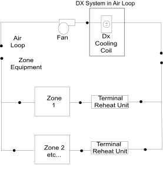

Figure 138. Schematic of CoilSystem:Cooling:DX Object in an Air Loop for a Blow Through Application

#### Field: Name

This alpha field contains the identifying name for this component.

#### Field: Availability Schedule Name

This alpha field contains the schedule name that contains information on the availability of the DX coil to operate. A schedule value of 0 indicates that the coil is off for that time period. A schedule value greater than 0 indicates that the coil can operate during the time period. If this field is blank, the schedule has values of 1 for all time periods.

#### Field: DX Cooling Coil System Inlet Node Name

This alpha field contains the identifying name given to the DX cooling coil inlet node, as specified in the DX cooling coil object.

#### Field: DX Cooling Coil System Outlet Node Name

This alpha field contains the identifying name given to the DX cooling coil outlet node, as specified in the cooling coil object.

#### Field: DX Cooling Coil System Sensor Node Name

This alpha field contains the identifying name given to the DX cooling coil control node, this is the node at which the temperature set point is specified by the set point manager.

#### Field: Cooling Coil Object Type

This alpha field specifies the type of DX cooling coil. The valid choices for this field are:

* Coil:Cooling:DX:SingleSpeed

* CoilSystem:Cooling:DX:HeatExchangerAssisted

* Coil:Cooling:DX:TwoSpeed

* Coil:Cooling:DX:TwoStageWithHumidityControlMode

* Coil:Cooling:DX:VariableSpeed

#### Field: Cooling Coil Name

This alpha field contains the identifying name of the DX cooling coil.

As shown in the example below, correct specification of this system requires specification of the DX Cooling Coil object in addition to the CoilSystem:Cooling:DX object.

#### Field: Dehumidification Control Type

This alpha field contains the type of dehumidification control. The following options are valid for this field:

**None** - meet sensible load only, no active dehumidification control

**MultiMode** - activate enhanced dehumidification mode as needed and operate to meet the sensible load. If a sensible load exists, the system will operate to meet that sensible load and may not meet the latent load. If no sensible load exists, and Run on Latent Load = Yes, the system will operate to meet the entire latent load. This option is used to model DX equipment with a switchable option such as subcool reheat. It is valid only with Cooling coil type= Coil:Cooling:DX:TwoStageWithHumidityControlMode or CoilSystem:Cooling:DX:HeatExchangerAssisted. If the Run on Latent Load option below is set to Yes, this option may require the use of a heating coil and heating coil outlet air temperature set point manager downstream of this cooling coil to maintain the temperature set point.

**CoolReheat** - cool beyond the dry-bulb setpoint as required to meet the humidity setpoint. It is valid only with Cooling coil type=Coil:Cooling:DX:TwoStageWithHumidityControlMode. This option requires the use of a heating coil and heating coil outlet air temperature set point manager downstream of this cooling coil to maintain the temperature set point.

The default is **None**. For all dehumidification controls, the max humidity setpoint on the control node is used. This must be set using a **ZoneControl:Humidistat** **ZoneControl:Humidistat** and one of:

- **SetpointManager:SingleZone:Humidity:Maximum**

- **SetpointManager:MultiZone:Humidity:Maximum**

- **SetpointManager:MultiZone:MaximumHumidity:Average**

objects and **SetpointManager:OutdoorAirPretreat** (optional) objects. When extra dehumidification is required, the equipment may not be able to meet the humidity setpoint if its full capacity is not adequate.

#### Field: Run on Sensible Load

This alpha field specifies if the unit will operate to meet a sensible load as determined by the inlet node dry-bulb temperature and the dry-bulb temperature setpoint on the control node. There are two valid choices, **Yes** or **No**. If **Yes**, unit will run if there is a sensible load. If **No**, unit will not run if there is only a sensible load. The default is **Yes**.

#### Field: Run on Latent Load

This alpha field specifies if the unit will operate to meet a latent load as determined by the inlet node humidity ratio and the max humidity setpoint on the control node. There are two valid choices, **Yes** or **No**. If **Yes**, unit will run if there is a latent load. If both a sensible and latent load exist, the system will operate to maintain the temperature set point. When only a latent load exists, the system will operate to meet the humidity ratio set point and requires the use of a heating coil and heating coil outlet air temperature set point manager downstream of this cooling coil to maintain the temperature set point. If **No**, unit will not run if there is only a latent load. The default is **No**.

#### Field: Use Outdoor Air DX Cooling Coil

This input field enables the Coil System DX Coil to be used for low air flow to capacity ratio range ( 100     300 cfm/ton).   This flow to capacity ratio range is common in 100% dedicated outdoor air system (DOAS) applications. Other airloop or zone HVAC systems may use this input filed if they operate at such a low flow to capacity ratio range. There are two valid choices, **Yes** or **No**. If **Yes**, the DX cooling coil is forced to operate in this flow to capacity ratio range or runs as 100% DOAS DX coil. If **No**, DX coil is used as regular DX coil. This input field is optional.

#### Field: Outdoor Air DX Cooling Coil Leaving Minimum Air Temperature

This input field is the DX cooling coil leaving supply air minimum temperature specified for frost control.   The DX cooling coil leaving air temperature is not allowed to exceed this minimum coil leaving air temperature.   The DX cooling coil frost controller adjusts or limits the desired coil outlet air setpoint temperature when the coil outlet temperature exceeds this minimum temperature limit specified.   This input field is optional and only used along with in the input field above. The minimum and maximum values of this input field are 0.0 &deg;C and 7.2 &deg;C, and the default value is 2.0 &deg;C.


An example IDF specification:

```idf
CoilSystem:Cooling:DX,
       DX Cooling Coil System 1,!- Name
       CoolingCoilAvailSched,     !- Availability Schedule Name
       Cooling Coil Air Inlet Node,   !- DX Cooling Coil System Inlet Node Name
       Air Loop Outlet Node,       !- DX Cooling Coil System Outlet Node Name
       Air Loop Outlet Node,       !- DX Cooling Coil System Sensor Node Name
       Coil:Cooling:DX:SingleSpeed,   !- Cooling Coil Object Type
       ACDXCoil 1,                           !- Cooling Coil Name
       None,                                       !- Dehumidification Control Type
       Yes,                                         !- Run on Sensible Load
       No,                                           !- Run on Latent Load
       Yes,                                         !- Use DOAS DX Cooling Coil
       2.0;                                         !- DOAS DX Cooling Coil Leaving Minimum Air Temperature


Coil:Cooling:DX:SingleSpeed,
       ACDXCoil 1,                           !- Name
       CoolingCoilAvailSched,     !- Availability Schedule Name
       25000,                                     !- Gross Rated Total Cooling Capacity {W}
       0.75,                                       !- Gross Rated Sensible Heat Ratio
       3.0,                                         !- Gross Rated Cooling COP
       1.3,                                         !- Rated Air Flow Rate {m3/s}
       Cooling Coil Air Inlet Node,   !- Air Inlet Node Name
       Air Loop Outlet Node,       !- Air Outlet Node Name
       WindACCoolCapFT,                 !- Total Cooling Capacity Function of Temperature Curve Name
       WindACCoolCapFFF,               !- Total Cooling Capacity Function of Flow Fraction Curve Name
       WindACEIRFT,                         !- Energy Input Ratio Function of Temperature Curve Name
       WindACEIRFFF,                       !- Energy Input Ratio Function of Flow Fraction Curve Name
       WindACPLFFPLR;                     !- Part Load Fraction Correlation Curve Name
```


### DX Cooling Coil System Outputs

***All DX Coils:***

* HVAC,Average,Coil System Frost Control Status


***Coil Type= Coil:Cooling:DX:TwoStageWithHumidityControlMode***

* HVAC,Average,Coil System Cycling Ratio

* HVAC,Average,Coil System Compressor Speed Ratio


***Coil types=Coil:Cooling:DX:SingleSpeed & CoilSystem:Cooling:DX:HeatExchangerAssisted***

* HVAC,Average,Coil System Part Load Ratio

#### Coil System Cycling Ratio

The system may operate for the entire system timestep, but to meet the load the compressor can cycle on and off. This reports the fraction of the system timestep that the compressor is operating. (1.0 is continuous, 0.0 is off).

#### Coil System Compressor Speed Ratio

This is the ratio of time in a system timestep that the compressor is at rated speed. The compressor speed ratio reports (1.0 is max, 0.0 is min) and any value in between as it is averaged over the timestep.

#### Coil System Part Load Ratio

The DX system can operate with a cycling compressor or a varying speed compressor, This variable reports the fraction of the Full Load that is met during the system timestep. This can differ from the cycling part load ratio or the compressor speed ratio. (1.0 is Full Load and 0.0 is no load)

#### Coil System Frost Control Status

This is a flag indicating whether frost control is active at current time step or not.   Frost control is activated or enforced when the sensible load control requires DX cooling coil outlet air temperature below the user specified minimum temperature or when the dehumidification load control requires DX cooling coil outlet air humidity ratio below the saturation humidity ratio corresponding to the user specified minimum temperature for frost control. Frost control status of zero means no active frost control, a value of 1 or 2 indicates that frost control is active.   If frost control status is 1, then the frost control was enforced when the cooling coil is run to meet sensible load.   If the frost control status value is 2, then the control was enforced when the cooling coil is run to meet latent load. When frost control is active the DX cooling coil setpoint value is modified based on user specified limit.

### CoilSystem:Heating:DX

The CoilSystem:Heating:DX object is a virtual container component for a DX heating coil that provides the controls needed to operate the coil.   Only single speed DX air-to-air heating coils are supported.


This component may be used as a heating coil in constant volume or variable volume air handlers.   It can also be used in an outside air system (by including it in an AirLoopHVAC:OutdoorAirSystem:EquipmentList object)or in a zone outdoor air unit (by including it in an ZoneHVAC:OutdoorAirUnit:EquipmentList object).   This object is the one that is listed in the Branch or equipment list object rather than the coil itself.

The inlet and outlet nodes for the DX heat pump system are defined in the heating coil object.   The control node is always the outlet node of the coil.   This DX heat pump heating system requires that a (drybulb) temperature setpoint be placed on the outlet node using either a setpoint manager or the energy management system.   The coil is controlled to attempt to meet that setpoint using a part load ratio modeling approach.

This model only supports continuous fan and cycling compressor operation -- cycling fan modeling is not available with this model.

#### Field: Name

This alpha field contains the identifying name for this component.

#### Field: Availability Schedule Name

This alpha field contains the schedule name that contains information on the availability of the DX coil to operate. A schedule value of 0 indicates that the coil is off for that time period. A schedule value greater than 0 indicates that the coil can operate during the time period. If this field is blank, the schedule has values of 1 for all time periods.

#### Field: Heating Coil Object Type

This alpha field specifies the type of DX heating coil.   This model currently supports only single speed DX heat pump heating coils and the only options for this field are Coil:Heating:DX:SingleSpeed and Coil:Heating:DX:VariableSpeed.

#### Field: Heating Coil Name

This alpha field specifies the unique name of the DX heating coil.   This field references the name of a Coil:Heating:DX:SingleSpeed that needs to be defined elsewhere in the input file.


An example of a DX heating coil system follows.

```idf
CoilSystem:Heating:DX,
       HeatPump DX Coil 1, !- Name
       FanAndCoilAvailSched , !- Availability Schedule Name
       Coil:Heating:DX:SingleSpeed,   !- Heating Coil Object Type
       Heat Pump DX Heating Coil 1;   !- Heating Coil Name


   Coil:Heating:DX:SingleSpeed,
       Heat Pump DX Heating Coil 1,   !- Name
       FanAndCoilAvailSched,       !- Availability Schedule Name
       autosize,                               !- Gross Rated Heating Capacity {W}
       2.75,                                       !- Gross Rated Heating COP {W/W}
       autosize,                               !- Rated Air Flow Rate {m3/s}
       Heating Coil Air Inlet Node,   !- Air Inlet Node Name
       SuppHeating Coil Air Inlet Node,   !- Air Outlet Node Name
       HPACHeatCapFT,                     !- Heating Capacity Function of Temperature Curve Name
       HPACHeatCapFFF,                   !- Heating Capacity Function of Flow Fraction Curve Name
       HPACHeatEIRFT,                     !- Energy Input Ratio Function of Temperature Curve Name
       HPACHeatEIRFFF,                   !- Energy Input Ratio Function of Flow Fraction Curve Name
       HPACCOOLPLFFPLR,                 !- Part Load Fraction Correlation Curve Name
       ,                                               !- Defrost Energy Input Ratio Function of Temperature Curve Name
       -8.0,                                       !- Minimum Outdoor Dry-Bulb Temperature for Compressor Operation {C}
       5.0,                                         !- Maximum Outdoor Dry-Bulb Temperature for Defrost Operation {C}
       200.0,                                     !- Crankcase Heater Capacity {W}
       10.0,                                       !- Maximum Outdoor Dry-Bulb Temperature for Crankcase Heater Operation {C}
       Resistive,                             !- Defrost Strategy
       TIMED,                                     !- Defrost Control
       0.166667,                               !- Defrost Time Period Fraction
       autosize,                               !- Resistive Defrost Heater Capacity {W}
       Heat Pump 1 Evaporator Node;
```


### DX Heating Coil System Outputs

#### Coil System Part Load Ratio

The DX system can operate with a cycling compressor or a varying speed compressor, This variable reports the fraction of the Full Load that is met during the system timestep. This can differ from the cycling part load ratio or the compressor speed ratio. (1.0 is Full Load and 0.0 is no load)

### CoilSystem:Cooling:DX:HeatExchangerAssisted

The heat exchanger-assisted DX cooling coil is a    virtual    component consisting of a direct expansion (DX) cooling coil and an air-to-air heat exchanger as shown in Figure 139 below. The air-to-air heat exchanger pre-conditions the air entering the cooling coil, and reuses this energy to post-condition the supply air leaving the cooling coil. This heat exchange process improves the latent removal performance of the cooling coil by allowing it to dedicate more of its cooling capacity toward dehumidification (lower sensible heat ratio).

This compound object models the basic operation of an air-to-air heat exchanger in conjunction with a cooling coil. The heat exchanger-assisted DX cooling coil does not have an operating schedule of its own; its operating schedule is governed by the availability schedules for the DX cooling coil and the air-to-air heat exchanger. This compound object is used in place of where a DX cooling coil object would normally be used by itself.

To model a heat exchanger-assisted DX cooling coil, the input data file should include the following objects:

- CoilSystem:Cooling:DX:HeatExchangerAssisted object

- Air-to-air heat exchanger object (HeatExchanger:AirToAir:FlatPlate, HeatExchanger:AirToAir:SensibleAndLatent, or HeatExchanger:Desiccant:BalancedFlow)

- DX cooling coil object (Coil:Cooling:DX:SingleSpeed)

In terms of controlling the operation of the heat exchanger, the heat exchanger is assumed to always provide its heat transfer when the associated DX cooling coil is operating and no high humidity control mechanism is specified. However, the heat exchanger   s energy transfer may be controlled (i.e., turned on and off) based on a zone air humidity level using either a humidistat (ref. AirLoopHVAC:Unitary:Furnace:HeatCool or AirLoopHVAC:UnitaryHeatCool) or a humidistat and a maximum humidity set point manager to place a humidity ratio set point on the appropriate control node (ref. CoilSystem:Cooling:DX). This model may also be used with the unitary changeover bypass system and the unitary air-to-air heat pump system (ref. AirLoopHVAC:UnitaryHeatCool:VAVChangeoverBypass and AirLoopHVAC:UnitaryHeatPump:AirToAir); however, the heat exchanger is assumed to always provide its heat transfer when the cooling coil operates and cannot be turned on and off based on a zone air humidity set point. Two zone air conditioners may also use this model for improved dehumidification. The first type is the packaged terminal heat pump (ref. ZoneHVAC:PackagedTerminalHeatPump) where the heat exchanger   s heat transfer is always active whenever the cooling coil operates. The second type is the window air conditioner (ref. ZoneHVAC:WindowAirConditioner) where the heat exchanger   s heat transfer is always active when the cooling coil operates and no high humidity control mechanism is specified, OR the heat exchanger   s heat transfer may be controlled based on zone air humidity level if a humidistat and high humidity set point manager are specified (maximum humidity ratio set point placed on the heat exchanger   s exhaust air outlet node, ref. Figure 139).

Links to the cooling coil and air-to-air heat exchanger specifications are provided in the input data syntax for this compound object. A description of each input field for this compound object is provided below.


Figure 139. Schematic of the CoilSystem:Cooling:DX:HeatExchangerAssisted compound object

NOTE: Node naming shown in Figure 139 is representative for HeatExchanger:AirToAir:SensibleAndLatent. For HeatExchanger:AirToAir:FlatPlate, the exhaust air nodes are referred to as    secondary air    nodes. For HeatExchanger:Desiccant:BalancedFlow, the supply air nodes are referred to as    regeneration air    nodes and the exhaust air nodes as    process air    nodes.

#### Field: Name

A unique user-assigned name for the heat exchanger-assisted DX cooling coil. Any reference to this compound component by another object will use this name.

#### Field: Heat Exchanger Object Type

This alpha field denotes the type of heat exchanger being modeled. Valid choices are:

* HeatExchanger:AirToAir:FlatPlate

* HeatExchanger:AirToAir:SensibleAndLatent

* HeatExchanger:Desiccant:BalancedFlow

#### Field: Heat Exchanger Name

This alpha field denotes the name of the air-to-air heat exchanger being modeled.

#### Field: Cooling Coil Object Type

This alpha field denotes the type of DX cooling coil being modeled. The only valid choice is Coil:Cooling:DX:SingleSpeed.

#### Field: Cooling Coil Name

This alpha field denotes the name of the DX cooling coil being modeled.

Following is an example input for this compound object:

```idf
CoilSystem:Cooling:DX:HeatExchangerAssisted,
       HeatExchangerAssistedCoolingCoil,               ! Name of the heat exchanger assisted cooling coil
       HeatExchanger:AirToAir:SensibleAndLatent,       ! Heat exchanger type
       Air to Air Heat Exchanger 1,                    ! Heat exchanger name
       Coil:Cooling:DX:SingleSpeed,                    ! Cooling coil type
       DX Cooling Coil 1;                              ! Cooling coil name


   HeatExchanger:AirToAir:SensibleAndLatent,
       Air to Air Heat Exchanger 1,        !- Heat exchanger name
       FanAndCoilAvailSched,               !- Availability schedule name
       1.3,                                !- Nominal supply air flow rate {m3/s}
       .2,                                 !- Sensible effectiveness at 100% airflow heating condition
       .0,                                 !- Latent effectiveness at 100% airflow heating condition
       .23,                                !- Sensible effectiveness at 75% airflow heating condition
       .0,                                 !- Latent effectiveness at 75% airflow heating condition
       .2,                                 !- Sensible effectiveness at 100% airflow cooling condition
       .0,                                 !- Latent effectiveness at 100% airflow cooling condition
       .23,                                !- Sensible effectiveness at 75% airflow cooling condition
       .0,                                 !- Latent effectiveness at 75% airflow cooling condition
       HeatExchangerSupplyAirInletNode,    !- Supply air inlet node name
       DX Cooling Coil Air Inlet Node,     !- Supply air outlet node name
       HeatExchangerExhaustAirInletNode,   !- Exhaust air inlet node name
       HeatExchangerExhaustAirOutletNode,  !- Exhaust air outlet node name
       50.0,                               !- Nominal electric power {W}
       No,                                 !- Supply air outlet temperature control
       Rotary,                             !- Heat exchanger type
       None;                               !- Frost control type


   Coil:Cooling:DX:SingleSpeed,
       DX Cooling Coil 1,                  !- Coil Name
       FanAndCoilAvailSched,               !- Availability Schedule
       25000,                              !- Gross Rated Total Cooling Capacity {W}
       0.75,                               !- Gross Rated Sensible Heat Ratio
       3.0,                                !- Gross Rated Cooling COP
       1.3,                                !- Rated Air Flow Rate {m3/s}
       DX Cooling Coil Air Inlet Node,     !- Coil Air Inlet Node
       HeatExchangerExhaustAirInletNode,   !- Coil Air Outlet Node
       ACCoolCapFT,                  !- Total Cooling Capacity Modifier Curve (function of temperature)
       ACCoolCapFFF,                 !- Total Cooling Capacity Modifier Curve (function of flow fraction)
       ACEIRFT,                      !- Energy Input Ratio Modifier Curve (function of temperature)
       ACEIRFFF,                     !- Energy Input Ratio Modifier Curve (function of flow fraction)
       ACPLFFPLR;                    !- Part Load Fraction Correlation (function of part load ratio)
```


### CoilSystem:Cooling:DX:HeatExchangerAssisted Outputs

No variables are reported for this compound object. However, outputs are provided by the cooling coil and heat exchanger that are specified.

### CoilSystem:Cooling:Water:HeatExchangerAssisted

The heat exchanger-assisted water cooling coil is a    virtual    component consisting of a chilled-water cooling coil and an air-to-air heat exchanger as shown in Figure 140 below. The air-to-air heat exchanger precools the air entering the cooling coil, and reuses this energy to reheat the supply air leaving the cooling coil. This heat exchange process improves the latent removal performance of the cooling coil by allowing it to dedicate more of its cooling capacity toward dehumidification (lower sensible heat ratio).


Figure 140. Schematic of the CoilSystem:Cooling:Water:HeatExchangerAssisted compound object

Note: Node naming shown in Figure 140 is representative for HeatExchanger:AirToAir:SensibleAndLatent. For HeatExchanger:AirToAir:FlatPlate, the exhaust air nodes are referred to as    secondary air    nodes.

This compound object models the basic operation of an air-to-air heat exchanger in conjunction with a chilled-water cooling coil. The heat exchanger-assisted water cooling coil does not have an operating schedule of its own; its operating schedule is governed by the availability schedules for the chilled-water cooling coil and the air-to-air heat exchanger. Heat exchange will occur whenever the heat exchanger is available to operate (via its availability schedule) and a temperature difference exists between the two air streams -- there is currently no method to enable or disable heat exchange based on zone air humidity level. This compound object is used in place of where a chilled-water cooling coil object would normally be used by itself.

To model a heat exchanger-assisted water cooling coil, the input data file should include the following objects:

- CoilSystem:Cooling:Water:HeatExchangerAssisted compound object

- Air-to-air heat exchanger object (HeatExchanger:AirToAir:FlatPlate or HeatExchanger:AirToAir:SensibleAndLatent)

- Chilled-water cooling coil object (Coil:Cooling:Water or Coil:Cooling:Water:DetailedGeometry)

Links to the cooling coil and air-to-air heat exchanger specifications are provided in the input data syntax for this compound object. A description of each input field for this compound object is provided below.

#### Field: Name

A unique user-assigned name for the heat exchanger-assisted water cooling coil. Any reference to this compound component by another object (e.g., ZoneHVAC:UnitVentilator, ZoneHVAC:FourPipeFanCoil, component in an air loop Branch object) will use this name.

#### Field: Heat Exchanger Object Type

This alpha field denotes the type of heat exchanger being modeled. Valid choices are:

HeatExchanger:AirToAir:FlatPlate

HeatExchanger:AirToAir:SensibleAndLatent

#### Field: Heat Exchanger Name

This alpha field denotes the name of the air-to-air heat exchanger being modeled.

#### Field: Cooling Coil Object Type

This alpha field denotes the type of chilled-water cooling coil being modeled. Valid choices are:

Coil:Cooling:Water

Coil:Cooling:Water:DetailedGeometry

#### Field: Cooling Coil Name

This alpha field denotes the name of the chilled-water cooling coil being modeled.

Following is an example input for this compound object:

```idf
CoilSystem:Cooling:Water:HeatExchangerAssisted,
       Heat Exchanger Assisted Cooling Coil 1, !- Name of the heat exchanger assisted cooling coil
       HeatExchanger:AirToAir:FlatPlate,     !- Heat exchanger type
       Heat Exchanger Assisting Cooling Coil,   !- Heat exchanger name
       Coil:Cooling:Water:DetailedGeometry,                 !- Cooling coil type
       Main Cooling Coil 1;                                       !- Cooling coil name


HeatExchanger:AirToAir:FlatPlate,
       Heat Exchanger Assisting Cooling Coil,   !- Name
       CoolingCoilAvailSched,     !- Availability Schedule Name
       Counter Flow,                       !- flow arrangement
       Yes,                                         !- Economizer lockout
       1.0,                                         !- hA ratio
       1.32,                                       !- Nominal supply air flow rate {m3/s}
       24.0,                                       !- Nominal supply air inlet temperature {C}
       21.0,                                       !- Nominal supply air outlet temperature {C}
       1.32,                                       !- Nominal secondary air flow rate {m3/s}
       12.0,                                       !- Nominal secondary air inlet temperature {C}
       100.0,                                     !- Nominal electric power {W}
       Mixed Air Node 1,               !- Supply air inlet node
       Main Cooling Coil 1 Inlet Node,   !- Supply air outlet node
       Main Cooling Coil 1 Outlet Node, !- Secondary air inlet node
       Main Heating Coil 1 Inlet Node;   !- Secondary air outlet node


Coil:Cooling:Water:DetailedGeometry,
       Main Cooling Coil 1,         !- Coil Name
       CoolingCoilAvailSched,     !- Availability Schedule Name
       autosize,                               !- Max Water Flow Rate of Coil {m3/s}
       autosize,                               !- Tube Outside Surf Area {m2}
       autosize,                               !- Total Tube Inside Area {m2}
       autosize,                               !- Fin Surface Area {m2}
       autosize,                               !- Minimum Air Flow Area {m2}
       autosize,                               !- Coil Depth {m}
       autosize,                               !- Fin Diameter {m}
       ,                                               !- Fin Thickness {m}
      ,                                               !- Tube Inside Diameter {m}
       ,                                               !- Tube Outside Diameter {m}
       ,                                               !- Tube Thermal Conductivity {W/m-K}
       ,                                               !- Fin Thermal Conductivity {W/m-K}
       ,                                               !- Fin Spacing {m}
       ,                                               !- Tube Depth Spacing {m}
       ,                                               !- Number of Tube Rows
       autosize,                               !- Number of Tubes per Row
       Main Cooling Coil 1 Water Inlet Node,   !- Coil_Water_Inlet_Node
       Main Cooling Coil 1 Water Outlet Node, !- Coil_Water_Outlet_Node
       Main Cooling Coil 1 Inlet Node,     !- Coil_Air_Inlet_Node
       Main Cooling Coil 1 Outlet Node;   !- Coil_Air_Outlet_Node
```

### CoilSystem:Cooling:Water:HeatExchangerAssisted Outputs

No variables are reported for this compound object. However, outputs are provided by the cooling coil and heat exchanger that are specified.

### Coil:WaterHeating:AirToWaterHeatPump:Pumped

EnergyPlus can model a heat pump water heater (HPWH) consisting of a water heater tank (e.g., `WaterHeater:Mixed`), a direct expansion (DX) coil (i.e., an air-to-water DX compression system which includes a water heating coil, air coil, compressor, and water pump), and a fan to provide air flow across the air coil associated with the DX compression system. These objects work together to model a system which heats water using zone air, outdoor air, or a combination of zone and outdoor air as the primary heat source.

The `WaterHeater:HeatPump:PumpedCondenser` compound object, water heater tank object (e.g., `WaterHeater:Mixed`), and fan object (e.g., `Fan:OnOff`) are defined elsewhere in this reference document. `Coil:WaterHeating:AirToWaterHeatPump:Pumped` object described here models an air-to-water DX compression system to determine its air-side and water-side performance. This DX coil object calculates the air-side sensible and latent cooling capacity at the specific operating conditions for each simulation timestep, as well as the condenser's water-side temperature difference at a given condenser water flow rate.

The heat pump water heater DX coil model performs the following major functions:

- calculates the electric consumption of the DX compressor and water pump

- calculates the amount of heat delivered to the water tank

- calculates the electric consumption of the compressor's crankcase heater

- calculates the air-side performance of the DX coil

The input fields for this object are described below in detail:

#### Field: Name

This alpha field defines a unique user-assigned name for an instance of a heat pump water heater DX coil. Any reference to this coil by another object (e.g., `WaterHeater:HeatPump:PumpedCondenser`) will use this name.

#### Field: Rated Heating Capacity

This numeric field defines the DX coil heating capacity in Watts at the rated evaporator inlet air temperatures, rated condenser inlet water temperature, rated evaporator air flow rate, and rated condenser water flow rate specified below. Values must be greater than 0. This value represents water heating capacity, and it may or may not include the impact of condenser pump heat (see field Condenser Pump Heat Included in Rated Heating Capacity below).

#### Field: Rated COP

This numeric field defines the DX coil's water heating coefficient of performance (COP=water heating capacity in watts divided by electrical power input in watts) at rated conditions (rated inlet temperatures and flow rates specified below). This input not only determines the electric energy use of the heat pump DX coil, but also the amount of total air cooling provided by the evaporator. The rated COP includes compressor power, and may or may not include condenser pump power or evaporator fan power (see field Evaporator Fan Power Included in Rated COP and field Condenser Pump Power Included in Rated COP). Values must be greater than 0. If this field is left blank, the default value is 3.2.

#### Field: Rated Sensible Heat Ratio

This numeric field defines the air-side sensible heat ratio (SHR=sensible cooling capacity divided by total cooling capacity) of the DX coil at rated conditions (rated inlet temperatures and flow rates specified below). This value should not include the effect of evaporator fan heat. Values must be greater than or equal to 0.5, and less than or equal to 1.0. The default value is 0.85.

#### Field: Rated Evaporator Inlet Air Dry-Bulb Temperature

This numeric field defines the evaporator inlet air dry-bulb temperature, in degrees Celsius, that corresponds to rated coil performance (heating capacity, COP and SHR). Values must be greater than 5 &deg;C. If this field is left blank, the default value is 19.7 &deg;C.

#### Field: Rated Evaporator Inlet Air Wet-Bulb Temperature

This numeric field defines the evaporator inlet air wet-bulb temperature, in degrees Celsius, that corresponds to rated coil performance (heating capacity, COP and SHR). Values must be greater than 5 &deg;C. If this field is left blank, the default value is 13.5 &deg;C.

#### Field: Rated Condenser Inlet Water Temperature

This numeric field defines the condenser inlet water temperature, in degrees Celsius, that corresponds to rated coil performance (heating capacity, COP and SHR). Values must be greater than 25 &deg;C. If this field is left blank, the default value is 57.5 &deg;C.

#### Field: Rated Evaporator Air Flow Rate

This numeric field defines the evaporator air volume flow rate in cubic meters per second at rated conditions. Values must be greater than 0. If this field is left blank or autocalculated (field value = **autocalculate**), the default value is 5.035E-5 m<sup>3</sup>/s/W (31.25 cfm/MBH) multiplied by the Rated Heating Capacity specified above. When autocalculating the rated evaporator air volumetric flow rate, a zone sizing object is not required.

#### Field: Rated Condenser Water Flow Rate

This numeric field defines the condenser water volumetric flow rate in cubic meters per second at rated conditions. Values must be greater than 0. If this field is left blank or autocalculated (field value = **autocalculate**), the default value is 4.487E-8 m<sup>3</sup>/s/W (0.208 gpm/MBH) multiplied by the Rated Heating Capacity specified above. When autocalculating the rated condenser water volumetric flow rate, a zone sizing object is not required. A warning message will be issued if the ratio of Rated Condenser Water Volumetric Flow Rate to Rated Heating Capacity is less than 1.79405E-8 m<sup>3</sup>/s/W (0.083 gpm/MBH) or greater than 8.97024E-8 m<sup>3</sup>/s/W (0.417 gpm/MBH), but the simulation will continue.

#### Field: Evaporator Fan Power Included in Rated COP

This choice field specifies if evaporator fan power is included in the rated COP defined above. This input impacts the calculation of compressor electric power and total air cooling provided by the evaporator for each simulation timestep. If Yes is selected, the evaporator fan power is subtracted from the total electric heating power when calculating total evaporator cooling capacity. If No is selected, it is assumed that the total heating power does not include evaporator fan power. If this field is left blank, the default is Yes. See the Engineering Reference section for `Coil:WaterHeating:AirToWaterHeatPump:\*` for further details.

#### Field: Condenser Pump Power Included in Rated COP

This choice field specifies if condenser pump power is included in the rated COP defined above. This input impacts the calculation of compressor electric power which then impacts the total air cooling provided by the evaporator for each simulation timestep. If Yes is selected, the condenser pump power is subtracted from the total electric heating power when calculating total evaporator cooling capacity. If No is selected, it is assumed that the total heating power does not include the condenser pump. If this field is left blank, the default is No. See Engineering Reference section for `Coil:WaterHeating:AirToWaterHeatPump:\*` for further details.

#### Field: Condenser Pump Heat Included in Rated Heating Capacity and Rated COP

This choice field specifies if condenser pump heat is included in the rated heating capacity and rated COP defined above. This input impacts the calculation of compressor electric power and total air cooling provided by the evaporator for each simulation timestep. If Yes is selected, the condenser pump heat is already included in the rated heating capacity and rated COP. If No is selected, it is assumed that the rated heating capacity and rated COP do not include the condenser pump heat, and pump heat is added to the total water heating capacity based on the Condenser Water Pump Power and Fraction of Condenser Pump Heat to Water fields below. If this field is left blank, the default is No. See Engineering Reference section for `Coil:WaterHeating:AirToWaterHeatPump:\*` for further details.

#### Field: Condenser Water Pump Power

This numeric field defines the DX coil's condenser pump power in Watts. This is the operating pump power as installed. Values must be greater than or equal to 0. If this field is left blank, the default value is 0. A warning message will be issued if the ratio of Condenser Water Pump Power to Rated Heating Capacity exceeds 0.1422 W/W (41.67 Watts/MBH), but the simulation will continue.

#### Field: Fraction of Condenser Pump Heat to Water

This numeric field defines the fraction of condenser pump heat that is transferred to the condenser water. The pump is assumed to be downstream of the condenser water coil, and this field is used to determine the water temperature at the condenser outlet node when the field Condenser Pump Power Included in Rated Heating Capacity is set to No. Values must be greater than or equal to 0 and less than or equal to 1. If this field is left blank, the default value is 0.2.

#### Field: Evaporator Air Inlet Node Name

This alpha field defines the name of the air node from which the evaporator coil draws its inlet air.

#### Field: Evaporator Air Outlet Node Name

This alpha field defines the name of the air node to which the evaporator coil sends its outlet air.

#### Field: Condenser Water Inlet Node Name

This alpha field defines the name of the node from which the DX coil condenser draws its inlet water. This node name must also match the source side outlet node name for the water heater tank connected to this DX coil (ref: Water Heaters).

#### Field: Condenser Water Outlet Node Name

This alpha field defines the name of the node to which the heat pump condenser sends it outlet water. This node name must also match the source side inlet node name for the water heater tank connected to this DX coil (ref: Water Heaters).

#### Field: Crankcase Heater Capacity

This numeric field defines the compressor's crankcase heater capacity in Watts. The crankcase heater only operates when the compressor is off and the air surrounding the compressor is below the Maximum Ambient Temperature for Crankcase Heater Operation specified below.

#### Field: Maximum Ambient Temperature for Crankcase Heater Operation

This numeric field defines the maximum ambient temperature for crankcase heater operation in degree Celsius. The crankcase heater only operates when the air surrounding the compressor is below this maximum temperature value and the compressor is off. The ambient temperature surrounding the compressor is set by the Heat Pump:Water Heater parent object (field Compressor Location).

#### Field: Evaporator Air Temperature Type for Curve Objects

This choice field specifies the air temperature type used for the heating capacity and COP modifier curve objects below. The valid selections are Dry-bulb Temperature and Wet-bulb Temperature. If dry-bulb temperature is selected, the inlet air dry-bulb temperature entering the heat pump DX coil and fan section is used to evaluate the curve objects. If wet-bulb temperature is selected, the inlet air wet-bulb temperature entering the heat pump DX coil and fan section is used to evaluate the curve objects. If this field is left blank and the following curve names are defined, the default value is wet-bulb temperature. If the following curve names are not defined, this field is not used.

#### Field: Heating Capacity Function of Temperature Curve Name

This alpha field specifies the name of a **biquadratic** or **cubic** performance curve object (ref: Performance Curves) that defines the variation in DX coil heating capacity as a function of inlet fluid (air and water) temperatures. The biquadratic curve uses evaporator inlet air temperature (dry-bulb or wet-bulb temperature based on the field Evaporator Air Temperature Type for Curve Objects defined above) and condenser inlet water temperature as the independent variables. The cubic curve uses evaporator inlet air (dry-bulb or wet-bulb) temperature as the independent variable. The output of this curve is multiplied by the rated heating capacity to give the heating capacity at specific operating conditions (i.e., at temperatures different from the rating point temperatures). The curve should be normalized to have the value of 1.0 at the rating point temperatures. If this field is left blank, the heating capacity remains constant (curve value assumed to be 1.0 for all conditions).

#### Field: Heating Capacity Function of Air Flow Fraction Curve Name

This alpha field specifies the name of a **quadratic** or **cubic** performance curve object (ref: Performance Curves) that defines the variation in DX coil heating capacity as a function of the ratio of actual air flow rate across the evaporator coil to the rated evaporator air flow rate. The output of this curve is multiplied by the rated heating capacity and the heating capacity modifier curve (function of temperature) to give the DX coil heating capacity at the specific inlet fluid temperatures and air flow rate at which the coil is operating. The curve should be normalized to have the value of 1.0 at the rated evaporator air flow rate (air flow fraction of 1.0). If this field is left blank, the heating capacity remains constant (curve value assumed to be 1.0 for all air flow rates).

#### Field: Heating Capacity Function of Water Flow Fraction Curve Name

This alpha field specifies the name of a **quadratic** or **cubic** performance curve object (ref: Performance Curves) that defines the variation in DX coil heating capacity as a function of the ratio of actual water flow rate through the condenser to the rated condenser water flow rate. The output of this curve is multiplied by the rated heating capacity and the output from the two other heating capacity modifier curves (function of temperature and function of air flow fraction) to give the DX coil heating capacity at the specific inlet fluid temperatures and flow rates at which the coil is operating. The curve should be normalized to have the value of 1.0 at the rated condenser water flow rate (water flow fraction of 1.0). If this field is left blank, the heating capacity remains constant (curve value assumed to be 1.0 for all water flow rates).

#### Field: Heating COP Function of Temperature Curve Name

This alpha field specifies the name of a **biquadratic** or **cubic** performance curve object (ref: Performance Curves) that defines the variation in DX coil heating COP as a function of inlet fluid (air and water) temperatures. The biquadratic curve uses evaporator inlet air temperature (dry-bulb or wet-bulb temperature based on the field Evaporator Air Temperature Type for Curve Objects defined above) and condenser inlet water temperature as the independent variables. The cubic curve uses evaporator inlet air (dry-bulb or wet-bulb) temperature as the independent variable. The output of this curve is multiplied by the rated COP to give the heating COP at specific operating conditions (i.e., at temperatures different from the rating point temperatures). The curve should be normalized to have the value of 1.0 at the rating point temperatures. If this field is left blank, the COP remains constant (curve value assumed to be 1.0 for all conditions).

#### Field: Heating COP Function of Air Flow Fraction Curve Name

This alpha field specifies the name of a **quadratic** or **cubic** performance curve object (ref: Performance Curves) that defines the variation in DX coil heating COP as a function of the ratio of actual air flow rate across the evaporator coil to the rated evaporator air flow rate. The output of this curve is multiplied by the rated COP and the heating COP modifier curve (function of temperature) to give the heating COP at the specific inlet fluid temperatures and air flow rate at which the coil is operating. The curve should be normalized to have the value of 1.0 at the rated evaporator air flow rate (air flow fraction of 1.0). If this field is left blank, the heating COP remains constant (curve value assumed to be 1.0 for all air flow rates).

#### Field: Heating COP Function of Water Flow Fraction Curve Name

This alpha field specifies the name of a **quadratic** or **cubic** performance curve object (ref: Performance Curves) that defines the variation in DX coil heating COP as a function of the ratio of actual water flow rate through the condenser to the rated condenser water flow rate.. The output of this curve is multiplied by the rated COP and the output from the two other heating COP modifier curves (function of temperature and function of air flow fraction) to give the DX coil heating COP at the specific inlet fluid temperatures and flow rates at which the coil is operating. The curve should be normalized to have the value of 1.0 at the rated condenser water flow rate (water flow fraction of 1.0). If this field is left blank, the heating COP remains constant (curve value assumed to be 1.0 for all water flow rates).

#### Field: Part Load Fraction Correlation Curve Name

This alpha field defines the name of a **quadratic** or **cubic** performance curve (Ref: Performance Curves) that parameterizes the variation of electrical power input to the DX unit as a function of the part load ratio (PLR, sensible cooling load/steady-state sensible cooling capacity). The product of the rated EIR and EIR modifier curves is divided by the output of this curve to give the effective EIR for a given simulation timestep. The part load fraction (PLF) correlation accounts for efficiency losses due to compressor cycling.

The part load fraction correlation should be normalized to a value of 1.0 when the part load ratio equals 1.0 (i.e., no efficiency losses when the compressor(s) run continuously for the simulation timestep). For PLR values between 0 and 1 (0 &lt;= PLR &lt; 1), the following rules apply:

PLF &gt;= 0.7     and     PLF &gt;= PLR

If PLF &lt; 0.7 a warning message is issued, the program resets the PLF value to 0.7, and the simulation proceeds. The runtime fraction of the coil is defined as PLR/PLF. If PLF &lt; PLR, then a warning message is issued and the runtime fraction of the coil is limited to 1.0.

A typical part load fraction correlation for a conventional, single-speed DX cooling coil (e.g., residential unit) would be:

           PLF = 0.85 + 0.15(PLR)

If the user wishes to model no efficiency degradation due to compressor cycling, the part load fraction correlation should be defined as follows:

           PLF = 1.0 + 0.0(PLR)

Following is an example input for the `Coil:WaterHeating:AirToWaterHeatPump:Pumped` object:

```idf
Coil:WaterHeating:AirToWaterHeatPump:Pumped,
       Zone4HPWHDXCoil,           !- Coil Name
       4000.0,                    !- Heating Capacity {W}
       3.2,                       !- Rated COP {W/W}
       0.6956,                    !- Rated SHR (gross)
       19.7,                      !- Rated Evaporator Inlet Air Dry-Bulb Temperature {C}
       13.5,                      !- Rated Evaporator Inlet Air Wet-Bulb Temperature {C}
       57.5,                      !- Rated Condenser Inlet Water Temperature {C}
       autocalculate,             !- Rated Evaporator Air Volumetric Flow Rate {m3/s}
       autocalculate,             !- Rated Condenser Water Volumetric Flow Rate {m3/s}
       No,                        !- Evaporator Fan Power Included in Rated COP
       No,                        !- Condenser Pump Power Included in Rated COP
       No,                        !- Condenser Pump Heat Included in Rated Heating Capacity and Rated COP
       150.0,                     !- Condenser Water Pump Power {W}
       0.1,                       !- Fraction of Condenser Pump Heat to Water
       Zone4AirOutletNode,        !- Evaporator Air Inlet Node Name
       Zone4DXCoilAirOutletNode,  !- Evaporator Air Outlet Node Name
       Zone4WaterInletNode,       !- Condenser Water Inlet Node Name
       Zone4WaterOutletNode,      !- Condenser Water Outlet Node Name
       100.0,                     !- Crankcase Heater Capacity {W}
       5.0,                       !- Maximum Ambient Temperature for Crankcase Heater Operation {C}
       wet-bulb temperature,      !- Evaporator Air Temperature Type for Curve Objects
       HPWHHeatingCapFTemp,       !- Heating Capacity Modifier Curve Name (function of temperature)
       ,                          !- Heating Capacity Modifier Curve Name (function of air flow fraction)
       ,                          !- Heating Capacity Modifier Curve Name (function of water flow fraction)
       HPWHHeatingCOPFTemp,       !- Heating COP Modifier Curve Name (function of temperature)
       ,                          !- Heating COP Modifier Curve Name (function of air flow fraction)
       ,                          !- Heating COP Modifier Curve Name (function of water flow fraction)
       HPWHPLFFPLR;               !- Part Load Fraction Correlation Name (function of part load ratio)
```

### Coil:WaterHeating:AirToWaterHeatPump:Pumped Outputs

* HVAC,Average,Cooling Coil Total Cooling Rate [W]

* HVAC,Sum,Cooling Coil Total Cooling Energy [J]

* HVAC,Average,Cooling Coil Sensible Cooling Rate [W]

* HVAC,Sum,Cooling Coil Sensible Cooling Energy [J]

* HVAC,Average,Cooling Coil Latent Cooling Rate [W]

* HVAC,Sum,Cooling Coil Latent Cooling Energy [J]

* HVAC,Average, Cooling Coil Runtime Fraction []

* HVAC,Average,DX Cooling Coil Crankcase Heater Electric Power [W]

* HVAC,Sum, Cooling Coil Crankcase Heater Electric Energy [J]

* HVAC,Average,Cooling Coil Total Water Heating Rate [W]

* HVAC,Sum,Cooling Coil Total Water Heating Energy [J]

* HVAC,Average,Cooling Coil Water Heating Electric Power[W]

* HVAC,Sum,Cooling Coil Water Heating Electric Energy [J]

#### Cooling Coil Total Cooling Rate [W]

This output field is the average total (sensible and latent) cooling rate output of the DX coil in Watts for the timestep being reported. This is determined by the coil inlet and outlet air conditions and the air mass flow rate through the coil.

#### Cooling Coil Total Cooling Energy [J]

This output field is the total (sensible plus latent) cooling output of the DX coil in Joules for the timestep being reported. This is determined by the coil inlet and outlet air conditions and the air mass flow rate through the coil.

#### Cooling Coil Sensible Cooling Rate [W]

This output field is the average moist air sensible cooling rate output of the DX coil in Watts for the timestep being reported. This is determined by the inlet and outlet air conditions and the air mass flow rate through the coil.

#### Cooling Coil Sensible Cooling Energy [J]

This output field is the moist air sensible cooling output of the DX coil in Joules for the timestep being reported. This is determined by the inlet and outlet air conditions and the air mass flow rate through the coil.

#### DX Coil Latent Cooling Rate [W]

This output field is the average latent cooling rate output of the DX coil in Watts for the timestep being reported. This is determined by the inlet and outlet air conditions and the air mass flow rate through the coil.

#### Cooling Coil Latent Cooling Energy [J]

This output field is the latent cooling output of the DX coil in Joules for the timestep being reported. This is determined by the inlet and outlet air conditions and the air mass flow rate through the coil.

#### Cooling Coil Runtime Fraction   []

This output field is the average runtime fraction of the DX coil compressor for the timestep being reported. This also represents the runtime fraction of the condenser water pump.

#### Cooling Coil Crankcase Heater Electric Power[W]

This output field is the average electricity consumption rate of the DX coil compressor's crankcase heater in Watts for the timestep being reported. The crankcase heater operates only when the compressor is off and the air surrounding the compressor is below the Maximum Ambient Temperature for Crankcase Heater Operation, otherwise this output variable is set equal to 0.

#### Cooling Coil Crankcase Heater Electric Energy [J]

This output field is the total electricity consumption of the DX coil compressor's crankcase heater in Joules for the timestep being reported. This output is also added to a meter with Resource Type = Electricity, End Use Key = DHW, Group Key = Plant (ref. Output:Meter objects).

#### Cooling Coil Total Water Heating Rate [W]

This output field is the average water heating rate output of the DX coil (condenser coil plus condenser water pump) in Watts for the timestep being reported. This is determined using the inlet and outlet water temperatures and the water mass flow rate through the condenser coil.

#### Cooling Coil Total Water Heating Energy [J]

This output field is the total water heating output of the DX coil (condenser coil plus condenser water pump) in Joules for the timestep being reported. This is determined using the inlet and outlet water temperatures and the water mass flow rate through the condenser coil.

#### Cooling Coil Water Heating Electric Power[W]

This output field is the average electricity consumption rate of the DX coil compressor and condenser pump in Watts for the timestep being reported.

#### Cooling Coil Water Heating Electric Energy [J]

This output field is the electricity consumption of the DX coil compressor and condenser pump in Joules for the timestep being reported. This output is also added to a meter with Resource Type = Electricity, End Use Key = DHW, Group Key = Plant (ref. Output:Meter objects).

### Coil:WaterHeating:AirToWaterHeatPump:Wrapped

EnergyPlus can model a heat pump water heater (HPWH) consisting of a water heater tank (e.g., `WaterHeater:Stratified`), a direct expansion (DX) coil (i.e., an air-to-water DX compression system which includes a water heating coil, air coil, compressor, and water pump), and a fan to provide air flow across the air coil associated with the DX compression system. These objects work together to model a system which heats water using zone air, outdoor air, or a combination of zone and outdoor air as the primary heat source.

The `WaterHeater:HeatPump:WrappedCondenser` compound object, water heater tank object (e.g., `WaterHeater:Mixed`), and fan object (e.g., `Fan:OnOff`) are defined elsewhere in this reference document. `Coil:WaterHeating:AirToWaterHeatPump:Wrapped` object described here models an air-to-water DX compression system to determine its air-side and water-side performance. This DX coil object calculates the air-side sensible and latent cooling capacity at the specific operating conditions for each simulation timestep, as well as the condenser's water-side temperature difference at a given condenser water flow rate.

The heat pump water heater DX coil model performs the following major functions:

- calculates the electric consumption of the DX compressor

- calculates the amount of heat delivered to the water tank

- calculates the electric consumption of the compressor's crankcase heater

- calculates the air-side performance of the DX coil

#### Field: Name

This alpha field defines a unique user-assigned name for an instance of a heat pump water heater DX coil. Any reference to this coil by another object (e.g., `WaterHeater:HeatPump:WrappedCondenser`) will use this name.

#### Field: Rated Heating Capacity

This numeric field defines the DX coil heating capacity in Watts at the rated evaporator inlet air temperatures, rated condenser inlet water temperature, rated evaporator air flow rate, and rated condenser water flow rate specified below. Values must be greater than 0. This value represents water heating capacity, and it may or may not include the impact of condenser pump heat (see field Condenser Pump Heat Included in Rated Heating Capacity below).

#### Field: Rated COP

This numeric field defines the DX coil's water heating coefficient of performance (COP=water heating capacity in watts divided by electrical power input in watts) at rated conditions (rated inlet temperatures and flow rates specified below). This input not only determines the electric energy use of the heat pump DX coil, but also the amount of total air cooling provided by the evaporator. The rated COP includes compressor power, and may or may not include condenser pump power or evaporator fan power (see field Evaporator Fan Power Included in Rated COP and field Condenser Pump Power Included in Rated COP). Values must be greater than 0. If this field is left blank, the default value is 3.2.

#### Field: Rated Sensible Heat Ratio

This numeric field defines the air-side sensible heat ratio (SHR=sensible cooling capacity divided by total cooling capacity) of the DX coil at rated conditions (rated inlet temperatures and flow rates specified below). This value should not include the effect of evaporator fan heat. Values must be greater than or equal to 0.5, and less than or equal to 1.0. The default value is 0.85.

#### Field: Rated Evaporator Inlet Air Dry-Bulb Temperature

This numeric field defines the evaporator inlet air dry-bulb temperature, in degrees Celsius, that corresponds to rated coil performance (heating capacity, COP and SHR). Values must be greater than 5 &deg;C. If this field is left blank, the default value is 19.7 &deg;C.

#### Field: Rated Evaporator Inlet Air Wet-Bulb Temperature

This numeric field defines the evaporator inlet air wet-bulb temperature, in degrees Celsius, that corresponds to rated coil performance (heating capacity, COP and SHR). Values must be greater than 5 &deg;C. If this field is left blank, the default value is 13.5 &deg;C.

#### Field: Rated Condenser Water Temperature

This numeric field defines the condenser inlet water temperature, in degrees Celsius, that corresponds to rated coil performance (heating capacity, COP and SHR). Values must be greater than 25 &deg;C. If this field is left blank, the default value is 57.5 &deg;C.

#### Field: Rated Evaporator Air Flow Rate

This numeric field defines the evaporator air volume flow rate in cubic meters per second at rated conditions. Values must be greater than 0. If this field is left blank or autocalculated (field value = **autocalculate**), the default value is 5.035E-5 m<sup>3</sup>/s/W (31.25 cfm/MBH) multiplied by the Rated Heating Capacity specified above. When autocalculating the rated evaporator air volumetric flow rate, a zone sizing object is not required.

#### Field: Evaporator Fan Power Included in Rated COP

This choice field specifies if evaporator fan power is included in the rated COP defined above. This input impacts the calculation of compressor electric power and total air cooling provided by the evaporator for each simulation timestep. If Yes is selected, the evaporator fan power is subtracted from the total electric heating power when calculating total evaporator cooling capacity. If No is selected, it is assumed that the total heating power does not include evaporator fan power. If this field is left blank, the default is Yes. See the Engineering Reference section for `Coil:WaterHeating:AirToWaterHeatPump:\*` for further details.

#### Field: Evaporator Air Inlet Node Name

This alpha field defines the name of the air node from which the evaporator coil draws its inlet air.

#### Field: Evaporator Air Outlet Node Name

This alpha field defines the name of the air node to which the evaporator coil sends its outlet air.

#### Field: Crankcase Heater Capacity

This numeric field defines the compressor's crankcase heater capacity in Watts. The crankcase heater only operates when the compressor is off and the air surrounding the compressor is below the Maximum Ambient Temperature for Crankcase Heater Operation specified below.

#### Field: Maximum Ambient Temperature for Crankcase Heater Operation

This numeric field defines the maximum ambient temperature for crankcase heater operation in degree Celsius. The crankcase heater only operates when the air surrounding the compressor is below this maximum temperature value and the compressor is off. The ambient temperature surrounding the compressor is set by the Heat Pump:Water Heater parent object (field Compressor Location).

#### Field: Evaporator Air Temperature Type for Curve Objects

This choice field specifies the air temperature type used for the heating capacity and COP modifier curve objects below. The valid selections are Dry-bulb Temperature and Wet-bulb Temperature. If dry-bulb temperature is selected, the inlet air dry-bulb temperature entering the heat pump DX coil and fan section is used to evaluate the curve objects. If wet-bulb temperature is selected, the inlet air wet-bulb temperature entering the heat pump DX coil and fan section is used to evaluate the curve objects. If this field is left blank and the following curve names are defined, the default value is wet-bulb temperature. If the following curve names are not defined, this field is not used.

#### Field: Heating Capacity Function of Temperature Curve Name

This alpha field specifies the name of a **biquadratic** or **cubic** performance curve object (ref: Performance Curves) that defines the variation in DX coil heating capacity as a function of inlet fluid (air and water) temperatures. The biquadratic curve uses evaporator inlet air temperature (dry-bulb or wet-bulb temperature based on the field Evaporator Air Temperature Type for Curve Objects defined above) and condenser inlet water temperature as the independent variables. The cubic curve uses evaporator inlet air (dry-bulb or wet-bulb) temperature as the independent variable. The output of this curve is multiplied by the rated heating capacity to give the heating capacity at specific operating conditions (i.e., at temperatures different from the rating point temperatures). The curve should be normalized to have the value of 1.0 at the rating point temperatures. If this field is left blank, the heating capacity remains constant (curve value assumed to be 1.0 for all conditions).

#### Field: Heating Capacity Function of Air Flow Fraction Curve Name

This alpha field specifies the name of a **quadratic** or **cubic** performance curve object (ref: Performance Curves) that defines the variation in DX coil heating capacity as a function of the ratio of actual air flow rate across the evaporator coil to the rated evaporator air flow rate. The output of this curve is multiplied by the rated heating capacity and the heating capacity modifier curve (function of temperature) to give the DX coil heating capacity at the specific inlet fluid temperatures and air flow rate at which the coil is operating. The curve should be normalized to have the value of 1.0 at the rated evaporator air flow rate (air flow fraction of 1.0). If this field is left blank, the heating capacity remains constant (curve value assumed to be 1.0 for all air flow rates).

#### Field: Heating COP Function of Temperature Curve Name

This alpha field specifies the name of a **biquadratic** or **cubic** performance curve object (ref: Performance Curves) that defines the variation in DX coil heating COP as a function of inlet fluid (air and water) temperatures. The biquadratic curve uses evaporator inlet air temperature (dry-bulb or wet-bulb temperature based on the field Evaporator Air Temperature Type for Curve Objects defined above) and condenser inlet water temperature as the independent variables. The cubic curve uses evaporator inlet air (dry-bulb or wet-bulb) temperature as the independent variable. The output of this curve is multiplied by the rated COP to give the heating COP at specific operating conditions (i.e., at temperatures different from the rating point temperatures). The curve should be normalized to have the value of 1.0 at the rating point temperatures. If this field is left blank, the COP remains constant (curve value assumed to be 1.0 for all conditions).

#### Field: Heating COP Function of Air Flow Fraction Curve Name

This alpha field specifies the name of a **quadratic** or **cubic** performance curve object (ref: Performance Curves) that defines the variation in DX coil heating COP as a function of the ratio of actual air flow rate across the evaporator coil to the rated evaporator air flow rate. The output of this curve is multiplied by the rated COP and the heating COP modifier curve (function of temperature) to give the heating COP at the specific inlet fluid temperatures and air flow rate at which the coil is operating. The curve should be normalized to have the value of 1.0 at the rated evaporator air flow rate (air flow fraction of 1.0). If this field is left blank, the heating COP remains constant (curve value assumed to be 1.0 for all air flow rates).

#### Field: Part Load Fraction Correlation Curve Name

This alpha field defines the name of a **quadratic** or **cubic** performance curve (Ref: Performance Curves) that parameterizes the variation of electrical power input to the DX unit as a function of the part load ratio (PLR, sensible cooling load/steady-state sensible cooling capacity). The product of the rated EIR and EIR modifier curves is divided by the output of this curve to give the effective EIR for a given simulation timestep. The part load fraction (PLF) correlation accounts for efficiency losses due to compressor cycling.

The part load fraction correlation should be normalized to a value of 1.0 when the part load ratio equals 1.0 (i.e., no efficiency losses when the compressor(s) run continuously for the simulation timestep). For PLR values between 0 and 1 (0 &lt;= PLR &lt; 1), the following rules apply:

PLF &gt;= 0.7     and     PLF &gt;= PLR

If PLF &lt; 0.7 a warning message is issued, the program resets the PLF value to 0.7, and the simulation proceeds. The runtime fraction of the coil is defined as PLR/PLF. If PLF &lt; PLR, then a warning message is issued and the runtime fraction of the coil is limited to 1.0.

A typical part load fraction correlation for a conventional, single-speed DX cooling coil (e.g., residential unit) would be:

           PLF = 0.85 + 0.15(PLR)

If the user wishes to model no efficiency degradation due to compressor cycling, the part load fraction correlation should be defined as follows:

           PLF = 1.0 + 0.0(PLR)

Following is an example input for the `Coil:WaterHeating:AirToWaterHeatPump:Wrapped` object:

```idf
Coil:WaterHeating:AirToWaterHeatPump:Wrapped,
    HPWH Coil,               !- Name
    2349.6,                  !- Rated Heating Capacity {W}
    2.4,                     !- Rated COP {W/W}
    0.981,                   !- Rated Sensible Heat Ratio
    19.72,                   !- Rated Evaporator Inlet Air Dry-Bulb Temperature {C}
    13.5,                    !- Rated Evaporator Inlet Air Wet-Bulb Temperature {C}
    48.89,                   !- Rated Condenser Water Temperature {C}
    0.189,                   !- Rated Evaporator Air Flow Rate {m3/s}
    Yes,                     !- Evaporator Fan Power Included in Rated COP
    HPWH Air Inlet,          !- Evaporator Air Inlet Node Name
    HPWH Coil Outlet Fan Inlet,  !- Evaporator Air Outlet Node Name
    0,                       !- Crankcase Heater Capacity {W}
    10,                      !- Maximum Ambient Temperature for Crankcase Heater Operation {C}
    WetBulbTemperature,      !- Evaporator Air Temperature Type for Curve Objects
    HPWH-Htg-Cap-fT,         !- Heating Capacity Function of Temperature Curve Name
    ,                        !- Heating Capacity Function of Air Flow Fraction Curve Name
    HPWH-Htg-COP-fT,         !- Heating COP Function of Temperature Curve Name
    ,                        !- Heating COP Function of Air Flow Fraction Curve Name
    HPWH-COP-fPLR;           !- Part Load Fraction Correlation Curve Name
```

### Coil:WaterHeating:AirToWaterHeatPump:Wrapped Outputs

* HVAC,Average,Cooling Coil Total Cooling Rate [W]

* HVAC,Sum,Cooling Coil Total Cooling Energy [J]

* HVAC,Average,Cooling Coil Sensible Cooling Rate [W]

* HVAC,Sum,Cooling Coil Sensible Cooling Energy [J]

* HVAC,Average,Cooling Coil Latent Cooling Rate [W]

* HVAC,Sum,Cooling Coil Latent Cooling Energy [J]

* HVAC,Average, Cooling Coil Runtime Fraction []

* HVAC,Average,DX Cooling Coil Crankcase Heater Electric Power [W]

* HVAC,Sum, Cooling Coil Crankcase Heater Electric Energy [J]

* HVAC,Average,Cooling Coil Total Water Heating Rate [W]

* HVAC,Sum,Cooling Coil Total Water Heating Energy [J]

* HVAC,Average,Cooling Coil Water Heating Electric Power[W]

* HVAC,Sum,Cooling Coil Water Heating Electric Energy [J]

#### Cooling Coil Total Cooling Rate [W]

This output field is the average total (sensible and latent) cooling rate output of the DX coil in Watts for the timestep being reported. This is determined by the coil inlet and outlet air conditions and the air mass flow rate through the coil.

#### Cooling Coil Total Cooling Energy [J]

This output field is the total (sensible plus latent) cooling output of the DX coil in Joules for the timestep being reported. This is determined by the coil inlet and outlet air conditions and the air mass flow rate through the coil.

#### Cooling Coil Sensible Cooling Rate [W]

This output field is the average moist air sensible cooling rate output of the DX coil in Watts for the timestep being reported. This is determined by the inlet and outlet air conditions and the air mass flow rate through the coil.

#### Cooling Coil Sensible Cooling Energy [J]

This output field is the moist air sensible cooling output of the DX coil in Joules for the timestep being reported. This is determined by the inlet and outlet air conditions and the air mass flow rate through the coil.

#### DX Coil Latent Cooling Rate [W]

This output field is the average latent cooling rate output of the DX coil in Watts for the timestep being reported. This is determined by the inlet and outlet air conditions and the air mass flow rate through the coil.

#### Cooling Coil Latent Cooling Energy [J]

This output field is the latent cooling output of the DX coil in Joules for the timestep being reported. This is determined by the inlet and outlet air conditions and the air mass flow rate through the coil.

#### Cooling Coil Runtime Fraction   []

This output field is the average runtime fraction of the DX coil compressor for the timestep being reported. This also represents the runtime fraction of the condenser water pump.

#### Cooling Coil Crankcase Heater Electric Power[W]

This output field is the average electricity consumption rate of the DX coil compressor's crankcase heater in Watts for the timestep being reported. The crankcase heater operates only when the compressor is off and the air surrounding the compressor is below the Maximum Ambient Temperature for Crankcase Heater Operation, otherwise this output variable is set equal to 0.

#### Cooling Coil Crankcase Heater Electric Energy [J]

This output field is the total electricity consumption of the DX coil compressor's crankcase heater in Joules for the timestep being reported. This output is also added to a meter with Resource Type = Electricity, End Use Key = DHW, Group Key = Plant (ref. Output:Meter objects).

#### Cooling Coil Total Water Heating Rate [W]

This output field is the average water heating rate output of the DX coil (condenser coil plus condenser water pump) in Watts for the timestep being reported.

#### Cooling Coil Total Water Heating Energy [J]

This output field is the total water heating output of the DX coil (condenser coil plus condenser water pump) in Joules for the timestep being reported.

#### Cooling Coil Water Heating Electric Power[W]

This output field is the average electricity consumption rate of the DX coil compressor in Watts for the timestep being reported.

#### Cooling Coil Water Heating Electric Energy [J]

This output field is the electricity consumption of the DX coil compressor in Joules for the timestep being reported. This output is also added to a meter with Resource Type = Electricity, End Use Key = DHW, Group Key = Plant (ref. Output:Meter objects).


### Coil:Cooling:WaterToAirHeatPump:ParameterEstimation

The **Coil:Cooling:WaterToAirHeatPump:ParameterEstimation** coil is a deterministic model that requires parameters to describe the operating conditions of the heat pump's components. The parameters are generated from the manufacturer catalog data using multi-variable optimization method. In addition, the cooling coil model can be used for 3 type of compressors: **reciprocating**, **rotary** and **scroll**. Descriptions and strength of each respective model is available in the following references:

Jin, Hui. 2002. Parameter Estimation Based Models of Water Source Heat Pumps. Phd. Thesis, Department of Mechanical and Aerospace Engineering, Oklahoma State University. (downloadable from [http://www.hvac.okstate.edu/](http://www.hvac.okstate.edu))

Tang,C. C. 2005. Modeling Packaged Heat Pumps in Quasi-Steady State Energy Simulation Program. M.S. Thesis. Department of Mechanical and Aerospace Engineering, Oklahoma State University. (downloadable from [http://www.hvac.okstate.edu/](http://www.hvac.okstate.edu))

#### Field: Name

This alpha field contains the identifying name for the coil. Any reference to this coil by another object (e.g., AirLoopHVAC:UnitaryHeatPump:WaterToAir) will use this name.

#### Field: Compressor Type

Type of compressor mode used for the heat pump. Choices available are reciprocating, rotary and scroll compressor. Note that the parameters vary for different compressor.

#### Field: Refrigerant Type

This alpha field contains the type of refrigerant used by the heat pump.

#### Field: Design Source Side Flow Rate

This numeric field defines the water flow rate though the coil in m3/sec

#### Field: Nominal Cooling Coil Capacity

This numeric field defines the nominal cooling capacity for the WatertoAirHP cooling coil in Watts.

#### Field: Nominal Time for Condensate Removal to Begin

This numeric field defines the nominal time (in seconds) after startup for condensate to begin leaving the coil's condensate drain line at the coil's rated airflow and temperature conditions, starting with a dry coil. Nominal time is equal to the ratio of the energy of the coil's maximum condensate holding capacity (J) to the coil's steady-state latent capacity (W). Suggested value is 1000; zero value means the latent degradation model is disabled. The default value for this field is zero.

#### Field: Ratio of Initial Moisture Evaporation Rate and Steady State Latent Capacity

This numeric field defines ratio of the initial moisture evaporation rate from the cooling coil (when the compressor first turns off, in Watts) and the coil's steady-state latent capacity (Watts) at rated airflow and temperature conditions. Suggested value is 1.5; zero value means the latent degradation model is disabled. The default value for this field is zero.

#### Field: High Pressure Cutoff

This numeric field defines the compressor   s maximum allowable pressure in Pascal (N/m2)

#### Field: Low Pressure Cutoff

This numeric field defines the compressor   s minimum allowable pressure in Pascal (N/m2)

#### Field: Water Inlet Node Name

This alpha field contains the cooling coil source side inlet node name.

#### Field: Water Outlet Node Name

This alpha field contains the cooling coil source side outlet node name.

#### Field: Air Inlet Node Name

This alpha field contains the cooling coil air inlet node name.

#### Field: Air Outlet Node Name

This alpha field contains the cooling coil air outlet node name.

#### Cooling Coil Parameters

Depending on the type of compressor and the source side fluid specified, the type of parameters and values also differs. An Excel Spreadsheet is developed to estimate the parameters based on the manufacturer data. The general parameters are listed first followed by specific parameters required by the respective compressor model. Lastly, parameters are listed based on the type of source side fluid used.

#### Field: Load Side Total Heat Transfer Coefficient

This numeric field defines the estimated parameter **load side total heat transfer coefficient** in W/K. This field was previously known as Parameter 1.

#### Field: Load Side Outside Surface Heat Transfer Coefficient

This numeric field defines the estimated parameter **load side outside surface heat transfer coefficient** in W/K. This field was previously known as Parameter 2.

#### Field: Superheat Temperature at the Evaporator Outlet

This numeric field defines the estimated parameter **superheat temperature** at the evaporator outlet in ˚C. This field was previously known as Parameter 3.

#### Field: Compressor Power Losses

This numeric field defines the estimated parameter **compressor power losses**, which accounts for the loss of work due to mechanical and electrical losses in the compressor in Watts. This field was previously known as Parameter 4.

#### Field: Compressor Efficiency

This numeric field defines the estimated parameter of the **compressor   s efficiency**. The compressor efficiency is formulated as the equation below:

<div>\[\eta  = \frac{{{{\dot W}_{Theoritical}}}}{{{{\dot W}_{CompInput}} - {{\dot W}_{Loss}}}}\]</div>

This field was previously know as Parameter 5.

#### Field: Compressor Piston Displacement

This numeric field defines the estimated parameter **piston displacement of the compressor** in m3/s. This field was part of what was previously known as Parameter 6. It should be used when the Compressor type is either Reciprocating and Rotary. The field should be left blank when Compressor type is Scroll.

#### Field: Compressor Suction/Discharge Pressure Drop

This numeric field defines the estimated parameter **pressure drop** at the compressor suction and discharge in Pascals (N/m2). This field was part of what was previously known as Parameter 7. It should be used when the Compressor type is either Reciprocating and Rotary. The field should be left blank when Compressor type is Scroll.

#### Field: Compressor Clearance Factor

This numeric field defines the estimated parameter **clearance factor of the compressor**. This parameter is dimensionless. This field was part of what was previously known as Parameter 8. It should only be used when the Compressor type is Reciprocating. The field should be left blank when Compressor type is Scroll or Rotary.

#### Field: Refrigerant Volume Flow Rate

This numeric field defines the **refrigerant volume flow rate** at the beginning of the compression [m3/s]. This field was part of what was previously known as Parameter 6. It should only be used when the Compressor type is Scroll. The field should be left blank when Compressor type is Reciprocating or Rotary.

#### Field: Volume Ratio

This numeric field defines the built-in-**volume ratio**. This field was part of what was previously known as Parameter 7. It should only be used when the Compressor type is Scroll. The field should be left blank when Compressor type is Reciprocating or Rotary.

#### Field: Leak Rate Coefficient

This numeric field defines the **leak rate coefficient** for the relationship between pressure ratio and leakage rate. This field was part of what was previously known as Parameter 8. It should only be used when the Compressor type is Scroll. The field should be left blank when Compressor type is Reciprocating or Rotary.

#### Field: Source Side Heat Transfer Coefficient

This numeric field defines the estimated parameter **source side heat transfer coefficient** in W/K. This field was part of what was previously known as Parameter 9. It should only be used when the Source Side Fluid Name is Water.

#### Field: Source Side Heat Transfer Resistance1

This numeric field defines the estimated parameter **source side heat transfer resistance** 1. Unit is dimensionless. This field was part of what was previously known as Parameter 9. It should only be used when the Source Side Fluid Name is an antifreeze.

#### Field: Source Side Heat Transfer Resistance2

This numeric field defines the estimated parameter **source side heat transfer resistance** 2. Unit is W/K. This field was previously known as Parameter 10. It should only be used when the Source Side Fluid Name is an antifreeze.

Following is an example for COIL:WaterToAirHP:ParameterEstimation:Cooling coil input

```idf
   Coil:Cooling:WaterToAirHeatPump:ParameterEstimation,
       Heat Pump Cooling Mode AHU1,   !- Name
       Scroll,                                   !- Compressor Type
       R22,                                         !- Refrigerant Type
       0.0015,                                   !- Design Source Side Flow Rate {m3/s}
       38000,                                     !- Nominal Cooling Coil Capacity {W}
       0,                                             !- Nominal Time for Condensate Removal to Begin {s}
       0,         !- Ratio of Initial Moisture Evaporation Rate and Steady State Latent Capacity {dimensionless}
       3000000,                                 !- High Pressure Cutoff {Pa}
       0,                                             !- Low Pressure Cutoff {Pa}
       AHU1 Water to Air Heat Pump Source Side1 Inlet Node,   !- Water Inlet Node Name
       AHU1 Water to Air Heat Pump Source Side1 Outlet Node,   !- Water Outlet Node Name
       AHU 1 Supply Fan Outlet, !- Air Inlet Node Name
       Cooling Coil Air Outlet Node AHU1,   !- Air Outlet Node Name
       3.78019E+03,                         !- Load Side Total Heat Transfer Coefficient {W/K}
       3.41103E+03,                         !- Load Side Outside Surface Heat Transfer Coefficient {W/K}
       1.57066E+00,                         !- Superheat Temperature at the Evaporator Outlet {C}
       2.23529E+03,                         !- Compressor Power Losses {W}
       1.34624E+00,                         !- Compressor Efficiency
       ,                                               !- Compressor Piston Displacement {m3/s}
       ,                                               !- Compressor Suction/Discharge Pressure Drop {Pa}
       ,                                               !- Compressor Clearance Factor {dimensionless}
       9.74424E-03,                         !- Refrigerant Volume Flow Rate {m3/s}
       2.30803E+00,                         !- Volume Ratio {dimensionless}
       2.06530E-02,                         !-Leak Rate Coefficient
       1.92757E+03,                         !- Source Side Heat Transfer Coefficient {W/K}
       ,                                               !- Source Side Heat Transfer Resistance1 {dimensionless}
       ;                                               !- Source Side Heat Transfer Resistance2 {W/K}
```

### Coil:Cooling:WaterToAirHeatPump:EquationFit

The Coil:Cooling:WaterToAirHeatPump:EquationFit is a simple curve-fit model that requires coefficients generated from the heat pump catalog data. This is an equation-fit model that resembles a black box with no usage of heat transfer equations. The performance of the heat pump is modeled using curves fitted from the catalog data. Description of the equation-fit model is available in the following reference:

Tang,C. C. 2005. Modeling Packaged Heat Pumps in Quasi-Steady State Energy Simulation Program. M.S. Thesis. Department of Mechanical and Aerospace Engineering, Oklahoma State University. (downloadable from [http://www.hvac.okstate.edu/](http://www.hvac.okstate.edu))

#### Field: Name

This alpha field contains the identifying name for the coil. Any reference to this coil by another object (e.g., AirLoopHVAC:UnitaryHeatPump:WaterToAir) will use this name.

#### Field: Water Inlet Node Name

This alpha field contains the cooling coil source side inlet node name.

#### Field: Water Outlet Node Name

This alpha field contains the cooling coil source side outlet node name.

#### Field: Air Inlet Node Name

This alpha field contains the cooling coil air inlet node name.

#### Field: Air Outlet Node Name

This alpha field contains the cooling coil air outlet node name.

#### Field: Rated Air Flow Rate

This numeric field contains the rated volumetric air flow rate on the load side of the heat pump in m3/s. This field is autosizable.

#### Field: Rated Water Flow Rate

This numeric field contains the rated volumetric water flow rate on the source side of the heat pump in m3/s. This field is autosizable.

#### Field: Gross Rated Total Cooling Capacity

This numeric field contains the gross rated total cooling capacity of the heat pump in W. This field is autosizable.The gross rated total cooling capacity should be within 20% of the gross rated heating capacity, otherwise a warning message is issued. The gross rated total cooling capacity shouldnot account for the effect of supply air fan heat.

#### Field: Gross Rated Sensible Cooling Capacity

This numeric field contains the gross rated sensible capacity of the heat pump in W. This field is autosizable. The gross rated sensible cooling capacity shouldnot account for the effect of supply air fan heat.

#### Field: Rated Cooling Coefficient of Performance

This numeric field contains the rated cooling coefficient of performance of the heat pump.

#### Field: Total Cooling Capacity Coefficient 1 to 5

These numeric fields contain the first to fifth coefficient for the heat pump total cooling capacity.

#### Field: Sensible Cooling Capacity Coefficient 1 to 6

These numeric fields contain the first to sixth coefficient for the heat pump sensible cooling capacity.

#### Field: Cooling Power Consumption Coefficient 1 to 5

These numeric fields contain the first to fifth coefficient for the heat pump power consumption.

#### Field: Nominal Time for Condensate Removal to Begin

This numeric field defines the nominal time (in seconds) after startup for condensate to begin leaving the coil's condensate drain line at the coil's rated airflow and temperature conditions, starting with a dry coil. Nominal time is equal to the ratio of the energy of the coil's maximum condensate holding capacity (J) to the coil's steady-state latent capacity (W). Suggested value is 1000; zero value means the latent degradation model is disabled. The default value for this field is zero.

#### Field: Ratio of Initial Moisture Evaporation Rate and Steady State Latent Capacity

This numeric field defines ratio of the initial moisture evaporation rate from the cooling coil (when the compressor first turns off, in Watts) and the coil's steady-state latent capacity (Watts) at rated airflow and temperature conditions. Suggested value is 1.5; zero value means the latent degradation model is disabled. The default value for this field is zero.

Following is an example of the input for Coil:WaterToAirHP:EquationFit:Cooling coil

```idf
Coil:Cooling:WaterToAirHeatPump:EquationFit,
       Heat Pump Cooling Mode,!- Name of Coil
       Water to Air Heat Pump Source Side1 Inlet Node,!- Coil Water Inlet Node Name
       Water to Air Heat Pump Source Side1 Outlet Node,!- Coil Water Outlet Node Name
       Cooling Coil Air Inlet Node,!- Coil Air Inlet Node Name
       Heating Coil Air Inlet Node,!- Coil Air Outlet Node Name
       4.6015E-01,!- Rated Air Volumetric Flow Rate
       2.8391E-04,!- Rated Water Volumetric Flow Rate
       23125.59,!- Gross Rated Total Cooling Capacity
       16267.05,!- Gross Rated Sensible Cooling Capacity
       4.7,!- Rated Cooling Coefficient of Performance
       -0.68126221,!- Total Cooling Capacity Coefficient 1
       1.99529297,!- Total Cooling Capacity Coefficient 2
       -0.93611888,!- Total Cooling Capacity Coefficient 3
       0.02081177,!- Total Cooling Capacity Coefficient 4
       0.008438868,!- Total Cooling Capacity Coefficient 5
       2.24209455,!- Sensible Cooling Capacity Coefficient 1
       7.28913391,!- Sensible Cooling Capacity Coefficient 2
       -9.06079896,!- Sensible Cooling Capacity Coefficient 3
       -0.36729404,!- Sensible Cooling Capacity Coefficient 4
       0.218826161,!- Sensible Cooling Capacity Coefficient 5
       0.00901534,!- Sensible Cooling Capacity Coefficient 6
       -3.20456384,!- Cooling Power Consumption Coefficient 1
       0.47656454,!- Cooling Power Consumption Coefficient 2
       3.16734236,!- Cooling Power Consumption Coefficient 3
       0.10244637,!- Cooling Power Consumption Coefficient 4
       -0.038132556,!- Cooling Power Consumption Coefficient 5
       0,!- Nominal Time for Condensate Removal to Begin
       0;!- Ratio of Initial Moisture Evaporation Rate and Steady-state Latent Capacity
```

### Water to Air Heat Pump Cooling Coil (Parameter Estimation and Equation Fit) Outputs

Coil:Cooling:WaterToAirHeatPump:ParameterEstimation and Coil:Cooling:WaterToAirHeatPump:EquationFit have the same output variables listed as follows;

* HVAC, Average, Cooling Coil Electric Power [W]

* HVAC, Average, Cooling Coil Total Cooling Rate [W]

* HVAC, Average, Cooling Coil Sensible Cooling Rate [W]

* HVAC, Average, Cooling Coil Source Side Heat Transfer Rate [W]

* HVAC, Average, Cooling Coil Part Load Ratio []

* HVAC, Average, Cooling Coil Runtime Fraction []

* HVAC, Average, Cooling Coil Air Mass Flow Rate [kg/s]

* HVAC, Average, Cooling Coil Air Inlet Temperature [C]

* HVAC, Average, Cooling Coil Air Inlet Humidity Ratio [kgWater/kgDryAir]

* HVAC, Average, Cooling Coil Air Outlet Temperature [C]

* HVAC, Average, Cooling Coil Air Outlet Humidity Ratio [kgWater/kgDryAir]

* HVAC, Average, Cooling Coil Source Side Mass Flow Rate [kg/s]

* HVAC, Average, Cooling Coil Source Side Inlet Temperature [C]

* HVAC, Average, Cooling Coil Source Side Outlet Temperature [C]

* HVAC, Sum, Cooling Coil Electric Energy [J]

* HVAC, Sum, Cooling Coil Total Cooling Energy [J]

* HVAC, Sum, Cooling Coil Sensible Cooling Energy [J]

* HVAC, Sum, Cooling Coil Latent Cooling Energy [J]

* HVAC, Average, Cooling Coil Latent Cooling Rate [W]

* HVAC, Sum, Cooling Coil Source Side Heat Transfer Energy [J]

#### Cooling Coil Electric Power [W]

This output variable is the average electric consumption rate of the heat pump in Watts over the timestep being reported.

#### Cooling Coil Total Cooling Rate [W]

The output variable is the average total cooling load provide by the heat pump which includes the sensible and latent load in Watts over the timestep being reported.

#### Cooling Coil Sensible Cooling Rate [W]

The output variable is the average sensible cooling load provide by the heat pump in Watts over the timestep being reported.

#### Cooling Coil Source Side Heat Transfer Rate [W]

The output variable is the average heat rejected to the water at the heat pump condenser in Watts over the timestep being reported.

#### Cooling Coil Part Load Ratio []

This output variable is the ratio of the part-load capacity to the steady state capacity of the WatertoAirHP coil. For the cycling fan mode, the runtime fraction for the heat pump compressor may be different from the compressor part-load ratio reported here due to the part-load performance of the WatertoAirHP coil (delay at start-up to reach steady-state output). In general, runtime fractions are reported by individual components where appropriate.

#### Cooling Coil Runtime Fraction []

This output variable is the function of the part load ratio (PLR, part-load capacity/ steady state capacity). The duty factor or part load fraction accounts for efficiency losses due to compressor cycling.

#### Cooling Coil Air Mass Flow Rate [kg/s]

The output variable is the average air mass flow rate going through the heat pump over the timestep being reported.

#### Cooling Coil Air Inlet Temperature [C]

The output variable is the average entering air dry-bulb temperature over the timestep being reported.

#### Cooling Coil Air Inlet Humidity Ratio [kgWater/kgDryAir]

The output variable is the average entering air dry humidity ratio over the timestep being reported.

#### Cooling Coil Air Outlet Temperature [C]

The output variable is the average leaving air dry-bulb temperature over the timestep being reported.

#### Cooling Coil Air Outlet Humidity Ratio [kgWater/kgDryAir]

The output variable is the average leaving air dry humidity ratio over the timestep being reported.

#### Cooling Coil Source Side Mass Flow Rate [kg/s]

The output variable is the average water mass flow rate going through the heat pump over the timestep being reported.

#### Cooling Coil Source Side Inlet Temperature [C]

The output variable is the average entering water temperature over the timestep being reported.

#### Cooling Coil Source Side Outlet Temperature [C]

The output variable is the average leaving water temperature over the timestep being reported.

#### Cooling Coil Electric Energy [J]

The output variable is the electric consumption of the heat pump in Joules over the timestep being reported. This output is also added to a meter with Resource Type = Electricity, End Use Key = Cooling, Group Key = System (ref. Output:Meter objects).

#### Cooling Coil Total Cooling Energy [J]

The output variable is the total cooling output of the coil in Joules over the timestep being reported. Resource Type = EnergyTransfer, End Use Key = CoolingCoils, Group Key = System (ref. Output:Meter objects).

#### Cooling Coil Sensible Cooling Energy [J]

The output variable is the total sensible cooling output of the coil in Joules over the timestep being reported

#### Cooling Coil Latent Cooling Energy [J]

#### Cooling Coil Latent Cooling Rate [W]

These output variables are the total latent cooling output of the coil in Joules or Watts over the timestep being reported.

#### Cooling Coil Source Side Heat Transfer Energy [J]

The output variable is the total source side heat transfer of the coil in Joules over the timestep being reported

------------------------------------------------------------------------

[[1]](#_ftnref1) The 23.9 &deg;C wet-bulb temperature condition is not applicable for air-cooled condensers which do not evaporate condensate.

[[2]](#_ftnref2) The 23.9 &deg;C wet-bulb temperature condition is not applicable for air-cooled condensers which do not evaporate condensate.

[[3]](#_ftnref3) The 23.9 &deg;C wet-bulb temperature condition is not applicable for air-cooled condensers which do not evaporate condensate.

[[4]](#_ftnref4) The 23.9 &deg;C wet-bulb temperature condition is not applicable for air-cooled condensers which do not evaporate condensate.

### Coil:Cooling:WaterToAirHeatPump:VariableSpeedEquationFit

The Variable-Speed Water-to-Air Cooling Equation Fit Coil is a collection of performance curves that represent the cooling coil at various speed levels. The performance curves should be generated from the heat pump Reference Unit data. This is an equation-fit model that resembles a black box with no usage of heat transfer equations. On the other hand, the model uses the bypass factor approach to calculate sensible heat transfer rate, similar to the one used in the single-speed DX coil. The number of speed levels can range from 2 to 10. The cooling coil has four node connections, i.e. two air sides and two water sides. The user needs to specify a nominal speed level, at which the gross rated total cooling capacity, rated volumetric air and water flow rates are sized. The rated capacity, rated volumetric flow rates represent the real situation in the air and water loops, and are used to determine and flow rates at various speed levels in the parent objects, e.g. AirLoopHVAC:UnitaryHeatPump:WaterToAir and ZoneHVAC:WaterToAirHeatPump. It shall be mentioned that the performance correction curves, i.e. the temperature and flow fraction correction curves, should be normalized to the capacity and flow rates at each individual speed and at the rated conditions, similar to the performance curves used in the DX coils. However, the performance values, e.g. gross capacities, gross COPs, gross SHRs and flow rates at individual speed levels, should be given regarding a specific unit from the Reference Unit catalog data. In the following content, the statement started with    Reference Unit    means the actual Reference Unit catalog data. The rated conditions for obtaining the capacities, COPs and SHRs   are at indoor dry-bulb temperature of 26.67 ˚C (80 ˚F), wet bulb temperature of 19.44 ˚C (67 ˚F),   and the source side entering water temperature of 29.4 ˚C (85 ˚F). Some equations are provided below to help explain the function of the various performance curves and data fields. For a detailed description of the algorithm and how the curves are used in the calculations, please see the Engineering Reference.

#### Field: Name

This alpha field contains the identifying name for the variable speed cooling coil. Any reference to this coil by another object (e.g., AirLoopHVAC:UnitaryHeatPump:WaterToAir) will use this name.

#### Field: Water Inlet Node Name

This alpha field contains the cooling coil source side inlet node name.

#### Field: Water Outlet Node Name

This alpha field contains the cooling coil source side outlet node name.

#### Field: Air Inlet Node Name

This alpha field contains the cooling coil load side inlet node name.

#### Field: Air Outlet Node Name

This alpha field contains the cooling coil load side outlet node name.

#### Field: Number of Speeds

This numeric field contains the maximum number of speed levels that the module uses. The number of speeds, for which the user input the performance data and curves, should be equal or higher than the maximum number. The performance inputs at higher speed levels are ignored.

#### Field: Nominal Speed Level

This numeric field defines the nominal speed level, at which the rated capacity, rated air and water volumetric flow rates are correlated.

#### Field: Gross Rated Total Cooling Capacity at Selected Nominal Speed Level

This numeric field contains the gross rated total cooling capacity at the nominal speed level.   This field is autosizable. The gross rated total cooling capacity is used to determine a capacity scaling factor, as compared to the Reference Unit capacity at the nominal speed level.

<div>\[CapacityScaleFactor = \frac{{GrossRatedTotalCoolingCapacity}}{{ReferenceUnitCapacity@NominalSpeedLevel}}\]</div>

And then, this scaling factor is used to determine capacities at rated conditions for other speed levels, as below,

<div>\[\begin{array}{l}GrossRatedCapacity@SpeedLevel\left( x \right) = CapacityScaleFactor\\\quad \quad \quad \quad  \times ReferenceUnitCapacity@SpeedLevel(x)\end{array}\]</div>

#### Field: Rated Volumetric Air Flow Rate

This numeric field contains the rated volumetric air flow rate on the load side of the heat pump corresponding to the nominal speed level. This field is autosizable. The value is used to determine an internal scaling factor, and calculate the air flow rates in the parent objects.   It is recommended that the ratio of the rated volumetric air flow rate to the rated capacity is the same as the unit performance from the Reference Unit data.

<div>\[\begin{array}{l}AirFlowScaleFactor = \\\quad \quad \quad \quad \quad \frac{{RatedVolumetricAirFlowRate}}{{ReferenceUnitVolAirFlowRate@NominalSpeedLevel \times CapacityScaleFactor}}\end{array}\]</div>

And the volumetric air flow rates in the parent objects are calculated as below,

<div>\[\begin{array}{l}LoopVolumetricAirFlowRate@SpeedLevel\left( x \right) = AirFlowScaleFactor\\\quad \quad \quad  \times ReferenceUnitVolAirFlowRate@SpeedLevel(x)\\\quad \quad \quad  \times CapacityScaleFactor\end{array}\]</div>

#### Field: Rated Volumetric Water Flow Rate

This numeric field contains the rated volumetric water flow rate on the source side of the heat pump at the nominal speed level. This field is autosizable. The value is used to determine an internal scaling factor, and calculate the water flow rates in the water loop.   It is recommended that the ratio of the rated volumetric water flow rate to the rated capacity is the same as the unit performance from the Reference Unit data.

<div>\[\begin{array}{l}WaterFlowScaleFactor = \\\quad \quad \quad \frac{{RatedVolumetricWaterFlowRate}}{{ReferenceUnitVolWaterFlowRate@NominalSpeedLevel \times CapacityScaleFactor}}\end{array}\)image5\(\begin{array}{l}WaterFlowScaleFactor = \\\quad \quad \quad \frac{{RatedVolumetricWaterFlowRate}}{{ReferenceUnitVolWaterFlowRate@NominalSpeedLevel \times CapacityScaleFactor}}\end{array}\]</div>

And the required volumetric water flow rates at the speed levels in the parent objects, other than the nominal speed, are calculated as below,

<div>\[\begin{array}{l}LoopVolumetricWaterFlowRate@SpeedLevel\left( x \right) = WaterFlowScaleFactor\\\quad \quad \quad  \times ReferenceUnitVolWaterFlowRate@SpeedLevel(x)\\\quad \quad \quad  \times CapacityScaleFactor\end{array}\]</div>

#### Field: Nominal Time for Condensate Removal to Begin

This numeric field defines the nominal time (in seconds) after startup for condensate to begin leaving the coil's condensate drain line at the coil's rated airflow and temperature conditions, starting with a dry coil. Nominal time is equal to the ratio of the energy of the coil's maximum condensate holding capacity (J) to the coil's steady-state latent capacity (W). Suggested value is 1000; zero value means the latent degradation model is disabled. The default value for this field is zero.

#### Field: Ratio of Initial Moisture Evaporation Rate and Steady State Latent Capacity

This numeric field defines ratio of the initial moisture evaporation rate from the cooling coil (when the compressor first turns off, in Watts) and the coil's steady-state latent capacity (Watts) at rated airflow and temperature conditions. Suggested value is 1.5; zero value means the latent degradation model is disabled. The default value for this field is zero.

#### Field: Flag for Using Hot Gas Reheat, 0 or 1

This numeric field dictates whether to use the recoverable waste heat for reheating the supply air, downstream of the coil. The value    1    means using the hot gas reheating, and    0    means not using. If the hot gas reheating is turned on, the recoverable waste heat is subtracted from both the total cooling capacity and the sensible cooling capacity. The default value for this field is zero.

#### Field: Part Load Fraction Correlation Curve Name

This alpha field defines the name of a quadratic or cubic performance curve (Ref: Performance Curves) that parameterizes the variation of electrical power input to the unit as a function of the part load ratio (PLR, sensible or latent load/steady-state sensible or latent cooling capacity for Speed 1), in the case that the unit operates under the lowest speed, i.e. on/off. The product of the rated EIR and EIR modifier curves is divided by the output of this curve to give the    effective    EIR for a given simulation timestep for Speed 1. The part load fraction (PLF) correlation accounts for efficiency losses due to compressor cycling. The part load fraction correlation should be normalized to a value of 1.0 when the part load ratio equals 1.0 (i.e., no efficiency losses when the compressor(s) run continuously for the simulation timestep). For PLR values between 0 and 1 (0 &lt;= PLR &lt; 1), the following rules apply:

PLF &gt;= 0.7 and PLF &gt;= PLR

If PLF &lt; 0.7, the program resets the PLF value to 0.7, and the simulation proceeds. The runtime fraction of the coil is defined as PLR/PLF. If PLF &lt; PLR, the runtime fraction of the coil is limited to 1.0. A typical part load fraction correlation would be:

<div>\[PLF = 0.85 + 0.15 \times PLR\]</div>

If the user wishes to model no efficiency degradation due to compressor cycling, the part load fraction correlation should be defined as follows:

<div>\[PLF = 0.85 + 0.0 \times PLR\]</div>

#### Field Group: rated specification, performance curves, and waste heat data

The performance for each cooling speed must be specified as shown below. They should be directly given from the Reference Unit catalog data. All inputs for Speed 1 are required, followed by the optional inputs for other speeds.

#### Field: Speed &lt;x&gt; Reference Unit Gross Rated Total Cooling Capacity

This numeric field defines the total, full load cooling capacity in watts of the water-to-air cooling coil unit at rated conditions for Speed &lt;x&gt; operation. The value entered here must be greater than 0. The gross rated total capacity should not account for the effect of supply air fan heat.

#### Field: Speed &lt;x&gt; Reference Unit Gross Rated Sensible Heat Ratio

This numeric field defines sensible heat transfer ratio (SHR = gross sensible cooling capacity divided by gross total cooling capacity) of the cooling coil unit at rated conditions for Speed &lt;x&gt; operation. The value entered here must be greater than 0.0 and less than 1.0. This value should be obtained from the Reference Unit data. The gross rated SHR should not account for the effect of supply air fan heat.

#### Field: Speed &lt;x&gt; Reference Unit Gross Rated Cooling COP

This numeric field defines the coefficient of performance (COP=gross total cooling capacity in watts divided by electrical power input in watts) of the cooling coil unit at rated conditions for Speed &lt;x&gt; operation. The value entered here must be greater than 0. The input power includes power for the compressor(s) and accessories, but does not include the power consumptions of the indoor supply air fan and water pump. The gross COP should not account for the supply air fan.

#### Field: Speed &lt;x&gt; Reference Unit Rated Air Flow Rate

This numeric field defines the volumetric air flow rate, in m<sup>3</sup>per second, across the cooling coil at rated conditions for Speed &lt;x&gt; operation. The value entered here should be directly from the Reference Unit data, corresponding to the given gross rated total cooling capacity and gross rated cooling COP at the speed, as above.

#### Field: Speed &lt;x&gt; Reference Unit Rated Water Flow Rate

This numeric field defines the volumetric water flow rate, in m<sup>3</sup>per second, flowing at the source side of the cooling coil at rated conditions for Speed &lt;x&gt; operation. The value entered here should be directly from the Reference Unit data, corresponding to the given gross rated total cooling capacity and gross rated cooling COP at the speed, as above.

#### Field: Speed &lt;x&gt; Total Cooling Capacity Function of Temperature Curve Name

This alpha field defines the name of a bi-quadratic performance curve for Speed &lt;x&gt; (ref: Performance Curves) that parameterizes the variation of the gross total cooling capacity as a function of the both the indoor wet-bulb and source side entering water temperature, from the Reference Unit. The output of this curve is multiplied by the gross rated total cooling capacity at the speed to give the gross total cooling capacity at specific temperature operating conditions (i.e., at an indoor air wet-bulb temperature or entering water temperature different from the rating point temperature). It should be noted that the curve is normalized to the cooling capacity at Speed&lt;x&gt; from the Reference Unit data, and have the value of 1.0 at the rating point.

#### Field: Speed &lt;x&gt; Total Cooling Capacity Function of Air Flow Fraction Curve Name

This alpha field defines the name of a quadratic or cubic performance curve for Speed &lt;x&gt; (ref: Performance Curves) that parameterizes the variation of the gross total cooling capacity as a function of the ratio of actual air flow rate across the cooling coil to the design air flow rate (i.e., fraction of full load flow at Speed &lt;x&gt;, from the Reference Unit data). The curve is normalized to have the value of 1.0 when the actual air flow rate equals the design air flow rate, at Speed &lt;x&gt;.

#### Field: Speed &lt;x&gt; Total Cooling Capacity Function of Water Flow Fraction Curve Name

This alpha field defines the name of a quadratic or cubic performance curve for Speed &lt;x&gt; (ref: Performance Curves) that parameterizes the variation of the gross total cooling capacity as a function of the ratio of actual water flow rate across the cooling coil to the design water flow rate (i.e., fraction of full load flow), at Speed &lt;x&gt;, from the Reference Unit data. The curve is normalized to have the value of 1.0 when the actual water flow rate equals the design air flow rate, at Speed &lt;x&gt;.

The actual total cooling capacity at Speed &lt;x&gt;, considering variations in temperatures, air and water flow rates is calculated as below:

<div>\[\begin{array}{l}ActualCapacity@SpeedLevel\left( x \right) = CapacityScaleFactor\\\quad \quad \quad  \times ReferenceUnitCapacity@SpeedLevel(x)\\\quad \quad \quad  \times TotCapTempModFac@SpeedLevel(x)\\\quad \quad \quad  \times TotCapAirFlowModFac@SpeedLevel(x)\\\quad \quad \quad  \times TotCapWaterFlowModFac@SpeedLevel(x)\end{array}\]</div>

#### Field: Speed &lt;x&gt; Energy Input Ratio Function of Temperature Curve Name

This alpha field defines the name of a bi-quadratic, quadratic or cubic performance curve for

Speed &lt;x&gt; (ref: Performance Curves) that parameterizes the variation of the energy input ratio (EIR) as a function of the both the indoor air wet-bulb and entering water temperatures The EIR is the inverse of the COP. The output of this curve is multiplied by the rated EIR (inverse of rated COP at Speed &lt;x&gt; from the Reference Unit data) to give the EIR at specific temperature operating conditions (i.e., at an indoor air wet-bulb temperature or entering water temperature different from the rating point temperature). The curve is normalized to have the value of 1.0 at the rating point.

#### Field: Speed &lt;x&gt; Energy Input Ratio Function of Air Flow Fraction Curve Name

This alpha field defines the name of a quadratic or cubic performance curve for Speed &lt;x&gt; (ref: Performance Curves) that parameterizes the variation of the energy input ratio (EIR) as a function of the ratio of actual air flow rate across the cooling coil to the design air flow rate (i.e., fraction of full load flow, at Speed &lt;x&gt; from the Reference Unit data). The EIR is the inverse of the COP. This curve is normalized to a value of 1.0 when the actual air flow rate equals the design air flow rate.

#### Field: Speed &lt;x&gt; Energy Input Ratio Function of Water Flow Fraction Curve Name

This alpha field defines the name of a quadratic or cubic performance curve for Speed &lt;x&gt; (ref: Performance Curves) that parameterizes the variation of the energy input ratio (EIR) as a function of the ratio of actual water flow rate across the cooling coil to the design water flow rate (i.e., fraction of full load flow, at Speed &lt;x&gt; from the Reference Unit data). This curve is normalized to a value of 1.0 when the actual air flow rate equals the design air flow rate.

The actual EIR at Speed &lt;x&gt;, considering variations in temperatures, air and water flow rates is calculated as below:

<div>\[\begin{array}{l}ActualEIR@SpeedLevel\left( x \right) = \frac{{1.0}}{{ReferenceUnitCOP@SpeedLevel(x)}}\\\quad \quad \quad  \times EIRTempModFac@SpeedLevel(x)\\\quad \quad \quad  \times EIRAirFlowModFac@SpeedLevel(x)\\\quad \quad \quad  \times EIRWaterFlowModFac@SpeedLevel(x)\end{array}\]</div>

And, the actual power consumption is calculated:

<div>\[\begin{array}{l}ActualPower@SpeedLevel\left( x \right) = ActualCapacity@SpeedLevel\left( x \right)\\\quad \quad \quad \quad  \times ActualEIR@SpeedLevel\left( x \right)\end{array}\]</div>

#### Field: Speed &lt;x&gt; Reference Unit Waste Heat Fraction of Power Input

The fraction of heat input to cooling that is available as recoverable waste heat at full load and rated conditions for Speed &lt;x&gt; operation. The part of heat is not discharged to the water loop. And it can be used for hot gas reheating during dehumidification operation, by setting 1 to Flag for Using Hot Gas Reheat.

#### Field: Speed &lt;x&gt; Waste Heat Function of Temperature Curve Name

The name of a bi-quadratic performance curve (ref: Performance Curves) that parameterizes the variation of the waste heat recovery as a function of indoor wet-bulb temperature and the entering water temperature for Speed &lt;x&gt; from the Reference Unit data. The output of this curve is multiplied by the design recoverable waste heat at specific temperature operating conditions (i.e., at temperatures different from the rating point). The curve is normalized to a value of 1.0 at the rating point.

The actual recoverable waste heat at Speed &lt;x&gt; is calculated as below:

<div>\[\begin{array}{l}ActualWasteHeat@SpeedLevel\left( x \right) = ActualPower@SpeedLevel\left( x \right)\\\quad \quad \quad \quad  \times WasteHeatFrac@SpeedLevel(x)\\\quad \quad \quad \quad  \times WasteHeatTempModFac@SpeedLevel(x)\end{array}\]</div>

An example of this statement in an IDF is:

```idf
Coil:Cooling:WaterToAirHeatPump:VariableSpeedEquationFit,
       Sys 1 Heat Pump Cooling Mode,                                              !- Name
       Sys 1 Water to Air Heat Pump Source Side1 Inlet Node,   !- Water Inlet Node Name
       Sys 1 Water to Air Heat Pump Source Side1 Outlet Node, !- Water Outlet Node Name
       Sys 1 Cooling Coil Air Inlet Node,                                    !- Air Inlet Node Name
       Sys 1 Heating Coil Air Inlet Node,                                    !- Air Outlet Node Name
       10.0,                                                                                                !- Number of Speeds
       10.0,                                                                                                !- Nominal Speed Level
       Autosize,                                                                                      !- Gross Rated Total Cooling Capacity {W}
       Autosize,                                                                                      !- Rated Air Flow Rate {m3/s}
       Autosize,                                                                                      !- Rated Water Flow Rate {m3/s}
       0.0,                                     !Nominal time for Condensate to Begin Leaving the Coil
       0.0,                                     !Initial Moisture Evaporation Rate Divided by Steady-State AC Latent Capacity
       1,                                !Flag for Using Hot Gas Reheat or Not, 0 = false; 1 = true
       VS Energy Part Load Fraction 1,   !Energy Part Load Fraction Curve
       1524.1,                                    !-Speed 1 Reference Unit Gross Rated Total Cooling Capacity
       0.75,                                     !-Speed 1 Reference Unit Gross Sensible Heat Ratio
       4.0,                                       !-Speed 1 Reference Unit Gross Cooling COP
       0.1359072,                           !-Speed 1 Reference Unit Rated air flow rate
       0.000381695,                       !-Speed 1 Reference Unit Rated water flow rate
       TC VS Temp1 Test,             !-Speed 1 Total Cooling Capacity Function of Temperature Curve Name
       TC VS AirFrac Test,          !-Speed 1 Total Cooling Capacity Function of Air Flow Fraction Curve Name
       TC VS WaterFrac Test,     !-Speed 1 Total Cooling Capacity Function of Water Flow Fraction Curve Name
       EIR VS Temp1 Test,             !-Speed 1 Energy Input Ratio Function of Temperature Curve Name
       EIR VS AirFrac Test,        !-Speed 1 Energy Input Ratio Function of Air Flow Fraction Curve Name
       EIR VS WaterFrac Test,     !-Speed 1 Energy Input Ratio Function of Water Flow Fraction Curve Name
       0.1,                                        !-Speed 1 Waste Heat fraction to power input
       wasteHeat VS Temp1 Test, !-Speed 1 Waste Heat Function of Temperature Curve Name
       1877.9,                                      !-Speed 2 Reference Unit Gross Rated Total Cooling Capacity
       0.75,                                       !-Speed 2 Reference Unit Gross Sensible Heat Ratio
       4.0,                                         !-Speed 2 Reference Unit Gross Cooling COP
       0.151008,                               !-Speed 2 Reference Unit Rated air flow rate
       0.000381695,                         !-Speed 2 Reference Unit Rated water flow rate
       TC VS Temp1 Test,               !-Speed 2 Total Cooling Capacity Function of Temperature Curve Name
       TC VS AirFrac Test,          !-Speed 2   Total Cooling Capacity Function of Air Flow Fraction Curve Name
       TC VS WaterFrac Test,     !-Speed 2   Total Cooling Capacity Function of Water Flow Fraction Curve Name
       EIR VS Temp1 Test,             !-Speed 2   Energy Input Ratio Function of Temperature Curve Name
       EIR VS AirFrac Test,        !-Speed 2   Energy Input Ratio Function of Air Flow Fraction Curve Name
       EIR VS WaterFrac Test,     !-Speed 2   Energy Input Ratio Function of Water Flow Fraction Curve Name
       0.1,                                        !-Speed 2   Waste Heat fraction to power input
       wasteHeat VS Temp1 Test, !-Speed 2   Waste Heat Function of Temperature Curve Name
       2226.6,                                      !-Speed 3 Reference Unit Gross Rated Total Cooling Capacity
       0.75,                                       !-Speed 3 Reference Unit Gross Sensible Heat Ratio
       4.0,                                         !-Speed 3 Reference Unit Gross Cooling COP
       0.1661088,                               !-Speed 3 Reference Unit Rated air flow rate
       0.000381695,                           !-Speed 3 Reference Unit Rated water flow rate
       TC VS Temp1 Test,                 !-Speed 3 Total Cooling Capacity Function of Temperature Curve Name
       TC VS AirFrac Test,      !-Speed 3 Total Cooling Capacity Function of Air Flow Fraction Curve Name
       TC VS WaterFrac Test,   !-Speed 3 Total Cooling Capacity Function of Water Flow Fraction Curve Name
       EIR VS Temp1 Test,        !-Speed 3 Energy Input Ratio Function of Temperature Curve Name
       EIR VS AirFrac Test,     !-Speed 3 Energy Input Ratio Function of Air Flow Fraction Curve Name
       EIR VS WaterFrac Test, !-Speed 3 Energy Input Ratio Function of Water Flow Fraction Curve Name
       0.1,                                        !-Speed 3 Waste Heat fraction to power input
       wasteHeat VS Temp1 Test,!-Speed 3 Waste Heat Function of Temperature Curve Name
       2911.3,                                  !-Speed 4 Reference Unit Gross Rated Total Cooling Capacity
       0.75,                                   !-Speed 4 Reference Unit Gross Sensible Heat Ratio
       4.0,                                     !-Speed 4 Reference Unit Gross Cooling COP
       0.1963104,                         !-Speed 4 Reference Unit Rated air flow rate
       0.000381695,                     !-Speed 4 Reference Unit Rated water flow rate
       TC VS Temp1 Test,           !-Speed 4 Total Cooling Capacity Function of Temperature Curve Name
       TC VS AirFrac Test,      !-Speed 4 Total Cooling Capacity Function of Air Flow Fraction Curve Name
       TC VS WaterFrac Test, !-Speed 4 Total Cooling Capacity Function of Water Flow Fraction Curve Name
       EIR VS Temp1 Test,        !-Speed 4 Energy Input Ratio Function of Temperature Curve Name
       EIR VS AirFrac Test,    !-Speed 4 Energy Input Ratio Function of Air Flow Fraction Curve Name
       EIR VS WaterFrac Test, !-Speed 4 Energy Input Ratio Function of Water Flow Fraction Curve Name
       0.1,                                    !-Speed 4 Waste Heat fraction to power input
       wasteHeat VS Temp1 Test, !-Speed 4 Waste Heat Function of Temperature Curve Name
       3581.7,                                  !- Speed 5 Reference Unit Gross Rated Total Cooling Capacity
       0.75,                                   !- Speed 5 Reference Unit Gross Sensible Heat Ratio
       4.0,                                     !- Speed 5 Reference Unit Gross Cooling COP
       0.226512,                           !- Speed 5 Reference Unit Rated air flow rate
       0.000381695,                     !- Speed 5 Reference Unit Rated water flow rate
       TC VS Temp1 Test,           !- Speed 5 Total Cooling Capacity Function of Temperature Curve Name
       TC VS AirFrac Test,      !- Speed 5 Total Cooling Capacity Function of Air Flow Fraction Curve Name
       TC VS WaterFrac Test, !- Speed 5 Total Cooling Capacity Function of Water Flow Fraction Curve Name
       EIR VS Temp1 Test,        !- Speed 5 Energy Input Ratio Function of Temperature Curve Name
       EIR VS AirFrac Test,    !- Speed 5 Energy Input Ratio Function of Air Flow Fraction Curve Name
       EIR VS WaterFrac Test, !- Speed 5 Energy Input Ratio Function of Water Flow Fraction Curve Name
       0.1,                                    !- Speed 5 Waste Heat fraction to power input
       wasteHeat VS Temp1 Test, !- Speed 5 Waste Heat Function of Temperature Curve Name
       4239.5,                                !-Speed 6 Reference Unit Gross Total Cooling Capacity
       0.75,                                   !-Speed 6 Reference Unit Gross Sensible Heat Ratio
       4.0,                                     !-Speed 6 Reference Unit Gross Cooling COP
       0.2567136,                         !-Speed 6 Reference Unit Rated air flow rate
       0.000381695,                     !-Speed 6 Reference Unit Rated water flow rate
       TC VS Temp1 Test,           !-Speed 6 Total Cooling Capacity Function of Temperature Curve Name
       TC VS AirFrac Test,      !-Speed 6 Total Cooling Capacity Function of Air Flow Fraction Curve Name
       TC VS WaterFrac Test, !-Speed 6 Total Cooling Capacity Function of Water Flow Fraction Curve Name
       EIR VS Temp1 Test,        !-Speed 6 Energy Input Ratio Function of Temperature Curve Name
       EIR VS AirFrac Test,    !-Speed 6 Energy Input Ratio Function of Air Flow Fraction Curve Name
       EIR VS WaterFrac Test, !-Speed 6 Energy Input Ratio Function of Water Flow Fraction Curve Name
       0.1,                                    !-Speed 6 Waste Heat fraction to power input
       wasteHeat VS Temp1 Test, !-Speed 6 Waste Heat Function of Temperature Curve Name
       4885.7,                                  !-Speed 7 Reference Unit Gross Rated Total Cooling Capacity
       0.75,                                   !-Speed 7 Reference Unit Gross Sensible Heat Ratio
       4.0,                                     !-Speed 7 Reference Unit Gross Cooling COP
       0.2869152,                         !-Speed 7 Reference Unit Rated air flow rate
       0.000381695,                     !-Speed 7 Reference Unit Rated water flow rate
       TC VS Temp1 Test,           !-Speed 7 Total Cooling Capacity Function of Temperature Curve Name
       TC VS AirFrac Test,      !-Speed 7 Total Cooling Capacity Function of Air Flow Fraction Curve Name
       TC VS WaterFrac Test, !-Speed 7 Total Cooling Capacity Function of Water Flow Fraction Curve Name
       EIR VS Temp1 Test,        !-Speed 7 Energy Input Ratio Function of Temperature Curve Name
       EIR VS AirFrac Test,    !-Speed 7 Energy Input Ratio Function of Air Flow Fraction Curve Name
       EIR VS WaterFrac Test, !-Speed 7 Energy Input Ratio Function of Water Flow Fraction Curve Name
       0.1,                                    !-Speed 7 Waste Heat fraction to power input
       wasteHeat VS Temp1 Test, !-Speed 7 Waste Heat Function of Temperature Curve Name
       5520.7,                                  !-Speed 8 Reference Unit Gross Rated Total Cooling Capacity
       0.75,                                     !-Speed 8 Reference Unit Gross Sensible Heat Ratio
       4.0,                                       !-Speed 8 Reference Unit Gross Cooling COP
       0.3171168,                           !-Speed 8 Reference Unit Rated air flow rate
       0.000381695,                       !-Speed 8 Reference Unit Rated water flow rate
       TC VS Temp1 Test,             !-Speed 8 Total Cooling Capacity Function of Temperature Curve Name
       TC VS AirFrac Test,        !-Speed 8 Total Cooling Capacity Function of Air Flow Fraction Curve Name
       TC VS WaterFrac Test, !-Speed 8 Total Cooling Capacity Function of Water Flow Fraction Curve Name
       EIR VS Temp1 Test,        !-Speed 8 Energy Input Ratio Function of Temperature Curve Name
       EIR VS AirFrac Test,    !-Speed 8 Energy Input Ratio Function of Air Flow Fraction Curve Name
       EIR VS WaterFrac Test, !-Speed 8 Energy Input Ratio Function of Water Flow Fraction Curve Name
       0.1,                                    !-Speed 8 Waste Heat fraction to power input
       wasteHeat VS Temp1 Test, !-Speed 8 Waste Heat Function of Temperature Curve Name
       6144.8,                                      !-Speed 9 Reference Unit Gross Rated Total Cooling Capacity
       0.75,                                       !-Speed 9 Reference Unit Gross Sensible Heat Ratio
       4.0,                                         !-Speed 9 Reference Unit Gross Cooling COP
       0.3473184,                             !-Speed 9 Reference Unit Rated air flow rate
       0.000381695,                         !-Speed 9 Reference Unit Rated water flow rate
       TC VS Temp1 Test,               !-Speed 9 Total Cooling Capacity Function of Temperature Curve Name
       TC VS AirFrac Test,        !-Speed 9 Total Cooling Capacity Function of Air Flow Fraction Curve Name
       TC VS WaterFrac Test,   !-Speed 9 Total Cooling Capacity Function of Water Flow Fraction Curve Name
       EIR VS Temp1 Test,          !-Speed 9 Energy Input Ratio Function of Temperature Curve Name
       EIR VS AirFrac Test,      !-Speed 9 Energy Input Ratio Function of Air Flow Fraction Curve Name
       EIR VS WaterFrac Test,   !-Speed 9 Energy Input Ratio Function of Water Flow Fraction Curve Name
       0.1,                                      !-Speed 9 Waste Heat fraction to power input
       wasteHeat VS Temp1 Test, !-Speed 9 Waste Heat Function of Temperature Curve Name
       6758.0,                                    !-Speed 10 Reference Unit Gross Rated Total Cooling Capacity
       0.75,                                       !-Speed 10 Reference Unit Gross Sensible Heat Ratio
       4.0,                                         !-Speed 10 Reference Unit Gross Cooling COP
       0.37752,                                 !-Speed 10 Reference Unit Rated air flow rate
       0.000381695,                         !-Speed 10 Reference Unit Rated water flow rate
       TC VS Temp1 Test,               !-Speed 10 Total Cooling Capacity Function of Temperature Curve Name
       TC VS AirFrac Test,          !-Speed 10 Total Cooling Capacity Function of Air Flow Fraction Curve Name
       TC VS WaterFrac Test,     !-Speed 10 Total Cooling Capacity Function of Water Flow Fraction Curve Name
       EIR VS Temp1 Test,            !-Speed 10 Energy Input Ratio Function of Temperature Curve Name
       EIR VS AirFrac Test,        !-Speed 10 Energy Input Ratio Function of Air Flow Fraction Curve Name
       EIR VS WaterFrac Test, !-Speed 10 Energy Input Ratio Function of Water Flow Fraction Curve Name
       0.1,                                    !-Speed 10 Waste Heat fraction to power input
       wasteHeat VS Temp1 Test; !-Speed 10 Waste Heat Function of Temperature Curve Name
```

### Variable Speed Water to Air Heat Pump Cooling Coil Outputs

* HVAC, Average, Cooling Coil Electric Power [W]

* HVAC, Average, Cooling Coil Total Cooling Rate [W]

* HVAC, Average, Cooling Coil Sensible Cooling Rate [W]

* HVAC, Average, Cooling Coil Source Side Heat Transfer Rate [W]

* HVAC, Average, Cooling Coil Part Load Ratio []

* HVAC, Average, Cooling Coil Runtime Fraction []

* HVAC, Average, Cooling Coil Air Mass Flow Rate [kg/s]

* HVAC, Average, Cooling Coil Air Inlet Temperature [C]

* HVAC, Average, Cooling Coil Air Inlet Humidity Ratio [kgWater/kgDryAir]

* HVAC, Average, Cooling Coil Air Outlet Temperature [C]

* HVAC, Average, Cooling Coil Air Outlet Humidity Ratio [kgWater/kgDryAir]

* HVAC, Average, Cooling Coil Source Side Mass Flow Rate [kg/s]

* HVAC, Average, Cooling Coil Source Side Inlet Temperature [C]

* HVAC, Average, Cooling Coil Source Side Outlet Temperature [C]

* HVAC, Average, Cooling Coil Upper Speed Level []

* HVAC, Average, Cooling Coil Neighboring Speed Levels Ratio []

* HVAC, Average, Cooling Coil Recoverable Heat Transfer Rate [W]

* HVAC, Sum, Cooling Coil Electric Energy [J]

* HVAC, Sum, Cooling Coil Total Cooling Energy [J]

* HVAC, Sum, Cooling Coil Sensible Cooling Energy [J]

* HVAC, Sum, Cooling Coil Latent Cooling Energy [J]

* HVAC, Average, Cooling Coil Latent Cooling Rate [W]

* HVAC, Sum, Cooling Coil Source Side Heat Transfer Energy [J]

#### Cooling Coil Electric Power [W]

This output variable is the average electric consumption rate of the heat pump in Watts over the timestep being reported.

#### Cooling Coil Total Cooling Rate [W]

The output variable is the average total cooling load provide by the heat pump which includes the sensible and latent load in Watts over the timestep being reported.

#### Cooling Coil Sensible Cooling Rate [W]

The output variable is the average sensible cooling load provide by the heat pump in Watts over the timestep being reported.

#### Cooling Coil Source Side Heat Transfer Rate [W]

The output variable is the average heat rejected to the water at the heat pump condenser in Watts over the timestep being reported.

#### Cooling Coil Part Load Ratio []

This output variable is the ratio of the part-load capacity to the steady state capacity of the VSWatertoAirHP coil. For the cycling fan mode, the runtime fraction for the heat pump compressor may be different from the compressor part-load ratio reported here due to the part-load performance of the VSWatertoAirHP coil (delay at start-up to reach steady-state output). In general, runtime fractions are reported by individual components where appropriate.

#### Cooling Coil Runtime Fraction []

This output variable is the function of the part load ratio (PLR, part-load capacity/ steady state capacity). The duty factor or runtime fraction accounts for efficiency losses due to compressor cycling.

#### Cooling Coil Air Mass Flow Rate [kg/s]

The output variable is the average air mass flow rate going through the heat pump over the timestep being reported.

#### Cooling Coil Air Inlet Temperature [C]

The output variable is the average entering air dry-bulb temperature over the timestep being reported.

#### Cooling Coil Air Inlet Humidity Ratio [kgWater/kgDryAir]

The output variable is the average entering air dry humidity ratio over the timestep being reported.

#### Cooling Coil Air Outlet Temperature [C]

The output variable is the average leaving air dry-bulb temperature over the timestep being reported.

#### Cooling Coil Air Outlet Humidity Ratio [kgWater/kgDryAir]

The output variable is the average leaving air dry humidity ratio over the timestep being reported.

#### Cooling Coil Source Side Mass Flow Rate [kg/s]

The output variable is the average water mass flow rate going through the heat pump over the timestep being reported.

#### Cooling Coil Source Side Inlet Temperature [C]

The output variable is the average entering water temperature over the timestep being reported.

#### Cooling Coil Source Side Outlet Temperature [C]

The output variable is the average leaving water temperature over the timestep being reported.

#### Cooling Coil Upper Speed Level []

The output variable is the average upper speed level, for interpolating performances between two neighboring speed levels.

#### Cooling Coil Neighboring Speed Levels Ratio []

The output variable is the average speed ratio, for interpolating performances between two neighboring speed levels.

#### Cooling Coil Recoverable Heat Transfer Rate [W]

This output variable is the average recoverable waste heat rate of the heat pump in Watts over the timestep being reported.

#### Cooling Coil Electric Energy [J]

The output variable is the electric consumption of the heat pump in Joules over the timestep being reported.

#### Cooling Coil Total Cooling Energy [J]

The output variable is the total cooling output of the coil in Joules over the timestep being reported.

#### Cooling Coil Sensible Cooling Energy [J]

The output variable is the total sensible cooling output of the coil in Joules over the timestep being reported

#### Cooling Coil Latent Cooling Energy [J]

#### Cooling Coil Latent Cooling Rate [W]

These output variables are the total latent cooling output of the coil in Joules or Watts over the timestep being reported.

#### Cooling Coil Source Side Heat Transfer Energy [J]

The output variable is the total source side heat transfer of the coil in Joules over the timestep being reported.

### Coil:Heating:WaterToAirHeatPump:ParameterEstimation

The Water to Air heat pump heating coil is a deterministic model that requires parameters to describe the operating conditions of the heat pump   s components. The parameters are generated from the manufacturer catalog data using multi-variable optimization method. However, the parameters required for WatertoAirHP heating coil is similar to WatertoAirHP cooling except (source side outside heat transfer coefficient) parameter is not required for heating. In addition, the heating coil model can be used for 3 type of compressors which are **reciprocating**, **rotary** and **scroll**.

#### Field: Name

This alpha field contains the identifying name for the coil. Any reference to this coil by another object (e.g., AirLoopHVAC:UnitaryHeatPump:WaterToAir) will use this name.

#### Field: Compressor Type

Type of compressor mode used for the heat pump. Choices available are reciprocating, rotary and scroll compressor. Note that the parameters vary for different compressor.

#### Field: Refrigerant Type

This alpha field contains the type of refrigerant used by the heat pump.

#### Field: Design Source Side Flow Rate

This numeric field defines the water flow rate though the coil in m3/sec

#### Field: Gross Rated Heating Capacity

This numeric field defines the gross heating capacity for the WatertoAirHP heating coil at the rated condition in Watts. The gross heating capacity should Not inlcude the ffect of supply air fan heat.

#### Field: High Pressure Cutoff

This numeric field defines the compressor   s maximum allowable pressure in Pascal (N/m2)

#### Field: Low Pressure Cutoff

This numeric field defines the compressor   s minimum allowable pressure in Pascal (N/m2)

#### Field: Water Inlet Node Name

This alpha field contains the heating coil source side inlet node name.

#### Field: Water Outlet Node Name

This alpha field contains the heating coil source side outlet node name.

#### Field: Air Inlet Node Name

This alpha field contains the heating coil air inlet node name.

#### Field: Air Outlet Node Name

This alpha field contains the heating coil air outlet node name.

#### Heating Coil Parameters

Depending on the type of compressor specified, the type of parameters and values also differs. An Excel Spreadsheet is in the final stage of development that is capable of estimating the parameters based on the manufacturer data. The general parameters are listed first followed by specific parameters required by the respective compressor model. Lastly, parameters are listed based on the type of source side fluid used.

#### Field: Load Side Total Heat Transfer Coefficient

This numeric field defines the estimated parameter **load side total heat transfer coefficient** in W/K. This field was previously known as Parameter 1.

#### Field: Superheat Temperature at the Evaporator Outlet

This numeric field defines the estimated parameter **superheat temperature** at the evaporator outlet in ˚C. This field was previously known as Parameter 2.

#### Field: Compressor Power Losses

This numeric field defines the estimated parameter **compressor power losses**, which accounts for the loss of work due to mechanical and electrical losses in the compressor in Watts. This field was previously known as Parameter 3.

#### Field: Compressor Efficiency

This numeric field defines the estimated parameter of the **compressor   s efficiency**. The compressor efficiency is formulated as the equation below:

<div>\[\eta  = \frac{{{{\dot W}_{Theoritical}}}}{{{{\dot W}_{CompInput}} - {{\dot W}_{Loss}}}}\]</div>

This field was previously know as Parameter 4.

#### Field: Compressor Piston Displacement

This numeric field defines the estimated parameter **piston displacement of the compressor** in m3/s. This field was part of what was previously known as Parameter 5. It should be used when the Compressor type is either Reciprocating and Rotary. The field should be left blank when Compressor type is Scroll.

#### Field: Compressor Suction/Discharge Pressure Drop

This numeric field defines the estimated parameter **pressure drop at the compressor suction** and discharge in Pascals (N/m2). This field was part of what was previously known as Parameter 6. It should be used when the Compressor type is either Reciprocating and Rotary. The field should be left blank when Compressor type is Scroll.

#### Field: Compressor Clearance Factor

This numeric field defines the estimated parameter **clearance factor of the compressor**. This parameter is dimensionless. This field was part of what was previously known as Parameter 7. It should only be used when the Compressor type is Reciprocating. The field should be left blank when Compressor type is Scroll or Rotary.

#### Field: Refrigerant Volume Flow Rate

This numeric field defines the **refrigerant volume flow rate** at the beginning of the compression [m3/s]. This field was part of what was previously known as Parameter 6. It should only be used when the Compressor type is Scroll. The field should be left blank when Compressor type is Reciprocating or Rotary.

#### Field: Volume Ratio

This numeric field defines the **built-in-volume ratio**. This field was part of what was previously known as Parameter 6. It should only be used when the Compressor type is Scroll. The field should be left blank when Compressor type is Reciprocating or Rotary.

#### Field: Leak Rate Coefficient

This numeric field defines the coefficient for the relationship between **pressure ratio and leakage rate**. This field was part of what was previously known as Parameter 7. It should only be used when the Compressor type is Scroll. The field should be left blank when Compressor type is Reciprocating or Rotary.

#### Field: Source Side Heat Transfer Coefficient

This numeric field defines the estimated parameter **source side heat transfer coefficient** in W/K. This field was part of what was previously known as Parameter 8. It should only be used when the Source Side Fluid Name is Water.

#### Field: Source Side Heat Transfer Resistance1

This numeric field defines the estimated parameter **source side heat transfer resistance 1**. Unit is dimensionless. This field was part of what was previously known as Parameter 8. It should only be used when the Source Side Fluid Name is an antifreeze.

#### Field: Source Side Heat Transfer Resistance2

This numeric field defines the estimated **parameter source side heat transfer resistance 2**. Unit is W/K. This field was previously known as Parameter 9. It should only be used when the Source Side Fluid Name is an antifreeze.

Following is an example input for Coil:WatertoAirHP:ParameterEstimation:Heating

```idf
   Coil:Heating:WaterToAirHeatPump:ParameterEstimation,
       Heat Pump HEATING Mode AHU1,   !- Name
       Scroll,                                   !- Compressor Type
       R22,                                         !- Refrigerant Type
       0.0015,                                   !- Design Source Side Flow Rate {m3/s}
       38000,                                     !- Gross Rated Heating Capacity {W}
       3000000,                                 !- High Pressure Cutoff
       0,                                             !- Low Pressure Cutoff {Pa}
       AHU1 Water to Air Heat Pump Source Side2 Inlet Node,   !- Water Inlet Node Name
       AHU1 Water to Air Heat Pump Source Side2 Outlet Node,   !- Water Outlet Node Name
       Cooling Coil Air Outlet Node AHU1,   !- Air Inlet Node Name
       Heating Coil Air Outlet Node AHU1,   !- Air Outlet Node Name
       5.79505E+03,                         !- Load Side Total Heat Transfer Coefficient {W/K}
       1.56696E+00,                         !- Superheat Temperature at the Evaporator Outlet {C}
       3.91338E+03,                         !- Compressor Power Losses {W}
       1.26356E+00,                         !- Compressor Efficiency
       ,                                               !- Compressor Piston Displacement {m3/s}
       ,                                               !- Compressor Suction/Discharge Pressure Drop {Pa}
       ,                                               !- Compressor Clearance Factor {dimensionless}
       6.99573E-03,                         !- Refrigerant Volume Flow Rate {m3/s}
       4.96167E+00,                         !- Volume Ratio {dimensionless}
       2.07750E-06,                         !-Leak Rate Coefficient {dimensionless}
       4.00322E+03,                         !- Source Side Heat Transfer Coefficient {W/K}
       ,                                               !- Source Side Heat Transfer Resistance1 {dimensionless}
       ;                                               !- Source Side Heat Transfer Resistance2 {W/K}
```

### Coil:Heating:WaterToAirHeatPump:EquationFit

The Water to Air Heating Equation Fit Coil is a simple curve-fit model that requires coefficients generated from the heat pump catalog data. This is an equation-fit model that resembles a black box with no usage of heat transfer equations. The performance of the heat pump is modeled using curves fitted from the catalog data.

#### Field: Name

This alpha field contains the identifying name for the coil. Any reference to this coil by another object (e.g., AirLoopHVAC:UnitaryHeatPump:WaterToAir) will use this name.

#### Field: Water Inlet Node Name

This alpha field contains the heating coil source side inlet node name.

#### Field: Water Outlet Node Name

This alpha field contains the heating coil source side outlet node name.

#### Field: Air Inlet Node Name

This alpha field contains the heating coil air inlet node name.

#### Field: Air Outlet Node Name

This alpha field contains the heating coil air outlet node name.

#### Field: Rated Air Flow Rate

This numeric field contains the rated volumetric air flow rate on the load side of the heat pump in m3/s. This field is autosizable.

#### Field: Rated Water Flow Rate

This numeric field contains the rated volumetric water flow rate on the source side of the heat pump in m3/s. This field is autosizable.

#### Field: Gross Rated Heating Capacity

This numeric field contains the gross heating capacity of the heat pump at the rated condition in W. The gross heating capacity should not account for the effect of supply air fan heat. This field is autosizable.

#### Field: Gross Rated Heating COP

This numeric field contains the gross rated heating coefficient of performance of the heat pump. The gross rated COP of the heat pump should not account for the effect of supply air fan heat.

#### Field: Heating Capacity Coefficient 1-5

These numeric fields contain the first to fifth coefficient for the heat pump capacity.

#### Field: Heating Power Consumption Coefficient 1-5

These numeric fields contain the first to fifth coefficient for the heat pump power consumption.

### Water to Air Heat Pump Heating Coil (parameter Estimation and Equation Fit) Outputs

Coil:Heating:WaterToAirHeatPump:ParameterEstimation and Coil:Heating:WaterToAirHeatPump:EquationFit have the same output variables listed as follows;

* HVAC, Average, Heating Coil Electric Power [W]

* HVAC, Average, Heating Coil Heating Rate [W]

* HVAC, Average, Heating Coil Sensible Heating Rate [W]

* HVAC, Average, Heating Coil Source Side Heat Transfer Rate [W]

* HVAC, Average, Heating Coil Part Load Ratio

* HVAC, Average, Heating Coil Runtime Fraction []

* HVAC, Average, Heating Coil Air Mass Flow Rate [kg/s]

* HVAC, Average, Heating Coil Air Inlet Temperature [C]

* HVAC, Average, Heating Coil Air Inlet Humidity Ratio [kgWater/kgDryAir]

* HVAC, Average, Heating Coil Air Outlet Temperature [C]

* HVAC, Average, Heating Coil Air Outlet Humidity Ratio [kgWater/kgDryAir]

* HVAC, Average, Heating Coil Source Side Mass Flow Rate [kg/s]

* HVAC, Average, Heating Coil Source Side Inlet Temperature [C]

* HVAC, Average, Heating Coil Source Side Outlet Temperature [C]

* HVAC, Sum, Heating Coil Electric Energy [J]

* HVAC, Sum, Heating Coil Heating Energy [J]

* HVAC, Sum, Heating Coil Source Side Heat Transfer Energy [J]

#### Heating Coil Electric Power [W]

This output variable is the average electric consumption rate of the heat pump in Watts over the timestep being reported.

#### Heating Coil Heating Rate [W]

The output variable is the average total heating capacity provide by the heat pump which includes the sensible and latent capacity in Watts over the timestep being reported.

#### Heating Coil Sensible Heating Rate [W]

The output variable is the average sensible heating capacity provide by the heat pump in Watts over the timestep being reported. For heating mode, the sensible capacity is equal to the total capacity.

#### Heating Coil Source Side Heat Transfer Rate [W]

The output variable is the average heat absorbed at the heat pump evaporator in Watts over the timestep being reported.

#### Heating Coil Part Load Ratio []

This output variable is the ratio of the part-load capacity to the steady state capacity of the WatertoAirHP coil. For the cycling fan mode, the runtime fraction for the heat pump compressor may be different from the compressor part-load ratio reported here due to the part-load performance of the WatertoAirHP coil (delay at start-up to reach steady-state output). In general, runtime fractions are reported by individual components where appropriate.

#### Heating Coil Runtime Fraction []

This output variable is the function of the part load ratio (PLR, part-load capacity/ steady state capacity). The duty factor or part load fraction accounts for efficiency losses due to compressor cycling.

#### Heating Coil Air Mass Flow Rate [kg/s]

The output variable is the average air mass flow rate going through the heat pump over the timestep being reported.

#### Heating Coil Air Inlet Temperature [C]

The output variable is the average entering air dry-bulb temperature over the timestep being reported.

#### Heating Coil Air Inlet Humidity Ratio [kgWater/kgDryAir]

The output variable is the average entering air dry humidity ratio over the timestep being reported.

#### Heating Coil Air Outlet Temperature [C]

The output variable is the average leaving air dry-bulb temperature over the timestep being reported.

#### Heating Coil Air Outlet Humidity Ratio [kgWater/kgDryAir]

The output variable is the average leaving air dry humidity ratio over the timestep being reported.

#### Heating Coil Source Side Mass Flow Rate [kg/s]

The output variable is the average water mass flow rate going through the heat pump over the timestep being reported.

#### Heating Coil Source Side Inlet Temperature [C]

The output variable is the average entering water temperature over the timestep being reported.

#### Heating Coil Source Side Outlet Temperature [C]

The output variable is the average leaving water temperature over the timestep being reported.

#### Heating Coil Electric Energy [J]

The output variable is the total electric consumption of the heat pump in Joules over the timestep being reported. This output is also added to a meter with Resource Type = Electricity, End Use Key = Heating, Group Key = System (ref. Output:Meter objects).

#### Heating Coil Heating Energy [J]

The output variable is the total cooling output of the coil in Joules over the timestep being reported. Resource Type = EnergyTransfer, End Use Key = HeatingCoils, Group Key = System (ref. Output:Meter objects).

#### Heating Coil Source Side Heat Transfer Energy [J]

The output variable is the total source side heat transfer of the coil in Joules over the timestep being reported.

### Coil:Heating:WaterToAirHeatPump:VariableSpeedEquationFit

The Variable-Speed Water-to-Air Heating Equation Fit Coil is a collection of performance curves that represent the heating coil at various speed levels. The performance curves should be generated from the heat pump Reference Unit catalog data. This is an equation-fit model that resembles a black box with no usage of heat transfer equations. The number of speed levels can range from 2 to 10. The heating coil has four node connections, i.e. two air sides and two water sides. The user needs to specify a nominal speed level, at which the rated capacity, rated volumetric air and water flow rates are sized. The rated capacity, rated volumetric flow rates represent the real situation in the air and water loops, and are used to determine the flow rates at various speed levels in the parent objects, e.g. AirLoopHVAC:UnitaryHeatPump:WaterToAir and ZoneHVAC:WaterToAirHeatPump. It shall be mentioned that the performance correction curves, i.e. the temperature and flow fraction correction curves, should be normalized to the capacity and flow rates at each individual speed and at the rated operating conditions, similar to the performance curves used in the DX coils. On the other hand, the performance values at individual speed levels, e.g. capacities, COPs and flow rates, should be given regarding a specific unit from the Reference Unit catalog data. In the following content, the statement started with    Reference Unit    means the actual Reference Unit catalog data. The rated conditions for obtaining the capacities and COPs   are at indoor dry-bulb temperature of 21.1 ˚C (70 ˚F) and the source side entering water temperature of 21.1 ˚C (70 ˚F). Some equations are provided below to help explain the function of the various performance curves and data fields. For a detailed description of the algorithm and how the curves are used in the calculations, please see the Engineering Reference.

#### Field: Name

This alpha field contains the identifying name for the variable speed heating coil. Any reference to this coil by another object (e.g., AirLoopHVAC:UnitaryHeatPump:WaterToAir) will use this name.

#### Field: Water Inlet Node Name

This alpha field contains the heating coil source side inlet node name.

#### Field: Water Outlet Node Name

This alpha field contains the heating coil source side outlet node name.

#### Field: Air Inlet Node Name

This alpha field contains the heating coil load side inlet node name.

#### Field: Air Outlet Node Name

This alpha field contains the heating coil load side outlet node name.

#### Field: Number of Speeds

This numeric field contains the maximum number of speed levels that the module uses. The number of speeds, for which the user input the performance data and curves, has to be equal to or higher than the maximum number. The performance inputs at higher speeds are ignored.

#### Field: Nominal Speed Level

This numeric field defines the nominal speed level, at which the rated capacity, rated air and water volumetric flow rates are correlated.

#### Field: Gross Rated Heating Capacity at Selected Nominal Speed Level

This numeric field contains the gross rated capacity at the nominal speed level.   This field is autosizable. The gross rated heating capacity is used to determine a capacity scaling factor, as compared to the Reference Unit capacity at the nominal speed level.

<div>\[CapacityScaleFactor = \frac{{GrossRatedHeatingCapacity}}{{ReferenceUnitCapacity@NominalSpeedLevel}}\]</div>

And then, this scaling factor is used to determine capacities at rated conditions for other speed levels, as below,

<div>\[\begin{array}{l}GrossRatedCapacity@SpeedLevel\left( x \right) = \\\quad \quad \quad \quad CapacityScaleFactor \times ReferenceUnitCapacity@SpeedLevel(x)\end{array}\]</div>

#### Field: Rated Volumetric Air Flow Rate

This numeric field contains the rated volumetric air flow rate on the load side of the heat pump corresponding to the nominal speed level. This field is autosizable. The value is used to determine an internal scaling factor, and calculate the air flow rates in the parent objects.   It is recommended that the ratio of the rated volumetric air flow rate to the rated capacity is the same as the unit performance from the Reference Unit data.

<div>\[\begin{array}{l}AirFlowScaleFactor = \\\quad \quad \quad \quad \frac{{RatedVolumetricAirFlowRate}}{{ReferenceUnitVolAirFlowRate@NominalSpeedLevel \times CapacityScaleFactor}}\end{array}\]</div>

And the volumetric air flow rates in the parent objects are calculated as below,

<div>\[\begin{array}{l}LoopVolumetricAirFlowRate@SpeedLevel\left( x \right) = \\\quad \quad \quad \quad AirFlowScaleFactor\\\quad \quad \quad \quad  \times ReferenceUnitVolAirFlowRate@SpeedLevel(x)\\\quad \quad \quad \quad  \times CapacityScaleFactor\end{array}\]</div>

#### Field: Rated Volumetric Water Flow Rate

This numeric field contains the rated volumetric water flow rate on the source side of the heat pump at the nominal speed level. This field is autosizable. The value is used to determine an internal scaling factor, and calculate the water flow rates at other speed levels.   It is recommended that the ratio of the rated volumetric water flow rate to the rated capacity is the same as the unit performance from the Reference Unit data.

<div>\[WaterFlowScaleFactor = \frac{{RatedVolumetricWaterFlowRate}}{{ReferenceUnitVolWaterFlowRate@NominalSpeedLevel \times CapacityScaleFactor}}\]</div>

And the required volumetric water flow rates in the water loop are calculated as below,

<div>\[LoopVolumetricWaterFlowRate@SpeedLevel\left( x \right) = WaterFlowScaleFactor \times ReferenceUnitVolWaterFlowRate@SpeedLevel(x) \times CapacityScaleFactor\]</div>

#### Field: Part Load Fraction Correlation Curve Name

This alpha field defines the name of a quadratic or cubic performance curve (Ref: Performance Curves) that parameterizes the variation of electrical power input to the unit as a function of the part load ratio (PLR, heating load/steady-state heating capacity for Speed 1), in the case that the unit operates under the lowest speed, i.e. on/off. The product of the rated EIR and EIR modifier curves is divided by the output of this curve to give the    effective    EIR for a given simulation timestep for Speed 1. The part load fraction (PLF) correlation accounts for efficiency losses due to compressor cycling. The part load fraction correlation should be normalized to a value of 1.0 when the part load ratio equals 1.0 (i.e., no efficiency losses when the compressor(s) run continuously for the simulation timestep). For PLR values between 0 and 1 (0 &lt;= PLR &lt; 1), the following rules apply:

PLF &gt;= 0.7 and PLF &gt;= PLR

If PLF &lt; 0.7, the program resets the PLF value to 0.7, and the simulation proceeds. The runtime fraction of the coil is defined as PLR/PLF. If PLF &lt; PLR, the runtime fraction of the coil is limited to 1.0. A typical part load fraction correlation would be:

<div>\[PLF = 0.85 + 0.15 \times PLR\]</div>

If the user wishes to model no efficiency degradation due to compressor cycling, the part load fraction correlation should be defined as follows:

<div>\[PLF = 0.85 + 0.0 \times PLR\]</div>

#### Field Group: Rated Specification, Performance Curves, and Waste Heat Data

The performance for each heating speed must be specified as shown below. They should be directly given from the Reference Unit data. All inputs for Speed 1 are required, followed by the optional inputs for other speeds.

#### Field: Speed &lt;x&gt; Reference Unit Gross Rated Heating Capacity

This numeric field defines the total, full load gross heating capacity in watts of the water-to-air heating coil unit at rated conditions for Speed &lt;x&gt; operation. The value entered here must be greater than 0. Capacity should not account for the effect of supply air fan heat.

#### Field: Speed &lt;x&gt; Reference Unit Gross Rated Heating COP

This numeric field defines the coefficient of performance (COP= gross heating capacity in watts divided by electrical power input in watts) of the heating coil unit at rated conditions for Speed &lt;x&gt; operation. The value entered here must be greater than 0. The input power includes   power for the compressor(s) and accessories, but does not include the power consumption of the indoor supply air fan and water pump. The gross COP should not account for the supply air fan.

#### Field: Speed &lt;x&gt; Reference Unit Rated Air Flow Rate

This numeric field defines the volume air flow rate, in m<sup>3</sup>per second, across the heating coil at rated conditions for Speed &lt;x&gt; operation. The value entered here should be directly from the Reference Unit data, corresponding to the given gross rated heating capacity and gross rated heating COP at the speed, as above.

#### Field: Speed &lt;x&gt; Reference Unit Rated Water Flow Rate

This numeric field defines the volume water flow rate, in m<sup>3</sup>per second, flowing at the source side of the heating coil at rated conditions for Speed &lt;x&gt; operation. The value entered here should be directly from the Reference Unit data, corresponding to the given gross rated heating capacity and gross rated heating COP at the speed, as above.

#### Field: Speed &lt;x&gt; Heating Capacity Function of Temperature Curve Name

This alpha field defines the name of a bi-quadratic performance curve for Speed &lt;x&gt; (ref: Performance Curves) that parameterizes the variation of the total heating capacity as a function of the indoor dry-bulb and source side entering water temperature, from the Reference Unit. The output of this curve is multiplied by the gross rated heating capacity at the speed to give the gross total heating capacity at specific temperature operating conditions (i.e., at an indoor air dry-bulb temperature or entering water temperature different from the rating point temperature). It should be noted that the curve is normalized to the heating capacity at Speed&lt;x&gt; from the Reference Unit data, and have the value of 1.0 at the rating point.

#### Field: Speed &lt;x&gt; Heating Capacity Function of Air Flow Fraction Curve Name

This alpha field defines the name of a quadratic or cubic performance curve for Speed &lt;x&gt; (ref: Performance Curves) that parameterizes the variation of the gross total heating capacity as a function of the ratio of actual air flow rate across the heating coil to the design air flow rate (i.e., fraction of full load flow), at Speed &lt;x&gt; from the Reference Unit data. The curve is normalized to have the value of 1.0 when the actual air flow rate equals the design air flow rate at Speed &lt;x&gt;.

#### Field: Speed &lt;x&gt; Heating Capacity Function of Water Flow Fraction Curve Name

This alpha field defines the name of a quadratic or cubic performance curve for Speed &lt;x&gt; (ref: Performance Curves) that parameterizes the variation of total heating capacity as a function of the ratio of actual water flow rate across the heating coil to the design water flow rate (i.e., fraction of full load flow), at Speed &lt;x&gt; from the Reference Unit data. The curve is normalized to have the value of 1.0 when the actual water flow rate equals the design air flow rate at Speed &lt;x&gt;.

The actual total heating capacity at Speed &lt;x&gt;, considering variations in temperatures, air and water flow rates is calculated as below:

<div>\[\begin{array}{l}ActualCapacity@SpeedLevel\left( x \right) = CapacityScaleFactor\\\quad \quad \quad \quad \quad  \times ReferenceUnitCapacity@SpeedLevel(x)\\\quad \quad \quad \quad \quad  \times TotCapTempModFac@SpeedLevel(x)\\\quad \quad \quad \quad \quad  \times TotCapAirFlowModFac@SpeedLevel(x)\\\quad \quad \quad \quad \quad  \times TotCapWaterFlowModFac@SpeedLevel(x)\end{array}\]</div>

#### Field: Speed &lt;x&gt; Energy Input Ratio Function of Temperature Curve Name

This alpha field defines the name of a bi-quadratic, quadratic or cubic performance curve for Speed &lt;x&gt; (ref: Performance Curves) that parameterizes the variation of the energy input ratio (EIR) as a function of the both the indoor air dry-bulb and entering water temperatures The EIR is the inverse of the COP. The output of this curve is multiplied by the rated EIR (inverse of rated COP at Speed &lt;x&gt; from the Reference Unit data) to give the EIR at specific temperature operating conditions (i.e., at an indoor air dry bulb temperature or entering water temperature different from the rating point temperature). The curve is normalized to have the value of 1.0 at the rating point.

#### Field: Speed &lt;x&gt; Energy Input Ratio Function of Air Flow Fraction Curve Name

This alpha field defines the name of a quadratic or cubic performance curve for Speed &lt;x&gt; (ref: Performance Curves) that parameterizes the variation of the energy input ratio (EIR) as a function of the ratio of actual air flow rate across the heating coil to the design air flow rate (i.e., fraction of full load flow, at Speed &lt;x&gt; from the Reference Unit data). The EIR is the inverse of the COP. This curve is normalized to a value of 1.0 when the actual air flow rate equals the rated air flow rate.

#### Field: Speed &lt;x&gt; Energy Input Ratio Function of Water Flow Fraction Curve Name

This alpha field defines the name of a quadratic or cubic performance curve for Speed &lt;x&gt; (ref: Performance Curves) that parameterizes the variation of the energy input ratio (EIR) as a function of the ratio of actual water flow rate across the heating coil to the rated water flow rate (i.e., fraction of full load flow, at Speed &lt;x&gt; from the Reference Unit data). This curve is normalized to a value of 1.0 when the actual air flow rate equals the design air flow rate.

The actual EIR at Speed &lt;x&gt;, considering variations in temperatures, air and water flow rates is calculated as below:

<div>\[\begin{array}{l}ActualEIR@SpeedLevel\left( x \right) = \frac{{1.0}}{{ReferenceUnitCOP@SpeedLevel(x)}}\\\quad \quad \quad \quad \quad \quad \quad \quad \quad  \times EIRTempModFac@SpeedLevel(x)\\\quad \quad \quad \quad \quad \quad \quad \quad \quad  \times EIRAirFlowModFac@SpeedLevel(x)\\\quad \quad \quad \quad \quad \quad \quad \quad \quad  \times EIRWaterFlowModFac@SpeedLevel(x)\end{array}\]</div>

And, the actual power consumption is calculated:

<div>\[\begin{array}{l}ActualPower@SpeedLevel\left( x \right) = ActualCapacity@SpeedLevel\left( x \right)\\\quad \quad \quad \quad \quad \quad \quad \quad \quad \quad \quad \quad \quad  \times ActualEIR@SpeedLevel\left( x \right)\end{array}\]</div>

#### Field: Speed &lt;x&gt; Rated Waste Heat Fraction of Power Input

The fraction of heat input to heating that is available as recoverable waste heat at full load and rated conditions for Speed &lt;x&gt; operation. The part of heat is not delivered to the indoor side.

#### Field: Speed &lt;x&gt; Waste Heat Function of Temperature Curve Name

The name of a bi-quadratic performance curve (ref: Performance Curves) that parameterizes the variation of the waste heat recovery as a function of indoor dry-bulb temperature and the entering water temperature for Speed &lt;x&gt; from the Reference Unit data. The output of this curve is multiplied by the rated recoverable waste heat at specific temperature operating conditions (i.e., at temperatures different from the rating point). The curve is normalized to a value of 1.0 at the rating point.

The actual recoverable waste heat at Speed &lt;x&gt; is calculated as below:

<div>\[\begin{array}{l}ActualWasteHeat@SpeedLevel\left( x \right) = ActualPower@SpeedLevel\left( x \right)\\\quad \quad \quad \quad \quad \quad  \times WasteHeatFrac@SpeedLevel(x)\\\quad \quad \quad \quad \quad \quad  \times WasteHeatTempModFac@SpeedLevel(x)\end{array}\]</div>

An example of this statement in an IDF is:

```idf
Coil:Heating:WaterToAirHeatPump:VariableSpeedEquationFit,
       Sys 1 Heat Pump Heating Mode,                                                        !- Name
       Sys 1 Water to Air Heat Pump Source Side2 Inlet Node,        !- Water Inlet Node Name
       Sys 1 Water to Air Heat Pump Source Side2 Outlet Node,      !- Water Outlet Node Name
       Sys 1 Heating Coil Air Inlet Node,                                              !- Air Inlet Node Name
       Sys 1 SuppHeating Coil Air Inlet Node,                                      !- Air Outlet Node Name
       10.0,                                                                                                         !- Number of Speeds
       10.0,                                                                                                         !- Nominal Speed Level
       Autosize,                                                                                                !- Rated Heating Capacity {W}
       Autosize,                                                                                                !- Rated Air Flow Rate {m3/s}
       Autosize,                                                                                                !- Rated Water Flow Rate {m3/s}
       VS Energy Part Load Fraction 1,                                                    !- Energy part load fraction curve
       1838.7,                                                                       !- Speed 1 Reference Unit Gross Rated Heating Capacity
       5.0,                                                                              !- Speed 1 Reference Unit Gross Rated Heating COP
       0.1661088,                                                                                !- Speed 1 Reference Unit Rated Air Flow Rate
       0.000381695,                                                                            !- Speed 1 Reference Unit Rated Water Flow Rate
       Heating VS Temp1 Test,       !- Speed 1 Heating Capacity Function of Temperature Curve Name
       Heating VS AirFrac Test,   !- Speed 1 Heating Capacity Function of Air Flow Fraction Curve Name
       Heating VS WaterFrac Test,!- Speed 1 Heating Capacity Function of Water Flow Fraction Curve Name
       EIRH VS Temp1 Test,             !- Speed 1 Energy Input Ratio Function of Temperature Curve Name
       EIRH VS AirFrac Test,         !- Speed 1 Energy Input Ratio Function of Air Flow Fraction Curve Name
       EIRH VS WaterFrac Test,     !- Speed 1 Energy Input Ratio Function of Water Flow Fraction Curve Name
       0.1,                                           !- Speed 1 Waste Heat Fraction to Power Input
       Heating wasteHeat VS Temp1 Test,     !- Speed 1 Waste Heat Function of Temperature Curve Name
       2295.5,                                        !- Speed 2 Reference Unit Gross Rated Heating Capacity
       5.0,                                           !- Speed 2 Reference Unit Gross Rated Heating COP
       0.179322,                                 !- Speed 2 Reference Unit Rated air flow rate
       0.000381695,                           !- Speed 2 Reference Unit Rated water flow rate
       Heating VS Temp1 Test,       !- Speed 2 Heating Capacity Function of Temperature Curve Name
       Heating VS AirFrac Test,   !- Speed 2 Heating Capacity Function of Air Flow Fraction Curve Name
       Heating VS WaterFrac Test,!- Speed 2 Heating Capacity Function of Water Flow Fraction Curve Name
       EIRH VS Temp1 Test,            !- Speed 2 Energy Input Ratio Function of Temperature Curve Name
       EIRH VS AirFrac Test,       !- Speed 2 Energy Input Ratio Function of Air Flow Fraction Curve Name
       EIRH VS WaterFrac Test,     !- Speed 2 Energy Input Ratio Function of Water Flow Fraction Curve Name
       0.1,                                          !- Speed 2 Waste Heat Fraction to Power Input
       Heating wasteHeat VS Temp1 Test,   !- Speed 2 Waste Heat Function of Temperature Curve Name
       2751.3,                                        !- Speed 3 Reference Unit Gross Rated Heating Capacity
       5.0*,*                                             !- Speed 3 Reference Unit Gross COP
       0.1925352,                                 !- Speed 3 Reference Unit Rated Air Flow Rate
       0.000381695,                             !- Speed 3 Reference Unit Rated Water Flow Rate
       Heating VS Temp1 Test,         !- Speed 3 Heating Capacity Function of Temperature Curve Name
       Heating VS AirFrac Test,     !- Speed 3 Heating Capacity Function of Air Flow Fraction Curve Name
       Heating VS WaterFrac Test,!- Speed 3 Heating Capacity Function of Water Flow Fraction Curve Name
       EIRH VS Temp1 Test,             !- Speed 3 Energy Input Ratio Function of Temperature Curve Name
       EIRH VS AirFrac Test,         !- Speed 3 Energy Input Ratio Function of Air Flow Fraction Curve Name
       EIRH VS WaterFrac Test,     !- Speed 3 Energy Input Ratio Function of Water Flow Fraction Curve Name
       0.1,                                          !- Speed 3 Waste Heat fraction to power input
       Heating wasteHeat VS Temp1 Test, !- Speed 3 Waste Heat Function of Temperature Curve Name
       3659.6,                                          !- Speed 4 Reference Unit Gross Rated Heating Capacity
       5.0,                                               !- Speed 4 Reference Unit Gross Rated Heating COP
       0.2189616,                                   !- Speed 4 Reference Unit Rated air flow rate
       0.000381695,                               !- Speed 4 Reference Unit Rated water flow rate
       Heating VS Temp1 Test,           !- Speed 4 Heating Capacity Function of Temperature Curve Name
       Heating VS AirFrac Test,       !- Speed 4 Heating Capacity Function of Air Flow Fraction Curve Name
       Heating VS WaterFrac Test,!- Speed 4 Heating Capacity Function of Water Flow Fraction Curve Name
       EIRH VS Temp1 Test,            !- Speed 4 Energy Input Ratio Function of Temperature Curve Name
       EIRH VS AirFrac Test,       !- Speed 4 Energy Input Ratio Function of Air Flow Fraction Curve Name
       EIRH VS WaterFrac Test,     !- Speed 4 Energy Input Ratio Function of Water Flow Fraction Curve Name
       0.1,                                          !- Speed 4 Waste Heat fraction to power input
       Heating wasteHeat VS Temp1 Test, !- Speed 4 Waste Heat Function of Temperature Curve Name


       4563.7,                                        !- Speed 5 Reference Unit Gross Rated Heating Capacity
       5.0,                                             !- Speed 5 Reference Unit Gross Rated Heating COP
       0.245388,                                   !- Speed 5 Reference Unit Rated air flow rate
       0.000381695,                             !- Speed 5 Reference Unit Rated water flow rate
       Heating VS Temp1 Test,         !- Speed 5 Heating Capacity Function of Temperature Curve Name
       Heating VS AirFrac Test,     !- Speed 5 Heating Capacity Function of Air Flow Fraction Curve Name
       Heating VS WaterFrac Test,!- Speed 5 Heating Capacity Function of Water Flow Fraction Curve Name
       EIRH VS Temp1 Test,            !- Speed 5 Energy Input Ratio Function of Temperature Curve Name
       EIRH VS AirFrac Test,       !- Speed 5 Energy Input Ratio Function of Air Flow Fraction Curve Name
       EIRH VS WaterFrac Test,     !- Speed 5 Energy Input Ratio Function of Water Flow Fraction Curve Name
       0.1,                                          !- Speed 5 Waste Heat fraction to power input
       Heating wasteHeat VS Temp1 Test,   !- Speed 5 Waste Heat Function of Temperature Curve Name
       5463.3,                                                  !- Speed 6 Reference Unit Gross Rated Heating Capacity
       5.0,                                                           !- Speed 6 Reference Unit Gross Rated Heating COP
       0.2718144,                                               !- Speed 6 Reference Unit Rated air flow rate
       0.000381695,                                           !- Speed 6 Reference Unit Rated water flow rate
       Heating VS Temp1 Test,                       !- Speed 6 Heating Capacity Function of Temperature Curve Name
       Heating VS AirFrac Test, !- Speed 6 Heating Capacity Function of Air Flow Fraction Curve Name
       Heating VS WaterFrac Test,!- Speed 6 Heating Capacity Function of Water Flow Fraction Curve Name
       EIRH VS Temp1 Test,             !- Speed 6 Energy Input Ratio Function of Temperature Curve Name
       EIRH VS AirFrac Test,       !- Speed 6 Energy Input Ratio Function of Air Flow Fraction Curve Name
       EIRH VS WaterFrac Test,     !- Speed 6 Energy Input Ratio Function of Water Flow Fraction Curve Name
       0.1,                                          !- Speed 6 Waste Heat fraction to power input
       Heating wasteHeat VS Temp1 Test, !- Speed 6 Waste Heat Function of Temperature Curve Name
       6358.4,                                      !- Speed 7 Reference Unit Gross Rated Heating Capacity
       5.0,                                           !- Speed 7 Reference Unit Gross Rated Heating COP
       0.2982408,                               !- Speed 7 Reference Unit Rated air flow rate
       0.000381695,                           !- Speed 7 Reference Unit Rated water flow rate
       Heating VS Temp1 Test,       !- Speed 7 Heating Capacity Function of Temperature Curve Name
       Heating VS AirFrac Test,   !- Speed 7 Heating Capacity Function of Air Flow Fraction Curve Name
       Heating VS WaterFrac Test,!- Speed 7 Heating Capacity Function of Water Flow Fraction Curve Name
       EIRH VS Temp1 Test,             !- Speed 7 Energy Input Ratio Function of Temperature Curve Name
       EIRH VS AirFrac Test,         !- Speed 7 Energy Input Ratio Function of Air Flow Fraction Curve Name
       EIRH VS WaterFrac Test,     !- Speed 7 Energy Input Ratio Function of Water Flow Fraction Curve Name
       0.1,                                          !- Speed 7 Waste Heat fraction to power input
       Heating wasteHeat VS Temp1 Test,!- Speed 7 Waste Heat Function of Temperature Curve Name
       7248.5,                                      !- Speed 8 Reference Unit Gross Rated Heating Capacity
       5.0,                                           !- Speed 8 Reference Unit Gross Rated Heating COP
       0.3246672,                               !- Speed 8 Reference Unit Rated air flow rate
       0.000381695,                           !- Speed 8 Reference Unit Rated water flow rate
       Heating VS Temp1 Test,       !- Speed 8 Heating Capacity Function of Temperature Curve Name
       Heating VS AirFrac Test,   !- Speed 8 Heating Capacity Function of Air Flow Fraction Curve Name
       Heating VS WaterFrac Test,!- Speed 8 Heating Capacity Function of Water Flow Fraction Curve Name
       EIRH VS Temp1 Test,            !- Speed 8 Energy Input Ratio Function of Temperature Curve Name
       EIRH VS AirFrac Test,       !- Speed 8 Energy Input Ratio Function of Air Flow Fraction Curve Name
       EIRH VS WaterFrac Test,     !- Speed 8 Energy Input Ratio Function of Water Flow Fraction Curve Name
       0.1,                                          !- Speed 8 Waste Heat fraction to power input
       Heating wasteHeat VS Temp1 Test,   !- Speed 8 Waste Heat Function of Temperature Curve Name
       8133.6,                                      !- Speed 9 Reference Unit Gross Heating Capacity
       5.0,                                           !- Speed 9 Reference Unit Gross Rated Heating COP
       0.3510936,                               !- Speed 9 Reference Unit Rated air flow rate
       0.000381695,                           !- Speed 9 Reference Unit Rated water flow rate
       Heating VS Temp1 Test,       !- Speed 9 Heating Capacity Function of Temperature Curve Name
       Heating VS AirFrac Test,   !- Speed 9 Heating Capacity Function of Air Flow Fraction Curve Name
       Heating VS WaterFrac Test,!- Speed 9 Heating Capacity Function of Water Flow Fraction Curve Name
       EIRH VS Temp1 Test,            !- Speed 9 Energy Input Ratio Function of Temperature Curve Name
       EIRH VS AirFrac Test,       !- Speed 9 Energy Input Ratio Function of Air Flow Fraction Curve Name
       EIRH VS WaterFrac Test,     !- Speed 9 Energy Input Ratio Function of Water Flow Fraction Curve Name
       0.1,                                          !- Speed 9 Waste Heat fraction to power input
       Heating wasteHeat VS Temp1 Test, !- Speed 9 Waste Heat Function of Temperature Curve Name


       9013.2,                                !- Speed 10 Reference Unit Gross Rated Heating Capacity
       5.0,                                     !- Speed 10 Reference Unit Gross Rated Heating COP
       0.37752,                             !- Speed 10 Reference Unit Rated air flow rate
       0.000381695,                     !- Speed 10 Reference Unit Rated water flow rate
       Heating VS Temp1 Test, !- Speed 10 Heating Capacity Function of Temperature Curve Name
       Heating VS AirFrac Test, !- Speed 10 Heating Capacity Function of Air Flow Fraction Curve Name
       Heating VS WaterFrac Test,!- Speed 10 Heating Capacity Function of Water Flow Fraction Curve
       EIRH VS Temp1 Test,      !- Speed 10 Energy Input Ratio Function of Temperature Curve Name
       EIRH VS AirFrac Test, !- Speed 10 Energy Input Ratio Function of Air Flow Fraction Curve Name
       EIRH VS WaterFrac Test, !- Speed 10 Energy Input Ratio Function of Water Flow Fraction Curve Name
       0.1,                                    !- Speed 10 Waste Heat fraction to power input
       Heating wasteHeat VS Temp1 Test; !- Speed 10 Waste Heat Function of Temperature Curve Name
```

### Variable Speed Water to Air Heat Pump Heating Coil Outputs

* HVAC, Average, Heating Coil Electric Power [W]

* HVAC, Average, Heating Coil Heating Rate [W]

* HVAC, Average, Heating Coil Sensible Heating Rate [W]

* HVAC, Average, Heating Coil Source Side Heat Transfer Rate [W]

* HVAC, Average, Heating Coil Part Load Ratio

* HVAC, Average, Heating Coil Runtime Fraction []

* HVAC, Average, Heating Coil Air Mass Flow Rate [kg/s]

* HVAC, Average, Heating Coil Air Inlet Temperature [C]

* HVAC, Average, Heating Coil Air Inlet Humidity Ratio [kgWater/kgDryAir]

* HVAC, Average, Heating Coil Air Outlet Temperature [C]

* HVAC, Average, Heating Coil Air Outlet Humidity Ratio [kgWater/kgDryAir]

* HVAC, Average, Heating Coil Source Side Mass Flow Rate [kg/s]

* HVAC, Average, Heating Coil Source Side Inlet Temperature [C]

* HVAC, Average, Heating Coil Source Side Outlet Temperature [C]

* HVAC, Average, Heating Coil Upper Speed Level []

* HVAC, Average, Heating Coil Neighboring Speed Levels Ratio []

* HVAC, Average, Heating Coil Recoverable Heat Transfer Rate [W]

* HVAC, Sum, Heating Coil Electric Energy [J]

* HVAC, Sum, Heating Coil Heating Energy [J]

* HVAC, Sum, Heating Coil Source Side Heat Transfer Energy [J]

#### Heating Coil Electric Power [W]

This output variable is the average electric consumption rate of the heat pump in Watts over the timestep being reported.

#### Heating Coil Heating Rate [W]

The output variable is the average total heating capacity provide by the heat pump in Watts over the timestep being reported.

#### Heating Coil Sensible Heating Rate [W]

The output variable is the average sensible heating capacity provide by the heat pump in Watts over the timestep being reported. For heating mode, the sensible capacity is equal to the total capacity.

#### Heating Coil Source Side Heat Transfer Rate [W]

The output variable is the average heat absorbed at the heat pump evaporator in Watts over the timestep being reported.

#### Heating Coil Part Load Ratio []

This output variable is the ratio of the part-load capacity to the steady state capacity of the VSWatertoAirHP coil. For the cycling fan mode, the runtime fraction for the heat pump compressor may be different from the compressor part-load ratio reported here due to the part-load performance of the VSWatertoAirHP coil (delay at start-up to reach steady-state output). In general, runtime fractions are reported by individual components where appropriate.

#### Heating Coil Runtime Fraction []

This output variable is the function of the part load ratio (PLR, part-load capacity/ steady state capacity). The duty factor or part load fraction accounts for efficiency losses due to compressor cycling.

#### Heating Coil Air Mass Flow Rate [kg/s]

The output variable is the average air mass flow rate going through the heat pump over the timestep being reported.

#### Heating Coil Air Inlet Temperature [C]

The output variable is the average entering air dry-bulb temperature over the timestep being reported.

#### Heating Coil Air Inlet Humidity Ratio [kgWater/kgDryAir]

The output variable is the average entering air dry humidity ratio over the timestep being reported.

#### Heating Coil Air Outlet Temperature [C]

The output variable is the average leaving air dry-bulb temperature over the timestep being reported.

#### Heating Coil Air Outlet Humidity Ratio [kgWater/kgDryAir]

The output variable is the average leaving air dry humidity ratio over the timestep being reported.

#### Heating Coil Source Side Mass Flow Rate [kg/s]

The output variable is the average water mass flow rate going through the heat pump over the timestep being reported.

#### Heating Coil Source Side Inlet Temperature [C]

The output variable is the average entering water temperature over the timestep being reported.

#### Heating Coil Source Side Outlet Temperature [C]

The output variable is the average leaving water temperature over the timestep being reported.

#### Heating Coil Upper Speed Level []

The output variable is the average upper speed level, for interpolating performances between two neighboring speed levels.

#### Heating Coil Neighboring Speed Levels Ratio []

The output variable is the average speed ratio, for interpolating performances between two neighboring speed levels.

#### Heating Coil Recoverable Heat Transfer Rate [W]

This output variable is the average recoverable waste heat rate of the heat pump in Watts over the timestep being reported.

#### Heating Coil Electric Energy [J]

The output variable is the total electric consumption of the heat pump in Joules over the timestep being reported.

#### Heating Coil Heating Energy [J]

The output variable is the total cooling output of the coil in Joules over the timestep being reported.

#### Heating Coil Source Side Heat Transfer Energy [J]

The output variable is the total source side heat transfer of the coil in Joules over the timestep being reported.

### Coil:Cooling:DX:SingleSpeed:ThermalStorage

This object models a special direct expansion (DX) cooling coil that includes methods of storing thermal energy within the cooling coil package.   This packaged thermal storage cooling coil model includes all of the equipment needed to charge and discharge and the Thermal Energy Storage (TES) tank itself.   This coil object is used with CoilSystem:Cooling:DX object and a constant volume supply fan, but all other subcomponents are contained within the package.

Some types of devices may have a process air cooling section that actually has two coils, one an evaporator and the second some other kind of coil that cools by discharging the TES tank.   There may also be two separate heat engines inside the package with two compressors.   The model wraps these complexities inside of the model which considers just one process air cooling section that combines both types of coils and one heat rejection condenser section that rejects heat from both engines.   The operating modes that are likely to have two heat engines offer dual sets of rating points and performance curves to model the energy and capacity implications separately.

The model offers various modes of operation that can be controlled over time using either a schedule or EMS actuators.   The user can choose which of the five operating modes are present in the device.   Each of the modes has its own separate set of performance characteristics and curves and the model can change abruptly from one mode to the next.   For example when using the schedule control, the TES coil can be put into Charge Only Mode for some number of hours at night, operated in Cooling Only Mode during the mild morning hours, and run in Discharge Only Mode during the hottest part of the day.   Custom control routines can be programmed using EMS to obtain a dynamic, supervisory control algorithm.

- Off Mode.   This mode is always present.   Although the coil will not do any cooling, the state of the TES tank is still modeled since it can continue to exchange heat with the surrounding ambient air.

- Cooling Only Mode.   This mode is where the coil cools air at the evaporator using a model that is very similar to the regular, single speed DX cooling coil.   The same five performance curves are used to describe cooling capacity and electric power use.   The sensible heat ratio is described using two performance curves in the same as is available for 100% outdoor air coils. The TES tank is neither charged or discharged but it continues to exchange heat with the surrounding ambient air.

- Cooling And Charge Mode.   This mode is where the coil both cools air at the evaporator and cools the TES tank at the same time.   The model supports separate performance characteristics when there two separate heat engines, one for evaporator cooling and one for charging the TES tank.

- Cooling and Discharge Mode.   This mode is where the coil cools process air and heat is rejected to both the condenser section and the TES tank at the same time. The model supports separate performance characteristics when there two separate heat engines, one for evaporator cooling and one for TES cooling.

- Charge Only Mode.   This mode is where the coil charges the TES tank but does not provide any cooling at the process air cooling section.

- Discharge Only Mode.   This mode is where the coil cools process air by discharging the TES tank.

This cooling coil can be autosized.   The cooling capacity for the cooling only mode is sized to meet the air system   s final design cooling capacity.   The cooling capacity for the other modes, and the storage capacity, can all be scaled relative to that one capacity using sizing factors that can be input by the user.

#### Field:   Name

A unique name for this TES coil object, assigned by user.

#### Field:   Availability Schedule Name

The name of a schedule that determines whether the TES coil is available for cooling during a given time period.   A schedule value greater than 0 (usually 1 is used) indicates that the unit can be on during a given time period.   A value less than or equal to 0 (usually 0 is used) denotes that unit must be in    off    mode.   If this field is blank, the schedule has values of 1 for all time periods.

#### Field:   Operating Mode Control Method

This field determines how the TES coil is to be controlled in terms of which operating mode is in effect for a given time period.   There are two choices,    ScheduledModes    or    EMSControlled.      Choosing ScheduledModes indicates that the operating mode is determined by the values in a schedule that is named in the following input field.   Choosing EMSControlled indicates that the operating mode is determined by the state of an EMS actuator called    Coil:Cooling:DX:SingleSpeed:ThermalStorage    with the control type    Operating Mode.   

#### Field:   Operation Mode Control Schedule Name

This field is used (and required) if the operating model control method is set to ScheduledModes in the previous input field.   The control schedule consists of a series of integer values that indicate what mode the TES coil should operate in for a given time period. The values for various operating modes have been programmed to be as follows:

0.        Off Mode

1.        Cooling Only Mode

2.        Cooling And Charge Mode

3.        Cooling And Discharge Mode

4.        Charge Only Mode

5.        Discharge Only Mode

#### Field:   Storage Type

This field is used to determine what type of material is used for thermal storage.   There are two basic types of thermal storage material, fluid or ice.   For fluid tanks, the material can be water or a user-defined fluid such as a glycol and the storage of thermal energy accompanies changes in the temperature of the fluid in the tank.   For ice tanks, the material is water ice and the storage of thermal energy accompanies changes in the fraction of ice.   This input field has three possible choices:   **Water**, **UserDefinedFluidType**, Or **Ice**.   Choose **Water** for a fluid tank TES based on water.   Choose **UserDefinedFluidType** for a fluid tank TES based on custom or glycol type fluid.   Choose **Ice** for ice-based TES tank.

#### Field:   User Defined Fluid Type

This field is used to declare what type of user defined fluid is contained in the TES tank.   This input field is only used (and required) if the previous field is set to    UserDefinedFluidType.    Water, EthyleneGlycol, and PropoleneGlycol have fluid properties built-in to EnergyPlus.   Using a FluidProperties:GlycolConcentration object allows specifying a mixture of water and a glycol and the name of one can be entered here.   For other types of fluids, a complete set of fluid property data is needed, see FluidProperties:Name, FluidProperties:Temperature, etc.

#### Field:   Fluid Storage Volume [m<sup>3</sup>]

This field is used to describe the size of fluid-based TES tank, in m<sup>3</sup>.   The storage volume can be automatically calculated based on the cooling capacity and sizing factor.

#### Field:   Ice Storage Capacity [GJ]

This field is used to describe the size of ice-based TES tank, in GJ.   The storage capacity can be automatically calculated based on the cooling capacity and a sizing factor.

#### Field:   Storage Capacity Sizing Factor [hr]

This field is used if one of the previous two fields is set to autocalculate.   The value entered here is a time duration, in hours.   This time period is used for calculating a storage capacity.   The basic idea is that storage be sized such that the TES can provide cooling at rated capacity for this amount of time.   The rated capacity used in the sizing calculation is the Discharge Only Mode Rated Storage Discharging Capacity unless the Discharge Only mode is not available in which case it is the Cooling Only Mode Rated Total Evaporator Cooling Capacity.   This sizing factor approach allows scaling the storage size relative to the TES coil   s capacity.   The sizing factor is applied for an ice-based TES by simply multiplying the rated capacity by the time duration (converted to seconds).   For fluid-based TES, a change in fluid temperature of 10 &deg;C is assumed to calculate the tank volume.

#### Field:   Storage Tank Ambient Temperature Node Name

This field is used to assign the environmental conditions surrounding the TES coil.   The thermal storage tank exchanges heat with its surroundings and the boundary conditions for those surrounding are taken from this node named in this field. Typically this is the name of a node declared to be an outdoor air node.   This field is required.

#### Field:   Storage Tank to Ambient U-value Times Area Heat Transfer Coefficient [W/K]

This field is used to characterize the rate at which heat is exchanged between the TES tank and the surrounding ambient conditions, in W/K.   This is an overall    UA    value for the tank where the U-factor and surface area are combined into one coefficient.   Heat loss or gain to the TES tank is modeled using <span>\(\dot Q = {\left( {UA} \right)_{Tank}}\left( {{T_{TES}} - {T_{Amb}}} \right)\)</span>. This field is required.

#### Field:   Fluid Storage Tank Rating Temperature [C]

This field is used to define what temperature is used for rating conditions when using a fluid storage tank.   This field is only used for Storage Type of Water or UserDefinedFluidType.   The temperature here is used for declaring the state of the TES fluid tank that corresponds to    Rated    conditions.   The temperature entered here is used to define fluid properties and to characterize the performance curves that depend on the state of the TES.

#### Field:   Rated Evaporator Air Flow Rate [m<sup>3</sup>/s]

This field is the air volume flow rate through the coil, in m<sup>3</sup>/s, at rating conditions.   This is the rated air flow rate through the evaporator (and any other air cooling devices that are in series with the main evaporator).   The coil can be operated with a different flow rate than this rated flow rate and the performance of the unit scales accordingly using the curves that are of the type    Function of Flow Fraction Curve.      All of the other    rated    values for capacity, COP, and SHR values, for all the various modes, should be determined at the same air flow rate used here.   This field can be autosized.

#### Field:   Evaporator Air Inlet Node Name

This field is the name of an HVAC system node that the coil draws in as its inlet air.   This for the evaporator   s connection to air system but it may include other air cooling devices that are in series with the evaporator and contained within the packaged TES coil. This node must be unique across the model. This field is required.

#### Field:   Evaporator Air Outlet Node Name

This field is the name of an HVAC system node that the coils sends its outlet air.   This for the evaporator   s connection to air system but it may include other air cooling devices that are in series with the evaporator and contained within the packaged TES coil.   This node must be unique across the model. This field is required.

#### Field:   Cooling Only Mode Available

This field is used to indicate if the packaged TES coil includes a mode with only cooling and no equipment is interacting with TES tank to charge or discharge it.   The choices are    Yes    or    No.    This field is required.

#### Field:   Cooling Only Mode Rated Total Evaporator Cooling Capacity [W]

This field is used to specify the total, full load cooling capacity (sensible plus latent), in Watts, of the TES coil at rated conditions, while operating in Cooling Only Mode.   The rating conditions are air entering the cooling coil at 26.7 &deg;C drybulb, 19.4 &deg;C wetbulb and air entering the outdoor condenser section at 35 &deg;C drybulb and 23.9 &deg;C wetbulb, and the air flow rate specified in Rated Evaporator Air Flow Rate.   Capacity should be    gross    (i.e. supply air fan heat is NOT included).   This total cooling capacity is a central value for TES coil in the sense that it is the basis for various autocalculated sizes for the rest of the model which can be scaled off of this one value. This field is required if Cooling Only Mode is available or if another operating mode   s capacity, or storage capacity, will be autocalculated from this value.   This field is autosizable.

#### Field:   Cooling Only Mode Rated Sensible Heat Ratio

This field is used to specify the sensible heat ratio (SHR) at rating conditions while operating in Cooling Only Mode.   SHR is the sensible cooling capacity divided by the total (sensible plus latent) cooling capacity and is dimensionless.   The rating conditions are air entering the cooling coil at 26.7 &deg;C drybulb, 19.4 &deg;C wetbulb, air entering the outdoor condenser section at 35 &deg;C drybulb and 23.9 &deg;C wetbulb, and cooling coil air flow rate specified in Rated Evaporator Air Flow Rate.   Both the sensible and total cooling capacities used to define the rated SHR should be gross and not include supply fan heat.   The packaged TES coil model uses SHR curves to modify the rated SHR as conditions move away from the rating conditions. This field is only used if Cooling Only Mode is available. If this input is left blank, the default is 0.7.

#### Field:   Cooling Only Mode Rated COP

This field is used to specify the coefficient of performance (COP) at rating conditions while operating in Cooling Only Mode.   COP is the total cooling power output in watts divided by the electric power input in watts and is dimensionless. The rating conditions are air entering the cooling coil at 26.7 &deg;C drybulb, 19.4 &deg;C wetbulb, air entering the outdoor condenser section at 35 &deg;C drybulb and 23.9 &deg;C wetbulb, and cooling coil air flow rate specified in Rated Evaporator Air Flow Rate.   The electric input power includes power for the compressor(s), condenser fan(s), and internal controls but does not include the electric power for the supply fan (which is modeled separately in EnergyPlus).   The total cooling power output is the same as the value for the Cooling Only Mode Rated Total Evaporator Cooling Capacity and is gross cooling without the fan heat.   This field is only used if Cooling Only Mode is available. If this input is left blank, the default is 3.0.

#### Field:   Cooling Only Mode Total Evaporator Cooling Capacity Function of Temperature Curve Name

This field is the name of a separate performance curve object that parameterizes the variation of the total cooling capacity as a function of (1) the wetbulb temperature of air entering the evaporator section of the TES coil and (2) the drybulb temperature of the air entering the condenser section.   The performance curve can be any curve or table based on two independent variables, x and y, including:   Curve:Biquadratic, Table:TwoIndependentVariables, Curve:Bicubic, and Curve:QuadraticLinear.   The    x    values for the performance curve are the wetbulb temperature of air entering the evaporator section.   The    y    values for the performance curve are the drybulb temperature of air entering the condenser section (which if using evaporatively-cooled condenser the temperature will be adjusted to approach the wetbulb temperature depending on effectiveness). The performance curve is normalized to have a value of 1.0 at the rating point which is defined to be x = 19.4 &deg;C and y= 35.0 &deg;C. The result of the curve is multiplied by Cooling Only Mode Rated Total Evaporator Cooling Capacity to model capacity at temperatures away from the rating point.   This field is required if Cooling Only Mode is available.

#### Field:   Cooling Only Mode Total Evaporator Cooling Capacity Function of Flow Fraction Curve Name

This field is the name of a separate performance curve object that parameterizes the variation of the total cooling capacity as a function of the ratio of actual air flow rate across the cooling coil to the value of the Rated Evaporator Air Flow Rate.   The performance curve can be any curve or table based on one independent variable, x, including:   Curve:Linear, Curve:Quadratic, Curve:Cubic, Curve:Quartic, Curve:Exponent, Curve:ExponentialSkewNormal, Curve:Sigmoid, Curve:RectuangularHyperbola1, Curve:RectangularHyperbola2, Curve:ExponentialDecay, Curve:DoubleExponentialDecay, and Table:OneIndependentVariable.   The performance curve is normalized to have a value of 1.0 at the rating point which is defined to be x = 1.0. The result of the curve is multiplied by the Cooling Only Mode Rated Total Evaporator Cooling Capacity to model capacity at air flow rates away from the rating point.   This field is required if Cooling Only Mode is available.

#### Field:   Cooling Only Mode Energy Input Ratio Function of Temperature Curve Name

This field is the name of a separate performance curve object that parameterizes the variation of the energy input ratio (EIR) as a function of (1) the wetbulb temperature of air entering the evaporator section of the TES coil and (2) the drybulb temperature of the air entering the condenser section.   The performance curve can be any curve or table based on two independent variables, x and y, including:   Curve:Biquadratic, Table:TwoIndependentVariables, Curve:Bicubic, and Curve:QuadraticLinear.   The    x    values for the performance curve are the wetbulb temperature of air entering the evaporator section.   The    y    values for the performance curve are the drybulb temperature of air entering the condenser section (which if using evaporatively-cooled condenser the temperature will be adjusted to approach the wetbulb temperature depending on effectiveness).   The performance curve is normalized to have a value of 1.0 at the rating point which is defined to be x = 19.4 &deg;C and y= 35.0 &deg;C. The result of this curve is multiplied by the inverse of the Cooling Only Mode Rated COP to model electric energy consumption at temperatures away from the rating point.   This field is required if Cooling Only Mode is available.

#### Field:   Cooling Only Mode Energy Input Ratio Function of Flow Fraction Curve Name

This field is the name of a separate performance curve object that parameterizes the variation of the energy input ratio (EIR) as a function of the ratio of actual air flow rate across the cooling coil to the value of the Rated Evaporator Air Flow Rate.   The performance curve can be any curve or table based on one independent variable, x, including:   Curve:Linear, Curve:Quadratic, Curve:Cubic, Curve:Quartic, Curve:Exponent, Curve:ExponentialSkewNormal, Curve:Sigmoid, Curve:RectuangularHyperbola1, Curve:RectangularHyperbola2, Curve:ExponentialDecay, Curve:DoubleExponentialDecay, and Table:OneIndependentVariable.   The performance curve is normalized to have a value of 1.0 at the rating point which is defined to be x = 1.0. The result of the curve is multiplied by the inverse of the Cooling Only Mode Rated COP to model electric energy consumption at air flow rates away from the rating point.   This field is required if Cooling Only Mode is available.

#### Field:   Cooling Only Mode Part Load Fraction Correlation Curve Name

This field is the name of a separate performance curve object that parameterizes the variation of the energy input ratio (EIR) as a function of the part load ratio (PLR).   PLR is the ratio of current cooling load to the current cooling capacity.   The performance curve can be any curve or table based on one independent variable, x, including:   Curve:Linear, Curve:Quadratic, Curve:Cubic, Curve:Quartic, Curve:Exponent, Curve:ExponentialSkewNormal, Curve:Sigmoid, Curve:RectuangularHyperbola1, Curve:RectangularHyperbola2, Curve:ExponentialDecay, Curve:DoubleExponentialDecay, and Table:OneIndependentVariable.   The performance curve is normalized to have a value of 1.0 at the rating point which is defined to be x = 1.0. The result of the curve is the part load fraction (PLF) and the runtime fraction of the coil is defined as PLR divided by PLF.   The runtime fraction is then multiplied by the energy input ratio to model electric energy consumption at part load to account for inefficiencies because of compressor cycling.   This field is required if Cooling Only Mode is available.

#### Field:   Cooling Only Mode Sensible Heat Ratio Function of Temperature Curve Name

This field is the name of a separate performance curve object that parameterizes the variation of the sensible heat ratio (SHR) as a function of (1) the wetbulb temperature of air entering the evaporator section of the TES coil and (2) the drybulb temperature of the air entering the evaporator section. The performance curve can be any curve or table based on two independent variables, x and y, including:   Curve:Biquadratic, Table:TwoIndependentVariables, Curve:Bicubic, and Curve:QuadraticLinear.   The    x    values for the performance curve are the wetbulb temperature of air entering the evaporator section.   The    y    values for the performance curve are the drybulb temperature of air entering the evaporator section.   The performance curve is normalized to have a value of 1.0 at the rating point which is defined to be x = 19.4 &deg;C and y= 26.7 &deg;C.   The result of the curve is multiplied by the Cooling Only Mode Rated Sensible Heat Ratio to model the SHR at coil entering temperatures that differ from the rating point.   This field is required if Cooling Only Mode is available.

#### Field:   Cooling Only Mode Sensible Heat Ratio Function of Flow Fraction Curve Name

This field is the name of a separate performance curve object that parameterizes the variation of the sensible heat ratio (SHR) as a function of the ratio of actual air flow rate across the cooling coil to the value of the Rated Evaporator Air Flow Rate. The performance curve can be any curve or table based on one independent variable, x, including:   Curve:Linear, Curve:Quadratic, Curve:Cubic, Curve:Quartic, Curve:Exponent, Curve:ExponentialSkewNormal, Curve:Sigmoid, Curve:RectuangularHyperbola1, Curve:RectangularHyperbola2, Curve:ExponentialDecay, Curve:DoubleExponentialDecay, and Table:OneIndependentVariable.   The performance curve is normalized to have a value of 1.0 at the rating point which is defined to be x = 1.0.   The result of the curve is multiplied by the Cooling Only Mode Rated Sensible Heat Ratio to model the SHR at coil air flow rates that differ from the rating point. This field is required if Cooling Only Mode is available.

#### Field:   Cooling And Charge Mode Available

This field is used to indicate if the packaged TES coil includes a mode with both cooling at the coil and charging of the TES tank at the same time. The choices are    Yes    or    No.      This field is required.

#### Field:   Cooling And Charge Mode Rated Total Evaporator Cooling Capacity [W]

This field is used to specify the total, full load cooling capacity (sensible plus latent), in Watts, of the TES coil at rated conditions, while operating in Cooling And Charge Mode.   The rating conditions are air entering the cooling coil at 26.7 &deg;C drybulb, 19.4 &deg;C wetbulb and air entering the outdoor condenser section at 35 &deg;C drybulb and 23.9 &deg;C wetbulb, the air flow rate specified in Rated Evaporator Air Flow Rate, and the state of TES at either the Fluid Storage Tank Rating Temperature (for water or fluid storage type) or an ice fraction of 0.5 (for ice storage type).   Capacity should be    gross    (i.e. supply air fan heat is NOT included).   The Cooling and Charge Mode has two capacities, this first one is for    cooling    and would typically be for a heat engine operating between the condenser and the evaporator.   This field is required if Cooling And Charge Mode is available.

This field is autocalculatable.   When autocalculating the capacity, the following sizing factor field is used to scale this capacity relative to the Cooling Only Mode Rated Total Evaporator Cooling Capacity.

#### Field:   Cooling And Charge Mode Capacity Sizing Factor

This field is used if the previous input field is set to    autocalculate.      This sizing factor is multiplied by the Cooling Only Mode Rated Total Evaporator Cooling Capacity to obtain a scaled value for Cooling and Charge Mode Rated Total Evaporator Cooling Capacity, in Watts. If this field is left blank the default values is 0.5.

#### Field:   Cooling And Charge Mode Rated Storage Charging Capacity [W]

This field is used to specify the total, full load charging capacity, in Watts, of the TES coil at rated conditions, while operating in Cooling And Charge Mode.   The rating conditions are air entering the cooling coil at 26.7 &deg;C drybulb, 19.4 &deg;C wetbulb and air entering the outdoor condenser section at 35 &deg;C drybulb and 23.9 &deg;C wetbulb, the air flow rate specified in Rated Evaporator Air Flow Rate, and the state of TES at either the Fluid Storage Tank Rating Temperature (for water or fluid storage type) or an ice fraction of 0.5 (for ice storage type).   Capacity should be    net    (i.e. any ancillary equipment inside the package needed for charging is included).   The Cooling and Charge Mode has two capacities, this second one is for    charging    and would typically be for a heat engine operating between the condenser and the TES tank.   This field is required if Cooling And Charge Mode is available.

This field is autocalculatable.   When autocalculating the capacity, the following sizing factor field is used to scale this capacity relative to the Cooling Only Mode Rated Total Evaporator Cooling Capacity.

#### Field:   Cooling And Charge Mode Storage Capacity Sizing Factor

This field is used if the previous input field is set to    autocalculate.      This sizing factor is multiplied by the Cooling Only Mode Rated Total Evaporator Cooling Capacity to obtain a scaled value for Cooling and Charge Mode Rated Storage Charging Capacity, in Watts. If this field is left blank the default values is 0.5.

#### Field:   Cooling And Charge Mode Rated Sensible Heat Ratio

This field is used to specify the sensible heat ratio (SHR) at rating conditions while operating in Cooling And Charge Mode.   SHR is the sensible cooling capacity divided by the total (sensible plus latent) cooling capacity and is dimensionless.   The rating conditions are air entering the cooling coil at 26.7 &deg;C drybulb, 19.4 &deg;C wetbulb, air entering the outdoor condenser section at 35 &deg;C drybulb and 23.9 &deg;C wetbulb, and cooling coil air flow rate specified in Rated Evaporator Air Flow Rate.   Both the sensible and total cooling capacities used to define the rated SHR should be gross and not include supply fan heat.   The packaged TES coil model uses SHR curves to modify the rated SHR as conditions move away from the rating conditions.   This field is only used if Cooling And Charge Mode is available. If this input is left blank, the default is 0.7.

#### Field:   Cooling And Charge Mode Cooling Rated COP

This field is used to specify the coefficient of performance (COP) at rating conditions while operating in Cooling And Charge Mode to cool air at the evaporator.   COP is the total cooling power output in watts divided by the electric power input in watts and is dimensionless. The rating conditions are air entering the cooling coil at 26.7 &deg;C drybulb, 19.4 &deg;C wetbulb, air entering the outdoor condenser section at 35 &deg;C drybulb and 23.9 &deg;C wetbulb, cooling coil air flow rate specified in Rated Evaporator Air Flow Rate, and the state of TES at either the Fluid Storage Tank Rating Temperature (for water or fluid storage type) or an ice fraction of 0.5 (for ice storage type).   The electric input power includes power for the compressor(s), condenser fan(s), and internal controls but does not include the electric power for the supply fan (which is modeled separately in EnergyPlus).   The total cooling power output is the same as the value for the Cooling And Charge Mode Rated Total Evaporator Cooling Capacity and is gross cooling without the fan heat.   The Cooling And Charge Mode has two COP values and this first COP is for    cooling    and would typically be for a heat engine operating between the condenser and the evaporator.   This field is only used if Cooling And Charge Mode is available. If this input is left blank, the default is 3.0.

#### Field:   Cooling And Charge Mode Charging Rated COP

This field is used to specify the coefficient of performance (COP) at rating conditions while operating in Cooling And Charge Mode to charge the TES.   COP is the total cooling power output in watts divided by the electric power input in watts and is dimensionless. The rating conditions are air entering the cooling coil at 26.7 &deg;C drybulb, 19.4 &deg;C wetbulb, air entering the outdoor condenser section at 35 &deg;C drybulb and 23.9 &deg;C wetbulb, cooling coil air flow rate specified in Rated Evaporator Air Flow Rate, and the state of TES at either the Fluid Storage Tank Rating Temperature (for water or fluid storage type) or an ice fraction of 0.5 (for ice storage type).   The electric input power includes power for the compressor(s), condenser fan(s), and internal controls.   The charging power output is the same as the value for the Cooling And Charge Mode Rated Storage Charging Capacity and is net charging including any internal equipment.   The Cooling And Charge Mode has two COP values and this second COP is for    charging    and would typically be for a heat engine operating between the condenser and the TES tank.   This field is only used if Cooling And Charge Mode is available. If this input is left blank, the default is 3.0.

#### Field:   Cooling And Charge Mode Total Evaporator Cooling Capacity Function of Temperature Curve Name

This field is the name of a separate performance curve object that parameterizes the variation of the total cooling capacity as a function of (1) the wetbulb temperature of air entering the evaporator section of the TES coil, (2) the drybulb temperature of the air entering the condenser section, and (3) the state of TES tank (in C or fraction).   The performance curve can be any curve or table based on three independent variables, x, y, and z, including:   Curve:Triquadratic and Table:MultiVariableLookup.   The    x    values for the performance curve are the wetbulb temperature of air entering the evaporator section.   The    y    values for the performance curve are the drybulb temperature of air entering the condenser section (which if using evaporatively-cooled condenser the temperature will be adjusted to approach the wetbulb temperature depending on effectiveness).   The    z    values are the state of the TES tank which are the tank   s temperature for water or fluid storage type or the storage fraction for ice storage types.   The performance curve is normalized to have the value of 1.0 at the rating point which is defined to be x = 19.4 &deg;C, y=35.0 &deg;C, and z=0.5 for Ice storage type or z = Fluid Storage Tank Rating Temperature when storage type is Water or UserDefinedFluidType. The result of the curve is multiplied by Cooling And Charge Mode Rated Total Evaporator Cooling Capacity to model capacity at temperatures away from the rating point.   This field is required if Cooling And Charge Mode is available.

#### Field:   Cooling And Charge Mode Total Evaporator Cooling Capacity Function of Flow Fraction Curve Name

This field is the name of a separate performance curve object that parameterizes the variation of the total cooling capacity as a function of the ratio of actual air flow rate across the cooling coil to the value of the Rated Evaporator Air Flow Rate.   The performance curve can be any curve or table based on one independent variable, x, including:   Curve:Linear, Curve:Quadratic, Curve:Cubic, Curve:Quartic, Curve:Exponent, Curve:ExponentialSkewNormal, Curve:Sigmoid, Curve:RectuangularHyperbola1, Curve:RectangularHyperbola2, Curve:ExponentialDecay, Curve:DoubleExponentialDecay, and Table:OneIndependentVariable.   The performance curve is normalized to have a value of 1.0 at the rating point which is defined to be x = 1.0.   The result of the curve is multiplied by the Cooling And Charge Mode Rated Total Evaporator Cooling Capacity to model capacity at air flow rates away from the rating point.   This field is required if Cooling And Charge Mode is available.

#### Field:   Cooling And Charge Mode Evaporator Energy Input Ratio Function of Temperature Curve Name

This field is the name of a separate performance curve object that parameterizes the variation of the energy input ratio (EIR) for evaporator cooling as a function of (1) the wetbulb temperature of air entering the evaporator section of the TES coil, (2) the drybulb temperature of the air entering the condenser section, and (3) the state of TES tank (in C or fraction).   The performance curve can be any curve or table based on three independent variables, x, y, and z, including:   Curve:Triquadratic and Table:MultiVariableLookup.   The    x    values for the performance curve are the wetbulb temperature of air entering the evaporator section.   The    y    values for the performance curve are the drybulb temperature of air entering the condenser section (which if using evaporatively-cooled condenser the temperature will be adjusted to approach the wetbulb temperature depending on effectiveness).   The    z    values are the state of the TES tank which are the tank   s temperature for water or fluid storage type or the storage fraction for ice storage types. The performance curve is normalized to have the value of 1.0 at the rating point which is defined to be x = 19.4 &deg;C, y=35.0 &deg;C, and z=0.5 for Ice storage type or z = Fluid Storage Tank Rating Temperature when storage type is Water or UserDefinedFluidType.   The performance curve is normalized to have the value of 1.0 at the rating point. The result of this curve is multiplied by the inverse of the Cooling And Charge Mode Cooling Rated COP to model electric energy consumption at temperatures away from the rating point. This field is required if Cooling And Charge Mode is available.

#### Field:   Cooling And Charge Mode Evaporator Energy Input Ratio Function of Flow Fraction Curve Name

This field is the name of a separate performance curve object that parameterizes the variation of the energy input ratio (EIR) for evaporator cooling as a function of the ratio of actual air flow rate across the cooling coil to the value of the Rated Evaporator Air Flow Rate.   The performance curve can be any curve or table based on one independent variable, x, including:   Curve:Linear, Curve:Quadratic, Curve:Cubic, Curve:Quartic, Curve:Exponent, Curve:ExponentialSkewNormal, Curve:Sigmoid, Curve:RectuangularHyperbola1, Curve:RectangularHyperbola2, Curve:ExponentialDecay, Curve:DoubleExponentialDecay, and Table:OneIndependentVariable.   The performance curve is normalized to have a value of 1.0 at the rating point which is defined to be x = 1.0.   The result of the curve is multiplied by the inverse of the Cooling And Charge Mode Cooling Rated COP to model electric energy consumption at air flow rates away from the rating point.   This field is required if Cooling And Charge Mode is available.

#### Field:   Cooling And Charge Mode Evaporator Part Load Fraction Correlation Curve Name

This field is the name of a separate performance curve object that parameterizes the variation of the energy input ratio (EIR) (for evaporator cooling) as a function of the part load ratio (PLR).   PLR is the ratio of current cooling load to the current cooling capacity.   The performance curve can be any curve or table based on one independent variable, x, including:   Curve:Linear, Curve:Quadratic, Curve:Cubic, Curve:Quartic, Curve:Exponent, Curve:ExponentialSkewNormal, Curve:Sigmoid, Curve:RectuangularHyperbola1, Curve:RectangularHyperbola2, Curve:ExponentialDecay, Curve:DoubleExponentialDecay, and Table:OneIndependentVariable.   The performance curve is normalized to have a value of 1.0 at the rating point which is defined to be x = 1.0.   The result of the curve is the part load fraction (PLF) and the runtime fraction of the coil is defined as PLR divided by PLF.   The runtime fraction is then multiplied by the energy input ratio to model electric energy consumption at part load to account for inefficiencies because of compressor cycling.   This field is required if Cooling And Charge Mode is available.

#### Field:   Cooling And Charge Mode Storage Charge Capacity Function of Temperature Curve Name

This field is the name of a separate performance curve object that parameterizes the variation of the storage charging capacity as a function of (1) the wetbulb temperature of air entering the evaporator section of the TES coil, (2) the drybulb temperature of the air entering the condenser section, and (3) the state of TES tank (in C or fraction).   The performance curve can be any curve or table based on three independent variables, x, y, and z, including:   Curve:Triquadratic and Table:MultiVariableLookup.   The    x    values for the performance curve are the wetbulb temperature of air entering the evaporator section.   The    y    values for the performance curve are the drybulb temperature of air entering the condenser section (which if using evaporatively-cooled condenser the temperature will be adjusted to approach the wetbulb temperature depending on effectiveness).   The    z    values are the state of the TES tank which are the tank   s temperature for water or fluid storage type or the storage fraction for ice storage types.   The performance curve is normalized to have the value of 1.0 at the rating point which is defined to be x = 19.4 &deg;C, y=35.0 &deg;C, and z=0.5 for Ice storage type or z = Fluid Storage Tank Rating Temperature when storage type is Water or UserDefinedFluidType.   The result of the curve is multiplied by Cooling And Charge Mode Rated Storage Charging Capacity to model capacity at temperatures away from the rating point.   This field is required if Cooling And Charge Mode is available.

#### Field:   Cooling And Charge Mode Storage Charge Capacity Function of Total Evaporator PLR Curve Name

This field is the name of a separate performance curve object that parameterizes the variation of the storage charging capacity as a function of part load ratio (PLR) at the evaporator.   PLR is the ratio of current evaporator cooling load to the current evaporator cooling capacity.   This curve allows increasing the storage charging capacity when loads at the evaporator are low.   The performance curve can be any curve or table based on one independent variable, x, including:   Curve:Linear, Curve:Quadratic, Curve:Cubic, Curve:Quartic, Curve:Exponent, Curve:ExponentialSkewNormal, Curve:Sigmoid, Curve:RectuangularHyperbola1, Curve:RectangularHyperbola2, Curve:ExponentialDecay, Curve:DoubleExponentialDecay, and Table:OneIndependentVariable.   The performance curve is normalized to have a value of 1.0 at the rating point which is defined to be x = 1.0.   The result of the curve is multiplied by Cooling And Charge Mode Rated Storage Charging Capacity to model capacity at evaporator PLR less than 1.0.   This field is required if Cooling And Charge Mode is available.

#### Field:   Cooling And Charge Mode Storage Energy Input Ratio Function of Temperature Curve Name

This field is the name of a separate performance curve object that parameterizes the variation of the energy input ratio (EIR) for charging as a function of (1) the wetbulb temperature of air entering the evaporator section of the TES coil, (2) the drybulb temperature of the air entering the condenser section, and (3) the state of TES tank (in C or fraction).   The performance curve can be any curve or table based on three independent variables, x, y, and z, including:   Curve:Triquadratic and Table:MultiVariableLookup.   The    x    values for the performance curve are the wetbulb temperature of air entering the evaporator section.   The    y    values for the performance curve are the drybulb temperature of air entering the condenser section (which if using evaporatively-cooled condenser the temperature will be adjusted to approach the wetbulb temperature depending on effectiveness).   The    z    values are the state of the TES tank which are the tank   s temperature for water or fluid storage type or the storage fraction for ice storage types. The performance curve is normalized to have the value of 1.0 at the rating point which is defined to be x = 19.4 &deg;C, y = 35.0 &deg;C, and z = 0.5 for Ice storage type or z = Fluid Storage Tank Rating Temperature when storage type is Water or UserDefinedFluidType. The result of this curve is multiplied by the inverse of the Cooling And Charge Mode Charging Rated COP to model electric energy consumption at temperatures away from the rating point. This field is required if Cooling And Charge Mode is available.

#### Field:   Cooling And Charge Mode Storage Energy Input Ratio Function of Flow Fraction Curve Name

This field is the name of a separate performance curve object that parameterizes the variation of the energy input ratio (EIR) for charging as a function of the ratio of actual air flow rate across the cooling coil to the value of the Rated Evaporator Air Flow Rate.   The performance curve can be any curve or table based on one independent variable, x, including:   Curve:Linear, Curve:Quadratic, Curve:Cubic, Curve:Quartic, Curve:Exponent, Curve:ExponentialSkewNormal, Curve:Sigmoid, Curve:RectuangularHyperbola1, Curve:RectangularHyperbola2, Curve:ExponentialDecay, Curve:DoubleExponentialDecay, and Table:OneIndependentVariable. The performance curve is normalized to have a value of 1.0 at the rating point which is defined to be x = 1.0. The result of the curve is multiplied by the inverse of the Cooling And Charge Mode Charging Rated COP to model electric energy consumption at air flow rates away from the rating point.   This field is required if Cooling And Charge Mode is available.

#### Field:   Cooling And Charge Mode Storage Energy Part Load Fraction Correlation Curve Name

This field is the name of a separate performance curve object that parameterizes the variation of the energy input ratio (EIR) (for storage charging) as a function of the part load ratio (PLR).   PLR is the ratio of current cooling load to the current cooling capacity (at the evaporator).   The performance curve can be any curve or table based on one independent variable, x, including:   Curve:Linear, Curve:Quadratic, Curve:Cubic, Curve:Quartic, Curve:Exponent, Curve:ExponentialSkewNormal, Curve:Sigmoid, Curve:RectuangularHyperbola1, Curve:RectangularHyperbola2, Curve:ExponentialDecay, Curve:DoubleExponentialDecay, and Table:OneIndependentVariable.   The performance curve is normalized to have a value of 1.0 at the rating point which is defined to be x = 1.0.   The result of the curve is the part load fraction (PLF) and the runtime fraction is defined as PLR divided by PLF.   The runtime fraction is then multiplied by the energy input ratio to model electric energy consumption at part load to account for inefficiencies because of compressor cycling.   This field is required if Cooling And Charge Mode is available.

#### Field:   Cooling And Charge Mode Sensible Heat Ratio Function of Temperature Curve Name

This field is the name of a separate performance curve object that parameterizes the variation of the sensible heat ratio (SHR) as a function of temperature and optionally state of TES tank.   The user can enter the name of a curve or table object that has either two or three independent variables.

For a curve or table with two independent variables the SHR is a function of (1) the wetbulb temperature of air entering the evaporator section of the TES coil and (2) the drybulb temperature of the air entering the evaporator section. The performance curve can be any curve or table based on two independent variables, x and y, including:   Curve:Biquadratic, Table:TwoIndependentVariables, Curve:Bicubic, and Curve:QuadraticLinear.   The    x    values for the performance curve are the wetbulb temperature of air entering the evaporator section.   The    y    values for the performance curve are the drybulb temperature of air entering the evaporator section.

For a curve or table with three independent variables the SHR is a function of (1) the wetbulb temperature of air entering the evaporator section of the TES coil, (2) the drybulb temperature of the air entering the evaporator section and (3) the state of TES tank (in C or fraction). The performance curve can be any curve or table based on three independent variables, x, y, and z, including:   Curve:Triquadratic and Table:MultiVariableLookup.   The    x    and    y    values for the curve are the same as for two independent variables while the    z    values are the state of the TES tank which are the tank   s temperature for water or fluid storage type or the storage fraction for ice storage types.

The performance curve is normalized to have a value of 1.0 at the rating point which is defined to be x = 19.4 &deg;C, y = 26.7 &deg;C, and z = 0.5 for Ice storage type or z = Fluid Storage Tank Rating Temperature when storage type is Water or UserDefinedFluidType.   The result of the curve is multiplied by the Cooling And Charge Mode Rated Sensible Heat Ratio to model the SHR at coil entering temperatures that differ from the rating point.   This field is required if Cooling And Charge Mode is available.

#### Field:   Cooling And Charge Mode Sensible Heat Ratio Function of Flow Fraction Curve Name

This field is the name of a separate performance curve object that parameterizes the variation of the sensible heat ratio (SHR) as a function of the ratio of actual air flow rate across the cooling coil to the value of the Rated Evaporator Air Flow Rate. The performance curve can be any curve or table based on one independent variable, x, including:   Curve:Linear, Curve:Quadratic, Curve:Cubic, Curve:Quartic, Curve:Exponent, Curve:ExponentialSkewNormal, Curve:Sigmoid, Curve:RectuangularHyperbola1, Curve:RectangularHyperbola2, Curve:ExponentialDecay, Curve:DoubleExponentialDecay, and Table:OneIndependentVariable. The performance curve is normalized to have a value of 1.0 at the rating point which is defined to be x = 1.0. The result of the curve is multiplied by the Cooling And Charge Mode Rated Sensible Heat Ratio to model the SHR at coil air flow rates that differ from the rating point. This field is required if Cooling And Charge Mode is available.

#### Field:   Cooling And Discharge Mode Available

This field is used to indicate if the packaged TES coil includes a mode with both cooling at the coil and discharging of the TES tank at the same time. The choices are    Yes    or    No.      This field is required.

#### Field:   Cooling And Discharge Mode Rated Total Evaporator Cooling Capacity [W]

This field is used to specify the total, full load cooling capacity (sensible plus latent), in Watts, of the TES evaporator coil at rated conditions, while operating in Cooling And Discharge Mode.   The rating conditions are air entering the cooling coil at 26.7 &deg;C drybulb, 19.4 &deg;C wetbulb and air entering the outdoor condenser section at 35 &deg;C drybulb and 23.9 &deg;C wetbulb, the air flow rate specified in Rated Evaporator Air Flow Rate, and the state of TES at either the Fluid Storage Tank Rating Temperature (for water or fluid storage type) or an ice fraction of 0.5 (for ice storage type).   Capacity should be    gross    (i.e. supply air fan heat is NOT included).   The Cooling and Discharge Mode has two capacities (and may have two separate cooling coils contained within), this first one is for    Evaporator cooling    and would typically be for a heat engine operating between the condenser and the evaporator.   This field is required if Cooling And Discharge Mode is available.

This field is autocalculatable.   When autocalculating the capacity, the following sizing factor field is used to scale this capacity relative to the Cooling Only Mode Rated Total Evaporator Cooling Capacity.

#### Field:   Cooling And Discharge Mode Evaporator Capacity Sizing Factor

This field is used if the previous input field is set to    autocalculate.      This sizing factor is multiplied by the Cooling Only Mode Rated Total Evaporator Cooling Capacity to obtain a scaled value for Cooling and Discharge Mode Rated Total Evaporator Cooling Capacity, in Watts. If this field is left blank the default values is 1.0.

#### Field:   Cooling And Discharge Mode Rated Storage Discharging Capacity

This field is used to specify the total, full load discharging capacity, in Watts, of the TES coil at rated conditions, while operating in Cooling And Discharge Mode.   The rating conditions are air entering the cooling coil at 26.7 &deg;C drybulb, 19.4 &deg;C wetbulb and air entering the outdoor condenser section at 35 &deg;C drybulb and 23.9 &deg;C wetbulb, the air flow rate specified in Rated Evaporator Air Flow Rate, and the state of TES at either the Fluid Storage Tank Rating Temperature (for water or fluid storage type) or an ice fraction of 0.5 (for ice storage type).   Capacity should be    net    (i.e. any ancillary equipment inside the package needed for discharging is included).   The Cooling and Discharge Mode has two capacities, this second one is for    discharging    and would typically be for a heat transfer loop operating between the TES tank and a coil in series with the evaporator.   This field is required if Cooling And Discharge Mode is available.

This field is autocalculatable.   When autocalculating the capacity, the following sizing factor field is used to scale this capacity relative to the Cooling Only Mode Rated Total Evaporator Cooling Capacity.

#### Field:   Cooling And Discharge Mode Storage Discharge Capacity Sizing Factor

This field is used if the previous input field is set to    autocalculate.      This sizing factor is multiplied by the Cooling Only Mode Rated Total Evaporator Cooling Capacity to obtain a scaled value for Cooling and Discharge Mode Rated Storage Discharging Capacity, in Watts. If this field is left blank the default value is 1.0.

#### Field:   Cooling And Discharge Mode Rated Sensible Heat Ratio

This field is used to specify the sensible heat ratio (SHR) at rating conditions while operating in Cooling And Discharge Mode.   SHR is the sensible cooling capacity divided by the total (sensible plus latent) cooling capacity and is dimensionless.   The rating conditions are air entering the cooling coil at 26.7 &deg;C drybulb, 19.4 &deg;C wetbulb, air entering the outdoor condenser section at 35 &deg;C drybulb and 23.9 &deg;C wetbulb, cooling coil air flow rate specified in Rated Evaporator Air Flow Rate, and the state of TES at either the Fluid Storage Tank Rating Temperature (for water or fluid storage type) or an ice fraction of 0.5 (for ice storage type).   Both the sensible and total cooling capacities used to define the rated SHR should be gross and not include supply fan heat.   The packaged TES coil model uses SHR curves to modify the rated SHR as conditions move away from the rating conditions.   Cooling and discharge mode may have two separate coils in series all contained within the package and this SHR should be for the combined performance of the entire package. This field is only used if Cooling And Discharge Mode is available. If this input is left blank, the default is 0.7.

#### Field:   Cooling And Discharge Mode Cooling Rated COP

This field is used to specify the coefficient of performance (COP) at rating conditions while operating in Cooling And Discharge Mode to cool air at the evaporator.   COP is the total cooling power output in watts divided by the electric power input in watts and is dimensionless. The rating conditions are air entering the cooling coil at 26.7 &deg;C drybulb, 19.4 &deg;C wetbulb, air entering the outdoor condenser section at 35 &deg;C drybulb and 23.9 &deg;C wetbulb, cooling coil air flow rate specified in Rated Evaporator Air Flow Rate, and the state of TES at either the Fluid Storage Tank Rating Temperature (for water or fluid storage type) or an ice fraction of 0.5 (for ice storage type).   The electric input power includes power for the compressor(s), condenser fan(s), and internal controls but does not include the electric power for the supply fan (which is modeled separately in EnergyPlus).   The total cooling power output is the same as the value for the Cooling And Discharge Mode Rated Total Evaporator Cooling Capacity and is gross cooling without the fan heat.   The Cooling And Discharge Mode has two COP values and this first COP is for    evaporator cooling    and would typically be for a heat engine operating between the condenser and the evaporator.   This field is only used if Cooling And Discharge Mode is available. If this input is left blank, the default is 3.0.

#### Field:   Cooling And Discharge Mode Discharging Rated COP

This field is used to specify the coefficient of performance (COP) at rating conditions while operating in Cooling And Discharge Mode to discharge the TES.   COP is the total cooling power output in watts divided by the electric power input in watts and is dimensionless. The rating conditions are air entering the cooling coil at 26.7 &deg;C drybulb, 19.4 &deg;C wetbulb, air entering the outdoor condenser section at 35 &deg;C drybulb and 23.9 &deg;C wetbulb, cooling coil air flow rate specified in Rated Evaporator Air Flow Rate, and the state of TES at either the Fluid Storage Tank Rating Temperature (for water or fluid storage type) or an ice fraction of 0.5 (for ice storage type).   The electric input power includes power for the compressor or circulation pumps and internal controls.   The discharging power output is the same as the value for the Cooling And Discharge Mode Rated Storage Discharging Capacity and is net discharging including any internal equipment.   The Cooling And Discharge Mode has two COP values and this second COP is for    discharging    and would typically be for a heat transfer loop operating between the TES tank and a coil in series with the evaporator.   This field is only used if Cooling And Discharge Mode is available. If this input is left blank, the default is 3.0.

#### Field:   Cooling And Discharge Mode Total Evaporator Cooling Capacity Function of Temperature Curve Name

This field is the name of a separate performance curve object that parameterizes the variation of the total cooling capacity as a function of (1) the wetbulb temperature of air entering the evaporator section of the TES coil, (2) the drybulb temperature of the air entering the condenser section, and (3) the state of TES tank (in C or fraction).   The performance curve can be any curve or table based on three independent variables, x, y, and z, including:   Curve:Triquadratic and Table:MultiVariableLookup.   The    x    values for the performance curve are the wetbulb temperature of air entering the evaporator section.   The    y    values for the performance curve are the drybulb temperature of air entering the condenser section (which if using evaporatively-cooled condenser the temperature will be adjusted to approach the wetbulb temperature depending on effectiveness).   The    z    values are the state of the TES tank which are the tank   s temperature for water or fluid storage type or the storage fraction for ice storage types.   The performance curve is normalized to have the value of 1.0 at the rating point which is defined to be x = 19.4 &deg;C, y = 35.0 &deg;C, and z = 0.5 for Ice storage type or z = Fluid Storage Tank Rating Temperature when storage type is Water or UserDefinedFluidType. The result of the curve is multiplied by Cooling And Discharge Mode Rated Total Evaporator Cooling Capacity to model capacity at temperatures away from the rating point.   This field is required if Cooling And Discharge Mode is available.

#### Field:   Cooling And Discharge Mode Total Evaporator Cooling Capacity Function of Flow Fraction Curve Name

This field is the name of a separate performance curve object that parameterizes the variation of the total cooling capacity as a function of the ratio of actual air flow rate across the cooling coil to the value of the Rated Evaporator Air Flow Rate.   The performance curve can be any curve or table based on one independent variable, x, including:   Curve:Linear, Curve:Quadratic, Curve:Cubic, Curve:Quartic, Curve:Exponent, Curve:ExponentialSkewNormal, Curve:Sigmoid, Curve:RectuangularHyperbola1, Curve:RectangularHyperbola2, Curve:ExponentialDecay, Curve:DoubleExponentialDecay, and Table:OneIndependentVariable. The performance curve is normalized to have a value of 1.0 at the rating point which is defined to be x = 1.0. The result of the curve is multiplied by the Cooling And Discharge Mode Rated Total Evaporator Cooling Capacity to model capacity at air flow rates away from the rating point.   This field is required if Cooling And Discharge Mode is available.

#### Field:   Cooling And Discharge Mode Evaporator Energy Input Ratio Function of Temperature Curve Name

This field is the name of a separate performance curve object that parameterizes the variation of the energy input ratio (EIR) for evaporator cooling as a function of (1) the wetbulb temperature of air entering the evaporator section of the TES coil, (2) the drybulb temperature of the air entering the condenser section, and (3) the state of TES tank (in C or fraction).   The performance curve can be any curve or table based on three independent variables, x, y, and z, including:   Curve:Triquadratic and Table:MultiVariableLookup.   The    x    values for the performance curve are the wetbulb temperature of air entering the evaporator section.   The    y    values for the performance curve are the drybulb temperature of air entering the condenser section (which if using evaporatively-cooled condenser the temperature will be adjusted to approach the wetbulb temperature depending on effectiveness).   The    z    values are the state of the TES tank which are the tank   s temperature for water or fluid storage type or the storage fraction for ice storage types. The performance curve is normalized to have the value of 1.0 at the rating point which is defined to be x = 19.4 &deg;C, y = 35.0 &deg;C, and z = 0.5 for Ice storage type or z = Fluid Storage Tank Rating Temperature when storage type is Water or UserDefinedFluidType. The result of this curve is multiplied by the inverse of the Cooling And Discharge Mode Cooling Rated COP to model electric energy consumption at temperatures away from the rating point. This field is required if Cooling And Discharge Mode is available.

#### Field:   Cooling And Discharge Mode Evaporator Energy Input Ratio Function of Flow Fraction Curve Name

This field is the name of a separate performance curve object that parameterizes the variation of the energy input ratio (EIR) for evaporator cooling as a function of the ratio of actual air flow rate across the cooling coil to the value of the Rated Evaporator Air Flow Rate.   The performance curve can be any curve or table based on one independent variable, x, including:   Curve:Linear, Curve:Quadratic, Curve:Cubic, Curve:Quartic, Curve:Exponent, Curve:ExponentialSkewNormal, Curve:Sigmoid, Curve:RectuangularHyperbola1, Curve:RectangularHyperbola2, Curve:ExponentialDecay, Curve:DoubleExponentialDecay, and Table:OneIndependentVariable.   The performance curve is normalized to have a value of 1.0 at the rating point which is defined to be x = 1.0. The result of the curve is multiplied by the inverse of the Cooling And Discharge Mode Cooling Rated COP to model electric energy consumption at air flow rates away from the rating point.   This field is required if Cooling And discharge Mode is available.

#### Field:   Cooling And Discharge Mode Evaporator Part Load Fraction Correlation Curve Name

This field is the name of a separate performance curve object that parameterizes the variation of the energy input ratio (EIR) (for evaporator cooling) as a function of the part load ratio (PLR).   PLR is the ratio of current cooling load to the current cooling capacity.   The performance curve can be any curve or table based on one independent variable, x, including:   Curve:Linear, Curve:Quadratic, Curve:Cubic, Curve:Quartic, Curve:Exponent, Curve:ExponentialSkewNormal, Curve:Sigmoid, Curve:RectuangularHyperbola1, Curve:RectangularHyperbola2, Curve:ExponentialDecay, Curve:DoubleExponentialDecay, and Table:OneIndependentVariable.   The performance curve is normalized to have a value of 1.0 at the rating point which is defined to be x = 1.0. The result of the curve is the part load fraction (PLF) and the runtime fraction of the coil is defined as PLR divided by PLF.   The runtime fraction is then multiplied by the energy input ratio to model electric energy consumption at part load to account for inefficiencies because of compressor cycling.   This field is required if Cooling And Discharge Mode is available.

#### Field:   Cooling And Discharge Mode Storage Discharge Capacity Function of Temperature Curve Name

This field is the name of a separate performance curve object that parameterizes the variation of the storage discharging capacity as a function of (1) the wetbulb temperature of air entering the evaporator section of the TES coil, (2) the drybulb temperature of the air entering the condenser section, and (3) the state of TES tank (in C or fraction).   The performance curve can be any curve or table based on three independent variables, x, y, and z, including:   Curve:Triquadratic and Table:MultiVariableLookup.   The    x    values for the performance curve are the wetbulb temperature of air entering the evaporator section.   The    y    values for the performance curve are the drybulb temperature of air entering the condenser section (which if using evaporatively-cooled condenser the temperature will be adjusted to approach the wetbulb temperature depending on effectiveness).   The    z    values are the state of the TES tank which are the tank   s temperature for water or fluid storage type or the storage fraction for ice storage types.   The performance curve is normalized to have the value of 1.0 at the rating point which is defined to be x = 19.4 &deg;C, y = 35.0 &deg;C, and z = 0.5 for Ice storage type or z = Fluid Storage Tank Rating Temperature when storage type is Water or UserDefinedFluidType. The result of the curve is multiplied by Cooling And Discharge Mode Rated Storage Discharging Capacity to model capacity at temperatures away from the rating point.   This field is required if Cooling And Discharge Mode is available.

#### Field:   Cooling And Discharge Mode Storage Discharge Capacity Function of Flow Fraction Curve Name

This field is the name of a separate performance curve object that parameterizes the variation of the storage discharge capacity as a function of the ratio of actual air flow rate across the cooling coil to the value of the Rated Evaporator Air Flow Rate.   The performance curve can be any curve or table based on one independent variable, x, including:   Curve:Linear, Curve:Quadratic, Curve:Cubic, Curve:Quartic, Curve:Exponent, Curve:ExponentialSkewNormal, Curve:Sigmoid, Curve:RectuangularHyperbola1, Curve:RectangularHyperbola2, Curve:ExponentialDecay, Curve:DoubleExponentialDecay, and Table:OneIndependentVariable.   The performance curve is normalized to have a value of 1.0 at the rating point which is defined to be x = 1.0. The result of the curve is multiplied by the Cooling And Discharge Mode Rated Storage Discharging Capacity to model capacity at air flow rates away from the rating point.   This field is required if Cooling And Discharge Mode is available.

#### Field:   Cooling And Discharge Mode Storage Discharge Capacity Function of Total Evaporator PLR Curve Name

This field is the name of a separate performance curve object that parameterizes the variation of the storage discharging capacity as a function of part load ratio (PLR) at the evaporator.   PLR is the ratio of current evaporator cooling load to the current evaporator cooling capacity.   This curve allows varying the storage discharging capacity based on loads at the evaporator.   The performance curve can be any curve or table based on one independent variable, x, including:   Curve:Linear, Curve:Quadratic, Curve:Cubic, Curve:Quartic, Curve:Exponent, Curve:ExponentialSkewNormal, Curve:Sigmoid, Curve:RectuangularHyperbola1, Curve:RectangularHyperbola2, Curve:ExponentialDecay, Curve:DoubleExponentialDecay, and Table:OneIndependentVariable.   The performance curve is normalized to have a value of 1.0 at the rating point which is defined to be x = 1.0. The result of the curve is multiplied by Cooling And Discharge Mode Rated Storage Discharging Capacity to model capacity at different evaporator PLR values.   This field is required if Cooling And Discharge Mode is available.

#### Field:   Cooling And Discharge Mode Storage Energy Input Ratio Function of Temperature Curve Name

This field is the name of a separate performance curve object that parameterizes the variation of the energy input ratio (EIR) for discharging as a function of (1) the wetbulb temperature of air entering the evaporator section of the TES coil, (2) the drybulb temperature of the air entering the condenser section, and (3) the state of TES tank (in C or fraction).   The performance curve can be any curve or table based on three independent variables, x, y, and z, including:   Curve:Triquadratic and Table:MultiVariableLookup.   The    x    values for the performance curve are the wetbulb temperature of air entering the evaporator section.   The    y    values for the performance curve are the drybulb temperature of air entering the condenser section (which if using evaporatively-cooled condenser the temperature will be adjusted to approach the wetbulb temperature depending on effectiveness).   The    z    values are the state of the TES tank which are the tank   s temperature for water or fluid storage type or the storage fraction for ice storage types. The performance curve is normalized to have the value of 1.0 at the rating point which is defined to be x = 19.4 &deg;C, y = 35.0 &deg;C, and z = 0.5 for Ice storage type or z = Fluid Storage Tank Rating Temperature when storage type is Water or UserDefinedFluidType. The result of this curve is multiplied by the inverse of the Cooling And Discharge Mode Discharging Rated COP to model electric energy consumption at temperatures away from the rating point. This field is required if Cooling And Discharge Mode is available.

#### Field:   Cooling And Discharge Mode Storage Energy Input Ratio Function of Flow Fraction Curve Name

This field is the name of a separate performance curve object that parameterizes the variation of the energy input ratio (EIR) for discharging as a function of the ratio of actual air flow rate across the cooling coil to the value of the Rated Evaporator Air Flow Rate.   The performance curve can be any curve or table based on one independent variable, x, including:   Curve:Linear, Curve:Quadratic, Curve:Cubic, Curve:Quartic, Curve:Exponent, Curve:ExponentialSkewNormal, Curve:Sigmoid, Curve:RectuangularHyperbola1, Curve:RectangularHyperbola2, Curve:ExponentialDecay, Curve:DoubleExponentialDecay, and Table:OneIndependentVariable.   The performance curve is normalized to have a value of 1.0 at the rating point which is defined to be x = 1.0. The result of the curve is multiplied by the inverse of the Cooling And Discharge Mode Discharging Rated COP to model electric energy consumption at air flow rates away from the rating point.   This field is required if Cooling And Discharge Mode is available.

#### Field:   Cooling And Discharge Mode Storage Energy Part Load Fraction Correlation Curve Name

This field is the name of a separate performance curve object that parameterizes the variation of the energy input ratio (EIR) (for storage discharging) as a function of the part load ratio (PLR).   PLR is the ratio of current cooling load to the current cooling capacity (at the evaporator).   The performance curve can be any curve or table based on one independent variable, x, including:   Curve:Linear, Curve:Quadratic, Curve:Cubic, Curve:Quartic, Curve:Exponent, Curve:ExponentialSkewNormal, Curve:Sigmoid, Curve:RectuangularHyperbola1, Curve:RectangularHyperbola2, Curve:ExponentialDecay, Curve:DoubleExponentialDecay, and Table:OneIndependentVariable.   The performance curve is normalized to have a value of 1.0 at the rating point which is defined to be x = 1.0. The result of the curve is the part load fraction (PLF) and the runtime fraction is defined as PLR divided by PLF.   The runtime fraction is then multiplied by the energy input ratio to model electric energy consumption at part load to account for inefficiencies because of compressor cycling.   This field is required if Cooling And Discharge Mode is available.

#### Field:   Cooling And Discharge Mode Sensible Heat Ratio Function of Temperature Curve Name

This field is the name of a separate performance curve object that parameterizes the variation of the sensible heat ratio (SHR) as a function of temperature and optionally state of TES tank.   The user can enter the name of a curve or table object that has either two or three independent variables.

For a curve or table with two independent variables the SHR is a function of (1) the wetbulb temperature of air entering the evaporator section of the TES coil and (2) the drybulb temperature of the air entering the evaporator section. The performance curve can be any curve or table based on two independent variables, x and y, including:   Curve:Biquadratic, Table:TwoIndependentVariables, Curve:Bicubic, and Curve:QuadraticLinear.   The    x    values for the performance curve are the wetbulb temperature of air entering the evaporator section.   The    y    values for the performance curve are the drybulb temperature of air entering the evaporator section.

For a curve or table with three independent variables the SHR is a function of (1) the wetbulb temperature of air entering the evaporator section of the TES coil, (2) the drybulb temperature of the air entering the evaporator section and (3) the state of TES tank (in C or fraction). The performance curve can be any curve or table based on three independent variables, x, y, and z, including:   Curve:Triquadratic and Table:MultiVariableLookup.   The    x    and    y    values for the curve are the same as for two independent variables while the    z    values are the state of the TES tank which are the tank   s temperature for water or fluid storage type or the storage fraction for ice storage types.

The performance curve is normalized to have a value of 1.0 at the rating point which is defined to be x = 19.4 &deg;C, y = 26.7 &deg;C, and z = 0.5 for Ice storage type or z = Fluid Storage Tank Rating Temperature when storage type is Water or UserDefinedFluidType.   The result of the curve is multiplied by the Cooling And Discharge Mode Rated Sensible Heat Ratio to model the SHR at coil entering temperatures that differ from the rating point.   This field is required if Cooling And Discharge Mode is available.

#### Field:   Cooling And Discharge Mode Sensible Heat Ratio Function of Flow Fraction Curve Name

This field is the name of a separate performance curve object that parameterizes the variation of the sensible heat ratio (SHR) as a function of the ratio of actual air flow rate across the cooling coil to the value of the Rated Evaporator Air Flow Rate. The performance curve can be any curve or table based on one independent variable, x, including:   Curve:Linear, Curve:Quadratic, Curve:Cubic, Curve:Quartic, Curve:Exponent, Curve:ExponentialSkewNormal, Curve:Sigmoid, Curve:RectuangularHyperbola1, Curve:RectangularHyperbola2, Curve:ExponentialDecay, Curve:DoubleExponentialDecay, and Table:OneIndependentVariable.   The performance curve is normalized to have a value of 1.0 at the rating point which is defined to be x = 1.0. The result of the curve is multiplied by the Cooling And Discharge Mode Rated Sensible Heat Ratio to model the SHR at coil air flow rates that differ from the rating point. This field is required if Cooling And Discharge Mode is available.

#### Field:   Charge Only Mode Available

This field is used to indicate if the packaged TES coil includes a mode with only charging of the TES tank. The choices are    Yes    or    No.      This field is required.

#### Field:   Charge Only Mode Rated Storage Charging Capacity [W]

This field is used to specify the total, full load charging capacity, in Watts, of the TES coil at rated conditions, while operating in Charge Only Mode.   The rating conditions are air entering the outdoor condenser section at 35 &deg;C drybulb and 23.9 &deg;C wetbulb and the state of TES at either the Fluid Storage Tank Rating Temperature (for water or fluid storage type) or an ice fraction of 0.5 (for ice storage type).   Capacity should be    net    (i.e. any ancillary equipment inside the package needed for charging is included).   The Charge Only Mode capacity would typically be for a heat engine operating between the condenser and the TES tank.   This field is required if Charge Only Mode is available.

This field is autocalculatable.   When autocalculating the capacity, the following sizing factor field is used to scale this capacity relative to the Cooling Only Mode Rated Total Evaporator Cooling Capacity.

#### Field:   Charge Only Mode Capacity Sizing Factor

This field is used if the previous input field is set to    autocalculate.      This sizing factor is multiplied by the Cooling Only Mode Rated Total Evaporator Cooling Capacity to obtain a scaled value for Charge Only Mode Rated Storage Charging Capacity, in Watts. If this field is left blank the default values is 1.0.

#### Field:   Charge Only Mode Charging Rated COP

This field is used to specify the coefficient of performance (COP) at rating conditions while operating in Charge Only Mode to charge the TES.   COP is the total cooling power output in watts divided by the electric power input in watts and is dimensionless. The rating conditions are air entering the outdoor condenser section at 35 &deg;C drybulb and 23.9 &deg;C wetbulb and the state of TES at either the Fluid Storage Tank Rating Temperature (for water or fluid storage type) or an ice fraction of 0.5 (for ice storage type).   The electric input power includes power for the compressor(s), condenser fan(s), and internal controls.   The charging power output is the same as the value for the Charge Only Mode Rated Storage Charging Capacity and is net charging including any internal equipment.   This field is only used if Charge Only Mode is available. If this input is left blank, the default is 3.0.

#### Field:   Charge Only Mode Storage Charge Capacity Function of Temperature Curve Name

This field is the name of a separate performance curve object that parameterizes the variation of the storage charging capacity as a function of (1) the drybulb temperature of the air entering the condenser section, and (2) the state of TES tank (in C or fraction).   The performance curve can be any curve or table based on two independent variables, x and y, including:   Curve:Biquadratic, Table:TwoIndependentVariables, Curve:Bicubic, and Curve:QuadraticLinear.   The    x    values for the performance curve are the drybulb temperature of air entering the condenser section (which if using evaporatively-cooled condenser the temperature will be adjusted to approach the wetbulb temperature depending on effectiveness).   The    y    values are the state of the TES tank which are the tank   s temperature for water or fluid storage type or the storage fraction for ice storage types.   The performance curve is normalized to have the value of 1.0 at the rating point which is defined to be x = 35.0 &deg;C, and y = 0.5 for Ice storage type or y = Fluid Storage Tank Rating Temperature when storage type is Water or UserDefinedFluidType.   The result of the curve is multiplied by Charge Only Mode Rated Storage Charging Capacity to model capacity at temperatures away from the rating point.   This field is required if Charge Only Mode is available.

#### Field:   Charge Only Mode Storage Energy Input Ratio Function of Temperature Curve Name

This field is the name of a separate performance curve object that parameterizes the variation of the energy input ratio (EIR) for charging as a function of (1) the drybulb temperature of the air entering the condenser section, and (2) the state of TES tank (in C or fraction). The performance curve can be any curve or table based on two independent variables, x and y, including:   Curve:Biquadratic, Table:TwoIndependentVariables, Curve:Bicubic, and Curve:QuadraticLinear.   The    x    values for the performance curve are the drybulb temperature of air entering the condenser section (which if using evaporatively-cooled condenser the temperature will be adjusted to approach the wetbulb temperature depending on effectiveness).   The    y    values are the state of the TES tank which are the tank   s temperature for water or fluid storage type or the storage fraction for ice storage types.   The performance curve is normalized to have the value of 1.0 at the rating point which is defined to be x = 35.0 &deg;C, and y = 0.5 for Ice storage type or y = Fluid Storage Tank Rating Temperature when storage type is Water or UserDefinedFluidType. The result of this curve is multiplied by the inverse of the Charge Only Mode Charging Rated COP to model electric energy consumption at temperatures away from the rating point. This field is required if Charge Only Mode is available.

#### Field:   Discharge Only Mode Available

This field is used to indicate if the packaged TES coil includes a mode with only discharging of the TES tank. The choices are    Yes    or    No.      This field is required.

#### Field:   Discharge Only Mode Rated Storage Discharging Capacity [W]

This field is used to specify the total, full load discharging capacity, in Watts, of the TES coil at rated conditions, while operating in Discharge Only Mode.   The rating conditions are air entering the cooling coil at 26.7 &deg;C drybulb, 19.4 &deg;C wetbulb, the air flow rate specified in Rated Evaporator Air Flow Rate, and the state of TES at either the Fluid Storage Tank Rating Temperature (for water or fluid storage type) or an ice fraction of 0.5 (for ice storage type).   Capacity should be    net    (i.e. any ancillary equipment inside the package needed for discharging is included) with regard to TES discharge, and    gross    with regard to supply fan heat.   Discharge Only Mode would typically be for a heat transfer loop operating between the TES tank and a coil in series with the evaporator.   This field is required if Discharge Only Mode is available.

This field is autocalculatable.   When autocalculating the capacity, the following sizing factor field is used to scale this capacity relative to the Cooling Only Mode Rated Total Evaporator Cooling Capacity.

#### Field:   Discharge Only Mode Capacity Sizing Factor

This field is used if the previous input field is set to    autocalculate.      This sizing factor is multiplied by the Cooling Only Mode Rated Total Evaporator Cooling Capacity to obtain a scaled value for Discharge Only Mode Rated Storage Discharging Capacity, in Watts. If this field is left blank the default value is 1.0.

#### Field:   Discharge Only Mode Rated Sensible Heat Ratio

This field is used to specify the sensible heat ratio (SHR) at rating conditions while operating in Discharge Only Mode.   SHR is the sensible cooling capacity divided by the total (sensible plus latent) cooling capacity and is dimensionless.   The rating conditions are air entering the cooling coil at 26.7 &deg;C drybulb, 19.4 &deg;C wetbulb, cooling coil air flow rate specified in Rated Evaporator Air Flow Rate, and the state of TES at either the Fluid Storage Tank Rating Temperature (for water or fluid storage type) or an ice fraction of 0.5 (for ice storage type).   Both the sensible and total cooling capacities used to define the rated SHR should be gross and not include supply fan heat.   The packaged TES coil model uses SHR curves to modify the rated SHR as conditions move away from the rating conditions.   This field is only used if Discharge Only Mode is available. If this input is left blank, the default is 0.7.

#### Field:   Discharge Only Mode Rated COP

This field is used to specify the coefficient of performance (COP) at rating conditions while operating in Discharge Only Mode to discharge the TES.   COP is the total cooling power output in watts divided by the electric power input in watts and is dimensionless. The rating conditions are air entering the cooling coil at 26.7 &deg;C drybulb, 19.4 &deg;C wetbulb, cooling coil air flow rate specified in Rated Evaporator Air Flow Rate, and the state of TES at either the Fluid Storage Tank Rating Temperature (for water or fluid storage type) or an ice fraction of 0.5 (for ice storage type).   The electric input power includes power for the compressor or circulation pumps and internal controls.   The discharging power output is the same as the value for the Discharge Only Mode Rated Storage Discharging Capacity and is net discharging including any internal equipment.   This field is only used if Discharge Only Mode is available. If this input is left blank, the default is 3.0.

#### Field:   Discharge Only Mode Storage Discharge Capacity Function of Temperature Curve Name

This field is the name of a separate performance curve object that parameterizes the variation of the storage discharging capacity as a function of (1) the wetbulb temperature of air entering the evaporator section of the TES coil, and (2) the state of TES tank (in C or fraction).   The performance curve can be any curve or table based on two independent variables, x and y, including:   Curve:Biquadratic, Table:TwoIndependentVariables, Curve:Bicubic, and Curve:QuadraticLinear.   The    x    values for the performance curve are the wetbulb temperature of air entering the evaporator section.   The    y    values are the state of the TES tank which are the tank   s temperature for water or fluid storage type or the storage fraction for ice storage types.   The performance curve is normalized to have the value of 1.0 at the rating point which is defined to be x = 19.4 &deg;C and y = 0.5 for Ice storage type or y = Fluid Storage Tank Rating Temperature when storage type is Water or UserDefinedFluidType. The result of the curve is multiplied by Discharge Only Mode Rated Storage Discharging Capacity to model capacity at temperatures away from the rating point.   This field is required if Discharge Only Mode is available.

#### Field:   Discharge Only Mode Storage Discharge Capacity Function of Flow Fraction Curve Name

This field is the name of a separate performance curve object that parameterizes the variation of the storage discharge capacity as a function of the ratio of actual air flow rate across the cooling coil to the value of the Rated Evaporator Air Flow Rate.   The performance curve can be any curve or table based on one independent variable, x, including:   Curve:Linear, Curve:Quadratic, Curve:Cubic, Curve:Quartic, Curve:Exponent, Curve:ExponentialSkewNormal, Curve:Sigmoid, Curve:RectuangularHyperbola1, Curve:RectangularHyperbola2, Curve:ExponentialDecay, Curve:DoubleExponentialDecay, and Table:OneIndependentVariable. The performance curve is normalized to have a value of 1.0 at the rating point which is defined to be x = 1.0. The result of the curve is multiplied by the Cooling Discharge Only Mode Rated Storage Discharging Capacity to model capacity at air flow rates away from the rating point.   This field is required if Discharge Only Mode is available.

#### Field:   Discharge Only Mode Energy Input Ratio Function of Temperature Curve Name

This field is the name of a separate performance curve object that parameterizes the variation of the energy input ratio (EIR) for discharging as a function of (1) the wetbulb temperature of air entering the evaporator section of the TES coil, and (2) the state of TES tank (in C or fraction).   The performance curve can be any curve or table based on two independent variables, x and y, including:   Curve:Biquadratic, Table:TwoIndependentVariables, Curve:Bicubic, and Curve:QuadraticLinear.   The    x    values for the performance curve are the wetbulb temperature of air entering the evaporator section.   The    y    values are the state of the TES tank which are the tank   s temperature for water or fluid storage type or the storage fraction for ice storage types.   The performance curve is normalized to have the value of 1.0 at the rating point which is defined to be x = 19.4 &deg;C and y = 0.5 for Ice storage type or y = Fluid Storage Tank Rating Temperature when storage type is Water or UserDefinedFluidType. The result of this curve is multiplied by the inverse of the Discharge Only Mode Rated COP to model electric energy consumption at temperatures away from the rating point. This field is required if Discharge Only Mode is available.

#### Field:   Discharge Only Mode Energy Input Ratio Function of Flow Fraction Curve Name

This field is the name of a separate performance curve object that parameterizes the variation of the energy input ratio (EIR) for discharging as a function of the ratio of actual air flow rate across the cooling coil to the value of the Rated Evaporator Air Flow Rate.   The performance curve can be any curve or table based on one independent variable, x, including:   Curve:Linear, Curve:Quadratic, Curve:Cubic, Curve:Quartic, Curve:Exponent, Curve:ExponentialSkewNormal, Curve:Sigmoid, Curve:RectuangularHyperbola1, Curve:RectangularHyperbola2, Curve:ExponentialDecay, Curve:DoubleExponentialDecay, and Table:OneIndependentVariable.   The performance curve is normalized to have a value of 1.0 at the rating point which is defined to be x = 1.0. The result of the curve is multiplied by the inverse of the Discharge Only Mode Rated COP to model electric energy consumption at air flow rates away from the rating point.   This field is required if Discharge Only Mode is available.

#### Field:   Discharge Only Mode Part Load Fraction Correlation Curve Name

This field is the name of a separate performance curve object that parameterizes the variation of the energy input ratio (EIR) (for storage discharging) as a function of the part load ratio (PLR).   PLR is the ratio of current cooling load to the current cooling capacity.   The performance curve can be any curve or table based on one independent variable, x, including:   Curve:Linear, Curve:Quadratic, Curve:Cubic, Curve:Quartic, Curve:Exponent, Curve:ExponentialSkewNormal, Curve:Sigmoid, Curve:RectuangularHyperbola1, Curve:RectangularHyperbola2, Curve:ExponentialDecay, Curve:DoubleExponentialDecay, and Table:OneIndependentVariable.   The performance curve is normalized to have a value of 1.0 at the rating point which is defined to be x = 1.0. The result of the curve is the part load fraction (PLF) and the runtime fraction is defined as PLR divided by PLF.   The runtime fraction is then multiplied by the energy input ratio to model electric energy consumption at part load to account for inefficiencies because of compressor cycling.   This field is required if Discharge Only Mode is available.

#### Field:   Discharge Only Mode Sensible Heat Ratio Function of Temperature Curve Name

This field is the name of a separate performance curve object that parameterizes the variation of the sensible heat ratio (SHR) as a function of temperature and optionally state of TES tank.   The user can enter the name of a curve or table object that has either two or three independent variables.

For a curve or table with two independent variables the SHR is a function of (1) the wetbulb temperature of air entering the evaporator section of the TES coil and (2) the drybulb temperature of the air entering the evaporator section. The performance curve can be any curve or table based on two independent variables, x and y, including:   Curve:Biquadratic, Table:TwoIndependentVariables, Curve:Bicubic, and Curve:QuadraticLinear.   The    x    values for the performance curve are the wetbulb temperature of air entering the evaporator section.   The    y    values for the performance curve are the drybulb temperature of air entering the evaporator section.

For a curve or table with three independent variables the SHR is a function of (1) the wetbulb temperature of air entering the evaporator section of the TES coil, (2) the drybulb temperature of the air entering the evaporator section and (3) the state of TES tank (in C or fraction). The performance curve can be any curve or table based on three independent variables, x, y, and z, including:   Curve:Triquadratic and Table:MultiVariableLookup.   The    x    and    y    values for the curve are the same as for two independent variables while the    z    values are the state of the TES tank which are the tank   s temperature for water or fluid storage type or the storage fraction for ice storage types.

The performance curve is normalized to have a value of 1.0 at the rating point which is defined to be x = 19.4 &deg;C, y = 26.7 &deg;C, and z = 0.5 for Ice storage type or z = Fluid Storage Tank Rating Temperature when storage type is Water or UserDefinedFluidType. The result of the curve is multiplied by the Discharge Only Mode Rated Sensible Heat Ratio to model the SHR at coil entering temperatures that differ from the rating point.   This field is required if Discharge Only Mode is available.

#### Field:   Discharge Only Mode Sensible Heat Ratio Function of Flow Fraction Curve Name

This field is the name of a separate performance curve object that parameterizes the variation of the sensible heat ratio (SHR) as a function of the ratio of actual air flow rate across the cooling coil to the value of the Rated Evaporator Air Flow Rate. The performance curve can be any curve or table based on one independent variable, x, including:   Curve:Linear, Curve:Quadratic, Curve:Cubic, Curve:Quartic, Curve:Exponent, Curve:ExponentialSkewNormal, Curve:Sigmoid, Curve:RectuangularHyperbola1, Curve:RectangularHyperbola2, Curve:ExponentialDecay, Curve:DoubleExponentialDecay, and Table:OneIndependentVariable. The performance curve is normalized to have a value of 1.0 at the rating point which is defined to be x = 1.0. The result of the curve is multiplied by the Discharge Only Mode Rated Sensible Heat Ratio to model the SHR at coil air flow rates that differ from the rating point. This field is required if Discharge Only Mode is available.

#### Field:   Ancillary Electric Power [W]

This field is the electric power level for miscellaneous ancillary controls and standby draws, in Watts.   This power is not linked to any particular operating mode and will always be    on,    except when the device is scheduled to not be available by the Availability Schedule.   This field is optional.

#### Field:   Cold Weather Operation Minimum Outdoor Air Temperature [C]

This field is the outdoor temperature at which the device operates additional electric components to protect from cold weather, in Degrees Celsius.   When the outdoor temperature is below this value, the power draw specified in the next field will be turned on.   The    outdoor    temperature is obtained from the node specified in the input field called Storage Tank Ambient Temperature Node Name.

#### Field:   Cold Weather Operation Ancillary Power [W]

This field is the electric power level for cold weather protection.   Cold weather protection is in effect whenever the outdoor temperature is lower than the limit set in the previous field, except when the device is scheduled to not be available by the Availability Schedule.

#### Field:   Condenser Air Inlet Node Name

This field is the name of system node that serves as the inlet to the condenser section of the packaged TES coil.   This node is typically specified to be an outdoor air node.   The conditions exposed to the condenser are obtained from this system node.   This field is required.

#### Field:   Condenser Air Outlet Node Name

This field is the name of system node that serves as the outlet to the condenser section of the packaged TES coil.   This node is typically not connected to anything else.   The conditions leaving the condenser are applied to this system node.   This field is required.

#### Field:   Condenser Design Air Flow Rate [m<sup>3</sup>/s]

This field is the rate of air flow through the condenser section, in m<sup>3</sup>/s.   The model assumes constant, single-speed condenser fans.   The flow rate is not used to determine coil operation but is used to determine the conditions leaving the condenser section.   This field is required, for both air-cooled and evaporatively-cooled condenser types.

This field is autocalulatable. When autocalculated, the design flow rate is determined using the sizing factor in the following input field.

#### Field:   Condenser Air Flow Sizing Factor

This field is used if the previous input field is set to    autocalculate.      This sizing factor is multiplied by the Rated Evaporator Air Flow Rate to obtain a scaled value for Condenser Design Air Flow Rate, in m<sup>3</sup>/s. If this field is left blank the default value is 1.0.

#### Field:   Condenser Type

This field is the type of condenser used by the TES coil. There are two options, **AirCooled** or **EvaporativelyCooled**.   The default is AirCooled. The next six put fields are used when the condenser section is evaporatively cooled.

#### Field:   Evaporative Condenser Effectiveness

This field is the wetbulb effectiveness for the evaporatively-cooled condenser. The effectiveness is used to model the temperature of air exposed to the condenser section as follows:

<div>\[{T_{Cond\,\;inlet}} = \left( {{T_{wb,o}}} \right) + \left( {1 - EvapCondEffectiveness} \right)\left( {{T_{db,o}} - {T_{wb,o}}} \right)\]</div>

where

           <span>\({T_{cond\;inlet}}\)</span>= the temperature of air entering the condenser section, in  &deg;C. This value will be used when evaluating performance curves that depend on the drybulb entering the condenser section.

           <span>\({T_{wb,o}}\)</span>= the wetbulb temperature of outdoor air, in  &deg;C

           <span>\({T_{db,o}}\)</span>= the drybulb temperature of outdoor air, in  &deg;C.

This field is required if the condenser type is set to EvaporativelyCooled. If the field is left blank then a default of 0.7 is used.

#### Field:   Evaporative Condenser Pump Rated Power Consumption [W]

This field is the rated power of the evaporative condenser water pump, in Watts.   This value is used to calculate the power required to pump the water used to evaporatively cool the condenser inlet air. The default is zero, but this field is autosizable using a sizing factor of 0.004266 W of electricity per W of cooling. This field is only used when the condenser type is set to EvaporativelyCooled.

#### Field:   Basin Heater Capacity [W/K]

This input field is the capacity of the evaporative cooler water basin heater for freeze protection in Watts per Kelvin. This field is only used when the condenser type is set to EvaporativelyCooled. This field is used with the following field to determine the electricity consumption rate for freeze protection of the water in a basin needed for evaporative cooling. The basin heater electric power is equal to this field multiplied by the difference between the Basin Heater Setpoint Temperature and the outdoor drybulb temperature.   The default is zero.

#### Field:   Basin Heater Setpoint Temperature [C]

This input field contains the setpoint temperature for basin heater operation, in  &deg;C. This field is only used when the condenser type is set to EvaporativelyCooled. The basin heater is active when the outdoor drybulb temperatures falls below this setpoint temperature. The default is 2.0 &deg;C.

#### Field:   Basin Heater Availability Schedule Name

This alpha field contains the name of the basin heater operating schedule. This field is only used when the condenser type is set to EvaporativelyCooled. The basin heater operating schedule is assumed to be an on/off schedule and the heater is available to operate any time the schedule value is greater than 0.   The basin heater operates whenever the schedule is on and the outdoor air drybulb is lower than the setpoint temperature in the previous field. If the field is left blank, the basin heater is available to operate throughout the simulation.

#### Field:   Supply Water Storage Tank Name

This optional field is used to describe where the TES coil obtains water used for evaporative cooling of its condenser.   If blank or omitted, then the unit will obtain water directly from the mains.   If the name of a Water Storage Tank object is used here, then the unit will attempt to obtain all its water from that tank.   However, if the tank cannot provide all the water the condenser needs, then the unit will still operate and obtains the rest of the water it needs form the mains (referred to as Starved Water).

#### Field:   Condensate Collection Water Storage Tank Name

This optional field is used to describe where condensate from the coil is collected. If blank or omitted, then any coil condensate is discarded.   Enter the name of a Water Storage Tank defined elsewhere and the condensate will be collected in that tank.

#### Field:   Storage Tank Plant Connection Inlet Node Name

This is the name of a system node that is the inlet to the TES tank.   This field is optional and is only used if the TES tank is directly connected to a plant loop.

#### Field:   Storage Tank Plant Connection Outlet Node Name

This is the name of a system node that is the inlet to the TES tank.   This field is optional and is only used if the TES tank is directly connected to a plant loop.

#### Field:   Storage Tank Plant Connection Design Flow Rate

This field is the design flow rate for the plant connection to the TES tank, in m<sup>3</sup>/s.   The TES tank will make a passive request for this amount of flow.   This field is required if the storage tank is connected to plant.

#### Field:   Storage Tank Plant Connection Heat Transfer Effectiveness

This field specifies the heat transfer effectiveness between the plant connection and the TES tank. If the effectiveness is set to 1 then ideal heat transfer occurs, as if the fluids were completely mixed and the fluid leaving the tank is the same temperature as the tank.   If the effectiveness is less than 1.0, then the leaving fluid temperature approaches that of the tank as would be the case with a heat exchanger.   If left blank, the default is 0.7.

#### Field:   Storage Tank Minimum Operating Limit Fluid Temperature [C]

This field is used for fluid-based TES tank (Storage Type of Water or UserDefinedFluidType) to set the a lower limit on the operating temperatures, in Degrees Celsius.   This value represents the temperature of the fluid-based TES tank when fully charged.   This field is optional.   When left blank, the model uses the lowest temperature for which fluid properties are defined.

#### Field:: Storage Tank Maximum Operating Limit Fluid Temperature [C]

This field is used for fluid-based TES tank (Storage Type of Water or UserDefinedFluidType) to set the an upper limit on the operating temperatures, in Degrees Celsius.   This value represents the temperature of the fluid-based TES tank when fully discharged.   This field is optional.   When left blank, the model uses the highest temperature for which fluid properties are defined.

### Coil:Cooling:DX:SingleSpeed:ThermalStorage Outputs

* HVAC,Average,Cooling Coil Operating Mode Index []

* HVAC,Average,Cooling Coil Total Cooling Rate [W]

* HVAC,Sum,Cooling Coil Total Cooling Energy [J]

* HVAC,Average,Cooling Coil Sensible Cooling Rate [W]

* HVAC,Sum,Cooling Coil Sensible Cooling Energy [J]

* HVAC,Average,Cooling Coil Latent Cooling Rate [W]

* HVAC,Sum,Cooling Coil Latent Cooling Energy [J]

* HVAC,Average,Cooling Coil Electric Power [W]

* HVAC,Sum,Cooling Coil Electric Energy [J]

* HVAC,Average,Cooling Coil Runtime Fraction []

* HVAC,Sum,Cooling Coil Cold Weather Protection Electric Energy [J]

* HVAC,Average,Cooling Coil Cold Weather Protection Electric Power [W]

* HVAC,Average,Cooling Coil Thermal Storage Mechanical Heat Transfer Rate [W]

* HVAC,Sum,Cooling Coil Thermal Storage Mechanical Heat Transfer Energy [J]

* HVAC,Average,Cooling Coil Thermal Storage Ambient Heat Transfer Rate [W]

* HVAC,Sum,Cooling Coil Thermal Storage Ambient Heat Transfer Energy [J]

* HVAC,Average,Cooling Coil Ice Thermal Storage End Fraction []

* HVAC,Average,Cooling Coil Condenser Inlet Temperature [C]

* HVAC,Sum,Cooling Coil Evaporative Condenser Water Volume [m3]

* HVAC,Sum,Cooling Coil Evaporative Condenser Mains Supply Water Volume [m3]

* HVAC,Average,Cooling Coil Evaporative Condenser Pump Electric Power [W]

* HVAC,Sum,Cooling Coil Evaporative Condenser Pump Electric Energy [J]

* HVAC,Average,Cooling Coil Basin Heater Electric Power [W]

* HVAC,Sum,Cooling Coil Basin Heater Electric Energy [J]

* HVAC,Average,Cooling Coil Thermal Storage Plant Heat Transfer Rate [W]

* HVAC,Sum,Cooling Coil Thermal Storage Plant Heat Transfer Energy [J]

* HVAC,Average,Cooling Coil Fluid Thermal Storage End Temperature [C]

#### Cooling Coil Operating Mode Index [ ]

This output variable reports the operating mode for the cooling coil.   The numbers in this output are integer codes that correspond to the operating modes as described in the following table.   These codes match the values used for input in schedules and EMS actuators to control operation.

<table class="table table-striped">
<tr>
<th>Code</th>
<th>Operating Mode</th>
</tr>
<tr>
<td>0</td>
<td>Off</td>
</tr>
<tr>
<td>1</td>
<td>Cooling Only</td>
</tr>
<tr>
<td>2</td>
<td>Cooling and Charge</td>
</tr>
<tr>
<td>3</td>
<td>Cooling and Discharge</td>
</tr>
<tr>
<td>4</td>
<td>Charge Only</td>
</tr>
<tr>
<td>5</td>
<td>Discharge Only</td>
</tr>
</table>


#### Cooling Coil Total Cooling Rate [W]

This output is the total (sensible and latent) cooling rate of the coil in Watts.

#### Cooling Coil Total Cooling Energy [J]

This output is the total (sensible and latent) cooling energy transfer by the coil in Joules.   This output is metered as EnergyTransfer for CoolingCoils.

#### Cooling Coil Sensible Cooling Rate [W]

This output is the moist air sensible cooling rate of the coil in Watts.

#### Cooling Coil Sensible Cooling Energy [J]

This output is the moist air sensible cooling energy transfer by the coil in Joules.

#### Cooling Coil Latent Cooling Rate [W]

This output is the latent cooling rate of the coil in Watts.

#### Cooling Coil Latent Cooling Energy [J]

This output is the latent cooling energy transfer by the coil in Joules.

#### Cooling Coil Electric Power [W]

This output is the electricity consumption rate, in Watts, of the compressor(s), pump(s), condenser fan(s) that are inside the package to drive heat transfer for the cooling coil.   This does not include ancillary electrical consumption for such things as cold weather protection, off cycle ancillary power, or supply fans.

#### Cooling Coil Electric Energy [J]

This output is the electricity consumption, in Joules, of the compressor(s), pump(s), condenser fan(s) that are inside the package to drive heat transfer for the cooling coil.   This does not include ancillary electrical consumption for such things as cold weather protection, off cycle ancillary power, or supply fans.

#### Cooling Coil Runtime Fraction []

This output is the runtime fraction of cooling coil.

#### Cooling Coil Cold Weather Protection Electric Power [W]

#### Cooling Coil Cold Weather Protection Electric Energy [J]

These are the power and energy outputs associated with Cold Weather Operation Ancillary Power, in Watts and Joules respectively.

#### Cooling Coil Thermal Storage Mechanical Heat Transfer Rate [W]

#### Cooling Coil Thermal Storage Mechanical Heat Transfer Energy [J]

These are the power and energy outputs for the coil   s heat exchange with the TES tank, in Watts and Joules respectively.   The sign convection is that negative values are cooling the TES tank, or charging it, and positive values are heating the TES tank, or discharging.   This heat transfer is driven by the mechanical systems used inside the package to charge or discharge the TES tank.

#### Cooling Coil Thermal Storage Ambient Heat Transfer Rate [W]

#### Cooling Coil Thermal Storage Ambient Heat Transfer Energy [J]

These are the power and energy outputs for the TES tank   s heat exchange with the surrounding ambient conditions, in Watts and Joules respectively.   The sign convection is that negative values are cooling the TES tank, or charging it, and positive values are heating the TES tank, or discharging.   This heat transfer is driven by the temperature difference between the media in the tank and the surrounding ambient and is governed by the UA factor.

#### Cooling Coil Ice Thermal Storage End Fraction []

This output is the state of the TES tank as fraction of the storage capacity.   Because the tank storage model is dynamic, this value corresponds to the point in time right at the end of the timestep.   This output variable is only available for a storage type of    Ice.   

#### Cooling Coil Fluid Thermal Storage End Temperature [C]

This output is the state of the TES tank as the temperature of the fluid in the tank, in  &deg;C.   Because the tank storage model is dynamic, this value corresponds to the point in time right at the end of the timestep.   This output variable is only available for a storage type of    Water    or    UserDefinedFluidType.   

#### Cooling Coil Condenser Inlet Temperature [C]

This output is the inlet temperature entering the condenser section of an evaporatively cooled condenser, in  &deg;C. This temperature is for the air stream after the evaporative assist and before entering the condenser.   This is the temperature used for condenser entering drybulb conditions when evaluating performance curves for evaporatively cooled condensers. This output is only available for evaporatively cooled condensers.

#### Cooling Coil Evaporative Condenser Water Volume [m<sup>3</sup>]

This output is the amount of water used to evaporatively cool the condenser inlet air, in cubic meters.   This output is only available for evaporatively cooled condensers.

#### Cooling Coil Evaporative Condenser Mains Supply Water Volume [m<sup>3</sup>]

This output is the volume of water drawn from mains water service for the evaporatively cooled condenser. This output is only available for evaporatively cooled condensers.

#### Cooling Coil Evaporative Condenser Pump Electric Power [W]

This output is the average electricity consumption rate of the evaporative condenser water pump, in Watts. This output is only available for evaporatively cooled condensers.

#### Cooling Coil Evaporative Condenser Pump Electric Energy [J]

This output is the electricity consumption of the evaporative condenser water pump, in Joules. This output is only available for evaporatively cooled condensers.

#### Cooling Coil Basin Heater Electric Power [W]

This output is the average electricity consumption rate of the basin heater, in Watts. This output is only available for evaporatively cooled condensers.

#### Cooling Coil Basin Heater Electric Energy [J]

This output is the electricity consumption of the basin heater, in Joules. This output is only available for evaporatively cooled condensers.

#### Cooling Coil Thermal Storage Plant Heat Transfer Rate [W]

#### Cooling Coil Thermal Storage Plant Heat Transfer Energy [J]

These are the power and energy outputs for the TES tank   s heat exchange with the plant loop, in Watts and Joules respectively.   This output is only available if the plant connection to the tank is used.   The sign convection is that negative values are cooling the TES tank, or charging it, and positive values are heating the TES tank, or discharging.   This heat transfer is driven by the temperature difference between the media in the tank and the plant loop fluid and is governed by the effectiveness and plant fluid mass flow rate.

### Secondary Coils of DX System and Heat Pump

Secondary Coils reject to or remove heat from a secondary zone as part of a DX system or an air-to-air heat pump. Secondary coil refers to a condenser of a DX system or a heat pump in cooling operating mode or an evaporator of a heat pump in heating mode. The secondary coil (e.g. condenser) of DX system or heat pumps is commonly installed outdoor but when installed inside a zone either heat is dumped to or extracted from a secondary zone. A secondary zone is a conditioned or unconditioned zone where the secondary coil is installed. Secondary coils are not standalone DX coils but they are add-on features on existing DX coil objects. A secondary DX coil is modeled by specifying additional inputs in one of the following DX coil objects: Coil:Cooling:DX:SingleSpeed, Coil:Heating:DX:SingleSpeed, Coil:Cooling:DX:TwoSpeed, Coil:Cooling:DX:MultiSpeed, and Coil:Heating:DX:MultiSpeed. These additional inputs allow us to model the heat rejected or extracted by the secondary coil while the primary (active) coil is serving another controlled zone as shown in [Figure](#SecondaryCoilsFigure1).  A secondary coil is not controlled directly but responds to the requirements of the primary DX coil. Heat is rejected or extracted depending on the primary DX coil operating modes.  For instance, heat rejected to a secondary zone by a condenser of a DX system or a heat pump is considered as sensible only whereas the energy extracted from a secondary zone may contain sensible and latent components.


Figure: Schematic of DX System and heat pump in cooling operating mode <a name="SecondaryCoilsFigure1"></a>

Applications of this technology include: inter-zone heat pump in NTED (Dixon, 2010), and PTAC or PTHP serving Offices attached to a Warehouse, where the office partially or fully enclosed by the warehouse and the condenser is inside the Warehouse. Heat rejected or extracted by the secondary DX coil installed in a secondary zone is estimated from the DX coil models and it is considered as internal gains of the secondary zone. The capacity and electric power input of the DX system and heat pumps are determined from the operating modes of the primary cooling or heating DX coils. Calculation of a secondary coil tracks the operating modes of the primary DX coil serving the primary conditioned zone(s). Currently allowed DX coil models are single speed, two speed and multi speed DX Systems and Heat Pumps.  To model secondary DX coils the condenser type should be AirCooled.  There is no need to specify the condenser air inlet node. The model uses zone air node as the secondary coil air inlet node. And the fuel type in multispeed DX coils should Electricity.

**Cooling Operating Mode**: the primary DX cooling coil of a DX system serving a primary zone is active and heat is rejected by the secondary coil (condenser) into a secondary zone. The secondary zone name is specified in DX cooling coil objects.  This operating mode applies to a DX cooling system and cooling operating mode of air-to-air single and multi-speed heat pumps. Heat rejected by a secondary coil (condenser) calculated at each time step becomes internal gain of the secondary zone as shown in [Figure](#SecondaryCoilsFigure2). Whenever a secondary zone name is specified in DX cooling coil objects, the secondary DX coil model calculation is invoked. The only input field required to invoke the secondary DX coil in cooling operating model is to add a zone name in the input field  _Zone Name for Condenser Placement_ in the DX cooling coil object. 

#### Field: Zone Name for Condenser Placement

This input field is name of a conditioned or unconditioned zone where the secondary coil (condenser) of DX system or a heat pump is to be placed.  This is an optional input field specified only when user desires to reject the condenser heat into this zone.  The heat rejected is modeled as sensible internal gain of a secondary zone. 


Figure: Schematic of DX system and secondary coil in cooling mode <a name="SecondaryCoilsFigure2"></a>

Following is an example input for a single-speed cooling DX coil with secondary DX coil run option.

```idf
Coil:Cooling:DX:SingleSpeed,
    Heat Pump ACDXCoil 1,    !- Name
    FanAndCoilAvailSched,    !- Availability Schedule Name
    autosize,                !- Gross Rated Total Cooling Capacity {W}
    autosize,                !- Gross Rated Sensible Heat Ratio
    3.0,                     !- Gross Rated Cooling COP {W/W}
    autosize,                !- Rated Air Flow Rate {m3/s}
    ,                        !- Rated Evaporator Fan Power Per Volume Flow Rate {W/(m3/s)}
    DX Cooling Coil Air Inlet Node,  !- Air Inlet Node Name
    Heating Coil Air Inlet Node,  !- Air Outlet Node Name
    HPACCoolCapFT,           !- Total Cooling Capacity Function of Temperature Curve Name
    HPACCoolCapFFF,          !- Total Cooling Capacity Function of Flow Fraction Curve Name
    HPACCOOLEIRFT,           !- Energy Input Ratio Function of Temperature Curve Name
    HPACCOOLEIRFFF,          !- Energy Input Ratio Function of Flow Fraction Curve Name
    HPACCOOLPLFFPLR,         !- Part Load Fraction Correlation Curve Name
    ,                        !- Nominal Time for Condensate Removal to Begin {s}
    ,   !- Ratio of Initial Moisture Evaporation Rate and Steady State Latent Capacity {dimensionless}
    ,                        !- Maximum Cycling Rate {cycles/hr}
    ,                        !- Latent Capacity Time Constant {s}
    ,                        !- Condenser Air Inlet Node Name
    AirCooled,               !- Condenser Type
    ,                        !- Evaporative Condenser Effectiveness {dimensionless}
    ,                        !- Evaporative Condenser Air Flow Rate {m3/s}
    ,                        !- Evaporative Condenser Pump Rated Power Consumption {W}
    ,                        !- Crankcase Heater Capacity {W}
    ,                 !- Maximum Outdoor Dry-Bulb Temperature for Crankcase Heater Operation {C}
    ,                        !- Supply Water Storage Tank Name
    ,                        !- Condensate Collection Water Storage Tank Name
    200,                     !- Basin Heater Capacity {W/K}
    ,                        !- Basin Heater Setpoint Temperature
    ,                        !- Basin Heater Operating Schedule Name
    ,                        !- Sensible Heat Ratio Function of Temperature Curve Name
    ,                        !- Sensible Heat Ratio Function of Flow Fraction Curve Name
    NORTH ZONE;              !- Zone Name for Condenser Placement
```

Following is an example input for a two-speed cooling DX coil with secondary DX coil run option.

```idf
Coil:Cooling:DX:TwoSpeed,
    PSZ-AC_1:1_CoolC DXCoil, !- Name
    FanAndCoilAvailSched,    !- Availability Schedule Name
    AUTOSIZE,                !- High Speed Gross Rated Total Cooling Capacity {W}
    AUTOSIZE,                !- High Speed Rated Sensible Heat Ratio
    3.5,                     !- High Speed Gross Rated Cooling COP {W/W}
    AUTOSIZE,                !- High Speed Rated Air Flow Rate {m3/s}
    ,                        !- Unit Internal Static Air Pressure {Pa}
    DX Cooling Coil Air Inlet Node,     !- Air Inlet Node Name
    Heating Coil Air Inlet Node,        !- Air Outlet Node Name
    Measured_CoolCStandard10Ton_CapFT,!- Total Cooling Capacity Function of Temperature Curve Name
    Measured_CoolCStandard10Ton_CapFF,!- Total Cooling Capacity Function of Flow Fraction Curve Name
    Measured_CoolCStandard10Ton_EIRFT,  !- Energy Input Ratio Function of Temperature Curve Name
    Measured_CoolCStandard10Ton_EIRFFF, !- Energy Input Ratio Function of Flow Fraction Curve Name
    No_PLR_Degredation,      !- Part Load Fraction Correlation Curve Name
    AUTOSIZE,                !- Low Speed Gross Rated Total Cooling Capacity {W}
    AUTOSIZE,                !- Low Speed Gross Rated Sensible Heat Ratio
    3.3,                     !- Low Speed Gross Rated Cooling COP {W/W}
    AUTOSIZE,                !- Low Speed Rated Air Flow Rate {m3/s}
    MeasuredLowSpeedCoolCapLSFT,!- Low Speed Total Cooling Capacity Function of Temperature Curve Name
    MeasuredLowSpeedCoolEIRLSFT,!- Low Speed Energy Input Ratio Function of Temperature Curve Name
    ,                              !- Condenser Air Inlet Node Name
    AirCooled,               !- Condenser Type
    ,                        !- High Speed Evaporative Condenser Effectiveness {dimensionless}
    ,                        !- High Speed Evaporative Condenser Air Flow Rate {m3/s}
    ,                        !- High Speed Evaporative Condenser Pump Rated Power Consumption {W}
    ,                        !- Low Speed Evaporative Condenser Effectiveness {dimensionless}
    ,                        !- Low Speed Evaporative Condenser Air Flow Rate {m3/s}
    ,                        !- Low Speed Evaporative Condenser Pump Rated Power Consumption {W}
    ,                        !- Supply Water Storage Tank Name
    ,                        !- Condensate Collection Water Storage Tank Name
    ,                        !- Basin Heater Capacity {W/K}
    ,                        !- Basin Heater Setpoint Temperature {C}
    ,                        !- Basin Heater Operating Schedule Name
    ,     !- Sensible Heat Ratio Function of Temperature Curve Name
    ,     !- Sensible Heat Ratio Function of Flow Fraction Curve Name
    ,     !- Low Speed Sensible Heat Ratio Function of Temperature Curve Name
    ,     !- Low Speed Sensible Heat Ratio Function of Flow Fraction Curve Name
    NORTH ZONE;              !- Zone Name for Condenser Placement
```

Following is an example input for a multi-speed cooling DX coil with secondary DX coil run option.

```idf
Coil:Cooling:DX:MultiSpeed,
    Heat Pump ACDXCoil 1,    !- Name
    FanAndCoilAvailSched,    !- Availability Schedule Name
    DX Cooling Coil Air Inlet Node,  !- Air Inlet Node Name
    Heating Coil Air Inlet Node,  !- Air Outlet Node Name
    Outdoor Condenser Air Node,  !- Condenser Air Inlet Node Name
    AirCooled,               !- Condenser Type
    ,                        !- Supply Water Storage Tank Name
    ,                        !- Condensate Collection Water Storage Tank Name
    No,                      !- Apply Part Load Fraction to Speeds Greater than 1
    No,                      !- Apply Latent Degradation to Speeds Greater than 1
    200.0,                   !- Crankcase Heater Capacity {W}
    10.0,           !- Maximum Outdoor Dry-Bulb Temperature for Crankcase Heater Operation {C}
    ,                        !- Basin Heater Capacity {W/K}
    ,                        !- Basin Heater Setpoint Temperature {C}
    ,                        !- Basin Heater Operating Schedule Name
    Electricity,             !- Fuel Type
    4,                       !- Number of Speeds
    autosize,                !- Speed 1 Gross Rated Total Cooling Capacity {W}
    autosize,                !- Speed 1 Gross Rated Sensible Heat Ratio
    3.0,                     !- Speed 1 Gross Rated Cooling COP {W/W}
    autosize,                !- Speed 1 Rated Air Flow Rate {m3/s}
    453.3,                   !- Rated Evaporator Fan Power Per Volume Flow Rate {W/(m3/s)}
    HPACCoolCapFT Speed 1,   !- Speed 1 Total Cooling Capacity Function of Temperature Curve Name
    HPACCoolCapFF Speed 1, !- Speed 1 Total Cooling Capacity Function of Flow Fraction Curve Name
    HPACCOOLEIRFT Speed 1,   !- Speed 1 Energy Input Ratio Function of Temperature Curve Name
    HPACCOOLEIRFF Speed 1,   !- Speed 1 Energy Input Ratio Function of Flow Fraction Curve Name
    HPACCOOLPLFFPLR Speed 1, !- Speed 1 Part Load Fraction Correlation Curve Name
    1000.0,                  !- Speed 1 Nominal Time for Condensate Removal to Begin {s}
    1.5,  !- Speed 1 Ratio of Initial Moisture Evaporation Rate and Steady State Latent Capacity {dimensionless}
    3.0,                     !- Speed 1 Maximum Cycling Rate {cycles/hr}
    45.0,                    !- Speed 1 Latent Capacity Time Constant {s}
    0.2,                     !- Speed 1 Rated Waste Heat Fraction of Power Input {dimensionless}
    HAPCCoolWHFT Speed 1,    !- Speed 1 Waste Heat Function of Temperature Curve Name
    0.9,                     !- Speed 1 Evaporative Condenser Effectiveness {dimensionless}
    autosize,                !- Speed 1 Evaporative Condenser Air Flow Rate {m3/s}
    50,                      !- Speed 1 Rated Evaporative Condenser Pump Power Consumption {W}
    autosize,                !- Speed 2 Gross Rated Total Cooling Capacity {W}
    autosize,                !- Speed 2 Gross Rated Sensible Heat Ratio
    3.0,                     !- Speed 2 Gross Rated Cooling COP {W/W}
    autosize,                !- Speed 2 Rated Air Flow Rate {m3/s}
    523.3,                   !- Rated Evaporator Fan Power Per Volume Flow Rate {W/(m3/s)}
    HPACCoolCapFT Speed 2,   !- Speed 2 Total Cooling Capacity Function of Temperature Curve Name
    HPACCoolCapFF Speed 2, !- Speed 2 Total Cooling Capacity Function of Flow Fraction Curve Name
    HPACCOOLEIRFT Speed 2,   !- Speed 2 Energy Input Ratio Function of Temperature Curve Name
    HPACCOOLEIRFF Speed 2,   !- Speed 2 Energy Input Ratio Function of Flow Fraction Curve Name
    HPACCOOLPLFFPLR Speed 1, !- Speed 2 Part Load Fraction Correlation Curve Name
    1000.0,                  !- Speed 2 Nominal Time for Condensate Removal to Begin {s}
    1.5,  !- Speed 2 Ratio of Initial Moisture Evaporation Rate and steady state Latent Capacity {dimensionless}
    3.0,                     !- Speed 2 Maximum Cycling Rate {cycles/hr}
    45.0,                    !- Speed 2 Latent Capacity Time Constant {s}
    0.2,                     !- Speed 2 Rated Waste Heat Fraction of Power Input {dimensionless}
    HAPCCoolWHFT Speed 2,    !- Speed 2 Waste Heat Function of Temperature Curve Name
    0.9,                     !- Speed 2 Evaporative Condenser Effectiveness {dimensionless}
    autosize,                !- Speed 2 Evaporative Condenser Air Flow Rate {m3/s}
    60,                      !- Speed 2 Rated Evaporative Condenser Pump Power Consumption {W}
    autosize,                !- Speed 3 Gross Rated Total Cooling Capacity {W}
    autosize,                !- Speed 3 Gross Rated Sensible Heat Ratio
    3.0,                     !- Speed 3 Gross Rated Cooling COP {W/W}
    autosize,                !- Speed 3 Rated Air Flow Rate {m3/s}
    573.3,                   !- Rated Evaporator Fan Power Per Volume Flow Rate {W/(m3/s)}
    HPACCoolCapFT Speed 3,   !- Speed 3 Total Cooling Capacity Function of Temperature Curve Name
    HPACCoolCapFF Speed 3, !- Speed 3 Total Cooling Capacity Function of Flow Fraction Curve Name
    HPACCOOLEIRFT Speed 3,   !- Speed 3 Energy Input Ratio Function of Temperature Curve Name
    HPACCOOLEIRFF Speed 3,   !- Speed 3 Energy Input Ratio Function of Flow Fraction Curve Name
    HPACCOOLPLFFPLR Speed 1, !- Speed 3 Part Load Fraction Correlation Curve Name
    1000.0,                  !- Speed 3 Nominal Time for Condensate Removal to Begin {s}
    1.5, !- Speed 3 Ratio of Initial Moisture Evaporation Rate and steady state Latent Capacity {dimensionless}
    3.0,                     !- Speed 3 Maximum Cycling Rate {cycles/hr}
    45.0,                    !- Speed 3 Latent Capacity Time Constant {s}
    0.2,                     !- Speed 3 Rated Waste Heat Fraction of Power Input {dimensionless}
    HAPCCoolWHFT Speed 3,    !- Speed 3 Waste Heat Function of Temperature Curve Name
    0.9,                     !- Speed 3 Evaporative Condenser Effectiveness {dimensionless}
    autosize,                !- Speed 3 Evaporative Condenser Air Flow Rate {m3/s}
    80,                      !- Speed 3 Rated Evaporative Condenser Pump Power Consumption {W}
    autosize,                !- Speed 4 Gross Rated Total Cooling Capacity {W}
    autosize,                !- Speed 4 Gross Rated Sensible Heat Ratio
    3.0,                     !- Speed 4 Gross Rated Cooling COP {W/W}
    autosize,                !- Speed 4 Rated Air Flow Rate {m3/s}
    673.3,                   !- Rated Evaporator Fan Power Per Volume Flow Rate {W/(m3/s)}
    HPACCoolCapFT Speed 4,   !- Speed 4 Total Cooling Capacity Function of Temperature Curve Name
    HPACCoolCapFF Speed 4, !- Speed 4 Total Cooling Capacity Function of Flow Fraction Curve Name
    HPACCOOLEIRFT Speed 4,   !- Speed 4 Energy Input Ratio Function of Temperature Curve Name
    HPACCOOLEIRFF Speed 4,   !- Speed 4 Energy Input Ratio Function of Flow Fraction Curve Name
    HPACCOOLPLFFPLR Speed 1, !- Speed 4 Part Load Fraction Correlation Curve Name
    1000.0,                  !- Speed 4 Nominal Time for Condensate Removal to Begin {s}
    1.5, !- Speed 4 Ratio of Initial Moisture Evaporation Rate and steady state Latent Capacity {dimensionless}
    3.0,                     !- Speed 4 Maximum Cycling Rate {cycles/hr}
    45.0,                    !- Speed 4 Latent Capacity Time Constant {s}
    0.2,                     !- Speed 4 Rated Waste Heat Fraction of Power Input {dimensionless}
    HAPCCoolWHFT Speed 4,    !- Speed 4 Waste Heat Function of Temperature Curve Name
    0.9,                     !- Speed 4 Evaporative Condenser Effectiveness {dimensionless}
    autosize,                !- Speed 4 Evaporative Condenser Air Flow Rate {m3/s}
    100,                     !- Speed 4 Rated Evaporative Condenser Pump Power Consumption {W}
    NORTH ZONE;              !- Zone Name for Condenser Placement
```

**Heating Operating Mode**: When a heat pump operates in heating mode then energy is extracted from the secondary zone.  Total energy extracted from a secondary zone may contain sensible and latent components.  The secondary coil (evaporator) model checks for the coil inlet and outlet air condition to determine if dehumidification has occurred. The sensible and latent split of the energy extracted is done using a user specified rated sensible heat ratio (SHR) and SHR modifier curves for temperature and secondary air flow fraction.  If the coil operation is dry, then the SHR is set to 1.0.  In addition, the model assumes that condensed water is drained to the outside. If defrosting operation is on, then the defrosting melts the frost and the liquid water from the collecting pan is drained to the outside.  Thus, defrosting energy is not included in the zone energy balance. The six optioal input fields required in the DX heating coils are the following. The last five input fields are extensible depending on the speed of the heating DX coil:

#### Field: Zone Name for Evaporator Placement

This input field is name of a conditioned or unconditioned zone where the secondary coil (evaporator) of a heat pump is installed.  This is an optional input field specified only when user desires to extract heat from the zone via secondary coil. Heat extracted is modeled as internal gain. If the primary DX system is a heat pump, then the zone name should be the same as the zone name specified for placing the secondary cooling DX coil.

#### Field: Speed <x> Secondary Coil Air Flow Rate

This input value is the secondary coil (evaporator) air flow rate when the heat pump is working in heating mode or the secondary coil (condenser) air flow rate when the heat pump is working in cooling mode. This input field is auto-sizable.  

#### Field: Speed <x> Secondary Coil Fan Flow Scaling Factor

This input field is scaling factor for autosizing the secondary DX coil fan flow rate.  The secondary air flow rate is determined by multiplying the primary DX coil rated air flow rate by the fan flow scaling factor.  Default value is 1.25. If the secondary coil fan flow rate is not autosized, then the secondary coil fan flow scaling factor is set to 1.0.

#### Field: Speed <x> Nominal Sensible Heat Ratio of Secondary Coil

This input value is the nominal sensible heat ratio used to split the heat extracted by a secondary DX coil (evaporator) of a heat pump into sensible and latent components.  This is an optional input field.  If this input field is left blank, then pure sensible internal heat gain is assumed, i.e., sensible heat ratio of 1.0. 

#### Field: Speed <x> Sensible Heat Ratio Modifier Function of Temperature Curve Name

This input field is name of sensible heat ratio modifier biquadratic curve.  The value of this curve modifies the nominal sensible heat ratio for current time step depending on the secondary zone air node wet-bulb temperature and the heating DX coil entering air dry-bulb temperature.  This is an optional input field.  If this input field is left blank, then the nominal sensible heat ratio modifier curve value for temperature is set to 1.0.

#### Field: Speed <x> Sensible Heat Ratio Modifier Function of Flow Fraction Curve Name

This input field is name of sensible heat ratio modifier curve as function of secondary air flow fraction. The value of this curve modifies the nominal sensible heat ratio for current time step depending on the secondary coil air flow fraction. This is an optional input field.  If this input field is left blank, then the sensible heat ratio modifier curve value for flow fraction is set to 1.0.

Following is an example input for a single-speed heating DX coil with secondary DX coil run option.

```idf
Coil:Heating:DX:SingleSpeed,
    Heat Pump DX Heating Coil 1,  !- Name
    FanAndCoilAvailSched,    !- Availability Schedule Name
    autosize,                !- Gross Rated Heating Capacity {W}
    2.75,                    !- Gross Rated Heating COP {W/W}
    autosize,                !- Rated Air Flow Rate {m3/s}
    ,                        !- Rated Supply Fan Power Per Volume Flow Rate {W/(m3/s)}
    Heating Coil Air Inlet Node,  !- Air Inlet Node Name
    SuppHeating Coil Air Inlet Node,  !- Air Outlet Node Name
    HPACHeatCapFT,           !- Heating Capacity Function of Temperature Curve Name
    HPACHeatCapFFF,          !- Heating Capacity Function of Flow Fraction Curve Name
    HPACHeatEIRFT,           !- Energy Input Ratio Function of Temperature Curve Name
    HPACHeatEIRFFF,          !- Energy Input Ratio Function of Flow Fraction Curve Name
    HPACCOOLPLFFPLR,         !- Part Load Fraction Correlation Curve Name
    ,                        !- Defrost Energy Input Ratio Function of Temperature Curve Name
   -5.0,                     !- Minimum Outdoor Dry-Bulb Temperature for Compressor Operation {C}
    ,                        !- Outdoor Dry-Bulb Temperature to Turn On Compressor {C}
    5.0,                     !- Maximum Outdoor Dry-Bulb Temperature for Defrost Operation {C}
    200.0,                   !- Crankcase Heater Capacity {W}
    10.0,             !- Maximum Outdoor Dry-Bulb Temperature for Crankcase Heater Operation {C}
    Resistive,               !- Defrost Strategy
    TIMED,                   !- Defrost Control
    0.166667,                !- Defrost Time Period Fraction
    autosize,                !- Resistive Defrost Heater Capacity {W}
    4,                       !- Region number for calculating HSPF
    ,                        !- Evaporator Air Inlet Node Name
    NORTH ZONE,              !- Zone Name for Evaporator Placement
    autosize,                !- Secondary Coil Air Flow Rate
    1.5,                     !- Secondary Coil Fan Flow Scaling Factor
    0.9,                     !- Nominal Sensible Heat Ratio of Secondary Coil
    DXSecondaryCoilSHRFT,    !- Sensible Heat Ratio Modifier Function of Temperature Curve Name
    DXSecondaryCoilSHRFFF;   !- Sensible Heat Ratio Function of Flow Fraction Curve Name
```

Following is an example input for a multi-speed heating DX coil with secondary DX coil run option.

```idf
Coil:Heating:DX:MultiSpeed,
    Heat Pump DX Heating Coil 1,  !- Name
    FanAndCoilAvailSched,    !- Availability Schedule Name
    Heating Coil Air Inlet Node,  !- Air Inlet Node Name
    SuppHeating Coil Air Inlet Node,  !- Air Outlet Node Name
    -8.0,                    !- Minimum Outdoor Dry-Bulb Temperature for Compressor Operation {C}
    -5.0,                    !- Outdoor Dry-Bulb Temperature to Turn On Compressor {C}
    200.0,                   !- Crankcase Heater Capacity {W}
    10.0,              !- Maximum Outdoor Dry-Bulb Temperature for Crankcase Heater Operation {C}
    HPACDefrostCAPFT,        !- Defrost Energy Input Ratio Function of Temperature Curve Name
    7.22,                    !- Maximum Outdoor Dry-Bulb Temperature for Defrost Operation {C}
    ReverseCycle,            !- Defrost Strategy
    timed,                   !- Defrost Control
    0.058333,                !- Defrost Time Period Fraction
    autosize,                !- Resistive Defrost Heater Capacity {W}
    No,                      !- Apply Part Load Fraction to Speeds Greater than 1
    Electricity,             !- Fuel Type
    4,                       !- Region number for Calculating HSPF
    4,                       !- Number of Speeds
    autosize,                !- Speed 1 Gross Rated Heating Capacity {W}
    2.75,                    !- Speed 1 Gross Rated Heating COP {W/W}
    autosize,                !- Speed 1 Rated Air Flow Rate {m3/s}
    345.0,                   !- Speed 1 Rated Supply Air Fan Power Per Volume Flow Rate {W/(m3/s)}
    HPACHeatCapFT Speed 1,   !- Speed 1 Heating Capacity Function of Temperature Curve Name
    HPACHeatCapFF Speed 1,   !- Speed 1 Heating Capacity Function of Flow Fraction Curve Name
    HPACHeatEIRFT Speed 1,   !- Speed 1 Energy Input Ratio Function of Temperature Curve Name
    HPACHeatEIRFF Speed 1,   !- Speed 1 Energy Input Ratio Function of Flow Fraction Curve Name
    HPACHeatPLFFPLR Speed 1, !- Speed 1 Part Load Fraction Correlation Curve Name
    0.2,                     !- Speed 1 Rated Waste Heat Fraction of Power Input {dimensionless}
    HAPCHeatWHFT Speed 1,    !- Speed 1 Waste Heat Function of Temperature Curve Name
    autosize,                !- Speed 2 Gross Rated Heating Capacity {W}
    2.75,                    !- Speed 2 Gross Rated Heating COP {W/W}
    autosize,                !- Speed 2 Rated Air Flow Rate {m3/s}
    425.0,                   !- Speed 2 Rated Supply Air Fan Power Per Volume Flow Rate {W/(m3/s)}
    HPACHeatCapFT Speed 2,   !- Speed 2 Heating Capacity Function of Temperature Curve Name
    HPACHeatCapFF Speed 2,   !- Speed 2 Heating Capacity Function of Flow Fraction Curve Name
    HPACHeatEIRFT Speed 2,   !- Speed 2 Energy Input Ratio Function of Temperature Curve Name
    HPACHeatEIRFF Speed 2,   !- Speed 2 Energy Input Ratio Function of Flow Fraction Curve Name
    HPACHeatPLFFPLR Speed 2, !- Speed 2 Part Load Fraction Correlation Curve Name
    0.2,                     !- Speed 2 Rated Waste Heat Fraction of Power Input {dimensionless}
    HAPCHeatWHFT Speed 2,    !- Speed 2 Waste Heat Function of Temperature Curve Name
    autosize,                !- Speed 3 Gross Rated Heating Capacity {W}
    2.75,                    !- Speed 3 Gross Rated Heating COP {W/W}
    autosize,                !- Speed 3 Rated Air Flow Rate {m3/s}
    525.0,                   !- Speed 3 Rated Supply Air Fan Power Per Volume Flow Rate {W/(m3/s)}
    HPACHeatCapFT Speed 3,   !- Speed 3 Heating Capacity Function of Temperature Curve Name
    HPACHeatCapFF Speed 3,   !- Speed 3 Heating Capacity Function of Flow Fraction Curve Name
    HPACHeatEIRFT Speed 3,   !- Speed 3 Energy Input Ratio Function of Temperature Curve Name
    HPACHeatEIRFF Speed 3,   !- Speed 3 Energy Input Ratio Function of Flow Fraction Curve Name
    HPACHeatPLFFPLR Speed 3, !- Speed 3 Part Load Fraction Correlation Curve Name
    0.2,                     !- Speed 3 Rated Waste Heat Fraction of Power Input {dimensionless}
    HAPCHeatWHFT Speed 3,    !- Speed 3 Waste Heat Function of Temperature Curve Name
    autosize,                !- Speed 4 Gross Rated Heating Capacity {W}
    2.75,                    !- Speed 4 Gross Rated Heating COP {W/W}
    autosize,                !- Speed 4 Rated Air Flow Rate {m3/s}
    673.0,                   !- Speed 4 Rated Supply Air Fan Power Per Volume Flow Rate {W/(m3/s)}
    HPACHeatCapFT Speed 4,   !- Speed 4 Heating Capacity Function of Temperature Curve Name
    HPACHeatCapFF Speed 4,   !- Speed 4 Heating Capacity Function of Flow Fraction Curve Name
    HPACHeatEIRFT Speed 4,   !- Speed 4 Energy Input Ratio Function of Temperature Curve Name
    HPACHeatEIRFF Speed 4,   !- Speed 4 Energy Input Ratio Function of Flow Fraction Curve Name
    HPACHeatPLFFPLR Speed 4, !- Speed 4 Part Load Fraction Correlation Curve Name
    0.2,                     !- Speed 4 Rated Waste Heat Fraction of Power Input {dimensionless}
    HAPCHeatWHFT Speed 4,    !- Speed 4 Waste Heat Function of Temperature Curve Name
    NORTH ZONE,              !- Zone Name for Evaporator Placement
    autosize,                !- Speed 1 Secondary Coil Air Flow Rate
    1.5,                     !- Speed 1 Secondary Coil Fan Flow Scaling Factor
    0.9,                     !- Speed 1 Nominal Sensible Heat Ratio of Secondary Coil
    DXSecondaryCoilSHRFT,!- Speed 1 Sensible Heat Ratio Modifier Function of Temperature Curve Name
    DXSecondaryCoilSHRFFF,   !- Speed 1 Sensible Heat Ratio Function of Flow Fraction Curve Name
    autosize,                !- Speed 2 Secondary Coil Air Flow Rate
    1.5,                     !- Speed 2 Secondary Coil Fan Flow Scaling Factor
    0.9,                     !- Speed 2 Nominal Sensible Heat Ratio of Secondary Coil
    DXSecondaryCoilSHRFT,!- Speed 2 Sensible Heat Ratio Modifier Function of Temperature Curve Name
    DXSecondaryCoilSHRFFF,   !- Speed 2 Sensible Heat Ratio Function of Flow Fraction Curve Name
    autosize,                !- Speed 3 Secondary Coil Air Flow Rate
    1.5,                     !- Speed 3 Secondary Coil Fan Flow Scaling Factor
    0.9,                     !- Speed 3 Nominal Sensible Heat Ratio of Secondary Coil
    DXSecondaryCoilSHRFT,!- Speed 3 Sensible Heat Ratio Modifier Function of Temperature Curve Name
    DXSecondaryCoilSHRFFF,   !- Speed 3 Sensible Heat Ratio Function of Flow Fraction Curve Name
    autosize,                !- Speed 4 Secondary Coil Air Flow Rate
    1.5,                     !- Speed 4 Secondary Coil Fan Flow Scaling Factor
    0.9,                     !- Speed 4 Nominal Sensible Heat Ratio of Secondary Coil
    DXSecondaryCoilSHRFT,!- Speed 4 Sensible Heat Ratio Modifier Function of Temperature Curve Name
    DXSecondaryCoilSHRFFF;   !- Speed 4 Sensible Heat Ratio Function of Flow Fraction Curve Name
```

### Secondary DX Coil Output

* HVAC, Average, Secondary Coil Heat Rejection Rate [W] 

* HVAC, Average, Secondary Coil Total Heat Removal Rate [W]

* HVAC, Average, Secondary Coil Sensible Heat Removal Rate [W]

* HVAC, Average, Secondary Coil Latent Heat Removal Rate [W]

* HVAC, Average, Secondary Coil Sensible Heat Ratio []

* HVAC, Average, Secondary Coil Compressor Part Load Ratio []


#### Secondary Coil Heat Rejection Rate [W]

This is the sensible heat rejected to a zone by a secondary DX coil (condenser) in Watts. This is sum of the total cooling rate of a DX cooling coil and cooling electric power of the primary DX coil.  This heat is applied as an internal gain to the secondary zone where the condenser is installed.

#### Secondary Coil Total Heat  Removal Rate [W]

This is the total energy removed from a a zone by a secondary DX coil (evaporator) in Watts. This is the total heating rate of the primary DX cooling coil minus the heating electric power of the primary DX coil.  This heat is extracted from the secondary zone when the heat pump is operating in heating mode. The negative sign indicate that heat is removed from the zone.

#### Secondary Coil Sensible Heat Removal Rate [W]

This is the sensible heat removed from a a zone by a secondary DX coil (evaporator) in Watts. This is determined by multiplying the total heat removed with sensible heat ratio of the secondary coil. This heat is extracted from the secondary zone when the heat pump is operating in heating mode. The negative sign indicate that sensible heat is removed from the zone.

#### Secondary Coil Latent Heat  Removal Rate [W]

This is the latent heat removed from a a zone by a secondary DX coil (evaporator) in Watts. This is the difference between the total heat removal rate and the sensible heat remobal rate of the secondary coil. This heat is extracted from the secondary zone when the heat pump is operating in heating mode. The negative sign indicate that moisture is removed from the zone.

#### Secondary Coil Sensible Heat Ratio []

This is the operating sensible heat ratio the secondary DX coil (condenser) when the heat pump is operating in heating mode. 

#### Secondary Coil Compressor Part Load Ratio []

This is the compressor part load ratio when the heat pump is operating in heating mode and the secondary coil is extracting heat from a zone where the coil is installed. The secondary coil DX coil compressor part load ratio can be different from the primary DX coil compressor part load ratio in that the later may include the defrosting load.

Reference: Dixon, Erin Elizabeth, "Energy Model Development and Heating Energy Investigation of the Nested Thermal Envelope Design (NTED (tm))" (2010). Theses and dissertations. Paper 974.

Group     Fans
------------

The following fans may be defined either in the air loop or as a zone equipment component: Fan:ConstantVolume, Fan:OnOff, Fan:VariableVolume, Fan:ZoneExhaust, and FanPerformance:NightVentilation. The data that are common to these fan types include an identifying name, an availability schedule name, a total efficiency rating, a rated pressure rise, and inlet and outlet air node names. In the case of a variable volume fan, additional input includes parameters for modeling fan performance over a range of fan speeds. See the engineering documentation for the variable speed fan for a further description of what these coefficients represent. Commonly-used values for different variable volume systems are shown in the following table.

Table 29. Fan Coefficient Values

<table class="table table-striped">
<tr>
<th>Type of Fan</th>
<th>Fan Coeff. 1</th>
<th>Fan Coeff. 2</th>
<th>Fan Coeff. 3</th>
<th>Fan Coeff. 4</th>
<th>Fan Coeff. 5</th>
</tr>
<tr>
<td>Inlet Vane Dampers</td>
<td>0.35071223</td>
<td>0.30850535</td>
<td>-0.54137364</td>
<td>0.87198823</td>
<td>0.000</td>
</tr>
<tr>
<td>Discharge Dampers</td>
<td>0.37073425</td>
<td>0.97250253</td>
<td>-0.34240761</td>
<td>0.000</td>
<td>0.000</td>
</tr>
<tr>
<td>Var. Speed Motor</td>
<td>0.0015302446</td>
<td>0.0052080574</td>
<td>1.1086242</td>
<td>-0.11635563</td>
<td>0.000</td>
</tr>
</table>

### Fan:ConstantVolume

This object models a constant air volume fan that is intended to operate continuously based on a time schedule. This fan will not cycle on and off based on cooling/heating load or other control signals (Ref: Fan:OnOff).

#### Field: Name

A unique user-assigned name for an instance of a Fan:ConstantVolume. Any reference to this fan by another object will use this name.

#### Field: Availability Schedule Name

The name of the schedule (ref: Schedule) that denotes whether the fan can run during a given time period. A schedule value of 0 indicates that the fan is off for that time period. A schedule value greater than 0 indicates that the fan can operate during the time period. If this field is blank, the schedule has values of 1 for all time periods. Applicable availability managers (ref. AvailabilityManagerAssignmentList) may override this schedule by forcing the fan to be on or off.

#### Field: Fan Total Efficiency

This value is the overall efficiency of the fan, i.e., the ratio of the power delivered to the fluid to the electrical input power. It is the product of the motor efficiency and the impeller efficiency. The motor efficiency is the power delivered to the shaft divided by the electrical power input to the motor. The impeller efficiency is power delivered to the fluid (air) divided by the shaft power. The power delivered to the fluid is the mass flow rate of the air multiplied by the pressure rise divided by the air density. This input value must be between 0 and 1.The default is 0.7.

#### Field: Pressure Rise

The pressure rise in Pascals at full flow and standard (sea level) conditions (20 &deg;C and 101325 Pa).

#### Field: Maximum Flow Rate

The full load air volumetric flow rate (m<sup>3</sup>/sec) at standard temperature and pressure (dry air at 20 &deg;C drybulb). The program does use local barometric pressure to account for altitude using equation for "standard atmospheric" pressure on p 6.1 of the ASHRAE 1997 HOF (SI edition) to initialize the air systems being simulated.

p=101325\*(1-2.25577E-05\*Z)\*\*5.2559

where p=pressure in Pa and Z=altitude in m

#### Field: Motor Efficiency

The shaft power divided by the electrical power consumed. Must be between 0 and 1. The default is 0.9.

#### Field: Motor In Airstream Fraction

The fraction of the motor heat that is added to the air stream. A value of 0 means that the motor is completely outside the air stream. A value of 1 means that all of the motor heat loss will go into the air stream and act to cause a temperature rise. Must be between 0 and 1. The default is 1.0.

#### Field: Air Inlet Node Name

The name of the HVAC system node which supplies the inlet air conditions to the fan.

#### Field: Air Outlet Node Name

The name of the HVAC system node to which the fan sends its outlet air.

#### Field: End-Use Subcategory

Allows you to specify a user-defined end-use subcategory, e.g., "Central System", etc. A new meter for reporting is created for each unique subcategory   (ref: Output:Meter objects). Subcategories are also reported in the ABUPS table. If this field is omitted or blank, the fan will be assigned to the "General" end-use subcategory.

### Constant Volume Fan Outputs

* HVAC,Average,Fan Electric Power[W]

* HVAC,Average,Fan Rise in Air Temperature [deltaC]

* HVAC,Sum,Fan Electric Energy [J]

#### Fan Electric Power [W]

This output field contains the average electricity consumption rate for the fan in Watts for the timestep being reported.

#### Fan Rise in Air Temperature [deltaC]

This output field contains the average rise in air temperature across the fan (outlet air temperature minus inlet air temperature) in degrees Celsius for the timestep being reported.

#### Fan Electric Energy [J]

This output field contains the electricity consumption of the fan in Joules for the timestep being reported. This output is also added to a meter with Resource Type = Electricity, End Use Key= Fans, Group Key= System (ref. Output:Meter objects).

### Fan:OnOff

This object models a constant air volume fan that is intended to cycle on and off in tandem with a cooling or heating system (i.e., AUTO fan control mode). The fan can also operate continuously like Fan:ConstantVolume. If modeling continuous operation and this object is used as part of a system that utilizes Coil:Heating:Gas, Coil:Cooling:DX:SingleSpeed or Coil:Heating:DX:SingleSpeed, the user should confirm proper air flow rates (coil and fan max flows are equal) and that the coil part-load fraction correlation(s) are appropriate (e.g., part-load fraction is less than or equal to 1 for all values of coil part-load ratio). If modeling multi-speed fan operation, this object must be used as part of a compound object that allows multiple fan speeds (e.g., AirLoopHVAC:Unitary:Furnace:HeatCool, ZoneHVAC:PackagedTerminalAirConditioner, etc.). In this case, the ratio of the compound object air flow rate to the fan   s maximum air flow rate is used to determine the power at alternate fan speeds. The optional input for Fan Power Ratio Function of Speed Ratio Curve Name must be entered to model multi-speed fan operation. An optional fan total efficiency ratio curve is also available to model efficiency differences at alternate fan speeds.

#### Field: Name

A unique user-assigned name for an instance of a Fan:OnOff. Any reference to this fan by another object will use this name.

#### Field: Availability Schedule Name

The name of the schedule (ref: Schedule) that denotes whether the fan can run during a given time period. A schedule value of 0 indicates that the fan is off for that time period. A schedule value greater than 0 indicates that the fan can operate during the time period. If this field is blank, the schedule has values of 1 for all time periods. Applicable availability managers (ref. AvailabilityManagerAssignmentList) may override this schedule by forcing the fan to be on or off.

#### Field: Fan Total Efficiency

This value is the overall efficiency of the fan, i.e., the ratio of the power delivered to the fluid to the electrical input power. It is the product of the motor efficiency and the impeller efficiency. The motor efficiency is the power delivered to the shaft divided by the electrical power input to the motor. The impeller efficiency is power delivered to the fluid (air) divided by the shaft power. The power delivered to the fluid is the mass flow rate of the air multiplied by the pressure rise divided by the air density. This input value must be between 0 and 1.The default is 0.6.

#### Field: Pressure Rise

The pressure rise in Pascals at full flow and standard (sea level) conditions (20 &deg;C and 101325 Pa).

#### Field: Maximum Flow Rate

The full load air volumetric flow rate (m<sup>3</sup>/sec) at standard temperature and pressure (dry air at 20 &deg;C drybulb). The program does use local barometric pressure to account for altitude using equation for "standard atmospheric" pressure on p 6.1 of the ASHRAE 1997 HOF (SI edition) to initialize the air systems being simulated.

p=101325\*(1-2.25577E-05\*Z)\*\*5.2559

where p=pressure in Pa and Z=altitude in m

#### Field: Motor Efficiency

The shaft power divided by the electrical power consumed. Must be between 0 and 1. The default is 0.8.

#### Field: Motor In Airstream Fraction

The fraction of the motor heat that is added to the air stream. A value of 0 means that the motor is completely outside the air stream. A value of 1 means that all of the motor heat loss will go into the air stream and act to cause a temperature rise. Must be between 0 and 1. The default is 1.0.

#### Field: Air Inlet Node Name

The name of the HVAC system node which supplies the inlet air conditions to the fan.

#### Field: Air Outlet Node Name

The name of the HVAC system node to which the fan sends its outlet air.

#### Field: Fan Power Ratio Function of Speed Ratio Curve Name

Enter the name of an exponent performance curve. This optional alpha field must be used to simulate multi-speed fan motors. This curve represents the ratio of actual fan power to rated fan power when a change in fan speed occurs. Leave this field blank when simulating constant-speed fan motors.

#### Field: Fan Efficiency Ratio Function of Speed Ratio Curve Name

Enter the name of a quadratic or cubic performance curve. This optional alpha field is used to simulate multi-speed fan motors. This curve represents the ratio of actual fan total efficiency to rated fan total efficiency when a change in fan speed occurs. Leave this field blank when simulating constant-speed fan motors.

#### Field: End-Use Subcategory

Allows you to specify a user-defined end-use subcategory, e.g., "Main Fans", etc. A new meter for reporting is created for each unique subcategory   (ref: Output:Meter objects). Subcategories are also reported in the ABUPS table. If this field is omitted or blank, the fan will be assigned to the "General" end-use subcategory.

Following is an example input for an OnOff Fan.

```idf
Fan:OnOff,
           Supply Fan 1,                   ! Fan Name
           FanAndCoilAvailSched,   ! Fan Schedule
           0.7,                                     ! Fan Total Efficiency
           600.0,                                 ! Delta Pressure [N/M^2]
           1.3,                                     ! Max Flow Rate   [m^3/Sec]
           0.9,                                     ! Motor Efficiency
           1.0,                                     ! Motor in Airstream Fraction (1.0 means motor in air stream)
           Air Loop Inlet Node, Cooling Coil Air Inlet Node;   !Inlet Node, Outlet Node
```

### On Off Fan Outputs

HVAC,Average,Fan Electric Power[W]

HVAC,Average,Fan Rise in Air Temperature [deltaC]

HVAC,Sum,Fan Electric Energy [J]

HVAC,Average,Fan Runtime Fraction []

#### Fan Electric Power [W]

This output field contains the average electricity consumption rate for the fan in Watts for the timestep being reported.

#### Fan Rise in Air Temperature [deltaC]

This output field contains the average rise in air temperature across the fan (outlet air temperature minus inlet air temperature) in degrees Celsius for the timestep being reported.

#### Fan Electric Energy [J]

This output field contains the electricity consumption of the fan in Joules for the timestep being reported. This output is also added to a meter with Resource Type = Electricity, End Use Key= Fans, Group Key= System (ref. Output:Meter objects).

#### Fan Runtime Fraction []

This output field contains the fraction of time that this fan operated for the timestep being reported.

### Fan:VariableVolume

#### Field: Name

A unique user-assigned name for an instance of a Fan:VariableVolume. Any reference to this fan by another object will use this name.

#### Field: Availability Schedule Name

The name of the schedule (ref: Schedule) that denotes whether the fan can run during a given time period. A schedule value of 0 indicates that the fan is off for that time period. A schedule value greater than 0 indicates that the fan can operate during the time period. If this field is blank, the schedule has values of 1 for all time periods. Applicable availability managers (ref. AvailabilityManagerAssignmentList) may override this schedule by forcing the fan to be on or off.

#### Field: Fan Total Efficiency

This value is the overall efficiency of the fan, i.e., the ratio of the power delivered to the fluid to the electrical input power. It is the product of the motor efficiency and the impeller efficiency. The motor efficiency is the power delivered to the shaft divided by the electrical power input to the motor. The impeller efficiency is power delivered to the fluid (air) divided by the shaft power. The power delivered to the fluid is the mass flow rate of the air multiplied by the pressure rise divided by the air density. This input value must be between 0 and 1. The default is 0.7.

#### Field: Pressure Rise

The pressure rise in Pascals at full flow and standard (sea level) conditions (20 &deg;C and 101325 Pa).

#### Field: Maximum Flow Rate

The full load air volumetric flow rate (m<sup>3</sup>/sec) at standard temperature and pressure (dry air at 20 &deg;C drybulb). The program does use local barometric pressure to account for altitude using equation for "standard atmospheric" pressure on p 6.1 of the ASHRAE 1997 HOF (SI edition) to initialize the air systems being simulated.

p=101325\*(1-2.25577E-05\*Z)\*\*5.2559

where p=pressure in Pa and Z=altitude in m

#### Field: Fan Power Minimum Flow Rate Input Method

This field is a key/choice field that tells which of the next two fields is filled and is descriptive of how the minimum flow rate is specified for calculating the fan power.   The key/choices are:

- Fraction

With this choice, the fan power will be calculated using the value specified in the Fan Power Minimum Flow Fraction field.   (The Fan Power Minimum Flow Fraction field should be filled.)

- FixedFlowRate

With this choice, the fan power will be calculated using the value specified in the Fan Power Minimum Air Flow Rate field.   (The Fan Power Minimum Air Flow Rate field should be filled.)

The default is Fraction.

#### Field: Fan Power Minimum Flow Fraction

The minimum air volumetric flow rate for fan power, specified as a fraction of maximum system air flow rate. Must be between 0 and 1. Note that this field is only used to calculate the fan power. This field does not enforce the system air flow rate during simulation. The default is 0.25.

#### Field: Fan Power Minimum Air Flow Rate

The minimum air volumetric flow rate for fan power, specified as a constant minimum air flow rate (m3/sec). Note that this field is only used to calculate the fan power. This field does not enforce the system air flow rate during simulation.

#### Field: Motor Efficiency

The shaft power divided by the electrical power consumed. Must be between 0 and 1. The default is 0.9.

#### Field: Motor In Airstream Fraction

The fraction of the motor heat that is added to the air stream. A value of 0 means that the motor is completely outside the air stream. A value of 1 means that all of the motor heat loss will go into the air stream and act to cause a temperature rise. Must be between 0 and 1. The default is 1.0.

#### Field: Fan Power Coefficient 1

The constant coefficient (C<sub>1</sub>) in a fourth order polynomial curve giving the fraction of full load power (PLF) as a function of flow fraction (FF). Flow fraction is the air mass flow rate divided by the maximum air mass flow rate. The curve is:

PLF = C<sub>1</sub> + C<sub>2</sub><sup>.</sup> FF + C<sub>3</sub><sup>.</sup> FF<sup>2\\ +</sup> C<sub>4</sub><sup>.</sup> FF<sup>3</sup> + C<sub>5</sub><sup>.</sup> FF<sup>4</sup>

#### Field: Fan Power Coefficient 2

The linear coefficient (C<sub>2</sub>) in a fourth order polynomial curve giving the fraction of full load power (PLF) as a function of flow fraction (FF). Flow fraction is the air mass flow rate divided by the maximum air mass flow rate. The curve is:

PLF = C<sub>1</sub> + C<sub>2</sub><sup>.</sup> FF + C<sub>3</sub><sup>.</sup> FF<sup>2\\ +</sup> C<sub>4</sub><sup>.</sup> FF<sup>3</sup> + C<sub>5</sub><sup>.</sup> FF<sup>4</sup>

#### Field: Fan Power Coefficient 3

The quadratic coefficient (C<sub>3</sub>) in a fourth order polynomial curve giving the fraction of full load power (PLF) as a function of flow fraction (FF). Flow fraction is the air mass flow rate divided by the maximum air mass flow rate. The curve is:

PLF = C<sub>1</sub> + C<sub>2</sub><sup>.</sup> FF + C<sub>3</sub><sup>.</sup> FF<sup>2\\ +</sup> C<sub>4</sub><sup>.</sup> FF<sup>3</sup> + C<sub>5</sub><sup>.</sup> FF<sup>4</sup>

#### Field: Fan Power Coefficient 4

The cubic coefficient (C<sub>1</sub>) in a fourth order polynomial curve giving the fraction of full load power (PLF) as a function of flow fraction (FF). Flow fraction is the air mass flow rate divided by the maximum air mass flow rate. The curve is:

           PLF = C<sub>1</sub> + C<sub>2</sub><sup>.</sup> FF + C<sub>3</sub><sup>.</sup> FF<sup>2\\ +</sup> C<sub>4</sub><sup>.</sup> FF<sup>3</sup> + C<sub>5</sub><sup>.</sup> FF<sup>4</sup>

#### Field: Fan Power Coefficient 5

The coefficient C<sub>5</sub> in a fourth order polynomial curve giving the fraction of full load power (PLF) as a function of flow fraction (FF). Flow fraction is the air mass flow rate divided by the maximum air mass flow rate. The curve is:

           PLF = C<sub>1</sub> + C<sub>2</sub><sup>.</sup> FF + C<sub>3</sub><sup>.</sup> FF<sup>2\\ +</sup> C<sub>4</sub><sup>.</sup> FF<sup>3</sup> + C<sub>5</sub><sup>.</sup> FF<sup>4</sup>

#### Field: Air Inlet Node Name

The name of the HVAC system node which supplies the inlet air conditions to the fan.

#### Field: Air Outlet Node Name

The name of the HVAC system node to which the fan sends its outlet air.

#### Field: End-Use Subcategory

Allows you to specify a user-defined end-use subcategory, e.g., "Central System", etc. A new meter for reporting is created for each unique subcategory   (ref: Output:Meter objects). Subcategories are also reported in the ABUPS table. If this field is omitted or blank, the fan will be assigned to the "General" end-use subcategory.

### Variable Volume Fan Outputs

* HVAC,Average,Fan Electric Power[W]

* HVAC,Average,Fan Rise in Air Temperature [deltaC]

* HVAC,Sum,Fan Electric Energy [J]

#### Fan Electric Power [W]

This output field contains the average electricity consumption rate for the fan in Watts for the timestep being reported.

#### Fan Rise in Air Temperature [deltaC]

This output field contains the average rise in air temperature across the fan (outlet air temperature minus inlet air temperature) in degrees Celsius for the timestep being reported.

#### Fan Electric Energy [J]

This output field contains the electricity consumption of the fan in Joules for the timestep being reported. This output is also added to a meter with Resource Type = Electricity, End Use Key= Fans, Group Key= System (ref. Output:Meter objects).

### Fan:ZoneExhaust

This fan object differs from the other fans in that it stands on its own in a zone rather than serving as one part of an HVAC air system.   This object appears directly in a ZoneHVAC:EquipmentList object and all the controls are contained within the fan object.   The zone exhaust fan model provides a way to include the electrical power used by the fan.   It can also impact air flows in central air handlers by decreasing the flow of return air and sometimes increasing the outdoor air flow rate.

There are several control options available for the exhaust fan including:   an on/off availability schedule, interaction with system availability managers, minimum zone air temperature control limits and a variable flow fraction schedule.

The way in which the exhaust fan impacts central air system can be controlled by declaring what portion of the flow has been    balanced    by simple airflow from infiltration, ventilation, or mixing.   However it is important to note that presence of an exhaust fan does not by itself drive any simple airflow such as infiltration, ventilation, or zone mixing.   There is no comprehensive automatic mass balancing between air system flows, exhaust flows, and the separate simple airflows.   For balancing, the simple airflows need to have their own input objects that need to be coordinated with the exhaust fan.

#### Field: Name

A unique user-assigned name for an instance of a Fan:ZoneExhaust. Any reference to this fan by another object will use this name.

#### Field: Availability Schedule Name

The name of the schedule (ref: Schedule) that denotes whether the fan can run during a given time period. A schedule value of 0 indicates that the fan is off for that time period. A schedule value greater than 0 indicates that the fan can operate during the time period. If this field is blank, the schedule has values of 1 for all time periods. Applicable availability managers (ref. AvailabilityManagerAssignmentList) may override this schedule by forcing the fan to be on or off.

#### Field: Fan Total Efficiency

This value is the overall efficiency of the fan, i.e., the ratio of the power delivered to the fluid to the electrical input power. It is the product of the motor efficiency and the impeller efficiency. The motor efficiency is the power delivered to the shaft divided by the electrical power input to the motor. The impeller efficiency is power delivered to the fluid (air) divided by the shaft power. The power delivered to the fluid is the mass flow rate of the air multiplied by the pressure rise divided by the air density. This input value must be between 0 and 1. The default is 0.6.

#### Field: Pressure Rise

The pressure rise in Pascals at full flow and standard (sea level) conditions (20 &deg;C and 101325 Pa).

#### Field: Maximum Flow Rate

The full load air volumetric flow rate (m<sup>3</sup>/sec) at standard temperature and pressure (dry air at 20 &deg;C drybulb). The program does use local barometric pressure to account for altitude using equation for "standard atmospheric" pressure on p 6.1 of the ASHRAE 1997 HOF (SI edition) to initialize the air systems being simulated.

p=101325\*(1-2.25577E-05\*Z)\*\*5.2559

where p=pressure in Pa and Z=altitude in m

#### Field: Air Inlet Node Name

The name of the HVAC system node which supplies the inlet air conditions to the fan.   This node should be listed as a zone exhaust node in an associated ZoneHVAC:EquipmentConnections object.

#### Field: Air Outlet Node Name

The name of the HVAC system node to which the fan sends its outlet air.

#### Field: End-Use Subcategory

Allows you to specify a user-defined end-use subcategory, e.g., "Kitchen Exhaust", "Fume Hoods", etc. A new meter for reporting is created for each unique subcategory   (ref: Output:Meter objects). Subcategories are also reported in the ABUPS table. If this field is omitted or blank, the fan will be assigned to the "General" end-use subcategory.

#### Field: Flow Fraction Schedule Name

This field is optional.   If it is not used then the fan operates at the maximum flow rate.   If a schedule is input here, then it should contain fractional values between 0.0 and 1.0, inclusive.   The flow rate that the fan operates will be this fraction times the maximum flow rate.   This allows a variable speed exhaust fan to be modeled according to a schedule.

#### Field: System Availability Manager Coupling Mode

This field is optional. If if is not used then the exhaust fan is assumed to be integrated with the central air handler   s system availability manager.   This field can be used to control if the exhaust fan should operate independently or not.   For example, when a night cycle availability manager turns on the central air system for freeze protection, this field can be used to control if the zone exhaust fans should also run at the same time or not.   The key choice    Coupled    indicates that the exhaust fan should be integrated with the system availability manager so that the fan runs when the air system is forced to run.     The key choice    Decoupled    indicates that the exhaust fan should operate on its own and ignore the system availability manager   s requests so that the exhaust fan can remain off when the air system runs.   The default is Coupled.

#### Field: Minimum Zone Temperature Limit Schedule Name

This field is optional. If it is not used then there will be no temperature-related control over the operation of the exhaust fan.   If the field is used, then enter the name of a schedule with values for zone temperature values ( &deg;C).   The fan   s control will be based on a comparison between the current zone air temperature and the schedule values.   If the zone is warmer than the scheduled limit, then the fan will operate.   When balancing with simple ventilation, this feature can be used to coordinate exhaust fan operation with ZoneVentilation:\* controls for minimum indoor temperature.

#### Field: Balanced Exhaust Fraction Schedule Name

This field is optional.   If it is not used, then all the exhaust air flow is assumed to be unbalanced by any simple airflows, such as infiltration, ventilation, or zone mixing.   Unbalanced exhaust is then modeled as being provided by the outdoor air system in the central air system. The modeling of unbalanced will reduce the flow rates at the zone   s return air node by the flow rate that is being exhausted and will insure that the outdoor air flow rate is sufficient to serve the exhaust.   If this field is used, then enter the name of a schedule with fractional values between 0.0 and 1.0, inclusive.   This fraction is applied to the exhaust fan flow rate and the model tracks the portion of the exhaust that is    balanced.      Balanced exhaust is then modeled as being provided by simple airflows and does not impact the central air system return air or outdoor air flow rates.   For example, if a kitchen zone with an exhaust fan is designed to draw half of its make up air from a neighboring dining room and the other half from the outdoor air system, then a schedule value of 0.5 could be used here.

### Zone Exhaust Fan Outputs

* HVAC,Average,Fan Electric Power [W]

* HVAC,Average,Fan Rise in Air Temperature[deltaC]

* HVAC,Sum,Fan Electric Energy [J]

* HVAC,Average,Fan Unbalanced Air Mass Flow Rate [kg/s]

* HVAC,Average,Fan Balanced Air Mass Flow Rate [kg/s]

#### Fan Electric Power [W]

This output field contains the average electricity consumption rate for the fan in Watts for the timestep being reported.

#### Fan Rise in Air Temperature [deltaC]

This output field contains the average rise in air temperature across the fan (outlet air temperature minus inlet air temperature) in degrees Celsius for the timestep being reported.

#### Fan Electric Energy [J]

This output field contains the electricity consumption of the fan in Joules for the timestep being reported. This output is also added to an output meter with Resource Type = Electricity, End Use Key= Fans, Group Key= System (ref. Output:Meter objects).

#### Fan Unbalanced Air Mass Flow Rate [kg/s]

#### Fan Balanced Air Mass Flow Rate [kg/s]

These two output variables are available when the exhaust fan uses the input field called Balanced Exhaust Fraction Schedule Name.   The balanced air flow is the result of the current flow rate times the balance fraction.   The unbalanced air flow is the difference between the current flow rate and the balanced flow rate.   These outputs are the resulting flow rates in kg/s.


Examples of Fan:ConstantVolume, Fan:VariableVolume, Fan:ZoneExhaust, and , Fan:OnOff,   fans in an IDF are:

```idf
Fan:ConstantVolume,
           Supply Fan 1,   !- Name
           FanAndCoilAvailSched,               !- Availability Schedule Name
           0.7,                     !- Fan Total Efficiency
           600.0,                 !- Pressure Rise {Pa}
           1.3,                     !- Maximum Flow Rate {m3/sec}
           0.9,                     !- Motor Efficiency
           1.0,                     !- Motor in Airstream Fraction
           Air Loop Inlet Node, Cooling Coil Air Inlet Node;   !- Air Inlet Node Name, Air Outlet Node Name


Fan:VariableVolume,
           Var Vol Supply Fan 1,   !- Name
           FanAndCoilAvailSched,   !-Availability Schedule Name
           0.7,                    !- Fan Total Efficiency
           600.0,                !- Pressure Rise {Pa}
           1.3,                    !- Maximum Flow Rate {m3/s}
           0.20,                   !- Minimum Flow Rate {m3/s}
           0.9,                    !- Motor Efficiency
           1.0,                     !- Motor in Airstream Fraction
           0.35071223,       !- Fan Coefficient 1
           0.30850535,       !- Fan Coefficient 2
         -0.54137364,       !- Fan Coefficient 3
           0.87198823,       !- Fan Coefficient 4
           0.000,                 !- Fan Coefficient 5
           Air Loop Inlet Node, Cooling Coil Air Inlet Node;  !- Air Inlet Node Name,Air Outlet Node Name


Fan:ZoneExhaust,
   Zone 2 Exhaust Fan,                           !-Name
   FanAndCoilAvailSched,                       !-Availability Schedule Name
   0.6,                                                         !-Fan Total Efficiency
   125,                                                         !-Pressure Rise {Pa}
   0.1,                                                         !-Maximum Flow Rate {m3/s}
   Zone 2 Exhaust Node,                         !-Air Inlet Node Name
   Zone 2 Exhaust Fan Outlet Node,   !-Air Outlet Node Name
   Kitchen Exhaust;                                 !- End-Use Subcategory


   Fan:OnOff,
       AHU 1 Supply Fan,               !- Name
       FanAvailSched,                     !- Availability Schedule Name
       0.7,                                         !- Fan Total Efficiency
       600.0,                                     !- Pressure Rise {Pa}
       2.0,                                         !- Maximum Flow Rate {m3/s}
       0.9,                                         !- Motor Efficiency
       1.0,                                         !- Motor in Airstream Fraction
       AHU 1 Air Loop Inlet,       !- Air Inlet Node Name
       AHU 1 Supply Fan Outlet; !- Air Outlet Node Name
```


### FanPerformance:NightVentilation

This object is used for specifying an alternate set of performance parameters for a fan. These alternate parameters are used when a system manager (such as *AvailabilityManager:NightVentilation*) sets a specified flow rate for a central forced air system. At this time, it can be used with Fan:ConstantVolume, Fan:VariableVolume, Fan:ZoneExhaust, and , Fan:OnOff fans, but not with Fan:ComponentModel fans. The fan model checks whether a fixed flow rate has been set; if it has the fan model will use these alternate performance parameters. Note that it is assumed that the fan will run at a fixed speed in the alternate mode. The inputs needed by this object are the fan name, fan total efficiency, pressure rise, flow rate, motor efficiency, and motor in airstream fraction.

#### Field: Fan Name

This is the name of a fan defined elsewhere in the input file. The night vent performance parameters will be applied to the named fan when a system manager has set the air system flow rate.

#### Field: Fan Total Efficiency

This value is the overall efficiency of the fan, i.e., the ratio of the power delivered to the fluid to the electrical input power. It is the product of the motor efficiency and the impeller efficiency. The motor efficiency is the power delivered to the shaft divided by the electrical power input to the motor. The impeller efficiency is power delivered to the fluid (air) divided by the shaft power. The power delivered to the fluid is the mass flow rate of the air multiplied by the pressure rise divided by the air density. This input value must be between 0 and 1. This is a required field with no default.

#### Field: Pressure Rise

The pressure rise in Pascals at full flow and standard (sea level) conditions (20 &deg;C and 101325 Pa).

#### Field: Maximum Flow Rate

The design volumetric flow rate of the fan (m<sup>3</sup>/sec) at standard conditions. This input is not currently used by the night ventilation manager. The flow rate during night ventilation is specified using the SystemAvailabilityManager:NightVentilation "Night Venting Flow Fraction" field. This fraction is multiplied times the fan object's design flow rate.

#### Field: Motor Efficiency

The shaft power divided by the electrical power consumed. Must be between 0 and 1. This is a required field with no default.

#### Field: Motor in Airstream Fraction

The fraction of the motor heat that is added to the air stream. A value of 0 means that the motor is completely outside the air stream. A value of 1 means that all of the motor heat loss will go into the air stream and act to cause a temperature rise. Must be between 0 and 1. The default is 1.0.

An example of use in an IDF:

```idf
   Fan:VariableVolume,
       Supply Fan 1,                       !- Name
       FanAvailSched,                     !- Availability Schedule Name
       0.7,                                         !- Fan Efficiency
       600.0,                                     !- Pressure Rise {Pa}
       autosize,                               !- Maximum Flow Rate {m3/s}
       autosize,                               !- Minimum Flow Rate {m3/s}
       0.9,                                         !- Motor Efficiency
       1.0,                                         !- Motor In Airstream Fraction
       0.35071223,                           !- Fan Coefficient 1
       0.30850535,                           !- Fan Coefficient 2
       -0.54137364,                         !- Fan Coefficient 3
       0.87198823,                           !- Fan Coefficient 4
       0.000,                                     !- Fan Coefficient 5
       Main Heating Coil 1 Outlet Node,   !- Air Inlet Node Name
       VAV Sys 1 Outlet Node;     !- Air Outlet Node Name


   FanPerformance:NightVentilation,
       Supply Fan 1,                       !- Fan Name
       0.7,                                         !- Fan Total Efficiency
       67.0,                                       !- Pressure Rise {Pa}
       autosize,                               !- Maximum Flow Rate {m3/s}
       0.9,                                         !- Motor Efficiency
       1.0;                                         !- Motor in Airstream Fraction
```

### Fan:ComponentModel

The Fan:ComponentModel fan is a more detailed fan type that can be defined in the air loop for central constant-air-volume (CAV) and variable-air-volume (VAV) systems. It includes inputs that describe the air-distribution system as well as the fan, its drive belt (if used), its motor, and its variable-frequency-drive (if used). See the engineering documentation for further descriptions about the inputs for this fan type.

#### Field: Name

The required unique user-assigned alpha name for an instance of a Fan:ComponentModel. Any reference to this fan by another object will use this name.

#### Field: Air Inlet Node Name

The required alpha name of the HVAC system node which supplies the inlet air conditions to the fan.

#### Field: Air Outlet Node Name

The required alpha name of the HVAC system node to which the fan sends its outlet air.

#### Field: Availability Schedule Name

The required alpha name of the schedule (ref: Schedule) that denotes whether the fan can run during a given time period. A schedule value of 0 indicates that the fan is off for that time period. A schedule value greater than 0 indicates that the fan can operate during the time period. If this field is blank, the schedule has values of 1 for all time periods. Applicable availability managers (ref. AvailabilityManagerAssignmentList) may override this schedule by forcing the fan to be on or off.

#### Field: Maximum Flow Rate

The full-load volumetric airflow (m<sup>3</sup>/sec) through the fan at standard temperature and pressure (dry air at 20 &deg;C dry-bulb). To initialize the air systems being simulated, the program uses local barometric pressure adjusted for altitude, based on the equation for "standard atmospheric" pressure on p.6.1 of the 1997 ASHRAE Handbook of Fundamentals (SI edition):

p=101325 \* (1 - 2.25577E-05 \* Z)\*\*5.2559

where p = pressure in Pa and Z = altitude in m. Can be autosized.

Specified or autosized maximum airflow rate (including effects of scaling by Field: Fan Sizing Factor) along with corresponding fan static pressure rise and fan shaft power are reported in the .eio file as, respectively, Design Fan Airflow [m3/s], Design Fan Static Pressure Rise [Pa], and Design Fan Shaft Power [W].

#### Field: Minimum Flow Rate

The minimum volumetric airflow (m<sup>3</sup>/sec) through the fan at standard temperature and pressure (see Maximum Flow Rate field above for condition details). Can be autosized.

#### Field: Fan Sizing Factor

The numeric dimensionless factor (*F<sub>fan</sub>*) used to multiply the specified or autosized full-load volumetric airflow (see Maximum Flow Rate field above for details) for fan sizing. If specified, minimum value is 1.0. Default is 1.0 if field is blank.

#### Field: Fan Wheel Diameter

The required numeric outer diameter of the fan wheel (*D<sub>fan</sub>*, m). This value is determined from manufacturer   s data. In general, larger diameter fans have higher maximum efficiency than smaller diameter fans of the same type (Ref: AMCA Standard 205-10: Energy Efficiency Classification for Fans). Must be greater than zero.

#### Field: Fan Outlet Area

The required numeric outlet area of the fan (*A<sub>fan,out</sub>*, m<sup>2</sup>). This value is determined from manufacturer   s data. It is used to convert fan total pressure rise to fan static pressure rise. Fan static pressure rise is the fan total pressure rise minus the fan outlet velocity pressure; it is not the difference between fan outlet and inlet static pressures (Ref: ANSI/AMCA Standard 210-07, ANSI/ASHRAE Standard 51-07: Laboratory Methods of Testing Fans for Certified Aerodynamic Performance Rating). Must be greater than zero.

#### Field: Maximum Fan Static Efficiency

The required numeric maximum ratio (<span>\(\eta_{fan,max}\)</span>) between the power delivered to the air (*H<sub>air</sub>*, W) and the fan shaft input power (*H<sub>fan</sub>*, W). For this parameter, *H<sub>air</sub>* is the volumetric airflow through the fan multiplied by the fan static pressure rise. Maximum fan static efficiency is determined from analyses of manufacturers data using:

<div>\[{\eta_{fan,\max }} = \max \left[ {\frac{{\left( {\Delta {P_{fan}} * {Q_{fan}}} \right)}}{{{H_{fan}}}}} \right]\]</div>

where *P<sub>fan</sub>* is fan static pressure rise (Pa) and *Q<sub>fan</sub>* is airflow through the fan (m<sup>3</sup>/sec). Typically,    do not select    curves on fan performance maps of pressure rise versus flow correspond to or are near maximum efficiency. Must be greater than zero and less than or equal to 1.0.

Calculated fan static efficiency at design flow condition (including part-load effects of oversized fan) is reported in the .eio file as Design Fan Efficiency [-].

#### Field: Euler Number at Maximum Fan Static Efficiency

The required numeric Euler number (*Eu<sub>max</sub>*), which is also called the throttling or pressure coefficient, and is the ratio of pressure forces to inertial forces. The Euler number is determined from analyses of manufacturer   s data using:

<div>\[Eu = \frac{{\left( {\Delta {P_{fan}} * D_{fan}^4} \right)}}{{\left( {\rho  * Q_{fan}^2} \right)}}\]</div>

where *P<sub>fan</sub>* is fan static pressure rise (Pa; see *Fan Pressure Rise Curve Name* field), *D<sub>fan</sub>* is wheel diameter (m), *ρ* is the manufacturer   s reference air density (kg/m<sup>3</sup>), and *Q<sub>fan</sub>* is airflow through the fan (m<sup>3</sup>/sec). *Eu<sub>max</sub>* is calculated using any pair of pressure rise and airflow values that correspond with maximum fan static efficiency for the specified fan. Must be greater than zero.

#### Field: Maximum Dimensionless Fan Airflow

The required numeric maximum dimensionless airflow (<span>\(\psi_{max}\)</span>) through the fan, which corresponds to the maximum ratio between the airflow through the fan (*Q<sub>fan</sub>*, m<sup>3</sup>/sec) and the fan shaft rotational speed (<span>\(\omega\)</span><sub>fan</sub>*, rpm) for the specified fan wheel diameter (*D<sub>fan</sub>*, m). *φ<sub>max</sub>* is determined from manufacturers data using:

<div>\[{\varphi_{\max }} = \frac{{30}}{{\pi D_{fan}^3}}*\max \left( {\frac{{{Q_{fan}}}}{{{\omega_{fan}}}}} \right)\]</div>

<sub>max</sub>* occurs at minimum *Eu*, which corresponds to maximum speed (high flow) with zero pressure rise. The factor (<span>\(30/\pi\)</span>) converts revolutions per minute (rpm) to rad/s. Must be greater than zero.

#### Field: Motor Fan Pulley Ratio

The numeric dimensionless ratio of the motor pulley diameter to the fan pulley diameter (*D<sub>motor,pulley</sub> / D<sub>fan,pulley</sub>*). If specified, must be greater than zero. This ratio can be adjusted to account for belt slip if the fractional slip is known (multiply the drive ratio with no slip by 1+s, where s is the belt fractional slip). Default is 1.0 if field is blank (leave blank if no belt; i.e., direct drive). Can be autosized (assumes no slip).

Specified or autosized motor/fan pulley diameter ratio is reported in the .eio file as Drive Ratio [-]. Autosized ratio is based on fan speed in revolutions per minute (rpm), calculated at design flow condition, divided by Field: Motor Maximum Speed.

#### Field: Belt Maximum Torque

The required numeric maximum output torque capacity of the fan drive belt (<span>\(\tau_{belt,max}\)</span> [N-m]). If specified, must be greater than zero. Can be autosized. Use autosize if no belt (i.e., direct drive).

Specified or autosized belt maximum output torque (including effects of scaling by Field: Belt Sizing Factor) is reported in the .eio file as Design Belt Output Torque [N -m]. Also, calculated maximum belt efficiency corresponding to Design Fan Shaft Power, along with belt efficiency at design flow condition (including part-load effects of oversized belt), are reported in the .eio file as, respectively, Maximum Belt Efficiency [-] and Design Belt Efficiency [-].

#### Field: Belt Sizing Factor

The numeric dimensionless factor (*F<sub>belt</sub>*) used to multiply the specified or autosized fan shaft maximum output torque (<sub>belt,max</sub>*). If specified, minimum value is 1.0. Default is 1.0 if field is blank.

#### Field: Belt Fractional Torque Transition

The numeric transition point (*x<sub>belt,trans</sub>*) between performance curves for Regions 1 and 2 for the drive belt normalized part-load efficiency. Must be between 0.0 and 1.0. Default is 0.167 (corresponds to generic V-belt) if field is blank.

#### Field: Motor Maximum Speed

The required numeric maximum rotational speed of the fan motor shaft (*ω<sub>motor,max</sub>*) in revolutions per minute (rpm). Typical values for motors supplied by 60 Hz power are near 900, 1200, 1800, and 3600 rpm. Must be greater than zero.

#### Field: Maximum Motor Output Power

The required numeric maximum output power (input power to the fan drive belt) by the motor (*H<sub>belt,max</sub>*, W). If specified, must be greater than zero. Can be autosized. In the case of direct drive, *H<sub>belt,max</sub>* corresponds to the maximum fan shaft power (*H<sub>fan,max</sub>*).

Specified or autosized maximum motor output power (including effects of scaling by Field: Motor Sizing Factor) is reported in the .eio file as Design Motor Output Power [W]. Also, calculated maximum motor efficiency corresponding to Design Motor Output Power, along with motor efficiency at design flow condition (including part-load effects of oversized motor), are reported in the .eio file as, respectively, Maximum Motor Efficiency [-] and Design Motor Efficiency [-]. Note that maximum motor efficiency often occurs at less than full load.

#### Field: Motor Sizing Factor

The numeric dimensionless sizing factor (*F<sub>motor</sub>*) used to multiply the specified or autosized fan motor output power (*H<sub>belt,max</sub>*). If specified, minimum value is 1.0. Default is 1.0.

#### Field: Motor In Airstream Fraction

The numeric fraction of the combined motor and belt heat that is added to the air stream. A value of 0.0 means that the motor and belt are completely outside the air stream. A value of 1.0 means that all of the motor and belt heat loss will go into the air stream and act to cause an air enthalpy rise. Must be between 0.0 and 1.0. Default is 1.0.

#### Field: VFD Efficiency Type

The alpha basis for calculating fan variable-frequency-drive (VFD) efficiency:    Power   , which corresponds to a function of the fraction of full-load motor input power (*H<sub>motor</sub>* / *H<sub>motor,max</sub>*), or    Speed   , which corresponds to a function of the fraction of full-load speed (*ω<sub>motor</sub> / ω<sub>motor,max</sub>*). If this field is blank, then it is assumed that the VFD efficiency is 0.97. If no VFD is used, then specify    Power    and also specify a VFD efficiency curve with a constant value of 1.0 (see VFD Efficiency Curve Name field for details).

#### Field: Maximum VFD Output Power

The required numeric maximum output power (input power to the fan motor) by the variable frequency drive (*H<sub>motor,max</sub>*, W). If specified, must be greater than zero. Can be autosized.

Specified or autosized maximum VFD output power (including effects of scaling by Field: VFD Sizing Factor) and corresponding VFD input power are reported in the .eio file as, respectively, Design VFD Output Power [W] and Rated Power [W]. Also, calculated VFD efficiency corresponding to Design VFD Output Power (including part-load effects of oversized VFD) along with corresponding combined system efficiency (fan, belt, motor, and VFD efficiencies multiplied together) at design flow condition are reported in the .eio file as, respectively, Design VFD Efficiency [-] and Design Combined Efficiency [-].

#### Field: VFD Sizing Factor

The numeric dimensionless factor (*F<sub>VFD</sub>*) used to multiply the specified or autosized motor maximum input power (*H<sub>motor,max</sub>*). If specified, minimum value is 1.0. Default is 1.0 if field is blank.

#### Field: Fan Pressure Rise Curve Name

The required alpha name of the fan total pressure rise performance curve (ref: Curve:FanPressureRise in Performance Curves) that parameterizes the variation of fan total pressure rise (*P<sub>fan,tot</sub>*, Pa) as a function of volumetric flow through the fan (*Q<sub>fan</sub>*, m<sup>3</sup>/s) and duct static pressure set point (*P<sub>sm</sub>*, Pa). The fan outlet velocity pressure is subtracted from the output of this curve to determine fan static pressure rise, which is then used to calculate a dimensionless Euler number at each time step. The Euler number is in turn used to determine fan efficiency, speed, and torque (the Euler number is defined in the *Euler Number at Maximum Fan Static Efficiency* field). This curve should be valid for the range of volumetric flows, distribution system leakage, duct static pressures, and static pressures surrounding the ducts anticipated for the simulation period.

#### Field: Duct Static Pressure Reset Curve Name

The required alpha name of the performance curve that parameterizes the variation of the duct static pressure set point (*P<sub>sm</sub>*, Pa) as a function of volumetric flow through the fan (*Q<sub>fan</sub>*, m<sup>3</sup>/s), which is used so that the resistance associated with VAV box damper operation is reduced.

The output of this curve is used to calculate the duct static pressure set point at each time step. This curve should be valid for the range of duct static pressure set points and volumetric flows, anticipated for the simulation period.

For an ad hoc linear duct static pressure reset scheme, the relation (ref: Curve:Linear in Performance Curves) between duct static pressure (*P<sub>sm</sub>*, Pa) and flow through the fan (*Q<sub>fan</sub>*, m<sup>3</sup>/s) for *Q<sub>fan,min</sub>*  &le; *Q<sub>fan</sub>*  &le; *Q<sub>fan,max</sub>* is:

<div>\[{P_{sm}} = {P_{sm,\min }} + \left( {{P_{sm,\max }} - {P_{sm,\min }}} \right)*\frac{{\left( {{Q_{fan}} - {Q_{fan,\min }}} \right)}}{{\left( {{Q_{fan,\max }} - {Q_{fan,\min }}} \right)}} = {C_1} + {C_2}*{Q_{fan}}\]</div>

where <span>\({C_1} = {P_{sm,\min }} - {C_2}*{Q_{fan,\min }}\)</span>  and <span>\({C_2} = \frac{{\left( {{P_{sm,\max }} - {P_{sm,\min }}} \right)}}{{\left( {{Q_{fan,\max }} - {Q_{fan,\min }}} \right)}}\)</span>


For *Q<sub>fan</sub>* &lt; *Q<sub>fan,min</sub>*, *P<sub>sm</sub>* = *P<sub>sm,min</sub>*;for *Q<sub>fan</sub>* &gt; *Q<sub>fan,max</sub>*, *P<sub>sm</sub>* = *P<sub>sm,max</sub>*


The minimum and maximum fan airflows (*Q<sub>fan,min</sub>* and *Q<sub>fan,max</sub>*) correspond respectively to the minimum and maximum duct static pressure set points (*P<sub>sm,min</sub>* and *P<sub>sm,max</sub>*).

If no duct static pressure reset scheme is used and the duct static pressure set point is constant, then parameter *C<sub>2</sub>* is set to zero and *C<sub>1</sub>* represents the constant duct static pressure set point.

#### Field: Normalized Fan Static Efficiency Curve Name    Non-Stall Region

The required alpha name of the exponential-modified skew normal performance curve (ref: Curve:ExponentialSkewNormal in Performance Curves) that parameterizes the normalized fan static efficiency (*-<sub>fan</sub>* (*x<sub>fan</sub>*) */ -<sub>fan,max</sub>*) at each time step for the normal operating (non-stall) region of the fan performance map as a function of *x<sub>fan</sub>*, which is defined as log-base-10 of Eu at the fan flow and pressure rise operating point divided by Eu at maximum fan static efficiency [*log<sub>10</sub>*(*Eu / Eu<sub>max</sub>*)]. In this region, *x<sub>fan</sub>*&lt;=0.

The output of this curve is used to calculate the fan efficiency *-<sub>fan</sub>* (*x<sub>fan</sub>*) at each time step by modifying *-<sub>fan,max</sub>* (see *Maximum Fan Static Efficiency* field). This curve should have a maximum of 1.0 and should be valid for the range of volumetric flows and fan pressure rises anticipated for the simulation period.

#### Field: Normalized Fan Static Efficiency Curve Name    Stall Region

The required alpha name of the exponential-modified skew normal performance curve (ref: Curve:ExponentialSkewNormal in Performance Curves) that parameterizes the normalized fan static efficiency (*-<sub>fan</sub>* (*x<sub>fan</sub>*) */ -<sub>fan,max</sub>*) at each time step for the stall region of the fan performance map as a function of *x<sub>fan</sub>* (see *Normalized Fan Static Efficiency Curve Name    Non-Stall Region* field). In this region, *x<sub>fan</sub>*&gt;0.

The output of this curve is used to calculate the fan efficiency *-<sub>fan</sub>* (*x<sub>fan</sub>*) at each time step by modifying *-<sub>fan,max</sub>* (see *Maximum Fan Static Efficiency* field). This curve should have a maximum of 1.0 and should be valid for the range of volumetric flows and fan pressure rises anticipated for the simulation period.

#### Field: Normalized Dimensionless Airflow Curve Name     Non-Stall Region

The required alpha name of the sigmoid performance curve (ref: Curve:Sigmoid in Performance Curves) that parameterizes the normalized dimensionless airflow through the fan (*φ* (*x<sub>fan</sub>*) */ φ<sub>max</sub>*) at each time step for the normal operating (non-stall) region of the fan performance map as a function of *x<sub>fan</sub>*, which is defined as log-base-10 of Eu at the fan flow and pressure rise operating point divided by Eu at maximum fan static efficiency [*log<sub>10</sub>*(*Eu / Eu<sub>max</sub>*)]. In this region, *x<sub>fan</sub>* &lt;=0.

The output of this curve is used to calculate the dimensionless airflow *φ* (*x<sub>fan</sub>*) at each time step by modifying *φ<sub>max</sub>* (see *Maximum Dimensionless Fan Airflow* field). This curve should have a maximum of 1.0 and should be valid for the range of volumetric flows and fan pressure rises anticipated for the simulation period.

#### Field: Normalized Dimensionless Airflow Curve Name     Stall Region

The required alpha name of the sigmoid performance curve (ref: Curve:Sigmoid in Performance Curves) that parameterizes the normalized dimensionless airflow through the fan (*φ* (*x<sub>fan</sub>*) */ φ<sub>max</sub>*) at each time step for the stall region of the fan performance map as a function of *x<sub>fan</sub>* (see *Normalized Dimensionless Airflow Curve Name     Non-Stall Region* field). In this region, *x<sub>fan</sub>* &gt;0.

The output of this curve is used to calculate the dimensionless airflow *φ* (*x<sub>fan</sub>*) at each time step by modifying *φ<sub>max</sub>* (see *Maximum Dimensionless Fan Airflow* field). This curve should have a maximum of 1.0 and should be valid for the range of volumetric flows and fan pressure rises anticipated for the simulation period.

#### Field: Maximum Belt Efficiency Curve Name

The alpha name of the quartic polynomial performance curve (ref: Curve:Quartic in Performance Curves) that determines the maximum fan drive belt efficiency in logarithmic space (*-<sub>belt,max,ln</sub>*) as a function of *x<sub>belt,max</sub>*. The curve is:

*<span>\({\eta_{belt,\max ,\ln }} = {C_1} + {C_2} \cdot {x_{belt,\max }} + {C_3} \cdot x_{_{belt,\max }}^2 + {C_4} \cdot x_{_{belt,\max }}^3 + {C_5} \cdot x_{_{belt,\max }}^4\)</span>*

where *x<sub>belt,max</sub>* *= ln*(*F<sub>belt</sub>\*H<sub>fan,max</sub>*) with *H<sub>fan,max</sub>* expressed in terms of hp.

*Note that -<sub>belt,max</sub> = exp*(*-<sub>belt,max,ln</sub>*).

The output of this curve must be greater than zero and less than or equal to 1.0. If *-<sub>belt,max</sub>* is known, it is represented by coefficient *C<sub>1</sub>* (*=ln*(*-<sub>belt,max</sub>*)). In this case, coefficients *C<sub>2</sub>* through *C<sub>5</sub>* are set to zero. If this field is left blank (e.g., there is no belt), the model assumes that the output of the modifier curve is 1.0 for the entire simulation (maximum belt efficiency = 1.0).

#### Field: Normalized Belt Efficiency Curve Name     Region 1

The alpha name of the single rectangular hyperbola type 2 performance curve (ref: Curve:RectangularHyperbola2 in Performance Curves) that determines the normalized (par-load) fan drive belt efficiency (*-<sub>belt</sub>* (*x*<sub>belt</sub>) / *-<sub>belt,max</sub>*) as a function of *x<sub>belt</sub>*. Normalized belt efficiency is represented by a segmented curve with three different regions. The curve for Region 1 (0 &lt;= *x<sub>belt</sub>* &lt; *x<sub>belt,trans</sub>*) is:

*-<sub>belt</sub>*(*x*<sub>belt</sub>)/* -<sub>belt,max</sub> =*(*C<sub>1</sub> -\* x<sub>belt</sub>*) */* (*C<sub>2</sub>+x<sub>belt</sub>*) *+ C<sub>3</sub> -\* x<sub>belt</sub>*

where *x<sub>belt</sub>* *=* <sub>belt</sub>* / <sub>belt,max</sub>;* <sub>belt</sub>*   is the belt output torque that corresponds to the calculated power input to the fan shaft (*H<sub>fan</sub>*, W) by the drive belt and the calculated fan shaft speed (*ω<sub>fan</sub>*, rpm).

The output of this curve is used to calculate the belt efficiency *-<sub>belt</sub>* (*x<sub>belt</sub>*) in Region 1 at each time step by modifying *-<sub>belt,max</sub>* (see *Maximum Belt Efficiency* *Curve Name* field). The output of this curve must be greater than zero and less than or equal to 1.0 and should be valid for the range of volumetric flows and fan pressure rises anticipated for the simulation period.

If this field is left blank, the model assumes that the output of the modifier curve is 1.0 for the entire simulation (i.e., constant belt efficiency at *-<sub>belt,max</sub>* in Region 1).

#### Field: Normalized Belt Efficiency Curve Name     Region 2

The alpha name of the exponential decay performance curve (ref: Curve:ExponentialDecay in Performance Curves) that determines the normalized (part-load) fan drive belt efficiency (*-<sub>belt</sub>* (*x*<sub>belt</sub>) / *-<sub>belt,max</sub>*) as a function of *x<sub>belt</sub>*. Normalized belt efficiency is represented by a segmented curve with three different regions. The curve for Region 2 (*x<sub>belt,trans</sub>* &lt;= *x<sub>belt</sub>* &lt;= 1) is:

*-<sub>belt</sub>* (*x*<sub>belt</sub>) / *-<sub>belt,max</sub> = C<sub>1</sub> + C<sub>2</sub> \* exp*<sup>(*C*</sup>*3<sup>\*x</sup>belt*<sup>)</sup>

where *x<sub>belt</sub>* *=* <sub>belt</sub>* / <sub>belt,max</sub>;* <sub>belt</sub>*   is the belt output torque that corresponds to the calculated power input to the fan shaft (*H<sub>fan</sub>*, W) by the drive belt and the calculated fan shaft speed (*ω<sub>fan</sub>*, rpm).

The output of this curve is used to calculate the belt efficiency *-<sub>belt</sub>* (*x<sub>belt</sub>*) in Region 2 at each time step by modifying *-<sub>belt,max</sub>* (see *Maximum Belt Efficiency* *Curve Name* field). The output of this curve must be greater than zero and less than or equal to 1.0 and should be valid for the range of volumetric flows and fan pressure rises anticipated for the simulation period.

If this field is left blank, the model assumes that the output of the modifier curve is 1.0 for the entire simulation (i.e., constant belt efficiency at *-<sub>belt,max</sub>* in Region 2).

#### Field: Normalized Belt Efficiency Curve Name     Region 3

The alpha name of the single rectangular hyperbola type 2 performance curve (ref: Curve:RectangularHyperbola2 in Performance Curves) that determines the normalized (part-load) fan drive belt efficiency (*-<sub>belt</sub>* (*x*<sub>belt</sub>) / *-<sub>belt,max</sub>*) as a function of *x<sub>belt</sub>*. Normalized belt efficiency is represented by a segmented curve with three different regions. The curve for Region 3 (*x<sub>belt</sub>* &gt; 1) is:

*-<sub>belt</sub>* (*x*<sub>belt</sub>) / *-<sub>belt,max</sub> =*(*C<sub>1</sub> -\* x<sub>belt</sub>*) */* (*C<sub>2</sub>+x<sub>belt</sub>*) *+ C<sub>3</sub> -\* x<sub>belt</sub>*

where *x<sub>belt</sub>* *=* <sub>belt</sub>* / <sub>belt,max</sub>;* <sub>belt</sub>*   is the belt output torque that corresponds to the calculated power input to the fan shaft (*H<sub>fan</sub>*, W) by the drive belt and the calculated fan shaft speed (*ω<sub>fan</sub>*, rpm).

The output of this curve is used to calculate the belt efficiency *-<sub>belt</sub>* (*x<sub>belt</sub>*) in Region 3 at each time step by modifying *-<sub>belt,max</sub>* (see *Maximum Belt Efficiency* *Curve Name* field). The output of this curve must be greater than zero and less than or equal to 1.0 and should be valid for the range of volumetric flows and fan pressure rises anticipated for the simulation period.

If this field is left blank, the model assumes that the output of the modifier curve is 1.0 for the entire simulation (i.e., constant belt efficiency at *-<sub>belt,max</sub>* in Region 3).

#### Field: Maximum Motor Efficiency Curve Name

The alpha name of the single rectangular hyperbola type 1 performance curve (ref: Curve: RectangularHyperbola1 in Performance Curves) that determines the maximum fan motor efficiency (*-<sub>motor,max</sub>*) as a function of *x<sub>motor,max</sub>*. The curve is:

*-<sub>motor,max</sub> =*(*C<sub>1</sub> \* x<sub>motor,max</sub>*) */* (*C<sub>2</sub> + x<sub>motor,max</sub>*) *+ C<sub>3</sub>*

where *x<sub>motor,max</sub>=ln*(*F<sub>motor</sub> \* H<sub>belt,max</sub>*) with *H<sub>belt,max</sub>* expressed in terms of hp.*H<sub>belt,max</sub>* is the maximum output power from the motor to the belt, which corresponds to the calculated maximum power input to the fan shaft (*H<sub>fan,max</sub>*, W).

The output of this curve must be greater than zero and less than or equal to 1.0. If *-<sub>motor,max</sub>* is known, it is represented by coefficient *C<sub>3</sub>*. In this case, coefficients *C<sub>1</sub>* and *C<sub>2</sub>* are set to zero.

If this field is left blank, the model assumes that the output of the modifier curve is 1.0 for the entire simulation (maximum motor efficiency = 1.0).

#### Field: Normalized Motor Efficiency Curve Name

The name of the HVAC system node to which the fan sends its outlet air.

The alpha name of the single rectangular hyperbola type 2 performance curve (ref: Curve:RectangularHyperbola2 in Performance Curves) that determines the normalized (part-load) fan motor efficiency (*-<sub>motor</sub>* (*x*<sub>motor</sub>) / *-<sub>motor,max</sub>*) as a function of the motor load fraction *x<sub>motor</sub>*. The curve is:

*-<sub>motor</sub>* (*x<sub>motor</sub>*) */* *-<sub>motor,max</sub> =*(*C<sub>1</sub> \* x**<sub>motor</sub>*) */* (*C<sub>2</sub> + x**<sub>motor</sub>*) *+* (*C<sub>3</sub> -\* x**<sub>motor</sub>*)

where *x<sub>motor</sub> =H<sub>belt</sub>* / *H<sub>belt,max</sub>. H<sub>belt</sub>* is the calculated output power from the motor to the belt (W), which corresponds to the calculated power input to the fan shaft (*H<sub>fan</sub>*, W).

The output of this curve is used to calculate the motor efficiency (*-<sub>motor</sub>* (*x<sub>motor</sub>*)) at each time step by modifying *-<sub>motor,max</sub>* (see *Maximum Motor Efficiency Curve Name* field). The output of this curve must be greater than zero and less than or equal to 1.0 and should be valid for the range of volumetric flows and fan pressure rises anticipated for the simulation period.

If this field is left blank, the model assumes that the output of the modifier curve is 1.0 for the entire simulation (i.e., constant motor efficiency at *-<sub>motor,max</sub>*).

#### Field: VFD Efficiency Curve Name

The alpha name of the single rectangular hyperbola type 2 performance curve (e.g., Curve:RectangularHyperbola2 in Performance Curves) that determines the VFD efficiency (*-<sub>VFD</sub>* (*x*<sub>VFD</sub>)) as a function of the fractional input power of the motor or fractional motor speed (*x<sub>VFD</sub>*). An example of the curve is:

*-<sub>VFD</sub>* (*x<sub>VFD</sub>*) *=*(*C<sub>1</sub> \* x**<sub>VFD</sub>*) */* (*C<sub>2</sub>+x**<sub>VFD</sub>*) *+ C<sub>3</sub> \* x**<sub>VFD</sub>*

where *x<sub>VFD</sub> =H<sub>motor</sub>* / *H<sub>motor,max</sub>* or *ω<sub>motor</sub> / ω<sub>motor,max</sub>*

The output of this curve is used to calculate the VFD efficiency *-<sub>VFD</sub>* (*x<sub>VFD</sub>*) at each time step. The output of this curve must be greater than zero and less than or equal to 1.0 and should be valid for the range of volumetric flows and fan pressure rises anticipated for the simulation period.

If this field is left blank, the model assumes that the output of the modifier curve is 0.97 for the entire simulation (i.e., constant VFD efficiency of 0.97).

#### Field: End-Use Subcategory

Allows you to specify a user-defined end-use subcategory, e.g., "Central System". A new meter for reporting is created for each unique subcategory   (ref: Output:Meter objects). Subcategories are also reported in the ABUPS table. If this field is omitted or blank, the fan will be assigned to the "General" end-use subcategory.

An example of use in an IDF:

```idf
Fan:ComponentModel,
       Supply Fan 1,                                       ! Fan Name
       Main Heating Coil 1 Outlet Node, ! Inlet Node Name
       VAV Sys 1 Outlet Node,                     ! Outlet Node Name
       FanAvailSched,                                     ! Fan Schedule
       autosize,                                               ! Maximum Flow Rate [m3/s]
       autosize,                                               ! Minimum Flow Rate [m3/s]
       1.0,                                                         ! Fan Sizing Factor [-]
       0.3048,                                                   ! Fan Wheel Diameter [m]
       0.0873288576,                                       ! Fan Outlet Area [m2]
       0.514,                                                     ! Maximum Fan Static Efficiency [-]
       9.76,                                                       ! Euler Number at Maximum Fan Static Efficiency [-]
       0.160331811647483,                             ! Maximum Dimensionless Fan Airflow [-]
       autosize,                                               ! Motor/Fan Pulley Ratio [-]
       autosize,                                               ! Belt Maximum Torque [N m]
       1.0,                                                         ! Belt Sizing Factor [-]
       0.167,                                                     ! Belt Fractional Torque Transition [-]
       1800,                                                       ! Motor Maximum Speed [rpm]
       autosize,                                               ! Maximum Motor Output Power [W]
       1.0,                                                         ! Motor Sizing Factor [-]
       1.0,                                                         ! Motor In Airstream Fraction [-]
       Power,                                                     ! VFD Efficiency Type
       autosize,                                               ! Maximum VFD Output Power [W]
       1.0,                                                         ! VFD Sizing Factor [-]
       VSD Example,                                         ! Fan Pressure Rise Curve Name
       DiagnosticSPR,                                     ! Duct Static Pressure Reset Curve Name
       FanEff120CPLANormal,                         ! Fan Efficiency Curve Name     Non-Stall
       FanEff120CPLAStall,                           ! Fan Efficiency Curve Name - Stall
       FanDimFlowNormal,                               ! Dimensionless Airflow Curve Name-Non-Stall
       FanDimFlowStall,                                 ! Dimensionless Airflow Curve Name-Stall
       BeltMaxEffMedium,                               ! Maximum Belt Efficiency Curve Name
       BeltPartLoadRegion1,                         ! Normalized Belt Efficiency Curve Name
       BeltPartLoadRegion2,                         ! Normalized Belt Efficiency Curve Name
       BeltPartLoadRegion3,                         ! Normalized Belt Efficiency Curve Name
       MotorMaxEffAvg,                                   ! Maximum Motor Efficiency Curve Name
       MotorPartLoad,                                     ! Normalized Motor Efficiency Curve Name
       VFDPartLoad;                                         ! VFD Efficiency Curve Name
```


### Component Model Fan Outputs

* HVAC,Average,Fan Electric Power[W]

* HVAC,Average,Fan Rise in Air Temperature [deltaC]

* HVAC,Sum,Fan Electric Energy [J]

#### Fan Electric Power [W]

This output field contains the average electricity consumption rate for the fan in Watts for the timestep being reported.

#### Fan Rise in Air Temperature [deltaC]

This output field contains the average rise in air temperature across the fan (outlet air temperature minus inlet air temperature) in degrees Celsius for the timestep being reported.

#### Fan Electric Energy [J]

This output field contains the electricity consumption of the fan in Joules for the timestep being reported. This output is also added to a meter with Resource Type = Electricity, End Use Key= Fans, Group Key= System (ref. Output:Meter objects).

#### Other Outputs

Several parameters input by the user or calculated during component sizing for the design condition (maximum system airflow) are reported separately in the &lt;filename&gt;.eio file. These parameters include fan airflow and pressure rise; fan shaft input, motor output, VFD output, and VFD input (rated) power; pulley drive ratio; belt output torque; and fan, belt, motor, VFD, and combined system efficiencies. They can be identified by lines in the .eio file beginning with    Component Sizing Information, Fan:ComponentModel   . The same values are also reported under the ComponentSizingSummary heading in the &lt;filename&gt;Table.html file.

Group -- Humidifiers
--------------------

### Humidifier:Steam:Electric

The electric steam humidifier is a component that represents an electrically heated, self contained steam humidifier. The component uses electrical energy to convert ordinary tap water to steam which it then injects into the supply air stream by means of a blower fan. The actual unit might be an electrode-type humidifier or a resistance-type humidifier.

The humidifier model includes local control of the humidifier unit to meet a humidity ratio setpoint on its air outlet node. A set point manager is needed to put a setpoint on the exit node but no other local controllers are needed. The humidifier will add moisture to meet the humidity ratio setpoint.

#### Field: Name

A unique user assigned name for a particular humidifier unit. Any reference to this unit by another object will use this name.

#### Field: Availability Schedule Name

The name of the schedule (ref: Schedule) that denotes whether the unit can run during a given time period. A schedule value of 0 indicates that the unit is off for that time period. A schedule value greater than 0 indicates that the unit can operate during the time period. If this field is blank, the schedule has values of 1 for all time periods.

#### Field: Rated Capacity

The nominal full output water addition rate of the unit in m<sup>3</sup>/sec of water at 5.05 C. This field is autosizable.

#### Field: Rated Power

The nominal full output power consumption of the unit in watts, exclusive of the blower fan power consumption and any standby power. This field can be autosized. When it is autosized, its calculated from the rated capacity in kg/s and the enthalpy rise in J/kg of the feed water from the a reference temperature of liquid water at 20 &deg;C to a saturated steam at 100 &deg;C.

#### Field: Rated Fan Power

The nominal full output power consumption of the blower fan in watts.

#### Field: Standby Power

The standby power consumption in watts. This amount of power will be consumed whenever the unit is available (as defined by the availability schedule).

#### Field: Air Inlet Node Name

The name of the HVAC system node from which the unit draws inlet air.

#### Field: Air Outlet Node Name

The name of the HVAC system node to which the unit sends its outlet air.

#### Field: Water Storage Tank Name

This field is optional. If left blank or omitted, then the humidifier obtains its water directly from the mains water. If the name of a Water Storage Tank is specified, then the humidifier will try to obtain its water from that tank. If the tank can   t provide all the water then the rest will be drawn from the mains and the humidifier will still operate.

An IDF example:

```idf
Humidifier:Steam:Electric,
           Humidifier 1,                   !- Name
           FanAndCoilAvailSched,   !- Availability Schedule Name
           0.00000379,                       !- Rated Capacity {m3/s}
           10200.,                               !- Rated Power {W}
           27.,                                     !- Rated Fan Power {W}
           2.,                                       !- Standby Power {W}
           Cooling Coil Air Outlet Node, !- Air Inlet Node Name
           Air Loop Outlet Node;   !- Air Outlet Node Name
```


### Steam Electric Humidfier Outputs

* HVAC,Average,Humidifier Water Volume Flow Rate [m3/s]

* HVAC,Sum,Humidifier Water Volume[m3]

* HVAC,Average,Humidifier Electric Power[W]

* HVAC,Sum,Humidifier Electric Energy [J]

* Zone,Meter,Humidifier:Water [m3]

* Zone,Meter,Humidifier:Electricity [J]

* HVAC,Average,Humidifier Storage Tank Water Volume Flow Rate [m3/s]

* HVAC,Sum,Humidifier Storage Tank Water Volume [m3]

* HVAC,Average,Humidifier Starved Storage Tank Water Volume Flow Rate [m3/s]

* HVAC,Sum,Humidifier Starved Storage Tank Water Volume [m3]

* Zone,Meter,Humidifier:MainsWater [m3]

* HVAC,Sum,Humidifier Mains Water Volume [m3]

#### Humidifier Water Volume Flow Rate [m3/s]

This field reports the water consumption rate of the steam humidifier in cubic meters of water per second.

#### Humidifier Water Volume[m3]

This ouput is the cubic meters of water consumed by the steam humidifier over the timestep being reported.

#### Humidifier Electric Power[W]

This output is the electricity consumption rate in Watts of the steam humidifier.

#### Humidifier Electric Energy [J]

This is the electricity consumption in Joules of the steam humidifier over the timestep being reported.

#### Humidifier:Water [m3]

This meter output contains the sum of the water consumed (in cubic neters of water during the report timestep) by all the steam humidifiers at the HVAC level in the simulation.

#### Humidifier:Electricity [J]

This meter output contains the sum of the electricity consumed (in Joules during the report timestep) by all the steam humidifiers at the HVAC level in the simulation.

#### Humidifier Storage Tank Water Volume Flow Rate [m3/s]

#### Humidifier Storage Tank Water Volume [m3]

These outputs contain the rate and volume of water obtained from water storage tank. These are only present if the humidifier is connected to a Water Storage Tank for its water supply.

#### Humidifier Starved Storage Tank Water Volume Flow Rate [m3/s]

#### Humidifier Starved Storage Tank Water Volume [m3]

These outputs contain the rate and volume of water that could not be obtained from the water storage tank. The component will still operate as if it did get all the water with the balance obtained directly from the mains

#### Humidifier Mains Water Volume [m3]

This output contains the volume of water obtained from the mains.

### Humidifier:Steam:Gas

The gas fired steam humidifier is a component that represents a gas fired self-contained steam humidifier. The component uses gas fired energy to convert ordinary tap water to steam which it then blows or injects into the supply air stream. Blower fan may not be required depending on how the dry steam is delivered into the supply air stream. The humidifier model includes local control of the humidifier unit to meet a humidity ratio setpoint on its air outlet node of the unit. A humidity set point manager is needed to put a setpoint on the outlet node but no other local controllers are needed. The humidifier either blows or injects dry steam to meet the humidity ratio setpoint requirement. If the Rated Gas Use Rate input field is not autosized, the thermal efficiency input specified will be ignored and ovverriden by a thermal efficiency  value determined from user specified Rated Gas Use Rate, rated capacity (m3/s) and design conditions for sizing calculation.    

#### Field: Name

A unique user assigned name for a particular humidifier unit. Any reference to this unit by another object will use this name.

#### Field: Availability Schedule Name

The name of the schedule (ref: Schedule) that denotes whether the unit can run during a given time period. A schedule value of 0 indicates that the unit is off for that time period. A schedule value greater than 0 indicates that the unit can operate during the time period. If this field is blank, the schedule has values of 1 for all time periods.

#### Field: Rated Capacity

The nominal full capacity water addition rate in m3/s of water at 5.05 C.

#### Field: Rated Gas Use Rate {W}

The nominal gas use rate in Watts. This input field can be autosized. When this input field is autosized, it is calculated from the rated capacity in kg/s, the enthalpy rise in J/kg of the feed water from a reference temperature of liquid water at 20 &deg;C to a saturated steam at 100 &deg;C and user specified thermal efficiency. If this input field is hardsized and the Inlet Water Temperature Option input field is selected as FixedInletWaterTemperature, then the thermal efficiency input field will not be used in the calculation or else if the Inlet Water Temperature Option input selected is VariableInletWaterTemperature, then the user specified thermal efficiency value will be overridden using internally calculated efficiency from the capacity, rated gas use rate and design condition.

#### Field: Thermal Efficiency

The thermal efficiency of the gas fired humidifier. The thermal efficiency is based on the higher heating value of the fuel. The default value is 0.8. If    Rated Gas Use Rate    in the field above is not autosized and the Inlet Water Temperature Option input field selected is FixedInletWaterTemperature, then the thermal efficiency specified will be ignored in the calculation, or else if the Inlet Water Temperature Option input field is specified as VariableInletWaterTemperature, then the user specified thermal efficiency value will be overridden using internally calculated matching the capacity, rated gas use rate specified and design condition defined for sizing calculation.

#### Field: Thermal Efficiency Modifier Curve Name

This is thermal efficiency modifier curve name of unit. This curve is normalized, i.e., the curve output value at rated condition is 1.0. If this input field is blank, then constant efficiency value specified in the input field above will be used.  Allowed thermal efficiency modifier curve types are linear, quadratic, or cubic.  These curves are solely a function of part load ratio.

#### Field: Rated Fan Power

The nominal full capacity electric power input to the blower fan in Watts. If no blower fan is required to inject the dry steam to the supply air stream, then this input field is set to zero.

#### Field: Auxiliary Electric Power

The auxiliary electric power input in watts. This amount of power will be consumed whenever the unit is available (as defined by the availability schedule). This electric power is used for control purpose only.

#### Field: Air Inlet Node Name

The name of the HVAC system node from which the unit draws inlet air.

#### Field: Air Outlet Node Name

The name of the HVAC system node to which the unit sends its outlet air.

#### Field: Water Storage Tank Name

This field is optional. If left blank or omitted, then the humidifier obtains its water directly from the mains water. If the name of a Water Storage Tank is specified, then the humidifier will try to obtain its water from that tank. If the tank can   t provide all the water then the rest will be drawn from the mains and the humidifier will still operate.

#### Field: Inlet Water Temperature Option

This field is a key/choice field that tells which humidifier water inlet temperature to use: fixed inlet temperature or variable water inlet temperature that depends on the source. Currently allowed water sources are main water or water storage tank in water use objects. The key/choice are: FixedInletWaterTemperature, with this choice, the gas fired humidifier will use a fixed 20C water inlet temperature. VariableInletWaterTemperature, with this choice, the gas fired humidifier will use water inlet temperature that depends on the source temperature. If a water use storage tank name is specified, then the gas humidifier water inlet temperature will be the storage water temperature, or else it uses water main temperature. The default main water temperature is 10 &deg;C. If left blank or omitted, then the humidifier assumes fixed inlet water temperature of 20 &deg;C.

An IDF example:

```idf
  Humidifier:Steam:Gas,
    Main Gas Humidifier,!- Name
    ALWAYS_ON,          !- Availability Schedule Name
    4.00E-5,            !- Rated Capacity {m3/s}
    104000,             !- Rated Gas Use Rate {W}
    1.0,                !- Thermal Efficiency {-} 
    ,                   !- Thermal Efficiency Modifier Curve Name
    0,                  !- Rated Fan Power {W}
    0,                  !- Auxiliary Electric Power {W}
    Mixed Air Node 1,   !- Air Inlet Node Name
    Main Humidifier Outlet Node,  !- Air Outlet Node Name
    ;                   !- Water Storage Tank Name
```

Steam Gas Humidifier Outputs

* HVAC,Average,Humidifier Water Volume Flow Rate [m3/s]
* HVAC,Sum,Humidifier Water Volume[m3]
* HVAC,Average,Humidifier Gas Use Rate[W]
* HVAC,Sum,Humidifier Gas Use Energy [J]
* HVAC,Average,Humidifier Auxiliary Electric Power[W]
* HVAC,Sum,Humidifier Auxiliary Electric Energy [J]
* HVAC,Meter,Humidifier:Water [m3]
* HVAC,Meter,Humidifier:Gas [J]
* HVAC,Meter,Humidifier:Electricity [J]
* HVAC,Average,Humidifier Storage Tank Water Volume Flow Rate [m3/s]
* HVAC,Sum,Humidifier Storage Tank Water Volume [m3]
* HVAC,Average,Humidifier Starved Storage Tank Water Volume Flow Rate [m3/s]
* HVAC,Sum,Humidifier Starved Storage Tank Water Volume [m3]
* Zone,Meter,Humidifier:MainsWater [m3]
* HVAC,Sum,Humidifier Mains Water Volume [m3]

#### Humidifier Water Volume Flow Rate [m3/s]

This field reports the water consumption rate of the steam humidifier in cubic meters of water per second.

#### Humidifier Water Volume [m3]

This output is the cubic meters of water consumed by the steam humidifier over the timestep being reported.

#### Humidifier Gas Use Rate [W]

This output is the gas use rate of the gas fired steam humidifier in Watts.  

#### Humidifier Gas Use Energy [J]

This output is the gas consumption of the gas fired steam humidifier in Joules.  

#### Humidifier Auxiliary Electric Power [W]

This output is the auxiliary electricity consumption rate in Watts of the gas fired steam humidifier.  This is the auxiliary electric power input to the blower fan and control unit.

#### Humidifier Auxiliary Electric Energy [J]

This is the auxiliary electricity consumption in Joules of the gas fired steam humidifier over the timestep being reported. This is the auxiliary electric energy consumed by the blower fan and control unit.  This auxiliary electric energy is reported meter output Humidifier:Electricity.

#### Humidifier:Water [m3]

This meter output contains the sum of the water consumed (in cubic meters of water during the report timestep) by all the steam humidifiers at the HVAC level in the simulation.

#### Humidifier:Gas [J]

This meter output contains the sum of the gas consumed (in Joules during the report timestep) by all the steam humidifiers at the HVAC level in the simulation.

#### Humidifier Storage Tank Water Volume Flow Rate [m3/s]

#### Humidifier Storage Tank Water Volume [m3]

These outputs contain the rate and volume of water obtained from water storage tank. These are only present if the humidifier is connected to a Water Storage Tank for its water supply.

#### Humidifier Starved Storage Tank Water Volume Flow Rate [m3/s]

#### Humidifier Starved Storage Tank Water Volume [m3]

These outputs contain the rate and volume of water that could not be obtained from the water storage tank. The component will still operate as if it did get all the water with the balance obtained directly from the mains

#### Humidifier Mains Water Volume [m3]

This output contains the volume of water obtained from the mains.


Group     Desiccant Dehumidifiers
-------------------------------

### Dehumidifier:Desiccant:NoFans

This object models a solid desiccant dehumidifier (excluding associated fans). The process air stream is the air which is dehumidified. The regen air stream is the air which is heated to regenerate the desiccant. This object determines the process air outlet conditions, the load on the regeneration heating coil, the electric power consumption for the wheel rotor motor, and the regeneration air fan mass flow rate. All other heat exchangers are modeled as separate objects connected to the inlet and outlet nodes of the dehumidifier. The solid desiccant dehumidifier is typically used in an AirLoopHVAC:OutdoorAirSystem object, but can also be specified in any AirLoopHVAC. The regeneration heating coil can be Gas, Electric, Steam , or Hot Water coil.   When hot water coil is selected as regeneration heating coil user-defined curves designed for lower temperature operation must be specified in the input field Performance Model Type along with the Nominal Regeneration Temperature input field. The default performance model type is valid for higher nominal regeneration temperature (e.g. 121C).

#### Field: Name

This alpha field contains the identifying name for the desiccant dehumidifier.

#### Field: Availability Schedule Name

The name of the schedule (ref: Schedule) that denotes whether the desiccant unit can run during a given time period. A schedule value of 0 indicates that the unit is off for that time period. A schedule value greater than 0 indicates that the unit can operate during the time period. If this field is blank, the schedule has values of 1 for all time periods.

#### Field: Process Air Inlet Node Name

The name of the node entering the process side of the desiccant wheel.

#### Field: Process Air Outlet Node Name

The name of the node leaving the process side of the desiccant wheel.

#### Field: Regeneration Air inlet Node Name

The name of the node entering the regeneration side of the desiccant wheel after the regeneration coil.

#### Field: Regeneration Fan Inlet Node Name

Node name for air entering the regeneration fan, mass flow is set by this desiccant dehumidifier model.

#### Field: Control Type

Type of setpoint control. Options are

- LeavingMaximumHumidityRatioSetpoint

- SystemNodeMaximumHumidityRatioSetpoint

**LeavingMaximumHumidityRatioSetpoint** means that the unit is controlled to deliver air at the *Leaving Maximum Humidity Ratio Setpoint*, using bypass dampers to prevent overdrying.

**SystemNodeMaximumHumidityRatioSetpoint** means that the unit is controlled to deliver air at the maximum humidity ratio setpoint (System Node Humidity Ratio Max) on the *Process Air outlet node*, using bypass dampers to prevent overdrying. This setpoint must be established using a set point manager which sets the MaximumHumidityRatio control variable:

- SetpointManager:SingleZone:Humidity:Maximum

- SetpointManager:MultiZone:MaximumHumidity:Average

- SetpointManager:MultiZone:Humidity:Maximum

This will also require the use of a **ZoneControl:Humidistat** object. If the dehumidifer is located in the outdoor air stream, it may also be necessary to use **SetpointManager:OutdoorAirPretreat**.

#### Field: Leaving Maximum Humidity Ratio Setpoint

Fixed setpoint for maximum process air leaving humidity ratio. Applicable only when Control Type = LeavingMaximumHumidityRatioSetpoint.

#### Field: Nominal Process Air Flow Rate

  Process air flow rate in m<sup>3</sup>/s at nominal conditions. This field is autosizable.

#### Field: Nominal Process Air Velocity

Process air velocity in m/s at nominal flow. The default value is 3m/s.

#### Field: Rotor Power

Power input to wheel rotor motor in W. If this field is unknown, electricity consumption of the unit can be obtained from nominal power per unit air flow rate below.

#### Field: Regeneration Coil Object Type

Type of heating coil object for regeneration air. The hot water and steam heating coils require specifying plant loop, branches, and connector objects to support the heating coils, and are placed on the demand side of the plantloop. The hot water flow modulation through the regeneration air heating coil does not require additional controller or Controller:WaterCoil object. The parent object (Dehumidifier:Desiccant:NoFans) itself provides the "controller" function of modulating water flow. The valid choices are:

* Coil:Heating:Electric

* Coil:Heating:Gas

* Coil:Heating:Water

* Coil:Heating:Steam

#### Field: Regeneration Coil Name

Name of heating coil object for regeneration air.

#### Field: Regeneration Fan Object Type

Type of fan object for regeneration air. For UserCurves performance (see below) Fan:VariableVolume and Fan:ConstantVolume are valid. For Default performance (see below) only Fan:VariableVolume is valid.

#### Field: Regeneration Fan Name

Name of fan object for regeneration air.

#### Field: Performance Model Type

Specifies whether the Default performance model or UserCurves curves should be used to model the performance. The default model is a generic solid desiccant wheel using performance curves of the form:

curve = C1 + C2\*edb + C3\*edb\*\*2 + C4\*ew + C5\*ew\*\*2 +
 C6\*vel + C7\*vel\*\*2 + C8\*edb\*ew + C9\*edb\*\*2\*ew\*\*2 +
 C10\*edb\*vel + C11\*edb\*\*2\*vel\*\*2 + C12\*ew\*vel + C13\*ew\*\*2\*vel\*\*2 +
 C14\*ALOG(edb) + C15\*ALOG(ew) + C16\*ALOG(vel)

 edb = process entering drybulb temperature [C]    
 ew   = process entering humidity ratio [kgWater/kgDryAir]    
 vel = process air velocity [m/s]

The Default curves are valid for the following range of process inlet conditions:   dry-bulb temperatures of 1.67C (35F) to 48.9C (120F) and humidity ratios of 0.002857 kgWater/kgDryAir (20 gr/lb) to 0.02857 kgWater/kgDryAir (200 gr/lb). If the process inlet conditions are outside this range, the dehumidifier will not operate.

If UserCurves are specified, then performance is calculated as follows:

Leaving Dry-bulb = (Leaving Dry-Bulb Function of Entering Dry-Bulb and Humidity Ratio Curve) \* (Leaving Dry-Bulb Function of Air Velocity Curve)

Leaving Humidity Ratio = (Leaving Humidity Ratio Function of Entering Dry-Bulb and Humidity Ratio Curve) \* (Leaving Humidity Ratio Function of Air Velocity Curve)

Regeneration Energy = (Regeneration Energy Function of Entering Dry-Bulb and Humidity Ratio Curve) \* (Regeneration Energy Function of Air Velocity Curve)

Regeneration Velocity = (Regeneration Velocity Function of Entering Dry-Bulb and Humidity Ratio Curve) \* (Regeneration Velocity Function of Air Velocity Curve)

The UserCurves are limited to the following range of process inlet conditions (essentially not limited):   dry-bulb temperatures of    73.3C (-100F) to 65.6C (150F) and humidity ratios of 0.0 kgWater/kgDryAir (0 gr/lb) to 0.21273 kgWater/kgDryAir (1490 gr/lb). If the process inlet conditions are outside this range, the dehumidifier will not operate.


When the Default performance model is selected, the remaining fields are ignored.

#### Field: Leaving Dry-Bulb Function of Entering Dry-Bulb and Humidity Ratio Curve Name

*This field is applicable only when* UserCurves *performance model type is specified.*

Leaving dry-bulb of process air as a function of entering dry-bulb and entering humidity ratio, biquadratic curve.

curve = C1 + C2\*edb + C3\*edb\*\*2 + C4\*ew + C5\*ew\*\*2 + C6\*edb\*ew

edb = process entering drybulb temperature [C]

ew   = process entering humidity ratio [kgWater/kgDryAir]

#### Field: Leaving Dry-Bulb Function of Air Velocity Curve Name

*This field is applicable only when* UserCurves *performance model type is specified.*

Leaving dry-bulb of process air as a function of air velocity,   quadratic curve.

curve = C1 + C2\*v + C3\*v\*\*2

v = process air velocity [m/s]

#### Field: Leaving Humidity Ratio Function of Entering Dry-Bulb and Humidity Ratio Curve Name

*This field is applicable only when* UserCurves *performance model type is specified.*

Leaving humidity ratio of process air as a function of entering dry-bulb and entering humidity ratio, biquadratic curve

curve = C1 + C2\*edb + C3\*edb\*\*2 + C4\*ew + C5\*ew\*\*2 + C6\*edb\*ew

edb = process entering drybulb temperature [C]

ew   = process entering humidity ratio [kgWater/kgDryAir]

#### Field: Leaving Humidity Ratio Function of Air Velocity Curve Name

*This field is applicable only when* UserCurves *performance model type is specified.*

Leaving humidity ratio of process air as a function of process air velocity, quadratic curve.

curve = C1 + C2\*v + C3\*v\*\*2

v = process air velocity [m/s]

#### Field: Regeneration Energy Function of Entering Dry-Bulb and Humidity Ratio Curve Name

*This field is applicable only when* UserCurves *performance model type is specified.*

Regeneration energy [J/kg of water removed] as a function of entering dry-bulb and entering humidity ratio, biquadratic curve

curve = C1 + C2\*edb + C3\*edb\*\*2 + C4\*ew + C5\*ew\*\*2 + C6\*edb\*ew

edb = process entering drybulb temperature [C]

ew   = process entering humidity ratio [kgWater/kgDryAir]

#### Field: Regeneration Energy Function of Air Velocity Curve Name

*This field is applicable only when* UserCurves *performance model type is specified.*

Regeneration energy [J/kg of water removed] as a function of process air velocity, quadratic curve.

curve = C1 + C2\*v + C3\*v\*\*2

v = process air velocity [m/s]

#### Field: Regeneration Velocity Function of Entering Dry-Bulb and Humidity Ratio Curve Name

*This field is applicable only when* UserCurves *performance model type is specified.*

Regeneration velocity [m/s] as a function of entering dry-bulb and entering humidity ratio, biquadratic curve

curve = C1 + C2\*edb + C3\*edb\*\*2 + C4\*ew + C5\*ew\*\*2 + C6\*edb\*ew

edb = process entering drybulb temperature [C]

ew   = process entering humidity ratio [kgWater/kgDryAir]

#### Field: Regeneration Velocity Function of Air Velocity Curve Name

*This field is applicable only when* UserCurves *performance model type is specified.*

Regeneration velocity [m/s] as a function of process air velocity, quadratic curve.

curve = C1 + C2\*v + C3\*v\*\*2

v = process air velocity [m/s]

#### Field: Nominal Regeneration Temperature

*This field is applicable only when* UserCurves *performance model type is specified.*

Nominal regeneration temperature upon which the regeneration energy modifier curve is based. This input is ignored when Performance Model Type = Default, which assume a regeneration temperature of 121C.

#### Field: Nominal Power Per Unit Air Flow Rate

This field is nominal power consumption per unit air flow rate. It is used to calculate electricity consumption of the unit when no rotor power is entered.


An example of this statement in an IDF is:

```idf
   Dehumidifier:Desiccant:NoFans,
       Desiccant 1,                         !- Name
       FanAndCoilAvailSched,       !- Availability Schedule Name
       Outside Air Inlet Node,   !- Process Air Inlet Node Name
       Desiccant Process Outlet Node,   !- Process Air Outlet Node Name
       Regen Coil Out Node,         !- Regeneration Air Inlet Node Name
       Outside Air Inlet Node 2,!- Regeneration Fan Inlet Node Name
       SystemNodeMaximumHumidityRatioSetpoint,   !- Control Type
       0.007,                                     !- Leaving Maximum Humidity Ratio Setpoint {kgWater/kgDryAir}
       1,                                             !- Nominal Process Air Flow Rate {m3/s}
       2.5,                                         !- Nominal Process Air Velocity {m/s}
       10,                                           !- Rotor Power {W}
       Coil:Heating:Gas,               !- Regeneration Coil Object Type
       Desiccant Regen Coil,       !- Regeneration Coil Name
       Fan:VariableVolume,           !- Regeneration Fan Object Type
       Desiccant Regen Fan,         !- Regeneration Fan Name
       UserCurves,                           !- Performance Model Type
       Desiccant DryBulb fTW Curve, !- Leaving Dry-Bulb Function of Entering Dry-Bulb and Humidity Ratio
                         !                                                 Curve Name
       Desiccant DryBulb fV Curve,   !- Leaving Dry-Bulb Function of Air Velocity Curve Name
       Desiccant HumRat fTW Curve,   !- Leaving Humidity Ratio Function of Entering Dry-Bulb and Humidity Ratio Curve Name
       Desiccant HumRat fV Curve,     !- Leaving Humidity Ratio Function of Air Velocity Curve Name
       Desiccant RegenEnergy fTW Curve, !- Regeneration Energy Function of Entering Dry-Bulb and Humidity Ratio Curve Name
       Desiccant RegenEnergy fV Curve,   !- Regeneration Energy Function of Air Velocity Curve Name
       Desiccant RegenVel fTW Curve,       !- Regeneration Velocity Function of Entering Dry-Bulb and Humidity Ratio Curve Name
       Desiccant RegenVel fV Curve,         !- Regeneration Velocity Function of Air Velocity Curve Name
       121,                                         !- Nominal Regeneration Temperature {C}
       ;                                  !- Nominal Power Per Unit Air Flow Rate {W/m3/s}
```

### Desiccant Dehumidifier (NoFans) Outputs

* HVAC,Sum,Dehumidifier Removed Water Mass [kg]

* HVAC,Average,Dehumidifier Removed Water Mass Flow Rate [kg/s]

* HVAC,Average,Dehumidifier Part Load Ratio []

* HVAC,Average,Dehumidifier Electric Power [W]

* HVAC,Sum,Dehumidifier Electric Energy [J]

* HVAC,Average,Dehumidifier Regeneration Specific Energy [J/kgWater]

* HVAC,Average,Dehumidifier Regeneration Rate [W]

* HVAC,Sum,Dehumidifier Regeneration Energy [J]

* HVAC,Average,Dehumidifier Regeneration Air Speed [m/s]

* HVAC,Average,Dehumidifier Regeneration Air Mass Flow Rate [kg/s]

* HVAC,Average,Dehumidifier Process Air Mass Flow Rate [kg/s]

#### Dehumidifier Removed Water Mass   [kg]

Mass of water removed from process air stream.

#### Dehumidifier Removed Water Mass Flow Rate [kg/s]

Rate of water removal from process air stream.

#### Dehumidifier Part Load Ratio []

Dehumidifier water removal rate divided by full-load water removal rate.

#### Dehumidifier Electric Power [W]

Dehumidifier rotor electric power.

#### Dehumidifier Electric Energy [J]

Dehumidifier rotor electric energy.

#### Dehumidifier Regeneration Specific Energy [J/kgWater]

Regeneration heating coil energy divided by water removed.

#### Dehumidifier Regeneration Rate [W]

Regeneration heating coil output rate.

#### Dehumidifier Regeneration Energy [J]

Regeneration heating coil output energy.

#### Dehumidifier Regeneration Air Speed[m/s]

Regeneration air velocity.

#### Dehumidifier Regeneration Air Mass Flow Rate [kg/s]

Regeneration air mass flow rate.

#### Dehumidifier Process Air Mass Flow Rate [kg/s]

Process air mass flow rate.

### Dehumidifier:Desiccant:System

The Dehumidifier:Desiccant:System object models the dehumidification of an air stream, normally called the process air stream. A second heated air stream, called the regeneration air stream, is used to remove the collected moisture from the desiccant heat exchanger and this moisture-laden air is then usually exhausted from the building. This Dehumidifier:Desiccant:System object is similar to the Dehumidifier:Desiccant:NoFans object but has some additional modeling capabilities.

The Dehumidifier:Desiccant:System object in EnergyPlus is a compound object that can be placed anywhere in an air loop (AirLoopHVAC). Common locations for this object are in an AirLoopHVAC:OutdoorAirSystem or in the main air loop (AirLoopHVAC) downstream of a cooling coil (postcooling desiccant dehumidifier). This compound object coordinates the operation of several    children    objects: a desiccant heat exchanger, a regeneration air fan, and an optional regeneration air heater. Gas, Electric, Steam, or Hot Water heating coils can be used for regenerator air heaters. If this dehumidifier is placed in the main air loop immediately downstream of a direct expansion (DX) cooling coil, then the dehumidifier   s operation can be coordinated with the operation of the companion DX coil and it is also possible to specify that the DX system   s condenser waste heat can be used to help regenerate the desiccant heat exchanger. For the case of condenser waste heat regeneration, an optional exhaust fan can also be modeled by this desiccant dehumidifier compound object to help maintain a set point temperature for air entering the regeneration side of the desiccant heat exchanger.

It is important to note that the optional exhaust air fan is modeled internal to the Dehumidifier:Desiccant:System and a separate fan object should *not* be added to the input data file (idf) for this fan. On the other hand, a separate fan object *is* required in the input data file for the regeneration air fan.


Figure 141. Schematic of Dehumidifier:Desiccant:System with Draw Through Regeneration Fan Placement


A schematic of the compound object Dehumidifier:Desiccant:Systemis shown in Figure 141 with the draw through regeneration air fan placement. Figure 142 shows the Dehumidifier:Desiccant:System object configured with the blow through regeneration air fan placement.


NOTE: As with any air loop compound object, the Dehumidifier:Desiccant:System object itself is specified on the AirLoopHVAC Branch or in the AirLoopHVAC:OutdoorAirSystem:EquipmentList for an AirLoopHVAC:OutdoorAirSystem. The children objects (e.g., desiccant heat exchanger, regeneration air fan, and optional regeneration air heater) must be specified separately in the input data file and their inlet/outlet connections must be as shown in Figure 141 or Figure 142.


Figure 142. Schematic of Dehumidifier:Desiccant:System with Blow Through Regeneration Fan Placement

Currently the only heat exchanger choice for this object is HeatExchanger:Desiccant: BalancedFlow. So to model a Dehumidifier:Desiccant:System located in an air loop, the input data file should include the following objects:

- Dehumidifier:Desiccant:System (in an air loop (AirLoopHVAC) Branch or AirLoopHVAC:OutdoorAirSystem:EquipmentList for an AirLoopHVAC:OutdoorAirSystem)

- HeatExchanger:Desiccant:BalancedFlow (desiccant heat exchanger child object)

- HeatExchanger:Desiccant:BalancedFlow:PerformanceDataType1 (desiccant heat exchanger data object)

- ZoneControl:Humidistat, and one of:

- SetpointManager:SingleZone:Humidity:Maximum

- SetpointManager:MultiZone:Humidity:Maximum

- SetpointManager:MultiZone:MaximumHumidity:Average

-   (when in an air loop (AirLoopHVAC) Branch), and   SetpointManager:OutdoorAirPretreat (when in an AirLoopHVAC:OutdoorAirSystem) to place a maximum humidity ratio set point on the sensor node, typically the process air outlet node

- Fan:OnOff or Fan:ConstantVolume (regeneration air fan)

- Coil:Heating:Electric or Coil:Heating:Gas (optional regeneration air heater)

- Coil:Cooling:DX:SingleSpeed or Coil:Cooling:DX:TwoStageWithHumidityControlMode (optional companion cooling coil)


If the user wants to model the Dehumidifier:Desiccant:System in an AirLoopHVAC:OutdoorAirSystem, then the process air path of the dehumidifier should be located in the outdoor air stream and the regeneration air path may be placed in the relief air stream or modeled by the desiccant dehumidifier itself where the first node for the regeneration inlet air stream must be an outdoor air node. If the user wants to model the Dehumidifier:Desiccant:System in an air loop (AirLoopHVAC) Branch, then the process air path of the dehumidifier should be located in the air loop Branch object. For this case, the regeneration air stream is modeled by the desiccant dehumidifier object itself (i.e., not part of an air loop Branch statement) and the first node for the regeneration inlet air stream must be an outdoor air node (ref. Figure 141 or Figure 142).

A description of each input field for this object is provided below:

#### Field: Name

A unique, user-assigned name for a particular Dehumidifier:Desiccant:System. Any reference to this dehumidifier by another object will use this name.

#### Field: Availability Schedule Name

The name of the schedule (ref: Schedule) that denotes whether the dehumidifier can operate during a given time period. A schedule value greater than 0 (usually 1 is used) indicates that the dehumidifier can operate. A value less than or equal to 0 (usually 0 is used) denotes that the dehumidifier will not operate (i.e., no heat exchange will take place and the regeneration air fan does not operate). If the field is blank, the schedule has a value of 1 for all time periods. For the case where companion cooling coil regeneration air heating has been specified, the desiccant dehumidifier   s exhaust fan serves as the condenser air fan for the cooling coil system so this availability schedule will not disable exhaust fan operation.

#### Field: Desiccant Heat Exchanger Object Type

This alpha field contains the type of desiccant heat exchanger used with this dehumidifier. Currently, the only valid choice is HeatExchanger:Desiccant:BalancedFlow.

#### Field: Desiccant Heat Exchanger Name

This alpha field contains the name of the desiccant heat exchanger used with this dehumidifier.

#### Field: Sensor Node Name

This alpha field specifies the name of the air loop node used to control desiccant heat exchanger operation. A set point manager must be used to place a maximum humidity ratio set point on this node (e.g., SetpointManager:SingleZone:Humidity:Maximum or SetpointManager:OutdoorAirPretreat).

#### Field: Regeneration Air Fan Object Type

This alpha field contains the type of regeneration air fan used. Available fan types are Fan:OnOff and Fan:ConstantVolume.

#### Field: Regeneration Air Fan Name

This alpha field contains the name of the regeneration air fan used with this dehumidifier.

#### Field: Regeneration Air Fan Placement

This alpha field specifies the fan configuration used in the desiccant dehumidifier. Valid choices are    BlowThrough    and    DrawThrough   , with a default of    DrawThrough    if this field is left blank.

#### Field: Regeneration Air Heater Object Type

This alpha field contains the type of heating coil used to heat the regeneration air stream. This field may be left blank when no regeneration air heater is required. The hot water and steam heating coils require specifying plant loop, branches, and connector objects to support the heating coils, and are placed on the demand side of the plantloop. The hot water flow modulation through the regeneration air heating coil does not require additional controller or Controller:WaterCoil object. The parent object (Dehumidifier:Desiccant:System) itself provides the "controller" function of modulating water flow. For autosizing regeneration air heating coil the *Design Coil Inlet Air Condition* used is the outdoor air condition if the desiccant system is on the primary air loop, or else if the desiccant system is on outdoor air system then it is the return air condition. The *Design Coil Outlet Air Temperature* is the *Regeneration Inlet Air Setpoint Temperature* specified in the input field below. Valid heating coil choices are:

* Coil:Heating:Electric

* Coil:Heating:Gas

* Coil:Heating:Water

* Coil:Heating:Steam

#### Field: Regeneration Air Heater Name

This alpha field contains the name of the heating coil used to heat the regeneration air stream. This field may be left blank when no regeneration air heater is required.

#### Field: Regeneration Inlet Air Setpoint Temperature

This optional numeric field specifies the regeneration air inlet temperature setpoint in Celsius. The regeneration air heater and/or the companion coil regeneration air heating will be controlled to this temperature to the extent possible. This field may be left blank when no regeneration air heater is required or when control of the exhaust fan used with the companion coil regeneration air heating option is not required. If regeneration air heating coils is autosized, then the value of this input field is used as the *Regeneration Air Heater Design Outlet Air Temperature* for the coil sizing calculation. The default value is 46.0 degrees.

#### Field: Companion Cooling Coil Object Type

This optional alpha field contains the type of companion cooling coil used with this desiccant dehumidifier. The only valid choices are Coil:Cooling:DX:SingleSpeed and Coil:Cooling:DX:TwoStageWithHumidityControlMode.

#### Field: Companion Cooling Coil Name

This optional alpha field contains the name of the companion cooling coil used with this desiccant dehumidifier. This field may be left blank when no companion cooling coil is being modeled.

#### Field: Companion Cooling Coil Upstream of Dehumidifier Process Inlet

This choice field specifies if the companion cooling coil is located immediately upstream of the dehumidifiers process inlet. Valid choices are Yes and No. If Yes is selected, then the outlet air node for the companion cooling coil must be the same as the dehumidifier   s process air inlet node (i.e., the process air inlet node name for the desiccant heat exchanger specified for this desiccant dehumidifier). For this case, the companion cooling coil and the desiccant dehumidifier are assumed to operate    in tandem   ; that is, if the simulation determines that the companion cooling coil is unable to meet the humidity set point specified on the sensor node based on its own operation, then the desiccant dehumidifier operates at the same time and for the same duration as the cooling coil to provide improved dehumidification. If No is selected, then the dehumidifier will control to the humidity set point specified on the sensor node to the extent possible. The default value is No if this field is left blank.

#### Field: Companion Coil Regeneration Air Heating

This choice field determines if the companion cooling coil   s condenser waste heat is used to heat the regeneration inlet air. Valid choices are Yes and No. The default value is No if this field is left blank.

#### Field: Exhaust Fan Maximum Flow Rate

This optional numeric field contains the maximum fan volumetric flow rate for the exhaust fan in cubic meters per second. As noted previously, this exhaust fan is modeled internally by the Dehumidifier:Desiccant:System object and a separate fan object should NOT be specified in the input data file for this fan. This field is used only when a companion cooling coil is specified and the    Companion Coil Regeneration Air Heating    field is set to    Yes   . This field must be used in conjunction with the    Exhaust Fan Maximum Power    and the    Exhaust Fan Power Curve Name    input fields. The model assumes that the exhaust fan will operate as needed to maintain the    Regeneration Inlet Air Setpoint Temperature   , up to the maximum flow rate specified in this input field. If the desiccant dehumidifier is OFF for a simulation timestep but its companion cooling coil is operating and is specified to provide regeneration air heating, then the exhaust fan operates at this maximum air flow rate (i.e., this fan serves as the condenser fan for the companion cooling coil system when regeneration air heating is specified, so the inputs to the companion cooling coil object should not include the condenser fan energy since the condenser fan energy is modeled by the Dehumidifier:Desiccant:System object).

#### Field: Exhaust Fan Maximum Power

This optional numeric field contains the maximum power for the exhaust fan in Watts (i.e., at the Exhaust Fan Maximum Flow Rate). This field is used only when a companion cooling coil is used and the    Companion Coil Regeneration Air Heating    field is set to    Yes   . This field must be used in conjunction with the    Exhaust Fan Maximum Flow Rate    and the    Exhaust Fan Power Curve Name    input fields.

#### Field: Exhaust Fan Power Curve Name

This optional alpha field contains the name of the exhaust fan power modifier curve. This field is used only when a companion cooling coil is used and the    Companion Coil Regeneration Air Heating    field is set to    Yes   . This field must be used in conjunction with the    Exhaust Fan Maximum Flow Rate    and the    Exhaust Fan Maximum Power    input fields. If this field is blank, the exhaust fan operates (when required) at the maximum power specified in the field above. The curve object type for this Exhaust Fan Power Curve Name must be Curve:Cubic or Curve:Quadratic. The curve object (Curve:Cubic or Curve:Quadratic) defines the change in exhaust fan power as a function of the ratio of the actual exhaust air flow rate divided by the maximum flow rate.

Following is an example input for this object:

```idf
   Dehumidifier:Desiccant:System,
       Desiccant 1,                         !- Name
       FanAvailSched,                     !- Availability Schedule Name
       HeatExchanger:Desiccant:BalancedFlow,   !- Desiccant Heat Exchanger Object Type
       Desiccant Heat Exchanger 1,   !- Desiccant Heat Exchanger Name
       HX Process Outlet Node,   !- Sensor Node Name
       Fan:ConstantVolume,           !- Regeneration Air Fan Object Type
       Desiccant Regen Fan,         !- Regeneration Air Fan Name
       DrawThrough,                         !- Regeneration Air Fan Placement
       Coil:Heating:Gas,               !- Regeneration Air Heater Object Type
       Desiccant Regen Coil,       !- Regeneration Air Heater Name
       46.111111,                             !- Regeneration Inlet Air Setpoint Temperature {C}
       Coil:Cooling:DX:SingleSpeed,   !- Companion Cooling Coil Object Type
       Desiccant DXSystem Cooling Coil,   !- Companion Cooling Coil Name
       Yes,                           !- Companion Cooling Coil Upstream of Dehumidifier Process Inlet
       Yes,                                         !- Companion Coil Regeneration Air Heating
       1.05,                                       !- Exhaust Fan Maximum Flow Rate {m3/s}
       50,                                           !- Exhaust Fan Maximum Power {W}
       EXHAUSTFANPLF;                     !- Exhaust Fan Power Curve Name
```


### Desiccant Dehumidifier Outputs

* HVAC,Sum,Dehumidifier Removed Water Mass [kg]

* HVAC,Average,Dehumidifier Removed Water Mass Flow Rate [kg/s]

* HVAC,Average,Dehumidifier Part Load Ratio []

* HVAC,Average,Dehumidifier Exhaust Fan Electric Power [W]

* HVAC,Sum,Dehumidifier Exhaust Fan Electric Energy [J]

#### Dehumidifier Removed Water Mass   [kg]

This output is the mass of water removed from the process air stream in kilograms for the timestep being reported.

#### Dehumidifier Removed Water Mass Flow Rate [kg/s]

This output is the average rate of water removal from the process air stream in kilograms per second for the timestep being reported.

#### Dehumidifier Part Load Ratio [ ]

This output is the fraction of time that the desiccant heat exchanger (and associated regeneration air heater and fans, if appropriate) operate for the timestep being reported.

#### Dehumidifier Exhaust Fan Electric Power [W]

This output is the average electric consumption rate for the exhaust fan in Watts for the timestep being reported.

#### Dehumidifier Exhaust Fan Electric Energy [J]

This output is the electric consumption for the exhaust fan in Joules for the timestep being reported. This output is also added to a meter with Resource Type = Electricity, EndUseKey = Cooling, GroupKey = System (ref. Output:Meter objects).

Group     Energy Management System (EMS)
--------------------------------------

The Energy Management System (EMS) is one of the high-level control methods available in EnergyPlus. An EMS is able to access a wide variety of    sensor    data and use this data to direct various types of control actions. The concept is to emulate, inside EnergyPlus, the types of controls possible with the digital energy management systems used in real buildings.

In the hierarchy of EnergyPlus controls, the EMS module is a high-level, generalized, supervisory control for building systems. The EMS replicates the functionality of many of the existing high-level control objects in EnergyPlus. Similar to the AvailabilityManager objects, the EMS can turn on and off pumps and fans. Similar to the DemandManager objects, the EMS can turn on and off lights and electric equipment, change the set points on zone thermostats, and dispatch on-site generation. Similar to the SetpointManager objects, the EMS can change the set points on system nodes. Similar to the PlantEquipmentOperation objects, the EMS can turn on and off supply-side heating, cooling, and heat rejection equipment, i.e., boilers, chillers, cooling towers, etc. Similar to the ElectricLoadCenter:Distribution, the EMS can turn on and off on-site generation equipment.

A separate document called *Application Guide for EMS* contains much more information on how to use the EMS. The EMS uses the EnergyPlus Runtime Language (Erl) for custom programming of control routines.

### EnergyManagementSystem:Sensor

The EnergyManagmentSystem:Sensor object is used to declare an Erl variable that is linked to EnergyPlus output variables or meters. EMS sensors are used to get information from elsewhere in the model for use in control calculations.   The separate output files called eplusout.rdd and eplusout.mdd provide a listing of the output variables and meters that can be used as sensors.

#### Field: Name

This field contains a unique name for the sensor that becomes the name of a variable for use in Erl programs. No spaces are allowed in the object name. This name will be a global variable in Erl programs and cannot duplicate any other global scope Erl variable.

#### Field: Output:Variable or Output:Meter Index Key Name

The key reference for the specified output variable. For example, if System Node Temperature is the output variable, the unique node name is the key. The *Key Name* field should be omitted for weather variables and meters because they do not have a key.

#### Field: Output:Variable or Output:Meter Name

The name of the output variable or meter that is to be mapped to the Erl variable for the sensor. The names that can be used in a specific model are included in the .RDD output file.

Examples of this object follow.

```idf
EnergyManagementSystem:Sensor,
     T1, !Name
     Perimeter_ZN_1 , ! Output:Variable or Output:Meter Index Key Name
     Zone Mean Air Temperature ; ! Output:Variable or Output:Meter Name

EnergyManagementSystem:Sensor,
     PMV5, !Name
     Core_ZN , ! Output:Variable Index Key Name
     Zone Thermal Comfort Fanger Model PMV ; ! Output:Variable Name

EnergyManagementSystem:Sensor,
     T_VAV5FanIn, !Name
     VAV_5_HeatC-VAV_5_FanNode , ! Output:Variable Index Key Name
     System Node Temperature ; ! Output:Variable Name

EnergyManagementSystem:Sensor,
     cooling_setpoint,                                   ! Name
     CLGSETP_SCH ,                 ! Output:Variable Index Key Name
     Schedule Value ; ! Output:Variable Name
```


### EnergyManagementSystem:Actuator

This object maps an Erl variable to a control actuator elsewhere in EnergyPlus. The EMS then initiates control actions by changing the value of this variable inside an Erl program. The Application Guide for EMS contains much more information on EMS actuators. The eplusout.EDD file can contain a listing of the actuators available for a specific model.

#### Field: Name

The field contains a unique name for the actuator that becomes the name of a variable for use in Erl programs. No spaces are allowed in the object name. This name will be a global variable in Erl programs and cannot duplicate any other global scope Erl variable.

#### Field: Actuated Component Unique Name

This field defines a unique name for the specific entity that is to be controlled. The names for each individual component are listed in the EDD output file when Verbose mode is used     see the input object Output:EnergyManagementSystem for more on the EDD file. These will often be user-defined names of input objects or system nodes, but some actuators are automatically setup by the program and will not be completely user-defined.

#### Field: Actuated Component Type

The field defines the type of the entity that is to be controlled by the actuator. The component types available vary with the specifics of individual models. The types of components that can be used as actuators in a specific model are listed in the EDD output file     see the input object Output:EnergyManagementSystem for more on the EDD file. Components can be object types defined elsewhere in the IDD but there are other types of entities such as nodes and system-level actuators that do not directly correspond to IDF objects.

#### Field: Actuated Component Control Type

This field defines the type of control to be done on the specific entity being controlled. The control types available are listed in the EDD output. Specific components may have more than one type of control available, such as flow rate or temperature, and this field is used to distinguish between them.

Example input objects.

```idf
  EnergyManagementSystem:Actuator,
      VAV_5_NightCycleStatus,     ! Name
      VAV_5,                                       ! Actuated Component Unique Name
      AirLoopHVAC,                           ! Actuated Component Type
      Availability Status;           ! Actuated Component Control Type

  EnergyManagementSystem:Actuator,
      VAV_1_SAT_setpoint,                                       ! Name
      VAV_1 Supply Equipment Outlet Node ,     ! Actuated Component Unique Name
      System Node Setpoint,                                   ! Actuated Component Type
      Temperature Setpoint;                                   ! Actuated Component Control Type

  EnergyManagementSystem:Actuator,
      myCLGSETP_SCH_Override,                             ! Name
      CLGSETP_SCH,                                                   !- Actuated Component Unique Name
      Schedule:Constant,                                       ! Actuated Component Type
      Schedule Value;                                             ! Actuated Component Control Type
```

### EnergyManagementSystem:ProgramCallingManager

The EnergyManagementSystem:ProgramCallingManager object is used to specify when individual Erl programs are run. This object manages two temporal aspects of running Erl programs. The first is when they are run relative to the rest of EnergyPlus, and the second is when they are run relative to each other. EMS applications can use multiple EnergyManagementSystem:ProgramCallingManager objects. For example, one manager may execute an initialization program once at the beginning of the run period while additional managers call various sets of programs from different EMS Calling Points.

Control schemes can be organized using a multiple Erl programs and this object this specifies the order in which they are executed. *Program Name 1* is run first, *Program Name 2* is run second, etc. The run order can be important if there are interactions or dependencies between two or more programs. Within each program there may be calls to execute subroutine programs but only calling managers are used to execute main-level programs.

#### Field: Name

This is a unique name for this particular program manager.

#### Field: EnergyPlus Model Calling Point

This field describes when the Erl programs managed under this object are called during an EnergyPlus simulation. All of the programs listed are called at this same calling point. There are 15 possible calling points summarized below. For more information see the section on EMS Calling Points in the Application Guide for EMS.

- BeginNewEnvironment. This calling point occurs near the beginning of each environment period. Environment periods include sizing periods such as design days and run periods. This calling point will not be useful for control actions but is useful for initialization of Erl program variables and other one-time set up actions for EMS.

- AfterNewEnvironmentWarmUpIsComplete. This calling point occurs at the beginning of each environment period but after warm up days are complete. Warm up days are used to condition the transient aspects of the model with the first day before proceeding. This calling point will not be useful for control actions but is useful for re-initializing Erl programs with fresh values after warm up is complete. Programs called from this point might be used to reset counters or summed variables that would change during warmup.

- BeginTimestepBeforePredictor. This calling point happens near the beginning of each timestep but before predictor executes.    Predictor    refers to the step in EnergyPlus modeling where the zone   s thermal loads are calculated. This calling point is useful for controlling components that affect the thermal loads that the systems will be attempting to meet. Programs called from this point might actuate the building envelope or internal gains based on current weather and the results from the previous timestep.

- AfterPredictorBeforeHVACManagers. This calling point happens each timestep just after predictor executes but before the traditional supervisory control models for SetpointManager and AvailabilityManager are called. This calling point is useful for a variety of control actions. However, if there are conflicts, the EMS control actions may be overwritten by the actions of any traditional SetpointManagers or AvailabilityManagers in the model.

- AfterPredictorAfterHVACManagers. This calling point happens each timestep after predictor executes and after the SetpointManager and AvailabilityManager models are called. This calling point is useful for a variety of control actions. However, if there are conflicts, SetpointManager or AvailabilityManager actions may be overwritten by EMS control actions.

- InsideHVACSystemIterationLoop. This calling point happens each HVAC iteration. The HVAC systems solvers iterate to convergence within each timestep and this calling point is inside this iteration loop. This calling point is useful for a variety of control actions. Being inside the interation loop, this calling point has the advantage that input data need not necessarily be lagged from prior timestep results and can, in some cases, improve the accuracy of controls. The disadvantage is that programs may run an excessive number of times slowing down the execution of the program.

- EndOfZoneTimestepBeforeZoneReporting. This calling point happens each zone timestep just before the output reports are updated for zone-timestep variables and meters. This calling point is useful for custom output variables with    Zone    frequency because they will be in sync with the rest of the zone output variables.

- EndOfZoneTimestepAfterZoneReporting. This calling point happens each zone timestep just after the output reports are updated for zone-timestep variables and meters. This calling point is the last one of a timestep and is useful for making control decisions for the next zone timestep using the final meter values for the current zone timestep.

- EndOfSystemTimestepBeforeHVACReporting. This calling point happens each system timestep just before the output reports are updated for HVAC-timestep variables and meters. This calling point is useful for custom output variables with    HVAC    frequency because they will be in sync with the rest of the system output variables.

- EndOfSystemTimestepAfterHVACReporting. This calling point happens each system timestep just after the output reports are updated for HVAC-timestep variables and meters. This calling point is useful for making control decisions for the next system timestep using the final meter values for the current system timestep.

- EndOfZoneSizing. This calling point happens once during each simulation and only if the run is set to do zone sizing. The calling point occurs just after the native zone sizing calculations are completed but before the sizing results are finalized. This calling point is useful for taking the intermediate results of zone sizing calculations and modifying them based on custom calculations.

- EndOfSystemSizing. This calling pont happens once during each simulation and only if the run is set to do system sizing. The calling point occurs just after the native air system sizing calculations are completed but before the sizing results are finalized. This calling point is useful for taking the intermediate results of zone and system sizing calculations and modifying them based on custom calculations.

- AfterComponentInputReadIn. This calling point occurs early in the simulation when   HVAC component   s input data has been processed but before any component-level calculations for automatic sizing. This calling point occurs once for each of the types of HVAC components that have EMS actuators for autosize overrides. This calling point is not directly useful for control actions but is useful for overriding the results of sizing at the component level.

- UserDefinedComponentModel. This calling point occurs when user-defined HVAC and plant component models are called to be simulated.   This calling point is only used for the programs that model custom components.   This calling point differs from the others in that when it is being used the calls to trigger include a reference to a specific EnergyManagementSystem:ProgramCallingManager and only the one manger is executed.

- UnitarySystemSizing.   This calling point occurs when Unitary systems begin their calculations for determining the size values for autosized input fields.   This calling point is used for overriding the autosizing outcomes for unitary systems.   Each unitary system in the simulation will call this point one time.   This calling point is used to override sizing in the following input objects:   AirLoopHVAC:UnitarySystem, AirLoopHVAC:Unitary:Furnace:HeatOnly, AirLoopHVAC:UnitaryHeatOnly, AirLoopHVAC:UnitaryHeatCool,AirLoopHVAC:Unitary:Furnace:HeatCool, AirLoopHVAC:UnitaryHeatPump:AirToAir, and AirLoopHVAC:UnitaryHeatPump:WaterToAir.

#### Field: Program Name 1

The name of the EnergyManagementSystem:Program object that will be the first to run for the calling point.

#### Field: Program Name 2 .. N

The name of the EnergyManagementSystem:Program object that will be the second to run. Additional programs can be listed. The object is automatically extensible to accommodate as many programs as needed.


IDF examples:

```idf
EnergyManagementSystem:ProgramCallingManager,
     Initialize EMS for Run , ! Name
     BeginNewEnvironment ,       ! EnergyPlus Model Calling Point
     InitializeMyEMS;                 ! Program Name 1


EnergyManagementSystem:ProgramCallingManager,
     EMS-based Setpoint Managers , ! Name
     AfterPredictorAfterHVACManagers , ! EnergyPlus Model Calling Point
     VAV_5_SchedSetpoint , !Program Name 2
     VAV5MixedAirManagers,
     VAV_1_SchedSetpoint,
     VAV1MixedAirManagers,
     VAV_3_SchedSetpoint,
     VAV3MixedAirManagers,
     VAV_2_SchedSetpoint,
     VAV2MixedAirManagers,
     CoolSys1_SchedSetpoint,
     HeatSys1_SchedSetpoint,
     SHWSys1_SchedSetpoint,
     VAV_5_NightCycleMGR,
     VAV_1_NightCycleMGR,
     VAV_2_NightCycleMGR,
     VAV_3_NightCycleMGR;
```


### EnergyManagementSystem:Program

The EnergyManagementSystem:Program object is the central processor of the EMS and the primary container for the *EnergyPlus Runtime Language*, or Erl. The EnergyManagementSystem:Program objects are run in the order and point during an EnergyPlus simulation that is specified in an EnergyManagementSystem:ProgramCallingManager object. Multiple EnergyManagementSystem:Program objects are allowed and may interact (or interfere) with each other. The *Application Guide for EMS* provides a comprehensive overview of Erl programming.

The object definition is very simple. There is a name followed by lines of Erl program code.

#### Field: Name

This field is the unique name of the Erl program. The name can be used to call the program to run from another program or subroutine. No spaces are allowed in the name.

#### Field Set:   Program lines 1 to N

Each remaining field contains a single line of code for the *EnergyPlus Runtime Language*, or Erl. Erl is a little programming language with its own syntax. The commas separating fields can be thought of as end of line characters. The *Application Guide for EMS* provides a the details on Erl program code.

Example IDF input objects follow.

```idf
EnergyManagementSystem:Program,
   RH_OpeningController ,         ! Name
   IF ZoneRH &lt; 25,
       SET MyOpenFactor = 0.0 ,
   ELSEIF ZoneRH > 60,
       SET MyOpenFactor = 1.0 ,
   ELSE,
       SET MyOpenFactor = (ZoneRH - 25) / (60 - 25),
   ENDIF;

EnergyManagementSystem:Program,
     AverageZoneTemps , ! Name
     SET Zn1vol = 346.0225, ! zone air volume
     SET Zn2vol = 205.2650, ! zone air volume
     SET Zn3vol = 346.0225, ! zone air volume
     SET Zn4vol = 205.2650, ! zone air volume
     SET Zn5vol = 456.4551, ! zone air volume
     SET SumNumerator = T1*Zn1vol + T2*Zn2vol + T3*Zn3vol + T4*Zn4vol + T5*Zn5vol,
     SET SumDenominator = Zn1vol + Zn2vol + Zn3vol + Zn4vol + Zn5vol,
     SET AverageBuildingTemp = SumNumerator / SumDenominator;


EnergyManagementSystem:Program,
     VAV2MixedAirManagers , ! Name
     SET VAV_2_CoolC_Setpoint = Seasonal_Reset_SAT_Sched - ( T_VAV2FanOut - T_VAV2FanIn),
     SET VAV_2_HeatC_Setpoint = Seasonal_Reset_SAT_Sched - ( T_VAV2FanOut - T_VAV2FanIn),
     SET VAV_2_OA_Setpoint = Seasonal_Reset_SAT_Sched - ( T_VAV2FanOut - T_VAV2FanIn);
```

### EnergyManagementSystem:Subroutine

The EnergyManagementSystem:Subroutine object contains a block of code written in the *EnergyPlus Runtime Language* that can be run from another Erl program. If the subroutine is never called, it will never run by itself. Subroutines are useful for encapsulating code that is called in multiple places. It is also helpful for organizing and structuring code. When the subroutine finishes running, control is returned to the object that called it. See the *Application Guide for EMS* for information on writing Erl programs.

#### Field: Name

The name uniquely identifying the subroutine. The name can be used to call the subroutine to run from a program or another subroutine or even itself. No spaces are allowed in the name.

#### Field set:   Lines 1 to N

Each remaining field contains a single line of code for the *EnergyPlus Runtime Language*, or Erl. Erl is a little programming language with its own special syntax. The commas separating fields can be thought of as end of line characters. The *Application Guide for EMS* contains the details on the rules for Erl program code.

IDF examples:

```idf
EnergyManagementSystem:Subroutine,
   Add4ToN,                                                           !- Name
   SET N = N + 4;                                               !- EnergyPlus Runtime Language

EnergyManagementSystem:Subroutine,
   manage_ext_lights,                                       !- Name
   IF inc_solar > 0,                                         !- EnergyPlus Runtime Language
       SET ext_lights_pwr = Off,
   ELSE,
       SET ext_lights_pwr = On,
   ENDIF;

EnergyManagementSystem:Subroutine,
   manage_solar_collector,                             !- Name
   IF Tout_F &lt; 32,                                             !- EnergyPlus Runtime Language
       SET pump_pwr = On,
       EXIT,
   ENDIF,
   SET delta_T = Tcollector     Ttank,
   IF delta_T > 0,
       SET pump_pwr = On,
   ELSE,
       SET pump_pwr = Off,
   ENDIF;
```


### EnergyManagementSystem:GlobalVariable

The EnergyManagementSystem:GlobalVariable object declares one or more global variables that can be accessed by all Erl programs in the EMS. Erl variables declared by the user as sensor and actuators objects are already global variables. Global scope variables are needed to move date in and out of subroutines because Erl does not support passing arguments within such calls. Global scope variables are also needed to pass an Erl variable result to an output variable. Each field in this object names a new global Erl variable.

#### Field: Erl Variable (1..N) Name

The name becomes the global Erl variable name that can be referenced in the *EnergyPlus Runtime Language*. No spaces are allowed in the object name. The name must be unique across all global scope variables including those declared as sensor and actuators and the built-in variables.

IDF examples using this object follow:

```idf
EnergyManagementSystem:GlobalVariable,
   global_var;                                                                   !- Name

EnergyManagementSystem:GlobalVariable, Temp_C;

EnergyManagementSystem:GlobalVariable, Temp_F;

EnergyManagementSystem:Subroutine,
   CalcFahrenheit,                                                           !- Name
   SET Temp_F = Temp_C * (9/5) + 32;

EnergyManagementSystem:Program,
    DummyProgram,                                                               !- Name
   SET Temp_C = Tout,
   RUN CalcFahrenheit,
   SET Tout_F = Temp_F,
   IF Tout_F > 32,
       RUN FreezeProtect,
   ENDIF;
```


### EnergyManagementSystem:OutputVariable

The **EnergyManagementSystem:OutputVariable** object creates a custom output variable that is mapped to an EMS variable. These can be declared by an **EnergyManagementSystem:Sensor** object, an **EnergyManagementSystem:Actuator** object, or an **EnergyManagementSystem:GlobalVariable** object, or any local variable in an Erl program. The custom output variable can then be reported to the output file using the standard EnergyPlus output mechanisms such as with the Output:Variable object.

The EnergyManagementSystem:OutputVariable object is a primary way to obtain data from an Erl program and is likely to be essential for developing and debugging programs. This object also provides a powerful mechanism to create custom output variables. See the *Application Guide for EMS* for more information.

#### Field: Name

This field contains the user-defined name for the new output variable. This is the name that will appear in the RDD output file and can be referenced in other input for output such as an Output:Variable object. By convention, the name is in title case for capitalization. Units are provided in the Units field.

#### Field: EMS Variable Name

This field contains the EMS variable name that is to be mapped to the custom output variable. This must be used elsewhere in Erl programs and cannot have spaces.

#### Field: Type of Data in Variable

This field describes the nature of the variable. There are two choices, Averaged or Summed. Averaged variables are state variables such as temperature, power, or flow rate. Summed variables are quantities such as energy that accumulate across time.

#### Field: Update Frequency

This field describes which timestep the variable is associated with. There are two choices, ZoneTimestep or SystemTimestep. Variables that are related to the building or zone loads are generally associated with the zone timestep. Variables that are related to HVAC system operation are generally associated with the system timestep.

#### Field: EMS Program or Subroutine Name

If the EMS variables is a local scope variable, i.e., not declared as a global scope variable, then this field identifies which program uses the variable. The field references the object name of the Erl program or subroutine object. For global variables, this field should be omitted.

#### Field: Units

This field should contain the units for the output variable in standard EnergyPlus units. It does not need to be enclosed in square brackets.

Examples of this object follow.

```idf
EnergyManagementSystem:OutputVariable,
     Weighted Average Building Zone Air Temperature, ! Name
     AverageBuildingTemp, ! EMS Variable Name
     Averaged, ! Type of Data in Variable
     ZoneTimeStep , ! Update Frequency
     ,           ! EMS Program or Subroutine Name
     C;


   EnergyManagementSystem:OutputVariable,
       Main CW Coil Total Cooling Rate,   !- Name
       CWcoil1_tot_cool_Power,   !- EMS Variable Name
       Averaged,                               !- Type of Data in Variable
       SystemTimestep,                   !- Update Frequency
       MainCWCoil1_ModelOuput,   !- EMS Program or Subroutine Name
       W;                                             !- Units
```

### EnergyManagementSystem:MeteredOutputVariable,

The EnergyManagementSystem:MeteredOutputVariable object creates a custom output variable that is mapped to an EMS variable and is also included in the metering system that EnergyPlus has for aggregating results for different resources across the model.   This object is very similar to EnergyManagementSystem:OutputVariable with the main differences being that only    summed    types of data in the Erl variable and the quantity is to be added to a meter.   This allows for custom output variables that also impact the results for the amount of electricity or gas consumed.

#### Field: Name

This field contains the user-defined name for the new output variable. This is the name that will appear in the RDD and MTD output files and can be referenced in other input for output such as an Output:Variable object. Units are provided in the Units field.

#### Field: EMS Variable Name

This field contains the EMS variable name that is to be mapped to the custom output variable. This must be used elsewhere in Erl programs and cannot have spaces.

#### Field: Update Frequency

This field describes which timestep the variable is associated with. There are two choices, ZoneTimestep or SystemTimestep. Variables that are related to the building or zone loads are generally associated with the zone timestep. Variables that are related to HVAC system operation are generally associated with the system timestep.

#### Field: EMS Program or Subroutine Name

If the EMS variables is a local scope variable, i.e., not declared as a global scope variable, then this field identifies which program uses the variable. The field references the object name of the Erl program or subroutine object. For global variables, this field should be omitted.

#### Field: Resource Type

This field is used to specify the type of resource that the output variable consumes or produces.   The choice here will determine which of the meters the output should be added to when EnergyPlus aggregates results for overall consumption.   The following keywords can be used to choose the type of resource that should be metered:

- **Electricity**, this selects the main meter for electricity consumption, in units of Joules [J],

- **NaturalGas**, this selects the meter for natural gas consumption, in units of Joules [J],

- **Gasoline**, this selects the meter for gasoline consumption, in units of Joules [J],

- **Diesel**, this selects the meter for diesel consumption, in units of Joules [J],

- **Coal**, this selects the meter for coal consumption, in units of Joules [J],

- **FuelOil\#1**, this selects the meter for \#1 Fuel Oil consumption, in units of Joules [J],

- **FuelOil\#2**, this selects the meter for \#2 Fuel Oil consumption, in units of Joules [J],

- **Propane**, this selects the meter for propane consumption, in units of Joules [J],

- **WaterUse**, this selects the meter for overall water consumption, in units of cubic meters [m<sup>3</sup>],

- **OnSiteWaterProduced**, this selects the meter for overall on-site water collection, in units of cubic meters [m<sup>3</sup>],

- **MainsWaterSupply**, this selects the meter for water supplied by utility mains, in units of cubic meters [m<sup>3</sup>],

- **RainWaterCollected**, this selects the meter for water collected from rain, in units of cubic meters [m<sup>3</sup>],

- **WellWaterDrawn**, this selects the meter for water drawn from a local well, in units of cubic meters [m<sup>3</sup>],

- **CondensateWaterCollected**, this selects the meter for water collected from cooling coils as condensate, in units of cubic meters [m<sup>3</sup>],

- **EnergyTransfer**, this selects the general meter for energy transfers, in units of Joules [J],

- **Steam**, this selects the meter for steam energy consumption, in units of Joules [J],

- **DistrictCooling**, this selects the meter for district chilled water energy consumption, in units of Joules [J],

- **DistrictHeating**, this selects the meter for district hot water energy consumption, in units of Joules [J],

- **ElectricityProducedOnSite**, this selects the meter for electricity produced on the site, in units of Joules [J],

- **SolarWaterHeating**, this selects the meter for hot water heating energy from solar collectors, in units of Joules [J], and,

- **SolarAirHeating**, this selects the meter for air heating energy from solar collectors in units of Joules [J],.

#### Field: Group Type

This field is used to specify how the output variable fits into the categorization scheme used by the metering system in EnergyPlus to identify what part of the model is involved.   Metered output variables are classified as being in one of the following general groups:

- **Building**, this category includes all the meters associated with parts of the building that are not related to HVAC or Plant.   This includes internal and exterior services such as lights, electric equipment, exterior lights, etc.

- **HVAC**, this category includes all the meters associated with parts of the HVAC system that are related to air and zone thermal conditioning and ventilation (but not hydronic plant systems). This includes things like fans, air conditioners, furnaces etc.

- **Plant**, this category includes all the meters associated with parts of the hydronic plant system that are related to heating, cooling, service water heating, and heat rejection.   This includes things like boilers, chillers, water heaters, towers, etc.

#### Field: End-Use Category

This field is used to specify the end use category that should be assigned to the resource associated with the output variable.   EnergyPlus reporting includes the breakdown of how resources are used across different end uses.   Metered output variables must be classified as being in one of the following end use categories:

- Heating

- Cooling

- InteriorLights

- ExteriorLights

- InteriorEquipment

- ExteriorEquipment

- Fans

- Pumps

- HeatRejection

- Humidifier

- HeatRecovery

- WaterSystems

- Refrigeration

- OnSiteGeneration

#### Field: End-Use Subcategory

This field is used to specify the end use subcategory that will be assigned to the output variable.   EnergyPlus reporting includes the breakdown of how resources are used across different end uses with added breakdown for the different subcategories within a particular end use.   This user can define his or her own subcategories and enter them in this field.   If left blank, then no subcategory classification is made and the output is included in the general subcategory for the end use category determined in the previous field.

#### Field: Units

This field should contain the units for the output variable in standard EnergyPlus units. It does not need to be enclosed in square brackets.

Examples of this object follow.

```idf
   EnergyManagementSystem:MeteredOutputVariable,
       Zone 1 WinAC Electricity Consumption,   !- Name
       Zone1WinAC_ElectEnergy,   !- EMS Variable Name
       SystemTimestep,                   !- Update Frequency
       Zone1_WinAC_ModelOuput,   !- EMS Program or Subroutine Name
       Electricity,                         !- Resource Type
       HVAC,                                       !- Group Type
       Cooling,                                 !- End-Use Category
       Window Air Conditioners, !- End-Use Subcategory
       J;                                             !- Units
```

### EnergyManagementSystem:TrendVariable

The EnergyManagementSystem:TrendVariable object declares a global trend EMS variable that can be accessed by all Erl programs in the EMS. Trend variables store the recent history of the Erl variable they are associated with. The trend data are useful for examining the progression of time series data. The user declares a new trend variable using this object and associates it with another global Erl variable that will be logged. Trend data are pushed into a stack so that the most recent data are always at the beginning of the stack. Once the stack is full, the oldest data are lost from the trend log. Each value in the trend log is for a zone timestep into the past. The first value in the trend is the one from the previous zone time step.

#### Field: Name

The object name becomes the global EMS trend variable name that can be referenced in the *EnergyPlus Runtime Language*. No spaces are allowed in the name. Then name must be unique across all global scope variables including those declared as sensor and actuators and the built-in variables.

#### Field: EMS Variable Name

This field contains the EMS variable name that is to be mapped to the trend variable. This must be a global EMS variable defined elsewhere and cannot have spaces.

#### Field: Number of Timesteps to be Logged

This field describes how much data are to be held in the trend variable. The trended data are held in an array with one value for each data point going back in time. This field determines how many elements are in that array. If there are six timesteps per hour and this field is set to 144, then the trend will contain data for the most recent 24 hours period.

Examples of this object follow.

```idf
EnergyManagementSystem:TrendVariable,
     AvgTemptrendLog1,                   !- Name
     AverageBuildingTemp,             !- EMS Variable Name
     300;                                             !- Number of Timesteps to be Logged


EnergyManagementSystem:TrendVariable,
     PMVtrendLog1, ,                       !- Name
     PMV5,                                           !- EMS Variable Name
     144;                                             !- Number of Timesteps to be Logged
```

### EnergyManagementSystem:InternalVariable

The EMS also provides a method to obtain static data from elsewhere in the model. Whereas EMS sensors are used for time-varying data, there are also data that describe certain design parameters for the building which may be useful for EMS calculations. A method for accessing internal data is provided as a time saver and means of better generalizing Erl programs for wider applicability. Information needed for this input object is output by EnergyPlus to the eplusout.edd file     see the Output:EnergyManagementSystem input object. The EDD file can list the internal data index keys and types that are available for use with this object. The Application Guide for EMS discusse internal variables in more depth.

#### Field: Name

This field contains a unique name for the internal variable that becomes the name of a variable for use in Erl programs. No spaces are allowed in the name. This name will be a global variable in Erl programs and cannot duplicate any other global scope EMS variable.

#### Field: Internal Data Index Key Name

This field contains the unique identifier for the internal variable. This is usually a name defined by the user elsewhere in an IDF input object. For example, for an internal variable for the floor area of a zone, this would be the name of the zone.

#### Field: Internal Data Type

This field defines the type of internal data source that is to be mapped to the EMS variable. The types of internal source data that can be used as internal variables are listed in the EIO output file whan an input file has any EMS-related objects.

An example of this object follows.

```idf
EnergyManagementSystem:InternalVariable,
     Zn1vol,                   !- Name
     Perimeter_ZN_1,   !- Internal Data Index Key Name
     Zone Air Volume; !- Internal Data Type
```

### EnergyManagementSystem:CurveOrTableIndexVariable

The EMS provides a method for reusing curve and table input objects from elsewhere in the model.   Input objects, such as Curve:Cubic, Curve:Biquadratic, or Table:TwoIndependetVariables, are used by various component models to describe performance relationships in a generic way.   By using an EnergyManagementSystem:CurveOrTableIndexVariable input object, these curves and tables can be used in your own Erl programs.   This object sets up an Erl variable that contains an index that points to specific curve or table.   This index variable is then used as the first argument in a call to the built-in function called @CurveValue so that the correct curve or table is evaluated.

#### Field: Name

This field contains a unique name for the index variable that becomes the name of a variable for use in Erl programs. No spaces are allowed in the name. This name will be a global variable in Erl programs and cannot duplicate any other global scope EMS variable.   The variable will be filled by the EMS system to have a value that    points    to the curve or table object named in the following field.

#### Field: Curve or Table Object Name

This field contains the unique name of a Curve:\* or Table:\* object defined elsewhere in the input file.   The Erl variable in the previous field will be filled with the index for the curve or table named here.   The value of this index tracks the order that Curve: and Table: input objects are listed in the input file.

An example IDF object is:

```idf
   EnergyManagementSystem:CurveOrTableIndexVariable,
       Curve_Quadratic_Ptr,             !- Name
       HPACCOOLPLFFPLR_curve;         !- Curve or Table Object Name
```

### EnergyManagementSystem:ConstructionIndexVariable

The EMS provides actuators for overriding the type of construction used by a surface.   The EnergyManagementSystem:ConstructionIndexVariable input object is used to setup an Erl variable that contains an index that points to specific Construction.   This index variable is then used with a special actuator called    Surface    with the control type    Construction State.   See the Application Guide for EMS for more information on how to use this index variable and the associated actuator.

#### Field: Name

This field contains a unique name for the index variable that becomes the name of a variable for use in Erl programs. No spaces are allowed in the name. This name will be a global variable in Erl programs and cannot duplicate any other global scope EMS variable.   The variable will be filled by the EMS system to have a value that    points    to the Construction object named in the following field.

#### Field: Construction Object Name

This field contains the unique name of a Construction object defined elsewhere in the input file.   The Erl variable in the previous field will be filled with the index for the Construction named here.   The value of this index tracks the order that Construction input objects are listed in the input file.

An example IDF object is:

```idf
   Construction,
       TCwindow_25,                               !- Name
       Clear3PPG,                             !- Outside Layer
       AIR 3MM,                                 !- Layer 2
       WO18RT25,                           !- Layer 3
       AIR 8MM,                                 !- Layer 4
       SB60Clear3PPG;                     !- Layer 5


   EnergyManagementSystem:ConstructionIndexVariable,
       TCwindow_25,
       TCwindow_25;
```


Group     ExternalInterface
-------------------------

The ExternalInterface allows coupling EnergyPlus to the Building Controls Virtual Test Bed (BCVTB). It supports the import of Functional Mock-up Units (FMUs) for co-simulation as well as the export of EnergyPlus as a FMU for co-simulation. BCVTB is a software environment that allows expert users to couple different simulation programs for distributed simulation or for a real-time simulation that is connected to a building control system. For example, the BCVTB allows simulation of the building envelope and HVAC system in EnergyPlus and the control logic in MATLAB/Simulink, while exchanging data between the two programs as they simulate. The BCVTB can be downloaded from http://simulationresearch.lbl.gov/bcvtb. A FMU is a component which implements the Functional Mock-up Interface (FMI) standard (http://www.modelisar.com).

### ExternalInterface

This object activates the external interface of EnergyPlus. If the object ExternalInterface is present, then the external interface objects listed below will receive their values from the BCVTB interface or from FMUs at each zone time step. If this object is not present, then the values of these objects will be fixed at the value declared in the    initial value    field of the corresponding object, and a warning will be written to the EnergyPlus error file.

#### Field: Name

The name of the external interface. The only valid entries are **PtolemyServer**, **FunctionalMockupUnitImport**, and **FunctionalMockupUnitExport**.

An example IDF object is:

```idf
ExternalInterface,                     !- Object to activate the external interface
  PtolemyServer;                           !- Name of external interface
```

### Building Controls Virtual Test Bed (BCVTB)

The following objects are designed to couple EnergyPlus with the BCVTB.

### ExternalInterface:Schedule

This input object is similar to Schedule:Compact. However, during the time stepping, its value is set to the value received from the external interface. During the warm-up period and the system sizing, its value is set to the value specified by the field    initial value.   

#### Field: Name

This field should contain a unique (within all DaySchedules) designation for this schedule. It is referenced by WeekSchedules to define the appropriate schedule values.

#### Field: Schedule Type Limits Name

This field contains a reference to the Schedule Type Limits object. If found in a list of Schedule Type Limits (see above), then the restrictions from the referenced object will be used to validate the current field values.

#### Field: Initial Value

This field contains the schedule value that is used during the warm-up period and during the system sizing.

! Cooling schedule. This schedule is set directly by the external interface.

! During warm-up and system-sizing, it is fixed at 24 degC.

```idf
   ExternalInterface:Schedule,
       TSetCoo,                                 !- Name
       Temperature,                         !- ScheduleType
       24;                                           !- Initial value, used during warm-up
```


! Heating schedule. This schedule is set directly by the external interface.

! During warm-up and system-sizing, it is fixed at 20 degC.

```idf
   ExternalInterface:Schedule,
       TSetHea,                                 !- Name
       Temperature,                         !- ScheduleType
       20;                                           !- Initial value, used during warm-up
```

### ExternalInterface:Actuator

This object maps a value received from the external interface to an actuator of the Energy Management System. The object is similar to EnergyManagementSystem:Actuator. However, during the time stepping, its value is set to the value received from the external interface. During the warm-up period and the system sizing, its value is set to the value specified by the field    initial value.   

#### Field: Name

This field contains a unique name for the actuator. No spaces are allowed in the object name. This name will be a global read-only variable in Erl programs and cannot duplicate any other global scope Erl variable.

#### Field: Actuated Component Unique Name

This field defines a unique name for the specific entity that is to be controlled. The names for each individual component are listed in the EDD output file when Verbose mode is used     see the input object **Output:EnergyManagementSystem** for more on the EDD file. These will often be user-defined names of input objects or system nodes, but some actuators are automatically setup by the program and will not be completely user-defined.

#### Field: Actuated Component Type

The field defines the type of the entity that is to be controlled by the actuator. The component types available vary with the specifics of individual models. The types of components that can be used as actuators in a specific model are listed in the EDD output file     see the input object **Output:EnergyManagementSystem** for more on the EDD file. Components can be object types defined elsewhere in the IDD but there are other types of entities such as nodes and system-level actuators that do not directly correspond to IDF objects.

#### Field: Actuated Component Control Type

This field defines the type of control to be done on the specific entity being controlled. The control types available are listed in the EDD output. Specific components may have more than one type of control available, such as flow rate or temperature, and this field is used to distinguish between them.

#### Field: Initial Value

This field contains the initial value. If a value is specified, then this value is used during the warm-up period and the system sizing. If no value is specified, then the actuated component will only be updated once the time stepping starts, i.e., after the warm-up and the system-sizing. This allows, for example, to schedule a setpoint with a Schedule:Compact during warm-up and system-sizing, and then overwrite the value of this schedule during each zone time step based on a feedback control loop that is implemented in the BCVTB.

```idf
ExternalInterface:Actuator,
       Zn001_Wall001_Win001_Shading_Deploy_Status,   !- Name
       Zn001:Wall001:Win001,       !- Actuated Component Unique Name
       Window Shading Control,   !- Actuated Component Type
       Control Status,                   !- Actuated Component Control Type
         ;                                             ! initial value
```

### ExternalInterface:Variable

This input object is similar to EnergyManagementSystem:GlobalVariable. However, during the time stepping, its value is set to the value received from the external interface. During the warm-up period and the system sizing, its value is set to the value specified by the field    initial value.    This object can be used to move data into Erl subroutines.

#### Field: Name

This field becomes the global Erl variable name that can be referenced in the EnergyPlus Runtime Language. No spaces are allowed in the object name. The name must be unique across all global scope variables including those declared as sensor and actuators and the built-in variables.

#### Field: Initial Value

This field contains the initial value that is used during the warm-up period and during the system sizing.

```idf
ExternalInterface:Variable,
       yShade,                                   !- Name of Erl variable
       1;                                             !- Initial value
```

### Functional Mock-up Unit (FMU) Import

The following objects are designed to couple EnergyPlus with FMUs for co-simulation.

### ExternalInterface:FunctionalMockupUnitImport

This object defines the FMU that will be linked to EnergyPlus.

#### Field: FMU File Name

This field contains the name of the FMU file including the extension. The field should include a full path with file name, for best results. The field must be &lt;= 100 characters. The file name must not include commas or an exclamation point. A relative path or a simple file name should work with version 7.0 or later when using EP-Launch even though EP-Launch uses temporary directories as part of the execution of EnergyPlus. If using RunEPlus.bat to run EnergyPlus from the command line, a relative path or a simple file name may work if RunEPlus.bat is run from the folder that contains EnergyPlus.exe.

#### Field: FMU Timeout

This field contains the communication timeout value in milli-seconds to allow interprocess communication to take place.

#### Field: FMU LoggingOn

This field contains the loggingOn value to enable or disable debug in FMU. If loggingOn=1, debug logging is enabled. If loggingOn=0, debug logging is disabled.

```idf
ExternalInterface:FunctionalMockupUnitImport,
       MoistAir.fmu,                       !- FMU File Name
       15,                                           !- FMU Timeout
       0;                                             !- FMU LoggingOn
```

### ExternalInterface:FunctionalMockupUnitImport:From:Variable

This input object maps the names of the output variables of EnergyPlus to the input variables of the FMU.

#### Field: EnergyPlus Key Value

This input object maps the names of the EnergyPlus output variables (**Output:Variable** or **EnergyManagementSystem:OutputVariable**) to the input variables of the FMU.

#### Field: EnergyPlus Variable Name

This field contains the output variable name as defined in the InputOutput Reference. For an **EnergyManagementSystem:OutputVariable**, the EnergyPlus Variable Name is the name of the **EnergyManagementSystem:OutputVariable**   s object.

#### Field: FMU File Name

This field contains the name of the FMU file including the extension. The field should include a full path with file name, for best results. The field must be &lt;= 100 characters. The file name must not include commas or an exclamation point. A relative path or a simple file name should work with version 7.0 or later when using EP-Launch even though EP-Launch uses temporary directories as part of the execution of EnergyPlus. If using RunEPlus.bat to run EnergyPlus from the command line, a relative path or a simple file name may work if RunEPlus.bat is run from the folder that contains EnergyPlus.exe.

#### Field: FMU Instance Name

This field contains the EnergyPlus instance name of the FMU. See External Interface Application guide for more details.

#### Field: FMU Variable Name

This field contains the name of the variable in the FMU that will be mapped to the corresponding variable in EnergyPlus.

```idf
ExternalInterface:FunctionalMockupUnitImport:From:Variable,
       Environment,                         !- EnergyPlus Key Value
       Site Outdoor Air Drybulb Temperature,       !- EnergyPlus Variable Name
       MoistAir.fmu,                       !- FMU File Name
       Model1,                                   !- FMU Instance Name
       TDryBul;                                 !- FMU Variable Name


ExternalInterface:FunctionalMockupUnitImport:From:Variable,
       ZONE ONE,                               !- EnergyPlus Key Value
       Zone Mean Air Temperature, !- EnergyPlus Variable Name
       MoistAir.fmu,                       !- FMU File Name
       Model1,                                   !- FMU Instance Name
       TRooMea;                                 !- FMU Variable Name


ExternalInterface:FunctionalMockupUnitImport:From:Variable,
       Environment,                         !- EnergyPlus Key Value
       Site Outdoor Air Relative Humidity,   !- EnergyPlus Variable Name
       MoistAir.fmu,                       !- FMU File Name
       Model1,                                   !- FMU Instance Name
       outRelHum;                             !- FMU Variable Name


ExternalInterface:FunctionalMockupUnitImport:From:Variable,
       ZONE ONE,                               !- EnergyPlus Key Value
       Zone Air Relative Humidity,   !- EnergyPlus Variable Name
       MoistAir.fmu,                       !-FMU File Name
       Model1,                                   !- FMU Instance Name
       rooRelHum;                             !- FMU Variable Name
```

### ExternalInterface:FunctionalMockupUnitImport:To:Schedule

This input object is similar to Schedule:Compact. However, during the time stepping, its value is set to the value received from the external interface. During the system sizing, its value is set to the value specified by the field    initial value.   

#### Field: EnergyPlus Variable Name

This field contains a unique (within all Schedules) designation for this schedule in EnergyPlus.

#### Field: Schedule Type Limits Name

This field contains a reference to the Schedule Type Limits object. If found in a list of Schedule Type Limits (see above), then the restrictions from the referenced object will be used to validate the current field values.

#### Field: FMU File Name

This field contains the name of the FMU file including the extension. The field should include a full path with file name, for best results. The field must be &lt;= 100 characters. The file name must not include commas or an exclamation point. A relative path or a simple file name should work with version 7.0 or later when using EP-Launch even though EP-Launch uses temporary directories as part of the execution of EnergyPlus. If using RunEPlus.bat to run EnergyPlus from the command line, a relative path or a simple file name may work if RunEPlus.bat is run from the folder that contains EnergyPlus.exe.

#### Field: FMU Instance Name

This field contains the EnergyPlus instance name of the FMU. See External Interface Application guide for more details.

#### Field: FMU Variable Name

This field contains the name of the variable in the FMU that will be mapped to the schedule in EnergyPlus.

#### Field: Initial Value

This field contains the schedule value that is used during the system sizing.

```idf
ExternalInterface:FunctionalMockupUnitImport:To:Schedule,
       FMU_OthEquSen_ZoneOne,     !- EnergyPlus Variable Name
       Any Number,                           !- Schedule Type Limits Names
       MoistAir.fmu,                       !- FMU File Name
       Model1,                                   !- FMU Instance Name
       QSensible,                             !- FMU Variable Name
       0;                                             !- Initial Value


ExternalInterface:FunctionalMockupUnitImport:To:Schedule,
       FMU_OthEquLat_ZoneOne,     !- EnergyPlus Variable Name
       Any Number,                           !- Schedule Type Limits Names
       MoistAir.fmu,                       !- FMU File Name
       Model1,                                   !- FMU Instance Name
       QLatent,                                 !- FMU Variable Name
       0;                                             !- Initial Value
```

### ExternalInterface:FunctionalMockupUnitImport:To:Actuator

This object maps a value received from the external interface to an actuator of the Energy Management System. The object is similar to EnergyManagementSystem:Actuator. However, during the warm-up and time stepping, its value is set to the value received from the external interface. During the system sizing, its value is set to the value specified by the field    initial value.   

#### Field: EnergyPlus Variable Name

This field contains a unique name for the actuator. No spaces are allowed in the object name. This name will be a global read-only variable in Erl programs and cannot duplicate any other global scope Erl variable.

#### Field: Actuated Component Unique Name

This field defines a unique name for the specific entity that is to be controlled. The names for each individual component are listed in the EDD output file when Verbose mode is used     see the input object **Output:EnergyManagementSystem** for more on the EDD file. These will often be user-defined names of input objects or system nodes, but some actuators are automatically setup by the program and will not be completely user-defined.

#### Field: Actuated Component Type

The field defines the type of the entity that is to be controlled by the actuator. The component types available vary with the specifics of individual models. The types of components that can be used as actuators in a specific model are listed in the EDD output file     see the input object **Output:EnergyManagementSystem** for more on the EDD file. Components can be object types defined elsewhere in the IDD but there are other types of entities such as nodes and system-level actuators that do not directly correspond to IDF objects.

#### Field: Actuated Component Control Type

This field defines the type of control to be done on the specific entity being controlled. The control types available are listed in the EDD output. Specific components may have more than one type of control available, such as flow rate or temperature, and this field is used to distinguish between them.

#### Field: FMU File Name

This field contains the name of the FMU file including the extension. The field should include a full path with file name, for best results. The field must be &lt;= 100 characters. The file name must not include commas or an exclamation point. A relative path or a simple file name should work with version 7.0 or later when using EP-Launch even though EP-Launch uses temporary directories as part of the execution of EnergyPlus. If using RunEPlus.bat to run EnergyPlus from the command line, a relative path or a simple file name may work if RunEPlus.bat is run from the folder that contains EnergyPlus.exe.

#### Field: FMU Instance Name

This field contains the EnergyPlus instance name of the FMU. See External Interface Application guide for more details.

#### Field: FMU Variable Name

This field contains the name of the variable in the FMU that will be mapped to the actuator in EnergyPlus.

#### Field: Initial Value

This field contains the value that is used during the system sizing.

```idf
ExternalInterface:FunctionalMockupUnitImport:To:Actuator,
Zn001_Wall001_Win001_Shading_Deploy_Status,   !- EnergyPlus Variable Name
       Zn001:Wall001:Win001,                                 !- Actuated Component Unique Name
       Window Shading Control,                                   !- Actuated Component Type
       Control Status,                                             !- Actuated Component Control Type
       ShadingController.fmu,                                     !- FMU File Name
       Model1,                                                                   !- FMU Instance Name
       yShade,                                                                   !- FMU Variable Name
       6;                                                                             !- Initial Value
```

### ExternalInterface:FunctionalMockupUnitImport:To:Variable

This input object is similar to EnergyManagementSystem:GlobalVariable. However, during the warm-up and time stepping, its value is set to the value received from the external interface. During the system sizing its value is set to the value specified by the field    initial value.    This object can be used to move data into Erl subroutines.

#### Field: EnergyPlus Variable Name

This field becomes the global Erl variable name that can be referenced in the EnergyPlus Runtime Language. No spaces are allowed in the object name. The name must be unique across all global scope variables including those declared as sensor and actuators and the built-in variables.

#### Field: FMU File Name

This field contains the name of the FMU file including the extension. The field should include a full path with file name, for best results. The field must be &lt;= 100 characters. The file name must not include commas or an exclamation point. A relative path or a simple file name should work with version 7.0 or later when using EP-Launch even though EP-Launch uses temporary directories as part of the execution of EnergyPlus. If using RunEPlus.bat to run EnergyPlus from the command line, a relative path or a simple file name may work if RunEPlus.bat is run from the folder that contains EnergyPlus.exe.

#### Field: FMU Instance Name

This field contains the EnergyPlus instance name of the FMU. See External Interface Application guide for more details.

#### Field: FMU Variable Name

This field contains the name of the variable in the FMU that will be mapped to the corresponding variable in EnergyPlus.

#### Field: Initial Value

This field contains the initial value that is used during the system sizing.

```idf
ExternalInterface:FunctionalMockupUnitImport:To:Variable,
       Shade_Signal,                       !- EnergyPlus Variable Name
       ShadingController.fmu,     !- FMU File Name
       Model1,                                   !- FMU Instance Name
       yShade,                                   !- FMU Variable Name
       1;                                             !- Initial Value
```

### Functional Mock-up Unit (FMU) Export

The following objects are designed to support the export of EnergyPlus as a FMU for co-simulation.

### ExternalInterface:FunctionalMockupUnitExport:From:Variable

This object exposes the EnergyPlus output variables (**Output:Variable** or **EnergyManagementSystem:OutputVariable**) to the outside simulation program.

#### Field: EnergyPlus Key Value

This field contains a Key Value for an EnergyPlus output variable (ref Output:Variable/.rdd file). For an **EnergyManagementSystem:OutputVariable**, the EnergyPlus Key Value needs to be set to    **EMS**   .

#### Field: EnergyPlus Variable Name

This field contains the Variable Name as defined in the InputOutput Reference. For an **EnergyManagementSystem:OutputVariable**, the EnergyPlus Variable Name is the name of the **EnergyManagementSystem:OutputVariable**   s object.

#### Field: FMU Variable Name

This field contains the name of the variable in the model description file of the FMU that will be mapped to the corresponding variable in EnergyPlus.

```idf
ExternalInterface:FunctionalMockupUnitExport:From:Variable,
       Environment,                         !- EnergyPlus Key Value
       Site Outdoor Air Drybulb Temperature,   !- EnergyPlus Variable Name
       TDryBul;                                 !- FMU Variable Name

ExternalInterface: FunctionalMockupUnitExport:From:Variable,
       ZONE ONE,                                   !- EnergyPlus Key Value
       Zone Mean Air Temperature, !- EnergyPlus Variable Name
       TRooMea;                                     !- FMU Variable Name

ExternalInterface: FunctionalMockupUnitExport:From:Variable,
       Environment,                               !- EnergyPlus Key Value
       Site Outdoor Air Relative Humidity,   !- EnergyPlus Variable Name
       outRelHum;                                   !- FMU Variable Name

ExternalInterface:FunctionalMockupUnitExport:From:Variable,
       ZONE ONE,                                       !- EnergyPlus Key Value
       Zone Air Relative Humidity,   !- EnergyPlus Variable Name
       rooRelHum;                                     !- FMU Variable Name
```

### ExternalInterface:FunctionalMockupUnitExport:To:Schedule

This object is similar to Schedule:Compact. However, during the time stepping, its value is set to the value received from the external interface. During the warm-up period and the system sizing, its value is set to the value specified by the field    initial value.   

#### Field: EnergyPlus Variable Name

This field contains a unique (within all Schedules) designation for this schedule in EnergyPlus.

#### Field: Schedule Type Limits Name

This field contains a reference to the Schedule Type Limits object. If found in a list of Schedule Type Limits (see above), then the restrictions from the referenced object will be used to validate the current field values.

#### Field: FMU Variable Name

This field contains the name of the variable in the model description file of the FMU that will be mapped to the schedule in EnergyPlus.

#### Field: Initial Value

This field contains the schedule value that is used during the warm-up period and during the system sizing.

```idf
ExternalInterface:FunctionalMockupUnitExport:To:Schedule,
       FMU_OthEquSen_ZoneOne,     !- EnergyPlus Variable Name
       Any Number,                           !- Schedule Type Limits Names
       QSensible,                             !- FMU Variable Name
       0;                                             !- Initial Value
```

### ExternalInterface:FunctionalMockupUnitExport:To:Actuator

This object maps a value received from the external interface to an actuator of the Energy Management System. The object is similar to EnergyManagementSystem:Actuator. However, during the time stepping, its value is set to the value received from the external interface. During the warm-up period and the system sizing, its value is set to the value specified by the field    initial value.   

#### Field: EnergyPlus Variable Name

This field contains a unique name for the actuator. No spaces are allowed in the object name. This name will be a global read-only variable in Erl programs and cannot duplicate any other global scope Erl variable.

#### Field: Actuated Component Unique Name

This field defines a unique name for the specific entity that is to be controlled. The names for each individual component are listed in the EDD output file when Verbose mode is used     see the input object **Output:EnergyManagementSystem** for more on the EDD file. These will often be user-defined names of input objects or system nodes, but some actuators are automatically setup by the program and will not be completely user-defined.

#### Field: Actuated Component Type

The field defines the type of the entity that is to be controlled by the actuator. The component types available vary with the specifics of individual models. The types of components that can be used as actuators in a specific model are listed in the EDD output file     see the input object **Output:EnergyManagementSystem** for more on the EDD file. Components can be object types defined elsewhere in the IDD but there are other types of entities such as nodes and system-level actuators that do not directly correspond to IDF objects.

#### Field: Actuated Component Control Type

This field defines the type of control to be done on the specific entity being controlled. The control types available are listed in the EDD output. Specific components may have more than one type of control available, such as flow rate or temperature, and this field is used to distinguish between them.

#### Field: FMU Variable Name

This field contains the name of the variable in the model description file of the FMU that will be mapped to the actuator in EnergyPlus.

#### Field: Initial Value

This field contains the initial value. If a value is specified, then this value is used during the warm-up period and the system sizing. If no value is specified, then the actuated component will only be updated once the time stepping starts, i.e., after the warm-up and the system-sizing.

```idf
ExternalInterface:FunctionalMockupUnitExport:To:Actuator,
Zn001_Wall001_Win001_Shading_Deploy_Status,   !- EnergyPlus Variable Name
       Zn001:Wall001:Win001,                                   !- Actuated Component Unique Name
       Window Shading Control,                               !- Actuated Component Type
       Control Status,                                               !- Actuated Component Control Type
       yShade,                                                               !- FMU Variable Name
       6;                                                                         !- Initial Value
```

### ExternalInterface:FunctionalMockupUnitExport:To:Variable

This input object is similar to EnergyManagementSystem:GlobalVariable. However, during the time stepping, its value is set to the value received from the external interface. During the warm-up period and the system sizing, its value is set to the value specified by the field    initial value.    This object can be used to move data into Erl subroutines.

#### Field: EnergyPlus Variable Name

This field becomes the global Erl variable name that can be referenced in the EnergyPlus Runtime Language. No spaces are allowed in the object name. The name must be unique across all global scope variables including those declared as sensor and actuators and the built-in variables.

#### Field: FMU Variable Name

This field contains the name of the variable in the model description file of the FMU that will be mapped to the corresponding variable in EnergyPlus.

#### Field: Initial Value

This field contains the initial value that is used during the warm-up period and during the system sizing.

```idf
ExternalInterface:FunctionalMockupUnitExport:To:Variable,
       Shade_Signal,                       !- EnergyPlus Variable Name
       yShade,                                   !- FMU Variable Name
       1;                                             !- Initial Value
```


Group     User Defined HVAC and Plant Component Models
----------------------------------------------------

This group of EnergyPlus input objects provides methods for users to include their own custom models for HVAC and plant components as well as plant equipment operation. This is helpful because not every conceivable type of HVAC equipment or system configuration has already had models implemented in EnergyPlus.   HVAC or plant components, or even entire system configurations, might be so new, unusual, or proprietary that no model has yet been implemented in the software.   An analyst faced with project that needs to model such a device or system could do so using one or more of the user defined components described in this section.

Some building energy performance rating systems allow analysts to option of using    exceptional calculation methods    when a simulation program cannot perform the function required to be modeled. These user defined component models are intended to provide a means for including such exceptional calculations within the context of a full EnergyPlus model.   This allows using EnergyPlus for everything it can model and extending it yourself to include a new type of HVAC or Plant component.

These objects are advanced.   Making good use of them requires the user to have a detailed understanding of EnergyPlus HVAC and Plant models as well as the Energy Management System (EMS).   The EnergyPlus Runtime Language (Erl) is used to program the component model.   The Application Guide for EMS provides more discussion of how to use the objects in this group     see the chapter called User-Defined Component Models.

### ZoneHVAC:ForcedAir:UserDefined

This object is used to define a generic zone air unit for custom component models.   This object has a primary air connection that connects to a zone through exhaust and inlet nodes.   There is an optional secondary air connection that can be used as an air-based source or heat rejection connection.   As many has three different plant connections can be made to the zone unit.   Water storage tanks can be connected for supply or collection.   An ambient zone can be connected for skin losses to be treated as separate internal gains.

#### Field: Name

This field defines a unique user-assigned name for an instance of a custom, forced-air zone conditioning unit.   Any reference to this zone unit by another object will use this name.

#### Field: Overall Model Simulation Program Calling Manager Name

This field specifies the Erl programs that are used to model the custom zone unit.   This field should contain the name of an EnergyManagementSystem:ProgramCallingManager that is defined elsewhere.   The program manager referenced here should include all the Erl programs that are to be run each time the component is simulated and use the calling point called UserDefinedComponentModel.

#### Field: Model Setup and Sizing Program Calling Manager Name

This field specifies the Erl programs that are used to initialize and size the custom zone unit.   This field should contain the name of an EnergyManagementSystem:ProgramCallingManager that is defined elsewhere and uses the calling point called UserDefinedComponentModel.   The program manager referenced here should include all the Erl programs that are needed to do any initial setup that should occur before the main modeling programs are run.   These include calculating and setting values for things that do not vary over time such as component sizes, control parameters, modeling constants etc.   The user defined component will trigger this calling manager at the beginning of each new environment period.

#### Field: Primary Air Inlet Node Name

This field defines the name of the HVAC system node from which the zone unit draws its inlet air from the zone. This node must be the name of a zone air exhaust node (ref. ZoneHVAC:EquipmentConnection). This field is required.

#### Field: Primary Air Outlet Node Name

This field defines the name of the HVAC system node to which the zone unit sends its outlet air to the zone.   This node must be the name of a zone air inlet node (ref. ZoneHVAC:EquipmentConnection). This field is required.

#### Field: Secondary Air Inlet Node Name

This field defines the name of a HVAC system node from which the zone unit can draw additional air.   This air inlet stream has a variety of possible uses including outdoor air supply for ventilation or a condenser inlet for heat rejection.   This field is optional.

#### Field: Secondary Air Outlet Node Name

This field defines the name of a HVAC system node to which the zone unit can send additional air.   This air outlet stream has a variety of possible uses including outdoor air relief for exhaust or a condenser outlet for heat rejection.   This field is optional.

#### Field: Number of Plant Loop Connections

This fields defines the number of different plant loop connections that the zone unit will use.   Up to three separate loops can be connected if desired.   This field is required.   Enter a 0 if the unit does not use plant at all.

#### Field: Plant Connection 1 Inlet Node Name

This field defines the name of a plant system node from which the zone unit can draw fluid.   This is the inlet to the component model from the first plant loop that is connected to the zone unit.

#### Field: Plant Connection 1 Outlet Node Name

This field defines the name of a plant system node to which the zone unit can send fluid.   This is the outlet from the component model to the first plant loop that is connected to the zone unit.

#### Field: Plant Connection 2 Inlet Node Name

This field defines the name of a plant system node from which the zone unit can draw fluid.   This is the inlet to the component model from the second plant loop that is connected to the zone unit.

#### Field: Plant Connection 2 Outlet Node Name

This field defines the name of a plant system node to which the zone unit can send fluid.   This is the outlet from the component model to the second plant loop that is connected to the zone unit.

#### Field: Plant Connection 3 Inlet Node Name

This field defines the name of a plant system node from which the zone unit can draw fluid.   This is the inlet to the component model from the third plant loop that is connected to the zone unit.

#### Field: Plant Connection 3 Outlet Node Name

This field defines the name of a plant system node to which the zone unit can send fluid.   This is the outlet from the component model to the third plant loop that is connected to the zone unit.

#### Field: Supply Inlet Water Storage Tank Name

This field is used to describe where the zone unit obtains water if it is to be connected to a water storage tank.   This water could be used for evaporative cooling. If a name of a WaterUse:Storage object is used here, then the unit can obtain its water from that tank.   This field is optional.

#### Field: Collection Outlet Water Storage Tank Name

This field is used to describe where the zone unit sends water it has collected if is to be stored in a tank.   This water could be collected from coil condensate.   If a name of a WaterUse:Storage object is used here, then the unit can send water to that tank.   This field is optional.

#### Field: Ambient Zone Name

This field is used to connect ancillary losses from the zone unit to a thermal zone.   The unit may have inefficiencies, leaks, or other non-ideal operation that results in some untended impact on the space surrounding the unit.   These    skin losses    can be assigned to a thermal zone and appear as internal gains for the zone named here.   This does not need to be the same thermal zone as the zone that unit is intended to condition.

An example of this input object follows.

```idf
ZoneHVAC:ForcedAir:UserDefined,
     Zone1WindAC,   !- Name
     Zone 1 Window AC Model Program Manager , !- Overall Model Simulation Program Calling Manager Name
     Zone 1 Window AC Init Program Manager , !- Model Setup and Sizing Program Calling Manager Name
     Zone1WindACAirInletNode , !- Primary Air Inlet Node Name
     Zone1WindACAirOutletNode, !- Primary Air Outlet Node Name
     Zone1WindACOAInNode,   !- Secondary Air Inlet Node Name
     Zone1WindACExhNode,   !- Secondary Air Outlet Node Name
     0 ; !- Number of Plant Loop Connections
```

### AirTerminal:SingleDuct:UserDefined

This object is used to define a generic single duct air terminal unit for custom component models.   This object has a primary air connection that connects a multi-zone air handler to a zone.   There is an optional secondary air connection that can be used and an air-based source or heat rejection connection.   As many as two different plant connections can be made to the air terminal unit.   Water storage tanks can be connected for supply or collection.   An ambient zone can be connected for skin losses to be treated as separate internal gains.

#### Field: Name

This field defines a unique user-assigned name for an instance of a custom, air terminal unit.   Any reference to this air terminal by another object will use this name.

#### Field: Overall Model Simulation Program Calling Manager Name

This field specifies the Erl programs that are used to model the custom air terminal unit.   This field should contain the name of an EnergyManagementSystem:ProgramCallingManager that is defined elsewhere.   The program manager referenced here should include all the Erl programs that are to be run each time the component is simulated and use the calling point called UserDefinedComponentModel.

#### Field: Model Setup and Sizing Program Calling Manager Name

This field specifies the Erl programs that are used to initialize and size the custom air terminal unit.   This field should contain the name of an EnergyManagementSystem:ProgramCallingManager that is defined elsewhere and uses the calling point called UserDefinedComponentModel.   The program manager referenced here should include all the Erl programs that are needed to do any initial setup that should occur before the main modeling programs are run.   These include calculating and setting values for things that do not vary over time such as component sizes, control parameters, modeling constants etc.   The user defined component will trigger this calling manager at the beginning of each new environment period.

#### Field: Primary Air Inlet Node Name

This field defines the name of the HVAC system node from which the air terminal unit draws its inlet air.   This node must be the name of a HVAC system node that is listed in a zone splitter (ref. AirLoopHVAC:ZoneSplitter). This field is required.

#### Field: Primary Air Outlet Node Name

This field defines the name of the HVAC system node to which the air terminal unit sends its outlet air to the zone.   This node must be the name of a zone air inlet node (ref. ZoneHVAC:EquipmentConnection). This field is required.

#### Field: Secondary Air Inlet Node Name

This field defines the name of a HVAC system node from which the air terminal unit can draw additional air.   This air inlet stream has a variety of possible uses including outdoor air supply for ventilation or a condenser inlet for heat rejection.   This field is optional.

#### Field: Secondary Air Outlet Node Name

This field defines the name of a HVAC system node to which the air terminal unit can send additional air.   This air outlet stream has a variety of possible uses including outdoor air relief for exhaust or a condenser outlet for heat rejection.   This field is optional.

#### Field: Number of Plant Loop Connections

This fields defines the number of different plant loop connections that the air terminal unit will use.   Up to two separate loop can be connected if desired.   This field is required.   Enter a 0 if the unit does not use plant at all.

#### Field: Plant Connection 1 Inlet Node Name

This field defines the name of a plant system node from which the air terminal unit can draw fluid.   This is the inlet to the component model from the first plant loop that is connected to the air terminal unit.

#### Field: Plant Connection 1 Outlet Node Name

This field defines the name of a plant system node to which the air terminal unit can send fluid.   This is the outlet from the component model to the first plant loop that is connected to the air terminal unit.

#### Field: Plant Connection 2 Inlet Node Name

This field defines the name of a plant system node from which the air terminal unit can draw fluid.   This is the inlet to the component model from the second plant loop that is connected to the air terminal unit.

#### Field: Plant Connection 2 Outlet Node Name

This field defines the name of a plant system node to which the air terminal unit can send fluid.   This is the outlet from the component model to the second plant loop that is connected to the air terminal unit.

#### Field: Supply Inlet Water Storage Tank Name

This field is used to describe where the air terminal unit obtains water if it is to be connected to a water storage tank.   This water could be used for evaporative cooling. If a name of a WaterUse:Storage object is used here, then the unit can obtain its water from that tank.   This field is optional.

#### Field: Collection Outlet Water Storage Tank Name

This field is used to describe where the air terminal unit sends water it has collected if is to be stored in a tank.   This water could be collected from coil condensate.   If a name of a WaterUse:Storage object is used here, then the unit can send water to that tank.   This field is optional.

#### Field: Ambient Zone Name

This field is used to connect ancillary losses from the air terminal unit to a thermal zone.   The unit may have inefficiencies, leaks, or other non-ideal operation that results in some untended impact on the space surrounding the unit.   These    skin losses    can be assigned to a thermal zone and appear as internal gains for the zone named here.   This does not need to be the same thermal zone as the zone that terminal unit is intended to condition.

An example of this input object follows.

```idf
AirTerminal:SingleDuct:UserDefined,
     SPACE1-1 VAV Reheat,   !- Name
     Space1 ATU Sim Programs , !- Overall Model Simulation Program Calling Manager Name
     Space1 ATU Init Programs , !- Model Setup and Sizing Program Calling Manager Name
     SPACE1-1 ATU In Node , !- Primary Air Inlet Node Name
     SPACE1-1 In Node , !- Primary Air Outlet Node Name
     ,   !- Secondary Air Inlet Node Name
     ,   !- Secondary Air Outlet Node Name
     1,   !- Number of Plant Loop Connections
     SPACE1-1 Zone Coil Water In Node , !- Plant Connection 1 Inlet Node Name
     SPACE1-1 Zone Coil Water Out Node; !- Plant Connection 1 Outlet Node Name
```

### Coil:UserDefined

This object is used to define a generic coil for custom component modeling of a device that processes air as part of an air handeler.   The Coil:UserDefined object appears directly on a Branch object used to define the supply side of an air handler, or in the AirLoopHVAC:OutdoorAirSystem:EquipmentList object used to define outdoor air systems.   This object has one or two air connections and an optional plant connection.   Water storage tanks can be connected for supply or collection.   An ambient zone can be connected for skin losses to be treated as separate internal gains.

#### Field: Name

This field defines a unique user-assigned name for an instance of a custom air coil.   Any reference to this coil by another object will use this name.

#### Field: Overall Model Simulation Program Calling Manager Name

This field specifies the Erl programs that are used to model the custom coil.   This field should contain the name of an EnergyManagementSystem:ProgramCallingManager that is defined elsewhere.   The program manager referenced here should include all the Erl programs that are to be run each time the component is simulated and use the calling point called UserDefinedComponentModel.

#### Field: Model Setup and Sizing Program Calling Manager Name

This field specifies the Erl programs that are used to initialize and size the custom coil.   This field should contain the name of an EnergyManagementSystem:ProgramCallingManager that is defined elsewhere and uses the calling point called UserDefinedComponentModel.   The program manager referenced here should include all the Erl programs that are needed to do any initial setup that should occur before the main modeling programs are run.   These include calculating and setting values for things that do not vary over time such as component sizes, control parameters, modeling constants etc.   The user defined component will trigger this calling manager at the beginning of each new environment period.

#### Field: Number of Air Connections

This field defines the number of air loop connections that the coil will use.   The coil must have at least one connection but a second can be used by entering a 2.

#### Field: Air Connection 1 Inlet Node Name

This field defines the name of the HVAC system node from which the coil draws its inlet air for its first air loop connection. This node must be the outlet of the HVAC system component located upstream, if there is one.   This field is required.

#### Field: Air Connection 1 Outlet Node Name

This field defines the name of the HVAC system node to which the coil sends its outlet air for its first air loop connection. This node must be the inlet of the HVAC system component located downstream, if there is one.   This field is required.

#### Field: Air Connection 2 Inlet Node Name

This field defines the name of the HVAC system node from which the coil draws its inlet air for its second air loop connection. This node must be the outlet of the HVAC system component located upstream, if there is one.   This field is optional.

#### Field: Air Connection 2 Outlet Node Name

This field defines the name of the HVAC system node to which the coil sends its outlet air for its second air loop connection. This node must be the inlet of the HVAC system component located downstream, if there is one.   This field is optional.

#### Field: Plant Connection is Used

This field defines whether or not the plant loop connection is going to be used.   Enter a Yes if the coil will use plant, enter No if not.   This field is required.

#### Field: Plant Connection Inlet Node Name

This field defines the name of a plant system node from which the coil can draw fluid.   This is the inlet to the component model from the plant loop that is connected to the coil.

#### Field: Plant Connection Outlet Node Name

This field defines the name of a plant system node to which the coil can send fluid.   This is the outlet from the component model to the plant loop that is connected to the coil.

#### Field: Supply Inlet Water Storage Tank Name

This field is used to describe where the coil obtains water if it is to be connected to a water storage tank.   This water could be used for evaporative cooling. If a name of a WaterUse:Storage object is used here, then the unit can obtain its water from that tank.   This field is optional.

#### Field: Collection Outlet Water Storage Tank Name

This field is used to describe where the coil sends water it has collected if is to be stored in a tank.   This water could be collected from coil condensate.   If a name of a WaterUse:Storage object is used here, then the unit can send water to that tank.   This field is optional.

#### Field: Ambient Zone Name

This field is used to connect ancillary losses from the coil to a thermal zone.   The coil may have inefficiencies, leaks, or other non-ideal operation that results in some untended impact on the space surrounding the unit.   These    skin losses    can be assigned to a thermal zone and appear as internal gains for the zone named here.   For example, this would be the mechanical room where the coil is located, not necessarily one of the zone served by the air handler.

An example of this input object follows.

```idf
Coil:UserDefined,
     Main Cooling Coil 1, !- Name
     Main Cooling Coil Model Program Manager , !- Overall Model Simulation Program Calling Manager Name
     Main Cooling Coil Init Program Manager , !- Model Setup and Sizing Program Calling Manager Name
     1 , !- Number of Air Connections
     Mixed Air Node 1 , !- Air Connection 1 Inlet Node Name
     Main Cooling Coil 1 Outlet Node , !- Air Connection 1 Outlet Node Name
     , !- Air Connection 2 Inlet Node Name
     , !- Air Connection 2 Outlet Node Name
     Yes , !- Plant Connection is Used
     Main Cooling Coil 1 Water Inlet Node, !- Plant Connection Inlet Node Name
     Main Cooling Coil 1 Water Outlet Node; !- Plant Connection Outlet Node Name
```

Note that the Coil:UserDefined needs to be specifically configured in EnergyManagementSystem:MeteredOutputVariable, in order to be included in the meters such as HeatingCoils:EnergyTransfer.

An example of this input object follows.

```idf
  EnergyManagementSystem:Program,
    MainHWCoil1_ModelOuput,  !- Name
    Set HWcoil1_Water_MdotRequest = Water_MdotRequest,  !- Program Line 1
    Set HWcoil1_Air_Tout          = Air_Tout,  !- Program Line 2
    Set HWcoil1_Air_Wout          = Air_Wout,  !- <none>
    Set HWcoil1_tot_heat_Power    = Tot_heat_Power,  !- <none>
    Set HWcoil1_tot_heat_Energy   = Tot_heat_Power * SystemTimestep * 3600,  !- <none>
    Set HWcoil1_Air_MdotOut       = Air_Mdot,  !- <none>
    Set HWcoil1_Water_Tout        = Water_Tout;!- <none>

  EnergyManagementSystem:MeteredOutputVariable,
    HWcoil1 tot heat Energy, !- Name
    HWcoil1_tot_heat_Energy, !- EMS Variable Name
    SystemTimestep,          !- Update Frequency
    MainHWCoil1_ModelOuput,  !- EMS Program or Subroutine Name
    ENERGYTRANSFER,          !- Resource Type
    System,                  !- Group Type
    HEATINGCOILS,            !- End-Use Category
    ,                        !- End-Use Subcategory
    J;                       !- Units
```

### PlantComponent:UserDefined

This object is used to define a generic plant component for custom component models.   This object can connect to up to four different plant loops.   There is an optional air connection that can be used as an air-based source or heat rejection connection.   Water storage tanks can be connected for supply or collection.   An ambient zone can be connected for skin losses to be treated as separate internal gains.

The PlantComponent:UserDefined object appears directly on the Branch object used to describe the plant.

#### Field: Name

This field defines a unique user-assigned name for an instance of a custom plant component.   Any reference to this component by another object will use this name.

#### Field: Main Model Program Calling Manager Name

This field specifies the Erl programs that are used to model the plant component any time that the device is called to simulate.   This field should contain the name of an EnergyManagementSystem:ProgramCallingManager that is defined elsewhere.   The program manager referenced here should include all the Erl programs that are to be run each time the component is simulated and use the calling point called UserDefinedComponentModel.

#### Field: Number of Plant Loop Connections

This fields defines the number of different plant loop connections that the component will use.   Up to four separate loops can be connected if desired.   This field is required.

#### FeildSet: {inlet node name, outlet node name, loading mode, flow request mode, initialization program calling manager, simulation program calling manager.}

Each of the plant loop connections used is defined by a set of 6 input fields that contain and inlet node, and outlet node, a loading mode, a flow request mode, a program calling manager for setup and sizing, and a program calling manager for model calculations that should run when this loop is being simulated.

#### Field: Plant Connection X Inlet Node Name

This field defines the name of a plant system node from which the component can draw fluid.   This is the inlet to the component model from the    x    plant loop that is connected to the component.

#### Field: Plant Connection X Outlet Node Name

This field defines the name of a plant system node to which the component can send fluid.   This is the outlet from the component model to the first plant loop that is connected to the component.

#### Field: Plant Connection X Loading Mode

This field defines the nature of the plant component with respect to how it affects the loads experienced by the    X    plant loop connection. One of the following choices must be selected depending on the purpose of the component model and this particular plant loop connection.

- **DemandsLoad**. This type of loading is used for plant connections that place a load on the loop.

- **MeetsLoadWithPassiveCapacity**.   This type of loading is used for plant connections where the component has some capacity to meet loads but it is not really of the type that could be actively controlled.

- **MeetsLoadWithNominalCapacity**.   This type of loading is used for plant connections where the component has controllable capacity to meet loads and no outlet temperature restrictions.

- **MeetsLoadWithNominalCapacityLowOutLimit**.   This type of loading is used for plant connections where the component has controllable capacity to meet loads but with a lower limit on the fluid temperature at the outlet node.

- **MeetsLoadWithNominalCapacityHiOutLimit**.   This type of loading is used for plant connections where the component has controllable capacity to meet loads but with an upper limit on the fluid temperature at the outlet node.

#### Field: Plant Connection X Loop Flow Request Mode

This field defines the nature of the plant component with respect to how it affects the overall flow rate for the loop. One of the following three choices must be made depending on the nature of the plant component and this particular loop connection.

- **NeedsFlowIfLoopOn**.   Devices with this flow request mode will contribute to the overall loop flow rate but will not initiate flow themselves.

- **NeedsFlowAndTurnsLoopOn**.   Devices with this flow request mode will contribute to the overall loop flow rate and initiate flow.

- **ReceivesWhateverFlowAvailable**.   Devices with this flow request mode will not contribute to the overall loop flow rate and do not initiate flow themselves.

#### Field: Plant Connection X Initialization Program Calling Manager Name

This field specifies the Erl programs that are used to model the plant component and should execute when the component is called to simulate by this particular loop connection.   This field should contain the name of an EnergyManagementSystem:ProgramCallingManager that is defined elsewhere.   The program manager referenced here should include all the Erl programs that are to be run for this    X    plant loop connection and use the calling point called UserDefinedComponentModel.

#### Field: Plant Connection X Simulation Program Calling Manager Name

This field specifies the Erl programs that are used to initialize and size the plant component with regard to this particular plant connection.   This field should contain the name of an EnergyManagementSystem:ProgramCallingManager that is defined elsewhere and uses the calling point called UserDefinedComponentModel.   The program manager referenced here should include all the Erl programs that are needed to do any initial setup that should occur before the main modeling programs are run.   These include calculating and setting values for things that do not vary over time such as component sizes, control parameters, modeling constants etc.   The user defined component will trigger this calling manager during the intitial setup routines for plant systems.

#### Field: Air Connection Inlet Node Name

This field defines the name of the HVAC system node from which the plant component draws its inlet air for its air loop connection.   This field is optional.

#### Field: Air Connection Outlet Node Name

This field defines the name of the HVAC system node to which the plant component sends its outlet air for its air loop connection.   This field is optional.

#### Field: Supply Inlet Water Storage Tank Name

This field is used to describe where the plant component obtains water if it is to be connected to a water storage tank.   This water could be used for evaporative cooling. If a name of a WaterUse:Storage object is used here, then the component can obtain its water from that tank.   This field is optional.

#### Field: Collection Outlet Water Storage Tank Name

This field is used to describe where the plant component sends water it has collected if is to be stored in a tank.   This water could be collected from coil condensate.   If a name of a WaterUse:Storage object is used here, then the unit can send water to that tank.   This field is optional.

#### Field: Ambient Zone Name

This field is used to connect ancillary losses from the plant component to a thermal zone.   The component may have inefficiencies, leaks, or other non-ideal operation that results in some untended impact on the space surrounding the device.   These    skin losses    can be assigned to a thermal zone and appear as internal gains for the zone named here.   For example, this would be the mechanical room where the plant component is located.

An example of this input object follows:

```idf
PlantComponent:UserDefined,
     Central Chiller,   !- Name
     , !- Main Model Program Calling Manager Name
     1 ,   !- Number of Plant Loop Connections
     Central Chiller Inlet Node,     !- Plant Connection 1 Inlet Node Name
     Central Chiller Outlet Node , !- Plant Connection 1 Outlet Node Name
     MeetsLoadWithNominalCapacityLowOutLimit, !- Plant Connection 1 Loading Mode
     NeedsFlowIfLoopOn , !- Plant Connection 1 Loop Flow Request Mode
     Chiller model init programs, !- Plant Connection 1 Initialization Program Calling Manager Name
     Chiller model simulation programs ,!- Plant Connection 1 Simulation Program Calling Manager Name
     , !- Plant Connection 2 Inlet Node Name
     , !- Plant Connection 2 Outlet Node Name
     , !- Plant Connection 2 Loading Mode
     , !- Plant Connection 2 Loop Flow Request Mode
     , !- Plant Connection 2 Initialization Program Calling Manager Names
     , !- Plant Connection 2 Simulation Program Calling Manager Name
     , !- Plant Connection 3 Inlet Node Name
     , !- Plant Connection 3 Outlet Node Name
     , !- Plant Connection 3 Loading Mode
     , !- Plant Connection 3 Loop Flow Request Mode
     , !- Plant Connection 3 Initialization Program Calling Manager Name
     , !- Plant Connection 3 Simulation Program Calling Manager Name
     , !- Plant Connection 4 Inlet Node Name
     , !- Plant Connection 4 Outlet Node Name
     , !- Plant Connection 4 Loading Mode
     , !- Plant Connection 4 Loop Flow Request Mode
     , !- Plant Connection 4 Initialization Program Calling Manager Name
     , !- Plant Connection 4 Simulation Program Calling Manager Name
     Central Chiller Condenser Inlet Node, !- Air Connection Inlet Node Name
     Central Chiller Condenser Outlet Node, !- Air Connection Outlet Node Name
     , !- Supply Inlet Water Storage Tank Name
     , !- Collection Outlet Water Storage Tank Name
     ; !- Ambient Zone Name
```


### PlantEquipmentOperation:UserDefined

This object is used to define a generic plant equipment operation scheme.   The PlantEquipmentOperation:UserDefined object appears directly in either a PlantEquipmentOperationSchemes or a CondenserEquipmentOperationSchemes object.   The user can configure exactly how supply side equipment is dispatched to meet loads by writing EnergyPlus Runtime Language programs and using the EMS features.   There are no output variables specifically associated with this object but the outcome of load distribution actuators can be examined using the output variable called Plant Component Distributed Demand Rate.

#### Field: Name

This field specifies the unique user-assigned name of the custom operation scheme.

#### Field: Main Model Program Calling Manager Name

This field specifies the Erl programs that are used to model the custom plant operation scheme.   The field should contain the name of an EnergyManagementSystem:ProgramCallingManager that is defined elsewhere.   The program manager referenced here should include all the Erl programs that are to be run each time the operation scheme is simulated and use the calling point called UserDefinedComponentModel.

#### Field: Initialization Program Calling Manager Name

This field specifies the Erl programs that are used to initialize and do an one-time setup needed for the custom operation scheme. This field should contain the name of an EnergyManagementSystem:ProgramCallingManager that is defined elsewhere and uses the calling point called UserDefinedComponentModel. The program manager referenced here should include all the Erl programs that are needed to do any initial setup that should occur before the main programs are run. These include calculating and setting values for things that do not vary over time such as component capacities, control range parameters, various constants etc.   The user defined operation scheme will trigger this calling manager at the beginning of each new environment period.

#### Field Set: (Equipment Object Type, Equipment Name)

Up to ten pairs of fields can be used to define the equipment governed by this custom operation scheme.

#### Field: Equipment &lt;\#&gt; Object Type

This field specifies the type of equipment, or object name, for each machine to be controlled by the scheme.

#### Field: Equipment &lt;\#&gt; Name

This field specifies the user selected name of the equipment to be controlled by the scheme.

The following example shows control of a chilled water plant with two chillers that have different sizes and load dispatch is scaled so that each chiller runs at the same part load ratio.

```idf
PlantEquipmentOperation:UserDefined,
  CoolSys1 Operation Scheme,  !- Name
  Cooling_dispatch , !- Main Model Program Calling Manager Name
  Init_Chiller_Capacity, !- Initialization Program Calling Manager Name
  Chiller:Electric:ReformulatedEIR, !- Equipment 1 Object Type
  CoolSys1 Chiller 1,    !- Equipment 1 Name
  Chiller:Electric:ReformulatedEIR,* !- Equipment 2 Object Type
  CoolSys1 Chiller 2;    !- Equipment 2 Name

EnergyManagementSystem:ProgramCallingManager,
  Init_Chiller_Capacity,
  UserDefinedComponentModel,
  Init_Chiller_Capacity_Values;

EnergyManagementSystem:Program,
  Init_Chiller_Capacity_Values,
  Set totChilCap = Chil1_Cap + Chil2_Cap;

EnergyManagementSystem:GlobalVariable,
  totChilCap;

EnergyManagementSystem:ProgramCallingManager,
  Cooling_dispatch,
  UserDefinedComponentModel,
  Cooling_dispatch_Values;

EnergyManagementSystem:Program,
  Cooling_dispatch_Values,
  IF CoolSys1_LoopDmnd &lt; 0.0,
    Set UniformPLR* = CoolSys1_LoopDmnd / totChilCap,
    Set UniformPLR* =* @min UniformPLR 1.0,
    SET Chil1_Disptch = UniformPLR\*Chil1_Cap,
    SET Chil2_Disptch = UniformPLR\*Chil2_Cap,
  ELSE,
    SET Chil1_Disptch = 0.0 ,
    SET Chil2_Disptch = 0.0 ,
  ENDIF;

EnergyManagementSystem:InternalVariable, CoolSys1_LoopDmnd,CoolSys1 Operation Scheme,Supply Side Current Demand Rate; !,[W]

EnergyManagementSystem:InternalVariable, Chil1_Cap, CoolSys1 Chiller 1, Chiller Nominal Capacity;

EnergyManagementSystem:InternalVariable, Chil2_Cap, CoolSys1 Chiller 2, Chiller Nominal Capacity;

EnergyManagementSystem:Actuator, Chil1_Disptch,CoolSys1 Operation Scheme:CoolSys1 Chiller 1,Plant Equipment Operation,Distributed Load Rate; ! [W]

EnergyManagementSystem:Actuator, Chil2_Disptch,CoolSys1 Operation Scheme:CoolSys1 Chiller 2,Plant Equipment Operation,Distributed Load Rate; ! [W]
```


Group     System   Availability Managers
-------------------------------------

System Availability Managers are one of the high-level control constructs in EnergyPlus. A System Availability Manager is able to access data from any of the HVAC system nodes and use this data to to make a decision on whether an entire AirLoopHVAC or PlantLoop should be on or off. Some of the zone component objects   (e.g. unit heater, unit ventilator, packaged terminal air conditioner, packaged terminal heat pump, zone water source heat pump,window air conditioner, zone terminal unit (variable refrigerant flow), energy recovery ventilator, outdoor air unit, fan coil unit, and ventilated slab) can also individually use availability managers to make a decision regarding whether their fan should be on or off.

System Availability Managers are executed at the start of each HVAC timestep. They reside outside the HVAC system iteration loops. Thus, the System Availability Managers are executed once per HVAC timestep, and they use previous timestep information (except for zone load) to calculate their set points.

Some of the managers monitor the temperature at an air or plant node to determine whether the system should be on or off. If the system is to be controlled on the outdoor dry-bulb temperature, an OutdoorAir:NodeList object can be used to define a node which will have the current outdoor air conditions.

The output from each System Availability Manager is an availability status flag. This flag can have the values *NoAction*, *ForceOff*, *CycleOn*, or *CycleOnZoneFansOnly*. The availability status flags for the System Availability Managers referenced by an air or plant loop are used to set the availability status flag for each loop. For the air loops and zone components, *ForceOff* takes precedence: if any of the loop   s (or zone component   s) availability managers are showing status *ForceOff*, the loop (or zone component fan) status will be *ForceOff*. Next in precedence is *CycleOnZoneFansOnly* (only for air loop), followed by *CycleOn,* and *NoAction*. For the plant loops, there is no precedence among the System Availability Manager status flag values. Instead, the first availability manager giving a status flag value other than *NoAction* sets the status for the loop. The System Availability Managers are executed in AvailabilityManagerAssignmentList order.

The actual action of turning on or off a loop is taken by the loop prime movers: fans for AirLoopHVACs and zone components, and pumps for plant loops. For instance when a fan is deciding whether it is on or off, it checks its on/off schedule and whether the loop availability status flag is *CycleOn* or *ForceOff*. If the schedule is on and the status flag is *ForceOff*, the fan will be off. If the fan schedule says off and the status flag is *CycleOn*, the fan will be on. Thus the availability managers overrule the fan on/off schedule. The availability managers, air loops, and plant loops all have output variables which may be used to verify the action of the loop.

Availability managers for AirLoopHVAC systems also control the availability of zone exhaust fans (Ref. Fan:ZoneExhaust) and terminal unit fans (Ref. AirTerminal:SingleDuct:SeriesPIU: Reheat, AirTerminal:SingleDuct:ParallelPIU:Reheat, and AirTerminal:SingleDuct:VAV: Reheat:VariableSpeedFan) in the zones served by the AirLoopHVAC system.

### AvailabilityManager:Scheduled

The simplest System Availability Manager is when the availability is determined by an on/off schedule.The syntax for implementing such an availability manager is shown below. The identifying name refers back to the name recorded in the AvailabilityManagerAssignmentList statement described in the **Group     Air Distribution** section. The schedule must be the name of a schedule defined elsewhere in the input.

#### Field: Name

The unique, user-assigned name of an instance of a scheduled availability manager. Other objects that use this scheduled availability manager will reference it by this name.

#### Field: Schedule Name

The name of a schedule defined elsewhere in the input. Schedule values greater than zero (usually 1 is used) indicate that the system is on. Schedule values less than or equal to zero (usually 0 is used) denote that the system is off. This schedule overides the central fan schedule for determining whether the fan is on.

An example of this statement in an IDF is:

```idf
AvailabilityManager:Scheduled,
       VAV Sys 1 Avail, !- Name
       FanAvailSched;     !- Schedule Name
```

AvailabilityManager:Scheduled Outputs

The scheduled availability manager has one output variable.

* HVAC,Average,Availability Manager Scheduled Control Status

#### Availability Manager Scheduled Control Status

A value of 1 indicates the manager is signaling *ForceOff*. A value of 2 means the manager is signaling *CycleOn*.

### AvailabilityManager:ScheduledOn

The Schedule On Availability Manager is used when equipment must be turned on during a given time period. This availability manager will not turn the equipment off, a separate availability manager must be used to disable the equipment as necessary. The scheduled on availability is determined by an on schedule. Schedule values other than 0 set a *CycleOn* availability status. Schedule values equal to 0 set a *NoAction* availability status. The syntax for implementing such an availability manager is shown below. The identifying name refers back to the name recorded in the AvailabilityManagerAssignmentList statement described in the **Group     Air Distribution** section. The schedule must be the name of a schedule defined elsewhere in the input.

#### Field: Name

The unique, user-assigned name of an instance of a scheduled on availability manager. Other objects that use this scheduled on availability manager will reference it by this name.

#### Field: Schedule Name

The name of a schedule defined elsewhere in the input. Schedule values greater than zero (usually 1 is used) indicate that the system is on. Schedule values less than or equal to zero (usually 0 is used) denote that *NoAction* is desired. This schedule overides the central fan schedule for determining whether the fan is on.

An example of this statement in an IDF is:

```idf
AvailabilityManager:ScheduledOn,
       VAV Sys 1 Avail On,   !- Name
       FanAvailSched;             !- Schedule Name
```

### AvailabilityManager:ScheduledOn Outputs

The scheduled on availability manager has one output variable.

* HVAC,Average,Availability Manager Scheduled On Control Status

#### Availability Manager Scheduled On Control Status []

A value of 0 indicates the manager is signaling *NoAction*. A value of 2 means the manager is signaling *CycleOn*.

### AvailabilityManager:ScheduledOff

The Schedule Off Availability Manager is used when equipment must be turned off during a given time period. This availability manager will not turn the equipment on, a separate availability manager must be used to enable the equipment as necessary. The scheduled off availability is determined by an off schedule. Schedule values equal to 0 set a *ForceOff* availability status. Schedule values other than 0 (usually a 1 is used) set a *NoAction* availability status. The syntax for mplementing such an availability manager is shown below. The identifying name refers back to the name recorded in the AvailabilityManagerAssignmentList statement described in the **Group     Air Distribution** section. The schedule must be the name of a schedule defined elsewhere in the input.

#### Field: Name

The unique, user-assigned name of an instance of a scheduled off availability manager. Other objects that use this scheduled off availability manager will reference it by this name.

#### Field: Schedule Name

The name of a schedule defined elsewhere in the input. Schedule values equal to zero indicate that the system is off. Schedule values other than (usually 0 is used) denote that *NoAction* is desired.

An example of this statement in an IDF is:
```idf
AvailabilityManager:ScheduledOff,
       VAV Sys 1 Avail Off,     !- Name
       FanAvailSched;                 !- Schedule Name
```

### AvailabilityManager:ScheduledOff Outputs

The scheduled off availability manager has one output variable.

* HVAC,Average,Availability Manager Scheduled Off Control Status

#### Availability Manager Scheduled Off Control Status []

A value of 0 indicates the manager is signaling *NoAction*. A value of 1 means the manager is signaling *ForceOff*.

### AvailabilityManager:NightCycle

This manager is used for cycling on an air system when one or more zones become too hot or too cold. The usual situation is that the central air handler is turned off at night. However if the building gets too cold there might be condensation on the walls and other damage. Thus the control system is usually programmed to turn the system on if 1 control thermostat or any thermostat shows a zone temperature of less than a night time set point. Similarly there might be a concern about a building getting too hot. Again the control system is programmed to turn the air handler back on if one or any zone temperature exceeds a night time cooling set point.

This object gives the user considerable flexibility in determining how the night time on/off decision will be made. The manager can look at the temperature in 1 zone or it can sample all the zones connected to the air handler. The user can specify a temperature tolerance and a run time for the system once it switches on. There is also an applicability schedule     the user can schedule whether or not this availability manager itself is being applied.

***Field: Name***

A unique, user-assigned name for an instance of a night cycle availability manager. Other objects that use this availability manager will reference it by this name.

***Field: Applicability Schedule Name***

The name of a schedule defined elsewhere in the input file. This schedule determines whether or not for a given time period this availability manager is to be applied. Schedule values greater than zero (usually 1 is used) indicate the availability manager is to be applied. Schedule values less than or equal to zero (usually 0 is used) denote that the availability manager is not used for this time period.

***Field: Fan Schedule Name***

The name of the central fan on/off schedule for the air system that this availability manager will affect.

***Field: Control Type***

The possible inputs are *StayOff*, *CycleOnAny*, *CycleOnControlZone*, *CycleOnAnyZoneFansOnly*. *StayOff* means the availability manager will have no effect     air handler on/off will be determined by the fan schedule. *CycleOnAny* means that if any zone served by a system whose AvailabilityManagerAssignmentList references this system availability manager has an air temperature outside the cooling or heating set points the central fan will turn on even though the fan schedule indicates the fan is off. *CycleOnControlZone* means the same thing except the availability manager looks at the temperature in only one zone. *CycleOnAnyZoneFansOnly* is the same as *CycleOnAny* except that only the zone fans are cycled on and the central air handler fan is left off. The default is *StayOff*.

***Field: Thermostat Tolerance***

The Thermostat Tolerance defines the amount by which the zone temperature must fall outside the current zone heating and cooling setpoints for the Night Cycle manager to turn the system on. The zone temperature must exceed the cooling set point or fall below the heating set point by 1/2 the Thermostat Tolerance in order for the availability manager to signal that the system should turn on. The Thermostat Tolerance is specified in degrees Celsius. The default is 1 degree C.

***Field: Cycling Run Time***

The time in seconds for which the system will run after it has cycled on. The default is 3600 seconds (1 hour).

***Field: Control Zone Name***

For the option *CycleOnControlZone* this is the name of the control zone.

An example of this statement in an IDF is:

```idf
AvailabilityManager:NightCycle,
      VAV Sys 1 Avail,         ! Name
       SysAvailApplicSch,     !Applicability Schedule Name
       FanAvailSched,             ! Fan Schedule Name
       CycleOnAny,                   ! Control Type
       4.0,                                 ! Temperature Tolerance {delta C}
       7200.;                             ! Cycle Run Time {s}
```

### AvailabilityManager:NightCycle Outputs

The night cycle availability manager has one output variable.

* HVAC,Average,Availability Manager Night Cycle Control Status

#### Availability Manager Night Cycle Control Status

A value of 0 indicates the manager is signaling *NoAction*. A value of 2 means the manager is signaling *CycleOn*. A value of 3 says that the manager is signaling *CycleOnZoneFansOnly*.

### AvailabilityManager:DifferentialThermostat

The differential thermostat compares the temperatures at two different system nodes. If the temperature difference (DT) is above the *Temperature Difference On Limit*, the system is turned on. If the DT is below the *Temperature Difference Off Limit*, the system is turned off. Between the *On Limit* and *Off Limit* the system is either on or off depending on the previous state of the thermostat. Unlike other availability managers, the differential thermostat is always either "On" or "Off"; it does not use the "No Action" state. Therefore, the differential thermostat must be the last manager in the AvailabilityManagerAssignmentList. Any availability managers after the differential thermostat manager will never be simulated.

One application of the differential thermostat is to ensure a useful heat gain for solar heating systems, i.e. the system is only turned on when there is a significant temperature difference between the solar collector outlet node and the storage tank outlet node.

#### Field: Name

The name of the object. This is referenced in the AvailabilityManagerAssignmentList.

#### Field: Hot Node Name

The sensor node with the higher temperature.

#### Field: Cold Node Name

The sensor node with the colder temperature.

#### Field: Temperature Difference On Limit

Temperature difference [deltaC] between hot and cold nodes necessary to turn the system on.

#### Field: Temperature Difference Off Limit

Temperature difference [deltaC] between hot and cold nodes necessary to turn the system off. This field defaults to the *Temperature Difference On Limit*.

An example of this object in an IDF is:

```idf
AvailabilityManager:DifferentialThermostat,
   Differential Thermostat Availability Manager,   !- Name
   Collector Outlet Node,                       !- Hot Node Name
   Water Heater Source Outlet Node,   !- Cold Node Name
   10.0,   !- Temperature Difference On Limit {delta C}
   2.0;     !- Temperature Difference Off Limit {delta C}
```


### AvailabilityManager:DifferentialThermostat Outputs

The differential thermostat availability manager has one output variable.

* HVAC,Average,Availability Manager Differential Thermostat Control Status

#### Availability Manager Differential Thermostat Control Status

A value of 1 indicates the manager is signaling *ForceOff*. A value of 2 means the manager is signaling *CycleOn*.

### AvailabilityManager:HighTemperatureTurnOff

This manager turns the system off if the temperature at the sensor node is above the specified setpoint temperature.

#### Field: Name

The name of the object. This is referenced in the AvailabilityManagerAssignmentList.

#### Field: Sensor Node Name

The air or plant node where the temperature is monitored.

#### Field: Temperature

The setpoint temperature [C] at which the system is turned off.

An example of this object in an IDF is:

```idf
AvailabilityManager:HighTemperatureTurnOff,
   High Temperature Turn Off Availability Manager,   !- Name
   Water Heater Use Outlet Node,   !- Sensor Node Name
   60.0;   !- Temperature {C}
```

### AvailabilityManager:HighTemperatureTurnOff Outputs

The high temperature turn off availability manager has one output variable.

* HVAC,Average,Availability Manager High Temperature Turn Off Control Status

#### Availability Manager High Temperature Turn Off Control Status []

A value of 0 indicates the manager is signaling *NoAction*. A value of 1 means the manager is signaling *ForceOff.*

### AvailabilityManager:HighTemperatureTurnOn

This manager turns the system on if the temperature at the sensor node is above the specified setpoint temperature.

#### Field: Name

The name of the object. This is referenced in the AvailabilityManagerAssignmentList.

#### Field: Sensor Node Name

The air or plant node where the temperature is monitored.

#### Field: Temperature

The setpoint temperature [C] at which the system is turned on.

An example of this object in an IDF is:

```idf
AvailabilityManager:HighTemperatureTurnOn,
   High Temperature Turn On Availability Manager,   !- Name
   Outside Air Inlet Node,   !- Sensor Node
   30.0;   !- Temperature {C}
```

### AvailabilityManager:HighTemperatureTurnOn Outputs

The high temperature turn on availability manager has one output variable.

* HVAC,Average,Availability Manager High Temperature Turn On Control Status

#### Availability Manager High Temperature Turn On Control Status []

A value of 0 indicates the manager is signaling *NoAction*. A value of 2 means the manager is signaling *CycleOn.*

### AvailabilityManager:LowTemperatureTurnOff

This manager turns the system off if the temperature at the sensor node is below the specified setpoint temperature.

#### Field: Name

The name of the object. This is referenced in the AvailabilityManagerAssignmentList.

#### Field: Sensor Node Name

The air or plant node where the temperature is monitored.

#### Field: Temperature

The setpoint temperature [C] at which the system is turned off.

#### Field: Applicability Schedule Name

The name of a schedule defined elsewhere in the input file. This schedule determines whether or not for a given time period this availability manager is to be applied. Schedule values greater than zero (usually 1 is used) indicate the availability manager is to be applied. Schedule values less than or equal to zero (usually 0 is used) denote that the availability manager is not used for this time period. If this field is left blank, this availability manager is always active.

An example of this object in an IDF is:
```idf
AvailabilityManager:LowTemperatureTurnOff,
   Low Temperature Turn Off Availability Manager,   !- Name
   Outside Air Inlet Node,   !- Sensor Node Name
   0.0,   !- Temperature {C}
   Low Temp Control Schedule;   !- Applicability Schedule Name
```

### AvailabilityManager:LowTemperatureTurnOff Outputs

The low temperature turn off availability manager has one output variable.

* HVAC,Average,Availability Manager Low Temperature Turn Off Control Status

Availability Manager Low Temperature Turn Off Control Status []

A value of 0 indicates the manager is signaling NoAction. A value of 1 means the manager is signaling ForceOff.

### AvailabilityManager:LowTemperatureTurnOn

This manager turns the system on if the temperature at the sensor node is below the specified setpoint temperature.

#### Field: Name

The name of the object. This is referenced in the AvailabilityManagerAssignmentList.

#### Field: Sensor Node Name

The air or plant node where the temperature is monitored.

#### Field: Temperature

The setpoint temperature [C] at which the system is turned on.

An example of this object in an IDF is:
```idf
AvailabilityManager:LowTemperatureTurnOn,
   Low Temperature Turn On Availability Manager,   !- Name
   Collector Outlet Node,   !- Sensor Node Name
   0.0;   !- Temperature {C}
```

### AvailabilityManager:LowTemperatureTurnOn Outputs

The low temperature turn on availability manager has one output variable.

* HVAC,Average,Availability Manager Low Temperature Turn On Control Status []

#### Availability Manager Low Temperature Turn On Control Status []

A value of 0 indicates the manager is signaling NoAction. A value of 2 means the manager is signaling CycleOn.

### AvailabilityManager:NightVentilation

This manager allows the user to implement a strategy for precooling a building at night using outdoor air. This strategy can consist of running the system fans with the outdoor air dampers open when outdoor conditions are favorable for a precooling strategy. The zone terminal unit air dampers may also be held at their fully open position to minimize fan energy consumption while precooling. Fan energy consumption is the critical parameter in deciding whether a precooling strategy will save energy.

The inputs for the night ventilation manager consist of an applicability schedule name (determining when the manager is active), a fan schedule name (for the fan(s) that the manager can switch on), a ventilation temperature schedule name (one zone must be above this temperature for night venting to be active), a ventilation temperature difference (indoor     outdoor temperature difference for night venting), a low limit temperature (no conditioned zone may fall below this temperature during night venting),   a night venting flow fraction (fraction of the design flow rate at which the fans run during night venting), and the zone name of a control zone.

The night ventilation manager is used in conjunction with another object: FanPerformance:NightVentilation. The performance of the fan during night venting may be very different than during normal operation (a different fan might even be used). The FanPerformance:NightVentilation object allows the user to specify alternate fan performance parameters for use during night ventilation.

#### Field: Name

A unique, user-assigned name for an instance of a night ventilation availability manager. Other objects that use this availability manager will reference it by this name.

#### Field: Applicability Schedule Name

The name of a schedule defined elsewhere in the input file. This schedule determines whether or not for a given time period this availability manager is to be applied. Schedule values greater than zero (usually 1 is used) indicate the availability manager is to be applied. Schedule values less than or equal to zero (usually 0 is used) denote that the availability manager is not used for this time period.

#### Field: Fan Schedule Name

The name of the central fan on/off schedule for the air system that this availability manager will affect.

#### Field: Ventilation Temperature Schedule Name

The name of a temperature schedule defined elsewhere in the input file. At least one conditioned zone in the forced air system using this availability manager must be above the current temperature specified in this schedule for night ventilation to occur or to continue occurring.

#### Field: Ventilation Temperature Difference

This field specifies an indoor / outdoor temperature difference (in degrees C). The control zone temperature minus the outdoor air temperature must be greater than the Ventilation Temperature Difference for night ventilation to occur or to continue occurring. The default is 2 degrees C.

#### Field: Ventilation Temperature Low Limit

This field specifies a lower limit (in degrees C) on zone temperatures for night ventilation. If any conditioned zone served by the air system using this availability manager is below the ventilation temperature low limit, night ventilation will not occur or will switch off. The default is 15 degrees C.

#### Field: Night Venting Flow Fraction

The fraction (could be greater than 1) of the design flow rate at which the night ventilation will be done. The default is 1.

#### Field: Control Zone Name

The name of the control zone used in the ventilation temperature difference check.

An example of this object in an input file:
```idf
AvailabilityManager:NightVentilation,
       VAV Sys 1 Avail,                 !- Name
       NightVentSched,                   !- Applicability Schedule Name
       FanAvailSched,                     !- Fan Schedule Name
       VentTempSched,                     !- Ventilation Temperature Schedule Name
       2.0,                                         !- Ventilation Temperature Difference   {C}
       15.,                                         !- Ventilation Temperature Low Limit
       0.3333,                                   !- Night Venting Flow Fraction
       SPACE3-1;                               !- Control Zone Name
```

### System Availability Manager Night Ventilation Outputs

The night ventilation availability manager has one output variable.

* HVAC,Average,Availability Manager Night Ventilation Control Status []

#### Availability Manager Night Ventilation Control Status []

A value of 0 indicates the manager is signaling NoAction. A value of 2 means the manager is signaling CycleOn.

### AvailabilityManager:HybridVentilation

This availability manager is executed at the start of each HVAC system timestep, before EnergyPlus calculates airflows defined in the objects ZoneInfiltration:\*, ZoneVentilation:\*, ZoneMixing, and ZoneCrossMixing, and before the AirflowNetwork model calculates multizone airflows. It serves two purposes: 1) prevents simultaneous natural ventilation and HVAC system operation, and 2) allows users to examine various ventilation strategies to maximize natural ventilation in order to reduce heating/cooling loads. The natural ventilation objects controlled by this availability manager have two groups: simple airflow group and AirflowNetwork group. The simple airflow group consists of the ZoneVentilation;\* and ZoneMixing objects. The AirflowNetwork group consists of AirflowNetwork:MultiZone:Component:DetailedOpening and AirflowNetwork:MultiZone:Component:SimpleOpening objects used in the AirflowNetwork model. These two groups are not allowed to work simultaneously (see restrictions in the Airflow Network model section). Basically, this object overrides the controls for these opening objects or ZoneVentilation:\* and ZoneMixing objects, closing the    openings    or shutting off ventilation/mixing airflows under certain conditions and allowing the HVAC system (AirLoopHVAC) to operate. If the availability manager determines that conditions are favorable for natural ventilation, then the HVAC system (AirLoopHVAC) is disabled and the    opening    objects or ventilation/mixing objects are able to operate based on the controls specified for those objects.

Each AirLoopHVAC can have a corresponding hybrid ventilation availability manager. Each hybrid ventilation manager can control natural ventilation in the zones served by the AirLoopHVAC. The hybrid ventilation availability manager is triggered by zone air conditions for the controlled zone specified in an object input field. If there is no air loop, hybrid ventilation manager can still be applied to controlled zone specified in the object. To apply hybrid ventilation manager to the controlled zone not served by any air loop, the HVAC air loop name input field must be left blank. Currently, zone component objects such as unit heater, unit ventilator, packaged terminal air conditioner, packaged terminal heat pump, zone water source heat pump, window air conditioner, variable refrigerant flow, energy recovery ventilator, outdoor air unit, fan coil unit, and ventilated slab can individually use hybrid ventilation managers to make a decision regarding whether their fan should be on or off. Also, hybrid ventilation managers can be applied to zones served by ideal load zone components to turn them off when natural ventilation is active. Currently, hybrid ventilation manager is restricted to one per zone. It can either be applied through the air loop or directly to the zone. If hybrid ventilation manager is applied to an air loop and one of the zones served by the air loop also has hybrid ventilation manager, then zone hybrid ventilation manager is disabled. Presently, this availability manager must be used either with the ZoneVentilation:\* and ZoneMixing objects or with the AirflowNetwork model.

The inputs for this availability manager consist of the name for the air loop (AirLoopHVAC) being controlled, the controlled zone name to determine which zone air conditions are used to determine system availability, a ventilation control mode schedule, maximum wind speed and rain indicator to determine whether natural ventilation is allowed or not, a low limit and high limit for dry-bulb temperature, enthalpy and dewpoint temperature to determine the hybrid ventilation control, and a minimum outdoor air ventilation schedule. The last control allows user to use a wind speed modifier to adjust openness when the AirflowNetwork opening objects are selected. The other inputs include how to control simple airflow objects and AirflowNetwork opening objects.

The hybrid ventilation availability manager works independently of all other system availability manager objects, so this manager is not a valid system availability manager type in the AvailabilityManagerAssignmentList object.

#### Field: Name

A unique, user-assigned name for an instance of a hybrid ventilation availability manager. Other objects that use this availability manager will reference it by this name.

#### Field: HVAC Air Loop Name

The name of the air loop (AirLoopHVAC object) to be controlled by this system availability manager. If this field is left blank, hybrid ventilation manager will be applied to the controlled zone specified in the field below.

#### Field: Controlled Zone Name

The name of a controlled zone served by the air loop defined in the previous field. The air conditions in this zone are used to determine if natural ventilation should be provided.

#### Field: Ventilation Control Mode Schedule Name

The name of a schedule defined elsewhere in the input file. This schedule determines whether or not for a given time the hybrid ventilation control mode is to be applied. Schedule values equal to zero indicate no ventilation control, resulting in natural ventilation and HVAC system operation being performed based on their own controls. Schedule values equal to one denote temperature control for either cooling or heating, which is determined internally based on thermostat set point and temperature control type. The temperature control is restricted between the minimum and maximum outdoor temperatures provided in two additional input fields (below). Schedule values equal to two denote enthalpy control, which is restricted between minimum and maximum outdoor enthalpy values given in two additional input fields (below). Schedule values equal to three denote dewpoint control for either dehumidification or humidification. Schedule values equal to four represent outdoor ventilation air control. The outdoor ventilation air control works with AirflowNetwork opening objects only, and is not allowed to work with ZoneVentilation:\* and ZoneMixing objects.

The detailed control logic is given in the EnergyPlus Engineering Reference.

#### Field: Use Weather File Rain Indicators

This logical alpha field indicates whether or not the rain indicator is used to shut off natural ventilation or not. The valid choices for Rain Indicator are Yes and No, with the default being Yes. This can help simulate conditions where one would normally close windows to avoid rain penetration in a space. Any possible rain getting into a space will not be counted as a zone load.

#### Field: Maximum Wind Speed

This is the wind speed (m/s) above which hybrid ventilation is shut off.   This can help simulate conditions where one would normally close windows to avoid wind problems in a space (papers blowing around, etc).

#### Field: Minimum Outdoor Temperature

This is the outdoor temperature (in Celsius) below which hybrid ventilation is shut off when the ventilation control mode = 1 (Temperature). This lower temperature limit is intended to avoid overcooling a space, which could result in a heating load.

#### Field: Maximum Outdoor Temperature

This is the outdoor temperature (in Celsius) above which hybrid ventilation is shut off when the ventilation control mode = 1 (Temperature). This upper temperature limit is intended to avoid overheating a space, which could result in a cooling load.

#### Field: Minimum Outdoor Enthalpy

This is the outdoor enthalpy (in J/kg) below which hybrid ventilation is shut off when the ventilation control mode = 2 (Enthalpy).

#### Field: Maximum Outdoor Enthalpy

This is the outdoor enthalpy (in J/kg) above which hybrid ventilation is shut off when the ventilation control mode = 2 (Enthalpy).

#### Field: Minimum Outdoor Dewpoint

This is the outdoor dewpoint (in Celsius) below which hybrid ventilation is shut off when the ventilation control mode = 3 (Dewpoint). This lower dewpoint temperature limit is intended to avoid dehumidifying a space.

#### Field: Maximum Outdoor Dewpoint

This is the outdoor dewpoint temperature (in Celsius) above which hybrid ventilation is shut off when the ventilation control mode = 3 (Dewpoint). This upper dewpoint temperature limit is intended to avoid humidifying a space.

#### Field: Minimum Outdoor Ventilation Air Schedule Name

The name of a schedule defined elsewhere in the input file. This field applies only if Ventilation Control Mode = 4 (Outdoor Ventilation Air Control). This schedule determines the minimum outdoor ventilation air for a given time in the units of air change per hour (ACH). The program calculates the natural (outdoor) ventilation in the controlled zone first and compares the amount of outdoor air introduced by opening windows or doors and other small openings to this minimum value. If the amount of outdoor air from natural ventilation is less than the minimum value, the natural ventilation is shut off (i.e., the window or door openings are closed) and the HVAC system may operate if needed. Otherwise, the natural ventilation is on and the HVAC system is shut off. The amount of outdoor ventilation air entering the controlled zone is determined as air from outdoors and not from other adjacent zones. Therefore, this option is only applied to a zone having a window or door exposed to outdoors.

#### Field: Opening Factor Function of Wind Speed Curve Name

The name of a linear or quadratic performance curve (ref: Performance Curves) that parameterizes the variation of opening factor as a function of outdoor wind speed. The output of this curve is multiplied by the opening factor of opening objects to give the final openness. This field only works with the AirflowNetwork opening objects.

#### Field: AirflowNetwork Control Type Schedule Name

The name of a schedule defined elsewhere in the input file. This field works with the AirflowNetwork opening objects only. This schedule determines for a given simulation timestep how the opening objects respond to the hybrid ventilation control when the hybrid ventilation control allows the objects to operate.

Schedule values equal to zero indicate individual ventilation control based on the control requirements specified for each individual AirflowNetwork opening object. Schedule values equal to one denote    group    control. The opening objects exposed to outdoors in the controlled zone served by the primary air loop (Ref. Field    HVAC Air Loop Name   ) will be considered as a master to provide group control.

#### Field: Simple Airflow Control Type Schedule Name

The name of a schedule defined elsewhere in the input file. This field works with ZoneVentilation:\* and ZoneMixing objects only. This schedule determines for a given simulation timestep how the ZoneVentilation:\* and ZoneMixing objects respond to the hybrid ventilation control when the hybrid ventilation control allows the objects to operate.

Schedule values equal to zero indicate the individual ventilation control based on the control requirements from their own objects. Schedule values equal to one denote group control. The ZoneVentilation:\* and ZoneMixing objects in the zones served by the primary air loop defined in a previous input field (Ref. Field    HVAC Air Loop Name   ) are controlled by a single object, whose name is provided in the following input field.

#### Field: ZoneVentilation Object Name

The name of a ZoneVentilation:\* object whose zone name is the controlled zone name defined in a previous input field for this availability manager object (Ref. Field    Controlled Zone Name   ). The controls defined for this specific ZoneVentilation:\* object to enable ventilation air will be applied to other ZoneVentilation:\* and ZoneMixing objects served by the air loop controlled by this availability manager, regardless of the controls defined for the other ZoneVentilation:\* and ZoneMixing objects. In other words, when ventilation is enabled by this specific ZoneVentilation:\* object, the other ZoneVentilation:\* and ZoneMixing objects in the zones served by the primary air loop are also enabled.

**Note:** A **ZoneInfiltration:\*** object indicates any one of **ZoneInfiltration:DesignFlowRate**, **ZoneInfiltration:EffectiveLeakageArea**,and **ZoneInfiltration:FlowCoefficient** objects.A object of**ZoneVentilation:\*** indicates any one of **ZoneVentilation:DesignFlowRate** and **ZoneVentilation:WindandStackOpenArea** objects.

### AvailabilityManager:HybridVentilation Outputs

The hybrid ventilation availability manager has two output variables.

HVAC,Average,Availability Manager Hybrid Ventilation Control Mode []

HVAC,Average,Availability Manager Hybrid Ventilation Control Status []

#### Availability Manager Hybrid Ventilation Control Mode []

This is the hybrid ventilation control mode given in the Ventilation Control Mode Schedule.

#### Availability Manager Hybrid Ventilation Control Status []

This is the hybrid ventilation control status, which can have three integer values: 0, 1, and 2. A zero value indicates no hybrid ventilation control, corresponding to zero value defined in the previous output variable. A value of one indicates that natural ventilation is allowed. A value of two denotes that the natural ventilation is not allowed, so all window/door openings are closed.

### AvailabilityManager:OptimumStart

When night time temperature setback and/or setup are employed, the optimum start availability manager is used to start the HVAC system prior to occupancy to ensure that the space is comfortable when people appear in the building.

#### Field: Name

A unique, user-defined name for an instance of this availability manager.

#### Field: Applicability Schedule Name

This schedule decides whether for a given time period this availability manager is to be applied. Schedule value of 1 specifies the availability manager is to be applied. Schedule value of 0 indicates that the availability manager is not used for this time period

#### Field: Fan Schedule Name

The name of the central fan schedule for the air system that this availability manager will govern.

#### Field: Control Type

The possible inputs are StayOff, MaximumofZoneList, and ControlZone. StayOff means the availability manager will have no effect     air handler on/off will be determined by the fan schedule. ControlZone means a specific zone mentioned in the field will govern the start time. The default is ControlZone. MaximumofZoneList means that from all zones mentioned in the zone list field in this availability manager maximum value of start time will be used to start the fan.

#### Field: Control Zone Name

For Control type ControlZone the name of zone is added here. Start time for this zone will be used for the air loop.

#### Field: Zone List Name

Zones mentioned in this list will be used to determine the start time. Maximum value of start time for the zones mentioned in this list will be used for the air loop.

#### Field: Maximum Value for Optimum Start Time

To limit too early start of the system maximum value for the start time can be entered here. Optional input, defaults to 6 hours. This is the maximum number of hours that a system can start before occupancy.

#### Field: Control Algorithm

The four possible inputs are **ConstantTemperatureGradient, AdaptiveTemperatureGradient, AdaptiveASHRAE,** and **ConstantStartTime**. In ConstantTemperatureGradient algorithm the temperature gradient entered by the user will be constant throughout the simulation. The response to heating and cooling operation can be non-linear thus two separate fields for temperature gradients are used.   AdaptiveTemperatureGradient algorithm will modify the temperature gradients based on the arithmetic average of the actual temperature gradients calculated for the specified number of previous days. For this algorithm user should enter two initial start values. AdaptiveASHRAE algorithm implements equations suggested in ASHRAE Handbook     HVAC Applications (2007). This algorithm will calculate the coefficients of the equation within the code and users need not provide temperature response related inputs. ConstantStartTime method calculates the start time based on specified number of hours before occupancy for each day. **The AdaptiveASHRAE algorithm has not been implemented yet.**

#### Field: Constant Temperature Gradient during Cooling

This input is required if ConstantTemperatureGradient algorithm is selected in the above field. Temperature gradient ( &deg;C/hour) for cooling operation is entered here. Such gradient may be obtained for existing buildings from EMCS or pre-calculated by other programs. This gradient remains constant throughout the simulation.

#### Field: Constant Temperature Gradient during Heating

This input is required if ConstantTemperatureGradient algorithm is selected in the Control Algorithm field. Temperature gradient ( &deg;C/hour) for heating operation is entered here. This gradient remains constant throughout the simulation.

#### Field: Initial Temperature Gradient during Cooling

This input is required if AdaptiveTemperatureGradient algorithm is selected in Control Algorithm field. Initial value of temperature gradient ( &deg;C/hour) for cooling operation is entered here. This value is used as initial guess value to start the adaptive method. Depending on performance, this value is modified and used in the simulation.

#### Field: Initial Temperature Gradient during Heating

This input is required if AdaptiveTemperatureGradient algorithm is selected in Control Algorithm field. Initial value of temperature gradient ( &deg;C/hour) for heating operation is entered here. This value is used as initial guess value to start the adaptive method. Depending on performance, this value is modified and used in the simulation.

#### Field: Constant Start Time

This input is required if ConstantStartTime algorithm is selected in the Control Algorithm field. Start time, the number of hours before occupancy occurs for a system, for heating and cooling operation is entered here. Irrespective of thermal response, the heating or cooling operation starts before the occupancy at this fixed time. This start time value remains constant throughout the simulation.

#### Field: Number of Previous Days

This input is required if AdaptiveTemperatureGradient algorithm is selected in the Control Algorithm field. The values of optimal start time for number of days entered here will be used to determine the adaptive gradients.

Sample IDFs:

```idf
AvailabilityManager:OptimumStart,
   AdaptiveSetbackRecovery, !- Name
   AppliSch,                                             !- Applicability Schedule Name
   FanSch,                                                 !- Fan Schedule Name
   ControlZone,                                       !- Control Type
   MainZone,                                             !- Control Zone Name
   ,                                                             !- Zone List Name
   4,                                                           !- Maximum Value for Optimum Start Time
   AdaptiveTemperatureGradient,       !- Control Algorithm
   ,                                                             !- Constant Temperature Gradient during Cooling
   ,                                                             !- Constant Temperature Gradient during Heating
   5,                                                           !- Initial Temperature Gradient during Cooling
   5;                                                           !- Initial Temperature Gradient during Heating

AvailabilityManager:OptimumStart,
   SetbackRecovery,                               !- Name
   AppliSch,                                             !- Applicability Schedule Name
   FanSch,                                                 !- Fan Schedule Name
   MaximumofZoneList,             !- Control Type
   ,                                                            !- Control Zone Name
   ZoneList,                                             !- Zone List Name
   ,                                                             !- Maximum Value for Optimum Start Time
   AdaptiveASHRAE;                                 !- Control Algorithm
```

### AvailabilityManager:OptimumStart Outputs

The optimum start availability manager has two output variables.

#### Availability Manager Night Ventilation Control Status
A value of 0 indicates the manager is signaling NoAction. A value of 2 means the manager is signaling CycleOn.

#### Availability Manager Optimum Start Time Before Occupancy

The current time before occupancy.  Occupancy is the first zone timestep after midnight when the Fan Schedule is > 0.0.  The units are hours.

Group     Setpoint Managers
-------------------------

Setpoint Managers are one of the high-level control constructs in EnergyPlus. A Setpoint Manager is able to access data from any of the HVAC system nodes and use this data to calculate a setpoint (usually a temperature setpoint) for one or more other HVAC system nodes. Setpoints are then used by Controllers or Plant or Condenser Loops as a goal for their control actions.

Setpoint Managers are executed at the start of each HVAC timestep, and they reside outside the HVAC system iteration loops. Thus, the Setpoint Managers are executed once per HVAC timestep, and they use previous timestep information (except for zone load) to calculate their setpoints.

The following situations require the use of a Setpoint Manager:

1)        any use of Controller:WaterCoil; either in    Temperature    control only or 2 Setpoint Managers for the " TemperatureAndHumidityRatio " control variable option.

2)        use of Controller:OutdoorAir with *Economizer Control Type* set to anything but *NoEconomizer*;

3)        use of Coil:Heating:Gas or Coil: Heating: Electric with the field *Temperature Setpoint Node Name* set to a node name;

4)        any use of CoilSystem:Cooling:DX;

5)        any use of Humidifier:Steam:Electric.

6)        Any use of PlantLoop or CondenserLoop which doesn't use an environment reference such as AIR or GROUND as a set point

Setpoint managers will place a calculated or scheduled setpoint value on the setpoint node and overwrite any previous value. This value may represent one of several control types (e.g., Temperature, HumidityRatio, MassFlowRate, etc.). No two setpoint managers should use the same setpoint node for like control types.

For the case when two setpoint managers place a setpoint on the same setpoint node (e.g., a temperature setpoint placed on the same node by two different setpoint managers), the setpoint value on the node is calculated by the last setpoint manager simulated. Within a specific type of setpoint manager (e.g., Scheduled), the setpoint managers are simulated in the order found in the input data file (idf) when viewed using a text editor. It is also possible for two different types of setpoint managers to place setpoints of like control variable on the same node. In this case, the order of simulation for the type of setpoint manager determines which setpoint manager is the last to write a setpoint value to the node. This conflict in setpoint node data is most likely to cause inaccurate simulation results. For this reason, a conflicting setpoint node name warning message is issued so that the conflict can be resolved.   Duplicate setpoint node names found within a specific node list will not typically cause problems with the simulation (the same value is written twice to the same node). In this case a duplicate setpoint node name warning is issued, however, this could be an error in the spelling of the node name and should be corrected.

Simulation order for setpoint managers:

- SetpointManager:Scheduled

- SetpointManager:Scheduled:DualSetpoint

- SetpointManager:OutdoorAirReset

- SetpointManager:SingleZone:Reheat

- SetpointManager: SingleZone:Heating

- SetpointManager: SingleZone:Cooling

- SetpointManager: SingleZone:Humidity:Minimum

- SetpointManager: SingleZone:Humidity:Maximum

- SetpointManager:Warmest

- SetpointManager:Coldest

- SetpointManager:WarmestTemperatureFlow

- SetpointManager:ReturnAirBypassFlow

- SetpointManager:MultiZone:Cooling:Average

- SetpointManager:MultiZone:Heating:Average

- SetpointManager:MultiZone:MinimumHumidity:Average

- SetpointManager:MultiZone:MaximumHumidity:Average

- SetpointManager:MultiZone:Humidity:Minimum

- SetpointManager:MultiZone:Humidity:Maximum

- SetpointManager:FollowOutdoorAirTemperature

- SetpointManager:FollowSystemNodeTemperature

- SetpointManager:FollowGroundTemperature

- SetpointManager:CondenserEnteringReset

- SetpointManager:CondenserEnteringReset:Ideal

- SetpointManager:MixedAir

- SetpointManager:OutdoorAirPretreat

- SetpointManager:ReturnTemperature:ChilledWater,

- SetpointManager:ReturnTemperature:HotWater

### SetpointManager:Scheduled

The simplest Setpoint Manager simply uses a schedule to determine one or more setpoints. No node data is used as input. The input consists of the Setpoint Manager name, the control variable, the schedule name, and the name of a node list. The node list contains the name of those nodes at which the setpoint is to be applied. Of course, a node list name can always be simply the name of a single node.

Note that although this object provides a very general method of setting the values of many different control variables on nodes, the component models and system solvers may or may not be able to use them. Therefore, it is important to understand that simply setting a control variable using this object will not necessarily always produce the desired behavior.

#### Field: Name

A unique, user-assigned name for an instance of a scheduled setpoint manager. Anywhere in the input that this setpoint manager is used, it is referred to by this name.

#### Field: Control Variable

The type of variable that will be controlled. There are several choices for this type of set point manager. The most common control variable is Temperature but other major choices include: HumidityRatio and MassFlowRate. The versatility of control variables available here (probably) exceeds what is actually available in the component and systems models. However, a large number of possible control variables are made available here for maximum flexibility and because some (but not all) component models will be able to use them. The complete list of key words and the units required in the associated schedules follow.

- Temperature                                               Temperture of fluid at node ( &deg;C)

- MaximumTemperature                   Maximum temperature of fluid at node   ( &deg;C)

- MinimumTemperature                     Minimum temperature of fluid at node   ( &deg;C)

- HumidityRatio                                         Humidity ratio of fluid at node (kgWater/kgDryAir)

- MaximumHumidityRatio   Maximum humidity ratio of fluid at node (kgWater/kgDryAir)

- MinimumHumidityRatio     Minimum humidity ratio of fluid at node (kgWater/kgDryAir)

- MassFlowRate                                       Mass flow rate of fluid at node (kg/s)

- MaximumMassFlowRate           Maximum mass flow rate of fluid at node (kg/s)

- MinimumMassFlowRate            Minimum mass flow rate of fluid at node (kg/s)

#### Field: Schedule Name

The name of a schedule whose values are to be used as setpoints on the node or node list. The schedule value for each time period is the setpoint for this type of setpoint manager. The schedule must have values that are in the appropriate units as defined in the previous field.

#### Field: Setpoint Node or NodeList Name

The name of a NodeList object containing the names of the HVAC system nodes or the HVAC System Node Name for which setpoints will be established by this setpoint manager.

Following is an example of the input for a Scheduled Setpoint Manager.

```idf
SetpointManager:Scheduled,
       Supply Air Temp Manager 1,   !- Name
       Temperature,                               !- Control Variable
       Seasonal Reset Supply Air Temp Sch,   !- Schedule Name
       VAV Sys 1 Outlet Node;           !- Setpoint Node or NodeList Name
```

### SetpointManager:Scheduled:DualSetpoint

This setpoint manager places a high and low schedule value on one or more nodes. The input consists of the Setpoint Manager name, the control variable, the high and low set point schedule names, and the name of a node list. The node list contains the name of those nodes at which the setpoint is to be applied. Of course, a node list name can simply be the name of a single node. Currently the DualSetpoint Manager will be used with PlantLoop when the Plant Loop Demand Calculation Scheme is set to    DualSetpointDeadband   .

#### Field: Name

A unique, user-assigned name for an instance of this scheduled setpoint manager. Anywhere in the input that this setpoint manager is used, it is referred to by this name.

#### Field: Control Variable

The type of variable that will be controlled. There is only one choice for this type of setpoint manager: Temperature.

#### Field: High Setpoint Schedule Name

The name of a schedule that contains the high setpoint values. The schedule value for each time period is the high setpoint for this type of setpoint manager.

#### Field: Low Setpoint Schedule Name

The name of a schedule that contains the low setpoint values. The schedule value for each time period is the low setpoint for this type of setpoint manager.

#### Field: Setpoint Node or NodeList Name

The name of a NodeList object containing the names of the HVAC system nodes or the HVAC System Node Name for which temperature setpoints will be established by this setpoint manager.

Following is an example of the input for a SetpointManager:Scheduled:DualSetpoint object.

```idf
SetpointManager:Scheduled:DualSetpoint,
       Water Loop Setpoint Manager,       !- Name
       Temperature,                                       !- Control Variable
       Plant Loop High Temp Schedule,   !- High Setpoint Schedule Name
       Plant Loop Low Temp Schedule,     !- Low Setpoint Schedule Name
       Plant Supply Outlet Node;             !- Setpoint Node or NodeList Name
```

### SetpointManager:OutdoorAirReset

The Outdoor Air Reset Setpoint Manager sets the supply air temperature according to the outdoor air temperature using a reset rule. The reset rule is determined by 2 points: the supply air setpoint temperature at the outdoor high temperature (SATOH) and the supply air setpoint temperature at the outdoor low temperature (SATOL). If the outdoor temperature is above the outdoor high temperature, the supply air temperature is set to SATOH. If the outdoor temperature is below the outdoor low temperature, the supply air temperature is set to SATOL. If the outdoor temperature is between the outdoor high and outdoor low temperatures, the supply air temperature is linearly interpolated between SATOH and SATOL.

The input consists of the setpoint manager name, the type of control variable, a node list name of the nodes affected by the setpoint, and the data for the reset rule: the supply air setpoint temperature at the outdoor low temperature, the outdoor low temperature, the supply air setpoint temperature at the outdoor high temperature, and the outdoor high temperature.

There are optional inputs for a second reset rule. First there is the name of a schedule that indicates which rule to use: a schedule value of 1 means use the first rule; a schedule value of 2 means use the second rule. Next, there are the 4 inputs specifying the second reset rule.

#### Field: Name

A unique, user-assigned name for an instance of an outdoor air reset setpoint manager. Anywhere in the input that this setpoint manager is used, it is referred to by this name.

#### Field: Control Variable

The type of variable that will be controlled. There is only one choice for this type of setpoint manager: Temperature.

#### Field: Setpoint at Outdoor Low Temperature

The supply air temperature setpoint in   <sup>o</sup>C at the outdoor low temperature for the first reset rule.

#### Field: Outdoor Low Temperature

The outdoor air low temperature in   <sup>o</sup>C for the first supply air temperature reset rule. Generally, at this outdoor air temperature the supply temperature is at its maximum.

#### Field: Setpoint at Outdoor High Temperature

The supply air temperature setpoint in   <sup>o</sup>C at the outdoor high temperature for the first reset rule.

#### Field: Outdoor High Temperature

The outdoor air high temperature in <sup>o</sup>C for the first supply air temperature reset rule. Generally, at this outdoor air temperature the supply temperature is at its minimum.

#### Field: Setpoint Node or NodeList Name

The name of a NodeList object containing the names of the HVAC system nodes or the HVAC System Node Name for which temperature setpoints will be established by this setpoint manager.

#### Field: Schedule Name

The name of a schedule whose values indicate which reset rule to use. Schedule values of 1 indicate that the first reset rule will be used. Schedule values of 2 select the second reset rule.

#### Field: Setpoint at Outdoor Low Temperature 2

The supply air temperature setpoint in <sup>o</sup>C at the outdoor low temperature for the second reset rule.

#### Field: Outdoor Low Temperature 2

The outdoor air low temperature in <sup>o</sup>C for the second supply air temperature reset rule. Generally, at this outdoor air temperature the supply temperature is at its maximum.

#### Field: Setpoint at Outdoor High Temperature 2

The supply air temperature setpoint in <sup>o</sup>C at the outdoor high temperature for the second reset rule.

#### Field: Outdoor High Temperature 2

The outdoor air high temperature in <sup>o</sup>C for the second supply air temperature reset rule. Generally, at this outdoor air temperature the supply temperature is at its minimum.

Below is an example of the input for an Outdoor Air Reset Setpoint Manager:

```idf
SetpointManager:OutdoorAirReset,
           Supply Air Temp Manager 1,   !- Name
           Temperature,   !- Control Variable
           16.7,   !- Setpoint at Outdoor Low Temperature {C}
           0.0,     !- Outdoor Low Temperature {C}
           12.8,   !- Setpoint at Outdoor High Temperature {C}
           32.0,   !- Outdoor High Temperature {C}
           Supply Air Temp Nodes;   !- Setpoint Node or NodeList Name

NodeList,
           Supply Air Temp Nodes, !- Name
           Air Loop Outlet Node;   !- Node 1 Name
```


### SetpointManager:SingleZone:Reheat

The Single Zone Reheat Setpoint Manager allows the simulation of a single zone reheat system. This setpoint manager detects the control zone load, zone inlet node flow rate, and zone node temperature and calculates a setpoint temperature for the supply air that will satisfy the zone load for the control zone. This setpoint manager creates a variable temperature system. The input consists of the setpoint manager name, the control variable type, the minimum and maximum supply air temperatures, the name of the control zone, the name of the control zone node, the name of the control zone inlet node, and the name of a node or node list containing the nodes whose setpoint temperatures are to be set by this manager.

#### Field: Name

A unique, user-assigned name for an instance of this setpoint manager. Anywhere in the input that this setpoint manager is used, it is referred to by this name.

#### Field: Control Variable

The type of variable that will be controlled. There is only one choice for this type of setpoint manager: Temperature.

#### Field: Minimum Supply Air Temperature

The minimum supply air temperature (in <sup>o</sup>C) that is allowed for this system (as set by this setpoint manager).

#### Field: Maximum Supply Air Temperature

The maximum supply air temperature (in <sup>o</sup>C) that is allowed for this system (as set by this setpoint manager)

#### Field: Control Zone Name

The name of the control zone for this single zone reheat system. The heating or cooling load for this zone determines the supply air temperature setpoint.

#### Field: Zone Node Name

The name of the zone node for the control zone.

#### Field: Zone Inlet Node Name

The name of the zone inlet node that is supplying air to the control zone.

#### Field: Setpoint Node or NodeList Name

The name of a NodeList object containing the names of the HVAC system nodes or the HVAC System Node Name for which temperature setpoints will be established by this setpoint manager.

Below is an example input for a SetpointManager:SingleZone:Reheat object.

```idf
SetpointManager:SingleZone:Reheat,
           Supply Air Temp Manager,   !- Name
           Temperature,  !- Control Variable
           13.,  !- Minimum Supply Air Temperature {C}
           45.,  !- Maximum Supply Air Temperature {C}
           NORTH ZONE,     !- Control Zone Name
           Zone 3 Node,   !- Zone Node Name
           Zone 3 Inlet Node,  !- Zone Inlet Node Name
           Supply Air Temp Nodes;  !- Setpoint Node or NodeList Name


NodeList,
           Supply Air Temp Nodes, !- Name
           Heating Coil Air Inlet Node,   !- Node 1 Name
           Air Loop Outlet Node; !- Node 2 Name
```


### SetpointManager:SingleZone:Heating

The Single Zone Heating Setpoint Manager allows a component to be controlled based on the load required to meet the zone heating setpoint. Ths setpoint manager detects the control zone load to meet the current heating setpoint, zone inlet node flow rate, and zone node temperature, and calculates a setpoint temperature for the supply air that will satisfy the zone heating load for the control zone. This setpoint manager creates a variable temperature system. The input consists of the setpoint manager name, the controlled variable type, the minimum and maximum supply air temperatures, the name of the control zone, the name of the control zone node, the name of the control zone inlet node, and the name of a node or node list containing the nodes whose setpoint temperatures are to be set by this manager.

#### Field: Name

A unique, user-assigned name for an instance of a single zone heating setpoint manager. Anywhere in the input that this setpoint manager is used, it is referred to by this name.

#### Field: Control Variable

The type of variable that will be controlled. There is only one choice for this type of setpoint manager: Temperature.

#### Field: Minimum Supply Air Temperature

The minimum supply air temperature (in <sup>o</sup>C) that is allowed for this system (as set by this setpoint manager).

#### Field: Maximum Supply Air Temperature

The maximum supply air temperature (in <sup>o</sup>C) that is allowed for this system (as set by this setpoint manager)

#### Field: Control Zone Name

The name of the control zone for this setpoint manager. The heating load for this zone (to meet the zone heating setpoint) determines the supply air temperature setpoint.

#### Field: Zone Node Name

The name of the zone node for the control zone.

#### Field: Zone Inlet Node Name

The name of the zone inlet node that is supplying air to the control zone.

#### Field: Setpoint Node or NodeList Name

The name of a NodeList object containing the names of the HVAC system nodes or the HVAC System Node Name for which temperature setpoints will be established by this setpoint manager.

Below is an example input for a SetpointManager:SingleZone:Heating object.

```idf
SetpointManager:SingleZone:Heating,
       Zone 1 Heating Supply Air Temp Manager,   !- Name
       Temperature,                         !- Control Variable
       7.22,                                       !- Minimum Supply Air Temperature {C}
       45.,                                         !- Maximum Supply Air Temperature {C}
       Zone 1,                                   !- Control Zone Name
      Zone 1 Zone Node,               !- Zone Node Name
      Zone 1 Supply Inlet,         !- Zone Inlet Node Name
       Zone 1 Heating Coil Outlet;   !- Setpoint Node or NodeList Name
```


### SetpointManager:SingleZone:Cooling

The Single Zone Cooling Setpoint Manager allows a component to be controlled based on the load required to meet the zone cooling setpoint. This setpoint manager detects the control zone load to meet the current cooling setpoint, zone inlet node flow rate, and zone node temperature, and calculates a setpoint temperature for the supply air that will satisfy the zone cooling load for the control zone. This setpoint manager creates a variable temperature system. The input consists of the setpoint manager name, the controlled variable type, the minimum and maximum supply air temperatures, the name of the control zone, the name of the control zone node, the name of the control zone inlet node, and the name of a node or node list containing the nodes whose setpoint temperatures are to be set by this manager.

#### Field: Name

A unique, user-assigned name for an instance of a single zone cooling setpoint manager. Anywhere in the input that this setpoint manager is used, it is referred to by this name.

#### Field: Control Variable

The type of variable that will be controlled. There is only one choice for this type of setpoint manager: Temperature.

#### Field: Minimum Supply Air Temperature

The minimum supply air temperature (in <sup>o</sup>C) that is allowed for this system (as set by this setpoint manager).

#### Field: Maximum Supply Air Temperature

The maximum supply air temperature (in <sup>o</sup>C) that is allowed for this system (as set by this setpoint manager)

#### Field: Control Zone Name

The name of the control zone for this setpoint manager. The cooling load of this zone (to meet the zone cooling set point) determines the supply air temperature setpoint.

#### Field: Zone Node Name

The name of the zone node for the control zone.

#### Field: Zone Inlet Node Name

The name of the zone inlet node that is supplying air to the control zone.

#### Field: Setpoint Node or NodeList Name

The name of a Node List object containing the names of the HVAC system nodes or the HVAC System Node Name for which temperature setpoints will be established by this setpoint manager.

Below is an example input for a SetpointManager:SingleZone:Cooling object.

```idf
SetpointManager:SingleZone:Cooling,
       Zone 1 Cooling Supply Air Temp Manager,   !- Name
       Temperature,                         !- Control Variable
       7.22,                                       !- Minimum Supply Air Temperature {C}
       45.,                                         !- Maximum Supply Air Temperature {C}
       Zone 1,                                   !- Control Zone Name
      Zone 1 Zone Node,               !- Zone Node Name
      Zone 1 Supply Inlet,         !- Zone Inlet Node Name
       Zone 1 Cooling Coil Outlet;   !- Setpoint Node or NodeList Name
```


### SetpointManager:SingleZone:Humidity:Minimum

The Single Zone Minimum Humidity Setpoint Manager allows the control of a single zone minimum humidity level. This setpoint manager detects the humidity level in a control zone and, using air and moisture mass balance, calculates the supply air humidity ratio needed to maintain the zone relative humidity at or above a given setpoint. The calculated supply air humidity ratio is then used as the setpoint for the designated setpoint node. A humidifier component placed upstream of the setpoint node can then use the humidity ratio setpoint to control its moisture addition rate.

The use of this object requires that a    ZoneControl:Humidistat    object be specified with a humidifying relative humidity schedule for the controlling zone. The humidistat   s controlling zone must correspond with the control zone air node name specified in this setpoint manager.

#### Field: Name

A unique, user-assigned name for an instance of a single zone minimum humidity setpoint manager. Anywhere in the input that this setpoint manager is used, it is referred to by this name.

#### Field: Control Variable

Deprecated Field. This field is not used and will be deleted in a future release.

#### Field: Schedule Name

Deprecated Field. This field is not used and will be deleted in a future release.

#### Field: Setpoint Node or NodeList Name

The name of the HVAC system node where the calculated humidity ratio setpoint is set. If the setpoint is being placed on more than one node, this input should be the name of a NodeList.

#### Field: Control Zone Air Node Name

The name of the zone node for the humidity control zone (as specified in the object ZoneHVAC:EquipmentConnections).

An IDF example for this setpoint manager is shown below with the required humidistat:

```idf
SetpointManager:SingleZone:Humidity:Minimum,
       Zone Min Set Point Manager,   !- Name
       ,   !- Control Variable
       ,   !- Schedule Name
       Air Loop Outlet Node,   !- Setpoint Node or NodeList Name
       Zone 2 Node;                     !- Control Zone Air Node Name


ZoneControl:Humidistat,
       Zone 2 Humidistat,             !- Name
       ZONE 2,                                   !-Zone Name
       Min rel Hum Set Sch2;       !- Humidifying Relative Humidity Setpoint Schedule Name
```


### SetpointManager:SingleZone:Humidity:Maximum

The Single Zone Maximum Humidity Setpoint Manager allows the control of a single zone maximum humidity level. This setpoint manager, used in conjunction with object ZoneControl:Humidistat, detects the air humidity level in a single control zone and uses air/moisture mass balances to calculate the supply air humidity ratio needed to maintain the zone relative humidity at or below a given setpoint. The calculated supply air humidity ratio is then used as the setpoint for the designated setpoint node. A dehumidification component placed upstream of this node can then use the humidity ratio setpoint to control its moisture removal rate (e.g., desiccant dehumidifiers).

In the case of a chilled water coil which is used for both temperature and high humidity control, this setpoint manager works in conjunction with a Controller:WaterCoil object to determine the minimum supply air temperature required to meet both the temperature (sensible) and humidity (latent) load in the control zone. See object Controller:WaterCoil in the EnergyPlus Engineering Reference for a detailed discussion of how this is achieved.

The use of this object requires that a    ZoneControl:Humidistat    object be specified with a relative humidity setpoint schedule for the controlling zone. The humidistat   s controlling zone must correspond with the control zone air node name specified in this setpoint manager..

#### Field: Name

A unique, user-assigned name for an instance of a single zone maximum humidity setpoint manager. Anywhere in the input that this setpoint manager is used, it is referred to by this name.

#### Field: Control Variable

Deprecated Field. This field is not used and will be deleted in a future release.

#### Field: Schedule Name

Deprecated Field. This field is not used and will be deleted in a future release.

#### Field: Setpoint Node or NodeList Name

The name of the HVAC system node where the calculated humidity ratio setpoint is set. If the setpoint is being placed on more than one node, this input should be the name of a NodeList.

#### Field: Control Zone Air Node Name

The name of the zone air node for the humidity control zone (as specified in the object ZoneHVAC:EquipmentConnections).

An example of this object in an input data file (IDF), along with a temperature set point manager, humidistat, and a simple controller, is shown below:

```idf
   SetpointManager:SingleZone:Humidity:Maximum,
       Zone Max Set Point Manager,                     !- Name
       ,                                                                         !- Control Variable
       ,                                                                         !- Schedule Name
       VAV Sys 1 Outlet Node,                               !- Setpoint Node or NodeList Name
       Zone 2 Node;                                                   !-Control Zone Air Node Name


   SetpointManager:Scheduled,
       Scheduled Set Point Manager 1,               !- Name
       Temperature,                                                   !- Control Variable
       Seasonal Reset Supply Air Temp Sch,     !- Schedule Name
       VAV Sys 1 Outlet Node;                               !- Setpoint Node or NodeList Name


   ZoneControl:Humidistat,
       Zone 2 Humidistat,             !-Name
       ZONE 2,                                   !- Zone Name
       Min rel Hum Set Sch2;       !- Humidifying Relative Humidity Setpoint Schedule Name


   Controller:WaterCoil,
       Central Cooling Coil Contoller 1,         !- Name
       TEMPandHUMRAT,                                               !- Control Variable
       Reverse,                                                           !- Action
       FLOW,                                                                 !- Actuator Variable
       VAV Sys 1 Outlet Node,                               !- Sensor Node Name
       Main Cooling Coil 1 Water Inlet Node, !- Actuator Node Name
       0.002,                                                               !- Controller Convergence Tolerance {deltaC}
       0.025,                                                               !- Maximum Actuated Flow {m3/s}
       0.0;                                                                   !- Minimum Actuated Flow {m3/s}
```


### SetpointManager:MixedAir

The Mixed Air Setpoint Manager is meant to be used in conjunction with a Controller:OutdoorAir object. This setpoint manager is used to establish a temperature setpoint at the mixed air node. The Controller:OutdoorAir then operates the outdoor air damper to attempt to meet this setpoint.

In EnergyPlus the relief and outdoor air dampers, the economizer, and any outdoor air conditioning equipment form a separate subsystem of an air loop system (ref. AirLoopHVAC). The outdoor air controller operates within the subsystem. Consequently the mixed air temperature setpoint must take into account any downstream system fan heat if it is to meet a desired system supply air leaving temperature. The Mixed Air Setpoint Manager accomplishes this by referencing a supply air setpoint set by another setpoint manager (most likely at the AirLoopHVAC outlet node). The supply fan inlet and outlet nodes are also inputs to the Mixed Air Setpoint Manager. From this information the Mixed Air Setpoint Manager calculates the supply fan air temperature rise, subtracts it from the reference setpoint temperature, and sets the result as the mixed air node setpoint temperature.

Of course any type of setpoint manager can be used to establish a temperature setpoint at the mixed air node. But the Mixed Air Setpoint Manager is likely to be the most useful.

When optional inputs of Cooling Coil Inlet Node Name, Cooling coil Outlet Node Name, and Minimum Temperature at Cooling Coil Outlet Node are provided, the setpoint temperature at the mixed air node is calculated based on the maximum of both the reference setpoint temperature and minimum cooling coil outlet temperature, minus the cooling coil air temperature reduction and the supply fan air temperature rise if the supply fan placement is blow through. The setpoin temperature at the mixed air node is used to calculate the maximum outdoor air flow fraction in the corresponding Controller:OutdoorAir object. The outdoor air flow fraction is capped at the maximum outdoor air flow fraction to prevent the cooling coil from freezing, even though the fraction is below the minimum outdoor air flow fraction.  

#### Field: Name

A unique, user-assigned name for an instance of a mixed air setpoint manager. Anywhere in the input that this setpoint manager is used, it is referred to by this name.

#### Field: Control Variable

The type of variable that will be controlled. There is only one choice for this type of setpoint manager: Temperature.

#### Field: Reference Setpoint Node Name

The name of an HVAC system node where the system supply air temperature is set. Normally this would be the AirLoopHVAC outlet node. The temperature setpoint at this reference node is set by a different setpoint manager.

#### Field: Fan Inlet Node Name

The name of the supply fan inlet node.

#### Field: Fan Outlet Node Name

The name of the supply fan outlet node.

#### Field: Setpoint Node or NodeList Name

The name of a NodeList object containing the names of the HVAC system nodes or the HVAC System Node Name where temperature setpoints will be established by this setpoint manager.

#### Field: Cooling Coil Inlet Node Name

The name of the cooling coil inlet node.

#### Field: Cooling Coil Outlet Node Name

The name of the cooling coil outlet node.

#### Field: Minimum Temperature at Cooling Coil Outlet Node

In order to prevent cooling coil freezing during economizer operation, the minimum temperature at the cooling coil outlet is required based on requirement of ASHRAE Standard 90.1. The default value is 7.2C.

Below is an example input for a Mixed Air Setpoint Manager.

```idf
SetpointManager:SingleZone:Reheat, ! establishes the setpoint at the system outlet node
           Supply Air Temp Manager,   !- Name
           Temperature,   !- Control Variable
           13.,  !- Minimum Supply Air Temperature
           45.,  !- Maximum Supply Air Temperature
           NORTH ZONE,  !- Control Zone Name
           Zone 3 Node,  !- Zone Node Name
           Zone 3 Inlet Node,  !- Zone Inlet Node Name
          Supply Air Temp Nodes;   !- Setpoint Node or NodeList Name


SetpointManager:MixedAir, ! uses the system outlet setpoint to establish the mixed air setpoint
           Mixed Air Temp Manager 1,   !- Name
           Temperature,   !- Control Variable
           Air Loop Outlet Node,                   !- Reference Setpoint Node Name
           Heating Coil Air Outlet Node,   !- Fan Inlet Node Name
           Air Loop Outlet Node,                   !- Fan Outlet Node Name
           Mixed Air Nodes;                             !- Setpoint Node or NodeList Name


NodeList, Supply Air Temp Nodes,
           Air Loop Outlet Node; ! Setpoint Nodes
NodeList, Mixed Air Nodes,
           Mixed Air Node; ! Setpoint Nodes
```

### SetpointManager:OutdoorAirPretreat

The OutdoorAir Pretreat Setpoint Manager is meant to be used in conjunction with an OutdoorAir:Mixer object. The Outdoor air Pretreat Setpoint Manager is used to establish a temperature or humidity ratio setpoint in the outdoor air stream flowing into the "Outdoor Air Stream Node" of an OutdoorAir:Mixer object. This setpoint manager determines the required setpoint in the outdoor air stream to produce the reference setpoint in the mixed air stream after mixing with return air. For example, if the temperature setpoint at the mixed air node is 15 &deg;C, the return air temperature is 20 &deg;C, and the outdoor air flow fraction is 0.5, the Outdoor Air Pretreat setpoint would be set to 10 &deg;C.

Of course any type of setpoint manager can be used to establish setpoints in the outdoor air stream, but this setpoint manager is likely to be the most useful for systems which precondition outdoor air with equipment such as a DX cooling coil or desiccant dehumidifier.

#### Field: Name

A unique, user-assigned name for an instance of an outdoor air pretreat setpoint manager. Anywhere in the input that this setpoint manager is used, it is referred to by this name.

#### Field: Control Variable

The type of variable that will be controlled. The choices are:

- Temperature     references and sets the "System Node Setpoint Temperature" property. This single temperature setpoint is set and used by all temperature setpoint managers and equipment controls except dual-setpoint equipment.

- MaximumHumidityRatio     references and sets the "System Node Humidity Ratio Max" property. This type of reference setpoint may be set using SetpointManager:SingleZone:Humidity:Maximum, SetpointManager:MultiZone:MaximumHumidity:Average, or SetpointManager:MultiZone:Humidity:Maximum and is used by equipment such as Controller:WaterCoil (with control variable    TemperatureAndHumidityRatio   ) and Dehumidifier:Desiccant:NoFans.

- MinimumHumidityRatio     references and sets the "System Node Humidity Ratio Min" property. This type of reference setpoint may be set using SetpointManager:SingleZone:Humidity:Minimum, SetpointManager:Multizone:MinimumHumidity:Average or SetpointManager:MultiZone:Humidity:Minimum and is used by equipment such as Humidifier:Steam:Electric.

- HumidityRatio     references and sets the "System Node Setpoint Humidity Ratio" property. This type of reference setpoint may be set using (no applicable setpoint managers at this time) and is used by equipment such as Controller:WaterCoil (with control variable    HumidityRatio   ).

The system node properties listed above are all available as an Output:Variable to facilitate tracking these setpoints both at the reference node and the setpoint nodes.

#### Field: Minimum Setpoint Temperature

The minimum temperature (in <sup>o</sup>C) that is allowed by this setpoint manager. Applicable only if Control variable is Temperature.

#### Field: Maximum Setpoint Temperature

The maximum temperature (in <sup>o</sup>C) that is allowed by this setpoint manager. Applicable only if Control variable is Temperature.

#### Field: Minimum Setpoint Humidity Ratio

The minimum humidity ratio (kgWater/kgDryAir) that is allowed by this setpoint manager. Applicable only if Control variable is MaximumHumidityRatio, MinimumHumidityRatio, or HumidityRatio. Note that zero is not allowed as the computed setpoint humidity ratio, because zero is used as a special value to indicate that no humidification or dehumidification is needed. If the reference humidity ratio setpoint value is zero, the zero value will be passed directly to the Set Point Node(s).

#### Field: Maximum Setpoint Humidity Ratio

The maximum humidity ratio (kgWater/kgDryAir) that is allowed by this set point manager. Applicable only if Control variable is MaximumHumidityRatio, MinimumHumidityRatio, or HumidityRatio.

#### Field: Reference Setpoint Node Name

The name of an HVAC system node where the desired mixed air condition has been set. Normally this would be the mixed air node leaving the OutdoorAir:Mixer. The temperature or humidity setpoint at this reference node must be set by a different setpoint manager of the appropriate type (see Control Variable above).

#### Field: Mixed Air Stream Node Name

The name of the mixed air node. This node is used to obtain the flow rate of the combined air stream. This node is usually the same node at the Reference Setpoint Node Name, but does not have to be.

#### Field: Outdoor Air Stream Node Name

The name of a node in the outdoor air stream. This node is used to obtain the flow rate of the outdoor air stream.

#### Field: Return Air Stream Node Name

The name of a node in the return air stream. This node is used to obtain the flow rate of the return air stream.

#### Field: Setpoint Node or NodeList Name

The name of a NodeList object containing the names of the HVAC system nodes or the HVAC System Node Name for which temperature or humidity ratio setpoints will be established by this setpoint manager.

Below is an example input for an Outdoor Air Pretreat Setpoint Manager.

```idf
SetpointManager:OutdoorAirPretreat,
       DXSystem 1 Desiccant Set Point Manager,   !- Name
       MaximumHumidityRatio,       !- Control Variable
       -99,                                         !- Minimum Setpoint Temperature {C}
       99,                                           !- Maximum Setpoint Temperature {C}
       0.00001,                                 !- Minimum Setpoint Humidity Ratio (kgWater/kgDryAir)
       1.0,                                         !- Maximum Setpoint Humidity Ratio (kgWater/kgDryAir)
       DXSystem 1 Fan Air Inlet Node,   !- Reference Setpoint Node Name
       DXSystem 1 Mixed Air Node,           !- Mixed Air Stream Node Name
       Heat Recovery Outlet Node,           !- Outdoor Air Stream Node Name
       DXSystem 1 Air Loop Inlet Node, !- Return Air Stream Node Name
       Desiccant Process Outlet Node;   !- Setpoint Node or NodeList Name
```


### SetpointManager:Warmest

The Warmest Setpoint Manager resets the cooling supply air temperature of a central forced air HVAC system according to the cooling demand of the warmest zone. For each zone in the system at each system timestep, the manager calculates a supply air temperature that will meet the zone cooling load at the maximum zone supply air flow rate. The lowest of the possible supply air temperatures becomes the new supply air temperature setpoint, subject to minimum and maximum supply air temperature constraints. The resulting temperature setpoint is the highest supply air temperature that will meet the cooling requirements of all the zones. When compared to a fixed cooling supply air temperature setpoint, this strategy minimizes zone reheat coil energy (or overcooling) and central chiller energy consumption (if the chilled water temperature is also reset) at the cost of possible increased fan energy.

#### Field: Name

A unique, user-assigned name for an instance of a warmest setpoint manager. Anywhere in the input that this setpoint manager is used, it is referred to by this name.

#### Field: Control Variable

The type of variable that will be controlled. Currently there is only one choice: Temperature.

#### Field: HVAC Air Loop Name

The name of the AirLoopHVAC object (the central air system) which will use this setpoint manager to set its cooling supply air temperature.

#### Field: Minimum Setpoint Temperature

The minimum allowed setpoint temperature in degrees C. If the calculated setpoint temperature is less than this minimum, the setpoint is set to the minimum.

#### Field: Maximum Setpoint Temperature

The maximum allowed setpoint temperature in degrees C. If the calculated setpoint is greater than this value the setpoint is set to the maximum. This value is also used as the setpoint temperature when none of the zones have a cooling load.

#### Field: Strategy

Currently, the only choice for this field is MaximumTemperature.

#### Field: Setpoint Node or NodeList Name

The name of a NodeList object containing the names of the HVAC system nodes or the HVAC System Node Name for which temperature setpoints will be established by this setpoint manager.

Below is an example input for a Warmest Setpoint Manager.

```idf
SetpointManager:Warmest,
       Supply Air Temperature Manager 1,   !- Name
       Temperature,   !- Control Variable
       VAV Sys 1,   !- HVAC Air Loop Name
       11.2,   !- Minimum Setpoint Temperature
       16.,   !- Maximum Setpoint Temperature
       MaximumTemperature,   !- Strategy
       Supply Air Temp Nodes 1;   !- Setpoint Node or NodeList Name


SetpointManager:MixedAir,
       Mixed Air Temp Manager 1,   !- Name
       Temperature,   !- Control Variable
       VAV Sys 1 Outlet Node,   !- Reference Setpoint Node Name
       Main Heating Coil 1 Outlet Node,   !- Fan Inlet Node Name
       VAV Sys 1 Outlet Node,   !- Fan Outlet Node Name
       Mixed Air Node 1;             !- Setpoint Node or NodeList Name


NodeList, Supply Air Temp Nodes 1,
       VAV Sys 1 Outlet Node; ! Setpoint Node
```


### SetpointManager:Coldest

The Coldest Setpoint Manager is used in dual duct systems to reset the setpoint temperature of the air in the heating supply duct. Usually it is used in conjunction with a SetpointManager:Warmest resetting the temperature of the air in the cooling supply duct. For each zone in the system at each system timestep, the manager calculates a supply air temperature that will meet the zone heating load at the maximum zone supply air flow rate. The highest of the possible supply air temperatures becomes the new supply air temperature setpoint, subject to minimum and maximum supply air temperature constraints. The resulting temperature setpoint is the lowest supply air temperature that will meet the heating requirements of all the zones. When compared to a fixed heating supply air temperature setpoint, this strategy minimizes central boiler energy consumption (if the hot water temperature is also reset or there are variable speed pumps) at the cost of possible increased fan energy (if there is variable volume control in the air system).

#### Field: Name

A unique, user-assigned name for an instance of a coldest setpoint manager. Anywhere in the input that this setpoint manager is used, it is referred to by this name.

#### Field: Control Variable

The type of variable that will be controlled. Currently there is only one choice: Temperature.

#### Field: HVAC Air Loop Name

The name of the AirLoopHVAC object (the central air system) which will use this setpoint manager to set its heating supply air temperature.

#### Field: Minimum Setpoint Temperature

The minimum allowed setpoint temperature in degrees C. If the calculated setpoint temperature is less than this minimum, the setpoint is set to the minimum. This value is also used as the setpoint temperature when none of the zones have a heating load.

#### Field: Maximum Setpoint Temperature

The maximum allowed setpoint temperature in degrees C. If the calculated setpoint is greater than this value the setpoint is set to the maximum.

#### Field: Strategy

Currently, the only choice for this field is MinimumTemperature.

#### Field: Setpoint Node or NodeList Name

The name of a NodeList object containing the names of the HVAC system nodes or the HVAC System Node Name for which temperature setpoints will be established by this setpoint manager.

Below is an example input for a Coldest Setpoint Manager.

```idf
   Controller:Simple,
       Central Cooling Coil Controller 1,   !- Name
       Temperature,   !- Control Variable
       Reverse,   !- Action
       Flow,         !- Actuator Variable
       VAV Sys 1 Cold Outlet Node,                       !- Sensor Node Name
       Main Cooling Coil 1 Water Inlet Node,   !- Actuator Node Name
       0.001,       !- Controller Convergence Tolerance {deltaC}
       autosize, !- Maximum Actuated Flow {m3/s}
       0.0;           !- Minimum Actuated Flow {m3/s}


   Controller:WaterCoil,
       Central Heating Coil Controller 1,   !- Name
       Temperature,   !- Control Variable
       Normal,   !- Action
       Flow,       !- Actuator Variable
       VAV Sys 1 Hot Outlet Node,                         !- Sensor Node Name
       Main Heating Coil 1 Water Inlet Node,   !- Actuator Node Name
       0.001,         !- Controller Convergence Tolerance {deltaC}
       autosize,   !- Maximum Actuated Flow {m3/s}
       0.0;             !- Minimum Actuated Flow {m3/s}


   SetpointManager:Warmest,
       Supply Air Temperature Manager 1,   !- Name
       Temperature,             !- Control Variable
       VAV Sys 1,   !- HVAC Air Loop Name
       11.2,             !- Minimum Setpoint Temperature {C}
       16.,               !- Maximum Setpoint Temperature {C}
       MaximumTemperature,             !- Strategy
       Supply Air Temp Nodes 1;   !- Setpoint Node or NodeList Name


   NodeList,
       Supply Air Temp Nodes 1,         !- Name
       VAV Sys 1 Cold Outlet Node;   !- Node 1 Name


   SetpointManager:Coldest,
       Supply Air Temperature Manager 2,   !- Name
       Temperature,             !- Control Variable
       VAV Sys 1,   !- HVAC Air Loop Name
       25.,               !- Minimum Setpoint Temperature {C}
       50.,               !- Maximum Setpoint Temperature {C}
       MinimumTemperature,             !- Strategy
       Supply Air Temp Nodes 2;   !- Setpoint Node or NodeList Name


   NodeList,
       Supply Air Temp Nodes 2,       !- Name
       VAV Sys 1 Hot Outlet Node;   !- Node 1 Name
```


### SetpointManager:ReturnAirBypassFlow

This manager is user in conjunction with a return air bypass configuration. This type of air system is basically a standard single duct system with the addition of a bypass duct that bypasses return air around the main system components     in particular, the central cooling coil. This allows the central cooling coil to sufficiently dehumidify the mixed air; the bypassed air is then added to the supply air stream to bring the supply air temperature up to the desired temperature set point. This scheme is very useful in situations where an higher than normal supply air temperature is used     for instance, in underfloor air distribution systems.

This manager relies on the program to figure out the system configuration and to extract the needed data from the system nodes. All the user needs to input is the name of the air system and a schedule giving the desired supply air temperature setpoint. No node names are required. The manager will establish a bypass air flow rate that upon mixing with the non-bypassed air will yield the temperature given in the schedule.

#### Field: Name

A unique, user-assigned name for an instance of an Return Air Bypass Flow setpoint manager. Anywhere in the input that this setpoint manager is used, it is referred to by this name.

#### Field: Control Variable

The type of variable that will be controlled. Currently there is only one choice:   Flow.

#### Field: HVAC Air Loop Name

The name of the AirLoopHVAC object (the central air system) which will use this setpoint manager to set its return air bypass flow rate.

#### Field: Temperature Setpoint Schedule Name

The name of a schedule whose values are temperatures in   <sup>o</sup>C. The schedule value for the time period is the setpoint for this type of setpoint manager. The setpoint is assumed to be at the air handler outlet.

The following shows an example input for SetpointManager:ReturnAirBypassFlow.

```idf
SetpointManager:ReturnAirBypassFlow,
       RETURN AIR BYPASS Manager 1,   !- Name
       Flow,   !- Control Variable
       VAV Sys 1,   !- HVAC Air Loop Name
       Seasonal Reset Supply Air Temp Sch;   !- Temperature Setpoint Schedule Name
```

### SetpointManager:WarmestTemperatureFlow

The Warmest Temperature Flow Setpoint Manager resets the cooling supply air temperature of a central forced air HVAC system according to the cooling demand of the warmest zone. The user can select one of two strategies: *TemperatureFirst* or *FlowFirst*.

For *TemperatureFirst* the manager tries to find the highest setpoint temperature that will satisfy all the zone cooling loads at minimum supply air flow rate. If this setpoint temperature is less than the minimum, the setpoint temperature is set to the minimum, and the supply air flow rate is increased to meet the loads.

For *FlowFirst* the manager tries to find the lowest supply air flow rate that will satisfy all the zone cooling loads at the maximum setpoint temperature. If this flow is greater than the maximum, the flow is set to the maximum and the setpoint temperature is reduced to satisfy the cooling loads.

When compared to a fixed cooling supply air temperature setpoint, the *TemperatureFirst* strategy minimizes fan energy at the cost of possible increased zone reheat coil energy (or overcooling) and central chiller energy consumption, whereas the *FlowFirst* strategy minimizes zone reheat coil energy (or overcooling) and central chiller energy consumption at the cost of possible increased fan energy.

#### Field: Name

A unique, user-assigned name for an instance of this setpoint manager. Anywhere in the input that this setpoint manager is used, it is referred to by this name.

#### Field: Control Variable

The type of variable that will be controlled. For this setpoint manager, this input should be Temperature.

#### Field: HVAC Air Loop Name

he name of the AirLoopHVAC object (the central air system) which will use this setpoint manager to set its cooling supply air temperature.

#### Field: Minimum Setpoint Temperature

The minimum allowed setpoint temperature in degrees C. If the calculated setpoint temperature is less than this minimum, the setpoint is set to the minimum.

#### Field: Maximum Setpoint Temperature

The maximum allowed setpoint temperature in degrees C. If the calculated setpoint is greater than this value the setpoint is set to the maximum. This value is also used as the setpoint temperature when none of the zones have a cooling load.

#### Field: Strategy

The choices for this field are *TemperatureFirst* and *FlowFirst*. See discussion above for a description of what each strategy does.

#### Field: Setpoint Node or NodeList Name

The name of a NodeList object containing the names of the HVAC system nodes or the HVAC System Node Name for which temperature setpoints will be established by this setpoint manager.

#### Field: Minimum Turndown Ratio

The minimum value of the ratio of the actual air flow rate to the maximum air flow rate, either for the supply fan if there are no VAV terminal boxes, or for the VAV boxes if present.   If there are VAV boxes, it is assumed that the same value of minimum turndown applies to all boxes.

Below is an example input for a SetpointManager:WarmestTemperatureFlow object.

```idf
SetpointManager:WarmestTemperatureFlow,
       Supply Air Temperature Manager 1,   !- Name
       Temperature,   !- Control Variable
       VAV Sys 1,   !- HVAC Air Loop Name
       11.2,   !- Minimum Setpoint Temperature
       16.,     !- Maximum Setpoint Temperature
       TemperatureFirst,   !- Strategy
       Supply Air Temp Nodes 1,   !- Setpoint Node or NodeList Name
       0.3;   !- Minimum Turndown Ratio


SetpointManager:MixedAir,
       Mixed Air Temp Manager 1,   !- Name
       Temperature,   !- Control Variable
       VAV Sys 1 Outlet Node,   !- Reference Setpoint Node Name
       Main Heating Coil 1 Outlet Node,   !- Fan Inlet Node Name
       VAV Sys 1 Outlet Node,   !- Fan Outlet Node Name
       Mixed Air Node 1;   !- Setpoint Node or NodeList Name


NodeList, Supply Air Temp Nodes 1,
       VAV Sys 1 Outlet Node; ! Set Point Node
```


### SetpointManager:WarmestTemperatureFlow Outputs

#### Setpoint Manager Warmest Temperature Critical Zone Number []

This is the number of the zone that was the critical zone for the setpoint manager.

#### Setpoint Manager Warmest Temperature Turndown Flow Fraction []

This is the fraction that flow was reduced by the setpoint manager.   This is the actual air flow rate divided by the maximum air flow rate.

### SetpointManager:MultiZone:Cooling:Average

This setpoint manager is used to establish a supply air temperature setpoint for a central forced air HVAC system (air loop) based on the predicted sensible cooling loads and actual supply air mass flow rates for all zones served by the system. For all controlled zones in the air loop (i.e., zones with a thermostat object), the setpoint manager calculates an average supply air temperature that will meet the zone cooling loads based on the actual zone supply air mass flow rates (lagged by one time step). The calculated setpoint temperature is subject to the minimum and maximum setpoint temperature constraints specified by the user. When compared to a fixed cooling supply air temperature setpoint, this strategy may reduce zone reheat coil energy (or overcooling) and central chiller energy consumption (if the chilled water temperature is also reset) at the cost of possible increased fan energy.

#### Field: Name

A unique, user-assigned name for an instance of this multizone average cooling setpoint manager. Anywhere in the input that this setpoint manager is used, it is referred to by this name.

#### Field: HVAC Air Loop Name

The name of the AirLoopHVAC object (the central air system) which will use this setpoint manager to set its cooling supply air temperature.

#### Field: Minimum Setpoint Temperature

The minimum allowed setpoint temperature in degrees C. If the calculated setpoint temperature is less than this minimum, the setpoint is set to the minimum. The default value is 12C.

#### Field: Maximum Setpoint Temperature

The maximum allowed setpoint temperature in degrees C. If the calculated setpoint temperature is greater than this value, the setpoint is set to this maximum value. The default value is 18C.

#### Field: Setpoint Node or NodeList Name

The name of a NodeList object containing the names of the HVAC system nodes, or the HVAC System Node Name, for which temperature setpoints will be established by this setpoint manager.

Below is an example of this object in an input file.

```idf
   SetpointManager:MultiZone:Cooling:Average,
       Cooling Coil Air Sys Branch Set Point,   !- Name
       Main Dual Duct Air Loop, !- HVAC Air Loop Name
       12.0,                                       !- Minimum Setpoint Temperature {C}
       22.0,                                       !- Maximum Setpoint Temperature {C}
       Cooling Coil Supply Air Temp Nodes;   !- Setpoint Node or NodeList Name
```


### SetpointManager:MultiZone:Heating:Average

This setpoint manager is used to establish a supply air temperature setpoint for a central forced air HVAC system (air loop) based on the predicted sensible heating loads and actual supply air mass flow rates for all zones served by the system. For all controlled zones in the air loop (i.e., zones with a thermostat object), the setpoint manager calculates an average supply air temperature that will meet the zone heating loads based on the actual zone supply air mass flow rates (lagged by one time step). The calculated setpoint temperature is subject to the minimum and maximum setpoint temperature constraints specified by the user. When compared to a fixed heating supply air temperature setpoint, this strategy may reduce central boiler energy consumption (if the hot water temperature is also reset or there are variable speed pumps) at the cost of possible increased fan energy (if there is variable volume control for the air system).

#### Field: Name

A unique, user-assigned name for an instance of a multizone average heating setpoint manager. Anywhere in the input that this setpoint manager is used, it is referred to by this name.

#### Field: HVAC Air Loop Name

The name of the AirLoopHVAC object (the central air system) which will use this setpoint manager to set its heating supply air temperature.

#### Field: Minimum Setpoint Temperature

The minimum allowed setpoint temperature in degrees C. If the calculated setpoint temperature is less than this minimum, the setpoint is set to the minimum. The default value is 20C.

#### Field: Maximum Setpoint Temperature

The maximum allowed setpoint temperature in degrees C. If the calculated setpoint temperature is greater than this value, the setpoint is set to this maximum value. The default value is 50C.

#### Field: Setpoint Node or NodeList Name

The name of a NodeList object containing the names of the HVAC system nodes, or the HVAC System Node Name, for which temperature setpoints will be established by this setpoint manager.

Below is an example of this object in an input file.

```idf
   SetpointManager:MultiZone:Heating:Average,
       Heating Coil Air Sys Branch Set Point,   !- Name
       Main Dual Duct Air Loop, !- HVAC Air Loop Name
       24.0,                                       !- Minimum Setpoint Temperature {C}
       41.0,                                       !- Maximum Setpoint Temperature {C}
       Heating Coil Supply Air Temp Nodes;   !- Setpoint Node or NodeList Name
```


### SetpointManager:MultiZone:MinimumHumidity:Average

This setpoint manager allows for controlling the minimum humidity level is multiple zones served by a central forced air HVAC system (air loop). This setpoint manager, used in conjunction with one or more ZoneControl:Humidistat objects, detects the air humidity level in multiple controlled zones served by the HVAC air loop and uses air/moisture mass balances to calculate an average supply air humidity ratio needed to maintain the zone relative humidity levels near their respective humidifying setpoints. The calculated humidity ratio is then used as the minimum humidity ratio setpoint for the designated setpoint node(s). A humidification component (e.g., Humidifier:Steam:Electric) placed upstream of the setpoint node can then use the minimum humidity ratio setpoint to control humidification rate. The use of this object requires that a    ZoneControl:Humidistat    object be specified with a humidifying relative humidity schedule for one or more controlled zones served by the HVAC air loop.

#### Field: Name

A unique, user-assigned name for an instance of an average minimum humidity (humidifying) multizone setpoint manager. Anywhere in the input that this setpoint manager is used, it is referred to by this name.

#### Field: HVAC Air Loop Name

The name of the AirLoopHVAC object (the central air system) which will use this setpoint manager to set its humidification setpoint (minimum air humidity ratio).

#### Field: Minimum Setpoint Humidity Ratio

The minimum humidity ratio (kgWater/kgDryAir) that is allowed by this setpoint manager.   If the calculated setpoint humidity ratio is less than this value, then the setpoint is set to this minimum value. The default value is 0.005 (kgWater/kgDryAir).

#### Field: Maximum Setpoint Humidity Ratio

The maximum humidity ratio (kgWater/kgDryAir) that is allowed by this setpoint manager.   If the calculated setpoint humidity ratio is greater than this value, then the setpoint is set to this maximum value. The default value is 0.012 (kgWater/kgDryAir).

#### Field: Setpoint Node or NodeList Name

The name of a NodeList object containing the names of the HVAC system nodes, or the HVAC System Node Name, for which humidity ratio setpoints will be established by this setpoint manager.

An example of this object in an input data file (IDF), along with a humidistat object, is shown below.

```idf
SetpointManager:MultiZone:MinimumHumidity:Average,
   VAV_1 Humidifier HUMRAT setpoint, !- Name
   VAV_1,                                                       !- HVAC Air Loop Name
   0.003,                                                       !- Minimum Setpoint Humidity Ratio (kgWater/kgDryAir)
   0.012,                                                       !- Maximum Setpoint Humidity Ratio (kgWater/kgDryAir)
   VAV_1 Humidifier-Outlet Nodes List;           !- Setpoint Node or NodeList Name


ZoneControl:Humidistat,
   ICU_NURSESTN_LOBBY_FLR_2 Humidistat,   !- Name
   ICU_NURSESTN_LOBBY_FLR_2,   !- Zone Name
   MinRelHumSetSch,   !- Humidifying Relative Humidity Setpoint Schedule Name
   MaxRelHumSetSch;   !- Dehumidifying Relative Humidity Setpoint Schedule Name
```


### SetpointManager:MultiZone:MaximumHumidity:Average

This setpoint manager allows for controlling the maximum humidity level is multiple zones served by a central forced air HVAC system (air loop). This setpoint manager, used in conjunction with one or more ZoneControl:Humidistat objects, detects the air humidity level in multiple controlled zones served by the HVAC air loop and uses air/moisture mass balances to calculate an average supply air humidity ratio needed to maintain the zone relative humidity levels near their respective dehumidifying setpoints. The calculated humidity ratio is then used as the maximum humidity ratio setpoint for the designated setpoint node(s). A dehumidification component (e.g., desiccant dehumidifiers) placed upstream of the setpoint node can then use the maximum humidity ratio setpoint to control its moisture removal rate. The use of this object requires that a    ZoneControl:Humidistat    object be specified with a dehumidifying relative humidity schedule for one or more controlled zones served by the HVAC air loop.

In the case of a chilled water coil which is used for both temperature and high humidity control, this setpoint manager works in conjunction with a Controller:WaterCoil object to determine the supply air temperature required to meet both the temperature (sensible) and humidity (latent) load in the control zone. See object Controller:WaterCoil in the EnergyPlus Engineering Reference for a detailed discussion of how this is achieved.

#### Field: Name

A unique, user-assigned name for an instance of an average maximum humidity ratio (dehumidifying) multizone setpoint manager. Anywhere in the input that this setpoint manager is used, it is referred to by this name.

#### Field: HVAC Air Loop Name

The name of the AirLoopHVAC object (the central air system) which will use this setpoint manager to set its dehumidification setpoint (maximum air humidity ratio).

#### Field: Minimum Setpoint Humidity Ratio

The minimum humidity ratio (kgWater/kgDryAir) that is allowed by this setpoint manager.   If the calculated setpoint humidity ratio is less than this value, then the setpoint is set to this minimum value. The default value is 0.008 (kgWater/kgDryAir).

#### Field: Maximum Setpoint Humidity Ratio

The maximum humidity ratio (kgWater/kgDryAir) that is allowed by this set point manager.   If the calculated setpoint humidity ratio is greater than this value, then the setpoint is set to this maximum value. The default value is 0.015 (kgWater/kgDryAir).

#### Field: Setpoint Node or NodeList Name

The name of a NodeList object containing the names of the HVAC system nodes, or the HVAC System Node Name, for which humidity ratio setpoints will be established by this setpoint manager.

An example of this object in an input data file (IDF), along with a humidistat object, is shown below:

```idf
SetpointManager:MultiZone:MaximumHumidity:Average,
   VAV_1_CoolC HUMRAT setpoint,           !- Name
   VAV_1,                                                       !- HVAC Air Loop Name
   0.005,                                                       !- Minimum Setpoint Humidity Ratio (kgWater/kgDryAir)
   0.015,                                                       !- Maximum Setpoint Humidity Ratio (kgWater/kgDryAir)
   VAV_1 DeHumidifier-Outlet Nodes List;       !- Setpoint Node or NodeList Name


ZoneControl:Humidistat,
   ICU_NURSESTN_LOBBY_FLR_2 Humidistat,   !- Name
   ICU_NURSESTN_LOBBY_FLR_2,   !- Zone Name
   MinRelHumSetSch,   !- Humidifying Relative Humidity Setpoint Schedule Name
   MaxRelHumSetSch;   !- Dehumidifying Relative Humidity Setpoint Schedule Name
```


### SetpointManager:MultiZone:Humidity:Minimum

This setpoint manager allows for controlling the minimum humidity level in multiple zones served by a central forced air HVAC system (air loop). This setpoint manager, used in conjunction with one or more ZoneControl:Humidistat objects, detects the air humidity level in multiple controlled zones served by the HVAC air loop and uses air/moisture mass balances to calculate a supply air minimum humidity ratio based on   a zone with the critical   humidification requirement (i.e., a zone with the highest humidity ratio setpoint) to maintain the zone relative humidity levels near their respective humidifying setpoints. The calculated humidity ratio is then used as the minimum humidity ratio setpoint for the designated setpoint node(s). A humidification component (e.g., Humidifier:Steam:Electric) placed upstream of the setpoint node can then use the minimum humidity ratio setpoint to control humidification rate. The use of this object requires that a    ZoneControl:Humidistat    object be specified with a humidifying relative humidity schedule for one or more controlled zones served by the HVAC air loop.   If    ZoneControl:Humidistat    object is defined for only one of the zones served by the air loop then the SetpointManager:MultiZone:Humidity:Minimum perform as SepointManager:SingleZone:Humidity:Minimum.

#### Field: Name

A unique, user-assigned name for an instance of a multizone minimum humidity (humidifying) setpoint manager. Anywhere in the input that this setpoint manager is used, it is referred to by this name.

#### Field: HVAC Air Loop Name

The name of the AirLoopHVAC object (the central air system) which will use this setpoint manager to set its humidification setpoint (minimum air humidity ratio).

#### Field: Minimum Setpoint Humidity Ratio

The minimum humidity ratio (kgWater/kgDryAir) that is allowed by this setpoint manager.   If the calculated setpoint humidity ratio is less than this value, then the setpoint is set to this minimum value. The default value is 0.005 (kgWater/kgDryAir).

#### Field: Maximum Setpoint Humidity Ratio

The maximum humidity ratio (kgWater/kgDryAir) that is allowed by this setpoint manager.   If the calculated setpoint humidity ratio is greater than this value, then the setpoint is set to this maximum value. The default value is 0.012 (kgWater/kgDryAir).

#### Field: Setpoint Node or NodeList Name

The name of a NodeList object containing the names of the HVAC system nodes, or the HVAC System Node Name, for which humidity ratio setpoints will be established by this setpoint manager.

An example of this object in an input data file (IDF), along with a humidistat object, is shown below.

```idf
SetpointManager:MultiZone:Humidity:Minimum,
       Main Humidifier setpoint Mgr,     !- Name
       VAV Sys 1,                                           !- HVAC Air Loop Name
       0.003,                                                   !- Minimum Setpoint Humidity Ratio (kgWater/kgDryAir)
       0.015,                                                   !- Maximum Setpoint Humidity Ratio (kgWater/kgDryAir)
       Main Humidifier Outlet Node;       !- Setpoint Node or NodeList Name


ZoneControl:Humidistat,
       Space5-1 Humidistat,         !- Name
       SPACE5-1,                               !- Zone Name
       HumidifyingHumSetSch,       !- Humidifying Relative Humidity Setpoint Schedule Name
       DehumidifyingHumSetSch;   !- Dehumidifying Relative Humidity Setpoint Schedule Name
```


### SetpointManager:MultiZone:Humidity:Maximum

This setpoint manager allows for controlling the maximum humidity level in multiple zones served by a central forced air HVAC system (air loop). This setpoint manager, used in conjunction with one or more ZoneControl:Humidistat objects, detects the air humidity level in multiple controlled zones served by the HVAC air loop and uses air/moisture mass balances to calculate the maximum supply air humidity ratio based on   a zone with the critical dehumidification requirement (i.e., a zone with the lowest humidity ratio setpoint) to maintain the zone relative humidity levels near their respective dehumidifying setpoints. The calculated humidity ratio is then used as the maximum humidity ratio setpoint for the designated setpoint node(s). A dehumidification component (e.g., desiccant dehumidifiers) placed upstream of the setpoint node can then use the maximum humidity ratio setpoint to control its moisture removal rate. The use of this object requires that a    ZoneControl:Humidistat    object be specified with a dehumidifying relative humidity schedule for one or more controlled zones served by the HVAC air loop. If    ZoneControl:Humidistat    object is defined for only one of the zones served by the air loop then the SetpointManager:MultiZone:Humidity:Maximum perform as SetpointManager:SingleZone:Humidity:Maximum.

In the case of a chilled water coil which is used for both temperature and high humidity control, this setpoint manager works in conjunction with a Controller:WaterCoil object to determine the supply air temperature required to meet both the temperature (sensible) and dehumidification (latent) load in the control zone. See object Controller:WaterCoil in the EnergyPlus Engineering Reference for a detailed discussion of how this is achieved.

#### Field: Name

A unique, user-assigned name for an instance of a multizone maximum humidity ratio (dehumidifying) setpoint manager. Anywhere in the input that this setpoint manager is used, it is referred to by this name.

#### Field: HVAC Air Loop Name

The name of the AirLoopHVAC object (the central air system) which will use this setpoint manager to set its dehumidification setpoint (maximum air humidity ratio).

#### Field: Minimum Setpoint Humidity Ratio

The minimum humidity ratio (kgWater/kgDryAir) that is allowed by this setpoint manager.   If the calculated setpoint humidity ratio is less than this value, then the setpoint is set to this minimum value. The default value is 0.008 (kgWater/kgDryAir).

#### Field: Maximum Setpoint Humidity Ratio

The maximum humidity ratio (kgWater/kgDryAir) that is allowed by this set point manager.   If the calculated setpoint humidity ratio is greater than this value, then the setpoint is set to this maximum value. The default value is 0.015 (kgWater/kgDryAir).

#### Field: Setpoint Node or NodeList Name

The name of a NodeList object containing the names of the HVAC system nodes, or the HVAC System Node Name, for which humidity ratio setpoints will be established by this setpoint manager.

An example of this object in an input data file (IDF), along with a humidistat object, is shown below.


```idf
   SetpointManager:MultiZone:Humidity:Maximum,
       Maximum Mzone HUMRAT setpoint,   !- Name
       VAV Sys 1,                                           !- HVAC Air Loop Name
       0.003,                                                   !- Minimum Setpoint Humidity Ratio (kgWater/kgDryAir)
       0.015,                                                   !- Maximum Setpoint Humidity Ratio (kgWater/kgDryAir)
       DeHumidifier-Outlet Nodes;           !- Setpoint Node or NodeList Name


ZoneControl:Humidistat,
       Space5-1 Humidistat,         !- Name
       SPACE5-1,                               !- Zone Name
       HumidifyingHumSetSch,       !- Humidifying Relative Humidity Setpoint Schedule Name
```


### SetpointManager:FollowOutdoorAirTemperature

This setpoint manager is used to place a temperature setpoint on a system node that is derived from the current outdoor air environmental conditions.   The outdoor air conditions are obtained from the weather information during the simulation.

#### Field: Name

A unique user-defined name for an instance of this setpoint manager.

#### Field: Control Variable

The type of variable that will be controlled.   There are three choices available: Temperature, MaximumTemperature, or MinimumTemperature.

#### Field: Reference Temperature Type

The field specifies the type of temperature value to obtain from the system node referenced in the previous field.   The two available options are OutdoorDryBulb and OutdoorWetBulb.

#### Field: Offset Temperature Difference

This field provides a temperature offset that will be applied to the value of the reference temperature (outdoor air wetbulb/drybulb).   If this value is zero, and the limits are met, then the resulting setpoint will be exactly the same as the outdoor air wetbulb/drybulb temperature.   The sign convention is that a positive value here will increase the resulting setpoint to higher than the outdoor air wetbulb/drybulb.

#### Field: Maximum Setpoint Temperature

This field provides an upper limit to the resulting setpoint value.

#### Field: Minimum Setpoint Temperature

This field provides a lower limit to the resulting setpoint value.

#### Field: Setpoint Node or NodeList Name

The name of a NodeList object containing the names of the HVAC system nodes or the HVAC System Node Name for which setpoints will be established by this setpoint manager.

An IDF example of use:

```idf
SetpointManager:FollowOutdoorAirTemperature,
   MyCondenserControl,         !- Name
   Temperature,                       !- Control Variable
   OutdoorAirDryBulb,           !- Reference Temperature Type
   0.5,                                       !- Offset Temperature Difference {deltaC}
   200,                                       !- Maximum Setpoint Temperature {C}
   21.1,                                     !- Minimum Setpoint Temperature {C}
   CondSupplyOutletNode;     !- Setpoint Node or NodeList Name
```


### SetpointManager:FollowSystemNodeTemperature

This setpoint manager is used to place a temperature setpoint on a system node that is derived from the current temperatures at a separate system node.   The current value of the temperature at a reference node is obtained and used to generate setpoint on a second system node.   If the reference node is also designated to be an outdoor air (intake) node, then this setpoint manager can be used to follow outdoor air conditions that are adjusted for altitude.

#### Field: Name

A unique user-defined name for an instance of this setpoint manager.

#### Field: Control Variable

The type of variable that will be controlled.   There are three choices available: Temperature, MaximumTemperature, or MinimumTemperature.

#### Field: Reference Node Name

The name of a system node where this setpoint manager will obtain a reference temperature to follow.   Note that the temperature to obtained is the current temperature on the node and not the current value of a temperature *setpoint*.

#### Field: Reference Temperature Type

The field specifies the type of temperature value to obtain from the system node referenced in the previous field.   The two available options are NodeDryBulb and NodeWetBulb.

#### Field: Offset Temperature Difference

This field provides a temperature offset that will be applied to the value obtained from the reference system node.   If this value is zero, and the limits are met, then the resulting setpoint will be exactly the same as the reference system node temperature.   The sign convention is that a positive value here will increase the resulting setpoint to higher than the temperature at the reference node.

#### Field: Maximum Limit Setpoint Temperature

This field provides an upper limit to the resulting setpoint value.

#### Field: Minimum Limit Setpoint Temperature

This field provides a lower limit to the resulting setpoint value.

#### Field: Setpoint System Node or NodeList Name

The name of a NodeList object containing the names of the HVAC system nodes or the HVAC System Node Name for which setpoints will be established by this setpoint manager.

An IDF example of use:

```idf
SetpointManager:FollowSystemNodeTemperature,
   MyCondenserControl,         !- Name
   Temperature,                       !- Control Variable
   MyOAinletNode,                   !- Reference Node Name
   NodeDryBulb,                       !- Reference Temperature Type
   0.5,                                       !- Offset Temperature Difference {deltaC}
   200,                                       !- Maximum Setpoint Temperature {C}
   24.0,                                     !- Minimum Setpoint Temperature {C}
   CondSupplyOutletNode;     !- Setpoint Node or NodeList Name
```


### SetpointManager:FollowGroundTemperature

This setpoint manager is used to place a temperature setpoint on a system node that is derived from a current ground temperature.   The ground temperatures are specified in different Site:GroundTemperature:\* objects and used during the simulation.   This setpoint manager is primarily intended for condenser or plant loops using some type of ground heat exchanger.

#### Field: Name

A unique user-defined name for an instance of this setpoint manager.

#### Field: Control Variable

The type of variable that will be controlled.   There are three choices available: Temperature, MaximumTemperature, or MinimumTemperature.

#### Field: Reference Ground Temperature Object Type

This field is used to specify the type of ground temperature to be used by the setpoint manager.   There are four options, Site:GroundTemperature:BuildingSurface, Site:GroundTemperature:Shallow, Site:GroundTemperature:Deep, or Site:GroundTemperature:FCfactorMethod.   Generally the deep ground temperatures are the most useful for a plant loop serving a vertical borehole ground heat exchanger.

#### Field: Offset Temperature Difference

This field provides a temperature offset that will be applied to the value of the ground temperature.   If this value is zero, and the limits are met, then the resulting setpoint will be exactly the same as the ground temperature.   The sign convention is that a positive value here will increase the resulting setpoint to higher than the ground temperature.

#### Field: Maximum Setpoint Temperature

This field provides an upper limit to the resulting setpoint value.

#### Field: Minimum Setpoint Temperature

This field provides a lower limit to the resulting setpoint value.

#### Field: Setpoint System Node or NodeList Name

The name of a NodeList object containing the names of the HVAC system nodes or the HVAC System Node Name for which setpoints will be established by this setpoint manager.

An IDF example of use:

```idf
SetpointManager:FollowGroundTemperature,
   MyCondenserControl,                   !- Name
   Temperature,                                 !- Control Variable
   Site:GroundTemperature:Deep, !- Reference Ground Temperature Object Type
   1.5,                                                 !- Offset Temperature Difference {deltaC}
   50.0,                                               !- Maximum Setpoint Temperature {C}
   10.0,                                               !- Minimum Setpoint Temperature {C}
   CondSupplyOutletNode;               !- Setpoint Node or NodeList Name
```


### SetpointManager:CondenserEnteringReset

The object resets the condenser entering water temperature setpoint to the optimal setpoint temperature that will result in minimum net energy consumption for the chiller and cooling tower plant. This chiller-tower optimization scheme uses one curve to determine the optimum condenser entering water temperature for a given time step and two other curves to place limit conditions on the optimized setpoint value. Note that this object will work with only one cooling tower object in a plant loop.

#### Field: Name

A unique, user assigned name for an instance of the optimized condenser entering water setpoint manager. Anywhere in the input that this setpoint manager is used, it is referred to by this name.

#### Field: Control variable

The type of variable that will be controlled. The only valid choice for this setpoint manager is **Temperature**.

#### Field: Default Condenser Entering Water Temperature Schedule Name

This schedule should define the default condenser entering water temperature setpoint. This scheduled setpoint value is only used in a given time step if the optimized setpoint value (see the Optimized Condenser Entering Water Temperature Curve Name field) does not fall within its prescribed boundary conditions.

#### Field: Minimum Design Wetbulb Temperature Curve Name

The curve name associated with the coefficients in the equation used to determine the minimum design tower wetbulb referenced by the minimum outside air wetbulb temperature curve below.   The value from this curve is compared to the tower design wet bulb each timestep to establish one of the governing boundaries over the optimized condenser entering water temperature setpoint calculation.   This curve must be quad-linear (Curve:QuadLinear) and is defined as:

<div>\[T = {C_1} + {C_2}\cdot OaWb + {C_3}\cdot WPLR + {C_4}TwrWb + {C_5}NF\]</div>

where,

OaWb = Outside air wet bulb for current timestep, ˚C

WPLR = Weighted Part Load Ratio, dimensionless

TwrWb = Design tower wet bulb boundary condition, ˚C

NF = Normalized condenser water flow per unit of tower capacity, m3/s-W

#### Field: Minimum Outside Air Wetbulb Temperature Curve Name

The curve name associated with the coefficients in the equation used to determine the minimum actual wetbulb referenced by the optimized condenser entering water temperature curve. The value from this curve is compared the actual outside wet bulb each timestep to establish one of the governing boundaries over the optimized condenser entering water temperature setpoint calculation.   This curve must be quad-linear (Curve:QuadLinear) and is defined as:

<div>\[T = {C_1} + {C_2}\cdot MinWb + {C_3}\cdot WPLR + {C_4}\cdot TwrWb + {C_5}NF\]</div>

Where

  MinWb = Minimum design wetbulb for current timestep, ˚C

WPLR = Weighted Part Load Ratio, dimensionless

TwrWb = Design tower wet bulb boundary condition, ˚C

NF = Normalized condenser water flow per unit of tower capacity, m3/s-W

#### Field: Optimized Condenser Entering Temperature Curve Name

The curve name associated with the coefficients in the optimized condenser entering water temperature equation. The value from this curve is used to calculate the optimized condenser entering water temperature for each timestep. If this optimized setpoint does not fall within the bounds established by the two boundary conditions, then the value from the Default Condenser Entering Water Temperature Schedule is used for the Condenser Entering Water Setpoint for that timestep.  This curve must be quad-linear (Curve:QuadLinear) and is defined as:

<div>\[T = {C_1} + {C_2}OaWb + {C_3}WPLR + {C_4}TwrWb + {C_5}NF\]</div>

where,

OaWb = Outside air wet bulb for current timestep, ˚C

WPLR = Weighted Part Load Ratio, dimensionless

TwrWb = Design tower wet bulb boundary condition, ˚C

NF = Normalized condenser water flow per unit of tower capacity, m3/s-W

#### Field: Minimum Lift

This field establishes the minimum Lift allowed.  Lift is generally thought of as the difference between condenser refrigerant pressure and the evaporator refrigerant pressure. Using defined pressure and temperature relationships, lift also can be related to the difference between the leaving chilled water and the leaving condenser water temperature. Further, when the leaving condenser water temperature and condenser water flow are constant, the entering condenser temperature can be used as a proxy for lift. Because most condenser water systems are designed for constant flow, entering condenser temperature is the most common metric for lift, and that is what meant here. If the calculated Condenser Entering Water Setpoint falls below (TEvapLvgWater+ MinimumLift), then the Condenser Entering Water Setpoint is reset to equal TEvapLvgWater+ MinimumLift. The units for this field are deg C TD. Default is 11.1 ˚C (20 F).

#### Field: Maximum Condenser Entering Temperature

This field establishes the maximum condenser entering water setpoint temperature allowed.   If the scheduled or calculated setpoint is above TCondEntMax, then TCondEntSetpoint is reset to equal TCondEntMax. The units for this field are deg C.

#### Field: Cooling Tower Design Inlet Air Wet-Bulb Temperature

This field defines the reference wet bulb temperature used to size the cooling tower. Typically, the design condenser entering water temperature equals TwrRefOaWb + TowerApproachTD. The units for this field are deg C.

#### Field: Setpoint Node or Node List Name

This field defines the condenser node being controlled.

Below is an example input for a CondenserEnteringReset Setpoint Manager.

```idf
SetpointManager:CondenserEnteringReset,
       Condenser Optimized Setpoint Manager,   !- Name
       Temperature,                   !- Control Variable
       DefaultCondEntSch,       !- Default Condenser Entering Water Temperature Schedule Name
       MinDsnWBCurveName,       !- Minimum Design Wetbulb Temperature Curve Name
       MinActWBCurveName,       !- Minimum Outside Air Wetbulb Temperature Curve Name
       OptCondEntCurveName,   !- Optimized Cond Entering Water Temperature Curve Name
       12,                                     !- Minimum Lift, C
       32,                                     !- Maximum Condenser Entering Water Temp, C
       25.56,                               !- Cooling Tower Design Inlet Air Wetbulb Temperature, C
       Cond Water Setpoint Node;   !- Setpoint Node or Node List Name
```


### SetpointManager:CondenserEnteringReset:Ideal

The object determines a near-optimal condenser water entering setpoint at each time step that will result in minimum net energy consumption for the chiller and coolingtower plant. The    ideal    chiller-tower optimization scheme uses a search algorithm to find the ideal optimal setpoint at a given timestep. Note that this object will work with only one chiller object and only one cooling tower object in a plant loop.

#### Field: Name

A unique, user assigned name for an instance of the optimized condenser entering water setpoint manager. Anywhere in the input that this setpoint manager is used, it is referred to by this name.

#### Field: Control variable

The type of variable that will be controlled. There is only one choice for this type of setpoint manager: **Temperature**.

#### Field: Minimum Lift

This field establishes the minimum lift allowed.   Lift is generally thought of as the difference between condenser refrigerant pressure and the evaporator refrigerant pressure. Using defined pressure and temperature relationships, lift also can be related to the difference between the leaving chilled water and the leaving condenser water temperature. Further, when the leaving condenser water temperature and condenser water flow are constant, the entering condenser temperature can be used as a proxy for lift. Because most condenser water systems are designed for constant flow, entering condenser temperature is the most common metric for lift, and that is what meant here. If the    optimized    condenser entering water setpoint falls below leaving evaporator water temperature plus minimum lift, then the condenser entering water setpoint is reset to equal this field value plus leaving evaporator water temperature. This determines the minimum boundary of condenser entering water setpoint. The unit for this field is deg C TD. Default is 11.1 deg C (20 deg F).

#### Field: Maximum Condenser Entering Water Temperature

This field establishes the maximum condenser entering water setpoint temperature allowed.   If the    optimized    condenser entering water setpoint is above this field value, then the condenser entering water setpoint is reset to equal this filed value. The units for this field are deg C. Default is 34 deg C

#### Field: Setpoint Node or Node List Name

This field defines the condenser node being controlled.

Below is an example input for a IdealCondenserEnteringReset Setpoint Manager.

```idf
SetpointManager:CondenserEnteringReset:Ideal,
       Condenser Optimized Setpoint Manager,   !- Name
       Temperature,                   !- Control Variable
       12,                                     !- Minimum Lift, C
       32,                                     !- Maximum Condenser Entering Water Temp, C
       Cond Water Setpoint Node;   !- Setpoint Node or Node List Name
```


### SetpointManager:SingleZone:OneStageCooling

The singe-zone, one-stage cooling setpoint manager allows a component to be controlled based on thermostatic control using the object ZoneControl:Thermostat:StagedDualSetpoint.   This setpoint manager differs from other parts of EnergyPlus that control based on predicted loads to setpoint.   This setpoint manager allows modeling on/off cycling of DX coils using CoilSystem:Cooling:DX in continuous fan air handlers.   This setpoint manger detects if the zone is calling for a cooling stage and applies one setpoint value if cooling is called for and another setpoint value if cooling is not called for.

This method of control is much more like real world thermostatic control but it requires short zone timesteps.   Models using this type of control should use 60 timesteps per hour and will run much slower because of that.

#### Field: Name

This alpha field is a unique, user-assigned name for an instance of a single zone one stage cooling setpoint manager.

#### Field: Cooling Stage On Supply Air Setpoint Temperature

This numeric field is the setpoint temperature to apply when the manager intends to turn on cooling, in degrees Celsius.   The default is -99.0 &deg;C.

#### Field: Cooling Stage Off Supply Air Setpoint Temperature

This numeric field is the setpoint temperature to apply when the manager intends to turn off cooling, in degrees Celsius.   The value in this field must be higher than the value in the previous field.   The default is 99.0 &deg;C.

#### Field: Control Zone Name

This alpha field is the name of the control zone for this setpoint manager.   This zone needs to be controlled using ZoneControl:Thermostat:StagedDualSetpoint.

#### Field: Setpoint Node or NodeList Name

This alpha field is the name of a NodeList objet containing the names of the HVAC system nodes, or the name of a system node, for which temperature setpoints will be established by this setpoint manager.


An example input follows.

```idf
SetpointManager:SingleZone:OneStageCooling,
       ZSF2 cooling on_off , !- Name
       -99.0 , !- Cooling Stage On Supply Air Setpoint Temperature
       99.0 , !- Cooling Stage Off Supply Air Setpoint Temperature
       ZSF2 , !- Control Zone Name
       DX Cooling Coil 3 Outlet Node ; !- Setpoint Node or NodeList Name
```

### SetpointManager:SingleZoneOneStageHeating

The singe-zone, one-stage heating setpoint manager allows a component to be controlled based on thermostatic control using the object ZoneControl:Thermostat:StagedDualSetpoint.   This setpoint manager differs from other parts of EnergyPlus that control based on predicted loads to setpoint.   This setpoint manager allows modeling on/off cycling of heating coils in continuous fan air handlers.   This setpoint manger detects if the zone is calling for a heating stage and applies one setpoint value if heating is called for and another setpoint value if heating is not called for.

This method of control is much more like real world thermostatic control but it requires short zone timesteps.   Models using this type of control should use 60 timesteps per hour and will run much slower because of that.

#### Field: Name

This alpha field is a unique, user-assigned name for an instance of a single zone one stage heating setpoint manager.

#### Field: Heating Stage On Supply Air Setpoint Temperature

This numeric field is the setpoint temperature to apply when the manager intends to turn on heating, in degrees Celsius.   The default is 99.0 &deg;C.

#### Field: Heating Stage Off Supply Air Setpoint Temperature

This numeric field is the setpoint temperature to apply when the manager intends to turn off heating, in degrees Celsius.   The value in this field must be lower than the value in the previous field.   The default is -99.0 &deg;C.

#### Field: Control Zone Name

This alpha field is the name of the control zone for this setpoint manager.   This zone needs to be controlled using ZoneControl:Thermostat:StagedDualSetpoint.

#### Field: Setpoint Node or NodeList Name

This alpha field is the name of a NodeList objet containing the names of the HVAC system nodes, or the name of a system node, for which temperature setpoints will be established by this setpoint manager.

An example input follows.

```idf
SetpointManager:SingleZone:OneStageHeating,
       ZNF1 heating on_off , !- Name
       99.0 , !- Heating Stage On Supply Air Setpoint Temperature
       -99.0 , !- Heating Stage Off Supply Air Setpoint Temperature
       ZNF1 , !- Control Zone Name
       Main Heating Coil 2 Air Outlet Node ; !- Setpoint Node or NodeList Name
```

### SetpointManager:ReturnTemperature:ChilledWater

This setpoint manager allows for the central plant simulation in EnergyPlus to target a specific return water temperature entering the plant supply equipment.  This setpoint manager is specifically for "chilled water" (although it could be any fluid) applications.  This setpoint manager senses the current supply and return temperatures, calculates the current demand on the loop, and assuming this load remains constant for this time step, it predicts what set-point temperature would provide the desired target return temperature.

Because this is predictive, and the setpoint is only updated once per system timestep (frequency of the call to ManageSetPoints), the longer the time step, the less accurate the prediction will be.  To make tighter control, the time step can be reduced down even to one minute.  However, as described in the EngineeringReference, for most realistic building profiles the control works quite well under normal timestep size.  If your load profile is highly jagged with step changes in demand, a smaller timestep could help achieve tight control.

#### Field: Name

This alpha field is a unique, user-assigned name for an instance of a chilled water return temperature reset setpoint manager.

#### Plant Loop Supply Outlet Node

This alpha field is the name of the plant loop supply side outlet node for the plant being managed by this setpoint manager.  The current temperature of this node is sensed in order to calculate current loop demand.  This node is typically also where the plant loop setpoint is specified, but not necessarily.  This setpoint manager looks up the actual setpoint node from the PlantLoop internal data structures as it is specified on the PlantLoop object.  If the plant loop setpoint is on a different node than the supply outlet node, the loop may not maintain return temperature control as expected.

#### Plant Loop Supply Inlet Node

This alpha field is the name of the plant loop supply side inlet node whose temperature is controlled using this setpoint manager by resetting the supply setpoint temperature.  The current temperature of this node is also sensed in order to calculate current loop demand.

#### Minimum Supply Temperature Setpoint

This numeric field plays multiple roles.  During initialization, such as before the plant data structures are fully established, this is used as the default plant supply setpoint temperature.  During normal calculation, this is used as the minimum chilled water supply temperature to avoid resetting the setpoint too low.  During times of no-load, or odd conditions such as a negative load, the setpoint is reset to this design setpoint.

#### Maximum Supply Temperature Setpoint

This numeric field is the maximum value to which the supply setpoint can be reset.  This ensures that the chilled water temperature does not go too high during reset operations.

#### Return Temperature Setpoint Input Type

This alpha field must be one of three strings: "Constant", "Scheduled", or "ReturnTemperatureSetpoint".  If the choice is "Constant", the constant value in the next field is used as the target return temperature.  If the choice is "Scheduled", the current value of the schedule named in the following field is used as the target return temperature.  If the choice is "ReturnTemperatureSetpoint", the actual setpoint temperature on the "Plant Loop Supply Inlet Node" specified above is retrieved and used as the target return temperature.  This is convenient as a separate setpoint manager could be established to pre-calculate the desired return temperature, and will assign the Setpoint internally.  Then when this return temperature manager executes, the setpoint will be updated and utilized.

#### Return Temperature Setpoint Constant Value

If the "Return Temperature Setpoint Input Type" field is "constant", the numeric value entered here is used as the target return temperature throughout the simulation.

#### Return Temperature Setpoint Schedule Name

If the "Return Temperature Setpoint Input Type" field is "scheduled", this alpha field defines the name of a user-defined schedule storing values of return target temperature.  The "current" value is looked up throughout the simulation.  This is especially useful as EMS can be employed to do additional sensing and override the schedule value in a given timestep to a new dynamically-calculated return temperature.

An example idf input for a constant return reset setpoint manager is shown here:

```idf
  SetpointManager:ReturnTemperature:ChilledWater,
    Main Loop Setpoint Manager, !- Name
    Supply Outlet Node,      !- Plant Loop Supply Outlet Node
    Supply Inlet Node,       !- Plant Loop Supply Inlet Node
    7.0,                     !- Minimum Supply Temperature Setpoint
    10.0,                    !- Maximum Supply Temperature Setpoint
    Constant,                !- Return Temperature Setpoint Input Type
    12.0,                    !- Return Temperature Setpoint Constant Value
    ;                        !- Return Temperature Setpoint Schedule Name
```

Another example which uses the "ReturnTemperatureSetpoint" is shown here with the accompanying setpoint being used to set the setpoint on the return node:

```
  SetpointManager:Scheduled,
    Return Temperature Setpoint Manager,  !- Name
    Temperature,             !- Control Variable
    Return Temperature Sch,  !- Schedule Name
    Supply Inlet Node;       !- Setpoint Node or NodeList Name

  Schedule:Constant,
    Return Temperature Sch,  !- Name
    Any Number,              !- Schedule Limits
    11.75;                   !- Value

  SetpointManager:ReturnTemperature:ChilledWater,
    Main Loop Setpoint Manager, !- Name
    Supply Outlet Node,      !- Plant Loop Supply Outlet Node
    Supply Inlet Node,       !- Plant Loop Supply Inlet Node
    7.0,                     !- Minimum Supply Temperature Setpoint
    10.0,                    !- Maximum Supply Temperature Setpoint
    ReturnTemperatureSetpoint, !- Return Temperature Setpoint Input Type
    ,                        !- Return Temperature Setpoint Constant Value
    ;                        !- Return Temperature Setpoint Schedule Name
```

### SetpointManager:ReturnTemperature:HotWater

This setpoint manager allows for the central plant simulation in EnergyPlus to target a specific return water temperature entering the plant supply equipment.  This setpoint manager is specifically for "hot water" (although it could be any fluid) applications.  This setpoint manager senses the current supply and return temperatures, calculates the current demand on the loop, and assuming this load remains constant for this time step, it predicts what supply set-point temperature would provide the desired target return temperature.

Because this is predictive, and the setpoint is only updated once per system timestep (frequency of the call to ManageSetPoints), the longer the time step, the less accurate the prediction will be.  To make tighter control, the time step can be reduced down even to one minute.  However, as described in the EngineeringReference, for most realistic building profiles the control works quite well under normal timestep size.  If your load profile is highly jagged with step changes in demand, a smaller timestep could help achieve tight control.

#### Field: Name

This alpha field is a unique, user-assigned name for an instance of a hot water return temperature reset setpoint manager.

#### Plant Loop Supply Outlet Node

This alpha field is the name of the plant loop supply side outlet node for the plant being managed by this setpoint manager.  The current temperature of this node is sensed in order to calculate current loop demand.  This node is typically also where the plant loop setpoint is specified, but not necessarily.  This setpoint manager looks up the actual setpoint node from the PlantLoop internal data structures as it is specified on the PlantLoop object.  If the plant loop setpoint is on a different node than the supply outlet node, the loop may not maintain return temperature control as expected.

#### Plant Loop Supply Inlet Node

This alpha field is the name of the plant loop supply side inlet node whose temperature is controlled using this setpoint manager by resetting the supply setpoint temperature.  The current temperature of this node is also sensed in order to calculate current loop demand.

#### Minimum Supply Temperature Setpoint

This numeric field is the minimum value to which the supply setpoint can be reset.  This ensures that the hot water temperature does not go too low during reset operations.

#### Maximum Supply Temperature Setpoint

This numeric field plays multiple roles.  During initialization, such as before the plant data structures are fully established, this is used as the default plant supply setpoint temperature.  During normal calculation, this is used as the maximum hot water supply temperature to avoid resetting the setpoint too high.  During times of no-load, or odd conditions such as a negative load, the setpoint is reset to this design setpoint.

#### Return Temperature Setpoint Input Type

This alpha field must be one of three strings: "Constant", "Scheduled", or "ReturnTemperatureSetpoint".  If the choice is "Constant", the constant value in the next field is used as the target return temperature.  If the choice is "Scheduled", the current value of the schedule named in the following field is used as the target return temperature.  If the choice is "ReturnTemperatureSetpoint", the actual setpoint temperature on the "Plant Loop Supply Inlet Node" specified above is retrieved and used as the target return temperature.  This is convenient as a separate setpoint manager could be established to pre-calculate the desired return temperature, and will assign the Setpoint internally.  Then when this return temperature manager executes, the setpoint will be updated and utilized.

#### Return Temperature Setpoint Constant Value

If the "Return Temperature Setpoint Input Type" field is "constant", the numeric value entered here is used as the target return temperature throughout the simulation.

#### Return Temperature Setpoint Schedule Name

If the "Return Temperature Setpoint Input Type" field is "scheduled", this alpha field defines the name of a user-defined schedule storing values of return target temperature.  The "current" value is looked up throughout the simulation.  This is especially useful as EMS can be employed to do additional sensing and override the schedule value in a given timestep to a new dynamically-calculated return temperature.

An example idf input for a scheduled return reset setpoint manager is shown here:

```idf
  SetpointManager:ReturnTemperature:HotWater,
    Main Loop Setpoint Manager, !- Name
    Supply Outlet Node,      !- Plant Loop Supply Outlet Node
    Supply Inlet Node,       !- Plant Loop Supply Inlet Node
    57.0,                    !- Minimum Supply Temperature Setpoint
    60.0,                    !- Maximum Supply Temperature Setpoint
    Scheduled,               !- Return Temperature Setpoint Input Type
    ,                        !- Return Temperature Setpoint Constant Value
    ReturnTempSchedule;      !- Return Temperature Setpoint Schedule Name

  Schedule:Compact,
    ReturnTempSchedule,  !- Name
    Any Number,              !- Schedule Type Limits Name
    THROUGH: 12/31,          !- Field 1
    FOR: AllDays,            !- Field 2
    UNTIL: 12:00, 55,        !- Field 3
    UNTIL: 17:00, 53,        !- Field 3
    UNTIL: 24:00, 55;        !- Field 3
```

Group     Controllers
-------------------

### Controls (Air Loop and Zone Equipment)

A controller mimics the function of an actual physical controller in a somewhat rudimentary way. It can sense one node variable, compare it with its setpoint, and determine the desired value for another node variable. It should be noted that a controller cannot span a loop manager boundary (but a Setpoint Manager can). Thus, in an air loop (AirLoopHVAC), the sensed node and the controlled device must be in the air loop simulation. This means that a single zone system cannot be modeled with a simple controller sensing zone temperature and controlling coil water flow. Instead this must be modeled as a Setpoint Manager sensing a zone temperature and resetting the supply air temperature setpoint each timestep. This is artificial but should simplify the control modeling task. It should also be noted that there are various types of controllers and that each controller might hook into loops in a slightly different way. As a result, each controller type is described separately below.

### Controller:WaterCoil

This controller is really a solution inverter. For a water coil the simulation cannot be inverted where the mass flow rate of the water through the coil can be solved directly given an air temperature. Thus, this controller will numerically step through all of the water flow possibilities by an interval-halving technique until the mass flow rate is determined to meet the specified outlet air temperature within a specified user tolerance.

As the reader probably noted when reading the descriptions of the coil syntax shown earlier in this section, there were no controls attached directly to a particular component. This is because the input can be simplified somewhat by entering node names to be controlled. This avoids having to search through multiple lists of component types for the sake of simply controlling components. The Controller:WaterCoil shown below is a way of controlling variables at one node based on conditions at another node. After the identifying name for the controller, the user must define which control variable the controller is managing. These options include Temperature, Humidity Ratio, TemperatureAndHumidityRatio, or Flow.

The next parameter in the input syntax is the Action of the control, which determines how the controlled variable (e.g., mass flow rate through a water coil) is changed based on the control signal. The following input parameter is the actuator variable, which is currently limited to mass flow through a water coil.

The next two parameters in the input syntax are node names corresponding to the node that is being sensed and the actuated node which controls the water mass flow through the coil. For example, in the case of a cooling coil the control variable might be the outlet air temperature of the coil while the actuated variable might be the water flow rate through the coil. These two parameters are followed by the controller convergence tolerance. Finally, the last two input parameters represent the maximum and minimum values allowed for the actuated variable at the actuated node.

#### Field: Name

This is the unique name of the controller.

#### Field: Control Variable

This was setup to be generic but to date has only been used for temperature control, or temperature and humidity ratio control, of a water coil in the air loop simulation. The keyword Temperature is used for air temperature control and is normally specified for the coils outlet air node. The keyword TemperatureAndHumidityRatio is used for controlling both air temperature and high humidity levels, and is normally specified for a cooling coils outlet air node. The keyword HumidityRatio is used for humidity control and would normally be specified for a dehumidifier outlet node. These two keywords require a ZoneControl:Humidistat object and a maximum humidity setpoint manager object (SetPointManager:SingleZone:Humidity:Maximum, SetPointManager:MultiZone:MaximumHumidity:Average or  SetPointManager:MultiZone:Humidity:Maximum). If the coil is located in the outdoor air stream, it may also be necessary to use SetpointManager:OutdoorAirPretreat.

#### Field: Action

The next input refers to the action of the control. This can be best described by an example. In a coil where water mass flow rate is to be controlled, a coil will increase the mass flow rate through the coil when more heating or cooling is requested. In a heating coil, this increases the value of heat transfer from the water to the air stream. As a result, this is considered a Normal action controller. In a cooling coil, an increase in water mass flow rate through the coil decreases the value of heat transfer from the water to the air stream (absolute value increases, but since cooling is traditionally described as a negative number, an increase in absolute value results in a decrease in the actual heat transfer value). Thus, the cooling coil controller has Reverse action since an increase in flow rate results in a decrease in heat transfer.

#### Field: Actuator Variable

This was again meant to be more generic but currently has only been used to control the water mass flow rate of a heating or cooling coil. This actuator variable must be set to the keyword Flow to control the water mass flow rate.

#### Field: Sensor Node Name

Name of the node where the temperature, humidity ratio or flow is sensed.

#### Field: Actuator Node Name

Name of the actuated node that controls the water mass flow rate through the coil.

#### Field: Controller Convergence Tolerance

The coil is controlled by knowing the outlet temperature and/or humidity ratio specified by the setpoint managers, and setting the outlet conditions from the coil to meet these setpoints. The hot and chilled water coils use complex models that cannot be inverted directly. Therefore, to determine the correct mass flow rate for the hot or cold water the models are inverted numerically using an iterative procedure. The iterative solution uses an interval-halving routine and needs a termination criteria that is set with the Controller Convergence Tolerance parameter. The convergence tolerance is the maximum difference between the actual temperature at the setpoint node and the setpoint temperature. This control offset is set to a small temperature difference, such as 0.01 to denote 1/100 degree C. The default is 0.1 degree C.

#### Field: Maximum Actuated Flow

This is the maximum water flow (m<sup>3</sup>/sec) through the coil. Set to the maximum design water flow for the coil.

#### Field: Minimum Actuated Flow

Set to the minimum design water flow (m<sup>3</sup>/sec) for the water coil, normally a shut off valve that is set to zero.

An example of this object in an IDF, along with appropriate setpoint managers, is shown below:


```idf
   Controller:WaterCoil,
     Central Cooling Coil Contoller 1,     !- Name
     TemperatureAndHumidityRatio,          !- Control Variable
     Reverse,                              !- Action
     Flow,                                 !- Actuator Variable
     VAV Sys 1 Outlet Node,                !- Sensor Node Name
     Main Cooling Coil 1 Water Inlet Node, !- Actuator Node Name
     0.002,                                !- Controller Convergence Tolerance {deltaC}
     0.025,                                !- Maximum Actuated Flow {m3/s}
     0.0;                                  !- Minimum Actuated Flow {m3/s}


   SetpointManager:SingleZone:Humidity:Maximum,
     Zone Max Set Point Manager,           !- Name
     ,                                     !- Control Variable
     ,                                     !- Schedule name
     VAV Sys 1 Outlet Node,                !- Setpoint Node or NodeList Name
     Zone 2 Node;                          !- Control Zone Air Node Name


   SetpointManager:Scheduled,
     Scheduled Set Point Manager 1,        !- Name
     Temperature,                          !- Control Variable
     Seasonal Reset Supply Air Temp Sch,   !- Schedule Name
     VAV Sys 1 Outlet Node;                !- Setpoint Node or NodeList Name
```


### Controller:OutdoorAir

A mixed air box has its own controller type called Controller:OutdoorAir. The purpose of the outdoor air controller is to provide outdoor air for ventilation and also provide free cooling (through additional outdoor air and/or bypassing an air-to-air heat exchanger) whenever possible. The outdoor air controller includes a number of user-selectable limit controls. If any of the selected limits are exceeded, the outdoor airflow rate is set to the minimum.

If all the limits are satisfied, the outdoor air controller does the following for continuous air flow systems: if the outdoor air temperature is greater than or equal to the mixed air temperature setpoint, the outdoor air flow rate is set to the maximum; if the outdoor air temperature is less than the mixed air temperature setpoint, the outdoor air controller will modulate the outdoor air flow so that the mixed air temperature will match the mixed air setpoint temperature.

A time-of-day schedule may also be used to simulate an increase in outdoor air flow rate for push-button type economizer applications. When the schedule permits (i.e., schedule values are greater than 0), the outdoor air flow rate is increased to the user-specified maximum outdoor air flow rate.

The outdoor air controller can also account for changes in the outdoor air flow rate during times when indoor humidity levels are high. A zone humidistat must be used with this control option. During high indoor humidity, the outdoor air flow rate is modified in response to a high indoor humidity condition. If high humidity control is based on the outdoor air humidity ratio and the outdoor humidity ratio is greater than the indoor humidity ratio, high humidity control is terminated. When the economizer is used in conjunction with the high humidity control option, high humidity control has priority and controls the change in air flow rates. The Night Ventilation Availability Manager has priority over high humidity control and will use the controllers maximum outdoor air flow rate when this Availability Manager cycles the fan on (Ref. System Availability Managers AvailabilityManager:NightVentilation)

The mixed air box connections are defined separately in the **OutdoorAir:Mixer** object.

Although the mixer will commonly be connected directly to the outdoor air, other components may be placed on the outdoor air path upstream of the mixer. When this is the case, any modulation will be determined by the conditions at the inlet node of the mixer rather than the outdoor air. This means that the controller will account for any heat recovery or other preheating/precooling components that may modify the condition of outdoor air before it reaches the mixer.

If all the limits are satisfied, the outdoor air controller does the following for cycling fan systems: the outdoor air flow rate is set to the maximum when the fan cycles on. If the limits are not satisfied, the outdoor air flow rate is at the minimum when the fan cycles on.

#### Field: Name

The unique user-assigned name for an instance of an outdoor air controller. Any other object referencing this outdoor air controller will use this name.

#### Field: Relief Air Outlet Node Name

The name of the relief air node of the outdoor air mixer associated with this outdoor air controller.

#### Field: Return Air Node Name

The name of the return air node of the outdoor air mixer associated with this outdoor air controller.

#### Field: Mixed Air Node Name

Name of the node where the mixed air setpoint is set. The outdoor air controller senses the temperature at this node and attempts to control that temperature to the node setpoint.

#### Field: Actuator Node Name

The name of the node that is associated with the outdoor air damper. This should be the outermost air node on the outdoor air path connected to the outdoor air stream for the mixer associated with this outdoor air controller.

#### Field: Minimum Outdoor Air Flow Rate

Input for this field is the minimum outdoor air flow rate for the system in cubic meters per second.

#### Field: Maximum Outdoor Air Flow Rate

Input for this field is the maximum outdoor air flow rate for the system in cubic meters per second.

#### Field: Economizer Control Type

The options for this field are

- FixedDryBulb

- DifferentialDryBulb

- FixedEnthalpy

- DifferentialEnthalpy

- ElectronicEnthalpy

- FixedDewPointAndDryBulb

- DifferentialDryBulbAndEnthalpy

- NoEconomizer

Choosing **NoEconomizer** means the economizer will not operate and the outdoor airflow rate will be at the minimum for the entire simulation.

Choosing **FixedDryBulb** means the economizer will set the outdoor airflow rate at minimum if the outdoor air temperature is higher than a specified dry-bulb temperature limit.

Choosing **DifferentialDryBulb** will trigger the outdoor airflow to minimum when the dry-bulb temperature of outdoor air is higher than the dry-bulb temperature of the return air.

**FixedEnthalpy** checks the upper limit of the enthalpy given as a field input against the enthalpy content of outdoor air and will set the outdoor airflow rate to minimum if the latter is greater than the former.

**DifferentialEnthalpy** does the same thing but compares the return air enthalpy with the enthalpy of outdoor air. When the enthalpy of outdoor air is greater than the enthalpy of the return air, the outdoor air flow rate is set to minimum.

Choosing **ElectronicEnthalpy** enables the simulation to calculate the humidity ratio limit of outdoor air based on the dry-bulb temperature of outdoor air and a quadratic/cubic curve, and compare it to the actual outdoor air humidity ratio. If the actual outdoor humidity ratio is greater than the calculated humidity ratio limit, then the outdoor airflow rate is set to minimum.

Choosing **FixedDewPointAndDryBulb** compares both the outdoor dewpoint temperature and the outdoor dry-bulb temperature to their specified high limit values. If either outdoor temperature exceeds the high limit value, the outdoor airflow rate is set to minimum.

Another option **DifferentialDryBulbAndEnthalpy** enables the control strategy to be based on both the DifferentialDryBulb and DifferentialEnthalpy economizer control strategies.

In addition to all economizer control types listed above, each control type checks for user-entered values for the upper limit of dry-bulb temperature, enthalpy limit, humidity ratio limit and dewpoint limit. The outdoor air flow rate is set to minimum if any of these entered limits are exceeded.

The default for this field is **NoEconomizer**.

#### Field: Economizer Control Action Type

There are two choices for this Field: **MinimumFlowWithBypass** and **ModulateFlow**, with the default being **ModulateFlow** if this input field is left blank.

**ModulateFlow** means the outdoor air flow rate will be increased to meet the mixed air setpoint temperature, subject to the limits imposed via other inputs for this object (e.g., Economizer Maximum Limit Dry-Bulb Temperature, Maximum Outdoor Air Flow Rate, etc.).

**MinimumFlowWithBypass** is used exclusively in conjunction with air-to-air heat exchanger:objects (Ref. HeatExchanger:\*) for providing free cooling operation in the absence of a conventional air-side economizer (i.e., when outdoor air flow rate is not increased during economizer mode). The MinimumFlowWithBypass choice forces the outdoor air flow rate to always remain at the minimum. However, when high humidity control is used, the outdoor air flow rate is set to the product of the maximum outdoor air flow rate multiplied by the high humidity outdoor air flow ratio. The heat exchanger uses the limit checking in the outdoor air controller to decide whether or not to bypass the outdoor air around the heat exchanger or turn off the wheel motor in the case of a rotary heat exchanger. Heat exchange is also suspended when high humidity control is active.

The **ModulateFlow** option can also be used with the HeatExchanger:AirToAir:FlatPlate or HeatExchanger:AirToAir:SensibleAndLatent objects.

#### Field: Economizer Maximum Limit Dry-Bulb Temperature

Input for this field is the outdoor air temperature high limit ( &deg;C) for economizer operation. If the outdoor air temperature is above this limit, the outdoor airflow rate will be set to the minimum. This field is required if Economizer Control Type    FixedDryBulb or FixedDewPointAndDryBulb has been specified.

No input (blank) in this field means that there is no outdoor air temperature high limit control. This limit applies to the conditions at the Actuator Node regardless of whether or not there are any other components in the outdoor air path upstream of the mixer. If non-blank, this limit is applied regardless of the specified Economizer Control Type.

#### Field: Economizer Maximum Limit Enthalpy

Input for this field is the outdoor air enthalpy limit (in J/kg) for economizer operation. If the outdoor air enthalpy is above this value, the outdoor airflow rate will be set to the minimum. This field is required if Economizer Control Type FixedEnthalpy has been specified.

No input (blank) in this field means that there is no outdoor air enthalpy limit control. This limit applies to the conditions at the Actuator Node regardless of whether or not there are any other components in the outdoor air path upstream of the mixer. If non-blank, this limit is applied regardless of the specified Economizer Control Type.

#### Field: Economizer Maximum Limit Dewpoint Temperature

Input for this field is the outdoor air dewpoint limit (&deg;C) for economizer operation. If the outdoor air dewpoint temperature is above this value, the outdoor airflow rate will be set to the minimum. This field is required if the Economizer Control Type FixedDewPointAndDryBulb has been specified.

No input (blank) in this field means that there is no outdoor air dewpoint limit control. This limit applies to the conditions at the Actuator Node regardless of whether or not there are any other components in the outdoor air path upstream of the mixer. If non-blank, this limit is applied regardless of the specified Economizer Control Type.

#### Field: Electronic Enthalpy Limit Curve Name

Input for this field is the name of a quadratic or cubic curve which provides the maximum outdoor air humidity ratio (function of outdoor air dry-bulb temperature) for economizer operation. If the outdoor air humidity ratio is greater than the curve's maximum humidity ratio (evaluated at the outdoor air dry-bulb temperature), the outdoor air flow rate will be set to the minimum. This limit applies to the conditions at the Actuator Node regardless of whether or not there are any other components in the outdoor air path upstream of the mixer. No input (blank) in this field means that there is no electronic enthalpy limit control. If non-blank, this limit is applied regardless of the specified Economizer Control Type.

#### Field: Economizer Minimum Limit Dry-Bulb Temperature

Input for this field is the outdoor air temperature low limit ( &deg;C) for economizer operation. If the outdoor air temperature is below this limit, the outdoor airflow rate will be set to the minimum.

No input (blank) in this field means that there is no outdoor air temperature low limit control. This limit applies to the conditions at the Actuator Node regardless of whether or not there are any other components in the outdoor air path upstream of the mixer. If non-blank, this limit is applied regardless of the specified Economizer Control Type.

#### Field: Lockout Type

Choices for this field are NoLockout, LockoutWithHeating, and LockoutWithCompressor. This field is used for packaged systems with DX coils. LockoutWithHeating means that if the packaged unit is in heating mode, the economizer is locked out i.e., the economizer dampers are closed and there is minimum outdoor air flow. LockoutWithCompressor means that in addition to locking out the economizer when the unit is in heating mode the economizer is locked out when the DX unit compressor is operating to provide cooling. In other words, the economizer must meet the entire cooling load; it is not allowed to operate in conjunction with the DX cooling coil. This option (LockoutWithCompressor) is sometimes called a    nonintegrated economizer.

When LockoutWithHeating or LockoutWithCompressor is selected, the lockout may also be applied to non-packaged systems for heating. If any air loop heating coil is operating, the lockout control compares the mixed air temperature at minimum outdoor air flow without heat recovery (if any) to the mixed air temperature set point. If the mixed air temperature at minimum outdoor air flow is less than the mixed air temperature set point, then the economizer is locked out and the outdoor air flow rate is set to the minimum. When the economizer is locked out, the heat recovery bypass control will be set to activate heat recovery (no bypass), if present. This action is meant to minimize heating energy (this action may also disable the heating coil on subsequent iterations, see output variable Air System Outdoor Air Heat Recovery Bypass Heating Coil Activity Status).

The default is NoLockout.

#### Field: Minimum Limit Type

Choices for this field are FixedMinimum or ProportionalMinimum. FixedMinimum means that the minimum outdoor airflow rate is fixed no matter what the actual system flow rate is. ProportionalMinimum means the minimum outdoor airflow rate varies in proportion to the total system air flow rate. The default is ProportionalMinimum.

#### Field: Minimum Outdoor Air Schedule Name

The name of a schedule which uses decimal values (e.g., 0.0 or 1.0).   These values are multiplied by the minimum outdoor air flow rate. This schedule is useful for reducing the outdoor air flow rate to zero during unoccupied or start up hours. If this field is not entered, the minimum outdoor air flow rate either remains constant during the simulation period (Minimum Outdoor Air Control Type = FixedMinimum) or varies in proportion to the supply air flow rate (Minimum Outdoor Air Control Type = ProportionalMinimum).

#### Field: Minimum Fraction of Outdoor Air Schedule Name

The name of a schedule which uses decimal values (0.0     1.0) These values are multiplied by the total (design) air flow rate.   This is an alternate method for specifying the minimum outdoor air amount. (The other method is the ***Minimum Outdoor Air Schedule*** *described above.)   Note: This field overrides **Minimum Outdoor Air Schedule** and **Minimum Outdoor Air Flowrate.***

#### Field: Maximum Fraction of Outdoor Air Schedule Name

This is an optional field with the schedule values in decimal fractions (0.0-1.0). This field enables the user to limit the maximum of amount of outdoor air permissible and thus also limits the permissible maximum outdoor air into the system.

If both the above schedules are given values of 1.0, the system works at 100% outdoor air, so in a system if 100% outdoor air is required regardless of any other condition, these fields are helpful.

#### Field: Mechanical Ventilation Controller Name

This optional field is the name of the mechanical ventilation controller object to be used in conjunction with this outdoor air controller. The Controller:MechanicalVentilation object allows the user to define the minimum outdoor air flow rate based on air flow per unit floor area and air flow per person (occupant) for the zones being served by the air loop that utilizes this controller.

This feature allows the user to perform a first-order evaluation of carbon dioxide(CO<sub>2</sub>)-based demand controlled ventilation (outdoor ventilation varied according to occupancy levels).

If a valid name for a Controller:MechanicalVentilation object is entered in this field, the minimum outdoor air flow rate delivered will be the greater of:

- the minimum outdoor air flow rate calculated by the fields Minimum Outdoor Air Flow Rate, Minimum Limit Type, and Minimum Outdoor Air Schedule Name as defined for this outdoor air controller, or

- the outdoor air flow rate calculated using the Controller:MechanicalVentilation object named in this input field.

Leaving this input field blank will bypass the Controller:MechanicalVentilation object calculations and the minimum outdoor air flow rate will be based on the other inputs associated with this outdoor air controller object. Actual outdoor air flow rates may be higher than the minimum if free cooling is available and the object inputs are properly selected. Regardless, the maximum outdoor air flow rate is limited by the field Maximum Outdoor Air Flow Rate.

#### Field: Time of Day Economizer Control Schedule Name

This alpha field is the name of a schedule which controls the outdoor air flow rate based on a time-of-day economizer. Schedule values equal to 0 disable this feature. Schedule values greater than 0 cause the outdoor air flow rate to increase to the maximum. When an economizer is used in conjunction with the high humidity control option, high humidity control has priority.

#### Field: High Humidity Control

This choice field establishes whether or not the outdoor air flow rate is modified in response to high indoor relative humidity. Valid choices are Yes and No. If Yes is selected, the outdoor air flow rate may be modified when the indoor relative humidity is above the humidstat setpoint. If No is selected, this option is disabled and the following three fields are not used.

#### Field: Humidistat Control Zone Name

This input defines the zone name where the humidistat is located. This is the same name used in the ZoneControl:Humidistat object. This field is required when the input field High Humidity Control is specified as Yes.

#### Field: High Humidity Outdoor Air Flow Ratio

This input is the ratio of the modified outdoor air flow rate to the maximum outdoor air flow rate. When the high humidity control algorithm determines that the outdoor air flow rate will be changed (i.e., increased or decreased), the operating outdoor air flow rate is equal to the maximum outdoor air flow rate multiplied by this ratio. The minimum value for this field is 0. If this field is blank, the default value is 1. This field is used only when the input field High Humidity Control is specified as Yes. When an economizer is used in conjunction with the high humidity control option, high humidity control has priority.

#### Field: Control High Indoor Humidity Based on Outdoor Humidity Ratio

This choice field determines if high humidity control is activated based on high indoor relative humidity alone or is activated only when the indoor relative humidity is above the humidstat setpoint *and* the indoor humidity ratio is greater than the outdoor humidity ratio. Valid choices are **Yes** and **No**. If No is selected, high humidity control is active any time the zone humidistat senses a moisture load. If Yes is selected, the model also verifies that the outdoor humidity ratio is less than the humidistat   s zone air humidity ratio. This field is used only when the input field High Humidity Control is specified as Yes. The default value is **Yes**.

#### Field: Heat Recovery Bypass Control Type

This choice field determines if specialized control is used to optimize the use of heat recovery. Valid choices are **BypassWhenWithinEconomizerLimits** and **BypassWhenOAFlowGreaterThanMinimum**. If BypassWhenWithinEconomizerLimits is selected, heat recovery is disabled any time the controller determines that the economizer is active (i.e., all controls are within limits). If BypassWhenOAFlowGreaterThanMinimum is selected, the model first verifies that the economizer is active and then checks to see if the outdoor air flow rate is greater than the minimum. If it is greater than minimum, then heat recovery (if any) is set to bypass. When this option is used with Time of Day Economizer Control or High Humidity Control, this option has priority. The default value is **BypassWhenWithinEconomizerLimits**.

An Example IDF specification:

```idf
   Controller:OutdoorAir,
       OA Controller 1,                 !- Name
       Relief Air Outlet Node,   !- Relief Air Outlet Node Name
       Outdoor Air Mixer Inlet Node,   !- Return Air Node Name
       Mixed Air Node,                   !- Mixed Air Node Name
       Outdoor Air Inlet Node,   !- Actuator Node Name
       0.25,                                       !- Minimum Outdoor Air Flow Rate {m3/s}
       1.6,                                         !- Maximum Outdoor Air Flow Rate {m3/s}
       ElectronicEnthalpy,           !- Economizer Control Type
       ModulateFlow,                       !- Economizer Control Action Type
       23.,                                 !- Economizer Maximum Limit Dry-Bulb Temperature {C}
       ,                                       !- Economizer Maximum Limit Enthalpy {J/kg}
       13.5,                               !- Economizer Maximum Limit Dewpoint Temperature {C}
       ElectronicEnthalpyCurveA,!- Electronic Enthalpy Limit Curve Name
       14.,                                 !- Economizer Minimum Limit Dry-Bulb Temperature {C}
       NoLockout,                             !- Lockout Type
       FixedMinimum,                       !- Minimum Limit Type
       OAFractionSched,                 !- Minimum Outdoor Air Schedule Name
       ,                                               !- Minimum Fraction of Outdoor Air Schedule Name
       ,                                               !- Maximum Fraction of Outdoor Air Schedule Name
       ,                                               !- Mechanical Ventilation Controller Name
       TimeOfDayEconomizerSch,   !- Time of Day Economizer Control Schedule Name
       Yes,                                         !- High Humidity Control
       EAST ZONE,                             !- Humidistat Control Zone Name
       0.9,                                         !- High Humidity Outdoor Air Flow Ratio
       Yes;           !- Control High Indoor Humidity Based on Outdoor Humidity Ratio


   Curve:Cubic,
       ElectronicEnthalpyCurveA,!- Name
       0.01342704,                           !- Coefficient1 Constant
       -0.00047892,                         !- Coefficient2 x
       0.000053352,                         !- Coefficient3 x**2
       -0.0000018103,                     !- Coefficient4 x**3
      16.6,                                       !- Minimum Value of x
       29.13;                                     !- Maximum Value of x
```


### Controller:OutdoorAir Outputs

Note that the key value for these outputs is the AirLoopHVAC name, not the name of the Controller:OutdoorAir.

* HVAC,Average,Air System Outdoor Air Economizer Status []

* HVAC,Average,Air System Outdoor Air Heat Recovery Bypass Status []

* HVAC,Average,Air System Outdoor Air Heat Recovery Bypass Heating Coil Activity Status []

* HVAC,Average,Air System Outdoor Air Heat Recovery Bypass Minimum Outdoor Air Mixed Air Temperature [C]

* HVAC,Average,Air System Outdoor Air High Humidity Control Status []

* HVAC,Average,Air System Outdoor Air Flow Fraction []

* HVAC,Average,Air System Outdoor Air Minimum Flow Fraction []

* HVAC,Average,Air System Outdoor Air Mass Flow Rate [kg/s]

* HVAC,Average,Air System Mixed Air Mass Flow Rate [kg/s]

* HVAC,Average,Air System Outdoor Air Maximum Flow Fraction []

#### Air System Outdoor Air Economizer Status []

Reports the average operating status of an air economizer over the reporting interval. The economizer status is set to 1 when the conditions are favorable for the economizer to operate (i.e., none of the control limits have been exceeded). While conditions may be favorable for economizer operation, it does not guarantee that the air-side economizer has increased outdoor air flow above the minimum level since the actual outdoor air flow rate is also governed by other controls (e.g., mixed air set point tempeature, time of day economizer control, maximum humidity setpoint, etc.). This variable is set to 0 if conditions disable economizer operation or NoEconomizer (Economizer Control Type) is specified.

#### Air System Outdoor Air Heat Recovery Bypass Status []

This indicates if the controls have determined if the bypass mode for heat recovery is in effect or not.

#### Air System Outdoor Air Heat Recovery Bypass Heating Coil Activity Status []

Reports the operating status of any heating coil in the air loop. If the heating coil is active, the heat exchanger will be activated (no air bypassed) and the heating energy will be reduced or eliminated. While conditions may be favorable for economizer operation, it does not guarantee that the air-side economizer has increased outdoor air flow above the minimum level since the actual outdoor air flow rate is also governed by other controls (e.g., mixed air set point temperature, time of day economizer control, maximum humidity setpoint, etc.). This variable is set to 0 if conditions disable economizer operation. This output variable is only available when using Heat Recovery Bypass Control Type = BypassWhenOAFlowGreaterThanMinimum.

#### Air System Outdoor Air Heat Recovery Bypass Minimum Outdoor Air Mixed Air Temperature [C]

Reports the outdoor air mixer   s mixed air node temperature at minimum outdoor air flow rate when the heat exchanger is disabled (off). This temperature is calculated as the return air temperature multiplied by the return air mass flow rate plus the mixer   s inlet node temperature multipled by the minimum outdoor air flow rate. This quantity is then divided by the mixed air mass flow rate. If this temperature is less than the outdoor air mixer   s mixed air node set point temperature, and the Heat Recovery Bypass Control Type = BypassWhenOAFlowGreaterThanMinimum, the outdoor air flow rate is set to the minimum.   This output variable is only available when using Heat Recvoery Bypass Control Type = BypassWhenOAFlowGreaterThanMinimum.

#### Air System Outdoor Air High Humidity Control Status []

Reports the average operating status of the controller   s high humidity control over the reporting interval. The high humidity control status is set to 1 when the controller determines that a zone high humidity condition exists *according to the settings specified in the controller*. This variable is set to 0 if conditions disable high humidity control operation or High Humidity Control is specified as No.

#### Air System Outdoor Air Flow Fraction []

Reports the average actual outdoor air fraction for the outdoor air controller over the reporting interval.

#### Air System Outdoor Air Minimum Flow Fraction []

Reports the average minimum limit of the outdoor air fraction for the outdoor air controller over the reporting interval.

#### Air System Outdoor Air Mass Flow Rate [kg/s]

Reports the average outdoor air mass flow rate introduced by the outdoor air controller over the reporting interval.

#### Air System Mixed Air Mass Flow Rate [kg/s]

Reports the average mixed air mass flow rate of the HVAC air loop associated with this outdoor air controller over the reporting interval.

#### Air System Outdoor Air Maximum Flow Fraction []

Reports the average maximum limit of the outdoor air fraction for the outdoor air controller over the reporting interval. The maximum flow fraction is used to prevent DX cooling coils from freezing, specified by ASHRAE Stadard 90.1. This output variable is available when a corresponding SetpointManager:MixedAir object specifies optional inputs of Cooling Coil Inlet Node Name, Cooling coil Outlet Node Name, and Minimum Temperature at Cooling Coil Outlet Node.     

### Controller:MechanicalVentilation

This object is used in conjunction with an outdoor air controller (Ref. Controller:OutdoorAir, Field: Mechanical Ventilation Controller Name) to establish the minimum outdoor air flow rate provided by a mixed air box.

Ventilation standards provide guidance on appropriate levels of outdoor ventilation air required for acceptable indoor air quality. The Ventilation Rate Procedure (VRP) of ASHRAE Standard 62.1-2007/2010 ([www.ashrae.org](http://www.ashrae.org)) requires outdoor ventilation rates to be determined based on the floor area of each occupied zone plus the number of people in each zone and considers the zone air distribution effectiveness and system ventilation efficiency. The outdoor air ventilation rate can be reset dynamically as operating conditions change (e.g., variations in occupancy). The Controller:MechanicalVentilation object implements the VRP for calculating these outdoor air ventilation requirements and resetting them based on varying occupancy levels and zone diversification. This is particularly useful for large air distribution systems that serve a number of different zone types with varying occupancy levels. This object can also be used to model the Indoor Air Quality Procedure (IAQP) as defined in Standard 62.1

The first five inputs for this object are the name, the availability schedule, the zone outdoor air method, the system outdoor air method, and the zone maximum outdoor air fraction. The next three input fields define the zone name (or zone list name), the design specification outdoor air object name, and the design specification zone air distribution object name to be applied to this zone (or zone list). The last three fields are extensible

#### Field: Name

The unique user assigned name for an instance of mechanical ventilation. Any other object referencing this mechanical ventilation object will use this name.

#### Field: AvailabilitySchedule Name

The name of a schedule whose values are greater than 0 when mechanical ventilation, as calculated by this object, is desired. If the schedule   s value is 0.0, then mechanical ventilation is not available and flow will not be requested. If the schedule   s value is &gt; 0.0 (usually 1 is used), mechanical ventilation is available. If this field is blank, the schedule has values of 1 for all time periods. This schedule is useful for purging the building of contaminants prior to occupancy (i.e., ventilation rate per unit floor area will be provided even if the occupancy is zero).

#### Field: Demand Controlled Ventilation

This field indicates whether the air loop is capable of doing demand controlled ventilation (DCV) to vary the amount of outdoor air based on actual number of occupants in spaces. Two choices: Yes and No. Default is No.

#### Field: System Outdoor Air Method

The method used to calculate the system minimum outdoor air flow. Several choices are allowed: **ZoneSum**, **VentilationRateProcedure,** **IndoorAirQualityProcedure, ProportionalControlBasedonOccupancySchedule,** **ProportionalControlBasedonDesignOccupancy,** and **IndoorAirQualityProcedureGenericContaminant**.   ZoneSum sums the outdoor air flows across all zones served by the system. VentilationRateProcedure (VRP) uses the multi-zone equations defined in 62.1-2007 to calculate the system outdoor air flow. VRP considers zone air distribution effectiveness and zone diversification of outdoor air fractions. IndoorAirQualityProcedure (IAQP) is the other procedure defined in ASHRAE Standard 62.1-2007 for calculate the amount of outdoor air necessary to maintain the levels of indoor air carbon dioxide at or below the setpoint defined in the ZoneControl:ContaminantController object. Appendix A of the ASHRAE 62.1-2010 user's manual discusses another method for implementing CO<sub>2</sub>-based DCV in a single zone system. This method (Proportional Control) calculates the required outdoor air flow rate which varies in proportion to the percentage of the CO<sub>2</sub> signal range and has two choices to calculate occupancy-based outdoor air rate. The ProportionalControlBasedonOccupancySchedule choice uses the real occupancy at the current time step to calculate outdoor air rate, while the ProportionalControlBasedonDesignOccupancy uses the design occupancy level to calculate outdoor air rate. The former choice is a good approach to estimate outdoor air rate.  However, for practical applications, the zone controller usually does not have the real time occupancy information, and  the design occupancy level is assumed. The latter choice is used in the design stage. The IndoorAirQualityProcedure-GenericContaminant method calculates the amount of outdoor air necessary to maintain the levels of indoor air generic contaminant at or below the setpoint defined in the ZoneControl:ContaminantController object.

Note: When System Outdoor Air Method = IndoorAirQualityProcedure or IndoorAirQualityProcedureGenericContaminant is specified, only the Zone &lt;x&gt; Name fields are used. The other field inputs described below are not used.

#### Field: Zone Maximum Outdoor Air Fraction

This positive numeric input is the zone maximum outdoor air fraction. For VAV systems, when a zone requires outdoor air higher than the user specified Zone Maximum Outdoor Air Fraction, the zone supply air flow will be increased (if damper not fully open yet) to cap the outdoor air fraction at the maximum value. This allows the system level outdoor air flow to be reduced while the total supply air flow increases to meet zone outdoor air requirement. Valid values are from 0 to 1.0. Default is 1.0 which indicates zones can have 100% outdoor air maintaining backward compatibility. This inputs work for single and dual duct VAV systems.

#### Field Set (Zone Name, Design Specification Outdoor Air Object Name, and Design Specification Zone Air Distribution Object Name)

The following three fields are needed to define the parameters for the ventilation. This object is extensible by duplicating these three fields.

#### Field:Zone &lt;x&gt; Name

The zone name or zone list to apply the ventilation rates specified in the DesignSpecification:OutdoorAir object.

#### Field: Design Specification Outdoor Air Object Name &lt;x&gt;

The name of the DesignSpecification:OutdoorAir object, defining the amount of outdoor air, that applies to the zone or zone list. If this field is blank, the corresponding DesignSpecification:OutdoorAir object for the zone will come from the DesignSpecification:OutdoorAir object referenced by the Sizing:Zone object for the same zone. If no such zone match is found, default values from the IDD will be used for the DesignSpecification:OutdoorAir object.

#### Field: Design Specification Zone Air Distribution Object Name &lt;x&gt;

The name of the DesignSpecification:ZoneAirDistribution object, defining the air distribution effectiveness and secondary recirculation air fraction, that applies to the zone or zone list. If this field is blank, the corresponding DesignSpecification:ZoneAirDistribution object for the zone will come from the DesignSpecification:ZoneAirDistribution object referenced by the Sizing:Zone object for the same zone. If no such zone match is found, default values from the IDD will be used for the DesignSpecification:ZoneAirDistribution object.

As described previously, the Controller:MechanicalVentilation object works in conjunction with Controller:OutdoorAir. As such, the minimum quantity of outdoor air delivered via the mixed air box will be the greater of:

- the minimum outdoor air flow rate calculated by the fields Minimum Outdoor Air Flow Rate, Minimum Limit and Minimum Outdoor Air Schedule Name in the associated Controller:OutdoorAir object, or

- the outdoor air flow rate calculated by the VRP (details in the Engineering Reference) with inputs specified in this object and the referenced DesignSpecification:OutdoorAir and DesignSpecification:ZoneAirDistribution objects.

The actual outdoor air flow rate may be higher than the minimum if free cooling is available. Regardless, the outdoor air flow rate will not exceed the Maximum Outdoor Air Flow Rate specified in the associated Controller:OutdoorAir object.

An example input for this object is shown below:

```idf
   Controller:MechanicalVentilation,
       VentObject,                             !- Name
       VentSchedule,                         !- Availability Schedule Name
       VentilationRateProcedure, !- System Outdoor Air Method
       1.0,                                           !- Zone Maximum Outdoor Air Fraction
       Resistive Zone,                     !- Zone 1 Name
       DSOA1,                                       !- Design Specification Outdoor Air Object Name 1
       DSZADO1,                                   !- Design Specification Zone Air Distribution Object Name 1
       DCV Zone List,                       !- Zone 2 Name
       DSO_ZList,                               !- Design Specification Outdoor Air Object Name 2
       ;                                                !- Design Specification Zone Air Distribution Object Name 2

   ZoneList,
       DCV Zone List,                       !- Zone List Name
       East Zone,                               !- Zone Name 1
       North Zone;                             !- Zone Name 2

   DesignSpecification:OutdoorAir,
       DSOA1,                                     !- Name
       SUM,                                         !- Outdoor Air Method
       0.00236,                                 !- Outdoor Air Flow per Person
       0.000305,                               !- Outdoor Air Flow per Zone Floor Area
       0.0,                                         !- Outdoor Air Flow per Zone
       0.0,                                         !- Outdoor Air Flow Air Changes per Hour
       ;                                               !- Outdoor Air Flow Rate Fraction Schedule Name

   DesignSpecification:ZoneAirDistribution,
       DSZADO1,                                 !- Name
       1.2,                                         !- Zone Air Distribution Effectiveness in Cooling Mode
       1.0,                                         !- Zone Air Distribution Effectiveness in Heating Mode
       ,                                               !- Zone Air Distribution Effectiveness Schedule Name
       0.3;                                         !- Zone Secondary Recirculation Fraction
```

### ZoneHVAC:EnergyRecoveryVentilator:Controller

This controller object is used exclusively by the stand alone energy recovery ventilator (ZoneHVAC:EnergyRecoveryVentilator, see Figure 143). The purpose of this controller is to simulate economizer operation for the stand alone ERV and provide free cooling whenever possible or modify the outdoor air flow rate during high indoor humidity conditions. During economizer operation, if all of the limits are satisfied, the controller activates economizer mode (fully bypassing the fixed-plate air-to-air heat exchanger or stopping the rotation of a rotary heat exchanger). If any of the selected limits are exceeded, economizer operation is terminated. A time-of-day schedule may also be used to simulate a    push-button    type economizer controller.

In addition, the outdoor air flow rate may be modified and heat exchange suspended in response to high indoor relative humidities. When the indoor relative humidity exceeds the zone humidistat   s relative humidity set point, high humidity control is activated. When activated, if high humidity control is based on the outdoor air humidity ratio and the outdoor humidity ratio is greater than the indoor humidity ratio, high humidity control is terminated.

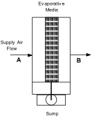

Figure 143. Schematic of the ZoneHVAC:EnergyRecoveryVentilator compound object

#### Field: Name

A unique user-assigned name for the stand alone ERV controller. Any reference to this controller by another object will use this name.

#### Field: Temperature High Limit

The input for this field is the outdoor air temperature high limit ( &deg;C) for economizer operation. If the outdoor air temperature is above this limit, economizer (free cooling) operation is terminated. No input (blank) in this field means that there is no outdoor air temperature high limit control.

#### Field: Temperature Low Limit

The input for this field is the outdoor air temperature low limit ( &deg;C) for economizer operation. If the outdoor air temperature is below this limit, economizer (free cooling) operation is terminated. No input (blank) in this field means that there is no outdoor air temperature low limit control.

#### Field: Enthalpy High Limit

The input for this field is the outdoor air enthalpy limit (in J/kg) for economizer operation. If the outdoor air enthalpy is above this value, economizer (free cooling) operation is terminated. No input (blank) in this field means that there is no outdoor air economizer limit control.

#### Field: Dewpoint Temperature Limit

Input for this field is the outdoor air dewpoint limit ( &deg;C) for economizer operation. If the outdoor air dewpoint temperature is above this value, the outdoor airflow rate will be set to the minimum. No input (blank) in this field means that there is no outdoor air dewpoint limit control. This limit applies to the conditions at the Actuated Node regardless of whether or not there are any other components on the outdoor air path upstream of the mixer.

#### Field: Electronic Enthalpy Limit Curve Name

Input for this field is the name of a quadratic or cubic curve which provides the maximum outdoor air humidity ratio (function of outdoor air dry-bulb temperature) for economizer operation. If the outdoor air humidity ratio is greater than the curve   s maximum humidity ratio (evaluated at the outdoor air dry-bulb temperature), the outdoor air flow rate will be set to the minimum. This limit applies to the conditions at the Actuated Node regardless of whether or not there are any other components on the outdoor air path upstream of the mixer. No input (blank) in this field means that there is no electronic enthalpy limit control.

#### Field: Exhaust Air Temperature Limit

This input establishes whether or not there is a limit control on the exhaust air temperature. The choices are **ExhaustAirTemperatureLimit** or **NoExhaustAirTemperatureLimit**. If **ExhaustAirTemperatureLimit** is chosen, the controller deactivates economizer mode whenever the outdoor air temperature is greater than the exhaust air temperature. If **NoExhaustAirTemperatureLimit** is chosen, no limit check on the exhaust air temperature is performed.

#### Field: Exhaust Air Enthalpy Limit

This input establishes whether or not there is a limit control on the exhaust air enthalpy. The choices are **ExhaustAirEnthalpyLimit** or **NoExhaustAirEnthalpyLimit**. If **ExhaustAirEnthalpyLimit** is chosen, the controller deactivates economizer mode whenever the outdoor air enthalpy is greater than the exhaust air enthalpy. If **NoExhaustAirEnthalpyLimit** is chosen, no limit check on the exhaust air enthalpy is performed.

#### Field: Time of Day Economizer Flow Control Schedule Name

This alpha field is the name of a schedule which controls the change in air flow rate based on time-of-day. Schedule values equal to 0 disable this feature. Schedule values greater than 0 activate the economizer. Note that heat exchange between the air streams is suspended when the economizer is active. This schedule can be used with or without the high humidity control option. When an economizer is used in conjunction with the high humidity control option, high humidity control has priority.

#### Field: High Humidity Control Flag

This optional choice field establishes whether or not the supply and exhaust air flow rates are modified in response to high indoor relative humidity. Valid choices are Yes and No. If Yes is selected, the supply and exhaust air flow rates may be modified when the indoor relative humidity is above the humidstat set point. If No is selected, this option is disabled and the following three fields are not used. Note that heat exchange between the air streams is suspended during times when high humidity control is active. The default value is No.

#### Field: Humidistat Control Zone Name

This optional input defines the zone name where the humidistat is located. This is the same zone name used in the Zone Control:Humidistat object. This field is required when the High Humidity Control Flag is specified as Yes.

#### Field: High Humidity Outdoor Air Flow Ratio

This optional input is the ratio of the modified supply (outdoor) air flow rate to the supply air flow rate specified in the Energy Recovery Ventilator:Stand Alone ERV object. When the high humidity control algorithm determines that the supply air flow rate will be changed (i.e. increased or decreased), the operating supply air flow rate is equal to the supply air flow rate specified in the Energy Recovery Ventilator:Stand Alone ERV object multiplied by this ratio. The minimum value for this field is 0. This field is used to modify both the supply and exhasut air flow rates when high humidity control is active. The supply and exhasut air fan volumetric flow rates must be able to account for the increase in air flow when this input is greater than 1. The default value is 1.

#### Field: Control High Indoor Humidity based on Outdoor Humidity Ratio

This optional choice field determines if high humidity control is activated based on high indoor relative humidity alone or is activated only when the indoor relative humidity is above the humidstat set point *and* the outdoor humidity ratio is less than the indoor humidity ratio. Valid choices are Yes and No. If No is selected, high humidity control is active any time the zone humidistat senses a moisture load. If yes is selected, the model also verifies that the outdoor humidity ratio is less than the humidistat   s zone air humidity ratio. This field is used only when the High Humidity Control Flag is specified as Yes. The default value is Yes.

Following is an example input for this stand alone ERV controller object:

```idf
ZoneHVAC:EnergyRecoveryVentilator:Controller,
       ERV OA Controller 1,                       !- ERV controller name
       19.,                                                       !- Temperature high limit {C}
       14.,                                                       !- Temperature low limit {C}
       ,                                                             !- Enthalpy high limit {J/kg}
       15.55,                                                   !- dew point temperature limit (C)
       ElectronicEnthalpyCurveA,             !- electronic enthalpy limit curve name
       NoExhaustAirTemperatureLimit,     !- Exhaust air temperature limit
       NoExhaustAirEnthalpyLimit,           !- Exhaust air enthalpy limit
       OutsideAirFlowSchedule,                 !- Time of Day Economizer Flow Control Schedule Name
       Yes,                                                       !- High Humidity Control Flag
       East Zone,                                           !- Humidistat Control Zone Name
       1.2,                                                       !- High Humidity Outdoor air Flow Ratio
       Yes;                           !- Control High Indoor Humidity based on Outdoor Humidity Ratio


Curve:Cubic,
       ElectronicEnthalpyCurveA, !- Name
       0.01342704,                             !- Coefficient1 Constant
     -0.00047892,                             !- Coefficient2 x
       0.000053352,                           !- Coefficient3 x**2
     -0.0000018103,                         !- Coefficient4 x**3
      16.6,                                         !- Minimum Value of x
       29.13;                                       !- Maximum Value of x
```

Group     Evaporative Coolers
---------------------------

This group of objects describes the properties and configuration for the evaporative coolers models for the HVAC section.

### EvaporativeCooler:Direct:CelDekPad

The direct stage, shown in the figure below, consists of a rigid media evaporative pad, with water recirculated from a reservoir.   The water is pumped from the reservoir to a water distribution header, for water feed by gravity from above the media.   The evaporative pad provides the area for the adiabatic saturation of the air.   While the process provides a lower dry-bulb temperature, the moisture content of the leaving air is higher than the entering condition.   The direct stage is used for comfort cooling in a building where adding humidity to the air can be tolerated.


Figure 144.   Direct Stage Evaporative Cooler

The thermodynamic process is a simultaneous heat and mass transfer, or adiabatic cooling, and follows a constant enthalpy line on the psychrometric chart, it is shown in the figure below as a process from A to B.   Since the deviation of the constant wet-bulb line and the constant enthalpy line is small, it is assumed that the wet-bulb temperature is constant across the direct evaporative stage.

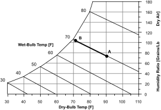

Figure 145.   Psychrometric Chart -- Constant Enthalpy

If the direct evaporative process were 100% efficient, the leaving dry-bulb temperature would equal the entering wet-bulb temperature.   The efficiency of the direct evaporative process is less than 100% and by defining saturation efficiency (<span>\(\varepsilon \)</span>se) for the direct stage or evaporative pad, the leaving dry-bulb temperature can be expressed by the following equation.

<div>\[{T_{db\,supout}} = {T_{db\,sup\,in}} - {\varepsilon_{se}}\cdot \left( {{T_{db\,sup\,in}} - {T_{wb\,sup\,in}}} \right)\]</div>

#### Field: Name

A unique identifying name for each evaporative cooler.

#### Field:Availability Schedule Name

The name of a schedule which defines when the evaporative cooler is available. A schedule value of 0 indicates that the evaporative cooler is off for that time period. A schedule value greater than 0 indicates that the evaporative cooler can operate during the time period. If this field is blank, the schedule has values of 1 for all time periods.

#### Field: Direct Pad Area

The face area of the evaporative pad in m<sup>2</sup>.   With the area and mass flow rate, the air velocity is calculated and is used to determine the saturation efficiency. This field is autosizable.

#### Field: Direct Pad Depth

The depth of the evaporative pad in meters.   The pad depth is used to determine the saturation efficiency. This field is autosizable.

#### Field: Recirculating Water Pump Power Consumption

This field is used to specify the power consumed by the evaporative cooler recirculating pump in Watts.

#### Field: Air Inlet Node Name

The name of the evaporative cooler air inlet node from the Air Loop Simulation.

#### Field: Air Outlet Node Name

The name of the evaporative cooler air outlet node from the Air Loop Simulation.

#### Field: Control Type

This input field is currently unused and can be left blank.

#### Field: Water Supply Storage Tank Name

This field is optional.   It is used to describe where the cooler obtains water used for evaporative cooling.   If blank or omitted, then the cooler will obtain water directly from the mains.   If the name of a WaterUse:Storage object is used here, then the cooler will obtain its water from that tank. If a tank is specified, the cooler will attempt to obtain all the water it uses from the tank.   However if the tank cannot provide all the water the cooler needs, then the cooler will still operate and obtain the rest of the water it needs from the mains.

An IDF example showing how this object is:

```idf
   EvaporativeCooler:Direct:CelDekPad,
       Evaporative Cooler,           !- Name
       System Availability Schedule,   !- Availability Schedule Name
       0.6,                                         !- Direct Pad Area {m2}
       0.2,                                         !- Direct Pad Depth {m}
       225,                                         !- Recirculating Water Pump Power Consumption {W}
       Evap Cooler Inlet Node,   !- Air Inlet Node Name
       Supply Outlet Node;           !- Air Outlet Node Name
```

### EvaporativeCooler:Direct:CelDekPad Outputs

The output variables that are available for this direct evaporative cooler are shown below:

* HVAC,Average, Evaporative Cooler Wet Bulb Effectiveness

* HVAC,Average, Evaporative Cooler Electric Power[W]

* HVAC,Sum, Evaporative Cooler Electric Energy [J]

* HVAC,Sum, Evaporative Cooler Water Volume[m3]

* HVAC,Sum,Evaporative Cooler Mains Water Volume [m3]

* HVAC,Sum,Evaporative Cooler Storage Tank Water Volume [m3]

* HVAC,Sum,Evaporative Cooler Starved Water Volume [m3]

* HVAC,Sum,Evaporative Cooler Starved Mains Water Volume [m3]

#### Evaporative Cooler Wet Bulb Effectiveness

The effectivenss, or saturation efficiency, is the temperature change of the supply air divided by the difference between the inlet air dry-bulb and wet-bulb temperatures. In other words, it is a measure of the approach to the inlet air wet-bulb temperature.

#### Evaporative Cooler Electric Power[W]

#### Evaporative Cooler Electric Energy [J]

These output variables report the electric power and electric energy required to operate the water pump.

#### Evaporative Cooler Water Volume [m3]

The water consumption is the water evaporated from the pad.   This water consumption is only from the direct thermodynamics of water evaporation and does not include other sources of consumption such as drift or concentration blow down.   This output variable appears when mains water is supplied to the cooler.

#### Evaporative Cooler Mains Water Volume [m3]

This is the source of the water consumed.   This output variable appears when mains water is supplied to the cooler.

#### Evaporative Cooler Storage Tank Water Volume [m3]

The water consumption is the water evaporated from the pad.   This water consumption is only from the direct thermodynamics of water evaporation and does not include other sources of consumption such as drift or concentration blow down.   This output variable appears when storage tank water is supplied to the cooler.

#### Evaporative Cooler Starved Water Volume [m3]

This is the water consumed by the evaporative cooler that could not accually be met by the storage tank.   This output variable appears when storage tank water is supplied to the cooler.

#### Evaporative Cooler Starved Mains Water Volume [m3]

This is the source (mains) of water consumed by the evaporative cooler that could not accually be met by the storage tank.   This output variable appears when storage tank water is supplied to the cooler.

### EvaporativeCooler:Direct:ResearchSpecial

This cooler is similar in principal to the EvaporativeCooler:Direct:CelDekPad. The model differs in that it gives the user a simple way of specify the cooler effectiveness. Using the ResearchSpecial input object also allows the cooler to control the amount of cooling based on node setpoints (controlled by SetpointManagers). This avoid problems from over cooling when conditions are such that loads are low and cooling power is high. 

The model allows to vary the effectiveness depending on the primary air flow rates.  The design effectiveness is modified by multiplying with Effectiveness Flow Fraction Modifier Curve value.  The flow fraction is the ratio of the current primary airflow rate to the design flow rate. The recirculating and spray water pump power is assumed to vary with the primary air flow.  The design pump power is modified using user specified pump modifier curve value.  The normalized pump power modifier curve is a function of primary air flow fraction as a independent variable. 

Also the direct evaporative cooler operating range can be controlled depending on the entering air dry bulb and wet bulb temperatures.  The operating range controlled based on minimum and maximum inlet node air temperature limits.  The evaporative cooler can be turned on or off depending user specified minimum and maximum temperature limits.  If the inlet node entering air temperature is lower or higher than the minimum and maximum limits, respectively, then the direct research special evaporative cooler is turned off.  If these two input fields are left blank then, no user specified operating temperature control is applied. Operating range control feature is primarily intended for application in data centers.

#### Field: Name

A unique identifying name for each cooler.

#### Field: Availability Schedule Name

The name of a schedule that defines when the evaporative cooler is available. A schedule value of 0 indicates that the evaporative cooler is off for that time period. A schedule value greater than 0 indicates that the evaporative cooler can operate during the time period. If this field is blank, the schedule has values of 1 for all time periods.

#### Field: Cooler Design Effectiveness

This field specifies the effectiveness at design flow rate that is applied to the wetbulb depression to determine the conditions leaving the cooler. This model assumes that the effectiveness can vary with supply air flow rate.  For effectiveness variation with supply air flow fraction enter the    Effectiveness Flow Ratio Modifier Curve Name    input field below. The flow fraction is the ratio of the sum of current primary air and secondary air sides flow rates and the sum of the design flow rates. 

#### Field: Effectiveness Flow Ratio Modifier Curve Name

This curve modifies the effectiveness design value specified the previous field by multiplying the value by the result of this curve.  The modifying curve is a function of flow fraction, which is the ratio of the current primary air flow rates divided by the design primary air flow rates. If this input field is left blank, the effectiveness is assumed to be constant. Any curve or table with one independent variable can be used. Any curve or table with one independent variable can be used: Curve:Linear, Curve:Quadratic, Curve:Cubic, Curve:Quartic, Curve:Exponent, Curve:ExponentialSkewNormal, Curve:Sigmoid, Curve:RectuangularHyperbola1, Curve:RectangularHyperbola2, Curve:ExponentialDecay, Curve:DoubleExponentialDecay, and Table:OneIndependentVariable.

#### Field:Primary Design Air Flow Rate  

This numeric input field is the primary air design air flow rate in m3/s. This input field is autosizable. If the evaporative cooler is on main air loop branch, the design flow rate is the same as branch design flow rate, or else if it is on outdoor air system it will be the maximum of the the outdoor air design flow rate 
and the half of the primary air flow rate on the main air loop branch. 

#### Field: Recirculationg Water Pump Design Power

This numeric input field is the recirculating and spray pump electric power at Secondary Design Air Flow Rate in W. This is the nominal water recirculating and spray pump power of evaporative cooler at primary air design flow rates and cooler design effectiveness.  This input field is autosizable. Average Pump Power 
sizing factor was estimated from pump power and primary air design flow rates inputs from energyplus example
files is about 90.0 [W/(m3/s)] (=90.0 ~ Pump Power / Primary Air Design Flow Rate). The factor ranges from 
55.0 to 150.0 [W/(m3/s)].

#### Field: Water Pump Power Sizing Factor

This numeric input field value is recirculating water pump sizing factor in W/(m3/s). This field is used when the previous field is set to autosize. The pump design electric power is scaled with Secondary Design Air Flow Rate. This input field is autosizable. Average Pump Power sizing factor was estimated from pump power and primary air design flow rates inputs from energyplus example files is about 90.0 [W/(m3/s)] (=90.0 ~ Pump Power / Primary Air Design Flow Rate). The factor ranges from 55.0 to 150.0 [W/(m3/s)].

#### Field: Water Pump Power Modifier Curve Name

This alpha input field is the name of a dimensionless normalized pump power modifying curve. This curve modifies the pump electric power in the previous field by multiplying the design power by the result of this curve. The normalized curve is a function of the primary air flow fraction as independent variable.  The curve shall yield a value of 1.0 at a flow fraction of 1.0. The flow fraction is the ratio of the primary air during current operation divided by primary air Design Air Flow Rate. If this input field is left blank, the pump power is assumed to lineary vary with the load. Any curve or table with one independent variable can be used: Curve:Linear, Curve:Quadratic, Curve:Cubic, Curve:Quartic, Curve:Exponent, Curve:ExponentialSkewNormal, Curve:Sigmoid, Curve:RectuangularHyperbola1, Curve:RectangularHyperbola2, Curve:ExponentialDecay, Curve:DoubleExponentialDecay, and Table:OneIndependentVariable.

#### Field: Air Inlet Node Name

The name of the air inlet node for the primary air flow path through the cooler.

#### Field: Air Outlet Node Name

The name of the air outlet node for the primary air flow path through the cooler.

#### Field: Sensor Node Name

This field specifies the name of a node that will provide system air temperature setpoint information.   A separate SetpointManager object should be setup to update this node.

#### Field: Water Supply Storage Tank Name

This field is optional. It is used to describe where the cooler obtains water used for evaporative cooling. If blank or omitted, then the cooler will obtain water directly from the mains. If the name of a WaterUse:Storage object is used here, then the cooler will obtain its water from that tank. If a tank is specified, the cooler will attempt to obtain all the water it uses from the tank. However, if the tank cannot provide all the water the cooler needs, then the cooler will still operate and obtain the rest of the water it needs from the mains.

#### Field: Drift Loss Fraction

This field is optional and can be used to model additional water consumed by the cooler from drift.   Drift is water that leaves the cooling media as droplets and does not evaporate into the process air stream.   For example, water may get blown off the evaporative media by winds and escape the air system.   The value entered here is a simple fraction of the water consumed by the cooler for normal process evaporation.   The amount of drift is this fraction times the water evaporated for the normal cooling process.   This field can be left blank and then there will be no added water consumption from drift.

#### Field: Blowdown Concentration Ratio

This field is optional and can be used to model additional water consumed by the cooler from blowdown.   Blowdown is water that is intentionally drained from the cooler   s sump to offset the build up of solids in the water that would otherwise occur because of evaporation.   The value entered here is dimensionless.   It can be characterized as the ratio of solids in the blowdown water to solids in the make up water.   Typical values are 3 to 5.   The default is 3.0.

#### Field: Evaporative Cooler Operation Minimum Drybulb Temperature 

This numeric field defines the evaporative cooler inlet node drybulb temperature minimum limit in degrees Celsius. The evaporative cooler will be turned off when evaporator cooler air inlet node dry-bulb temperature falls below this value. The typical minimum value is 16 &deg;C. Users are allowed to specify their own limits. If this field is left blank, then there is no drybulb temperature lower limit for evaporative cooler operation.  

#### Field: Evaporative Operation Maximum Limit Wetbulb Temperature

This numeric field defines the evaporative cooler air inlet node air wetbulb temperature maximum limits in degree Celsius. When the evaporative cooler air inlet node air wetbulb temperature exceeds this limit, then the evaporative cooler is turns off. The typical maximum value is 24 &deg;C. If this input field is left blank, then there is no wetbulb temperature upper limit for evaporative cooler operation.

#### Field: Evaporative Operation Maximum Limit Drybulb Temperature

This numeric field defines the evaporative cooler air inlet node drybulb temperature maximum limits in degree Celsius. The evaporative cooler will be turned off when the evaporative cooler air inlet node drybulb temperature exceeds this value. The typical maximum value is 28 &deg;C. If this input field is left blank, then there is no upper drybulb temperature limit for evaporative cooler operation.

An example IDF entry is

```idf
EvaporativeCooler:Direct:ResearchSpecial,
   Direct Evap Cooler, !- Name
   ALWAYS_ON, !- Availability Schedule Name
   0.7 , !- Cooler Design Effectiveness
  ,     !- Effectiveness Flow Ratio Modifier Curve Name
   30.0 , !- Recirculating Water Pump Design Power
  ,     !- Water Pump Power Sizing Factor
  ,     !- Water Pump Power Modifier Curve Name
   OAIndRDD Evap Cooler- OADirect Evap CoolerNode , !- Air Inlet Node Name
   OADirect Evap Cooler- OAMixing BoxNode, !- Air Outlet Node Name
   OADirect Evap Cooler- OAMixing BoxNode, !- Sensor Node Name
   , !- Water Supply Storage Tank Name
   0.0, !- Drift Loss Fraction
   3; !- Blowdown Concentration Ratio
```

### EvaporativeCooler:Direct:ResearchSpecial Outputs

The output variables that are available for this direct evaporative cooler are shown below:

* HVAC,Average, Evaporative Cooler Electric Power[W]

* HVAC,Average, Evaporative Cooler Stage Effectiveness []

* HVAC,Sum, Evaporative Cooler Electric Energy [J]

* HVAC,Sum, Evaporative Cooler Water Volume[m3]

* HVAC,Sum,Evaporative Cooler Mains Water Volume [m3]

* HVAC,Sum,Evaporative Cooler Storage Tank Water Volume [m3]

* HVAC,Sum,Evaporative Cooler Starved Water Volume [m3]

* HVAC,Sum,Evaporative Cooler Starved Mains Water Volume [m3]

#### Evaporative Cooler Electric Power[W]

#### Evaporative Cooler Electric Energy [J]

These output variables report the electric power and electric energy required to operate the water pump.

#### Evaporative Cooler Stage Effectiveness []

The cooler stage efficiency is defined as the temperature change of the supply air divided by the difference between the outdoor dry-bulb and wet-bulb temperatures, including the effect of the reduction in the primary air flow rate in other words, it is a measure of the approach to the entering air wet-bulb temperature.

#### Evaporative Cooler Water Volume [m3]

The water consumption is the water evaporated from the pad.   This water consumption is only from the direct thermodynamics of water evaporation and does not include other sources of consumption such as drift or concentration blow down.   This output variable appears when mains water is supplied to the cooler.

#### Evaporative Cooler Mains Water Volume [m3]

This is the source of the water consumed.   This output variable appears when mains water is supplied to the cooler.

#### Evaporative Cooler Storage Tank Water Volume [m3]

The water consumption is the water evaporated from the pad.   This water consumption is only from the direct thermodynamics of water evaporation and does not include other sources of consumption such as drift or concentration blow down.   This output variable appears when storage tank water is supplied to the cooler.

#### Evaporative Cooler Starved Water Volume [m3]

This is the water consumed by the evaporative cooler that could not accually be met by the storage tank.   This output variable appears when storage tank water is supplied to the cooler.

#### Evaporative Cooler Starved Mains Water Volume [m3]

This is the source (mains) of water consumed by the evaporative cooler that could not accually be met by the storage tank.   This output variable appears when storage tank water is supplied to the cooler.

### EvaporativeCooler:Indirect:CelDekPad

The dry coil indirect evaporative cooler, shown in the figure below, has a rigid media pad, similar to the direct evaporative stage, where the adiabatic cooling takes place. The secondary air leaves the rigid media pad and enters an air to air heat exchanger where it cools the supply air flowing through the heat exchanger tubes. The moist secondary air is then exhausted to the environment. The secondary air stream has its own fan and consists of a rigid media evaporative pad, with water recirculated from a reservoir. The water is pumped from the reservoir to a water distribution header, for water feed by gravity from above the media. The evaporative pad provides the area for the adiabatic saturation of the air.

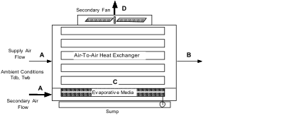

Figure 146. Evaporative Cooler -- Indirect Dry Coil

The process that the secondary air goes through, A to C to D, is shown by the dashed lines in   the following figure. Process A to C is adiabatic cooling in the rigid media pad. Then the air enters the shell side of the heat exchanger and is sensibly heated from C to D by the warm supply air passing through the tube side. The secondary air inlet is modeled as a separate stream of outdoor air and the user has the option of defining the name of an outdoor air node.

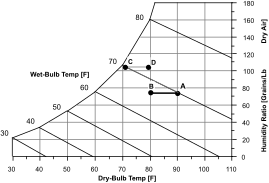

Figure 147. Secondary Air Process -- Indirect Dry Coil Evap Cooler

The advantage of the dry coil heat exchanger is that the heat exchanger does not have the evaporation taking place on the outside of the tubes, thus no mineral deposits are left on the heat exchange surface to reduce the efficiency of the heat exchanger. The rigid media pads are designed to flush the mineral deposits to the sump, so the saturation efficiency of the pad stays relatively constant.

#### Field: Name

A unique identifying name for each evaporative cooler.

#### Field:Availability Schedule Name

The name of a schedule which defines when the evaporative cooler is available. A schedule value of 0 indicates that the evaporative cooler is off for that time period. A schedule value greater than 0 indicates that the evaporative cooler can operate during the time period. If this field is blank, the schedule has values of 1 for all time periods.

#### Field: Direct Pad Area

The face area of the evaporative pad in m<sup>2</sup>. With the area and mass flow rate, the air velocity is calculated and is used to determine the saturation efficiency on the secondary side of the evaporative cooler. This field is autosizable.

#### Field: Direct Pad Depth

The depth of the evaporative pad in meters. The pad depth is used to determine the saturation efficiency on the secondary side of the evaporative cooler. This field is autosizable.

#### Field: Recirculating Water Pump Power Consumption

This field is used to specify the power consumed by the evaporative cooler recirculating pump in Watts.

#### Field: Secondary Air Fan Flow Rate

This field is used to specify the secondary air fan flow rate and is specified in m<sup>3</sup>/sec.

#### Field: Secondary Fan Total Efficiency

This value is the overall efficiency of the fan, i.e., the ratio of the power delivered to the fluid to the electrical input power. It is the product of the motor efficiency and the impeller efficiency. The motor efficiency is the power delivered to the shaft divided by the electrical power input to the motor. The impeller efficiency is power delivered to the fluid (air) divided by the shaft power. The power delivered to the fluid is the mass flow rate of the air multiplied by the pressure rise divided by the air density. This input value must be between 0 and 1.

#### Field: Secondary Fan Delta Pressure

This field is used to specify the delta pressure across the secondary stage of the evaporative cooler in Pascals.

#### Field: Indirect Heat Exchanger Effectiveness

This field is used to specify the effectiveness of the indirect heat exchanger between the primary and secondary air flow.

#### Field: Primary Air Inlet Node Name

The name of the evaporative cooler   s primary air inlet node from the Air Loop Simulation. This is the air flow being cooled indirectly.

#### Field: Primary Air Outlet Node Name

The name of the evaporative cooler   s primary air outlet node from the Air Loop Simulation.

#### Field: Control Type

This input field is currently unused and can be left blank.

#### Field: Water Supply Storage Tank Name

This field is optional. It is used to describe where the cooler obtains water used for evaporative cooling. If blank or omitted, then the cooler will obtain water directly from the mains. If the name of a WaterUse:Storage object is used here, then the cooler will obtain its water from that tank. If a tank is specified, the cooler will attempt to obtain all the water it uses from the tank. However if the tank cannot provide all the water the cooler needs, then the cooler will still operate and obtain the rest of the water it needs from the mains.

#### Field: Secondary Air Inlet Node Name

This field is optional. It is used to explicitly define an outdoor air node for the inlet for secondary air stream. Defining an outdoor air node here allows using the height-dependent model for outdoor air conditions.

And an IDF example showing how this object is specified:

```idf
  EvaporativeCooler:Indirect:CelDekPad,
       IndirectEvapCooler1,         !- Name
       FanAndCoilAvailSched,       !- Availability Schedule Name
       0.6,                                         !- Direct Pad Area {m2}
       0.2,                                         !- Direct Pad Depth {m}
       225.,                                       !- Recirculating Water Pump Power Consumption {W}
       1.0,                                         !- Secondary Air Fan Flow Rate {m3/s}
       0.7,                                         !- Secondary Fan Total Efficiency
       200.0,                                     !- Secondary Fan Delta Pressure {Pa}
       0.67,                                       !- Indirect Heat Exchanger Effectiveness
       EvapCoolerIndirectInletAirNode,   !- Primary Air Inlet Node Name
       EvapCoolerDirectInletAirNode,   !- Primary Air Outlet Node Name
       ,                                           !- Control Type
       ,                                               !- Water Supply Storage Tank Name
       Secondary side OA inlet node;   !- Secondary Air Inlet Node Name
```

### EvaporativeCooler:Indirect:CelDekPad Outputs

The output variables that are available for the indirect dry evaporative cooler are shown below:

* HVAC,Average, Evaporative Cooler Wetbulb Effectiveness

* HVAC,Average, Evaporative Cooler Total Stage Effectiveness

* HVAC,Average, Evaporative Cooler Electric Power[W]

* HVAC,Sum, Evaporative Cooler Electric Energy [J]

* HVAC,Sum, Evaporative Cooler Water Volume[m3]

* HVAC,Sum,Evaporative Cooler Mains Water Volume [m3]

* HVAC,Sum,Evaporative Cooler Storage Tank Water Volume [m3]

* HVAC,Sum,Evaporative Cooler Starved Water Volume [m3]

* HVAC,Sum,Evaporative Cooler Starved Mains Water Volume [m3]

#### Evaporative Cooler Wetbulb Effectiveness

The dry evaporation saturation efficiency is the saturation efficiency of the secondary or wet side air stream defined as the temperature change of the supply air divided by the difference between the outdoor dry-bulb and wet-bulb temperatures. In other words, it is a measure of the approach to the outdoor wet-bulb temperature.

#### Evaporative Cooler Total Stage Effectiveness

The total stage efficiency includes the sensible heat exchanger effectiveness of the heat exchanger in the supply air stream. It is the saturation efficiency multiplied by the heat exchanger effectiveness.

#### Evaporative Cooler Electric Power[W]

#### Evaporative Cooler Electric Energy [J]

These output variables report the electric power and energy consumed by the secondary air fan and the sump pump.

#### Evaporative Cooler Water Volume[m3]

The water consumption is the water evaporated from the pad.   This water consumption is only from the direct thermodynamics of water evaporation and does not include other sources of consumption such as drift or concentration blow down.   This output variable appears when mains water is supplied to the cooler.

#### Evaporative Cooler Mains Water Volume [m3]

This is the source of the water consumed.   This output variable appears when mains water is supplied to the cooler.

#### Evaporative Cooler Storage Tank Water Volume [m3]

The water consumption is the water evaporated from the pad.   This water consumption is only from the direct thermodynamics of water evaporation and does not include other sources of consumption such as drift or concentration blow down.   This output variable appears when storage tank water is supplied to the cooler.

#### Evaporative Cooler Starved Water Volume [m3]

This is the water consumed by the evaporative cooler that could not accually be met by the storage tank.   This output variable appears when storage tank water is supplied to the cooler.

#### Evaporative Cooler Starved Mains Water Volume [m3]

This is the source (mains) of water consumed by the evaporative cooler that could not accually be met by the storage tank.   This output variable appears when storage tank water is supplied to the cooler.

### EvaporativeCooler:Indirect:WetCoil

The wetted coil evaporative cooler shown in the figure below, has water sprayed directly on the tubes of the heat exchanger where latent cooling takes place. The vaporization of the water on the outside of the heat exchanger tubes allows the simultaneous heat and mass transfer which removes heat from the supply air on the tube side. Then the moist secondary air is exhausted. The secondary air stream has its own fan.

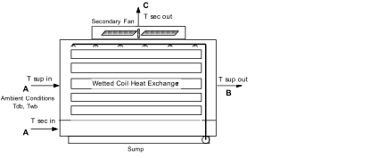

Figure 148. Evaporative Cooler     Indirect Wet Coil

The process that the secondary air goes through, A to C on the following figure, is a path of simultaneous heat and mass transfer, but it does not follow a line of constant enthalpy as in the direct stage. The process is not adiabatic due to the heat gain from the supply air flowing through the tubes of the heat exchanger.

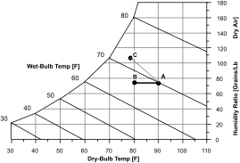

Figure 149. Secondary Air Process     Indirect Wet Coil Evap Cooler

The wet coil heat exchanger can have a higher stage efficiency than the dry coil due to a higher heat transfer rate on the outside of the heat exchanger tubes. Over the operating lifetime of the heat exchanger, the vaporization taking place on the heat exchange surface can leave mineral deposits which will decrease the effectiveness of the heat exchanger.

#### Field: Name

A unique identifying name for each evaporative cooler.

#### Field:Availability Schedule Name

The name of a schedule which defines when the evaporative cooler is available. A schedule value of 0 indicates that the evaporative cooler is off for that time period. A schedule value greater than 0 indicates that the evaporative cooler can operate during the time period. If this field is blank, the schedule has values of 1 for all time periods.

#### Field: Coil Maximum Efficiency

The maximum efficiency of the stage is a combination of the efficiency due to the simultaneous heat and mass transfer on the outside of the tube and the efficiency of the heat exchanger. This value can be higher than the dry coil overall efficiency since the convective coefficients on the outside of the tube are larger.

#### Field: Coil Flow Ratio

The Coil Flow Ratio is determined from performance data. The Coil Flow Ratio tells how quickly the efficiency of the stage would decrease with a mismatch of the supply and secondary flows.

#### Field: Recirculating Water Pump Power Consumption

This field is used to specify the power consumed by the evaporative cooler recirculating pump in Watts.

#### Field: Secondary Air Fan Flow Rate

This field is used to specify the secondary air fan flow rate and is specified in m<sup>3</sup>/sec.

#### Field: Secondary Air Fan Total Efficiency

This value is the overall efficiency of the fan, i.e., the ratio of the power delivered to the fluid to the electrical input power. It is the product of the motor efficiency and the impeller efficiency. The motor efficiency is the power delivered to the shaft divided by the electrical power input to the motor. The impeller efficiency is power delivered to the fluid (air) divided by the shaft power. The power delivered to the fluid is the mass flow rate of the air multiplied by the pressure rise divided by the air density. This input value must be between 0 and 1..

#### Field: Secondary Air Fan Delta Pressure

This field is used to specify the delta pressure across the secondary stage of the evaporative cooler in Pascals.

#### Field: Primary Air Inlet Node Name

The name of the evaporative cooler air inlet from the Air Loop Simulation.

#### Field: Primary Air Outlet Node Name

The name of the evaporative cooler air outlet from the Air Loop Simulation.

#### Field: Control Type

This input field is currently unused and can be left blank.

#### Field: Water Supply Storage Tank Name

This field is optional. It is used to describe where the cooler obtains water used for evaporative cooling. If blank or omitted, then the cooler will obtain water directly from the mains. If the name of a WaterUse:Storage object is used here, then the cooler will obtain its water from that tank. If a tank is specified, the cooler will attempt to obtain all the water it uses from the tank. However if the tank cannot provide all the water the cooler needs, then the cooler will still operate and obtain the rest of the water it needs from the mains.

#### Field: Secondary Air Inlet Node Name

This field is optional. It is used to explicitly define an outdoor air node for the inlet for secondary air stream. Defining an outdoor air node here allows using the height-dependent model for outdoor air conditions.

#### Field: Drift Loss Fraction

This field is optional and can be used to model additional water consumed by the cooler from drift.   Drift is water that leaves the cooling media as droplets and does not evaporate into the process air stream.   For example, water may get blown off the evaporative media by winds and escape the air system.   The value entered here is a simple fraction of the water consumed by the cooler for normal process evaporation.   The amount of drift is this fraction times the water evaporated for the normal cooling process.   This field can be left blank and then there will be no added water consumption from drift.

#### Field: Blowdown Concentration Ratio

This field is optional and can be used to model additional water consumed by the cooler from blowdown.   Blowdown is water that is intentionally drained from the cooler   s sump to offset the build up of solids in the water that would otherwise occur because of evaporation.   The value entered here is dimensionless.   It can be characterized as the ratio of solids in the blowdown water to solids in the make up water.   Typical values are 3 to 5.   The default is 3.0.

And an IDF example showing how this object is specified:

```idf
EvaporativeCooler:Indirect:WetCoil,
       IndirectEvapCooler1,         !- Name
       FanAndCoilAvailSched,       !- Availability Schedule Name
       0.8,                                         !- Coil Maximum Efficiency
       0.16,                                       !- Coil Flow Ratio
       225.,                                       !- Recirculating Water Pump Power Consumption {W}
       1.0,                                         !- Secondary Air Fan Flow Rate {m3/s}
       0.7,                                         !- Secondary Air Fan Total Efficiency
       200.0,                                     !- Secondary Air Fan Delta Pressure {Pa}
       EvapCoolerIndirectInletAirNode,   !- Primary Air Inlet Node Name
       EvapCoolerDirectInletAirNode,   !- Primary Air Outlet Node Name
       ,                                               !- Control Type
       ,                                               !- Water Supply Storage Tank Name
       Secondary side OA inlet node;   !- Secondary Air Inlet Node Name
```


### EvaporativeCooler:Indirect:WetCoil Outputs

The output variables that are available for the wet indirect evaporative cooler are shown below:

* HVAC,Average, Evaporative Cooler Total Stage Effectiveness

* HVAC,Average, Evaporative Cooler Electric Power[W]

* HVAC,Sum, Evaporative Cooler Electric Energy [J]

* HVAC,Sum, Evaporative Cooler Water Volume[m3]

* HVAC,Sum,Evaporative Cooler Mains Water Volume [m3]

* HVAC,Sum,Evaporative Cooler Storage Tank Water Volume [m3]

* HVAC,Sum,Evaporative Cooler Starved Water Volume [m3]

* HVAC,Sum,Evaporative Cooler Starved Mains Water Volume [m3]

#### Evaporative Cooler Total Stage Effectiveness []

The Total Stage Efficiency is defined as the temperature change of the supply air divided by the difference between the outdoor dry-bulb and wet-bulb temperatures, including the effect of the reduction in flow because of the secondary air stream. In other words, it is a measure of the approach to the outdoor wet-bulb temperature.

#### Evaporative Cooler Electric Power [W]

#### Evaporative Cooler Electric Energy [J]

These output variables report the electric power and energy that are consumed by the secondary air fan and the sump pump.

#### Evaporative Cooler Water Volume [m3]

The water consumption is the water evaporated from the pad.   This water consumption is only from the direct thermodynamics of water evaporation and does not include other sources of consumption such as drift or concentration blow down.   This output variable appears when mains water is supplied to the cooler.

#### Evaporative Cooler Mains Water Volume [m3]

This is the source of the water consumed.   This output variable appears when mains water is supplied to the cooler.

#### Evaporative Cooler Storage Tank Water Volume [m3]

The water consumption is the water evaporated from the pad.   This water consumption is only from the direct thermodynamics of water evaporation and does not include other sources of consumption such as drift or concentration blow down.   This output variable appears when storage tank water is supplied to the cooler.

#### Evaporative Cooler Starved Water Volume [m3]

This is the water consumed by the evaporative cooler that could not accually be met by the storage tank.   This output variable appears when storage tank water is supplied to the cooler.

#### Evaporative Cooler Starved Mains Water Volume [m3]

This is the source (mains) of water consumed by the evaporative cooler that could not accually be met by the storage tank.   This output variable appears when storage tank water is supplied to the cooler.

### EvaporativeCooler:Indirect:ResearchSpecial

This cooler is similar in principal to the EvaporativeCooler:Indirect:CelDekPad and EvaporativeCooler:Indirect:WetCoil (see Figure 147, Figure 148, and Figure 149). The model differs in that it gives the user more flexibility to specify the source of secondary air. The cooler effectiveness with respect to wetbulb depression is allowed to go beyond 1.0. Using the ResearchSpecial input object also allows the cooler to control the amount of cooling based on node setpoints (controlled by SetpointManagers). This avoid problems from over cooling when conditions are such that loads are low and cooling power is high. Fan power is assumed to vary linearly when the cooler is operating at less than full capacity.

The indirect evaporative cooler research special calculation procedure allows accounting for dry and wet effectiveness value variation with flow fraction.  Two effectiveness modifier curves are included as optional user inputs for this purpose.  Effectiveness modifier curves operate on the design dry and wet effectiveness values. The flow fraction is calculated as a ratio of the sum of current primary and secondary air flow rates to the sum of the design flow rates. Model also accounts for fan and recirculation water pump power variation with secondary air flow rates using pump power modifying curve. The fan power is calculated by multiplying the design fan power using fan power modify curve value evaluated at current secondary air flow fraction. Similarly, recirculating pump power is is calculated by multiplying the design pump power by pump power modifier curve value evaluated at current secondary air flow fraction. If the secondary air fan and recirculating pump power modifier curves are not specified, then fan and pump power are assumed to vary linearly with part load fraction.

#### Field: Name

A unique identifying name for each cooler.

#### Field: Availability Schedule Name

The name of a schedule that defines when the evaporative cooler is available. A schedule value of 0 indicates that the evaporative cooler is off for that time period. A schedule value greater than 0 indicates that the evaporative cooler can operate during the time period. If this field is blank, the schedule has values of 1 for all time periods.

#### Field: Cooler Wetbulb Design Effectiveness

This field specifies the design effectiveness that is applied to the wetbulb depression to determine the conditions leaving the cooler. This effectiveness is a complicated function of the efficiency with which heat and mass are transferred on the secondary side and the efficiency of heat exchange between the secondary and primary flows. The model assumes that the effectiveness a function of flow fraction. The flow fraction is the ratio of the sum of primary air and secondary air current flow rates and the sum of the primary air and secondary air design flow rates.

#### Field: Wet Bulb Effectiveness Flow Ratio Modifier Curve Name

This curve modifies the wet bulb effectiveness design value specified the previous field by multiplying the value by the result of this curve.  The modifying curve is a function of flow fraction, which is the ratio of the sum of the primary and secondary flow rates divided by the sum of the design flow rates. If this input field is left blank, the effectiveness is assumed to be constant. Any curve or table with one independent variable can be used. Any curve or table with one independent variable can be used: Curve:Linear, Curve:Quadratic, Curve:Cubic, Curve:Quartic, Curve:Exponent, Curve:ExponentialSkewNormal, Curve:Sigmoid, Curve:RectuangularHyperbola1, Curve:RectangularHyperbola2, Curve:ExponentialDecay, Curve:DoubleExponentialDecay, and Table:OneIndependentVariable.

#### Field: Cooler Drybulb Design Effectiveness

This input value is dry bulb design effectiveness of the evaporative cooler. This is the nominal design dry blub effectiveness with respect to dry bulb temperature difference, i.e., dry operation and at design air flow rates, and no water evaporation or spraying on the secondary side.

#### Field Drybulb Effectiveness Flow Ratio Modifier Curve Name

This this curve modifies the drybulb effectiveness in the previous field (eff_db_design) by multiplying the design effectiveness value by the result of this curve.  The curve is evaluated flow fraction as independent variable.  The flow fraction is the ratio of sum of the primary and secondary flow rates divided by the sum of the design flow rates. If this input field is left blank, the effectiveness is assumed to be constant. Any curve or table with one independent variable can be used: Curve:Linear, Curve:Quadratic, Curve:Cubic, Curve:Quartic, Curve:Exponent, Curve:ExponentialSkewNormal, Curve:Sigmoid, Curve:RectuangularHyperbola1, Curve:RectangularHyperbola2, Curve:ExponentialDecay, Curve:DoubleExponentialDecay, and Table:OneIndependentVariable.

#### Field: Recirculating Water Pump Design Power

This numeric input field is the recirculating pump electric power at Secondary Design Air Flow Rate in W. This is the nominal design pump power water recirculation and spray for evaporation at design secondary air flow rates and cooler design effectiveness.  This input field is autosizable.

#### Field: Water Pump Power Sizing Factor

This numeric input field value is recirculating water pump sizing factor in W/(m3/s). This field is used when the previous field is set to autosize. The pump design electric power is scaled with Secondary Design Air Flow Rate. Average Pump Power sizing factor was estimated from pump power and secondary air design flow rates inputs from energyplus example files is about 90.0 [W/(m3/s)] (=90.0 ~ Pump Power / Secondary Air Design Flow Rate). The factor ranges from 55.0 to 150.0 [W/(m3/s)].

#### Field: Water Pump Power Modifier Curve Name

This alpha input field is the name of a dimensionless normalized pump power modifying curve. This curve modifies the pump electric power in the previous field by multiplying the design power by the result of this curve. The normalized curve is a function of the secondary side flow fraction as independent variable.  The curve shall yield a value of 1.0 at a flow fraction of 1.0. The flow fraction is the secondary air flow rate during operation divided by Secondary Design Air Flow Rate. If this input field is left blank, the pump power is assumed to be constant. Any curve or table with one independent variable can be used: Curve:Linear, Curve:Quadratic, Curve:Cubic, Curve:Quartic, Curve:Exponent, Curve:ExponentialSkewNormal, Curve:Sigmoid, Curve:RectuangularHyperbola1, Curve:RectangularHyperbola2, Curve:ExponentialDecay, Curve:DoubleExponentialDecay, and Table:OneIndependentVariable.

#### Field: Secondary Air Design Flow Rate

This field is used to specify the secondary air fan flow rate and is specified in m<sup>3</sup>/s. This flow rate would typically be similar in magnitude to the flow through the primary side. This field can be autosized. When it is autosized, the program detects if the component is in the main air loop or on an outdoor air path.   If it is on the main air loop, then the flow rate is set to the AirLoopHVAC system   s design supply air flow rate (which is the maximum required for heating and cooling).   If it is on the outdoor air path, then the flow rate is set to the larger of either the design minimum outdoor air flow rate or one-half of the main air loop design flow rate. The flow rate is used to determine parasitic fan energy and cooler effectiveness. The flow rate (and fan power) is effectively reduced by cycling when the amount of cooling needs to be restricted for control purpose.  This field can be autosized. When this input is autosized, the program calculates by scaling the Primary Air Design Flow Rate using secondary air scaling factor specified in the input field below.

#### Field: Secondary Air Flow Scaling Factor

This numeric input field is used to scale the secondary air design flow rate and it is dimensionless. This field is used when the previous field is set to autosize. The Primary Design Air Flow Rate is scaled using this factor to calculate the secondary design air flow rate.

#### Field: Secondary Air Fan Design Power

This numeric input field is the fan electric power at Secondary Design Air Flow Rate.  This is the nominal design electric power at full speed of the secondary air fan.   This input field is autosizable.

#### Field: Secondary Air Fan Sizing Specific Power

This input field value is secondary air fan sizing specific power in W/(m3/s).  This field is used when the previous field is set to autosize. The fan power is scaled with Secondary Design Air Flow Rate.

#### Field: Secondary Air Fan Power Modifier Curve Name

This input field is the name of a dimensionless normalized curve.  The normalized curve modifies the design secondary air fan power in the previous field by multiplying the value by the result of this curve.  The normalized curve is a function of the secondary side flow fraction as independent variable.  The curve shall yield a value of 1.0 at a flow fraction of 1.0. The flow fraction is the secondary air flow rate during operation divided by Secondary Design Air Flow Rate. If this input field is left blank, the fan power is assumed to be constant. Any curve or table with one independent variable can be used: Curve:Linear, Curve:Quadratic, Curve:Cubic, Curve:Quartic, Curve:Exponent, Curve:ExponentialSkewNormal, Curve:Sigmoid, Curve:RectuangularHyperbola1, Curve:RectangularHyperbola2, Curve:ExponentialDecay, Curve:DoubleExponentialDecay, and Table:OneIndependentVariable.

#### Field: Primary Air Inlet Node Name

The name of the air inlet node for the primary air flow path through the cooler.

#### Field: Primary Air Outlet Node Name

The name of the air outlet node for the primary air flow path through the cooler.

#### Field:Primary Design Air Flow Rate  

This numeric input field is the primary air design air flow rate in m3/s. This input field is autosizable. If the evaporative cooler is on main air loop branch, the design flow rate is the same as branch design flow rate, or else if it is on outdoor air system it will be the maximum of the the outdoor air design flow rate 
and the half of the primary air flow rate on the main air loop branch. 

#### Field: Dewpoint Effectiveness Factor

This field specifies an effectiveness that is applied to the dewpoint depression to determine a bound for the conditions leaving the cooler. The model uses the warmer of the two temperatures determined from wetbulb depression and dewpoint depression.

#### Field: Secondary Air Inlet Node Name

This field specifies the name of the node providing air to the secondary/wet side of the cooler. Typically this node could appear in an outdoor air node list or be part of an air system loop.

#### Field: Secondary Air Outlet Node Name

This alpha input field is the name of the secondary air side outlet node.

#### Field: Sensor Node Name

This field specifies the name of a node that will provide system air temperature setpoint information. A separate SetpointManager object should be setup to update this node.

#### Field: Relief Air Inlet Node Name

This field is optional, but can be used to feed two sources of secondary air into the wet side of the cooler. Typical use is to run the air system relief air into the system. The model first uses all of the air flow available from this node and then adds the air flow from the secondary air inlet node to make up the total defined by Secondary air Fan Flow Rate.

#### Field: Water Supply Storage Tank Name

This field is optional. It is used to describe where the cooler obtains water used for evaporative cooling. If blank or omitted, then the cooler will obtain water directly from the mains. If the name of a WaterUse:Storage object is used here, then the cooler will obtain its water from that tank. If a tank is specified, the cooler will attempt to obtain all the water it uses from the tank. However, if the tank cannot provide all the water the cooler needs, then the cooler will still operate and obtain the rest of the water it needs from the mains.

#### Field: Drift Loss Fraction

This field is optional and can be used to model additional water consumed by the cooler from drift.   Drift is water that leaves the cooling media as droplets and does not evaporate into the process air stream.   For example, water may get blown off the evaporative media by winds and escape the air system.   The value entered here is a simple fraction of the water consumed by the cooler for normal process evaporation.   The amount of drift is this fraction times the water evaporated for the normal cooling process.   This field can be left blank and then there will be no added water consumption from drift.

#### Field: Blowdown Concentration Ratio

This field is optional and can be used to model additional water consumed by the cooler from blowdown.   Blowdown is water that is intentionally drained from the cooler   s sump to offset the build up of solids in the water that would otherwise occur because of evaporation.   The value entered here is dimensionless.   It can be characterized as the ratio of solids in the blowdown water to solids in the make up water.   Typical values are 3 to 5.   The default is 3.0.

#### Field: Evaporative Operation Minimum Limit Drybulb Temperature 

This input field value defines the secondary air inlet node drybulb temperature limits in degree Celsius. When the secondary side entering air dry bulb temperature drops below this limit, then the evaporative cooler operation mode changes to dry heat exchanger. Users specify their own limits. If this field is left blank, then there is no drybulb temperature lower limit for evaporative cooler operation.  If operating range control is desired then this input field and the next two input fields should be specified or all the three should be left blank or left out.  If no minimum drybulb temperature limit is required while there are maximum drybulb and wetbulb temperature limits then specify very low temperature limit value (e.g., -99.0 C).

#### Field: Evaporative Operation Maximum Limit Wetbulb Temperature

This input field value defines the secondary air inlet node wetbulb temperature limits in degree Celsius. When the secondary side entering air wet bulb temperature exceeds this limit, then the evaporative cooler is turns off and does not attempt to do any cooling. If this field is left blank, then there is no wetbulb temperature maximum limit for evaporative cooler wet operation mode. If no upper wetbulb temperature limits is desired while there are minimum drybulb and maximum drybulb upper temperature limits then then specify very high maximum wetbulb temperature limit value (e.g. 99.0 C).

#### Field: Evaporative Operation Maximum Limit Drybulb Temperature

This input field value defines the secondary air inlet node drybulb temperature limits in degree Celsius. When the secondary side entering air drybulb temperature exceeds this limit, the evaporative cooler will not run in dry operation mode or may be turned off depending on its wetbulb temperature. If this field is left blank, then there is no drybulb temperature maximum limit for evaporative cooler dry operation mode.

If no drybulb temperature limit is desired while there are minimum drybulb and maximum wetbulb temperature limits then specify very high maximum drybulb temperature limit value (e.g. 99.0 C).

An IDF example is shown below:

```idf
EvaporativeCooler:Indirect:ResearchSpecial,
    DataC_IndirectEvapCooler,     !- Name
    ALWAYS_ON,                    !- Availability Schedule Name
    0.75,                         !- Cooler Wetbulb Design Effectiveness
    ,              !- Wetbulb Effectiveness Flow Ratio Modifier Curve Name
    ,                          !- Cooler Drybulb Design Effectiveness
    ,              !- Drybulb Effectiveness Flow Ratio Modifier Curve Name
    autosize,                     !- Recirculating Water Pump Power
    autosize,                     !- Secondary Air Design Flow Rate  
    1.0,                          !- Secondary Air Flow Scaling Factor

    autosize,                     !- Secondary Air Fan Design Power
    800.0,                        !- Secondary Air Fan Sizing Specific Power W
    ,               !- Secondary Air Fan Power Modifier Curve Name
    Return Air Node,              !- Primary Air Inlet Node Name
    IndEC Outlet Node,            !- Primary Air Outlet Node Name
    autosize,                     !- Primary Design Air Flow Rate  
    0.9 ,                         !- Dewpoint Effectiveness Factor
    IndEC OA Air Inlet Node,      !- Secondary Air Inlet Node Name
    IndEC OA Air Outlet Node,     !- Secondary Air Outlet Node Name
    IndEC Outlet Node,            !- Sensor Node Name
    ,                             !- Relief Air Inlet Node Name
    ,                             !- Water Supply Storage Tank Name
    0.0,                          !- Drift Loss Fraction
    ;                             !- Blowdown Concentration Ratio
```

### EvaporativeCooler:Indirect:ResearchSpecial Outputs

The output variables that are available for the EvaporativeCooler:Indirect:ResearchSpecial object are shown below:

* HVAC,Average,Evaporative Cooler Total Stage Effectiveness

* HVAC,Average,Evaporative Cooler Part Load Ratio

* HVAC,Average,Evaporative Cooler Dewpoint Bound Status

* HVAC,Average,Evaporative Cooler Operating Mode Satus []

* HVAC,Sum,Evaporative Cooler Electric Energy [J]

* HVAC,Average,Evaporative Cooler Electric Power [W]

* HVAC,Sum,Evaporative Cooler Storage Tank Water Volume [m3]

* HVAC,Sum,Evaporative Cooler Starved Water Volume [m3]

* HVAC,Sum,Evaporative Cooler Starved Mains Water Volume [m3]


#### Evaporative Cooler Total Stage Effectiveness []

The Total Stage Efficiency is defined as the temperature change of the supply air divided by the difference between the primary air entering dry-bulb temperature and the secondary air enterig wet-bulb temperature for wet operating mode or the the difference between the primary air entering dry-bulb temperature and the secondary air enterig dry-bulb temperature for dry operating mode, including the effect of the reduction in flow because of the secondary air stream. In other words, it is a measure of the approach to the secondary air wet-bulb temperature for wet operating mode, or it is a measure of the approach to the secondary air entering dry-bulb temperature for dry operating mode.

#### Evaporative Cooler Operating Mode Status []

This output variable provides the operating modes or status of the indirect evaporative cooler. This output variable can have status indicator integer value of 0, 1, or 2 representing Off, Dry and Wet operating modes, respectively.

#### Evaporative Cooler Part Load Ratio []

This output variable provides the part load fraction of the indirect cooler.   The ResearchSpecial cooler model is able to modulate to meet a temperature set point to avoid over cooling.   This output variable is the fraction formed by the ratio of the capacity needed over the maximum cooling capacity available.   A value of 1.0 corresponds to full capacity cooling.

#### Evaporative Cooler Dewpoint Bound Status []

This output variable is a flag that indicates if the modeling was based on dewpoint effectivenss rather than wetbulb effectiveness   The ResearchSpecial model is usually based on wet-bulb approach, but since values in excess of 1.0 are allowed, there is a secondary constraint imposed by dewpoint.   If the dewpoint effectiveness was applied, then this flag variable will have the value 1.0, otherwise it is 0.0.

#### Evaporative Cooler Electric Power [W]

#### Evaporative Cooler Electric Energy [J]

These output variables report the electric power and energy that are consumed by the secondary air fan and the sump pump.

#### Evaporative Cooler Water Volume [m3]

The water consumption is the water evaporated from the pad.   This water consumption is only from the direct thermodynamics of water evaporation and does not include other sources of consumption such as drift or concentration blow down.   This output variable appears when mains water is supplied to the cooler.

#### Evaporative Cooler Mains Water Volume [m3]

This is the source of the water consumed.   This output variable appears when mains water is supplied to the cooler.

#### Evaporative Cooler Storage Tank Water Volume [m3]

The water consumption is the water evaporated from the pad.   This water consumption is only from the direct thermodynamics of water evaporation and does not include other sources of consumption such as drift or concentration blow down.   This output variable appears when storage tank water is supplied to the cooler.

#### Evaporative Cooler Starved Water Volume [m3]

This is the water consumed by the evaporative cooler that could not accually be met by the storage tank.   This output variable appears when storage tank water is supplied to the cooler.

#### Evaporative Cooler Starved Mains Water Volume [m3]

This is the source (mains) of water consumed by the evaporative cooler that could not accually be met by the storage tank.   This output variable appears when storage tank water is supplied to the cooler.

Group     Heat Recovery
---------------------

### HeatExchanger:AirToAir:FlatPlate

The air-to-air flat plate heat exchanger is an HVAC component typically used for exhaust or relief air heat recovery. The user can choose the flow arrangement type: counter flow, parallel flow, or cross flow with both streams unmixed. The input requires no geometric data. Performance is defined by specifying primary outlet air temperature at nominal (user specified) inlet conditions. In addition, the ratio (h<sup>.</sup>A)<sub>p</sub> / (h<sup>.</sup>A)<sub>s</sub> at nominal flow needs to be input, where h is the convective heat transfer   coefficient, A is the surface area, p stands for primary side, s for secondary side.

If the heat exchanger is operated in conjunction with an outdoor air economizer (economizer lockout set to *Yes*), the nominal supply air flow rate should be set equal to the minimum outdoor air flow rate specified in the Controller:OutdoorAir. The heat exchanger detects that the economizer is operating by the fact that its inlet air flow rate is greater than its nominal supply air flow rate.

#### Field: Name

A unique user-assigned name for a particular air-to-air flat plate heat exchanger unit. Any reference to this unit by another object will use this name.

#### Field: Availability Schedule Name

The name of the schedule (ref: Schedule) that denotes whether the unit can run during a given time period. A schedule value of 0 indicates that the unit is off for that time period. A schedule value greater than 0 indicates that the unit can operate during the time period. If this field is blank, the schedule has values of 1 for all time periods.

#### Field: Flow Arrangement Type

The user specified flow arrangement of the heat exchanger. The possible inputs are *CounterFlow*, *ParallelFlow*, or *CrossFlowBothUnmixed*.

#### Field: Economizer Lockout

This input denotes whether the heat exchanger unit is locked out (bypassed) when the air-side economizer is operating. Both the economizer and high humidity control (Ref. Controller:OutdoorAir) activate the heat exchanger lockout as specified by this input. The input choices are *Yes* (meaning locked out) or *No*. The default input for this field is Yes.

#### Field: Ratio of Supply to Secondary hA Values

The ratio (h<sup>.</sup>A)<sub>p</sub> / (h<sup>.</sup>A)<sub>s</sub> at nominal flow. h is the surface convective heat transfer coefficient, A is the heat transfer area, and p and s stand for primary side and secondary side respectively. A typical value for this ratio is 1.0.

#### Field: Nominal Supply Air Flow Rate

The nominal primary side air flow rate in cubic meters per second. If the unit is operated in conjunction with an outdoor air economizer this should be equal to the minimum outdoor air flow rate. This field is autosizable.

#### Field: Nominal Supply Air Inlet Temperature

The nominal primary side air inlet temperature in Celsius.

#### Field: Nominal Supply Air Outlet Temperature

The nominal primary side air outlet temperature in Celsius.

#### Field: Nominal Secondary Air Flow Rate

The nominal secondary side air flow rate in cubic meters per second. This field is autosizable. It is equal to the primary side air flow rate defined above, if autosized.

#### Field: Nominal Secondary Air Inlet Temperature

The nominal secondary side air inlet temperature in Celsius.

#### Field: Nominal Electric Power

The electric consumption rate of the unit in watts. Electric power is considered constant whenever the unit operates. This input can be used to model electric power consumption by controls (transformers, relays, etc.) and/or a motor for a rotary heat exchanger. None of this electric power contributes thermal load to the supply or exhaust air streams. The default value for this field is 0.

#### Field: Supply Air Inlet Node Name

The name of the HVAC system node from which the unit draws its primary inlet air.

#### Field: Supply Air Outlet Node Name

The name of the HVAC system node to which the unit sends its primary outlet air.

#### Field: Secondary Air Inlet Node Name

The name of the HVAC system node from which the unit draws its secondary inlet air.

#### Field: Secondary Air Outlet Node Name

The name of the HVAC system node to which the unit sends its secondary outlet air.

An IDF example:

```idf
   HeatExchanger:AirToAir:FlatPlate,
       OA Heat Recovery 1,         !- Name
       FanAndCoilAvailSched,       !- Availability Schedule Name
       CounterFlow,                !- Flow Arrangement Type
       Yes,                        !- Economizer Lockout
       1.0,                        !- Ratio of Supply to Secondary hA Values
       0.4333,                     !- Nominal Supply Air Flow Rate {m3/s}
       5.0,                        !- Nominal Supply Air Inlet Temperature {C}
       15.0,                       !- Nominal Supply Air Outlet Temperature {C}
       0.4333,                     !- Nominal Secondary Air Flow Rate {m3/s}
       20.0,                       !- Nominal Secondary Air Inlet Temperature {C}
       0.0,                        !- Nominal Electric Power {W}
       Desiccant Process Outlet Node,   !- Supply Air Inlet Node Name
       Heat Recovery Outlet Node,   !- Supply Air Outlet Node Name
       Relief Air Outlet Node,   !- Secondary Air Inlet Node Name
       Heat Recovery Secondary Outlet Node;   !- Secondary Air Outlet Node Name
```

### HeatExchanger:AirToAir:FlatPlate Outputs

* HVAC,Average,Heat Exchanger Sensible Heating Rate [W]

* HVAC,Sum,Heat Exchanger Sensible Heating Energy [J]

* HVAC,Average,Heat Exchanger Latent Gain Rate [W]

* HVAC,Sum,Heat Exchanger Latent Gain Energy [J]

* HVAC,Average,Heat Exchanger Total Heating Rate [W]

* HVAC,Sum,Heat Exchanger Total Heating Energy [J]

* HVAC,Average,Heat Exchanger Sensible Cooling Rate [W]

* HVAC,Sum,Heat Exchanger Sensible Cooling Energy [J]

* HVAC,Average,Heat Exchanger Latent Cooling Rate [W]

* HVAC,Sum,Heat Exchanger Latent Cooling Energy [J]

* HVAC,Average,Heat Exchanger Total Cooling Rate [W]

* HVAC,Sum,Heat Exchanger Total Cooling Energy [J]

* HVAC,Average,Heat Exchanger Electric Power[W]

* HVAC,Sum,Heat Exchanger Electric Energy [J]

#### Heat Exchanger Sensible Heating Rate [W]

This output is the sensible heating rate of the supply air by the heat exchanger in Watts. This rate is determined using the supply air mass flow rate through the heat exchanger unit, the supply air inlet and outlet conditions, and the specific heat of the inlet supply air. A positive value is reported if the supply air is heated by the heat exchanger, else the rate is set to zero.

#### Heat Exchanger Sensible Heating Energy [J]

This output is the sensible heating energy added to the supply air by the heat exchanger in Joules over the timestep being reported.

#### Heat Exchanger Latent Gain Rate [W]

This output is the latent heating rate (humidification) of the supply air by the heat exchanger in Watts. This rate is determined by taking the difference between the Heat Exchanger Total Heating Rate and the Heat Exchanger Sensible Heating Rate. A positive value is reported if the supply air is humidified by the heat exchanger, else the rate is set to zero.

#### Heat Exchanger Latent   Heating Energy [J]

This output is the latent heating energy added to the supply air by the heat exchanger in Joules over the timestep being reported.

#### Heat Exchanger Total Heating Rate [W]

This output is the total heating rate of the supply air by the heat exchanger in Watts. This rate is determined using the supply air mass flow rate through the heat exchanger unit, and the enthalpy of the supply air entering and leaving the unit. A positive value is reported if the enthalpy of the supply air is increased by the heat exchanger, else the rate is set to zero.

#### Heat Exchanger Total Heating Energy [J]

This output is the total heating energy added to the supply air by the heat exchanger in Joules over the timestep being reported.This output is also added to a meter with ResouceType = EnergyTransfer, EndUseKey = HeatRecoveryforHeating, GroupKey = System (ref. Output:Meter objects).

#### Heat Exchanger Sensible Cooling Rate [W]

This output is the sensible cooling rate of the supply air by the heat exchanger in Watts. This rate is determined using the supply air mass flow rate through the heat exchanger unit, the supply air inlet and outlet conditions, and the specific heat of the inlet supply air. A positive value is reported if the supply air is cooled by the heat exchanger, else the rate is set to zero.

#### Heat Exchanger Sensible Cooling Energy [J]

This output is the sensible cooling energy added to the supply air by the heat exchanger in Joules over the timestep being reported.

#### Heat Exchanger Latent Cooling Rate [W]

This output is the latent cooling rate (dehumidification) of the supply air by the heat exchanger in Watts. This rate is determined by taking the difference between the Heat Exchanger Total Cooling Rate and the Heat Exchanger Sensible Cooling Rate. A positive value is reported if the supply air is dehumidified by the heat exchanger, else the rate is set to zero.

#### Heat Exchanger Latent Cooling Energy [J]

This output is the latent cooling energy added to the supply air by the heat exchanger in Joules over the timestep being reported.

#### Heat Exchanger Total Cooling Rate [W]

This output is the total cooling rate of the supply air by the heat exchanger in Watts. This rate is determined using the supply air mass flow rate through the heat exchanger unit, and the enthalpy of the supply air entering and leaving the unit. A positive value is reported if the enthalpy of the supply air is decreased by the heat exchanger, else the rate is set to zero.

#### Heat Exchanger Total Cooling Energy [J]

This output is the total cooling energy added to the supply air by the heat exchanger in Joules over the timestep being reported. This output is also added to a meter with ResouceType = EnergyTransfer, EndUseKey = HeatRecoveryforCooling, GroupKey = System (ref. Output:Meter objects).

#### Heat Exchanger Electric Power [W]

This output is the electric consumption rate of the unit in Watts. This rate is applicable whenever the unit operates (i.e., whenever the unit is scheduled to be available and supply and exhaust air flows exist).

#### Heat Exchanger Electric Energy [J]

This output is the electric consumption of the unit in Joules for the timestep being reported. This ouput is also added to a meter with ResourceType = Electricity, EndUseKey = HeatRecovery, GroupKey = System (ref. Output:Meter objects).

### HeatExchanger:AirToAir:SensibleAndLatent


The sensible and latent air-to-air heat exchanger is an HVAC component typically used for exhaust or relief air heat recovery (Figure 150). Heat exchanger performance can be specified to transfer sensible energy, latent energy or both between the supply and exhaust air streams. The input requires no geometric data. Performance is defined by specifying sensible and/or latent effectiveness at 75% and 100% of the nominal (rated) supply air flow rate at two operating conditions as shown in Table 30.

Figure 150. Schematic of the Sensible and Latent Air-to-Air Heat Exchanger

Table 30. Operating Conditions for Defining Heat Exchanger Performance

<table class="table table-striped">
  <tr>
    <th rowspan="2">Parameter</th>
    <th colspan="2">Conditions</th>
  </tr>
  <tr>
    <td>Heating</td>
    <td>Cooling</td>
  </tr>
  <tr>
    <td>Entering supply air temperature:</td>
    <td></td>
    <td></td>
  </tr>
  <tr>
    <td>    Dry-bulb:</td>
    <td>1.7°C (35°F)</td>
    <td>35°C (95°F)</td>
  </tr>
  <tr>
    <td>    Wet-bulb:</td>
    <td>0.6°C (33°F)</td>
    <td>26°C (78°F)</td>
  </tr>
  <tr>
    <td>Entering supply air temperature:</td>
    <td></td>
    <td></td>
  </tr>
  <tr>
    <td>    Dry-bulb:</td>
    <td>21°C (70°F)</td>
    <td>24°C (75°F)</td>
  </tr>
  <tr>
    <td>    Wet-bulb:<br></td>
    <td>14°C (58°F)</td>
    <td>17C (63F)</td>
  </tr>
</table>

Note: Conditions consistent with the Air-Conditioning and Refrigeration Institute   s (ARI) Standard 1060-2001.

This object models the basic operation of an air-to-air heat exchanger. Heat exchange between the supply and exhaust air streams occurs whenever the unit is scheduled to be available (Availability schedule) and supply/exhaust air flow is present. This heat exchanger object can be used in conjunction with a conventional air-side economizer (i.e., specify ModulateFlow in the Controller:OutdoorAir object), whereby heat exchange is suspended whenever the air-side economizer (or high humidity control) is active (i.e., air flow is fully bypassed around a fixed-plate heat exchanger or the rotation of a rotary heat exchanger is stopped). This object is also able to suspend heat exchange for the purpose of providing free cooling operation in the absence of a conventional air-side economizer (i.e., specify MinimumFlowWithBypass in the Controller:OutdoorAir object).

During winter weather, humid exhaust air entering the heat exchanger can form frost on the cold heat exchanger surfaces, which can reduce air flow and the amount of energy recovery. Several methods are used to control or eliminate frost formation, and the following types can be modeled for this heat exchanger object: supply air preheat, minimum exhaust air temperature, exhaust air recirculation and exhaust only. For preheat frost control, a separate heating coil object must be placed in the supply inlet air stream to keep the air temperature above the frost threshold temperature. The other frost control types are modeled within this object itself (i.e., do not require a separate object to be defined) based on alpha and numeric inputs to this heat exchanger object.

Air-to-air heat exchangers are sometimes controlled to maintain a fixed supply air outlet temperature to avoid overheating when the heat exchanger is heating the supply (primary) air. To model this control in EnergyPlus, a set point manager object is used to establish a temperature set point at the supply air outlet node of the heat exchanger. Wheel speed modulation or plate supply air bypass is used to control the supply air exiting conditions to this set point. The set point for supply air temperature control should be set at the minimum economizer temperature set point if an air-side economizer is also being used by the air system. If frost control and supply air outlet temperature control are used, frost control takes precedence over supply air temperature control (e.g., frost control defrost time fraction is determined as if wheel speed modulation or plate supply air bypass is not used).

To model a sensible and latent air-to-air heat exchanger located in an air loop, the input data file should include the following objects:

- AirLoopHVAC:OutdoorAirSystem

- Controller:OutdoorAir

- OutdoorAir:Mixer

- HeatExchanger:AirToAir:SensibleAndLatent

- Coil:Heating:Water, Coil:Heating:Electric or Coil:Heating:Gas (if preheat frost control is to be modeled)

- SetpointManager:Scheduled (if supply air outlet temperature control is used)

The sensible and latent air-to-air heat exchanger can also be used in a number of other applications, including conditioning outdoor ventilation air and supplying it directly to a zone without an air loop. See object ZoneHVAC:EnergyRecoveryVentilator for further details on this specific application.

A description of each input field for this object is provided below.

#### Field: Name

A unique user-assigned name for a particular sensible/latent air-to-air heat exchanger. Any reference to this heat exchanger by another object will use this name.

#### Field: Availability Schedule Name

The name of the schedule (ref: Schedule) that denotes whether the unit can operate during a given time period. A schedule value of less than or equal to 0 indicates that the unit is off for that time period. A schedule value greater than 0 indicates that the unit can operate during the time period. If this field is blank, the schedule has values of 1 for all time periods.

#### Field: Nominal Supply Air Flow Rate

The nominal primary side (supply) air flow rate in cubic meters per second. The actual supply and exhaust air flow rates must be between 50% and 130% of this value or a warning will be issued.

#### Field: Sensible Effectiveness at 100% Heating Air Flow

The sensible heat exchange effectiveness at the *heating* condition defined in Table 30 above with both the supply and exhaust air volume flow rates equal to 100% of the nominal supply air flow rate specified in the previous input field. The default value for this field is 0.

#### Field: Latent Effectiveness at 100% Heating Air Flow

The latent heat exchange effectiveness at the *heating* condition defined in Table 30 with both the supply and exhaust air volume flow rates equal to 100% of the nominal supply air flow rate. Specify this value as 0.0 if the heat exchanger does not transfer latent energy. The default value for this field is 0.

#### Field: Sensible Effectiveness at 75% Heating Air Flow

The sensible heat exchange effectiveness at the *heating* condition defined in Table 30 with both the supply and exhaust air volume flow rates equal to 75% of the nominal supply air flow rate. The default value for this field is 0.

#### Field: Latent Effectiveness at 75% Heating Air Flow

The latent heat exchange effectiveness at the *heating* condition defined in Table 30 with both the supply and exhaust air volume flow rates equal to 75% of the nominal supply air flow rate. Specify this value as 0.0 if the heat exchanger does not transfer latent energy. The default value for this field is 0.

#### Field: Sensible Effectiveness at 100% Cooling Air Flow

The sensible heat exchange effectiveness at the *cooling* condition defined in Table 30 with both the supply and exhaust air volume flow rates equal to 100% of the nominal supply air flow rate. The default value for this field is 0.

#### Field: Latent Effectiveness at 100% Cooling Air Flow

The latent heat exchange effectiveness at the *cooling* condition defined in Table 30 with both the supply and exhaust air volume flow rates equal to 100% of the nominal supply air flow rate. Specify this value as 0.0 if the heat exchanger does not transfer latent energy. The default value for this field is 0.

#### Field: Sensible Effectiveness at 75% Cooling Air Flow

The sensible heat exchange effectiveness at the *cooling* condition defined in Table 30 with both the supply and exhaust air volume flow rates equal to 75% of the nominal supply air flow rate. The default value for this field is 0.

#### Field: Latent Effectiveness at 75% Cooling Air Flow

The latent heat exchange effectiveness at the *cooling* condition defined in Table 30 with both the supply and exhaust air volume flow rates equal to 75% of the nominal supply air flow rate. Specify this value as 0.0 if the heat exchanger does not transfer latent energy. The default value for this field is 0.

#### Field: Supply Air Inlet Node Name

The name of the HVAC system node from which the unit draws its supply (primary) inlet air.

#### Field: Supply Air Outlet Node Name

The name of the HVAC system node to which the unit sends its supply (primary) outlet air.

#### Field: Exhaust Air Inlet Node Name

The name of the HVAC system node from which the unit draws its exhaust (secondary) inlet air.

#### Field: Exhaust Air Outlet Node Name

The name of the HVAC system node to which the unit sends its exhaust (secondary) outlet air.

#### Field: Nominal Electric Power

The electric consumption rate of the unit in watts. Electric power is considered constant whenever the unit operates. This numeric input can be used to model electric power consumption by controls (transformers, relays, etc.) and/or a motor for a rotary heat exchanger. None of this electric power contributes thermal load to the supply or exhaust air streams. The default value for this field is 0.

#### Field: Supply Air Outlet Temperature Control

This alpha field determines if the heat exchanger's supply air outlet is controlled to a temperature set point when the heat exchanger is actively conditioning the supply (primary) air. The choices for this input field are Yes or No, with the default being No. When supply air outlet temperature control is used, the wheel rotational speed modulates or supply air is bypassed around the plate heat exchanger to maintain the desired setpoint temperature. A setpoint manager object is required to establish the desired set point at the supply air outlet node (reference: SetpointManager:Scheduled). When an air-side economizer is also being modeled for this air system, the heat exchanger is deactivated during economizer operation. Additionally, the set point for the supply air outlet temperature control should be equal to the economizer outdoor air temperature lower limit (reference: Controller:OutdoorAir, field Economizer Minimum Limit Dry-Bulb Temperature), however, any temperature set point may be used.

#### Field: Heat Exchanger Type

This alpha field denotes the type of heat exchanger being modeled: Plate (e.g., fixed plate) or Rotary (e.g., rotating cylinder or wheel). The default choice for this field is    Plate   . The heat exchanger type affects the modeling of frost control options and supply air outlet temperature control. For rotary heat exchangers, rotational speed is varied to control frost formation or the supply air outlet temperature. For plate exchangers, air bypass around the heat exchanger is used to obtain the desired effect.

#### Field: Frost Control Type

This alpha field has four choices: None, ExhaustAirRecirculation, ExhaustOnly and MinimumExhaustTemperature. If this field is left blank, the default frost control type is    None   . For modeling preheat frost control, specify    None    for this input field and insert a separate heating coil object in the supply inlet air stream to keep the air temperature above the desired frost threshold temperature.

*ExhaustAirRecirculation*: dampers are used to direct exhaust air back into the zone through the supply side of the heat exchanger when the supply (outdoor) air inlet temperature falls below a threshold temperature (defined in the next input field). The fraction of time that exhaust air is circulated through the supply side of the heat exchanger is dependent on the supply (outdoor) air inlet temperature with respect to the threshold temperature, the initial defrost time fraction, and the rate of change of defrost time fraction (see *Field: Rate of Defrost Time Fraction Increase*). When exhaust air is being recirculated, no supply (outdoor ventilation) air is being provided through the heat exchanger unit (which may or may not be acceptable regarding ventilation for occupants).

*ExhaustOnly (supply air bypass)*: this control cycles off the supply air flow through the heat exchanger for a certain period of time while the exhaust air continues to flow through the exhaust side of the heat exchanger. The fraction of time that the supply flow through the heat exchanger is cycled off is dependent on the supply (outdoor) air inlet temperature with respect to the threshold temperature, the initial defrost time fraction, and the rate of change of defrost time fraction (see *Field: Rate of Defrost Time Fraction Increase*). When implemented in real applications, provisions are usually made to avoid building depressurization when this frost control is operating (automatic or pressure-operated dampers, or a bypass air damper around the supply side of the heat exchanger). For this frost control type, it is assumed that the supply air is bypassed around the heat exchanger during frost control operation (i.e., the total supply flow is not reduced during defrost, but merely bypassed around the heat exchanger).

*MinimumExhaustTemperature*: the temperature of the exhaust air leaving the heat exchanger is monitored and the heat exchanger effectiveness is decreased (by slowing heat exchanger rotation or bypassing supply air around the plate exchanger) to keep the exhaust air from falling below the threshold temperature.

#### Field: Threshold Temperature

This numeric field defines the dry-bulb temperature of air which is used to initiate frost control. The default value is 1.7 &deg;C. For ExhaustAirRecirculation and ExhaustOnly frost control, the threshold temperature defines the supply (outdoor) air inlet temperature below which frost control is active. For MinimumExhaustTemperature frost control, heat exchanger effectiveness is controlled to keep the exhaust air outlet temperature from falling below this threshold temperature value.

The appropriate threshold temperature varies with exhaust (inlet) air temperature and humidity, frost control type, heat exchanger type, and whether the heat exchanger transfers sensible energy alone or both sensible and latent energy (enthalpy). Typical threshold temperatures are provided in Table 31 below. However, it is recommended that the user consult manufacturer   s information for the specific air-to-air heat exchanger being modeled.

Table 31. Typical threshold temperatures

Frost control type

Heat exchanger type

Energy exchange

Threshold temperature

Exhaust air recirculation

Plate

Sensible-only

-1.1 &deg;C (30 &deg;F)

Sensible + latent

-12.2 &deg;C (10 &deg;F)

Rotary

Sensible-only

-12.2 &deg;C (10 &deg;F)

Sensible + latent

-23.3 &deg;C (-10 &deg;F)

Exhaust only

Plate

Sensible-only

-1.1 &deg;C (30 &deg;F)

Sensible + latent

-12.2 &deg;C (10 &deg;F)

Rotary

Sensible-only

-12.2 &deg;C (10 &deg;F)

Sensible + latent

-23.3 &deg;C (-10 &deg;F)

Minimum exhaust temperature

Plate

Sensible-only

1.7 &deg;C (35 &deg;F)

Sensible + latent

1.7 &deg;C (35 &deg;F)

Rotary

Sensible-only

1.7 &deg;C (35 &deg;F)

Sensible + latent

1.7 &deg;C (35 &deg;F)

Preheat\*\*

Plate

Sensible-only

-1.1 &deg;C (30 &deg;F)

Sensible + latent

-12.2 &deg;C (10 &deg;F)

Rotary

Sensible-only

-12.2 &deg;C (10 &deg;F)

Sensible + latent

-23.3 &deg;C (-10 &deg;F)
<table>
  <tr>
    <th>Frost Control Type</th>
    <th>Heat Exchanger Type</th>
    <th>Energy Exchange</th>
    <th>Threshold Temperature</th>
  </tr>
  <tr>
    <td rowspan="4">Exhaust Air Recirculation</td>
    <td rowspan="2">Plate</td>
    <td>Sensible-only</td>
    <td>-1.1°C (30°F)</td>
  </tr>
  <tr>
    <td>Sensible + latent</td>
    <td>-12.2&deg;C (10&deg;F)</td>
  </tr>
  <tr>
    <td rowspan="2">Rotary</td>
    <td>Sensible-only</td>
    <td>-12.2&deg;C (10&deg;F)</td>
  </tr>
  <tr>
    <td>Sensible + latent</td>
    <td>-12.2&deg;C (10&deg;F)</td>
  </tr>
  <tr>
    <td rowspan="4">Exhaust Only</td>
    <td rowspan="2">Plate</td>
    <td>Sensible-only</td>
    <td>-23.3&deg;C (-10&deg;F)</td>
  </tr>
  <tr>
    <td>Sensible + latent</td>
    <td>-1.1&deg;C (30&deg;F)</td>
  </tr>
  <tr>
    <td rowspan="2">Rotary</td>
    <td>Sensible-only</td>
    <td>-12.2&deg;C (10&deg;F)</td>
  </tr>
  <tr>
    <td>Sensible + latent</td>
    <td>-12.2&deg;C (10&deg;F)</td>
  </tr>
  <tr>
    <td rowspan="4">Minimum Exhaust Temperature</td>
    <td rowspan="2">Plate</td>
    <td>Sensible-only</td>
    <td>-23.3&deg;C (-10&deg;F)</td>
  </tr>
  <tr>
    <td>Sensible + latent</td>
    <td>1.7&deg;C (35&deg;F)</td>
  </tr>
  <tr>
    <td rowspan="2">Rotary</td>
    <td>Sensible-only</td>
    <td>1.7&deg;C (35&deg;F)</td>
  </tr>
  <tr>
    <td>Sensible + latent</td>
    <td>1.7&deg;C (35&deg;F)</td>
  </tr>
  <tr>
    <td rowspan="4">Preheat **</td>
    <td rowspan="2">Plate</td>
    <td>Sensible-only</td>
    <td>1.7&deg;C (35&deg;F)</td>
  </tr>
  <tr>
    <td>Sensible + latent</td>
    <td>-1.1&deg;C (30&deg;F)</td>
  </tr>
  <tr>
    <td rowspan="2">Rotary</td>
    <td>Sensible-only</td>
    <td>-12.2&deg;C (10&deg;F)</td>
  </tr>
  <tr>
    <td>Sensible + latent</td>
    <td>-23.3&deg;C (-10&deg;F)</td>
  </tr>
</table>

Source: Indoor Humidity Assessment Tool, U.S. Environmental Protection Agency,[http://www.epa.gov/iaq/schooldesign/saves.html](http://www.epa.gov/iaq/schooldesign/saves.html)

\*\* To model preheat frost control, specify frost control type as None and place a heating coil in the supply inlet air stream controlled to the keep the air temperature above the frost threshold temperature.


#### Field: Initial Defrost Time Fraction

This numeric field defines the fraction of the simulation timestep when frost control will be invoked when the threshold temperature is reached. This field is only used for the ExhaustAirRecirculation and ExhaustOnly frost control types. The value for this field must be  &ge; 0 and  &le; 1. The default time fraction is 0.083 (e.g., 5 min / 60 min) which is typical for ExhaustAirRecirculation frost control. Higher initial defrost time fractions (e.g., 0.167 = 10 min / 60 min) are typically required for ExhaustOnly frost control. For best results, the user should obtain this information from the manufacturer.

#### Field: Rate of Defrost Time Fraction Increase

This numeric field defines the rate of increase in the defrost time fraction as the supply (outdoor) air inlet temperature falls below the threshold temperature. This field is only used for the ExhaustAirRecirculation and ExhaustOnly frost control types. The value for this field must be  &ge; 0. The default value is 0.012 (e.g., 0.72 min / 60 min per degree C temperature difference) which is typical for ExhaustAirRecirculation frost control. Higher values (e.g., 0.024 = 1.44 min / 60 min per degree C temperature difference) are typically required for ExhaustOnly frost control. For best results, the user should obtain this information from the manufacturer.

This value is used to determine the total defrost time fraction as follows:

Total defrost time fraction = Initial Defrost Time Fraction +

           Rate of Defrost Time Fraction Increase \* (T<sub>threshold</sub>     T<sub>supply\\ air\\ inlet</sub>)

The model does not allow the total defrost time fraction to exceed 1.0 or be less than 0.

#### Field: Economizer Lockout

This input denotes whether the heat exchanger unit is locked out (bypassed for plate type heat exchangers or the rotation is suspended for rotary type heat exchangers) when the air-side economizer is operating. Both the economizer and high humidity control (Ref. Controller:OutdoorAir) activate the heat exchanger lockout as specified by this input. The input choices are *Yes* (meaning locked out) or *No*. The default input for this field is Yes.

Following is an example input for this heat exchanger object:

```idf
   HeatExchanger:AirToAir:SensibleAndLatent,
       OA Heat Recovery 1,         !- Name
       FanAndCoilAvailSched,       !- Availability Schedule Name
       0.4333,                     !- Nominal Supply Air Flow Rate {m3/s}
       .76,                        !- Sensible Effectiveness at 100% Heating Air Flow {dimensionless}
       .68,                        !- Latent Effectiveness at 100% Heating Air Flow {dimensionless}
       .81,                        !- Sensible Effectiveness at 75% Heating Air Flow {dimensionless}
       .73,                        !- Latent Effectiveness at 75% Heating Air Flow {dimensionless}
       .76,                        !- Sensible Effectiveness at 100% Cooling Air Flow {dimensionless}
       .68,                        !- Latent Effectiveness at 100% Cooling Air Flow {dimensionless}
       .81,                        !- Sensible Effectiveness at 75% Cooling Air Flow {dimensionless}
       .73,                        !- Latent Effectiveness at 75% Cooling Air Flow {dimensionless}
       Outside Air Inlet Node Preheated,   !- Supply Air Inlet Node Name
       Heat Recovery Outlet Node,  !- Supply Air Outlet Node Name
       Relief Air Outlet Node,     !- Exhaust Air Inlet Node Name
       Heat Recovery Secondary Outlet Node,   !- Exhaust Air Outlet Node Name
       200.0,                      !- Nominal Electric Power {W}
       No,                         !- Supply Air Outlet Temperature Control
       Plate,                      !- Heat Exchanger Type
       None;                       !- Frost Control Type
```

### HeatExchanger:AirToAir:SensibleAndLatent Outputs

* HVAC,Average,Heat Exchanger Sensible Heating Rate [W]

* HVAC,Sum,Heat Exchanger Sensible Heating Energy [J]

* HVAC,Average,Heat Exchanger Latent Gain Rate [W]

* HVAC,Sum,Heat Exchanger Latent Gain Energy [J]

* HVAC,Average,Heat Exchanger Total Heating Rate [W]

* HVAC,Sum,Heat Exchanger Total Heating Energy [J]

* HVAC,Average,Heat Exchanger Sensible Cooling Rate [W]

* HVAC,Sum,Heat Exchanger Sensible Cooling Energy [J]

* HVAC,Average,Heat Exchanger Latent Cooling Rate [W]

* HVAC,Sum,Heat Exchanger Latent Cooling Energy [J]

* HVAC,Average,Heat Exchanger Total Cooling Rate [W]

* HVAC,Sum,Heat Exchanger Total Cooling Energy [J]

* HVAC,Average,Heat Exchanger Electric Power[W]

* HVAC,Sum,Heat Exchanger Electric Energy [J]

* HVAC,Average,Heat Exchanger Sensible Effectiveness[]

* HVAC,Average,Heat Exchanger Latent Effectiveness[]

* HVAC,Average,Heat Exchanger Supply Air Bypass Mass Flow Rate [kg/s]

* HVAC,Average,Heat Exchanger Exhaust Air Bypass Mass Flow Rate [kg/s] HVAC,Average,Heat Exchanger Defrost Time Fraction[]

#### Heat Exchanger Sensible Heating Rate [W]

This output is the sensible heating rate of the supply air by the heat exchanger in Watts. This rate is determined using the supply air mass flow rate through the heat exchanger unit, the supply air inlet and outlet conditions, and the specific heat of the inlet supply air. A positive value is reported if the supply air is heated by the heat exchanger, else the rate is set to zero.

#### Heat Exchanger Sensible Heating Energy [J]

This output is the sensible heating energy added to the supply air by the heat exchanger in Joules over the timestep being reported.

#### Heat Exchanger Latent Gain Rate [W]

This output is the latent heating rate (humidification) of the supply air by the heat exchanger in Watts. This rate is determined by taking the difference between the Heat Exchanger Total Heating Rate and the Heat Exchanger Sensible Heating Rate. A positive value is reported if the supply air is humidified by the heat exchanger, else the rate is set to zero.

#### Heat Exchanger Latent Gain Energy [J]

This output is the latent heating energy added to the supply air by the heat exchanger in Joules over the timestep being reported.

#### Heat Exchanger Total Heating Rate [W]

This output is the total heating rate of the supply air by the heat exchanger in Watts. This rate is determined using the supply air mass flow rate through the heat exchanger unit, and the enthalpy of the supply air entering and leaving the unit. A positive value is reported if the enthalpy of the supply air is increased by the heat exchanger, else the rate is set to zero.

#### Heat Exchanger Total Heating Energy [J]

This output is the total heating energy added to the supply air by the heat exchanger in Joules over the timestep being reported.This output is also added to a meter with ResouceType = EnergyTransfer, EndUseKey = HeatRecoveryforHeating, GroupKey = System (ref. Output:Meter objects).

#### Heat Exchanger Sensible Cooling Rate [W]

This output is the sensible cooling rate of the supply air by the heat exchanger in Watts. This rate is determined using the supply air mass flow rate through the heat exchanger unit, the supply air inlet and outlet conditions, and the specific heat of the inlet supply air. A positive value is reported if the supply air is cooled by the heat exchanger, else the rate is set to zero.

#### Heat Exchanger Sensible Cooling Energy [J]

This output is the sensible cooling energy added to the supply air by the heat exchanger in Joules over the timestep being reported.

#### Heat Exchanger Latent Cooling Rate [W]

This output is the latent cooling rate (dehumidification) of the supply air by the heat exchanger in Watts. This rate is determined by taking the difference between the Heat Exchanger Total Cooling Rate and the Heat Exchanger Sensible Cooling Rate. A positive value is reported if the supply air is dehumidified by the heat exchanger, else the rate is set to zero.

#### Heat Exchanger Latent   Cooling Energy [J]

This output is the latent cooling energy added to the supply air by the heat exchanger in Joules over the timestep being reported.

#### Heat Exchanger Total Cooling Rate [W]

This output is the total cooling rate of the supply air by the heat exchanger in Watts. This rate is determined using the supply air mass flow rate through the heat exchanger unit, and the enthalpy of the supply air entering and leaving the unit. A positive value is reported if the enthalpy of the supply air is decreased by the heat exchanger, else the rate is set to zero.

#### Heat Exchanger Total Cooling Energy [J]

This output is the total cooling energy added to the supply air by the heat exchanger in Joules over the timestep being reported. This output is also added to a meter with ResouceType = EnergyTransfer, EndUseKey = HeatRecoveryforCooling, GroupKey = System (ref. Output:Meter objects).

#### Heat Exchanger Electric Power [W]

This output is the electric consumption rate of the unit in Watts. This rate is applicable whenever the unit operates (i.e., whenever the unit is scheduled to be available and supply and exhaust air flows exist).

#### Heat Exchanger Electric Energy [J]

This output is the electric consumption of the unit in Joules for the timestep being reported. This ouput is also added to a meter with ResourceType = Electricity, EndUseKey = HeatRecovery, GroupKey = System (ref. Output:Meter objects).

#### Heat Exchanger Sensible Effectiveness []

This output is the average sensible effectiveness of the heat exchanger (excluding bypass air, if any) over the timestep being reported.

#### Heat Exchanger Latent Effectiveness []

This output is the average latent effectiveness of the heat exchanger (excluding bypass air, if any) over the timestep being reported.

#### Heat Exchanger Supply Air Bypass Mass Flow Rate [kg/s]

This output is the average mass flow rate in kg/second of the supply (primary) air stream that is bypassing the heat exchanger over the timestep being reported. This flow rate is equal to the total supply mass flow rate through the heat exchanger **unit** minus the amount passing through the supply side of the heat exchanger **core**.

#### Heat Exchanger Exhaust Air Bypass Mass Flow Rate [kg/s]

This output is the average mass flow rate in kg/second of the exhaust (secondary) air stream that is bypassing the heat exchanger over the timestep being reported. This flow rate is equal to the total exhaust mass flow rate through the heat exchanger **unit** minus the amount passing through the exhaust side of the heat exchanger **core**.

#### Heat Exchanger Defrost Time Fraction []

This output is the average fraction of the reporting timestep when frost control is being implemented.

### HeatExchanger:Desiccant:BalancedFlow

This desiccant heat exchanger object is an HVAC component used to model both temperature (sensible) and moisture (latent) heat exchange between two air streams (Figure 151). The model assumes balanced air flow through the regeneration and process sides of the heat exchanger (i.e., regeneration and process air volume flow rates and face velocities are the same). Heat exchanger performance is specified through a performance data type object (e.g., HeatExchanger:Desiccant:BalancedFlow:PerformanceDataType1).


Figure 151. Schematic of the Balanced Flow Desiccant Heat Exchanger

Currently, this desiccant heat exchanger model can be referenced by two compound objects: CoilSystem:Cooling:DX:HeatExchangerAssisted and Dehumidifier:Desiccant:System, both of which are used to provide enhanced dehumidification over conventional systems. If this heat exchanger is referenced by a compound object, the compound object will control heat exchanger operation (i.e., tell the heat exchanger if heat exchange is needed or not for each simulation timestep).

This desiccant heat exchanger object may also be specified directly in an AirLoopHVAC (air loop BranchList) or in an AirLoopHVAC:OutdoorAirSystem (AirLoopHVAC:OutdoorAirSystem:EquipmentList) without being referenced by a compound object. If specified directly in an AirLoopHVAC or AirLoopHVAC:OutdoorAirSystem, then the heat exchanger can be controlled to provide heat exchange based on a maximum and/or minimum humidity set point placed on the process air outlet node (ref. Setpoint Managers). If no humidity set points are provided on this node, then heat exchange will be provided whenever the heat exchanger is available to operate (via its availability schedule) and there is a temperature and/or humidity ratio difference between the two air streams.

Inputs to this model include an availability schedule name, inlet and outlet air node names, and the type and name of the heat exchanger performance data object. A description of each input field for this object is provided below.

#### Field: Name

A unique, user-assigned name for a particular balanced flow desiccant heat exchanger. Any reference to this heat exchanger by another object will use this name.

#### Field: Availability Schedule Name

The name of the schedule (ref: Schedule) that denotes whether the heat exchanger can operate during a given time period. A schedule value of less than or equal to 0 indicates that the unit is off for that time period. A schedule value greater than 0 indicates that the unit can operate during the time period. If this field is blank, the schedule has values of 1 for all time periods.

#### Field: Regeneration Air Inlet Node Name

The name of the HVAC system node from which the unit draws its regeneration inlet air.

#### Field: Regeneration Air Outlet Node Name

The name of the HVAC system node to which the unit sends its regeneration outlet air.

#### Field: Process Air Inlet Node Name

The name of the HVAC system node from which the unit draws its process inlet air.

#### Field: Process Air Outlet Node Name

The name of the HVAC system node to which the unit sends its process outlet air.

#### Field: Heat Exchanger Performance Object Type

This alpha field contains the type of model used to simulate the desiccant heat exchanger   s thermal performance and electrical energy use. Currently, the only valid choice is HeatExchanger:Desiccant:BalancedFlow:PerformanceDataType1.

#### Field: Heat Exchanger Performance Name

This alpha field contains the identifying name of the specific heat exchanger performance type object (e.g., HeatExchanger:Desiccant:BalancedFlow:PerformanceDataType1) that defines the performance for this heat exchanger. A single heat exchanger performance type object may be used to define performance for many HeatExchanger:Desiccant:BalancedFlow objects (i.e., the same name may be used in this input field for more than one balanced flow desiccant heat exchanger).

#### Field: Economizer Lockout

This input denotes whether the heat exchanger unit is locked out (heat exchanger rotation is suspended) when the air-side economizer is operating. Both the economizer and high humidity control (Ref. Controller:OutdoorAir) activate the heat exchanger lockout as specified by this input. The input choices are *Yes* (meaning locked out) or *No*. Economizer lockout is typically *not* used for this type of heat exchanger. For this reason, the default input for this field is No.

Following is an example input for this heat exchanger object:

```idf
HeatExchanger:Desiccant:BalancedFlow,
  Desiccant Heat Exchanger 1,                 !- Name
  OfficeHeatCoolAvail,                               !- Availability Schedule Name
  DXSystem 1 Mixed Air Node,                   !- Regeneration Air Inlet Node Name
  DX Cooling Coil Air Inlet Node,         !- Regeneration Air Outlet Node Name
  DX Cooling Coil Air Outlet Node,       !- Process Air Inlet Node Name
  DXSystem 1 Fan Air Inlet Node,           !- Process Air Outlet Node Name
  HeatExchanger:Desiccant:BalancedFlow:PerformanceDataType1, !- Heat Exchanger Performance Object Type
  HXDesPerf1;                                                 !- Heat Exchanger Performance Name
```

### HeatExchanger:Desiccant:BalancedFlow Outputs

* HVAC,Average,Heat Exchanger Sensible Heating Rate [W]

* HVAC,Sum,Heat Exchanger Sensible Heating Energy [J]

* HVAC,Average,Heat Exchanger Latent Gain Rate [W]

* HVAC,Sum,Heat Exchanger Latent Gain Energy [J]

* HVAC,Average,Heat Exchanger Total Heating Rate [W]

* HVAC,Sum,Heat Exchanger Total Heating Energy [J]

* HVAC,Average,Heat Exchanger Sensible Cooling Rate [W]

* HVAC,Sum,Heat Exchanger Sensible Cooling Energy [J]

* HVAC,Average,Heat Exchanger Latent Cooling Rate [W]

* HVAC,Sum,Heat Exchanger Latent Cooling Energy [J]

* HVAC,Average,Heat Exchanger Total Cooling Rate [W]

* HVAC,Sum,Heat Exchanger Total Cooling Energy [J]

* HVAC,Average,Heat Exchanger Electric Power[W]

* HVAC,Sum,Heat Exchanger Electric Energy [J]


#### Heat Exchanger Sensible Heating Rate [W]

This output is the sensible heating rate of the process air by the heat exchanger in Watts. This rate is determined using the process air mass flow rate through the heat exchanger unit, the process air inlet and outlet temperatures, and the specific heat of the inlet process air. A positive value is reported if the process air is heated by the heat exchanger, else the rate is set to zero.

#### Heat Exchanger Sensible Heating Energy [J]

This output is the sensible heating energy added to the process air by the heat exchanger in Joules over the timestep being reported.

#### Heat Exchanger Latent Gain Rate [W]

This output is the latent heating rate (humidification) of the process air by the heat exchanger in Watts. This rate is determined by taking the difference between the heat exchanger   s total heat recovery rate and the sensible heat recovery rate. A positive value is reported if the process air is humidified by the heat exchanger, else the rate is set to zero.

#### Heat Exchanger Latent Gain Energy [J]

This output is the latent heating energy added to the process air by the heat exchanger in Joules over the timestep being reported.

#### Heat Exchanger Total Heating Rate [W]

This output is the total heating rate of the process air by the heat exchanger in Watts. This rate is determined using the process air mass flow rate through the heat exchanger unit and the enthalpy of the air entering and leaving the process side of the unit. A positive value is reported if the enthalpy of the process air is increased by the heat exchanger, else the rate is set to zero.

#### Heat Exchanger Total Heating Energy [J]

This output is the total heating energy added to the process air by the heat exchanger in Joules over the timestep being reported.This output is also added to a meter with ResouceType = EnergyTransfer, EndUseKey = HeatRecoveryforHeating, GroupKey = System (ref. Output:Meter objects).

#### Heat Exchanger Sensible Cooling Rate [W]

This output is the sensible cooling rate of the process air by the heat exchanger in Watts. This rate is determined using the process air mass flow rate through the heat exchanger unit, the process air inlet and outlet temperatures, and the specific heat of the inlet process air. A positive value is reported if the process air is cooled by the heat exchanger, else the rate is set to zero.

#### Heat Exchanger Sensible Cooling Energy [J]

This output is the sensible cooling energy added to the process air by the heat exchanger in Joules over the timestep being reported.

#### Heat Exchanger Latent Cooling Rate [W]

This output is the latent cooling rate (dehumidification) of the process air by the heat exchanger in Watts. This rate is determined by taking the difference between the heat exchanger   s total heat recovery rate and the sensible heat recovery rate. A positive value is reported if the process air is dehumidified by the heat exchanger, else the rate is set to zero.

#### Heat Exchanger Latent Cooling Energy [J]

This output is the latent cooling energy added to the process air by the heat exchanger in Joules over the timestep being reported.

#### Heat Exchanger Total Cooling Rate [W]

This output is the total cooling rate of the process air by the heat exchanger in Watts. This rate is determined using the process air mass flow rate through the heat exchanger unit and the enthalpy of the air entering and leaving the process side of the unit. A positive value is reported if the enthalpy of the process air is decreased by the heat exchanger, else the rate is set to zero.

#### Heat Exchanger Total Cooling Energy [J]

This output is the total cooling energy added to the process air by the heat exchanger in Joules over the timestep being reported. This output is also added to a meter with ResouceType = EnergyTransfer, EndUseKey = HeatRecoveryforCooling, GroupKey = System (ref. Output:Meter objects).

#### Heat Exchanger Electric Power [W]

This output is the average electric consumption rate of the unit in Watts. This average rate includes portions of the simulation timestep when the heat exchanger may be cycled off (i.e., average of on and off periods, as appropriate).

#### Heat Exchanger Electric Energy [J]

This output is the electric consumption of the unit in Joules for the timestep being reported. This ouput is also added to a meter with ResourceType = Electricity, EndUseKey = HeatRecovery, GroupKey = System (ref. Output:Meter objects).

### HeatExchanger:Desiccant:BalancedFlow:PerformanceDataType1

This object specifies a performance model and model coefficients for a balanced flow desiccant heat exchanger. A HeatExchanger:Desiccant:BalancedFlow object will reference a HeatExchanger:Desiccant:BalancedFlow:PerformanceDataType1 object. This performance data object is used to specify the thermal performance and electric consumption of the heat exchanger. Some representative inputs for this object are provided in the EnergyPlus Reference DataSets (PerfCurves.idf and AllDataSets.idf).

This model predicts the regeneration air stream outlet temperature and humidity ratio values based on the entering regeneration and process air stream temperature, humidity ratio and face velocity. The process air stream outlet humidity ratio and temperatures are calculated based on a simple heat and moisture balance. The model requires that the user enter the nominal volumetric flow rate and a nominal face velocity, electric power consumption, empirical model coefficients for the regeneration outlet air temperature and humidity ratio equations, and the applicable minimum and maximum values for both the independent and dependent variables for the empirical model coefficients provided. This model is based on the following equations:

- The dry-bulb temperature of the regeneration outlet air is defined using the following equation:

<div>\[RTO = B1 + B2*RWI + B3*RTI + B4*\left( {\frac{{RWI}}{{RTI}}} \right) + B5*PWI + B6*PTI + B7*\left( {\frac{{PWI}}{{PTI}}} \right) + B8*RFV\]</div>

where,

<span>\(RTO\)</span>  = Regeneration outlet air dry-bulb temperature (C)

<span>\(RWI\)</span>  = Regeneration inlet air humidity ratio (kgWater/kgDryAir)

<span>\(RTI\)</span>    = Regeneration inlet air dry-bulb temperature (C)

<span>\(PWI\)</span>  = Process inlet air humidity ratio (kgWater/kgDryAir)

<span>\(PTI\)</span>   = Process inlet air dry-bulb temperature (C)

<span>\(RFV\)</span>  = Regeneration (and process) face velocity (m/s)

- The humidity ratio of the regeneration outlet air is defined using the same empirical equation form; however, different coefficients are used as follows:

<div>\[RWO = C1 + C2*RWI + C3*RTI + C4*\left( {\frac{{RWI}}{{RTI}}} \right) + C5*PWI + C6*PTI + C7*\left( {\frac{{PWI}}{{PTI}}} \right) + C8*RFV\]</div>

where,

<span>\(RWO\)</span>  = Regeneration outlet air humidity ratio (kgWater/kgDryAir)

- The process outlet air conditions are then calculated based on the regeneration outlet air conditions (temperature or humidity ratio) calculated above, the actual regeneration inlet air conditions entering the heat exchanger, and assuming the same amount of sensible and total energy transfer across both the process and regeneration sides of the heat exchanger. The difference between the actual inlet air conditions and RTI/RWI/PTI/PWI is made here because user-defined limits for RTI/RWI/PTI/PWI may result in a difference between the actual conditions and those used in the equations shown above (see the EnergyPlus Engineering Reference for further discussion).


A description of each input field for this object is provided below.

#### Field: Name

This alpha field contains the identifying name for this set of desiccant heat exchanger performance data. Any reference to this performance data set by another object (e.g., HeatExchanger:Desiccant:BalancedFlow) will use this name.

#### Field: Nominal Air Flow Rate

The nominal air volume flow rate in cubic meters per second. This model assumes balanced air flow (i.e., the same air volume flow rate across the process and regeneration sides of the heat exchanger). The minimum value should be greater than 0. This field is autosizable.

#### Field: Nominal Air Face Velocity

This numeric field contains the nominal air velocity across the heat exchanger face area in meters per second. It is assumed that this air velocity is the same for both sides of the heat exchanger. This value, along with the Nominal Air Flow Rate sets the heat exchanger face area. With this fixed face area, the air face velocity is calculated every simulation timestep based on the actual air volume flow rate for the timestep. The minimum value should be greater than 0 and less than or equal to 6. The default value is 3.0.

#### Field: Nominal Electric Power

This numeric field contains the nominal electric consumption rate of the heat exchanger in watts. This electric power is considered constant and is consumed only when the heat exchanger operates (e.g., for all or a portion of the simulation timestep, as appropriate). This numeric input can be used to model electric power consumption by controls (transformers, relays, etc.) and/or a motor for a rotary heat exchanger. None of this electric power contributes thermal load to the process or regeneration air streams. The minimum value should be greater than or equal to 0. The default value for this field is also 0.

The coefficients for the regeneration air outlet temperature equation described above are defined in the following eight fields:

#### Field: Temperature Equation Coefficient 1

The constant coefficient (B<sub>1</sub>) in the temperature equation shown above (RTO).

#### Field: Temperature Equation Coefficient 2

The coefficient (B<sub>2</sub>) in the temperature equation shown above (RTO).

#### Field: Temperature Equation Coefficient 3

The coefficient (B<sub>3</sub>) in the temperature equation shown above (RTO).

#### Field: Temperature Equation Coefficient 4

The coefficient (B<sub>4</sub>) in the temperature equation shown above (RTO).

#### Field: Temperature Equation Coefficient 5

The coefficient (B<sub>5</sub>) in the temperature equation shown above (RTO).

#### Field: Temperature Equation Coefficient 6

The coefficient (B<sub>6</sub>) in the temperature equation shown above (RTO).

#### Field: Temperature Equation Coefficient 7

The coefficient (B<sub>7</sub>) in the temperature equation shown above (RTO).

#### Field: Temperature Equation Coefficient 8

The coefficient (B<sub>8</sub>) in the temperature equation shown above (RTO).

The following 16 fields are used to establish the valid range for the dependent and independent variables associated with the coefficients defined above (B<sub>1</sub> through B<sub>8</sub>) for the regeneration outlet air temperature equation.

#### Field: Minimum Regeneration Inlet Air Humidity Ratio for Temperature Equation

The minimum allowable value of RWI in the temperature equation shown above (kgWater/kgDryAir). Values of RWI less than the minimum will be replaced by this minimum when calculating the regeneration outlet air temperature and a warning message will be issued. The valid range for this input field is 0.0 to 1.0.

#### Field: Maximum Regeneration Inlet Air Humidity Ratio for Temperature Equation

The maximum allowable value of RWI in the temperature equation shown above (kgWater/kgDryAir). Values of RWI greater than the maximum will be replaced by this maximum when calculating the regeneration outlet air temperature and a warning message will be issued. The valid range for this input field is 0.0 to 1.0.

#### Field: Minimum Regeneration Inlet Air Temperature for Temperature Equation

The minimum allowable value of RTI in the temperature equation shown above (C). Values of RTI less than the minimum will be replaced by this minimum when calculating the regeneration outlet air temperature and a warning message will be issued.

#### Field: Maximum Regeneration Inlet Air Temperature for Temperature Equation

The maximum allowable value of RTI in the temperature equation shown above (C). Values of RTI greater than the maximum will be replaced by this maximum when calculating the regeneration outlet air temperature and a warning message will be issued.

#### Field: Minimum Process Inlet Air Humidity Ratio for Temperature Equation

The minimum allowable value of PWI in the temperature equation shown above (kg/kg). Values of PWI less than the minimum will be replaced by this minimum when calculating the regeneration outlet air temperature and a warning message will be issued. The valid range for this input field is 0.0 to 1.0.

#### Field: Maximum Process Inlet Air Humidity Ratio for Temperature Equation

The maximum allowable value of PWI in the temperature equation shown above (kg/kg). Values of PWI greater than the maximum will be replaced by this maximum when calculating the regeneration outlet air temperature and a warning message will be issued. The valid range for this input field is 0.0 to 1.0.

#### Field: Minimum Process Inlet Air Temperature for Temperature Equation

The minimum allowable value of PTI in the temperature equation shown above (C). Values of PTI less than the minimum will be replaced by this minimum when calculating the regeneration outlet air temperature and a warning message will be issued.

#### Field: Maximum Process Inlet Air Temperature for Temperature Equation

The maximum allowable value of PTI in the temperature equation shown above (C). Values of PTI greater than the maximum will be replaced by this maximum when calculating the regeneration outlet air temperature and a warning message will be issued.

#### Field: Minimum Regeneration Air Velocity for Temperature Equation

The minimum allowable value of RFV in the temperature equation shown above (m/s). Values of RFV less than the minimum will be replaced by this minimum when calculating the regeneration outlet air temperature and a warning message will be issued. The minimum value for this input field should be greater than 0.

#### Field: Maximum Regeneration Air Velocity for Temperature Equation

The maximum allowable value of RFV in the temperature equation shown above (m/s). Values of RFV greater than the maximum will be replaced by this maximum value when calculating the regeneration outlet air temperature and a warning message will be issued. The minimum value for this input field should be greater than 0.

#### Field: Minimum Regeneration Outlet Air Temperature for Temperature Equation

The minimum value of RTO resulting from the temperature equation shown above (C). If RTO is less than this value, RTO will be replaced by this minimum value and a warning message will be issued.

#### Field: Maximum Regeneration Outlet Air Temperature for Temperature Equation

The maximum value of RTO resulting from the temperature equation shown above (C). If RTO is greater than this value, RTO will be replaced by this maximum value and a warning message will be issued.

#### Field: Minimum Regeneration Inlet Air Relative Humidity for Temperature Equation

The minimum relative humidity of the regeneration inlet air for the temperature equation shown above (percent). If the relative humidity of the regeneration inlet air is below this value, a warning message will be issued. The valid range for this input field is 0.0 to 100.0.

#### Field: Maximum Regeneration Inlet Air Relative Humidity for Temperature Equation

The maximum relative humidity of the regeneration inlet air for the temperature equation shown above (percent). If the relative humidity of the regeneration inlet air is above this value, a warning message will be issued. The valid range for this input field is 0.0 to 100.0.

#### Field: Minimum Process Inlet Air Relative Humidity for Temperature Equation

The minimum relative humidity of the process inlet air for the temperature equation shown above (percent). If the relative humidity of the process inlet air is below this value, a warning message will be issued. The valid range for this input field is 0.0 to 100.0.

#### Field: Maximum Process Inlet Air Relative Humidity for Temperature Equation

The maximum relative humidity of the process inlet air for the temperature equation shown above (percent). If the relative humidity of the process inlet air is above this value, a warning message will be issued. The valid range for this input field is 0.0 to 100.0.

The coefficients for the regeneration outlet air humidity ratio equation are defined in the following eight fields:

#### Field: Humidity Ratio Equation Coefficient 1

The constant coefficient (C<sub>1</sub>) in the humidity ratio equation shown above (RWO).

#### Field: Humidity Ratio Equation Coefficient 2

The coefficient (C<sub>2</sub>) in the humidity ratio equation shown above (RWO).

#### Field: Humidity Ratio Equation Coefficient 3

The coefficient (C<sub>3</sub>) in the humidity ratio equation shown above (RWO).

#### Field: Humidity Ratio Equation Coefficient 4

The coefficient (C<sub>4</sub>) in the humidity ratio equation shown above (RWO).

#### Field: Humidity Ratio Equation Coefficient 5

The coefficient (C<sub>5</sub>) in the humidity ratio equation shown above (RWO).

#### Field: Humidity Ratio Equation Coefficient 6

The coefficient (C<sub>6</sub>) in the humidity ratio equation shown above (RWO).

#### Field: Humidity Ratio Equation Coefficient 7

The coefficient (C<sub>7</sub>) in the humidity ratio equation shown above (RWO).

#### Field: Humidity Ratio Equation Coefficient 8

The coefficient (C<sub>8</sub>) in the humidity ratio equation shown above (RWO).


The following 16 fields are used to establish the valid range for the dependent and independent variables associated with the coefficients defined above (C<sub>1</sub> through C<sub>8</sub>) for the regeneration outlet air humidity ratio equation.

#### Field: Minimum Regeneration Inlet Air Humidity Ratio for Humidity Ratio Equation

The minimum allowable value of RWI in the humidity ratio equation shown above (kgWater/kgDryAir). Values of RWI less than the minimum will be replaced by this minimum when calculating the regeneration outlet air humidity ratio and a warning message will be issued. The valid range for this input field is 0.0 to 1.0.

#### Field: Maximum Regeneration Inlet Air Humidity Ratio for Humidity Ratio Equation

The maximum allowable value of RWI in the humidity ratio equation shown above (kgWater/kgDryAir). Values of RWI greater than the maximum will be replaced by this maximum when calculating the regeneration outlet air humidity ratio and a warning message will be issued. The valid range for this input field is 0.0 to 1.0.

#### Field: Minimum Regeneration Inlet Air Temperature for Humidity Ratio Equation

The minimum allowable value of RTI in the humidity ratio equation shown above (C). Values of RTI less than the minimum will be replaced by this minimum when calculating the regeneration outlet air humidity ratio and a warning message will be issued.

#### Field: Maximum Regeneration Inlet Air Temperature for Humidity Ratio Equation

The maximum allowable value of RTI in the humidity ratio equation shown above (C). Values of RTI greater than the maximum will be replaced by this maximum when calculating the regeneration outlet air humidity ratio and a warning message will be issued.

#### Field: Minimum Process Inlet Air Humidity Ratio for Humidity Ratio Equation

The minimum allowable value of PWI in the humidity ratio equation shown above (kgWater/kgDryAir). Values of PWI less than the minimum will be replaced by this minimum when calculating the regeneration outlet air humidity ratio and a warning message will be issued. The valid range for this input field is 0.0 to 1.0.

#### Field: Maximum Process Inlet Air Humidity Ratio for Humidity Ratio Equation

The maximum allowable value of PWI in the humidity ratio equation shown above (kgWater/kgDryAir). Values of PWI greater than the maximum will be replaced by this maximum when calculating the regeneration outlet air humidity ratio and a warning message will be issued. The valid range for this input field is 0.0 to 1.0.

#### Field: Minimum Process Inlet Air Temperature for Humidity Ratio Equation

The minimum allowable value of PTI in the humidity ratio equation shown above (C). Values of PTI less than the minimum will be replaced by this minimum when calculating the regeneration outlet air humidity ratio and a warning message will be issued.

#### Field: Maximum Process Inlet Air Temperature for Humidity Ratio Equation

The maximum allowable value of PTI in the humidity ratio equation shown above (C). Values of PTI greater than the maximum will be replaced by this maximum when calculating the regeneration outlet air humidity ratio and a warning message will be issued.

#### Field: Minimum Regeneration Air Velocity for Humidity Ratio Equation

The minimum allowable value of RFV in the humidity ratio equation shown above (m/s). Values of RFV less than the minimum will be replaced by this minimum when calculating the regeneration outlet air humidity ratio and a warning message will be issued. The minimum value for this input field should be greater than 0.

#### Field: Maximum Regeneration Air Velocity for Humidity Ratio Equation

The maximum allowable value of RFV in the humidity ratio equation shown above (m/s). Values of RFV greater than the maximum will be replaced by this maximum when calculating the regeneration outlet air humidity ratio and a warning message will be issued. The minimum value for this input field should be greater than 0.

#### Field: Minimum Regeneration Outlet Air Humidity Ratio for Humidity Ratio Equation

The minimum value of RWO resulting from the humidity ratio equation shown above (kgWater/kgDryAir). If RWO is less than this value, RWO will be replaced by this minimum value and a warning message will be issued. The valid range for this input field is 0.0 to 1.0.

#### Field: Maximum Regeneration Outlet Air Humidity Ratio for Humidity Ratio Equation

The maximum value of RWO resulting from the humidity ratio equation shown above (kgWater/kgDryAir). If RWO is greater than this value, RWO will be replaced by this maximum value and a warning message will be issued. The valid range for this input field is 0.0 to 1.0.

#### Field: Minimum Regeneration Inlet Air Relative Humidity for Humidity Ratio Equation

The minimum relative humidity of the regeneration inlet air for the humidity ratio equation shown above (percent). If the relative humidity of the regeneration inlet air is below this value, a warning message will be issued. The valid range for this input field is 0.0 to 100.0.

#### Field: Maximum Regeneration Inlet Air Relative Humidity for Humidity Ratio Equation

The maximum relative humidity of the regeneration inlet air for the humidity ratio equation shown above (percent). If the relative humidity of the regeneration inlet air is above this value, a warning message will be issued. The valid range for this input field is 0.0 to 100.0.

#### Field: Minimum Process Inlet Air Relative Humidity for Humidity Ratio Equation

The minimum relative humidity of the process inlet air for the humidity ratio equation shown above (percent). If the relative humidity of the process inlet air is below this value, a warning message will be issued. The valid range for this input field is 0.0 to 100.0.

#### Field: Maximum Process Inlet Air Relative Humidity for Humidity Ratio Equation

The maximum relative humidity of the process inlet air for the humidity ratio equation shown above (percent). If the relative humidity of the process inlet air is above this value, a warning message will be issued. The valid range for this input field is 0.0 to 100.0.

Following is an example input for this heat exchanger performance data type object:

```idf
   HeatExchanger:Desiccant:BalancedFlow:PerformanceDataType1,
       HXDesPerf1,         !- Name
       1.05,                     !- Nominal Air Flow Rate {m3/s}
       3.25,                     !- Nominal Air Face Velocity {m/s}
       50.0,                     !- Nominal Electric Power {W}
       -2.53636E+00,     !- Temperature Equation Coefficient 1
       2.13247E+01,       !- Temperature Equation Coefficient 2
       9.23308E-01,       !- Temperature Equation Coefficient 3
       9.43276E+02,       !- Temperature Equation Coefficient 4
       -5.92367E+01,     !- Temperature Equation Coefficient 5
       -4.27465E-02,     !- Temperature Equation Coefficient 6
       1.12204E+02,       !- Temperature Equation Coefficient 7
       7.78252E-01,       !- Temperature Equation Coefficient 8


       0.007143,             !- Minimum Regeneration Inlet Air Humidity Ratio for Temperature Equation
       0.024286,             !- Maximum Regeneration Inlet Air Humidity Ratio for Temperature Equation
       46.111110,           !- Minimum Regeneration Inlet Air Temperature for Temperature Equation {C}
       46.111112,           !- Maximum Regeneration Inlet Air Temperature for Temperature Equation {C}
       0.005000,             !- Minimum Process Inlet Air Humidity Ratio for Temperature Equation
       0.015714,             !- Maximum Process Inlet Air Humidity Ratio for Temperature Equation
       4.583333,             !- Minimum Process Inlet Air Temperature for Temperature Equation {C}
       21.83333,             !- Maximum Process Inlet Air Temperature for Temperature Equation {C}
       2.286,                   !- Minimum Regeneration Air Velocity for Temperature Equation {m/s}
       4.826,                   !- Maximum Regeneration Air Velocity for Temperature Equation {m/s}
       35.0,                     !- Minimum Regeneration Outlet Air Temperature for Temperature Equation {C}
       50.0,                     !- Maximum Regeneration Outlet Air Temperature for Temperature Equation {C}
       5.0,                       !- Minimum Regeneration Inlet Air Relative Humidity for Temperature Equation {percent}
       45.0,                     !- Maximum Regeneration Inlet Air Relative Humidity for Temperature Equation {percent}
       80.0,                     !- Minimum Process Inlet Air Relative Humidity for Temperature Equation {percent}
       100.0,                   !- Maximum Process Inlet Air Relative Humidity for Temperature Equation {percent}
       -2.25547E+01,     !- Humidity Ratio Equation Coefficient 1
       9.76839E-01,       !- Humidity Ratio Equation Coefficient 2
       4.89176E-01,       !- Humidity Ratio Equation Coefficient 3
       -6.30019E-02,     !- Humidity Ratio Equation Coefficient 4
       1.20773E-02,       !- Humidity Ratio Equation Coefficient 5
       5.17134E-05,       !- Humidity Ratio Equation Coefficient 6
       4.94917E-02,       !- Humidity Ratio Equation Coefficient 7
       -2.59417E-04,     !- Humidity Ratio Equation Coefficient 8
       0.007143,             !- Minimum Regeneration Inlet Air Humidity Ratio for Humidity Ratio Equation
       0.024286,             !- Maximum Regeneration Inlet Air Humidity Ratio for Humidity Ratio Equation
       46.111110,           !- Minimum Regeneration Inlet Air Temperature for Humidity Ratio Equation {C}
       46.111112,           !- Maximum Regeneration Inlet Air Temperature for Humidity Ratio Equation {C}
       0.005000,             !- Minimum Process Inlet Air Humidity Ratio for Humidity Ratio Equation
       0.015714,             !- Maximum Process Inlet Air Humidity Ratio for Humidity Ratio Equation
       4.583333,             !- Minimum Process Inlet Air Temperature for Humidity Ratio Equation {C}
       21.83333,             !- Maximum Process Inlet Air Temperature for Humidity Ratio Equation {C}
       2.286,                   !- Minimum Regeneration Air Velocity for Humidity Ratio Equation {m/s}
       4.826,                   !- Maximum Regeneration Air Velocity for Humidity Ratio Equation {m/s}
       0.007914,             !- Minimum Regeneration Outlet Air Humidity Ratio for Humidity Ratio Equation
       0.026279,             !- Maximum Regeneration Outlet Air Humidity Ratio for Humidity Ratio Equation
       5.0,                 !- Minimum Regeneration Inlet Air Relative Humidity for Humidity Ratio Equation {%}
       45.0,               !- Maximum Regeneration Inlet Air Relative Humidity for Humidity Ratio Equation {percent}
       80.0,                   !- Minimum Process Inlet Air Relative Humidity for Humidity Ratio Equation {percent}
       100.0;                 !- Maximum Process Inlet Air Relative Humidity for Humidity Ratio Equation {percent}
```

### HeatExchanger:Desiccant:BalancedFlow:PerformanceDataType1 Outputs

No variables are reported for this object. However, outputs are provided by the HeatExchanger:Desiccant:BalancedFlow object that references this PerformanceDataType1 object.

Group     Demand Limiting Controls
--------------------------------

Demand limiting, or demand management, is a strategy for reducing a building's demand for utilities, e.g., electricity. Utility companies typically charge a monthly fee for "demand charges" that is based on the peak demand during a certain time period. Often the peak demand charge is set by one exceptional day that is much higher than the peak demand for an average day during the month. Therefore, to save utility costs, it is in the interest of building owners to find ways to manage the demand on peak days. While demand management is generally concerned with the demand for electricity, the future will likely see demand management of other utilities, such as natural gas or water.

Demand limiting controls shut off or reduce the power to non-essential loads in order to reduce the overall building demand. Some typical controls:

- shut off or dim electric lights, equipment, or HVAC systems

- reset the thermostatic set points on HVAC systems

- reduce the load of a set of similar components by rotating one or more components "off" for a short time interval

- turn on generators to meet some or all of the building's demand.

The demand limiting controls implemented in EnergyPlus are intended to allow some of the more common demand limiting strategies. Currently, only Exterior:Lights, Lights, ElectricEquipment, ZoneControl:Thermostat, and Controller:OutdoorAir objects can be demand limited. Additional components will be demand limited in future releases.

### DemandManagerAssignmentList

The DemandManagerAssignmentList object is a high level control that makes demand limiting decisions based on a list of possible demand limiting strategies. Each demand limiting strategy is described in a separate DemandManager object. (This is structured like the relationship between the AvailabilityManagerAssignmentList and the AvailabilityManager   objects.)

Each DemandManagerAssignmentList monitors and demand limits one meter. Only electricity meters are currently allowed. In many cases, the meter will be *Electricity:Facility*. A schedule and safety factor are used to set the demand limit above which the DemandManagers become activated. The billing month schedule and demand window are also taken into account when calculating the demand limit.

DemandManagers in the list are activated based on the *Demand Manager Priority*. If the **Sequential** option is used, each manager in the list is activated in sequence from first to last until demand is reduced below the limit or until all managers are activated. If the **All** option is used, all managers are activated simultaneously to achieve the maximum demand reduction.

A DemandManager is skipped if it cannot reduce the demand. Possible reasons that a manager cannot reduce demand include:

- not enough load to limit

- not available because of its *Availability Schedule*

- already activated; load limited during a previous timestep.

#### Field: Name

The name of the DemandManagerAssignmentList object.

#### Field: Meter Name

This field references the meter that is to be monitored and demand limited. Only electricity meters are currently allowed.

#### Field: Demand Limit Schedule Name

The reference to the schedule object specifying the target demand limits [schedule values should be in Watts].

#### Field: Demand Limit Safety Fraction

This field is a multiplier that is applied to the target demand limit (above). When the metered demand exceeds (target demand limit \* safety fraction), the DemandManagers begin to limit the demand. This helps to ensure that the target limit is not exceeded.

#### Field: Billing Period Schedule Name

The reference to the schedule object that defines the monthly billing periods. The peak demand during the peak period of the billing period typically determines the demand charge. This should reference the same schedule that is used in the *Month Schedule Name* field of the UtilityCost:Tariff object. If left blank, it defaults to the regular divisions between months.

#### Field: Peak Period Schedule Name

The reference to the schedule object that defines the peak/off-peak time-of-use periods. The peak demand during the peak period of the billing period typically determines the demand charge. This should reference the same schedule that is used in the *Time of Use Period Schedule Name* field of the UtilityCost:Tariff object. A value of 1 indicates the peak period; any other value is off-peak. If left blank, it defaults to always on the peak period. The DemandManagerAssignmentList only attempts to demand limit during peak periods.

#### Field: Demand Window Length

This field is similar to the field of the same name in the UtilityCost:Tariff object. However, the user may not want to limit using the same demand window as the utility company. This field allows the user to input the number of minutes over which to calculate the current demand. The minutes are rounded to match the nearest multiple of time steps.

#### Field: Demand Manager Priority

This field indicates what logic should be used to activate the individual DemandManagers in the list. **Sequential** treats the list of DemandManagers as a sequential priority list, i.e., the first DemandManager in the list is activated first, then the second, etc., until the demand falls below the limit. **All** activates all demand managers to achieve the maximum demand reduction.

#### Field: Demand Manager Type 1

The key word defining the type of DemandManager.

#### Field: Demand Manager Name 1

The name of a DemandManager object defined elsewhere in the input file.

DemandManagers are listed by pairs of data items:   *Demand Manager Type* and *Demand Manager Name*. Ten managers are accomodated in the list by default. The IDD specification, however, is extensible and additional pairs may be added by directly editing the IDD.

An example IDF showing how this object is used is provided below:

```idf
   DemandManagerAssignmentList,
       Demand Manager,                   !- Name
       Electricity:Facility,       !- Meter Name
       Limit Schedule,                   !- Demand Limit Schedule Name
       1.0,                                         !- Demand Limit Safety Fraction
       ,                                               !- Billing Period Schedule Name
       ,                                               !- Peak Period Schedule Name
       15,                                           !- Demand Window Length {minutes}
       Sequential,                           !- Demand Manager Priority
       DemandManager:ExteriorLights,   !- DemandManager 1 Object Type
       Ext Lights Manager,           !- DemandManager 1 Name
       DemandManager:ElectricEquipment,   !- DemandManager 2 Object Type
       Eq Mgr Stage 1,                   !- DemandManager 2 Name
       DemandManager:ElectricEquipment,   !- DemandManager 3 Object Type
       Eq Mgr Stage 2,                   !- DemandManager 3 Name
       DemandManager:ElectricEquipment,   !- DemandManager 4 Object Type
       Eq Mgr Stage 3,                   !- DemandManager 4 Name
       DemandManager:Lights,       !- DemandManager 5 Object Type
       Lights Manager,                   !- DemandManager 5 Name
       DemandManager:Thermostats,   !- DemandManager 6 Object Type
       Thermostats Manager;         !- DemandManager 6 Name
```


### DemandManagerAssignmentList Outputs

The following output variables are reported for the DemandManagerAssignmentList object:

* Zone,Average,Demand Manager Meter Demand Power [W]

* Zone,Average,Demand Manager Average Demand Power [W]

* Zone,Average,Demand Manager Peak Demand Power [W]

* Zone,Average,Demand Manager Scheduled Limit Power [W]

* Zone,Average,Demand Manager Demand Limit Power [W]

* Zone,Average,Demand Manager Avoided Demand [W]

* Zone,Average,Demand Manager Over Limit Power [W]

* Zone,Sum,Demand Manager Over Limit Time [hr]

* Zone,Sum,Demand Manager Exterior Energy Iteration Count []

* Zone,Sum,Demand Manager Heat Balance Iteration Count []

* Zone,Sum,Demand Manager HVAC Iteration Count []


#### Demand Manager Meter Demand Power [W]

The current demand for the designated meter.

#### Demand Manager Average Demand Power [W]

The current demand for the designated meter averaged over the *Demand Window Length*.

#### Demand Manager Peak Demand Power [W]

The peak demand in the billing month so far.

#### Demand Manager Scheduled Limit Power [W]

The scheduled target demand limit from the *Demand Limit Schedule*.

#### Demand Manager Demand Limit Power [W]

The actual demand limit after multiplication by the *Demand Limit Safety Fraction*.

#### Demand Manager Avoided Demand [W]

The demand that was avoided by the active DemandManagers.

#### Demand Manager Over Limit Power [W]

The difference between the demand limit and the average demand.

#### Demand Manager Over Limit Time [hr]

The number of hours that the demand limit was exceeded.

#### Demand Manager Exterior Energy Iteration Count []

The number times that the exterior energy use was resimulated for demand limiting.

#### Demand Manager Heat Balance Iteration Count []

The number times that the zone heat balance was resimulated for demand limiting.

#### Demand Manager HVAC Iteration Count []

The number times that the HVAC system was resimulated for demand limiting.

### DemandManager:ExteriorLights

The DemandManager:ExteriorLights object is used for demand limiting Exterior:Lights objects.

#### Field: Name

The name of the DemandManager:ExteriorLights object.

#### Field: Availability Schedule Name

The reference to the schedule object specifying the availability of this DemandManager. A schedule value of 0 indicates that the unit is off for that time period. A schedule value greater than 0 indicates that the unit can operate during the time period. If this field is blank, the schedule has values of 1 for all time periods.

#### Field: Limit Control

This field specifies the type of limiting control. The **Fixed** option reduces the power to the controlled loads by a fixed amount determined by the *Maximum Limit Fraction* field. The **Off** option disables the DemandManager in the simulation.

#### Field: Minimum Limit Duration

The minimum amount of time [minutes] that the DemandManager will continue to demand limit after being activated. This prevents loads from turning on and off every time step.

#### Field: Maximum Limit Fraction

This field specifies a fraction of the *Design Level* power for the load that determines the lowest allowable power level. With *Limit Control* set to **Fixed**, the power is reduced to *Maximum Limit Fraction \* Design Level* whenever the manager is activated. For example, if the *Maximum Limit Fraction* is 0.8, then a 100 W design level load is reduced to 80 W when limiting. A *Maximum Limit Fraction* of zero means that the load can be shut off entirely.

#### Field: Limit Step Change

NOT YET IMPLEMENTED.

#### Field: Selection Control

This field specifies which loads are selected to be limited. The **All** option simultaneously limits all of the loads listed in this DemandManager. The **RotateMany** option limits all loads except for one which rotates sequentially through the loads listed. The **RotateOne** limits only one load which rotates sequentially through the loads listed. The time interval between rotations is set by the *Rotation Duration* field.

#### Field: Rotation Duration

If the **RotateOne** or **RotateMany** option is used for *Selection Control*, this field sets the time interval [minutes] between rotations.

#### Field: Exterior Lights 1-10 Name

The names of Exterior:Lights objects defined elsewhere in the input file. These are the loads to be limited by this DemandManager.

Ten objects are accomodated in the list by default. The IDD specification, however, is extensible and additional fields may be added by directly editing the IDD.

An example IDF showing how this object is used is provided below:


```idf
   DemandManager:ExteriorLights,
       Ext Lights Manager,           !- Name
       ,                                               !- Availability Schedule Name
       Fixed,                                     !- Limit Control
       60,                                           !- Minimum Limit Duration {minutes}
       0.0,                                         !- Maximum Limit Fraction
       ,                                               !- Limit Step Change
       All,                                         !- Selection Control
       ,                                               !- Rotation Duration {minutes}
       Exterior Lights;                 !- Exterior Lights 1 Name
```


### DemandManager:ExteriorLights Outputs

There are no output variables reported for the DemandManager:ExteriorLights object.


### DemandManager:Lights

The DemandManager:Lights object is used for demand limiting Lights objects.

#### Field: Name

The name of the DemandManager:Lights object.

#### Field: Availability Schedule Name

The reference to the schedule object specifying the availability of this DemandManager. A schedule value of 0 indicates that the unit is off for that time period. A schedule value greater than 0 indicates that the unit can operate during the time period. If this field is blank, the schedule has values of 1 for all time periods.

#### Field: Limit Control

This field specifies the type of limiting control. The **Fixed** option reduces the power to the controlled loads by a fixed amount determined by the *Maximum Limit Fraction* field. The **Off** option disables the DemandManager in the simulation.

#### Field: Minimum Limit Duration

The minimum amount of time [minutes] that the DemandManager will continue to demand limit after being activated. This prevents loads from turning on and off every time step.

#### Field: Maximum Limit Fraction

This field specifies a fraction of the *Design Level* power for the load that determines the lowest allowable power level. With *Limit Control* set to **Fixed**, the power is reduced to *Maximum Limit Fraction \* Design Level* whenever the manager is activated. For example, if the *Maximum Limit Fraction* is 0.8, then a 100 W design level load is reduced to 80 W when limiting. A *Maximum Limit Fraction* of zero means that the load can be shut off entirely.

#### Field: Limit Step Change

NOT YET IMPLEMENTED.

#### Field: Selection Control

This field specifies which loads are selected to be limited. The **All** option simultaneously limits all of the loads listed in this DemandManager. The **RotateMany** option limits all loads except for one which rotates sequentially through the loads listed. The **RotateOne** limits only one load which rotates sequentially through the loads listed. The time interval between rotations is set by the *Rotation Duration* field.

#### Field: Rotation Duration

If the **RotateOne** or **RotateMany** option is used for *Selection Control*, this field sets the time interval [minutes] between rotations.

#### Field: Lights 1-10 Name

The names of Lights objects defined elsewhere in the input file. These are the loads to be limited by this DemandManager.

Ten objects are accomodated in the list by default. The IDD specification, however, is extensible and additional fields may be added by directly editing the IDD.

If a global lights statement is used (Ref: Lights), then only that name need be entered and the demand limiting will be applied to all the zones for that lighting. If only one of a set of zones from a global lights statement is desired, then the name to be entered is: &lt;Zone Name&gt; &lt;Name of Lights Global Object&gt;.

An example IDF showing how this object is used is provided below:


```idf
   DemandManager:Lights,
       Lights Manager,                   !- Name
       ,                                               !- Availability Schedule Name
       Fixed,                                     !- Limit Control
       60,                                           !- Minimum Limit Duration {minutes}
       0.5,                                         !- Maximum Limit Fraction
       ,                                               !- Limit Step Change
       All,                                         !- Selection Control
       ,                                               !- Rotation Duration {minutes}
       Space1-1 Lights 1,             !- Lights 1 Name
       Space2-1 Lights 1,             !- Lights 2 Name
       Space3-1 Lights 1,             !- Lights 3 Name
       Space4-1 Lights 1,             !- Lights 4 Name
       Space5-1 Lights 1;             !- Lights 5 Name
```


### DemandManager:Lights Outputs

There are no output variables reported for the DemandManager:Lights object.


### DemandManager:ElectricEquipment

The DemandManager:ElectricEquipment object is used for demand limiting ElectricEquipment objects.

#### Field: Name

The name of the DemandManager:ElectricEquipment object.

#### Field: Availability Schedule Name

The reference to the schedule object specifying the availability of this DemandManager. A schedule value of 0 indicates that the unit is off for that time period. A schedule value greater than 0 indicates that the unit can operate during the time period. If this field is blank, the schedule has values of 1 for all time periods.

#### Field: Limit Control

This field specifies the type of limiting control. The **Fixed** option reduces the power to the controlled loads by a fixed amount determined by the *Maximum Limit Fraction* field. The **Off** option disables the DemandManager in the simulation.

#### Field: Minimum Limit Duration

The minimum amount of time [minutes] that the DemandManager will continue to demand limit after being activated. This prevents loads from turning on and off every time step.

#### Field: Maximum Limit Fraction

This field specifies a fraction of the *Design Level* power for the load that determines the lowest allowable power level. With *Limit Control* set to **Fixed**, the power is reduced to *Maximum Limit Fraction \* Design Level* whenever the manager is activated. For example, if the *Maximum Limit Fraction* is 0.8, then a 100 W design level load is reduced to 80 W when limiting. A *Maximum Limit Fraction* of zero means that the load can be shut off entirely.

#### Field: Limit Step Change

NOT YET IMPLEMENTED.

#### Field: Selection Control

This field specifies which loads are selected to be limited. The **All** option simultaneously limits all of the loads listed in this DemandManager. The **RotateMany** option limits all loads except for one which rotates sequentially through the loads listed. The **RotateOne** limits only one load which rotates sequentially through the loads listed. The time interval between rotations is set by the *Rotation Duration* field.

#### Field: Rotation Duration

If the **RotateOne** or **RotateMany** option is used for *Selection Control*, this field sets the time interval [minutes] between rotations.

#### Field: Electric Equipment 1-10 Name

The names of ElectricEquipment objects defined elsewhere in the input file. These are the loads to be limited by this DemandManager.

Ten objects are accomodated in the list by default. The IDD specification, however, is extensible and additional fields may be added by directly editing the IDD.

If a global Electric Equipment statement is used (Ref: ElectricEquipment), then only that name need be entered and the demand limiting will be applied to all the zones for that equipment. If only one of a set of zones from a global electric equipment statement is desired, then the name to be entered is: &lt;Zone Name&gt; &lt;Name of ElectricEquipment Global Object&gt;.

An example IDF showing how this object is used is provided below:

```idf
   DemandManager:ElectricEquipment,
       Eq Mgr Stage 3,                   !- Name
       ,                                               !- Availability Schedule Name
       Fixed,                                     !- Limit Control
       60,                                           !- Minimum Limit Duration {minutes}
       0.0,                                         !- Maximum Limit Fraction
       ,                                               !- Limit Step Change
       All,                                         !- Selection Control
       ,                                               !- Rotation Duration {minutes}
       Space5-1 ElecEq 1;             !- Electric Equipment 1 Name
```


### DemandManager:ElectricEquipment Outputs

There are no output variables reported for the DemandManager:ElectricEquipment object.


### DemandManager:Thermostats

The DemandManager:Thermostats object is used for demand limiting ZoneControl:Thermostat objects.

#### Field: Name

The name of the DemandManager:Thermostats object.

#### Field: Availability Schedule Name

The reference to the schedule object specifying the availability of the DemandManager. A schedule value of 0 indicates that the unit is off for that time period. A schedule value greater than 0 indicates that the unit can operate during the time period. If this field is blank, the schedule has values of 1 for all time periods.

#### Field: Reset Control

This field specifies the type of limiting control. The **Fixed** option resets the thermostats to a fixed temperature determined by the *Maximum Heating Setpoint Reset* and *Maximum Cooling Setpoint Reset* fields. The **Off** option disables the DemandManager in the simulation.

#### Field: Minimum Reset Duration

The minimum amount of time [minutes] that the DemandManager will continue to demand limit after being activated. This prevents thermostats from resetting on and off every time step.

#### Field: Maximum Heating Setpoint Reset

This field specifies the thermostat heating setpoint temperature [C] that represents the largest allowable temperature reset or setback. With *Reset Control* set to **Fixed**, the setpoint temperature is reset to the *Maximum Heating Setpoint Reset* whenever the manager is activated. For example, if the heating setpoint is normally 22 C and the *Maximum Heating Setpoint Reset* is 20 C, then the setpoint is reset to 20 C when limiting.

#### Field: Maximum Cooling Setpoint Reset

This field specifies the thermostat cooling setpoint temperature [C] that represents the largest allowable temperature reset or setback. With *Reset Control* set to **Fixed**, the setpoint temperature is reset to the *Maximum Cooling Setpoint Reset* whenever the manager is activated. For example, if the cooling setpoint is normally 22 C and the *Maximum Cooling Setpoint Reset* is 24 C, then the setpoint is reset to 24 C when limiting.

#### Field: Reset Step Change

NOT YET IMPLEMENTED.

#### Field: Selection Control

This field specifies which loads are selected to be limited. The **All** option simultaneously limits all of the loads listed in this DemandManager. The **RotateMany** option limits all loads except for one which rotates sequentially through the loads listed. The **RotateOne** limits only one load which rotates sequentially through the loads listed. The time interval between rotations is set by the *Rotation Duration* field.

#### Field: Rotation Duration

If the **RotateOne** or **RotateMany** option is used for *Selection Control*, this field sets the time interval [minutes] between rotations.

#### Field: Thermostat 1-10 Name

The names of ZoneControl:Thermostat objects defined elsewhere in the input file. These are the loads to be limited by this DemandManager.

Ten objects are accomodated in the list by default. The IDD specification, however, is extensible and additional fields may be added by directly editing the IDD.

If a global thermostat statement is used (Ref: ZoneControl:Thermostat), then only that name need be entered and the demand limiting will be applied to all the zones for that thermostatic control. If only one of a set of zones from a global thermostat statement is desired, then the name to be entered is: &lt;Zone Name&gt; &lt;Name of Thermostat Global Object&gt;.

An example IDF showing how this object is used is provided below:


```idf
   DemandManager:Thermostats,
       Thermostats Manager,         !- Name
       ,                                               !- Availability Schedule Name
       Fixed,                                     !- Reset Control
       60,                                           !- Minimum Reset Duration {minutes}
       19,                                           !- Maximum Heating Setpoint Reset {C}
       26,                                           !- Maximum Cooling Setpoint Reset {C}
       ,                                               !- Reset Step Change
       All,                                         !- Selection Control
       ,                                               !- Rotation Duration {minutes}
       SPACE1-1 Control,               !- Thermostat 1 Name
       SPACE2-1 Control,               !- Thermostat 2 Name
       SPACE3-1 Control,               !- Thermostat 3 Name
       SPACE4-1 Control,               !- Thermostat 4 Name
       SPACE5-1 Control;               !- Thermostat 5 Name
```


### DemandManager:Thermostats Outputs

There are no output variables reported for the DemandManager:Thermostats object.


### DemandManager:Ventilation

The DemandManager:Ventilation object is used for limiting the ventilation rate calculated from the Controller:OutdoorAir object.

#### Field: Name

The name of the DemandManager:Ventilation object.

#### Field: Availability Schedule Name

The reference to the schedule object specifying the availability of this demand manager. A schedule value of zero indicates that this demand response (DR) is not applicable for that time period. A schedule greater than zero indicates that the demand response applies during the time period. If this field is blank, the schedule has values of one for all time period.

#### Field: Limit Control

This field specifies the type of limiting control. There are three options. The **FixedRate** option reduces the ventilation to a specified air flow rate. The **ReductionRatio** specifies the multiplier of the ventilation rate. The **Off** option disables the demand manager in the simulation.

#### Field: Minimum Limit Duration

The minimum amount of time [minutes] that the demand manager will continue to demand limit after being activated. This prevent loads from turning on and off every time step.

#### Field: Fixed Rate

This field specifies the amount of fixed ventilation rate when the demand manager is active and *FixedRate* limit control is applied. The unit is m3/s.

#### Field: Reduction Ratio

This field specifies the multiplier of the ventilation rate when the demand manager is active and *ReductionRatio* limit control is applied.

#### Field: Limit Step Change

NOT YET IMPLEMENTED.

#### Field: Selection Control

This field specifies which loads (ventilation rates) are selected to be limited. The **All** option simultaneously limits all of the loads listed in the demand manager. The **RotateMany** option limits all loads except for one which rotates sequentially through the loads listed. The **RotateOne** limits only one load which rotates sequentially through the loads listed. The time interval between rotations is set by the *Rotation Duration* field.

#### Field: Rotation Duration

If the **RotateOne** of **RotateMany** option is used for *Selection Control*, this field sets the time interval [minues] between rotations.

#### Field: Controller Outdoor Air 1-10 Name

The names of Controller:OutdoorAir objects defined elsewhere in the input file. These are the ventilation rates to be limited by this demand manager. Then objects are accommodated in the list by default. The IDD specification, however, is extensible and additional fields may be added by directly editing the IDD.

An example IDF showing how this object is used is provided below:


```idf
   DemandManager:Ventilation,
       Ventilation Manager,         !- Name
       ,                            !- Availability Schedule Name
       ReductionRatio,              !- Reset Control
       60,                          !- Minimum Limit Duration {minutes}
       ,                            !- Fixed Rate {m3/s}
       0.5,                         !- Reduction Ratio
       ,                            !- Limit Step Change
       All,                         !- Selection Control
       ,                            !- Rotation Duration {minutes}
       OA Controller 1;             !- Controller:OutdoorAir Name
```


### DemandManager:Ventilation Outputs

There are no output variables reported for the DemandManager:Ventilation object.


Group -- Electric Load Center-Generator Specifications
------------------------------------------------------
This group of input objects is related to electric power serving the facility.  EnergyPlus has models for various types of electric generators and power conditioning devices that might be part of the electric power system serving the building being modeled.  Buildings with simple utility electric power service will not necesarily need any of the models in this group.  All EnergyPlus models that have any electric power consumption are assumed to have a straightforward connection to utility grid service and no extra input is needed.  The models in this group of inputs are useful for facilities that more complex electric power service such as:

   - Utility service is at a voltage higher than used in the building and a transformer conditions power coming into to the building as part of the facility.
   - On site generators produce electricity within the facility.  For example solar photovoltaic panels or natural gas powered electric generators. 
   - On site electric storage devices. 

For facilities that own their transformer, and the utility services is metered on the high voltage side, the ElectricLoadCenter:Transformer object can be used, and may be the only input object needed.  

All other applications involving on-site generation or storage will require at least one ElectricLoadCenter:Distribution to describe the arrangement and control of a set of electric power devices.  Each of these load centers is like a subpanel connected to the main electrical panel for the facility.  The main panel is assumed to exist whenever the rest of the model includes something that consumes electricity (and does not require any input object).  Each ElectricLoadCenter:Distribution input object describes what devices are on a subpanel connected to the main panel, as well as how they are controlled, dispatched, and arranged to provide some service related to the facility's electric power.  The ElectricLoadCenter:Distribution object manages and calls the individual generator models that are connected to it by being listed in an ElectricLoadCenter:Generators object, such as natural gas powered turbines, photovoltaic panels, wind turbines, etc.  Unlike elsewhere in EnergyPlus where there are loops, branches, or generic equipment lists that allow describing custom arrangements, the electric power service modeling is restricted to a collection of predefined arrangements, called "buss types."  Many on site generation and storage configurations common in buildings can be modeled using just one ElectricLoadCenter:Distribution object.  However, by combining multiple load centers with different equipment and operations schemes, it is possible to model more complex configurations.  (Note that when using multiple ElectricLoadCenter:Distribution objects, the order of the ElectricLoadCenter:Distribution objects within the input file determines the order in which they are called to interact with the main panel.)

The following diagram shows some of the devices and arrangements that can be modeled using the inputs in this group. 

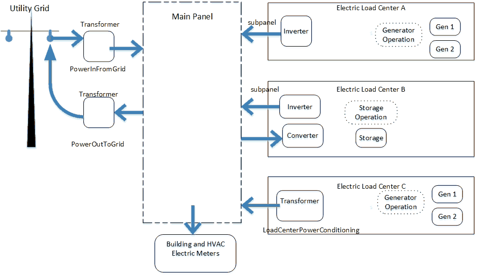


### ElectricLoadCenter:Transformer

This object is used to model the energy losses of transformers when they are used to transfer electricity from the grid to a building (as distribution transformers) or transfer electricity from onsite generators to the grid. Distribution transformers reduce the voltage on utility distribution lines (34.5 kV or less) to a lower secondary voltage (600 V or less) suitable for customer equipment. According to the medium used for cooling and insulation, distribution transformers can be classified into liquid-immersed and dry type transformers. According to the input voltages, distribution transformers can be classified into medium-voltage (between 600 V and 34.5kV) and low-voltage transformer (less than 600 V). The transformers used to output the surplus electricity from onsite generators to the grid usually match the cogeneration voltage to the grid. This object can be used for all types of distribution transformers and the transformers used to output electricity from onsite generators to the grid, but the model defaults applies to the low-voltage dry type transformers because they are the most common type found in commercial and industrial facilities.

Energy losses in transformers consist of the no load (core) loss and the load (winding) loss. The no load loss comes primarily from the switching of the magnetic fields in the core material. It is roughly constant and exists continuously in the core material as long as the transformer is energized. The load loss comes from the electrical resistance in the windings when there is a load on the transformer. The load loss is proportional to the load squared with a small temperature correction. The energy losses at a given load depend on the transformer   s performance. This object provides the user two alternative ways to indicate the transformer   s performance. First, the user can provide the no load loss and load loss at rated conditions. Second, the user can provide the nameplate efficiency and the corresponding reference conditions. The detailed algorithms to calculate the energy losses are described in the Engineering Reference.

The user needs to specify which loads are connected to the transformer. This is achieved in different manners depending on the transformer usage. For a distribution transformer, the user needs to provide a number of electric meters wired to that transformer. The input object can currently accommodate up to ten meters, but it is extensible by modifying the Energy+.idd entry. For a transformer used to output electricity from onsite generators to the grid, the user needs to indicate the transformer name in the served electric load center.


#### Field: Availability Schedule Name

This alpha field contains the schedule name (ref. Schedule objects) that contains information on the availability of the transformer. A schedule value greater than 0 (usually 1 is used) indicates that the transformer is available to convert AC power from one voltage to another. A value less than or equal to 0 (usually 0 is used) denotes that the transformer is not available. If this field is blank, the schedule has values of 1 for all time periods.

#### Field: Transformer Usage

This field indicates one of the three supported transformer application types: PowerInFromGrid, PowerOutToGrid, and LoadCenterPowerConditioning. 
A PowerInFromGrid type of transformer is used to step down voltage from the electricity grid to the building.  The transformer with this type of use is somewhat free standing and does not need to be referenced in any ElectricLoadCenter:Distribution object.  There should be only one PowerInFromGrid transformer in the model. 
A PowerOutToGrid type of transformer is used to match voltage from the building to the electricity grid. This conditions power exported out of the facility and feed back into the grid.  This type of transformer will only be needed if the building ever exports power and the building and grid connection have different voltages.  There should be only one PowerOutToGrid transformer in the model and it will serve all the surplus electricity produced by electric load center(s).
A LoadCenterPowerConditioning type of transformer is used to match voltage between an electic load center (subpanel) and the facility's main panel.  Each electric load center can have its own transformer to condition power fed into the main panel.  For electric load centers that also draw power from the main panel, to charge storage, the transformer is assumed to operate in both directions (at the same performance). This type of transformer should be named in an ElectricLoadCenter:Distribution object.

#### Field: Zone Name

This field contains the name of the thermal zone where the transformer is located. Entering a valid name of zone here will direct EnergyPlus to include the transformer   s losses as heat gains to the named thermal zone. If the transformer is not within a thermal zone, this field can be left blank and the thermal energy associated with transformer losses is removed from the building model.

#### Field: Radiative Fraction

This field contains the fraction of transformer   s losses that enter the zone as long-wave thermal radiation. This numeric filed should have a value between 0.0 and 1.0. The balance of the losses is convective. This field is not used if the previous field for zone name is left blank.

#### Field: Rated Capacity

This field defines the rated capacity of the transformer in VA.

#### Field: Phase

This field indicates whether the transformer is a single phase or three phase type. The two alternative values are 1 or 3. The default is 3. This field is currently not used in the model.

#### Field: Conductor Material

This field specifies the winding material used by the transformer. There are two options: Copper and Aluminum. The choice will determine the thermal coefficient of resistance used to calculate the temperature correction factor for the transformer load losses. The default is Aluminum.

#### Field: Full Load Temperature Rise

This numeric field defines the temperature rise of the windings above the ambient temperature, when the transformer is loaded at its nameplate rating. For liquid-immersed distribution transformers, the full load temperature rise usually takes the value of 65  &deg;C. For dry-type transformers, the temperature rise usually takes three optional values: 80, 115 and 150  &deg;C. This field accepts any value between the minimum (50  &deg;C) and the maximum (180  &deg;C). The default is 150  &deg;C.

#### Field: Fraction of Eddy Current Losses

This field defines the fraction of load losses resulting from the eddy currents. Transformer's load losses comprise two parts: the ohmic loss due to the current flowing in the resistance of the windings and the eddy and stray losses due to the eddy currents. This field indicates the fraction of the load losses due to the eddy currents. This numeric field should have a value between 0.0 and 1.0. The default is 0.1.

#### Field: Performance Input Method

This alpha field contains the method by which the user will specify the transformer performance: RatedLosses or NominalEfficiency. If this field is left blank in the input data file, the default input method is assumed to be RatedLosses. If the method NominalEfficiency is selected, the user must enter the fields for the nameplate efficiency and the corresponding reference coditions as described below. If the method RatedLosses is selected, then the fields for rated no load loss and load loss must be entered as described below.

#### Field: Rated No Load Loss

This field defines the no load loss (W) at rated load and conditions. The no load loss is roughly constant and exists whenever the transformer is energized. The no load loss is also called the core loss. This field is used only if the field of Performance Input Method is specified as RatedLosses.

#### Field: Rated Load Loss

This field defines the load loss (W) at rated load and conditions. The load loss varies with the square of the load being served by the transformer. The load loss is also called the winding loss because the load loss occurs in the primary and secondary windings around the core. This field is used only if the field of Performance Input Method is specified as RatedLosses.

#### Field: Nameplate Efficiency

This field contains the value for transformer efficiency at a given per unit load and specified reference temperature. This field is used only if the field of Performance Input Method is specified as NominalEfficiency. The default is 0.98.

#### Field: Per Unit Load for Nameplate Efficiency

This field defines the percentage of the rated capacity at which the nameplate efficiency is measured. According to the NEMA (National Electrical Manufactures Association) Standard TP-1, the per unit load takes the value of 0.35 for dry-type distribution transformers and it takes the value of 0.50 for liquid-filled distribution transformers. The default is 0.35.

#### Field: Reference Temperature for Nameplate Efficiency

This field defines the conductor temperature at which the nameplate efficiency is measured. This field is used only if the field of Performance Input Method is specified as    NominalEfficiency   . According to the NEMA Standard TP-1, the reference temperature takes the value of 75  &deg;C for dry-type distribution transformers and it takes the value of 55  &deg;C for liquid-filled distribution transformers. The default is 75  &deg;C.

#### Field: Per Unit Load for Maximum Efficiency

This field defines the percentage of the rated capacity at which the maximum efficiency is obtained. This field is used only if the field of Performance Input Method is specified as    NominalEfficiency   . A blank field indicates that it takes the same value as the per unit load for nameplate efficiency.

#### Field: Consider Transformer Loss for Utility Cost

This field indicates whether the transformer losses are considered to calculate utility cost.  This field applies to a PowerInFromGrid type of transformer.  In some cases, the transformer losses are required but they are not part of the energy consumption for utility cost calculation. For example, the transformer is owned by the utility company but it locates in the building. In this case, it might be desired to model transformer energy losses for HVAC operation but the energy losses will not be accounted for utility cost.

#### Field: Electric Meter 1-10 Name

A transformer may serve different loads such as plug loads, some lighting loads, and some HVAC equipment loads. These fields apply to a PowerInFromGrid type of transformer.  The user needs to specify which loads are connected to the transformer.  For example the HVAC and Plant equipment might use a higher voltage than the building and only the building loads need power conditioning.  This is achieved by providing a list of electric meters wired to the transformer. The input object can currently accommodate up to ten meters, but it is extensible by modifying the Energy+.idd entry. Any valid electric meter name can be used here to wire to the transformer loads. Many different meters are automatically generated by the program and will depend on the objects used throughout the input file. The typical process of determining the exact name to enter in this field involves doing an initial run of EnergyPlus and then examining the \*.mdd file which will list the meters and their resulting names. A custom meter is also supported. The meter must have electricity as its resource type.

An example input of the ElectricLoadCenter:Transformer input is:


```idf
   ElectricLoadCenter:Transformer,
       Transformer 1,                       !-Name
       Always On,                           !- Availability Schedule Name
       PowerInFromGrid,                     !- Transformer Usage
       ,                                    !- Zone Name
       ,                                    !-Radiative Fraction
       15000,                               !- Nameplate Rating {VA}
       3,                                   !- Phase
       Aluminum,                            !- Conductor Material
       150,                                 !- Full Load Temperature Rise { &deg;C}
       0.1,                                 !- Fraction of Eddy Current Losses
       NominalEfficiency,                   !- Performance Input Method
       ,                                    !- Rated No Load Loss {W}
       ,                                    !- Rated Load Loss {W}
       0.985,                               !- Nameplate Efficiency
       0.35,                                !- Per Unit Load for Nameplate Efficiency
       75,                                  !- Reference Temperature for Nameplate Efficiency { &deg;C}
       ,                                    !- Per Unit Load for Maximum Efficiency
       Yes,                                 !- Consider Transformer Loss for Utility Cost
       Electricity:Building;                !- Meter 1 Name


   Schedule:Compact,
       Always On,                             !- Name
       Fraction,                               !- ScheduleType
       Through: 12/31,                   !- Field #1
       For: AllDays,                       !- Field #2
       Until: 24:00,                       !- Field #3
       1.0;                                         !- Field #4
```


### ElectricLoadCenter:Transformer Outputs

* HVAC,Average,Transformer Efficiency[]

* HVAC,Average,Transformer Output Electric Power[W]

* HVAC,Sum,Transformer Output Elecric Energy [J]

* HVAC,Average,Transformer Input Electric Power[W]

* HVAC,Sum,Transformer Input Electric Energy [J]

* HVAC,Average,Transformer No Load Loss Rate [W]

* HVAC,Sum,Transformer No Load Loss Energy [J]

* HVAC,Average,Transformer Load Loss Rate [W]

* HVAC,Sum,Transformer Load Loss Energy [J]

* HVAC,Average,Transformer Thermal Loss Rate [W]

* HVAC,Sum,Transformer Thermal Loss Energy [J]

* HVAC,Sum,Transformer Distribution Electric Loss Energy [J]

* HVAC,Sum,Transformer Cogeneration Electric Loss Energy [J]

#### Transformer Efficiency

This output field is the efficiency at which the distribution transformer changes alternating current from the higher primary voltage to a lower secondary voltage. The efficiency is calculated for each HVAC system timestep being simulated, and the results are averaged for the timestep being reported.

#### Transformer Output Electric Power [W]

#### Transformer Output Elecric Energy [J]

These outputs are the total electricity power or energy provided by the transformer. They are equal to the metered loads which are wired to the transformer. These values are calculated for each HVAC system timestep being simulated, and the results are averaged (for power) or summed (for energy) for the timestep being reported.

#### Transformer Input Electric Power [W]

#### Transformer Input Electric Energy [J]

These outputs are the total electricity power or energy fed into the transformer. These values are calculated for each HVAC system timestep being simulated, and the results are averaged (for power) or summed (for energy) for the timestep being reported.

#### Transformer No Load Loss Rate [W]

#### Transformer No Load Loss Energy [J]

These outputs are the no load loss occurred in the transformer. These values are calculated for each HVAC system timestep being simulated, and the results are averaged (for rate) or summed (for energy) for the timestep being reported.

#### Transformer Load Loss Rate [W]

#### Transformer Load Loss Energy [J]

These outputs are the load loss occurred in the transformer. These values are calculated for each HVAC system timestep being simulated, and the results are averaged (for rate) or summed (for energy) for the timestep being reported.

#### Transformer Thermal Loss Rate [W]

#### Transformer Thermal Loss Energy [J]

These outputs are the total energy losses occurred in the transformer. They are equal to the sum of the no load loss and the load loss. These values are calculated for each HVAC system timestep being simulated, and the results are averaged (for rate) or summed (for energy) for the timestep being reported.

#### Transformer Distribution Electric Loss Energy [J]

This output is the total energy losses occurred in the transformer when it is used for input power from grid to building. It is set as zero if the transformer is used to transfer energy from onsite power generators to the electricity grid. This output is also added to a meter with ResourceType = Electricity, GroupKey = System.

#### Transformer Cogeneration Electric Loss Energy   [J]

This output is the total energy losses occurred in the transformer when it is used for input onsite cogeneration to the grid. It is set as zero if the transformer is used to transfer the electricity grid to building. This output is also added to a meter with ResourceType = ElectricityProduced, EndUseKey = Cogeneration, GroupKey = System.

### ElectricLoadCenter:Distribution

ElectricLoadCenter:Distribution objects are used to include on-site electricity generators and or storage in a simulation. The electric load center dispatches both generators and storage according to operation schemes and tracks and reports the amount of electricity generated and purchased. When using on-site generators, the program provides various reports for the electricity used, generated on site, stored, exported etc.  There are two separate operation schemes, one for generators and a second for storage, and they can be different.  The generator operation is managed before the storage operation.  Facility electrical demand tracking is done by the internal or custom meters used by EnergyPlus for reporting. The thermal demand tracking uses internal load calculations from the plant simulation. The dispatching of different generators is based on expectations based on their nominal/rated electric power output. If the current conditions are such that the generator model determines that generation was higher or lower, then the results of the dispatch may differ from expectations.

Multiple different ElectricLoadCenter:Distribution objects can be included in an input file.   A great deal of flexibility is available by mixing different load centers and operating schemes. If multiple load centers are used, the supervisory control will dispatch generators sequentially across the load centers.   Therefore, the order of these input objects in the IDF file becomes important with the generators associated with first load center in the file being the first to be managed.   A certain amount of caution is needed to avoid conflicting operating schemes.

#### Field: Name

This alpha field contains the identifying name for the electric load center.

#### Field: Generator List Name

This alpha field contains the identifying name for the list of generators in the set defined in an ElectricLoadCenter:Generators object.  All the generators connected to this load center need to be of the same type in terms of all AC or all DC.  Currently the only DC generators are photovoltaic panels, the others are all AC.  A facility with both AC and DC generators will need to use seperate ElectricLoadCenter:Distribution objects.  The generator list named here can only be associated with one load center.  This field can be left blank if there are no generators. 

#### Field: Generator Operation Scheme Type

This alpha field specifies the type of operating scheme for the generator set. The available operating schemes are Baseload, DemandLimit, TrackElectrical, TrackSchedule, TrackMeter, FollowThermal, and FollowThermalLimitElectrical.  The Baseload scheme operates the generators at their rated (requested) electric power output when the generator is scheduled ON (ref. ElectricLoadCenter:Generators). The Baseload scheme requests all generators scheduled ON (available) to operate, even if the amount of electric power generated exceeds the total facility electric power demand. The DemandLimit scheme limits the amount of purchased electrical from the utility to the amount specified in the input object. The DemandLimit scheme tries to have the generators meet all of the demand above the purchased electric limit set by the user in the next field. The TrackElectrical scheme tries to have the generators meet all of the electrical demand for the building. The TrackSchedule scheme tries to have the generators meet all of the electrical demand determined in a user-defined schedule. The TrackMeter scheme tries to have the generators meet all the electrical demand from a meter, which could also be a user-defined custom meter.

The DemandLimit, TrackElectrical, TrackSchedule, and TrackMeter schemes will sequentially load the available generators. All demand not met by available generator capacity (or storage) will be met by purchased electrical. Therefore, if DemandLimit, TrackElectrical, TrackSchedule, or TrackMeter is utilized and the available generators are not enough to meet demand, then purchased electrical will offset the difference. If a generator is needed in the simulation for a small load and it is less than the minimum part load ratio the generator will operate at the minimum part load ratio and the excess will either reduce demand or the excess energy will be available for returning to the electric grid.

The FollowThermal and FollowThermalLimitElectrical schemes are for heat following cogeneration and run the generators to meet the thermal demand.  The FollowThermal schemes allow excess electrical generation to be exported to the grid, while the FollowThermalLimitElectrical scheme restricts generator output to a maximum of the building's current electrical demand (so that no electricity is exported).  The thermal demand is determined from the plant modeling and depends on the flow requested by other components on the demand side of the plant loop, the loop temperatures, and the loop temperature set point.  The electric load center converts the thermal load to an electrical load using a nominal ratio of the thermal to electrical power production for each generator.  For these schemes, the generator needs to be connected to the supply side of a plant loop and components that request hot water need to be on the demand side of the plant loop.   This is different than the usual configuration for electrical following schemes where the generator is put on the demand side and request flow for the purposes of cooling the generator.  Therefore a switch from one of the electrical-based operating schemes to one of the thermal-based operating schemes requires a substantial change in plant topology.

If the load center includes electrical storage, then the choice of generator operating schemes will also affect how storage is managed.  The generator operation scheme and dispatch is modeled before the storage operation scheme so that the current generator production is available for use with the storage operation scheme. 

#### Field: Demand Limit Scheme Purchased Electric Demand Limit

This numerical field is the user input for the demand limit above which the generators will try and meet the entire electrical load on the building minus the photovoltaic array if available.

#### Field: Track Schedule Name Scheme Schedule Name

This alpha field is the user input for the name of a schedule defined elsewhere in the input file that contains values for the    demand    loads placed on the generator(s). The schedule values should be in Watts.

#### Field: Track Meter Scheme Meter Name

This alpha field is the user input for the name of a meter. Any valid meter name can be used here to control the loads that the generator(s) will try to meet. Many different meters are automatically generated by the program and will depend on the objects used throughout the input file. The typical process of determining the exact name to enter in this field involves doing an initial run of EnergyPlus and then examining the \*.rdd file which will list the meters and their resulting names. The \*.mtd file will also be useful to understand what exactly is included in a meter. The user can also use the Output:CustomMeter objects to redefine meter names and to control what electrical loads are included on them in a flexible manner.

#### Field: Electrical Buss Type

This alpha field is used to describe how the electric load center is configured with respect to any power conditioning and/or storage equipment. There are five configurations available for load centers that are selected using one of these keywords:  AlternatingCurrent, AlternatingCurrentWithStorage, DirectCurrentWithInverter, DirectCurrentWithInverterDCStorage, or DirectCurrentWithInverterACStorage.  This input informs the program which of the five pre-configured arrangements is to be used for this load center.  The following diagrams show the kinds of devices and how they are arranged for each of the buss types.

- AlternatingCurrent.  This type of load center is for adding one or more on-site generators that produce AC power.  If the voltage does not match a transformer can be included but is not needed.  AlternatingCurrent is the default.

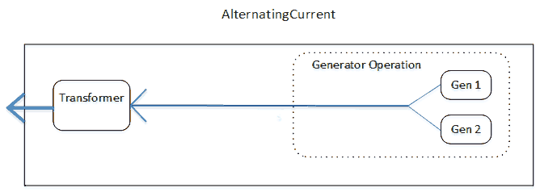

- AlternatingCurrentWithStorage.  This type of load center is for adding one or more on-site generators that produce AC power and one on-site electric storage device that uses AC power.  The connection between the load center and the main building panel is bidirectional so that storage can be charged by drawing from the grid.  Transformer is optional.   

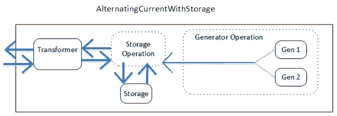

- DirectCurrentWithInverter.  This type of load center is for adding one or more on-site generators that produce DC power, typically photovoltaic panels.  An inverter is needed to convert generated power from DC to AC.  Transformer is optional. 

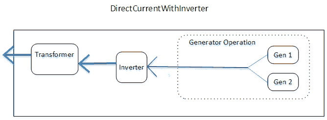

- DirectCurrentWithInverterDCStorage.  This type of load center is for adding one or more on-site generatros the produce DC power and one on-site storage device that uses DC power.  An inverter is needed to convert power from DC to AC and is located between the storage and where the subpanel feeds into the main panel.  The connection between the load center and the main building panel is bidirectional so that storage can be charged by drawing from the grid.  An AC to DC converter is needed if the storage operation scheme is such that the control might draw power from the main facility panel into the load center in order to charge storage. Transformer is optional.

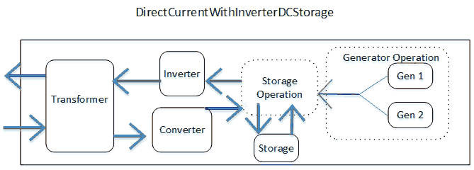

- DirectCurrentWithInverterACStorage.  This type of load center is for adding one or more on-site generatros the produce DC power and one on-site storage device that uses AC power.   The connection between the load center and the main building panel is bidirectional so that storage can be charged by drawing from the grid.  The inverter is located between the generators and the storage device. Transformer is optional.

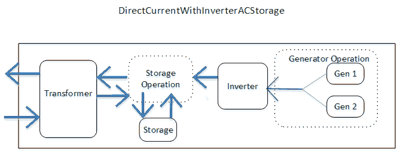


#### Field: Inverter Object Name

This field is used to identify the inverter connected to this load center (if any).  This field is only used if the Electrical Buss Type is set to DirectCurrentWithInverter, DirectCurrentWithInverterDCStorage, or DirectCurrentWithInverterACStorage and should contain the user-defined name of an inverter object.   There are three types of inverter models available  -see ElectricLoadCenter:Inverter:Simple, ElectricLoadCenter:Inverter:LookUpTable,   or ElectricLoadCenter:Inverter:FunctionOfPower.   Enter the name of one of these types of inverter objects defined elsewhere in the input file.

#### Field: Electrical Storage Object Name

This field is used to identify the electrical storage connected to this load center (if any).   This field is only used if the Electrical Buss Type is set to AlternatingCurrentWithStorage, DirectCurrentWithInverterDCStorage or DirectCurrentWithInverterACStorage.   Enter the name of an ElectricLoadCenter:Storage:* object defined elsewhere in the input file.

#### Field: Transformer Object Name

This field is used to identify the transformer connected to this load center (if any). This field can be used for any electrical buss types. Enter the name of an ElectricLoadCenter:Transformer object defined elsewhere in the input file.  The transformer should have use type set to LoadCenterPowerConditioning.

#### Field: Storage Operation Scheme

This field is used to select the operation scheme used to govern how storage charge and discharge is controlled.  There are four options:  TrackFacilityElectricDemandStoreExcessOnSite, TrackMeterDemandStoreExcessOnSite, TrackChargeDischargeSchedules, or FacilityDemandLeveling.  

TrackFacilityElectricDemandStoreExcessOnSite indicates that storage control will follow the facility power demand (meter Facility:Electricity) while accounting for any on-site generation.  Only excess on site generation gets stored.  This is the legacy control behavior before version 8.5 and is the default.

TrackMeterDemandStoreExcessOnSite indicates that storage discharge control will follow an electric meter named in the field called Storage Control Track Meter Name.  This scheme is similar TrackFacilityElectricDemandStoreExcessOnSite except that instead of the main facility electric meter, the control is based off of a user-selected meter.

TrackChargeDischargeSchedules indicates that control will follow the charging and discharging power and schedules defined in the fields called Maximum Storage Charge Grid Supply Power, Storage Charge Grid Supply Power Fraction Schedule Name, Design Storage Discharge Grid Export Power, and Storage Discharge Grid Export Fraction Schedule Name.

FacilityDemandLeveling indicates that storage control will attempt to control the facility's power demand drawn from the utility service to a prescribed level.  The target utility demand is entered in the fields called Storage Control Utility Demand Limit and Storage Control Utility Demand Limit Fraction Schedule Name.  This scheme first accounts for any on-site generation and during times of high use will discharge storage to reduce facility grid demand to meet the target level and during times of low use will charge storage from the grid to increase facility grid demand to meet the target level.  This scheme allows controlling the load factor as long as the storage capacity and rates are not limiting what is possible.  Negative schedule values can be used so that a negative demand target is exporting power out to the grid. 

#### Field: Storage Control Track Meter Name

This field is the name of a meter to use when a custom meter is to be used.  This is required when Storage Operation Scheme is set to TrackMeterDemandStoreExcessOnSite.

#### Field: Storage Converter Object Name

This field is the name of an ElectricLoadCenter:Storage:Converter object defined elsewhere in the input file that describes the performance when converting AC to DC when charging DC storage from grid supply. This field is required when using DC storage (buss type DirectCurrentWithInverterDCStorage) with grid supplied charging power (Storage Operation Scheme is set to TrackChargeDischargeSchedules or FacilityDemandLeveling.)  Although some inverter devices are bidirectional a separate converter object is needed to describe AC to DC performance.

#### Field: Maximum Storage State of Charge Fraction

This numeric field specifies the fraction of storage capacity used as an upper limit for controlling charging.  Charging will be constrained so that charging will stop the once this limit is reached. This fraction is the state of charge of the storage device where 1.0 is completely full and 0.0 is completely empty.  This allows supervisory control over charging to model behavior intended to protect the battery from damage. The legacy behavior prior to version 8.5 was to charge to full capacity and therefore the default is 1.0.  

#### Field: Minimum Storage State of Charge Fraction

This numeric field specifies the fraction of storage capacity used as lower limit for controlling discharging.  Discharging will be constrained so that discharging will stop once this limit is reached.  This fraction is the state of charge of the storage device where 1.0 is completely full and 0.0 is completely empty.  This allows supervisory control over discharging to model behavior intended to protect the battery from damage. The legacy behavior prior to version 8.5 was to discharge to empty and therefore the default is 0.0.  

#### Field: Design Storage Control Charge Power

This field is the design maximum rate that electric power can be charged into storage, in Watts.  This field is used as an upper limit for most storage control operation schemes. However for TrackChargeDischargeSchedules, this is the design value for how much power to use when charging and it is multipled by the power fraction schedule in the next field.  Required field when using Storage Operation Schemes set to FacilityDemandLeveling or TrackChargeDischargeSchedules.

#### Field: Storage Charge Power Fraction Schedule Name

This field contains the name of a schedule that controls the timing and magnitude of charging storage.  This is a required field if Storage Operation Scheme is set to TrackChargeDischargeSchedules.  Schedule values should be fractions from 0.0 to 1.0, inclusive.  This schedule will need to be coordinated with the discharging schedule named below. 

#### Field: Design Storage Control Discharge Power

This field is the design maximum rate that electric power can be discharged from storage.  This field is used as an upper limit for most storage control operation schemes. However for TrackChargeDischargeSchedules, this is the design value for how much power to draw when discharging and it is multiplied by the power fraction schedule in the next field.  Required field when using Storage Operation Schemes set to FacilityDemandLeveling or TrackChargeDischargeSchedules.

#### Field: Storage Discharge Power Fraction Schedule Name

This field contains the name of a schedule that controls the timing and magnitude of discharging storage. Required field if Storage Operation Scheme is set to TrackChargeDischargeSchedules.  Schedule values should be fractions from 0.0 to 1.0, inclusive.  This schedule will need to be coordinated with the charging schedule named above.

#### Field: Storage Control Utility Demand Target

This field contains the design demand target in Watts.  This field is used when the storage operation scheme is set to FacilityDemandLeveling.  This becomes the target utility service demand power for discharge control.  This design value is multiplied by the fraction schedule named in the next field.  This is more than an upper limit, it is also going to call for extra electric power to raise demand up to the target and put the extra power into on-site storage.  This field is required for FacilityDemandLimit storage operation scheme.

#### Field: Storage Control Utility Demand Target Fraction Schedule Name

This field is the name of schedule that modifies the utility demand power target over time. Schedule values should be fractions from -1.0 to 1.0, inclusive. Negative values indicate export to grid.  This field is required if Storage Operation Scheme is set to FacilityDemandLeveling.


Examples of this object are:

```idf
ElectricLoadCenter:Distribution,
       SOFC Electric Load Center,      !- Name
       Micro-Generators,               !- Generator List Name
       Baseload,                       !- Generator Operation Scheme Type
       0.0,                            !- Demand Limit Scheme Purchased Electric Demand Limit {W}
       ,                               !- Track Schedule Name Scheme Schedule Name
       ,                               !- Track Meter Scheme Meter Name
       AlternatingCurrent,             !- Electrical Buss Type
       ,                               !- Inverter Object Name
       ;                               !- Electrical Storage Object Name


   ElectricLoadCenter:Distribution,
       Electric Load Center,       !- Name
       Backup Generators,             !- Generator List Name
       DemandLimit,                         !- Generator Operation Scheme Type
       10000.0,                                 !- Demand Limit Scheme Purchased Electric Demand Limit {W}
       ,                                               !- Track Schedule Name Scheme Schedule Name
       ,                                               !- Track Meter Scheme Meter Name
       AlternatingCurrent,           !- Electrical Buss Type
       ,                                               !- Inverter Object Name
       ;                                               !- Electrical Storage Object Name
```

### ElectricLoadCenter:Distribution Outputs

There are three levels of results reporting related to electric load centers and generators.   The top level of reporting provides results across the whole building and all the different electric load centers and generators.   The second level of reporting provides results for individual load centers.   The third level is for each type of generator (see individual generator descriptions).   This section discusses the first two levels.

Even if no ElectricLoadCenter:Distribution object is included, the following whole-building summary output variables are also available for all simulations that have any electricity consuming equipment.  

* HVAC,Average,Facility Total Purchased Electric Power [W]
* HVAC,Sum,Facility Total Purchased Electric Energy [J]
* HVAC,Average,Facility Total Surplus Electric Power [W]
* HVAC,Sum,Facility Total Surplus Electric Energy [J]
* HVAC,Average,Facility Net Purchased Electric Power [W]
* HVAC,Sum,Facility Net Purchased Electric Energy [J]
* HVAC,Average,Facility Total Building Electric Demand Power [W]
* HVAC,Average,Facility Total HVAC Electric Demand Power [W]
* HVAC,Average,Facility Total Electric Demand Power [W]
* HVAC,Average,Facility Total Produced Electric Power [W]
* HVAC,Sum,Facility Total Produced Electric Energy [J]

These output variables all use a default keyword    Whole Building.   

#### Facility Total Purchased Electric Power [W]
#### Facility Total Purchased Electric Energy [J]
 
These outputs are the total of electricity purchased for the entire facility in both power and energy units. This value is always positive and indicates the amount of energy that is purchased from the utility.

#### Facility Total Surplus Electric Power [W]
#### Facility Total Surplus Electric Energy [J]

These outputs are the total excess electricity exported and sent out to the electrical grid in both power and energy units. This value is always positive and indicates the surplus electric power (from generation and/or storage discharge) exceeds the whole-building demand and electricity is being fed from the facility into the grid.

#### Facility Net Purchased Electric Power [W]
#### Facility Net Purchased Electric Energy [J]

These outputs are the net electricity purchased in both Power and Energy units. This value can be either positive or negative. Positive values are defined as electricity purchased from the utility. Negative values are defined as surplus electricity fed back into the grid.

#### Facility Total Building Electric Demand Power [W]

This output variable includes all of the electric demand from the building (non-HVAC) portion of the simulation, which would contain lights, electrical equipment, exterior lights and equipment, etc.

#### Facility Total HVAC Electric Demand Power [W]

This output variable includes all of the electric demand from the HVAC portion of the simulation, which would contain fans, electric coils, pumps, chillers, cooling towers, etc.

#### Facility Total Electric Demand Power [W]

This is the total of the whole Building and HVAC electric demands.

#### Facility Total Produced Electric Power [W]
#### Facility Total Produced Electric Energy [J]

These outputs are the total generator and photovoltaic electricity produced on-site for the entire model, and they are in both Power and Energy units.  When the electric power production system includes power conversion devices including DC to AC inverters, AC to DC converters, or transformers, the power conversion losses are included as negative values in these reports. When electrical storage is used with on-site production, the electricity put into storage is decremented from production and the electricity removed storage is added to production.   This means that losses from a round trip through electrical storage decrease on-site electricity production.


Each ElectricLoadCenter also collects results from the individual generators that are connected to that load center.  The keywords for these reports are the unique names of ElectricLoadCenter:Distribution objects.  The output variables available at the ElectricLoadCenter level are:

* HVAC,Average,Electric Load Center Produced Electric Power [W]
* HVAC,Sum,Electric Load Center Produced Electric Energy [J]
* HVAC,Average,Electric Load Center Supplied Electric Power [W]
* HVAC,Average,Electric Load Center Drawn Electric Power [W]
* HVAC,Average,Electric Load Center Produced Thermal Rate [W]
* HVAC,Sum,Electric Load Center Produced Thermal Energy [J]
* HVAC,Average,Electric Load Center Requested Electric Power [W]


#### Electric Load Center Produced Electric Power [W]

#### Electric Load Center Produced Electric Energy [J]

These outputs are the sum of electrical energy and power produced by the generators attached to a particular load center.  This could be DC or AC depending on the type of buss.  The power actually delivered by the load center may be adjusted by power conversion losses from an inverter or transformer or by interaction with the any electrical storage. 

#### Electric Load Center Supplied Electric Power [W]

This output is the power fed from the electric load center into the main distribution panel, in Watts.  This power is generated or discharged by on site equipment and has been adjusted to account for any power conversion by an inverter and/or transformer on the load center. 

#### Electric Load Center Drawn Electric Power [W]

This output is the power fed from the main distribution panel into the load center, in Watts.  This power draw is typically only for charging storage with power from either the grid or another load center. 

#### Electric Load Center Produced Thermal Rate [W]

#### Electric Load Center Produced Thermal Energy [J]

These outputs are the sum of the thermal energy and power produced by the generators attached to a particular load center.   The keywords for these reports are the unique names of ElectricLoadCenter:Distribution objects.

#### Electric Load Center Requested Electric Power [W]

This output variable is the average electric power supply (in watts) requested of the load center by the facility's main distribution panel, for the time step being reported.  This is used by the load center generator and storage operation control logic when determining how to run the generators and/or storage devices.  For the baseload generator operating scheme, this output variable should equal the sum of the power supply requests for the available generators associated with this load center (ref. ElectricLoadCenter:Generators). In other cases, this output could be different from the sum of the power supply requests for the generators associated with this load center. For example, a generator might be requested to provide a certain amount of power but can only provide a fraction of the requested amount. In this case the load center will detect this shortfall and include it when calculating the power request for the next available generator. Therefore, the sum of the power supply requests for the individual generators associated with this load center (ref. ElectricLoadCenter:Generators) could be greater than the Electric Load Center Requested Electric Power output variable.


### ElectricLoadCenter:Generators

The ElectricLoadCenter:Generators object is used to provide a list of the generators to include in the simulation. The list includes the names and types of all the generators along with separate availability schedules, the rated power output, and thermal-to-electrical power ratio for each. Sets of five input fields are repeated for each generator. If more than 30 generators are needed, EnergyPlus will    auto-extend    to suit the needs but other interfaces (such as the IDF Editor may not). The user can always modify the Energy+.idd file to accommodate the extra fields necessary, but it is likely the next release of EnergyPlus will overwrite any user modifications.

#### Field: Name

This alpha field contains the identifying name for the generators in the set.

#### FieldSet: Name, Object Type, Rated Power Output, Availability, Thermal Ratio up to 30

Each generator is specified by a set of 5 input fields that contain an identifying name, a keyword that indicates the type of generator, the rated output of the generator, the availability schedule of the generator, and the thermal to electrical power production ratio.

#### Field: Generator &lt;x&gt; Name

This alpha field contains the identifying name for the first generator in the list.

#### Field: Generator &lt;x&gt; Object Type

This alpha field contains the keyword for the type of generator.   The available types include:

- Generator:InternalCombustionEngine

- Generator:CombustionTurbine

- Generator:Photovoltaic

- Generator:FuelCell

- Generator:MicroCHP

- Generator:MicroTurbine

- Generator:WindTurbine

These keywords are the names of the input objects for the type of generator.

#### Field: Generator &lt;x&gt; Rated Electric Power Output

This numeric field contains the nominal electric power output to be requested from generator 1. It is normally equal to the rated power output of the generator in Watts. This value is used only for supervisory control and generator dispatch; the actual power output for each time step is determined by the generator models. This value affects how much a generator is loaded (i.e., requested electric power output) and can also impact the operation of an electric storage unit (e.g., LoadCenter:Storage:Simple) if one is connected to the associated load distribution center (ref. ElectricLoadCenter:Distribution). Refer to Electrical Storage in the EnergyPlus Engineering Reference for more details regarding this input field and its relationship with electric storage.

#### Field: Generator &lt;x&gt; Availability Schedule Name

This alpha field is used as an identifying field for the generator availability schedule. If not blank, this field must contain the name of a schedule defined elsewhere in the input file.   A schedule value of &lt;=0.0 indicates the generator is not available, while a schedule value &gt; 0.0 indicates that the generator is available to operate. If this field is blank, the schedule has values of 1 for all time periods.

#### Field: Generator &lt;x&gt; Rated Thermal to Electrical Power Ratio

This numeric field contains the ratio of the rated thermal output to the rated electric output.   It is required and used if the operation scheme is set to **FollowThermal** or **FollowThermalLimitElectrical**.   This nominal ratio is only used for control and dispatch decisions.   This value should be generally consistent with the more detailed performance input for the individual generator component models but it is not used in those component models.

An example IDF showing how this object is used is provided below:

```idf
   ElectricLoadCenter:Generators,
       Backup Generators,             !- Name
       Cat Diesel,                           !- Generator 1 Name
       Generator:InternalCombustionEngine,   !- Generator 1 Object Type
       50000,                                     !- Generator 1 Rated Electric Power Output
       ON PEAK GENERATOR SCHEDULE,   !- Generator 1 Availability Schedule Name
       ,                                               !- Generator 1 Rated Thermal to Electrical Power Ratio
       Solar Turbine,                     !- Generator 2 Name
       Generator:CombustionTurbine,   !- Generator 2 Object Type
       30000,                                     !- Generator 2 Rated Electric Power Output
       OFF PEAK GENERATOR SCHEDULE,   !- Generator 2 Availability Schedule Name
       ,                                               !- Generator 2 Rated Thermal to Electrical Power Ratio
       Capstone C65,                       !- Generator 3 Name
       Generator:Microturbine,   !- Generator 3 Object Type
       65000,                                     !- Generator 3 Rated Electric Power Output
       MID PEAK GENERATOR SCHEDULE,   !- Generator 3 Availability Schedule Name
       ;                                               !- Generator 3 Rated Thermal to Electrical Power Ratio
```

### ElectricLoadCenter:Generators Outputs

A single output variable is available for each generator specified via this object as described below:

* HVAC,Average,Generator Requested Electric Power [W]

#### Generator Requested Electric Power [W]

This output variable represents the average electric power supply in Watts that is being requested by the generator operation scheme from a specific generator for the time step being reported. In some instances the output value may be the Rated Electric Power Output specified for the generator in the ElectricLoadCenter:Generators object. If the generator is not available for a simulation time step (as indicated by its availability schedule), then the power supply request will be zero. The power supply request may be less than the rated electric power output if the overall electric power reduction target has already been met, partially or completely, by electric power produced by other generators. If an EnergyPlus Energy Management System is used to specify an electric power supply request for this generator, then that EMS request will be reflected in this output variable.

### ElectricLoadCenter:Inverter:Simple

This input object is used to model conversion from Direct Current (DC) to Alternating Current (AC) in an electric load center that contains photovoltaic modules.   Such a load center has an array of photovoltaic modules that feed an inverter DC power and the inverter produces AC power.   This input object is for the simplest inverter model and uses a fixed efficiency.   There are two other types of inverters with more complex models described below.

#### Field: Name

This field contains a unique name for the inverter.   The name entered must also be unique across all other types of inverters that may also be in the input file.

#### Field: Availability Schedule Name

This field contains the name of a schedule that describes when the inverter is available.   If the inverter is scheduled to not be available, by scheduling a value of 0, then it cannot produce AC power and will not consume ancillary power during standby.   Any non-zero schedule value means the inverter is available to produce AC power and consume ancillary power during standby.   If the Inverter is scheduled to be unavailable but it is being supplied with DC power anyway, then the energy is dissipated as heat. If this field is blank, the schedule has values of 1 for all time periods.

#### Field: Zone Name

This field contains the name of the thermal zone where the inverter is located.   Entering a valid name of zone here will direct EnergyPlus to include the inverter   s losses as heat gains to the named thermal zone.   If the inverter is not within a thermal zone, then this field can be left blank (and the thermal energy associated with inverter losses is removed from the building model).

#### Field: Radiative Fraction

This field contains the fraction of inverter thermal losses that enter the zone as long-wave thermal radiation.   This should be a factor between 0.0 and 1.0.   The balance of the losses is convective.   This field is not used if the previous field for zone name is left blank.

#### Field: Inverter Efficiency

This field contains the value for inverter efficiency.   In the simple model, efficiency is a constant.   This is the so-called 1-term model.   Input data for different types of inverters is available at http://www.gosolarcalifornia.org/equipment/inverter_tests/summaries where the    CEC Efficiency    would be the value to enter here.

An example IDF showing how this object is used is provided below:

```idf
   ElectricLoadCenter:Inverter:Simple,
       Simple Ideal Inverter,     !- Name
       Always On,                             !- Availability Schedule Name
       ,                                               !- Zone Name
       0.0,                                         !- Radiative Fraction
       1.0;                                         !- Inverter Efficiency
```

### ElectricLoadCenter:Inverter:FunctionOfPower

This input object is used to model conversion from Direct Current (DC) to Alternating Current (AC) in an electric load center that contains photovoltaic modules.   Such a load center has an array of photovoltaic modules that feed an inverter DC power and the inverter produces AC power.   This input object is for an inverter model where efficiency is a function of normalized power.

#### Field: Name

This field contains a unique name for the inverter.   The name entered must also be unique across all other types of inverters that may also be in the input file.

#### Field: Availability Schedule Name

This field contains the name of a schedule that describes when the inverter is available.   If the inverter is scheduled to not be available, by scheduling a value of 0, then it cannot produce AC power, nor contribute heat gains to the zone, and will not consume ancillary power during standby.   Any non-zero schedule value means the inverter is available to produce AC power, contribute heat gains to the zone and consume ancillary power during standby. If this field is blank, the schedule has values of 1 for all time periods.

#### Field: Zone Name

This field contains the name of the thermal zone where the inverter is located.   Entering a valid name of zone here will direct EnergyPlus to include the inverter   s losses as heat gains to the named thermal zone.   If the inverter is not within a thermal zone, then this field can be left blank (and the thermal energy associated with inverter losses is removed from the building model).

#### Field: Radiative Fraction

This field contains the fraction of inverter thermal losses that enter the zone as long-wave thermal radiation.   This should be a factor between 0.0 and 1.0.   The balance of the losses is convective.   This field is not used if the previous field for zone name is left blank.

#### Field: Efficiency Function of Power Curve Name

This field contains the name of curve representing the relationship between DC power input into the inverter and the efficiency with which that power is converted to AC.   The curve can be either a Curve:Linear, Curve:Quadratic, or Curve:Cubic.   The curve   s    x    value is DC power input normalized by the following field.   The result of the curve should be power conversion efficiency expressed as a fraction between 0.0 and 1.0.

#### Field: Rated Maximum Continuous Input Power

This field contains the rated power input in watts.   This is value used to normalize input power for use with the curve named in the previous field.   This is DC power from the PV arrays going into the inverter.

#### Field: Minimum Efficiency

This field contains a minimum bound on the inverter efficiency.   This value will be used as a limit on the curve   s result.

#### Field: Maximum Efficiency

This field contains a maximum bound on the inverter efficiency.   This value will be used as a limit on the curve   s result.

#### Field: Minimum Power Output

This field contains a lower limit on the AC power produced by the inverter.   If the resulting power output would be below this level, then the inverter is assumed to not produce any power and is in stand by mode.   All DC power input is lost (unless it is going into storage).

#### Field: Maximum Power

This field contains an upper limit on the AC power produced by the inverter.   If the resulting power output would be above this level, then the power produced is capped at this level with the rest of input power converted to losses (unless it is going into storage).

#### Field: Ancillary Power Consumed In Standby

This field contains the ancillary power in watts used by the inverter when not producing AC power.   This is AC electricity consumed in standby mode.   Standby mode occurs when the inverter is scheduled to be available but the incoming DC power is too low.

An example IDF showing how this object is used is provided below:

```idf
   ElectricLoadCenter:Inverter:FunctionOfPower,
       Curve Inverter,                   !- Name
       ALWAYS_ON,                             !- Availability Schedule Name
       ,                                               !- Zone Name
       0.3,                                         !- Radiative Fraction
       Inverter Curve,                   !- Efficiency Function of Power Curve Name
       15000,                                     !- Rated Maximum Continuous Input Power {W}
       0.0,                                         !- Minimum Efficiency
       1.0,                                         !- Maximum Efficiency
       200,                                         !- Minimum Power Output {W}
       20000,                                     !- Maximum Power Output {W}
       0.0;                                         !- Ancillary Power Consumed In Standby {W}
```

### ElectricLoadCenter:Inverter:LookUpTable

This input object is used to model conversion from Direct Current (DC) to Alternating Current (AC) in an electric load center that contains photovoltaic modules.   Such a load center has an array of photovoltaic modules that feed an inverter DC power and the inverter produces AC power.   This input object is for an inverter model where efficiency is interpolated using a look up table.

This object was designed for use with data contained in the Inverter Performance Test Summaries available at http://www.gosolarcalifornia.org/equipment/inverter_tests/summaries.   All of the data needed for this object can be found there by make and model of inverter.   The core of the data set is a 3x6 matrix of efficiency at different voltage and power levels.   These form the look up table used in the model.   Note that EnergyPlus    PV models currently model only power and not the voltage and current situation.   Therefore, only the nominal voltage data are used.   This is the middle row of data in the Go Solar summaries.

#### Field: Name

This field contains a unique name for the inverter.   The name entered must also be unique across all other types of inverters that may also be in the input file.

#### Field: Availability Schedule Name

This field contains the name of a schedule that describes when the inverter is available.   If the inverter is scheduled to not be available, by setting a value of 0, then it cannot produce AC power, nor contribute heat gains to the zone, and will not consume ancillary power during standby.   Any non-zero schedule value means the inverter is available to produce AC power, contribute heat gains to the zone and consume ancillary power during standby. If this field is blank, the schedule has values of 1 for all time periods.

#### Field: Zone Name

This field contains the name of the thermal zone where the inverter is located.   Entering a valid name of zone here will direct EnergyPlus to include the inverter   s losses as heat gains to the named thermal zone.   If the inverter is not within a thermal zone, then this field can be left blank (and the thermal energy associated with inverter losses is removed from the building model).

#### Field: Radiative Fraction

This field contains the fraction of inverter thermal losses that enter the zone as long-wave thermal radiation.   This should be a factor between 0.0 and 1.0.   The balance of the losses is convective.   This field is not used if the previous field for zone name is left blank.

#### Field: Rated Maximum Continuous Output Power

This field contains the rated maximum continuous output power in watts.

#### Field: Night Tare Loss Power

This field contains the    night tare loss    in watts.   This is modeled as ancillary power consumed during standby.

#### Field: Nominal Voltage Input

This field contains the nominal DC input voltage in volts.   This is    Vnom    in the Go Solar test summaries.

#### Field: Efficiency at 10% Power and Nominal Voltage

This field contains the fractional efficiency at nominal voltage and 10% power.

#### Field: Efficiency at 20% Power and Nominal Voltage

This field contains the fractional efficiency at nominal voltage and 20% power.

#### Field: Efficiency at 30% Power and Nominal Voltage

This field contains the fractional efficiency at nominal voltage and 30% power.

#### Field: Efficiency at 50% Power and Nominal Voltage

This field contains the fractional efficiency at nominal voltage and 50% power.

#### Field: Efficiency at 75% Power and Nominal Voltage

This field contains the fractional efficiency at nominal voltage and 75% power.

#### Field: Efficiency at 100% Power and Nominal Voltage

This field contains the fractional efficiency at nominal voltage and 100% power.

An example IDF showing how this object is used is provided below:

```idf
   ElectricLoadCenter:Inverter:LookUpTable,
       PV Inverter,                         !- Name
       ALWAYS_ON,                             !- Availability Schedule Name
       ,                                               !- Zone Name
       0.25,                                       !- Radiative Fraction
       14000,                                     !- Rated Maximum Continuous Output Power {W}
       200.0,                                     !- Night Tare Loss Power {W}
       368,                                         !- Nominal Voltage Input {V}
       0.839,                                     !- Efficiency at 10% Power and Nominal Voltage
       0.897,                                     !- Efficiency at 20% Power and Nominal Voltage
       0.916,                                     !- Efficiency at 30% Power and Nominal Voltage
       0.931,                                     !- Efficiency at 50% Power and Nominal Voltage
       0.934,                                     !- Efficiency at 75% Power and Nominal Voltage
       0.930;                                     !- Efficiency at 100% Power and Nominal Voltage
```

### Electric Load Center Inverter Outputs

Each inverter can report the following seven output variables.

* HVAC,Average,Inverter DC to AC Efficiency []
* HVAC,Average,Inverter DC Input Electric Power [W]
* HVAC,Sum,Inverter DC Input Electric Energy [J]
* HVAC,Average,Inverter AC Output Electric Power [W]
* HVAC,Sum,Inverter AC Output Electric Energy [J]
* HVAC,Average,Inverter Conversion Loss Power [W]
* HVAC,Sum,Inverter Conversion Loss Energy [J]
* HVAC,Sum,Inverter Conversion Loss Decrement Energy [J]
* HVAC,Average,Inverter Thermal Loss Rate [W]
* HVAC,Sum,Inverter Thermal Loss Energy [J]
* HVAC,Average,Inverter Ancillary AC Electric Power [W]
* HVAC,Sum,Inverter Ancillary AC Electric Energy [J]

#### Inverter DC to AC Efficiency [ ]

This is the efficiency with which DC power is converted to AC power by the inverter.

#### Inverter DC Input Elecric Power [W]
#### Inverter DC Input Electric Energy [J]

These outputs are total electricity power or energy fed into the inverter.  This is Direct Current from photovoltaics (or DC-based electrical storage) going into the inverter.

#### Inverter AC Output Electric Power [W]
#### Inverter AC Output Electric Energy [J]

These outputs are the total electricity power or energy produced by the inverter.   This is Alternating Current going out of the inverter.

#### Inverter Conversion Loss Power [W]
#### Inverter Conversion Loss Energy [J]
#### Inverter Conversion Loss Decrement Energy [J]

These outputs are the thermal power or energy losses in the inverter that stem from converting from DC to AC.  The decrement energy is negative and is metered as "PowerConversion" on the "ElectricityProduced" resource.

#### Inverter Thermal Loss Rate [W]
#### Inverter Thermal Loss Energy [J]

These outputs are the thermal power or energy losses in the inverter that stem from converting from DC to AC plus any ancillary electric power. 

#### Inverter Ancillary AC Electric Power [W]
#### Inverter Ancillary AC Electric Energy [J]

These outputs are the Alternating Current electricity consumed by the inverter.   These are ancillary, or night tare loss, power uses by the inverter and modeled as if powered by the building   s grid connection.   These ancillary power draws generally occur when the inverter is not generating power but waiting in a standby mode ready to begin generating power.


###  ElectricLoadCenter:Storage:Converter

This model is for converting AC to DC for grid-supplied charging of DC storage.  The model is only for power conversion and does not consider voltage. There are two methods available for determining the efficiency with which power is converted.  The efficiency is defined as the ratio of DC power output divided by AC power input.  If the name of a zone is entered the power conversion losses will be added to the zone as internal heat gains.  The converter is part of a single electric load center.

#### Field: Name

This field contains a unique name for the AC to DC converter.  This name will be referenced in an ElectricLoadCenter:Distribution object. 

#### Field: Availability Schedule Name

This field contains the name of a schedule that describes when the power converter is available. If power conversion is not available then electric power from the grid cannot be used to charge storage. Any non-zero value means the converter is available. If this field is blank, the schedule has a value of 1 for all time periods and the converter is always available. Standby power consumption is on when converter is available and off when the converter is not available. 

#### Field: Power Conversion Efficiency Method

This choice field is used to select which method is used to define the efficiency with which power is converted from AC to DC.  There are two options: SimpleFixed or FunctionOfPower.
- SimpleFixed indicates that power conversion efficiency is a constant with the value set in the next field. There is no need to size the converter (with a value in the field called Design Maximum Continuous Input Power) and varying levels of power do not affect the efficiency. SimpleFixed is the default. 
- FunctionOfPower indicates that the power conversion efficiency is a function of the level of power being converted. This method is intended to model the characteristic that converters tend to operate less efficiently when loaded well below their design size. The converter must be sized with a value in the Design Maximum Continuous Input Power and the functional relationship described in a performance curve or look-up table. 

#### Field: Simple Fixed Efficiency

This numeric field is used to set a constant efficiency for conversion of AC to DC at all power levels. This field is only used, and is required, when the Power Conversion Efficiency Method is set to SimpleFixed. The value must be greater than 0.0 and less than equal to 1.0.  The default is 0.95. 
 
#### Field: Design Maximum Continuous Input Power

This numeric field describes the size of the power converter in terms of its design input power level, in Watts.  This is the AC power going into the converter.  This field is only used, and is required, when the the Power Conversion Efficiency Method is set to FunctionOfPower.  This input serves as an upper limit for the AC power input and is used to normalize power for use in the performance curve or table.  The AC power being converted at any given time is divided by the value in this field.  

#### Field: Efficiency Function of Power Curve Name

This field is the name of a performance curve or table object that describes how efficiency varies as a function of normalized power.  The single independent "x" variable input for the curve or table is the ratio of AC input power at a given time divided by design power in the previous field.  The result of the curve should be the power conversion efficiency for that normalized power so that DC power output is the product of efficiency multiplied by the AC power input.  Any of the single-variable performance curves or lookup table objects can be used to describe performance. This field is only used, and is required, when the the Power Conversion Efficiency Method is set to FunctionOfPower. 

#### Field: Ancillary Power Consumed In Standby

This numeric field describes the ancillary power consumed by the converter when it is available but not converting power, in Watts.  This field is optional and can be used with any of the efficiency methods. If this converter is really on mode of a bidirectional inverter, take care not to double count the ancillary consumption by including them in both this component and the inverter component. 

#### Field: Zone Name

This field is the name of thermal zone where the converter is located.  If this field is omitted then the converter is considered outdoors.  The power lost during the conversion process is treated as heat gains and added the thermal zone named in this field.  The split between radiation and convection can be controlled in the next input field. 

 #### Field: Radiative Fraction
 
This numeric field is the fraction of zone heat gains that are handled as infrared thermal radiation.  This field is only used if a zone is named in the previous field.  The portion of zone gains that are not radiative are added to the zone as convection. If a zone is named and this field left blank or omitted then all the zone heat gains will be convective. 

An example IDF showing how this object is used is provided below:

   ElectricLoadCenter:Storage:Converter,
       Grid Charge Converter ,   !- Name
       ALWAYS_ON ,               !- Availability Schedule Name
       SimpleFixed ,             !- Power Conversion Efficiency Method
       0.95 ,                    !- Simple Fixed Efficiency
       ,                         !- Design Maximum Continuous Input Power
       ,                         !- Efficiency Function of Power Curve Name
       20 ,                      !- Ancillary Power Consumed In Standby
        ,                         !- Zone Name
       0.25;                     !- Radiative Fraction

### Electric Load Center Converter Outputs

Each converter can report the following output variables

* HVAC,Average,Converter AC to DC Efficiency []
* HVAC,Average,Converter AC Input Electric Power [W]
* HVAC,Sum,Converter AC Input Electric Energy [J]
* HVAC,Average,Converter DC Output Electric Power [W]
* HVAC,Sum,Converter DC Output Electric Energy [J]
* HVAC,Average,Converter Electric Loss Power [W]
* HVAC,Sum,Converter Electric Loss Energy [J]
* HVAC,Sum,Converter Electric Loss Decrement Energy [J]
* HVAC,Average,Converter Thermal Loss Rate [W]
* HVAC,Sum,Converter Thermal Loss Energy [J]
* HVAC,Average,Converter Ancillary AC Electric Power [W]
* HVAC,Sum,Converter Ancillary AC Electric Energy [J]

#### Converter AC to DC Efficiency []

This is the efficiency with which AC power is converted to DC power by the converter

#### Converter AC Input Electric Power [W]
#### Converter AC Input Electric Energy [J]

These outputs are the total electric power or energy fed into the converter.  This is Alternating Current, or AC, drawn from the main panel into the load center. 

#### Converter DC Output Electric Power [W]
#### Converter DC Output Electric Energy [J]

These outputs are the total electric power or energy leaving the converter.  This is Direct Current, or DC, that will go into charging storage. 

#### Converter Electric Loss Power [W]
#### Converter Electric Loss Energy [J]
#### Converter Electric Loss Decrement Energy [J]

These outputs are the conversion losses that result from inefficiencies in the conversion from AC to DC.  The power and energy are positive while the decrement energy is negative and is metered on the "PowerConversion" end use for "ElectricityProduced".  

#### Converter Thermal Loss Rate [W]
#### Converter Thermal Loss Energy [J]

These outputs are the power and energy losses that result from the inefficiencies in the conversion from AC to DC and the ancillary standby power. 

#### Converter Ancillary AC Electric Power [W]
#### Converter Ancillary AC Electric Energy [J]

These outputs are the power and energy consumed in standby operation when the converter is not being used but is available and ready to be used. The ancillary power consumption is metered on the "Cogeneration" end use for "Electricity."


### ElectricLoadCenter:Storage:Simple

This input object is used to model storage of electricity in an electric load center.   This is a simple model that does not attempt to represent any of the characteristics of a real storage device such as a battery.   The type of power, AC or DC, depends on the configuration chosen as the Electrical Buss Type in the ElectricLoadCenter:Distribution object.

#### Field: Name

This field contains a unique name for the electric storage device.

#### Field: Availability Schedule Name

This field contains the name of a schedule that describes when the storage device is available.   If storage is not available, by scheduling a value of 0, then no electrical energy can be stored or drawn from the device.   Any non-zero schedule value means the devices is available. If this field is blank, the schedule has values of 1 for all time periods.

#### Field: Zone Name

This field contains the name of the thermal zone where the storage device is located.   Entering a valid name of a zone here will direct EnergyPlus to include the storage losses as heat gains to the name thermal zone.   If the storage is not within a therma zone, then this field can be left blank.

#### Field: Radiative Fraction for Zone Heat Gains

This field contains the fraction of storage losses that enter the zone as long-wave thermal radiation.   This should be a factor between 0.0 and 1.0.   The balance of the losses are convective.   This field is not used if the previous field for zone name is left blank.

#### Field: Nominal Energetic Efficiency for Charging

This field contains the charging efficiency.   This is the energetic efficiency of storing electrical energy in the storage device.   A value of 1.0 means the device does not lose any energy when charging.

#### Field: Nominal Discharging Energetic Efficiency

This field contains the discharging efficiency.     This is the energetic efficiency of drawing electrical energy from the storage device.   A value of 1.0 means the device does not lose any energy when drawing power.

#### Field: Maximum Storage Capacity

This field describes the maximum amount of energy that can be stored in the device in Joules.   Once the storage device is full, no additional energy can be stored in it.

#### Field: Maximum Power for Discharging

This field describes the maximum rate at which electrical power can be discharged from the storage device in watts.

#### Field: Maximum Power for Charging

This field describes the maximum rate at which electrical power can be stored in the device in watts.

#### Field: Initial State of Charge

This field describes the value for the initial state of charge in Joules.   This is used to model the storage device as having some amount of stored energy at the beginning of the simulation period.

An example IDF showing how this object is used is provided below:

```idf
   ElectricLoadCenter:Storage:Simple,
       Battery,                                 !- Name
       ALWAYS_ON,                             !- Availability Schedule Name
       ,                                               !- Zone Name
       0.0,                                         !- Radiative Fraction for Zone Heat Gains
       0.7,                                         !- Nominal Energetic Efficiency for Charging
       0.7,                                         !- Nominal Discharging Energetic Efficiency
       1.0E11,                                   !- Maximum Storage Capacity {J}
       50000,                                     !- Maximum Power for Discharging {W}
       25000,                                     !- Maximum Power for Charging {W}
       1.0E10;                                   !- Initial State of Charge {J}
```

### ElectricLoadCenter:Storage:Simple Outputs

Each electrical storage device can report the following seven output variables.

* HVAC,Average,Electric Storage Simple Charge State [J]

* HVAC,Average,Electric Storage Charge Power [W]

* HVAC,Sum,Electric Storage Charge Energy [J]

* HVAC,Average,Electric Storage Discharge Power [W]

* HVAC,Sum,Electric Storage Discharge Energy [J]

* HVAC,Average,Electric Storage Thermal Loss Rate [W]

* HVAC,Sum,Electric Storage Thermal Loss Energy [J]

* HVAC,Sum,Electric Storage Production Decrement Energy [J]

#### Electric Storage Simple Charge State [J]

This output is the state of charge of the storage device.  State of charge is the amount of electrical energy stored in the device at a point of time.  The amount of energy stored in tracked in Joules.

#### Electric Storage Charge Power [W]

#### Electric Storage Charge Energy [J]

These outputs are total electricity power or energy fed into the storage device.   This is the rate or amount of charging.

#### Electric Storage Production Decrement Energy [J]

This output is the total electricity energy decremented from electricity production because it has fed into the storage device.   This output has the opposite sign of    Electric Storage Charge Energy    but is otherwise similar.   This decrement output variable is also a meter associated with the resource type    ElectricityProduced    that reduces the metered electricity production to account for power that went into storage after production.

#### Electric Storage Discharge Power [W]

#### Electric Storage Discharge Energy [J]

These outputs are total electricity power or energy drawn from the storage device.   This is the rate or amount of discharging.   The energy from storage output variable is also a meter associated with the resource type    ElectricityProduced    that increases the metered electricity production to account for power that has come back out of storage.

#### Electric Storage Thermal Loss Rate [W]

#### Electric Storage Thermal Loss Energy [J]

These outputs are the thermal power or energy losses from both charging and drawing electrical power in or out of the storage device.   These losses are the result of inefficiencies in charging and drawing.

### ElectricLoadCenter:Storage: Battery

This object uses the kinetic battery model (KiBaM) to simulate rechargeable battery banks in an electrical load center. The battery bank is a collection of one or more individual battery modules. Given the surplus or deficit power from the electrical system and the state of charge from the previous time step, this object can model the voltage, current, and energy losses with charging and discharging during each time step. The cumulative battery damage can be also modeled and reported at the end of each simulation run.

This object allows the simulation of both lead-acid and Nickel Cadmium batteries. With input parameters derived from specific battery tests, the object is expected to support other battery types such as Lithium-ion batteries.

The kinetic battery model assumes that part of the battery   s energy storage capacity is immediately available in discharging or charging while the rest is chemically bound. As a function of constant current, the battery capacity is related to three parameters: the maximum capacity at infinitesimal current, the capacity ratio of available charges, and the conversion ratio between available charges and bound charges. These parameters are usually obtained via curve fitting based on battery data sheets or test data.

Each individual battery module is modeled as a voltage source in series with an electrical resistance.   KiBaM assumes that the internal resistance is constant and the open circuit voltage varies with the electric current, the state of charge and the operation mode (charging or discharging). For an individual battery module, the open circuit voltage at any time is correlated to the voltage at fully charged/discharged state and three other regression coefficients.   These regression coefficients are usually obtained via curve fitting based on battery test data.

The object offers user the option to perform battery life calculation. If battery life is modeled, the user needs to provide a group of coefficients for the correlation between the number of cycles for battery failure and the corresponding cycle range. More detailed information can be found from the Engineering Reference.

#### Field: Name

This alpha field contains the identifying name for the battery bank.

#### Field: Availability Schedule Name

This alpha field contains the schedule name (ref. Schedule objects) that describes when the battery is available. A schedule value greater than 0 (usually 1 is used) indicates that electrical energy can be stored or drawn from the battery. A value less than or equal to 0 (usually 0 is used) denotes that the battery is not available. If this field is blank, the schedule has values of 1 for all time periods.

#### Field: Zone Name

This field contains the name of the thermal zone where the battery is located. Entering a valid name of zone here will direct EnergyPlus to include the energy storage losses as heat gains to the named thermal zone. If the battery is not within a thermal zone, this field can be left blank and the thermal energy associated with storage losses is removed from the building model.

#### Field: Radiative Fraction

This field contains the fraction of storage losses that enter the zone as long-wave thermal radiation. This numeric filed should have a value between 0.0 and 1.0. The balance of the losses is convective. This field is not used if the previous field for zone name is left blank.

#### Field: Number of Battery Modules in Parallel

This field defines the number of modules connected in parallel in the battery bank.

#### Field: Number of Battery Modules in Series

This field defines the number of modules connected in series in the battery bank. The total number of modules in a battery bank is equal to the number of modules in parallel times the number of modules in series.

#### Field: Maximum Module Capacity

This field indicates the maximum capacity of one battery module. It is evaluated as the total Amp-hours available when a full battery is discharged at infinitesimal current. This capacity is for an individual battery module, not for the whole battery bank. The maximum capacity can be found from manufacture   s data or derived from test data by curve fitting.

#### Field: Initial Fractional State of Charge

This field describes the initial state of charge in terms of the fraction of maximum capacity as defined in the previous field.

#### Field: Fraction of Available Charge Capacity

The kinetic battery model assumes that battery is a two-tank electrical energy storage device: an available tank and a bound tank. The available tank can be immediately charged or discharged, while the bound tank can only be charged or discharged via the available tank. This field specifies the fraction of total charge in the battery that is part of the available tank. The ratio of available charge capacity to total capacity is a parameter usually derived from test data by curve fitting.

#### Field: Change Rate from Bound Charge to Available Charge

This field specifies the rate at which the charge flows between the available tank and the bound tank. It is a parameter used to calculate the conversion between available charge and chemically bound charge when charging and discharging the battery. This parameter is usually derived from test data by curve fitting.

#### Field: Fully Charged Module Open Circuit Voltage

This field indicates the open circuit voltage for a fully charged battery module. It can be found from manufacture   s data or battery tests.

#### Field: Fully Discharged Module Open Circuit Voltage

This field indicates the open circuit voltage for a fully discharged battery module. It can be found from manufacture   s data or battery tests.

#### Field: Voltage Change Curve Name for Charging

This field specifies the name of a rectangular hyperbola type 2 performance curve (ref: Curve:RectangularHyperbola2 in Performance Curves) that determines the change of open circuit voltage (<span>\(\Delta E\)</span>) as a function of the battery state of charge in charging. The change of open circuit voltage is relative to a fully discharged battery.

The curve has the following form:

<div>\[\Delta E = ({C_1}*X)/({C_2} + X) + {C_3}*X\]</div>

where X is the battery charge divided by the maximum capacity at a given current. More details can be found from the Engineering Reference.

#### Field: Voltage Change Curve Name for Discharging

This field specifies the name of a rectangular hyperbola type 2 performance curve (ref: Curve:RectangularHyperbola2 in Performance Curves) that determines the change of open circuit voltage (<span>\(\Delta E\)</span>) as a function of the battery state of charge in discharging. The change of open circuit voltage is relative to a fully charged battery.

The curve has the following form:

<div>\[\Delta E = ({C_1}*X)/({C_2} + X) + {C_3}*X\]</div>

where X is the removed charge divided by the maximum capacity at a given current. More details can be found from the Engineering Reference.

#### Field: Module Internal Electrical Resistance

This field specifies the battery internal resistance in ohms. In theory, the electrical resistance within the battery varies with the state of charge and depends on whether it is in charging or discharging. In the kinetic battery model, the internal resistance is assumed as constant and the terminal voltage varies with current and state of charge. The internal resistance may be obtained from the battery manufacture or battery test data. Note that the field is for an individual module, not for the whole battery bank.

#### Field: Maximum Module Discharging Current

This field indicates the maximum current at which the battery can be discharged continuously. The limit on discharge current is usually defined by the battery manufacture to avoid battery damage. The limit is for an individual battery module.

#### Field: Module Cut-off Voltage

This field specifies the minimum allowable voltage, below which the battery is generally regarded as empty. The cut-off voltage is usually defined by the battery manufacture and it is for an individual battery module.

#### Field: Module Charge Rate Limit

This field specifies the limit on charging current relative to the remaining charge until the battery is full. This limit reflects the common practice that the charge rate is reduced as the battery gets more charged.

#### Field: Battery Life Calculation

This field indicates whether the battery life model is activated in the simulation. If the battery life model is activated, the following five inputs on curve coefficients are required; otherwise, they are not used.

#### Field: Number of Cycle Bins

This field specifies the number of equally ranged cycle bins in battery life simulation. If 10 bins are used, the cycle ranges will include 10%, 20%, ..., 100%.

#### Field: Battery Cycle Life Curve Name

This field specifies the name of a double exponential decay curve (ref: Curve:DoubleExponentialDecay in Performance Curves) that correlates the cycles of battery failure (C<sub>F</sub>) and fractional depth of discharge (R). The curve is:

<div>\[{C_F} = {C_1} + {C_2}{e^{{C_3}R}} + {C_4}{e^{{C_5}R}}\]</div>


An example input of the ElectricLoadCenter:Storage: Battery input is:


```idf
   ElectricLoadCenter:Storage:Battery,
       Lead Acid Battery A,   !-Name
       Always On,                       !- Availability Schedule Name
       ,                                         !- Zone Name
       ,                                         !-Radiative Fraction
       1,                                       !- Number of Battery Modules in Parallel
       1,                                       !- Number of Battery Modules in Series
       86.1,                                 !- Maximum Module Capacity {Ah}
       1.0,                                   !- Initial Fractional State of Charge
       0.3747,                             !- Fraction of Available Charge Capacity
       0.5874,                             !- Change Rate from Bound Charge to Available Charge {hr<sup>-1</sup>}
       12.60,                               !- Fully Charged Module Open Circuit Voltage {V}
       12.37,                               !- Fully Discharged Module Open Circuit Voltage {V}
       BatteryChargeCurve,     !- Voltage Change Curve Name for Charging
       BatteryDischargeCurve,!- Voltage Change Curve Name for Discharging
       0.0538,                             !- Module Internal Electrical Resistance {Ohm}
       100,                                   !- Maximum Module Discharging Current {A}
       10.2,                                 !- Module Cut-off Voltage {V}
       1,                                       !- Module Charge Rate Limit {1/hr}
       Yes,                                   !- Battery Life Calculation
         10,                                   !- Number of Cycle Bins
       BatteryCycleCurve;       !- Battery Cycle Life Curve Name

   Curve:RectangularHyperbola2,
       BatteryChargeCurve,     !- Name
       -0.2765,                           !- Coefficient1 C1
       -93.27,                             !- Coefficient2 C2
       0.0068,                             !- Coefficient3 C3
       0,                                       !- Minimum Value of x
       1.0,                                   !- Maximum Value of x
       -100,                                 !- Minimum Curve Output
       100;                                   !- Maximum Curve Output

   Curve:RectangularHyperbola2,
       BatteryDischargeCurve,     !- Name
       0.0899,                                   !- Coefficient1 C1
       -98.24,                                   !- Coefficient2 C2
       -0.0082,                                 !- Coefficient3 C3
       0,                                             !- Minimum Value of x
       1.0,                                         !- Maximum Value of x
       -100,                                       !- Minimum Curve Output
       100;                                         !- Maximum Curve Output

   Curve:DoubleExponentialDecay,
       BatteryCycleCurve,         !- Name
       1380,                                   !- Coefficient1 C1
       6834,                                   !- Coefficient2 C2
       -8.75,                                 !- Coefficient3 C3
       6747,                                   !- Coefficient4 C4
       -6.22,                                 !- Coefficient5 C5
       0,                                         !- Minimum Value of x
       1.0;                                     !- Maximum Value of x
```

### ElectricLoadCenter: Storage:Battery Outputs

* HVAC,Average, Electric Storage Operating Mode Index []

* HVAC,Average,Electric Storage Charge State[Ah]

* HVAC,Average, Electric Storage Charge Fraction []

* HVAC,Average,Electric Storage Charge Power[W]

* HVAC,Sum,Electric Storage Charge Energy [J]

* HVAC,Average,Electric Storage Discharge Power[W]

* HVAC,Sum,Electric Storage Discharge Energy [J]

* HVAC,Average,Electric Storage Total Current[A]

* HVAC,Average, Electric Storage Total Voltage [V]

* HVAC,Average,Electric Storage Thermal Loss Rate [W]

* HVAC,Average, Electric Storage Degradation Fraction []

* HVAC,Sum,Electric Storage Production Decrement Energy [J]

* HVAC,Sum,Electric Storage Thermal Loss Energy [J]


#### Electric Storage Operating Mode Index []

This output reports the battery mode of operation: 0 for idle; 1 for discharging; 2 for charging. It is expected that more operation modes would be added when a smart and active power dispatch controller is used in future.

#### Electric Storage Charge State [Ah]

The state of charge is expressed as the amount of charge stored in the battery at a point of time. It has the same unit as the maximum capacity. This value is given for an individual battery module

#### Electric Storage Charge Fraction []

This output is the ratio between the electrical storage state of charge and the maximum capacity.

#### Electric Storage Charge Power [W]

#### Electric Storage Charge Energy [J]

These outputs are total electricity power or energy fed into the battery. This is the rate of amount of charging.

#### Electric Storage Production Decrement Energy [J]

This output is the total electricity energy decremented from electricity production because it has fed into the battery. This output has the opposite sign of    Electric Storage Charge Energy    but is otherwise similar. This decrement output variable is also a meter associated with the resource type    ElectricityProduced    that reduces the metered electricity production to account for power that went into storage after production.

#### Electric Storage Discharge Power [W]

#### Electric Storage Discharge Energy [J]

These outputs are total electricity power or energy drawn from the battery. This is the rate or amount of discharging. The energy from storage output variable is also a meter associated with the resource type    ElectricityProduced    that increases the metered electricity production to account for power that has come back out of storage.

#### Electric Storage Total Current [A]

This output is the current to or from the battery bank depending on whether the battery is in the state of charging or discharging. The value is positive for discharging and negative for charging.

#### Electric Storage Total Voltage [V]

This output is the total terminal voltage of the battery bank.

#### Electric Storage Thermal Loss Rate [W]

#### Electric Storage Thermal Loss Energy [J]

These outputs are the thermal power or energy losses from both charging and drawing electrical power in or out of the storage device. These losses are due to the battery internal resistance in charging and discharging.

#### Electric Storage Degradation Fraction []

This output reports the fractional battery life used up at a point of time. For example, a value of 0.4 at the end of one year simulation means that the 40% of the battery life is used up, so the battery needs to be replaced every two and a half years.


### Generator:InternalCombustionEngine

The Internal Combustion (IC) Engine generator uses a modified Otto cycle. This generator model uses the electrical load and rated engine generator size to compute part-load ratios (PLR). Fuel energy input and recoverable jacket and lube oil heat are then computed. Finally, the recoverable exhaust heat is calculated.

Manufacturer's curves or tables must be obtained for IC engine generators to derive the equipment performance parameters that are specified in the quadratic curve fits. Note that simple transformation of the form of the manufacturer's curves may be required. Electric energy output/fuel energy input is related to the part-load ratio (i.e., electric/load generator capacity) with a polynomial. Recoverable jacket heat/fuel energy equipment, recoverable lube oil heat/fuel energy input equipment performance, total exhaust heat/fuel energy input equipment, exhaust gas temperature/fuel energy input equipment performance parameters are all specified with a quadratic curve fit.

When the heat recovery curve fits = 0.0, this means that no heat recovery is done on the IC engine generator exhaust gas; and no heat recovery is specified.

#### Field: Name

This alpha field contains the identifying name for the IC engine generator.

#### Field: Rated Power Output

The design nominal capacity of the generator in Watts [W].

#### Field: Electric Circuit Node Name

This named node contains where the electric power is put in the program simulation for use by the electric equipment in the Load Center.

#### Field: Minimum Part Load Ratio

This field contains the minimum allowed operating fraction of full load. The input value must be &gt;=0.0 and &lt;=1.0.

#### Field: Maximum Part Load Ratio

This field contains the maximum allowed operating fraction of full load. The input value must be &gt;0.0 and &lt;=1.0.

#### Field: Optimum Part Load Ratio

This alpha field contains the optimal operating fraction of full load. This is the part load ratio that gives the optimal production of electric power with the least amount of fuel usage.

#### Field: Shaft Power Curve Name

This alpha field contains the name of the shaft power curve. The curve itself is specified separately using a curve object (ref: Curve:QuadLinear). The Shaft Power Curve is a quadratic equation that determines the electric output versus the fuel used. Used to calculate the electric energy output divided by the fuel energy consumption as a function of part-load ratio. The defining equation is:

<div>\[ShaftPowerToFuelRatio = {C_1} + {C_2}RL + {C_3}R{L^2}\]</div>

where RL is the Ratio of Load to Rated Power Output.

#### Field: Jacket Heat Recovery Curve Name

This alpha field contains the name of the Recovery Jacket Heat curve. The curve itself is specified separately using a curve object (ref: Curve:QuadLinear). The Jacket Heat Recovery Curve is a quadratic equation that determines the ratio of recovery jacket heat to fuel energy. Used to calculate the recoverable jacket heat as a function of part-load ratio.

The defining equation is:

<div>\[RecoveryJacketHeatToFuelRatio = {C_1} + {C_2}RL + {C_3}R{L^2}\]</div>

where RL is the Ratio of Load to Rated Power Output.

#### Field: Lube Heat Recovery Curve Name

This alpha field contains the name of the Recovery Lube Heat curve. The curve itself is specified separately using a curve object (ref Curve:QuadLinear). The Lube Heat Recovery Curve is a quadratic equation that determines the ratio of recovery lube heat to fuel energy. Used to calculate the recoverable lube oil heat as a function of part-load ratio. The defining equation is:

<div>\[RecoveryLubeHeatToFuelRatio = {C_1} + {C_2}RL + {C_3}R{L^2}\]</div>

where RL is the Ratio of Load to Rated Power Output.

#### Field: Total Exhaust Energy Curve Name

This alpha field contains the name of the Total Exhaust Energy curve. The curve itself is specified separately using a curve object (ref Curve:QuadLinear object). The Total Exhaust Energy Curve is a quadratic equation that determines the ratio of total exhaust energy to fuel energy. Used to calculate the total exhaust heat as a function of part-load ratio. The defining equation is:

<div>\[TotalExhaustToFuelRatio = {C_1} + {C_2}RL + {C_3}R{L^2}\]</div>

where RL is the Ratio of Load to Rated Power Output.

#### Field: Exhaust Temperature Curve Name

This alpha field contains the name of the Exhaust Temperature curve. The curve itself is specified separately using a curve object (ref Curve:QuadLinear object). The Exhaust Temperature Curve is a quadratic equation that determines the absolute exhaust temperature. Used to determine the exhaust gas temperature as a function of part-load ratio. The defining equation is:

<div>\[AbsoluteExhaustTemperature = {C_1} + {C_2}RL + {C_3}R{L^2}\]</div>

where RL is the Ratio of Load to Rated Power Output.

#### U-Factor Times Area (UA) Curve

The UA curve applies to the exhaust gas heat exchanger. The curve is an equation that determines the overall heat transfer coefficient for the exhaust gases with the stack. The heat transfer coefficient ultimately helps determine the exhaust stack temperature. The defining equation is:

<div>\[UAToCapacityRatio = {C_1}GeneratorRatedPowerOutpu{t^{{C_2}}}\]</div>

The following two fields contain the coefficients for the equation.

#### Field: Coefficient 1 of U-Factor Times Area Curve

This numeric field contains the first coefficient for the overall heat transfer coefficient curve.

#### Field: Coefficient 2 of U-Factor Times Area Curve

This numeric field contains the second (exponential) coefficient for the overall heat transfer coefficient curve.

#### Field: Maximum Exhaust Flow per Unit of Power Output

Maximum exhaust flow per unit capacity for the generator. The parameter sets an upper limit on exhaust gas flow and exhaust gas heat recovery for the generator. Units: kg/sec per kW capacity

#### Field: Design Minimum Exhaust Temperature

This is the design engine stack saturated steam temperature in degrees C.

#### Field: Fuel Higher Heating Value

This numeric field contains the higher heating value of the fuel used in kJ/kg.

#### Field: Design Heat Recovery Water Flow Rate

Design water volumetric flow rate through heat recovery loop in m<sup>3</sup>/sec.

#### Field: Heat Recovery Inlet Node Name

This alpha field contains the identifying name for the generator   s heat recovery side inlet node.

#### Field: Heat Recovery Outlet Node Name

This alpha field contains the identifying name for the generator   s heat recovery side outlet node.

#### Field: Fuel Type

This alpha field determines the type of fuel that the generator uses.   The default is Diesel. Valid values are: **NaturalGas**, **PropaneGas**, **Diesel**, **Gasoline**, **FuelOil\#1**, **FuelOil\#2, OtherFuel1,** and **OtherFuel2**.

#### Field: Heat Recovery Maximum Temperature

This field sets the maximum temperature that this piece of equipment can produce for heat recovery. The idea behind this field is that the current models do not take temperatures into account for availability and they just pass Q's around the loop without a temperature limit. This temperature limit puts an upper bound on the recovered heat and limits the max temperatures leaving the component.

As temperatures in the loop approach the maximum temperature, the temperature difference between the entering water and the surfaces in the piece of equipment becomes smaller. For the given heat recovery flow rate and that temperature difference the amount of heat recovered will be reduced, and eventually there will be no heat recovered when the entering water temperature is equal to the maximum temperature specified by the user in this field. The reduced amount of heat recovered will diminish if the temperature of the loop approach is the maximum temperature, and this will show up in the reporting. This allows the user to set the availability or the quality of the heat recovered for usage in other parts of the system or to heat domestic hot water supply.

The temperature is specified in degrees C.

An IDF example showing how it is used is provided below:

```idf
   Generator:InternalCombustionEngine,
       Cat Diesel,                           !- Name
       50000,                                     !- Rated Power Output {W}
       Generator Diesel Electric Node,   !- Electric Circuit Node Name
       0.15,                                       !- Minimum Part Load Ratio
       1.0,                                         !- Maximum Part Load Ratio
       0.65,                                       !- Optimum Part Load Ratio
       BG Shaft Power Curve,       !- Shaft Power Curve Name
       BG Recovery Jacket Heat Curve,   !- Jacket Heat Recovery Curve Name
       BG Recovery Lube Heat Curve,   !- Lube Heat Recovery Curve Name
       BG Total Exhaust Energy Curve,   !- Total Exhaust Energy Curve Name
       BG Exhaust Temperature Curve,   !- Exhaust Temperature Curve Name
       0.00952329,                           !- Coefficient 1 of U-Factor Times Area Curve
       0.9,                                         !- Coefficient 2 of U-Factor Times Area Curve
       0.00000063,                           !- Maximum Exhaust Flow per Unit of Power Output {(kg/s)/W}
       150,                                         !- Design Minimum Exhaust Temperature {C}
       45500,                                     !- Fuel Higher Heating Value {kJ/kg}
       0.0,                                         !- Design Heat Recovery Water Flow Rate {m3/s}
       ,                                               !- Heat Recovery Inlet Node Name
       ,                                               !- Heat Recovery Outlet Node Name
       Diesel;                                   !- Fuel Type

   Curve:Quadratic,
       BG Shaft Power Curve,       !- Name
       0.09755,                                 !- Coefficient1 Constant
       0.6318,                                   !- Coefficient2 x
       -0.4165,                                 !- Coefficient3 x**2
       0,                                             !- Minimum Value of x
       1;                                             !- Maximum Value of x

   Curve:Quadratic,
       BG Recovery Jacket Heat Curve,   !- Name
       0.25,                                       !- Coefficient1 Constant
       0,                                             !- Coefficient2 x
       0,                                             !- Coefficient3 x**2
       0,                                             !- Minimum Value of x
       1;                                             !- Maximum Value of x

   Curve:Quadratic,
       BG Recovery Lube Heat Curve,   !- Name
       0.15,                                       !- Coefficient1 Constant
       0,                                             !- Coefficient2 x
       0,                                             !- Coefficient3 x**2
       0,                                             !- Minimum Value of x
       1;                                             !- Maximum Value of x

   Curve:Quadratic,
       BG Total Exhaust Energy Curve,   !- Name
       0.1,                                         !- Coefficient1 Constant
       0,                                             !- Coefficient2 x
       0,                                             !- Coefficient3 x**2
       0,                                             !- Minimum Value of x
       1;                                             !- Maximum Value of x

   Curve:Quadratic,
       BG Exhaust Temperature Curve,   !- Name
       425,                                         !- Coefficient1 Constant
       0,                                             !- Coefficient2 x
       0,                                             !- Coefficient3 x**2
       0,                                             !- Minimum Value of x
       1;                                             !- Maximum Value of x
```

### Generator:InternalCombustionEngine Outputs

The output variables that are available for the IC engine generator are:

* HVAC,Average,Generator Produced Electric Power [W]

* HVAC,Sum,Generator Produced Electric Energy [J]


* HVAC,Average,Generator Lube Heat Recovery Rate [W]

* HVAC,Sum,Generator Lube Heat Recovery Energy [J]


* HVAC,Average,Generator Jacket Heat Recovery Rate [W]

* HVAC,Sum,Generator Jacket Heat Recovery Energy [J]


* HVAC,Average,Generator Exhaust Heat Recovery Rate [W]

* HVAC,Sum,Generator Exhaust Heat Recovery Energy [J]


* HVAC,Average,Generator Total Heat Recovery Rate [W]

* HVAC,Sum,Generator Total Heat Recovery [J]


* HVAC,Average,Generator Exhaust Air Temperature [C]


* HVAC,Average,Generator Heat Recovery Inlet Temperature [C]

* HVAC,Average,Generator Heat Recovery Outlet Temperature [C]

* HVAC,Average,Generator Heat Recovery Mass Flow Rate [kg/s]


* HVAC,Average,Generator Fuel HHV Basis Rate [W]

* HVAC,Sum,Generator Fuel HHV Basis Energy [J]


* HVAC,Average,Generator &lt;Fuel Type&gt; Rate [W]

* HVAC,Sum,Generator&lt;Fuel Type&gt; Energy [J]

* HVAC,Average,Generator &lt;Fuel Type&gt; Mass Flow Rate [kg/s]

#### Generator Produced Electric Power [W]

#### Generator Produced Electric Energy [J]

These outputs are the electric power output from the electric generator. Energy is metered on Cogeneration:ElectricityProduced, ElectricityProduced:Plant, and ElectricityProduced:Facility.

#### Generator Lube Heat Recovery Rate [W]

#### Generator Lube Heat Recovery Energy [J]

#### Generator Jacket Heat Recovery Rate [W]

#### Generator Jacket Heat Recovery Energy [J]

#### Generator Exhaust Heat Recovery Rate [W]

#### Generator Exhaust Heat Recovery Energy [J]

#### Generator Produced Thermal Rate [W]

#### Generator Produced Thermal Energy [J]

For electric generators with heat recovery these outputs are the components of recoverable energy available. For the IC engine generator, the following heat recovery components are reported:   Lube (engine lubricant), Jacket (engine coolant), and Exhaust (engine exhaust).   These components are totaled together for Generator Produced Thermal Rate and Generator Produced Thermal Energy reports. Generator Lube Heat Recovery Energy, Generator Jacket Heat Recovery Energy, and Generator Exhaust Heat Recovery Energy are metered on HeatRecovery:EnergyTransfer, EnergyTransfer:Plant, and EnergyTransfer:Facility.

#### Generator Exhaust Air Temperature [C]

This is the exhaust temperature leaving the engine.

#### Generator Heat Recovery Inlet Temperature [C]

#### Generator Heat Recovery Outlet Temperature [C]

#### Generator Heat Recovery Mass Flow Rate [kg/s]

These outputs are the heat recovery inlet and outlet temperatures and flow rate for generators with heat recovery.

#### Generator Fuel HHV Basis Rate [W]

#### Generator Fuel HHV Basis Energy [J]

These outputs are the generator   s fuel energy and use rate.   The energy content of the fuel is based on the higher heating value (HHV).

#### Generator &lt;Fuel Type&gt; Rate [W]

#### Generator &lt;Fuel Type&gt; Energy [J]

#### Generator &lt;Fuel Type&gt; Mass Flow Rate [kg/s]

If the fuel type is Diesel, then Diesel is shown as the fuel type. They are the diesel fuel input to the electric generator. Consumption is metered on Cogeneration:Diesel, Diesel:Plant, and Diesel:Facility.

If the fuel type is Natural Gas, then Gas is shown as the fuel type. They are the natural gas fuel input to the electric generator. Consumption is metered on Cogeneration:Gas, Gas:Plant, and Gas:Facility.

If the fuel type is Propane, then Propane is shown as the fuel type. They are the propane fuel input to the electric generator. Consumption is metered on Cogeneration:Propane, Propane:Plant, and Propane:Facility.

If the fuel type is Gasoline, then Gasoline is shown as the fuel type. They are the gasoline fuel input to the electric generator. Consumption is metered on Cogeneration:Gasoline, Gasoline:Plant, and Gasoline:Facility.

If the fuel type is FuelOil\#1, then FuelOil\#1 is shown as the fuel type. They are the fuel oil input to the electric generator. Consumption is metered on Cogeneration:FuelOil\#1, FuelOil\#1:Plant, and FuelOil\#1:Facility.

If the fuel type is FuelOil\#2, then FuelOil\#2 is shown as the fuel type. They are the fuel oil input to the electric generator. Consumption is metered on Cogeneration:FuelOil\#2, FuelOil\#2:Plant, and FuelOil\#2:Facility.

If the fuel type is OtherFuel1, then OtherFuel1 is shown as the fuel type. They are the fuel oil input to the electric generator. Consumption is metered on Cogeneration:OtherFuel1, OtherFuel1:Plant, and OtherFuel1:Facility.

If the fuel type is OtherFuel2, then OtherFuel2 is shown as the fuel type. They are the fuel oil input to the electric generator. Consumption is metered on Cogeneration:OtherFuel2, OtherFuel2:Plant, and OtherFuel2:Facility.

### Generator:CombustionTurbine

EnergyPlus has two different models for combustion turbine style generators.   This one stems for a model that was originally in the BLAST computer program.   A newer model with a different formulation is also available  -see the Generator:MicroTurbine input object.   The basic combustion-turbine cycle is the Brayton Cycle or open cycle, which consists of an adiabatic compression, constant pressure heating, and adiabatic expansion. The Combustion turbine model uses the electrical load and engine generator size to compute part-load ratios (PLR). Fuel energy input and recoverable lube oil heat are then computed. Finally, the recoverable exhaust heat is calculated.

Combustion turbine generators use performance parameters to compute fuel energy consumption as a function of part-load and ambient (entering) air temperature. Recoverable fuel energy equipment, recoverable lube oil heat/fuel energy input equipment performance, total exhaust heat/fuel energy input equipment, exhaust gas temperature/fuel energy input equipment performance parameters are all specified with a quadratic curve fit.

When the heat recovery curve fits = 0.0, this means that no heat recovery is done on the diesel generator exhaust gas; and no heat recovery is specified.

#### Field: Name

Unique name to identify this combustion turbine generator.

#### Field: Rated Power Output

The design nominal capacity of the combustion turbine generator in Watts [W].

#### Field: Electric Circuit Node Name

This Named node contains where the electric power is put in the program simulation for use by the electric equipment in the Load Center.

#### Field: Minimum Part Load Ratio

This field contains the minimum allowed operating fraction of full load. The input value must be &gt;=0.0 and &lt;=1.0.

#### Field: Maximum Part Load Ratio

This field contains the maximum allowed operating fraction of full load. The input value must be &gt;0.0 and &lt;=1.0.

#### Field: Optimum Part Load Ratio

This alpha field contains the optimal operating fraction of full load. This is the part load ratio that gives the optimal production of electric power with the least amount of fuel usage.

#### Field: Part Load Based Fuel Input Curve Name

Needs a Curve:Quadratic object   to be specified.

Fuel Input = a + b\*PLR + c\*PLR\*\*2

PLR = Ratio of Generator Load to Rated Power Output. This curve is multiplied to the Temperature Based Fuel Input Curve to determine Fuel Energy In.

#### Field: Temperature Based Fuel Input Curve Name

Needs a Curve:Quadratic object to be specified.

Fuel Input = a + b\*AT + c\*AT\*\*2   where: AT = Ambient Delta T

#### Field: Exhaust Flow Curve Name

The Total Exhaust Energy Curve is a quadratic equation that needs to be specified by a curve object. Used to calculate the total exhaust heat as a function of part-load ratio.

#### Field: Part Load Based Exhaust Temperature Curve Name

The Exhaust Temperature Curve is a quadratic equation that needs to be specified by a curve object. Used to determine the exhaust gas temperature as a function of part-load ratio.

#### Field: Temperature Based Exhaust Temperature Curve Name

The Exhaust Temperature Curve is a quadratic equation that needs to be specified by a curve object. Used to determine the exhaust gas temperature as a function of part-load ratio.

#### Field: Heat Recovery Lube Energy Curve Name

This alpha field contains the name of the Recovery Lube Heat curve. The curve itself is specified separately using a curve object (see Curve:Quadlinear object). The Recovery Lubricant Heat Curve is a quadratic equation that determines the ratio of recovery lube heat to fuel energy. Used to calculate the recoverable lube oil heat as a function of part-load ratio. The defining equation is:

<div>\[RecoveryLubeHeatToFuelRatio = {C_1} + {C_2}RL + {C_3}R{L^2}\]</div>

where RL is the Ratio of Load to Rated Power Output.

#### U-Factor Times Area (UA) Curve

The UA curve applies to the exhaust gas heat exchanger. The curve is an equation that determines the overall heat transfer coefficient for the exhaust gases with the stack. The heat transfer coefficient ultimately helps determine the exhaust stack temperature. The defining equation is:

<div>\[UAToCapacityRatio = {C_1}GeneratorRatedPowerOutpu{t^{{C_2}}}\]</div>

The following two fields contain the coefficients for the equation.

#### Field: Coefficient 1 of U-Factor Times Area Curve

This numeric field contains the first coefficient for the overall heat transfer coefficient curve.

#### Field: Coefficient 2 of U-Factor Times Area Curve

This numeric field contains the second (exponential) coefficient for the overall heat transfer coefficient curve.

#### Field: Maximum Exhaust Flow per Unit of Power Output

Maximum exhaust flow per unit capacity for diesel engines. The parameter sets an upper limit on exhaust gas flow and exhaust gas heat recovery for diesel engines. Units: kg/sec per kW capacity

#### Field: Design Minimum Exhaust Temperature

This is the design engine stack saturated steam temperature in degrees C.

#### Field: Design Air Inlet Temperature

Design air inlet temperature in degrees C.

#### Field: Fuel Higher Heating Value

This numeric field contains the higher heating value of the fuel used in kJ/kg.

#### Field: Design Heat Recovery Water Flow Rate

Design water volumetric flow rate through heat recovery loop in m<sup>3</sup>/sec.

#### Field: Heat Recovery Inlet Node Name

This alpha field contains the identifying name for the combustion turbine generator heat recovery side inlet node.

#### Field: Heat Recovery Outlet Node Name

This alpha field contains the identifying name for the combustion turbine generator heat recovery side outlet node.

#### Field: Fuel Type

This alpha field determines the type of fuel that the generator uses. Valid choices are: **NaturalGas, PropaneGas, Diesel, Gasoline, FuelOil\#1, FuelOil\#2, OtherFuel1** and **OtherFuel2**. The default is **NaturalGas**.

#### Field: Heat Recovery Maximum Temperature

This field sets the maximum temperature that this piece of equipment can produce for heat recovery. The idea behind this field is that the current models do not take temperatures into account for availability and they just pass Q's around the loop without a temperature limit. This temperature limit puts an upper bound on the recovered heat and limits the max temperatures leaving the component.

As temperatures in the loop approach the maximum temperature, the temperature difference between the entering water and the surfaces in the piece of equipment becomes smaller. For the given heat recovery flow rate and that temperature difference the amount of heat recovered will be reduced, and eventually there will be no heat recovered when the entering water temperature is equal to the maximum temperature specified by the user in this field. The reduced amount of heat recovered will diminish if the temperature of the loop approach is the maximum temperature, and this will show up in the reporting. This allows the user to set the availability or the quality of the heat recovered for usage in other parts of the system or to heat domestic hot water supply.

The temperature is specified in degrees C.

#### Field: Outdoor Air Inlet Node Name

This field is optional. It is used to explicitly define an outdoor air node for the inlet for combustion air stream. Defining an outdoor air node here allows using the height-dependent model for outdoor air conditions.

An IDF example showing how it is used is provided below:

```idf
   Generator:CombustionTurbine,
       Solar Turbine,                     !- Name
       30000,                                     !- Rated Power Output {W}
       GT gen Electric Node,       !- Electric Circuit Node Name
       0.15,                                       !- Minimum Part Load Ratio
       1.0,                                         !- Maximum Part Load Ratio
       0.65,                                       !- Optimum Part Load Ratio
       BG PL Based Fuel Input Curve,   !- Part Load Based Fuel Input Curve Name
       BG Temp Based Fuel Input Curve,   !- Temperature Based Fuel Input Curve Name
       BG Exhaust Flow Curve,     !- Exhaust Flow Curve Name
       BG PL Based Exhaust Temp Curve,   !- Part Load Based Exhaust Temperature Curve Name
       BG Temp Based Exhaust Temp Curve,   !- Temperature Based Exhaust Temperature Curve Name
       BG Tur Recovery Lube Heat Curve,   !- Heat Recovery Lube Energy Curve Name
       0.01907045,                           !- Coefficient 1 of U-Factor Times Area Curve
       0.9,                                         !- Coefficient 2 of U-Factor Times Area Curve
       0.00000504,                           !- Maximum Exhaust Flow per Unit of Power Output {(Kg/s)/W}
       150,                                         !- Design Minimum Exhaust Temperature {C}
       25,                                           !- Design Air Inlet Temperature {C}
       43500,                                     !- Fuel Higher Heating Value {kJ/kg}
       0.0,                                         !- Design Heat Recovery Water Flow Rate {m3/s}
       ,                                               !- Heat Recovery Inlet Node Name
       ,                                               !- Heat Recovery Outlet Node Name
       NaturalGas,                           !- Fuel Type
       ,                                               !- Heat Recovery Maximum Temperature {C}
       CT OA inlet;                         !- Outdoor Air Inlet Node Name

   Curve:Quadratic,
       BG PL Based Fuel Input Curve,   !- Name
       9.41,                                       !- Coefficient1 Constant
       -9.48,                                     !- Coefficient2 x
       4.32,                                       !- Coefficient3 x**2
       0,                                             !- Minimum Value of x
       1;                                             !- Maximum Value of x

   Curve:Quadratic,
       BG Temp Based Fuel Input Curve,   !- Name
       1.0044,                                   !- Coefficient1 Constant
       -0.0008,                                 !- Coefficient2 x
       0,                                             !- Coefficient3 x**2
       -30,                                         !- Minimum Value of x
       +30;                                         !- Maximum Value of x

   Curve:Quadratic,
       BG Exhaust Flow Curve,     !- Name
       0.05,                                       !- Coefficient1 Constant
       0.0,                                         !- Coefficient2 x
       0.0,                                         !- Coefficient3 x**2
       0,                                             !- Minimum Value of x
       1;                                             !- Maximum Value of x

   Curve:Quadratic,
       BG PL Based Exhaust Temp Curve,   !- Name
       450,                                         !- Coefficient1 Constant
       0,                                             !- Coefficient2 x
       0,                                             !- Coefficient3 x**2
       0,                                             !- Minimum Value of x
       1;                                             !- Maximum Value of x

   Curve:Quadratic,
       BG Temp Based Exhaust Temp Curve,   !- Name
       1.005,                                     !- Coefficient1 Constant
       0.0018,                                   !- Coefficient2 x
       0,                                             !- Coefficient3 x**2
       -30,                                         !- Minimum Value of x
       +30;                                         !- Maximum Value of x

   Curve:Quadratic,
       BG Tur Recovery Lube Heat Curve,   !- Name
       0.223,                                     !- Coefficient1 Constant
       -0.4,                                       !- Coefficient2 x
       0.2286,                                   !- Coefficient3 x**2
       0,                                             !- Minimum Value of x
       1;                                             !- Maximum Value of x
```

### Generator:CombustionTurbine Outputs

The output variables that are available for the combustion turbine generator are:

* HVAC,Average,Generator Produced Electric Power [W]

* HVAC,Sum,Generator Produced Electric Energy [J]

* Zone,Meter,ElectricityProduced:Facility [J]

* Zone,Meter,ElectricityProduced:Plant [J]

* Zone,Meter,Cogeneration:ElectricityProduced [J]


* HVAC,Average,Generator Lube Heat Recovery Rate [W]

* HVAC,Sum,Generator Lube Heat Recovery Energy [J]


* HVAC,Average,Generator Exhaust Heat Recovery Rate [W]

* HVAC,Sum,Generator Exhaust Heat Recovery [J]


* HVAC,Average,Generator Total Heat Recovery Rate [W]

* HVAC,Sum,Generator Total Heat Recovery [J]


* HVAC,Average,Generator Exhaust Air Temperature [C]


* HVAC,Average,Generator Heat Recovery Inlet Temperature [C]

* HVAC,Average,Generator Heat Recovery Outlet Temperature [C]

* HVAC,Average,Generator Heat Recovery Mass Flow Rate [kg/s]


* HVAC,Average,Generator &lt;Fuel Type&gt; Rate [W]

* HVAC,Sum,Generator &lt;Fuel Type&gt; Energy [J]

* HVAC,Average,Generator &lt;Fuel Type&gt; Mass Flow Rate [kg/s]

All of these outputs, except for the Combustion use outputs, are described above under "Generator:InternalCombustionEngine Outputs."

#### Generator &lt;Fuel Type&gt; Rate [W]

#### Generator &lt;Fuel Type&gt; Energy [J]

#### Generator &lt;Fuel Type&gt; Mass Flow Rate [kg/s]

These outputs are the fuel input to the electric generator. Consumption is metered on Cogeneration:&lt;Fuel Type&gt;, &lt;Fuel Type&gt;:Plant, and &lt;Fuel Type&gt;:Facility.

### Generator:MicroTurbine

MicroTurbine generators are small combustion turbines that produce electricity on a relatively small scale (e.g., 25kW to 500kW). This model uses nominal performance at reference conditions along with several modifier curves to determine electrical power output and fuel use at non-reference conditions. Standby and ancillary power can also be taken into account. Furthermore, energy recovery from exhaust air can be used to heat water. Similar to electrical power output, thermal power (heat recovery) output is calculated using nominal performance at reference conditions with modifier curves to account for variations at non-reference conditions.

The following inputs define the MicroTurbine electric generator. The ElectricLoadCenter:Generators   and ElectricLoadCenter:Distribution objects are used to define the availability and control of all electric generators included in the simulation (ref. ElectricLoadCenter:Generators and ElectricLoadCenter:Distribution).

#### Field: Name

This alpha field specifies a unique user-defined name to identify this generator. This is a required input.

#### Field: Reference Electrical Power Output

This numeric field specifies the full-load electrical power output of the microturbine generator in Watts at reference conditions. The reference conditions are defined via additional input fields for this object (see below). This is a required input, and the value entered in this field must be greater than zero.

#### Field: Minimum Full Load Electrical Power Output

This numeric field specifies the minimum electrical power output in Watts at full-load conditions. The electrical power output of the generator is determined by multiplying the Reference Electrical Power Output by the Electrical Power Function of Temperature and Elevation modifier curve. If the result is less than the numeric value specified in this input field, then the generator   s electrical power output is reset to the minimum full-load value specified in this input field. The value entered in this field must be greater than or equal to zero. If this field is left blank, the default value of 0.0 will be used.

#### Field: Maximum Full Load Electrical Power Output

This numeric field specifies the maximum electrical power output in Watts at full-load conditions. The electrical power output of the generator is determined by multiplying the Reference Electrical Power Output by the Electrical Power Function of Temperature and Elevation Modifier curve. If the result is greater than the numeric value specified in this input field, then the generator   s electrical power output is reset to the maximum full-load value specified in this input field. The value entered in this field must be greater than zero. If this field is left blank, then the value entered for the Reference Electrical Power Output field (above) will be used as the Maximum Full Load Electrical Power Output.

#### Field: Reference Electrical Efficiency Using Lower Heating Value

This numeric field contains the electrical efficiency of the generator at reference conditions, based on the lower heating value of the fuel. The electrical efficiency is the electric power output divided by the fuel energy consumption rate (LHV basis). The reference conditions are defined via additional input fields for this object (see below). This is a required input, and the value entered in this field must be greater than zero and less than or equal to 1.0.

#### Field: Reference Combustion Air Inlet Temperature

This numeric field specifies the reference temperature for the combustion inlet air in degrees Celsius. If this field is left blank, the default value of 15 &deg;C will be used.

#### Field: Reference Combustion Air Inlet Humidity Ratio

This numeric field specifies the reference humidity ratio for the combustion inlet air in kgWater/kgDryAir. The value specified for this field must be greater than zero. If this field is left blank, the default value of 0.00638 (kgWater/kgDryAir) will be used.

#### Field: Reference Elevation

This numeric field specifies the reference elevation in meters (relative to sea level). The value specified for this field must be greater than or equal to -300.0 meters. If this field is left blank, the default value of 0.0 meters will be used.

#### Field: Electrical Power Function of Temperature and Elevation Curve Name

This alpha field specifies the name of a bi-quadratic performance curve (ref: Performance Curves) that parameterizes the variation of electrical power output as a function of the combustion air inlet temperature and elevation. The output of this curve is multiplied by the Reference Electrical Power Output to give the full-load power output at a specific combustion air inlet temperature and elevation (i.e., at values different from the reference conditions). This curve should be normalized to have a value of 1.0 at the reference conditions, and the curve should be valid for the range of inlet air temperatures anticipated for the simulation period and for the actual elevation of the generator.

#### Field: Electrical Efficiency Function of Temperature Curve Name

This alpha field specifies the name of a quadratic or cubic performance curve (ref: Performance Curves) that parameterizes the variation of electrical efficiency as a function of the combustion air inlet temperature. The output of this curve is multiplied by the Reference Electrical Efficiency Using Lower Heating Value to give the full-load electrical efficiency at specific combustion air inlet temperatures (i.e., at inlet air temperatures different from the Reference Combustion Air Inlet Temperature). This curve should be normalized to have a value of 1.0 at the Reference Combustion Air Inlet Temperature, and the curve should be valid for the range of inlet air temperatures anticipated for the simulation period.

#### Field: Electrical Efficiency Function of Part Load Ratio Curve Name

This alpha field specifies the name of a quadratic or cubic performance curve (ref: Performance Curves) that parameterizes the variation of electrical efficiency as a function of the generator   s part-load ratio (part-load ratio is the actual electrical power output divided by the full-load electrical power output at the current operating conditions). The output of this curve is multiplied by the Reference Electrical Efficiency Using Lower Heating Value and the output of the Electrical Efficiency Function of Temperature modifier curve to give the electrical efficiency at specific part-load and combustion air inlet (temperature) conditions. This curve should be normalized to have a value of 1.0 when the generator   s part-load ratio is 1.0, and the curve should be valid for the range of part-load ratios anticipated for the simulation period.

#### Field: Fuel Type

This choice field specifies the type of fuel used by the generator. Valid fueld types are PropaneGas and NaturalGas. If the field is left blank, the fuel type will be assumed to be NaturalGas.

#### Field: Fuel Higher Heating Value

This numeric field specifies the higher heating value of the fuel used in kJ/kg. The value specified for this field must be greater than zero and greater than the specified Fuel Lower Heating Value. If this field is left blank, the default value of 50,000 kJ/kg will be used.

#### Field: Fuel Lower Heating Value

This numeric field specifies the lower heating value of the fuel used in kJ/kg. The value specified for this field must be greater than zero but less than the specified Fuel Higher Heating Value. If this field is left blank, the default value of 45,450 kJ/kg will be used.

#### Field: Standby Power

This numeric field specifies the standby electric power consumed by the generator in Watts. The standby power is the electrical power consumed by the generator (e.g., air fans and controls) when the generator is available to operate but the generator electrical power output is zero (power output is not being requested by the electric load center). The value specified for this field must be greater than or equal to zero. If this field is left blank, the default value of 0.0 W will be used.

#### Field: Ancillary Power

This numeric field specifies the ancillary electric power consumed by the generator in Watts. The ancillary power is the electrical power consumed by other associated equipment (e.g., external fuel pressurization pumps) when the generator is operating. Specify this input as 0.0 if the Reference Electrical Power Output and Reference Electrical Efficiency Using Lower Heating Value input fields and associated modifier curves reflect the    net    electrical power output from the generator (i.e., ancillary power already deducted from the generator   s gross electrical power output). A value greater than zero indicates that this electrical power is consumed whenever the generator is operating and will be deducted from the generator   s overall electrical power output (Generator Produced Electric Power). The value specified for this field must be greater than or equal to zero. If this field is left blank, the default value of 0.0 W will be used.

#### Field: Ancillary Power Function of Fuel Input Curve Name

This alpha field specifies the name of a quadratic performance curve (ref: Performance Curves) that parameterizes the variation of ancillary power as a function of the generator   s input fuel mass flow rate (kg/s). The output of this curve is multiplied by the ancillary power to give the ancillary power at a specific fuel mass flow rate. If this field is left blank, the model assumes that the modifier curve is 1.0 for the entire simulation (i.e., the ancillary power is constant whenever the generator operates).

#### Field: Heat Recovery Water Inlet Node Name

This alpha field specifies the identifying name for the generator   s heat recovery water inlet node.

#### Field: Heat Recovery Water Outlet Node Name

This alpha field specifies the identifying name for the generator   s heat recovery water outlet node.

#### Field: Reference Thermal Efficiency Using Lower Heat Value

This numeric field specifies the thermal efficiency (heat recovery to water) at reference conditions, based on the lower heating value of the fuel. The thermal efficiency is the thermal power output (to water) divided by the fuel energy consumption rate (LHV basis). The reference conditions are defined via additional input fields for this object. This value must be from 0.0 to 1.0.   If this field is left blank, the default value of 0.0 will be used.

#### Field: Reference Inlet Water Temperature

This numeric field specifies the reference temperature for the inlet water to the heat recovery heat exchanger in degrees Celsius.

#### Field: Heat Recovery Water Flow Operating Mode

This field is used to choose between different modes of controlling the mass flow rate of water being heated by energy recovered from exhaust air. There are two options available for this field:    PlantControl    or    InternalControl.      The    PlantControl    option indicates that the heat recovery water flow rate through the generator is determined externally (by the wider balance of plant). In this case, the generator will request the Reference Heat Recovery Water Flow Rate whenever it operates but the actual flow rate may be limited by other plant components (e.g., pump). The    InternalControl    option indicates the flow of water is controlled inside the generator based on current operating conditions. For InternalControl, the generator should (probably) include a bypass branch when connecting to the plant loop.

#### Field: Reference Heat Recovery Water Flow Rate

This numeric field is the reference heat recovery (volumetric) water flow rate in cubic meters per second. Entered values must be greater than zero.

#### Field: Heat Recovery Water Flow Rate Function of Temperature and Power Curve Name

This alpha field specifies the name of a bi-quadratic performance curve (ref: Performance Curves) that parameterizes the variation of heat recovery water flow rate as a function of the inlet water temperature and net electrical power output. This field is only used if the Heat Recovery Water Flow Operating Mode is    InternalControl   . The output of this curve is multiplied by the Reference Heat Recovery Water Flow Rate to give the water flow rate at the specific inlet water temperature and net power operating conditions. This curve should be normalized to have a value of 1.0 at the reference conditions, and the curve should be valid for the range of inlet water temperatures and net electrical power output anticipated for the simulation period. If this field is left blank, the model assumes that the modifier curve is 1.0 for the entire simulation.

#### Field: Thermal Efficiency Function of Temperature and Elevation Curve Name

This alpha field specifies the name of a bi-quadratic performance curve (ref: Performance Curves) that parameterizes the variation of thermal efficiency as a function of the combustion air inlet temperature and elevation. The output of this curve is multiplied by the Reference Thermal Efficiency Using Lower Heating Value to give the full-load thermal efficiency at a specific combustion air inlet temperature and elevation (i.e., at values different from the reference conditions). This curve should be normalized to have a value of 1.0 at the reference conditions, and the curve should be valid for the range of inlet air temperatures anticipated for the simulation period and for the actual elevation of the generator. If this field is left blank, the model assumes that the modifier curve is 1.0 for the entire simulation.

#### Field: Heat Recovery Rate Function of Part Load Ratio Curve Name

This alpha field specifies the name of a quadratic or cubic performance curve (ref: Performance Curves) that parameterizes the variation of heat recovery to water (thermal power output) as a function of the generator   s part-load ratio (part-load ratio is the actual electrical power output divided by the full-load electrical power output at the current operating conditions). The output of this curve is multiplied by the steady-state heat recovery at the current combustion inlet air temperature and elevation to give the heat recovery rate (thermal power output) at specific part-load operating conditions. This curve should be normalized to have a value of 1.0 when the generator   s part-load ratio is 1.0, and the curve should be valid for the range of part-load ratios anticipated for the simulation period. If this field is left blank, the model assumes that the modifier curve is 1.0 for the entire simulation.

#### Field: Heat Recovery Rate Function of Inlet Water Temperature Curve Name

This alpha field specifies the name of a quadratic performance curve (ref: Performance Curves) that parameterizes the variation of heat recovery to water (thermal power output) as a function of the inlet water temperature. The output of this curve is multiplied by the steady-state heat recovery at the current combustion inlet air temperature and elevation to give the heat recovery rate (thermal power output) at non-reference inlet water conditions. This curve should be normalized to have a value of 1.0 at the Reference Inlet Water Temperature, and the curve should be valid for the range of inlet water temperatures anticipated for the simulation period. If this field is left blank, the model assumes that the modifier curve is 1.0 for the entire simulation.

#### Field: Heat Recovery Rate Function of Water Flow Rate Curve Name

This alpha field specifies the name of a quadratic performance curve (ref: Performance Curves) that parameterizes the variation of heat recovery to water (thermal power output) as a function of the heat recovery water flow rate. The output of this curve is multiplied by the steady-state heat recovery at the current combustion inlet air temperature and elevation to give the heat recovery rate (thermal power output) at non-reference heat recovery water flow rates. This curve should be normalized to have a value of 1.0 at the Reference Heat Recovery Water Flow Rate, and the curve should be valid for the range of water flow rates anticipated for the simulation period. If this field is left blank, the model assumes that the modifier curve is 1.0 for the entire simulation.

#### Field: Minimum Heat Recovery Water Flow Rate

This numeric field specifies the minimum (volumetric) water flow rate through the heat recovery heat exchanger in cubic meters per second. The minimum input value is 0.0, and a value of 0.0 is assumed if this field is left blank.

#### Field: Maximum Heat Recovery Water Flow Rate

This numeric field specifies the maximum (volumetric) water flow rate through the heat recovery heat exchanger in cubic meters per second. The minimum input value for this field is 0.0, and a value of 0.0 is assumed if this field is left blank. The maximum heat recovery water flow rate must be greater than or equal to the minimum heat recovery water flow rate.

#### Field: Maximum Heat Recovery Water Temperature

This field sets the maximum water temperature, in degrees Celsius, that this generator can produce via heat recovery. This temperature limit puts an upper bound on the recovered heat and limits the max temperatures leaving the component.

As temperatures in the water loop approach this maximum temperature, the temperature difference between the entering water and the surfaces in generator   s heat recovery heat exchanger becomes smaller. For the given heat recovery flow rate and that temperature difference the amount of heat recovered will be reduced, and eventually there will be no heat recovered when the entering water temperature is equal to the maximum temperature specified by the user in this field. The amount of heat recovered will diminish if the inlet water temperature approaches the maximum temperature, and this will show up in the reporting.

#### Field: Combustion Air Inlet Node Name

This alpha field specifies the name of the combustion air inlet node. If a node name is specified, this node must be an outdoor air node and must also be specified elsewhere in the input (ref: OutdoorAir:Node and OutdoorAir:NodeList). If this field is left blank, the combustion air inlet conditions are assumed to be the outdoor weather conditions used for the simulation.

#### Field: Combustion Air Outlet Node Name

This alpha field specifies the name of the combustion air outlet node.

#### Field: Reference Exhaust Air Mass Flow Rate

This numeric field is the reference exhaust air mass flow rate in kilograms per second. Entered values must be greater than zero.

#### Field: Exhaust Air Flow Rate Function of Temperature Curve Name

This alpha field specifies the name of a quadratic or cubic performance curve (ref: Performance Curves) that parameterizes the variation of exhaust air flow rate as a function of the combustion air inlet temperature. The output of this curve is multiplied by the Reference Exhaust Air Mass Flow Rate to give the exhaust air mass flow rate at non-reference combustion air inlet temperatures. This curve should be normalized to have a value of 1.0 at the Reference Combustion Air Inlet Temperature, and the curve should be valid for the range of inlet air temperatures anticipated for the simulation period. If this field is left blank, the model assumes that the modifier curve is 1.0 for the entire simulation.

#### Field: Exhaust Air Flow Rate Function of Part Load Ratio Curve Name

This alpha field specifies the name of a quadratic or cubic performance curve (ref: Performance Curves) that parameterizes the variation of exhaust air flow rate as a function of the generator   s part-load ratio (part-load ratio is the actual electrical power output divided by the full-load electrical power output at the current operating conditions). The output of this curve is multiplied by the Reference Exhaust Air Mass Flow Rate to give the exhaust air mass flow rate at specific part-load operating conditions. This curve should be normalized to have a value of 1.0 when the generator   s part-load ratio is 1.0, and the curve should be valid for the range of part-load ratios anticipated for the simulation period. If this field is left blank, the model assumes that the modifier curve is 1.0 for the entire simulation.

#### Field: Nominal Exhaust Air Outlet Temperature

This numeric field is the exhaust air outlet temperature at nominal (reference) conditions in degrees Celsius.

#### Field: Exhaust Air Temperature Function of Temperature Curve Name

This alpha field specifies the name of a quadratic or cubic performance curve (ref: Performance Curves) that parameterizes the variation of exhaust air outlet temperature as a function of the combustion air inlet temperature. The output of this curve is multiplied by the Nominal Exhaust Air Outlet Temperature to give the exhaust air temperature at non-reference combustion air inlet temperatures. This curve should be normalized to have a value of 1.0 at the Reference Combustion Air Inlet Temperature, and the curve should be valid for the range of inlet air temperatures anticipated for the simulation period. If this field is left blank, the model assumes that the modifier curve is 1.0 for the entire simulation.

#### Field: Exhaust Air Temperature Function of Part Load Ratio Curve Name

This alpha field specifies the name of a quadratic or cubic performance curve (ref: Performance Curves) that parameterizes the variation of exhaust air outlet temperature as a function of the generator   s part-load ratio (part-load ratio is the actual electrical power output divided by the full-load electrical power output at the current operating conditions). The output of this curve is multiplied by the Nominal Exhaust Air Outlet Temperature to give the exhaust air temperature at specific part-load operating conditions. This curve should be normalized to have a value of 1.0 when the generator   s part-load ratio is 1.0, and the curve should be valid for the range of part-load ratios anticipated for the simulation period. If this field is left blank, the model assumes that the modifier curve is 1.0 for the entire simulation.

An example IDF showing how this object is used is provided below:


```idf
Generator:MicroTurbine,
       Generator 3,                         !- Name
       65000,                                     !- Reference Electrical Power Output {W}
       29900,                                     !- Minimum Full Load Electrical Power Output {W}
       65000,                                     !- Maximum Full Load Electrical Power Output {W}
       0.29,                                       !- Reference Electrical Efficiency Using Lower Heating Value
       15.0,                                       !- Reference Combustion Air Inlet Temperature {C}
       0.00638,                                 !- Reference Combustion Air Inlet Humidity Ratio (kgWater/kgDryAir)
       0.0,                                         !- Reference Elevation {m}
       Power_vs_Temp_Elev,           !- Electrical Power Function of Temperature and Elevation Curve Name
       Efficiency_vs_Temp,           !- Electrical Efficiency Function of Temperature Curve Name
       Efficiency_vs_PLR,             !- Electrical Efficiency Function of Part Load Ratio Curve Name
       NaturalGas,                           !- Fuel Type
       50000,                                     !- Fuel Higher Heating Value {kJ/kg}
       45450,                                     !- Fuel Lower Heating Value {kJ/kg}
       300,                                         !- Standby Power {W}
       4500;                                       !- Ancillary Power {W}

! Electrical Power Modifier Curve (function of temperature and elevation)
! x = Dry-Bulb Temperature of Combustion Inlet Air (C) and y = Elevation (meters)
   Curve:Biquadratic,
       Power_vs_Temp_Elev,           !- Name
       1.2027697,                             !- Coefficient1 Constant
       -9.671305E-03,                     !- Coefficient2 x
       -4.860793E-06,                     !- Coefficient3 x**2
       -1.542394E-04,                     !- Coefficient4 y
       9.111418E-09,                       !- Coefficient5 y**2
       8.797885E-07,                       !- Coefficient6 x*y
      -17.8,                                     !- Minimum Value of x
       50.0,                                       !- Maximum Value of x
       0.0,                                         !- Minimum Value of y
       3050.;                                     !- Maximum Value of y

! Electrical Efficiency Modifier Curve (function of temperature)
! x = Dry-Bulb Temperature of Combustion Inlet Air (C)
   Curve:Cubic,
       Efficiency_vs_Temp,           !- Name
       1.0402217,                             !- Coefficient1 Constant
       -0.0017314,                           !- Coefficient2 x
       -6.497040E-05,                     !- Coefficient3 x**2
       5.133175E-07,                       !- Coefficient4 x**3
       -20.0,                                     !- Minimum Value of x
       50.0;                                       !- Maximum Value of x

! Electrical Efficiency Modifier Curve (function of part-load ratio)
! x = Part-Load Ratio (electrical load/steady-state electrical power output)
   Curve:Cubic,
       Efficiency_vs_PLR,             !- Name
       0.215290,                               !- Coefficient1 Constant
       2.561463,                               !- Coefficient2 x
       -3.24613,                               !- Coefficient3 x**2
       1.497306,                               !- Coefficient4 x**3
       0.03,                                       !- Minimum Value of x
       1.0;                                         !- Maximum Value of x!

   ElectricLoadCenter:Distribution,
       Electric Load Center,       !- Name
       Backup Generators,             !- Generator List Name
       DemandLimit,                         !- Generator Operation Scheme Type
       10000.0,                                 !- Demand Limit Scheme Purchased Electric Demand Limit {W}
       ,                                               !- Track Schedule Name Scheme Schedule Name
       ,                                               !- Track Meter Scheme Meter Name
       AlternatingCurrent,           !- Electrical Buss Type
       ,                                               !- Inverter Object Name
       ;                                               !- Electrical Storage Object Name

   ElectricLoadCenter:Generators,
       Backup Generators,             !- Name
       Generator 1,                         !- Generator 1 Name
       Generator:InternalCombustionEngine,   !- Generator 1 Object Type
       50000,                                     !- Generator 1 Rated Electric Power Output
       ON PEAK GENERATOR SCHEDULE,   !- Generator 1 Availability Schedule Name
       ,                                               !- Generator 1 Rated Thermal to Electrical Power Ratio
       Generator 2,                         !- Generator 2 Name
       Generator:CombustionTurbine,   !- Generator 2 Object Type
       30000,                                     !- Generator 2 Rated Electric Power Output
       OFF PEAK GENERATOR SCHEDULE,   !- Generator 2 Availability Schedule Name
       ,                                               !- Generator 2 Rated Thermal to Electrical Power Ratio
       Generator 3,                         !- Generator 3 Name
       Generator:MicroTurbine,   !- Generator 3 Object Type
       65000,                                     !- Generator 3 Rated Electric Power Output
       MID PEAK GENERATOR SCHEDULE,   !- Generator 3 Availability Schedule Name
       ;                                               !- Generator 3 Rated Thermal to Electrical Power Ratio
```


### Generator:MicroTurbine Outputs

The output variables that are available for the microturbine generator are:

* HVAC,Average,Generator Produced Electric Power [W]

* HVAC,Sum,Generator Produced Electric Energy [J]

* HVAC,Average,Generator LHV Basis Electric Efficiency [-]

* HVAC,Average,Generator &lt;Fuel Type&gt; HHV Basis Rate [W]

* HVAC,Average,Generator Fuel HHV Basis Rate [W]

* HVAC,Sum,Generator &lt;Fuel Type&gt; HHV Basis Energy [J]

* HVAC,Sum,Generator Fuel HHV Basis Energy [J]

* HVAC,Average,Generator &lt;Fuel Type&gt; Mass Flow Rate [kg/s]


If Standby Power input field &gt; 0.0:

* HVAC,Average,Generator Standby Electric Power [W]

* HVAC,Sum,Generator Standby Electric Energy [J]


If Ancillary Power input field &gt; 0.0:

* HVAC,Average,Generator Ancillary Electric Power [W]

* HVAC,Sum,Generator Ancillary Electric Energy [J]


If heat recovery water inlet and outlet node names are entered (and valid):

* HVAC,Average,Generator Produced Thermal Rate [W]

* HVAC,Sum,Generator Produced Thermal Energy [J]

* HVAC,Average,Generator Thermal Efficiency LHV Basis [-]

* HVAC,Average,Generator Heat Recovery Inlet Temperature [C]

* HVAC,Average,Generator Heat Recovery Outlet Temperature [C]

* HVAC,Average,Generator Heat Recovery Water Mass Flow Rate [kg/s]


If exhaust air calculations are performed:

* HVAC,Average,Generator Exhaust Air Mass Flow Rate [kg/s]

* HVAC,Average,Generator Exhaust Air Temperature   [C]


#### Generator Produced Electric Power [W]

This output variable is the average electric power produced by the generator in Watts for the timestep being reported. This is the    net    electric power produced, accounting for ancillary electric power consumed during generator operation.

#### Generator Produced Electric Energy [J]

This output variable is the electric energy produced by the generator in Joules for the timestep being reported. This output is also added to a meter with Resource Type = ElectricityProduced, End Use Key = Cogeneration, Group Key = Plant (Ref. Output:Meter objects). This is the    net    electric energy produced, accounting for ancillary electric consumption during generator operation.

#### Generator LHV Basis Electric Efficiency []

This output variable is the average electric efficiency of the generator (lower heating value basis) for the timestep being reported. The electric efficiency is the Generator Produced Electric Power in Watts divided by the generator   s fuel energy consumption rate in Watts (lower heating value basis).

#### Generator &lt;Fuel Type&gt; HHV Basis Rate [W]

This output variable is the average fuel-specific energy consumption rate of the electric generator in Watts (higher heating value basis) for the timestep being reported. &lt;Fuel Type&gt; is the name of the fuel used by this electric generator. &lt;Fuel Type&gt; can be one of the following: NaturalGas (=&gt;    Gas   ) or PropaneGas (=&gt;   Propane   ).

#### Generator Fuel HHV Basis Rate [W]

This output variable is the average fuel energy consumption rate of the electric generator in Watts (higher heating value basis) for the timestep being reported. The output variable name is non-fuel specific.

#### Generator &lt;Fuel Type&gt; HHV Basis Energy [J]

This output variable is the fuel-specific energy consumption of the electric generator in Joules (higher heating value basis) for the timestep being reported. This output is also added to a meter with Resource Type = &lt;Fuel Type&gt;, End Use Key = Cogeneration, Group Key = Plant (Ref. Output:Meter objects). &lt;Fuel Type&gt; is the name of the fuel used by this electric generator. &lt;Fuel Type&gt; can be one of the following: NaturalGas (=&gt;    Gas   ) or PropaneGas (=&gt;   Propane   ).

#### Generator Fuel HHV Basis Energy [J]

This output variable is the fuel energy consumption of the electric generator in Joules (higher heating value basis) for the timestep being reported. The output variable name is non-fuel specific.

#### Generator &lt;Fuel Type&gt; Mass Flow Rate [kg/s]

This output variable is the average mass flow rate of fuel being consumed by the electric generator in kg/s for the timestep being reported. &lt;Fuel Type&gt; is the name of the fuel used by this electric generator. &lt;Fuel Type&gt; can be one of the following: Natural Gas (=&gt;    Gas   ) or Propane Gas (=&gt;   Propane   ).

#### Generator Standby Electric Power [W]

This output variable is the average standby electric power consumed by the generator in Watts for the timestep being reported. Standby power is electrical power consumed by the generator (e.g., air fans and controls) when the generator is available to operate but the generator electrical power output is zero (power output is not being requested by the electric load center). This output variable is only produced when the user enters a value greater than 0.0 for the input field Standby Power.

#### Generator Standby Electric Energy [J]

This output variable is the standby electric energy consumption for the generator in Joules for the timestep being reported. This output is also added to a meter with Resource Type = Electricity, End Use Key = Cogeneration, Group Key = Plant (Ref. Output:Meter objects). This output variable is only produced when the user enters a value greater than 0.0 for the input field Standby Power.

#### Generator Ancillary Electric Power [W]

This output variable is the average ancillary electric power consumed by the generator in Watts for the timestep being reported. Ancillary power is the electrical power consumed by other associated equipment (e.g., external fuel pressurization pumps) when the generator is operating. This output variable is only produced when the user enters a value greater than 0.0 for the input field Ancillary Power.

#### Generator Ancillary Electric Energy [J]

This output variable is the ancillary electric energy consumption for the generator in Joules for the timestep being reported. This energy consumption is already deducted from the output variable Generator Produced Electric Energy (   net    electric energy produced by the generator). This output variable is only produced when the user enters a value greater than 0.0 for the input field Ancillary Power.

#### Generator Produced Thermal Rate [W]

This output variable is the average thermal power produced (i.e., exhaust energy recovery to heat water) in Watts for the timestep being reported.

#### Generator Produced Thermal Energy [J]

This output variable is the thermal energy produced (i.e., exhaust energy recovery to heat water) in Joules for the timestep being reported. This output is also added to a meter with Resource Type = EnergyTransfer, End Use Key = HeatRecovery, Group Key = Plant (Ref. Output:Meter objects).

#### Generator Thermal Efficiency LHV Basis [-]

This output variable is the average thermal efficiency of the generator (lower heating value basis) for the timestep being reported. The thermal efficiency is the Generator Produced Thermal Rate in Watts divided by the generator   s fuel energy consumption rate in Watts (lower heating value basis).

#### Generator Heat Recovery Inlet Temperature [C]

This output variable is the average heat recovery inlet water temperature in degrees Celsius for the timestep being reported.

#### Generator Heat Recovery Outlet Temperature [C]

This output variable is the average heat recovery outlet water temperature in degrees Celsius for the timestep being reported.

#### Generator Heat Recovery Water Mass Flow Rate [kg/s]

This output variable is the average heat recovery water mass flow rate in kilograms per second for the timestep being reported.

#### Generator Exhaust Air Mass Flow Rate [kg/s]

This is the mass flow rate of exhaust leaving the generator.   This output is available when the model input is setup for exhaust conditions.

#### Generator Exhaust Air Temperature   [C]

This is the temperature of exhaust leaving the generator.   This output is available when the model input is setup for exhaust conditions.

### Generator:MicroCHP

This object is used to model small-scale combined heat and power (micro CHP) electric generators using the model developed by IEA/ECBCS [Annex 42](http://www.ecbcs.org/annexes/annex42.htm). The model was developed for both internal combustion and Stirling cycle engines, but might be used for other types of residential CHP devices.

Note that unlike other component models in EnergyPlus, this model is not normalized. Therefore, performance coefficients developed for one type and capacity of CHP device cannot be used for a device with a different capacity.

This model is an empirical, curve fit model. This object describes the connections to the rest of the building model and includes a reference to another object called Generator:MicroCHP:NonNormalizedParameters that provides the operating characteristics.

#### Field: Name

This field contains a unique name for the residential CHP device.

#### Field: Performance Parameters Name

This field contains the name of a Generator:MicroCHP:NonNormalizedParameters object defined elsewhere in the input.

#### Field: Zone Name

This field contains the name of the thermal zone where the CHP device is located in the model. If the device is outdoors, or you do not want skin losses to be added to a zone, then leave this field blank.

#### Field: Cooling Water Inlet Node Name

This field provides the name of a node that is the inlet to the CHP device.   The node should be on the plant loop that will receive the heat from the residential CHP unit. This inlet serves as the cooling water for the CHP device.

#### Field: Cooling Water Outlet Node Name

This field provides the name of a node that is the outlet to the CHP device.   The node should be on the plant loop that will receive the heat from the residential CHP unit. This outlet serves as the exit of the cooling water leaving the CHP unit.

#### Field: Air Inlet Node Name

The name of an air node that supplies the CHP unit with air for use inside the generator.

#### Field: Air Outlet Node Name

The name of an air node that receives the exhaust from the CHP unit.

#### Field: Generator Fuel Supply Name

This field contains the name of a Generator:FuelSupply object defined elsewhere in the input file.

#### Field: Availability Schedule Name

This field contains the name of a schedule used to control whether or not the unit is available. It is    available    any time the value is greater than zero. If it is available, it may consume standby power at times when there is no request for power from the Electric Load Center. If it is not available (schedule value = 0.0) then the CHP unit is in a completely off    mode    and will not consume standby power. If this field is blank, the schedule has values of 1 for all time periods.

An example IDF showing how this object is used is provided below:

```idf
   Generator:MicroCHP,
       MicroCoGen1,                         !- Name
       SENERTECH5_5KW,                   !- Performance Parameters Name
       ZN_1_FLR_1_SEC_1,               !- Zone Name
       MICROCHP SENERTECH Pump-MicroCoGen1Node,   !- Cooling Water Inlet Node Name
       MICROCHP SENERTECH Supply Equipment Outlet Node,   !- Cooling Water Outlet Node Name
       MicroCoGen1 air inlet node,   !- Air Inlet Node Name
       ,                                               !- Air Outlet Node Name
       NATURALGAS,                           !- Generator Fuel Supply Name
       ALWAYS_ON;                             !- Availability Schedule Name
```

### Generator:MicroCHP:NonNormalizedParameters

This object is referenced by a Generator:MicroCHP object and provides the non-normalized parameters for the MicroCHP generator model.

#### Field: Name

Unique name to identify this set of parameter data.

#### Field: Maximum Electric Power

This is the size of the CHP unit in terms of the maximum electrical power it can produce [W]. If the electric load center requests more power than this maximum, then the unit will restrict its output to this level.

#### Field: Minimum Electric Power

This is the size of the CHP unit in terms of the minimum electrical power it can produce [W]. If the electric load center requests less power than this minimum, then the unit will hold its output to this level.

#### Field: Minimum Cooling Water Flow Rate

This is the minimum flow rate of cooling water that must be available for the unit to operate [kg/s]. If the plant loop is not providing this flow of water, the unit will shut down to protect it from overheating.

#### Field: Maximum Cooling Water Temperature

This is the maximum temperature of cooling water inlet or outlet that can occur without the unit shutting down to protect from overheating [ &deg;C].

#### Field: Electrical Efficiency Curve Name

This is the name of Curve:Triquadratic object that defines the steady-state net electrical efficiency.   The electrical efficiency, <span>$ \eta_e $</span>, is a function of the cooling water mass flow rate <span> $ \dot m_{cw}  $</span>, the temperature of the cooling water at the inlet, <span>$ T_{cw} $</span>, the steady-state net electrical power produced, <span>$ P_{net,ss} $</span>.

<div> \[ \eta_e = f\left( {{P_{net,ss}},{{\dot m}_{cw}},{T_{cw}}} \right) \] </div>

The associated Curve:Triquadratic object should be defined with the independent variables <span> $ {P_{net,ss}},{\dot m_{cw}},{T_{cw}} $ </span>  corresponding to *x*, *y*, and *z*, respectively.

#### Field: Thermal Efficiency Curve Name

This is the name of a Curve:Triquadratic object that defines the steady-state net thermal efficiency.   The thermal efficiency, <span>$ \eta_q $</span>, is a function of the cooling water mass flow rate, <span>$ \dot m_{cw} $</span>, the temperature of the cooling water at the inlet, <span>$ T_{cw} $</span>, the steady-state net electrical power produced, <span> $ P_{net,ss} $ </span>.

<div> \[ {\eta_q} = f\left( {{P_{net,ss}},{{\dot m}_{cw}},{T_{cw}}} \right) \] </div>

The associated Curve:Triquadratic object should be defined with the independent variables <span> $ {P_{net,ss}},{\dot m_{cw}},{T_{cw}} $ </span>  corresponding to *x*, *y*, and *z*, respectively.

#### Field: Cooling Water Flow Rate Mode

This field is used to choose between different modes of controlling the mass flow rate of cooling water. There are two options available for this field:    PlantControl    or    InternalControl.      The    PlantControl    option indicates that the cooling water flow rate through the CHP device is determined externally (by the wider balance of plant). The    InternalControl    option indicates the flow of cooling water is controlled inside the CHP device (e.g., like an automobile   s thermostat).

For internal control, the following field is used to define a Biquadratic curve that will determine the cooling water flow rate. For internal control, the CHP device should (probably) include a bypass branch when connecting to the plant loop.

#### Field: Cooling Water Flow Rate Curve Name

This field contains the name of a Curve:Biquadratic object that defines the mass flow rate of cooling water, <span> $ {\dot m_{cw}} $ </span>.   This field is only used if the prior field is set to InternalControl. The mass flow of cooling water is a function of steady-state power, <span> $ {P_{net,ss}} $ </span>, and the inlet temperature of the cooling water, <span> $ {T_{cw}} $ </span>.   The associated Curve:Biquadratic should be defined with the independent variables <span> $ {P_{net,ss}} $ </span> and <span> $ {T_{cw}} $ </span> corresponding to *x* and *y*, respectively.

#### Field: Air Flow Rate Curve Name

This is the name of a Curve:Quadratic object that defines the steady state air flow into the CHP device as a function of the mass flow rate of fuel.

#### Field: Maximum Net Electrical Power Rate of Change

This field contains input on the limits for how fast the generator can ramp up or down in terms of the net electrical power.

#### Field: Maximum Fuel Flow Rate of Change

This field contains input on the limits for how fast the generator can ramp up or down in terms of the fuel flow rates.

#### Field: Heat Exchanger U-Factor Times Area Value

This field describes the effective UA value for the heat exchanger that transfers heat from the generator to the cooling water.

#### Field: Skin Loss U-Factor Times Area Value

This field describes the effective UA value for the heat transfer from the generator to the surrounding air.

#### Field: Skin Loss Radiative Fraction

This field describes the split between thermal radiation and thermal convection for the heat losses from the skin of the generator.

#### Field: Aggregated Thermal Mass of Energy Conversion Portion of Generator

This field describes the aggregated thermal mass of the energy conversion portion of the generator. This includes the engine block in an internal combustion engine.

#### Field: Aggregated Thermal Mass of Heat Recovery Portion of Generator

This field describes the aggregated thermal mass of the heat recovery portion of the generator. This includes the encapsulated cooling water and heat exchanger shell in immediate thermal contact.

#### Field: Standby Power

This field describes the power used by the CHP unit   s control systems while in standby operation. Standby operation mode occurs whenever the unit is available but not being called upon to produce power.   Power is entered as a positive value but indicates negative generation.

#### Field: Warm Up Mode

This field is used to choose between different modes of controlling the warm up characteristics. Residential CHP units such as Stirling engines have different warm up characteristics than internal combustion engines.   There are two warm up modes available:      NominalEngineTemperature    or    TimeDelay.      If the former mode is input in this field, then the next three fields are used to model warm up. If the later mode is input, then the fourth field below is used to model warm up.

#### Field: Warm Up Fuel Flow Rate Coefficient

This field describes the value for the coefficient used to determine the rate of fuel flow during warm up. The coefficient, *k<sub>f</sub>*, is used in the following relation,

<div>\[{\dot m_{fuel,warm - up}} = {\dot m_{fuel,ss - \max }} + {k_f}{\dot m_{fuel,ss - \max }}\left( {\frac{{{T_{eng,nom}} - {T_{room}}}}{{{T_{eng}} - {T_{room}}}}} \right)\]</div>

#### Field: Nominal Engine Operating Temperature

This field describes the nominal engine temperature during normal, steady-state operation, <span>\({T_{eng,nom}}\)</span>  [ &deg;C].

#### Field: Warm Up Power Coefficient

This field describes the value for the coefficient used to determine the rate of power production during warm up. The coefficient k<sub>p</sub> is used in the following relation,

<div>\[{P_{net,warm - up}} = {P_{\max }}{k_p}\left( {\frac{{{T_{eng}} - {T_{room}}}}{{{T_{eng,nom}} - {T_{room}}}}} \right)\]</div>

#### Field: Warm Up Fuel Flow Rate Limit Ratio

This field is used to describe a limit to the fuel flow rate during warm up. The limit is a ratio multiplied by the maximum fuel flow rate during normal operation (corresponding to the fuel flow for maximum electrical power). If the warm up operating fuel flow rate is twice the steady state fuel flow at maximum power, then a value of 2.0 would be entered in this field. This field is only used with the nominal engine temperature warm up mode and is intended for Stirling engines.

#### Field: Warm Up Delay Time

This field is used to model the warm up operation when the warm up mode is    TimeDelay.   

Enter the time between activation and power generation in seconds.

#### Field: Cool Down Power

This field describes the power used by the CHP unit   s ancillary systems while in cool down operation mode. Cool down operation mode occurs whenever the unit has recently been told to stop producing power.   Power here is consumed and entered as a positive value that indicates negative generation. For example, a component such as a cooling fan might continue to run during cool down.

#### Field: Cool Down Delay Time

This field is used to describe the time it takes for the CHP unit to cool off and complete the cool down operation. Enter the time between deactivation and the end of a cool down period in seconds.

#### Field: Restart Mode

This field is used to choose between two different control situations for the cool down operation. The two options for this field are    MandatoryCoolDown    and    OptionalCoolDown.        The former is used to direct the model to complete the entire cool down period before the generator can subsequently enter warm up mode. The latter directs the model to allow immediately switching to warm up mode, if power is requested before the cool down period is completed.

An example IDF showing how this object is used is provided below:

```idf
   Generator:MicroCHP:NonNormalizedParameters,
       SENERTECH5_5KW,         !- Name
       5500.0000,              !- Maximum Electric Power {W}
       0.0000,                 !- Minimum Electric Power {W}
       0.0000,                 !- Minimum Cooling Water Flow Rate {kg/s}
       80.0000,                !- Maximum Cooling Water Temperature {C}
       SenerTechElEff,         !- Electrical Efficiency Curve Name
       SenerTechThermEff,      !- Thermal Efficiency Curve Name
       InternalControl,        !- Cooling Water Flow Rate Mode
       SenerTechCoolWaterflow, !- Cooling Water Flow Rate Curve Name
       SenerTechAirFlow,       !- Air Flow Rate Curve Name
       1000000000.0000,        !- Maximum Net Electrical Power Rate of Change {W/s}
       1000000000.0000,        !- Maximum Fuel Flow Rate of Change {kg/s2}
       741.0000,               !- Heat Exchanger U-Factor Times Area Value {W/K}
       13.7000,                !- Skin Loss U-Factor Times Area Value {W/K}
       0.5000,                 !- Skin Loss Radiative Fraction
       63605.6000,             !- Aggregated Thermal Mass of Energy Conversion Portion of Generator {W/K}
       1000.7000,              !- Aggregated Thermal Mass of Heat Recovery Portion of Generator {W/K}
       0.0000,                 !- Standby Power {W}
       TimeDelay,              !- Warm Up Mode
       ,                       !- Warm Up Fuel Flow Rate Coefficient
       ,                       !- Nominal Engine Operating Temperature {C}
       ,                       !- Warm Up Power Coefficient
       ,                       !- Warm Up Fuel Flow Rate Limit Ratio
       60.0000,                !- Warm Up Delay Time {s}
       0.0000,                 !- Cool Down Power {W}
       60.0000,                !- Cool Down Delay Time {s}
       OptionalCoolDown;       !- Restart Mode
```

### Generator:MicroCHP Outputs

* HVAC,Sum,Generator Off Mode Time [s]

* HVAC,Sum,Generator Standby Mode Time [s]

* HVAC,Sum,Generator Warm Up Mode Time [s]

* HVAC,Sum,Generator Normal Operating Mode Time [s]

* HVAC,Sum,Generator Cool Down Mode Time [s]

* HVAC,Average,Generator Produced Electric Power [W]

* HVAC,Sum,Generator Produced Electric Energy [J]

* HVAC,Average,Generator Electric Efficiency [ ]

* HVAC,Average,Generator Thermal Efficiency [ ]

* HVAC,Average,Generator Gross Input Heat Rate [W]

* HVAC,Average,Generator Steady State Engine Heat Generation Rate [W]

* HVAC,Average, Generator Engine Heat Exchange Rate [W]

* HVAC,Average,Generator Air Mass Flow Rate [kg/s]

* HVAC,Average,Generator Fuel Molar Flow Rate [kmol/s]

* HVAC,Average,Generator Fuel Mass Flow Rate [kg/s]

* HVAC,Average,Generator Engine Temperature [C]

* HVAC,Average,Generator Coolant Inlet Temperature [C]

* HVAC,Average,Generator Coolant Outlet Temperature [C]

* HVAC,Sum,Generator Fuel HHV Basis Energy [J]

* HVAC,Average,Generator Fuel HHV Basis Rate [W]

* HVAC,Sum,Generator Fuel LHV Basis Energy [J]

* HVAC,Average,Generator Fuel LHV Basis Rate [W]

* HVAC,Average,Generator Fuel Compressor Electric Power [W]

* HVAC,Sum,Generator Fuel Compressor Electric Energy [J]

* HVAC,Average,Generator Fuel Compressor Skin Heat Loss Rate [W]

* HVAC,Average,Generator Zone Sensible Heat Transfer Rate [W]

* HVAC,Sum,Generator Zone Sensible Heat Transfer Energy [J]

* HVAC,Average,Generator Zone Convection Heat Transfer Rate [W]

* HVAC,Average,Generator Zone Radiation Heat Transfer Rate [W]

#### Generator Off Mode Time [s]

This report is the amount of time the generator spent in    Off    mode in seconds.

#### Generator Standby Mode Time [s]

This report is the amount of time the generator spent in    Stand By    mode in seconds.

#### Generator Warm Up Mode Time [s]

This report is the amount of time the generator spent in    Warm Up    mode in seconds.

#### Generator Normal Operating Mode Time [s]

This report is the amount of time the generator spent in    Normal Operating    mode in seconds.

#### Generator Cool Down Mode Time [s]

This report is the amount of time the generator spent in    Cool Down    mode in seconds.

#### Generator Produced Electric Power [W]

This report is the net electrical power produced by the generator in watts.

#### Generator Produced Electric Energy [J]

This report is the net electrical energy produced by the generator in joules. This output variable is also put on the meter for on-site production.

#### Generator Electric Efficiency [ ]

This is the result for electrical efficiency.

#### Generator Thermal Efficiency [ ]

This is the result for thermal efficiency.

#### Generator Gross Input Heat Rate [W]

This is the gross rate of heat input (from fuel consumption) into the engine control volume.

#### Generator Steady State Engine Heat Generation Rate [W]

This is an interim value in the dynamic thermal calculation that describes the steady-state heat generation in the engine.

#### Generator Engine Heat Exchange Rate [W]

This is the rate of heat transfer within the generator between the engine section and the heat recovery section, in Watts.

#### Generator Produced Thermal Rate [W]

#### Generator Produced Thermal Energy [J]

These are the rate and energy of thermal heat transferred from the engine to the heat recovery fluid in the coolant control volume.

#### Generator Air Mass Flow Rate [kg/s]

This is the rate of air flow thru the engine on a mass basis.

#### Generator Fuel Molar Flow Rate [kmol/s]

This is the rate of fuel flow thru the engine on a molar basis.

#### Generator Fuel Mass Flow Rate [kg/s]

This is the rate of fuel flow thru the engine on a mass basis.

#### Generator Engine Temperature [C]

This is the model result for engine temperature in C. This is the lumped temperature for the engine control volume.

#### Generator Coolant Inlet Temperature [C]

This is the temperature of the inlet water used for heat recovery. It is determined by the balance of plant connected to the generator.

#### Generator Coolant Outlet Temperature [C]

This report is the model prediction for the leaving temperature of water used for heat recovery. If there is no flow this is the modeled prediction for the mass of cooling water in contact with the engine.

#### Generator Fuel HHV Basis Energy [J]

This is the energy used by the cogeneration device in terms of higher heating value in joules. This is the output variable is also put on the meter for natural gas.

#### Generator Fuel HHV Basis Rate [W]

This is the rate of fuel energy use by the cogeneration device in terms of higher heating value in watts.

#### Generator Fuel LHV Basis Energy [J]

This is the fuel energy used by the cogeneration device in terms of lower heating value in joules.

#### Generator Fuel LHV Basis Rate [W]

This is the rate of fuel energy use by the cogeneration device in terms of lower heating value in watts

#### Generator Zone Sensible Heat Transfer Rate [W]

Rate of heat gain to zone from cogeneration unit.

#### Generator Zone Sensible Heat Transfer Energy [J]

Heat gains to zone from cogeneration unit.

#### Generator Zone Convection Heat Transfer Rate [W]

Portion of rate of heat gain to zone in the form of surface convection heat transfer.

#### Generator Zone Radiation Heat Transfer Rate [W]

Portion of heat gains to zone in the form of surface radiation heat transfer (to other surfaces in zone).

### Generator:FuelCell

This object is used to model small Fuel Cell (FC) generators. IEA/ECBCS Annex 42     see www.cogen-sim.net, developed the FC model implemented in EnergyPlus. The model can be used for two general types of fuel cells, solid oxide fuel cells (SOFC) and proton exchange membrane fuel cells (PEMFC). Warning! This is a complicated model, intended primarily for research. Because fuel cells for cogeneration (producing both heat and electricity) are not yet a mature product for building systems, the input data for this model are extremely difficult to obtain. However, the model is designed to allow investigating the relative implications of a broad array of subsystems and interactions with the building.

There should be one Generator:FuelCell object for each individual FC generator in the model. Multiple fuel cell generators can be included in a given simulation. Because there are a large number of inputs to the FC model and numerous, somewhat separable subsystems within a fuel cell, the EnergyPlus input objects have been organized into a number of separate input objects. This object simply refers to the names of all the other input objects that provide the input details for individual subsystems within the fuel cell cogeneration device. The following figure diagrams these separate subsystems. (not shown is an optional stack cooler with separate connections to heat recovery water loop and surrounding zone air).

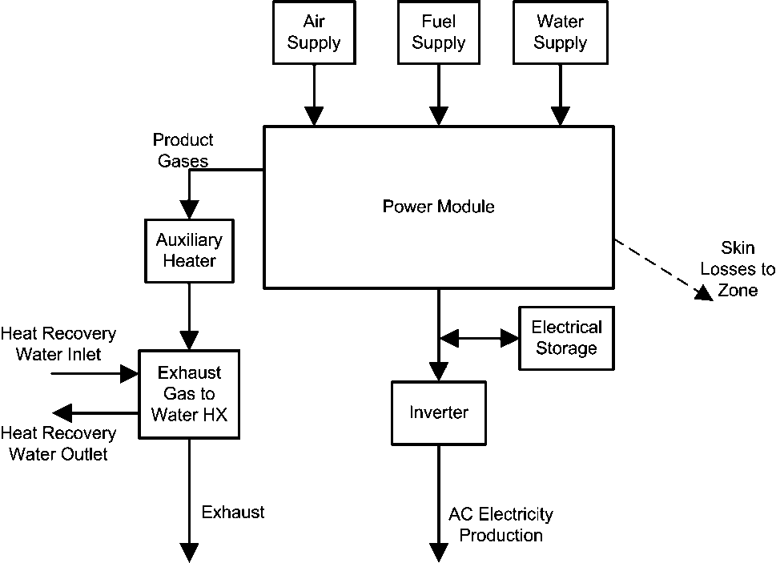

Figure 152. Fuel cell subsystems.

Note that the FC model is formulated using the Lower Heating Value (LHV) of the fuel, whereas most other parts of EnergyPlus use the Higher Heating Value (HHV). LHV has important advantages over HHV in the context of the quality of heat recovered. While model coefficients for input performance descriptions are to be based on LHV, energy consumption and tariff calculations are also reported on HHV basis when using this model.

#### Field: Name

This field contains a unique name for the fuel cell.

#### Field: Power Module Name

This field contains the name of a Generator:FuelCell:PowerModule input object.

#### Field: Air Supply   Name

This field contains the name of a Generator:FuelCell:AirSupply input object.

#### Field: Fuel Supply Name

This field contains the name of a Generator:FuelSupply input object.

#### Field: Water Supply Name

This field contains the name of a Generator:FuelCell:WaterSupply input object.

#### Field: Auxiliary Heater Name

This field contains the name of a Generator:FuelCell:AuxiliaryHeater input object.

#### Field: Heat Exchanger Name

This field contains the name of a Generator:FuelCell:ExhaustGasToWaterHeatExchanger input object.

#### Field: Electrical Storage Name

This field contains the name of a Generator:FuelCell:ElectricalStorage input object.

#### Field: Inverter Name

This field contains the name of a Generator:FuelCell:Inverter input object.

#### Field: Stack Cooler Name

This field contains the name of a Generator:FuelCell:StackCooler input object. This is optional. The presence of a stack cooler distinguishes between SOFC and PEMFC with PEMFC operating at lower temperatures and requiring a separate subsystem to maintain stack temperatures.

An example input data file (IDF) entry for this object is provided below:

```idf
   Generator:FuelCell,
       FCT SOFC,                               !- Name
       FCT SOFC Power Module,     !- Power Module Name
       FCT SOFC Air Supply,         !- Air Supply Name
       FCT SOFC Fuel Supply,       !- Fuel Supply Name
       FCT SOFC Water Supply,     !- Water Supply Name
       FCT SOFC Auxiliary Heater,   !- Auxiliary Heater Name
       FCT SOFC Exhaust HX,         !- Heat Exchanger Name
       FCT SOFC Battery,               !- Electrical Storage Name
       FCT SOFC Inverter;             !- Inverter Name
```


### Generator:FuelCell Outputs

The following output variables are available for the fuel cell model.

* Output:Variable,\*,Generator Produced Electric Power,hourly; !- HVAC Average [W]

* Output:Variable,\*,Generator Produced Electric Energy,hourly; !- HVAC Sum [J]

* Output:Variable,\*,Generator Produced Thermal Rate,hourly; !- HVAC Average [W]

* Output:Variable,\*,Generator Produced Thermal Energy,hourly; !- HVAC Sum [J]

* Output:Variable,\*,Generator Fuel HHV Basis Energy,hourly; !- HVAC Sum [J]

* Output:Variable,\*,Generator Fuel HHV Basis Rate,hourly; !- HVAC Average [W]

* Output:Variable,\*,Generator Fuel LHV Basis Energy,hourly; !- HVAC Sum [J]

* Output:Variable,\*,Generator Fuel Consumption Rate LHV Basis,hourly; !- HVAC Average [W]

* Output:Variable,\*,FuelCell Heat Loss Rate to Zone,hourly; !- HVAC Average [W]

* Output:Variable,\*,FuelCell Heat Loss Energy to Zone,hourly; !- HVAC Sum [J]

* Output:Variable,\*,FuelCell Convection Heat Loss Rate to Zone,hourly; !- HVAC Average [W]

* Output:Variable,\*,FuelCell Radiation Heat Loss Rate to Zone,hourly; !- HVAC Average [W]

#### Generator Produced Electric Power [W]

This report is the net electrical power produced by the generator in watts.

#### Generator Produced Electric Energy [J]

This report is the net electrical energy produced by the generator in joules. This output variable is also put on the meter for on-site production.

#### Generator Produced Thermal Rate [W]

#### Generator Produced Thermal Energy [J]

These are the rate and energy of thermal heat transferred from the engine to the heat recovery fluid in the coolant control volume.

#### Generator Fuel HHV Basis Energy [J]

This is the energy used by the cogeneration device in terms of higher heating value in joules. This is the output variable is also put on the meter for natural gas.

#### Generator Fuel HHV Basis Rate [W]

This is the rate of fuel energy use by the cogeneration device in terms of higher heating value in watts.

#### Generator Fuel LHV Basis Energy [J]

This is the fuel energy used by the cogeneration device in terms of lower heating value in joules.

#### Generator Fuel Consumption Rate LHV Basis [W]

This is the rate of fuel energy use by the cogeneration device in terms of lower heating value in watts.

#### Generator Zone Sensible Heat Transfer Rate [W]

This variable provides the results for the total rate of skin losses from the fuel cell to the surrounding zone.

#### Generator Zone Sensible Heat Transfer Energy [J]

This variable provides the results for the total energy in skin losses from the fuel cell to the surrounding zone.

#### Generator Zone Convection Heat Transfer Rate [W]

This variable provides the results for the rate of skin losses in the form of surface convection heat transfer from the fuel cell to the surrounding zone.

#### Generator Zone Radiation Heat Transfer Rate [W]

This variable provides the results for the rate of skin losses in the form of radiation heat transfer from the fuel cell to the surrounding zone.

Using the FC model with DisplayAdvancedReportVariables (see Diagnostics object or use of operating system   s environment variables) makes the following output variables available as listed in the RDD file. There are a large number of output variables that provide access to the inner workings of the model and individual subsystems that are not likely to be useful for the average user.

* HVAC,Average,Generator Air Inlet Temperature [C]

* HVAC,Average,Generator Power Module Entering Air Temperature [C]

* HVAC,Average,Generator Air Molar Flow Rate [kmol/s]

* HVAC,Average,Generator Power Module Entering Air Enthalpy [W]

* HVAC,Average,Generator Blower Electric Power [W]

* HVAC,Sum,Generator Blower Electric Energy [J]

* HVAC,Average,Generator Blower Skin Heat Loss Rate [W]

* HVAC,Average,Generator Fuel Inlet Temperature [C]

* HVAC,Average,Generator Power Module Entering Fuel Temperature [C]

* HVAC,Average,Generator Fuel Molar Flow Rate [kmol/s]

* HVAC,Average,Generator Power Module Entering Fuel Enthalpy [W]

* HVAC,Average,Generator Fuel Compressor Electric Power [W]

* HVAC,Sum,Generator Fuel Compressor Electric Energy [J]

* HVAC,Average,Generator Fuel Compressor Skin Heat Loss Rate [W]

* HVAC,Average,Generator Fuel Reformer Water Inlet Temperature [C]

* HVAC,Average,Generator Power Module Entering Reforming Water Temperature [C]

* HVAC,Average,Generator Fuel Reformer Water Molar Flow Rate [kmol/s]

* HVAC,Average,Generator Fuel Reformer Water Pump Electric Power [W]

* HVAC,Sum,Generator Fuel Reformer Water Pump Electric Energy [J]

* HVAC,Average,Generator Power Module Entering Reforming Water Enthalpy [W]

* HVAC,Average,Generator Product Gas Temperature [C]

* HVAC,Average,Generator Product Gas Enthalpy [W]

* HVAC,Average,Generator Product Gas Molar Flow Rate [kmol/s]

* HVAC,Average,Generator Product Gas Ar Molar Flow Rate [kmol/s]

* HVAC,Average,Generator Product Gas CO2 Molar Flow Rate [kmol/s]

* HVAC,Average,Generator Product Gas H2O Vapor Molar Flow Rate [kmol/s]

* HVAC,Average,Generator Product Gas N2 Molar Flow Rate [kmol/s]

* HVAC,Average,Generator Product Gas O2 Molar Flow Rate [kmol/s]

* HVAC,Average,Generator Inverter Loss Power [W]

* HVAC,Average,Generator Produced DC Electric Power [W]

* HVAC,Average,Generator DC Power Efficiency [ ]

* HVAC,Average,Generator Electric Storage Charge State [J]

* HVAC,Average,Generator Produced DC Electric Power [W]

* HVAC,Sum,Generator DC Storage Charging Energy [J]

* HVAC,Average,Generator DC Storage Discharging Power [W]

* HVAC,Sum,Generator DC Storage Discharging Energy [J]

* HVAC,Average,Generator Ancillary AC Electric Power [W]

* HVAC,Sum,Generator Ancillary AC Electric Energy [J]

* HVAC,Average,Generator Zone Sensible Heat Transfer Rate [W]

* HVAC,Sum,Generator Zone Sensible Heat Transfer Energy [J]

* HVAC,Average,Generator Zone Convection Heat Transfer Rate [W]

* HVAC,Average,Generator Zone Radiation Heat Transfer Rate [W]

* HVAC,Sum, Generator Fuel Cell Model Iteration Count [ ]

* HVAC,Sum,Generator Regula Falsi Iteration Count [ ]

#### Generator Air Inlet Temperature [C]

This variable provides the temperature of air supplied to the FC.

#### Generator Power Module Entering Air Temperature [C]

This variable provides the temperature of the air supplied to the power module after it has gone through the blower and received any heat recovered from other subsystems.

#### Generator Air Molar Flow Rate [kmol/s]

This variable provides the results for <span>\({\dot N_{air}}\)</span>, the flow rate of air into the FC.

#### Generator Power Module Entering Air Enthalpy [W]

This variable provides the results for <span>\({\sum\limits_i {\left( {{{\dot N}_i} \cdot \left[ {{{\hat h}_i} - {\Delta_f}\hat h_i^0} \right]} \right)}_{air}}\)</span>, which is the enthalpy flow in the air stream entering the power module relative to 25 &deg;C.

#### Generator Blower Electric Power [W]

This variable provides the results for <span>\({P_{blower - el}}\)</span>, which is the electrical power used by the air supply blower.

#### Generator Blower Electric Energy [J]

This variable provides the results for the energy used by the air supply blower. It is also added to the appropriate meters.

#### Generator Blower Skin Heat Loss Rate [W]

This variable provides the results for <span>\({q_{blower - heat - loss}}\)</span>, which is the rate of energy    lost    to the surroundings.

#### Generator Fuel Inlet Temperature [C]

This variable provides the temperature of the fuel supplied to the FC.

#### Generator Power Module Entering Fuel Temperature [C]

This variable provides the temperature of the fuel supplied to the power module after it has gone through the compressor.

#### Generator Fuel Molar Flow Rate [kmol/s]

This variable provides the results for <span>\({\dot N_{fuel}}\)</span>, which is the flow rate of fuel into the FC.

#### Generator Power Module Entering Fuel Enthalpy [W]

This variable provides the results for <span>\({\sum\limits_i {\left( {{{\dot N}_i} \cdot \left[ {{{\hat h}_i} - {\Delta_f}\hat h_i^0} \right]} \right)}_{fuel}}\)</span>, which is the enthalpy flow in the fuel stream entering the power module relative to 25 &deg;C.

#### Generator Fuel Compressor Electric Power [W]

This variable provides the results for <span>\({P_{comp - el}}\)</span>, which is the electrical power used by the fuel supply compressor.

#### Generator Fuel Compressor Electric Energy [J]

This variable provides the results for the energy used by the fuel supply compressor. It is also added to the appropriate meters.

#### Generator Fuel Compressor Skin Heat Loss Rate [W]

This variable provides the results for the rate of energy    lost    to the surroundings.

#### Generator Fuel Reformer Water Inlet Temperature [C]

This variable provides the temperature of the water supplied to the FC for reforming.

#### Generator Power Module Entering Reforming Water Temperature [C]

This variable provides the temperature of the water supplied to the power module after it has gone through the pump.

#### Generator Fuel Reformer Water Molar Flow Rate [kmol/s]

This variable provides the results for <span>\({\dot N_{water}}\)</span>, which the flow rate of reforming water into the FC.

#### Generator Fuel Reformer Water Pump Electric Power [W]

This variable provides the results for <span>\({P_{pump - el}}\)</span>, which is the electrical power used by the water pump.

#### Generator Fuel Reformer Water Pump Electric Energy [J]

This variable provides the results for energy used by the water pump. It is also added to the appropriate meters.

#### Generator Power Module Entering Reforming Water Enthalpy [W]

This variable provides the results for <span>\({\dot H_{liq - water}}\)</span>  which is the enthalpy flow of the water stream entering the power module relative to 25 &deg;C.

#### Generator Product Gas Temperature [C]

This variable provides the results for the temperature of the product gas stream leaving the fuel cell power module.

#### Generator Product Gas Enthalpy [W]

This variable provides the results for <span>\({\sum\limits_i {\left( {{{\dot N}_i} \cdot \left[ {{{\hat h}_i} - {\Delta_f}\hat h_i^0} \right]} \right)}_{FCPM - cg}}\)</span>, which is the enthalpy flow in the product gas stream leaving the power module relative to 25 &deg;C.

#### Generator Product Gas Molar Flow Rate [kmol/s]

This variable provides the results for the flow rate of all the product gases leaving the fuel cell power module.

#### Generator Product Gas Ar Molar Flow Rate [kmol/s]

This variable provides the results for the flow rate of the argon gas leaving the fuel cell power module.

#### Generator Product Gas CO2 Molar Flow Rate [kmol/s]

This variable provides the results for the flow rate of the carbon dioxide gas leaving the fuel cell power module.

#### Generator Product Gas H2O Vapor Molar Flow Rate [kmol/s]

This variable provides the results for the flow rate of the water gas leaving the fuel cell power module.

#### Generator Product Gas N2 Molar Flow Rate [kmol/s]

This variable provides the results for the flow rate of the nitrogen gas leaving the fuel cell power module.

#### Generator Product Gas O2 Molar Flow Rate [kmol/s]

This variable provides the results for the flow rate of the oxygen gas leaving the fuel cell power module.

#### Generator Inverter Loss Power [W]

This variable provides the results for the power losses associated with inefficiencies in the inverter.

#### Generator Produced DC Electric Power [W]

This variable provides the results for <span>\({P_{el}}\)</span>, which is the net DC electrical power produced by the fuel cell power module.

#### Generator DC Power Efficiency [ ]

This variable provides the results for <span>\({\varepsilon_{el}}\)</span>, which is the electrical efficiency of the fuel cell power module.

#### Generator Electric Storage Charge State [J]

This variable provides the results for state of charge of the electrical storage device inside the fuel cell. Although the units are Joules, this is a state variable and is reported as an average rather than a sum.

#### Generator Produced DC Electric Power [W]

This variable provides the rate at which power was stored into the fuel cell   s electrical storage subsystem.

#### Generator DC Storage Charging Energy [J]

This variable provides the energy stored into the fuel cell   s electrical storage subsystem.

#### Generator DC Storage Discharging Power [W]

This variable provides the rate at which power was drawn from the fuel cell   s electrical storage subsystem.

#### Generator DC Storage Discharging Energy [J]

This variable provides the energy drawn from the fuel cell   s electrical storage subsystem.

#### Generator Ancillary AC Electric Power [W]

This variable provides the results for <span>\({P_{el,ancillaries - AC}}\)</span>, which is the rate at which ancillary devices within the power module use electricity supplied to the fuel cell by an external source.

#### Generator Ancillary AC Electric Energy [J]

This variable provides the results for the energy used by AC ancillaries. It is also added to the appropriate meters.

#### Generator Fuel Cell Model Iteration Count   [ ]

This variable provides information on the numerical method used to calculate the FC model. EnergyPlus uses a sequential substitution iterative algorithm to solve the main heat balance equation for the FC model. This output variable indicates the number of iterations needed to converge.

#### Generator Regula Falsi Iteration Count [ ]

This variable provides information on the numerical method used to calculate product gas temperature as a function of the product gas   s enthalpy. A Regula Falsi numerical method is used to invert the Shomate equation for enthalpy as a function of temperature. This output variable indicates the number of iterations needed for the Regula Falsi method to converge.

#### Generator Heat Recovery Exit Gas Temperature [C]

This is the temperature of the exiting gas for heat recovery in C.

#### Generator Heat Recovery Exit Gas H2O Vapor Fraction []

This is the water vapor fraction in the exit gas.

#### Generator Heat Recovery Water Condensate Molar Flow Rate [kmol/s]

This is the flow of condensed water in kmol/s.

### Generator:FuelCell:PowerModule

This object is used to describe the core power module subsystem of the FC. This includes the fuel cell stack, fuel reformer, and whatever ancillary devices are included inside. If the model has multiple FC generators that are of the exact same type, then only one of these objects is needed and all the Generator:FuelCell can reference it. The model uses a number of curves to describe operating performance. Input data for specific models of FC are not yet available but will be produced by IEA Annex 42 and should be available in the future.

#### Field: Name

This field contains a unique name for the fuel cell power module subsystem.

#### Field: Efficiency Curve Mode

This field is used to choose between different modes of inputting the electrical efficiency curve. There are two options available for this Field:    Annex42    and    Normalized   . The    Annex42    option indicates that the efficiency curves are not normalized and are used for the single size and type of FC product. The    Normalized    option indicates that the efficiency curves are normalized (as is standard practice in EnergyPlus) relative to a single rating point. In the Annex42 mode, the curves directly represent efficiency as a function of fuel use, but in the Normalized mode, the curves represent an efficiency modification that is applied to the efficiency at the rating point.

#### Field: Efficiency Curve Name

This field contains the name of a Curve:Quadratic input object described elsewhere in the input file. The curve is a function of the net DC electric power, <span>\({P_{el}}\)</span>  (W), produced by the power module and describes either the electrical efficiency or the how the efficiency is modified depending on the mode selected in the previous field. This quadratic curve is just one part of the entire parametric relation used to describe electrical efficiency <span>\({\varepsilon_{el}}\)</span>. For the Annex42 mode the full relation for efficiency is,

<div>\[{\varepsilon_{el}} = \left[ {{\varepsilon_0} + {\varepsilon_1} \cdot {P_{el}} + {\varepsilon_2} \cdot P_{el}^2} \right] \cdot \left[ {1 - {N_{stops}} \cdot D} \right] \cdot \left[ {1 - (MAX(\int\limits_{} {dt - {t_{threshold}},0.0))}  \cdot L} \right]\]</div>

where the Curve:Quadratic input object named in this field serves to define the quadratic portion in the first set of brackets. For the Normalized mode the full relation for efficiency is,

<div>\[{\varepsilon_{el}} = \left[ {{\varepsilon_0} + {\varepsilon_1} \cdot \frac{{{P_{el}}}}{{{P_{nom}}}} + {\varepsilon_2} \cdot {{\left( {\frac{{{P_{el}}}}{{{P_{nom}}}}} \right)}^2}} \right] \cdot {\varepsilon_{nom}} \cdot \left[ {1 - {N_{stops}} \cdot D} \right] \cdot \left[ {1 - (MAX(\int\limits_0 {dt - {t_{threshold}},0.0))}  \cdot L} \right]\]</div>

where <span>\({\varepsilon_{nom}}\)</span>  is the nominal electrical efficiency at the rating point <span>\({P_{nom}}\)</span>  which are described in the next two fields. The Normalized mode may be more useful for a simulation study that needs to vary the capacity of the FC.

#### Field: Nominal Efficiency

This field is used for the    Normalized    efficiency curve mode and provides the nominal efficiency <span>\({\varepsilon_{nom}}\)</span>  (dimensionless) at the rating point. This field can be left blank if using the    Annex42    mode.

#### Field: Nominal Electrical Power

This field is used for the    Normalized    efficiency curve mode and provides the nominal net DC electrical power produced <span>\({P_{nom}}\)</span>  (W) at the rating point. This field can be left blank if using the    Annex42    mode.

#### Field: Number of Stops at Start of Simulation

This field is used to describe the number of times the FC has been cycled on and off prior to the start of the simulation. FC products might degrade as a result of starting and stopping the fuel cell stack, so the model includes terms to model the degradation effects of cycling FC units on and off. This is the initial value of the <span>\({N_{stops}}\)</span>*<sub>  </sub>*term in the efficiency relation above.

#### Field: Cycling Performance Degradation Coefficient

This field is used to describe the fixed value representing the fractional performance degradation associated with each start and stop cycle. This is the value of <span>\(D\)</span>  in the efficiency relations above. If there is no degradation from cycling, then D should be 0.0.

#### Field: Number of Run Hours at Beginning of Simulation

This field is used to describe the amount of time the FC has been operating prior to the start of the simulation. FC products might degrade over time so the model includes terms to model the degradation effects of FC run time. This is the initial value of the integrated run time term <span>\(\int\limits_0 {dt} \)</span>.

#### Field: Accumulated Run Time Degradation Coefficient

This field is used to describe the fixed value representing the fractional performance degradation associated with the total amount of run time. This is the value of <span>\(L\)</span>  in the efficiency relations above. If there is no degradation from run time, the L should be 0.0.

#### Field: Run Time Degradation Initiation Time Threshold

This field is used to describe the time period for which there is no degradation associated with the amount of run time. This provides the ability to model a system that initially operates without degradation for some period time before it starts to degrade. This is the value of <span>\({t_{threshold}}\)</span>  in the efficiency relations above.

#### Field: Power Up Transient Limit

This field is used to describe the maximum allowable rate at which the fuel cell can increase the level of power it produces (W/s). This is a time derivative of the net DC electrical power used to limit how fast the FC can ramp up.

#### Field: Power Down Transient Limit

This field is used to describe the maximum allowable rate at which the fuel cell can decrease the level of power it produces (W/s). This is a time derivative of the net DC electrical power used to limit how fast the FC can ramp down.

#### Field: Start Up Time

This field is used to describe the length of time (seconds) of the start up period when the FC is turned on.

#### Field: Start Up Fuel

This field is used to describe the amount of fuel (kmol) used during the entire start up period. The fuel is the same type as what is described in the Generator:FuelSupply object elsewhere in the input file.

#### Field: Start Up Electricity Consumption

This field is used to describe the amount of electricity (Joules) used by ancillary equipment during the entire start up period.

#### Field: Start Up Electricity Produced

This field is used to describe the amount of electricity (Joules) produced by the power module during the entire start up period.

#### Field: Shut Down Time

This field is used to describe the length of time (seconds) of the shut down period.

#### Field: Shut Down Fuel

This field is used to describe the amount of fuel (kmol) used during the entire shut down period. The fuel is the same type as what is described in the Generator:FuelSupply object elsewhere in the input file.

#### Field: Shut Down Electricity Consumption

This field is used to describe the amount of electricity (J) used by ancillary equipment during the entire shut down period.

#### Field: Ancillary Electricity Constant Term

This field is used to describe the constant term, <span>\(an{c_0}\)</span>, in a relation that describes the AC electrical power used by ancillary equipment located inside the power module, <span>\({P_{el,ancillaries - AC}}\)</span>. The model uses this relation,

<div>\[{P_{el,ancillaries - AC}} = an{c_0} + an{c_1} \cdot {\dot N_{fuel}}\]</div>

where <span>\({\dot N_{fuel}}\)</span>  is the rate of fuel use in the power module (kmol/s).

#### Field: Ancillary Electricity Linear Term

This field is used to describe the linear term, <span>\(an{c_1}\)</span>, in the relation shown in the previous field.

#### Field: Skin Loss Calculation Mode

This field is used to select the mode for how skin losses are modeled. Skin losses are heat energy    lost    from the power module and transferred to the surrounding thermal zone named in the following field.   There are three alpha options to choose from:    ConstantRate   ,    UAForProcessGasTemperature   , or    QuadraticFunctionOfFuelRate.      Enter ConstantRate in this field to model skin losses using a constant rate, e.g. 100 watts. Enter UAForProcessGasTemperature to model skin losses using a    UA-Delta-T    calculation method with the temperature difference determined by the power module   s product gas temperature and the surrounding zone. Enter QuadraticFunctionOfFuelRate to model skin losses as a function of the rate of fuel use.

#### Field: Zone Name

This field is used to describe the thermal zone that will receive skin and other heat losses from the FC. This should be the name of a Zone input object declared elsewhere in the input file.

#### Field: Skin Loss Radiative Fraction

This field is used to describe the portion of skin losses that are in the form of thermal radiation. This controls the radiative/convective split for the energy transferred to the zone by the FC.

#### Field: Constant Skin Loss Rate

This field is used to describe the constant rate of skin losses (W). This field is used with the ConstantRate mode. It can be left blank for other skin loss modes.

#### Field: Skin Loss U-Factor Times Area Term

This field is used to describe the    UA    term (W/K). This field is used with the UAForProcessGasTemperature mode. It can be left blank for other skin loss modes.    UA    is the product of the overall heat transfer coefficient    U    and the area    A.   

#### Field: Skin Loss Quadratic Curve Name

This field is used to refer to the name of a quadratic curve object defined elsewhere in the input file. The quadratic curve should define skin heat loss rate as a function of the fuel use rate (kmol/s) so that,

<div>\[{q_{skin - loss}} = {s_0} + {s_1} \cdot {\dot N_{fuel}} + {s_2} \cdot \dot N_{fuel}^2\]</div>

#### Field: Dilution Air Flow Rate

This field is used to describe the rate of dilution air (kmol/sec) drawn into, or through, the power module. This air stream may not be present in all FC products. It is used for limiting skin and stack heat losses and for strategies that mitigate potential safety issue were fuel gases to escape the stack.

#### Field: Stack Heat loss to Dilution Air

This field is used to describe the rate at which the fuel cell stack adds energy to the dilution air stream. It is entered as a constant heat rate (W).

#### Field: Dilution Inlet Air Node Name

This field is used to describe the air node where the dilution air is drawn from. This would typically be the name of the air node associated with the thermal zone where the FC is located.

#### Field: Dilution Outlet Air Node Name

This field is used to describe the air node where the dilution air is exhausted to. This could be the inlets to a heat recovery ventilator or an exhaust node.

#### Field: Minimum Operating Point

This field is used to describe the minimum operating point for the net DC electric power, <span>\({P_{el}}\)</span>  (W).

#### Field: Maximum Operating Point

This field is used to describe the maximum operating point for the net DC electric power, <span>\({P_{el}}\)</span>  (W).

An example input data file (IDF) entry for this object is provided below:

```idf
Generator:FuelCell:PowerModule,
       FCT SOFC Power Module,     !- Name
       Annex42,                                 !- Efficiency Curve Mode
       FCT Power Curve,                 !- Efficiency Curve Name
       0.354,                                     !- Nominal Efficiency
       3400,                                       !- Nominal Electrical Power {W}
       0,                                             !- Number of Stops at Start of Simulation
       0.0,                                         !- Cycling Performance Degradation Coefficient
       0,                                             !- Number of Run Hours at Beginning of Simulation {hr}
       0.0,                                         !- Accumulated Run Time Degradation Coefficient
       10000,                                     !- Run Time Degradation Initiation Time Threshold {hr}
       1.4,                                         !- Power Up Transient Limit {W/s}
       0.2,                                         !- Power Down Transient Limit {W/s}
       0.0,                                         !- Start Up Time {s}
       0.2,                                         !- Start Up Fuel {kmol}
       ,                                               !- Start Up Electricity Consumption {J}
       0.0,                                         !- Start Up Electricity Produced {J}
       0.0,                                         !- Shut Down Time {s}
       0.2,                                         !- Shut Down Fuel {kmol}
       ,                                               !- Shut Down Electricity Consumption {J}
       0.0,                                         !- Ancillary Electricity Constant Term
       0.0,                                         !- Ancillary Electricity Linear Term
       ConstantRate,                       !- Skin Loss Calculation Mode
       ZN_1_FLR_1_SEC_5,               !- Zone Name
       0.6392,                                   !- Skin Loss Radiative Fraction
       729,                                         !- Constant Skin Loss Rate {W}
       0.0,                                         !- Skin Loss U-Factor Times Area Term {W/K}
       ,                                               !- Skin Loss Quadratic Curve Name
       6.156E-3,                               !- Dilution Air Flow Rate {kmol/s}
       2307,                                       !- Stack Heat loss to Dilution Air {W}
       SOFC Air HR Inlet,             !- Dilution Inlet Air Node Name
       SOFC Air HR Outlet,           !- Dilution Outlet Air Node Name
       3010,                                       !- Minimum Operating Point {W}
       3728;                                       !- Maximum Operating Point {W}
```

### Generator:FuelCell:StackCooler

This object is optional and is used to define details needed to model the stack cooler on PEMFC.

#### Field: Name

This field contains a unique name for the PEM fuel cell stack cooler

#### Field: Heat Recovery Water Inlet Node Name

This field contains the node name for the water inlet to the stack cooler.

#### Field: Heat Recovery Water Outlet Node Nane

This field contains the node name for the water outlet from the stack cooler.

#### Field: Nominal Stack Temperature

This field contains the nominal stack operating temperature for the PEMFC, <span>\(T_{stack}^o\)</span>. This field and the next five provide values for use in the empirical equation for the rate of heat extracted from the fuel cell power module by the stack cooler using the following relation

<div>\[{q_{s - cool}} = \left[ {{r_0} + {r_1}\left( {{T_{stack}} - T_{stack}^o} \right)} \right] \cdot \left[ {1 + {r_2}{P_{el}} + {r_3}P_{el}^2} \right]\]</div>

#### Field: Actual Stack Temperature]

This field contains the actual stack operating temperature for the PEMFC, <span>\({T_{stack}}\)</span>.

#### Field: Coefficient r0

This field contains the coefficient r<sub>0</sub> in the equation above.

#### Field: Coefficient r1

This field contains the coefficient r<sub>1</sub> in the equation above.

#### Field: Coefficient r2

This field contains the coefficient r<sub>2</sub> in the equation above.

#### Field: Coefficient r3

This field contains the coefficient r<sub>3</sub> in the equation above.

#### Field: Stack Coolant Flow Rate

The stack cooler is assumed to have a closed water circulation loop that is used to extract heat from the stack and move it to a cogeneration heat exchanger and/or an air cooler. This field is used to enter the flow rate of coolant in this loop.

#### Field: Stack Cooler U-Factor Times Area Value

This is the heat transfer coefficient between the stack and the coolant.

#### Field: Fs-cogen Adjustment Factor

This field provides the value for an adjustment factor, <span>\({F_{s - cogen}}\)</span>, used in the following relation for the cogeneration heat transfer coefficient, <span>\({\left( {UA} \right)_{s - cogen}}\)</span>:

<div>\[{\left( {UA} \right)_{s - cogen}} = {\left[ {\frac{1}{{{{\left( {hA} \right)}_{s - cogen}}}} + {F_{s - cogen}}} \right]^{ - 1}}\]</div>

#### Field: Stack Cogeneration Exchanger Area

This field provides the value for the cogeneration heat exchanger area, <span>\({A_{s - cogen}}\)</span>

#### Field: Stack Cogeneration Exchanger Nominal Flow Rate

This field provides the value for <span>\(\dot N_{s - cogen}^0\)</span>  in the following relation for the cogeneration heat exchanger convection coefficient, <span>\({h_{s - cogen}}\)</span>:

<div>\[{h_{s - cogen}} = h_{s - cogen}^0 \cdot {\left( {\frac{{{{\dot N}_{s - cogen}}}}{{\dot N_{s - cogen}^0}}} \right)^{{n_s}}}\]</div>

#### Field: Stack Cogeneration Exchanger Nominal Heat Transfer Coefficient

This field provides the value for <span>\(h_{s - cogen}^0\)</span>  in the relation above for the cogeneration heat exchanger convection coefficient, <span>\({h_{s - cogen}}\)</span>.

#### Field: Stack Cogeneration Exchanger Nominal Heat Transfer Coefficient Exponent

This field provides the value for <span>\({n_s}\)</span>  is the relation above for the cogeneration heat exchanger convection coefficient, <span>\({h_{s - cogen}}\)</span>.

#### Field: Stack Cooler Pump Power

This field is the power used by the stack cooler   s circulating pump in Watts. It is a constant power draw whenever the stack cooler is active.

#### Field: Stack Cooler Pump Heat loss

This field is the fraction of the pump power consumption that is lost to the surround zone.

#### Field: Stack Air Cooler Fan Coefficient f0

This field and the next two are used to define coefficients for the following relation for the power used by the air-cooler   s fan to dump excess heat into the surrounding zone:

<div>\[{P_{s - air - el}} = {f_0} + {f_1} \cdot {q_{s - air}} + {f_2} \cdot q_{s - air}^2\]</div>

#### Field: Stack Air Cooler Fan Coefficient f1

This field provides a value for the coefficient *f<sub>1</sub>* in the relation above.

#### Field: Stack Air Cooler Fan Coefficient f2

This field provides a value for the coefficient *f<sub>2</sub>* in the relation above.

### Generator:FuelCell:AirSupply

This object is used to define details of the air supply subsystem.

#### Field: Name

This field contains a unique name for the fuel cell air supply subsystem.

#### Field: Air Inlet Node Name

This field is used to define the air node where the inlet air stream is drawn from. If the FC uses outdoor air then the node named here should be designated an outdoor air node. If the FC draws air from its surroundings, then this would be the name of the air node associated with the thermal zone containing the FC.

#### Field: Blower Power Curve Name

This field contains the name of a Curve:Cubic input object described elsewhere in the input file. The curve provides the power used by the air blower (W) as a cubic function of the rate of air supply (kmol/s).

<div>\[{P_{blower - el}} = {b_0} + {b_1} \cdot {\dot N_{air}} + {b_2} \cdot \dot N_{air}^2 + {b_3} \cdot \dot N_{air}^3\]</div>

#### Field: Blower Heat Loss Factor

This field describes the portion of blower electrical power that is    lost    to the surroundings. The rest of the energy is added to the air stream. A heat loss factor of 1.0 indicates that all the heat is lost to the surroundings and no energy is added to the air inlet stream.

#### Field: Air Supply Rate Calculation Mode

This field describes how the model will calculate the air supply rate. There are three options to choose from:      AirRatiobyStoics   ,    QuadraticFunctionofElectricPower   , and    QuadraticFunctionofFuelRate.      The choice will determine how the model calculates the rate of air and will depend on the formulations used to develop model input data. The choices are described in the next four fields.

#### Field: Stoichiometric Ratio

This field describes the excess air ratio beyond stoichiometric air supply. This field is only used if the air supply rate calculation mode is AirRatiobyStoics. The total air supply ratio will be the value entered here plus 1.0. Thus if 1.0 is entered in this field, the total air flow will be 2.0 times what is needed to exactly match stoichiometry with the fuel supply.

#### Field: Air Rate Function of Electric Power Curve Name

This field contains the name of a QuadraticCurve input object described elsewhere in the input file. This field is only used if the air supply rate calculation mode is QuadraticFunctionofElectricPower. The quadratic curve named here describes the first part of the relation below used to calculate the rate of inlet air, <span>\({\dot N_{air}}\)</span>(kmol/s). It is a quadratic function of the net DC electrical power, <span>\({P_{el}}\)</span>  (W).

<div>\[{a_3}\]</div>

#### Field: Air Rate Air Temperature Coefficient

This field is used to describe the air temperature coefficient, <span>\({\dot N_{air}} = \left[ {{a_0} + {a_1} \cdot {{\dot N}_{fuel}} + {a_2} \cdot \dot N_{fuel}^2} \right].\left[ {1 + {a_3} \cdot {T_{air}}} \right]\)</span>, used to adjust inlet air flow rate in the relations for inlet air rate.

#### Field: Air Rate Function of Fuel Rate Curve Name

This field contains the name of a Curve:Quadratic input object described elsewhere in the input file. This field is only used if the air supply rate calculation mode is QuadraticFunctionofFuelRate. The quadratic curve named here describes the first part of the relation used to calculate the rate of inlet air, <span>\({\dot N_{air}}\)</span>(kmol/s). It is a quadratic function of the fuel flow rate, <span>\({\dot N_{fuel}}\)</span>.

<span>\({\dot N_{air}} = \left[ {{a_0} + {a_1} \cdot {P_{el}} + {a_2} \cdot P_{el}^2} \right].\left[ {1 + {a_3} \cdot {T_{air}}} \right]\)</span><span>\({\dot N_{air}} = \left[ {{a_0} + {a_1} \cdot {{\dot N}_{fuel}} + {a_2} \cdot \dot N_{fuel}^2} \right].\left[ {1 + {a_3} \cdot {T_{air}}} \right]\)</span>

#### Field: Air Intake Heat Recovery Mode

This field is used to control how heat losses from three other subsystems within the FC may or may not be recovered by the air inlet. There are six possible choices for what to use in this Field:    NoRecovery       RecoverBurnerInverterStorage       RecoverAuxiliaryBurner       RecoverInverterandStorage       RecoverInverter    and    RecoverElectricalStorage   .   If heat is recovered then that means that energy    losses    from those subsystems are added to the inlet air and fed back into the FC power module. The following table clarifies the meaning of the six possible choices.

Table 32. Air Intake Heat Recovery Mode Choices

<table class="table table-striped">
<tr>
<th>Field Choice</th>
<th>Inverter Heat Losses Recovered?</th>
<th>Electrical Storage Heat Losses Recovered?</th>
<th>Auxiliary Heater Losses Recovered?</th>
</tr>
<tr>
<td>NoRecovery   </td>
<td>No</td>
<td>No</td>
<td>No</td>
</tr>
<tr>
<td>RecoverBurnerInverterStorage</td>
<td>Yes</td>
<td>Yes</td>
<td>Yes</td>
</tr>
<tr>
<td>RecoverAuxiliaryBurner</td>
<td>No</td>
<td>No</td>
<td>Yes</td>
</tr>
<tr>
<td>RecoverInverterandStorage</td>
<td>Yes</td>
<td>Yes</td>
<td>No</td>
</tr>
<tr>
<td>RecoverInverter</td>
<td>Yes</td>
<td>No</td>
<td>No</td>
</tr>
<tr>
<td>RecoverElectricalStorage</td>
<td>No</td>
<td>Yes</td>
<td>No</td>
</tr>
</table>

#### Field: Air Supply Constituent Mode

This field is used to choose between two different modes for describing the make up of the inlet air stream. There are two possible choices:      AmbientAir    or    UserDefinedConstituents.      Choosing the AmbientAir mode will automatically set the composition of air to be usual at: 77.28% nitrogen, 20.73% oxygen, 1.04% water, 0.92% argon, and 0.03% carbon dioxide. Choosing UserDefinedConstituents allows the user to customize the make up the inlet air in the remaining fields.

#### Field: Number of UserDefined Constituents

This field is used to describe the number of constituents in the inlet air. This field is only used if the air supply constituent mode is set to UserDefinedConstituents. The maximum number is 5.

The remaining fields in this object are repeating pairs of fields with one pair for each constituent and the same number as described in the previous field. The pairs consist of the name of the constituent followed by the molar fraction of that constituent.

#### Field: Constituent 1-5 Name

These fields describe the air stream constituents by name. The name field for each pair must be filled with one of these choices:      CarbonDioxide   ,    Nitrogen,       Oxygen,       Water,    or    Argon.   

#### Field: Molar Fraction 1-5

These fields describe the molar fraction of the air stream constituents. It is very important that the sum of the molar fractions add up to 1.0.

An example input data file (IDF) entry for this object is provided below:

```idf
   Generator:FuelCell:AirSupply,
       FCT SOFC Air Supply,         !- Name
       SOFC Air Inlet Node,         !- Air Inlet Node Name
       FCT Blower Power Curve,   !- Blower Power Curve Name
       1.0,                                         !- Blower Heat Loss Factor
       QuadraticFunctionofElectricPower,   !- Air Supply Rate Calculation Mode
       ,                                               !- Stoichiometric Ratio
       FCT Excess Air Ratio Curve,   !- Air Rate Function of Electric Power Curve Name
       2.83507E-3,                           !- Air Rate Air Temperature Coefficient
       ,                                               !- Air Rate Function of Fuel Rate Curve Name
       NoRecovery,                           !- Air Intake Heat Recovery Mode
       UserDefinedConstituents,   !- Air Supply Constituent Mode
       5,                                             !- Number of UserDefined Constituents
       Nitrogen,                               !- Constituent 1 Name
       0.7728,                                   !- Molar Fraction 1
       Oxygen,                                   !- Constituent 2 Name
       0.2073,                                   !- Molar Fraction 2
       Water,                                     !- Constituent 3 Name
       0.0104,                                   !- Molar Fraction 3
       Argon,                                     !- Constituent 4 Name
       0.0092,                                   !- Molar Fraction 4
       CarbonDioxide,                     !- Constituent 5 Name
       0.0003;                                   !- Molar Fraction 5
```

### Generator:FuelCell:WaterSupply

This object is used to provide details of the water supply subsystem. This water is used for steam reforming of the fuel and is not the same as the water used for thermal heat recovery.

```idd
Generator:FuelCell:WaterSupply,
   A1, \field Name
           \required-field
           \reference FCWaterSupNames
   A2, \field Reformer Water Flow Rate Function of Fuel Rate Curve Name
           \type object-list
           \object-list QuadraticCurves
   A3, \field Reformer Water Pump Power Function of Fuel Rate Curve Name
           \type object-list
           \object-list QubicCurves
   N1, \field Pump Heat Loss Factor
   A4, \field Water Temperature Modeling Mode
           \type choice
           \key TemperatureFromAirNode
           \key TemperatureFromWaterNode
           \key TemperatureFromSchedule
           \key MainsWaterTemperature
   A5, \field Water Temperature Reference Node Name
   A6; \field Water Temperature Schedule Name
           \type object-list
           \object-list ScheduleNames
```

#### Field: Name

This field contains a unique name for the fuel cell water supply subsystem.

#### Field: Reformer Water Flow Rate Function of Fuel Rate Curve Name

This field contains the name of a Curve:Quadratic input object described elsewhere in the input file. The curve provides the rate of water flow (kmol/sec) as a function of fuel flow rate (kmol/sec).

<div>\[{\dot N_{liq - water}} = {w_0} + {w_1} \cdot {\dot N_{fuel}} + {w_2} \cdot \dot N_{fuel}^2\]</div>

If the unit does not use water for reforming then use a    null    quadratic where all the coefficients are 0.0.

#### Field: Reformer Water Pump Power Function of Fuel Rate Curve Name

This field contains the name of a Curve:Cubic input object described elsewhere in the input file. The curve provides the power used by the water pump (W) as a cubic function of the rate of water supply (kmol/s).

<div>\[{P_{pump - el}} = {p_0} + {p_1} \cdot {\dot N_{water}} + {p_2} \cdot \dot N_{water}^2 + {p_3} \cdot \dot N_{water}^3\]</div>

If the unit does not use water for reforming then use a    null    cubic where all the coefficients are 0.0.

#### Field: Pump Heat Loss Factor

This field describes the portion of pump electrical power that is    lost    to the surroundings. The rest of the energy is added to the water stream. A heat loss factor of 1.0 indicates that all the heat is lost to the surroundings and no energy is added to the water inlet stream.

#### Field: Water Temperature Modeling Mode

This field describes how the model will determine the inlet temperature of the water stream. There are four options to choose from:      TemperatureFromAirNode,       TemperatureFromWaterNode,       TemperatureFromSchedule,    and    MainsWaterTemperature.      For the first two options, the temperature of the water inlet is determined by the temperature at the node named in the next field. For the third option, the temperature is determined by the schedule in the last field. Using the MainsWaterTemperature option requires also defining a separate    Site:WaterMainsTemperature    input object elsewhere in the input file.

#### Field: Water Temperature Reference Node Name

This field is used to define the node where the temperature of the inlet water stream is obtained. This can be either an air node or a water node.

#### Field: Water Temperature Schedule Name

This field is used to define the name of a schedule, defined elsewhere in the input file, that will be used to determine the temperature of the water inlet stream when using the TemperatureFromSchedule mode.

An example input data file (IDF) entry for this object is provided below:

```idf
   Generator:FuelCell:WaterSupply,
       FCT SOFC Water Supply,     !- Name
       Null Quadratic,                   !- Reformer Water Flow Rate Function of Fuel Rate Curve Name
       Null Cubic,                           !- Reformer Water Pump Power Function of Fuel Rate Curve Name
       0.0,                                         !- Pump Heat Loss Factor
       TemperatureFromAirNode,   !- Water Temperature Modeling Mode
       SOFC Air Inlet Node,         !- Water Temperature Reference Node Name
       ;                                               !- Water Temperature Schedule Name

   Curve:Quadratic,
       Null Quadratic,                   !- Name
       0.0,                                         !- Coefficient1 Constant
       0.0,                                         !- Coefficient2 x
       0.0,                                         !- Coefficient3 x**2
       -1.0E+10,                               !- Minimum Value of x
       1.0E+10;                                 !- Maximum Value of x

   Curve:Cubic,
       Null Cubic,                           !- Name
       0.0,                                         !- Coefficient1 Constant
       0.0,                                         !- Coefficient2 x
       0.0,                                         !- Coefficient3 x**2
       0.0,                                         !- Coefficient4 x**3
       -1.0E+10,                               !- Minimum Value of x
       1.0E+10;                                 !- Maximum Value of x
```

### Generator:FuelCell:AuxiliaryHeater

This object is intended for modeling an auxiliary heater, however this portion of the model is not yet available in EnergyPlus. An auxiliary heater may be present in fuel cell products so that the unit can meet much higher thermal loads than would be possible using only cogeneration. This portion of the model will be added in the future once suitable cogeneration control capabilities are also available. The input fields are described for future reference but may change. The program still requires one of these objects be included even though the data are not yet used (so that internal data structures can be allocated).

#### Field: Name

This field contains a unique name for the fuel cell auxiliary heater subsystem.

#### Field: Excess Air Ratio

This field describes the excess air ratio beyond stoichiometric air supply for the heater. The total air supply ratio will be the value entered here plus 1.0. Thus if 1.0 is entered in this field, the total air flow will be 2.0 times what is needed to exactly match stoichiometry with the fuel supply.

#### Field: Ancillary Power Constant Term

This field describes the constant term, <span>\({x_0}\)</span>, used to model the auxiliary burner   s ancillary devices such as fans and ignition controls. The electrical power for ancillaries is calculated using,

<div>\[{P_{el,aux - ancillaries}} = {x_0} + {x_1} \cdot {\dot N_{aux - fuel}}\]</div>

#### Field: Ancillary Power Linear Term

This field describes the linear term, <span>\({x_1}\)</span>, used to model the auxiliary burner   s ancillary devices.

#### Field: Skin Loss U-Factor Times Area Value

This field describes the    UA    term (W/K) for calculating skin losses in the auxiliary burner.    UA    is the product of the overall heat transfer coefficient    U    and the area    A.      The skin heat losses are calculated using,

<div>\[{q_{aux - skin - losses}} = {(UA)_{aux}} \cdot ({T_{aux - mix}} - {T_{room}})\]</div>

where, <span>\({T_{aux - mix}}\)</span>  is temperature of product gases leaving the auxiliary burner and includes the mixing of the product gases from the fuel cell power module. Thus, the input for UA should reflect this choice of reference temperature rather than an exterior surface temperature of the auxiliary burner.

#### Field: Skin Loss Destination

This field describes the user   s choice for what happens to the skin losses. There are two options:      SurroundingZone    and    AirInletForFuelCell   . Entering SurroundingZone will direct the model to put the    lost    energy into the surrounding thermal Zone named in the next field. Entering AirInletForFuelCell will direct the model to put the    lost    energy into the air inlet stream for the fuel cell to preheat that air.

#### Field: Zone Name to Receive Skin Losses

This field is used to determine the zone that will receive the skin losses. Enter the name of a Zone declared elsewhere in the input file. This field is only used if the    SurroundingZone    mode is used in the previous field.

#### Field: Heating Capacity Units

This field describes the user   s choice for how the capacity of the auxiliary heater will be defined. There are two options:      Watts    or    kmol/s.      Entering Watts will direct the program to use the next two fields to determine the maximum and minimum heating capacity.   Entering kmol/s will direct the program to use the last two fields to determine the maximum and minimum heating capacities.

#### Field: Maximum Heating Capacity in Watts

This field is used to describe the maximum heating capacity of the auxiliary burner (W).

#### Field: Minimum Heating Capacity in Watts

This field is used to describe the minimum heating capacity of the auxiliary burner (W).

#### Field: Maximum Heating Capacity in Kmol per Second

This field is used to describe the maximum fuel use rate for the auxiliary burner (kmol/s).

#### Field: Minimum Heating Capacity in Kmol per Second

This field is used to describe the minimum fuel use rate for the auxiliary burner (kmol/s).

An example input data file (IDF) entry for this object is provided below:

```idf
   Generator:FuelCell:AuxiliaryHeater,
       FCT SOFC Auxiliary Heater,   !- Name
       0.0,                                         !- Excess Air Ratio
       0.0,                                         !- Ancillary Power Constant Term
       0.0,                                         !- Ancillary Power Linear Term
       0.5,                                         !- Skin Loss U-Factor Times Area Value
       SurroundingZone,                 !- Skin Loss Destination
       ZN_1_FLR_1_SEC_5,               !- Zone Name to Receive Skin Losses
       Watts,                                     !- Heating Capacity Units
       0.0,                                         !- Maximum Heating Capacity in Watts
       0.0,                                         !- Minimum Heating Capacity in Watts
       ,                                               !- Maximum Heating Capacity in Kmol per Second
       ;                                               !- Minimum Heating Capacity in Kmol per Second
```


Generator:FuelCell:ExhaustGasToWaterHeatExchanger

This object is used to describe the exhaust gas heat exchanger subsystem of the FC used to recovery thermal energy.

#### Field: Name

This field contains a unique name for the fuel cell power module subsystem.

#### Field: Heat Recovery Water Inlet Node Name

This field contains the name of the node that connects the heat exchanger   s inlet to the plant loop. This water is used for heat recovery.

#### Field: Heat Recovery Water Outlet Node Name

This field contains the name of the node that connects the heat exchanger   s outlet to the plant loop.

#### Field: Heat Recovery Water Maximum Flow Rate

This field describes the design maximum flow rate of the heat recovery water (m<sup>3</sup>/s). The value should match the design flow rate of the plant loop connected to the FC.

#### Field: Exhaust Outlet Air Node Name

This field is used to determine which node will receive the exhaust air stream leaving the FC. This node will usually be outside and not be referenced elsewhere. However, if the exhaust stream is used in a heat recovery ventilator (as described in section 11 of the Annex 42 specification) then the node would be reference in the heat recovery ventilator object.

#### Field: Heat Exchanger Calculation Method

This field is used to direct how EnergyPlus will calculate heat exchanger performance. The Annex 42 model provides for four different methods of modeling the heat exchanger. The choices available for this field are:      FixedEffectiveness    (method 1 in Annex 42 specification),      EmpiricalUAeff     (method 2),    FundementalUAeff     (method 3), or    Condensing    (method 4). The remaining fields provide input data for the different methods. The heat exchanger correlations are described below.

#### Field: Method 1 Heat Exchanger Effectiveness

This field describes constant heat exchanger effectiveness, <span>\({\varepsilon_{HX}}\)</span>. This field is only used with the    FixedEffectiveness    mode, which corresponds to    method 1    in the Annex 42 specification. For this mode, the heat exchange between the exhaust gases and the heat recovery water are calculated using,

<div>\[{q_{HX}} = {\varepsilon_{HX}} \cdot {\left( {\dot N{{\hat c}_p}} \right)_{\min }} \cdot \left( {{T_{aux - mix}} - {T_{water,in}}} \right)\]</div>

where, <span>\({\left( {\dot N{{\hat c}_p}} \right)_{\min }}\)</span>is the minimum value of <span>\({\left( {\dot N{{\hat c}_p}} \right)_{aux - mix}}\)</span>and <span>\({\left( {\dot N{{\hat c}_p}} \right)_{water}}\)</span>.

#### Field: Method 2 Parameter hxs0

This field describes the value of <span>\(h{x_{s,0}}\)</span>  in the relation below for effective UA. This field is used with the    EmpiricalUAeff    mode, which corresponds to    method 2    in the Annex 42 specification and with the    Condensing    mode, which corresponds to    method 4   . This method uses the log mean temperature difference (LMTD) approach to calculate the heat exchange:

<div>\[{q_{HX}} = {\left( {UA} \right)_{eff}} \cdot \frac{{\left( {{T_{aux - mix}} - {T_{water,out}}} \right) - \left( {{T_{HX - exh}} - {T_{water,in}}} \right)}}{{\ln \left( {\frac{{{T_{aux - mix}} - {T_{water,out}}}}{{{T_{HX - exh}} - {T_{water,in}}}}} \right)}}\]</div>

The user input in this field, and the next four fields, describe coefficients in an empirical relation for <span>\({\left( {UA} \right)_{eff}}\)</span>:

<div>\[{\left( {UA} \right)_{eff}} = h{x_{s,0}} + h{x_{s,1}} \cdot {\dot N_{water}} + h{x_{s,2}} \cdot \dot N_{water}^2 + h{x_{s,3}} \cdot {\dot N_{aux - mix}} + h{x_{s,4}} \cdot \dot N_{aux - mix}^2\]</div>

#### Field: Method 2 Parameter hxs1

This field describes the value of <span>\(h{x_{s,1}}\)</span>  in the relation above for effective UA. This field is used with the    EmpiricalUAeff    mode, which corresponds to    method 2    in the Annex 42 specification and with the    Condensing    mode, which corresponds to    method 4   .

#### Field: Method 2 Parameter hxs2

This field describes the value of <span>\(h{x_{s,2}}\)</span>  in the relation above for effective UA. This field is used with the    EmpiricalUAeff    mode, which corresponds to    method 2    in the Annex 42 specification and with the    Condensing    mode, which corresponds to    method 4   .

#### Field: Method 2 Parameter hxs3

This field describes the value of <span>\(h{x_{s,3}}\)</span>  in the relation above for effective UA. This field is used with the    EmpiricalUAeff    mode, which corresponds to    method 2    in the Annex 42 specification and with the    Condensing    mode, which corresponds to    method 4   .

#### Field: Method 2 Parameter hxs4

This field describes the value of <span>\(h{x_{s,4}}\)</span>  in the relation above for effective UA. This field is used with the    EmpiricalUAeff    mode, which corresponds to    method 2    in the Annex 42 specification and with the    Condensing    mode, which corresponds to    method 4   .

#### Field: Method 3 h0Gas Coefficient

This field describes the value of <span>\(h_{gas}^0\)</span>  in the relation below. This field is only used with the    FundementalUAeff    mode, which corresponds to    method 3    in the Annex 42 specification. For this mode, the heat exchange is calculated using the LMTD method, but the effective UA is determined using:

<div>\[{\left( {UA} \right)_{eff}} = {\left[ {\frac{1}{{{{\left( {hA} \right)}_{gas}}}} + \frac{1}{{{{(hA)}_{water}}}} + {F_{HX}}} \right]^{ - 1}}\]</div>

where,

<span>\({F_{HX}}\)</span>  is an adjustment factor,

<span>\({h_{gas}} = h_{gas}^0 \cdot {\left( {\frac{{{{\dot N}_{gas}}}}{{\dot N_{gas}^0}}} \right)^n}\)</span>,

<div>\[{h_{water}} = h_{water}^0 \cdot {\left( {\frac{{{{\dot N}_{water}}}}{{\dot N_{water}^0}}} \right)^m}\]</div>

#### Field: Method 3 NdotGasRef Coefficient

This field describes the value of <span>\(\dot N_{gas}^0\)</span>  in the relation above. This field is only used with the    FundementalUAeff    mode, which corresponds to    method 3    in the Annex 42 specification.

#### Field: Method 3 n Coefficient

This field describes the value of <span>\(n\)</span>  in the relation above. This field is only used with the    FundementalUAeff    mode, which corresponds to    method 3    in the Annex 42 specification.


#### Field: Method 3 Gas Area

This field describes the value of <span>\({A_{gas}}\)</span>  in the relation above. This field is only used with the    FundementalUAeff    mode, which corresponds to    method 3    in the Annex 42 specification.

#### Field: Method 3 h0 Water Coefficient

This field describes the value of <span>\(h_{water}^0\)</span>  in the relation above. This field is only used with the    FundementalUAeff    mode, which corresponds to    method 3    in the Annex 42 specification.

#### Field: Method 3 N dot Water ref Coefficient

This field describes the value of <span>\(\dot N_{water}^0\)</span>  in the relation above. This field is only used with the    FundementalUAeff    mode, which corresponds to    method 3    in the Annex 42 specification.

#### Field: Method 3 m Coefficient

This field describes the value of <span>\(m\)</span>  in the relation above. This field is only used with the    FundementalUAeff    mode, which corresponds to    method 3    in the Annex 42 specification.

#### Field: Method 3 Area Water Coefficient

This field describes the value of <span>\({A_{water}}\)</span>  in the relation above. This field is only used with the    FundementalUAeff    mode, which corresponds to    method 3    in the Annex 42 specification.

#### Field: Method 3 F Adjustment Factor

This field describes the value of <span>\({F_{HX}}\)</span>  in the relation above. This field is only used with the    FundementalUAeff    mode, which corresponds to    method 3    in the Annex 42 specification.

#### Field: Method 4 hxl1 Coefficient

This field describes the value of <span>\(h{x_{l,1}}\)</span>  in the relation below for the rate of condensation of water from the gas stream, <span>\({\dot N_{{H_2}O - cond}}\)</span>. This field is only used with the    Condensing    mode, which corresponds to    method 4    in the Annex 42 specification. This method uses a modified version of the LMTD approach to calculate heat exchange:

<div>\[{q_{HX}} = {\left( {UA} \right)_{eff}} \cdot \frac{{\left( {{T_{aux - mix}} - {T_{water,out}}} \right) - \left( {{T_{HX - exh}} - {T_{water,in}}} \right)}}{{\ln \left( {\frac{{{T_{aux - mix}} - {T_{water,out}}}}{{{T_{HX - exh}} - {T_{water,in}}}}} \right)}} + {\dot N_{{H_2}O - cond}} \cdot {\hat h_{fg}}\]</div>

where,

<div>\[{\dot N_{{H_2}O - cond}} = \left( {{T_{cond - threshold}} - {T_{water,in}}} \right) \cdot \left[ {h{x_{l,1}} \cdot \left( {\frac{{{{\dot N}_{{H_2}O}}}}{{{{\dot N}_{aux - mix}}}}} \right) + h{x_{l,2}} \cdot {{\left( {\frac{{{{\dot N}_{{H_2}O}}}}{{{{\dot N}_{aux - mix}}}}} \right)}^2}} \right]\]</div>

#### Field: Method 4 hxl2 Coefficient

This field describes the value of <span>\(h{x_{l,2}}\)</span>  in the relation above for the rate of condensation of water from the gas stream, <span>\({\dot N_{{H_2}O - cond}}\)</span>. This field is only used with the    Condensing    mode, which corresponds to    method 4    in the Annex 42 specification.


#### Field: Method 4 Condensation Threshold

This field describes the value of <span>\({T_{cond - threshold}}\)</span>  in the relation above for the rate of condensation of water from the gas stream, <span>\({\dot N_{{H_2}O - cond}}\)</span>. This field is only used with the    Condensing    mode, which corresponds to    method 4    in the Annex 42 specification.


An example input data file (IDF) entry for this object is provided below:


```idf
   Generator:FuelCell:ExhaustGasToWaterHeatExchanger,
       FCT SOFC Exhaust HX,         !- Name
       Small SOFC Heat Rec Inlet Node,   !- Heat Recovery Water Inlet Node Name
       Small SOFC Heat Rec Outlet Node,   !- Heat Recovery Water Outlet Node Name
       0.0004,                                   !- Heat Recovery Water Maximum Flow Rate {m3/s}
       SOFC Air Outlet Node,       !- Exhaust Outlet Air Node Name
       CONDENSING,                           !- Heat Exchanger Calculation Method
       ,                                               !- Method 1 Heat Exchanger Effectiveness
       83.1,                                       !- Method 2 Parameter hxs0
       4798,                                       !- Method 2 Parameter hxs1
       -138E+3,                                 !- Method 2 Parameter hxs2
       -353.8E+3,                             !- Method 2 Parameter hxs3
       5.15E+8,                                 !- Method 2 Parameter hxs4
       ,                                               !- Method 3 h0Gas Coefficient
       ,                                               !- Method 3 NdotGasRef Coefficient
       ,                                               !- Method 3 n Coefficient
       ,                                               !- Method 3 Gas Area
       ,                                               !- Method 3 h0 Water Coefficient
       ,                                               !- Method 3 N dot Water ref Coefficient
       ,                                               !- Method 3 m Coefficient
       ,                                               !- Method 3 Area Water Coefficient
       ,                                               !- Method 3 F Adjustment Factor
       -1.96E-4,                               !- Method 4 hxl1 Coefficient
       3.1E-3,                                   !- Method 4 hxl2 Coefficient
       35.0;                                       !- Method 4 Condensation Threshold {C}
```

### Generator:FuelCell:ElectricalStorage

This object is used to describe the electrical storage subsystem for the FC. The electrical storage model is a very simple    constrained bucket    model. Future developments made add additional models for battery systems. Note that this electrical storage is embedded within the FC device.

#### Field: Name

This field contains a unique name for the fuel cell electrical storage subsystem.

#### Field: Choice of   Model

This field is used to direct how EnergyPlus will model electrical storage. The only choice currently available is    SimpleEfficiencyWithConstraints,    which should be entered in this field. Future developments may expand the number of models available for electrical storage.

#### Field: Nominal Charging Energetic Efficiency

This field describes the value of <span>\({\varepsilon_{charge}}\)</span>  in the relation for the State of Charge, <span>\(Q_{battery}^{t + \Delta t}\)</span>:

<div>\[Q_{battery}^{t + \Delta t} = Q_{battery}^t + {P_{battery - charge}} \cdot {\varepsilon_{charge}} \cdot \Delta t\]</div>

This is the energetic efficiency of charging the storage device. A value of 1.0 means that the storage device does not lose any energy when charging. Note that the model can recover the    lost    energy into the air supply intake.

#### Field: Nominal Discharging Energetic Efficiency

This field describes the value of <span>\({\varepsilon_{discharge}}\)</span>  in the relation for the State of Charge, <span>\(Q_{battery}^{t + \Delta t}\)</span>:

<div>\[Q_{battery}^{t + \Delta t} = Q_{battery}^t + \frac{{{P_{battery - discharge}} \cdot \Delta t}}{{{\varepsilon_{discharge}}}}\]</div>

This is the energetic efficiency of discharging the storage device. A value of 1.0 means that the storage device does not lose any energy when discharging. Note that the model can recover the    lost    energy into the air supply intake.

#### Field: Simple Maximum Capacity

This field describes the maximum amount of electrical energy that can be stored in the device (J).

#### Field: Simple Maximum Power Draw

This field describes the maximum rate at which electrical power can be discharged from the storage device (W).

#### Field: Simple Maximum Power Store

This field describes the maximum rate at which electrical power can charge the storage device (W).

#### Field: Initial Charge State

This field describes the value for the initial state of charge (J). This allows the storage device to contain some amount of stored electricity at the beginning of the simulation period.


An example input data file (IDF) entry for this object is provided below:


```idf
   Generator:FuelCell:ElectricalStorage,
       FCT SOFC Battery,               !- Name
       SimpleEfficiencyWithConstraints,   !- Choice of Model
       1.0,                                         !- Nominal Charging Energetic Efficiency
       1.0,                                         !- Nominal Discharging Energetic Efficiency
       0,                                             !- Simple Maximum Capacity {J}
       0,                                             !- Simple Maximum Power Draw {W}
       0,                                             !- Simple Maximum Power Store {W}
       0;                                             !- Initial Charge State {J}
```

### Generator:FuelCell:Inverter

This object is used to describe the power condition unit subsystem of the FC. This object models an inverter system contained within a fuel cell system that converts from direct current (DC) to alternating current (AC).

#### Field: Name

This field contains a unique name for the fuel cell inverter subsystem.

#### Field: Inverter Efficiency Calculation Mode

This field is used to direct how EnergyPlus will calculate the inverter efficiency. There are two possible choices:      Constant    or    Quadratic   .

#### Field: Inverter Efficiency

This field describes the value for inverter efficiency when using the **Constant** mode.

#### Field: Efficiency Function of DC Power Curve Name

This field names a Curve:Quadratic object defined elsewhere in the input file. The curve determines inverter efficiency as a function of the DC power entering the inverter as follows:

<div>\[{\eta_{PCU}} = {u_0} + {u_1} \cdot {P_{PCU - in}} + {u_2} \cdot P_{PCU - in}^2\]</div>

An example input data file (IDF) entry for this object is provided below:


```idf
   Generator:FuelCell:Inverter,
       FCT SOFC Inverter,             !- Name
       Quadratic,                             !- Inverter Efficiency Calculation Mode
       ,                                               !- Inverter Efficiency
       FCT Inverter Quadratic;   !- Efficiency Function of DC Power Curve Name


   Curve:Quadratic,
       FCT Inverter Quadratic,   !- Name
       0.560717,                               !- Coefficient1 Constant
       1.24019E-4,                           !- Coefficient2 x
       -2.01648E-8,                         !- Coefficient3 x**2
       -1.0E+10,                               !- Minimum Value of x
       1.0E+10;                                 !- Maximum Value of x
```

### Generator:FuelSupply

This object is used to define details of the fuel supply for certain generators. This object allows the user to describe a wide array of possible fuel mixtures. The program contains data and internal methods to calculate the properties of the various mixtures of gaseous fuels. The program will calculate the Lower Heating Value (LHV), Higher Heating Value (HHV), and molecular weight for the fuel mixture. The fuel properties are then use by both fuel cell and Micro CHP models. Results of the gas phase thermochemistry modeling are also reported in the EIO file.

In addition to gaseous mixtures, the Micro CHP model is able to use generic liquid fuels and this object is used to describe the properties.

Note that the fuel consumption metering is currently handled by the Natural Gas meter. So no matter what fuel mixture is defined in this object, the aggregated reports from EnergyPlus meters for (natural) Gas will include the fuel used for the generator (with the Joule content based on HHV).

#### Field: Name

This field contains a unique name for the fuel cell fuel supply subsystem.

#### Field: Fuel Temperature Modeling Mode

This field describes how the model will determine the temperature of the fuel. There are two options for this field to choose from:      TemperatureFromAirNode    and    Scheduled.      If this field contains TemperatureFromAirNode then the fuel is modeled as having the same temperature as the air node that is named in the next field. If this field contains Scheduled then the fuel is modeled as having the temperature described in a schedule defined elsewhere in the input file.

#### Field: Fuel Temperature Reference Node Name

This field contains the name of the air node used to obtain the inlet temperature of the fuel. This field is only used if the Fuel Temperature Modeling Mode is set to TemperatureFromAirNode.

#### Field: Fuel Temperature Schedule Name

This field contains the name of a temperature schedule defined elsewhere in the input file. This field is only used if the Fuel Temperature Modeling Mode is set to Scheduled. The temperature of the fuel inlet will be obtained from the schedule.

#### Field: Compressor Power Function of Fuel Rate Curve Name

This field contains the name of a Curve:Cubic input object described elsewhere in the input file. The curve provides the electrical power used by the fuel compressor (W) as a cubic function of the rate of fuel supply (kmol/s).

<div>\[{P_{comp - el}} = {c_0} + {c_1} \cdot {\dot N_{fuel}} + {c_2} \cdot \dot N_{fuel}^2 + {c_3} \cdot \dot N_{fuel}^3\]</div>

#### Field: Compressor Heat Loss Factor

This field describes the portion of the compressor electrical power that is    lost    to the surroundings. The rest of the energy is added to the fuel stream. A heat loss factor of 1.0 indicates that all the heat is lost to the surroundings and no energy is added to the fuel inlet stream.

#### Field: Fuel Type

Choose between    GaseousConstituents    or    LiquidGeneric   .

#### Field: Liquid Generic Fuel Lower Heating Value

For fuel type    LiquidGeneric,    this field is used to enter the lower heating value of the fuel in units of kJ/kg.

#### Field: Liquid Generic Fuel Higher Heating Value

For fuel type    LiquidGeneric,    this field is used to enter the higher heating value of the fuel in units of kJ/kg.

#### Field: Liquid Generic Fuel Molecular Weight

For fuel type    LiquidGeneric,    this field is used to enter the molecular weight of the fuel in units of g/mol.

#### Field: Liquid Generic Fuel CO2 Emission Factor

This field is not used. This part of the Annex 42 model was not implemented in EnergyPlus; see the FuelFactors object.

#### Field: Number of Constituents in Gaseous Constituent Fuel Supply

This field is used to describe the number of constituents in the inlet fuel supply. The maximum number of different types of constituents is currently set to 12.

The remaining fields in this object are repeating pairs of fields with one pair for each constituent and the same number as described in the previous field. The field set pairs consist of the name of the constituent followed by the molar fraction of that constituent.

#### Field: Constituent 1-12 Name

These fields describe the fuel stream constituents by name. The name field for each pair must be filled with one of these 14 choices:      CarbonDioxide   ,    Nitrogen   ,    Oxygen   ,    Water   ,    Argon   ,    Hydrogen   ,    Methane   ,    Ethane   ,    Propane   ,    Butane   ,    Pentane   ,    Hexane   ,    Methanol   , and    Ethanol   .   No other fuel constituents can currently be modeled. The properties of the constituents are already contained inside the program as provided in the Annex 42 model specification.

#### Field: Constituent 1-12   Molar Fraction

These fields describe the molar fraction of the fuel stream constituents. It is very important that the sum of the molar fractions add up to 1.0.

### Generator:FuelSupply Outputs

In addition to the following output variables, the resulting fuel heating values are also reported to the eio file.

HVAC,Average,Generator Fuel Compressor Electric Power [W]

HVAC,Sum,Generator Fuel Compressor Electric Energy [J]

HVAC,Average,Generator Fuel Compressor Skin Heat Loss Rate [W]

#### Generator Fuel Compressor Electric Power [W]

This is the rate of energy use by the gas compressor, if any, that provides fuel at a higher pressure.

#### Generator Fuel Compressor Electric Energy [J]

This is the energy used by the gas compressor, if any, that provides fuel at a higher pressure.

#### Generator Fuel Compressor Skin Heat Loss Rate [W]

Convective heat gains to zone from gas compressor, if any, that provides fuel at a higher pressure.

### Photovoltaic Generators

EnergyPlus offers different options for predicting the electricity produced by solar electric photovoltaic (PV) panels. The three different options are    Simple   ,    Equivalent One-Diode    and    Sandia    and the choice will determine the mathematical models used to determine energy production. The first allows the user to input an arbitrary efficiency. The other two models use empirical relationships to predict PV operating performance based on many environmental variables such as cell temperature.   The PV models can be used with either normal PV modules or as part of a hybrid photovoltaic/thermal (PVT) flat plat collector.

The generator is connected to an Electric Load Center.   The   PV models refer to surface input objects defined elsewhere in the input file.   This object describes an array that is    attached    to a surface object in order to describe its orientation and to access results of the solar insolation calculations. These can be either Heat Transfer or Shading objects (see Surfaces). This will define the orientation of the solar panel for the detailed models and also the area for the simple model. The exposure of that surface to incident solar radiation is calculated using the full set of models in EnergyPlus that are used to account for solar thermal loads arising from building windows and walls. Therefore the incident solar radiation is calculated to include the effects of shading and reflections from other surfaces declared in the input file. In addition to the output variables associated with PV models, there are numerous related output variables available for the surfaces including: 'Surface Outside Face Sunlit Area', 'Surface Outside Face Sunlit Fraction', 'Surface Outside Face Incident Solar Radiation Rate per Area', 'Surface Outside Face Incident Beam Solar Radiation Rate per Area', 'Surface Outside Face Incident Sky Diffuse Solar Radiation Rate per Area', 'Surface Outside Face Incident Ground Diffuse Solar Radiation Rate per Area', 'Surface Outside Face Beam Solar Incident Angle Cosine Value', 'Surface Outside Face Incident Sky Diffuse Ground Reflected Solar Radiation Rate per Area', 'Surface Outside Face Incident Sky Diffuse Surface Reflected Solar Radiation Rate per Area', 'Surface Outside Face Incident Beam To Beam Reflected From Surfaces Solar Radiation Rate per Area', 'Surface Outside Face Incident Beam To Diffuse Surface Reflected Solar Radiation Rate per Area', and 'Surface Outside Face Incident Beam To Diffuse Ground Reflected Solar Radiation Rate per Area.      Note that it is possible to define a PV array area that doesn   t conform to the surface area (i.e. model a PV array area that is larger or smaller than what is available on the surface) so it is the users responsibility to not over-specify area when determining how many modules will fit onto a surface. However this type of input is allowed.

EnergyPlus does not include models for ancillary equipment for a PV array including charge controllers or power-point trackers. The operation of the entire electrical system that must go along with a PV array is not currently modeled in EnergyPlus and is therefore assumed to operate in ideal ways.   The PV production models do not resolve voltage and current, only power (and energy).   Electricity production is metered based on the output of the inverter. Output results are available before and after the inverter. One assumption is that the array is assumed to be always operating at the maximum power point. Energy production is based on the assumption that the quasi-steady power prediction is constant and continuous over the simulation timestep.

For a variety of reasons, actual installations of photovoltaics are often observed to exhibit system-level problems that significantly reduce electricity production. Therefore this modeling should be considered a method of bracketing the upper end of electricity production rather than an accurate prediction of what the panels will produce. Also note that the model predictions are closely related to the solar radiation data (typically of of TMY2 origin) in the EnergyPlus weather file, that the solar data in these is usually from a model rather than direct measurements, and that solar resources encountered by a real installation in a given year are likely to differ from the weather data file.

### Generator:Photovoltaic

This object is used to describe an array of PV modules and how they are to be modeled.   A series of different PV arrays can be connected to a single electric load center (and inverter) by listing them all in an ElectricLoadCenter:Generator object.

#### Field: Name

This field is a unique name for the PV array.

#### Field: Surface Name

This field is the name of a surface that defines the location and geometry of the array.

#### Field: Photovoltaic Performance Object Type

This field is the type of PV performance model.   The choices are the class names for the three modeling options:

* PhotovoltaicPerformance:Simple

* PhotovoltaicPerformance:EquivalentOne-Diode

* PhotovoltaicPerformance:Sandia.

#### Field: Module Performance Name

This is the name of the PV performance object define elsewhere (corresponding to the object type listed in the previous field)

#### Field: Heat Transfer Integration Mode

The PV model allows for different ways of integrating with other EnergyPlus heat transfer surfaces and models and calculating cell temperature.   For Building Integrated PV (BIPV), the    Integrated    options allow for the PV modeling to be coupled to the surface heat transfer models elsewhere in EnergyPlus.   The user must select one of these options for this field:

- **Decoupled.  ** The cell temperature of modules in the array is computed based on a energy balance relative to NOCT conditions.   The input fields for Module Heat Capacity and Module Heat Loss Coefficient are ignored.

- **DecoupledUllebergDynamic  ** the cell temperature is calculated based on a dynamic model developed by Ulleberg[[1]](#_ftn1).   The input fields for Module Heat Capacity and Module Heat Loss Coefficient are required.

- **IntegratedSurfaceOutsideFace  ** The cell temperature is obtained from the outside face of the Surface:Heat Transfer named in the previous field.   Energy exported by the module is removed from the heat transfer surface (at the position determined by the associated Construction with Internal Source).   The input fields for Module Heat Capacity and Module Heat Loss Coefficient are ignored.

- **IntegratedTranspiredCollector  ** The cell temperature is obtained from the collector surface temperature in the unglazed transpired collector model.   Energy exported by the module is removed from the collector surface.   The input fields for Module Heat Capacity and Module Heat Loss Coefficient are ignored.

- **IntegratedExteriorVentedCavity  ** The cell temperature is obtained from the exterior baffle temperature in the naturally ventilated exterior cavity model.   Energy exported by the module is removed from the exterior baffle surface.   The input fields for Module Heat Capacity and Module Heat Loss Coefficient are ignored.

- **PhotovoltaicThermalSolarCollector  ** The cell temperature is obtained from the photovoltaic/thermal solar collector model.   If the PV layer is inside the collector, then the incident solar is modified by the photovoltaic/thermal solar collector model.

#### Field: Number of Series Strings in Parallel

This field is the number of series-wired strings of PV modules that are in parallel to form the PV array.   The product of this field and the next field should equal the total number of modules in the array.

#### Field: Number of Modules in Series

This field is the number of modules wired in series (on each string) to form the PV array.   The product of this field and the previous field should equal the total number of modules in the array.

### Generator:Photovoltaic Outputs

Using the Generator:PV:Simple object makes a number of output variables available.\\

* HVAC,Average,Generator Produced DC Electric Power [W]

* HVAC,Sum,Generator Produced DC Electric Energy [J]

* HVAC,Average,Generator PV Cell Temperature [C]

* HVAC,Average,Generator PV Short Circuit Current [A]

* HVAC,Average,Generator PV Open Circuit Voltage [V]

* HVAC,Average,Generator PV Array Efficiency []

#### Generator Produced DC Electric Power [W]

This output variable is the power of DC electricity produced by the PV array in Watts..

#### Generator Produced DC Electric Energy [J]

This output variable is the energy in DC electricity produced by the PV array, in Joules.

#### Generator PV Array Efficiency [ ]

This output variable is the resulting efficiency of the PV array .


The two more detailed PV models also have the following output variables.

#### Generator PV Cell Temperature [ &deg;C]

This output variable represents the temperature of the solar cell used in the calculation of cell performance.

#### Generator PV Short Circuit Current [A]

This output variable represents the short circuit current of the PV array, in Amps. This is provided to describe the I-V characteristics.

#### Generator PV Open Circuit Voltage [V]

This output variable represents the open circuit voltage of the PV array, in Volts. This is provided to describe the I-V characteristics.

### PhotovoltaicPerformance:Simple

The PhotovoltaicPerformance:Simple object describes a simple model of photovoltaics that may be useful for early phase design analysis. In this model the user has direct access to the efficiency with which surfaces convert incident solar radiation to electricity and need not specify arrays of specific modules. The full geometric model for solar radiation is used, including shading and reflections, to determine the incident solar resource. This model is intended to be useful for design purposes to quickly get an idea of the levels for annual production and peak power. The model can also accept arbitrary conversion efficiencies and does not require actual production units be tested to obtain performance coefficients.

#### Field: Name

This field is the name of the PV array. The name is only used as an identifier. Multiple instances need have unique names.

#### Field: Fraction of Surface Area with Active Solar Cells

This field is the user defined fraction for the area of surface named in the parent PV object that will have active PV cells on it. The area actually covered with solar cells will be the net area of the surface (gross area less any subsurfaces like windows) times the fraction entered here. This fraction includes the difference between PV module area and active cells within it and any losses for how closely packed modules can be arranged on surface.   The value should be between 0.0 and 1.0.

#### Field: Conversion Efficiency Input Mode

This field specifies how the PV array efficiency values are input. There are two choices, **Fixed**   and **Scheduled**.   If this field is set to    Fixed    then the PV array always has the efficiency value specified in the next field. If this field is set to    Scheduled    then the efficiency is determined by a user defined schedule named in the second field to follow.

#### Field: Value for Cell Efficiency if Fixed

This field specifies the efficiency with which solar incident energy is converted to electricity. Efficiency = (electrical power generated [W])/(power of incident solar[W]). These efficiency values are dimensionless and should be between 0.0 and 1.0.

#### Field: Efficiency Schedule Name

This field should be set to the name of schedule defined elsewhere in the input file. This schedule should specify dimensionless efficiency values between 0.0 and 1.0. This could be used for example to vary the efficiency to match results computed with more detailed models.

An example idf instance of this object follows:

```idf
PhotovoltaicPerformance:Simple,
     Simple PV Flat, !- Name
     0.1044 , !- Fraction of Surface area that has active solar cells
     FIXED ,   !- Conversion efficiency input mode
     0.12 ,     !- Value for cell efficiency if fixed
         ;           !- Name of Schedule that Defines Efficiency
```

### PhotovoltaicPerformance:EquivalentOne-Diode

This object describes the performance characteristics of Photovoltaic (PV) modules to be modeled using an equivalent one-diode circuit.   This model is also known at the 4- or 5-parameter TRNSYS model for photovoltaics.

The following table shows several sample PV array types with their input values.

Table 33. Photovoltaics Array Types with Values

<table class="table table-striped">
<tr>
<th>  </th>
<th>Short Circuit Current</th>
<th>Open Circuit Voltage</th>
<th>Voltage at Maximum Power</th>
<th>Current at Maximum Power</th>
<th>Temperature Coefficient of Short Circuit Current</th>
<th>Temperature Coefficient of Open Circuit Voltage</th>
<th>Number of Cells in Series per Module</th>
<th>Cell Temperature at NOCT Conditions</th>
<th>Module Area</th>
</tr>
<tr>
<td>Units:</td>
<td>[A]</td>
<td>[V]</td>
<td>[V]</td>
<td>[A]</td>
<td>{A/K]</td>
<td>[V/K]</td>
<td>[-]</td>
<td>[K]</td>
<td>[m2]</td>
</tr>
<tr>
<td>ASE 300-DFG/50</td>
<td>6.2</td>
<td>60</td>
<td>50.5</td>
<td>5.6</td>
<td>0.001</td>
<td>-0.0038</td>
<td>216</td>
<td>318</td>
<td>2.43</td>
</tr>
<tr>
<td>BPsolar 275</td>
<td>4.75</td>
<td>21.4</td>
<td>17</td>
<td>4.45</td>
<td>0.00065</td>
<td>-0.08</td>
<td>36</td>
<td>320</td>
<td>0.63</td>
</tr>
<tr>
<td>BPsolar 3160</td>
<td>4.8</td>
<td>44.2</td>
<td>35.1</td>
<td>4.55</td>
<td>0.00065</td>
<td>-0.16</td>
<td>72</td>
<td>320</td>
<td>1.26</td>
</tr>
<tr>
<td>BPsolar 380</td>
<td>4.8</td>
<td>22.1</td>
<td>17.6</td>
<td>4.55</td>
<td>0.00065</td>
<td>-0.08</td>
<td>36</td>
<td>320</td>
<td>0.65</td>
</tr>
<tr>
<td>BPsolar 4160</td>
<td>4.9</td>
<td>44.2</td>
<td>35.4</td>
<td>4.52</td>
<td>0.00065</td>
<td>-0.16</td>
<td>72</td>
<td>320</td>
<td>1.26</td>
</tr>
<tr>
<td>BPsolar 5170</td>
<td>5</td>
<td>44.2</td>
<td>36</td>
<td>4.72</td>
<td>0.00065</td>
<td>-0.16</td>
<td>72</td>
<td>320</td>
<td>1.26</td>
</tr>
<tr>
<td>BPsolar 585</td>
<td>5</td>
<td>22.1</td>
<td>18</td>
<td>4.72</td>
<td>0.00065</td>
<td>-0.08</td>
<td>36</td>
<td>320</td>
<td>0.65</td>
</tr>
<tr>
<td>Shell   SM110-12</td>
<td>6.9</td>
<td>21.7</td>
<td>17.5</td>
<td>6.3</td>
<td>0.0028</td>
<td>-0.076</td>
<td>36</td>
<td>318</td>
<td>0.86856</td>
</tr>
<tr>
<td>Shell   SM110-24</td>
<td>3.45</td>
<td>43.5</td>
<td>35</td>
<td>3.15</td>
<td>0.0014</td>
<td>-0.152</td>
<td>72</td>
<td>318</td>
<td>0.86856</td>
</tr>
<tr>
<td>Shell SP70</td>
<td>4.7</td>
<td>21.4</td>
<td>16.5</td>
<td>4.25</td>
<td>0.002</td>
<td>-0.076</td>
<td>36</td>
<td>318</td>
<td>0.6324</td>
</tr>
<tr>
<td>Shell SP75</td>
<td>4.8</td>
<td>21.7</td>
<td>17</td>
<td>4.4</td>
<td>0.002</td>
<td>-0.076</td>
<td>36</td>
<td>318</td>
<td>0.6324</td>
</tr>
<tr>
<td>Shell SP140</td>
<td>4.7</td>
<td>42.8</td>
<td>33</td>
<td>4.25</td>
<td>0.002</td>
<td>-0.152</td>
<td>72</td>
<td>318</td>
<td>1.320308</td>
</tr>
<tr>
<td>Shell SP150</td>
<td>4.8</td>
<td>43.4</td>
<td>34</td>
<td>4.4</td>
<td>0.002</td>
<td>-0.152</td>
<td>72</td>
<td>318</td>
<td>1.320308</td>
</tr>
<tr>
<td>Shell S70</td>
<td>4.5</td>
<td>21.2</td>
<td>17</td>
<td>4</td>
<td>0.002</td>
<td>-0.076</td>
<td>36</td>
<td>317</td>
<td>0.7076</td>
</tr>
<tr>
<td>Shell S75</td>
<td>4.7</td>
<td>21.6</td>
<td>17.6</td>
<td>4.2</td>
<td>0.002</td>
<td>-0.076</td>
<td>36</td>
<td>317</td>
<td>0.7076</td>
</tr>
<tr>
<td>Shell S105</td>
<td>4.5</td>
<td>31.8</td>
<td>25.5</td>
<td>3.9</td>
<td>0.002</td>
<td>-0.115</td>
<td>54</td>
<td>317</td>
<td>1.037</td>
</tr>
<tr>
<td>Shell S115</td>
<td>4.7</td>
<td>32.8</td>
<td>26.8</td>
<td>4.2</td>
<td>0.002</td>
<td>-0.115</td>
<td>54</td>
<td>317</td>
<td>1.037</td>
</tr>
<tr>
<td>Shell ST40</td>
<td>2.68</td>
<td>23.3</td>
<td>16.6</td>
<td>2.41</td>
<td>0.00035</td>
<td>-0.1</td>
<td>16</td>
<td>320</td>
<td>0.424104</td>
</tr>
<tr>
<td>UniSolar   PVL-64</td>
<td>4.8</td>
<td>23.8</td>
<td>16.5</td>
<td>3.88</td>
<td>0.00065</td>
<td>-0.1</td>
<td>40</td>
<td>323</td>
<td>0.65</td>
</tr>
<tr>
<td>UniSolar   PVL-128</td>
<td>4.8</td>
<td>47.6</td>
<td>33</td>
<td>3.88</td>
<td>0.00065</td>
<td>-0.2</td>
<td>80</td>
<td>323</td>
<td>1.25</td>
</tr>
</table>

Where:

* Shunt Resistance: the value of shunt resistance is finite only if the PV Module being modeled is a thin film variety. For all crystaline silicon modules the value is essentially infinite

* Shunt Resistance value: 1,000,000 W (ohms)

* Module Heat Loss Coefficient: this value is dependent more on the array configuration than on the module itself.

* Module Heat Loss Coefficient value: 30 W/m2-K

* Module Heat Capacity: this is a typical value for a silicon based sandwich construction framed PV panel.

* Module Heat Capacity Value: 50,000 J/m2-K

* Reference Temperature: 298K (25C)

* Insolation at Reference Conditions: 1000 W/m2

* Ambient Temperature at NOCT conditions: 293K (20C)

* Insolation at NOCT Conditions: 800 W/m2

* Average tau-alpha Product: .9

* Semiconductor Bandgap: 1.12 eV


#### Field: Name

This field contains the uniqe name for the photovoltaic module performance data.   The name is only used as an identifier.

#### Field: Cell Type

This field is used to describe the type of technology used in the PV module.   There are two options available, **CrystallineSilicon** and **AmorphousSilicon**. The choice affects the modeling.

#### Field: Number of Cells in Series

This field is an integer representing the number of individual cells wired in series to make up a single module. The typical number for a 12V crystalline silicon PV module is 36.

#### Field: Active Area

This field is the active area of the PV module in m<sup>2</sup>.

#### Field: Transmittance Absorptance Product

This field indicates the transmittance-absorptance product at normal incidence angles for the PV modules. If the ta product is positive, that value will be used for all angles of incidence. If the value specified is negative, then the magnitude of the given value will be used for normal incidence and the IAM modifier correlation will be used for all other angles.

#### Field: Semiconductor Bandgap

This field is the semiconductor bandgap for the PV material. The bandgap for silicon is 1.12 eV (electron volts).

#### Field: Shunt Resistance

This field is the shunt (parallel) resistance (in W) in the single diode electrical model of the PV. The shunt resistance is effectively infinite for crystalline silicon based PV modules and is finite for thin film and exotic metal modules.

#### Field: Short Circuit Current

This field is the short circuit current (in Amps) for an individual module in the PV array at reference conditions.

#### Field: Open Circuit Voltage

This field is the open circuit voltage (in Volts) for an individual module in the PV array at reference conditions.

#### Field: Reference Temperature

This field is the ambient temperature (in Kelvin) at reference conditions. The value is usually 298K

#### Field: Reference Insolation

This field is the radiation level (in W/m<sup>2</sup>) at reference conditions. The value is usually 1000 W/m<sup>2</sup>.

#### Field: Module Current at Maximum Power

This field is module current (in Amps) at the maximum power point and reference conditions.

#### Field: Module Voltage at Maximum Power

This field is module voltage (in Volts) at the maximum power point and reference conditions.

#### Field: Temperature Coefficient of Short Circuit Current

This field accounts for the fact that the module short circuit current is temperature dependent. The coefficient is given in Amps/Kelvin.

#### Field: Temperature Coefficient of Open Circuit Voltage

This field accounts for the fact that the module open circuit voltage is temperature dependent. The coefficient is given in Volts/Kelvin.

#### Field: Nominal Operating Cell Temperature Test Ambient Temperature

This field is the ambient temperature (in Kelvin) from the Nominal Operating Cell Temperature (NOCT) test. The value is usually 293 K

#### Field: Nominal Operating Cell Temperature Test Cell Temperature

This field is the cell temperature (in Kelvin) from the Nominal Operating Cell Temperature (NOCT) test.

#### Field: Nominal Operating Cell Temperature Test Insolation

This field is the insolation level (in W/m<sup>2</sup>) from the Nominal Operating Cell Temperature (NOCT) test. The value is usually 800 W/m<sup>2</sup>.

#### Field: Module Heat Loss Coefficient

This field is the heat loss coefficient (in W/m<sup>2</sup>.K) for the array. The heat loss coefficient is dependent upon measures taken to actively or passively promote airflow over the array surface. The heat loss coefficient value is used only if the Integration and Cell Temperature Mode is set to    Decoupled Ulleberg Dynamic.   

#### Field: Total Heat Capacity

This field is the heat capacity (in J/m<sup>2</sup>.K) of the modules in the array. It describes the module   s ability to store incident solar radiation internally. Such energy storage is manifested as a temperature increase in the modules that   is considered to be undesirable. The total heat capacity value is used only if the Integration and Cell Temperature Mode is set to    Decoupled Ulleberg Dynamic.   


An IDF example:

```idf
PhotovoltaicPerformance:EquivalentOne-Diode,
       Siemens, ! Name
       CrystallineSilicon, !cell Type
       36,           !cells in series [-]
       1.0,         !module area [m2]
       0.9,         !tau alpha product at normal incidence [-]
       1.12,       !electron bandgap [eV]
       1000000, !shunt resistance [ohms]
       6.5,         !short circuit current at reference conditions [A/K]
       21.6,       !open circuit voltage at reference conditions [V/K]
       25,           !temperature at reference conditions [C]
       1000,       !radiation at reference conditions [W/m2]
       5.9,         !current at max power
       17,           !voltage at max power
       0.002,     !temperature coefficient of short circuit current
       -0.079,   !temperature coefficient of open circuit voltage
       20,           !ambient temperature at NOCT [C]
       45,           !cell temperature at NOCT [C]
       800,         !radiation at NOCT [W/m2]
       30,           !heat loss coefficient [W/m2.K]
       50000;     !total heat capacity (only used in TC mode 1)
```


### PhotovoltaicPerformance:Sandia

This    PhotovoltaicPerformance:Sandia    object describes the performance of a single type of module.   The model used with this object for predicting the electricity generated by photovoltaics is referred to as the Sandia model. This model is based on work done at Sandia National Lab, Albuquerque, NM by David King -- with the help of many others.

This object describes performance input data needed for specific makes and models of production PV panels using the empirical coefficients assembled by Sandia National Laboratory.   There are a large number of empirical coefficients required to use the Sandia model. These data are obtained after extensive measurements and data reduction. This testing has been performed for some types of production panels and Sandia publishes a database of module and array performance parameters on the web at www.sandia.gov/pv. The entries in the database as of January 15, 2004 were converted to idf segments and are included with the EnergyPlus release in the library file SandiaPVData.imf. There are more than hundred different module types included in the library and identified by the manufacturer   s model names listed at the beginning of the file SandiaPVData.imf. This data library file is arranged for use with EpMacro but the user can also copy .idf segments directly from the macro data set.

The Sandia model itself can aggregate multiple PV modules. Therefore, an instance of a    PhotovoltaicPerformance:Sandia    object could actually represent an array of modules as well as the more usual single module. These can be can be thought of as simple larger modules and used by Generator:PV:Sandia objects in the usual manner.

The many empirical coefficients for the model are listed below and are described in more more detail in the EnergyPlus engineering documentation EngineeringDoc.pdf.

The field descriptions below focus on providing the parameter   s variable name as identified in the Sandia database. See the the EngineeringDoc.pdf for details on how the input fields are used in the correlations. The user generally would not need to worry about the details of the fields since he/she is not likely to generate the data on their own.

#### Field: Name

This field provides a unique name for the PV module. This is often the manufacturer   s identifier for a particular model of a PV module.

#### Field: Active Area

Units m<sup>2</sup> , real number, area of active solar electric cell for the entire module.

#### Field: Number of Cells in Series

   Series\_Cells    in Sandia Database.

#### Field: Number of Cells in Parallel

   Parallel\_Cells    in Sandia Database

#### Field: Short-Circuit Current

   Isco    in Sandia Database. Short-circuit current is a basic parameter Typically supplied by manufacturers at Standard Report Conditions. (Amps)

#### Field: Open-Circuit Voltage

   Voco    in Sandia Database,   Open-circuit voltage is a basic parameter typically provided by manufacturers a t Standard Report Conditions. (Volts)

#### Field: Current at Maximum Power Point

   Impo    in Sandia Database. Current at maximum powerpoint is a basic parameter provided by manufacturers at Standard Report Conditions. (Amps)

#### Field: Voltage at Maximum PowerPoint

   Vmpo    in Sandia Database. Voltage at maximum powerpoint is a a basic parameter typically provided by manufacturers a t Standard Report Conditions. (Volts)

#### Field: Sandia Database Parameter aIsc

   aIsc in Sandia Database        (1/degC)

#### Field: Sandia Database Parameter   aImp

   aImp    in Sandia Database   (1/degC)

#### Field: Sandia Database Parameter c0

   C0    in Sandia Database,       (non-dimensional)

#### Field: Sandia Database Parameter c1

   C1    in Sandia Database         (non-dimensional)

#### Field: Sandia Database Parameter Bvoc0

   Bvoco    in Sandia Database             (Volts/degC)

#### Field: Sandia Database Parameter mBVoc

   mBVoc      in Sandia Database         (Volts/degC)

#### Field: Sandia Database Parameter BVmp0

   Bvmpo    in Sandia Database               (Volts/degC)

#### Field: Sandia Database Parameter mBVmp

   mBVmp    in Sandia Database             (Volts/degC)

#### Field:Diode Factor

   n    in Sandia Database       (non-dimensional)

#### Field: Sandia Database Parameter c2

   C2    in Sandia Database     (non-dimensional)

#### Field: Sandia Database Parameter c3

   C3    in Sandia Database     (non-dimensional)

#### Field: Sandia Database Parameter a0

   A0    in Sandia Database     (non-dimensional)

#### Field: Sandia Database Parameter a1

   A1    in Sandia Database     (non-dimensional)

#### Field: Sandia Database Parameter   a2

   A2    in Sandia Database     (non-dimensional)

#### Field: Sandia Database Parameter a3

   A3    in Sandia Database     (non-dimensional)

#### Field: Sandia Database Parameter a4

   A4    in Sandia Database     (non-dimensional)

#### Field: Sandia Database Parameter b0

   B0    in Sandia Database     (non-dimensional)

#### Field: Sandia Database Parameter b1

   B1    in Sandia Database     (non-dimensional)

#### Field: Sandia Database Parameter b2

   B2    in Sandia Database     (non-dimensional)

#### Field: Sandia Database Parameter b3

   B3    in Sandia Database     (non-dimensional)

#### Field: Sandia Database Parameter b4

   B4    in Sandia Database     (non-dimensional)

#### Field: Sandia Database Parameter b5

   B5    in Sandia Database     (non-dimensional)

#### Field: Sandia Database Parameter Delta(TC)

   d(Tc)    in Sandia Database     (deg C)

#### Field: Sandia Database Parameter fd

   fd    in Sandia Database   (non-dimensional)

#### Field: Sandia Database Parameter a

   a    in Sandia Database     (non-dimensional)

#### Field: Sandia Database Parameter b

   b    in Sandia Database     (non-dimensional)

#### Field: Sandia Database Parameter c4

   C4    in Sandia Database (non-dimensional)

#### Field: Sandia Database Parameter c5

   C5    in Sandia Database (non-dimensional)

#### Field: Sandia Database Parameter Ix0

   Ix0    in Sandia Database (Amps)

#### Field: Sandia Database Parameter Ixx0

   Ixx0    in Sandia Database (Amps)

#### Field: Sandia Database Parameter c6

   C6    in Sandia Database     (non-dimensional)

#### Field: Sandia Database Parameter c7

   C7    in Sandia Database     (non-dimensional)


An example of the object follows:

```idf
PhotovoltaicPerformance:Sandia,
     ASE-50-ATF-17_45, ! Module Name (production Name)
     0.43, ! field Active Area Acoll {m2}, single module
     36, ! NcellSer {unitless}
     1, ! NparSerCells
     2.90, ! Isc0 {Amps}
     20.70, ! Voc0 {Volts}
     2.65, ! Imp0 {Amps}
     17.00, ! Vmp0 {Volts}
     7.8e-04, ! aIsc {1/degC}
     1.0e-04, ! aImp {1/degC}
     0.99, ! C0 {unitless}
     3.0e-03, ! C1 {unitless}
     -0.07, ! BVoc0 {Volts/degC}
     0.00, ! mBVoc {Volts/degC}
     -0.07, ! BVmp0 {Volts/degC}
     0.00, ! mBVmp {Volts/degC}
     1.29, ! Diode Factor (n) {Unitless}


     0.20, ! C2 {Unitless}
     -8.60, ! C3 {Unitless}
     0.93, ! A0 {Unitless}
     0.05, ! A1 {Unitless}
     -7.9402e-03, ! A2 {Unitless}
     5.2228e-04, ! A3 {Unitless}
     -1.3142e-05, ! A4 {Unitless}
     1.00, ! B0 {Unitless}
     -2.438e-03, ! B1 {Unitless}
     3.103e-04, ! B2 {Unitless}
     -1.246e-05, ! B3 {Unitless}
     2.112e-07, ! B4 {Unitless}
     -1.359e-09, ! B5 {Unitless}
     3.00, ! dT0 {degC}
     1.00, ! fd {Unitless}
     -3.47, ! a {Unitless}
     -0.05, ! b {Unitless}
     0.98, ! C4 {Unitless}
     0.01, ! C5 {Unitless}
     2.86, ! Ix0 {Amps}
     1.85, ! Ixx0 {Amps}
     1.13, ! C6 {Unitless}
     -0.13, ! C7 {Unitless}
     -1.359e-09, ! B5 {Unitless}
     3.00, ! dT0 {degC}
     1.00; ! fd {Unitless}
```

When using EpMacro with an typical installation of EnergyPlus, the above entry can be included in an input file by adding the following two lines to an input macro file (\*.imf).

\#\#include C:\\EnergyPlus\\MacroDataSets\\SandiaPVdata.imf
 ASE-50-ATF-17\_45[]

### Generator:WindTurbine

A wind turbine is a component that converts the kinetic energy of the surrounding airstream into electricity. This model is intended to calculate the electrical power that a wind turbine system produces. The performance of wind turbine systems is dependent on the local environmental conditions such as wind speed and density of air at the height of the systems. An analysis of these conditions is necessary to accurately estimate power output. The model obtains the weather information from the weather data file in EnergyPlus and then determines the wind speed and air density at the specific height of the system. It also requires the user to input the annual average wind speed measured at the local site and the height of the measurement so that it factors in differences between the weather file wind data and the local wind data.

The model employs the general kinetic energy equation to calculate the performance characteristics of the horizontal axis wind turbine (HAWT) systems. It provides a simple approximation algorithm when the power coefficient, Cp, is available which represents the efficiency of the wind turbine in the wind power extraction from the ambient air stream. It also allows the user to input experimental constants so that the power coefficient can precisely be determined according to the characteristic of the airfoil of the system. As for the vertical axis wind turbine (VAWT) systems, it employs the general mathematical equations for straight-bladed Darrieus-type VAWT systems, which are common to VAWT systems. Various types of VAWT systems such as the Savonius-type and the curved-blade (or Egg-beater) type may be simulated with this same model.

It includes two different types of dynamic power control: FixedSpeedFixedPitch (FSFP) and VariableSpeedFixedPitch (VSFP). Currently, it does not include an algorithm for modeling pitch control such as FixedSpeedVariablePitch (FSVP) and VariableSpeedVariablePitch (VSVP). If the control type of the wind turbine is either FSVP or VSVP, the control type of VSFP will be assumed. In addition, constant power generation is assumed when the ambient wind speed is between the rated wind speed and the cut out wind speed, if the user specifies one of the last three options. The model also has the ability to account for transient losses associate with the power produced during dynamic control by a user-specified fraction.

The model does not include detailed algorithms for generators and inverters due to concerns for computational convergence, time, and usability. Instead, all conversion losses of these subsystems are included by applying a user-supplied total system efficiency to the maximum power extraction of the wind turbine. The field of the total system efficiency must be specified by the user.

#### Field: Name

A unique user assigned name for a particular wind turbine system. Any reference to this unit by another object will use this name.

#### Field: Availability Schedule Name

The name of the schedule (ref: Schedule) that denotes whether the wind turbine system can run during a given time period. A schedule value greater than 0 (usually 1 is used) indicates that the unit can be on during the time period. A value less than or equal to 0 (usually 0 is used) denotes that the unit is off and will not operate for the time period. If this field is blank, the schedule has values of 1 for all time periods.

#### Field: Rotor Type

This field is the type of axis of the wind turbine. The user specifies either a horizontal axis wind turbine or a vertical axis wind turbine. Each type of wind turbine employs a different algorithm for the calculation of the electrical power output of the wind turbine. The default value is HorizontalAxisWindTurbine.

#### Field: Power Control

This field is the type of rotor control for the wind turbine. This protects the system against the overloading for a system with no speed or pitch control and also to maximize the energy yield for the system. Four different control types are classified in the literature: FixedSpeedFixedPitch (FSFP), FixedSpeedVariablePitch (FSVP), VariableSpeedFixedPitch (VSFP), and VariableSpeedVariablePitch (VSVP). Currently, FSFP and VSFP types can be modeled in EnergyPlus. The other two types will be modeled as VSFP. If the first FSFP control type is chosen, the model assumes the maximum power at a fixed rotor speed when the power output predicted is greater than the maximum until the rotor speed reaches the maximum wind speed (see next field). If one of the last three control options is chosen, the model assumes that the system produces a constant power at the rated wind speed when the wind speed is between the rated wind speed and cut-out wind speed. The default value is VariableSpeedFixedPitch (VSFP).

#### Field: Rated Rotor Speed

This field is the maximum rotational speed of the rotor at the rated power of the wind turbine in rev/min (revolution per minute). It is used to determine the tip speed ratio of the rotor and relative flow velocity incident on a single blade of the VAWT systems.

#### Field: Rotor Diameter

This field is the diameter of the rotor in meters. Note that this field is not the height of the blade, but the diameter of the perpendicular circle from the vertical pole in the VAWT systems. It determines the swept area of the rotor of the HAWT systems and the chordal velocity of the VAWT systems.

#### Field: Overall Height

This field is the height of the hub of the HAWT system, or of the pole of the VAWT system in meters. It is necessary to estimate local air density and the wind speed at this particular height where the wind turbine system is installed.

#### Field: Number of Blades

This field is the number of blades of the wind turbine. The azimuth angle of the rotor of the VAWT system is determined by dividing 360 degree by this field so that the model determines the chordal velocity component and the normal velocity component of the system. The default value is 3.

#### Field: Rated Power

This field is the nominal power output of the wind turbine system at the rated wind speed in Watts. Note that the user should input the maximum power of the system with no control, i.e., FSFP control type, can physically produce. Manufacturers    data also indicates it as    peak power    or    rated capacity   . If the local wind speed is greater than the rated wind speed, the model assumes constant power output of this field.

#### Field: Rated Wind Speed

This field is the wind speed that the wind turbine system indicates the peak in the power curve in m/s. The system produces the maximum power at this speed and the speed of the rotor is managed based on this wind speed.

#### Field: Cut In Wind Speed

This field is the lowest wind speed where the wind turbine system can be operated in m/s. No power generation is achieved as long as the ambient wind speed is lower than this speed.

#### Field: Cut Out Wind Speed

This field is the greatest wind speed in m/s. When the wind speed exceeds this value, the wind turbine system needs to be stopped because of inefficiencies in the system. All systems that have either pitch or speed control must be stopped when the ambient wind speed exceeds this speed. Note that the user should input a wind speed above which physical damage to the system might be caused in the case of a FSFP system. It appears as    extreme/survival/design wind speed    in the literature. The system will be turned off when the ambient wind speed is over this speed.

#### Field: Fraction System Efficiency

This field is the overall system efficiency of the wind turbine system. It includes all the conversion losses as well as transient losses during the dynamic control when the ambient wind speed is between the rated wind speed and cut-out wind speed (see previous fields). The user also has the ability to specify delivery losses from the system to the local area. If the user does not enter a fraction, the model assumes the default value of 0.835. Note that the fraction must be between zero and one.

#### Field: Maximum Tip Speed Ratio

This field is the maximum tip speed ratio between the rotor velocity and ambient wind velocity. The rotor speed varies with this ratio to maximize the power output when the rotor control types are variable speed ones. This field allows the user to adjust the power output from the particular system or to find the optimal tip speed ratio of the system. Optimal tip speed ratio is dependent on the number of blades. It is typically about 6, 5, and 3 for two-bladed, three-bladed, and four-bladed rotor, respectively.   For the vertical axis wind turbine, it is smaller than horizontal axis wind turbine, and varies with the chord area. The default and maximum values are 5.0 and 12.0.

#### Field: Maximum Power Coefficient

This field is the maximum fraction of power extraction from ambient wind. If the user inputs this field, the simple approximation model is assumed. The model simply employs the value of this field into the general kinetic energy equation, so that the power output is obtained. The user can obtain this field with a simple calculation from the power curve published in almost all manufacturers' specifications by using the kinetic energy equation as:

<div>\[{C_p} = \frac{P}{{0.5\rho A{V^3}}}\]</div>

where

*P* = power production at the rated wind speed [W]

*ρ* = density of air [kg/m3]

*A* = swept area of rotor [m2]

*V* = rated wind speed [m/s]

*C<sub>p</sub>* = power coefficient

The maximum and default values are 0.59 and 0.35.

#### Field: Annual Local Average Wind Speed

This field is the local annual average wind speed that represents a representative wind profile at the location of the system in m/s. It is used to factor the difference in wind speed between the weather file wind data and the locally measured wind data so that the model minimizes uncertainties caused by improper wind data at the particular location. Considerable differences between the weather file wind data and the local wind data typically appear. The user thus needs to enter this field in order to obtain accurate local wind data. The model internally determines a multiplier and it is multiplied by the weather file wind data adjusted at the height of the system. If this field is not entered, then the model will use the wind speed from the design day or weather file information with only adjustment at the height of the rotor.

#### Field: Height for Local Average Wind Speed

This field is the height that the local wind speed is measured in meters. The annual average wind speed (see previous field) input by the user is internally recalculated by existing EnergyPlus functions at the height of the local station. This modified wind speed is then factored and applied to the weather file wind data. If the annual local average wind speed is not entered, this field is then assumed as zero. The minimum and default values are zero and 50 meters.

#### Field: Blade Chord Area

This field is the blade chord area of a single blade of VAWT system in m2. It is necessary to determine the net tangential and normal forces of a single blade.

#### Field: Blade Drag Coefficient

This field is the blade drag coefficient for a specific blade. It is for determining the tangential and normal force coefficients with the blade lift coefficient (see next field) so that the model can calculate the power output from the system. The user should be able to obtain this parameter for a specific blade from the manufacturers    data. This field is only valid for VAWT systems.

#### Field: Blade Lift Coefficient

This field is the blade lift coefficient for a specific blade. It is for determining the tangential and normal force coefficients with the blade drag coefficient (see previous field) so that the model can calculate the power output from the system. The user should also be able to obtain it for a specific blade from the manufacturers    data. This field is only valid for VAWT systems.

#### Field: Power Coefficient Parameter &lt;x&gt;

These six fields are the parameters for the power coefficient equation shown below. These fields are used to determine the power coefficient of the system. The analytical approximation model of the power coefficient in EnergyPlus is:

<div>\[{C_p} = {C_1}(\frac{{{C_2}}}{{{\lambda_i}}} - {C_3}\theta  - {C_4}{\theta ^x} - {C_5}){e^{ - \frac{{{C_6}(\lambda ,\theta )}}{{{\lambda_i}}}}}\]</div>

with

<div>\[\frac{1}{{{\lambda_i}}} = \frac{1}{{\lambda  + 0.08\theta }} - \frac{{0.035}}{{{\theta ^3} + 1}}\]</div>

where

<span>\(C_p\)</span> = power coefficient

<span>\(C_{1-6}\)</span> = empirical power coefficient parameters

<span>\(\lambda\)</span> = tip speed ratio (often known as TSR)

<span>\(\lambda_i\)</span> = tip speed ratio at ith time step

<span>\(\theta\)</span> = azimuth angle of the pitch, 0 [degree]


If the user does not input any field of these parameters, the simple approximation model for the power coefficient will be used (see previous maximum power coefficient field). That is, the analytical approximation model of the power coefficient will be chosen only if the user inputs all these six parameters. The user also has the ability to modify each parameter when the specific value of the system is available. The default values are given in the table below.

<table class="table table-striped">
<tr>
<th>C<sub>1</sub></th>
<th>C<sub>2</sub></th>
<th>C<sub>3</sub></th>
<th>C<sub>4</sub></th>
<th>C<sub>5</sub></th>
<th>C<sub>6</sub></th>
</tr>
<tr>
<td>0.5176</td>
<td>116</td>
<td>0.4</td>
<td>0.0</td>
<td>5.0</td>
<td>21</td>
</tr>
</table>

These fields are only valid for HAWT systems.

An example input for the wind turbine is shown in below.

```idf
Generator:WindTurbine,
WT1,                     ! Name
WT Schedule,     ! Availability Schedule Name
HorizontalAxisWindTurbine,     ! Rotor type
FixedSpeedVariablePitch,         ! Power control type
41,                       ! Maximum rotational speed of the rotor {rev/min}
19.2,                   ! Diameter of the rotor {m}
30.5,                   ! Overall height of the system {m}
3,                         ! Number of blades
55000,                 ! Rated power output at the rated wind speed {W}
11,                       ! Rated wind speed {m/s}
3.5,                     ! Cut In wind speed {m/s}
25,                       ! Cut Out wind speed {m/s}
0.835,                 ! Overall wind turbine system efficiency
8,                         ! Maximum tip speed ratio
0.4,                     ! Maximum power coefficient
6.4,                     ! Annual local wind speed {m/s}
50,                       ! Height of local meteorological station {m}
,                           ! Blade chord area {m2}
,                           ! Blade drag coefficient
,                           ! Blade lift coefficient
0.5176,               ! Power Coefficient C1
116,                     ! Power Coefficient C2
0.4,                     ! Power Coefficient C3
0,                         ! Power Coefficient C4
5,                         ! Power Coefficient C5
21;                       ! Power Coefficient C6
```


### Generator:WindTurbine Outputs

* HVAC,Average, Generator Produced Electric Power [W]

* HVAC,Sum, Generator Produced Electric Energy [J]

* HVAC,Average, Generator Turbine Local Wind Speed [m/s]

* HVAC,Average, Generator Turbine Local Air Density [kg/m3]

* HVAC,Average, Generator Turbine Power Coefficient []

* HVAC,Average, Generator Turbine Tip Speed Ratio []

* HVAC,Average, Generator Turbine Chordal Component Velocity [m/s]

* HVAC,Average, Generator Turbine Normal Component Velocity [m/s]

* HVAC,Average, Generator Turbine Relative Flow Velocity [m/s]

* HVAC,Average, Generator Turbine Attack Angle [deg]


#### Generator Produced Electric Power [W]

This report is the electric power that the wind turbine system produces.

#### Generator Produced Electric Energy [J]

This report is the electric energy that the wind turbine system produces.

#### Generator Turbine Local Wind Speed [m/s]

This report is the local wind speed at the specific height of the wind turbine.

#### Generator Turbine Local Air Density [kg/m3]

This report is the local density of the air at the specific height of the wind turbine.

#### Generator Turbine Tip Speed Ratio []

This report is the ratio between the rotational speed of the tip of the blades and the ambient wind speed at the height of the hub or pole of the wind turbine.

#### Generator Turbine Power Coefficient []

This report represents the efficiency of the power extraction from the ambient wind of the wind turbine. It is function of the tip speed ratio and pitch angle. It is only valid for HAWT systems.

#### Generator Turbine Chordal Component Velocity [m/s]

This report is the axial velocity component along the chord of the wind turbine system. It is only valid for VAWT systems.

#### Generator Turbine Normal Component Velocity [m/s]

This report is the axial velocity component of the rotor of the wind turbine system. It is only valid for VAWT systems.

#### Generator Turbine Relative Flow Velocity [m/s]

This report is the local relative flow velocity that represents actual direction and velocity incident on the blades. It is the square root of the sum of both chordal velocity component and normal velocity component. It is only valid for VAWT systems.

#### Generator Turbine Attack Angle [deg]

This report is the azimuth angle between the relative flow velocity and the plane of chord. It varies as the wind speed increases, so that the lift and drag forces change.


------------------------------------------------------------------------

[[1]](#_ftnref1) Ulleberg &#216; . (1997) Simulation of autonomous PV-H2 systems: analysis of the PHOEBUS plant design, operation and energy management. In *Proceedings of ISES 1997 Solar World Congress*, August 24-30, Taejon, Korea.

Ulleberg &#216; . (1998) *Stand-Alone Power Systems for the Future: Optimal Design, Operation & Control of Solar-Hydrogen Energy Systems*. PhD thesis, Norwegian University of Science and Technology, Trondheim.


Group     Water Systems
---------------------

This group of objects is used to describe the water systems in the building. EnergyPlus offers water modeling capabilities than include not only hot water systems but also the overall water systems including cold water uses, on-site water collection (e.g., from rain, condensate, or well), and storage. HVAC components may consume or collect a significant portion of the water making it appropriate to include water modeling in EnergyPlus.

All water systems are collected into an end use category called    Water Systems   . This category includes hot and cold water. Water consumed by an HVAC component will be assigned to the end use category for that component. End use subcategories are available to separate hot water from cold water if desired. Simple hot water systems can be configured as stand-alone or use a PlantLoop. The Water Systems can be connected to PlantLoops for modeling heated water end uses. However PlantLoops are not used to model cold water and the WaterUse:Storages portions of the water system. Cold water systems are connected together using WaterUse:Storage objects. WaterUse:Connections are used at the zone level to connect to both cold and hot water.

In addition to the input objects described in this section below, there are a variety of HVAC components that can be configured to interact with the water systems. These component input objects include optional fields that allow describing how the water systems are connected to them by providing the name of a storage tank. The following table lists EnergyPlus input objects that include provisions for connecting to the water systems but are described elsewhere in this document:

Table 34. Water Systems Objects

<table class="table table-striped">
  <tr>
    <th>Input Object Name</th>
    <th>Type of Water Interactions</th>
  </tr>
  <tr>
    <td>Site:Precipitation</td>
    <td>Describes rainfall for WaterUse:RainCollector</td>
  </tr>
  <tr>
    <td>Coil:Cooling:Water</td>
    <td>Condensate collection to WaterUse:Storage</td>
  </tr>
  <tr>
    <td>Coil:Cooling:Water:DetailedGeometry</td>
    <td>Condensate collection to WaterUse:Storage</td>
  </tr>
  <tr>
    <td rowspan="2">Coil:Cooling:DX:SingleSpeed</td>
    <td>Optional evaporative condenser can be supplied by WaterUse:Storage</td>
  </tr>
  <tr>
    <td>Condensate collection to WaterUse:Storage</td>
  </tr>
  <tr>
    <td rowspan="2">Coil:Cooling:DX:TwoSpeed</td>
    <td>Evaporative condenser supplied by WaterUse:Storage</td>
  </tr>
  <tr>
    <td>Condensate collection to WaterUse:Storage</td>
  </tr>
  <tr>
    <td rowspan="2">Coil:Cooling:DX:TwoStageWithHumidityControlMode</td>
    <td>Evaporative condenser supplied by WaterUse:Storage</td>
  </tr>
  <tr>
    <td>Condensate collection to WaterUse:Storage</td>
  </tr>
  <tr>
    <td rowspan="2">Coil:Cooling:DX:MultiSpeed</td>
    <td>Evaporative condenser supplied by WaterUse:Storage</td>
  </tr>
  <tr>
    <td>Condensate collection to WaterUse:Storage</td>
  </tr>
  <tr>
    <td>Humidifier:Steam:Electric</td>
    <td>Water supplied by WaterUse:Storage</td>
  </tr>
  <tr>
    <td>CoolingTower:SingleSpeed</td>
    <td>Water supplied by WaterUse:Storage</td>
  </tr>
  <tr>
    <td>CoolingTower:TwoSpeed</td>
    <td>Water supplied by WaterUse:Storage</td>
  </tr>
  <tr>
    <td>CoolingTower:VariableSpeed</td>
    <td>Water supplied by WaterUse:Storage</td>
  </tr>
  <tr>
    <td>ZoneCoolTower:Shower</td>
    <td>Water supplied by WaterUse:Storage</td>
  </tr>
  <tr>
    <td>Refrigeration:CompressorRack</td>
    <td>Water supplied by WaterUse:Storage</td>
  </tr>
  <tr>
    <td>Refrigeration:Condenser:EvaporativeCooled</td>
    <td>Water supplied by WaterUse:Storage</td>
  </tr>
  <tr>
    <td>EvaporativeCooler:Direct:CelDekPad</td>
    <td>Evaporation water supplied by WaterUse:Storage</td>
  </tr>
  <tr>
    <td>EvaporativeCooler:Indirect:CelDekPad</td>
    <td>Evaporation water supplied by WaterUse:Storage</td>
  </tr>
  <tr>
    <td>EvaporativeCooler:Indirect:WetCoil</td>
    <td>Evaporation water supplied by WaterUse:Storage</td>
  </tr>
  <tr>
    <td>EvaporativeCooler:Indirect:ResearchSpecial</td>
    <td>Evaporation water supplied by WaterUse:Storage</td>
  </tr>
</table>


### WaterUse:Equipment

The WaterUse:Equipment object is a generalized object for simulating all water end uses. Hot and cold water uses are included, as well as controlled mixing of hot and cold water at the tap. The WaterUse:Equipment object can be used stand-alone, or coupled into a plant loop using the WaterUse:Connections object (see below). The WaterUse:Connections object allows water uses to be linked to WaterUse:Storage objects to store and draw reclaimed water. The WaterUse:Connections object can also simulate drainwater heat recovery.

The WaterUse:Equipment object serves all of the same purposes as the existing objects:   Exterior:WaterEquipment, and HotWaterEquipment.

The WaterUse:Equipment object does a better job of modeling domestic hot water by allowing mixing at the tap in order to account for both hot **and cold** water used at sinks, showers, etc. It also improves on the stand-alone energy modeling of domestic hot water. Because all of the temperatures and flow rates can be solved, the energy usage can be accounted for as "Purchased Heating".

In either stand-alone mode or used with the WaterUse:Connections object, the WaterUse:Equipment object will attempt to meet a scheduled target temperature at the tap by mixing hot and cold water flows. If the hot water flow is not hot enough, or if the flow is limited by plant loop constraints, the result is a cooler mixed water temperature and the target temperature will not be met. In stand-alone mode the hot and cold water temperatures are specified by schedules. However, if the cold water schedule is omitted, the water temperature will be calculated by the Site:WaterMainsTemperature object. If the hot water schedule or target temperature schedule are omitted, all water is delivered as cold water. If only using cold water, the WaterUse:Equipment object is similar to the Exterior:WaterEquipment object.

The WaterUse:Equipment object improves on the internal gains object HotWaterEquipment by associating actual water usage with a sensible and latent gain to a zone. Equipment, such as showers, that generate a significant heat gain can be modeled using the Sensible Fraction Schedule and Latent Fraction Schedule fields. The schedules are used to set the fraction of the maximum possible heat gain (based on inlet water conditions and ambient zone conditions) that should be added to the zone. The split between sensible and latent will vary depending on the type of equipment that is to be modeled. Typically, both fractions should be small numbers.

#### Field: Name

The unique object name for reference by other objects.

#### Field: End-Use Subcategory

Allows you to specify a user-defined end-use subcategory, e.g., "Laundry", "Dish Washing", etc. A new meter for reporting is created for each unique subcategory (ref: Output:Meter objects). Subcategories are also reported in the ABUPS table under the "Water Systems" end-use category. If this field is omitted or blank, the water use will be assigned to the "General" end-use subcategory.

#### Field: Peak Flow Rate

The peak demanded hot water flow rate [m<sup>3</sup>/s]. This value is multiplied by the Flow Rate Fraction Schedule (below) to determine the actual volumetric flow rate.

#### Field: Flow Rate Fraction Schedule Name

Reference to the schedule object specifying the flow rate fraction relative to the Peak Flow Rate (above). If blank, the schedule defaults to 1.0 at all times.

#### Field: Target Temperature Schedule Name

Reference to the schedule object specifying the target water temperature [C]. Hot and cold water are mixed at the tap to attain the target temperature. If insufficient hot water is available to reach the target temperature, the result is cooler water at the tap. If blank, the target temperature defaults to the hot water supply temperature.

#### Field: Hot Water Supply Temperature Schedule Name

Reference to the schedule object specifying the hot water temperature [C]. The hot water temperature is used to calculate the "Purchased Heating" energy usage in stand-alone mode. If blank in stand-alone mode, the hot water supply temperature defaults to the cold water supply temperature. This field is ignored if the object is used with the WaterUse:Connections object.

#### Field: Cold Water Supply Temperature Schedule Name

Reference to the Schedule object specifying the cold water temperature [C] from the supply mains that provides the cold water to the tap and makes up for all water lost down the drain. If blank, water temperatures are calculated by the Site:WaterMainsTemperature object. This field is ignored if the object is used with the WaterUse:Connections object.

#### Field: Zone Name

Reference to the zone name where the water equipment will be considered as latent load to the zone.

#### Field: Sensible Fraction Schedule Name

Reference to the schedule object specifying the fraction of the maximum possible sensible heat gain (based on inlet water conditions and ambient zone conditions) that is added to the zone. If blank, the schedule defaults to 0 at all times.

#### Field: Latent Fraction Schedule Name

Reference to the schedule object specifying the fraction of the maximum possible latent heat gain (based on inlet water conditions and ambient zone conditions) that is added to the zone. If blank, the schedule defaults to 0 at all times.

IDF examples:

```idf
WaterUse:Equipment,
   Landscaping,   !- Name
   Landscaping,   !- End-Use Subcategory
   0.003;               !- Peak Flow Rate {m3/s}

WaterUse:Equipment,
   Dishwashing,   !- Name
   Domestic Hot Water,   !- End-Use Subcategory
   0.001,   !- Peak Flow Rate {m3/s}
   Dishwashing Schedule,   !- Flow Rate Fraction Schedule Name
   Dishwashing Target Temp,   !- Target Temperature Schedule Name
   Hot Water Temp,   !- Hot Water Supply Temperature Schedule Name
   Mains Water;   !- Cold Water Supply Temperature Schedule Name

WaterUse:Equipment,
   Showers,   !- Name
   Domestic Hot Water,   !- End-Use Subcategory
   0.0002,   !- Peak Flow Rate {m3/s}
   Shower Schedule,   !- Flow Rate Fraction Schedule Name
   Shower Target Temp,   !- Target Temperature Schedule Name
   Hot Water Temp,   !- Hot Water Supply Temperature Schedule Name
   ,   !- Cold Water Supply Temperature Schedule Name
   Shower Room,   !- Zone Name
   Sensible Frac Schedule,   !- Sensible Fraction Schedule Name
   Latent Frac Schedule;   !- Latent Fraction Schedule Name
```


### WaterUse:Equipment Outputs

The following output variables are reported for the WaterUse:Equipment object:

* HVAC,Average,Water Use Equipment Hot Water Mass Flow Rate [kg/s]

* HVAC,Average,Water Use Equipment Cold Water Mass Flow Rate [kg/s]

* HVAC,Average,Water Use Equipment Total Mass Flow Rate [kg/s]

* HVAC,Average,Water Use Equipment Hot Water Volume Flow Rate [m3/s]

* HVAC,Average,Water Use Equipment Cold Water Volume Flow Rate [m3/s]

* HVAC,Average,Water Use Equipment Total Volume Flow Rate [m3/s]

* HVAC,Sum,Water Use Equipment Hot Water Volume [m3]

* HVAC,Sum,Water Use Equipment Cold Water Volume [m3]

* HVAC,Sum,Water Use Equipment Total Volume [m3]

* HVAC,Sum,Water Use Equipment Mains Water Volume [m3]

* HVAC,Average,Water Use Equipment Hot Water Temperature [C]

* HVAC,Average,Water Use Equipment Cold Water Temperature [C]

* HVAC,Average,Water Use Equipment Target Water Temperature [C]

* HVAC,Average,Water Use Equipment Mixed Water Temperature [C]

* HVAC,Average,Water Use Equipment Drain Water Temperature [C]

* HVAC,Average,Water Use Equipment Heating Rate [W]

* HVAC,Sum,Water Use Equipment Heating Energy [J]

* HVAC,Average,Water Use Equipment Zone Sensible Heat Gain Rate [W]

* HVAC,Sum,Water Use Equipment Zone Sensible Heat Gain Energy [J]

* HVAC,Average,Water Use Equipment Zone Latent Gain Rate [W]

* HVAC,Sum,Water Use Equipment Zone Latent Gain Energy [J]

* HVAC,Average,Water Use Equipment Zone Moisture Gain Mass Flow Rate [kg/s]

* HVAC,Sum,Water Use Equipment Zone Moisture Gain Mass [kg]

#### Water Use Equipment Hot Water Mass Flow Rate [kg/s]

The mass flow rate of hot water supplied to the equipment, in units of kilograms per second (kg/s).

#### Water Use Equipment Cold Water Mass Flow Rate [kg/s]

The mass flow rate of cold water supplied to the equipment, in units of kilograms per second (kg/s).

#### Water Use Equipment Total Mass Flow Rate [kg/s]

The total mass flow rate of water (hot + cold) supplied to the equipment, in units of kilograms per second (kg/s).

#### Water Use Equipment Hot Water Volume Flow Rate [m3/s]

The volumetric flow rate of hot water supplied to the equipment and consumed down the drain, in units of cubic meters per second (m<sup>3</sup>/s).

#### Water Use Equipment Cold Water Volume Flow Rate [m3/s]

The volumetric flow rate of cold water supplied to the equipment and consumed down the drain, in units of cubic meters per second (m<sup>3</sup>/s).

#### Water Use Equipment Total Volume Flow Rate [m3/s]

The total volumetric flow rate of water (hot + cold) supplied to the equipment and consumed down the drain, in units of cubic meters per second (m<sup>3</sup>/s).

#### Water Use Equipment Hot Water Volume [m3]

The volume of hot water supplied to the equipment and consumed down the drain, in units of cubic meters (m<sup>3</sup>).

#### Water Use Equipment Cold Water Volume [m3]

The volume of cold water supplied to the equipment and consumed down the drain, in units of cubic meters (m<sup>3</sup>).

#### Water Use Equipment Total Volume [m3]

The total volume of water (hot+cold) supplied to the equipment and consumed down the drain, in units of cubic meters (m<sup>3</sup>). This output is also added to a meter with Resource Type = Water, End Use Key = WaterSystems, and Group Key = Plant. The sub-categories may be entered as any type (e.g., Laundry, Dish Washing, etc. defined in WaterUse:Equipment object input for End-Use Subcategory) with General being the default sub-category (ref. Output Meter)

#### Water Use Equipment Mains Water Volume [m3]

The total volume of water (hot+cold) supplied to the equipment and consumed down the drain, in units of cubic meters (m<sup>3</sup>). This output is also added to a meter with Resource Type = MainsWater, End Use Key = WaterSystems, and Group Key = Plant. The sub-categories may be entered as any type (e.g., Laundry, Dish Washing, etc. defined in WaterUse:Equipment object input for End-Use Subcategory) with General being the default sub-category (ref. Output Meter)

#### Water Use Equipment Hot Water Temperature [C]

The temperature of hot water supplied to the equipment, in units of degrees Celsius (C).

#### Water Use Equipment Cold Water Temperature [C]

The temperature of cold water supplied to the equipment, in units of degrees Celsius (C).

#### Water Use Equipment Target Water Temperature [C]

The user-specified target temperature for the mixing of hot and cold supply flows, in units of degrees Celsius (C).

#### Water Use Equipment Mixed Water Temperature [C]

The actual mixed water temperature possible with the available hot and cold temperatures and flow rates, in units of degrees Celsius (C).

#### Water Use Equipment Drain Water Temperature [C]

The water temperature at the drain equal to the mixed water temperature minus any heat loss to the zone, in units of degrees Celsius (C).

#### Water Use Equipment Heating Rate [W]

The heating rate defined by the hot water flow and the temperature difference between the hot water supply and the cold makeup return water, in units of watts (W).

#### Water Use Equipment Heating Energy [J]

The heating energy accumulated by the heating rate above, in units of Joules (J). This output is also added to a meter with End Use Key = WaterSystems, Group Key = Plant. If both of the node names specified in the WaterUse:Equipment object are blank, then this output is reported with Resource Type = DistrictHeating. If either of the node names are entered, then this output is reported with Resource Type = EnergyTransfer. The sub-categories may be entered as any type (e.g., Laundry, Dish Washing, etc. defined in WaterUse:Equipment object input for End-Use Subcategory) with General being the default sub-category (ref. Output Meter)

#### Water Use Equipment Zone Sensible Heat Gain Rate [W]

The sensible heat rate to the zone due to the water flow being exposed to zone air, in units of watts (W).

#### Water Use Equipment Zone Sensible Heat Gain Energy [J]

The sensible heat energy accumulated by the latent heat rate above, in units of Joules (J).

#### Water Use Equipment Zone Latent Gain Rate [W]

The latent heat rate to the zone due to the water flow being exposed to zone air, in units of watts (W).

#### Water Use Equipment Zone Latent Gain Energy [J]

The latent heat energy accumulated by the latent heat rate above, in units of Joules (J).

#### Water Use Equipment Zone Moisture Gain Mass Flow Rate [kg/s]

The moisture rate of evaporation to the zone due to the water flow being exposed to zone air, in units of kilograms per second (kg/s).

#### Water Use Equipment Zone Moisture Gain Mass [kg]

The moisture mass accumulated by the moisture rate above, in units of kilograms (kg).

### WaterUse:Connections

The WaterUse:Connections object can be thought of as a subsystem that groups together multiple WaterUse:Equipment components. As its name suggests, the object provides connections that are shared by these components, including:

- Inlet node and outlet node connections to a plant loop

- Connections to WaterUse:Storage objects to store and draw reclaimed water

- Internal connections to simulate drainwater heat recovery.


Figure 153. Diagram of internal connections for WaterUse:Connections

The WaterUse:Connections object can be used stand-alone or coupled into a plant loop. In stand-alone mode, the Hot and Cold Water Supply Temperature Schedules override the values for the listed WaterUse:Equipment objects. When coupled to the plant, the Hot Water Supply Temperature Schedule is overridden by the actual plant loop inlet water temperature. When coupled to the plant, the WaterUse:Connections object should be on a Branch object whose control type is set to    Active.   

#### Field: Name

The unique object name for reference by other objects.

#### Field: Inlet Node Name

The hot water inlet node when connected to a plant loop. The hot water supplies all of the WaterUse:Equipment objects that demand hot water. Insufficient supply temperature or flow results in cooler water at the tap.

#### Field: Outlet Node Name

The cold water outlet node, i.e. the cold water supply mains, when connected to a plant loop. The return node provides make-up water for the hot water lost down the drain.

#### Field: Supply Water Storage Tank Name

Reference to the WaterUse:Storage object that supplies cold water to the listed WaterUse:Equipment objects. If the field is blank, or the tank is empty, fresh water is supplied from the water mains.

#### Field: Reclamation Water Storage Tank Name

Reference to the WaterUse:Storage object that stores the resulting graywater from the listed WaterUse:Equipment objects. If the field is blank, the graywater is not reclaimed.

#### Field: Hot Water Supply Temperature Schedule Name

Reference to the schedule object specifying the hot water temperature [C]. If blank in stand-alone mode, the hot water supply temperature defaults to the cold water supply temperature. This field (even if blank) overrides the Hot Water Supply Temperature Schedule in all of the listed WaterUse:Equipment objects.

#### Field: Cold Water Supply Temperature Schedule Name

Reference to the schedule object specifying the cold water temperature [C] from the supply mains that provides the cold water to the tap and makes up for all water lost down the drain. If blank, water temperatures are calculated by the Site:WaterMainsTemperature object.

This field (even if blank) overrides the Cold Water Supply Temperature Schedule in all of the listed WaterUse:Equipment objects.

#### Field: Drain Water Heat Exchanger Type

The heat exchanger type to be used for drainwater heat recovery. None indicates no heat recovery is to be simulated. Ideal sets a heat exchanger effectiveness of 1.0. Effectiveness is calculated dynamically for CounterFlow and CrossFlow options.

One popular type of drainwater heat exchanger is the Gravity-Film Heat Exchanger (GFX). The GFX is most closely approximated with the CounterFlow option, but keep in mind that the UA varies more with flow rate for the GFX than for most traditional heat exchangers.

#### Field: Drain Water Heat Exchanger Destination

The heat exchanger configuration to be used for drainwater heat recovery. The configuration determines where the heat will be used after it is recovered.

Plant indicates that the all of the recovered heat will be sent to the return flow at the outlet node of the WaterUse:Connections object to preheat the make-up cold water from the water mains.

Equipment indicates that the all of the recovered heat will be used to preheat the cold water flow side of the WaterUse:Equipment objects listed *in this* WaterUse:Connections object

PlantAndEquipment indicates the recovered heat will be divided between the plant and the WaterUse:Equipment objects, as described above. This is the only option where the flow rates are equal in the drain and the heat exchanger.

#### Field: Drain Water Heat Exchanger U-Factor Times Area

The UA is the heat transfer coefficient [W/K] for the heat exchanger and is the product of U, the overall heat transfer coefficient, and A, the heat exchanger surface area.

#### Field: Water Use Equipment 1-10 Name

References to WaterUse:Equipment objects.

IDF examples:

```idf
WaterUse:Connections,
   Domestic Water Uses,   !- Name
   Water Eq Inlet Node,   !- Inlet Node Name
   Water Eq Outlet Node, !- Outlet Node Name
   Rainwater Storage,   !- Supply Water Storage Tank Name
   Graywater Storage,   !- Reclamation Water Storage Tank Name
   ,   !- Hot Water Supply Temperature Schedule Name
   ,   !- Cold Water Supply Temperature Schedule Name
   CounterFlow,   !- Drain Water Heat Exchanger Type
   Plant,   !- Drain Water Heat Exchanger Destination
   1500,   !- Drain Water Heat Exchanger U-Factor Times Area {W/K}
   Sinks,   !- Water Use Equipment 1 Name
   Showers,   !- Water Use Equipment 2 Name
   Dishwasher,   !-   Water Use Equipment 3 Name
   Clotheswasher;   !- Water Use Equipment 4 Name
```

### WaterUse:Connections Outputs

The following output variables are reported for the WaterUse:Connections object:

* HVAC,Average,Water Use Connections Hot Water Mass Flow Rate [kg/s]

* HVAC,Average,Water Use Connections Cold Water Mass Flow Rate [kg/s]

* HVAC,Average,Water Use Connections Total Mass Flow Rate [kg/s]

* HVAC,Average,Water Use Connections Drain Water Mass Flow Rate [kg/s]

* HVAC,Average,Water Use Connections Heat Recovery Mass Flow Rate [kg/s]

* HVAC,Average,Water Use Connections Hot Water Volume Flow Rate [m3/s]

* HVAC,Average,Water Use Connections Cold Water Volume Flow Rate [m3/s]

* HVAC,Average,Water Use Connections Total Volume Flow Rate [m3/s]

* HVAC,Sum,Water Use Connections Hot Water Volume [m3]

* HVAC,Sum,Water Use Connections Cold Water Volume [m3]

* HVAC,Sum,Water Use Connections Total Volume [m3]

* HVAC,Average,Water Use Connections Hot Water Temperature [C]

* HVAC,Average,Water Use Connections Cold Water Temperature [C]

* HVAC,Average,Water Use Connections Drain Water Temperature [C]

* HVAC,Average,Water Use Connections Return Water Temperature [C]

* HVAC,Average,Water Use Connections Waste Water Temperature [C]

* HVAC,Average,Water Use Connections Heat Recovery Water Temperature [C]

* HVAC,Average,Water Use Connections Heat Recovery Effectiveness []

* HVAC,Average,Water Use Connections Heat Recovery Rate [W]

* HVAC,Sum,Water Use Connections Heat Recovery Energy [J]

* HVAC,Sum,Water Use Connections Plant Hot Water Energy [J]


#### Water Use Connections Hot Water Mass Flow Rate [kg/s]

The mass flow rate of hot water supplied to all equipment, in units of kilograms per second (kg/s).

#### Water Use Connections Cold Water Mass Flow Rate [kg/s]

The mass flow rate of cold water supplied to all equipment, in units of kilograms per second (kg/s).

#### Water Use Connections Total Mass Flow Rate [kg/s]

The total mass flow rate of water (hot + cold) supplied to all equipment, in units of kilograms per second (kg/s).

#### Water Use Connections Drain Water Mass Flow Rate [kg/s]

The mass flow rate of drainwater from all equipment, in units of kilograms per second (kg/s).

#### Water Use Connections Heat Recovery Mass Flow Rate [kg/s]

The mass flow rate of make-up water in the heat exchanger, in units of kilograms per second (kg/s).

#### Water Use Connections Hot Water Volume Flow Rate [m3/s]

The volumetric flow rate of hot water supplied to all equipment and consumed down the drain, in units of cubic meters per second (m<sup>3</sup>/s).

#### Water Use Connections Cold Water Volume Flow Rate [m3/s]

The volumetric flow rate of cold water supplied to all equipment and consumed down the drain, in units of cubic meters per second (m<sup>3</sup>/s).

#### Water Use Connections Total Volume Flow Rate [m3/s]

The total volumetric flow rate of water (hot + cold) supplied to all equipment and consumed down the drain, in units of cubic meters per second (m<sup>3</sup>/s).

#### Water Use Connections Hot Water Volume [m3]

The volume of hot water supplied to all equipment and consumed down the drain, in units of cubic meters (m<sup>3</sup>).

#### Water Use Connections Cold Water Volume [m3]

The volume of cold water supplied to all equipment and consumed down the drain, in units of cubic meters (m<sup>3</sup>).

#### Water Use Connections Total Volume [m3]

The total volume of water (hot+cold) supplied to all equipment and consumed down the drain, in units of cubic meters (m<sup>3</sup>).

#### Water Use Connections Hot Water Temperature [C]

The temperature of hot water supplied to all equipment, in units of degrees Celsius (C).

#### Water Use Connections Cold Water Temperature [C]

The temperature of cold water supplied to all equipment, in units of degrees Celsius (C).

#### Water Use Connections Drain Water Temperature [C]

The water temperature at the drain equal to the mixed water temperature minus any heat losses to the zone, in units of degrees Celsius (C).

#### Water Use Connections Return Water Temperature [C]

The temperature of make-up water returned to the plant loop, in units of degrees Celsius (C).

#### Water Use Connections Waste Water Temperature [C]

The temperature of the water leaving the heat exchanger. If no heat exchanger, the waste water temperature equals the drain water temperature, in units of degrees Celsius (C).

#### Water Use Connections Heat Recovery Water Temperature [C]

The temperature of the water leaving the heat exchanger. If no heat exchanger, the waste water temperature equals the drain water temperature, in units of degrees Celsius (C).

#### Water Use Connections Heat Recovery Effectiveness []

The effectiveness value of the heat exchanger. The units are dimensionless.

#### Water Use Connections Heat Recovery Rate [W]

The heat recovered by the heat exchanger and used to preheat the cold make-up water, in units of watts (W).

#### Water Use Connections Heat Recovery Energy [J]

The energy recovered by the heat exchanger and used to preheat the cold make-up water, in units of Joules (J).

#### Water Use Connections Plant Hot Water Energy [J]

The plant loop energy consumed by the hot water used, in units of Joules (J). This output is also added to a meter with Resource Type = PlantLoopHeatingDemand, End Use Key = WaterSystems, and Group Key = Plant (ref. Output Meter).

### WaterUse:Storage

The WaterUse:Storage object is a central component for complex water systems. This object is not needed if the only use of water is directly from the mains, or utility service water. If the building model is to include any on-site collection or wells or storing and reuse of graywater, then a WaterUse:Storage is needed. Each WaterUse:Storage can serve as a central node and make connections to numerous sources of supply or numerous components with demand. If a maximum capacity is not specified, the tank is assumed to have unlimited capacity. This is useful for sizing.

Storage tanks may handle a lot of water but show no use. This is because water usage is metered at the component level were water is    used up.      The only water a storage tank might use up is overflow water if it is discarded.

#### Field: Name

The unique object name for reference by other objects.

#### Field: Water Quality Subcategory

Describes the quality of the water contained in the tank. Used for reporting and to check that the uses and supply match the category of water quality.

#### Field: Maximum Capacity

The maximum volumetric capacity [m3] of the water tank. If blank, this field defaults to unlimited capacity.

#### Field: Initial Volume

The volume of water in the storage tank at the beginning of each simulation environmental period [m3]. This provides a starting point for the amount of water in storage.

#### Field: Design In Flow Rate

The design flow rate [m3/s] of fittings that provide water into the tank from external sources. In a scenario where a heavy rain fall is being harvested, the actual reclamation rate might be limited by pipe size or filtration. If blank, this field defaults to unlimited rate.

#### Field: Design Out Flow Rate

The design flow rate [m3/s] of fitting that withdraw water from the tank to end uses. Heavy demand (landscaping?) might be limited by pipe size or filtration. If Blank, this field defaults to unlimited rate.

#### Field: Overflow Destination

Name of a second WaterUse:Storage that would receive overflow. Overflow could occur if the maximum capacity is reached or if the design in flow rate is exceeded. If left blank, then the overflow is discarded and lost from the water system.

#### Field: Type of Supply Controlled by Float Valve

The storage tank can include the capability of modeling a float valve that will call for water to be added to the tank. This field is used to select the type of system used to respondto fill requests made by a float valve. The available options are    None   ,    Mains   ,    GroundwaterWell   , or    OtherTank.      The float valve settings are described in the next two fields.

#### Field: Float Valve On Capacity

The volumetric capacity [m3] of the water tank when a floating valve would turn on to allow filling the tank.

#### Field: Float Valve Off Capacity

The volumetric capacity [m3] of the water tank when a floating valve would turn off after having been filling the tank.

#### Field: Backup Mains Capacity

The volumetric capacity of the tank that indicates where a secondary float valve will maintain the volume by calling for mains water. Used if the well or other tank cannot keep up with the needs of the main float valve. If left blank or equal 0.0, then there is no mains water backup. If specified, then mains water will be drawn once the storage tank reaches this level and then the mains water will fill all the way to capacity specified in the previous field.

#### Field: Other Tank Name

This field contains the name of another WaterUse:Storage defined elsewhere in the input file. This field is only used if the Type of Controlled Supply field is set to    OtherTank    and the current tank is to be configured to be supplied by a second tank in response to a float valve.

#### Field: Water Thermal Mode

Controls the method of determining the temperature of the water in the storage tank. The only available option at the current time is ScheduledTemperature.

#### Field: Water Temperature Schedule Name

Reference to the schedule object specifying the temperature [C] of the water in the tank. This takes the place of a full thermal model of the tank.

#### Field: Ambient Temperature Indicator

Reserved for future use. The field can be Schedule, Zone, or Outdoors.

#### Field: Ambient Temperature Schedule Name

Reserved for future use. Schedule name for ambient temperature when previous field is Schedule.

#### Field: Zone Name

Reserved for future use. Name of zone where the tank is located.

#### Field: Tank Surface Area

Reserved for future zone thermal model.

#### Field: Tank U Value

Reserved for future zone thermal model.

#### Field: Tank Outside Surface Material Name

Reserved for future zone thermal model.


IDF examples:

```idf
  WaterUse:Storage,
   Tower 2 water tank, !- Name
   Tower water make up Holding tank, !- Water Quality Subcategory
   30.0 , !- Maximum Capacity {m3}
   10.0 , !- Initial Volume   {m3}
   20.0, !- Design In Flow Rate {m3}
   20.0, !- Design Out Flow Rate {m3}
   ,   !- Overflow Destination
   Mains, !- Type of Supply Controlled by Float Valve
   8.0 , !- Float Valve On Capacity {m3}
   10.0,   !- Float Valve Off Capacity {m3}
   3.0, !- Backup Mains Capacity {m3}
   ,   !- Other Tank Name
   ScheduledTemperature , !- Water Thermal Mode
   Water Tank Temp Sched , !- Water Temperature Schedule Name
   , !- Ambient Temperature Indicator
   , !- Ambient Temperature Schedule Name
   , !- Zone Name
   , !- Tank Surface Area {m2}
   , !- Tank U Value {W/m2-K}
   ; !- Tank Outside Surface Material Name
```


### WaterUse:Storage Outputs

The following output variables are available for reporting for each WaterUse:Storage object.

* HVAC,Average,Water System Storage Tank Volume [m3]

* HVAC,Average,Water System Storage Tank Net Volume Flow Rate [m3/s]

* HVAC,Average,Water System Storage Tank Inlet Volume Flow Rate [m3/s]

* HVAC,Average,Water System Storage Tank Outlet Volume Flow Rate [m3/s]

* HVAC,Sum,Water System Storage Tank Mains Water Volume [m3]

* HVAC,Average,Water System Storage Tank Mains Water Volume Flow Rate [m3/s]

* HVAC,Average,Water System Storage Tank Water Temperature [C]

* HVAC,Average,Water System Storage Tank Overflow Volume Flow Rate [m3/s]

* HVAC,Sum,Water System Storage Tank Overflow Water Volume [m3]

* HVAC,Average,Water System Storage Tank Overflow Temperature [C]

#### Water System Storage Tank Volume [m3]

This is the volume of water stored in the storage tank, in units of cubic meters (m<sup>3</sup>).

#### Water System Storage Tank Net Volume Flow Rate [m3]

This is the net rate of flows in and out of the storage tank, in units of cubic meters (m<sup>3</sup>).

#### Water System Storage Tank Inlet Volume Flow Rate [m3/s]

This is the rate of flows into the storage tank, in units of cubic meters per second (m<sup>3</sup>/s).

#### Water System Storage Tank Outlet Volume Flow Rate [m3]

This is the rate of flows out of the storage tank, in units of cubic meters (m<sup>3</sup>).

#### Water System Storage Tank Mains Water Volume [m3]

This is the volume of water drawn from the mains in order to fill the tank, in units of cubic meters per second (m<sup>3</sup>/s). This output is also added to a meter with Resource Type = MainsWater, End Use Key = WaterSystem, and Group Key = System. The water quality sub-category may be entered as any type (defined in WaterUse:Storage object input for Water Quality Subcategory) (ref. Output Meter).

#### Water System Storage Tank Mains Water Volume Flow Rate [m3/s]

This is the rate of water draw from the mains in order to fill the tank, in units of cubic meters per second (m<sup>3</sup>/s).

#### Water System Storage Tank Water Temperature [C]

This is the temperature of the water in the tank, in units of degrees Celsius (C).

#### Water System Storage Tank Overflow Volume Flow Rate [m3/s]

This is the rate of water flows that overflow the tank either because of limits on how fast the tank can fill or because the tank is full and cannot handle the water provided, in units of cubic meters per seconc (m<sup>3</sup>/s).

#### Water System Storage Tank Overflow Water Volume [m3]

This is the volume of water overflowing the tank because of limits on how fast the tank can fill or because the tank is full and cannot handle the water provided, in units of cubic meters (m<sup>3</sup>).

#### Water System Storage Tank Overflow Temperature [C]

This the temperature of overflow water leaving the tank.

### WaterUse:RainCollector

The WaterUse:RainCollector object is used for harvesting rainwater falling on building surfaces. The rainwater is sent to a WaterUse:Storage object. In order to use this object it is necessary to also include a Site:Precipitation object to describe the rates of rainfall.

#### Field: Name

The unique object name for reference by other objects.

#### Field: Storage Tank Name

A reference to a WaterUse:Storage object where the rainwater will be collected and stored for later use.

#### Field: Loss Factor Mode

The WaterUse:RainCollector model includes a loss factor that indicates the portion of incident rain that is not successfully collected. Two modes are available: Constant and Scheduled. Enter Constant in this field for the model to use a simple fixed loss factor defined in the next field. For versatility, the loss factor can follow a schedule by entering Scheduled in this field and then the name of a schedule in the second field below.

#### Field: Collection Loss Factor

Constant loss factor for how much of the incident rainwater is lost and not collected. The factor should be between 0 and 1.

#### Field: Collection Loss Factor Schedule Name

Name of a schedule that defines a variable collection loss factor if the mode is selected as Scheduled.

#### Field: Maximum Collection Rate

The maximum flow rate [m3/s] for rainwater collection. In a scenario where a heavy rain fall is being harvested, the actual reclamation rate might be limited by pipe size or the filtration system.

#### Field: Collection Surface 1-10 Name

A reference to the name of a surface object which will collect the rain. Typically the collection surfaces would correspond to roof surfaces on the building. The effective area for rainwater collection is the horizontal component (area \* cosine of the slope, etc.).   More detailed modeling of rainwater collection can be added later to account for factors such as wind speed and direction, etc.


IDF examples:

```idf
WaterUse:RainCollector,
   My Test Rain Collector ,!- Name
   My Test Tank ,   !-   Storage Tank Name
   CONSTANT,   !- Loss Factor Mode
   0.9 ,   !- Collection Loss Factor
   ,   !- Collection Loss Factor Schedule Name
   1.0 ,   !- Maximum Collection Rate
   SouthRoof ,   !- Collection Surface 1 Name
   NorthRoof1,   !- Collection Surface 2 Name
   NorthRoof3 ,   !- Collection Surface 3 Name
   NorthRoof2 ;   !- Collection Surface 4 Name
```


### WaterUse:RainCollector Outputs

* HVAC,Average,Water System Rainwater Collector Volume Flow Rate [m3/s]

* HVAC,Sum,Water System Rainwater Collector Volume [m3]

#### Water System Rainwater Collector Volume Flow Rate [m3/s]

This output variable provides the rate of water collected by the WaterUse:RainCollector, in units of cubic meters per second (m<sup>3</sup>/s).

#### Water System Rainwater Collector Volume [m3]

This output variable provides the volume of water collected by the WaterUse:RainCollector, in units of cubic meters per second (m<sup>3</sup>/s). This output is also added to a meter with Resource Type = OnSiteWater, End Use Key = RainWater, and Group Key = System (ref. Output Meter).

### WaterUse:Well

The WaterUse:Well object is for simulating on-site water supply from a well. Well water is pumped out of the ground and into a WaterUse:Storage. The operation of the ground water well is controlled by the associated WaterUse:Storage which is assumed to be operated as a vented cistern with no pressure tank. The current implementation is very simple and only requires two numeric inputs: the rated pump flow and power. A more elaborate well model may be added and many input fields are reserved for this future expansion.

#### Field: Name

Unique name of this well.

#### Field: Storage Tank Name

A reference to a WaterUse:Storage object where the rainwater will be collected and stored for later use.

#### Field: Pump Depth

Reserved for future use. Effective depth of well [m]

#### Field: Pump Rated Flow Rate

This is the nominal pump flow rate [m3/s]. This field is required.

#### Field: Pump Rated Head

Reserved for future use [Pa]. Pump head at rated conditions in Pascals.

#### Field: Pump Rated Power Consumption

This is the pump power at the nominal pump flow rate [W]. This field is required.

#### Field: Pump Efficiency

Reserved for future use.

#### Field: Well Recovery Rate

Reserved for future use. Rate at which ground water enters well during a sustained draw, e.g., 2 hour well test   [m3/s].

#### Field: Nominal Well Storage Volume

Reserved for future use. Capacity in well after long period of inactivity and the usual water table depth. [m3]

#### Field: Water Table Depth Mode

Reserved for future use. Two options available: Constant or Scheduled

#### Field: Water Table Depth

Reserved for future use. Depth of water table from WaterUse:Storage

#### Field: Water Table Depth Schedule Name

Reserved for future use.


An example input object:

```idf
WaterUse:Well,
   My Test Well,   !- Name
   Tower 1 Water Tank,   !- Storage Tank Name
   ,   !- Pump Depth
   0.1,   !- Pump Rated Flow Rate {m3/s}
   ,   !- Pump Rated Head {Pa}
   120,   !- Pump Rated Power Consumption {W}
   ,   !- Pump Efficiency
   ,   !- Well Recovery Rate {m3/s}
   ,   !- Nominal Well Storage Volume {m3}
   ,   !- Water Table Depth Mode
   ,   !- Water Table Depth
   ;   !- Water Table Depth Schedule Name
```


### WaterUse:Well Outputs

The following output variables are available for reporting for each WaterUse:Well object.

* HVAC,Average,Water System Groundwater Well Requested Volume Flow Rate [m3/s]

* HVAC,Average,Water System Groundwater Well Volume Flow Rate [m3/s]

* HVAC,Sum,Water System Groundwater Well Volume [m3]

* HVAC,Average,Water System Groundwater Well Pump Electric Power [W]

* HVAC,Sum,Water System Groundwater Well Pump Electric Energy [J]

#### Water System Groundwater Well Requested Volume Flow Rate [m3/s]

This is the volume flow rate that the water system requested from the well, in units of cubic meters per second (m<sup>3</sup>/s).

#### Water System Groundwater Well Volume Flow Rate [m3/s]

This is the volume flow water of water actually obtained from the well, in units of cubic meters per second (m<sup>3</sup>/s).

#### Water System Groundwater Well Volume [m3]

This is the volume of water obtained from the well, in units of cubic meters (m<sup>3</sup>). This output is also added to a meter with Resource Type = OnSiteWater, End Use Key = WellWater, and Group Key = System (ref. Output Meter).

#### Water System Groundwater Well Pump Electric Power [W]

This is the electrical power of the pump used to extract water from the well, in units of watts (W).

#### Water System Groundwater Well Pump Electric Energy [J]

This is the electricity energy used by the pump to extract water from the well, in units of Joules (J). This output is also added to a meter with Resource Type = Electricity, End Use Key = WaterSystems, and Group Key = System (ref. Output Meter).

Group - Operational Faults
--------------------------

### Introduction to Operational Faults Modeling

Most of the buildings, either new or old, have operational faults in the sensors, controllers, meters, equipment and systems. Being able to model and simulate these faults and their impact on energy performance of buildings is crucial to improve accuracy of building simulations and to support the retrofit of buildings.

To date, the main practitioner use of EnergyPlus has been for new construction design. With the new high priority attached by USDOE to retrofit and improved operation of existing buildings, there is a need to extend the capabilities of EnergyPlus to model existing buildings, including faulty operation:

- Retrofit analysis: starts with calibrated simulation; the ability to estimate the severity of common faults is expected to improve the accuracy and transparency of the calibrated model and hence the increase accuracy of the analysis of different retrofit measures.

- Commissioning providers can use the fault models to demonstrate the saving to be expected from fixing faults found in retro-commissioning

- Support for building operation by using the calibrated model, including unfixed faults, as a real-time reference model to detect, and verify the diagnosis of, newly occurring faults.

The users in these cases are practitioners, not power users, so it is needed to implement the fault models using conventional EnergyPlus objects rather than the EMS, which, in any case, could only be used to model limited types of faults.

### Operational Fault Objects

EnergyPlus contains a number of objects to model operational faults of sensors, meters, equipment and systems. The current implementation allows the modeling of the following fault types: (1) sensor faults with air economizers, (2) thermostat/humidistat offset faults, and (3) heating and cooling coil fouling faults.

The objects used by EnergyPlus to model the faults are as follows:

- FaultModel:TemperatureSensorOffset:OutdoorAir

- FaultModel:HumiditySensorOffset:OutdoorAir

- FaultModel:EnthalpySensorOffset:OutdoorAir

- FaultModel:TemperatureSensorOffset:ReturnAir

- FaultModel:EnthalpySensorOffset:ReturnAir

- FaultModel:Fouling:Coil

- FaultModel:ThermostatOffset

- FaultModel:HumidistatOffset

### FaultModel:TemperatureSensorOffset:OutdoorAir

This object defines the offset of an outdoor air dry-bulb temperature sensor that is used to determine applicability of an air economizer.

#### Field: Name

This is the user-defined name of the fault.

#### Field: Availability Schedule Name

This field provides the name of a schedule that will determine if this fault is applicable. When a fault is not applicable it is not modeled in the simulations. When it is applicable, then a user-defined sensor offset and a severity schedule will be applied. This schedule should be set to    1.0    when a fault is applicable and    0.0    when it is not. If this field is blank, the schedule has values of 1 for all time periods.

#### Field: Severity Schedule Name

This field provides the name of a schedule that represents severity of a fault. This is used as a multiplier to the user-defined temperature offset. This schedule should be set to a non-zero value when a fault is applicable and    0.0    when it is not. If this field is blank, the schedule has values of 1 for all time periods.

#### Field: Controller Object Type

This field defines the controller object type that this fault is associated with. Choices are from a list of applicable controller types. Current implementation supports air economizer     the choice is Controller:OutdoorAir.

#### Field: Controller Object Name

This field defines the name of the controller object associated with the fault. It should be one of the objects with the defined types.

#### Field: Temperature Sensor Offset

This field defines the offset of the temperature sensor. A positive value means the sensor reads a temperature that is higher than the real value. A negative value means the sensor reads a temperature that is lower than the real value. A    0.0    value means no offset. Default is 0.0. The units are in degrees Celsius.

### FaultModel:HumiditySensorOffset:OutdoorAir

This object defines the offset of an outdoor air humidity sensor that is used to determine applicability of an air economizer.

#### Field: Name

This is the user-defined name of the fault.

#### Field: Availability Schedule Name

This field provides the name of a schedule that will determine if this fault is applicable. When a fault is not applicable it is not modeled in the simulations. When it is applicable, then a user-defined sensor offset and a severity schedule will be applied. This schedule should be set to    1.0    when a fault is applicable and    0.0    when it is not. If this field is blank, the schedule has values of 1 for all time periods.

#### Field: Severity Schedule Name

This field provides the name of a schedule that represents severity of a fault. This is used as a multiplier to the user-defined temperature offset. This schedule should be set to a non-zero value when a fault is applicable and    0.0    when it is not. If this field is blank, the schedule has values of 1 for all time periods.

#### Field: Controller Object Type

This field defines the controller object type that this fault is associated with. Choices are from a list of applicable controller types. Current implementation supports air economizer     the choice is Controller:OutdoorAir.

#### Field: Controller Object Name

This field defines the name of the controller object associated with the fault. It should be one of the objects with the defined types.

#### Field: Humidity Sensor Offset

This field defines the offset of the humidity ratio sensor. A positive value means the sensor reads a humidity ratio that is higher than the real value. A negative value means the sensor reads a humidity ratio that is lower than the real value. A    0.0    value means no offset. Default is 0.0. The units are in kgWater/kgDryAir.

### FaultModel:EnthalpySensorOffset:OutdoorAir

This object defines the offset of an outdoor enthalpy sensor that is used to determine applicability of an air economizer.

#### Field: Name

This is the user-defined name of the fault.

#### Field: Availability Schedule Name

This field provides the name of a schedule that will determine if this fault is applicable. When a fault is not applicable it is not modeled in the simulations. When it is applicable, then a user-defined sensor offset and a severity schedule will be applied. This schedule should be set to    1.0    when a fault is applicable and    0.0    when it is not. If this field is blank, the schedule has values of 1 for all time periods.

#### Field: Severity Schedule Name

This field provides the name of a schedule that represents severity of a fault. This is used as a multiplier to the user-defined temperature offset. This schedule should be set to a non-zero value when a fault is applicable and    0.0    when it is not. If this field is blank, the schedule has values of 1 for all time periods.

#### Field: Controller Object Type

This field defines the controller object type that this fault is associated with. Choices are from a list of applicable controller types. Current implementation supports air economizer     the choice is Controller:OutdoorAir.

#### Field: Controller Object Name

This field defines the name of the controller object associated with the fault. It should be one of the objects with the defined types.

#### Field: Enthalpy Sensor Offset

This field defines the offset of the enthalpy sensor. A positive value means the sensor reads an enthalpy that is higher than the real value. A negative value means the sensor reads an enthalpy that is lower than the real value. A    0.0    value means no offset. Default is 0.0. The units are in J/kg.

### FaultModel:TemperatureSensorOffset:ReturnAir

This object defines the offset of a return air dry-bulb temperature sensor that is used to determine applicability of an air economizer.

#### Field: Name

This is the user-defined name of the fault.

#### Field: Availability Schedule Name

This field provides the name of a schedule that will determine if this fault is applicable. When a fault is not applicable it is not modeled in the simulations. When it is applicable, then a user-defined sensor offset and a severity schedule will be applied. This schedule should be set to    1.0    when a fault is applicable and    0.0    when it is not. If this field is blank, the schedule has values of 1 for all time periods.

#### Field: Severity Schedule Name

This field provides the name of a schedule that represents severity of a fault. This is used as a multiplier to the user-defined temperature offset. This schedule should be set to a non-zero value when a fault is applicable and    0.0    when it is not. If this field is blank, the schedule has values of 1 for all time periods.

#### Field: Controller Object Type

This field defines the controller object type that this fault is associated with. Choices are from a list of applicable controller types. Current implementation supports air economizer     the choice is Controller:OutdoorAir.

#### Field: Controller Object Name

This field defines the name of the controller object associated with the fault. It should be one of the objects with the defined types.

#### Field: Temperature Sensor Offset

This field defines the offset of the temperature sensor. A positive value means the sensor reads a temperature that is higher than the real value. A negative value means the sensor reads a temperature that is lower than the real value. A    0.0    value means no offset. Default is 0.0. The units are in degrees Celsius.

### FaultModel:EnthalpySensorOffset:ReturnAir

This object defines the offset of a return air enthalpy sensor that is used to determine applicability of an air economizer.

#### Field: Name

This is the user-defined name of the fault.

#### Field: Availability Schedule Name

This field provides the name of a schedule that will determine if this fault is applicable. When a fault is not applicable it is not modeled in the simulations. When it is applicable, then a user-defined sensor offset and a severity schedule will be applied. This schedule should be set to    1.0    when a fault is applicable and    0.0    when it is not. If this field is blank, the schedule has values of 1 for all time periods.

#### Field: Severity Schedule Name

This field provides the name of a schedule that represents severity of a fault. This is used as a multiplier to the user-defined temperature offset. This schedule should be set to a non-zero value when a fault is applicable and    0.0    when it is not. If this field is blank, the schedule has values of 1 for all time periods.

#### Field: Controller Object Type

This field defines the controller object type that this fault is associated with. Choices are from a list of applicable controller types. Current implementation supports air economizer     the choice is Controller:OutdoorAir.

#### Field: Controller Object Name

This field defines the name of the controller object associated with the fault. It should be one of the objects with the defined types.

#### Field: Enthalpy Sensor Offset

This field defines the offset of the enthalpy sensor. A positive value means the sensor reads an enthalpy that is higher than the real value. A negative value means the sensor reads an enthalpy that is lower than the real value. A    0.0    value means no offset. Default is 0.0. The units are in J/kg.

### FaultModel:Fouling:Coil

This object defines the fouling for a simple water cooling coil or simple water heating coil.

#### Field: Name

This is the user-defined name of the fault.

#### Field: Coil Name

This field defines the name of the simple cooling coil or simple heating coil that has the fouling fault.

#### Field: Availability Schedule Name

This field provides the name of a schedule that will determine if this fault is applicable. When a fault is not applicable it is not modeled in the simulations. When it is applicable, then user-defined fouling and a severity schedule will be applied. This schedule should be set to    1.0    when a fault is applicable and    0.0    when it is not. If this field is blank, the schedule has values of 1 for all time periods

#### Field: Severity Schedule Name

This field provides the name of a schedule that represents severity of a fault. This is used as a multiplier to the user-defined fouling. If this field is blank, the schedule has values of 1 (no changes to fouling) for all time periods.

#### Field: Fouling Input Method

There are two methods to input the fouling, i.e. FouledUARated and FoulingFactor. User chooses the appropriate method to determine the coil fouling.

#### Field: UAFouled

This is the overall coil UA value including the coil fouling when the "FouledUARated" method is used. The unit is W/K.

#### Field: Water Side Fouling Factor

The following four fields specify the required inputs when the "FoulingFactor" method is used. This field defines the fouling factor for the water side. The units are in m<sup>2</sup>-K/W.

#### Field: Air Side Fouling Factor

This field defines the fouling factor for the air side. The units are in m<sup>2</sup>-K/W.

#### Field: Outside Coil Surface Area

This field defines outside surface area of the cooling or heating coil. The units are in m<sup>2</sup>.

#### Field: Inside to Outside Coil Surface Area Ratio

This field specifies the inside to outside surface area ratio of the cooling or heating coil.


IDF examples:

```idf
   ! example faults for an air economizer

Schedule:Compact,
       OATSeveritySch,                   !- Name
       On/Off,                                   !- Schedule Type Limits Name
       Through: 6/30,                     !- Field 1
       For: AllDays,                       !- Field 2
       Until: 24:00,0,                   !- Field 3
       Through: 12/31,                   !- Field 4
       For: AllDays,                       !- Field 5
       Until: 24:00,1;                   !- Field 6

FaultModel:TemperatureSensorOffset:OutdoorAir,
     OATFault,                                 !- Name
     ALWAYS_ON,                               !- Availability Schedule Name
     OATSeveritySch,                     !- Severity Schedule Name
     Controller:OutdoorAir,       !- Controller Object Type
     VAV_1_OA_Controller,           !- Controller Object Name
     -2.0;                                           !- Temperature Sensor Offset, deg C

FaultModel:TemperatureSensorOffset:ReturnAir,
     RATFault,                                 !- Name
     ,                                                 !- Availability Schedule Name
     ,                                                 !- Severity Schedule Name
     Controller:OutdoorAir,       !- Controller Object Type
     VAV_2_OA_Controller,           !- Controller Object Name
     -2.0;                                         !- Temperature Sensor Offset, deg C

FaultModel:EnthalpySensorOffset:ReturnAir,
     RAHFault,                                 !- Name
     ,                                                 !- Availability Schedule Name
     ,                                                 !- Severity Schedule Name
     Controller:OutdoorAir,       !- Controller Object Type
     VAV_2_OA_Controller,           !- Controller Object Name
     -2000;                                       !- Enthalpy Sensor Offset, J/Kg

! example faults for a fouling coil

FaultModel:Fouling:Coil,
     CoolingCoilFault,               !- Name
     VAV_2_CoolC,                         !- Heating or Cooling Coil Name
     ALWAYS_ON,                             !- Availability Schedule Name
     ,                                               !- Severity Schedule Name
     FouledUARated,                     !- Fouling Input Method
     3000,                                       !- UAFouled, W/K
     ,                                               !- Water Side Fouling Factor, m2-K/W
     ,                                               !- Air Side Fouling Factor, m2-K/W
     ,                                               !- Outside Coil Surface Area, m2
     ;                                               !- Inside to Outside Coil Surface Area Ratio
```

### FaultModel:ThermostatOffset

This object defines the offset fault of a thermostat that leads to inappropriate operations of the HVAC system.

#### Field: Name

This is the user-defined name of the fault. 

#### Field: Thermostat Name

This field defines the name of the thermostat object associated with the fault. It should be the name of a ZoneControl:Thermostat object.

#### Field: Availability Schedule Name 

This field provides the name of a schedule that will determine whether this fault is applicable or not. When a fault is not applicable it is not modeled in the simulations. When it is applicable, then a user-defined sensor offset and a severity schedule will be applied. This schedule should be set to "1.0" when a fault is applicable and "0.0" when it is not. If this field is blank, the schedule has values of 1.0 for all time periods.

#### Field: Severity Schedule Name 

This field provides the name of a schedule that represents severity of a fault. This is used as a multiplier to the reference thermostat offset value. This schedule should be set to a non-zero value when a fault is applicable and "0.0" when it is not. If this field is blank, the schedule has values of 1.0 for all time periods.

#### Field: Reference Thermostat Offset

This field defines the reference offset value of the thermostat. A positive value means the zone air temperature reading is higher than the actual value. A negative value means the reading is lower than the actual value. A "0.0" value means no offset. Default is 2.0. The units are in degrees Celsius. 


### FaultModel:HumidistatOffset

This object defines the offset fault of a humidistat that leads to inappropriate operations of the HVAC system.

#### Field: Name

This is the user-defined name of the fault. 

#### Field: Humidistat Name

This field defines the name of the humidistat object associated with the fault. It should be the name of a ZoneControl:Humidistat object.

#### Field: Humidistat Offset Type

This choice field determines the humidistat offset fault type. Two fault types are available: (1) Type ThermostatOffsetIndependent: humidistat offset is not related with thermostat offset. For this type, user needs to specify the Reference Humidistat Offset, Availability Schedule, and Severity Schedule (2) Type ThermostatOffsetDependent: humidistat offset is caused by thermostat offset fault. For this type, user only needs to specify the Related Thermostat Offset Fault Name. 

#### Field: Availability Schedule Name

This field provides the name of a schedule that will determine if this fault is applicable. This field is applicable for the Type ThermostatOffsetIndependent. When a fault is not applicable it is not modeled in the simulations. When it is applicable, then a user-defined sensor offset and a severity schedule will be applied. This schedule should be set to "1.0" when a fault is applicable and "0.0" when it is not. If this field is blank, the schedule has values of 1 for all time periods.

#### Field: Severity Schedule Name

This field provides the name of a schedule that represents severity of a fault. This field is applicable for the Type ThermostatOffsetIndependent. This is used as a multiplier to the reference humidistat offset value. This schedule should be set to a non-zero value when a fault is applicable and "0.0" when it is not. If this field is blank, the schedule has values of 1.0 for all time periods. 

#### Field: Reference Humidistat Offset

This field defines the reference offset value of the humidistat. This field is required for the Type ThermostatOffsetIndependent. A positive value means the zone air temperature reading is higher than the actual value. A negative value means the reading is lower than the actual value. A "0.0" value means no offset. Default is 5.0. The units are in percentage. 

#### Field: Related Thermostat Offset Fault Name

This field provides the name of a Thermostat Offset Fault object that causes the humidistat offset fault. It should be the name of a FaultModel:ThermostatOffset object. This field is required for the Type ThermostatOffsetDependent. This is used as a multiplier to the reference humidistat offset value. This schedule should be set to a non-zero value when a fault is applicable and "0.0" when it is not. If this field is blank, the schedule has values of 1.0 for all time periods.

### An example of IDF codes for the thermostat/humidistat offset fault models:

```idf
FaultModel:ThermostatOffset,
   Ther_Offset_Zone1,   !- Name
   Zone 1 Thermostat,   !- Thermostat Name
   AlwaysOn,            !- Availability Schedule Name
   AlwaysOne,           !- Severity Schedule Name
   2.0;                 !- Reference Thermostat Offset

FaultModel:HumidistatOffset, 
   Humi_Offset_Zone1,   !- Name
   Zone 1 Humidistat,   !- Humidistat Name
   ThermostatOffsetDependent, !- Humidistat Offset Type
   ,                    !- Availability Schedule Name
   ,                    !- Severity Schedule Name
   ,                    !- Reference Humidistat Offset
   Ther_Offset_Zone1;   !- Related Thermostat Offset Fault Name

FaultModel:HumidistatOffset, 
   Humi_Offset_Zone2,   !- Name
   Zone 2 Humidistat,   !- Humidistat Name
   ThermostatOffsetIndependent, !- Humidistat Offset Type
   AlwaysOn,            !- Availability Schedule Name
   AlwaysOne,           !- Severity Schedule Name
   10,                  !- Reference Humidistat Offset
   ;                    !- Related Thermostat Offset Fault Name
```

### FaultModel:Fouling:AirFilter

This object defines the fault of fouling air filter that leads to inappropriate operations of the corresponding fan. 

#### Field: Name

This is the user-defined name of the fault. 

#### Field: Fan Name

This field defines the name of a fan object associated with the fault. It should be the name of a fan object (Fan:ConstantVolume, Fan:OnOff, or Fan:VariableVolume). 

#### Field: Fan Object Type

This choice field defines the type of fan. The valid choices are Fan:OnOff, Fan:ConstantVolume, and Fan:VariableVolume. Both cycling and continuous fan operating modes are allowed for Fan:OnOff. Only the continuous fan operating mode is allowed for Fan:ConstantVolume. The variable airflow rate is allowed for Fan:VariableVolume. 

#### Field: Availability Schedule Name

This field provides the name of a schedule that will determine if this fault is applicable. This field is applicable for the Type ThermostatOffsetIndependent. When a fault is not applicable it is not modeled in the simulations. When it is applicable, then a user-defined Pressure Fraction Schedule will be applied. This schedule should be set to "1.0" when a fault is applicable and "0.0" when it is not. If this field is blank, the schedule has values of 1.0 for all time periods.

#### Field: Pressure Fraction Schedule Name 

This field provides the name of a schedule that describes the pressure rise variations of the fan associated with the fouling air filter. This is used as a multiplier to the fan design pressure rise. Because the fan pressure rise in the faulty case is higher than that in the design case, this schedule should be set to a value that is greater than 1.0 when a fault is applicable. If this field is blank, the schedule has values of 1.0 for all time periods.

#### Field: Fan Curve Name

This field provides the name of a fan curve for the fan associated with the fault. The curve describes the relationship between the fan pressure rise and air flow rate. This is used to estimate the variations of the fan air flow rate in the faulty cases, given the Pressure Rise Variation Schedule. For variable speed fans, the curve should be the one corresponding to the maximum fan speed. The fan curve should cover the design operational point specified in the corresponding fan object. It is also required that the faulty fan operatinal state point falls within the fan selection range that is monotonically decreasing.

### An example of IDF codes for the fouling air filter fault models:

```idf
FaultModel:Fouling:AirFilter,
   DF_VAV_1_Fan,             !- Name
   VAV_1_Fan,                !- Fan Name
   Fan:VariableVolume,       !- Fan Object Type
   ALWAYS_ON,                !- Availability Schedule Name
   Pressure_Inc_Sch,         !- Pressure Fraction Schedule Name
   VAV_1_Fan_Curve;          !- Fan Curve Name
   
Schedule:Compact,
    Pressure_Inc_Sch,        !- Name
    Any Number,              !- Schedule Type Limits Name
    Through: 12/31,          !- Field 1
    For: AllDays,            !- Field 2
    Until: 24:00,1.1;        !- Field 3

Curve:Cubic,		
    VAV_1_Fan_Curve,         ! name		
    1263.1,                  ! Coefficient1 Constant		
    33.773,                  ! Coefficient2 x		
   -5.6906,                  ! Coefficient3 x**2		
   -0.2023,                  ! Coefficient4 x**3		
    4.0,                     ! Minimum Value of x		
    15.0;                    ! Maximum Value of x		

Fan:VariableVolume,
    VAV_1_Fan,               !- Name
    HVACOperationSchd,       !- Availability Schedule Name
    0.5915,                  !- Fan Total Efficiency
    1109.648,                !- Pressure Rise {Pa}
    7.5202,                  !- Maximum Flow Rate {m3/s}
    FixedFlowRate,           !- Fan Power Minimum Flow Rate Input Method
    ,                        !- Fan Power Minimum Flow Fraction
    0.0000,                  !- Fan Power Minimum Air Flow Rate {m3/s}
    0.91,                    !- Motor Efficiency
    1.0,                     !- Motor In Airstream Fraction
    0.0407598940,            !- Fan Power Coefficient 1
    0.08804497,              !- Fan Power Coefficient 2
    -0.072926120,            !- Fan Power Coefficient 3
    0.9437398230,            !- Fan Power Coefficient 4
    0,                       !- Fan Power Coefficient 5
    VAV_1_HeatC-VAV_1_FanNode,  !- Air Inlet Node Name
    VAV_1 Supply Equipment Outlet Node,  !- Air Outlet Node Name
    Fan Energy;              !- End-Use Subcategory	
```

Group - Performance Curves
--------------------------

This group of objects primarily consists of polynomial curves that are used to characterize the performance of HVAC equipment. Several other non-polynomial curves are also included to characterize the performance of pumps and fans. All of the curves are input, stored, and evaluated entirely within the CurveManager module. The curves are usually derived from fits or regressions to data covering a limited range. Results for independent variable values outside this range are likely to be invalid, so curve input always contains a range of validity (maximum and minimum permitted values) for each independent variable and can optionally have limits on the curve ouput. No error or warning message is issued if an independent variable is outside the range. Instead, the curve manager uses the minimum value if an independent variable is less than the minimum, and the maximum if a variable exceeds the maximum. Similarly, no error or warning message is issued if the curve output is outside the range of the optional minimum and maximum curve output limits. Instead, the curve manager uses the minimum and maximum curve limits to cap the output of the performance curve.

Curve names must be unique across all curve types.

### Curve:Linear

Input for the linear curve consists of a curve name, the two coefficients, and the maximum and minimum valid independent variable values. Optional inputs for curve minimum and maximum may be used to limit the output of the performance curve (e.g., limit extrapolation). The equation represented by the linear curve is:

<div>\[y = {C_1} + {C_2}*x\]</div>

#### Field: Name

A user assigned unique name for an instance of a linear curve. When a curve is used, it is referenced by this name.

#### Field: Coefficient1 Constant

The constant coefficient (C<sub>1</sub>) in the equation.

#### Field: Coefficient2 x

The linear coefficient (C<sub>2</sub>) in the equation.

#### Field: Minimum Value of x

The minimum allowable value of x. Values of x less than the minimum will be replaced by the minimum.

#### Field: Maximum Value of x

The maximum allowable value of x. Values of x greater than the maximum will be replaced by the maximum.

#### Field: Minimum Curve Output

The minimum allowable value of the evaluated curve. Values less than the minimum will be replaced by the minimum.

#### Field: Maximum Curve Output

The maximum allowable value of the evaluated curve. Values greater than the maximum will be replaced by the maximum.

#### Field: Input Unit Type for X

This field is used to indicate the kind of units that may be associated with the x values. It is used by IDF Editor to display the appropriate SI and IP units for the Minimum Value of X and Maximum Value of x. The unit conversion is not applied to the coefficients. The available options are shown below. If none of these options are appropriate, select **Dimensionless** which will have no unit conversion.

- Dimensionless

- Temperature

- VolumetricFlow

- MassFlow

- Distance

- Power

#### Field: Output Unit Type

This field is used to indicate the kind of units that may be associated with the output values. It is used by IDF Editor to display the appropriate SI and IP units for the Minimum Curve Output and Maximum Curve Output. The unit conversion is not applied to the coefficients. The available options are shown below. If none of these options are appropriate, select **Dimensionless** which will have no unit conversion.

- Dimensionless

- Capacity

- Power

Following is an example input:

```idf
Curve:Linear,
Curve-Linear, ! name
-1, ! Coefficient1 Constant
2, ! Coefficient2 x
0.0, ! min curve output
1.0; ! max curve output
```

The following is another example, as might be applied in the Fan:ComponentModel to characterize duct static pressure reset (using a constant duct static pressure set point of 248.84 Pa in this case):

```idf
Curve:Linear,
DiagnosticSPR, ! Curve Name f = C1 + C2\*x
248.84, ! Coefficient1 Constant [Pa]
0., ! Coefficent 2 Press/Flow [Pa-s/m3]
0., ! Minimum Value of x (Qfan) [m3/s]
100., ! Maximum Value of x (Qfan) [m3/s]
62.5, ! Minimum Curve Output [Pa]
248.84; ! Maximum Curve Output [Pa]
```

### Curve:QuadLinear

Input consists of the curve name, the five coefficients, and maximum and minimum values for each of the independent variables. Optional inputs for curve minimum and maximum may be used to limit the output of the performance curve (e.g., limit extrapolation). The equation is represented by this curve:

#### y = C1 + C2 \* w + C3 \* x + C4 \* y + C5 \* z

#### Field: Name

A user assigned unique name for an instance of this curve. When a curve of this type is used, it is referenced by this name.

#### Field: Coefficient1 Constant

The constant coefficient (C1) in the equation.

#### Field: Coefficient2 w

The coefficient (C2) in the equation.

#### Field: Coefficient3 x

The coefficient (C3) in the equation.

#### Field: Coefficient4 y

The coefficient (C4) in the equation.

#### Field: Coefficient5 z

The coefficient (C5) in the equation.

#### Field: Minimum Value of w

The minimum allowable value of w. Values of w less than the minimum will be replaced by the minimum.

#### Field: Maximum Value of w

The maximum allowable value of w. Values of z greater than the maximum will be replaced by the maximum.

#### Field: Minimum Value of x

The minimum allowable value of x. Values of x less than the minimum will be replaced by the minimum.

#### Field: Maximum Value of x

The maximum allowable value of x. Values of z greater than the maximum will be replaced by the maximum.

#### Field: Minimum Value of y

The minimum allowable value of y. Values of y less than the minimum will be replaced by the minimum.

#### Field: Maximum Value of y

The maximum allowable value of y. Values of z greater than the maximum will be replaced by the maximum.

#### Field: Minimum Value of z

The minimum allowable value of z. Values of z less than the minimum will be replaced by the minimum.

#### Field: Maximum Value of z

The maximum allowable value of z. Values of z greater than the maximum will be replaced by the maximum.

#### Field: Input Unit Type for w

This field is used to indicate the kind of units that may be associated with the w values. It is used by IDF Editor to display the appropriate SI and IP units for the Minimum Value of w and Maximum Value of w. The unit conversion is not applied to the coefficients. The available options are shown below. If none of these options are appropriate, select Dimensionless which will have no unit conversion.

- Dimensionless

- Temperature

- VolumetricFlow

- MassFlow

- Power

- Distance

- VolumetricFlowPerPower

#### Field: Input Unit Type for x

This field is used to indicate the kind of units that may be associated with the x values. It is used by IDF Editor to display the appropriate SI and IP units for the Minimum Value of x and Maximum Value of x. The unit conversion is not applied to the coefficients. The available options are shown below. If none of these options are appropriate, select Dimensionless which will have no unit conversion.

- Dimensionless

- Temperature

- VolumetricFlow

- MassFlow

- Power

- Distance

- VolumetricFlowPerPower

#### Field: Input Unit Type for y

This field is used to indicate the kind of units that may be associated with the y values. It is used by IDF Editor to display the appropriate SI and IP units for the Minimum Value of y and Maximum Value of y. The unit conversion is not applied to the coefficients. The available options are shown below. If none of these options are appropriate, select Dimensionless which will have no unit conversion.

- Dimensionless

- Temperature

- VolumetricFlow

- MassFlow

- Power

- Distance

- VolumetricFlowPerPower

#### Field: Input Unit Type for z

This field is used to indicate the kind of units that may be associated with the z values. It is used by IDF Editor to display the appropriate SI and IP units for the Minimum Value of z and Maximum Value of z. The unit conversion is not applied to the coefficients. The available options are shown below. If none of these options are appropriate, select Dimensionless which will have no unit conversion.

- Dimensionless

- Temperature

- VolumetricFlow

- MassFlow

- Power

- Distance

- VolumetricFlowPerPower

Below are an example inputs for QuadLinear Curves.

```idf
CURVE:QUADLINEAR,
MinDsnWBCurveName, ! Curve Name
-3.3333,           ! CoefficientC1
0.0,               ! CoefficientC2
38.9,              ! CoefficientC3
0.,                ! CoefficientC4
0.,                ! CoefficientC5
-30.,              ! Minimum Value of w
40.,               ! Maximum Value of w
0.,                ! Minimum Value of x
1.,                ! Maximum Value of x
10.,               ! Minimum Value of y
8.,                ! Maximum Value of y
1. E-8,            ! Minimum Value of z
8. E-8,            ! Maximum Value of z
0.,                ! Minimum Curve Output
38.;               ! Maximum Curve Output

Curve:QuadLinear,
MinActWBCurveName, ! Curve Name
-8.3333,           ! CoefficientC1
2.0,               ! CoefficientC2
5.5556.,           ! CoefficientC3
-1.0,              ! CoefficientC4
0.,                ! CoefficientC5
0.,                ! Minimum Value of w
38.,               ! Maximum Value of w
0.,                ! Minimum Value of x
1.,                ! Maximum Value of x
10.,               ! Minimum Value of y
38.,               ! Maximum Value of y
1. E-8,            ! Minimum Value of z
8. E-8,            ! Maximum Value of z
0.,                ! Minimum Curve Output
43.;               ! Maximum Curve Output

Curve:QuadLinear,
OptCondEntCurveName, ! Curve Name
12.2711,             ! CoefficientC1
0.80,                ! CoefficientC2
6.6667,              ! CoefficientC3
-0.266,              ! CoefficientC4
-6193484.,           ! CoefficientC5
0.,                  ! Minimum Value of w
38.,                 ! Maximum Value of w
0.,                  ! Minimum Value of x
1.,                  ! Maximum Value of x
10.,                 ! Minimum Value of y
38.,                 ! Maximum Value of y
1. E-8,              ! Minimum Value of z
8. E-8,              ! Maximum Value of z
0.,                  ! Minimum Curve Output
32.;                 ! Maximum Curve Output
```

### Curve:Quadratic

Input for a quadratic curve consists of the curve name, the three coefficients, and the maximum and minimum valid independent variable values. Optional inputs for curve minimum and maximum may be used to limit the output of the performance curve (e.g., limit extrapolation). The equation represented by the quadratic curve is:

<div>\[y = {C_1} + {C_2}*x + {C_3}*{x^2}\]</div>

#### Field: Name

A user assigned unique name for an instance of a quadratic curve. When a curve is used, it is referenced by this name.

#### Field: Coefficient1 Constant

The constant coefficient (C<sub>1</sub>) in the equation.

#### Field: Coefficient2 x

The linear coefficient (C<sub>2</sub>) in the equation.

#### Field: Coefficient3 x\*\*2

The quadratic coefficient (C<sub>3</sub>) in the equation.

#### Field: Minimum Value of x

The minimum allowable value of x. Values of x less than the minimum will be replaced by the minimum.

#### Field: Maximum Value of x

The maximum allowable value of x. Values of x greater than the maximum will be replaced by the maximum.

#### Field: Minimum Curve Output

The minimum allowable value of the evaluated curve. Values less than the minimum will be replaced by the minimum.

#### Field: Maximum Curve Output

The maximum allowable value of the evaluated curve. Values greater than the maximum will be replaced by the maximum.

#### Field: Input Unit Type for X

This field is used to indicate the kind of units that may be associated with the x values. It is used by IDF Editor to display the appropriate SI and IP units for the Minimum Value of X and Maximum Value of x. The unit conversion is not applied to the coefficients. The available options are shown below. If none of these options are appropriate, select **Dimensionless** which will have no unit conversion.

- Dimensionless

- Temperature

- VolumetricFlow

- MassFlow

- Distance

- Power

#### Field: Output Unit Type

This field is used to indicate the kind of units that may be associated with the output values. It is used by IDF Editor to display the appropriate SI and IP units for the Minimum Curve Output and Maximum Curve Output. The unit conversion is not applied to the coefficients. The available options are shown below. If none of these options are appropriate, select **Dimensionless** which will have no unit conversion.

- Dimensionless

- Capacity

- Power

Following is an example input.

```idf
Curve:Quadratic,
WindACCBFFFF, ! name
-2.277,       ! Coefficient1 Constant
5.2114,       ! Coefficient2 x
-1.9344,      ! Coefficient3 x\*\*2
0.0,          ! Minimum Value of x
1.0;          ! Maximum Value of x
```

### Curve:Cubic

Input for a cubic curve consists of the curve name, the 4 coefficients, and the maximum and minimum valid independent variable values. Optional inputs for curve minimum and maximum may be used to limit the output of the performance curve (e.g., limit extrapolation). The equation represented by the cubic curve is:

<div>\[y = {C_1} + {C_2}*x + {C_3}*{x^2} + {C_4}*{x^3}\]</div>

#### Field: Name

A user assigned unique name for an instance of a cubic curve. When a curve is used, it is referenced by this name.

#### Field: Coefficient1 Constant

The constant coefficient (C<sub>1</sub>) in the equation.

#### Field: Coefficient2 x

The linear coefficient (C<sub>2</sub>) in the equation.

#### Field: Coefficient3 x\*\*2

The quadratic coefficient (C<sub>3</sub>) in the equation.

#### Field: Coefficient4 x\*\*3

The cubic coefficient (C<sub>4</sub>) in the equation.

#### Field: Minimum Value of x

The minimum allowable value of x. Values of x less than the minimum will be replaced by the minimum.

#### Field: Maximum Value of x

The maximum allowable value of x. Values of x greater than the maximum will be replaced by the maximum.

#### Field: Minimum Curve Output

The minimum allowable value of the evaluated curve. Values less than the minimum will be replaced by the minimum.

#### Field: Maximum Curve Output

The maximum allowable value of the evaluated curve. Values greater than the maximum will be replaced by the maximum.

#### Field: Input Unit Type for X

This field is used to indicate the kind of units that may be associated with the x values. It is used by IDF Editor to display the appropriate SI and IP units for the Minimum Value of X and Maximum Value of x. The unit conversion is not applied to the coefficients. The available options are shown below. If none of these options are appropriate, select **Dimensionless** which will have no unit conversion.

- Dimensionless

- Temperature

- VolumetricFlow

- MassFlow

- Distance

- Power

#### Field: Output Unit Type

This field is used to indicate the kind of units that may be associated with the output values. It is used by IDF Editor to display the appropriate SI and IP units for the Minimum Curve Output and Maximum Curve Output. The unit conversion is not applied to the coefficients. The available options are shown below. If none of these options are appropriate, select **Dimensionless** which will have no unit conversion.

- Dimensionless

- Capacity

- Power

Following is an input example.

```idf
Curve:Cubic,
WindACEIRFPLF, ! name
.00000273404,  ! Coefficient1 Constant
1.05259,       ! Coefficient2 x
-.0552087,     ! Coefficient3 x**2
.00262236,     ! Coefficient4
0.0,           ! min
1.1;           ! max
```

### Curve:Quartic

Input for a Quartic (fourth order polynomial) curve consists of the curve name, the five coefficients, and the maximum and minimum valid independent variable values. Optional inputs for curve minimum and maximum may be used to limit the output of the performance curve (e.g., limit extrapolation). The equation represented by the quartic curve is:

<div>\[y = {C_1} + {C_2}x + {C_3}{x^2} + {C_4}{x^3} + {C_5}{x^4}\]</div>

#### Field: Name

A user assigned unique name for an instance of a Quartic curve. When a curve is used, it is referenced by this name.

#### Field: Coefficient1 Constant

The constant coefficient (C<sub>1</sub>) in the equation.

#### Field: Coefficient2 x

The linear coefficient (C<sub>2</sub>) in the equation.

#### Field: Coefficient3 x\*\*2

The quadratic coefficient (C<sub>3</sub>) in the equation.

#### Field: Coefficient4 x\*\*3

The cubic coefficient (C<sub>4</sub>) in the equation.

#### Field: Coefficient5 x\*\*4

The fourth-order coefficient (C<sub>5</sub>) in the equation.

#### Field: Minimum Value of x

The minimum allowable value of x. Values of x less than the minimum will be replaced by the minimum.

#### Field: Maximum Value of x

The maximum allowable value of x. Values of x greater than the maximum will be replaced by the maximum.

#### Field: Minimum Curve Output

The minimum allowable value of the evaluated curve. Values less than the minimum will be replaced by the minimum.

#### Field: Maximum Value of x

The maximum allowable value of the evaluated curve. Values greater than the maximum will be replaced by the maximum.

#### Field: Input Unit Type for X

This field is used to indicate the kind of units that may be associated with the x values. It is used by IDF Editor to display the appropriate SI and IP units for the Minimum Value of X and Maximum Value of x. The unit conversion is not applied to the coefficients. The available options are shown below. If none of these options are appropriate, select **Dimensionless** which will have no unit conversion.

- Dimensionless

- Temperature

- VolumetricFlow

- MassFlow

- Distance

- Power

#### Field: Output Unit Type

This field is used to indicate the kind of units that may be associated with the output values. It is used by IDF Editor to display the appropriate SI and IP units for the Minimum Curve Output and Maximum Curve Output. The unit conversion is not applied to the coefficients. The available options are shown below. If none of these options are appropriate, select **Dimensionless** which will have no unit conversion.

- Dimensionless

- Capacity

- Power

Following is an input example.

```idf
   Curve:Quartic,
       BGSeries60,                                 !- y = -611.41x4 + 192.68x3 - 88.843x2 + 4.7634x + 5.5656
       5.5656,                                         !- Constant
       4.7634,                                         !- 1st coefficient
       -88.843,                                       !- 2nd coefficient
       192.68,                                         !- 3rd coefficient
       -611.41,                                       !- 4th coefficient
       0.0,                                               !- Min Phi Value
       0.2412;                                         !- Max Phi Value
```

The following is another example, as might be applied in the Fan:ComponentModel to characterize belt maximum efficiency (using a medium efficiency belt in this case):

```idf
   Curve:Quartic,
       BeltMaxEffMedium,                               ! Curve Name
       -0.09504,                                               ! CoefficientC1
       0.03415,                                                 ! CoefficientC2
       -0.008897,                                             ! CoefficientC3
       0.001159,                                               ! CoefficientC4
       -0.00006132,                                         ! CoefficientC5
       -1.2,                                                       ! Minimum Value of x
       6.2,                                                         ! Maximum Value of x
       -4.6,                                                       ! Minimum Curve Output
       0.;                                                           ! Maximum Curve Output
```


### Curve:Exponent

Input for a exponent curve consists of the curve name, the 3 coefficients, and the maximum and minimum valid independent variable values. Optional inputs for curve minimum and maximum may be used to limit the output of the performance curve (e.g., limit extrapolation). The equation represented by the exponent curve is:

<div>\[y = C1 + C2*{x^{C3}}\]</div>

#### Field: Name

A user assigned unique name for an instance of an exponent curve. When a curve is used, it is referenced by this name.

#### Field: Coefficient1 Constant

The constant coefficient (C<sub>1</sub>) in the equation.

#### Field: Coefficient2 Constant

The linear coefficient (C<sub>2</sub>) in the equation.

#### Field: Coefficient3 Constant

The exponent coefficient (C<sub>3</sub>) in the equation.

#### Field: Minimum Value of x

The minimum allowable value of x. Values of x less than the minimum will be replaced by the minimum.

#### Field: Maximum Value of x

The maximum allowable value of x. Values of x greater than the maximum will be replaced by the maximum.

#### Field: Minimum Curve Output

The minimum allowable value of the evaluated curve. Values less than the minimum will be replaced by the minimum.

#### Field: Maximum Curve Output

The maximum allowable value of the evaluated curve. Values greater than the maximum will be replaced by the maximum.

#### Field: Input Unit Type for X

This field is used to indicate the kind of units that may be associated with the x values. It is used by IDF Editor to display the appropriate SI and IP units for the Minimum Value of X and Maximum Value of x. The unit conversion is not applied to the coefficients. The available options are shown below. If none of these options are appropriate, select **Dimensionless** which will have no unit conversion.

- Dimensionless

- Temperature

- VolumetricFlow

- MassFlow

- Distance

- Power

#### Field: Output Unit Type

This field is used to indicate the kind of units that may be associated with the output values. It is used by IDF Editor to display the appropriate SI and IP units for the Minimum Curve Output and Maximum Curve Output. The unit conversion is not applied to the coefficients. The available options are shown below. If none of these options are appropriate, select **Dimensionless** which will have no unit conversion.

- Dimensionless

- Capacity

- Power

Following is an input example.

```idf
   Curve:Exponent,
!     Curve = C1 + C2\*x\*\*C3, x = fan speed ratio
       FanPowerExponentCurve, !- Name
       0.0,                                     !- Coefficient1 Constant
       1.0,                                     !- Coefficient2 Constant
       3.0,                                     !- Coefficient3 Constant
       0.0,                                     !- Minimum Value of x
       1.5,                                     !- Maximum Value of x
       0.1,                                     !- Minimum Curve Output
       1.5;                                     !- Maximum Curve Output
```

### Curve:Bicubic

This curve type is a function of two independent variables. Input consists of the curve name, the ten coefficients, and the minimum and maximum values for each of the independent variables. Optional inputs for curve minimum and maximum may be used to limit the output of the performance curve (e.g., limit extrapolation). The equation represented by the bicubic curve is:

<div>\[z = {C_1} + {C_2}*x + {C_3}*{x^2} + {C_4}*y + {C_5}*{y^2} + {C_6}*xy + {C_7}*{x^3} + {C_8}*{y^3} + {C_9}*{x^2}y + {C_{10}}*x{y^2}\]</div>

#### Field: Name

A user assigned unique name for an instance of a bicubic curve. When a curve is used by another object, it is referenced by this name.

#### Field: Coefficient1 Constant

The constant coefficient (C<sub>1</sub>) in the equation.

#### Field: Coefficient2 x

The coefficient C<sub>2</sub> in the equation.

#### Field: Coefficient3 x\*\*2

The coefficient C<sub>3</sub> in the equation.

#### Field: Coefficient4 y

The coefficient C<sub>4</sub> in the equation.

#### Field: Coefficient5 y\*\*2

The coefficient C<sub>5</sub> in the equation.

#### Field: Coefficient6 x\*y

The coefficient C<sub>6</sub> in the equation.

#### Field: Coefficient7 x\*\*3

The coefficient C<sub>7</sub> in the equation.

#### Field: Coefficient8 y\*\*3

The coefficient C<sub>8</sub> in the equation.

#### Field: Coefficient9 x\*\*2\*y

The coefficient C<sub>9</sub> in the equation.

#### Field: Coefficient10 x\*y\*\*2

The coefficient C<sub>10</sub> in the equation.

#### Field: Minimum Value of x

The minimum allowable value of x. Values of x less than this minimum will be replaced by the minimum.

#### Field: Maximum Value of x

The maximum allowable value of x. Values of x greater than this maximum will be replaced by the maximum.

#### Field: Minimum Value of y

The minimum allowable value of y. Values of y less than this minimum will be replaced by the minimum.

#### Field: Maximum Value of y

The maximum allowable value of y. Values of y greater than this maximum will be replaced by the maximum.

#### Field: Minimum Curve Output

The minimum allowable value of the evaluated curve. Values less than the minimum will be replaced by the minimum.

#### Field: Maximum Curve Output

The maximum allowable value of the evaluated curve. Values greater than the maximum will be replaced by the maximum.

#### Field: Input Unit Type for X

This field is used to indicate the kind of units that may be associated with the x values. It is used by IDF Editor to display the appropriate SI and IP units for the Minimum Value of X and Maximum Value of x. The unit conversion is not applied to the coefficients. The available options are shown below. If none of these options are appropriate, select **Dimensionless** which will have no unit conversion.

- Dimensionless

- Temperature

- VolumetricFlow

- MassFlow

- Power

- Distance

#### Field: Input Unit Type for Y

This field is used to indicate the kind of units that may be associated with the y values. It is used by IDF Editor to display the appropriate SI and IP units for the Minimum Value of Y and Maximum Value of Y. The unit conversion is not applied to the coefficients. The available options are shown below. If none of these options are appropriate, select **Dimensionless** which will have no unit conversion.

- Dimensionless

- Temperature

- VolumetricFlow

- MassFlow

- Power

- Distance

#### Field: Output Unit Type

This field is used to indicate the kind of units that may be associated with the output values. It is used by IDF Editor to display the appropriate SI and IP units for the Minimum Curve Output and Maximum Curve Output. The unit conversion is not applied to the coefficients. The available options are shown below. If none of these options are appropriate, select **Dimensionless** which will have no unit conversion.

- Dimensionless

- Capacity

- Power

Below is an example input.

```idf
   Curve:Bicubic,
      Main Chiller EIRFPLR,             !- Name
       7.086284E-02,                             !- Coefficient1 Constant
       2.787561E-03,                             !- Coefficient2 x
     -8.917038E-06,                             !- Coefficient3 x\*\*2
       2.309734E-01,                             !- Coefficient4 y
       1.250442E+00,                             !- Coefficient5 y\*\*2
     -2.161029E-03,                             !- Coefficient6 x\*y
       0.000000E+00,                             !- Coefficient7 x\*\*3
     -5.630094E-01,                             !- Coefficient8 y\*\*3
       0.000000E+00,                             !- Coefficient9 x\*\*2\*y
       0.000000E+00,                             !- Coefficient10 x\*y\*\*2
       20.33,                                           !- Minimum Value of x
       35.00,                                           !- Maximum Value of x
       0.25,                                             !- Minimum Value of y
       1.01;                                             !- Maximum Value of y
```


### Curve:Biquadratic

This curve is a function of two independent variables. Input consists of the curve name, the six coefficients, and min and max values for each of the independent variables. Optional inputs for curve minimum and maximum may be used to limit the output of the performance curve (e.g., limit extrapolation). The equation represented by the bicubic curve is:

<div>\[z = {C_1} + {C_2}*x + {C_3}*{x^2} + {C_4}*y + {C_5}*{y^2} + {C_6}*xy\]</div>

#### Field: Name

A user assigned unique name for an instance of a biquadratic curve. When a curve is used, it is referenced by this name.

#### Field: Coefficient1 Constant

The constant coefficient (C<sub>1</sub>) in the equation.

#### Field: Coefficient2 x

The coefficient C<sub>2</sub> in the equation.

#### Field: Coefficient3 x\*\*2

The coefficient C<sub>3</sub> in the equation.

#### Field: Coefficient4 y

The coefficient C<sub>4</sub> in the equation.

#### Field: Coefficient5 y\*\*2

The coefficient C<sub>5</sub> in the equation.

#### Field: Coefficient6 x\*y

The coefficient C<sub>6</sub> in the equation.

#### Field: Minimum Value of x

The minimum allowable value of x. Values of x less than the minimum will be replaced by the minimum.

#### Field: Maximum Value of x

The maximum allowable value of x. Values of x greater than the maximum will be replaced by the maximum.

#### Field: Minimum Value of y

The minimum allowable value of y. Values of y less than the minimum will be replaced by the minimum.

#### Field: Maximum Value of y

The maximum allowable value of y. Values of y greater than the maximum will be replaced by the maximum.

#### Field: Minimum Curve Output

The minimum allowable value of the evaluated curve. Values less than the minimum will be replaced by the minimum.

#### Field: Maximum Curve Output

The maximum allowable value of the evaluated curve. Values greater than the maximum will be replaced by the maximum.

#### Field: Input Unit Type for X

This field is used to indicate the kind of units that may be associated with the x values. It is used by IDF Editor to display the appropriate SI and IP units for the Minimum Value of X and Maximum Value of x. The unit conversion is not applied to the coefficients. The available options are shown below. If none of these options are appropriate, select **Dimensionless** which will have no unit conversion.

- Dimensionless

- Temperature

- VolumetricFlow

- MassFlow

- Power

- Distance

#### Field: Input Unit Type for Y

This field is used to indicate the kind of units that may be associated with the y values. It is used by IDF Editor to display the appropriate SI and IP units for the Minimum Value of Y and Maximum Value of Y. The unit conversion is not applied to the coefficients. The available options are shown below. If none of these options are appropriate, select **Dimensionless** which will have no unit conversion.

- Dimensionless

- Temperature

- VolumetricFlow

- MassFlow

- Power

- Distance

#### Field: Output Unit Type

This field is used to indicate the kind of units that may be associated with the output values. It is used by IDF Editor to display the appropriate SI and IP units for the Minimum Curve Output and Maximum Curve Output. The unit conversion is not applied to the coefficients. The available options are shown below. If none of these options are appropriate, select **Dimensionless** which will have no unit conversion.

- Dimensionless

- Capacity

- Power

Below is an example input.

```idf
Curve:Biquadratic,
WindACCoolCapFT, ! name
0.942587793,     ! Coefficient1 Constant
0.009543347,     ! Coefficient2 x
0.000683770,     ! Coefficient3 x\*\*2
-0.011042676,    ! Coefficient4 y
0.000005249,     ! Coefficient5 y\*\*2
-0.000009720,    ! Coefficient6 x\*y
15., 22.,        ! min and max of first independent variable
29., 47.;        ! min and max of second independent variable
```

### Curve:CubicLinear

This curve is a function of two independent variables. Input consists of the curve name, the six coefficients, and min and max values for each of the independent variables. Optional inputs for curve minimum and maximum may be used to limit the output of the performance curve (e.g., limit extrapolation). The equation represented by the cubic linear curve:

<div>\[y = \left( {{C_1} + {C_2}*x + {C_3}*{x^2} + {C_4}*{x^3}} \right) + \left( {{C_5} + {C_6}*x} \right)*y\]</div>

#### Field: Name
A user assigned unique name for an instance of a quadratic-linear curve. When a curve is used, it is referenced by this name.

#### Field: Coefficient1 Constant
The constant coefficient (<span>\(C_1\)</span>) in the equation.

#### Field: Coefficient2 x
The coefficient <span>\(C_2</span> in the equation.

#### Field: Coefficient3 x**2
The coefficient <span>\(C_3</span> in the equation.

#### Field: Coefficient4 x**3
The coefficient <span>\(C_4</span> in the equation.

#### Field: Coefficient5 y
The coefficient <span>\(C_5</span> in the equation.

#### Field: Coefficient6 x*y
The coefficient <span>\(C_6</span> in the equation.

#### Field: Minimum Value of x
The minimum allowable value of x. Values of x less than the minimum will be replaced by the minimum.

#### Field: Maximum Value of x
The maximum allowable value of x. Values of x greater than the maximum will be replaced by the maximum.

#### Field: Minimum Value of y
The minimum allowable value of y. Values of y less than the minimum will be replaced by the minimum.

#### Field: Maximum Value of y
The maximum allowable value of y. Values of y greater than the maximum will be replaced by the maximum.

#### Field: Minimum Curve Output
The minimum allowable value of the evaluated curve. Values less than the minimum will be replaced by the minimum. 

#### Field: Maximum Curve Output
The maximum allowable value of the evaluated curve. Values greater than the maximum will be replaced by the maximum.

#### Field: Input Unit Type for X
This field is used to indicate the kind of units that may be associated with the x values. The only option at this time is **Dimensionless**.

#### Field: Input Unit Type for Y
This field is used to indicate the kind of units that may be associated with the x values. The only option at this time is **Dimensionless**.

#### Field: Output Unit Type
This field is used to indicate the kind of units that may be associated with the output values. The only option at this time is **Dimensionless**.

An example input for the CubicLinear equation form is shown below. 

```idf
Curve:CubicLinear, 
InsideMeltIceDischarging, !- Name
0.108734675,              !- Coefficient1 Constant
-0.989874286,             !- Coefficient2 x
0.696303562,              !- Coefficient3 x**2
-0.134945307,             !- Coefficient4 x**3
1.724007415,              !- Coefficient5 y
-1.094020457,             !- Coefficient6 y*x
0.25,                     !- Minimum Value of x
1,                        !- Maximum Value of x
0.69,                     !- Minimum Value of y
1.26,                     !- Maximum Value of y
0.0926,                   !- Minimum Curve Output
0.4938,                   !- Maximum Curve Output
Dimensionless,            !- Input Unit Type for X
Dimensionless,            !- Input Unit Type for Y
Dimensionless,            !- Output Unit Type 
```

### Curve:ChillerPartLoadCustom

A custom chiller part-load performance curve is a function of three independent variables, i.e., x, y, and z. Input consists of the curve name, the twelve coefficients, and min and max values for each of the independent variables. Optional inputs for curve minimum and maximum may be used to limit the output of the performance curve. 

The equation represented by the custom curve is:

<div>\[ C_1 + C_2 \cdot x + C_3 \cdot x^2 + C_4 \cdot y + C_5 \cdot y^2 + C_6 \cdot x \cdot y + C_7 \cdot x^3 + C_8 \cdot y^3 + C_9 \cdot x^2 \cdot y + C_{10} \cdot x \cdot y^2 + C_{11} \cdot x^2 \cdot y^2 + C_{12} \cdot z \cdot y^3 \] </div>

where, 

* x represents the normalized fractional lift (the delta of temperature across the leaving condenser water temperature and leaving evaporator water temperature of a chiller).
* y represents the normalized deviation of leaving chilled water temperature from the reference condition.
* z represents the part load ratio.


#### Field: Name

A user assigned unique name for an instance of a biquadratic curve. When a curve is used, it is referenced by this name.

#### Field: Coefficient1 

The constant coefficient (C1) in the equation.

#### Field: Coefficient2 

The coefficient C2 in the equation.

#### Field: Coefficient3

The coefficient C3 in the equation.

#### Field: Coefficient4

The coefficient C4 in the equation.

#### Field: Coefficient5

The coefficient C5 in the equation.

#### Field: Coefficient6

The coefficient C6 in the equation.

#### Field: Coefficient7 

The constant coefficient (C7) in the equation.

#### Field: Coefficient8

The coefficient C8 in the equation.

#### Field: Coefficient9

The coefficient C9 in the equation.

#### Field: Coefficient10

The coefficient C10 in the equation.

#### Field: Coefficient11

The coefficient C11 in the equation.

#### Field: Coefficient12

The coefficient C12 in the equation.

#### Field: Minimum Value of x

The minimum allowable value of x. Values of x less than the minimum will be replaced by the minimum.

#### Field: Maximum Value of x

The maximum allowable value of x. Values of x greater than the maximum will be replaced by the maximum.

#### Field: Minimum Value of y

The minimum allowable value of y. Values of y less than the minimum will be replaced by the minimum.

#### Field: Maximum Value of y

The maximum allowable value of y. Values of y greater than the maximum will be replaced by the maximum.

#### Field: Minimum Value of z

The minimum allowable value of z. Values of y less than the minimum will be replaced by the minimum.

#### Field: Maximum Value of z

The maximum allowable value of z. Values of y greater than the maximum will be replaced by the maximum.

#### Field: Minimum Curve Output

The minimum allowable value of the evaluated curve. Values less than the minimum will be replaced by the minimum.

#### Field: Maximum Curve Output

The maximum allowable value of the evaluated curve. Values greater than the maximum will be replaced by the maximum.

#### Field: Input Unit Type for x

This field is used to indicate the kind of units that may be associated with the x values. Select Dimensionless.

#### Field: Input Unit Type for y

This field is used to indicate the kind of units that may be associated with the y values. Select Dimensionless.

#### Field: Input Unit Type for z

This field is used to indicate the kind of units that may be associated with the y values. Select Dimensionless.

#### Field: Output Unit Type

This field is used to indicate the kind of units that may be associated with the output values. Select Dimensionless.

Below is an example input: 

```idf
Curve:ChillerPartLoadCustom,
    EIRFPLR,        !- Name  
    0.093291598,        !- Coefficient1 Constant
    -0.234322952,       !- Coefficient2 x
    0.426950368,        !- Coefficient3 x**2
    0.188624721,        !- Coefficient4 y
    -0.608010978,       !- Coefficient5 y**2
    0.992031248,        !- Coefficient6 x*y
    0.000000E+00,       !- Coefficient7 x**3
    0.502338322,        !- Coefficient8 y**3
    0.000000E+00,       !- Coefficient9 x**2*y
    0.000000E+00,       !- Coefficient 10 x*y**2
    -0.360902326,       !- Coefficient 11 x**2*y**2
    -0.097978985,       !- Coefficient 12 z*y**3 
    0.2562,             !- Minimum Value of x
    1.0365,             !- Maximum Value of x
    0.1,                !- Minimum Value of y
    1,                  !- Maximum Value of y
    -0.035,             !- Minimum Value of z
    0.3144,             !- Maximum Value of z
    ,                   !- Minimum Curve Output
    ,                   !- Maximum Curve Output
    Dimensionless,      !- Input Unit Type for x
    Dimensionless,      !- Input Unit Type for y
    Dimensionless,      !- Input Unit Type for z
    Dimensionless;      !- Output Unit Type
```

### Curve:QuadraticLinear

This curve is a function of two independent variables. Input consists of the curve name, the six coefficients, and min and max values for each of the independent variables. Optional inputs for curve minimum and maximum may be used to limit the output of the performance curve (e.g., limit extrapolation). The equation represented by the quadratic linear curve:

<div>\[z = \left( {{C_1} + {C_2}*x + {C_3}*{x^2}} \right) + \left( {{C_4} + {C_5}*x + {C_6}*{x^2}} \right)*y\]</div>

#### Field: Name

A user assigned unique name for an instance of a quadratic-linear curve. When a curve is used, it is referenced by this name.

#### Field: Coefficient1 Constant

The constant coefficient (C<sub>1</sub>) in the equation.

#### Field: Coefficient2 x

The coefficient C<sub>2</sub> in the equation.

#### Field: Coefficient3 x\*\*2

The coefficient C<sub>3</sub> in the equation.

#### Field: Coefficient4 y

The coefficient C<sub>4</sub> in the equation.

#### Field: Coefficient5 x\*y

The coefficient C<sub>5</sub> in the equation.

#### Field: Coefficient6 x\*\*2\*y

The coefficient C<sub>6</sub> in the equation.

#### Field: Minimum Value of x

The minimum allowable value of x. Values of x less than the minimum will be replaced by the minimum.

#### Field: Maximum Value of x

The maximum allowable value of x. Values of x greater than the maximum will be replaced by the maximum.

#### Field: Minimum Value of y

The minimum allowable value of y. Values of y less than the minimum will be replaced by the minimum.

#### Field: Maximum Value of y

The maximum allowable value of y. Values of y greater than the maximum will be replaced by the maximum.

#### Field: Minimum Curve Output

The minimum allowable value of the evaluated curve. Values less than the minimum will be replaced by the minimum.

#### Field: Maximum Curve Output

The maximum allowable value of the evaluated curve. Values greater than the maximum will be replaced by the maximum.

#### Field: Input Unit Type for X

This field is used to indicate the kind of units that may be associated with the x values. It is used by IDF Editor to display the appropriate SI and IP units for the Minimum Value of X and Maximum Value of x. The unit conversion is not applied to the coefficients. The available options are shown below. If none of these options are appropriate, select **Dimensionless** which will have no unit conversion.

- Dimensionless

- Temperature

- VolumetricFlow

- MassFlow

- Power

- Distance

#### Field: Input Unit Type for Y

This field is used to indicate the kind of units that may be associated with the y values. It is used by IDF Editor to display the appropriate SI and IP units for the Minimum Value of Y and Maximum Value of Y. The unit conversion is not applied to the coefficients. The available options are shown below. If none of these options are appropriate, select **Dimensionless** which will have no unit conversion.

- Dimensionless

- Temperature

- VolumetricFlow

- MassFlow

- Power

- Distance

#### Field: Output Unit Type

This field is used to indicate the kind of units that may be associated with the output values. It is used by IDF Editor to display the appropriate SI and IP units for the Minimum Curve Output and Maximum Curve Output. The unit conversion is not applied to the coefficients. The available options are shown below. If none of these options are appropriate, select **Dimensionless** which will have no unit conversion.

- Dimensionless

- Capacity

- Power

Below is an example input.

```idf
Curve:QuadraticLinear,
DischargeCurve, !- Curve Name
0.0,            !- Coefficient1 Constant
0.09,           !- Coefficient2 x
-0.15,          !- Coefficient3 x\*\*2
0.612,          !- Coefficient4 y
-0.324,         !- Coefficient5 x\*y
-0.216,         !-Coefficient6 x\*\*2\*y
0.0,            !- Minimum Value of x
1.0,            !- Maximum Value of x
0.0,            !- Minimum Value of y
9.9;            !- Maximum Value of y
```

### Curve:Triquadratic

This curve is a 2<sup>nd</sup> order polynomial function of three variable polynomial independent variables. Input consists of the curve name, the twenty seven coefficients, and min and max values for each of the independent variables. Optional inputs for curve minimum and maximum may be used to limit the output of the performance curve (e.g., limit extrapolation). The equation represented by the triquadratic curve:

<div>\[\begin{array}{l}CurveValue = {A_0} + {A_1}*{x^2} + {A_2}*x + {A_3}*{y^2} + {A_4}*y + {A_5}*{z^2} + {A_6}*z + {A_7}*{x^2}{y^2} + {A_8}*xy + \\\quad \quad \quad \quad \quad {A_9}*x{y^2} + {A_{10}}*{x^2}y + {A_{11}}*{x^2}{z^2} + {A_{12}}*xz + {A_{13}}*x{z^2} + {A_{14}}*{x^2}z + {A_{15}}*{y^2}{z^2} + \\\quad \quad \quad \quad \quad {A_{16}}*yz + {A_{17}}*y{z^2} + {A_{18}}*{y^2}z + {A_{19}}*{x^2}{y^2}{z^2} + {A_{20}}*{x^2}{y^2}z + {A_{21}}{x^2}y{z^2} + {A_{22}}x{y^2}{z^2} + \\\quad \quad \quad \quad \quad {A_{23}}{x^2}yz + {A_{24}}x{y^2}z + {A_{25}}xy{z^2} + {A_{26}}xyz\end{array}\]</div>

#### Field: Coefficient1 Constant

The constant coefficient (A<sub>0</sub>) in the equation.

#### Field: Coefficient2 x\*\*2

The coefficient (A<sub>1</sub>) in the equation.

#### Field: Coefficient3 x

The coefficient (A<sub>2</sub>) in the equation.

#### Field: Coefficient4 y\*\*2

The coefficient (A<sub>3</sub>) in the equation.

#### Field: Coefficient5 y

The coefficient (A<sub>4</sub>) in the equation.

#### Field: Coefficient6 z\*\*2

The coefficient (A<sub>5</sub>) in the equation.

#### Field: Coefficient7 z

The coefficient (A<sub>6</sub>) in the equation.

#### Field: Coefficient8 x\*\*2\*y\*\*2

The coefficient (A<sub>7</sub>) in the equation.

#### Field: Coefficient9 x\*y

The coefficient (A<sub>8</sub>) in the equation.

#### Field: Coefficient10 x\*y\*\*2

The coefficient (A<sub>9</sub>) in the equation.

#### Field: Coefficient11 x\*\*2\*y

The coefficient (A<sub>10</sub>) in the equation.

#### Field: Coefficient12 x\*\*2\*z\*\*2

The coefficient (A<sub>11</sub>) in the equation.

#### Field: Coefficient13 x\*z

The coefficient (A<sub>12</sub>) in the equation.

#### Field: Coefficient14 x\*z\*\*2

The coefficient (A<sub>13</sub>) in the equation.

#### Field: Coefficient15 x\*\*2\*z

The coefficient (A<sub>14</sub>) in the equation.

#### Field: Coefficient16 y\*\*2\*z\*\*2

The coefficient (A<sub>15</sub>) in the equation.

#### Field: Coefficient17 y\*z

The coefficient (A<sub>16</sub>) in the equation.

#### Field: Coefficient18 y\*z\*\*2

The coefficient (A<sub>17</sub>) in the equation.

#### Field: Coefficient19 y\*\*2\*z

The coefficient (A<sub>18</sub>) in the equation.

#### Field: Coefficient20 x\*\*2\*y\*\*2\*z\*\*2

The coefficient (A<sub>19</sub>) in the equation.

#### Field: Coefficient21 x\*\*2\*y\*\*2\*z

The coefficient (A<sub>20</sub>) in the equation.

#### Field: Coefficient22 x\*\*2\*y\*z\*\*2

The coefficient (A<sub>21</sub>) in the equation.

#### Field: Coefficient23 x\*y\*\*2\*z\*\*2

The coefficient (A<sub>22</sub>) in the equation.

#### Field: Coefficient24 x\*\*2\*y\*z

The coefficient (A<sub>23</sub>) in the equation.

#### Field: Coefficient25 x\*y\*\*2\*z

The coefficient (A<sub>24</sub>) in the equation.

#### Field: Coefficient26 x\*y\*z\*\*2

The coefficient (A<sub>25</sub>) in the equation.

#### Field: Coefficient27 x\*y\*z

The coefficient (A<sub>26</sub>) in the equation.

#### Field: Minimum Value of x

The minimum allowable value of x. Values of x less than the minimum will be replaced by the minimum.

#### Field: Maximum Value of x

The maximum allowable value of x. Values of x greater than the maximum will be replaced by the maximum.

#### Field: Minimum Value of y

The minimum allowable value of y. Values of y less than the minimum will be replaced by the minimum.

#### Field: Maximum Value of y

The maximum allowable value of y. Values of y greater than the maximum will be replaced by the maximum.

#### Field: Minimum Value of z

The minimum allowable value of z. Values of z less than the minimum will be replaced by the minimum.

#### Field: Maximum Value of z

The maximum allowable value of z. Values of z greater than the maximum will be replaced by the maximum.

#### Field: Minimum Curve Output

The minimum allowable value of the evaluated curve. Values less than the minimum will be replaced by the minimum.

#### Field: Maximum Curve Output

The maximum allowable value of the evaluated curve. Values greater than the maximum will be replaced by the maximum.

#### Field: Input Unit Type for X

This field is used to indicate the kind of units that may be associated with the x values. It is used by IDF Editor to display the appropriate SI and IP units for the Minimum Value of X and Maximum Value of x. The unit conversion is not applied to the coefficients. The available options are shown below. If none of these options are appropriate, select **Dimensionless** which will have no unit conversion.

- Dimensionless

- Temperature

- VolumetricFlow

- MassFlow

- Power

- Distance

#### Field: Input Unit Type for Y

This field is used to indicate the kind of units that may be associated with the y values. It is used by IDF Editor to display the appropriate SI and IP units for the Minimum Value of Y and Maximum Value of Y. The unit conversion is not applied to the coefficients. The available options are shown below. If none of these options are appropriate, select **Dimensionless** which will have no unit conversion.

- Dimensionless

- Temperature

- VolumetricFlow

- MassFlow

- Power

- Distance

#### Field: Input Unit Type for Z

This field is used to indicate the kind of units that may be associated with the z values. It is used by IDF Editor to display the appropriate SI and IP units for the Minimum Value of Z and Maximum Value of Z. The unit conversion is not applied to the coefficients. The available options are shown below. If none of these options are appropriate, select **Dimensionless** which will have no unit conversion.

- Dimensionless

- Temperature

- VolumetricFlow

- MassFlow

- Power

- Distance

#### Field: Output Unit Type

This field is used to indicate the kind of units that may be associated with the output values. It is used by IDF Editor to display the appropriate SI and IP units for the Minimum Curve Output and Maximum Curve Output. The unit conversion is not applied to the coefficients. The available options are shown below. If none of these options are appropriate, select **Dimensionless** which will have no unit conversion.

- Dimensionless

- Capacity

- Power

### Curve:Functional:PressureDrop

Input for a pressure drop curve consists of the curve name, a varying number of parameters, and the maximum and minimum valid independent variable values. The equation represented by the pressure drop curve is:

<div>\[\Delta P = \left( {K + f\frac{L}{D}} \right)\frac{{\rho {V^2}}}{2}\]</div>

#### Field: Name

A user assigned unique name for an instance of a pressure drop curve. When a curve is used, it is referenced by this name.

#### Field: Diameter

This diameter represents an equivalent diameter for the given branch. This is parameter (D) in the equation, and has units of {m}. Since varying components may be found on the same branch, this value must be selected along with the other inputs in order to provide a proper value of pressure drop. This is used to calculate the velocity in addition to being used directly in the frictional pressure drop calculation.

#### Field: Minor Loss Coefficient

This is the pressure drop coefficient typically applied to components such as fittings and occasionally heat pumps. This is parameter (K) in the equation and is dimensionless. This coefficient is used to describe the amount of dynamic pressure lost during the process. This value may be left blank if the user only wants to account for frictional losses in this branch.

#### Field: Length

This is the length of a pressure drop process in which friction is applied. This is parameter (L) in the equation and has units of {m}. In a pipe, this would be the length of the pipe, however in many cases, pressure drop in other components are applied as an    equivalent length.      This is only required if the user is wanting to perform frictional pressure drop calculations.

#### Field: Roughness

This field represents the first method to simulate frictional losses. This parameter does not appear directly in the equation above, as it is only used to develop the friction factor (f), but the roughness will have units of {m} if entered. If the user enters this roughness value, the pressure system will use it along with an approximation to the Moody chart to estimate the friction factor given the current flow conditions. This allows the friction calculate to be dynamic throughout the simulation.

#### Field: Fixed Friction Factor

This field represents the second method to simulate frictional losses. This is parameter (f) in the equation and is dimensionless. This parameter is a fixed value of friction factor which would override any calculations performed based on roughness, etc. If the user has a known friction factor for a given component, this is where it should be entered.

In the curve outputs for this object:

- Curve Input 1: MassFlow

- Curve Input 2: Density

- Curve Input 3: Velocity

- Curve Output: the resultant value

Following is an input example.

```idf
Curve:Functional:PressureDrop,
   PressureMinorAndFriction,!- Name
   0.05,                                       !- Diameter
   53.8,                                       !- Minor Loss Coefficient
   200,                                         !- Length
   ,                                               !- Roughness
   0.008;                                     !- Fixed Friction Factor
```

### Curve:FanPressureRise

Input for the fan total pressure rise curve consists of the curve name, the four coefficients, and the maximum and minimum valid independent variable values. Optional inputs for the curve minimum and maximum may be used to limit the output of the performance curve (e.g., limit extrapolation). The equation is:

<div>\[\Delta {P_{fan,tot}} = {C_1}*Q_{fan}^2 + {C_2}*Q_{fan}^{} + {C_3}*Q_{fan}^{}*\sqrt {{P_{sm}} - {P_o}}  + {C_4}*\left( {{P_{sm}} - {P_o}} \right)\]</div>

where <span>\(\Delta P_{fan,tot}\)</span> is the fan total pressure rise (Pa) as a function of volumetric flow through the fan (<span>\(Q_{fan}, m^3/s\)</span>), duct static pressure set point (<span>\(P_{sm}\)</span>, Pa), and static pressure surrounding the ducts (<span>\(P_o\)</span>, Pa). <span>\(P_o\)</span> is assumed to be zero.

The first term of the curve looks like the common system curve in which the fan pressure rise is proportional to the square of the fan flow, but here it also depends implicitly on supply and return pressure losses, and in part on the fraction of the fan flow that is outdoor air (essentially "leaks" into and out of the return side of the system). Very often it is the only term considered, but that would only be correct with fixed-position dampers, no distribution system leakage, no linear resistance components, and no duct static pressure control.

The second term accounts for significant flow resistances in the system where the pressure difference is linearly proportional to the flow. Some filters and coils in the return may need this term to be adequately described. This term could be ignored if there are no linear components or if their pressure drops are very small compared to the other terms.

The third term, which depends on the fan flow and square root of the supply duct pressure *P<sub>sm</sub>*, accounts in part for leakage from the supply system when damper positions are fixed or are changed independently of static pressure or fan flow. In this case, reducing or eliminating supply leakage results in a different system curve. This, however, might be only a minor    correction    to the simple system curves generally used. The third term is zero when the VAV box dampers are modulated to control flow. Consequently, with variable-position supply dampers, reducing or eliminating supply leakage does not change the system curve.

The last term also accounts in part for leakage from the supply system when damper positions are fixed or are changed independently of static pressure or fan flow. This term indicates that the same fan pressure rise can be achieved by raising the duct pressure and closing dampers. The only change in the system in such a case is that the leakage flow may increase. The coefficient for this term is one when the VAV box dampers are modulated to control flow. In both cases, this term may be the most important    correction    to the simple system curves generally used, especially at low flows.

#### Field: Name

The required user-assigned unique alpha name for an instance of this curve. When a curve of this type is used, it is referenced by this name.

#### Field: Fan Pressure Rise Coefficient1 C1

The required numeric constant coefficient C*<sub>1</sub>* (Pa s<sup>2</sup>/m<sup>6</sup>) in the curve. Must be greater than zero.

#### Field: Fan Pressure Rise Coefficient2 C2

The required numeric constant coefficient C*<sub>2</sub>* (Pa s/m<sup>3</sup>) in the curve*.*

#### Field: Fan Pressure Rise Coefficient3 C3

The required numeric constant coefficient *C<sub>3</sub>* (Pa<sup>0.5</sup> s/m<sup>3</sup>) in the curve*.*

#### Field: Fan Pressure Rise Coefficient4 C4

The required numeric constant coefficient C*<sub>4</sub>* (dimensionless) in the curve*.*

#### Field: Minimum Value of Qfan

The required numeric minimum allowable value of *Q<sub>fan</sub>* (m<sup>3</sup>/s). Values of *Q<sub>fan</sub>* less than the minimum will be replaced within this curve by the minimum.

#### Field: Maximum Value of Qfan

The required numeric maximum allowable value of *Q<sub>fan</sub>* (m<sup>3</sup>/s). Values of *Q<sub>fan</sub>* greater than the maximum will be replaced within this curve by the maximum.

#### Field: Minimum Value of Psm

The required numeric minimum allowable value of *P<sub>sm</sub>* (Pa). Values of *P<sub>sm</sub>* less than the minimum will be replaced within this curve by the minimum.

#### Field: Maximum Value of Psm

The required numeric maximum allowable value of *P<sub>sm</sub>* (Pa). Values of *P<sub>sm</sub>* greater than the maximum will be replaced within this curve by the maximum.

#### Field: Minimum Curve Output

The optional numeric minimum allowable value of the evaluated curve (Pa). Values less than the minimum will be replaced within this curve by the minimum.

#### Field: Maximum Curve Output

The optional numeric maximum allowable value of the evaluated curve (Pa). Values greater than the maximum will be replaced within this curve by the maximum.

The following is an input example describing the fan total pressure rise for a VAV system with a constant non-zero duct static pressure set point (the set point is described separately; see the Curve:Linear object for a related example):

```idf
   Curve:FanPressureRise,
       VSD Example,                   ! Curve Name f = C1*Qfan**2+C2*Qfan+C3*Qfan*(Psm-Po)**0.5+C4*(Psm-Po) with Po=0
       1446.75833497653,         ! CoefficientC1 Alpha [Pa s2/m6]
       0.,                                     ! CoefficientC2 Beta [Pa s/m3]
       0.,                                     ! CoefficientC3 Gamma [Pa0.5 s/m3]
       1.,                                     ! CoefficientC4 Delta [-]
       0.,                                     ! Minimum Value of Qfan [m3/s]
       100.,                                 ! Maximum Value of Qfan [m3/s]
       62.5,                                 ! Minimum Value of Psm [Pa]
       300.,                                 ! Maximum Value of Psm [Pa]
       0.;                                     ! Minimum Curve Output [Pa]
       5000.;                               ! Maximum Curve Output [Pa]
```

### Curve:ExponentialSkewNormal

Input for the exponential-modified skew normal curve consists of the curve name, the four coefficients, and the maximum and minimum valid independent variable values. Optional inputs for the curve minimum and maximum may be used to limit the output of the performance curve (e.g., limit extrapolation). The equation is:

<div>\[y = \frac{{{e^{( - 0.5*Z_1^2)}}[1 + \frac{{{Z_2}}}{{\left| {{Z_2}} \right|}}*erf\left( {\frac{{\left| {{Z_2}} \right|}}{{\sqrt 2 }}} \right)}}{{{e^{( - 0.5*Z_3^2)}}[1 + \frac{{{Z_3}}}{{\left| {{Z_3}} \right|}}*erf\left( {\frac{{\left| {{Z_3}} \right|}}{{\sqrt 2 }}} \right)}}\]</div>

where *Z<sub>1</sub> =* (*x     C<sub>1</sub>*) */ C<sub>2</sub>*; *Z<sub>2</sub> =* [(*exp*<sup>(*C*</sup>*3<sup>\*x</sup>*<sup>)</sup> \* *C<sub>4</sub>\*x*) *- C<sub>1</sub>*] */ C<sub>2</sub>*; *Z<sub>3</sub> = -C<sub>1</sub> / C<sub>2</sub>*

#### Field: Name

The required user-assigned unique alpha name for an instance of this curve. When a curve of this type is used, it is referenced by this name.

#### Field: Coefficient1 C1

The required numeric constant coefficient *C<sub>1</sub>* in the curve.

#### Field: Coefficient2 C2

The required numeric constant coefficient *C<sub>2</sub>* in the curve. Must be non-zero.

#### Field: Coefficient3 C3

The required numeric constant coefficient *C<sub>3</sub>* in the curve.

#### Field: Coefficient4 C4

The required numeric constant coefficient *C<sub>4</sub>* in the curve.

#### Field: Minimum Value of x

The required numeric minimum allowable value of *x*. Values of *x* less than the minimum will be replaced by the minimum.

#### Field: Maximum Value of x

The required numeric maximum allowable value of *x*. Values of *x* greater than the maximum will be replaced by the maximum.

#### Field: Minimum Curve Output

The optional numeric minimum allowable value of the evaluated curve. Values less than the minimum will be replaced by the minimum.

#### Field: Maximum Curve Output

The optional numeric maximum allowable value of the evaluated curve. Values greater than the maximum will be replaced by the maximum.

#### Field: Input Unit Type for x

This optional field is provided for future purposes so that the IDF Editor could display the appropriate SI or IP units for the Minimum Value of *x* and Maximum Value of *x* (currently dimensionless). At this time, only the **Dimensionless** option is provided so that no unit conversion is used for this curve.

#### Field: Output Unit Type

This optional field is provided for future purposes so that the IDF Editor could display the appropriate SI or IP units for the Minimum Curve Output and Maximum Curve Output (currently dimensionless). At this time, only the **Dimensionless** option is provided so that no unit conversion is used for this curve.

The following are input examples describing the normalized fan efficiency for the normal (non-stall) and stall operating regions of a backward-curved airfoil centrifugal fan:

```idf
   Curve:ExponentialSkewNormal,
       FanEff120CPLANormal,                         ! Curve Name
       0.072613,                                               ! CoefficientC1 Afan
       0.833213,                                               ! CoefficientC2 Bfan
       0.,                                                           ! CoefficientC3 Cfan
       0.013911,                                               ! CoefficientC4 Dfan
       -4.,                                                         ! Minimum Value of x
       5.,                                                           ! Maximum Value of x
       0.1,                                                         ! Minimum Curve Output
       1.;                                                           ! Maximum Curve Output


   Curve:ExponentialSkewNormal,
       FanEff120CPLAStall,                           ! Curve Name
       -1.674931,                                             ! CoefficientC1 Afan
       1.980182,                                               ! CoefficientC2 Bfan
       0.,                                                           ! CoefficientC3 Cfan
       1.844950,                                               ! CoefficientC4 Dfan
       -4.,                                                         ! Minimum Value of x
       5.,                                                           ! Maximum Value of x
       0.1,                                                         ! Minimum Curve Output
       1.;                                                           ! Maximum Curve Output
```


### Curve:Sigmoid

Input for the sigmoid curve consists of the curve name, the five coefficients, and the maximum and minimum valid independent variable values. Optional inputs for the curve minimum and maximum may be used to limit the output of the performance curve (e.g., limit extrapolation). The equation is:

<div>\[y = {C_1} + \frac{{{C_2}}}{{\left( {{{(1 + {e^{\left[ {\frac{{({C_3} - x)}}{{{C_4}}}} \right]}})}^{{C_5}}}} \right)}}\]</div>

#### Field: Name

The required user-assigned unique alpha name for an instance of this curve. When a curve of this type is used, it is referenced by this name.

#### Field: Coefficient1 C1

The required numeric constant coefficient *C<sub>1</sub>* in the equation.

#### Field: Coefficient2 C2

The required numeric constant coefficient *C<sub>2</sub>* in the equation.

#### Field: Coefficient3 C3

The required numeric constant coefficient *C<sub>3</sub>* in the equation.

#### Field: Coefficient4 C4

The required numeric constant coefficient *C<sub>4</sub>* in the equation.

#### Field: Coefficient5 C5

The required numeric constant coefficient *C<sub>5</sub>* in the equation.

#### Field: Minimum Value of x

The required numeric minimum allowable value of *x*. Values of *x* less than the minimum will be replaced by the minimum.

#### Field: Maximum Value of x

The required numeric maximum allowable value of *x*. Values of *x* greater than the maximum will be replaced by the maximum.

#### Field: Minimum Curve Output

The optional numeric minimum allowable value of the evaluated curve. Values less than the minimum will be replaced by the minimum.

#### Field: Maximum Curve Output

The optional numeric maximum allowable value of the evaluated curve. Values greater than the maximum will be replaced by the maximum.

#### Field: Input Unit Type for x

This optional field is provided for future purposes so that the IDF Editor could display the appropriate SI or IP units for the Minimum Value of *x* and Maximum Value of *x* (currently dimensionless). At this time, only the **Dimensionless** option is provided so that no unit conversion is used for this curve.

#### Field: Output Unit Type

This optional field is provided for future purposes so that the IDF Editor could display the appropriate SI or IP units for the Minimum Curve Output and Maximum Curve Output (currently dimensionless). At this time, only the **Dimensionless** option is provided so that no unit conversion is used for this curve.

The following are input examples describing the normalized dimensionless flow for normal (non-stall) and stall operating regions of a backward-curved airfoil centrifugal fan:

```idf
   Curve:Sigmoid,
       FanDimFlowNormal,                               ! Curve Name
       0.,                                                           ! CoefficientC1 Aspd
       1.001423,                                               ! CoefficientC2 Bspd
       0.123935,                                               ! CoefficientC3 Cspd
       -0.476026,                                             ! CoefficientC4 Dspd
       1.,                                                           ! CoefficientC5 Espd
       -4.,                                                         ! Minimum Value of x
       5.,                                                           ! Maximum Value of x
       0.05,                                                       ! Minimum Curve Output
       1.;                                                           ! Maximum Curve Output

   Curve:Sigmoid,
       FanDimFlowStall,                                 ! Curve Name
       0.,                                                           ! CoefficientC1 Aspd
       5.924993,                                               ! CoefficientC2 Bspd
       -1.91636,                                               ! CoefficientC3 Cspd
       -0.851779,                                             ! CoefficientC4 Dspd
       1.,                                                           ! CoefficientC5 Espd
       -4.,                                                         ! Minimum Value of x
       5.,                                                           ! Maximum Value of x
       0.05,                                                       ! Minimum Curve Output
       1.;                                                           ! Maximum Curve Output
```

### Curve:RectangularHyperbola1

Input for the single rectangular hyperbola type 1 curve consists of the curve name, the three coefficients, and the maximum and minimum valid independent variable values. Optional inputs for the curve minimum and maximum may be used to limit the output of the performance curve (e.g., limit extrapolation). The equation is:

*y =*(*C<sub>1</sub> -\* x*) */* (*C<sub>2</sub>+x*) *+ C<sub>3</sub>*

#### Field: Name

The required user-assigned unique alpha name for an instance of this curve. When a curve of this type is used, it is referenced by this name.

#### Field: Coefficient1 C1

The required numeric constant coefficient *C<sub>1</sub>* in the equation.

#### Field: Coefficient2 C2

The required numeric constant coefficient *C<sub>2</sub>* in the equation.

#### Field: Coefficient3 C3

The required numeric constant coefficient *C<sub>3</sub>* in the equation.

#### Field: Minimum Value of x

The required numeric minimum allowable value of *x*. Values of *x* less than the minimum will be replaced by the minimum.

#### Field: Maximum Value of x

The required numeric maximum allowable value of *x*. Values of *x* greater than the maximum will be replaced by the maximum.

#### Field: Minimum Curve Output

The optional numeric minimum allowable value of the evaluated curve. Values less than the minimum will be replaced by the minimum.

#### Field: Maximum Curve Output

The optional numeric maximum allowable value of the evaluated curve. Values greater than the maximum will be replaced by the maximum.

#### Field: Input Unit Type for x

This optional field is provided for future purposes so that the IDF Editor could display the appropriate SI or IP units for the Minimum Value of *x* and Maximum Value of *x* (currently dimensionless). At this time, only the **Dimensionless** option is provided so that no unit conversion is used for this curve.

#### Field: Output Unit Type

This optional field is provided for future purposes so that the IDF Editor could display the appropriate SI or IP units for the Minimum Curve Output and Maximum Curve Output (currently dimensionless). At this time, only the **Dimensionless** option is provided so that no unit conversion is used for this curve.

The following is an input example describing the maximum efficiency variation for a    mid- or average-efficiency    type of motor:

```idf
       Curve:RectangularHyperbola1,
       MotorMaxEffAvg,                                   ! Curve Name
       0.29228,                                                 ! CoefficientC1
       3.368739,                                               ! CoefficientC2
       0.762471,                                               ! CoefficientC3
       0.,                                                           ! Minimum Value of x
       7.6,                                                         ! Maximum Value of x
       0.01,                                                       ! Minimum Curve Output
       1.;                                                           ! Maximum Curve Output
```

### Curve:RectangularHyperbola2

Input for the single rectangular hyperbola type 2 curve consists of the curve name, the three coefficients, and the maximum and minimum valid independent variable values. Optional inputs for the curve minimum and maximum may be used to limit the output of the performance curve (e.g., limit extrapolation). The equation is:

*y =*(*C<sub>1</sub> -\* x*) */* (*C<sub>2</sub>+x*) *+ C<sub>3</sub> -\* x*

#### Field: Name

The required user-assigned unique alpha name for an instance of this curve. When a curve of this type is used, it is referenced by this name.

#### Field: Coefficient1 C1

The required numeric constant coefficient *C<sub>1</sub>* in the equation.

#### Field: Coefficient2 C2

The required numeric constant coefficient *C<sub>2</sub>* in the equation.

#### Field: Coefficient3 C3

The required numeric constant coefficient *C<sub>3</sub>* in the equation.

#### Field: Minimum Value of x

The required numeric minimum allowable value of *x*. Values of *x* less than the minimum will be replaced by the minimum.

#### Field: Maximum Value of x

The required numeric maximum allowable value of *x*. Values of *x* greater than the maximum will be replaced by the maximum.

#### Field: Minimum Curve Output

The optional numeric minimum allowable value of the evaluated curve. Values less than the minimum will be replaced by the minimum.

#### Field: Maximum Curve Output

The optional numeric maximum allowable value of the evaluated curve. Values greater than the maximum will be replaced by the maximum.

#### Field: Input Unit Type for x

This optional field is provided for future purposes so that the IDF Editor could display the appropriate SI or IP units for the Minimum Value of *x* and Maximum Value of *x* (currently dimensionless). At this time, only the **Dimensionless** option is provided so that no unit conversion is used for this curve.

#### Field: Output Unit Type

This optional field is provided for future purposes so that the IDF Editor could display the appropriate SI or IP units for the Minimum Curve Output and Maximum Curve Output (currently dimensionless). At this time, only the **Dimensionless** option is provided so that no unit conversion is used for this curve.

The following are input examples describing part-load efficiency variations for a    medium efficiency    type of V-belt (Regions 1 and 3), for a    mid- or average-efficiency    nominal 25 hp 4-pole motor, and a nominal 30 hp VFD:

```idf
Curve:RectangularHyperbola2,
       BeltPartLoadRegion1,                         ! Curve Name
       0.920797,                                               ! CoefficientC1
       0.0262686,                                             ! CoefficientC2
       0.151594,                                               ! CoefficientC3
       0.,                                                           ! Minimum Value of x
       1.,                                                           ! Maximum Value of x
       0.01,                                                       ! Minimum Curve Output
       1.;                                                           ! Maximum Curve Output

   Curve:RectangularHyperbola2,
       BeltPartLoadRegion3,                         ! Curve Name
       1.037778,                                               ! CoefficientC1
       0.0103068,                                             ! CoefficientC2
       -0.0268146,                                           ! CoefficientC3
       0.,                                                           ! Minimum Value of x
       1.,                                                           ! Maximum Value of x
       0.01,                                                       ! Minimum Curve Output
       1.;                                                           ! Maximum Curve Output

   Curve:RectangularHyperbola2,
       MotorPartLoad,                                     ! Curve Name
       1.137209,                                               ! CoefficientC1
       0.0502359,                                             ! CoefficientC2
       -0.0891503,                                           ! CoefficientC3
       0.,                                                           ! Minimum Value of x
       1.,                                                           ! Maximum Value of x
       0.01,                                                       ! Minimum Curve Output
       1.;                                                           ! Maximum Curve Output

   Curve:RectangularHyperbola2,
       VFDPartLoad,                                         ! Curve Name
       0.987405,                                               ! CoefficientC1
       0.0155361,                                             ! CoefficientC2
       -0.0059365,                                           ! CoefficientC3
       0.,                                                           ! Minimum Value of x
       1.,                                                           ! Maximum Value of x
       0.01,                                                       ! Minimum Curve Output
       1.;                                                           ! Maximum Curve Output
```

### Curve:ExponentialDecay

Input for the exponential decay curve consists of the curve name, the three coefficients, and the maximum and minimum valid independent variable values. Optional inputs for the curve minimum and maximum may be used to limit the output of the performance curve (e.g., limit extrapolation). The equation is:

*y = C<sub>1</sub> + C<sub>2</sub> \* exp*<sup>(*C*</sup>*3<sup>\\ \*x</sup>*<sup>)</sup>

#### Field: Name

The required user-assigned unique alpha name for an instance of this curve. When a curve of this type is used, it is referenced by this name.

#### Field: Coefficient1 C1

The required numeric constant coefficient *C<sub>1</sub>* in the equation.

#### Field: Coefficient2 C2

The required numeric constant coefficient *C<sub>2</sub>* in the equation.

#### Field: Coefficient3 C3

The required numeric constant coefficient *C<sub>3</sub>* in the equation.

#### Field: Minimum Value of x

The required numeric minimum allowable value of *x*. Values of *x* less than the minimum will be replaced by the minimum.

#### Field: Maximum Value of x

The required numeric maximum allowable value of *x*. Values of *x* greater than the maximum will be replaced by the maximum.

#### Field: Minimum Curve Output

The optional numeric minimum allowable value of the evaluated curve. Values less than the minimum will be replaced by the minimum.

#### Field: Maximum Curve Output

The optional numeric maximum allowable value of the evaluated curve. Values greater than the maximum will be replaced by the maximum.

#### Field: Input Unit Type for x

This optional field is provided for future purposes so that the IDF Editor could display the appropriate SI or IP units for the Minimum Value of *x* and Maximum Value of *x* (currently dimensionless). At this time, only the **Dimensionless** option is provided so that no unit conversion is used for this curve.

#### Field: Output Unit Type

This optional field is provided for future purposes so that the IDF Editor could display the appropriate SI or IP units for the Minimum Curve Output and Maximum Curve Output (currently dimensionless). At this time, only the **Dimensionless** option is provided so that no unit conversion is used for this curve.

The following is an input example describing the part-load efficiency variation for a    medium efficiency    type of V-belt (Region 2):

```idf
Curve:ExponentialDecay,
BeltPartLoadRegion2,                         ! Curve Name
1.011965,                                               ! CoefficientC1
-0.339038,                                             ! CoefficientC2
-3.43626,                                               ! CoefficientC3
0.,                                                           ! Minimum Value of x
1.,                                                           ! Maximum Value of x
0.01,                                                       ! Minimum Curve Output
1.;                                                           ! Maximum Curve Output
```

### Curve:DoubleExponentialDecay

Input for the double exponential decay curve consists of the curve name, the five coefficients, and the maximum and minimum valid independent variable values. Optional inputs for the curve include the minimum and maximum output of the performance curve. The equation is:

<div>\[y = {C_1} + {C_2}{\exp ^{({C_3}x)}} + {C_4}{\exp ^{({C_5}x)}}\]</div>

#### Field: Name

This field indicates the required user-assigned name for an instance of this curve. When a curve of this type is used, it is referenced by this name.

#### Field: Coefficient1 C1

The required numeric constant coefficient C<sub>1</sub> in the equation.

#### Field: Coefficient2 C2

The required numeric constant coefficient C<sub>2</sub> in the equation.

#### Field: Coefficient3 C3

The required numeric constant coefficient C<sub>3</sub> in the equation.

#### Field: Coefficient4 C4

The required numeric constant coefficient C<sub>4</sub> in the equation.

#### Field: Coefficient5 C5

The required numeric constant coefficient C<sub>5</sub> in the equation.

#### Field: Minimum Value of x

The required numeric minimum allowable value of x. Values of x less than the minimum will be replaced by the minimum

#### Field: Maximum Value of x

The required numeric maximum allowable value of x. Values of x greater than the maximum will be replaced by the maximum

#### Field: Minimum Curve Output

The optional numeric minimum allowable value of the evaluated curve. Values less than the minimum will be replaced by the minimum

#### Field: Maximum Curve Output

The optional numeric maximum allowable value of the evaluated curve. Values greater than the maximum will be replaced by the maximum

#### Field: Input Unit Type for x

The optional field is provided for future purposes so that the IDF Editor could display the appropriate SI or IP units for the Minimum and Maximum Value of x. Currently, only Dimensionless option is provided so that no unit conversion is used for this curve

#### Field: Output Unit Type

The optional field is provided for future purposes so that the IDF Editor could display the appropriate SI or IP units for the Minimum and Maximum Curve Ouput. Currently, only Dimensionless option is provided so that no unit conversion is used for this curve.


An example input of the Curve:DoubleExponentialDecay input is:

```idf
   Curve:DoubleExponentialDecay,
       BatteryCycleCurve,         !- Name
       1380,                                   !- Coefficient1 C1
       6834,                                   !- Coefficient2 C2
       -8.75,                                 !- Coefficient3 C3
       6747,                                   !- Coefficient4 C4
       -6.22,                                 !- Coefficient5 C5
       0,                                         !- Minimum Value of x
       1.0;                                     !- Maximum Value of x
```

### Performance Curve Outputs

#### Performance Curve Output Value

The current value of the performance curve. This value is averaged over the time step being reported. Inactive or unused performance curves will show a value of -999 (e.g., equipment is off, a specific performance curve is not required for this aspect of the equipment model at this time step, etc.). This value means that the performance curve was not called during the simulation and, therefore, not evaluated. This inactive state value is only set at the beginning of each environment. When averaging over long periods of time, this inactive state value may skew results. In this case, use a detaled reporting frequency (ref. Output:Variable object) to view results at each HVAC time step.

#### Performance Curve Input Variable 1(-N) Value []

The current value of the nth independent variable passed to the performance curve. The order of the independent variables is in the same order as the model equation represented by this performance curve object. This value is averaged over the time step being reported.

HVAC,Average,Performance Curve Output Value []

HVAC,Average,Performance Curve Input Variable 1 Value []

HVAC,Average,Performance Curve Input Variable 2 Value []

HVAC,Average,Performance Curve Input Variable 3 Value []

Group     Performance Tables
--------------------------

This group of objects consists of tabular data which are used to characterize the performance of HVAC equipment. The use of performance tables eliminate the need to perform a regression analysis to calculate the performance curve equation coefficients. Two performance tables are available to represent any performance curve having one or two independent variables. The tabular data is entered as data pairs and represent each independent variable followed by the table output at that condition. When using these two performance table objects, a regression analysis may be performed during the simulation to create the associated performance curve. The regression analysis is performed when the user requests to evaluate the curve to the limits specified (see Interpolation Method input field). The performance curve that is created is used throughout the simulation and is also written to the eio file when the user sets the diagnostics output flag DisplayAdvancedVariables (ref. Output:Diagnostics, DisplayAdvancedVariables)   This performance curve object may be directly used in future input files. The following descriptions define the input requirements for the performance table objects.

### Table:OneIndependentVariable

Input for the data table consists of a table name, the curve type, the interpolation method, and the data pairs representing the polynomial equation. Optional inputs for minimum and maximum values for the independent variable and curve minimum and maximum may be used to limit the output of the table when evaluating the regression curve (e.g., limit extrapolation). The existing performance curves represented by this table object are:

<div>\[Linear\,\,Curve:\,\,\,Output = {C_1} + {C_2}x\]</div>

<div>\[Quadratic\,\,Curve:\,\,\,Output = {C_1} + {C_2}x + {C_3}{x^2}\]</div>

<div>\[Cubic\,\,Curve:\,\,\,Output = {C_1} + {C_2}x + {C_3}{x^2} + {C_4}{x^3}\]</div>

<div>\[Quartic\,\,Curve:\,\,\,Output = {C_1} + {C_2}x + {C_3}{x^2} + {C_4}{x^3} + {C_5}{x^4}\]</div>

<div>\[Exponent\,\,Curve:\,\,\,Output = {C_1} + {C_2}{x^{{C_3}}}\]</div>

#### Field: Name

A unique user assigned name for an instance of a performance table. When a table is used, it is referenced by this name. The name of this table object may be used anywhere a valid performance curve object is allowed.

#### Field: Curve Type

The form of the polynomial equation used to represent the tabular data. Choices are *Linear*, *Quadratic*, *Cubic*, *Quartic* and *Exponent*. This field is used to determine if this table object is representative of the type of performance table (curve) allowed for a particular application (i.e., if this type of polynomial is allowed to be used as the curve type for other objects). This input infers the polynomial order (or degree). This input also specifies the number of interpolation points if the next field, Interpolation Method is set to LagrangeInterpolationLinearExtrapolation. The number of interpolation points for Linear, Quadratic, Cubic, Quartic, and Exponent are set at 2, 3, 4, 5, and 4, respectively.

#### Field: Interpolation Method

The method used to evaluate the tabular data. Choices are *LinearInterpolationOfTable, LagrangeInterpolationLinearExtrapolation* and *EvaluateCurveToLimits*. When *LinearInterpolationOfTable* is selected, the tabular data is interpolated within the limits of the data set and the following fields are used only within the boundary of the table limits (i.e., are only used to limit interpolation). Extrapolation of the data set is not allowed. When *LagrangeInterpolationLinearExtrapolation* is selected, a polynomial interpolation routine is used within the table boundaries along with linear extrapolation. Given the valid one independent variable equations above, the polynomial order is up to 5<sup>th</sup> order. When *EvaluateCurveToLimits* is selected, the coefficients (i.e., C in the equations above) of the polynomial equation are calculated and used to determine the table output within the limits specified in the following fields. If these fields are not entered, the limits of the tabular data are used. The minimum number of data pairs required for this choice are 2, 3, 4, 5, and 4 data pairs for linear, quadratic, cubic, quartic, and exponent curves, respectively. If insufficient data is provided, the regression analysis is not performed and the simulation reverts to interpolating the tabular data. The performance curve is written to the eio file when the output diagnotics flag DisplayAdvancedVariables is used (ref. Output:Diagnostics, DisplayAdvancedVariables).

#### Field: Minimum Value of X

The minimum allowable value of X. Values of X less than the minimum will be replaced by the minimum. This field can only limit extrapolation when the *Interpolation Method* is selected as *EvaluateCurveToLimits or LagrangeInterpolationLinearExtrapolation*. This filed can be used to limit interpolation using any *Interpolation Method*. If this field is left blank, the data set determines the limit.

#### Field: Maximum Value of X

The maximum allowable value of X. Values of X greater than the maximum will be replaced by the maximum. This field can only limit extrapolation when the *Interpolation Method* is selected as *EvaluateCurveToLimits or LagrangeInterpolationLinearExtrapolation*. This filed can be used to limit interpolation using any *Interpolation Method*. If this field is left blank, the data set determines the limit.

#### Field: Minimum Table Output

The minimum allowable value of the table output. Values less than the minimum will be replaced by the minimum. This field can only limit extrapolation when the *Interpolation Method* is selected as *EvaluateCurveToLimits or LagrangeInterpolationLinearExtrapolation*. This filed can be used to limit interpolation using any *Interpolation Method*. If this field is left blank, the data set determines the limit.

#### Field: Maximum Table Output

The maximum allowable value of the table output. Values greater than the maximum will be replaced by the maximum. This field can only limit extrapolation when the *Interpolation Method* is selected as *EvaluateCurveToLimits or LagrangeInterpolationLinearExtrapolation*. This filed can be used to limit interpolation using any *Interpolation Method*. If this field is left blank, the data set determines the limit.

#### Field: Input Unit Type for X1

This field is used to indicate the kind of units that may be associated with the x values. It is used by IDF Editor to display the appropriate SI and IP units for the Minimum Value of X and Maximum Value of X. The unit conversion is not applied to the coefficients. The available options are shown below. If none of these options are appropriate, select **Dimensionless** which will have no unit conversion.

- Dimensionless

- Temperature

- VolumetricFlow

- MassFlow

- Distance

- Power

#### Field: Output Unit Type

This field is used to indicate the kind of units that may be associated with the output values. It is used by IDF Editor to display the appropriate SI and IP units for the Minimum Curve Output and Maximum Curve Output. The unit conversion is not applied to the coefficients. The available options are shown below. If none of these options are appropriate, select **Dimensionless** which will have no unit conversion.

- Dimensionless

- Capacity

- Power

#### Field: Normalization Reference

The normalization point for the data set. This field provides a method for automatically normalizing a set of data. Equipment performance data is typically normalized based on a specific operating condition. Both the output values and minimum/maximum curve limits are normalized. This normalization can be performed simply by entering the data at the reference point. If this field is left blank or a 1 is entered, the data set is assumed to be in the correct format.

#### Data Pairs

The following inputs describe the data set. Data pairs are entered as X and Output pairs where X is the independent variable (i.e., x in the equation above) and Output is the dependent variable (i.e., Output in the equation above). Any number of data pairs may be entered, however, a minimum number of data pairs must be entered and depends on the polynomial equation. Linear (1<sup>st</sup> order), Quadratic (2<sup>nd</sup> order), Cubic (3<sup>rd</sup> order), Quartic (4<sup>th</sup> order), and Exponent (nth order) polynomials require a minimum of 2, 3, 4, 5, and 4 data pairs, respectively. This minimum requirement is for performing a regression analysis, not interpolating the tabular data. If a regression analysis is not performed (i.e., only table interpolation is used), these minimum requirements are not enforced. If a regression analysis is performed and these minimum requirements are not met, the simulation will revert to table interpolation. These fields may be repeated as many times as necessary to define the tabular data.

#### Field: X Value \#n

The value of the independent variable n (i.e., independent variable values for data 1 to number of data pairs).

#### Field: Output Value \#n

The value of the dependent variable n (i.e., dependent variable values for data 1 to number of data pairs).

Following is an example input for a Table:OneIndependentVariable object:

```idf
Table:OneIndependentVariable,
WindACCoolCapFFF,             !- Name
Linear,                                 !- Curve Type
EvaluateCurveToLimits,   !- Interpolation Type
0,                                           !- Minimum Value of X1,
1.5,                                       !- Maximum Value of X1,
0.8,                                       !- Minimum Table Output
1.1,                                       !- Maximum Table Output
Dimensionless,                   !- Input Unit Type for X1
Dimensionless,                   !- Output Unit Type
,                                             !- Normalization Point
0,0.8,                                   !- X Value #1, Output Value #1
1.5,1.1;                               !- X Value #2, Output Value #2
```


### Performance Table Outputs

#### Performance Curve Output Value []

The current value of the performance table. Performance curves and tables use the same output variable. This value is averaged over the time step being reported. Inactive or unused performance curves will show a value of -999 (e.g., equipment is off, a specific performance curve is not required for this aspect of the equipment model at this time step, etc.). This value means that the performance curve was not called during the simulation and, therefore, not evaluated. This inactive state value is only set at the beginning of each environment. When averaging over long periods of time, this inactive state value may skew results. In this case, use a detaled reporting frequency (ref. Output:Variable object) to view results at each HVAC time step.

#### Performance Curve Input Variable 1 Value []

The current value of the independent variable passed to the performance curve. This value is averaged over the time step being reported.

HVAC,Average,Performance Curve Output Value []

HVAC,Average,Performance Curve Input Variable 1 Value []

### Table:TwoIndependentVariables

Input for the data table consists of a table name, the curve type, the interpolation method, and the data pairs representing the polynomial equation. Optional inputs for minimum and maximum values for the independent variable, and curve minimum and maximum may be used to limit the output of the table (e.g., limit extrapolation) when evaluating the regression curve instead of the tabular data. The polynomial equations currently represented by this table object are:

<div>\[BiQuadratic\,\,Curve:\,\,\,\,Output = {C_1} + {C_2}x + {C_3}{x^2} + {C_4}y + {C_5}{y^2} + {C_6}xy\]</div>

<div>\[QuadraticLinear\,\,Curve:\,\,\,\,Output = {C_1} + {C_2}x + {C_3}{x^2} + {C_4}y + {C_5}xy + {C_6}{x^2}y\]</div>

#### Field: Name

A unique user assigned name for an instance of a performance table. When a table is used, it is referenced by this name. The name of this table object may be used anywhere a valid performance curve object is allowed.

#### Field: Curve Type

The form of the polynomial equation represented by the entered data. The only valid choices are *BiQuadratic* and *QuadraticLinear*. This field is used to determine if this table object is representative of the type of performance table (curve) allowed for a particular equipment model (i.e., if this type of polynomial is allowed to be used as the curve type for specific input fields). A minimum of 6 data pairs are required when selecting *EvaluateCurveToLimits* in the following field. This input also specifies the number of interpolation points if the next field, Interpolation Method is set to LagrangeInterpolationLinearExtrapolation. The number of interpolation points for BiQuadratic and QuadraticLinear are set at 6.

#### Field: Interpolation Method

The method used to evaluate the tabular data. Choices are *LinearInterpolationOfTable, LagrangeInterpolationLinearExtrapolation,* and *EvaluateCurveToLimits*. When *LinearInterpolationOfTable* is selected, the data entered is evaluated within the limits of the data set and the following fields are used only within the boundary of the table limits (i.e., are only used to limit interpolation). A complete data set is required. For each X variable, entries must include all Y variables and associated curve output (i.e., a complete table, no gaps or missing data). Extrapolation of the data set is not allowed. When Lagrange*InterpolationLinearExtrapolation* is selected, a polynomial interpolation routine is used within the table boundaries along with linear extrapolation. Given the valid equations above, the polynomial order is fixed at 2 which infers that 3 data points will be used for interpolation. When *EvaluateCurveToLimits* is selected, the coefficients (i.e., C in the equations above) of the polynomial equation are calculated and used to determine the table output within the limits specified in the following fields (or the tabular data, whichever provide the larger range). If the following fields are not entered, the limits of the data set are used. A complete table is not required when using this method, however, a minimum number of data is required to perform the regression analysis. The minimum number of data pairs required for this choice is 6 data pairs for both bi-quadratic and quadratic-linear curve types. If insufficient data is provided, the simulation reverts to interpolating the tabular data. The performance curve is written to the eio file when the output diagnotics flag DisplayAdvancedVariables is used (ref. Output:Diagnostics, DisplayAdvancedVariables).

#### Field: Minimum Value of X

The minimum allowable value of X. Values of X less than the minimum will be replaced by the minimum. This field can only limit extrapolation when the *Interpolation Method* is selected as *EvaluateCurveToLimits or LagrangeInterpolationLinearExtrapolation*. This filed can be used to limit interpolation using any *Interpolation Method*. If this field is left blank, the data set determines the limit.

#### Field: Maximum Value of X

The maximum allowable value of X. Values of X greater than the maximum will be replaced by the maximum. This field can only limit extrapolation when the *Interpolation Method* is selected as *EvaluateCurveToLimits or LagrangeInterpolationLinearExtrapolation*. This filed can be used to limit interpolation using any *Interpolation Method*. If this field is left blank, the data set determines the limit.

#### Field: Minimum Value of Y

The minimum allowable value of Y. Values of Y less than the minimum will be replaced by the minimum. This field can only limit extrapolation when the *Interpolation Method* is selected as *EvaluateCurveToLimits or LagrangeInterpolationLinearExtrapolation*. This filed can be used to limit interpolation using any *Interpolation Method*. If this field is left blank, the data set determines the limit.

#### Field: Maximum Value of Y

The maximum allowable value of Y. Values of Y greater than the maximum will be replaced by the maximum. This field can only limit extrapolation when the *Interpolation Method* is selected as *EvaluateCurveToLimits or LagrangeInterpolationLinearExtrapolation*. This filed can be used to limit interpolation using any *Interpolation Method*. If this field is left blank, the data set determines the limit.

#### Field: Minimum Table Output

The minimum allowable value of the table output. Values less than the minimum will be replaced by the minimum. This field can only limit extrapolation when the *Interpolation Method* is selected as *EvaluateCurveToLimits or LagrangeInterpolationLinearExtrapolation*. This filed can be used to limit interpolation using any *Interpolation Method*. If this field is left blank, the data set determines the limit.

#### Field: Maximum Table Output

The maximum allowable value of the table output. Values greater than the maximum will be replaced by the maximum. This field can only limit extrapolation when the *Interpolation Method* is selected as *EvaluateCurveToLimits or LagrangeInterpolationLinearExtrapolation*. This filed can be used to limit interpolation using any *Interpolation Method*. If this field is left blank, the data set determines the limit.

#### Field: Input Unit Type for X

This field is used to indicate the kind of units that may be associated with the X values. It is used by IDF Editor to display the appropriate SI and IP units for the Minimum Value of X and Maximum Value of X. The unit conversion is not applied to the coefficients. The available options are shown below. If none of these options are appropriate, select **Dimensionless** which will have no unit conversion.

- Dimensionless

- Temperature

- VolumetricFlow

- MassFlow

- Distance

- Power

#### Field: Input Unit Type for Y

This field is used to indicate the kind of units that may be associated with the Y values. It is used by IDF Editor to display the appropriate SI and IP units for the Minimum Value of Y and Maximum Value of Y. The unit conversion is not applied to the coefficients. The available options are shown below. If none of these options are appropriate, select **Dimensionless** which will have no unit conversion.

- Dimensionless

- Temperature

- VolumetricFlow

- MassFlow

- Distance

- Power

#### Field: Output Unit Type

This field is used to indicate the kind of units that may be associated with the output values. It is used by IDF Editor to display the appropriate SI and IP units for the Minimum Curve Output and Maximum Curve Output. The unit conversion is not applied to the coefficients. The available options are shown below. If none of these options are appropriate, select **Dimensionless** which will have no unit conversion.

- Dimensionless

- Capacity

- Power

#### Field: Normalization Reference

The normalization point for the data set. This field provides a method for automatically normalizing a set of data. Equipment performance data is typically normalized based on a specific operating condition. Both the output values and minimum/maximum curve limits are normalized as applicable. This normalization can be performed simply by entering the data at the reference point. If this field is left blank or a 1 is entered, the data set is assumed to be in the correct format.

#### Data Pairs

The following inputs describe the data set. Data pairs are entered as X, Y and Output pairs where X and Y are the independent variables (i.e., x and y in the equations above) and Output is the dependent variable (i.e., Output in the equation above). Any number of data pairs may be entered, however, a minimum number of data pairs must be entered and depends on the polynomial equation. BiQuadratic and QuadraticLinear (2<sup>nd</sup> order with 2 independent variables) require a minimum of 6 data pairs. This minimum requirement is for performing a regression analysis, not interpolating the tabular data. If a regression analysis is not performed (i.e., only table interpolation is used), these minimum requirements are not enforced. If a regression analysis is performed and these minimum requirements are not met, the simulation will revert to table interpolation. These fields may be repeated as many times as necessary to define the tabular data.

#### Field: X Value \#n

The value of the first independent variable n (i.e., first independent variable values for data pair 1 to number of data pairs).

#### Field: Y Value \#n

The value of the second independent variable n (i.e., second independent variable values for data pair 1 to number of data pairs).

#### Field: Output Value \#n

The value of the dependent variable n (i.e., dependent variable values for data pair 1 to number of data pairs).

Following is an example input for a Table:TwoIndependentVariable object:

```idf
Table:TwoIndependentVariables,
CCOOLEIRFT,                         !- Name
BiQuadratic,                       !- Curve Type
EvaluateCurveToLimits,   !- Interpolation Type
5.0,                                       !- Minimum Value of x,
60.0,                                     !- Maximum Value of x,
5.0,                                       !- Minimum Value of y,
70.0,                                     !- Maximum Value of y,
0.01,                                     !- Minimum Table Output
0.5,                                       !- Maximum Table Output
Temperature,                       !- Input Unit Type for x
Temperature,                       !- Input Unit Type for y
Dimensionless,                   !- Output Unit Type
0.258266502,                       !- Normalization Point
17.2222222,18.3333333,0.18275919, !-X Value #1,Y Value #1,Output #1
17.2222222,23.8888889,0.207383768,!-X Value #2,Y Value #2,Output #2
17.2222222,29.4444444,0.237525541,!-X Value #3,Y Value #3,Output #3
17.2222222,35,0.274217751,               !-X Value #4,Y Value #4,Output #4
17.2222222,40.5555556,0.318548624,!-X Value #5,Y Value #5,Output #5
17.2222222,46.1111111,0.374560389,!-X Value #6,Y Value #6,Output #6
19.4444444,18.3333333,0.172982816,!-X Value #7,Y Value #7,Output #7
19.4444444,23.8888889,0.19637691, !-X Value #8,Y Value #8,Output #8
19.4444444,29.4444444,0.224789822,!-X Value #9,Y Value #9,Output #9
19.4444444,35,0.258266502,               !-X Value #10,Y Value #10,Output #10
19.4444444,40.5555556,0.299896794,!-X Value #11,Y Value #11,Output #11
19.4444444,46.1111111,0.351242021,!-X Value #12,Y Value #12,Output #12
21.6666667,18.3333333,0.164081122,!-X Value #13,Y Value #13,Output #13
21.6666667,23.8888889,0.185603303,!-X Value #14,Y Value #14,Output #14
21.6666667,29.4444444,0.211709812,!-X Value #15,Y Value #15,Output #15
21.6666667,35,0.243492052,               !-X Value #16,Y Value #16,Output #16
21.6666667,40.5555556,0.281757875,!-X Value #17,Y Value #17,Output #17
21.6666667,46.1111111,0.331185659;!-X Value #18,Y Value #18,Output #18
```


### Two Independent Variable Performance Table Outputs

#### Performance Curve Output Value []

The current value of the performance table. Performance curves and tables use the same output variable. This value is averaged over the time step being reported. Inactive or unused performance curves will show a value of -999 (e.g., equipment is off, a specific performance curve is not required for this aspect of the equipment model at this time step, etc.). This value means that the performance curve was not called during the simulation and, therefore, not evaluated. This inactive state value is only set at the beginning of each environment. When averaging over long periods of time, this inactive state value may skew results. In this case, use a detaled reporting frequency (ref. Output:Variable object) to view results at each HVAC time step.

#### Performance Curve Input Variable 1 Value []

#### Performance Curve Input Variable 2 Value []

The current value of the first and second independent variable passed to the performance curve. The order of the independent variables is in the same order as the model equation represented by this performance curve object. This value is averaged over the time step being reported.

* HVAC,Average,Performance Curve Output Value []

* HVAC,Average,Performance Curve Input Variable 1 Value []

* HVAC,Average,Performance Curve Input Variable 2 Value []

### Lookup Tables

Lookup tables are useful for determining the results of a nth order polynomial without the need to calculate the polynomial coefficients. The Lagrange method for interpolation is currently the only method available for polynomial interpolation. LinearInterpolationOfTable and EvaluateCurveToLimits may also be used. The multi-variable lookup table can represent from 1 to 5 independent variables and can interpolate these independent variables up to a 4<sup>th</sup> order polynomial. The polynomial order is assumed to be the number of interpolation points (n) minus 1. Polynomial interpolation of tabular data takes place when the values of the independent variables are within the upper table boundary and at least n data points are available when approaching the lower table boundary for any independent variable. When any independent variable value is outside the table limits, linear extrapolation is used to predict the table result and is based on the two nearest data points in the table for that particular independent variable.

### Table:MultiVariableLookup

Input for the multi-variable data table consists of a table name, the interpolation method, the number of points to be used for interpolation, an optional external file name, and, if an external file name is not entered, the tabular data. Optional inputs for minimum and maximum values for the independent variable, and curve minimum and maximum may be used to limit the output of the table (e.g., limit extrapolation).

#### Field: Name

A unique user assigned name for an instance of a lookup table. When a table is used, it is referenced by this name. The name of this table object may be used anywhere a valid performance curve object is allowed.

#### Field: Curve Type

The order of the polynomial used to represent the tabular data. Choices are *Linear*, *Quadratic*, *Cubic*, *Quartic, BiQuadratic, QaudraticLinear, BuCibic*. This field is used to determine if this table object is representative of the type of performance table (curve) allowed for a particular application (i.e., if this type of polynomial is allowed to be used as the curve type for other objects). This input also infers the polynomial order (or degree).

#### Field: Interpolation Method

The method used to evaluate the lookup table. The choices are *LinearInterpolationOfTable, LagrangeInterpolationLinearExtrapolation, and EvaluateCurveToLimits*. . When *LinearInterpolationOfTable* is selected, the data entered is evaluated within the limits of the data set and the minimum/maximum value of x and output inputs are used only within the boundary of the table limits (i.e., are only used to limit interpolation). A complete data set is required. For each X variable, entries must include all Y variables and associated curve output (i.e., a complete table, no gaps or missing data). Extrapolation of the data set is not allowed. When *LagrangeInterpolationLinearExtrapolation* is selected, the lookup table is evaluated using Lagrange   s form of the interpolating polynomial. The order of the polynomial is inferred to be one less than the input in the Number of Interpolation Points field below. When *EvaluateCurveToLimits* is selected, the coefficients (i.e., C in the equation above) of the polynomial equation are calculated and used to determine the table output within the limits specified in the following fields (or the tabular data, whichever provide the larger range). If the minimum/maximum fields below are not entered, the limits of the data set are used. A complete table is not required when using this method, however, a minimum number of data is required to perform the regression analysis. The minimum number of data pairs required for this choice is 6 data pairs for both bi-quadratic and quadratic-linear curve types. If insufficient data is provided, the simulation reverts to interpolating the tabular data. The performance curve is written to the eio file when the output diagnotics flag DisplayAdvancedVariables is used (ref. Output:Diagnostics, DisplayAdvancedVariables). A regression analysis may only be performed on lookup tables with one or two independent variables.

#### Field: Table Data Format

The format specifier which determines the method used to read the lookup table. The only valid choice at this time is *SingleLineIndependentVariableWithMatrix*. When *SingleLineIndependentVariableWithMatrix* is selected, a free format is used as shown below. The format shown below assumes the output values are in ascending order for both independent variables 1 and 2. Tabular data are entered in 3 groups of data, the header, the independent variable values, and the tabular data matrix. A summary of the external file format is shown below.

Key:

* IV = independent variable (i.e., the X1, or X2, etc)

* NIV = number of independent variables (i.e., number of values for X1, or X2, etc.)

* IVV = independent variable value (i.e., the value for X1, or X2, etc.)

* NIV1 = number of values for independent variable \#1 (i.e., X1)

* NIV2 = number of values for independent variable \#2 (i.e., X2)

* NIV3 = number of values for independent variable \#3 (i.e., X3)

* NIV4 = number of values for independent variable \#4 (i.e., X4)

* NIV5 = number of values for independent variable \#5 (i.e., X5)

* OV = output value

```
Header:
Row 1: <NIV>, <NIV1>, <NIV2> (only used if NIV>1), <NIV3> (only used if NIV>2),
<NIV4> (only used if NIV>3), <NIV5> (only used if NIV>4)


Independent Variable Values:
Row 2: <IVV1 to IVVn for IV1> where n = NIV1 (max = 10)
Row 2a (row included only when NIV > 1): IVV1 to IVVn for IV2 where n = NIV2 (max = 10)
Row 2b (row included only when NIV > 2): IVV1 to IVVn for IV3 where n = NIV3 (max = 10)
Row 2c (row included only when NIV > 3): IVV1 to IVVn for IV4 where n = NIV4 (max = 10)
Row 2d (row included only when NIV > 4): IVV1 to IVVn for IV5 where n = NIV5 (max = 10)


Tabular Data Matrix Format (repeat rows 3 and 4(1)     4(m) for each occurrence of a unique data pair for independent variable #3, #4, and #5):


Row 3 (row included only when NIV > 2): IVVn for IV3, IVVn for IV4 (included only when NIV > 3), IVVn for IV5 (included only when NIV > 4), (where n = a unique value for the independent variable)


Row 4(1): OV1/1 to OVn/1 for each value of IV1 where n = NIV1 representing IV2(1)
Row 4(2): OV1/2 to OVn/2 for each value of IV1 where n = NIV1 representing IV2(2)
Row 4(3): OV1/3 to OVn/3 for each value of IV1 where n = NIV1 representing IV2(3)
...
Row 4(m): OV1/m to OVn/m for each value of IV1 where n = NIV1 representing IV2(m) where m = NIV2
```


#### Field: Number of Interpolation Points

This field specifies the number of data points to be used in the lookup table interpolation. The value specified in this field should be 1 greater than the order (or degree) of the polynomial used for interpolation. For example, if 2 is entered here, the polynomial is assumed to be first order where only 2 data points are required to calculate the table solution. If 3 is entered here, the polynomial is assumed to be second order and 3 data points would be required to calculate the table solution. Linear extrapolation is always used when the independent variable values are near the lower edge or outside the range of the table. The interpolation points selected are always the nearest data point greater than the independent variable with 1 or more values less than the independent variable. For example, if 3 interpolation points are used, the data point greater than the independent variable and 2 data points less than the indpenedent variable are used to determine the table solution. If the independent variable exactly equals a table reference point, that value is used as the table solution.

#### Field: External File Name

The name of an external file that represents the tabular data. This file would include all data after the Output Unit Type field below starting with the number of independent variables and continuing until all input and output values have been entered. The tabular data may use either comma, space or tab delimited format. The field should include a full path with file name, for best results. The field must be &lt;= 100 characters. The file name must not include commas or an exclamation point. A relative path or a simple file name should work with version 7.0 or later when using EP-Launch even though EP-Launch uses temporary directories as part of the execution of EnergyPlus. If using RunEPlus.bat to run EnergyPlus from the command line, a relative path or a simple file name may work if RunEPlus.bat is run from the folder that contains EnergyPlus.exe.

#### Field: X1 Sort Order

The choice field specifies the order of the lookup table data for the 1<sup>st</sup> independent variable. Valid choices are *Increasing* or *Decreasing*. If increasing is selected, then the order of the data is from lowest value of the 1<sup>st</sup> independent variable to highest. If decreasing is selected, then the order of the data is from highest value of the 1<sup>st</sup> independent variable to lowest.

#### Field: X2 Sort Order

The choice field specifies the order of the lookup table data for the 2<sup>nd</sup> independent variable. Valid choices are *Increasing* or *Decreasing*. If increasing is selected, then the order of the data is from lowest value of the 2<sup>nd</sup> independent variable to highest. If decreasing is selected, then the order of the data is from highest value of the 2<sup>nd</sup> independent variable to lowest.

#### Field: Minimum Value of X1

The minimum allowable value of X1. Values of X1 less than the minimum will be replaced by the minimum. This field can only limit extrapolation when the *Interpolation Method* is selected as *EvaluateCurveToLimits or LagrangeInterpolationLinearExtrapolation*. This filed can be used to limit interpolation using any *Interpolation Method.* If this field is left blank, the data set determines the limit.

#### Field: Maximum Value of X1

The maximum allowable value of X1. Values of X1 greater than the maximum will be replaced by the maximum. This field can only limit extrapolation when the *Interpolation Method* is selected as *EvaluateCurveToLimits or LagrangeInterpolationLinearExtrapolation*. This filed can be used to limit interpolation using any *Interpolation Method.* If this field is left blank, the data set determines the limit.

#### Field: Minimum Value of X2

The minimum allowable value of X2. Values of X2 less than the minimum will be replaced by the minimum. This field can only limit extrapolation when the *Interpolation Method* is selected as *EvaluateCurveToLimits or LagrangeInterpolationLinearExtrapolation*. This filed can be used to limit interpolation using any *Interpolation Method.* If this field is left blank, the data set determines the limit. This field is only used when the number of independent variables is greater than 1.

#### Field: Maximum Value of X2

The maximum allowable value of X2. Values of X2 greater than the maximum will be replaced by the maximum. This field can only limit extrapolation when the *Interpolation Method* is selected as *EvaluateCurveToLimits or LagrangeInterpolationLinearExtrapolation*. This filed can be used to limit interpolation using any *Interpolation Method.* If this field is left blank, the data set determines the limit. This field is only used when the number of independent variables is greater than 1.

#### Field: Minimum Value of X3

The minimum allowable value of X3. Values of X3 less than the minimum will be replaced by the minimum. This field can only limit extrapolation when the *Interpolation Method* is selected as *EvaluateCurveToLimits or LagrangeInterpolationLinearExtrapolation*. This filed can be used to limit interpolation using any *Interpolation Method.* If this field is left blank, the data set determines the limit. This field is only used when the number of independent variables is greater than 2.

#### Field: Maximum Value of X3

The maximum allowable value of X3. Values of X3 greater than the maximum will be replaced by the maximum. This field can only limit extrapolation when the *Interpolation Method* is selected as *EvaluateCurveToLimits or LagrangeInterpolationLinearExtrapolation*. This filed can be used to limit interpolation using any *Interpolation Method.* If this field is left blank, the data set determines the limit. This field is only used when the number of independent variables is greater than 2.

#### Field: Minimum Value of X4

The minimum allowable value of X4. Values of X4 less than the minimum will be replaced by the minimum. This field can only limit extrapolation when the *Interpolation Method* is selected as *EvaluateCurveToLimits or LagrangeInterpolationLinearExtrapolation*. This filed can be used to limit interpolation using any *Interpolation Method.* If this field is left blank, the data set determines the limit. This field is only used when the number of independent variables is greater than 3.

#### Field: Maximum Value of X4

The maximum allowable value of X4. Values of X4 greater than the maximum will be replaced by the maximum. This field can only limit extrapolation when the *Interpolation Method* is selected as *EvaluateCurveToLimits or LagrangeInterpolationLinearExtrapolation*. This filed can be used to limit interpolation using any *Interpolation Method.* If this field is left blank, the data set determines the limit. This field is only used when the number of independent variables is greater than 3.

#### Field: Minimum Value of X5

The minimum allowable value of X5. Values of X5 less than the minimum will be replaced by the minimum. This field can only limit extrapolation when the *Interpolation Method* is selected as *EvaluateCurveToLimits or LagrangeInterpolationLinearExtrapolation*. This filed can be used to limit interpolation using any *Interpolation Method.* If this field is left blank, the data set determines the limit. This field is only used when the number of independent variables is greater than 4.

#### Field: Maximum Value of X5

The maximum allowable value of X5. Values of X5 greater than the maximum will be replaced by the maximum. This field can only limit extrapolation when the *Interpolation Method* is selected as *EvaluateCurveToLimits or LagrangeInterpolationLinearExtrapolation*. This filed can be used to limit interpolation using any *Interpolation Method.* If this field is left blank, the data set determines the limit. This field is only used when the number of independent variables is greater than 4.

#### Field: Minimum Curve Output

The minimum allowable value of the evaluated curve. Values less than the minimum will be replaced by the minimum. This field can only limit extrapolation when the *Interpolation Method* is selected as *EvaluateCurveToLimits or LagrangeInterpolationLinearExtrapolation*. This filed can be used to limit interpolation using any *Interpolation Method.* If this field is left blank, the data set determines the limit.

#### Field: Maximum Curve Output

The maximum allowable value of the evaluated curve. Values greater than the maximum will be replaced by the maximum. This field can only limit extrapolation when the *Interpolation Method* is selected as *EvaluateCurveToLimits or LagrangeInterpolationLinearExtrapolation*. This filed can be used to limit interpolation using any *Interpolation Method.* If this field is left blank, the data set determines the limit.

#### Field: Input Unit Type for X1

This field is used to indicate the kind of units that may be associated with the X1 values. It is used by IDF Editor to display the appropriate SI and IP units for the Minimum Value of X1 and Maximum Value of X1. The unit conversion is not applied to the coefficients. The available options are shown below. If none of these options are appropriate, select **Dimensionless** which will have no unit conversion.

- Dimensionless

- Temperature

- VolumetricFlow

- MassFlow

- Distance

- Power

#### Field: Input Unit Type for X2

This field is used to indicate the kind of units that may be associated with the X2 values. It is used by IDF Editor to display the appropriate SI and IP units for the Minimum Value of X2 and Maximum Value of X2. The unit conversion is not applied to the coefficients. The available options are shown below. If none of these options are appropriate, select **Dimensionless** which will have no unit conversion.

- Dimensionless

- Temperature

- VolumetricFlow

- MassFlow

- Distance

- Power

#### Field: Input Unit Type for X3

This field is used to indicate the kind of units that may be associated with the X3 values. It is used by IDF Editor to display the appropriate SI and IP units for the Minimum Value of X3 and Maximum Value of X3. The unit conversion is not applied to the coefficients. The available options are shown below. If none of these options are appropriate, select **Dimensionless** which will have no unit conversion.

- Dimensionless

- Temperature

- VolumetricFlow

- MassFlow

- Distance

- Power

#### Field: Input Unit Type for X4

This field is used to indicate the kind of units that may be associated with the X4 values. It is used by IDF Editor to display the appropriate SI and IP units for the Minimum Value of X4 and Maximum Value of X4. The unit conversion is not applied to the coefficients. The available options are shown below. If none of these options are appropriate, select **Dimensionless** which will have no unit conversion.

- Dimensionless

- Temperature

- VolumetricFlow

- MassFlow

- Distance

- Power

#### Field: Input Unit Type for X5

This field is used to indicate the kind of units that may be associated with the X5 values. It is used by IDF Editor to display the appropriate SI and IP units for the Minimum Value of X5 and Maximum Value of X5. The unit conversion is not applied to the coefficients. The available options are shown below. If none of these options are appropriate, select **Dimensionless** which will have no unit conversion.

- Dimensionless

- Temperature

- VolumetricFlow

- MassFlow

- Distance

- Power

#### Field: Output Unit Type

This field is used to indicate the kind of units that may be associated with the output values. It is used by IDF Editor to display the appropriate SI and IP units for the Minimum Curve Output and Maximum Curve Output. The unit conversion is not applied to the coefficients. The available options are shown below. If none of these options are appropriate, select **Dimensionless** which will have no unit conversion.

- Dimensionless

- Capacity

- Power

### Data Input Format

The following inputs describe the data set. These values may also be placed in an external file starting with Field \#1. If an external file name is entered above, the following fields are not used. Data are entered in a specific order according to the number and quantity of independent variables. The data input format is described here in 3 groups as Header, Independent Variable Values, and the Tabular Data. The header is always the first line in the data set and represents the number of independent varibles followed by the number of values for each independent variable. The independent variable values are listed next and represent the values of each independent variable on a separate line. These values are only listed once at the top of the data set and are listed in ascending order. The number of independent variables, the first number in the header, specifies how many lines, or rows, make up this section of tabular data. The remaining lines are repeated as many times as necessary to completely describe the tabular data. The values of independent variables 3     n are listed on a single line followed by a matrix of data that represent the table output corresponding to independent variables 1 and 2.

- **Header:**

Line 1: The first number specified is the number of independent variables followed by the number of variables for each independent variable.

- **Independent Variable Values:**

Line 1: the n values for the first independent variable as specified in the header.

Line 2: the n values for the second independent variable as specified in the header if the number of independent variables is greater than 1. This line is not required if the number of independent variables is less than 2.

Line 3: the n values for the third independent variable as specified in the header if the number of independent variables is greater than 2. This line is not required if the number of independent variables is less than 3.

Line 4: the n values for the fourth independent variable as specified in the header if the number of independent variables is greater than 3. This line is not required if the number of independent variables is less than 4.

Line 5: the n values for the fifth independent variable as specified in the header if the number of independent variables is greater than 4. This line is not required if the number of independent variables is less than 5.

- **Tabular Data:**

Line 1: the values of the 3<sup>rd</sup> through nth independent variables

Line 2     m (where m-1 equals the number of variables for the second independent variable): the tabular data corresponding to the 1<sup>st</sup> independent variable (the number of inputs on this line equals the number of values for 1<sup>st</sup> independent variable), the mth values for the 2<sup>nd</sup> independent variable and corresponding to the values for the 3<sup>rd</sup>     nth independent variables (see Line 1 above for Tabular Data).

Three examples are provided here as this can be difficult to describe in text. This example assumes that the table data are listed in ascending order from lowest to highest.

- **One Independent Variable:**

- **Header:**

1, 5, (1 independent variable with 5 values for the single independent variable)

- **Independent Variable Values:**

70, 72, 74, 76, 78, (the five values for the single independent variable, these values are always listed in ascending order)

- **Tabular Data:**

0.1, 0.3, 0.5, 0.7, 0.9; (the table values associated with the independent variable values listed previously     Note: these values may be read in ascending or descending order based on the input in the X1 Sort Order field above). Example: If X1 Sort Order is ascending, 0.1 corresponds to the value of 70 for the first independent variable. If X1 Sort Order is descending, then 0.1 corresponds to the value of 78 for the first independent variable.   The use of ascending order provides a direct correlation to inputs for the Independent Variable Values group above.

- **Two Independent Variables:**

- **Header:**

2, 5, 6, (2 independent variables with 5 and 6 values for the 1<sup>st</sup> and 2<sup>nd</sup> independent variables, respectively)

- **Independent Variable Values:**

70, 72, 74, 76, 78, (the five values for the 1st independent variable, these values are always listed in ascending order)

32, 45, 68, 81, 94, 107, (the six values for the 2nd independent variable, these values are always listed in ascending order)

- **Tabular Data:**

0.1, 0.3, 0.5, 0.7, 0.9, (the first five table values associated with each value of the 1<sup>st</sup> independent variable and the first value (32) of the second independent variable listed previously     Note: these values may be listed in ascending or descending order based on the input in the X1 Sort Order field above. Each of these rows may also be listed in ascending or descending order based on the input in the X2 Sort Order field above).

0.2, 0.4, 0.6, 0.8, 1.0, (the second five table values associated with each value of the 1<sup>st</sup> independent variable and the second value (45) of the second independent variable listed previously).

0.3, 0.5, 0.7, 0.9, 1.1, (the third five table values associated with each value of the 1<sup>st</sup> independent variable and the third value (68) of the second independent variable listed previously).

0.4, 0.6, 0.8, 1.0, 1.2, (the fourth five table values associated with each value of the 1<sup>st</sup> independent variable and the fourth value (81) of the second independent variable listed previously).

0.5, 0.7, 0.9, 1.1, 1.3, (the fifth five table values associated with each value of the 1<sup>st</sup> independent variable and the fifth value (94) of the second independent variable listed previously).

0.6, 0.8, 1.0, 1.2, 1.4; (the sixth five table values associated with each value of the 1<sup>st</sup> independent variable and the sixth value (107) of the second independent variable listed previously).

- **Three Independent Variables:**

- **Header:**

3, 5, 6, 2, (3 independent variables with 5, 6 and 2 values for the 1<sup>st</sup> , 2<sup>nd</sup>, and 3<sup>rd</sup> independent variables)

- **Independent Variable Values:**

70, 72, 74, 76, 78, (the five values for the 1st independent variable, these values are always listed in ascending order)

32, 45, 68, 81, 94, 107, (the six values for the 2nd independent variable, these values are always listed in ascending order)

15.5, 45.5, (the two values for the 3<sup>rd</sup> independent variable, these values are always listed in ascending order)

- **Tabular Data:**

15.5, (the first value for the 3<sup>rd</sup> independent variable     values for the 4<sup>th</sup> and 5<sup>th</sup> independent variable are also listed on this line if they are used)

0.1, 0.3, 0.5, 0.7, 0.9, (the table values associated with each value of the 1<sup>st</sup> independent variable, the first value (32) of the second independent variable, and the first value (15.5) of the 3<sup>rd</sup> independent variable). Note: these values may be listed in ascending or descending order based on the input in the X1 Sort Order field above).

0.2, 0.4, 0.6, 0.8, 1.0, (the table values associated with each value of the 1<sup>st</sup> independent variable, the second value (45) of the second independent variable, and the first value (15.5) of the 3<sup>rd</sup> independent variable).

0.3, 0.5, 0.7, 0.9, 1.1, (the table values associated with each value of the 1<sup>st</sup> independent variable, the third value (68) of the second independent variable, and the first value (15.5) of the 3<sup>rd</sup> independent variable).

0.4, 0.6, 0.8, 1.0, 1.2, (the table values associated with each value of the 1<sup>st</sup> independent variable, the fourth value (81) of the second independent variable, and the first value (15.5) of the 3<sup>rd</sup> independent variable).

0.5, 0.7, 0.9, 1.1, 1.3, (the table values associated with each value of the 1<sup>st</sup> independent variable, the fifth value (94) of the second independent variable, and the first value (15.5) of the 3<sup>rd</sup> independent variable).

0.6, 0.8, 1.0, 1.2, 1.4. (the table values associated with each value of the 1<sup>st</sup> independent variable, the sixth value (107) of the second independent variable, and the first value (15.5) of the 3<sup>rd</sup> independent variable).

45.5, (the second value for the 3<sup>rd</sup> independent variable     values for the 4<sup>th</sup> and 5<sup>th</sup> independent variable are also listed on this line if they are used)

1.1, 1.3, 1.5, 1.7, 1.9, (the table values associated with each value of the 1<sup>st</sup> independent variable, the first value (32) of the second independent variable, and the second value (45.5) of the 3<sup>rd</sup> independent variable).

1.2, 1.4, 1.6, 1.8, 2.0, (the table values associated with each value of the 1<sup>st</sup> independent variable, the second value (45) of the second independent variable, and the second value (45.5) of the 3<sup>rd</sup> independent variable).

1.3, 1.5, 1.7, 1.9, 2.1, (the table values associated with each value of the 1<sup>st</sup> independent variable, the third value (68) of the second independent variable, and the second value (45.5) of the 3<sup>rd</sup> independent variable).

1.4, 1.6, 1.8, 2.0, 2.2, (the table values associated with each value of the 1<sup>st</sup> independent variable, the fourth value (81) of the second independent variable, and the second value (45.5) of the 3<sup>rd</sup> independent variable).

1.5, 1.7, 1.9, 2.1, 2.3, (the table values associated with each value of the 1<sup>st</sup> independent variable, the fifth value (94) of the second independent variable, and the second value (45.5) of the 3<sup>rd</sup> independent variable).

1.6, 1.8, 2.0, 2.2, 2.4. (the table values associated with each value of the 1<sup>st</sup> independent variable, the sixth value (107) of the second independent variable, and the second value (45.5) of the 3<sup>rd</sup> independent variable).

Note: The following fields define the tabular data as described in the previous examples. These field values depend on the number and quantity of independent variables used in the table. The tabular data can be entered in the following fields or entered using an external file. These fields are echoed to the eio file as a check when the output diganostics flag DisplayAdvancedVariables is used (ref. Output:Diagnostics, DisplayAdvancedVariables). The normalization value is not included in the echoed values.

#### Field: Field \#1 (NumberOfIndependentVariables)

The number of independent variables used in the lookup table. This number (n) can range from 1 to 5. The number entered here will define the following n fields as the number of values for these n independent variables. This is the first number in the external file as shown in the previous examples.

#### Field: Field \#2 (NumberOfValuesForIndependentVariable1)

The number of values for the first independent variable. This is the second number in the tabular data and resides on the same line as Field \#1.

#### Field: Field \#3 (DeterminedByPreviousFields)

The value specified in this field is dependent on the number entered in Field \#1. If a 1 is entered in Field \#1, this field represents the first value of the single independent variable. The number of values entered in Field \#3-\#n will be equal to the number entered in Field \#2. Values entered in fields \#3-\#n are always entered in increasing value (ascending order). If a number greater than 1 is entered in Field \#1, this field represents the number of values for the second independent variable.

#### Field: Field \#4

The value specified in this field is dependent on the number entered in Field \#1. If a 1 is entered in Field \#1, this field represents the second value of the single independent variable. The number of values entered in Field \#3-\#n will be equal to the number entered in Field \#2. Values entered in fields \#3-\#n are always entered in increasing value (ascending order). If a 2 is entered in Field \#1, this field represents the first value of the first independent variable. If a number greater than 2 is entered in Field \#1, this field represents the number of values for the third independent variable.

&lt;reduced for brevity&gt;


Following is an example input for a Table:MultiVariableLookup object:

```idf
Table:MultiVariableLookup,
HPACCoolCapFT,                       !- Name
LagrangeinterpolationLinearExtrapolation,   !- Interpolation Method
3,                                               !- Number of Interpolation Points
BiQuadratic,                           !- Interpolation Type
SingleLineIndependentVariableWithMatrix, !- Table Data Format
,                                                 !- External File Name
ASCENDING,                               !- X1 Sort Order
ASCENDING,                               !- X2 Sort Order
24999.9597049817,                 !- Normalization reference
12.77778,                                 !- Minimum Value of X1,
23.88889,                                 !- Maximum Value of X1,
18.0,                                         !- Minimum Value of X2,
46.11111,                                 !- Maximum Value of X2,
,                                                 !- Minimum Value of X3
,                                                 !- Maximum Value of X3
,                                                 !- Minimum Value of X4
,                                                 !- Maximum Value of X4
,                                                 !- Minimum Value of X5
,                                                 !- Maximum Value of X5
,                                                 !- Minimum Table Output
,                                                 !- Maximum Table Output
Temperature,                           !- Input Unit Type for X1
Temperature,                           !- Input Unit Type for X2
,                                                 !- Input Unit Type for X3
,                                                 !- Input Unit Type for X4
,                                                 !- Input Unit Type for X5
Dimensionless,                       !- Output Unit Type
2, 6, 7,
12.77778, 15, 18, 19.44448943, 21, 23.88889,
18, 24, 30, 35, 36, 41, 46.11111,
24421.69383, 25997.3589, 28392.31868, 29655.22876, 31094.97495, 33988.3473,
22779.73113, 24352.1562, 26742.74198, 28003.546, 29441.02425, 32330.1846,
21147.21662, 22716.4017, 25102.61348, 26361.31143, 27796.52175, 30681.4701,
19794.00525, 21360.49033, 23743.0571, 25000, 26433.32038, 29314.75872,
19524.15032, 21090.0954, 23471.93318, 24728.52506, 26161.46745, 29042.2038,
18178.81244, 19742.05753, 22120.2503, 23375.08713, 24806.13958, 27683.36592,
16810.36004, 18370.84513, 20745.3119, 21998.35468, 23427.47518, 26301.11353;
```


### Lookup Table Outputs

#### Performance Curve Output Value []

The current value of the lookup table. Performance curves and tables use the same output variable. This value is averaged over the time step being reported. Inactive or unused performance curves will show a value of -999 (e.g., equipment is off, a specific performance curve is not required for this aspect of the equipment model at this time step, etc.). This value means that the performance curve was not called during the simulation and, therefore, not evaluated. This inactive state value is only set at the beginning of each environment. When averaging over long periods of time, this inactive state value may skew results. In this case, use a detaled reporting frequency (ref. Output:Variable object) to view results at each HVAC time step.

#### Performance Curve Input Variable 1(-N) Value []

The current value of the nth independent variable passed to the performance curve. The order of the independent variables is in the same order as the model equation represented by this performance curve object. This value is averaged over the time step being reported.

HVAC,Average,Performance Curve Output Value []

HVAC,Average,Performance Curve Input Variable 1 Value []

HVAC,Average,Performance Curve Input Variable 2 Value []

HVAC,Average,Performance Curve Input Variable 3 Value []

HVAC,Average,Performance Curve Input Variable 4 Value []

HVAC,Average,Performance Curve Input Variable 5 Value []

Group     Fluid Properties
------------------------

The Fluid Property routines in EnergyPlus have been designed for ease of use and to allow users to add refrigerant and glycol data to the input file without having to make any changes to the program code. Fluid properties are calculated by interpolating the tabulated data in the input file. The main input requirement is that in order to add a new fluid, a user must enter a full set of data. The user may determine the interval between data points according to the desired accuracy and range required. Data for a number of common fluids are available in the required format in a reference dataset so that the user may append this data to their input file. In addition, data for Water, Ethylene Glycol (in various concentrations from 0 to 90%), and Propylene Glycol (in various concentrations from 0 to 90%) are available as default values within EnergyPlus.

Each fluid is categorized as either a    Refrigerant    or    Glycol   . Refrigerant data is further categorized as either saturated or superheated. Saturated refrigerant data is indexed, in the input data, according to pressure and temperature i.e. the specific heat, density, enthalpy in the input data are given for a given combination of pressure and temperature. Saturated refrigerant data is indexed according to pressure and quality. In the case of saturated pressure data only a temperature index is used. Glycol data is indexed in the input data according to temperature and concentration. The input data structure for each property is essentially two-dimensional (a matrix). However, since all fluid loops are assumed to be of constant concentration, EnergyPlus internally will interpolate from input data to data for the actual concentration being used in a particular loop. This reduces internally to a one-dimensional array of data for various properties where temperature is the only variable. This saves time since it reduces all interpolations for glycols to a single dimension.

In most cases there will be combinations of index variable (e.g. some combination of pressure and temperature) at which either no data is available, or the property data is invalid/irrelevant. For example, in the superheated refrigerant data, some combinations of temperature and pressure may correspond to a state in the saturated rather than superheated region. Similarly, in the case of glycols there may be some combinations of temperature and concentration that would correspond to the frozen state. In these cases, and where data is just not available, a zero should be present in the data at these points to indicate an invalid condition. EnergyPlus uses the presence of zeros to detect invalid conditions and give warning messages.

### FluidProperties:Name

The names of each fluid for which property data is given in the user input have to be specified in FluidProperties:Name data objects. If data is to be included for a given fluid, either a refrigerant or a glycol, then its name must be included in the FluidProperties:Name objects.

#### Field: Fluid Name

Each fluid name is a unique identifier that will be used in conjunction with the data statements described later in this section. The fluid name is either referred to by a component (in the case of a Refrigerant) or by another input line (in the case of a Glycol). This list is simply a list of user defined fluids present in the input data file.

#### Field: Fluid Type

Each fluid name must be identified by type - either **Refrigerant** or **Glycol**. This designation determines what type of data EnergyPlus expects for the fluid name. If the fluid name is defined as a Refrigerant, the user must supply valid data for pressure, enthalpy, specific heat, and density in the saturated region and enthalpy and density in the superheated region. If the fluid name is defined as a Glycol, the user must supply valid data for specific heat, conductivity, viscosity, and density at various concentrations (percentage of non-water liquid) and temperatures.

An example of these statements in an input data file is:

```idf
FluidProperties:Name,
   R11,Refrigerant;


FluidProperties:Name,
   R12,Refrigerant;


FluidProperties:Name,
   R22,Refrigerant;


FluidProperties:Name,
   NH3,Refrigerant;


FluidProperties:Name,
   Steam,Refrigerant;


FluidProperties:Name,
  SaltBrine, Glycol;


FluidProperties:Name,
   NewGlycol, Glycol;
```

### FluidProperties:GlycolConcentration

This input syntax is used to specify fluids that will be used with HVAC loops such as plant and condenser loops. It allows the user to define a mixture of water and some other substance and the particular concentration being used. The fluid name will be referred to by the loops or components and thus used to identify which value is valid for a particular fluid at a particular temperature. A series of three inputs is requires for each fluid concentration definition.

#### Field: Name

Each glycol concentration name is a unique identifier that will be used to define a particular combination of water and some other substance (usually another fluid). Other input (such as loop definitions) will refer to this name, linking the other input to the proper fluid definition.

#### Field: Glycol Type

This field refers to the substance that is being mixed with water to create the glycol. The user may either select from the two default fluids (**EthyleneGlycol** or **PropyleneGlycol**) or specify **UserDefinedGlycolType** and use a name in the subsequent field for fluids that have been entered elsewhere in the input file. It should be noted that users must enter a complete definition of new glycols  -including values for conductivity, specific heat, density, and viscosity at various concentrations and temperatures  -in order for them to be used in conjunction with a user defined glycol type.

#### Field: User Defined Glycol Name

This field is the name used elsewhere in a FluidProperties:Name object for defining your own glycol properties. This field is left blank unless you enter **UserDefinedGlycolType** in the previous field.

#### Field: Glycol Concentration

This field allows the user to specify the actual concentration of glycol being used for this particular fluid. A concentration of 0.0 refers to pure water. A concentration of 1.0 would denote 100% of the fluid referenced in the Glycol Name input discussed above. Users should enter this value as a decimal fraction since EnergyPlus will limit the range of valid input values to between 0.0 and 1.0.

An example of this statement in an input data file is:

```idf
FluidProperties:GlycolConcentration,
   EthGly25Percent, EthyleneGlycol, ,0.25;
FluidProperties:GlycolConcentration,
   ProGly40Percent, PropyleneGlycol, ,0.40;
FluidProperties:GlycolConcentration,
   HalfAndHalf, UserDefinedGlycolType, NewBrine, 0.5;
```


### FluidProperties:Temperatures

It is assumed that all fluid properties vary with temperature. A common set of temperatures is required for each set of fluid property data. Fluid property data supplied by the user must correspondingly be given at these temperatures. Since in most cases, refrigerant data can be specified at a common set of temperatures, a single set of    FluidProperties:Temperatures    can be referenced by a number of sets of property data. This provides a more compact input structure and avoids listing the temperatures multiple times. In the case of glycol data the same set of temperatures have to be used for each set of data at a given concentration. Units for the temperatures are degrees Celsius.

#### Field: Name

This field is simply an unique identifier name that is used to cross reference the list of temperatures with a specific list of fluid property data. A single temperature list can be used for more than one thermal property or fluid. For example, the same temperature list can be used for the superheated enthalpy of a refrigerant and the specific heat of a glycol if appropriate.

#### Field(s) 1-250: Temperature

These fields (up to 250) are the temperatures at which the data for the thermal properties are to be expected. Temperatures are assumed to be in ascending order in units of Celsius.

An example of this statement in an input data file is:

```idf
FluidProperties:Temperatures,
           R11Temperatures,
           -70,-65,-60,-55,-50,-45,-40,-35,-30,-25,-20,-15,-10,-5,0,2,4,6,8,10,12,
           14,16,18,20,22,24,26,28,30,32,34,36,38,40,42,44,46,48,50,55,60,65,70,
           75,80,85,90,95,100,105,110,115,120,125,130,135,140,145,150,155,160,
           165,170,175,180,185,190,198;
```


### FluidProperties:Saturated

Refrigerant property data for the saturated region is entered with the following syntax. For each set of property data a unique name, the type of property, phase and the corresponding list of temperatures have to be specified along with the property values.

#### Field: Name

This name identifies the fluid for which data follows in the remaining syntax. This fluid name must also be given in the fluid names list (ref: FluidProperties:Names object) as a **Refrigerant**.

#### Field: Fluid Property Type

This field identifies the fluid property for which data is being entered with this statement. The options for the saturated region are **Enthalpy, Density, SpecificHeat**, and **Pressure**. The units for these properties are J/kg, kg/m<sup>3</sup>, J/kg-K and Pa, respectively.

#### Field: Fluid Phase

In the saturated region, each property has two values: one for the saturated liquid state and one for the saturated gaseous state. Accordingly, the phase for which the saturated property data applies is specified as either **Fluid** or **FluidGas**. Data for each phase are required and are interpolated according to quality. However, in the case of saturated pressure data values for only one phase are required (i.e. can be specified with phase specified as either Fluid or FluidGas, as this is irrelevant).

#### Field: Temperatures Values Name

This name refers to the corresponding list of temperatures (ref: FluidProperties:Temperatures object). Each temperature in the temperature list corresponds to a data item found in the remaining fields of this syntax. The first temperature in the temperature list corresponds to the first fluid property value, the second temperature in the temperature list corresponds to the second fluid property value, etc.

#### Field(s) 1-250: Property Value

These fields (up to 250) are the values of the thermal property specified in the fluid property type field for the phase specified in the fluid phase field. The temperature list specified in the temperature list name field links the data with the corresponding temperatures.

An example of this statement in an input data file is:

```idf
FluidProperties:Saturated,
           R11,Enthalpy,Fluid,R11Temperatures, ! Enthalpy in J/kg
           153580,154600,156310,158580,161300,164380,167740,171330,175100,179020,183060,
           187190,191400,195680,200000,201740,203490,205240,207000,208770,210530,212310,
           214080,215870,217650,219860,221230,223030,224830,226630,228860,230250,232060,
           233860,235700,237520,239350,241180,243010,246350,249450,254080,258730,263480,
           268110,272860,277000,282410,287240,292120,297030,302000,307090,312080,317210,
           322400,327670,333020,338460,344010,349680,355500,361480,367690,374100,381060,
           388850,397280,426300;
```


### FluidProperties:Superheated

The format of the data for the superheated region is similar to that of the saturated region but with the addition of the pressure for which each set of property values applies. A single temperature specification is required for each set of property data at a number of pressures.

#### Field: Fluid Name

This name identifies the fluid for which data follows in the remaining syntax. This fluid name must show up in the fluid names list (ref: FluidProperties:Names object) as a **Refrigerant**.

#### Field: Fluid Property Type

This field identifies the fluid property for which data is being entered with this statement. The options for the superheated region are **Enthalpy** and **Density**. The units for these properties are J/kg and kg/m<sup>3</sup>, respectively.

#### Field: Temperatures Values Name

This name refers to the corresponding list of temperatures (ref: FluidProperties:Temperatures object). Each temperature in the temperature list corresponds to a given property data item at each pressure. The first temperature in the temperature list corresponds to the first fluid property value, the second temperature in the temperature list corresponds to the second fluid property value, etc.

#### Field: Pressure

In the superheated region, each fluid property is indexed according to temperature and pressure. Thus, a pressure must be listed for each set of property values. The units for pressure are Pascals (Pa). Lists of properties are various pressures and temperatures form a two-dimensional table from which EnergyPlus interpolates to find the property value at a specified temperature and pressure.

#### Field(s) 1-250: Property Value

These fields (up to 250) are the values of the thermal property specified in the fluid property type field for the phase specified in the fluid phase field. The temperature list specified in the temperature list name field links the data with the corresponding temperatures.

An example of this statement in an input data file is:

```idf
FluidProperties:Superheated,
       R11,Density,SuperR11Temperatures, ! Density in kg/m^3
       62000., !Pressure = 62000Pa
       0,0,0,0,0,0,0,0.0139,0.0134,0.0129,0.0124,0.012,0.0116,0.0112,0.0109,0.0105,
       0.0102,0.0099,0.0097,0.0094,0.0092,0.0089,0,0,0,0,0,0,0,0,0,0;
```


### Glycol Fluid Types

A full data set for a glycol fluid type in EnergyPlus includes: a temperature list and lists of values for specific heat at a given concentration. Data have to be given for at least two different concentrations. The syntax lines for the property value lists are described below.

### FluidProperties:Concentration

The format of the data for the glycols is similar to that of superheated refrigerants except that data at a number of concentrations is given, rather than pressures. The concentration is listed before the rest of the data and is normalized (i.e. in the range 0.0 to 1.0, rather than a percentage). Note that glycol solutions are assumed to exist in liquid form only in EnergyPlus.

#### Field: Fluid Name

This name identifies the fluid for which data follows in the remaining syntax. This fluid name must show up in the fluid names list (ref: FluidProperties:Names object) as a **Glycol**.. Note that users should not use Water, EthyleneGlycol, or PropyleneGlycol as names since these are default fluids.

#### Field: Fluid Property Type

This field identifies the fluid property for which data is being entered with this statement. The required data for glycols includes **SpecificHeat** with units of J/kg-K, **Density** with units of kg/m<sup>3</sup>, **Conductivity** with units of W/m-K, and **Viscosity** with units of N-s/m<sup>2</sup>.

#### Field: Temperatures Values Name

This name refers to the corresponding list of temperatures (ref: FluidProperties:Temperatures object). Each temperature in the temperature list corresponds to a data item found in the remaining fields of this syntax. The first temperature in the temperature list corresponds to the first fluid property value, the second temperature in the temperature list corresponds to the second fluid property value, etc.

#### Field: Concentration

A concentration must be listed for the values of specific heat that follow. Lists of properties are various concentrations and temperatures form a two-dimensional table from which EnergyPlus interpolates to find the property value at a specified temperature and concentration. Concentrations are specified in a normalized form (i.e. in the range 0.0 to 1.0, rather than a percentage)

#### Field(s) 1-250: Property Value

These fields (up to 250) are the values of the thermal property specified in the fluid property type field for the phase specified in the fluid phase field. The temperature list specified in the temperature list name field links the data with the corresponding temperatures.

An example of this statement in an input data file is:

```idf
FluidProperties:Concentration,
         NewGlycol,SpecificHeat ,GlycolTemperatures, ! Spec. heat in J/kg-K
         0.8, ! Concentration
         2572,2600,2627,2655,2683,2710,2738,2766,2793,2821,2849,2876,2904,2931,2959,
         2987,3014,3042,3070,3097,3125,3153,3180,3208,3236,3263,3291,3319,3346,3374,
         3402,3429,3457;
```


