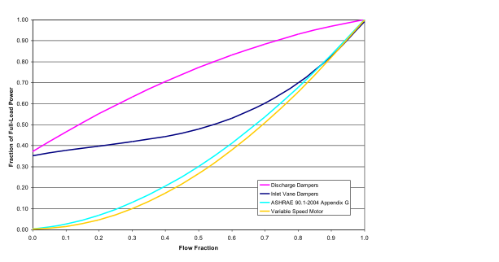
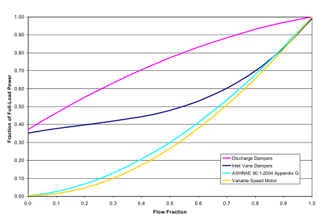

HVAC Template Objects
=====================

HVACTemplate Processing
-----------------------

**Unlike other EnergyPlus objects, the HVACTemplate objects are not handled by EnergyPlus directly.** Instead, they are preprocessed by a program called ExpandObjects. If you use EP-Launch or RunEPlus.bat, this preprocessor step is performed automatically using the following sequence:

1)   The preprocessor program, ExpandObjects, reads your IDF file and converts all of the HVACTemplate objects into other EnergyPlus objects.

2)   The ExpandObjects program copies the original idf file with the HVACTemplate objects commented out (i.e., inserts a “!” in front of the object name and its input fields) plus all of the new objects created in Step 1 and writes a new file which is saved with the extension “expidf”. This “expidf” file may be used as a standard EnergyPlus IDF file if the extension is changed to idf; however, for safety’s sake, both filename and extension should be changed.

3)   The EnergyPlus simulation proceeds using the expidf file as the input stream.

4)   If there are error messages from EnergyPlus, they will refer to the contents of the expidf file. Specific objects referred to in error messages may exist in the original idf, but they may be objects created by ExpandObjects and only exist in the expidf. Remember that the expidf will be overwritten everytime the original idf is run using EP-Launch or RunEPlus.bat.

If you are trying to go beyond the capabilities of the HVACTemplate objects, one strategy you can use is to start your specification using the HVACTemplate objects, run EnergyPlus using EP-Launch and producing an expidf file, rename that file and start making modifications. This approach may help with getting all of the objects needed and the node names set consistently.

**Users need to remember that no objects related to HVAC except for HVAC template objects are needed in the IDF file.** The existence of other objects (unless specifically described in the following sections) may cause unexpected errors to occur. Sizing:Zone, Sizing:System, and Sizing:Plant objects will be generated by the corresponding HVACTemplate objects; the user does not need to create these elsewhere in the input file.

There are some exceptions to this rule:

- HVACTemplate:Plant:Chiller:ObjectReference which requires that the corresponding chiller object be present in the idf file along with any required curve or performance objects. In this case, the HVACTemplate object does not create the chiller object, but adds all of the connections. HVACTemplate:Plant:Tower:ObjectReference and HVACTemplate:Plant:Boiler;ObjectReferences are similar.

- For HVACTemplate:Zone:\* objects, if Outdoor Air Method = *DetailedSpecification*, then any referenced DesignSpecification:OutdoorAir and DesignSpecification:ZoneAirDistribution objects must be present in the idf file.

- For HVACTemplate:Zone:VAV and HVACTemplate:Zone:DualDuct, if a Design Specification Outdoor Air Object Name for Control is specified, then the referenced DesignSpecification:OutdoorAir object must be present in the idf file.


Group -- HVAC Templates
-----------------------

This group of objects allows for the specification of simple zone thermostats and HVAC systems with automatically generated node names. The combinations of HVACTemplate objects are shown below.

For a simple ideal loads system to use for sizing and loads oriented simulations:

* HVACTemplate:Thermostat

* HVACTemplate:Zone:IdealLoadsAirSystem

For baseboard heating systems with optional hot water boiler:

* HVACTemplate:Thermostat

* HVACTemplate:Zone:BaseboardHeat

* HVACTemplate:Plant:HotWaterLoop (optional)

* HVACTemplate:Plant:Boiler (optional)

For fan coil systems with boilers and chillers:

* HVACTemplate:Thermostat

* HVACTemplate:Zone:FanCoil

* HVACTemplate:Plant:ChilledWaterLoop

* HVACTemplate:Plant:HotWaterLoop

* HVACTemplate:Plant:Chiller

* HVACTemplate:Plant:Boiler

* HVACTemplate:Plant:Tower

For packaged terminal air conditioner (PTAC) systems with optional hot water boiler:

* HVACTemplate:Thermostat

* HVACTemplate:Zone:PTAC

* HVACTemplate:Plant:HotWaterLoop (optional)

* HVACTemplate:Plant:Boiler (optional)

For packaged terminal air-to-air heat pump (PTHP) systems:

* HVACTemplate:Thermostat

* HVACTemplate:Zone:PTHP

For water to air heat pumps with boiler and cooling tower:

* HVACTemplate:Thermostat

* HVACTemplate:Zone:WaterToAirHeatPump

* HVACTemplate:Plant:MixedWaterLoop

* HVACTemplate:Plant:Boiler

* HVACTemplate:Plant:Tower

For variable refrigerant flow heat pumps (air-to-air):

* HVACTemplate:Thermostat

* HVACTemplate:Zone:VRF

* HVACTemplate:System:VRF

For variable refrigerant flow heat pumps (water-to-air)with boiler and cooling tower:

* HVACTemplate:Thermostat

* HVACTemplate:Zone:VRF

* HVACTemplate:System:VRF

* HVACTemplate:Plant:MixedWaterLoop

* HVACTemplate:Plant:Boiler

* HVACTemplate:Plant:Tower

For direct-expansion cooling, packaged and split system simulations:

* HVACTemplate:Thermostat

* HVACTemplate:Zone:Unitary

* HVACTemplate:System:Unitary or

* HVACTemplate:System:UnitarySystem

For direct-expansion heat pump systems:

* HVACTemplate:Thermostat

* HVACTemplate:Zone:Unitary

* HVACTemplate:System:UnitaryHeatPump:AirToAir or

* HVACTemplate:System:UnitarySystem

For packaged variable air volume systems using direct-expansion cooling:

* HVACTemplate:Thermostat

* HVACTemplate:Zone:VAV or

* HVACTemplate:Zone:VAV:FanPowered or

* HVACTemplate:Zone:VAV:HeatAndCool

* HVACTemplate:System:PackagedVAV

For variable air volume systems with boilers and air-cooled chillers:

* HVACTemplate:Thermostat

* HVACTemplate:Zone:VAV or

* HVACTemplate:Zone:VAV:FanPowered or

* HVACTemplate:Zone:VAV:HeatAndCool

* HVACTemplate:System:VAV

* HVACTemplate:Plant:ChilledWaterLoop

* HVACTemplate:Plant:HotWaterLoop

* HVACTemplate:Plant:Chiller

* HVACTemplate:Plant:Boiler

For variable air volume systems with boilers and water-cooled chillers, an object related to towers is added:

* HVACTemplate:Thermostat

* HVACTemplate:Zone:VAV or

* HVACTemplate:Zone:VAV:FanPowered or

* HVACTemplate:Zone:VAV:HeatAndCool

* HVACTemplate:System:VAV

* HVACTemplate:Plant:ChilledWaterLoop

* HVACTemplate:Plant:HotWaterLoop

* HVACTemplate:Plant:Chiller

* HVACTemplate:Plant:Boiler

* HVACTemplate:Plant:Tower

For constant air volume systems with boilers and water-cooled chillers:

* HVACTemplate:Thermostat

* HVACTemplate:Zone:ConstantVolume

* HVACTemplate:System:ConstantVolume

* HVACTemplate:Plant:ChilledWaterLoop

* HVACTemplate:Plant:HotWaterLoop

* HVACTemplate:Plant:Chiller

* HVACTemplate:Plant:Boiler

* HVACTemplate:Plant:Tower

For dual-duct systems (constant or variable air volume) with boilers and water-cooled chillers:

* HVACTemplate:Thermostat

* HVACTemplate:Zone:DualDuct

* HVACTemplate:System:DualDuct

* HVACTemplate:Plant:ChilledWaterLoop

* HVACTemplate:Plant:HotWaterLoop

* HVACTemplate:Plant:Chiller

* HVACTemplate:Plant:Boiler

* HVACTemplate:Plant:Tower

For dedicated outdoor air systems (DOAS) combined with a zonal template system:

* HVACTemplate:System:DedicatedOutdoorAir

* HVACTemplate:Thermostat

One of the following for each zone served by the (DOAS) –

* HVACTemplate:Zone:BaseboardHeat

* HVACTemplate:Zone:PTAC

* HVACTemplate:Zone:PTHP

* HVACTemplate:Zone:FanCoil

* HVACTemplate:Zone:WaterToAirHeatPump

* HVACTemplate:Zone:VRF

* HVACTemplate:Plant:\* objects as needed (depending on the type of zonal system and the type of coils specified in the DOAS system:WaterToAirHeatPump).

The *only* other HVAC related objects besides the HVACTemplate objects that need to be specified related to HVAC systems are:

- Schedule:Year or Schedule:Compact

- SizingPeriod objects (one for heating and one for cooling) Note: all SizingPeriod objects can be used but for simplicity in the following descriptions, we will only reference SizingPeriod:DesignDay

- SimulationControl

- Sizing:Parameters

This makes the input requirements much smaller but sacrifices some of the flexibility normally found in EnergyPlus.

### HVACTemplate:Thermostat

Each type of HVAC template zone object may reference one of these HVAC template thermostat objects. Multiple HVAC template zones can reference the same HVAC template thermostat object. The object allows the setpoints to be specified either as a constant for the entire simulation or as schedules. Referenced schedules must be defined elsewhere in the idf. Thermostat control type is dual setpoint with deadband. This object may be omitted and the user may define zone thermostat controls directly using standard EnergyPlus objects (ZoneControl:Thermostat and related objects).

#### Field: Name

A name used to reference this object. This name is referenced by HVACTemplate:Zone objects: i.e., HVACTemplate:Zone:IdealLoadsAirSystem, HVACTemplate:Zone:FanCoil, HVACTemplate:Zone:Unitary, HVACTemplate:Zone:VAV or HVACTemplate:Zone:VAV:FanPowered objects.

#### Field: Heating Setpoint Schedule Name

Enter the name of a heating setpoint schedule that has values that change at different times of the day or year. If a constant set point is needed simply leave this field blank and use the next field. The values in the schedule are in degrees C.

#### Field: Constant Heating Setpoint

Enter the heating setpoint temperature in degrees C if constant throughout the year. If the previous field is used this field should be left blank and will be ignored.

#### Field: Cooling Setpoint Schedule Name

Enter the name of a cooling setpoint schedule that has values that change at different times of the day or year. If a constant set point is needed simply leave this field blank and use the next field. The values in the schedule are in degrees C.

#### Field: Constant Cooling Setpoint

Enter the cooling setpoint temperature in degrees C if constant throughout the year. If the previous field is used this field should be left blank and will be ignored.

As shown in an IDF:

```idf
HVACTemplate:Thermostat,
    Office Thermostat,     !- Thermostat Name
    Htg-SetP-Sch,          !- Heating Setpoint Schedule
    ,                      !- Constant Heating Setpoint {C}
    Clg-SetP-Sch,          !- Cooling Setpoint Schedule
    ;                      !- Constant Cooling Setpoint {C}
```

### HVACTemplate:Zone:IdealLoadsAirSystem

This object provides an ideal system to supply conditioned air to the zone that meets all the load requirements and consumes no energy. It is often used for load calculations, an evaluation where the load components of the building are all that is being investigated, or as the first step to a more realistic model of a building.

This component can be operated with infinite or finite heating and cooling capacity. For either mode – infinite or limited capacity – the user can also specify on/off schedules for heating and cooling and outdoor air controls. There are also optional controls for dehumidification, humidification, economizer, and heat recovery. This component may be used in combination with other HVAC equipment serving the same zone.

This component can be thought of as an ideal unit that mixes air at the zone exhaust condition with the specified amount of outdoor air and then adds or removes heat and moisture at 100% efficiency in order to produce a supply air stream at the specified conditions. The energy required to condition the supply air is metered and reported as DistrictHeating and DistrictCooling.

#### Field: Zone Name

Enter the name of the zone. The name must match a building zone name used in the ZONE object.

#### Field: Template Thermostat Name

Enter the name of a HVACTemplate:Thermostat object. Multiple HVACTemplate:Zone:IdealLoadsAirSystem objects can reference the same HVACTemplate:Thermostat object which makes it easier to revise the thermostat controls for portions of a building.

When this field is blank, it has a special meaning. A blank entry means that traditional thermostat objects referencing the same zone name are used instead of HVACTemplate:Thermostat.

#### Field: System Availability Schedule Name

Leave this field blank if you want the system to be available for the entire year to perform heating or cooling if called for by the thermostat. If a schedule name is specified, those times that the system is available should be specified as 1.0. Those times that the system is not available should have a zero value in the schedule specified. There are additional schedules fields for heating and cooling operation.

#### Field: Maximum Heating Supply Air Temperature

The maximum air temperature (degrees C) of the air used for heating the zone. The default is 50C (122F).

#### Field: Minimum Cooling Supply Air Temperature

The minimum air temperature (degrees C) of the air used for cooling the zone. The default is 13C (55.4F).

#### Field: Maximum Heating Supply Air Humidity Ratio

The maximum humidity ratio (kg of water per kg of dry air) of the hot supply air. The default is 0.0156 kgWater/kgDryAir which corresponds to a 20%RH at 50C (122F) dry bulb.

#### Field: Minimum Cooling Supply Air Humidity Ratio

The minimum humidity ratio (kg of water per kg of dry air) of the cool supply air. The default is 0.0077 kgWater/kgDryAir which corresponds to a 10C (50F) dew point.

#### Field: Heating Limit

The input must be either *LimitFlowRate, LimitCapacity, LimitFlowRateAndCapacity* or *NoLimit*. *LimitFlowRate* means that the heating supply air flow rate will be limited to the value specified in the next input field. *LimitCapacity* means that the sensible heating capacity will be limited to the value specified in the Maximum Sensible Heating Capacity field. *LimitFlowRateAndCapacity* means that both flow rate and capacity will be limited. *NoLimit* (the default) means that there will not be any limit on the heating supply air flow rate or capacity and the subsequent two fields will be ignored.

#### Field: Maximum Heating Air Flow Rate

The maximum heating supply air flow rate in cubic meters per second if heating limit is set to *LimitFlowRate or LimitFlowRateAndCapacity* *.* This field may be autosized. This field is ignored if heating limit is set to *NoLimit* or *LimitCapacity*.  If blank, there is no limit.

#### Field: Maximum Sensible Heating Capacity

The maximum allowed sensible heating capacity in Watts if Heating Limit is set to *LimitCapacity* or *LimitFlowRateAndCapacity*. This field may be autosized. If blank, there is no limit. If Heating Limit *is set to NoLimit* or *LimitFlowRate*, this field is ignored.

#### Field: Cooling Limit

The input must be either *LimitFlowRate, LimitCapacity, LimitFlowRateAndCapacity* or *NoLimit*. *LimitFlowrate* means that the cooling supply air flow rate will be limited to the value specified in the next input field. *LimitCapacity* means that the total cooling capacity will be limited to the value specified in the Maximum Total Cooling Capacity field. *LimitFlowRateAndCapacity* means that both flow rate and capacity will be limited. *NoLimit* (the default) means that there will not be any limit on the cooling supply air flow rate or capacity and the subsequent two fields will be ignored.

#### Field: Maximum Cooling Air Flow Rate

The maximum cooling supply air flow rate in cubic meters per second if Cooling Limit is set to *LimitFlowRate* or *LimitFlowRateAndCapacity.* This field may be autosized. This field is ignored if cooling limit is set to *NoLimit* or *LimitCapacity*. If blank, there is no limit. If *Cooling Limit is set to NoLimit,* this field is ignored*.* This field is required if Outdoor Air Control Type is *TemperatureEconomizer* in order to establish an upper limit on outdoor air flow when the economizer is active*.*

#### Field: Maximum Total Cooling Capacity

The maximum allowed total (sensible plus latent) cooling capacity in Watts if Cooling Limit is set to *LimitCapacity* or *LimitFlowRateAndCapacity*. This field may be autosized. If blank, there is no limit. If Cooling Limit *is set to NoLimit* or *LimitFlowRate,* this field is ignored*.*

#### Field: Heating Availability Schedule Name

The name of a schedule (ref: Schedule) that denotes whether heating is available. A schedule value greater than 0 (usually 1 is used) indicates that heating and humidification are available. A value less than or equal to 0 (usually 0 is used) denotes that heating and humidification are not available. If blank, heating and humidification are always available.

#### Field: Cooling Availability Schedule Name

The name of a schedule (ref: Schedule) that denotes whether cooling is available. A schedule value greater than 0 (usually 1 is used) indicates that cooling and dehumidification are available. A value less than or equal to 0 (usually 0 is used) denotes that cooling and dehumidification is not available. If blank, cooling and dehumidification are always available.

#### Field: Dehumidification Control Type

Select from *ConstantSensibleHeatRatio*, *Humidistat, None, or ConstantSupplyHumidityRatio*. *ConstantSensibleHeatRatio* (the default) means that the ideal loads system will be controlled to meet the sensible cooling load, and the latent cooling rate will be computed using a constant sensible heat ratio (SHR) (see next field). *Humidistat* means that there is a ZoneControl:Humidistat for this zone and the ideal loads system will attempt to meet the humidistat request (i.e. will dehumidify according to the Dehumidifying Relative Humidity Schedule in the ZoneControl:Humidistat object). *None* means that there is no dehumidification. *ConstantSupplyHumidityRatio* means that during cooling the supply air will always be at the Minimum Cooling Supply Humidity Ratio. For *ConstantSensibleHeatRatio* and *Humidistat*, if the mixed air humidity ratio is less than the target humidity ratio, then the mixed air humidity ratio will be used. For all options, the supply air humidity ratio will never be allowed to exceed saturation at the supply dry bulb temperature.

The selected dehumidification control type is always applied when the unit is in cooling mode. If the unit is in deadband mode (not actively heating the supply air) control type *Humidistat* will be active. If the unit is in heating mode, control type *Humidistat* will be active if the Humidification Control Type field below is set to *Humidistat* or *None*.

This allows the ideal loads system to heat and dehumidify at the same time.

#### Field: Cooling Sensible Heat Ratio

When the Dehumidification Control Type is set to *ConstantSensibleHeatRatio* the ideal loads system will be controlled to meet the sensible cooling load, and the latent cooling rate will be computed using the value of Cooling Sensible Heat Ratio (SHR), where SHR = Sensible Cooling divided by Total Cooling (sensible plus latent). The default is 0.7. If Dehumidification Control Type is set to something other than *ConstantSensibleHeatRatio* then this field will be ignored.

#### Field: Dehumidification Setpoint

This field specifies the zone humidistat relative humidity setpoint for dehumidification in percent (0 to 100).  The default is 60%. This field is used only when the Dehumidification Control Type = *Humidistat.*

#### Field: Humidification Control Type

Select from *None*, *Humidistat, or ConstantSupplyHumidityRatio*. *None* means that there is no humidification. *Humidistat* means that there is a ZoneControl:Humidistat for this zone and the ideal loads system will attempt to meet the humidistat request (i.e., humidify according to the Humidifying Relative Humidity Setpoint Schedule in the ZoneControl:Humidistat object). *ConstantSupplyHumidityRatio* means that during heating the supply air will always be at the Maximum Heating Supply Humidity Ratio. The default is *None*. For *Humidistat*, if the mixed air humidity ratio is greater than the target humidity ratio, then the mixed air humidity ratio will be used. For all options, the supply air humidity ratio will never be allowed to exceed saturation at the supply dry bulb temperature.

The selected humidification control type is always applied when the unit is in heating mode. If the unit is in deadband mode (not actively heating the supply air) control type *Humidistat* will be active. If the unit is in cooling mode, control type *Humidistat* will be active if the Dehumidification Control Type field above is set to *Humidistat* or *None*.

This allows the ideal loads system to cool and humidify at the same time.

#### Field: Humidification Setpoint

This field specifies the zone humidistat relative humidity setpoint for humidification in percent (0 to 100).  The default is 30%. This field is used only when the Humidification Control Type = *Humidistat.*

#### Field: Outdoor Air Method

The input must be either *None, Flow/Zone*, *Flow/Person*, *Flow/Area*, *Sum*, *Maximum or DetailedSpecification*. *None* means there is no outdoor air provided by this system. *Flow/Zone* means that the program will use the input of the field *Outdoor Air Flow* as the zone design outdoor air flow rate. *Flow/Person* means the program will use the input from the field *Outdoor Air Flow per Person* and the maximum occupancy to calculate a zone design outdoor air flow rate. *Flow/Area* means the program will use the input from the field *Outdoor Air Flow per Zone Floor Area* to calculated a zone design outdoor air flow rate. *Sum* means that the flows calculated from the fields *Outdoor Air Flow per Person,* *Outdoor Air Flow per Area* and *Outdoor Air Flow per Zone* will be added to obtain the zone design outdoor air flow rate. *Maximum* means that the maximum flow derived from *Outdoor Air Flow per Person,* *Outdoor Air Flow per Area* and *Outdoor Air Flow per Zone* will be used for the zone design outdoor air flow rate. The default is *None.*.

*DetailedSpecification* means that the outdoor air specifications will be taken from a DesignSpecification:OutdoorAir object referenced in the Design Specification Outdoor Air Object Name field below.

#### Field: Outdoor Air Flow Rate per Person

The design outdoor air flow rate per person for this zone in cubic meters per second. The default is 0.00944 (20 cfm per person). An outdoor air flow rate is calculated based on the total number of people for all People statements assigned to the zone. Occupancy schedule values are not applied. This input is used if Outdoor Air Method is one of  *Outdoor Air Flow per Person*, *Sum*, or *Maximum.*

#### Field: Outdoor Air Flow Rate per Zone Floor Area

The design outdoor air volumetric flow rate per square meter of floor area (units are m<sup>3</sup>/s-m<sup>2</sup>). This input is multiplied by the zone area to obtain a flow rate. This input is used if Outdoor Air Method is *Flow/Area, Sum* or *Maximum*. The default is 0.0.

#### Field: Outdoor Air Flow Rate per Zone

The design outdoor air flow rate for this zone in cubic meters per second. This input field is used if Outdoor Air Method is *Flow/Zone, Sum* or *Maximum*. The default is 0.0.

#### Field: Design Specification Outdoor Air Object Name

This alpha field specifies the name of a DesignSpecification:OutdoorAir object which specifies the outdoor air requirements and schedule for this system. The outdoor air flow rate may also be affected by the next two fields, Demand Controlled Ventilation Type and Outdoor Air Economizer Type. If this field is blank, this system will have no outdoor air, and all outdoor air control and heat recovery options will be ignored..

#### Field: Demand Controlled Ventilation Type

This field, along with the Design Specification Outdoor Air Object (if used) specifies how the minimum outdoor air flow rate is calculated. The choices are: *None, OccupancySchedule or CO2Setpoint*. The default is *None*.

- None means that the design occupancy level will be used when computing the minimum outdoor air flow rate based on the inputs in the Design Specification Outdoor Air Object (see previous field).

- OccupancySchedule means that the current occupancy level will be used when computing the minimum outdoor air flow rate based on the inputs in the Design Specification Outdoor Air Object (see previous field).

- CO2Setpoint means that the design occupancy level will be used when computing the minimum outdoor air flow rate based on the inputs in the Design Specification Outdoor Air Object (see previous field). In addition, the minimum outdoor air flow rate may be increased if necessary to maintain the level of indoor air carbon dioxide at or below the setpoint defined in a ZoneControl:ContaminantController object (the user must add this to the idf file along with other related inputs).

#### Field: Outdoor Air Economizer Type

This field specifies if there is an outdoor air economizer. The choices are: *NoEconomizer, DifferentialDryBulb,* or *DifferentialEnthalpy*. The default is *NoEconomizer*. *DifferentialDryBulb* and *DifferentialEnthalpy* mean that the economizer will increase the outdoor air flow rate above the minimum outdoor air flow (see fields Design Specification Outdoor Air Object Name and Demand Controlled Ventilation Type) when there is a cooling load and the outdoor air temperature or enthalpy is below the zone exhaust air temperature or enthalpy. The *DifferentialDryBulb* and *DifferentialEnthalpy* options require that the Maximum Cooling Air Flow Rate be specified which will be used as the limit for maximum outdoor air flow rate.

#### Field: Heat Recovery Type

Select from *None*, *Sensible*, or *Enthalpy*. *None* means that there is no heat recovery. *Sensible* means that there is sensible heat recovery whenever the zone exhaust air temperature is more favorable than the outdoor air temperature. *Enthalpy* means that there is latent and sensible heat recovery whenever the zone exhaust air enthalpy is more favorable than the outdoor air enthalpy. The default is *None*.

#### Field: Sensible Heat Recovery Effectiveness

The sensible heat recovery effectiveness, where effectiveness is defined as the change in supply temperature divided by the difference in entering supply and relief air temperatures. The default is 0.70.

#### Field: Latent Heat Recovery Effectiveness

The latent heat recovery effectiveness, where effectiveness is defined as the change in supply humidity ratio divided by the difference in entering supply and relief air humidity ratios. The default is 0.65.


As shown in an IDF:

```idf
  HVACTemplate:Zone:IdealLoadsAirSystem,
    Zone 1,                  !- Zone Name
    All Zones,               !- Thermostat Name
    FanAvailSched,           !- System Availability Schedule Name
    50,                      !- Maximum Heating Supply Air Temperature {C}
    13,                      !- Minimum Cooling Supply Air Temperature {C}
    0.0156,         !- Maximum Heating Supply Air Humidity Ratio {kgWater/kgDryAir}
    0.0077,         !- Minimum Cooling Supply Air Humidity Ratio {kgWater/kgDryAir}
    NoLimit,                 !- Heating Limit
    ,                        !- Maximum Heating Air Flow Rate {m3/s}
    ,                        !- Maximum Sensible Heating Capacity {W}
    NoLimit,                 !- Cooling Limit
    ,                        !- Maximum Cooling Air Flow Rate {m3/s}
    ,                        !- Maximum Total Cooling Capacity {W}
    ,                        !- Heating Availability Schedule Name
    ,                        !- Cooling Availability Schedule Name
    ConstantSensibleHeatRatio,  !- Dehumidification Control Type
    0.7,                     !- Cooling Sensible Heat Ratio
    60,                      !- Dehumidification Setpoint {percent}
    None,                    !- Humidification Control Type
    30,                      !- Humidification Setpoint {percent}
    flow/person,             !- Outdoor Air Method
    0.00944,                 !- Outdoor Air Flow Rate per Person {m3/s}
    0.0,                     !- Outdoor Air Flow Rate per Zone Floor Area {m3/s-m2}
    0.0,                     !- Outdoor Air Flow Rate per Zone {m3/s}
    ,                        !- Design Specification Outdoor Air Object Name
    None,                    !- Demand Controlled Ventilation Type
    NoEconomizer,            !- Outdoor Air Economizer Type
    None,                    !- Heat Recovery Type
    0.70,                    !- Sensible Heat Recovery Effectiveness
    0.65;                    !- Latent Heat Recovery Effectiveness
```


### HVACTemplate:Zone:BaseboardHeat

This object simulates a hot water or electric thermostatically controlled baseboard heating system. This object includes optional fields to combine the baseboard heat with a dedicated outdoor air system. If the zone is also served by another HVAC system, such as a PTAC or unitary air handler, then do not use this object. Instead, use the HVACTemplate:Zone:\* object for the forced air system and use the baseboard heating fields in that object.

#### Field: Zone Name

Enter the name of the zone. The name must match a building zone name used in the ZONE object.

#### Field: Template Thermostat Name

Enter the name of a HVACTemplate:Thermostat object. Multiple HVACTemplate:Zone:IdealLoadsAirSystem objects can reference the same HVACTemplate:Thermostat object which makes it easier to revise the thermostat controls for portions of a building.

When this field is blank, it has a special meaning. A blank entry means that detailed thermostat objects referencing the same zone name are used instead of HVACTemplate:Thermostat.

#### Field: Zone Heating Sizing Factor

This input is the zone level heating sizing ratio. The zone design heating load will be multiplied by the number input in this field when the Baseboard Heating Capacity is autosized.  If this field is left blank, the Heating Sizing Factor from Sizing:Parameters will be used.

#### Field: Baseboard Heating Type

This field specifies the type of thermostatically controlled baseboard heat in this zone. The choices are:

- HotWater

- Electric

The default choice is *HotWater*.

#### Field: Baseboard Heating Availability Schedule Name

Leave this field blank if you want the baseboard heating to be available for the entire year to perform heating if called for by the thermostat. If a schedule name is specified, those times that the baseboard heating is available should be specified as 1.0. Those times that the baseboard heating is not available should have a zero value in the schedule. Please note that this is not a schedule of when the baseboard is providing heat but a schedule of when it can provide heat.

#### Field: Baseboard Heating Capacity

Enter autosize to allow the sizing algorithm to determine the proper capacity required based on the loads experienced during the heating design day. If a value is specified, it is the maximum amount of heat that the baseboard heating can deliver in Watts.  Note that EnergyPlus autosizing will autosize the baseboard heating to meet the full heating load of the zone, regardless of the heating capability of the fan coil system.  The baseboard heating will be set to heating sequence 2, which means it will meet any remaining heating load not met by the fan coil system.

#### Field: Dedicated Outdoor Air System Name

Enter the name of an HVACTemplate:System:DedicatedOutdoorAir object if this zone is served by a dedicated outdoor air system (DOAS). When a Dedicated Outdoor Air System Name is entered, the DOAS will provide ventilation air to the zone based on the outdoor air specifications in this object. If this field is blank, then the following outdoor air fields are ignored.

#### Field: Outdoor Air Method

The input must be either *Flow/Zone*, or *Flow/Person*, *Flow/Area*, *Sum*, *Maximum or DetailedSpecification*. *Flow/Zone* means that the program will use the input of the field *Outdoor Air Flow* as the zone design outdoor air flow rate. *Flow/Person* means the program will use the input from the field *Outdoor Air Flow per Person* and the maximum occupancy to calculate a zone design outdoor air flow rate. *Flow/Area* means the program will use the input from the field *Outdoor Air Flow per Zone Floor Area* to calculated a zone design outdoor air flow rate. *Sum* means that the flows calculated from the fields *Outdoor Air Flow per Person,* *Outdoor Air Flow per Area* and *Outdoor Air Flow per Zone* will be added to obtain the zone design outdoor air flow rate. *Maximum* means that the maximum flow derived from *Outdoor Air Flow per Person,* *Outdoor Air Flow per Area* and *Outdoor Air Flow per Zone* will be used for the zone design outdoor air flow rate. The default is *Flow/Person*.

*DetailedSpecification* means that the outdoor air specifications will be taken from a DesignSpecification:OutdoorAir object and optional DesignSpecification:ZoneAirDistribution object. These objects are referenced in the Design Specification Outdoor Air Object Name and Design Specification Zone Air Distribution Object Name fields below.

#### Field: Outdoor Air Flow Rate per Person

The design outdoor air flow rate per person for this zone in cubic meters per second. The default is 0.00944 (20 cfm per person). An outdoor air flow rate is calculated based on the total number of people for all People statements assigned to the zone. Occupancy schedule values are not applied. This input is used if Outdoor Air Method is one of  *Outdoor Air Flow per Person*, *Sum*, or *Maximum.*

#### Field: Outdoor Air Flow Rate per Zone Floor Area

The design outdoor air volumetric flow rate per square meter of floor area (units are m<sup>3</sup>/s-m<sup>2</sup>). This input is multiplied by the zone area to obtain a flow rate. This input is used if Outdoor Air Method is *Flow/Area, Sum* or *Maximum*. The default is 0.0.

#### Field: Outdoor Air Flow Rate per Zone

The design outdoor air flow rate for this zone in cubic meters per second. This input field is used if Outdoor Air Method is *Flow/Zone, Sum* or *Maximum*. The default is 0.0.

#### Field: Design Specification Outdoor Air Object Name

This alpha field specifies the name of a DesignSpecification:OutdoorAir object which specifies the design outdoor air flow rate for the zone.  This field is used only when Outdoor Air Method *= DetailedSpecification*.

#### Field: Design Specification Zone Air Distribution Object Name

This alpha field specifies the name of a DesignSpecification:ZoneAirDistribution object which specifies the air distribution effectiveness for the zone.  This field is used only when Outdoor Air Method *= DetailedSpecification*.


As shown in an IDF:

```idf
  HVACTemplate:Zone:BaseboardHeat,
    SPACE1-1,          !- Zone Name
    All Zones,         !- Template Thermostat Name
    ,                  !- Zone Heating Sizing Factor
    HotWater,          !- Baseboard Heating Type
    ,                  !- Baseboard Heating Availability Schedule Name
    Autosize;          !- Baseboard Heating Capacity {W}
    ,                  !- Dedicated Outdoor Air System Name
    flow/person,       !- Outdoor Air Method
    0.00944,           !- Outdoor Air Flow Rate per Person {m3/s}
    0.0,               !- Outdoor Air Flow Rate per Zone Floor Area {m3/s-m2}
    0.0,               !- Outdoor Air Flow Rate per Zone {m3/s}
    ,                  !- Design Specification Outdoor Air Object Name
    ;                  !- Design Specification Zone Air Distribution Object Name
```


### HVACTemplate:Zone:FanCoil

This object simulates a 4 pipe fan coil unit with hot water heating coil, chilled water cooling coil, and an outdoor air mixer. The coils are served directly by HVACTemplate:Plant:ChilledWaterLoop and HVACTemplate:Plant:HotWaterLoop objects. No HVACTemplate:System object is required. Reference ZoneHVAC:FourPipeFanCoil for more details about the fan coil model.

#### Field: Zone Name

Enter the name of the zone. The name must match a building zone name used in the ZONE object.

#### Field: Template Thermostat Name

Enter the name of a HVACTemplate:Thermostat object. Multiple HVACTemplate:Zone:\* objects can reference the same HVACTemplate:Thermostat object which makes it easier to revise the thermostat controls for portions of a building.

When this field is blank, it has a special meaning. A blank entry means that traditional thermostat objects referencing the same zone name are used instead of HVACTemplate:Thermostat.

#### Field: Supply Air Maximum Flow Rate

By entering Autosize, the maximum supply air flow rate is automatically determined for the zone based on the loads experienced by the zone during the specified heating SizingPeriod:DesignDay and cooling SizingPeriod:DesignDay. Note that the zone must have a thermostat specified in order to autosize the flow rate. If a value is entered it is used as the maximum supply air flow rate into the zone. It will be multiplied by the Supply Air Sizing Factor and by zone multipliers. The units are in m3/s.

#### Field: Zone Heating Sizing Factor

This input is the zone level heating sizing ratio. The zone design heating air flow rate and load will be multiplied by the number input in this field when Supply Air Maximum Flow Rate is autosized.  If this field is left blank, the Heating Sizing Factor from Sizing:Parameters will be used.

#### Field: Zone Cooling Sizing Factor

This input is the zone level cooling sizing ratio. The zone design cooling air flow rate and load will be multiplied by the number input in this field when Supply Air Maximum Flow Rate is autosized.  If this field is left blank, the Cooling Sizing Factor from Sizing:Parameters will be used.

#### Field: Outdoor Air Method

The input must be either *Flow/Zone*, or *Flow/Person*, *Flow/Area*, *Sum*, *Maximum or DetailedSpecification*. *Flow/Zone* means that the program will use the input of the field *Outdoor Air Flow* as the zone design outdoor air flow rate. *Flow/Person* means the program will use the input from the field *Outdoor Air Flow per Person* and the maximum occupancy to calculate a zone design outdoor air flow rate. *Flow/Area* means the program will use the input from the field *Outdoor Air Flow per Zone Floor Area* to calculated a zone design outdoor air flow rate. *Sum* means that the flows calculated from the fields *Outdoor Air Flow per Person,* *Outdoor Air Flow per Area* and *Outdoor Air Flow per Zone* will be added to obtain the zone design outdoor air flow rate. *Maximum* means that the maximum flow derived from *Outdoor Air Flow per Person,* *Outdoor Air Flow per Area* and *Outdoor Air Flow per Zone* will be used for the zone design outdoor air flow rate. The default is *Flow/Person*.

*DetailedSpecification* means that the outdoor air specifications will be taken from a DesignSpecification:OutdoorAir object and optional DesignSpecification:ZoneAirDistribution object. These objects are referenced in the Design Specification Outdoor Air Object Name and Design Specification Zone Air Distribution Object Name fields below.

#### Field: Outdoor Air Flow Rate per Person

The design outdoor air flow rate per person for this zone in cubic meters per second. The default is 0.00944 (20 cfm per person). An outdoor air flow rate is calculated based on the total number of people for all People statements assigned to the zone. Occupancy schedule values are not applied. This input is used if *Outdoor Air Method* is one of  *Outdoor Air Flow per Person*, *Sum*, or *Maximum*.

#### Field: Outdoor Air Flow Rate per Zone Floor Area

The design outdoor air volumetric flow rate per square meter of floor area (units are m<sup>3</sup>/s-m<sup>2</sup>). This input is multiplied by the zone area to obtain a flow rate. This input is used if *Outdoor Air Method* is *Flow/Area, Sum* or *Maximum*.

#### Field: Outdoor Air Flow Rate per Zone

The design outdoor air flow rate for this zone in cubic meters per second. This input field is used if *Outdoor Air Method* is *Flow/Zone, Sum* or *Maximum*.

#### Field: System Availability Schedule Name

Leave this field blank if you want the system to be available for the entire year to perform heating or cooling if called for by the thermostat. If a schedule name is specified, those times that the system is available should be specified as 1.0. Those times that the system is not available should have a zero value in the schedule specified. Fan coil systems are modeled with continuous fan operation, so this is also the supply fan operating schedule. If this field is blank, the schedule has values of 1 for all time periods.

#### Field: Supply Fan Total Efficiency

Enter the total efficiency of the supply fan. This value is the overall efficiency of the fan, i.e., the ratio of the power delivered to the fluid to the electrical input power. It is the product of the motor efficiency and the impeller efficiency. The motor efficiency is the power delivered to the shaft divided by the electrical power input to the motor. The impeller efficiency is power delivered to the fluid (air) divided by the shaft power. The power delivered to the fluid is the mass flow rate of the air multiplied by the pressure rise divided by the air density. This input value must be between 0 and 1. The default is 0.7.

#### Supply Fan Delta Pressure

Enter the pressure rise in Pa at full flow and standard conditions. Standard conditions are considered 20<sup>o</sup> C at sea level, 101325 Pa.

#### Field: Supply Fan Motor Efficiency

Enter the shaft power of the supply fan divided by the electrical power consumed. Must be greater than 0 and less than or equal to 1.

#### Field: Supply Fan Motor in Air Stream Fraction

Enter the fraction of the motor heat that is added to the air stream. A value of 0 means that the motor is completely outside the air stream. A value of 1 means that all of the motor heat will go into the air stream and act to cause a temperature rise. Must be between 0 and 1.

#### Field: Cooling Coil Type

There are two coil types available:

- ChilledWater

- ChilledWaterDetailedFlatModel

*Chilled Water* uses theCoil:Cooling:Water object with the DetailedAnalysis option.  This is the preferred coil model for most applications.  *ChilledWaterDetailedFlatModel* uses the Coil:Cooling:Water:DetailedGeometry object.  This option is available for special applications.  The default is *ChilledWater*.

#### Field: Cooling Coil Availability Schedule Name

Usually set to blank, which allows the cooling coil to be available anytime the system is operating. If a schedule name is specified, it defines when the coil is available. This is most often used when cooling is only available seasonally. A schedule value of one indicates that the cooling coil can be on during a given time period. A value of zero denotes that the cooling coil cannot be used during that time period.

#### Field: Cooling Coil Design Setpoint

This is the design supply air temperature in C used to size the cooling supply air flow and the cooling coil. This field is used only when Zone Cooling Design Supply Air Temperature Input Method is *SupplyAirTemperature.* The default is 14<sup>o</sup>C.

#### Field: Heating Coil Type

Only one possible value may be entered here:

- HotWater

Future versions may have additional heating coil types.

#### Field: Heating Coil Availability Schedule Name

Usually set to blank, which allows the heating coil to be available anytime the system is operating. If a schedule name is specified, it defines when the coil is available. This is most often used when heating is only available seasonally. The schedule values denote whether the heating coil can run during a given time period. A schedule value of one indicates that the heating coil can be on during a given time period. A value of zero denotes that the heating coil cannot be used during that time period

#### Field: Heating Coil Design Setpoint

This is the design supply air temperature in C used to size the heating supply air flow and the heating coil. This field is used only when Zone Heating Design Supply Air Temperature Input Method is *SupplyAirTemperature.* The default is 50<sup>o</sup>C.

#### Field: Dedicated Outdoor Air System Name

Enter the name of an HVACTemplate:System:DedicatedOutdoorAir object if this zone is served by a dedicated outdoor air system (DOAS). When a Dedicated Outdoor Air System Name is entered, the outdoor air flow rate for this zone equipment object will be set to zero and the DOAS will provide the ventilation air to the zone based on the outdoor air specifications in this object. For this fancoil system (ref. ZoneHVAC:FourPipeFanCoil):, the “Capacity Control Method” will be set to CyclingFan if a DOAS system is specified. If this field is blank, then the zone served by this fancoil system will not be served by a DOAS, and the fancoil Capacity Control Method will be ConstantFanVariableFlow.

#### Field: Zone Cooling Design Supply Air Temperature Input Method

This field selects the method for specifying the cooling design supply air temperature. *SupplyAirTemperature* means that the field Cooling Coil Design Setpoint will be used for sizing the zone cooling design air flow rate and the cooling coil. *TemperatureDifference* means that the field Zone Cooling Design Supply Air Temperature Difference will be used. The default is *SupplyAirTemperature.*

#### Field: Zone Cooling Design Supply Air Temperature Difference

The temperature difference between the cooling design supply air temperature and the zone air temperature in degrees Celsius for the zone cooling design air flow rate calculation and cooling coil sizing. The absolute value is used, so the sign may be positive or negative. This field is used only when Zone Cooling Design Supply Air Temperature Input Method is *TemperatureDifference.* The default is 11.11 deltaC.

#### Field: Zone Heating Design Supply Air Temperature Input Method

This field selects the method for specifying the heating design supply air temperature. *SupplyAirTemperature* means that the field Heating Coil Design Setpoint will be used for sizing the zone heating design air flow rate and the heating coil. *TemperatureDifference* means that the field Zone Heating Design Supply Air Temperature Difference will be used. The default is *SupplyAirTemperature.*

#### Field: Zone Heating Design Supply Air Temperature Difference

The temperature difference between heating design supply air temperature and zone air temperature in degrees Celsius for the zone heating design air flow rate calculation and heating coil sizing. The absolute value is used, so the sign may be positive or negative. This field is used only when Zone Heating Design Supply Air Temperature Input Method is *TemperatureDifference.* The default is 30 deltaC.

#### Field: Design Specification Outdoor Air Object Name

This alpha field specifies the name of a DesignSpecification:OutdoorAir object which specifies the design outdoor air flow rate for the zone.  This field is used only when *Outdoor Air Method = DetailedSpecification*.

#### Field: Design Specification Zone Air Distribution Object Name

This alpha field specifies the name of a DesignSpecification:ZoneAirDistribution object which specifies the air distribution effectiveness for the zone.  This field is used only when *Outdoor Air Method = DetailedSpecification*.

#### Field: Fan Coil Capacity Control Method

This input denotes how the unit’s output is controlled in order to meet zone heating or cooling requirement. The choices are *ConstantFanVariableFlow*, *CyclingFan*, *VariableFanVariableFlow* or *VariableFanConstantFlow*. For *ConstantFanVariableFlow*, the fan speed is held constant to produce a fixed air flow rate whenever the unit is scheduled on. The hot water or chilled flow rate is varied so that the unit output matches the zone heating or cooling requirement. For *CyclingFan*, the fan speed is chosen so that the unit capacity is greater than or equal to the heating / cooling load and the fan is cycled to match unit output with the load. For *VariableFanVariableFlow*  both air and water flow rates are varied to match the load. For *VariableFanConstantFlow,* the water flow rate is at full flow and the fan speed varies to meet the load. If this field is left blank, it will default to *CyclingFan* if a Dedicated Outdoor Air System is specified (see above), otherwise it will default to *ConstantFanVariableFlow.*

#### Field: Low Speed Supply Air Flow Ratio

This numerical field specifies the ratio of the low speed flow rate to the maximum supply air flow rate. Its value should be less than *Medium Speed Supply Air Flow Ratio.* If left blank, the default value is 0.33. This field is ignored if the capacity control method selected is not *CyclingFan*.

#### Field: Medium Speed Supply Air Flow Ratio

This numerical field specifies the ratio of the medium speed flow rate to the maximum supply air flow rate. Its value should be greater than the *Low Speed Supply Air Flow Ratio* but less than 1.If left blank, the default value is 0.66. This field is ignored if the capacity control method selected is not *CyclingFan*.

#### Field: Outdoor Air Schedule Name

#### The name of a schedule whose values (0.0 to 1.0) are used as multipliers to alter the outdoor air flow rate. If this field is left blank, the values will default to 1.0. This schedule is ignored if the zone is served by an HVACTemplate dedicated outdoor air system.

#### Field: Baseboard Heating Type

This field specifies the availability of thermostatically controlled baseboard heat in this zone. The choices are:

- HotWater

- Electric

- None

The default choice is None.

#### Field: Baseboard Heating Availability Schedule Name

Leave this field blank if you want the baseboard heating to be available for the entire year to perform heating if called for by the thermostat. If a schedule name is specified, those times that the baseboard heating is available should be specified as 1.0. Those times that the baseboard heating is not available should have a zero value in the schedule. Please note that this is not a schedule of when the baseboard is providing heat but a schedule of when it can provide heat.

#### Field: Baseboard Heating Capacity

Enter autosize to allow the sizing algorithm to determine the proper capacity required based on the loads experienced during the heating design day. If a value is specified, it is the maximum amount of heat that the baseboard heating can deliver in Watts.  Note that EnergyPlus autosizing will autosize the baseboard heating to meet the full heating load of the zone, regardless of the heating capability of the fan coil system.  The baseboard heating will be set to heating sequence 2, which means it will meet any remaining heating load not met by the fan coil system.


As shown in an IDF:

```idf
  HVACTemplate:Zone:FanCoil,
    SPACE1-1,                !- Zone Name
    All Zones,               !- Template Thermostat Name
    autosize,                !- Supply Air Maximum Flow Rate {m3/s}
    ,                        !- Zone Heating Sizing Factor
    ,                        !- Zone Cooling Sizing Factor
    flow/person,             !- Outdoor Air Method
    0.00944,                 !- Outdoor Air Flow Rate per Person {m3/s}
    0.0,               !- Outdoor Air Flow Rate per Zone Floor Area {m3/s-m2}
    0.0,                     !- Outdoor Air Flow Rate per Zone {m3/s}
    FanAvailSched,           !- System Availability Schedule Name
    0.7,                     !- Supply Fan Total Efficiency
    75,                      !- Supply Fan Delta Pressure {Pa}
    0.9,                     !- Supply Fan Motor Efficiency
    1,                       !- Supply Fan Motor in Air Stream Fraction
    ChilledWater,            !- Cooling Coil Type
    ,                        !- Cooling Coil Availability Schedule Name
    12.5,                    !- Cooling Coil Design Setpoint {C}
    HotWater,                !- Heating Coil Type
    ,                        !- Heating Coil Availability Schedule Name
    50,                      !- Heating Coil Design Setpoint {C}
    ,                        !- Dedicated Outdoor Air System Name
    SupplyAirTemperature, !- Zone Cooling Design Supply Air Temperature Input Method
    ,            !- Zone Cooling Design Supply Air Temperature Difference {deltaC]
    SupplyAirTemperature, !- Zone Heating Design Supply Air Temperature Input Method
    ,            !- Zone Heating Design Supply Air Temperature Difference {deltaC]
    ,            !- Design Specification Outdoor Air Object Name
    ,            !- Design Specification Zone Air Distribution Object Name
    ConstantFanVariableFlow, !- Fan Coil Capacity Control Method
    ,                        !- Low Speed Supply Air Flow Ratio
    ,                        !- Medium Speed Supply Air Flow Ratio
    OUTAIRFANCOILSCHEDULE,   !- Outdoor Air Schedule Name
    None,        !- Baseboard Heating Type
    ,            !- Baseboard Heating Availability Schedule Name
    Autosize;    !- Baseboard Heating Capacity {W}
```


### HVACTemplate:Zone:PTAC

This object simulates a packaged terminal air conditioner (PTAC) with a DX cooling coil, a heating coil (electric, gas, or hot water), and an outdoor air mixer. The optional hot water heating coil is served directly by HVACTemplate:Plant:HotWaterLoop and HVACTemplate:Plant:Boiler objects. No HVACTemplate:System object is required. Reference ZoneHVAC:PackagedTerminalAirConditioner for more details about the PTAC model.


Figure 154.  Schematic of a packaged terminal air conditioner with draw through fan placement

#### Field: Zone Name

Enter the name of the zone. The name must match a building zone name used in the ZONE object.

#### Field: Template Thermostat Name

Enter the name of a HVACTemplate:Thermostat object. Multiple HVACTemplate:Zone:\* objects can reference the same HVACTemplate:Thermostat object which makes it easier to revise the thermostat controls for portions of a building.

When this field is blank, it has a special meaning. A blank entry means that traditional thermostat objects referencing the same zone name are used instead of HVACTemplate:Thermostat.

#### Field: Cooling Supply Air Flow Rate

This field specifies the supply air flow rate when the DX cooling coil is operating. By entering Autosize, the supply air flow rate is automatically determined based on the loads experienced by the zone during the specified cooling SizingPeriod:DesignDay. If a value is entered, it will be multiplied by the Supply Air Sizing Factor and by zone multipliers. The units are in m3/s. The default is autosize.

#### Field: Heating Supply Air Flow Rate

This field specifies the supply air flow rate when the heating coil is operating. By entering Autosize, the supply air flow rate is automatically determined based on the loads experienced by the zone during the specified heating SizingPeriod:DesignDay. If a value is entered, it will be multiplied by the Supply Air Sizing Factor and by zone multipliers. The units are in m3/s. The default is autosize.

#### Field: No Load Supply Air Flow Rate

This field specifies the supply air flow rate when neither cooling nor heating is required (i.e., DX coil and heater are off but the supply air fan operates). This field is only used when the supply air fan operating mode schedule specifies continuous fan operation. Values must be greater than or equal to zero, or this field is autosizable. If the air conditioner’s supply air fan operating mode schedule specifies continuous fan operation and this value is set to zero or this field is left blank, then the model assumes that the supply air flow rate when no cooling/heating is needed is equal to the supply air flow rate when the cooling or heating coil was last operating (for cooling operation or heating operation).  By entering Autosize, the supply air flow rate will be sized to match the smaller of the Cooling and Heating flow rates. A value entered in this field will *not* be multiplied by the sizing factor or by zone multipliers. It is best to autosize or leave blank when using zone multipliers.The units are in m3/s. The default is autosize.

#### Field: Zone Heating Sizing Factor

This input is the zone level heating sizing ratio. The zone design heating air flow rate and load will be multiplied by the number input in this field when Heating Supply Air Flow Rate is autosized.  If this field is left blank, the Heating Sizing Factor from Sizing:Parameters will be used.

#### Field: Zone Cooling Sizing Factor

This input is the zone level cooling sizing ratio. The zone design cooling air flow rate and load will be multiplied by the number input in this field when Cooling Supply Air Flow Rate is autosized.  If this field is left blank, the Cooling Sizing Factor from Sizing:Parameters will be used.

#### Field: Outdoor Air Method

The input must be either *Flow/Zone*, or *Flow/Person*, *Flow/Area*, *Sum*, *Maximum or DetailedSpecification*. *Flow/Zone* means that the program will use the input of the field *Outdoor Air Flow* as the zone design outdoor air flow rate. *Flow/Person* means the program will use the input from the field *Outdoor Air Flow per Person* and the maximum occupancy to calculate a zone design outdoor air flow rate. *Flow/Area* means the program will use the input from the field *Outdoor Air Flow per Zone Floor Area* to calculated a zone design outdoor air flow rate. *Sum* means that the flows calculated from the fields *Outdoor Air Flow per Person,* *Outdoor Air Flow per Area* and *Outdoor Air Flow per Zone* will be added to obtain the zone design outdoor air flow rate. *Maximum* means that the maximum flow derived from *Outdoor Air Flow per Person,* *Outdoor Air Flow per Area* and *Outdoor Air Flow per Zone* will be used for the zone design outdoor air flow rate. The default is *Flow/Person*.

*DetailedSpecification* means that the outdoor air specifications will be taken from a DesignSpecification:OutdoorAir object and optional DesignSpecification:ZoneAirDistribution object. These objects are referenced in the Design Specification Outdoor Air Object Name and Design Specification Zone Air Distribution Object Name fields below.

#### Field: Outdoor Air Flow Rate per Person

The design outdoor air flow rate per person for this zone in cubic meters per second. The default is 0.00944 (20 cfm per person). An outdoor air flow rate is calculated based on the total number of people for all People statements assigned to the zone. Occupancy schedule values are not applied. This input is used if *Outdoor Air Method* is one of  *Outdoor Air Flow per Person*, *Sum*, or *Maximum*.

#### Field: Outdoor Air Flow Rate per Zone Floor Area

The design outdoor air volumetric flow rate per square meter of floor area (units are m<sup>3</sup>/s-m<sup>2</sup>). This input is multiplied by the zone area to obtain a flow rate. This input is used if *Outdoor Air Method* is *Flow/Area, Sum* or *Maximum*.

#### Field: Outdoor Air Flow Rate per Zone

The design outdoor air flow rate for this zone in cubic meters per second. This input field is used if *Outdoor Air Method* is *Flow/Zone, Sum* or *Maximum*.

#### Field: System Availability Schedule Name

Leave this field blank if you want the system to be available for the entire year to perform heating or cooling if called for by the thermostat. If a schedule name is specified, those times that the system is available should be specified as 1.0. Those times that the system is not available should have a zero value in the schedule specified. When the fan operating mode schedule indicates continuous fan operation, the fan will operate whenever this schedule is 1.0. If the fan operating schedule indicates cycling fan operation, then fan will only cycle on as needed to meet a load.

#### Field: Supply Fan Operating Mode Schedule Name

This field specifies the name of the supply air fan operating mode schedule. The supply air fan operating mode may vary during the simulation based on time-of-day or with a change of season. Schedule values of 0 denote that the supply air fan and the heating or cooling coil cycle on and off together to meet the heating or cooling load (a.k.a. AUTO fan). Schedule values other than 0 denote that the supply fan runs continuously while the heating or cooling coil cycles to meet the load. If this field is left blank, a schedule of always zero (cycling fan) will be used.

#### Field: Supply Fan Placement

Enter the supply fan placement type. This alpha field has two choices, *DrawThrough* or *BlowThrough*. *DrawThrough* models a system where the supply air fan is after the cooling and heating coils. *BlowThrough* models a system where the supply air fan is before the cooling and heating coils. The default is *DrawThrough*.

#### Field: Supply Fan Total Efficiency

Enter the total efficiency of the supply fan. This value is the overall efficiency of the fan, i.e., the ratio of the power delivered to the fluid to the electrical input power. It is the product of the motor efficiency and the impeller efficiency. The motor efficiency is the power delivered to the shaft divided by the electrical power input to the motor. The impeller efficiency is power delivered to the fluid (air) divided by the shaft power. The power delivered to the fluid is the mass flow rate of the air multiplied by the pressure rise divided by the air density. This input value must be between 0 and 1. The default is 0.7.

#### Field: Supply Fan Delta Pressure

Enter the pressure rise in Pa at full flow and standard conditions. Standard conditions are considered 20<sup>o</sup> C at sea level, 101325 Pa. The default is 75.

#### Field: Supply Fan Motor Efficiency

Enter the shaft power of the supply fan divided by the electrical power consumed. Must be greater than 0 and less than or equal to 1. The default is 0.9.

#### Field: Cooling Coil Type

Enter the type of cooling coil. There is currently only one choices for this field, SingleSpeedDX.

#### Field: Cooling Coil Availability Schedule Name

Usually set to blank, which allows the cooling coil to be available anytime the system is operating. If a schedule name is specified, it defines when the coil is available. This is most often used when cooling is only available seasonally. A schedule value of 1.0 indicates that the cooling coil can be on during a given time period. A value of zero denotes that the cooling coil cannot be used during that time period.

#### Field: Cooling Coil Gross Rated Total Capacity

Enter autosize to let the automatic sizing algorithm determine the cooling coil gross capacity based on the maximum cooling loads during the cooling design day. If a value is entered, it represents the full load gross cooling capacity, including both sensible and latent capacity, in watts of the DX coil unit at rated conditions. Rated conditions are air entering the cooling coil at the maximum supply air flow rate at 26.7°C drybulb/19.4°C wetbulb with air entering the outdoor condenser coil at 35°C drybulb. Capacity should be the “gross”, i.e., the effect of supply air fan heat is NOT accounted for. The units are in W. The default is autosize.

#### Field: Cooling Coil Gross Rated Sensible Heat Ratio

Enter Autosize to allow the sizing algorithm to determine the sensible heat ratio based on the rated capacity and air flow rate. Otherwise, enter the value of the ratio of the sensible capacity divided by total cooling capacity of the DX cooling coil at rated conditions. Rated conditions are air entering the cooling coil at the maximum supply air flow rate at 26.7°C drybulb/19.4°C wetbulb with air entering the outdoor condenser coil at 35°C drybulb. Both the sensible and total cooling capacities used to define the Rated Sensible Heat Ratio (SHR) should be “gross”, i.e., the effect of supply air fan heat is not accounted for.  The default is autosize.

#### Field: Cooling Coil Gross Rated Cooling COP

Enter the coefficient of performance defined as the gross cooling coil capacity in watts divided by electrical power input in watts of the DX cooling coil unit at rated conditions. Rated conditions are air entering the cooling coil at the maximum supply air flow rate at 26.7°C drybulb/19.4°C wetbulb with air entering the outdoor condenser coil at 35°C drybulb. The input power includes electric power for the compressor and condenser fan but does not include the power consumption of the supply air fan. The gross COP should not account for the supply air fan. The default is 3.0.


#### Field: Heating Coil Type

Enter the type of heating coil. The choices for this field are

- Electric

- HotWater

- Gas

If HotWater is specified, then a HVACTemplate:Plant:HotWaterLoop and a HVACTemplate:Plant:Boiler must be included in the input file to serve this hot water coil. The default is Electric.

#### Field: Heating Coil Availability Schedule Name

Usually set to blank, which allows the heating coil to be available anytime the system is operating. If a schedule name is specified, it defines when the coil is available. This is most often used when heating is only available seasonally. The schedule values denote whether the heating coil can run during a given time period. A schedule value of 1.0 indicates that the heating coil can be on during a given time period. A value of zero denotes that the heating coil cannot be used during that time period

#### Field: Heating Coil Capacity

Enter autosize to allow the sizing algorithm to determine the proper capacity required based on the loads experienced during the heating design day. If a value is specified, it is the maximum amount of heat that the coil can deliver in Watts. The default is autosize.

#### Field: Gas Heating Coil Efficiency

Enter gas burner efficiency as a decimal, not as a percent. A burner that is 80% efficient would have an entry of 0.8 here, which is the default. This field applies only if the heating coil type is gas.

#### Field: Gas Heating Coil Parasitic Electric Load

Enter the parasitic electric load associated with the gas heating coil operation, such as a combustion fan. The units are in W. This field applies only if the heating coil type is gas.

#### Field: Dedicated Outdoor Air System Name

Enter the name of an HVACTemplate:System:DedicatedOutdoorAir object if this zone is served by a dedicated outdoor air system (DOAS). When a Dedicated Outdoor Air System Name is entered, the outdoor air flow rate for this zone equipment object (ref. ZoneHVAC: PackagedTerminalAirConditioner) will be set to zero and the DOAS will provide the ventilation air to the zone based on the outdoor air specifications in this object. If this field is blank, then the zone served by this PTAC system will not be served by a DOAS.

#### Field: Zone Cooling Design Supply Air Temperature Input Method

This field selects the method for specifying the cooling design supply air temperature. *SupplyAirTemperature* means that the field Zone Cooling Design Supply Air Temperature will be used for sizing the zone cooling design air flow rate and the cooling coil. *TemperatureDifference* means that the field Zone Cooling Design Supply Air Temperature Difference will be used. The default is *SupplyAirTemperature.*

#### Field: Zone Cooling Design Supply Air Temperature

The supply air temperature in degrees Celsius for the zone cooling design air flow rate calculation and cooling coil sizing. This field is used only when Zone Cooling Design Supply Air Temperature Input Method is *SupplyAirTemperature.* The default is 14<sup>o</sup>C.

#### Field: Zone Cooling Design Supply Air Temperature Difference

The temperature difference between the cooling design supply air temperature and the zone air temperature in degrees Celsius for the zone cooling design air flow rate calculation and cooling coil sizing. The absolute value is used, so the sign may be positive or negative. This field is used only when Zone Cooling Design Supply Air Temperature Input Method is *TemperatureDifference.* The default is 11.11 deltaC.

#### Field: Zone Heating Design Supply Air Temperature Input Method

This field selects the method for specifying the heating design supply air temperature. *SupplyAirTemperature* means that the field Heating Coil Design Setpoint will be used for sizing the zone heating design air flow rate and the heating coil. *TemperatureDifference* means that the field Zone Heating Design Supply Air Temperature Difference will be used. The default is *SupplyAirTemperature.*

#### Field: Zone Heating Design Supply Air Temperature

The supply air temperature in degrees Celsius for the zone heating design air flow rate calculation and heating coil sizing. This field is used only when Zone Heating Design Supply Air Temperature Input Method is *SupplyAirTemperature.* The default is 50<sup>o</sup>C.

#### Field: Zone Heating Design Supply Air Temperature Difference

The temperature difference between heating design supply air temperature and zone air temperature in degrees Celsius for the zone heating design air flow rate calculation and heating coil sizing. The absolute value is used, so the sign may be positive or negative. This field is used only when Zone Heating Design Supply Air Temperature Input Method is *TemperatureDifference.* The default is 30 deltaC.

#### Field: Design Specification Outdoor Air Object Name

This alpha field specifies the name of a DesignSpecification:OutdoorAir object which specifies the design outdoor air flow rate for the zone.  This field is used only when *Outdoor Air Method = DetailedSpecification*.

#### Field: Design Specification Zone Air Distribution Object Name

This alpha field specifies the name of a DesignSpecification:ZoneAirDistribution object which specifies the air distribution effectiveness for the zone.  This field is used only when *Outdoor Air Method = DetailedSpecification*.

#### Field: Baseboard Heating Type

This field specifies the availability of thermostatically controlled baseboard heat in this zone. The choices are:

- HotWater

- Electric

- None

The default choice is None.

#### Field: Baseboard Heating Availability Schedule Name

Leave this field blank if you want the baseboard heating to be available for the entire year to perform heating if called for by the thermostat. If a schedule name is specified, those times that the baseboard heating is available should be specified as 1.0. Those times that the baseboard heating is not available should have a zero value in the schedule. Please note that this is not a schedule of when the baseboard is providing heat but a schedule of when it can provide heat.

#### Field: Baseboard Heating Capacity

Enter autosize to allow the sizing algorithm to determine the proper capacity required based on the loads experienced during the heating design day. If a value is specified, it is the maximum amount of heat that the baseboard heating can deliver in Watts.  Note that EnergyPlus autosizing will autosize the baseboard heating to meet the full heating load of the zone, regardless of the heating capability of the PTAC system.  The baseboard heating will be set to heating sequence 2, which means it will meet any remaining heating load not met by the PTAC system.


As shown in an IDF:

```idf
  HVACTemplate:Zone:PTAC,
    SPACE1-1,                !- Zone Name
    All Zones,               !- Template Thermostat Name
    autosize,                !- Cooling Supply Air Flow Rate {m3/s}
    autosize,                !- Heating Supply Air Flow Rate {m3/s}
    ,                        !- No Load Supply Air Flow Rate {m3/s}
    ,                        !- Zone Heating Sizing Factor
    ,                        !- Zone Cooling Sizing Factor
    flow/person,             !- Outdoor Air Method
    0.00944,                 !- Outdoor Air Flow Rate per Person {m3/s}
    ,                  !- Outdoor Air Flow Rate per Zone Floor Area {m3/s-m2}
    ,                        !- Outdoor Air Flow Rate per Zone {m3/s}
    ,                        !- System Availability Schedule Name
    ,                        !- Supply Fan Operating Mode Schedule Name
    DrawThrough,             !- Supply Fan Placement
    0.7,                     !- Supply Fan Total Efficiency
    75,                      !- Supply Fan Delta Pressure {Pa}
    0.9,                     !- Supply Fan Motor Efficiency
    SingleSpeedDX,           !- Cooling Coil Type
    ,                        !- Cooling Coil Availability Schedule Name
    autosize,                !- Cooling Coil Gross Rated Total Capacity {W}
    autosize,                !- Cooling Coil Gross Rated Sensible Heat Ratio
    3,                       !- Cooling Coil Gross Rated COP
    Electric,                !- Heating Coil Type
    ,                        !- Heating Coil Availability Schedule Name
    autosize,                !- Heating Coil Capacity {W}
    0.8,                     !- Gas Heating Coil Efficiency
    ,                        !- Gas Heating Coil Parasitic Electric Load {W}
    ,                        !- Dedicated Outdoor Air System Name
 SupplyAirTemperature, !- Zone Cooling Design Supply Air Temperature Input Method
    14.0,        !- Zone Cooling Design Supply Air Temperature {C]
    ,            !- Zone Cooling Design Supply Air Temperature Difference {deltaC]
 SupplyAirTemperature, !- Zone Heating Design Supply Air Temperature Input Method
    50.0,        !- Zone Heating Design Supply Air Temperature {C]
    ,            !- Zone Heating Design Supply Air Temperature Difference {deltaC]
    ,            !- Design Specification Outdoor Air Object Name
    ,            !- Design Specification Zone Air Distribution Object Name
    None,        !- Baseboard Heating Type
    ,            !- Baseboard Heating Availability Schedule Name
    Autosize;    !- Baseboard Heating Capacity {W}
```


### HVACTemplate:Zone:PTHP

This object simulates a packaged terminal air-to-air heat pump (PTHP) with a DX cooling coil, a DX air-to-air heat pump heating coil, a supplemental heating coil (electric or gas), and an outdoor air mixer. No HVACTemplate:System object is required. Reference ZoneHVAC:PackagedTerminalHeatPump for more details about the PTHP model.


Figure 155. Schematic of a packaged terminal heat pump (draw through fan placement)

#### Field: Zone Name

Enter the name of the zone. The name must match a building zone name used in the ZONE object.

#### Field: Template Thermostat Name

Enter the name of a HVACTemplate:Thermostat object. Multiple HVACTemplate:Zone:\* objects can reference the same HVACTemplate:Thermostat object which makes it easier to revise the thermostat controls for portions of a building.

When this field is blank, it has a special meaning. A blank entry means that traditional thermostat objects referencing the same zone name are used instead of HVACTemplate:Thermostat.

#### Field: Cooling Supply Air Flow Rate

This field specifies the supply air flow rate when the DX cooling coil is operating. By entering Autosize, the supply air flow rate is automatically determined based on the loads experienced by the zone during the specified cooling SizingPeriod:DesignDay. If a value is entered, it will be multiplied by the Supply Air Sizing Factor and by zone multipliers. The units are in m3/s. The default is autosize.

#### Field: Heating Supply Air Flow Rate

This field specifies the supply air flow rate when the heating coil is operating. By entering Autosize, the supply air flow rate is automatically determined based on the loads experienced by the zone during the specified heating SizingPeriod:DesignDay. If a value is entered, it will be multiplied by the Supply Air Sizing Factor and by zone multipliers. The units are in m3/s. The default is autosize.

#### Field: No Load Supply Air Flow Rate

This field specifies the supply air flow rate when neither cooling nor heating is required (i.e., DX coil and heater are off but the supply air fan operates). This field is only used when the supply air fan operating mode schedule specifies continuous fan operation. Values must be greater than or equal to zero, or this field is autosizable. If the air conditioner’s supply air fan operating mode schedule specifies continuous fan operation and this value is set to zero or this field is left blank, then the model assumes that the supply air flow rate when no cooling/heating is needed is equal to the supply air flow rate when the cooling or heating coil was last operating (for cooling operation or heating operation).  By entering Autosize, the supply air flow rate will be sized to match the smaller of the Cooling and Heating flow rates. A value entered in this field will *not* be multiplied by the sizing factor or by zone multipliers. It is best to autosize or leave blank when using zone multipliers. The units are in m3/s. The default is autosize.

#### Field: Zone Heating Sizing Factor

This input is the zone level heating sizing ratio. The zone design heating air flow rate and load will be multiplied by the number input in this field when Heating Supply Air Flow Rate is autosized.  If this field is left blank, the Heating Sizing Factor from Sizing:Parameters will be used.

#### Field: Zone Cooling Sizing Factor

This input is the zone level cooling sizing ratio. The zone design cooling air flow rate and load will be multiplied by the number input in this field when Cooling Supply Air Flow Rate is autosized.  If this field is left blank, the Cooling Sizing Factor from Sizing:Parameters will be used.

#### Field: Outdoor Air Method

The input must be either *Flow/Zone*, or *Flow/Person*, *Flow/Area*, *Sum*, *Maximum or DetailedSpecification*. *Flow/Zone* means that the program will use the input of the field *Outdoor Air Flow* as the zone design outdoor air flow rate. *Flow/Person* means the program will use the input from the field *Outdoor Air Flow per Person* and the maximum occupancy to calculate a zone design outdoor air flow rate. *Flow/Area* means the program will use the input from the field *Outdoor Air Flow per Zone Floor Area* to calculated a zone design outdoor air flow rate. *Sum* means that the flows calculated from the fields *Outdoor Air Flow per Person,* *Outdoor Air Flow per Area* and *Outdoor Air Flow per Zone* will be added to obtain the zone design outdoor air flow rate. *Maximum* means that the maximum flow derived from *Outdoor Air Flow per Person,* *Outdoor Air Flow per Area* and *Outdoor Air Flow per Zone* will be used for the zone design outdoor air flow rate. The default is *Flow/Person*.

*DetailedSpecification* means that the outdoor air specifications will be taken from a DesignSpecification:OutdoorAir object and optional DesignSpecification:ZoneAirDistribution object. These objects are referenced in the Design Specification Outdoor Air Object Name and Design Specification Zone Air Distribution Object Name fields below.

#### Field: Outdoor Air Flow Rate per Person

The design outdoor air flow rate per person for this zone in cubic meters per second. The default is 0.00944 (20 cfm per person). An outdoor air flow rate is calculated based on the total number of people for all People statements assigned to the zone. Occupancy schedule values are not applied. This input is used if *Outdoor Air Method* is one of  *Outdoor Air Flow per Person*, *Sum*, or *Maximum*.

#### Field: Outdoor Air Flow Rate per Zone Floor Area

The design outdoor air volumetric flow rate per square meter of floor area (units are m<sup>3</sup>/s-m<sup>2</sup>). This input is multiplied by the zone area to obtain a flow rate. This input is used if *Outdoor Air Method* is *Flow/Area, Sum* or *Maximum*.

#### Field: Outdoor Air Flow Rate per Zone

The design outdoor air flow rate for this zone in cubic meters per second. This input field is used if *Outdoor Air Method* is *Flow/Zone, Sum* or *Maximum*.

#### Field: System Availability Schedule Name

Leave this field blank if you want the system to be available for the entire year to perform heating or cooling if called for by the thermostat. If a schedule name is specified, those times that the system is available should be specified as 1.0. Those times that the system is not available should have a zero value in the schedule specified. When the fan operating mode schedule indicates continuous fan operation, the fan will operate whenever this schedule is 1.0. If the fan operating schedule indicates cycling fan operation, then fan will only cycle on as needed to meet a load.

#### Field: Supply Fan Operating Mode Schedule Name

This field specifies the name of the supply air fan operating mode schedule. The supply air fan operating mode may vary during the simulation based on time-of-day or with a change of season. Schedule values of 0 denote that the supply air fan and the heating or cooling coil cycle on and off together to meet the heating or cooling load (a.k.a. AUTO fan). Schedule values other than 0 denote that the supply fan runs continuously while the heating or cooling coil cycles to meet the load. If this field is left blank, a schedule of always zero (cycling fan) will be used.

#### Field: Supply Fan Placement

Enter the supply fan placement type. This alpha field has two choices, *DrawThrough* or *BlowThrough*. *DrawThrough* models a system where the supply air fan is after the cooling and heating coils. *BlowThrough* models a system where the supply air fan is before the cooling and heating coils. The default is *DrawThrough*.

#### Field: Supply Fan Total Efficiency

Enter the total efficiency of the supply fan. This value is the overall efficiency of the fan, i.e., the ratio of the power delivered to the fluid to the electrical input power. It is the product of the motor efficiency and the impeller efficiency. The motor efficiency is the power delivered to the shaft divided by the electrical power input to the motor. The impeller efficiency is power delivered to the fluid (air) divided by the shaft power. The power delivered to the fluid is the mass flow rate of the air multiplied by the pressure rise divided by the air density. This input value must be between 0 and 1.  The default is 0.7.

#### Field: Supply Fan Delta Pressure

Enter the pressure rise in Pa at full flow and standard conditions. Standard conditions are considered 20<sup>o</sup> C at sea level, 101325 Pa. The default is 75.

#### Field: Supply Fan Motor Efficiency

Enter the shaft power of the supply fan divided by the electrical power consumed. Must be greater than 0 and less than or equal to 1. The default is 0.9.

#### Field: Cooling Coil Type

Enter the type of cooling coil. There is currently only one choices for this field, SingleSspeedDX.

#### Field: Cooling Coil Availability Schedule Name

Usually set to blank, which allows the cooling coil to be available anytime the system is operating. If a schedule name is specified, it defines when the coil is available. This is most often used when cooling is only available seasonally. A schedule value of 1.0 indicates that the cooling coil can be on during a given time period. A value of zero denotes that the cooling coil cannot be used during that time period.

#### Field: Cooling Coil Gross Rated Total Capacity

Enter autosize to let the automatic sizing algorithm determine the gross cooling coil total capacity based on the maximum cooling loads during the cooling design day. If a value is entered, it represents the full load gross cooling capacity, including both sensible and latent capacity, in watts of the DX coil unit at rated conditions. Rated conditions are air entering the cooling coil at the maximum supply air flow rate at 26.7°C drybulb/19.4°C wetbulb with air entering the outdoor condenser coil at 35°C drybulb. Capacity should be the “gross”, i.e., the effect of supply air fan heat is not accounted for. The units are in W. The default is autosize.

#### Field: Cooling Coil Gross Rated Sensible Heat Ratio

Enter Autosize to allow the sizing algorithm to determine the gross sensible heat ratio based on the gross rated capacity and air flow rate. Otherwise, enter the value of the ratio of the gross sensible capacity divided by the gross total cooling capacity of the DX cooling coil at rated conditions. Rated conditions are air entering the cooling coil at the maximum supply air flow rate at 26.7°C drybulb/19.4°C wetbulb with air entering the outdoor condenser coil at 35°C drybulb. Both the sensible and total cooling capacities used to define the Rated Sensible Heat Ratio (SHR) should be “gross”, i.e., the effect of supply air fan heat is not accounted for.  The default is autosize.

#### Field: Cooling Coil Gross Rated COP

Enter the coefficient of performance defined as the gross cooling coil capacity in watts divided by electrical power input in watts of the DX cooling coil unit at rated conditions. Rated conditions are air entering the cooling coil at the maximum supply air flow rate at 26.7°C drybulb/19.4°C wetbulb with air entering the outdoor condenser coil at 35°C drybulb. The input power includes electric power for the compressor and condenser fan but does not include the power consumption of the supply air fan. The default is 3.0. The gross COP should not account for the supply air fan.

#### Field: Heat Pump Heating Coil Type

Enter the type of heat pump heating coil. There is currently only one choices for this field, SingleSpeedDXHeatPump.

#### Field: Heat Pump Heating Coil Availability Schedule Name

Usually set to blank, which allows the heat pump heating coil to be available anytime the system is operating. If a schedule name is specified, it defines when the coil is available. This is most often used when heating is only available seasonally. A schedule value of 1.0 indicates that the heat pump heating coil can be on during a given time period. A value of zero denotes that the heat pump heating coil cannot be used during that time period.

#### Field: Heat Pump Heating Coil Gross Rated Capacity

Enter autosize to let the automatic sizing algorithm determine the heat pump heating coil gorss rated capacity based on the maximum heating loads during the heating design day. If a value is entered, it represents the full load gross heating capacity, in watts of the DX heat pump unit at rated conditions. Rated conditions are air entering the heat pump heating coil at the heating supply air flow rate at 21.11°C drybulb/15.55°C wetbulb with air entering the outdoor coil at 8.33°C drybulb/6.11C wetbulb. Capacity should be the “gross”, i.e., the effect of supply air fan heat is not accounted for. The units are in W. The default is autosize.

#### Field: Heat Pump Heating Coil Gross Rated COP

Enter the coefficient of performance defined as the gross heating coil capacity in watts divided by electrical power input in watts of the DX heating coil unit at rated conditions. Rated conditions are air entering the heat pump heating coil at the heating supply air flow rate at 21.11°C drybulb/15.55°C wetbulb with air entering the outdoor coil at 8.33°C drybulb/6.11C wetbulb. The input power includes electric power for the compressor and condenser fan but does not include the power consumption of the supply air fan. The gross COP should not account for the supply air fan. The default is 2.75.

#### Field: Heat Pump Heating Minimum Outdoor Dry-Bulb Temperature

This numeric field defines the minimum outdoor dry-bulb temperature in degrees Celsius for PTHP compressor operation. The compressor will not operate (for DX heating or DX cooling) when outdoor dry-bulb temperatures fall below this value. The minimum value must be greater than or equal to -20 °C. The default value is -8°C.

#### Field: Heat Pump Defrost Maximum Outdoor Dry-Bulb Temperature

This numeric field defines the outdoor air dry-bulb temperature above which outdoor coil defrosting is disabled. The temperature for this input field must be greater than or equal to 0 C and less than or equal to 7.22 C. If this input field is left blank, the default value is 5 C.

#### Field: Heat Pump Defrost Strategy

This alpha field has two choices: *ReverseCycle* or *Resistive*. If the *ReverseCycle* strategy is selected, the heating cycle is reversed periodically to provide heat to melt frost accumulated on the outdoor coil. If a *Resistive* defrost strategy is selected, the frost is melted using an electric resistance heater. If this input field is left blank, the default defrost strategy is *ReverseCycle*.

#### Field: Heat Pump Defrost Control

This alpha field has two choices: *Timed* or *OnDemand*. If *Timed* control is selected, the defrost time period is calculated based on a fixed value or compressor runtime whether or not frost has actually accumulated. For *Timed* defrost control, the fractional amount of time the unit is in defrost is entered in the input field “Defrost Time Period Fraction” described below. If *OnDemand* defrost control is selected, the defrost time period is calculated based on outdoor weather (humidity ratio) conditions. Regardless of which defrost control is selected, defrost does not occur above the user specified outdoor temperature entered in the input field “Heat Pump Defrost Maximum Outdoor Dry-Bulb Temperature” described above. If this input field is left blank, the default defrost control is *Timed*.

#### Field: Heat Pump Defrost Time Period Fraction

This numeric field defines the fraction of compressor runtime when the defrost cycle is active, and only applies to “timed” defrost (see Heat Pump Defrost Control input field above). For example, if the defrost cycle is active for 3.5 minutes for every 60 minutes of compressor runtime, then the user should enter 3.5/60 = 0.058333. The value for this input field must be greater than or equal to 0. If this input field is left blank, the default value is 0.058333.

#### Field: Supplemental Heating Coil Type

Enter the type of supplemental heating coil. The choices for this field are

- Electric

- Gas

- HotWater

The default is Electric.

#### Field: Supplemental Heating Coil Availability Schedule Name

Usually set to blank, which allows the supplemental heating coil to be available anytime the system is operating. If a schedule name is specified, it defines when the coil is available. This is most often used when supplemental heating is only available seasonally. The schedule values denote whether the supplemental heating coil can run during a given time period. A schedule value of 1.0 indicates that the supplemental heating coil can be on during a given time period. A value of zero denotes that the supplemental heating coil cannot be used during that time period

#### Field: Supplemental Heating Coil Capacity

Enter autosize to allow the sizing algorithm to determine the proper capacity required based on the loads experienced during the heating design day. If a value is specified, it is the maximum amount of heat that the supplemental heating coil can deliver in Watts. The default is autosize.

#### Field: Supplemental Heating Coil Maximum Outdoor Dry-Bulb Temperature

This numeric field defines the outdoor air dry-bulb temperature above which the supplemental heating coil is disabled. The temperature for this input field must be less than or equal to 21 C. If this input field is left blank, the default value is 21 C.

#### Field: Supplemental Gas Heating Coil Efficiency

Enter supplemental heating coil gas burner efficiency as a decimal, not as a percent. A burner that is 80% efficient would have an entry of 0.8 here, which is the default. This field applies only if the supplemental heating coil type is gas.

#### Field: Supplemental Gas Heating Coil Parasitic Electric Load

Enter the parasitic electric load associated with the gas supplemental heating coil operation, such as a combustion fan. The units are in W. The default is 0.0. This field applies only if the supplemental heating coil type is gas.

#### Field: Dedicated Outdoor Air System Name

Enter the name of an HVACTemplate:System:DedicatedOutdoorAir object if this zone is served by a dedicated outdoor air system (DOAS). When a Dedicated Outdoor Air System Name is entered, the outdoor air flow rate for this zone equipment object (ref. ZoneHVAC:PackagedTerminalHeatPump) will be set to zero and the DOAS will provide the ventilation air to the zone based on the outdoor air specifications in this object. If this field is blank, then the zone served by this PTHP system will not be served by a DOAS.

#### Field: Zone Cooling Design Supply Air Temperature Input Method

This field selects the method for specifying the cooling design supply air temperature. *SupplyAirTemperature* means that the field Zone Cooling Design Supply Air Temperature will be used for sizing the zone cooling design air flow rate and the cooling coil. *TemperatureDifference* means that the field Zone Cooling Design Supply Air Temperature Difference will be used. The default is *SupplyAirTemperature.*

#### Field: Zone Cooling Design Supply Air Temperature

The supply air temperature in degrees Celsius for the zone cooling design air flow rate calculation and cooling coil sizing. This field is used only when Zone Cooling Design Supply Air Temperature Input Method is *SupplyAirTemperature.* The default is 14<sup>o</sup>C.

#### Field: Zone Cooling Design Supply Air Temperature Difference

The temperature difference between the cooling design supply air temperature and the zone air temperature in degrees Celsius for the zone cooling design air flow rate calculation and cooling coil sizing. The absolute value is used, so the sign may be positive or negative. This field is used only when Zone Cooling Design Supply Air Temperature Input Method is *TemperatureDifference.* The default is 11.11 deltaC.

#### Field: Zone Heating Design Supply Air Temperature Input Method

This field selects the method for specifying the heating design supply air temperature. *SupplyAirTemperature* means that the field Heating Coil Design Setpoint will be used for sizing the zone heating design air flow rate and the heating coil. *TemperatureDifference* means that the field Zone Heating Design Supply Air Temperature Difference will be used. The default is *SupplyAirTemperature.*

#### Field: Zone Heating Design Supply Air Temperature

The supply air temperature in degrees Celsius for the zone heating design air flow rate calculation and heating coil sizing. This field is used only when Zone Heating Design Supply Air Temperature Input Method is *SupplyAirTemperature.* The default is 50<sup>o</sup>C.

#### Field: Zone Heating Design Supply Air Temperature Difference

The temperature difference between heating design supply air temperature and zone air temperature in degrees Celsius for the zone heating design air flow rate calculation and heating coil sizing. The absolute value is used, so the sign may be positive or negative. This field is used only when Zone Heating Design Supply Air Temperature Input Method is *TemperatureDifference.* The default is 30 deltaC.

#### Field: Design Specification Outdoor Air Object Name

This alpha field specifies the name of a DesignSpecification:OutdoorAir object which specifies the design outdoor air flow rate for the zone.  This field is used only when *Outdoor Air Method = DetailedSpecification*.

#### Field: Design Specification Zone Air Distribution Object Name

This alpha field specifies the name of a DesignSpecification:ZoneAirDistribution object which specifies the air distribution effectiveness for the zone.  This field is used only when *Outdoor Air Method = DetailedSpecification*.

#### Field: Baseboard Heating Type

This field specifies the availability of thermostatically controlled baseboard heat in this zone. The choices are:

- HotWater

- Electric

- None

The default choice is None.

#### Field: Baseboard Heating Availability Schedule Name

Leave this field blank if you want the baseboard heating to be available for the entire year to perform heating if called for by the thermostat. If a schedule name is specified, those times that the baseboard heating is available should be specified as 1.0. Those times that the baseboard heating is not available should have a zero value in the schedule. Please note that this is not a schedule of when the baseboard is providing heat but a schedule of when it can provide heat.

#### Field: Baseboard Heating Capacity

Enter autosize to allow the sizing algorithm to determine the proper capacity required based on the loads experienced during the heating design day. If a value is specified, it is the maximum amount of heat that the baseboard heating can deliver in Watts.  Note that EnergyPlus autosizing will autosize the baseboard heating to meet the full heating load of the zone, regardless of the heating capability of the PTHP system.  The baseboard heating will be set to heating sequence 2, which means it will meet any remaining heating load not met by the PTHP system.


As shown in an IDF:

```idf
  HVACTemplate:Zone:PTHP,
    SPACE1-1,                !- Zone Name
    All Zones,               !- Template Thermostat Name
    autosize,                !- Cooling Supply Air Flow Rate {m3/s}
    autosize,                !- Heating Supply Air Flow Rate {m3/s}
    ,                        !- No Load Supply Air Flow Rate {m3/s}
    ,                        !- Zone Heating Sizing Factor
    ,                        !- Zone Cooling Sizing Factor
    flow/person,             !- Outdoor Air Method
    0.00944,                 !- Outdoor Air Flow Rate per Person {m3/s}
    ,                  !- Outdoor Air Flow Rate per Zone Floor Area {m3/s-m2}
    ,                        !- Outdoor Air Flow Rate per Zone {m3/s}
    ,                        !- System Availability Schedule Name
    ,                        !- Supply Fan Operating Mode Schedule Name
    DrawThrough,             !- Supply Fan Placement
    0.7,                     !- Supply Fan Total Efficiency
    75,                      !- Supply Fan Delta Pressure {Pa}
    0.9,                     !- Supply Fan Motor Efficiency
    SingleSpeedDX,           !- Cooling Coil Type
    ,                        !- Cooling Coil Availability Schedule Name
    autosize,                !- Cooling Coil Gross Rated Total Capacity {W}
    autosize,                !- Cooling Coil Gross Rated Sensible Heat Ratio
    3,                       !- Cooling Coil Gross Rated COP
    SingleSpeedDXHeatPump,   !- Heat Pump Heating Coil Type
    ,                    !- Heat Pump Heating Coil Availability Schedule Name
    autosize,                !- Heat Pump Heating Coil Gross Rated Capacity {W}
    2.75,                    !- Heat Pump Heating Coil Gross Rated COP
    -8,         !- Heat Pump Heating Minimum Outdoor Dry-Bulb Temperature {C}
    5,          !- Heat Pump Defrost Maximum Outdoor Dry-Bulb Temperature {C}
    ReverseCycle,            !- Heat Pump Defrost Strategy
    Timed,                   !- Heat Pump Defrost Control
    0.058333,                !- Heat Pump Defrost Time Period Fraction
    Electric,                !- Supplemental Heating Coil Type
    ,           !- Supplemental Heating Coil Availability Schedule Name
    autosize,                !- Supplemental Heating Coil Capacity {W}
    21,     !- Supplemental Heating Coil Max Outdoor Dry-Bulb Temperature {C}
    0.8,                     !- Supplemental Gas Heating Coil Efficiency
    ,          !- Supplemental Gas Heating Coil Parasitic Electric Load {W}
    ,                        !- Dedicated Outdoor Air System Name
 SupplyAirTemperature, !- Zone Cooling Design Supply Air Temperature Input Method
    14.0,        !- Zone Cooling Design Supply Air Temperature {C]
    ,            !- Zone Cooling Design Supply Air Temperature Difference {deltaC]
 SupplyAirTemperature, !- Zone Heating Design Supply Air Temperature Input Method
    50.0,        !- Zone Heating Design Supply Air Temperature {C]
    ,            !- Zone Heating Design Supply Air Temperature Difference {deltaC]
    ,            !- Design Specification Outdoor Air Object Name
    ,            !- Design Specification Zone Air Distribution Object Name
    None,        !- Baseboard Heating Type
    ,            !- Baseboard Heating Availability Schedule Name
    Autosize;    !- Baseboard Heating Capacity {W}
```


### HVACTemplate:Zone:WaterToAirHeatPump

This object simulates the zone portion of a water source heat pump system. Often many HVACTemplate:Zone:WaterToAirHeatPump objects will be used in a building along with a single HVACTemplate:Plant:MixedWaterLoop that contains a cooling tower and boiler.

#### Field: Zone Name

Enter the name of the zone. The name must match a building zone name used in the ZONE object.

#### Field: Template Thermostat Name

Enter the name of a HVACTemplate:Thermostat object. Multiple HVACTemplate:Zone:\* objects can reference the same HVACTemplate:Thermostat object which makes it easier to revise the thermostat controls for portions of a building.

When this field is blank, it has a special meaning. A blank entry means that traditional thermostat objects referencing the same zone name are used instead of HVACTemplate:Thermostat.

#### Field: Cooling Supply Air Flow Rate

This field specifies the supply air flow rate when the unit is operating in cooling mode. By entering Autosize, the supply air flow rate is automatically determined based on the loads experienced by the zone during the specified cooling SizingPeriod:DesignDay. If a value is entered, it will be multiplied by the Supply Air Sizing Factor and by zone multipliers. The units are in m3/s. The default is autosize.

#### Field: Heating Supply Air Flow Rate

This field specifies the supply air flow rate when the unit is operating in heating mode. By entering Autosize, the supply air flow rate is automatically determined based on the loads experienced by the zone during the specified heating SizingPeriod:DesignDay. If a value is entered, it will be multiplied by the Supply Air Sizing Factor and by zone multipliers. The units are in m3/s. The default is autosize.

#### Field: No Load Supply Air Flow Rate

This field specifies the supply air flow rate when neither cooling nor heating is required (i.e., the coil is off but the supply air fan operates). This field is only used when the supply air fan operating mode schedule specifies continuous fan operation. Values must be greater than or equal to zero, or this field is autosizable. If the supply air fan operating mode schedule specifies continuous fan operation and this value is set to zero or this field is left blank, then the model assumes that the supply air flow rate when no cooling/heating is needed is equal to the supply air flow rate when the cooling or heating coil was last operating (for cooling operation or heating operation).  . By entering Autosize, the supply air flow rate will be sized to match the smaller of the Cooling and Heating flow rates. A value entered in this field will *not* be multiplied by the sizing factor or by zone multipliers. It is best to autosize or leave blank when using zone multipliers. The units are in m3/s. The default is autosize.

#### Field: Zone Heating Sizing Factor

This input is the zone level heating sizing ratio. The zone design heating air flow rate and load will be multiplied by the number input in this field when Heating Supply Air Flow Rate is autosized.  If this field is left blank, the Heating Sizing Factor from Sizing:Parameters will be used.

#### Field: Zone Cooling Sizing Factor

This input is the zone level cooling sizing ratio. The zone design cooling air flow rate and load will be multiplied by the number input in this field when Cooling Supply Air Flow Rate is autosized.  If this field is left blank, the Cooling Sizing Factor from Sizing:Parameters will be used.

#### Field: Outdoor Air Method

The input must be either *Flow/Zone*, or *Flow/Person*, *Flow/Area*, *Sum*, *Maximum or DetailedSpecification*. *Flow/Zone* means that the program will use the input of the field *Outdoor Air Flow* as the zone design outdoor air flow rate. *Flow/Person* means the program will use the input from the field *Outdoor Air Flow per Person* and the maximum occupancy to calculate a zone design outdoor air flow rate. *Flow/Area* means the program will use the input from the field *Outdoor Air Flow per Zone Floor Area* to calculated a zone design outdoor air flow rate. *Sum* means that the flows calculated from the fields *Outdoor Air Flow per Person,* *Outdoor Air Flow per Area* and *Outdoor Air Flow per Zone* will be added to obtain the zone design outdoor air flow rate. *Maximum* means that the maximum flow derived from *Outdoor Air Flow per Person,* *Outdoor Air Flow per Area* and *Outdoor Air Flow per Zone* will be used for the zone design outdoor air flow rate. The default is *Flow/Person*.

*DetailedSpecification* means that the outdoor air specifications will be taken from a DesignSpecification:OutdoorAir object and optional DesignSpecification:ZoneAirDistribution object. These objects are referenced in the Design Specification Outdoor Air Object Name and Design Specification Zone Air Distribution Object Name fields below.

#### Field: Outdoor Air Flow Rate per Person

The design outdoor air flow rate per person for this zone in cubic meters per second. The default is 0.00944 (20 cfm per person). An outdoor air flow rate is calculated based on the total number of people for all People statements assigned to the zone. Occupancy schedule values are not applied. This input is used if *Outdoor Air Method* is one of *Outdoor Air Flow per Person*, *Sum*, or *Maximum*.

#### Field: Outdoor Air Flow Rate per Zone Floor Area

The design outdoor air volumetric flow rate per square meter of floor area (units are m<sup>3</sup>/s-m<sup>2</sup>). This input is multiplied by the zone area to obtain a flow rate. This input is used if *Outdoor Air Method* is *Flow/Area, Sum* or *Maximum*.

#### Field: Outdoor Air Flow Rate per Zone

The design outdoor air flow rate for this zone in cubic meters per second. This input field is used if *Outdoor Air Method* is *Flow/Zone, Sum* or *Maximum*.

#### Field: System Availability Schedule Name

Leave this field blank if you want the system to be available for the entire year to perform heating or cooling if called for by the thermostat. If a schedule name is specified, those times that the system is available should be specified as 1.0. Those times that the system is not available should have a zero value in the schedule specified. When the fan operating mode schedule indicates continuous fan operation, the fan will operate whenever this schedule is 1.0. If the fan operating schedule indicates cycling fan operation, then fan will only cycle on as needed to meet a load.

#### Field: Supply Fan Operating Mode Schedule Name

This field specifies the name of the supply air fan operating mode schedule. The supply air fan operating mode may vary during the simulation based on time-of-day or with a change of season. Schedule values of 0 denote that the supply air fan and the heating or cooling coil cycle on and off together to meet the heating or cooling load (a.k.a. AUTO fan). Schedule values other than 0 denote that the supply fan runs continuously while the heating or cooling coil cycles to meet the load. If this field is left blank, a schedule of always zero (cycling fan) will be used.

#### Field: Supply Fan Placement

Enter the supply fan placement type. This alpha field has two choices, *DrawThrough* or *BlowThrough*. *DrawThrough* models a system where the supply air fan is after the cooling and heating coils. *BlowThrough* models a system where the supply air fan is before the cooling and heating coils. The default is *DrawThrough*.

#### Field: Supply Fan Total Efficiency

Enter the total efficiency of the supply fan. This value is the overall efficiency of the fan, i.e., the ratio of the power delivered to the fluid to the electrical input power. It is the product of the motor efficiency and the impeller efficiency. The motor efficiency is the power delivered to the shaft divided by the electrical power input to the motor. The impeller efficiency is power delivered to the fluid (air) divided by the shaft power. The power delivered to the fluid is the mass flow rate of the air multiplied by the pressure rise divided by the air density. This input value must be between 0 and 1.  The default is 0.7.

#### Field: Supply Fan Delta Pressure

Enter the pressure rise in Pa at full flow and standard conditions. Standard conditions are considered 20<sup>o</sup> C at sea level, 101325 Pa. The default is 75.

#### Field: Supply Fan Motor Efficiency

Enter the shaft power of the supply fan divided by the electrical power consumed. Must be greater than 0 and less than or equal to 1. The default is 0.9.

#### Field: Cooling Coil Type

Enter the type of cooling coil. There is currently only one choices for this field, Coil:Cooling:WaterToAirHeatPump:EquationFit.

#### Field: Cooling Coil Gross Rated Total Capacity

Enter autosize to let the automatic sizing algorithm determine the cooling coil gross rated total capacity based on the maximum cooling loads during the cooling design day. If a value is entered, it represents the full load gross total cooling capacity, including both sensible and latent capacity, in watts of the DX coil unit at rated conditions (26.7C (80F) entering air dry-bulb temperature, 19.4C (67F) entering air wet-bulb temperature, and 29.4C (85F) entering water temperature). Capacity should be the “gross”, i.e., the effect of supply air fan heat is not accounted for. The units are in W. The default is autosize. If a value is specified for this field, it is recommended that the Cooling Coil Rated Sensible Heat Ratio also be specified (see below for more details).

#### Field: Cooling Coil Gross Rated Sensible Heat Ratio

Enter Autosize to allow the sizing algorithm to determine the sensible heat ratio based on the rated capacity and air flow rate. Otherwise, enter the value of the ratio of the gross sensible capacity divided by gross total cooling capacity of the DX cooling coil at rated conditions (26.7C (80F) entering air dry-bulb temperature, 19.4C (67F) entering air wet-bulb temperature, and 29.4C (85F) entering water temperature). Both the sensible and total cooling capacities used to define the Rated Sensible Heat Ratio (SHR) should be “gross” , i.e., the effect of supply air fan heat is not accounted for.  The default is autosize. If the Cooling Coil Rated Capacity is autosized, this field should also be autosized (any value specified for Cooling Coil Rate Sensibe Heat Ratio will be ignored). If the Cooling Coil Rated Capacity has a specified value, then this field should also have a specified value. This is because the Coil:Cooling:WaterToAirHeatPump:EquationFit object has fields for Rated Total Cooling Capacity and Rated Sensible Cooling Capacity. If this field is autosized, a specified value for Cooling Coil Rated Capacity will not be used when the coil object sensible capacity is autosized.

#### Field: Cooling Coil Gross Rated COP

Enter the coefficient of performance defined as the gross cooling coil capacity in watts divided by electrical power input in watts of the DX cooling coil unit at rated conditions (26.7C (80F) entering air dry-bulb temperature, 19.4C (67F) entering air wet-bulb temperature, and 29.4C (85F) entering water temperature). The input power includes electric power for the compressor and condenser fan but does not include the power consumption of the supply air fan. The gross COP should not account for the supply air fan. The default is 3.5.

#### Field: Heat Pump Heating Coil Type

Enter the type of heat pump heating coil. There is currently only one choices for this field, Coil:Heating:WaterToAirHeatPump:EquationFit.

#### Field: Heat Pump Heating Coil Gross Rated Capacity

Enter autosize to let the automatic sizing algorithm determine the heat pump heating coil gross capacity based on the maximum heating loads during the heating design day. If a value is entered, it represents the full load heating capacity, in watts of the DX heat pump unit at rated conditions (21.11C (70F) entering air dry-bulb temperature and 21.11C (70F) entering water temperature). Capacity should be the “gross”, i.e., the effect of supply air fan heat is not accounted for. The units are in W. The default is autosize.

#### Field: Heat Pump Heating Coil Gross Rated COP

Enter the coefficient of performance defined as the gross heating coil capacity in watts divided by electrical power input in watts of the DX heating coil unit at rated conditions (21.11C (70F) entering air dry-bulb temperature and 21.11C (70F) entering water temperature). The input power includes electric power for the compressor and condenser fan but does not include the power consumption of the supply air fan. The gross COP should not account for the supply air fan. The default is 4.2.

#### Field: Supplemental Heating Coil Availability Schedule Name

Usually set to blank, which allows the heating coil to be available anytime the system is operating. If a schedule name is specified, it defines when the coil is available. This is most often used when supplemental heating is only available seasonally. The schedule values denote whether the supplemental heating coil can run during a given time period. A schedule value of 1.0 indicates that the supplemental heating coil can be on during a given time period. A value of zero denotes that the supplemental heating coil cannot be used during that time period

#### Field: Supplemental Heating Coil Capacity

Enter autosize to allow the sizing algorithm to determine the proper capacity required based on the loads experienced during the heating design day. If a value is specified, it is the maximum amount of heat that the supplemental heating coil can deliver in Watts. The default is autosize.

#### Field: Maximum Cycling Rate

This numeric field contains the maximum on-off cycling rate for the compressor, which occurs at 50% run time fraction. Suggested values are shown below (Henderson et al. 1999):


#### Field: Heat Pump Time Constant

This numeric field contains the time constant for the cooling coil's capacity to reach steady state after startup. Suggested values are shown below (Henderson et al. 1999):


#### Field: Fraction of On-Cycle Power Use

This numeric field contains the fraction of on-cycle power use to adjust the part load fraction based on the off-cycle power consumption due to crankcase heaters, controls, fans, and etc. Suggested value values are below (Henderson et al. 1999):


#### Field: Heat Pump Fan Delay Time

This numeric field contains the time delay in seconds for the heat pump supply air fan to shut off after compressor cycle off. This value can be obtained from the manufacturer or the heat pump catalog. Suggested value is 60 seconds. This value is disregared at times when the WaterToAirHeatPump’s fan operating mode schedule value is greater than 0 (i.e., continuous fan mode).

#### Field: Dedicated Outdoor Air System Name

Enter the name of an HVACTemplate:System:DedicatedOutdoorAir object if this zone is served by a dedicated outdoor air system (DOAS). When a Dedicated Outdoor Air System Name is entered, the outdoor air flow rate for this zone equipment object (ref. ZoneHVAC:WaterToAirHeatPump) will be set to zero and the DOAS will provide the ventilation air to the zone based on the outdoor air specifications in this object. If this field is blank, then the zone served by this water-to-air heat pump system will not be served by a DOAS.

#### Field: Supplemental Heating Coil Type

Enter the type of supplemental heating coil. The choices for this field are

- Electric

- HotWater

The default is Electric.

#### Field: Zone Cooling Design Supply Air Temperature Input Method

This field selects the method for specifying the cooling design supply air temperature. *SupplyAirTemperature* means that the field Zone Cooling Design Supply Air Temperature will be used for sizing the zone cooling design air flow rate and the cooling coil. *TemperatureDifference* means that the field Zone Cooling Design Supply Air Temperature Difference will be used. The default is *SupplyAirTemperature.*

#### Field: Zone Cooling Design Supply Air Temperature

The supply air temperature in degrees Celsius for the zone cooling design air flow rate calculation and cooling coil sizing. This field is used only when Zone Cooling Design Supply Air Temperature Input Method is *SupplyAirTemperature.* The default is 14<sup>o</sup>C.

#### Field: Zone Cooling Design Supply Air Temperature Difference

The temperature difference between the cooling design supply air temperature and the zone air temperature in degrees Celsius for the zone cooling design air flow rate calculation and cooling coil sizing. The absolute value is used, so the sign may be positive or negative. This field is used only when Zone Cooling Design Supply Air Temperature Input Method is *TemperatureDifference.* The default is 11.11 deltaC.

#### Field: Zone Heating Design Supply Air Temperature Input Method

This field selects the method for specifying the heating design supply air temperature. *SupplyAirTemperature* means that the field Heating Coil Design Setpoint will be used for sizing the zone heating design air flow rate and the heating coil. *TemperatureDifference* means that the field Zone Heating Design Supply Air Temperature Difference will be used. The default is *SupplyAirTemperature.*

#### Field: Zone Heating Design Supply Air Temperature

The supply air temperature in degrees Celsius for the zone heating design air flow rate calculation and heating coil sizing. This field is used only when Zone Heating Design Supply Air Temperature Input Method is *SupplyAirTemperature.* The default is 50<sup>o</sup>C.

#### Field: Zone Heating Design Supply Air Temperature Difference

The temperature difference between heating design supply air temperature and zone air temperature in degrees Celsius for the zone heating design air flow rate calculation and heating coil sizing. The absolute value is used, so the sign may be positive or negative. This field is used only when Zone Heating Design Supply Air Temperature Input Method is *TemperatureDifference.* The default is 30 deltaC.

#### Field: Heat Pump Coil Water Flow Mode

This field specifies the way in which water flow through the heat pump coils will be modeled.  For this template, WatertoAirHeatPump:EquationFit coil objects are generated and, therefore, there are three options:

- Cycling

- Constant

- ConstantOnDemand

**Cycling** varies water flow through the coil based on the heat pump Part Load Ratio.  This control method is appropriate for modeling heat pumps that are outfitted with a soleniod valve which allows water to flow through the coil only when the compressor is active. This is the **default** for EnergyPlus V8 and later.

**Constant** provides a constant water flow regardless of heat pump operation.  Remember that EnergyPlus has two coils (a heating coil and a cooling coil) to approximate the operation of one coil that can operate in either heating mode or cooling mode.  Therefore, when the water flow mode is constant, there will be full flow through either the heating coil or the cooling coil, but not both at the same time.

**ConstantOnDemand** provides full flow through the coil whenever there is a load.  When there is no load, there is zero flow through the coil.  This control strategy represents the way EnergyPlus modeled heat pump water flow prior to Version 8.

#### Field: Design Specification Outdoor Air Object Name

This alpha field specifies the name of a DesignSpecification:OutdoorAir object which specifies the design outdoor air flow rate for the zone.  This field is used only when *Outdoor Air Method = DetailedSpecification*.

#### Field: Design Specification Zone Air Distribution Object Name

This alpha field specifies the name of a DesignSpecification:ZoneAirDistribution object which specifies the air distribution effectiveness for the zone.  This field is used only when *Outdoor Air Method = DetailedSpecification*.

#### Field: Baseboard Heating Type

This field specifies the availability of thermostatically controlled baseboard heat in this zone. The choices are:

- HotWater

- Electric

- None

The default choice is None.

#### Field: Baseboard Heating Availability Schedule Name

Leave this field blank if you want the baseboard heating to be available for the entire year to perform heating if called for by the thermostat. If a schedule name is specified, those times that the baseboard heating is available should be specified as 1.0. Those times that the baseboard heating is not available should have a zero value in the schedule. Please note that this is not a schedule of when the baseboard is providing heat but a schedule of when it can provide heat.

#### Field: Baseboard Heating Capacity

Enter autosize to allow the sizing algorithm to determine the proper capacity required based on the loads experienced during the heating design day. If a value is specified, it is the maximum amount of heat that the baseboard heating can deliver in Watts.  Note that EnergyPlus autosizing will autosize the baseboard heating to meet the full heating load of the zone, regardless of the heating capability of the heat pump system.  The baseboard heating will be set to heating sequence 2, which means it will meet any remaining heating load not met by the heat pump system.


As shown in an IDF:

```idf
  HVACTemplate:Zone:WaterToAirHeatPump,
    SPACE1-1,                !- Zone Name
    All Zones,               !- Template Thermostat Name
    autosize,                !- Cooling Supply Air Flow Rate {m3/s}
    autosize,                !- Heating Supply Air Flow Rate {m3/s}
    ,                        !- No Load Supply Air Flow Rate {m3/s}
    ,                        !- Zone Heating Sizing Factor
    ,                        !- Zone Cooling Sizing Factor
    Flow/Person,             !- Outdoor Air Method
    0.00944,                 !- Outdoor Air Flow Rate per Person {m3/s}
    ,                !- Outdoor Air Flow Rate per Zone Floor Area {m3/s-m2}
    ,                        !- Outdoor Air Flow Rate per Zone {m3/s}
    ,                        !- System Availability Schedule Name
    ,                        !- Supply Fan Operating Mode Schedule Name
    DrawThrough,             !- Supply Fan Placement
    0.7,                     !- Supply Fan Total Efficiency
    75,                      !- Supply Fan Delta Pressure {Pa}
    0.9,                     !- Supply Fan Motor Efficiency
    Coil:Cooling:WaterToAirHeatPump:EquationFit,  !- Cooling Coil Type
    autosize,                !- Cooling Coil Gross Rated Total Capacity {W}
    autosize,                !- Cooling Coil Gross Rated Sensible Heat Ratio
    3,                       !- Cooling Coil Gross Rated COP
    Coil:Heating:WaterToAirHeatPump:EquationFit,  !- HPump Heating Coil Type
    autosize,                !- Heat Pump Heating Coil Gross Rated Capacity {W}
    2.75,                    !- Heat Pump Heating Coil Gross Rated COP
    ,                !- Supplemental Heating Coil Availability Schedule Name
    autosize,                !- Supplemental Heating Coil Capacity {W}
    2.5,                     !- Maximum Cycling Rate {cycles/hr}
    60,                      !- Heat Pump Time Constant {s}
    0.01,                    !- Fraction of On-Cycle Power Use
    60,                      !- Heat Pump Fan Delay Time {s}
    ,                        !- Dedicated Outdoor Air System Name
    Electric,                !- Supplemental Heating Coil Type
 SupplyAirTemperature, !- Zone Cooling Design Supply Air Temperature Input Method
    14.0,        !- Zone Cooling Design Supply Air Temperature {C]
    ,            !- Zone Cooling Design Supply Air Temperature Difference {deltaC]
 SupplyAirTemperature, !- Zone Heating Design Supply Air Temperature Input Method
    50.0,        !- Zone Heating Design Supply Air Temperature {C]
    ,            !- Zone Heating Design Supply Air Temperature Difference {deltaC]
    ,            !- Design Specification Outdoor Air Object Name
                 !- Design Specification Zone Air Distribution Object Name
```


### HVACTemplate:Zone:VRF

This object simulates a variable refrigerant flow (VRF) zone terminal unit which is served by an HVACTemplate:System:VRF condenser unit. Reference ZoneHVAC:TerminalUnit:VariableRefrigerantFlow for more details about the VRF terminal unit model.

#### Field: Zone Name

Enter the name of the zone. The name must match a building zone name used in the ZONE object.

#### Field: Template Thermostat Name

Enter the name of a HVACTemplate:Thermostat object. Multiple HVACTemplate:Zone:\* objects can reference the same HVACTemplate:Thermostat object which makes it easier to revise the thermostat controls for portions of a building.

When this field is blank, it has a special meaning. A blank entry means that traditional thermostat objects referencing the same zone name are used instead of HVACTemplate:Thermostat.

#### Field: Zone Heating Sizing Factor

This input is the zone level heating sizing ratio. The zone design heating air flow rate and load will be multiplied by the number input in this field when Heating Supply Air Flow Rate is autosized.  If this field is left blank, the Heating Sizing Factor from Sizing:Parameters will be used.

#### Field: Zone Cooling Sizing Factor

This input is the zone level cooling sizing ratio. The zone design cooling air flow rate and load will be multiplied by the number input in this field when Cooling Supply Air Flow Rate is autosized.  If this field is left blank, the Cooling Sizing Factor from Sizing:Parameters will be used.

#### Field: Rated Total Heating Capacity Sizing Ratio

This numeric field defines the ratio of the heating coil to cooling coil size when autosizing is used. The model assumes that when used, this value will be greater than 1. This field supersedes the Rated Total Heating Capacity Sizing Ratio entered in the AirConditioner:VariableRefrigerantFlow object. If this field is left blank, the value entered in the parent object is used for sizing. If neither field is used, the sizing ratio is assumed to be 1.

#### Field: Cooling Supply Air Flow Rate

This field specifies the supply air flow rate when the terminal unit is operating in cooling mode. By entering Autosize, the supply air flow rate is automatically determined based on the loads experienced by the zone during the specified cooling SizingPeriod:DesignDay. If a value is entered, it will be multiplied by the Supply Air Sizing Factor and by zone multipliers. The units are in m3/s. The default is autosize.

#### Field: No Cooling Supply Air Flow Rate

This field specifies the supply air flow rate when the terminal unit’s cooling coil is not operating and the previous mode was cooling.. This field is only used when the supply air fan operating mode schedule specifies continuous fan operation. Values must be greater than or equal to zero, or this field is autosizable. If the air conditioner’s supply air fan operating mode schedule specifies continuous fan operation and this value is set to zero or this field is left blank, then the model assumes that the supply air flow rate when no cooling/heating is needed is equal to the supply air flow rate when the cooling or heating coil was last operating (for cooling operation or heating operation).  By entering Autosize, the supply air flow rate will be sized to match the smaller of the Cooling and Heating flow rates. A value entered in this field will *not* be multiplied by the sizing factor or by zone multipliers. It is best to autosize or leave blank when using zone multipliers. The units are in m3/s. The default is autosize.

#### Field: Heating Supply Air Flow Rate

This field specifies the supply air flow rate when the heating coil is operating. By entering Autosize, the supply air flow rate is automatically determined based on the loads experienced by the zone during the specified heating SizingPeriod:DesignDay. If a value is entered, it will be multiplied by the Supply Air Sizing Factor and by zone multipliers. The units are in m3/s. The default is autosize.

#### Field: No Heating Supply Air Flow Rate

This field specifies the supply air flow rate when neither cooling nor heating is required (i.e., DX coil and heater are off but the supply air fan operates). This field is only used when the supply air fan operating mode schedule specifies continuous fan operation. Values must be greater than or equal to zero, or this field is autosizable. If the air conditioner’s supply air fan operating mode schedule specifies continuous fan operation and this value is set to zero or this field is left blank, then the model assumes that the supply air flow rate when no cooling/heating is needed is equal to the supply air flow rate when the cooling or heating coil was last operating (for cooling operation or heating operation).  By entering Autosize, the supply air flow rate will be sized to match the smaller of the Cooling and Heating flow rates. A value entered in this field will *not* be multiplied by the sizing factor or by zone multipliers. It is best to autosize or leave blank when using zone multipliers. The units are in m3/s. The default is autosize.

#### Field: Cooling Outdoor Air Flow Rate

This numeric field defines the outdoor air volumetric air flow rate in cubic meters per second. This volumetric air flow rate is used when the terminal unit is operating in cooling mode.        If this field is set to autosize it will be sized based on the outdoor air inputs below, unless a dedicated outdoor air system is specified for this zone and then it will be set to zero.

#### Field: Heating Outdoor Air Flow Rate

This numeric field defines the outdoor air volumetric air flow rate in cubic meters per second. This volumetric air flow rate is used when the terminal unit is operating in heating mode. If this field is set to autosize it will be sized based on the outdoor air inputs below, unless a dedicated outdoor air system is specified for this zone and then it will be set to zero.

#### Field: No Load Outdoor Air Flow Rate

This numeric field defines the outdoor air volumetric air flow rate in cubic meters per second. This volumetric air flow rate is used when the terminal unit is not operating in cooling or heating mode. If this field is set to autosize it will be sized based on the outdoor air inputs below, unless a dedicated outdoor air system is specified for this zone and then it will be set to zero.

#### Field: Outdoor Air Method

The input must be either *Flow/Zone*, or *Flow/Person*, *Flow/Area*, *Sum*, *Maximum or DetailedSpecification*. *Flow/Zone* means that the program will use the input of the field *Outdoor Air Flow* as the zone design outdoor air flow rate. *Flow/Person* means the program will use the input from the field *Outdoor Air Flow per Person* and the maximum occupancy to calculate a zone design outdoor air flow rate. *Flow/Area* means the program will use the input from the field *Outdoor Air Flow per Zone Floor Area* to calculated a zone design outdoor air flow rate. *Sum* means that the flows calculated from the fields *Outdoor Air Flow per Person,* *Outdoor Air Flow per Area* and *Outdoor Air Flow per Zone* will be added to obtain the zone design outdoor air flow rate. *Maximum* means that the maximum flow derived from *Outdoor Air Flow per Person,* *Outdoor Air Flow per Area* and *Outdoor Air Flow per Zone* will be used for the zone design outdoor air flow rate. The default is *Flow/Person*.

*DetailedSpecification* means that the outdoor air specifications will be taken from a DesignSpecification:OutdoorAir object and optional DesignSpecification:ZoneAirDistribution object. These objects are referenced in the Design Specification Outdoor Air Object Name and Design Specification Zone Air Distribution Object Name fields below.

#### Field: Outdoor Air Flow Rate per Person

The design outdoor air flow rate per person for this zone in cubic meters per second. The default is 0.00944 (20 cfm per person). An outdoor air flow rate is calculated based on the total number of people for all People statements assigned to the zone. Occupancy schedule values are not applied. This input is used if *Outdoor Air Method* is one of  *Outdoor Air Flow per Person*, *Sum*, or *Maximum*.

#### Field: Outdoor Air Flow Rate per Zone Floor Area

The design outdoor air volumetric flow rate per square meter of floor area (units are m<sup>3</sup>/s-m<sup>2</sup>). This input is multiplied by the zone area to obtain a flow rate. This input is used if *Outdoor Air Method* is *Flow/Area, Sum* or *Maximum*.

#### Field: Outdoor Air Flow Rate per Zone

The design outdoor air flow rate for this zone in cubic meters per second. This input field is used if *Outdoor Air Method* is *Flow/Zone, Sum* or *Maximum*.

#### Field: Design Specification Outdoor Air Object Name

This alpha field specifies the name of a DesignSpecification:OutdoorAir object which specifies the design outdoor air flow rate for the zone.  This field is used only when *Outdoor Air Method = DetailedSpecification*.

#### Field: Design Specification Zone Air Distribution Object Name

This alpha field specifies the name of a DesignSpecification:ZoneAirDistribution object which specifies the air distribution effectiveness for the zone.  This field is used only when *Outdoor Air Method = DetailedSpecification*.

#### Field: System Availability Schedule Name

Leave this field blank if you want the system to be available for the entire year to perform heating or cooling if called for by the thermostat. If a schedule name is specified, those times that the system is available should be specified as 1.0. Those times that the system is not available should have a zero value in the schedule specified. When the fan operating mode schedule indicates continuous fan operation, the fan will operate whenever this schedule is 1.0. If the fan operating schedule indicates cycling fan operation, then fan will only cycle on as needed to meet a load.

#### Field: Supply Fan Operating Mode Schedule Name

This field specifies the name of the supply air fan operating mode schedule. The supply air fan operating mode may vary during the simulation based on time-of-day or with a change of season. Schedule values of 0 denote that the supply air fan and the heating or cooling coil cycle on and off together to meet the heating or cooling load (a.k.a. AUTO fan). Schedule values other than 0 denote that the supply fan runs continuously while the heating or cooling coil cycles to meet the load. If this field is left blank, a schedule of always zero (cycling fan) will be used.

#### Field: Supply Fan Placement

Enter the supply fan placement type. This alpha field has two choices, *DrawThrough* or *BlowThrough*. *DrawThrough* models a system where the supply air fan is after the cooling and heating coils. *BlowThrough* models a system where the supply air fan is before the cooling and heating coils. The default is *DrawThrough*.

#### Field: Supply Fan Total Efficiency

Enter the total efficiency of the supply fan. This is the ratio of the power delivered to the air to the electrical input power at maximum flow. This is also the product of the fan motor efficiency and fan (impeller) efficiency. The motor efficiency is the power delivered to the shaft divided by the electrical power input to the motor. The fan efficiency is the power delivered to the air divided by the shaft power. The power delivered to the fluid is the mass flow rate of the air multiplied by the pressure rise divided by the air density. Must be greater than 0 and less than or equal to 1. The default is 0.7.

#### Field: Supply Fan Delta Pressure

Enter the pressure rise in Pa at full flow and standard conditions. Standard conditions are considered 20<sup>o</sup> C at sea level, 101325 Pa. The default is 75.

#### Field: Supply Fan Motor Efficiency

Enter the shaft power of the supply fan divided by the electrical power consumed. Must be greater than 0 and less than or equal to 1. The default is 0.9.

#### Field: Cooling Coil Type

Enter the type of cooling coil. The options are *VariableRefrigerantFlowDX* or None. The default is *VariableRefrigerantFlowDX*.

#### Field: Cooling Coil Availability Schedule Name

Usually set to blank, which allows the cooling coil to be available anytime the system is operating. If a schedule name is specified, it defines when the coil is available. This is most often used when cooling is only available seasonally. A schedule value of 1.0 indicates that the cooling coil can be on during a given time period. A value of zero denotes that the cooling coil cannot be used during that time period.

#### Field: Cooling Coil Gross Rated Total Capacity

Enter autosize to let the automatic sizing algorithm determine the gross cooling coil total capacity based on the maximum cooling loads during the cooling design day. If a value is entered, it represents the full load gross cooling capacity, including both sensible and latent capacity, in watts of the DX coil unit at rated conditions. Rated conditions are air entering the cooling coil at the maximum supply air flow rate at 26.7°C drybulb/19.4°C wetbulb with air entering the outdoor condenser coil at 35°C drybulb. Capacity should be the “gross”, i.e., the effect of supply air fan heat is not accounted for. The units are in W. The default is autosize.

#### Field: Cooling Coil Gross Rated Sensible Heat Ratio

Enter Autosize to allow the sizing algorithm to determine the gross sensible heat ratio based on the gross rated capacity and air flow rate. Otherwise, enter the value of the ratio of the gross sensible capacity divided by the gross total cooling capacity of the DX cooling coil at rated conditions. Rated conditions are air entering the cooling coil at the maximum supply air flow rate at 26.7°C drybulb/19.4°C wetbulb with air entering the outdoor condenser coil at 35°C drybulb. Both the sensible and total cooling capacities used to define the Rated Sensible Heat Ratio (SHR) should be “gross”, i.e., the effect of supply air fan heat is not accounted for.  The default is autosize.

#### Field: Heat Pump Heating Coil Type

Enter the type of heat pump heating coil. The options are *VariableRefrigerantFlowDX* or None. The default is *VariableRefrigerantFlowDX*.

#### Field: Heat Pump Heating Coil Availability Schedule Name

Usually set to blank, which allows the heat pump heating coil to be available anytime the system is operating. If a schedule name is specified, it defines when the coil is available. This is most often used when heating is only available seasonally. A schedule value of 1.0 indicates that the heat pump heating coil can be on during a given time period. A value of zero denotes that the heat pump heating coil cannot be used during that time period.

#### Field: Heat Pump Heating Coil Gross Rated Capacity

Enter autosize to let the automatic sizing algorithm determine the heat pump heating coil gorss rated capacity based on the maximum heating loads during the heating design day. If a value is entered, it represents the full load gross heating capacity, in watts of the DX heat pump unit at rated conditions. Rated conditions are air entering the heat pump heating coil at the heating supply air flow rate at 21.11°C drybulb/15.55°C wetbulb with air entering the outdoor coil at 8.33°C drybulb/6.11C wetbulb. Capacity should be the “gross”, i.e., the effect of supply air fan heat is not accounted for. The units are in W. The default is autosize.

#### Field: Zone Terminal Unit On Parasitic Electric Energy Use

This numeric field defines the parasitic electrical energy use of the zone terminal unit when either terminal unit coil is operating. When in cooling mode, this electric energy use is reported in a zone terminal unit cooling electric consumption output variable. When in heating mode, this electric energy use is reported in a zone terminal unit heating electric consumption output variable.

#### Field: Zone Terminal Unit Off Parasitic Electric Energy Use

This numeric field defines the parasitic electrical energy use of the zone terminal unit when the terminal unit coil(s) is not operating. When the previous mode was cooling, this electric energy use is reported in a zone terminal unit cooling electric consumption output variable. When the previous mode was heating, this electric energy use is reported in a zone terminal unit heating electric consumption output variable.

#### Field: Dedicated Outdoor Air System Name

Enter the name of an HVACTemplate:System:DedicatedOutdoorAir object if this zone is served by a dedicated outdoor air system (DOAS). When a Dedicated Outdoor Air System Name is entered, the outdoor air flow rate for this zone equipment object (ref. ZoneHVAC: TerminalUnit:VariableRefrigerantFlow) will be set to zero and the DOAS will provide the ventilation air to the zone based on the outdoor air specifications in this object. If this field is blank, then the zone served by this VRF terminal unit will not be served by a DOAS.

#### Field: Zone Cooling Design Supply Air Temperature Input Method

This field selects the method for specifying the cooling design supply air temperature. *SupplyAirTemperature* means that the field Zone Cooling Design Supply Air Temperature will be used for sizing the zone cooling design air flow rate and the cooling coil. *TemperatureDifference* means that the field Zone Cooling Design Supply Air Temperature Difference will be used. The default is *SupplyAirTemperature.*

#### Field: Zone Cooling Design Supply Air Temperature

The supply air temperature in degrees Celsius for the zone cooling design air flow rate calculation and cooling coil sizing. This field is used only when Zone Cooling Design Supply Air Temperature Input Method is *SupplyAirTemperature.* The default is 14<sup>o</sup>C.

#### Field: Zone Cooling Design Supply Air Temperature Difference

The temperature difference between the cooling design supply air temperature and the zone air temperature in degrees Celsius for the zone cooling design air flow rate calculation and cooling coil sizing. The absolute value is used, so the sign may be positive or negative. This field is used only when Zone Cooling Design Supply Air Temperature Input Method is *TemperatureDifference.* The default is 11.11 deltaC.

#### Field: Zone Heating Design Supply Air Temperature Input Method

This field selects the method for specifying the heating design supply air temperature. *SupplyAirTemperature* means that the field Heating Coil Design Setpoint will be used for sizing the zone heating design air flow rate and the heating coil. *TemperatureDifference* means that the field Zone Heating Design Supply Air Temperature Difference will be used. The default is *SupplyAirTemperature.*

#### Field: Zone Heating Design Supply Air Temperature

The supply air temperature in degrees Celsius for the zone heating design air flow rate calculation and heating coil sizing. This field is used only when Zone Heating Design Supply Air Temperature Input Method is *SupplyAirTemperature.* The default is 50<sup>o</sup>C.

#### Field: Zone Heating Design Supply Air Temperature Difference

The temperature difference between heating design supply air temperature and zone air temperature in degrees Celsius for the zone heating design air flow rate calculation and heating coil sizing. The absolute value is used, so the sign may be positive or negative. This field is used only when Zone Heating Design Supply Air Temperature Input Method is *TemperatureDifference.* The default is 30 deltaC.

#### Field: Baseboard Heating Type

This field specifies the availability of thermostatically controlled baseboard heat in this zone. The choices are:

- HotWater

- Electric

- None

The default choice is None.

#### Field: Baseboard Heating Availability Schedule Name

Leave this field blank if you want the baseboard heating to be available for the entire year to perform heating if called for by the thermostat. If a schedule name is specified, those times that the baseboard heating is available should be specified as 1.0. Those times that the baseboard heating is not available should have a zero value in the schedule. Please note that this is not a schedule of when the baseboard is providing heat but a schedule of when it can provide heat.

#### Field: Baseboard Heating Capacity

Enter autosize to allow the sizing algorithm to determine the proper capacity required based on the loads experienced during the heating design day. If a value is specified, it is the maximum amount of heat that the baseboard heating can deliver in Watts.  Note that EnergyPlus autosizing will autosize the baseboard heating to meet the full heating load of the zone, regardless of the heating capability of the PTHP system.  The baseboard heating will be set to heating sequence 2, which means it will meet any remaining heating load not met by the PTHP system.


As shown in an IDF:

```idf
HVACTemplate:Zone:VRF,
    SPACE1-1,                !- Zone Name
    All Zones,               !- Template Thermostat Name
    ,                        !- Zone Heating Sizing Factor
    ,                        !- Zone Cooling Sizing Factor
    ,                        !- Rated Total Heating Capacity Sizing Ratio
    autosize,                !- Cooling Supply Air Flow Rate{m3/s}
    autosize,                !- No Cooling Supply Air Flow Rate{m3/s}
    autosize,                !- Heating Supply Air Flow Rate{m3/s}
    autosize,                !- No Heating Supply Air Flow Rate{m3/s}
    autosize,                !- Cooling Outdoor Air Flow Rate{m3/s}
    autosize,                !- Heating Outdoor Air Flow Rate{m3/s}
    autosize,                !- No Load Outdoor Air Flow Rate{m3/s}
    flow/person,             !- Outdoor Air Method
    0.00944,                 !- Outdoor Air Flow Rate per Person {m3/s}
    ,            !- Outdoor Air Flow Rate per Zone Floor Area {m3/s-m2}
    ,                        !- Outdoor Air Flow Rate per Zone {m3/s}
    ,            !- Design Specification Outdoor Air Object Name
    ,            !- Design Specification Zone Air Distribution Object Name
    ,                        !- System Availability Schedule Name
    ,                        !- Supply Fan Operating Mode Schedule Name
    DrawThrough,             !- Supply Fan Placement
    0.7,                     !- Supply Fan Total Efficiency
    75,                      !- Supply Fan Delta Pressure {Pa}
    0.9,                     !- Supply Fan Motor Efficiency
    VariableRefrigerantFlowDX,  !- Cooling Coil Type
    ,                        !- Cooling Coil Availability Schedule Name
    autosize,                !- Cooling Coil Gross Rated Total Capacity {W}
    autosize,                !- Cooling Coil Gross Rated Sensible Heat Ratio
    VariableRefrigerantFlowDX,  !- Heat Pump Heating Coil Type
    ,                        !- Heat Pump Heating Coil Availability Schedule Name
    autosize,                !- Heat Pump Heating Coil Gross Rated Capacity {W}
    0,           !- Zone Terminal Unit On Parasitic Electric Energy Use {W}
    0,           !- Zone Terminal Unit Off Parasitic Electric Energy Use {W}
    ,                        !- Dedicated Outdoor Air System Name
 SupplyAirTemperature, !- Zone Cooling Design Supply Air Temperature Input Method
    14.0,        !- Zone Cooling Design Supply Air Temperature {C}
    ,            !- Zone Cooling Design Supply Air Temperature Difference {deltaC}
 SupplyAirTemperature, !- Zone Heating Design Supply Air Temperature Input Method
    50.0,        !- Zone Heating Design Supply Air Temperature {C}
    ,            !- Zone Heating Design Supply Air Temperature Difference {deltaC}
    None,        !- Baseboard Heating Type
    ,            !- Baseboard Heating Availability Schedule Name
    Autosize;    !- Baseboard Heating Capacity {W}
```

### HVACTemplate:Zone:Unitary

This object simulates the zone portion of a constant volume direct-expansion based HVAC configuration with several different heating options. Often a single HVACTemplate:Zone:Unitary object will be used with a single HVACTemplate:System:Unitary (or HVACTemplate:System:UnitaryHeatPump:AirToAir , or HVACTemplate:System:UnitarySystem) object to simulate single zone direct-expansion based air conditioning systems. In addition, multiple HVACTemplate:Zone:Unitary objects may appear that all reference the same HVACTemplate:System object in a multiple zone version. For a multizone system, only one zone is specified as the control zone (see HVACTemplate:System:Unitary, HVACTemplate:System:UnitaryHeatPump:AirToAir , or HVACTemplate:System:UnitarySystem for more information). Direct expansion includes single packaged rooftop systems commonly seen in commercial applications and split systems commonly seen in residential applications.

#### Field: Zone Name

Enter the name of the zone. The name must match a building zone name used in the ZONE object.

#### Field: Template Unitary System Name

Enter the name of the HVACTemplate:System:Unitary, HVACTemplate:System:UnitaryHeatPump:AirToAir , or HVACTemplate:System:UnitarySystem object serving this zone.

#### Field: Template Thermostat Name

Enter the name of a HVACTemplate:Thermostat object. Multiple HVACTemplate:Zone:\* objects can reference the same HVACTemplate:Thermostat object which makes it easier to revise the thermostat controls for portions of a building.

When this field is blank, it has a special meaning. A blank entry means that traditional thermostat objects referencing the same zone name are used instead of HVACTemplate:Thermostat.

#### Field: Supply Air Maximum Flow Rate

By entering Autosize, the maximum supply air flow rate is automatically determined for the zone based on the loads experienced by the zone during the specified heating SizingPeriod:DesignDay and cooling SizingPeriod:DesignDay. Note that the zone must have a thermostat specified in order to autosize the flow rate, even if it is not the control zone in a multiple zone unitary system. If a value is entered it is used as the maximum supply air flow rate into the zone. It will be multiplied by the Supply Air Sizing Factor and by zone multipliers. The template unitary system object that is referenced also allows the specification of supply air flow. If the value is specified at the system level it will scale the zone values to match. The units are in m3/s.

#### Field: Zone Heating Sizing Factor

This input is the zone level heating sizing ratio. The zone design heating air flow rate and load will be multiplied by the number input in this field when Supply Air Maximum Flow Rate is autosized.  If this field is left blank, the Heating Sizing Factor from Sizing:Parameters will be used.

#### Field: Zone Cooling Sizing Factor

This input is the zone level cooling sizing ratio. The zone design cooling air flow rate and load will be multiplied by the number input in this field when Supply Air Maximum Flow Rate is autosized.  If this field is left blank, the Cooling Sizing Factor from Sizing:Parameters will be used.

#### Field: Outdoor Air Method

The input must be either *Flow/Zone*, or *Flow/Person*, *Flow/Area*, *Sum*, *Maximum or DetailedSpecification*. *Flow/Zone* means that the program will use the input of the field *Outdoor Air Flow* as the zone design outdoor air flow rate. *Flow/Person* means the program will use the input from the field *Outdoor Air Flow per Person* and the maximum occupancy to calculate a zone design outdoor air flow rate. *Flow/Area* means the program will use the input from the field *Outdoor Air Flow per Zone Floor Area* to calculated a zone design outdoor air flow rate. *Sum* means that the flows calculated from the fields *Outdoor Air Flow per Person,* *Outdoor Air Flow per Area* and *Outdoor Air Flow per Zone* will be added to obtain the zone design outdoor air flow rate. *Maximum* means that the maximum flow derived from *Outdoor Air Flow per Person,* *Outdoor Air Flow per Area* and *Outdoor Air Flow per Zone* will be used for the zone design outdoor air flow rate. The default is *Flow/Person*.

*DetailedSpecification* means that the outdoor air specifications will be taken from a DesignSpecification:OutdoorAir object and optional DesignSpecification:ZoneAirDistribution object. These objects are referenced in the Design Specification Outdoor Air Object Name and Design Specification Zone Air Distribution Object Name fields below.

If the air handler serving this zone serves more than one zone, the total outdoor air flow for the system is the sum of the zone outdoor air flows if the system outdoor air flow is autosized. Since the zones share a single outdoor air source, the amount of outdoor air actually delivered to the zone is based on the fraction of supply air delivered to the zone to the total supply air from the system.

#### Field: Outdoor Air Flow Rate per Person

The design outdoor air flow rate per person for this zone in cubic meters per second. The default is 0.00944 (20 cfm per person). An outdoor air flow rate is calculated based on the total number of people for all People statements assigned to the zone. Occupancy schedule values are not applied. This input is used if *Outdoor Air Method* is one of  *Outdoor Air Flow per Person*, *Sum*, or *Maximum*.

#### Field: Outdoor Air Flow Rate per Zone Floor Area

The design outdoor air volumetric flow rate per square meter of floor area (units are m<sup>3</sup>/s-m<sup>2</sup>). This input is multiplied by the zone area to obtain a flow rate. This input is used if *Outdoor Air Method* is *Flow/Area, Sum* or *Maximum*.

#### Field: Outdoor Air Flow Rate per Zone

The design outdoor air flow rate for this zone in cubic meters per second. This input field is used if *Outdoor Air Method* is *Flow/Zone, Sum* or *Maximum*.

#### Field: Supply Plenum Name

This field allows the user to specify a supply plenum which serves only this zone. The plenum zone is added to the supply air path after the system splitter or system-level supply plenum and before the zone terminal unit. Set to blank if no supply plenum is to be modeled. If a supply plenum is modeled, it must be modeled as a zone with surfaces, and the name of the plenum zone should be entered here.

#### Field: Return Plenum Name

This field allows the user to specify a return plenum which serves only this zone. The plenum zone is added to the return air path immediately after the zone and before the system mixer or system-level return plenum. Set to blank if no zone return plenum is to be modeled. If a zone return plenum is modeled, it must be modeled as a zone with surfaces, and the name of the plenum zone should be entered here.

#### Field: Baseboard Heating Type

This field specifies the availability of thermostatically controlled baseboard heat in this zone. The choices are:

- HotWater

- Electric

- None

The default choice is None.

#### Field: Baseboard Heating Availability Schedule Name

Leave this field blank if you want the baseboard heating to be available for the entire year to perform heating if called for by the thermostat. If a schedule name is specified, those times that the baseboard heating is available should be specified as 1.0. Those times that the baseboard heating is not available should have a zero value in the schedule. Please note that this is not a schedule of when the baseboard is providing heat but a schedule of when it can provide heat.

#### Field: Baseboard Heating Capacity

Enter autosize to allow the sizing algorithm to determine the proper capacity required based on the loads experienced during the heating design day. If a value is specified, it is the maximum amount of heat that the baseboard heating can deliver in Watts.  Note that EnergyPlus autosizing will autosize the baseboard heating to meet the full heating load of the zone, regardless of the heating capability of the unitary air handling system.  The baseboard heating will be set to heating priority 2, which means it will meet any remaining heating load not met by the unitary system. Prior to v7.1, the capacity was only applied to electric baseboard. Starting with v7.1, the capacity will be used for both hot water and electric baseboard.

#### Field: Zone Cooling Design Supply Air Temperature Input Method

This field selects the method for specifying the cooling design supply air temperature. *SupplyAirTemperature* means that the field Zone Cooling Design Supply Air Temperature will be used for sizing the zone cooling design air flow rate and the cooling coil. *TemperatureDifference* means that the field Zone Cooling Design Supply Air Temperature Difference will be used. *SystemSupplyAirTemperature* means that the Cooling Design Supply Air Temperature from the template unitary system serving this zone will be used. The default is *SystemSupplyAirTemperature.*

#### Field: Zone Cooling Design Supply Air Temperature

The supply air temperature in degrees Celsius for the zone cooling design air flow rate calculation and cooling coil sizing. This field is used only when Zone Cooling Design Supply Air Temperature Input Method is *SupplyAirTemperature.* The default is 12.8°C.

#### Field: Zone Cooling Design Supply Air Temperature Difference

The temperature difference between the cooling design supply air temperature and the zone air temperature in degrees Celsius for the zone cooling design air flow rate calculation and cooling coil sizing. The absolute value is used, so the sign may be positive or negative. This field is used only when Zone Cooling Design Supply Air Temperature Input Method is *TemperatureDifference.* The default is 11.11 deltaC.

#### Field: Zone Heating Design Supply Air Temperature Input Method

This field selects the method for specifying the heating design supply air temperature. *SupplyAirTemperature* means that the field Zone Heating Design Supply Air Temperature  will be used for sizing the zone heating design air flow rate. *TemperatureDifference* means that the field Zone Heating Design Supply Air Temperature Difference will be used. *SystemSupplyAirTemperature* means that the Heating Design Supply Air Temperature from the template unitary system serving this zone will be used. The default is *SystemSupplyAirTemperature.*

#### Field: Zone Heating Design Supply Air Temperature

The supply air temperature in degrees Celsius for the zone heating design air flow rate calculation and heating coil sizing. This field is used only when Zone Heating Design Supply Air Temperature Input Method is *SupplyAirTemperature.* The default is 50°C.

#### Field: Zone Heating Design Supply Air Temperature Difference

The temperature difference between heating design supply air temperature and zone air temperature in degrees Celsius for the zone heating design air flow rate calculation and heating coil sizing. The absolute value is used, so the sign may be positive or negative. This field is used only when Zone Heating Design Supply Air Temperature Input Method is *TemperatureDifference.* The default is 30 deltaC.

#### Field: Design Specification Outdoor Air Object Name

This alpha field specifies the name of a DesignSpecification:OutdoorAir object which specifies the design outdoor air flow rate for the zone.  This field is used only when *Outdoor Air Method = DetailedSpecification*.

#### Field: Design Specification Zone Air Distribution Object Name

This alpha field specifies the name of a DesignSpecification:ZoneAirDistribution object which specifies the air distribution effectiveness for the zone.  This field is used only when *Outdoor Air Method = DetailedSpecification*.

As shown in an IDF:

```idf
  HVACTemplate:Zone:Unitary,
    SPACE1-1,                !- Zone Name
    Furnace DX 1-1,          !- Template Unitary System Name
    All Zones,               !- Template Thermostat Name
    autosize,                !- Supply Air Maximum Flow Rate {m3/s}
    ,                        !- Zone Heating Sizing Factor
    ,                        !- Zone Cooling Sizing Factor
    flow/person,             !- Outdoor Air Method
    0.00944,                 !- Outdoor Air Flow Rate per Person {m3/s}
    0.0,               !- Outdoor Air Flow Rate per Zone Floor Area {m3/s-m2}
    0.0,                     !- Outdoor Air Flow Rate per Zone {m3/s}
    ,                        !- Supply Plenum Name
    ,                        !- Return Plenum Name
    None,                    !- Baseboard Heating Type
    ,                        !- Baseboard Heating Availability Schedule Name
    Autosize,                !- Baseboard Heating Capacity {W}
 SystemSupplyAirTemperature, !- Zone Cooling Design Supply Air . . . Input Method
    ,            !- Zone Cooling Design Supply Air Temperature {C]
    ,            !- Zone Cooling Design Supply Air Temperature Difference {deltaC]
 SystemSupplyAirTemperature, !- Zone Heating Design Supply Air . . . Input Method
    ,            !- Zone Heating Design Supply Air Temperature {C]
    ,            !- Zone Heating Design Supply Air Temperature Difference {deltaC]
    ,            !- Design Specification Outdoor Air Object Name
    ;            !- Design Specification Zone Air Distribution Object Name
```


### HVACTemplate:Zone:VAV

This object simulates the zone portion of a variable air volume HVAC configuration with several different heating options. When heating is required, this terminal unit will activate the reheat coil first, and then increase airflow if reverse action is specified. Multiple HVACTemplate:Zone:VAV, HVACTemplate:Zone:VAV:FanPowered or HVACTemplate:Zone:VAV:HeatAndCool objects are usually specified for each HVACTemplate:System:VAV or HVACTemplate:System:PackagedVAV object. Reheat is specified at the zone level. Reference AirTerminal:SingleDuct:VAV:Reheat and AirTerminal:SingleDuct:VAV:NoReheat for more details about VAV terminal units.

#### Field: Zone Name

Enter the name of the zone. The name must match a building zone name used in the ZONE object.

#### Field: Template VAV System Name

Enter the name of the HVACTemplate:System:VAV or HVACTemplate:System:PackagedVAV object serving this zone.

#### Field: Template Thermostat Name

Enter the name of a HVACTemplate:Thermostat object. Multiple HVACTemplate:Zone:\* objects can reference the same HVACTemplate:Thermostat object which makes it easier to revise the thermostat controls for portions of a building.

When this field is blank, it has a special meaning. A blank entry means that traditional thermostat objects referencing the same zone name are used instead of HVACTemplate:Thermostat.

#### Field: Supply Air Maximum Flow Rate

By entering Autosize, the maximum supply air flow rate is automatically determined for the zone based on the loads experienced by the zone during the specified heating SizingPeriod:DesignDay and cooling SizingPeriod:DesignDay. If a value is entered it is used as the maximum supply air flow rate into the zone. It will be multiplied by the Supply Air Sizing Factor and by zone multipliers. The HVACTemplate:System:VAV or HVACTemplate:System:PackagedVAV object that is referenced also allows the specification of supply air flow. If the value is specified at the system level it will scale the zone values to match. The units are in m3/s.

#### Field: Zone Heating Sizing Factor

This input is the zone level heating sizing ratio. The zone design heating air flow rate and load will be multiplied by the number input in this field when Supply Air Maximum Flow Rate is autosized.  If this field is left blank, the Heating Sizing Factor from Sizing:Parameters will be used.

#### Field: Zone Cooling Sizing Factor

This input is the zone level cooling sizing ratio. The zone design cooling air flow rate and load will be multiplied by the number input in this field when Supply Air Maximum Flow Rate is autosized.  If this field is left blank, the Cooling Sizing Factor from Sizing:Parameters will be used.

#### Field: Zone Minimum Air Flow Method

This field is used to select how the program will determine the minimum flow rate to the zone while the system is operating.  There are three choices for selecting how the minimum flow rate is specified:  Constant, FixedFlowRate, and Scheduled.  If Constant is entered, then the program will use the value for the constant minimum air flow fraction entered in the following field.  If FixedFlowRate is entered, then the program will use the value entered in the field below called Fixed Minimum Air Flow Rate.If Scheduled is entered, then the program will obtain the value for minimum flow fraction from the schedule named in the field below called Minimum Air Flow Fraction Schedule Name.

#### Field: Constant Minimum Air Flow Fraction

The minimum flow rate to the zone while the system is operating, specified as a fraction of the maximum air flow rate. The minimum zone fraction is normally specified to meet the minimum ventilation requirement for the occupants. The reheat coil operates only when the damper is at this minimum flow rate when Damper Heating Action is set to Normal (the default).  This field is used if the previous field is set to Constant.  If the previous field is set to Scheduled (and the field Maximum Hot Water or Steam Flow Rate is set to autosize), then this field is optional and can be used to separately control the air flow rate used for sizing normal-action reheat coils. If this field and the following field have values, the greater of the two is used for sizing.

#### Field: Fixed Minimum Air Flow Rate

The minimum flow rate to the zone while the system is operating, specified as a fixed minimum air flow rate in meters cubed per second. The minimum air flow rate is normally specified to meet the minimum ventilation requirement for the occupants. The reheat coil operates only when the damper is at this minimum flow rate when Damper Heating Action is set to Normal (the default).  This field is used if the Zone Minimum Air Flow Method field is set to FixedFlowRate. If the Zone Minimum Air Flow Method field is set to Scheduled (and the field Maximum Hot Water or Steam Flow Rate is set to autosize), then this field is optional and can be used to separately control the air flow rate used for sizing normal-action reheat coils. Only one of these two minimum air flow fields (i.e., this field and the previous field) should be used at any time. If this field and the previous field have values, the greater of the two is used for sizing.

#### Field: Minimum Air Flow Fraction Schedule Name

The name of a schedule that determines the value of the minimum air flow fraction.  The schedule should contain fractions from 0.0 to 1.0.  These values will define the minimum flow rate to the zone while the system is operating, specified as a fraction of the maximum air flow rate.  The reheat coil operates only when the damper is at this minimum flow rate when Damper Heating Action is set to Normal (the default).  This field is used if the previous field is set to Scheduled.  If the previous field is left blank (and the field Maximum Hot Water or Steam Flow Rate is set to autosize), then the air flow rate usedfor sizing normal-action reheat coils is the average of the minimum and maximum values in this schedule.  The air flow rate used for reheat coil sizing is reported with other component sizing information as “Reheat Coil Sizing Air Volume Flow Rate.”

#### Field: Outdoor Air Method

The input must be either *Flow/Zone*, or *Flow/Person*, *Flow/Area*, *Sum*, *Maximum or DetailedSpecification*. *Flow/Zone* means that the program will use the input of the field *Outdoor Air Flow* as the zone design outdoor air flow rate. *Flow/Person* means the program will use the input from the field *Outdoor Air Flow per Person* and the maximum occupancy to calculate a zone design outdoor air flow rate. *Flow/Area* means the program will use the input from the field *Outdoor Air Flow per Zone Floor Area* to calculated a zone design outdoor air flow rate. *Sum* means that the flows calculated from the fields *Outdoor Air Flow per Person,* *Outdoor Air Flow per Area* and *Outdoor Air Flow per Zone* will be added to obtain the zone design outdoor air flow rate. *Maximum* means that the maximum flow derived from *Outdoor Air Flow per Person,* *Outdoor Air Flow per Area* and *Outdoor Air Flow per Zone* will be used for the zone design outdoor air flow rate. The default is *Flow/Person*.

*DetailedSpecification* means that the outdoor air specifications will be taken from a DesignSpecification:OutdoorAir object and optional DesignSpecification:ZoneAirDistribution object. These objects are referenced in the Design Specification Outdoor Air Object Name for Sizing and Design Specification Zone Air Distribution Object Name fields below.

If the air handler serving this zone serves more than one zone, the total outdoor air flow for the system is the sum of the zone outdoor air flows if the system outdoor air flow is autosized. Since the zones share a single outdoor air source, the amount of outdoor air actually delivered to the zone is based on the fraction of supply air delivered to the zone to the total supply air from the system.

#### Field: Outdoor Air Flow Rate per Person

The design outdoor air flow rate per person for this zone in cubic meters per second. The default is 0.00944 (20 cfm per person). An outdoor air flow rate is calculated based on the total number of people for all People statements assigned to the zone. Occupancy schedule values are not applied. This input is used if *Outdoor Air Method* is one of  *Outdoor Air Flow per Person*, *Sum*, or *Maximum*.

#### Field: Outdoor Air Flow Rate per Zone Floor Area

The design outdoor air volumetric flow rate per square meter of floor area (units are m<sup>3</sup>/s-m<sup>2</sup>). This input is multiplied by the zone area to obtain a flow rate. This input is used if *Outdoor Air Method* is *Flow/Area, Sum* or *Maximum*.

#### Field: Outdoor Air Flow Rate per Zone

The design outdoor air flow rate for this zone in cubic meters per second. This input field is used if *Outdoor Air Method* is *Flow/Zone, Sum* or *Maximum*.

#### Field: Reheat Coil Type

A reheat coil may be added to the VAV box with this field. The choices are:

- HotWater

- Electric

- Gas

- None

The default choice is None.

#### Field: Reheat Coil Availability Schedule Name

Leave this field blank if you want the reheat coil to be available for the entire year to perform heating if called for by the thermostat. If a schedule name is specified, those times that the coil is available should be specified as 1.0. Those times that the coil is not available should have a zero value in the schedule specified. Please note that this is not a schedule of when the coil is providing heat but a schedule of when it can provide heat.

#### Field: Damper Heating Action

The VAV box flow rate can be controlled in one of two ways during heating operation:

- Normal

- Reverse

Under “Normal” operation, the supply air flow into the zone is the minimum air flow rate of the VAV system during heating, essentially acting like a constant volume system during heating. Under “Reverse” the air flow rate through the VAV box may increase above the minimum air flow when the heating demand cannot be satisfied unless greater air flow is provided. The default value is Normal. Reverse action only applies when Reheat Coil Type is HotWater. For electric reheat coils, Normal and Reverse behave the same. For more details, please see the section for AirTerminal:SingleDuct:VAV:Reheat.

#### Control Fields for Maximum Flow During Reheat:

The following two fields are used only when Reheat Coil Object Type = Coil:Heating:Water and Damper Heating Action = Reverse. Maximum Flow per Zone Floor Area During Reheat and Maximum Flow Fraction During Reheat are two optional methods to calculate the maximum allowable air flow rate during reheat operation. If both are entered, the greater resulting flow rate is used. If Design Specification Outdoor Air Object Name is also specified, it may increase this limit to meet the outdoor air flow rate requirement. At no time will the maximum flow rate calculated here exceed the value for Maximum Air Flow Rate. This limit is active only when the zone thermostat requests heating and the VAV box damper is reverse acting.

#### Field: Maximum Flow per Zone Floor Area During Reheat

This factor (m<sup>3</sup>/s-m<sup>2</sup>) is multiplied by the zone area, to determine the maximum volume flow rate (m<sup>3</sup>/s) allowed during reheat operation (see detailed explanation above). This field is autocalculatable. If autocalculate is selected, the value is set to 0.002032 m<sup>3</sup>/s-m<sup>2</sup> (0.4 cfm/ft<sup>2</sup>). If this field and the following field are entered, the greater of the two inputs is used. If this field and the following field are left blank, the maximum flow will not be limited.

#### Field: Maximum Flow Fraction During Reheat

This fraction is multiplied by the Maximum Air Flow Rate to determine the maximum volume flow rate (m<sup>3</sup>/s) allowed during reheat operation (see detailed explanation above). This field is autocalculatable. If autocalculate is selected, the value is set to 0.002032 m<sup>3</sup>/s-m<sup>2</sup> (0.4 cfm/ft<sup>2</sup>) multiplied by the zone floor area divided by the Maximum Air Flow Rate. If this field and the previous field are entered, the greater of the two inputs is used. If this field and the previous field are left blank, the maximum flow will not be limited.

#### Field: Maximum Reheat Air Temperature

This field specifies the maximum allowable supply air temperature (°C) leaving the reheat coil in a VAV terminal unit during heating operation. If left blank, there is no limit, and the supply air temperature to the space may become unrealistically high during heating operation. If unknown, a value of 35C (95F) is recommended. There is no default in order to maintain consistency with prior results.

#### Field: Design Specification Outdoor Air Object Name for Control

This alpha field specifies the name of a DesignSpecification:OutdoorAir object. When this field is used, the terminal unit will increase flow as needed to meet this outdoor air requirement. If Outdoor Air Flow per Person is non-zero (in the specified DesignSpecification:OutdoorAir object), then the outdoor air requirement will be computed based on the current number of occupants in the zone. At no time will the supply air flow rate exceed the value for Maximum Air Flow Rate. If this field is blank, then the terminal unit will not be controlled for outdoor air flow. See documentation for the zone HVAC outdoor air object for further information (Ref DesignSpecification:OutdoorAir object).

Note that this field is used only for specifying the design outdoor air flow rate used for controlling the terminal unit air flow rate. The field *Design Specification Outdoor Air Object Name for Sizing* (see below) is used to specify the design outdoor air flow rate.

#### Field: Supply Plenum Name

This field allows the user to specify a supply plenum which serves only this zone. The plenum zone is added to the supply air path after the system splitter or system-level supply plenum and before the zone terminal unit. Set to blank if no supply plenum is to be modeled. If a supply plenum is modeled, it must be modeled as a zone with surfaces, and the name of the plenum zone should be entered here.

#### Field: Return Plenum Name

This field allows the user to specify a return plenum which serves only this zone. The plenum zone is added to the return air path immediately after the zone and before the system mixer or system-level return plenum. Set to blank if no zone return plenum is to be modeled. If a zone return plenum is modeled, it must be modeled as a zone with surfaces, and the name of the plenum zone should be entered here.

#### Field: Baseboard Heating Type

This field specifies the availability of thermostatically controlled baseboard heat in this zone. The choices are:

- HotWater

- Electric

- None

The default choice is None.

#### Field: Baseboard Heating Availability Schedule Name

Leave this field blank if you want the baseboard heating to be available for the entire year to perform heating if called for by the thermostat. If a schedule name is specified, those times that the baseboard heating is available should be specified as 1.0. Those times that the baseboard heating is not available should have a zero value in the schedule. Please note that this is not a schedule of when the baseboard is providing heat but a schedule of when it can provide heat.

#### Field: Baseboard Heating Capacity

Enter autosize to allow the sizing algorithm to determine the proper capacity required based on the loads experienced during the heating design day. If a value is specified, it is the maximum amount of heat that the baseboard heating can deliver in Watts.  Note that EnergyPlus autosizing will autosize the baseboard heating to meet the full heating load of the zone, regardless of the heating capability of the VAV air handling system. The baseboard heating will be set to heating priority 2, which means it will meet any remaining heating load not met by the VAV system. Prior to v7.1, the capacity was only applied to electric baseboard. Starting with v7.1, the capacity will be used for both hot water and electric baseboard.

#### Field: Zone Cooling Design Supply Air Temperature Input Method

This field selects the method for specifying the cooling design supply air temperature. *SupplyAirTemperature* means that the field Zone Cooling Design Supply Air Temperature will be used for sizing the zone cooling design air flow rate and the cooling coil. *TemperatureDifference* means that the field Zone Cooling Design Supply Air Temperature Difference will be used. *SystemSupplyAirTemperature* means that the Cooling Design Supply Air Temperature from the template VAV system serving this zone will be used (Ref. HVACTemplate:System:VAV or HVACTemplate:System:PackagedVAV). The default is *SystemSupplyAirTemperature.*

#### Field: Zone Cooling Design Supply Air Temperature

The supply air temperature in degrees Celsius for the zone cooling design air flow rate calculation and cooling coil sizing. This field is used only when Zone Cooling Design Supply Air Temperature Input Method is *SupplyAirTemperature.* The default is 12.8°C.

#### Field: Zone Cooling Design Supply Air Temperature Difference

The temperature difference between the cooling design supply air temperature and the zone air temperature in degrees Celsius for the zone cooling design air flow rate calculation and cooling coil sizing. The absolute value is used, so the sign may be positive or negative. This field is used only when Zone Cooling Design Supply Air Temperature Input Method is *TemperatureDifference.* The default is 11.11 deltaC.

#### Field: Zone Heating Design Supply Air Temperature Input Method

This field selects the method for specifying the heating design supply air temperature. *SupplyAirTemperature* means that the field Zone Heating Design Supply Air Temperature will be used for sizing the zone heating design air flow rate and the heating or reheat coil. *TemperatureDifference* means that the field Zone Heating Design Supply Air Temperature Difference will be used. The default is *SupplyAirTemperature.*

#### Field: Zone Heating Design Supply Air Temperature

The supply air temperature in degrees Celsius for the zone heating design air flow rate calculation and heating coil sizing. This field is used only when Zone Heating Design Supply Air Temperature Input Method is *SupplyAirTemperature.* The default is 50<sup>o</sup>C.

#### Field: Zone Heating Design Supply Air Temperature Difference

The temperature difference between heating design supply air temperature and zone air temperature in degrees Celsius for the zone heating design air flow rate calculation and heating coil sizing. The absolute value is used, so the sign may be positive or negative. This field is used only when Zone Heating Design Supply Air Temperature Input Method is *TemperatureDifference.* The default is 30 deltaC.

#### Field: Design Specification Outdoor Air Object Name for Sizing

This alpha field specifies the name of a DesignSpecification:OutdoorAir object which specifies the design outdoor air flow rate for the zone.  This field is used only when *Outdoor Air Method = DetailedSpecification*. Note that this field is used only for specifying the design outdoor air flow rate used for sizing. The field *Design Specification Outdoor Air Object Name for Sizing* (see above) is used to actively control the VAV terminal air flow rate.

#### Field: Design Specification Zone Air Distribution Object Name

This alpha field specifies the name of a DesignSpecification:ZoneAirDistribution object which specifies the air distribution effectiveness for the zone.  This field is used only when *Outdoor Air Method = DetailedSpecification*.

As shown in an IDF:

```idf
  HVACTemplate:Zone:VAV,
    SPACE1-1,                !- Zone Name
    VAV Sys 1,               !- Template VAV System Name
    All Zones,               !- Template Thermostat Name
    autosize,                !- Supply Air Maximum Flow Rate {m3/s}
    ,                        !- Zone Heating Sizing Factor
    ,                        !- Zone Cooling Sizing Factor
    Constant,                !- Zone Minimum Air Flow Input Method
    0.3,                     !- Constant Minimum Air Flow Fraction
    ,                        !- Fixed Minimum Air Flow Rate {m3/s}
    ,                        !- Minimum Air Flow Fraction Schedule Name
    flow/person,             !- Outdoor Air Method
    0.00944,                 !- Outdoor Air Flow Rate per Person {m3/s}
    0.0,               !- Outdoor Air Flow Rate per Zone Floor Area {m3/s-m2}
    0.0,                     !- Outdoor Air Flow Rate per Zone {m3/s}
    HotWater,                !- Reheat Coil Type
    ,                        !- Reheat Coil Availability Schedule Name
    Reverse,                 !- Heating Damper Action
    ,             !- Maximum Flow per Zone Floor Area During Reheat {m3/s-m2}
    ,                        !- Maximum Flow Fraction During Reheat
    ,                        !- Maximum Reheat Air Temperature
    ,             !- Design Specification Outdoor Air Object Name for Control
    ,                        !- Supply Plenum Name
    ,                        !- Return Plenum Name
    None,                    !- Baseboard Heating Type
    ,                        !- Baseboard Heating Availability Schedule Name
    autosize;                !- Baseboard Heating Capacity {W}
 SystemSupplyAirTemperature, !- Zone Cooling Design Supply Air . . . Input Method
    ,            !- Zone Cooling Design Supply Air Temperature {C]
    ,            !- Zone Cooling Design Supply Air Temperature Difference {deltaC]
 SupplyAirTemperature, !- Zone Heating Design Supply Air Temperature Input Method
    50.0,        !- Zone Heating Design Supply Air Temperature {C]
    ,            !- Zone Heating Design Supply Air Temperature Difference {deltaC]
    ,            !- Design Specification Outdoor Air Object Name for Sizing
    ;            !- Design Specification Zone Air Distribution Object Name
```


### HVACTemplate:Zone:VAV:FanPowered

This object simulates the zone portion of a variable air volume HVAC configuration with a series or parallel fan powered terminal unit (also know as a powered induction unit or PIU) and several different heating options. Multiple HVACTemplate:Zone:VAV, HVACTemplate:Zone:VAV:FanPowered or HVACTemplate:Zone:VAV:HeatAndCool objects are usually specified for each HVACTemplate:System:VAV or HVACTemplate:System:PackagedVAV object. Reheat is specified at the zone level.

The series powered induction unit is an air system terminal unit that mixes varying amounts of secondary (recirculated) air and primary (conditioned supply) air to produce a fixed flow of air to a zone. The unit contains a small fan that acts to induce the secondary air and a heating coil for heating the mixed secondary and primary air. The fan runs at a constant volume flow rate whenever the unit is on (and the fan’s availability schedule is on or it is activated by an availability manager). With HVACTemplate:Zone:VAV:FanPowered, the secondary fan will operate according to the Zone PIU Fan Schedule and any Night Cycle Control specified in the  system it is served by.) The fan is downstream of the primary and secondary air inlets. The variable mixing is accomplished by a damper in the unit’s primary air supply inlet duct. This damper can move from fully open (100% primary air. 0% secondary air) to a minimum stop that is specified in the input description. At full cooling the damper will be fully open. At minimum cooling and for heating the damper will be at the minimum stop and the secondary air flow will be at its maximum. Reference object AirTerminal:SingleDuct:SeriesPIU:Reheat for more details.


Figure 156. Series PIU Terminal Unit

The parallel powered induction unit is an air system terminal unit that mixes varying amounts of secondary (recirculated) air and primary (conditioned supply) air to produce a variable total flow of air to a zone. The unit contains a small fan that acts to induce the secondary air and a heating coil for heating the mixed secondary and primary air. The secondary and primary air streams enter the unit in parallel. The fan sits in the secondary air stream and runs only when the primary air flow is below the Parallel Fan On Flow Fraction and the fan’s availability schedule is on or it is activated by an availability manager. With HVACTemplate:Zone:VAV:FanPowered, the secondary fan will operate according to the Zone PIU Fan Schedule and any Night Cycle Control specified in the system it is served by.). The primary air inlet contains a damper that can move from fully open (maximum primary air) to a minimum stop (minimum primary air). At full cooling load the primary air damper is fully open and the fan is off. The primary air flow is at maximum and there is little or no secondary air flow. As the cooling load decreases, the primary air damper gradually closes and the secondary air flow remains close to zero. At some point, usually when the primary air flow has reached the minimum, the fan switches on and secondary air is induced. The heating coil will switch on as needed to meet any heating demand. Reference object AirTerminal:SingleDuct:ParallelPIU:Reheat for more details.


Figure 157. Parallel PIU Terminal Unit

#### Field: Zone Name

Enter the name of the zone. The name must match a building zone name used in the ZONE object.

#### Field: Template VAV System Name

Enter the name of the HVACTemplate:System:VAV or HVACTemplate:System:PackagedVAV object serving this zone.

#### Field: Template Thermostat Name

Enter the name of a HVACTemplate:Thermostat object. Multiple HVACTemplate:Zone:\* objects can reference the same HVACTemplate:Thermostat object which makes it easier to revise the thermostat controls for portions of a building.

When this field is blank, it has a special meaning. A blank entry means that traditional thermostat objects referencing the same zone name are used instead of HVACTemplate:Thermostat.

#### Field: Primary Supply Air Maximum Flow Rate

In a fan powered VAV terminal unit, the primary air flow is the air supplied by the central air handler. By entering Autosize, the maximum primary supply air flow rate is automatically determined for the zone based on the loads experienced by the zone during the specified and cooling SizingPeriod:DesignDay. If a value is entered it is used as the maximum supply air flow rate into the zone. It will be multiplied by the Supply Air Sizing Factor and by zone multipliers. The HVACTemplate:System:VAV or HVACTemplate:System:PackagedVAV object that is referenced also allows the specification of supply air flow. If the value is specified at the system level it will scale the zone values to match. The units are in m3/s.

#### Field: Zone Heating Sizing Factor

This input is the zone level heating sizing ratio. The zone design heating air flow rate and load will be multiplied by the number input in this field when Primary Supply Air Maximum Flow Rate is autosized.  If this field is left blank, the Heating Sizing Factor from Sizing:Parameters will be used.

#### Field: Zone Cooling Sizing Factor

This input is the zone level cooling sizing ratio. The zone design cooling air flow rate and load will be multiplied by the number input in this field when Primary Supply Air Maximum Flow Rate is autosized.  If this field is left blank, the Cooling Sizing Factor from Sizing:Parameters will be used.

#### Field: Primary Supply Air Minimum Flow Fraction

Enter the fraction that the VAV box can reduce to based on the primary supply air maximum flow rate. This field may be sized automatically by entering Autosize.

#### Field: Secondary Supply Air Maximum Flow Rate

In a fan powered VAV terminal unit, the secondary air flow is the air taken from the zone by the terminal unit fan. By entering Autosize, the maximum secondary supply air flow rate is automatically determined for the zone based on the loads experienced by the zone during the specified heating SizingPeriod:DesignDay. If a value is entered, it will be multiplied by the Supply Air Sizing Factor and by zone multipliers. The units are in m3/s.

#### Field: Flow Type

This field specifies the type of fan powered unit (PIU). The choices for this field are:

- Series – Series configuration with recirculation directly from the zone

- Parallel – Parallel configuration with recirculation directly from the zone

- SeriesFromPlenum – Series configuration with recirculation from the return plenum

- ParallelFromPlenum – Parallel configuration with recirculation from the return plenum

See descriptions of these configurations in the general description for this object, above. For all types, the secondary fan will run according to the Zone PIU Fan Schedule (see below) and any Night Cycle Control specified in the system which serves this terminal unit (see Template VAV System Name above). For Parallel PIU, there is an additional secondary fan control based on the primary air flow fraction (see Parallel Fan On Flow Fraction below). For recirculation from plenum, a Return Plenum Name must be specificed in this object or in the system object (HVACTemplate:System:VAV or HVACTemplate:System:PackagedVAV) which serves this terminal unit. The default is Parallel.

#### Field: Parallel Fan On Flow Fraction

For parallel PIUs, this field specifies the fraction of the primary air flow at which fan turns on. In the parallel PIU the fan operation is intermittent. If the primary air flow is above this fraction of the maximum, the fan is off. Otherwise the secondary fan will run according to the System Availability Schedule and Night Cycle Control specified in the HVACTemplate:System:VAV or HVACTemplate:System:PackagedVAV which serves this terminal unit. This field does not apply to series PIUs.

#### Field: Outdoor Air Method

The input must be either *Flow/Zone*, or *Flow/Person*, *Flow/Area*, *Sum*, *Maximum or DetailedSpecification*. *Flow/Zone* means that the program will use the input of the field *Outdoor Air Flow* as the zone design outdoor air flow rate. *Flow/Person* means the program will use the input from the field *Outdoor Air Flow per Person* and the maximum occupancy to calculate a zone design outdoor air flow rate. *Flow/Area* means the program will use the input from the field *Outdoor Air Flow per Zone Floor Area* to calculated a zone design outdoor air flow rate. *Sum* means that the flows calculated from the fields *Outdoor Air Flow per Person,* *Outdoor Air Flow per Area* and *Outdoor Air Flow per Zone* will be added to obtain the zone design outdoor air flow rate. *Maximum* means that the maximum flow derived from *Outdoor Air Flow per Person,* *Outdoor Air Flow per Area* and *Outdoor Air Flow per Zone* will be used for the zone design outdoor air flow rate. The default is *Flow/Person*.

*DetailedSpecification* means that the outdoor air specifications will be taken from a DesignSpecification:OutdoorAir object and optional DesignSpecification:ZoneAirDistribution object. These objects are referenced in the Design Specification Outdoor Air Object Name and Design Specification Zone Air Distribution Object Name fields below.

If the air handler serving this zone serves more than one zone, the total outdoor air flow for the system is the sum of the zone outdoor air flows if the system outdoor air flow is autosized. Since the zones share a single outdoor air source, the amount of outdoor air actually delivered to the zone is based on the fraction of supply air delivered to the zone to the total supply air from the system.

#### Field: Outdoor Air Flow Rate per Person

The design outdoor air flow rate per person for this zone in cubic meters per second. The default is 0.00944 (20 cfm per person). An outdoor air flow rate is calculated based on the total number of people for all People statements assigned to the zone. Occupancy schedule values are not applied. This input is used if *Outdoor Air Method* is one of  *Outdoor Air Flow per Person*, *Sum*, or *Maximum*.

#### Field: Outdoor Air Flow Rate per Zone Floor Area

The design outdoor air volumetric flow rate per square meter of floor area (units are m<sup>3</sup>/s-m<sup>2</sup>). This input is multiplied by the zone area to obtain a flow rate. This input is used if *Outdoor Air Method* is *Flow/Area, Sum* or *Maximum*.

#### Field: Outdoor Air Flow Rate per Zone

The design outdoor air flow rate for this zone in cubic meters per second. This input field is used if *Outdoor Air Method* is *Flow/Zone, Sum* or *Maximum*.

#### Field: Reheat Coil Type

A reheat coil may be added to the VAV box with this field. The choices are:

- HotWater

- Electric

- Gas

The default choice is Electric.

#### Field: Reheat Coil Availability Schedule Name

Leave this field blank if you want the reheat coil to be available for the entire year to perform heating if called for by the thermostat. If a schedule name is specified, those times that the coil is available should be specified as 1.0. Those times that the coil is not available should have a zero value in the schedule specified. Please note that this is not a schedule of when the coil is providing heat but a schedule of when it can provide heat.

#### Field: Fan Total Efficiency

Enter the total efficiency of the zone induction fan. This value is the overall efficiency of the fan, i.e., the ratio of the power delivered to the fluid to the electrical input power. It is the product of the motor efficiency and the impeller efficiency. The motor efficiency is the power delivered to the shaft divided by the electrical power input to the motor. The impeller efficiency is power delivered to the fluid (air) divided by the shaft power. The power delivered to the fluid is the mass flow rate of the air multiplied by the pressure rise divided by the air density. This input value must be between 0 and 1. The default is 0.7.

#### Field: Fan Delta Pressure

Enter the pressure rise of the zone induction fan in Pa at full flow and standard conditions. Standard conditions are considered 20<sup>o</sup> C at sea level, 101325 Pa.

#### Field: Fan Motor Efficiency

Enter the shaft power of the zone induction fan divided by the electrical power consumed. Must be greater than 0 and less than or equal to 1. Note that the zone fan motor is assumed to be 100% in the air stream.

#### Field: Supply Plenum Name

This field allows the user to specify a supply plenum which serves only this zone. The plenum zone is added to the supply air path after the system splitter or system-level supply plenum and before the zone terminal unit. Set to blank if no supply plenum is to be modeled. If a supply plenum is modeled, it must be modeled as a zone with surfaces, and the name of the plenum zone should be entered here.

#### Field: Return Plenum Name

This field allows the user to specify a return plenum which serves only this zone. The plenum zone is added to the return air path immediately after the zone and before the system mixer or system-level return plenum. Set to blank if no zone return plenum is to be modeled. If a zone return plenum is modeled, it must be modeled as a zone with surfaces, and the name of the plenum zone should be entered here.

#### Field: Baseboard Heating Type

This field specifies the availability of thermostatically controlled baseboard heat in this zone. The choices are:

- HotWater

- Electric

- None

The default choice is None.

#### Field: Baseboard Heating Availability Schedule Name

Leave this field blank if you want the baseboard heating to be available for the entire year to perform heating if called for by the thermostat. If a schedule name is specified, those times that the baseboard heating is available should be specified as 1.0. Those times that the baseboard heating is not available should have a zero value in the schedule. Please note that this is not a schedule of when the baseboard is providing heat but a schedule of when it can provide heat.

#### Field: Baseboard Heating Capacity

Enter autosize to allow the sizing algorithm to determine the proper capacity required based on the loads experienced during the heating design day. If a value is specified, it is the maximum amount of heat that the baseboard heating can deliver in Watts.  Note that EnergyPlus autosizing will autosize the baseboard heating to meet the full heating load of the zone, regardless of the heating capability of the VAV air handling system.  The baseboard heating will be set to heating priority 2, which means it will meet any remaining heating load not met by the VAV system. Prior to v7.1, the capacity was only applied to electric baseboard. Starting with v7.1, the capacity will be used for both hot water and electric baseboard.

#### Field: Zone Cooling Design Supply Air Temperature Input Method

This field selects the method for specifying the cooling design supply air temperature. *SupplyAirTemperature* means that the field Zone Cooling Design Supply Air Temperature will be used for sizing the zone cooling design air flow rate and the cooling coil. *TemperatureDifference* means that the field Zone Cooling Design Supply Air Temperature Difference will be used. *SystemSupplyAirTemperature* means that the Cooling Design Supply Air Temperature from the template VAV system serving this zone will be used (Ref. HVACTemplate:System:VAV or HVACTemplate:System:PackagedVAV). The default is *SystemSupplyAirTemperature.*

#### Field: Zone Cooling Design Supply Air Temperature

The supply air temperature in degrees Celsius for the zone cooling design air flow rate calculation and cooling coil sizing. This field is used only when Zone Cooling Design Supply Air Temperature Input Method is *SupplyAirTemperature.* The default is 12.8°C.

#### Field: Zone Cooling Design Supply Air Temperature Difference

The temperature difference between the cooling design supply air temperature and the zone air temperature in degrees Celsius for the zone cooling design air flow rate calculation and cooling coil sizing. The absolute value is used, so the sign may be positive or negative. This field is used only when Zone Cooling Design Supply Air Temperature Input Method is *TemperatureDifference.* The default is 11.11 deltaC.

#### Field: Zone Heating Design Supply Air Temperature Input Method

This field selects the method for specifying the heating design supply air temperature. *SupplyAirTemperature* means that the field Zone Heating Design Supply Air Temperature will be used for sizing the zone heating design air flow rate and the heating or reheat coil. *TemperatureDifference* means that the field Zone Heating Design Supply Air Temperature Difference will be used. The default is *SupplyAirTemperature.*

#### Field: Zone Heating Design Supply Air Temperature

The supply air temperature in degrees Celsius for the zone heating design air flow rate calculation and heating coil sizing. This field is used only when Zone Heating Design Supply Air Temperature Input Method is *SupplyAirTemperature.* The default is 50<sup>o</sup>C.

#### Field: Zone Heating Design Supply Air Temperature Difference

The temperature difference between heating design supply air temperature and zone air temperature in degrees Celsius for the zone heating design air flow rate calculation and heating coil sizing. The absolute value is used, so the sign may be positive or negative. This field is used only when Zone Heating Design Supply Air Temperature Input Method is *TemperatureDifference.* The default is 30 deltaC.

#### Field: Zone PIU Fan Schedule Name

This is the operating schedule for the zone PIU fan. For a parallel PIU, the zone fan operates only when the primary air flow is below the Parallel Fan On Flow Fraction and the Zone PIU Fan Schedule is on, or when it is activated by an availability manager. For a series PIU, the zone fan operates whenever the Zone PIU Fan Schedule is on, or it is activated by an availability manager. If this field is left blank, the System Availability Schedule for the HVACTemplate:System serving this zone will be used.

#### Field: Design Specification Outdoor Air Object Name

This alpha field specifies the name of a DesignSpecification:OutdoorAir object which specifies the design outdoor air flow rate for the zone.  This field is used only when *Outdoor Air Method = DetailedSpecification*.

#### Field: Design Specification Zone Air Distribution Object Name

This alpha field specifies the name of a DesignSpecification:ZoneAirDistribution object which specifies the air distribution effectiveness for the zone.  This field is used only when *Outdoor Air Method = DetailedSpecification*.

As shown in an IDF:

```idf
  HVACTemplate:Zone:VAV:FanPowered,
    SPACE1-1,                !- Zone Name
    VAV Sys 1,               !- Template VAV System Name
    All Zones,               !- Template Thermostat Name
    autosize,                !- Primary Supply Air Maximum Flow Rate {m3/s}
    ,                        !- Zone Heating Sizing Factor
    ,                        !- Zone Cooling Sizing Factor
    autosize,                !- Primary Supply Air Minimum Flow Fraction
    autosize,                !- Secondary Supply Air Maximum Flow Rate {m3/s}
    Series,                  !- Flow Type
    autosize,                !- Parallel Fan On Flow Fraction
    flow/person,             !- Outdoor Air Method
    0.00944,                 !- Outdoor Air Flow Rate per Person {m3/s}
    0.0,               !- Outdoor Air Flow Rate per Zone Floor Area {m3/s-m2}
    0.0,                     !- Outdoor Air Flow Rate per Zone {m3/s}
    HotWater,                !- Reheat Coil Type
    ,                        !- Reheat Coil Availability Schedule Name
    0.7,                     !- Fan Total Efficiency
    1000,                    !- Fan Delta Pressure {Pa}
    0.9,                     !- Fan Motor Efficiency
    ,                        !- Supply Plenum Name
    ,                        !- Return Plenum Name
    None,                    !- Baseboard Heating Type
    ,                        !- Baseboard Heating Availability Schedule Name
    autosize;                !- Baseboard Heating Capacity {W}
 SystemSupplyAirTemperature, !- Zone Cooling Design Supply Air . . . Input Method
    ,            !- Zone Cooling Design Supply Air Temperature {C]
    ,            !- Zone Cooling Design Supply Air Temperature Difference {deltaC]
 SupplyAirTemperature, !- Zone Heating Design Supply Air Temperature Input Method
    50.0,        !- Zone Heating Design Supply Air Temperature {C]
    ,            !- Zone Heating Design Supply Air Temperature Difference {deltaC]
    ,            !- Zone PIU Fan Schedule Name
    ,            !- Design Specification Outdoor Air Object Name
    ;            !- Design Specification Zone Air Distribution Object Name
```


### HVACTemplate:Zone:VAV:HeatAndCool

This object simulates the zone portion of a variable air volume HVAC configuration with several different heating options. When heating is required, this terminal unit will increase airflow first and then activate the optional reheat coil. Multiple HVACTemplate:Zone:VAV, HVACTemplate:Zone:VAV:FanPowered, or HVACTemplate:Zone:VAV:HeatAndCool objects are usually specified for each HVACTemplate:System:VAV or HVACTemplate:System:PackagedVAV object. Reheat is specified at the zone level. Reference AirTerminal:SingleDuct:VAV:HeatAndCool:Reheat and AirTerminal:SingleDuct:VAV:HeatAndCool:NoReheat for more details about these VAV terminal units.

#### Field: Zone Name

Enter the name of the zone. The name must match a building zone name used in the ZONE object.

#### Field: Template VAV System Name

Enter the name of the HVACTemplate:System:VAV or HVACTemplate:System:PackagedVAV object serving this zone.

#### Field: Template Thermostat Name

Enter the name of a HVACTemplate:Thermostat object. Multiple HVACTemplate:Zone:\* objects can reference the same HVACTemplate:Thermostat object which makes it easier to revise the thermostat controls for portions of a building.

When this field is blank, it has a special meaning. A blank entry means that traditional thermostat objects referencing the same zone name are used instead of HVACTemplate:Thermostat.

#### Field: Supply Air Maximum Flow Rate

By entering Autosize, the maximum supply air flow rate is automatically determined for the zone based on the loads experienced by the zone during the specified heating SizingPeriod:DesignDay and cooling SizingPeriod:DesignDay. If a value is entered it is used as the maximum supply air flow rate into the zone. It will be multiplied by the Supply Air Sizing Factor and by zone multipliers. The HVACTemplate:System:VAV or HVACTemplate:System:PackagedVAV object that is referenced also allows the specification of supply air flow. If the value is specified at the system level it will scale the zone values to match. The units are in m3/s.

#### Field: Zone Heating Sizing Factor

This input is the zone level heating sizing ratio. The zone design heating air flow rate and load will be multiplied by the number input in this field when Supply Air Maximum Flow Rate is autosized.  If this field is left blank, the Heating Sizing Factor from Sizing:Parameters will be used.

#### Field: Zone Cooling Sizing Factor

This input is the zone level cooling sizing ratio. The zone design cooling air flow rate and load will be multiplied by the number input in this field when Supply Air Maximum Flow Rate is autosized.  If this field is left blank, the Cooling Sizing Factor from Sizing:Parameters will be used.

#### Field: Constant Minimum Air Flow Fraction

The minimum flow rate to the zone while the system is operating, specified as a fraction of the maximum air flow rate. The minimum zone fraction is normally specified to meet the minimum ventilation requirement for the occupants. The reheat coil operates only when the damper is at this minimum flow rate when Damper Heating Action is set to Normal (the default).  This field is used if the previous field is set to Constant.  If the previous field is set to Scheduled (and the field Maximum Hot Water or Steam Flow Rate is set to autosize), then this field is optional and can be used to separately control the air flow rate used for sizing normal-action reheat coils. If this field and the following field have values, the greater of the two is used for sizing.

#### Field: Outdoor Air Method

The input must be either *Flow/Zone*, or *Flow/Person*, *Flow/Area*, *Sum*, *Maximum or DetailedSpecification*. *Flow/Zone* means that the program will use the input of the field *Outdoor Air Flow* as the zone design outdoor air flow rate. *Flow/Person* means the program will use the input from the field *Outdoor Air Flow per Person* and the maximum occupancy to calculate a zone design outdoor air flow rate. *Flow/Area* means the program will use the input from the field *Outdoor Air Flow per Zone Floor Area* to calculated a zone design outdoor air flow rate. *Sum* means that the flows calculated from the fields *Outdoor Air Flow per Person,* *Outdoor Air Flow per Area* and *Outdoor Air Flow per Zone* will be added to obtain the zone design outdoor air flow rate. *Maximum* means that the maximum flow derived from *Outdoor Air Flow per Person,* *Outdoor Air Flow per Area* and *Outdoor Air Flow per Zone* will be used for the zone design outdoor air flow rate. The default is *Flow/Person*.

*DetailedSpecification* means that the outdoor air specifications will be taken from a DesignSpecification:OutdoorAir object and optional DesignSpecification:ZoneAirDistribution object. These objects are referenced in the Design Specification Outdoor Air Object Name for Sizing and Design Specification Zone Air Distribution Object Name fields below.

If the air handler serving this zone serves more than one zone, the total outdoor air flow for the system is the sum of the zone outdoor air flows if the system outdoor air flow is autosized. Since the zones share a single outdoor air source, the amount of outdoor air actually delivered to the zone is based on the fraction of supply air delivered to the zone to the total supply air from the system.

#### Field: Outdoor Air Flow Rate per Person

The design outdoor air flow rate per person for this zone in cubic meters per second. The default is 0.00944 (20 cfm per person). An outdoor air flow rate is calculated based on the total number of people for all People statements assigned to the zone. Occupancy schedule values are not applied. This input is used if *Outdoor Air Method* is one of  *Outdoor Air Flow per Person*, *Sum*, or *Maximum*.

#### Field: Outdoor Air Flow Rate per Zone Floor Area

The design outdoor air volumetric flow rate per square meter of floor area (units are m<sup>3</sup>/s-m<sup>2</sup>). This input is multiplied by the zone area to obtain a flow rate. This input is used if *Outdoor Air Method* is *Flow/Area, Sum* or *Maximum*.

#### Field: Outdoor Air Flow Rate per Zone

The design outdoor air flow rate for this zone in cubic meters per second. This input field is used if *Outdoor Air Method* is *Flow/Zone, Sum* or *Maximum*.

#### Field: Design Specification Outdoor Air Object Name for Sizing

This alpha field specifies the name of a DesignSpecification:OutdoorAir object which specifies the design outdoor air flow rate for the zone.  This field is used only when *Outdoor Air Method = DetailedSpecification*. Note that this field is used only for specifying the design outdoor air flow rate used for sizing. The field *Design Specification Outdoor Air Object Name for Sizing* (see above) is used to actively control the VAV terminal air flow rate.

#### Field: Design Specification Zone Air Distribution Object Name

This alpha field specifies the name of a DesignSpecification:ZoneAirDistribution object which specifies the air distribution effectiveness for the zone.  This field is used only when *Outdoor Air Method = DetailedSpecification*.

#### Field: Reheat Coil Type

A reheat coil may be added to the VAV box with this field. The choices are:

- HotWater

- Electric

- Gas

- None

The default choice is None.

#### Field: Reheat Coil Availability Schedule Name

Leave this field blank if you want the reheat coil to be available for the entire year to perform heating if called for by the thermostat. If a schedule name is specified, those times that the coil is available should be specified as 1.0. Those times that the coil is not available should have a zero value in the schedule specified. Please note that this is not a schedule of when the coil is providing heat but a schedule of when it can provide heat.

#### Field: Maximum Reheat Air Temperature

This field specifies the maximum allowable supply air temperature (°C) leaving the reheat coil in a VAV terminal unit during heating operation. If left blank, there is no limit, and the supply air temperature to the space may become unrealistically high during heating operation. If unknown, a value of 35C (95F) is recommended. There is no default in order to maintain consistency with prior results.

#### Field: Supply Plenum Name

This field allows the user to specify a supply plenum which serves only this zone. The plenum zone is added to the supply air path after the system splitter or system-level supply plenum and before the zone terminal unit. Set to blank if no supply plenum is to be modeled. If a supply plenum is modeled, it must be modeled as a zone with surfaces, and the name of the plenum zone should be entered here.

#### Field: Return Plenum Name

This field allows the user to specify a return plenum which serves only this zone. The plenum zone is added to the return air path immediately after the zone and before the system mixer or system-level return plenum. Set to blank if no zone return plenum is to be modeled. If a zone return plenum is modeled, it must be modeled as a zone with surfaces, and the name of the plenum zone should be entered here.

#### Field: Baseboard Heating Type

This field specifies the availability of thermostatically controlled baseboard heat in this zone. The choices are:

- HotWater

- Electric

- None

The default choice is None.

#### Field: Baseboard Heating Availability Schedule Name

Leave this field blank if you want the baseboard heating to be available for the entire year to perform heating if called for by the thermostat. If a schedule name is specified, those times that the baseboard heating is available should be specified as 1.0. Those times that the baseboard heating is not available should have a zero value in the schedule. Please note that this is not a schedule of when the baseboard is providing heat but a schedule of when it can provide heat.

#### Field: Baseboard Heating Capacity

Enter autosize to allow the sizing algorithm to determine the proper capacity required based on the loads experienced during the heating design day. If a value is specified, it is the maximum amount of heat that the baseboard heating can deliver in Watts.  Note that EnergyPlus autosizing will autosize the baseboard heating to meet the full heating load of the zone, regardless of the heating capability of the VAV air handling system. The baseboard heating will be set to heating priority 2, which means it will meet any remaining heating load not met by the VAV system. Prior to v7.1, the capacity was only applied to electric baseboard. Starting with v7.1, the capacity will be used for both hot water and electric baseboard.

#### Field: Zone Cooling Design Supply Air Temperature Input Method

This field selects the method for specifying the cooling design supply air temperature. *SupplyAirTemperature* means that the field Zone Cooling Design Supply Air Temperature will be used for sizing the zone cooling design air flow rate and the cooling coil. *TemperatureDifference* means that the field Zone Cooling Design Supply Air Temperature Difference will be used. *SystemSupplyAirTemperature* means that the Cooling Design Supply Air Temperature from the template VAV system serving this zone will be used (Ref. HVACTemplate:System:VAV or HVACTemplate:System:PackagedVAV). The default is *SystemSupplyAirTemperature.*

#### Field: Zone Cooling Design Supply Air Temperature

The supply air temperature in degrees Celsius for the zone cooling design air flow rate calculation and cooling coil sizing. This field is used only when Zone Cooling Design Supply Air Temperature Input Method is *SupplyAirTemperature.* The default is 12.8°C.

#### Field: Zone Cooling Design Supply Air Temperature Difference

The temperature difference between the cooling design supply air temperature and the zone air temperature in degrees Celsius for the zone cooling design air flow rate calculation and cooling coil sizing. The absolute value is used, so the sign may be positive or negative. This field is used only when Zone Cooling Design Supply Air Temperature Input Method is *TemperatureDifference.* The default is 11.11 deltaC.

#### Field: Zone Heating Design Supply Air Temperature Input Method

This field selects the method for specifying the heating design supply air temperature. *SupplyAirTemperature* means that the field Zone Heating Design Supply Air Temperature will be used for sizing the zone heating design air flow rate and the heating or reheat coil. *TemperatureDifference* means that the field Zone Heating Design Supply Air Temperature Difference will be used. The default is *SupplyAirTemperature.*

#### Field: Zone Heating Design Supply Air Temperature

The supply air temperature in degrees Celsius for the zone heating design air flow rate calculation and heating coil sizing. This field is used only when Zone Heating Design Supply Air Temperature Input Method is *SupplyAirTemperature.* The default is 50<sup>o</sup>C.

#### Field: Zone Heating Design Supply Air Temperature Difference

The temperature difference between heating design supply air temperature and zone air temperature in degrees Celsius for the zone heating design air flow rate calculation and heating coil sizing. The absolute value is used, so the sign may be positive or negative. This field is used only when Zone Heating Design Supply Air Temperature Input Method is *TemperatureDifference.* The default is 30 deltaC.

As shown in an IDF:

```idf
  HVACTemplate:Zone:VAV:HeatAndCool,
    SPACE1-1,                !- Zone Name
    VAV Sys 1,               !- Template VAV System Name
    All Zones,               !- Template Thermostat Name
    autosize,                !- Supply Air Maximum Flow Rate {m3/s}
    ,                        !- Zone Heating Sizing Factor
    ,                        !- Zone Cooling Sizing Factor
    0.3,                     !- Constant Minimum Air Flow Fraction
    flow/person,             !- Outdoor Air Method
    0.00944,                 !- Outdoor Air Flow Rate per Person {m3/s}
    0.0,               !- Outdoor Air Flow Rate per Zone Floor Area {m3/s-m2}
    0.0,                     !- Outdoor Air Flow Rate per Zone {m3/s}
    ,            !- Design Specification Outdoor Air Object Name for Sizing
    ,            !- Design Specification Zone Air Distribution Object Name
    HotWater,                !- Reheat Coil Type
    ,                        !- Reheat Coil Availability Schedule Name
    ,                        !- Maximum Reheat Air Temperature
    ,                        !- Supply Plenum Name
    ,                        !- Return Plenum Name
    None,                    !- Baseboard Heating Type
    ,                        !- Baseboard Heating Availability Schedule Name
    autosize;                !- Baseboard Heating Capacity {W}
 SystemSupplyAirTemperature, !- Zone Cooling Design Supply Air . . . Input Method
    ,            !- Zone Cooling Design Supply Air Temperature {C]
    ,            !- Zone Cooling Design Supply Air Temperature Difference {deltaC]
 SupplyAirTemperature, !- Zone Heating Design Supply Air Temperature Input Method
    50.0,        !- Zone Heating Design Supply Air Temperature {C]
    ;            !- Zone Heating Design Supply Air Temperature Difference {deltaC]
```


### HVACTemplate:Zone:ConstantVolume

This object simulates the zone portion of a constant volume HVAC configuration with or without reheat. One or more HVACTemplate:Zone:ConstantVolume objects will be used with a single HVACTemplate:System:ConstantVolume which has optional chilled water cooling and several types of heating. Reference AirTerminal:SingleDuct:Uncontrolled and AirTerminal:SingleDuct:ConstantVolume:Reheat for more details about the terminal units.

#### Field: Zone Name

Enter the name of the zone. The name must match a building zone name used in the ZONE object.

#### Field: Template Constant Volume System Name

Enter the name of the HVACTemplate:System:ConstantVolume object serving this zone.

#### Field: Template Thermostat Name

Enter the name of a HVACTemplate:Thermostat object. Multiple HVACTemplate:Zone:\* objects can reference the same HVACTemplate:Thermostat object which makes it easier to revise the thermostat controls for portions of a building.

When this field is blank, it has a special meaning. A blank entry means that traditional thermostat objects referencing the same zone name are used instead of HVACTemplate:Thermostat.

#### Field: Supply Air Maximum Flow Rate

By entering Autosize, the maximum supply air flow rate is automatically determined for the zone based on the loads experienced by the zone during the specified heating SizingPeriod:DesignDay and cooling SizingPeriod:DesignDay. Note that the zone must have a thermostat specified in order to autosize the flow rate, even if it is not the control zone in a multiple zone unitary system. If a value is entered it is used as the maximum supply air flow rate into the zone. It will be multiplied by the Supply Air Sizing Factor and by zone multipliers. The HVACTemplate:System:ConstantVolume object that is referenced also allows the specification of supply air flow. If the value is specified at the system level it will scale the zone values to match. The units are in m3/s.

#### Field: Zone Heating Sizing Factor

This input is the zone level heating sizing ratio. The zone design heating air flow rate and load will be multiplied by the number input in this field when Supply Air Maximum Flow Rate is autosized.  If this field is left blank, the Heating Sizing Factor from Sizing:Parameters will be used.

#### Field: Zone Cooling Sizing Factor

This input is the zone level cooling sizing ratio. The zone design cooling air flow rate and load will be multiplied by the number input in this field when Supply Air Maximum Flow Rate is autosized.  If this field is left blank, the Cooling Sizing Factor from Sizing:Parameters will be used.

#### Field: Outdoor Air Method

The input must be either *Flow/Zone*, or *Flow/Person*, *Flow/Area*, *Sum*, *Maximum or DetailedSpecification*. *Flow/Zone* means that the program will use the input of the field *Outdoor Air Flow* as the zone design outdoor air flow rate. *Flow/Person* means the program will use the input from the field *Outdoor Air Flow per Person* and the maximum occupancy to calculate a zone design outdoor air flow rate. *Flow/Area* means the program will use the input from the field *Outdoor Air Flow per Zone Floor Area* to calculated a zone design outdoor air flow rate. *Sum* means that the flows calculated from the fields *Outdoor Air Flow per Person,* *Outdoor Air Flow per Area* and *Outdoor Air Flow per Zone* will be added to obtain the zone design outdoor air flow rate. *Maximum* means that the maximum flow derived from *Outdoor Air Flow per Person,* *Outdoor Air Flow per Area* and *Outdoor Air Flow per Zone* will be used for the zone design outdoor air flow rate. The default is *Flow/Person*.

*DetailedSpecification* means that the outdoor air specifications will be taken from a DesignSpecification:OutdoorAir object and optional DesignSpecification:ZoneAirDistribution object. These objects are referenced in the Design Specification Outdoor Air Object Name and Design Specification Zone Air Distribution Object Name fields below.

If the air handler serving this zone serves more than one zone, the total outdoor air flow for the system is the sum of the zone outdoor air flows if the system outdoor air flow is autosized. Since the zones share a single outdoor air source, the amount of outdoor air actually delivered to the zone is based on the fraction of supply air delivered to the zone to the total supply air from the system.

#### Field: Outdoor Air Flow Rate per Person

The design outdoor air flow rate per person for this zone in cubic meters per second. The default is 0.00944 (20 cfm per person). An outdoor air flow rate is calculated based on the total number of people for all People statements assigned to the zone. Occupancy schedule values are not applied. This input is used if *Outdoor Air Method* is one of  *Outdoor Air Flow per Person*, *Sum*, or *Maximum*.

#### Field: Outdoor Air Flow Rate per Zone Floor Area

The design outdoor air volumetric flow rate per square meter of floor area (units are m<sup>3</sup>/s-m<sup>2</sup>). This input is multiplied by the zone area to obtain a flow rate. This input is used if *Outdoor Air Method* is *Flow/Area, Sum* or *Maximum*.

#### Field: Outdoor Air Flow Rate per Zone

The design outdoor air flow rate for this zone in cubic meters per second. This input field is used if *Outdoor Air Method* is *Flow/Zone, Sum* or *Maximum*.

#### Field: Design Specification Outdoor Air Object Name

This alpha field specifies the name of a DesignSpecification:OutdoorAir object which specifies the design outdoor air flow rate for the zone.  This field is used only when *Outdoor Air Method = DetailedSpecification*.

#### Field: Design Specification Zone Air Distribution Object Name

This alpha field specifies the name of a DesignSpecification:ZoneAirDistribution object which specifies the air distribution effectiveness for the zone.  This field is used only when *Outdoor Air Method = DetailedSpecification*.

#### Field: Reheat Coil Type

A reheat coil may be added to the terminal unit with this field. The choices are:

- HotWater

- Electric

- Gas

- None

The default choice is None.

#### Field: Reheat Coil Availability Schedule Name

Leave this field blank if you want the reheat coil to be available for the entire year to perform heating if called for by the thermostat. If a schedule name is specified, those times that the coil is available should be specified as 1.0. Those times that the coil is not available should have a zero value in the schedule specified. Please note that this is not a schedule of when the coil is providing heat but a schedule of when it can provide heat.

#### Field: Maximum Reheat Air Temperature

This field specifies the maximum allowable supply air temperature (°C) leaving the reheat coil  during heating operation. If left blank, there is no limit, and the supply air temperature to the space may become unrealistically high during heating operation. If unknown, a value of 35C (95F) is recommended. There is no default in order to maintain consistency with prior results.

#### Field: Supply Plenum Name

This field allows the user to specify a supply plenum which serves only this zone. The plenum zone is added to the supply air path after the system splitter or system-level supply plenum and before the zone terminal unit. Set to blank if no supply plenum is to be modeled. If a supply plenum is modeled, it must be modeled as a zone with surfaces, and the name of the plenum zone should be entered here.

#### Field: Return Plenum Name

This field allows the user to specify a return plenum which serves only this zone. The plenum zone is added to the return air path immediately after the zone and before the system mixer or system-level return plenum. Set to blank if no zone return plenum is to be modeled. If a zone return plenum is modeled, it must be modeled as a zone with surfaces, and the name of the plenum zone should be entered here.

#### Field: Baseboard Heating Type

This field specifies the availability of thermostatically controlled baseboard heat in this zone. The choices are:

- HotWater

- Electric

- None

The default choice is None.

#### Field: Baseboard Heating Availability Schedule Name

Leave this field blank if you want the baseboard heating to be available for the entire year to perform heating if called for by the thermostat. If a schedule name is specified, those times that the baseboard heating is available should be specified as 1.0. Those times that the baseboard heating is not available should have a zero value in the schedule. Please note that this is not a schedule of when the baseboard is providing heat but a schedule of when it can provide heat.

#### Field: Baseboard Heating Capacity

Enter autosize to allow the sizing algorithm to determine the proper capacity required based on the loads experienced during the heating design day. If a value is specified, it is the maximum amount of heat that the baseboard heating can deliver in Watts.  Note that EnergyPlus autosizing will autosize the baseboard heating to meet the full heating load of the zone, regardless of the heating capability of the air handling system. The baseboard heating will be set to heating sequence 2, which means it will meet any remaining heating load not met by the air handling system.

#### Field: Zone Cooling Design Supply Air Temperature Input Method

This field selects the method for specifying the cooling design supply air temperature. *SupplyAirTemperature* means that the field Zone Cooling Design Supply Air Temperature will be used for sizing the zone cooling design air flow rate and the cooling coil. *TemperatureDifference* means that the field Zone Cooling Design Supply Air Temperature Difference will be used. *SystemSupplyAirTemperature* means that the Cooling Coil Design Setpoint Temperature from the template system serving this zone will be used (Ref. HVACTemplate:System:ConstantVolume). The default is *SystemSupplyAirTemperature.*

#### Field: Zone Cooling Design Supply Air Temperature

The supply air temperature in degrees Celsius for the zone cooling design air flow rate calculation and cooling coil sizing. This field is used only when Zone Cooling Design Supply Air Temperature Input Method is *SupplyAirTemperature.* The default is 12.8°C.

#### Field: Zone Cooling Design Supply Air Temperature Difference

The temperature difference between the cooling design supply air temperature and the zone air temperature in degrees Celsius for the zone cooling design air flow rate calculation and cooling coil sizing. The absolute value is used, so the sign may be positive or negative. This field is used only when Zone Cooling Design Supply Air Temperature Input Method is *TemperatureDifference.* The default is 11.11 deltaC.

#### Field: Zone Heating Design Supply Air Temperature Input Method

This field selects the method for specifying the heating design supply air temperature. *SupplyAirTemperature* means that the field Zone Heating Design Supply Air Temperature  will be used for sizing the zone heating design air flow rate. *TemperatureDifference* means that the field Zone Heating Design Supply Air Temperature Difference will be used. *SystemSupplyAirTemperature* means that the Heating Coil Design Setpoint Temperature from the template system serving this zone will be used (Ref. HVACTemplate:System:ConstantVolume). The default is *SystemSupplyAirTemperature.*

#### Field: Zone Heating Design Supply Air Temperature

The supply air temperature in degrees Celsius for the zone heating design air flow rate calculation and heating coil sizing. This field is used only when Zone Heating Design Supply Air Temperature Input Method is *SupplyAirTemperature.* The default is 50<sup>o</sup>C.

#### Field: Zone Heating Design Supply Air Temperature Difference

The temperature difference between heating design supply air temperature and zone air temperature in degrees Celsius for the zone heating design air flow rate calculation and heating coil sizing. The absolute value is used, so the sign may be positive or negative. This field is used only when Zone Heating Design Supply Air Temperature Input Method is *TemperatureDifference.* The default is 30 deltaC.

As shown in an IDF:

```idf
HVACTemplate:Zone:ConstantVolume,
    SPACE1-1,                !- Zone Name
    CAV Sys 1,               !- Template Constant Volume System Name
    All Zones,               !- Template Thermostat Name
    autosize,                !- Supply Air Maximum Flow Rate {m3/s}
    ,                        !- Zone Heating Sizing Factor
    ,                        !- Zone Cooling Sizing Factor
    flow/person,             !- Outdoor Air Method
    0.00944,                 !- Outdoor Air Flow Rate per Person {m3/s}
    0.0,                     !- Outdoor Air Flow Rate per Zone Floor Area {m3/s-m2}
    0.0,                     !- Outdoor Air Flow Rate per Zone {m3/s}
     ,                        !- Design Specification Outdoor Air Object Name
     ,                       !- Design Specification Zone Air Distribution Object Name
    HotWater,                !- Reheat Coil Type
    ,                        !- Reheat Coil Availability Schedule Name
    ,                        !- Maximum Reheat Air Temperature {C}
    ,                        !- Supply Plenum Name
    ,                        !- Return Plenum Name
    None,                    !- Baseboard Heating Type
    ,                        !- Baseboard Heating Availability Schedule Name
    autosize;                !- Baseboard Heating Capacity {W}
 SystemSupplyAirTemperature, !- Zone Cooling Design Supply Air . . . Input Method
    12.8,                    !- Zone Cooling Design Supply Air Temperature {C]
    11.11,          !- Zone Cooling Design Supply Air Temperature Difference {deltaC]
 SupplyAirTemperature, !- Zone Heating Design Supply Air Temperature Input Method
    50,                      !- Zone Heating Design Supply Air Temperature {C]
    30;             !- Zone Heating Design Supply Air Temperature Difference {deltaC]
```


### HVACTemplate:Zone:DualDuct

This object simulates the zone portion of a constant volume or variable volume dual-duct HVAC system. One or more HVACTemplate:Zone:DualDuct objects may be used with a single HVACTemplate:System:DualDuct object which has optional chilled water cooling and several types of heating. A constant air volume dual duct system is simulated by setting the Zone Minimum Air Flow Fraction =1.0.  A variable air volume duct duct system is simulated by setting the Zone Minimum Air Flow Fraction &lt;1.0. . Reference AirTerminal:DualDuct:ConstantVolume and AirTerminal:DualDuct:VAV for more details about the terminal units.

#### Field: Zone Name

Enter the name of the zone. The name must match a building zone name used in the ZONE object.

#### Field: Template Dual Duct System Name

Enter the name of the HVACTemplate:System:DualDuct object serving this zone.

#### Field: Template Thermostat Name

Enter the name of a HVACTemplate:Thermostat object. Multiple HVACTemplate:Zone:\* objects can reference the same HVACTemplate:Thermostat object which makes it easier to revise the thermostat controls for portions of a building.

When this field is blank, it has a special meaning. A blank entry means that traditional thermostat objects referencing the same zone name are used instead of HVACTemplate:Thermostat.

#### Field: Supply Air Maximum Flow Rate

By entering Autosize, the maximum supply air flow rate is automatically determined for the zone based on the loads experienced by the zone during the specified heating SizingPeriod:DesignDay and cooling SizingPeriod:DesignDay. Note that the zone must have a thermostat specified in order to autosize the flow rate, even if it is not the control zone in a multiple zone unitary system. If a value is entered it is used as the maximum supply air flow rate into the zone. It will be multiplied by the Supply Air Sizing Factor and by zone multipliers. The HVACTemplate:System:DualDuct object that is referenced also allows the specification of supply air flow. If the value is specified at the system level it will scale the zone values to match. The units are in m3/s.

#### Field: Zone Heating Sizing Factor

This input is the zone level heating sizing ratio. The zone design heating air flow rate and load will be multiplied by the number input in this field when Supply Air Maximum Flow Rate is autosized.  If this field is left blank, the Heating Sizing Factor from Sizing:Parameters will be used.

#### Field: Zone Cooling Sizing Factor

This input is the zone level cooling sizing ratio. The zone design cooling air flow rate and load will be multiplied by the number input in this field when Supply Air Maximum Flow Rate is autosized.  If this field is left blank, the Cooling Sizing Factor from Sizing:Parameters will be used.

#### Field: Zone Minimum Air Flow Fraction

The minimum flow rate to the zone while the system is operating, specified as a fraction of the maximum air flow rate. The minimum zone fraction is normally specified to meet the minimum ventilation requirement for the occupants. This field is ignored is the system serving this zone is constant volume.

#### Field: Outdoor Air Method

The input must be either *Flow/Zone*, or *Flow/Person*, *Flow/Area*, *Sum*, *Maximum or DetailedSpecification*. *Flow/Zone* means that the program will use the input of the field *Outdoor Air Flow* as the zone design outdoor air flow rate. *Flow/Person* means the program will use the input from the field *Outdoor Air Flow per Person* and the maximum occupancy to calculate a zone design outdoor air flow rate. *Flow/Area* means the program will use the input from the field *Outdoor Air Flow per Zone Floor Area* to calculated a zone design outdoor air flow rate. *Sum* means that the flows calculated from the fields *Outdoor Air Flow per Person,* *Outdoor Air Flow per Area* and *Outdoor Air Flow per Zone* will be added to obtain the zone design outdoor air flow rate. *Maximum* means that the maximum flow derived from *Outdoor Air Flow per Person,* *Outdoor Air Flow per Area* and *Outdoor Air Flow per Zone* will be used for the zone design outdoor air flow rate. The default is *Flow/Person*.

*DetailedSpecification* means that the outdoor air specifications will be taken from a DesignSpecification:OutdoorAir object and optional DesignSpecification:ZoneAirDistribution object. These objects are referenced in the Design Specification Outdoor Air Object Name and Design Specification Zone Air Distribution Object Name fields below.

If the air handler serving this zone serves more than one zone, the total outdoor air flow for the system is the sum of the zone outdoor air flows if the system outdoor air flow is autosized. Since the zones share a single outdoor air source, the amount of outdoor air actually delivered to the zone is based on the fraction of supply air delivered to the zone to the total supply air from the system.

#### Field: Outdoor Air Flow Rate per Person

The design outdoor air flow rate per person for this zone in cubic meters per second. The default is 0.00944 (20 cfm per person). An outdoor air flow rate is calculated based on the total number of people for all People statements assigned to the zone. Occupancy schedule values are not applied. This input is used if *Outdoor Air Method* is one of  *Outdoor Air Flow per Person*, *Sum*, or *Maximum*.

#### Field: Outdoor Air Flow Rate per Zone Floor Area

The design outdoor air volumetric flow rate per square meter of floor area (units are m<sup>3</sup>/s-m<sup>2</sup>). This input is multiplied by the zone area to obtain a flow rate. This input is used if *Outdoor Air Method* is *Flow/Area, Sum* or *Maximum*.

#### Field: Outdoor Air Flow Rate per Zone

The design outdoor air flow rate for this zone in cubic meters per second. This input field is used if *Outdoor Air Method* is *Flow/Zone, Sum* or *Maximum*.

#### Field: Design Specification Outdoor Air Object Name for Sizing

This alpha field specifies the name of a DesignSpecification:OutdoorAir object which specifies the design outdoor air flow rate for the zone.  This field is used only when *Outdoor Air Method = DetailedSpecification*. Note that this field is used only for specifying the design outdoor air flow rate used for sizing. The field *Design Specification Outdoor Air Object Name for Control* (see below) is used to actively control the VAV terminal air flow rate.

#### Field: Design Specification Zone Air Distribution Object Name

This alpha field specifies the name of a DesignSpecification:ZoneAirDistribution object which specifies the air distribution effectiveness for the zone.  This field is used only when *Outdoor Air Method = DetailedSpecification*.

#### Field: Design Specification Outdoor Air Object Name for Control

This alpha field specifies the name of a DesignSpecification:OutdoorAir object. When this field is used, the terminal unit will increase flow as needed to meet this outdoor air requirement. If Outdoor Air Flow per Person (in the specified DesignSpecification:OutdoorAir object) is non-zero, then the outdoor air requirement will be computed based on the current number of occupants in the zone. At no time will the supply air flow rate exceed the value for Maximum Air Flow Rate. If this field is blank, then the terminal unit will not be controlled for outdoor air flow. See documentation for the zone HVAC outdoor air object for further information (Ref DesignSpecification:OutdoorAir object).

Note that this field is used only for specifying the design outdoor air flow rate used for controlling the terminal unit air flow rate. The field *Design Specification Outdoor Air Object Name for Sizing* (see above) is used to specify the design outdoor air flow rate.

#### Field: Cold Supply Plenum Name

This field allows the user to specify a cold supply plenum zone which serves only this zone. The plenum zone is added to the supply air path after the system splitter or system-level supply plenum and before the zone terminal unit. Set to blank if no supply plenum is to be modeled. If a supply plenum is modeled, it must be modeled as a zone with surfaces, and the name of the plenum zone should be entered here.

#### Field: Hot Supply Plenum Name

This field allows the user to specify a hot supply plenum zone which serves only this zone. The plenum zone is added to the supply air path after the system splitter or system-level supply plenum and before the zone terminal unit. Set to blank if no supply plenum is to be modeled. If a supply plenum is modeled, it must be modeled as a zone with surfaces, and the name of the plenum zone should be entered here.

#### Field: Return Plenum Name

This field allows the user to specify a return plenum which serves only this zone. The plenum zone is added to the return air path immediately after the zone and before the system mixer or system-level return plenum. Set to blank if no zone return plenum is to be modeled. If a zone return plenum is modeled, it must be modeled as a zone with surfaces, and the name of the plenum zone should be entered here.

#### Field: Baseboard Heating Type

This field specifies the availability of thermostatically controlled baseboard heat in this zone. The choices are:

- HotWater

- Electric

- None

The default choice is None.

#### Field: Baseboard Heating Availability Schedule Name

Leave this field blank if you want the baseboard heating to be available for the entire year to perform heating if called for by the thermostat. If a schedule name is specified, those times that the baseboard heating is available should be specified as 1.0. Those times that the baseboard heating is not available should have a zero value in the schedule. Please note that this is not a schedule of when the baseboard is providing heat but a schedule of when it can provide heat.

#### Field: Baseboard Heating Capacity

Enter autosize to allow the sizing algorithm to determine the proper capacity required based on the loads experienced during the heating design day. If a value is specified, it is the maximum amount of heat that the baseboard heating can deliver in Watts.  Note that EnergyPlus autosizing will autosize the baseboard heating to meet the full heating load of the zone, regardless of the heating capability of the VAV air handling system. The baseboard heating will be set to heating priority 2, which means it will meet any remaining heating load not met by the VAV system. Prior to v7.1, the capacity was only applied to electric baseboard. Starting with v7.1, the capacity will be used for both hot water and electric baseboard.

#### Field: Zone Cooling Design Supply Air Temperature Input Method

This field selects the method for specifying the cooling design supply air temperature. *SupplyAirTemperature* means that the field Zone Cooling Design Supply Air Temperature will be used for sizing the zone cooling design air flow rate and the cooling coil. *TemperatureDifference* means that the field Zone Cooling Design Supply Air Temperature Difference will be used. *SystemSupplyAirTemperature* means that the Cooling Design Supply Air Temperature from the template system serving this zone will be used (Ref. HVACTemplate:System:DualDuct). The default is *SystemSupplyAirTemperature.*

#### Field: Zone Cooling Design Supply Air Temperature

The supply air temperature in degrees Celsius for the zone cooling design air flow rate calculation and cooling coil sizing. This field is used only when Zone Cooling Design Supply Air Temperature Input Method is *SupplyAirTemperature.* The default is 12.8°C.

#### Field: Zone Cooling Design Supply Air Temperature Difference

The temperature difference between the cooling design supply air temperature and the zone air temperature in degrees Celsius for the zone cooling design air flow rate calculation and cooling coil sizing. The absolute value is used, so the sign may be positive or negative. This field is used only when Zone Cooling Design Supply Air Temperature Input Method is *TemperatureDifference.* The default is 11.11 deltaC.

#### Field: Zone Heating Design Supply Air Temperature Input Method

This field selects the method for specifying the heating design supply air temperature. *SupplyAirTemperature* means that the field Zone Heating Design Supply Air Temperature  will be used for sizing the zone heating design air flow rate. *TemperatureDifference* means that the field Zone Heating Design Supply Air Temperature Difference will be used. *SystemSupplyAirTemperature* means that the Heating Coil Design Setpoint Temperature from the template system serving this zone will be used (Ref. HVACTemplate:System:DualDuct). The default is *SystemSupplyAirTemperature.*

#### Field: Zone Heating Design Supply Air Temperature

The supply air temperature in degrees Celsius for the zone heating design air flow rate calculation and heating coil sizing. This field is used only when Zone Heating Design Supply Air Temperature Input Method is *SupplyAirTemperature.* The default is 50<sup>o</sup>C.

#### Field: Zone Heating Design Supply Air Temperature Difference

The temperature difference between heating design supply air temperature and zone air temperature in degrees Celsius for the zone heating design air flow rate calculation and heating coil sizing. The absolute value is used, so the sign may be positive or negative. This field is used only when Zone Heating Design Supply Air Temperature Input Method is *TemperatureDifference.* The default is 30 deltaC.

As shown in an IDF:

```idf
HVACTemplate:Zone:DualDuct,
    SPACE1-1,                !- Zone Name
    DD Sys 1,                !- Template Dual Duct System Name
    All Zones,               !- Template Thermostat Name
    autosize,                !- Supply Air Maximum Flow Rate {m3/s}
    ,                        !- Zone Heating Sizing Factor
    ,                        !- Zone Cooling Sizing Factor
     0.2,                     !- Zone Minimum Air Flow Fraction
    flow/person,             !- Outdoor Air Method
    0.00944,                 !- Outdoor Air Flow Rate per Person {m3/s}
    0.0,                     !- Outdoor Air Flow Rate per Zone Floor Area {m3/s-m2}
    0.0,                     !- Outdoor Air Flow Rate per Zone {m3/s}
     ,                    !- Design Specification Outdoor Air Object Name for Sizing
     ,                      !- Design Specification Zone Air Distribution Object Name
    ,                    !- Design Specification Outdoor Air Object Name for Control
     ,                        !- Cold Supply Plenum Name
     ,                        !- Hot Supply Plenum Name
    ,                        !- Return Plenum Name
    None,                    !- Baseboard Heating Type
    ,                        !- Baseboard Heating Availability Schedule Name
    autosize;                !- Baseboard Heating Capacity {W}
 SystemSupplyAirTemperature, !- Zone Cooling Design Supply Air . . . Input Method
    12.8,                    !- Zone Cooling Design Supply Air Temperature {C]
    11.11,          !- Zone Cooling Design Supply Air Temperature Difference {deltaC]
 SystemSupplyAirTemperature, !- Zone Heating Design Supply Air . . . Input Method
    50,                      !- Zone Heating Design Supply Air Temperature {C]
    30;             !- Zone Heating Design Supply Air Temperature Difference {deltaC]
```


### HVACTemplate:System:VRF

This model simulates a variable-refrigerant-flow (or variable-refrigerant-volume) air-conditioning system. This system type models direct-expansion cooling and/or heating coils configured in a zone terminal unit (ref. HVACTemplate:Zone:VRF). For more details about this system type see AirConditioner:VariableRefrigerantFlow.

#### Field: Name

Enter a name for the HVACTemplate:System:VRF object. This name is used in the HVACTemplate:Zone:VRF object to reference this system.

#### Field: System Availability Schedule Name

This alpha field defines the name of the schedule (ref: Schedule) that denotes whether the heat pump operates during a given time period. A schedule value equal to 0 denotes that the heat pump must be off for that time period. A value other than 0 denotes that the heat pump is available to operate during that time period. This schedule may be used to completely disable the heat pump (and all of its terminal units) as required. If this field is blank, the unit is enabled the entire simulation.

#### Field: Gross Rated Total Cooling Capacity

This numeric field defines the gross rated total cooling capacity of the DX cooling coil in watts. The total cooling capacity should be a “gross”, i.e., the effect of supply air fan heat NOT accounted for.

#### Field: Gross Rated Cooling COP

This numeric field defines the cooling coefficient of performance at rated conditions. The cooling coefficient of performance includes compressor power and condenser fan power. This COP value does not account for impacts due to the supply air fan. The nominal heat pump cooling COP must be greater than 0. If this field is left blank, a default coefficient of performance of 3.3 is assumed.

#### Field: Minimum Outdoor Temperature in Cooling Mode

This numeric field defines the minimum outdoor dry-bulb temperature allowed for cooling operation. Below this temperature, cooling is disabled. If this field is left blank, the default value is -6ºC.

#### Field: Maximum Outdoor Temperature in Cooling Mode

This numeric field defines the maximum outdoor dry-bulb temperature allowed for cooling operation. Above this temperature, cooling is disabled. If this field is left blank, the default value is 43ºC.

#### Field: Gross Rated Heating Capacity

This numeric field defines the gross total heat pump heating capacity at rated conditions in watts. The nominal heat pump heating capacity must be greater than 0 or set to autosize.

#### Field: Rated Heating Capacity Sizing Ratio

This numeric field defines the ratio of gross heating to gross cooling capacity. The model assumes that when used, this value will be greater than 1. A similar input is available in the ZoneHVAC:TerminalUnit:VariableRefrigerantFlow object. When the heating capacity is autosized, if this field is non-blank, this ratio is used to scale the heating capacity to the gross rated total cooling capacity regardless of the value entered in the terminal unit objects. When the heating capacity is not autosized, the gross rated heating capacity will be equal to the sum of the terminal unit heating coil size. If this field is blank and the terminal unit sizing ratio input is also blank, then the heating capacity sizing ratio is assumed to be 1. If this field is not blank and the heating capacity sizing ratio in the terminal unit object(s) is blank, then this ratio also applies to each heating coil. If this field is not blank and the heating capacity sizing ratio in the terminal units is also not blank, then the terminal unit heating coil capacity sizing ratio input applies to each heating coil.

#### Field: Gross Rated Heating COP

This numeric field defines the heating coefficient of performance at rated conditions. The heating coefficient of performance includes compressor power and condenser fan power. This gross COP value does NOT account for  the supply air fan. The nominal heat pump heating COP must be greater than 0. If this field is left blank, a coefficient of performance of 3.4 is assumed.

#### Field: Minimum Outdoor Temperature in Heating Mode

This numeric field defines the minimum outdoor temperature allowed for heating operation. Below this temperature, heating is disabled. If this field is left blank, the default value is -20ºC.

#### Field: Maximum Outdoor Temperature in Heating Mode

This numeric field defines the maximum outdoor temperature allowed for heating operation. Above this temperature, heating is disabled. If this field is left blank, the default value is 16ºC.

#### Field: Minimum Heat Pump Part-Load Ratio

This numeric field specifies the minimum operating part-load ratio (PLR) of the heat pump. When the heat pump operates at a PLR below this value, the heat pump’s compressor will cycle to meet the cooling or heating demand. Above this value, the heat pump’s compressor operates the entire time step to meet the cooling or heating demand. The minimum value for this field is 0. If this field is left blank, the default value is 0.15. When the heat pump compressor cycles, the previous field is used to determine cycling losses.

#### Field: Zone Name for Master Thermostat Location

This alpha field defines the name of the zone where the “master” thermostat is located. When the heat pump is connected to multiple zone terminal units, one terminal unit must be selected as the master thermostat. The remaining thermostats are slaves and can operate only in the same mode as the master thermostat.

#### Field: Master Thermostat Priority Control Type

This choice field determines the logic used to simulate the “master” thermostat. Valid choices are LoadPriority, ZonePriority, ThermostatOffsetPriority, MasterThermostatPriority, and Scheduled. The default value is MasterThermostatPriority. When LoadPriority is selected, the total zone load is used to choose the operating mode as either cooling or heating. When ZonePriority is selected, the number of zones requiring cooling or heating determines the operating mode. When ThermostatOffsetPriority is selected, the zone farthest from the thermostat set point determines the operating mode. The MasterThermostatPriority choice operates the system according the zone load where the master thermostat is located. The heat pump can also be scheduled to operate in either cooling or heating mode. For scheduled operation, a schedule name is entered in the following field.

#### Field: Thermostat Priority Schedule Name

This alpha field identifies the schedule used when the previous field is set to Scheduled. Schedule values of 0 denote cooling mode while values of 1 denote heating mode. Any other values will force the system off.

#### Field: Heat Pump Waste Heat Recovery

This choice field defines the configuration of the heat pump refrigeration system. Valid choices are **Yes** and **No**. If Yes is selected, heat recovery is enabled and the heat pump can independently cool and heat different zones. If No is selected, the heat pump is only able to cool or heat for any given time step.

#### Field: Equivalent Piping Length used for Piping Correction Factor in Cooling Mode

This numeric field defines the equivalent pipe length in meters between the farthest terminal unit and the heat pump condenser. This value includes the gas refrigerant line length (for both horizontal and vertical distances), fitting losses, pipe bends, and other connections that contribute to piping losses. This field is used to calculate the piping correction factor in cooling mode. This value defines the head losses due to the pipe length between the farthest terminal unit and the heat pump condenser and impacts the maximum available capacity in cooling mode.

#### Field: Vertical Height used for Piping Correction Factor

This numeric field defines the vertical pipe height in meters between the highest or lowest terminal unit and the heat pump condenser. This value defines the gravitational losses due to a change in height between the highest (positive value), or lowest (negative value) terminal unit and the heat pump condenser. The distance specified here is applied to the piping correction factor calculation for both cooling and heating. If the distance between the highest terminal unit above the heat pump condenser is greater than the distance between the lowest terminal unit below the condenser enter the difference between the highest and lowest terminal units as a positive distance, otherwise enter this difference as a negative distance. Example: if the distance from the heat pump condenser to the highest terminal unit above the condenser is 10 m and the distance from the heat pump condenser to the lowest terminal unit below the condenser is -15 m, then enter a value of -5 m in this field. This head loss impacts the maximum available capacity in cooling mode.

#### Field: Equivalent Piping Length used for Piping Correction Factor in Heating Mode

This numeric field defines the equivalent pipe length in meters between the farthest terminal unit and the heat pump condenser. This value includes the liquid refrigerant line length (for both horizontal and vertical distances), fitting losses, pipe bends, and other connections that contribute to piping losses. This field is used to calculate the piping correction factor in heating mode. This value defines the head losses due to the pipe length between the farthest terminal unit and the heat pump condenser and impacts the maximum available capacity in heating mode.

#### Field: Crankcase Heater Power per Compressor

This numeric field defines the electrical power consumed by the crankcase heater in watts for *each* compressor. This crankcase heater power is consumed when the outdoor temperature is below the maximum outdoor dry-bulb temperature for crankcase heater operation. The minimum value for this field is 0. If this field is left blank, the default value is 33 watts. Crankcase heater electrical consumption is applied only when the compressor is off or is applied during the off cycle when the compressor is cycling below the Minimum Heat Pump Part-Load Ratio. This field is only used to calculate crankcase heater power and has no impact on heat pump performance.

#### Field: Number of Compressors

This numeric field defines the number of compressors in the heat pump condensing unit and is used exclusively to determine the operating characteristics of the crankcase heater. For example, if the number of compressors is 3, one crankcase heater will operate when the heat pump condensing unit’s part-load ratio is less than or equal to 0.67 (when the ratio of compressor size to total compressor capacity input is 0.33) and the outdoor temperature is below the maximum outdoor temperature for crankcase heater operation. Similarly, two crankcase heaters will operate when the heat pump condensing unit’s PLR is less than or equal to 0.33 and the outdoor temperature is below the maximum outdoor temperature for crankcase heater operation. If the heat pump condensing unit is off, all 3 crankcase heaters will operate if the outdoor temperature is below the maximum outdoor temperature for crankcase heater operation. The minimum value for this field is 1. If this field is left blank, the default value is 2. This field is only used to calculate crankcase heater power and has no impact on heat pump performance.

#### Field: Ratio of Compressor Size to Total Compressor Capacity

This numeric field defines the size of the first stage compressor to the total compressor capacity and is used exclusively for calculating crankcase heater energy. If this field and the previous field are left blank, the default value is 0.5.  If this field is left blank and the previous field is not blank, the compressors are assumed to be equally sized. When the number of compressors is greater than 2, the 2<sup>nd</sup> stage compressor and all additional compressors are assumed to be equally sized. This field is only used to calculate crankcase heater power and has no impact on heat pump performance.

#### Field: Maximum Outdoor Dry-bulb Temperature for Crankcase Heater

This numeric field defines the maximum outdoor temperature, in degrees Celsius, below which the crankcase heater will operate. If this field is left blank, the default value is 0°C. This field is only used to calculate crankcase heater power and has no impact on heat pump performance.

#### Field: Defrost Strategy

This alpha field has two choices: reverse-cycle or resistive. If the reverse-cycle strategy is selected, the heating cycle is reversed periodically to provide heat to melt frost accumulated on the outdoor coil. If a resistive defrost strategy is selected, the frost is melted using an electric resistance heater. If this input field is left blank, the default defrost strategy is reverse-cycle. Defrost can be disabled by entering a resistive defrost strategy using a timed defrost control, a 0 defrost time period fraction and a 0 resistive defrost heater capacity in the following inputs fields. This method is used when the Maximum Outdoor Dry-Bulb Temperature for Defrost Operation field value is greater than the expected minimum outdoor dry-bulb temperature simulated in the weather file.

#### Field: Defrost Control

This alpha field has two choices: timed or on-demand. If timed control is selected, the defrost time period is calculated based on a fixed value of compressor runtime whether or not frost has actually accumulated. For timed defrost control, the fractional amount of time the unit is in defrost is entered in the input field “Defrost Time Period Fraction” described below. If on-demand defrost control is selected, the defrost time period is calculated based on outdoor weather (humidity ratio) conditions. Regardless of which defrost control is selected, defrost does not occur above the user specified outdoor temperature entered in the input field “Maximum Outdoor Dry-bulb Temperature for Defrost Operation” described above. If this input field is left blank, the default defrost control is timed.

#### Field: Defrost Time Period Fraction

This numeric field defines the fraction of compressor runtime when the defrost cycle is active. For example, if the defrost cycle is active for 3.5 minutes for every 60 minutes of compressor runtime, then the user should enter 3.5/60 = 0.058333. The value for this input field must be greater than or equal to 0. If this input field is left blank, the default value is 0.058333.

#### Field: Resistive Defrost Heater Capacity

This numeric field defines the capacity of the resistive defrost heating element in Watts. This input field is used only when the selected defrost strategy is ‘resistive’ (see input field “Defrost Strategy” above). The value for this input field must be greater than or equal to 0 and it is auotsizable. If this input field is left blank, the default is autosize.

#### Field: Maximum Outdoor Dry-bulb Temperature for Defrost Operation

This numeric field defines the outdoor air dry-bulb temperature above which outdoor coil defrosting is disabled. If this input field is left blank, the default value is 5 C. Defrost can be completely eliminated by selecting a temperature lower than the minimum expected outdoor temperature found in the weather file.

#### Field: Condenser Type

This choice field defines the configuration of the heat pump condenser. Valid choices are **AirCooled**, **EvaporativelyCooled**, and **WaterCooled**. If WaterCooled is specified, then this unit will be served by an HVACTemplate:Plant:MixedWaterLoop.

#### Field: Water Condenser Volume Flow Rate

This numeric field defines the condenser water volume flow rate in cubic meters per second. This field is autosizable and only used for water-cooled systems.

#### Field: Evaporative Condenser Effectiveness

The effectiveness of the evaporative condenser, which is used to determine the temperature of the air entering the outdoor condenser coil as follows:

<div>\[Tcond\,inlet = \,\left( {Twb,o} \right)\,\, + \,\,\left( {1 - EvapCondEffectiveness} \right)\left( {Tdb,o\,\, - Twb,o} \right)\]</div>

where

*T<sub>cond\\ inlet</sub>* = the temperature of the air entering the condenser coil (C)

*T<sub>wb,o</sub>* = the wet-bulb temperature of the outdoor air (C)

*T<sub>db,o</sub>* = the dry-bulb temperature of the outdoor air (C)

The resulting condenser inlet air temperature is used by the Cooling Capacity Ratio Modifier Curve (function of temperature) and the Cooling Energy Input Ratio Modifier Curve (function of temperature). The default value for this field is 0.9, although valid entries can range from 0.0 to 1.0. This field is not used when Condenser Type = Air Cooled and the simulation is calculating heating performance.

If the user wants to model an air-cooled condenser, they should simply specify AirCooled in the field Condenser Type. In this case, the Cooling Capacity Ratio Modifier Curve (function of temperature) and the Cooling Energy Input Ratio Modifier Curve (function of temperature) input fields for this object should reference performance curves that are a function of outdoor dry-bulb temperature.

If the user wishes to model an evaporative-cooled condenser AND they have performance curves that are a function of the wet-bulb temperature of air entering the condenser coil, then the user should specify Condenser Type = EvapCooled and the evaporative condenser effectiveness value should be entered as 1.0. In this case, the Cooling Capacity Ratio Modifier Curve (function of temperature) and the Cooling Energy Input Ratio Modifier Curve (function of temperature) input fields for this object should reference performance curves that are a function of the wet-bulb temperature of air entering the condenser coil.

If the user wishes to model an air-cooled condenser that has evaporative media placed in front of it to cool the air entering the condenser coil, then the user should specify Condenser Type = EvapCooled. The user must also enter the appropriate evaporative effectiveness for the media. In this case, the Cooling Capacity Ratio Modifier Curve (function of temperature) and the Cooling Energy Input Ratio Modifier Curve (function of temperature) input fields for this object should reference performance curves that are a function of outdoor dry-bulb temperature. Be aware that the evaporative media will significantly reduce the dry-bulb temperature of the air entering the condenser coil, so the Cooling Capacity and Cooling EIR Modifier Curves must be valid for the expected range of dry-bulb temperatures that will be entering the condenser coil.

#### Field: Evaporative Condenser Air Flow Rate

The air volume flow rate, in m<sup>3</sup> per second, entering the evaporative condenser. This value is used to calculate the amount of water used to evaporatively cool the condenser inlet air. The minimum value for this field must be greater than zero, and this input field is autosizable (equivalent to 0.000144 m<sup>3</sup>/s per watt of rated total cooling capacity [850 cfm/ton]). This field is not used when Condenser Type = AirCooled.

#### Field: Evaporative Condenser Pump Rated Power Consumption

The rated power of the evaporative condenser water pump in Watts. This value is used to calculate the power required to pump the water used to evaporatively cool the condenser inlet air. The default value for this input field is zero, but it is autosizable (equivalent to 0.004266 W per watt [15 W/ton] of rated total cooling capacity). This field is not used when Condenser Type = AirCooled.

#### Field: Basin Heater Capacity

This numeric field contains the capacity of the heat pump’s electric basin heater in watts per degree Kelvin. This field only applies for Condenser Type = EvaporativelyCooled. This field is used in conjunction with the Basin Heater Setpoint Temperature described in the following field. The basin heater electric power is equal to this field multiplied by the difference between the basin heater set point temperature and the outdoor dry-bulb temperature. The basin heater only operates when the heat pump compressor(s) is off, regardless of the basin heater schedule described below. The basin heater capacity must be greater than or equal to zero, with a default value of zero if this field is left blank.

#### Field: Basin Heater Setpoint Temperature

This numeric field contains the set point temperature (˚C) for the basin heater described in the previous field. This field only applies for Condenser Type = EvaporativelyCooled. The basin heater is active when the outdoor air dry-bulb temperature falls below this setpoint temperature, as long as the heat pump is off. This set point temperature must be greater than or equal to 2˚C, and the default value is 2˚C if this field is left blank.

#### Field: Basin Heater Operating Schedule Name

This alpha field contains the name of the basin heater operating schedule. This field only applies for Condenser Type = EvaporativelyCooled. The basin heater operating schedule is assumed to be an on/off schedule and the heater is available to operate any time the schedule value is greater than 0. The basin heater operates when scheduled on and the outdoor air dry-bulb temperature is below the set point temperature described in the previous field. If this field is left blank, the basin heater is available to operate throughout the simulation. Regardless of this schedule, the basin heater may only operate when the heat pump is off.

#### Field: Fuel Type

This alpha field determines the type of fuel that this variable refrigerant flow system uses.  This field has seven choices: Electricity, NaturalGas, PropaneGas, Diesel, Gasoline, FuelOil\#1, FuelOil\#2, OtherFuel1, and OtherFuel2. The default is Electricity. The use of alternate fuel types assumes an engine drives the variable speed compression system and also accounts for condenser air flow (i.e., a fan attached to the engine provides air flow through the outdoor condenser.

#### Field: Minimum Outdoor Temperature in Heat Recovery Mode

This numeric field defines the minimum outdoor dry-bulb temperature allowed for heat recovery operation. Below this temperature, heat recovery is disabled. This input must be greater than the larger of the minimum outdoor temperature in cooling or heating mode. If this field is left blank, the default value is the higher of the Minimum Outdoor Temperature in Cooling Mode or Minimum Outdoor Temperature in Heating Mode inputs. This system may still operate in cooling or heating only mode when outdoor temperatures are below the minimum outdoor temperature in heat recovery mode. This input is only used when Heat Pump Waste Heat Recovery is selected as Yes.

#### Field: Maximum Outdoor Temperature in Heat Recovery Mode

This numeric field defines the maximum outdoor dry-bulb temperature allowed for heat recovery operation. Above this temperature, heat recovery is disabled. This input must be less than the smaller of the maximum outdoor temperature in cooling or heating mode. If this field is left blank, the default value is the lower of the Maximum Outdoor Temperature in Cooling Mode or Maximum Outdoor Temperature in Heating Mode inputs.. This system may still operate in cooling or heating only mode when outdoor temperatures are above the maximum outdoor temperature in heat recovery mode. This input is only used when Heat Pump Waste Heat Recovery is selected as Yes.


Following is an example input for a AirConditioner:VariableRefrigerantFlow system.


```idf
HVACTemplate:System:VRF,
  VRF Heat Pump,        !- Name
  VRFCondAvailSched,    !- Availability Schedule Name
  autosize,             !- Gross Rated Total Cooling Capacity {W}
  3.16038,              !- Gross Rated Cooling COP {W}
  -5,                   !- Minimum Outdoor Temperature in Cooling Mode {C}
  43,                   !- Maximum Outdoor Temperature in Cooling Mode {C}
  autosize,             !- Gross Rated Heating Capacity {W}
  ,                     !- Rated Heating Capacity Sizing Ratio (W/W)
  3.40909,              !- Gross Rated Heating COP
  -20,                  !- Minimum Outdoor Temperature in Heating Mode {C}
  15.5,                 !- Maximum Outdoor Temperature in Heating Mode {C}
  0.25,                 !- Minimum Heat Pump Part-Load Ratio
  SPACE1-1,             !- Zone Name for Master Thermostat Location
  LoadPriority,         !- Master Thermostat Priority Control Type
  ,                     !- Thermostat Priority Schedule Name
  No,                   !- Heat Pump Waste Heat Recovery
  30,  !- Equivalent Piping Length . . . Factor in Cooling Mode {m}
  10,  !- Vertical Height used for Piping Correction Factor {m}
  30,  !- Equivalent Piping Length . . . Factor in Heating Mode {m}
  15,  !- Crankcase Heater Power per Compressor {W}
  3,   !- Number of Compressors
  0.33,!- Ratio of Compressor Size to Total Compressor Capacity
  7,   !- Maximum Outdoor Dry-bulb Temperature for Crankcase Heater {C}
  Resistive,            !- Defrost Strategy
  Timed,                !- Defrost Control
  ,                     !- Defrost Time Period Fraction
  autosize,             !- Resistive Defrost Heater Capacity {W}
  7,   !- Maximum Outdoor Dry-bulb Temperature for Defrost Operation {C}
  EvaporativelyCooled,  !- Condenser Type
  MyVRFOANode,          !- Condenser Inlet Node Name
  ,                     !- Condenser Outlet Node Name
  ,                     !- Water Condenser Volume Flow Rate
  ,             !- Evaporative Condenser Effectiveness {dimensionless}
  autosize,     !- Evaporative Condenser Air Flow Rate {m3/s}
  autosize,     !- Evaporative Condenser Pump Rated Power Consumption {W}
  ,                     !- Supply Water Storage Tank Name
  200,                  !- Basin Heater Capacity {W/K}
  ,                     !- Basin Heater Set Point Temperature (C)
  ,                     !- Basin Heater Operating Schedule Name
  ,                     !- Fuel Type
  ,    !- Minimum Outdoor Temperature in Heat Recovery Mode (C)
  ;    !- Maximum Outdoor Temperature in Heat Recovery Mode (C)
```


### HVACTemplate:System:Unitary

This object simulates the system portion of a constant volume air handler with electric, gas, or hot water heating and optional direct-expansion (DX) cooling. This system may serve one or more HVACTemplate:Zone:Unitary objects. If this system serves more than one zone, only one zone is specified as the control zone. Common names for this sytem type include packaged rooftop systems commonly seen in commercial buildings and split systems (furnace with air conditioner)  commonly seen in residential buildings.

#### Field: Name

Enter a name for the HVACTemplate:System:Unitary object. This name is used in the HVACTemplate:Zone:Unitary object to reference this system.

#### Field: System Availability Schedule Name

Leave this field blank if you want the system to be available for the entire year to perform heating or cooling if called for by the thermostat. If a schedule name is specified, those times that the system is available should be specified as 1.0. Those times that the system is not available should have a zero value in the schedule specified. If the "Supply Fan Operating Mode" (see below) is set to Cycling, then this is the supply fan operating schedule. If the fan mode is Cycling this is not a schedule of when the system is providing heating, cooling or air flow but a schedule of when it can provide either heating, cooling, or air flow.

#### Field: Control Zone or Thermostat Location Name

Enter the name of the HVACTemplate:Zone:Unitary object that contains the thermostat. While multiple HVACTemplate:Zone:Unitary objects can be part of a HVACTemplate:System:Unitary system, only one of the zones contains a thermostat that controls heating and cooling operation. For a single zone system, this field should contain the name of that zone.

#### Field: Supply Fan Maximum Flow Rate

Enter Autosize to set the system maximum air-flow rate to the sum of the zone air flow rates. If a value is entered here for the maximum air-flow rate, it is the upper limit on system flow, even if the zone level air flow inputs sum to a greater value. This flow rate will *not* be multiplied by a sizing factor or by zone multipliers. If using zone multipliers a value entered here must be large enough to serve the multiplied zones. The units are m3/s.

#### Field: Supply Fan Operating Mode Schedule Name

This field specifies the name of the supply air fan operating mode schedule. The supply air fan operating mode may vary during the simulation based on time-of-day or with a change of season. Schedule values of 0 denote that the supply air fan and the heating or cooling coil cycle on and off together to meet the heating or cooling load (a.k.a. AUTO fan). Schedule values other than 0 denote that the supply fan runs continuously while the heating or cooling coil cycles to meet the load.  If this field is left blank, a schedule of always zero (cycling fan) will be used.

#### Field: Supply Fan Total Efficiency

Enter the total efficiency of the supply fan. This value is the overall efficiency of the fan, i.e., the ratio of the power delivered to the fluid to the electrical input power. It is the product of the motor efficiency and the impeller efficiency. The motor efficiency is the power delivered to the shaft divided by the electrical power input to the motor. The impeller efficiency is power delivered to the fluid (air) divided by the shaft power. The power delivered to the fluid is the mass flow rate of the air multiplied by the pressure rise divided by the air density. This input value must be between 0 and 1. The default is 0.7.

#### Field: Supply Fan Delta Pressure

Enter the pressure rise in Pa at full flow and standard conditions. Standard conditions are considered 20<sup>o</sup> C at sea level, 101325 Pa.

#### Field: Supply Fan Motor Efficiency

Enter the shaft power of the supply fan divided by the electrical power consumed. Must be greater than 0 and less than or equal to 1.

#### Field: Supply Fan Motor in Air Stream Fraction

Enter the fraction of the motor heat that is added to the air stream. A value of 0 means that the motor is completely outside the air stream. A value of 1 means that all of the motor heat will go into the air stream and act to cause a temperature rise. Must be between 0 and 1.

#### Field: Cooling Coil Type

Enter the type of cooling coil. The choices for this field are:

- None

- SingleSpeedDX

Set this value to “SingleSpeedDX” if you want to simulate a system that provides cooling. You may set this value to “None” if no cooling is desired. The default value is SingleSpeedDX. Future versions may have additional cooling coil types.

#### Field: Cooling Coil Availability Schedule Name

Usually set to blank, which allows the cooling coil to be available anytime the system is operating. If a schedule name is specified, it defines when the coil is available. This is most often used when cooling is only available seasonally. A schedule value of 1.0 indicates that the cooling coil can be on during a given time period. A value of zero denotes that the cooling coil cannot be used during that time period.

#### Field: Cooling Design Supply Air Temperature

Enter the cooling supply air temperature in °C to be used for sizing the cooling coil and zone supply air flow rates. The default is 12.8°C.

#### Field: Cooling Coil Gross Rated Total Capacity

Enter autosize to let the automatic sizing algorithm determine the cooling coil gross capacity based on the maximum cooling loads during the cooling design day. If a value is entered, it represents the full load gross total cooling capacity, including both sensible and latent capacity, in watts of the DX coil unit at rated conditions. Rated conditions are air entering the cooling coil at the maximum supply air flow rate at 26.7°C drybulb/19.4°C wetbulb with air entering the outdoor condenser coil at 35°C drybulb. Capacity should be the “gross”, i.e.,  the effect of supply air fan heat is not accounted for. The units are in W.

#### Field: Cooling Coil Gross Rated Sensible Heat Ratio

Enter Autosize to allow the sizing algorithm to determine the sensible heat ratio based on the gross rated capacity and air flow rate. Otherwise, enter the value of the ratio of the gross sensible capacity divided by the gross total cooling capacity of the DX cooling coil at rated conditions. Rated conditions are air entering the cooling coil at the maximum supply air flow rate at 26.7°C drybulb/19.4°C wetbulb with air entering the outdoor condenser coil at 35°C drybulb. Both the sensible and total cooling capacities used to define the Rated Sensible Heat Ratio (SHR) should be “gross”, i.e., the effect of supply air fan heat is not accounted for.

#### Field: Cooling Coil Gross Rated COP

Enter the coefficient of performance defined as the gross cooling coil capacity in watts divided by electrical power input in watts of the DX cooling coil unit at rated conditions. Rated conditions are air entering the cooling coil at the maximum supply air flow rate at 26.7°C drybulb/19.4°C wetbulb with air entering the outdoor condenser coil at 35°C drybulb. The input power includes electric power for the compressor and condenser fan but does not include the power consumption of the supply air fan. The gross COP should not account for the supply air fan.

#### Field: Heating Coil Type

Enter the type of heating used in the unitary system. The choices for this field are

- Electric

- Gas

- HotWater

#### Field: Heating Coil Availability Schedule Name

Usually set to blank, which allows the heating coil to be available anytime the system is operating. If a schedule name is specified, it defines when the coil is available. This is most often used when heating is only available seasonally. The schedule values denote whether the heating coil can run during a given time period. A schedule value of 1.0 indicates that the heating coil can be on during a given time period. A value of zero denotes that the heating coil cannot be used during that time period

#### Field: Heating Design Supply Air Temperature

Enter the heating supply air temperature in °C to be used for sizing the heating coil and zone supply air flow rates. The default is 50°C.

#### Field: Heating Coil Capacity

Enter autosize to allow the sizing algorithm to determine the proper capacity required based on the loads experienced during the heating design day. If a value is specified, it is the maximum amount of heat that the coil can deliver in Watts.

#### Field: Gas Heating Coil Efficiency

Enter gas burner efficiency as a decimal, not as a percent. A burner that is 80% efficient would have an entry of 0.8 here, which is the default

#### Field: Gas Heating Coil Parasitic Electric Load

Enter the parasitic electric load associated with the gas heating coil operation, such as a combustion fan. The units are in W.

#### Field: Maximum Outdoor Air Flow Rate

Enter autosize or a value for the maximum amount of outdoor air flow into the unit when the economizer is operating. Autosize means that 100% of the full supply flow may be taken from outdoor air. If a value is entered, it is used instead of the autosize value. The units are in m3/s. That is, the entered value is used to define the Maximum Outdoor Air Flow Rate for the Controller:OutdoorAir object that will be generated by this template.

#### Field: Minimum Outdoor Air Flow Rate

Enter autosize or the value for the minimum amount of outdoor air that can enter the unit and be distributed to the zones. Usually this is set to autosize and the value is calculated by the outdoor air requirements of each zone. If a value is entered it overrides the outdoor air specification from the zone level. The units are in m3/s. The default is Autosize. The entered value is used to define the Minimum Outdoor Air Flow Rate for the Controller:OutdoorAir object that will be generated by this template.

#### Field: Minimum Outdoor Air Schedule Name

Leave this field blank if you want the minimum outdoor air to be the same for all hours in the entire year. If a schedule name is specified, values are decimal fractions (0.0 – 1.0) that multiply the minimum outdoor air flow rate. This schedule is useful for reducing the outdoor air flow rate to zero during unoccupied or start up hours.

#### Field: Economizer Type

The options for this field are

- 'FixedDryBulb'

- 'DifferentialDryBulb'

- 'FixedEnthalpy'

- 'DifferentialEnthalpy'

- 'ElectronicEnthalpy' (i.e., humidity ratio curve strategy)

- 'FixedDewPointAndDryBulb'

- 'DifferentialDryBulbAndEnthalpy'

- 'NoEconomizer'

Choosing **NoEconomizer** means the economizer will not operate and the outdoor airflow rate will be at the minimum for the entire simulation.

Choosing **FixedDryBulb** means the economizer will set the outdoor airflow rate at minimum if the outdoor air temperature is higher than a specified dry-bulb temperature limit.

Choosing **DifferentialDryBulb** will trigger the outdoor airflow to minimum when the dry-bulb temperature of outdoor air is higher than the dry-bulb temperature of the return air.

**FixedEnthalpy** checks the upper limit of the enthalpy given as a field input against the enthalpy content of outdoor air and will set the outdoor airflow rate to minimum if the latter is greater than the former.

**DifferentialEnthalpy** does the same thing but compares the return air enthalpy with the enthalpy of outdoor air. When the enthalpy of outdoor air is greater than the enthalpy of the return air, the outdoor air flow rate is set to minimum.

Choosing **ElectronicEnthalpy** enables the simulation to calculate the humidity ratio limit of outdoor air based on the dry-bulb temperature of outdoor air and a quadratic/cubic curve, and compare it to the actual outdoor air humidity ratio. If the actual outdoor humidity ratio is greater than the calculated humidity ratio limit, then the outdoor airflow rate is set to minimum.

Choosing **FixedDewPointAndDryBulb** compares both the outdoor dewpoint temperature and the outdoor dry-bulb temperature to their specified high limit values. If either outdoor temperature exceeds the high limit value, the outdoor airflow rate is set to minimum.

Another option **DifferentialDryBulbAndEnthalpy** enables the control strategy to be based on both the **DifferentialDryBulb** and **DifferentialEnthalpy** economizer control strategies.

In addition to all economizer control types listed above, each control type checks for user-entered values for the upper limit of dry-bulb temperature, enthalpy limit, humidity ratio limit and dewpoint limit. The outdoor air flow rate is set to minimum if any of these entered limits are exceeded.

The default for this field is **NoEconomizer**.

#### Field: Economizer Lockout

Enter one of the following choices for this field:

- NoLockout

- LockoutWithHeating

- LockoutWithCompressor

The default value is **NoLockout**. The **LockoutWithHeating** means that if the packaged unit is in heating mode, the economizer is locked out – i.e., the economizer dampers are closed and there is minimum outdoor air flow. **LockoutWithCompressor** means that in addition to locking out the economizer when the unit is in heating mode the economizer is locked out when the DX unit compressor is on. In other words, when the DX coil is off, the economizer must meet the entire cooling load – it isn’t allowed to operate in conjunction with the DX cooling coil. Similarly, when the DX coil is operating, the economizer is not allowed to operate. The **LockoutWithCompressor** option is sometimes called a “nonintegrated” economizer.

#### Field: Economizer Upper Temperature Limit

Enter the outdoor air temperature high limit (<sup>o</sup>C) for economizer operation. If the outdoor air temperature is above this limit, the outdoor air flow rate will be set to the minimum and heat recovery will be enabled if available. No input or zero in this field means that there is no outdoor air temperature high limit control.

#### Field: Economizer Lower Temperature Limit

Enter the outdoor air temperature low limit (<sup>o</sup>C) for economizer operation. If the outdoor air temperature is below this limit, the outdoor air flow rate will be set to the minimum and heat recovery will be enabled if available. No input or zero in this field means that there is no outdoor air temperature low limit control.

#### Field: Economizer Upper Enthalpy Limit

Enter the outdoor air upper enthalpy limit (in J/kg) for economizer operation. If the outdoor air enthalpy is above this value, the outdoor air flow rate will be set to the minimum and heat recovery will be enabled if available. No input or zero in this field means that there is no outdoor air enthalpy limit control.

#### Field: Economizer Maximum Limit Dewpoint Temperature

Input for this field is the outdoor air dewpoint limit (ºC) for economizer operation. If the outdoor air dewpoint temperature is above this value, the outdoor airflow rate will be set to the minimum. This field is required if the Economizer Control Type ‘FixedDewPointAndDryBulb’ has been specified. No input (blank) in this field means that there is no outdoor air dewpoint limit control.

#### Field: Supply Plenum Name

Set to blank if no supply plenum is to be modeled. If a supply plenum is modeled, it must be modeled as a zone with surfaces, and the name of the plenum zone should be entered here. This supply plenum serves all zones on this system. If any supply plenums have been specified, the outlet from the system supply plenum will flow through the supply plenum to the zone terminal unit.

#### Field: Return Plenum Name

Set to blank if no return plenum is to be modeled. If a return plenum is modeled, it must be modeled as a zone with surfaces, and the name of the plenum zone should be entered here. This return plenum serves all zones on this system. If any zone return plenums have been specified, the return air from the zone will flow through the zone return plenum and then into the system return plenum.

#### Field: Supply Fan Placement

Enter the supply fan placement type. This alpha field has two choices, *DrawThrough* or *BlowThrough*. *DrawThrough* models a system where the supply air fan is after the cooling and heating coils. *BlowThrough* models a system where the supply air fan is before the cooling and heating coils. The default is *BlowThrough*.

#### Field: Night Cycle Control

Enter the system behavior during times when the System Availability Schedule is zero (off). The possible inputs are *StayOff*, *CycleOnAny*, or *CycleOnControlZone*. *StayOff* means the system will remain off, no matter how hot or cold the zones may be. *CycleOnAny* means that if any zone served by this system has an air temperature outside the cooling or heating set points the central fan will turn on even though the System Availability Schedule indicates the fan is off. *CycleOnControlZone* means the same thing except the availability manager looks at the temperature in only the zone specified in Night Cycle Control Zone Name. The default is *StayOff*.

#### Field: Night Cycle Control Zone Name

For the Night Cycle Control option *CycleOnControlZone* enter the name of the control zone. For other Night Cycle Control options, this field is ignored.

#### Field: Heat Recovery Type

Enter the type of air-to-air heat recovery which is available between the relief air stream and the outdoor air inlet stream. The choices are:

- None

- Sensible

- Enthalpy

The default is **None***.*

#### Field: Sensible Heat Recovery Effectiveness

Enter the sensible heat recovery effectiveness. This is applied as a constant effectiveness at all conditions. The valid range is from 0.0 to 1.0, and the default is 0.70.

#### Field: Latent Heat Recovery Effectiveness

Enter the latent heat recovery effectiveness if Heat Recovery Type is *Enthalpy*. This is applied as a constant effectiveness at all conditions. The valid range is from 0.0 to 1.0, and the default is 0.65.

#### Field: Dehumidification Control Type

There are three dehumidification control type options available:

- None

- CoolReheatHeatingCoil

- CoolReheatDesuperheater

The *CoolReheatHeatingCoil* option cools beyond the dry-bulb setpoint as required to meet the humidity setpoint if the system is capable of doing so.  Reheat is provided as required by the heating coil.  In the simulation, two instances of the heating coil are modeled, one for heating, and one for reheat.  The two coil objects represent the same physical coil and never operate simultaneously.

The *CollReheatDesuperheater* option cools beyond the dry-bulb setpoint as required to meet the humidity setpoint if the system is capable of doing so.  Reheat is provided by a desuperheater coil (see object Coil:Heating:Desuperheater).

The default is *None* which meets the sensible cooling load only. The humidistat is located in the same zone that is specified above as the Control Zone or Thermostat Location Name.

#### Field: Dehumidification Control Zone Name

This field is deprecated and will be removed. The humidistat is located in the same zone that is specified above as the Control Zone or Thermostat Location Name.

#### Field: Dehumidification Setpoint

This field specifies the zone humidistat setpoint for dehumidification in percent (0 to 100).  The default is 60%.

#### Field: Humidifier Type

There are two humidifier type options available:

- None

- ElectricSteam

The *ElectricSteam* humidifier option uses the Humidifier:Steam:Electric object.  The default is *None.*

#### Field: Humidifier Availability Schedule Name

If left blank, the humidifier will be available anytime the system is operating. If a schedule name is specified, it defines when the humidifier is available. The schedule values denote whether the humidifier can run during a given time period. A schedule value of 1.0 indicates that the humidifier can be on during a given time period. A value of zero denotes that the humidifier cannot be used during that time period

#### Field: Humidifier Rated Capacity

Enter the rated moisture output rate in m3/s.  The humidifier does not currently autosize, so the default is very large to allow for adequate capacity.  The default is 0.000001 m3/s.

#### Field: Humidifier Rated Electric Power

Enter the electric power input at the rated capacity moisture output. This field can be autosized. When it is autosized, it is calculated from the rated capacity in kg/s and the enthalpy rise in J/kg of the feed water from a reference temperature of liquid water at 20°C to saturated steam at 100°C.

#### Field: Humidifier Control Zone Name

This field specifies the zone name where the humidistat is located for controlling humidification.

#### Field: Humidifier Setpoint

This field specifies the zone humidistat setpoint for humidification in percent (0 to 100).  The default is 30%.

#### Field: Return Fan Delta Pressure

Enter the pressure rise in Pa at full flow and standard conditions. Standard conditions are considered 20<sup>o</sup> C at sea level, 101325 Pa. The default is 300 Pa.

#### Field: Return Fan Motor efficiency

Enter the shaft power of the return fan divided by the electrical power consumed. Must be greater than 0 and less than or equal to 1. Default is 0.9.

#### Field: Return Fan Motor in Air Stream Fraction

Enter the fraction of the motor heat that is added to the air stream. A value of 0 means that the motor is completely outside the air stream. A value of 1 means that all of the motor heat will go into the air stream and act to cause a temperature rise. Must be between 0 and 1. Default is 1.0.

As shown in an IDF:

```idf
HVACTemplate:System:Unitary,
    AHU 1,                   !- Air Handling System Name
    FanAndCoilAvailSched,    !- System Availability Schedule
    EAST ZONE,               !- Control Zone Name or Thermostat Location
    autosize,                !- Supply Fan Max Flow Rate {m3/s}
    Fan Mode Schedule,       !- Supply Fan Operating Mode Schedule
    .7,                      !- Supply Fan Total Efficiency
    600,                     !- Supply Fan Delta Pressure {Pa}
    .9,                      !- Supply Fan Motor Efficiency
    1,                       !- Supply Fan Motor in Air Stream Fraction
    SingleSspeedDX,          !- Cooling Coil Type
    FanAndCoilAvailSched,    !- Cooling Coil Availability Schedule
    14.0,                    !- Cooling Design Supply Air Temperature {C}
    autosize,                !- Cooling Coil Gross Rated Total Capacity {W}
    autosize,                !- Cooling Coil Gross Rated Sensible Heat Ratio
    3,                       !- Cooling Coil Gross Rated COP
    Gas,                     !- Heating Coil Type
    FanAndCoilAvailSched,    !- Heating Coil Availability Schedule
    50.0,                    !- Heating Design Supply Air Temperature {C}
    autosize,                !- Heating Coil Capacity {W}
    .8,                      !- Gas Heating Coil Efficiency
    0,                       !- Gas Heating Coil Parasitic Electric Load {W}
    autosize,                !- Maximum Outdoor air Flow Rate {m3/s}
    autosize,                !- Minimum Outdoor air Flow Rate {m3/s}
    ,                        !- Minimum Outdoor air Schedule Name
    NoEconomizer,            !- Economizer Type
    NoLockout,               !- Economizer Lockout
    ,                        !- Economizer Upper Temperature Limit {C}
    ,                        !- Economizer Lower Temperature Limit {C}
    ,                        !- Economizer Upper Enthalpy Limit {J/kg}
    ,                        !- Economizer Maximum Limit Dewpoint Temperature {C}
    ,                        !- Supply Plenum Name
    ,                        !- Return Plenum Name
    BlowThrough,             !- Supply Fan Placement
    CycleOnAny,              !- Night Cycle Control
    ,                        !- Night Cycle Control Zone Name
    None,                    !- Heat Recovery Type
    ,                        !- Sensible Heat Recovery Effectiveness
    ,                        !- Latent Heat Recovery Effectiveness
    None,                    !- Dehumidification Control Type
    ,                        !- Dehumidification Control Zone Name
    60,                      !- Dehumidification Setpoint {percent}
    ElectricSteam,           !- Humidifier Type
    ,                        !- Humidifier Availability Schedule
    0.000001,                !- Humidifier Rated Capacity {m3/s}
    2690,                    !- Humidifier Rated Electric Power {W}
    EAST ZONE,               !- Humidifier Control Zone Name
    30,                      !- Humidifier Setpoint {percent}
    No,                      !- Return Fan
    0.7,                     !- Return Fan Total Efficiency
    300,                     !- Return Fan Delta Pressure {Pa}
    0.9,                     !- Return Fan Motor Efficiency
    1.0;                     !- Return Fan Motor in Air Stream Fraction
```


### HVACTemplate:System:UnitaryHeatPump:AirToAir

This object simulates the system portion of a constant volume air handler with a direct-expansion (DX) air-to-air heat pump and supplemental heating (electric, gas, or hot water). This system may serve one or more HVACTemplate:Zone:Unitary objects. If this system serves more than one zone, only one zone is specified as the control zone. Common names for this sytem type include packaged rooftop heat pumps commonly seen in commercial buildings and split system heat pumps commonly seen in residential buildings.

#### Field: Name

Enter a name for the HVACTemplate:System:UnitaryHeatPump:AirToAir object. This name is used in the HVACTemplate:Zone:Unitary object to reference this system.

#### Field: System Availability Schedule Name

Leave this field blank if you want the system to be available for the entire year to perform heating or cooling if called for by the thermostat. If a schedule name is specified, those times that the system is available should be specified as 1.0. Those times that the system is not available should have a zero value in the schedule specified. During times when the system is available,  the supply fan operating mode controls fan operation. (See "Supply Fan Operating Mode Schedule Name" below)

#### Field: Control Zone or Thermostat Location Name

Enter the name of the HVACTemplate:Zone:Unitary object that contains the thermostat. While multiple HVACTemplate:Zone:Unitary objects can be part of a HVACTemplate:System:UnitaryHeatPump:AirToAir system, only one of the zones contains a thermostat that controls heating and cooling operation. For a single zone system, this field should contain the name of that zone.

#### Field: Cooling Supply Air Flow Rate

This field specifies the supply air flow rate when the DX cooling coil is operating. By entering Autosize, the supply air flow rate is automatically determined based on the loads experienced by the zone during the specified cooling SizingPeriod:DesignDay. This flow rate will *not* be multiplied by a sizing factor or by zone multipliers. If using zone multipliers a value entered here must be large enough to serve the multiplied zones. The units are in m3/s. The default is Autosize.

#### Field: Heating Supply Air Flow Rate

This field specifies the supply air flow rate when the heating coil is operating. By entering Autosize, the supply air flow rate is automatically determined based on the loads experienced by the zone during the specified heating SizingPeriod:DesignDay. This flow rate will *not* be multiplied by a sizing factor or by zone multipliers. If using zone multipliers a value entered here must be large enough to serve the multiplied zones. The units are in m3/s. The default is Autosize.

#### Field: No Load Supply Air Flow Rate

This field specifies the supply air flow rate when neither cooling nor heating is required (i.e., DX coil and heater are off but the supply air fan operates). This field is only used when the supply air fan operating mode schedule specifies continuous fan operation. Values must be greater than or equal to zero, or this field is autosizable. If the air conditioner’s supply air fan operating mode schedule specifies continuous fan operation and this value is set to zero or this field is left blank, then the model assumes that the supply air flow rate when no cooling/heating is needed is equal to the supply air flow rate when the cooling or heating coil was last operating (for cooling operation or heating operation).  By entering Autosize, the supply air flow rate will be sized to match the smaller of the Cooling and Heating flow rates. A value entered in this field will *not* be multiplied by the sizing factor or by zone multipliers. It is best to autosize or leave blank when using zone multipliers. The units are in m3/s. The default is Autosize.

#### Field: Supply Fan Operating Mode Schedule Name

This field specifies the name of the supply air fan operating mode schedule. The supply air fan operating mode may vary during the simulation based on time-of-day or with a change of season. Schedule values of 0 denote that the supply air fan and the heating or cooling coil cycle on and off together to meet the heating or cooling load (a.k.a. AUTO fan). Schedule values other than 0 denote that the supply fan runs continuously while the heating or cooling coil cycles to meet the load.  If this field is left blank, a schedule of always zero (cycling fan) will be used.

#### Field: Supply Fan Placement

Enter the supply fan placement type. This alpha field has two choices, *DrawThrough* or *BlowThrough*. *DrawThrough* models a system where the supply air fan is after the dx cooling/heating coil and before the supplemental heating coil. *BlowThrough* models a system where the supply air fan is before the dx cooling/heating coil and the  supplemental heating coil. The default is *BlowThrough*.

#### Field: Supply Fan Total Efficiency

Enter the total efficiency of the supply fan. This value is the overall efficiency of the fan, i.e., the ratio of the power delivered to the fluid to the electrical input power. It is the product of the motor efficiency and the impeller efficiency. The motor efficiency is the power delivered to the shaft divided by the electrical power input to the motor. The impeller efficiency is power delivered to the fluid (air) divided by the shaft power. The power delivered to the fluid is the mass flow rate of the air multiplied by the pressure rise divided by the air density. This input value must be between 0 and 1.  The default is 0.7.

#### Field: Supply Fan Delta Pressure

Enter the pressure rise in Pa at full flow and standard conditions. Standard conditions are considered 20 C at sea level, 101325 Pa. The default is 600 Pa.

#### Field: Supply Fan Motor Efficiency

Enter the shaft power of the supply fan divided by the electrical power consumed. Must be greater or equal to the Supply Fan Total Efficiency and less than or equal to 1. The default is 0.9.

#### Field: Supply Fan Motor in Air Stream Fraction

Enter the fraction of the motor heat that is added to the air stream. A value of 0 means that the motor is completely outside the air stream. A value of 1 means that all of the motor heat will go into the air stream and act to cause a temperature rise. Must be between 0 and 1. The default is 1.0.

#### Field: Cooling Coil Type

Enter the type of cooling coil. There is currently only one choices for this field,

SingleSpeedDX. Future versions may have additional cooling coil types.

#### Field: Cooling Coil Availability Schedule Name

Usually set to blank, which allows the cooling coil to be available anytime the system is operating. If a schedule name is specified, it defines when the coil is available. This is most often used when cooling is only available seasonally. A schedule value of 1.0 indicates that the cooling coil can be on during a given time period. A value of zero denotes that the cooling coil cannot be used during that time period.

#### Field: Cooling Design Supply Air Temperature

Enter the cooling supply air temperature in °C to be used for sizing the cooling coil and zone supply air flow rates. The default is 12.8°C.

#### Field: Cooling Coil Gross Rated Total Capacity

Enter Autosize to let the automatic sizing algorithm determine the cooling coil capacity based on the maximum cooling loads during the cooling design day. If a value is entered, it represents the full load gross total cooling capacity, including both sensible and latent capacity, in watts of the DX coil unit at rated conditions. Rated conditions are air entering the cooling coil at the maximum supply air flow rate at 26.7°C drybulb/19.4°C wetbulb with air entering the outdoor condenser coil at 35°C drybulb. Capacity should be the “gross” capacity where the effect of supply air fan heat is not accounted for. The units are in W. The default is Autosize.

#### Field: Cooling Coil Gross Rated Sensible Heat Ratio

Enter Autosize to allow the sizing algorithm to determine the sensible heat ratio based on the rated capacity and air flow rate. Otherwise, enter the value of the ratio of the gross sensible capacity divided by the gross total cooling capacity of the DX cooling coil at rated conditions. Rated conditions are air entering the cooling coil at the maximum supply air flow rate at 26.7°C drybulb/19.4°C wetbulb with air entering the outdoor condenser coil at 35°C drybulb. Both the sensible and total cooling capacities used to define the Rated Sensible Heat Ratio (SHR) should be “gross” capacity where the effect of supply air fan heat is not accounted for. The default is Autosize.

#### Field: Cooling Coil Gross Rated COP

Enter the coefficient of performance defined as the gross cooling coil capacity in watts divided by electrical power input in watts of the DX cooling coil unit at rated conditions. Rated conditions are air entering the cooling coil at the maximum supply air flow rate at 26.7°C drybulb/19.4°C wetbulb with air entering the outdoor condenser coil at 35°C drybulb. The input power includes electric power for the compressor and condenser fan but does not include the power consumption of the supply air fan. The gross COP should not account for the supply air fan. The default is 3.0.

#### Field: Heat Pump Heating Coil Type

Enter the type of heat pump heating coil. There is currently only one choice for this field, SingleSpeedDXHeatPump.

#### Field: Heating Design Supply Air Temperature

Enter the heating supply air temperature in °C to be used for sizing the heating coil and zone supply air flow rates. The default is 50°C.

#### Field: Heat Pump Heating Coil Availability Schedule Name

Usually set to blank, which allows the heat pump heating coil to be available anytime the system is operating. If a schedule name is specified, it defines when the coil is available. This is most often used when heating is only available seasonally. A schedule value of 1.0 indicates that the heat pump heating coil can be on during a given time period. A value of zero denotes that the heat pump heating coil cannot be used during that time period.

#### Field: Heat Pump Heating Coil Gross Rated Capacity

Enter Autosize to let the automatic sizing algorithm determine the heat pump heating coil gross capacity based on the maximum heating loads during the heating design day. If a value is entered, it represents the full load gross heating capacity, in watts of the DX heat pump unit at rated conditions. Rated conditions are air entering the heat pump heating coil at the heating supply air flow rate at 21.11°C drybulb/15.55°C wetbulb with air entering the outdoor coil at 8.33°C drybulb/6.11C wetbulb. Capacity should be the “gross” capacity where the effect of supply air fan heat is not accounted for. The units are in W. The default is Autosize.

#### Field: Heat Pump Heating Coil Gross Rated COP

Enter the coefficient of performance defined as the gross heating coil capacity in watts divided by electrical power input in watts of the DX heating coil unit at rated conditions. Rated conditions are air entering the heat pump heating coil at the heating supply air flow rate at 21.11°C drybulb/15.55°C wetbulb with air entering the outdoor coil at 8.33°C drybulb/6.11C wetbulb. The input power includes electric power for the compressor and condenser fan but does not include the power consumption of the supply air fan. The gross COP should not account for the supply air fan. The default is 2.75.

#### Field: Heat Pump Heating Minimum Outdoor Dry-Bulb Temperature

This numeric field defines the minimum outdoor dry-bulb temperature in degrees Celsius for compressor operation. The compressor will not operate (for DX heating or DX cooling) when outdoor dry-bulb temperatures fall below this value. The minimum value must be greater than or equal to -20 °C. The default value is -8°C.

#### Field: Heat Pump Defrost Maximum Outdoor Dry-Bulb Temperature

This numeric field defines the outdoor air dry-bulb temperature above which outdoor coil defrosting is disabled. The temperature for this input field must be greater than or equal to 0 C and less than or equal to 7.22 C. If this input field is left blank, the default value is 5 C.

#### Field: Heat Pump Defrost Strategy

This alpha field has two choices: *ReverseCycle* or *Resistive*. If the *ReverseCycle* strategy is selected, the heating cycle is reversed periodically to provide heat to melt frost accumulated on the outdoor coil. If a *Resistive* defrost strategy is selected, the frost is melted using an electric resistance heater. If this input field is left blank, the default defrost strategy is *ReverseCycle*.

#### Field: Heat Pump Defrost Control

This alpha field has two choices: *Timed* or *OnDemand*. If *Timed* control is selected, the defrost time period is calculated based on a fixed value or compressor runtime whether or not frost has actually accumulated. For *Timed* defrost control, the fractional amount of time the unit is in defrost is entered in the input field “Defrost Time Period Fraction” described below. If *OnDemand* defrost control is selected, the defrost time period is calculated based on outdoor weather (humidity ratio) conditions. Regardless of which defrost control is selected, defrost does not occur above the user specified outdoor temperature entered in the input field “Heat Pump Defrost Maximum Outdoor Dry-Bulb Temperature” described above. If this input field is left blank, the default defrost control is *Timed*.

#### Field: Heat Pump Defrost Time Period Fraction

This numeric field defines the fraction of compressor runtime when the defrost cycle is active, and only applies to “timed” defrost (see Heat Pump Defrost Control input field above). For example, if the defrost cycle is active for 3.5 minutes for every 60 minutes of compressor runtime, then the user should enter 3.5/60 = 0.058333. The value for this input field must be greater than or equal to 0. If this input field is left blank, the default value is 0.058333.

#### Field: Supplemental Heating Coil Type

Enter the type of supplemental heating coil. The choices for this field are

- Electric

- Gas

- HotWater

The default is Electric.

#### Field: Supplemental Heating Coil Availability Schedule Name

Usually set to blank, which allows the supplemental heating coil to be available anytime the system is operating. If a schedule name is specified, it defines when the coil is available. This is most often used when supplemental heating is only available seasonally. The schedule values denote whether the supplemental heating coil can run during a given time period. A schedule value of 1.0 indicates that the supplemental heating coil can be on during a given time period. A value of zero denotes that the supplemental heating coil cannot be used during that time period

#### Field: Supplemental Heating Coil Capacity

Enter Autosize to allow the sizing algorithm to determine the proper capacity required based on the loads experienced during the heating design day. If a value is specified, it is the maximum amount of heat that the supplemental heating coil can deliver in Watts. The default is Autosize.

#### Field: Supplemental Heating Coil Maximum Outdoor Dry-Bulb Temperature

This numeric field defines the outdoor air dry-bulb temperature above which the supplemental heating coil is disabled. The temperature for this input field must be less than or equal to 21 C. If this input field is left blank, the default value is 21 C.

#### Field: Supplemental Gas Heating Coil Efficiency

Enter supplemental heating coil gas burner efficiency as a decimal, not as a percent. A burner that is 80% efficient would have an entry of 0.8 here, which is the default. This field applies only if the supplemental heating coil type is gas.

#### Field: Supplemental Gas Heating Coil Parasitic Electric Load

Enter the parasitic electric load associated with the gas supplemental heating coil operation, such as a combustion fan. The units are in W. The default is 0.0. This field applies only if the supplemental heating coil type is gas.

#### Field: Maximum Outdoor Air Flow Rate

Enter Autosize or a value for the maximum amount of outdoor air flow into the unit when the economizer is operating. Autosize means that 100% of the full supply flow may be taken from outdoor air. The units are in m3/s. That is, the entered value is used to define the Maximum Outdoor Air Flow Rate for the Controller:OutdoorAir object that will be generated by this template.

#### Field: Minimum Outdoor Air Flow Rate

Enter Autosize or the value for the minimum amount of outdoor air that can enter the unit and be distributed to the zones. Usually this is set to autosize and the value is calculated by the outdoor air requirements of each zone. If a value is entered it overrides the outdoor air specification from the zone level. The units are in m3/s. The default is Autosize. The entered value is used to define the Minimum Outdoor Air Flow Rate for the Controller:OutdoorAir object that will be generated by this template.

#### Field: Minimum Outdoor Air Schedule Name

Leave this field blank if you want the minimum outdoor air to be the same for all hours in the entire year. If a schedule name is specified, values are decimal fractions (0.0 – 1.0) that multiply the minimum outdoor air flow rate. This schedule is useful for reducing the outdoor air flow rate during unoccupied or start up hours.

#### Field: Economizer Type

The options for this field are

- 'FixedDryBulb'

- 'DifferentialDryBulb'

- 'FixedEnthalpy'

- 'DifferentialEnthalpy'

- 'ElectronicEnthalpy' (i.e., humidity ratio curve strategy)

- 'FixedDewPointAndDryBulb'

- 'DifferentialDryBulbAndEnthalpy'

- 'NoEconomizer'

Choosing **NoEconomizer** means the economizer will not operate and the outdoor airflow rate will be at the minimum for the entire simulation.

Choosing **FixedDryBulb** means the economizer will set the outdoor airflow rate at minimum if the outdoor air temperature is higher than a specified dry-bulb temperature limit.

Choosing **DifferentialDryBulb** will trigger the outdoor airflow to minimum when the dry-bulb temperature of outdoor air is higher than the dry-bulb temperature of the return air.

**FixedEnthalpy** checks the upper limit of the enthalpy given as a field input against the enthalpy content of outdoor air and will set the outdoor airflow rate to minimum if the latter is greater than the former.

**DifferentialEnthalpy** does the same thing but compares the return air enthalpy with the enthalpy of outdoor air. When the enthalpy of outdoor air is greater than the enthalpy of the return air, the outdoor air flow rate is set to minimum.

Choosing **ElectronicEnthalpy** enables the simulation to calculate the humidity ratio limit of outdoor air based on the dry-bulb temperature of outdoor air and a quadratic/cubic curve, and compare it to the actual outdoor air humidity ratio. If the actual outdoor humidity ratio is greater than the calculated humidity ratio limit, then the outdoor airflow rate is set to minimum.

Choosing **FixedDewPointAndDryBulb** compares both the outdoor dewpoint temperature and the outdoor dry-bulb temperature to their specified high limit values. If either outdoor temperature exceeds the high limit value, the outdoor airflow rate is set to minimum.

Another option **DifferentialDryBulbAndEnthalpy** enables the control strategy to be based on both the **DifferentialDryBulb** and **DifferentialEnthalpy** economizer control strategies.

In addition to all economizer control types listed above, each control type checks for user-entered values for the upper limit of dry-bulb temperature, enthalpy limit, humidity ratio limit and dewpoint limit. The outdoor air flow rate is set to minimum if any of these entered limits are exceeded.

The default for this field is **NoEconomizer**

#### Field: Economizer Lockout

Enter one of the following choices for this field:

- NoLockout

- LockoutWithHeating

- LockoutWithCompressor

The default value is **NoLockout**. The **LockoutWithHeating** means that if the packaged unit is in heating mode, the economizer is locked out – i.e., the economizer dampers are closed and there is minimum outdoor air flow. **LockoutWithCompressor** means that in addition to locking out the economizer when the unit is in heating mode the economizer is locked out when the DX unit compressor is on. In other words, when the DX coil is off, the economizer must meet the entire cooling load – it isn’t allowed to operate in conjunction with the DX cooling coil. Similarly, when the DX coil is operating, the economizer is not allowed to operate. The **LockoutWithCompressor** option is sometimes called a “nonintegrated” economizer.

#### Field: Economizer Maximum Limit Dry-Bulb Temperature

Input for this field is the outdoor air temperature high limit (ºC) for economizer operation. If the outdoor air temperature is above this limit, the outdoor airflow rate will be set to the minimum. This field is required if Economizer Control Type ‘FixedDryBulb’ or ‘FixedDewPointAndDryBulb’ has been specified. No input (blank) in this field means that there is no outdoor air temperature high limit control.

#### Field: Economizer Maximum Limit Enthalpy

Enter the outdoor air upper enthalpy limit (in J/kg) for economizer operation. If the outdoor air enthalpy is above this value, the outdoor air flow rate will be set to the minimum and heat recovery will be enabled if available. No input or zero in this field means that there is no outdoor air enthalpy limit control.

#### Field: Economizer Maximum Limit Dewpoint Temperature

Input for this field is the outdoor air dewpoint limit (ºC) for economizer operation. If the outdoor air dewpoint temperature is above this value, the outdoor airflow rate will be set to the minimum. This field is required if the Economizer Control Type ‘FixedDewPointAndDryBulb’ has been specified. No input (blank) in this field means that there is no outdoor air dewpoint limit control.

#### Field: Economizer Minimum Limit Dry-Bulb Temperature

Enter the outdoor air temperature low limit (C) for economizer operation. If the outdoor air temperature is below this limit, the outdoor air flow rate will be set to the minimum and heat recovery will be enabled if available. No input or zero in this field means that there is no outdoor air temperature low limit control.

#### Field: Supply Plenum Name

Set to blank if no supply plenum is to be modeled. If a supply plenum is modeled, it must be modeled as a zone with surfaces, and the name of the plenum zone should be entered here. This supply plenum serves all zones on this system. If any zone supply plenums have been specified, the outlet from the system supply plenum will flow through the zone supply plenum to the zone terminal unit.

#### Field: Return Plenum Name

Set to blank if no return plenum is to be modeled. If a return plenum is modeled, it must be modeled as a zone with surfaces, and the name of the plenum zone should be entered here. This return plenum serves all zones on this system. If any zone return plenums have been specified, the return air from the zone will flow through the zone return plenum and then into the system return plenum.

#### Field: Night Cycle Control

Enter the system behavior during times when the System Availability Schedule is zero (off). The possible inputs are *StayOff*, *CycleOnAny*, or *CycleOnControlZone*. *StayOff* means the system will remain off, no matter how hot or cold the zones may be. *CycleOnAny* means that if any zone served by this system has an air temperature outside the cooling or heating set points the central fan will turn on even though the System Availability Schedule indicates the fan is off. *CycleOnControlZone* means the same thing except the availability manager looks at the temperature in only the zone specified in Night Cycle Control Zone Name. The default is *StayOff*.

#### Field: Night Cycle Control Zone Name

For the Night Cycle Control option *CycleOnControlZone* enter the name of the control zone. For other Night Cycle Control options, this field is ignored.

#### Field: Heat Recovery Type

Enter the type of air-to-air heat recovery which is available between the relief air stream and the outdoor air inlet stream. The choices are:

- None

- Sensible

- Enthalpy

The default is **None***.*

#### Field: Sensible Heat Recovery Effectiveness

Enter the sensible heat recovery effectiveness. This is applied as a constant effectiveness at all conditions. The valid range is from 0.0 to 1.0, and the default is 0.70.

#### Field: Latent Heat Recovery Effectiveness

Enter the latent heat recovery effectiveness if Heat Recovery Type is *Enthalpy*. This is applied as a constant effectiveness at all conditions. The valid range is from 0.0 to 1.0, and the default is 0.65.

#### Field: Humidifier Type

There are two humidifier type options available:

- None

- ElectricSteam

The *ElectricSteam* humidifier option uses the Humidifier:Steam:Electric object.  The default is *None.*

#### Field: Humidifier Availability Schedule Name

If left blank, the humidifier will be available anytime the system is operating. If a schedule name is specified, it defines when the humidifier is available. The schedule values denote whether the humidifier can run during a given time period. A schedule value of 1.0 indicates that the humidifier can be on during a given time period. A value of zero denotes that the humidifier cannot be used during that time period

#### Field: Humidifier Rated Capacity

Enter the rated moisture output rate in m3/s.  The humidifier does not currently autosize, so the default is very large to allow for adequate capacity.  The default is 0.000001 m3/s.

#### Field: Humidifier Rated Electric Power

Enter the electric power input at the rated capacity moisture output. This field can be autosized. When it is autosized, it is calculated from the rated capacity in kg/s and the enthalpy rise in J/kg of the feed water from a reference temperature of liquid water at 20°C to saturated steam at 100°C.

#### Field: Humidifier Control Zone Name

This field specifies the zone name where the humidistat is located for controlling humidification.

#### Field: Humidifier Setpoint

This field specifies the zone humidistat setpoint for humidification in percent (0 to 100).  The default is 30%.

#### Field: Return Fan Delta Pressure

Enter the pressure rise in Pa at full flow and standard conditions. Standard conditions are considered 20<sup>o</sup> C at sea level, 101325 Pa. The default is 300 Pa.

#### Field: Return Fan Motor efficiency

Enter the shaft power of the return fan divided by the electrical power consumed. Must be greater than 0 and less than or equal to 1. Default is 0.9.

#### Field: Return Fan Motor in Air Stream Fraction

Enter the fraction of the motor heat that is added to the air stream. A value of 0 means that the motor is completely outside the air stream. A value of 1 means that all of the motor heat will go into the air stream and act to cause a temperature rise. Must be between 0 and 1. Default is 1.0.

As shown in an IDF:

```idf
HVACTemplate:System:UnitaryHeatPump:AirToAir,
    Heat Pump 1,             !- Name
    FanAvailSched,           !- System Availability Schedule Name
    SPACE1-1,                !- Control Zone or Thermostat Location Name
    autosize,                !- Cooling Supply Air Flow Rate {m3/s}
    autosize,                !- Heating Supply Air Flow Rate {m3/s}
    autosize,                !- No Load Supply Air Flow Rate {m3/s}
    ,                        !- Supply Fan Operating Mode Schedule Name
    BlowThrough,             !- Supply Fan Placement
    0.7,                     !- Supply Fan Total Efficiency
    600,                     !- Supply Fan Delta Pressure {Pa}
    0.9,                     !- Supply Fan Motor Efficiency
    1,                       !- Supply Fan Motor in Air Stream Fraction
    SingleSpeedDX,           !- Cooling Coil Type
    ,                        !- Cooling Coil Availability Schedule Name
    14,                      !- Cooling Design Supply Air Temperature {C}
    autosize,                !- Cooling Coil Gross Rated TotalCapacity {W}
    autosize,                !- Cooling Coil Gross Rated Sensible Heat Ratio
    3,                       !- Cooling Coil Gross Rated COP
    SingleSpeedDXHeatPump,   !- Heat Pump Heating Coil Type
    ,                    !- Heat Pump Heating Coil Availability Schedule Name
    50.0,                    !- Heating Design Supply Air Temperature {C}
    autosize,            !- Heat Pump Heating Coil Gross Rated Capacity {W}
    2.75,                    !- Heat Pump Heating Coil Gross Rated COP
    -8,         !- Heat Pump Heating Minimum Outdoor Dry-Bulb Temperature {C}
    5,          !- Heat Pump Defrost Maximum Outdoor Dry-Bulb Temperature {C}
    ReverseCycle,            !- Heat Pump Defrost Strategy
    Timed,                   !- Heat Pump Defrost Control
    0.058333,                !- Heat Pump Defrost Time Period Fraction
    Electric,                !- Supplemental Heating Coil Type
    ,           !- Supplemental Heating Coil Availability Schedule Name
    autosize,                !- Supplemental Heating Coil Capacity {W}
    21,    !-  Supplemental Heating Coil Max Outdoor Dry-Bulb Temperature {C}
    0.8,                     !- Supplemental Gas Heating Coil Efficiency
    ,           !- Supplemental Gas Heating Coil Parasitic Electric Load {W}
    autosize,                !- Maximum Outdoor Air Flow Rate {m3/s}
    autosize,                !- Minimum Outdoor Air Flow Rate {m3/s}
    Min OA Sched,            !- Minimum Outdoor Air Schedule Name
    DifferentialDryBulb,     !- Economizer Type
    NoLockout,               !- Economizer Lockout
    19,                 !- Economizer Maximum Limit Dry-Bulb Temperature {C}
    ,                        !- Economizer Maximum Limit Enthalpy {J/kg}
    ,                   !- Economizer Maximum Limit Dewpoint Temperature {C}
    4,                  !- Economizer Minimum Limit Dry-Bulb Temperature {C}
    ,                        !- Supply Plenum Name
    ,                        !- Return Plenum Name
    CycleOnAny,              !- Night Cycle Control
    ,                        !- Night Cycle Control Zone Name
    None,                    !- Heat Recovery Type
    0.7,                     !- Sensible Heat Recovery Effectiveness
    0.65,                    !- Latent Heat Recovery Effectiveness
    None,                    !- Humidifier Type
    ,                        !- Humidifier Availability Schedule Name
    0.000001,                !- Humidifier Rated Capacity {m3/s}
    2690,                    !- Humidifier Rated Electric Power {W}
    ,                        !- Humidifier Control Zone Name
    30,                      !- Humidifier Setpoint {percent}
    No,                      !- Return Fan
    0.7,                     !- Return Fan Total Efficiency
    300,                     !- Return Fan Delta Pressure {Pa}
    0.9,                     !- Return Fan Motor Efficiency
    1.0;                     !- Return Fan Motor in Air Stream Fraction
```


### HVACTemplate:System:UnitarySystem

This object simulates a unitary system with option cooling coil (air-cooled DX, water-cooled DX, and chilled water), options heating coil (gas, electric, hot water, air-to-air heat pump, and water-to-air heat pump) with cycling or continous fan controls. Often a single HVACTemplate:Zone:Unitary object will be used with a single HVACTemplate:System:UnitarySystem object to simulate single zone system. In addition, multiple HVACTemplate:Zone:Unitary objects may reference the same HVACTemplate:System:UnitarySystem object in a multiple zone version. For a multiple zone system, only one zone is specified as the control zone. The model can simulate chilled water or heat pump systems seen in commercial buildings and split systems commonly seen in residential buildings. HVACTemplate:System:UnitarySystem is similar to HVACTemplate:System:Unitary and HVACTemplate:System:UnitaryHeatPump:AirToAir, but it offers more flexilbility by using the more general AirLoopHVAC:UnitarySystem object instead of the more specific unitary furnace and heat pump objects.

#### Field: Name

Enter a name for the HVACTemplate:System:UnitarySystem object. This name is used in the HVACTemplate:Zone:Unitary object to reference this system.

#### Field: System Availability Schedule Name

Leave this field blank if you want the system to be available for the entire year to perform heating or cooling if called for by the thermostat. If a schedule name is specified, those times that the system is available should be specified as 1.0. Those times that the system is not available should have a zero value in the schedule specified. During times when the system is available,  the supply fan operating mode controls fan operation. (See "Supply Fan Operating Mode Schedule Name" below)

#### Field: Control Type

This alpha field contains control type i.e. load based or setpoint based for the unitary system. Valid choices are *Load* and *SetPoint*. *Load* control requires a Controlling Zone name and *SetPoint* control is an advanced option which requires set points at each coil outlet node. A single set point at the outlet of the system is allowed but not recommended. The user must add the desired setpoint managers to the idf file. The default is *Load*.

#### Field: Control Zone or Thermostat Location Name

Enter the name of the HVACTemplate:Zone:Unitary object that contains the thermostat. While multiple HVACTemplate:Zone:Unitary objects can be part of a HVACTemplate:System:UnitarySystem system, only one of the zones contains a thermostat that controls heating and cooling operation. For a single zone system, this field should contain the name of that zone.

#### Field: Cooling Supply Air Flow Rate

This field specifies the supply air flow rate when the cooling coil is operating. By entering Autosize, the supply air flow rate is automatically determined based on the loads experienced by the zone during the specified cooling SizingPeriod:DesignDay. This flow rate will *not* be multiplied by a sizing factor or by zone multipliers. If using zone multipliers a value entered here must be large enough to serve the multiplied zones. The units are in m3/s. The default is Autosize.

#### Field: Heating Supply Air Flow Rate

This field specifies the supply air flow rate when the heating coil is operating. By entering Autosize, the supply air flow rate is automatically determined based on the loads experienced by the zone during the specified heating SizingPeriod:DesignDay. This flow rate will *not* be multiplied by a sizing factor or by zone multipliers. If using zone multipliers a value entered here must be large enough to serve the multiplied zones. The units are in m3/s. The default is Autosize.

#### Field: No Load Supply Air Flow Rate

This field specifies the supply air flow rate when neither cooling nor heating is required (i.e., DX coil and heater are off but the supply air fan operates). This field is only used when the supply air fan operating mode schedule specifies continuous fan operation. Values must be greater than or equal to zero, or this field is autosizable. If the air conditioner’s supply air fan operating mode schedule specifies continuous fan operation and this value is set to zero or this field is left blank, then the model assumes that the supply air flow rate when no cooling/heating is needed is equal to the supply air flow rate when the cooling or heating coil was last operating (for cooling operation or heating operation).  By entering Autosize, the supply air flow rate will be sized to match the smaller of the Cooling and Heating flow rates. A value entered in this field will *not* be multiplied by the sizing factor or by zone multipliers. It is best to autosize or leave blank when using zone multipliers. The units are in m3/s. The default is Autosize.

#### Field: Supply Fan Operating Mode Schedule Name

This field specifies the name of the supply air fan operating mode schedule. The supply air fan operating mode may vary during the simulation based on time-of-day or with a change of season. Schedule values of 0 denote that the supply air fan and the heating or cooling coil cycle on and off together to meet the heating or cooling load (a.k.a. AUTO fan). Schedule values other than 0 denote that the supply fan runs continuously while the heating or cooling coil cycles to meet the load.  If this field is left blank, a schedule of always zero (cycling fan) will be used.

#### Field: Supply Fan Placement

Enter the supply fan placement type. This alpha field has two choices, *DrawThrough* or *BlowThrough*. *DrawThrough* models a system where the supply air fan is after the cooling and heating coils and before the supplemental heating (or reheat) coil. *BlowThrough* models a system where the supply air fan is before all of the coils. The default is *BlowThrough*.

#### Field: Supply Fan Total Efficiency

Enter the total efficiency of the supply fan. This value is the overall efficiency of the fan, i.e., the ratio of the power delivered to the fluid to the electrical input power. It is the product of the motor efficiency and the impeller efficiency. The motor efficiency is the power delivered to the shaft divided by the electrical power input to the motor. The impeller efficiency is power delivered to the fluid (air) divided by the shaft power. The power delivered to the fluid is the mass flow rate of the air multiplied by the pressure rise divided by the air density. This input value must be between 0 and 1. The default is 0.7.

#### Field: Supply Fan Delta Pressure

Enter the pressure rise in Pa at full flow and standard conditions. Standard conditions are considered 20 C at sea level, 101325 Pa. The default is 600 Pa.

#### Field: Supply Fan Motor Efficiency

Enter the shaft power of the supply fan divided by the electrical power consumed. Must be greater or equal to the Supply Fan Total Efficiency and less than or equal to 1. The default is 0.9.

#### Field: Supply Fan Motor in Air Stream Fraction

Enter the fraction of the motor heat that is added to the air stream. A value of 0 means that the motor is completely outside the air stream. A value of 1 means that all of the motor heat will go into the air stream and act to cause a temperature rise. Must be between 0 and 1. The default is 1.0.

#### Field: Cooling Coil Type

There are seven coil types available:

- SingleSpeedDX (the default)

- TwoSpeedDX

- MultiSpeedDX

- TwoStageDX

- TwoStageHumidityControlDX

- HeatExchangerAssistedDX

- SingleSpeedDXWaterCooled

- ChilledWater

- ChilledWaterDetailedFlatModel

- HeatExchangerAssistedChilledWater

- None

*SingleSpeedDX* uses the Coil:Cooling:DX:SingleSpeed object.

*TwoSpeedDX* uses the Coil:Cooling:DX:TwoSpeed object.

*MultiSpeedDX* uses the Coil:Cooling:DX:MultiSpeed object.

*TwoStageDX* and *TwoStageHumidityControlDX*  use the Coil:Cooling:DX:TwoStageWithHumidityControlMode object.

*HeatExchangerAssistedDX* uses the CoilSystem:Cooling:DX:HeatExchangerAssisted, HeatExchanger:AirToAir:SensibleAndLatent, and Coil:Cooling:DX:SingleSpeed objects.

*SingleSpeedDXWaterCooled* uses the Coil:Cooling:WaterToAirHeatPump:EquationFit object. This option requires an HVACTemplate:Plant:MixedWaterLoop to serve as the water source.

The default type is *SingleSpeedDX*

*ChilledWater* uses the Coil:Cooling:Water object with the DetailedAnalysis option.  This is the preferred coil model for most chilled water applications.

*ChilledWaterDetailedFlatModel* uses the Coil:Cooling:Water:DetailedGeometry object.  This option is available for special applications.

*HeatExchangerAssistedChilledWater* uses the CoilSystem:Cooling:DX:HeatExchangerAssisted, HeatExchanger:AirToAir:SensibleAndLatent, and Coil:Cooling:Water objects.

#### Field: Number of Speeds for Cooling

This field defines the number of cooling speeds is a multi-speed cooling coil is specifiedl. The default is 1, and the maximum allowed is 10. This field only applies if Cooling Coil Type is MultiSpeedDX.

#### Field: Cooling Coil Availability Schedule Name

Usually set to blank, which allows the cooling coil to be available anytime the system is operating. If a schedule name is specified, it defines when the coil is available. This is most often used when cooling is only available seasonally. A schedule value of 1.0 indicates that the cooling coil can be on during a given time period. A value of zero denotes that the cooling coil cannot be used during that time period.

#### Field: Cooling Design Supply Air Temperature

Enter the cooling supply air temperature in °C to be used for sizing the cooling coil and zone supply air flow rates. The default is 12.8°C.

#### Field: DX Cooling Coil Gross Rated Total Capacity

Enter Autosize to let the automatic sizing algorithm determine the cooling coil gross total cooling capacity based on the maximum cooling loads during the cooling design day. If a value is entered, it represents the full load gross total cooling capacity, including both sensible and latent capacity, in watts of the DX coil unit at rated conditions. Rated conditions are air entering the cooling coil at the maximum supply air flow rate at 26.7°C drybulb/19.4°C wetbulb with air entering the outdoor air-cooled condenser coil at 35°C drybulb. Capacity should be the “gross”, i.e., the effect of supply air fan heat is not accounted for. The units are in W. The default is Autosize. This field is only used when the cooling coil type is set to one of the DX options.  For two-speed DX coils, the low-speed capacity is assumed to be 0.33 times this value.  For two-stage DX coils, the stage 1 capacity is assumed to be 0.5 times this value.

#### Field: DX Cooling Coil Gross Rated Sensible Heat Ratio

Enter Autosize to allow the sizing algorithm to determine the sensible heat ratio based on the gross rated cooling total capacity and air flow rate. Otherwise, enter the value of the ratio of the gross sensible capacity divided by gross total cooling capacity of the DX cooling coil at rated conditions. Both the sensible and total cooling capacities used to define the Rated Sensible Heat Ratio (SHR) should be “gross”, i.e., the effect of supply air fan heat is not accounted for. This field is only used when the cooling coil type is set to one of the DX options. The default is Autosize.

For air-cooled DX coils the rated conditions are air entering the cooling coil at the maximum supply air flow rate at 26.7°C drybulb/19.4°C wetbulb with air entering the outdoor air-cooled condenser coil at 35°C drybulb.

For water-cooled DX coilst the rated conditions are 26.7C (80F) entering air dry-bulb temperature, 19.4C (67F) entering air wet-bulb temperature, and 29.4C (85F) entering water temperature.

For two-speed DX coils, the low-speed SHR is assumed to be equal to this value. For two-stage DX coils, the stage 1 SHR is assumed to be equal to this value. For two-stage DX coil with humidity control, the humidity control mode SHR is assumed to be 0.9 times this value (for both stage 1 and stage 2).

#### Field: DX Cooling Coil Gross Rated COP

Enter the coefficient of performance defined as the gross cooling coil total capacity in watts divided by electrical power input in watts of the DX cooling coil unit at rated conditions. Rated conditions are air entering the cooling coil at the maximum supply air flow rate at 26.7°C drybulb/19.4°C wetbulb with air entering the outdoor air-cooled condenser coil at 35°C drybulb. The input power includes electric power for the compressor and condenser fan but does not include the power consumption of the supply air fan. The default is 3.0. This field is only used when the cooling coil type is set to one of the DX options.  For two-speed DX coils, the low-speed COP is assumed to be 1.5 times this value.  For two-stage DX coils, the stage 1 COP is assumed to be this this value. For two-stage DX coil with humidity control, the humidity control mode COP is assumed to be 0.9 times this value (for both stage 1 and stage 2). The gross COP should not account for the supply air fan.

#### Field: Heating Coil Type

The heating coil is located in the supply air stream, downstream of the cooling coil. The choices for this field are

- Electric

- Gas

- HotWater

- SingleSpeedDXHeatPumpAirSource (air-to-air heat pump)

- MultiSpeedDXHeatPumpAirSource (air-to-air heat pump)

- SingleSpeedDXHeatPumpWaterSource (water-to-air heat pump). This option requires an HVACTemplate:Plant:MixedWaterLoop to serve as the water source.

- MultiStageElectric (uses coil object type Coil:Heating:Electric:MultiStage)

- MultiStageGas (uses coil object type Coil:Heating:Gas:MultiStage)

- None

The default value is Gas.

#### Field: Number of Speeds or Stages for Heating

This field defines the number of heating speeds or stages if a multi-speed heatpump or multi-stage heating coil is specifiedl. The default is 1. For heating coil type MultiSpeedDXHeatPumpAirSource, the maximum number of speeds allowed is 10. For heating coil types MultiStageElectric and MultiStageGas, the maximum number of stages allowed is 4. For other heating coil types, this field is ignored.

#### Field: Heating Coil Availability Schedule Name

Usually left blank, which allows the heating coil to be available as needed anytime the system is operating. If a schedule name is specified, it defines when the heating coil is available. This is most often used when heating is only available seasonally. The schedule values denote whether the heating coil can run during a given time period. A schedule value of one indicates that the heating coil can be on during a given time period. A value of zero denotes that the heating coil cannot be used during that time period.

#### Field: Heating Design Supply Air Temperature

Enter the heating supply air temperature in °C to be used for sizing the heating coil and zone supply air flow rates. The default is 50°C.

#### Field: Heating Coil Gross Rated Capacity

Enter Autosize to let the automatic sizing algorithm determine the heating coil gross capacity based on the maximum heating loads during the heating design day. The units are in W. The default is Autosize.

If the Heating Coil Type is Electric or Gas, this field is the rated output of the heating coil not including any effect of the supply air fan.

If the Heating Coil Type is HotWater, this field is the rated output of the heating coil not including any effect of the supply air fan at the following conditions: inlet water temperature is is 82.2 degrees C (180 degrees F), output water temperature is 71.1 degrees C (160 degrees F), inlet air temperature is 16.6 degrees C (60 degrees F), and outlet air temperature is 32.2 degrees C (90 degrees F).

If the Heating Coil Type is SingleSpeedDXHeatPumpAir this field represents the full load gross heating capacity, in watts of the DX heat pump unit at rated conditions. Rated conditions are air entering the heat pump heating coil at the heating supply air flow rate at 21.11°C drybulb/15.55°C wetbulb with air entering the outdoor coil at 8.33°C drybulb/6.11C wetbulb. Capacity should be the “gross” capacity where the effect of supply air fan heat is not accounted for.

If the Heating Coil Type is SingleSpeedDXHeatPumpWater this field represents the full load heating capacity, in watts of the DX heat pump unit at rated conditions (21.11C (70F) entering air dry-bulb temperature and 21.11C (70F) entering water temperature). Capacity should be the “gross”, i.e., the effect of supply air fan heat is not accounted for.

#### Field: Gas Heating Coil Efficiency

Enter gas burner efficiency as a decimal, not as a percent. A burner that is 80% efficient would have an entry of 0.8 here, which is the default. This field applies only if the heating coil type is gas.

#### Field: Gas Heating Coil Parasitic Electric Load

Enter the parasitic electric load associated with the gas heating coil operation, such as a combustion fan. The units are in W. This field applies only if the heating coil type is gas.

#### Field: Heat Pump Heating Coil Gross Rated COP

Enter the coefficient of performance defined as the gross heating coil capacity in watts divided by electrical power input in watts of the DX heat pump heating coil unit at rated conditions. The input power includes electric power for the compressor and condenser fan but does not include the power consumption of the supply air fan. The gross COP should not account for the supply air fan. The default is 2.75 which is appropriate for an air-to-air heat pump. This value should be changed for a water-to-air heat pump. The rated conditions are described above under Heating Coil Gross Rated Capacity.

#### Field: Heat Pump Heating Minimum Outdoor Dry-Bulb Temperature

This numeric field defines the minimum outdoor dry-bulb temperature in degrees Celsius for compressor operation. The compressor will not operate (for DX heating or DX cooling) when outdoor dry-bulb temperatures fall below this value. The minimum value must be greater than or equal to -20 °C. The default value is -8°C.

#### Field: Heat Pump Defrost Maximum Outdoor Dry-Bulb Temperature

This numeric field defines the outdoor air dry-bulb temperature above which outdoor coil defrosting is disabled. The temperature for this input field must be greater than or equal to 0 C and less than or equal to 7.22 C. If this input field is left blank, the default value is 5 C.

#### Field: Heat Pump Defrost Strategy

This alpha field has two choices: *ReverseCycle* or *Resistive*. If the *ReverseCycle* strategy is selected, the heating cycle is reversed periodically to provide heat to melt frost accumulated on the outdoor coil. If a *Resistive* defrost strategy is selected, the frost is melted using an electric resistance heater. If this input field is left blank, the default defrost strategy is *ReverseCycle*.

#### Field: Heat Pump Defrost Control

This alpha field has two choices: *Timed* or *OnDemand*. If *Timed* control is selected, the defrost time period is calculated based on a fixed value or compressor runtime whether or not frost has actually accumulated. For *Timed* defrost control, the fractional amount of time the unit is in defrost is entered in the input field “Defrost Time Period Fraction” described below. If *OnDemand* defrost control is selected, the defrost time period is calculated based on outdoor weather (humidity ratio) conditions. Regardless of which defrost control is selected, defrost does not occur above the user specified outdoor temperature entered in the input field “Heat Pump Defrost Maximum Outdoor Dry-Bulb Temperature” described above. If this input field is left blank, the default defrost control is *Timed*.

#### Field: Heat Pump Defrost Time Period Fraction

This numeric field defines the fraction of compressor runtime when the defrost cycle is active, and only applies to “timed” defrost (see Heat Pump Defrost Control input field above). For example, if the defrost cycle is active for 3.5 minutes for every 60 minutes of compressor runtime, then the user should enter 3.5/60 = 0.058333. The value for this input field must be greater than or equal to 0. If this input field is left blank, the default value is 0.058333.

#### Field: Supplemental Heating or Reheat Coil Type

Enter the type of supplemental heating coil or reheat coil. The choices for this field are

- Electric

- Gas

- HotWater

- DesuperHeater (applicable only if cooling coil type is air-cooled DX)

- None

The default is None.

#### Field: Supplemental Heating or Reheat Coil Availability Schedule Name

Usually set to blank, which allows the supplemental heating coil to be available anytime the system is operating. If a schedule name is specified, it defines when the coil is available. This is most often used when supplemental heating is only available seasonally. The schedule values denote whether the supplemental heating coil can run during a given time period. A schedule value of 1.0 indicates that the supplemental heating coil can be on during a given time period. A value of zero denotes that the supplemental heating coil cannot be used during that time period

#### Field: Supplemental Heating or Reheat Coil Capacity

Enter Autosize to allow the sizing algorithm to determine the proper capacity required based on the loads experienced during the heating design day. If a value is specified, it is the maximum amount of heat that the supplemental heating coil can deliver in Watts. The default is Autosize.

#### Field: Supplemental Heating or Reheat Coil Maximum Outdoor Dry-Bulb Temperature

This numeric field defines the outdoor air dry-bulb temperature above which the supplemental heating coil is disabled. The temperature for this input field must be less than or equal to 21 C. If this input field is left blank, the default value is 21 C.

#### Field: Supplemental Gas Heating Coil Efficiency

Enter supplemental heating coil gas burner efficiency as a decimal, not as a percent. A burner that is 80% efficient would have an entry of 0.8 here, which is the default. This field applies only if the supplemental heating coil type is gas.

#### Field: Supplemental Gas Heating Coil Parasitic Electric Load

Enter the parasitic electric load associated with the gas supplemental heating coil operation, such as a combustion fan. The units are in W. The default is 0.0. This field applies only if the supplemental heating coil type is gas.

#### Field: Maximum Outdoor Air Flow Rate

Enter Autosize or a value for the maximum amount of outdoor air flow into the unit when the economizer is operating. Autosize means that 100% of the full supply flow may be taken from outdoor air. The units are in m3/s. That is, the entered value is used to define the Maximum Outdoor Air Flow Rate for the Controller:OutdoorAir object that will be generated by this template. The default is Autosize.

#### Field: Minimum Outdoor Air Flow Rate

Enter Autosize or the value for the minimum amount of outdoor air that can enter the unit and be distributed to the zones. Usually this is set to autosize and the value is calculated by the outdoor air requirements of each zone. If a value is entered it overrides the outdoor air specification from the zone level. The units are in m3/s. The default is Autosize. The entered value is used to define the Minimum Outdoor Air Flow Rate for the Controller:OutdoorAir object that will be generated by this template.

#### Field: Minimum Outdoor Air Schedule Name

Leave this field blank if you want the minimum outdoor air to be the same for all hours in the entire year. If a schedule name is specified, values are decimal fractions (0.0 – 1.0) that multiply the minimum outdoor air flow rate. This schedule is useful for reducing the outdoor air flow rate during unoccupied or start up hours.

#### Field: Economizer Type

The options for this field are

- ‘FixedDryBulb’

- ‘DifferentialDryBulb’

- ‘FixedEnthalpy’

- ‘DifferentialEnthalpy’

- ‘ElectronicEnthalpy’ (i.e., humidity ratio curve strategy)

- ‘FixedDewPointAndDryBulb’

- ‘DifferentialDryBulbAndEnthalpy’

- ‘NoEconomizer’

Choosing **NoEconomizer** means the economizer will not operate and the outdoor airflow rate will be at the minimum for the entire simulation.

Choosing **FixedDryBulb** means the economizer will set the outdoor airflow rate at minimum if the outdoor air temperature is higher than a specified dry-bulb temperature limit.

Choosing **DifferentialDryBulb** will trigger the outdoor airflow to minimum when the dry-bulb temperature of outdoor air is higher than the dry-bulb temperature of the return air.

**FixedEnthalpy** checks the upper limit of the enthalpy given as a field input against the enthalpy content of outdoor air and will set the outdoor airflow rate to minimum if the latter is greater than the former.

**DifferentialEnthalpy** does the same thing but compares the return air enthalpy with the enthalpy of outdoor air. When the enthalpy of outdoor air is greater than the enthalpy of the return air, the outdoor air flow rate is set to minimum.

Choosing **ElectronicEnthalpy** enables the simulation to calculate the humidity ratio limit of outdoor air based on the dry-bulb temperature of outdoor air and a quadratic/cubic curve, and compare it to the actual outdoor air humidity ratio. If the actual outdoor humidity ratio is greater than the calculated humidity ratio limit, then the outdoor airflow rate is set to minimum.

Choosing **FixedDewPointAndDryBulb** compares both the outdoor dewpoint temperature and the outdoor dry-bulb temperature to their specified high limit values. If either outdoor temperature exceeds the high limit value, the outdoor airflow rate is set to minimum.

Another option **DifferentialDryBulbAndEnthalpy** enables the control strategy to be based on both the **DifferentialDryBulb** and **DifferentialEnthalpy** economizer control strategies.

In addition to all economizer control types listed above, each control type checks for user-entered values for the upper limit of dry-bulb temperature, enthalpy limit, humidity ratio limit and dewpoint limit. The outdoor air flow rate is set to minimum if any of these entered limits are exceeded.

The default for this field is **NoEconomizer**

#### Field: Economizer Lockout

Enter one of the following choices for this field:

- NoLockout

- LockoutWithHeating

- LockoutWithCompressor

The default value is **NoLockout**. The **LockoutWithHeating** means that if the packaged unit is in heating mode, the economizer is locked out – i.e., the economizer dampers are closed and there is minimum outdoor air flow. **LockoutWithCompressor** means that in addition to locking out the economizer when the unit is in heating mode the economizer is locked out when the DX unit compressor is on. In other words, when the DX coil is off, the economizer must meet the entire cooling load – it isn’t allowed to operate in conjunction with the DX cooling coil. Similarly, when the DX coil is operating, the economizer is not allowed to operate. The **LockoutWithCompressor** option is sometimes called a “nonintegrated” economizer.

#### Field: Economizer Maximum Limit Dry-Bulb Temperature

Input for this field is the outdoor air temperature high limit (ºC) for economizer operation. If the outdoor air temperature is above this limit, the outdoor airflow rate will be set to the minimum. This field is required if Economizer Control Type ‘FixedDryBulb’ or ‘FixedDewPointAndDryBulb’ has been specified. No input (blank) in this field means that there is no outdoor air temperature high limit control.

#### Field: Economizer Maximum Limit Enthalpy

Enter the outdoor air upper enthalpy limit (in J/kg) for economizer operation. If the outdoor air enthalpy is above this value, the outdoor air flow rate will be set to the minimum and heat recovery will be enabled if available. No input or zero in this field means that there is no outdoor air enthalpy limit control.

#### Field: Economizer Maximum Limit Dewpoint Temperature

Input for this field is the outdoor air dewpoint limit (ºC) for economizer operation. If the outdoor air dewpoint temperature is above this value, the outdoor airflow rate will be set to the minimum. This field is required if the Economizer Control Type ‘FixedDewPointAndDryBulb’ has been specified. No input (blank) in this field means that there is no outdoor air dewpoint limit control.

#### Field: Economizer Minimum Limit Dry-Bulb Temperature

Enter the outdoor air temperature low limit (C) for economizer operation. If the outdoor air temperature is below this limit, the outdoor air flow rate will be set to the minimum and heat recovery will be enabled if available. No input or zero in this field means that there is no outdoor air temperature low limit control.

#### Field: Supply Plenum Name

Set to blank if no supply plenum is to be modeled. If a supply plenum is modeled, it must be modeled as a zone with surfaces, and the name of the plenum zone should be entered here. This supply plenum serves all zones on this system. If any zone supply plenums have been specified, the outlet from the system supply plenum will flow through the zone supply plenum to the zone terminal unit.

#### Field: Return Plenum Name

Set to blank if no return plenum is to be modeled. If a return plenum is modeled, it must be modeled as a zone with surfaces, and the name of the plenum zone should be entered here. This return plenum serves all zones on this system. If any zone return plenums have been specified, the return air from the zone will flow through the zone return plenum and then into the system return plenum.

#### Field: Heat Recovery Type

Enter the type of air-to-air heat recovery which is available between the relief air stream and the outdoor air inlet stream. The choices are:

- None

- Sensible

- Enthalpy

The default is **None***.*

#### Field: Sensible Heat Recovery Effectiveness

Enter the sensible heat recovery effectiveness. This is applied as a constant effectiveness at all conditions. The valid range is from 0.0 to 1.0, and the default is 0.70.

#### Field: Latent Heat Recovery Effectiveness

Enter the latent heat recovery effectiveness if Heat Recovery Type is *Enthalpy*. This is applied as a constant effectiveness at all conditions. The valid range is from 0.0 to 1.0, and the default is 0.65.

#### Field: Heat Recovery Heat Exchanger Type

This alpha field denotes the type of heat exchanger being modeled: Plate (e.g., fixed plate) or Rotary (e.g., rotating cylinder or wheel). The default choice for this field is “Plate”. The heat exchanger type affects the modeling of frost control options and supply air outlet temperature control. For rotary heat exchangers, rotational speed is varied to control frost formation or the supply air outlet temperature. For plate exchangers, air bypass around the heat exchanger is used to obtain the desired effect.

#### Field: Heat Recovery Frost Control Type

This alpha field has four choices: None, ExhaustAirRecirculation, ExhaustOnly and MinimumExhaustTemperature. If this field is left blank, the default frost control type is “None”. For modeling preheat frost control, specify “None” for this input field and insert a separate heating coil object in the supply inlet air stream to keep the air temperature above the desired frost threshold temperature.

*ExhaustAirRecirculation*: dampers are used to direct exhaust air back into the zone through the supply side of the heat exchanger when the supply (outdoor) air inlet temperature falls below a threshold temperature. The fraction of time that exhaust air is circulated through the supply side of the heat exchanger is dependent on the supply (outdoor) air inlet temperature with respect to the threshold temperature, the initial defrost time fraction, and the rate of change of defrost time. When exhaust air is being recirculated, no supply (outdoor ventilation) air is being provided through the heat exchanger unit (which may or may not be acceptable regarding ventilation for occupants).

*ExhaustOnly (supply air bypass)*: this control cycles off the supply air flow through the heat exchanger for a certain period of time while the exhaust air continues to flow through the exhaust side of the heat exchanger. The fraction of time that the supply flow through the heat exchanger is cycled off is dependent on the supply (outdoor) air inlet temperature with respect to the threshold temperature, the initial defrost time fraction, and the rate of change of defrost time. When implemented in real applications, provisions are usually made to avoid building depressurization when this frost control is operating (automatic or pressure-operated dampers, or a bypass air damper around the supply side of the heat exchanger). For this frost control type, it is assumed that the supply air is bypassed around the heat exchanger during frost control operation (i.e., the total supply flow is not reduced during defrost, but merely bypassed around the heat exchanger).

*MinimumExhaustTemperature*: the temperature of the exhaust air leaving the heat exchanger is monitored and the heat exchanger effectiveness is decreased (by slowing heat exchanger rotation or bypassing supply air around the plate exchanger) to keep the exhaust air from falling below the threshold temperature.

#### Field: Dehumidification Control Type

There are three dehumidification control type options available:

- None

- CoolReheat

- Multimode

The *CoolReheat* option cools beyond the dry-bulb setpoint as required to meet the humidity setpoint if the system is capable of doing so.  Reheat is provided as required by the reheat coil. In the simulation, two instances of the heating coil are modeled, even if the main heating coil acts as the reheat coil in the actual system.

*Multimode* is only applicable for cooling coil type *TwoStageHumidityControlDX*. In this case, the enhanced dehumidification mode is activated as needed, but the system operates to meet the sensible dry-bulb temperature cooling setpoint.

The default is *None* which meets the sensible cooling load only. The humidistat is located in the same zone that is specified above as the Control Zone or Thermostat Location Name.

#### Field: Dehumidification Control Zone Name

This field specifies the zone name where the humidistat is located for controlling dehumidification.

#### Field: Dehumidification Relative Humidity Setpoint

This field specifies the zone humidistat setpoint for dehumidification in percent (0 to 100).  The default is 60%. This field is ignored if a Dehumidification Relative Humidity Setpoint Schedule Name is specified.

#### Field: Dehumidification Relative Humidity Setpoint Schedule Name

Enter the name of the dehumidification setpoint schedule. If this field is left blank, the setpoint will be constant at the Dehumidification Relative Humidity Setpoint,  The values in the schedule are in percent (0 to 100).

#### Field: Humidifier Type

There are two humidifier type options available:

- None

- ElectricSteam

The *ElectricSteam* humidifier option uses the Humidifier:Steam:Electric object.  The default is *None.*

#### Field: Humidifier Availability Schedule Name

If left blank, the humidifier will be available anytime the system is operating. If a schedule name is specified, it defines when the humidifier is available. The schedule values denote whether the humidifier can run during a given time period. A schedule value of 1.0 indicates that the humidifier can be on during a given time period. A value of zero denotes that the humidifier cannot be used during that time period

#### Field: Humidifier Rated Capacity

Enter the rated moisture output rate in m3/s.  The humidifier does not currently autosize, so the default is very large to allow for adequate capacity.  The default is 0.000001 m3/s.

#### Field: Humidifier Rated Electric Power

Enter the electric power input at the rated capacity moisture output. This field can be autosized. When it is autosized, it is calculated from the rated capacity in kg/s and the enthalpy rise in J/kg of the feed water from a reference temperature of liquid water at 20°C to saturated steam at 100°C.

#### Field: Humidifier Control Zone Name

This field specifies the zone name where the humidistat is located for controlling humidification.

#### Field: Humidifier Relative Humidity Setpoint

This field specifies the zone humidistat setpoint for humidification in percent (0 to 100).  The default is 30%. This field is ignored if a Humidifier Relative Humidity Setpoint Schedule Name is specified.

#### Field: Humidifier Relative Humidity Setpoint Schedule Name

Enter the name of the dehumidification setpoint schedule. If this field is left blank, the setpoint will be constant at the Dehumidification Relative Humidity Setpoint,  The values in the schedule are in percent (0 to 100).

#### Field: Sizing Option

This field specifies the sizing method for the system supply air flow rate. *Coincident* sizes on the sum of the coincident zone supply air flow rates. *NonCoincident* sizes on sum of the noncoincident zone design supply air flow rates. The default is *NonCoincident*.

#### Field: Return Fan

Enter *Yes* if the system has a return fan. The default is *No*.

#### Field: Return Fan Total Efficiency

Enter the total efficiency of the return fan. This is the ratio of the power delivered to the air to the electrical input power at maximum flow. This is also the product of the fan motor efficiency and fan (impeller) efficiency. The motor efficiency is the power delivered to the shaft divided by the electrical power input to the motor. The fan efficiency is the power delivered to the air divided by the shaft power. The power delivered to the fluid is the mass flow rate of the air multiplied by the pressure rise divided by the air density. Must be greater than 0 and less than or equal to 1. Default is 0.7.

#### Field: Return Fan Delta Pressure

Enter the pressure rise in Pa at full flow and standard conditions. Standard conditions are considered 20<sup>o</sup> C at sea level, 101325 Pa. The default is 300 Pa.

#### Field: Return Fan Motor efficiency

Enter the shaft power of the return fan divided by the electrical power consumed. Must be greater than 0 and less than or equal to 1. Default is 0.9.

#### Field: Return Fan Motor in Air Stream Fraction

Enter the fraction of the motor heat that is added to the air stream. A value of 0 means that the motor is completely outside the air stream. A value of 1 means that all of the motor heat will go into the air stream and act to cause a temperature rise. Must be between 0 and 1. Default is 1.0.

As shown in an IDF:

```idf
HVACTemplate:System:UnitarySystem,
    AHU 1,                   !- Name
    FanAvailSched,           !- System Availability Schedule Name
    Load,                    !- Control Type
    SPACE1-1,                !- Control Zone or Thermostat Location Name
    autosize,                !- Cooling Supply Air Flow Rate {m3/s}
    autosize,                !- Heating Supply Air Flow Rate {m3/s}
    autosize,                !- No Load Supply Air Flow Rate {m3/s}
    FanModeSchedule,         !- Supply Fan Operating Mode Schedule Name
    BlowThrough,             !- Supply Fan Placement
    0.7,                     !- Supply Fan Total Efficiency
    600,                     !- Supply Fan Delta Pressure {Pa}
    0.9,                     !- Supply Fan Motor Efficiency
    1,                       !- Supply Fan Motor in Air Stream Fraction
    SingleSpeedDX,           !- Cooling Coil Type
    1,                       !- Number of Speeds for Cooling
    ,                        !- Cooling Coil Availability Schedule Name
    12.8,                    !- Cooling Design Supply Air Temperature {C}
    autosize,                !- DX Cooling Coil Gross Rated Total Capacity{W}
    autosize,            !- DX Cooling Coil Gross Rated Sensible Heat Ratio
    3,                       !- DX Cooling Coil Gross Rated COP
    Gas,                     !- Heating Coil Type
    1,                       !- Number of Speeds for Heating
    ,                        !- Heating Coil Availability Schedule Name
    50.0,                    !- Heating Design Supply Air Temperature {C}
    autosize,                !- Heating Coil Gross Rated Capacity{W}
    .8,                      !- Gas Heating Coil Efficiency
    0,                       !- Gas Heating Coil Parasitic Electric Load {W}
    2.75,                    !- Heat Pump Heating Coil Gross Rated COP
    -8,         !- Heat Pump Heating Minimum Outdoor Dry-Bulb Temperature {C}
    5,          !- Heat Pump Defrost Maximum Outdoor Dry-Bulb Temperature {C}
    ReverseCycle,            !- Heat Pump Defrost Strategy
    Timed,                   !- Heat Pump Defrost Control
    0.058333,                !- Heat Pump Defrost Time Period Fraction
    Electric,                !- Supplemental Heating or Reheat Coil Type
    ,     !- Supplemental Heating  or ReheatCoil Availability Schedule Name
    autosize,         !- Supplemental Heating or Reheat Coil Capacity {W}
    21,   !-  Supplemental Heating or Reheat Coil Max . . . Temperature {C}
    0.8,  !- Supplemental Gas Heating or Reheat Coil Efficiency
    ,     !- Supplemental Gas Heating or Reheat Coil Parasitic . . . Load {W}
    autosize,                !- Maximum Outdoor Air Flow Rate {m3/s}
    autosize,                !- Minimum Outdoor Air Flow Rate {m3/s}
    Min OA Sched,            !- Minimum Outdoor Air Schedule Name
    DifferentialDryBulb,     !- Economizer Type
    NoLockout,               !- Economizer Lockout
    19,                 !- Economizer Maximum Limit Dry-Bulb Temperature {C}
    ,                   !- Economizer Maximum Limit Enthalpy {J/kg}
    ,                   !- Economizer Maximum Limit Dewpoint Temperature {C}
    4,                  !- Economizer Minimum Limit Dry-Bulb Temperature {C}
    ,                        !- Supply Plenum Name
    ,                        !- Return Plenum Name
    None,                    !- Heat Recovery Type
    0.7,                     !- Sensible Heat Recovery Effectiveness
    0.65,                    !- Latent Heat Recovery Effectiveness
    ,                        !- Heat Recovery Heat Exchanger Type
    ,                        !- Heat Recovery Frost Control Type
    None,                    !- Dehumidification Control Type
    ,                        !- Dehumidification Control Zone Name
    60.0,       !- Dehumidification Relative Humidity Setpoint {percent}
    ,           !- Dehumidification Relative Humidity Setpoint Schedule Name
    None,                    !- Humidifier Type
    ,                        !- Humidifier Availability Schedule Name
    0.000001,                !- Humidifier Rated Capacity {m3/s}
    2690.0,                  !- Humidifier Rated Electric Power {W}
    ,                        !- Humidifier Control Zone Name
    30.0,       !- Humidifier Relative Humidity Setpoint {percent}
    ,           !- Humidifier Relative Humidity Setpoint Schedule Name
    No,                      !- Return Fan
    0.7,                     !- Return Fan Total Efficiency
     300,                     !- Return Fan Delta Pressure {Pa}
     0.9,                     !- Return Fan Motor Efficiency
     1.0;                     !- Return Fan Motor in Air Stream Fraction
```


### HVACTemplate:System:VAV

This object simulates the system portion of a variable air volume HVAC configuration with chilled water cooling and several different heating options. Multiple HVACTemplate:Zone:VAV objects are usually specified for each HVACTemplate:System:VAV object.

#### Field: Name

Enter a name for the HVACTemplate:System:VAV object. This name is used in the HVACTemplate:Zone:VAV object to reference this system.

#### Field: System Availability Schedule Name

Leave this field blank if you want the system to be available for the entire year to perform heating or cooling if called for by the thermostat. If a schedule name is specified, those times that the system is available should be specified as 1.0. Those times that the system is not available should have a zero value in the schedule specified. Please note that for this system type, this is a schedule of when the system is providing air flow.

#### Field: Supply Fan Maximum Flow Rate

Enter Autosize to set the system maximum air-flow rate to the sum of the zone air flow rates. If a value is entered here for the maximum air-flow rate, it is the upper limit on system flow, even if the zone level air flow inputs sum to a greater value. This flow rate will *not* be multiplied by a sizing factor or by zone multipliers. If using zone multipliers a value entered here must be large enough to serve the multiplied zones. The units are m<sup>3</sup>/s.

#### Field: Supply Fan Minimum Flow Rate

Enter the minimum supply air volume that may be provided. This field may be set to autosize. The units are in m<sup>3</sup>/s.

#### Field: Supply Fan Total Efficiency

Enter the total efficiency of the supply fan. This value is the overall efficiency of the fan, i.e., the ratio of the power delivered to the fluid to the electrical input power. It is the product of the motor efficiency and the impeller efficiency. The motor efficiency is the power delivered to the shaft divided by the electrical power input to the motor. The impeller efficiency is power delivered to the fluid (air) divided by the shaft power. The power delivered to the fluid is the mass flow rate of the air multiplied by the pressure rise divided by the air density. This input value must be between 0 and 1. The default is 0.7.

#### Field: Supply Fan Delta Pressure

Enter the pressure rise in Pa at full flow and standard conditions. Standard conditions are considered 20<sup>o</sup> C at sea level, 101325 Pa. The default is 1000 Pa.

#### Field: Supply Fan Motor efficiency

Enter the shaft power of the supply fan divided by the electrical power consumed. Must be greater than 0 and less than or equal to 1.

#### Field: Supply Fan Motor in Air Stream Fraction

Enter the fraction of the motor heat that is added to the air stream. A value of 0 means that the motor is completely outside the air stream. A value of 1 means that all of the motor heat will go into the air stream and act to cause a temperature rise. Must be between 0 and 1.

#### Field: Cooling Coil Type

There are two coil types available:

- ChilledWater

- ChilledWaterDetailedFlatModel

*ChilledWater* uses the COIL:Cooling:Water object with the DetailedAnalysis option.  This is the preferred coil model for most applications.  *ChilledWaterDetailedFlatModel* uses the Coil:Cooling:Water:DetailedGeometry object.  This option is available for special applications.  The default is *ChilledWater*.

#### Field: Cooling Coil Availability Schedule Name

Usually set to blank, which allows the cooling coil to be available anytime the system is operating. If a schedule name is specified, it defines when the coil is available. This is most often used when cooling is only available seasonally. A schedule value of one indicates that the cooling coil can be on during a given time period. A value of zero denotes that the cooling coil cannot be used during that time period.

#### Field: Cooling Coil Setpoint Schedule Name

If a constant setpoint for the cooling coil is to be specified, leave this field blank, and the Cooling Coil Design Setpoint value will be used at all times. If a set point schedule is to be used for the cooling coil specify the schedule name here. The schedule should control the supply air temperature delivered to the zones. For Blow Through fan placement, this is the leaving air temperature from the cooling coil. For Draw Through fan placement, this is the leaving air temperature after the supply fan. The values in the schedule are in degrees C. This field is ignored if the Cooling Coil Setpoint Reset Type is something other than None (see below).

#### Field: Cooling Coil Design Setpoint

Enter the cooling supply air temperature in C to be used for sizing the cooling coil and zone supply air flow rates. The default is 12.8C. If no Cooling Coil Setpoint Schedule or Cooling Coil Setpoint Reset Type is specified, this value is used as a constant cooling supply air setpoint temperature.

#### Field: Heating Coil Type

The heating coil is located in the supply air stream, upstream of the cooling coil and after the outdoor air mixing box. If no central heating coil is used in the VAV system,  then the option “none” should be specified here. Otherwise this indicates the type of heating coil. It is unlikely that both a heating coil and a preheat coil would be used at the same time. The choices for this field are

- HotWater

- Electric

- Gas

- None

The default value is None. Note that the configuration of HVACTemplate:System:VAV assumes that there will be reheat coils or baseboard heating to provide heating control at the zone level. If a heating coil is specified, the heating and cooling coil setpoint controls and availability schedules must coordinate to prevent the coils from opposing each other.

#### Field: Heating Coil Availability Schedule Name

Usually set to blank, which allows the heating coil to be available anytime the system is operating. If a schedule name is specified, it defines when the coil is available. This is most often used when heating is only available seasonally. The schedule values denote whether the heating coil can run during a given time period. A schedule value of one indicates that the heating coil can be on during a given time period. A value of zero denotes that the heating coil cannot be used during that time period

#### Field: Heating Coil Setpoint Schedule Name

If a constant setpoint for the heating coil is to be specified, leave this field blank, and the Heating Coil Design Setpoint value will be used at all times. If a set point schedule is to be used for the heating coil specify the schedule name here. The schedule should control the supply air temperature delivered to the zones. For Blow Through fan placement, this is the leaving air temperature from the heating coil. For Draw Through fan placement, this is the leaving air temperature after the supply fan. The values in the schedule are in degrees C. This field is ignored if the Heating Coil Setpoint Reset Type is something other than None (see below).

#### Field: Heating Coil Design Setpoint

Enter the heating supply air temperature in C to be used for sizing the heating coil and zone supply air flow rates. If no Heating Coil Setpoint Schedule or Heating Coil Setpoint Reset Type is specified, this value is used as a constant heating supply air setpoint temperature.  The default is 10.0C.

#### Field: Gas Heating Coil Efficiency

Enter gas burner efficiency as a decimal, not as a percent. A burner that is 80% efficient would have an entry of 0.8 here, which is the default

#### Field: Gas Heating Coil Parasitic Electric Load

Enter the parasitic electric load associated with the gas heating operation, such as a combustion fan. The units are in W.

#### Field: Preheat Coil Type

The preheat coil is located in the outdoor air stream, upstream of the outdoor air mixing box and tempers the outdoor air. If no preheat coil is used in the VAV system, then the option “none” should be specified here. Otherwise this indicates the type of preheat coil. It is unlikely that both a heating coil and a preheat coil would be used at the same time. The choices for this field are

- HotWater

- Electric

- Gas

- None

The default value is None. If a preheat coil is specified, the preheat and cooling coil setpoint controls and availability schedules must coordinate to prevent the coils from opposing each other.

#### Field: Preheat Coil Availability Schedule Name

Usually set to blank, which allows the preheat coil to be available anytime the system is operating. If a schedule name is specified, it defines when the preheat coil is available. This is most often used when preheat is only available seasonally. The schedule values denote whether the preheat coil can run during a given time period. A schedule value of 1.0 indicates that the preheat coil can be on during a given time period. A value of zero denotes that the preheat coil cannot be used during that time period

#### Field: Preheat Coil Setpoint Schedule Name

If a constant setpoint for the preheat coil is to be specified, leave this field blank, and the Preheat Coil Design Setpoint value will be used at all times. If a set point schedule is to be used for the preheat coil specify the schedule name here. The schedule should control the leaving air temperature from the preheat coil. The values in the schedule are in degrees C.

#### Field: Preheat Coil Design Setpoint

Enter the preheat supply air temperature in C to be used for sizing the preheat coil. If no Preheat Coil Setpoint Schedule is specified, this value is used as a constant preheat supply air setpoint temperature. The default is 7.2C.

#### Field: Gas Preheat Coil Efficiency

Enter gas burner efficiency as a decimal, not as a percent. A burner that is 80% efficient would have an entry of 0.8 here, which is the default

#### Field: Gas Preheat Coil Parasitic Electric Load

Enter the parasitic electric load associated with the gas heating operation, such as an combustion fan. The units are in W.

#### Field: Maximum Outdoor Air Flow Rate

Enter autosize or a value for the maximum amount of outdoor air flow into the unit when the economizer is operating. Autosize means that 100% of the full supply flow may be taken from outdoor air. If a value is entered, it is used instead of the autosize value. The units are in m3/s. That is, the entered value is used to define the Maximum Outdoor Air Flow Rate for the Controller:OutdoorAir object that will be generated by this template.

#### Field: Minimum Outdoor Air Flow Rate

Enter autosize or the value for the minimum amount of outdoor air that can enter the unit and be distributed to the zones. Usually this is set to autosize and the value is calculated by the outdoor air requirements of each zone. If a value is entered it overrides the outdoor air  specification from the zone level. The units are in m3/s. The default is Autosize. The entered value is used to define the Minimum Outdoor Air Flow Rate for the Controller:OutdoorAir object that will be generated by this template.

#### Field: Minimum Outdoor Air Control Type

Choices for this field are **FixedMinimum** or **ProportionalMinimum**. FixedMinimum means that the minimum outdoor air flow rate is fixed no matter what the actual system flow rate is. ProportionalMinimum means the minimum outdoor air flow rate varies in proportion to the total system air flow rate. The default is ProportionalMinimum.

#### Field: Minimum Outdoor Air Schedule Name Name

Leave this field blank if you want the minimum outdoor air to be the same for all hours in the entire year. If a schedule name is specified, values are decimal fractions (0.0 – 1.0) that multiply the minimum outdoor air flow rate. This schedule is useful for reducing the outdoor air flow rate to zero during unoccupied or start up hours.

#### Field: Economizer Type

The options for this field are

- ‘FixedDryBulb’

- ‘DifferentialDryBulb’

- ‘FixedEnthalpy’

- ‘ DifferentialEnthalpy’

- ‘ElectronicEnthalpy’ (i.e., humidity ratio curve strategy)

- ‘FixedDewPointAndDryBulb’

- ‘DifferentialDryBulbAndEnthalpy’

- ‘NoEconomizer’

Choosing **NoEconomizer** means the economizer will not operate and the outdoor airflow rate will be at the minimum for the entire simulation.

Choosing **FixedDryBulb** means the economizer will set the outdoor airflow rate at minimum if the outdoor air temperature is higher than a specified dry-bulb temperature limit.

Choosing **DifferentialDryBulb** will trigger the outdoor airflow to minimum when the dry-bulb temperature of outdoor air is higher than the dry-bulb temperature of the return air.

**FixedEnthalpy** checks the upper limit of the enthalpy given as a field input against the enthalpy content of outdoor air and will set the outdoor airflow rate to minimum if the latter is greater than the former.

**DifferentialEnthalpy** does the same thing but compares the return air enthalpy with the enthalpy of outdoor air. When the enthalpy of outdoor air is greater than the enthalpy of the return air, the outdoor air flow rate is set to minimum.

Choosing **ElectronicEnthalpy** enables the simulation to calculate the humidity ratio limit of outdoor air based on the dry-bulb temperature of outdoor air and a quadratic/cubic curve, and compare it to the actual outdoor air humidity ratio. If the actual outdoor humidity ratio is greater than the calculated humidity ratio limit, then the outdoor airflow rate is set to minimum.

Choosing **FixedDewPointAndDryBulb** compares both the outdoor dewpoint temperature and the outdoor dry-bulb temperature to their specified high limit values. If either outdoor temperature exceeds the high limit value, the outdoor airflow rate is set to minimum.

Another option **DifferentialDryBulbAndEnthalpy** enables the control strategy to be based on both the **DifferentialDryBulb** and **DifferentialEnthalpy** economizer control strategies.

In addition to all economizer control types listed above, each control type checks for user-entered values for the upper limit of dry-bulb temperature, enthalpy limit, humidity ratio limit and dewpoint limit. The outdoor air flow rate is set to minimum if any of these entered limits are exceeded.

The default for this field is **NoEconomizer**.

#### Field: Economizer Lockout

The only choice for this field is

- NoLockout

The default value is NoLockout. Future versions may have additional options.

#### Field: Economizer Upper Temperature Limit

Enter the outdoor air temperature high limit (<sup>o</sup>C) for economizer operation. If the outdoor air temperature is above this limit, the outdoor air flow rate will be set to the minimum and heat recovery will be enabled if available. No input or zero in this field means that there is no outdoor air temperature high limit control.

#### Field: Economizer Lower Temperature Limit

Enter the outdoor air temperature low limit (<sup>o</sup>C) for economizer operation. If the outdoor air temperature is below this limit, the outdoor air flow rate will be set to the minimum and heat recovery will be enabled if available. No input or zero in this field means that there is no outdoor air temperature low limit control.

#### Field: Economizer Upper Enthalpy Limit

Enter the outdoor air upper enthalpy limit (in J/kg) for economizer operation. If the outdoor air enthalpy is above this value, the outdoor air flow rate will be set to the minimum and heat recovery will be enabled if available. No input or zero in this field means that there is no outdoor air enthalpy limit control.

#### Field: Economizer Maximum Limit Dewpoint Temperature

Input for this field is the outdoor air dewpoint limit (ºC) for economizer operation. If the outdoor air dewpoint temperature is above this value, the outdoor airflow rate will be set to the minimum. This field is required if the Economizer Control Type ‘FixedDewPointAndDryBulb’ has been specified. No input (blank) in this field means that there is no outdoor air dewpoint limit control.

#### Field: Supply Plenum Name

Set to blank if no supply plenum is to be modeled. If a supply plenum is modeled, it must be modeled as a zone with surfaces, and the name of the plenum zone should be entered here. This supply plenum serves all zones on this system. If any supply plenums have been specified, the outlet from the system supply plenum will flow through the supply plenum to the zone terminal unit.

#### Field: Return Plenum Name

Set to blank if no return plenum is to be modeled. If a return plenum is modeled, it must be modeled as a zone with surfaces, and the name of the plenum zone should be entered here. This return plenum serves all zones on this system. If any zone return plenums have been specified, the return air from the zone will flow through the zone return plenum and then into the system return plenum.

#### Field: Supply Fan Placement

Enter the supply fan placement type. This alpha field has two choices, *DrawThrough* or *BlowThrough*. *DrawThrough* models a system where the supply air fan is after the cooling and heating coils. *BlowThrough* models a system where the supply air fan is before the cooling and heating coils. The default is *Draw Through*.

#### Field: Supply Fan Part-Load Power Coefficients

Select the set of generic pre-defined coefficients to use for the supply fan part-load power consumption. This alpha field has the following choices:

- InletVaneDampers

- OutletDampers

- VariableSpeedMotor

- ASHRAE90.1-2004Appendix G

- VariableSpeedMotorPressureReset

The default is *InletVaneDampers*. The resulting power curves are shown in Figure 158. VAV Supply Fan Part-Load Power Coefficient Options below. The ASHRAE 90.1-2004 Appendix G coefficients are from TABLE G3.1.3.15, Method 2. The other sets of coefficients are from the EnergyPlus Input Output Reference, Fan Coefficient Values table. The *VariableSpeedMotorPressureReset* option is based on Good Static Pressure Reset VSD Fan from Energy Design Resources’: *Design Guidelines: Advanced Variable Air Volume (VAV) Systems* (EDR\_DesignGuidelines\_VAV.pdf).



Figure 158. VAV Supply Fan Part-Load Power Coefficient Options

#### Field: Night Cycle Control

Enter the system behavior during times when the System Availability Schedule is zero (off). The possible inputs are *StayOff*, *CycleOnAny*, *CycleOnControl Zone or CycleOnAnyZoneFansOnly*. *StayOff* means the system will remain off, no matter how hot or cold the zones may be. *CycleOnAny* means that if any zone served by this system has an air temperature outside the cooling or heating set points the central fan will turn on even though the System Availability Schedule indicates the fan is off. *CycleOnControlZone* means the same thing except the availability manager looks at the temperature in only the zone specified in Night Cycle Control Zone Name. *CycleOnAnyZoneFansOnly* is the same as *CycleOnAny* except that only the zone fans are cycled on and the central air handler fan is left off (applicable only if using HVACTemplate:Zone:VAV:FanPowered in one or more zones). The default is *StayOff*.

#### Field: Night Cycle Control Zone Name

For the Night Cycle Control option *Cycle On Control Zone* enter the name of the control zone. For other Night Cycle Control options, this field is ignored.

#### Field: Heat Recovery Type

Enter the type of air-to-air heat recovery which is available between the relief air stream and the outdoor air inlet stream. The choices are:

- None

- Sensible

- Enthalpy

The default is **None***.*

#### Field: Sensible Heat Recovery Effectiveness

Enter the sensible heat recovery effectiveness. This is applied as a constant effectiveness at all conditions. The valid range is from 0.0 to 1.0, and the default is 0.70.

#### Field: Latent Heat Recovery Effectiveness

Enter the latent heat recovery effectiveness if Heat Recovery Type is *Enthalpy*. This is applied as a constant effectiveness at all conditions. The valid range is from 0.0 to 1.0, and the default is 0.65.

#### Field: Cooling Coil Setpoint Reset Type

Select the type of automatic reset control for the cooling supply air temperature. The choices are:

- None – no reset, use the Cooling Coil Setpoint Schedule or Cooling Coil Design Setpoint.

- Warmest – reset the cooling supply air temperature to the highest supply air temperature that will meet the cooling requirements of all the zones at the maximum supply air flow rate. The minimum setpoint allowed is the Cooling Coil Design Setpoint. The maximum setpoint allowed is defaulted to the greater of 18C or the Heating Coil Design Setpoint plus 1.0C. (Reference SetpointManager:Warmest)

- OutdoorAirTemperatureReset – reset the cooling supply air temperature based on the following default rules. When the outdoor dry-bulb temperature (ODB) is at or below 15.6C the setpoint is the Cooling Coil Design Setpoint plus 5.2C. When the ODB is at or above 26.7C the setpoint is the Cooling Coil Design Setpoint. In between, the setpoint is varied linearly. (Reference SetpointManager:OutdoorAirReset)

- WarmestTemperatureFirst – find the highest setpoint temperature that will satisfy all the zone cooling loads at minimum supply air flow rate. If this setpoint temperature is less than the Cooling Coil Design Setpoint, the setpoint temperature is set to the minimum, and the supply air flow rate is increased to meet the loads. This option is appropriate when modeling a single-zone VAV system. The maximum setpoint allowed is defaulted to the greater of 18C or the Heating Coil Design Setpoint plus 1.0C. (Reference SetpointManager:WarmestTemperatureFlow)

The default is *None*.

#### Field: Heating Coil Setpoint Reset Type

Select the type of automatic reset control for the central heating supply air temperature. The choices are:

- None – no reset, use the Heating Coil Setpoint Schedule or Heating Coil Design Setpoint.

- OutdoorAirTemperatureReset – reset the heating supply air temperature based on the following default rules. When the outdoor dry-bulb temperature (ODB) is at or below –6.7C the setpoint is the Heating Coil Design Setpoint. When the ODB is at or above 10.0C the setpoint is the Heating Coil Design Setpoint minus 5.2C. In between, the setpoint is varied linearly. (Reference SetpointManager:OutdoorAirReset).

The default is *None*.

#### Field: Dehumidification Control Type

There are two dehumidification control type options available:

- None

- CoolReheat

The *CoolReheat* option cools beyond the dry-bulb setpoint as required to meet the humidity setpoint if the system is capable of doing so.  Reheat is provided as required by the terminal unit reheat coils if available.

The default is *None* which meets the sensible cooling setpoint only.

#### Field: Dehumidification Control Zone Name

This field specifies the zone name where the humidistat is located for controlling dehumidification.

#### Field: Dehumidification Setpoint

This field specifies the zone humidistat setpoint for dehumidification in percent (0 to 100).  The default is 60%.

#### Field: Humidifier Type

There are two humidifier type options available:

- None

- ElectricSteam

The *ElectricSteam* humidifier option uses the Humidifier:Steam:Electric object.  The default is *None.*

#### Field: Humidifier Availability Schedule Name

If left blank, the humidifier will be available anytime the system is operating. If a schedule name is specified, it defines when the humidifier is available. The schedule values denote whether the humidifier can run during a given time period. A schedule value of 1.0 indicates that the humidifier can be on during a given time period. A value of zero denotes that the humidifier cannot be used during that time period

#### Field: Humidifier Rated Capacity

Enter the rated moisture output rate in m3/s.  The humidifier does not currently autosize, so the default is very large to allow for adequate capacity.  The default is 0.000001 m3/s.

#### Field: Humidifier Rated Electric Power

Enter the electric power input at the rated capacity moisture output. This field can be autosized. When it is autosized, it is calculated from the rated capacity in kg/s and the enthalpy rise in J/kg of the feed water from a reference temperature of liquid water at 20°C to saturated steam at 100°C.

#### Field: Humidifier Control Zone Name

This field specifies the zone name where the humidistat is located for controlling humidification.

#### Field: Humidifier Setpoint

This field specifies the zone humidistat setpoint for humidification in percent (0 to 100).  The default is 30%.

#### Field: Sizing Option

This field specifies the sizing method for the system supply air flow rate. *Coincident* sizes on the sum of the coincident zone supply air flow rates. *NonCoincident* sizes on sum of the noncoincident zone design supply air flow rates. The default is *NonCoincident*.

#### Field: Return Fan

Enter *Yes* if the system has a return fan. The default is *No*.

#### Field: Return Fan Total Efficiency

Enter the total efficiency of the return fan. This is the ratio of the power delivered to the air to the electrical input power at maximum flow. This is also the product of the fan motor efficiency and fan (impeller) efficiency. The motor efficiency is the power delivered to the shaft divided by the electrical power input to the motor. The fan efficiency is the power delivered to the air divided by the shaft power. The power delivered to the fluid is the mass flow rate of the air multiplied by the pressure rise divided by the air density. Must be greater than 0 and less than or equal to 1.

#### Field: Return Fan Delta Pressure

Enter the pressure rise in Pa at full flow and standard conditions. Standard conditions are considered 20<sup>o</sup> C at sea level, 101325 Pa. The default is 500 Pa.

#### Field: Return Fan Motor efficiency

Enter the shaft power of the return fan divided by the electrical power consumed. Must be greater than 0 and less than or equal to 1.

#### Field: Return Fan Motor in Air Stream Fraction

Enter the fraction of the motor heat that is added to the air stream. A value of 0 means that the motor is completely outside the air stream. A value of 1 means that all of the motor heat will go into the air stream and act to cause a temperature rise. Must be between 0 and 1.

#### Field: Return Fan Part-Load Power Coefficients

Select the set of generic pre-defined coefficients to use for the return fan part-load power consumption. This alpha field has the following choices:

- InletVaneDampers

- OutletDampers

- VariableSpeedMotor

- ASHRAE90.1-2004Appendix G

- VariableSpeedMotorPressureReset

The default is *InletVaneDampers*. The resulting power curves are shown in Figure 158. VAV Supply Fan Part-Load Power Coefficient Options (see Supply Fan Part-Load Power Coefficients above). The ASHRAE 90.1-2004 Appendix G coefficients are from TABLE G3.1.3.15, Method 2. The other sets of coefficients are from the EnergyPlus Input Output Reference, Fan Coefficient Values table. The *VariableSpeedMotorPressureReset* option is based on Good Static Pressure Reset VSD Fan from Energy Design Resources’: *Design Guidelines: Advanced Variable Air Volume (VAV) Systems* (EDR\_DesignGuidelines\_VAV.pdf).


As shown in an IDF:

```idf
  HVACTemplate:System:VAV,
    VAV Sys 1,               !-Name
    FanAvailSched,           !- System Availability Schedule Name
    autosize,                !- Supply Fan Maximum Flow Rate {m3/s}
    autosize,                !- Supply Fan Minimum Flow Rate {m3/s}
    0.7,                     !- Supply Fan Total Efficiency
    600,                     !- Supply Fan Delta Pressure {Pa}
    0.9,                     !- Supply Fan Motor Efficiency
    1,                       !- Supply Fan Motor in Air Stream Fraction
    ChilledWater,            !- Cooling Coil Type
    ,                        !- Cooling Coil Availability Schedule Name
    ,                        !- Cooling Coil Setpoint Schedule Name
    12.8,                    !- Cooling Coil Design Setpoint {C}
    HotWater,                !- Heating Coil Type
    ,                        !- Heating Coil Availability Schedule Name
    ,                        !- Heating Coil Setpoint Schedule Name
    10.0,                    !- Heating Coil Design Setpoint {C}
    0.8,                     !- Gas Heating Coil Efficiency
    0.0,                     !- Gas Heating Coil Parasitic Electric Load {W}
    None,                    !- Preheat Coil Type
    ,                        !- Preheat Coil Availability Schedule Name
    ,                        !- Preheat Coil Setpoint Schedule Name
    ,                        !- Preheat Coil Design Setpoint {C}
    0.8,                     !- Gas Preheat Coil Efficiency
    0.0,                     !- Gas Preheat Coil Parasitic Electric Load {W}
    autosize,                !- Maximum Outdoor Air Flow Rate {m3/s}
    autosize,                !- Minimum Outdoor Air Flow Rate {m3/s}
    FixedMinimum,            !- Minimum Outdoor Air Control Type
    Min OA Sched,            !- Minimum Outdoor Air Schedule Name
    DifferentialDryBulb,     !- Economizer Type
    NoLockout,               !- Economizer Lockout
    19,                      !- Economizer Upper Temperature Limit {C}
    4,                       !- Economizer Lower Temperature Limit {C}
    ,                        !- Economizer Upper Enthalpy Limit {J/kg}
    ,                    !- Economizer Maximum Limit Dewpoint Temperature {C}
   ,                        !- Supply Plenum Name
    PLENUM-1,                !- Return Plenum Name
    DrawThrough,             !- Supply Fan Placement
    InletVaneDampers,        !- Supply Fan Part-Load Power Coefficients
    CycleOnAnyZoneFansOnly,  !- Night Cycle Control
    ,                        !- Night Cycle Control Zone Name
    None,                    !- Heat Recovery Type
    0.70,                    !- Sensible Heat Recovery Effectiveness
    0.65,                    !- Latent Heat Recovery Effectiveness
    None,                    !- Cooling Coil Setpoint Reset Type
    None,                    !- Heating Coil Setpoint Reset Type
    None,                    !- Dehumidification Control Type
    ,                        !- Dehumidification Control Zone Name
    60.0,                    !- Dehumidification Setpoint {percent}
    None,                    !- Humidifier Type
    ,                        !- Humidifier Availability Schedule Name
    0.000001,                !- Humidifier Rated Capacity {m3/s}
    2690.0,                  !- Humidifier Rated Electric Power {W}
    ,                        !- Humidifier Control Zone Name
    30.0,                    !- Humidifier Setpoint {percent}
    NonCoincident,           !- Sizing Option
    No,                      !- Return Fan
    0.7,                     !- Return Fan Total Efficiency
    500,                     !- Return Fan Delta Pressure {Pa}
    0.9,                     !- Return Fan Motor Efficiency
    1.0,                     !- Return Fan Motor in Air Stream Fraction
    InletVaneDampers;        !- Return Fan Part-Load Power Coefficients
```


### HVACTemplate:System:PackagedVAV

This object simulates the system portion of a packaged direct-expansion based variable air volume HVAC configuration with several different heating options. Multiple HVACTemplate:Zone:VAV objects are usually specified for each HVACTemplate:System:PackagedVAV object.

#### Field: Name

Enter a name for the HVACTemplate:System:PackagedVAV object. This name is used in the HVACTemplate:Zone:VAV object to reference this system.

#### Field: System Availability Schedule Name

Leave this field blank if you want the system to be available for the entire year to perform heating or cooling if called for by the thermostat. If a schedule name is specified, those times that the system is available should be specified as 1.0. Those times that the system is not available should have a zero value in the schedule specified. Please note that for this system type, this is a schedule of when the system is providing air flow.

#### Field: Supply Fan Maximum Flow Rate

Enter Autosize to set the system maximum air-flow rate to the sum of the zone air flow rates. If a value is entered here for the maximum air-flow rate, it is the upper limit on system flow, even if the zone level air flow inputs sum to a greater value. This flow rate will *not* be multiplied by a sizing factor or by zone multipliers. If using zone multipliers a value entered here must be large enough to serve the multiplied zones. The units are m<sup>3</sup>/s. The default is Autosize.

#### Field: Supply Fan Minimum Flow Rate

Enter the minimum supply air volume that may be provided. This field may be set to autosize. The units are in m<sup>3</sup>/s.

#### Field: Supply Fan Placement

Enter the supply fan placement type. This alpha field has two choices, *DrawThrough* or *BlowThrough*. *DrawThrough* models a system where the supply air fan is after the cooling and heating coils. *BlowThrough* models a system where the supply air fan is before the cooling and heating coils. The default is *DrawThrough*.

#### Field: Supply Fan Total Efficiency

Enter the total efficiency of the supply fan. This value is the overall efficiency of the fan, i.e., the ratio of the power delivered to the fluid to the electrical input power. It is the product of the motor efficiency and the impeller efficiency. The motor efficiency is the power delivered to the shaft divided by the electrical power input to the motor. The impeller efficiency is power delivered to the fluid (air) divided by the shaft power. The power delivered to the fluid is the mass flow rate of the air multiplied by the pressure rise divided by the air density. This input value must be between 0 and 1.  The default is 0.7.

#### Field: Supply Fan Delta Pressure

Enter the pressure rise in Pa at full flow and standard conditions. Standard conditions are considered 20<sup>o</sup> C at sea level, 101325 Pa. The default is 1000 Pa.

#### Field: Supply Fan Motor Efficiency

Enter the shaft power of the supply fan divided by the electrical power consumed. Must be greater or equal to the Supply Fan Total Efficiency and less than or equal to 1. The default is 0.9.

#### Field: Supply Fan Motor in Air Stream Fraction

Enter the fraction of the motor heat that is added to the air stream. A value of 0 means that the motor is completely outside the air stream. A value of 1 means that all of the motor heat will go into the air stream and act to cause a temperature rise. Must be between 0 and 1. The default is 1.0.

#### Field: Cooling Coil Type

The coil types available:

- TwoSpeedDX

- TwoSpeedHumidControlDX

*TwoSpeedDX*  uses the Coil:Cooling:DX:TwoSpeed object.  This is the preferred coil model for most applications.  The *TwoSpeedHumidControlDX*  option uses the Coil:Cooling:DX:TwoStageWithHumidityControlMode object.

#### Field: Cooling Coil Availability Schedule Name

Usually set to blank, which allows the cooling coil to be available anytime the system is operating. If a schedule name is specified, it defines when the coil is available. This is most often used when cooling is only available seasonally. A schedule value of one indicates that the cooling coil can be on during a given time period. A value of zero denotes that the cooling coil cannot be used during that time period.

#### Field: Cooling Coil Setpoint Schedule Name

If a constant setpoint for the cooling coil is to be specified, leave this field blank, and the Cooling Coil Design Setpoint value will be used at all times. If a set point schedule is to be used for the cooling coil specify the schedule name here. The schedule should control the supply air temperature delivered to the zones. For Blow Through fan placement, this is the leaving air temperature from the cooling coil. For Draw Through fan placement, this is the leaving air temperature after the supply fan. The values in the schedule are in degrees C. This field is ignored if the Cooling Coil Setpoint Reset Type is something other than None (see below). The default is None.

#### Field: Cooling Coil Design Setpoint

Enter the cooling supply air temperature in degrees C to be used for sizing the cooling coil and zone supply air flow rates. The default is 12.8C. If no Cooling Coil Setpoint Schedule or Cooling Coil Setpoint Reset Type is specified, this value is used as a constant cooling supply air setpoint temperature.

#### Field: Cooling Coil Gross Rated Total Capacity

Enter Autosize to let the automatic sizing algorithm determine the cooling coil gross rated total capacity based on the maximum cooling loads during the cooling design day. If a value is entered, it represents the full load gross total cooling capacity, including both sensible and latent capacity, in watts of the DX coil unit at rated conditions. For Cooling Coil Type = TwoSpeedDX, the low-speed capacity is assumed to be 0.33 times this value. For Cooling Coil Type = TwoSpeedHumidControlDX, the stage 1 capacity is assumed to be 0.5 times this value. Rated conditions are air entering the cooling coil at the maximum supply air flow rate at 26.7°C drybulb/19.4°C wetbulb with air entering the outdoor condenser coil at 35°C drybulb. Capacity should be the “gross”, i.e., the effect of supply air fan heat is not accounted for. The units are in W. The default is Autosize.

#### Field: Cooling Coil Gross Rated Sensible Heat Ratio

Enter Autosize to allow the sizing algorithm to determine the sensible heat ratio based on the rated capacity and air flow rate. Otherwise, enter the value of the ratio of the gross sensible capacity divided by the gross total cooling capacity of the DX cooling coil at rated conditions. Rated conditions are air entering the cooling coil at the maximum supply air flow rate at 26.7°C drybulb/19.4°C wetbulb with air entering the outdoor condenser coil at 35°C drybulb. Both the sensible and total cooling capacities used to define the Rated Sensible Heat Ratio (SHR) should be “gross”, i.e., the effect of supply air fan heat is not accounted for.  The default is Autosize.

#### Field: Cooling Coil Gross Rated COP

Enter the coefficient of performance defined as the gross cooling coil capacity in watts divided by electrical power input in watts of the DX cooling coil unit at rated conditions. Rated conditions are air entering the cooling coil at the maximum supply air flow rate at 26.7°C drybulb/19.4°C wetbulb with air entering the outdoor condenser coil at 35°C drybulb. The input power includes electric power for the compressor and condenser fan but does not include the power consumption of the supply air fan. The gross COP should not account for the supply air fan. The default is 3.0.

#### Field: Heating Coil Type

Enter the type of heating used in the unitary system. The choices for this field are

- Electric

- Gas

- HotWater

#### Field: Heating Coil Availability Schedule Name

Usually set to blank, which allows the heating coil to be available anytime the system is operating. If a schedule name is specified, it defines when the coil is available. This is most often used when heating is only available seasonally. The schedule values denote whether the heating coil can run during a given time period. A schedule value of 1.0 indicates that the heating coil can be on during a given time period. A value of zero denotes that the heating coil cannot be used during that time period

#### Field: Heating Coil Setpoint Schedule Name

If a constant setpoint for the heating coil is to be specified, leave this field blank, and the Heating Coil Design Setpoint value will be used at all times. If a set point schedule is to be used for the heating coil specify the schedule name here. The schedule should control the supply air temperature delivered to the zones. For Blow Through fan placement, this is the leaving air temperature from the heating coil. For Draw Through fan placement, this is the leaving air temperature after the supply fan. The values in the schedule are in degrees C. This field is ignored if the Heating Coil Setpoint Reset Type is something other than None (see below).

#### Field: Heating Coil Design Setpoint

Enter the heating supply air temperature in degrees C to be used for sizing the heating coil and zone supply air flow rates. If no Heating Coil Setpoint Schedule or Heating Coil Setpoint Reset Type is specified, this value is used as a constant heating supply air setpoint temperature.  The default is 10.0C.

#### Field: Heating Coil Capacity

Enter Autosize to allow the sizing algorithm to determine the proper capacity required based on the loads experienced during the heating design day. If a value is specified, it is the maximum amount of heat that the coil can deliver in Watts.

#### Field: Gas Heating Coil Efficiency

Enter gas burner efficiency as a decimal, not as a percent. A burner that is 80% efficient would have an entry of 0.8 here, which is the default

#### Field: Gas Heating Coil Parasitic Electric Load

Enter the parasitic electric load associated with the gas heating coil operation, such as a combustion fan. The units are in W. The default is 0.0 W.

#### Field: Maximum Outdoor Air Flow Rate

Enter Autosize or a value for the maximum amount of outdoor air flow into the unit when the economizer is operating. Autosize means that 100% of the full supply flow may be taken from outdoor air. If a value is entered, it is used instead of the autosize value. The units are in m3/s. That is, the entered value is used to define the Maximum Outdoor Air Flow Rate for the Controller:OutdoorAir object that will be generated by this template. The default is Autosize.

#### Field: Minimum Outdoor Air Flow Rate

Enter Autosize or the value for the minimum amount of outdoor air that can enter the unit and be distributed to the zones. Usually this is set to autosize and the value is calculated by the outdoor air requirements of each zone. If a value is entered it overrides the outdoor air  specification from the zone level. The units are in m3/s. The default is Autosize. The entered value is used to define the Minimum Outdoor Air Flow Rate for the Controller:OutdoorAir object that will be generated by this template.

#### Field: Minimum Outdoor Air Control Type

Choices for this field are **FixedMinimum** or **ProportionalMinimum**. FixedMinimum means that the minimum outdoor air flow rate is fixed no matter what the actual system flow rate is. ProportionalMinimum means the minimum outdoor air flow rate varies in proportion to the total system air flow rate. The default is ProportionalMinimum.

#### Field: Minimum Outdoor Air Schedule Name

Leave this field blank if you want the minimum outdoor air to be the same for all hours in the entire year. If a schedule name is specified, values are decimal fractions (0.0 – 1.0) that multiply the minimum outdoor air flow rate. This schedule is useful for reducing the outdoor air flow rate to zero during unoccupied or start up hours.

#### Field: Economizer Type

The options for this field are

- ‘FixedDryBulb’

- ‘DifferentialDryBulb’

- ‘FixedEnthalpy’

- ‘DifferentialEnthalpy’

- ‘ElectronicEnthalpy’ (i.e., humidity ratio curve strategy)

- ‘FixedDewPointAndDryBulb’

- ‘DifferentialDryBulbAndEnthalpy’

- ‘NoEconomizer’

Choosing **NoEconomizer** means the economizer will not operate and the outdoor airflow rate will be at the minimum for the entire simulation.

Choosing **FixedDryBulb** means the economizer will set the outdoor airflow rate at minimum if the outdoor air temperature is higher than a specified dry-bulb temperature limit.

Choosing **DifferentialDryBulb** will trigger the outdoor airflow to minimum when the dry-bulb temperature of outdoor air is higher than the dry-bulb temperature of the return air.

**FixedEnthalpy** checks the upper limit of the enthalpy given as a field input against the enthalpy content of outdoor air and will set the outdoor airflow rate to minimum if the latter is greater than the former.

**DifferentialEnthalpy** does the same thing but compares the return air enthalpy with the enthalpy of outdoor air. When the enthalpy of outdoor air is greater than the enthalpy of the return air, the outdoor air flow rate is set to minimum.

Choosing **ElectronicEnthalpy** enables the simulation to calculate the humidity ratio limit of outdoor air based on the dry-bulb temperature of outdoor air and a quadratic/cubic curve, and compare it to the actual outdoor air humidity ratio. If the actual outdoor humidity ratio is greater than the calculated humidity ratio limit, then the outdoor airflow rate is set to minimum.

Choosing **FixedDewPointAndDryBulb** compares both the outdoor dewpoint temperature and the outdoor dry-bulb temperature to their specified high limit values. If either outdoor temperature exceeds the high limit value, the outdoor airflow rate is set to minimum.

Another option **DifferentialDryBulbAndEnthalpy** enables the control strategy to be based on both the **DifferentialDryBulb** and **DifferentialEnthalpy** economizer control strategies.

In addition to all economizer control types listed above, each control type checks for user-entered values for the upper limit of dry-bulb temperature, enthalpy limit, humidity ratio limit and dewpoint limit. The outdoor air flow rate is set to minimum if any of these entered limits are exceeded.

The default for this field is **NoEconomizer**.

#### Field: Economizer Lockout

Enter one of the following choices for this field:

- NoLockout

- LockoutWithHeating

- LockoutWithCompressor

The default value is **NoLockout**. The **LockoutWithHeating** means that if the packaged unit is in heating mode, the economizer is locked out – i.e., the economizer dampers are closed and there is minimum outdoor air flow. **LockoutWithCompressor** means that in addition to locking out the economizer when the unit is in heating mode the economizer is locked out when the DX unit compressor is on. In other words, when the DX coil is off, the economizer must meet the entire cooling load – it isn’t allowed to operate in conjunction with the DX cooling coil. Similarly, when the DX coil is operating, the economizer is not allowed to operate. The **LockoutWithCompressor** option is sometimes called a “nonintegrated” economizer.

#### Field: Economizer Maximum Limit Dry-Bulb Temperature

Input for this field is the outdoor air temperature high limit (ºC) for economizer operation. If the outdoor air temperature is above this limit, the outdoor airflow rate will be set to the minimum. This field is required if Economizer Control Type ‘FixedDryBulb’ or ‘FixedDewPointAndDryBulb’ has been specified. No input (blank) in this field means that there is no outdoor air temperature high limit control.

#### Field: Economizer Maximum Limit Enthalpy

Enter the outdoor air upper enthalpy limit (in J/kg) for economizer operation. If the outdoor air enthalpy is above this value, the outdoor air flow rate will be set to the minimum and heat recovery will be enabled if available. No input or zero in this field means that there is no outdoor air enthalpy limit control.

#### Field: Economizer Maximum Limit Dewpoint Temperature

Input for this field is the outdoor air dewpoint limit (ºC) for economizer operation. If the outdoor air dewpoint temperature is above this value, the outdoor airflow rate will be set to the minimum. This field is required if the Economizer Control Type ‘FixedDewPointAndDryBulb’ has been specified. No input (blank) in this field means that there is no outdoor air dewpoint limit control.

#### Field: Economizer Minimum Limit Dry-Bulb Temperature

Enter the outdoor air temperature low limit (C) for economizer operation. If the outdoor air temperature is below this limit, the outdoor air flow rate will be set to the minimum and heat recovery will be enabled if available. No input or zero in this field means that there is no outdoor air temperature low limit control.

#### Field: Supply Plenum Name

Set to blank if no supply plenum is to be modeled. If a supply plenum is modeled, it must be modeled as a zone with surfaces, and the name of the plenum zone should be entered here. This supply plenum serves all zones on this system. If any zone supply plenums have been specified, the outlet from the system supply plenum will flow through the zone supply plenum to the zone terminal unit.

#### Field: Return Plenum Name

Set to blank if no return plenum is to be modeled. If a return plenum is modeled, it must be modeled as a zone with surfaces, and the name of the plenum zone should be entered here. This return plenum serves all zones on this system. If any zone return plenums have been specified, the return air from the zone will flow through the zone return plenum and then into the system return plenum.

#### Field: Supply Fan Part-Load Power Coefficients

Select the set of generic pre-defined coefficients to use for the supply fan part-load power consumption. This alpha field has the following choices:

- InletVaneDampers

- OutletDampers

- VariableSpeedMotor

- ASHRAE90.1-2004Appendix G

- VariableSpeedMotorPressureReset

The default is *InletVaneDampers*. The resulting power curves are shown in Figure 159 below. The ASHRAE 90.1-2004 Appendix G coefficients are from TABLE G3.1.3.15, Method 2. The other sets of coefficients are from the EnergyPlus Input Output Reference, Fan Coefficient Values table.  The *VariableSpeedMotorPressureReset* option is based on Good Static Pressure Reset VSD Fan from Energy Design Resources’: *Design Guidelines: Advanced Variable Air Volume (VAV) Systems* (EDR\_DesignGuidelines\_VAV.pdf).


Figure 159. VAV Supply Fan Part-Load Power Coefficient Options

#### Field: Night Cycle Control

Enter the system behavior during times when the System Availability Schedule is zero (off). The possible inputs are *StayOff*, *CycleOnAny*, *CycleOnControl Zone or CycleOnAnyZoneFansOnly*. *StayOff* means the system will remain off, no matter how hot or cold the zones may be. *CycleOnAny* means that if any zone served by this system has an air temperature outside the cooling or heating set points the central fan will turn on even though the System Availability Schedule indicates the fan is off. *CycleOnControlZone* means the same thing except the availability manager looks at the temperature in only the zone specified in Night Cycle Control Zone Name. *CycleOnAnyZoneFansOnly* is the same as *CycleOnAny* except that only the zone fans are cycled on and the central air handler fan is left off (applicable only if using HVACTemplate:Zone:VAV:FanPowered in one or more zones). The default is *StayOff*.

#### Field: Night Cycle Control Zone Name

For the Night Cycle Control option *Cycle On Control Zone* enter the name of the control zone. For other Night Cycle Control options, this field is ignored.

#### Field: Heat Recovery Type

Enter the type of air-to-air heat recovery which is available between the relief air stream and the outdoor air inlet stream. The choices are:

- None

- Sensible

- Enthalpy

The default is **None***.*

#### Field: Sensible Heat Recovery Effectiveness

Enter the sensible heat recovery effectiveness. This is applied as a constant effectiveness at all conditions. The valid range is from 0.0 to 1.0, and the default is 0.70.

#### Field: Latent Heat Recovery Effectiveness

Enter the latent heat recovery effectiveness if Heat Recovery Type is *Enthalpy*. This is applied as a constant effectiveness at all conditions. The valid range is from 0.0 to 1.0, and the default is 0.65.

#### Field: Cooling Coil Setpoint Reset Type

Select the type of automatic reset control for the cooling supply air temperature. The choices are:

- None – no reset, use the Cooling Coil Setpoint Schedule or Cooling Coil Design Setpoint.

- Warmest – reset the cooling supply air temperature to the highest supply air temperature that will meet the cooling requirements of all the zones at the maximum supply air flow rate. The minimum setpoint allowed is the Cooling Coil Design Setpoint. The maximum setpoint allowed is defaulted to the greater of 18C or the Heating Coil Design Setpoint plus 1.0C. (Reference SetpointManager:Warmest)

- OutdoorAirTemperatureReset – reset the cooling supply air temperature based on the following default rules. When the outdoor dry-bulb temperature (ODB) is at or below 15.6C the setpoint isthe Cooling Coil Design Setpoint plus 5.2C. When the ODB is at or above 26.7C the setpoint is the Cooling Coil Design Setpoint. In between, the setpoint is varied linearly. (Reference SetpointManager:OutdoorAirReset)

- WarmestTemperatureFirst – find the highest setpoint temperature that will satisfy all the zone cooling loads at minimum supply air flow rate. If this setpoint temperature is less than the Cooling Coil Design Setpoint, the setpoint temperature is set to the minimum, and the supply air flow rate is increased to meet the loads. This option is appropriate when modeling a single-zone VAV system. The maximum setpoint allowed is defaulted to the greater of 18C or the Heating Coil Design Setpoint plus 1.0C. (Reference SetpointManager:WarmestTemperatureFlow)

The default is *None*.

#### Field: Heating Coil Setpoint Reset Type

Select the type of automatic reset control for the central heating supply air temperature. The choices are:

- None – no reset, use the Heating Coil Setpoint Schedule or Heating Coil Design Setpoint.

- OutdoorAirTemperatureReset – reset the heating supply air temperature based on the following default rules. When the outdoor dry-bulb temperature (ODB) is at or below –6.7C the setpoint is the Heating Coil Design Setpoint. When the ODB is at or above 10.0C the setpoint isthe Heating Coil Design Setpoint minus 5.2C. In between, the setpoint is varied linearly. (Reference SetpointManager:OutdoorAirReset).

The default is *None*.

#### Field: Dehumidification Control Type

There are two dehumidification control type options available:

- None

- CoolReheat

The *CoolReheat* option cools beyond the dry-bulb setpoint as required to meet the humidity setpoint if the system is capable of doing so.  Reheat is provided as required by the terminal unit reheat coils if available.

The default is *None* which meets the sensible cooling setpoint only.

#### Field: Dehumidification Control Zone Name

This field specifies the zone name where the humidistat is located for controlling dehumidification.

#### Field: Dehumidification Setpoint

This field specifies the zone humidistat setpoint for dehumidification in percent (0 to 100).  The default is 60%.

#### Field: Humidifier Type

There are two humidifier type options available:

- None

- ElectricSteam

The *ElectricSteam* humidifier option uses the Humidifier:Steam:Electric object.  The default is *None.*

#### Field: Humidifier Availability Schedule Name

If left blank, the humidifier will be available anytime the system is operating. If a schedule name is specified, it defines when the humidifier is available. The schedule values denote whether the humidifier can run during a given time period. A schedule value of 1.0 indicates that the humidifier can be on during a given time period. A value of zero denotes that the humidifier cannot be used during that time period

#### Field: Humidifier Rated Capacity

Enter the rated moisture output rate in m3/s.  The humidifier does not currently autosize, so the default is very large to allow for adequate capacity.  The default is 0.000001 m3/s.

#### Field: Humidifier Rated Electric Power

Enter the electric power input at the rated capacity moisture output. This field can be autosized. When it is autosized, it is calculated from the rated capacity in kg/s and the enthalpy rise in J/kg of the feed water from a reference temperature of liquid water at 20°C to saturated steam at 100°C.

#### Field: Humidifier Control Zone Name

This field specifies the zone name where the humidistat is located for controlling humidification.

#### Field: Humidifier Setpoint

This field specifies the zone humidistat setpoint for humidification in percent (0 to 100).  The default is 30%.

#### Field: Sizing Option

This field specifies the sizing method for the system supply air flow rate. *Coincident* sizes on the sum of the coincident zone supply air flow rates. *NonCoincident* sizes on sum of the noncoincident zone design supply air flow rates. The default is *NonCoincident*.

#### Field: Return Fan

Enter *Yes* if the system has a return fan. The default is *No*.

#### Field: Return Fan Total Efficiency

Enter the total efficiency of the return fan. This is the ratio of the power delivered to the air to the electrical input power at maximum flow. This is also the product of the fan motor efficiency and fan (impeller) efficiency. The motor efficiency is the power delivered to the shaft divided by the electrical power input to the motor. The fan efficiency is the power delivered to the air divided by the shaft power. The power delivered to the fluid is the mass flow rate of the air multiplied by the pressure rise divided by the air density. Must be greater than 0 and less than or equal to 1.

#### Field: Return Fan Delta Pressure

Enter the pressure rise in Pa at full flow and standard conditions. Standard conditions are considered 20<sup>o</sup> C at sea level, 101325 Pa. The default is 500 Pa.

#### Field: Return Fan Motor efficiency

Enter the shaft power of the return fan divided by the electrical power consumed. Must be greater than 0 and less than or equal to 1.

#### Field: Return Fan Motor in Air Stream Fraction

Enter the fraction of the motor heat that is added to the air stream. A value of 0 means that the motor is completely outside the air stream. A value of 1 means that all of the motor heat will go into the air stream and act to cause a temperature rise. Must be between 0 and 1.

#### Field: Return Fan Part-Load Power Coefficients

Select the set of generic pre-defined coefficients to use for the return fan part-load power consumption. This alpha field has the following choices:

- InletVaneDampers

- OutletDampers

- VariableSpeedMotor

- ASHRAE90.1-2004Appendix G

- VariableSpeedMotorPressureReset

The default is *InletVaneDampers*. The resulting power curves are shown in Figure 158. VAV Supply Fan Part-Load Power Coefficient Options (see Supply Fan Part-Load Power Coefficients above). The ASHRAE 90.1-2004 Appendix G coefficients are from TABLE G3.1.3.15, Method 2. The other sets of coefficients are from the EnergyPlus Input Output Reference, Fan Coefficient Values table. The *VariableSpeedMotorPressureReset* option is based on Good Static Pressure Reset VSD Fan from Energy Design Resources’: *Design Guidelines: Advanced Variable Air Volume (VAV) Systems* (EDR\_DesignGuidelines\_VAV.pdf).


As shown in an IDF:

```idf
HVACTemplate:System:PackagedVAV,
    DXVAV Sys 1,             !-Name
    FanAvailSched,           !- System Availability Schedule Name
    autosize,                !- Supply Fan Maximum Flow Rate {m3/s}
    autosize,                !- Supply Fan Minimum Flow Rate {m3/s}
    DrawThrough,             !- Supply Fan Placement
    0.7,                     !- Supply Fan Total Efficiency
    1000,                    !- Supply Fan Delta Pressure {Pa}
    0.9,                     !- Supply Fan Motor Efficiency
    1,                       !- Supply Fan Motor in Air Stream Fraction
    TwoSpeedDX,              !- Cooling Coil Type
    ,                        !- Cooling Coil Availability Schedule Name
    ,                        !- Cooling Coil Setpoint Schedule Name
    12.8,                    !- Cooling Coil Design Setpoint {C}
    autosize,                !- Cooling Coil Gross Rated Total Capacity {W}
    autosize,                !- Cooling Coil Gross Rated Sensible Heat Ratio
    3,                       !- Cooling Coil Gross Rated COP
    Gas,                     !- Heating Coil Type
    ,                        !- Heating Coil Availability Schedule Name
    ,                        !- Heating Coil Setpoint Schedule Name
    10,                      !- Heating Coil Design Setpoint {C}
    autosize,                !- Heating Coil Capacity {W}
    0.8,                     !- Gas Heating Coil Efficiency
    ,                        !- Gas Heating Coil Parasitic Electric Load {W}
    autosize,                !- Maximum Outdoor Air Flow Rate {m3/s}
    autosize,                !- Minimum Outdoor Air Flow Rate {m3/s}
    ProportionalMinimum,     !- Minimum Outdoor Air Control Type
    Min OA Sched,            !- Minimum Outdoor Air Schedule Name
    DifferentialDryBulb,     !- Economizer Type
    NoLockout,               !- Economizer Lockout
    19,                  !- Economizer Maximum Limit Dry-Bulb Temperature {C}
    ,                        !- Economizer Maximum Limit Enthalpy {J/kg}
    ,                    !- Economizer Maximum Limit Dewpoint Temperature {C}
    4,                   !- Economizer Minimum Limit Dry-Bulb Temperature {C}
    ,                        !- Supply Plenum Name
    PLENUM-1,                !- Return Plenum Name
    InletVaneDampers,        !- Supply Fan Part-Load Power Coefficients
    CycleOnAny,              !- Night Cycle Control
    ,                        !- Night Cycle Control Zone Name
    None,                    !- Heat Recovery Type
    0.7,                     !- Sensible Heat Recovery Effectiveness
    0.65,                    !- Latent Heat Recovery Effectiveness
    None,                    !- Cooling Coil Setpoint Reset Type
    None,                    !- Heating Coil Setpoint Reset Type
    None,                    !- Dehumidification Control Type
    ,                        !- Dehumidification Control Zone Name
    60,                      !- Dehumidification Setpoint {percent}
    None,                    !- Humidifier Type
   ,                        !- Humidifier Availability Schedule Name
    0.000001,                !- Humidifier Rated Capacity {m3/s}
    2690,                    !- Humidifier Rated Electric Power {W}
    ,                        !- Humidifier Control Zone Name
    30,                      !- Humidifier Setpoint {percent}
    NonCoincident,           !- Sizing Option
    No,                      !- Return Fan
    0.7,                     !- Return Fan Total Efficiency
    500,                     !- Return Fan Delta Pressure {Pa}
    0.9,                     !- Return Fan Motor Efficiency
    1.0,                     !- Return Fan Motor in Air Stream Fraction
    InletVaneDampers;        !- Return Fan Part-Load Power Coefficients
```

### HVACTemplate:System:ConstantVolume

This object simulates the system portion of a constant air volume HVAC configuration with option chilled water cooling and several different heating options. One or more  HVACTemplate:Zone:ConstantVolume objects are specified for each zone served by the HVACTemplate:System:ConstantVolume object.

#### Field: Name

Enter a name for the HVACTemplate:System:ConstantVolume object. This name is used in the HVACTemplate:Zone:ConstantVolume object to reference this system.

#### Field: System Availability Schedule Name

Leave this field blank if you want the system to be available for the entire year to perform heating or cooling if called for by the thermostat. If a schedule name is specified, those times that the system is available should be specified as 1.0. Those times that the system is not available should have a zero value in the schedule specified. Please note that for this system type, this is a schedule of when the system is providing air flow.

#### Field: Supply Fan Maximum Flow Rate

Enter Autosize to set the system maximum air-flow rate to the sum of the zone air flow rates. If a value is entered here for the maximum air-flow rate, it is the upper limit on system flow, even if the zone level air flow inputs sum to a greater value. This flow rate will *not* be multiplied by a sizing factor or by zone multipliers. If using zone multipliers a value entered here must be large enough to serve the multiplied zones. The units are m<sup>3</sup>/s.

#### Field: Supply Fan Total Efficiency

Enter the total efficiency of the supply fan. This value is the overall efficiency of the fan, i.e., the ratio of the power delivered to the fluid to the electrical input power. It is the product of the motor efficiency and the impeller efficiency. The motor efficiency is the power delivered to the shaft divided by the electrical power input to the motor. The impeller efficiency is power delivered to the fluid (air) divided by the shaft power. The power delivered to the fluid is the mass flow rate of the air multiplied by the pressure rise divided by the air density. This input value must be between 0 and 1. The default is 0.7.

#### Field: Supply Fan Delta Pressure

Enter the pressure rise in Pa at full flow and standard conditions. Standard conditions are considered 20<sup>o</sup> C at sea level, 101325 Pa. The default is 600 Pa.

#### Field: Supply Fan Motor Efficiency

Enter the shaft power of the supply fan divided by the electrical power consumed. Must be greater than 0 and less than or equal to 1.

#### Field: Supply Fan Motor in Air Stream Fraction

Enter the fraction of the motor heat that is added to the air stream. A value of 0 means that the motor is completely outside the air stream. A value of 1 means that all of the motor heat will go into the air stream and act to cause a temperature rise. Must be between 0 and 1.

#### Field: Supply Fan Placement

Enter the supply fan placement type. This alpha field has two choices, *DrawThrough* or *BlowThrough*. *DrawThrough* models a system where the supply air fan is after the cooling and heating coils. *BlowThrough* models a system where the supply air fan is before the cooling and heating coils. The default is *Draw Through*.

#### Field: Cooling Coil Type

There are two coil types available:

- ChilledWater

- ChilledWaterDetailedFlatModel

- HeatExchangerAssistedChilledWater

- None

*ChilledWater* uses the COIL:Cooling:Water object with the DetailedAnalysis option.  This is the preferred coil model for most applications.  *ChilledWaterDetailedFlatModel* uses the Coil:Cooling:Water:DetailedGeometry object.  This option is available for special applications.  *HeatExchangerAssistedChilledWater* uses the CoilSystem:Cooling:Water:HeatExchangerAssisted, HeatExchanger:AirToAir:SensibleAndLatent, and Coil:Cooling:Water objects. The default is *ChilledWater*.

#### Field: Cooling Coil Availability Schedule Name

Usually set to blank, which allows the cooling coil to be available anytime the system is operating. If a schedule name is specified, it defines when the coil is available. This is most often used when cooling is only available seasonally. A schedule value of 1 indicates that the cooling coil can be on during a given time period. A value of 0 denotes that the cooling coil cannot be used during that time period.

#### Field: Cooling Coil Setpoint Control Type

Specifies the cooling coil setpoint control type:

- FixedSetpoint - uses the Cooling Coil Design Setpoint as the supply air setpoint.

- Scheduled - uses the Cooling Coil Design Setpoint as the supply air setpoint.

- OutdoorAirTemperatureReset - varies the supply air setpoint based on the values entered for Cooling Coil Setpoint at Outdoor Dry-Bulb Low, Cooling Coil Reset Outdoor Dry-Bulb Low, Cooling Coil Setpoint at Outdoor Dry-Bulb High, and Cooling Coil Reset Outdoor Dry-Bulb High.

- Warmest – resets the cooling supply air temperature to the highest supply air temperature that will meet the cooling requirements of all the zones. The minimum setpoint allowed is the Cooling Coil Design Setpoint. The maximum setpoint allowed is defaulted to the greater of 18C or the Heating Coil Design Setpoint plus 1.0C. (Reference SetpointManager:Warmest)

- ControlZone – controls the supply air temperature to meet the current cooling load for the zone specified as the Cooling Coil Control Zone Name (below). The minimum setpoint is the Cooling Coil Design Setpoint. The maximum setpoint allowed is defaulted to the greater of 18C or the Heating Coil Design Setpoint plus 1.0C. (Reference SetpointManager:SingleZone:Cooling)

The default is *FixedSetpoint*.

NOTE: The user must ensure that the cooling coil and heating coil setpoints do not overlap to avoid unwanted simultaneous heating and cooling. The simulation will not check this automatically. It is recommended that the cooling setpoint always be at least 0.1C higher than the heating coil setpoint.

#### Field: Cooling Coil Control Zone Name

If the Cooling Coil Setpoint Control Type is ControlZone, enter the name of the HVACTemplate:Zone:ConstantVolume object that contains the cooling thermostat.

#### Field: Cooling Coil Design Setpoint Temperature

Enter the cooling supply air temperature in C to be used for sizing the cooling coil and zone supply air flow rates. The default is 12.8C. If no Cooling Coil Setpoint Schedule or Cooling Coil Setpoint Reset Type is specified, this value is used as a constant cooling supply air setpoint temperature.

#### Field: Cooling Coil Setpoint Schedule Name

If a constant setpoint for the cooling coil is to be specified, leave this field blank, and the Cooling Coil Design Setpoint value will be used at all times. If a set point schedule is to be used for the cooling coil specify the schedule name here. The schedule should control the supply air temperature delivered to the zones. For Blow Through fan placement, this is the leaving air temperature from the cooling coil. For Draw Through fan placement, this is the leaving air temperature after the supply fan. The values in the schedule are in degrees C. This field is ignored if the Cooling Coil Setpoint Reset Type is something other than None (see above).

#### Field: Cooling Coil Setpoint at Outdoor Dry-Bulb Low

The cooling coil supply air setpoint temperature in C when the outdoor dry-bulb temperature is at or below the low limit (Cooling Coil Reset Outdoor Dry-Bulb Low). Used only when Cooling Coil Setpoint Control Type = OutdoorAirTemperatureReset. The default is 15.6C.

#### Field: Cooling Coil Reset Outdoor Dry-Bulb Low

The low limit of outdoor dry-bulb temperature in C for outdoor air reset control. When the outdoor dry-bulb is at or below this temperature, the setpoint is the value of Cooling Coil Setpoint at Outdoor Dry-Bulb Low. Used only when Cooling Coil Setpoint Control Type = OutdoorAirTemperatureReset. The default is 15.6C.

#### Field: Cooling Coil Setpoint at Outdoor Dry-Bulb High

The cooling coil supply air setpoint temperature in C when the outdoor dry-bulb temperature is at or above the high limit (Cooling Coil Reset Outdoor Dry-Bulb High). Used only when Cooling Coil Setpoint Control Type = OutdoorAirTemperatureReset. The default is 12.8C.

#### Field: Cooling Coil Reset Outdoor Dry-Bulb High

The high limit of outdoor dry-bulb temperature in C for outdoor air reset control. When the outdoor dry-bulb is at or above this temperature, the setpoint is the value of Cooling Coil Setpoint at Outdoor Dry-Bulb High. Used only when Cooling Coil Setpoint Control Type = OutdoorAirTemperatureReset. The default is 23.3C.

#### Field: Heating Coil Type

The heating coil is located in the supply air stream, upstream of the cooling coil and after the outdoor air mixing box. If no central heating coil is used in the Constant Volume system,  then the option “none” should be specified here. Otherwise this indicates the type of heating coil. It is unlikely that both a heating coil and a preheat coil would be used at the same time. The choices for this field are

- HotWater

- Electric

- Gas

- None

The default value is *HotWater*. Note that the configuration of HVACTemplate:System:ConstantVolume assumes that there will be reheat coils or baseboard heating to provide heating control at the zone level. If a heating coil is specified, the heating and cooling coil setpoint controls and availability schedules must coordinate to prevent the coils from opposing each other.

#### Field: Heating Coil Availability Schedule Name

Usually set to blank, which allows the heating coil to be available anytime the system is operating. If a schedule name is specified, it defines when the coil is available. This is most often used when heating is only available seasonally. The schedule values denote whether the heating coil can run during a given time period. A schedule value of one indicates that the heating coil can be on during a given time period. A value of zero denotes that the heating coil cannot be used during that time period.

#### Field: Heating Coil Setpoint Control Type

Specifies the heating coil setpoint control type:

- FixedSetpoint - uses the Heating Coil Design Setpoint as the supply air setpoint.

- Scheduled - uses the Heating Coil Setpoint Schedule to set the supply air setpoint.

- OutdoorAirTemperatureReset - varies the supply air setpoint based on the values entered for Heating Coil Setpoint at Outdoor Dry-Bulb Low, Heating Coil Reset Outdoor Dry-Bulb Low, Heating Coil Setpoint at Outdoor Dry-Bulb High, and Heating Coil Reset Outdoor Dry-Bulb High.

- ControlZone - controls the supply air temperature to meet the current heating load for the zone specified as the Heating Coil Control Zone Name (below). The maximum setpoint is the Heating Coil Design Setpoint. The minimum setpoint allowed is defaulted to the lesser of the Heating Coil Design Setpoint minus 5.2C or the Cooling Coil Design Setpoint minus 1.0C. (Reference SetpointManager:SingleZone:Heating)

The default is FixedSetpoint.

NOTE: The user must ensure that the cooling coil and heating coil setpoints do not overlap to avoid unwanted simultaneous heating and cooling. The simulation will not check this automatically. It is recommended that the cooling setpoint always be at least 0.1C higher than the heating coil setpoint.

#### Field: Heating Coil Control Zone Name

Enter the name of the HVACTemplate:Zone:ConstantVolume object that contains the heating thermostat. While multiple HVACTemplate:Zone:ConstantVolume objects can be part of a HVACTemplate:System:ConstantVolume system, only one of the zones contains a thermostat that controls heating operation. For a single zone system, this field should contain the name of that zone.

#### Field: Heating Coil Design Setpoint

Enter the heating supply air temperature in C to be used for sizing the heating coil and zone supply air flow rates. If no Heating Coil Setpoint Schedule or Heating Coil Setpoint Reset Type is specified, this value is used as a constant heating supply air setpoint temperature.  The default is 10.0C.

#### Field: Heating Coil Setpoint Schedule Name

If a constant setpoint for the heating coil is to be specified, leave this field blank, and the Heating Coil Design Setpoint value will be used at all times. If a set point schedule is to be used for the heating coil specify the schedule name here. The schedule should control the supply air temperature delivered to the zones. For Blow Through fan placement, this is the leaving air temperature from the heating coil. For Draw Through fan placement, this is the leaving air temperature after the supply fan. The values in the schedule are in degrees C. This field is ignored if the Heating Coil Setpoint Reset Type is something other than None (see above).

#### Field: Heating Coil Setpoint at Outdoor Dry-Bulb Low

The heating coil supply air setpoint temperature in C when the outdoor dry-bulb temperature is at or below the low limit (Heating Coil Reset Outdoor Dry-Bulb Low). Used only when Heating Coil Setpoint Control Type = OutdoorAirTemperatureReset. The default is 15.0C.

#### Field: Heating Coil Reset Outdoor Dry-Bulb Low

The low limit of outdoor dry-bulb temperature in C for outdoor air reset control. When the outdoor dry-bulb is at or below this temperature, the setpoint is the value of Heating Coil Setpoint at Outdoor Dry-Bulb Low. Used only when Heating Coil Setpoint Control Type = OutdoorAirTemperatureReset. The default is 7.8C.

#### Field: Heating Coil Setpoint at Outdoor Dry-Bulb High

The heating coil supply air setpoint temperature in C when the outdoor dry-bulb temperature is at or above the high limit (Heating Coil Reset Outdoor Dry-Bulb High). Used only when Heating Coil Setpoint Control Type = OutdoorAirTemperatureReset. The default is 12.2C.

#### Field: Heating Coil Reset Outdoor Dry-Bulb High

The high limit of outdoor dry-bulb temperature in C for outdoor air reset control. When the outdoor dry-bulb is at or above this temperature, the setpoint is the value of Heating Coil Setpoint at Outdoor Dry-Bulb High. Used only when Heating Coil Setpoint Control Type = OutdoorAirTemperatureReset. The default is 12.2C.

#### Field: Heating Coil Capacity

Enter autosize to allow the sizing algorithm to determine the proper capacity required based on the loads experienced during the heating design day. If a value is specified, it is the maximum amount of heat that the coil can deliver in Watts.

#### Field: Gas Heating Coil Efficiency

Enter gas burner efficiency as a decimal, not as a percent. A burner that is 80% efficient would have an entry of 0.8 here, which is the default

#### Field: Gas Heating Coil Parasitic Electric Load

Enter the parasitic electric load associated with the gas heating operation, such as a combustion fan. The units are in W.

#### Field: Preheat Coil Type

The preheat coil is located in the outdoor air stream, upstream of the outdoor air mixing box and tempers the outdoor air. If no preheat coil is used in the constant volume system, then the option “none” should be specified here. Otherwise this indicates the type of preheat coil. It is unlikely that both a heating coil and a preheat coil would be used at the same time. The choices for this field are

- HotWater

- Electric

- Gas

- None

The default value is None. If a preheat coil is specified, the preheat and cooling coil setpoint controls and availability schedules must coordinate to prevent the coils from opposing each other.

#### Field: Preheat Coil Availability Schedule Name

Usually set to blank, which allows the preheat coil to be available anytime the system is operating. If a schedule name is specified, it defines when the preheat coil is available. This is most often used when preheat is only available seasonally. The schedule values denote whether the preheat coil can run during a given time period. A schedule value of 1.0 indicates that the preheat coil can be on during a given time period. A value of zero denotes that the preheat coil cannot be used during that time period

#### Field: Preheat Coil Design Setpoint

Enter the preheat supply air temperature in C to be used for sizing the preheat coil. If no Preheat Coil Setpoint Schedule is specified, this value is used as a constant preheat supply air setpoint temperature. The default is 7.2C.

#### Field: Preheat Coil Setpoint Schedule Name

If a constant setpoint for the preheat coil is to be specified, leave this field blank, and the Preheat Coil Design Setpoint value will be used at all times. If a set point schedule is to be used for the preheat coil specify the schedule name here. The schedule should control the leaving air temperature from the preheat coil. The values in the schedule are in degrees C.

#### Field: Gas Preheat Coil Efficiency

Enter gas burner efficiency as a decimal, not as a percent. A burner that is 80% efficient would have an entry of 0.8 here, which is the default

#### Field: Gas Preheat Coil Parasitic Electric Load

Enter the parasitic electric load associated with the gas heating operation, such as an combustion fan. The units are in W.

#### Field: Maximum Outdoor Air Flow Rate

Enter autosize or a value for the maximum amount of outdoor air flow into the unit when the economizer is operating. Autosize means that 100% of the full supply flow may be taken from outdoor air. If a value is entered, it is used instead of the autosize value. The units are in m3/s. That is, the entered value is used to define the Maximum Outdoor Air Flow Rate for the Controller:OutdoorAir object that will be generated by this template.

#### Field: Minimum Outdoor Air Flow Rate

Enter autosize or the value for the minimum amount of outdoor air that can enter the unit and be distributed to the zones. Usually this is set to autosize and the value is calculated by the outdoor air requirements of each zone. If a value is entered it overrides the outdoor air  specification from the zone level. The units are in m3/s. The default is Autosize. The entered value is used to define the Minimum Outdoor Air Flow Rate for the Controller:OutdoorAir object that will be generated by this template.

#### Field: Minimum Outdoor Air Schedule Name

Leave this field blank if you want the minimum outdoor air to be the same for all hours in the entire year. If a schedule name is specified, values are decimal fractions (0.0 – 1.0) that multiply the minimum outdoor air flow rate. This schedule is useful for reducing the outdoor air flow rate to zero during unoccupied or start up hours.

#### Field: Economizer Type

The options for this field are

- ‘FixedDryBulb’

- ‘DifferentialDryBulb’

- ‘FixedEnthalpy’

- ‘ DifferentialEnthalpy’

- ‘ElectronicEnthalpy’ (i.e., humidity ratio curve strategy)

- ‘FixedDewPointAndDryBulb’

- ‘DifferentialDryBulbAndEnthalpy’

- ‘NoEconomizer’

Choosing **NoEconomizer** means the economizer will not operate and the outdoor airflow rate will be at the minimum for the entire simulation.

Choosing **FixedDryBulb** means the economizer will set the outdoor airflow rate at minimum if the outdoor air temperature is higher than a specified dry-bulb temperature limit.

Choosing **DifferentialDryBulb** will trigger the outdoor airflow to minimum when the dry-bulb temperature of outdoor air is higher than the dry-bulb temperature of the return air.

**FixedEnthalpy** checks the upper limit of the enthalpy given as a field input against the enthalpy content of outdoor air and will set the outdoor airflow rate to minimum if the latter is greater than the former.

**DifferentialEnthalpy** does the same thing but compares the return air enthalpy with the enthalpy of outdoor air. When the enthalpy of outdoor air is greater than the enthalpy of the return air, the outdoor air flow rate is set to minimum.

Choosing **ElectronicEnthalpy** enables the simulation to calculate the humidity ratio limit of outdoor air based on the dry-bulb temperature of outdoor air and a quadratic/cubic curve, and compare it to the actual outdoor air humidity ratio. If the actual outdoor humidity ratio is greater than the calculated humidity ratio limit, then the outdoor airflow rate is set to minimum.

Choosing **FixedDewPointAndDryBulb** compares both the outdoor dewpoint temperature and the outdoor dry-bulb temperature to their specified high limit values. If either outdoor temperature exceeds the high limit value, the outdoor airflow rate is set to minimum.

Another option **DifferentialDryBulbAndEnthalpy** enables the control strategy to be based on both the **DifferentialDryBulb** and **DifferentialEnthalpy** economizer control strategies.

In addition to all economizer control types listed above, each control type checks for user-entered values for the upper limit of dry-bulb temperature, enthalpy limit, humidity ratio limit and dewpoint limit. The outdoor air flow rate is set to minimum if any of these entered limits are exceeded.

The default for this field is **NoEconomizer**.

#### Field: Economizer Upper Temperature Limit

Enter the outdoor air temperature high limit (<sup>o</sup>C) for economizer operation. If the outdoor air temperature is above this limit, the outdoor air flow rate will be set to the minimum and heat recovery will be enabled if available. No input or zero in this field means that there is no outdoor air temperature high limit control.

#### Field: Economizer Lower Temperature Limit

Enter the outdoor air temperature low limit (<sup>o</sup>C) for economizer operation. If the outdoor air temperature is below this limit, the outdoor air flow rate will be set to the minimum and heat recovery will be enabled if available. No input or zero in this field means that there is no outdoor air temperature low limit control.

#### Field: Economizer Upper Enthalpy Limit

Enter the outdoor air upper enthalpy limit (in J/kg) for economizer operation. If the outdoor air enthalpy is above this value, the outdoor air flow rate will be set to the minimum and heat recovery will be enabled if available. No input or zero in this field means that there is no outdoor air enthalpy limit control.

#### Field: Economizer Maximum Limit Dewpoint Temperature

Input for this field is the outdoor air dewpoint limit (ºC) for economizer operation. If the outdoor air dewpoint temperature is above this value, the outdoor airflow rate will be set to the minimum. This field is required if the Economizer Control Type ‘FixedDewPointAndDryBulb’ has been specified. No input (blank) in this field means that there is no outdoor air dewpoint limit control.

#### Field: Supply Plenum Name

Set to blank if no supply plenum is to be modeled. If a supply plenum is modeled, it must be modeled as a zone with surfaces, and the name of the plenum zone should be entered here. This supply plenum serves all zones on this system. If any supply plenums have been specified, the outlet from the system supply plenum will flow through the supply plenum to the zone terminal unit.

#### Field: Return Plenum Name

Set to blank if no return plenum is to be modeled. If a return plenum is modeled, it must be modeled as a zone with surfaces, and the name of the plenum zone should be entered here. This return plenum serves all zones on this system. If any zone return plenums have been specified, the return air from the zone will flow through the zone return plenum and then into the system return plenum.

#### Field: Night Cycle Control

Enter the system behavior during times when the System Availability Schedule is zero (off). The possible inputs are *StayOff*, *CycleOnAny*, *CycleOnControlZone or CycleOnAnyZoneFansOnly*. *StayOff* means the system will remain off, no matter how hot or cold the zones may be. *CycleOnAny* means that if any zone served by this system has an air temperature outside the cooling or heating set points the central fan will turn on even though the System Availability Schedule indicates the fan is off. *CycleOnControlZone* means the same thing except the availability manager looks at the temperature in only the zone specified in Night Cycle Control Zone Name. *CycleOnAnyZoneFansOnly* is the same as *CycleOnAny* except that only the zone fans are cycled on and the central air handler fan is left off (applicable only if using HVACTemplate:Zone:VAV:FanPowered in one or more zones). The default is *StayOff*.

#### Field: Night Cycle Control Zone Name

For the Night Cycle Control option *Cycle On Control Zone* enter the name of the control zone. For other Night Cycle Control options, this field is ignored.

#### Field: Heat Recovery Type

Enter the type of air-to-air heat recovery which is available between the relief air stream and the outdoor air inlet stream. The choices are:

- None

- Sensible

- Enthalpy

The default is **None***.*

#### Field: Sensible Heat Recovery Effectiveness

Enter the sensible heat recovery effectiveness. This is applied as a constant effectiveness at all conditions. The valid range is from 0.0 to 1.0, and the default is 0.70.

#### Field: Latent Heat Recovery Effectiveness

Enter the latent heat recovery effectiveness if Heat Recovery Type is *Enthalpy*. This is applied as a constant effectiveness at all conditions. The valid range is from 0.0 to 1.0, and the default is 0.65.

#### Field: Heat Recovery Heat Exchanger Type

This alpha field denotes the type of heat exchanger being modeled: Plate (e.g., fixed plate) or Rotary (e.g., rotating cylinder or wheel). The default choice for this field is “Plate”. The heat exchanger type affects the modeling of frost control options and supply air outlet temperature control. For rotary heat exchangers, rotational speed is varied to control frost formation or the supply air outlet temperature. For plate exchangers, air bypass around the heat exchanger is used to obtain the desired effect.

#### Field: Heat Recovery Frost Control Type

This alpha field has four choices: None, ExhaustAirRecirculation, ExhaustOnly and MinimumExhaustTemperature. If this field is left blank, the default frost control type is “None”. For modeling preheat frost control, specify “None” for this input field and insert a separate heating coil object in the supply inlet air stream to keep the air temperature above the desired frost threshold temperature.

*ExhaustAirRecirculation*: dampers are used to direct exhaust air back into the zone through the supply side of the heat exchanger when the supply (outdoor) air inlet temperature falls below a threshold temperature. The fraction of time that exhaust air is circulated through the supply side of the heat exchanger is dependent on the supply (outdoor) air inlet temperature with respect to the threshold temperature, the initial defrost time fraction, and the rate of change of defrost time. When exhaust air is being recirculated, no supply (outdoor ventilation) air is being provided through the heat exchanger unit (which may or may not be acceptable regarding ventilation for occupants).

*ExhaustOnly (supply air bypass)*: this control cycles off the supply air flow through the heat exchanger for a certain period of time while the exhaust air continues to flow through the exhaust side of the heat exchanger. The fraction of time that the supply flow through the heat exchanger is cycled off is dependent on the supply (outdoor) air inlet temperature with respect to the threshold temperature, the initial defrost time fraction, and the rate of change of defrost time. When implemented in real applications, provisions are usually made to avoid building depressurization when this frost control is operating (automatic or pressure-operated dampers, or a bypass air damper around the supply side of the heat exchanger). For this frost control type, it is assumed that the supply air is bypassed around the heat exchanger during frost control operation (i.e., the total supply flow is not reduced during defrost, but merely bypassed around the heat exchanger).

*MinimumExhaustTemperature*: the temperature of the exhaust air leaving the heat exchanger is monitored and the heat exchanger effectiveness is decreased (by slowing heat exchanger rotation or bypassing supply air around the plate exchanger) to keep the exhaust air from falling below the threshold temperature.

#### Field: Dehumidification Control Type

There are two dehumidification control type options available:

- None

- CoolReheat

The *CoolReheat* option cools beyond the dry-bulb setpoint as required to meet the humidity setpoint if the system is capable of doing so.  Reheat is provided as required by the central heating coil if available or the terminal unit reheat coils if available.

The default is *None* which meets the sensible cooling setpoint only.

#### Field: Dehumidification Control Zone Name

This field specifies the zone name where the humidistat is located for controlling dehumidification.

#### Field: Dehumidification Relative Humidity Setpoint

This field specifies the zone humidistat setpoint for dehumidification in percent (0 to 100).  The default is 60%. This field is ignored if a Dehumidification Relative Humidity Setpoint Schedule Name is specified.

#### Field: Dehumidification Relative Humidity Setpoint Schedule Name

Enter the name of the dehumidification setpoint schedule. If this field is left blank, the setpoint will be constant at the Dehumidification Relative Humidity Setpoint,  The values in the schedule are in percent (0 to 100).

#### Field: Humidifier Type

There are two humidifier type options available:

- None

- ElectricSteam

The *ElectricSteam* humidifier option uses the Humidifier:Steam:Electric object.  The default is *None.*

#### Field: Humidifier Availability Schedule Name

If left blank, the humidifier will be available anytime the system is operating. If a schedule name is specified, it defines when the humidifier is available. The schedule values denote whether the humidifier can run during a given time period. A schedule value of 1.0 indicates that the humidifier can be on during a given time period. A value of zero denotes that the humidifier cannot be used during that time period

#### Field: Humidifier Rated Capacity

Enter the rated moisture output rate in m3/s.  The humidifier does not currently autosize, so the default is very large to allow for adequate capacity.  The default is 0.000001 m3/s.

#### Field: Humidifier Rated Electric Power

Enter the electric power input at the rated capacity moisture output. This field can be autosized. When it is autosized, it is calculated from the rated capacity in kg/s and the enthalpy rise in J/kg of the feed water from a reference temperature of liquid water at 20°C to saturated steam at 100°C.

#### Field: Humidifier Control Zone Name

This field specifies the zone name where the humidistat is located for controlling humidification.

#### Field: Humidifier Relative Humidity Setpoint

This field specifies the zone humidistat setpoint for humidification in percent (0 to 100).  The default is 30%. This field is ignored if a Humidifier Relative Humidity Setpoint Schedule Name is specified.

#### Field: Humidifier Relative Humidity Setpoint Schedule Name

Enter the name of the dehumidification setpoint schedule. If this field is left blank, the setpoint will be constant at the Dehumidification Relative Humidity Setpoint,  The values in the schedule are in percent (0 to 100).

#### Field: Return Fan

Enter *Yes* if the system has a return fan. The default is *No*.

#### Field: Return Fan Total Efficiency

Enter the total efficiency of the return fan. This is the ratio of the power delivered to the air to the electrical input power at maximum flow. This is also the product of the fan motor efficiency and fan (impeller) efficiency. The motor efficiency is the power delivered to the shaft divided by the electrical power input to the motor. The fan efficiency is the power delivered to the air divided by the shaft power. The power delivered to the fluid is the mass flow rate of the air multiplied by the pressure rise divided by the air density. Must be greater than 0 and less than or equal to 1. Default is 0.7.

#### Field: Return Fan Delta Pressure

Enter the pressure rise in Pa at full flow and standard conditions. Standard conditions are considered 20<sup>o</sup> C at sea level, 101325 Pa. The default is 300 Pa.

#### Field: Return Fan Motor efficiency

Enter the shaft power of the return fan divided by the electrical power consumed. Must be greater than 0 and less than or equal to 1. Default is 0.9.

#### Field: Return Fan Motor in Air Stream Fraction

Enter the fraction of the motor heat that is added to the air stream. A value of 0 means that the motor is completely outside the air stream. A value of 1 means that all of the motor heat will go into the air stream and act to cause a temperature rise. Must be between 0 and 1. Default is 1.0.

As shown in an IDF:

```idf
HVACTemplate:System:ConstantVolume,
    CAV Sys 1,               !-Name
    FanAvailSched,           !- System Availability Schedule Name
    autosize,                !- Supply Fan Maximum Flow Rate {m3/s}
    0.7,                     !- Supply Fan Total Efficiency
    600,                     !- Supply Fan Delta Pressure {Pa}
    0.9,                     !- Supply Fan Motor Efficiency
    1,                       !- Supply Fan Motor in Air Stream Fraction
     DrawThrough,             !- Supply Fan Placement
    ChilledWater,            !- Cooling Coil Type
    ,                        !- Cooling Coil Availability Schedule Name
     ControlZone,             !- Cooling Coil Setpoint Control Type
     SPACE 1-1,               !- Cooling Coil Conrol Zone
     12.8,                        !- Cooling Coil Design Setpoint {C}
    ,                        !- Cooling Coil Setpoint Schedule Name
     ,                   !- Cooling Coil Setpoint at Outdoor Dry-Bulb Low {C}
     ,                        !- Cooling Coil Reset Outdoor Dry-Bulb Low {C}
     ,                   !- Cooling Coil Setpoint at Outdoor Dry-Bulb High {C}
     ,                        !- Cooling Coil Reset Outdoor Dry-Bulb High {C}
    HotWater,                !- Heating Coil Type
    ,                        !- Heating Coil Availability Schedule Name
     FixedSetpoint,           !- Heating Coil Setpoint Control Type
     ,                        !- Heating Coil Control Zone
     50,                        !- Heating Coil Design Setpoint {C}
    ,                        !- Heating Coil Setpoint Schedule Name
     ,                   !- Heating Coil Setpoint at Outdoor Dry-Bulb Low {C}
     ,                        !- Hedating Coil Reset Outdoor Dry-Bulb Low {C}
     ,                   !- Heating Coil Setpoint at Outdoor Dry-Bulb High {C}
     ,                        !- Heating Coil Reset Outdoor Dry-Bulb High {C}
    Autosize,                !- Heating Coil Capacity {W}
    0.8,                     !- Gas Heating Coil Efficiency
    0.0,                     !- Gas Heating Coil Parasitic Electric Load {W}
    None,                    !- Preheat Coil Type
    ,                        !- Preheat Coil Availability Schedule Name
    ,                        !- Preheat Coil Design Setpoint {C}
    ,                        !- Preheat Coil Setpoint Schedule Name
    0.8,                     !- Gas Preheat Coil Efficiency
    0.0,                     !- Gas Preheat Coil Parasitic Electric Load {W}
    autosize,                !- Maximum Outdoor Air Flow Rate {m3/s}
    autosize,                !- Minimum Outdoor Air Flow Rate {m3/s}
    Min OA Sched,            !- Minimum Outdoor Air Schedule Name
    DifferentialDryBulb,     !- Economizer Type
    19,                      !- Economizer Upper Temperature Limit {C}
    4,                       !- Economizer Lower Temperature Limit {C}
    ,                        !- Economizer Upper Enthalpy Limit {J/kg}
    ,                    !- Economizer Maximum Limit Dewpoint Temperature {C}
    ,                        !- Supply Plenum Name
    PLENUM-1,                !- Return Plenum Name
     CycleOnAnyZoneFansOnly,  !- Night Cycle Control
    ,                        !- Night Cycle Control Zone Name
    None,                    !- Heat Recovery Type
    0.70,                    !- Sensible Heat Recovery Effectiveness
     0.65,                    !- Latent Heat Recovery Effectiveness
     ,                        !- Heat Recovery Heat Exchanger Type
     ,                        !- Heat Recovery Frost Control Type
     None,                    !- Dehumidification Control Type
    ,                        !- Dehumidification Control Zone Name
    60.0,     !- Dehumidification Relative Humidity Setpoint {percent}
    ,         !- Dehumidification Relative Humidity Setpoint Schedule Name
    None,                    !- Humidifier Type
    ,                        !- Humidifier Availability Schedule Name
    0.000001,                !- Humidifier Rated Capacity {m3/s}
    2690.0,                  !- Humidifier Rated Electric Power {W}
    ,                        !- Humidifier Control Zone Name
    30.0,     !- Humidifier Relative Humidity Setpoint {percent}
    ,         !- Humidifier Relative Humidity Setpoint Schedule Name
    No,                      !- Return Fan
    0.7,                     !- Return Fan Total Efficiency
     600,                     !- Return Fan Delta Pressure {Pa}
     0.9,                     !- Return Fan Motor Efficiency
     1.0;                     !- Return Fan Motor in Air Stream Fraction
```


### HVACTemplate:System:DualDuct

This object simulates the system portion of a constant air volume or variable air volume dual-duct HVAC configuration with optional chilled water cooling and several different heating options. One or more HVACTemplate:Zone:DualDuct objects may be specified for each zone served by the HVACTemplate:System:DualDuct object. The system will be constant volume if all of the HVACTemplate:Zone:DualDuct objects served by this system have Zone Minimum Air Flow Fraction =1.0.

#### Field: Name

Enter a name for the HVACTemplate:System:DualDuct object. This name is used in the HVACTemplate:Zone:DualDuct object to reference this system.

#### Field: System Availability Schedule Name

Leave this field blank if you want the system to be available for the entire year to perform heating or cooling if called for by the thermostat. If a schedule name is specified, those times that the system is available should be specified as 1.0. Those times that the system is not available should have a zero value in the schedule specified. Please note that for this system type, this is a schedule of when the system is providing air flow.

#### Field: Supply Fan Configuration Type

This field specifies the supply fan configuration. * SingleConstantVolume* and *SingleVariableVolume* specify one supply fan located in the main supply air duct before the split into a cold supply air duct and a hot supply air duct. This configuration uses the ‘Main Supply Fan’ input fields which follow immediately below.  *DualConstantVolume* and *DualVariableVolume* specify two supply fans, one located in the cold supply air duct and one located in the hot supply air duct. *Dual* uses the ‘Cold Duct Supply Fan’ and Hot Duct Supply Fan’ inputs which follow below. The default is*SingleConstantVolume*.

#### Field: Main Supply Fan Maximum Flow Rate

Enter Autosize to set the system maximum air-flow rate to the sum of the zone air flow rates. If a value is entered here for the maximum air-flow rate, it is the upper limit on system flow, even if the zone level air flow inputs sum to a greater value. This flow rate will *not* be multiplied by a sizing factor or by zone multipliers. If using zone multipliers a value entered here must be large enough to serve the multiplied zones. The units are m<sup>3</sup>/s.

#### Field: Main Supply Fan Minimum Flow Fraction

Enter the minimum supply air flow fraction that may be provided. This field is ignored if the system is constant volume.

#### Field: Main Supply Fan Total Efficiency

Enter the total efficiency of the main supply fan. This value is the overall efficiency of the fan, i.e., the ratio of the power delivered to the fluid to the electrical input power. It is the product of the motor efficiency and the impeller efficiency. The motor efficiency is the power delivered to the shaft divided by the electrical power input to the motor. The impeller efficiency is power delivered to the fluid (air) divided by the shaft power. The power delivered to the fluid is the mass flow rate of the air multiplied by the pressure rise divided by the air density. This input value must be between 0 and 1. The default is 0.7..

#### Field: Main Supply Fan Delta Pressure

Enter the pressure rise in Pa at full flow and standard conditions. Standard conditions are considered 20<sup>o</sup> C at sea level, 101325 Pa. The default is 1000 Pa.

#### Field: Main Supply Fan Motor Efficiency

Enter the shaft power of the supply fan divided by the electrical power consumed. Must be greater than 0 and less than or equal to 1.

#### Field: Main Supply Fan Motor in Air Stream Fraction

Enter the fraction of the motor heat that is added to the air stream. A value of 0 means that the motor is completely outside the air stream. A value of 1 means that all of the motor heat will go into the air stream and act to cause a temperature rise. Must be between 0 and 1.

#### Field: Main Supply Fan Part-Load Power Coefficients

Select the set of generic pre-defined coefficients to use for the supply fan part-load power consumption. This alpha field has the following choices:

- InletVaneDampers

- OutletDampers

- VariableSpeedMotor

- ASHRAE90.1-2004Appendix G

- VariableSpeedMotorPressureReset

The default is *InletVaneDampers*. The resulting power curves are shown in Figure 158. VAV Supply Fan Part-Load Power Coefficient Options below. The ASHRAE 90.1-2004 Appendix G coefficients are from TABLE G3.1.3.15, Method 2. The other sets of coefficients are from the EnergyPlus Input Output Reference, Fan Coefficient Values table. The *VariableSpeedMotorPressureReset* option is based on Good Static Pressure Reset VSD Fan from Energy Design Resources’: *Design Guidelines: Advanced Variable Air Volume (VAV) Systems* (EDR\_DesignGuidelines\_VAV.pdf).



Figure 160. VAV Supply Fan Part-Load Power Coefficient Options

#### Field: Cold Duct Supply Fan Maximum Flow Rate

Enter Autosize to set the system maximum cold duct air-flow rate to the sum of the zone air flow rates. If a value is entered here for the maximum air-flow rate, it is the upper limit on system flow, even if the zone level air flow inputs sum to a greater value. This flow rate will *not* be multiplied by a sizing factor or by zone multipliers. If using zone multipliers a value entered here must be large enough to serve the multiplied zones. The units are m<sup>3</sup>/s.

#### Field: Cold Duct Supply Fan Minimum Flow Fraction

Enter the minimum cold duct air flow fraction that may be provided. This field is ignored if the system is constant volume.

#### Field: Cold Duct Supply Fan Total Efficiency

Enter the total efficiency of the cold duct supply fan. This value is the overall efficiency of the fan, i.e., the ratio of the power delivered to the fluid to the electrical input power. It is the product of the motor efficiency and the impeller efficiency. The motor efficiency is the power delivered to the shaft divided by the electrical power input to the motor. The impeller efficiency is power delivered to the fluid (air) divided by the shaft power. The power delivered to the fluid is the mass flow rate of the air multiplied by the pressure rise divided by the air density. This input value must be between 0 and 1. The default is 0.7.

#### Field: Cold Duct Supply Fan Delta Pressure

Enter the pressure rise in Pa at full flow and standard conditions. Standard conditions are considered 20<sup>o</sup> C at sea level, 101325 Pa. The default is 1000 Pa.

#### Field: Cold Duct Supply Fan Motor efficiency

Enter the shaft power of the cold duct supply fan divided by the electrical power consumed. Must be greater than 0 and less than or equal to 1.

#### Field: Cold Duct Supply Fan Motor in Air Stream Fraction

Enter the fraction of the motor heat that is added to the cold duct air stream. A value of 0 means that the motor is completely outside the air stream. A value of 1 means that all of the motor heat will go into the air stream and act to cause a temperature rise. Must be between 0 and 1.

#### Field: Cold Duct Supply Fan Part-Load Power Coefficients

Select the set of generic pre-defined coefficients to use for the supply fan part-load power consumption. This alpha field has the following choices:

- InletVaneDampers

- OutletDampers

- VariableSpeedMotor

- ASHRAE90.1-2004Appendix G

- VariableSpeedMotorPressureReset

The default is *InletVaneDampers*. The resulting power curves are shown in Figure 158. VAV Supply Fan Part-Load Power Coefficient Options below. The ASHRAE 90.1-2004 Appendix G coefficients are from TABLE G3.1.3.15, Method 2. The other sets of coefficients are from the EnergyPlus Input Output Reference, Fan Coefficient Values table. The *VariableSpeedMotorPressureReset* option is based on Good Static Pressure Reset VSD Fan from Energy Design Resources’: *Design Guidelines: Advanced Variable Air Volume (VAV) Systems* (EDR\_DesignGuidelines\_VAV.pdf).

#### Field: Cold Duct Supply Fan Placement

Enter the cold duct supply fan placement type. This alpha field has two choices, *DrawThrough* or *BlowThrough*. *DrawThrough* models a system where the supply air fan is after the cooling and heating coils. *BlowThrough* models a system where the supply air fan is before the cooling and heating coils. The default is *Draw Through*.

#### Field: Hot Duct Supply Fan Maximum Flow Rate

Enter Autosize to set the system maximum hot duct air-flow rate to the sum of the zone air flow rates. If a value is entered here for the maximum air-flow rate, it is the upper limit on system flow, even if the zone level air flow inputs sum to a greater value. This flow rate will *not* be multiplied by a sizing factor or by zone multipliers. If using zone multipliers a value entered here must be large enough to serve the multiplied zones. The units are m<sup>3</sup>/s.

#### Field: Hot Duct Supply Fan Minimum Flow Fraction

Enter the minimum hot duct air flow fraction that may be provided. This field is ignored if the system is constant volume.

#### Field: Hot Duct Supply Fan Total Efficiency

Enter the total efficiency of the hot duct supply fan. This value is the overall efficiency of the fan, i.e., the ratio of the power delivered to the fluid to the electrical input power. It is the product of the motor efficiency and the impeller efficiency. The motor efficiency is the power delivered to the shaft divided by the electrical power input to the motor. The impeller efficiency is power delivered to the fluid (air) divided by the shaft power. The power delivered to the fluid is the mass flow rate of the air multiplied by the pressure rise divided by the air density. This input value must be between 0 and 1. The default is 0.7.

#### Field: Hot Duct Supply Fan Delta Pressure

Enter the pressure rise in Pa at full flow and standard conditions. Standard conditions are considered 20<sup>o</sup> C at sea level, 101325 Pa. The default is 1000 Pa.

#### Field: Hot Duct Supply Fan Motor efficiency

Enter the shaft power of the hot duct supply fan divided by the electrical power consumed. Must be greater than 0 and less than or equal to 1.

#### Field: Hot Duct Supply Fan Motor in Air Stream Fraction

Enter the fraction of the motor heat that is added to the hot duct air stream. A value of 0 means that the motor is completely outside the air stream. A value of 1 means that all of the motor heat will go into the air stream and act to cause a temperature rise. Must be between 0 and 1.

#### Field: Hot Duct Supply Fan Part-Load Power Coefficients

Select the set of generic pre-defined coefficients to use for the supply fan part-load power consumption. This alpha field has the following choices:

- InletVaneDampers

- OutletDampers

- VariableSpeedMotor

- ASHRAE90.1-2004Appendix G

- VariableSpeedMotorPressureReset

The default is *InletVaneDampers*. The resulting power curves are shown in Figure 158. VAV Supply Fan Part-Load Power Coefficient Options below. The ASHRAE 90.1-2004 Appendix G coefficients are from TABLE G3.1.3.15, Method 2. The other sets of coefficients are from the EnergyPlus Input Output Reference, Fan Coefficient Values table. The *VariableSpeedMotorPressureReset* option is based on Good Static Pressure Reset VSD Fan from Energy Design Resources’: *Design Guidelines: Advanced Variable Air Volume (VAV) Systems* (EDR\_DesignGuidelines\_VAV.pdf).

#### Field: Hot Duct Supply Fan Placement

Enter the hot duct supply fan placement type. This alpha field has two choices, *DrawThrough* or *BlowThrough*. *DrawThrough* models a system where the supply air fan is after the cooling and heating coils. *BlowThrough* models a system where the supply air fan is before the cooling and heating coils. The default is *Draw Through*.

#### Field: Cooling Coil Type

There are two coil types available:

- ChilledWater

- ChilledWaterDetailedFlatModel

- None

*ChilledWater* uses the COIL:Cooling:Water object with the DetailedAnalysis option.  This is the preferred coil model for most applications.  *ChilledWaterDetailedFlatModel* uses the Coil:Cooling:Water:DetailedGeometry object.  This option is available for special applications.  The default is *ChilledWater*.

#### Field: Cooling Coil Availability Schedule Name

Usually set to blank, which allows the cooling coil to be available anytime the system is operating. If a schedule name is specified, it defines when the coil is available. This is most often used when cooling is only available seasonally. A schedule value of 1 indicates that the cooling coil can be on during a given time period. A value of 0 denotes that the cooling coil cannot be used during that time period.

#### Field: Cooling Coil Setpoint Control Type

Specifies the cooling coil setpoint control type:

- FixedSetpoint

- Scheduled

- OutdoorAirTemperatureReset

- Warmest – reset the cooling supply air temperature to the highest supply air temperature that will meet the cooling requirements of all the zones. The minimum setpoint allowed is the Cooling Coil Design Setpoint. The maximum setpoint allowed is defaulted to 18C or the Cooling Design Setpoint + 5.2C whichever is greater.. (Reference SetpointManager:Warmest)

FixedSetpoint uses the Cooling Coil Design Setpoint as the supply air setpoint. Scheduled uses the Cooling Coil Setpoint Schedule to set the supply air setpoint. OutdoorAirTemperatureReset varies the supply air setpoint based on the values entered for Cooling Coil Setpoint at Outdoor Dry-Bulb Low, Cooling Coil Reset Outdoor Dry-Bulb Low, Cooling Coil Setpoint at Outdoor Dry-Bulb High, and Cooling Coil Reset Outdoor Dry-Bulb High. The default is FixedSetpoint.

#### Field: Cooling Coil Design Setpoint Temperature

Enter the cooling supply air temperature in C to be used for sizing the cooling coil and zone supply air flow rates. The default is 12.8C. If no Cooling Coil Setpoint Schedule or Cooling Coil Setpoint Reset Type is specified, this value is used as a constant cooling supply air setpoint temperature.

#### Field: Cooling Coil Setpoint Schedule Name

If a constant setpoint for the cooling coil is to be specified, leave this field blank, and the Cooling Coil Design Setpoint value will be used at all times. If a set point schedule is to be used for the cooling coil specify the schedule name here. The schedule should control the supply air temperature delivered to the zones. For Blow Through fan placement, this is the leaving air temperature from the cooling coil. For Draw Through fan placement, this is the leaving air temperature after the supply fan. The values in the schedule are in degrees C. This field is ignored if the Cooling Coil Setpoint Reset Type is something other than None (see above).

#### Field: Cooling Coil Setpoint at Outdoor Dry-Bulb Low

The cooling coil supply air setpoint temperature in C when the outdoor dry-bulb temperature is at or below the low limit (Cooling Coil Reset Outdoor Dry-Bulb Low). Used only when Cooling Coil Setpoint Control Type = OutdoorAirTemperatureReset. The default is 15.6C.

#### Field: Cooling Coil Reset Outdoor Dry-Bulb Low

The low limit of outdoor dry-bulb temperature in C for outdoor air reset control. When the outdoor dry-bulb is at or below this temperature, the setpoint is the value of Cooling Coil Setpoint at Outdoor Dry-Bulb Low. Used only when Cooling Coil Setpoint Control Type = OutdoorAirTemperatureReset. The default is 15.6C.

#### Field: Cooling Coil Setpoint at Outdoor Dry-Bulb High

The cooling coil supply air setpoint temperature in C when the outdoor dry-bulb temperature is at or above the high limit (Cooling Coil Reset Outdoor Dry-Bulb High). Used only when Cooling Coil Setpoint Control Type = OutdoorAirTemperatureReset. The default is 12.8C.

#### Field: Cooling Coil Reset Outdoor Dry-Bulb High

The high limit of outdoor dry-bulb temperature in C for outdoor air reset control. When the outdoor dry-bulb is at or above this temperature, the setpoint is the value of Cooling Coil Setpoint at Outdoor Dry-Bulb High. Used only when Cooling Coil Setpoint Control Type = OutdoorAirTemperatureReset. The default is 23.3C.

#### Field: Heating Coil Type

The heating coil is located in the supply air stream, upstream of the cooling coil and after the outdoor air mixing box. If no central heating coil is used in the Constant Volume system,  then the option “none” should be specified here. Otherwise this indicates the type of heating coil. It is unlikely that both a heating coil and a preheat coil would be used at the same time. The choices for this field are

- HotWater

- Electric

- Gas

- None

The default value is HotWater. Note that the configuration of HVACTemplate:System:ConstantVolume assumes that there will be reheat coils or baseboard heating to provide heating control at the zone level. If a heating coil is specified, the heating and cooling coil setpoint controls and availability schedules must coordinate to prevent the coils from opposing each other.

#### Field: Heating Coil Availability Schedule Name

Usually set to blank, which allows the heating coil to be available anytime the system is operating. If a schedule name is specified, it defines when the coil is available. This is most often used when heating is only available seasonally. The schedule values denote whether the heating coil can run during a given time period. A schedule value of one indicates that the heating coil can be on during a given time period. A value of zero denotes that the heating coil cannot be used during that time period.

#### Field: Heating Coil Setpoint Control Type

Specifies the heating coil setpoint control type:

- FixedSetpoint

- Scheduled

- OutdoorAirTemperatureReset

- Warmest – reset the heating supply air temperature to the coldest supply air temperature that will meet the heating requirements of all the zones. The maximum setpoint allowed is the Heating Coil Design Setpoint. The minimum setpoint allowed is defaulted to 20C or the Heating Coil Design Setpoint – 5.2C whichever is lower.. (Reference SetpointManager:Coldest)

FixedSetpoint uses the Heating Coil Design Setpoint as the supply air setpoint. Scheduled uses the Heating Coil Setpoint Schedule to set the supply air setpoint. OutdoorAirTemperatureReset varies the supply air setpoint based on the values entered for Heating Coil Setpoint at Outdoor Dry-Bulb Low, Heating Coil Reset Outdoor Dry-Bulb Low, Heating Coil Setpoint at Outdoor Dry-Bulb High, and Heating Coil Reset Outdoor Dry-Bulb High. The default is FixedSetpoint.

#### Field: Heating Coil Design Setpoint

Enter the heating supply air temperature in C to be used for sizing the heating coil and zone supply air flow rates. If no Heating Coil Setpoint Schedule or Heating Coil Setpoint Reset Type is specified, this value is used as a constant heating supply air setpoint temperature.  The default is 50.0C.

#### Field: Heating Coil Setpoint Schedule Name

If a constant setpoint for the heating coil is to be specified, leave this field blank, and the Heating Coil Design Setpoint value will be used at all times. If a set point schedule is to be used for the heating coil specify the schedule name here. The schedule should control the supply air temperature delivered to the zones. For Blow Through fan placement, this is the leaving air temperature from the heating coil. For Draw Through fan placement, this is the leaving air temperature after the supply fan. The values in the schedule are in degrees C. This field is ignored if the Heating Coil Setpoint Reset Type is something other than None (see above).

#### Field: Heating Coil Setpoint at Outdoor Dry-Bulb Low

The heating coil supply air setpoint temperature in C when the outdoor dry-bulb temperature is at or below the low limit (Heating Coil Reset Outdoor Dry-Bulb Low). Used only when Heating Coil Setpoint Control Type = OutdoorAirTemperatureReset. The default is 50.0C.

#### Field: Heating Coil Reset Outdoor Dry-Bulb Low

The low limit of outdoor dry-bulb temperature in C for outdoor air reset control. When the outdoor dry-bulb is at or below this temperature, the setpoint is the value of Heating Coil Setpoint at Outdoor Dry-Bulb Low. Used only when Heating Coil Setpoint Control Type = OutdoorAirTemperatureReset. The default is 7.8C.

#### Field: Heating Coil Setpoint at Outdoor Dry-Bulb High

The heating coil supply air setpoint temperature in C when the outdoor dry-bulb temperature is at or above the high limit (Heating Coil Reset Outdoor Dry-Bulb High). Used only when Heating Coil Setpoint Control Type = OutdoorAirTemperatureReset. The default is 20.0C.

#### Field: Heating Coil Reset Outdoor Dry-Bulb High

The high limit of outdoor dry-bulb temperature in C for outdoor air reset control. When the outdoor dry-bulb is at or above this temperature, the setpoint is the value of Heating Coil Setpoint at Outdoor Dry-Bulb High. Used only when Heating Coil Setpoint Control Type = OutdoorAirTemperatureReset. The default is 12.2C.

#### Field: Heating Coil Capacity

Enter autosize to allow the sizing algorithm to determine the proper capacity required based on the loads experienced during the heating design day. If a value is specified, it is the maximum amount of heat that the coil can deliver in Watts.

#### Field: Gas Heating Coil Efficiency

Enter gas burner efficiency as a decimal, not as a percent. A burner that is 80% efficient would have an entry of 0.8 here, which is the default

#### Field: Gas Heating Coil Parasitic Electric Load

Enter the parasitic electric load associated with the gas heating operation, such as a combustion fan. The units are in W.

#### Field: Preheat Coil Type

The preheat coil is located in the outdoor air stream, upstream of the outdoor air mixing box and tempers the outdoor air. If no preheat coil is used in the constant volume system, then the option “none” should be specified here. Otherwise this indicates the type of preheat coil. It is unlikely that both a heating coil and a preheat coil would be used at the same time. The choices for this field are

- HotWater

- Electric

- Gas

- None

The default value is None. If a preheat coil is specified, the preheat and cooling coil setpoint controls and availability schedules must coordinate to prevent the coils from opposing each other.

#### Field: Preheat Coil Availability Schedule Name

Usually set to blank, which allows the preheat coil to be available anytime the system is operating. If a schedule name is specified, it defines when the preheat coil is available. This is most often used when preheat is only available seasonally. The schedule values denote whether the preheat coil can run during a given time period. A schedule value of 1.0 indicates that the preheat coil can be on during a given time period. A value of zero denotes that the preheat coil cannot be used during that time period

#### Field: Preheat Coil Design Setpoint

Enter the preheat supply air temperature in C to be used for sizing the preheat coil. If no Preheat Coil Setpoint Schedule is specified, this value is used as a constant preheat supply air setpoint temperature. The default is 7.2C.

#### Field: Preheat Coil Setpoint Schedule Name

If a constant setpoint for the preheat coil is to be specified, leave this field blank, and the Preheat Coil Design Setpoint value will be used at all times. If a set point schedule is to be used for the preheat coil specify the schedule name here. The schedule should control the leaving air temperature from the preheat coil. The values in the schedule are in degrees C.

#### Field: Gas Preheat Coil Efficiency

Enter gas burner efficiency as a decimal, not as a percent. A burner that is 80% efficient would have an entry of 0.8 here, which is the default

#### Field: Gas Preheat Coil Parasitic Electric Load

Enter the parasitic electric load associated with the gas heating operation, such as an combustion fan. The units are in W.

#### Field: Maximum Outdoor Air Flow Rate

Enter autosize or a value for the maximum amount of outdoor air flow into the unit when the economizer is operating. Autosize means that 100% of the full supply flow may be taken from outdoor air. If a value is entered, it is used instead of the autosize value. The units are in m3/s. That is, the entered value is used to define the Maximum Outdoor Air Flow Rate for the Controller:OutdoorAir object that will be generated by this template.

#### Field: Minimum Outdoor Air Flow Rate

Enter autosize or the value for the minimum amount of outdoor air that can enter the unit and be distributed to the zones. Usually this is set to autosize and the value is calculated by the outdoor air requirements of each zone. If a value is entered it overrides the outdoor air  specification from the zone level. The units are in m3/s. The default is Autosize. The entered value is used to define the Minimum Outdoor Air Flow Rate for the Controller:OutdoorAir object that will be generated by this template.

#### Field: Minimum Outdoor Air Control Type

Choices for this field are **FixedMinimum** or **ProportionalMinimum**. FixedMinimum means that the minimum outdoor air flow rate is fixed no matter what the actual system flow rate is. ProportionalMinimum means the minimum outdoor air flow rate varies in proportion to the total system air flow rate. The default is ProportionalMinimum.

#### Field: Minimum Outdoor Air Schedule Name Name

Leave this field blank if you want the minimum outdoor air to be the same for all hours in the entire year. If a schedule name is specified, values are decimal fractions (0.0 – 1.0) that multiply the minimum outdoor air flow rate. This schedule is useful for reducing the outdoor air flow rate to zero during unoccupied or start up hours.

#### Field: Economizer Type

The options for this field are

- ‘FixedDryBulb’

- ‘DifferentialDryBulb’

- ‘FixedEnthalpy’

- ‘ DifferentialEnthalpy’

- ‘ElectronicEnthalpy’ (i.e., humidity ratio curve strategy)

- ‘FixedDewPointAndDryBulb’

- ‘DifferentialDryBulbAndEnthalpy’

- ‘NoEconomizer’

Choosing **NoEconomizer** means the economizer will not operate and the outdoor airflow rate will be at the minimum for the entire simulation.

Choosing **FixedDryBulb** means the economizer will set the outdoor airflow rate at minimum if the outdoor air temperature is higher than a specified dry-bulb temperature limit.

Choosing **DifferentialDryBulb** will trigger the outdoor airflow to minimum when the dry-bulb temperature of outdoor air is higher than the dry-bulb temperature of the return air.

**FixedEnthalpy** checks the upper limit of the enthalpy given as a field input against the enthalpy content of outdoor air and will set the outdoor airflow rate to minimum if the latter is greater than the former.

**DifferentialEnthalpy** does the same thing but compares the return air enthalpy with the enthalpy of outdoor air. When the enthalpy of outdoor air is greater than the enthalpy of the return air, the outdoor air flow rate is set to minimum.

Choosing **ElectronicEnthalpy** enables the simulation to calculate the humidity ratio limit of outdoor air based on the dry-bulb temperature of outdoor air and a quadratic/cubic curve, and compare it to the actual outdoor air humidity ratio. If the actual outdoor humidity ratio is greater than the calculated humidity ratio limit, then the outdoor airflow rate is set to minimum.

Choosing **FixedDewPointAndDryBulb** compares both the outdoor dewpoint temperature and the outdoor dry-bulb temperature to their specified high limit values. If either outdoor temperature exceeds the high limit value, the outdoor airflow rate is set to minimum.

Another option **DifferentialDryBulbAndEnthalpy** enables the control strategy to be based on both the **DifferentialDryBulb** and **DifferentialEnthalpy** economizer control strategies.

In addition to all economizer control types listed above, each control type checks for user-entered values for the upper limit of dry-bulb temperature, enthalpy limit, humidity ratio limit and dewpoint limit. The outdoor air flow rate is set to minimum if any of these entered limits are exceeded.

The default for this field is **NoEconomizer**.

#### Field: Economizer Lockout

The only choice for this field is

- NoLockout

The default value is NoLockout. Future versions may have additional options.

#### Field: Economizer Upper Temperature Limit

Enter the outdoor air temperature high limit (<sup>o</sup>C) for economizer operation. If the outdoor air temperature is above this limit, the outdoor air flow rate will be set to the minimum and heat recovery will be enabled if available. No input or zero in this field means that there is no outdoor air temperature high limit control.

#### Field: Economizer Lower Temperature Limit

Enter the outdoor air temperature low limit (<sup>o</sup>C) for economizer operation. If the outdoor air temperature is below this limit, the outdoor air flow rate will be set to the minimum and heat recovery will be enabled if available. No input or zero in this field means that there is no outdoor air temperature low limit control.

#### Field: Economizer Upper Enthalpy Limit

Enter the outdoor air upper enthalpy limit (in J/kg) for economizer operation. If the outdoor air enthalpy is above this value, the outdoor air flow rate will be set to the minimum and heat recovery will be enabled if available. No input or zero in this field means that there is no outdoor air enthalpy limit control.

#### Field: Economizer Maximum Limit Dewpoint Temperature

Input for this field is the outdoor air dewpoint limit (ºC) for economizer operation. If the outdoor air dewpoint temperature is above this value, the outdoor airflow rate will be set to the minimum. This field is required if the Economizer Control Type ‘FixedDewPointAndDryBulb’ has been specified. No input (blank) in this field means that there is no outdoor air dewpoint limit control.

#### Field: Cold Supply Plenum Name

Set to blank if no cold supply plenum is to be modeled. If a cold supply plenum is modeled, it must be modeled as a zone with surfaces, and the name of the plenum zone should be entered here. This supply plenum serves the cold inlets of all zones on this system. If any zone supply plenums have been specified, the outlet from the system supply plenum will flow through the zone supply plenum to the zone terminal unit.

#### Field: Hot Supply Plenum Name

Set to blank if no hot supply plenum is to be modeled. If a hot supply plenum is modeled, it must be modeled as a zone with surfaces, and the name of the plenum zone should be entered here. This supply plenum serves hot inlets of all zones on this system. If any zone supply plenums have been specified, the outlet from the system supply plenum will flow through the zone supply plenum to the zone terminal unit.

#### Field: Return Plenum Name

Set to blank if no return plenum is to be modeled. If a return plenum is modeled, it must be modeled as a zone with surfaces, and the name of the plenum zone should be entered here. This return plenum serves all zones on this system. If any zone return plenums have been specified, the return air from the zone will flow through the zone return plenum and then into the system return plenum.

#### Field: Night Cycle Control

Enter the system behavior during times when the System Availability Schedule is zero (off). The possible inputs are *StayOff*, *CycleOnAny*, or *CycleOnControlZone*. *StayOff* means the system will remain off, no matter how hot or cold the zones may be. *CycleOnAny* means that if any zone served by this system has an air temperature outside the cooling or heating set points the central fan will turn on even though the System Availability Schedule indicates the fan is off. *CycleOnControlZone* means the same thing except the availability manager looks at the temperature in only the zone specified in Night Cycle Control Zone Name. The default is *StayOff*.

#### Field: Night Cycle Control Zone Name

For the Night Cycle Control option *Cycle On Control Zone* enter the name of the control zone. For other Night Cycle Control options, this field is ignored.

#### Field: Heat Recovery Type

Enter the type of air-to-air heat recovery which is available between the relief air stream and the outdoor air inlet stream. The choices are:

- None

- Sensible

- Enthalpy

The default is **None***.*

#### Field: Sensible Heat Recovery Effectiveness

Enter the sensible heat recovery effectiveness. This is applied as a constant effectiveness at all conditions. The valid range is from 0.0 to 1.0, and the default is 0.70.

#### Field: Latent Heat Recovery Effectiveness

Enter the latent heat recovery effectiveness if Heat Recovery Type is *Enthalpy*. This is applied as a constant effectiveness at all conditions. The valid range is from 0.0 to 1.0, and the default is 0.65.

#### Field: Heat Recovery Heat Exchanger Type

This alpha field denotes the type of heat exchanger being modeled: Plate (e.g., fixed plate) or Rotary (e.g., rotating cylinder or wheel). The default choice for this field is “Plate”. The heat exchanger type affects the modeling of frost control options and supply air outlet temperature control. For rotary heat exchangers, rotational speed is varied to control frost formation or the supply air outlet temperature. For plate exchangers, air bypass around the heat exchanger is used to obtain the desired effect.

#### Field: Heat Recovery Frost Control Type

This alpha field has four choices: None, ExhaustAirRecirculation, ExhaustOnly and MinimumExhaustTemperature. If this field is left blank, the default frost control type is “None”. For modeling preheat frost control, specify “None” for this input field and insert a separate heating coil object in the supply inlet air stream to keep the air temperature above the desired frost threshold temperature.

*ExhaustAirRecirculation*: dampers are used to direct exhaust air back into the zone through the supply side of the heat exchanger when the supply (outdoor) air inlet temperature falls below a threshold temperature. The fraction of time that exhaust air is circulated through the supply side of the heat exchanger is dependent on the supply (outdoor) air inlet temperature with respect to the threshold temperature, the initial defrost time fraction, and the rate of change of defrost time. When exhaust air is being recirculated, no supply (outdoor ventilation) air is being provided through the heat exchanger unit (which may or may not be acceptable regarding ventilation for occupants).

*ExhaustOnly (supply air bypass)*: this control cycles off the supply air flow through the heat exchanger for a certain period of time while the exhaust air continues to flow through the exhaust side of the heat exchanger. The fraction of time that the supply flow through the heat exchanger is cycled off is dependent on the supply (outdoor) air inlet temperature with respect to the threshold temperature, the initial defrost time fraction, and the rate of change of defrost time. When implemented in real applications, provisions are usually made to avoid building depressurization when this frost control is operating (automatic or pressure-operated dampers, or a bypass air damper around the supply side of the heat exchanger). For this frost control type, it is assumed that the supply air is bypassed around the heat exchanger during frost control operation (i.e., the total supply flow is not reduced during defrost, but merely bypassed around the heat exchanger).

*MinimumExhaustTemperature*: the temperature of the exhaust air leaving the heat exchanger is monitored and the heat exchanger effectiveness is decreased (by slowing heat exchanger rotation or bypassing supply air around the plate exchanger) to keep the exhaust air from falling below the threshold temperature.

#### Field: Dehumidification Control Type

There are two dehumidification control type options available:

- None

- CoolReheat

The *CoolReheat* option cools beyond the dry-bulb setpoint as required to meet the humidity setpoint if the system is capable of doing so.  Reheat is provided as required by the terminal unit reheat coils if available.

The default is *None* which meets the sensible cooling setpoint only.

#### Field: Dehumidification Control Zone Name

This field specifies the zone name where the humidistat is located for controlling dehumidification.

#### Field: Dehumidification Relative Humidity Setpoint

This field specifies the zone humidistat setpoint for dehumidification in percent (0 to 100).  The default is 60%. This field is ignored if a Dehumidification Relative Humidity Setpoint Schedule Name is specified.

#### Field: Dehumidification Relative Humidity Setpoint Schedule Name

Enter the name of the dehumidification setpoint schedule. If this field is left blank, the setpoint will be constant at the Dehumidification Relative Humidity Setpoint,  The values in the schedule are in percent (0 to 100).

#### Field: Humidifier Type

There are two humidifier type options available:

- None

- ElectricSteam

The *ElectricSteam* humidifier option uses the Humidifier:Steam:Electric object.  The default is *None.*

#### Field: Humidifier Availability Schedule Name

If left blank, the humidifier will be available anytime the system is operating. If a schedule name is specified, it defines when the humidifier is available. The schedule values denote whether the humidifier can run during a given time period. A schedule value of 1.0 indicates that the humidifier can be on during a given time period. A value of zero denotes that the humidifier cannot be used during that time period

#### Field: Humidifier Rated Capacity

Enter the rated moisture output rate in m3/s.  The humidifier does not currently autosize, so the default is very large to allow for adequate capacity.  The default is 0.000001 m3/s.

#### Field: Humidifier Rated Electric Power

Enter the electric power input at the rated capacity moisture output. This field can be autosized. When it is autosized, it is calculated from the rated capacity in kg/s and the enthalpy rise in J/kg of the feed water from a reference temperature of liquid water at 20°C to saturated steam at 100°C.

#### Field: Humidifier Control Zone Name

This field specifies the zone name where the humidistat is located for controlling humidification.

#### Field: Humidifier Relative Humidity Setpoint

This field specifies the zone humidistat setpoint for humidification in percent (0 to 100).  The default is 30%. This field is ignored if a Humidifier Relative Humidity Setpoint Schedule Name is specified.

#### Field: Humidifier Relative Humidity Setpoint Schedule Name

Enter the name of the dehumidification setpoint schedule. If this field is left blank, the setpoint will be constant at the Dehumidification Relative Humidity Setpoint,  The values in the schedule are in percent (0 to 100).

#### Field: Sizing Option

This field specifies the sizing method for the system supply air flow rate when the system type if variable volume. *Coincident* sizes on the sum of the coincident zone supply air flow rates. *NonCoincident* sizes on sum of the noncoincident zone design supply air flow rates. The default is *NonCoincident*.

#### Field: Return Fan

Enter *Yes* if the system has a return fan. The default is *No*.

#### Field: Return Fan Total Efficiency

Enter the total efficiency of the return fan. This is the ratio of the power delivered to the air to the electrical input power at maximum flow. This is also the product of the fan motor efficiency and fan (impeller) efficiency. The motor efficiency is the power delivered to the shaft divided by the electrical power input to the motor. The fan efficiency is the power delivered to the air divided by the shaft power. The power delivered to the fluid is the mass flow rate of the air multiplied by the pressure rise divided by the air density. Must be greater than 0 and less than or equal to 1.

#### Field: Return Fan Delta Pressure

Enter the pressure rise in Pa at full flow and standard conditions. Standard conditions are considered 20<sup>o</sup> C at sea level, 101325 Pa. The default is 500 Pa.

#### Field: Return Fan Motor efficiency

Enter the shaft power of the return fan divided by the electrical power consumed. Must be greater than 0 and less than or equal to 1.

#### Field: Return Fan Motor in Air Stream Fraction

Enter the fraction of the motor heat that is added to the air stream. A value of 0 means that the motor is completely outside the air stream. A value of 1 means that all of the motor heat will go into the air stream and act to cause a temperature rise. Must be between 0 and 1.

#### Field: Return Fan Part-Load Power Coefficients

Select the set of generic pre-defined coefficients to use for the supply fan part-load power consumption. This alpha field has the following choices:

- InletVaneDampers

- OutletDampers

- VariableSpeedMotor

- ASHRAE90.1-2004Appendix G

- VariableSpeedMotorPressureReset

The default is *InletVaneDampers*. The resulting power curves are shown in Figure 158. VAV Supply Fan Part-Load Power Coefficient Options below. The ASHRAE 90.1-2004 Appendix G coefficients are from TABLE G3.1.3.15, Method 2. The other sets of coefficients are from the EnergyPlus Input Output Reference, Fan Coefficient Values table. The *VariableSpeedMotorPressureReset* option is based on Good Static Pressure Reset VSD Fan from Energy Design Resources’: *Design Guidelines: Advanced Variable Air Volume (VAV) Systems* (EDR\_DesignGuidelines\_VAV.pdf).


As shown in an IDF:

```idf
HVACTemplate:System:DualDuct,
    DD Sys 1,               !-Name
    FanAvailSched,          !- System Availability Schedule Name
     Single,                 !- Supply Fan Configuration Type  
     autosize,               !- Main Supply Fan Maximum Flow Rate {m3/s}
     0.2,                    !- Main Supply Fan Minimum Flow Fraction
     0.7,                    !- Main Supply Fan Total Efficiency
     600,                    !- Main Supply Fan Delta Pressure {Pa}
     0.9,                    !- Main Supply Fan Motor Efficiency
     1,                      !- Main Supply Fan Motor in Air Stream Fraction
     InletVaneDampers,       !- Main Supply Fan Part-Load Power Coefficients
    autosize,               !- Cold Duct Supply Fan Maximum Flow Rate {m3/s}
     0.2,                    !- Cold Duct Supply Fan Minimum Flow Fraction
     0.7,                    !- Cold Duct Supply Fan Total Efficiency
     600,                    !- Cold Duct Supply Fan Delta Pressure {Pa}
     0.9,                    !- Cold Duct Supply Fan Motor Efficiency
     1,                   !- Cold Duct Supply Fan Motor in Air Stream Fraction
     InletVaneDampers,    !- Cold Duct Supply Fan Part-Load Power Coefficients
    DrawThrough,            !- Cold Duct Supply Fan Placement
     autosize,               !- Hot Duct Supply Fan Maximum Flow Rate {m3/s}
     0.2,                    !- Hot Duct Supply Fan Minimum Flow Fraction
     0.7,                    !- Hot Duct Supply Fan Total Efficiency
     600,                    !- Hot Duct Supply Fan Delta Pressure {Pa}
     0.9,                    !- Hot Duct Supply Fan Motor Efficiency
     1,                   !- Hot Duct Supply Fan Motor in Air Stream Fraction
     InletVaneDampers,    !- Hot Duct Supply Fan Part-Load Power Coefficients
    DrawThrough,            !- Hot Duct Supply Fan Placement
    ChilledWater,           !- Cooling Coil Type
    ,                       !- Cooling Coil Availability Schedule Name
     ControlZone,            !- Cooling Coil Setpoint Control Type
     12.8,                   !- Cooling Coil Design Setpoint {C}
    ,                       !- Cooling Coil Setpoint Schedule Name
     ,                   !- Cooling Coil Setpoint at Outdoor Dry-Bulb Low {C}
     ,                       !- Cooling Coil Reset Outdoor Dry-Bulb Low {C}
     ,                   !- Cooling Coil Setpoint at Outdoor Dry-Bulb High {C}
     ,                       !- Cooling Coil Reset Outdoor Dry-Bulb High {C}
    HotWater,               !- Heating Coil Type
    ,                       !- Heating Coil Availability Schedule Name
     FixedSetpoint,          !- Heating Coil Setpoint Control Type
     50,                     !- Heating Coil Design Setpoint {C}
    ,                       !- Heating Coil Setpoint Schedule Name
     ,                   !- Heating Coil Setpoint at Outdoor Dry-Bulb Low {C}
     ,                       !- Hedating Coil Reset Outdoor Dry-Bulb Low {C}
     ,                   !- Heating Coil Setpoint at Outdoor Dry-Bulb High {C}
     ,                       !- Heating Coil Reset Outdoor Dry-Bulb High {C}
    Autosize,               !- Heating Coil Capacity {W}
    0.8,                    !- Gas Heating Coil Efficiency
    0.0,                    !- Gas Heating Coil Parasitic Electric Load {W}
    None,                   !- Preheat Coil Type
    ,                       !- Preheat Coil Availability Schedule Name
    ,                       !- Preheat Coil Setpoint Schedule Name
    ,                       !- Preheat Coil Design Setpoint {C}
    0.8,                    !- Gas Preheat Coil Efficiency
    0.0,                    !- Gas Preheat Coil Parasitic Electric Load {W}
    autosize,               !- Maximum Outdoor Air Flow Rate {m3/s}
    autosize,               !- Minimum Outdoor Air Flow Rate {m3/s}
    FixedMinimum,           !- Minimum Outdoor Air Control Type
    Min OA Sched,           !- Minimum Outdoor Air Schedule Name
    DifferentialDryBulb,    !- Economizer Type
    NoLockout,              !- Economizer Lockout
    19,                     !- Economizer Upper Temperature Limit {C}
    4,                      !- Economizer Lower Temperature Limit {C}
    ,                       !- Economizer Upper Enthalpy Limit {J/kg}
    ,                    !- Economizer Maximum Limit Dewpoint Temperature {C}
    ,                       !- Cold Supply Plenum Name
    ,                       !- Hot Supply Plenum Name
    PLENUM-1,               !- Return Plenum Name
     CycleOnAnyZoneFansOnly, !- Night Cycle Control
    ,                       !- Night Cycle Control Zone Name
    None,                   !- Heat Recovery Type
    0.70,                   !- Sensible Heat Recovery Effectiveness
     0.65,                   !- Latent Heat Recovery Effectiveness
     ,                       !- Heat Recovery Heat Exchanger Type
     ,                       !- Heat Recovery Frost Control Type
     None,                   !- Dehumidification Control Type
    ,                       !- Dehumidification Control Zone Name
    60.0,    !- Dehumidification Relative Humidity Setpoint {percent}
    ,         !- Dehumidification Relative Humidity Setpoint Schedule Name
    None,                   !- Humidifier Type
    ,                       !- Humidifier Availability Schedule Name
    0.000001,               !- Humidifier Rated Capacity {m3/s}
    2690.0,                 !- Humidifier Rated Electric Power {W}
    ,                       !- Humidifier Control Zone Name
    30.0,    !- Humidifier Relative Humidity Setpoint {percent}
    ,         !- Humidifier Relative Humidity Setpoint Schedule Name
    NonCoincident,          !- Sizing Option
    No,                     !- Return Fan
    0.7,                    !- Return Fan Total Efficiency
     600,                    !- Return Fan Delta Pressure {Pa}
     0.9,                    !- Return Fan Motor Efficiency
     1.0;                    !- Return Fan Motor in Air Stream Fraction
    InletVaneDampers;       !- Return Fan Part-Load Power Coefficients
```


### HVACTemplate:System:DedicatedOutdoorAir

The HVACTemplate:System:DedicatedOutdoorAir creates a dedicated outdoor air system which must be used in conjunction with one or more of the following objects:

HVACTemplate:Zone:BaseboardHeat

HVACTemplate:Zone:FanCoil

HVACTemplate:Zone:PTAC

HVACTemplate:Zone:PTHP

HVACTemplate:Zone:WaterToAirHeatPump

HVACTemplate:Zone:VRF

It is a constant volume dedicated outdoor air system which can serve multiple zones. It may have any combination of heating coil, cooling coil, and heat recovery. It may have dehumidification and humidification controls as well as several supply temperature control types. It supplies 100% outdoor air when the system is available, and assumes an equal volume of return air is available for heat recovery. If the system to be modeled does not have actual return ducts, but collects flow from exhaust fans to a central heat recovery point, then this approach should be equivalent. If the system does not have heat recovery and the air is exhausted or leaves by exfiltration, then the return path of this system will simply be a path to dump the flow as relief air with no impact on energy use.


Figure 161. DOAS serving three zones with PTACs.

There may be more than one HVACTemplate:System:DedicatedOutdoorAir object in an idf file. If a zone is to be served by one of these systems, this is specified in the HVACTemplate:Zone:\* object using the field “Dedicated Outdoor Air System Name”. For zones which are served by one of these DOAS systems, the outdoor air flow rate in the zone equipment (fan coil, PTAC, etc.) will be set to zero.

#### Field: Name

This field is a unique name which the user assigns to this system. This name can then be referred to in an HVACTemplate:Zone:\* object to specify that this system provides outdoor air to that zone.

#### Field: System Availability Schedule Name

Leave this field blank if you want the system to operate at all times.  If a schedule name is specified, those times that the system is operating should be specified as 1.0. Those times that the system is not operating should have a zero value in the schedule specified. Please note that for this system type, this is a schedule of when the system is providing air flow.

#### Field: Air Outlet Type

This field indicates if the air is delivered directly into the zone(s) or into the other system(s) that serve the zone(s) (e.g. fan coil system). For now, only one option is available for this field: DirectIntoZone.

#### Field: Supply Fan Flow Rate

Enter Autosize to set the system maximum air-flow rate to the sum of the zone air flow rates. If a value is entered here for the maximum air-flow rate, it is the upper limit on system flow, even if the zone air flow inputs sum to a greater value. The units are m<sup>3</sup>/s.

#### Field: Supply Fan Total Efficiency

Enter the total efficiency of the supply fan. This value is the overall efficiency of the fan, i.e., the ratio of the power delivered to the fluid to the electrical input power. It is the product of the motor efficiency and the impeller efficiency. The motor efficiency is the power delivered to the shaft divided by the electrical power input to the motor. The impeller efficiency is power delivered to the fluid (air) divided by the shaft power. The power delivered to the fluid is the mass flow rate of the air multiplied by the pressure rise divided by the air density. This input value must be between 0 and 1. The default is 0.7.

#### Field: Supply Fan Delta Pressure

Enter the pressure rise in Pa at full flow and standard conditions. Standard conditions are considered to be 20<sup>o</sup> C at sea level, 101325 Pa.

#### Field: Supply Fan Motor Efficiency

Enter the shaft power of the supply fan divided by the electrical power consumed. Must be greater than 0 and less than or equal to 1.

#### Field: Supply Fan Motor in Air Stream Fraction

Enter the fraction of the motor heat that is added to the air stream. A value of 0 means that the motor is completely outside the air stream. A value of 1 means that all of the motor heat will go into the air stream and act to cause a temperature rise. Must be between 0 and 1.

#### Field: Supply Fan Placement

Enter the supply fan placement type. This alpha field has two choices, *DrawThrough* or *BlowThrough*. *DrawThrough* models a system where the supply air fan is after the cooling and heating coils. *BlowThrough* models a system where the supply air fan is before the cooling and heating coils. The default is *DrawThrough*.

#### Field: Cooling Coil Type

There are seven coil types available:

- ChilledWater

- ChilledWaterDetailedFlatModel

- TwoSpeedDX

- TwoStageDX

- TwoStageHumidityControlDX

- HeatExchangerAssistedChilledWater

- HeatExchangerAssistedDX

- None

*ChilledWater* uses the Coil:Cooling:Water object with the DetailedAnalysis option.  This is the preferred coil model for most chilled water applications.

*ChilledWaterDetailedFlatModel* uses the Coil:Cooling:Water:DetailedGeometry object.  This option is available for special applications.

*TwoSpeedDX* uses the Coil:Cooling:DX:TwoSpeed object.

*TwoStageDX* and *TwoStageHumidityControlDX*  use the Coil:Cooling:DX:TwoStageWithHumidityControlMode object.

*HeatExchangerAssistedChilledWater* uses the CoilSystem:Cooling:Water:HeatExchangerAssisted, HeatExchanger:AirToAir:SensibleAndLatent, and Coil:Cooling:Water objects.

*HeatExchangerAssistedDX* uses the CoilSystem:Cooling:DX:HeatExchangerAssisted, HeatExchanger:AirToAir:SensibleAndLatent, and Coil:Cooling:DX:SingleSpeed objects.

The default type is *ChilledWater*.

#### Field: Cooling Coil Availability Schedule Name

Usually left blank, which allows the cooling coil to be available as needed anytime the system is operating. If a schedule name is specified, it defines when the cooling coil is available. This is most often used when cooling is only available seasonally. A schedule value of one indicates that the cooling coil can be on during a given time period. A value of zero denotes that the cooling coil cannot be used during that time period.

#### Field: Cooling Coil Setpoint Control Type

Specifies the cooling coil setpoint control type:

- FixedSetpoint

- Scheduled

- OutdoorAirTemperatureReset

FixedSetpoint uses the Cooling Coil Design Setpoint as the supply air setpoint. Scheduled uses the Cooling Coil Setpoint Schedule to set the supply air setpoint. OutdoorAirTemperatureReset varies the supply air setpoint based on the values entered for Cooling Coil Setpoint at Outdoor Dry-Bulb Low, Cooling Coil Reset Outdoor Dry-Bulb Low, Cooling Coil Setpoint at Outdoor Dry-Bulb High, and Cooling Coil Reset Outdoor Dry-Bulb High. The default is FixedSetpoint.

NOTE: The user must ensure that the cooling coil and heating coil setpoints do not overlap to avoid unwanted simultaneous heating and cooling. The simulation will not check this automatically. It is recommended that the cooling setpoint always be at least 0.1C higher than the heating coil setpoint.

#### Field: Cooling Coil Design Setpoint

Enter the cooling supply air temperature in C to be used for sizing the cooling coil and zone supply air flow rates. The default is 12.8C. If Cooling Coil Setpoint Control Type  = FixedSetpoint, then this value is also used as the constant cooling supply air setpoint temperature.

#### Field: Cooling Coil Setpoint Schedule Name

This field is used when Cooling Coil Setpoint Control Type  = Scheduled. The schedule should control the supply air temperature delivered to the zones. For Blow Through fan placement, this is the leaving air temperature from the cooling coil. For Draw Through fan placement, this is the leaving air temperature after the supply fan. The values in the schedule are in degrees C. This field is ignored if the Cooling Coil Setpoint Reset Type is something other than Scheduled (see above).

#### Field: Cooling Coil Setpoint at Outdoor Dry-Bulb Low

The cooling coil supply air setpoint temperature in C when the outdoor dry-bulb temperature is at or below the low limit (Cooling Coil Reset Outdoor Dry-Bulb Low). Used only when Cooling Coil Setpoint Control Type = OutdoorAirTemperatureReset. The default is 15.6C.

#### Field: Cooling Coil Reset Outdoor Dry-Bulb Low

The low limit of outdoor dry-bulb temperature in C for outdoor air reset control. When the outdoor dry-bulb is at or below this temperature, the setpoint is the value of Cooling Coil Setpoint at Outdoor Dry-Bulb Low. Used only when Cooling Coil Setpoint Control Type = OutdoorAirTemperatureReset. The default is 15.6C.

#### Field: Cooling Coil Setpoint at Outdoor Dry-Bulb High

The cooling coil supply air setpoint temperature in C when the outdoor dry-bulb temperature is at or above the high limit (Cooling Coil Reset Outdoor Dry-Bulb High). Used only when Cooling Coil Setpoint Control Type = OutdoorAirTemperatureReset. The default is 12.8C.

#### Field: Cooling Coil Reset Outdoor Dry-Bulb High

The high limit of outdoor dry-bulb temperature in C for outdoor air reset control. When the outdoor dry-bulb is at or above this temperature, the setpoint is the value of Cooling Coil Setpoint at Outdoor Dry-Bulb High. Used only when Cooling Coil Setpoint Control Type = OutdoorAirTemperatureReset. The default is 23.3C.

#### Field: DX Cooling Coil Gross Rated Total Capacity

Enter Autosize to let the automatic sizing algorithm determine the cooling coil gross total cooling capacity based on the maximum cooling loads during the cooling design day. If a value is entered, it represents the full load gross total cooling capacity, including both sensible and latent capacity, in watts of the DX coil unit at rated conditions. Rated conditions are air entering the cooling coil at the maximum supply air flow rate at 26.7°C drybulb/19.4°C wetbulb with air entering the outdoor air-cooled condenser coil at 35°C drybulb. Capacity should be the “gross”, i.e., the effect of supply air fan heat is not accounted for. The units are in W. The default is Autosize. This field is only used when the cooling coil type is set to one of the DX options.  For two-speed DX coils, the low-speed capacity is assumed to be 0.33 times this value.  For two-stage DX coils, the stage 1 capacity is assumed to be 0.5 times this value.

#### Field: DX Cooling Coil Gross Rated Sensible Heat Ratio

Enter Autosize to allow the sizing algorithm to determine the sensible heat ratio based on the gross rated cooling total capacity and air flow rate. Otherwise, enter the value of the ratio of the gross sensible capacity divided by gross total cooling capacity of the DX cooling coil at rated conditions. Rated conditions are air entering the cooling coil at the maximum supply air flow rate at 26.7°C drybulb/19.4°C wetbulb with air entering the outdoor air-cooled condenser coil at 35°C drybulb. Both the sensible and total cooling capacities used to define the Rated Sensible Heat Ratio (SHR) should be “gross”, i.e., the effect of supply air fan heat is not accounted for.  The default is Autosize. This field is only used when the cooling coil type is set to one of the DX options. For two-speed DX coils, the low-speed SHR is assumed to be equal to this value. For two-stage DX coils, the stage 1 SHR is assumed to be equal to this value. For two-stage DX coil with humidity control, the humidity control mode SHR is assumed to be 0.9 times this value (for both stage 1 and stage 2).

#### Field: DX Cooling Coil Gross Rated COP

Enter the coefficient of performance defined as the gross cooling coil total capacity in watts divided by electrical power input in watts of the DX cooling coil unit at rated conditions. Rated conditions are air entering the cooling coil at the maximum supply air flow rate at 26.7°C drybulb/19.4°C wetbulb with air entering the outdoor air-cooled condenser coil at 35°C drybulb. The input power includes electric power for the compressor and condenser fan but does not include the power consumption of the supply air fan. The default is 3.0. This field is only used when the cooling coil type is set to one of the DX options.  For two-speed DX coils, the low-speed COP is assumed to be 1.5 times this value.  For two-stage DX coils, the stage 1 COP is assumed to be this this value. For two-stage DX coil with humidity control, the humidity control mode COP is assumed to be 0.9 times this value (for both stage 1 and stage 2). The gross COP should not account for the supply air fan.

#### Field: Heating Coil Type

The heating coil is located in the supply air stream, downstream of the cooling coil. If no central heating coil is used in the dedicated outdoor air system, then the option “none” should be specified here. Otherwise this indicates the type of heating coil. The choices for this field are

- HotWater

- Electric

- Gas

- None

The default value is HotWater. If a heating coil is specified, the heating and cooling coil setpoint controls and availability schedules must coordinate to prevent the coils from opposing each other. When the dehumidification control type is set to *CoolReheatHeatingCoil,* the heating coil is used for reheat.

#### Field: Heating Coil Availability Schedule Name

Usually left blank, which allows the heating coil to be available as needed anytime the system is operating. If a schedule name is specified, it defines when the heating coil is available. This is most often used when heating is only available seasonally. The schedule values denote whether the heating coil can run during a given time period. A schedule value of one indicates that the heating coil can be on during a given time period. A value of zero denotes that the heating coil cannot be used during that time period.

#### Field: Heating Coil Setpoint Control Type

Specifies the cooling coil setpoint control type:

- FixedSetpoint

- Scheduled

- OutdoorAirTemperatureReset

FixedSetpoint uses the Heating Coil Design Setpoint as the supply air setpoint. Scheduled uses the Heating Coil Setpoint Schedule to set the supply air setpoint. OutdoorAirTemperatureReset varies the supply air setpoint based on the values entered for Heating Coil Setpoint at Outdoor Dry-Bulb Low, Heating Coil Reset Outdoor Dry-Bulb Low, Heating Coil Setpoint at Outdoor Dry-Bulb High, and Heating Coil Reset Outdoor Dry-Bulb High. The default is FixedSetpoint.

NOTE: The user must ensure that the cooling coil and heating coil setpoints do not overlap to avoid unwanted simultaneous heating and cooling. The simulation will not check this automatically. It is recommended that the cooling setpoint always be at least 0.1C higher than the heating coil setpoint.

#### Field: Heating Coil Design Setpoint

Enter the heating supply air temperature in C to be used for sizing the heating coil and zone supply air flow rates. If Heating Coil Setpoint Control Type = FixedSetpoint, then this value is also used as the constant heating supply air setpoint temperature.  The default is 12.2C.

#### Field: Heating Coil Setpoint Schedule Name

This field is used when Heating Coil Setpoint Control Type = Scheduled. The schedule should control the supply air temperature delivered to the zones. For Blow Through fan placement, this is the leaving air temperature from the heating coil. For Draw Through fan placement, this is the leaving air temperature after the supply fan. The values in the schedule are in degrees C.

#### Field: Heating Coil Setpoint at Outdoor Dry-Bulb Low

The heating coil supply air setpoint temperature in C when the outdoor dry-bulb temperature is at or below the low limit (Heating Coil Reset Outdoor Dry-Bulb Low). Used only when Heating Coil Setpoint Control Type = OutdoorAirTemperatureReset. The default is 15.0C.

#### Field: Heating Coil Reset Outdoor Dry-Bulb Low

The low limit of outdoor dry-bulb temperature in C for outdoor air reset control. When the outdoor dry-bulb is at or below this temperature, the setpoint is the value of Heating Coil Setpoint at Outdoor Dry-Bulb Low. Used only when Heating Coil Setpoint Control Type = OutdoorAirTemperatureReset. The default is 7.8C.

#### Field: Heating Coil Setpoint at Outdoor Dry-Bulb High

The heating coil supply air setpoint temperature in C when the outdoor dry-bulb temperature is at or above the high limit (Heating Coil Reset Outdoor Dry-Bulb High). Used only when Heating Coil Setpoint Control Type = OutdoorAirTemperatureReset. The default is 12.2C.

#### Field: Heating Coil Reset Outdoor Dry-Bulb High

The high limit of outdoor dry-bulb temperature in C for outdoor air reset control. When the outdoor dry-bulb is at or above this temperature, the setpoint is the value of Heating Coil Setpoint at Outdoor Dry-Bulb High. Used only when Heating Coil Setpoint Control Type = OutdoorAirTemperatureReset. The default is 12.2C.

#### Field: Gas Heating Coil Efficiency

Enter gas burner efficiency as a decimal, not as a percent. A burner that is 80% efficient would have an entry of 0.8 here, which is the default. This field is only used when the heating coil type is set to gas.

#### Field: Gas Heating Coil Parasitic Electric Load

Enter the parasitic electric load associated with the gas heating coil operation, such as a combustion fan. The units are in W. This field is only used when the heating coil type is set to gas.

#### Field: Heat Recovery Type

Enter the type of air-to-air heat recovery which is available between the relief air stream and the outdoor air inlet stream. The choices are:

- None

- Sensible

- Enthalpy

The default is None*.*

#### Field: Heat Recovery Sensible Effectiveness []

Enter the sensible heat recovery effectiveness. This is applied as a constant effectiveness at all conditions. The valid range is from 0.0 to 1.0, and the default is 0.70.

#### Field: Heat Recovery Latent Effectiveness []

Enter the latent heat recovery effectiveness if Heat Recovery Type is *Enthalpy*. This is applied as a constant effectiveness at all conditions. The valid range is from 0.0 to 1.0, and the default is 0.65.

#### Field: Heat Recovery Heat Exchanger Type

This alpha field denotes the type of heat exchanger being modeled: Plate (e.g., fixed plate) or Rotary (e.g., rotating cylinder or wheel). The default choice for this field is “Plate”. The heat exchanger type affects the modeling of frost control options and supply air outlet temperature control. For rotary heat exchangers, rotational speed is varied to control frost formation or the supply air outlet temperature. For plate exchangers, air bypass around the heat exchanger is used to obtain the desired effect.

#### Field: Heat Recovery Frost Control Type

This alpha field has four choices: None, ExhaustAirRecirculation, ExhaustOnly and MinimumExhaustTemperature. If this field is left blank, the default frost control type is “None”. For modeling preheat frost control, specify “None” for this input field and insert a separate heating coil object in the supply inlet air stream to keep the air temperature above the desired frost threshold temperature.

*ExhaustAirRecirculation*: dampers are used to direct exhaust air back into the zone through the supply side of the heat exchanger when the supply (outdoor) air inlet temperature falls below a threshold temperature. The fraction of time that exhaust air is circulated through the supply side of the heat exchanger is dependent on the supply (outdoor) air inlet temperature with respect to the threshold temperature, the initial defrost time fraction, and the rate of change of defrost time. When exhaust air is being recirculated, no supply (outdoor ventilation) air is being provided through the heat exchanger unit (which may or may not be acceptable regarding ventilation for occupants).

*ExhaustOnly (supply air bypass)*: this control cycles off the supply air flow through the heat exchanger for a certain period of time while the exhaust air continues to flow through the exhaust side of the heat exchanger. The fraction of time that the supply flow through the heat exchanger is cycled off is dependent on the supply (outdoor) air inlet temperature with respect to the threshold temperature, the initial defrost time fraction, and the rate of change of defrost time. When implemented in real applications, provisions are usually made to avoid building depressurization when this frost control is operating (automatic or pressure-operated dampers, or a bypass air damper around the supply side of the heat exchanger). For this frost control type, it is assumed that the supply air is bypassed around the heat exchanger during frost control operation (i.e., the total supply flow is not reduced during defrost, but merely bypassed around the heat exchanger).

*MinimumExhaustTemperature*: the temperature of the exhaust air leaving the heat exchanger is monitored and the heat exchanger effectiveness is decreased (by slowing heat exchanger rotation or bypassing supply air around the plate exchanger) to keep the exhaust air from falling below the threshold temperature.

#### Field: Dehumidification Control Type

There are three dehumidification control type options available:

- None

- CoolReheatHeatingCoil

- CoolReheatDesuperheater

- Multimode

The *CoolReheatHeatingCoil* option cools beyond the dry-bulb setpoint as required to meet the humidity setpoint if the system is capable of doing so.  Reheat is provided as required by the heating coil, if available.

The *CollReheatDesuperheater* option cools beyond the dry-bulb setpoint as required to meet the humidity setpoint if the system is capable of doing so. Reheat is provided by a desuperheater coil (Ref. object Coil:Heating:Desuperheater). The desuperheater coil setpoint is set to the cooling setpoint and the desuperheater Heat Reclaim Recovery Efficiency is set to 0.3. *CollReheatDesuperheater* is only applicable for Cooling Coil Type *TwoSpeedDX, TwoStageDX, TwoStageHumidityControlDX, or HeatExchangerAssistedDX.*

*Multimode* is only applicable for cooling coil type *TwoStageHumidityControlDX*. In this case, the enhanced dehumidification mode is activated as needed, but the system operates to meet the sensible dry-bulb temperature cooling setpoint.

The default is *None* which meets the sensible dry-bulb temperature cooling setpoint only.

#### Field: Dehumidification Setpoint

This field specifies the supply air humidity ratio setpoint for dehumidification.  The default is 0.00924 kgWater/kgDryAir (12.8C or 55F dewpoint).  This value is also used as the Central Cooling Design Supply Air Humidity Ratio in the Sizing:System object. If a Dehumidification Setpoint Schedule Name is specified, the schedule will be used for control.

#### Field: Humidifier Type

There are two humidifier type options available:

- None

- ElectricSteam

The *ElectricSteam* humidifier option uses the Humidifier:Steam:Electric object.  The default is *None.*

#### Field: Humidifier Availability Schedule Name

If left blank, the humidifier will be available anytime the system is operating. If a schedule name is specified, it defines when the humidifier is available. The schedule values denote whether the humidifier can run during a given time period. A schedule value of 1.0 indicates that the humidifier can be on during a given time period. A value of zero denotes that the humidifier cannot be used during that time period.

#### Field: Humidifier Rated Capacity

Enter the rated moisture output rate in m3/s.  The humidifier does not currently autosize, so the default is very large to allow for adequate capacity.  The default is 0.000001 m3/s.

#### Field: Humidifier Rated Electric Power

Enter the electric power input at the rated capacity moisture output. This field can be autosized. When it is autosized, it is calculated from the rated capacity in kg/s and the enthalpy rise in J/kg of the feed water from a reference temperature of liquid water at 20°C to saturated steam at 100°C.

#### Field: Humidifier Setpoint

This field specifies the supply air humidity ratio setpoint for humidification. The default is 0.003 kgWater/kgDryAir. This value is also used as the Central Heating Design Supply Air Humidity Ratio in the Sizing:System object. If a Humidifier Setpoint Schedule Name is specified, the schedule will be used for control.

#### Field: Dehumidification Setpoint Schedule Name

Enter the name of the dehumidification setpoint schedule. If this field is left blank, the setpoint will be constant at the Dehumidification Setpoint,  The values in the schedule are in units of humidity ratio (kgWater/kgDryAir or lbWater/lbDryAir).

#### Field: Humidifier Setpoint Schedule Name

Enter the name of the humidifier setpoint schedule. If this field is left blank, the setpoint will be constant at the Humidifier Setpoint,  The values in the schedule are in units of humidity ratio (kgWater/kgDryAir or lbWater/lbDryAir).

As shown in an IDF:

```idf
HVACTemplate:System:DedicatedOutdoorAir,
    DOAS,                    !- Name
    ,                        !- System Availability Schedule Name
    DirectIntoZone,          !- Air Outlet Type
    autosize,                !- Supply Fan Flow Rate {m3/s}
    0.7,                     !- Supply Fan Total Efficiency
    1000,                    !- Supply Fan Delta Pressure {Pa}
    0.9,                     !- Supply Fan Motor Efficiency
    1,                       !- Supply Fan Motor in Air Stream Fraction
    DrawThrough,             !- Supply Fan Placement
    ChilledWater,            !- Cooling Coil Type
    ,                        !- Cooling Coil Availability Schedule Name
    FixedSetpoint,           !- Cooling Coil Setpoint Control Type
    ,                        !- Cooling Coil Setpoint Schedule Name
    12.8,                    !- Cooling Coil Design Setpoint {C}
    15.6,                !- Cooling Coil Setpoint at Outdoor Dry-Bulb Low {C}
    15.6,                    !- Cooling Coil Reset Outdoor Dry-Bulb Low {C}
    12.8,               !- Cooling Coil Setpoint at Outdoor Dry-Bulb High {C}
    23.3,                    !- Cooling Coil Reset Outdoor Dry-Bulb High {C}
    autosize,           !- DX Cooling Coil Gross Rated Total Capacity {W}
    autosize,           !- DX Cooling Coil Gross Rated Sensible Heat Ratio
    3,                       !- DX Cooling Coil Gross Rated COP
    HotWater,                !- Heating Coil Type
    ,                        !- Heating Coil Availability Schedule Name
    FixedSetpoint,           !- Heating Coil Setpoint Control Type
    ,                        !- Heating Coil Setpoint Schedule Name
    12.2,                    !- Heating Coil Design Setpoint {C}
    15,                  !- Heating Coil Setpoint at Outdoor Dry-Bulb Low {C}
    7.8,                     !- Heating Coil Reset Outdoor Dry-Bulb Low {C}
    12.2,               !- Heating Coil Setpoint at Outdoor Dry-Bulb High {C}
    12.2,                    !- Heating Coil Reset Outdoor Dry-Bulb High {C}
    0.8,                     !- Gas Heating Coil Efficiency
    ,                        !- Gas Heating Coil Parasitic Electric Load {W}
    Enthalpy,                !- Heat Recovery Type
    0.7,                     !- Sensible Heat Recovery Effectiveness
    0.65,                    !- Latent Heat Recovery Effectiveness
    Plate,                   !- Heat Exchanger Type
    None,                    !- Frost Control Type
    None,                    !- Dehumidification Control Type
    0.00924,                 !- Dehumidification Setpoint {kgWater/kgDryAir}
    None,                    !- Humidifier Type
    ,                        !- Humidifier Availability Schedule Name
    0.000001,                !- Humidifier Rated Capacity {m3/s}
    2690,                    !- Humidifier Rated Electric Power {W}
    0.003,                   !- Humidifier Setpoint {kgWater/kgDryAir}
    ,                        !- Dehumidification Setpoint Schedule Name
    ;                        !- Humidifier Setpoint Schedule Name
```


### HVACTemplate:Plant:ChilledWaterLoop

The piping systems that connect the chilled water coils in the HVAC template objects with the chillers and the cooling towers (if present) are described with this object. The piping systems are called loops and this object describes the controls and pumps on the loops. Only one of these objects may be defined in an input file and all chilled water coils from HVAC template objects are served with this object.

#### Field: Name

The name used to designate the HVACTemplate:Plant:ChilledWaterLoop.

#### Field: Pump Schedule Name

Leave this field blank if the chilled water and condenser water pumps are always available. If a schedule name is specified, those times that the pumps are available should be specified as 1.0. Those times that the pumps are not available should have a zero value in the schedule specified. Please note that this is not a schedule of when the system is providing chilled water to the coils but a schedule of when it can provide chilled water to the coils.

#### Field: Pump Control Type

Applies to both chilled water and condenser loop pumps. The choices for this field are:

- Intermittent

- Continuous

The default value is Intermittent.

If the pump control type is **Continuous**, the pump will run according to the Pump Schedule (see above) regardless of whether or not there is a load. If the pump control type is **Intermittent**, the pump will run if a load is sensed and will shut off if there is no load on the loop.

#### Field: Chiller Plant Operation Scheme Type

The choices for this field are:

- Default

- UserDefined

Default operation type makes all equipment available at all times operating in order of Priority specified in HVACTemplate:Plant:Chiller objects. If a different scheme is to be used to sequence the chillers, then this entry should be set to User Defined. If the User Defined option is chosen, then additional EnergyPlus objects must be included and completely defined in the IDF file such as shown below depending on the type of plant operation control scheme chosen:

- PlantEquipmentOperationSchemes

- PlantEquipmentOperation:CoolingLoad

- PlantEquipmentList (refer to HVACTemplate:Plant:Chiller object description for chiller key name required in this object).

The default value is Default.

#### Field: Chiller Plant Equipment Operation Schemes Name

This field should contain the name of a PlantEquipmentOperationSchemes object only when the previous field is set to UserDefined. It is ignored if Chiller Plant Operation Scheme Type is Default.

#### Field: Chilled Water Setpoint Schedule Name

Enter the name of a chilled water setpoint schedule that has values that change at different times of the year. If a constant set point is needed simply leave this field blank and the value in the next field will be used at all times. The values in the schedule are in degrees C. This field is ignored if the Chilled Water Setpoint Reset Type is something other than None.

#### Field: Chilled Water Design Setpoint

Enter the chilled water setpoint temperature to be used for sizing the chilled water loop and associated equipment in degrees C. If the Chilled Water Setpoint Schedule is blank and the Chilled Water Setpoint Reset Type is *None*, then this value will be used as the setpoint at all times.

#### Field: Chilled Water Pump Configuration

The choices for this field are

- VariablePrimaryNoSecondary – variable flow to chillers and coils

- ConstantPrimaryNoSecondary – constant flow to chillers and coils with bypass

- ConstantPrimaryVariableSecondary – constant flow to chillers with bypass, variable flow to coils

- VariablePrimaryConstantSecondary – variable flow to chillers, constant flow to coils with bypass

The default value is ConstantPrimaryNoSecondary.

The operation of a constant speed pump is fairly straightforward. If the user designates a constant speed pump that is operating continuously, the pump will run regardless of whether or not there is a load. This may have the net effect of adding heat to the loop if no equipment is turned on. If the pump is constant speed and operates intermittently, the pump will run at its capacity if a load is sensed and will shut off if there is no load on the loop.

A variable speed pump is defined with maximum and minimum flow rates that are the physical limits of the device. If there is no load on the loop and the pump is operating intermittently, then the pump can shutdown. For any other condition such as the loop having a load and the pump is operating intermittently or the pump is continuously operating (regardless of the loading condition), the pump will operate and select a flow somewhere between the minimum and maximum limits. In these cases where the pump is running, it will try to meet the flow request made by demand side components.

#### Field: Primary Chilled Water Pump Rated Head

The rated head of the primary chilled water pump in Pa. The default value is 179352 Pa which is equivalent to 60 feet H2O.

#### Field: Secondary Chilled Water Pump Rated Head

The rated head of the secondary chilled water pump in Pa. The default value is 179352 Pa which is equivalent to 60 feet H<sub>2</sub>O.  This field is applicable only if the “Chilled Water Pump Configuration” is *Constant Primary Variable Secondary* or *Variable Primary Constant Secondary*.

#### Field: Condenser Plant Operation Scheme Type

The choices for this field are:

- Default

- UserDefined

Default operation type makes all equipment available at all times operating in order of Priority specified in HVACTemplate:Plant:Tower objects. If a different scheme is to be used to sequence the towers, then this entry should be set to User Defined. May be left blank if not serving any water cooled chillers.

If User Defined option is chosen, then additional EnergyPlus objects must be included and completely defined in the IDF file such as shown below depending on the type of condenser operation control scheme chosen:

- CondenserEquipmentOperationSchemes

- PlantEquipmentOperation:CoolingLoad

- PlantEquipmentList (refer to the HVACTemplate:Plant:Tower object description for key name required for this object.

The default value is Default.

#### Field: Condenser Equipment Operation Schemes Name

This field should contain the name of a CondenserEquipmentOperationSchemes object only when the previous field is set to UserDefined. It is ignored if Condenser Plant Operation Scheme Type is Default. May be left blank if not serving any water cooled chillers.

#### Field: Condenser Water Temperature Control Type

If water cooled chillers are present the condenser water temperature control can be one of the following options:

- OutdoorWetBulbTemperature

- SpecifiedSetpoint

If a specified set point is used then the towers are operated to deliver that condenser water set point. If outdoor wet-bulb is used then the condenser water temperature decreases with decreasing outdoor wet-bulb temperature. May be left blank if not serving any water cooled chillers.

#### Field: Condenser Water Setpoint Schedule Name

Used when Condenser Water Temperature Control Type is set to Specified Setpoint. Ignored if Condenser Water Temperature Control Type is set to Outdoor Wet-bulb. The field may be left blank if constant setpoint temperature is used for the condenser water temperature. If may also be left blank if not serving any water cooled chillers. If specified, the schedule should contain the set point temperatures in degrees C for the condenser water loop.

#### Field: Condenser Water Design Setpoint

- Enter the condenser water temperature to be used for sizing the condenser loop and associated equipment. If a constant setpoint control is used for the condenser water, this value will be used as the setpoint at all times. May be left blank if not serving any water cooled chillers. Used when Condenser Water Temperature Control Type is set to Specified Setpoint. Ignored if Condenser Water Temperature Control Type is set to OutdoorWetBulbTemperature. The units are in C.

#### Field: Condenser Water Pump Rated Head

The rated head of the condenser water pumps in  Pa. May be left blank if not serving any water cooled chillers. The default value is 179352 Pa which is equivalent to 60 feet H2O.

#### Field: Chilled Water Setpoint Reset Type

Select the type of automatic reset control for the chilled water supply temperature. The choices are:

- None – no reset, use the Chilled Water Setpoint Schedule or Chilled Water Design Setpoint.

- OutdoorAirTemperatureReset – reset the chilled water supply temperature based on the following default rules. The temperature limits and setpoints are specified using the fields below. If the default values are used, when the outdoor dry-bulb temperature (ODB) is at or below 15.6C the setpoint is 12.2C. When the ODB is at or above 26.7C the setpoint is 6.7C. In between, the setpoint is varied linearly. (Reference SetpointManager:OutdoorAirReset)

The default is *None*.

#### Field: Chilled Water Setpoint at Outdoor Dry-Bulb Low

The chilled water setpoint temperature in C when the outdoor dry-bulb is at or below the low limit (Chilled Water Reset Outdoor Dry Bulb Low). The default is 12.2C.

#### Field: Chilled Water Reset Outdoor Dry-Bulb Low

The low limit of outdoor dry-bulb temperature in C for outdoor air reset control. When the outdoor dry-bulb is at or below this temperature, the setpoint is the value of Chilled Water Setpoint at Outdoor Dry Bulb Low. The default is 15.6C.

#### Field: Chilled Water Setpoint at Outdoor Dry-Bulb High

The chilled water setpoint temperature in C when the outdoor dry-bulb is at or above the high limit (Chilled Water Reset Outdoor Dry Bulb Low). The default is 6.7C.

#### Field: Chilled Water Reset Outdoor Dry-Bulb High

The high limit of outdoor dry-bulb temperature in C for outdoor air reset control. When the outdoor dry-bulb is at or above this temperature, the setpoint is the value of Chilled Water Setpoint at Outdoor Dry Bulb High. The default is 26.7C.

#### Field: Chilled Water Primary Pump Type

Describes the type of pump configuration used for the primary portion of the chilled water loop. The options include:

- SinglePump

- PumpPerChiller

- TwoHeaderedPumps

- ThreeHeaderedPumps

- FourHeaderedPumps

- FiveHeaderedPumps

#### Field: Chilled Water Secondary Pump Type

Describes the type of pump configuration used for the secondary portion of the chilled water loop. The options include:

- SinglePump

- TwoHeaderedPumps

- ThreeHeaderedPumps

- FourHeaderedPumps

- FiveHeaderedPumps

#### Field: Condenser Water Pump Type

Describes the type of pump configuration used for the condenser water loop. The options include:

- SinglePump

- PumpPerTower

- TwoHeaderedPumps

- ThreeHeaderedPumps

- FourHeaderedPumps

- FiveHeaderedPumps

#### Field: Chilled Water Supply Side Bypass Pipe

The field determines if a supply side bypass pipe is present in the chilled water loop. The choices for this field are

- Yes

- No.

#### Field: Chilled Water Demand Side Bypass Pipe

The field determines if a demand side bypass pipe is present in the chilled water loop. The choices for this field are

- Yes

- No.

#### Field: Condenser Water Supply Side Bypass Pipe

The field determines if a supply side bypass pipe is present in the condenser water loop. The choices for this field are

- Yes

- No.

#### Field: Condenser Water Demand Side Bypass Pipe

The field determines if a demand side bypass pipe is present in the condenser water loop. The choices for this field are

- Yes

- No.

#### Field: Fluid Type

This field determines the type of fluid used for the boiler loop. The following options are available:

- Water

- EthyleneGlycol30

- EthyleneGlycol40

- EthyleneGlycol50

- EthyleneGlycol60

- PropyleneGlycol30

- PropyleneGlycol40

- PropyleneGlycol50

- PropyleneGlycol60

#### Field: Loop Design Delta Temperature

The temperature difference used in sizing the loop flow rate. The default is 6.67C.

#### Field: Minimum Outdoor Dry Bulb Temperature

The minimum outdoor dry bulb temperature that the chilled water loops operate.

#### Field: Chilled Water Load Distribution Scheme

The Load Distribution Scheme selects the algorithm used to sequence equipment operation in order to meet the plant loop demand. Currently, five schemes are functional. **Optimal** operates each piece of equipment at its optimal part load ratio and will operate the last component between its minimum and maximum part load ratio in order to meet the loop demand. **SequentialLoad** loads each piece of equipment sequentially in the order specified in the PlantEquipmentList to its maximum part load ratio and will operate the last required piece of equipment between its minimum and maximum part load ratio in order to meet the loop demand. **UniformLoad** evenly distributes the loop demand among all available components on the equipment list for a given load range. **SequentialUniformPLR** loads all equipment on the PlantEquipmentList to a uniform part load ratio (PLR). Components are loaded sequentially based on the order specified in the PlantEquipmentList until each component is fully loaded, at which point the next subsequent component is added and the load is distributed uniformly based on PLR between the components. **UniformPLR** will load all equipment on the PlantEquipmentList to a uniform part load ratio (PLR). No equipment will be loaded below its minimum PLR. If the total load is less than the sum of all equipment on the PlantEquipmentList operating at their respective minimum PLRs, then the last item in the equipment list is dropped and the load is distributed based on a uniform PLR for the remaining plant equipment.

Note: For all schemes, if the load for any individual component is less than the component load at the minimum PLR, the individual component model will false load or reduce duty cycle while operating at the minimum part load ratio until the load is met.


#### Field: Condenser Water Load Distribution Scheme

The Load Distribution Scheme selects the algorithm used to sequence equipment operation in order to meet the plant loop demand. Currently, five schemes are functional. **Optimal** operates each piece of equipment at its optimal part load ratio and will operate the last component between its minimum and maximum part load ratio in order to meet the loop demand. **SequentialLoad** loads each piece of equipment sequentially in the order specified in the PlantEquipmentList to its maximum part load ratio and will operate the last required piece of equipment between its minimum and maximum part load ratio in order to meet the loop demand. **UniformLoad** evenly distributes the loop demand among all available components on the equipment list for a given load range. **SequentialUniformPLR** loads all equipment on the PlantEquipmentList to a uniform part load ratio (PLR). Components are loaded sequentially based on the order specified in the PlantEquipmentList until each component is fully loaded, at which point the next subsequent component is added and the load is distributed uniformly based on PLR between the components. **UniformPLR** will load all equipment on the PlantEquipmentList to a uniform part load ratio (PLR). No equipment will be loaded below its minimum PLR. If the total load is less than the sum of all equipment on the PlantEquipmentList operating at their respective minimum PLRs, then the last item in the equipment list is dropped and the load is distributed based on a uniform PLR for the remaining plant equipment.

Note: For all schemes, if the load for any individual component is less than the component load at the minimum PLR, the individual component model will false load or reduce duty cycle while operating at the minimum part load ratio until the load is met.

As shown in an IDF:

```idf
HVACTemplate:Plant:ChilledWaterLoop,
    Chilled Water Loop,      !- Plant Loop Name
    CoolingPumpAvailSched,   !- Pump Schedule
    Intermittent,            !- Pump Control Type
    Default,                 !- Chiller Plant Operation Scheme Type
    ,                        !- Chiller Plant Operation Scheme Name
    CW Loop Temp Schedule,   !- Chilled Water Setpoint Schedule
    7.22,                    !- Chilled Water Design Setpoint {C}
    VariableFlowNoSecondary, !- Chilled Water Pump Configuration
    179352,                  !- Primary Chilled Water Pump Rated Head {Pa}
    179352,                  !- Secondary Chilled Water Pump Rated Head {Pa}
    Default,                 !- Condenser Plant Operation Scheme Type
    ,                        !- Condenser Plant Operation Scheme List Name
    OutdoorWetBulbTemperature,    !- Condenser Water Temperature Control Type
    ,                        !- Condenser Water Setpoint Schedule
    29.4,                    !- Condenser Water Design Setpoint {C}
    179352,                  !- Condenser Water Pump Rated Head {Pa}
    None,                    !- Chilled Water Setpoint Reset Type
    12.2,              !- Chilled Water Setpoint at Outdoor Dry Bulb Low {C}
    15.6,              !- Chilled Water Reset Outdoor Dry Bulb Low {C}
    6.7,               !- Chilled Water Setpoint at Outdoor Dry Bulb High {C}
    26.7,              !- Chilled Water Reset Outdoor Dry Bulb High {C}
    SinglePump,              !- Chilled Water Primary Pump Type
    SinglePump,              !- Chilled Water Secondary Pump Type
    SinglePump,              !- Condenser Water Pump Type
    Yes,                     !- Chilled Water Supply Side Bypass Pipe
    Yes,                     !- Chilled Water Demand Side Bypass Pipe
    Yes,                     !- Condenser Water Supply Side Bypass Pipe
    Yes,                     !- Condenser Water Demand Side Bypass Pipe
    Water,                   !- Fluid Type
    6.67,                    !- Loop Design Delta Temperature {deltaC}
    ,                        !- Minimum Outdoor Dry Bulb Temperature {C}
    SequentialLoad,          !- Chilled Water Load Distribution Scheme
    SequentialLoad;          !- Condenser Water Load Distribution Scheme
```

### HVACTemplate:Plant:Chiller

A chiller or purchased cooling source is described with this object. To define multiple chillers, use multiple HVACTemplate:Plant:Chiller objects and use the Sizing Factor field to apportion the total capacity if autosizing.

#### Field: Name

The name used to reference the HVACTemplate:Plant:Chiller object.

#### Field: Chiller Type

While EnergyPlus has a variety of chiller options, the only choices currently for this field are:

- DistrictChilledWater

- ElectricCentrifugalChiller

- ElectricScrewChiller

- ElectricReciprocatingChiller

The EnergyPlus equipment object types which are used are DistrictCooling or Chiller:Electric:EIR. These equipment type keys must be used if setting up a user-defined chiller plant operation scheme.

#### Field: Capacity

This field may be set to autosize, which means that the capacity is based on the peak loads during the design days. This numeric field contains the design cooling capacity of the chiller. This capacity should be at the design temperatures and water flow rates. The units are in W.

#### Field: Nominal COP

This numeric field contains the chiller’s coefficient of performance. This value should **not** include energy use due to pumps, evap-cooled or air-cooled condenser fans, or cooling tower fans. This Nominal COP should be at the design temperatures and water flow rates. Not applicable if Chiller Type is DistrictChilledWater.

#### Field: Condenser Type

The choices for this field are

- AirCooled

- WaterCooled

- EvaporativelyCooled

The default value is WaterCooled. If WaterCooled, then at least one HVACTemplate:Plant:Tower object should be defined. Not applicable if Chiller Type is Purchased Chilled Water.

#### Field: Priority

Enter the priority number of the chiller where 1 is the highest priority, 2 is just lower, 3 is lower than 2, etc. This is used if Chiller Plant Operation Scheme Type is set to Default in HVACTemplate:Plant:ChilledWaterLoop. Equipment is operated in order of the priority number. This allows multiple chillers to be sequenced.

#### Field: Sizing Factor

This optional numeric field allows the user to specify a sizing factor for this component. The sizing factor is used when the component design inputs are autosized: the autosizing calculations are performed as usual and the results are multiplied by the sizing factor. For this component the chiller object inputs that would be altered by the sizing factor are: Reference Capacity, Reference Chilled Water Flow Rate and Reference Condenser Water Flow Rate. Sizing Factor allows the user to size a component to meet part of the design load while continuing to use the autosizing feature.

#### Field: Minimum Part Load Ratio

This numeric field contains the chiller’s minimum part-load ratio. The expected range is between 0 and 1. Below this part-load ratio, the compressor cycles on and off to meet the cooling load. The Minimum Part Load Ratio must be less than or equal to the Maximum Part Load Ratio. The default value is 0.0.

#### Field: Maximum Part Load Ratio

This numeric field contains the chiller’s maximum part-load ratio. This value may exceed 1, but the normal range is between 0.0 and 1.0. The Maximum Part Load Ratio must be greater than or equal to the Minimum Part Load Ratio. The default value is 1.0.

#### Field: Optimum Part Load Ratio

This numeric field contains the chiller’s optimum part-load ratio. This is the part-load ratio at which the chiller performs at its maximum COP. The optimum part-load ratio must be greater than or equal to the Minimum Part Load Ratio, and less than or equal to the Maximum Part Load Ratio. The default value is 1.0.

#### Field: Minimum Unloading Ratio

This numeric field contains the chiller’s minimum unloading ratio. The expected range is between 0 and 1. The minimum unloading ratio is where the chiller capacity can no longer be reduced by unloading and must be false loaded to meet smaller cooling loads. A typical false loading strategy is hot-gas bypass. The minimum unloading ratio must be greater than or equal to the Minimum Part Load Ratio, and less than or equal to the Maximum Part Load Ratio. The default value is 0.25.

#### Field: Leaving Chilled Water Lower Temperature Limit

This numeric field contains the lower limit for the leaving chilled water temperature in Celsius. This temperature acts as a cut off for heat transfer in the evaporator, so that the fluid doesn’t get too cold. The default value is 5˚C.

As shown in an IDF:

```idf
HVACTemplate:Plant:Chiller,
    District Cooling,        !- Chiller Name
    ElectricCentrifugalChiller,  !- Chiller Type
    autosize,                !- Capacity {W}
    3.2,                     !- COP
    WaterCooled,             !- Condenser Type
    1,                       !- Priority
    1,                       !- Sizing Factor
    0.1,                     !- Minimum Part Load Ratio
    1.1,                     !- Maximum Part Load Ratio
    0.9,                     !- Optimum Part Load Ratio
    0.2,                     !- Minimum Unloading Ratio
    2;                 !- Leaving Chilled Water Lower Temperature Limit {C}
```


### HVACTemplate:Plant:Chiller:ObjectReference

This object references a detailed chiller object and adds it to an HVACTemplate:Plant:ChilledWaterLoop. The user must create a complete detailed chiller object with all required curve or performance objects. The detailed chiller object is referenced by object type and name and the chiller will be automatically to the chilled water loop branches and equipment list.

#### Field: Name

The name of this object.

#### Field: Chiller Object Type

The object type of the referenced chiller. Select from one of the following supported chiller object types:

- Chiller:Electric:EIR

- Chiller:Electric:ReformulatedEIR

#### Field: Chiller Name

The object name of the referenced chiller.

#### Field: Priority

Enter the priority number of the chiller where 1 is the highest priority, 2 is just lower, 3 is lower than 2, etc. This is used if Chiller Plant Operation Scheme Type is set to Default in HVACTemplate:Plant:ChilledWaterLoop. Equipment is operated in order of the priority number. This allows multiple chillers to be sequenced.

An example in an IDF:

```idf
HVACTemplate:Plant:Chiller:ObjectReference,
    Main Chiller Connection, !- Name
    Chiller:Electric:EIR,    !- Chiller Object Type
    Main Chiller,            !- Chiller Name
    1;                       !- Priority
```


### HVACTemplate:Plant:Tower

A cooling tower is described with this object. To define multiple cooling towers, use multiple HVACTemplate:Plant:Tower objects and use the Sizing Factor field to apportion the total capacity if autosizing.

#### Field: Name

The name used to reference the HVACTemplate:Plant:Tower object.

#### Field: Tower Type

The choices for this field are

- SingleSpeed

- TwoSpeed

The EnergyPlus equipment object types which are used are CoolingTower:SingleSpeed or CoolingTower:TwoSpeed. These equipment type keys must be used if setting up a user-defined condenser plant operation scheme.

#### Field: High-Speed Nominal Capacity

Applicable for Tower Type Single Speed and Two Speed. This field may be set to autosize. If this field is set to autosize, then the Low-Speed Nominal Capacity and the Free Convection Capacity must also be autosized. The units are W. This numeric input field contains the “nominal” heat rejection capacity of the cooling tower in watts under high-speed fan operation, with entering water at 35C (95F), leaving water at 29.4C (85F), entering air at 25.6C (78F) wetbulb and 35C (95F) drybulb temperatures. The design water flow rate is assumed to be 5.382E-8 m<sup>3</sup>/s per watt of high-speed nominal capacity (3 gpm/ton). 125% of this nominal tower capacity gives the actual tower heat rejection at these operating conditions (based on historical assumption that the tower must dissipate 0.25W of compressor heat for every watt of heat removed by the evaporator).

#### Field: High-Speed Fan Power

The tower fan electric consumption when at high speed. Applicable for Tower Type Single Speed and Two Speed. This field may be set to autosize. The units are W.

#### Field: Low-Speed Nominal Capacity

Applicable only for Tower Type Two Speed. This field may be set to autosize. If this field is set to autosize, then the High-Speed Nominal Capacity and the Free Convection Capacity must also be autosized. The units are W. This numeric input field contains the “nominal” heat rejection capacity of the cooling tower in watts under low-speed fan operation, with entering water at 35C (95F), leaving water at 29.4C (85F), entering air at 25.6C (78F) wetbulb and 35C (95F) drybulb temperatures. The design water flow rate is assumed to be 5.382E-8 m<sup>3</sup>/s per watt of high-speed nominal tower capacity (input field above). 125% of this nominal tower capacity gives the actual tower heat rejection at these operating conditions (based on historical assumption that the tower must dissipate 0.25W of compressor heat for every watt of heat removed by the evaporator). The value specified for this field must be greater than zero but less than the value specified for the field “Tower High-Speed Nominal Capacity”.

#### Field: Low-Speed Fan Power

The tower fan electric consumption when at low speed. Applicable only for Tower Type Two Speed. This field may be set to autosize. The units are W.

#### Field: Free Convection Capacity

Applicable for Tower Type Single Speed and Two Speed. This field may be set to autosize. If this field is set to autosize, then the High-Speed Nominal Capacity and the Low-Speed Nominal Capacity must also be autosized. The units are W. This numeric input field contains the “nominal” heat rejection capacity of the cooling tower in watts when the tower is in the “free convection” regime (water flow exists but tower fan is turned off), with entering water at 35C (95F), leaving water at 29.4C (85F), entering air at 25.6C (78F) wetbulb and 35C (95F) drybulb temperatures. The design water flow rate is assumed to be 5.382E-8 m<sup>3</sup>/s per watt of high-speed nominal tower capacity (input field above). 125% of this free convection tower capacity gives the actual tower heat rejection at these operating conditions (based on historical assumption that the tower must dissipate 0.25W of compressor heat for every watt of heat removed by the evaporator). If the user does not wish to model “free convection”, then this field should be set to 0.0.

#### Field: Priority

Enter the priority number of the tower where 1 is the highest priority, 2 is just lower, 3 is lower than 2, etc. This is used if Condenser Plant Operation Scheme Type is set to Default in HVACTemplate:Plant:ChilledWaterLoop or HVACTemplate:Plant:MixedWaterLoop. Equipment is operated in order of the priority number. This allows multiple towers to be sequenced.

***Field: Sizing Factor***

This optional numeric field allows the user to specify a sizing factor for this component. The sizing factor is used when the component design inputs are autosized: the autosizing calculations are performed as usual and the results are multiplied by the sizing factor. Sizing factor allows the user to size a component to meet part of the design load while continuing to use the autosizing feature.For this component the tower object inputs that would be altered by the sizing factor are:

1.    Design Water Flow Rate;

2.    Air Flow Rate at High Fan Speed;

3.    Fan Power at High Fan Speed;

4.    U-Factor Times Area Value at High Fan Speed;

5.    Air Flow Rate at Low Fan Speed (for two-speed tower);

6.    Fan Power at Low Fan Speed (for two-speed tower);

7.    U-Factor Times Area Value at Low Fan Speed (for two-speed tower);

8.    Air Flow Rate in Free Convection Regime;

9.    U-Factor Times Area Value at Free Convection Air Flow Rate.

Note that the U-Factor Times Area Value at High Fan Speed is not *multiplied* by the Sizing Factor. Instead the design tower load is multiplied by the sizing factor and the design UA then calculated as usual. The U-Factor Times Area Value at Low Fan Speed is set to 60% of the full load design UA. The U-Factor Times Area Value at Free Convection Air Flow Rate is set to 10% of the design Tower UA.

#### Field: Template Plant Loop Type

This field specifies whether this tower will serve a *ChilledWaterLoop* (ref. HVACTemplate:Plant:ChilledWaterLoop) or a *MixedWaterLoop* (ref. HVACTemplate:Plant:MixedWaterLoop). If this field is left blank, this tower will serve a ChilledWaterLoop if present or a MixedWaterLoop (if no ChilledWaterLoop is present).

An example in an IDF:

```idf
  HVACTemplate:Plant:Tower,
    Main Tower,              !- Name
    SingleSpeed,             !- Tower Type
    autosize,                !- High Speed Nominal Capacity {W}
    autosize,                !- High Speed Fan Power {W}
    autosize,                !- Low Speed Nominal Capacity {W}
    autosize,                !- Low Speed Fan Power {W}
    autosize,                !- Free Convection Capacity {W}
    1,                       !- Priority
    ;                        !- Sizing Factor
```


### HVACTemplate:Plant:Tower:ObjectReference

This object references a detailed cooling tower object and adds it to an HVACTemplate:Plant:ChilledWaterLoop or MixedWaterLoop. The user must create a complete detailed cooling tower object with all required curve or performance objects. The detailed cooling tower object is referenced by object type and name and the tower will be automatically to the chilled water loop or mixed water loop branches and equipment list.

#### Field: Name

The name of this object.

#### Field: Cooling Tower Object Type

The object type of the referenced tower. Select from one of the following supported tower object types:

- CoolingTower:SingleSpeed

- CoolingTower:TwoSpeed

- CoolingTower:VariableSpeed

#### Field: Cooling Tower Name

The object name of the referenced tower.

#### Field: Priority

Enter the priority number of the tower where 1 is the highest priority, 2 is just lower, 3 is lower than 2, etc. This is used if Condenser Plant Operation Scheme Type is set to Default in HVACTemplate:Plant:ChilledWaterLoop or MixedWaterLoop. Equipment is operated in order of the priority number. This allows multiple towers to be sequenced.

#### Field: Template Plant Loop Type

This field specifies whether this tower will serve a *ChilledWaterLoop* (ref. HVACTemplate:Plant:ChilledWaterLoop) or a *MixedWaterLoop* (ref. HVACTemplate:Plant:MixedWaterLoop). If this field is left blank, this tower will serve a ChilledWaterLoop if present or a MixedWaterLoop (if no ChilledWaterLoop is present).


An example in an IDF:

```idf
HVACTemplate:Plant:Tower:ObjectReference,
    Main Tower Connection,   !- Name
    CoolingTower:TwoSpeed,   !- Cooling Tower Object Type
    Main Tower,              !- Cooling Tower Name
    1;                       !- Priority
```


### HVACTemplate:Plant:HotWaterLoop

The piping systems that connect the hot water coils in the HVAC template objects with the boilers are described with this object. The piping systems are called loops and this object describes the controls and pumps on the loops. Only one of these objects should be defined in an input file and all hot water coils from HVAC template objects are served with this object.

#### Field: Name

The name used to designate the HVACTemplate:Plant:HotWaterLoop.

#### Field: Pump Schedule Name

Leave this field blank if the hot water pump is always available. If a schedule name is specified, those times that the pump is available should be specified as 1.0. Those times that the pump is not available should have a zero value in the schedule specified. Please note that this is not a schedule of when the system is providing hot water to the coils but a schedule of when it can provide hot water to the coils.

#### Field: Pump Control Type

The choices for this field are

- Intermittent

- Continuous

The default value is Intermittent.

If the pump control type is **Continuous**, the pump will run according to the Pump Schedule (see above) regardless of whether or not there is a load. If the pump control type is **Intermittent**, the pump will run if a load is sensed and will shut off if there is no load on the loop.

#### Field: Hot Water Plant Operation Scheme Type

The choices for this field are:

- Default

- UserDefined

Default operation type makes all equipment available at all times operating in order of Priority specified in HVACTemplate:Plant:Boiler objects. If a different scheme is to be used to sequence the boilers, then this entry should be set to User Defined.

If User Defined option is chosen, then additional EnergyPlus objects must be defined in the IDF file such as shown below depending on the type of plant operation control scheme chosen:

- PlantEquipmentOperationSchemes

- PlantEquipmentOperation:HeatingLoad

- PlantEquipmentList (refer to HVACTemplate:Plant:Boiler object description for key name required in this object)

The default value is Default.

#### Field: Hot Water Plant Equipment Operation Schemes Name

This field should contain the name of a PlantEquipmentOperationSchemes object only when the previous field is set to User Defined. It is ignored if Hot Water Plant Operation Scheme Type is Default.

#### Field: Hot Water Setpoint Schedule Name

Enter the name of a hot water setpoint schedule that has values that change at different times of the year. If a constant set point is needed simply leave this field blank and the value in the next field will be used at all times. The values in the schedule are in degrees C. This field is ignored if the Hot Water Setpoint Reset Type is something other than None.

#### Field: Hot Water Design Setpoint

Enter the hot water setpoint temperature to be used for sizing the hot water loop and associated equipment in degrees C. If the Hot Water Setpoint Schedule is blank and the Hot Water Setpoint Reset Type is *None*, then this value will be used as the setpoint at all times.

#### Field: Hot Water Pump Configuration

The choices for this field are

- VariableFlow

- ConstantFlow

The default value is ConstantFlow. The variable flow option simulates a pump with variable flow to boilers and coils, excess bypassed. The constant flow option simulates constant flow to boilers and coils, excess bypassed.

The operation of a constant speed pump is fairly straightforward. If the user designates a constant speed pump that is operating continuously, the pump will run regardless of whether or not there is a load. This may have the net effect of adding heat to the loop if no equipment is turned on. If the pump is constant speed and operates intermittently, the pump will run at its capacity if a load is sensed and will shut off if there is no load on the loop.

A variable speed pump is defined with maximum and minimum flow rates that are the physical limits of the device. If there is no load on the loop and the pump is operating intermittently, then the pump can shutdown. For any other condition such as the loop having a load and the pump is operating intermittently or the pump is continuously operating (regardless of the loading condition), the pump will operate and select a flow somewhere between the minimum and maximum limits. In these cases where the pump is running, it will try to meet the flow request made by demand side components.

#### Field: Hot Water Pump Rated Head

The rated head of the hot water pump in Pa. The default value is 179352 Pa which is equivalent to 60 feet H2O.

#### Field: Hot Water Setpoint Reset Type

Select the type of automatic reset control for the Hot Water supply temperature. The choices are:

- None – no reset, use the Hot Water Setpoint Schedule or Hot Water Design Setpoint.

- OutdoorAirTemperatureReset – reset the Hot Water supply temperature based on the following default rules. The temperature limits and setpoints are specified using the fields below. If the default values are used, when the outdoor dry-bulb temperature (ODB) is at or below –6.7C the setpoint is 82.2C. When the ODB is at or above 10.0C the setpoint is 65.6C. In between, the setpoint is varied linearly. (Reference SetpointManager:OutdoorAirReset)

The default is *None*.

#### Field: Hot Water Setpoint at Outdoor Dry Bulb Low

The Hot Water setpoint temperature in C when the outdoor dry-bulb is at or below the low limit (Hot Water Reset Outdoor Dry Bulb Low). The default is –6.7C.

#### Field: Hot Water Reset Outdoor Dry Bulb Low

The low limit of outdoor dry-bulb temperature in C for outdoor air reset control. When the outdoor dry-bulb is at or below this temperature, the setpoint is the value of Hot Water Setpoint at Outdoor Dry Bulb Low. The default is 82.2C.

#### Field: Hot Water Setpoint at Outdoor Dry Bulb High

The Hot Water setpoint temperature in C when the outdoor dry-bulb is at or above the high limit (Hot Water Reset Outdoor Dry Bulb Low). The default is 10.0C.

#### Field: Hot Water Reset Outdoor Dry Bulb High

The high limit of outdoor dry-bulb temperature in C for outdoor air reset control. When the outdoor dry-bulb is at or above this temperature, the setpoint is the value of Hot Water Setpoint at Outdoor Dry Bulb High. The default is 65.6C.

#### Field: Hot Water Pump Type

Describes the type of pump configuration used for the hot water loop. The options include:

- SinglePump

- PumpPerBoiler

- TwoHeaderedPumps

- ThreeHeaderedPumps

- FourHeaderedPumps

- FiveHeaderedPumps

#### Field: Supply Side Bypass Pipe

The field determines if a supply side bypass pipe is present in the hot water loop. The choices for this field are

- Yes

- No.

#### Field: Demand Side Bypass Pipe

The field determines if a demand side bypass pipe is present in the hot water loop. The choices for this field are

- Yes

- No.

#### Field: Fluid Type

This field determines the type of fluid used for the chilled water loop. The following options are available:

- Water

- EthyleneGlycol30

- EthyleneGlycol40

- EthyleneGlycol50

- EthyleneGlycol60

- PropyleneGlycol30

- PropyleneGlycol40

- PropyleneGlycol50

- PropyleneGlycol60

#### Field: Loop Design Delta Temperature

The temperature difference used in sizing the loop flow rate. The default is 11C.

#### Field: Maximum Outdoor Dry Bulb Temperature

The maximum outdoor dry bulb temperature that the hot water loops operate.

#### Field: Load Distribution Scheme

This alpha field contains the Load Distribution Scheme Keyword. The Load Distribution Scheme selects the algorithm used to sequence equipment operation in order to meet the plant loop demand. Currently, five schemes are functional. **Optimal** operates each piece of equipment at its optimal part load ratio and will operate the last component between its minimum and maximum part load ratio in order to meet the loop demand. **SequentialLoad** loads each piece of equipment sequentially in the order specified in the PlantEquipmentList to its maximum part load ratio and will operate the last required piece of equipment between its minimum and maximum part load ratio in order to meet the loop demand. **UniformLoad** evenly distributes the loop demand among all available components on the equipment list for a given load range. **SequentialUniformPLR** loads all equipment on the PlantEquipmentList to a uniform part load ratio (PLR). Components are loaded sequentially based on the order specified in the PlantEquipmentList until each component is fully loaded, at which point the next subsequent component is added and the load is distributed uniformly based on PLR between the components. **UniformPLR** will load all equipment on the PlantEquipmentList to a uniform part load ratio (PLR). No equipment will be loaded below its minimum PLR. If the total load is less than the sum of all equipment on the PlantEquipmentList operating at their respective minimum PLRs, then the last item in the equipment list is dropped and the load is distributed based on a uniform PLR for the remaining plant equipment.

Note: For all schemes, if the load for any individual component is less than the component load at the minimum PLR, the individual component model will false load or reduce duty cycle while operating at the minimum part load ratio until the load is met.

As shown in an IDF:

```idf
HVACTemplate:Plant:HotWaterLoop,
    Hot Water Loop,          !-Plant Loop Name
    ,                        !- Pump Schedule
    Intermittent,            !- Pump Control Type
    Default,                 !- Hot Water Plant Operation Scheme Type
    ,                        !- Hot Water Plant Operation Scheme List Name
    HW Loop Temp Schedule,   !- Hot Water Setpoint Schedule
    82,                    !- Hot Water Design Setpoint {C}
    VariableFlow,          !- Hot Water Pump Configuration
    179352,                !- Hot Water Pump Rated Head {Pa}
    None,                  !- Hot Water Setpoint Reset Type
    82.2,                  !- Hot Water Setpoint at Outdoor Dry Bulb Low {C}
    -6.7,                  !- Hot Water Reset Outdoor Dry Bulb Low {C}
    65.6,                  !- Hot Water Setpoint at Outdoor Dry Bulb High {C}
    10,                    !- Hot Water Reset Outdoor Dry Bulb High {C}
    SinglePump,              !- Hot Water Pump Type
    Yes,                     !- Supply Side Bypass Pipe
    Yes,                     !- Demand Side Bypass Pipe
    Water,                   !- Fluid Type
    11,                      !- Loop Design Delta Temperature {deltaC}
    ,                        !- Maximum Outdoor Dry Bulb Temperature {C}
    SequentialLoad;              !- Load Distribution Scheme
```


### HVACTemplate:Plant:Boiler

A boiler or purchased heating source is described with this object. To define multiple boilers, use multiple HVACTemplate:Plant:Boiler objects and use the Sizing Factor field to apportion the total capacity if autosizing.

#### Field: Name

The name used to reference the HVACTemplate:Plant:Boiler object.

#### Field: Boiler Type

While EnergyPlus has a variety of boiler options, the choices for this field are:

- DistrictHotWater – District heating

- HotWaterBoiler – Hot water boiler (non-condensing)

- CondensingHotWaterBoiler – Hot water boiler (condensing)

The EnergyPlus equipment object types which are used are DistrictHeating or Boiler:HotWater. These equipment type keys must be used if setting up a user-defined boiler plant operation scheme.

#### Field: Capacity

This field may be set to autosize, which means that the capacity is based on the peak loads during the design days. This numeric field contains the design heating capacity of the boiler. This capacity should be at the design water flow rates. The units are in W.

#### Field: Efficiency

This numeric field contains the heating efficiency (as a fraction between 0 and 1) of the boiler’s burner. Not applicable if Boiler Type is DistrictHotWater.

#### Field: Fuel Type

The choices for this field are

- Electricity

- NaturalGas

- PropaneGas

- FuelOil\#1

- FuelOil\#2

- Coal

- Diesel

- Gasoline

- OtherFuel1

- OtherFuel2

Not applicable if Boiler Type is DistrictHotWater

#### Field: Priority

Enter the priority number of the boiler where 1 is the highest priority, 2 is just lower, 3 is lower than 2, etc. This is used if Boiler Plant Operation Scheme Type is set to Default in HVACTemplate:Plant:HotWaterLoop. Equipment is operated in order of the priority number. This allows multiple boilers to be sequenced.

#### Field: Sizing Factor

This optional numeric field allows the user to specify a sizing factor for this component. The sizing factor is used when the component design inputs are autosized: the autosizing calculations are performed as usual and the results are multiplied by the sizing factor. For this component the boiler object inputs that would be altered by the sizing factor are: Nominal Capacity and Design Water Flow Rate. Sizing factor allows the user to size a component to meet part of the design load while continuing to use the autosizing feature.

#### Field: Minimum Part Load Ratio

This numeric field contains the minimum part load ratio. If the ratio of demand to boiler nominal capacity is less than the minimum part load ratio, then the Min PLR will determine the operating PLR. The expected range is between 0 and 1. If this field is left blank, the default value is 0.0.

#### Field: Maximum Part Load Ratio

This numeric field contains the maximum part load ratio. If the ratio of demand to boiler nominal capacity is greater than the maximum part load ratio, then the Max PLR will determine the operating PLR. This value may exceed 1, but the normal range is between 0 and 1.1. If this field is left blank, the default value is 1.1.

#### Field: Optimum Part Load Ratio

This numeric field contains the optimum part load ratio. This is the part load ratio at which the boiler performs at its maximum efficiency. If this field is left blank, the default value is 1.0.

#### Field: Water Outlet Upper Temperature Limit

This numeric field contains the outlet temperature upper limit. If this field is left blank, the default value is 100.0ºC.

#### Field: Template Plant Loop Type

This field specifies whether this boiler will serve a *HotWaterLoop* (ref. HVACTemplate:Plant:HotWaterLoop) or a *MixedWaterLoop* (ref. HVACTemplate:Plant:MixedWaterLoop). If this field is left blank, this tower will serve a HotWaterLoop if present or a MixedWaterLoop (if no HotWaterLoop is present).

An example in an IDF:

```idf
  HVACTemplate:Plant:Boiler,
    Main Boiler,             !- Name
    HotWaterBoiler,          !- Boiler Type
    autosize,                !- Capacity {W}
    0.8,                     !- Efficiency
    NaturalGas,              !- Fuel Type
    1,                       !- Priority
    1,                       !- Sizing Factor
    0.1,                     !- Minimum Part Load Ratio
    1.1,                     !- Maximum Part Load Ratio
    0.9,                     !- Optimum Part Load Ratio
    99.9;                    !- Water Outlet Upper Temperature Limit {C}
```


### HVACTemplate:Plant:Boiler:ObjectReference

This object references a detailed boiler object and adds it to an HVACTemplate:Plant:HotWaterLoop or MixedWaterLoop. The user must create a complete detailed boiler object with all required curve or performance objects. The detailed boiler object is referenced by object type and name and the boiler will be automatically to the hot water or mixed water loop branches and equipment list.

#### Field: Name

The name of this object.

#### Field: Boiler Object Type

The object type of the referenced boiler. Select from one of the following supported boiler object types:

- Boiler:HotWater

#### Field: Boiler Name

The object name of the referenced boiler.

#### Field: Priority

Enter the priority number of the boiler where 1 is the highest priority, 2 is just lower, 3 is lower than 2, etc. This is used if Hot Water Plant Operation Scheme Type is set to Default in HVACTemplate:Plant:HotWaterLoop or MixedWaterLoop. Equipment is operated in order of the priority number. This allows multiple boilers to be sequenced.

#### Field: Template Plant Loop Type

This field specifies whether this boiler will serve a *HotWaterLoop* (ref. HVACTemplate:Plant:HotWaterLoop) or a *MixedWaterLoop* (ref. HVACTemplate:Plant:MixedWaterLoop). If this field is left blank, this tower will serve a HotWaterLoop if present or a MixedWaterLoop (if no HotWaterLoop is present).

An example in an IDF:

```idf
HVACTemplate:Plant:Boiler:ObjectReference,
    Main Boiler Connection,  !- Name
    Boiler:HotWater,         !- Boiler Object Type
    Main Boiler,             !- Boiler Name
    1;                       !- Priority
```


### HVACTemplate:Plant:MixedWaterLoop

This object simulates the central plant loop portion of a water source heat pump system. Often many HVACTemplate:Zone:WaterToAirHeatPump objects will be used in a building along with a single HVACTemplate:Plant:MixedWaterLoop that contains one or more cooling towers and boilers.  The piping systems are called loops and this object describes the controls and pumps on the loops. Only one of these objects should be defined in an input file.

#### Field: Name

The name used to designate the HVACTemplate:Plant:MixedWaterLoop.

#### Field: Pump Schedule Name

Leave this field blank if the water pump is always available. If a schedule name is specified, those times that the pump is available should be specified as 1.0. Those times that the pump is not available should have a zero value in the schedule specified. Please note that this is not a schedule of when the system is providing water to the water-to-air heat pumps but a schedule of when it can provide water to the water-to-air heat pumps.

#### Field: Pump Control Type

The choices for this field are

- Intermittent

- Continuous

The default value is Intermittent.

If the pump control type is **Continuous**, the pump will run according to the Pump Schedule (see above) regardless of whether or not there is a load. If the pump control type is **Intermittent**, the pump will run if a load is sensed and will shut off if there is no load on the loop.

#### Field: Operation Scheme Type

The choices for this field are:

- Default

- UserDefined

Default operation type makes all equipment available at all times operating in order of Priority specified in HVACTemplate:Plant:Boiler objects. If a different scheme is to be used to sequence the boilers, then this entry should be set to User Defined.

If User Defined option is chosen, then additional EnergyPlus objects must be defined in the IDF file such as shown below depending on the type of plant operation control scheme chosen:

- PlantEquipmentOperationSchemes

- PlantEquipmentOperation:CoolingLoad

- PlantEquipmentOperation:HeatingLoad

- PlantEquipmentList (refer to HVACTemplate:Plant:Boiler object description for key name required in this object)

The default value is Default.

#### Field: Equipment Operation Schemes Name

This field should contain the name of a PlantEquipmentOperationSchemes object only when the previous field is set to User Defined. It is ignored if Hot Water Plant Operation Scheme Type is Default.

#### Field: High Temperature Setpoint Schedule Name

Enter the name of a high temperature setpoint schedule that has values that change at different times of the year. If a constant set point is needed simply leave this field blank and the value in the next field will be used at all times. The values in the schedule are in degrees C.

#### Field: High Temperature Design Setpoint

Enter the high temperature setpoint temperature to be used for sizing the water loop and associated equipment in degrees C. If the High Temperature Setpoint Schedule is blank, then this value will be used as the setpoint at all times.  The default is 33C.

#### Field: Low Temperature Setpoint Schedule Name

Enter the name of a low temperature setpoint schedule that has values that change at different times of the year. If a constant set point is needed simply leave this field blank and the value in the next field will be used at all times. The values in the schedule are in degrees C.

#### Field: Low Temperature Design Setpoint

Enter the low temperature setpoint temperature to be used for sizing the water loop and associated equipment in degrees C. If the Low Temperature Setpoint Schedule is blank, then this value will be used as the setpoint at all times.  The default is 20C.

#### Field: Water Pump Configuration

The choices for this field are

- VariableFlow

- ConstantFlow

The default value is ConstantFlow. The variable flow option simulates a pump with variable flow to boilers, cooling towers, and water to air heat pump, excess bypassed. The constant flow option simulates constant flow to boilers, cooling towers, and water to air heat pumps, excess bypassed.

The operation of a constant speed pump is fairly straightforward. If the user designates a constant speed pump that is operating continuously, the pump will run regardless of whether or not there is a load. This may have the net effect of adding heat to the loop if no equipment is turned on. If the pump is constant speed and operates intermittently, the pump will run at its capacity if a load is sensed and will shut off if there is no load on the loop.

A variable speed pump is defined with maximum and minimum flow rates that are the physical limits of the device. If there is no load on the loop and the pump is operating intermittently, then the pump can shutdown. For any other condition such as the loop having a load and the pump is operating intermittently or the pump is continuously operating (regardless of the loading condition), the pump will operate and select a flow somewhere between the minimum and maximum limits. In these cases where the pump is running, it will try to meet the flow request made by demand side components.

#### Field: Water Pump Rated Head

The rated head of the hot water pump in Pa. The default value is 179352 Pa which is equivalent to 60 feet H2O.

#### Field: Water Pump Type

Describes the type of pump configuration used for mixed water loop. The options include:

- SinglePump

- PumpPerTowerOrBoiler

- TwoHeaderedPumps

- ThreeHeaderedPumps

- FourHeaderedPumps

- FiveHeaderedPumps

#### Field: Supply Side Bypass Pipe

The field determines if a supply side bypass pipe is present in the mixed water loop. The choices for this field are

- Yes

- No

#### Field: Demand Side Bypass Pipe

The field determines if a demand side bypass pipe is present in the mixed water loop. The choices for this field are

- Yes

- No

#### Field: Fluid Type

This field determines the type of fluid used for the mixed water loop.  The following options are available:

- Water

- EthyleneGlycol30

- EthyleneGlycol40

- EthyleneGlycol50

- EthyleneGlycol60

- PropyleneGlycol30

- PropyleneGlycol40

- PropyleneGlycol50

- PropyleneGlycol60

#### Field: Loop Design Delta Temperature

The temperature difference used in sizing the loop flow rate. The default is 5.6C.

#### Field: Load Distribution Scheme

This alpha field contains the Load Distribution Scheme Keyword. The Load Distribution Scheme selects the algorithm used to sequence equipment operation in order to meet the plant loop demand. Currently, five schemes are functional. **Optimal** operates each piece of equipment at its optimal part load ratio and will operate the last component between its minimum and maximum part load ratio in order to meet the loop demand. **SequentialLoad** loads each piece of equipment sequentially in the order specified in the PlantEquipmentList to its maximum part load ratio and will operate the last required piece of equipment between its minimum and maximum part load ratio in order to meet the loop demand. **UniformLoad** evenly distributes the loop demand among all available components on the equipment list for a given load range. **SequentialUniformPLR** loads all equipment on the PlantEquipmentList to a uniform part load ratio (PLR). Components are loaded sequentially based on the order specified in the PlantEquipmentList until each component is fully loaded, at which point the next subsequent component is added and the load is distributed uniformly based on PLR between the components. **UniformPLR** will load all equipment on the PlantEquipmentList to a uniform part load ratio (PLR). No equipment will be loaded below its minimum PLR. If the total load is less than the sum of all equipment on the PlantEquipmentList operating at their respective minimum PLRs, then the last item in the equipment list is dropped and the load is distributed based on a uniform PLR for the remaining plant equipment.

Note: For all schemes, if the load for any individual component is less than the component load at the minimum PLR, the individual component model will false load or reduce duty cycle while operating at the minimum part load ratio until the load is met.

As shown in an IDF:

```idf
HVACTemplate:Plant:MixedWaterLoop,
    Only Water Loop,         !- Name
    ,                        !- Pump Schedule Name
    Intermittent,            !- Pump Control Type
    Default,                 !- Operation Scheme Type
    ,                        !- Equipment Operation Schemes Name
    ,                        !- High Temperature Setpoint Schedule Name
    34,                      !- High Temperature Design Setpoint {C}
    ,                        !- Low Temperature Setpoint Schedule Name
    20,                      !- Low Temperature Design Setpoint {C}
    ConstantFlow,            !- Water Pump Configuration
    179352,                  !- Water Pump Rated Head {Pa}
    SinglePump,              !- Water Pump Type
    Yes,                     !- Supply Side Bypass Pipe
    Yes,                     !- Demand Side Bypass Pipe
    Water,                   !- Fluid Type
    6,                       !- Loop Design Delta Temperature {deltaC}
    SequentialLoad;              !- Load Distribution Scheme
```


