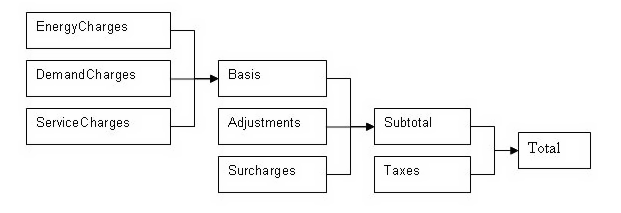
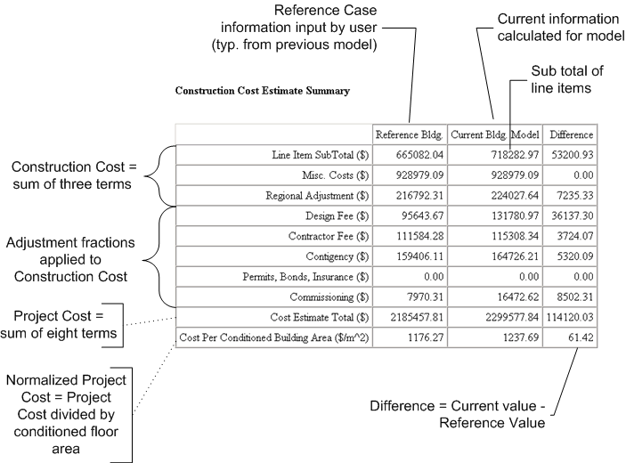

EnergyPlus Economics
==============================================================================================================

Group – Economics
-----------------

EnergyPlus contains a number of objects to model construction cost and utility bill calculations.

The objects used by EnergyPlus for construction cost calculations are as follows:

- ComponentCost:Adjustments

- ComponentCost:Reference

- ComponentCost:LineItem

The objects used by EnergyPlus for utility bill calculations are as follows:

- UtilityCost:Tariff

- UtilityCost:Qualify

- UtilityCost:Charge:Simple

- UtilityCost:Charge:Block

- UtilityCost:Ratchet

- UtilityCost:Variable

- UtilityCost:Computation

The objects used for performing a life-cycle cost analysis are:

- LifeCycleCost:Parameters

- LifeCycleCost:RecurringCosts

- LifeCycleCost:NonrecurringCost

- LifeCycleCost:UsePriceEscalation

- LifeCycleCost:UseAdjustment

The object used for specifying the currency symbol of the monetary unit used is:

- CurrencyType

Introduction to Economics
-------------------------

While it is true that monthly utility bills are often directly related to monthly energy consumption and monthly peak demand, due to the elaborate regulatory environment and the changing value of the energy based on load factor, the calculations involved are often complicated. The EnergyPlus approach is to allow you to model the individual component charges that make up the utility bill and report the results on a monthly basis.

To show you how simple the specification of a rate can be here is a simple example for a flat charge of 8 cents for every kWh sold.

```idf
UtilityCost:Tariff,
  TariffExample1,          ! Name
  Electricity:Facility,    ! Output Meter Name
  kWh;               ! Conversion Factor Choice


UtilityCost:Charge:Simple,
  ChargeExample1,          ! Charge Variable Name
  TariffExample1,          ! Tariff Name
  totalEnergy,             ! Source Variable
  Annual,                   ! Season
  EnergyCharges,           ! Category Variable Name
  0.08;                    ! Cost Per Unit Value or Variable Name
```


Overall, the goals of the economics section of EnergyPlus are to make simple tariffs easy to model and complex tariffs possible to model.

The cost implications of alternative, energy-related design options may be important in determining the whether or not a particular design is viable. Although the main purpose of EnergyPlus is to determine the energy performance of a building, component cost modeling is provided to allow estimating initial construction costs associated with the building and HVAC system being modeled. This is provided in order to ensure that cost estimates are consistent with the EnergyPlus model and it allows using results calculated during a simulation such as equipment sizes and surface areas. The cost estimating capabilities are not comprehensive and are not intended to duplicate all the types of analyses included in cost estimating software. Economics modeling is being implemented in stages. Future versions of EnergyPlus will add other investment related analyses such as life-cycle cost. The objects used by EnergyPlus for calculating first costs for construction projects are as follows:

- ComponentCost:Adjustments

- ComponentCost:Reference

- ComponentCost:LineItem

The results of the cost estimate are reported in a Construction Cost Estimate Summary table provided that the user requests the results using the object Output:Table:SummaryReports object with the Component Cost Economics Summary option selected. The style of this predefined report can be controlled using the OutputControl:Table:Style object. If the Annual Building Performance Report Summary is also requested, then cost estimate results will follow that data in the same output file.

The rest of this Economics section is organized to first present reference material on tariff calculations followed by construction cost estimating.

Conceptual Framework – Variables and Hierarchy
----------------------------------------------

To understand how to use the utility bill calculation portion of EnergyPlus you first need to understand some important concepts of variables and hierarchy. A variable, for the purposes of this section, is simply a named holder of a series of numbers. In most cases, the variable will be a named holder of 12 numbers, one number for each monthly utility bill. Here is a visualization of a variable called Electric Energy Use:

Table 35. Example Electric Energy Use (for Economics Calculation)

<table class="table table-striped">
<tr>
<th>Month</th>
<th>Electric Energy Use</th>
</tr>
<tr>
<td>January</td>
<td>12143</td>
</tr>
<tr>
<td>February</td>
<td>13454</td>
</tr>
<tr>
<td>March</td>
<td>14178</td>
</tr>
<tr>
<td>April</td>
<td>14876</td>
</tr>
<tr>
<td>May</td>
<td>15343</td>
</tr>
<tr>
<td>June</td>
<td>16172</td>
</tr>
<tr>
<td>July</td>
<td>16105</td>
</tr>
<tr>
<td>August</td>
<td>15762</td>
</tr>
<tr>
<td>September</td>
<td>14543</td>
</tr>
<tr>
<td>October</td>
<td>13987</td>
</tr>
<tr>
<td>November</td>
<td>13287</td>
</tr>
<tr>
<td>December</td>
<td>12403</td>
</tr>
</table>

If you have ever done any computer programming, you can think of a variable as an array. Many of the names used in the utility bill calculation portion of EnergyPlus are names of variables. In the case of the UtilityCost:Charge objects, the name of the object is also used as a name of a variable.

In many of today’s utility rates, the charges for energy or demand are broken into distribution and supply charges. To allow for this, more than one charge may to be defined for a particular category. The variables assigned to the same category are added together.

The categories are combined in following hierarchy:



Figure 162. Hierarchy for Economics Charges

Any charges included in the EnergyCharges category are added together. The EnergyCharges, DemandCharges and ServiceCharges are added together to form the Basis. The Basis, Adjustments and Surcharges are added together to form the Subtotal. The Subtotal and Taxes are added together to be the Total. The total represents the total monthly charges on that tariff for the energy source used. The combining of categories together is performed automatically unless the user specifies the UtilityCost:Computation. In addition, each category, which is also a variable, may be used as a source. For example, a tax that is 5% of the subtotal would be shown as:

```idf
UtilityCost:Charge:Simple,
  TaxOfFivePercent,        ! Charge Variable Name
  TariffExample1,          ! Tariff Name
  Subtotal,                ! Source Variable
  Annual,                  ! Season
  Taxes,                   ! Category Variable Name
  0.05;                    ! Cost Per Unit Value or Variable Name
```


As you can see, the UtilityCost:Charge:Simple and UtilityCost:Charge:Block objects do most of the “work” of computing the annual energy cost. The benefit of using this categorization is that totals of each category are shown in the output reports and it organizes the charges in the monthly calculations in a logical way that fits almost all tariffs. If no categorization is desired, theoretically, all charges could be assigned to the Total category. The categories themselves are simply variable names. Charges may also be assigned to the “NotIncluded” category if the result of the charge is used as an intermediate calculation and should not be included in the Total.

The rest of this section is divided into a reference of the objects and the fields, a set of examples, discussion of the reporting, and a description of Complex Tariff Modeling. For most tariffs, simply using a variety of UtilityCost:Charge:Simple’s and UtilityCost:Charge:Block’s will result in a good model but for some more complex tariffs, especially ones with complex block sizes, variables may be computed using a very simple programming language that may appear in the UtilityCost:Computation object. This will be described more in the Complex Tariff Modeling section.

UtilityCost:Tariff
------------------

Defines the name of the tariff, the type of tariff, and other details about the overall tariff. Each other object that is part of the tariff model references the tariff name including the UtilityCost:Charge:Simple, UtilityCost:Charge:Block, UtilityCost:Ratchet, UtilityCost:Qualify, UtilityCost:Variable and UtilityCost:Computation objects.

Multiple UtilityCost:Tariff objects can appear in the same IDF file. It is common that electric and gas utilities have more than one rate that may be used. Only one UtilityCost:Tariff for each Output:Meter object and Group Name is shown in the Economics Summary Report. The one that is shown in that report is chosen by first eliminating UtilityCost:Tariff objects that are not qualified due to their UtilityCost:Qualify objects. If more than one UtilityCost:Tariff object remains, the one that has the lowest cost for a combination of a Meter and Group Name will be selected. If the Group Name field is not used, then the lowest cost UtilityCost:Tariff is chosen for each Meter.

Part of the tariff description is used to transform the annual energy use of any fuel under any meter into a group of named variables containing the values for each of the periods that the bills are calculated (usually monthly). The schedules create a variable for energy use and for demand. If specified it also creates a variable for energy and a variable for demand for the “on-peak”, “off-peak”, and “shoulder” periods for use in time-of-use tariffs. It performs this allocation prior to other calculations for the tariff. The variables that are always created are:

- totalEnergy

- totalDemand

#### Field: Name

The name of the tariff. Tariffs are sometimes called rates. The name is used in identifying the output results and in associating all of the charges and other objects that make up a tariff.

#### Field: Output Meter Name

The name of any meter defined but usually set to either Electricity:Facility or Gas:Facility.

#### Field: Conversion Factor Choice

A choice that allows several different predefined conversion factors to be used; otherwise, user defined conversion factors are used as defined in the next two fields.

- UserDefined

- kWh

- Therm

- MMBtu

- MJ

- KBtu

- MCF

- CCF

The following table shows the conversion factors when specifying one of the predefined choices:

Table 36. Built in UtilityCost:Tariff Conversion Factors

<table class="table table-striped">
<tr>
<th>Choice</th>
<th>Energy Conversion Factor</th>
<th>Demand Conversion Factor</th>
</tr>
<tr>
<td>kWh</td>
<td>0.0000002778</td>
<td>0.001</td>
</tr>
<tr>
<td>Therm</td>
<td>9.4781712E-09</td>
<td>0.00003412</td>
</tr>
<tr>
<td>MMBtu</td>
<td>9.4781712E-10</td>
<td>0.000003412</td>
</tr>
<tr>
<td>MJ</td>
<td>0.000001</td>
<td>0.0036</td>
</tr>
<tr>
<td>KBtu</td>
<td>9.4781712E-07</td>
<td>0.003412</td>
</tr>
<tr>
<td>MCF</td>
<td>9.4781712E-10</td>
<td>0.000003412</td>
</tr>
<tr>
<td>CCF</td>
<td>9.4781712E-09</td>
<td>0.00003412</td>
</tr>
</table>

#### Field: Energy Conversion Factor

Is a multiplier used to convert energy into the units specified by the utility in their tariff. If left blank, it defaults to 1 (no conversion). This field will be used only if Conversion Factor Choice is set to UserDefined. Within EnergyPlus energy always has units of J (joules). For conversion from J to kWh use the value of 0.0000002778. This is also used for all objects that reference the UtilityCost:Tariff.

#### Field: Demand Conversion Factor

Is a multiplier used to convert demand into the units specified by the utility in their tariff. If left blank, it defaults to 1 (no conversion). This field will be used only if Conversion Factor Choice is set to UserDefined. Within EnergyPlus demand always has units of J/s (joules/sec) which equivalent to W (watts). For conversion from W to kW use the value of 0.001. This is also used for all objects that reference the UtilityCost:Tariff.

#### Field: Time of Use Period Schedule Name

The name of the schedule that defines the time-of-use periods that occur each day. The period schedule is used to determine which variables are defined. The values for the different variables are:

- 1 is Peak

- 2 is Shoulder

- 3 is OffPeak

- 4 is MidPeak

The following variables are created automatically if these different periods are used in the schedule and include:

- peakEnergy

- peakDemand

- shoulderEnergy

- shoulderDemand

- offPeakEnergy

- offPeakDemand

- midPeakEnergy

- midPeakDemand

Some special variables are created that include only demand from one period that exceeds the demand from another period. For other months that do not exceed, the values are zero. These variables are seldom used but are available for the occasional rate that includes a clause looking at demands during one period that exceed another period.

- PeakExceedsOffPeak

- OffPeakExceedsPeak

- PeakExceedsMidPeak

- MidPeakExceedsPeak

- PeakExceedsShoulder

- ShoulderExceedsPeak

If no Period Schedule is specified then no peak, offPeak, midPeak or shoulder variables are defined.

#### Field: Season Schedule Name

The name of a schedule that defines the seasons. The seasons are

- 1 is Winter

- 2 is Spring

- 3 is Summer

- 4 is Autumn

The change in the season schedule must occur at the same time as the change in the Monthly Schedule. In other words, a season must end at the same time as a billing month. Variables are automatically created if a season schedule is used. These variables are set to 1 within the season and 0 for the months that are not in the season. The variables are:

- isWinter

- isNotWinter

- isSpring

- isNotSpring

- isSummer

- isNotSummer

- isAutumn

- isNotAutumn

#### Field: Month Schedule Name

The name of the schedule that defines the billing periods of the year. Normally this entry is allowed to default and a schedule will be internally used that has the breaks between billing periods occurring at the same time as the breaks between months, i.e., at midnight prior to the first day of the month. If other billing periods are used such as two month cycles or a single bill for an entire season, such as some natural gas companies do in the summer, then the month schedule may be used to redefine it. Make sure that the month schedule and season schedule are consistent, otherwise an error will be issued.

- 1 is the first month, usually January

- 2 is the second month, usually February

- 3 is the third month, usually March

- 4 is the fourth month, usually April

- 5 is the fifth month, usually May

- 6 is the sixth month, usually June

- 7 is the seventh month, usually July

- 8 is the eighth month, usually August

- 9 is the ninth month, usually September

- 10 is the tenth month, usually October

- 11 is the eleventh month, usually November

- 12 is the twelfth month, usually December

Thus, the schedule that represents this would look like the following. If no schedule is specified the following Month Schedule is used which defines the months of the year as the normal calendar months.

```idf
Schedule:Compact, defaultMonths, number,
Through: 1/31, For: AllDays, Until: 24:00, 1,
Through: 2/28, For: AllDays, Until: 24:00, 2,
Through: 3/31, For: AllDays, Until: 24:00, 3,
Through: 4/30, For: AllDays, Until: 24:00, 4,
Through: 5/31, For: AllDays, Until: 24:00, 5,
Through: 6/30, For: AllDays, Until: 24:00, 6,
Through: 7/31, For: AllDays, Until: 24:00, 7,
Through: 8/31, For: AllDays, Until: 24:00, 8,
Through: 9/30, For: AllDays, Until: 24:00, 9,
Through: 10/31, For: AllDays, Until: 24:00, 10,
Through: 11/30, For: AllDays, Until: 24:00, 11,
Through: 12/31, For: AllDays, Until: 24:00, 12;
```


#### Field: Demand Window Length

The determination of demand can vary by utility. Some utilities use the peak instantaneous demand measured but most use a fifteen minute average demand or a one hour average demand. Some gas utilities measure demand as the use during the peak day or peak week. The choices for demand window are:

- QuarterHour

- HalfHour

- FullHour

- Day

- Week

If no value is entered, QuarterHour is assumed. The choice may be overridden based on the value of Timestep so that they are consistent. If the Timestep is 6, i.e. 10 minute timesteps, then QuarterHour is not used and instead HalfHour is used instead. If Timestep is 3, i.e. 20 minute timesteps, then QuarterHour and HalfHour are not used and instead FullHour is used instead. Day and Week are primarily used by fuel utilities.

#### Field: Monthly Charge or Variable Name

The fixed monthly service charge that many utilities have. The entry may be numeric and gets added to the ServiceCharges variable or if a variable name is entered here, its values for each month are used.

#### Field: Minimum Monthly Charge or Variable Name

The minimum total charge for the tariff or if a variable name is entered here, its values for each month are used.  The sum of the subtotal and taxes usually equals the total unless you have specified the minimum monthly charge. If the minimum monthly charge does not apply to the entire bill, a UtilityCost:Computation object can be specified using a Minimum function for the appropriate variables.

#### Field: Real Time Pricing Charge Schedule Name

Used with real time pricing rates. The name of a schedule that contains the cost of energy for that particular time period of the year. Real time rates can be modeled using a charge schedule with the actual real time prices entered in the schedule. The charges should be consistent with the conversion factor specified in the tariff.

#### Field: Customer Baseline Load Schedule Name

Used with real time pricing rates and often described as the CBL or customer baseline load. The name of a schedule that contains the baseline energy use for the customer. Many real time rates apply the charges as a credit or debit only to the difference between the baseline use and the actual use. The baseline use is established between the customer and the utility using a contract. If this field is used the baseline use schedule will be used for establishing the totalEnergy and totalDemand instead of the metered value and the real time rate charge is added or subtracted to the rate calculation using the real time charge schedule. If this field is not used, the real time charge schedule applies to all energy from the meter and totalEnergy and totalDemand is based on metered value as usual.

#### Field: Group Name

The group name of the tariff such as distribution, transmission, supplier, etc. If more than one tariff with the same group name is present and qualifies, only the lowest cost tariff is used. Usually the group name field is left blank which results in all tariffs using the same meter variable being compared and the lowest cost one being selected.

#### Field: Buy Or Sell

Sets whether the tariff is used for buying, selling or both to the utility. This should be allowed to default to BuyFromUtility unless a power generation system is included in the building that may generate more power than the building needs during the year. The choices are:

- BuyFromUtility – The values from the metered variable are used and are shown as being purchases from the utility.

- SellToUtility – The values from the metered variable are used for a “sell back” rate to the utility. The charges in the rate should be expressed as negative values.

- NetMetering – Negative values are used to reduce any positive values during the specific period on the tariff when negative values occur.

A warning will be issued if the selection of this field does not match the type of meter.

UtilityCost:Qualify
-------------------

Many utilities provide a large number of tariffs and separate their customers by the amount of energy use they have or by the amount of demand. The qualify object allows only certain tariffs that are modeled to be used. If the results of the simulation fall outside of the range of qualifications, that tariff is still calculated but the “Qualified” entry will say “No” and the UtilityCost:Qualify that caused its exclusion is shown. When multiple tariffs from the same utility are modeled and only one of them should be used, make sure that the qualifiers are consistent especially within the same GroupName (see UtilityCost:Tariff). Multiple UtilityCost:Qualify objects can appear for a specific rate and they can be based on any variable.

The energy used and demands for each month vary. Since it is possible that they vary across the minimum and maximum values defined by this object, a choice in how to treat the thresholds is necessary. Say that a utility has two tariffs, a small tariff that has a maximum demand requirement of 50kW and a large tariff that has a minimum demand requirement of 50kW. If the use for a building goes above the 50kW threshold during some summer months and the rest of the time is below 50kW, then how does the utility choose which rate would qualify. The utility probably has very specific requirements about which months or consecutive months can be above or below a threshold to qualify for the rate.

#### Field: Name

The name used for the UtilityCost:Qualify and displayed if the tariff does not qualify. It is also treated as a variable and contains:

- 1 for each month that does qualify,

- 0 for months that do not qualify, and

- -1 for months that are not part of the season selected.

#### Field: Tariff Name

The name of the UtilityCost:Tariff object that is associated with this UtilityCost:Qualify object.

#### Field: Variable Name

The name of the variable used. For energy and demand, the automatically created variables, totalEnergy and totalDemand should be used, respectively.

#### Field: Qualify Type

Enter either “Minimum” or “Maximum”.

#### Field: Threshold Value or Variable Name

The minimum or maximum value for the qualify. If the variable has values that are less than this value when the qualify type is minimum then the tariff may be disqualified. If the variable has values that are greater than this value when the qualify type is maximum then the tariff may be disqualified. For demand, it is still the minimum of the demands set each month even though the demands are, by definition, the peak value for the month. Depending on the threshold test entry (see below) this minimum applies to all months, some of the months, or just a single month.

#### Field: Season

If the UtilityCost:Qualify only applies to a season, enter the season name from the following list:

- Annual

- Winter

- Spring

- Summer

- Fall

If this field is left blank, it defaults to Annual.

#### Field: Threshold Test

Enter either “Count” or “Consecutive”. Uses the number in Number of Months in one of two different ways depending on the Threshold Test. If the Threshold Test is set to “Count” then the qualification is based on the count of the total number of months per year. If the Threshold Test is set to “Consecutive” then the qualification is based on a consecutive number of months. If left blank this field defaults to count and it should be allowed to default for most cases.

#### Field: Number of Months

A number from 1 to 12. If no value entered, 12 is assumed when the qualify type is minimum and 1 when the qualify type is maximum. This is the number of months that the threshold test applies to determine if the rate qualifies or not. If the season is less than 12 months (if it is not annual) then the value is automatically reduced to the number of months of the season.

UtilityCost:Charge:Simple
-------------------------

The UtilityCost:Charge:Simple is one of the most often used objects for tariff calculation. It is used to compute energy and demand charges that are very simple. It may also be used for taxes, surcharges and any other charges that occur on a utility bill. As many UtilityCost:Charge:Simple objects as needed may be defined for a single tariff and they will be added together.

#### Field: Charge Variable Name

This is the name associated with the UtilityCost:Charge:Simple object and will appear in the report. In addition, the results of the UtilityCost:Charge:Simple calculation are stored in a variable with the same name. That way, the results may be used for further calculation. Spaces are not significant in Charge Variable Names. They are removed during the utility bill calculation process.

#### Field: Tariff Name

The name of the tariff that this UtilityCost:Charge:Simple is associated with.

#### Field: Source Variable

The name of the source used by the UtilityCost:Charge:Simple. This is usually the name of the variable holding the energy or demand but may also be the name of any variable including the subtotal or basis if other charges are based on those.

#### Field: Season

This is the name (or number) of a season for which the UtilityCost:Charge:Simple is calculated. If this is set to Annual, the calculations are performed for the UtilityCost:Charge:Simple for the entire year (all months) otherwise it is calculated only for those months in the season defined. The season is defined by the Season Schedule in the UtilityCost:Tariff object. The choices for seasons are the following names or numbers may be used:

- Annual

- Winter

- Spring

- Summer

- Fall

#### Field: Category Variable Name

All charges get added somewhere in the hierarchy described in the introduction to EnergyPlus economics above. This field shows where the charge should be added. The reason to enter this field appropriately is so that the charge gets reported in a reasonable category. The charge automatically gets added to the variable that is the category. The choices for this field are limited to:

- EnergyCharges

- DemandCharges

- ServiceCharges

- Basis

- Adjustment

- Surcharge

- Subtotal

- Taxes

- Total

- NotIncluded

#### Field: Cost per Unit Value or Variable Name

This field contains either a single number or the name of a variable. The number is multiplied with all of the energy or demand or other source that is specified in the source field. If a variable is used, then the monthly values of the variable are multiplied against the variable specified in the source field. This field makes it easy to include a simple charge without specifying block sizes. It is added to any of the block calculations (see later fields) but is most often used by itself. If no value or variable is entered, a zero is assumed. This is a good way to include a tax or cost adjustment. For SellToUtility tariffs, the values in this field are usually expressed as negative numbers.

UtilityCost:Charge:Block
------------------------

The UtilityCost:Charge:Block objects is also used extensively for tariff calculation. It is used to compute energy and demand charges that are structured in blocks of charges. It may also be used for taxes, surcharges and any other charges that occur on a utility bill but those are more commonly simple flat charges so UtilityCost:Charge:Simple  is more commonly used for those functions. As many UtilityCost:Charge:Block objects as needed may be defined for a single tariff and they will be added together. Blocks are a structure used by almost all utilities for calculating energy and demand charges and they allow the utility to charge more or less per unit of energy or demand if more units are used.

#### Field: Charge Variable Name

This is the name associated with the UtilityCost:Charge:Block object and will appear in the report. In addition, the results of the UtilityCost:Charge:Block are stored in a variable with the same name. That way, the results may be used for further calculation.

#### Field: Tariff Name

The name of the tariff that this UtilityCost:Charge:Block is associated with.

#### Field: Source Variable

The name of the source used by the UtilityCost:Charge:Block. This is usually the name of the variable holding the energy or demand but may also be the name of any variable including the subtotal or basis if other charges are based on those.

#### Field: Season

This is the name (or number) of a season for which the  UtilityCost:Charge:Block is calculated. If this is set to annual, the calculations are performed for the UtilityCost:Charge:Block for the entire year (all months) otherwise it is calculated only for those months in the season defined. The season is defined by the Season Schedule in the UtilityCost:Tariff object. The choices for seasons are the following names or numbers may be used:

- Annual

- Summer

- Winter

- Spring

- Fall

#### Field: Category Variable Name

All charges get added somewhere in the hierarchy described in the introduction to EnergyPlus economics above. This field shows where the charge should be added. The reason to enter this field appropriately is so that the charge gets reported in a reasonable category. The charge automatically gets added to the variable that is the category. The choices for this field are limited to:

- EnergyCharges

- DemandCharges

- ServiceCharges

- Basis

- Adjustment

- Surcharge

- Subtotal

- Taxes

- Total

- NotIncluded

#### Field: Remaining Into Variable

If the blocks do not use all of the energy or demand from the source, some energy and demand remains, then the remaining amount should be assigned to a variable. If no variable is assigned and some amount of energy or demand is not used in the block structure a warning will be issued.

#### Field: Block Size Multiplier Value or Variable Name

The sizes of the blocks are usually used directly but if a value or a variable is entered here, the block sizes entered in the rest of the charge are first multiplied by the entered value prior to being used. This is common for rates that are kWh/kW rates and in that case the variable that holds the monthly total electric demand would be entered. If no value is entered, a default value of one is assumed so that the block sizes remain exactly as entered. This field is unusual for the EnergyPlus syntax because it can be either a number or a name of a variable.

#### Field: Block Size 1 Value or Variable Name

The size of the first block of the charges is entered here. For most rates that use multiple blocks, this will be the value for the first block size. Additional block sizes are entered with every other field. A default variable named “remaining” contains a large value and this may be used when the remaining amount should be included in that block. This field and the next field may be repeated in groups of two for as many blocks as are defined. This field is unusual for the EnergyPlus syntax because it can be either a number or a name of a variable.

#### Field: Block 1 Cost per Unit Value or Variable Name

The cost of the first block. This value is also repeated for every other field in the charge. As many blocks may be entered as are needed. This field and the previous field may be repeated in groups of two for as many blocks as are defined. This field is unusual for the EnergyPlus syntax because it can be either a number or a name of a variable. For SellToUtility tariffs, the values in this field are usually expressed as negative numbers.

These last two fields may be repeated fifteen times. If more blocks are defined by the utility, the computation can be continued using another UtilityCost:Charge:Block and using the variable from Remaining Into Variable as the source variable.

UtilityCost:Ratchet
-------------------

The UtilityCost:Ratchet command allows the modeling of tariffs that include some type of seasonal ratcheting. Ratchets are most common when used with electric demand charges. A ratchet is when a utility requires that the demand charge for a month with a low demand may be increased to be more consistent with a month that set a higher demand charge.

While the details of the UtilityCost:Ratchet command are described further in this section, an example is probably the easiest way to learn the basic functions.

Ratchet Example: A utility has a single ratchet that says that the billing demand for each month of the year is the higher value of the actual demand or 60% of the peak summer demand

```idf
UtilityCost:Ratchet,
  BillingDemand1,   ! Ratchet Variable Name
  ExampleTariff1,   ! Tariff Name
  TotalDemand,      ! Baseline Source Variable
  TotalDemand,      ! Adjustment Source Variable
  Summer,           ! Season From
  Annual,           ! Season To
  0.60,             ! Multiplier Value or Variable Name
  0;                ! Offset Value or Variable Name
```


The Ratchet Variable Name (the first field) should be used wherever the ratchet should be applied and is often the source variable for UtilityCost:Charge:Simple or UtilityCost:Charge:Block.

The detailed steps taken for the ratchet are the following:

- AdjSeasonal contains either:

- When SeasonFrom is not set to Monthly, the maximum for all months in Season From in the Adjustment Source Variable. This is a single value.

- When SeasonFrom is set to Monthly, the monthly values of the Adjustment Source Variable.

- AdjPeak = (AdjSeasonal + Offset) \* Multiplier

- MaxAdjBase = maximum value of either AdjPeak or Baseline Source Variable

- The resulting Ratchet Variable contains:

- For months not in SeasonTo, the values of Baseline Source Variable

- For months in SeasonTo, the values of MaxAdjBase

If multiple ratchets occur in the same tariff, multiple UtilityCost:Ratchet commands should be “chained” together with the Baseline Source Variable subsequent ratchets referencing the Ratchet Variable Name of the previous UtilityCost:Ratchet.

Since the ratchet command can add together two variables, mutliply two variables, or take the maximum value between two variables, it may be used for other difficult to model tariffs without needing to use UtilityCost:Computation. Clever use of UtilityCost:Ratchet should be well documented with comments.

#### Field: Ratchet Variable Name

The name of the ratchet and the name of the result of this single ratchet.

#### Field: Tariff Name

The name of the tariff that this UtilityCost:Ratchet is associated with.

#### Field: Baseline Source Variable

The name of the variable used as the baseline value. When the ratcheted value exceeds the baseline value for a month the ratcheted value is used but when the baseline value is greater then the ratcheted value the baseline value is used. Usually the electric demand charge is used. The baseline source variable can be the results of another ratchet object. This allows utility tariffs that have multiple ratchets to be modeled.

#### Field: Adjustment Source Variable

The variable that the ratchet is calculated from. It is often but not always the same as the baseline source variable. The ratcheting calculations using offset and multiplier are using the values from the adjustment source variable. If left blank, the adjustment source variable is the same as the baseline source variable.

#### Field: Season From

The name of the season that is being examined. The maximum value for all of the months in the named season is what is used with the multiplier and offset. This is most commonly Summer or Annual. When Monthly is used, the adjustment source variable is used directly for all months.

- Annual

- Winter

- Spring

- Summer

- Fall

- Monthly

#### Field: Season To

The name of the season when the ratchet would be calculated. This is most commonly Winter. The ratchet only is applied to the months in the named season. The resulting variable for months not in the Season To selection will contain the values as appear in the baseline source variable.

- Annual

- Winter

- Spring

- Summer

- Fall

#### Field: Multiplier Value or Variable Name

Often the ratchet has a clause such as “the current month demand or 90% of the summer month demand”. For this case a value of 0.9 would be entered here as the multiplier. This value may be left blank if no multiplier is needed and a value of one will be used as a default.

#### Field: Offset Value or Variable Name

A less common strategy is to say that the ratchet must be all demand greater than a value, in this case an offset that is added to the demand may be entered here. If entered, it is common for the offset value to be negative representing that the demand be reduced.  If no value is entered it is assumed to be zero and not affect the ratchet.

UtilityCost:Variable
--------------------

The UtilityCost:Variable object allows for the direct entry of monthly values into a variable.

#### Field: Name

The name of the variable.

#### Field: Tariff Name

The name of the tariff that is using the variable.

#### Field: Variable Type

This field is used to indicate the kind of units that may be associated with the variable. It is used by IDF Editor to display the appropriate SI and IP units for the January through December values. The available options are shown below. If none of these options are appropriate, select **Dimensionless** which will have no unit conversion**.**

- Energy

- Demand

- Currency

- Dimensionless

#### Field: January through December Values

An entry (up to 24 are available) of the monthly values of the variable. Normally 12 months are used for most utility rates and so 12 values should be entered. If any values are not entered, the value of the previous entry is used. This allows a variable that is constant for an entire year to be entered using only the first value.


UtilityCost:Computation
-----------------------

The UtilityCost:Computation object lists a series of computations that are used to perform the bill calculation. The object is only used for complex tariffs that cannot be modeled any other way. For 95% of the utility tariffs, using UtilityCost:Computation is unnecessary and should be avoided. If the UtilityCost:Computation object is used, it must contain references to all objects involved in the rate in the order that they should be computed.

#### Field: Name

The name of the UtilityCost:Computation.

#### Field: Tariff Name

The name of the tariff that this UtilityCost:Charge:Simple is associated with.

#### Field: Compute Step N

The Compute Step fields contain a simple language that describes the steps used in the computation process similar to a programming language. If no entry is made to any Compute Step fields (as usually the case) a default method of computing the rates shall be used. Compute Step is described later in this section under Complex Tariff Modeling.

Remember, this object should be omitted for almost all tariffs.

UtilityCost:Tariff Examples
---------------------------

One of the best ways to learn the details of EnergyPlus Economics is to see some example tariffs and how they translate into objects. To do this, several different rates of increasing complexity are shown in the following examples.

Another source of examples is the large set of tariff input objects provided with EnergyPlus in the macro data set file called “UtilityTariffObjects.imf” located in the “MacroDataSets” folder where EnergyPlus is installed. This file contains sets of objects that fully define tariffs for commercial customers from a collection of U.S. utility companies.


#### Example A – Flat Energy Charge

As an example of the simplest type of tariff.

Customer Charge: $2.51 per month

Energy Charge:    5.5342 cents/kWh

This tariff would use a single UtilityCost:Charge:Simple object. The monthly charge is part of the UtilityCost:Tariff object.

```idf
UtilityCost:Tariff,
  ExampleA,                     ! Name
  Electricity:Facility,         ! Output Meter Name
  kWh,                          ! Conversion Factor Choice
  ,                             ! Energy Conversion Factor
  ,                             ! Demand Conversion Factor
  ,                             ! Time of Use Period Schedule Name
  ,                             ! Season Schedule Name
  ,                             ! Month Schedule Name
  ,                             ! Demand Window Length
  2.51;                         ! Monthly Charge or Variable Name


UtilityCost:Charge:Simple,
  FlatEnergyCharge,             ! Charge Variable Name
  ExampleA,                     ! Tariff Name
  totalEnergy,                  ! Source Variable
  Annual,                       ! Season
  EnergyCharges,                ! Category Variable Name
  0.055342;                     ! Cost Per Unit Value or Variable Name
```


#### Example B – Block Energy Charge

Another simple type of tariff is one where the energy charges vary by the amount of energy consumed each month.

Customer Charge:    $5.75 per month

Energy Charge:        7.231 cents/kWh for first 200 kWh

                                  6.656 cents/kWh for next 1000 kWh

                                  5.876 cents/kWh for over 1200 kWh

This tariff would use a single UtilityCost:Charge:Block object. The monthly charge is part of the UtilityCost:Tariff object. Note that the block sizes are every other field at the bottom of the object and the that final block size references a built in variable called “remaining” that contains a very large number.

```idf
UtilityCost:Tariff,
  ExampleB,                     ! Name
  Electricity:Facility,         ! Output Meter Name
  kWh,                          ! Conversion Factor Choice
  ,                             ! Energy Conversion Factor
  ,                             ! Demand Conversion Factor
  ,                             ! Time of Use Period Schedule Name
  ,                             ! Season Schedule Name
  ,                             ! Month Schedule Name
  ,                             ! Demand Window Length
  5.75;                         ! Monthly Charge or Variable Name


UtilityCost:Charge:Block,
  BlockEnergyCharge,            ! Charge Variable Name
  ExampleB,                     ! Tariff Name
  totalEnergy,                  ! Source Variable
  Annual,                       ! Season
  EnergyCharges,                ! Category Variable Name
  ,                             ! Remaining Into Variable
  ,                             ! Block Size Multiplier Value or Variable Name
  200,                          ! Block Size 1 Value or Variable Name
  0.07231,                      ! Block 1 Cost per Unit Value or Variable Name
  1000,                         ! Block Size 2 Value or Variable Name
  0.06656,                      ! Block 2 Cost per Unit Value or Variable Name
  remaining,                    ! Block Size 3 Value or Variable Name
  0.05876;                      ! Block 3 Cost per Unit Value or Variable Name
```


#### Example C – Block Energy and Demand Charges

This example contains both a block for energy and a block for demand and is very similar to the previous example except it now includes demand charges as well. The energy and demand charges vary by the amount of energy and demand consumed each month.

Energy Charge:        4.74 cents/kWh for first 20,000 kWh

                                  4.24 cents/kWh for next 180,000 kWh

                                  3.83 cents/kWh for additional kWh

Demand Charge:      5.38 dollars per kW for first 20 kW

                                  4.23 dollars per kW for next 80 kW

                                  3.60 dollars per kW for additional kW

This tariff would use two UtilityCost:Charge:Block objects. No monthly charge is shown so the UtilityCost:Tariff object can include just the first four fields. Note that the block sizes are every other field at the bottom of the object and the that final block size references a built in variable called “remaining” that contains a very large number.

```idf
UtilityCost:Tariff,
  ExampleC,                     ! Name
  Electricity:Facility,         ! Output Meter Name
  KWh;                          ! Conversion Factor Choice


UtilityCost:Charge:Block,
  BlockEnergyCharge,            ! Charge Variable Name
  ExampleC,                     ! Tariff Name
  totalEnergy,                  ! Source Variable
  Annual,                       ! Season
  EnergyCharges,                ! Category Variable Name
  ,                             ! Remaining Into Variable
  ,                             ! Block Size Multiplier Value or Variable Name
  20000,                        ! Block Size 1 Value or Variable Name
  0.0474,                       ! Block 1 Cost per Unit Value or Variable Name
  180000,                       ! Block Size 2 Value or Variable Name
  0.0424,                       ! Block 2 Cost per Unit Value or Variable Name
  remaining,                    ! Block Size 3 Value or Variable Name
  0.0383;                       ! Block 3 Cost per Unit Value or Variable Name


UtilityCost:Charge:Block,
  BlockDemandCharge,            ! Charge Variable Name
  ExampleC,                     ! Tariff Name
  totalDemand,                  ! Source Variable
  Annual,                       ! Season
  DemandCharges,                ! Category Variable Name
  ,                             ! Remaining Into Variable
  ,                             ! Block Size Multiplier Value or Variable Name
  20,                           ! Block Size 1 Value or Variable Name
  5.38,                         ! Block 1 Cost per Unit Value or Variable Name
  80,                           ! Block Size 2 Value or Variable Name
  4.23,                         ! Block 2 Cost per Unit Value or Variable Name
  remaining,                    ! Block Size 3 Value or Variable Name
  3.60;                         ! Block 3 Cost per Unit Value or Variable Name
```


#### Example D - Seasonal Energy Charges with Minimum Charge

Another type of tariff is one where the energy charges vary by the amount of energy consumed each month and are different for the summer and winter. In addition, this example demonstrates the minimum charge field.

Minimum Charge:     $7.00 per month

Winter – October through May

Energy Charge:        4.385 cents/kWh for first 650 kWh

                                  3.763 cents/kWh for next 350 kWh

                                  3.704 cents/kWh for over 1000 kWh

Summer – June through September

Energy Charge:        8.385 cents/kWh for first 650 kWh

                                  7.588 cents/kWh for next 350 kWh

                                  7.103 cents/kWh for over 1000 kWh

This tariff would use two UtilityCost:Charge:Block objects. The monthly charge is part of the UtilityCost:Tariff object. Note that the block sizes are every other field at the bottom of the object and the that final block size references a built in variable called “remaining” that contains a very large number.

```idf
UtilityCost:Tariff,
  ExampleD,                     ! Name
  Electricity:Facility,         ! Output Meter Name
  KWh,                          ! Conversion Factor Choice
  ,                             ! Energy Conversion Factor
  ,                             ! Demand Conversion Factor
  ,                             ! Time of Use Period Schedule Name
  TwoSeasonSchedule,            ! Season Schedule Name
  ,                             ! Month Schedule Name
  ,                             ! Demand Window Length
  ,                             ! Monthly Charge or Variable Name
  7.00;                         ! Minimum Monthly Charge or Variable Name


UtilityCost:Charge:Block,
  WinterEnergyCost,             ! Charge Variable Name
  ExampleD,                     ! Tariff Name
  totalEnergy,                  ! Source Variable
  Winter,                       ! Season
  EnergyCharges,                ! Category Variable Name
  ,                             ! Remaining Into Variable
  ,                             ! Block Size Multiplier Value or Variable Name
  650,                          ! Block Size 1 Value or Variable Name
  0.04385,                      ! Block 1 Cost per Unit Value or Variable Name
  350,                          ! Block Size 2 Value or Variable Name
  0.03763,                      ! Block 2 Cost per Unit Value or Variable Name
  remaining,                    ! Block Size 3 Value or Variable Name
  0.03704;                      ! Block 3 Cost per Unit Value or Variable Name


UtilityCost:Charge:Block,
  SummerEnergyCost,             ! Charge Variable Name
  ExampleD,                     ! Tariff Name
  totalEnergy,                  ! Source Variable
  Summer,                       ! Season
  EnergyCharges,                ! Category Variable Name
  ,                             ! Remaining Into Variable
  ,                             ! Block Size Multiplier Value or Variable Name
  650,                          ! Block Size 1 Value or Variable Name
  0.08385,                      ! Block 1 Cost per Unit Value or Variable Name
  350,                          ! Block Size 2 Value or Variable Name
  0.07588,                      ! Block 2 Cost per Unit Value or Variable Name
  remaining,                    ! Block Size 3 Value or Variable Name
  0.07103;                      ! Block 3 Cost per Unit Value or Variable Name


Schedule:Compact, TwoSeasonSchedule, number,
Through: 5/31, For: AllDays, Until: 24:00, 1,
Through: 9/30, For: AllDays, Until: 24:00, 3,
Through: 12/31, For: AllDays, Until: 24:00, 1;
```


#### Example E – kWh/kW Energy Charges

A more advanced rate varies the size of the blocks based on amount of demand for the month. This creates an effective demand charge if the blocks have declining values.

Customer Charge:  $14.00 per month

Energy Charge:   8.756 cents/kWh for all consumption not greater than 200 hours times the demand

                            6.812 cents/kWh for all consumption in excess of 200 hours and not greater than 400 hours times the demand

                            5.029 cents/kWh for all consumption in excess of 400 hours times the demand.

This tariff would use a single  UtilityCost:Charge:Block object. The monthly charge is part of the  UtilityCost:Tariff object. In this case the Block Size Multiplier Value (or Variable) is set to the totalDemand variable.

```idf
UtilityCost:Tariff,
  ExampleE,                     ! Name
  Electricity:Facility,         ! Output Meter Name
  KWh,                          ! Conversion Factor Choice
  ,                             ! Energy Conversion Factor
  ,                             ! Demand Conversion Factor
  ,                             ! Time of Use Period Schedule Name
  ,                             ! Season Schedule Name
  ,                             ! Month Schedule Name
  ,                             ! Demand Window Length
  14;                           ! Monthly Charge or Variable Name


UtilityCost:Charge:Block,
  BlockEnergyCharge,            ! Charge Variable Name
  ExampleE,                     ! Tariff Name
  totalEnergy,                  ! Source Variable
  Annual,                       ! Season
  EnergyCharges,                ! Category Variable Name
  ,                             ! Remaining Into Variable
  totalDemand,                  ! Block Size Multiplier Value or Variable Name
  200,                          ! Block Size 1 Value or Variable Name
  0.08756,                      ! Block 1 Cost per Unit Value or Variable Name
  200,                          ! Block Size 2 Value or Variable Name
  0.06812,                      ! Block 2 Cost per Unit Value or Variable Name
  remaining,                    ! Block Size 3 Value or Variable Name
  0.05029;                      ! Block 3 Cost per Unit Value or Variable Name
```


#### Example F – Seasonal Time of Use Energy

Tariffs sometimes have higher costs for energy consumed during the daytime than at night. This example includes energy charges that vary by the time of day and by the season.

Monthly Charge:       $37.75 per month

Winter – October through May

On Peak:                   8.315 cents/kWh

Off-Peak:                   2.420 cents/kWh

Summer – June through September

On Peak:                   14.009 cents/kWh

Off-Peak:                   6.312 cents/kWh

The on-peak period is defined as the hours starting at 10am and ending at 7pm, Monday through Friday for June through September and 3pm to 10pm Monday through Friday for October through May. All other hours are considered off-peak.

The tariff is only applicable for customers that use 50KW for at least one month of the year.

This tariff uses four different UtilityCost:Charge:Simple objects to capture the variation with time of the energy cost. The monthly charge is part of the UtilityCost:Tariff object.

```idf
UtilityCost:Tariff,
  ExampleF,                     ! Name
  Electricity:Facility,         ! Output Meter Name
  kWh,                          ! Conversion Factor Choice
  ,                             ! Energy Conversion Factor
  ,                             ! Demand Conversion Factor
  TimeOfDaySchedule,            ! Time of Use Period Schedule Name
  TwoSeasonSchedule,            ! Season Schedule Name
  ,                             ! Month Schedule Name
  ,                             ! Demand Window Length
  37.75;                        ! Monthly Charge or Variable Name


UtilityCost:Charge:Simple,
  SummerOnPeak,                 ! Charge Variable Name
  ExampleF,                     ! Tariff Name
  peakEnergy,                   ! Source Variable
  Summer,                       ! Season
  EnergyCharges,                ! Category Variable Name
  0.14009;                      ! Cost per Unit Value or Variable Name


UtilityCost:Charge:Simple,
  SummerOffPeak,                ! Charge Variable Name
  ExampleF,                     ! Tariff Name
  offPeakEnergy,                ! Source Variable
  Summer,                       ! Season
  EnergyCharges,                ! Category Variable Name
  0.06312;                      ! Cost per Unit Value or Variable Name


UtilityCost:Charge:Simple,
  WinterOnPeak,                 ! Charge Variable Name
  ExampleF,                     ! Tariff Name
  peakEnergy,                   ! Source Variable
  Winter,                       ! Season
  EnergyCharges,                ! Category Variable Name
  0.08315;                      ! Cost per Unit Value or Variable Name


UtilityCost:Charge:Simple,
  WinterOffPeak,                ! Charge Variable Name
  ExampleF,                     ! Tariff Name
  offPeakEnergy,                ! Source Variable
  Winter,                       ! Season
  EnergyCharges,                ! Category Variable Name
  0.02420;                      ! Cost per Unit Value or Variable Name


UtilityCost:Qualify,
  MinDemand,                    ! Name
  ExampleF,                     ! Tariff Name
  TotalDemand,                  ! Variable Name
  Minimum,                      ! Qualify Type
  50,                           ! Threshold Value or Variable Name
  Annual,                       ! Season
  Count,                        ! Threshold Test
  1;                            ! Number of Months


Schedule:Compact, TwoSeasonSchedule, number,
Through: 5/31, For: AllDays,  Until: 24:00, 1,
Through: 9/30, For: AllDays,  Until: 24:00, 3,
Through: 12/31, For: AllDays, Until: 24:00, 1;


Schedule:Compact, TimeOfDaySchedule, number,
Through: 5/31, For: AllDays,  Until: 15:00, 3,
                              Until: 22:00, 1,
                              Until: 24:00, 3,
Through: 9/30, For: AllDays,  Until: 10:00, 3,
                              Until: 19:00, 1,
                              Until: 24:00, 3,
Through: 12/31, For: AllDays, Until: 15:00, 3,
                              Until: 22:00, 1,
                              Until: 24:00, 3;
```


#### Example G – Blocks within Blocks

Utilities have come up with many different ways to encourage certain load factors and discourage other load factors. One method that has been used is blocks defined within other blocks. In the following example standard kWh blocks exist within the energy allocated for the first of several kWh/kW blocks.

Monthly Charge:   $35 per month

Energy Charge:    For all consumption not greater than 200 hours times the demand use

                              10.32 cents/kWh for the first 1000 kWh

                              7.43 cents/kWh for the next 4000 kWh

                              6.23 cents/kWh for the next 5000 kWh

                              4.27 cents/kWh for the remaining kWh less than 200 hours times the demand

                              6.82 cents/kWh for all consumption in excess of 200 hours and not greater than 400 hours times the demand

                              5.03 cents/kWh for all consumption in excess of 400 hours times the demand.

To set up this “block within a block” a UtilityCost:Charge:Block is first used to separate out the first 200 kWh/kW. The “EnergyFirst200kWhPerkW” charge performs this. It uses demand to multiply the first block size by 200 and the “cost” for the block is simply 1 since it passes through the energy to the variable “EnergyFirst200kWhPerkW”. The remaining energy goes into the “restOfEnergy” variable as specified as the “Remaining Into Variable” field. After this is evaluated we have two new variables that hold energy. Each of these variables are then separately used in UtilityCost:Charge:Block objects to evaluate the different parts of the example tariff. By using the “Remaining Into Variable” along with the concept of variables, many very complex tariffs may be modeled.


```idf
  UtilityCost:Tariff,
    ExampleG,                !- Name
    ElectricityPurchased:Facility,  !- Output Meter Name
    KWh,                     !- Conversion Factor Choice
    ,                        !- Energy Conversion Factor
    ,                        !- Demand Conversion Factor
    ,                        !- Time of Use Period Schedule Name
    ,                        !- Season Schedule Name
    ,                        !- Month Schedule Name
    ,                        !- Demand Window Length
    35;                      !- Monthly Charge or Variable Name


  UtilityCost:Charge:Block,
    EnergyFirst200kWhPerkW,  !- Charge Variable Name
    ExampleG,                !- Tariff Name
    totalEnergy,             !- Source Variable
    Annual,                  !- Season
    NotIncluded,             !- Category Variable Name
    restOfEnergy,            !- Remaining Into Variable
    totalDemand,             !- Block Size Multiplier Value or Variable Name
    200,                     !- Block Size 1 Value or Variable Name
    1;                       !- Block 1 Cost Per Unit Value or Variable Name


  UtilityCost:Charge:Block,
    CostOfFirst200kWhPerkW,  !- Charge Variable Name
    ExampleG,                !- Tariff Name
    EnergyFirst200kWhPerkW,  !- Source Variable
    Annual,                  !- Season
    EnergyCharges,           !- Category Variable Name
    ,                        !- Remaining Into Variable
    ,                        !- Block Size Multiplier Value or Variable Name
    1000,                    !- Block Size 1 Value or Variable Name
    0.1032,                  !- Block 1 Cost Per Unit Value or Variable Name
    4000,                    !- Block Size 2 Value or Variable Name
    0.0743,                  !- Block 2 Cost Per Unit Value or Variable Name
    5000,                    !- Block Size 3 Value or Variable Name
    0.0623,                  !- Block 3 Cost Per Unit Value or Variable Name
    remaining,               !- Block Size 4 Value or Variable Name
    0.0427;                  !- Block 4 Cost Per Unit Value or Variable Name


  UtilityCost:Charge:Block,
    CostOfRestOfEnergy,      !- Charge Variable Name
    ExampleG,                !- Tariff Name
    restOfEnergy,            !- Source Variable
    Annual,                  !- Season
    EnergyCharges,           !- Category Variable Name
    ,                        !- Remaining Into Variable
    totalDemand,             !- Block Size Multiplier Value or Variable Name
    200,                     !- Block Size 1 Value or Variable Name
    0.0682,                  !- Block 1 Cost Per Unit Value or Variable Name
    remaining,               !- Block Size 2 Value or Variable Name
    0.0503;                  !- Block 2 Cost Per Unit Value or Variable Name
```


#### Example H – Real Time Pricing

Some utilities have tariffs that can have different prices every hour of the year called Real Time Pricing tariffs. Often the utility will inform the customer of the prices for each hour of the day just one day in advance. To model this type of utility rate a normal schedule is used that contains the prices on an hourly basis.  The “Charge Schedule” field is where the Schedule object containing the prices is referenced.  In addition, the “Baseline Use Schedule” field is used to set the schedule for the customer baseline load. Not all utilities use a customer baseline load so the field can be left blank if none is needed. The Period, Season and Month Schedules are not needed for these tariffs unless UtilityCost:Charge’s are used.  The Schedule:File object can be especially useful to input a complex schedule that changes throughout the year.

Example H, shown below, is an example of how to use the UtilityCost:Tariff object with a schedule to calculate a utility tariff using real time prices.  The example real time pricing schedule results in the same energy cost as Example F – Seasonal Time of Use Energy. This is only an example and usually for real time pricing the schedule values would vary throughout the year.


!  EXAMPLE H - Real Time Pricing (RTP)


```idf
  UtilityCost:Tariff,
    ExampleH,                !- Name
    ElectricityPurchased:Facility,  !- Output Meter Name
    kWh,                     !- Conversion Factor Choice
    ,                        !- Energy Conversion Factor
    ,                        !- Demand Conversion Factor
    ,                        !- Time of Use Period Schedule Name
    ,                        !- Season Schedule Name
    ,                        !- Month Schedule Name
    ,                        !- Demand Window Length
    37.75,                   !- Monthly Charge or Variable Name
    ,                        !- Minimum Monthly Charge or Variable Name
    RTPpriceSchedule-H,      !- Real Time Pricing Charge Schedule Name
    ,                        !- Customer Baseline Load Schedule Name
    ,                        !- Group Name
    buyFromUtility;          !- Buy Or Sell


  Schedule:Compact,
    RTPpriceSchedule-H,      !- Name
    Any Number,              !- Schedule Type Limits Name
    Through: 5/31,           !- Field 1
    For: AllDays,            !- Field 2
    Until: 15:00,            !- Field 3
    0.02420,                 !- Field 4
    Until: 22:00,            !- Field 5
    0.08315,                 !- Field 6
    Until: 24:00,            !- Field 7
    0.02420,                 !- Field 8
    Through: 9/30,           !- Field 9
    For: AllDays,            !- Field 10
    Until: 10:00,            !- Field 11
    0.06312,                 !- Field 12
    Until: 19:00,            !- Field 13
    0.14009,                 !- Field 14
    Until: 24:00,            !- Field 15
    0.06312,                 !- Field 16
    Through: 12/31,          !- Field 17
    For: AllDays,            !- Field 18
    Until: 15:00,            !- Field 19
    0.02420,                 !- Field 20
    Until: 22:00,            !- Field 21
    0.08315,                 !- Field 22
    Until: 24:00,            !- Field 23
    0.02420;                 !- Field 24
```


#### Example I – Selling and Net-Metering

When the building contains a generator, photovoltaics, or other sources of electrical power, there is an opportunity for the building generator to produce more power than the building uses. The excess power can either be sold to the utility or offset the energy purchased.

When the excess power is sold, two utility rates need to be defined. The first can be defined just as in any of the previous examples. Since the “Buy or Sell” field of the UtilityCost:Tariff object defaults to “buyFromUtility” it does not even need to be specified. The meter specified in the “Output Meter” is usually set to “ElectricityPurchased:Facility.”

The second tariff needs to be defined with the “Buy or Sell” field set to “sellToUtility.” The “Output Meter” is usually set to “ElectricitySurplusSold:Facility.” It is important to set the appropriate meters that correspond with the “Buy or Sell” field.  The example below shows an tariff that sells the excess electricity back to utility. The UtilityCost:Charge:Simple object contains a “Cost Per Value” with a negative number. A negative number is critical if a credit for selling this electricity is expected.


!  EXAMPLE I - Selling


```idf
  UtilityCost:Charge:Simple,
    GeneratedElectricSold,   !- Charge Variable Name
    ExampleI-Sell,           !- Tariff Name
    totalEnergy,             !- Source Variable
    Annual,                  !- Season
    EnergyCharges,           !- Category Variable Name
    -0.02;                   !- Cost Per Unit Value (or Variable)


  UtilityCost:Tariff,
    ExampleI-Sell,           !- Name
    ElectricitySurplusSold:Facility,  !- Output Meter Name
    kWh,                     !- Conversion Factor Choice
    ,                        !- Energy Conversion Factor
    ,                        !- Demand Conversion Factor
    ,                        !- Time of Use Period Schedule Name
    ,                        !- Season Schedule Name
    ,                        !- Month Schedule Name
    ,                        !- Demand Window Length
    ,                        !- Monthly Charge or Variable Name
    ,                        !- Minimum Monthly Charge or Variable Name
    ,                        !- Real Time Pricing Charge Schedule Name
    ,                        !- Customer Baseline Load Schedule Name
    ,                        !- Group Name
    sellToUtility;           !- Buy Or Sell


  UtilityCost:Charge:Simple,
    GeneratedElectricSold,   !- Charge Variable Name
    ExampleI-Sell,           !- Tariff Name
    totalEnergy,             !- Source Variable
    Annual,                  !- Season
    EnergyCharges,           !- Category Variable Name
    -0.02;                   !- Cost Per Unit Value or Variable Name

```


The next part of this example is a rate that uses net-metering. With net metering the meter conceptually turns backwards when the energy is being sold to the utility directly reducing the energy consumption being charged.  Effectively, the rate charge for purchased electricity is the same as the rate credited for electricity sold to the utility. In this the “Buy or Sell” field should be set to “netMetering.”  It is also important the “Output Meter” is set to a meter that represents net metering such as “ElectricityNet:Facility.” The following example shows a simple example tariff using net metering with a single UtilityCost:Charge:Simple:


```idf
!  EXAMPLE I – Net Metering


  UtilityCost:Tariff,
    ExampleI-NetMeter,       !- Name
    ElectricityNet:Facility, !- Output Meter Name
    kWh,                     !- Conversion Factor Choice
    ,                        !- Energy Conversion Factor
    ,                        !- Demand Conversion Factor
    ,                        !- Time of Use Period Schedule Name
    ,                        !- Season Schedule Name
    ,                        !- Month Schedule Name
    ,                        !- Demand Window Length
    30.00,                   !- Monthly Charge or Variable Name
    ,                        !- Minimum Monthly Charge or Variable Name
    ,                        !- Real Time Pricing Charge Schedule Name
    ,                        !- Customer Baseline Load Schedule Name
    ,                        !- Group Name
    netMetering;             !- Buy Or Sell


  UtilityCost:Charge:Simple,
    NetMeteredCharge,        !- Charge Variable Name
    ExampleI-NetMeter,       !- Tariff Name
    totalEnergy,             !- Source Variable
    Annual,                  !- Season
    EnergyCharges,           !- Category Variable Name
    0.065;                   !- Cost Per Unit Value or Variable Name
```


UtilityCost:Tariff Reporting
----------------------------

A standardized tabular output report is created which shows all components of all categories in the calculation sequence on a variable basis (usually 12 numbers, one for each month). The economics report is automatically created if any UtilityCost:Tariff objects are present. The values reported are in the units specified in the UtilityCost:Tariff object. The report includes:

Economic Results Summary Report
-------------------------------

- Annual Cost – Shows the annual cost for qualified and selected electric and gas tariffs and the total cost

- Tariff Summary – For each tariff included shows if that tariff was selected, if it was qualified, what meter it was connected to, what group it was part of, and the annual cost. The qualified tariff with the lowest annual cost for each of the meters is indicated as “selected” and shown in the Annual Cost section of the report. If multiple groups are defined, a tariff is selected from each group.

**Tariff Summary**

- Summary table – Shows the if that tariff was selected, if it was qualified, which qualifier disqualified the tariff, what meter it was connected to, what group it was part of, if the computation was based on a user defined computation or was automatic.

- Categories – Shows the monthly results of all the category variables.

- Charges – Shows the monthly results for all of the simple and block charges.

- Ratchets – Shows the monthly results for all ratchets.

- Qualifies – Shows the monthly results for all qualifies.

- Native Variables – Shows the monthly values for the native variables such as TotalEnergy and TotalDemand.

- Other Variables – Shows the monthly values for any other variables not appearing in the other tables.

- Computation – Shows the computational steps used including those generated automatically.

The report is part of the tabular report and is created using the same style as specified for the tabular reports.

Complex Tariff Modeling
-----------------------

Much can be accomplished with the UtilityCost:Charge:Simple and UtilityCost:Charge:Block objects. In almost all cases, these structures are flexible enough to model the tariff. At times the built in approach is not sufficient to model a particular rate. In those cases, the rate may be modeled by using the UtilityCost:Computation object. For most rates this object can be omitted but for difficult to model rates, they may be used to modify the normal way the rate computation is performed.

Each ComputeStep is performed in order and can be either a variable followed by an expression or simply a variable.

- demandMod SUM demand1 demand2

- chargeSummer1

The normal calculations associated with the UtilityCost:Qualify, UtilityCost:Charge:Simple, UtilityCost:Charge:Block, or UtilityCost:Ratchet are performed the first time that object is called. Subsequent times are not recomputed but use the value stored in the appropriate variable. The result of the computation for those objects is available in the expression for further computation. The expressions allow the manipulation of variables directly using simple mathematical functions. Only variable names may be entered along with operators. Numbers may not be entered and should be entered with UtilityCost:Variable. Multiple operators are allowed per step. Variables names do not include spaces. If spaces are found in a variable name then an error is shown. Unused variables are flagged with a warning. All expressions are in the form:

- assignedToVariable OPERATOR variable1 variable2

Each step is performed for each of the months before the next step is taken. The same operation is performed for each step as specified.

The actual evaluation of the expression is performed from the end of the line to the beginning using stack based operations. Some operators pull all values from the stack (SUM, MAXIMUM, MINIMUM) while most use just one or two values from the stack. All operations return a single value to the stack. This stack based approach to expressions is sometimes called Polish Notation. While multiple operators are allowed per line, it reduces confusion if each line has only a single operator.

When the UtilityCost:Computation object is used, it must contain references to all objects involved in the rate in the order that they should be computed. No checking is performed for objects that should or should not be included; instead, the computational process is driven completely by the input of this object.

A typical rate will have a simple series of steps. For example F the following steps would be created automatically by the software:

```idf
UtilityCost:Computation,
  SpecialStepsForF,             !- Name
  ExampleF,                     !- Tariff Name
  EnergyCharges SUM SummerOnPeak SummerOffPeak WinterOnPeak WinterOffPeak, Compute Step 1
  Basis SUM EnergyCharges DemandCharges ServiceCharges, Compute Step 2
  SubTotal SUM Basis Adjustments Surcharges, Compute Step 3
  Total SUM SubTotal Taxes, Compute Step 4
  MinDemand; Compute Step 5
```


This example does not have any dependency of different charges that are summed on the same line but if it did the charges could appear by themselves on lines and this would indicate the order that they should be computed. Here is the same example again showing that form.

```idf
UtilityCost:Computation,
  SpecialStepsForF,            !- Name
  ExampleF,                    !- Tariff Name
  SummerOnPeak,                !- Compute Step 1
  SummerOffPeak,               !- Compute Step 2
  WinterOnPeak,                !- Compute Step 3
  WinterOffPeak,               !- Compute Step 4
  EnergyCharges SUM SummerOnPeak SummerOffPeak WinterOnPeak WinterOffPeak,  !- Compute Step 5
  Basis SUM EnergyCharges DemandCharges ServiceCharges,                     !- Compute Step 6
  SubTotal SUM Basis Adjustments Surcharges,   !- Compute Step 7
  Total SUM SubTotal Taxes,                    !- Compute Step 8
  MinDemand;                   !- Compute Step 9
```


This second expanded format is generated automatically when no UtilityCost:Computation object is provided.

The functions built in are (number of arguments in parentheses):

#### Operator:   SUM (unlimited)

Adds together all of the variable values for each month for as many variables that are used.

#### Operator:   ADD (2)

Adds together the first variable value with the second variable value.

#### Operator:   MULTIPLY (2)

Multiplies the first variable value with the second variable value. MULT may also be used.

#### Operator:  SUBTRACT (2)

Subtracts the second variable value from the first variable value. SUBT may also be used.

#### Operator:  DIVIDE (2)

Divides the first variable value by the second variable value. DIV may also be used.

#### Operator:  ABSOLUTE (1)

Takes the absolute value of the variable value. This turns negative values into positive ones. ABS may also be used.

#### Operator:  INTEGER (1)

Removes non-integer portions of the variable values. INT may also be used.

#### Operator:  SIGN (1)

Returns a 1 for positive values, -1 for negative values and 0 for zero values.

#### Operator:  MAXIMUM (unlimited)

Selects the maximum value across variables for each of the months. Two or more variables may be used. MAX may also be used.

#### Operator:  MINIMUM (unlimited)

Selects the minimum value across variables for each of the months. Two or more variables may be used. MIN may also be used.

#### Operator:  EXCEEDS (2)

Returns the difference between the first and second variable if the first variable is greater than the second. If the second variable is greater or equal to the first variable returns a zero.

#### Operator:  ANNUALMINIMUM (1)

Returns the minimum value of the twelve months in the variable. Zero values are ignored (see also ANNUALMINZERO). If all values are zero then zero is returned. ANMIN may also be used.

#### Operator:  ANNUALMAXIMUM (1)

Returns the maximum value of the twelve months in the variable. Zero values are ignored (see also ANNUALMAXZERO). If all values are zero then zero is returned. ANMAX may also be used.

#### Operator:  ANNUALSUM (1)

Returns the sum of the twelve months in the variable. ANSUM may also be used.

#### Operator:  ANNUALAVERAGE (1)

Returns the sum of the twelve monthly values divided by the number of non-zero monthly values. If all values are zero than zero is returned. If an average is desired that includes zero valued elements the SUM() function should be used divided by 12. ANAVG may also be used.

#### Operator:  ANNUALOR (1)

Returns 1 for all monthly values if any of the monthly values are non-zero. ANOR may also be used.

#### Operator:  ANNUALAND (1)

Returns 1 for all monthly values if all of the monthly values are non-zero. ANAND may also be used.

#### Operator:  ANNUALMAXIMUMZERO (1)

Returns the maximum value of the twelve monthly values in x. Zeros are counted so if a zero is the largest value (the rest would be negative) a zero may be returned. ANMAXZ may also be used.

#### Operator:  ANNUALMINIMUMZERO (1)

Returns the minimum value of the twelve monthly values in x. Zeros are counted. ANMINZ may also be used.

#### Operator:  IF (3)

Returns the value of the second variable if the first variable is non-zero otherwise returns the value of the third variable. Usually used with GT, GE, LT, LE, EQ, NE operators.

#### Operator:  GREATERTHAN (2)

1 if the first variable value is greater than the second variable value otherwise 0. GT may also be used.

#### Operator:  GREATEREQUAL (2)

1 if the first variable value is greater than or equal to the second variable value otherwise 0. GE may also be used.

#### Operator:  LESSTHAN (2)

1 if the first variable value is less than the second variable value otherwise 0. LT may also be used.

#### Operator:  LESSEQUAL (2)

1 if the first variable value is less than or equal to the second variable value otherwise 0. LE may also be used.

#### Operator:  EQUAL (2)

1 if the first variable value is equal to the second variable value otherwise 0. EQ may also be used.

#### Operator:  NOTEQUAL (2)

1 if the first variable value is not equal to the second variable value otherwise 0. NE may also be used.

#### Operator:  AND (2)

1 if the first variable value and second variable values are both not zero otherwise 0.

#### Operator:  OR (2)

1 if the first variable value and second variable values are either not zero, otherwise 0 if both the first and second variable value are both zero.

#### Operator:  NOT (2)

1 if the first variable value and only variable value is zero otherwise 0 if the first variable value is not zero.

#### Operator:  FROM (Unlimited)

Indicates what variables a variable is dependant on (or derived from). No computation is performed. The algorithm that creates the automatic sequence of equations uses these to indicate when variables are dependant on other variables so that they can be sorted into the correct order.


Cost Estimating
---------------

In order to understand how to include cost estimates, it may be helpful to first define some terminology and provide an overview of the process used in EnergyPlus. There are three broad steps involved. The first involves determining *construction* costs by summing individual “line items.”  The second involves determining *project* costs by adjusting construction costs to account for things like profit and design fees. The third involves comparing the current simulation to a reference case so that marginal increases can be calculated. Each of these steps involves using one of the three ‘ComponentCost’ objects described below.

### ComponentCost:LineItem

Each instance of this object creates a cost line item and will contribute to the total for a cost estimate. Each line item is reported in table form in the tabular report file. The user must request that this report be generated by including a Output:Table:SummaryReports object with the Component Cost Economics Summary option selected. The style of a tabular report can be controlled using the OutputControl:Table:Style object.

Cost estimates are not currently general in that they cannot be performed for every type of component that could be included in an EnergyPlus model. Although a “General” option is available where all information needed for the cost line item is input by the user, the usefulness of cost modeling within EnergyPlus is expected to be enhanced when quantities are obtained from elsewhere in the input file or computed during a simulation. The cost computations are programmed in selected ways for selected objects. The objects available and the type of cost modeling that may be performed are discussed in detail in the discussion of Reference Object Type field. A particular instance of this object will always have many blank fields. Entering values in too many fields may cause an error because the program may determine how a particular cost is to be calculated based on the presence of non-zero values in particular fields. The input object includes fields that are reserved for future use in expanded cost estimate and investment analyses planned for future versions of EnergyPlus. If you would like to request additional objects or different methods of modeling component costs, feel free to describe your needs and submit a request via email to energyplus-support@gard.com.


#### Field: Name

This field is a user-selected name that will appear in the line item description of the cost report. It is not used in the calculation but allows identifying a line item in the subsequent report.

#### Field: Type

This field is not yet used and may be left blank.

#### Field: Line Item Type

The cost estimate line item calculation will be controlled by the name entered in this field. The requirements for the remaining input, and the cost calculations performed, will vary depending on the object referenced here. Only selected objects can be entered here. The objects available for cost estimating are listed in the following table showing the active fields and options available for each.

Table 37. Cost Line Item Types (ref Objects)

<table class="table table-striped">
<tr>
<th>Object Types available (choice keys)</th>
<th>Cost per each</th>
<th>Cost per m<sup>2</sup></th>
<th>Cost per kW</th>
<th>Cost per kW *COP</th>
<th>Cost per m<sup>3</sup></th>
<th>Cost per m<sup>3</sup>/s</th>
<th>Cost per W/K</th>
<th>Qty</th>
<th>Wildcard for Name</th>
</tr>
<tr>
<td>General</td>
<td>X</td>
<td> </td>
<td> </td>
<td> </td>
<td> </td>
<td> </td>
<td> </td>
<td>X</td>
<td> </td>
</tr>
<tr>
<td>Construction</td>
<td> </td>
<td>X</td>
<td> </td>
<td> </td>
<td> </td>
<td> </td>
<td> </td>
<td> </td>
<td> </td>
</tr>
<tr>
<td>Coil:DX Coil:Cooling:DX: SingleSpeed</td>
<td>X</td>
<td> </td>
<td>X</td>
<td>X</td>
<td> </td>
<td> </td>
<td> </td>
<td> </td>
<td>X</td>
</tr>
<tr>
<td>Chiller:Electric</td>
<td>X</td>
<td> </td>
<td>X</td>
<td>X</td>
<td> </td>
<td> </td>
<td> </td>
<td> </td>
<td> </td>
</tr>
<tr>
<td> </td>
<td> </td>
<td> </td>
<td> </td>
<td> </td>
<td> </td>
<td> </td>
<td> </td>
<td> </td>
<td> </td>
</tr>
<tr>
<td>Coil:Heating:Gas</td>
<td>X</td>
<td> </td>
<td>X</td>
<td>X</td>
<td> </td>
<td> </td>
<td> </td>
<td> </td>
<td>X</td>
</tr>
<tr>
<td>Daylighting:Controls</td>
<td>X</td>
<td> </td>
<td> </td>
<td> </td>
<td> </td>
<td> </td>
<td> </td>
<td> </td>
<td>X</td>
</tr>
<tr>
<td>Shading:Zone:Detailed</td>
<td> </td>
<td>X</td>
<td> </td>
<td> </td>
<td> </td>
<td> </td>
<td> </td>
<td> </td>
<td> </td>
</tr>
<tr>
<td>Lights</td>
<td>X</td>
<td> </td>
<td>X</td>
<td> </td>
<td> </td>
<td> </td>
<td> </td>
<td> </td>
<td> </td>
</tr>
<tr>
<td>Generator:Photovoltaic</td>
<td> </td>
<td> </td>
<td>X</td>
<td> </td>
<td> </td>
<td> </td>
<td> </td>
<td> </td>
<td> </td>
</tr>
</table>


General

This choice of object is used to calculate costs in a general way. No quantities from internal calculations are used. All information needed for the cost line item is input by the user. The Cost per Each and the Quantity fields that follow need to have values.

#####  Construction

This choice of object type is used to calculate the costs associated with surfaces based on the type of Construction used for the surface. Costs are entered on a per-square-meter basis. The program finds all the surfaces that have the type of Construction named in the Reference Object Name field that follows and determines the total area. If the model includes duplicate surfaces, as for interior partitions or floors, these will be detected and not double-counted. The cost per area should include all the material layers defined in the Construction.

##### Coil:DX or Coil:Cooling:DX:SingleSpeed

This choice of object type is used to calculate the cost of direct expansion cooling equipment. Cost can be entered in three different ways, (1) per each, (2) per kW total cooling capacity, or (3) per kW total cooling capacity per COP (coefficient of performance). The program will determine which method to use by examining which input fields have non-zero values. It is an error to specify costs in more than one way. The per-each approach is most useful for discrete packages. The per-kW approach is useful for autosizing DX coils with the same COP. The per-kW-per-COP approach is convenient for modeling autosized DX coils with differing COPs as long as a linear relationship is sufficient.

The wildcard character “\*” may be used in the object name field that follows to allow a single line item to include all of the DX coils in the model.

Chiller:Electric

This choice of object type is used to calculate the cost of a central chiller. The object name entered in following field must correspond to a Chiller:Electric object name defined elsewhere in the input file. Cost can be entered in three different ways, (1) per each, (2) per kW total cooling capacity or (3) per kW total cooling capacity per COP (coefficient of performance). The program will determine which method to use by examining which input fields have non-zero values. It is an error to specify costs in more than one way. The per-each approach is most useful for discrete chillers. The per-kW approach is useful for autosizing chillers with the same COP. The per-kW-per-COP approach is convenient for modeling autosized chillers with differing COPs as long as a linear relationship is sufficient.

##### Coil:Heating:Gas

This choice of object type is used to calculate the cost of gas-fired heating equipment. Cost can be entered in three different ways, (1) per each, (2) per kW of heating capacity, or (3) per kW total cooling capacity per nominal efficiency (actually uses the per kW per COP field). The program will determine which method to use by examining which input fields have non-zero values. It is an error to specify costs in more than one way. The per-each approach is most useful for discrete packages. The per-kW approach is useful for autosizing heating coils with the same efficiency. The per-kW-per-Eff approach is convenient for modeling autosized heating coils with differing efficiencies as long as a linear relationship is sufficient.

The wildcard character “\*” may be used in the object name field that follows to allow a single line item to include all of the gas heating coils in the model.

##### Daylighting:Controls

These choices of object type are used to include the cost of controllers needed to control electric lighting in response to daylight. The only option for entering costs is “per each”. The wildcard character “\*” may be used in the following object name field to allow a single line item to include all of the simple and detailed daylighting controls in the cost model.

##### Shading:Zone:Detailed

This choice of object type is used to calculate the costs associated with attached shading surfaces. Costs are entered on a per-square-meter basis. The cost calculations are similar to those for heat transfer surfaces but are handled separately because “Construction” is not defined for a shading surface. The object name entered in the following field must correspond to a Shading:Zone:Detailed object name defined elsewhere in the input file.

##### Lights

This choice of object is used to calculate the costs associated with electric lighting. Costs are entered on either a cost-per-each basis or as a cost-per-kilowatt-of-design-level. (This design level is an input in the Lights object.). The object name entered into the following field must match the name of a Zone object defined elsewhere in the input file.

##### Generator:Photovoltaic

This choice of object is used to calculate the costs associated with a photovoltaic system. Costs are entered on a cost-per-kilowatt-of-rated-capacity. The rated capacity of a photovoltaic generator is calculated for cost modeling by exposing the surface to a 1000 W/m2 incident radiation using the area fraction and nominal fixed efficiency input by the user (from the Generator:Photovoltaic object). The object name entered into the following field must match the name of a Generator:Photovoltaic  object defined elsewhere in the input file.

#### Field: Item Name

This field is used to refer to a specific instance of an object. The wildcard character “\*” is acceptable for some objects as described above for the previous field.

#### Field: Object End Use Key

This field is not yet used and may be left blank.

#### Field: Cost per Each

This field is used to enter cost information on a per-each basis. The units are dollars ($).

#### Field: Cost per Area

This field is used to enter cost information on a per-area basis. The units are dollars per square meter ($/m<sup>2</sup>).

#### Field: Cost per Unit of Output Capacity

This field is used to enter cost information on a per-kilowatt basis. The units are dollars per kilowatt ($/kW).

#### Field: Cost per Unit of Output Capacity per COP

This field is used to enter cost information on a per-kilowatt-per-COP basis. The units are dollars per kilowatt per non-dimensional COP ($/kW-COP).  Note that this field can be used for Coil:Heating:Gas cost modeling in which case the better terminology would be per-kilowatt-per-non-dimensional-efficiency.

#### Field: Cost per Volume

This field is not yet used but will be used to enter cost information on a per-cubic-meter basis. The units are dollars per cubic meter ($/m<sup>3</sup>).

#### Field: Cost per Volume Rate

This field is not yet used but will be used to enter cost information on a per-cubic-meter-per-second basis. The units are dollars per cubic meter ($/(m<sup>3</sup>/s)).

#### Field: Cost per Energy per Temperature Difference

This field is not yet used but will be used to enter cost information on a per-watt-per-Kelvin basis. These units will be used to represent a UA description of coils and the like. The units are dollars per watt per delta K ($/(W/K)).

#### Field: Quantity

This field is used to directly enter the line item quantity. The units should correspond to what is used in the Per Each field.

Some examples of this object in an IDF:

```idf
  ComponentCost:LineItem,
   PSZ Equipment from scaling , !- Name
   ,                            !- Type
   Coil:DX,                     !- Line Item Type
   ACDXCoil ZN1 ,               !- Item Name
   ,                            !- Object End Use Key
   ,                            !- Cost per Each {$}
   ,                            !- Cost per Area {$/m2}
   ,                            !- Cost per Unit of Output Capacity {$/kW}
   82.5;                   !- Cost per Unit of Output Capacity per COP {$/kW}


  ComponentCost:LineItem,
    Lighting Equip: ZN2_E_Space_1, ,
    Lights,!- Line Item Type
    ZN2_E_Space_1, ,
    ,!- Cost per Each {$}
    ,!- Cost per Area {$/m2}
    3300.000;!- Cost per Unit of Output Capacity {$/kW}


  ComponentCost:LineItem, DL controls: ZN4_W_Space_1, ,
    Daylighting:Detailed, !- Line Item Type
    ZN4_W_Space_1, ,!- Item Name
    125.000, !- Cost per Each {$}
    ,!- Cost per Area {$/m2}
    ;!- Cost per Unit of Output Capacity {$/kW}
```


### ComponentCost:Adjustments

This object can be used to perform various modifications to the construction costs to arrive at an estimate for total project costs. This object allows extending the line item model so that the overall costs of the project will reflect various profit and fees. Only one object of this type can be included in the input file. The results are included in the Construction Cost Estimate Summary table by request using the Output:Table:SummaryReports object with the Component Cost Economics Summary option selected.

#### Field: Miscellaneous Cost per Conditioned Area

This optional field can be used to enter a cost model for miscellaneous project costs that are not included in the line item modeling. Miscellaneous costs are entered in dollars per square meter of conditioned floor area. This field allows including the costs of project elements that go beyond what can be modeled using “ComponentCost:LineItem” input objects including such things as structural components, site preparation, finishes, etc. The value input in this field will be multiplied by the conditioned floor area and listed in the Construction Cost Estimate Summary table. The miscellaneous project costs are added to the line item model total to determine the “modeled and miscellaneous Construction costs” that will be multiplied by the fractions in the following five fields.

#### Field: Design and Engineering Fees

This optional field can be used to enter a fraction of modeled and miscellaneous construction costs that should be added to account for design and engineering fees. Note that is not the same as a fraction of the total cost estimate.

#### Field: Contractor Fee

This optional field can be used to enter a fraction of modeled and miscellaneous construction costs that should be added to account for Contractor fees. Note that is not the same as a fraction of the total cost estimate.

#### Field: Contingency

This optional field can be used to enter a fraction of modeled and miscellaneous construction costs that should be added for contingency. Note that is not the same as a fraction of the total cost estimate.

#### Field: Permits, Bonding and Insurance

This optional field can be used to enter a fraction of modeled and miscellaneous construction costs that should be added to account for permitting, bonding, and insurance costs to the project. Note that is not the same as a fraction of the total cost estimate.

#### Field: Commissioning Fee

This optional field can be used to enter a fraction of modeled and miscellaneous construction costs that should be added to account for commissioning services. Note that is not the same as a fraction of the total cost estimate.

#### Field: Regional Adjustment Factor

This optional field can be used to enter an adjustment factor to account for regional differences is construction costs. The factor will be applied to the modeled and miscellaneous construction costs to determine and amount that should be added, or subtracted, to account for local variations in construction costs. The default factor is 1.0. The additive adjustment is calculated by subtracting 1.0 from the value entered in this field. This field is useful for using national average data in the line item and miscellaneous construction cost models and then altering the results based on regional differences.

An example of this object in an IDF is:

```idf
ComponentCost:Adjustments,
          467, !- Miscellaneous Cost per Conditioned Area
         0.07, !- Design and Engineering Fees
         0.07, !- Contractor Fee
         0.10, !- Contingency
         0.04, !- Permits, Bonding and Insurance
         0.015,!- Commissioning Fee
        1.136; !- Regional Adjustment Factor
```


### ComponentCost:Reference

This object can be used to allow comparing the current cost estimate to the results of a previous estimate for a reference building. This object parallels the ComponentCost:Adjustment object but adds a field for entering the cost line item model result for the reference building. All the various adjustments to the project cost estimate are available here to allow using factors that differ between the current and the reference building models. The factors entered in the field associated with this object are applied to the reference building while the factors listed in the ComponentCost:Adjustment object are applied to the current building model cost estimate. Only one object of this type can be included in the input file. The results are included in the Construction Cost Estimate Summary table by request using the Output:Table:SummaryReports object with the Component Cost Economics Summary option selected.

#### Field: Reference Building Line Item Costs

This field is used to enter a dollar amount representing the total for the reference building that the user would like to compare to the line item cost model for the current building model. A typical source of data for this would be the “Line Item Subtotal” from a previous EnergyPlus simulation.

#### Field: Reference Building Miscellaneous Cost per Conditioned Area

This optional field can be used to enter a cost model for miscellaneous project costs that are not included in the line item modeling. Miscellaneous costs are entered in dollars per square meter of conditioned floor area. This field allows including the costs of project elements that go beyond what can be modeled using “ComponentCost:LineItem” input objects including such things as structural components, site preparation, finishes, etc. The value input in this field will be multiplied by the conditioned floor area and listed in the Construction Cost Estimate Summary table. The miscellaneous project costs are added to the reference building line item subtotal to determine the “modeled and miscellaneous construction costs” that will be multiplied by the fractions in the following five fields.

#### Field: Reference Building Design and Engineering Fees

This optional field can be used to enter a fraction of modeled and miscellaneous construction costs that should be added to account for design and engineering fees. Note that is not the same as a fraction of the total cost estimate.

#### Field: Reference Building Contractor Fee

This optional field can be used to enter a fraction of modeled and miscellaneous construction costs that should be added to account for Contractor fees. Note that is not the same as a fraction of the total cost estimate.

#### Field: Reference Building Contingency

This optional field can be used to enter a fraction of modeled and miscellaneous construction costs that should be added for contingency. Note that is not the same as a fraction of the total cost estimate.

#### Field: Reference Building Permits, Bonding and Insurance

This optional field can be used to enter a fraction of modeled and miscellaneous construction costs that should be added to account for permitting, bonding, and insurance costs to the project. Note that is not the same as a fraction of the total cost estimate.

#### Field: Reference Building Commissioning Fee

This optional field can be used to enter a fraction of modeled and miscellaneous construction costs that should be added to account for commissioning services. Note that is not the same as a fraction of the total cost estimate.

#### Field: Reference Building Regional Adjustment Factor

This optional field can be used to enter an adjustment factor to account for regional differences is construction costs. The factor will be applied to the modeled and miscellaneous construction costs to determine and amount that should be added, or subtracted, to account for local variations in construction costs. The default factor is 1.0. The additive adjustment is calculated by subtracting 1.0 from the value entered in this field. This field is useful for using national average data in the line item and miscellaneous construction cost models and then altering the results based on regional differences.

An example of this object in an IDF is:

```idf
ComponentCost:Reference,
  683060.000, !- Reference Building Line Item Costs {$}
  467.0, !- Reference Building Miscellaneous Cost per Conditioned Area {$/m2}
  0.060, !- Reference Building Design and Engineering Fees {dimensionless}
  0.070, !- Reference Building Contractor Fee {dimensionless}
  0.100, !- Reference Building Contingency
  0.04,  !- Reference Building Permits, Bonding and Insurance {dimensionless}
  0.0075,!- Reference Building Commissioning Fee {dimensionless}
  1.136; !- Reference Building Regional Adjustment Factor {dimensionless}
```


### Economics Cost Estimate Reporting

Cost estimate results are only output to tabular reports; they are not available in the standard output file (.eso). The results are included in the Construction Cost Estimate Summary table by request using the object Output:Table:SummaryReports object with the Component Cost Economics Summary option selected. The figure below shows an example of summary output using html style for tabular reporting. A second table is produced that provides the line item details with one line for every line item object. Per-area cost modeling and cost normalization are based on total conditioned floor area which is also provided in the tabular report.



Figure 163. Economics Cost Modeling

“Line Item Subtotal” is the sum of items explicitly modeled in the cost estimate. For the reference building, this value is input by the user. For the current building, this value is the sum of line items which are detailed in Cost Line Item Details table that follows.

“Misc. Cost” is the product of the user-defined Miscellaneous Cost Model (per Square Meter) and the conditioned floor area.

“Regional Adjustment” is the produce of the user-defined Regional Adjustment Factor and the conditioned floor area.

“Design Fee” is the product of the user-defined Design and Engineering Fee Fraction and the subtotal for construction costs (which includes the Line Item Subtotal, Misc. Cost, and Regional Adjustment).

“Contractor Fee” is the product of the user-defined Contractor Fee Fraction and the subtotal for construction costs (which includes the Line Item Subtotal, Misc. Cost, and Regional Adjustment).

“Contingency” is the product of the user-defined Contingency Fraction and the subtotal for construction costs (which includes the Line Item Subtotal, Misc. Cost, and Regional Adjustment).

“Permits, Bonds, and Insurance” is the product of the Permits, Bonding, Insurance Fraction and the subtotal for construction costs (which includes the Line Item Subtotal, Misc. Cost, and Regional Adjustment).

“Commissioning” is the product of the user-defined Commissioning Fee Fraction and the subtotal for construction costs (which includes the Line Item Subtotal, Misc. Cost, and Regional Adjustment).

“Cost Estimate Total” is the sum of eight items above and represents the total project cost estimate.

“Cost per Conditioned Building Area” is the Cost Estimate Total divided by the total conditioned floor area. This represents a normalized cost intensity.

Life-Cycle Costing
------------------

Life-cycle costing is used with building energy simulation in order to justify energy efficiency upgrades. Many alterative building technologies that result in energy savings cost more initially, or may cost more to maintain, than traditional solutions. In order to justify selecting these energy savings technologies, it is essential to combine both initial and future costs in the decision process. Using life-cycle costs provides a framework to combine initial costs and future costs into a single combined measure, called the “present value.” Present value is a metric that combines all costs and reduces (or discounts) those costs that occur in the future. Discounting future costs is based on the principal of the time value of money.

The calculations are based on discounting the future values according to normal life-cycle costing techniques as described in NIST Handbook 135 “Life-Cycle Costing Manual for the Federal Energy Management Program.”

The following is a list of life-cycle costing related objects that provide a way to describe the parameters and costs associated with the life-cycle of a building or building system:

- LifeCycleCost:Parameters

- LifeCycleCost:RecurringCosts

- LifeCycleCost:NonrecurringCost

- LifeCycleCost:UsePriceEscalation

- LifeCycleCost:UseAdjustment

The utility costs (see UtilityCost:Tariff) and first costs (see ComponentCost:LineItem) are  calculated by EnergyPlus are used along with other current and future costs input using the LifeCycleCost:RecurringCosts and LifeCycleCost:NonrecurringCost objects and these are combined these into the present value life-cycle cost metric. The LifeCycleCost:Parameters object establishes the set of assumptions for the analysis along with LifeCycleCost:UsePriceEscalation (often from a DataSet) and LifeCycleCost:UseAdjustment.

It is important to understand that the comparison of different simulation results and their present values is not performed by EnergyPlus. Instead, EnergyPlus provides the present value calculations for a specific simulation combining the energy costs, first costs, and future costs and you need to make the comparison between the results of multiple simulations.

The results of using the LifeCycleCost objects are included automatically in the tabular report file whenever the LifeCycleCost:Parameters object is present. The report appearing in the tabular report file is titled “Life Cycle Cost Report.” This report shows the costs and the timing of costs, often called “cash flows,” along with the present value in several different tables. The tabular results would show the present value of all current and future costs.

The datasets file “LCCusePriceEscalationDataSetXXXX.idf” includes the energy escalation factors from the NIST Handbook 135 annual supplement for the year indicated. These are necessary to use because the expected change in price for electricity and various fuels does not change at the same rate as inflation.

Life-cycle costing should not be confused with life-cycle analysis. With life-cycle costing the result is an economic evaluation of current and future expenditures in order to make a decision on alternative investments. In life cycle analysis, the environmental impact such as equivalent CO2 production involved in the materials, delivery, manufacturing, and construction are combined with environmental impacts of the building in operation and the eventual removal of the building and is used to understand the overall environmental impact or embodied energy.

LifeCycleCost:Parameters
------------------------

Provides inputs related to the overall life-cycle analysis. It establishes many of the assumptions used in computing the present value. It is important that when comparing the results of multiple simulations that the fields in the LifeCycleCost:Parameters objects are the same for all the simulations. To aide in this comparison, the first table in the Life-Cycle Cost Report shows the inputs to this object. Only one LifeCycleCost:Parameters object is permitted for a file. When this object is present the tabular report file will contain the Life-Cycle Cost Report.

#### Field: Name

An identifying name used for the LifeCycleCost:Parameters object.

#### Field: Discounting Convention

The field specifies if the discounting of future costs should be computed as occurring at the end of each year, the middle of each year, or the beginning of each year. The most common discounting convention uses the end of each year. Without a specific reason, the end of each year should be used. Some military projects may specifically require using the middle of each year. The year being used starts with the base year and month and repeats every full year. All costs assumed to occur during that duration are accumulated and shown as an expense either at the beginning, middle or end of the year.  The options are:

- BeginningOfYear

- MidYear

- EndOfYear

#### Field: Inflation Approach

This field is used to determine if the analysis should use constant dollars or current dollars which is related to how inflation is treated. The two options are:

- ConstantDollar

- CurrentDollar

The default option is ConstantDollars

If ConstantDollar is selected, then the Real Discount Rate input is used and it excludes the rate of inflation. If CurrentDollar is selected, then the Nominal Discount Rate input is used and it includes the rate of inflation. From NIST Handbook 135:

“The constant dollar approach has the advantage of avoiding the need to project future rates of inflation or deflation. The price of a good or service stated in constant dollars is not affected by the rate of general inflation. For example, if the price of a piece of equipment is $1,000 today and $1,050 at the end of a year in which prices in general have risen at an annual rate of 5 percent, the price stated in constant dollars is still $1,000; no inflation adjustment is necessary. In contrast, if cash flows are stated in current dollars, future amounts include general inflation, and an adjustment is necessary to convert the current-dollar estimate to its constant-dollar equivalent. This adjustment is important because constant- and current-dollar amounts must not be combined in an LCCA [life cycle cost analysis].”

For most analyses, using the ConstantDollar option will be easier since the effect of inflation may be ignored.

#### Field: Real Discount Rate

Enter the real discount rate as a decimal. For a 3% rate, enter the value 0.03. This input is used when the Inflation Approach is ConstantDollar. The real discount rate reflects the interest rates needed to make current and future expenditures have comparable equivalent values when general inflation is ignored. When Inflation Approach is set to CurrentDollar this input is ignored. If this field is blank and Inflation Approach is ConstantDollar, a warning is issued.

#### Field: Nominal Discount Rate

Enter the nominal discount rate as a decimal. For a 5% rate, enter the value 0.05. This input is used when the Inflation Approach is CurrentDollar. The real discount rate reflects the interest rates needed to make current and future expenditures have comparable equivalent values when general inflation is included. When Inflation Approach is set to ConstantDollar this input is ignored. If this field is blank and Inflation Approach is CurrentDollar, a warning is issued.

#### Field: Inflation Rate

Enter the rate of inflation for general goods and services as a decimal. For a 2% rate, enter the value 0.02. If this field is not blank and Inflation Approach is ConstantDollar, a warning is issued.

#### Field: Base Date Month

Enter the month that is the beginning of study period, also known as the beginning of the base period. According to NIST 135 “the base date is the point in time to which all project-related costs are discounted in an LCCA [life cycle cost analysis]. The base date is usually the first day of the study period for the project, which in turn is usually the date that the LCCA is performed. In a constant dollar analysis, the base date usually defines the time reference for the constant dollars (e.g. 1995 constant dollars). It is essential that you use the same base data and constant-dollar year for all of the project alternatives to be compared. If you set the base date to the date that the LCCA is performed, then the constant dollar basis for the analysis will be the current date, and you can use actual costs as of that date without adjusting for general inflation.”

The choices are:

- January

- February

- March

- April

- May

- June

- July

- August

- September

- October

- November

- December

The default value is January.

This field could also be referred to as part of “the date of study.” It is used as the date for constant dollars.

#### Field: Base Date Year

Enter the four digit year that is the beginning of study period, such as  a year expressed in four digits like “2013”. The study period is also known as the base period. See more details in the previous field.

#### Field: Service Date Month

Enter the month that is the beginning of building occupancy. Energy costs computed by EnergyPlus are assumed to occur during the year following the service date. The service date must be the same or later than the Base Date. The choices are:

- January

- February

- March

- April

- May

- June

- July

- August

- September

- October

- November

- December

The default value is January. According to NIST Handbook 135:

“The service date is the date on which the project is expected to be implemented; operating and maintenance costs (including energy- and water-related costs) are generally incurred after this date, not before.”

This field could also be referred to as part of “beneficial occupancy date.”

#### Field: Service Date Year

Enter the four digit year that is the beginning of occupancy, such as  two years after the previously entered year expressed in four digits like “2013”. See more details in the previous field.

#### Field: Length of Study Period in Years

Enter the number of years of the study period. It is the number of years that the study continues based on the start at the base date. The default value is 25 years. Only integers may be used indicating whole years.  According to NIST Handbook 135, “the study period for an LCCA is the time over which the costs and benefits related to a capital investment decision are of interest to the decision maker. Thus, the study period begins with the base date and includes both the [planning/construction] period (if any) and the relevant service period for the project. The service period begins with the service date and extends to the end of the study period.”

#### Field: Tax rate

Enter the overall marginal tax rate for the project costs. This does not include energy or water taxes. The single tax rate entered here is not intended to be a replacement of the complex calculations necessary to compute personal or corporate taxes; instead it is an approximate that may be used for a simple analysis assuming a constant tax rate is applied on all costs. The tax rate entered should be based on the marginal tax rate for the entity and not the average tax rate. Enter the tax rate results in present value calculations after taxes. Most analyses do not factor in the impact of taxes and assume that all options under consideration have roughly the same tax impact. Due to this, many times the tax rate can be left to default to zero and the present value results before taxes are used to make decisions. The value should be entered as a decimal value. For 15% enter 0.15. For an analysis that does not include tax impacts, enter 0.0. The default is 0.

#### Field: Depreciation Method

For an analysis that includes income tax impacts, this entry describes how capital costs are depreciated. According to IRS Publication 946 – How to Depreciate Property "Depreciation is an annual income tax deduction that allows you to recover the cost or other basis of certain property over the time you use the property. It is an allowance for Fair market value the wear and tear, deterioration, or obsolescence of the Intangible property.” Details on which depreciation method to choose depends on the property being depreciated and IRS Publication 946 and your accountant are the best sources of information in determining which depreciation method to choose. Only one depreciation method may be used for an analysis and is applied to all capital expenditures. Only analyses that include tax impacts need to select a depreciation method.

The options are:

- ModifiedAcceleratedCostRecoverySystem-3year

- ModifiedAcceleratedCostRecoverySystem-5year

- ModifiedAcceleratedCostRecoverySystem-7year

- ModifiedAcceleratedCostRecoverySystem-10year

- ModifiedAcceleratedCostRecoverySystem-15year

- ModifiedAcceleratedCostRecoverySystem-20year

- StraightLine-27year

- StraightLine-31year

- StraightLine-39year

- StraightLine-40year

- None

Depreciation allowances reduce the actual/nominal tax dollars paid by the owner.  Thus, analyses using depreciation should be conducted in nominal dollars. For an analysis that does not include tax effects, None should be selected.

The default value is None.

An example of this object in an IDF:

```idf
LifeCycleCost:Parameters,
    TypicalLCC,              !- Name
    EndOfYear,               !- Discounting Convention
    ConstantDollar,          !- Inflation Approach
    0.034314,                !- Real Discount Rate
    ,                        !- Nominal Discount Rate
    ,                        !- Inflation
    January,                 !- Base Date Month
    2010,                    !- Base Date Year
    January,                 !- Service Date Month
    2010,                    !- Service Date Year
    25,                      !- Length of Study Period in Years
    0.39,                    !- Tax rate
    StraightLine-39year;     !- Depreciation Method
```


LifeCycleCost:RecurringCosts
----------------------------

Recurring costs are costs that repeat over time on a regular schedule during the study period. If costs associated with equipment do repeat but not on a regular schedule, use LifeCycleCost:NonrecurringCost objects instead.  Costs related to energy usage are not included here. The UtilityCost:Tariff and other UtilityCost objects can be used to compute energy costs that are automatically included in the life-cycle cost calculations

#### Field: Name

The identifier used for the object. The name is used in identifying the cash flow equivalent in the output results in the Life-Cycle Cost Report.

#### Field: Category

Enter the category of the recurring costs. Choose the closest category. The options include:

- Maintenance

- Repair

- Operation

- Replacement

- MinorOverhaul

- MajorOverhaul

- OtherOperational

The default value is Maintenance.

For recommendations on estimating other operational costs, see NIST 135 Section 4.6.3.

#### Field: Cost

Enter the cost in dollars (or the appropriate monetary unit) for the recurring costs. Enter the cost for each time it occurs. For example, if the annual maintenance cost is $500, enter 500 here.

#### Field: Start of Costs

Enter when the costs start. The First Year of Cost is based on the number of years past the Start of Costs. For most maintenance costs, the Start of Costs should be Service Period. The options are:

- ServicePeriod

- BasePeriod

The default value is ServicePeriod.

#### Field: Years From Start

This field and the Months From Start field together represent the time from either the start of the Service Period, on the service month and year, or start of the Base Period, on the base month and year (depending on the Start of Costs field) that the costs start to occur. Normally, for most maintenance costs that begin in the first year that the equipment is in service the Start of Costs is the Service Period and the Years from Start will be 0. Only integers should be entered representing whole years. The default value is 0.

#### Field: Months From Start

This field and the Years From Start field together represent the time from either the start of the Service Period, on the service month and year, or start of the Base Period, on the base month and year (depending on the Start of Costs field) that the costs start to occur. Normally, for most maintenance costs the Start of Costs is the Service Period and the Months from Start will be 0. Only integers should be entered representing whole months. The Years From Start (times 12) and Months From Start are added together. The default value is 0.

#### Field: Repeat Period Years

This field and the Repeat Period Months field indicate how much time elapses between reoccurrences of the cost. For costs that occur every year, such as annual maintenance costs, the Repeat Period Years should be 1 and Repeat Period Months should be 0. Only integers should be entered representing whole years. The default value is 1.

#### Field: Repeat Period Months

This field and the Repeat Period Years field indicate how much time elapses between reoccurrences of the cost. For costs that occur every year the Repeat Period Years should be 1 and Repeat Period Months should be 0. For, costs that occur every eighteen months, the Repeat Period Years should be 1 and the Repeat Period Months should be 6. Only integers should be entered representing whole years. The Repeat Period Years (times 12) and Repeat Period Months are added together. The default value is 0.

#### Field: Annual Escalation Rate

Enter the annual escalation rate as a decimal. For a 1% rate, enter the value 0.01. This input is used when the Inflation Approach is CurrentDollar. When Inflation Approach is set to ConstantDollar this input is ignored. The default value is 0.

An example of this object in an IDF:

```idf
LifeCycleCost:RecurringCosts,
    AnnualMaint,             !- Name
    Maintenance,             !- Category
    2000,                    !- Cost
    ServicePeriod,           !- Start of Costs
    0,                       !- Years from Start
    0,                       !- Months from Start
    1,                       !- Repeat Period Years
    0,                       !- Repeat Period Months
    0;                       !- Annual escalation rate
```


LifeCycleCost:NonrecurringCost
------------------------------

A non-recurring cost happens only once during the study period. For costs that occur more than once during the study period on a regular schedule, use the LifeCycleCost:RecurringCost object.

#### Field: Name

The identifier used for the object. The name is used in identifying the cash flow equivalent in the output results in the Life-Cycle Cost Report.

#### Field: Category

Enter the category of the non-recurring costs. Choose the closest category. The options include:

- Construction

- Salvage

- OtherCapital

The default is Construction.

For recommendations on estimating capital and salvage (residual) costs, see NIST 135 Section 4.5.

#### Field: Cost

Enter the non-recurring cost value. For construction and other capital costs the value entered is typically a positive value. For salvage costs, the value entered is typically a negative value which represents the money paid to the investor for the equipment at the end of the study period.

#### Field: Start of Costs

Enter when the costs start. The First Year of Cost is based on the number of years past the Start of Costs. For most non-recurring costs the Start of Costs should be Base Period which begins at the base month and year. The options are:

- ServicePeriod

- BasePeriod

The default value is BasePeriod

#### Field: Years From Start

This field and the Months From Start field together represent the time from either the start of the Service Period, on the service month and year, or start of the Base Period, on the base month and year (depending on the Start of Cost field) that the costs start to occur. Normally, for most capital costs the Start of Costs is the Base Period and the Years from Start will be 0. These would be first costs for the building equipment or system. Salvage costs are usually shown as happening in the last year of the analysis. Only integers should be entered representing whole years. The default value is 0.

#### Field: Months From Start

This field and the Years From Start field together represent the time from either the start of the Service Period, on the service month and year, or start of the Base Period, on the base month and year (depending on the Start of Cost field) that the costs start to occur. Normally, for most capital costs the Start of Costs is the Base Period and the Months from Start will be 0. Only integers should be entered representing whole months. The Years From Start (times 12) and Months From Start are added together. The default value is 0.

An example of this object in an IDF:

```idf
LifeCycleCost:NonrecurringCost,
    EstimatedSalvage,        !- Name
    Salvage,                 !- Category
    -2000,                   !- Cost
    ServicePeriod,           !- Start of Costs
    20,                      !- Years from Start
    0;                       !- Months from Start
```


LifeCycleCost:UsePriceEscalation
--------------------------------

The LifeCycleCost:UsePriceEscalation object will commonly be part of a dataset on life cycle costs. The values for this object may be found in the annual supplement to NIST Handbook 135 in Tables Ca-1 to Ca-5. A dataset file comes with EnergyPlus in the DataSet directory and includes the LCCusePriceEscalationDataSetXXXX.idf file which includes the value for the supplement to NIST 135 from the year indicated. The object provides inputs for the escalations of energy and water costs assuming that they change differently than inflation. According to the NIST 135 supplement the values are “present projected fuel price indices for the four Census regions and for the United States. These indices, when multiplied by annual energy costs computed at base-date prices provide estimates of future-year costs in constant base-date dollars. Constant-dollar cost estimates are needed when discounting is performed with a real discount rate (i.e., a rate that does not include general price inflation).”

The LCCusePriceEscalationDataSetXXXX.idf is periodically updated by the EnergyPlus development team using data available from NIST along with a spreadsheet to convert that data into an IDF dataset file. The NIST 135 annual supplement is available from NIST or through US DOE FEMP program.

http://www1.eere.energy.gov/femp/program/lifecycle.html

If requested, NIST personnel will provide a file called ENCOSTxx.TXT which contains the data used to create Table Ca-1 to Table Ca-5 in the supplement. To convert the data in the ENCOSTxx.TXT file to an IDF file, open the ENCOSTxx.TXT file in a text editor and copy the entire contents into the first tab called “Step 1” of the conversion spreadsheet. The conversion spreadsheet file named ConvertENCOSTtoEnergyPlusLifeCycleCost.xls is available upon request from the EnergyPlus development team. The “Step 2” tab separates the data into columns. The “Step 3” tab computes ratios that are the same as Table Ca-1 to Table C1-6 in the supplement. Checking these values against what appears in the printed supplement is recommended. The “Step 4” and “Step 5” tabs rearrange the data and the “Step 6” tab shows the data in a format that can be easily copied and pasted into a new idf dataset file. The final step requires using your text editor to replace the fuel names with those used by EnergyPlus. The replacement names are listed on the “FuelNameConversion” tab.

#### Field: Name

The identifier used for the object. The name usually identifies the location (such as the state, region, country or census area) that the escalations apply to. In addition the name should identify the building class such as residential, commercial, or industrial and the use type such as electricity, natural gas, or water.

#### Field: Resource

Enter the resource such as:

- Electricity

- FuelOil\#1

- NaturalGas

- PropaneGas

- FuelOil\#2

- Coal

- Steam

- Gasoline

- Diesel

- Water

#### Field: Escalation Start Year

This field and the Escalation Start Month define the time that corresponds to “Year 1 Escalation” such as a year expressed in four digits like “2013”, when the escalation rates are applied. This field and the Escalation Start Month define the time that escalation begins.

#### Field: Escalation Start Month

This field and the Escalation Start Year define the time that corresponds to “Year 1 Escalation” such as  a year expressed in four digits such as “2013”, when the escalation rates are applied. This field and the Escalation Start Year define the time that escalation begins.

The choices are:

- January

- February

- March

- April

- May

- June

- July

- August

- September

- October

- November

- December

The default value is January. According to NIST Handbook 135:

#### Field: Year 1 Escalation

The escalation in price of the energy or water use for the first year expressed as a decimal.

#### Field: Year n Escalation

The escalation in price of the energy or water use for the n-th year expressed as a decimal. This object is extensible and often includes 25 to 50 years of projected values.

If the number of years in LifeCycleCost:UsePriceEscalation is less than the number of years in the analysis period, the remaining years will assume no escalation. Normal inflation will be the only affect for these years.

An example of this object in an IDF:

```idf
LifeCycleCost:UsePriceEscalation,
    NorthEast  Residential-Electricity,  !- Name
    Electricity,                         !- Resource
    2010,                                !- Escalation Start Year
    January,                             !- Escalation Start Month
    0.9374,                              !- Year 1 Escalation
    0.9790,                              !- Year 2 Escalation
    1.0138,                              !- Year 3 Escalation
    1.0127,                              !- Year 4 Escalation
    1.0096,                              !- Year 5 Escalation
    1.0177,                              !- Year 6 Escalation
    1.0279,                              !- Year 7 Escalation
    1.0334,                              !- Year 8 Escalation
    1.0327,                              !- Year 9 Escalation
    1.0382,                              !- Year 10 Escalation
    1.0454,                              !- Year 11 Escalation
    1.0494,                              !- Year 12 Escalation
    1.0564,                              !- Year 13 Escalation
    1.0587,                              !- Year 14 Escalation
    1.0549,                              !- Year 15 Escalation
    1.0566,                              !- Year 16 Escalation
    1.0630,                              !- Year 17 Escalation
    1.0707,                              !- Year 18 Escalation
    1.0857,                              !- Year 19 Escalation
    1.0953,                              !- Year 20 Escalation
    1.1063,                              !- Year 21 Escalation
    1.1165,                              !- Year 22 Escalation
    1.1227,                              !- Year 23 Escalation
    1.1292,                              !- Year 24 Escalation
    1.1349,                              !- Year 25 Escalation
    1.1414,                              !- Year 26 Escalation
    1.1480,                              !- Year 27 Escalation
    1.1550,                              !- Year 28 Escalation
    1.1617,                              !- Year 29 Escalation
    1.1686;                              !- Year 30 Escalation
```


LifeCycleCost:UseAdjustment
---------------------------

Used by advanced users to adjust the energy or water use costs for future years. This should not be used for compensating for inflation but should only be used to increase the costs of energy or water based on assumed changes to the actual use of water or energy, such as due to changes in the future function of the building or the impact of future adjacent buildings on energy use. This object is not commonly used and should be used with caution. The adjustments begin at the start of the service period.

#### Field: Name

The identifier used for the object.

#### Field: Resource

Enter the resource such as:

- Electricity

- NaturalGas

- Steam

- Gasoline

- Diesel

- Coal

- FuelOil \#1

- FuelOil \#2

- Propane

- Water

#### Field: Year 1 multiplier

The multiplier to be applied to the end use cost for the first year in the service period. The total utility costs for the selected end use is multiplied by this value. For no change enter 1.0.

#### Field: Year N multiplier

The multiplier to be applied to the end use cost for each following year. The total utility costs for the selected end use is multiplied by this value. For no change enter 1.0.  This object is extensible and often includes 25 to 50 years of values.

An example of this object in an IDF:

```idf
LifeCycleCost:UseAdjustment,
    ElecAdjustment,          !- Name
    Electricity,             !- Resource
    1.0000,                  !- Year 1 Multiplier
    1.0022,                  !- Year 2 Multiplier
    1.0023,                  !- Year 3 Multiplier
    1.0024,                  !- Year 4 Multiplier
    1.0025,                  !- Year 5 Multiplier
    1.0026,                  !- Year 6 Multiplier
    1.0027;                  !- Year 7 Multiplier
```


### CurrencyType

By default, the predefined reports related to economics use the $ symbol. If a different symbol should be shown in the predefined reports to represent the local currency this object can be used. If the object is not used, the $ sign is used in the reports. Only one CurrencyType object is allowed in the input file.

#### Field: Monetary Unit

The commonly used three letter currency code for the units of money for the country or region. Based on ISO 4217 currency codes.  Common currency codes are USD for the U.S. Dollar represented with ‘$’ and EUR for Euros represented with ‘€’.  The three letter currency codes can be seen at the following web sites (as of 2008):

http://www.iso.org/iso/support/faqs/faqs_widely_used_standards/widely_used_standards_other/currency_codes/currency_codes_list-1.htm

http://www.xe.com/symbols.php

When a three letter currency code is specified, the HTML file will use either an ASCII character if available or one or more UNICODE characters. Since not all browsers and all fonts used by browsers completely support UNICODE, not all currency symbols may be rendered correctly. If a box or a box with four small letters appears, this indicates that the browser and its fonts do not support a specific UNICODE character.

For text reports, an ASCII representation of the currency code will be used. Since ASCII is much more limited than UNICODE, many times the three letter currency code will be shown in the reports.

Since forms of currency change, please contact EnergyPlus support if a new currency code and symbol are needed.

