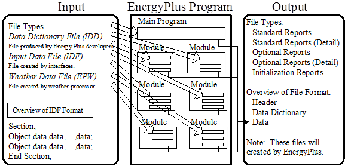

<br/>
<p><h1>EnergyPlus<sup>TM</sup> Documentation</h1></p>
<hr>
<h1>Guide for Interface Developers</h1>
<h2>Everything You Need to Know about EnergyPlus Input and Output</h2>
<br/>
<p><i>(to develop a user-friendly interface)</i></p>
<br/>
<br/>
<br/>
<br/>
<p><small>COPYRIGHT (c) 1996-2015 THE BOARD OF TRUSTEES OF THE UNIVERSITY OF ILLINOIS AND THE REGENTS OF THE UNIVERSITY OF CALIFORNIA THROUGH THE ERNEST ORLANDO LAWRENCE BERKELEY NATIONAL LABORATORY. ALL RIGHTS RESERVED. NO PART OF THIS MATERIAL MAY BE REPRODUCED OR TRANSMITTED IN ANY FORM OR BY ANY MEANS WITHOUT THE PRIOR WRITTEN PERMISSION OF THE UNIVERSITY OF ILLINOIS OR THE ERNEST ORLANDO LAWRENCE BERKELEY NATIONAL LABORATORY. ENERGYPLUS IS A TRADEMARK OF THE US DEPARTMENT OF ENERGY.</small></p>
<p style="page-break-after:always;"></p>
<div id="generated-toc"></div>
<p style="page-break-after:always;"></p>

Introduction
============

This document is intended for developers who are creating user interfaces for EnergyPlus.  It provides an overview of the essentials of the input-output structure of EnergyPlus and describes the parts of each in detail.



Figure 1. EnergyPlus Input/Output Overview

The diagram shown above should give the reader an overall picture of input-output in EnergyPlus.  It can be seen as a linear process that includes the following steps:

1)   The user enters building description (including internal space gains, HVAC arrangements, and Plant equipment properties) using the interface of their choice.  In addition, the user specifies which non-default reports are desired and any optional variables from a predefined list of available simulation quantities.

2)   The interface program writes the Input Data File (IDF) file, which includes the specification of any report items desired by the user.

3)   EnergyPlus processes both the Input Data Dictionary (IDD) and the Input Data File (IDF) files with the “InputProcessor”.  The InputProcessor uses the specifications/rules defined in the IDD and interprets the IDF raw data.  The InputProcessor is really quite “dumb” and only understands a few things about each field (alpha or numeric) qualified by certain key elements in the IDD (\\ comments which are discussed later).

4)   Each module in EnergyPlus has one or several routines (normally called “GetInput” routines) that obtain the information from the IDF file data.  These subroutines decode the portion of the IDF file that is pertinent to the local module.  These GetInput routines are more context sensitive than the InputProcessor and may perform further error detection.  For example, the cooling coil module may read in the coil type and its associated parameters (number of rows, tube diameter, fin spacing, etc.).

5)   EnergyPlus performs the simulation elements specified in the IDF.  Output is generated as a continuous stream (for the most part) and must be interpreted into a more cohesive form by output processing.  The user has control over which outputs are produced and when/how often.

6)   EnergyPlus produces output as required by the user into one of the output files.  These files can be readily processed into spreadsheet formats for graphing and other summarizing.


Interface Expectations
----------------------

The input-output interfaces may be combined into a single program or may be available separately.  The following attributes are expected from these interfaces.

### Input Interface Attributes

The input interface agents will be expected to fulfill two main requirements:

- Ability to produce the input file for the simulation.

- Perform the consistency and value checks necessary to assure that the input file conforms to EnergyPlus requirements.

Additionally, the input interface agent might:

- Ability to warn users about potential output file size.  It is expected that the data files generated by the EnergyPlus program will be significantly larger than the output files from its parent programs.  As a result, users may be unaware that selecting too many reports could lead to enormous output files.  It is recommended that some sort of checking be done to alert users when the term of the simulation and the number of reports selected eclipse some reasonable file size limit.

- Ability to perform parametric runs.

The method used by the input interface agent to accomplish these goals is left to the discretion of the interface developer.

### Post-processing Interface Attributes

The post-processing agents will be expected to fulfill the main requirement:

- Ability to read all or selected output formats.

Additionally, a post-processing agent might:

- Ability to combine and summarize data (average, peak, total, etc.) and produce the various text and graphical reports requested by the user.

- Ability to handle multiple output files.

The method used by the post-processing agent to accomplish these goals is left to the discretion of the interface developer.

EnergyPlus Install Contents
===========================

EnergyPlus Interfaces will naturally need to access the installed EnergyPlus programs, library files, documentation.  It will help to describe how EnergyPlus is installed (on a Windows™ computer).  The EnergyPlus install is written using the WISE™ installation software.

The scheme of installing EnergyPlus includes a “root” directory/folder and all subsequent programs installed as part of the installation are child folders under the parent/root folder.  Several optional components can be selected during install.

The basic (required) installation has crucial files installed in the parent folder – these include **EnergyPlus.exe**, **Energy+.idd** (the input data dictionary), **EPMacro.exe**.  The basic installation also includes a child folder “DataSets” that contains the EnergyPlus “libraries”.  As distributed, EnergyPlus includes several library files, formatted in the standard EnergyPlus IDF format.  These include thermal material properties, moisture material properties, glass and other properties for windows, constructions (material sandwiches which describe walls, windows, roofs), fluid properties, locations, design day definitions, and basic schedule definitions.  There, of course, may be additional data sets added as well as future datasets edited for selectable use from the EPMacro program.  The Templates folder is also included in the basic install.  Currently, the Templates folder contains documentation and the HVAC Template files.  These files can be used somewhat “automatically” to produce HVAC loop structures for running with EnergyPlus.

Optional components of the EnergyPlus install: **Documentation**, **EP-Launch**, **IDFEditor**, **Sample** **Files**, **Weather** **Converter**, and other auxiliary type programs.  All the components are selected by default; to not install them the user must “un-select” them individually.  Highlights of several:

**Documentation:**  The EnergyPlus package includes a comprehensive set of documents intended to help the user and others understand the EnergyPlus program, usage, and other appropriate information.  All documents are created in PDF (Portable Document Format).  There is “index” to all documents to make searching for a subject easier. A shortcut to the Documentation folder and the “main-menu” document is included.  The main-menu document is a navigation aid to the remainder of the documents.  We may want to make the documentation a non-optional component.

**EP-Launch: ** The components of EP-Launch are installed in the parent directory (help files installed in the documentation directory).  Because the basic EnergyPlus program runs as a console application, many beta users did not understand how to make the program execute.  While the developers may be able to tailor the EnergyPlus executable to be more callable under the Windows™ platform, this is still a useful program.  EP-Launch uses the EPL-Run.bat file and prepends several “set” commands that are used in the bat file.  It creates the actual batch file for the run as “RunEP.bat” and then calls the operating system to execute the file.   Having the EPL-Run.bat file as external to the EP-Launch program means that others may tailor the batch file more appropriately to how things are run though this may not be preserved with a future EnergyPlus install. EP-Launch can also execute several utility programs from the “Utilities” tab.

**IDFEditor: ** The IDFEditor is the simple editor that is distributed with EnergyPlus.  As an interface, it is crude.  However, it gets the job done.  It uses the IDD and then reads and/or creates an IDF file.  The objects are shown in the groups (see \\group discussion below) and, when an existing file is used, will display how many of an object is found in the IDF.  This program is installed in the Parent \\ PreProcess \\ IDFEditor folder.

**Sample Files:**  The sample files include several IDF files along with the files the installed version of EnergyPlus created using these files.  There are several possible child folders here, including the Misc child folder that will contain all the development sample files – but without having been run for the install.  These files are installed in the Parent \\ ExampleFiles folder and any appropriate child folders under that.

**Weather Converter:**  The WeatherConverter program can process raw weather data in several formats into the EnergyPlus weather data format (epw).  In addition, the WeatherConverter program can be used to generate a simple report of the weather data as well as produce a .csv file of the format.  The .csv (comma separated variable) format can easily be imported into spread sheet programs or other tables.  This program is installed in the Parent \\ PreProcess \\ WeatherConverter folder.  The WeatherConverter also has a DLL file which could be used directly by an external interface.

**BLAST Translator: ** The BLAST translator program can be used to convert a BLAST input file into a format that can be executed from EnergyPlus.  Extensive system translation is not done with this program – mostly geometry and other space gain elements as well as zone oriented (i.e. People) schedules.  If the BLAST input file contains thermostatic controls in the zones, then the EnergyPlus IDF file will include a purchased-air solution of that BLAST input file.  This program is no longer part of the EnergyPlus install but is available with each new release.

**DOE-2 Translator:**  The DOE-2 translator program is similar to the BLAST Translator program but for DOE-2 files.  DOE-2 translator output must be processed by the EPMacro program prior to running in EnergyPlus (the EP-Launch program/EPL-Run procedure does this automatically for all “.imf” files).  This program is no longer part of the EnergyPlus install but is available with each new release.

Input Overview
==============

The general structure of the input files for EnergyPlus is plain text.  Fields are comma delimited and each “line” is terminated with a semicolon.  This allows for a very rudimentary input processor that can be instantly flexible to developer’s needs.  However, it puts more burdens on the EnergyPlus developers to process the input information, supply defaults as needed, and perform validity checks.  Guidelines were established for the input:

- Input will be a flat ASCII file with comma-delimited columns and each “line” (where each line can run over several physical file records) terminated with a semicolon.

- Input should be “readable”, “editable”, “simply parsed with few value checks or consistency checks”.

- Input, to the extent possible, should be easily maintainable and extendable.

- Input will be “object based”.

- Definitions in a data dictionary will define the input.  The data dictionary should be self-documenting.

- All input units will be metric (SI).  Conversions from “user units” will be done in the interface agents.

Two input files are necessary for the input processing.  The first is the “data dictionary” which will specify the requirements for each item.  The EnergyPlus Input Processor uses these requirements to process the “input data file” and report any anomalies found.  Both input files have similar structures: 1) Sections – single lines/commands, which may help group the simulation input for readability and 2) Classes/Objects – data attributes for the simulation.  Classes are the term used in the data dictionary – each class will specify the kind of data (alpha or numeric) that will be included in the simulation input.  Objects are instances of these classes and appear in the IDF with appropriate data.

General Input Rules
-------------------

The following rules apply to both the Input Data Dictionary and the Input Data File.

- The initial line of a definition or input MUST have a comma or semicolon.

- Fields do not extend over line boundaries.  Usually, if a comma or (as appropriate) semi-colon is not the last field value on a line, one will be inserted.  Of course, several fields may appear on a single line as long as they are comma separated.

- Commas delimit fields – therefore, no fields can have embedded commas.  No error will occur but you won't get what you want.

- Blank lines are allowed.

- The comment character is a exclamation “!”.  Anything on a line after the exclamation is ignored.

- A special type of comment using the character combination: “!-“ in the input file is a special form of comment that is followed by the field name(s) and units and should not include user provided text. This form is used to indicate automatic comments which may be written by interfaces and other utilities as an endline comment after a field value.

- Input records can be up to 500 characters in length.  If you go over that, no error will occur but you won't get what you want.

- Each Section and Class/Object keyword can be up to 100 characters in length.  Embedded spaces are allowed, but are significant (if you have 2 spaces in the section keyword – you must have 2 when you write the object keyword).

- Each Alpha string (including Section and Class/Object keywords) is mapped to UPPER case during processing, unless the “retaincase” flag marks the field in the IDD.  Get routines from the EnergyPlus code that use the Section and Object keywords automatically map to UPPER case for finding the item.  The primary drawback with this is that error messages coming out of the input processor will be in UPPER case and may not appear exactly as input.

- Special characters, such as tabs, should NOT be included in the file.  However, tabs can be accommodated and are turned into spaces.

Input Data Dictionary
---------------------

The input data dictionary specifies the “definitions” for each line that will be processed in the input data file.

Structure in the input data dictionary allows for descriptions that may be useful for interface developers.  The Input Processor ignores everything but the essentials for getting the “right stuff” into the program.  Developers have been (and will continue to be) encouraged to include comments and other documentation in the IDD.

Internal to the data dictionary (using special “comment” characters) is a structured set of conventions for including information on each object.  This is shown in section on Input Details below.

### Rules specific to the Input Data Dictionary

In addition to the rules for both files (listed above), the IDD also has the limitation:

- Duplicate Section names and Duplicate Class names are not allowed.  That is, the first class of an item named X will be the one used during processing.  Error messages will appear if you try to duplicate definitions.

Input Data File
---------------

This is the only file that EnergyPlus uses to create the building simulation.  The input is order-independent; data can appear in any order and will be retrieved and sorted as necessary by the EnergyPlus simulation modules.  In addition, EnergyPlus allocates everything dynamically, so there are no limitations as to number of zones, surfaces, etc.

All numbers can be flexibly input and are processed into single precision variables (i.e. 1.0, 1.000, 1, .1E+1 are all processed equally).

### Rules specific to Input Data file:

- Each Alpha string in the input data file can be up to 100 characters in length.  Anything beyond that is truncated.

- A special combination of characters “!-“ indicates a comment that contains the name and units of the field after each field value. These, like normal comments, are ignored by EnergyPlus. This type of comment containing the field names are created automatically with IDF Editor, IDF Version Updater (transition) and other user interfaces. Comments added by the user should not use “!-“ because they are deleted and replaced with the field name when the file is saved using IDF Editor. For an example of this syntax, see the example file in Appendix A.

Input Details
=============

This document does not cover the input “classes” in detail.  For details on each class and examples of both input and output resulting from that class/object, please view the [Input Output Reference](file:///E:\Docs4PDFs\InputOutputReference.pdf) document.  In this document, we will show the “conventions” used in the IDD and provide limited examples for illustration purposes. Even the list of objects is dynamic, so we give you a method to see them from the IDFEditor.

An intelligent editor (IDFEditor) has been written and can be used as an illustration of how the comments in the IDD might be used by Interface Developers to guide their developments.  IDFEditor is described in the [Getting Started](file:///E:\Docs4PDFs\GettingStarted.pdf) document.

A full example of a very simple IDF is included in Appendix A to this document.

IDD Conventions
---------------

The following is a basic description of the structure of the IDD (it’s actually taken directly from the IDD file). As noted within, **!** signifies a comment character as does the **\\**. **\\** has also been adopted as a convention for including more specific comments about each field in an object. These have been used with success in the IDFEditor and it is hoped the flexibility will provide other interface developers with useful information.

```idd
!IDD_Version VERSION NUMBER
! **************************************************************************
! This file is the Input Data Dictionary (IDD) for EnergyPlus.
! The IDD defines the syntax and data model for each type of input "Object."
! Lines in EnergyPlus input files (and IDD) are limited to 500 characters.
!
! Object Description
! ------------------
! To define an object (a record with data), develop a key word that is unique
! Each data item to the object can be A (Alphanumeric string) or N (numeric)
! Number each A and N.  This will show how the data items will be put into the
! arrays that are passed to the Input Processor "Get" (GetObjectItem) routines.
! All alpha fields are limited to 100 characters.  Numeric fields should be
! valid numerics (can include such as 1.0E+05) and are placed into double
! precision variables.
!
! NOTE: Even though a field may be optional, a comma representing that field
!   must be included (unless it is the last field in the object).  Since the
!   entire input is "field-oriented" and not "keyword-oriented", the EnergyPlus
!   Input Processor must have some representation (even if blank) for each
!   field.
!
! Object Documentation
! --------------------
! In addition, the following special comments appear one per line and
! most are followed by a value.  Comments may apply to a field or the object
! or a group of objects.
!
! Field-level comments:
!
!  \field           Name of field
!                     (should be succinct and readable, blanks are encouraged)
!
!  \note            Note describing the field and its valid values. If multiple lines,
!                   start each line with \note. Limit line length to 100 characters.
!
!  \required-field  To flag fields which may not be left blank
!                     (this comment has no "value")
!
!  \begin-extensible  Marks the first field at which the object accepts an extensible
!                   field set.  A fixed number of fields from this marker define the
!                   extensible field set, see the object code \extensible for
!                   more information.
!
!  \units           Units (must be from EnergyPlus standard units list)
!                   EnergyPlus units are standard SI units
!
!  \ip-units        IP-Units (for use by input processors with IP units)
!                   This is only used if the default conversion is not
!                   appropriate.
!
!  \unitsBasedOnField  For fields that may have multiple possible units, indicates
!                   the field in the object that can be used to determine
!                   the units. The field reference is in the A2 form.
!
!  \minimum         Minimum that includes the following value
!
!  \minimum>        Minimum that must be > than the following value
!
!  \maximum         Maximum that includes the following value
!
!  \maximum<        Maximum that must be &lt; than the following value
!
!  \default         Default for the field (if N/A then omit entire line)
!
!  \deprecated      This field is not really used and will be deleted from the object.
!                   The required information is gotten internally or
!                   not needed by the program.
!
!  \autosizable     Flag to indicate that this field can be used with the Auto
!                   Sizing routines to produce calculated results for the
!                   field.  If a value follows this, then that will be used
!                   when the "Autosize" feature is flagged.  To trigger
!                   autosizing for a field, enter Autosize as the field's
!                   value.  Only applicable to numeric fields.
!
!  \autocalculatable Flag to indicate that this field can be automatically
!                   calculated. To trigger auto calculation for a field, enter
!                   Autocalculate as the field's value.  Only applicable to
!                   numeric fields.
!
!  \type            Type of data for the field -
!                     integer
!                     real
!                     alpha       (arbitrary string),
!                     choice      (alpha with specific list of choices, see
!                                 \key)
!                     object-list (link to a list of objects defined elsewhere,
!                                  see \object-list and \reference)
!                     external-list (uses a special list from an external source,
!                                    see \external-list)
!                     node        (name used in connecting HVAC components)
!
!  \retaincase      Retains the alphabetic case for alpha type fields
!
!  \key             Possible value for "\type choice" (blanks are significant)
!                     use multiple \key lines to indicate all valid choices
!
!  \object-list     Name of a list of user-provided object names that are valid
!                     entries for this field (used with "\reference")
!                     see Zone and BuildingSurface:Detailed objects below for
!                     examples.
!                  ** Note that a field may have multiple \object-list commands.
!
!  \external-list   The values for this field should be selected from a special
!                   list generated outside of the IDD file. The choices for the
!                   special lists are:
!                        autoRDDvariable
!                        autoRDDmeter
!                        autoRDDvariableMeter
!                   When one of these are selected the options for the field
!                   are taken from the RDD or MDD file or both.
!
!  \reference       Name of a list of names to which this object belongs
!                     used with "\type object-list" and with "\object-list"
!                     see Zone and BuildingSurface:Detailed objects below for
!                     examples:
!
!                        Zone,
!                          A1 , \field Name
!                               \type alpha
!                               \reference ZoneNames
!
!                        BuildingSurface:Detailed,
!                          A4 , \field Zone Name
!                               \note Zone the surface is a part of
!                               \type object-list
!                               \object-list ZoneNames
!
!             For each zone, the field "Name" may be referenced
!             by other objects, such as BuildingSurface:Detailed, so it is
!             commented with "\reference ZoneNames"
!             Fields that reference a zone name, such as BuildingSurface:Detailed's
!             "Zone Name", are commented as
!             "\type object-list" and "\object-list ZoneNames"
!             ** Note that a field may have multiple \reference commands.
!             ** This is useful if the object belongs to a small specific
!             object-list as well as a larger more general object-list.
!
! Object-level comments:
!
!  \memo            Memo describing the object. If multiple lines, start each line
!                   with \memo.
!                   Limit line length to 100 characters.
!
!  \unique-object   To flag objects which should appear only once in an idf
!                     (this comment has no "value")
!
!  \required-object To flag objects which are required in every idf
!                     (this comment has no "value")
!
!  \min-fields      Minimum number of fields that should be included in the
!                   object.  If appropriate, the Input Processor will fill
!                   any missing fields with defaults (for numeric fields).
!                   It will also supply that number of fields to the "get"
!                   routines using blanks for alpha fields (note -- blanks
!                   may not be allowable for some alpha fields).
!
!  \obsolete        This object has been replaced though is kept (and is read)
!                   in the current version.  Please refer to documentation as
!                   to the dispersal of the object.  If this object is
!                   encountered in an IDF, the InputProcessor will post an
!                   appropriate message to the error file.
!                   usage:  \obsolete New=>[New object name]
!
!  \extensible:<\#>  This object is dynamically extensible -- meaning, if you
!           change the IDD appropriately (if the object has a simple list
!           structure -- just add items to the list arguments (i.e. BRANCH
!           LIST). These will be automatically redimensioned and used during
!           the simulation. <\#> should be entered by the developer to signify
!           how many of the last fields are needed to be extended (and EnergyPlus
!           will attempt to auto-extend the object).  The first field of the first
!           instance of the extensible field set is marked with \begin-extensible.
!
!  \begin-extensible See previous item, marks beginning of extensible fields in
!                   an object.
!
!  \format          The object should have a special format when saved in
!                   the IDF Editor with the special format option enabled.
!                   The options include SingleLine, Vertices, CompactSchedule,
!                   FluidProperties, ViewFactors, and Spectral.
!                   The SingleLine option puts all the fields for the object
!                   on a single line. The Vertices option is used in objects
!                   that use X, Y and Z fields to format those three fields
!                   on a single line.
!                   The CompactSchedule formats that specific object.
!                   The FluidProperty option formats long lists of fluid
!                   properties to ten values per line.
!                   The ViewFactor option formats three fields related to
!                   view factors per line.
!                   The Spectral option formats the four fields related to
!                   window glass spectral data per line.
!
!   \reference-class-name Adds the name of the class to the reference list
!                   similar to \reference.
!
! Group-level comments:
!
!  \group          Name for a group of related objects
!
!
! Notes on comments
! -----------------
!
! 1.  If a particular comment is not applicable (such as units, or default)
! then simply omit the comment rather than indicating N/A.
!
! 2.  Memos and notes should be brief (recommend 5 lines or less per block).
! More extensive explanations are expected to be in the user documentation
```


### IDD – IP Units

In addition, the IDD contains indications of IP (inch-pound) units for the EnergyPlus standard SI (Systems International) units. These may be used by input and output interfaces to display values in the IP system. As noted, if the IP units are “standard” (first block below), then no \\ip-units is expected in the field. Note that for some fields – due to their multiple use (for example, schedule values) – there cannot be a ip-unit designation.
```idf
! Default IP conversions (no \ip-units necessary)
!      $/(m3/s)               =>   $/(ft3/min)         0.000472000059660808
!      $/(W/K)                =>   $/(Btu/h-F)         0.52667614683731
!      $/kW                   =>   $/(kBtuh/h)         0.293083235638921
!      $/m2                   =>   $/ft2               0.0928939733269818
!      $/m3                   =>   $/ft3               0.0283127014102352
!      (kg/s)/W               =>   (lbm/sec)/(Btu/hr)  0.646078115385742
!      1/K                    =>   1/F                 0.555555555555556
!      1/m                    =>   1/ft                0.3048
!      A/K                    =>   A/F                 0.555555555555556
!      C                      =>   F                   1.8 (plus 32)
!      cm                     =>   in                  0.3937
!      cm2                    =>   inch2               0.15500031000062
!      deltaC                 =>   deltaF              1.8
!      deltaJ/kg              =>   deltaBtu/lb         0.0004299
!      g/GJ                   =>   lb/MWh              0.00793664091373665
!      g/kg                   =>   grains/lb           7
!      g/MJ                   =>   lb/MWh              7.93664091373665
!      g/mol                  =>   lb/mol              0.0022046
!      g/m-s                  =>   lb/ft-s             0.000671968949659
!      g/m-s-K                =>   lb/ft-s-F           0.000373574867724868
!      GJ                     =>   ton-hrs             78.9889415481832
!      J                      =>   Wh                  0.000277777777777778
!      J/K                    =>   Btu/F               526.565
!      J/kg                   =>   Btu/lb              0.00042986
!      J/kg-K                 =>   Btu/lb-F            0.000239005736137667
!      J/kg-K2                =>   Btu/lb-F2           0.000132889924714692
!      J/kg-K3                =>   Btu/lb-F3           7.38277359526066E-05
!      J/m2-K                 =>   Btu/ft2-F           4.89224766847393E-05
!      J/m3                   =>   Btu/ft3             2.68096514745308E-05
!      J/m3-K                 =>   Btu/ft3-F           1.49237004739337E-05
!      K                      =>   R                   1.8
!      K/m                    =>   F/ft                0.54861322767449
!      kg                     =>   lb                  2.2046
!      kg/J                   =>   lb/Btu              2325.83774250441
!      kg/kg-K                =>   lb/lb-F             0.555555555555556
!      kg/m                   =>   lb/ft               0.67196893069637
!      kg/m2                  =>   lb/ft2              0.204794053596664
!      kg/m3                  =>   lb/ft3              0.062428
!      kg/m-s                 =>   lb/ft-s             0.67196893069637
!      kg/m-s-K               =>   lb/ft-s-F           0.373316072609094
!      kg/m-s-K2              =>   lb/ft-s-F2          0.207397818116164
!      kg/Pa-s-m2             =>   lb/psi-s-ft2        1412.00523459398
!      kg/s                   =>   lb/s                2.20462247603796
!      kg/s2                  =>   lb/s2               2.2046
!      kg/s-m                 =>   lb/s-ft             0.67196893069637
!      kJ/kg                  =>   Btu/lb              0.429925
!      kPa                    =>   psi                 0.145038
!      L/day                  =>   pint/day            2.11337629827348
!      L/GJ                   =>   gal/kWh             0.000951022349025202
!      L/kWh                  =>   pint/kWh            2.11337629827348
!      L/MJ                   =>   gal/kWh             0.951022349025202
!      lux                    =>   foot-candles        0.092902267
!      m                      =>   ft                  3.28083989501312
!      m/hr                   =>   ft/hr               3.28083989501312
!      m/s                    =>   ft/min              196.850393700787
!      m/s                    =>   miles/hr            2.2369362920544
!      m/yr                   =>   inch/yr             39.3700787401575
!      m2                     =>   ft2                 10.7639104167097
!      m2/m                   =>   ft2/ft              3.28083989501312
!      m2/person              =>   ft2/person          10.764961
!      m2/s                   =>   ft2/s               10.7639104167097
!      m2-K/W                 =>   ft2-F-hr/Btu        5.678263
!      m3                     =>   ft3                 35.3146667214886
!      m3                     =>   gal                 264.172037284185
!      m3/GJ                  =>   ft3/MWh             127.13292
!      m3/hr                  =>   ft3/hr              35.3146667214886
!      m3/hr-m2               =>   ft3/hr-ft2          3.28083989501312
!      m3/hr-person           =>   ft3/hr-person       35.3146667214886
!      m3/kg                  =>   ft3/lb              16.018
!      m3/m2                  =>   ft3/ft2             3.28083989501312
!      m3/MJ                  =>   ft3/kWh             127.13292
!      m3/person              =>   ft3/person          35.3146667214886
!      m3/s                   =>   ft3/min             2118.88000328931
!      m3/s-m                 =>   ft3/min-ft          645.89
!      m3/s-m2                =>   ft3/min-ft2         196.85
!      m3/s-person            =>   ft3/min-person      2118.6438
!      m3/s-W                 =>   (ft3/min)/(Btu/h)   621.099127332943
!      N-m                    =>   lbf-in              8.85074900525547
!      N-s/m2                 =>   lbf-s/ft2           0.0208857913669065
!      Pa                     =>   psi                 0.000145037743897283
!      percent/K              =>   percent/F           0.555555555555556
!      person/m2              =>   person/ft2          0.0928939733269818
!      s/m                    =>   s/ft                0.3048
!      V/K                    =>   V/F                 0.555555555555556
!      W                      =>   Btu/h               3.4121412858518
!      W/(m3/s)               =>   W/(ft3/min)         0.0004719475
!      W/K                    =>   Btu/h-F             1.89563404769544
!      W/m                    =>   Btu/h-ft            1.04072
!      W/m2                   =>   Btu/h-ft2           0.316957210776545
!      W/m2                   =>   W/ft2               0.09290304
!      W/m2-K                 =>   Btu/h-ft2-F         0.176110194261872
!      W/m2-K2                =>   Btu/h-ft2-F2        0.097826
!      W/m-K                  =>   Btu-in/h-ft2-F      6.93481276005548
!      W/m-K2                 =>   Btu/h-F2-ft         0.321418310071648
!      W/m-K3                 =>   Btu/h-F3-ft         0.178565727817582
!      W/person               =>   Btu/h-person        3.4121412858518
!
! Other conversions supported (needs the \ip-units code)
!
!      kPa                    =>   inHg                0.29523
!      m                      =>   in                  39.3700787401575
!      m3/s                   =>   gal/min             15850.3222370511
!      Pa                     =>   ftH2O               0.00033455
!      Pa                     =>   inH2O               0.00401463
!      Pa                     =>   inHg                0.00029613
!      Pa                     =>   Pa                  1
!      W                      =>   W                   1
!      W/m2                   =>   W/m2                1
!      W/m-K                  =>   Btu/h-ft-F          0.577796066000163
!      W/person               =>   W/person            1
!
! Units fields that are not translated
!      $
!      1/hr
!      A
!      Ah
!      A/V
!      Availability
!      Control
!      cycles/hr
!      days
!      deg
!      dimensionless
!      eV
!      hr
!      J/J
!      kg/kg
!      kg-H2O/kg-air
!      kmol
!      kmol/s
!      m3/m3
!      minutes
!      Mode
!      ms
!      ohms
!      percent
!      ppm
!      rev/min
!      s
!      V
!      VA
!      W/m2 or deg C
!      W/m2, W or deg C
!      W/s
!      W/W
!      years
! **************************************************************************
```

### Example Object

The Site:Location object will serve as an example.

```idd
Site:Location,
       \unique-object
       \min-fields 5
  A1 , \field Name
       \required-field
       \type  alpha
  N1 , \field Latitude
       \units deg
       \minimum -90.0
       \maximum +90.0
       \default 0.0
       \note + is North, - is South, degree minutes represented in decimal (i.e. 30 minutes is .5)
       \type real
  N2 , \field Longitude
       \units deg
       \minimum -180.0
       \maximum +180.0
       \default 0.0
       \note - is West, + is East, degree minutes represented in decimal (i.e. 30 minutes is .5)
       \type real
  N3 , \field Time Zone
       \note basic these limits on the WorldTimeZone Map (2003)
       \units hr
       \minimum -12.0
       \maximum +14.0
       \default 0.0
       \note  Time relative to GMT. Decimal hours.
       \type real
  N4 ; \field Elevation
       \units m
       \minimum -300.0
       \maximum&lt; 6096.0
       \default 0.0
       \type real
```


First, the object name is given.  (Site:Location)  This is followed by a comma in both the definition (IDD) and in an input file (IDF).  In fact, all fields except the terminating field of an IDD class object and IDF object are followed by commas.  The final field in an IDD class object or in an IDF object is terminated by a semi-colon.

Next is an alpha field, the location name.  As noted above, for input, spaces are significant in this field.  The main inputs for Location are numeric fields.  These are numbered (as is the alpha field) for convenience.  The \\ designations will show various information about the objects as described above in the IDD conventions discussion.  Of importance for reading this document are the units and possible minimum and maximum values for a  field.  Defaults are produced if applicable and if the field is blank in the IDF.  For this example, that won’t work because there is no default AND the Location name is a required field.

The \\minimum, \\maximum and \\default comments are automatically processed in the Inptu Processor for numeric fields.  Any infractions of the \\minimum, \\maximum fields will be automatically detected and messages will appear in the standard error file.  After all the input is checked, infractions will cause program termination (before the bulk of the simulation is completed).  Defaults are also enforced if you leave the numeric field blank.

\\min-fields deserves some explanation.  This has object level enforcement.  When min-fields is specified for an object, it has meaning to the InputProcessor – telling the IP the number of fields that must be returned to a GetInput routine regardless of how many fields may actually appear in the IDF.  So, min-fields is actually an automatic assistance in most instances.

Some objects need all the parameters listed by the definition; some do not.  In the descriptions that are contained in the Input Output Reference, we try to indicate which parts are optional.  Usually, these will be the last fields in the object input or definition.

### Using the Input-Output Reference Document

To assist you in using the [Input Output Reference](file:///E:\Docs4PDFs\InputOutputReference.pdf) document, it is grouped similarly to the IDD file.

To determine the latest set of groups and objects, it will be useful for you to open the IDFEditor (an intelligent editor that is installed with EnergyPlus) and write out the current object list.  The following figure shows the screen shot of the IDFEditor and the help menu to select the objectlist.  Select “**create objectlist.txt**” to create the object list – it will be put into the IDFEditor program folder.


Figure 2. Using IDFEditor to find the latest groups and objects for the Energy+.idd

The produced list will look something like:

Simulation Parameters

---------------------------

[------]  Version

[------]  SimulationControl

[------]  Building

[------]  ShadowCalculation

[------]  SurfaceConvectionAlgorithm:Inside

[------]  SurfaceConvectionAlgorithm:Outside

[------]  HeatBalanceAlgorithm

[------]  ZoneCapacitanceMultiplier

[------]  Timestep

[------]  ConvergenceLimits


Location - Climate - Weather File Access

---------------------------

[------]  Site:Location

[------]  SizingPeriod:DesignDay

[------]  SizingPeriod:WeatherFileDays

[------]  SizingPeriod:WeatherFileConditionType

[------]  RunPeriod

[------]  RunPeriodControl:SpecialDays

[------]  RunPeriodControl:DaylightSavingTime

“Simulation Parameters” and “Location – Climate – Weather File Access” are groups. Version, Building, etc are objects.

Standard EnergyPlus Units
-------------------------

EnergyPlus expects information in a single unit system (SI).  This requires interface developers to convert user inputs from those preferred by architects and engineers into the standard metric units of EnergyPlus.  EnergyPlus will not perform any units conversions and will not have any unit conversion routines.

ASCII with no spaces is used for abbreviations.  Note that exponents appear without any indication of exponentiation: i.e., kg/m3 not kg/m^3 or kg/m\*\*3.  Also note the use of dashes.  We have W/m2-K not W/m2\*K or W/(m2\*K).

At the end we note the “problem” variables – the inputs that have non-standard units. Inputs using these units will have to be changed and the code checked to see how the quantities are used internally.

Table 1. Standard EnergyPlus Units

<table class="table table-striped">
<tr>
<th>Quantity</th>
<th>unit</th>
<th>abbreviation</th>
</tr>
<tr>
<td>angular degrees</td>
<td>degree</td>
<td>deg</td>
</tr>
<tr>
<td>Length</td>
<td>meter</td>
<td>m</td>
</tr>
<tr>
<td>Area</td>
<td>square meter</td>
<td>m2</td>
</tr>
<tr>
<td>Volume</td>
<td>cubic meter</td>
<td>m3</td>
</tr>
<tr>
<td>Time</td>
<td>seconds</td>
<td>s</td>
</tr>
<tr>
<td>Frequency</td>
<td>Hertz</td>
<td>Hz</td>
</tr>
<tr>
<td>Temperature</td>
<td>Celsius</td>
<td>C</td>
</tr>
<tr>
<td>absolute temperature</td>
<td>Kelvin</td>
<td>K</td>
</tr>
<tr>
<td>temperature difference</td>
<td>Kelvin</td>
<td>delK</td>
</tr>
<tr>
<td>speed</td>
<td>meters per second</td>
<td>m/s</td>
</tr>
<tr>
<td>energy (or work)</td>
<td>Joules</td>
<td>J</td>
</tr>
<tr>
<td>power</td>
<td>Watts</td>
<td>W</td>
</tr>
<tr>
<td>mass</td>
<td>kilograms</td>
<td>kg</td>
</tr>
<tr>
<td>force</td>
<td>Newton</td>
<td>N</td>
</tr>
<tr>
<td>mass flow</td>
<td>kilograms per second</td>
<td>kg/s</td>
</tr>
<tr>
<td>volume flow</td>
<td>cubic meters per second</td>
<td>m3/s</td>
</tr>
<tr>
<td>pressure</td>
<td>Pascals</td>
<td>Pa</td>
</tr>
<tr>
<td>pressure difference</td>
<td>Pascals</td>
<td>delPa</td>
</tr>
<tr>
<td>specific enthalpy</td>
<td>Joules per kilogram</td>
<td>J/kg</td>
</tr>
<tr>
<td>density</td>
<td>kilograms per cubic meter</td>
<td>kg/m3</td>
</tr>
<tr>
<td>heat flux</td>
<td>watts per square meter</td>
<td>W/m2</td>
</tr>
<tr>
<td>specific heat</td>
<td>-------</td>
<td>J/kg-K</td>
</tr>
<tr>
<td>conductivity</td>
<td>-------</td>
<td>W/m-K</td>
</tr>
<tr>
<td>diffusivity</td>
<td>-------</td>
<td>m2/s</td>
</tr>
<tr>
<td>heat transfer coefficient</td>
<td>-------</td>
<td>W/m2-K</td>
</tr>
<tr>
<td>R-value</td>
<td>-------</td>
<td>m2-K/W</td>
</tr>
<tr>
<td>heating or cooling capacity</td>
<td>Watts</td>
<td>W</td>
</tr>
<tr>
<td>electric potential</td>
<td>volts</td>
<td>V</td>
</tr>
<tr>
<td>electric current</td>
<td>Amperes</td>
<td>A</td>
</tr>
<tr>
<td>illuminace</td>
<td>lux</td>
<td>lx</td>
</tr>
<tr>
<td>luminous flux</td>
<td>lumen</td>
<td>lm</td>
</tr>
<tr>
<td>luminous intensity</td>
<td>candelas</td>
<td>cd</td>
</tr>
<tr>
<td>luminance</td>
<td>candelas per square meter</td>
<td>cd/m2</td>
</tr>
<tr>
<td>vapor diffusivity</td>
<td>m2/s</td>
<td> </td>
</tr>
<tr>
<td>viscosity</td>
<td>-------</td>
<td>kg/m-s</td>
</tr>
<tr>
<td>porosity</td>
<td>-------</td>
<td>m3/m3</td>
</tr>
<tr>
<td>thermal gradient coeff for moisture capacity</td>
<td>-------</td>
<td>kg/kg-K</td>
</tr>
<tr>
<td>isothermal moisture capacity</td>
<td>-------</td>
<td>m3/kg</td>
</tr>
</table>


EnergyPlus Reports
------------------

Several items are used to specify what will appear in the output file(s).  The output is described in the next section of this document.  What appears here is a sample of outputs – more detailed and complete versions can be found in the “Output Details and Examples” document. In addition to the individual reports, there are sets of predefined reports that can appear.  View the Input for Output section and the Tabular reports section in the Input Output Reference document for more details.

Output
======

EnergyPlus produces several output files as shown in the section on “Running EnergyPlus”.   This section will discuss the data contained in the “standard” output file (**eplusout.eso**).  It, too, has a data dictionary but unlike the input files, the output data dictionary is contained within the output file.  Thus, the basic structure of the standard output file is:

```
Data Dictionary Information
End of Data Dictionary
Data
…
Data
End of Data
```

As with the IDF structure, there are rules associated with the interpretation of the standard output data dictionary.  These rules are summarized as follows:

- The first item on each line is an integer which represents the “report code”.  This “report code” will be listed in the data section where it will also be the first item on each line, identifying the data.  Only 2 lines in the output file will not have an integer as the first item (“End of Data Dictionary” and “End of Data” lines).

- The second item on each line is also an integer.  This integer corresponds to the number of items left on the dictionary line.  Each string consists of a variable name and units in square brackets.  Square brackets are required for all strings.  If there are no units associated with a particular variable, then there are no characters between the brackets.

Six standard items appear at the start of every EnergyPlus Standard Output File Data Dictionary:

```
Program Version,EnergyPlus, 1.0, Beta 2, Build 017
1,5,Environment Title[],Latitude[degrees],Longitude[degrees],Time Zone[],Elevation[m]
2,6,Day of Simulation[],Month[],Day of Month[],DST Indicator[1=yes 0=no], Hour[], StartMinute[], EndMinute[], DayType
3,3,Cumulative Day of Simulation[],Month[],Day of Month[],DST Indicator[1=yes 0=no],DayType
4,2,Cumulative Days of Simulation[],Month[]
5,1,Cumulative Days of Simulation[]
```

* Item 0 is the program version statement.

* Item 1 is produced at the beginning of each new “environment” (design day, run period).

* Item 2 is produced prior to any variable reported at the timestep or hourly intervals.  Hourly intervals will be shown with a start minute of 0.0 and an end minute of 60.0.  Timestep intervals will show the appropriate start and end minutes.

* Item 3 is produced prior to any variable reported at the daily interval.

* Item 4 is produced prior to any variable reported at the monthly interval.

* Item 5 is produced prior to any variable reported at the end of the “environment”.

Following these five standard lines will be the variables requested for reporting from the input file (ref. Report Variable).  For example:

```
6,2,Environment,Outdoor Dry Bulb [C] !Hourly
21,2,ZONE ONE,Mean Air Temperature[C] !Hourly
22,2,ZONE ONE,Zone-Total Latent Gain[J] !Hourly
26,2,ZONE ONE,Zone-Total Electric Consumption[J] !Hourly
```

This example illustrates the non-consecutive nature of the “report codes”.  Internally, EnergyPlus counts each variable that *could* be reported.  This is the assigned “report code”.  However, the user may not request each possible variable for reporting.  Note that, currently, the requested reporting frequency is shown as a comment (!) line in the standard output file.

The data is produced when the actual simulation is performed (after the warmup days).  Data output is simpler in format than the data dictionary lines.  From the dictionary above:

```
1,DENVER COLORADO WINTER,  39.75,-104.87,  -7.00,1610.26
2,  1, 1,21, 0, 1, 0.00,60.00,Monday
6,-17.22222
21,-17.22219
22,0.0000000E+00
26,0.0000000E+00
2,  1, 1,21, 0, 2, 0.00,60.00,Monday
6,-17.22222
21,-17.22219
22,0.0000000E+00
26,0.0000000E+00
2,  1, 1,21, 0, 3, 0.00,60.00,Monday
6,-17.22222
21,-17.22219
22,0.0000000E+00
26,0.0000000E+00
```

This output file can be easily turned into a form that is read into commonly used spreadsheet programs where it can be further analyzed, graphed, etc.


Figure 3.  Example Chart from Standard Output File

Weather Data
============

Weather data in EnergyPlus is a simple text-based format, similar to the input data and output data files. The weather data format includes basic location information in the first eight lines: location (name, state/province/region, country), data source, latitude, longitude, time zone, elevation, peak heating and cooling design conditions, holidays, daylight saving period, typical and extreme periods, two lines for comments, and period covered by the data. The data are also comma-separated and contain much of the same data in the TMY2 weather data set (NREL 1995). EnergyPlus does not require a full year or 8760 (or 8784) hours in its weather files. In fact, EnergyPlus allows and reads subsets of years and even sub-hourly (5 minute, 15 minute) data—the weather format includes a ‘minutes’ field. EnergyPlus comes with a utility that reads standard weather service file types such as TMY2, IWEC and WYEC2 files, as examples, as well as being able to read a user defined custom format.

The “data dictionary” for EnergyPlus Weather Data is shown in the Auxiliary Programs document – please review that document for further information.

Running EnergyPlus
==================

EnergyPlus is written in C++ and runs as a console application. More explicit details on running EnergyPlus are available in a separate document (Running EnergyPlus in Auxiliary Programs document). Optional command-line arguments are available (energyplus --help, or man energyplus on Linux systems). The following files are used to run EnergyPlus:

* EnergyPlus.exe (the executable file)

* Energy+.ini (described below)

* Energy+.idd (the input data dictionary file)

* In.idf (the input file)

* In.epw – optional (weather data file)

The input data dictionary and input data file have been discussed in the previous sections of this document.

For weather simulations, EnergyPlus accepts EnergyPlus weather files. Previous versions accepted BLAST formatted weather files and now a BLASTWeatherConverter program is provided.  The actual file name is **in.epw**.

The Energy+.ini file is a “standard” Windows™ ini file and can be manipulated using the Windows API calls though EnergyPlus uses standard Fortran to manipulate it.  It is a very simple ini file and is fully described in the [Auxiliary Programs](file:///E:\Docs4PDFs\AuxiliaryPrograms.pdf) document. Energy+.ini and in.idf file should be in the directory from which you are running EnergyPlus.exe.

For the advanced user, there is also the “EPMacro” program, described in the Auxiliary Programs Document.  You run it as a separate program before EnergyPlus (the batch file included in the install and shown in the GettingStarted document contains the commands).

EnergyPlus creates the following files (plus more):

Table 2.  EnergyPlus Output Files

<table class="table table-striped">
<tr>
<th>FileName</th>
<th>Description</th>
</tr>
<tr>
<td>Audit.out</td>
<td>Echo of input</td>
</tr>
<tr>
<td>Eplusout.err</td>
<td>Error file</td>
</tr>
<tr>
<td>Eplusout.eso</td>
<td>Standard Output File</td>
</tr>
<tr>
<td>Eplusout.eio</td>
<td>One time output file</td>
</tr>
<tr>
<td>Eplusout.rdd</td>
<td>Report Variable Data Dictionary</td>
</tr>
<tr>
<td>Eplusout.dxf</td>
<td>DXF (from Report,Surfaces,DXF;)</td>
</tr>
<tr>
<td>Eplusout.end</td>
<td>A one line summary of success or failure</td>
</tr>
</table>


The eplusout.err file may contain three levels of errors (Warning, Severe, Fatal) as well as the possibility of just message lines.  These errors may be duplicated in other files (such as the standard output file).

Table 3.  EnergyPlus Errors

<table class="table table-striped">
<tr>
<th>Error Level</th>
<th>Action</th>
</tr>
<tr>
<td>Warning</td>
<td>Take note</td>
</tr>
<tr>
<td>Severe</td>
<td>Should Fix</td>
</tr>
<tr>
<td>Fatal</td>
<td>Program will abort</td>
</tr>
</table>

EnergyPlus produces several messages as it is executing, as a guide to its progress.  For example, the run of the 1ZoneUncontrolled input file from Appendix A produces:

```idf
EnergyPlus Starting
 EnergyPlus 1.3.0.011, 4/5/2006 2:59 PM
 Initializing New Environment Parameters
 Warming up {1}
 Initializing Response Factors
 Initializing Window Optical Properties
 Initializing Solar Calculations
 Initializing HVAC
 Warming up {2}
 Warming up {3}
 Warming up {4}
 Starting Simulation at 12/21 for DENVER_STAPLETON ANN HTG 99% CONDNS DB
 Initializing New Environment Parameters
 Warming up {1}
 Warming up {2}
 Warming up {3}
 Starting Simulation at 07/21 for DENVER_STAPLETON ANN CLG 1% CONDNS DB=&gt;MWB
 EnergyPlus Run Time=00hr 00min  1.00sec
```

Extensive timing studies and fine-tuning of EnergyPlus is NOT complete.  To give you an idea of comparable run times, we present the following (does not include HVAC) with an early version of EnergyPlus running on a 450MHZ machine.  Remember, BLAST would be 1 calculation per hour, EnergyPlus (in this case) was 4 calculations per hour.  Obviously, these are quite out of date.  However, a recent change in a developer’s test machine illustrates the importance of maximum memory.  A 5 zone full year run on a 1.8GHZ, 1GB machine was running about 8 minutes – with a new 2.1GHZ, 2GB machine the same file takes about 2 minutes.

Table 4.  Timings Comparison (EnergyPlus vs. BLAST)

<table class="table table-striped">
<tr>
<th>File</th>
<th>BLAST Per Zone</th>
<th>EnergyPlus Per Zone</th>
</tr>
<tr>
<td>GeometryTest (5 Zones, 2 Design Day, Full Weather Year)</td>
<td>13 sec</td>
<td>33 sec</td>
</tr>
<tr>
<td>SolarShadingTest (9 Zones, Full Weather Year)</td>
<td>7 sec</td>
<td>25 sec</td>
</tr>
</table>

Licensing
=========

In order to make efficient distribution of your interface, you should consider licensing EnergyPlus.  First, you must license/register to use EnergyPlus.  Since we are distributing EnergyPlus via the World Wide Web, at no charge, it will be easy to get your hands on a copy for testing out your interface.  However, you may wish to understand more of the internals and, to make a complete distribution package, will need to at least execute a distribution license.

https://energyplus.net/licensing contains the details on licensing EnergyPlus for commercial or non-commercial use.

Appendix A.  Simple IDF file
============================

```idf
!1ZoneUncontrolled.idf
! Basic file description:  Basic test for EnergyPlus.  Resistive Walls.  Regular (no ground contact) floor.
!                          Regular roof.  No Windows.
!
! Highlights:              Very basic test to see that EnergyPlus "works".
!
!
! Simulation Location/Run: DENVER_STAPLETON_CO_USA_WMO_724690, 2 design days, 1 run period,
!                          Run Control executes two design days (see RUN PERIOD object)
!
! Location:                Denver, CO
!
! Design Days:             DENVER_STAPLETON_CO_USA Annual Heating 99%, MaxDB=-16°C
!                          DENVER_STAPLETON_CO_USA Annual Cooling (DB=&gt;MWB) 1%, MaxDB=32.6°C MWB=15.5°C
!
! Run Period (Weather File): Full Annual Simulation, DENVER_STAPLETON_CO_USA_WMO_724690
!
! Run Control:             No zone or system sizing, design day run control (no weather file simulation)
!
! Building: Fictional 1 zone building with resistive walls.
!
!           The building is oriented due north.
!
! Floor Area:        232.25 m2
! Number of Stories: 1
!
! Zone Description Details:
!
!       (0,15.24,0)                 (15.24,15.24,0)
!              _____________________________
!             |                             |
!             |                             |
!             |                             |
!             |                             |
!             |                             |
!             |                             |
!             |                             |
!             |                             |
!             |                             |
!             |                             |
!             |                             |
!             |                             |
!             |                             |
!             |                             |
!             |                             |
!             |_____________________________|
!
!          (0,0,0)                      (15.24,0,0)
!
! Internal gains description:     NA
!
! Interzone Surfaces:             None
! Internal Mass:                  None
! People:                         None
! Lights:                         None
! Equipment:                      None
! Windows:                        0
! Detached Shading:               None
! Daylight:                       None
! Natural Ventilation:            None
! Compact Schedules:              NA (Example of non-Compact Schedules)
! Solar Distribution:             MinimalShadowing
!
! HVAC:                           NA
!
! Zonal Equipment:                NA
! Central Air Handling Equipment: No
! System Equipment Autosize:      No
! Purchased Cooling:              No
! Purchased Heating:              No
! Purchased Chilled Water:        No
! Purchased Hot Water:            No
! Coils:                          None
! Pumps:                          None
! Boilers:                        None
! Chillers:                       None
! Towers:                         None
!
! Results:
! Standard Reports:               Variable Dictionary, Surfaces (dxf-wireframe), Meter File
! Timestep or Hourly Variables:   Hourly and Daily
! Time bins Report:               None
! HTML Report:                    None
! Environmental Emissions:        None
! Utility Tariffs:                None


  Output:PreprocessorMessage,
    No Preprocessor Used,    !- Preprocessor Name
    Information,             !- Error Severity
    Illustrative Message,    !- Message Line 1
    No problems for processing;  !- Message Line 2


  Version,
    3.0;                     !- Version Identifier


  Timestep,
    4;                       !- Number of Timesteps per Hour


  Building,
    Simple One Zone (Wireframe DXF),  !- Name
    0.0000000E+00,           !- North Axis {deg}
    Suburbs,                 !- Terrain
    .04,                     !- Loads Convergence Tolerance Value
    .004,                    !- Temperature Convergence Tolerance Value {deltaC}
    MinimalShadowing,        !- Solar Distribution
    30;                      !- Maximum Number of Warmup Days


  HeatBalanceAlgorithm,
    ConductionTransferFunction;  !- Algorithm


  SurfaceConvectionAlgorithm:Inside,
    Detailed;                !- Algorithm


  SurfaceConvectionAlgorithm:Outside,
    Detailed;                !- Algorithm


  SimulationControl,
    No,                      !- Do Zone Sizing Calculation
    No,                      !- Do System Sizing Calculation
    No,                      !- Do Plant Sizing Calculation
    Yes,                     !- Run Simulation for Sizing Periods
    Yes;                     !- Run Simulation for Weather File Run Periods


  RunPeriod,
    1,                       !- Begin Month
    1,                       !- Begin Day of Month
    12,                      !- End Month
    31,                      !- End Day of Month
    Tuesday,                 !- Day of Week for Start Day
    Yes,                     !- Use Weather File Holidays and Special Days
    Yes,                     !- Use Weather File Daylight Saving Period
    No,                      !- Apply Weekend Holiday Rule
    Yes,                     !- Use Weather File Rain Indicators
    Yes;                     !- Use Weather File Snow Indicators


  Site:Location,
    DENVER_STAPLETON_CO_USA_WMO_724690,  !- Name
    39.77,                   !- Latitude {deg}
    -104.87,                 !- Longitude {deg}
    -7.00,                   !- Time Zone {hr}
    1611.00;                 !- Elevation {m}


 !  WMO=724690 Time Zone=NAM        (GMT-07:00) Mountain Time (US & Canada)
 !  Data Source=ASHRAE 2005 Annual Design Conditions
 ! Using Design Conditions from "Climate Design Data 2005 ASHRAE Handbook"
 ! DENVER_STAPLETON_CO_USA Extreme Annual Wind Speeds, 1%=10.9m/s, 2.5%=8.8m/s, 5%=7.7m/s
 ! DENVER_STAPLETON_CO_USA Extreme Annual Temperatures, Max Drybulb=37.2°C Min Drybulb=-24.6°C
 ! DENVER_STAPLETON_CO_USA Annual Heating Design Conditions Wind Speed=2.3m/s Wind Dir=180
 ! Coldest Month=December
 ! DENVER_STAPLETON_CO_USA Annual Heating 99%, MaxDB=-16°C


  SizingPeriod:DesignDay,
    DENVER_STAPLETON Ann Htg 99% Condns DB,  !- Name
    -16,                     !- Maximum Dry-Bulb Temperature {C}
    0.0,                     !- Daily Temperature Range {deltaC}
    -16,                     !- Humidity Indicating Conditions at Maximum Dry-Bulb
    83411.,                  !- Barometric Pressure {Pa}
    2.3,                     !- Wind Speed {m/s}
    180,                     !- Wind Direction {deg}
    0.00,                    !- Sky Clearness
    0,                       !- Rain Indicator
    0,                       !- Snow Indicator
    21,                      !- Day of Month
    12,                      !- Month
    WinterDesignDay,         !- Day Type
    0,                       !- Daylight Saving Time Indicator
    WetBulb;                 !- Humidity Indicating Type


 ! DENVER_STAPLETON Annual Cooling Design Conditions Wind Speed=4m/s Wind Dir=120
 ! Hottest Month=July
 ! DENVER_STAPLETON_CO_USA Annual Cooling (DB=&gt;MWB) 1%, MaxDB=32.6°C MWB=15.5°C


  SizingPeriod:DesignDay,
    DENVER_STAPLETON Ann Clg 1% Condns DB=&gt;MWB,  !- Name
    32.6,                    !- Maximum Dry-Bulb Temperature {C}
    15.2,                    !- Daily Temperature Range {deltaC}
    15.5,                    !- Humidity Indicating Conditions at Maximum Dry-Bulb
    83411.,                  !- Barometric Pressure {Pa}
    4,                       !- Wind Speed {m/s}
    120,                     !- Wind Direction {deg}
    1.00,                    !- Sky Clearness
    0,                       !- Rain Indicator
    0,                       !- Snow Indicator
    21,                      !- Day of Month
    7,                       !- Month
    SummerDesignDay,         !- Day Type
    0,                       !- Daylight Saving Time Indicator
    WetBulb;                 !- Humidity Indicating Type


  Material:NoMass,
    R13LAYER,                !- Name
    Rough,                   !- Roughness
    2.290965,                !- Thermal Resistance {m2-K/W}
    0.9000000,               !- Thermal Absorptance
    0.7500000,               !- Solar Absorptance
    0.7500000;               !- Visible Absorptance


  Material:NoMass,
    R31LAYER,                !- Name
    Rough,                   !- Roughness
    5.456,                   !- Thermal Resistance {m2-K/W}
    0.9000000,               !- Thermal Absorptance
    0.7500000,               !- Solar Absorptance
    0.7500000;               !- Visible Absorptance


  Material,
    C5 - 4 IN HW CONCRETE,   !- Name
    MediumRough,             !- Roughness
    0.1014984,               !- Thickness {m}
    1.729577,                !- Conductivity {W/m-K}
    2242.585,                !- Density {kg/m3}
    836.8000,                !- Specific Heat {J/kg-K}
    0.9000000,               !- Thermal Absorptance
    0.6500000,               !- Solar Absorptance
    0.6500000;               !- Visible Absorptance


  Construction,
    R13WALL,                 !- Name
    R13LAYER;                !- Outside Layer


  Construction,
    FLOOR,                   !- Name
    C5 - 4 IN HW CONCRETE;   !- Outside Layer


  Construction,
    ROOF31,                  !- Name
    R31LAYER;                !- Outside Layer


  Site:GroundTemperature:BuildingSurface,
    18.89,                   !- January Ground Temperature {C}
    18.92,                   !- February Ground Temperature {C}
    19.02,                   !- March Ground Temperature {C}
    19.12,                   !- April Ground Temperature {C}
    19.21,                   !- May Ground Temperature {C}
    19.23,                   !- June Ground Temperature {C}
    19.07,                   !- July Ground Temperature {C}
    19.32,                   !- August Ground Temperature {C}
    19.09,                   !- September Ground Temperature {C}
    19.21,                   !- October Ground Temperature {C}
    19.13,                   !- November Ground Temperature {C}
    18.96;                   !- December Ground Temperature {C}


  Zone,
    ZONE ONE,                !- Name
    0.0000000E+00,           !- Direction of Relative North {deg}
    0.0000000E+00,           !- X Origin {m}
    0.0000000E+00,           !- Y Origin {m}
    0.0000000E+00,           !- Z Origin {m}
    1,                       !- Type
    1,                       !- Multiplier
    autocalculate,           !- Ceiling Height {m}
    autocalculate;           !- Volume {m3}


  ScheduleTypeLimits,
    Fraction,                !- Name
    0.0 : 1.0,               !- Range
    CONTINUOUS;              !- Numeric Type


  GlobalGeometryRules,
    UpperLeftCorner,         !- Starting Vertex Position
    CounterClockWise,        !- Vertex Entry Direction
    WorldCoordinateSystem;   !- Coordinate System


  BuildingSurface:Detailed,
    Zn001:Wall001,           !- Name
    Wall,                    !- Surface Type
    R13WALL,                 !- Construction Name
    ZONE ONE,                !- Zone Name
    Outdoors,                !- Outside Boundary Condition
    ,                        !- Outside Boundary Condition Object
    SunExposed,              !- Sun Exposure
    WindExposed,             !- Wind Exposure
    0.5000000,               !- View Factor to Ground
    4,                       !- Number of Vertices
    0.0000000E+00,0.0000000E+00,4.572000,  !- X,Y,Z ==&gt; Vertex 1
    0.0000000E+00,0.0000000E+00,0.0000000E+00,  !- X,Y,Z ==&gt; Vertex 2
    15.24000,0.0000000E+00,0.0000000E+00,  !- X,Y,Z ==&gt; Vertex 3
    15.24000,0.0000000E+00,4.572000;  !- X,Y,Z ==&gt; Vertex 4


  BuildingSurface:Detailed,
    Zn001:Wall002,           !- Name
    Wall,                    !- Surface Type
    R13WALL,                 !- Construction Name
    ZONE ONE,                !- Zone Name
    Outdoors,                !- Outside Boundary Condition
    ,                        !- Outside Boundary Condition Object
    SunExposed,              !- Sun Exposure
    WindExposed,             !- Wind Exposure
    0.5000000,               !- View Factor to Ground
    4,                       !- Number of Vertices
    15.24000,0.0000000E+00,4.572000,  !- X,Y,Z ==&gt; Vertex 1
    15.24000,0.0000000E+00,0.0000000E+00,  !- X,Y,Z ==&gt; Vertex 2
    15.24000,15.24000,0.0000000E+00,  !- X,Y,Z ==&gt; Vertex 3
    15.24000,15.24000,4.572000;  !- X,Y,Z ==&gt; Vertex 4


  BuildingSurface:Detailed,
    Zn001:Wall003,           !- Name
    Wall,                    !- Surface Type
    R13WALL,                 !- Construction Name
    ZONE ONE,                !- Zone Name
    Outdoors,                !- Outside Boundary Condition
    ,                        !- Outside Boundary Condition Object
    SunExposed,              !- Sun Exposure
    WindExposed,             !- Wind Exposure
    0.5000000,               !- View Factor to Ground
    4,                       !- Number of Vertices
    15.24000,15.24000,4.572000,  !- X,Y,Z ==&gt; Vertex 1
    15.24000,15.24000,0.0000000E+00,  !- X,Y,Z ==&gt; Vertex 2
    0.0000000E+00,15.24000,0.0000000E+00,  !- X,Y,Z ==&gt; Vertex 3
    0.0000000E+00,15.24000,4.572000;  !- X,Y,Z ==&gt; Vertex 4


  BuildingSurface:Detailed,
    Zn001:Wall004,           !- Name
    Wall,                    !- Surface Type
    R13WALL,                 !- Construction Name
    ZONE ONE,                !- Zone Name
    Outdoors,                !- Outside Boundary Condition
    ,                        !- Outside Boundary Condition Object
    SunExposed,              !- Sun Exposure
    WindExposed,             !- Wind Exposure
    0.5000000,               !- View Factor to Ground
    4,                       !- Number of Vertices
    0.0000000E+00,15.24000,4.572000,  !- X,Y,Z ==&gt; Vertex 1
    0.0000000E+00,15.24000,0.0000000E+00,  !- X,Y,Z ==&gt; Vertex 2
    0.0000000E+00,0.0000000E+00,0.0000000E+00,  !- X,Y,Z ==&gt; Vertex 3
    0.0000000E+00,0.0000000E+00,4.572000;  !- X,Y,Z ==&gt; Vertex 4


  BuildingSurface:Detailed,
    Zn001:Flr001,            !- Name
    Floor,                   !- Surface Type
    FLOOR,                   !- Construction Name
    ZONE ONE,                !- Zone Name
    Surface,                 !- Outside Boundary Condition
    Zn001:Flr001,            !- Outside Boundary Condition Object
    NoSun,                   !- Sun Exposure
    NoWind,                  !- Wind Exposure
    1.000000,                !- View Factor to Ground
    4,                       !- Number of Vertices
    15.24000,0.000000,0.0,  !- X,Y,Z ==&gt; Vertex 1
    0.000000,0.000000,0.0,  !- X,Y,Z ==&gt; Vertex 2
    0.000000,15.24000,0.0,  !- X,Y,Z ==&gt; Vertex 3
    15.24000,15.24000,0.0;  !- X,Y,Z ==&gt; Vertex 4


  BuildingSurface:Detailed,
    Zn001:Roof001,           !- Name
    Roof,                    !- Surface Type
    ROOF31,                  !- Construction Name
    ZONE ONE,                !- Zone Name
    Outdoors,                !- Outside Boundary Condition
    ,                        !- Outside Boundary Condition Object
    SunExposed,              !- Sun Exposure
    WindExposed,             !- Wind Exposure
    0.0000000E+00,           !- View Factor to Ground
    4,                       !- Number of Vertices
    0.000000,15.24000,4.572,  !- X,Y,Z ==&gt; Vertex 1
    0.000000,0.000000,4.572,  !- X,Y,Z ==&gt; Vertex 2
    15.24000,0.000000,4.572,  !- X,Y,Z ==&gt; Vertex 3
    15.24000,15.24000,4.572;  !- X,Y,Z ==&gt; Vertex 4


  Output:Variable,
    *,                       !- Key Value
    outdoor dry bulb,        !- Variable Name
    hourly;                  !- Reporting Frequency


  Output:Variable,
    *,                       !- Key Value
    Daylight Saving Time Indicator,  !- Variable Name
    daily;                   !- Reporting Frequency


  Output:Variable,
    *,                       !- Key Value
    DayType Index,           !- Variable Name
    daily;                   !- Reporting Frequency


  Output:Variable,
    *,                       !- Key Value
    Zone Mean Air Temperature,  !- Variable Name
    hourly;                  !- Reporting Frequency


  Output:Variable,
    *,                       !- Key Value
    Zone Total Internal Latent Gain,  !- Variable Name
    hourly;                  !- Reporting Frequency


  Output:Variable,
    *,                       !- Key Value
    Zone Mean Radiant Temperature,  !- Variable Name
    hourly;                  !- Reporting Frequency


  Output:Variable,
    *,                       !- Key Value
    Zone Air Balance Surface Convection Rate,  !- Variable Name
    hourly;                  !- Reporting Frequency


  Output:Variable,
    *,                       !- Key Value
    Zone Air Balance Air Energy Storage Rate,  !- Variable Name
    hourly;                  !- Reporting Frequency


  Output:Variable,
    *,                       !- Key Value
    Surface Inside Temperature,  !- Variable Name
    daily;                   !- Reporting Frequency


  Output:Variable,
    *,                       !- Key Value
    Surface Outside Temperature,  !- Variable Name
    daily;                   !- Reporting Frequency


  Output:Variable,
    *,                       !- Key Value
    Surface Int Convection Coeff,  !- Variable Name
    daily;                   !- Reporting Frequency


  Output:Variable,
    *,                       !- Key Value
    Surface Ext Convection Coeff,  !- Variable Name
    daily;                   !- Reporting Frequency


  Output:Reports,
    VariableDictionary,      !- Type of Report
    IDF;                     !- Report Name


  Output:Reports,
    surfaces,                !- Type of Report
    dxf:wireframe;           !- Report Name


  Output:Reports,
    construction;            !- Type of Report


  Output:Meter:MeterFileOnly,
    ExteriorLights:Electricity,  !- Name
    hourly;                  !- Reporting Frequency


  Output:Meter:MeterFileOnly,
    Carbon Equivalent:Facility,  !- Name
    hourly;                  !- Reporting Frequency


  Output:Meter:MeterFileOnly,
    EnergyTransfer:Building, !- Name
    hourly;                  !- Reporting Frequency


  Output:Meter:MeterFileOnly,
    EnergyTransfer:Facility, !- Name
    hourly;                  !- Reporting Frequency


  OutputControl:Table:Style,
    HTML;                    !- Column Separator


  Output:Table:SummaryReports,
    AllSummary;              !- Report 1 Name


  Exterior:Lights,
    ExtLights,               !- Name
    AlwaysOn,                !- Schedule Name
    5250,                    !- Design Level {W}
    AstronomicalClock,       !- Control Option
    Grounds Lights;          !- End-Use Subcategory


  ScheduleTypeLimits,
    On/Off,                  !- Name
    0:1,                     !- Range
    DISCRETE;                !- Numeric Type


  Schedule:Day:Hourly,
    On,                      !- Name
    On/Off,                  !- Schedule Type Limits Name
    1.,                      !- Hour 1
    1.,                      !- Hour 2
    1.,                      !- Hour 3
    1.,                      !- Hour 4
    1.,                      !- Hour 5
    1.,                      !- Hour 6
    1.,                      !- Hour 7
    1.,                      !- Hour 8
    1.,                      !- Hour 9
    1.,                      !- Hour 10
    1.,                      !- Hour 11
    1.,                      !- Hour 12
    1.,                      !- Hour 13
    1.,                      !- Hour 14
    1.,                      !- Hour 15
    1.,                      !- Hour 16
    1.,                      !- Hour 17
    1.,                      !- Hour 18
    1.,                      !- Hour 19
    1.,                      !- Hour 20
    1.,                      !- Hour 21
    1.,                      !- Hour 22
    1.,                      !- Hour 23
    1.;                      !- Hour 24


  Schedule:Week:Daily,
    On Weeks,                !- Name
    On,                      !- Sunday Schedule:Day Name
    On,                      !- Monday Schedule:Day Name
    On,                      !- Tuesday Schedule:Day Name
    On,                      !- Wednesday Schedule:Day Name
    On,                      !- Thursday Schedule:Day Name
    On,                      !- Friday Schedule:Day Name
    On,                      !- Saturday Schedule:Day Name
    On,                      !- Holiday Schedule:Day Name
    On,                      !- SummerDesignDay Schedule:Day Name
    On,                      !- WinterDesignDay Schedule:Day Name
    On,                      !- CustomDay1 Schedule:Day Name
    On;                      !- CustomDay2 Schedule:Day Name


  Schedule:Year,
    AlwaysOn,                !- Name
    On/Off,                  !- Schedule Type Limits Name
    On Weeks,                !- Schedule:Week Name 1
    1,                       !- Start Month 1
    1,                       !- Start Day 1
    12,                      !- End Month 1
    31;                      !- End Day 1

```


