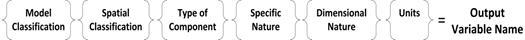

 

<h1>EnergyPlusTM Documentation</h1>

<h1>Guide for Module Developers</h1>
<h2>Everything You Need to Know about Developing Modules and Modifying EnergyPlus</h2>
 

<i>(but were hesitant to ask)</i>

 
 
 
 
 
 
 
 
 
 
 
 
 
 
 

<small>COPYRIGHT (c) 1996-2015 THE BOARD OF TRUSTEES OF THE UNIVERSITY OF ILLINOIS AND THE REGENTS OF THE UNIVERSITY OF CALIFORNIA THROUGH THE ERNEST ORLANDO LAWRENCE BERKELEY NATIONAL LABORATORY. ALL RIGHTS RESERVED. NO PART OF THIS MATERIAL MAY BE REPRODUCED OR TRANSMITTED IN ANY FORM OR BY ANY MEANS WITHOUT THE PRIOR WRITTEN PERMISSION OF THE UNIVERSITY OF ILLINOIS OR THE ERNEST ORLANDO LAWRENCE BERKELEY NATIONAL LABORATORY. ENERGYPLUS IS A TRADEMARK OF THE US DEPARTMENT OF ENERGY.</small>

Introduction
============

EnergyPlus is a modular simulation program designed to model the performance, energy consumption and pollutant production of a building. EnergyPlus models energy transport through the building envelope, heat gains within the building, and all the HVAC equipment used to heat and cool the building. The program is designed for ease of development. The concept is that many people will contribute to EnergyPlus and the program structure has been designed to make this possible.

EnergyPlus is written entirely in Fortran 90 with updates to Fortran 95 – all of EnergyPlus code should be at minimum Fortran 90 compliant and can accept the newer features of Fortran 95 as well. Fortran 90/95 is a powerful modern programming language with many features. Using Fortran 90/95 it is possible to program in many different styles. The EnergyPlus team has chosen a particular style that emphasizes code extensibility (ease of development), understandability, maintainability, and robustness. Less emphasis was placed on program speed and size. Fortran 90/95 has all the features that permit the creation of readable, maintainable, and extensible code. In particular, the ability to create data and program modules with various levels of data hiding allows EnergyPlus to be built out of semi-independent modules. This allows a new EnergyPlus developer to concentrate on programming a single component without having to learn the entire program and data structure.

The EnergyPlus programming style is described in the *EnergyPlus Programming Standard.* The *Programming Standard* should be consulted for details such as variable and subroutine naming conventions. In this document, we will describe the steps a developer must follow to create a new EnergyPlus component model. In particular, we will assume the developer wishes to simulate an HVAC component that cannot yet be modeled by EnergyPlus.

Modules in EnergyPlus
=====================

What is a module anyway?
------------------------

### Program Modules

A module is a Fortran 90/95 programming construct that can be used in various ways. In EnergyPlus, its primary use is to segment a rather large program into smaller, more manageable pieces. Each module is a separate package of source code stored on a separate file. The entire collection of modules, when compiled and linked, forms the executable code of EnergyPlus.

Each module contains source code for closely related data structures and procedures. For instance, the WeatherManager module contains all the weather handling routines in EnergyPlus. The module is contained in the file WeatherManager.f90.  Another example is PlantPumps. This module contains all the code to simulate pumps in EnergyPlus. It is contained in file PlantPumps.f90.

Of course dividing a program into modules can be done in various ways. We have attempted to create modules that are as self-contained as possible. The philosophy that has been used in creating EnergyPlus is contained in the [Programming Standard](file:///E:\Docs4PDFs\ProgrammingStandards.pdf) reference document.  Logically, the modules in EnergyPlus form an inverted tree structure. At the top is EnergyPlus. Just below that are ProcessInput and ManageSimulation. At the bottom are the modules such as HVACDamperComponent that model the actual HVAC components.

### Data Only Modules

EnergyPlus also uses modules that primary contain data and data structures that may be used by several modules. These modules form one of the primary ways data is structured and shared in EnergyPlus. An example is the DataEnvironment module. Many parts of the program need access to the outdoor conditions. All of that data is encapsulated in DataEnvironment. Modules that need this data obtain access through a Fortran USE statement. Without such access, modules cannot use or change this data.

Sometimes data modules are extended to perform certain utilities or even getting input for the data structures that are the primary focus of the module but this is not a standard approach.

What is a module developer?
---------------------------

A module developer is someone who is going to add to the simulation capabilities of EnergyPlus. Someone, for instance, who is interested in adding code to model a new type of HVAC equipment. The most straightforward way of doing this is to create a new program module – hence the term “module developer”.   Another kind of module developer would be the adaptation of an existing “legacy” code to EnergyPlus.

In EnergyPlus, one of the first steps in creating a new component model is to define the input. So, before we discuss modules in more detail, we must first describe the EnergyPlus input.

Adding new features
-------------------

The process for adding new features or significantly changing some features goes through a development team discussion period where the new feature is outlined, discussed and (hopefully) approved for inclusion.

The team has a New Feature Proposal template document that is available to anyone wishing to add a new feature to EnergyPlus (or to auxiliary programs around EnergyPlus). The full New Feature Proposal format is shown in Appendix F.

The sections of the New Feature Proposal are summarized in the following table:

Table 1. Sections of a New Feature Proposal

<table class="table table-striped">
<tr>
<td>Section</td>
<td>Description</td>
</tr>
<tr>
<td>Justification</td>
<td>Why is the feature important.  Impact on energy use. What energy aspects the feature is using.</td>
</tr>
<tr>
<td>Conference Call Conclusions</td>
<td>Conclusions from the discussions (email or conference call)</td>
</tr>
<tr>
<td>Other Conference Call topics</td>
<td>Items outside the scope of the feature might be brought up but not able to be accomplished.</td>
</tr>
<tr>
<td>Overview</td>
<td>Description of the feature and references</td>
</tr>
<tr>
<td>Approach</td>
<td>What approach will be used.</td>
</tr>
<tr>
<td>Testing/Validation data Sources</td>
<td>Required</td>
</tr>
<tr>
<td>IORef/Draft</td>
<td>IDD Objects (new or revised) as well as full IOReference text</td>
</tr>
<tr>
<td>Proposed Report Variables</td>
<td>What outputs will come out of this feature.</td>
</tr>
<tr>
<td>Proposed additions to meters</td>
<td>How the outputs will affect the meter output</td>
</tr>
<tr>
<td>Engineering Reference Draft</td>
<td>Draft text for the Engineering Reference document</td>
</tr>
<tr>
<td>Example File</td>
<td>What/how many example files will be included or used to support this feature</td>
</tr>
<tr>
<td>Transition changes</td>
<td>What will be the required changes for current input files for this feature</td>
</tr>
<tr>
<td>Other documents</td>
<td>Other references.</td>
</tr>
</table>

Then, of course, the document in Appendix G must be filled out and given to the proper people as well – to show that rights to the intellectual property of the new feature are owned by the developer.

Input Concepts
==============

In EnergyPlus, input and output are accomplished by means of ASCII (text) files. On the input side, there are two files:

1)   the Input Data Dictionary (IDD) that describes the types (classes) of input objects and the data associated with each object;

2)   the Input Data File (IDF) that contains all the data for a particular simulation.

Each EnergyPlus module is responsible for getting its own input. Of course, EnergyPlus provides services to the module that make this quite easy. The first task of a module developer is to design and insert a new entry into the Input Data Dictionary.

Input Data Dictionary
---------------------

An entry in the IDD consists of comma-separated text terminated by a semicolon. For instance:

**Coil:Heating:Water,**

       \\min-fields 14

  A1 , \\field Name

       \\required-field

       \\type alpha

       \\reference HeatingCoilName

       \\reference HeatingCoilsWater

  A2 , \\field Availability Schedule Name

       \\type object-list

       \\object-list ScheduleNames

  N1 , \\field U-Factor Times Area Value

       \\units W/K

       \\autosizable

       \\default Autosize

  N2 , \\field Maximum Water Flow Rate

       \\units m3/s

       \\autosizable

       \\ip-units gal/min

       \\default Autosize

  A3 , \\field Water Inlet Node Name

       \\required-field

  A4 , \\field Water Outlet Node Name

       \\required-field

  A5 , \\field Air Inlet Node Name

       \\required-field

  A6 , \\field Air Outlet Node Name

       \\required-field

  A7 , \\field Performance Input Method

       \\type Choice

       \\key UFactorTimesAreaAndDesignWaterFlowRate

       \\key NominalCapacity

       \\default UFactorTimesAreaAndDesignWaterFlowRate

  N3 , \\field Nominal Capacity

       \\type real

       \\units W

       \\autosizable

       \\minimum 0

       \\default Autosize

  N4 , \\field Design Inlet Water Temperature

       \\units C

       \\type real

       \\default 82.2

  N5, \\field Design Inlet Air Temperature

      \\units C

      \\type real

      \\default 16.6

  N6, \\field Design Outlet Water Temperature

      \\units C

      \\type real

      \\default 71.1

  N7; \\field Design Outlet Air Temperature

      \\units C

      \\type real

      \\default 32.2

This entry defines a simple water-heating coil and specifies all of the input data needed to model it. The following rules apply.

- The first element Coil:Heating:Water is the class name (also called a keyword or key).  This class name must be unique in the IDD.  The maximum length for the class name is 100 characters.  Embedded spaces are allowed and are significant.

- In most cases, one should have fields following the object name.  An object name by itself (terminated with a semicolon) is a “section” – there may be uses for sections in input but the “Getting” of input is not hierarchical – one typically gets all objects of one type and then all objects of the next type.

- In most cases, the second field of an object should be an “alpha” and the field name should contain the word “name”.  (This will allow for certain validations later on.)

- Commas separate fields.  They always act as separators – thus there is no way to include a comma in a class name or as part of a data field.

- Similarly, semicolons are terminators – a semicolon is always interpreted as the end of an EnergyPlus “sentence”. So, avoid embedded semicolons in class names or data fields.

- Blank lines are allowed.

- Each line can be up to 500 characters in length.

- The comment character is an exclamation or a backslash.  Anything on a line after an “!” or a “\\” is ignored during EnergyPlus input.

The only significant syntax elements are the commas, the semicolon, the N’s (denoting numeric data), and the A’s (denoting alphanumeric data) and the exclamation and backslash.  Everything else including blanks, end of lines, or even text that is not a comma, semicolon, N, or A is ignored.  There are several style conventions in use however.

- Sequence numbers are appended to the letters A or N denoting each data element.  Thus, A2 is the second alphanumeric data item and N3 is the third numeric data item.

- The class name contains a naming convention: type:subtype:subsubtype. For further naming conventions, please see the next section of this document.

- Backslashes denote specially formatted comments. These comments provide information about the input, such as a description of the item, units, limits, mins & maxes, etc., in a form that can be processed by an input editor or interface. A complete description of the backslash comment format is given at the start of the IDD file and in the Guide for Interface Developers.  While these are “comments”, they are quite important and allow the InputProcessor module to do some error checking for you.   They are also used by the IDFEditor that many users continue to use and by interface developers in understanding EnergyPlus.

- **\\default** – the number (N fields) or phrase (A fields) after this special field will be filled for any input file that has a blank in that field.

- **\\minimum** or **\\minimum&gt;** -- the number following this special field will be automatically checked during input

- **\\maximum** or **\\maximum&lt;** -- the number following this special field will be automatically checked during input

- **\\extensible:\#** – allows you to structure your GetInput routine so that the object arguments can be expanded (you include the number of fields in the “extension” and the Input Processor can automatically extend IDD definitions) – you will still need to determine how many maximum arguments are in the object. The IDF Editor does not use this field and cannot auto-extend such objects if an IDF is encountered that has a greater number of fields than IDD allows.

- **\\type integer** – (or **real** or **alpha**) – this field has gained increased importance after a user kept hitting an internal maximum detected by the program and kept increasing their input number until it overflowed the system’s integer size. Until all types are shown on numeric fields it will be hard for the InputProcessor to provide proper error detection.

- **There are many more \\ fields** – these are described at the top of the IDD.

Overall, the IDD file has very little structure.  Generally, a new entry should be placed next to entries describing similar components.  *Coil:Heating:Water*, for instance, is grouped with entries describing other water coils.

**Summary**

One of the early tasks for a module developer is to create a new entry in the Input Data Dictionary.  This entry defines the data needed to model the new component.

Data Dictionary Naming Conventions
----------------------------------

### Class (Object) Names

Class names shall be written in camel case where words are joined together without spaces and each word is capitalized. The colon shall be used to delimit hierarchy moving from general to specific. Natural language terminology shall be used when possible for each member separated by colons.

Example: ZoneHVAC:PackagedTerminalHeatPump

### Field Names

Field names shall be written in title case where every major word is capitalized (exceptions: "a", "the", "for", etc.) with spaces separating words.  Field names shall be written using natural language terminology but should be relatively concise (no unnecessary abbreviations or acronyms).  If the field is for the name of this object, the field name shall simply be "Name" to eliminate redundancy.  The nature of an alpha field shall be explicit, for instance, "Availability Schedule Name" instead of merely "Availability Schedule". Generally, the object is not also included as the field name.

Example: Availability Schedule Name

When object names/types are included as part of the input, then the field name should contain “Object Type”:

Example: Zone Equipment 1 Object Type

### Choice Names

When field choices list object references, the field choices shall list the class/object type name the same as its class definition in the IDD.  When field choices list other key words, the field choice names shall be written in camel case where words are joined together without spaces and each word is capitalized.  Field choice names shall be written using natural language terminology but should be relatively concise (no unnecessary abbreviations or acronyms) and avoid overly lengthy key words.  Field choice names shall only use alphanumeric characters with the addition of the forward slash ("/") character as a concise alternative to the word "per"; colons shall be allowed if the field choices are class names.

  A2 , \\field Period Selection

       \\retaincase

       \\note Following is a list of all possible types of Extreme and Typical periods that

       \\note might be identified in the Weather File. Not all possible types are available

       \\note for all weather files.

       \\type choice

       \\key SummerExtreme

       \\key SummerTypical

       \\key WinterExtreme

       \\key WinterTypical

       \\key AutumnTypical

       \\key SpringTypical

       \\key WetSeason

       \\key DrySeason

       \\key NoDrySeason

       \\key NoWetSeason

       \\key TropicalHot

       \\key TropicalCold

Input Data File
---------------

The Input Data File (IDF) is the file containing the data for an actual simulation.  This file is also a text (ASCII) file with a syntax “filling in the blanks” of the definitions in the IDD.  A portion of an IDF with input data for the hot water coil defined in the IDD example looks like:

  Coil:Heating:Water,

    SPACE1-1 Zone Coil,      !- Name

    ReheatCoilAvailSched,    !- Availability Schedule Name

    autosize,                !- U-Factor Times Area Value {W/K}

    autosize,                !- Maximum Water Flow Rate {m3/s}

    SPACE1-1 Zone Coil Water In Node,  !- Water Inlet Node Name

    SPACE1-1 Zone Coil Water Out Node,  !- Water Outlet Node Name

    SPACE1-1 Zone Coil Air In Node,  !- Air Inlet Node Name

    SPACE1-1 In Node,        !- Air Outlet Node Name

    UFactorTimesAreaAndDesignWaterFlowRate,  !- Performance Input Method

    autosize,                !- Nominal Capacity {W}

    82.2,                    !- Design Inlet Water Temperature {C}

    16.6,                    !- Design Inlet Air Temperature {C}

    71.1,                    !- Design Outlet Water Temperature {C}

    32.2;                    !- Design Outlet Air Temperature {C}

  Coil:Heating:Water,

    SPACE2-1 Zone Coil,      !- Name

    ReheatCoilAvailSched,    !- Availability Schedule Name

    autosize,                !- U-Factor Times Area Value {W/K}

    autosize,                !- Maximum Water Flow Rate {m3/s}

    SPACE2-1 Zone Coil Water In Node,  !- Water Inlet Node Name

    SPACE2-1 Zone Coil Water Out Node,  !- Water Outlet Node Name

    SPACE2-1 Zone Coil Air In Node,  !- Air Inlet Node Name

    SPACE2-1 In Node,        !- Air Outlet Node Name

    UFactorTimesAreaAndDesignWaterFlowRate,  !- Performance Input Method

    autosize,                !- Nominal Capacity {W}

    82.2,                    !- Design Inlet Water Temperature {C}

    16.6,                    !- Design Inlet Air Temperature {C}

    71.1,                    !- Design Outlet Water Temperature {C}

    32.2;                    !- Design Outlet Air Temperature {C}

  Coil:Heating:Water,

    SPACE3-1 Zone Coil,      !- Name

    ReheatCoilAvailSched,    !- Availability Schedule Name

    autosize,                !- U-Factor Times Area Value {W/K}

    autosize,                !- Maximum Water Flow Rate {m3/s}

    SPACE3-1 Zone Coil Water In Node,  !- Water Inlet Node Name

    SPACE3-1 Zone Coil Water Out Node,  !- Water Outlet Node Name

    SPACE3-1 Zone Coil Air In Node,  !- Air Inlet Node Name

    SPACE3-1 In Node,        !- Air Outlet Node Name

    UFactorTimesAreaAndDesignWaterFlowRate,  !- Performance Input Method

    autosize,                !- Nominal Capacity {W}

    82.2,                    !- Design Inlet Water Temperature {C}

    16.6,                    !- Design Inlet Air Temperature {C}

    71.1,                    !- Design Outlet Water Temperature {C}

    32.2;                    !- Design Outlet Air Temperature {C}

Each coil entry begins with the class name (keyword) specifying the type of coil.  Next is the coil name – a user (or interface) created name that is unique within the given class.  Generally in EnergyPlus, objects within a class are distinguished by unique names.  The object name is usually the first data element following the class name.  Any alphanumeric data item in the IDF can be up to 100 characters long.  Any characters past 100 are truncated (lost). After the object name comes the real data.  If we look at the IDD we see that the first data item after the object name is expected to be an alphanumeric – a schedule name. In the IDF, we see the corresponding field is “ReheatCoilAvailSched”, the object name of a schedule elsewhere in the IDF file. In EnergyPlus, all references to other data entries (objects) are via object names.  The next two data items are numeric: the coil UA and the maximum water mass flow rate. The final four items are again alphanumeric – the names of the coil inlet and outlet nodes. Nodes are used in EnergyPlus to connect HVAC components together into HVAC systems.

The example illustrates the use of comments to create clear input.  The IDF is intended to be human readable, largely for development and debugging purposes.  Of course, most users will never see an IDF – they will interact with EnergyPlus through a Graphical User Interface (GUI), which will write the IDF for them.  However, a module developer is a special kind of user.  The module developer will need to create a portion of an IDF by hand very early in the development process in order to begin testing the module under development.  Thus, it is important to understand the IDF syntax and to use comments to create readable test IDF files.

**Summary**

One of the early tasks of a module developer is to create input (most likely by hand) for the new component and to insert it into an existing IDF file in order to test the new component model.  The IDF syntax resembles the syntax for the IDD.  The data follows the IDD class description.  Comments should be used to make the IDF readable.

Input Considerations
--------------------

The IDD/IDF concept allows the module developer much flexibility.  Along with this flexibility comes a responsibility to the overall development of EnergyPlus. Developers must take care not to obstruct other developers with their additions or changes.  Major changes in the IDD require collaboration among the developers (both module and interface).

In many cases, the developer may be creating a new model – a new HVAC component, for instance. Then the most straightforward approach is to create a new object class in the IDD with its own unique, self-contained input. This will seldom impact other developers.

In some cases, the developer may be adding a calculation within an existing module or for an existing class of objects. This calculation may require new or different input fields. Then the developer has a number of choices. This section will present some ideas for adding to the IDD that will minimize impact to other developers.

For example, consider the implementation of Other Side Coefficients (OSC) in the IDD.  Other side coefficients are a simplification for the surface heat balance and were used mostly in BLAST 2.0 before we had interzone surfaces.  We have carried this forward into EnergyPlus for those users that understand and can use it.  We’ll use it as an example of approaches to adding data items to the IDD.  Moreover, we’ll try to give some hints on which approaches might be used for future additions.

So, you're adding something to EnergyPlus and it is part of an existing module or object class.  What do you do with your required inputs to your model?  There are at least four options:

- Embed your values in a current object class definition.

- Put something in the current definition that will trigger a "GetInput" for your values.

- Put something in the current definition that will signal a "special" case and embed a name (of your item) in the definition (this adds 1 or 2 properties to the object).

- Just get your input and have each of those inputs reference a named object.

For example, using the OSC option in surfaces, in the beta 2 version of EnergyPlus we had

  A8 , \\field Exterior environment

       \\type alpha

       \\note &lt;for Interzone Surface:Adjacent surface name&gt;

       \\note For non-interzone surfaces enter:

       \\note ExteriorEnvironment, Ground, or OtherSideCoeff

       \\note OSC won't use CTFs

  N24, \\field User selected Constant Temperature

  N25, \\field Coefficient modifying the user selected constant

              temperature

  N26, \\field Coefficient modifying the external dry bulb temperature

  N27, \\field Coefficient modifying the ground temperature

  N28, \\field Combined convective/radiative film coefficient

       \\note if=0, use other coefficients

  N29, \\field Coefficient modifying the wind speed term (s/m)

  N30, \\field Coefficient modifying the zone air temperature part of

              the equation

**1)  **We have done option 1: embed the values in the input.  (We have also embedded these values in each and every surface derived type (internal data structure) but that can be discussed elsewhere).

When to use:  It makes sense to embed these values when each and every object (SURFACE) needs these values (e.g. we need to specify Vertices for Every Surface -- so these clearly should be embedded).

After beta 2, the definition of Surfaces was changed. Obviously option 1 was not a good choice for the OSC data: the data would be rarely used. Our other options were:

**2)  **Obviously the ExteriorEnvironment field will remain (but its name was changed to Outside Face Environment).

However, we do not want to embed the values for OtherSideCoef in the Surface items.  So, if the ExteriorEnvironment continues to reference OtherSideCoef, we can easily trigger a "GetInput" for them.  An additional object class would be necessary for this case.

OtherSideCoef,  A1, \\field name of OtherSideCoef,

  A2, \\field SurfaceName (reference to surface using OSC)

  ....

When to use:  This option can be used for many cases.  The same object definition will work for option 4 below.  Obviously, if there is not a convenient trigger in SURFACE but you want to add a feature, this would let you do it without embedding it in the Surface Definition.  If there is a trigger, such as exists with the ExteriorEnvironment, the A2 field might not be needed.  This approach would become a bit cumbersome if you expected there to be a lot of these or if there were a one-to-many relationship (i.e. a single set of OSCs could be used for many surfaces).  Nevertheless, the approach provides a convenient "data check"/cross reference that can be validated inside the code.

**3)  **We could also have the SURFACE definition reference an OSC name (in this instance).

So, we'd add a field to the Surface that would be the name in the OtherSideCoef object above.  Then, the OtherSideCoef objects wouldn’t need a Surface Name. This is the most straightforward approach: including data in one object by referencing another and it was the approach chosen for the redefined Surface class.

When to use:  when there is a set of parameters that would be used extensively, then this would provide a name for those.  If hand editing, then you only would need to change one set of these parameters rather than having to go through many.  Of course, the OtherSideCoef object wouldn’t also have to have the true numbers but could reference yet a third named object...... (starting to get messy).

**4)  **We could have the OtherSideCoef object as above and just "get" it as a matter of course.  (e.g., in the case where we don’t have a convenient trigger such as ExteriorEnvironment).

When to use:  Note that the same structure for 2 works here too.  It's just not triggered (to get the input) by a value in the other object (SURFACE).

**Summary**

There are several approaches to adding items to the IDD.  Developers need to consider impacts to other developers and users early in the implementation planning.

Advanced Input Considerations
-----------------------------

Creating a new module/adding a new feature to EnergyPlus is a good accomplishment.  However, it is likely that future additions will be done and will impact any objects created.  In this regard, we ask that module developers take a longer view than “just getting my thing” going.

For example, in the “Fan Coil” object, prior to the V1.2 release, the object definition specified a cooilng coil name.  *But it did not specify a cooling coil type.*  Rather than restrict coil names to be unique over all coils (which becomes difficult as more coil types are added), the developers only have unique names within a type.  Thus, it would become difficult for the Fan Coil module to get the proper link to the correct cooling coil.

In the V1.2 release, a cooling coil type was added to the object.  But the resulting object is less readable now. For upwards compatibility, the coil type was placed at the end of the object whereas the coil name is in the middle.  If this had been thought of earlier, then the coil type and coil name could be in succeeding fields in the object definition.

The “standard” for describing such fields would be to list the “coil type” and then the “coil name” fields, such as in the UNITARYSYSTEM:HEATPUMP:AIRTOAIR object.

The point – try to envision future changes in making up objects, even if you think “that will never happen”.  You do not have to try to address every future case, only the most likely.

**ZoneHVAC:FourPipeFanCoil,**

        \\min-fields 21

   A1 , \\field Name

        \\required-field

   A2 , \\field Availability Schedule Name

        \\required-field

        \\type object-list

        \\object-list ScheduleNames

   N1 , \\field Maximum Supply Air Flow Rate

        \\required-field

        \\autosizable

        \\units m3/s

   N2 , \\field Maximum Outdoor Air Flow Rate

        \\required-field

        \\autosizable

        \\units m3/s

   &lt;snip&gt;

**   A11, \\field Cooling Coil Name**

        \\required-field

        \\type object-list

        \\object-list CoolingCoilsWater

   N3 , \\field Maximum Cold Water Flow Rate

        \\required-field

        \\autosizable

        \\units m3/s

        \\ip-units gal/min

  &lt;snip&gt;

   **A13; \\field Cooling Coil Object Type**

        \\required-field

        \\type choice

        \\key Coil:Cooling:Water

        \\key Coil:Cooling:Water:DetailedGeometry

        \\key CoilSystem:Cooling:Water:HeatExchangerAssisted

DataSets
--------

Akin to the libraries of other programs, EnergyPlus uses data sets.  Data sets are similar to libraries but many items are contained in a single file (usually input file format or sometimes macro format).  Developers are encouraged, as appropriate, to submit data sets along with new features.  Some of the existing data sets include:

- Materials properties

- Construction elements (layers of materials)

- Composite construction definitions (equivalent constructions for complex elements)

- Solar Collector parameters

- Economic Tariffs

- Design Day definitions

- Location definitions

- Standard report definitions

Module Structure
================

Let us assume that the novice EnergyPlus developer wishes to model a new HVAC component called *NewHVACComponent*.  Right at the start there is a choice to make: whether to insert the new model into an existing module or to create an entirely new EnergyPlus component simulation model.  Creating a new module is the easier option to explain, implement and test. We will discuss this option in this document.  The discussion should also impart enough information to allow a new developer to insert a model into an existing EnergyPlus module if that option is chosen.

If you intend that the module will become part of the distributed EnergyPlus, follow the guidance in the Programming Standard document.  Even if you don’t intend that your module will become part of EnergyPlus – but you might want some advice from one of the core development team, follow the guidance in the Programming Standard.

Module Outline
--------------

The developer will create a new file NewHVACComponent.f90.  The file shall contain the following elements:

Note – even if your component does not need some of the suggested modules, you should include “stub” routines for these.

**MODULE**NewHVACComponent

*Documentation:* Fortran comments describing and documenting the module. Included are sections showing module author, module creation date, date modified and modification author.  Each routine and/or function should also follow the documentation guidelines as shown in the templates.

*USE Statements:* Fortran statements naming other modules that this module can access, either for data or for routines.

*Module Parameters:* If you will be implementing more than one “type” of component in the module, it is a good idea to assign numeric parameters to each type so as to retain readability yet reduce alpha comparisons which are notoriously slow for most systems.  Assign numeric parameters to alphanumeric fields within a class type (.e.g. object UnitarySystem:HeatPump, field Fan Placement: “blow through” or “draw through”) when this information is required in init, calc, update or report subroutines to further reduce alpha comparisons.  Use string comparison only in GetInput subroutines.

*Module Data structure Definitions:* Using the Fortran TYPE statement define the data structures needed in the module that will not be available from other modules. Define all module level variables that will be needed.

Typically, you define your module’s data structure within the module.  If this data must be used by multiple modules, you should define a separate Data module for the data.

Character strings in structures are not allowed (except for name of object) – any exceptions must be approved. Schedule names, curve object names, and child object types MUST all be referenced by an integer.

For existing code, convert all character string structure variables to integer parameters and delete the character variable from the structure. Also delete unused strings rather than converting to integer. Do not use structure variable to store information used only during GetInput even if you think it could be used in the future, use local variables instead. Usually won't hurt anything until some user puts a large number of objects in their input (memory use impact).

Currently, the furnace structure includes many that should not be there. SuppHeatCoilType is an example of a character string structure variable that is only used in GetInput and is not needed in the structure. Should have been a local instead. And CoolingPLFFPLR and HeatingPLFFPLR structure variables are not even used.

***CONTAINS***

***SUBROUTINE*** *SimNewHVACComponent*

This routine selects the individual component being simulated and calls the other module subroutines that do the real work. This routine is the only routine in the module that is accessible outside the module (*PUBLIC*). All other routines in the module are *PRIVATE* and are only callable within the module. This routine is sometimes called the “driver” routine for the module.

***END SUBROUTINE*** *SimNewHVACComponent*

***SUBROUTINE*** *GetNewHVACComponentInput*

This routine uses the “get” routines from the InputProcessor module to obtain input for NewHVACComponent. The module data arrays are allocated and the data is moved into the arrays.

***END SUBROUTINE*** *GetNewHVACComponentInput*

***SUBROUTINE*** *InitNewHVACComponent*

This routine performs whatever initialization calculations that may be needed at various points in the simulation. For instance, some calculations may only need to be done once; some may need to be done at the start of each simulation weather period; some at the start of each HVAC simulation time step; and some at the start of each loop solution. This routine also transfers data from the component inlet nodes to the component data arrays every time the component is simulated, in preparation for the actual component simulation.

***END SUBROUTINE*** *InitNewHVACComponent*

***SUBROUTINE*** *SizeNewHVACComponent*

This routine can create the sizing options (if applicable) for the component or be left as a placeholder for later manipulation for sizing purposes.

***END SUBROUTINE*** *SizeNewHVACComponent*

***SUBROUTINE*** *CalcNewHVACComponent*

This routine does the actual calculations to simulate the performance of the component. Only calculation is done – there is no moving of data from or to input or output areas. There may be more than one “*CALC*” subroutine if more than one component is being modeled within this module.

***END SUBROUTINE*** *CalcNewHVACComponent*

***SUBROUTINE*** *UpdateNewHVACComponent*

This routine moves the results of the “*Calc*” routine(s) to the component outlet nodes.

***END SUBROUTINE*** *UpdateNewHVACComponent*

***SUBROUTINE*** *ReportNewHVACComponent*

This routine performs any special calculations that are needed purely for reporting purposes.

***END SUBROUTINE*** *ReportNewHVACComponent*

***Utility Routines (as appropriate) – in the Fan module we allow outside modules to access internal fan inlets, outlets, and design volume flow rate.***

***END MODULE*** *NewHVACComponent*

Module Example
--------------

This example can be used as a template for new HVAC component modules. In particular, the commenting structure in the module and within the subroutines should be followed closely. Of course, there is no perfect example module – this one is particularly simple. Some others that might be examined are in files Humidifiers.f90, HVACHeatingCoils.f90 and PlantChillers.f90. Templates are also available as separate files.

In particular, the module template with routines contains structure and information pertinent to module development.

Note that in the following module, the “Data IPShortcuts” is not used – rather those variables are allocated within this module – likely because another module calls this one during input.

**Module Fans**

  ! Module containing the fan simulation routines

  ! MODULE INFORMATION:

  !       AUTHOR         Richard J. Liesen

  !       DATE WRITTEN   April 1998

  !       MODIFIED       Shirey, May 2001

  !       RE-ENGINEERED  na

  ! PURPOSE OF THIS MODULE:

  ! To encapsulate the data and algorithms required to

  ! manage the Fan System Component

  ! REFERENCES: none

  ! OTHER NOTES: none

  ! USE STATEMENTS:

  ! Use statements for data only modules

USE DataPrecisionGlobals

USE DataLoopNode

USE DataHVACGlobals, ONLY: TurnFansOn, TurnFansOff, Main, Cooling, Heating, Other, &

          OnOffFanPartLoadFraction, SmallAirVolFlow, UnbalExhMassFlow, NightVentOn, cFanTypes, &

          FanType\_SimpleConstVolume, FanType\_SimpleVAV, FanType\_SimpleOnOff, FanType\_ZoneExhaust

USE DataGlobals,     ONLY: SetupOutputVariable, BeginEnvrnFlag, BeginDayFlag, MaxNameLength, &

       ShowWarningError, ShowFatalError, ShowSevereError, HourofDay, SysSizingCalc, CurrentTime, &

       OutputFileDebug, ShowContinueError, ShowRecurringWarningErrorAtEnd, WarmupFlag, &

                           ShowContinueErrorTimeStamp

Use DataEnvironment, ONLY: StdBaroPress, DayofMonth, Month, StdRhoAir

USE Psychrometrics,  ONLY:PsyRhoAirFnPbTdbW, PsyTdbFnHW, PsyCpAirFnWTdb

  ! Use statements for access to subroutines in other modules

USE ScheduleManager

IMPLICIT NONE         ! Enforce explicit typing of all variables

PRIVATE ! Everything private unless explicitly made public

  !MODULE PARAMETER DEFINITIONS

  !na

  ! DERIVED TYPE DEFINITIONS

TYPE FanEquipConditions

  CHARACTER(len=MaxNameLength) :: FanName  =' '  ! Name of the fan

  CHARACTER(len=MaxNameLength) :: FanType  =' '  ! Type of Fan ie. Simple, Vane axial, Centrifugal, etc.

  CHARACTER(len=MaxNameLength) :: Schedule =' '  ! Fan Operation Schedule

  INTEGER      :: FanType\_Num              =0    ! DataHVACGlobals fan type

  Integer      :: SchedPtr                 =0    ! Pointer to the correct schedule

  REAL(r64)    :: InletAirMassFlowRate     =0.0  !MassFlow through the Fan being Simulated [kg/Sec]

  REAL(r64)    :: OutletAirMassFlowRate    =0.0

  REAL(r64)    :: MaxAirFlowRate           =0.0  !Max Specified Volume Flow Rate of Fan [m3/sec]

  REAL(r64)    :: MinAirFlowRate           =0.0  !Min Specified Volume Flow Rate of Fan [m3/sec]

  REAL(r64)    :: MaxAirMassFlowRate       =0.0  ! Max flow rate of fan in kg/sec

  REAL(r64)    :: MinAirMassFlowRate       =0.0  ! Min flow rate of fan in kg/sec

  REAL(r64)    :: InletAirTemp             =0.0

  REAL(r64)    :: OutletAirTemp            =0.0

  REAL(r64)    :: InletAirHumRat           =0.0

  REAL(r64)    :: OutletAirHumRat          =0.0

  REAL(r64)    :: InletAirEnthalpy         =0.0

  REAL(r64)    :: OutletAirEnthalpy        =0.0

  REAL(r64)    :: FanPower                 =0.0  !Power of the Fan being Simulated [kW]

  REAL(r64)    :: FanEnergy                =0.0  !Fan energy in [kJ]

  REAL(r64)    :: FanRuntimeFraction       =0.0  !Fraction of the timestep that the fan operates

  REAL(r64)    :: DeltaTemp                =0.0  !Temp Rise across the Fan [C]

  REAL(r64)    :: DeltaPress               =0.0  !Delta Pressure Across the Fan [N/m2]

  REAL(r64)    :: FanEff                   =0.0  !Fan total efficiency; motor and mechanical

  REAL(r64)    :: MotEff                   =0.0  !Fan motor efficiency

  REAL(r64)    :: MotInAirFrac             =0.0  !Fraction of motor heat entering air stream

  REAL(r64), Dimension(5):: FanCoeff            =0.0  !Fan Part Load Coefficients to match fan type

  ! Mass Flow Rate Control Variables

  REAL(r64)    :: MassFlowRateMaxAvail     =0.0

  REAL(r64)    :: MassFlowRateMinAvail     =0.0

  REAL(r64)    :: RhoAirStdInit            =0.0

  INTEGER      :: InletNodeNum             =0

  INTEGER      :: OutletNodeNum            =0

  INTEGER      :: NVPerfNum                =0

  INTEGER      :: FanPowerRatAtSpeedRatCurveIndex  =0

  INTEGER      :: FanEffRatioCurveIndex    =0

  CHARACTER(len=MaxNameLength) :: EndUseSubcategoryName=' '

  LOGICAL      :: OneTimePowerRatioCheck = .TRUE. ! one time flag used for error message

  LOGICAL      :: OneTimeEffRatioCheck = .TRUE.   ! one time flag used for error message

END TYPE FanEquipConditions

TYPE NightVentPerfData

  CHARACTER(len=MaxNameLength) :: FanName  =' ' ! Name of the fan that will use this data

  REAL(r64)    :: FanEff                   =0.0 !Fan total efficiency; motor and mechanical

  REAL(r64)    :: DeltaPress               =0.0 !Delta Pressure Across the Fan [N/m2]

  REAL(r64)    :: MaxAirFlowRate           =0.0 !Max Specified Volume Flow Rate of Fan [m3/s]

  REAL(r64)    :: MaxAirMassFlowRate       =0.0 ! Max flow rate of fan in kg/sec

  REAL(r64)    :: MotEff                   =0.0 !Fan motor efficiency

  REAL(r64)    :: MotInAirFrac             =0.0 !Fraction of motor heat entering air stream

END TYPE NightVentPerfData

  !MODULE VARIABLE DECLARATIONS:

  INTEGER :: NumFans     =0 ! The Number of Fans found in the Input

  INTEGER :: NumNightVentPerf =0 ! number of FAN:NIGHT VENT PERFORMANCE objects found in the input

  TYPE (FanEquipConditions), ALLOCATABLE, DIMENSION(:) :: Fan

  TYPE (NightVentPerfData), ALLOCATABLE, DIMENSION(:)  :: NightVentPerf

  LOGICAL :: GetFanInputFlag = .True.  ! Flag set to make sure you get input once

! Subroutine Specifications for the Module

          ! Driver/Manager Routines

**Public  SimulateFanComponents**

          ! Get Input routines for module

PRIVATE GetFanInput

          ! Initialization routines for module

PRIVATE InitFan

PRIVATE SizeFan

          ! Algorithms for the module

Private SimSimpleFan

PRIVATE SimVariableVolumeFan

PRIVATE SimZoneExhaustFan

          ! Update routine to check convergence and update nodes

Private UpdateFan

          ! Reporting routines for module

Private ReportFan

CONTAINS

! MODULE SUBROUTINES:

!\*\*\*\*\*\*\*\*\*\*\*\*\*\*\*\*\*\*\*\*\*\*\*\*\*\*\*\*\*\*\*\*\*\*\*\*\*\*\*\*\*\*\*\*\*\*\*\*\*\*\*\*\*\*\*\*\*\*\*\*\*\*\*\*\*\*\*\*\*\*\*\*\*

**SUBROUTINE SimulateFanComponents(CompName,FirstHVACIteration)**

          ! SUBROUTINE INFORMATION:

          !       AUTHOR         Richard Liesen

          !       DATE WRITTEN   February 1998

          !       MODIFIED       na

          !       RE-ENGINEERED  na

          ! PURPOSE OF THIS SUBROUTINE:

          ! This subroutine manages Fan component simulation.

          ! METHODOLOGY EMPLOYED:

          ! na

          ! REFERENCES:

          ! na

          ! USE STATEMENTS:

  USE InputProcessor, ONLY: FindItemInList

  IMPLICIT NONE    ! Enforce explicit typing of all variables in this routine

          ! SUBROUTINE ARGUMENT DEFINITIONS:

  CHARACTER(len=\*), INTENT(IN) :: CompName

  LOGICAL,      INTENT (IN):: FirstHVACIteration

          ! SUBROUTINE PARAMETER DEFINITIONS:

          ! na

          ! INTERFACE BLOCK SPECIFICATIONS

          ! DERIVED TYPE DEFINITIONS

          ! na

          ! SUBROUTINE LOCAL VARIABLE DECLARATIONS:

  INTEGER             :: FanNum     ! current fan number

  LOGICAL,SAVE        :: GetInputFlag = .True.  ! Flag set to make sure you get input once

          ! FLOW:

  ! Obtains and Allocates fan related parameters from input file

  IF (GetInputFlag) THEN  !First time subroutine has been entered

    CALL GetFanInput

    GetInputFlag=.false.

  End If

  ! Find the correct FanNumber with the AirLoop & CompNum from AirLoop Derived Type

  !FanNum = AirLoopEquip(AirLoopNum)%ComponentOfTypeNum(CompNum)

  ! Determine which Fan given the Fan Name

  FanNum =   FindItemInList(CompName,Fan%FanName,NumFans)

  IF (FanNum == 0) THEN

    CALL ShowFatalError('Fan not found='//TRIM(CompName))

  ENDIF

  ! With the correct FanNum Initialize

  CALL InitFan(FanNum,FirstHVACIteration)  ! Initialize all fan related parameters

  ! Calculate the Correct Fan Model with the current FanNum

  IF (Fan(FanNum)%FanType\_Num == FanType\_SimpleConstVolume) THEN

    Call SimSimpleFan(FanNum)

  Else IF (Fan(FanNum)%FanType\_Num == FanType\_SimpleVAV) THEN

    Call SimVariableVolumeFan(FanNum)

  Else If (Fan(FanNum)%FanType\_Num == FanType\_SimpleOnOff) THEN

    Call SimOnOffFan(FanNum)

  Else If (Fan(FanNum)%FanType\_Num == FanType\_ZoneExhaust) THEN

    Call SimZoneExhaustFan(FanNum)

  End If

  ! Update the current fan to the outlet nodes

  Call UpdateFan(FanNum)

  ! Report the current fan

  Call ReportFan(FanNum)

  RETURN

**END SUBROUTINE SimulateFanComponents**

! Get Input Section of the Module

!\*\*\*\*\*\*\*\*\*\*\*\*\*\*\*\*\*\*\*\*\*\*\*\*\*\*\*\*\*\*\*\*\*\*\*\*\*\*\*\*\*\*\*\*\*\*\*\*\*\*\*\*\*\*\*\*\*\*\*\*\*\*\*\*\*\*\*\*\*\*\*\*\*\*\*\*\*\*

**SUBROUTINE GetFanInput**

          ! SUBROUTINE INFORMATION:

          !       AUTHOR         Richard Liesen

          !       DATE WRITTEN   April 1998

          !       MODIFIED       Shirey, May 2001

          !       RE-ENGINEERED  na

          ! PURPOSE OF THIS SUBROUTINE:

          ! Obtains input data for fans and stores it in fan data structures

          ! METHODOLOGY EMPLOYED:

          ! Uses "Get" routines to read in data.

          ! REFERENCES:

          ! na

          ! USE STATEMENTS:

    USE InputProcessor

    USE NodeInputManager,      ONLY: GetOnlySingleNode

    USE CurveManager,          ONLY: GetCurveIndex

    USE BranchNodeConnections, ONLY: TestCompSet

!    USE DataIPShortCuts

  IMPLICIT NONE    ! Enforce explicit typing of all variables in this routine

          ! SUBROUTINE ARGUMENT DEFINITIONS:

          ! na

          ! SUBROUTINE PARAMETER DEFINITIONS:

          ! na

          ! INTERFACE BLOCK SPECIFICATIONS

          ! na

          ! DERIVED TYPE DEFINITIONS

          ! na

          ! SUBROUTINE LOCAL VARIABLE DECLARATIONS:

    INTEGER :: FanNum      ! The fan that you are currently loading input into

    INTEGER :: NumSimpFan  ! The number of Simple Const Vol Fans

    INTEGER :: NumVarVolFan ! The number of Simple Variable Vol Fans

    INTEGER :: NumOnOff     ! The number of Simple on-off Fans

    INTEGER :: NumZoneExhFan

    INTEGER :: SimpFanNum

    INTEGER :: OnOffFanNum

    INTEGER :: VarVolFanNum

    INTEGER :: ExhFanNum

    INTEGER :: NVPerfNum

    LOGICAL :: NVPerfFanFound

    INTEGER :: NumAlphas

    INTEGER :: NumNums

    INTEGER :: IOSTAT

    LOGICAL :: ErrorsFound = .false.   ! If errors detected in input

    LOGICAL :: IsNotOK               ! Flag to verify name

    LOGICAL :: IsBlank               ! Flag for blank name

    CHARACTER(len=\*), PARAMETER    :: RoutineName='GetFanInput: ' ! include trailing blank space

    CHARACTER(len=MaxNameLength+40),ALLOCATABLE, DIMENSION(:) :: cAlphaFieldNames

    CHARACTER(len=MaxNameLength+40),ALLOCATABLE, DIMENSION(:) :: cNumericFieldNames

    LOGICAL, ALLOCATABLE, DIMENSION(:) :: lNumericFieldBlanks

    LOGICAL, ALLOCATABLE, DIMENSION(:) :: lAlphaFieldBlanks

    CHARACTER(len=MaxNameLength),ALLOCATABLE, DIMENSION(:) :: cAlphaArgs

    REAL(r64),ALLOCATABLE, DIMENSION(:) :: rNumericArgs

    CHARACTER(len=MaxNameLength) :: cCurrentModuleObject

    INTEGER :: NumParams

    INTEGER :: MaxAlphas

    INTEGER :: MaxNumbers

          ! Flow

    MaxAlphas=0

    MaxNumbers=0

    NumSimpFan   = GetNumObjectsFound('Fan:ConstantVolume')

    IF (NumSimpFan &gt; 0) THEN

      CALL GetObjectDefMaxArgs('Fan:ConstantVolume',NumParams,NumAlphas,NumNums)

      MaxAlphas=MAX(MaxAlphas,NumAlphas)

      MaxNumbers=MAX(MaxNumbers,NumNums)

    ENDIF

    NumVarVolFan = GetNumObjectsFound('Fan:VariableVolume')

    IF (NumVarVolFan &gt; 0) THEN

      CALL GetObjectDefMaxArgs('Fan:VariableVolume',NumParams,NumAlphas,NumNums)

      MaxAlphas=MAX(MaxAlphas,NumAlphas)

      MaxNumbers=MAX(MaxNumbers,NumNums)

    ENDIF

    NumOnOff = GetNumObjectsFound('Fan:OnOff')

    IF (NumOnOff &gt; 0) THEN

      CALL GetObjectDefMaxArgs('Fan:OnOff',NumParams,NumAlphas,NumNums)

      MaxAlphas=MAX(MaxAlphas,NumAlphas)

      MaxNumbers=MAX(MaxNumbers,NumNums)

    ENDIF

    NumZoneExhFan = GetNumObjectsFound('Fan:ZoneExhaust')

    IF (NumZoneExhFan &gt; 0) THEN

      CALL GetObjectDefMaxArgs('Fan:ZoneExhaust',NumParams,NumAlphas,NumNums)

      MaxAlphas=MAX(MaxAlphas,NumAlphas)

      MaxNumbers=MAX(MaxNumbers,NumNums)

    ENDIF

    NumNightVentPerf = GetNumObjectsFound('FanPerformance:NightVentilation')

    IF (NumNightVentPerf &gt; 0) THEN

      CALL GetObjectDefMaxArgs('FanPerformance:NightVentilation',NumParams,NumAlphas,NumNums)

      MaxAlphas=MAX(MaxAlphas,NumAlphas)

      MaxNumbers=MAX(MaxNumbers,NumNums)

    ENDIF

    ALLOCATE(cAlphaArgs(MaxAlphas))

    cAlphaArgs=' '

    ALLOCATE(cAlphaFieldNames(MaxAlphas))

    cAlphaFieldNames=' '

    ALLOCATE(lAlphaFieldBlanks(MaxAlphas))

    lAlphaFieldBlanks=.false.

    ALLOCATE(cNumericFieldNames(MaxNumbers))

    cNumericFieldNames=' '

    ALLOCATE(lNumericFieldBlanks(MaxNumbers))

    lNumericFieldBlanks=.false.

    ALLOCATE(rNumericArgs(MaxNumbers))

    rNumericArgs=0.0

    NumFans = NumSimpFan + NumVarVolFan + NumZoneExhFan+NumOnOff

    IF (NumFans &gt; 0) THEN

      ALLOCATE(Fan(NumFans))

    ENDIF

      DO SimpFanNum = 1,  NumSimpFan

        FanNum = SimpFanNum

        cCurrentModuleObject= 'Fan:ConstantVolume'

        CALL GetObjectItem(TRIM(cCurrentModuleObject),SimpFanNum,cAlphaArgs,NumAlphas, &

                           rNumericArgs,NumNums,IOSTAT, &

                           NumBlank=lNumericFieldBlanks,AlphaBlank=lAlphaFieldBlanks, &

                           AlphaFieldNames=cAlphaFieldNames,NumericFieldNames=cNumericFieldNames)

        IsNotOK=.false.

        IsBlank=.false.

        CALL VerifyName(cAlphaArgs(1),Fan%FanName,FanNum-1,IsNotOK,IsBlank,TRIM(cCurrentModuleObject)//' Name')

        IF (IsNotOK) THEN

          ErrorsFound=.true.

          IF (IsBlank) cAlphaArgs(1)='xxxxx'

        ENDIF

        Fan(FanNum)%FanName  = cAlphaArgs(1)

        Fan(FanNum)%FanType =  cCurrentModuleObject

        Fan(FanNum)%Schedule = cAlphaArgs(2)

        Fan(FanNum)%SchedPtr = GetScheduleIndex(cAlphaArgs(2))

        IF (Fan(FanNum)%SchedPtr == 0) THEN

          IF (lAlphaFieldBlanks(2)) THEN

            CALL ShowSevereError(RoutineName//TRIM(cCurrentModuleObject)//': '//TRIM(cAlphaFieldNames(2))//  &

                 ' is required, missing for '//TRIM(cAlphaFieldNames(1))//'='//TRIM(cAlphaArgs(1)))

          ELSE

            CALL ShowSevereError(RoutineName//TRIM(cCurrentModuleObject)//': invalid '//TRIM(cAlphaFieldNames(2))//  &

               ' entered ='//TRIM(cAlphaArgs(2))// &

               ' for '//TRIM(cAlphaFieldNames(1))//'='//TRIM(cAlphaArgs(1)))

          END IF

          ErrorsFound=.true.

        END IF

!        Fan(FanNum)%Control = 'CONSTVOLUME'

        Fan(FanNum)%FanType\_Num=FanType\_SimpleConstVolume

        Fan(FanNum)%FanEff        = rNumericArgs(1)

        Fan(FanNum)%DeltaPress    = rNumericArgs(2)

        Fan(FanNum)%MaxAirFlowRate= rNumericArgs(3)

        IF (Fan(FanNum)%MaxAirFlowRate == 0.0) THEN

          CALL ShowWarningError(TRIM(cCurrentModuleObject)//'="'//TRIM(Fan(FanNum)%FanName)//  &

             '" has specified 0.0 max air flow rate. It will not be used in the simulation.')

        ENDIF

        Fan(FanNum)%MotEff        = rNumericArgs(4)

        Fan(FanNum)%MotInAirFrac  = rNumericArgs(5)

        Fan(FanNum)%MinAirFlowRate= 0.0

        Fan(FanNum)%InletNodeNum  = &

               GetOnlySingleNode(cAlphaArgs(3),ErrorsFound,TRIM(cCurrentModuleObject),cAlphaArgs(1),  &

                            NodeType\_Air,NodeConnectionType\_Inlet,1,ObjectIsNotParent)

        Fan(FanNum)%OutletNodeNum = &

               GetOnlySingleNode(cAlphaArgs(4),ErrorsFound,TRIM(cCurrentModuleObject),cAlphaArgs(1),  &

                            NodeType\_Air,NodeConnectionType\_Outlet,1,ObjectIsNotParent)

        IF (NumAlphas &gt; 4) THEN

          Fan(FanNum)%EndUseSubcategoryName = cAlphaArgs(5)

        ELSE

          Fan(FanNum)%EndUseSubcategoryName = 'General'

        END IF

        CALL TestCompSet(TRIM(cCurrentModuleObject),cAlphaArgs(1),cAlphaArgs(3),cAlphaArgs(4),'Air Nodes')

      END DO   ! end Number of Simple FAN Loop

      DO VarVolFanNum = 1,  NumVarVolFan

        FanNum = NumSimpFan + VarVolFanNum

        cCurrentModuleObject= 'Fan:VariableVolume'

        CALL GetObjectItem(TRIM(cCurrentModuleObject),VarVolFanNum,cAlphaArgs,NumAlphas, &

                           rNumericArgs,NumNums,IOSTAT, &

                           NumBlank=lNumericFieldBlanks,AlphaBlank=lAlphaFieldBlanks, &

                           AlphaFieldNames=cAlphaFieldNames,NumericFieldNames=cNumericFieldNames)

        IsNotOK=.false.

        IsBlank=.false.

        CALL VerifyName(cAlphaArgs(1),Fan%FanName,FanNum-1,IsNotOK,IsBlank,TRIM(cCurrentModuleObject)//' Name')

        IF (IsNotOK) THEN

          ErrorsFound=.true.

          IF (IsBlank) cAlphaArgs(1)='xxxxx'

        ENDIF

        Fan(FanNum)%FanName = cAlphaArgs(1)

        Fan(FanNum)%FanType = cCurrentModuleObject

        Fan(FanNum)%Schedule = cAlphaArgs(2)

        Fan(FanNum)%SchedPtr =GetScheduleIndex(cAlphaArgs(2))

        IF (Fan(FanNum)%SchedPtr == 0) THEN

          IF (lAlphaFieldBlanks(2)) THEN

            CALL ShowSevereError(RoutineName//TRIM(cCurrentModuleObject)//': '//TRIM(cAlphaFieldNames(2))//  &

                 ' is required, missing for '//TRIM(cAlphaFieldNames(1))//'='//TRIM(cAlphaArgs(1)))

          ELSE

            CALL ShowSevereError(RoutineName//TRIM(cCurrentModuleObject)//': invalid '//TRIM(cAlphaFieldNames(2))//  &

               ' entered ='//TRIM(cAlphaArgs(2))// &

               ' for '//TRIM(cAlphaFieldNames(1))//'='//TRIM(cAlphaArgs(1)))

          END IF

          ErrorsFound=.true.

        ENDIF

!        Fan(FanNum)%Control = 'VARIABLEVOLUME'

        Fan(FanNum)%FanType\_Num=FanType\_SimpleVAV

        Fan(FanNum)%FanEff        = rNumericArgs(1)

        Fan(FanNum)%DeltaPress    = rNumericArgs(2)

        Fan(FanNum)%MaxAirFlowRate= rNumericArgs(3)

        IF (Fan(FanNum)%MaxAirFlowRate == 0.0) THEN

          CALL ShowWarningError(TRIM(cCurrentModuleObject)//'="'//TRIM(Fan(FanNum)%FanName)//  &

             '" has specified 0.0 max air flow rate. It will not be used in the simulation.')

        ENDIF

        Fan(FanNum)%MinAirFlowRate= rNumericArgs(4)

        Fan(FanNum)%MotEff        = rNumericArgs(5)

        Fan(FanNum)%MotInAirFrac  = rNumericArgs(6)

        Fan(FanNum)%FanCoeff(1)   = rNumericArgs(7)

        Fan(FanNum)%FanCoeff(2)   = rNumericArgs(8)

        Fan(FanNum)%FanCoeff(3)   = rNumericArgs(9)

        Fan(FanNum)%FanCoeff(4)   = rNumericArgs(10)

        Fan(FanNum)%FanCoeff(5)   = rNumericArgs(11)

        IF (Fan(FanNum)%FanCoeff(1) == 0.0 .and. Fan(FanNum)%FanCoeff(2) == 0.0 .and.  &

            Fan(FanNum)%FanCoeff(3) == 0.0 .and. Fan(FanNum)%FanCoeff(4) == 0.0 .and.  &

            Fan(FanNum)%FanCoeff(5) == 0.0)  THEN

            CALL ShowWarningError('Fan Coefficients are all zero.  No Fan power will be reported.')

            CALL ShowContinueError('For '//TRIM(cCurrentModuleObject)//', Fan='//TRIM(cAlphaArgs(1)))

        ENDIF

        Fan(FanNum)%InletNodeNum  = &

               GetOnlySingleNode(cAlphaArgs(3),ErrorsFound,TRIM(cCurrentModuleObject),cAlphaArgs(1),  &

                            NodeType\_Air,NodeConnectionType\_Inlet,1,ObjectIsNotParent)

        Fan(FanNum)%OutletNodeNum = &

               GetOnlySingleNode(cAlphaArgs(4),ErrorsFound,TRIM(cCurrentModuleObject),cAlphaArgs(1),  &

                            NodeType\_Air,NodeConnectionType\_Outlet,1,ObjectIsNotParent)

        IF (NumAlphas &gt; 4) THEN

          Fan(FanNum)%EndUseSubcategoryName = cAlphaArgs(5)

        ELSE

          Fan(FanNum)%EndUseSubcategoryName = 'General'

        END IF

        CALL TestCompSet(TRIM(cCurrentModuleObject),cAlphaArgs(1),cAlphaArgs(3),cAlphaArgs(4),'Air Nodes')

      END DO   ! end Number of Variable Volume FAN Loop

      DO ExhFanNum = 1,  NumZoneExhFan

        FanNum = NumSimpFan + NumVarVolFan + ExhFanNum

        cCurrentModuleObject= 'Fan:ZoneExhaust'

        CALL GetObjectItem(TRIM(cCurrentModuleObject),ExhFanNum,cAlphaArgs,NumAlphas, &

                           rNumericArgs,NumNums,IOSTAT, &

                           NumBlank=lNumericFieldBlanks,AlphaBlank=lAlphaFieldBlanks, &

                           AlphaFieldNames=cAlphaFieldNames,NumericFieldNames=cNumericFieldNames)

        IsNotOK=.false.

        IsBlank=.false.

        CALL VerifyName(cAlphaArgs(1),Fan%FanName,FanNum-1,IsNotOK,IsBlank,TRIM(cCurrentModuleObject)//' Name')

        IF (IsNotOK) THEN

          ErrorsFound=.true.

          IF (IsBlank) cAlphaArgs(1)='xxxxx'

        ENDIF

        Fan(FanNum)%FanName = cAlphaArgs(1)

        Fan(FanNum)%FanType = cCurrentModuleObject

        Fan(FanNum)%Schedule = cAlphaArgs(2)

        Fan(FanNum)%SchedPtr =GetScheduleIndex(cAlphaArgs(2))

        IF (Fan(FanNum)%SchedPtr == 0) THEN

          IF (lAlphaFieldBlanks(2)) THEN

            CALL ShowSevereError(RoutineName//TRIM(cCurrentModuleObject)//': '//TRIM(cAlphaFieldNames(2))//  &

                 ' is required, missing for '//TRIM(cAlphaFieldNames(1))//'='//TRIM(cAlphaArgs(1)))

          ELSE

            CALL ShowSevereError(RoutineName//TRIM(cCurrentModuleObject)//': invalid '//TRIM(cAlphaFieldNames(2))//  &

               ' entered ='//TRIM(cAlphaArgs(2))// &

               ' for '//TRIM(cAlphaFieldNames(1))//'='//TRIM(cAlphaArgs(1)))

          END IF

          ErrorsFound=.true.

        ELSE

          IF (HasFractionalScheduleValue(Fan(FanNum)%SchedPtr)) THEN

            CALL ShowWarningError(TRIM(cCurrentModuleObject)//'="'//TRIM(Fan(FanNum)%FanName)//  &

              '" has fractional values in Schedule='//TRIM(cAlphaArgs(2))//'. Only 0.0 in the schedule value turns the fan off.')

          ENDIF

        ENDIF

!        Fan(FanNum)%Control = 'CONSTVOLUME'

        Fan(FanNum)%FanType\_Num=FanType\_ZoneExhaust

        Fan(FanNum)%FanEff        = rNumericArgs(1)

        Fan(FanNum)%DeltaPress    = rNumericArgs(2)

        Fan(FanNum)%MaxAirFlowRate= rNumericArgs(3)

        Fan(FanNum)%MotEff        = 1.0

        Fan(FanNum)%MotInAirFrac  = 1.0

        Fan(FanNum)%MinAirFlowRate= 0.0

        Fan(FanNum)%RhoAirStdInit = StdRhoAir

        Fan(FanNum)%MaxAirMassFlowRate = Fan(FanNum)%MaxAirFlowRate \* Fan(FanNum)%RhoAirStdInit

        IF (Fan(FanNum)%MaxAirFlowRate == 0.0) THEN

          CALL ShowWarningError(TRIM(cCurrentModuleObject)//'="'//TRIM(Fan(FanNum)%FanName)//  &

              '" has specified 0.0 max air flow rate. It will not be used in the simulation.')

        ENDIF

        Fan(FanNum)%InletNodeNum  = &

               GetOnlySingleNode(cAlphaArgs(3),ErrorsFound,TRIM(cCurrentModuleObject),cAlphaArgs(1),  &

                            NodeType\_Air,NodeConnectionType\_Inlet,1,ObjectIsNotParent)

        Fan(FanNum)%OutletNodeNum = &

               GetOnlySingleNode(cAlphaArgs(4),ErrorsFound,TRIM(cCurrentModuleObject),cAlphaArgs(1),  &

                            NodeType\_Air,NodeConnectionType\_Outlet,1,ObjectIsNotParent)

        IF (NumAlphas &gt; 4) THEN

          Fan(FanNum)%EndUseSubcategoryName = cAlphaArgs(5)

        ELSE

          Fan(FanNum)%EndUseSubcategoryName = 'General'

        END IF

        ! Component sets not setup yet for zone equipment

        ! CALL TestCompSet(TRIM(cCurrentModuleObject),cAlphaArgs(1),cAlphaArgs(3),cAlphaArgs(4),'Air Nodes')

      END DO   ! end of Zone Exhaust Fan loop

      DO OnOffFanNum = 1,  NumOnOff

        FanNum = NumSimpFan + NumVarVolFan + NumZoneExhFan + OnOffFanNum

        cCurrentModuleObject= 'Fan:OnOff'

        CALL GetObjectItem(TRIM(cCurrentModuleObject),OnOffFanNum,cAlphaArgs,NumAlphas, &

                           rNumericArgs,NumNums,IOSTAT, &

                           NumBlank=lNumericFieldBlanks,AlphaBlank=lAlphaFieldBlanks, &

                           AlphaFieldNames=cAlphaFieldNames,NumericFieldNames=cNumericFieldNames)

        IsNotOK=.false.

        IsBlank=.false.

        CALL VerifyName(cAlphaArgs(1),Fan%FanName,FanNum-1,IsNotOK,IsBlank,TRIM(cCurrentModuleObject)//' Name')

        IF (IsNotOK) THEN

          ErrorsFound=.true.

          IF (IsBlank) cAlphaArgs(1)='xxxxx'

        ENDIF

        Fan(FanNum)%FanName  = cAlphaArgs(1)

        Fan(FanNum)%FanType  = cCurrentModuleObject

        Fan(FanNum)%Schedule = cAlphaArgs(2)

        Fan(FanNum)%SchedPtr = GetScheduleIndex(cAlphaArgs(2))

        IF (Fan(FanNum)%SchedPtr == 0) THEN

          IF (lAlphaFieldBlanks(2)) THEN

            CALL ShowSevereError(RoutineName//TRIM(cCurrentModuleObject)//': '//TRIM(cAlphaFieldNames(2))//  &

                 ' is required, missing for '//TRIM(cAlphaFieldNames(1))//'='//TRIM(cAlphaArgs(1)))

          ELSE

            CALL ShowSevereError(RoutineName//TRIM(cCurrentModuleObject)//': invalid '//TRIM(cAlphaFieldNames(2))//  &

               ' entered ='//TRIM(cAlphaArgs(2))// &

               ' for '//TRIM(cAlphaFieldNames(1))//'='//TRIM(cAlphaArgs(1)))

          END IF

          ErrorsFound=.true.

        ENDIF

!        Fan(FanNum)%Control = 'ONOFF'

        Fan(FanNum)%FanType\_Num=FanType\_SimpleOnOff

        Fan(FanNum)%FanEff        = rNumericArgs(1)

        Fan(FanNum)%DeltaPress    = rNumericArgs(2)

        Fan(FanNum)%MaxAirFlowRate= rNumericArgs(3)

        IF (Fan(FanNum)%MaxAirFlowRate == 0.0) THEN

          CALL ShowWarningError(TRIM(cCurrentModuleObject)//'="'//TRIM(Fan(FanNum)%FanName)//  &

              '" has specified 0.0 max air flow rate. It will not be used in the simulation.')

        ENDIF

!       the following two structure variables are set here, as well as in InitFan, for the Heat Pump:Water Heater object

!       (Standard Rating procedure may be called before BeginEnvirFlag is set to TRUE, if so MaxAirMassFlowRate = 0)

        Fan(FanNum)%RhoAirStdInit = StdRhoAir

        Fan(FanNum)%MaxAirMassFlowRate = Fan(FanNum)%MaxAirFlowRate \* Fan(FanNum)%RhoAirStdInit

        Fan(FanNum)%MotEff        = rNumericArgs(4)

        Fan(FanNum)%MotInAirFrac  = rNumericArgs(5)

        Fan(FanNum)%MinAirFlowRate= 0.0

        Fan(FanNum)%InletNodeNum  = &

               GetOnlySingleNode(cAlphaArgs(3),ErrorsFound,TRIM(cCurrentModuleObject),cAlphaArgs(1), &

                            NodeType\_Air,NodeConnectionType\_Inlet,1,ObjectIsNotParent)

        Fan(FanNum)%OutletNodeNum = &

               GetOnlySingleNode(cAlphaArgs(4),ErrorsFound,TRIM(cCurrentModuleObject),cAlphaArgs(1), &

                            NodeType\_Air,NodeConnectionType\_Outlet,1,ObjectIsNotParent)

        IF (NumAlphas &gt; 4 .AND. .NOT. lAlphaFieldBlanks(5)) THEN

          Fan(FanNum)%FanPowerRatAtSpeedRatCurveIndex  = GetCurveIndex(cAlphaArgs(5))

        END IF

        IF (NumAlphas &gt; 5 .AND. .NOT. lAlphaFieldBlanks(6)) THEN

          Fan(FanNum)%FanEffRatioCurveIndex  = GetCurveIndex(cAlphaArgs(6))

        END IF

        IF (NumAlphas &gt; 6 .AND. .NOT. lAlphaFieldBlanks(7)) THEN

          Fan(FanNum)%EndUseSubcategoryName = cAlphaArgs(7)

        ELSE

          Fan(FanNum)%EndUseSubcategoryName = 'General'

        END IF

        CALL TestCompSet(TRIM(cCurrentModuleObject),cAlphaArgs(1),cAlphaArgs(3),cAlphaArgs(4),'Air Nodes')

      END DO   ! end Number of Simple  ON-OFF FAN Loop

      cCurrentModuleObject= 'FanPerformance:NightVentilation'

      NumNightVentPerf = GetNumObjectsFound(TRIM(cCurrentModuleObject))

      IF (NumNightVentPerf &gt; 0) THEN

        ALLOCATE(NightVentPerf(NumNightVentPerf))

        NightVentPerf%FanName = ' '

        NightVentPerf%FanEff = 0.0

        NightVentPerf%DeltaPress = 0.0

        NightVentPerf%MaxAirFlowRate = 0.0

        NightVentPerf%MotEff = 0.0

        NightVentPerf%MotInAirFrac = 0.0

        NightVentPerf%MaxAirMassFlowRate = 0.0

      END IF

      ! input the night ventilation performance objects

      DO NVPerfNum=1,NumNightVentPerf

         CALL GetObjectItem(TRIM(cCurrentModuleObject),NVPerfNum,cAlphaArgs,NumAlphas, &

                           rNumericArgs,NumNums,IOSTAT, &

                           NumBlank=lNumericFieldBlanks,AlphaBlank=lAlphaFieldBlanks, &

                           AlphaFieldNames=cAlphaFieldNames,NumericFieldNames=cNumericFieldNames)

        IsNotOK=.false.

        IsBlank=.false.

        CALL VerifyName(cAlphaArgs(1),NightVentPerf%FanName,NVPerfNum-1,IsNotOK,IsBlank,TRIM(cCurrentModuleObject)//' Name')

        IF (IsNotOK) THEN

          ErrorsFound=.true.

          IF (IsBlank) cAlphaArgs(1)='xxxxx'

        ENDIF

        NightVentPerf(NVPerfNum)%FanName        = cAlphaArgs(1)

        NightVentPerf(NVPerfNum)%FanEff         = rNumericArgs(1)

        NightVentPerf(NVPerfNum)%DeltaPress     = rNumericArgs(2)

        NightVentPerf(NVPerfNum)%MaxAirFlowRate = rNumericArgs(3)

        NightVentPerf(NVPerfNum)%MotEff         = rNumericArgs(4)

        NightVentPerf(NVPerfNum)%MotInAirFrac   = rNumericArgs(5)

        ! find the corresponding fan

        NVPerfFanFound = .FALSE.

        DO FanNum=1,NumFans

          IF (NightVentPerf(NVPerfNum)%FanName == Fan(FanNum)%FanName) THEN

            NVPerfFanFound = .TRUE.

            Fan(FanNum)%NVPerfNum = NVPerfNum

            EXIT

          END IF

        END DO

        IF ( .NOT. NVPerfFanFound) THEN

          CALL ShowSevereError(TRIM(cCurrentModuleObject)//', fan name not found='//TRIM(cAlphaArgs(1)))

          ErrorsFound=.true.

        END IF

      END DO

      DEALLOCATE(cAlphaArgs)

      DEALLOCATE(cAlphaFieldNames)

      DEALLOCATE(lAlphaFieldBlanks)

      DEALLOCATE(cNumericFieldNames)

      DEALLOCATE(lNumericFieldBlanks)

      DEALLOCATE(rNumericArgs)

      IF (ErrorsFound) THEN

            CALL ShowFatalError(RoutineName//'Errors found in input.  Program terminates.')

      ENDIF

      Do FanNum=1,NumFans

             ! Setup Report variables for the Fans

       CALL SetupOutputVariable('Fan Electric Power[W]', Fan(FanNum)%FanPower, 'System','Average',Fan(FanNum)%FanName)

       CALL SetupOutputVariable('Fan Delta Temp[C]', Fan(FanNum)%DeltaTemp, 'System','Average',Fan(FanNum)%FanName)

       CALL SetupOutputVariable('Fan Electric Consumption[J]', Fan(FanNum)%FanEnergy, 'System','Sum',Fan(FanNum)%FanName, &

                                 ResourceTypeKey='Electric',GroupKey='System', &

                                 EndUseKey='Fans',EndUseSubKey=Fan(FanNum)%EndUseSubcategoryName)

      END DO

      DO OnOffFanNum = 1,  NumOnOff

       FanNum = NumSimpFan + NumVarVolFan + NumZoneExhFan + OnOffFanNum

       CALL SetupOutputVariable('On/Off Fan Runtime Fraction', Fan(FanNum)%FanRuntimeFraction, 'System','Average', &

                                 Fan(FanNum)%FanName)

      END DO

  RETURN

**END SUBROUTINE GetFanInput**

! End of Get Input subroutines for the HB Module

!\*\*\*\*\*\*\*\*\*\*\*\*\*\*\*\*\*\*\*\*\*\*\*\*\*\*\*\*\*\*\*\*\*\*\*\*\*\*\*\*\*\*\*\*\*\*\*\*\*\*\*\*\*\*\*\*\*\*\*\*\*\*\*\*\*\*\*\*\*\*\*\*\*\*\*\*\*\*

! Beginning Initialization Section of the Module

!\*\*\*\*\*\*\*\*\*\*\*\*\*\*\*\*\*\*\*\*\*\*\*\*\*\*\*\*\*\*\*\*\*\*\*\*\*\*\*\*\*\*\*\*\*\*\*\*\*\*\*\*\*\*\*\*\*\*\*\*\*\*\*\*\*\*\*\*\*\*\*\*\*\*\*\*\*\*

**SUBROUTINE InitFan(FanNum,FirstHVACIteration)**

          ! SUBROUTINE INFORMATION:

          !       AUTHOR         Richard J. Liesen

          !       DATE WRITTEN   February 1998

          !       MODIFIED       na

          !       RE-ENGINEERED  na

          ! PURPOSE OF THIS SUBROUTINE:

          ! This subroutine is for initializations of the Fan Components.

          ! METHODOLOGY EMPLOYED:

          ! Uses the status flags to trigger initializations.

          ! REFERENCES:

          ! na

          ! USE STATEMENTS:

  USE DataSizing, ONLY: CurSysNum

  USE DataAirLoop, ONLY: AirLoopControlInfo

  IMPLICIT NONE    ! Enforce explicit typing of all variables in this routine

          ! SUBROUTINE ARGUMENT DEFINITIONS:

  LOGICAL, INTENT (IN):: FirstHVACIteration

  Integer, Intent(IN) :: FanNum

          ! SUBROUTINE PARAMETER DEFINITIONS:

          ! na

          ! INTERFACE BLOCK SPECIFICATIONS

          ! na

          ! DERIVED TYPE DEFINITIONS

          ! na

          ! SUBROUTINE LOCAL VARIABLE DECLARATIONS:

  Integer             :: InletNode

  Integer             :: OutletNode

  Integer             :: InNode

  Integer             :: OutNode

  LOGICAL,SAVE        :: MyOneTimeFlag = .true.

  LOGICAL, ALLOCATABLE,Save, DIMENSION(:) :: MyEnvrnFlag

  LOGICAL, ALLOCATABLE,Save, DIMENSION(:) :: MySizeFlag

          ! FLOW:

  IF (MyOneTimeFlag) THEN

    ALLOCATE(MyEnvrnFlag(NumFans))

    ALLOCATE(MySizeFlag(NumFans))

    MyEnvrnFlag = .TRUE.

    MySizeFlag = .TRUE.

    MyOneTimeFlag = .false.

  END IF

  IF ( .NOT. SysSizingCalc .AND. MySizeFlag(FanNum)) THEN

    CALL SizeFan(FanNum)

    ! Set the loop cycling flag

    IF (Fan(FanNum)%Control == 'ONOFF') THEN

      IF (CurSysNum &gt; 0) THEN

        AirLoopControlInfo(CurSysNum)%CyclingFan = .TRUE.

      END IF

    END IF

    MySizeFlag(FanNum) = .FALSE.

  END IF

! Do the Begin Environment initializations

  IF (BeginEnvrnFlag .and. MyEnvrnFlag(FanNum)) THEN

    !For all Fan inlet nodes convert the Volume flow to a mass flow

    InNode = Fan(FanNum)%InletNodeNum

    OutNode = Fan(FanNum)%OutletNodeNum

    Fan(FanNum)%RhoAirStdInit = PsyRhoAirFnPbTdbW(StdBaroPress,20.0,0.0)

    !Change the Volume Flow Rates to Mass Flow Rates

    Fan(FanNum)%MaxAirMassFlowRate = Fan(FanNum)%MaxAirFlowRate \*  Fan(FanNum)%RhoAirStdInit

    Fan(FanNum)%MinAirMassFlowRate = Fan(FanNum)%MinAirFlowRate \*  Fan(FanNum)%RhoAirStdInit

    !Init the Node Control variables

    Node(OutNode)%MassFlowRateMax      = Fan(FanNum)%MaxAirMassFlowRate

    Node(OutNode)%MassFlowRateMin      = Fan(FanNum)%MinAirMassFlowRate

    !Initialize all report variables to a known state at beginning of simulation

    Fan(FanNum)%FanPower = 0.0

    Fan(FanNum)%DeltaTemp = 0.0

    Fan(FanNum)%FanEnergy = 0.0

    MyEnvrnFlag(FanNum) = .FALSE.

  END IF

  IF (.not. BeginEnvrnFlag) THEN

    MyEnvrnFlag(FanNum) = .true.

  ENDIF

  ! Do the Begin Day initializations

    ! none

  ! Do the begin HVAC time step initializations

    ! none

  ! Do the following initializations (every time step): This should be the info from

  ! the previous components outlets or the node data in this section.

  ! Do a check and make sure that the max and min available(control) flow is

  ! between the physical max and min for the Fan while operating.

  InletNode = Fan(FanNum)%InletNodeNum

  OutletNode = Fan(FanNum)%OutletNodeNum

  Fan(FanNum)%MassFlowRateMaxAvail = MIN(Node(OutletNode)%MassFlowRateMax, &

                                              Node(InletNode)%MassFlowRateMaxAvail)

  Fan(FanNum)%MassFlowRateMinAvail = MIN(MAX(Node(OutletNode)%MassFlowRateMin, &

                                             Node(InletNode)%MassFlowRateMinAvail), &

                                             Node(InletNode)%MassFlowRateMaxAvail)

  ! Load the node data in this section for the component simulation

  !

  !First need to make sure that the massflowrate is between the max and min avail.

  IF (Fan(FanNum)%FanType .NE. 'ZONE EXHAUST FAN') THEN

    Fan(FanNum)%InletAirMassFlowRate = Min(Node(InletNode)%MassFlowRate, &

                                           Fan(FanNum)%MassFlowRateMaxAvail)

    Fan(FanNum)%InletAirMassFlowRate = Max(Fan(FanNum)%InletAirMassFlowRate, &

                                           Fan(FanNum)%MassFlowRateMinAvail)

  ELSE  ! zone exhaust fans - always run at the max

    Fan(FanNum)%MassFlowRateMaxAvail = Fan(FanNum)%MaxAirMassFlowRate

    Fan(FanNum)%MassFlowRateMinAvail = 0.0

    Fan(FanNum)%InletAirMassFlowRate = Fan(FanNum)%MassFlowRateMaxAvail

  END IF

  !Then set the other conditions

  Fan(FanNum)%InletAirTemp         = Node(InletNode)%Temp

  Fan(FanNum)%InletAirHumRat       = Node(InletNode)%HumRat

  Fan(FanNum)%InletAirEnthalpy     = Node(InletNode)%Enthalpy

  RETURN

**END SUBROUTINE InitFan**

**SUBROUTINE SizeFan(FanNum)**

          ! SUBROUTINE INFORMATION:

          !       AUTHOR         Fred Buhl

          !       DATE WRITTEN   September 2001

          !       MODIFIED       na

          !       RE-ENGINEERED  na

          ! PURPOSE OF THIS SUBROUTINE:

          ! This subroutine is for sizing Fan Components for which flow rates have not been

          ! specified in the input.

          ! METHODOLOGY EMPLOYED:

          ! Obtains flow rates from the zone or system sizing arrays.

          ! REFERENCES:

          ! na

          ! USE STATEMENTS:

  USE DataSizing

  IMPLICIT NONE    ! Enforce explicit typing of all variables in this routine

          ! SUBROUTINE ARGUMENT DEFINITIONS:

  Integer, Intent(IN) :: FanNum

          ! SUBROUTINE PARAMETER DEFINITIONS:

          ! na

          ! INTERFACE BLOCK SPECIFICATIONS

          ! na

          ! DERIVED TYPE DEFINITIONS

          ! na

          ! SUBROUTINE LOCAL VARIABLE DECLARATIONS:

  REAL :: FanMinAirFlowRate

  EXTERNAL ReportSizingOutput

  FanMinAirFlowRate = 0.0

  IF (Fan(FanNum)%MaxAirFlowRate == AutoSize) THEN

    IF (CurSysNum &gt; 0) THEN

      CALL CheckSysSizing('FAN:'//TRIM(Fan(FanNum)%FanType)// ':' // TRIM(Fan(FanNum)%Control), &

                           Fan(FanNum)%FanName)

      SELECT CASE(CurDuctType)

        CASE(Main)

          Fan(FanNum)%MaxAirFlowRate = FinalSysSizing(CurSysNum)%DesMainVolFlow

          FanMinAirFlowRate = CalcSysSizing(CurSysNum)%SysAirMinFlowRat \* CalcSysSizing(CurSysNum)%DesMainVolFlow

        CASE(Cooling)

          Fan(FanNum)%MaxAirFlowRate = FinalSysSizing(CurSysNum)%DesCoolVolFlow

          FanMinAirFlowRate = CalcSysSizing(CurSysNum)%SysAirMinFlowRat \* CalcSysSizing(CurSysNum)%DesCoolVolFlow

        CASE(Heating)

          Fan(FanNum)%MaxAirFlowRate = FinalSysSizing(CurSysNum)%DesHeatVolFlow

          FanMinAirFlowRate = CalcSysSizing(CurSysNum)%SysAirMinFlowRat \* CalcSysSizing(CurSysNum)%DesHeatVolFlow

        CASE(Other)

          Fan(FanNum)%MaxAirFlowRate = FinalSysSizing(CurSysNum)%DesMainVolFlow

          FanMinAirFlowRate = CalcSysSizing(CurSysNum)%SysAirMinFlowRat \* CalcSysSizing(CurSysNum)%DesMainVolFlow

        CASE DEFAULT

          Fan(FanNum)%MaxAirFlowRate = FinalSysSizing(CurSysNum)%DesMainVolFlow

          FanMinAirFlowRate = CalcSysSizing(CurSysNum)%SysAirMinFlowRat \* CalcSysSizing(CurSysNum)%DesMainVolFlow

      END SELECT

    ELSE IF (CurZoneEqNum &gt; 0) THEN

      CALL CheckZoneSizing('FAN:' // TRIM(Fan(FanNum)%FanType) // ':' // TRIM(Fan(FanNum)%Control), &

                           Fan(FanNum)%FanName)

      IF (.NOT. ZoneHeatingOnlyFan) THEN

        Fan(FanNum)%MaxAirFlowRate = MAX(FinalZoneSizing(CurZoneEqNum)%DesCoolVolFlow, &

                                         FinalZoneSizing(CurZoneEqNum)%DesHeatVolFlow)

      ELSE

        Fan(FanNum)%MaxAirFlowRate = FinalZoneSizing(CurZoneEqNum)%DesHeatVolFlow

      END IF

    END IF

    IF (Fan(FanNum)%MaxAirFlowRate &lt; SmallAirVolFlow) THEN

      Fan(FanNum)%MaxAirFlowRate = 0.0

    END IF

    CALL ReportSizingOutput('FAN:' // TRIM(Fan(FanNum)%FanType) // ':' // TRIM(Fan(FanNum)%Control), &

                            Fan(FanNum)%FanName, 'Max Flow Rate [m3/s]', Fan(FanNum)%MaxAirFlowRate)

    IF (Fan(FanNum)%Control == 'VARIABLEVOLUME') THEN

      CALL CheckSysSizing('FAN:' // TRIM(Fan(FanNum)%FanType) // ':' // TRIM(Fan(FanNum)%Control), &

                           Fan(FanNum)%FanName)

      Fan(FanNum)%MinAirFlowRate = FanMinAirFlowRate

      CALL ReportSizingOutput('FAN:' // TRIM(Fan(FanNum)%FanType) // ':' // TRIM(Fan(FanNum)%Control), &

                              Fan(FanNum)%FanName, 'Min Flow Rate [m3/s]', Fan(FanNum)%MinAirFlowRate)

    END IF

  END IF

  RETURN

**END SUBROUTINE SizeFan**

! End Initialization Section of the Module

!\*\*\*\*\*\*\*\*\*\*\*\*\*\*\*\*\*\*\*\*\*\*\*\*\*\*\*\*\*\*\*\*\*\*\*\*\*\*\*\*\*\*\*\*\*\*\*\*\*\*\*\*\*\*\*\*\*\*\*\*\*\*\*\*\*\*\*\*\*\*\*\*\*\*\*\*\*\*

! Begin Algorithm Section of the Module

!\*\*\*\*\*\*\*\*\*\*\*\*\*\*\*\*\*\*\*\*\*\*\*\*\*\*\*\*\*\*\*\*\*\*\*\*\*\*\*\*\*\*\*\*\*\*\*\*\*\*\*\*\*\*\*\*\*\*\*\*\*\*\*\*\*\*\*\*\*\*\*\*\*\*\*\*\*\*

**SUBROUTINE SimSimpleFan(FanNum)**

          ! SUBROUTINE INFORMATION:

          !       AUTHOR         Unknown

          !       DATE WRITTEN   Unknown

          !       MODIFIED       na

          !       RE-ENGINEERED  na

          ! PURPOSE OF THIS SUBROUTINE:

          ! This subroutine simulates the simple constant volume fan.

          ! METHODOLOGY EMPLOYED:

          ! Converts design pressure rise and efficiency into fan power and temperature rise

          ! Constant fan pressure rise is assumed.

          ! REFERENCES:

          ! ASHRAE HVAC 2 Toolkit, page 2-3 (FANSIM)

          ! USE STATEMENTS:

          ! na

  IMPLICIT NONE    ! Enforce explicit typing of all variables in this routine

          ! SUBROUTINE ARGUMENT DEFINITIONS:

   Integer, Intent(IN) :: FanNum

          ! SUBROUTINE PARAMETER DEFINITIONS:

          ! na

          ! INTERFACE BLOCK SPECIFICATIONS

          ! na

          ! DERIVED TYPE DEFINITIONS

          ! na

          ! SUBROUTINE LOCAL VARIABLE DECLARATIONS:

      Real RhoAir

      Real DeltaPress  ! [N/M^2]

      Real FanEff

      Real MassFlow    ! [kg/sec]

      Real Tin         ! [C]

      Real Win

      Real FanShaftPower ! power delivered to fan shaft

      Real PowerLossToAir ! fan and motor loss to air stream (watts)

   DeltaPress = Fan(FanNum)%DeltaPress

   FanEff     = Fan(FanNum)%FanEff

   ! For a Constant Volume Simple Fan the Max Flow Rate is the Flow Rate for the fan

   Tin        = Fan(FanNum)%InletAirTemp

   Win        = Fan(FanNum)%InletAirHumRat

   RhoAir     = Fan(FanNum)%RhoAirStdInit

   MassFlow   = MIN(Fan(FanNum)%InletAirMassFlowRate,Fan(FanNum)%MaxAirMassFlowRate)

   MassFlow   = MAX(MassFlow,Fan(FanNum)%MinAirMassFlowRate)

   !

   !Determine the Fan Schedule for the Time step

  If( ( GetCurrentScheduleValue(Fan(FanNum)%SchedPtr)&gt;0.0 .and. Massflow&gt;0.0 .or. TurnFansOn .and. Massflow&gt;0.0) &

        .and. .NOT.TurnFansOff ) Then

   !Fan is operating

   Fan(FanNum)%FanPower = MassFlow\*DeltaPress/(FanEff\*RhoAir) ! total fan power

   FanShaftPower = Fan(FanNum)%MotEff \* Fan(FanNum)%FanPower  ! power delivered to shaft

   PowerLossToAir = FanShaftPower + (Fan(FanNum)%FanPower - FanShaftPower) \* Fan(FanNum)%MotInAirFrac

   Fan(FanNum)%OutletAirEnthalpy = Fan(FanNum)%InletAirEnthalpy + PowerLossToAir/MassFlow

   ! This fan does not change the moisture or Mass Flow across the component

   Fan(FanNum)%OutletAirHumRat       = Fan(FanNum)%InletAirHumRat

   Fan(FanNum)%OutletAirMassFlowRate = MassFlow

   Fan(FanNum)%OutletAirTemp = PsyTdbFnHW(Fan(FanNum)%OutletAirEnthalpy,Fan(FanNum)%OutletAirHumRat)

 Else

   !Fan is off and not operating no power consumed and mass flow rate.

   Fan(FanNum)%FanPower = 0.0

   FanShaftPower = 0.0

   PowerLossToAir = 0.0

   Fan(FanNum)%OutletAirMassFlowRate = 0.0

   Fan(FanNum)%OutletAirHumRat       = Fan(FanNum)%InletAirHumRat

   Fan(FanNum)%OutletAirEnthalpy     = Fan(FanNum)%InletAirEnthalpy

   Fan(FanNum)%OutletAirTemp = Fan(FanNum)%InletAirTemp

   ! Set the Control Flow variables to 0.0 flow when OFF.

   Fan(FanNum)%MassFlowRateMaxAvail = 0.0

   Fan(FanNum)%MassFlowRateMinAvail = 0.0

 End If

 RETURN

**END SUBROUTINE SimSimpleFan**

**SUBROUTINE SimVariableVolumeFan(FanNum)**

          ! SUBROUTINE INFORMATION:

          !       AUTHOR         Unknown

          !       DATE WRITTEN   Unknown

          !       MODIFIED       Phil Haves

          !       RE-ENGINEERED  na

          ! PURPOSE OF THIS SUBROUTINE:

          ! This subroutine simulates the simple variable volume fan.

          ! METHODOLOGY EMPLOYED:

          ! Converts design pressure rise and efficiency into fan power and temperature rise

          ! Constant fan pressure rise is assumed.

          ! Uses curves of fan power fraction vs. fan part load to determine fan power at

          ! off design conditions.

          ! REFERENCES:

          ! ASHRAE HVAC 2 Toolkit, page 2-3 (FANSIM)

          ! USE STATEMENTS:

          ! na

  IMPLICIT NONE    ! Enforce explicit typing of all variables in this routine

          ! SUBROUTINE ARGUMENT DEFINITIONS:

   Integer, Intent(IN) :: FanNum

          ! SUBROUTINE PARAMETER DEFINITIONS:

          ! na

          ! INTERFACE BLOCK SPECIFICATIONS

          ! na

          ! DERIVED TYPE DEFINITIONS

          ! na

          ! SUBROUTINE LOCAL VARIABLE DECLARATIONS:

      Real RhoAir

      Real DeltaPress  ! [N/M^2 = Pa]

      Real FanEff      ! Total fan efficiency - combined efficiency of fan, drive train,

                       ! motor and variable speed controller (if any)

      Real MassFlow    ! [kg/sec]

      Real Tin         ! [C]

      Real Win

      Real PartLoadFrac

      REAL MaxFlowFrac   !Variable Volume Fan Max Flow Fraction [-]

      REAL MinFlowFrac   !Variable Volume Fan Min Flow Fraction [-]

      REAL FlowFrac      !Variable Volume Fan Flow Fraction [-]

      Real FanShaftPower ! power delivered to fan shaft

      Real PowerLossToAir ! fan and motor loss to air stream (watts)

! Simple Variable Volume Fan - default values from DOE-2

! Type of Fan          Coeff1       Coeff2       Coeff3        Coeff4      Coeff5

! INLET VANE DAMPERS   0.35071223   0.30850535   -0.54137364   0.87198823  0.000

! DISCHARGE DAMPERS    0.37073425   0.97250253   -0.34240761   0.000       0.000

! VARIABLE SPEED MOTOR 0.0015302446 0.0052080574  1.1086242   -0.11635563  0.000

   DeltaPress  = Fan(FanNum)%DeltaPress

   FanEff      = Fan(FanNum)%FanEff

   Tin         = Fan(FanNum)%InletAirTemp

   Win         = Fan(FanNum)%InletAirHumRat

   RhoAir      = Fan(FanNum)%RhoAirStdInit

   MassFlow    = MIN(Fan(FanNum)%InletAirMassFlowRate,Fan(FanNum)%MaxAirMassFlowRate)

   ! MassFlow    = MAX(MassFlow,Fan(FanNum)%MinAirMassFlowRate)

  ! Calculate and check limits on fraction of system flow

  MaxFlowFrac = 1.0

  ! MinFlowFrac is calculated from the ration of the volume flows and is non-dimensional

  MinFlowFrac = Fan(FanNum)%MinAirFlowRate/Fan(FanNum)%MaxAirFlowRate

  ! The actual flow fraction is calculated from MassFlow and the MaxVolumeFlow \* AirDensity

  FlowFrac = MassFlow/(Fan(FanNum)%MaxAirMassFlowRate)

! Calculate the part Load Fraction             (PH 7/13/03)

  FlowFrac = MAX(MinFlowFrac,MIN(FlowFrac,1.0))  ! limit flow fraction to allowed range

  PartLoadFrac=Fan(FanNum)%FanCoeff(1) + Fan(FanNum)%FanCoeff(2)\*FlowFrac +  &

                  Fan(FanNum)%FanCoeff(3)\*FlowFrac\*\*2 + Fan(FanNum)%FanCoeff(4)\*FlowFrac\*\*3 + &

                  Fan(FanNum)%FanCoeff(5)\*FlowFrac\*\*4

   !Determine the Fan Schedule for the Time step

  If( ( GetCurrentScheduleValue(Fan(FanNum)%SchedPtr)&gt;0.0 .and. Massflow&gt;0.0 .or. TurnFansOn .and. Massflow&gt;0.0) &

        .and. .NOT.TurnFansOff ) Then

   !Fan is operating - calculate power loss and enthalpy rise

!   Fan(FanNum)%FanPower = PartLoadFrac\*FullMassFlow\*DeltaPress/(FanEff\*RhoAir) ! total fan power

   Fan(FanNum)%FanPower = PartLoadFrac\*Fan(FanNum)%MaxAirMassFlowRate\*DeltaPress/(FanEff\*RhoAir) ! total fan power (PH 7/13/03)

   FanShaftPower = Fan(FanNum)%MotEff \* Fan(FanNum)%FanPower  ! power delivered to shaft

   PowerLossToAir = FanShaftPower + (Fan(FanNum)%FanPower - FanShaftPower) \* Fan(FanNum)%MotInAirFrac

   Fan(FanNum)%OutletAirEnthalpy = Fan(FanNum)%InletAirEnthalpy + PowerLossToAir/MassFlow

   ! This fan does not change the moisture or Mass Flow across the component

   Fan(FanNum)%OutletAirHumRat       = Fan(FanNum)%InletAirHumRat

   Fan(FanNum)%OutletAirMassFlowRate = MassFlow

   Fan(FanNum)%OutletAirTemp = PsyTdbFnHW(Fan(FanNum)%OutletAirEnthalpy,Fan(FanNum)%OutletAirHumRat)

  Else

   !Fan is off and not operating no power consumed and mass flow rate.

   Fan(FanNum)%FanPower = 0.0

   FanShaftPower = 0.0

   PowerLossToAir = 0.0

   Fan(FanNum)%OutletAirMassFlowRate = 0.0

   Fan(FanNum)%OutletAirHumRat       = Fan(FanNum)%InletAirHumRat

   Fan(FanNum)%OutletAirEnthalpy     = Fan(FanNum)%InletAirEnthalpy

   Fan(FanNum)%OutletAirTemp = Fan(FanNum)%InletAirTemp

   ! Set the Control Flow variables to 0.0 flow when OFF.

   Fan(FanNum)%MassFlowRateMaxAvail = 0.0

   Fan(FanNum)%MassFlowRateMinAvail = 0.0

  End If

  RETURN

**END SUBROUTINE SimVariableVolumeFan**

**SUBROUTINE SimOnOffFan(FanNum)**

          ! SUBROUTINE INFORMATION:

          !       AUTHOR         Unknown

          !       DATE WRITTEN   Unknown

          !       MODIFIED       Shirey, May 2001

          !       RE-ENGINEERED  na

          ! PURPOSE OF THIS SUBROUTINE:

          ! This subroutine simulates the simple on/off fan.

          ! METHODOLOGY EMPLOYED:

          ! Converts design pressure rise and efficiency into fan power and temperature rise

          ! Constant fan pressure rise is assumed.

          ! Uses curves of fan power fraction vs. fan part load to determine fan power at

          ! off design conditions.

          ! Same as simple (constant volume) fan, except added part-load curve input

          ! REFERENCES:

          ! ASHRAE HVAC 2 Toolkit, page 2-3 (FANSIM)

          ! USE STATEMENTS:

  USE CurveManager, ONLY: CurveValue

  IMPLICIT NONE    ! Enforce explicit typing of all variables in this routine

          ! SUBROUTINE ARGUMENT DEFINITIONS:

   Integer, Intent(IN) :: FanNum

          ! SUBROUTINE PARAMETER DEFINITIONS:

          ! na

          ! INTERFACE BLOCK SPECIFICATIONS

          ! na

          ! DERIVED TYPE DEFINITIONS

          ! na

          ! SUBROUTINE LOCAL VARIABLE DECLARATIONS:

      Real RhoAir

      Real DeltaPress  ! [N/M^2]

      Real FanEff

      Real MassFlow    ! [kg/sec]

      Real Tin         ! [C]

      Real Win

      Real PartLoadRatio !Ratio of actual mass flow rate to max mass flow rate

      REAL FlowFrac      !Actual Fan Flow Fraction = actual mass flow rate / max air mass flow rate

      Real FanShaftPower ! power delivered to fan shaft

      Real PowerLossToAir ! fan and motor loss to air stream (watts)

   DeltaPress = Fan(FanNum)%DeltaPress

   FanEff     = Fan(FanNum)%FanEff

   Tin        = Fan(FanNum)%InletAirTemp

   Win        = Fan(FanNum)%InletAirHumRat

   RhoAir     = Fan(FanNum)%RhoAirStdInit

   MassFlow   = MIN(Fan(FanNum)%InletAirMassFlowRate,Fan(FanNum)%MaxAirMassFlowRate)

   MassFlow   = MAX(MassFlow,Fan(FanNum)%MinAirMassFlowRate)

   Fan(FanNum)%FanRuntimeFraction = 0.0

  ! The actual flow fraction is calculated from MassFlow and the MaxVolumeFlow \* AirDensity

  FlowFrac = MassFlow/(Fan(FanNum)%MaxAirMassFlowRate)

  ! Calculate the part load ratio, can't be greater than 1

  PartLoadRatio= MIN(1.0,FlowFrac)

  ! Determine the Fan Schedule for the Time step

  IF( ( GetCurrentScheduleValue(Fan(FanNum)%SchedPtr)&gt;0.0 .and. Massflow&gt;0.0 .or. TurnFansOn .and. Massflow&gt;0.0) &

        .and. .NOT.TurnFansOff ) THEN

   ! Fan is operating

   IF (OnOffFanPartLoadFraction &lt;= 0.0) THEN

     CALL ShowWarningError('FAN:SIMPLE:ONOFF, OnOffFanPartLoadFraction &lt;= 0.0, Reset to 1.0')

     OnOffFanPartLoadFraction = 1.0 ! avoid divide by zero or negative PLF

   END IF

   IF (OnOffFanPartLoadFraction &lt; 0.7) THEN

        OnOffFanPartLoadFraction = 0.7 ! a warning message is already issued from the DX coils or gas heating coil

   END IF

   ! Keep fan runtime fraction between 0.0 and 1.0

   Fan(FanNum)%FanRuntimeFraction = MAX(0.0,MIN(1.0,PartLoadRatio/OnOffFanPartLoadFraction))

   ! Fan(FanNum)%FanPower = MassFlow\*DeltaPress/(FanEff\*RhoAir\*OnOffFanPartLoadFraction)! total fan power

   Fan(FanNum)%FanPower = Fan(FanNum)%MaxAirMassFlowRate\*Fan(FanNum)%FanRuntimeFraction\*DeltaPress/(FanEff\*RhoAir)!total fan power

   ! OnOffFanPartLoadFraction is passed via DataHVACGlobals from the cooling or heating coil that is

   !   requesting the fan to operate in cycling fan/cycling coil mode

   OnOffFanPartLoadFraction = 1.0 ! reset to 1 in case other on/off fan is called without a part load curve

   FanShaftPower = Fan(FanNum)%MotEff \* Fan(FanNum)%FanPower  ! power delivered to shaft

   PowerLossToAir = FanShaftPower + (Fan(FanNum)%FanPower - FanShaftPower) \* Fan(FanNum)%MotInAirFrac

   Fan(FanNum)%OutletAirEnthalpy = Fan(FanNum)%InletAirEnthalpy + PowerLossToAir/MassFlow

   ! This fan does not change the moisture or Mass Flow across the component

   Fan(FanNum)%OutletAirHumRat       = Fan(FanNum)%InletAirHumRat

   Fan(FanNum)%OutletAirMassFlowRate = MassFlow

!   Fan(FanNum)%OutletAirTemp = Tin + PowerLossToAir/(MassFlow\*PsyCpAirFnWTdb(Win,Tin))

   Fan(FanNum)%OutletAirTemp = PsyTdbFnHW(Fan(FanNum)%OutletAirEnthalpy,Fan(FanNum)%OutletAirHumRat)

  ELSE

   ! Fan is off and not operating no power consumed and mass flow rate.

   Fan(FanNum)%FanPower = 0.0

   FanShaftPower = 0.0

   PowerLossToAir = 0.0

   Fan(FanNum)%OutletAirMassFlowRate = 0.0

   Fan(FanNum)%OutletAirHumRat       = Fan(FanNum)%InletAirHumRat

   Fan(FanNum)%OutletAirEnthalpy     = Fan(FanNum)%InletAirEnthalpy

   Fan(FanNum)%OutletAirTemp = Fan(FanNum)%InletAirTemp

   ! Set the Control Flow variables to 0.0 flow when OFF.

   Fan(FanNum)%MassFlowRateMaxAvail = 0.0

   Fan(FanNum)%MassFlowRateMinAvail = 0.0

  END IF

  RETURN

**END SUBROUTINE SimOnOffFan**

**SUBROUTINE SimZoneExhaustFan(FanNum)**

          ! SUBROUTINE INFORMATION:

          !       AUTHOR         Fred Buhl

          !       DATE WRITTEN   Jan 2000

          !       MODIFIED       na

          !       RE-ENGINEERED  na

          ! PURPOSE OF THIS SUBROUTINE:

          ! This subroutine simulates the Zone Exhaust Fan

          ! METHODOLOGY EMPLOYED:

          ! Converts design pressure rise and efficiency into fan power and temperature rise

          ! Constant fan pressure rise is assumed.

          ! REFERENCES:

          ! ASHRAE HVAC 2 Toolkit, page 2-3 (FANSIM)

          ! USE STATEMENTS:

          ! na

  IMPLICIT NONE    ! Enforce explicit typing of all variables in this routine

          ! SUBROUTINE ARGUMENT DEFINITIONS:

   Integer, Intent(IN) :: FanNum

          ! SUBROUTINE PARAMETER DEFINITIONS:

          ! na

          ! INTERFACE BLOCK SPECIFICATIONS

          ! na

          ! DERIVED TYPE DEFINITIONS

          ! na

          ! SUBROUTINE LOCAL VARIABLE DECLARATIONS:

      Real RhoAir

      Real DeltaPress  ! [N/M^2]

      Real FanEff

      Real MassFlow    ! [kg/sec]

      Real Tin         ! [C]

      Real Win

      Real PowerLossToAir ! fan and motor loss to air stream (watts)

   DeltaPress = Fan(FanNum)%DeltaPress

   FanEff     = Fan(FanNum)%FanEff

   ! For a Constant Volume Simple Fan the Max Flow Rate is the Flow Rate for the fan

   Tin        = Fan(FanNum)%InletAirTemp

   Win        = Fan(FanNum)%InletAirHumRat

   RhoAir     = Fan(FanNum)%RhoAirStdInit

   MassFlow   = Fan(FanNum)%InletAirMassFlowRate

   !

   !Determine the Fan Schedule for the Time step

  If( ( GetCurrentScheduleValue(Fan(FanNum)%SchedPtr)&gt;0.0 .or. TurnFansOn ) &

        .and. .NOT.TurnFansOff ) Then

   !Fan is operating

   Fan(FanNum)%FanPower = MassFlow\*DeltaPress/(FanEff\*RhoAir) ! total fan power

   PowerLossToAir = Fan(FanNum)%FanPower

   Fan(FanNum)%OutletAirEnthalpy = Fan(FanNum)%InletAirEnthalpy + PowerLossToAir/MassFlow

   ! This fan does not change the moisture or Mass Flow across the component

   Fan(FanNum)%OutletAirHumRat       = Fan(FanNum)%InletAirHumRat

   Fan(FanNum)%OutletAirMassFlowRate = MassFlow

   Fan(FanNum)%OutletAirTemp = PsyTdbFnHW(Fan(FanNum)%OutletAirEnthalpy,Fan(FanNum)%OutletAirHumRat)

 Else

   !Fan is off and not operating no power consumed and mass flow rate.

   Fan(FanNum)%FanPower = 0.0

   PowerLossToAir = 0.0

   Fan(FanNum)%OutletAirMassFlowRate = 0.0

   Fan(FanNum)%OutletAirHumRat       = Fan(FanNum)%InletAirHumRat

   Fan(FanNum)%OutletAirEnthalpy     = Fan(FanNum)%InletAirEnthalpy

   Fan(FanNum)%OutletAirTemp = Fan(FanNum)%InletAirTemp

   ! Set the Control Flow variables to 0.0 flow when OFF.

   Fan(FanNum)%MassFlowRateMaxAvail = 0.0

   Fan(FanNum)%MassFlowRateMinAvail = 0.0

   Fan(FanNum)%InletAirMassFlowRate = 0.0

 End If

 RETURN

**END SUBROUTINE SimZoneExhaustFan**

! End Algorithm Section of the Module

! \*\*\*\*\*\*\*\*\*\*\*\*\*\*\*\*\*\*\*\*\*\*\*\*\*\*\*\*\*\*\*\*\*\*\*\*\*\*\*\*\*\*\*\*\*\*\*\*\*\*\*\*\*\*\*\*\*\*\*\*\*\*\*\*\*\*\*\*\*\*\*\*\*\*\*\*\*

! Beginning of Update subroutines for the Fan Module

! \*\*\*\*\*\*\*\*\*\*\*\*\*\*\*\*\*\*\*\*\*\*\*\*\*\*\*\*\*\*\*\*\*\*\*\*\*\*\*\*\*\*\*\*\*\*\*\*\*\*\*\*\*\*\*\*\*\*\*\*\*\*\*\*\*\*\*\*\*\*\*\*\*\*\*\*\*

**SUBROUTINE UpdateFan(FanNum)**

          ! SUBROUTINE INFORMATION:

          !       AUTHOR         Richard Liesen

          !       DATE WRITTEN   April 1998

          !       MODIFIED       na

          !       RE-ENGINEERED  na

          ! PURPOSE OF THIS SUBROUTINE:

          ! This subroutine updates the fan outlet nodes.

          ! METHODOLOGY EMPLOYED:

          ! Data is moved from the fan data structure to the fan outlet nodes.

          ! REFERENCES:

          ! na

          ! USE STATEMENTS:

          ! na

  IMPLICIT NONE    ! Enforce explicit typing of all variables in this routine

          ! SUBROUTINE ARGUMENT DEFINITIONS:

   Integer, Intent(IN) :: FanNum

          ! SUBROUTINE PARAMETER DEFINITIONS:

          ! na

          ! INTERFACE BLOCK SPECIFICATIONS

          ! na

          ! DERIVED TYPE DEFINITIONS

          ! na

          ! SUBROUTINE LOCAL VARIABLE DECLARATIONS:

  Integer             :: OutletNode

  Integer             :: InletNode

   OutletNode = Fan(FanNum)%OutletNodeNum

   InletNode = Fan(FanNum)%InletNodeNum

   ! Set the outlet air nodes of the fan

   Node(OutletNode)%MassFlowRate  = Fan(FanNum)%OutletAirMassFlowRate

   Node(OutletNode)%Temp          = Fan(FanNum)%OutletAirTemp

   Node(OutletNode)%HumRat        = Fan(FanNum)%OutletAirHumRat

   Node(OutletNode)%Enthalpy      = Fan(FanNum)%OutletAirEnthalpy

   ! Set the outlet nodes for properties that just pass through & not used

   Node(OutletNode)%Quality         = Node(InletNode)%Quality

   Node(OutletNode)%Press           = Node(InletNode)%Press

   ! Set the Node Flow Control Variables from the Fan Control Variables

   Node(OutletNode)%MassFlowRateMaxAvail = Fan(FanNum)%MassFlowRateMaxAvail

   Node(OutletNode)%MassFlowRateMinAvail = Fan(FanNum)%MassFlowRateMinAvail

   IF (Fan(FanNum)%FanType .EQ. 'ZONE EXHAUST FAN') THEN

     Node(InletNode)%MassFlowRate = Fan(FanNum)%InletAirMassFlowRate

   END IF

  RETURN

**END Subroutine UpdateFan**

!        End of Update subroutines for the Fan Module

! \*\*\*\*\*\*\*\*\*\*\*\*\*\*\*\*\*\*\*\*\*\*\*\*\*\*\*\*\*\*\*\*\*\*\*\*\*\*\*\*\*\*\*\*\*\*\*\*\*\*\*\*\*\*\*\*\*\*\*\*\*\*\*\*\*\*\*\*\*\*\*\*\*\*\*\*\*

! Beginning of Reporting subroutines for the Fan Module

! \*\*\*\*\*\*\*\*\*\*\*\*\*\*\*\*\*\*\*\*\*\*\*\*\*\*\*\*\*\*\*\*\*\*\*\*\*\*\*\*\*\*\*\*\*\*\*\*\*\*\*\*\*\*\*\*\*\*\*\*\*\*\*\*\*\*\*\*\*\*\*\*\*\*\*\*\*

**SUBROUTINE ReportFan(FanNum)**

          ! SUBROUTINE INFORMATION:

          !       AUTHOR         Richard Liesen

          !       DATE WRITTEN   April 1998

          !       MODIFIED       na

          !       RE-ENGINEERED  na

          ! PURPOSE OF THIS SUBROUTINE:

          ! This subroutine updates the report variables for the fans.

          ! METHODOLOGY EMPLOYED:

          ! na

          ! REFERENCES:

          ! na

          ! USE STATEMENTS:

  Use DataHVACGlobals, ONLY: TimeStepSys, FanElecPower

  IMPLICIT NONE    ! Enforce explicit typing of all variables in this routine

          ! SUBROUTINE ARGUMENT DEFINITIONS:

   Integer, Intent(IN) :: FanNum

          ! SUBROUTINE PARAMETER DEFINITIONS:

          ! na

          ! INTERFACE BLOCK SPECIFICATIONS

          ! na

          ! DERIVED TYPE DEFINITIONS

          ! na

          ! SUBROUTINE LOCAL VARIABLE DECLARATIONS:

          ! na

    Fan(FanNum)%FanEnergy=Fan(FanNum)%FanPower\*TimeStepSys\*3600

    Fan(FanNum)%DeltaTemp=Fan(FanNum)%OutletAirTemp - Fan(FanNum)%InletAirTemp

    FanElecPower = Fan(FanNum)%FanPower

  RETURN

**END Subroutine ReportFan**

!        End of Reporting subroutines for the Fan Module

! \*\*\*\*\*\*\*\*\*\*\*\*\*\*\*\*\*\*\*\*\*\*\*\*\*\*\*\*\*\*\*\*\*\*\*\*\*\*\*\*\*\*\*\*\*\*\*\*\*\*\*\*\*\*\*\*\*\*\*\*\*\*\*\*\*\*\*\*\*\*\*\*\*\*\*\*\*

! Beginning of Utility subroutines for the Fan Module

! \*\*\*\*\*\*\*\*\*\*\*\*\*\*\*\*\*\*\*\*\*\*\*\*\*\*\*\*\*\*\*\*\*\*\*\*\*\*\*\*\*\*\*\*\*\*\*\*\*\*\*\*\*\*\*\*\*\*\*\*\*\*\*\*\*\*\*\*\*\*\*\*\*\*\*\*\*

**FUNCTION GetFanDesignVolumeFlowRate(FanType,FanName,ErrorsFound) RESULT(DesignVolumeFlowRate)**

          ! FUNCTION INFORMATION:

          !       AUTHOR         Linda Lawrie

          !       DATE WRITTEN   February 2006

          !       MODIFIED       na

          !       RE-ENGINEERED  na

          ! PURPOSE OF THIS FUNCTION:

          ! This function looks up the design volume flow rate for the given fan and returns it.  If

          ! incorrect fan type or name is given, errorsfound is returned as true and value is returned

          ! as negative.

          ! METHODOLOGY EMPLOYED:

          ! na

          ! REFERENCES:

          ! na

          ! USE STATEMENTS:

  USE InputProcessor,  ONLY: FindItemInList

  IMPLICIT NONE ! Enforce explicit typing of all variables in this routine

          ! FUNCTION ARGUMENT DEFINITIONS:

  CHARACTER(len=\*), INTENT(IN) :: FanType      ! must match fan types in this module

  CHARACTER(len=\*), INTENT(IN) :: FanName      ! must match fan names for the fan type

  LOGICAL, INTENT(INOUT)       :: ErrorsFound  ! set to true if problem

  REAL                         :: DesignVolumeFlowRate ! returned flow rate of matched fan

          ! FUNCTION PARAMETER DEFINITIONS:

          ! na

          ! INTERFACE BLOCK SPECIFICATIONS:

          ! na

          ! DERIVED TYPE DEFINITIONS:

          ! na

          ! FUNCTION LOCAL VARIABLE DECLARATIONS:

  INTEGER :: WhichFan

  ! Obtains and Allocates fan related parameters from input file

  IF (GetFanInputFlag) THEN  !First time subroutine has been entered

    CALL GetFanInput

    GetFanInputFlag=.false.

  End If

  WhichFan=FindItemInList(FanName,Fan%FanName,NumFans)

  IF (WhichFan /= 0) THEN

    DesignVolumeFlowRate=Fan(WhichFan)%MaxAirFlowRate

  ENDIF

  IF (WhichFan == 0) THEN

    CALL ShowSevereError('Could not find FanType="'//TRIM(FanType)//'" with Name="'//TRIM(FanName)//'"')

    ErrorsFound=.true.

    DesignVolumeFlowRate=-1000.

  ENDIF

  RETURN

**END FUNCTION GetFanDesignVolumeFlowRate**

**FUNCTION GetFanInletNode(FanType,FanName,ErrorsFound) RESULT(NodeNumber)**

          ! FUNCTION INFORMATION:

          !       AUTHOR         Linda Lawrie

          !       DATE WRITTEN   February 2006

          !       MODIFIED       na

          !       RE-ENGINEERED  na

          ! PURPOSE OF THIS FUNCTION:

          ! This function looks up the given fan and returns the inlet node.  If

          ! incorrect fan type or name is given, errorsfound is returned as true and value is returned

          ! as zero.

          ! METHODOLOGY EMPLOYED:

          ! na

          ! REFERENCES:

          ! na

          ! USE STATEMENTS:

  USE InputProcessor,  ONLY: FindItemInList

  IMPLICIT NONE ! Enforce explicit typing of all variables in this routine

          ! FUNCTION ARGUMENT DEFINITIONS:

  CHARACTER(len=\*), INTENT(IN) :: FanType      ! must match fan types in this module

  CHARACTER(len=\*), INTENT(IN) :: FanName      ! must match fan names for the fan type

  LOGICAL, INTENT(INOUT)       :: ErrorsFound  ! set to true if problem

  INTEGER                      :: NodeNumber   ! returned outlet node of matched fan

          ! FUNCTION PARAMETER DEFINITIONS:

          ! na

          ! INTERFACE BLOCK SPECIFICATIONS:

          ! na

          ! DERIVED TYPE DEFINITIONS:

          ! na

          ! FUNCTION LOCAL VARIABLE DECLARATIONS:

  INTEGER :: WhichFan

  ! Obtains and Allocates fan related parameters from input file

  IF (GetFanInputFlag) THEN  !First time subroutine has been entered

    CALL GetFanInput

    GetFanInputFlag=.false.

  End If

  WhichFan=FindItemInList(FanName,Fan%FanName,NumFans)

  IF (WhichFan /= 0) THEN

    NodeNumber=Fan(WhichFan)%InletNodeNum

  ENDIF

  IF (WhichFan == 0) THEN

    CALL ShowSevereError('Could not find FanType="'//TRIM(FanType)//'" with Name="'//TRIM(FanName)//'"')

    ErrorsFound=.true.

    NodeNumber=0

  ENDIF

  RETURN

**END FUNCTION GetFanInletNode**

**FUNCTION GetFanOutletNode(FanType,FanName,ErrorsFound) RESULT(NodeNumber)**

          ! FUNCTION INFORMATION:

          !       AUTHOR         Linda Lawrie

          !       DATE WRITTEN   February 2006

          !       MODIFIED       na

          !       RE-ENGINEERED  na

          ! PURPOSE OF THIS FUNCTION:

          ! This function looks up the given fan and returns the outlet node.  If

          ! incorrect fan type or name is given, errorsfound is returned as true and value is returned

          ! as zero.

          ! METHODOLOGY EMPLOYED:

          ! na

          ! REFERENCES:

          ! na

          ! USE STATEMENTS:

  USE InputProcessor,  ONLY: FindItemInList

  IMPLICIT NONE ! Enforce explicit typing of all variables in this routine

          ! FUNCTION ARGUMENT DEFINITIONS:

  CHARACTER(len=\*), INTENT(IN) :: FanType      ! must match fan types in this module

  CHARACTER(len=\*), INTENT(IN) :: FanName      ! must match fan names for the fan type

  LOGICAL, INTENT(INOUT)       :: ErrorsFound  ! set to true if problem

  INTEGER                      :: NodeNumber   ! returned outlet node of matched fan

          ! FUNCTION PARAMETER DEFINITIONS:

          ! na

          ! INTERFACE BLOCK SPECIFICATIONS:

          ! na

          ! DERIVED TYPE DEFINITIONS:

          ! na

          ! FUNCTION LOCAL VARIABLE DECLARATIONS:

  INTEGER :: WhichFan

  ! Obtains and Allocates fan related parameters from input file

  IF (GetFanInputFlag) THEN  !First time subroutine has been entered

    CALL GetFanInput

    GetFanInputFlag=.false.

  End If

  WhichFan=FindItemInList(FanName,Fan%FanName,NumFans)

  IF (WhichFan /= 0) THEN

    NodeNumber=Fan(WhichFan)%OutletNodeNum

  ENDIF

  IF (WhichFan == 0) THEN

    CALL ShowSevereError('Could not find FanType="'//TRIM(FanType)//'" with Name="'//TRIM(FanName)//'"')

    ErrorsFound=.true.

    NodeNumber=0

  ENDIF

  RETURN

**END FUNCTION GetFanOutletNode**

! End of Utility subroutines for the Fan Module

! \*\*\*\*\*\*\*\*\*\*\*\*\*\*\*\*\*\*\*\*\*\*\*\*\*\*\*\*\*\*\*\*\*\*\*\*\*\*\*\*\*\*\*\*\*\*\*\*\*\*\*\*\*\*\*\*\*\*\*\*\*\*\*\*\*\*\*\*\*\*\*\*\*\*\*\*\*

!     NOTICE

!

!     Copyright © 1996-xxxx The Board of Trustees of the University of Illinois

!     and The Regents of the University of California through Ernest Orlando Lawrence

!     Berkeley National Laboratory.  All rights reserved.

!

!     Portions of the EnergyPlus software package have been developed and copyrighted

!     by other individuals, companies and institutions.  These portions have been

!     incorporated into the EnergyPlus software package under license.   For a complete

!     list of contributors, see "Notice" located in EnergyPlus.f90.

!

!     NOTICE: The U.S. Government is granted for itself and others acting on its

!     behalf a paid-up, nonexclusive, irrevocable, worldwide license in this data to

!     reproduce, prepare derivative works, and perform publicly and display publicly.

!     Beginning five (5) years after permission to assert copyright is granted,

!     subject to two possible five year renewals, the U.S. Government is granted for

!     itself and others acting on its behalf a paid-up, non-exclusive, irrevocable

!     worldwide license in this data to reproduce, prepare derivative works,

!     distribute copies to the public, perform publicly and display publicly, and to

!     permit others to do so.

!

!     TRADEMARKS: EnergyPlus is a trademark of the US Department of Energy.

!

**End Module Fans**

Changing existing code
----------------------

It may be that your new module or your new feature impacts existing code.  Should that happen, follow the guidance in the Programming Standard about positioning of “global data”.  Likewise, any code written should follow the guidance outlined in the Programming Standard.

Considerations for Legacy Codes
-------------------------------

Those module developers who are adding to EnergyPlus’s capabilities by adapting existing codes into the module structure should take special considerations.

**First and foremost, who owns the legacy code that you are adapting?*  More on this is covered in Appendix C – Submissions and Check-ins.  One must be very careful when developing modules to be implemented in the publicly-available version of EnergyPlus.***

Legacy codes will typically come with their own input and output structures.  In adapting a legacy code to use with EnergyPlus, the module developer will usually want to bypass these routines by embedding the code into EnergyPlus and using input entirely from the IDD/IDF structure.  During original transition, you can consider doing a parallel effort of writing a simple input file for the legacy code while testing results with your developing EnergyPlus transition code.

Code Readability vs. Speed of Execution
---------------------------------------

Programmers throughout time have had to deal with speed of code execution and it’s an ongoing concern.  However, compilers are pretty smart these days and, often, can produce speedier code for the hardware platform than the programmer can when he or she uses “speed up” tips.  The EnergyPlus development team would rather the code be more “readable” to all than to try to outwit the compilers for every platform.  First and foremost, the code is the true document of what EnergyPlus does – other documents will try to explain algorithms and such but must really take a back seat to the code itself.

However, many people may read the code – as developers, we should try to make it as readable at first glance as possible.  For a true example from the code and a general indication of preferred style, take the case of the zone temperature update equation.  In the [Engineering Reference](file:///E:\Docs4PDFs\EngineeringReference.pdf) document, the form is recognizable and usual:

And, this equation appears in the code (ZoneTempPredictorCorrector Module), as:

ZT(ZoneNum)= (CoefSumhat +   CoefAirrat\*(3.0\*ZTM1(ZoneNum) - (3.0/2.0)\*ZTM2(ZoneNum) &

                                              + (1./3.)\* ZTM3(ZoneNum))) &

                             / ((11.0/6.0)\*CoefAirrat+CoefSumha)

Somewhat abbreviated here due to lack of page width but still recognizable from the original.  A better version would actually be:

ZT(ZoneNum)= (CoefSumhat -   CoefAirrat\*(-3.0\*ZTM1(ZoneNum) + (3.0/2.0)\*ZTM2(ZoneNum) &

                                              - (1./3.)\* ZTM3(ZoneNum))) &

                             / ((11.0/6.0)\*CoefAirrat+CoefSumha)

Whereas the natural tendency of programming would lead to the less readable:

ZT(ZoneNum)= (CoefSumhat + CoefAirrat\*(3.0\*ZTM1(ZoneNum) – 1.5\*ZTM2(ZoneNum) + .333333\* ZTM3(ZoneNum))) &

           / (1.83333\*CoefAirrat+CoefSumha)

The final version is a correct translation (more or less) from the Engineering/usual representation but much harder to look at in code and realize what is being represented.

### Speed of Execution

**A critical consideration in speed of execution is character string comparisons.**  These are typically quite slow and should not be used in the core routines (i.e. those that are executed every zone or hvac time step). An alternative to string comparisons is to define module-level integer parameters, equate a string to a parameter during the initial subroutine call (e.g. GetInput), and then do integer comparisons through the remainder of the calls to the module.  Doing this does not deter readability, yet assists in reducing execution time.

For example, in the module shown previously (Module Fans), the parameters for fan types are set as Integers:

  !MODULE PARAMETER DEFINITIONS

INTEGER, PARAMETER :: FanType\_SimpleConstVolume = 1

INTEGER, PARAMETER :: FanType\_SimpleVAV         = 2

INTEGER, PARAMETER :: FanType\_SimpleOnOff       = 3

INTEGER, PARAMETER :: FanType\_ZoneExhaust       = 4

During the GetInput, string types are shown (this is getting these objects):

        CALL GetObjectItem('FAN:SIMPLE:CONSTVOLUME',  &

                           SimpFanNum,AlphArray, &

                           NumAlphas,NumArray,NumNums,IOSTAT)

        . . .

        Fan(FanNum)%FanName = AlphArray(1)

        Fan(FanNum)%FanType = 'SIMPLE'

        . . .

        Fan(FanNum)%Control = 'CONSTVOLUME'

        Fan(FanNum)%FanType\_Num=FanType\_SimpleConstVolume

Then, during the simulation the integer parameters are used:

  ! Calculate the Correct Fan Model with the current FanNum

  IF (Fan(FanNum)%FanType\_Num == FanType\_SimpleConstVolume) THEN

    Call SimSimpleFan(FanNum)

  Else IF (Fan(FanNum)%FanType\_Num == FanType\_SimpleVAV) THEN

    Call SimVariableVolumeFan(FanNum)

  Else If (Fan(FanNum)%FanType\_Num == FanType\_SimpleOnOff) THEN

    Call SimOnOffFan(FanNum)

  Else If (Fan(FanNum)%FanType\_Num == FanType\_ZoneExhaust) THEN

    Call SimZoneExhaustFan(FanNum)

  End If

This does not detract from code readability at all but execution is much speedier with this versus the string comparisons.

How it fits together
--------------------

Although we have designed the EnergyPlus modules to be as independent as possible, obviously they cannot be completely independent.  How does an EnergyPlus HVAC module fit in with the rest of the program?  In the next section we examine and describe the calling structure of the program, with particular emphasis on HVAC/Plant elements.

EnergyPlus Calling Structure
============================

Top Level Calling Tree
----------------------

EnergyPlus

- ProcessInput (in InputProcessor)

- ManageSimulation (in SimulationManager)

- ManageWeather (in WeatherManager)

- ManageHeatBalance (in HeatBalanceManager)

- ManageSurfaceHeatBalance (in HeatBalanceSurfaceManager)

- ManageAirHeatBalance (in HeatBalanceAirManager)

- CalcHeatBalanceAir (in HeatBalanceAirManager)

- ManageHVAC (in HVACManager)

The HVAC part of EnergyPlus is divided into a number of simulation blocks.  At this point, there are blocks for the air system, the zone equipment, the plant equipment, and the on-site electrical equipment.  There will be simulation blocks for waste heat supply and usage as well as electricity and gas.  Within each HVAC time step, the blocks are simulated repeatedly until the conditions on each side of each block interface match up.  The following calling tree represents the high level HVAC simulation structure.  It is schematic – not all routines are shown.

High Level HVAC Calling Tree (schematic – not all routines are shown)
---------------------------------------------------------------------

ManageHVAC (in HVACManager)

- ZoneAirUpdate(‘PREDICT’, . . .) (in HVACManager)

*estimate the zone heating or cooling demand*

* *

- SimHVAC (in HVACManager)

- ManageSetPoints (in SetPointManager)

- SimSelectedEquipment (in HVACManager)

- ManageAirLoops (in SimAirServingZones)

- ManageZoneEquipment (in ZoneEquipmentManager)

- ManageElectricLoadCenters (in ElectricPowerManager)

- ManagePlantLoops (in PlantManager)

- ZoneAirUpdate(‘CORRECT’, . . .) (in HVACManager)

From the amount of heating and cooling actually provided by the HVAC system, calculate the zone temperatures.

Each of the “Manage” routines has a different structure, since the simulation to be performed is different in each case.  We will show schematic calling trees for several of the “Manage” routines.

Air System Calling Tree (schematic – not all routines are shown)
----------------------------------------------------------------

ManageAirLoops (in SimAirServingZones)

- GetAirPathData  (in SimAirServingZones)

- InitAirLoops (in SimAirServingZones)

- SimAirLoops (in SimAirServingZones)

- SimAirLoopComponent (in SimAirServingZones)

- UpdateBranchConnections (in SimAirServingZones)

- ManageOutsideAirSystem (in MixedAir)

- SimOutsideAirSys (in MixedAir)

- SimOAController (in MixedAir)

- SimOAComponent (in Mixed Air)

- SimOAMixer (in MixedAir)

- SimulateFanComponents(in FanSimulation; file HVACFanComponent)

- SimulateWaterCoilComponents (in WaterCoilSimulation; file HVACWaterCoilComponent)

- SimHeatRecovery (in HeatRecovery)

- SimDesiccantDehumidifier (in DesiccantDehumidifiers)

- SimulateFanComponents (in FanSimulation; file HVACFanComponent)

- SimulateWaterCoilComponents (in WaterCoilSimulation; file HVACWaterCoilComponent)

- SimulateHeatingCoilComponents (in HeatingCoils; file HVACHeatingCoils)

- SimDXCoolingSystem (in HVACDXSystem)

- SimFurnace (in Furnaces; file HVACFurnace)

- SimHumidifier (in Humidifiers)

- SimEvapCooler (in EvaporativeCoolers; file HVACEvapComponent)

- SimDesiccantDehumidifier (in DesiccantDehumidifiers)

- SimHeatRecovery (in HeatRecovery)

- ManageControllers (in Controllers)

- GetControllerInput (in Controllers)

- InitController (in Controllers)

- SimpleController (in Controllers)

- LimitController (in Controllers)

- UpdateController (in Controllers)

- Report Controller (in Controllers)

- ResolveSysFlow (in SimAirServingZones)

- UpdateHVACInterface (in HVACInterfaceManager)

- ReportAirLoops (in SimAirServingZones)

Plant Calling Tree (schematic – not all routines are shown)
-----------------------------------------------------------

ManagePlantLoops (in PlantManager)

- PlantHalfLoopSolver (in PlantLoopSolver)

- InitLoadDistribution (in PlantCondLoopOperation)

- SetupLoopFlowRequest (in PlantLoopSolver)

- SimulateAllLoopSidePumps (in PlantLoopSolver)

- SimulateAllLoopSideBranches (in PlantLoopSolver)

- ManagePlantLoadDistribution (in PlantCondLoopOperation)

- SimPlantEquip (in PlantLoopEquipment)

- Component simulation routines (in various component models)

- UpdateAnyLoopDemandAlterations (in PlantLoopSolver)

- SimPressureDropSystem (in PlantPressureSystem)

- ResolveParallelFlows (in PlantLoopSolver)

- SimulateAllLoopSideBranches (in PlantLoopSolver)

- ManagePlantLoadDistribution (in PlantCondLoopOperation)

- SimPlantEquip (in PlantLoopEquipment)

- Component simulation routines (in various component models)

- UpdateAnyLoopDemandAlterations (in PlantLoopSolver)

- SimPressureDropSystem (in PlantPressureSystem)

- UpdatePlantLoopInterface (in HVACInterfaceManager)

Zone Equipment Calling Tree (schematic – not all routines are shown)
--------------------------------------------------------------------

ManageZoneEquipment (in ZoneEquipmentManager)

- GetZoneEquipment (in ZoneEquipmentManager)

- InitZoneEquipment (in ZoneEquipmentManager)

- SimZoneEquioment (in ZoneEquipmentManager)

- SimAirLoopSplitter (in Splitters; file HVACSplitterComponent)

- SimAirZonePlenum (in ZonePlenum; file ZonePlenumComponent)

- SetZoneEquipSimOrder (in ZoneEquipmentManager)

- InitSystemOutputRequired (in ZoneEquipmentManager)

- ManageZoneAirLoopEquipment (in ZoneAirLoopEquipmentManager)

- GetZoneAirLoopEquipment (in ZoneAirLoopEquipmentManager)

- SimZoneAirLoopEquipment (in ZoneAirLoopEquipmentManager)

- SimulateDualDuct (in DualDuct; file HVACDualDuctSystem)

- GetDualDuctInput (in DualDuct; file HVACDualDuctSystem)

- InitDualDuct (in DualDuct; file HVACDualDuctSystem)

- SimDualDuctConstVol (in DualDuct; file HVACDualDuctSystem)

- SimDualDuctVarVol (in DualDuct; file HVACDualDuctSystem)

- UpdateDualDuct (in DualDuct; file HVACDualDuctSystem)

- ReportDualDuct (in DualDuct; file HVACDualDuctSystem)

- SimulateSingleDuct (in SingleDuct; file HVACSingleDuctSystem)

- GetSysInput (in SingleDuct; file HVACSingleDuctSystem)

- InitSys (in SingleDuct; file HVACSingleDuctSystem)

- SimConstVol (in SingleDuct; file HVACSingleDuctSystem)

- SimVAV (in SingleDuct; file HVACSingleDuctSystem)

- ReportSys (in SingleDuct; file HVACSingleDuctSystem)

- SimPIU (in PoweredInductionUnits)

- GetPIUs (in PoweredInductionUnits)

- InitPIUs (in PoweredInductionUnits)

- CalcSeriesPIU (in PoweredInductionUnits)

- CalcParallelPIU (in PoweredInductionUnits)

- ReportPIU (in PoweredInductionUnits)

- SimDirectAir (in DirectAirManager; file DirectAir)

- SimPurchasedAir (in PurchasedAirManager)

- SimWindowAC (in WindowAC)

- SimFanCoilUnit (in FanCoilUnits)

- SimUnitVentilator (in UnitVentilator)

- SimUnitHeater (in UnitHeater)

- SimBaseboard (in BaseboardRadiator)

- SimHighTempRadiantSystem (in HighTempRadiantSystem; file RadiantSystemHighTemp)

- SimLowTempRadiantSystem (in LowTempRadiantSystem; file RadiantSystemLowTemp)

- SimulateFanComponents (in Fans; file HVACFanComponent)

- SimHeatRecovery (in HeatRecovery)

- UpdateSystemOutputRequired (in ZoneEquipmentManager)

- SimAirLoopSplitter (in Splitters; file HVACSplitterComponent)

- SimAirZonePlenum (in ZonePlenum; file ZonePlenumComponent)

- CalcZoneMassBalance (in ZoneEquipmentManager)

- CalcZoneLeavingConditions (in ZoneEquipmentManager)

- SimReturnAirPath (in ReturnAirPathManager; file ReturnAirPath)

- SimAirMixer (in Mixers; HVACMixerComponent)

- SimAirZonePlenum (in ZonePlenum; file ZonePlenumComponent)

- RecordZoneEquipment (in ZoneEquipmentManager)

- ReportZoneEquipment (in ZoneEquipmentManager)

Inserting the New Module into the Program
-----------------------------------------

Let us return to our example new module NewHVACComponent.  Since the module gets its own input and output, adding the NewHVACComponent model to the program simply means adding a call to the driver routine SimNewHVACComponent from the correct place in EnergyPlus.  In the simplest case, there is only one location from which the driver routine should be called. In some cases, though, more than one HVAC simulation block will need to use the new component model.  SimulateWaterCoilComponents, for instance, can be used in both zone equipment and air systems for heating, reheating and cooling coils. In the air system simulation it is called from two places: the main air system simulation, and the mixed air simulation – the outside air duct might contain a separate cooling coil.

Let us assume that the NewHVACComponent will be part of the air system – perhaps it is a solid desiccant wheel.  Examining the air system calling tree we see that SimAirLoopComponent is one routine that will invoke the new component, and - if we want the component to possibly be in the outside air stream – then SimOAComponent is the other routine that will need to call the new component simulation. Generally, all that is involved is adding a new CASE statement to a Fortran SELECT construct.  For instance in SimAirLoopComponent this would look like:

SELECT CASE(CompType\_Num)

  CASE(OAMixer\_Num)  ! 'OUTSIDE AIR SYSTEM'

    CALL ManageOutsideAirSystem( …)

! Fan Types for the air sys simulation

  CASE(Fan\_Simple\_CV)  ! 'FAN:SIMPLE:CONSTVOLUME'

    CALL SimulateFanComponents(…)

  CASE(Fan\_Simple\_VAV)  ! 'FAN:SIMPLE:VARIABLEVOLUME'

    CALL SimulateFanComponents(…)

! Coil Types for the air sys simulation

!                         'COIL:DX:COOLINGHEATEXCHANGERASSISTED'

  CASE(DXCoil\_CoolingHXAsst)

      CALL SimHXAssistedCoolingCoil(…)

!                         'COIL:WATER:COOLINGHEATEXCHANGERASSISTED'  CASE(WaterCoil\_CoolingHXAsst)

    CALL SimHXAssistedCoolingCoil(…)

  CASE(WaterCoil\_SimpleHeat)  ! 'COIL:WATER:SIMPLEHEATING'

    CALL SimulateWaterCoilComponents(…)

  CASE(SteamCoil\_AirHeat)  ! 'COIL:STEAM:AIRHEATING'

    CALL SimulateSteamCoilComponents(…)

  CASE(WaterCoil\_DetailedCool)  ! 'COIL:WATER:DETAILEDFLATCOOLING'

    CALL SimulateWaterCoilComponents(…)

  CASE(WaterCoil\_Cooling)  ! 'COIL:WATER:COOLING'

    CALL SimulateWaterCoilComponents(…)

  CASE(Coil\_ElectricHeat)  ! 'COIL:ELECTRIC:HEATING'

    CALL SimulateHeatingCoilComponents(…)

  CASE(Coil\_GasHeat)  ! 'COIL:GAS:HEATING'

    CALL SimulateHeatingCoilComponents(…)

! Heat reclaim

  CASE(Coil\_DeSuperHeat)  ! 'COIL:DESUPERHEATER:HEATING'

    CALL SimulateHeatingCoilComponents(…)

  CASE(DXSystem)  ! 'DXSYSTEM:AIRLOOP'

    CALL SimDXCoolingSystem(…)

  CASE(Furnace\_UnitarySys)  ! 'FURNACE:BLOWTHRU:HEATONLY',

                            ! 'FURNACE:BLOWTHRU:HEATCOOL',

                            ! 'UNITARYSYSTEM:BLOWTHRU:HEATONLY',

                            ! 'UNITARYSYSTEM:BLOWTHRU:HEATCOOL'

                            ! 'UNITARYSYSTEM:HEATPUMP:AIRTOAIR',

                            ! 'UNITARYSYSTEM:HEATPUMP:WATERTOAIR'

    CALL SimFurnace(…)

! Humidifier Types for the air system simulation

  CASE(Humidifier)  ! 'HUMIDIFIER:STEAM:ELECTRICAL'

    CALL SimHumidifier(…)

! Evap Cooler Types for the air system simulation

  CASE(EvapCooler)  ! 'EVAPCOOLER:DIRECT:CELDEKPAD',

                    ! 'EVAPCOOLER:INDIRECT:CELDEKPAD'

                    ! 'EVAPCOOLER:INDIRECT:WETCOIL',

                    ! 'EVAPCOOLER:INDIRECT:RDDSPECIAL'

    CALL SimEvapCooler(…)

! Desiccant Dehumidifier Types for the air system simulation

  CASE(Desiccant)  ! 'DESICCANT DEHUMIDIFIER:SOLID'

    CALL SimDesiccantDehumidifier(…)

! Heat recovery

  CASE(HeatXchngr)  ! 'HEAT EXCHANGER:AIR TO AIR:FLAT PLATE'

    CALL SimHeatRecovery(…)

! Ducts

  CASE(Duct)  ! 'DUCT'

    CALL SimDuct(…)

*! New HVAC Component*

*  CASE (NewHVACCompNum) ! ‘NEW HVAC COMPONENT’*

*    CALL SimNewHVACComponent(…)*

  DEFAULT

END SELECT

The new code is italicized.  Do the same thing in SimOAComponent and you are done!  Note that “NEW HVAC COMPONENT” is the class name (keyword) for the new component in the IDD file.  The class names are converted to upper case in EnergyPlus, so the CASE statement must have the class name in upper case.  The actual class name on the IDD file would probably be “New HVAC Component”.

If the new HVAC component is a piece of zone equipment – a cooled beam system, for instance – then the zone equipment calling tree indicates that the call to SimNewHVACComponent would be in SimZoneEquipment. If the new component is a gas fired absorption chiller, the call would be in SimPlantEquip.

In every case, since NewHVACComponent is a new module, a USE statement must be added to the calling subroutine. For instance in SimAirLoopComponent this would look like:

SUBROUTINE SimAirLoopComponent(CompType, CompName, FirstHVACIteration, LastSim)

          ! SUBROUTINE INFORMATION

          !             AUTHOR:  Russ Taylor, Dan Fisher, Fred Buhl

          !       DATE WRITTEN:  Oct 1997

          !           MODIFIED:  Dec 1997 Fred Buhl

          !      RE-ENGINEERED:  This is new code, not reengineered

          ! PURPOSE OF THIS SUBROUTINE:

          ! Calls the individual air loop component simulation routines

          ! METHODOLOGY EMPLOYED: None

          ! REFERENCES: None

          ! USE Statements

  USE Fans,       Only:SimulateFanComponents

  USE WaterCoils, Only:SimulateWaterCoilComponents

  USE MixedAir,   Only:ManageOutsideAirSystem

  *USE NewHVACComponent,    Only:SimNewHVACComponent*

HVAC Network
============

Branches, Connectors, and Nodes
-------------------------------

In EnergyPlus, the HVAC system and plant form a network (technically, a graph). The individual pieces of equipment – the fans, coils, chillers, etc. – are connected together by air ducts and fluid pipes. In EnergyPlus nomenclature, the air and fluid circuits are called loops. Specifying how an individual system and plant are connected is done in the EnergyPlus input (IDF) file. The overall structure of the network is defined with Branch and Connector objects. The detail is filled with components and their inlet and outlet nodes. A Branch consists of one or more components arranged sequentially along a pipe or duct. A Connector specifies how three or more branches are connected through a Splitter or Mixer. Nodes connect components along a branch: the outlet node of one component is the inlet node of the next downstream component. The nodes represent conditions at a point on a loop. Each component has one or more inlet and outlet nodes, depending on how many loops it interacts with. A fan, for instance, has one inlet node and one outlet node, since it interacts with a single air loop. A water coil will have 2 inlet and 2 outlet nodes, since it interacts with an air and a fluid loop. Figure 1 shows a diagram of an EnergyPlus HVAC input.

Figure 1.  HVAC Input Diagram

As an illustration of how such a network is built up on the IDF, here is the section of the IDF that describes the supply fan, splitter, and heating and cooling coil section of the dual duct air system.

**BranchList,**

    Dual Duct Air Loop Branches,  !- Name

    Air Loop Main Branch,    !- Branch 1 Name

    Heating Coil Air Sys Branch,  !- Branch 2 Name

    Cooling Coil Air Sys Branch;  !- Branch 3 Name

**ConnectorList,**

    Dual Duct Connectors,    !- Name

    Connector:Splitter,      !- Connector 1 Object Type

    DualDuctAirSplitter;     !- Connector 1 Name

**NodeList,**

    Zone Equipment Inlet Node List,  !- Name

    Main Hot Air Inlet,      !- Node 1 Name

    Main Cold Air Inlet;     !- Node 2 Name

**NodeList,**

    Air Loop Outlet Node List,  !- Name

    Heating Coil Outlet Node,!- Node 1 Name

    Cooling Coil Outlet Node;!- Node 2 Name

**Branch,**

    Air Loop Main Branch,    !- Name

    autosize,                !- Maximum Flow Rate {m3/s}

    Fan:ConstantVolume,      !- Component 1 Object Type

    Supply Fan 1,            !- Component 1 Name

    Supply Fan Inlet Node,   !- Component 1 Inlet Node Name

    Supply Fan Outlet Node,  !- Component 1 Outlet Node Name

    PASSIVE;                 !- Component 1 Branch Control Type

**Branch,**

    Heating Coil Air Sys Branch,  !- Name

    autosize,                !- Maximum Flow Rate {m3/s}

    Coil:Heating:Water,      !- Component 1 Object Type

    Main Heating Coil,       !- Component 1 Name

    Heating Coil Inlet Node, !- Component 1 Inlet Node Name

    Heating Coil Outlet Node,!- Component 1 Outlet Node Name

    ACTIVE;                  !- Component 1 Branch Control Type

**Branch,**

    Cooling Coil Air Sys Branch,  !- Name

    autosize,                !- Maximum Flow Rate {m3/s}

    Coil:Cooling:Water,      !- Component 1 Object Type

    Simple Cooling Coil,     !- Component 1 Name

    Cooling Coil Inlet Node, !- Component 1 Inlet Node Name

    Cooling Coil Outlet Node,!- Component 1 Outlet Node Name

    ACTIVE;                  !- Component 1 Branch Control Type

**Connector:Splitter,**

    DualDuctAirSplitter,     !- Name

    Air Loop Main Branch,    !- Inlet Branch Name

    Heating Coil Air Sys Branch,  !- Outlet Branch 1 Name

    Cooling Coil Air Sys Branch;  !- Outlet Branch 2 Name

**Fan:ConstantVolume,**

    Supply Fan 1,            !- Name

    FanAndCoilAvailSched,    !- Availability Schedule Name

    0.7,                     !- Fan Efficiency

    600.0,                   !- Pressure Rise {Pa}

    autosize,                !- Maximum Flow Rate {m3/s}

    0.9,                     !- Motor Efficiency

    1.0,                     !- Motor In Airstream Fraction

    Supply Fan Inlet Node,   !- Fan Inlet Node Name

    Supply Fan Outlet Node;  !- Fan Outlet Node Name

**Coil:Cooling:Water,**

    Simple Cooling Coil,     !- Name

    CoolingCoilAvailSched,   !- Availability Schedule Name

    autosize,                !- Design Water Flow Rate {m3/s}

    autosize,                !- Design Air Flow Rate {m3/s}

    autosize,         !- Design Inlet Water Temperature {C}

    autosize,         !- Design Inlet Air Temperature {C}

    autosize,         !- Design Outlet Air Temperature {C}

    autosize,     !- Design Inlet Air Humidity Ratio {kg-H2O/kg-air}

    autosize,     !- Design Outlet Air Humidity Ratio {kg-H2O/kg-air}

    Cooling Coil Water Inlet Node,  !- Water Inlet Node Name

    Cooling Coil Water Outlet Node,  !- Water Outlet Node Name

    Cooling Coil Inlet Node, !- Air Inlet Node Name

    Cooling Coil Outlet Node,!- Air Outlet Node Name

    SimpleAnalysis,          !- Type of Analysis

    CrossFlow;               !- Heat Exchanger Configuration

**AirLoopHVAC:ZoneSplitter,**

    ZoneColdAirSupplySplitter,  !- Name

    Main Cold Air Inlet,     !- Inlet Node Name

    Zone 1 Dual Duct Cold Inlet,  !- Outlet 1 Node Name

    Zone 2 Dual Duct Cold Inlet,  !- Outlet 2 Node Name

    Zone 3 Dual Duct Cold Inlet;  !- Outlet 3 Node Name

**AirLoopHVAC:ZoneSplitter,**

    ZoneHotAirSupplySplitter,!- Name

    Main Hot Air Inlet,      !- Inlet Node Name

    Zone 1 Dual Duct Hot Inlet,  !- Outlet 1 Node Name

    Zone 2 Dual Duct Hot Inlet,  !- Outlet 2 Node Name

    Zone 3 Dual Duct Hot Inlet;  !- Outlet 3 Node Name

**AirLoopHVAC:ZoneMixer,**

    ZoneReturnAirMixer,      !- Name

    Return Air Mixer Outlet, !- Outlet Node Name

    Zone 1 Outlet Node,      !- Inlet 1 Node Name

    Zone 2 Outlet Node,      !- Inlet 2 Node Name

    Zone 3 Outlet Node;      !- Inlet 3 Node Name

**Coil:Heating:Water,**

    Main Heating Coil,       !- Name

    FanAndCoilAvailSched,    !- Availability Schedule Name

    autosize,                !- U-Factor Times Area Value {W/K}

    autosize,                !- Maximum Water Flow Rate {m3/s}

    Heating Coil Water Inlet,!- Water Inlet Node Name

    Heating Coil Water Outlet,  !- Water Outlet Node Name

    Heating Coil Inlet Node, !- Air Inlet Node Name

    Heating Coil Outlet Node,!- Air Outlet Node Name

    UFactorTimesAreaAndDesignWaterFlowRate,  !- Performance Input Method

    autosize,                !- Nominal Capacity {W}

    82.2,                    !- Design Inlet Water Temperature {C}

    16.6,                    !- Design Inlet Air Temperature {C}

    71.1,                    !- Design Outlet Water Temperature {C}

    32.2;                    !- Design Outlet Air Temperature {C}

**Controller:WaterCoil,**

    Main Cooling Coil Controller,  !- Name

    Temperature,             !- Control Variable

    Reverse,                 !- Action

    FLOW,                    !- Actuator Variable

    Cooling Coil Outlet Node,!- Sensor Node Name

    Cooling Coil Water Inlet Node,  !- Actuator Node Name

    0.001,             !- Controller Convergence Tolerance {deltaC}

    autosize,                !- Maximum Actuated Flow {m3/s}

    0.0;                     !- Minimum Actuated Flow {m3/s}

**Controller:WaterCoil,**

    Main Heating Coil Controller,  !- Name

    Temperature,             !- Control Variable

    Normal,                  !- Action

    FLOW,                    !- Actuator Variable

    Heating Coil Outlet Node,!- Sensor Node Name

    Heating Coil Water Inlet,!- Actuator Node Name

    0.01,              !- Controller Convergence Tolerance {deltaC}

    autosize,                !- Maximum Actuated Flow {m3/s}

    0.0;                     !- Minimum Actuated Flow {m3/s}

Obviously, the creation of such a system/plant network description is best handled by a graphical user interface (GUI). However, for testing purposes a developer may have to create the input for a component by hand and insert it into an existing IDF. Then the developer must be careful to choose unique names for the branches and nodes and make sure the entire network makes physical sense.

Nodes in the simulation
-----------------------

In the EnergyPlus data structure, the nodes are where each component model gets its input and where it places its output. The module *DataLoopNode* contains all the node related data. In particular, the array *Node* contains the state variables and mass flows for all the nodes in the problem being simulated.

  ! Valid Fluid Types for Nodes

  INTEGER, PARAMETER :: NodeType\_Unknown = 0  ! 'blank'

  INTEGER, PARAMETER :: NodeType\_Air     = 1  ! 'Air'

  INTEGER, PARAMETER :: NodeType\_Water   = 2  ! 'Water'

  INTEGER, PARAMETER :: NodeType\_Steam   = 3  ! 'Steam'

  INTEGER, PARAMETER :: NodeType\_Electric= 4  ! 'Electric'

 **TYPE** NodeData

   **INTEGER**  :: FluidType                 = 0   ! must be one of the valid parameters

   **INTEGER**  :: FluidIndex                = 0   ! For Fluid Properties

   REAL(r64)     :: Temp                      = 0.d0 ! {C}

   REAL(r64)     :: TempMin                   = 0.d0 ! {C}

   REAL(r64)     :: TempMax                   = 0.d0 ! {C}

   REAL(r64)     :: TempSetPoint              = SensedNodeFlagValue ! {C}

   REAL(r64)     :: TempLastTimestep          = 0.d0 ! [C}   DSU

   REAL(r64)     :: MassFlowRateRequest       = 0.d0 ! {kg/s}  DSU

   REAL(r64)     :: MassFlowRate              = 0.d0 ! {kg/s}

   REAL(r64)     :: MassFlowRateMin           = 0.d0 ! {kg/s}

   REAL(r64)     :: MassFlowRateMax           = SensedNodeFlagValue ! {kg/s}

   REAL(r64)     :: MassFlowRateMinAvail      = 0.d0 ! {kg/s}

   REAL(r64)     :: MassFlowRateMaxAvail      = 0.d0 ! {kg/s}

   REAL(r64)     :: MassFlowRateSetPoint      = 0.d0 ! {kg/s}

   REAL(r64)     :: Quality                   = 0.d0 ! {0.0-1.0 vapor fraction/percent}

   REAL(r64)     :: Press                     = 0.d0 ! {Pa}

   REAL(r64)     :: Enthalpy                  = 0.d0 ! {J/kg}

   REAL(r64)     :: EnthalpyLastTimestep      = 0.d0 ! {J/kg}  DSU for steam?

   REAL(r64)     :: HumRat                    = 0.d0 ! {}

   REAL(r64)     :: HumRatMin                 = SensedNodeFlagValue ! {}

   REAL(r64)     :: HumRatMax                 = SensedNodeFlagValue ! {}

   REAL(r64)     :: HumRatSetPoint            = SensedNodeFlagValue ! {}

   REAL(r64)     :: TempSetPointHi            = SensedNodeFlagValue ! {C}

   REAL(r64)     :: TempSetPointLo            = SensedNodeFlagValue ! {C}

   REAL(r64)     :: Height                    = -1.d0 !  {m}

   !  Following are for Outdoor Air Nodes "read only"

   REAL(r64)     :: OutAirDryBulb             = 0.d0 ! {C}

   **LOGICAL**       :: EMSOverrideOutAirDryBulb  = .FALSE. ! if true, the EMS is calling to override outdoor air node drybulb setting

   REAL(r64)     :: EMSValueForOutAirDryBulb  = 0.d0 ! value EMS is directing to use for outdoor air node's drybulb {C}

   REAL(r64)     :: OutAirWetBulb             = 0.d0 ! {C}

   **LOGICAL**       :: EMSOverrideOutAirWetBulb  = .FALSE. ! if true, the EMS is calling to override outdoor air node wetbulb setting

   REAL(r64)     :: EMSValueForOutAirWetBulb  = 0.d0 ! value EMS is directing to use for outdoor air node's wetbulb {C}

   ! Contaminant

   REAL(r64)     :: CO2                       = 0.d0 ! {ppm}

   REAL(r64)     :: CO2SetPoint               = 0.d0 ! {ppm}

 **END** **TYPE** NodeData

**TYPE** MoreNodeData

   REAL(r64)     :: RelHumidity               = 0.d0 ! {%}

   REAL(r64)     :: ReportEnthalpy            = 0.d0 ! specific enthalpy calculated at the HVAC timestep [J/kg]

   REAL(r64)     :: VolFlowRateStdRho         = 0.d0 ! volume flow rate at standard density [m3/s]

   REAL(r64)     :: VolFlowRateCrntRho        = 0.d0 ! volume flow rate at current density, only used for air nodes [m3/s]

   REAL(r64)     :: WetbulbTemp               = 0.d0 ! wetbulb temperature [C]

   REAL(r64)     :: AirDensity                = 0.d0 ! reported air density at standard density [kg/m3]

 **END** **TYPE** MoreNodeData

**TYPE** (NodeData), **ALLOCATABLE**, **DIMENSION**(:) :: Node !dim to num nodes in SimHVAC

 **TYPE** (NodeData) :: DefaultNodeValues=  &

     NodeData(0,          & ! FluidType

              0,          & ! FluidIndex

              0.0D0,        & ! Temp {C}

              0.0D0,        & ! TempMin {C}

              0.0D0,        & ! TempMax {C}

     SensedNodeFlagValue,   & ! TempSetPoint {C}

              0.0D0,        & ! TempLastTimeStep {C}

              0.0D0,        & ! MassFlowRateRequest {kg/s}

              0.0D0,        & ! MassFlowRate {kg/s}

              0.0D0,        & ! MassFlowRateMin {kg/s}

              0.0D0,        & ! MassFlowRateMax {kg/s}

              0.0D0,        & ! MassFlowRateMinAvail {kg/s}

              0.0D0,        & ! MassFlowRateMaxAvail {kg/s}

              0.0D0,        & ! MassFlowRateSetPoint {kg/s}

              0.0D0,        & ! Quality {0.0-1.0 vapor fraction/percent}

              0.0D0,        & ! Press {Pa}   REAL(r64)     ::

              0.0D0,        & ! Enthalpy {J/kg}

              0.0D0,        & ! EnthalpyLastTimeStep {J/kg}

              0.0D0,        & ! HumRat {}

     SensedNodeFlagValue,   & ! HumRatMin {}

     SensedNodeFlagValue,   & ! HumRatMax {}

     SensedNodeFlagValue,   & ! HumRatSetPoint {}

     SensedNodeFlagValue,   & ! TempSetPointHi {C}

     SensedNodeFlagValue,   & ! TempSetPointLo {C}

             -1.0D0,        & ! Height {m}

              0.0D0,        & ! OutAirDryBulb {C}

              .FALSE.,      & ! EMSOverrideOutAirDryBulb

              0.0D0,        & ! EMSValueForOutAirDryBulb {C}

              0.0D0,          & ! OutAirWetBulb {C}

              .FALSE.,      & ! EMSOverrideOutAirWetBulb

              0.0D0,        & ! EMSValueForOutAirWetBulb {C}

              0.0D0,        & ! CO2 {ppm}

              0.0D0)          ! CO2 setpoint {ppm}

 TYPE (MoreNodeData), ALLOCATABLE, DIMENSION(:) :: MoreNodeInfo

In our example module *NewHVACComponent,* the subroutine *InitNewHVACComponent* is responsible for obtaining the input data from the inlet node(s) and putting it into the component data structure for use in C*alcNewHVACComponent*. Then *UpdateNewHVACComponent* takes the calculated data and moves it to the outlet nodes for use by other components. EnergyPlus component models are assumed to be direct models: inlets are input to the calculation and outlets are output from the calculations.

Getting Nodes
-------------

Data Flow in an HVAC Component Module
-------------------------------------

The data in an EnergyPlus HVAC component module resides in three places.

1.   The component inlet nodes – this is where the data input to the model resides.

2.   The component internal data structure(s) – one or more arrays of data structures which contain all the data needed for the component simulation. This includes data from the input file, data from the inlet nodes, and any schedule values. In addition, these data structure(s) store the results of the calculation.

3.   The component outlet nodes – data is moved from the internal data structure(s) to the outlet nodes at the completion of each component simulation.

The data flows from the inlet nodes into the component internal data structure(s) and then into the outlet nodes. Let us see how this works in our example module Fans.

At the start of the module, the component internal data structure is defined.

TYPE FanEquipConditions

  CHARACTER(len=MaxNameLength) :: FanName  ! Name of the fan

  CHARACTER(len=MaxNameLength) :: FanType  ! Type of Fan ie. Simple, Vane axial, Centrifugal, etc.

  CHARACTER(len=MaxNameLength) :: Schedule ! Fan Operation Schedule

  CHARACTER(len=MaxNameLength) :: Control  ! ie. Const Vol, Variable Vol

  Integer      :: SchedPtr ! Pointer to the correct schedule

  REAL(r64)    :: InletAirMassFlowRate  !MassFlow through the Fan being Simulated [kg/Sec]

  REAL(r64)    :: OutletAirMassFlowRate

  REAL(r64)    :: MaxAirFlowRate  !Max Specified Volume Flow Rate of Fan [m^3/sec]

  REAL(r64)    :: MinAirFlowRate  !Min Specified Volume Flow Rate of Fan [m^3/sec]

  REAL(r64)    :: MaxAirMassFlowRate ! Max flow rate of fan in kg/sec

  REAL(r64)    :: MinAirMassFlowRate ! Min flow rate of fan in kg/sec

  REAL(r64)    :: InletAirTemp

  REAL(r64)    :: OutletAirTemp

  REAL(r64)    :: InletAirHumRat

  REAL(r64)    :: OutletAirHumRat

  REAL(r64)    :: InletAirEnthalpy

  REAL(r64)    :: OutletAirEnthalpy

  REAL(r64)    :: FanPower             !Power of the Fan being Simulated [kW]

  REAL(r64)    :: FanEnergy            !Fan energy in [kJ]

  REAL(r64)    :: DeltaTemp            !Temp Rise across the Fan [C]

  REAL(r64)    :: DeltaPress           !Delta Pressure Across the Fan [N/M^2]

  REAL(r64)    :: FanEff               !Fan total efficiency; motor and mechanical

  REAL(r64)    :: MotEff               !Fan motor efficiency

  REAL(r64)    :: MotInAirFrac         !Fraction of motor heat entering air stream

  REAL(r64), Dimension(5):: FanCoeff        !Fan Part Load Coefficients to match fan type

  ! Mass Flow Rate Control Variables

  REAL(r64)    :: MassFlowRateMaxAvail

  REAL(r64)    :: MassFlowRateMinAvail

  INTEGER      :: InletNodeNum

  INTEGER      :: OutletNodeNum
  END TYPE FanEquipConditions

 !MODULE VARIABLE DECLARATIONS:

  INTEGER :: NumFans     ! The Number of Fans found in the Input

  TYPE (FanEquipConditions), ALLOCATABLE, DIMENSION(:) :: Fan

In this case, there is only one structure that stores all of the fan data. We could have chosen to divide this rather large structure up into separate structures – one for input file data, one for inlet data, and one for outlet data, for instance. Note that in Fortran 90 structures are called defined type.  The TYPE – END TYPE construct defines a new data structure. Then an allocatable array *Fan* of the defined type is created. This one-dimensional array will contain an entry for each fan in the problem.

The internal data array is allocated (sized) in the “GetInput” routine GetFanInput.

NumSimpFan   = GetNumObjectsFound('FAN:SIMPLE:CONSTVOLUME')

    NumVarVolFan = GetNumObjectsFound('FAN:SIMPLE:VARIABLEVOLUME')

    NumOnOff = GetNumObjectsFound('FAN:SIMPLE:ONOFF')

    NumZoneExhFan = GetNumObjectsFound('ZONE EXHAUST FAN')

    NumFans = NumSimpFan + NumVarVolFan + NumZoneExhFan+NumOnOff

    IF (NumFans.GT.0) ALLOCATE(Fan(NumFans))

The remainder of the “GetInput” routine moves input file data into the Fan array. The “Init” routine transfers data from the inlet nodes into the same array in preparation for performing the calculation.

  ! Load the node data in this section for the component simulation

  !

  !First need to make sure that the massflowrate is between the max and min avail.

  IF (Fan(FanNum)%FanType\_Num /= FanType\_ZoneExhaust ) THEN

    Fan(FanNum)%InletAirMassFlowRate = Min(Node(InletNode)%MassFlowRate, &

                                           Fan(FanNum)%MassFlowRateMaxAvail)

    Fan(FanNum)%InletAirMassFlowRate = Max(Fan(FanNum)%InletAirMassFlowRate, &

                                           Fan(FanNum)%MassFlowRateMinAvail)

  ELSE  ! zone exhaust fans - always run at the max

    Fan(FanNum)%MassFlowRateMaxAvail = Fan(FanNum)%MaxAirMassFlowRate

    Fan(FanNum)%MassFlowRateMinAvail = 0.0

    Fan(FanNum)%InletAirMassFlowRate = Fan(FanNum)%MassFlowRateMaxAvail

    IF (Fan(FanNum)%EMSMaxMassFlowOverrideOn) Fan(FanNum)%InletAirMassFlowRate = &

       MIN(Fan(FanNum)%EMSAirMassFlowValue,Fan(FanNum)%MassFlowRateMaxAvail)

  END IF

  !Then set the other conditions

  Fan(FanNum)%InletAirTemp         = Node(InletNode)%Temp

  Fan(FanNum)%InletAirHumRat       = Node(InletNode)%HumRat

  Fan(FanNum)%InletAirEnthalpy     = Node(InletNode)%Enthalpy

The “Calc” routines do the actual component simulation. All the data they need has been stored in the internal data array ready to be used. The results of the calculation are, in this case, stored in the same array. The “Calc” routine always does pure calculation/simulation – it never retrieves or stores data.

DeltaPress = Fan(FanNum)%DeltaPress

   FanEff     = Fan(FanNum)%FanEff

   ! For a Constant Volume Simple Fan the Max Flow Rate is the Flow Rate for the fan

   Tin        = Fan(FanNum)%InletAirTemp

   Win        = Fan(FanNum)%InletAirHumRat

   RhoAir     = Fan(FanNum)%RhoAirStdInit

   MassFlow   = MIN(Fan(FanNum)%InletAirMassFlowRate,Fan(FanNum)%MaxAirMassFlowRate)

   MassFlow   = MAX(MassFlow,Fan(FanNum)%MinAirMassFlowRate)

   !

   !Determine the Fan Schedule for the Time step

  If( ( GetCurrentScheduleValue(Fan(FanNum)%SchedPtr)&gt;0.0 .and. Massflow&gt;0.0 .or. TurnFansOn .and. Massflow&gt;0.0) &

        .and. .NOT.TurnFansOff ) Then

   !Fan is operating

   Fan(FanNum)%FanPower = MassFlow\*DeltaPress/(FanEff\*RhoAir) ! total fan power

   FanShaftPower = Fan(FanNum)%MotEff \* Fan(FanNum)%FanPower  ! power delivered to shaft

   PowerLossToAir = FanShaftPower + (Fan(FanNum)%FanPower - FanShaftPower) \* &

     Fan(FanNum)%MotInAirFrac

   Fan(FanNum)%OutletAirEnthalpy = Fan(FanNum)%InletAirEnthalpy + PowerLossToAir/MassFlow

   ! This fan does not change the moisture or Mass Flow across the component

   Fan(FanNum)%OutletAirHumRat       = Fan(FanNum)%InletAirHumRat

   Fan(FanNum)%OutletAirMassFlowRate = MassFlow

   Fan(FanNum)%OutletAirTemp = PsyTdbFnHW (Fan(FanNum)%OutletAirEnthalpy,Fan(FanNum)%OutletAirHumRat)

 Else

   !Fan is off and not operating no power consumed and mass flow rate.

   Fan(FanNum)%FanPower = 0.0

   FanShaftPower = 0.0

   PowerLossToAir = 0.0

   Fan(FanNum)%OutletAirMassFlowRate = 0.0

   Fan(FanNum)%OutletAirHumRat       = Fan(FanNum)%InletAirHumRat

   Fan(FanNum)%OutletAirEnthalpy     = Fan(FanNum)%InletAirEnthalpy

   Fan(FanNum)%OutletAirTemp = Fan(FanNum)%InletAirTemp

   ! Set the Control Flow variables to 0.0 flow when OFF.

   Fan(FanNum)%MassFlowRateMaxAvail = 0.0

   Fan(FanNum)%MassFlowRateMinAvail = 0.0

   End If

Finally, the “Update” routine (UpdateFan) moves the results from the internal data array into the outlet node(s).

   OutletNode = Fan(FanNum)%OutletNodeNum

   InletNode = Fan(FanNum)%InletNodeNum

   ! Set the outlet air nodes of the fan

   Node(OutletNode)%MassFlowRate  = Fan(FanNum)%OutletAirMassFlowRate

   Node(OutletNode)%Temp          = Fan(FanNum)%OutletAirTemp

   Node(OutletNode)%HumRat        = Fan(FanNum)%OutletAirHumRat

   Node(OutletNode)%Enthalpy      = Fan(FanNum)%OutletAirEnthalpy

   ! Set the outlet nodes for properties that just pass through & not used

   Node(OutletNode)%Quality         = Node(InletNode)%Quality

   Node(OutletNode)%Press           = Node(InletNode)%Press

   ! Set the Node Flow Control Variables from the Fan Control Variables

   Node(OutletNode)%MassFlowRateMaxAvail = Fan(FanNum)%MassFlowRateMaxAvail

   Node(OutletNode)%MassFlowRateMinAvail = Fan(FanNum)%MassFlowRateMinAvail

Certain data items must always be transferred from inlet nodes to outlet nodes even if the data item is unaltered by the component model. The data items that must be transferred are:

1.   Temp

2.   HumRat

3.   Enthalpy

4.   Press

5.   MassFlowRate

6.   MassFlowRateMaxAvail

7.   MassFlowRateMinAvail

Interfacing with Plant
----------------------

Beginning with Version 7.0, EnergyPlus’s plant routines were reengineered and this section discusses protocols for how component models should interact with plant loop modeling.  Component models that reject or obtain heat from a liquid fluid stream, such as hot or chilled water, condenser water, and steam (but not refrigeration), are “plant components” that will need to interface with the central plant solver routines.  This section describes a number of utility routines and concepts for developers of plant component models.

The node structure discussed above is reused for plant.  Each component model related to plant has inlet and outlet nodes that describe how it is connected to the loop.  Many of the routines pass in node indexes as arguments as well as other indexes into the main plant data structure.

### Plant Loop Data Structure

For plant components, in addition to inlet nodes, outlet nodes, and the component’s internal data structure, there is a fourth aspect to data flow that includes central data structures defined in DataPlant.f90.   The main data structure is called PlantLoop.  Both condenser loops and plant loops are treated the same and share the PlantLoop structure.  The PlantLoop structure stores information on the loop topology as well as various control and dispatch input and operational data.   The data structure is nested and component information is stored at this level:

PlantLoop()%LoopSide()%Branch()%Comp()%xxx

Where,

PlantLoop is the top level and will be sized to the total number of plant and condenser loops.

LoopSide is the second level and will be sized to two, one loop side is for the demand side and one loop side is for the supply side.

Branch is the third level and will be sized to the total number of branches on that loop side

Comp is the fourth level and will be sized to the total number of components on the branch.

There are four indices that indentify each component’s location for each of the plant loops it is connected with: : loop number, loop side number, branch number, and component number.  A water cooled chiller will be connected to two loops and so the component itself will appear twice in the data structure and one set of indices will identify its location on the chilled water loop while a second set of indices will locate it on the condenser loop.  

### Initialization

Component models should store indexes that describe their location in the plant data structure.  To obtain these indices, call the routine ScanPlantLoopsForObjectonce for each instance of the component.  The component model’s data structure should store a set of indices for: loop number, loop side number, branch number, and component number.   If the component is connected to more than one plant loop, then there should be set of indices and a call to ScanPlantLoopsForObject for each plant loop it is connected to.  If a component model only has a single node name, the required indices can be similarly obtained using the a call to ScanPlantLoopsForNodeNum.

Component models generally need to do a thorough re-initialization at the start of each new environment.  Component models can call InitComponentNodesto coordinate initializing inlet and outlet nodes. This routine has arguments for the minimum and maximum flow and these should be mass flow rates, in kg/s, that correspond to the “hardware” limits of the device.

Some components are connected to more than one plant loop creating dependencies between loops. For example a water-cooled chiller is connected to both a chilled water loop and a condenser water loop.  The chilled water loop places demands on the condenser water loop so it is beneficial to model the chilled water loop’s supply side before the condenser water loop’s demand side is modeled.  An initialization routine called InterConnectTwoPlantLoopSides is used by the component models to inform the central plant routines of these situations.  One call to this routine describes a connection between two half-loops. The component model developer needs to decide which of the half loops places demands on the other and set the logical argument Loop1DemandsOnLoop2appropriately.  The central plant routines use this information to determine an appropriate calling order for simulating individual half-loops.

### Sizing

Component models need to interact with centralized routines that relate to sizes.  This section provides an overview of how EnergyPlus performs automatic sizing of plant systems and components so that the broader context can be understood when implementing plant components. As of EnergyPlus version 8.3, the plant sizing methods were changed significantly.  We first describe some of the variables involved, then describe the overall process steps, and finally discuss implications for component models.

The following variables are used to help control plant sizing:

- PlantFirstSizesOkayToFinalizePlantSizeNotComplete  This public logical boolean flag is declared in DataPlant.  It starts out FALSE TRUEfalse and is set to TRUE FALSEtrue only after all some intial plant sizing actions iterations have been completed and the first set of sizes can be finalized.   Component models should delay first filling autosized values until this flag is true. The -9999 values that indicate an autosized variable are not filled until this is TRUE.  

- PlantFirstSizesOkayToReportPlantSizesOkayToFinalize  This public logical boolean flag is declared in DataPlant.  It starts out false FALSE and is set to TRUE true after the main iterative phase of sizing is completed but before the final finishing passes are made.  This flag is only used for advanced sizing methods based on HVAC Sizing Simulations, where the program should report both the “Initial” sizes and the final sizes.  Component models should delay final reporting first sizes and filling of autosized values until this is set to TRUEtrue.  The -9999 values that indicate an autosized variable are not filled until this is TRUE.  The first, or intial, cCalls to report the outcome of sizing are not made until this is TRUEtrue.  

- PlantFinalSizesOkayToReport  This public boolean flag is declared in DataPlant.  It starts out false and is set to true when all the sizing is done and it is okay to report the final size values. Component models should delay reporting final sizes until this is set to true.  

- InitLoopEquip  This logical flag is passed as an argument with SimPlantEquip and carries through to the main simulation calls for component models.  This argument is set to TRUE when the plant sizing is being conducted.  The component model needs to handle this argument such that when TRUE the get input, initialization and sizing routines are run, but the calculation routine does not.  When TRUE  most supply side component models need to return values for the minimum, maximum, and optimal capacities (in terms of loop loads that the device can meet).  For plant components with more than one connection to a plant loop, a leading loop connection must be determined and the component sizing routine called with InitLoopEquip is called for only that plant loop. For a example, a chiller only calls its sizing routine when called from a the chilled water loop and does not call it sizing routine when called from the condenser loop. 

- GetSizingFactor  This logical flag is passed as an argument with SimPlantEquip and carries through to the main simulation calls for component models.  This is arguementargument set TRUE during some portions of the plant sizing calls and signals the intent to obtain the value of a component-level sizing factor.  When this argument is TRUE, InitLoopEquip will also be TRUE.  It can be ignored if the component model has no component-level sizing factor as part of its input.  If the component does offer a sizing factor, then the implementation needs to handle this argument such that when TRUE the model returns the value of the SizingFactor as an argument to the simulation routine that is called from SimPlantEquip.

- CurLoopNum  This public integer variable is declared in DataSizing. It is used to communicate to the component models which of the plant loops is actively being sized at the moment. 

- LoopNum and LoopSide These arguments are optional to the main simulation routine     

Plant sizing routines use the approach outlined in the following steps.  These steps occur at a point during the program’s procedural flow when:  zone and system sizing is completed, much of the plant loop input has been read in and processed but the main plant manager is being called for the first time, none of the pure plant component’s simulation routines have yet been called (but components on the air side may have been), and an initial attempt at determining loop calling order has been made in SetupInitialPlantCallingOrder.

1.    Initialize the indices that map between the central plant sizing data structures and the PlantLoop data structure.  This uses the subroutine called InitOneTimePlantSizingInfo. This ensures that the PlantLoop%PlantSizNumvariable is filled before any component models are called.

(steps 2 thru 4 are sequentially repeated for four iterations)

2.    Call each component model in calling order.   InitLoopEquipis TRUE.  The components on each half loop are called in flow order.  Each half loop in the model is called in the order set up for simulation.  These calls are typically the first time certain component models have been called and should trigger input processing and plant loop topology processing including loop interconnections.

3.    Revise the calling order for the sequence with which the various plant loop sides are called for sizing and normal simulation.  Components that connect two loops will have been processed in Step 2 and that information is now available to refine loop side calling order

4.    Call loop sizing routines in calling order.  Component will have registered their design flow rates in step 2 and now the overall loop sizes are determined from the sum of the components on the loop.

5.    A final pass thru each loop side is made in calling order with the flag  PlantFirstSizesOkayToFinalize set to true.  At this point the findings are not expected to change (unless doing HVAC Sizing Simulations).  Component models now finalize their findings and store the results for use during the simulation.  Overall plant loops are finished.  If doing coincident plant sizing using HVAC Sizing Simulations, set the flag PlantFirstSizesOkayToReport and report the “Initial” sizes.  If not doing coincident plant sizing using HVAC Sizing Simulations, the sizes won’t change again and set the flag  PlantFinalSizesOkayToReport and report the final sizes.

6.    Sizing finished and PlantSizeNotCompleteset FALSE

In earlier versions, component sizing routines were only called once and one had to take care not call them repeatedly (or else their flow request would get doubled each time). However, now plant component models should be designed for multiple executions of their component-level sizing routine.  This allows for an iterative approach to plant sizing that is used to solve complex problems raised by inter-connected loops and the interdependence of sizing information.  As of version 8.3, the addition of HVAC Sizing Simulation method makes it very explicit that not only do sizing routines need to be able to rerun, the autosized values need to be set to useable values and then changed.  It is therefore now necessary to store whether or not the original input was set to autosize and so autosizable input now needs to add a boolean “*WasAutoSized” version of the variable to keep track of the user input. 

After the component model has determined a design value for the flow rate, this flow rate needs to be registered with the larger plant routines by calling RegisterPlantCompDesignFlow. This is a volume flow rate in m3/s.  The flow rate is associated with the inlet node.  This call can be repeated and the design flow will be updated with the latest request.

Calls to InitComponentNodesshould be done after sizing is complete so that valid sizes are passed for initialing nodes.

### Component Flow Rates

Plant components models need knowledge of the rate of plant fluid flows through the device for each of loops involved. Some components will need to request the flow they desire while others just need to know the mass flow rate.  However, components do not necessarily have complete control over the resulting flow rates because they depend on the state of the entire plant and not just on the individual component model.  Component models need to be implemented to handle situations where they do not get the exact flow rate they requested or expected to get.  For example there could be a shortage of flow and components are starved and get less than they desire. Or a component could be in series with another that is making a larger flow request and therefore a component receives more flow than expected.  Even if a component is usually passive and takes what flow it gets, the user might have placed a component on a branch that is in parallel with other branches making it necessary for even a passive component to make a flow “request” in order for its parallel branch to receive flow when a splitter distributes flow across a set of branches.

SetComponentFlowRate collects code for how to properly deal with plant flow rates.  The idea is to use a central routine that actually changes the various mass flow rate variables on the node and checks against all the constraints.  As of Version 7, component models should no longer assign flows to the Node data structure. (Component models can get data from Node data structure but should not set flow rate data on the Node directly.)  The SetComponentFlowRate subroutine’s argument for fluid mass flow is INOUT; the component model makes a request and if it cannot be satisfied, the mass flow rate variable will be returned with the corrected flow that the plant can actually provide at the moment.

Some models, such as a water coil controller, may only have information about one control node.  If a model does not really represent a single device with inlet and outlet nodes, then there is another useful routine called SetActuatedBranchFlowRate which serves a role similar to SetComponentFlowRate.  This routine handles mass flow issues for all the components on the branch that contains the actuated node but is otherwise similar in concept.

### Controls

Plant component models have different types of control interactions depending on the type of component.   Plant components that are led by the air side of HVAC models will generally be controlled by circumstances on the air side.  A water-based cooling coil will be targeting the achievement of certain air conditions and while the state of the chilled water plant serving the coil will matter in the model calculations, the component itself is not controlled by plant but things outside of plant.

Components that need to be operated to meet the loads placed on plant loops will often be controlled based on some combination of node setpoints and dispatched loads.  The main entry routine (called from PlantLoopEquipment.f90)  for most such primary components should include and use arguments for “MyLoad” and “RunFlag.”  Central routines for operation schemes and availability managers will determine if a component is available (e.g. RunFlag) and what power level the device is being asked to provide (e.g. MyLoad).   MyLoad is now signed as of version 7; a negative value of MyLoad is a cooling load; a positive value of MyLoad is a heating load.

### Updating

Plant component update routines should no longer be setting mass flow rates in the update routine.  The flow setting routines should be called during initialization or calculation routines and should not need to be called again during update.  The state of the outlet node should be updated, such as outlet temperature, but mass flow rate should not be.  Prior to version 7 it was common in EnergyPlus to write

   Node(OutletNode)  = Node(InletNode)

However this is no longer acceptable practice and is not allowed for plant nodes.  Instead this can be replaced with a call to SafeCopyPlantNode.  This avoids problems when two components are in series and the outlet of one is the inlet of another. We cannot allow unsafe node copying because it will wipe out information stored on the inlet node of the second component.

### Reporting

A component model connected to plant via nodes will inherit a great deal of reporting that already occurs for each node.  The output variables that start out “System Node” will already be available to the user.   In general, the focus of reporting should be on data that are internal to the component model.

### Central Routine Modifications

When adding a new plant component, there are several places where the central routines’ code needs to be modified so that the new model can properly interact with them.  The following sections of the code should be expanded when adding a new plant component:

1.    DataPlant.f90.  A new component will need to modify DataPlant.f90 in these places:

a.    Parameter NumSimPlantEquipTypes. Increment up to include new component.

b.   Array SimPlantEquipTypes.  Add array element with new object’s class name in upper case.

c.    Array ccSimPlantEquipTypes.Add array element with new object’s class name in camel case.

d.   Array ValidLoopEquipTypes.  Add array element with classification for what type of loop this component is intended for, primarily with respect to the type of loop it is intended to meet loads.

e.    Parameter TypeOf\_xxxx .  Add an integer parameter to identify “TypeOf” number for subsequent use to identify component type without having to do string comparisions.

2.    PlantManager.f90

a.    GetPlantInput.  There is a large IF-ELSEIF block in this routine that will need to be extended to process the new component.  This is where the “TypeOf” number gets set for subsequent use.  Choose a general equipment type for the component.  Initialize the value for Comp%CurOpSchemeType depending on which loop side is involved and/or the nature of the component

b.   SetupBranchControlTypes.  There is a large Case block in this routine that will need to be extended to process the new component.  Prior to Version 7, the user had to input a branch control type in the IDF.  Now this information is set in code in this routine.  There are three different control classifications that need to be set in this routine:

                                                                  i.   Comp%FlowCtrl.  This is the branch control type input for versions prior to version 7.  Plant components that have some influence over the mass flows should be set to ControlType\_Active.  There are also ControlType\_Passive  and ControlType\_ByPass options that may apply.  The branches are further processed by routines that automatically detect series active situations.

                                                                 ii.   Comp%FlowPriority.  New for version 7 is a plant modeling concept that treats flow requests differently depending on the nature of the component’s priority.  The idea is that when determining the overall flow rate in a loop, some mass flow requests need to be handled differently than others.  The three flow priority options for components are LoopFlowStatus\_NeedyAndTurnsLoopOn, LoopFlowStatus\_NeedyIfLoopOn, and LoopFlowStatus\_TakesWhatGets.  The first is typically a demand side component that when it requests flow will dictate that the loop operate and try to meet its request.  The second is typically a supply side component with a minimum flow requirement that should necessarily turn on the loop, but if it is running already then the overall flow rate needs to satisfy the minimum on the component.  The third is typically a passive device like a water tank.

                                                                iii.   Comp%HowLoadServed.  This variable informs the load dispatch routines about the component. Some components are intended to serve loads in slightly different ways and this information is stored in the plant data structure as different parameters for HowLoadsServed.  HowMet\_NoneDemandis used for demand components or others than never meet a load.  HowMet\_PassiveCap is used for components that can meet a load but are not generally explicitly controllable to meet a certain level of load, such as a ground heat exchanger.  HowMet\_ByNominalCap is used for components that can be controlled to meet a desired load and do not have any additional layers of constraints.  HowMet\_ByNominalCapLowOutLimit is used for components that can be controlled to meet a desired load but have low temperature limit on their outlet node.  HowMet\_ByNominalCapHiOutLimit is used for components that can be controlled to meet a desired load but have a hi temperature limit on their outlet node.

3.    PlantLoopEquipment.f90.  The routine SimPlantEquip includes a large Case statement that will need to expanded to include the new component.  Some demand components, such as a water coil, may not need to actually call a routine from here but a placeholder must be added to the Case statement.  Most plant components will call the main simulation entry point for the component model from SimPlantEquip and new components need to add that call here.  Note that the Case statement are broken up into General equipment and the specific equipment.    Code should support use of InitLoopEquip and GetCompSizFac as appropriate.

Node Mass Flow Variables
------------------------

The node mass flow variables merit a little more discussion. Six mass flow variables are defined at each node. They are: MassFlowRate, MassFlowRateMin, MassFlowRateMax, MassFlowRateMinAvail, MassFlowRateMaxAvail and MassFlowRateRequest. These variables hold loop mass flow rate information according to the following definitions.

- MassFlowRate – this node variable holds the simulation mass flow rate for the current timestep. The remaining four variables serve as limits to MassFlowRate.

- MassFlowRateMax, MassFlowRateMin – These node variables hold the maximum possible and the minimum allowable flow rates for a particular component. As such, they represent the “hardware limit” on the flow rate for the component.

- MassFlowRateMaxAvail, MassFlowRateMinAvail – these node variables represent the *loop* maximum and minimum flow rate for the current configuration of the loop on which the component resides.

- MassFlowRateRequest  –  this node variable applies only to plant and holds the desired mass flow rate for the current timestep.  This stores a record of what flow was desired.

EnergyPlus Services
===================

EnergyPlus provides some standard services that make the developer’s task much easier.  The developer can concentrate on the new simulation algorithm rather than have to deal with details of input file structure, writing output, obtaining scheduled data, and accessing weather variables.

Utility Routines/Functions
--------------------------

EnergyPlus supplies an extensive set of routines to help module developers get input, check values, get schedule values, get and check nodes.  These are summarized in the following table and in more detail in the following sections.  The table indicates the routine/function name, times of most likely use, and the module (if applicable) that you must USE in the code in order to make the routine available to you.  Most of the items mentioned in this table are of particular use in “GetInput” processing.  A few later tables will highlight similar functions/routines for simulation purposes.

Table 2.  Table of Utility Functions

Routine/Function Name

Use during

Module

GetNumObjectsFound

“GetInput” Processing

InputProcessor

GetObjectItem

“GetInput” Processing

InputProcessor

GetObjectDefMaxArgs

“GetInput” Processing

InputProcessor

GetObjectItemNum

“GetInput” Processing

InputProcessor

FindItemInList

“GetInput” Processing (best) though some are currently used in Simulation

InputProcessor

FindItem

“GetInput” Processing

InputProcessor

FindItemInSortedList

“Special processing” – list must be sorted.

InputProcessor

SameString

“GetInput” Processing

InputProcessor

VerifyName

“GetInput” Processing

InputProcessor

RangeCheck

“GetInput” Processing

InputProcessor

MakeUPPERCase

“GetInput” Processing

InputProcessor

GetOnlySingleNode

“GetInput” Processing

NodeInputManager

GetNodeNums

“GetInput” Processing

NodeInputManager

InitUniqueNodeCheck, CheckUniqueNodes, EndUniqueNodeCheck

“GetInput” Processing

NodeInputManager

SetupCompSets

“GetInput” Processing

NodeInputManager

TestCompSets

“GetInput” Processing

NodeInputManager

GetNewUnitNumber

(automatically retrieve an available unit number)

EXTERNAL integer function

FindUnitNumber

Find a unit number when you know the name of the file

EXTERNAL integer function

FindNumberinList

“GetInput” Processing/Init processing

EXTERNAL integer function

ValidateComponent

“GetInput” Processing

Subroutine CALL

CheckComponent

“GetInput” Processing – like ValidateComponent but doesn’t generate error message if failure

Subroutine CALL

CreateSysTimeIntervalString

Simulation – Error Messages

General

TrimSigDigits

Simulation – Error Messages

General

RoundSigDigits

Simulation – Error Messages

General

GetScheduleIndex

“GetInput” Processing

ScheduleManager

GetDayScheduleIndex

“GetInput” Processing

ScheduleManager

GetCurrentScheduleValue

Simulation

ScheduleManager

GetScheduleValuesForDay

Simulation

ScheduleManager

GetSingleDayScheduleValues

Simulation/”GetInput”

ScheduleManager

CheckScheduleValueMinMax

“GetInput” Processing

ScheduleManager

CheckScheduleValue

“GetInput” Processing

ScheduleManager

GetScheduleMinValue

“GetInput” Processing

ScheduleManager

GetScheduleMaxValue

“GetInput” Processing

ScheduleManager

LookUpScheduleValue

Simulation

ScheduleManager

CheckOutAirNodeNumber

“GetInput” Processing

OutAirNodeManager

GetCurveIndex

“GetInput” Processing

CurveManager

GetCurveCheck

“GetInput” Processing

CurveManager

GetCurveType

“GetInput” Processing

CurveManager

CurveValue

Simulation

CurveManager

SetupAndSort

Sorting lists of character values

SortAndStringUtilities

SetupZoneInternalGain

“GetInput” Processing

DataInterfaces

Input Services
--------------

The module *InputProcessor* processes the input data files (IDFs).  It also reads and parses the IDD file.  The InputProcessor uses the definition lines in the IDD as directives on how to process each input object in the IDF.  The InputProcessor also turns all alpha strings into all UPPER CASE.  Currently, it does nothing else to those strings – so the number of blanks in a string must match what the calculational modules expect.  The InputProcessor processes all numeric strings into single precision real numbers.  Special characters, such as tabs, should *not* be included in the IDF.

The EnergyPlus module *InputProcessor* provides several routines - generically called the “get” routines – that enable the developer to readily access the data for a new module.  These routines are made available by including a “USE InputProcessor” statement in the module or in the routine that will use the “get” routines.  The GetFanInput subroutine in the example illustrates some of the uses of the “get” routines.

### InputProcessor

The following objects use public routines from the InputProcessor.  To access these, the code has:

Use InputProcessor, ONLY: &lt;routine1&gt;, &lt;routine2&gt;

Where the &lt;routine&gt; is one or more of the following:

### GetNumObjectsFound

This function returns the number of objects in the input belonging to a particular class.  In other terms, it returns the number of instances in the input of a particular component.

Example:

USE InputProcessor, ONLY: GetNumObjectsFound

---

NumVAVSys = **GetNumObjectsFound**('SINGLE DUCT:VAV:REHEAT')

Here NumVAVSys will contain the number of single duct VAV terminal units in the input data file (IDF). SINGLE DUCT:VAV:REHEAT is the class name or keyword defining VAV terminal unit input on the IDD file.

### GetObjectItem

This subroutine is used to obtain the actual alphanumeric and numeric data for a particular object.

Example:

    USE InputProcessor

---

    INTEGER :: SysNum = 0     ! The Sys that you are currently loading input into

---

    CHARACTER(Len=MaxNameLength)  :: CurrentModuleObject

    CHARACTER(Len=MaxNameLength), ALLOCATABLE, DIMENSION(:) :: Alphas

    CHARACTER(Len=MaxNameLength), ALLOCATABLE, DIMENSION(:) :: cAlphaFields

    CHARACTER(Len=MaxNameLength), ALLOCATABLE, DIMENSION(:) :: cNumericFields

    REAL(r64), ALLOCATABLE, DIMENSION(:) :: Numbers

    LOGICAL, ALLOCATABLE, DIMENSION(:)   :: lAlphaBlanks

    LOGICAL, ALLOCATABLE, DIMENSION(:)   :: lNumericBlanks

    INTEGER                              :: MaxNums=0

    INTEGER                              :: MaxAlphas=0

    INTEGER                              :: TotalArgs=0

---

    CALL **GetObjectDefMaxArgs** &

('AirTerminal:SingleDuct:VAV:Reheat', TotalArgs, NumAlphas, NumNums)

    MaxNums=MAX(MaxNums,NumNums)

    MaxAlphas=MAX(MaxAlphas,NumAlphas)

---

      !Start Loading the System Input

        CurrentModuleObject='AirTerminal:SingleDuct:VAV:Reheat'

      DO SysIndex = 1,  NumVAVSys

        CALL **GetObjectItem** & (TRIM(CurrentModuleObject),SysIndex,Alphas,NumAlphas,Numbers,NumNums, &

    IOSTAT,AlphaBlank=lAlphaBlanks,NumBlank=lNumericBlanks,  &

    AlphaFieldnames=cAlphaFields,NumericFieldNames=cNumericFields)

        SysNum = SysIndex

---     Check to make sure no duplicate names entered

        Sys(SysNum)%SysName     = Alphas(1)

        Sys(SysNum)%SysType     = TRIM(CurrentModuleObject)

        Sys(SysNum)%SysType\_Num = SingleDuctVAVReheat

---

      END DO

Here GetObjectItem is called with inputs ('AirTerminal:SingleDuct:VAV:Reheat')  – passed as CurrentModuleObject the class of object we want to input – and SysIndex – the index of the object on the input file. If SysIndex is 3, the call to GetObjectItem will get the data for the third VAV terminal unit on the input file. Output is returned in the remaining arguments. AlphArray contains in order all the alphanumeric data items for a single VAV terminal unit. NumArray contains all the numeric data items. NumAlphas is the number of alphanumeric items read; NumNums is the number of numeric data items read.  IOSTAT is a status flag: -1 means there was an error; +1 means the input was OK. AlphArray and NumArray should be dimensioned to handle the largest expected input for the item – which in this case is set from a call to **GetObjectDefMaxArgs**. NumBlank is an optional argument to the routine – it can be used to determine if a numeric field was entered as “blank” rather than the filled value of 0.0. Likewise for NumFields and the others.

These are used to make the potential error messages from the GetInput routine correspond more closely to the IDD nomenclature, but look a bit funny in use:

IF (Sys(SysNum)%SchedPtr == 0) THEN

   CALL ShowSevereError(  &

     RoutineName//trim(CurrentModuleObject)//'="'//  &

     TRIM(Sys(SysNum)%SysName)//'", invalid schedule.')

   CALL ShowContinueError(TRIM(cAlphaFields(2))//' = '//  &

     TRIM(Alphas(2))//' not found.')

   ErrorsFound=.true.

ENDIF

More information about standard error message formatting is contained in the [Output Details and Examples](file:///E:\Docs4PDFs\OutputDetailsAndExamples.pdf) document (for the user) and (for the developer) in this document section: Standard Message Format.

### GetObjectDefMaxArgs

#### Extensible input techniques

While developers do their best to guess how many items are needed in an object, users will often want to extend that object with far more fields than were dreamed of.  Using Allocatable arrays in Fortran usually makes this feasible, the special \\extensible field makes it possible.

Example:

USE InputProcessor, ONLY: GetObjectDefMaxArgs

---

CHARACTER(len=MaxNameLength), ALLOCATABLE, DIMENSION(:) :: Alphas

REAL, ALLOCATABLE, DIMENSION(:)                         :: Numbers

! You supply the object word, routine returns numargs, numalpha, numnumeric

CALL **GetObjectDefMaxArgs**(‘DAYSCHEDULE:INTERVAL’,NumArgs,NumAlpha,NumNumeric)

ALLOCATE(Alphas(NumAlpha))

ALLOCATE(Numbers(NumNumeric))

!  Then, usual get calls…

Thus, you can determine how many arguments that the IDD has defined as “maximum” for a given object.

### GetObjectItemNum

GetObjectItem, described above, requires the input file index of the desired object in order to get the object’s data. Sometimes this index may be unknown, but the name of the object is known. GetObjectItemNum returns the input file index given the class name and object name.

Example:

USE InputProcessor, ONLY: GetObjectItemNum

---

ListNum = **GetObjectItemNum**('CONTROLLER LIST',ControllerListName)

In the example, ListNum will contain the input file index of the ‘CONTROLLER LIST’ whose name is contained in the string variable ControllerListName.

### FindItemInList

This function looks up a string in a similar list of items and returns the index of the item in the list, if found. It is case sensitive.

Example:

USE InputProcessor, ONLY: FindItemInList

---

SysNum = **FindItemInList**(CompName,Sys%SysName,NumSys)

CompName is the input string, Sys%SysName is the list of names to be searched, and NumSys is the size of the list.

### FindItem

Case insensitive version of the FindItemInList.

Example:

USE InputProcessor, ONLY: FindItem

---

SysNum = **FindItem**(CompName,Sys%SysName,NumSys)

CompName is the input string, Sys%SysName is the list of names to be searched, and NumSys is the size of the list.

### FindItemInSortedList

This function looks up a string in a sorted list of items and returns the index of the item in the list, if found. It is case sensitive.

Example:

USE InputProcessor, ONLY: FindItemInSortedList

---

SysNum = **FindItemInSortedList**(CompName,Sys%SysName,NumSys)

CompName is the input string, Sys%SysName is the list of names to be searched, and NumSys is the size of the list. See quick sort utility – most lists are NOT sorted in EnergyPlus.

### SameString

This function returns true if two strings are equal (case insensitively).

Example:

USE InputProcessor, ONLY: SameString

---

IF (**SameString**(InputRoughness,'VeryRough')) THEN

    Material(MaterNum)%Roughness=VeryRough

ENDIF

### VerifyName

This subroutine checks that an object name is unique; that is, it hasn’t already been used for the same class of object and the name is not blank.

Example:

USE InputProcessor, ONLY: VerifyName

---

CALL **VerifyName**(AlphArray(1),Fan%FanName, &

  FanNum-1,IsNotOK,IsBlank,'FAN:SIMPLE:CONSTVOLUME Name')

The first argument is the name to be checked, the second is the list of names to search, the third argument is the number of entries in the list, the 4th argument is set to TRUE if verification fails, the 5th argument is set to true if the name is blank, and the last argument is part of the error message written to the error file when verification fails.

### RangeCheck

The routine RangeCheck can be used to produce a reasonable error message to describe the situation in addition to setting the ErrorsFound variable to true.  Errors found can then be checked in the calling routine and the program terminated if desired.

SUBROUTINE RangeCheck(ErrorsFound,WhatFieldString,WhatObjectString,ErrorLevel,  &

                      LowerBoundString,LowerBoundCondition,UpperBoundString,UpperBoundCondition)

It can be used in a variety of places when the \\minimum and \\maximum fields will not work (e.g. different min/max dependent on some other field).

USE InputProcessor, ONLY: RangeCheck

---

ErrorsFound=.false.

CALL RangeCheck(ErrorsFound,'DryBulb Temperature','WeatherFile',  &

                'SEVERE','&gt; -70',(Drybulb&gt;-70.),'&lt; 70',(DryBulb &lt;70.))

CALL RangeCheck(ErrorsFound,'DewPoint Temperature','WeatherFile',  &

                'SEVERE','&gt; -70',(Dewpoint&gt;-70.),'&lt; 70',(Dewpoint &lt;70.))

CALL RangeCheck(ErrorsFound,'Relative Humidity','WeatherFile',  &

                'SEVERE','&gt; 0',(RelHum&gt;=0.),'&lt;= 110',(RelHum&lt;=110.))

To examine one call:

The variable **DryBulb** is set to its value.  In this case, it is coming from the **Weather File**.  The **LowerBoundString** is ‘&gt; - 70’ and the **LowerBoundCondition** is (DryBulb&gt;-70.) [this expression will yield true or false depending…]

The LowerBounds (**LowerBoundString**, **LowerBoundCondition**) are optional as are the UpperBounds (**UpperBoundString**, **UpperBoundCondition**).  If we were only testing one set of ranges, the call would look like:

Call **RangeCheck**(ErrorsFound,’DryBulb Temperature’,’WeatherFile’,’SEVERE’,  &

  UpperBoundString=’&lt; 70’, UpperBoundCondition=(DryBulb&lt;70.))

ErrorLevel can be one of the usual Error levels:

WARNING – would be a simple warning message – the calling routine might reset the value to be within bounds

SEVERE – a severe error.  Usually the program would terminate if this is in a “GetInput” routine.  If during execution, the calling program could reset the value but RangeCheck contains too many string comparisons to be called for an execution problem.

FATAL – not likely to be used.  You want to provide a context to the error and if really a fatal type error, you’d like to execute the RangeCheck call and then terminate from the calling program.

And the context for the message may be shown in the calling routine by checking the value of ErrorsFound:

ErrFound=.false.

Call **RangeCheck**(ErrFound,'This field','SEVERE','&lt;= 100',(Value&lt;100.))

IF (ErrFound) THEN

  CALL ShowContinueError('Occurs in routine xyz')

  ErrorsFound=.true.  ! for later termination

ENDIF

### MakeUPPERCase

This function can be used to make sure an upper case string is being used.  (Note this is not needed when using “SameString”).  Parameter 1 to the function is the string to be upper cased:

USE InputProcessor, ONLY: MakeUPPERCase

---

UCString=**MakeUPPERCase**(‘lower string’)

Object Services
---------------

It is standard practice in EnergyPlus that only objects associated with a given module be accessed from the input data file using a GetObjectItem function call and that this type of function call only be executed during GetInput. For example, the module HVACDXSystem would only access the object DXSystem:AirLoop in the GetInput subroutine or the module HVACFanComponent would only access the different fan objects as shown in the example below. This programming standard requires that all modules be “responsible” for specific objects and no other module accesses the input data file for this specific object. Using this technique, maintenance of the EnergyPlus modules is limited to specific areas of software as input data for objects evolve for any reason.

*Module HVACDXSystem - SUBROUTINE GetDXCoolingSystemInput:*

    CALL GetObjectItem('DXSYSTEM:AIRLOOP',DXCoolSysNum,AlphArray, &

                           NumAlphas,NumArray,NumNums,IOSTAT)

*Module HVACFanComponent – SUBROUTINE GetFanInput:*

    CALL GetObjectItem('FAN:SIMPLE:CONSTVOLUME',SimpFanNum,AlphArray, &

                           NumAlphas,NumArray,NumNums,IOSTAT)

    CALL GetObjectItem('FAN:SIMPLE:VARIABLEVOLUME',VarVolFanNum, &

                           AlphArray,NumAlphas,NumArray,NumNums,IOSTAT)

    CALL GetObjectItem('ZONE EXHAUST FAN',ExhFanNum,AlphArray, &

                           NumAlphas,NumArray,NumNums,IOSTAT)

    CALL GetObjectItem('FAN:SIMPLE:ONOFF',OnOffFanNum,AlphArray, &

                           NumAlphas,NumArray,NumNums,IOSTAT)

If module developers were allowed to access the input data file for other objects not related to a particular module, both the original module and the alternate module would have to be corrected each time the object changed. This poses a severe hazard for future development of EnergyPlus.

Module developers may at times require information for specific objects from other modules. When this occurs, the Information is “mined” through function or subroutine calls located in the other module. Existing function calls may be used or added to EnergyPlus as needed. In this way, a module developer could confirm that node information provided in a parent object matched the node information specified for its children object. Other error checking may also be performed in this manner. For example, if the module HVACDXSystem needed to know the capacity of the DX cooling coil, a function call to GetCoilCapacity in the DXCoil module would provide this information. The function GetCoilCapacity would the “Get” the input from the input data file if it has not already been accessed and provide the information back to the calling module.

A variety of examples exist to aid the module developer in this area of programming.

-   DXCoil.f90:

FUNCTION GetCoilCapacity(CoilType,CoilName,ErrorsFound) RESULT(CoilCapacity)

FUNCTION GetMinOATCompressor(CoilType,CoilName,ErrorsFound) RESULT(MinOAT)

FUNCTION GetCoilInletNode(CoilType,CoilName,ErrorsFound) RESULT(NodeNumber)

FUNCTION GetCoilOutletNode(CoilType,CoilName,ErrorsFound) RESULT(NodeNumber)

FUNCTION GetSupplyAirFanOperatingMode(CoilType,CoilName,ErrorsFound) RESULT(OpMode)

FUNCTION GetCoilCondenserNode(CoilType,CoilName,ErrorsFound) RESULT(CondNode)

FUNCTION GetHPCoolingCoilIndex(HeatingCoilType, HeatingCoilName, HeatingCoilIndex)
               RESULT(DXCoolingCoilIndex)

-   FanCoilUnits.f90:

INTEGER FUNCTION GetFanCoilZoneInletAirNode(FanCoilNum)

INTEGER FUNCTION GetFanCoilOutAirNode(FanCoilNum)

INTEGER FUNCTION GetFanCoilReturnAirNode(FanCoilNum)

INTEGER FUNCTION GetFanCoilMixedAirNode(FanCoilNum)

-   HeatRecovery.f90:

FUNCTION GetSupplyInletNode(HXName,ErrorsFound)

FUNCTION GetSupplyOutletNode(HXName,ErrorsFound)

FUNCTION GetSecondaryInletNode(HXName,ErrorsFound)

FUNCTION GetSecondaryOutletNode(HXName,ErrorsFound)

-   HVACFanComponent.f90:

FUNCTION GetFanDesignVolumeFlowRate(FanType,FanName,ErrorsFound) RESULT(DesignVolumeFlowRate

FUNCTION GetFanInletNode(FanType,FanName,ErrorsFound) RESULT(NodeNumber)

FUNCTION GetFanOutletNode(FanType,FanName,ErrorsFound) RESULT(NodeNumber)

SUBROUTINE GetFanVolFlow(FanIndex, FanVolFlow)

SUBROUTINE GetFanType(FanName,FanType,ErrorsFound,ThisObjectType)

-   HVACHeatingCoils.f90:

FUNCTION GetCoilCapacity(CoilType,CoilName,ErrorsFound) RESULT(CoilCapacity)

FUNCTION GetCoilInletNode(CoilType,CoilName,ErrorsFound) RESULT(NodeNumber)

FUNCTION GetCoilOutletNode(CoilType,CoilName,ErrorsFound) RESULT(NodeNumber)

SUBROUTINE GetHeatingCoilIndex(HeatingCoilName,HeatingCoilIndex,ErrorsFound)

-   HVACHXAssistedCoolingCoil.f90:

FUNCTION GetCoilCapacity(CoilType,CoilName,ErrorsFound) RESULT(CoilCapacity)

FUNCTION GetCoilInletNode(CoilType,CoilName,ErrorsFound) RESULT(NodeNumber)

FUNCTION GetCoilOutletNode(CoilType,CoilName,ErrorsFound) RESULT(NodeNumber)

FUNCTION GetHXDXCoilName(CoilType,CoilName,ErrorsFound) RESULT(DXCoilName)

FUNCTION GetCoilMaxWaterFlowRate(CoilType,CoilName,ErrorsFound) RESULT(MaxWaterFlowRate)

-   HVACStandAloneERV.f90

FUNCTION GetSupplyAirFlowRate(ERVType,ERVCtrlName,ErrorsFound) RESULT(AirFlowRate)

FUNCTION GetSupplyAirInletNode(ERVType,ERVCtrlName,ErrorsFound) RESULT(AirInletNode)

FUNCTION GetExhaustAirInletNode(ERVType,ERVCtrlName,ErrorsFound) RESULT(AirInletNode)

INTEGER FUNCTION GetStandAloneERVOutAirNode(StandAloneERVNum)

INTEGER FUNCTION GetStandAloneERVZoneInletAirNode(StandAloneERVNum)

INTEGER FUNCTION GetStandAloneERVReturnAirNode(StandAloneERVNum)

-   HVACSteamCoilComponent.f90:

FUNCTION GetCoilMaxWaterFlowRate(CoilType,CoilName,ErrorsFound) RESULT(MaxWaterFlowRate)

-   HVACWaterCoilComponent.f90:

FUNCTION GetCoilMaxWaterFlowRate(CoilType,CoilName,ErrorsFound) RESULT(MaxWaterFlowRate)

FUNCTION GetCoilInletNode(CoilType,CoilName,ErrorsFound) RESULT(NodeNumber)

FUNCTION GetCoilOutletNode(CoilType,CoilName,ErrorsFound) RESULT(NodeNumber)

-   HVACWaterToAir.f90:

FUNCTION GetCoilCapacity(CoilType,CoilName,ErrorsFound) RESULT(CoilCapacity)

FUNCTION GetCoilInletNode(CoilType,CoilName,ErrorsFound) RESULT(NodeNumber)

FUNCTION GetCoilCapacity(CoilType,CoilName,ErrorsFound) RESULT(CoilCapacity)

FUNCTION GetCoilInletNode(CoilType,CoilName,ErrorsFound) RESULT(NodeNumber)

-   MixedAir.f90:

FUNCTION GetOAMixerNodeNumbers(OAMixerName,ErrorsFound) RESULT(OANodeNumbers)

FUNCTION GetNumOAMixers() RESULT(NumberOfOAMixers)

FUNCTION GetNumOAControllers() RESULT(NumberOfOAControllers)

FUNCTION GetOAMixerReliefNodeNumber(OAMixerNum) RESULT(ReliefNodeNumber)

FUNCTION GetOASystemNumber(OASysName) RESULT(OASysNumber)

FUNCTION GetOAMixerInletNodeNumber(OAMixerNumber) RESULT(OAMixerInletNodeNumber)

FUNCTION GetOAMixerReturnNodeNumber(OAMixerNumber) RESULT(OAMixerReturnNodeNumber)

FUNCTION GetOAMixerMixedNodeNumber(OAMixerNumber) RESULT(OAMixerMixedNodeNumber)

-   PackagedTerminalHeatPump.f90:

INTEGER FUNCTION GetPTHPZoneInletAirNode(PTHPNum)

INTEGER FUNCTION GetPTHPOutAirNode(PTHPNum)

INTEGER FUNCTION GetPTHPReturnAirNode(PTHPNum)

INTEGER FUNCTION GetPTHPMixedAirNode(PTHPNum)

-   PurchasedAirManager.f90:

FUNCTION GetPurchasedAirOutAirMassFlow(PurchAirNum) RESULT(OutAirMassFlow)

-   SetpointManager.f90:

LOGICAL FUNCTION IsNodeOnSetPtManager(NodeNum,SetPtType)

-   UnitVentilator.f90:

INTEGER FUNCTION GetUnitVentilatorOutAirNode(UnitVentNum)

INTEGER FUNCTION GetUnitVentilatorZoneInletAirNode(UnitVentNum)

INTEGER FUNCTION GetUnitVentilatorMixedAirNode(UnitVentNum)

INTEGER FUNCTION GetUnitVentilatorReturnAirNode(UnitVentNum)

-   WindowAC.f90:

INTEGER FUNCTION GetWindowACZoneInletAirNode(WindACNum)

INTEGER FUNCTION GetWindowACOutAirNode(WindACNum)

INTEGER FUNCTION GetWindowACReturnAirNode(WindACNum)

INTEGER FUNCTION GetWindowACMixedAirNode(WindACNum)

These kinds of calls are highly encouraged so that data is mined from the other modules rather than being declared public.

The function call for GetCoilCapacity in module DXCoil.f90 is shown below. Note that the format for these function calls have the same format as other subroutines throughout the EnergyPlus software. The example function shown below is declared as a public routine in module DXCoils for use by other modules through a USE statement.

*Module DXCoils.f90:*

PUBLIC  GetCoilCapacity

FUNCTION GetCoilCapacity(CoilType,CoilName,ErrorsFound) RESULT(CoilCapacity)

          ! FUNCTION INFORMATION:

          !       AUTHOR         Linda Lawrie

          !       DATE WRITTEN   February 2006

          !       MODIFIED       na

          !       RE-ENGINEERED  na

          ! PURPOSE OF THIS FUNCTION:

          ! This function looks up the coil capacity for the given

          ! coil and returns it.  If incorrect coil type or name

          ! is given, errorsfound is returned as true and capacity

          ! is returned as negative.

          ! METHODOLOGY EMPLOYED:

          ! na

          ! REFERENCES:

          ! na

          ! USE STATEMENTS:

  USE InputProcessor,  ONLY: FindItemInList

  IMPLICIT NONE ! Enforce explicit typing of all variables in

                ! this routine

          ! FUNCTION ARGUMENT DEFINITIONS:

  CHARACTER(len=\*), INTENT(IN) :: CoilType   ! must match coil

                                             ! types in this module

  CHARACTER(len=\*), INTENT(IN) :: CoilName   ! must match coil

                                             ! names for the coil type

  LOGICAL, INTENT(INOUT)     :: ErrorsFound  ! set to true if problem

  REAL                       :: CoilCapacity ! returned capacity of

                                             ! matched coil

          ! FUNCTION PARAMETER DEFINITIONS:

          ! na

          ! INTERFACE BLOCK SPECIFICATIONS:

          ! na

          ! DERIVED TYPE DEFINITIONS:

          ! na

          ! FUNCTION LOCAL VARIABLE DECLARATIONS:

  INTEGER :: WhichCoil

  ! Obtains and Allocates DXCoils

  IF (GetCoilsInputFlag) THEN

    CALL GetDXCoils

    GetCoilsInputFlag = .FALSE.

  END IF

  IF (CoilType == 'COIL:DX:HEATINGEMPIRICAL' .or.   &

      CoilType == 'COIL:DX:COOLINGBYPASSFACTOREMPIRICAL') THEN

    WhichCoil=FindItemInList(CoilName,DXCoil%Name,NumDXCoils)

    IF (WhichCoil /= 0) THEN

      CoilCapacity=DXCoil(WhichCoil)%RatedTotCap(1)

    ENDIF

  ELSE

    WhichCoil=0

  ENDIF

  IF (WhichCoil == 0) THEN

    CALL ShowSevereError('Could not find CoilType="' &

             //TRIM(CoilType)//'" with Name="'//TRIM(CoilName)//'"')

    ErrorsFound=.true.

    CoilCapacity=-1000.

  ENDIF

  RETURN

END FUNCTION GetCoilCapacity

Note that the function name in one module can be the same as a function name in a different module. In fact, for EnergyPlus this should be the case – the module should use a generic name that is typical of its function. The calling module should use a “local name” that better specifies the type of item it is accessing. For example, if module HVACFurnace required node or capacity information from identical functions contained in modules HVACHeatingCoils and DXCoils, these function names could easily be assigned more descriptive names in the HVACFurnace module as follows.

*Module HVACFurnace.f90:*

USE HeatingCoils,    ONLY:         GetHeatingCoilCapacity=&gt;GetCoilCapacity,

GetHeatingCoilInletNode=&gt;GetCoilInletNode

USE DXCoils,            ONLY:        GetDXCoilCapacity=&gt;GetCoilCapacity,

GetDXCoilInletNode=&gt;GetCoilInletNode

Branch & Node Checking and Services
-----------------------------------

### BranchInputManager

For the most part, new modules do not use the BranchInputManager directly.  Branches are “gotten” at a high management level.  The main routines that might be used from the BranchInputManager are: NumBranchesInBranchList, GetBranchList and GetBranchData.  The BranchInputManager also houses the Splitter and Mixer data: GetLoopSplitter and GetLoopMixer.

### NumBranchesInBranchList

This routine is used to get the number of branches in a branch list name (so that an appropriate array can be allocated).

INTEGER FUNCTION NumBranchesInBranchList(BranchListName)

An example of use:

=== Example ===

USE BranchInputManager, ONLY: NumBranchesInBranchList,. . .

. . .

PrimeAirSys(ASysNum)%NumBranches=  &

              **NumBranchesInBranchList**(BranchListName)

IF (PrimeAirSys(ASysNum)%NumBranches.EQ.0) THEN

  CALL ShowSevereError('There must be at least 1 branch in system ' &

                         //TRIM(PrimeAirSys(ASysNum)%Name))

  ErrorsFound=.true.

END IF

ALLOCATE(BranchNames(PrimeAirSys(ASysNum)%NumBranches))

BranchNames=' '

### GetBranchList

This routine is used to get the names of the branches on a Loop.

SUBROUTINE GetBranchList(LoopName, BranchListName, NumBranchNames, BranchNames, LoopType)

=== Example ===

USE BranchInputManager, ONLY: GetBranchList, . . .

. . .

(NumBranches from NumBranchesInBranchList)

! get the branch lists

CALL **GetBranchList**(PrimeAirSys(ASysNum)%Name,BranchListName,  &

        PrimeAirSys(ASysNum)%NumBranches,BranchNames,'Air')

ALLOCATE(PrimeAirSys(ASysNum)%Branch(NumBranches))

. . . . . . . .

The first argument is the loop name, the 2nd argument is the name of the Branch List, the 3rd argument is an output: the number of branch names, the 4th argument is an output: the names of the branches in the list, the 5th argument is the loop type.

### GetBranchData

This routine is used to get pieces of data about a branch.

SUBROUTINE GetBranchData(LoopName, BranchName, BranchMaxFlow, NumComps, CompType, CompName, CompCtrlType, CompInletNodeNames, CompInletNodeNums, CompOutletNodeNames, CompOutletNodeNums, ErrorsFound)

=== Example ===

! Cycle through all of the branches and set up the branch data

DO BNum = 1,PrimeAirSys(ASysNum)%NumBranches

  PrimeAirSys(ASysNum)%Branch(BNum)%Name = BranchNames(BNum)

  NumBComps=NumCompsInBranch(BranchNames(BNum))

  ALLOCATE(CompTypes(NumBComps))

  CompTypes=' '

  ALLOCATE(CompNames(NumBComps))

  CompNames=' '

  ALLOCATE(CompCtrls(NumBComps))

  CompCtrls=' '

  ALLOCATE(InletNodeNames(NumBComps))

  InletNodeNames=' '

  ALLOCATE(InletNodeNumbers(NumBComps))

  InletNodeNumbers=0

  ALLOCATE(OutletNodeNames(NumBComps))

  OutletNodeNames=' '

  ALLOCATE(OutletNodeNumbers(NumBComps))

  OutletNodeNumbers=0

  CALL GetBranchData(PrimeAirSys(ASysNum)%Name,  &

     BranchNames(BNum),             &

     PrimeAirSys(ASysNum)%Branch(BNum)%MaxVolFlowRate, &

     NumBComps,                   &

     CompTypes,CompNames,CompCtrls,      &

     InletNodeNames,InletNodeNumbers,    &

     OutletNodeNames,OutletNodeNumbers,ErrorsFound)

  ALLOCATE &

 (PrimeAirSys(ASysNum)%Branch(BNum)%Comp(NumBComps))

  PrimeAirSys(ASysNum)%Branch(BNum)%TotalComponents =  &

                   NumBComps

  PrimeAirSys(ASysNum)%Branch(BNum)%TotalNodes =   &

                   NumBComps+1

  ALLOCATE (PrimeAirSys(ASysNum)%Branch(BNum)%NodeNum(NumBComps+1))

  PrimeAirSys(ASysNum)%Branch(BNum)%NodeNum(1) =   &

                   InletNodeNumbers(1)

  PrimeAirSys(ASysNum)%Branch(BNum)%DuctType = Main

  DO CNum = 1,PrimeAirSys(ASysNum)%Branch(BNum)%TotalComponents

    PrimeAirSys(ASysNum)%Branch(BNum)%Comp(CNum)%TypeOf = &

                         CompTypes(CNum)

    PrimeAirSys(ASysNum)%Branch(BNum)%Comp(CNum)%Name  =  &

                       = CompNames(CNum)

    PrimeAirSys(ASysNum)%Branch(BNum)%Comp(CNum)%Index = 0

    PrimeAirSys(ASysNum)%Branch(BNum)%Comp(CNum)%FlowCtrl= &

                         CompCtrls(CNum)

    PrimeAirSys(ASysNum)%Branch(BNum)%Comp(CNum)%NodeNameIn=&

                         InletNodeNames(CNum)

    PrimeAirSys(ASysNum)%Branch(BNum)%Comp(CNum)%NodeNumIn=&

                         InletNodeNumbers(CNum)

    PrimeAirSys(ASysNum)%Branch(BNum)%Comp(CNum)%NodeNameOut=&

                         OutletNodeNames(CNum)

    PrimeAirSys(ASysNum)%Branch(BNum)%Comp(CNum)%NodeNumOut= &

                         OutletNodeNumbers(CNum)

    PrimeAirSys(ASysNum)%Branch(BNum)%NodeNum(CNum+1) = &

                         OutletNodeNumbers(CNum)

### NodeInputManager

The NodeInputManager is responsible for getting all the node names and assigning each a number.  Node names are learned in random order – which can make validation difficult.  Internally nodes are referenced as number and should be integers in any data structure or reference.  Two key routines are used for obtaining node numbers:  GetOnlySingleNode and GetNodeNums.

### Node Information Arguments

Both routines need some extra information about the node as the number is obtained.This information is used to support fluid property calculations, the HVAC Diagram utility, and various diagnostic checks.

#### NodeFluidType

This argument defines the type of fluid at this node such as air or water.  The node fluid type is used for fluid property calculations and is reported in the list of nodes in the bnd output file.   Parameter definitions for this argument can be found in DataLoopNode.  As of version 1.3, the list of valid choices is:

  ! Valid Fluid Types for Nodes

  INTEGER, PARAMETER :: NodeType\_Unknown = 0  ! 'blank'

  INTEGER, PARAMETER :: NodeType\_Air     = 1  ! 'Air'

  INTEGER, PARAMETER :: NodeType\_Water   = 2  ! 'Water'

  INTEGER, PARAMETER :: NodeType\_Steam   = 3  ! 'Steam'

  INTEGER, PARAMETER :: NodeType\_Electric= 4  ! 'Electric'

  CHARACTER(len=\*), PARAMETER, DIMENSION(0:4) :: ValidNodeFluidTypes=  &

                     (/'blank   ',  &

                       'Air     ',  &

                       'Water   ',  &

                       'Steam   ',  &

                       'Electric'/)

  INTEGER, PARAMETER :: NumValidNodeFluidTypes=4

Note that the argument passed in is an integer value – you can “USE DataLoopNode” and use the above definitions (preferred over either defining your own or passing in a number).  In many cases, a component may not know the fluid type.  For example, most SET POINT MANAGERS are applicable to both air and water nodes.  In this case, NodeType\_Unknown should be used.  It is assumed that for any given node, at least one object referencing it will know the fluid type.  Once a known fluid type is passed for a given node, it cannot be changed.  All references to the same node must specify the same fluid type or unknown.  When all input has been gotten, all node fluid types should be known, but this is not being validated currently.

#### NodeObjectType

This is the type of object which is referencing the node (e.g. Chiller:Electric).  This information is used to generate the list of Parent and Non-Parent Node Connections in the bnd output file.  This list is used by the HVAC Diagram utility.

#### NodeObjectName

This is the name of the object which is referencing the node (e.g. My Chiller).  This information is used to generate the list of Parent and Non-Parent Node Connections in the bnd output file.  This list is used by the HVAC Diagram utility.

#### NodeConnectionType

Parameter definitions for this argument can be found in DataLoopNode. .As of version 1.2.0, the current list of choices is:

  ! Valid Connection Types for Nodes

  CHARACTER(len=\*), PARAMETER, DIMENSION(13) :: ValidConnectionTypes=  &

                     (/'Inlet      ',  &

                       'Outlet     ',  &

                       'Internal   ',  &

                       'ZoneNode   ',  &

                       'Sensor     ',  &

                       'Actuator   ',  &

                       'OutsideAir ',  &

                       'ReliefAir  ',  &

                       'ZoneInlet  ',  &

                       'ZoneReturn ',  &

                       'ZoneExhaust',  &

                       'Setpoint   ',  &

                       'Electric   '/)

  INTEGER, PARAMETER :: NumValidConnectionTypes=13

  INTEGER, PARAMETER :: NodeConnectionType\_Inlet = 1

  INTEGER, PARAMETER :: NodeConnectionType\_Outlet = 2

  INTEGER, PARAMETER :: NodeConnectionType\_Internal = 3

  INTEGER, PARAMETER :: NodeConnectionType\_ZoneNode = 4

  INTEGER, PARAMETER :: NodeConnectionType\_Sensor = 5

  INTEGER, PARAMETER :: NodeConnectionType\_Actuator = 6

  INTEGER, PARAMETER :: NodeConnectionType\_OutsideAir = 7

  INTEGER, PARAMETER :: NodeConnectionType\_ReliefAir = 8

  INTEGER, PARAMETER :: NodeConnectionType\_ZoneInlet = 9

  INTEGER, PARAMETER :: NodeConnectionType\_ZoneReturn = 10

  INTEGER, PARAMETER :: NodeConnectionType\_ZoneExhaust = 11

  INTEGER, PARAMETER :: NodeConnectionType\_Setpoint = 12

  INTEGER, PARAMETER :: NodeConnectionType\_Electric = 13

This information is used to generate the list of Parent and Non-Parent Node Connections in the bnd output file.  This list is used by the HVAC Diagram utility.

After all input has been gotten, node connection types are also validated in CheckNodeConnections in NodeInputManager according to the following rules. The rules are intended to catch user input errors without placing unnecessary constraints on system configurations. The validation checks are not exhaustive, so it is possible to pass all of the checks yet have a misconnected simulation. The main goal here is to prevent dangling nodes which do not behave as the user expects and can often go undetected without scrutinizing detailed outputs.

- For any node which is used as an actuator, the same node must also be used at least once as a node type which is not sensor or actuator or outsideair.

- For any node which is used as a setpoint, the same node must also be used at least once as a node type which is not a setpoint or outsideair.

- Every ZoneInlet must appear as an outlet from something, otherwise it will do nothing.

- Every ZoneExhaust must appear as an inlet to something, otherwise it will do nothing.

- Every inlet node should match either an Outlet, ZoneReturn, ZoneExhaust, ReliefAir, or OutsideAir node, with the following exceptions:

- If an InletNode's object is AIR PRIMARY LOOP, CONDENSER LOOP, or PLANT LOOP, then skip the test.

- If an InletNode's object is not one of the above types, it is valid if the same node name appears as an INLET to an AIR PRIMARY LOOP, CONDENSER LOOP, or PLANT LOOP.

If a node fails any of the above tests, a severe error message is generated. If a new module generates unexpected errors, check the node connection types used by a similar module. *If a given node is used in more than one way by an object, it may be necessary to register the node more than once by successive calls to GetOnlySingleNode or GetNodeNums with different arguments in each call.*

NodeConnectionType\_OutsideAir is intended to specify nodes which are connected to the outside air.  For example, OUTSIDE AIR MIXER has an Outside\_Air\_Stream\_Node which is registered as NodeConnectionType\_Inlet, because it may have other components such as a preheat coil between it and the outside air. Whichever node ultimately connects to the outside air in this case will be registered as NodeConnectionType\_OutsideAir by an OUTSIDE AIR INLET NODE LIST object.

Some types of equipment take in outside air directly without relying on OUTSIDE AIR INLET NODE LIST to set the conditions on that node.  For example, UNIT VENTILATOR and chillers with air cooled condensers do not require the use of an OUTSIDE AIR INLET NODE LIST. In these cases, the component registers the outside air node directly as NodeConnectionType\_OutsideAir. Given that the use of outside air nodes is not consistent throughout the code, it may be necessary at some point to relax or alter the validation rules associated with outside air nodes to accommodate a new type of module. Please consult with the team before changing these rules.

#### NodeFluidStream

This is an integer indicating which fluid stream this node belongs to (1, 2, 3). For components with a single fluid stream, such as a fan, set this to one for the inlet and outlet nodes.  For components with multiple fluid streams, such as a water coil, matching inlets and outlets should use the same fluid stream number.  For example, the air inlet and air outlet would be stream 1, and the water inlet and water outlet would be stream 2. This information is used to generate the list of Parent and Non-Parent Node Connections in the bnd output file.  This list is used by the HVAC Diagram utility.

#### ObjectIsParent

True If the object is a parent object, false if not. Parameters are defined in DataLoopNode. As of version 1.2.0, the current list of choices is:

  ! Valid IsParent Types for Node Connections

  LOGICAL, PARAMETER :: ObjectIsParent = .TRUE.

  LOGICAL, PARAMETER :: ObjectIsNotParent = .FALSE.

What is a parent object?  A parent object is one which encloses and references other objects.  For example, FAN COIL UNIT:4 PIPE is a parent to a fan, a heating coil, a cooling coil, and an outside air mixer. In most cases, all nodes referenced by a parent object are duplicated in the non-parent objects which are the components which ultimately act on the fluid stream. From the perspective of the HVAC Diagram utility, every fluid loop must be a continuous connection of non-parent objects and zones. In this example, the nodes of the mixer, fan, coils, and zone form a complete loop. Some components, such as UNIT VENTILATOR are part parent and part non-parent. It is a parent to a fan, a heating coil, and a cooling coil, but it does not reference an explicit outside air mixer. The mixer is an implied component within the unit ventilator. In these cases, to facilitate drawing a loop in HVAC Diagram, it is necessary to create a non-parent component to carry the fluid. So, the unit ventilator uses the following approach as illustrated by the comments and source code. Note that Alphas(3), the air inlet node, is registered twice, once as an inlet to parent object UNIT VENTILATOR, and once as an inlet to the implicit non-parent object UNIT VENTILATOR-OA MIXER.

Excerpt from GetUnitVentilatorInput in UnitVentilator

          ! Main air nodes (except outside air node):

          ! For node connections, this object is both a parent and a non-parent, because the

          ! OA mixing box is not called out as a separate component, its nodes must be connected

          ! as ObjectIsNotParent.  But for the fan and coils, the nodes are connected as ObjectIsParent

          ! To support the diagramming tool, the unit ventilator inlet node must appear both as

          ! an inlet to the unit ventilator parent object and as an inlet to the implied

          ! non-parent OA mixing box within the unit ventilator.

          ! Because there is overlap between the nodes that are parent and non-parent, use a different

          ! object type for the non parent nodes

    UnitVent(UnitVentNum)%AirInNode = &

               GetOnlySingleNode(Alphas(3),ErrorsFound,'UNIT VENTILATOR',Alphas(1), &

                            NodeType\_Air,NodeConnectionType\_Inlet,1,ObjectIsParent)

    UnitVent(UnitVentNum)%AirInNode = &

               GetOnlySingleNode(Alphas(3),ErrorsFound,'UNIT VENTILATOR-OA MIXER',Alphas(1), &

                            NodeType\_Air,NodeConnectionType\_Inlet,1,ObjectIsNotParent)

    UnitVent(UnitVentNum)%AirOutNode = &

               GetOnlySingleNode(Alphas(4),ErrorsFound,'UNIT VENTILATOR',Alphas(1), &

                            NodeType\_Air,NodeConnectionType\_Outlet,1,ObjectIsParent)

    UnitVent(UnitVentNum)%FanOutletNode = &

               GetOnlySingleNode(Alphas(5),ErrorsFound,'UNIT VENTILATOR',Alphas(1), &

                            NodeType\_Air,NodeConnectionType\_Internal,1,ObjectIsParent)

### GetOnlySingleNode

This is used when only one node is expected as the input point.  If this name points to a NodeList, an appropriate error message will be issued and errFlag (the second argument) will be set .true.

**GetOnlySingleNode**(NodeName,errFlag,NodeObjectType,NodeObjectName,NodeFluidType,NodeConnectionType,NodeFluidStream,ObjectIsParent)

It is used:

Example:

USE NodeInputManager, ONLY: GetOnlySingleNode

. . .

! get inlet node number

Baseboard(BaseboardNum)%WaterInletNode  = &

               **GetOnlySingleNode**(AlphArray(3),ErrorsFound,  &

                    'Baseboard Heater:Water:Convective',AlphArray(1), &

                     NodeType\_Water,NodeConnectionType\_Inlet,  &

                     1,ObjectIsNotParent)

! get outlet node number

Baseboard(BaseboardNum)%WaterOutletNode  = &

               **GetOnlySingleNode**(AlphArray(4),ErrorsFound,  &

                     'Baseboard Heater:Water:Convective',AlphArray(1), &

                      NodeType\_Water,NodeConnectionType\_Outlet,  &
                       1,ObjectIsNotParent)

The first argument is the node name, the 2nd argument is the error flag variable, the 3rd argument is the object type, the 4th argument is the object name – the remainder arguments are as listed above.

### GetNodeNums

This is used when more than one node is valid for an input. Like the GetOnlySingleNode invocation, GetNodeNums needs the extra information for a node:

SUBROUTINE GetNodeNums(Name,NumNodes,NodeNumbers,ErrorsFound,  &

               NodeFluidType,NodeObjectType,NodeObjectName,  &

               NodeConnectionType,NodeFluidStream,ObjectIsParent)

Example:

USE NodeInputManager, ONLY: GetNodeNums

. . .

CHARACTER(len=MaxNameLength), DIMENSION(4) :: AlphArray

INTEGER :: NumNodes

INTEGER, DIMENSION(25) :: NodeNums

. . . . . . . .

! Get the supply nodes

ErrInList=.false.

CALL **GetNodeNums**(Names(8),NumNodes,NodeNums,ErrInList,NodeType\_Air,  &

                'AIR PRIMARY LOOP',PrimaryAirSystem(AirSysNum)%Name,  &

                NodeConnectionType\_Inlet,1,ObjectIsParent)

IF (ErrInList) THEN

 CALL ShowContinueError('Invalid Node Name or Node List in Air System=' &

                        //TRIM(PrimaryAirSystem(AirSysNum)%Name))

 ErrorsFound=.true.

ENDIF

! Allow at most 3 supply nodes (for a 3 deck system)

IF (NumNodes &gt; 3) THEN

  CALL ShowSevereError('Air System:Only 1st 3 Nodes will be used from:' &

                        //TRIM(Names(8)))

  CALL ShowContinueError('Occurs in Air System='//  &

                         TRIM(PrimaryAirSystem(AirSysNum)%Name))

  ErrorsFound=.true.

ENDIF

IF (NumNodes.EQ.0) THEN

  CALL ShowSevereError('Air System:there must be at least 1 ‘// &

                       ‘supply node in system '//TRIM(Names(1)))

  CALL ShowContinueError('Occurs in Air System='//  &

                       TRIM(PrimaryAirSystem(AirSysNum)%Name))

  ErrorsFound=.true.

END IF

. . . . . . . .

The first argument is a node name or the name of a Node List, the 2nd argument is the number of nodes in the Node List (1 for a single node), the 3rd argument is the output: a list of node numbers – these are followed by the arguments shown above.

### Unique Node Checking

A set of routines will allow you to use the NodeInputManager to check for unique node names across a set of inputs.  This is used currently in the CONTROLLED ZONE EQUIP CONFIGURATION object where each zone node mentioned must be unique.  Three routines comprise the unique node check:  InitUniqueNodeCheck, CheckUniqueNodes, EndUniqueNodeCheck

### InitUniqueNodeCheck

A call to this routine starts the collection and detection of unique/non-unique nodes by the NodeInputManager:

USE NodeInputManager, ONLY: InitUniqueNodeCheck, CheckUniqueNodes, &

                            EndUniqueNodeCheck

. . .

CALL **InitUniqueNodeCheck**(‘CONTROLLED ZONE EQUIP CONFIGURATION’)

The only argument is a simple string that will help with error messages that may come from the NodeInputManager.  Unique node checking can only be done for one context (‘CONTROLLED ZONE EQUIP CONFIGURATION’) at a time.

### CheckUniqueNodes

SUBROUTINE CheckUniqueNodes(NodeTypes,CheckType,ErrorsFound,  &

                            CheckName,CheckNumber)

This is the routine called during the getting of the nodes.  The CheckType argument can be ‘Nodename’ or ‘NodeNumber’ and then pass in the appropriate argument to CheckName or CheckNumber.  CheckName and CheckNumber are optional arguments – only the necessary one need be supplied.

Argument 1, NodeTypes, is the type of node being looked for – this argument is used for error messages within the NodeInput processing.  Argument 2, ErrorsFound, will be set to true of this node is not unique in the current context.

Example:

    UniqueNodeError=.false.

    CALL **CheckUniqueNodes**('Zone Air Node','NodeName',UniqueNodeError,  &

                          CheckName=AlphArray(5))

    IF (UniqueNodeError) THEN

      CALL ShowContinueError('Occurs for Zone='//TRIM(AlphArray(1)))

      ErrorsFound=.true.

    ENDIF

### EndUniqueNodeCheck

This routine terminates the unique node check – allows arrays to be deallocated, etc.

CALL **EndUniqueNodeCheck**(‘CONTROLLED ZONE EQUIP CONFIGURATION’)

The only argument is the Context String – which must match the string given in the InitUniqueNodeCheck routine.

### SetUpCompSets and TestCompSet

SetUpCompSets and TestCompSet are used to develop a list of hierarchical relationships between HVAC objects.  The CompSet routines are housed in the BranchInputManager.  A list of component sets is built which contains the following information:

Parent Object Type (Currently cannot be SPLITTER or MIXER)

Parent Object Name

Child Component Type (Currently cannot be SPLITTER or MIXER)

Child Component Name

Child Component InletNodeName

Child Component OutletNodeName

Node Description

Parent and child refer to a hierarchical relationship of two HVAC objects.  For example, a branch is the parent to a pump, and a fan coil is the parent to a fan.  The component sets do not include peer-to-peer connections such as a splitter connected to a branch, or a zone supply air path connected to an air loop.

The following rules apply to component sets:

- Each parent/child component set is unique.  The same pair of components should never appear in the component sets list more than once.

- Each set of child component plus inlet and outlet nodes is unique.

- Each child component must have a parent component.

- A given component may appear in multiple component sets as a parent component.

- A given component may appear in multiple component sets as a child component only if there is a different set of inlet/outlet nodes.  *(This was originally the intent, but some new components do not fit this rule well and it may need to be relaxed.)*

- If a given node name appears more than once as an inlet node, the two components which use it must share a parent/child relationship.

- If a given node name appears more than once as an outlet node, the two components which use it must share a parent/child relationship.

- After the program has read all the input data, there should be no "UNDEFINED" values in the list of component sets.

When any of these rules are violated, a warning is issued indicating a possible node connection error.

\*\* Warning \*\* Potential Node Connection Error for object PIPE, name=CW\_BYPASS

   \*\*   ~~~   \*\*   Node Types are still UNDEFINED -- See Branch/Node Details file for further information

   \*\*   ~~~   \*\*   Inlet Node : CW\_BYPASS\_INLET

   \*\*   ~~~   \*\*   Outlet Node: CW\_BYPASS\_OUTLET

The component sets are reported in the eplusout.bnd file:

! &lt;Component Set&gt;,&lt;Component Set Count&gt;,&lt;Parent Object Type&gt;,&lt;Parent Object Name&gt;,&lt;Component Type&gt;,&lt;Component Name&gt;,&lt;Inlet Node ID&gt;,&lt;Outlet Node ID&gt;,&lt;Description&gt;

 Component Set,1,BRANCH,COOLING SUPPLY INLET BRANCH,PUMP:VARIABLE SPEED,CHW CIRC PUMP,CHW SUPPLY INLET NODE,CHW PUMP OUTLET NODE,Water Nodes

Component Set,21,FAN COIL UNIT:4 PIPE,ZONE1FANCOIL,FAN:SIMPLE:CONSTVOLUME,ZONE1FANCOILFAN,ZONE1FANCOILOAMIXEROUTLETNODE,ZONE1FANCOILFANOUTLETNODE,Air Nodes

#### SetUpCompSets

SetUpCompSets should be called any time a parent object such as a branch or a compound object (e.g. furnace) references a child component which is connected to it.  If an object has more than one child component, then SetUpCompSets is called once for each child.

SetUpCompSets first looks for the child component in the existing list of component sets by looking for a matching component type and name.  If it is found, then the parent name and type are filled in.  If the child component is not found is the exisiting list, then a new component set is created.

SUBROUTINE SetUpCompSets(ParentType,ParentName,CompType,CompName,InletNode,OutletNode,Description)

The arguments are:

ParentType     Parent Object Type

ParentName   Parent Object Name

CompType      Child Component Type

CompName    Child Component Name

InletNode         Child Component Inlet Node Name

OutletNode      Child Component Outlet Node Name

Description      Description of nodes (optional)

For example, AirLoopHVAC:Unitary:Furnace:HeatOnly references a fan and a heating coil:

**AirLoopHVAC:Unitary:Furnace:HeatOnly**,

        \\memo identical to the AirLoopHVAC:UnitaryHeatOnly object

        \\min-fields 13

   A1,  \\field Name

        \\required-field

        \\type alpha

   A2,  \\field Availability Schedule Name

        \\required-field

        \\type object-list

        \\object-list ScheduleNames

   A3,  \\field Furnace Air Inlet Node Name

        \\required-field

        \\type node

   A4,  \\field Furnace Air Outlet Node Name

        \\required-field

        \\type node

   A5,  \\field Supply Air Fan Operating Mode Schedule Name

        \\type object-list

        \\object-list ScheduleNames

        \\note A fan operating mode schedule value of 0 indicates cycling fan mode (supply air

        \\note fan cycles on and off in tandem with the heating coil).

        \\note Any other schedule value indicates continuous fan mode (supply air fan operates

        \\note continuously regardless of heating coil operation).

        \\note Leaving this schedule name blank will default to cycling fan mode for the

        \\note entire simulation period.

   N1,  \\field Maximum Supply Air Temperature

        \\type real

        \\units C

        \\autosizable

        \\default 80.0

   N2,  \\field Supply Air Flow Rate

        \\required-field

        \\type real

        \\note  This value should be &gt; 0 and &lt;= than the fan air flow rate.

        \\units m3/s

        \\minimum&gt; 0.0

        \\autosizable

   A6,  \\field Controlling Zone or Thermostat Location

        \\required-field

        \\type object-list

        \\object-list ZoneNames

   A7,  \\field Supply Fan Object Type

        \\required-field

        \\type choice

        \\key Fan:OnOff

        \\key Fan:ConstantVolume

        \\note Fan:ConstantVolume only works with continuous fan operating mode (i.e. fan

        \\note operating mode schedule values are greater than 0).

   A8,  \\field Supply Fan Name

        \\required-field

        \\type object-list

        \\object-list FansCVandOnOff

   A9 , \\field Fan Placement

        \\type choice

        \\key BlowThrough

        \\key DrawThrough

        \\default BlowThrough

   A10, \\field Heating Coil Object Type

        \\required-field

        \\type choice

        \\key Coil:Heating:Gas

        \\key Coil:Heating:Electric

        \\key Coil:Heating:Water

        \\key Coil:Heating:Steam

        \\note works with gas, electric, hot water and steam heating coils

   A11; \\field Heating Coil Name

        \\required-field

        \\type object-list

        \\object-list HeatingCoilName

In this case, the furnace is the parent object to the fan and the heating coil.  To set up the component set for the furnace and its fan, the furnace type and name, the fan type and name (A7 and A8), and the furnace/fan inlet and fan outlet nodes (A3 and A9) are passed to SetUpCompSets:

Example:

USE BranchInputManager, ONLY: SetUpCompSets

. . .

CALL SetUpCompSets(
 Furnace(FurnaceNum)%FurnaceType,Furnace(FurnaceNum)%Name,
 AlphArray(7),AlphArray(8),AlphArray(3),AlphArray(9))

In some cases, the inlet or outlet node names may not be known by the parent object.  In this case, "UNDEFINED" is passed to SetUpCompSets.

Examples:

USE BranchInputManager, ONLY: SetUpCompSets

. . .

CALL SetUpCompSets(
 Furnace(FurnaceNum)%FurnaceType,Furnace(FurnaceNum)%Name,
 AlphArray(8),AlphArray(9),'UNDEFINED','UNDEFINED')

CALL SetUpCompSets(
 Furnace(FurnaceNum)%FurnaceType,Furnace(FurnaceNum)%Name,
 AlphArray(12),AlphArray(13),'UNDEFINED',AlphArray(4))

#### TestCompSet

TestCompSet should be called by every HVAC object which has a parent object.  A given object may be both a parent and a child.  For example, **AirLoopHVAC:Unitary:Furnace:HeatOnly** is a child to a branch and a parent to a fan and coils.

TestCompSet first looks for the calling component in the existing list of component sets by looking for a matching component type and name.  If the found compset has inlet and outlet nodes defined, then these must also match.  If  a match is found, then any undefined node names are filled in and the description string for the nodes is added.  If the component is not found, then a new component set is created with undefined parent object type and name.

SUBROUTINE TestCompSet(CompType,CompName,InletNode,OutletNode,Description)

The arguments are:

- CompType            Child Component Type

- CompName          Child Component Name

- InletNode               Child Component Inlet Node Name

- OutletNode            Child Component Outlet Node Name

- Description            Description of nodes

For example, **AirLoopHVAC:Unitary:Furnace:HeatOnly** is a child component with inlet and outlet nodes:

**AirLoopHVAC:Unitary:Furnace:HeatOnly,**

        \\memo identical to the AirLoopHVAC:UnitaryHeatOnly object

        \\min-fields 14

   A1,  \\field Name

        \\required-field

        \\type alpha

   A2,  \\field Availability Schedule Name

        \\required-field

        \\type object-list

        \\object-list ScheduleNames

   A3,  \\field Furnace Air Inlet Node Name

        \\required-field

        \\type alpha

   A4,  \\field Furnace Air Outlet Node Name

        \\required-field

        \\type alpha

To register the component set for the furnace (as a child component), the furnace type and name, and the furnace inlet and outlet nodes (A3 and A4) along with a node descriptor are passed to TestCompSets:

Example:

USE BranchInputManager, ONLY: TestCompSet

CALL TestCompSet (Furnace(FurnaceNum)%FurnaceType,AlphArray(1), &

                  AlphArray(3),AlphArray(4),'Air Nodes')

### CheckOutAirNodeNumber

Outside Air Nodes are special nodes connected to the outside environment.  With the introduction of the Site Atmospheric Variation parameters, it becomes important to know whether the node name (e.g. Condenser Inlet Node on Air Cooled Chillers) is a legitimate outside air node or not.  CheckOutAirNodeNumber allows you to determine if an entered node is, in fact, a proper outside air node.

Declaration:

FUNCTION CheckOutAirNodeNumber(NodeNumber) RESULT(Okay)

Example:

USE OutAirNodeManager, ONLY: CheckOutAirNodeNumber

! outdoor condenser node

  IF (lAlphaBlanks(10)) THEN

    DXCoil(DXCoilNum)%CondenserInletNodeNum(1) = 0

  ELSE

    DXCoil(DXCoilNum)%CondenserInletNodeNum(1) = &

       GetOnlySingleNode(Alphas(10),ErrorsFound,TRIM(CurrentModuleObject),DXCoil(DXCoilNum)%Name, &

                         NodeType\_Air,NodeConnectionType\_OutsideAirReference,1,ObjectIsNotParent)

    IF (.not. CheckOutAirNodeNumber(DXCoil(DXCoilNum)%CondenserInletNodeNum(1))) THEN

      CALL ShowWarningError(RoutineName//trim(CurrentModuleObject)//'="'//trim(DXCoil(DXCoilNum)%Name)//'", may be invalid')

      CALL ShowContinueError(TRIM(cAlphaFields(10))//'="'//TRIM(Alphas(10))// &

                               '", node does not appear in an OutdoorAir:NodeList or as an OutdoorAir:Node.')

      CALL ShowContinueError('This node needs to be included in an air system or the coil model will not be valid' &

                             //', and the simulation continues')

    END IF

  ENDIF

Note that GetOnlySingleNode is used to get the proper node number, then the node number is used in the outside air node verification.

### CheckAndAddAirNodeNumber

Should you feel really nice about your users (or more likely be updating older code that may have allowed blanks in places that are properly outside air nodes), you can use the CheckAndAddAirNodeNumber routine to not only check to see if it is an outside air node but also add it at the same time.

Declaration:

SUBROUTINE CheckAndAddAirNodeNumber(NodeNumber,Okay)

USE OutAirNodeManager, ONLY: CheckAndAddAirNodeNumber

Example:

ElectricChiller(ChillerNum)%CondInletNodeNum    = &

 GetOnlySingleNode(AlphArray(5),ErrorsFound,  &

   'Chiller:Electric',AlphArray(1), NodeType\_Air, &

    NodeConnectionType\_OutsideAirReference, 2, ObjectIsNotParent)

CALL CheckAndAddAirNodeNumber(  &

ElectricChiller(ChillerNum)%CondInletNodeNum, &

Okay)

IF (.not. Okay) THEN

  CALL ShowWarningError('Chiller:Electric, Adding Outside Air Node='//  &

AlphArray(5)))

ENDIF

Note that here “not Okay” is not an error condition but rather the opportunity to notify the user that you are adding an air node.

Schedule Services
-----------------

Schedules are widely used in specifying input for building simulation programs. For instance heat gains from lighting, equipment and occupancy are usually specified using schedules. Schedules are used to indicate when equipment is on or off. Schedules are also used to specify zone and system set points. EnergyPlus uses schedules in all these ways and provides services that make using schedules very easy for the developer.

Schedules are specified in a three level hierarchy in EnergyPlus input.

**Day Schedules** (IDD Objects: Schedule:Day:Hourly, Schedule:Day:Interval, Schedule:Day:List)

**Week Schedules** (IDD Objects: Schedule:Week:Daily, Schedule:Week:Compact)

**Annual Schedules** (IDD Objects: Schedule:Year, Schedule:Compact, Schedule:File)

In addition, a **ScheduleTypeLimits** object can specify certain limits on the schedules.  This is a mostly optional input but can be used effectively.  (That is, if your examples include it, users will probably use it too.)

An example from an input (IDF) file:

  **ScheduleTypeLimits**,

    Fraction,  !- ScheduleType Name

    0.0 : 1.0,  !- range

    CONTINUOUS;  !- Numeric Type

  **ScheduleTypeLimits**,

    On/Off,  !- ScheduleType Name

    0:1,  !- range

    DISCRETE;  !- Numeric Type

! Schedule Constant

  **SCHEDULE:COMPACT**,

  Constant,

  on/off,

  Through: 12/31,

  For: AllDays,

  Until: 24:00, 1.0;

! Schedule Daytime Ventilation

  **SCHEDULE:COMPACT**,

  Daytime Ventilation,

  Fraction,

  Through: 12/31,

  For: Weekdays SummerDesignDay,

  Until: 08:00, 0.0,

  Until: 18:00, 1.0,

  Until: 24:00, 0.0,

  For: Weekends WinterDesignDay,

  Until: 10:00, 0.0,

  Until: 16:00, 1.0,

  Until: 24:00, 0.0,

  For: Holidays AllOtherDays,

  Until: 24:00, 0.0;

! Schedule Intermittent

  **SCHEDULE:COMPACT**,

  Intermittent,

  Fraction,

  Through: 12/31,

  For: AllDays,

  Until: 08:00, 0.0,

  Until: 18:00, 1.0,

  Until: 24:00, 0.0;

The day schedule elements assign numbers that span a full day (24 hours). The week schedule elements indicate which day schedules are applicable to each day of the week plus holiday and some special days. Schedule elements indicate which week schedules are applicable to various periods of the year. Both day schedules and schedules reference a schedule type. A schedule type is characterized by a range (e.g. 0 to 1) and whether it is continuous (can assume any value) or discrete (can assume integer values only). The following routines from the ScheduleManager module enable the developer to use schedules in a simulation.

### GetScheduleIndex

This function takes a schedule name as input and returns an internal pointer to the schedule. Schedule values will always be accessed via the pointer not the name during the simulation for reasons of efficiency. This function should be called once for each schedule during the input phase and the returned value stored in the appropriate data structure.

Example:

USE ScheduleManager, ONLY: GetScheduleIndex

. . .

Baseboard(BaseboardNum)%SchedPtr = **GetScheduleIndex**(AlphArray(2))

Here the schedule pointer for the schedule name contained in AlphArray(2) is stored in the baseboard data structure for later use.  If a 0 is returned, this is not a valid schedule.  Objects should also typically check for “blank” schedules.

### GetDayScheduleIndex

This function takes a “day schedule” name as input and returns an internal pointer to the schedule. Day schedule values will always be accessed via the pointer not the name during the simulation for reasons of efficiency. This function should be called once for each schedule during the input phase and the returned value stored in the appropriate data structure.

Example:

USE ScheduleManager, ONLY: GetDayScheduleIndex

. . .        DesDayInput(EnvrnNum)%RelHumSchPtr=GetDayScheduleIndex(DDNames(4))

Here the day schedule pointer for the day schedule name contained in DDNames(4) is stored in the design day data structure for later use.  If a 0 is returned, this is not a valid day schedule.  Objects should also typically check for “blank” schedules.

### CheckScheduleValueMinMax

Since you can’t always rely on a user to input the ScheduleType, the ScheduleManager can be used to check the minimum and/or maximum values for a schedule.

LOGICAL FUNCTION **CheckScheduleValueMinMax**(ScheduleIndex,  &

                       MinString,Minimum,MaxString,Maximum)

The pair of specifications (MinString, Minimum) and (MaxString, Maximum) is optional -- only one set need be given.

Examples from the code:

USE ScheduleManager, ONLY: CheckScheduleValueMinMax

. . .

IF (.NOT. **CheckScheduleValueMinMax**(ScheduleIndex,'&gt;=',0.,'&lt;=',1.)) THEN

  CALL ShowSevereError(RoutineName//trim(currentModuleObject)//’,’//  &

    Trim(cAlphaFieldName(3))//’..’)

  CALL ShowContinueError('Error found in schedule ='//TRIM(Alphas(3)))

  CALL ShowContinueError('setpoint values must be (&gt;=0., &lt;=1.)')

  ErrorsFound=.true.

END IF

### CheckScheduleValue

There are times when the “CheckScheduleValueMinMax” will not be sufficient to verify proper values.  A good example is the “control type” schedules – valid values might be 0 through 4, but just checking the min/max will not tell you if it contains a specific value (say, 3).  This function allows you to check the entire schedule for a specific value – this will be more useful for discrete schedules than for schedule types of a continuous nature but can be used for both.

LOGICAL FUNCTION CheckScheduleValue(ScheduleIndex,Value)

Example of use:

 IF (**CheckScheduleValue**(CTIndex,REAL(SingleHeatingSetPoint))) THEN

Here, the CTIndex is a schedule index for the Control Type schedules.  SingleHeatingSetPoint is an integer value for that control type.  “CheckScheduleValue” is used to determine if the schedule does, in fact, contain that value.

### GetScheduleMinValue

There are times when you don’t necessarily want to issue an error message but might like to find out what the minimum value of a given schedule is.  For example, if the schedule allowed for &gt;1 multipliers on a given input.

FUNCTION GetScheduleMinValue(ScheduleIndex) RESULT(MinimumValue)

Example of use:

USE ScheduleManager, ONLY: GetScheduleMinValue

. . .

Value=**GetScheduleMinValue**(ScheduleIndex)

The only argument needed is the ScheduleIndex for the schedule.  Note that all schedule values are stored as real numbers – if you have a discrete/integer valued schedule, you may wish to do some special checking of the min value.

### GetScheduleMaxValue

There are times when you don’t necessarily want to issue an error message but might like to find out what the maximum value of a given schedule is.  For example, if the schedule allowed for &gt;1 multipliers on a given input.

FUNCTION GetScheduleMaxValue(ScheduleIndex) RESULT(MaximumValue)

Example of use:

USE ScheduleManager, ONLY: GetScheduleMaxValue

. . .

Value=**GetScheduleMaxValue**(ScheduleIndex)

The only argument needed is the ScheduleIndex for the schedule.  Note that all schedule values are stored as real numbers – if you have a discrete/integer valued schedule, you may wish to do some special checking of the min value.

### GetCurrentScheduleValue

This function returns the current schedule value for the current day and time, given the schedule pointer as input.

REAL FUNCTION GetCurrentScheduleValue(ScheduleIndex)

Example of use:

USE ScheduleManager, ONLY: GetCurrentScheduleValue

. . .

CloUnit = **GetCurrentScheduleValue**(People(PeopleNum)%ClothingPtr)

Notice that the developer doesn’t have to keep track of hour of the day, day of the month, or month. The program does all of that. The only input needed is the pointer to the schedule.

### GetScheduleValuesForDay

This function returns the schedule values for a specific day, given the schedule index as input.

SUBROUTINE GetScheduleValuesForDay(ScheduleIndex,DayValues,JDay)

Example of use:

    ALLOCATE(SVals1(24,NumOfTimeStepInHour))

    SVals1=0.0

    ...

        DO JDay=1,366

          CALL **GetScheduleValuesForDay**(CrossMixing(Loop)%SchedPtr,  &

                                       SVals1,JDay)

          IF (.not. ANY(SVals1&gt;0.0)) CYCLE

        ...

        END DO

### GetSingleDayScheduleValues

This function returns the schedule values for a specific day schedule (used in Design Day input, for example).

SUBROUTINE GetSingleDayScheduleValues(DayScheduleIndex,DayValues)

Example of use:

   ALLOCATE (DDRelHumValues(TotDesDays,24,NumOfTimeStepInHour))

   DDRelHumValues=0.0

   ...

    CALL **GetSingleDayScheduleValues**(DesDayInput(EnvrnNum)%RelHumSchPtr, &

                                    DDRelHumValues(EnvrnNum,:,:))

### LookUpScheduleValue

This function can be used to look up a schedule value for the current time or optionally for any specific hour, timestep, day of year.

REAL FUNCTION LookUpScheduleValue(ScheduleIndex, ThisHour, ThisTimeStep, ThisDayOfYear)

...

          ! FUNCTION ARGUMENT DEFINITIONS:

  INTEGER ScheduleIndex

  INTEGER, OPTIONAL :: ThisHour

  INTEGER, OPTIONAL :: ThisTimeStep

  INTEGER, OPTIONAL :: ThisDayOfYear

Example of use:

      SchValue=**LookUpScheduleValue**(Surface(SNR)%SchedShadowSurfIndex,IHOUR,TS)

Data Services
-------------

For the most part, modules are independent and only need the data they have within or **USE** from other modules.  Occasionally, this may take on more complicated needs such as accessing “real-time” values for meters and/or custom meters or current report variable names/values..  Meter names are standard; you may have to use user input to get custom meter names.

### Global variable: MetersHaveBeenInitialized

Meters are a bit peculiar and aren’t fully set until the first run through the first time step of the HVAC simulation.  Therefore, there is a global variable “MetersHaveBeenInitialized” which is set to **true** after meters have been set up.  If you have a call to your routine that must use meter values as part of the simulation, you must use this variable before your items can be set.

Example:

…

If (MetersHaveBeenInitialized) CALL ManageDemand

Only the first time step will be missed in your routine and that time step will be part of “warming up” the simulation, so there is minimal impact due to this limitation.

### GetMeterIndex

You use the GetMeterIndex to check if a meter is valid for a particular simulation or if the user has entered a custom meter of that name.  You use the index returned in later calls to get the value of the meter.  Returns 0 if there is no meter of that name.

Example:

INTEGER, EXTERNAL :: GetMeterIndex

…

thismeter=GetMeterIndex(‘Electricity:Facility’)

### GetVariableKeyCountAndType

This subroutine returns the variable type (real, integer, meter, etc.) (varType) whether it is an averaged or summed variable (varAvgSum), whether it is a zone or HVAC time step (varStepType), and the number of keynames for a given report variable or report meter name (varName).  The variable type (varType) and number of keys (numKeys) are used when calling subroutine GetVariableKeys to obtain a list of the keynames for a particular variable and a corresponding list of indexes.  An INTERFACE statement exists in the module OPInterfaces.

Declaration:

SUBROUTINE GetVariableKeyCountandType(varName, numKeys, varType,  &

                                  varAvgSum, varStepType, varUnits)

Example:

USE OPInterfaces, ONLY: GetVariableKeyCountAndType

    ! call the key count function but only need count during this pass

    CALL GetVariableKeyCountandType(AlphArray(fldIndex),  &

                 KeyCount,TypeVar,AvgSumVar,StepTypeVar,UnitsVar)

    ALLOCATE(NamesOfKeys(KeyCount))

    ALLOCATE(IndexesForKeyVar(KeyCount))

### GetVariableKeys

This subroutine returns a list of keynames and indexes associated with a particular report variable or report meter name (varName). This routine assumes that the variable type (real, integer, meter, etc.) may be determined by calling GetVariableKeyCountandType.  The variable type and index can then be used with function GetInternalVariableValue to to retrieve the current value of a particular variable/keyname combination.  An INTERFACE statement exists in the module OPInterfaces.

Declaration:

SUBROUTINE GetVariableKeys(varName,varType,keyNames,keyVarIndexes)

Example:

USE OPInterfaces, ONLY: GetVariableKeys

CALL GetVariableKeys(AlphArray(fldIndex), TypeVar, NamesOfKeys,  &

                    IndexesForKeyVar)

! See earlier GetVariableKeyCountandType as well.

### GetCurrentMeterValue

You use the GetCurrentMeterValue to obtain the value of a meter at its last “reported value” (timestep).  Note that all meters are reported on the zone time step.  Returns 0.0 if the MeterNumber passed is &lt;=0.

Example:

INTEGER, EXTERNAL :: GetCurrentMeterValue

…

thismetervalue=GetCurrentMeterValue(ElecFacilityMtrIndex)

### GetInstantMeterValue

You use the GetInstantMeterValue to get a component of a meter’s value by index type. The values returned are “raw” (that is, not weighted by time step values).  In these calls, 1 is a zone time step index, 2 is a system time step index.

Example:

INTEGER, EXTERNAL :: GetInstantMeterValue

…

FuelType%ElecFacility = &    GetInstantMeterValue(FuelType%ElecFacilityIndex,1)\*FracTimeStepZone + &

                                GetInstantMeterValue(FuelType%ElecFacilityIndex,2)

### GetInternalVariableValue

This function returns the current value of the Internal Variable assigned to the varType and keyVarIndex.  Values may be accessed for real and integer report variables and meter variables.  The variable type (varType) may be determined by calling subroutine and GetVariableKeyCountandType.  The index (keyVarIndex) may be determined by calling subroutine GetVariableKeys.  To use, there is an INTERFACE statement in DataGlobals.f90

Example:

USE DataGlobals, ONLY: GetInternalVariableValue

      curValue = GetInternalVariableValue(curTypeOfVar,curVarNum)

Other Useful Utilities
----------------------

### GetNewUnitNumber

Rather than attempt to keep track of all open files and distribute this list to everyone, we have chosen to use a routine that does this operation.  If you need to have a scratch file (perhaps when porting legacy code into EnergyPlus modules), you can use the GetNewUnitNumber function to determine a logical file number for the OPEN and READ/WRITE commands.  The function works by looking at all open assigned files and returning a number that isn't being used.  This implies that you will OPEN the unit immediately after calling the function (and you should!).

Example:

INTEGER, EXTERNAL :: GetNewUnitNumber

…

myunit=GetNewUnitNumber()

OPEN(Unit=myunit,File=’myscratch’)

### FindUnitNumber

If you want to find out a unit number for a file you think is already open, you can use the FindUnitNumber function.  For example, rather than creating a new unit for debug output, you could latch onto the same unit as currently used for the “eplusout.dbg” file.

Example:

INTEGER, EXTERNAL :: FindUnitNumber

…

myunit=FindUnitNumber(‘eplusout.dbg’)

If that file is already opened, it will get back the unit number it is currently assigned to.  If it is not opened or does not exist, it will go ahead, get a unit number, and OPEN the file.  (Should not be used for Direct Access or Binary files!)

### FindNumberinList

Sometimes you would like to find a number in a list.  This is applicable to integers only (e.g. Index numbers of some item).

Example:

INTEGER, EXTERNAL :: FindNumberInList

…

MatchingCooledZoneNum =  &

   **FindNumberinList**(CtrlZoneNum,  &

     AirToZoneNodeInfo(AirLoopNum)%CoolCtrlZoneNums,NumZonesCooled)

The location/index in the array **AirToZoneNodeInfo%CoolCtrlZoneNums** will be returned if it finds the number in the array.  If 0 is returned, it did not find that number in the list.

### ValidateComponent

Many objects specify a component type as well as a component name.  Or, an object might have only a component name.  The ValidateComponent routine will allow for objects outside the scope of a current “GetInput” routine to verify that the specific component does exist in the input file.

SUBROUTINE ValidateComponent(CompType,CompName,IsNotOK,CallString)

CompType, CompName are the typical nomenclature for “Component Type” (e.g. Fan:Simple:OnOff) and “Component Name” (e.g. “my fan” – user specified).  IsNotOk is a logical from the calling program that is set to true when the component is not on the input file.  CallString should specify the calling object – so that an appropriate error message can be issued.

Example:

  ! No USE needed – straightforward routine in GeneralRoutines

  CALL **ValidateComponent**(Furnace(FurnaceNum)%FanType,  &

                   Furnace(FurnaceNum)%FanName,IsNotOK,  &

                   'Furnace:BlowThru:HeatOnly')

  IF (IsNotOK) THEN

    CALL ShowContinueError('In Furnace='//  &

                         TRIM(Furnace(FurnaceNum)%Name))

    ErrorsFound=.true.

  ENDIF

Note that in the example, the FanType is entered by the user.  This allows for ultimate flexibility though the example could also include appropriate fan types that are inherent to the code (an acceptable, if somewhat inflexible, practice).

### CheckComponent

This routine is exactly like ValidateComponent but doesn’t generate an error message.  It could be used instead of ValidateComponent and you could use the “IsNoOK” to generate your own error message.  However, the intended use is for checking out different components when you don’t have the component type as a field for the object.  Thus, you can easily check if there is an object (component type) with the name entered in your field.

SUBROUTINE CheckComponent(CompType,CompName,IsNotOK)

CompType, CompName are the typical nomenclature for “Component Type” (e.g. Fan:OnOff) and “Component Name” (e.g. “my fan” – user specified).  IsNotOk is a logical from the calling program that is set to true when the component is not on the input file.

Example:

  ! No USE needed – straightforward routine in GeneralRoutines

  CALL **CheckComponent**('Furnace:BlowThru:HeatOnly',  &

                   FurnaceRefName,IsNotOK)

  IF (IsNotOK) THEN

    CALL **CheckComponent**('Furnace:BlowThru:HeatCool',  &

                   FurnaceRefName,IsNotOK)

   . . . more checks on IsNotOK

         ELSE

           FurnaceType='Furnace:BlowThru:HeatOnly'

  ENDIF

. . .

Note that in the example, the FurnaceRefName is entered by the user.  And this module knows what kind of components it might be.

### CreateSysTimeIntervalString

A very important part of EnergyPlus simulation is to be able to alert the user to problems during the simulation.  The CreateSysTimeIntervalString will help do that though a better use is the ShowContinueErrorTimeStamp routine.  The routine has no argument – a string is returned.  The example below also illustrates the preferred method of counting how many times an error is produced and not printing each occurrence.

Example:

USE General, ONLY: CreateSysTimeInterval

---

!The warning message will be suppressed during the warm up days.

If (.NOT.WarmUpFlag) Then

  ErrCount = ErrCount + 1

  IF (ErrCount &lt; 15) THEN

    CALL ShowWarningError('SimAirLoops: Max iterations exceeded for '// &

        TRIM(PrimaryAirSystem(AirLoopNum)%Name)//', at '//  &

        TRIM(EnvironmentName)//', '//TRIM(CurMnDy)//' '//   &

        TRIM(**CreateSysTimeIntervalString**()))

  ELSE

    IF (MOD(ErrCount,50) == 0) THEN

      WRITE(CharErrOut,\*) ErrCount

      CharErrOut=ADJUSTL(CharErrOut)

      CALL ShowWarningError ('SimAirLoops: Exceeding max iterations’// &

                            ‘ continues...'//CharErrOut)

    ENDIF

  ENDIF

End If

### TrimSigDigits

Along with error messages to alert the user, oftentimes you’d like to include values that are in error.  You can use what some of the examples have shown – Write(string,\*) value but that will produce many digits in real numbers.  The TrimSigDigits routine will allow for easy modification to a set of digits.  Note that there are two flavors (INTERFACE statement in module General) so that you can easily get the string value of an integer.

FUNCTION TrimSigDigits(RealValue,SigDigits) RESULT(OutputString)

And

FUNCTION TrimSigDigits(IntegerValue) RESULT(OutputString)

As seen in the following example of use in code, a real value is passed in as argument 1 and the number of digits desired is passed in as argument 2.  Note that the routine will preserve any “E+xx” outputs when a value like .000000004 might be passed in.

USE General, ONLY: TrimSigDigits

. . .

CALL ShowWarningError('COIL:Water:DetailedFlatCooling in Coil ='//  &

                     TRIM(WaterCoil(coilNum)%Name))

CALL ShowContinueError('Air Flow Rate Velocity has greatly exceeded ‘// &

                       ‘upper design guildelines of ~2.5 m/s')

CALL ShowContinueError('Air MassFlowRate[kg/s]='//  &

                     TRIM(**TrimSigDigits**(AirMassFlow,6)))

       AirVelocity=AirMassFlow\*AirDensity/WaterCoil(CoilNum)%MinAirFlowArea

CALL ShowContinueError('Air Face Velocity[m/s]='//  &

                     TRIM(**TrimSigDigits**(AirVelocity,6)))

CALL ShowContinueError('Approximate MassFlowRate limit for Face ‘// &

                       Area[kg/s]='//  &                              TRIM(**TrimSigDigits**(2.5\*WaterCoil(CoilNum)%MinAirFlowArea/AirDensity,6)))

CALL ShowContinueError('COIL:Water:DetailedFlatCooling could be ‘// &

                       ‘resized/autosized to handle capacity')

CoilWarningOnceFlag(CoilNum) = .False.

### RoundSigDigits

Similar to TrimSigDigits, the RoundSigDigits function may be used when you want to “round” the output string – perhaps for reporting and/or error messages.  Note that there are two flavors (INTERFACE statement in module General) so that you can easily get the string value of an integer.

FUNCTION RoundSigDigits(RealValue,SigDigits) RESULT(OutputString)

And

FUNCTION RoundSigDigits(IntgerValue) RESULT(OutputString)

As seen in the following example of use in code, a real value is passed in as argument 1 and the number of digits desired is passed in as argument 2.    Note that the routine will preserve any “E+xx” outputs when a value like .000000004 might be passed in.

USE General, ONLY: RoundSigDigits

. . .

    LatOut=**RoundSigDigits**(Latitude,2)

    LongOut=**RoundSigDigits**(Longitude,2)

    TZOut=**RoundSigDigits**(TimeZoneNumber,2)

    NumOut=**RoundSigDigits**(Elevation,2)

    PressOut=**RoundSigDigits**(StdBaroPress,0)

    Write(OutputFileInits,LocFormat) Trim(LocationTitle),TRIM(LatOut),  &

                                     TRIM(LongOut),  &

                                     TRIM(TZOut),  &

                                     TRIM(NumOut),  &

                                     TRIM(PressOut)

### SafeDivide

SafeDivide can be used when you might not be sure that the denominator in a divide will not be zero.

FUNCTION SafeDivide(a, b) RESULT (c)

USE General, ONLY: SafeDivide

. . .

Result=SafeDivide(A,B)

### SetupAndSort

SetupAndSort can be called to order/sort a character array.  A companion index array goes along with it so that one does not have to supply an entire derived type to be sorted.  This companion array is then used to point to the proper element of such structures.

SUBROUTINE SetupAndSort(CharacterList, iCharacterList)

USE SortAndStringUtilities, ONLY: SetupAndSort

. . .

A use:

ALLOCATE(iCharacterList(number of entries))

Do item=1,number of entries

  iCharacterList(item)=item

end do

! routine sorts this array and its companion

CALL SetUpAndSort(CharacterList,iCharacterList)

Do item=1,number of entries

  ! iCharacterList now points to actual structure

  Write(output,\*) Structure(iCharacterList(item))%Name

Enddo

Error Messages
--------------

Several error message routines are provided for the developer, indicating three different levels of error severity: Show**Fatal**Error, Show**Severe**Error, Show**Severe**Message, Show**Warning**Error and Show**Warning**Message. Each takes a string as an argument. The string is printed out as the message body on the file “eplusout.err”. There are two additional optional arguments, which are file unit numbers on which the message will also be printed. In practice, most modules will not use either file unit number argument – but the Input Processor may use these to make sure some files contain a notice.  **ShowFatalError** causes the program to immediately abort.

Two other error messages can be used to help make the error file more readable: ShowContinueError and ShowContinueErrorTimeStamp.  Finally, another similar ShowMessage call can be used to display an informative string to the error file (eplusout.err).

As indicated, all of the “show” error calls look the same:

SUBROUTINE **&lt;ErrorMessageCall&gt;**(ErrorMessage,OutUnit1,OutUnit2)

Or

SUBROUTINE **ShowWarningError**(ErrorMessage,OutUnit1,OutUnit2)

SUBROUTINE **ShowWarningMessage**(ErrorMessage,OutUnit1,OutUnit2)

SUBROUTINE **ShowSevereError**(ErrorMessage,OutUnit1,OutUnit2)

SUBROUTINE **ShowSevereMessage**(ErrorMessage,OutUnit1,OutUnit2)

SUBROUTINE **ShowFatalError**(ErrorMessage,OutUnit1,OutUnit2)

SUBROUTINE **ShowContinueError**(ErrorMessage,OutUnit1,OutUnit2)

SUBROUTINE **ShowContinueErrorTimeStamp**(ErrorMessage,OutUnit1,OutUnit2)

SUBROUTINE **ShowMessage**(Message,OutUnit1,OutUnit2)

As stated previously, you would likely never use either of the optional “OutUnit” arguments.  One use might be if you were, in addition to the normal EnergyPlus output files, writing your own output file that would be processed separately.

Format of the error messages should be such that it makes it easy for the developer or user to realize the context of the error.  Obviously, it is usually easier for the developer as he/she can search the code for the error string, but hard for many users.  Current suggested format is to include the Module Name and/or the Routine name.  (see section Standard Message Format for more details). This is particularly useful when two or more places in the code have the same main error string but may mean different things: where one might be in a Plant Loop context and the other in a Condenser Loop context, for example.

Due to the optional parameters, Interface statements are set in DataGlobals and you must enter USE statements defining which of the error calls you wish to use.

Example:

USE DataGlobals, ONLY: ShowSevereError

. . .

IF (Construct(ConstrNum)%LayerPoint(Layer) == 0) THEN

   CALL ShowSevereError(‘Did not find matching material for construct ‘ &

                        //TRIM(Construct(ConstrNum)%Name)// &

                       ‘, missing material = ‘ &

                       //TRIM(ConstructAlphas(Layer)))

   ErrorsFound=.true.

ENDIF

This code segment will produce (with proper conditions) the message onto the error file:

\*\* Warning \*\* Did not find matching material for construct XYZ, missing material = ABC

The ShowContinueError is used in conjunction with either ShowSevereError or ShowWarningError.  The “~~~” characters represent the continuation:

\*\* Warning \*\* The total number of floors, walls, roofs and internal mass surfaces in Zone ZONE ONE

\*\*   ~~~   \*\* is &lt; 6. This may cause an inaccurate zone heat balance calculation.

\*\* Warning \*\* No floor exists in Zone=ZONE ONE

\*\* Warning \*\* Surfaces in Zone="ZONE ONE" do not define an enclosure.

\*\*   ~~~   \*\* Number of surfaces is &lt;= 4 in this zone. View factor reciprocity forced

The ShowContinueError is particularly useful with some of the previous routines that, in addition to signaling an error, produce their own error message.  For example, see the example code in the ValidateComponent excerpt above.  Note that no ShowContinueError should be used with the ShowFatalError as it immediately terminates the program.  Instead, a Severe-Continue-Fatal sequence should be used.

Each GetInput routine is responsible for verifying its input.  Rather than terminating with the first illegal value, however, it is better to have an “ErrorsFound” logical that gets set to true for error conditions during the main routine processing and terminates at the end of the GetInput routine.  Of course during simulation, conditions should also be checked and terminated if necessary.  Try to give the user as much information as possible with the set of error routine calls.

Quite a complex message can be constructed using concatenation. These routines can also be used to output numeric fields by writing the numeric variables to a string variable, although this isn’t very convenient.

A good use of the ContinueErrorTimeStamp as well as “counting” errors is shown below:

      IF(OutDryBulbTemp .LT. 0.0) THEN

        CINErrCount1=CINErrCount1+1

        IF (CINErrCount1 &lt; 15) THEN

          CALL ShowWarningError('ElectricChillerModel:Air Cooled ‘// &

                ‘Condenser Inlet Temperature below 0C')

          CALL ShowContinueErrorTimeStamp('OutDoor Dry Bulb='//  &

                      TRIM(RoundSigDigits(OutDryBulbTemp,2)//','))

        ELSE

          IF (MOD(CINErrCount1,50) == 0) THEN

            WRITE(CINCharErrOut,\*) CINErrCount1

            CINCharErrOut=ADJUSTL(CINCharErrOut)

              CALL ShowWarningError('ElectricChillerModel:Air Cooled‘// &

                   ‘ Condenser Inlet Temperature below 0C continues...' &

                   //CINCharErrOut)

          ENDIF

        ENDIF

      ENDIF

### ShowWarningError, ShowWarningMessage

Both of these calls produce messages onto the .err file that signal a warning:

   \*\* Warning \*\* Processing Monthly Tabular Reports: PEAK SPACE GAINS

The important difference between the two calls is that the “Error” call will incrase the “number of warnings” counter whereas the “Message” call does not incrase the counter.  The “Message” call can, therefore, be used ro “start” off a recurring sequence without disturbing the total warning count.  To do this, one would place the calls:

CALL ShowWarningMessage(xxx)

&lt;more messages that describe the basic problem&gt;

CALL ShowRecurringWarningErrorAtEnd(xxx,msgindex)

As indicated, this first call can also show significantly more information about the situation than will be captured by using the Recurring error sequence.

### ShowSevereError, ShowSevereMessage

Both of these calls produce messages onto the .err file that signal a warning:

   \*\* Severe  \*\* Node Connection Error, Node="SOFC AIR INLET NODE", ZoneExhaust node did not find a matching inlet node.

The important difference between the two calls is that the “Error” call will incrase the “number of severe errors” counter whereas the “Message” call does not incrase the counter.  The “Message” call can, therefore, be used ro “start” off a recurring sequence without disturbing the total warning count.  To do this, one would place the calls:

CALL ShowSevereMessage(xxx)

&lt;more messages that describe the basic problem&gt;

CALL ShowRecurringSevereErrorAtEnd(xxx,msgindex)

As indicated, this first call can also show significantly more information about the situation than will be captured by using the Recurring error sequence.

### ShowFatalError

This error terminates the program.

   \*\*  Fatal  \*\* EMS user program halted simulation with error code = 9001.30

For clarity, the sequence ending in the fatal error, should start with a Severe error and give the user a good indication of the problem.  During execution, this Severe error may immediately preceed the Fata call. During get input, errors may be found previously in the input, interspersed with Warning errors.  The last Severe error is stored and displayed as the program terminates.

### ShowContinueError, ShowContinueErrorTimeStamp

Continue errors are shown after the initial condition and formatted in a fashion that a post processor could detect and string all the errors about a single condition together.

The basic format is simple:

   \*\*   ~~~   \*\* ..Location object=DENVER STAPLETON INTL ARPT CO USA WMO=724690

The continue error with time stemp adds the time stamp information to the initial message. (It also might show if the error occurred during “warmup”).

   \*\*   ~~~   \*\*  CalcMultiSpeedDXCoil:lowspeedoutlet Occurrence info=Chicago Ohare Intl Ap IL USA TMY3 WMO\#=725300, 04/24 15:45 - 16:00

### ShowMessage

This call is strictly for informative messages that are displayed to the .err file. For example:

   \*\*\*\*\*\*\*\*\*\*\*\*\* Beginning Zone Sizing Calculations

   \*\*\*\*\*\*\*\*\*\*\*\*\* Beginning System Sizing Calculations

   \*\*\*\*\*\*\*\*\*\*\*\*\* Testing Individual Branch Integrity

   \*\*\*\*\*\*\*\*\*\*\*\*\* All Branches passed integrity testing

The indicated messages help establish context for other errors that may be shown.

### Recurring Error Handling

One method of showing recurring errors is shown in the initial error section description with the illustration of counting the number of times the error occurs, printing the first few times and then only printing every x times (e.g. 100) that it occurs after that.

In addition to that method, three routines will help you automate the task.  These routines rely on the error message being displayed and can also keep track of values (min/max/sum) (and units thereof). And an error message index (pointer to the message in the recurring error structure) that is stored in your data structure is used.

SUBROUTINE ShowRecurringSevereErrorAtEnd(Message,MsgIndex,ReportMaxOf,ReportMinOf,ReportSumOf,  &

                                           ReportMaxUnits,ReportMinUnits,ReportSumUnits)

SUBROUTINE ShowRecurringWarningErrorAtEnd(Message,MsgIndex,ReportMaxOf,ReportMinOf,ReportSumOf, &

                                           ReportMaxUnits,ReportMinUnits,ReportSumUnits)

SUBROUTINE ShowRecurringContinueErrorAtEnd(Message,MsgIndex,ReportMaxOf,ReportMinOf,ReportSumOf, &

                                           ReportMaxUnits,ReportMinUnits,ReportSumUnits)

The first two parameters (Message, MsgIndex) are required.  The remaining six arguments (ReportMaxOf, ReportMinOf, ReportSumOf, ReportMaxUnits, ReportMinUnits, ReportSumUnits) are optional. To illustrate, we re-write the above call using the recurring error routines.  (Note that we still do the first few counted because we are using the TimeStamp routine – however a message buffer is set up in this instance.).

!   Print warning messages only when valid and only for the first ocurrance. Let summary provide statistics.

!   Wait for next time step to print warnings. If simulation iterates, print out

!   the warning for the last iteration only. Must wait for next time step to accomplish this.

!   If a warning occurs and the simulation down shifts, the warning is not valid.

    IF(CurrentEndTime .GT. CurrentEndTimeLast .AND. TimeStepSys .GE. TimeStepSysLast)THEN

      IF(ElectricChiller(ChillNum)%PrintMessage)THEN

          ElectricChiller(ChillNum)%MsgErrorCount = &

                           ElectricChiller(ChillNum)%MsgErrorCount + 1

!       Show single warning and pass additional info to ShowRecurringWarningErrorAtEnd

        IF (ElectricChiller(ChillNum)%MsgErrorCount &lt; 2) THEN

           CALL ShowWarningError(TRIM(ElectricChiller(ChillNum)%MsgBuffer1)//'.')

           CALL ShowContinueError(TRIM(ElectricChiller(ChillNum)%MsgBuffer2))

        ELSE

          CALL ShowRecurringWarningErrorAtEnd(TRIM(ElectricChiller(ChillNum)%MsgBuffer1)//' error continues.', &

             ElectricChiller(ChillNum)%ErrCount1,ReportMaxOf=ElectricChiller(ChillNum)%MsgDataLast,  &

             ReportMinOf=ElectricChiller(ChillNum)%MsgDataLast,ReportMaxUnits='[C]',ReportMinUnits='[C]')

        END IF

      END IF

    END IF

Illustrations of use of these calls is seen in the Chiller modules, PurchasedAir modules, DXCoil modules and others.

Another example is seen in the Dessicant routines:

  IF (Node(DesicDehum(DesicDehumNum)%RegenAirInNode)%MassFlowRate .NE. &

               RegenAirMassFlowRate) THEN

    ! Initialize standard air density

    IF (MyOneTimeFlag) THEN

      RhoAirStdInit = PsyRhoAirFnPbTdbW(StdBaroPress,20.0,0.0)

    ENDIF

    CALL **ShowRecurringSevereErrorAtEnd**( &

      'Improper flow delivered by desiccant regen fan - RESULTS INVALID!

             Check regen fan capacity and schedule.', &

           DesicDehum(DesicDehumNum)%RegenFanErrorIndex1)

    CALL **ShowRecurringContinueErrorAtEnd**( &

           TRIM(DesicDehum(DesicDehumNum)%DehumType)//'='//  &

             TRIM(DesicDehum(DesicDehumNum)%Name), &

           DesicDehum(DesicDehumNum)%RegenFanErrorIndex2)

    RhoAirStdInit = PsyRhoAirFnPbTdbW(StdBaroPress,20.0,0.0)

    CALL **ShowRecurringContinueErrorAtEnd**( &

           TRIM('Flow requested [m3/s] from '//  &

            DesicDehum(DesicDehumNum)%RegenFanType)//'='// &

           TRIM(DesicDehum(DesicDehumNum)%RegenFanName), &

           DesicDehum(DesicDehumNum)%RegenFanErrorIndex3, &

           **ReportMaxOf**=(RegenAirMassFlowRate / RhoAirStdInit))

    CALL **ShowRecurringContinueErrorAtEnd**( &

           'Flow request varied from delivered by [m3/s]', &

           DesicDehum(DesicDehumNum)%RegenFanErrorIndex4, &

    **ReportMaxOf**=((RegenAirMassFlowRate - Node(DesicDehum(DesicDehumNum)%RegenAirInNode)%MassFlowRate)/ RhoAirStdInit), &

    **ReportMinOf**=((RegenAirMassFlowRate - Node(DesicDehum(DesicDehumNum)%RegenAirInNode)%MassFlowRate)/ RhoAirStdInit))

  ENDIF

### Standard Message Format

With the advent of using the field names as provided from the Input Processor, some of the message formatting has gotten easier for the developer, but harder for the person who might be searching the code to determine a user’s problem.

Suggestion is that the error messages contain the Routine Name. And, for get input routines, the initial portion contain the Object Name and the Name of the object.  For example,

\*\* Warning \*\* GetPlantLoopData/GetPlantAvailabilityManager: AvailabilityManagerAssignmentList=ALWAYS\_ON not found in lists.  No availability will be used.

Similarly, note that this is a summary message after surfaces have been gotten:

\*\* Warning \*\* GetSurfaceData:The total number of floors, walls, roofs and internal mass surfaces in Zone GARAGE ZONE

\*\*   ~~~   \*\* is &lt; 6. This may cause an inaccurate zone heat balance calculation.

Not all of the code is using this style yet.

Display Strings
---------------

Two display routines are useful for displaying to the “run” log the progress of the simulation.  Since EnergyPlus usually runs as a “console” mode application, users may monitor progress of the simulation.  Thus, at times it is useful to have messages displayed there.  These should be minimal in number though can be used effectively during debugging of new modules.

  subroutine DisplayString(String)

  subroutine DisplayNumberandString(Number,String)

The “String” parameters are normal strings.  The “Number” parameter must be an integer.

Performance Curve Services
--------------------------

Some HVAC equipment models in EnergyPlus use performance curves. These are polynomials in one or two independent variables that are used to modify rated equipment performance for performance at the current, off-rated conditions. Most often the curves are functions of temperature – entering wetbulb and outside drybulb, for instance – or of the part load fraction. EnergyPlus provides services to input, store, and retrieve curve data and to evaluate curves given values of the independent variables. There are 3 curve objects: CURVE:QUADRATIC, CURVE:CUBIC, and CURVE:BIQUADRATIC.

### GetCurveIndex

This function takes a curve name as input and returns an internal pointer to the curve. Curve values will always be accessed via the pointer not the name during the simulation for reasons of efficiency. This function is usually called once for each curve during the input phase.

USE CurveManage, ONLY: GetCurveIndex

. . .

DXCoil(DXCoilNum)%CCapFTemp = **GetCurveIndex**(Alphas(5))

  IF (DXCoil(DXCoilNum)%CCapFTemp .EQ. 0) THEN

    CALL ShowSevereError('COIL:DX:BF-Empirical not found=’ &

                         //TRIM(Alphas(5)))

    ErrorsFound = .TRUE.

  END IF

### GetCurveCheck

This function uses a curve name as well as an error indicator and object name to “get” a curve index and perform error checking in one call.  The calling routine will need to check the value of the error flag and perform appropriate action.

FUNCTION GetCurveCheck(alph, errFlag, ObjName)  &

             RESULT (GetCurveCheckOut)

The curve index (as in GetCurveIndex) is the result. Curve values will always be accessed via the pointer not the name during the simulation for reasons of efficiency. This function would be called during an input phase for an object.

USE CurveManager, ONLY: GetCurveCheck

...

GasAbsorber(AbsorberNum)%CoolCapFTCurve      =   &

      **GetCurveCheck**(AlphArray(8),  ErrorsFound, ChillerName)

GasAbsorber(AbsorberNum)%FuelCoolFTCurve     =   &

      **GetCurveCheck**(AlphArray(9),  ErrorsFound, ChillerName)

### GetCurveType

This function will tell the calling routine what the “curve type” that was input.  This function may be useful if your module does different calculations depending on a curve type (i.e. cubic vs quadratic) or if it should not use a specific curve type.  This function would be called during input phase for an object.

CHARACTER(len=20) FUNCTION GetCurveType (CurveIndex)

Example of use:

USE CurveManager,   ONLY: GetCurveIndex, GetCurveType

…

SELECT CASE(**GetCurveType**(DXCoil(DXCoilNum)%CCapFTemp))

### CurveValue

This function takes the curves index and one or two independent variables as input and returns the curve value.

USE CurveManage, ONLY: CurveValue

. . .

!  Get total capacity modifying factor (function of temperature)

!  for off-rated conditions

50 TotCapTempModFac = **CurveValue**(DXCoil(DXCoilNum)%CCapFTemp,
                                  InletAirWetbulbC, &
                                  OutDryBulbTemp)

Fluid Property Services
-----------------------

Fluid property routines have been implemented within EnergyPlus with the goal of making the specification of new fluids relatively easy for the user and not require the user to specify data for the most common loop fluids.  Common refrigerants are listed within an extensive Reference Data Set (RDS) that is provided with the EnergyPlus program.

Fluids in EnergyPlus are broken into two categories: **refrigerants** and **glycols**.  This relates back to the amount of information needed to determine the properties of the various fluid types inside the program.  The decision to define or use one class of fluids or another relates back to whether or not one expects the fluid to change phase (liquid and/or vapor) or remain a liquid.  When a developer feels that a fluid may change phase, all code should access the Refrigerant class of fluid property routines.  When the developer is certain that the fluid will remain a liquid and wishes to abide by that assumption (generally, this is the case for most larger loops), all code from such modules should access the Glycol class of fluid property routines.  Each of these classes will be described in separate sections below since each class has different subroutine access to the main module.

Internally, both the refrigerant and glycol classes of fluids use “table lookup” and interpolation to find the appropriate value of a fluid property.  No curve fits are done internally and the interpolation search routines are currently not optimized (no interval halving or special fast searching techniques are used to find the values).

HOWEVER, if values out of range (too low or too high) are passed to the routines, the value returned is a valid value at the lowest or highest (respectively) input parameter (that was passed in out of range).

You will also note in the succeeding descriptions that IP units can be entered by some editors (IDF Editor) using predefined unit conversions.

### Using Fluid Property Routines in EnergyPlus Modules

The routines are contained within a single module:**FluidProperties.f90**

Developers can use the routines anywhere inside EnergyPlus through the following USE statement:

**USE FluidProperties**

Access to this module may be limited by expanding this line of code with the ONLY designator.

### Fluid Properties Functions for Refrigerant Class Fluids

In EnergyPlus, a refrigerant fluid is capable of being either in the liquid or vapor phase.  Due to this definition, data must be available for both of these regions in order for the program to accurately calculate the various fluid properties.  There are eight possible functions that may be used to obtain refrigerant data using the Fluid Properties module.  They include:

**GetSatPressureRefrig**(Refrigerant,Temperature,RefrigIndex,calledfrom)

**GetSatTemperatureRefrig** (Refrigerant,Pressure,RefrigIndex,calledfrom)

**GetSatEnthalpyRefrig** (Refrigerant,Temperature,Quality,RefrigIndex,calledfrom)

**GetSatDensityRefrig** (Refrigerant,Temperature,Quality,RefrigIndex,calledfrom)

**GetSatSpecificHeatRefrig** (Refrigerant,Temperature,Quality,RefrigIndex,calledfrom)

**GetSupHeatEnthalpyRefrig** (Refrigerant,Temperature,Pressure,RefrigIndex,calledfrom)

**GetSupHeatPressureRefrig** (Refrigerant,Temperature,Enthalpy,RefrigIndex,calledfrom)

**GetSupHeatDensityRefrig** (Refrigerant,Temperature,Pressure,RefrigIndex,calledfrom)

While most of the variables passed into the routine are self-explanatory, the three variables that are common to each of these functions are Refrigerant, RefrigIndex and calledfrom.  **Refrigerant** in this case is the character string name of the refrigerant in question as listed in the input file using the FluidNames object.  This must be passed into the function to identify the fluid being referenced.  **RefrigIndex** is an internal variable.  On the first call to the fluid property routine, it is zero.  All of the fluid property routines are set-up to find a non-zero index in the local fluid property data structure that corresponds to this refrigerant name.  Since finding the proper fluid from the fluid name each and every time is computationally slow, the index allows the code to quickly find the right data without doing an inordinate number of string comparisons.  Thus, module developers should store the RefrigIndex in their own local data structure in addition to the refrigerant name. calledfrom is a string variable passed to the routine so that error messages coming from the above functions can give a better context for errors when they happen.

Units for these other variables in these function calls are: Joules per kilogram for enthalpy, degrees Celsius for temperature, Pascals for pressure, kilograms per cubic meter for density, and Joules per kilogram-degree Celsius for specific heat.  Quality and concentration are dimensionless fractions.  All variables are considered input variables.

Module developers should use the functions listed above to first determine whether they are in the saturated region or the superheated region.  The GetSatPressureRefrig and GetSatTemperatureRefrig functions should assist the users in determining whether they are in or beyond the saturated region.  Once this is determined, the developer can call the appropriate function to obtain the quantity of interest: in the saturated region this includes the enthalpy, density, or specific heat; in the superheated region this includes the enthalpy, pressure, or density.

### Reference Data Set (RDS) Values for Refrigerant Class Fluids

The data for refrigerants that are included in the reference data set that comes with EnergyPlus are as follows (temperatures in Celsius, pressure in MegaPascals):

Table 3.  Regions for Fluid Properties

<table class="table table-striped">
<tr>
<td>Refrigerant</td>
<td>Sat. Temp range {C}</td>
<td>Super Temp range* {C}</td>
<td>Super Pressure range* {Pa}</td>
</tr>
<tr>
<td>R11</td>
<td>-110 to 198</td>
<td>-110 to 255</td>
<td>6.8 to 1.6E6</td>
</tr>
<tr>
<td>R11(specheat)</td>
<td>-110 to 190</td>
<td> </td>
<td> </td>
</tr>
<tr>
<td>R12</td>
<td>-157 to 112</td>
<td>-156 to 169</td>
<td>.3 to 1.6E7</td>
</tr>
<tr>
<td>R12(specheat)</td>
<td>-157 to 104</td>
<td> </td>
<td> </td>
</tr>
<tr>
<td>R22</td>
<td>-157 to 96</td>
<td>-157 to 153</td>
<td>0.4 to 1.7E7</td>
</tr>
<tr>
<td>R22(specheat)</td>
<td>-157 to 88</td>
<td> </td>
<td> </td>
</tr>
<tr>
<td>R123</td>
<td>-107 to 184</td>
<td>-106 to 240</td>
<td>4.9 to 1.5E7</td>
</tr>
<tr>
<td>R134a</td>
<td>-103 to 101</td>
<td>-103 to 158</td>
<td>400 to 1.6E7</td>
</tr>
<tr>
<td>R404a</td>
<td>-72 to 72</td>
<td>-72 to 72</td>
<td>2.3E4 to 3.7E6</td>
</tr>
<tr>
<td>R410a</td>
<td>-72 to 69</td>
<td>-72 to 69</td>
<td>3.1E4 to 4.7E6</td>
</tr>
<tr>
<td>R507a</td>
<td>-72 to 69</td>
<td>-72 to 69</td>
<td>2.5E4 to 3.6E6</td>
</tr>
<tr>
<td>NH3</td>
<td>-77 to 132</td>
<td>-77 to 189</td>
<td>6.3E3 to 2.2E7</td>
</tr>
<tr>
<td>NH3(specheat)</td>
<td>-73 to 124</td>
<td> </td>
<td> </td>
</tr>
<tr>
<td>Steam</td>
<td>0 to 370</td>
<td>0 to 500</td>
<td>610 to 4.0E8</td>
</tr>
<tr>
<td>Steam(specheat)</td>
<td>0 to 370</td>
<td> </td>
<td> </td>
</tr>
</table>

\*Obviously data for all temperatures at all pressures isn't loaded.  The entire range of pressures given above will work, but the temperature range for a given pressure will be some subset of the Super Temp range shown above.

Subcooled region actually only returns h(f) or the saturated liquid value at the temperature you input.

### Fluid Property Data and Expanding the Refrigerants Available to EnergyPlus

The Fluid Property routines have been reengineered to allow other users to add refrigerants to the input file without having to make any changes to the program code.  The only requirement on input is that in order to add a new refrigerant, a user must enter a full set of data.  The exact definition of a full set of data is given below.

As with all EnergyPlus input, the fluid properties data has both an input data description and a reference data set that must show up in the input file.  All of the “standard” refrigerants listed above must show up in the in.idf file for it to be available to the rest of the simulation.  Below is the description of the input data description syntax for the fluid properties entries.

The first syntax item lists all of the fluids present in an input file and categorizes them as either a refrigerant (such as R11, R12, etc.) or a glycol (such as ethylene glycol, propylene glycol, etc.).  A refrigerant or glycol must be in this list in order to be used as a valid fluid in other loops in the input file.

**FluidProperties:Names,**

       \\unique-object

       \\extensible:2 repeat last two fields

       \\memo list of potential fluid names/types in the input file, maximum of ten

  A1,  \\field Fluid 1 Name

       \\type alpha

  A2,  \\field Fluid 1 Type

       \\type choice

       \\key Refrigerant

       \\key Glycol

  A3,  \\field Fluid 2 Name

       \\type alpha

  A4,  \\field Fluid 2 Type

       \\type choice

       \\key Refrigerant

       \\key Glycol

  A5,  \\field Fluid 3 Name

       \\type alpha

  A6,  \\field Fluid 3 Type

       \\type choice

       \\key Refrigerant

       \\key Glycol

An example of this statement in an input data file is:

FluidProperties:Names,

  R11, REFRIGERANT,

  R12, REFRIGERANT,

  R22, REFRIGERANT,

  NH3, REFRIGERANT,

  Steam, REFRIGERANT,

  NewGlycol, GLYCOL,

  SuperGlycol, GLYCOL;

All fluid properties vary with temperature.  As a result, the following syntax allows the user to list the temperatures at which the data points are valid.  Since in many cases, the temperatures will be similar, this provides a more compact input structure and avoids listing the temperatures multiple times.  The name associated with the temperature list is the piece of information that will allow the actual fluid property data statements to refer back to or link to the temperatures.  Up to 250 points may be entered with this syntax and temperatures must be entered in ascending order.  Units for the temperatures are degrees Celsius.  The same temperature list may be used by more than one refrigerant.

**FluidProperties:Temperatures,**

      \\memo property values for fluid properties

      \\memo list of up to 250 temperatures, note that number of property values must match the number of properties

      \\memo in other words, there must be a one-to-one correspondence between the property values in this list and

      \\memo the actual properties list in other syntax

      \\memo degrees C (for all temperature inputs)

      \\format FluidProperty

  A1, \\field Name

      \\type alpha

  N1, \\field Temperature 1

      \\type real

      \\units C

&lt; same thing repeated over and over again&gt;

  N250; \\field Temperature 250

        \\type real

An example of this statement in an input data file is:

FluidProperties:Temperatures,

      R11Temperatures,

      -70,-65,-60,-55,-50,-45,-40,-35,-30,-25,-20,-15,-10,-5,0,2,4,6,8,10,12,14,16,18,

      20,22,24,26,28,30,32,34,36,38,40,42,44,46,48,50,55,60,65,70,75,80,85,90,95,100,

      105,110,115,120,125,130,135,140,145,150,155,160,165,170,175,180,185,190,198;

Property data for the saturated region is entered with the following syntax.  Before the actual data is entered, this line of input must identify the refrigerant the data is to be associated with, what the data represents (choice of one of three keywords), the phase of the data (either fluid or gas), and the temperature list reference that links each data point with a temperature.

**FluidProperties:Saturated,**

      \\memo fluid properties for the saturated region

      \\format FluidProperty

  A1, \\field Name

      \\type object-list

      \\object-list FluidNames

  A2, \\field Fluid Property Type

      \\note Enthalpy Units are J/kg

      \\note Density Units are kg/m3

      \\note SpecificHeat Units are J/kg-K

      \\note Pressure Units are Pa

      \\type choice

      \\key Enthalpy     ! Units are J/kg

      \\key Density      ! Units are kg/m3

      \\key SpecificHeat ! Units are J/kg-K

      \\key Pressure     ! Units are Pa

  A3, \\field Fluid Phase

      \\note Fluid=saturated fluid

      \\note FluidGas=saturated vapor

      \\type choice

      \\key Fluid        ! saturated fluid

      \\key FluidGas     ! saturated vapor

  A4, \\field Temperature Values Name

      \\note Enter the name of a FluidProperties:Temperatures object.

      \\type object-list

      \\object-list FluidPropertyTemperatures

  N1, \\field Property Value 1

      \\type real

      \\unitsBasedOnField A2

  N2, \\field Property Value 2

      \\type real

      \\unitsBasedOnField A2

&lt; same thing repeated over and over again&gt;

  N250; \\field Property Value 250

        \\type real

        \\unitsBasedOnField A2

An example of this statement in an input data file is:

FluidProperties:Saturated,

      R11,ENTHALPY,FLUID,R11Temperatures, ! Enthalpy in J/kg

      153580,154600,156310,158580,161300,164380,167740,171330,175100,179020,183060,

      187190,191400,195680,200000,201740,203490,205240,207000,208770,210530,212310,

      214080,215870,217650,219860,221230,223030,224830,226630,228860,230250,232060,

      233860,235700,237520,239350,241180,243010,246350,249450,254080,258730,263480,

      268110,272860,277000,282410,287240,292120,297030,302000,307090,312080,317210,

      322400,327670,333020,338460,344010,349680,355500,361480,367690,374100,381060,

      388850,397280,426300;

The format of the data for the superheated region is almost identical to that of the saturated region with one addition—a pressure.  The pressure is listed before the rest of the data and has units of Pa.

**FluidProperties:Superheated,**

      \\memo fluid properties for the superheated region

      \\format FluidProperty

  A1, \\field Fluid Name

      \\type object-list

      \\object-list FluidNames

  A2, \\field Fluid Property Type

      \\note Enthalpy Units are J/kg

      \\note Density Units are kg/m3

      \\type choice

      \\key Enthalpy     ! Units are J/kg

      \\key Density      ! Units are kg/m3

  A3, \\field Temperature Values Name

      \\note Enter the name of a FluidProperties:Temperatures object.

      \\type object-list

      \\object-list FluidPropertyTemperatures

  N1, \\field Pressure

      \\note pressure for this list of properties

      \\type real

      \\units Pa

      \\minimum&gt; 0.0

  N2, \\field Property Value 1

      \\type real

      \\unitsBasedOnField A2

  N3, \\field Property Value 2

      \\type real

      \\unitsBasedOnField A2

&lt; same thing repeated over and over again&gt;

  N250; \\field Property Value 250

        \\type real

       \\unitsBasedOnField A2

An example of this statement in an input data file is:

FluidProperties:Superheated,

    R11,DENSITY,SuperR11Temperatures, ! Density in kg/m^3

    62000., !Pressure = 62000Pa

    0,0,0,0,0,0,0,0.0139,0.0134,0.0129,0.0124,0.012,0.0116,0.0112,0.0109,0.0105,

    0.0102,0.0099,0.0097,0.0094,0.0092,0.0089,0,0,0,0,0,0,0,0,0,0;

### Fluid Properties Functions for Glycol Class Fluids

In EnergyPlus, a glycol fluid is assumed to remain in the liquid phase.  As a result, data is only required for fluids in the liquid state.  There are four possible functions that may be used to obtain glycol data using the Fluid Properties module.  These correspond to the fluid property of interest and include:

**GetSpecificHeatGlycol** (Glycol,Temperature,GlycolIndex,calledfrom)

**GetConductivityGlycol** (Glycol,Temperature,GlycolIndex,calledfrom)

**GetDensityGlycol** (Glycol,Temperature,GlycolIndex,calledfrom)

**GetViscosityGlycol** (Glycol,Temperature,GlycolIndex,calledfrom)

All of these functions are used in exactly the same way.  The module developer should send the glycol name (as listed in the GlycolConcentrations object in the input file) to the routine and the GlycolIndex (sent as 0 the first time and then set by the fluid property routine; see RefrigIndex discussion above).  The calledfrom parameter is also used as discussed in the Refrigerant parameter discussion above. In addition, the functions require the temperature of the glycol in degrees Celsius.

### Default Values for Glycol Class Fluids

There are default values for specific heat, density, conductivity, and viscosity for Water, Ethylene Glycol, and Propylene Glycol.  This means that if users accept the values as published in the ASHRAE Handbook of Fundamentals, then the only information the user must include in their input file is a description of the concentration of glycol used (via the GlycolConcentrations object).  If water is used in a loop, the user does not need to enter anything other than WATER as the fluid type in the appropriate input syntax.  Data for various concentrations of these three default fluids encompasses the range over with these fluids and their combinations are in the liquid phase (-35 to 125 degrees Celsius).  When the glycol combination in question is indeed a fluid, the functions will return the appropriate value for the parameter in question.  If the glycol is either a solid or vapor, the routine will return a zero value.  Units for the different properties are: Joules per kilogram-Kelvin for specific heat, Pascal-seconds for viscosity, Watts per meter-Kelvin for conductivity, and kilograms per cubic meter for density.  In contrast to the refrigerant data which is included in the RDS and must be copied into the user input file if it is to be used, the glycol default data has been hardwired into EnergyPlus and does not need to be entered into the input file.

### Fluid Property Data and Expanding the Glycols Available to EnergyPlus

The format of the data for the glycols is almost identical to that of the superheated region for refrigerants with one exception—concentration replaces pressure.  The concentration is listed before the rest of the data and is dimensionless.

**FluidProperties:Concentration,**

      \\memo fluid properties for water/other fluid mixtures

      \\format FluidProperty

  A1, \\field Fluid Name

      \\type object-list

      \\object-list FluidNames

      \\note should not be any of the defaults (Water, EthyleneGlycol, or PropyleneGlycol)

  A2, \\field Fluid Property Type

      \\note Density Units are kg/m3

      \\note SpecificHeat Units are J/kg-K

      \\note Conductivity Units are W/m-K

      \\note Viscosity Units are N-s/m2

      \\type choice

      \\key Density      ! Units are kg/m3

      \\key SpecificHeat ! Units are J/kg-K

      \\key Conductivity ! Units are W/m-K

      \\key Viscosity    ! Units are N-s/m2

  A3, \\field Temperature Values Name

      \\note Enter the name of a FluidProperties:Temperatures object.

      \\type object-list

      \\object-list FluidPropertyTemperatures

  N1, \\field Concentration

      \\note Glycol concentration for this list of properties entered as a fraction

      \\type real

      \\units dimensionless

      \\minimum 0.0

      \\maximum 1.0

  N2, \\field Property Value 1

      \\type real

      \\unitsBasedOnField A2

  N3, \\field Property Value 2

      \\type real

      \\unitsBasedOnField A2

&lt; same thing repeated over and over again&gt;

  N250; \\field Property Value 250

        \\type real

       \\unitsBasedOnField A2

An example of this statement in an input data file is:

FluidProperties:Concentration,

     MyPropyleneGlycol,SPECIFICHEAT ,GlycolTemperatures, ! Specific heat in J/kg-K

     0.8, ! Concentration

     2572,2600,2627,2655,2683,2710,2738,2766,2793,2821,2849,2876,2904,2931,2959,

     2987,3014,3042,3070,3097,3125,3153,3180,3208,3236,3263,3291,3319,3346,3374,

     3402,3429,3457;

The above input syntax is used to define data for a particular new fluid beyond the default glycol fluids.  It would be repeated at other appropriate concentration values, if necessary, to define the fluid.  It should be noted that in order to enter a fluid, the user must specify all four of the properties: conductivity, specific heat, viscosity, and density.

In addition to specifying the raw data for a new glycol, the user must list the fluid in the FluidNames object and then specify the concentration in the GlycolConcentrations object as shown below:

FluidProperties:Names,

  MyPropyleneGlycol, GLYCOL;

GlycolConcentrations,

  MyPropyleneGlycol, GLYCOL;

The IDD description for the FluidProperties:GlycolConcentrations object is given below:

**FluidProperties:GlycolConcentrations,**

       \\unique-object

       \\memo list of glycols and what concentration they are, maximum of ten

  A1,  \\field Fluid 1 Name

       \\type alpha

       \\reference GlycolConcentrations

  A2,  \\field Glycol 1 Name

       \\type choice

       \\key EthyleneGlycol

       \\key PropyleneGlycol

       \\memo or UserDefined Fluid (must show up as a glycol in FluidProperties:Names list)

  N1,  \\field Glycol 1 Concentration

       \\type real

       \\minimum 0.0

       \\maximum 1.0

  A3,  \\field Fluid 2 Name

       \\type alpha

       \\reference GlycolConcentrations

&lt; . . . repeated up to 10 times . . .&gt;

  A19, \\field Fluid 10 Name

       \\type alpha

  A20, \\field Glycol 10 Name

       \\type choice

       \\key EthyleneGlycol

       \\key PropyleneGlycol

       \\memo or UserDefined Fluid (must show up as a glycol in FluidProperties:Names list)

  N10; \\field Glycol 10 Concentration

       \\type real

       \\minimum 0.0

       \\maximum 1.0

An example of how this would be used in an actual IDF is:

FluidProperties:GlycolConcentrations,

  MyProGly80Percent,  !- fluid name 1

  MyPropyleneGlycol,  !- glycol name 1

  0.8,

  EthGly30Percent,  !- fluid name 2

  EthyleneGlycol,  !- glycol name 2

  0.3;  !- concentration 2

The key relationship in this syntax is how FluidNames relates to GlycolConcentrations and how to have modules access through the proper name.  FluidNames are used to define raw data, whether for refrigerants or glycols.  With a glycol, it is not enough to define raw data since this does not necessarily define the actual concentration of glycol being used.  Thus, the GlycolConcentrations object is needed.  It defines a name for the actual glycol and then refers back to the FluidNames (first fluid listed in the above example) or to one of the default glycol fluids (second fluid listed in the above example).  It is critical that module developers refer to the “fluid name” listed in the GlycolConcentrations object.  This is the name used inside the fluid property module to access the proper data.  Note that when the GlycolConcentrations object is read in during execution that the module will interpolate down from a two-dimensional array of data (variation on temperature and concentration) to a one-dimensional array of data (with temperature as the only independent variable, concentration of a glycol fluid on any loop is assumed to be constant).  This means that only the temperature (along with the glycol fluid name and index) must be passed into the fluid property module and also saves execution time since only a one-dimensional interpolation is needed.

Weather Services
----------------

All weather data (including SizingPeriod:DesignDay and Site:Location validation) are processed by the WeatherManager module.  The SimulationManager invokes the WeatherManager at the proper times to retrieve data.  The WeatherManager will retrieve the proper data for the current timestep/hour/day/month from the proper data source (design day definition, weather data file).  The WeatherManager puts weather-type data (outside dry bulb, outside wet bulb, humidity, barometric pressure) into the DataEnvironment global data area.  There is no need for other modules to call the WeatherManager directly.  However, if there is some weather-type data that is needed and not provided in the DataEnvironment global area, contact us.

Global Data: Flags and Parameters
---------------------------------

Global data is used sparsely in EnergyPlus, according to our goals and programming standards.  Data-only modules should be used to share data, usually across a limited number of other modules.  Two critical data-only modules have been used:

**DataGlobals** – contains truly global data (such as number of zones, current hour, simulation status flags, interface statements to error and output routines)

**DataEnvironment** – contains weather data that is global (such as current outdoor dry-bulb temperature, barometric pressure, etc.)

As an example of a limited data-only module, **DataSurfaces** contains data that is used in the modules that reference surfaces e.g., shadowing calculations, heat balance calculations.

Module excerpts in this document show uses of these data-only modules.

### Parameters

Constants that might be useful throughout the program are defined as Fortran parameters in the DataGlobals data module. Examples include *PI*, *PiOvr2*, *DegToRadians*, and *MaxNameLength*. DataHVACGlobals contains parameters that might be useful anywhere in the HVAC simulation. Some examples are *SmallTempDiff* and *SmallMassFlow* that can be used for preventing divide by zero errors. The full set of global parameters can be obtained by examining the modules DataGlobals and DataHVACGlobals.

### Simulation Flags

A number of logical flags (variables that are either *true* or *false*) are used throughout EnergyPlus. These flags are normally used to indicate the start or end of a time or simulation period. The following shows a complete list.

**In DataGlobals:**

BeginSimFlag

Set to true until the actual simulation has begun, set to false after first heat balance time step.

BeginFullSimFlag

Set to true until a full simulation begins (as opposed to a sizing simulation); set to false after the first heat balance time step of the full simulation.

EndSimFlag

Normally false, but set to true at the end of the simulation (last heat balance time step of last hour of last day of last environment).

WarmupFlag

Set to true during the warmup portion of a simulation; otherwise false.

BeginEnvrnFlag

Set to true at the start of each environment (design day or run period), set to false after first heat balance time step in environment. This flag should be used for beginning of environment initializations in most HVAC components. See the example module for correct usage.

EndEnvrnFlag

Normally false, but set to true at the end of each environment (last heat balance time step of last hour of last day of environment).

BeginDayFlag

Set to true at the start of each day, set to false after first heat balance time step in day.

EndDayFlag

Normally false, but set to true at the end of each day (last heat balance time step of last hour of day).

BeginHourFlag

Set to true at the start of each hour, set to false after first heat balance time step in hour.

EndHourFlag

Normally false, but set to true at the end of each hour (last heat balance time step of hour)

BeginTimeStepFlag

Set to true at the start of each heat balance time step, set to false after first HVAC step in the heat balance time step.

**In DataHVACGlobals:**

FirstTimeStepSysFlag

Set to true at the start of the first HVAC time step within each heat balance time step, false at the end of the HVAC time step.  In other words, this flag is true during the first HVAC time step in a heat balance time step, and is false otherwise.

**In Subroutine SimHVAC:**

FirstHVACIteration

True when HVAC solution technique on first iteration, false otherwise. Passed as a subroutine argument into the HVAC equipment simulation driver routines.

The most commonly used logical flag in the HVAC simulation is FirstHVACIteration that is passed around as an argument among the HVAC simulation subroutines. The HVAC simulation is solved iteratively each HVAC time step. FirstHVACIteration is true for the first iteration in each time step and false for the remaining iterations.

Finally, each developer must define and set a “GetInput” flag to make sure input data is read in only once. In the example module Fans the GetInput flag is GetInputFlag; the new developer can follow this example in using such a flag.

Psychrometric services
----------------------

EnergyPlus has a full complement of psychrometric functions. All the routines are Fortran functions returning a single precision real value.  All arguments and results are in SI units.

Note that each of the psychrometric routines has a “calledfrom” optional parameter – this has been implemented in some of the calling routines and is useful when errors are detected during simulation for support personnel to figure out where the psych routine is called from.

The Names for the different Psychrometric Routines are based on the following self-explanatory format; the different variables used in the Psych Routine taxonomy are as follows.

-   H = Enthalpy
-   W= Humidity Ratio
-   Rh= Relative Humidity
-   V= Specific Volume
-   Rhov= Vapor Density of Air
-   Hfg = Latent energy (heat of vaporization for moist air)
-   Hg= Enthalpy of gaseous moisture
-   Pb= Barometric Pressure
-   Twb=Temperature Wet Bulb
-   Twd= Temperature Dry Bulb
-   Tdp= Temperature Dew Point
-   Tsat and Psat= Saturation Temperature and Saturation Pressure
-   Psy\#\# Fn \#\#     = Psy {\#\# is a Function of  \#\#}
-   Note: Each of the two capital alphabets together have different meaning

       Eg:     **{Psy \#\# Fn HW}= {Psy \#\# Function of  *Enthalpy and Humidity Ratio*}**

### PsyRhoAirFnPbTdbW (Pb,Tdb,W,calledfrom)

Returns the density of air in kilograms per cubic meter as a function of barometric pressure [Pb] (in Pascals), dry bulb temperature [Tdb] (in Celsius), and humidity ratio [W] (kilograms of water per kilogram of dry air).

### PsyCpAirFnWTdb (W,Tdb,calledfrom)

Returns the specific heat of air in Joules per kilogram degree Celsius as a function of humidity ratio [W] (kilograms of water per kilogram of dry air) and dry bulb temperature [Tdb] (Celsius).

### PsyHfgAirFnWTdb (W,Tdb,calledfrom)

Returns the Latent energy of air [Hfg](Joules per kilogram) as a function of humidity ratio [W] (kilograms of water per kilogram of dry air) and dry bulb temperature [Tdb] (Celsius).  It calculates hg and then hf and the difference is Hfg.

### PsyHgAirFnWTdb (W,Tdb,calledfrom)

Returns the specific enthalpy of the moisture as a gas in the air in Joules per kilogram as a function of humidity ratio [W] (kilograms of water per kilogram of dry air) and dry bulb temperature [Tdb] (Celsius).

### PsyTdpFnTdbTwbPb (Tdb,Twb,Pb,calledfrom)

Returns the dew point temperature in Celsius as a function of dry bulb temperature [Tdb] (Celsius), wet bulb temperature [Twb] (Celsius), and barometric pressure [Pb] (Pascals).

### PsyTdpFnWPb (W,Pb,calledfrom)

Returns the dew point temperature in Celsius as a function of humidity ratio [W] (kilograms of water per kilogram of dry air) and barometric pressure [Pb] (Pascals).

### PsyHFnTdbW (Tdb,W,calledfrom)

Returns the specific enthalpy of air in Joules per kilogram as a function of dry bulb temperature [Tdb] (Celsius) and humidity ratio [W] (kilograms of water per kilogram of dry air).

### PsyHFnTdbRhPb (Tdb,Rh,Pb,calledfrom)

Returns the specific enthalpy of air in Joules per kilogram as a function of dry bulb temperature [Tdb] (Celsius), relative humidity [Rh] (fraction), and barometric pressure [Pb] (Pascals).

### PsyTdbFnHW  (H,W,calledfrom)

Returns the air temperature in Celsius as a function of air specific enthalpy [H] (Joules per kilogram) and humidity ratio [W] (kilograms of water per kilogram of dry air).

### PsyRhovFnTdbRh (Tdb,Rh,calledfrom)

Returns the Vapor Density in air [RhoVapor](kilograms of water per cubic meter of air) as a function of dry bulb temperature [Tdb](Celcius), Relative Humidity [Rh] (fraction).

### PsyRhovFnTdbWP (Tdb,W,Pb,calledfrom)

Returns the Vapor Density in air [RhoVapor](kilograms of water per cubic meter of air) as a function of dry bulb temperature [Tdb](Celcius), humidity ratio [W] (kilograms of water per kilogram of dry air) and barometric pressure [Pb] (Pascals).

### PsyRhFnTdbRhov (Tdb,Rhov,calledfrom)

Returns the Relative Humidity [Rh] (fraction) in air as a function of dry bulb temperature [Tdb] (Celcius) and Vapor Density in air [RhoVapor](kilograms of water per cubic meter of air).

### PsyRhFnTdbWPb (Tdb,W,Pb,calledfrom)

Returns the relative humifity (fraction) as a function of of dry bulb temperature [Tdb] (Celsius), humidity ratio [W] (kilograms of water per kilogram of dry air) and barometric pressure [Pb] (Pascals).

### PsyTwbFnTdbWPb (Tdb,W,Pb,calledfrom)

Returns the air wet bulb temperatute in Celsius as a function of dry bulb temperature [Tdb] (Celsius), humidity ratio [W] (kilograms of water per kilogram of dry air) and barometric pressure [Pb] (Pascals).

### PsyVFnTdbWPb (Tdb,W,Pb,calledfrom)

Returns the specific volume in cubic meters per kilogram as a function of dry bulb temperature [Tdb] (Celsius), humidity ratio [W] (kilograms of water per kilogram of dry air) and barometric pressure [Pb] (Pascals).

### PsyWFnTdpPb (Tdp,Pb,calledfrom)

Returns the humidity ratio in kilograms of water per kilogram of dry air as a function of the dew point temperature [Tdp] (Celsius) and barometric pressure [Pb] (Pascals).

### PsyWFnTdbH (Tdb,H,calledfrom)

Returns the humidity ratio in kilograms of water per kilogram of dry air as a function of dry bulb temperature [Tdb] (Celsius) and air specific enthalpy [H] (Joules per kilogram).

### PsyWFnTdbTwbPb (Tdb,Twb,Pb,calledfrom)

Returns the humidity ratio in kilograms of water per kilogram of dry air as a function of dry bulb temperature [Tdb] (Celsius), wet bulb temperature [Twb] (Celsius), and barometric pressure [Pb] (Pascals).

### PsyWFnTdbRhPb (Tdb,Rh,Pb,calledfrom)

Returns the humidity ratio in kilograms of water per kilogram of dry air as a function of dry bulb temperature [Tdb] (Celsius), relative humidity [RH] (fraction), and barometric pressure [Pb] (Pascals).

### PsyPsatFnTemp (T,calledfrom)

Returns the saturation pressure in Pascals as a function of the air saturation temperature [T] (Celsius).

### PsyTsatFnHPb  (H,Pb,calledfrom)

Returns the air saturation temperature in Celsius as a function of air specific enthalpy [H] (Joules per kilogram) and barometric pressure [Pb] (Pascals).

### PsyTsatFnPb (P,calledfrom)

Returns the air saturation temperature in Celsius as a function of saturation pressure [P] (Pascals).

### CPCW (Temp,calledfrom)

Returns Specific heat capacity   (Joule/kilogram/kelvin) for chilled water as function of temperature [T] (Celsius).

### CPHW (Temp,calledfrom)

Returns Specific heat capacity (Joule/kilogram/kelvin) for hot water as function of temperature [T] (Celsius).

### CVHW (Temp,calledfrom)

Returns Specific heat capacity (Joule/kilogram/kelvin) for hot water at constant volume as function of temperature [T] (Celsius).

### RhoH2O (Temp,calledfrom)

Returns density of water (kg/m3) as function of Temperature [T] (Celsius).

Tabular Output Utilities
------------------------

Several utility routines are available to help generate tabular reports. To create tabular reports, the developer needs to create a routine called something like WriteTabularX.  The WriteTabularX routine should appear in SimulationManger between the OpenOutputTabularFile and CloseOutputTabularFile calls.  The WriteTabularX routine should make use of several utilities described below.  The “USE” statement reference OutputReportTabular module.  Good example of how to use this facility are in the OutputReportTabular file and the EconomicTariff file.

### WriteReportHeaders(reportName,objectName,averageOrSum)

Where reportName is the name that you want the report to be called and the objectName is the name of the object that appears after the “For: “ for each instance of the report. The averageOrSum flag when set to SUM adds the phrase “per second” after the reportName.

### WriteSubtitle(subtitle)

Where the subtitle is a string that usually appears before a specific table. This is useful if the report includes multiple tables.

### WriteTable(body,rowLabels,columnLabels,widthColumn)

The WriteTable routine actually generates the tables that appear in the tabular output file (CSV, HTML, or TXT).  The rowLabels and columnLables are both one dimensional string arrays that contain the appropriate labels. If the column labels strings include the vertical bar symbol “|” then when creating a text report, the labels will be split between lines at the vertical bar.  For HTML and CSV output, the vertical bar symbols are removed prior to display.

The body array is a two dimensional array (row,column order) containing the cells in the body of the table.  It must be strings so conversion utilities such as RealToStr should be used to convert from numeric values.

WidthColumn is a one dimensional integer array containing the column widths for use only with the fixed width text output option.

Internal Zone Gains Services
----------------------------

Services are available to help with modeling internal gains.  Internal gains include the usual sources such as people, lights, plug loads, etc., but in EnergyPlus there can also be zone gains from the skin losses from certain equipment such as thermal tanks, electric load center equipment and refrigeration case credits.  Developers adding new device models, or adding skin loss modeling to exisiting device models, need to use a call to SetupZoneInternalGains.  This call is defined in DataInterfaces.f90 and contains a number of optional arguments depending on the type of internal gains involved.  The types of gains that can be added with this call include convection, radiation, and latent gains to the zone, convection and latent gains to the return air, carbon dioxide gains to the zone and generic air contaminant gains to the zone.  For example, the call to register gains for the People object includes convection(sensible), thermal radiation, latent, and CO2 and is:

**CALL** SetupZoneInternalGain(People(Loop)%ZonePtr, &

     **'People'**, &

     People(Loop)%Name, &

     IntGainTypeOf\_People, &

     ConvectionGainRate       = People(Loop)%ConGainRate,&

     ThermalRadiationGainRate = People(Loop)%RadGainRate, &

     LatentGainRate           = People(Loop)%LatGainRate, &

     CarbonDioxideGainRate    = People(Loop)%CO2GainRate)

The refrigerated case model includes terms for sensible and latent gains to both the zone and the return air.  These are really negative gains, or sinks, and the call to register them is:

**CALL** SetupZoneInternalGain(RefrigCase(CaseNum)%ActualZoneNum, &

     **'Refrigeration:Case'**,  &

     RefrigCase(CaseNum)%Name , &

     IntGainTypeOf\_RefrigerationCase,         &

     ConvectionGainRate          = RefrigCase(CaseNum)%SensZoneCreditRate , &

     ReturnAirConvectionGainRate = RefrigCase(CaseNum)%SensHVACCreditRate , &

     LatentGainRate              = RefrigCase(CaseNum)%LatZoneCreditRate  , &

     ReturnAirLatentGainRate     = RefrigCase(CaseNum)%LatHVACCreditRate )

The module developer needs to program the model to update the variable in their module, the one being registered by the call, and central routines use pointers to include the term in the appropriate energy balances elsewhere in the model.  When adding a new type of internal gain, the new device needs to be added to arrays in **DataHeatBalance.f90** called **ZoneIntGainDeviceTypes** and **ccZoneIntGainDeviceTypes** and a new unique **“IntGainTypeOf\_”** parameter.

Output
======

There are several output files available in EnergyPlus.  As you can see in Appendix A, DataGlobals contains OutputFileStandard, OutputFileInits, and OutputFileDebug.

OutputFileDebug is initialized very early in the EnergyPlus execution and is available for any debugging output the developer might need.

OutputFileInits is intended for “one-time” outputs.  If the value is calculated or entered and should be echoed to output, this file is the place for it.  The structure is similar to the IDD/IDF structure in that there is a “definition” line followed by the data being reported. Since the data may be produced in several places during the simulation, the actual file looks a bit hodge-podge but can be easily imported into a spreadsheet program and grouped.

OutputFileStandard is the reporting variable output file from EnergyPlus.  You can read more details from the [*Guide for Interface Developers*](file:///E:\Docs4PDFs\InterfaceDeveloper.pdf) document and in the [Input Output Reference](file:///E:\Docs4PDFs\InputOutputReference.pdf) document.  OutputFileMeters is a similar file to contain meter (only) output.  Meter values also may appear in the OutputFileStandard file. Only values that change during the simulation should be output to these files.  They are automaticallly included by the SetupOutputVariable calls.

How Do I Output My Variables?
-----------------------------

Module developers are responsible for “setting” up the variables that will appear in the OutputFileStandard.

To do this is very simple.  All you need to do is place a simple call to *SetupOutputVariable* into your module for each variable to be available for reporting.  This call should be done only once for each Variable/KeyedValue pair (see below).  For HVAC and Plant components, this call is usually at the end of the “GetInput” subroutine. See the example module for an illustration of this. Other calls in the simulation routines will invoke the EnergyPlus *OutputProcessor* automatically at the proper time to have the data appear in the OutputFileStandard.

For you the call is:

Call SetupOutputVariable(VariableName,ActualVariable,  &

                         IndexTypeKey, VariableTypeKey,KeyedValue,ReportFreq &

                         ResourceTypeKey,EndUseKey,GroupKey)

Interface statements allow for the same call to be used for either real or integer “ActualVariable” variables.  A few examples from EnergyPlus and then we will define the arguments:

CALL SetupOutputVariable('Site Outdoor Drybulb Temperature [C]', &

        OutDryBulbTemp,'Zone','Average','Environment')

CALL SetupOutputVariable('Zone Mean Air Temperature [C]', &

        ZnRpt(Loop)%MeanAirTemp,'Zone', 'State',Zone(Loop)%Name)

CALL SetupOutputVariable('Fan Coil Heating Energy [J]', &

        FanCoil(FanCoilNum)%HeatEnergy,'System',   &

       'Sum',FanCoil(FanCoilNum)%Name)

CALL SetupOutputVariable('Humidifier Electric Energy [J]',

        Humidifier(HumNum)%ElecUseEnergy,'System','Sum', &

        Humidifier(HumNum)%Name, ResourceTypeKey='ELECTRICITY',&

        EndUseKey = 'HUMIDIFIER', GroupKey = 'System')

Table 4.  SetupOutputVariable Arguments

<table class="table table-striped">
<tr>
<td>SetupOutput Variable Arguments</td>
<td>Description</td>
</tr>
<tr>
<td>VariableName</td>
<td>String name of variable, units should be included in [].  If no units, use []</td>
</tr>
<tr>
<td>ActualVariable</td>
<td>This should be the actual variable that will store the value.  The OutputProcessor sets up a pointer to this variable, so it will need to be a SAVEd variable if in a local routine.  As noted in examples, can be a simple variable or part of an array/derived type.</td>
</tr>
<tr>
<td>IndexTypeKey</td>
<td>When this variable has its proper value.  ‘Zone’ is used for variables that will have value on the global timestep (alias “HeatBalance”).  ‘HVAC’ is used for variables that will have values calculated on the variable system timesteps (alias “System”, “Plant”)</td>
</tr>
<tr>
<td>VariableTypeKey</td>
<td>Two kinds of variables are produced.  ‘State’ or ‘Average’ are values that are instantaneous at the timestep (zone air temperature, outdoor weather conditions).  ‘NonState’ or ‘Sum’ are values which need to be summed for a period (energy).</td>
</tr>
<tr>
<td>KeyedValue</td>
<td>Every variable to be reported needs to have an associated keyed value.  Zone Air Temperature is available for each Zone, thus the keyed value is the Zone Name.</td>
</tr>
<tr>
<td>ReportFreq</td>
<td>This optional argument should only be used during debugging of your module but it is provided for the developers so that these variables would always show up in the OutputFile.  (All other variables must be requested by the user).</td>
</tr>
<tr>
<td>ResourceTypeKey</td>
<td>Meter Resource Type; an optional argument used for including the variable in a meter. The meter resource type can be 'Electricity', ‘Gas’, ‘Coal’, ‘FuelOil#1’, ‘FuelOil#2’, ‘Propane’, ‘Water’, or ‘EnergyTransfer’.</td>
</tr>
<tr>
<td>EndUseKey</td>
<td>Meter End Use Key; an optional argument used when the variable is included in a meter. The end use keys can be: 'InteriorLights’, 'ExteriorLights', 'Heating', ‘Cooling’, 'DHW', 'Cogeneration', 'ExteriorEquipment', 'ZoneSource', 'PurchasedHotWater', 'PurchasedChilledWater', 'Fans', 'HeatingCoils', 'CoolingCoils', 'Pumps', 'Chillers', 'Boilers', 'Baseboard', 'HeatRejection', 'Humidifier', 'HeatRecovery' or ‘Refrigeration’.</td>
</tr>
<tr>
<td>EndUseSubKey</td>
<td>Meter End Use Subcategory Key; an optional argument to further divide a particular End Use.  This key is user-defined in the input object and can be any string, e.g., 'Task Lights', 'Exit Lights', 'Landscape Lights', 'Computers', or 'Fax Machines'.</td>
</tr>
<tr>
<td>GroupKey</td>
<td>Meter Super Group Key; an optional argument used when the variable is included in a meter. The group key denotes whether the variable belongs to the building, system, or plant.The choices are: 'Building', 'HVAC' or 'Plant'.</td>
</tr>
</table>

As described in the *Input Output Reference*, not all variables may be available in any particular simulation.  Only those variables that will have values generated will be available for reporting.  In the IDF, you can include a “Output:VariableDictionary,regular;” command that will produce the eplusout.rdd file containing all the variables with their IndexTypeKeys.  This list can be used to tailor the requests for values in the OutputFileStandard.

This variable dictionary is separated into two pieces: regular reporting variables and meter variables.  It can also be sorted by name (ascending).

Output Variable Dos and Don’ts
------------------------------

For general output variables there aren’t many rules. For meter output variables there are quite a few. Here are some tips to keep you out of trouble.

### What Variables Should I Output?

The choice of variables to output is really up to the developer. Since variables don’t appear on the output file unless requested by the user in the IDF input file, it is better to “SetUp” too many rather than too few. For an HVAC component one should generally output the heating and cooling outputs of the component both in terms of energy and power. Energy is always output in Joules, power in Watts. If there is humidification or dehumidification both total and sensible cooling should be reported. Any electricity or fuel consumed by a component should be reported out, again both in terms of energy (Joules) and power (Watts). For HVAC components in most cases reporting inlet and outlet temperatures and humidities is unnecessary since these quantities can be obtained from the system node outputs.

### Output Variable Naming Conventions

The names for output variables need to be selected carefully to maintain a high level of consistency and clarity. Well-chosen names help users quickly understand the meaning of a specific output.

The following general guidelines are to be followed when choosing names for new output variables:

- Output variable names shall be written in title case where every major word is capitalized (exceptions: "a", "the", "for", etc.) with spaces separating words.

- Output variable names shall be written using natural language terminology but should be relatively concise. The language is American English.

- Although they should be avoided where practical, acronyms (and symbols) are acceptable where their use is commonplace and contributes to conciseness in identifying a complex engineering concept. Examples of acceptable acronyms for output variable names are listed in the table below.

- Abbreviations should not be used and the words spelled out completely (except for Units).

- Where practical, reuse existing names for output variables across different models for similar components.  For example, a new model for a zone baseboard heater should reuse the existing names for output variables already in use for other baseboard models rather than use new names that distinguish the kind of baseboard model that the output is associated with.  The user-defined name of the component should allow the user to know the association without the basic name of the output variable reflecting that association.  This has the advantage of reducing the total number of output variable names and making it simpler for users.

- Engineering terminology should generally be consistent with that used in ASHRAE handbooks and literature (American Society of Heating, Refrigeration and  Air-Conditioning Engineers, Inc., Atlanta, CA, USA)

- Output variable names shall have no punctuation or special characters. The names are expected to contain many adjectives adjacent to each other and no hyphens or commas are needed to clarify.

- Output variable names shall always be less than 100 characters long.

An output variable name should be constructed from up to six separate name elements.  The following diagram shows the elements and the order that they are to be used in the name.  The first three are each somewhat optional and are used as needed to identify the type of engineering model, object, or device being reported on.  The last three are nearly always needed. Units are always needed (as described below.

Figure 2. Output Variable Classification Elements

**Model Classification**. This name element is used to identify the specific type of modeling being conducted.  When used, it will form the first part of the name. This name element is often not needed, such as when the output is for a more or less usual aspect of buildings and HVAC system models.  This is typically used to identify outputs that are associated with an alternative, usually more advanced, model, such as AirflowNetwork (AFN) or Conduction Finite Difference (CondFD).  Although modeling domains such as Building, HVAC, or Internal Loads are usually obvious and not needed here, this classification can be useful for non-obvious sub-domains such as Environmental Impact, Refrigeration, or Daylighting.

**Spatial Classification**. This name element is used to identify spatial or topological location of the thing being reported on.  It is generally used to identify which part of the building or system is being referred to by the output.  For parts of the building, classifications such as “Zone” and “Surface” are the most common.  For a model such as Refrigeration this classification may identify specific parts of the system, such as “Secondary Loop.”  There is often no spatial or topological aspect needed and in that case this name element can be omitted.

**Type of Component**. This name element is used to identify the type of device or phenomena being modeled and reported on.  For most component models this should be a simple generic term for the type of device and attempt to reuse established names for similar devices or models.  In cases where the Model and Spatial Classifications are sufficient, this element can be omitted.

**Specific Nature.** This name element is used to identify the nature of what is being reported for the device or phenomena being modeled. This is where the most low-level and specific detail is applied to describe the output variable.  This name element is nearly always needed.

**Dimensional Nature.** This name element is used to identify the nature of the physical dimensions of the quantity being reported in words.  This name element is nearly always needed. This name element is the final part of the name so that names end with terms that reflect the nature of the value being reported. However, the name element should not be the actual units.  For example, an output that has units of degrees Celsius, the final word in the name should be “Temperature.”  Or an output for air flow that has units of kg/s, the final words in the name should be “Mass Flow Rate.”  When reporting on electricity use in Watts, the term “Power” is used; however most other uses of Watts use the term “Rate.”

**Units**. This name element is used to identify the units of the value being reported.   Units of output variables are strictly SI, as used in EnergyPlus.  Units are concatenated on the end of the name with square brackets and separated by a space and.  Dimensionless quantities shall use empty brackets “[ ].”  The preferred set of units is listed at the top of the Energy+.idd file. Units are always abbreviated.

In some situations, a model may lend itself to generating a series of related output variables that depend on input.  For example a surface heat transfer model may have results for numerous individual nodes or cells across the thickness of the surfaces.  The number of nodes in the model will vary at runtime depending on the Construction.  When this is the case, the standard approach used in EnergyPlus is to produce a series of output variables by enumerating the output variable name (rather than the key value) to generate a specific name for each instance.  The generated name element for each instance in the series is appended to the end of the name (but before the Units element) and should end in a number. For example, the third node in a stratified tank model is called “Chilled Water Thermal Storage Temperature Node 3 [C].”  This is done to facilitate wildcarding when postprocessing output.

For Version 8.0, a comprehensive effort was made to rename output variables to follow the guidelines and scheme described above.  As of Version 8.0 the existing output variables demonstrate the pattern and should serve as good examples to follow for future output variables. The following table lists a few examples of terms, but these are not meant to be comprehensive or restrictive.  It is expected that new models may have valid reasons to introduce new terms and units. Developers should examine RDD output files for comprehensive lists of example output variable names.

Table 5. Output Variable Classifications

<table class="table table-striped">
<tr>
<td>Model Classification</td>
<td>Spatial Classification</td>
<td>Type of Component</td>
<td>Dimensional Nature</td>
</tr>
<tr>
<td>AFN</td>
<td>Zone</td>
<td>Inside Face</td>
<td>Rate</td>
</tr>
<tr>
<td>Refrigeration</td>
<td>Surface</td>
<td>Outside Face</td>
<td>Rate per Area</td>
</tr>
<tr>
<td>Room Air</td>
<td>Linkage</td>
<td>Air Terminal</td>
<td>Energy</td>
</tr>
<tr>
<td>HAMT</td>
<td>Interior</td>
<td>Boiler</td>
<td>Temperature</td>
</tr>
<tr>
<td>CondFD</td>
<td>Exterior</td>
<td>Chiller</td>
<td>Mass Flow Rate</td>
</tr>
<tr>
<td>EMPD</td>
<td>Site</td>
<td>Cooling Coil</td>
<td>COP</td>
</tr>
<tr>
<td>Plant</td>
<td>Supply Side</td>
<td>Infiltration</td>
<td>Power (electric)</td>
</tr>
<tr>
<td>Environmental Impact</td>
<td>Air System</td>
<td>Unit Heater</td>
<td>Level</td>
</tr>
<tr>
<td>HVAC</td>
<td>Facility</td>
<td>Generator</td>
<td>Fraction</td>
</tr>
<tr>
<td>Setpoint Manager</td>
<td>Node</td>
<td>Baseboard</td>
<td>Status</td>
</tr>
</table>

 The following table lists acronyms and symbols used in output variable names.

Table 6. Output Variable Example Abbreviations

Acronym

Definition

AC

Alternating Current

AFN

AirflowNetwork

Ar

Argon

ASHRAE

American Society of Heating, Refrigeration, and Air-Conditioning Engineers, Inc.

BSDF

Bidirectional Scattering Distribution Function

CEN

European Committee for Standardization (Comite Europeen de Normalisation)

CH4

Methane

CO

Carbon Monoxide

CO2

Carbon Dioxide

CondFD

Conduction Finite Difference

COP

Coefficient of Performance

DC

Direct Current

DX

Direct Expansion

EIR

Energy Input Ratio

EMPD

Effective Moisture Penetration Depth

H20

Water

HAMT

Heat and Moisture Transfer

Hg

Mercury

HHV

Higher Heating Value

HVAC

Heating Ventilation and Air Conditioning

KSU

Kansas State University

LHV

Lower Heating Value

N2

Nitrogen

N2O

Nitrous Oxide

NH3

Ammonia

NMVOC

Non-Methane Volatile Organic Compounds

NOx

Nitrogen Oxides

O2

Oxygen

Pb

Lead

PM

Particulate Matter

PM10

Particulate Matter of 10 microns or less in size

PM2.5

Particulate Matter of 2.5 microns or less in size

PMV

Predicted Mean Vote

PPD

Percent People Dissatisfied

PV

Photovoltaic

PVT

Photovoltaic-Thermal

SO2

Sulfur Dioxide

VAV

Variable Air Volume

VRF

Variable Refrigerant Flow

WAHP

Water to Air Heat Pump

### What are Meters?

In EnergyPlus meters are an additional output reporting capability. A meter is a way of grouping similar output variables. Meters are output variables just like ordinary output variables except that they sum or average a collection of ordinary output variables. In EnergyPlus the meter variables serve two purposes.

- Providing output of fuel and electricity consumption by end use categories and at the system plant, building and facility level.

- Providing a way of summing heating or cooling outputs for a category of components. The resource type EnergyTransfer is used for this purpose. An example would be reporting out the sum of the heating energy from all the heating coils in a system.

### How Do I Create A Meter?

Meter output variables are created at the same time and in the same manner as ordinary output variables. SetupOutputVariable is called but the optional arguments ResourceTypeKey, EndUseKey, and GroupKey must be used in addition to the usual arguments. For example, in the electric steam humidifier module

CALL SetupOutputVariable('Humidifier Electric Energy [J]', &

  Humidifier(HumNum)%ElecUseEnergy, 'System','Sum', &

  Humidifier(HumNum)%Name)

creates an output variable labeled 'Humidifier Electric Energy [J]' with the value of Humidifier(HumNum)%ElecUseEnergy.

CALL SetupOutputVariable('Humidifier Electric Energy [J]', &

  Humidifier(HumNum)%ElecUseEnergy, 'System','Sum', &

  Humidifier(HumNum)%Name, &
   ResourceTypeKey='ELECTRICITY',EndUseKey = 'HUMIDIFIER', &

  GroupKey = 'System')

Creates the same output variable but in addition creates a meter output variable Humidifier:Electricity [J]. This variable will contain the sum of all the electricity consumption of the humidifiers in the system. In addition, this electrical consumption will be added into the meter variables Electricity:HVAC [J] and Electricity:Facility [J].

### Rules for Meter Variables

There are a number of rules developers must follow in order to account for all electricity and fuel consumption as well as to prevent consumables from being double counted.

t Electricity and fuel meters must always be defined at the simple component level. Some EnergyPlus components are compound components: they are built up from simple components. Examples are fan coils (composed of heating coils, cooling coils, and fans), terminal units etc. Some example simple components are heating and cooling coils, fans, humidifiers etc. Electricity and fuel consumption should always be metered at the simple component level and never at the compound component level. This prevents double counting of the fuel or energy consumption.

t A variable should be metered once only. This means a variable can be assigned to only one resource type and to only one end use category.

t Energy Transfer should be metered in the same way as fuel or electricity use. Energy Transfer meters should only be defined for simple components and should be assigned the same end use category as the fuel or electricity consumption.

t All fuel and electricity consumption must be put in some (one) meter.

t Use Energy Transfer judiciously; if in doubt, leave it out.

Energy Management System
========================

The Energy Management System (EMS) feature in EnergyPlus is an advanced user feature that many users will not need (but may try anyway). Custom programming features are written in the EMS runtime language (Erl). Most of the features have been added to the modules as appropriate. Further “actuators” may need to be added (or desired to be added) and new component developers should review the following information and determine if actuators are useful for the component.

EMS Actuator Interface
----------------------

New component models may need to register certain control variables with the Energy Management System. In many cases, a component model will be controlled by setpoints placed on a system node, such as the component outlet, and the setpoints placed on the nodes can already be actuated by the EMS. But a given new component may have internal controls that should be made to work with EMS. When this is the case, the developer needs to register the control point as an actuator that EMS users can reference. The content of registered actuators is reported to the EDD file when EMS is used in a model and the Output:EnergyManagementSystem object is configured to do so.

The EMS actuator interface is similar to SetupOutputVariable. Here is the syntax:

CALL SetupEMSActuator(&lt;component type&gt;, &lt;component unique name&gt;,

       &lt;control type name&gt;, &lt;units&gt;, &lt;logical variable on flag&gt;,

       &lt; variable to be controlled&gt;  )

**&lt;component type&gt;**is a string representing the type of component or entity being registered. This is usually the class name of the IDF object. Or it could be another identifying string, if not directly associated with an object. For example the call to setup actuator for nodes uses “System Node Setpoint.’

**&lt;component unique name&gt;**is the local user-specified object name that identifies a unique instance among a set of the same or similar components.

**&lt;control type name&gt;** is the string identifying the type of actuator. A model may have more than one type of control and this argument clarifys which one is being registered. A thermostat object could, for instance, have several actuators for that object type: "On/Off", "Heating Set Point Temperature", and "Cooling Set Point Temperature".

 **&lt;units&gt;** is the string for the units of the control variable, used for reporting.

 **&lt;logical variable ON flag&gt;** is a local variable attached to the object data structure that says whether or not the actuator value should be used (see below). This becomes a pointer in the EMS data structure so that the EMS can set the value of this variable remotely. The variable type needs to be LOGICAL.

 **&lt;variable to be controlled&gt;**  is another variable attached to the object data structure that specifies the value or state of the actuator, used in conjunction with the flag above. Similar to above, this also becomes a pointer in the EMS data structure so that the EMS can set the value of this variable remotely. A Fortran INTERFACE is used to overload the call the SetupEMSActuator so that this can be either a real, integer, or logical value.

However, it is not desirable to register EMS actuators in every simulation because if there is no use of the EMS then this just adds to memory and computation. Therefore, we wrap calls to SetupEMSActuator inside logical checks using a global variable called “AnyEnergyManagementSystemInModel.”

Here is an example to create an actuator that can set the power on EXTERIORLIGHTS:

if (AnyEnergyManagementSystemInModel) Then

 CALL SetupEMSActuator('ExteriorLights', ExteriorLights(Item)%Name, &

    'Electric Power', 'W',  ExteriorLights(Item)%PowerActuatorOn, &

     ExteriorLights(Item)%PowerActuatorValue)

ENDIF

Variables analogous to “PowerActuatorOn” and “PowerActuatorValue” are added to data structure for the component model.

Code must then be written at the object or component level to react to the variables that are being actuated by the EMS Manager. Often it only requires one or two lines of code per actuator. ExteriorLights is particularly simple:

  IF (ExteriorLights(Item)%PowerActuatorOn) THEN

    ExteriorLights(Item)%Power = &

           ExteriorLights(Item)%PowerActuatorValue

  END IF

Finally, once SetupEMSActuator is called, several things happen:

  1. Two pointers are created in the EMS Manager

  2. The actuator is made available for use Erl programs.

  3. The actuator name and associated information are logged in the EDD output file

All of the available actuators that can be accessed are shown in the EDD output file. Like the RDD, the list changes depending on what objects you have in your input file.

In addition to setting up actuators, component model developers can also register design data for components and systems to be made available for possible use in Erl programs. These are generally static data that do not vary across an environment period but might vary from one run to the next. These are registered using calls to SetupEMSInternalVariable such as:

      **CALL** SetupEMSInternalVariable('Zone Floor Area', Zone(ZoneNum)%Name, '[m2]', &

                                    Zone(ZoneNum)%FloorArea )

      **CALL** SetupEMSInternalVariable('Zone Air Volume', Zone(ZoneNum)%Name, '[m3]', &

                                    Zone(ZoneNum)%Volume )

The calls to SetupEMSInternalVariable should also be protected by logic that uses the AnyEnergyManagementSystemInModel logic flag. The internal data available can also be listed in the EDD output file.

Running/Testing EnergyPlus – for Developers
===========================================

Any item mentioned in this section is available at no charge to collaborative or other developers – the documentation, however, may be rudimentary and use of the procedures require some knowledge of command line (Windows) or Linux scripts.

EnergyPlus is rigorously tested during each release cycle and prior to each release.  Details on some of the test suites that have been used can be seen at:

http://www.eere.energy.gov/buildings/energyplus/testing.html

Equally important is the testing done by each developer during feature development or changes.  For example, on the core development team, developers are charged with executing the entire test suite (≥230 files) for their checkins.  In addition, one of the core development team does run the entire test suite with each checkin and compares those results to previous results.  Unexpected changes, and certainly crashes, should NOT occur.

Since most modules being developed are aimed at the HVAC or plant features, there is a standard 5-zone template geometry that can be used.  This should form the basis of any new additions.  The old 3-zone model should not be used.  Of course, you may develop your own model.

Developers are also charged with making sure their input file runs an entire weather year, has minimal errors (including max simulation errors) and results compare *exactly* when design days (preferably winter-summer vs summer-winter) are reversed in consecutive runs (also known as ReverseDD).  To assist in ReverseDD testing, each input file *should* have a “Run Control” object as well as (at least) two design days (winter-summer / summer-winter as the first two).

Input files should report Zone Air temperatures (Zone Mean Air Temperature or Zone/Sys Air Temperature) as well as meters such as electricity and gas (if applicable).  Of course, reporting features being implemented should be done as well.  These variables will help identify files that have proper “ReverseDD” requirements (failures usually indicate some initialization problems).  Developers should try to minimize output file size – if you are running a full annual simulation (as required by your feature), you should *NOT* report variables at the timestep level.

To compare results, we have a python script (Mathdiff) that is run on the .csv files.  It will report (by default) differences &lt;=.001 or &lt;=.5% as “within range” and outside those limits as “differences”.  If they are exactly the same (from the .csv precision limits), they will be reported as such.

Developers in the core development team use several methods for running the entire test suite.

- One method uses a list of input file names along with an indication of the proper weather file.  A program reads this file and produces several batch files which help with not only running the file but comparing them to previous results, building the “composite error” (the .err files from each file run), and other utility features.  (The same file can be used in Linux testing)

- Another method uses a batch file with options that will allow running old vs. new exes as well as somewhat automating the reverse dd testing.

- Still another method uses a simple batch procedure to “run” all files in a folder.

- Finally, EP-Launch and “groups” can be used.

To facilitate testing, Environment Variables “values” have been implemented in EnergyPlus and/or script files.  To use, one uses the “Set” command and the value as indicated.  Environment variable value testing is inherent in F2003 compliant compilers; for others we have written a set of routines that can either be modified or used directly.

Environment Variables to Assist Running
---------------------------------------

Some environment variables can be used with single or several idf file(s) to keep IDF files pristine while allowing developers or others trying to determine a problem or run a group of files. Many of these have counterparts in Output:Diagnostics objects (some may not be documented). Likewise there may be some “sections” that will produce certain outputs not generally documented.

#### DDOnly: Design Days Only

Setting to “yes” will cause EnergyPlus to set Run Control option (regardless of whether there is a Run Control object in the input file) for Do the Design Day Simulation to “yes” and Do the Weather File Simulation to “no”.  (Uses logical variable **DDOnly** in module DataSystemVariables). There is no Output:Diagnostics equivalent.

    Set DDOnly=yes

#### FullAnnualRun: Full Annual simulation

Setting to “yes” will cause EnergyPlus to set Run Control option (regardless of whether there is a Run Control object in the input file) for Do the Weather File Simulation to “yes”. Scripts should use a weather file when this environment variable is set.  (Uses logical variable **FullAnnualRun** in module DataSystemVariables). There is no Output:Diagnostics equivalent.

    Set FullAnnualRun=yes

And appropriate changes to script files

#### NoWeatherFile: Do not use weatherfile even if indicated

Setting to “yes” doesn’t cause EnergyPlus to do anything but can be used in the scripts to not copy a weather file even when indicated. There is no Output:Diagnostics equivalent.

    Set NoWeatherFile=yes

And appropriate changes to script files

#### ReverseDD: Reverse Design Days during run

Setting to “yes” causes the first two design days requested in the input file to be reversed during EnergyPlus execution.  (Uses logical variable **ReverseDD** in module DataSystemVariables).  For proper comparisons to original order, a program such as **ReverseDDInCSV** or **ReverseDDInESO** must be run or hand edited. There is no Output:Diagnostics equivalent.

    Set ReverseDD=yes

And appropriate changes to script files

#### MinReportFrequency: Set minimum reporting frequency for outputs

Some developers persist in reporting at the timestep or detailed level even if their runs are full annual runs. This is really burdensome on developers that try to run the full test suite for checking changes. The MinReportFrequency environment variable allows EnergyPlus to report at a higher/less frequent level that still allows for changes to be checked (though differences may require more frequent reporting to track down). EnergyPlus reads this environment variable and sets reporting frequency appropriately. There is no Output:Diagnostics equivalent.

    Set MinReportFrequency=daily

The standard frequencies accepted by EnergyPlus must be used: detail, timestep, hourly, daily, monthly, runperiod, environment, annual. In addition, if this environment variable is used, the following will show in the .eio file:

! &lt;Minimum Reporting Frequency (overriding input value)&gt;, Value, Input Value

 Minimum Reporting Frequency,  !Daily [Value,Min,Hour,Minute,Max,Hour,Minute],DAILY

#### ReportDuringWarmup: Cause reporting during warmup

Setting to “yes” causes reporting (Output:Variable, Output:Meter) to be reporting during the warmup days at the start of each environment. (Uses logical variable **ReportDuringWarmup** in module DataSystemVariables).  The Output:Diagnostics, ReportDuringWarmup; is equivalent.

    Set ReportDuringWarmup=yes

#### REPORTDURINGHVACSIZINGSIMULATION: Cause SQLite reporting during HVAC Sizing Simulations

Setting to “yes” causes output to be sent to SQLite database file during HVAC Sizing Simulations.  (Uses Boolean variable ReportDuringHVACSizingSimulation in DataSystemVariables).  The Output:Diagnostics, ReportDuringHVAVSizingSimulation; is equivalent.

    Set REPORTDURINGHVACSIZINGSIMULATIN=YES

#### DisplayAllWarnings: turn on all extra warnings

Setting to “yes” causes turning on the warnings: DisplayAllWarnings, DisplayExtraWarnings, DisplayUnusedSchedules, DisplayUnusedObjects. DisplayUnusedObjects also displays unused fluids (that is, fluids that are not directly retrieved by the simulation). The Output:Diagnostics, DisplayAllWarnings; is equivalent.

    Set DisplayAllWarnings=yes

#### DisplayExtraWarnings: turn on  extra warnings

Setting to “yes” causes turning on DispalyExtraWarnings. The Output:Diagnostics, DisplayExtraWarnings; is equivalent.

    Set DisplayExtraWarnings=yes

#### DisplayUnusedObjects: turn on display of unused objects and fluids

Setting to “yes” causes the orphan objects and fluids that are in the input file but not used to be displayed at the end of the simulation. The Output:Diagnostics, DisplayUnusedObjects; is equivalent.

    Set DisplayUnusedObjects=yes

#### DisplayUnusedSchedules: turn on display of unused schedules

Setting to “yes” causes the schedules that are in the input file but not used to be displayed at the end of the simulation. The Output:Diagnostics, DisplayUnusedSchedules; is equivalent.

    Set DisplayUnusedSchedules=yes

#### DisplayZoneAirHeatBalanceOffBalance: turn on this development output

Setting to “yes” causes the program to calculate and display the Zone Air Heat Balance “out of balance” warnings. The Output:Diagnostics, DisplayZoneAirHeatBalanceOffBalance; is equivalent.

    Set DisplayZoneAirHeatBalanceOffBalance=yes

#### IgnoreSolarRadiation: turn off using Solar in simulation

Setting to “yes” causes the program to ignore all solar values during simulation.  One might use this when a new set of weather files are produced but you are unsure of their impacts. It also speeds the program as no shading calculations are done. The Output:Diagnostics, IgnoreSolarRadiation; is equivalent.

    Set IgnoreSolarRadiation=yes

#### DisplayAdvancedReportVariables: turn on access to advance report variables

Setting to “yes” causes the program to be able to access the “advanced report variable” set in the program.The Output:Diagnostics, DisplayAdvancedReportVariables; is equivalent.

    Set DisplayAdvancedReportVariables=yes

#### SortIDD: turn on (or off) the sorting of IDD objects

Setting to “yes” (internal default) causes the program to use sorted lists (a speed up mechanism) in searching for existant objects during IDF processing. There is really no reason to turn it off. There is no Output:Diagnostics equivalent.

    Set SortIDD=yes

#### DeveloperFlag: turn on (or off) some different outputs for the developer

Setting to “yes” (internal default is “no”) causes the program to display some different information that could be useful to developers. In particular, this will cause the Warmup Convergence output to show the last day for each zone, each timestep. There is no Output:Diagnostics equivalent.

    Set DeveloperFlag=yes

#### IgnoreBeamRadiation: turn on (or off) the beam radiation

Setting to “yes” causes the program to ignore beam radiation in solar calculations. Of limited use, but may be useful for some simulation developments or isolating problems. There is no Output:Diagnostics equivalent.

    Set IgnoreBeamRadiation=yes

#### IgnoreDiffuseRadiation: turn on (or off) the diffuse radiation

Setting to “yes” causes the program to ignore diffuse radiation in solar calculations. Of limited use, but may be useful for some simulation developments or isolating problems. There is no Output:Diagnostics equivalent.

    Set IgnoreDiffuseRadiation=yes

#### SutherlandHodgman: turn on (or off) the polygon clipping algorithm

Setting to “yes” (internal default) causes the program to use the SutherlandHodgman polygon clipping algorithm. You might use this if you wanted to run a bunch of files with the legacy clipping algorithm (convex Weiler Atherton). There is no Output:Diagnostics equivalent.

    Set SutherlandHodgman=yes

#### MinimalShadowing: turn on (or off) the use of Minimal Shadowing

Setting to “yes” causes the program to use Minimal Shadowing (a speed up mechanism) in calculations. This could be useful when large files are being run to search for non-shadowing related problems. There is no Output:Diagnostics equivalent.

    Set MinimalShadowing=yes

#### DisplayInputInAudit: turn on (or off) to show the input file in the audit file

Setting to “yes” causes the audit file to include a line-by-line echoing of the input file which may be useful for debugging purposes. For versions 8.2 and earlier, the default behavior was to include the line-by-line echoing of the input file into the audit file but it was changed to not do this by default as a way to speed up the input processing portion of executing EnergyPlus. When not set to “yes”, the audit file contains a reference on using the DisplayInputInAudit environment variable to see the line-by-line echoing of the input file.

#### Caution: Environment Variables

Some combinations will cause fatal errors from EnergyPlus – **DDOnly** and **FullAnnualRun**, for example.  **FullAnnualRun** and **NoWeatherFile** won’t cause fatal errors from EnergyPlus but probably should from the script files.  We welcome any suggestions for future environment variables.

Air Loop Simulation Environment Variables
-----------------------------------------

To facilitate comparing the runtime performance of various solution techniques for the air loop simulation a mechanism to track runtime statistics has been implemented in EnergyPlus. To facilitate debugging the air loop simulation a tracing mechanism operating either at the air loop-level or at the controller-level has been implemented in EnergyPlus.  To use, one uses the “Set” command and the value as indicated.

#### TRACK\_AIRLOOP: Runtime performance tracker for air loop simulation

Setting to “yes” will cause EnergyPlus to track the performance of the air loop simulation at runtime and dump the results in a file named “statistics.HVACControllers.csv” upon ending the simulation.  (Uses logical variable **TrackAirLoopEnvFlag** in module DataSystemVariables).

Set TRACK\_AIRLOOP=yes

#### TRACE\_AIRLOOP: Air loop simulation tracer

Setting to “yes” will cause EnergyPlus to write to a trace file named “controller.&lt;Air Loop Name&gt;.csv” the converged solutions of all controllers defined on each air loop, at each HVAC iteration.  (Uses logical variable **TraceAirLoopEnvFlag** in module DataSystemVariables).

Set TRACE\_AIRLOOP=yes

#### TRACE\_HVACCONTROLLER: Individual HVAC controller tracer

Setting to “yes” will cause EnergyPlus to write to a trace file named “controller.&lt;Controller Name&gt;.csv” a detailed description of each controller iteration at each HVAC iteration.  (Uses logical variable **TraceControllerEnvFlag** in module DataSystemVariables).

Set TRACE\_HVACCONTROLLER=yes

Quick Procedure Outline For Making Code Changes to EnergyPlus
=============================================================

Some of the steps in this section are primarily applicable to developers who are part of the “EnergyPlus Team”.  However, these steps should also be followed as you develop a module or other piece to submit to the EnergyPlus Team for inclusion in an EnergyPlus release.

1.   Write a New Feature Proposal (often called NFP) for discussion at a bi-weekly conference call.  Based on that discussion, update the NFP. Out of team developers: use the NFP format to help formulate your submission documentation to the EnergyPlus Team. ***The NFP format is shown in Appendix F. The sections of the NFP format are shown in*** ***Table 1. Sections of a New Feature Proposal.***

2.   Get the relevant files for your development. Team developers can check out files from StarTeam.

a.   Energy+.idd and Featurechanges.csv are in the ‘Release’ Folder. This folder also contains the “Rules” spreadsheet and “Report Variables” files.

b.   ExampleFiles.xls, ExampleFilesDoc.txt, and baseline or relevant IDF files from ‘Test Files - Utilities\\InternalTests\\InputFiles‘

c.   F90 files from the ‘SourceCode’ folder.

d.   Documents (InputOutputReference.doc, EngineeringReference.doc, OutputDetailsAndExamples.doc, etc.) from the ‘External Documentation\\Documentation Sources’ folder.

3.   Following proper procedures (*e.g., Object naming conventions are specified earlier in this document*) make your object changes to the Energy+.idd and relevant IDF files.  If your IDD modifications make changes for existing objects, you must determine if you need to add to the “Rules” spreadsheet so that the transition program can be made for existing IDF files.  Likewise, if you change existing report variable names, you must update the “Report Variables” file. Note that the ExampleFiles.xls has some guidance on the contents of new test suite files. Create or change existing IDF files for your feature.

4.   Make code changes to F90 files for subroutines, GetInput, Sim, Report or create your own module following the Programming Standards and Programming Templates.  Programming Templates are available in Appendix D.  Programming Standards is a separate document.

5.   Compile and run in debug mode to track errors.

6.   Test making sample runs; review summary and time step reports to identify issues. Test many features of your module even if you are not including all in the Test Suite IDF file. Go back to Step 4 as necessary. Note some of the issues in the “Important Rules for Developers”.

7.   When complete, run full test suite to make sure there are no crashes or unexpected changes in other files.

8.   Run Reverse DD for your featured files – making sure the results *exactly* match.

9.   Update relevant portions of documents: InputOutputReference.doc, EngineeringReference.doc, OutputDetailsAndExamples.doc, etc.  Only excerpted portions of the document should be sent forward for review and final inclusion in the whole document. Depending on the changes, it may be better to “track changes” in the document or give instructions for inclusion in the whole document. Send these documents up the review chain as appropriate.  ***Appendix C also has some information about formatting documents.***

10. Procedure on checking in files changes from time to time.  Currently, all source code files are kept locked and your code may go through another reivew before you are allowed to check in.  ***Follow procedures in Appendix B as well about submitting your feature – many parts are repeated in this section.***

11. Check in modified or new files. If changes have been made to the original checked out file, you must carefully merge your changes into the file – this also may necessitate you repeating your test runs. Usually, your featurechanges modification will be very simple and be the last line in that file.

12. Send email to the team notifying them of the new feature/changed feature/defect fix and what files were changed/added/etc.

13. Incorporate any feedback after checkin.

14. Use ***Appendix G*** to submit information, if applicable, about your feature.

Important Rules for Module Developers
=====================================

1.   INITIALIZE!!!!!  INITIALIZE either fully or "invalidly" when you ALLOCATE the array/derived type.  Two items have been set up to help you: BigNumber and DBigNumber are in DataGlobals.  They get initialized before anything happens in the main routine (EnergyPlus). An invalid initialization can use one of these, appropriately (i.e. set and test for “BigNumber”).  Another example of “invalid” initialization is a value that shouldn’t be legal for the item (-999).

2.   Warning errors during "get input" should only be used when program termination is not required (this is rare). Each GetInput routine should be structured so that errors detected (such as an invalid schedule name which currently is just a warning) cause a fatal error after all the input for that item/module/etc is gotten.  (See HBManager, BaseboardRadiator, others)  In addition, don't make GetInputFlag a module variable.  Make it as "local" as possible.  Look at BaseboardRadiator for an example.

3.   Error messages during simulation should be semi-intelligent.  No one wants to see 5,000 messages saying "this flow invalid".  If the error condition might happen a lot (especially during debugging), count each occurrence and only put out a message every 50 or so.   It is better to use the “Recurring Error Handling” routines. (See examples of both above in the Error Messages section).  Also, if you are putting the same message in two modules, identify the error message with some designation.  For Example,

 CALL ShowWarningError (**'SimRoutinename**: this condition happened again')

will help everyone track it down.   Use the ShowContinueErrorTimeStamp so the time/date/environment of occurrence is known, as appropriate for the condition.

4.   Use the templates for documentation!  Modules, subroutines, functions templates all have been checked into StarTeam.  Use them.  Put INTENTs on your Subroutine Arguments.  Document variables.

**5.   Add “meter” variables as appropriate!  If your module uses fuel or electricity and that energy is not accounted for by other components (i.e. pumps, coils, chillers, etc), then you need to report it onto a “meter”.**

**6.   Avoid the use of string comparisons in subroutines other than GetInput.  Check string comparisons in the GetInput subroutines and assign an integer parameter for comparisons elsewhere in the module. Character strings in structures are not allowed (except for name of object) – any exceptions must be approved. Schedule names, curve object names, and child object types MUST all be referenced by an integer. Existing code must be changed as you change any of the code within a module. **

**7.   If you are submitting code for insertion in the public version of EnergyPlus, make sure that the proper “Grant-Back” procedure has been followed so that the correct attributions of code authorship are given as well as permission to use this code in publicly available software is assured. (see Appendix G, Code/Module Contribution Questionnaire – also available separately)**

Appendix A.  DataGlobals and DataEnvironments Modules
=====================================================

Rather than include the code of the DataGlobals and DataEnvironments modules, they will be described here.

DataGlobals
-----------

DataGlobals contains parameters, variables, Interface descriptors that could be used by every part of the program.  For example, this is where the “MaxNameLength” (maximum name length (characters) of objects.  All other pieces of the code that need this will need to

USE DataGlobals

and, if that’s the only piece it needs, can say

USE DataGlobals, ONLY: MaxNameLength

Interface specifications for the ShowError routines are here because there are optional parameters in these routines.  Then,

USE DataGlobals, ONLY: ShowWarningError, ShowFatalError

can be used safely from any routine.  Constants such as Pi (p), Degrees To Radians, and Number of Seconds in Hour are also stored there.  Remember that we suggest compiling EnergyPlus in double precision and these constants (as should all constants) are representative of double precision (even if someone were to compile in single precision).

Finally, the interface specifications for the Setup Report Variables is contained in this module.  The interface allows for a single call for accomplishing that while actually forking to call several different routines based on the type of data being used.

DataEnvironment
---------------

DataEnvironment is intended to address global environmental variables (such as current outdoor temperature, barometric pressure, and so forth).  It is also extends the concept of a “data only” module a bit to encompass a few functions that calculate values for the site atmospheric variation concept.

Appendix B.  Submissions and Check-ins
======================================

There are two methods by which new modules are entered into the EnergyPlus (publicly available) program.

- **Checkin:** Part of the core development team may create or modify an existing module.  As we use a configuration management system – this is called a check in.

*Note --- to save people grief and rework effort and to work toward consistency in approach, new features or changes to existing features must be proposed in a documented way for discussion during one of the bi-weekly conference calls.*

- **Submission:** When someone outside the core development team submits a module or modification of an existing module for inclusion, this is termed a submission.

*Submissions are subjected to the same kind of scrutiny as team checkins and usually will require rework by the submitter.  We welcome outside developers to send their ideas as early documents for comment with the understanding that revising does not guarantee automatic inclusion.  See the proposed feature outline document in Appendix F and/or the “doc” file in the Documents for Developers Zip file.*

Both kinds of inclusions need to follow the checklist procedure for new inclusions:

ü **Source Code Rules**

Shall follow programming standard

Shall follow F90/95 or later standards  (use “allocatable” for allocatable structures within Derived Types)

Shall follow the Template standards (documentation, naming conventions)

Shall follow the guidelines shown in this document

All items shall be directly initialized (exception: derived type elements may be staticly initialized)

There shall be no “unused” variables.  If you put in a variable that you “might use later” – comment it out and comment it to be used later.

No Tabs in source code!!!

Lines shall be less than 133 characters in length.  (Some compilers allow longer lines without warning).

Suggest using F95 standards checking during compiles -- you may use the compiler option to generate warnings for non-standard code.

**Permission to use the code shall be supplied -- written, even email, is required.  LBNL is monitoring this aspect – so a grant-back letter can also be obtained from them.**

ü **Energy+.IDD rules**

Standard Units shall be used (SI only on Input)

Show units with the **\\units** field.  Supply **\\ip-units** only if your input would require it (see comments at top of the Energy+.idd).

Use **\\minimum** and **\\maximum**

The first field following the object name should contain “**name**” as part of the field name

Use **\\default, \\min-fields** and **\\required-field** appropriately

Object changes during minor releases (x.x.xxx) should not change fields in the middle – only at the end

Surface objects may not add further fields to the end (the end is reserved for vertices and extension to the current limits)

Note that changes in the Energy+.idd will require a “transition” rule change in the Rules Spreadsheet file (Rules…xls).  Likewise, changes in report variable names must be documented in the “report variables” change file that is a companion to the Rules spreadsheet.

ü **Testing**

Shall run the full test suite for all new features and unless you are absolutely, positively sure that your change will not impact other parts of the code.  We have a python script that can compare between two run versions (using the .csv files output from ReadVarsESO).

If you need a script, look under StarTeam…Test Files&gt;ScriptMaker.  Other scripts are mentioned in the section on “Running EnergyPlus for Developers” (Module Developer’s Guide).

If you modify objects, you must change all test suite files that are impacted by your object modifications.

ü **New Features need a new example file**

You must create a new input file for your changes—input files shall include appropriate internal documentation!  (Test files have a document template as well seeAppendix E.  Test File Documentation).  Some features may be appropriately added to an existing file but documentation must be updated.

You must fill out a line in the “ExampleFiles.xls” spreadsheet for your new input file.

You must run a full annual run with your test file even if that is not the configuration that ends up in the internal test suite.  Annual runs have been known to fail – obviously, your input file should not.

You must try to minimize the number of errors shown in the eplusout.err file for your files.

Reverse DD Compliance Test: You must run a test that reverses a run of two environments (design days) and make sure that the results (when you also reverse the results files) are identical.  (Identical means *exactly* the same.)  Several scripts and automated programs to accomplish this feat are available.

ü **Documentation (must be included at the same time as code!!!)**

A document template is available for use – only the styles in that document should be used.  (Microsoft™ Word is our standard word processing software).

Equations – limited in IORef, necessary in Engineering Doc – limit the number of “references” though.  You can use standard Equation formatting from Microsoft™ Word or Mathtype™ is an acceptable alternate.

Figures – Though AutoShapes may draw nice pictures, they are not often “captionable” without undue editing.  Please make figures into Jpegs or GIFs.  Use “insert caption” (below the figure) so that auto-numbering of figures is used (these will transfer automatically to EnergyPlus documents).

Tables – use “insert caption” (above the table) so that auto-numbering of figures is used (these will transfer automatically to EnergyPlus documents).

Cross-References – limit your “insert cross references”.  You should highlight these so that “editing” from your inclusion is more obvious – use a different color to help them stand out.

IORef – See the InputOutputReference document for indications of what is included.

Eng Ref – New modules shall include an engineering document reference.  See the Engineering Reference for indications of typical writeups.

Output Details and Examples – this can help illustrate your changes.  Any new files *must* be detailed in here.  Likewise, changes to the .eio file must be described.

ü **FeatureChanges.csv**

Every change to source code, example files, datsets, utilities (any change other than documentation) must include a line in the “featurechanges.csv” file.

ü **Checked in?**

A courtesy message to the EnergyPlus team should be done for each check in, with details of files checked in, etc.  Save one of the emails you have received if you don’t know how many to send it to.

ü **Defect fixing?**

If you fix a defect or “fix” a suggested change (CR), you should mark it “fixed” in StarTeam and the responsibility should automatically change back to the author of the CR.  If you fix your own CR, assign it to someone else for verification.

If you fix a defect or “fix” a suggested change, you should provide a “synopsis for users” (on the “Custom” tab in the CR edit dialog) so that when we release the version with your fix, we can provide something descriptive for the users.

  If a defect has a workaround, you should enter this in the “Workaround” field (on the “Solution” tab) to inform users until the fix is released in a public version.

ü **Rules…xls**

If a transition rule will be needed (or a deleted / obsolete / renamed object is needed) – a line (or more) in this spreadsheet must be used.  See example rules files from previous releases.  If in doubt, put something in.

ü **ReportVariables…csv**

If you change the name of a report variable, the transition program for release can automatically transition older input files **IF** you put the old and new names into this file.

If you delete a report variable, that detail should go in this file.  Note that you must consult others on the core development team before deleting a reported variable.

Appendix C.  Documentation Specifics
====================================

Documents that module developers will typically be updating or changing are the: Input Output Reference, Engineering Documentation, and Output Details and Examples.  You may, of course, note revisions to other documents.

All of the EnergyPlus documentation follows a Word™ template – report.dot.

This template takes care of many of the nuances of formatting so that the documents all retain the same “look and feel”.  The template itself will contain examples for the IORef and Engineering Documentation.

General guidelines:

- Don’t get fancy with formatting.  No extra “enters” are needed to space the paragraphs.

- Submit your pictures as pictures (jpeg, tif, gif).  This will allow you to “insert captions” below them and have them automatically numbered.  (This also allows them to be re-numbered once inside the EnergyPlus documents).  Don’t use Text boxes.

- Likewise, use an “insert caption” on tables.

- Table captions go above the table.  Figure captions go below.

- If you want to reference a table or figure in your text, use “insert cross reference” and select table or figure as appropriate.  Usually, just use the “label and number” option.

- Body Text is the expected style for most text.  DO NOT put object names in a different font (such as Courier) or as a different size though you may bold them for emphasis.

- Headings are used judiciously to help separate text.

- Object names (IOReference) are Heading 3.

- Each field must be described and shown as Heading 4 followed by the description.  Form should be “Field: &lt;field Name&gt;”. (Exception: if your object has a repeating set of fields – you may describe the initial field set in detail such as is done for the branch specifications fields in the Branch object).

- Each object’s IDD must be shown and use the format “IDD Definition”.

- An excerpt IDF using the object must be shown.

- Output variables for the object must be shown (heading 4) with a heading 3 &lt;object name&gt; Output variables preceding.

- Equations may be inserted using the Microsoft™ Equation Editor.  Internally we use software called “MathType” – that also may be used for Equations.  It is not desirable to number every equation.  If you want to reference the equations, of course, you will need to number them – it is best to number them in plain text and then we can edit them into the rest of the documents.

- Each Engineering Reference section should contain a “References” section and should be formatted in author style (not numbered).

Example References:

ASHRAE. 1993. 1993 ASHRAE Handbook – Fundamentals. Atlanta: American Society of Heating, Refrigerating, and Air-Conditioning Engineers, Inc.

Chapman, A. J. 1984. Heat Transfer, 4th Edition, New York: Macmillan Publishing Company.

Lienhard, J. H. 1981. A Heat Transfer Textbook, Englewood Cliffs, N.J.: Prentice-Hall, Inc.

McClellan, T. M., and C. O. Pedersen. 1997. Investigation of Outside Heat Balance Models for Use in a Heat Balance Cooling Load Calculation. ASHRAE Transactions, Vol. 103, Part 2, pp. 469-484.

Walton, G. N. 1983. Thermal Analysis Research Program Reference Manual. NBSSIR 83-2655. National Bureau of Standards.

Appendix D.  Module, Subroutine, Function Templates
===================================================

The following module template can and should be used to create new modules.  Following the module template are subroutine and function templates.  You should be able to copy the template for your own use (or you can get a plain text version).

**MODULE &lt;module\_name&gt;**

          ! Module containing the routines dealing with the &lt;module\_name&gt;

          ! MODULE INFORMATION:

          !       AUTHOR         &lt;author&gt;

          !       DATE WRITTEN   &lt;date\_written&gt;

          !       MODIFIED       na

          !       RE-ENGINEERED  na

          ! PURPOSE OF THIS MODULE:

          ! &lt;description&gt;

          ! METHODOLOGY EMPLOYED:

          ! &lt;description&gt;

          ! REFERENCES:

          ! na

          ! OTHER NOTES:

          ! na

          ! USE STATEMENTS:

          ! &lt;use statements for data only modules&gt;

USE DataGlobals, ONLY: ShowWarningError, ShowSevereError, ShowFatalError, &

                       MaxNameLength, ...

          ! &lt;use statements for access to subroutines in other modules&gt;

IMPLICIT NONE ! Enforce explicit typing of all variables

PRIVATE ! Everything private unless explicitly made public

          ! MODULE PARAMETER DEFINITIONS:

          ! na

          ! DERIVED TYPE DEFINITIONS:

          ! na

          ! MODULE VARIABLE DECLARATIONS:

          ! na

          ! SUBROUTINE SPECIFICATIONS FOR MODULE:

     ! Driver/Manager Routines

PUBLIC  Sim&lt;module\_name&gt;

     ! Get Input routines for module

PRIVATE Get&lt;module\_name&gt;

     ! Initialization routines for module

PRIVATE Init&lt;module\_name&gt;

PRIVATE Size&lt;module\_name&gt;

     ! Algorithms/Calculation routines for the module

PRIVATE Calc&lt;module\_name&gt;

     ! Update routines to check convergence and update nodes

PRIVATE Update&lt;module\_name&gt;

     ! Reporting routines for module

PRIVATE Report&lt;module\_name&gt;

     ! Utility routines for module

! these would be public such as:

! PUBLIC  Get&lt;module&gt;InletNode

! PUBLIC  Get&lt;module&gt;OutletNode

**CONTAINS**

**SUBROUTINE Sim&lt;module\_name&gt;**

          ! SUBROUTINE INFORMATION:

          !       AUTHOR         &lt;author&gt;

          !       DATE WRITTEN   &lt;date\_written&gt;

          !       MODIFIED       na

          !       RE-ENGINEERED  na

          ! PURPOSE OF THIS SUBROUTINE:

          ! &lt;description&gt;

          ! METHODOLOGY EMPLOYED:

          ! &lt;description&gt;

          ! REFERENCES:

          ! na

          ! USE STATEMENTS:

          ! na

  IMPLICIT NONE ! Enforce explicit typing of all variables in this routine

          ! SUBROUTINE ARGUMENT DEFINITIONS:

          ! na

          ! SUBROUTINE PARAMETER DEFINITIONS:

          ! na

          ! INTERFACE BLOCK SPECIFICATIONS:

          ! na

          ! DERIVED TYPE DEFINITIONS:

          ! na

          ! SUBROUTINE LOCAL VARIABLE DECLARATIONS:

  LOGICAL,SAVE      :: GetInputFlag = .true.  ! First time, input is "gotten"

  IF (GetInputFlag) THEN

    CALL Get&lt;module\_name&gt;Input

    GetInputFlag=.false.

  ENDIF

  &lt;... insert any necessary code here&gt;

  CALL Init&lt;module\_name&gt;(Args)

  CALL Calc&lt;module\_name&gt;(Args)

  CALL Update&lt;module\_name&gt;(Args)

  CALL Report&lt;module\_name&gt;(Args)

  RETURN

**END SUBROUTINE Sim&lt;module\_name&gt;**

**SUBROUTINE Get&lt;module\_name&gt;Input**

          ! SUBROUTINE INFORMATION:

          !       AUTHOR         &lt;author&gt;

          !       DATE WRITTEN   &lt;date\_written&gt;

          !       MODIFIED       na

          !       RE-ENGINEERED  na

          ! PURPOSE OF THIS SUBROUTINE:

          ! &lt;description&gt;

          ! METHODOLOGY EMPLOYED:

          ! &lt;description&gt;

          ! REFERENCES:

          ! na

          ! USE STATEMENTS:

  USE InputProcessor, ONLY: GetNumObjectsFound, GetObjectItem ! might also use FindItemInList

  USE DataIPShortCuts

  IMPLICIT NONE ! Enforce explicit typing of all variables in this routine

          ! SUBROUTINE ARGUMENT DEFINITIONS:

          ! na

          ! SUBROUTINE PARAMETER DEFINITIONS:

  CHARACTER(len=\*), PARAMETER :: RoutineName='PutRoutineNameHere'

  CHARACTER(len=\*), PARAMETER :: CurrentModuleObject='GetModuleObject'

          ! INTERFACE BLOCK SPECIFICATIONS:

          ! na

          ! DERIVED TYPE DEFINITIONS:

          ! na

          ! SUBROUTINE LOCAL VARIABLE DECLARATIONS:

  INTEGER                        :: Item    ! Item to be "gotten"

  !  Instead of below, use Variables in IPShortCuts

!  CHARACTER(len=MaxNameLength), &

!                    DIMENSION(x) :: Alphas  ! Alpha items for object

!  REAL, DIMENSION(y)             :: Numbers ! Numeric items for object

  INTEGER                        :: NumAlphas  ! Number of Alphas for each GetObjectItem call

  INTEGER                        :: NumNumbers ! Number of Numbers for each GetObjectItem call

  INTEGER                        :: IOStatus   ! Used in GetObjectItem

  LOGICAL                        :: ErrorsFound=.false.  ! Set to true if errors in input, fatal at end of routine

  &lt;NumItems&gt;=GetNumObjectsFound(CurrentModuleObject)

  DO Item=1,&lt;NumItems&gt;

    CALL GetObjectItem(CurrentModuleObject,Item,cAlphaArgs,NumAlphas, &

                         rNumericArgs,NumNumbers,IOStatus,  &

                         AlphaBlank=lAlphaFieldBlanks,NumBlank=lNumericFieldBlanks,  &

                         AlphaFieldnames=cAlphaFieldNames,NumericFieldNames=cNumericFieldNames)

    &lt;process, noting errors&gt;

    ! Errors should be formatted as (alpha 1 should hold the name of the object)

    CALL ShowSevereError(RoutineName//':'//CurrentModuleObject//'="'//trim(cAlphaArgs(1)))//  &

      '", invalid '//trim(cAlphaFieldNames(x))//'="'//trim(cAlphaArgs(x))//'" &lt;condition&gt;.')

    ! likewise for numeric fields

  ENDDO

  &lt;SetupOutputVariables here...&gt;

  IF (ErrorsFound) THEN

    CALL ShowFatalError(RoutineName//':'//CurrentModuleObject//': Errors found in input.')

  ENDIF

  RETURN

**END SUBROUTINE Get&lt;module\_name&gt;Input**

**SUBROUTINE Init&lt;module\_name&gt;**

          ! SUBROUTINE INFORMATION:

          !       AUTHOR         &lt;author&gt;

          !       DATE WRITTEN   &lt;date\_written&gt;

          !       MODIFIED       na

          !       RE-ENGINEERED  na

          ! PURPOSE OF THIS SUBROUTINE:

          ! &lt;description&gt;

          ! METHODOLOGY EMPLOYED:

          ! &lt;description&gt;

          ! REFERENCES:

          ! na

          ! USE STATEMENTS:

          ! na

  IMPLICIT NONE    ! Enforce explicit typing of all variables in this routine

          ! SUBROUTINE ARGUMENT DEFINITIONS:

          ! na

          ! SUBROUTINE PARAMETER DEFINITIONS:

          ! na

          ! INTERFACE BLOCK SPECIFICATIONS

          ! na

          ! DERIVED TYPE DEFINITIONS

          ! na

          ! SUBROUTINE LOCAL VARIABLE DECLARATIONS:

          ! na

  RETURN

**END SUBROUTINE Init&lt;module\_name&gt;**

**SUBROUTINE Size&lt;module\_name&gt;**

          ! SUBROUTINE INFORMATION:

          !       AUTHOR         &lt;author&gt;

          !       DATE WRITTEN   &lt;date\_written&gt;

          !       MODIFIED       na

          !       RE-ENGINEERED  na

          ! PURPOSE OF THIS SUBROUTINE:

          ! &lt;description&gt;

          ! METHODOLOGY EMPLOYED:

          ! &lt;description&gt;

          ! REFERENCES:

          ! na

          ! USE STATEMENTS:

          ! na

  IMPLICIT NONE    ! Enforce explicit typing of all variables in this routine

          ! SUBROUTINE ARGUMENT DEFINITIONS:

          ! na

          ! SUBROUTINE PARAMETER DEFINITIONS:

          ! na

          ! INTERFACE BLOCK SPECIFICATIONS

          ! na

          ! DERIVED TYPE DEFINITIONS

          ! na

          ! SUBROUTINE LOCAL VARIABLE DECLARATIONS:

          ! na

  RETURN

**END SUBROUTINE Size&lt;module\_name&gt;**

**SUBROUTINE Calc&lt;module\_name&gt;**

          ! SUBROUTINE INFORMATION:

          !       AUTHOR         &lt;author&gt;

          !       DATE WRITTEN   &lt;date\_written&gt;

          !       MODIFIED       na

          !       RE-ENGINEERED  na

          ! PURPOSE OF THIS SUBROUTINE:

          ! &lt;description&gt;

          ! METHODOLOGY EMPLOYED:

          ! &lt;description&gt;

          ! REFERENCES:

          ! na

          ! USE STATEMENTS:

          ! na

  IMPLICIT NONE ! Enforce explicit typing of all variables in this routine

          ! SUBROUTINE ARGUMENT DEFINITIONS:

          ! na

          ! SUBROUTINE PARAMETER DEFINITIONS:

          ! na

          ! INTERFACE BLOCK SPECIFICATIONS:

          ! na

          ! DERIVED TYPE DEFINITIONS:

          ! na

          ! SUBROUTINE LOCAL VARIABLE DECLARATIONS:

          ! na

  RETURN

**END SUBROUTINE Calc&lt;module\_name&gt;**

**SUBROUTINE Update&lt;module\_name&gt;**

          ! SUBROUTINE INFORMATION:

          !       AUTHOR         &lt;author&gt;

          !       DATE WRITTEN   &lt;date\_written&gt;

          !       MODIFIED       na

          !       RE-ENGINEERED  na

          ! PURPOSE OF THIS SUBROUTINE:

          ! &lt;description&gt;

          ! METHODOLOGY EMPLOYED:

          ! &lt;description&gt;

          ! REFERENCES:

          ! na

          ! USE STATEMENTS:

          ! na

  IMPLICIT NONE ! Enforce explicit typing of all variables in this routine

          ! SUBROUTINE ARGUMENT DEFINITIONS:

          ! na

          ! SUBROUTINE PARAMETER DEFINITIONS:

          ! na

          ! INTERFACE BLOCK SPECIFICATIONS:

          ! na

          ! DERIVED TYPE DEFINITIONS:

          ! na

          ! SUBROUTINE LOCAL VARIABLE DECLARATIONS:

          ! na

  RETURN

**END SUBROUTINE Update&lt;module\_name&gt;**

**SUBROUTINE Report&lt;module\_name&gt;**

          ! SUBROUTINE INFORMATION:

          !       AUTHOR         &lt;author&gt;

          !       DATE WRITTEN   &lt;date\_written&gt;

          !       MODIFIED       na

          !       RE-ENGINEERED  na

          ! PURPOSE OF THIS SUBROUTINE:

          ! &lt;description&gt;

          ! METHODOLOGY EMPLOYED:

          ! &lt;description&gt;

          ! REFERENCES:

          ! na

          ! USE STATEMENTS:

          ! na

  IMPLICIT NONE ! Enforce explicit typing of all variables in this routine

          ! SUBROUTINE ARGUMENT DEFINITIONS:

          ! na

          ! SUBROUTINE PARAMETER DEFINITIONS:

          ! na

          ! INTERFACE BLOCK SPECIFICATIONS:

          ! na

          ! DERIVED TYPE DEFINITIONS:

          ! na

          ! SUBROUTINE LOCAL VARIABLE DECLARATIONS:

          ! na

 ! &lt;this routine is typically needed only for those cases where you must transform the internal data to a reportable form&gt;

  RETURN

**END SUBROUTINE Report&lt;module\_name&gt;**

**!=====================  Utility/Other routines for module.**

! Insert as appropriate

! Insert Standard Copyright Notice here.

**END MODULE &lt;module\_name&gt;**

The Subroutine Template:

SUBROUTINE &lt;name&gt;

          ! SUBROUTINE INFORMATION:

          !       AUTHOR         &lt;author&gt;

          !       DATE WRITTEN   &lt;date\_written&gt;

          !       MODIFIED       na

          !       RE-ENGINEERED  na

          ! PURPOSE OF THIS SUBROUTINE:

          ! This subroutine needs a description.

          ! METHODOLOGY EMPLOYED:

          ! Needs description, as appropriate.

          ! REFERENCES:

          ! na

          ! USE STATEMENTS:

          ! na

  IMPLICIT NONE    ! Enforce explicit typing of all variables in this routine

          ! SUBROUTINE ARGUMENT DEFINITIONS:

          ! na

          ! SUBROUTINE PARAMETER DEFINITIONS:

          ! na

          ! INTERFACE BLOCK SPECIFICATIONS

          ! na

          ! DERIVED TYPE DEFINITIONS

          ! na

          ! SUBROUTINE LOCAL VARIABLE DECLARATIONS:

          ! na

  RETURN

END SUBROUTINE &lt;name&gt;

And the Function Template:

&lt;type&gt; FUNCTION &lt;name&gt;

          ! FUNCTION INFORMATION:

          !       AUTHOR         &lt;author&gt;

          !       DATE WRITTEN   &lt;date\_written&gt;

          !       MODIFIED       na

          !       RE-ENGINEERED  na

          ! PURPOSE OF THIS FUNCTION:

          ! This function needs a description.

          ! METHODOLOGY EMPLOYED:

          ! Needs description, as appropriate.

          ! REFERENCES:

          ! na

          ! USE STATEMENTS:

          ! na

  IMPLICIT NONE    ! Enforce explicit typing of all variables in this routine

          ! FUNCTION ARGUMENT DEFINITIONS:

          ! na

          ! FUNCTION PARAMETER DEFINITIONS:

          ! na

          ! INTERFACE BLOCK SPECIFICATIONS

          ! na

          ! DERIVED TYPE DEFINITIONS

          ! na

          ! FUNCTION LOCAL VARIABLE DECLARATIONS:

          ! na

  RETURN

END FUNCTION &lt;name&gt;

Appendix E.  Test File Documentation
====================================

Each test file, whether released to the public or not, should be a best practice model and documented (comments at the top of the file) following the guidelines below.  The document template file is also included with each installation in the “ExampleFiles” folder – ExampleFilesDoc.txt

! &lt;name of file&gt;

! Basic file description: &lt;specify number of zones, stories in building, etc&gt;

! Highlights: &lt;Purpose of this example file&gt;

! Simulation Location/Run: &lt;location information, design days, run periods&gt;

! Location:

! Design Days (should have SummerDesignDay,WinterDesignDay designations):

! Run Period (Weather File):

! Run Control (should include this):

!

! Building: &lt;more details about building.  metric units, if also english enclose in []{} or ()&gt;

! Floor Area:

! Number of Stories:

!

! Zone Description Details:

! Internal gains description: &lt;lighting level, equipment, number of occupants, infiltration, daylighting, etc&gt;

! Interzone Surfaces:

! Internal Mass:

! People:

! Lights:

! Windows:

! Detached Shading:

! Daylight:

! Natural Ventilation          :

! Compact Schedules (preferred):

! Solar Distribution:

!

! HVAC: &lt;HVAC description and plant supply, as appropriate&gt;

! Purchased Air:

! Zonal Equipment:

! Central Air Handling Equipment:

! System Equipment Autosize:

! Purchased Cooling:

! Purchased Heating:

! Coils:

! Pumps:

! Boilers:

! Chillers:

! Towers:

!

! Results: &lt;how are results reported&gt;

! Standard Reports:

! Timestep or Hourly Variables:

! Time bins Report:

! HTML Report:

! Environmental Emissions:

! Utility Tariffs:

Most of the example files have completed their documentation requirements and include plan views of the building.  Our naming convention uses an underscore (\_) as the first character of an input file “not for publication”.

Appendix F. New or Changed Proposal Feature Template
====================================================

&lt;TITLE&gt;

&lt;organization&gt;

&lt;Date(s), Original, Revision, etc&gt;

**Justification for Feature Update:**

&lt;Required&gt;

**Conference Call Conclusions:**

&lt;Optional – note date of conference call where talked about&gt;

**Other Conference Call Topics (not in scope of current proposal):**

&lt;Optional&gt;

**Overview:**

&lt;Include Description of Feature and references&gt;

**Approach:**

**Testing/Validation/Data Source(s):**

&lt;required&gt;

**IO Ref (draft):**

&lt;required&gt;

**IDD Object (New):**

&lt;include as appropriate&gt;

**IDD Object(s) (Revised):**

&lt;include as appropriate&gt;

**Proposed Report Variables:**

**Proposed additions to Meters:**

**EngRef (draft):**

&lt;required&gt;

**Example File and Transition changes:**

As needed.

**Other documents:**

As needed.

Appendix G.
===========

