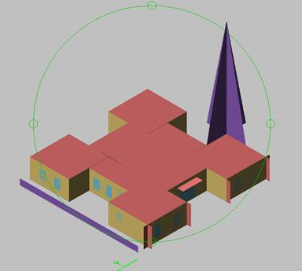
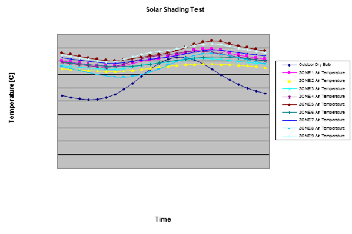
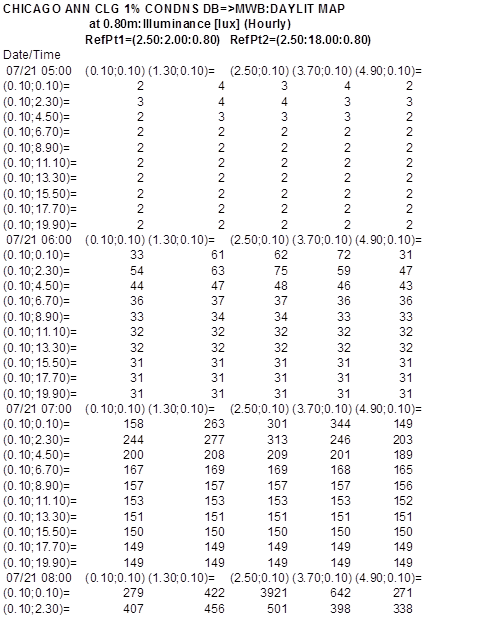

<br/>
<p><h1>EnergyPlus<sup>TM</sup> Documentation, v8.4.0</h1></p>
<hr>
<h1>Output Details and Examples</h1>
<h2>EnergyPlus Outputs, Example Inputs and Data Set Files</h2>
<br/>
<p><i>( &#42;&#42;&#42;&#42;&#42;&#42;&#42;&#42; Message: This is a snazzy output tagline)</i></p>
<br/>
<p><small>COPYRIGHT (c) 1996-2015 THE BOARD OF TRUSTEES OF THE UNIVERSITY OF ILLINOIS AND THE REGENTS OF THE UNIVERSITY OF CALIFORNIA THROUGH THE ERNEST ORLANDO LAWRENCE BERKELEY NATIONAL LABORATORY. ALL RIGHTS RESERVED. NO PART OF THIS MATERIAL MAY BE REPRODUCED OR TRANSMITTED IN ANY FORM OR BY ANY MEANS WITHOUT THE PRIOR WRITTEN PERMISSION OF THE UNIVERSITY OF ILLINOIS OR THE ERNEST ORLANDO LAWRENCE BERKELEY NATIONAL LABORATORY. ENERGYPLUS IS A TRADEMARK OF THE US DEPARTMENT OF ENERGY.</small></p>
<p style="page-break-after:always;"></p>
<div id="generated-toc"></div>
<p style="page-break-after:always;"></p>

Introduction
============

This document is intended to give an in-depth look at the various output files produced by EnergyPlus. Some of these may be referenced in various other parts of the documentation but are presented here with more details.

The scripts that assist in running EnergyPlus will usually rename the standard names used in the program. The two scripts that are distributed with EnergyPlus are: **EPL-Run.bat** (which is used by the EP-Launch program) and **RunEPlus.bat**  (which can be used from the command line). The RunEPlus batch file can also be used to string together several runs such as usually termed “batch processing”. In renaming the files created by the program or its post-processing program(s), usually the file extension will be retained. The following table will illustrate the native EnergyPlus file name, a description of its contents and the EP-Launch “version” of the file. In this table, &lt;filename&gt; refers to the source/original file name (without extension) selected. Files are presented in alphabetic order. For output purposes, the most important files to understand are the eplusout.eso, eplusout.mtr and eplusout.err files. The first two are manipulated with the ReadVarsESO post processing program. The latter will contain any critical errors that were encountered during the run.

Output Files
============

Output File List
----------------

Following are the native file names that are output from EnergyPlus; native – directly out of EnergyPlus. Usually you will not see these file names as batch files and interfaces will change them to be &lt;file name&gt;.&lt;ext&gt; or in some instances &lt;file name&gt;&lt;qualifier&gt;.&lt;ext&gt;. Usually the extension is the important piece and is described in the following table.

Table 1. EnergyPlus Basic Output  Files

<table class="table table-striped">
<tr> 
 <th>Output File Name</th>
 <th>Description</th>
 <th>EP-Launch File Name</th>
</tr>
<tr>
 <td>eplusout.audit</td>
 <td>Echo of input, includes both IDD echo and IDF echo – may have errors shown in context with IDD or IDF statements</td>
 <td>&lt;filename&gt;.audit (without echoing IDD unless errors in IDD).</td>
</tr>
<tr>
 <td>eplusout.bnd</td>
 <td>This file contains details about the nodes and branches. Useful in determining if all your nodes are connected correctly. May be used to diagram the network/ nodes of the HVAC system.</td>
 <td>&lt;filename&gt;.bnd</td>
</tr>
<tr>
 <td>eplusout.dbg</td>
 <td>From Debug Output object – may be useful to support to help track down problems</td>
 <td>&lt;filename&gt;.dbg</td>
</tr>
<tr>
 <td>eplusout.dxf</td>
 <td>DXF (from Output:Surfaces:Drawing,DXF;)</td>
 <td>&lt;filename&gt;.dxf</td>
</tr>
<tr>
 <td>eplusout.edd</td>
 <td>Descriptive output from the EMS portion</td>
 <td>&lt;filename&gt;.edd</td>
</tr>
<tr>
 <td>eplusout.eio</td>
 <td>Contains several standard and optional “report” elements. CSV format – may be read directly into spreadsheet program for better formatting.</td>
 <td>&lt;filename&gt;.eio</td>
</tr>
<tr>
 <td>eplusout.end</td>
 <td>A one line summary of success or failure (useful for Interface programs)</td>
 <td>Not saved in the standard EPL-Run script file.</td>
</tr>
<tr>
 <td>eplusout.epmidf</td>
 <td>Output from EPMacro program – contains the idf created from the input imf file</td>
 <td>&lt;filename&gt;.epmidf</td>
</tr>
<tr>
 <td>eplusout.epmdet</td>
 <td>Output from EPMacro program – the audit/details of the EPMacro processing</td>
 <td>&lt;filename&gt;.epmdet</td>
</tr>
<tr>
 <td>eplusout.err</td>
 <td>Error file – contains very important information from running the program.</td>
 <td>&lt;filename&gt;.err</td>
</tr>
<tr>
 <td>eplusout.eso</td>
 <td>Standard Output File (contains results from both Output:Variable and Output:Meter objects).</td>
 <td>&lt;filename&gt;.eso</td>
</tr>
<tr>
 <td>eplusout.log</td>
 <td>Log of items that appear in the command file output from the run.</td>
 <td>&lt;filename&gt;.log</td>
</tr>
<tr>
 <td>eplusout.mdd</td>
 <td>Meter names that are applicable for reporting in the current simulation.</td>
 <td>&lt;filename&gt;.mdd</td>
</tr>
<tr>
 <td>eplusout.mtd</td>
 <td>Meter details report – what variables are on what meters and vice versa. This shows the meters on which the Zone: Lights Electric Energy appear as well as the contents of the Electricity:Facility meter.</td>
 <td>&lt;filename&gt;.mtd</td>
</tr>
<tr>
 <td>eplusout.mtr</td>
 <td>Similar to .eso but only has Output:Meter outputs.</td>
 <td>&lt;filename&gt;.mtr</td>
</tr>
<tr>
 <td>eplusout.rdd</td>
 <td>Variable names that are applicable for reporting in the current simulation.</td>
 <td>&lt;filename&gt;.rdd</td>
</tr>
<tr>
 <td>eplusout.shd</td>
 <td>Surface shadowing combinations report</td>
 <td>&lt;filename&gt;.shd</td>
</tr>
<tr>
 <td>eplusout.sln</td>
 <td>Similar to DXF output but less structured. Results of Output:Reports,Surface, Lines object.</td>
 <td>&lt;filename&gt;.sln</td>
</tr>
<tr>
 <td>eplusout.sql</td>
 <td>Mirrors the data in the .eso and .mtr files but is in SQLite format (for viewing with SQLite tools).</td>
 <td>&lt;filename&gt;.sql</td>
</tr>
<tr>
 <td>eplusssz.&lt;ext&gt;</td>
 <td>Results from the Sizing:System object. This file is “spreadsheet” ready. Different extensions (csv, tab, and txt) denote different “separators” in the file.</td>
 <td>&lt;filename&gt;Ssz.&lt;ext&gt;</td>
</tr>
<tr>
 <td>epluszsz.&lt;ext&gt;</td>
 <td>Results from the Sizing:Zone object. This file is “spreadsheet” ready. Different extensions (csv, tab, and txt) denote different “separators” in the file.</td>
 <td>&lt;filename&gt;Zsz.&lt;ext&gt;</td>
</tr>
<tr>
 <td>eplusmap.&lt;ext&gt;</td>
 <td>Daylighting intensity “map” output. Different extensions (csv, tab, and txt) denote different “separators” in the file.</td>
 <td>&lt;filename&gt;Map.&lt;ext&gt;</td>
</tr>
<tr>
 <td>eplusout.dfs</td>
 <td>This file contains the hourly pre-calculated daylight factors for exterior windows of a daylight zone.</td>
 <td>&lt;filename&gt;DFS.csv</td>
</tr>
<tr>
 <td>eplusscreen.csv</td>
 <td>Window screen transmittance (direct and reflected) “map” output.</td>
 <td>&lt;filename&gt;Screen.csv</td>
</tr>
<tr>
 <td>eplustbl.&lt;ext&gt;</td>
 <td>Results of tabular and economics requests. Different extensions (csv, tab, and txt) denote different “separators” in the file.</td>
 <td>&lt;filename&gt;Table.&lt;ext&gt;</td>
</tr>
<tr>
 <td>eplusout.svg</td>
 <td>Results from the HVAC-Diagram application. SVG is a Scalable Vector Graphics file for which several viewers can be found.</td>
 <td>&lt;filename&gt;.svg</td>
</tr>
<tr>
 <td>eplusout.sci</td>
 <td>File of cost information</td>
 <td>&lt;filename&gt;.sci</td>
</tr>
<tr>
 <td>eplusout.delightin</td>
 <td>File produced during DElight simulations – descriptive of EnergyPlus inputs into DElight inputs.</td>
 <td>&lt;filename&gt;delight.in</td>
</tr>
<tr>
 <td>eplusout.delightout</td>
 <td>File produced during DElight simulations – basic results from DElight simulation.</td>
 <td>&lt;filename&gt;delight.out</td>
</tr>
<tr>
 <td>eplusout.wrl</td>
 <td>VRML output from (Output:Reports, Surfaces, VRML)</td>
 <td>&lt;filename&gt;.wrl</td>
</tr>
</table>


In addition to the basic output files from EnergyPlus there are three standard “hybrid” output files. These are called “hybrid” because they are a result of post-processing after EnergyPlus has completed. Note that if there is an error during processing, these will not normally be “complete”.

Table 2. "Hybrid" EnergyPlus Output Files

<table class="table table-striped">
<tr>
<th>Output File Name</th>
<th>Description</th>
<th>EP-Launch File Name</th>
</tr>
<tr>
<td>eplusout.&lt;ext&gt;
 </td>
<td>“spreadsheet” ready file that contains either all the report variables requested (default: up to limit of 255) from the input file or specific ones specified by the user. Different extensions (csv, tab, and txt denote different “separators” in the file.</td>
<td>&lt;filename&gt;.csv
or
&lt;filename&gt;.tab
or
&lt;filename&gt;.txt</td>
</tr>
<tr>
<td>eplusmtr.&lt;ext&gt;
 </td>
<td>“spreadsheet” ready file that contains either all the report meter requests (default: up to 255) from the input file or specific ones specified by the user. Different extensions (csv, tab, and txt denote different “separators” in the file.</td>
<td>&lt;filename&gt;Meter.csv
or
&lt;filename&gt;Meter.tab
or
&lt;filename&gt;Meter.txt</td>
</tr>
<tr>
<td>readvars.rvaudit</td>
<td>Results of any “ReadVarsESO” execution in the current batch run.</td>
<td>&lt;filename&gt;.rvaudit</td>
</tr>
</table>

Now, each file will be described in more detail with some examples of use.

eplusout.audit
--------------

This file is simply the echo of the inputs to the EnergyPlus program – the Energy+.idd (data dictionary) and in.idf (&lt;filename&gt;.idf – the input data file). Every attempt has been made to not require this file to be saved – errors are interpreted as much as possible and encapsulated onto the eplusout.err file. Any errors in the data dictionary processing should be accomplished during development – users should never see errors there. Thus, this file is not “saved” after processing by the standard script file. Occasionally, you may wish to view this file because of something obscure.

An excerpt of the file follows. Lines in green are notes produced from EnergyPlus (some of these are more useful to developers than users). Lines in red are lines with error messages shown to illustrate context. The other lines are echoes from inputs (with line numbers).

In all the examples, the actual version of the EnergyPlus exe would appear. In the examples these will be shown as: &lt;version&gt;.

```
  Processing Data Dictionary (Energy+.idd) File -- Start
     1 !IDD_Version <version>
     2 ! **************************************************************************
     3 !
<reduced for brevity>
 13000        \key DETAILS
 13001        \key Vertices
 13002        \key DetailsWithVertices
  Processing Data Dictionary (Energy+.idd) File -- Complete
  Maximum number of Alpha Args=        4500
  Maximum number of Numeric Args=        1800
  Number of Object Definitions=         473
  Number of Section Definitions=           2
  Processing Input Data File (in.idf) -- Start
     1 ! Basic file description: Basic illustration of using Purchased Air as a system
     2 ! Run:      2 design days.
     3 !           2 annual run periods, 2 summer days and 3 winter days.
<reduced for brevity>
    63     RunPeriod,          ! 3 day winter simuluation
    64               1,                1,  ! Start Month ,Day
    65               1,                3;  ! End Month ,Day
   ** Warning ** Object=RUNPERIOD, entered with less than minimum number of fields.
   **   ~~~   ** Attempting fill to minimum.
    66  MATERIAL:Regular,A1 - 1 IN STUCCO,  !- Material Name
<reduced for brevity>
   784 End Simulation Data;
  Processing Input Data File (in.idf) -- Complete
  Number of IDF "Lines"=         359
  Maximum number of Alpha IDF Args=          29
  Maximum number of Numeric IDF Args=          20
 Getting object=VERSION
 Getting object=TIMESTEP
 Getting object=SIMULATIONCONTROL
 Getting object=SIZING:PARAMETERS
 Getting object=SIZING:ZONE
 Getting object=SIZING:SYSTEM
 Getting object=SIZING:PLANT
<etc>
MaxRVariable=        5000
MaxIVariable=         100
NumEnergyMeters=         108
NumVarMeterArrays=         106
```

eplusout.bnd
------------

The “branch node details” (bnd) file is intended to give enough information that one could (with a chosen software) diagram the nodes and components of the HVAC system. It may or may not achieve that objective. Of more use may be its illustration of node connection/branch errors that aren’t detected by the software. This file has the details to support any “node connection” errors that will be noted in the eplusout.err file. Branch validation is shown in this file. Branches are checked to assure that each output node of the branch element is an input node to the next branch element. Cross-branch checking is not done directly within the program though the details will illustrate some problems of that nature.

Supply and Return Air Paths are also checked and feedback about each item are shown.

As is standard with many EnergyPlus output files, this file is CSV (comma-delimited) such that it can be read by spreadsheet programs for further manipulation by the user.

An example will illustrate. Notes about the reporting are highlighted in green.

Program Version,EnergyPlus, &lt;version&gt;

! This file shows details about the branches, nodes, and other

! elements of the flow connections.

! This file is intended for use in "debugging" potential problems

! that may also be detected by the program, but may be more easily

! identified by "eye".

! This file is also intended to support software which draws a

! schematic diagram of the HVAC system.

! ===============================================================

! \#Nodes,&lt;Number of Unique Nodes&gt;

 \#Nodes,11

**List of all nodes follows. \# references may be an indication of faulty node spec (or not)**

! &lt;Node&gt;,&lt;NodeNumber&gt;,&lt;Node Name&gt;,&lt;Node Fluid Type&gt;,&lt;\# Times Node Referenced After Definition&gt;

 Node,1,SUPPLY INLET NODE,Air,3

 Node,2,FAN INLET NODE,Air,4

&lt;reduced for brevity&gt;

Node,10,ZONE EQUIPMENT OUTLET NODE,Air,2

 Node,11,RELIEF AIR OUTLET NODE,Air,1

! ===============================================================

! Suspicious nodes have 0 references. It is normal for some nodes, however.

! Suspicious nodes have 0 references.  It is normal for some nodes, however.

! Listing nodes with 0 references (culled from previous list):

! &lt;Suspicious Node&gt;,&lt;NodeNumber&gt;,&lt;Node Name&gt;,&lt;Node Fluid Type&gt;,&lt;\# Times Node Referenced After Definition&gt;

 Suspicious Node,7,MAIN ZONE NODE,Air,0

**List of branches follow.**

! &lt;\#Branch Lists&gt;,&lt;Number of Branch Lists&gt;

 \#Branch Lists,1

! &lt;Branch List&gt;,&lt;Branch List Count&gt;,&lt;Branch List Name&gt;,&lt;Loop Name&gt;,&lt;Loop Type&gt;,&lt;Number of Branches&gt;

! &lt;Branch&gt;,&lt;Branch Count&gt;,&lt;Branch Name&gt;,&lt;Loop Name&gt;,&lt;Loop Type&gt;,&lt;Branch Inlet Node Name&gt;,&lt;Branch Outlet Node Name&gt;

 Branch List,1,AIR LOOP BRANCHES,EVAP COOLER SYSTEM,Air,1

   Branch,1,AIR LOOP MAIN BRANCH,EVAP COOLER SYSTEM,Air,SUPPLY INLET NODE,SUPPLY OUTLET NODE

! ===============================================================

! &lt;\#Supply Air Paths&gt;,&lt;Number of Supply Air Paths&gt;

! &lt;\#Supply Air Paths&gt;,&lt;Number of Supply Air Paths&gt;

 \#Supply Air Paths,1

! &lt;Supply Air Path&gt;,&lt;Supply Air Path Count&gt;,&lt;Supply Air Path Name&gt;,&lt;AirLoopHVAC Name&gt;

! &lt;\#Components on Supply Air Path&gt;,&lt;Number of Components&gt;

! &lt;Supply Air Path Component&gt;,&lt;Component Count&gt;,&lt;Component Type&gt;,&lt;Component Name&gt;,&lt;AirLoopHVAC Name&gt;

! &lt;\#Outlet Nodes on Supply Air Path Component&gt;,&lt;Number of Nodes&gt;

! &lt;Supply Air Path Component Nodes&gt;,&lt;Node Count&gt;,&lt;Component Type&gt;,&lt;Component Name&gt;,&lt;Inlet Node Name&gt;,&lt;Outlet Node Name&gt;,&lt;AirLoopHVAC Name&gt;

 Supply Air Path,1,ZONE SUPPLY AIR PATH,EVAP COOLER SYSTEM

   \#Components on Supply Air Path,1

   Supply Air Path Component,1,AIRLOOPHVAC:ZONESPLITTER,ZONE SUPPLY AIR SPLITTER,EVAP COOLER SYSTEM

     \#Outlet Nodes on Supply Air Path Component,1

     Supply Air Path Component Nodes,1,AIRLOOPHVAC:ZONESPLITTER,ZONE SUPPLY AIR SPLITTER,ZONE EQUIPMENT INLET NODE,MAIN ZONE INLET NODE,EVAP COOLER SYSTEM

! &lt;\#Nodes on Supply Air Path&gt;,&lt;Number of Nodes&gt;

! &lt;Supply Air Path Node&gt;,&lt;Node Type&gt;,&lt;Node Count&gt;,&lt;Node Name&gt;,&lt;AirLoopHVAC Name&gt;

\#Nodes on Supply Air Path,2

   Supply Air Path Node,Inlet Node,1,ZONE EQUIPMENT INLET NODE,EVAP COOLER SYSTEM

   Supply Air Path Node,Outlet Node,2,MAIN ZONE INLET NODE,EVAP COOLER SYSTEM

! ===============================================================

! &lt;\#Return Air Paths&gt;,&lt;Number of Return Air Paths&gt;

! &lt;\#Return Air Paths&gt;,&lt;Number of Return Air Paths&gt;

 \#Return Air Paths,1

! &lt;Return Air Path&gt;,&lt;Return Air Path Count&gt;,&lt;Return Air Path Name&gt;,&lt;AirLoopHVAC Name&gt;

! &lt;\#Components on Return Air Path&gt;,&lt;Number of Components&gt;

! &lt;Return Air Path Component&gt;,&lt;Component Count&gt;,&lt;Component Type&gt;,&lt;Component Name&gt;,&lt;AirLoopHVAC Name&gt;

! &lt;\#Inlet Nodes on Return Air Path Component&gt;,&lt;Number of Nodes&gt;

! &lt;Return Air Path Component Nodes&gt;,&lt;Node Count&gt;,&lt;Component Type&gt;,&lt;Component Name&gt;,&lt;Inlet Node Name&gt;,&lt;Outlet Node Name&gt;,&lt;AirLoopHVAC Name&gt;

 Return Air Path,1,ZONE RETURN AIR PATH,EVAP COOLER SYSTEM

   \#Components on Return Air Path,1

   Return Air Path Component,1,AIRLOOPHVAC:ZONEMIXER,ZONE RETURN AIR MIXER,EVAP COOLER SYSTEM

     \#Inlet Nodes on Return Air Path Component,1

     Return Air Path Component Nodes,1,AIRLOOPHVAC:ZONEMIXER,ZONE RETURN AIR MIXER,MAIN ZONE OUTLET NODE,ZONE EQUIPMENT OUTLET NODE,EVAP COOLER SYSTEM

! &lt;\#Nodes on Return Air Path&gt;,&lt;Number of Nodes&gt;

! &lt;Return Air Path Node&gt;,&lt;Node Type&gt;,&lt;Node Count&gt;,&lt;Node Name&gt;,&lt;AirLoopHVAC Name&gt;

   \#Nodes on Return Air Path,2

   Return Air Path Node,Outlet Node,1,ZONE EQUIPMENT OUTLET NODE,EVAP COOLER SYSTEM

   Return Air Path Node,Inlet Node,2,MAIN ZONE OUTLET NODE,EVAP COOLER SYSTEM

! ===============================================================

! \#Outside Air Nodes,&lt;Number of Outside Air Nodes&gt;

! \#Outdoor Air Nodes,&lt;Number of Outdoor Air Nodes&gt;

 \#Outdoor Air Nodes,1

! &lt;Outdoor Air Node&gt;,&lt;NodeNumber&gt;,&lt;Node Name&gt;

 Outdoor Air Node,5,OUTSIDE AIR INLET NODE

! ===============================================================

**Component sets. Very important for node connection error detection.**

! &lt;\#Component Sets&gt;,&lt;Number of Component Sets&gt;

 \#Component Sets,4

! &lt;Component Set&gt;,&lt;Component Set Count&gt;,&lt;Parent Object Type&gt;,&lt;Parent Object Name&gt;,&lt;Component Type&gt;,&lt;Component Name&gt;,&lt;Inlet Node ID&gt;,&lt;Outlet Node ID&gt;,&lt;Description&gt;

 Component Set,1,BRANCH,AIR LOOP MAIN BRANCH,AIRLOOPHVAC:OUTDOORAIRSYSTEM,OUTSIDE AIR SYSTEM,SUPPLY INLET NODE,FAN INLET NODE,Air Nodes

 Component Set,2,BRANCH,AIR LOOP MAIN BRANCH,FAN:CONSTANTVOLUME,SUPPLY FAN,FAN INLET NODE,EVAP COOLER INLET NODE,Air Nodes

 Component Set,3,BRANCH,AIR LOOP MAIN BRANCH,EVAPORATIVECOOLER:DIRECT:CELDEKPAD,EVAPORATIVE COOLER,EVAP COOLER INLET NODE,SUPPLY OUTLET NODE,Evap Air Nodes

 Component Set,4,AIRLOOPHVAC:OUTDOORAIRSYSTEM,OUTSIDE AIR SYSTEM,OUTDOORAIR:MIXER,OUTSIDE AIR MIXING BOX,OUTSIDE AIR INLET NODE,FAN INLET NODE,Air Nodes

**Similar details for Plant Loops, Condenser Loops, Controlled Zones, etc.**


eplusout.dbg
------------

Developers use this file during debugging and can be “turned on” by the DEBUG OUTPUT object in the input file. The only reason a user might specify this flag would be to send a file to the support group.

**Output:DebuggingData, 1, 0;    ! standard debug output, during simulation days**

The standard debug output appears like this:

Day of Sim     Hour of Day    Time

           1           1  0.166666666666667

node \#   Temp      MassMinAv  MassMaxAv TempSP   MassFlow   MassMin    MassMax    MassSP      Press        Enthal     HumRat    Fluid Type

   1    -12.500     0.000     0.000     0.000     0.0000     0.0000     0.0000     0.0000   100344.00     -9363.63    0.00129  Air

   2    -12.500     0.000     0.000     0.000     0.0000     0.0000     0.0000     0.0000   100344.00     -9363.63    0.00129  Air

   3    -12.500     0.000     0.000     0.000     0.0000     0.0000     0.0000     0.0000   100344.00     -9363.63    0.00129  Air

   4    -12.500     0.000     0.000     0.000     0.0000     0.0000     0.0000     0.0000   100344.00     -9363.63    0.00129  Air

   5     50.000     0.000     0.000     0.000     0.0320     0.0000     0.0000     0.0000   100344.00     60617.55    0.00400  Air

   6     50.000     0.000     0.000     0.000     0.0326     0.0000     0.0000     0.0000   100344.00     60617.55    0.00400  Air

   7     50.000     0.000     0.000     0.000     0.1636     0.0000     0.0000     0.0000   100344.00     60617.55    0.00400  Air

   8     50.000     0.000     0.000     0.000     0.1648     0.0000     0.0000     0.0000   100344.00     60617.55    0.00400  Air

   9      0.000     0.000     0.000     0.000     0.0000     0.0000     0.0000     0.0000        0.00         0.00    0.00000  blank

  10      0.000     0.000     0.000     0.000     0.0000     0.0000     0.0000     0.0000        0.00         0.00    0.00000  blank

  11      0.000     0.000     0.000     0.000     0.0000     0.0000     0.0000     0.0000        0.00         0.00    0.00000  blank

  12      0.000     0.000     0.000     0.000     0.0000     0.0000     0.0000     0.0000        0.00         0.00    0.00000  blank

eplusout.dxf
------------

The DXF output report file is formatted according to the “Data Exchange Format” standard rules for representing CADD type coordinates. The file can be used in several inexpensive, shareware or freeware viewers. Quickview Plus ™ can display DXF files as shown in Figure 1 below. A free program originally from Autocad™, Voloview Express™, can display solid model rendering as shown in Figure 2. Other viewers are available from Microstation™, Visio™ and other shareware or freeware vendors.

This file is generated when the following line is included in the IDF.

**Output:Surfaces:Drawing, DXF;**

You can ask it to triangulate surfaces with &gt;4 sides:

**Output:Surfaces:Drawing, DXF, Triangulate3dface;**

In addition to the building shape (including detached shading elements), the DXF view includes a “true north” arrow (at ground level) and the name from the BUILDING object.


Figure 1. Quick View Plus version of DXF file

Even in the Quick View version, you can see that the different building elements have different colors. These are the “original” colors used in EnergyPlus. The current default color scheme is shown in the following figure of the solid model.



Figure 2. Voloview 3D Solid view

The DXF file of itself is an ASCII file, with a specific structure as specified in the standard. An excerpt of the file is shown below:

```
SECTION
  2
ENTITIES
  0
TEXT
  8
1
  6
CONTINUOUS
 62
  3
 10
      -11.00000
 20
        3.00000
 30
        0.10000
 40
 .25
  1
True North
 41
 0.0
  7
MONOTXT
210
0.0
220
0.0
230
1.0
  0
<reduced for brevity>

3DFACE
  8
1
 62
  3
 10
      -10.00000
 20
        3.00000
 30
        0.10000
 11
      -10.00000
 21
        3.00000
 31
        0.00000
 12
      -10.00000
 22
        0.00000
 32
        0.00000
 13
      -10.00000
 23
        0.00000
 33
        0.10000
  0
ENDSEC
  0
EOF
999
DXF created from EnergyPlus
999
```
Program Version,EnergyPlus, &lt;version&gt;

eplusout.edd
-----------

This file is invoked by including an Output:EnergyManagementSystem input object. The EDD file contains three different types of information related to the Energy Management System (EMS) including: (1) listing of available actuators, (2) listing of available internal variables, and (3) a record of the execution of user’s programs for the EnergyPlus Runtime Language (Erl).

The EMS feature in EnergyPlus uses “Actuators” to do control operations. The actuators available in a given model depend on the non-EMS-related content of the input file. Similar to how EnergyPlus reports the available output variables to the RDD file, a list of available actuators can be written to the EDD file. There are three settings in the Output:EnergyManagementSystem input object that control how actuators are listed. Selecting “None” directs the program to not list the available actuators. Selecting “NotByUniqueKeyNames” directs the program to provide a concise listing of the available actuators that does not include their enumeration by unique name. Selecting “Verbose” directs the program to provide a complete listing of the available actuators including the unique identifying names. An example listing of actuators using the  “NotByUniqueKeyNames”  option follows.

! &lt;EnergyManagementSystem:Actuator Available&gt;, \*, Component Type, 'Control Type, Units

EnergyManagementSystem:Actuator Available, \*,Schedule:Compact,Schedule Value,[ ]

EnergyManagementSystem:Actuator Available, \*,People,Number of People,[each]

EnergyManagementSystem:Actuator Available, \*,Lights,Electric Power Level,[W]

EnergyManagementSystem:Actuator Available, \*,ElectricEquipment,Electric Power Level,[W]

EnergyManagementSystem:Actuator Available, \*,Window Shading Control,Control Status,[ShadeStatus]

EnergyManagementSystem:Actuator Available, \*,Zone Temperature Control,Heating Setpoint,[C]

EnergyManagementSystem:Actuator Available, \*,Zone Temperature Control,Cooling Setpoint,[C]

EnergyManagementSystem:Actuator Available, \*,Surface,Interior Surface Convection Heat Transfer Coefficient,[W/m2-K]

EnergyManagementSystem:Actuator Available, \*,Surface,Exterior Surface Convection Heat Transfer Coefficient,[W/m2-K]

EnergyManagementSystem:Actuator Available, \*,Ideal Loads Air System,Air Mass Flow Rate,[kg/s]


The EMS feature in EnergyPlus uses “Internal Variables” to obtain input data for use in scaling the results of control calculations. The internal variables available in a give model depend on the non-EMS-related content of the input file. Similar to how EnergyPlus reports the available output variables to the RDD file, a list of available internal variables can be written to the EDD file. There are three settings in the Output:EnergyManagementSystem input object that control how internal variables are listed. Selecting “None” directs the program to not list the available internal variables. Selecting “NotByUniqueKeyNames” directs the program to provide a concise listing of the available internal variables that does not include their enumeration by unique name. Selecting “Verbose” directs the program to provide a complete listing of the available internal variables including the unique identifying names. An example listing of actuators using the  “NotByUniqueKeyNames”  option follows.

! &lt;EnergyManagementSystem:InternalVariable Available&gt;, \*, Internal Data Type

EnergyManagementSystem:InternalVariable Available, \*,People Count Design Level,[each]

EnergyManagementSystem:InternalVariable Available, \*,Lighting Power Design Level,[W]

EnergyManagementSystem:InternalVariable Available, \*,Plug and Process Power Design Level,[W]

EnergyManagementSystem:InternalVariable Available, \*,Zone List Multiplier,[ ]

EnergyManagementSystem:InternalVariable Available, \*,Zone Floor Area,[m2]

EnergyManagementSystem:InternalVariable Available, \*,Zone Air Volume,[m3]

EnergyManagementSystem:InternalVariable Available, \*,Zone Multiplier,[ ]

EnergyManagementSystem:InternalVariable Available, \*,Zone List Multiplier,[ ]


The EMS uses the EnergyPlus Runtime Language, or Erl, to do custom controlling. When Erl programs are being developed, the EDD becomes a primary source of information for debugging. When a line of Erl code is executed, the program can output records called “line traces” that are useful for debugging because they show the outcome of each line of code. There are three settings in the Output:EnergyManagementSystem input object that control how line traces are reported. Selecting “None” directs the program to not write out any line traces. Selecting “ErrorsOnly” directs the program to only write line traces when computation errors are encountered (such as divide by zero). Selecting “Verbose” directs the program to write out line traces for each and every line of Erl program code that is executed.

It is very important to be careful with the EDD file. The Verbose option should be used with care because a full line-by-line trace of Erl program execution for an annual run can easily create an enormous computer file that is too large for most computer systems.  It is possible for EnergyPlus to generate an EDD file that cannot be opened in traditional text editors.

eplusout.eio
------------

This file contains some standard and some optional “reports”. It is intended to be a somewhat intelligent report of input conditions when they don’t fit well in other places or when they aren’t substantial enough for their own “file”. (e.g. **eplusout.bnd**)  Contents of the file are somewhat documented in various places in the [Input Output Reference document](file:///E:\Docs4PDFs\InputOutputReference.pdf) – as results of objects. This file or portions of it can be easily imported into spreadsheet programs and more analysis done there. Contents of this file include construction details, location information, “environment” information, number of “warmup” days required in each environment.

The form of the file is a data dictionary line followed by the data. In this case, the data dictionary line precedes the first “data” line though there may be several defining “dictionary lines”. Each dictionary line will show the field as &lt;field name&gt; followed by other fields that will be in the data lines. Data will be displayed similarly. Each field of dictionary or data will be separated from the next by a comma “,” – and produce a comma delimited file. However, the lines for data will not be contiguous – some follow a stream of consciousness of the EnergyPlus execution.

This section is subdivided into grouped sections by type.

Note that the lines in the eplusout.eio file can be extremely long (current limit is 500 characters).

### Simulation Parameters

! &lt;Version&gt;, Version ID

 Version, &lt;version&gt;

! &lt;Timesteps per Hour&gt;, \#TimeSteps, Minutes per TimeStep

 Timesteps Per Hour,  4, 15

! &lt;Run Control&gt;, Do Zone Sizing, Do System Sizing, Do Plant Sizing, Do Design Days, Do Weather Simulation

 Run Control, Yes, Yes, No, No, Yes

! &lt;GroundTemperatures&gt;, Months From Jan to Dec {Deg C}

 GroundTemperatures,  20.03,  20.03,  20.13,  20.30,  20.43,  20.52,  20.62,  20.77,  20.78,  20.55,  20.44,  20.20

! &lt;GroundTemperatures:Surface&gt;, Months From Jan to Dec {Deg C}

 GroundTemperatures:Surface,  18.00,  18.00,  18.00,  18.00,  18.00,  18.00,  18.00,  18.00,  18.00,  18.00,  18.00,  18.00

! &lt;GroundTemperatures:Deep&gt;, Months From Jan to Dec {Deg C}

 GroundTemperatures:Deep,  16.00,  16.00,  16.00,  16.00,  16.00,  16.00,  16.00,  16.00,  16.00,  16.00,  16.00,  16.00

! &lt;GroundReflectances&gt;, Months From Jan to Dec {dimensionless}

 GroundReflectances,  0.20,  0.20,  0.20,  0.20,  0.20,  0.20,  0.20,  0.20,  0.20,  0.20,  0.20,  0.20

! &lt;Snow Ground Reflectance Modifiers&gt;, Normal, Daylighting {dimensionless}

 Snow Ground Reflectance Modifiers,   1.000,   1.000

! &lt;Snow GroundReflectances&gt;, Months From Jan to Dec {dimensionless}

 Snow GroundReflectances,  0.20,  0.20,  0.20,  0.20,  0.20,  0.20,  0.20,  0.20,  0.20,  0.20,  0.20,  0.20

! &lt;Snow GroundReflectances For Daylighting&gt;, Months From Jan to Dec {dimensionless}

 Snow GroundReflectances For Daylighting,  0.20,  0.20,  0.20,  0.20,  0.20,  0.20,  0.20,  0.20,  0.20,  0.20,  0.20,  0.20

! &lt;Location&gt;, Location Name, Latitude {N+/S- Deg}, Longitude {E+/W- Deg},  Time Zone Number {GMT+/-}, Elevation {m},  Standard Pressure at Elevation {Pa}

Location,CHICAGO IL USA TMY2-94846 WMO\#=725300,41.78,-87.75,-6.00,190.00,99063.

! &lt;Building Information&gt;, Building Name,North Axis {deg},Terrain,  Loads Convergence Tolerance Value,Temperature Convergence Tolerance Value,  Solar Distribution,Maximum Number of Warmup Days,Minimum Number of Warmup Days

 Building, BUILDING,  30.000,City,   0.04000,   0.40000,FullExterior,25,6

! Inside Convection Algorithm, Value {Simple | Detailed | CeilingDiffuser}

Inside Convection Algorithm,Simple

! Outside Convection Algorithm, Value {Simple | Detailed}

Outside Convection Algorithm,Simple

! Solution Algorithm, Value {CTF | EMPD | CONDFD | HAMT}

Solution Algorithm, CTF

! Sky Radiance Distribution, Value {Anisotropic}

Sky Radiance Distribution,Anisotropic

! &lt;Environment:Site Atmospheric Variation&gt;,Wind Speed Profile Exponent {},Wind Speed Profile Boundary Layer Thickness {m},Air Temperature Gradient Coefficient {K/m}

Environment:Site Atmospheric Variation,0.330,460.000,6.500000E-003

! &lt; Input Surface Geometry Information&gt;,Starting Corner,Vertex Input Direction,Coordinate System

 SurfaceGeometry,UpperLeftCorner,CounterClockwise,RelativeCoordinateSystem

! &lt;Program Control Information:Threads/Parallel Sims&gt;, Threading Supported,Maximum Number of Threads, Env Set Threads (OMP\_NUM\_THREADS), EP Env Set Threads (EP\_OMP\_NUM\_THREADS). IDF Set Threads, Number of Threads Used (Interior Radiant Exchange), Number NominalSurface, Number Parallel Sims

Program Control:Threads/Parallel Sims, Yes,2, Not Set, Not Set, Not Set, 2, 60, N/A

The simulation parameters output is the simplest form of reporting in the **eplusout.eio** file. Each of the “header” records (lines starting with an “!”) are followed immediately by the one and only data line. By and large, these data lines are all merely echoes of the entries in the IDF (or defaulted for blank fields). For most of these descriptions, you can look at the object fields (of same name) in the [Input Output Reference](file:///E:\Docs4PDFs\InputOutputReference.pdf) document.

### Version

! &lt;Version&gt;, Version ID

 Version, &lt;version&gt;

This is the version of the IDF as entered in the IDF file. If it does not match the current EnergyPlus Version, a warning will be issued and show in the **eplusout.err** file.

### Timestep

! &lt;Timesteps per Hour&gt;, \#TimeSteps, Minutes per TimeStep

 Timesteps Per Hour,  4, 15

This is the number of timesteps in hour as entered in the IDF file as well as showing how many minutes will encompass each timestep (i.e. 4 timesteps in hour = 15 minutes per timestep).

### SimulationControl

! &lt;Run Control&gt;, Do Zone Sizing, Do System Sizing, Do Plant Sizing, Do Design Days, Do Weather Simulation, Do HVAC Sizing Simulation

 Run Control, Yes, Yes, Yes, No, Yes, No

This shows how the sizing and running (design days vs. weather file) will be accomplished. Design days are required for sizing but do not necessarily need to be “run” after sizing has completed. Thus, the user can choose to do sizing, not do a “normal” calculation with the design day definitions but then go ahead and run the full simulation year.  Some advanced sizing methods require also running HVAC Sizing Simulations.

### Building

! &lt;Building Information&gt;, Building Name,North Axis {deg},Terrain,  Loads Convergence Tolerance Value,Temperature Convergence Tolerance Value,  Solar Distribution,Maximum Number of Warmup Days

 Building Information, BUILDING,  30.000,City,   0.04000,   0.40000,FullExterior,25

This shows the values put in for the Building Object in the IDF.

### Inside Convection Algorithm

! &lt;Inside Convection Algorithm&gt;, Value {Simple | Detailed | CeilingDiffuser}

Inside Convection Algorithm,Simple

This shows the global inside (interior) convection algorithm selected by the IDF value. This may be overridden by zone entries or even surface entries.

### Outside Convection Algorithm

! &lt;Outside Convection Algorithm&gt;, Value {Simple | Detailed ! TARP ! MoWitt ! DOE-2 ! BLAST}

Outside Convection Algorithm,Simple

This shows the global outside (exterior) convection algorithm selected by the IDF value. This may be overridden by zone entries or even surface entries.

### Solution Algorithm

! &lt;Solution Algorithm&gt;, Value {CTF | EMPD | CONDFD | HAMT},Inside Surface Max Temperature Limit{C}

Solution Algorithm, CTF,200

This shows the solution algorithm approach selected by the IDF value and Inside Surface Max Temperature override or default value.

### Sky Radiance Distribution

! &lt;Sky Radiance Distribution&gt;, Value {Anisotropic}

Sky Radiance Distribution,Anisotropic

This shows the solution algorithm approach used in the simulation. As this value cannot be changed by the user, it is shown for information only.

### Site Atmospheric Variation

! &lt;Environment:Site Atmospheric Variation&gt;,Wind Speed Profile Exponent {},Wind Speed Profile Boundary Layer Thickness {m},Air Temperature Gradient Coefficient {K/m}

Environment:Site Atmospheric Variation,0.330,460.000,6.500000E-003

This shows actual values used for Site Atmospheric Variations.

### Shadowing/Sun Position Calculations

! &lt;Shadowing/Sun Position Calculations&gt; [Annual Simulations], Calculation Method, Value {days}, Allowable Number Figures in Shadow Overlap {}, Polygon Clipping Algorithm, Sky Diffuse Modeling Algorithm

Shadowing/Sun Position Calculations, AverageOverDaysInFrequency, 20, 15000, SutherlandHodgman, SimpleSkyDiffuseModeling

This shows how many days between the re-calculation of solar position during a weather file simulation. While a smaller number of days will lead to a more accurate solar position estimation (solar position is important in shadowing as well as determining how much solar enters the space), it also increases the calculation time necessarily to complete the simulation. The default, re-calculating every 20 days, gives a good compromise. The allowable number of figures in a shadow overlap can be increased if necessary for the model. There are two calculation methods available: AverageOverDaysInFrequency (default) and DetailedTimestepIntegration.

### AirflowNetwork Model:Control

! &lt;AirflowNetwork Model:Control&gt;, No Multizone or Distribution/Multizone with Distribution/Multizone without Distribution/Multizone with Distribution only during Fan Operation

AirflowNetwork Model:Control,MultizoneWithoutDistribution

This shows the AirflowNetwork Model:Control selected by the IDF value in the object AirflowNetwork:SimulationControl.

### AirflowNetwork Model:Wind Direction

! &lt;AirflowNetwork Model:Wind Direction&gt;, Wind Direction \#1 to n (degree)

AirflowNetwork Model:Wind Direction, 0.0,30.0,60.0,90.0,120.0,150.0,180.0,210.0,240.0,270.0,300.0,330.0

#### Field: &lt;AirflowNetwork Model:Wind Direction&gt;

This field contains the field name “AirflowNetwork Model:Wind Direction”.

#### Field: Wind Direction \#1 to n

These values are the wind directions corresponding to the first through the Nth wind pressure coefficient value. If Wind Pressure Coefficient Type = Input in the AirflowNetwork:SimulationControl object, the wind directions described here are the inputs specified in the AirflowNetwork:MultiZone:WindPressureCoefficientArray object,. If Wind Pressure Coefficient Type = SurfaceAverageCalculation in the AirflowNetwork:SimulationControl object, the wind directions are also described here and are fixed at 30 degree increments.

### AirflowNetwork Model:Wind Pressure Coefficients

! &lt;AirflowNetwork Model:Wind Pressure Coefficients&gt;, Name, Wind Pressure Coefficients \#1 to n (dimensionless)

AirflowNetwork Model:Wind Pressure Coefficients, NFACADE\_WPCVALUE, 0.60,0.48,4.00E-002,-0.56,-0.56,-0.42,-0.37,-0.42,-0.56,-0.56,4.00E-002,0.48

AirflowNetwork Model:Wind Pressure Coefficients, EFACADE\_WPCVALUE, -0.56,4.00E-002,0.48,0.60,0.48,4.00E-002,-0.56,-0.56,-0.42,-0.37,-0.42,-0.56

AirflowNetwork Model:Wind Pressure Coefficients, SFACADE\_WPCVALUE, -0.37,-0.42,-0.56,-0.56,4.00E-002,0.48,0.60,0.48,4.00E-002,-0.56,-0.56,-0.42

AirflowNetwork Model:Wind Pressure Coefficients, WFACADE\_WPCVALUE, -0.56,-0.56,-0.42,-0.37,-0.42,-0.56,-0.56,4.00E-002,0.48,0.60,0.48,4.00E-002

#### Field:  &lt; AirflowNetwork Model: Wind Pressure Coefficients&gt;

This field contains the constant “AirflowNetwork Model: Wind Pressure Coefficients” for each line.

#### Field: Name

This is the WindPressureCoefficientValues object name entered from the IDF.

#### Field: Wind Pressure Coefficients \#1 to n

These values are the wind pressure coefficient for the building façade. These wind pressure coefficient values correspond to the first through Nth wind directions reported above for &lt;AirflowNetwork Model:Wind Direction&gt;. If Wind Pressure Coefficient Type = INPUT in the AirflowNetwork:SimulationControl object, the wind pressure coefficients described here are the inputs specified in the AirflowNetwork:MultiZone:Wind Pressure Coefficient Values object,. If Wind Pressure Coefficient Type = SurfaceAverageCalculation in the AirflowNetwork:SimulationControl object, the wind pressure coefficients are calculated internally and also described here.

### Zone Volume Capacitance Multiplier

! &lt;Zone Volume Capacitance Multiplier&gt;, Sensible Heat Capacity Multiplier, Moisture Capacity Multiplier, Carbon Dioxide Capacity Multiplier, Generic Contaminant Capacity Multiplier

Zone Volume Capacitance Multiplier,   1.000, 1.000, 1.000, 1.000

This shows the zone volume capacitance multipliers selected by the IDF value or defaulted. The object for this item is ZoneCapacitanceMultiplier:ResearchSpecial.

#### Field: Sensible Heat Capacity Multiplier

Value used to alter the effective heat capacitance of the zone air volume.

#### Field: Moisture Capacity Multiplier

Value used to alter the effective moisture capacitance of the zone air volume.

#### Field: Carbon Dioxide Capacity Multiplier

Value used to alter the effective carbon dioxide capacitance of the zone air volume.

#### Field: Generic Contaminant Capacity Multiplier

Value used to alter the effective generic contaminant capacitance of the zone air volume.

#### Surface Geometry

! &lt;SurfaceGeometry&gt;,Starting Corner,Vertex Input Direction,Coordinate System,Daylight Reference Point Coordinate System,Rectangular (Simple) Surface Coordinate System

Surface Geometry, UpperLeftCorner, Counterclockwise, RelativeCoordinateSystem, RelativeCoordinateSystem, RelativeToZoneOrigin

This shows the expected order of the vertices for each surface. The object for this item is GlobalGeometryRules.

#### Field: Starting Corner

Value used to designate which corner the surface(s) start with.

#### Field: Vertex Input Direction

Value whether the coordinates for the surface are entered clockwise or counter-clockwise.

#### Field: Coordinate System

Value whether the coordinate system is World/Absolute or Relative.

#### Field: Daylight Reference Point Coordinate System

If daylighting is used, this describes the coordinate system for entering daylight reference points.

#### Field: Rectangular (Simple) Surface Coordinate System

For simple surfaces (Wall, Window, Door, and so forth) the coordinate system that is used to describe their starting point.

### Program Control

! &lt;Program Control Information:Threads/Parallel Sims&gt;, Threading Supported,Maximum Number of Threads, Env Set Threads (OMP\_NUM\_THREADS), EP Env Set Threads (EP\_OMP\_NUM\_THREADS). IDF Set Threads, Number of Threads Used (Interior Radiant Exchange), Number Nominal Surfaces, Number Parallel Sims

Program Control:Threads/Parallel Sims, Yes,2, Not Set, Not Set, Not Set, 2, 60, N/A


More examples:

Program Control:Threads/Parallel Sims, Yes,2, Not Set, Not Set, Not Set, 1, 6, N/A

Program Control:Threads/Parallel Sims, Yes,2, Not Set, Not Set, 1, 1, 46, N/A

This describes the threading that may be active for the simulation. The ProgramControl object is used for this output. As described in that object, only the Interior Radiant Exchange calculation has been exposed to use threading, goal being to speed up calculations but may not always be the most beneficial.

#### Field: Threading Supported

The compile of the program has to support threading (OpenMP for now). If it is compiled thus, this field will be **Yes**.  Otherwise it will be **No**.

#### Field: Maximum Number of Threads

Regardless of whether the compile has supported threading, the system is queried for the number of threads possible – that number is entered in this field.

#### Field: Env Set Threads (OMP\_NUM\_THREADS)

The Environment Variable OMP\_NUM\_THREADS can be manually inserted to set the number of system threads to be used. This would be reported here if set.  If not set, **Not Set** will be shown. This is a system variable, but suggest that you use the following environment variable if you want to manually control the number of threads.

#### Field: EP Env Set Threads (EP\_OMP\_NUM\_THREADS)

The Environment Variable EP\_OMP\_NUM\_THREADS can be manually inserted to set the number of system threads to be used. This would be reported here if set.  If not set, **Not Set** will be shown.

#### Field: IDF Set Threads

If you use the ProgramControl object in your IDF, you can again manually control the number of threads to be used. This would be reported here if set.  If not set, **Not Set** will be shown.

#### Field: Number of Threads Used (Interior Radiant Exchange)

This is the number of threads that was actually used in the Interior Radiant Exchange routines (which calculates the interior surface temperatures).

#### Field: Number Nominal Surfaces

This is the number of “nominal” surfaces (based on surface objects) that a quick calculation from the program has found. If the number of surfaces is not greater than 30, then the number of threads to be used will be set by the program to 1.

#### Field: Number Parallel Sims

This is the number of windowed/parallel simulations being run simultaneously as set by EP-Launch or other scripts distributed with the EnergyPlus program. Third party distributions may also set this item.


### Climate Group Outputs

Climate related variables appear in two places for EnergyPlus outputs. Certain objects that are invariant throughout a simulation period have lines appear in the eplusout.eio file:

! &lt;Environment:Weather Station&gt;,Wind Sensor Height Above Ground {m},Wind Speed Profile Exponent {},Wind Speed Profile Boundary Layer Thickness {m},Air Temperature Sensor Height Above Ground {m},Wind Speed Modifier Coefficient [Internal],Temperature Modifier Coefficient [Internal]

Environment:Weather Station,10.000,0.140,270.000,1.500,1.586,9.750E-003

! &lt;Environment:Site Atmospheric Variation&gt;,Wind Speed Profile Exponent {},Wind Speed Profile Boundary Layer Thickness {m},Air Temperature Gradient Coefficient {K/m}

Environment:Site Atmospheric Variation,   0.220, 370.000, 0.006500

! &lt;Location&gt;, Location Name, Latitude, Longitude, Time Zone Number, Elevation {m}

 Location, DENVER COLORADO,   39.75, -104.87,   -7.00,      1610.26


In addition for each “environment” simulated, information about the environment is shown:

! &lt;Environment&gt;,Environment Name,Environment Type, Start Date, End Date, Start DayOfWeek, Duration {\#days}, Source:Start DayOfWeek,  Use Daylight Savings, Use Holidays, Apply Weekend Holiday Rule

! &lt;Environment:Special Days&gt;, Special Day Name, Special Day Type, Source, Start Date, Duration {\#days}

! &lt;Environment:Daylight Saving&gt;, Daylight Saving Indicator, Source, Start Date, End Date

! &lt;Environment:Design\_Day\_Misc&gt;,DayOfYear,ASHRAE A Coeff,ASHRAE B Coeff,ASHRAE C Coeff,Solar Constant-Annual Variation,Eq of Time {minutes}, Solar Declination Angle {deg}, Solar Model

! &lt;Environment:WarmupDays&gt;, NumberofWarmupDays

For example, a DesignDay:

Environment,PHOENIX ARIZONA WINTER,DesignDay, 1/21, 1/21,MONDAY,  1,N/A,N/A,N/A,N/A

Environment:Daylight Saving,No,DesignDay

Environment:Design\_Day\_Misc, 21,1228.9,0.1414,5.7310E-002,1.0,-11.14,-20.0

A Design RunPeriod:

Environment,EXTREME SUMMER WEATHER PERIOD FOR DESIGN,User Selected WeatherFile Typical/Extreme Period (Design)=Summer Extreme,07/13,07/19,SummerDesignDay,  7,Use RunPeriod Specified Day,No ,No ,No ,No ,No

Environment:Daylight Saving,No,RunPeriod Object

Environment:WarmupDays,  3

Or a RunPeriod (Name listed in the RunPeriod output is dependent on user input for the RunPeriod object – when a blank is input, the name of the weather file location is used):

Environment,CHICAGO IL TMY2-94846 WMO\#=725300,WeatherRunPeriod, 1/ 1,12/31,SUNDAY,365,UseWeatherFile,Yes,Yes,No

Environment:Daylight Saving,No,

Environment:Special Days,NEW YEARS DAY,Holiday,WeatherFile, 1/ 1,  1

Environment:Special Days,MEMORIAL DAY,Holiday,WeatherFile, 5/31,  1

Environment:Special Days,INDEPENDENCE DAY,Holiday,WeatherFile, 7/ 5,  1

Environment:Special Days,LABOR DAY,Holiday,WeatherFile, 9/ 6,  1

Environment:Special Days,THANKSGIVING,Holiday,WeatherFile,11/25,  1

Environment:Special Days,CHRISTMAS,Holiday,WeatherFile,12/25,  1

Environment:WarmupDays,  4

Note that in this display, using “weekend rule” and specific date holidays, the actual observed dates are shown in the output display – in the example above, Independence Day (July 4) is actually observed on July 5.

### Climate Group – Simple Outputs

Some of the climate outputs are a “simple” group. The “header” line is followed immediately by the data line.

### Location

This output represents the location data used for the simulation. Note that if a runperiod is used, the IDF “Location” is ignored and the location from the weather file is used instead.

#### Field: &lt;Location&gt;

This data field will contain the constant “Location”.

#### Field: Location Name

This is the name given to the location whether from the IDF or the weather file.

#### Field: Latitude

This is the latitude of the site, expressed decimally. Convention uses positive (+) values for North of the Equator and negative (-) values for South of the Equator. For example, S 30° 15’ is expressed as –30.25.

#### Field: Longitude

This is the longitude of the site, expressed decimally. Convention uses positive (+) values for East of the Greenwich meridian and negative (-) values for West of the Greenwich meridian. For example, E 130° 45’ is expressed as +130.75.

#### Field: Time Zone Number

This is the time zone of the site, expressed decimally. Convention uses positive (+) values for GMT+ (Longitude East of the Greenwich meridian) and negative (-) values for GMT- (Longitude West of the Greenwich meridian). For example, the time zone for Central US time is –6. The time zone for parts of Newfoundland is –3.5 (-3 hours, 30 minutes from GMT).

#### Field: Elevation {m}

This is the elevation of the site. Units are m.

### Weather Station

#### Field: Wind Sensor Height Above Ground {m}

This is the wind sensor height above ground for weather data measurements.

#### Field: Wind Speed Profile Exponent {}

The wind speed profile exponent for the terrain surrounding the weather station.

#### Field: Wind Speed Profile Boundary Layer Thickness {m}

The wind speed profile boundary layer thickness [m] for the terrain surrounding the weather station.

#### Field: Air Temperature Sensor Height Above Ground {m}

The height [m] above ground for the air temperature sensor.

#### Field: Wind Speed Modifier Coefficient [Internal]

This field is intended to provide a slight help for the user to determine the calculations that will be used to calculate the Wind Speed at a specific height at the site.

The full calculation for Local Wind Speed is:

<div>\[ \text{LocalWindSpeed} = \text{WindSpeed}_{met} \left( \frac{\text{WindBoundaryLayerThickness}_{met}}{\text{AirSensorHeight}_{met}} \right)^{\text{WindExponent}_{met}} \left(\frac{\text{HeightAboveGround}_{site/component}}{\text{WindBoundaryLayerThickness}_{site}}\right)^{\text{SiteWindExponent}}  \]</div>

The Wind Speed Modifier Coefficient [Internal] simplifies the equation to:

<div>\[ \text{LocalWindSpeed} = \text{WindSpeed}_{met} \left( \text{WindSpeedModifier} \right) \left(\frac{\text{HeightAboveGround}_{site/component}}{\text{WindBoundaryLayerThickness}_{site}}\right)^{\text{SiteWindExponent}}  \]</div>

Where the Wind Speed Modifier encapsulates:

<div>\[ \text{WindSpeedModifier} = \left( \frac{\text{WindBoundaryLayerThickness}_{met}}{\text{AirSensorHeight}_{met}} \right)^{\text{WindExponent}_{met}} \]</div>

Where

* met = meteorological station
* site = location of the building

#### Field:Temperature Modifier Coefficient [Internal]

This field is intended to provide a slight help for the user to determine the calculations that will be used to calculate the air (dry-bulb) or wet-bulb temperature at a specific height at the site.

The site temperature modifier coefficient (TMC) is defined as:

<div>\[ TMC = frac{ \text{AtmosphericTemperatureGradient} \cdot \text{EarthRadius} \cdot \text{TemperatureSensorHeight}_{met} }
                  { \text{EarthRadius} + \text{TemperatureSensorHeight}_{met} } \]</div>

Then, the temperature at a height above ground is calculated as:

<div>\[ \text{ActualTemperature} = \text{Temperature}_{met} + TMC - 
    frac{ \text{TemperatureGradient}_{site} * \text{EarthRadius} * \text{Height}_{site/component} }
        { \text{EarthRadius} + \text{Height}_{site/component} } \]</div>

Where

* met = meteorological station
* site = location of the building

### Site Atmospheric Variation

#### Field: Wind Speed Profile Exponent {}

The wind speed profile exponent for the terrain surrounding the site.

#### Field: Wind Speed Profile Boundary Layer Thickness {m}

The wind speed profile boundary layer thickness [m] for the terrain surrounding the site.

#### Field: Air Temperature Gradient Coefficient {K/m}

The air temperature gradient coefficient [K/m] is a research option that allows the user to control the variation in outdoor air temperature as a function of height above ground. The real physical value is 0.0065 K/m.

### Ground Temperatures and Ground Reflectances

! &lt;Site:GroundTemperature:BuildingSurface&gt;, Months From Jan to Dec {Deg C}

 Site:GroundTemperature:BuildingSurface,  20.03,  20.03,  20.13,  20.30,  20.43,  20.52,  20.62,  20.77,  20.78,  20.55,  20.44,  20.20

! &lt;Site:GroundTemperature:FCfactorMethod&gt;, Months From Jan to Dec {Deg C}

 Site:GroundTemperature:FCfactorMethod,  -1.89,  -3.06,  -0.99,   2.23,  10.68,  17.20,  21.60,  22.94,  20.66,  15.60,   8.83,   2.56

! &lt;Site:GroundTemperature:Shallow&gt;, Months From Jan to Dec {Deg C}

 Site:GroundTemperature:Shallow,  13.00,  13.00,  13.00,  13.00,  13.00,  13.00,  13.00,  13.00,  13.00,  13.00,  13.00,  13.00

! &lt;Site:GroundTemperature:Deep&gt;, Months From Jan to Dec {Deg C}

 Site:GroundTemperature:Deep,  16.00,  16.00,  16.00,  16.00,  16.00,  16.00,  16.00,  16.00,  16.00,  16.00,  16.00,  16.00

! &lt;Site:GroundReflectance&gt;, Months From Jan to Dec {dimensionless}

 Site:GroundReflectance,  0.20,  0.20,  0.20,  0.20,  0.20,  0.20,  0.20,  0.20,  0.20,  0.20,  0.20,  0.20

! &lt;Site:GroundReflectance:SnowModifier&gt;, Normal, Daylighting {dimensionless}

 Site:GroundReflectance:SnowModifier,   1.000,   1.000

! &lt;Site:GroundReflectance:Snow&gt;, Months From Jan to Dec {dimensionless}

 Site:GroundReflectance:Snow,  0.20,  0.20,  0.20,  0.20,  0.20,  0.20,  0.20,  0.20,  0.20,  0.20,  0.20,  0.20

! &lt;Site:GroundReflectance:Snow:Daylighting&gt;, Months From Jan to Dec {dimensionless}

 Site:GroundReflectance:Snow:Daylighting,  0.20,  0.20,  0.20,  0.20,  0.20,  0.20,  0.20,  0.20,  0.20,  0.20,  0.20,  0.20

### Ground Temperatures

#### Field: &lt;GroundTemperatures&gt;

This data field will contain the constant “GroundTemperatures”.

#### Field Set (1-12) – Monthly Ground Temperatures

There will be a set of 12 numbers – the ground temperatures by month: January, February, March, April, May, June, July, August, September, October, November, December. Units are C.

### Ground Reflectance

#### Field: &lt;GroundReflectances&gt;

This data field will contain the constant “GroundReflectances”.

#### Field Set (1-12) – Monthly Ground Reflectances

There will be a set of 12 numbers – the ground reflectances by month: January, February, March, April, May, June, July, August, September, October, November, December.

### Snow Ground Reflectance Modifiers

It is generally accepted that snow resident on the ground increases the basic ground reflectance. EnergyPlus allows the user control over the snow ground reflectance for both “normal ground reflected solar” calculations (see above) and snow ground reflected solar modified for daylighting. This is the display of the user entered or defaulted values.

#### Field: &lt;Snow Ground Reflectance  Modifiers&gt;

This data field will contain the constant “Snow Ground Reflectance Modifiers”.

#### Field: Normal

This field is the value between 0.0 and 1.0 which is used to modified the basic monthly ground reflectance when snow is on the ground (from design day input or weather data values).

<div>\[ \text{GroundReflectance}_{used} = \text{GroundReflectance} \cdot \text{Modifier}_{snow} \]</div>

#### Field: Daylighting

This field is the value between 0.0 and 1.0 which is used to modified the basic monthly ground reflectance when snow is on the ground (from design day input or weather data values).

<div>\[ \text{DaylightingGroundReflectance}_{used} = \text{GroundReflectance} \cdot \text{Modifier}_{snow} \]</div>

### Snow Ground Reflectance

This data is the result of using the Snow Ground Reflectance modifier and the basic Ground Reflectance value.

#### Field: &lt;GroundReflectances&gt;

This data field will contain the constant “Snow GroundReflectances”.

#### Field Set (1-12) – Monthly Snow Ground Reflectances

There will be a set of 12 numbers – the snow ground reflectances by month: January, February, March, April, May, June, July, August, September, October, November, December.

### Snow Ground Reflectance for Daylighting

This data is the result of using the Snow Ground Reflectance for Daylighting modifier and the basic Ground Reflectance value.

#### Field: &lt; Snow GroundReflectances For Daylighting&gt;

This data field will contain the constant “Snow GroundReflectances For Daylighting”.

#### Field Set (1-12) – Monthly Snow Ground Reflectances for Daylighting

There will be a set of 12 numbers – the ground reflectances by month: January, February, March, April, May, June, July, August, September, October, November, December.

### Climate Group – Not so Simple Outputs

For each “environment” simulated, a set of outputs is produced. The header group is only produced once. (The Design Day Misc header is produced only when there is a design day.)

! &lt;Environment&gt;,Environment Name,Environment Type, Start Date, End Date, Start DayOfWeek, Duration {\#days}, Source:Start DayOfWeek,  Use Daylight Saving, Use Holidays, Apply Weekend Holiday Rule

! &lt;Environment:Special Days&gt;, Special Day Name, Special Day Type, Source, Start Date, Duration {\#days}

! &lt;Environment:Daylight Saving&gt;, Daylight Saving Indicator, Source, Start Date, End Date

! &lt;Environment:Design\_Day\_Misc&gt;,DayOfYear,ASHRAE A Coeff,ASHRAE B Coeff,ASHRAE C Coeff,Solar Constant-Annual Variation,Eq of Time {minutes}, Solar Declination Angle {deg}

! &lt;Environment:WarmupDays&gt;, NumberofWarmupDays

### Environment Line

Each “environment” (i.e. each design day, each run period) will have this line shown.

#### Field: &lt;Environment&gt;

This field will have the constant “Environment” in each data line.

#### Field:Environment Name

This field will have the “name” of the environment. For example, the design day name (“DENVER COLORADO SUMMER”) or the weather file location name (“BOULDER CO TMY2-94018 WMO\#=724699”).

#### Field:Environment Type

This will be “DesignDay” for design day simulations and “WeatherRunPeriod” for weather file run periods.

#### Field: Start Date

This will have the month/day that is the starting date for the simulation period. (7/21, for example).

#### Field: End Date

This will have the month/day that is the ending date for the simulation period. Note that Design Days are only one day and the end date will be the same as the start date.

#### Field: Start DayOfWeek

For weather periods, this will be the designated starting day of week. For design days, it will be the day type listed for the design day object (e.g. SummerDesignDay or Monday).

#### Field: Duration {\#days}

Number of days in the simulation period will be displayed in this field. Design days are only 1 day.

#### Field: Source:Start DayOfWeek

This field will list the “source” of the Start Day of Week listed earlier. This could be the RunPeriod command from the input file or the Weather File if the UseWeatherFile option was chosen in the RunPeriod command. For design days, this will be “N/A”.

#### Field: Use Daylight Saving

This field reflects the value of the Use Daylight Saving field of the RunPeriod object. For design days, this will be “N/A”.

#### Field: Use Holidays

This field reflects the value of the Use Holidays field of the RunPeriod object. For design days, this will be “N/A”.

#### Field: Apply Weekend Holiday Rule

For design days, this will show “N/A”. For weather periods, this will show “Yes” if the Apply Weekend Holiday Rule is in effect or “No” if it isn’t.

### Design Day Misc Line

This line is shown for each design day simulated. It is not shown for sizing runs that do not subsequently use the design day as a simulation period.

#### Field: &lt;Design Day Misc&gt;

This is a constant that will display “Environment:Design\_Day\_Misc”.

#### Field:DayOfYear

This is the Julian day of year for the design day (i.e. Jan 1 is 1, Jan 31 is 31).

#### Field:ASHRAE A Coeff

Reference ASHRAE HOF 30 – this is the A Coefficient in Wh/m<sup>2</sup> calculated from EnergyPlus.

#### Field:ASHRAE B Coeff

Likewise, this is the ASHRAE B Coefficient (dimensionless).

#### Field:ASHRAE C Coeff

This is the ASHRAE C Coefficient (dimensionless).

#### Field:Solar Constant-Annual Variation

This is the calculated solar constant using the given location and day of year.

#### Field:Eq of Time {minutes}

This is the calculated equation of time (minutes) using the given location and day of year.

#### Field: Solar Declination Angle {deg}

This is the solar declination angle for the day of year, degrees.

### Special Day Line

#### Field: &lt;Environment:Special Days&gt;

This is a constant that will display “Environment:SpecialDays”.

#### Field: Special Day Name

This is the user designated name for the special day.

#### Field: Special Day Type

This shows the type for the special day (e.g. Holiday).

#### Field: Source

This will display “InputFile” if it was specified in the IDF or “WeatherFile” if it came from the weather file designation.

#### Field: Start Date

This shows the starting date as month/day (e.g. 7/4).

#### Field: Duration {\#days}

This shows how many days the special day period continues. Usually, holidays are only 1 day duration.

### Daylight Saving Line

#### Field: &lt;Environment:Daylight Saving&gt;

This is a constant that will display “Environment:DaylightSaving”.

#### Field: Daylight Saving Indicator

This will be Yes if daylight saving is to be observed for this simulation period and No if it is not observed.

#### Field: Source

This will show the source of this invocation (or non-invocation). Inputfile if DaylightSavingPeriod was entered (weather files only), WeatherFile if used in the Weather file and selected in the Run Period object and designday if that was the source.

#### Field: Start Date

If the indicator field is Yes, then this field will be displayed and the month/day (e.g. 4/1) that starts the daylight saving period observance will be shown.

#### Field: End Date

If the indicator field is Yes, then this field will be displayed and the month/day (e.g. 10/29) that ends the daylight saving period observance will be shown.

### Zone Outputs

### Zone Summary

An overall zone summary is shown:

! &lt;Zone Summary&gt;, Number of Zones, Number of Surfaces, Number of SubSurfaces

 Zone Summary,19,158,12

As indicated:

#### Field: &lt;Zone Summary&gt;

This field contains the constant “Zone Summary”.

#### Field: Number of Zones

This field will contain the number of zones in the simulation.

#### Field: Number of Surfaces

This field will contain the total number of surfaces in the simulation.

#### Field: Number of SubSurfaces

This field will contain the total number of subsurfaces in the simulation.

### Zone Information

Each zone is summarized in a simple set of statements as shown below:

! &lt;Zone Information&gt;,Zone Name,North Axis {deg},Origin X-Coordinate {m},Origin Y-Coordinate {m},Origin Z-Coordinate {m},Centroid X-Coordinate {m},Centroid Y-Coordinate {m},Centroid Z-Coordinate {m},Type,Zone Multiplier,Zone List Multiplier,Minimum X {m},Maximum X {m},Minimum Y {m},Maximum Y {m},Minimum Z {m},Maximum Z {m},Ceiling Height {m},Volume {m3},Zone Inside Convection Algorithm {Simple-Detailed-CeilingDiffuser-TrombeWall},Zone Outside Convection Algorithm {Simple-Detailed-Tarp-MoWitt-DOE-2-BLAST}, Floor Area {m2},Exterior Gross Wall Area {m2},Exterior Net Wall Area {m2},Exterior Window Area {m2}, Number of Surfaces, Number of SubSurfaces, Number of Shading SubSurfaces,  Part of Total Building Area

 Zone Information, PSI FOYER,0.0,0.00,0.00,0.00,8.56,-1.80,2.27,1,1,1,0.00,16.34,-9.51,4.88,0.00,6.10,3.81,368.12,Detailed,DOE-2,96.62,70.61,70.61,106.84,6,1,0,Yes

 Zone Information, DORM ROOMS AND COMMON AREAS,0.0,0.00,6.10,0.00,18.35,11.26,3.05,1,1,1,3.57,31.70,-4.75,25.36,0.00,6.10,6.10,2723.33,Detailed,DOE-2,445.93,312.15,267.56,52.59,10,22,0,Yes

 Zone Information, LEFT FORK,-36.9,0.00,31.70,0.00,22.07,31.46,3.05,1,1,1,19.02,25.12,25.36,37.55,0.00,6.10,6.10,453.07,Detailed,DOE-2,74.32,185.81,135.64,50.17,6,10,0,Yes

 Zone Information, MIDDLE FORK,0.0,4.88,35.36,0.00,31.21,28.41,3.05,1,1,1,25.12,37.31,21.70,35.11,0.00,6.10,6.10,453.07,Detailed,DOE-2,74.32,185.81,155.71,30.10,6,1,0,Yes

 Zone Information, RIGHT FORK,36.9,10.97,35.36,0.00,36.70,20.48,3.05,1,1,1,29.99,43.40,15.85,25.12,0.00,6.10,6.10,453.07,Detailed,DOE-2,74.32,185.81,135.64,50.17,6,10,0,Yes

#### Field:  &lt;Zone Information&gt;

This field contains the constant “Zone Information” for each line.

#### Field: Zone Name

This is the Zone Name entered from the IDF.

#### Field: North Axis {deg}

This is the North Axis entered from the IDF. Note that this is used primarily in the positioning of the building when “relative” coordinates are used – however, the Daylighting:Detailed object also uses this. Units are degrees, clockwise from North.

#### Fields: X Origin {m}, Y Origin {m}, Z Origin {m}

This is the origin vertex {X,Y,Z} entered from the IDF. Note that this is used primarily in the positioning of the building when “relative” coordinates are used – however, the Daylighting:Detailed object also uses this. Units are m.

#### Field: TypeField: Multiplier

This is the multiplier (must be integral) entered from the IDF.

#### Field: Ceiling Height {m}

This is the ceiling height entered, if any, in the IDF. Ceiling height is also heuristically calculated from the surfaces in the zone – however, not all surfaces need to be entered and sometimes the user would rather enter the ceiling height for the zone. If no ceiling height was entered (i.e. the default of 0), this field will be the calculated value. A minor warning message will be issued if the calculated value is significantly different than the entered value. Units are m.

#### Field: Volume {m3}

Like the ceiling height, this user can also enter this value in the IDF. Volume is also heuristically calculated using the ceiling height (entered or calculated) as well as the calculated floor area (see later field). If entered here, this value will be used rather than the calculated value. A minor warning message will be issued if the calculated value is significantly different than the entered value. Units are m<sup>3</sup>.

#### Field: Zone Inside Convection Algorithm {Simple-Detailed-CeilingDiffuser-TrombeWall}

The interior convection algorithm shown earlier (entire building) can be overridden for each zone by an entry in the individual Zone object. This field will show which method is operational for the zone.

#### Field:  Floor Area {m2}

This field is calculated from the floor surfaces entered for the zone. Units are m<sup>2</sup>.

#### Field: Exterior Gross Wall Area {m2}

This field is calculated from the exterior wall surfaces entered for the zone. Units are m<sup>2</sup>.

#### Field: Exterior Net Wall Area {m2}

This field is calculated from the exterior wall surfaces entered for the zone. Any sub-surface area is subtracted from the gross area to determine the net area. Units are m<sup>2</sup>.

#### Field: Exterior Window Area {m2}

This field is calculated from the exterior window surfaces entered for the zone. Units are m<sup>2</sup>.

#### Field: Number of Surfaces

This field is a count of the number of base surfaces in the zone.

#### Field: Number of SubSurfaces

This field is a count of the number of subsurfaces (windows, doors, glass doors and the list) in the zone.

#### Field: Number of Shading SubSurfaces

This field is a count of the number of shading surfaces (overhangs, fins) for the zone.

#### Field: Part of Total Building Area

This field displays “Yes” when the zone is to be considered part of the total building floor area or “No” when it’s not to be considered. This consideration has no impact on simulation but on reporting. Namely, when the value is “no”, the zone is not part of the Total Floor Area as shown in the Annual Building Utility Performance Summary tables. In addition, when “No” is specified, the area is excluded from both the conditioned floor area and the total floor area in the Building Area sub table and the Normalized Metrics sub tables.

### Internal Gains Outputs

### Zone Internal Gains

Nominal Zone Internal Gains (people, lights, electric equipment, etc.) are summarized:

! &lt;Zone Internal Gains/Equipment Information - Nominal&gt;,Zone Name, Floor Area {m2},\# Occupants,Area per Occupant {m2/person},Occupant per Area {person/m2},Interior Lighting {W/m2},Electric Load {W/m2},Gas Load {W/m2},Other Load {W/m2},Hot Water Eq {W/m2},Steam Equipment {W/m2},Sum Loads per Area {W/m2},Outdoor Controlled Baseboard Heat

 Zone Internal Gains, PLENUM-1,463.60,0.0,N/A,0.000,0.000,0.000,0.000,0.000,0.000,0.000,0.000,No

 Zone Internal Gains, SPACE1-1,99.16,11.0,9.015,0.111,15.974,10.649,0.000,0.000,0.000,0.000,26.624,No

 Zone Internal Gains, SPACE2-1,42.74,5.0,8.547,0.117,16.006,10.670,0.000,0.000,0.000,0.000,26.676,No

 Zone Internal Gains, SPACE3-1,96.48,11.0,8.771,0.114,16.418,10.945,0.000,0.000,0.000,0.000,27.363,No

 Zone Internal Gains, SPACE4-1,42.74,5.0,8.547,0.117,16.006,10.670,0.000,0.000,0.000,0.000,26.676,No

 Zone Internal Gains, SPACE5-1,182.49,20.0,9.125,0.110,16.242,10.828,0.000,0.000,0.000,0.000,27.070,No

#### Field:  &lt;Zone Internal Gains/Equipment Information - Nominal&gt;

This field contains the constant “Zone Internal Gains” for each line.

#### Field: Zone Name

This is the Zone Name entered from the IDF.

#### Field: Floor Area {m2}

This is the floor area for the zone.

#### Field: \# Occupants

This is the nominal number of occupants (from the PEOPLE statements).

#### Field: Area per Occupant {m2/person}

This is the Zone Floor Area per occupant (person).

#### Field: Occupant per Area {person/m2}

This is the number of occupants per area.

#### Field: Interior Lighting {W/m2}

This is the lighting (Lights) per floor area.

#### Field: Electric Load {W/m2}

This is the electric equipment load (**Electric Equipment**) per floor area.

#### Field: Gas Load {W/m2}

This is the gas equipment load (**Gas Equipment**) per floor area.

#### Field: Other Load {W/m2

This is the other equipment load (**Other Equipment**) per floor area.

#### Field: Hot Water Eq {W/m2}

This is the hot water equipment load (**Hot Water Equipment**) per floor area.

#### Field: Steam Equipment {W/m2}

This is the steam equipment load (**Steam Equipment**) per floor area.

#### Field: Sum Loads per Area {W/m2}

This is the nominal sum of loads per area (equipment). This metric can be useful for incorrect (too much) loads in a zone.

#### Field: Outdoor Controlled Baseboard Heat

This field is “yes” if there is outdoor controlled baseboard heat in a Zone.

### People Gains

! &lt;People Internal Gains - Nominal&gt;,Name,Schedule Name,Zone Name,Zone Floor Area {m2},\# Zone Occupants,Number of People {},People/Floor Area {person/m2},Floor Area per person {m2/person},Fraction Radiant,Fraction Convected,Sensible Fraction Calculation,Activity level,ASHRAE 55 Warnings,Carbon Dioxide Generation Rate,Nominal Minimum Number of People,Nominal Maximum Number of People

People Internal Gains,  SPACE1-1 PEOPLE 1, OCCUPY-1, SPACE1-1, 99.16, 11.0, 11.0, 0.111, 9.015, 0.300, 0.700, AutoCalculate, ACTSCHD, No, 3.8200E-008, 0, 11

 People Internal Gains,  SPACE2-1 PEOPLE 1, OCCUPY-1, SPACE2-1, 42.74, 5.0, 5.0, 0.117, 8.547, 0.300, 0.700, AutoCalculate, ACTSCHD, No, 3.8200E-008, 0, 5

 People Internal Gains,  SPACE3-1 PEOPLE 1, OCCUPY-1, SPACE3-1, 96.48, 11.0, 11.0, 0.114, 8.771, 0.300, 0.700, AutoCalculate, ACTSCHD, No, 3.8200E-008, 0, 11

 People Internal Gains,  SPACE4-1 PEOPLE 1, OCCUPY-1, SPACE4-1, 42.74, 5.0, 5.0, 0.117, 8.547, 0.300, 0.700, AutoCalculate, ACTSCHD, No, 3.8200E-008, 0, 5

 People Internal Gains,  SPACE5-1 PEOPLE 1, OCCUPY-1, SPACE5-1, 182.49, 20.0, 20.0, 0.110, 9.125, 0.300, 0.700, AutoCalculate, ACTSCHD, No, 3.8200E-008, 0, 20

#### Field: &lt;People Internal Gains - Nominal&gt;

This field contains the constant “People Internal Gains” for each line.

#### Field: Name

This field contains the name of the People statement from the IDF file.

#### Field: Schedule Name

This is the schedule of occupancy fraction – the fraction is applied to the number of occupants for the statement. Limits are [0,1].

#### Field: Zone Name

This is the name of the Zone for the people/occupants.

#### Field: Zone Floor Area {m2}

This is the floor area (m2) of the zone.

#### Field: \# Zone Occupants

This is the total number of occupants for the zone.

#### Field: Number of People {}

This is the specific number of people for this statement (nominal).

#### Field: People/Floor Area {person/m2}

This value represents the number of people density (this statement) per area (zone floor area).

#### Field: Floor Area per person {m2/person}

This is the floor area per person (this statement)

#### Field: Fraction Radiant

This is the fraction radiant for each person (this statement).

#### Field: Fraction Convected

This is the fraction convected for each person (this statement).

#### Field: Sensible Fraction Calculation

This field will show “Autocalculate” if the default calculation for sensible fraction of load is to be used. Or a specific value can be entered. If so, that value will be displayed.

#### Field: Activity level

This field will show the activity level schedule name.

#### Field: ASHRAE 55 Warnings

If this field shows “yes”, then ASHRAE 55 comfort warnings are enabled. If “no”, then no ASHRAE 55 comfort warnings are calculated or issued.

**The following fields are shown only when one of the Comfort calculations (Fanger, KSU, Pierce) is used.**

#### Field: MRT Calculation Type

This field’s value will be one of the valid MRT calculation types (Zone Averaged, Surface Weighted, Angle Factor).

#### Field: Work Efficiency

This field will be the work efficiency schedule name for this people statement.

#### Field: Clothing

This field will be the clothing schedule name for this people statement.

#### Field: Air Velocity

This field will be the air velocity schedule name for this people statement.

#### Field: Fanger Calculation

This field will be “yes” if Fanger calculations are enabled for this people statement; otherwise it will be “no”.

#### Field: Pierce Calculation

This field will be “yes” if Pierce calculations are enabled for this people statement; otherwise it will be “no”.

#### Field: KSU Calculation

This field will be “yes” if KSU calculations are enabled for this people statement; otherwise it will be “no”.

#### Field: Carbon Dioxide Generation Rate

This numeric input field specifies carbon dioxide generation rate per person with units of m3/s-W. The total carbon dioxide generation rate from this object is:

Number of People \* People Schedule \* People Activity \* Carbon Dioxide Generation Rate. The default value is 3.82E-8 m3/s-W (obtained from ASHRAE Standard 62.1-2007 value at 0.0084 cfm/met/person over the general adult population). The maximum value can be 10 times the default value.

#### Field: Nominal Minimum Number of People

This numeric field is the calculated minimum number of people based on the number of people field \* the minimum value (annual) for the people schedule. It may be useful in diagnosing errors that occur during simulation.

#### Field: Nominal Maximum Number of People

This numeric field is the calculated maximum number of people based on the number of people field \* the maxnimum value (annual) for the people schedule. It may be useful in diagnosing errors that occur during simulation.


### Lights Gains

! &lt;Lights Internal Gains - Nominal&gt;, Name, Schedule Name, Zone Name, Zone Floor Area {m2}, \# Zone Occupants, Lighting Level {W}, Lights/Floor Area {W/m2}, Lights per person {W/person}, Fraction Return Air, Fraction Radiant, Fraction Short Wave, Fraction Convected, Fraction Replaceable, End-Use Category, Nominal Minimum Lighting Level {W}, Nominal Maximum Lighting Level {W}

Lights Internal Gains,  SPACE1-1 LIGHTS 1, LIGHTS-1, SPACE1-1, 99.16, 11.0, 1584.000, 15.974, 144.000, 0.200, 0.590, 0.200, 1.000E-002, 0.000, GeneralLights, 79.200, 1584.000

 Lights Internal Gains,  SPACE2-1 LIGHTS 1, LIGHTS-1, SPACE2-1, 42.74, 5.0, 684.000, 16.006, 136.800, 0.200, 0.590, 0.200, 1.000E-002, 0.000, GeneralLights, 34.200, 684.000

 Lights Internal Gains,  SPACE3-1 LIGHTS 1, LIGHTS-1, SPACE3-1, 96.48, 11.0, 1584.000, 16.418, 144.000, 0.200, 0.590, 0.200, 1.000E-002, 0.000, GeneralLights, 79.200, 1584.000

 Lights Internal Gains,  SPACE4-1 LIGHTS 1, LIGHTS-1, SPACE4-1, 42.74, 5.0, 684.000, 16.006, 136.800, 0.200, 0.590, 0.200, 1.000E-002, 0.000, GeneralLights, 34.200, 684.000

 Lights Internal Gains,  SPACE5-1 LIGHTS 1, LIGHTS-1, SPACE5-1, 182.49, 20.0, 2964.000, 16.242, 148.200, 0.200, 0.590, 0.200, 1.000E-002, 0.000, GeneralLights, 148.200, 2964.000

#### Field: &lt;Lights Internal Gains - Nominal&gt;

This field contains the constant “Lights Internal Gains” for each line.

#### Field: Name

This field contains the name of the Lights statement from the IDF file.

#### Field: Schedule Name

This is the schedule of lights fraction – the fraction is applied to the nominal lighting level for the statement. Limits are [0,1].

#### Field: Zone Name

This is the name of the Zone for the lights.

#### Field: Zone Floor Area {m2}

This is the floor area (m2) of the zone.

#### Field: \# Zone Occupants

This is the total number of occupants for the zone.

#### Field: Lighting Level {W}

This is the nominal lighting level (this statement) in Watts.

#### Field: Lights/Floor Area {W/m2}

This is the watts per floor area (this statement)

#### Field: Lights per person {W/person}

This is the watts per person that this statement represents.

#### Field: Fraction Return Air

This is the fraction return air for this statement.

#### Field: Fraction Radiant

This is the fraction radiant for this lighting level.

#### Field: Fraction Short Wave

This is the fraction short wave for this lighting level.

#### Field: Fraction Convected

This is the fraction convected for this lighting level.

#### Field: Fraction Replaceable

This is the fraction replaceable for this lighting level. For daylighting calculations, this value should either be 0 (no dimming control) or 1 (full dimming control).

#### Field: End-Use Category

This field shows the end-use category for this lights statement. Usage can be reported by end-use category.

#### Field: Nominal Minimum Lighting Level {W}

This numeric field is the calculated minimum amount of lighting in Watts based on the calculated lighting level (above) \* the minimum value (annual) for the lights schedule. It may be useful in diagnosing errors that occur during simulation.

#### Field: Nominal Maximum Lighting Level {W}

This numeric field is the calculated maximum amount of lighting in Watts based on the calculated lighting level (above) \* the maximum value (annual) for the lights schedule. It may be useful in diagnosing errors that occur during simulation.

### Equipment (Electric, Gas, Steam, Hot Water) Gains

These equipments are all reported similarly. Electric Equipment is used in the example below:

! &lt;ElectricEquipment Internal Gains - Nominal&gt;, Name, Schedule Name, Zone Name, Zone Floor Area {m2}, \# Zone Occupants, Equipment Level {W}, Equipment/Floor Area {W/m2}, Equipment per person {W/person}, Fraction Latent, Fraction Radiant, Fraction Lost, Fraction Convected, End-Use SubCategory, Nominal Minimum Equipment Level {W}, Nominal Maximum Equipment Level {W}

ElectricEquipment Internal Gains,  SPACE1-1 ELECEQ 1, EQUIP-1, SPACE1-1, 99.16, 11.0, 1056.000, 10.649, 96.000, 0.000, 0.300, 0.000, 0.700, General, 21.120, 950.400

 ElectricEquipment Internal Gains,  SPACE2-1 ELECEQ 1, EQUIP-1, SPACE2-1, 42.74, 5.0, 456.000, 10.670, 91.200, 0.000, 0.300, 0.000, 0.700, General, 9.120, 410.400

 ElectricEquipment Internal Gains,  SPACE3-1 ELECEQ 1, EQUIP-1, SPACE3-1, 96.48, 11.0, 1056.000, 10.945, 96.000, 0.000, 0.300, 0.000, 0.700, General, 21.120, 950.400

 ElectricEquipment Internal Gains,  SPACE4-1 ELECEQ 1, EQUIP-1, SPACE4-1, 42.74, 5.0, 456.000, 10.670, 91.200, 0.000, 0.300, 0.000, 0.700, General, 9.120, 410.400

 ElectricEquipment Internal Gains,  SPACE5-1 ELECEQ 1, EQUIP-1, SPACE5-1, 182.49, 20.0, 1976.000, 10.828, 98.800, 0.000, 0.300, 0.000, 0.700, General, 39.520, 1778.400

#### Field: &lt;[Specific] Equipment Internal Gains - Nominal&gt;

This field will contain the type of equipment internal gain in each line (i.e. Electric Equipment Internal Gains, Gas Equipment Internal Gains, …).

#### Field: Name

This field contains the name of the equipment statement from the IDF file.

#### Field: Schedule Name

This is the schedule of equipment fraction – the fraction is applied to the nominal equipment level for the statement. Limits are [0,1].

#### Field: Zone Name

This is the name of the Zone for the equipment.

#### Field: Zone Floor Area {m2}

This is the floor area (m2) of the zone.

#### Field: \# Zone Occupants

This is the total number of occupants for the zone.

#### Field: Equipment Level {W}

This is the nominal equipment level (in Watts) for the statement.

#### Field: Equipment/Floor Area {W/m2}

This is the watts per floor area (this statement)

#### Field: Equipment per person {W/person}

This is the watts per person that this statement represents.

#### Field: Fraction Latent

This is the fraction latent for this equipment.

#### Field: Fraction Radiant

This is the fraction radiant for this equipment.

#### Field: Fraction Lost

This is the fraction lost (not attributed to the zone) for this equipment.

#### Field: Fraction Convected

This is the fraction convected for this equipment.

#### Field: End-Use SubCategory

This field shows the end-use category for this statement. Usage can be reported by end-use category.

#### Field: Nominal Minimum Equipment Level {W}

This numeric field is the calculated minimum amount of the equipment in Watts based on the calculated design level (above) \* the minimum value (annual) for the equipment schedule. It may be useful in diagnosing errors that occur during simulation.

#### Field: Nominal Maximum Equipment Level {W}

This numeric field is the calculated maximum amount of the equipment in Watts based on the calculated design level (above) \* the maximum value (annual) for the equipment schedule. It may be useful in diagnosing errors that occur during simulation.

### Other Equipment Gains

Other equipment report is shown below (does not have an end-use category – is not attached to any normal meter):

! &lt;OtherEquipment Internal Gains - Nominal&gt;, Name, Schedule Name, Zone Name, Zone Floor Area {m2}, \# Zone Occupants, Equipment Level {W}, Equipment/Floor Area {W/m2}, Equipment per person {W/person}, Fraction Latent, Fraction Radiant, Fraction Lost, Fraction Convected, Nominal Minimum Equipment Level {W}, Nominal Maximum Equipment Level {W}

OtherEquipment Internal Gains,  TEST 352A, ALWAYSON, ZONE ONE, 232.26, 0.0, 352.000, 1.516, N/A, 0.000, 0.000, 0.000, 1.000, 352.000, 352.000

 OtherEquipment Internal Gains,  TEST 352 MINUS, ALWAYSON, ZONE ONE, 232.26, 0.0, -352.000, -1.516, N/A, 0.000, 0.000, 0.000, 1.000, -352.000, -352.000

#### Field: &lt;Other Equipment Internal Gains - Nominal&gt;

This field contains the constant “OtherEquipment Internal Gains” for each line.

#### Field: Name

This field contains the name of the equipment statement from the IDF file.

#### Field: Schedule Name

This is the schedule of equipment fraction – the fraction is applied to the nominal equipment level for the statement. Limits are [0,1].

#### Field: Zone Name

This is the name of the Zone for the equipment.

#### Field: Zone Floor Area {m2}

This is the floor area (m2) of the zone.

#### Field: \# Zone Occupants

This is the total number of occupants for the zone.

#### Field: Equipment Level {W}

This is the nominal equipment level (in Watts) for the statement.

#### Field: Equipment/Floor Area {W/m2}

This is the watts per floor area (this statement)

#### Field: Equipment per person {W/person}

This is the watts per person that this statement represents.

#### Field: Fraction Latent

This is the fraction latent for this equipment.

#### Field: Fraction Radiant

This is the fraction radiant for this equipment.

#### Field: Fraction Lost

This is the fraction lost (not attributed to the zone) for this equipment.

#### Field: Fraction Convected

This is the fraction convected for this equipment.

#### Field: Nominal Minimum Equipment Level {W}

This numeric field is the calculated minimum amount of the equipment in Watts based on the calculated design level (above) \* the minimum value (annual) for the equipment schedule. It may be useful in diagnosing errors that occur during simulation.

#### Field: Nominal Maximum Equipment Level {W}

This numeric field is the calculated maximum amount of the equipment in Watts based on the calculated design level (above) \* the maximum value (annual) for the equipment schedule. It may be useful in diagnosing errors that occur during simulation.

### Outdoor Controlled Baseboard Heat

! &lt;Outdoor Controlled Baseboard Heat Internal Gains - Nominal&gt;,Name,Schedule Name,Zone Name,Zone Floor Area {m2},\# Zone Occupants,Capacity at Low Temperature {W},Low Temperature {C},Capacity at High Temperature {W},High Temperature {C},Fraction Radiant,Fraction Convected,End-Use Subcategory

 Outdoor Controlled Baseboard Heat Internal Gains, SPACE4-1 BBHEAT 1,EQUIP-1,SPACE4-1,42.74,5.0,1500.000,0.000,500.000,10.000,0.500,0.500,Baseboard Heat

#### Field: &lt;Outdoor Controlled Baseboard Heat Internal Gains - Nominal&gt;

This field contains the constant “Outdoor Controlled Baseboard Heat Internal Gains” for each line.

#### Field: Name

This field contains the name of the baseboard heat statement from the IDF file.

#### Field: Schedule Name

This is the schedule of equipment fraction – the fraction is applied to the nominal equipment level for the statement. Limits are [0,1].

#### Field: Zone Name

This is the name of the Zone for the equipment.

#### Field: Zone Floor Area {m2}

This is the floor area (m2) of the zone.

#### Field: \# Zone Occupants

This is the total number of occupants for the zone.

#### Field: Capacity at Low Temperature {W}

This is the capacity (in Watts) of the equipment at low outdoor temperature.

#### Field: Low Temperature {C}

This is the low outdoor temperature (dry-bulb) for the capacity in the previous field. If the outdoor dry-bulb temperature (degrees Celsius) is at or below the low temperature, thebaseboard heater operates at the low temperature capacity.

#### Field: Capacity at High Temperature {W}

This is the capacity (in Watts) of the equipment at high outdoor temperature.

#### Field: High Temperature {C}

This is the high outdoor temperature (dry-bulb) for the capacity in the previous field. If the outdoor dry-bulb temperature (degrees Celsius) is exceeds the high temperature, thebaseboard heater turns off.

#### Field: Fraction Radiant

This is the fraction radiant for this equipment.

#### Field: Fraction Convected

This is the fraction convected for this equipment.

#### Field: EndUse Subcategory

This field shows the enduse category for this statement. Usage can be reported by enduse category.

### Simple Airflow Outputs

### Infiltration, Ventilation, Mixing, Cross Mixing Statistics

Infiltration, Ventilation, Mixing, Cross Mixing are only specified when the Airflow Model is “Simple” (no Airflow Network).

### Infiltration

! &lt;Infiltration Airflow Stats - Nominal&gt;,Name,Schedule Name,Zone Name, Zone Floor Area {m2}, \# Zone Occupants,Design Volume Flow Rate {m3/s},Volume Flow Rate/Floor Area {m3/s/m2},Volume Flow Rate/Exterior Surface Area {m3/s/m2},ACH - Air Changes per Hour,Equation A - Constant Term Coefficient {},Equation B - Temperature Term Coefficient {1/C},Equation C - Velocity Term Coefficient {s/m}, Equation D - Velocity Squared Term Coefficient {s2/m2}

ZoneInfiltration Airflow Stats, SPACE1-1 INFIL 1,INFIL-SCH,SPACE1-1,99.16,11.0,3.200E-002,3.227E-004,4.372E-004,0.482,0.000,0.000,0.224,0.000

 ZoneInfiltration Airflow Stats, SPACE2-1 INFIL 1,INFIL-SCH,SPACE2-1,42.74,5.0,1.400E-002,3.276E-004,3.838E-004,0.488,0.000,0.000,0.224,0.000

 ZoneInfiltration Airflow Stats, SPACE3-1 INFIL 1,INFIL-SCH,SPACE3-1,96.48,11.0,3.200E-002,3.317E-004,4.372E-004,0.482,0.000,0.000,0.224,0.000

 ZoneInfiltration Airflow Stats, SPACE4-1 INFIL 1,INFIL-SCH,SPACE4-1,42.74,5.0,1.400E-002,3.276E-004,3.838E-004,0.488,0.000,0.000,0.224,0.000

 ZoneInfiltration Airflow Stats, SPACE5-1 INFIL 1,INFIL-SCH,SPACE5-1,182.49,20.0,6.200E-002,3.397E-004,N/A,0.499,0.000,0.000,0.224,0.000

#### Field: &lt;Infiltration Airflow Stats - Nominal&gt;

This field contains the constant “Infiltration Airflow Stats” for each line.

#### Field: Name

This field contains the name of the infiltration statement from the IDF file.

#### Field: Schedule Name

This is the schedule of use fraction – the fraction is applied to the nominal volume flow rate for the statement. Limits are [0,1].

#### Field: Zone Name

This is the name of the Zone for the infiltration.

#### Field: Zone Floor Area {m2}

This is the floor area (m2) of the zone.

#### Field: \# Zone Occupants

This is the total number of occupants for the zone.

#### Field: Design Volume Flow Rate {m3/s}

This is the nominal flow rate for the infiltration in m3/s.

#### Field: Volume Flow Rate/Floor Area {m3/s/m2}

This field is the volume flow rate density per floor area (flow rate per floor area) for infiltration.

#### Field: Volume Flow Rate/Exterior Surface Area {m3/s/m2}

This field is the volume flow rate density per exterior surface area (flow rate per exterior area) for infiltration.

#### Field: ACH - Air Changes per Hour

This field is the air changes per hour for the given infiltration rate.

#### Field: Equation A - Constant Term Coefficient {}

Actual infiltration amount is an equation based value:

<div>\[ \text{Infiltration} = I_{design} F_{schedule} \left[ A + B \left| T_{zone}-T_{odb} \right| + C\left(\text{WindSpeed}\right) + D\left(\text{WindSpeed}^2\right)  \right] \]</div>

This field value is the A coefficient in the above equation.

#### Field: Equation B - Temperature Term Coefficient {1/C}

This field value is the B coefficient in the above equation.

#### Field: Equation C - Velocity Term Coefficient {s/m}

This field value is the C coefficient in the above equation.

#### Field:  Equation D - Velocity Squared Term Coefficient {s2/m2}

This field value is the D coefficient in the above equation.

### Ventilation

! &lt;Ventilation Airflow Stats - Nominal&gt;,Name,Schedule Name,Zone Name, Zone Floor Area {m2}, \# Zone Occupants,Design Volume Flow Rate {m3/s},Volume Flow Rate/Floor Area {m3/s/m2},Volume Flow Rate/person Area {m3/s/person},ACH - Air Changes per Hour,Fan Type {Exhaust;Intake;Natural/None},Fan Pressure Rise {?},Fan Efficiency {},Equation A - Constant Term Coefficient {},Equation B - Temperature Term Coefficient {1/C},Equation C - Velocity Term Coefficient {s/m}, Equation D - Velocity Squared Term Coefficient {s2/m2},Minimum Indoor Temperature/Schedule,Maximum Indoor Temperature/Schedule,Delta Temperature/Schedule,Minimum Outdoor Temperature/Schedule,Maximum Outdoor Temperature/Schedule,Maximum WindSpeed

 Ventilation Airflow Stats, SPACE1-1 VENTL 1,NIGHTVENTSCHED,SPACE1-1,99.16,11.0,5.295E-002,5.340E-004,4.814E-003,0.797,Intake,67.000,0.7,1.000,0.000,0.000,0.000,MININDOORTEMP,MAXINDOORTEMP,DELTATEMP,MINOUTDOORTEMP,MAXOUTDOORTEMP,40.00

 Ventilation Airflow Stats, SPACE1-1 VENTL 2,NIGHTVENTSCHED,SPACE1-1,99.16,11.0,5.295E-002,5.340E-004,4.814E-003,0.797,Intake,67.000,0.7,1.000,0.000,0.000,0.000,MININDOORTEMP,MAXINDOORTEMP,DELTATEMP,MINOUTDOORTEMP,MAXOUTDOORTEMP,40.00

 Ventilation Airflow Stats, SPACE2-1 VENTL 1,NIGHTVENTSCHED,SPACE2-1,42.74,5.0,7.030E-002,1.645E-003,1.406E-002,2.450,Intake,67.000,0.7,1.000,0.000,0.000,0.000,18.00,100.00,2.00,-100.00,100.00,40.00

Ventilation Airflow Stats, RESISTIVE ZONE VENTL 1,INF-SCHED,RESISTIVE ZONE,37.16,3.0,2.000E-002,5.382E-004,6.667E-003,0.636,Natural,0.000,1.0,0.606,2.020E-002,5.980E-004,0.000,18.00,100.00,1.00,-100.00,100.00,40.00

 Ventilation Airflow Stats, EAST ZONE VENTL 1,INF-SCHED,EAST ZONE,37.16,3.0,2.000E-002,5.382E-004,6.667E-003,0.636,Natural,0.000,1.0,0.606,2.020E-002,5.980E-004,0.000,18.00,100.00,1.00,-100.00,100.00,40.00

 Ventilation Airflow Stats, NORTH ZONE VENTL 1,INF-SCHED,NORTH ZONE,55.74,4.0,2.000E-002,3.588E-004,5.000E-003,0.424,Natural,0.000,1.0,0.606,2.020E-002,5.980E-004,0.000,18.00,100.00,1.00,-100.00,100.00,40.00

#### Field: &lt;Ventilation Airflow Stats - Nominal&gt;

This field contains the constant “Ventilation Airflow Stats” for each line.

#### Field: Name

This field contains the name of the ventilation statement from the IDF file.

#### Field: Schedule Name

This is the schedule of use fraction – the fraction is applied to the nominal volume flow rate for the statement. Limits are [0,1].

#### Field: Zone Name

This is the name of the Zone for the ventilation.

#### Field: Zone Floor Area {m2}

This is the floor area (m2) of the zone.

#### Field: \# Zone Occupants

This is the total number of occupants for the zone.

#### Field: Design Volume Flow Rate {m3/s}

This is the nominal flow rate for the ventilation in m3/s.

#### Field: Volume Flow Rate/Floor Area {m3/s/m2}

This field is the volume flow rate density per floor area (flow rate per floor area) for ventilation.

#### Field: Volume Flow Rate/person Area {m3/s/person}

This field is the volume flow rate density per person (flow rate per person) for ventilation.

#### Field: ACH - Air Changes per Hour

This field is the air changes per hour for the given ventilation rate.

#### Field: Fan Type {Exhaust;Intake;Natural}

This field shows the entered value for the type of ventilation [NATURAL, EXHAUST, or INTAKE]. Natural ventilation is the air movement/exchange a result of openings in the building façade and does not consume any fan energy. For either EXHAUST or INTAKE, values for fan pressure and efficiency define the fan electric consumption. For NATURAL and EXHAUST ventilation, the conditions of the air entering the space are assumed to be equivalent to outdoor air conditions. For INTAKE ventilation, an appropriate amount of fan heat is added to the air stream.

#### Field: Fan Pressure Rise {Pa}

Operational when Fan Type is INTAKE or EXHAUST, this is the pressure rise experienced across the fan in Pascals (N/m<sup>2</sup>). This is a function of the fan and plays a role in determining the amount of energy consumed by the fan.

#### Field: Fan Efficiency {}

Operational when Fan Type is INTAKE or EXHAUST, this is the total fan efficiency (a decimal number between 0.0 and 1.0). This is a function of the fan and plays a role in determining the amount of energy consumed by the fan.

#### Field: Equation A - Constant Term Coefficient {}

Actual ventilation amount is an equation based value:

<div>\[ \text{Ventilation} = V_{design} F_{schedule} \left[ A + B \left| T_{zone}-T_{odb} \right| + C\left(\text{WindSpeed}\right) + D\left(\text{WindSpeed}^2\right)  \right] \]</div>

This field value is the A coefficient in the above equation.

#### Field: Equation B - Temperature Term Coefficient {1/C}

This field value is the B coefficient in the above equation.

#### Field: Equation C - Velocity Term Coefficient {s/m}

This field value is the C coefficient in the above equation.

#### Field:  Equation D - Velocity Squared Term Coefficient {s2/m2}

This field value is the D coefficient in the above equation.

#### Field: Minimum Indoor Temperature{C}/Schedule

This is the indoor temperature (in Celsius) below which ventilation is shutoff. As the values can also be entered as a schedule, the schedule name may be listed here rather than a temperature.

#### Field: Maximum Indoor Temperature{C}/Schedule

This is the indoor temperature (in Celsius) above which ventilation is shutoff. As the values can also be entered as a schedule, the schedule name may be listed here rather than a temperature.

#### Field: Delta Temperature{C}/Schedule

This is the temperature difference (in Celsius) between the indoor and outdoor air dry-bulb temperatures below which ventilation is shutoff. As the values can also be entered as a schedule, the schedule name may be listed here rather than a temperature.

#### Field: Minimum Outdoor Temperature{C}/Schedule

This is the outdoor temperature (in Celsius) below which ventilation is shut off. As the values can also be entered as a schedule, the schedule name may be listed here rather than a temperature.

#### Field: Maximum Outdoor Temperature{C}/Schedule

This is the outdoor temperature (in Celsius) above which ventilation is shut off. As the values can also be entered as a schedule, the schedule name may be listed here rather than a temperature.

#### Field: Maximum WindSpeed{m/s}

This is the wind speed (m/s) above which ventilation is shut off.

### Mixing

! &lt;Mixing Airflow Stats - Nominal&gt;,Name,Schedule Name,Zone Name, Zone Floor Area {m2}, \# Zone Occupants,Design Volume Flow Rate {m3/s},Volume Flow Rate/Floor Area {m3/s/m2},Volume Flow Rate/person Area {m3/s/person},ACH - Air Changes per Hour,From/Source Zone,Delta Temperature {C}

 Mixing Airflow Stats, RESISTIVE ZONE MIXNG 1,ZONE MIXING,RESISTIVE ZONE,37.16,3.0,5.000E-002,1.345E-003,1.667E-002,1.589,EAST ZONE,0.00

#### Field: &lt;Mixing Airflow Stats - Nominal&gt;

This field contains the constant “Mixing Airflow Stats” for each line.

#### Field: Name

This field contains the name of the mixing statement from the IDF file.

#### Field: Schedule Name

This is the schedule of use fraction – the fraction is applied to the nominal volume flow rate for the statement. Limits are [0,1].

#### Field: Zone Name

This is the name of the Zone for the mixing.

#### Field: Zone Floor Area {m2}

This is the floor area (m2) of the zone.

#### Field: \# Zone Occupants

This is the total number of occupants for the zone.

#### Field: Design Volume Flow Rate {m3/s}

This is the nominal flow rate for the mixing in m3/s.

#### Field: Volume Flow Rate/Floor Area {m3/s/m2}

This field is the volume flow rate density per floor area (flow rate per floor area) for mixing.

#### Field: Volume Flow Rate/person Area {m3/s/person}

This field is the volume flow rate density per person (flow rate per person) for mixing.

#### Field: ACH - Air Changes per Hour

This field is the air changes per hour for the given mixing rate.

#### Field: From/Source Zone

This is the source zone for the mixing rate.

#### Field: Delta Temperature {C}

This number controls when mixing air from the source zone is sent to the receiving zone. This parameter is a temperature {units Celsius}. If this field is positive, the temperature of the zone from which the air is being drawn (source zone) must be “Delta Temperature” warmer than the receiving zone air or else no mixing occurs. If this field is negative, the temperature of the source zone must be “Delta Temperature” cooler than the receiving zone air or else no mixing occurs. If this parameter is zero, mixing occurs regardless of the relative zone temperatures.

### Cross Mixing

! &lt;CrossMixing Airflow Stats - Nominal&gt;,Name,Schedule Name,Zone Name, Zone Floor Area {m2}, \# Zone Occupants,Design Volume Flow Rate {m3/s},Volume Flow Rate/Floor Area {m3/s/m2},Volume Flow Rate/person Area {m3/s/person},ACH - Air Changes per Hour,From/Source Zone,Delta Temperature {C}

 CrossMixing Airflow Stats, EAST ZONE XMIXNG 1,ZONE MIXING,EAST ZONE,37.16,3.0,0.100,2.691E-003,3.333E-002,3.178,NORTH ZONE,1.00

 CrossMixing Airflow Stats, NORTH ZONE XMIXNG 1,ZONE MIXING,NORTH ZONE,55.74,4.0,0.100,1.794E-003,2.500E-002,2.119,EAST ZONE,1.00

#### Field: &lt;CrossMixing Airflow Stats - Nominal&gt;

This field contains the constant “CrossMixing Airflow Stats” for each line.

#### Field: Name

This field contains the name of the mixing statement from the IDF file.

#### Field: Schedule Name

This is the schedule of use fraction – the fraction is applied to the nominal volume flow rate for the statement. Limits are [0,1].

#### Field: Zone Name

This is the name of the Zone for the mixing.

#### Field: Zone Floor Area {m2}

This is the floor area (m2) of the zone.

#### Field: \# Zone Occupants

This is the total number of occupants for the zone.

#### Field: Design Volume Flow Rate {m3/s}

This is the nominal flow rate for the mixing in m3/s.

#### Field: Volume Flow Rate/Floor Area {m3/s/m2}

This field is the volume flow rate density per floor area (flow rate per floor area) for mixing.

#### Field: Volume Flow Rate/person Area {m3/s/person}

This field is the volume flow rate density per person (flow rate per person) for mixing.

#### Field: ACH - Air Changes per Hour

This field is the air changes per hour for the given mixing rate.

#### Field: From/Source Zone

This is the source zone for the mixing – air is exchanged equally between the two zones.

#### Field: Delta Temperature {C}

This number controls when mixing air from the source zone is sent to the receiving zone. This parameter is a temperature {units Celsius}. If this field is positive, the temperature of the zone from which air is being drawn (“source zone”) must be “Delta Temperature” warmer than the zone air or no mixing occurs. If this field is zero, mixing occurs regardless of the relative air temperatures. Negative values for “Delta Temperature” are not permitted.

### RefrigerationDoor Mixing

! &lt;RefrigerationDoorMixing  Airflow Stats - Nominal&gt;, Name, Zone 1 Name, Zone 2 Name, Door Opening Schedule Name, Door Height {m},Door Area {m2},Door Protection Type

 RefrigerationDoorMixing Airflow Stats, FREEZER1\_SUBFREEZER1, FREEZER\_1, SUBFREEZER, FREEZER1DOORSCHEDA, 1.800, 2.300, StripCurtain

 RefrigerationDoorMixing Airflow Stats, FREEZER5\_COOLER2, COOLER\_2, FREEZER\_5, FREEZER5DOORSCHEDA, 1.800, 2.300, AirCurtain

#### Field: &lt;RefrigerationDoorMixing Airflow Stats - Nominal&gt;

This field contains the constant “RefrigerationDoor Airflow Stats” for each line.

#### Field: Name

This field contains the name of the mixing statement from the IDF file.

#### Field: Zone 1 Name

This is the name of one of the two Zones for the mixing.

#### Field: Zone 2 Name

This is the name of the other Zone for the mixing.

#### Field: Door Opening Schedule Name

This is the schedule of use fraction – the fraction is applied to the nominal volume flow rate for the statement. Limits are [0,1].

#### Field: Door Height {m}

This is the nominal flow rate for the mixing in m3/s.

#### Field: Door Area {m2}

This is the floor area (m2) of the zone.

#### Field: Door Protection Type

This is one of three keywords, None, StripCurtain, or AirCurtain.

### Shading Summary

Similar to the Zone Summary, the Shading Summary:

! &lt;Shading Summary&gt;, Number of Fixed Detached Shades, Number of Building Detached Shades, Number of Attached Shades

 Shading Summary,0,6,14

#### Field: &lt;Shading Summary&gt;

This field contains the constant “Shading Summary”.

#### Field: Number of Fixed Detached Shades

This field contains the number of fixed detached shades (e.g. Shading:Site or Shading:Site:Detailed) in the simulation.

#### Field: Number of Building Detached Shades

This field contains the number of building relative detached shades (e.g. Shading:Building or Shading:Building:Detailed) in the simulation.

#### Field: Number of Attached Shades

This field contains the number of building attached shading surfaces (e.g. Overhang, Shading:Zone:Detailed, etc.) in the simulation.

### Surface Details Report

A good example of this is the surface details report(s) (**Output:Surfaces:List, Details;** **Output:Surfaces:List, Vertices; Output:Surfaces:List, DetailsWithVertices;**). Excerpt from the file:

**Line 1:**! &lt;Zone/Shading Surfaces&gt;**,**&lt;Zone Name&gt;/\#Shading Surfaces,\# Surfaces, Vertices are shown starting at Upper-Left-Corner =&gt; Counter-Clockwise =&gt; World Coordinates

**Line 2:**! &lt;HeatTransfer/Shading/Frame/Divider\_Surface&gt;,Surface Name,Surface Class, Base Surface,Construction,Nominal U (w/o film coefs),Nominal U (with film coefs),Area (Net), Area (Gross), Area (Sunlit Calc), Aimuth, Tilt, ~Width, ~Height, Reveal, &lt;ExtBoundCondition&gt;, &lt;ExtConvCoeffCalc&gt;, &lt;IntConvCoeffCalc&gt;,&lt;SunExposure&gt;,&lt;WindExposure&gt;,ViewFactorToGround,ViewFactorToSky,ViewFactorToGround-IR,ViewFactorToSky-IR,\#Sides, {Vertex 1},,, {Vertex 2},,, {Vertex 3},,, {Vertex 4}, ,,{etc}

**Line 3:** ! &lt;Units&gt;,,,,,{W/m2-K},{W/m2-K},{m2},{m2},{m2},{deg},{deg},{m},{m},{m},,,,,,,,,,X {m},Y {m},Z {m},X {m},Y {m},Z {m},X {m},Y {m},Z {m},X {m},Y {m},Z {m}

**Ex Line 1:** Shading\_Surfaces,Number of Shading Surfaces,   10

**Ex Line 2:** Shading\_Surface,WEST SIDE BUSHES,Detached Shading:Building,,,,, 180.0, 180.0, 180.0, 90.0, 90.0, 60.00, 3.00,,,,,,,,,,, 4, -5.00, 0.00, 3.00, -5.00, 0.00, 0.00, -5.00, 60.00, 0.00, -5.00, 60.00, 3.00

**Ex Line 2:** Shading\_Surface,EAST SIDE TREE1,Detached Shading:Building,,,,, 500.0, 500.0, 500.0, 270.0, 90.0, 20.00, 50.99,,,,,,,,,,, 3, 70.00, 30.00, 50.00, 70.00, 40.00, 0.00, 70.00, 20.00, 0.00

**Ex Line 2:** Shading\_Surface,EAST SIDE TREE2,Detached Shading:Building,,,,, 500.0, 500.0, 500.0, 0.0, 90.0, 20.00, 50.99,,,,,,,,,,, 3, 70.00, 30.00, 50.00, 80.00, 30.00, 0.00, 60.00, 30.00, 0.00

**Ex Line 1:** Zone\_Surfaces,HEARTLAND AREA,   35

**Ex Line 2:** HeatTransfer\_Surface,ZN001:WALL001,Wall,,EXTERIOR,0.644, 0.588, 136.0, 200.0, 136.0, 180.0, 90.0, 20.0, 10.0, 0.00,ExternalEnvironment,ASHRAEDetailed,ASHRAEDetailed,SunExposed,WindExposed, 0.50, 0.50, 0.67,  0.33, 4, 20.00, 10.00, 10.00, 20.00, 10.00, 0.00, 40.00, 10.00, 0.00, 40.00, 10.00, 10.00

**Ex Line 2:** HeatTransfer\_Surface,ZN001:WALL001:WIN001,Window,ZN001:WALL001,SINGLE PANE HW WINDOW,N/A,6.121, 64.00000, 64.00000, 64.00000,180.0, 90.0, 8.00, 8.00, 0.00, ExternalEnvironment, ASHRAEDetailed, ASHRAEDetailed, SunExposed, WindExposed,  0.50,  0.50,  0.71,  0.29, 4, 26.00, 10.00, 8.10, 26.00, 10.00, 0.10, 34.00, 10.00, 0.10, 34.00, 10.00, 8.10

**Ex Line 2:** HeatTransfer\_Surface,ZN001:WALL002,Wall,,EXTERIOR,0.644,0.588, 155.0, 200.0, 155.0, 90.0, 90.0, 20.00, 10.00, 0.00,ExternalEnvironment, ASHRAEDetailed, ASHRAEDetailed, SunExposed, WindExposed, 0.50,  0.50,  0.73,  0.27, 4, 50.00, 20.00, 10.00, 50.00, 20.00, 0.00, 50.00, 40.00, 0.00, 50.00, 40.00, 10.00

**Ex Line 2:** HeatTransfer\_Surface,ZN001:WALL002:WIN001,Window,ZN001:WALL002,SINGLE PANE HW WINDOW,N/A,6.121, 15.0, 15.0, 15.0, 90.0, 90.0, 3.00, 5.00,  0.00, ExternalEnvironment, ASHRAEDetailed, ASHRAEDetailed, SunExposed, WindExposed,  0.50,  0.50,  0.76,  0.24, 4, 50.00, 22.20, 7.30, 50.00, 22.20, 2.30, 50.00, 25.20, 2.30, 50.00, 25.20, 7.30


**Ex Line 2:** HeatTransfer\_Surface,ZN001:WALL002:WIN002,Window,ZN001:WALL002,SINGLE PANE HW WINDOW, N/A, 6.121, 15.00, 15.00, 15.00, 90.00, 90.00, 3.00, 5.00, 0.00, ExternalEnvironment, ASHRAEDetailed, ASHRAEDetailed, SunExposed, WindExposed, 0.50, 0.50, 0.71, 0.29, 4, 50.00, 28.50, 7.30, 50.00, 28.50, 2.30, 50.00, 31.50, 2.30, 50.00, 31.50, 7.30

**Ex Line 2:** HeatTransfer\_Surface, ZN001:WALL002:WIN003, Window, ZN001:WALL002, SINGLE PANE HW WINDOW, N/A, 6.121, 15.00, 15.00, 15.00, 90.00, 90.00, 3.00, 5.00, 0.00, ExternalEnvironment, ASHRAEDetailed, ASHRAEDetailed, SunExposed, WindExposed, 0.50, 0.50, 0.77, 0.23, 4, 50.00, 35.30, 7.30, 50.00, 35.30, 2.30, 50.00, 38.30, 2.30, 50.00, 38.30, 7.30

&lt;reduced for brevity&gt;


**Ex Line 1:** Zone\_Surfaces,MAINE WING,   12

**Ex Line 2:** HeatTransfer\_Surface, ZN005:WALL001, Wall, , EXTERIOR, 0.644, 0.588, 100.00, 100.00, 100.00, 180.00, 90.00, 10.00, 10.00, 0.00, ExternalEnvironment, ASHRAEDetailed, ASHRAEDetailed, SunExposed, WindExposed, 0.50, 0.50, 0.74, 0.26, 4, 50.00, 40.00, 10.00, 50.00, 40.00, 0.00, 60.00, 40.00, 0.00, 60.00, 40.00, 10.00

**Ex Line 2:** HeatTransfer\_Surface, ZN005:FLR001, Floor, , SLAB FLOOR, 17.040, 3.314, 400.00, 400.00, 400.00, 90.00, 180.00, 20.00, 20.00, 0.00, Ground, N/A-Ground, ASHRAEDetailed, NoSun, NoWind, 1.00, 0.00, 1.00, 0.00, 4, 60.00, 40.00, 0.00, 40.00, 40.00, 0.00, 40.00, 60.00, 0.00, 60.00, 60.00, 0.00

**Ex Line 2:** HeatTransfer\_Surface, ZN005:ROOF001, Roof, , ROOF31, 0.790, 0.688, 400.00, 400.00, 400.00, 180.00, 0.00, 20.00, 20.00, 0.00, ExternalEnvironment, ASHRAEDetailed, ASHRAEDetailed, SunExposed, WindExposed, 0.00, 1.00, 2.41E-002, 0.98, 4, 40.00, 60.00, 10.00, 40.00, 40.00, 10.00, 60.00, 40.00, 10.00, 60.00, 60.00, 10.00

#### Description of the Detailed Surfaces Report(s)

The preceding excerpt includes the surface details *and* vertices. You can also obtain the report with *just* the details or *just* the vertices.

**Line 1:**! &lt;Zone/Shading Surfaces&gt;**,**&lt;Zone Name&gt;/\#Shading Surfaces,\# Surfaces, Vertices are shown starting at Upper-Left-Corner =&gt; Counter-Clockwise =&gt; World Coordinates

When a line is shown with the comment character (!) in the first position, it signifies a informational “header” record for the report. In addition, “Line 1” is also a header for the subsequent “real” surface lines.

#### Field: &lt;Zone/Shading Surfaces&gt;

This field is a dual purpose field. For beginning of the Shading Surfaces, it will show “Shading\_Surfaces”. At each Zone, it will show “Zone\_Surfaces”.

#### Field: &lt;Zone Name&gt;/\#Shading Surfaces

This field is a dual purpose field. It will either show the Zone Name of the subsequent surfaces or the “Number of Shading Surfaces” for the entire building.

#### Field: \# Surfaces

This field, then, specifies the number of surfaces of the type (zone or shading) that will follow.

The example lines illustrate:

Shading\_Surfaces,Number of Shading Surfaces,   10

Zone\_Surfaces,HEARTLAND AREA,   35

Zone\_Surfaces,MAINE WING,   12


**Line 2:**! &lt;HeatTransfer/Shading/Frame/Divider\_Surface&gt;, Surface Name, Surface Class, Base Surface, Construction, Nominal U (w/o film coefs), Nominal U (with film coefs), Area (Net), Area (Gross), Area (Sunlit Calc), Azimuth, Tilt, ~Width, ~Height, Reveal, &lt;ExtBoundCondition&gt;, &lt;ExtConvCoeffCalc&gt;, &lt;IntConvCoeffCalc&gt;, &lt;SunExposure&gt;, &lt;WindExposure&gt;, ViewFactorToGround, ViewFactorToSky, ViewFactorToGround-IR, ViewFactorToSky-IR, \#Sides, {Vertex 1},,, {Vertex 2},,, {Vertex 3},,, {Vertex 4}, ,,{etc}

**Line 3:** ! &lt;Units&gt;,,,,,{W/m2-K},{W/m2-K},{m2},{m2},{m2},{deg},{deg},{m},{m},{m},,,,,,,,,,X {m},Y {m},Z {m},X {m},Y {m},Z {m},X {m},Y {m},Z {m},X {m},Y {m},Z {m}

Line 2 shows the full detail of each surface record with Line 3 used for illustrating the units of individual fields (as appropriate).

The first four fields (&lt;HeatTransfer/ShadingSurface&gt;,Surface Name, Surface Class, Base Surface) are included in all the Surface reports (Details, Vertices, Details with Vertices).

#### Field: &lt;HeatTransfer/Shading/Frame/Divider\_Surface&gt;

For shading surfaces, this will be a constant “Shading\_Surface”. For heat transfer surfaces, this will be a constant “HeatTransfer\_Surface”. For Frame and Divider Surfaces, it will be a constant “Frame/Divider\_Surface” with the proper type showing in the Surface Class.

#### Field: Surface Name

This field will contain the actual surface name as entered in the IDF.

#### Field: Surface Class

This field contains the surface class (e.g. Window, Door, Wall, Roof) as entered in the IDF.

#### Field: Base Surface

This field contains the base surface name if this surface is a sub-surface (i.e. Window, Door).

#### Fields in Details and Details with Vertices report.

#### Field: Construction

This field will contain the name of the construction used for the surface. (Will be empty for shading surfaces).

#### Field: Nominal U (w/o film coefs)

A nominal thermal conductance for the surface is calculated for the surface. It does not include interior or exterior film coefficients as this is calculated during the simulation and is dependent on several factors that may change during the simulation time period. Units for this field are W/m<sup>2</sup>-K.

For windows, no value is reported because the film coefficients cannot be removed from the U-value.

#### Field: Nominal U (with film coefs)

A nominal thermal conductance for the surface is calculated for the surface, including film coefficients. Units for this field are W/m<sup>2</sup>-K.

For opaque surfaces, interior and exterior film coefficients are added to the surface construction based on the prescribed R-values for interior and exterior film coefficients as found in ASHRAE 90.1-2004, Appendix A, and shown below:  The SI values are the exact values used inside EnergyPlus.

<table class="table table-striped">
  <tr>
    <th>Surface Class</th>
    <th colspan="2">Interior Film Coefficient</th>
    <th colspan="2">Exterior Film Coefficient</th>
  </tr>
  <tr>
    <td></td>
    <td>(ft2-F-hr/BTU)</td>
    <td>(m2-K/W)</td>
    <td>(ft2-F-hr/BTU)</td>
    <td>(m2-K/W)</td>
  </tr>
  <tr>
    <td>WALL</td>
    <td>0.68</td>
    <td>0.1197548</td>
    <td>0.17</td>
    <td>0.0299387</td>
  </tr>
  <tr>
    <td>FLOOR</td>
    <td>0.92</td>
    <td>0.1620212</td>
    <td>0.46</td>
    <td>0.0810106</td>
  </tr>
  <tr>
    <td>CEILING/ROOF</td>
    <td>0.61</td>
    <td>0.1074271</td>
    <td>0.46</td>
    <td>0.0810106</td>
  </tr>
</table>


NOTE:  The resulting "Nominal U with film coefs" is only for comparison purposes with the ASHRAE 90.1 requirements. Actual film coefficients are calculated during the simulation and are dependent on several factors that may change during the simulation time period.

For windows, the "Nominal U with film coefs" is calculated using the following assumptions from the WINDOW 5 program (also NFRC winter conditions):

- Indoor air temperature = 21 C (69.8 F)

- Outdoor air temperature = -18 C (-.4 F)

- Exterior film coefficient =  26 W/m<sup>2</sup> (4.58 ft<sup>2</sup>-F-hr/BTU)

- Interior film coefficient = Calculated by EnergyPlus convection algorithm

- No incident solar beam radiation

#### Field: Area (Net)

When surfaces are entered, the gross area of the surface is calculated from the vertices (except for Internal Mass where it is entered directly). As net area is needed in the calculations, any sub-surfaces to the primary surface are subtracted from the original gross area. This field will show the final “net” area for the surface. For example, walls with windows will have the multiplier (of the window) \* window area subtracted from the gross amount. Likewise, any divider area (including multipliers) for the window will be subtracted. Units for this field are m<sup>2</sup>.

#### Field: Area (Gross)

This field shows the gross area of the surface. Units for this field are m<sup>2</sup>.

#### Field: Area (Sunlit Calc)

This field shows the net area for the purposes of sunlit/shading calculations. For these, only 1 unit of a multiplied window/door is subtracted from the gross area of a wall that the window/door is on. This net area includes the *frame area* (if any) for the windows on the wall. For windows, this value includes the divider area of the window. Thus for both frames and dividers, there will be a \* in this field – since the areas are included in the wall/window areas. Units for this field are m<sup>2</sup>.

#### Field: Azimuth

Using the specified vertices for the surface (and order of entry), EnergyPlus can determine the outward facing normal angle for the surface. That angle is displayed in this field. Units for this field are degrees.

#### Field: Tilt

Using the specified vertices for the surface (and order of entry), EnergyPlus can determine the tilt of the surface with respect to “horizontal”. That angle is displayed in this field. Units for this field are degrees.

#### Field: ~Width

This field (approximate width of the surface) is calculated and filled by EnergyPlus from the entered vertices. Some parts of EnergyPlus use a width and height rather than the more detailed vertex/area calculations. Units for this field are m.

#### Field: ~Height

This field (approximate height of the surface) is calculated and filled by EnergyPlus from the entered vertices. Some parts of EnergyPlus use a width and height rather than the more detailed vertex/area calculations. Units for this field are m.

#### Field: Reveal

This field is calculated for sub-surfaces with respect to their base surfaces using the entered vertices, plane of the two surfaces, and distance between the planes. Reveal may be important in shading of windows, in particular. Units for this field are m.

#### Field: &lt;ExtBoundCondition&gt;

This field shows the exterior boundary condition for the surface. If this is a surface that is “external” the values will be **ExternalEnvironment** or **Ground**. If this surface is an interzone surface, this value will be the surface name in the “other” zone. If this surface is an internal surface, this value will be the same as the surface name. If this is a special surface with “Other Side Coefficients”, the value will be the OtherSideCoefficient name (see description of OtherSideCoefficient reporting later in this document). If this is a special surface with “Other Side Condition Model”, the value will be the OtherSideConditionModel name.

#### Field: &lt;ExtConvCoeffCalc&gt;

The value for this field will be a descriptor of the External Convection Coefficient calculation. If this surface uses Other Side Coefficients, this field will display **N/A-OSC**. If this surface uses Other Side Condition Model, this field will display **N/A-OSCM**. Ground surfaces will display **N/A-Ground**. If this is an interior or inter-zone surface, it will display **Other/Same Surface Int Conv**. If a schedule is used, it will display **User Supplied Schedule.** If a constant value is supplied by the user, it will display **User Supplied Value**. The standard values may also be displayed here (e.g. **ASHRAEDetailed**).

#### Field: &lt;IntConvCoeffCalc&gt;

The value for this field will be a descriptor of the Internal Convection Coefficient calculation. If a schedule is used, it will display **User Supplied Schedule.** If a constant value is supplied by the user, it will display **User Supplied Value**. The standard values may also be displayed here (e.g. **ASHRAEDetailed**).

#### Field: &lt;SunExposure&gt;

The value for this field will be **SunExposed** or **NoSun**. Internal surfaces should have NoSun exposure.

#### Field: &lt;WindExposure&gt;

The value for this field will be **WindExposed** or **NoWind**. Internal surfaces should have NoWind exposure.

#### Field: ViewFactorToGround

This value has been entered as part of the surface description. View factor to ground is described in the Input Output Reference document during the Surface:HeatTransfer description.

#### Field: ViewFactorToSky

This value is calculated by EnergyPlus based on surface tilt and shadowing surfaces.

#### Field: ViewFactorToGround-IR

This value is calculated by EnergyPlus based on surface tilt and shadowing surfaces. Shadowing surfaces are considered to have the same emissivity and temperature as the ground, so they are lumped together with the ground in calculating the ground IR view factor.

#### Field: ViewFactorToSky-IR

This value is calculated by EnergyPlus based on surface tilt and shadowing surfaces.

#### Field: \#Sides

This value is the number of sides / vertices the surface has.

#### Fields in Vertices Reports

#### Field Set: Vertex x [X {m}, Y {m}, Z {m}]

For each side of the surface, the vertices are shown in three separate fields (comma separated) in the EnergyPlus “standard” coordinate order (Upper Left Corner first, Counter-Clockwise, World Coordinates). Units for each vertex is m.

### Calculating with Surface Details Report

It is reasonably easy to import this data into a spreadsheet and then calculate glazing area percentage based on wall facing direction:


Figure 3. Surface Details with Window/Wall % calculated

### Surface Convection Parameters

When detailed surface reports are requested, extra information on the surfaces related to how convection coefficients are calculated are also output to the EIO file.  The first block of data relates to overall geometry parameters assigned to each surface and has the following header

! &lt;Surface Convection Parameters&gt;, Surface Name, Outside Model Assignment , Outside Area [m2], Outside Perimeter [m], Outside Height [m], Inside Model Assignment, Inside Height [cm], Inside Perimeter Envelope [m], Inside Hydraulic Diameter [m], Window Wall Ratio [ ],Window Location [ ], Near Radiant [T/F], Has Active HVAC [T/F]

With example data record.

Surface Convection Parameters,PERIMETER\_ZN\_1\_WALL\_SOUTH,0,84.45,61.48,3.05,0,3.05,27.69,6.94,0.24,0, F, F


#### Field: Outside Model Assignment

This is an integer code for the type of model assigned to the outside face, if a specific model has been assigned. Surface(SurfLoop)%ExtConvCoeff


<table class="table table-striped">
<tr>
<th>Code value</th>
<th>meaning</th>
</tr>
<tr>
<td>0</td>
<td>Not set special for this surface</td>
</tr>
<tr>
<td>+/-1</td>
<td>Simplest ASHRAE model</td>
</tr>
<tr>
<td>+/-2</td>
<td>TARP, ASHRAE-Walton model</td>
</tr>
<tr>
<td>+/-5</td>
<td>TARP, ASHRAE-Walton model</td>
</tr>
<tr>
<td>+/- 6</td>
<td>MoWITT model</td>
</tr>
<tr>
<td>+/- 7</td>
<td>DOE-2 model</td>
</tr>
<tr>
<td>+/- 9</td>
<td>Adaptive Convection Algorithm</td>
</tr>
<tr>
<td>&gt;9</td>
<td>Key values are indexes that are associated with the input order of SurfaceProperty:ConvectionCoefficients ( and MultipleSurface)</td>
</tr>
</table>


#### Field: Outside Area

This is the area used for convection calculations for the outside face.  It is intended to be a model of the area of the larger group of surfaces that this surfaces is a part of. [m<sup>2</sup>]

#### Field Outside Perimeter

This is the length of edge used for convection calculations for the outside face.  It is intended to be a model of the perimeter for a larger group of surfaces that surface is a part of.  [m]

#### Field: Outside Height

This is the height scale used for convection calculations for the outside face.  It is intended to be a model of the overall height of a larger group of surfaces that this surface is a part of. [m]

#### Field: Inside Model Assignment

 This is an integer code for the type of model assigned to the inside face, if a specific model has been assigned. Surface(SurfLoop)%IntConvCoeff

#### Field: Inside Height

This is the height scale used for convection calculations for the inside face.  It is intended to be for the entire zone. [m]

#### Field: Inside Perimeter Envelope

This is the length scale for the zone for the amount of exterior envelope with glazing.  It is the length of wall that has glazed exterior.[m]

#### Field: Inside Hydraulic Diameter

This is the length scale for horizontal surfaces in the zone.   It is calculated using 4 \* area/ perimeter and is used for natural convection on the floor or ceiling. [m]

#### Field: Window to Wall Ratio

This is the ratio of exterior window area to exterior wall area.  It is for the zone. [non dimensional]

#### Field: Window Location

This is an integer code for relative window positioning.  It is used for some inside face correlations.

#### Field: Near Radiant

This is a true or false flag indicating if this surfaces is near a radiant HVAC unit. If “T” then surface is is modeled as near a radiant HVAC device.  If  “F” then surface is normal.

#### Field: Has Active HVAC

This is a true or false flag indicating if this surface has active HVAC elements inside it.  If “T” then surface is modeled has having HVAC pipes or element inside it making it active for heating or cooling.  If  “F” then surface is normal.

### OtherSideCoefficient Outputs

For the most part, the output for the Other Side Coefficients represents the input as entered. The header record for the Other Side Coefficients output is shown below:

**Line 1:** ! Other Side Coefficients,Name,Combined convective/radiative film coefficient,User selected Constant Temperature,Coefficient modifying the constant temperature term,Coefficient modifying the external dry bulb temperature term,Coefficient modifying the ground temperature term,Coefficient modifying the wind speed term {s/m},Coefficient modifying the zone air temperature term,Constant Temperature Schedule Name

#### Field: Other Side Coefficients

This field will be filled with the text **OtherSideCoefficients**.

The report describes the actions for the following equation:

The coefficients listed above are used in the following equation:

<div>\[ T = C_2 T_{zone} + C_3 T_{oadb} + C_4 C_5 + C_6 T_{grnd} + C_7 W_{spd} T_{oadb}\]</div>

where:

* T = Outdoor air Temperature when Combined convective/radiative film Coeff &gt; 0
* T = Exterior Surface Temperatre when Combined convective/radiative film Coeff &lt;= 0
* Tzone  = Temperature of the zone being simulated (°C)
* Toadb  = Dry-bulb temperature of the outdoor air (°C)
* Tgrnd  = Temperature of the ground (°C)
* Wspd  = Outdoor wind speed (m/sec)

#### Field: Name

This is the unique name entered for the OtherSideCoefficient. Note that the surface it applies to will have this name in the &lt;ExtBoundCondition&gt; field.

#### Field: Combined convective/radiative film coefficient

This field is a trigger value. When entered as &gt;0, it is used as the combined convective/radiative film coefficient. The other fields in the OtherSideCoefficient object are used then as well: the remaining fields are used first to calculate the outdoor air temperature for the surface and then to calculate the outside surface temperature based on the outdoor air temperature and the film coefficient. If this field contains **N/A**, then the remaining fields are used to calculate the surface temperature (not the outdoor air temperature).

#### Field: User selected Constant Temperature

This field is a temperature that remains a constant part of the calculation either of the surface or outdoor air temperature. When the schedule option is used, this field will show **N/A**. The parameter in the equation for this or the schedule value is ***C5***.

#### Field: Coefficient modifying the constant temperature term

This field is multiplied to the previous field when a simple number is entered. This parameter is shown as ***C4*** in the equation. This parameter is dimensionless. The value of this parameter should be 1.0 if a schedule is used to set ***C5***.

#### Field: Coefficient modifying the external dry bulb temperature term

This field defines a constant coefficient that is applied to the outdoor air dry-bulb temperature. This parameter is shown as ***C3*** in the equation. This parameter is dimensionless.

#### Field: Coefficient modifying the ground temperature term

This field defines a constant coefficient that is applied to the ground temperature. This parameter is shown as ***C6*** in the equation. This parameter is dimensionless.

#### Field: Coefficient modifying the wind speed term {s/m}

This field defines a constant coefficient that is applied to the product of the outdoor air dry-bulb temperature and the wind speed. This parameter is shown as ***C7*** in the equation. This parameter has dimensions of inverse velocity or s/m.

#### Field: Coefficient modifying the zone air temperature term

This field defines a constant coefficient that is applied to the temperature of the zone to which this surface belongs. This parameter is shown as ***C2*** in the equation. This parameter is dimensionless.

#### Field: Constant Temperature Schedule Name

This field is used to supply a schedule name. That schedule supplies the “constant” temperature value ***C5***. Note that the value of the ***C4*** field should normally be 1.0 if a schedule is used for ***C5***. If this field contains a value, then constant temperature field will be **N/A** in this report.

### Construction Element Outputs

An optional report (contained in **eplusout.eio**) gives calculated elements for the materials and constructions used in the input. One report is specific to opaque constructions (note that nominal thermal conductance is calculated).

The report is invoked by including the following in the IDF:

**Output:Constructions,Constructions;**


**Line 1:**! &lt;Construction&gt;,Construction Name,\#Layers,\#CTFs,Time Step {hours},ThermalConductance {w/m2-K},OuterThermalAbsorptance,InnerThermalAbsorptance,OuterSolarAbsorptance,InnerSolarAbsorptance,Roughness

**Line 2:**! &lt;Material&gt;,Material Name,Thickness {m},Conductivity {w/m-K},Density {kg/m3},Specific Heat {J/kg-K},ThermalResistance {m2-K/w}

**Line 3:**! &lt;Material:Air&gt;,Material Name,ThermalResistance {m2-K/w}

**Line 4:**! &lt;CTF&gt;,Time,Outside,Cross,Inside,Flux (except final one)

**Ex Line 1:** Construction,EXTWALL09, 4,10, 0.250,2.545    ,   0.900,   0.900,   0.930,   0.920,Rough

**Ex Line 2:** Material,A2 - 4 IN DENSE FACE BRICK,  0.1015, 1.245, 2082.400, 920.480,  0.8151E-01

**Ex Line 2:** Material:Air,B1 - AIRSPACE RESISTANCE,  0.1604

**Ex Line 2:** Material,C3 - 4 IN HW CONCRETE BLOCK,  0.1015, 0.813,  977.126,  836.800,  0.1249

**Ex Line 2:** Material,E1 - 3 / 4 IN PLASTER OR GYP BOARD,0.0191,0.726, 1601.846,  836.800,  0.2622E-01

**Ex Line 3:** CTF,  10,      0.13890138E-11,      0.95367648E-14,      0.62566281E-10,     -0.39500133E-14

**Ex Line 3:** CTF,   9,     -0.32803336E-08,      0.29933755E-10,     -0.60855613E-07,      0.10196216E-10

**Ex Line 3:** CTF,   8,      0.23798948E-05,      0.21201413E-07,      0.21649376E-04,     -0.88463084E-08

**Ex Line 3:** CTF,   7,     -0.58681847E-03,      0.38118098E-05,     -0.26539198E-02,      0.25879187E-05

**Ex Line 3:** CTF,   6,      0.46201324E-01,      0.18871269E-03,      0.12095720    ,     -0.26290432E-03

**Ex Line 3:** CTF,   5,      -1.2828328    ,      0.27337395E-02,      -2.1646103    ,      0.91268499E-02

**Ex Line 3:** CTF,   4,       13.603723    ,      0.11920108E-01,       17.065325    ,     -0.12663354

**Ex Line 3:** CTF,   3,      -62.546625    ,      0.15112689E-01,      -64.276824    ,      0.73877389

**Ex Line 3:** CTF,   2,       133.27916    ,      0.47414487E-02,       120.00640    ,      -1.9706501

**Ex Line 3:** CTF,   1,      -130.02410    ,      0.22383019E-03,      -106.88260    ,       2.3359193

**Ex Line 3:** CTF,   0,       46.959981    ,      0.53137072E-06,       36.168919   

### Opaque Constructions

#### Description of the Opaque Construction Report

The Opaque Construction report has 3 parts for each construction.

Part 1 is the construction name along with some derived values for the entire construction (i.e. Thermal Conductance) as well as noting other details about the surface (\# CTFs, \#  Layers).

Part 2 shows the material layers for the construction. This is essentially just an echo of the entered properties of the materials from the IDF.

Part 3 shows the CTFs as calculated for the Construction. CTFs are described more completely in the Engineering Reference document.

#### Fields in Part 1 – Opaque Construction Report

#### Field: &lt;Construction&gt;

This will be filled with the constant “Construction” for each Construction line.

#### Field: Construction Name

This is the name of the construction as entered in the IDF.

#### Field: \#Layers

This is the number of material layers inferred from the construction entry in the IDF. Material layers are listed “outside” to “inside” of the construction. This, of course, depends on the placement of the surface in the building – the “outside” of an internal surface is the layer that is closest to whatever the surface touches whereas the “inside” of an internal surface is the layer that shows in the surface’s “zone”. The outside of an external surface is the layer that faces the outside environment and, again, the inside is the layer that shows in the zone.

#### Field: \#CTFs

This is the calculated number of CTFs (Conduction Transfer Functions). The conduction transfer functions are temperature and flux coefficients that characterize the thermal properties of the wall.

#### Field: Time Step

The "timestep" in the construction line is the timestep at which the CTFs are valid. Because CTFs for certain constructions might not be stable at the user specified timestep (might be too "heavy" from a thermal mass standpoint), this may be different from the zone timestep (specified in “TimeStep in Hour”). In all cases though, this will be greater than or equal to the zone timestep. If the timestep for the construction is greater than the zone timestep, E+ will use interpolated histories to solve for the surface heat balances for this surface (see discussion on interpolated histories in the [Engineering Reference](file:///E:\Docs4PDFs\EngineeringDoc.pdf) document).

#### Field: Thermal Conductance

This is the nominal thermal conductance of the construction calculated without film coefficients. Units are w/m<sup>2</sup>-K.

#### Field: Outer Thermal Absorptance

This will be the thermal absorptance of the outer material layer.

#### Field: Inner Thermal Absorptance

This will be the thermal absorptance of the inner material layer.

#### Field: Outer Solar Absorptance

This will be the solar absorptance of the outer material layer.

#### Field: Inner Solar Absorptance

This will be the solar absorptance of the inner material layer.

#### Field: Roughness

The construction takes on the roughness from the outer material layer. Roughness is used in several parts of external environment calculations.

#### Fields in Part 2 – Opaque Construction Report

**Line 2:** ! &lt;Material&gt;,Material Name,Thickness {m},Conductivity {w/m-K},Density {kg/m3},Specific Heat {J/kg-K},ThermalResistance {m2-K/w}

In this version of part 2, the full material properties are entered by the user and displayed in the report.

#### Field: &lt;Material&gt;

This will be filled with the constant “Material” for each material layer line.

#### Field: Material Name

This is the name of the material as entered in the IDF.

#### Field: Thickness

This is the entered thickness of the material. Units are m.

#### Field: Conductivity

For Material:Regular materials, this will be the entered conductivity in w/m-K. For Material:Regular-R materials, this will be shown as 0.0.

#### Field: Density

For Material:Regular materials, this will be the entered density in kg/m<sup>3</sup>. For Material:Regular-R materials, this will be shown as 0.0.

#### Field: Specific Heat

For Material:Regular materials, this will be the entered specific heat in J/kg-K. For Material:Regular-R materials, this will be shown as 0.0.

#### Field: Thermal Resistance

For Material:Regular-R materials, this is the entered thermal resistance in m<sup>2</sup>-K/w. For Material:Regular materials, this is the calculated thermal resistance based on the other properties.

**Line 3:** ! &lt;Material:Air&gt;,Material Name,ThermalResistance {m2-K/w}

In this version of part 2, only the thermal resistance of the air layer is entered by the user and displayed in the report.

#### Field: &lt;Material:Air&gt;

This will be filled with the constant “Material:Air” for each material layer line.

#### Field: Material Name

This is the name of the material as entered in the IDF.

#### Field: Thermal Resistance

This is the entered thermal resistance in m<sup>2</sup>-K/w.

#### Fields in Part 3 – Opaque Construction Report

**Line 4:** ! &lt;CTF&gt;,Time,Outside,Cross,Inside,Flux (except final one)

In part 3, the CTF calculations are shown. It is necessary to use the conduction transfer functions labeled "Inside" and "Cross" to calculate the heat flux at the inside surface and the conduction transfer functions labeled "Outside" and "Cross" to calculate the heat flux at the outside surface. Inside and outside coefficients will be identical for symmetric walls.

Conduction through constructions such as walls, roofs, floors, etc. is generally characterized as one-dimensional and transient within EnergyPlus. The solution to this partial differential equation results in "conduction transfer functions" or CTFs. In a CTF equation, the current heat transfer flux due to conduction through a construction is a function of the current temperature at either face of the surface as well as the history of temperatures at either face and the history of conductive fluxes at this face. CTFs are a simplification of response factors which are based solely on temperature histories and require an "infinite" history. The inclusion of heat flux history terms reduces the overall number of terms in the equation for conductive flux significantly, resulting in a more efficient solution.

For each unique combination of materials, there are a unique set of CTFs. While there are other procedures to determine the CTFs for a particular construction, EnergyPlus uses a state-space method (see conduction transfer function documentation) to obtain the CTF coefficients. These coefficients are calculated once at the beginning of the simulation and are constant for a particular construction. The CTF equation itself is a linear equation with these constant coefficients.

Conduction heat transfer flux at the outside face of a particular surface is a function of the construction of the surface (which leads to the CTF coefficients), the current and previous temperatures at both the inside and outside face of the surface, and the previous conduction heat transfer fluxes at the outside surface. The CTF coefficients that would be used in this equation would be the "Outside" (multiplied by the temperature history at the outside face) terms, the "Cross" (multiplied by the temperature history at the inside face) terms, and the "Flux" (multiplied by the flux history at the outside face) terms. Solving for the conductive flux at the inside surface would require the use of the "Inside" (multiplied by the temperature history at the inside face) terms, the "Cross" (multiplied by the temperature history at the outside face) terms, and the "Flux" (multiplied by the flux history at the inside face) terms. A textual example is given below for illustration purposes:

Current Outside Conductive Flux = (Outside Term 0) \* (Current Outside Face Temperature)

                                 +(Outside Term 1) \* (Previous Outside Face Temperature)

                                 +(Outside Term 2) \* (Outside Face Temperature 2 Time Steps Ago)

                                 +(Outside Term 3) \* (Outside Face Temperature 3 Time Steps Ago)

                                 + ...

                                 +(Cross Term 0) \* (Current Inside Face Temperature)

                                 +(Cross Term 1) \* (Previous Inside Face Temperature)

                                 +(Cross Term 2) \* (Inside Face Temperature 2 Time Steps Ago)

                                 +(Cross Term 3) \* (Inside Face Temperature 3 Time Steps Ago)

                                 + ...

                                 +(Flux Term 1) \* (Previous Outside Face Flux)

                                 +(Flux Term 2) \* (Outside Face Flux 2 Time Steps Ago)

                                 +(Flux Term 3) \* (Outside Face Flux 3 Time Steps Ago)

                                 + ...


The number of terms is based on the CTF coefficient calculation routine and is related to the amount of thermal mass contained within a particular construction. Actual signs (positive or negative) of various terms in the preceding equation will vary based on their definition and use within the equation. Those interested in more details on the use and calculation of CTFs are encouraged to read the Engineering Documentation.

#### Field: &lt;CTF&gt;

This will be filled with the constant “CTF” for each CTF coefficient line.

#### Field: Time

This field "time" refers to the history term to which the coefficients are applied. The last line is the "zero" term that gets applied to the current values of temperatures. The line with a "1" refers to the temperatures and fluxes from the previous timestep--previous as in time minus one timestep. Timestep, in this case, is defined by the construction timestep (see description on “Fields in Part 1 – Opaque Construction Report”) *not* the zone timestep. Lines with other values are for previous timesteps at t-n(timestep). These are the terms that are used to model conduction through a construction.

#### Field: Outside

#### Field: Cross

#### Field: Inside

#### Field: Flux (except final one)

### Window Constructions

#### Description of the Windows Construction Report

A separate report is available for windows (note that both nominal conductance and Solar Heat Gain Coefficient are calculated for windows). Like the opaque construction, the window construction report has multiple parts – in this case, 2.


**Line 1:** ! &lt;WindowConstruction&gt;,Construction Name,\#Layers,Roughness,Conductance {W/m2-K},SHGC,SolarTransmittanceNormalIncid,VisibleTransmittanceNormalIncid

**Line 2:** ! &lt;WindowMaterial:Glazing&gt;, Material Name, Optical Data Type, Spectral Data Set Name, Thickness {m}, Solar Transmittance,Front Solar Reflectance, Back Solar Reflectance, Visible Transmittance, Front Visible Reflectance,Back Visible Reflectance,Infrared Transmittance, Front Thermal Emissivity, Back Thermal Emissivity,Conductivity {W/m-K},Dirt Factor,Solar Diffusing

**Line 3:** ! &lt;WindowMaterial:Gas&gt;,Material Name,GasType,Thickness {m}

**Line 4:** ! &lt;WindowMaterial:Shade&gt;,Material Name,Thickness {m},Conductivity {W/m-K},ThermalAbsorptance,Transmittance,VisibleTransmittance,ShadeReflectance

**Line 5:** ! &lt;WindowMaterial:Screen&gt;,Material Name,Thickness {m},Conductivity {W/m-K},ThermalAbsorptance,Transmittance,Reflectance,VisibleReflectance,DiffuseReflectance,DiffuseVisibleReflectance,ScreenMaterialDiameterToSpacingRatio,ScreenToGlassDistance {m}

**Line 6:** ! &lt;WindowMaterial:Blind&gt;,Material Name,SlatWidth {m},SlatSeparation {m},SlatThickness {m},SlatAngle {deg},SlatBeamSolarTransmittance,SlatBeamSolarFrontReflectance,BlindToGlassDistance {m}

WindowConstruction,DOUBLE PANE WITH SCREEN,   4,MediumRough,   2.514,   0.555,   0.511,   0.589

 WindowMaterial:Screen,BRIGHT ALUMINUM SCREEN 1, 0.00025,  2.210E+02,  0.272,  0.697,  0.166,  0.166,  0.195,  0.195,  0.165,  0.025

 WindowMaterial:Glazing,GLASS - CLEAR SHEET 1 / 8 IN,SpectralAverage,,  0.00300,  0.83700,  0.07500,  0.07500,  0.89800,  0.08100,  0.08100,  0.00000,  0.84000,  0.84000,  0.90000,  1.00000,No

 WindowMaterial:Gas,WINAIRB1 - AIRSPACE RESISTANCE,Air,  1.300E-02,

 WindowMaterial:Glazing,GLASS - CLEAR SHEET 1 / 8 IN,SpectralAverage,,  0.00300,  0.83700,  0.07500,  0.07500,  0.89800,  0.08100,  0.08100,  0.00000,  0.84000,  0.84000,  0.90000,  1.00000,No

WindowConstruction,DOUBLE PANE WITH SHADE,   4,VerySmooth,   2.716,   0.482,   0.039,   0.050

 WindowMaterial:Glazing,GLASS - CLEAR SHEET 1 / 8 IN,SpectralAverage,,  0.00300,  0.83700,  0.07500,  0.07500,  0.89800,  0.08100,  0.08100,  0.00000,  0.84000,  0.84000,  0.90000,  1.00000,No

 WindowMaterial:Gas,WINAIRB1 - AIRSPACE RESISTANCE,Air,  1.300E-02,

 WindowMaterial:Glazing,GLASS - CLEAR SHEET 1 / 8 IN,SpectralAverage,,  0.00300,  0.83700,  0.07500,  0.07500,  0.89800,  0.08100,  0.08100,  0.00000,  0.84000,  0.84000,  0.90000,  1.00000,No

 WindowMaterial:Shade,SHADE ROLL - LIGHT OPAQUE,  0.003,  1.000E-01,  0.900,  0.050,  0.050,  0.500

WindowConstruction,DOUBLE PANE WITH BLIND,   4,VerySmooth,   2.761,   0.714,   0.395,   0.456

 WindowMaterial:Glazing,GLASS - CLEAR SHEET 1 / 8 IN,  0.003,  0.900,  0.837,  0.898,  0.840,  0.840,  0.075,  0.075,  0.081,  0.081,  1.000,NO

 WindowMaterial:Gas,WINAIRB1 - AIRSPACE RESISTANCE,Air,  1.300E-02,

 WindowMaterial:Glazing,GLASS - CLEAR SHEET 1 / 8 IN,  0.003,  0.900,  0.837,  0.898,  0.840,  0.840,  0.075,  0.075,  0.081,  0.081,  1.000,NO

 WindowMaterial:Blind,INTERIOR BLIND, 0.0010, 0.0022, 0.0010,  0.000,  0.000,  0.200,  0.025

#### Fields in Part 1 – Window Construction Report

**Line 1:** ! &lt;WindowConstruction&gt;,Construction Name,\#Layers,Roughness,Conductance {W/m2-K},SHGC,SolarTransmittanceNormalIncid,VisibleTransmittanceNormalIncid

#### Field: &lt;WindowConstruction&gt;

This will be filled with the constant “Construction” for each Window Construction line.

#### Field: Construction Name

This is the name of the window as entered in the IDF.

#### Field: \#Layers

This is the number of material layers inferred from the windows construction entry in the IDF. Material layers are listed “outside” to “inside” of the construction. This, of course, depends on the placement of the surface in the building – the “outside” of an internal surface is the layer that is closest to whatever the surface touches whereas the “inside” of an internal surface is the layer that shows in the surface’s “zone”. The outside of an external surface is the layer that faces the outside environment and, again, the inside is the layer that shows in the zone.

#### Field: Roughness

The window construction takes on the roughness from the outer material layer. Roughness is used in several parts of external environment calculations.

#### Field: Conductance

This is the center-of-glass conductance of the construction calculated with film coefficients, for winter conditions (indoor air temperature = 21C (69.8F), outdoor air temperature = -18C (-.4F), windspeed = 5.5 m/s (12.3 mph), no solar radiation). Units are W/m<sup>2</sup>-K.

#### Field: SHGC

This is the center-of-glass Solar Heat Gain Coefficient for summer conditions (indoor air temperature = 24C (75.2F), outdoor air temperature = 32C (89.6F), windspeed = 2.8 m/s (6.2 mph), 783 W/m2 (248 Btu/h-ft2) incident beam solar radiation normal to glazing.

The following transmittance and reflectance values are for the window glazing (plus shade, screen or blind, if present in the construction). For exterior windows, “front” means the side of the window facing the exterior environment and “back” means the side facing the zone. For interior windows, “front” means the side to window facing the zone and “back” means the side facing the adjacent zone.

#### Field: Solar Transmittance at Normal Incidence (SolarTransmittanceNormalIncid)

Transmittance at normal incidence averaged over the solar spectrum.

#### Field: Visible Transmittance at Normal Incidence (VisibleTransmittanceNormalIncid)

Transmittance normal incidence averaged over the solar spectrum and weighted by the response of the human eye.

#### Fields in Part 2 – Window Construction Report

Part 2 of the Window Construction Report encompasses several “lines”.

**Line 2:** ! &lt;WindowMaterial:Glazing&gt;, Material Name, Optical Data Type, Spectral Data Set Name, Thickness {m}, Solar Transmittance,Front Solar Reflectance, Back Solar Reflectance, Visible Transmittance, Front Visible Reflectance,Back Visible Reflectance,Infrared Transmittance, Front Thermal Emissivity, Back Thermal Emissivity,Conductivity {W/m-K},Dirt Factor,Solar Diffusing

**Line 3:** ! &lt;WindowMaterial:Gas&gt;,Material Name,GasType,Thickness {m}

**Line 4:** ! &lt;WindowMaterial:Shade&gt;,Material Name,Thickness {m},Conductivity {W/m-K},ThermalAbsorptance,Transmittance,VisibleTransmittance,ShadeReflectance

**Line 5:** ! &lt;WindowMaterial:Screen&gt;,Material Name,Thickness {m},Conductivity {W/m-K},ThermalAbsorptance,Transmittance,Reflectance,VisibleReflectance,DiffuseReflectance,DiffuseVisibleReflectance,ScreenMaterialDiameterToSpacingRatio,ScreenToGlassDistance {m}

**Line 6:** ! &lt;WindowMaterial:Blind&gt;,Material Name,SlatWidth {m},SlatSeparation {m},SlatThickness {m},SlatAngle {deg},SlatBeamSolarTransmittance,SlatBeamSolarFrontReflectance,BlindToGlassDistance {m}

### Material**:**WindowGlass

#### Field:  &lt;Material:WindowGlass&gt;

This will be filled with the constant “Material:WindowGlass” for each material of this type in the construction.

#### Field: Material Name

Name of the glass layer.

#### Field: Thickness {m}

Thickness of the glass layer.

#### Field: Conductivity {w/m-K}

Conductivity of the glass layer.

#### Field: SolarTransmittance

Transmittance of the glass layer at normal incidence averaged over the solar spectrum.

#### Field: VisibleTransmittance

Transmittance normal incidence of the glass layer averaged over the solar spectrum and weighted by the response of the human eye.

#### Field: ThermalFrontAbsorptance

Thermal emissivity of the front face of the glass layer.

#### Field: ThermalBackAbsorptance

Thermal emissivity of the back face of the glass layer.

#### Field: SolarFrontReflectance

Reflectance of the front face of the glass layer at normal incidence averaged over the solar spectrum.

#### Field: SolarBackReflectance

Reflectance of the back face of the glass layer at normal incidence averaged over the solar spectrum.

#### Field: VisibleFrontReflectance

Reflectance of the front face of the glass layer at normal incidence averaged over the solar spectrum.

#### Field: VisibleBackReflectance

Reflectance of the back face of the glass layer at normal incidence averaged over the solar spectrum.

#### Field: GlassTransDirtFactor

Glass transmittance dirt factor (1.0 is clear, no dirt factor).

#### Field: SolarDiffusing

Solar Diffusing value – Yes if solar diffusing glass, No if not.

#### Material:WindowGas

#### Field:  &lt;Material:WindowGas&gt;

This will be filled with the constant “Material:WindowGas” for each material of this type in the construction.

#### Field: Material Name

Name of the gas layer.

#### Field: GasType

Type of the gas layer. Possibilities are Air, Argon, Krypton,  Xenon, and Custom.

#### Field: Thickness {m}

Thickness of the gas layer.

#### Material:WindowShade

#### Field:  &lt;Material:WindowShade&gt;

This will be filled with the constant “Material:WindowShade” for each material of this type in the construction.

#### Field: Material Name

Name of the window shade layer.

#### Field: Thickness {m}

Thickness of the window shade layer.

#### Field: Conductivity {w/m-K}

Thermal conductivity of the window shade layer.

#### Field: ThermalAbsorptance

Emissivity of the window shade layer (assumed same for front and back faces).

#### Field: SolarTransmittance

Transmittance of the window shade layer averaged over the solar spectrum. Assumed same for beam solar radiation and diffuse solar radiation. Transmittance of beam solar radiation is assumed to be independent of angle of incidence.

#### Field: VisibleTransmittance

Transmittance of the window shade layer averaged over the solar spectrum and weighted by the response of the human eye. Assumed same for beam visible radiation and diffuse visible radiation. Transmittance of beam visible radiation is assumed to be independent of angle of incidence.

#### Field: ShadeReflectance

Reflectance of the window shade layer averaged over the solar spectrum. Assumed same for beam solar radiation and diffuse solar radiation. Reflectance of beam solar radiation is assumed to be independent of angle of incidence. Reflectance is assumed to be the same for the front and back faces of the shade layer.

### Material:WindowBlind

This will be filled with the constant “Material:WindowBlind” for each material of this type in the construction.

#### Field: &lt;Material:WindowBlind&gt;

#### Field: Material Name

Name of the blind layer.

#### Field: SlatWidth {m}

Width of the slats in the blind.

#### Field: SlatSeparation {m}

Distance between the centerline of adjacent slats.

#### Field: SlatThickness {m}

Distance between front and back faces of a slat.

#### Field: SlatAngle {deg}

This is the angle between the glazing outward normal and the slat outward normal, where the outward normal points away from the front face of the slat.

#### Field: SlatBeamSolarTransmittance

The beam solar transmittance of the slat at normal incidence. Any transmitted beam radiation is assumed to be 100% diffuse (i.e., slats are translucent). Transmittance is assumed to have the same value at other angles of incidence.

#### Field: SlatBeamSolarFrontReflectance

The beam solar reflectance at normal incidence on the front side of the slat. Assumed to have the same value at other angles of incidence (matte finish).

#### Field: BlindToGlassDistance {m}

Distance from the mid-plane of the blind to the adjacent glass (m).

#### Material:WindowScreen

#### Field:  &lt;Material:WindowScreen&gt;

This will be filled with the constant “Material:WindowScreen” for each material of this type in the construction.

#### Field: Material Name

Name of the window screen layer.

#### Field: Thickness {m}

Thickness of the window screen layer (screen material diameter).

#### Field: Conductivity {w/m-K}

Thermal conductivity of the window screen layer. This is the effective value for the overall screen “assembly” including open spaces between the screen material.

#### Field: ThermalAbsorptance

Emissivity of the window screen layer (assumed same for front and back faces). This is the effective value for the overall screen “assembly” including open spaces between the screen material.

#### Field: Transmittance

Beam transmittance of the window screen layer including any inward reflections from the material surface if specified (i.e., Material: WindowScreen, field Reflected Beam Transmittance Accounting Method). This is the effective value for the overall screen “assembly” including open spaces between the screen material. The value reported here is for direct normal incidence.

#### Field: Reflectance

Solar reflectance (beam-to-diffuse) of the window screen layer accounting for inward-reflected beam solar radiation as specified (i.e., Material: WindowScreen, field Reflected Beam Transmittance Accounting Method). This is the effective value for the overall screen “assembly” including open spaces between the screen material averaged over the solar spectrum. The value reported here is for direct normal incidence.

#### Field: VisibleReflectance

Visible reflectance (beam-to-diffuse) of the window screen layer accounting for inward-reflected beam solar radiation as specified (i.e., Material: WindowScreen, field Reflected Beam Transmittance Accounting Method). This is the effective value for the overall screen “assembly” including open spaces between the screen material averaged over the solar spectrum and weighted by the response of the human eye. The value reported here is for direct normal incidence.

#### Field: DiffuseReflectance

Solar reflectance (diffuse-to-diffuse) of the window screen layer accounting for inward-reflected beam solar radiation as specified (i.e., Material: WindowScreen, field Reflected Beam Transmittance Accounting Method). Reflectance of diffuse solar radiation is considered constant and applies to both the front and back surfaces of the screen. Diffuse reflectance is calculated by the model as an average value by integrating the screen’s solar reflectance (beam-to-diffuse) over a quarter hemisphere of incident radiation.

#### Field: DiffuseVisibleReflectance

Visible reflectance (diffuse-to-diffuse) of the window screen layer accounting for inward-reflected beam solar radiation as specified (i.e., Material: WindowScreen, field Reflected Beam Transmittance Accounting Method). Visible reflectance of diffuse solar radiation is considered constant and applies to both the front and back surfaces of the screen. Diffuse visible reflectance is calculated by the model as an average value by integrating the screen’s visible beam reflectance (beam-to-diffuse) over a quarter hemisphere of incident radiation.

#### Field: ScreenMaterialDiameterToSpacingRatio

The aspect ratio of the screen material. The aspect ratio is calculated as the ratio of the screen material diameter to screen material spacing.

#### Field: ScreenToGlassDistance {m}

Distance from the mid-plane of the screen to the adjacent glass (m).

### ThermoChromic Windows

Windows with Thermochromic constructions are reported similarly to other window constructions. First, you see the window as entered in the IDF:

WindowConstruction,TCWINDOW,   5,VerySmooth,   1.666,   0.429,   0.242,   0.520

 WindowMaterial:Glazing,CLEAR3PPG,Spectral,CLEAR3PPGSP,  0.00328,  0.00000,  0.00000,  0.00000,  0.00000,  0.00000,  0.00000,  0.00000,  0.84000,  0.84000,  1.00000,  1.00000,No

 WindowMaterial:Gas,AIR 3MM,Air,  3.000E-03,

 WindowMaterial:Glazing,WO18RT25,Spectral,WO18RT25SP,  0.00750,  0.00000,  0.00000,  0.00000,  0.00000,  0.00000,  0.00000,  0.00000,  0.84000,  0.84000,  0.60000,  1.00000,No

 WindowMaterial:Gas,AIR 8MM,Air,  8.000E-03,

 WindowMaterial:Glazing,SB60CLEAR3PPG,Spectral,SB60CLEAR3PPGSP,  0.00328,  0.00000,  0.00000,  0.00000,  0.00000,  0.00000,  0.00000,  0.00000,  0.03500,  0.84000,  1.00000,  1.00000,No

Then, there will be a list of window constructions reported with each one corresponding to a particular temperature of the thermochromic glazing layer. For example, the following excerpt shows a list of window constructions for the thermochromic window TCWINDOW at different temperature of the thermochromic layer - TCWINDOW\_TC\_25 at 25°C, TCWINDOW\_TC\_27 at 27°C, and TCWINDOW\_TC\_29 at 29°C. Detailed properties of the thermochromic glazing layer are also listed for each temperature - WO18RT25 **at** 25°C, WO18RT27 **at** 27°C, and WO18RT29 **at** 29°C.

WindowConstruction,TCWINDOW\_TC\_25,   5,VerySmooth,   1.666,   0.429,   0.242,   0.520

 WindowMaterial:Glazing,CLEAR3PPG,Spectral,CLEAR3PPGSP,  0.00328,  0.00000,  0.00000,  0.00000,  0.00000,  0.00000,  0.00000,  0.00000,  0.84000,  0.84000,  1.00000,  1.00000,No

 WindowMaterial:Gas,AIR 3MM,Air,  3.000E-03,

 WindowMaterial:Glazing,WO18RT25,Spectral,WO18RT25SP,  0.00750,  0.00000,  0.00000,  0.00000,  0.00000,  0.00000,  0.00000,  0.00000,  0.84000,  0.84000,  0.60000,  1.00000,No

 WindowMaterial:Gas,AIR 8MM,Air,  8.000E-03,

 WindowMaterial:Glazing,SB60CLEAR3PPG,Spectral,SB60CLEAR3PPGSP,  0.00328,  0.00000,  0.00000,  0.00000,  0.00000,  0.00000,  0.00000,  0.00000,  0.03500,  0.84000,  1.00000,  1.00000,No


 WindowConstruction,TCWINDOW\_TC\_27,   5,VerySmooth,   1.666,   0.424,   0.236,   0.504

 WindowMaterial:Glazing,CLEAR3PPG,Spectral,CLEAR3PPGSP,  0.00328,  0.00000,  0.00000,  0.00000,  0.00000,  0.00000,  0.00000,  0.00000,  0.84000,  0.84000,  1.00000,  1.00000,No

 WindowMaterial:Gas,AIR 3MM,Air,  3.000E-03,

 WindowMaterial:Glazing,WO18RT27,Spectral,WO18RT27SP,  0.00750,  0.00000,  0.00000,  0.00000,  0.00000,  0.00000,  0.00000,  0.00000,  0.84000,  0.84000,  0.60000,  1.00000,No

 WindowMaterial:Gas,AIR 8MM,Air,  8.000E-03,

 WindowMaterial:Glazing,SB60CLEAR3PPG,Spectral,SB60CLEAR3PPGSP,  0.00328,  0.00000,  0.00000,  0.00000,  0.00000,  0.00000,  0.00000,  0.00000,  0.03500,  0.84000,  1.00000,  1.00000,No


 WindowConstruction,TCWINDOW\_TC\_29,   5,VerySmooth,   1.666,   0.419,   0.230,   0.490

 WindowMaterial:Glazing,CLEAR3PPG,Spectral,CLEAR3PPGSP,  0.00328,  0.00000,  0.00000,  0.00000,  0.00000,  0.00000,  0.00000,  0.00000,  0.84000,  0.84000,  1.00000,  1.00000,No

 WindowMaterial:Gas,AIR 3MM,Air,  3.000E-03,

 WindowMaterial:Glazing,WO18RT29,Spectral,WO18RT29SP,  0.00750,  0.00000,  0.00000,  0.00000,  0.00000,  0.00000,  0.00000,  0.00000,  0.84000,  0.84000,  0.60000,  1.00000,No

 WindowMaterial:Gas,AIR 8MM,Air,  8.000E-03,

 WindowMaterial:Glazing,SB60CLEAR3PPG,Spectral,SB60CLEAR3PPGSP,  0.00328,  0.00000,  0.00000,  0.00000,  0.00000,  0.00000,  0.00000,  0.00000,  0.03500,  0.84000,  1.00000,  1.00000,No

### Complex Fenestration

Complex fenestration is reported in a similar manner as other windows.  The first line is the header, followed by details about each fenestration object (window).

 ! &lt;WindowConstruction:Complex&gt;,Construction Name,Index,\#Layers,U-factor {W/m2-K},SHGC

 WindowConstruction:Complex,CFS\_GLZ\_813,6,4,0.544,9.104E-002

 WindowConstruction:Complex,CFS\_GLZ\_2015,7,3,1.777,9.205E-002

 WindowConstruction:Complex,CFS\_GLZ\_2046,8,3,2.418,9.273E-002

 WindowConstruction:Complex,CFS\_GLZ\_2001,9,3,1.989,9.253E-002

#### Field: Construction Name

Name of the complex fenestration construction.

#### Field: Index

Index number in construction data.

#### Field: \#Layers

Number of solid layers in the complex fenestration construction.  This number accounts for glass and shading layers.

#### Field: U-factor

Complex fenestration U-factor according to ASHRAE winter conditions.

#### Field: SHGC

Complex fenestration solar heat gain coefficient according to ASHRAE summer conditions.

### HAMT Cell Data

This gives the surface name,the construction name, the origins and cell numbers of the cells used within the HAMT solutions algorithm. The cell numbering starts from the external surface to the internal surface.

! &lt;HAMT origins&gt;, Surface Name, Construction Name, Cell origins (m)

! &lt;HAMT cells&gt;, Surface Name, Construction Name, Cell Numbers

HAMT origins,SOUTH WALL,EXTERIOR WALL, 0.0000000, 0.0005729,

0.0026459, 0.0060000, 0.0093541, 0.0114271, 0.0128076, 0.0159588,

0.0219528, 0.0302028, 0.0399012, 0.0500988, 0.0597972, 0.0680472,

0.0740412, 0.0771924, 0.0785729, 0.0806459, 0.0840000, 0.0873541,

0.0894271, 0.0900000

HAMT cells, SOUTH WALL,EXTERIOR

WALL,   1,   2,   3,   4,   5,   6,   7,   8,   9,  10,  11,  12,

13,  14,  15,  16,  17,  18,  19,  20,  21,  22

#### Field: Surface Name

Name of the Surface.

#### Field: Construction Name

Name of the construction.

#### Field: Cell origins

Origins of the Cells.

#### Field: Cell Numbers

Numbers for the Cells.

### Sizing Information

The sizing information in the .eio file reflects the inputs and results for the zone, system and plant (component). Actual fields/details included depend on the “autosize” inputs.

#### Timesteps in Zone Design Calculation

**! &lt;Load Timesteps in Zone Design Calculation Averaging Window&gt;, Value**

 Load Timesteps in Zone Design Calculation Averaging Window,    1

#### Field: Load Timesteps in Zone Design Calculation Averaging Window

The number of load timesteps in the zone design flow sequence averaging window. The default is 1, in which case the calculated zone design flow rates are averaged over the load timestep.

The zone design air flow rate calculation is performed assuming a potentially infinite supply of heating or cooling air at a fixed temperature. Thus, the calculated design air flow rate will always be able to meet any load or change in load no matter how large or abrupt. In reality air flow rates are limited by duct sizes and fan capacities. The idealized zone design flow calculation may result in unrealistically large flow rates, especially if the user is performing the sizing calculations using thermostat schedules with night setup or setback. The calculated zone design flow rates are always averaged over the load timestep. The user may want to perform a broader average to mitigate the effect of thermostat setup and setback and prevent the warm up or cool down flow rates from dominating the design flow rate calculation. Specifying the width of the averaging window allows the user to do this.

For example, if the load calculation timestep is 15 minutes and the user specifies the *timesteps in averaging window*to be 4, the zone design air flows will be averaged over a time period of 1 hour. Specifying 8 would result in averaging over a 2 hour period.

#### Sizing Factor Information

**! &lt;Sizing Factor Information&gt;, Sizing Factor ID, Value**

Sizing Factor Information, Global,   1.3000

 Sizing Factor Information, Zone SPACE1-1,   1.3000

 Sizing Factor Information, Zone SPACE2-1,   1.3000

 Sizing Factor Information, Zone SPACE3-1,   1.3000

 Sizing Factor Information, Zone SPACE4-1,   1.3000

 Sizing Factor Information, Zone SPACE5-1,   1.3000

#### Field: Sizing Factor ID

Sizing factors can be entered in two places: Sizing Parameters, Zone Sizing. If entered in the Sizing Parameters statement, the Sizing Factor ID is “Global” (applied to all if not specified). If entered in the Zone Sizing statement, the Zone and Zone Name designation are shown.

This sizing factor ratio is applied at the zone level to all of the zone heating and cooling loads and air flow rates. These new loads and air flow rates are then used to calculate the system level flow rates and capacities and are used in all of the component sizing calculations.

#### Field: Value

This is the sizing factor ratio to be applied as described previously.

### Zone Sizing Information

! &lt;Zone Sizing Information&gt;, Zone Name, Load Type, Calc Des Load {W}, User Des Load {W}, Calc Des Air Flow Rate {m3/s}, User Des Air Flow Rate {m3/s}, Design Day Name, Date/Time of Peak, Temperature at Peak {C}, Humidity Ratio at Peak {kgWater/kgAir}, Floor Area {m2}, \# Occupants, Calc Outdoor Air Flow Rate {m3/s}

 Zone Sizing Information, SPACE1-1, Cooling, 2502.43786, 3253.16922, 0.21023, 0.27329, CHICAGO ANN CLG 1% CONDNS DB=&gt;MWB, 7/21 16:00:00, 30.85800, 1.45947E-002, 99.16000, 11.00000, 0.10384

 Zone Sizing Information, SPACE1-1, Heating, 2606.90880, 3388.98144, 7.56806E-002, 0.10384, CHICAGO ANN HTG 99% CONDNS DB, 1/21 23:45:00, -17.30000, 8.38927E-004, 99.16000, 11.00000, 0.10384

 Zone Sizing Information, SPACE2-1, Cooling, 2038.79983, 2650.43978, 0.17125, 0.22263, CHICAGO ANN CLG 1% CONDNS DB=&gt;MWB, 7/21 10:15:00, 27.83525, 1.45947E-002, 42.73500, 5.00000, 4.72000E-002

 Zone Sizing Information, SPACE2-1, Heating, 1149.09174, 1493.81926, 3.33591E-002, 4.72000E-002, CHICAGO ANN HTG 99% CONDNS DB, 1/21 24:00:00, -17.30000, 8.38927E-004, 42.73500, 5.00000, 4.72000E-002

 Zone Sizing Information, SPACE3-1, Cooling, 2318.10750, 3013.53976, 0.19473, 0.25315, CHICAGO ANN CLG 1% CONDNS DB=&gt;MWB, 7/21 15:00:00, 31.50000, 1.45947E-002, 96.48000, 11.00000, 0.10384

 Zone Sizing Information, SPACE3-1, Heating, 2589.95436, 3366.94067, 7.51884E-002, 0.10384, CHICAGO ANN HTG 99% CONDNS DB, 1/21 23:30:00, -17.30000, 8.38927E-004, 96.48000, 11.00000, 0.10384

 Zone Sizing Information, SPACE4-1, Cooling, 2325.33534, 3022.93594, 0.19534, 0.25394, CHICAGO ANN CLG 1% CONDNS DB=&gt;MWB, 7/21 17:30:00, 29.46700, 1.45947E-002, 42.73500, 5.00000, 4.72000E-002

 Zone Sizing Information, SPACE4-1, Heating, 1143.87745, 1487.04068, 3.32077E-002, 4.72000E-002, CHICAGO ANN HTG 99% CONDNS DB, 1/21 23:30:00, -17.30000, 8.38927E-004, 42.73500, 5.00000, 4.72000E-002

 Zone Sizing Information, SPACE5-1, Cooling, 2589.39474, 3366.21317, 0.21753, 0.28279, CHICAGO ANN CLG 1% CONDNS DB=&gt;MWB, 7/21 15:00:00, 31.50000, 1.45947E-002, 182.49000, 20.00000, 0.18880

 Zone Sizing Information, SPACE5-1, Heating, 1706.17191, 2218.02348, 4.95314E-002, 0.18880, CHICAGO ANN HTG 99% CONDNS DB, 1/21 23:45:00, -17.30000, 8.38927E-004, 182.49000, 20.00000, 0.18880

#### Field: &lt;Zone Sizing Information&gt;

This field just contains “Zone Sizing Information”.

#### Field: Zone Name

This field contains the Zone Name.

#### Field: Load Type

This field specifies which kind of load is being sized – Heating or Cooling.

#### Field: Calc Des Load {W}

The unaltered zone load resulting from the zone sizing calculations, using the design weather and schedules specified in the input.

#### Field: User Des Load {W}

User Des Load is the load after user specified adjustments and is the load actually used for sizing components. Following the calculations (as in the previous field) various adjustments can be made based on user input - the most obvious is a sizing factor; but it could also be something like cooling min air flow per zone area or just a user input design flow rate.

#### Field: Calc Des Air Flow Rate {m3/s}

This is the calculated design air flow rate in m3/s. The calculated design air flow rate is the "non-adjusted" air flow rate. It is the air flow rate sufficient to meet the zone loads from the design day simulation.

#### Field: User Des Air Flow Rate {m3/s}

User Des Air Flow Rate is the flow rate after user specified adjustments and is the flow rate actually used for sizing components. Following the calculations (as in the previous field) various adjustments can be made based on user input - the most obvious is a sizing factor; but it could also be something like cooling min air flow per zone area or just a user input design flow rate.

#### Field: Design Day Name

This is the name of the design day or design run period that triggered the sizing calculations.

#### Field: Date/Time of Peak

This is the date and time of the peak load (used for the sizing calculations).

#### Field: Temperature at Peak {C}

This is the temperature (outdoor dry-bulb) at the time of the peak load.

#### Field: Humidity Ratio at Peak {kgWater/kgAir}

This is the humidity ratio (outdoor) at the time of the peak load.

#### Field: Floor Area {m2}

This is the floor area of the zone.

#### Field: \# Occupants

This is the number of occupants in the zone.

#### Field: Calc Outdoor air Flow Rate {m3/s}

This is the calculated outdoor air flow rate.

### System Sizing Information

**! &lt;System Sizing Information&gt;, System Name, Field Description, Value**

 System Sizing Information, VAV SYS 1, Calculated Cooling Design Air Flow Rate [m3/s], 1.05725

 System Sizing Information, VAV SYS 1, User Cooling Design Air Flow Rate [m3/s], 1.05725

 System Sizing Information, VAV SYS 1, Calculated Heating Design Air Flow Rate [m3/s], 0.43343

 System Sizing Information, VAV SYS 1, User Heating Design Air Flow Rate [m3/s], 0.43343

#### Field: &lt;System Sizing Information&gt;

This field just contains “System Sizing Information”.

#### Field: System Name

This field contains the system (Air Loop) name.

#### Field: Field Description

This contains the field description and units.

#### Field: Value

This contains the value of the field.

***Note:*** "Calculated" values are the unaltered result of the system sizing calculations, using the design day weather and schedules given in the input. "User" values are the calculated values altered by various user inputs in Sizing:Zone and Sizing:System. For instance, sizing factors will alter the calculated values. Another example would be using the *flow/system* method to specify a system design flow rate.

### Plant Coincident Sizing Algorithm

A special report is issued to the eio file that provides details for the Coincident sizing option.  Coincident plant sizing adjustments using HVAC Sizing Simulations run a sizing algorithm at the end of each Sizing Pass.  The following report provides details on the calculations and observations from monitoring the previous Sizing Pass. 

    ! <Plant Coincident Sizing Algorithm>,Plant Loop Name,Sizing Pass {#},Measured Mass Flow{kg/s},Measured Demand {W},Demand Calculated Mass Flow{kg/s},Sizes Changed {Yes/No},Previous Volume Flow Rate {m3/s},New Volume Flow Rate {m3/s},Demand Check Applied {Yes/No},Sizing Factor {},Normalized Change {},Specific Heat{J/kg-K},Density {kg/m3}
    Plant Coincident Sizing Algorithm,HOT WATER LOOP,1,0.1062471,11942.67,0.2586269,Yes,7.324432E-004,2.586533E-004,Yes,1.0000,0.646862,4197.9300,999.8980
    Plant Coincident Sizing Algorithm,CHILLED WATER LOOP,1,1.1222815,17614.26,0.6290764,Yes,1.197307E-003,1.122396E-003,No,1.0000,6.256652E-002,4197.9300,999.8980

#### Field: <Plant Coincident Sizing Algorithm>

This field simply contains the words “Plant Sizing Coincident Flow Algorithm.” 

#### Field: Plant Loop Name

This field shows the name of the plant loop being analyzed.

#### Field: Sizing Pass #

This field shows which sizing pass has just completed prior to running the sizing algorithm.  Each Sizing Pass is an iteration of a set of HVAC Sizing Simulations. 

#### Field: Measured Mass Flow {kg/s}

This is the maximum coincident mass flow rate, in kg/s, found at the supply side inlet system node. This was recorded by a data logging system tracking node mass flow rate over all the sizing periods.  It will include any zone timestep averaging. 

#### Field: Measured Demand {W}

This is the maximum loop coincident demand, in W, on the supply side.  This was recorded by a data logging system tracking the report value for loop demand over all the sizing periods.  It will include and zone timestep averaging. 

#### Field: Demand Calculated Mass Flow {kg/s}

This is the flow rate, in kg/s, that was calculated from measured demand, the temperature difference in the plant sizing object, and the fluid specific heat.   

#### Field: Sizes Changed {Yes/No}

This field indicates if the sizing algorithm resulted in a change of size.  If the flows did not change significantly, the sizes might not change. 

#### Field: Previous Volume Flow Rate {m3/s}

This field is the prior size of the plant loop, in m3/s.  This is the size before the adjustment if the size changes. 

#### Field: New Volume Flow Rate {m3/s}

This field is the result of the sizing algorithm, in m3/s.  If the size changes, this is the new value used for the plant loop maximum volume flow rate. 

#### Field: Demand Check Applied {Yes/No}

This field indicates if the algorithm produced a new mass flow rate from the measured demand or not.  If this field is “No,” then the algorithm used coincident mass flow.  If this field is “Yes,” then the mass flow derived from demand was larger than the measured mass flow and the demand drove the result. 

#### Field: Sizing Factor { }

This field is the value of the sizing factor applied to the measured or calculated coincident flows.  

#### Field: Normalized Change { }

This field is the normalized change used to determine if the new flow size is significantly different from the previous. 

#### Field: Specific Heat {J/kg-K }

This is the fluid specific heat, in J/kg-K, used in the calculation of mass flow from the maximum coincident demand.

#### Field: Density {kg/m3}

This is the fluid density , in kg/m3, used in the calculation of volume flow rate from the mass flow rate.


### Component Sizing Information

Component sizing is applicable to all manners of autosized components and equipments (coils, boilers, chillers, towers, humidifiers, namely – whatever can be autosized)

**! &lt;Component Sizing Information&gt;, Component Type, Component Name, Input Field Description, Value**

 Component Sizing Information, AirTerminal:SingleDuct:VAV:Reheat, SPACE1-1 VAV REHEAT, Maximum Air Flow Rate [m3/s], 0.22672

 Component Sizing Information, AirTerminal:SingleDuct:VAV:Reheat, SPACE1-1 VAV REHEAT, Maximum Reheat Water Flow Rate [m3/s], 5.87104E-005

 Component Sizing Information, Coil:Heating:Water, SPACE1-1 ZONE COIL, Maximum Water Flow Rate [m3/s], 5.87104E-005

 Component Sizing Information, Coil:Heating:Water, SPACE1-1 ZONE COIL, Design Coil Load [W], 2699.50304

 Component Sizing Information, Coil:Heating:Water, SPACE1-1 ZONE COIL, U-Factor Times Area Value [W/K], 66.15122

 Component Sizing Information, AirTerminal:SingleDuct:VAV:Reheat, SPACE2-1 VAV REHEAT, Maximum Air Flow Rate [m3/s], 0.17666

 Component Sizing Information, AirTerminal:SingleDuct:VAV:Reheat, SPACE2-1 VAV REHEAT, Maximum Reheat Water Flow Rate [m3/s], 4.57480E-005

 Component Sizing Information, Coil:Heating:Water, SPACE2-1 ZONE COIL, Maximum Water Flow Rate [m3/s], 4.57480E-005

 Component Sizing Information, Coil:Heating:Water, SPACE2-1 ZONE COIL, Design Coil Load [W], 2103.49527

 Component Sizing Information, Coil:Heating:Water, SPACE2-1 ZONE COIL, U-Factor Times Area Value [W/K], 51.54607

 Component Sizing Information, AirTerminal:SingleDuct:VAV:Reheat, SPACE3-1 VAV REHEAT, Maximum Air Flow Rate [m3/s], 0.20944

 Component Sizing Information, AirTerminal:SingleDuct:VAV:Reheat, SPACE3-1 VAV REHEAT, Maximum Reheat Water Flow Rate [m3/s], 5.42362E-005

 Component Sizing Information, Coil:Heating:Water, SPACE3-1 ZONE COIL, Maximum Water Flow Rate [m3/s], 5.42362E-005

 Component Sizing Information, Coil:Heating:Water, SPACE3-1 ZONE COIL, Design Coil Load [W], 2493.78307

 Component Sizing Information, Coil:Heating:Water, SPACE3-1 ZONE COIL, U-Factor Times Area Value [W/K], 61.11006

 Component Sizing Information, AirTerminal:SingleDuct:VAV:Reheat, SPACE4-1 VAV REHEAT, Maximum Air Flow Rate [m3/s], 0.22257

 Component Sizing Information, AirTerminal:SingleDuct:VAV:Reheat, SPACE4-1 VAV REHEAT, Maximum Reheat Water Flow Rate [m3/s], 5.76351E-005

 Component Sizing Information, Coil:Heating:Water, SPACE4-1 ZONE COIL, Maximum Water Flow Rate [m3/s], 5.76351E-005

 Component Sizing Information, Coil:Heating:Water, SPACE4-1 ZONE COIL, Design Coil Load [W], 2650.06093

 Component Sizing Information, Coil:Heating:Water, SPACE4-1 ZONE COIL, U-Factor Times Area Value [W/K], 64.93964

 Component Sizing Information, AirTerminal:SingleDuct:VAV:Reheat, SPACE5-1 VAV REHEAT, Maximum Air Flow Rate [m3/s], 0.22187

 Component Sizing Information, AirTerminal:SingleDuct:VAV:Reheat, SPACE5-1 VAV REHEAT, Maximum Reheat Water Flow Rate [m3/s], 5.74541E-005

 Component Sizing Information, Coil:Heating:Water, SPACE5-1 ZONE COIL, Maximum Water Flow Rate [m3/s], 5.74541E-005

 Component Sizing Information, Coil:Heating:Water, SPACE5-1 ZONE COIL, Design Coil Load [W], 2641.74210

 Component Sizing Information, Coil:Heating:Water, SPACE5-1 ZONE COIL, U-Factor Times Area Value [W/K], 64.73579

 Component Sizing Information, Branch, VAV SYS 1 MAIN BRANCH, Maximum Flow Rate [m3/s], 1.05725

 Component Sizing Information, AirLoopHVAC, VAV SYS 1, Design Supply Air Flow Rate [m3/s], 1.05725

 Component Sizing Information, Controller:OutdoorAir, OA CONTROLLER 1, Maximum Outdoor Air Flow Rate [m3/s], 1.05725

 Component Sizing Information, Controller:OutdoorAir, OA CONTROLLER 1, Minimum Outdoor Air Flow Rate [m3/s], 0.26412

 Component Sizing Information, Coil:Heating:Water, OA HEATING COIL 1, Maximum Water Flow Rate [m3/s], 1.48158E-004

 Component Sizing Information, Coil:Heating:Water, OA HEATING COIL 1, Design Coil Load [W], 6812.28921

 Component Sizing Information, Coil:Heating:Water, OA HEATING COIL 1, U-Factor Times Area Value [W/K], 84.72044

 Component Sizing Information, Coil:Cooling:Water, OA COOLING COIL 1, Design Water Flow Rate [m3/s], 1.14523E-003

 Component Sizing Information, Coil:Cooling:Water, OA COOLING COIL 1, Design Air Flow Rate [m3/s], 0.26412

 Component Sizing Information, Coil:Cooling:Water, OA COOLING COIL 1, Design Inlet Air Temperature [C], 30.01375

 Component Sizing Information, Coil:Cooling:Water, OA COOLING COIL 1, Design Outlet Air Humidity Ratio, 8.00000E-003

 Component Sizing Information, Coil:Cooling:Water, MAIN COOLING COIL 1, Design Inlet Air Humidity Ratio, 9.33031E-003

 Component Sizing Information, Coil:Cooling:Water, MAIN COOLING COIL 1, Design Outlet Air Humidity Ratio, 8.00000E-003

 Component Sizing Information, Coil:Cooling:DX:TwoStageWithHumidityControlMode, ACDXCOIL 2:ACDXCOIL 2 STANDARD MODE-STAGE 1, Rated Air Flow Rate [m3/s], 2.04925

 Component Sizing Information, Coil:Heating:Water, MAIN HEATING COIL 1, Maximum Water Flow Rate [m3/s], 7.51969E-005

 Component Sizing Information, Coil:Heating:Water, MAIN HEATING COIL 1, Design Coil Load [W], 3457.55329

 Component Sizing Information, Coil:Heating:Water, MAIN HEATING COIL 1, U-Factor Times Area Value [W/K], 55.78870

 Component Sizing Information, Fan:VariableVolume, SUPPLY FAN 1, Maximum Flow Rate [m3/s], 1.05725

 Component Sizing Information, Fan:VariableVolume, SUPPLY FAN 1, Minimum Flow Rate [m3/s], 0.35326

 Component Sizing Information, Controller:WaterCoil, OA CC CONTROLLER 1, Maximum Actuated Flow [m3/s], 1.14523E-003

 Component Sizing Information, Controller:WaterCoil, OA HC CONTROLLER 1, Maximum Actuated Flow [m3/s], 1.48158E-004

 Component Sizing Information, Controller:WaterCoil, CENTRAL COOLING COIL CONTROLLER 1, Maximum Actuated Flow [m3/s], 9.16309E-004

 Component Sizing Information, Controller:WaterCoil, CENTRAL HEATING COIL CONTROLLER 1, Maximum Actuated Flow [m3/s], 7.51969E-005

 Component Sizing Information, PlantLoop, HOT WATER LOOP, Maximum Loop Flow Rate [m3/s], 4.97138E-004

 Component Sizing Information, PlantLoop, HOT WATER LOOP, Plant Loop Volume [m3], 0.55928

 Component Sizing Information, PlantLoop, CHILLED WATER LOOP, Maximum Loop Flow Rate [m3/s], 2.06154E-003

 Component Sizing Information, PlantLoop, CHILLED WATER LOOP, Plant Loop Volume [m3], 2.31923

 Component Sizing Information, Chiller:Electric, CENTRAL CHILLER, Nominal Capacity [W], 34468.93699

 Component Sizing Information, Chiller:Electric, CENTRAL CHILLER, Design Chilled Water Flow Rate [m3/s], 2.06154E-003

 Component Sizing Information, Boiler:HotWater, CENTRAL BOILER, Nominal Capacity [W], 22858.42690

 Component Sizing Information, Boiler:HotWater, CENTRAL BOILER, Design Water Flow Rate [m3/s], 4.97138E-004

 Component Sizing Information, Pump:VariableSpeed, HW CIRC PUMP, Rated Flow Rate [m3/s], 4.97138E-004

 Component Sizing Information, Pump:VariableSpeed, HW CIRC PUMP, Rated Power Consumption [W], 127.01247

 Component Sizing Information, Pump:VariableSpeed, CW CIRC PUMP, Rated Flow Rate [m3/s], 2.06154E-003

 Component Sizing Information, Pump:VariableSpeed, CW CIRC PUMP, Rated Power Consumption [W], 526.69672

 Component Sizing Information, Humidifier:Steam:Electric, HUMIDIFIER 1, Rated Power [W], 9826.56303

 Component Sizing Information, Humidifier:Steam:Gas, MAIN GAS HUMIDIFIER, Design Size Nominal Capacity Volume [m3/s], 1.05405E-002
 
 Component Sizing Information, Humidifier:Steam:Gas, MAIN GAS HUMIDIFIER, Design Size Rated Power [W], 103710.42776

#### Field: &lt;Component Sizing Information&gt;

This field simply contains the words “Component Sizing”.

#### Field:  Component Type

This field shows the component type (e.g. Pump:Variable Speed, Plant Loop, Fan:Simple:VariableVolume) being sized.

#### Field:  Component Name

This field shows the name of the component.

#### Field:  Input Field Description

This field shows the field description/variable with units.  When using HVAC Sizing Simulation for advanced sizing methods, there are two versions of the report for each component that might be affected.  With HVAC Sizing Simulation, there is a first size value reported, which is the result of the Ideal Loads Sizing Simulation, and there is the final value after all the Sizing Passes have completed.  This input field description will have “Initial” prepended to the description to indicate that this is the first size, the same report without “Initial” is the final size. Note that with HVAC Sizing Simulation, these reports will occur much later in the simulation and hence appear further down in the .eio file.

#### Field:  Value

This field shows the value of the sized component.

### Heating/Cooling Coil Capacity Information

Water heating coils appear:

! &lt;Water Heating Coil Capacity Information&gt;,Component Type,Name,Nominal Total Capacity {W}

Water Heating Coil Capacity Information,Coil:Heating:Water,BASEMENT VAV BOX REHEAT COIL,66543.21

#### Field: &lt;Water Heating Coil Capacity Information&gt;

This field simply contains the words “Water Heating Coil Capacity Information”.

#### Field: Component Type

This field contains the component type (e.g. Coil:Heating:Water).

#### Field: Component Name

This field contains the user supplied name for the coil.

#### Field: Nominal Total Capacity {W}

This field contains the nominal heating capacity of the coil in Watts. The capacity is calculated using the rated inlet conditions: inlet air dry bulb temperature = 16.6C, inlet relative humidity = 50%, inlet hot water temperature = 82.2C.

! &lt;Water Cooling Coil Capacity Information&gt;,Component Type, Name, Nominal Total Capacity {W},Nominal Sensible Capacity {W},Nominal Latent Capacity {W},Nominal Sensible Heat Ratio, Nominal Coil UA Value {W/C}, Nominal Coil Surface Area {m2}

Water Cooling Coil Capacity Information, Coil:Cooling:Water, MAIN COOLING COIL 1,37219.64,24969.42,12250.22,0.67,4202.30,42.62

#### Field: &lt;Water Cooling Coil Capacity Information&gt;

This field simply contains the words “Water Cooling Coil Capacity Information”.

#### Field: Component Type

This field contains the component type (e.g. Coil:Cooling:Water).

#### Field: Component Name

This field contains the user supplied name for the coil.

#### Field: Nominal Total Capacity {W}

This field contains the nominal cooling capacity of the coil in Watts.

#### Field: Nominal Sensible Capacity {W}

This field contains the nominal sensible cooling capacity of the coil in Watts.

#### Field: Nominal Latent Capacity {W}

This field contains the nominal latent cooling capacity of the coil in Watts.

#### Field: Nominal Sensible Heat Ratio Capacity {W}

This field contains the nominal sensible heat ratio (SHR) capacity of the coil in Watts.

#### Field: Nominal UA Value {W/C}

This field contains the nominal cooling coil UA value in Watts per deg C.

#### Field: Nominal Surface Area {m<sup>2</sup>}

This field contains the nominal cooling coil surface area in square meter.

***Note:*** values labeled "Nominal" are calculated using the rated inlet conditions: inlet air dry bulb temperature = 26.67C, inlet air wet bulb temperature = 19.44C, inlet chilled water temperature = 6.67C.

### Refrigerated Case and WalkIn Output

Refrigeration related variables appear in the eio file according to the refrigeration models selected. The total possible header records would show:

! &lt;\#Refrigeration Compressor Racks&gt;,Number of Refrigeration Compressor Racks

! &lt;Refrigeration Compressor Rack&gt;,Compressor Rack Name, \# Refrigerated Cases Connected,\# WalkIn Coolers Connected, Heat Rejection Location, Condenser Type, COP

! &lt;\#Detailed Refrigeration Systems&gt;,Number of Detailed Refrigeration Systems

! &lt;Detailed Refrigeration System&gt;,Refrigeration System Name,Refrigerant Used, \# Refrigerated Cases Connected, \# WalkInCoolers Connected, \#Air Chillers Connected, \# Secondary Loops Served, \# Cascade Condensers Served, \# Mechanical Subcoolers Served, \# Compressors Connected, \# Compression Stages, Intercooler Type, Intercooler Effectiveness, \# Subcoolers Connected, Minimum Condensing Temperature (C)

!  &lt;\#Detailed Transcritical Refrigeration Systems&gt;,Number of Detailed Transcritical Refrigeration Systems

!  &lt;Detailed Transcritical Refrigeration System&gt;,Transcritical Refrigeration System Name, Refrigerant Used, \# Medium Temperature Refrigerated Cases Connected, \# Low Temperature Refrigerated Cases Connected, \# Medium Temperature WalkInCoolers Connected, \# Low Temperature WalkInCoolers Connected, \# High Pressure Compressors Connected, \# Low Pressure Compressors Connected, Minimum Condensing Temperature (C)

! &lt;\#Secondary Refrigeration Systems&gt;,Number of Secondary Refrigeration Systems

! &lt;Secondary Refrigeration System: Fluid Always Liquid&gt;, Secondary Number, Secondary Name, \# Refrigerated Cases Connected, \# WalkIn Coolers Connected, Fluid Name, Capacity (W),Evap Temperature in Secondary Evaporator (C), Approach Temperature Difference (DeltaC), Temperature Range (DeltaC), TotalPumpPower (W)

! &lt;Secondary Refrigeration System: Liquid Overfeed&gt;, Secondary Number, Secondary Name, \# Refrigerated Cases Connected, \# WalkIn Coolers Connected, Fluid Name, Capacity (W),Evap Temperature in Secondary Evaporator (C), Approach Temperature Difference (DeltaC), Circulating Rate, TotalPumpPower (W)

!  &lt;Refrigeration Case&gt;,Refrigeration Case Number, Refrigeration Case Name,Zone Name,Zone Node \#,Zone Node Name,Capacity (W/m),LHR,Temperature (C),Length (m),Fan (W/m),Installed Lighting (W/m),Anti-Sweat (W/m),Defrost (W/m)

!  &lt;Refrigeration Walk In Cooler&gt;, Walk In Number, Walk In Name,Capacity (W),Temperature (C),Coil Fan (W), Circulating Fan (W), Lighting (W),Heaters (W),Defrost (W), \# Zones

!      &lt;Walk-In Surfaces Facing Zone&gt;, ZoneName, Wall/Ceiling Area (m2), UValue (W/m2-C), AreaStockDoors (m2), HeightStockDoors, UValueStockDoors (W/m2-C), AreaGlassDoors (m2), HeightGlassDoors (m),  UValueGlassDoors (W/m2-C)

!  &lt;Refrigeration Compressor&gt;,Compressor Number,Compressor Name,Nominal Capacity (W)

!  &lt;Refrigeration Condenser:Air-Cooled&gt;,Condenser Number,Condenser Name,Rated Condensing Temperature (C),Rated Capacity (W), Rated Fan Power (W)

!  &lt;Refrigeration Condenser:Evaporative-Cooled&gt;,Condenser Number,Condenser Name,Rated Capacity (W), Rated Fan Power (W)

!  &lt;Refrigeration Condenser:Water-Cooled&gt;,Condenser Number,Condenser Name,Rated Condensing Temperature (C),Rated Capacity (W), Rated Water Inlet Temperature (C), Rated Water Flow Rate (m3/s)

!  &lt;Refrigeration Condenser:Cascade&gt;, Condenser Number, Condenser Name, Condensing Temperature Control Type, Rated Condensing Temperature (C), Capacity (W), Approach Temperature Difference (DeltaC)

!  &lt;Refrigeration GasCooler:Air-Cooled&gt;,Gas Cooler Number, Gas Cooler Name, Rated Outlet Pressure (Pa), Rated Outlet Temperature (C), Rated Approach Temperature (C), Rated Capacity (W), Rated Fan Power (W)

!  &lt;Secondary Load&gt;, Secondary System Served Name, Secondary Number

!  &lt;Cascade Load&gt;, System Name Connected, Condenser Number, Condenser Name

!  &lt;Mechanical Subcooler Load&gt;, Subcooler Number, Subcooler Name

!  &lt;Refrigeration Mechanical Subcooler&gt;, Subcooler Number, Subcooler Name, Name of System Providing Cooling, Design Outlet Temperature (C)

!  &lt;Refrigeration Liquid Suction Subcooler&gt;, Subcooler Number, Subcooler Name, Design Subcooling (DeltaC),Design liquid inlet temperature (C), Design vapor inlet temperature (C)


For example, a supermarket refrigeration system including models for a compressor rack and four detailed systems that include refrigerated cases, walk-ins, subcoolers, air-, water-, and evaporative-cooled condensers, and a secondary loop would show the following data lines following the header lines :

\#Refrigeration Compressor Racks: 1

 Refrigeration Compressor Rack,RACKA,4,0,Outdoors,Air-Cooled,  2.500

   Refrigeration Case,1,DELI\_CASE:1\_ MULTIDECKDAIRYANDDELICASE,DELI,76,DELI AIR NODE,  1442.2,   0.30,    2.2,    3.0,   87.6,   38.7,   65.6,    0.0

   Refrigeration Case,3,SALES\_CASE:1\_MEATDISPLAYCASE,SALES,78,SALES AIR NODE,  1442.2,   0.10,    2.2,   33.6,   87.6,   38.7,   65.6,  443.0

   Refrigeration Case,4,SALES\_CASE:2\_ MULTIDECKDIARYANDDELICASE,SALES,78,SALES AIR NODE,  1442.2,   0.30,    2.2,   49.2,   41.0,   60.0,    0.0,    0.0

   Refrigeration Case,10,PRODUCE\_CASE:1\_ MULTIDECKDIARYANDDELICASE,PRODUCE,80,PRODUCE AIR NODE,  1442.2,   0.30,    2.2,   30.0,   41.0,   60.0,    0.0,    0.0

\#Detailed Refrigeration Systems,4

 Detailed Refrigeration System,MEDIUMTEMPSYSTEM,R22,3,0,0,0,1,3,0,    25.0

   Refrigeration Case,2,FISHDISPLAYCASE,SALESFLOOR,9,SALESFLOOR NODE,   288.4,   0.10,    1.1,   15.0,    0.0,   41.6,    0.0,    0.0

   Refrigeration Case,5,MEATDISPLAYCASE,SALESFLOOR,9,SALESFLOOR NODE,   456.6,   0.10,   -4.4,   26.0,   47.2,   86.8,   13.2,  585.8

   Refrigeration Case,6,MULTIDECKDAIRYANDDELICASE,SALESFLOOR,9,SALESFLOOR NODE,  1890.0,   0.30,   -1.1,   12.0,   78.7,  307.3,    0.0,    0.0

   Mechanical Subcooler Load, 2,SampleMSC

   Refrigeration Compressor,1,MEDTEMP001CARLYLE\_R-22\_MED\_06DR820,           15535.

   Refrigeration Compressor,2,MEDTEMP002CARLYLE\_R-22\_MED\_06DR820,           15535.

   Refrigeration Compressor,3,MEDTEMP003CARLYLE\_R-22\_MED\_06DR820,           15535.

   Refrigeration Condenser:Air-Cooled,1,MEDIUMTEMPCONDENSER  ,         51.7,      52563.5,       4000.0

Detailed Refrigeration System,LOWTEMPSYSTEM,R22,3,0,0,0,0,3,1,0,0.80,2,    25.0

   Refrigeration Case,7,OPENWELLICECREAMDISPLAYCASE,SALESFLOOR,9,SALESFLOOR NODE,   441.6,   0.08,  -34.4,   14.6,   28.7,   42.7,   70.0,   76.5

   Refrigeration Case,8,GLASSDOORFROZENFOOD,SALESFLOOR,9,SALESFLOOR NODE,   615.8,   0.13,  -23.3,   11.7,   57.9,   99.8,  218.7, 1106.5

   Refrigeration Case,9,WALKINFREEZER,BACKROOM,11,BACKROOM NODE,  1098.0,   0.10,   -2.2,    4.3,  172.2,   28.1,    0.0, 1291.7

   Refrigeration Compressor,4,LOWTEMP001CARLYLE\_R-22\_LOW\_06CC665,           15952.

   Refrigeration Compressor,5,LOWTEMP002CARLYLE\_R-22\_LOW\_06DR718,            2940.

   Refrigeration Compressor,6,LOWTEMP003CARLYLE\_R-22\_LOW\_06DR718,            2940.

   Refrigeration Condenser:Air-Cooled,2,LOWTEMPCONDENSER  ,         51.7,      34875.5,       2600.0

   Refrigeration Mechanical Subcooler,2,SAMPLEMSC,MEDIUMTEMPSYSTEM,    10.0

   Refrigeration Liquid Suction Subcooler,1,SAMPLELSHX,     6.0,    16.0,     0.0

 Detailed Refrigeration System,MEDIUMTEMPSYSTEM2,R22,0,0,1,0,0,3,1,0,0.80,0,    25.0

  Secondary Load,SECONDARY,1

   Refrigeration Compressor,7,MEDTEMP004CARLYLE\_R-22\_MED\_06DR820,           15535.

   Refrigeration Compressor,8,MEDTEMP005CARLYLE\_R-22\_MED\_06DR820,           15535.

   Refrigeration Compressor,9,MEDTEMP006CARLYLE\_R-22\_MED\_06DR820,           15535.

   Refrigeration Condenser:Evaporative-Cooled,1,MEDIUMTEMPEVAPCOOLEDCONDENSER1  ,      64800.0,        746.0


 Detailed Refrigeration System,LOWTEMPSYSTEM2,R22,4,1,0,0,0,3,1,0,0.80,0,    25.0

   Refrigeration Case,11,OPENWELLICECREAMDISPLAYCASE2,SALESFLOOR,9,SALESFLOOR NODE,   441.6,   0.08,  -34.4,   14.6,   28.7,   42.7,   70.0,   76.5

   Refrigeration Case,12,GLASSDOORFROZENFOODA,SALESFLOOR,9,SALESFLOOR NODE,   615.8,   0.13,  -23.3,    4.0,   57.9,   99.8,  218.7, 1106.5

   Refrigeration Case,13,GLASSDOORFROZENFOODB,SALESFLOOR,9,SALESFLOOR NODE,   615.8,   0.13,  -23.3,    4.0,   57.9,   99.8,  218.7, 1106.5

   Refrigeration Case,14,GLASSDOORFROZENFOODC,SALESFLOOR,9,SALESFLOOR NODE,   615.8,   0.13,  -23.3,    4.0,   57.9,   99.8,  218.7, 1106.5

   Refrigeration Walk In Cooler,  1,  WALKINFREEZER2,   4690.0,     -2.2,    735.0,      0.0,    120.0,      0.0,   5512.0,      0.0,   1

       Walk-In Surfaces Facing Zone,BACKROOM,     43.4,   0.2350 ,    2.00,     2.00,   0.3785 ,    1.00,     2.00,   1.2050

   Refrigeration Compressor,10,LOWTEMP004CARLYLE\_R-22\_LOW\_06CC665,           15952.

   Refrigeration Compressor,11,LOWTEMP005CARLYLE\_R-22\_LOW\_06DR718,            2940.

   Refrigeration Compressor,12,LOWTEMP006CARLYLE\_R-22\_LOW\_06DR718,            2940.

   Refrigeration Condenser:Water-Cooled,2,LOWTEMPCONDENSERWATER  ,         29.4,      58000.0,          0.0,          0.0

\#Secondary Refrigeration Systems,1

 Secondary Refrigeration System: Fluid Always Liquid,1,SECONDARY,3,0,PROGLY30PERCENT, 35000.0, -12.60,    2.7,    4.0,  725.0,

  Refrigeration Case,15,FISHDISPLAYCASE2,SALESFLOOR,9,SALESFLOOR NODE,   288.4,   0.10,    1.1,   15.0,    0.0,   41.6,    0.0,    0.0

  Refrigeration Case,16,MEATDISPLAYCASE2,SALESFLOOR,9,SALESFLOOR NODE,   456.6,   0.10,   -4.4,   26.0,   47.2,   86.8,   13.2,  585.8

  Refrigeration Case,17,MULTIDECKDAIRYANDDELICASE2,SALESFLOOR,9,SALESFLOOR NODE,  1890.0,   0.30,   -1.1,   12.0,   78.7,  307.3,    0.0,    0.0

For a supermarket system including a model for a cascade condenser arrangement, the eio would show:

Detailed Refrigeration System,CASCADELOWTEMPSYSTEM,R22,4,1,0,0,0,3,1,0,0.80,0,    -4.0

   Refrigeration Case,5,OPENWELLICECREAMDISPLAYCASE,SALESFLOOR,10,SALESFLOOR NODE,   441.6,   0.08,  -34.4,   14.6,   28.7,   42.7,   70.0,   76.5

   Refrigeration Case,6,GLASSDOORFROZENFOODA,SALESFLOOR,10,SALESFLOOR NODE,   615.8,   0.13,  -23.3,    4.0,   57.9,   99.8,  218.7, 1106.5

   Refrigeration Case,7,GLASSDOORFROZENFOODB,SALESFLOOR,10,SALESFLOOR NODE,   615.8,   0.13,  -23.3,    4.0,   57.9,   99.8,  218.7, 1106.5

   Refrigeration Case,8,GLASSDOORFROZENFOODC,SALESFLOOR,10,SALESFLOOR NODE,   615.8,   0.13,  -23.3,    4.0,   57.9,   99.8,  218.7, 1106.5

   Refrigeration Walk In Cooler,  1,  WALKINFREEZER,   4690.0,     -2.2,    735.0,      0.0,    120.0,      0.0,   5512.0,      0.0,   1

       Walk-In Surfaces Facing Zone,BACKROOM,     43.4,   0.2350 ,    2.00,     2.00,   0.3785 ,    2.00,     2.00,   1.2050

   Refrigeration Compressor,4,LOWTEMP001CARLYLE\_R-22\_LOW\_06CC665,           16680.

   Refrigeration Compressor,5,LOWTEMP002CARLYLE\_R-22\_LOW\_06DR718,            5523.

   Refrigeration Compressor,6,LOWTEMP003CARLYLE\_R-22\_LOW\_06DR718,            5523.

   Refrigeration Condenser:Cascade,4,CASCADECONDENSER1,Fixed  ,         -4.0,      20000.0,          3.0

 Detailed Refrigeration System,CASCADEHIGHTEMPSYSTEM,R22,0,0,0,1,0,4,1,0,0.80,0,    25.0

   Cascade Load,CASCADELOWTEMPSYSTEM,4,CASCADECONDENSER1

   Refrigeration Compressor,7,MEDTEMP005CARLYLE\_R-22\_MED\_06DR820,           17190.

   Refrigeration Compressor,8,MEDTEMP006CARLYLE\_R-22\_MED\_06DR820,           17190.

   Refrigeration Compressor,9,MEDTEMP007CARLYLE\_R-22\_MED\_06DR820,           17190.

   Refrigeration Compressor,10,MEDTEMP008CARLYLE\_R-22\_MED\_06DR820,           17190.

   Refrigeration Condenser:Air-Cooled,3,CASCADETOPSYSTEMCONDENSER  ,         51.7,      52563.5,       4000.0

The refrigeration output in the **eplusout.eio** file shows the number of refrigeration compressor racks, detailed refrigeration systems, detailed transcritical refrigeration systems, and secondary refrigeration systems found in the input data file (IDF). Additional information is shown for each compressor rack and the refrigerated case(s) and walk-in(s) connected to each compressor rack. For the detailed systems, additional information is shown for each refrigerated case(s), walk-in(s), cascade loads, secondary loads, mechanical subcooler loads, compressors, condenser, and mechanical and liquid suction heat exchanger subcoolers connected to the system. For the detailed transcritical refrigeration systems, additional information is shown for each refrigerated case(s), walk-in(s), compressor and gas cooler connected to the system. For secondary refrigeration systems, additional information is shown for each refrigerated case(s) and walk-in(s) connected to the system. For walk-ins, additional information is shown for each zone exchanging energy with that walk-in.

The refrigeration “header” records (lines starting with an “!”) precede all the data lines. The data lines are grouped, showing the number of refrigeration compressor racks specified in the input data file followed by lines that reflect the information for each refrigeration compressor rack followed by the information for each refrigerated case and walk-in connected to this rack. The number of detailed systems is followed by a group of data lines describing the input values for the detailed refrigeration systems and similarly for the secondary refrigeration systems.

This output reflects information for the specified refrigeration equipment along with entries from the IDF (or default data for blank fields). The data are preceded by a description (i.e. \#Refrigeration Compressor Racks, Refrigeration Compressor Rack, Refrigerated Case, \#Orphaned Refrigerated Cases, and Orphaned Refrigerated Case) followed by the information associated with each description.

A final set of “header” records and descriptions are output only when a refrigeration object is found in the IDF but is not connected to a refrigeration compressor rack or refrigeration system object (i.e., orphaned).

The following fields define each description and associated information.

#### Header Record: \#Refrigeration Compressor Racks

This field simply says “\#Refrigeration Compressor Racks” .

#### Field: Number ofRefrigeration Compressor Racks

The total number of refrigeration compressor racks simulated. This is the number of Refrigeration:CompressorRack objects found in the IDF.

#### Header Record: Refrigeration Compressor Rack

#### Field: Compressor Rack Name

The name of the compressor rack simulated. Echoes the field Name in object Refrigeration:CompressorRack from the IDF.

#### Field: \# Refrigerated Cases Connected

The total number of refrigerated cases connected to the compressor rack.

#### Field: \# WalkInCoolers Connected

The total number of refrigeration walk-ins connected to the compressor rack.

#### Field: Heat Rejection Location

The location of the compressor rack’s air-cooled condenser. Echoes the field Heat Rejection Location in object Refrigeration:CompressorRack from the IDF.

#### Field: COP

The Coefficient of Performance (W/W) of the compressor rack. Echoes the field Design Compressor Rack COP in object Refrigeration:CompressorRack from the IDF.

#### Header Record: Refrigeration Case

#### Field: Refrigeration Case Number

The number of the refrigerated case, assigned sequentially according to the order in which these objects are defined in the IDF.

#### Field: Refrigeration  Case Name

The name of the refrigerated case simulated. Echoes the field Name in object Refrigeration:Case from the IDF.

#### Field: Zone Name

The name of the zone where the refrigerated case is located. Echoes the field Zone Name in object Refrigeration:Case from the IDF.

#### Field: Zone Node \#

The number of the zone node (connection to the air loop) where the refrigerated case is located. This is the number of the zone node as found in the **eplusout.bnd** file.

#### Field: Zone Node Name

The name of the zone node where the refrigerated case is located. The refrigerated case will impact the air heat balance in this zone.

#### Field: Capacity

The total cooling capacity (W/m) of the refrigerated case. Echoes the field Rated Total Cooling Capacity per Unit Length in object Refrigeration:Case from the IDF.

#### Field: LHR

The design latent heat ratio (latent capacity divided by total cooling capacity) of the refrigerated case. Echoes the field Rated LHR in object Refrigeration:Case from the IDF.

#### Field: Temperature {C}

The average temperature (C) of the air and products within the refrigerated case. Echoes the field Case Operating Temperature in object Refrigeration:Case from the IDF.

#### Field: Length {m}

The length (m) of the refrigerated case. Echoes the field Case Length in object Refrigeration:Case from the IDF.

#### Field: Fan {W/m}

The total operating fan power (W/m) in the refrigerated case. Echoes the field Operating Case Fan Power per Unit Length in object Refrigeration:Case from the IDF.

#### Field:Installed Lighting {W/m}

The total installed lighting power (W/m) in the refrigerated case. Echoes the field Installed Case Lighting Power per Unit Length in object Refrigeration:Case from the IDF.

#### Field: Anti-Sweat {W/m}

The electric anti-sweat heater power (W/m) in the refrigerated case. Echoes the field Case Anti-Sweat Heater Power per Unit Length in object Refrigeration:Case from the IDF.

#### Field: Defrost {W/m}

The defrost power (W/m) in the refrigerated case. Echoes the field Case Defrost Power per Unit Length in object Refrigeration:Case from the IDF.

#### Header Record: Refrigeration Walk In Cooler

#### Field: Walk In Number

The number of the refrigerated walk-in, assigned sequentially according to the order in which these objects are defined in the IDF.

#### Field: Walk In Name

The name of the refrigerated walk-in simulated. Echoes the field Name in object Refrigeration:WalkIn from the IDF.

#### Field: Capacity

The total cooling capacity (W) of the walk-in. Echoes the field Rated Coil Cooling Capacity in object Refrigeration:WalkIn from the IDF.

#### Field: Temperature {C}

The average temperature (C) of the air and products within the refrigerated case. Echoes the field Operating Temperature in object Refrigeration:WalkIn from the IDF.

#### Field: Coil Fan {W}

The coil fan power (W) in the walk-in . Echoes the field Cooling Coil Fan Power in object Refrigeration:WalkIn from the IDF.

#### Field: Circulation Fan {W}

The circulation fan power (W) in the walk-in. Echoes the field Circulation Fan Power in object Refrigeration:WalkIn from the IDF.

#### Field: Lighting {W}

The total lighting power (W) in the walk-in. Echoes the field Total Lighting Power in object Refrigeration:WalkIn from the IDF.

#### Field: Heaters {W}

The total electric heater power (W) in the walk-in. Echoes the field Total Heating Power in object Refrigeration:WalkIn from the IDF.

#### Field: Defrost {W}

The defrost power (W) in the walk-in. Echoes the field Defrost Power in object Refrigeration:WalkIn from the IDF.

#### Field: \# Zones

The number of zones that exchange energy with the walk-in. Counted according to the number of records in the Refrigeration:WalkIn object in the IDF..

#### Header Record: Walk-In Surfaces Facing Zone

#### Field: Zone Name

The name of a zone adjacent to the walk-in. Echoes the field Zone Name in object Refrigeration:WalkIn from the IDF.

#### Field: Wall/Ceiling Area {m2}

The insulated surface area facing this zone adjacent to the walk-in. Echoes the field Total Insulated Surface Area Facing this Zone in object Refrigeration:WalkIn from the IDF.

#### Field: UValue {W/m2-C]}

The thermal conductance of the insulated surface area facing this zone adjacent to the walk-in. Echoes the field Insulated Surface UValue Facing this Zone in object Refrigeration:WalkIn from the IDF.

#### Field: AreaStockDoors {m2}

The total surface area of stock doors facing this zone adjacent to the walk-in. Echoes the field Area of Stocking Doors Facing this Zone in object Refrigeration:WalkIn from the IDF.

#### Field: HeightStockDoors {m}

The height of stock doors facing this zone adjacent to the walk-in. Echoes the field Height of Stocking Doors Facing this Zone in object Refrigeration:WalkIn from the IDF.

#### Field: UValueStockDoors {W/m2-C]}

The thermal conductance of the stock doors facing this zone adjacent to the walk-in. Echoes the field Stocking Door U Value Facing this Zone in object Refrigeration:WalkIn from the IDF.

#### Field: AreaGlassDoors {m2}

The total surface area of glass doors facing this zone adjacent to the walk-in. Echoes the field Area of Glass Reach In Doors Facing this Zone in object Refrigeration:WalkIn from the IDF.

#### Field: HeightGlassDoors {m}

The height of glass doors facing this zone adjacent to the walk-in. Echoes the field Height of Glass Doors Facing this Zone in object Refrigeration:WalkIn from the IDF.

#### Field: UValueGlassDoors {W/m2-C]}

The thermal conductance of the glass doors facing this zone adjacent to the walk-in. Echoes the field Glass Reach In Door U Value Facing this Zone in object Refrigeration:WalkIn from the IDF.

#### Header Record: \#Detailed Refrigeration Systems

#### Field: Number of Detailed Refrigeration Systems

The total number of detailed refrigeration systems found in the IDF.

#### Header Record:  Detailed Refrigeration System

#### Field: Refrigeration System Name

The name of the Refrigeration System simulated. Echoes the field Name in object Refrigeration:System from the IDF.

#### Field: Refrigerant Used

The name of the refrigerant used in the system. Echoes the field Working Fluid ID in object Refrigeration:System from the IDF.

#### Field: \# Refrigerated Cases Connected

The total number of refrigerated cases connected to the refrigeration system. These are assigned to the refrigeration system through the field Refrigerated Case or Walkin or CaseAndWalkInList Name in object Refrigeration:System from the IDF.

#### Field: \# WalkInCoolers  Connected

The total number of walk-ins connected to the refrigeration system. These are assigned to the refrigeration system through the field Refrigerated Case or Walkin or CaseAndWalkInList Name in object Refrigeration:System from the IDF.

#### Field: \# Secondary Loops Served

The total number of secondary loops connected to the refrigeration system. These are assigned to the refrigeration system through the field Refrigeration Transfer Load or TransferLoad List Name in object Refrigeration:System from the IDF.

#### Field: \# Cascade Condensers Served

The total number of cascade condensers cooled by the refrigeration system. These are assigned to the refrigeration system through the field Refrigeration Transfer Load or TransferLoad List Name in object Refrigeration:System from the IDF.

#### Field: \# Mechanical Subcoolers Served

The total number of mechanical subcoolers cooled by the refrigeration system. These are assigned to the refrigeration system through the field Capacity-Providing System in object Refrigeration:Subcooler from the IDF.

#### Field: \# Compressors Connected

The total number of compressors connected to the refrigeration system. These are assigned to the refrigeration system through the field Compressor Name or CompressorList Name in object Refrigeration:System from the IDF.

#### Field: \# Compression Stages

The number of compressor stages for the refrigeration system. The value is either “1” for single-stage compression systems or “2” for two-stage compression systems.

#### Field: Intercooler Type

The intercooler type (either “1” for Flash Intercooler or “2” for Shell-and-Coil Intercooler) for two-stage compression systems.  A value of “0” indicates no intercooler (single-stage compression systems only).

#### Field: Intercooler Effectiveness

The intercooler effectiveness for the shell-and-coil intercooler.

#### Field: \# Subcoolers Connected

The total number of subcoolers, both liquid suction and mechanical, that provide cooling to the refrigeration system. These are assigned to the refrigeration system through the fields Mechanical Subcooler Name and Liquid Suction Heat Exchanger Subcooler Name in object Refrigeration:System from the IDF.

#### Field: Minimum Condensing Temperature (C)

The minimum condensing temperature allowed for the refrigeration system. Echoes the field Minimum Condensing Temperature in object Refrigeration:WalkIn from the IDF.

#### Header Record: \#Detailed Transcritical Refrigeration Systems

#### Field: Number of Detailed Transcritical Refrigeration Systems

The total number of detailed transcritical CO<sub>2</sub> refrigeration systems found in the IDF.

#### Header Record:  Detailed Transcritical Refrigeration System

#### Field: Transcritical Refrigeration System Name

The name of the Transcritical Refrigeration System simulated. Echoes the field Name in object Refrigeration:TranscriticalSystem from the IDF.

#### Field: Refrigerant Used

The name of the refrigerant used in the transcritical refrigeration system. Echoes the field Working Fluid ID in object Refrigeration:TranscriticalSystem from the IDF.

#### Field: \# Medium Temperature Refrigerated Cases Connected

The total number of medium temperature refrigerated cases connected to the transcritical refrigeration system. These are assigned to the refrigeration system through the field Refrigerated Case or Walkin or CaseAndWalkInList Name in object Refrigeration:TranscriticalSystem from the IDF.

#### Field: \# Low Temperature Refrigerated Cases Connected

The total number of low temperature refrigerated cases connected to the transcritical refrigeration system. These are assigned to the refrigeration system through the field Refrigerated Case or Walkin or CaseAndWalkInList Name in object Refrigeration:TranscriticalSystem from the IDF.

#### Field: \# Medium Temperature WalkInCoolers  Connected

The total number of medium temperature walk-ins connected to the transcritical refrigeration system. These are assigned to the refrigeration system through the field Refrigerated Case or Walkin or CaseAndWalkInList Name in object Refrigeration:TranscriticalSystem from the IDF.

#### Field: \# Low Temperature WalkInCoolers  Connected

The total number of low temperature walk-ins connected to the transcritical refrigeration system. These are assigned to the refrigeration system through the field Refrigerated Case or Walkin or CaseAndWalkInList Name in object Refrigeration:TranscriticalSystem from the IDF.

#### Field: \# High Pressure Compressors Connected

The total number of high pressure compressors connected to the transcritical refrigeration system. These are assigned to the refrigeration system through the field Compressor Name or CompressorList Name in object Refrigeration:TranscriticalSystem from the IDF.

#### Field: \# Low Pressure Compressors Connected

The total number of low pressure compressors connected to the transcritical refrigeration system. These are assigned to the refrigeration system through the field Compressor Name or CompressorList Name in object Refrigeration:TranscriticalSystem from the IDF.

#### Field: Minimum Condensing Temperature (C)

The minimum condensing temperature allowed during subcritical operation for the transcritical refrigeration system. Echoes the field Minimum Condensing Temperature in object Refrigeration:GasCooler:AirCooled from the IDF.

#### Header Record: Cascade Load

#### Field: System Name Connected

The name of another detailed system that rejects heat to a cascade condenser cooled by this detailed system. These are assigned to the refrigeration system, via the name of the cascade condenser, through the field Refrigeration Transfer Load or TransferLoad List Name in object Refrigeration:System from the IDF.

#### Field: Condenser Number

The number of the cascade condenser cooled by this detailed system, assigned sequentially according to the order in which these objects are defined in the IDF.

#### Field: Condenser Name

The name of a cascade condenser cooled by this detailed system. These are assigned to the refrigeration system, via the name of the cascade condenser, through the field Refrigeration Transfer Load or TransferLoad List Name in object Refrigeration:System from the IDF. The name corresponds to an entry in the field Name in the object Refrigeration:Condenser:Cascade

#### Header Record: Secondary Load

#### Field: Secondary System Served Name

The name of the secondary system cooled by this detailed system. These are assigned to the refrigeration system through the field Refrigeration Transfer Load or TransferLoad List Name in object Refrigeration:System from the IDF. The name corresponds to an entry in the field Name in the object Refrigeration:SecondarySystem.

#### Field: Secondary Number

The number of the secondary system cooled by this detailed system, assigned sequentially according to the order in which these objects are defined in the IDF.

#### Header Record: Mechanical Subcooler Load

#### Field: Subcooler Number

The number of the mechanical subcooler cooled by this detailed system, assigned sequentially according to the order in which these objects are defined in the IDF.

#### Field: Subcooler Name

The name of the secondary system cooled by this detailed system. These are assigned to the refrigeration system through the field Capacity-Providing System in object Refrigeration:Subcooler from the IDF. The name corresponds to an entry in the field Name in the object Refrigeration:Subcooler.

#### Header Record:  Refrigeration Compressor

#### Field: Compressor Number

The number of the refrigeration compressor, assigned sequentially according to the order in which these objects are defined in the IDF.

#### Field: Compressor Name

The name of the compressor simulated. Echoes the field Name of Compressor in object List:Refrigeration:Compressors from the IDF.

#### Field: Nominal Capacity, W

The nominal capacity of the compressor based on the capacity curve (identified by the field Unique Name of Capacity Curve in the object Refrigeration:Compressor in the IDF) evaluated at the lowest design evaporating temperature of all the cases attached to the system and at the design condensing temperature of the condenser attached to the system.

#### Header Record:  Refrigeration Condenser, Air-Cooled

#### Field: Condenser  Number

The number of the refrigeration condenser, assigned sequentially according to the order in which all the Refrigeration:Condenser:\*  objects are defined in the IDF.

#### Field: Condenser Name

The name of the condenser simulated. Echoes the field Name of Condenser for the System in object Refrigeration:System from the IDF. The name corresponds to an entry in the field Name in the object Refrigeration:Condenser:Aircooled.

#### Field: Rated Condensing Temperature, C

The rated condensing temperature of the condenser, set by standard ARI 460 for air-cooled condensers.

#### Field: Rated Capacity, W

The rated capacity of the condenser. This value is taken from the capacity curve (identified by the field Name of Condenser Heat of Rejection Curve, Linear, in the object Refrigeration:Condenser:AirCooled in the IDF) evaluated at the temperature difference specified in standard ARI 460.

#### Field: Rated Fan Power, W

The rated fan power of the condenser. Echoes the field Rated Fan Power in object Refrigeration:Condenser:AirCooled from the IDF.

#### Header Record:  Refrigeration Condenser, Water-Cooled

#### Field: Condenser  Number

The number of the refrigeration condenser, assigned sequentially according to the order in which all the Refrigeration: Condenser:\* objects are defined in the IDF.

#### Field: Condenser Name

The name of the condenser simulated. Echoes the field Name of Condenser for the System in object Refrigeration:System from the IDF. The name corresponds to an entry in the field Name in the object Refrigeration:Condenser:WaterCooled.

#### Field: Rated Condensing Temperature, C

The rated condensing temperature of the condenser, echos the field Rated Condensing Temperature in the object Refrigeration:Condenser:WaterCooled.

#### Field: Rated Capacity, W

The rated capacity of the condenser. Echos the field Rated Total Heat Rejection Effect in the object Refrigeration:Condenser:WaterCooled in the IDF.

#### Field: Rated Water Inlet Temperature, C

The rated water inlet temperature of the condenser. Echos the field Rated Water Inlet Temperature in the object Refrigeration:Condenser:WaterCooled in the IDF.

#### Field: Rated Water Flow Rate, m3/s

The rated water flow rate of the condenser. Echos the field Water Design Flow Rate in the object Refrigeration:Condenser:WaterCooled in the IDF.

#### Header Record:  Refrigeration Condenser, Evaporative-Cooled

#### Field: Condenser  Number

The number of the refrigeration condenser, assigned sequentially according to the order in which all the Refrigeration: Condenser:\* objects are defined in the IDF.

#### Field: Condenser Name

The name of the condenser simulated. Echoes the field Name of Condenser for the System in object Refrigeration:System from the IDF. The name corresponds to an entry in the field Name in the object Refrigeration:Condenser: EvaporativeCooled.

#### Field: Rated Capacity, W

The rated capacity of the condenser. Echos the field Rated Total Heat Rejection Effect in the object Refrigeration:Condenser:EvaporativeCooled in the IDF.

#### Field: Rated Fan Power, W

The rated fan power of the condenser. Echoes the field Rated Fan Power in object  Refrigeration:Condenser: EvaporativeCooled in the IDF.

#### Header Record:  Refrigeration Condenser, Cascade

#### Field: Condenser  Number

The number of the refrigeration condenser, assigned sequentially according to the order in which all the Refrigeration: Condenser \*  objects are defined in the IDF.

#### Field: Condenser Name

The name of the condenser simulated. Echoes the field Name of Condenser for the System in object Refrigeration:System from the IDF. The name corresponds to an entry in the field Name in the object Refrigeration:Condenser:Cascade.

#### Field: Condensing Temperature Control Type,

Echoes the field Condensing Temperature Control Type in object Refrigeration:Condenser:Cascade.

#### Field: Rated Condensing Temperature, C

The rated condensing temperature of the condenser, echoes the field Rated Condensing Temperature in object Refrigeration:Condenser:Cascade.

#### Field: Rated Capacity, W

The rated capacity of the condenser, echoes the field Rated Effective Total Heat Rejection Rate in object Refrigeration:Condenser:Cascade.

#### Field: Approach Temperature Difference, DeltaC

The approach temperature difference of the condenser, echoes the field Rated Approach Temperature Difference in object Refrigeration:Condenser:Cascade from the IDF.

#### Header Record:  Refrigeration GasCooler:Air-Cooled

#### Field: Gas Cooler Number

The number of the refrigeration gas cooler, assigned sequentially according to the order in which all the Refrigeration:GasCooler objects are defined in the IDF.

#### Field: Gas Cooler Name

The name of the gas cooler simulated. Echoes the field Refrigeration Gas Cooler Name in object Refrigeration:TranscriticalSystem from the IDF. The name corresponds to an entry in the field Name in the object Refrigeration:GasCooler:Aircooled.

#### Field: Rated Outlet Pressure, Pa

The rated gas cooler pressure corresponding to the rated capacity.

#### Field: Rated Outlet Temperature, C

The rated gas cooler outlet temperature corresponding to the rated capacity.

#### Field: Rated Approach Temperature, C

The rated gas cooler approach temperature corresponding to the rated capacity.

#### Field: Rated Capacity, W

The rated capacity of the gas cooler. This value is taken from the capacity curve (identified by the field Rated Total Heat Rejection Rate Curve Name, in the object Refrigeration:GasCoooler:AirCooled in the IDF) evaluated at the rated approach temperature.

#### Field: Rated Fan Power, W

The rated fan power of the gas cooler. Echoes the field Rated Fan Power in object Refrigeration:GasCooler:AirCooled from the IDF.

#### Header Record: Refrigeration  Mechanical Subcooler

#### Field: Subcooler Number

The number of the mechanical subcooler, assigned sequentially according to the order in which all the Refrigeration:Subcooler  objects are defined in the IDF.

#### Field: Subcooler Name

The name of the subcooler simulated. Echoes the field Mechanical Subcooler Name for the System in object Refrigeration:System from the IDF. The name corresponds to an entry in the field Name in the object Refrigeration:Subcooler.

#### Field: Name of System Providing Cooling

The name of the detailed system that absorbs heat from the subcooler. These are assigned to the subcooer through the field Capacity-Providing System in object Refrigeration:Subcooler from the IDF. The name corresponds to an entry in the field Name in the object Refrigeration:System.

#### Field: Design Outlet Temperature, C

The controlled outlet temperature of the subcooler, echoes the field Outlet Control Temperature in object Refrigeration: Subcooler.

#### Header Record:  Refrigeration Liquid Suction Subcooler

#### Field: Subcooler Number

The number of the liquid suction subcooler, assigned sequentially according to the order in which all the Refrigeration:Subcooler  objects are defined in the IDF.

#### Field: Subcooler Name

The name of the subcooler simulated. Echoes the field Liquid Suction Heat Exchanger Subcooler Name for the System in object Refrigeration:System from the IDF. The name corresponds to an entry in the field Name in the object Refrigeration:Subcooler.

#### Field: Design Subcooling, deltaC

The design change in temperature of the warm fluid within the liquid suction subcooler, echoes the field Liquid Suction Design Subcooling Temperature in object Refrigeration: Subcooler.

#### Field: Design liquid inlet temperature, C

The design warm liquid inlet temperature of the liquid suction subcooler, echoes the field Design Liquid Inlet Temperature in object Refrigeration: Subcooler.

#### Field: Design vapor inlet temperature, C

The design cold vapor inlet temperature of the liquid suction subcooler, echoes the field Design Vapor Inlet Temperature in object Refrigeration: Subcooler.

#### Header Record: \# Secondary Refrigeration Systems

#### Field: Number of Secondary Refrigeration Systems

The total number of secondary refrigeration systems found in the IDF.

#### Header Record:  Secondary Refrigeration System: Fluid Always Liquid

#### Field: Secondary Number

The number of the secondary refrigeration system, assigned sequentially according to the order in which all the Refrigeration:SecondarySystem  objects are defined in the IDF.

#### Field: Secondary Name

The name of the secondary refrigeration system simulated. Echoes the field Name in object Refrigeration:SecondarySystem from the IDF.

#### Field: \# Refrigerated Cases Connected

The total number of refrigerated cases connected to the secondary refrigeration system. These are assigned to the secondary refrigeration system through the field Refrigerated Case or Walkin or CaseAndWalkInList Name in object Refrigeration:SecondarySystem from the IDF.

#### Field: \# WalkInCoolers  Connected

The total number of walk-ins connected to the secondary refrigeration system. These are assigned to the secondary refrigeration system through the field Refrigerated Case or Walkin or CaseAndWalkInList Name in object Refrigeration:System from the IDF.

#### Field: Fluid Name

The name of the circulating fluid used in the system. Echoes the field Circulating Fluid Name in object Refrigeration:SecondarySystem from the IDF.

#### Field: Capacity, W

The rated capacity of the evaporator, echoes the field Evaporator Design Capacity In Watts in object Refrigeration:SecondarySystem.

#### Field: Evap Temperature in Secondary Evaporator, C

The rated evaporating temperature of the heat exchanger, echoes the field Design Evaporating Temperature in object Refrigeration:SecondarySystem.

#### Field: Approach Temperature Difference, DeltaC

The approach temperature difference of the heat exchanger, echoes the field Design Approach Temperature Difference in object Refrigeration:SecondarySystem from the IDF.

#### Field: Temperature Range, DeltaC

The temperature range of the heat exchanger, echoes the field Design Range Temperature Difference in object Refrigeration:SecondarySystem from the IDF.

#### Field: TotalPumpPower, W

The rated total pump power of the secondary loop, echoes the field Design Total Pump Power in object Refrigeration:SecondarySystem.

#### Header Record:  Secondary Refrigeration System: Liquid Overfeed

#### Field: Secondary Number

The number of the secondary refrigeration system, assigned sequentially according to the order in which all the Refrigeration:SecondarySystem  objects are defined in the IDF.

#### Field: Secondary Name

The name of the secondary refrigeration system simulated. Echoes the field Name in object Refrigeration:SecondarySystem from the IDF.

#### Field: \# Refrigerated Cases Connected

The total number of refrigerated cases connected to the secondary refrigeration system. These are assigned to the secondary refrigeration system through the field Refrigerated Case or Walkin or CaseAndWalkInList Name in object Refrigeration:SecondarySystem from the IDF.

#### Field: \# WalkInCoolers  Connected

The total number of walk-ins connected to the secondary refrigeration system. These are assigned to the secondary refrigeration system through the field Refrigerated Case or Walkin or CaseAndWalkInList Name in object Refrigeration:System from the IDF.

#### Field: Fluid Name

The name of the circulating fluid used in the system. Echoes the field Circulating Fluid Name in object Refrigeration:SecondarySystem from the IDF.

#### Field: Capacity, W

The rated capacity of the evaporator, echoes the field Evaporator Design Capacity In Watts in object Refrigeration:SecondarySystem.

#### Field: Evap Temperature in Secondary Evaporator, C

The rated evaporating temperature of the heat exchanger, echoes the field Design Evaporating Temperature in object Refrigeration:SecondarySystem.

#### Field: Approach Temperature Difference, DeltaC

The approach temperature difference of the heat exchanger, echoes the field Design Approach Temperature Difference in object Refrigeration:SecondarySystem from the IDF.

#### Field: Circulating Rate

The ratio of the mass flow rate of refrigerant at the pump to the mass flow rate of refrigerant vapor leaving the refrigeration load(s), echoes the field PhaseChange Circulating Rate in object Refrigeration:SecondarySystem from the IDF.

#### Field: TotalPumpPower, W

The rated total pump power of the secondary loop, echoes the field Design Total Pump Power in object Refrigeration:SecondarySystem.

#### Header Record: \#Orphaned Refrigerated Cases

#### Field: Number of Orphaned Refrigerated Cases

The total number of orphaned refrigerated cases found in the IDF.

#### Field: Message

A message stating “NOTE: These cases were not simulated...”.

#### Header Record: Orphaned Refrigerated Case

#### Field: Refrigerated Case Number

The number of the orphaned refrigerated case found in the IDF. The refrigerated case numbers are assigned sequentially according to the order in which these objects are defined in the IDF.

#### Field: Refrigerated Case Name

The name of the orphaned refrigerated case which is **not** connected to a compressor rack or detailed refrigeration system. Echoes the field Name in object Refrigeration:Case from the IDF.

#### Field: Zone Name

The name of the zone where the refrigerated case is located. Echoes the field Zone Name in object Refrigeration:Case from the IDF.

#### Field: Zone Node \#

The number of the zone node (connection to the air loop) where the refrigerated case is located. This is the number of the zone node as found in the **eplusout.bnd** file.

#### Field: Zone Node Name

The name of the zone node where the orphaned refrigerated case is located. This orphaned refrigerated case will **not** impact the air heat balance in this zone.

#### Header Record: \#Orphaned Walk Ins

#### Field: Number of OrphanedWalk Ins

The total number of orphaned Walk Ins found in the IDF.

#### Field: Message

A message stating “NOTE: These Walk Ins were not simulated...”.

#### Header Record: Orphaned Walk In

#### Field:Walk In Number

The number of the orphaned Walk In found in the IDF. The Walk In numbers are assigned sequentially according to the order in which these objects are defined in the IDF.

#### Field: Walk In Name

The name of the orphaned Walk In which is **not** connected to a compressor rack or refrigeration system. Echoes the field Name in object Refrigeration:WalkIn from the IDF.

#### Header Record: \#Orphaned Refrigeration Compressors

#### Field: Number of Orphaned Refrigeration Compressors

The total number of orphaned Refrigeration Compressors found in the IDF.

#### Field: Message

A message stating “NOTE: These Compressors were not simulated...”.

#### Header Record: Orphaned Refrigeration Compressor

#### Field:Compressor  Number

The number of the orphaned Compressor found in the IDF. The Compressor numbers are assigned sequentially according to the order in which these objects are defined in the IDF.

#### Field: Compressor Name

The name of the orphaned Compressor which is **not** connected to a detailed refrigeration system. Echoes the field Name in object Refrigeration:Compressor from the IDF.

#### Header Record: \#Orphaned Refrigeration Secondary Loops

#### Field: Number of Orphaned Secondary Loops

The total number of orphaned Secondary Loops found in the IDF.

#### Field: Message

A message stating “NOTE: These Secondary Loops were not simulated...”.

#### Header Record: Orphaned Refrigeration Secondary Loop

#### Field:Secondary  Number

The number of the orphaned Secondary System found in the IDF. The Secondary System numbers are assigned sequentially according to the order in which these objects are defined in the IDF.

#### Field: Secondary Name

The name of the orphaned Secondary which is not connected to a detailed refrigeration system. Echoes the field Name in object Refrigeration:SecondarySystem from the IDF.

### View Factor Info

A semi-debugging, informational report on View Factors for each zone/surface is available when you add **Output:Diagnostics,DisplayAdvancedVariables;** to your input file.

After EnergyPlus receives the geometry information for the building, it calculates the view factors and grey interchange information for each zone and surface. These are used to calculate the interior radiant exchange between surfaces. The first set is called the approximate view factors; then, a deeper evaluation of the zone’s geometry and surfaces is performed to see if corrections need to be applied. Three sets of values are provided for the user’s information.

! &lt;Surface View Factor Check Values&gt;,ZoneName,Original Check Value,Calculated Fixed Check Value,Final Check Value

Surface View Factor Check Values,ZONE ONE,8.881784E-016,8.637788E-004,8.881784E-016

#### Field: Zone Name

This is the zone name for the values.

#### Field: Original Check Value

Original check value as submitted to the “Test and Check” routine. This value represents the Sum of the N (number of surfaces) by N matrix – the Number of Surfaces. Ideally, it should be very close to zero. The original check value could come from either the User inputting the view factors for the zone or the approximate view factor calculation in EnergyPlus.

#### Field: Calculated Fixed Check Value

This is the value of the view factor matrix (i.e. SUM(NXNmatrix – N) after the fix routine has applied them.

#### Field: Final Check Value

This value should match one of the previous values and indicate whether the original matrix or the modfied/fixed matrix will be used in the calculations.

### View Factor Details

View factors for zones (surfaces) can be entered into the input file (object: ZoneProperty:UserViewFactors) if desired. Or they can be reported from the input file. The following describes the reporting of these view factors. You can report the surface view factor information by using:

Output:Surfaces:List,ViewFactorInfo;

This triggers EnergyPlus to produce a special output section in the file eplusout.eio. This file, which is csv format, can be opened in Excel, and will show detailed information about the surfaces in all the zones.

In order to get user view factors ready for inclusion in an input file, several steps much be taken. *First, because EnergyPlus has a data structure for zones that only is defined at initialization, it is necessary to use EnergyPlus to determine the surface numbers (i,j) before a UserViewFactors object can be constructed.* (This is a known defect – a new object is being defined that will make this unnecessary). THIS STILL NEEDS TO BE REVISED BASE ON IF WE GO FOR NEW INPUT OR NOT.


! &lt;Surface View Factor and Grey Interchange Information&gt;

! &lt;View Factor - Zone Information&gt;,Zone Name,Number of Surfaces

! &lt;View Factor - Surface Information&gt;,Surface Name,Surface Class,Area {m2},Azimuth,Tilt,Thermal Emissivity,\#Sides,Vertices

! &lt;View Factor / Grey Interchange Type&gt;,Surface Name(s)

! &lt;View Factor&gt;,Surface Name,Surface Class,Row Sum,View Factors for each Surface

Surface View Factor - Zone Information,ZONE ONE,6

Surface View Factor - Surface Information, ZN001:WALL001,Wall,69.6773,180.0000,90.0000,0.9000,4, 0.0000,0.0000,4.5720,0.0000,0.0000,0.0000,15.2400,0.0000,0.0000,15.2400,0.0000,4.5720,

Surface View Factor - Surface Information,ZN001:WALL002,Wall,69.6773,90.0000,90.0000,0.9000,4, 15.2400,0.0000,4.5720,15.2400,0.0000,0.0000,15.2400,15.2400,0.0000,15.2400,15.2400,4.5720,

Surface View Factor - Surface Information,ZN001:WALL003,Wall,69.6773,0.0000,90.0000,0.9000,4, 15.2400,15.2400,4.5720,15.2400,15.2400,0.0000,0.0000,15.2400,0.0000,0.0000,15.2400,4.5720,

Surface View Factor - Surface Information,ZN001:WALL004,Wall,69.6773,270.0000,90.0000,0.9000,4, 0.0000,15.2400,4.5720,0.0000,15.2400,0.0000,0.0000,0.0000,0.0000,0.0000,0.0000,4.5720,

Surface View Factor - Surface Information,ZN001:FLR001,Floor,232.2576,90.0000,180.0000,0.9000,4, 15.2400,0.0000,0.0000,0.0000,0.0000,0.0000,0.0000,15.2400,0.0000,15.2400,15.2400,0.0000,

Surface View Factor - Surface Information,ZN001:ROOF001,Roof,232.2576,180.0000,0.0000,0.9000,4, 0.0000,15.2400,4.5720,0.0000,0.0000,4.5720,15.2400,0.0000,4.5720,15.2400,15.2400,4.5720,

Approximate or User Input ViewFactors,To Surface,Surface Class,RowSum,ZN001:WALL001,ZN001:WALL002,ZN001:WALL003,ZN001:WALL004,ZN001:FLR001,ZN001:ROOF001,

View Factor,ZN001:WALL001,Wall,1.0000,0.0000,0.1034,0.1034,0.1034,0.3448,0.3448,

View Factor,ZN001:WALL002,Wall,1.0000,0.1034,0.0000,0.1034,0.1034,0.3448,0.3448,

View Factor,ZN001:WALL003,Wall,1.0000,0.1034,0.1034,0.0000,0.1034,0.3448,0.3448,

View Factor,ZN001:WALL004,Wall,1.0000,0.1034,0.1034,0.1034,0.0000,0.3448,0.3448,

View Factor,ZN001:FLR001,Floor,1.0000,0.1364,0.1364,0.1364,0.1364,0.0000,0.4545,

View Factor,ZN001:ROOF001,Roof,1.0000,0.1364,0.1364,0.1364,0.1364,0.4545,0.0000,

Final ViewFactors,To Surface,Surface Class,RowSum,ZN001:WALL001,ZN001:WALL002,ZN001:WALL003,ZN001:WALL004,ZN001:FLR001,ZN001:ROOF001,

View Factor,ZN001:WALL001,Wall,1.0000,0.0000,0.1034,0.1034,0.1034,0.3448,0.3448,

View Factor,ZN001:WALL002,Wall,1.0000,0.1034,0.0000,0.1034,0.1034,0.3448,0.3448,

View Factor,ZN001:WALL003,Wall,1.0000,0.1034,0.1034,0.0000,0.1034,0.3448,0.3448,

View Factor,ZN001:WALL004,Wall,1.0000,0.1034,0.1034,0.1034,0.0000,0.3448,0.3448,

View Factor,ZN001:FLR001,Floor,1.0000,0.1364,0.1364,0.1364,0.1364,0.0000,0.4545,

View Factor,ZN001:ROOF001,Roof,1.0000,0.1364,0.1364,0.1364,0.1364,0.4545,0.0000,

Script F Factors,X Surface,ZN001:WALL001,ZN001:WALL002,ZN001:WALL003,ZN001:WALL004,ZN001:FLR001,ZN001:ROOF001,

Script F Factor,ZN001:WALL001,1.1191E-002,9.4126E-002,9.4126E-002,9.4126E-002,0.3032,0.3032,

Script F Factor,ZN001:WALL002,9.4126E-002,1.1191E-002,9.4126E-002,9.4126E-002,0.3032,0.3032,

Script F Factor,ZN001:WALL003,9.4126E-002,9.4126E-002,1.1191E-002,9.4126E-002,0.3032,0.3032,

Script F Factor,ZN001:WALL004,9.4126E-002,9.4126E-002,9.4126E-002,1.1191E-002,0.3032,0.3032,

Script F Factor,ZN001:FLR001,0.1199,0.1199,0.1199,0.1199,3.4097E-002,0.3863,

Script F Factor,ZN001:ROOF001,0.1199,0.1199,0.1199,0.1199,0.3863,3.4097E-002,

#### Surface View Factor – Zone Information

This line provides the zone name and the number of surfaces (heat transfer) in the zone. This information may be redundant with other reports in the eio file. It is included here to assist users who wish to use the auxiliary view factor program to generate view factors.

#### Surface View Factor – Surface Information

These lines provide the surface information for each surface in the zone. This includes the name, class, area, azimuth (outward facing normal angle), the tilt angle, the thermal emissivity, the number of sides to the surface and the vertices.  Again, this information may be redundant with other reports in the eio file. It is included here to assist users who wish to use the auxiliary view factor program to generate view factors.

#### Approximate or User Input View Factors

This section/lines provide the original view factors after either user input or approximate calculation. Surface name and class information are given again as well as each row sum (these should sum to 1, ideally) and then the view factors to other surfaces shown in columnar order.

#### Final View Factors

This section/lines shows view factors after they have been corrected for reciprocity and completeness. Correction may be necessary to make sure any two surfaces exchange radiation reciprocally, that is, the radiation leaving one surface directed at another surface is the same as the amount of radiation arriving at the other surface, and that the sum of all the radiant energy exchanges in the zone is zero. If the user input view factors are perfect in these characteristics, the correction will not change them. The displayed lines show what view factors will be used during the simulation.

#### Script F Factors

Finally, grey interchange coefficients are presented. These are the coefficients that are used to calculate the radiant energy exchange between the surfaces in the zone. They are calculated to include reflection from intervening surfaces in the zone.

### DX Coil Outputs

### DX Cooling Coil Outputs

Outputs are provided for air-cooled, single-speed direct expansion (DX) cooling coils as follows:

    ! &lt;DX Cooling Coil Standard Rating Information&gt;, Component Type, Component Name, Standard Rating (Net) Cooling Capacity {W}, Standard Rated Net COP {W/W}, EER {Btu/W-h}, SEER {Btu/W-h}, IEER {Btu/W-h}

    DX Cooling Coil Standard Rating Information, Coil:Cooling:DX:SingleSpeed, PSZ-AC\_1:1\_COOLC DXCOIL, 29299.3, 3.04, 10.38, 10.47, 10.67

    DX Cooling Coil Standard Rating Information, Coil:Cooling:DX:SingleSpeed, PSZ-AC\_2:2\_COOLC DXCOIL, 17427.1, 3.21, 10.95, 11.04, 11.20

#### Field: Component Type

This is the component type, currently Coil:Cooling:DX:SingleSpeed is the only valid type.

#### Field: Component Name

The name of the DX cooling coil from the input data file (IDF).

#### Field: Standard Rating (Net) Cooling Capacity {W}

The standard rating (net) cooling capacity for this DX cooling coil. Units are Watts. See the EnergyPlus Engineering Reference (Single Speed DX Cooling Coil, Standard Ratings) for details on how this value is calculated.

#### Field: Standard Rated Net COP {W/W}

The standard rated net COP or energy efficiency ratio (*EER*) at standard rating conditions for the DX cooling coil in SI units of W/W. See the EnergyPlus Engineering Reference (Single Speed DX Cooling Coil, Standard Ratings) for details on how this value is calculated.

#### Field: EER {Btu/W-h}

The energy efficiency ratio (*EER*) at standard rating conditions for the DX cooling coil in IP units of Btu/W-hr. See the EnergyPlus Engineering Reference (Single Speed DX Cooling Coil, Standard Ratings) for details on how this value is calculated.

#### Field: SEER {Btu/W-h}

The seasonal energy efficiency ratio (SEER) for the DX cooling coil in IP units of Btu/W-hr. See the EnergyPlus Engineering Reference (Single Speed DX Cooling Coil, Standard Ratings) for details on how this value is calculated.

#### Field: IEER {Btu/W-h}

The integrated energy efficiency ratio (*IEER*) for the DX cooling coil in IP units of Btu/W-hr. See the EnergyPlus Engineering Reference (Single Speed DX Cooling Coil, Standard Ratings) for details on how this value is calculated.

### DX Cooling Coil Outputs for ASHRAE 127 Standard Ratings

#### Field: Component Type

This is the component type, currently Coil:Cooling:DX:SingleSpeed is the only valid type.

#### Field: Component Name

The name of the DX cooling coil from the input data file (IDF).

#### Field: Class

The application classification classes of the DX cooling coil. There are four application classification classes per ASHRAE standard 127: Class I, Class II, Class III, and Class IV.  The standard ratings are reported for each the four classification classes and test conditions.

#### Field: Rated Net Cooling Capacity at Test A {W}

Rated net cooling capacity for this DX cooling coil at Test condition A per Standard ASHRAE 127. Units are Watts. See the EnergyPlus Engineering Reference (ANSI/ASHRAE 127 - Standard Ratings of Single-Speed DX Cooling Coils) for details on how this value is calculated. The net cooling capacity is reported for class I, II, II and IV test conditions.

#### Field: Rated Total Electric Power Test A {W}

Rated total electric power input of the unit at Test condition A per Standard ASHRAE 127. Units are Watts. See the EnergyPlus Engineering Reference (ANSI/ASHRAE 127 - Standard Ratings of Single-Speed DX Cooling Coils) for details on how this value is calculated. The total electric power includes the supply fan power as well. The total electric power input is reported for class I, II, III and IV test conditions.

#### Field: Rated Net Cooling Capacity at Test B {W}

Rated net cooling capacity of this unit at Test condition B per Standard ASHRAE 127. Units are Watts. See the EnergyPlus Engineering Reference (ANSI/ASHRAE 127 - Standard Ratings of Single-Speed DX Cooling Coils) for details on how this value is calculated. The net cooling capacity is reported for class I, II, II and IV test conditions.

#### Field: Rated Total Electric Power Test B {W}

Rated total electric power input of the unit at Test condition B per Standard ASHRAE 127. Units are Watts. See the EnergyPlus Engineering Reference (ANSI/ASHRAE 127 - Standard Ratings of Single-Speed DX Cooling Coils) for details on how this value is calculated. The total electric power includes the supply fan power as well. The total electric power input is reported for class I, II, III and IV test conditions.

#### Field: Rated Net Cooling Capacity at Test C {W}

Rated net cooling capacity of this unit at Test condition C per Standard ASHRAE 127. Units are Watts. See the EnergyPlus Engineering Reference (ANSI/ASHRAE 127 - Standard Ratings of Single-Speed DX Cooling Coils) for details on how this value is calculated. The net cooling capacity is reported for class I, II, II and IV test conditions.

#### Field: Rated Total Electric Power Test C {W}

Rated total electric power input of the unit at Test condition C per Standard ASHRAE 127. Units are Watts. See the EnergyPlus Engineering Reference (ANSI/ASHRAE 127 - Standard Ratings of Single-Speed DX Cooling Coils) for details on how this value is calculated. The total electric power includes the supply fan power as well. The total electric power input is reported for class I, II, III and IV test conditions.

#### Field: Rated Net Cooling Capacity at Test D {W}

Rated net cooling capacity of unit at Test condition D per Standard ASHRAE 127. Units are Watts. See the EnergyPlus Engineering Reference (ANSI/ASHRAE 127 - Standard Ratings of Single-Speed DX Cooling Coils) for details on how this value is calculated. The net cooling capacity is reported for class I, II, II and IV test conditions.

#### Field: Rated Total Electric Power Test D {W}

Rated total electric power input of the unit at Test condition D per Standard ASHRAE 127. Units are Watts. See the EnergyPlus Engineering Reference (ANSI/ASHRAE 127 - Standard Ratings of Single-Speed DX Cooling Coils) for details on how this value is calculated. The total electric power includes the supply fan power as well. The total electric power input is reported for class I, II, III and IV test conditions.

```
! <DX Cooling Coil ASHRAE 127 Standard Ratings Information>, Component Type, Component Name, Standard 127 Classification, Rated Net Cooling Capacity Test A {W}, Rated Total Electric Power Test A {W}, Rated Net Cooling Capacity Test B {W}, Rated Total Electric Power Test B {W}, Rated Net Cooling Capacity Test C {W}, Rated Total Electric Power Test C {W}, Rated Net Cooling Capacity Test D {W}, Rated Total Electric Power Test D {W} 
 DX Cooling Coil ASHRAE 127 Standard Ratings Information, Coil:Cooling:DX:SingleSpeed, MAIN COOLING COIL 1, Class 1, 126953.8, 35918.5, 135678.7, 30852.7, 141523.1, 24400.1, 141727.0, 13951.0
 DX Cooling Coil ASHRAE 127 Standard Ratings Information, Coil:Cooling:DX:SingleSpeed, MAIN COOLING COIL 1, Class 2, 133377.6, 37330.3, 140336.0, 31647.7, 141727.0, 24424.7, 141727.0, 13951.0
 DX Cooling Coil ASHRAE 127 Standard Ratings Information, Coil:Cooling:DX:SingleSpeed, MAIN COOLING COIL 1, Class 3, 139488.4, 38673.3, 141354.0, 31821.4, 141727.0, 24424.7, 141727.0, 13951.0
 DX Cooling Coil ASHRAE 127 Standard Ratings Information, Coil:Cooling:DX:SingleSpeed, MAIN COOLING COIL 1, Class 4, 145024.0, 39889.8, 141727.0, 31885.1, 141727.0, 24424.7, 141727.0, 13951.0
```

### DX Heating Coil Outputs

Outputs are provided for single-speed direct expansion (DX) heating coils as follows:

```
! &lt;DX Heating Coil Standard Rating Information&gt;, Component Type, Component Name, High Temperature Heating Standard (Net) Rating Capacity {W}, Low Temperature Heating Standard (Net) Rating Capacity {W}, HSPF {Btu/W-h, Region Number
DX Heating Coil Standard Rating Information, Coil:Heating:DX:SingleSpeed, PSZ-AC\_1:1\_HEATC DXCOIL, 10476.1, 5833.2, 6.10, 4
```

#### Field: Component Type

This is the component type, currently Coil:Heating:DX:SingleSpeed is the only valid type.

#### Field: Component Name

The name of the DX heating coil from the input data file (IDF).

#### Field: High Temperature Heating Standard (Net) Rating Capacity {W}

The standard rating (net) heating capacity for this DX heating coil at high temperature. Units are Watts. See the EnergyPlus Engineering Reference (Single Speed DX Heating Coil, Standard Ratings) for details on how this value is calculated.

#### Field: Low Temperature Heating Standard (Net) Rating Capacity {W}

The standard rating (net) heating capacity for this DX heating coil at low temperature. Units are Watts. See the EnergyPlus Engineering Reference (Single Speed DX Heating Coil, Standard Ratings) for details on how this value is calculated.

#### Field: HSPF {Btu/W-h}

The heating seasonal performance factor (*HSPF*) for the DX heating coil in IP units of Btu/W-h. See the EnergyPlus Engineering Reference (Single Speed DX Heating Coil, Standard Ratings) for details on how this value is calculated.

#### Field: Region Number

The standard region number for which above ratings are calculated (from the input data file).

### Chiller Outputs

Outputs are provided for Chiller:Electric:EIR and Chiller:Electric:ReformulatedEIR objects as follows:

```
! &lt;Chiller Standard Rating Information&gt;, Component Type, Component Name, IPLV in SI Units {W/W}, IPLV in IP Units {Btu/W-h}
Chiller Standard Rating Information, Chiller:Electric:EIR, Big Chiller 1, 4.5, 15.4
Chiller Standard Rating Information, Chiller:Electric:ReformulatedEIR, Big Chiller 2, 4.8, 16.4
```

#### Field: Component Type

This is the component type, Chiller:Electric:EIR and/or Chiller:Electric:ReformulatedEIR.

#### Field: Component Name

The name of the Chiller:Electric:EIR and Chiller:Electric:ReformulatedEIR objects from the input data file (IDF).

#### Field: IPLV in SI Units {W/W}

The integrated part load value (*IPLV*) for the Chiller:Electric:EIR and Chiller:Electric:ReformulatedEIR in SI units of W/W. See the EnergyPlus Engineering Reference (Electric Chiller Model Based on Condenser Entering Temperature, Standard Ratings) for details on how this value is calculated.

#### Field: IPLV in IP Units {Btu/W-h}

The integrated part load value (*IPLV*) for the Chiller:Electric:EIR and Chiller:Electric:ReformulatedEIR in IP units of Btu/W-hr. See the EnergyPlus Engineering Reference (Electric Chiller Model Based on Condenser Entering Temperature, Standard Ratings) for details on how this value is calculated.

### Lookup Table Outputs

**The following fields are shown only when the diagnostics flag is set to DisplayExtraWarnings (ref. Output:Diagnotstics, DisplayAdvancedReportVariables).**

Outputs are provided for lookup tables in two forms. The first being the outputs related to the creation of a performance curve. When the Interpolation Method for table objects is set to EvaluateCurveToLimits, a performance curve object is created. The coefficients of the performance curve are calculated and a curve object is written for review. The regression statistics are also included. This performance curve may be used in subsequent simulations or saved in a library file for future use.

```
! <CREATING NEW CURVE OBJECT>
CREATING NEW CURVE OBJECT
! Input as Table:OneIndependentVariable "HPACCOOLCAPFFF"
! RSquared       = 1.0000000000
! Standard Error = 0.0000000000
! Sample Size    = 3
Curve:Quadratic,
FromTable_HPACCOOLCAPFFF,  !- Name
  0.8000000000,  !- Coefficient1 Constant
  0.2000000000,  !- Coefficient2 x
  -3.1086244690E-015,  !- Coefficient3 x**2
  0.0000000000,  !- Minimum Value of x
  1.5000000000,  !- Maximum Value of x
  0.8000000000,  !- Minimum Curve Output
  1.5000000000;  !- Maximum Curve Output
END CREATING NEW CURVE OBJECT
``

A second output form is provided to echo the reading of tabular data. The tabular data is echoed for each multi-variable lookup table object (ref. Table:MultiVariableLookup). The data is echoed using an increasing order sort format regardless of the format specified by the user. In addition, the tabular data is echoed when the data is included in the table object, or when read from an external file. This output form is provided as a verification step when reading tabular data. The normalization point is not included in the raw data varification.

```
! <READING LOOKUP TABLE DATA&>
READING LOOKUP TABLE DATA
! Reading tabular data for Table:MultiVariableLookup "HPACCOOLCAPFFF2"
  1   3
  0.000000000000000E+000   1.00000000000000        1.50000000000000
  0.800000000000000        1.00000000000000        1.10000000000000
END READING LOOKUP TABLE DATA
```

### Warmup Days Line

As described elsewhere, EnergyPlus simulates the first day of each simulation period until it reaches “convergence”. This data line will show how many warm up days were required to reach that state.

! &lt;Environment:WarmupDays&gt;, NumberofWarmupDays

Environment:WarmupDays,  6

#### Field: &lt;Environment:WarmupDays&gt;

This is a constant that will display “Environment:WarmupDays”.

#### Field: NumberofWarmupDays

This field will show the number of days required to reach the convergence state for the simulation.

### Warmup Convergence Outputs

Warmup is performed for each environment being simulated. When a file passes convergence, no warnings are shown.  However, when it doesn’t a warning appears in the eplusout.err file, for example:

CheckWarmupConvergence: Loads Initialization, Zone="BACKROOM" did not converge after 25 warmup days.

See Warmup Convergence Information in .eio file for details

...Environment(RunPeriod)="Phoenix Sky Harbor Intl Ap AZ USA TMY3 WMO\#=722780"

..Max Temp Comparison = 8.46E-005 vs Temperature Convergence Tolerance=0.40 - Pass Convergence

..Min Temp Comparison = 7.05E-002 vs Temperature Convergence Tolerance=0.40 - Pass Convergence

..Max Heat Load Comparison = 9.8513E-002 vs Loads Convergence Tolerance=4.00E-002 - Fail Convergence

..Max Cool Load Comparison = 8.2481E-003 vs Loads Convergence Tolerance=4.00E-002 - Pass Convergence

### Warmup Convergence Information

Warmup convergence information reflects the warmup days calculations and whether or not the zone has reached “convergence”. Warmup calculations are done for each environment (e.g. each sizing period simulated, each run period simulated). Reference the building parameters on Minimum and Maximum Number of Warmup Days as well as Loads and Temperature convergence Tolerance. The file contains two possible flavors of warmup information: summary and detailed.

### Summary Warmup Convergence Information

Summary (warmup convergance information is not reported during sizing and only at the end of the calculations). The below information is included after each warmup period.

! &lt;Warmup Convergence Information&gt;,Zone Name,Environment Type/Name,Average Warmup Temperature Difference {deltaC},Std Dev Warmup Temperature Difference {deltaC},Max Temperature Pass/Fail Convergence,Min Temperature Pass/Fail Convergence,Average Warmup Load Difference {W},Std Dev Warmup Load Difference {W},Heating Load Pass/Fail Convergence,Cooling Load Pass/Fail Convergence

Warmup Convergence Information,PLENUM-1,RunPeriod: Chicago Ohare Intl Ap IL USA TMY3 WMO\#=725300,0.1459548118,7.6866834879E-002,Pass,Pass,6.4148162842E-002,0.1344412193,Pass,Pass

 Warmup Convergence Information,SPACE1-1,RunPeriod: Chicago Ohare Intl Ap IL USA TMY3 WMO\#=725300,0.1205887641,0.2962564087,Pass,Pass,0.6840608138,3.7598304674,Pass,Pass

 Warmup Convergence Information,SPACE2-1,RunPeriod: Chicago Ohare Intl Ap IL USA TMY3 WMO\#=725300,0.1494584750,0.4540146507,Pass,Pass,0.7552649309,3.0925096445,Pass,Pass

 Warmup Convergence Information,SPACE3-1,RunPeriod: Chicago Ohare Intl Ap IL USA TMY3 WMO\#=725300,0.1150550710,0.2873890950,Pass,Pass,7.0443709912,61.6558566585,Pass,Pass

 Warmup Convergence Information,SPACE4-1,RunPeriod: Chicago Ohare Intl Ap IL USA TMY3 WMO\#=725300,0.1153798692,0.4838241280,Pass,Pass,2.4744275587,18.1154149427,Pass,Pass

 Warmup Convergence Information,SPACE5-1,RunPeriod: Chicago Ohare Intl Ap IL USA TMY3 WMO\#=725300,0.1208173250,0.2114200039,Pass,Pass,0.4984428726,2.8997025264,Pass,Pass

#### Field: Zone Name

This field will show the name of individual zone.

#### Field: Environment Type/Name

Type of environment being run (SizingPeriod, RunPeriod) as well as it’s “name”.

#### Field: Average Warmup Temperature Difference {deltaC}

This field displays the average mean air temperature difference of the zone over the warmup days.

#### Field: Std Dev Warmup Temperature Difference {deltaC}

This field displays the standard deviation of mean air temperature difference of the zone over the warmup days.

#### Field: Max Temperature Pass/Fail Convergence

This field indicates **Pass** or **Fail** for the maximum temperature difference criteria.

#### Field: Min Temperature Pass/Fail Convergence

This field indicates **Pass** or **Fail** for the minimum temperature difference criteria.

#### Field: Average Warmup Load Difference {W}

This field displays the average load difference of the zone over the warmup days.

#### Field: Std Dev Warmup Load Difference {W}

This field displays the standard deviation load difference of the zone over the warmup days.

#### Field: Heating Load Pass/Fail Convergence

This field indicates **Pass** or **Fail** for the heating load criteria.

#### Field: Cooling Load Pass/Fail Convergence

This field indicates **Pass** or **Fail** for the cooling load criteria.

### Detailed Warmup Convergence Information

Detailed warmup convergence information is reported if you add an Output:Diagnostics, ReportDetailedWarmupConvergence; object statement to the input file. It does not include the current environment name or type as it is displayed immediately after the environment details.

! &lt;Warmup Convergence Information&gt;, Zone Name,Time Step,Hour of Day, Warmup Temperature Difference {deltaC}, Warmup Load Difference {W}

 Warmup Convergence Information, PLENUM-1,1,1,7.2649997289E-005,0.3830511891

 Warmup Convergence Information, SPACE1-1,1,1,1.9871863274E-004,1.6099213169E-002

 Warmup Convergence Information, SPACE2-1,1,1,4.2767539998E-003,3.1481614518

 Warmup Convergence Information, SPACE3-1,1,1,1.2388614949E-003,5.9934952313

 Warmup Convergence Information, SPACE4-1,1,1,2.7512443391E-003,3.9192729035

 Warmup Convergence Information, SPACE5-1,1,1,1.7415692658E-003,5.3879887714

#### Field: Zone Name

This field will show the name of individual zone.

#### Field: Time Step

This field will show the value of time step.

#### Field: Hour of Day

This field will show the value of hour of the day.

#### Field: Warmup Temperature Difference

This field will provide a mean air temperature comparison between the second to last and the last warmup day for the simulation.  In other words, it will provide a DT between, for example, 9:10AM on the second to last warmup day and 9:10AM on the last warmup day. The value will be on a zone-by-zone basis for each time step in the simulation.

#### Field: Warmup Load Difference

This field is similar to the previous field except that it displays the heating or cooling load of the zone in question.

eplusout.end
------------

This is a simple one line synopsis of the simulation. Successful or Not Successful, including number of errors/warnings:

EnergyPlus Completed Successfully-- 8 Warning; 0 Severe Errors

If no file is produced, it is really *not* successful and EnergyPlus has probably crashed during the run. This file and its contents are intended for interfaces that will put friendly front-ends onto EnergyPlus. This file is also used by the EP-Launch program so that it can determine if the run was successful or not – if not, the user should review the eplusout.err file. (Actually, the eplusout.err file should always be reviewed but often is ignored in haste to view the results.)

eplusout.epmidf
---------------

If you use an EPMacro file (usual extension is .imf) as your basis for input, then this file is the “idf” that the EPMacro program produces.

eplusout.epmdet
---------------

If you use an EPMacro file (usual extension is .imf) as your basis for input, then this file is the details of the EPMacro run (including any error messages).

eplusout.err
------------

This file is *very important* to every simulation run. All of the warnings, errors, etc that occur during the run will show up in this file. They may show up in other files as well. The first line of the error file is also significant:

Program Version,EnergyPlus, &lt;version&gt;,IDD\_Version &lt;version&gt;

This shows not only the current version of the program but the “version” of the Energy+.idd file that was used.

Table 3. EnergyPlus Errors

<table class="table table-striped">
<tr>
<th>Error Level</th>
<th>Action</th>
</tr>
<tr>
<td>Warning</td>
<td>Take note</td>
</tr>
<tr>
<td>Severe</td>
<td>Should Fix</td>
</tr>
<tr>
<td>Fatal</td>
<td>Program will abort</td>
</tr>
</table>

The previous table illustrates the three levels of errors that occur in the eplusout.err file. Several other message lines may be shown as well. For example:

\*\* Warning \*\* World Coordinate System selected.  Any non-zero Building/Zone North Axes or non-zero Zone Origins are ignored.

\*\*   ~~~   \*\* These may be used in daylighting reference point coordinate calculations  but not in normal geometry inputs.

The line that includes the “~~~” is a “continue” error line. It continues from the previous line to help describe the context of the error.

Some common errors, their consequences, and what to do about them follows:

\*\* Severe  \*\* IP: Possible incorrect IDD File

\*\* Severe  \*\* IP: Possible Invalid Numerics

\*\*  Fatal  \*\* IP: Errors occurred on processing IDF file. Preceding condition(s) cause termination.

The previous errors cause program termination. The most likely cause is that you have an “old” IDF and have not converted it to work with the current version of the program. In this case, you will likely has some other hints such as alphas in numeric fields or too many fields in an object. Energyplus also has built in range checking:

\*\* Severe  \*\* Out of range value Numeric Field\#7 (Sky Clearness), value=100.00000, range={&gt;=0.0 and &lt;=1.2}, in SIZINGPERIOD:DESIGNDAY=CHICAGO ANN CLG .4% CONDNS WB=&gt;MDB

If these occur during the initial processing of the IDF, you will see a termination clause:

\*\* Severe  \*\* IP: Out of "range" values found in input

\*\* Severe  \*\* IP: Out of "range" values and/or blank required fields found in input

\*\*  Fatal  \*\* IP: Errors occurred on processing IDF file. Preceding condition(s) cause termination.

The error message should supply you with enough information to find the line with the error. More details on error message formatting and some standard error messages are described in the Tips & Tricks document.

eplusout.eso
------------

The standard output file from EnergyPlus. It includes all the applicable variables selected with the “Output:Variable” commands as well as those with the “Output:Meter” commands. All levels of frequency of reporting are included intermingled as occurs in the running of the program. The form of the file is a data dictionary, followed by the data.

In this case, the dictionary portion of the file comes first followed by an “end of data dictionary line” and then the data makes up the rest of the file.

Thus, the basic structure of the standard output file is:

Data Dictionary Information

End of Data Dictionary

Data

…

Data

End of Data

As with the IDF structure, there are rules associated with the interpretation of the standard output data dictionary. These rules are summarized as follows:

- The first item on each line is an integer which represents the “report code”. This “report code” will be listed in the data section where it will also be the first item on each line, identifying the data. Only 2 lines in the output file will not have an integer as the first item (“End of Data Dictionary” and “End of Data” lines).

- The second item on each line is also an integer. This integer corresponds to the number of items left on the dictionary line. Each string consists of a variable name and units in square brackets. Square brackets are required for all strings. If there are no units associated with a particular variable, then there are no characters between the brackets.

Six standard items appear at the start of every EnergyPlus Standard Output File Data Dictionary:

Program Version,EnergyPlus &lt;version number indicated&gt;

  1,5,Environment Title[],Latitude[deg],Longitude[deg],Time Zone[],Elevation[m]

  2,6,Day of Simulation[],Month[],Day of Month[],DST Indicator[1=yes 0=no],Hour[],StartMinute[],EndMinute[],DayType

  3,3,Cumulative Day of Simulation[],Month[],Day of Month[],DST Indicator[1=yes 0=no],DayType  ! When Daily Report Variables Requested

  4,2,Cumulative Days of Simulation[],Month[]  ! When Monthly Report Variables Requested

  5,1,Cumulative Days of Simulation[] ! When Run Period Report Variables Requested

Item 0 is the program version statement.

Item 1 is produced at the beginning of each new “environment” (design day, run period).

Item 2 is produced prior to any variable reported at the timestep or hourly intervals. Hourly intervals will be shown with a start minute of 0.0 and an end minute of 60.0. Timestep intervals will show the appropriate start and end minutes.

Item 3 is produced prior to any variable reported at the daily interval.

Item 4 is produced prior to any variable reported at the monthly interval.

Item 5 is produced prior to any variable reported at the end of the “environment”.

Following these five standard lines will be the variables requested for reporting from the input file (ref. Report Variable). For example:

6,2,Environment,Site Outdoor Air Drybulb Temperature [C] !Hourly

21,2,ZONE ONE,Zone Mean Air Temperature [C] !Hourly

22,2,ZONE ONE,Zone Total Latent Gain [J] !Hourly

26,2,ZONE ONE,Zone Lights Electric Energy [J] !Hourly

This example illustrates the non-consecutive nature of the “report codes”. Internally, EnergyPlus counts each variable that *could* be reported. This is the assigned “report code”. However, the user may not request each possible variable for reporting. Note that, currently, the requested reporting frequency is shown as a comment (!) line in the standard output file.

The data is produced when the actual simulation is performed (after the warmup days unless the Output:Diagnostics requesting ReportDuringWarmup is used). Data output is simpler in format than the data dictionary lines. From the dictionary above:

     1,DENVER COLORADO WINTER,  39.75,-104.87,  -7.00,1610.26

     2,  1, 1,21, 0, 1, 0.00,60.00,Monday

6,-17.22222

21,-17.22219

22,0.0000000E+00

26,0.0000000E+00

     2,  1, 1,21, 0, 2, 0.00,60.00,Monday

6,-17.22222

21,-17.22219

22,0.0000000E+00

26,0.0000000E+00

     2,  1, 1,21, 0, 3, 0.00,60.00,Monday

6,-17.22222

21,-17.22219

22,0.0000000E+00

26,0.0000000E+00

…

This output file can be easily turned into a form that is read into commonly used spreadsheet programs where it can be further analyzed, graphed, etc.



Figure 4. Example Chart from Standard Output File


Program Version,EnergyPlus, &lt;version&gt;

     1,5,Environment Title[],Latitude[deg],Longitude[deg],Time Zone[],Elevation[m]

     2,6,Day of Simulation[],Month[],Day of Month[],DST Indicator[1=yes 0=no],Hour[],StartMinute[],EndMinute[],DayType

     3,3,Cumulative Day of Simulation[],Month[],Day of Month[],DST Indicator[1=yes 0=no],DayType  ! When Daily Report Variables Requested

     4,2,Cumulative Days of Simulation[],Month[]  ! When Monthly Report Variables Requested

     5,1,Cumulative Days of Simulation[] ! When Run Period Report Variables Requested

6,2,Environment, Site Outdoor Air Drybulb Temperature [C] !Hourly

429,2,RESISTIVE ZONE, Zone Air System Sensible Heating Energy [J] !Hourly

450,2,RESISTIVE ZONE, Zone Air System Sensible Cooling Energy [J] !Hourly

458,2,RESISTIVE ZONE, Zone Air Temperature [C] !Hourly

463,2,EAST ZONE, Zone Air System Sensible Heating Energy [J] !Hourly

469,2,EAST ZONE, Zone Air System Sensible Cooling Energy [J] !Hourly

472,2,EAST ZONE, Zone Air Temperature [C] !Hourly

477,2,NORTH ZONE, Zone Air System Sensible Heating Energy [J] !Hourly

483,2,NORTH ZONE, Zone Air System Sensible Cooling Energy [J] !Hourly

486,2,NORTH ZONE, Zone Air Temperature [C] !Hourly

491,2,SimHVAC, HVAC System Solver Iteration Count !Hourly

521,2,SimAir, Air System Simulation Maximum Iteration Count !Hourly

&lt;reduced for brevity&gt;


End of Data Dictionary

  1,CHANUTE AFB ILLINOIS SUMMER,  40.30, -88.13,  -6.00, 229.51

  2,   1, 7,21, 0, 1, 0.00,60.00,Monday

6,21.2884261500000

429,0.000000000000000E+000

450,0.000000000000000E+000

458,31.1054947436037

463,0.000000000000000E+000

469,0.000000000000000E+000

472,31.2222148107451

477,0.000000000000000E+000

483,0.000000000000000E+000

486,31.5855358697037

Each report variable (ref: eplusout.rdd) is assigned an identification number, as in the line:

486,2,NORTH ZONE,Zone Air Temperature [C] !Hourly

**\#486** is the id number of the Zone/Sys Air Temperature value for the North Zone.

**2** – is the number of parameters on the line

**North Zone** – the identifying “key name” for the line

**Zone Air Temperature [C]** – the actual report variable name along with units [C]

**! Hourly** – the ! is the standard comment character, information following this character reminds the user how frequently this data will appear in the following.

As another example:

Each **Output:Variable** object causes a specific number assignment for outputs. For example, you could request separate reporting for the outside temperature:

Output:Variable,\*, Site Outdoor Air Drybulb Temperature,timestep;

Output:Variable,\*, Site Outdoor Air Drybulb Temperature,hourly;

Output:Variable,\*, Site Outdoor Air Drybulb Temperature,monthly;

And the following would appear in the standard output file:

6,2,Environment,Site Outdoor Air Drybulb Temperature [C] !TimeStep

7,2,Environment,Site Outdoor Air Drybulb Temperature [C] !Hourly

8,2,Environment,Site Outdoor Air Drybulb Temperature [C] !Monthly [Value,Min,Day,Hour,Minute,Max,Day,Hour,Minute]

Item \# 6 will be listed following the TimeStep timestamp for each timestep. Item \#7 will be listed following an hourly timestamp. And item \#8 will be listed following a monthly timestamp and has additional fields (because it is an “average” variable) that show the minimum and maximum values with identifying times for those minimum and maximum. An excerpt will illustrate:

     2,  1, 7,21, 0, 1, 0.00,15.00,Monday** – timestep timestamp**

6,17.08889

48,21.39851

49,0.0000000E+00

53,0.0000000E+00

60,21.87214

     2,  1, 7,21, 0, 1, 0.00,60.00,Monday** – hourly timestamp**

7,16.75555

     4,  1, 7** – monthly timestamp**

8,22.77037,15.00000,21, 4,60,32.77778,21,14,60

To interpret, the first value (\#6) is 17.09 C, \#7 is 16.76 C (average for the hour), and \#8 is 22.77 C, the average for the month with the low (minimum) of 15 C occurring on 7/21 4:60 (or 5:00) and the high (maximum) occurring on 7/21 14:60 (or 15:00).

eplusout.log
------------

When EnergyPlus is running, it is usually running from a “command” window (unless inside another interface program) and some items may appear in the command window. These messages are preserved in the “log” output file. For example:

```
 EnergyPlus Starting
 EnergyPlus, Version <version>
 Processing Data Dictionary
 Processing Input File
 Warming up
 Initializing Response Factors
 Calculating CTFs for "ROOF-1", Construction #1
 Calculating CTFs for "WALL-1", Construction #2
 Calculating CTFs for "FLOOR-SLAB-1", Construction #6
 Calculating CTFs for "INT-WALL-1", Construction #7
 Initializing Window Optical Properties
 Initializing Solar Calculations
 Initializing HVAC
 Warming up
 Warming up
 Performing Zone Sizing Simulation
 Warming up
 Warming up
 Performing Zone Sizing Simulation
 Calculating System sizing
 Calculating System sizing
 Initializing New Environment Parameters
 Warming up {1}
 Warming up {2}
 Warming up {3}
 Starting Simulation at 01/01 for CHICAGO IL USA TMY2-94846 WMO#=725300
 Updating Shadowing Calculations, Start Date=01/21
 Continuing Simulation at 01/21 for CHICAGO IL USA TMY2-94846 WMO#=725300
 Updating Shadowing Calculations, Start Date=02/10
 Continuing Simulation at 02/10 for CHICAGO IL USA TMY2-94846 WMO#=725300
 Updating Shadowing Calculations, Start Date=03/02
 Continuing Simulation at 03/02 for CHICAGO IL USA TMY2-94846 WMO#=725300
 Updating Shadowing Calculations, Start Date=03/22
 Continuing Simulation at 03/22 for CHICAGO IL USA TMY2-94846 WMO#=725300
<reduced>
Updating Shadowing Calculations, Start Date=12/07
 Continuing Simulation at 12/07 for CHICAGO IL USA TMY2-94846 WMO#=725300
 Updating Shadowing Calculations, Start Date=12/27
 Continuing Simulation at 12/27 for CHICAGO IL USA TMY2-94846 WMO#=725300
 EnergyPlus Run Time=00hr 00min 46.00sec
ReadVarsESO program starting.
ReadVars Run Time=00hr 00min  1.11sec
ReadVarsESO program completed successfully.
ReadVarsESO program starting.
ReadVars Run Time=00hr 00min  0.00sec
ReadVarsESO program completed successfully.
  Started HVAC Diagram
  Complete
```

eplusout.mtd
------------

This file contains the “meter details” for the run. This shows what report variables are on which meters and vice versa – which meters contain what report variables.

The meter details file consists of two parts:

- For report variables that are on meters, it shows all the meters that the report variable is on.  In the following example, “Meters for “ &lt;report variable \#&gt;, &lt;report variable name&gt; is shown and then the meters that accumulate the value of that variable as a “meter”.

 Meters for 1240,SPACE1-1:Lights-Electric Energy [J]

  OnMeter=Electricity:Facility [J]

  OnMeter=Electricity:Building [J]

  OnMeter=Electricity:Zone:SPACE1-1 [J]

  OnMeter=InteriorLights:Electricity [J]

  OnMeter=InteriorLights:Electricity:Zone:SPACE1-1 [J]


 Meters for 1460,SPACE1-1:Zone Air System Sensible Heating Energy [J]

  OnMeter=EnergyTransfer:Facility [J]

  OnMeter=EnergyTransfer:Building [J]

  OnMeter=EnergyTransfer:Zone:SPACE1-1 [J]

  OnMeter=Heating:EnergyTransfer [J]


 Meters for 1557,SPACE1-1 ZONE COIL:Heating Coil Heating Energy [J]

  OnMeter=EnergyTransfer:Facility [J]

  OnMeter=EnergyTransfer:HVAC [J]

  OnMeter=HeatingCoils:EnergyTransfer [J]


- For each meter, the report variables that make up that meter are shown. In the following example, “For Meter=” &lt;name of meter&gt;, “contents are:” and then each variable that occurs on that “meter” are shown.

For Meter=Electricity:Facility [J], contents are:

  SPACE1-1 LIGHTS 1:Lights Electric Energy

  SPACE2-1 LIGHTS 1:Lights Electric Energy

  SPACE3-1 LIGHTS 1:Lights Electric Energy

  SPACE4-1 LIGHTS 1:Lights Electric Energy

  SPACE5-1 LIGHTS 1:Lights Electric Energy

  SPACE1-1 ELECEQ 1:Electric Equipment Electric Energy

  SPACE2-1 ELECEQ 1:Electric Equipment Electric Energy

  SPACE3-1 ELECEQ 1:Electric Equipment Electric Energy

  SPACE4-1 ELECEQ 1:Electric Equipment Electric Energy

  SPACE5-1 ELECEQ 1:Electric Equipment Electric Energy

  SUPPLY FAN 1:Fan Electric Energy

  CENTRAL CHILLER:Chiller Electric Energy

  HW CIRC PUMP:Pump Electric Energy

  CW CIRC PUMP:Pump Electric Energy


 For Meter=Electricity:Building [J], contents are:

  SPACE1-1 LIGHTS 1:Lights Electric Energy

  SPACE2-1 LIGHTS 1:Lights Electric Energy

  SPACE3-1 LIGHTS 1:Lights Electric Energy

  SPACE4-1 LIGHTS 1:Lights Electric Energy

  SPACE5-1 LIGHTS 1:Lights Electric Energy

  SPACE1-1 ELECEQ 1:Electric Equipment Electric Energy

  SPACE2-1 ELECEQ 1:Electric Equipment Electric Energy

  SPACE3-1 ELECEQ 1:Electric Equipment Electric Energy

  SPACE4-1 ELECEQ 1:Electric Equipment Electric Energy

  SPACE5-1 ELECEQ 1:Electric Equipment Electric Energy


 For Meter=Electricity:Zone:SPACE1-1 [J], contents are:

  SPACE1-1 LIGHTS:Lights Electric Energy

  SPACE1-1 ELECEQ:Electric Equipment Electric Energy


 For Meter=InteriorLights:Electricity [J], contents are:

  SPACE1-1 LIGHTS:Lights Electric Energy

  SPACE2-1 LIGHTS:Lights Electric Energy

  SPACE3-1 LIGHTS:Lights Electric Energy

  SPACE4-1 LIGHTS:Lights Electric Energy

  SPACE5-1 LIGHTS:Lights Electric Energy


For Meter=Gas:Facility [J], contents are:

  CENTRAL BOILER:Boiler Gas Energy


 For Meter=Gas:Plant [J], contents are:

  CENTRAL BOILER:Boiler Gas Energy


 For Meter=Heating:Gas [J], contents are:

  CENTRAL BOILER:Boiler Gas Energy


 For Meter=Electricity:Plant [J], contents are:

  CENTRAL CHILLER:Chiller Electric Energy

  HW CIRC PUMP:Pump Electric Energy

  CW CIRC PUMP:Pump Electric Energy


 For Meter=Cooling:Electricity [J], contents are:

  CENTRAL CHILLER:Chiller Electric Energy


 For Meter=Cooling:EnergyTransfer [J], contents are:

  PLENUM-1:Zone Air System Sensible Cooling Energy

  SPACE1-1:Zone Air System Sensible Cooling Energy

  SPACE2-1:Zone Air System Sensible Cooling Energy

  SPACE3-1:Zone Air System Sensible Cooling Energy

  SPACE4-1:Zone Air System Sensible Cooling Energy

  SPACE5-1:Zone Air System Sensible Cooling Energy


As further illustration, an abbreviated example shows:

Meters for 6,EAST ZONE LIGHTS 1:Lights Electric Energy [J]

  OnMeter=Electricity:Facility [J]

  OnMeter=Electricity:Building [J]

  OnMeter=Electricity:Zone:EAST ZONE [J]

  OnMeter=InteriorLights:Electricity [J]

  OnMeter=InteriorLights:Electricity:Zone:EAST ZONE [J]

  OnMeter=GeneralLights:InteriorLights:Electricity [J]


For Meter=Electricity:Facility [J], ResourceType=Electricity, contents are:

  EAST ZONE LIGHTS 1:Lights Electric Energy

  NORTH ZONE LIGHTS 1:Lights Electric Energy

  WEST ZONE ELECEQ 1:Electric Equipment Electric Energy

  EAST ZONE ELECEQ 1:Electric Equipment Electric Energy

  NORTH ZONE ELECEQ 1:Electric Equipment Electric Energy

  SUPPLY FAN 1:Fan Electric Energy

  LITTLE CHILLER:Chiller Electric Energy

  BIG CHILLER:Chiller Electric Energy

  BIG TOWER:Cooling Tower Fan Electric Energy

  CIRC PUMP:Pump Electric Energy

  COND CIRC PUMP:Pump Electric Energy

  HW CIRC PUMP:Pump Electric Energy

This shows the meters on which the Zone: Lights Electric Energy appear as well as the contents of the Electricity:Facility meter.

eplusout.mtr
------------

This is the equivalent file to the eplusout.eso file but contains only the Report Meter requests. The format and style of the file is identical to the eplusout.eso file.

eplusout.rdd
------------

This file (from the **Output:VariableDictionary,regular;** and **Output:VariableDictionary,IDF;** commands) shows all the report variables along with their “availability” for the current input file. Each simulation *may have* different output variables though some are constant (for example the environmental/outdoor variables! A user must first run the simulation (at least semi-successfully) before the available output variables are known. This output file is available in two flavors: regular (listed as they are in the Input Output Reference) and IDF (ready to be copied and pasted into your Input File). Once this file is generated, the IDF editor can use them for Output:Variable keys. You can also ask for the outputs to be sorted by name.

Output:VariableDictionary,regular,Name;

“**Zone**” variables are calculated and can be reported after each Zone/Heat Balance timestep (ref: TimeSteps in Hour command). “**HVAC**” variables are calculated and can be reported with each variable HVAC timestep. “Average” variables will be averaged over the time interval being reported whereas “sum” variables are summed over that time interval.

There are two mitigating factors for this output variable list. One is the “Advanced Report Variables” and the other is the “Create Minimal Surface Variables”.

### Normal Output Variables – regular format

A typical rdd file might be:

Program Version,EnergyPlus, &lt;version&gt;, &lt;date/time of run&gt;,IDD\_Version &lt;IDD Version&gt;

Var Type (reported timestep),Var Report Type,Variable Name [Units]

Zone,Average,Site Outdoor Air Drybulb Temperature [C]

Zone,Average,Site Outdoor Air Dewpoint Temperature [C]

Zone,Average,Site Outdoor Air Wetbulb Temperature [C]

Zone,Average,Site Outdoor Air Humidity Ratio [kgWater/kgAir]

Zone,Average,Site Outdoor Air Relative Humidity [%]

Zone,Average,Site Outdoor Air Barometric Pressure [Pa]

Zone,Average,Site Wind Speed [m/s]

Zone,Average,Site Wind Direction [deg]

Zone,Average,Site Sky Temperature [C]

Zone,Average,Site Diffuse Solar Radiation Rate per Area [W/m2]

Zone,Average,Site Direct Solar Radiation Rate per Area [W/m2]

Zone,Average,Site Ground Reflected Solar Radiation Rate per Area [W/m2]

Zone,Average,Site Ground Temperature [C]

&lt;reduced&gt;


Zone,Average,Surface Window Transmitted Solar Radiation Rate[W]

Zone,Average,Surface Window Transmitted Beam Solar Radiation Rate[W]

Zone,Average,Surface Window Transmitted Diffuse Solar Radiation Rate[W]

Zone,Average,Zone Windows Total Heat Gain Rate[W]

Zone,Average,Zone Windows Total Heat Loss Rate[W]

Zone,Average,Surface Window Gap Convective Heat Transfer Rate[W]

Zone,Average,Surface Window Shading Device Absorbed Solar Radiation Rate[W]

&lt;reduced&gt;


HVAC,Average,System Node Temperature [C]

HVAC,Average,System Node Mass Flow Rate[kg/s]

HVAC,Average,System Node Humidity Ratio[]

HVAC,Average,System Node Setpoint Temperature[C]

HVAC,Average,System Node Setpoint Temperature Hi[C]

HVAC,Average,System Node Setpoint Temperature Lo[C]

HVAC,Average,System Node Setpoint Humidity Ratio[kgWater/kgDryAir]

HVAC,Average,System Node Setpoint Minimum Humidity Ratio[kgWater/kgDryAir]

HVAC,Average,System Node Setpoint Maximum Humidity Ratio[kgWater/kgDryAir]

HVAC,Average,System Node Current Density Volume Flow Rate[m3/s]HVAC,Average,System Node Enthalpy[J/kg]

HVAC,Average,System Node Wetbulb Temperature[C]

&lt;reduced&gt;


HVAC,Sum, Zone Mechanical Ventilation No Load Heat Removal Energy [J]

HVAC,Sum,Zone Mechanical Ventilation Cooling Load Increase Energy [J]

HVAC,Sum, Zone Mechanical Ventilation Cooling Load Increase Due to Overheating Energy [J]

HVAC,Sum,Zone Mechanical Ventilation Cooling Load Decrease Energy [J]

HVAC,Sum,Zone Mechanical Ventilation No Load Heat Addition [J]

HVAC,Sum,Zone Mechanical Ventilation Heating Load Increase Energy [J]

HVAC,Sum, Zone Mechanical Ventilation Heating Load Increase Due to Overcooling Energy[J]

HVAC,Sum,Zone Mechanical Ventilation Heating Load Decrease Energy [J]

HVAC,Average,Zone Mechanical Ventilation Mass Flow Rate [kg/s]

HVAC,Average, Zone Mechanical Ventilation Standard Density Volume Flow Rate [m3/s]

HVAC,Sum,Zone Mechanical Ventilation Standard Density Volume [m3]

HVAC,Sum,Zone Mechanical Ventilation Mass [kg]

HVAC,Average,Zone Mechanical Ventilation Air Changes per Hour [ach]


### Normal Output Variables – regular format – sorted by name

The same variables but now sorted alphabetically by name.

Program Version,EnergyPlus, &lt;version&gt;, &lt;date/time of run&gt;,IDD\_Version &lt;IDD Version&gt;

Var Type (reported time step),Var Report Type,Variable Name [Units]

HVAC,Sum,Air System Solver Iteration Count []

HVAC,Sum,Environmental Impact Total CH4 Emissions Carbon Equivalent Mass [kg]

HVAC,Sum,Environmental Impact Total CO2 Emissions Carbon Equivalent Mass [kg]

HVAC,Sum, Environmental Impact Total N2O Emissions Carbon Equivalent Mass [kg]

Zone,Sum,Surface Inside Face Exterior Windows Incident Beam Solar Radiation Energy [J]

Zone,Sum,Surface Inside Face Interior Windows Incident Beam Solar Radiation Energy [J]

Zone,Average,Surface Inside Face Exterior Windows Incident Beam Solar Radiation Rate [W]

Zone,Average,Surface Inside Face Interior Windows Incident Beam Solar Radiation Rate [W]

Zone,Average,Surface Inside Face Exterior Windows Incident Beam Solar Radiation Rate per Area [W/m2]

Zone,Average, Surface Inside Face Interior Windows Incident Beam Solar Radiation Rate per Area [W/m2]

### Normal Output Variables – IDF format

A brief excerpt of the IDF format is shown below. These can be copied and pasted directly into an IDF or used from the IDF Editor.

! Program Version, &lt;version&gt;, &lt;date/time of run&gt;,IDD\_Version &lt;IDD version&gt;

! Output:Variable Objects (applicable to this run)

Output:Variable,\*,Site Outdoor Air Drybulb Temperature,hourly; !- Zone Average [C]

Output:Variable,\*,Site Outdoor Air Dewpoint Temperature,hourly; !- Zone Average [C]

Output:Variable,\*,Site Outdoor Air Wetbulb Temperature,hourly; !- Zone Average [C]

Output:Variable,\*,Site Outdoor Air Humidity Ratio,hourly; !- Zone Average [kgWater/kgDryAir]

Output:Variable,\*,Site Outdoor Air Relative Humidity,hourly; !- Zone Average [%]

Output:Variable,\*,Site Outdoor Air Barometric Pressure,hourly; !- Zone Average [Pa]

Output:Variable,\*,Site Wind Speed,hourly; !- Zone Average [m/s]

Output:Variable,\*,Site Wind Direction,hourly; !- Zone Average [deg]

### Advanced Output Variables

The DisplayAdvancedReportVariables key to the Output:Diagnostics object adds a number of variables that may need special handling or understanding of the users. Search on the Input Output Reference document for DisplayAdvancedReportVariables for more details.

eplusout.mdd
------------

This file (from the **Output:VariableDictionary,regular;** and **Output:VariableDictionary,IDF;** commands) shows all the report meters along with their “availability” for the current input file. A user must first run the simulation (at least semi-successfully) before the available output meters are known. This output file is available in two flavors: **regular** (listed as they are in the Input Output Reference) and **IDF** (ready to be copied and pasted into your Input File). Once this file is generated, the IDF editor can use them for Output:Meter and Output:CumulativeMeter keys.

Note that meters are always accumulated to the Zone timestep. They are always “summed” variables.

### Meter Variables – regular format

Program Version,EnergyPlus &lt;version&gt;, &lt;date time of run&gt;,IDD\_Version &lt;IDD Version&gt;

Var Type (reported timestep),Var Report Type,Variable Name [Units]

Zone,Meter,Electricity:Facility [J]

Zone,Meter,Electricity:Building [J]

Zone,Meter,Electricity:Zone:SOUTHZONE\_1STFLOOR [J]

Zone,Meter,InteriorLights:Electricity [J]

Zone,Meter,InteriorLights:Electricity:Zone:SOUTHZONE\_1STFLOOR [J]

Zone,Meter,GeneralLights:InteriorLights:Electricity [J]

&lt;reduced&gt;


Note that custom meters also appear on this file:

Zone,Meter,MYGENERALLIGHTS [J]

Zone,Meter,MYBUILDINGELECTRIC [J]

Zone,Meter,MYBUILDINGOTHER [J]

### Meter Variables – regular format – sorted by name

The meter variable file can also be sorted by name. If the rdd is sorted by name, then the meter mdd file will be as well.

Program Version,EnergyPlus &lt;version&gt;, &lt;date time of run&gt;,IDD\_Version &lt;IDD Version&gt;

Var Type (reported time step),Var Report Type,Variable Name [Units]

Zone,Meter,Carbon Equivalent:Facility [kg]

Zone,Meter,CarbonEquivalentEmissions:Carbon Equivalent [kg]

Zone,Meter,Cogeneration:ElectricityNet [J]

Zone,Meter,Cogeneration:ElectricityPurchased [J]

Zone,Meter,Cogeneration:ElectricitySurplusSold [J]

&lt;snip&gt;

### Meter Variables – IDF format

This report produces the variable names in a form that are ready to be merged into an input file. By design, hourly reporting is selected – replace this with your desired frequency. An example of the results:

! Program Version, &lt;version&gt;, &lt;date/time of run&gt;, IDD\_Version &lt;IDD version&gt;

! Output:Meter Objects (applicable to this run)

Output:Meter,DistrictHeating:Facility,hourly; !- [J]

Output:Meter:Cumulative,DistrictHeating:Facility,hourly; !- [J]

Output:Meter,DistrictHeating:HVAC,hourly; !- [J]

Output:Meter:Cumulative,DistrictHeating:HVAC,hourly; !- [J]

Output:Meter,Heating:DistrictHeating,hourly; !- [J]

Output:Meter:Cumulative,Heating:DistrictHeating,hourly; !- [J]

Output:Meter,DistrictCooling:Facility,hourly; !- [J]

Output:Meter:Cumulative,DistrictCooling:Facility,hourly; !- [J]

Output:Meter,DistrictCooling:HVAC,hourly; !- [J]

Output:Meter:Cumulative,DistrictCooling:HVAC,hourly; !- [J]

### Meter Naming Convention

To repeat some of the detail described in the Input Output Reference document:

Meter names are of three forms:

- &lt;ResourceType&gt;:&lt;name&gt;

Or

- &lt;EndUseType&gt;:&lt;ResourceType&gt;:&lt;name&gt;

Or

- &lt;EndUseSubcategory&gt;:&lt;EndUseType&gt;:&lt;ResourceType&gt;:&lt;name&gt;.

The user requests reporting by either specifying the full name above (without Units) or a “wildcard” representation of that name (to obtain all meters of a type). For example, entering “Electricity:\*” for the meter name will report on all the Electricity: meters (Electricity:Facility, Electricity:Building, Electricity:Zone:Resistive Zone, Electricity:Zone:East Zone, Electricity:North Zone in the example above). Both the resource types and end-use types are set within the program by the developers. End-use subcategories are user-defined and are an input field for certain objects.

To summarize the previous paragraph, you could use:

Output:Meter,Electricity:\*;

To get the same outputs as if you had entered:

Output:Meter,Electricity:Facility;

Output:Meter,Electricity:Building;

Output:Meter,Electricity:Zone:South Zone;

Output:Meter,Electricity:Zone:East Zone;

Output:Meter,Electricity:North Zone;

From a three zone file that had no HVAC electricity (i.e., had only electric equipment or lighting equipment in an uncontrolled three zone building).

Current resource types are shown in the table below:

Table 4. Table of Metered Resource  Types

<table class="table table-striped">
<tr>
 <th>Utility/Fuel Types</th>
</tr>
<tr>
 <td>Electricity</td>
 <td>Gas</td>
 <td>Gasoline</td>
 <td>Diesel</td>
 <td>Coal</td>
 <td>FuelOil\#1</td>
 <td>FuelOil\#2</td>
 <td>Propane</td>
 <td>Water</td>
 <td>Steam</td>
 <td>DistrictCooling</td>
 <td>DistrictHeating</td>
</tr>
</table>

<table class="table table-striped">
<tr>
<th>Other Resource Types</th>
</tr>
<tr>
<td>EnergyTransfer</td>
</tr>
</table>

The end use types are shown in the following table (note that certain end use types apply only to the EnergyTransfer resource):

The end use types are shown in the following table:

Table 5. End Use Category Types

<table class="table table-striped">
 <tr>
  <th>End Use Types</th>
 </tr>
 <tr>
  <td>InteriorLights</td>
  <td>ExteriorLights</td>
  <td>InteriorEquipment</td>
  <td>ExteriorEquipment</td>
  <td>Fans</td>
  <td>Pumps</td>
  <td>Heating</td>
  <td>Cooling</td>
  <td>HeatRejection</td>
  <td>Humidifier</td>
  <td>HeatRecovery</td>
  <td>DHW</td>
  <td>Cogeneration</td>
  <td>Refrigeration</td>
  <td>Miscellaneous</td>
 </tr>
</table>

<table class="table table-striped">
 <tr>
  <th>Additional End Use Types Only Used for EnergyTransfer</th>
 </tr>
 <tr>
  <td>HeatingCoils</td>
  <td>CoolingCoils</td>
  <td>Chillers</td>
  <td>Boilers</td>
  <td>Baseboard</td>
  <td>HeatRecoveryForCooling</td>
  <td>HeatReoveryFor Heating</td>
 </tr>
</table>

Specific meter types are then used for grouping the fuel type meters:

Table 6. Overall Meter Types

<table class="table table-striped">
<tr>
<th>Meters</th>
</tr>
<tr>
<td>Facility</td>
</tr>
<tr>
<td>Building</td>
</tr>
<tr>
<td>Zone</td>
</tr>
<tr>
<td>System</td>
</tr>
<tr>
<td>Plant</td>
</tr>
</table>

Facility meters contain all the energy of a fuel type. Building meters contain the sum of each zone’s energy. System meters contain the energy from the system components. Plant meters contain the energy from the plant equipments.

Thus, the following relationships should be observed:

<div>\[ \text{Facility} = \sum\left(\text{Building} + \text{System} + \text{Plant} + \text{Exterior}\right) \]</div>

<div>\[ \text{Building} = \sum_{i}^{\#Zones} \text{Zone} \]</div>

Custom Meters, (review Input Output Reference, objects: **Meter:Custom** and **Meter:CustomDecrement**) for further requirements, are reported in the same way as pre-defined meters.

For example, one might put the Building Infiltration Heat Loss & Heat Gain on a set of custom meters:

```
  Meter:Custom,
    Building Infiltration Heat Loss,  !- Name
    Generic,             !- Fuel Type
    *,                       !- Key Name 1
    Zone Infiltration Total Heat Loss Energy;  !- Output Variable Name 1

  Meter:Custom,
    Building Infiltration Heat Gain,  !- Name
    Generic,             !- Fuel Type
    *,                       !- Key Name 1
    Zone Infiltration Total Heat Gain Energy;  !- Output Variable Name 1
```

One can then report these values the same way one reports other standard meters.


eplusout.shd
------------

This file contains details of the shadow casting, back and receiving surfaces for the building. The [Engineering Reference](file:///E:\Docs4PDFs\EngineeringReference.pdf) explains the shadowing calculations in more detail; this report file merely shows the level of interactions that the calculations will use. The report shows the Solar Distribution algorithm (in the example Full Interior and Exterior) and then proceeds to illustrate which surfaces shade (possibly) which other surfaces.

Note, a casting surface -- a shadow casting surface or general casting surface (so called in the file) -- is one that casts a shadow on other surfaces. A receiving surface - a shadow receiving surface -- is one that receives shadows from other surfaces (i.e. casting surfaces). A back surface -- an inside surface -- is one that may be partially sunlit/receive solar transmission for interior solar distribution.

An example follows:

Shadowing Combinations

..Solar Distribution=FullInteriorAndExterior

 ==================================

 Surface=ZN001:WALL001 is used as Receiving Surface in calculations.

 Number of general casting surfaces=           0

 Number of back surfaces=           5

 ...Surface=ZN001:WALL002

 ...Surface=ZN001:WALL003

 ...Surface=ZN001:WALL004

 ...Surface=ZN001:FLR001

 ...Surface=ZN001:ROOF001

 Number of receiving sub surfaces=           1

 ....Surface=ZN001:WALL001:WIN001

 ==================================

 Surface=ZN001:WALL001:WIN001 is not used as Receiving Surface in calculations.

 Number of general casting surfaces=           0

 Number of back surfaces=           0

 Number of receiving sub surfaces=           0


 ==================================

 Surface=ZN001:WALL002 is used as Receiving Surface in calculations.

 Number of general casting surfaces=           0

 Number of back surfaces=           0

 Number of receiving sub surfaces=           0

 ==================================

 Surface=ZN001:WALL003 is not used as Receiving Surface in calculations.

 Number of general casting surfaces=           0

 Number of back surfaces=           0

 Number of receiving sub surfaces=           0

 ==================================

 Surface=ZN001:WALL004 is not used as Receiving Surface in calculations.

 Number of general casting surfaces=           0

 Number of back surfaces=           0

 Number of receiving sub surfaces=           0

 ==================================

 Surface=ZN001:FLR001 is not used as Receiving Surface in calculations.

 Number of general casting surfaces=           0

 Number of back surfaces=           0

 Number of receiving sub surfaces=           0

 ==================================

 Surface=ZN001:ROOF001 is used as Receiving Surface in calculations.

 Number of general casting surfaces=           0

 Number of back surfaces=           0

 Number of receiving sub surfaces=           0

eplusout.sln
------------

The following shows an excerpt of “lines” report (**eplusout.sln**) for a single surface. It gives the surface name and then the coordinates in the “standard” EnergyPlus fashion (that is, UpperLeftCorner first and proceeding around, in this case, the four vertices in the surface.

SPACE1-1:MAIN SOUTH OVERHANG

     -0.65,     -1.13,      2.20,      0.00,      0.00,      2.20

      0.00,      0.00,      2.20,     17.15,     -9.90,      2.20

     17.15,     -9.90,      2.20,     16.50,    -11.03,      2.20

     16.50,    -11.03,      2.20,     -0.65,     -1.13,      2.20

The following shows an excerpt of “lines, IDF” report (**eplusout.sln**) for a single surface. It gives the coordinates in the “standard” EnergyPlus fashion (that is, UpperLeftCorner first and proceeding around, in this case, the four vertices in the surface. Note that this is NOT a complete description of the surface but enough to change your IDF file, if you want to.

Building North Axis = 0

GlobalGeometryRules,UpperLeftCorner,CounterClockwise,WorldCoordinates;

 Surface=SHADING, Name=ROOMSOUTH SURF6-VFIN1-6

  4,  !- Number of (X,Y,Z) groups in this surface

      -23.34,    -14.85,      2.41,  !- X,Y,Z ==&gt; Vertex 1

      -23.34,    -14.76,      2.49,  !- X,Y,Z ==&gt; Vertex 2

      -18.13,    -14.76,      2.49,  !- X,Y,Z ==&gt; Vertex 3

      -18.13,    -14.85,      2.41;  !- X,Y,Z ==&gt; Vertex 4

 Surface=WALL, Name=ROOMNORTH SURF3-1

  4,  !- Number of (X,Y,Z) groups in this surface

      -15.94,     -5.34,      3.00,  !- X,Y,Z ==&gt; Vertex 1

      -15.94,     -5.34,      0.00,  !- X,Y,Z ==&gt; Vertex 2

      -18.91,     -5.34,      0.00,  !- X,Y,Z ==&gt; Vertex 3

      -18.91,     -5.34,      3.00;  !- X,Y,Z ==&gt; Vertex 4

 Surface=WALL, Name=ROOMNORTH SURF4-1

  4,  !- Number of (X,Y,Z) groups in this surface

      -18.91,     -5.34,      3.00,  !- X,Y,Z ==&gt; Vertex 1

      -18.91,     -5.34,      0.00,  !- X,Y,Z ==&gt; Vertex 2

      -22.65,     -5.34,      0.00,  !- X,Y,Z ==&gt; Vertex 3

      -22.65,     -5.34,      3.00;  !- X,Y,Z ==&gt; Vertex 4

 Surface=WINDOW, Name=ROOMNORTH SURF5-1-NOSHADE

  4,  !- Number of (X,Y,Z) groups in this surface

      -19.02,     -5.34,      2.59,  !- X,Y,Z ==&gt; Vertex 1

      -19.02,     -5.34,      0.41,  !- X,Y,Z ==&gt; Vertex 2

      -22.54,     -5.34,      0.41,  !- X,Y,Z ==&gt; Vertex 3

      -22.54,     -5.34,      2.59;  !- X,Y,Z ==&gt; Vertex 4


eplusout.sql
------------

eplusout.sql is an optional output format for EnergyPlus. The eplusout.sql output file is a sqlite3 database file (see http://www.sqlite.org) and includes all of the data found in EnergyPlus’ eplustbl.\* files, eplusout.eso and eplusout.mtr output files (i.e., EnergyPlus’ standard variable and meter output files) plus a number of reports that are found in the eplusout.eio output file.

A discussion of the individual data tables is presented below followed by a discussion about how to access data within the SQL file.

### List of Available SQLite Tables

This initial release of the SQL database output option includes a variety of data in the following tables:

- ComponentSizes Table

- ConstructionLayers Table

- Constructions Table

- Materials Table

- NominalBaseboardHeaters Table

- NominalElectricEquipment Table

- NominalGasEquipment Table

- NominalHotWaterEquipment Table

- NominalInfiltration Table

- NominalLighting Table

- NominalOtherEquipment Table

- NominalPeople Table

- NominalSteamEquipment Table

- NominalVentilation Table

- ReportData Table

- ReportDataDictionary Table

- ReportExtendedData Table

- RoomAirModels Table

- Schedules Table

- Surfaces Table

- SystemSizes Table

- Time Table

- ZoneGroups Table

- Zones Table

- ZoneLists Table

- ZoneSizes Table

- ZoneInfoLists Table

- [Simulations](#_Simulations_Table_1)Table

- [EnvironmentPeriods](#_EnvironmentPeriods_Table)Table

- TabularData Table

- [Strings](#_Strings_Table)Table

- [StringTypes](#_StringTypes_Table)Table

- [TabularDataWithStrings](#_TabularDataWithStrings_Table)Table

- Errors Table

A short discussion of contents of each of the above SQL tables is given in the sections that follow.

### Report Data

Data in the following four tables are also found in EnergyPlus’ standard output file (i.e., eplusout.eso – see that section for more information) or in EnergyPlus' eplusout.mtr (i.e. meter) output file. As with the standard output file, the “Report Variable” and “Report Meter” commands control the data in these tables.

#### ReportDataDictionary Table

The ReportDataDictionary table provides the equivalent of the dictionary portion of the ESO file (i.e., the first section of the .eso file) or eplusout.mtr. Please see the Report Variable section of the Input-Output Reference for more information.  Like in the eplusout.mtr file (see the eplusout.mtr section), only data requested by "Report Meter" commands will set isMeter to 1 or True.


<table class="table table-striped">
<caption>Table 7. SQL ReportDataDictionary Contents</caption>
<tr>
<th>Field Name</th>
<th>Field Type</th>
<th>Description</th>
<th>Enumeration</th>
</tr>
<tr>
<td>ReportDataDictionaryIndex</td>
<td>INTEGER PRIMARY KEY</td>
<td>The ReportDataDictionaryIndex links the dictionary data to the variable data (see ReportData table)</td>
<td> </td>
</tr>
<tr>
<td>IsMeter</td>
<td>INTEGER</td>
<td>Boolean flag whether dictionary data is report of meter data</td>
<td>0, 1</td>
</tr>
<tr>
<td>Type</td>
<td>TEXT</td>
<td>Nature of data type with respect to state, (e.g. average or sum type of data).</td>
<td>“Sum” “Avg”</td>
</tr>
<tr>
<td>IndexGroup</td>
<td>TEXT</td>
<td>The reporting group (e.g., Zone, Plant, etc.)</td>
<td> </td>
</tr>
<tr>
<td>TimestepType</td>
<td>TEXT</td>
<td>Type of timestep for data</td>
<td>“Zone”
“HVAC System”</td>
</tr>
<tr>
<td>KeyValue</td>
<td>TEXT</td>
<td>The identifying “key name” for the data</td>
<td> </td>
</tr>
<tr>
<td>Name</td>
<td>TEXT</td>
<td>The actual report data name</td>
<td> </td>
</tr>
<tr>
<td>ReportingFrequency</td>
<td>TEXT</td>
<td>The reporting frequency of the variable, e.g.</td>
<td>“HVAC System Timestep”,  “Zone Timestep”,  “Hourly”, “Daily”, “Monthly”, “Run Period”.</td>
</tr>
<tr>
<td>ScheduleName</td>
<td>TEXT</td>
<td>The name of the schedule that controls reporting frequency</td>
<td> </td>
</tr>
<tr>
<td>Units</td>
<td>TEXT</td>
<td>The data units</td>
<td> </td>
</tr>
</table>

#### ReportData Table

The ReportData table contains the report or meter variable data (e.g., the hourly, daily, and monthly report variable data). Please see the Report Variable section of the Input-Output Reference for more information.


<table class="table table-striped">
<caption>Table 8. SQL ReportData Table Contents</caption>
<tr>
<th>Field Name</th>
<th>Field Type</th>
<th>Description</th>
</tr>
<tr>
<td>ReportDataIndex</td>
<td>INTEGER PRIMARY KEY</td>
<td></td>
</tr>
<tr>
<td>TimeIndex</td>
<td>INTEGER</td>
<td>This index links the record to its time record (see the Time table below)</td>
</tr>
<tr>
<td>ReportDataDictionaryIndex</td>
<td>INTEGER</td>
<td>The ReportDataDictionaryIndex links the data to the respective data dictionary record (see ReportDataDictionary table above)</td>
</tr>
<tr>
<td>Value</td>
<td>REAL</td>
<td>The data value</td>
</tr>
</table>

#### ReportExtendedData Table

The ReportExtendedData table contains additional data (e.g., monthly maximums and minimums) that is available for certain report or meter variables.


<table class="table table-striped">
<caption>Table 9. SQL ReportExtendedData Table Contents</caption>
<tr>
<th>Field Name</th>
<th>Field Type</th>
<th>Description</th>
</tr>
<tr>
<td>ReportExtendedDataIndex</td>
<td>INTEGER PRIMARY KEY</td>
<td></td>
</tr>
<tr>
<td>ReportDataIndex</td>
<td>INTEGER</td>
<td>Associates ReportData record with ReportExtendedData record</td>
</tr>
<tr>
<td>MaxValue</td>
<td>REAL</td>
<td>The maximum value during the reporting interval</td>
</tr>
<tr>
<td>MaxMonth</td>
<td>INTEGER</td>
<td>The month in which the maximum value occurred</td>
</tr>
<tr>
<td>MaxDay</td>
<td>INTEGER</td>
<td>The day on which the maximum value occurred</td>
</tr>
<tr>
<td>MaxHour</td>
<td>INTEGER</td>
<td>The hour in which the maximum value occurred</td>
</tr>
<tr>
<td>MaxStartMinute</td>
<td>INTEGER</td>
<td>The starting minute of the interval in which the maximum value occurred</td>
</tr>
<tr>
<td>MaxMinute</td>
<td>INTEGER</td>
<td>The minute that the maximum value occurred</td>
</tr>
<tr>
<td>MinValue</td>
<td>REAL</td>
<td>The minimum value</td>
</tr>
<tr>
<td>MinMonth</td>
<td>INTEGER</td>
<td>The month in which the minimum value occurred</td>
</tr>
<tr>
<td>MinDay</td>
<td>INTEGER</td>
<td>The day on which the minimum value occurred</td>
</tr>
<tr>
<td>MinHour</td>
<td>INTEGER</td>
<td>The hour in which the minimum value occurred</td>
</tr>
<tr>
<td>MinStartMinute</td>
<td>INTEGER</td>
<td>The starting minute of the interval in which the minimum value occurred</td>
</tr>
<tr>
<td>MinMinute</td>
<td>INTEGER</td>
<td>The minute that the minimum value occurred</td>
</tr>
</table>

#### Time Table

The Time table provides the time information for both the “report variable” and “report meter” variables (the ReportData table).


<table class="table table-striped">
<caption>Table 10. Time Table Contents</caption>
<tr>
<th>Field Name</th>
<th>Field Type</th>
<th>Description</th>
</tr>
<tr>
<td>TimeIndex</td>
<td>INTEGER PRIMARY KEY</td>
<td>Connects the time information with the report variables and meter variables (see the ReportData table)</td>
</tr>
<tr>
<td>Month</td>
<td>INTEGER</td>
<td>Month</td>
</tr>
<tr>
<td>Day</td>
<td>INTEGER</td>
<td>Day</td>
</tr>
<tr>
<td>Hour</td>
<td>INTEGER</td>
<td>Hour</td>
</tr>
<tr>
<td>Minute</td>
<td>INTEGER</td>
<td>Minute</td>
</tr>
<tr>
<td>DST</td>
<td>INTEGER</td>
<td>Daylight saving time indicator</td>
</tr>
<tr>
<td>Interval</td>
<td>INTEGER</td>
<td>Length of the reporting interval</td>
</tr>
<tr>
<td>IntervalType</td>
<td>INTEGER</td>
<td>The index for the type of reporting interval. (enum: -1=detailed HVAC system timestep; 0=zone timestep, 1=hourly, 2=daily, 3=monthly, 4=runperiod)</td>
</tr>
<tr>
<td>SimulationDays</td>
<td>INTEGER</td>
<td>Day of simulation.  This number resets after warmup and at the beginning of an environment period</td>
</tr>
<tr>
<td>DayType</td>
<td>TEXT</td>
<td>The type of day. (enum: “Sunday”, “Monday”, “Tuesday”, Wednesday”, “Thursday”, “Friday”, “Saturday”, “Holiday”, “SummerDesignDay”, “WinterDesignDay”, “CustomDay1”, “CustomDay2”)</td>
</tr>
<tr>
<td>EnvironmentPeriodIndex</td>
<td>INTEGER</td>
<td>Foreign Key to the EnvironmentPeriods table</td>
</tr>
<tr>
<td>WarmupFlag</td>
<td>INTEGER</td>
<td>1 during warmup, 0 otherwise</td>
</tr>
</table>

### One time (EIO) File Data

Data in the tables below can also be found in EnergyPlus input output file (i.e., in the eplusout.eio output file).

#### Zones Table

The Zones table provides a variety of information about the zones specified within EnergyPlus. One of its most common uses is to provide zone name and area information for the other tables within the SQL database (e.g., use the ZoneIndex to look up the ZoneName).


<table class="table table-striped">
<caption>Table 14. SQL Zones Table Contents</caption>
<tr>
<th>Field Name</th>
<th>Field Type</th>
<th>Description</th>
</tr>
<tr>
<td>ZoneIndex</td>
<td>INTEGER PRIMARY KEY</td>
<td>The ZoneIndex is used to link this table to related tables</td>
</tr>
<tr>
<td>ZoneName</td>
<td>TEXT</td>
<td>Zone Name</td>
</tr>
<tr>
<td>RelNorth</td>
<td>REAL</td>
<td>Relative North, in degrees</td>
</tr>
<tr>
<td>OriginX</td>
<td>REAL</td>
<td>X origin, in meters</td>
</tr>
<tr>
<td>OriginY</td>
<td>REAL</td>
<td>Y origin, in meters</td>
</tr>
<tr>
<td>OriginZ</td>
<td>REAL</td>
<td>Z origin, in meters</td>
</tr>
<tr>
<td>CentroidX</td>
<td>REAL</td>
<td>X position of zone Centroid, in meters</td>
</tr>
<tr>
<td>CentroidY</td>
<td>REAL</td>
<td>Y position of zone Centroid, in meters</td>
</tr>
<tr>
<td>CentroidZ</td>
<td>REAL</td>
<td>Z position of zone Centroid, in meters</td>
</tr>
<tr>
<td>OfType</td>
<td>INTEGER</td>
<td>(not used yet)</td>
</tr>
<tr>
<td>Multiplier</td>
<td>REAL</td>
<td>Zone multiplier</td>
</tr>
<tr>
<td>ListMultiplier</td>
<td>REAL</td>
<td>Zone Group multiplier</td>
</tr>
<tr>
<td>MinimumX</td>
<td>REAL</td>
<td>Minimum X value, in meters</td>
</tr>
<tr>
<td>MaximumX</td>
<td>REAL</td>
<td>Maximum X value, in meters</td>
</tr>
<tr>
<td>MinimumY</td>
<td>REAL</td>
<td>Minimum Y value, in meters</td>
</tr>
<tr>
<td>MaximumY</td>
<td>REAL</td>
<td>Maximum Y value, in meters</td>
</tr>
<tr>
<td>MinimumZ</td>
<td>REAL</td>
<td>Minimum Z value, in meters</td>
</tr>
<tr>
<td>MaximumZ</td>
<td>REAL</td>
<td>Maximum Z value, in meters</td>
</tr>
<tr>
<td>CeilingHeight</td>
<td>REAL</td>
<td>Ceiling height, in meters</td>
</tr>
<tr>
<td>Volume</td>
<td>REAL</td>
<td>Zone volume, in cubic meters</td>
</tr>
<tr>
<td>InsideConvectionAlgo</td>
<td>INTEGER</td>
<td>Inside convection algorithm (enum: 1=simple, 2=detailed, 3=Ceiling diffuser, 4=TrombeWall)</td>
</tr>
<tr>
<td>OutsideConvectionAlgo</td>
<td>INTEGER</td>
<td>Outside convection algorithm (enum: 1=simple, 2=detailed, 6=MoWitt, 7=DOE-2)</td>
</tr>
<tr>
<td>FloorArea</td>
<td>REAL</td>
<td>Zone floor area, in square meters</td>
</tr>
<tr>
<td>ExtGrossWallArea</td>
<td>REAL</td>
<td>Zone external gross wall area (includes windows and doors), in square meters</td>
</tr>
<tr>
<td>ExtNetWallArea</td>
<td>REAL</td>
<td>Zone net wall area (excludes windows and doors), and square meters</td>
</tr>
<tr>
<td>ExtWindowArea</td>
<td>REAL</td>
<td>Zone window area (includes glass doors), and square meters</td>
</tr>
<tr>
<td>IsPartOfTotalArea</td>
<td>INTEGER</td>
<td>See Zone input object documentation</td>
</tr>
</table>

Please see the Zone object in the Group-Thermal Zone Description/Geometry section of the Input-Output Reference for more information.

#### NominalPeople Table

An overview of the NominalPeople SQL table is shown below.


<table class="table table-striped">
<caption>Table 15. SQL NominalPeople Table Contents</caption>
<tr>
<th>Field Name</th>
<th>Field Type</th>
<th>Description</th>
</tr>
<tr>
<td>NominalPeopleIndex</td>
<td>INTEGER</td>
<td>The internal statement number</td>
</tr>
<tr>
<td>ObjectName</td>
<td>TEXT</td>
<td>The name of the People object</td>
</tr>
<tr>
<td>ZoneIndex</td>
<td>INTEGER</td>
<td>Connects the NominalPeople table to the Zones table</td>
</tr>
<tr>
<td>NumberOfPeople</td>
<td>INTEGER</td>
<td>Nominal number of people in the zone</td>
</tr>
<tr>
<td>NumberOfPeopleScheduleIndex</td>
<td>INTEGER</td>
<td>Number of people schedule number (see Schedule table)</td>
</tr>
<tr>
<td>ActivityScheduleIndex</td>
<td>INTEGER</td>
<td>Activity level schedule (see People object documentation)</td>
</tr>
<tr>
<td>FractionRadiant</td>
<td>REAL</td>
<td>see People object documentation</td>
</tr>
<tr>
<td>FractionConvected</td>
<td>REAL</td>
<td>see People object documentation</td>
</tr>
<tr>
<td>WorkEfficiencyScheduleIndex</td>
<td>INTEGER</td>
<td>Work efficiency schedule number (see schedule table and people object documentation)</td>
</tr>
<tr>
<td>ClothingEfficiencyScheduleIndex</td>
<td>INTEGER</td>
<td>Clothing efficiency schedule number (see schedule table and people object documentation)</td>
</tr>
<tr>
<td>AirVelocityScheduleIndex</td>
<td>INTEGER</td>
<td>Air velocity schedule number (see schedule table and people object documentation)</td>
</tr>
<tr>
<td>Fanger</td>
<td>INTEGER</td>
<td>Flag indicating whether Fanger calculations are active</td>
</tr>
<tr>
<td>Pierce</td>
<td>INTEGER</td>
<td>Flag indicating whether Pierce calculations are active</td>
</tr>
<tr>
<td>KSU</td>
<td>INTEGER</td>
<td>Flag indicating whether KSU calculations are active</td>
</tr>
<tr>
<td>MRTCalcType</td>
<td>INTEGER</td>
<td>see People object documentation</td>
</tr>
<tr>
<td>SurfaceIndex</td>
<td>INTEGER</td>
<td>see Surfaces table and People object documentation</td>
</tr>
<tr>
<td>UserSpecifeidSensibleFraction</td>
<td>REAL</td>
<td>see People object documentation</td>
</tr>
<tr>
<td>Show55Warning</td>
<td>INTEGER</td>
<td>see People object documentation</td>
</tr>
</table>

Please see the People object in the Group-Internal Gains section of the Input-Output Reference for more information.

#### NominalLighting Table

An overview of the NominalLighting SQL table is shown below.


<table class="table table-striped">
<caption>Table 16. SQL NominalLighting Table Contents</caption>
<tr>
<th>Field Name</th>
<th>Field Type</th>
<th>Description</th>
</tr>
<tr>
<td>NominalLightingIndex</td>
<td>INTEGER</td>
<td>The internal statement number</td>
</tr>
<tr>
<td>ObjectName</td>
<td>TEXT</td>
<td>The LIGHTS object name</td>
</tr>
<tr>
<td>ZoneIndex</td>
<td>INTEGER</td>
<td>Connects the NominalLighting table to the Zones table</td>
</tr>
<tr>
<td>ScheduleIndex</td>
<td>INTEGER</td>
<td>Lighting schedule number (see Schedule table)</td>
</tr>
<tr>
<td>DesignLevel</td>
<td>REAL</td>
<td>Nominal design level, in Watts</td>
</tr>
<tr>
<td>FractionReturnAir</td>
<td>REAL</td>
<td>User-specified return air fraction</td>
</tr>
<tr>
<td>FractionRadiant</td>
<td>REAL</td>
<td>User-specified radiant fraction</td>
</tr>
<tr>
<td>FractionReplaceable</td>
<td>REAL</td>
<td>Defines the daylighting control for the LIGHTS object</td>
</tr>
<tr>
<td>EndUseSubcategory</td>
<td>TEXT</td>
<td>User-specified end-use subcategory</td>
</tr>
</table>

Please see the LIGHTS object in the Group-Internal Gains section of the Input-Output Reference for more information.

#### NominalElectricEquipment Table

An overview of the NominalElectricEquipment SQL table is shown below.


<table class="table table-striped">
<caption>Table 17. SQL NominalElectricEquipment Table Contents</caption>
<tr>
<th>Field Name</th>
<th>Field Type</th>
<th>Description</th>
</tr>
<tr>
<td>NominalElectricEquipmentIndex</td>
<td>INTEGER</td>
<td>The internal statement number</td>
</tr>
<tr>
<td>ObjectName</td>
<td>TEXT</td>
<td>The Electric Equipment object name</td>
</tr>
<tr>
<td>ZoneIndex</td>
<td>INTEGER</td>
<td>Connects the NominalElectricEquipment table to the Zones table</td>
</tr>
<tr>
<td>ScheduleIndex</td>
<td>INTEGER</td>
<td>Electric equipment schedule number (see Schedule table)</td>
</tr>
<tr>
<td>DesignLevel</td>
<td>REAL</td>
<td>Nominal design level, in Watts</td>
</tr>
<tr>
<td>FractionLatent</td>
<td>REAL</td>
<td>User-specified latent heat fraction</td>
</tr>
<tr>
<td>FractionRadiant</td>
<td>REAL</td>
<td>User-specified radiant heat fraction</td>
</tr>
<tr>
<td>FractionLost</td>
<td>REAL</td>
<td>User-specified lost heat fraction</td>
</tr>
<tr>
<td>FractionConvected</td>
<td>REAL</td>
<td>User-specified convicted heat fraction</td>
</tr>
<tr>
<td>EndUseSubcategory</td>
<td>TEXT</td>
<td>User-specified end-use subcategory</td>
</tr>
</table>

Please see the Electric Equipment object in the Group-Internal Gains section of the Input-Output Reference for more information.

#### NominalGasEquipment Table

An overview of the NominalGasEquipment SQL table is shown below.


<table class="table table-striped">
<caption>Table 18. SQL NominalGasEquipment Table Contents</caption>
<tr>
<th>Field Name</th>
<th>Field Type</th>
<th>Description</th>
</tr>
<tr>
<td>NominalGasEquipmentIndex</td>
<td>INTEGER</td>
<td>The internal statement number</td>
</tr>
<tr>
<td>ObjectName</td>
<td>TEXT</td>
<td>The Gas Equipment object name</td>
</tr>
<tr>
<td>ZoneIndex</td>
<td>INTEGER</td>
<td>Connects the NominalGasEquipment table to the Zones table</td>
</tr>
<tr>
<td>ScheduleIndex</td>
<td>INTEGER</td>
<td>Gas equipment schedule number (see Schedule table)</td>
</tr>
<tr>
<td>DesignLevel</td>
<td>REAL</td>
<td>Nominal design level, in Watts</td>
</tr>
<tr>
<td>FractionLatent</td>
<td>REAL</td>
<td>User-specified latent heat fraction</td>
</tr>
<tr>
<td>FractionRadiant</td>
<td>REAL</td>
<td>User-specified radiant heat fraction</td>
</tr>
<tr>
<td>FractionLost</td>
<td>REAL</td>
<td>User-specified lost heat fraction</td>
</tr>
<tr>
<td>FractionConvected</td>
<td>REAL</td>
<td>User-specified convicted heat fraction</td>
</tr>
<tr>
<td>EndUseSubcategory</td>
<td>TEXT</td>
<td>User-specified end-use subcategory</td>
</tr>
</table>

Please see the Gas Equipment object in the Group-Internal Gains section of the Input-Output Reference for more information.

#### NominalSteamEquipment Table

An overview of the NominalSteamEquipment SQL table is shown below.


<table class="table table-striped">
<caption>Table 19. SQL NominalSteamEquipment Table Contents</caption>
<tr>
<th>Field Name</th>
<th>Field Type</th>
<th>Description</th>
</tr>
<tr>
<td>NominalSteamEquipmentIndex</td>
<td>INTEGER</td>
<td>The internal statement number</td>
</tr>
<tr>
<td>ObjectName</td>
<td>TEXT</td>
<td>The Steam Equipment object name</td>
</tr>
<tr>
<td>ZoneIndex</td>
<td>INTEGER</td>
<td>Connects the NominalSteamEquipment table to the Zones table</td>
</tr>
<tr>
<td>ScheduleIndex</td>
<td>INTEGER</td>
<td>Steam equipment schedule number (see Schedule table)</td>
</tr>
<tr>
<td>DesignLevel</td>
<td>REAL</td>
<td>Nominal design level, in Watts</td>
</tr>
<tr>
<td>FractionLatent</td>
<td>REAL</td>
<td>User-specified latent heat fraction</td>
</tr>
<tr>
<td>FractionRadiant</td>
<td>REAL</td>
<td>User-specified radiant heat fraction</td>
</tr>
<tr>
<td>FractionLost</td>
<td>REAL</td>
<td>User-specified lost heat fraction</td>
</tr>
<tr>
<td>FractionConvected</td>
<td>REAL</td>
<td>User-specified convicted heat fraction</td>
</tr>
<tr>
<td>EndUseSubcategory</td>
<td>TEXT</td>
<td>User-specified end-use subcategory</td>
</tr>
</table>

Please see the Steam Equipment object in the Group-Internal Gains section of the Input-Output Reference for more information.

#### NominalHotWaterEquipment Table

An overview of the NominalHotWaterEquipment SQL table is shown below.


<table class="table table-striped">
<caption>Table 20. SQL NominalHotWaterEquipment Table Contents</caption>
<tr>
<th>Field Name</th>
<th>Field Type</th>
<th>Description</th>
</tr>
<tr>
<td>NominalHotWaterEquipmentIndex</td>
<td>INTEGER</td>
<td>The internal statement number</td>
</tr>
<tr>
<td>ObjectName</td>
<td>TEXT</td>
<td>The Hot Water Equipment object name</td>
</tr>
<tr>
<td>ZoneIndex</td>
<td>INTEGER</td>
<td>Connects the NominalHotWaterEquipment table to the Zones table</td>
</tr>
<tr>
<td>ScheduleIndex</td>
<td>INTEGER</td>
<td>Hot water equipment schedule number (see Schedule table)</td>
</tr>
<tr>
<td>DesignLevel</td>
<td>REAL</td>
<td>Nominal design level, in Watts</td>
</tr>
<tr>
<td>FractionLatent</td>
<td>REAL</td>
<td>User-specified latent heat fraction</td>
</tr>
<tr>
<td>FractionRadiant</td>
<td>REAL</td>
<td>User-specified radiant heat fraction</td>
</tr>
<tr>
<td>FractionLost</td>
<td>REAL</td>
<td>User-specified lost heat fraction</td>
</tr>
<tr>
<td>FractionConvected</td>
<td>REAL</td>
<td>User-specified convicted heat fraction</td>
</tr>
<tr>
<td>EndUseSubcategory</td>
<td>TEXT</td>
<td>User-specified end-use subcategory</td>
</tr>
</table>

Please see the Hot Water Equipment object in the Group-Internal Gains section of the Input-Output Reference for more information.

#### NominalOtherEquipment Table

An overview of the NominalOtherEquipment SQL table is shown below.


<table class="table table-striped">
<caption>Table 21. SQL NominalOtherEquipment Table Contents</caption>
<tr>
<th>Field Name</th>
<th>Field Type</th>
<th>Description</th>
</tr>
<tr>
<td>NominalOtherEquipmentIndex</td>
<td>INTEGER</td>
<td>The internal statement number</td>
</tr>
<tr>
<td>ObjectName</td>
<td>TEXT</td>
<td>The Other Equipment object name</td>
</tr>
<tr>
<td>ZoneIndex</td>
<td>INTEGER</td>
<td>Connects the NominalOtherEquipment table to the Zones table</td>
</tr>
<tr>
<td>ScheduleIndex</td>
<td>INTEGER</td>
<td>Other equipment schedule number (see Schedule table)</td>
</tr>
<tr>
<td>DesignLevel</td>
<td>REAL</td>
<td>Nominal design level, in Watts</td>
</tr>
<tr>
<td>FractionLatent</td>
<td>REAL</td>
<td>User-specified latent heat fraction</td>
</tr>
<tr>
<td>FractionRadiant</td>
<td>REAL</td>
<td>User-specified radiant heat fraction</td>
</tr>
<tr>
<td>FractionLost</td>
<td>REAL</td>
<td>User-specified lost heat fraction</td>
</tr>
<tr>
<td>FractionConvected</td>
<td>REAL</td>
<td>User-specified convicted heat fraction</td>
</tr>
<tr>
<td>EndUseSubcategory</td>
<td>TEXT</td>
<td>User-specified end-use subcategory</td>
</tr>
</table>

Please see the Other Equipment object in the Group-Internal Gains section of the Input-Output Reference for more information.

#### NominalBaseboardHeaters Table

An overview of the NominalBaseboardHeaters SQL table is shown below.


<table class="table table-striped">
<caption>Table 22. SQL NominalBaseboardHeaters Table Contents</caption>
<tr>
<th>Field Name</th>
<th>Field Type</th>
<th>Description</th>
</tr>
<tr>
<td>NominalBaseboardHeaterIndex</td>
<td>INTEGER</td>
<td>The internal statement number</td>
</tr>
<tr>
<td>ObjectName</td>
<td>TEXT</td>
<td>The Baseboard Heat object name</td>
</tr>
<tr>
<td>ZoneIndex</td>
<td>INTEGER</td>
<td>Connects the NominalBaseboardHeat table to the Zones table</td>
</tr>
<tr>
<td>ScheduleIndex</td>
<td>INTEGER</td>
<td>Baseboard heat schedule number (see Schedules table)</td>
</tr>
<tr>
<td>CapatLowTemperature</td>
<td>REAL</td>
<td>Capacity at low temperature, in Watts</td>
</tr>
<tr>
<td>LowTemperature</td>
<td>REAL</td>
<td>Low temperature capacity setpoint</td>
</tr>
<tr>
<td>CapatHighTemperature</td>
<td>REAL</td>
<td>Capacity at high temperature, in Watts</td>
</tr>
<tr>
<td>HighTemperature</td>
<td>REAL</td>
<td>High temperature capacity setpoint</td>
</tr>
<tr>
<td>FractionRadiant</td>
<td>REAL</td>
<td>User-specified radiant heat fraction</td>
</tr>
<tr>
<td>FractionConvected</td>
<td>REAL</td>
<td>User-specified convicted heat fraction</td>
</tr>
<tr>
<td>EndUseSubcategory</td>
<td>TEXT</td>
<td>User-specified end-use subcategory</td>
</tr>
</table>

Please see the Baseboard Heat object in the Group-Internal Gains section of the Input-Output Reference for more information.

#### NominalInfiltration Table

An overview of the NominalInfiltration SQL table is shown below.


<table class="table table-striped">
<caption>Table 23. SQL NominalInfiltration Table Contents</caption>
<tr>
<th>Field Name</th>
<th>Field Type</th>
<th>Description</th>
</tr>
<tr>
<td>NominalInfiltrationIndex</td>
<td>INTEGER PRIMARY KEY</td>
<td>The internal statement number</td>
</tr>
<tr>
<td>ObjectName</td>
<td>TEXT</td>
<td>The Infiltration object name</td>
</tr>
<tr>
<td>ZoneIndex</td>
<td>INTEGER</td>
<td>Connects the NominalInfiltration table to the Zones table</td>
</tr>
<tr>
<td>ScheduleIndex</td>
<td>INTEGER</td>
<td>Infiltration schedule number (see Schedule table)</td>
</tr>
<tr>
<td>DesignLevel</td>
<td>REAL</td>
<td>Nominal design level, in m3/s</td>
</tr>
</table>

Please see the Infiltration object in the Group-Airflow section of the Input-Output Reference for more information.

#### NominalVentilation Table

An overview of the NominalVentilation SQL table is shown below.


<table class="table table-striped">
<caption>Table 24. SQL NominalVentilation Table Contents</caption>
<tr>
<th>Field Name</th>
<th>Field Type</th>
<th>Description</th>
</tr>
<tr>
<td>NominalVentilationIndex</td>
<td>INTEGER PRIMARY KEY</td>
<td>The internal statement number</td>
</tr>
<tr>
<td>ObjectName</td>
<td>TEXT</td>
<td>The Ventilation object name</td>
</tr>
<tr>
<td>ZoneIndex</td>
<td>INTEGER</td>
<td>Connects the NominalVentilation table to the Zones table</td>
</tr>
<tr>
<td>ScheduleIndex</td>
<td>INTEGER</td>
<td>Ventilation schedule number (see Schedule table)</td>
</tr>
<tr>
<td>DesignLevel</td>
<td>REAL</td>
<td>Nominal design level, in m3/s</td>
</tr>
</table>

Please see the Ventilation object in the Group-Airflow section of the Input-Output Reference for more information.

#### Surfaces Table

An overview of the Surfaces SQL table is shown below.


<table class="table table-striped">
<caption>Table 25. SQL Surfaces Table Contents</caption>
<tr>
<th>Field Name</th>
<th>Field Type</th>
<th>Description</th>
</tr>
<tr>
<td>SurfaceIndex</td>
<td>INTEGER PRIMARY KEY</td>
<td>Surface number (used for cross-referencing)</td>
</tr>
<tr>
<td>SurfaceName</td>
<td>TEXT</td>
<td>Surface name</td>
</tr>
<tr>
<td>ConstructionIndex</td>
<td>INTEGER</td>
<td>Construction Index</td>
</tr>
<tr>
<td>ClassName</td>
<td>TEXT</td>
<td>Surface class name (e.g., shading, wall)</td>
</tr>
<tr>
<td>Area</td>
<td>REAL</td>
<td>Surface area (excluding cutouts)</td>
</tr>
<tr>
<td>GrossArea</td>
<td>REAL</td>
<td>Surface area (including cutouts)</td>
</tr>
<tr>
<td>Perimeter</td>
<td>REAL</td>
<td>Surface perimeter, in meters</td>
</tr>
<tr>
<td>Azimuth</td>
<td>REAL</td>
<td>As news angle, in degrees</td>
</tr>
<tr>
<td>Height</td>
<td>REAL</td>
<td>Surface height, in meters</td>
</tr>
<tr>
<td>Reveal</td>
<td>REAL</td>
<td>Reveal depth, in meters</td>
</tr>
<tr>
<td>Shape</td>
<td>INTEGER</td>
<td>Shape index</td>
</tr>
<tr>
<td>Sides</td>
<td>INTEGER</td>
<td>Number of sides</td>
</tr>
<tr>
<td>Tilt</td>
<td>REAL</td>
<td>Tilt angle, in degrees</td>
</tr>
<tr>
<td>Width</td>
<td>REAL</td>
<td>Surface width, in meters</td>
</tr>
<tr>
<td>HeatTransferSurf</td>
<td>INTEGER</td>
<td>Flag indicating whether the surface is a heat transfer surface</td>
</tr>
<tr>
<td>BaseSurfaceIndex</td>
<td>INTEGER</td>
<td>Based surface index</td>
</tr>
<tr>
<td>ZoneIndex</td>
<td>INTEGER</td>
<td>Zone index</td>
</tr>
<tr>
<td>ExtBoundCond</td>
<td>INTEGER</td>
<td>External boundary condition index. For interzone surface, this is the adjacent surface number. For an internal/adiabatic surface this is the current surface number. 0=external environment, -1=ground, -2=other side coefficients, -3=other side conditions model.</td>
</tr>
<tr>
<td>ExtSolar</td>
<td>INTEGER</td>
<td>Flag indicating whether the surface is exposed to solar</td>
</tr>
<tr>
<td>ExtWind</td>
<td>INTEGER</td>
<td>Flag indicating whether the surface is exposed to wind</td>
</tr>
</table>

Please see the Surface(s) object in the Group-Thermal Zone Description/Geometry section of the Input-Output Reference for more information.

#### Constructions Table

An overview of the Constructions SQL table is shown below.


<table class="table table-striped">
<caption>Table 26. SQL Constructions Table Contents</caption>
<tr>
<th>Field Name</th>
<th>Field Type</th>
<th>Description</th>
</tr>
<tr>
<td>ConstructionIndex</td>
<td>INTEGER PRIMARY KEY</td>
<td>Construction Index</td>
</tr>
<tr>
<td>Name</td>
<td>TEXT</td>
<td>Construction name</td>
</tr>
<tr>
<td>TotalLayers</td>
<td>INTEGER</td>
<td>Total number of layers</td>
</tr>
<tr>
<td>TotalSolidLayers</td>
<td>INTEGER</td>
<td>Total number of solid layers</td>
</tr>
<tr>
<td>TotalGlassLayers</td>
<td>INTEGER</td>
<td>Total number of glass layers</td>
</tr>
<tr>
<td>InsideAbsorpVis</td>
<td>REAL</td>
<td>The visible absorptance of the inside layer (see Materials table)</td>
</tr>
<tr>
<td>OutsideAbsorpVis</td>
<td>REAL</td>
<td>The visible absorptance of the outside layer (see Materials table)</td>
</tr>
<tr>
<td>InsideAbsorpSolar</td>
<td>REAL</td>
<td>The solar absorptance of the inside layer (see Materials table)</td>
</tr>
<tr>
<td>OutsideAbsorpSolar</td>
<td>REAL</td>
<td>The solar absorptance of the outside layer (see Materials table)</td>
</tr>
<tr>
<td>InsideAbsorpThermal</td>
<td>REAL</td>
<td>The thermal absorptance of the inside layer (see Materials table)</td>
</tr>
<tr>
<td>OutsideAbsorpThermal</td>
<td>REAL</td>
<td>The thermal absorptance of the outside layer (see Materials table)</td>
</tr>
<tr>
<td>OutsideRoughness</td>
<td>INTEGER</td>
<td>The roughness of the outside layer</td>
</tr>
<tr>
<td>TypeIsWindow</td>
<td>INTEGER</td>
<td>Flag indicating whether the construction is a window or glass door</td>
</tr>
<tr>
<td>Uvalue</td>
<td>REAL</td>
<td>Nominal U-value for the construction</td>
</tr>
</table>

Please see the Construction object in the Group-Surface Construction Elements section of the Input-Output Reference for more information.

#### ConstructionLayers Table

An overview of the ConstructionLayers SQL table is shown below.


<table class="table table-striped">
<caption>Table 27. SQL ConstructionLayers Table Contents</caption>
<tr>
<th>Field Name</th>
<th>Field Type</th>
<th>Description</th>
</tr>
<tr>
<td>ConstructionLayersIndex</td>
<td>INTEGER PRIMARY KEY</td>
<td>Construction Layers Index</td>
</tr>
<tr>
<td>ConstructionIndex</td>
<td>INTEGER</td>
<td>Construction Index (see Constructions table)</td>
</tr>
<tr>
<td>LayerIndex</td>
<td>INTEGER</td>
<td>Layer number (layer 1 is the outside layer)</td>
</tr>
<tr>
<td>MaterialIndex</td>
<td>INTEGER</td>
<td>Material index (see Materials table)</td>
</tr>
</table>

Please see the Construction object in the Group-Surface Construction Elements section of the Input-Output Reference for more information.

#### Materials Table

An overview of the Materials SQL table is shown below.


<table class="table table-striped">
<caption>Table 28. SQL Materials Table Contents</caption>
<tr>
<th>Field Name</th>
<th>Field Type</th>
<th>Description</th>
</tr>
<tr>
<td>MaterialIndex</td>
<td>INTEGER PRIMARY KEY</td>
<td>Material Index (links the Materials table with the ConstructionLayers and Constructions tables)</td>
</tr>
<tr>
<td>Name</td>
<td>TEXT</td>
<td>Material name</td>
</tr>
<tr>
<td>MaterialType</td>
<td>INTEGER</td>
<td>Material type</td>
</tr>
<tr>
<td>Roughness</td>
<td>INTEGER</td>
<td>Roughness index</td>
</tr>
<tr>
<td>Conductivity</td>
<td>REAL</td>
<td>Conductivity, in W/(m-K)</td>
</tr>
<tr>
<td>Density</td>
<td>REAL</td>
<td>Density, in kg/m3</td>
</tr>
<tr>
<td>Porosity</td>
<td>REAL</td>
<td>Porosity</td>
</tr>
<tr>
<td>Resistance</td>
<td>REAL</td>
<td>Resistance</td>
</tr>
<tr>
<td>Ronly</td>
<td>INTEGER</td>
<td>Flag that indicates the material definition is of type Material:Regular-R</td>
</tr>
<tr>
<td>SpecHeat</td>
<td>REAL</td>
<td>Specific heat</td>
</tr>
<tr>
<td>ThermGradCoef</td>
<td>REAL</td>
<td>Thermal gradient coefficient</td>
</tr>
<tr>
<td>Thickness</td>
<td>REAL</td>
<td>Thickness, in meters</td>
</tr>
<tr>
<td>VaporDiffus</td>
<td>REAL</td>
<td>Vapor diffusivity</td>
</tr>
</table>

Please see the Materials object in the Group-Surface Construction Elements section of the Input-Output Reference for more information.

#### RoomAirModels Table

An overview of the RoomAirModels SQL table is shown below. Please see the Group-RoomAir Models section of the Input-Output Reference for more information.


<table class="table table-striped">
<caption>Table 29. SQL RoomAirModels Table Contents</caption>
<tr>
<th>Field Name</th>
<th>Field Type</th>
<th>Description</th>
</tr>
<tr>
<td>ZoneIndex</td>
<td>INTEGER PRIMARY KEY</td>
<td>Zone index</td>
</tr>
<tr>
<td>AirModelName</td>
<td>TEXT</td>
<td>Air model name</td>
</tr>
<tr>
<td>AirModelType</td>
<td>INTEGER</td>
<td>Air model index</td>
</tr>
<tr>
<td>TempCoupleScheme</td>
<td>INTEGER</td>
<td>Temperature coupling index</td>
</tr>
<tr>
<td>SimAirModel</td>
<td>INTEGER</td>
<td>Simulation air model index</td>
</tr>
</table>

#### ComponentSizes Table

An overview of the ComponentSizes SQL table is shown below.


<table class="table table-striped">
<caption>Table 30. SQL ComponentSizes Table Contents</caption>
<tr>
<th>Field Name</th>
<th>Field Type</th>
<th>Description</th>
</tr>
<tr>
<td>ComponentSizesIndex</td>
<td>INTEGER PRIMARY KEY</td>
<td>Component Sizes Index</td>
</tr>
<tr>
<td>CompType</td>
<td>TEXT</td>
<td>Component type</td>
</tr>
<tr>
<td>CompName</td>
<td>TEXT</td>
<td>Component name</td>
</tr>
<tr>
<td>Description</td>
<td>TEXT</td>
<td>Component description</td>
</tr>
<tr>
<td>Value</td>
<td>REAL</td>
<td>Sizing value</td>
</tr>
<tr>
<td>Units</td>
<td>TEXT</td>
<td>Sizing units</td>
</tr>
</table>

Please see the Sizing object in the Group-Design Objects section of the Input-Output Reference for more information.

#### SystemSizes Table

An overview of the SystemSizes SQL table is shown below. Please see the System Sizing object in the Group-Design Objects section of the Input-Output Reference for more information.


<table class="table table-striped">
<caption>Table 31. SQL SystemSizes Table Contents</caption>
<tr>
<th>Field Name</th>
<th>Field Type</th>
<th>Description</th>
</tr>
<tr>
<td>SystemSizesIndex</td>
<td>INTEGER PRIMARY KEY</td>
<td>System Sizes Index</td>
</tr>
<tr>
<td>SystemName</td>
<td>TEXT</td>
<td>System name</td>
</tr>
<tr>
<td>Description</td>
<td>TEXT</td>
<td>System description</td>
</tr>
<tr>
<td>Value</td>
<td>REAL</td>
<td>Sizing value</td>
</tr>
<tr>
<td>Units</td>
<td>TEXT</td>
<td>Sizing units</td>
</tr>
</table>

#### ZoneSizes Table

An overview of the ZoneSizes SQL table is shown below.


<table class="table table-striped">
<caption>Table 32. SQL ZoneSizes Table Contents</caption>
<tr>
<th>Field Name</th>
<th>Field Type</th>
<th>Description</th>
</tr>
<tr>
<td>ZoneSizesIndex</td>
<td>INTEGER PRIMARY KEY</td>
<td>Zone Sizes Index</td>
</tr>
<tr>
<td>ZoneName</td>
<td>TEXT</td>
<td>Zone name</td>
</tr>
<tr>
<td>LoadType</td>
<td>TEXT</td>
<td>Load type</td>
</tr>
<tr>
<td>DesLoad</td>
<td>REAL</td>
<td>Design load</td>
</tr>
<tr>
<td>CalcDesFlow</td>
<td>REAL</td>
<td>Calculated design flow</td>
</tr>
<tr>
<td>UserDesFlow</td>
<td>REAL</td>
<td>User-specified design flow</td>
</tr>
<tr>
<td>DesDayName</td>
<td>TEXT</td>
<td>Design day name</td>
</tr>
<tr>
<td>PeakHrMin</td>
<td>TEXT</td>
<td>Time of the peak temperature</td>
</tr>
<tr>
<td>PeakTemp</td>
<td>REAL</td>
<td>Peak temperature</td>
</tr>
<tr>
<td>PeakHumRat</td>
<td>REAL</td>
<td>Peak humidity ratio</td>
</tr>
<tr>
<td>CalcOutsideAirFlow</td>
<td>REAL</td>
<td>Calculated outside air flow rate, in m3/s</td>
</tr>
</table>

Please see the Zone Sizing object in the Group-Design Objects section of the Input-Output Reference for more information.

#### ZoneGroups Table

An overview of the ZoneGroups SQL table is shown below.


<table class="table table-striped">
<caption>Table 33. SQL ZoneGroups Table Contents</caption>
<tr>
<th>Field Name</th>
<th>Field Type</th>
<th>Description</th>
</tr>
<tr>
<td>ZoneGroupIndex</td>
<td>INTEGER PRIMARY KEY</td>
<td>Zone group index</td>
</tr>
<tr>
<td>ZoneGroupName</td>
<td>TEXT</td>
<td>Zone list name</td>
</tr>
<tr>
<td>ZoneListIndex</td>
<td>INTEGER</td>
<td>The ZoneListIndex links this record to the respective zone list record (see ZoneLists table below)</td>
</tr>
<tr>
<td>ZoneListMultiplier</td>
<td>INTEGER</td>
<td>Zone list multiplier</td>
</tr>
</table>

Please see the Zone Group object in the Group-Thermal Zone Description/Geometry section of the Input-Output Reference for more information.

#### ZoneLists Table

An overview of the ZoneLists SQL table is shown below.


<table class="table table-striped">
<caption>Table 34. SQL ZoneLists Table Contents</caption>
<tr>
<th>Field Name</th>
<th>Field Type</th>
<th>Description</th>
</tr>
<tr>
<td>ZoneListIndex</td>
<td>INTEGER PRIMARY KEY</td>
<td>Zone list index</td>
</tr>
<tr>
<td>Name</td>
<td>TEXT</td>
<td>Zone list name</td>
</tr>
</table>

Please see the Zone List object in the Group-Thermal Zone Description/Geometry section of the Input-Output Reference for more information.

#### ZoneInfoZoneLists Table

An overview of the ZoneInfoZoneLists SQL table is shown below.

<table class="table table-striped">
<caption>SQL ZoneLists Table Contents</caption>
<tr>
<th>Field Name</th>
<th>Field Type</th>
<th>Description</th>
</tr>
<tr>
<td>ZoneListIndex</td>
<td>INTEGER</td>
<td>Zone list index</td>
</tr>
<tr>
<td>ZoneIndex</td>
<td>INTEGER</td>
<td>Zone index</td>
</tr>
</table>

This is a join table to represent the many-to-many relationship of zones and zone lists.  ZoneListIndex and ZoneIndex together are the Primary Key for this table.

### Miscellaneous Tables

#### Schedules Table

An overview of the Schedules SQL table is shown below.


<table class="table table-striped">
<caption>Table 35. SQL Schedules Table Contents</caption>
<tr>
<th>Field Name</th>
<th>Field Type</th>
<th>Description</th>
</tr>
<tr>
<td>ScheduleIndex</td>
<td>INTEGER PRIMARY KEY</td>
<td>Schedule index</td>
</tr>
<tr>
<td>ScheduleName</td>
<td>TEXT</td>
<td>Schedule name</td>
</tr>
<tr>
<td>ScheduleType</td>
<td>TEXT</td>
<td>Schedule Type</td>
</tr>
<tr>
<td>ScheduleMinimum</td>
<td>REAL</td>
<td>ScheduleMinimum</td>
</tr>
<tr>
<td>ScheduleMaximum</td>
<td>REAL</td>
<td>ScheduleMaximum</td>
</tr>
</table>

Please see the Group-Schedules section of the Input-Output Reference for more information.

#### Simulations Table

An overview of the Simulations SQL table is shown below.  Currently there will only be one record in the table, because the SQLite database is relevant to only one simulation.  In the future this might change if multiple simulations are aggregated into a larger database.


<table class="table table-striped">
<caption>Table 36. SQL Simulations Table Contents</caption>
<tr>
<th>Field Name</th>
<th>Field Type</th>
<th>Description</th>
</tr>
<tr>
<td>SimulationIndex</td>
<td>INTEGER PRIMARY KEY</td>
<td>Simulation index, currently there will be only one record in this table.</td>
</tr>
<tr>
<td>EnergyPlusVersion</td>
<td>TEXT</td>
<td>The version of EnergyPlus that was used to run the simulation.</td>
</tr>
<tr>
<td>TimeStamp</td>
<td>TEXT</td>
<td>A text string containing the timestamp when the simulation was run.</td>
</tr>
<tr>
<td>NumTimestepsPerHour</td>
<td>INTEGER</td>
<td>The number of timesteps per hour used for the simulation.  See the Timestep object for more information.</td>
</tr>
<tr>
<td>Completed</td>
<td>BOOL</td>
<td>True if the simulation completed without crashing.</td>
</tr>
<tr>
<td>CompletedSuccessfully</td>
<td>BOOL</td>
<td>True if the simulation completed without any severe or fatal errors.</td>
</tr>
</table>

#### EnvironmentPeriods Table

An overview of the EnvironmentPeriods SQL table is shown below.


<table class="table table-striped">
<caption>Table 37. SQL EnvironmentPeriods Table Contents</caption>
<tr>
<th>Field Name</th>
<th>Field Type</th>
<th>Description</th>
</tr>
<tr>
<td>EnvironmentPeriodIndex</td>
<td>INTEGER PRIMARY KEY</td>
<td>Environment period index</td>
</tr>
<tr>
<td>SimulationIndex</td>
<td>INTEGER</td>
<td>A foreign key to a record in the Simulations table.</td>
</tr>
<tr>
<td>EnvironmentName</td>
<td>TEXT</td>
<td>A text string identifying the environment.</td>
</tr>
<tr>
<td>EnvironmentType</td>
<td>INTEGER</td>
<td>An enumeration of the environment type.  (1 = Design Day, 2 =  Design Run Period, 3 = Weather Run Period)  See the various SizingPeriod objects and the RunPeriod object for details.</td>
</tr>
</table>

#### TabularData Table

An overview of the TabularData SQL table is shown below.   The TabularData table is only output when the “SimpleAndTabular” choice is made in the Output:SQLite object.  The TabularData table contains all of the tabular report information that is typically output to one of the formats controlled by the OutputControl:Table:Style object.  This is a generic way of dumping all of the existing tabular reports to the SQLite database.  This table has many references to the companion Strings table.  The Strings table simply associates strings to an integer value for space efficiency of the database.  Tabular data is easier to query from the TabularDataWithStrings table, which is implemented as a database view that joins this table with the Strings table.


<table class="table table-striped">
<caption>Table 38. SQL TabularData Table Contents</caption>
<tr>
<th>Field Name</th>
<th>Field Type</th>
<th>Description</th>
</tr>
<tr>
<td>TabularDataIndex</td>
<td>INTEGER PRIMARY KEY</td>
<td>Tabular Data Index</td>
</tr>
<tr>
<td>ReportNameIndex</td>
<td>INTEGER</td>
<td>A foreign key to an entry in the Strings table, which indicates the name of the report the record belongs to.</td>
</tr>
<tr>
<td>ReportForStringIndex</td>
<td>INTEGER</td>
<td>A foreign key to an entry in the Strings table, which indicates the “For” text that is associated with the record.  An example is the Space Loads report where the “For” text identifies which zone the record pertains to.</td>
</tr>
<tr>
<td>TableNameIndex</td>
<td>INTEGER</td>
<td>A foreign key to an entry in the Strings table, which indicates the name of the table the record belongs to.  This is typically the text that immediately precedes the tables in html format.</td>
</tr>
<tr>
<td>SimulationIndex</td>
<td>INTEGER</td>
<td>A foreign key to the Simulations table.</td>
</tr>
<tr>
<td>RowNameIndex</td>
<td>INTEGER</td>
<td>A foreign key to an entry in the Strings table, which indicates the name of the row the record belongs to.</td>
</tr>
<tr>
<td>ColumnNameIndex</td>
<td>INTEGER</td>
<td>A foreign key to an entry in the Strings table, which indicates the name of the column the record belongs to.</td>
</tr>
<tr>
<td>UnitsIndex</td>
<td>INTEGER</td>
<td>A foreign key to an entry in the Strings table, which indicates the units associated with the record.</td>
</tr>
<tr>
<td>SimulationIndex</td>
<td>INTEGER</td>
<td>A foreign key to the Simulations table.</td>
</tr>
<tr>
<td>RowId</td>
<td>INTEGER</td>
<td>The index of the row associated with the record.  Data in the first row of a tabular report would have the Id 1.</td>
</tr>
<tr>
<td>ColumnId</td>
<td>INTEGER</td>
<td>The index of the column associated with the record.  Data in the first column of a tabular report would have the Id 1.</td>
</tr>
<tr>
<td>Value</td>
<td>REAL</td>
<td>The value of the record.  Most data is numeric, thus the type for this column is REAL.  The SQLite engine will first try to store the value as a REAL, however if this fails the value will be stored as text.</td>
</tr>
</table>

#### Strings Table

An overview of the Strings SQL table is shown below. The Strings table is only output when the “SimpleAndTabular” choice is made in the Output:SQLite object.  The Strings table simply associates strings with integers to save space in the database.


<table class="table table-striped">
<caption>Table 39. SQL Strings Table Contents</caption>
<tr>
<th>Field Name</th>
<th>Field Type</th>
<th>Description</th>
</tr>
<tr>
<td>StringIndex</td>
<td>INTEGER PRIMARY KEY</td>
<td>The integer primary key that uniquely identifies the string record.</td>
</tr>
<tr>
<td>StringTypeIndex</td>
<td>INTEGER</td>
<td>A foreign key to the StringTypes table.</td>
</tr>
<tr>
<td>Value</td>
<td>TEXT</td>
<td>The record’s string value.</td>
</tr>
</table>

#### StringTypes Table

An overview of the StringTypes SQL table is shown below. The StringTypes table is only output when the “SimpleAndTabular” choice is made in the Output:SQLite object.


<table class="table table-striped">
<caption>Table 40. SQL StringTypes Table Contents</caption>
<tr>
<th>Field Name</th>
<th>Field Type</th>
<th>Description</th>
</tr>
<tr>
<td>StringTypeIndex</td>
<td>INTEGER PRIMARY KEY</td>
<td>The integer primary key.</td>
</tr>
<tr>
<td>Value</td>
<td>TEXT</td>
<td>The record’s string value.  Currently there are 6 possible values; ReportName, ReportForString, TableName, RowName, ColumnName, and Units.  That is, entries in the Strings table are one of these types.</td>
</tr>
</table>

#### TabularDataWithStrings Table

An overview of the TabularDataWithStrings SQL table is shown below.  This table is implemented as a view of other tables and is not actually a table in the database.  This view is similar to the TabularData table except text strings are directly available in place of foreign keys to the Strings table.   The TabularDataWithStrings view is only created when the “SimpleAndTabular” choice is made in the Output:SQLite object.

An example of a SQL query to get a table out of the AnnualBuildingUtilityPerformanceSummary report is the following.

````
select \* FROM TabularDataWithStrings WHERE 
ReportName='AnnualBuildingUtilityPerformanceSummary' 
and TableName='Site and Source Energy';
````


<table class="table table-striped">
<caption>Table 41. SQL TabularDataWithStrings Table Contents</caption>
<tr>
<th>Field Name</th>
<th>Field Type</th>
<th>Description</th>
</tr>
<tr>
<td>TabularDataIndex</td>
<td>INTEGER PRIMARY KEY</td>
<td>The index of the record</td>
</tr>
<tr>
<td>Value</td>
<td>REAL</td>
<td>The value of the record</td>
</tr>
<tr>
<td>ReportName</td>
<td>TEXT</td>
<td>The name of the report the record belongs to.</td>
</tr>
<tr>
<td>ReportForString</td>
<td>TEXT</td>
<td>The “For” string.</td>
</tr>
<tr>
<td>TableName</td>
<td>TEXT</td>
<td>The name of the table the record belongs to.</td>
</tr>
<tr>
<td>RowName</td>
<td>TEXT</td>
<td>The name of the row associated with the record.</td>
</tr>
<tr>
<td>ColumnName</td>
<td>TEXT</td>
<td>The name of the column associated with the record.</td>
</tr>
<tr>
<td>Units</td>
<td>TEXT</td>
<td>The units associated with the record.</td>
</tr>
</table>

#### Errors Table

The Errors SQL table reports errors and warnings for the simulation.  The content of this table includes most of the content of the error file.  However, it does not contain purely informational messages (e.g. not warnings or errors) and some of the error summary statistics which may be readily computed. Users should be aware that errors experienced while processing input cause EnergyPlus to exit before the SQLite output database has been initialized.  This is because the Output:SQLite object must be parsed from the input to request the database.  Therefore, failures in input processing are indicated by the absence of a SQLite output file.  The regular error or audit files must be used to identify the erroneous input objects in this case.  Because each error or warning message is expected to be unique these messages are stored directly in the Errors table and not in the Strings table.


<table class="table table-striped">
<caption>Table 42. SQL Errors Table Contents</caption>
<tr>
<th>Field Name</th>
<th>Field Type</th>
<th>Description</th>
</tr>
<tr>
<td>ErrorIndex</td>
<td>INTEGER PRIMARY KEY</td>
<td>The index of the error or warning message.</td>
</tr>
<tr>
<td>SimulationIndex</td>
<td>INTEGER FOREIGN KEY</td>
<td>The simulation the error or warning pertains to.</td>
</tr>
<tr>
<td>ErrorType</td>
<td>INTEGER</td>
<td>Type of error or warning 0=Warning, 1=Severe, 2=Fatal.</td>
</tr>
<tr>
<td>ErrorMessage</td>
<td>TEXT</td>
<td>The text of the error message.</td>
</tr>
<tr>
<td>Count</td>
<td>INTEGER</td>
<td>Number of times that the error was repeated.  This will be 1 for normal warnings or errors, 0 for warning and error messages, and the number of times the error or warning is repeated.</td>
</tr>
</table>


### How to Access the SQLite Data

The SQL database can be accessed in a number of ways, including via the command line, through ODBC, or through as SQLite’s API interface. SQLite uses the industry standard SQL 92 language.

#### Command Line

One of the simplest ways to access the data in the SQL database is by way of the SQL command line tool (i.e., sqlite3). A brief description of how to use sqlite3 for each computing platform is given below.

#### Windows XP and Windows Vista

While Windows does not ship with sqlite3 installed, the sqlite3 binary can be downloaded from the SQLite webpage (www.sqlite.org/download.html). After downloading the precompiled binary, install it in the EnergyPlus directory.

Once the sqlite3 executable is installed, access the program from the command line by typing “sqlite3” at the DOS prompt.

#### Linux

The sqlite3 command line tool comes preinstalled on a number of more recent Linux releases. To see if sqlite3 is available (and which version is installed), type “sqlite3 --version” from the command line. If sqlite3 is not installed, the sqlite3 binary, as well as source code, can be downloaded from the SQLite webpage (http://www.sqlite.org/download.html) and installed in the directory of your choice.

#### Macintosh OS X

The sqlite3 program comes standard on MacOS X 10.5. From the command line, type “sqlite3 --version” to see which version of sqlite3 is installed.  In order to access the database created by EnergyPlus, version 3 or later is required.

#### Accessing the Data from the Command Line

Once it has been confirmed that SQLite3 is installed on your machine, the SQL database can be accessed by typing:

```
sqlite3 <database name>
```

at the command line, where &lt;database name &gt; is the name of the SQL database (e.g., sqlite3 eplusout.sql).

The sqlite.org [website](http://www.sqlite.org/sqlite.html) gives examples of how sqlite3 can be used to access and output data in various formats.

#### ODBC

ODBC allows access to the SQL database from a variety of programs, including Microsoft Excel, Microsoft Access, and FileMaker. How to install and use ODBC drivers is outside the scope of this document, and more information can be found at the following websites:

Macintosh ODBC drivers:

http://www.actualtechnologies.com/

Windows and Linux ODBC information and drivers:

http://www.sqlite.org/cvstrac/wiki?p=SqliteOdbc

http://www.ch-werner.de/sqliteodbc/

#### API

Sqlite3 includes a rich C++ API (detailed on the SQLite website [www.sqlite.org/cintro.html](http://www.sqlite.org/cintro.html)), and wrappers for the API interface are available in a variety of programming languages, including Fortran, TCL, and Ruby (see [www.sqlite.org/cvstrac/wiki?p=SqliteWrappers](http://www.sqlite.org/cvstrac/wiki?p=SqliteWrappers) for more information).

eplusssz.&lt;ext&gt;
----------------

This file is the result of the system sizing calculation. As usual, the file can be read into a spreadsheet for easy viewing. System Sizing (see Sizing:System object) performs a special calculation that, to oversimplify, sums up the results of the zone sizing calculation and saves the results in the system sizing arrays for reporting on component size requirements.

An excerpt of the file:

Time,:Des Heat Mass Flow [kg/s],:Des Cool Mass Flow [kg/s],:Des Heat Cap [W],:Des Sens Cool Cap [W],

00:15:00,1.063942E+00,0.000000E+00,5.944201E+03,0.000000E+00,

00:30:00,1.063942E+00,0.000000E+00,5.944201E+03,0.000000E+00,

00:45:00,1.063942E+00,0.000000E+00,5.944201E+03,0.000000E+00,

01:00:00,1.063942E+00,0.000000E+00,5.944201E+03,0.000000E+00,

01:15:00,1.063942E+00,0.000000E+00,5.944200E+03,0.000000E+00,

01:30:00,1.063942E+00,0.000000E+00,5.944200E+03,0.000000E+00,

01:45:00,1.063942E+00,0.000000E+00,5.944200E+03,0.000000E+00,

02:00:00,1.063942E+00,0.000000E+00,5.944200E+03,0.000000E+00,

02:15:00,1.063942E+00,0.000000E+00,5.944200E+03,0.000000E+00,

02:30:00,1.063942E+00,0.000000E+00,5.944200E+03,0.000000E+00,

02:45:00,1.063942E+00,0.000000E+00,5.944200E+03,0.000000E+00,

03:00:00,1.063942E+00,0.000000E+00,5.944200E+03,0.000000E+00,

03:15:00,1.063942E+00,0.000000E+00,5.944200E+03,0.000000E+00,

03:30:00,1.063942E+00,0.000000E+00,5.944200E+03,0.000000E+00,

03:45:00,1.063942E+00,0.000000E+00,5.944200E+03,0.000000E+00,

04:00:00,1.063942E+00,0.000000E+00,5.944200E+03,0.000000E+00,

04:15:00,1.063942E+00,0.000000E+00,5.944200E+03,0.000000E+00,

04:30:00,1.063942E+00,0.000000E+00,5.944200E+03,0.000000E+00,

04:45:00,1.063942E+00,0.000000E+00,5.944200E+03,0.000000E+00,

05:00:00,1.063942E+00,0.000000E+00,5.944200E+03,0.000000E+00,

05:15:00,1.063942E+00,0.000000E+00,5.944200E+03,0.000000E+00,

05:30:00,1.063942E+00,0.000000E+00,5.944200E+03,0.000000E+00,
 === reduced for brevity ===


Coinc Peak   ,1.063943E+00,1.378986E+00,5.944199E+03,2.165922E+04,

NonCoinc Peak,1.063943E+00,1.553319E+00,5.944199E+03,2.165922E+04,

#### Field: Time

Calculation time – this will show the time steps used by the simulation and by the sizing calculation.

#### Field: Des Heat Mass Flow [kg/s]

Calculated design heating mass flow rate.

#### Field: Des Cool Mass Flow [kg/s]

Calculated design cooling mass flow rate.

#### Field: Des Heat Cap [W]

Calculated design heating capacity.

#### Field: Des Sens Cool Cap [W]

Calculated design sensible cooling capacity.

#### Line: Coinc Peak

The values in this line only apply to the Mass Flow Rates. The coincident peak cooling mass flow rate is the maximum of the sum of the zone peak cooling mass flow rates occurring at each time step. The coincident peak heating mass flow rate is the maximum of the sum of the zone peak heating mass flow rates occurring at each time step.

#### Line: NonCoinc Peak

The values in this line only apply to the Mass Flow Rates. The noncoincident peak cooling mass flow rate is the sum of the zone peak cooling mass flow rates, no matter what time of day the individual zone peaks occurred. The noncoincident peak heating mass flow rate is the sum of the zone peak heating mass flow rates, no matter what time of day the individual zone peaks occurred.

Or as depicted graphically:


Figure 5. System Size depiction from eplusout.ssz


epluszsz.&lt;ext&gt;
----------------

This file is a result of the zone sizing calculation. Zone Sizing (see Sizing:Zone object) performs a special calculation, using a theoretical ideal zonal system, and determines the zone design heating and cooling flow rates and loads, saving the results in the zone sizing arrays. The file has a similar format to the eplusssz.&lt;ext&gt; file.

An excerpt (this is a direct copy of the CSV data, so you can copy it to a spreadsheet to view it easier):

Time,SPACE1-1:CHICAGO\_IL\_USA ANNUAL HEATING 99% DESIGN CONDITIONS DB:Des Heat Load [W],SPACE1-1:CHICAGO\_IL\_USA ANNUAL COOLING 1% DESIGN CONDITIONS DB/MCWB:Des Sens Cool Load [W],SPACE1-1:CHICAGO\_IL\_USA ANNUAL HEATING 99% DESIGN CONDITIONS DB:Des Heat Mass Flow [kg/s],SPACE1-1:CHICAGO\_IL\_USA ANNUAL COOLING 1% DESIGN CONDITIONS DB/MCWB:Des Cool Mass Flow [kg/s],SPACE2-1:CHICAGO\_IL\_USA ANNUAL HEATING 99% DESIGN CONDITIONS DB:Des Heat Load [W],SPACE2-1:CHICAGO\_IL\_USA ANNUAL COOLING 1% DESIGN CONDITIONS DB/MCWB:Des Sens Cool Load [W],SPACE2-1:CHICAGO\_IL\_USA ANNUAL HEATING 99% DESIGN CONDITIONS DB:Des Heat Mass Flow [kg/s],SPACE2-1:CHICAGO\_IL\_USA ANNUAL COOLING 1% DESIGN CONDITIONS DB/MCWB:Des Cool Mass Flow [kg/s],SPACE3-1:CHICAGO\_IL\_USA ANNUAL HEATING 99% DESIGN CONDITIONS DB:Des Heat Load [W],SPACE3-1:CHICAGO\_IL\_USA ANNUAL COOLING 1% DESIGN CONDITIONS DB/MCWB:Des Sens Cool Load [W],SPACE3-1:CHICAGO\_IL\_USA ANNUAL HEATING 99% DESIGN CONDITIONS DB:Des Heat Mass Flow [kg/s],SPACE3-1:CHICAGO\_IL\_USA ANNUAL COOLING 1% DESIGN CONDITIONS DB/MCWB:Des Cool Mass Flow [kg/s],SPACE4-1:CHICAGO\_IL\_USA ANNUAL HEATING 99% DESIGN CONDITIONS DB:Des Heat Load [W],SPACE4-1:CHICAGO\_IL\_USA ANNUAL COOLING 1% DESIGN CONDITIONS DB/MCWB:Des Sens Cool Load [W],SPACE4-1:CHICAGO\_IL\_USA ANNUAL HEATING 99% DESIGN CONDITIONS DB:Des Heat Mass Flow [kg/s],SPACE4-1:CHICAGO\_IL\_USA ANNUAL COOLING 1% DESIGN CONDITIONS DB/MCWB:Des Cool Mass Flow [kg/s],SPACE5-1:CHICAGO\_IL\_USA ANNUAL HEATING 99% DESIGN CONDITIONS DB:Des Heat Load [W],SPACE5-1:CHICAGO\_IL\_USA ANNUAL COOLING 1% DESIGN CONDITIONS DB/MCWB:Des Sens Cool Load [W],SPACE5-1:CHICAGO\_IL\_USA ANNUAL HEATING 99% DESIGN CONDITIONS DB:Des Heat Mass Flow [kg/s],SPACE5-1:CHICAGO\_IL\_USA ANNUAL COOLING 1% DESIGN CONDITIONS DB/MCWB:Des Cool Mass Flow [kg/s]

00:15:00,3.860764E+03,0.000000E+00,1.371872E-01,0.000000E+00,1.625149E+03,0.000000E+00,5.774764E-02,0.000000E+00,3.753069E+03,0.000000E+00,1.333603E-01,0.000000E+00,1.625149E+03,0.000000E+00,5.774764E-02,0.000000E+00,2.981568E+03,0.000000E+00,1.059457E-01,0.000000E+00

00:30:00,3.860764E+03,0.000000E+00,1.371872E-01,0.000000E+00,1.625149E+03,0.000000E+00,5.774764E-02,0.000000E+00,3.753069E+03,0.000000E+00,1.333603E-01,0.000000E+00,1.625149E+03,0.000000E+00,5.774764E-02,0.000000E+00,2.981568E+03,0.000000E+00,1.059457E-01,0.000000E+00

00:45:00,3.860764E+03,0.000000E+00,1.371872E-01,0.000000E+00,1.625149E+03,0.000000E+00,5.774764E-02,0.000000E+00,3.753069E+03,0.000000E+00,1.333603E-01,0.000000E+00,1.625149E+03,0.000000E+00,5.774764E-02,0.000000E+00,2.981568E+03,0.000000E+00,1.059457E-01,0.000000E+00

01:00:00,3.860764E+03,0.000000E+00,1.371872E-01,0.000000E+00,1.625149E+03,0.000000E+00,5.774764E-02,0.000000E+00,3.753069E+03,0.000000E+00,1.333603E-01,0.000000E+00,1.625149E+03,0.000000E+00,5.774764E-02,0.000000E+00,2.981568E+03,0.000000E+00,1.059457E-01,0.000000E+00

01:15:00,3.860764E+03,0.000000E+00,1.371872E-01,0.000000E+00,1.625149E+03,0.000000E+00,5.774764E-02,0.000000E+00,3.753069E+03,0.000000E+00,1.333603E-01,0.000000E+00,1.625149E+03,0.000000E+00,5.774764E-02,0.000000E+00,2.981568E+03,0.000000E+00,1.059457E-01,0.000000E+00

01:30:00,3.860764E+03,0.000000E+00,1.371872E-01,0.000000E+00,1.625149E+03,0.000000E+00,5.774764E-02,0.000000E+00,3.753069E+03,0.000000E+00,1.333603E-01,0.000000E+00,1.625149E+03,0.000000E+00,5.774764E-02,0.000000E+00,2.981568E+03,0.000000E+00,1.059457E-01,0.000000E+00

01:45:00,3.860764E+03,0.000000E+00,1.371872E-01,0.000000E+00,1.625149E+03,0.000000E+00,5.774764E-02,0.000000E+00,3.753069E+03,0.000000E+00,1.333603E-01,0.000000E+00,1.625149E+03,0.000000E+00,5.774764E-02,0.000000E+00,2.981568E+03,0.000000E+00,1.059457E-01,0.000000E+00

02:00:00,3.860764E+03,0.000000E+00,1.371872E-01,0.000000E+00,1.625149E+03,0.000000E+00,5.774764E-02,0.000000E+00,3.753069E+03,0.000000E+00,1.333603E-01,0.000000E+00,1.625149E+03,0.000000E+00,5.774764E-02,0.000000E+00,2.981568E+03,0.000000E+00,1.059457E-01,0.000000E+00

02:15:00,3.860764E+03,0.000000E+00,1.371872E-01,0.000000E+00,1.625149E+03,0.000000E+00,5.774764E-02,0.000000E+00,3.753069E+03,0.000000E+00,1.333603E-01,0.000000E+00,1.625149E+03,0.000000E+00,5.774764E-02,0.000000E+00,2.981568E+03,0.000000E+00,1.059457E-01,0.000000E+00

02:30:00,3.860764E+03,0.000000E+00,1.371872E-01,0.000000E+00,1.625149E+03,0.000000E+00,5.774764E-02,0.000000E+00,3.753069E+03,0.000000E+00,1.333603E-01,0.000000E+00,1.625149E+03,0.000000E+00,5.774764E-02,0.000000E+00,2.981568E+03,0.000000E+00,1.059457E-01,0.000000E+00

02:45:00,3.860764E+03,0.000000E+00,1.371872E-01,0.000000E+00,1.625149E+03,0.000000E+00,5.774764E-02,0.000000E+00,3.753069E+03,0.000000E+00,1.333603E-01,0.000000E+00,1.625149E+03,0.000000E+00,5.774764E-02,0.000000E+00,2.981568E+03,0.000000E+00,1.059457E-01,0.000000E+00

 === reduced for brevity ===


Peak,3.860764E+03,2.647331E+03,1.371872E-01,2.618408E-01,1.625149E+03,2.234379E+03,5.774764E-02,2.209833E-01,3.753069E+03,2.506339E+03,1.333603E-01,2.478849E-01,1.625149E+03,2.464720E+03,5.774764E-02,2.437670E-01,2.981568E+03,2.628694E+03,1.059457E-01,2.599981E-01


Peak Vol Flow (m3/s),,,1.166672E-01,2.226756E-01,,,4.910995E-02,1.879294E-01,,,1.134128E-01,2.108072E-01,,,4.910995E-02,2.073052E-01,,,9.009871E-02,2.211085E-01

The columns are:

#### Field: Time

Calculation time – this will show the time steps used by the simulation and by the sizing calculation.

#### Sizing Calculation Fields

Each of the Zone Sizing output fields has the Zone Name, the Environment Name for the peak prepended to the item that has been calculated.  The four fields calculated are:

- Des Heat Load

- Des Sens Cool Load

- Des Heat Mass Flow

- Des Cool Mass Flow

These are repeated for the number of zones in the sizing calculation.

#### Field:  Des Heat Load [W]

This is the calculated design/required heating load at the time step.

#### Field:  Des Sens Cool Load [W]

This is the calculated design/required cooling load at the time step.

#### Field:  Des Heat Mass Flow [kg/s]

This is the calculated design/required heating mass flow rate at the time step.

#### Field: Des Cool Mass Flow [kg/s]

This is the calculated design/required cooling mass flow rate at the time step.

#### Line: Peak

This indicates the peak calculation (load or mass flow) over the 24 hour condensed sizing period.

#### Line: Peak Vol Flow [m3/s]

For the mass flow rates, this indicates the peak volume flow calculation (m3/s) over the 24 hour condensed sizing period.

Or as depicted in a chart:


Figure 6. Zone Sizing from epluszsz.csv


eplusout.&lt;ext&gt;
----------------

The eplusout.csv (or txt or tab extension) is a file that can be produced by post-processing on the eplusout.eso file. EnergyPlus distributes a post-processing program (ReadVarsESO – see next section) with the installation.

eplusmtr.&lt;ext&gt;
----------------

The eplusmtr.csv (or txt or tab extension) is a file that can be produced by post-processing on the eplusout.mtr file. EnergyPlus distributes a post-processing program (ReadVarsESO – see next section) with the installation.

eplusmap.&lt;ext&gt;
----------------

The eplusmap.csv (or txt or tab extension) is a file that is generated by the Output:IlluminanceMap object. These are calculated for the Daylighting:Controls daylighting option. By default, this is a comma delimited text file (csv) that can be imported into a spreadsheet program. For example, the input for the Output:IlluminanceMap object shown below:

```
Output:IlluminanceMap,
    Daylit Map,              !- Map Name
    Daylit Zone,             !- Zone Name
    0.8,                     !- Z height {m}
    0.1,                     !- X minimum coordinate {m}
    4.9,                     !- X maximum coordinate {m}
    10,                      !- Number of X grid points
    0.1,                     !- Y minimum coordinate {m}
    9.9,                     !- Y maximum coordinate {m}
    10;                      !- Number of Y grid points
```

generates the following output in csv format when viewed with Microsoft Excel.  **Note that if the point is outside the zone a “\*” will be shown.**



Figure 7. Spreadsheet view of Daylight Map output

Each cell reports the illuminance (in lux) at the location specified by the (X;Y) coordinates in the column and row headers. These are XY pairs separated by a semi-colon for ease in importing into the spreadsheet. The Z coordinate of the map is shown in the title (the illuminance map is set in a plane). The date and time are indicated in the upper left cell of the map. One map is reported for every hour of the simulation.

The illuminance values are organized to allow the user to rapidly plot a visualization of the data using Microsoft Excel’s standard “3-D Column” graph. A 3-D graph is shown below for the data in a single day similar to the earlier example.


Figure 8. 3D Graph of Illuminance Map

The following figure illustrates a similar map for the tubular daylighting device example file that is included with the installation.


Figure 9. A 3D illuminance map for the tubular daylighting device file

Individual 3-D graphs can be generated for each hour of a given day and collected to generate a sequence of graphs representing the progression of daylighting conditions over the course of the day. Using additional software tools (not provided with EnergyPlus) the user can do further post-processing to link screenshots of the graphs into an animated sequence.

eplusout.dfs
------------

The daylight factors report contains the pre-calculated hourly daylight factors for the four CIE sky types (clear, clear turbid, intermediate, and overcast sky) and two daylight reference points for each exterior window of a daylight zone. The file is CSV formatted – ready for spreadsheet viewing. The input for requesting the report is simple:

The following shows an excerpt the daylight factors for a window without shade:

This file contains daylight factors for all exterior windows of daylight zones.

If only one reference point the last 4 columns in the data will be zero.

MonthAndDay,Zone Name,Window Name,Window State

Hour,Daylight Factor for Clear Sky at Reference point 1,Daylight Factor for Clear Turbid Sky at Reference point 1,Daylight Factor for Intermediate Sky at Reference point 1,Daylight Factor for Overcast Sky at Reference point 1,Daylight Factor for Clear Sky at Reference point 2,Daylight Factor for Clear Turbid Sky at Reference point 2,Daylight Factor for Intermediate Sky at Reference point 2,Daylight Factor for Overcast Sky at Reference point 2

01/21,PERIMETER\_BOT\_ZN\_1,PERIMETER\_BOT\_ZN\_1\_WALL\_SOUTH\_WINDOW,Base Window

1,0.00000,0.00000,0.00000,0.00000,0.00000,0.00000,0.00000,0.00000

2,0.00000,0.00000,0.00000,0.00000,0.00000,0.00000,0.00000,0.00000

3,0.00000,0.00000,0.00000,0.00000,0.00000,0.00000,0.00000,0.00000

4,0.00000,0.00000,0.00000,0.00000,0.00000,0.00000,0.00000,0.00000

5,0.00000,0.00000,0.00000,0.00000,0.00000,0.00000,0.00000,0.00000

6,0.00000,0.00000,0.00000,0.00000,0.00000,0.00000,0.00000,0.00000

7,0.00000,0.00000,0.00000,0.00000,0.00000,0.00000,0.00000,0.00000

8,5.08810E-002,5.78633E-002,2.59271E-002,1.42712E-002,0.00000,0.00000,0.00000,0.00000

9,5.85018E-002,6.68126E-002,3.02054E-002,1.42712E-002,0.00000,0.00000,0.00000,0.00000

10,6.26710E-002,7.12830E-002,3.37475E-002,1.42712E-002,0.00000,0.00000,0.00000,0.00000

11,6.35876E-002,7.17181E-002,3.59982E-002,1.42712E-002,0.00000,0.00000,0.00000,0.00000

12,6.23746E-002,6.98139E-002,3.66365E-002,1.42712E-002,0.00000,0.00000,0.00000,0.00000

13,6.39669E-002,7.21972E-002,3.61684E-002,1.42712E-002,0.00000,0.00000,0.00000,0.00000

14,6.25455E-002,7.10272E-002,3.39911E-002,1.42712E-002,0.00000,0.00000,0.00000,0.00000

15,5.85994E-002,6.67866E-002,3.05581E-002,1.42712E-002,0.00000,0.00000,0.00000,0.00000

16,5.17581E-002,5.89493E-002,2.63461E-002,1.42712E-002,0.00000,0.00000,0.00000,0.00000

17,0.00000,0.00000,0.00000,0.00000,0.00000,0.00000,0.00000,0.00000

18,0.00000,0.00000,0.00000,0.00000,0.00000,0.00000,0.00000,0.00000

19,0.00000,0.00000,0.00000,0.00000,0.00000,0.00000,0.00000,0.00000

20,0.00000,0.00000,0.00000,0.00000,0.00000,0.00000,0.00000,0.00000

21,0.00000,0.00000,0.00000,0.00000,0.00000,0.00000,0.00000,0.00000

22,0.00000,0.00000,0.00000,0.00000,0.00000,0.00000,0.00000,0.00000

23,0.00000,0.00000,0.00000,0.00000,0.00000,0.00000,0.00000,0.00000

24,0.00000,0.00000,0.00000,0.00000,0.00000,0.00000,0.00000,0.00000


The first line describes the data in the eplusout.dfs file. The second line describes the header of the daily row:

<table class="table table-striped">
<tr>
<th>Month and Day</th>
<th>Zone Name</th>
<th>Window Name</th>
<th>Window State</th>
</tr>
<tr>
<td>01/21</td>
<td>PERIMETER_BOT_ZN_1</td>
<td>PERIMETER_BOT_ZN_1_WALL_SOUTH_WINDOW</td>
<td>Base Window</td>
</tr>
</table>


The Window State column has three possible outputs – Base Window indicating windows without shades; a numeric value, from 0.0 to 180.0 for every 10.0 step, indicating the slat angle (in degrees) of the blind shading the window; blink indicating windows in shaded state by shades, screens, and blinds with fixed slat angle.

The third line describes the hourly daylight factors. Note that the last 4 columns are 0.0 because there is only one daylight reference point.:

<table class="table table-striped">
<tr>
<th>Hour</th>
<th>Daylight factor for clear sky at reference point 1</th>
<th>Daylight factor for clear turbid sky at reference point 1</th>
<th>Daylight factor for intermediate sky at reference point 1</th>
<th>Daylight factor for overcast sky at reference point 1</th>
<th>Daylight factor for clear sky at reference point 2</th>
<th>Daylight factor for clear turbid sky at reference point 2</th>
<th>Daylight factor for intermediate sky at reference point 2</th>
<th>Daylight factor for overcast sky at reference point 2</th>
</tr>
<tr>
<td>10</td>
<td>0.06239</td>
<td>0.07088</td>
<td>0.03377</td>
<td>0.01427</td>
<td>0.0</td>
<td>0.0</td>
<td>0.0</td>
<td>0.0</td>
</tr>
</table>


eplusscreen.csv
---------------

Results of the window screen transmittance map. This file can be used to create a 3-D Column chart for graphically viewing the direct beam and reflected beam transmittance at various relative azimuth and relative altitude angles. The “relative” angles in this file are the incident solar angles with respect to the outward surface normal. The figures below are example 3-D charts generated using the data provided in this output file.


eplustbl.&lt;ext&gt;
----------------

The eplustbl file contains the tabular output results that are created when using the following objects:

- Output:Table:SummaryReports

- Output:Table:TimeBins

- Output:Table:Monthly

- UtilityCost:Tariff

- ComponentCost:Line Item

The format and the extension for the file depends on the setting of the ColumnSeparator field of the Output:Table:Style object. The choices of HTML, tab, fixed, comma, and XML result in eplustbl.htm, eplustbl.tab, eplustbl.txt, eplustbl.csv, eplustbl.xml respectively. The HTML version of the report also includes a table of contents that allows easier navigation through the file.

By default the energy units reported in all of the eplustbl files are in Joules (J) but the UnitConversion field of the Output:Table:Style object allows for the values to be reported in MJ, GJ or in kWh. In addition, the Output:Table:Style object can specify for the tables to be in IP units for all fields.

### Output:Table:SummaryReports

Several predefined reports are available from the Output:Table:SummaryReports object including the following. (spaces are inserted in names for readability; keys are included in the Input Data Dictionary or by just removing the spaces):

- All Summary

Lists all following applicable tables with “Summary” in the name.

- All Monthly

Lists all following applicable tables with “Monthly” in the name.

- All Summary And Monthly

Lists all following applicable tables with both “Summary” and “Monthly” in the name. This does not include the Zone Component Load Summary report.

- All Summary and Sizing Period

Lists the All Summary tables as well as the Zone Component Load report (currently the only Sizing Period report). Please note that the Zone Component Load report does increase the run time because it repeats sizing periods.

- All Summary Monthly and Sizing Period

Lists the All Summary tables, the Monthly tables as well as the Zone Component Load report (currently the only Sizing Period report). Please note that the Zone Component Load report does increase the run time because it repeats sizing periods.

- Annual Building Utility Performance Summary

- Input Verification and Results Summary

- Demand End Use Components Summary

- Source Energy End Use Components Summary

- Climatic Data Summary

- Equipment Summary

- Envelope Summary

- Surface Shadowing Summary

- Shading Summary

- Lighting Summary

- HVAC Sizing Summary

- System Summary

- Component Sizing Summary

- Outdoor Air Summary

- Object Count Summary

- Component Cost Economics Summary

- Energy Meters

- Sensible Heat Gain Summary

- Standard 62.1 Summary

- Zone Component Load Summary

- Zone Cooling Summary Monthly

- Zone Heating Summary Monthly

- Zone Electric Summary Monthly

- Space Gains Monthly

- Peak Space Gains Monthly

- Space Gain Components At Cooling Peak Monthly

- Energy Consumption Electricity Natural Gas Monthly

- Energy Consumption Electricity Generated Propane Monthly

- Energy Consumption Diesel FuelOil Monthly

- Energy Consumption District Heating Cooling Monthly

- Energy Consumption Coal Gasoline Monthly

- End Use Energy Consumption Electricity Monthly

- End Use Energy Consumption NaturalGas Monthly

- End Use Energy Consumption Diesel Monthly

- End Use Energy Consumption FuelOil Monthly

- End Use Energy Consumption Coal Monthly

- End Use Energy Consumption Propane Monthly

- End Use Energy Consumption Gasoline Monthly

- Peak Energy End Use Electricity Part1 Monthly

- Peak Energy End Use Electricity Part2 Monthly

- Electric Components Of Peak Demand Monthly

- Peak Energy End Use NaturalGas Monthly

- Peak Energy End Use Diesel Monthly

- Peak Energy End Use FuelOil Monthly

- Peak Energy End Use Coal Monthly

- Peak Energy End Use Propane Monthly

- Peak Energy End Use Gasoline Monthly

- Setpoints Not Met With Temperatures Monthly

- Comfort Report Simple55 Monthly

- Unglazed Transpired Solar Collector Summary Monthly

- Occupant Comfort Data Summary Monthly

- Chiller Report Monthly

- Tower Report Monthly

- Boiler Report Monthly

- DX Report Monthly

- Window Report Monthly

- Window Energy Report Monthly

- Window Zone Summary Monthly

- Window Energy Zone Summary Monthly

- Average Outdoor Conditions Monthly

- Outdoor Conditions Maximum DryBulb Monthly

- Outdoor Conditions Minimum DryBulb Monthly

- Outdoor Conditions Maximum WetBulb Monthly

- Outdoor Conditions Maximum DewPoint Monthly

- Outdoor Ground Conditions Monthly

- WindowAC Report Monthly

- Water Heater Report Monthly

- Generator Report Monthly

- Daylighting Report Monthly

- Coil Report Monthly

- PlantLoop Demand Report Monthly

- Fan Report Monthly

- Pump Report Monthly

- CondLoop Demand Report Monthly

- Zone Temperature Oscillation Report Monthly

- AirLoop System Energy And Water Use Monthly

- AirLoop System Component Loads Monthly

- AirLoop System Component Energy Use Monthly

- Mechanical Ventilation Loads Monthly

Each of these reports is made up of several sub-tables of information. Examples of some of the tables are shown below. To enable all of the reports the single All Summary may be specified.

### Annual Building Utility Performance Summary

The Annual Building Utility Performance Summary report provides an overview of energy consumption in the building for different end uses. The following is an example this report (some columns may be truncated due to page size). The key used to obtain this report is AnnualBuildingUtilityPerformanceSummary.

In the *Comfort and Setpoint Not Met Summary* sub-table, facility hours represents the total number of hours that any single zone did not meet the comfort or setpoint criteria. It is not weighted by number of zones or number of occupants.

The values in the *End Uses* sub-table are from report meters. To determine which components are attached to each end-use meter, consult the meter details output file (\*.mtd).


Report: Annual Building Utility Performance Summary

For: Entire Facility

Timestamp: 2009-02-10 12:39:35

Values gathered over 8760.00 hours


Site and Source Energy

<table class="table table-striped">
<tr>
<th> </th>
<th>Total Energy (GJ)</th>
<th>Energy Per Total Building Area (MJ/m2)</th>
<th>Energy Per Conditioned Building Area (MJ/m2)</th>
</tr>
<tr>
<td>Total Site Energy</td>
<td>194.80</td>
<td>210.09</td>
<td>210.09</td>
</tr>
<tr>
<td>Net Site Energy</td>
<td>194.80</td>
<td>210.09</td>
<td>210.09</td>
</tr>
<tr>
<td>Total Source Energy</td>
<td>532.25</td>
<td>574.04</td>
<td>574.04</td>
</tr>
<tr>
<td>Net Source Energy</td>
<td>532.25</td>
<td>574.04</td>
<td>574.04</td>
</tr>
</table>


Source to Site Energy Converstion Factors

<table class="table table-striped">
<tr>
<th> </th>
<th>Source=&gt;Site Conversion Factor</th>
</tr>
<tr>
<td>Electricity</td>
<td>3.167</td>
</tr>
<tr>
<td>Natural Gas</td>
<td>1.084</td>
</tr>
<tr>
<td>District Cooling</td>
<td>1.056</td>
</tr>
<tr>
<td>District Heating</td>
<td>3.613</td>
</tr>
<tr>
<td>Steam</td>
<td>0.300</td>
</tr>
<tr>
<td>Gasoline</td>
<td>1.050</td>
</tr>
<tr>
<td>Diesel</td>
<td>1.050</td>
</tr>
<tr>
<td>Coal</td>
<td>1.050</td>
</tr>
<tr>
<td>Fuel Oil #1</td>
<td>1.050</td>
</tr>
<tr>
<td>Fuel Oil #2</td>
<td>1.050</td>
</tr>
<tr>
<td>Propane</td>
<td>1.050</td>
</tr>
</table>


Building Area

<table class="table table-striped">
<tr>
<th> </th>
<th>Area (m2)</th>
</tr>
<tr>
<td>Total Building Area</td>
<td>927.20</td>
</tr>
<tr>
<td>Net Conditioned Building Area</td>
<td>927.20</td>
</tr>
<tr>
<td>Unconditioned Building Area</td>
<td>0.00</td>
</tr>
</table>


End Uses

<table class="table table-striped">
<tr>
<th> </th>
<th>Electricity (GJ)</th>
<th>Natural Gas (GJ)</th>
<th>Other Fuel (GJ)</th>
<th>District Cooling (GJ)</th>
<th>District Heating (GJ)</th>
<th>Water (m3)</th>
</tr>
<tr>
<td>Heating</td>
<td>0.00</td>
<td>40.65</td>
<td>0.00</td>
<td>0.00</td>
<td>0.00</td>
<td>0.00</td>
</tr>
<tr>
<td>Cooling</td>
<td>18.18</td>
<td>0.00</td>
<td>0.00</td>
<td>0.00</td>
<td>0.00</td>
<td>0.00</td>
</tr>
<tr>
<td>Interior Lighting</td>
<td>81.24</td>
<td>0.00</td>
<td>0.00</td>
<td>0.00</td>
<td>0.00</td>
<td>0.00</td>
</tr>
<tr>
<td>Exterior Lighting</td>
<td>0.00</td>
<td>0.00</td>
<td>0.00</td>
<td>0.00</td>
<td>0.00</td>
<td>0.00</td>
</tr>
<tr>
<td>Interior Equipment</td>
<td>47.70</td>
<td>0.00</td>
<td>0.00</td>
<td>0.00</td>
<td>0.00</td>
<td>0.00</td>
</tr>
<tr>
<td>Exterior Equipment</td>
<td>0.00</td>
<td>0.00</td>
<td>0.00</td>
<td>0.00</td>
<td>0.00</td>
<td>0.00</td>
</tr>
<tr>
<td>Fans</td>
<td>7.03</td>
<td>0.00</td>
<td>0.00</td>
<td>0.00</td>
<td>0.00</td>
<td>0.00</td>
</tr>
<tr>
<td>Pumps</td>
<td>0.00</td>
<td>0.00</td>
<td>0.00</td>
<td>0.00</td>
<td>0.00</td>
<td>0.00</td>
</tr>
<tr>
<td>Heat Rejection</td>
<td>0.00</td>
<td>0.00</td>
<td>0.00</td>
<td>0.00</td>
<td>0.00</td>
<td>0.00</td>
</tr>
<tr>
<td>Humidification</td>
<td>0.00</td>
<td>0.00</td>
<td>0.00</td>
<td>0.00</td>
<td>0.00</td>
<td>0.00</td>
</tr>
<tr>
<td>Heat Recovery</td>
<td>0.00</td>
<td>0.00</td>
<td>0.00</td>
<td>0.00</td>
<td>0.00</td>
<td>0.00</td>
</tr>
<tr>
<td>Water Systems</td>
<td>0.00</td>
<td>0.00</td>
<td>0.00</td>
<td>0.00</td>
<td>0.00</td>
<td>0.00</td>
</tr>
<tr>
<td>Refrigeration</td>
<td>0.00</td>
<td>0.00</td>
<td>0.00</td>
<td>0.00</td>
<td>0.00</td>
<td>0.00</td>
</tr>
<tr>
<td>Generators</td>
<td>0.00</td>
<td>0.00</td>
<td>0.00</td>
<td>0.00</td>
<td>0.00</td>
<td>0.00</td>
</tr>
<tr>
<td> </td>
<td> </td>
<td> </td>
<td> </td>
<td> </td>
<td> </td>
<td> </td>
</tr>
<tr>
<td>Total End Uses</td>
<td>154.15</td>
<td>40.65</td>
<td>0.00</td>
<td>0.00</td>
<td>0.00</td>
<td>0.00</td>
</tr>
</table>

*Note: Natural gas appears to be the principal heating source based on energy usage.*


End Uses By Subcategory

<table class="table table-striped">
<tr>
<th> </th>
<th>Subcategory</th>
<th>Electricity (GJ)</th>
<th>Natural Gas (GJ)</th>
<th>Other Fuel (GJ)</th>
<th>District Cooling (GJ)</th>
<th>District Heating (GJ)</th>
<th>Water (m3)</th>
</tr>
<tr>
<td>Heating</td>
<td>General</td>
<td>0.00</td>
<td>40.65</td>
<td>0.00</td>
<td>0.00</td>
<td>0.00</td>
<td>0.00</td>
</tr>
<tr>
<td>Cooling</td>
<td>General</td>
<td>18.18</td>
<td>0.00</td>
<td>0.00</td>
<td>0.00</td>
<td>0.00</td>
<td>0.00</td>
</tr>
<tr>
<td>Interior Lighting</td>
<td>GeneralLights</td>
<td>81.24</td>
<td>0.00</td>
<td>0.00</td>
<td>0.00</td>
<td>0.00</td>
<td>0.00</td>
</tr>
<tr>
<td>Exterior Lighting</td>
<td>General</td>
<td>0.00</td>
<td>0.00</td>
<td>0.00</td>
<td>0.00</td>
<td>0.00</td>
<td>0.00</td>
</tr>
<tr>
<td>Interior Equipment</td>
<td>General</td>
<td>47.70</td>
<td>0.00</td>
<td>0.00</td>
<td>0.00</td>
<td>0.00</td>
<td>0.00</td>
</tr>
<tr>
<td>Exterior Equipment</td>
<td>General</td>
<td>0.00</td>
<td>0.00</td>
<td>0.00</td>
<td>0.00</td>
<td>0.00</td>
<td>0.00</td>
</tr>
<tr>
<td>Fans</td>
<td>General</td>
<td>7.03</td>
<td>0.00</td>
<td>0.00</td>
<td>0.00</td>
<td>0.00</td>
<td>0.00</td>
</tr>
<tr>
<td>Pumps</td>
<td>General</td>
<td>0.00</td>
<td>0.00</td>
<td>0.00</td>
<td>0.00</td>
<td>0.00</td>
<td>0.00</td>
</tr>
<tr>
<td>Heat Rejection</td>
<td>General</td>
<td>0.00</td>
<td>0.00</td>
<td>0.00</td>
<td>0.00</td>
<td>0.00</td>
<td>0.00</td>
</tr>
<tr>
<td>Humidification</td>
<td>General</td>
<td>0.00</td>
<td>0.00</td>
<td>0.00</td>
<td>0.00</td>
<td>0.00</td>
<td>0.00</td>
</tr>
<tr>
<td>Heat Recovery</td>
<td>General</td>
<td>0.00</td>
<td>0.00</td>
<td>0.00</td>
<td>0.00</td>
<td>0.00</td>
<td>0.00</td>
</tr>
<tr>
<td>Water Systems</td>
<td>General</td>
<td>0.00</td>
<td>0.00</td>
<td>0.00</td>
<td>0.00</td>
<td>0.00</td>
<td>0.00</td>
</tr>
<tr>
<td>Refrigeration</td>
<td>General</td>
<td>0.00</td>
<td>0.00</td>
<td>0.00</td>
<td>0.00</td>
<td>0.00</td>
<td>0.00</td>
</tr>
<tr>
<td>Generators</td>
<td>General</td>
<td>0.00</td>
<td>0.00</td>
<td>0.00</td>
<td>0.00</td>
<td>0.00</td>
<td>0.00</td>
</tr>
</table>


Normalized Metrics


Utility Use Per Conditioned Floor Area

<table class="table table-striped">
<tr>
<th> </th>
<th>Electricity Intensity (MJ/m2)</th>
<th>Natural Gas Intensity (MJ/m2)</th>
<th>Other Fuel Intensity (MJ/m2)</th>
<th>District Cooling Intensity (MJ/m2)</th>
<th>District Heating Intensity (MJ/m2)</th>
<th>Water Intensity (m3/m2)</th>
</tr>
<tr>
<td>Lighting</td>
<td>87.62</td>
<td>0.00</td>
<td>0.00</td>
<td>0.00</td>
<td>0.00</td>
<td>0.00</td>
</tr>
<tr>
<td>HVAC</td>
<td>27.19</td>
<td>43.84</td>
<td>0.00</td>
<td>0.00</td>
<td>0.00</td>
<td>0.00</td>
</tr>
<tr>
<td>Other</td>
<td>51.44</td>
<td>0.00</td>
<td>0.00</td>
<td>0.00</td>
<td>0.00</td>
<td>0.00</td>
</tr>
<tr>
<td>Total</td>
<td>166.25</td>
<td>43.84</td>
<td>0.00</td>
<td>0.00</td>
<td>0.00</td>
<td>0.00</td>
</tr>
</table>


Utility Use Per Total Floor Area

<table class="table table-striped">
<tr>
<th> </th>
<th>Electricity Intensity (MJ/m2)</th>
<th>Natural Gas Intensity (MJ/m2)</th>
<th>Other Fuel Intensity (MJ/m2)</th>
<th>District Cooling Intensity (MJ/m2)</th>
<th>District Heating Intensity (MJ/m2)</th>
<th>Water Intensity (m3/m2)</th>
</tr>
<tr>
<td>Lighting</td>
<td>87.62</td>
<td>0.00</td>
<td>0.00</td>
<td>0.00</td>
<td>0.00</td>
<td>0.00</td>
</tr>
<tr>
<td>HVAC</td>
<td>27.19</td>
<td>43.84</td>
<td>0.00</td>
<td>0.00</td>
<td>0.00</td>
<td>0.00</td>
</tr>
<tr>
<td>Other</td>
<td>51.44</td>
<td>0.00</td>
<td>0.00</td>
<td>0.00</td>
<td>0.00</td>
<td>0.00</td>
</tr>
<tr>
<td>Total</td>
<td>166.25</td>
<td>43.84</td>
<td>0.00</td>
<td>0.00</td>
<td>0.00</td>
<td>0.00</td>
</tr>
</table>


Electric Loads Satisfied

<table class="table table-striped">
<tr>
<th> </th>
<th>Electricity (GJ)</th>
<th>Percent Electricity (%)</th>
</tr>
<tr>
<td>Fuel-Fired Power Generation</td>
<td>0.00</td>
<td>0.00</td>
</tr>
<tr>
<td>High Temperature Geothermal*</td>
<td>0.00</td>
<td>0.00</td>
</tr>
<tr>
<td>Photovoltaic Power</td>
<td>0.00</td>
<td>0.00</td>
</tr>
<tr>
<td>Wind Power*</td>
<td>0.00</td>
<td>0.00</td>
</tr>
<tr>
<td>Net Decrease in On-Site Storage</td>
<td>0.00</td>
<td>0.00</td>
</tr>
<tr>
<td>Total On-Site Electric Sources</td>
<td>0.00</td>
<td>0.00</td>
</tr>
<tr>
<td> </td>
<td> </td>
<td> </td>
</tr>
<tr>
<td>Electricity Coming From Utility</td>
<td>154.15</td>
<td>100.00</td>
</tr>
<tr>
<td>Surplus Electricity Going To Utility</td>
<td>0.00</td>
<td>0.00</td>
</tr>
<tr>
<td>Net Electricity From Utility</td>
<td>154.15</td>
<td>100.00</td>
</tr>
<tr>
<td> </td>
<td> </td>
<td> </td>
</tr>
<tr>
<td>Total On-Site and Utility Electric Sources</td>
<td>154.15</td>
<td>100.00</td>
</tr>
<tr>
<td>Total Electricity End Uses</td>
<td>154.15</td>
<td>100.00</td>
</tr>
</table>


 On-Site Thermal Sources

<table class="table table-striped">
<tr>
<th> </th>
<th>Heat (GJ)</th>
<th>Percent Heat (%)</th>
</tr>
<tr>
<td>Water-Side Heat Recovery</td>
<td>0.00</td>
<td> </td>
</tr>
<tr>
<td>Air to Air Heat Recovery for Cooling</td>
<td>0.00</td>
<td> </td>
</tr>
<tr>
<td>Air to Air Heat Recovery for Heating</td>
<td>0.00</td>
<td> </td>
</tr>
<tr>
<td>High-Temperature Geothermal*</td>
<td>0.00</td>
<td> </td>
</tr>
<tr>
<td>Solar Water Thermal</td>
<td>0.00</td>
<td> </td>
</tr>
<tr>
<td>Solar Air Thermal</td>
<td>0.00</td>
<td> </td>
</tr>
<tr>
<td>Total On-Site Thermal Sources</td>
<td>0.00</td>
<td> </td>
</tr>
</table>


Water Source Summary

<table class="table table-striped">
<tr>
<th> </th>
<th>Water (m3)</th>
<th>Percent Water (%)</th>
</tr>
<tr>
<td>Rainwater Collection</td>
<td>0.00</td>
<td>-</td>
</tr>
<tr>
<td>Condensate Collection</td>
<td>0.00</td>
<td>-</td>
</tr>
<tr>
<td>Groundwater Well</td>
<td>0.00</td>
<td>-</td>
</tr>
<tr>
<td>Total On Site Water Sources</td>
<td>0.00</td>
<td>-</td>
</tr>
<tr>
<td>-</td>
<td>-</td>
<td>-</td>
</tr>
<tr>
<td>Initial Storage</td>
<td>0.00</td>
<td>-</td>
</tr>
<tr>
<td>Final Storage</td>
<td>0.00</td>
<td>-</td>
</tr>
<tr>
<td>Change in Storage</td>
<td>0.00</td>
<td>-</td>
</tr>
<tr>
<td>-</td>
<td>-</td>
<td>-</td>
</tr>
<tr>
<td>Water Supplied by Utility</td>
<td>0.00</td>
<td>-</td>
</tr>
<tr>
<td>-</td>
<td>-</td>
<td>-</td>
</tr>
<tr>
<td>Total On Site, Change in Storage, and Utility Water Sources</td>
<td>0.00</td>
<td>-</td>
</tr>
<tr>
<td>Total Water End Uses</td>
<td>0.00</td>
<td>-</td>
</tr>
</table>


Comfort and Setpoint Not Met Summary

<table class="table table-striped">
<tr>
<th> </th>
<th>Facility (Hours)</th>
</tr>
<tr>
<td>Time Set Point Not Met During Occupied Heating</td>
<td>0.00</td>
</tr>
<tr>
<td>Time Set Point Not Met During Occupied Cooling</td>
<td>406.00</td>
</tr>
<tr>
<td>Time Not Comfortable Based on Simple ASHRAE 55-2004</td>
<td>1033.00</td>
</tr>
</table>


Note 1: An asterisk (\*) indicates that the feature is not yet implemented.

### Input Verification and Results Summary

The Input Verification and Results Summary report provides a summary of some of the most common input assumptions that are not included in any of the other predefined reports. Directly following is an example of the report. The key used to obtain this report is InputVerificationandResultsSummary.

Report: Input Verification and Results Summary

For: Entire Facility

Timestamp: 2009-02-10 12:39:35

General

<table class="table table-striped">
<tr>
<th> </th>
<th>Value</th>
</tr>
<tr>
<td>Program Version and Build</td>
<td>EnergyPlus, Version 3.1</td>
</tr>
<tr>
<td>Weather</td>
<td>Chicago IL United States TMY2 94846 WMO#=725340</td>
</tr>
<tr>
<td>Latitude (deg)</td>
<td>41.78</td>
</tr>
<tr>
<td>Longitude (deg)</td>
<td>-87.8</td>
</tr>
<tr>
<td>Elevation (m)</td>
<td>190.00</td>
</tr>
<tr>
<td>Time Zone</td>
<td>-6.0</td>
</tr>
<tr>
<td>North Axis Angle (deg)</td>
<td>30.00</td>
</tr>
<tr>
<td>Hours Simulated (hrs)</td>
<td>8760.00</td>
</tr>
</table>


ENVELOPE


Window-Wall Ratio

<table class="table table-striped">
<tr>
<th> </th>
<th>Total</th>
<th>North (315 to 45 deg)</th>
<th>East (45 to 135 deg)</th>
<th>South (135 to 225 deg)</th>
<th>West (225 to 315 deg)</th>
</tr>
<tr>
<td>Gross Wall Area (m2)</td>
<td>274.20</td>
<td>91.50</td>
<td>45.60</td>
<td>91.50</td>
<td>45.60</td>
</tr>
<tr>
<td>Window Opening Area (m2)</td>
<td>61.65</td>
<td>20.85</td>
<td>9.12</td>
<td>22.56</td>
<td>9.12</td>
</tr>
<tr>
<td>Window-Wall Ratio (%)</td>
<td>22.48</td>
<td>22.79</td>
<td>20.00</td>
<td>24.66</td>
<td>20.00</td>
</tr>
</table>


Skylight-Roof Ratio

<table class="table table-striped">
<tr>
<th> </th>
<th>Total</th>
</tr>
<tr>
<td>Gross Roof Area (m2)</td>
<td>463.60</td>
</tr>
<tr>
<td>Skylight Area (m2)</td>
<td>0.00</td>
</tr>
<tr>
<td>Skylight-Roof Ratio (%)</td>
<td>0.00</td>
</tr>
</table>


PERFORMANCE


Zone Summary

<table class="table table-striped">
<tr>
<th> </th>
<th>Area (m2)</th>
<th>Conditioned (Y/N)</th>
<th>Volume (m3)</th>
<th>Multipliers</th>
<th>Gross Wall Area (m2)</th>
<th>Window Glass Area (m2)</th>
<th>Lighting (W/m2)</th>
<th>People (m2/person)</th>
<th>Plug and Process(W/m2)</th>
</tr>
<tr>
<td>PLENUM-1</td>
<td>463.60</td>
<td>Yes</td>
<td>283.20</td>
<td>1.00</td>
<td>54.84</td>
<td>0.00</td>
<td>0.0000</td>
<td> </td>
<td>0.0000</td>
</tr>
<tr>
<td>SPACE1-1</td>
<td>99.16</td>
<td>Yes</td>
<td>239.25</td>
<td>1.00</td>
<td>73.20</td>
<td>22.56</td>
<td>15.9742</td>
<td>9.01</td>
<td>10.6495</td>
</tr>
<tr>
<td>SPACE2-1</td>
<td>42.73</td>
<td>Yes</td>
<td>103.31</td>
<td>1.00</td>
<td>36.48</td>
<td>9.12</td>
<td>16.0056</td>
<td>8.55</td>
<td>10.6704</td>
</tr>
<tr>
<td>SPACE3-1</td>
<td>96.48</td>
<td>Yes</td>
<td>239.25</td>
<td>1.00</td>
<td>73.20</td>
<td>20.85</td>
<td>16.4179</td>
<td>8.77</td>
<td>10.9453</td>
</tr>
<tr>
<td>SPACE4-1</td>
<td>42.73</td>
<td>Yes</td>
<td>103.31</td>
<td>1.00</td>
<td>36.48</td>
<td>9.12</td>
<td>16.0056</td>
<td>8.55</td>
<td>10.6704</td>
</tr>
<tr>
<td>SPACE5-1</td>
<td>182.49</td>
<td>Yes</td>
<td>447.68</td>
<td>1.00</td>
<td>0.00</td>
<td>0.00</td>
<td>16.2420</td>
<td>9.12</td>
<td>10.8280</td>
</tr>
<tr>
<td>Total</td>
<td>927.20</td>
<td> </td>
<td>1416.00</td>
<td> </td>
<td>274.20</td>
<td>61.65</td>
<td>8.0889</td>
<td>17.83</td>
<td>5.3926</td>
</tr>
<tr>
<td>Conditioned Total</td>
<td>927.20</td>
<td> </td>
<td>1416.00</td>
<td> </td>
<td>274.20</td>
<td>61.65</td>
<td>8.0889</td>
<td>17.83</td>
<td>5.3926</td>
</tr>
<tr>
<td>Unconditioned Total</td>
<td>0.00</td>
<td> </td>
<td>0.00</td>
<td> </td>
<td>0.00</td>
<td>0.00</td>
<td> </td>
<td> </td>
<td> </td>
</tr>
</table>

### Demand End Use Components Summary

The Demand End Use Components Summary report shows the demand breakdown by component end use at the time that the peak demand for each source of energy is set. The time of the peak demand is shown in the first row. The contributions of each end use at the time of the peak demand of the energy source is shown in this report. The key used to obtain this report is DemandEndUseComponentsSummary.


Report: Demand End Use Components Summary

For: Entire Facility

Timestamp: 2009-02-10 12:39:35

End Uses

<table class="table table-striped">
<tr>
<th> </th>
<th>Electricity (W)</th>
<th>Natural Gas (W)</th>
<th>Propane (W)</th>
<th>District Cooling (W)</th>
<th>Steam (W)</th>
<th>Water (m3/s)</th>
</tr>
<tr>
<td>Time of Peak</td>
<td>02-JUL-14:00</td>
<td>31-DEC-07:15</td>
<td>-</td>
<td>-</td>
<td>-</td>
<td>-</td>
</tr>
<tr>
<td>Heating</td>
<td>0.00</td>
<td>81764.44</td>
<td>0.00</td>
<td>0.00</td>
<td>0.00</td>
<td>0.00</td>
</tr>
<tr>
<td>Cooling</td>
<td>12342.62</td>
<td>0.00</td>
<td>0.00</td>
<td>0.00</td>
<td>0.00</td>
<td>0.00</td>
</tr>
<tr>
<td>Interior Lighting</td>
<td>7500.00</td>
<td>0.00</td>
<td>0.00</td>
<td>0.00</td>
<td>0.00</td>
<td>0.00</td>
</tr>
<tr>
<td>Exterior Lighting</td>
<td>0.00</td>
<td>0.00</td>
<td>0.00</td>
<td>0.00</td>
<td>0.00</td>
<td>0.00</td>
</tr>
<tr>
<td>Interior Equipment</td>
<td>4000.00</td>
<td>0.00</td>
<td>0.00</td>
<td>0.00</td>
<td>0.00</td>
<td>0.00</td>
</tr>
<tr>
<td>Exterior Equipment</td>
<td>0.00</td>
<td>0.00</td>
<td>0.00</td>
<td>0.00</td>
<td>0.00</td>
<td>0.00</td>
</tr>
<tr>
<td>Fans</td>
<td>1498.36</td>
<td>0.00</td>
<td>0.00</td>
<td>0.00</td>
<td>0.00</td>
<td>0.00</td>
</tr>
<tr>
<td>Pumps</td>
<td>0.00</td>
<td>0.00</td>
<td>0.00</td>
<td>0.00</td>
<td>0.00</td>
<td>0.00</td>
</tr>
<tr>
<td>Heat Rejection</td>
<td>0.00</td>
<td>0.00</td>
<td>0.00</td>
<td>0.00</td>
<td>0.00</td>
<td>0.00</td>
</tr>
<tr>
<td>Humidification</td>
<td>0.00</td>
<td>0.00</td>
<td>0.00</td>
<td>0.00</td>
<td>0.00</td>
<td>0.00</td>
</tr>
<tr>
<td>Heat Recovery</td>
<td>0.00</td>
<td>0.00</td>
<td>0.00</td>
<td>0.00</td>
<td>0.00</td>
<td>0.00</td>
</tr>
<tr>
<td>Water Systems</td>
<td>0.00</td>
<td>0.00</td>
<td>0.00</td>
<td>0.00</td>
<td>0.00</td>
<td>0.00</td>
</tr>
<tr>
<td>Refrigeration</td>
<td>0.00</td>
<td>0.00</td>
<td>0.00</td>
<td>0.00</td>
<td>0.00</td>
<td>0.00</td>
</tr>
<tr>
<td>Generators</td>
<td>0.00</td>
<td>0.00</td>
<td>0.00</td>
<td>0.00</td>
<td>0.00</td>
<td>0.00</td>
</tr>
<tr>
<td> </td>
<td> </td>
<td> </td>
<td> </td>
<td> </td>
<td> </td>
<td> </td>
</tr>
<tr>
<td>Total End Uses</td>
<td>25340.97</td>
<td>81764.44</td>
<td>0.00</td>
<td>0.00</td>
<td>0.00</td>
<td>0.00</td>
</tr>
</table>


End Uses By Subcategory

<table class="table table-striped">
<tr>
<th> </th>
<th>Subcategory</th>
<th>Electricity (W)</th>
<th>Natural Gas (W)</th>
<th>Propane (W)</th>
<th>District Cooling (W)</th>
<th>Steam (W)</th>
<th>Water (m3/s)</th>
</tr>
<tr>
<td>Heating</td>
<td>General</td>
<td>0.00</td>
<td>81764.44</td>
<td>0.00</td>
<td>0.00</td>
<td>0.00</td>
<td>0.00</td>
</tr>
<tr>
<td>Cooling</td>
<td>General</td>
<td>12342.62</td>
<td>0.00</td>
<td>0.00</td>
<td>0.00</td>
<td>0.00</td>
<td>0.00</td>
</tr>
<tr>
<td>Interior Lighting</td>
<td>GeneralLights</td>
<td>7500.00</td>
<td>0.00</td>
<td>0.00</td>
<td>0.00</td>
<td>0.00</td>
<td>0.00</td>
</tr>
<tr>
<td>Exterior Lighting</td>
<td>General</td>
<td>0.00</td>
<td>0.00</td>
<td>0.00</td>
<td>0.00</td>
<td>0.00</td>
<td>0.00</td>
</tr>
<tr>
<td>Interior Equipment</td>
<td>General</td>
<td>4000.00</td>
<td>0.00</td>
<td>0.00</td>
<td>0.00</td>
<td>0.00</td>
<td>0.00</td>
</tr>
<tr>
<td>Exterior Equipment</td>
<td>General</td>
<td>0.00</td>
<td>0.00</td>
<td>0.00</td>
<td>0.00</td>
<td>0.00</td>
<td>0.00</td>
</tr>
<tr>
<td>Fans</td>
<td>General</td>
<td>1498.36</td>
<td>0.00</td>
<td>0.00</td>
<td>0.00</td>
<td>0.00</td>
<td>0.00</td>
</tr>
<tr>
<td>Pumps</td>
<td>General</td>
<td>0.00</td>
<td>0.00</td>
<td>0.00</td>
<td>0.00</td>
<td>0.00</td>
<td>0.00</td>
</tr>
<tr>
<td>Heat Rejection</td>
<td>General</td>
<td>0.00</td>
<td>0.00</td>
<td>0.00</td>
<td>0.00</td>
<td>0.00</td>
<td>0.00</td>
</tr>
<tr>
<td>Humidification</td>
<td>General</td>
<td>0.00</td>
<td>0.00</td>
<td>0.00</td>
<td>0.00</td>
<td>0.00</td>
<td>0.00</td>
</tr>
<tr>
<td>Heat Recovery</td>
<td>General</td>
<td>0.00</td>
<td>0.00</td>
<td>0.00</td>
<td>0.00</td>
<td>0.00</td>
<td>0.00</td>
</tr>
<tr>
<td>Water Systems</td>
<td>General</td>
<td>0.00</td>
<td>0.00</td>
<td>0.00</td>
<td>0.00</td>
<td>0.00</td>
<td>0.00</td>
</tr>
<tr>
<td>Refrigeration</td>
<td>General</td>
<td>0.00</td>
<td>0.00</td>
<td>0.00</td>
<td>0.00</td>
<td>0.00</td>
<td>0.00</td>
</tr>
<tr>
<td>Generators</td>
<td>General</td>
<td>0.00</td>
<td>0.00</td>
<td>0.00</td>
<td>0.00</td>
<td>0.00</td>
<td>0.00</td>
</tr>
</table>

### Source Energy End Use Components Summary

The Source Energy End Use Components Summary report produces a report that includes three tables. These tables display source energy by fuel type that is calculated based on site to source energy factors specified by the user in the EnvironmentalImpactFactors and FuelFactors objects. The last two tables display the source energy in terms of area normalized metrics. Directly following is an example of the three tables. The key used to obtain this report is SourceEnergyEndUseComponentsSummary.


Report: **Source Energy End Use Components Summary**

For: **Entire Facility**

Timestamp: **2011-10-07 20:53:43**

**Values gathered over 8760.00 hours**

 **Source Energy End Use Components Summary**

<table class="table table-striped">
<tr>
<th></th>
<th>Source Electricity [GJ]</th>
<th>Source Natural Gas [GJ]</th>
<th>Source Other Fuel [GJ]</th>
<th>Source District Cooling [GJ]</th>
<th>Source District Heating [GJ]</th>
</tr>
<tr>
<td>Heating</td>
<td>0.00</td>
<td>140.03</td>
<td>0.00</td>
<td>0.00</td>
<td>0.00</td>
</tr>
<tr>
<td>Cooling</td>
<td>167.65</td>
<td>0.00</td>
<td>0.00</td>
<td>0.00</td>
<td>0.00</td>
</tr>
<tr>
<td>Interior Lighting</td>
<td>569.39</td>
<td>0.00</td>
<td>0.00</td>
<td>0.00</td>
<td>0.00</td>
</tr>
<tr>
<td>Exterior Lighting</td>
<td>0.00</td>
<td>0.00</td>
<td>0.00</td>
<td>0.00</td>
<td>0.00</td>
</tr>
<tr>
<td>Interior Equipment</td>
<td>325.49</td>
<td>0.00</td>
<td>0.00</td>
<td>0.00</td>
<td>0.00</td>
</tr>
<tr>
<td>Exterior Equipment</td>
<td>0.00</td>
<td>0.00</td>
<td>0.00</td>
<td>0.00</td>
<td>0.00</td>
</tr>
<tr>
<td>Fans</td>
<td>55.72</td>
<td>0.00</td>
<td>0.00</td>
<td>0.00</td>
<td>0.00</td>
</tr>
<tr>
<td>Pumps</td>
<td>7.57</td>
<td>0.00</td>
<td>0.00</td>
<td>0.00</td>
<td>0.00</td>
</tr>
<tr>
<td>Heat Rejection</td>
<td>0.00</td>
<td>0.00</td>
<td>0.00</td>
<td>0.00</td>
<td>0.00</td>
</tr>
<tr>
<td>Humidification</td>
<td>0.00</td>
<td>0.00</td>
<td>0.00</td>
<td>0.00</td>
<td>0.00</td>
</tr>
<tr>
<td>Heat Recovery</td>
<td>0.00</td>
<td>0.00</td>
<td>0.00</td>
<td>0.00</td>
<td>0.00</td>
</tr>
<tr>
<td>Water Systems</td>
<td>0.00</td>
<td>0.00</td>
<td>0.00</td>
<td>0.00</td>
<td>0.00</td>
</tr>
<tr>
<td>Refrigeration</td>
<td>0.00</td>
<td>0.00</td>
<td>0.00</td>
<td>0.00</td>
<td>0.00</td>
</tr>
<tr>
<td>Generators</td>
<td>0.00</td>
<td>0.00</td>
<td>0.00</td>
<td>0.00</td>
<td>0.00</td>
</tr>
<tr>
<td></td>
<td></td>
<td></td>
<td></td>
<td></td>
<td></td>
</tr>
<tr>
<td>Total Source Energy End Use Components</td>
<td>1125.82</td>
<td>140.03</td>
<td>0.00</td>
<td>0.00</td>
<td>0.00</td>
</tr>
</table>


 **Normalized Metrics**

 **Source Energy End Use Components Per Conditioned Floor Area**

<table class="table table-striped">
<tr>
<th></th>
<th>Source Electricity [MJ/m2]</th>
<th>Source Natural Gas [MJ/m2]</th>
<th>Source Other Fuel [MJ/m2]</th>
<th>Source District Cooling [MJ/m2]</th>
<th>Source District Heating [MJ/m2]</th>
</tr>
<tr>
<td>Heating</td>
<td>0.00</td>
<td>151.02</td>
<td>0.00</td>
<td>0.00</td>
<td>0.00</td>
</tr>
<tr>
<td>Cooling</td>
<td>180.82</td>
<td>0.00</td>
<td>0.00</td>
<td>0.00</td>
<td>0.00</td>
</tr>
<tr>
<td>Interior Lighting</td>
<td>614.09</td>
<td>0.00</td>
<td>0.00</td>
<td>0.00</td>
<td>0.00</td>
</tr>
<tr>
<td>Exterior Lighting</td>
<td>0.00</td>
<td>0.00</td>
<td>0.00</td>
<td>0.00</td>
<td>0.00</td>
</tr>
<tr>
<td>Interior Equipment</td>
<td>351.05</td>
<td>0.00</td>
<td>0.00</td>
<td>0.00</td>
<td>0.00</td>
</tr>
<tr>
<td>Exterior Equipment</td>
<td>0.00</td>
<td>0.00</td>
<td>0.00</td>
<td>0.00</td>
<td>0.00</td>
</tr>
<tr>
<td>Fans</td>
<td>60.10</td>
<td>0.00</td>
<td>0.00</td>
<td>0.00</td>
<td>0.00</td>
</tr>
<tr>
<td>Pumps</td>
<td>8.16</td>
<td>0.00</td>
<td>0.00</td>
<td>0.00</td>
<td>0.00</td>
</tr>
<tr>
<td>Heat Rejection</td>
<td>0.00</td>
<td>0.00</td>
<td>0.00</td>
<td>0.00</td>
<td>0.00</td>
</tr>
<tr>
<td>Humidification</td>
<td>0.00</td>
<td>0.00</td>
<td>0.00</td>
<td>0.00</td>
<td>0.00</td>
</tr>
<tr>
<td>Heat Recovery</td>
<td>0.00</td>
<td>0.00</td>
<td>0.00</td>
<td>0.00</td>
<td>0.00</td>
</tr>
<tr>
<td>Water Systems</td>
<td>0.00</td>
<td>0.00</td>
<td>0.00</td>
<td>0.00</td>
<td>0.00</td>
</tr>
<tr>
<td>Refrigeration</td>
<td>0.00</td>
<td>0.00</td>
<td>0.00</td>
<td>0.00</td>
<td>0.00</td>
</tr>
<tr>
<td>Generators</td>
<td>0.00</td>
<td>0.00</td>
<td>0.00</td>
<td>0.00</td>
<td>0.00</td>
</tr>
<tr>
<td></td>
<td></td>
<td></td>
<td></td>
<td></td>
<td></td>
</tr>
<tr>
<td>Total Source Energy End Use Components</td>
<td>1214.22</td>
<td>151.02</td>
<td>0.00</td>
<td>0.00</td>
<td>0.00</td>
</tr>
</table>


 **Source Energy End Use Components Per Total Floor Area**

<table class="table table-striped">
<tr>
<th></th>
<th>Source Electricity [MJ/m2]</th>
<th>Source Natural Gas [MJ/m2]</th>
<th>Source Other Fuel [MJ/m2]</th>
<th>Source District Cooling [MJ/m2]</th>
<th>Source District Heating [MJ/m2]</th>
</tr>
<tr>
<td>Heating</td>
<td>0.00</td>
<td>151.02</td>
<td>0.00</td>
<td>0.00</td>
<td>0.00</td>
</tr>
<tr>
<td>Cooling</td>
<td>180.82</td>
<td>0.00</td>
<td>0.00</td>
<td>0.00</td>
<td>0.00</td>
</tr>
<tr>
<td>Interior Lighting</td>
<td>614.09</td>
<td>0.00</td>
<td>0.00</td>
<td>0.00</td>
<td>0.00</td>
</tr>
<tr>
<td>Exterior Lighting</td>
<td>0.00</td>
<td>0.00</td>
<td>0.00</td>
<td>0.00</td>
<td>0.00</td>
</tr>
<tr>
<td>Interior Equipment</td>
<td>351.05</td>
<td>0.00</td>
<td>0.00</td>
<td>0.00</td>
<td>0.00</td>
</tr>
<tr>
<td>Exterior Equipment</td>
<td>0.00</td>
<td>0.00</td>
<td>0.00</td>
<td>0.00</td>
<td>0.00</td>
</tr>
<tr>
<td>Fans</td>
<td>60.10</td>
<td>0.00</td>
<td>0.00</td>
<td>0.00</td>
<td>0.00</td>
</tr>
<tr>
<td>Pumps</td>
<td>8.16</td>
<td>0.00</td>
<td>0.00</td>
<td>0.00</td>
<td>0.00</td>
</tr>
<tr>
<td>Heat Rejection</td>
<td>0.00</td>
<td>0.00</td>
<td>0.00</td>
<td>0.00</td>
<td>0.00</td>
</tr>
<tr>
<td>Humidification</td>
<td>0.00</td>
<td>0.00</td>
<td>0.00</td>
<td>0.00</td>
<td>0.00</td>
</tr>
<tr>
<td>Heat Recovery</td>
<td>0.00</td>
<td>0.00</td>
<td>0.00</td>
<td>0.00</td>
<td>0.00</td>
</tr>
<tr>
<td>Water Systems</td>
<td>0.00</td>
<td>0.00</td>
<td>0.00</td>
<td>0.00</td>
<td>0.00</td>
</tr>
<tr>
<td>Refrigeration</td>
<td>0.00</td>
<td>0.00</td>
<td>0.00</td>
<td>0.00</td>
<td>0.00</td>
</tr>
<tr>
<td>Generators</td>
<td>0.00</td>
<td>0.00</td>
<td>0.00</td>
<td>0.00</td>
<td>0.00</td>
</tr>
<tr>
<td></td>
<td></td>
<td></td>
<td></td>
<td></td>
<td></td>
</tr>
<tr>
<td>Total Source Energy End Use Components</td>
<td>1214.22</td>
<td>151.02</td>
<td>0.00</td>
<td>0.00</td>
<td>0.00</td>
</tr>
</table>


### Equipment Summary

The Equipment Summary report provides a summary of the HVAC related equipment in the building. The central chiller example shows the most common type of chillers, boilers and towers used in EnergyPlus. The remaining subtables cover DX coils, fans and water heating equipment. Not every type of HVAC equipment is represented in this report. Directly following is an example of the report. The key used to obtain this report is EquipmentSummary.


Report: Equipment Summary

For: Entire Facility

Timestamp: 2009-02-10 12:39:35

Central Plant

<table class="table table-striped">
<tr>
<td> </td>
<th>Type</th>
<th>Nominal Capacity (W)</th>
<th>Nominal Efficiency (W/W)</th>
</tr>
<tr>
<td>None</td>
<td> </td>
<td> </td>
<td> </td>
</tr>
</table>


 Cooling Coils

<table class="table table-striped">
<tr>
<th> </th>
<th>Type</th>
<th>Nominal Total Capacity (W)</th>
<th>Nominal Sensible Capacity (W)</th>
<th>Nominal Latent Capacity (W)</th>
<th>Nominal Sensible Heat Ratio</th>
<th>Nominal Efficiency (W/W)</th>
</tr>
<tr>
<td>MAIN COOLING COIL 1</td>
<td>Coil:Cooling:DX:TwoSpeed</td>
<td>37506.82</td>
<td>25504.64</td>
<td>12002.18</td>
<td>0.68</td>
<td>3.00</td>
</tr>
</table>


 Heating Coils

<table class="table table-striped">
<tr>
<th> </th>
<th>Type</th>
<th>Nominal Total Capacity (W)</th>
<th>Nominal Efficiency (W/W)</th>
</tr>
<tr>
<td>SPACE1-1 ZONE COIL</td>
<td>Coil:Heating:Gas</td>
<td>17614.83</td>
<td>0.80</td>
</tr>
<tr>
<td>SPACE2-1 ZONE COIL</td>
<td>Coil:Heating:Gas</td>
<td>14619.82</td>
<td>0.80</td>
</tr>
<tr>
<td>SPACE3-1 ZONE COIL</td>
<td>Coil:Heating:Gas</td>
<td>16093.74</td>
<td>0.80</td>
</tr>
<tr>
<td>SPACE4-1 ZONE COIL</td>
<td>Coil:Heating:Gas</td>
<td>18942.35</td>
<td>0.80</td>
</tr>
<tr>
<td>SPACE5-1 ZONE COIL</td>
<td>Coil:Heating:Gas</td>
<td>19146.73</td>
<td>0.80</td>
</tr>
<tr>
<td>MAIN HEATING COIL 1</td>
<td>Coil:Heating:Gas</td>
<td>19754.61</td>
<td>0.80</td>
</tr>
</table>


 Fans

<table class="table table-striped">
<tr>
<th> </th>
<th>Type</th>
<th>Total Efficiency (W/W)</th>
<th>Delta Pressure (pa)</th>
<th>Max Flow Rate (m3/s)</th>
<th>Rated Power (W)</th>
<th>Motor Heat In Air Fraction</th>
<th>End Use</th>
</tr>
<tr>
<td>SUPPLY FAN 1</td>
<td>Fan:VariableVolume</td>
<td>0.70</td>
<td>600.00</td>
<td>2.27</td>
<td>1942.10</td>
<td>1.00</td>
<td>General</td>
</tr>
</table>


 Pumps

<table class="table table-striped">
<tr>
<th> </th>
<th>Type</th>
<th>Control</th>
<th>Head (pa)</th>
<th>Power (W)</th>
<th>Motor Efficiency (W/W)</th>
</tr>
<tr>
<td>None</td>
<td> </td>
<td> </td>
<td> </td>
<td> </td>
<td> </td>
</tr>
</table>


 Service Water Heating

<table class="table table-striped">
<tr>
<th> </th>
<th>Type</th>
<th>Storage Volume (m3)</th>
<th>Input(W)</th>
<th>Thermal Efficiency (W/W)</th>
<th>Recovery Efficiency (W/W)</th>
<th>Energy Factor</th>
</tr>
<tr>
<td>None</td>
<td> </td>
<td> </td>
<td> </td>
<td> </td>
<td> </td>
<td> </td>
</tr>
</table>

### Envelope Summary

The Envelope Summary report provides a summary of the elements of the envelope of the building. The first table describes the exterior opaque elements and the second table describes the fenestration elements. Reflectance is defined as one minus the thermal absorptance. Directly following is an example of the report. The key used to obtain this report is EnvelopeSummary.


Report: Envelope Summary

For: Entire Facility

Timestamp: 2009-02-10 12:39:35

Opaque Exterior

<table class="table table-striped">
<tr>
<th> </th>
<th>Construction</th>
<th>Reflectance</th>
<th>U-Factor with Film (W/m2-K)</th>
<th>U-Factor no Film (W/m2-K)</th>
<th>Gross Area (m2)</th>
<th>Azimuth (deg)</th>
<th>Tilt (deg)</th>
<th>Cardinal Direction</th>
</tr>
<tr>
<td>WALL-1PF</td>
<td>WALL-1</td>
<td>0.22</td>
<td>0.384</td>
<td>0.41</td>
<td>18.30</td>
<td>210.00</td>
<td>90.00</td>
<td>S</td>
</tr>
<tr>
<td>WALL-1PR</td>
<td>WALL-1</td>
<td>0.22</td>
<td>0.384</td>
<td>0.41</td>
<td>9.12</td>
<td>120.00</td>
<td>90.00</td>
<td>E</td>
</tr>
<tr>
<td>WALL-1PB</td>
<td>WALL-1</td>
<td>0.22</td>
<td>0.384</td>
<td>0.41</td>
<td>18.30</td>
<td>30.00</td>
<td>90.00</td>
<td>N</td>
</tr>
<tr>
<td>WALL-1PL</td>
<td>WALL-1</td>
<td>0.22</td>
<td>0.384</td>
<td>0.41</td>
<td>9.12</td>
<td>300.00</td>
<td>90.00</td>
<td>W</td>
</tr>
<tr>
<td>TOP-1</td>
<td>ROOF-1</td>
<td>0.35</td>
<td>0.268</td>
<td>0.28</td>
<td>463.60</td>
<td>210.00</td>
<td>0.00</td>
<td> </td>
</tr>
<tr>
<td>FRONT-1</td>
<td>WALL-1</td>
<td>0.22</td>
<td>0.384</td>
<td>0.41</td>
<td>73.20</td>
<td>210.00</td>
<td>90.00</td>
<td>S</td>
</tr>
<tr>
<td>F1-1</td>
<td>FLOOR-SLAB-1</td>
<td>0.35</td>
<td>1.454</td>
<td>2.25</td>
<td>99.16</td>
<td>30.00</td>
<td>180.00</td>
<td> </td>
</tr>
<tr>
<td>RIGHT-1</td>
<td>WALL-1</td>
<td>0.22</td>
<td>0.384</td>
<td>0.41</td>
<td>36.48</td>
<td>120.00</td>
<td>90.00</td>
<td>E</td>
</tr>
<tr>
<td>F2-1</td>
<td>FLOOR-SLAB-1</td>
<td>0.35</td>
<td>1.454</td>
<td>2.25</td>
<td>42.73</td>
<td>300.00</td>
<td>180.00</td>
<td> </td>
</tr>
<tr>
<td>BACK-1</td>
<td>WALL-1</td>
<td>0.22</td>
<td>0.384</td>
<td>0.41</td>
<td>73.20</td>
<td>30.00</td>
<td>90.00</td>
<td>N</td>
</tr>
<tr>
<td>F3-1</td>
<td>FLOOR-SLAB-1</td>
<td>0.35</td>
<td>1.454</td>
<td>2.25</td>
<td>96.48</td>
<td>74.22</td>
<td>180.00</td>
<td> </td>
</tr>
<tr>
<td>LEFT-1</td>
<td>WALL-1</td>
<td>0.22</td>
<td>0.384</td>
<td>0.41</td>
<td>36.48</td>
<td>300.00</td>
<td>90.00</td>
<td>W</td>
</tr>
<tr>
<td>F4-1</td>
<td>FLOOR-SLAB-1</td>
<td>0.35</td>
<td>1.454</td>
<td>2.25</td>
<td>42.73</td>
<td>120.00</td>
<td>180.00</td>
<td> </td>
</tr>
<tr>
<td>F5-1</td>
<td>FLOOR-SLAB-1</td>
<td>0.35</td>
<td>1.454</td>
<td>2.25</td>
<td>182.49</td>
<td>30.00</td>
<td>180.00</td>
<td> </td>
</tr>
</table>


 Fenestration

<table class="table table-striped">
<tr>
<th> </th>
<th>Construction</th>
<th>Area of One Opening (m2)</th>
<th>Area of Openings (m2)</th>
<th>U-Factor</th>
<th>SHGC</th>
<th>Visible Transmittance</th>
<th>Shade Control</th>
<th>Parent Surface</th>
<th>Azimuth (deg)</th>
<th>Cardinal Direction</th>
</tr>
<tr>
<td>WF-1</td>
<td>DBL CLR 3MM/13MM AIR</td>
<td>16.56</td>
<td>16.56</td>
<td>2.72</td>
<td>0.763</td>
<td>0.812</td>
<td>No</td>
<td>FRONT-1</td>
<td>210.00</td>
<td>S</td>
</tr>
<tr>
<td>DF-1</td>
<td>SGL GREY 3MM</td>
<td>6.00</td>
<td>6.00</td>
<td>5.89</td>
<td>0.708</td>
<td>0.611</td>
<td>No</td>
<td>FRONT-1</td>
<td>210.00</td>
<td>S</td>
</tr>
<tr>
<td>WR-1</td>
<td>DBL CLR 3MM/13MM AIR</td>
<td>9.12</td>
<td>9.12</td>
<td>2.72</td>
<td>0.763</td>
<td>0.812</td>
<td>No</td>
<td>RIGHT-1</td>
<td>120.00</td>
<td>E</td>
</tr>
<tr>
<td>WB-1</td>
<td>DBL CLR 3MM/13MM AIR</td>
<td>16.44</td>
<td>16.44</td>
<td>2.72</td>
<td>0.763</td>
<td>0.812</td>
<td>No</td>
<td>BACK-1</td>
<td>30.00</td>
<td>N</td>
</tr>
<tr>
<td>DB-1</td>
<td>SGL GREY 3MM</td>
<td>4.41</td>
<td>4.41</td>
<td>5.89</td>
<td>0.708</td>
<td>0.611</td>
<td>No</td>
<td>BACK-1</td>
<td>30.00</td>
<td>N</td>
</tr>
<tr>
<td>WL-1</td>
<td>DBL CLR 3MM/13MM AIR</td>
<td>9.12</td>
<td>9.12</td>
<td>2.72</td>
<td>0.763</td>
<td>0.812</td>
<td>No</td>
<td>LEFT-1</td>
<td>300.00</td>
<td>W</td>
</tr>
<tr>
<td>Total or Average</td>
<td> </td>
<td> </td>
<td>61.65</td>
<td>3.26</td>
<td>0.753</td>
<td>0.778</td>
<td> </td>
<td> </td>
<td> </td>
<td> </td>
</tr>
<tr>
<td>North Total or Average</td>
<td> </td>
<td> </td>
<td>20.85</td>
<td>3.39</td>
<td>0.751</td>
<td>0.769</td>
<td> </td>
<td> </td>
<td> </td>
<td> </td>
</tr>
<tr>
<td>Non-North Total or Average</td>
<td> </td>
<td> </td>
<td>40.80</td>
<td>3.19</td>
<td>0.755</td>
<td>0.782</td>
<td> </td>
<td> </td>
<td> </td>
<td> </td>
</tr>
</table>

### Surface Shadowing Summary

The Surface Shadowing Summary report summarizes how the surfaces may cast shadows on other surfaces. Directly following is an example of the report. The key used to obtain this report is SurfaceShadowingSummary.

Report: Surface Shadowing Summary

For: Entire Facility

Timestamp: 2007-10-17 08:54:27

Surfaces (Walls, Roofs, etc) that may be Shadowed by Other Surfaces

<table class="table table-striped">
<tr>
<th> </th>
<th>Possible Shadow Casters</th>
</tr>
<tr>
<td>FRONT-1</td>
<td>MAIN SOUTH OVERHANG |Mir-MAIN SOUTH OVERHANG |</td>
</tr>
<tr>
<td>SOUTH DOOR OVERHANG</td>
<td>Mir-MAIN SOUTH OVERHANG |WALL-1PF |FRONT-1 |</td>
</tr>
<tr>
<td>WALL-1PF</td>
<td>Mir-MAIN SOUTH OVERHANG |SOUTH DOOR OVERHANG |Mir-SOUTH DOOR OVERHANG |</td>
</tr>
<tr>
<td>MAIN SOUTH OVERHANG</td>
<td>FRONT-1 |</td>
</tr>
</table>


 Subsurfaces (Windows and Doors) that may be Shadowed by Surfaces

<table class="table table-striped">
<tr>
<th> </th>
<th>Possible Shadow Casters</th>
</tr>
<tr>
<td>WF-1</td>
<td>FRONT-1 |</td>
</tr>
<tr>
<td>DF-1</td>
<td>FRONT-1 |</td>
</tr>
<tr>
<td>WR-1</td>
<td>RIGHT-1 |</td>
</tr>
<tr>
<td>WB-1</td>
<td>BACK-1 |</td>
</tr>
<tr>
<td>DB-1</td>
<td>BACK-1 |</td>
</tr>
<tr>
<td>WL-1</td>
<td>LEFT-1 |</td>
</tr>
</table>

### Shading Summary

The Shading Summary report shows how much of each window is sunlit at different times of the year and also includes a summary of the window controls. Directly following is an example of the report. The key used to obtain this report is ShadingSummary.

Report: Shading Summary

For: Entire Facility

Timestamp: 2007-10-17 08:54:27

Sunlit Fraction

<table class="table table-striped">
<tr>
<th> </th>
<th>March 21 9am</th>
<th>March 21 noon</th>
<th>March 21 3pm</th>
<th>June 21 9am</th>
<th>June 21 noon</th>
<th>June 21 3pm</th>
<th>December 21 9am</th>
<th>December 21 noon</th>
<th>December 21 3pm</th>
</tr>
<tr>
<td>WF-1</td>
<td>0.00</td>
<td>0.00</td>
<td>0.43</td>
<td>0.00</td>
<td>0.00</td>
<td>0.00</td>
<td>0.30</td>
<td>0.52</td>
<td>0.86</td>
</tr>
<tr>
<td>DF-1</td>
<td>0.73</td>
<td>0.26</td>
<td>0.62</td>
<td>0.00</td>
<td>0.00</td>
<td>0.28</td>
<td>0.90</td>
<td>0.69</td>
<td>0.92</td>
</tr>
<tr>
<td>WR-1</td>
<td>1.00</td>
<td>1.00</td>
<td>0.00</td>
<td>1.00</td>
<td>1.00</td>
<td>0.00</td>
<td>1.00</td>
<td>1.00</td>
<td>0.00</td>
</tr>
<tr>
<td>WB-1</td>
<td>0.00</td>
<td>0.00</td>
<td>0.00</td>
<td>1.00</td>
<td>0.00</td>
<td>0.00</td>
<td>0.00</td>
<td>0.00</td>
<td>0.00</td>
</tr>
<tr>
<td>DB-1</td>
<td>0.00</td>
<td>0.00</td>
<td>0.00</td>
<td>1.00</td>
<td>0.00</td>
<td>0.00</td>
<td>0.00</td>
<td>0.00</td>
<td>0.00</td>
</tr>
<tr>
<td>WL-1</td>
<td>0.00</td>
<td>0.00</td>
<td>1.00</td>
<td>0.00</td>
<td>0.00</td>
<td>1.00</td>
<td>0.00</td>
<td>0.00</td>
<td>1.00</td>
</tr>
</table>


 Window Control

<table class="table table-striped">
<tr>
<th> </th>
<th>Name</th>
<th>Type</th>
<th>Shaded Construction</th>
<th>Control</th>
<th>Glare Control</th>
</tr>
<tr>
<td>none</td>
<td> </td>
<td> </td>
<td> </td>
<td> </td>
<td> </td>
</tr>
</table>

### Lighting Summary

The Lighting Summary report provides a description of the interior and exterior lighting systems being simulated. It also provides a summary of daylighting controls. The Interior Lighting table has three columns that are explained below:

Scheduled Hours/Week [hr] - In the schedule shown, this represents the average weekly sum of hourly values. It is based on a full year even if the simulation is only performed for part of the year. It is not affected by daylighting.

Hours/Week &gt; 1% [hr] – This represents the average hours per week that are above 1% of the design value.

Full Load Hours/Week [hr] – This is based on consumption and hours that the consumption occurred. It is dependent on the run period used. When simulating only a portion of the year, the value depends on which days of the year (the number of weekdays versus weekend days, for example) are simulated. It also indicates the impact of daylighting control. Directly following is an example of the report. The key used to obtain this report is LightingSummary.

Report: Lighting Summary

For: Entire Facility

Timestamp: 2012-09-05 12:10:52

Interior Lighting

<table class="table table-striped">
<tr>
<th></th>
<th>Zone</th>
<th>Lighting Power Density [W/m2]</th>
<th>Zone Area [m2]</th>
<th>Total Power [W]</th>
<th>End Use Subcategory</th>
<th>Schedule Name</th>
<th>Scheduled Hours/Week [hr]</th>
<th>Hours/Week &gt; 1% [hr]</th>
<th>Full Load Hours/Week [hr]</th>
<th>Return Air Fraction</th>
<th>Conditioned (Y/N)</th>
<th>Consumption [GJ]</th>
</tr>
<tr>
<td>SPACE1-1 LIGHTS 1</td>
<td>SPACE1-1</td>
<td>15.9742</td>
<td>99.16</td>
<td>1584.00</td>
<td>GeneralLights</td>
<td>LIGHTS-1</td>
<td>57.70</td>
<td>168.00</td>
<td>57.70</td>
<td>0.2000</td>
<td>Y</td>
<td>17.16</td>
</tr>
<tr>
<td>SPACE2-1 LIGHTS 1</td>
<td>SPACE2-1</td>
<td>16.0056</td>
<td>42.73</td>
<td>684.00</td>
<td>GeneralLights</td>
<td>HALFPERCENT</td>
<td>0.60</td>
<td>0.00</td>
<td>0.59</td>
<td>0.2000</td>
<td>Y</td>
<td>0.08</td>
</tr>
<tr>
<td>SPACE3-1 LIGHTS 1</td>
<td>SPACE3-1</td>
<td>16.4179</td>
<td>96.48</td>
<td>1584.00</td>
<td>GeneralLights</td>
<td>ALWAYSON</td>
<td>168.00</td>
<td>168.00</td>
<td>168.00</td>
<td>0.2000</td>
<td>Y</td>
<td>49.95</td>
</tr>
<tr>
<td>SPACE4-1 LIGHTS 1</td>
<td>SPACE4-1</td>
<td>16.0056</td>
<td>42.73</td>
<td>684.00</td>
<td>GeneralLights</td>
<td>LIGHTS-1</td>
<td>57.70</td>
<td>168.00</td>
<td>57.70</td>
<td>0.2000</td>
<td>Y</td>
<td>7.41</td>
</tr>
<tr>
<td>SPACE5-1 LIGHTS 1</td>
<td>SPACE5-1</td>
<td>16.2420</td>
<td>182.49</td>
<td>2964.00</td>
<td>GeneralLights</td>
<td>LIGHTS-1</td>
<td>57.70</td>
<td>168.00</td>
<td>57.70</td>
<td>0.2000</td>
<td>Y</td>
<td>32.11</td>
</tr>
<tr>
<td>Interior Lighting Total</td>
<td> </td>
<td>16.1777</td>
<td>463.60</td>
<td>7500.00</td>
<td> </td>
<td> </td>
<td> </td>
<td> </td>
<td> </td>
<td> </td>
<td> </td>
<td>106.70</td>
</tr>
</table>


 Daylighting

<table class="table table-striped">
<tr>
<th></th>
<th>Zone</th>
<th>Daylighting Type</th>
<th>Control Type</th>
<th>Fraction Controlled</th>
<th>Lighting Installed in Zone [W]</th>
<th>Lighting Controlled [W]</th>
</tr>
<tr>
<td>None</td>
<td> </td>
<td> </td>
<td> </td>
<td> </td>
<td> </td>
<td> </td>
</tr>
</table>


 Exterior Lighting

<table class="table table-striped">
<tr>
<th></th>
<th>Total Watts</th>
<th>Astronomical Clock/Schedule</th>
<th>Schedule Name</th>
<th>Scheduled Hours/Week [hr]</th>
<th>Hours/Week &gt; 1% [hr]</th>
<th>Full Load Hours/Week [hr]</th>
<th>Consumption [GJ]</th>
</tr>
<tr>
<td>Exterior Lighting Total</td>
<td>0.00</td>
<td> </td>
<td> </td>
<td> </td>
<td> </td>
<td> </td>
<td>0.00</td>
</tr>
</table>


### HVAC Sizing Summary

The HVAC Sizing Summary report provides information on the zone cooling and heating sizing and the peak load conditions as well as information about the system air flow sizing. The Design Load is the zone sensible load only and it does not include any system effects or ventilation loads. The user specified design load and airflow and the values calculated by the program are shown in the report along with the time of the peak load and the temperature and humidity ratio at the time of the peak during the sizing periods. This information is generated for both the Zone Sensible Cooling and Zone Sensible Heating tables. 

Also included is the System Design Air Flow Rates which includes the calculated cooling air flow rate, the user specified air flow rate for cooling, the calculated heating air flow rate, and the user specified air flow rate for heating.

*Note:* values listed as "calculated" are the unaltered result of the zone or system sizing calculations, using the design sizing period weather and schedules specified in the input. Values listed as "user specified" are either the calculated values modified by global or zone sizing factors or values specified with the *flow/zone* or *flow/system* design air flow method.

Directly following is an example of the report.

The key used to obtain this report is HVACSizingSummary. 

Report: **HVAC Sizing Summary**

For: **Entire Facility**

** Timestamp: **2011-09-23 15:09:34

**Zone Sensible Cooling**

<table class="table table-striped">
<tr>
<th></th>
<th>Calculated Design Load [W]</th>
<th>User Design Load [W]</th>
<th>Calculated Design Air Flow [m3/s]</th>
<th>User Design Air Flow [m3/s]</th>
<th>Design Day Name</th>
<th>Date/Time Of Peak</th>
<th>Temperature at Peak [C]</th>
<th>Humidity Ratio at Peak [kgWater/kgAir]</th>
</tr>
<tr>
<td>SPACE1-1</td>
<td>2647.33</td>
<td>2647.33</td>
<td>0.223</td>
<td>0.223</td>
<td>CHICAGO_IL_USA ANNUAL COOLING 1% DESIGN CONDITIONS DB/MCWB</td>
<td>7/21 15:45:00</td>
<td>31.02</td>
<td>0.01459</td>
</tr>
<tr>
<td>SPACE2-1</td>
<td>2234.38</td>
<td>2234.38</td>
<td>0.188</td>
<td>0.188</td>
<td>CHICAGO_IL_USA ANNUAL COOLING 1% DESIGN CONDITIONS DB/MCWB</td>
<td>7/21 10:00:00</td>
<td>27.43</td>
<td>0.01459</td>
</tr>
<tr>
<td>SPACE3-1</td>
<td>2506.34</td>
<td>2506.34</td>
<td>0.211</td>
<td>0.211</td>
<td>CHICAGO_IL_USA ANNUAL COOLING 1% DESIGN CONDITIONS DB/MCWB</td>
<td>7/21 15:00:00</td>
<td>31.50</td>
<td>0.01459</td>
</tr>
<tr>
<td>SPACE4-1</td>
<td>2464.72</td>
<td>2464.72</td>
<td>0.207</td>
<td>0.207</td>
<td>CHICAGO_IL_USA ANNUAL COOLING 1% DESIGN CONDITIONS DB/MCWB</td>
<td>7/21 17:30:00</td>
<td>29.47</td>
<td>0.01459</td>
</tr>
<tr>
<td>SPACE5-1</td>
<td>2628.69</td>
<td>2628.69</td>
<td>0.221</td>
<td>0.221</td>
<td>CHICAGO_IL_USA ANNUAL COOLING 1% DESIGN CONDITIONS DB/MCWB</td>
<td>7/21 15:00:00</td>
<td>31.50</td>
<td>0.01459</td>
</tr>
</table>


 **Zone Sensible Heating**

<table class="table table-striped">
<tr>
<th></th>
<th>Calculated Design Load [W]</th>
<th>User Design Load [W]</th>
<th>Calculated Design Air Flow [m3/s]</th>
<th>User Design Air Flow [m3/s]</th>
<th>Design Day Name</th>
<th>Date/Time Of Peak</th>
<th>Temperature at Peak [C]</th>
<th>Humidity Ratio at Peak [kgWater/kgAir]</th>
</tr>
<tr>
<td>SPACE1-1</td>
<td>3860.76</td>
<td>3860.76</td>
<td>0.117</td>
<td>0.117</td>
<td>CHICAGO_IL_USA ANNUAL HEATING 99% DESIGN CONDITIONS DB</td>
<td>1/21 24:00:00</td>
<td>-17.30</td>
<td>0.00084</td>
</tr>
<tr>
<td>SPACE2-1</td>
<td>1625.15</td>
<td>1625.15</td>
<td>0.049</td>
<td>0.049</td>
<td>CHICAGO_IL_USA ANNUAL HEATING 99% DESIGN CONDITIONS DB</td>
<td>1/21 24:00:00</td>
<td>-17.30</td>
<td>0.00084</td>
</tr>
<tr>
<td>SPACE3-1</td>
<td>3753.07</td>
<td>3753.07</td>
<td>0.113</td>
<td>0.113</td>
<td>CHICAGO_IL_USA ANNUAL HEATING 99% DESIGN CONDITIONS DB</td>
<td>1/21 24:00:00</td>
<td>-17.30</td>
<td>0.00084</td>
</tr>
<tr>
<td>SPACE4-1</td>
<td>1625.15</td>
<td>1625.15</td>
<td>0.049</td>
<td>0.049</td>
<td>CHICAGO_IL_USA ANNUAL HEATING 99% DESIGN CONDITIONS DB</td>
<td>1/21 24:00:00</td>
<td>-17.30</td>
<td>0.00084</td>
</tr>
<tr>
<td>SPACE5-1</td>
<td>2981.57</td>
<td>2981.57</td>
<td>0.090</td>
<td>0.103</td>
<td>CHICAGO_IL_USA ANNUAL HEATING 99% DESIGN CONDITIONS DB</td>
<td>1/21 24:00:00</td>
<td>-17.30</td>
<td>0.00084</td>
</tr>
</table>


 **System Design Air Flow Rates**

<table class="table table-striped">
<tr>
<th></th>
<th>Calculated cooling [m3/s]</th>
<th>User cooling [m3/s]</th>
<th>Calculated heating [m3/s]</th>
<th>User heating [m3/s]</th>
</tr>
<tr>
<td>VAV SYS 1</td>
<td>1.05</td>
<td>1.05</td>
<td>0.43</td>
<td>0.43</td>
</tr>
</table>

**Plant Loop Coincident Design Fluid Flow Rate Adjustments**

<table class="table table-striped">
<tr>
<th></th>
<th>Previous Design Volume Flow Rate [m3/s]</th>
<th>Algorithm Volume Flow Rate [m3/s]</th>
<th>Coincident Design Volume Flow Rate [m3/s]</th>
<th>Coincident Size Adjusted</th>
<th>Peak Sizing Period Name</th>
<th>Peak Day into Period</th>
<th>Peak Hour Of Day</th>
<th>Peak Step Start Minute</th>
</tr>
<tr>
<td>COOLSYS1 Sizing Pass 1</td>
<td>0.120672</td>
<td>0.141525</td>
<td>0.141525</td>
<td>Yes</td>
<td>CHICAGO ANN CLG .4% CONDNS WB=>MDB HVAC Sizing Pass 1</td>
<td>1</td>
<td>2</td>
<td>30></td>
</tr>
<tr>
<td>HEATSYS1 Sizing Pass 1</td>
<td>0.060598</td>
<td>0.049054</td>
<td>0.049054</td>
<td>Yes</td>
<td>CHICAGO ANN HTG 99.6% CONDNS DB HVAC Sizing Pass 1</td>
<td>1</td>
<td>7</td>
<td>20></td>
</tr>
</table>

### System Summary

The System Summary report provides information about some of the primary components in the system including the economizer and demand controlled ventilation. In addition, this report describes when the zone conditions are not comfortable or when set points are not met.

In the *Time Not Comfortable Based on Simple ASHRAE 55-2004* and Time Setpoint Not Met sub-tables, The reported time represents the total number of hours that a given zone did not meet the comfort or setpoint criteria. For the Facility row, this is the total numbers of hours that one or more zones were out of range. The values are not weighted by number of zones or number of occupants.

Directly following is an example of the report. The key used to obtain this report is SystemSummary.


Report: System Summary

For: Entire Facility

Timestamp: 2007-10-17 08:54:27

Economizer

<table class="table table-striped">
<tr>
<th> </th>
<th>High Limit Shutoff Control</th>
<th>Minimum Outside Air (m3/s)</th>
<th>Maximum Outside Air (m3/s)</th>
<th>Return Air Temp Limit</th>
<th>Return Air Enthalpy Limit</th>
<th>Outside Air Temperature Limit (C)</th>
<th>Outside Air Enthalpy Limit (C)</th>
</tr>
<tr>
<td>none</td>
<td> </td>
<td> </td>
<td> </td>
<td> </td>
<td> </td>
<td> </td>
<td> </td>
</tr>
</table>


 Demand Controlled Ventilation using VENTILATION:MECHANICAL

<table class="table table-striped">
<tr>
<th> </th>
<th>Ventilation:Mechanical Name</th>
<th>Outside Air Per Person(m3/s-person)</th>
<th>Outside Air Per Area (m3/s-m2)</th>
</tr>
<tr>
<td>none</td>
<td> </td>
<td> </td>
<td> </td>
</tr>
</table>


 Time Not Comfortable Based on Simple ASHRAE 55-2004

<table class="table table-striped">
<tr>
<th> </th>
<th>Winter Clothes (hr)</th>
<th>Summer Clothes (hr)</th>
<th>Summer or Winter Clothes (hr)</th>
</tr>
<tr>
<td>SPACE1-1</td>
<td>429.00</td>
<td>1913.75</td>
<td>79.25</td>
</tr>
<tr>
<td>SPACE2-1</td>
<td>739.25</td>
<td>1719.75</td>
<td>22.50</td>
</tr>
<tr>
<td>SPACE3-1</td>
<td>482.00</td>
<td>1885.50</td>
<td>85.50</td>
</tr>
<tr>
<td>SPACE4-1</td>
<td>588.25</td>
<td>2039.75</td>
<td>59.50</td>
</tr>
<tr>
<td>SPACE5-1</td>
<td>14.75</td>
<td>2535.75</td>
<td>14.75</td>
</tr>
<tr>
<td>PLENUM-1</td>
<td>0.00</td>
<td>0.00</td>
<td>0.00</td>
</tr>
<tr>
<td>Facility</td>
<td>1041.75</td>
<td>2564.75</td>
<td>97.00</td>
</tr>
</table>


 Time Setpoint Not Met

<table class="table table-striped">
<tr>
<th> </th>
<th>During Heating (hr)</th>
<th>During Cooling (hr)</th>
<th>During Occupied Heating (hr)</th>
<th>During Occupied Cooling (hr)</th>
</tr>
<tr>
<td>SPACE1-1</td>
<td>321.00</td>
<td>45.25</td>
<td>35.00</td>
<td>45.25</td>
</tr>
<tr>
<td>SPACE2-1</td>
<td>104.25</td>
<td>44.00</td>
<td>0.25</td>
<td>10.75</td>
</tr>
<tr>
<td>SPACE3-1</td>
<td>297.50</td>
<td>0.75</td>
<td>36.25</td>
<td>0.75</td>
</tr>
<tr>
<td>SPACE4-1</td>
<td>77.75</td>
<td>27.00</td>
<td>0.25</td>
<td>0.00</td>
</tr>
<tr>
<td>SPACE5-1</td>
<td>292.25</td>
<td>1.00</td>
<td>13.75</td>
<td>1.00</td>
</tr>
<tr>
<td>PLENUM-1</td>
<td>0.00</td>
<td>0.00</td>
<td>0.00</td>
<td>0.00</td>
</tr>
<tr>
<td>Facility</td>
<td>333.50</td>
<td>117.00</td>
<td>37.25</td>
<td>56.75</td>
</tr>
</table>

### Component Sizing Summary

The Component Sizing Summary report includes details on many of the HVAC components in the simulation. For each of the components, one or more parameters are shown. Directly following is an example of the report. The key used to obtain this report is ComponentSizingSummary.

Report: Component Sizing Summary

For: Entire Facility

Timestamp: 2007-10-17 08:54:27

SINGLE DUCT:VAV:REHEAT

<table class="table table-striped">
<tr>
<th> </th>
<th>Maximum air flow rate [m3/s]</th>
<th>Max Reheat Water Flow [m3/s]</th>
</tr>
<tr>
<td>SPACE1-1 VAV REHEAT</td>
<td>0.226630</td>
<td>0.000059</td>
</tr>
<tr>
<td>SPACE2-1 VAV REHEAT</td>
<td>0.176548</td>
<td>0.000046</td>
</tr>
<tr>
<td>SPACE3-1 VAV REHEAT</td>
<td>0.209331</td>
<td>0.000054</td>
</tr>
<tr>
<td>SPACE4-1 VAV REHEAT</td>
<td>0.222526</td>
<td>0.000058</td>
</tr>
<tr>
<td>SPACE5-1 VAV REHEAT</td>
<td>0.221695</td>
<td>0.000057</td>
</tr>
</table>


 COIL:Water:SimpleHeating

<table class="table table-striped">
<tr>
<th> </th>
<th>Max Water Flow Rate of Coil [m3/s]</th>
<th>Design Coil Load [W]</th>
<th>UA of the Coil [W/delK]</th>
</tr>
<tr>
<td>SPACE1-1 ZONE COIL</td>
<td>0.000059</td>
<td>2698.50</td>
<td>66.13</td>
</tr>
<tr>
<td>SPACE2-1 ZONE COIL</td>
<td>0.000046</td>
<td>2102.17</td>
<td>51.51</td>
</tr>
<tr>
<td>SPACE3-1 ZONE COIL</td>
<td>0.000054</td>
<td>2492.52</td>
<td>61.08</td>
</tr>
<tr>
<td>SPACE4-1 ZONE COIL</td>
<td>0.000058</td>
<td>2649.63</td>
<td>64.93</td>
</tr>
<tr>
<td>SPACE5-1 ZONE COIL</td>
<td>0.000057</td>
<td>2639.74</td>
<td>64.69</td>
</tr>
<tr>
<td>OA HEATING COIL 1</td>
<td>0.000148</td>
<td>6812.27</td>
<td>84.72</td>
</tr>
<tr>
<td>MAIN HEATING COIL 1</td>
<td>0.000075</td>
<td>3458.59</td>
<td>55.80</td>
</tr>
</table>


 BRANCH

<table class="table table-striped">
<tr>
<th> </th>
<th>Maximum Branch Flow Rate [m3/s]</th>
</tr>
<tr>
<td>VAV SYS 1 MAIN BRANCH</td>
<td>1.06</td>
</tr>
</table>


 AIR PRIMARY LOOP

<table class="table table-striped">
<tr>
<th> </th>
<th>Primary air design volumetric flow rate [m3/s]</th>
</tr>
<tr>
<td>VAV SYS 1</td>
<td>1.06</td>
</tr>
</table>


 CONTROLLER:OUTSIDE AIR

<table class="table table-striped">
<tr>
<th> </th>
<th>maximum outside air flow rate [m3/s]</th>
<th>minimum outside air flow rate [m3/s]</th>
</tr>
<tr>
<td>OA CONTROLLER 1</td>
<td>1.06</td>
<td>0.264118</td>
</tr>
</table>


 COIL:Water:Cooling

<table class="table table-striped">
<tr>
<th> </th>
<th>Max Water Flow Rate of Coil [m3/s]</th>
<th>Max Air Flow Rate of Coil [m3/s]</th>
<th>Design Air Inlet Temperature [C]</th>
<th>Design Air Outlet Temperature [C]</th>
<th>Design Water Inlet Temperature [C]</th>
<th>Design Air Inlet Humidity Ratio</th>
<th>Design Air Outlet Humidity Ratio</th>
</tr>
<tr>
<td>OA COOLING COIL 1</td>
<td>0.001145</td>
<td>0.264118</td>
<td>30.01</td>
<td>11.00</td>
<td>7.00</td>
<td>0.014595</td>
<td>0.008000</td>
</tr>
<tr>
<td>MAIN COOLING COIL 1</td>
<td>0.000916</td>
<td>1.06</td>
<td>21.55</td>
<td>12.80</td>
<td>7.00</td>
<td>0.009333</td>
<td>0.008000</td>
</tr>
</table>


 FAN:SIMPLE:VARIABLEVOLUME

<table class="table table-striped">
<tr>
<th> </th>
<th>Max Flow Rate [m3/s]</th>
<th>Min Flow Rate [m3/s]</th>
</tr>
<tr>
<td>SUPPLY FAN 1</td>
<td>1.06</td>
<td>0.353263</td>
</tr>
</table>


 CONTROLLER:SIMPLE

<table class="table table-striped">
<tr>
<th> </th>
<th>Max Actuated Flow [m3/s]</th>
</tr>
<tr>
<td>OA CC CONTROLLER 1</td>
<td>0.001145</td>
</tr>
<tr>
<td>OA HC CONTROLLER 1</td>
<td>0.000148</td>
</tr>
<tr>
<td>CENTRAL COOLING COIL CONTROLLER 1</td>
<td>0.000916</td>
</tr>
<tr>
<td>CENTRAL HEATING COIL CONTROLLER 1</td>
<td>0.000075</td>
</tr>
</table>


 PLANT LOOP

<table class="table table-striped">
<tr>
<th> </th>
<th>Maximum Loop Volumetric Flow Rate [m3/s]</th>
<th>Volume of the plant loop [m3]</th>
</tr>
<tr>
<td>HOT WATER LOOP</td>
<td>0.000497</td>
<td>0.559158</td>
</tr>
<tr>
<td>CHILLED WATER LOOP</td>
<td>0.002061</td>
<td>2.32</td>
</tr>
</table>


 BOILER:SIMPLE

<table class="table table-striped">
<tr>
<th> </th>
<th>Nominal Capacity [W]</th>
<th>Design Boiler Water Flow Rate [m3/s]</th>
</tr>
<tr>
<td>CENTRAL BOILER</td>
<td>22853.43</td>
<td>0.000497</td>
</tr>
</table>


 CHILLER:ELECTRIC

<table class="table table-striped">
<tr>
<th> </th>
<th>Nominal Capacity [W]</th>
<th>Design Evaporator Volumetric Water Flow Rate [m3/s]</th>
</tr>
<tr>
<td>CENTRAL CHILLER</td>
<td>34468.25</td>
<td>0.002061</td>
</tr>
</table>


 PUMP:VARIABLE SPEED

<table class="table table-striped">
<tr>
<th> </th>
<th>Rated Volumetric Flow Rate [m3/s]</th>
<th>Rated Power Consumption [W]</th>
</tr>
<tr>
<td>HW CIRC PUMP</td>
<td>0.000497</td>
<td>126.98</td>
</tr>
<tr>
<td>CW CIRC PUMP</td>
<td>0.002061</td>
<td>526.69</td>
</tr>
</table>

### Outdoor Air Summary

The Outdoor Air Summary provides information for each zone on the average and minimum ventilation provided.

The reports described so far in this section are displayed when specified in the Output:Table:Predefined object. They are either on or off and are not customizable. The next few types of tabular reports are customizable. You can specify the report variables being used in each one.

Directly following is an example of the report. The key used to obtain this report is OutdoorAirSummary.

Report: Outdoor Air Summary

For: Entire Facility

Timestamp: 2007-10-17 08:54:27

Average Outside Air During Occupied Hours

<table class="table table-striped">
<tr>
<th> </th>
<th>Average Number of Occupants</th>
<th>Nominal Number of Occupants</th>
<th>Zone Volume (m3)</th>
<th>Mechanical Ventilation (ach)</th>
<th>Infiltration (ach)</th>
<th>Simple Ventilation (ach)</th>
</tr>
<tr>
<td>SPACE1-1</td>
<td>9.50</td>
<td>11.00</td>
<td>239.25</td>
<td>0.365</td>
<td>0.050</td>
<td>0.000</td>
</tr>
<tr>
<td>SPACE2-1</td>
<td>4.32</td>
<td>5.00</td>
<td>103.31</td>
<td>0.630</td>
<td>0.051</td>
<td>0.000</td>
</tr>
<tr>
<td>SPACE3-1</td>
<td>9.50</td>
<td>11.00</td>
<td>239.25</td>
<td>0.338</td>
<td>0.050</td>
<td>0.000</td>
</tr>
<tr>
<td>SPACE4-1</td>
<td>4.32</td>
<td>5.00</td>
<td>103.31</td>
<td>0.708</td>
<td>0.051</td>
<td>0.000</td>
</tr>
<tr>
<td>SPACE5-1</td>
<td>17.27</td>
<td>20.00</td>
<td>447.68</td>
<td>0.214</td>
<td>0.052</td>
<td>0.000</td>
</tr>
</table>


 Minimum Outside Air During Occupied Hours

<table class="table table-striped">
<tr>
<th> </th>
<th>Average Number of Occupants</th>
<th>Nominal Number of Occupants</th>
<th>Zone Volume (m3)</th>
<th>Mechanical Ventilation (ach)</th>
<th>Infiltration (ach)</th>
<th>Simple Ventilation (ach)</th>
</tr>
<tr>
<td>SPACE1-1</td>
<td>9.50</td>
<td>11.00</td>
<td>239.25</td>
<td>0.000</td>
<td>0.000</td>
<td>0.000</td>
</tr>
<tr>
<td>SPACE2-1</td>
<td>4.32</td>
<td>5.00</td>
<td>103.31</td>
<td>0.000</td>
<td>0.000</td>
<td>0.000</td>
</tr>
<tr>
<td>SPACE3-1</td>
<td>9.50</td>
<td>11.00</td>
<td>239.25</td>
<td>0.000</td>
<td>0.000</td>
<td>0.000</td>
</tr>
<tr>
<td>SPACE4-1</td>
<td>4.32</td>
<td>5.00</td>
<td>103.31</td>
<td>0.000</td>
<td>0.000</td>
<td>0.000</td>
</tr>
<tr>
<td>SPACE5-1</td>
<td>17.27</td>
<td>20.00</td>
<td>447.68</td>
<td>0.000</td>
<td>0.000</td>
<td>0.000</td>
</tr>
</table>

### Climatic Data Summary

The Climatic Data Summary provides some statistics from the .STAT file concerning the selected weather. The Stat file must be available (it is included with all the weather files on the EnergyPlus website) for the report to be fully produced. Directly following is an example of the report. The key used to obtain this report is ClimaticDataSummary.


Report: Climatic Data Summary

For: Entire Facility

Timestamp: 2009-02-10 13:27:45

SizingPeriod:DesignDay

<table class="table table-striped">
<tr>
<th> </th>
<th>Maximum Dry Bulb (C)</th>
<th>Daily Temperature Range (C)</th>
<th>Humidity Value</th>
<th>Humidity Type</th>
<th>Wind Speed (m/s)</th>
<th>Wind Direction</th>
</tr>
<tr>
<td>CHICAGO_IL_USA ANNUAL HEATING 99% DESIGN CONDITIONS DB</td>
<td>-17.30</td>
<td>0.00</td>
<td>-17.30</td>
<td>WETBULB</td>
<td>4.90</td>
<td>270.00</td>
</tr>
<tr>
<td>CHICAGO_IL_USA ANNUAL COOLING 1% DESIGN CONDITIONS DB/MCWB</td>
<td>31.50</td>
<td>10.70</td>
<td>23.00</td>
<td>WETBULB</td>
<td>5.30</td>
<td>230.00</td>
</tr>
</table>


 Weather Statistics File

<table class="table table-striped">
<tr>
<th> </th>
<th>Value</th>
</tr>
<tr>
<td>Reference</td>
<td>USA_Chicago-OHare_TMY2</td>
</tr>
<tr>
<td>Site:Location</td>
<td>Chicago IL USA</td>
</tr>
<tr>
<td>Latitude</td>
<td>N 41° 58'</td>
</tr>
<tr>
<td>Longitude</td>
<td>W 87° 54'</td>
</tr>
<tr>
<td>Time Zone</td>
<td>GMT -6.0 Hours</td>
</tr>
<tr>
<td>Elevation</td>
<td>190m above sea level</td>
</tr>
<tr>
<td>Standard Pressure at Elevation</td>
<td>99063Pa</td>
</tr>
<tr>
<td>Data Source</td>
<td>Release Test</td>
</tr>
<tr>
<td>WMO Station</td>
<td>725300</td>
</tr>
<tr>
<td>Design Conditions</td>
<td>Climate Design Data 2005 ASHRAE Handbook</td>
</tr>
<tr>
<td>Heating Design Temperature 99.6% (C)</td>
<td>-20.6</td>
</tr>
<tr>
<td>Heating Design Temperature 99% (C)</td>
<td>-17.3</td>
</tr>
<tr>
<td>Cooling Design Temperature 0.4% (C)</td>
<td>33.2</td>
</tr>
<tr>
<td>Cooling Design Temperature 1% (C)</td>
<td>31.5</td>
</tr>
<tr>
<td>Cooling Design Temperature 2% (C)</td>
<td>29.9</td>
</tr>
<tr>
<td>Maximum Dry Bulb Temperature (C)</td>
<td>35.6°</td>
</tr>
<tr>
<td>Maximum Dry Bulb Occurs on</td>
<td>Jul 9</td>
</tr>
<tr>
<td>Minimum Dry Bulb Temperature (C)</td>
<td>-22.8°</td>
</tr>
<tr>
<td>Minimum Dry Bulb Occurs on</td>
<td>Jan 7</td>
</tr>
<tr>
<td>Maximum Dew Point Temperature (C)</td>
<td>25.6</td>
</tr>
<tr>
<td>Maximum Dew Point Occurs on</td>
<td>Aug 4</td>
</tr>
<tr>
<td>Minimum Dew Point Temperature (C)</td>
<td>-28.9</td>
</tr>
<tr>
<td>Minimum Dew Point Occurs on</td>
<td>Dec 31</td>
</tr>
<tr>
<td>Heating Degree-Days (base 10°C)</td>
<td>1745</td>
</tr>
<tr>
<td>Cooling Degree-Days (base 18°C)</td>
<td>464</td>
</tr>
<tr>
<td>Köppen Classification</td>
<td>Dfa</td>
</tr>
<tr>
<td>Köppen Description</td>
<td>Humid continental (hot summer, cold winter, no dry season, lat. 30-60°N)</td>
</tr>
<tr>
<td>Köppen Recommendation</td>
<td>Unbearably humid periods in summer, but passive cooling is possible</td>
</tr>
<tr>
<td>ASHRAE Climate Zone</td>
<td>5A</td>
</tr>
<tr>
<td>ASHRAE Description</td>
<td>Cool-Humid</td>
</tr>
</table>


### Object Count Summary

The object count summary report provides the count on the number of specific objects in the file. Directly following is an example of the report. The key used to obtain this report is ObjectCountSummary.

Report: Object Count Summary

For: Entire Facility

Timestamp: 2009-02-10 12:39:35

Surfaces by Class

<table class="table table-striped">
<tr>
<th> </th>
<th>Total</th>
<th>Outdoors</th>
</tr>
<tr>
<td>Wall</td>
<td>24</td>
<td>8</td>
</tr>
<tr>
<td>Floor</td>
<td>10</td>
<td>5</td>
</tr>
<tr>
<td>Roof</td>
<td>6</td>
<td>1</td>
</tr>
<tr>
<td>Internal Mass</td>
<td>0</td>
<td>0</td>
</tr>
<tr>
<td>Building Detached Shading</td>
<td>0</td>
<td>0</td>
</tr>
<tr>
<td>Fixed Detached Shading</td>
<td>0</td>
<td>0</td>
</tr>
<tr>
<td>Window</td>
<td>6</td>
<td>6</td>
</tr>
<tr>
<td>Door</td>
<td>0</td>
<td>0</td>
</tr>
<tr>
<td>Glass Door</td>
<td>0</td>
<td>0</td>
</tr>
<tr>
<td>Shading</td>
<td>4</td>
<td>4</td>
</tr>
<tr>
<td>Overhang</td>
<td>0</td>
<td>0</td>
</tr>
<tr>
<td>Fin</td>
<td>0</td>
<td>0</td>
</tr>
<tr>
<td>Tubular Daylighting Device Dome</td>
<td>0</td>
<td>0</td>
</tr>
<tr>
<td>Tubular Daylighting Device Diffuser</td>
<td>0</td>
<td>0</td>
</tr>
</table>


HVAC

<table class="table table-striped">
<tr>
<th> </th>
<th>Count</th>
</tr>
<tr>
<td>HVAC Air Loops</td>
<td>1</td>
</tr>
<tr>
<td>Conditioned Zones</td>
<td>6</td>
</tr>
<tr>
<td>Unconditioned Zones</td>
<td>0</td>
</tr>
<tr>
<td>Supply Plenums</td>
<td>0</td>
</tr>
<tr>
<td>Return Plenums</td>
<td>1</td>
</tr>
</table>


### Component Cost Economics Summary

The Component Cost Economics Summary provides the construction cost estimate summary for the project. The costs are broken into eight catagories and the reference building costs are provided as a comparison. A second table is also produced that provides line item details with one line for every line item object. Directly following is an example of this report.

Report: Component Cost Economics Summary

For: Entire Facility

Timestamp: 2016-01-12 15:47:39

Construction Cost Estimate Summary

<table class="table table-striped">
  <tr>
    <th></th>
    <th>Reference Bldg.</th>
    <th>Current Bldg. Model</th>
    <th>Difference</th>
  </tr>
  <tr>
    <td>Line Item SubTotal ($)</td>
    <td>665082.04</td>
    <td>719946.72</td>
    <td>54864.68</td>
  </tr>
  <tr>
    <td>Misc. Costs ($)</td>
    <td>928979.09</td>
    <td>928979.09</td>
    <td>0</td>
  </tr>
  <tr>
    <td>Regional Adjustment ($)</td>
    <td>216792.31</td>
    <td>224253.91</td>
    <td>7461.6</td>
  </tr>
  <tr>
    <td>Design Fee ($)</td>
    <td>108651.21</td>
    <td>149854.38</td>
    <td>41203.17</td>
  </tr>
  <tr>
    <td>Contractor Fee ($)</td>
    <td>126759.74</td>
    <td>131122.58</td>
    <td>4362.84</td>
  </tr>
  <tr>
    <td>Contingency ($)</td>
    <td>181085.34</td>
    <td>187317.97</td>
    <td>6232.63</td>
  </tr>
  <tr>
    <td>Permits, Bonds, Insurance ($)</td>
    <td>0</td>
    <td>0</td>
    <td>0</td>
  </tr>
  <tr>
    <td>Commissioning ($)</td>
    <td>9054.27</td>
    <td>18731.8</td>
    <td>9677.53</td>
  </tr>
  <tr>
    <td>Cost Estimate Total ($)</td>
    <td>2236404</td>
    <td>2360206.45</td>
    <td>123802.44</td>
  </tr>
  <tr>
    <td>Cost Per Conditioned Building Area ($/m2)</td>
    <td>1203.69</td>
    <td>1270.32</td>
    <td>66.63</td>
  </tr>
</table>


Cost Line Item Details

<table class="table table-striped">
  <tr>
    <th></th>
    <th>Line No.</th>
    <th>Item Name</th>
    <th>Quantity.</th>
    <th>Units</th>
    <th>$ per Qty.</th>
    <th>SubTotal $</th>
  </tr>
  <tr>
    <td>--</td>
    <td>1</td>
    <td>EXTERIOR WALLS</td>
    <td>627.57</td>
    <td>m2</td>
    <td>168.64</td>
    <td>105832.65</td>
  </tr>
  <tr>
    <td>--</td>
    <td>2</td>
    <td>INTERIOR WALLS</td>
    <td>854.18</td>
    <td>m2</td>
    <td>31.16</td>
    <td>26616.23</td>
  </tr>
  <tr>
    <td>--</td>
    <td>3</td>
    <td>ROOF</td>
    <td>1857.96</td>
    <td>m2</td>
    <td>104.69</td>
    <td>194509.64</td>
  </tr>
  <tr>
    <td>--</td>
    <td>4</td>
    <td>GROUND FLR SLAB</td>
    <td>1857.96</td>
    <td>m2</td>
    <td>56.06</td>
    <td>104157.14</td>
  </tr>
  <tr>
    <td>--</td>
    <td>5</td>
    <td>ACOUSTICAL DROP CEILINGS</td>
    <td>1857.96</td>
    <td>m2</td>
    <td>23.79</td>
    <td>44200.83</td>
  </tr>
  <tr>
    <td>--</td>
    <td>6</td>
    <td>QUAD HIGH SHGC SUPERWINDOWS</td>
    <td>226.22</td>
    <td>m2</td>
    <td>687.84</td>
    <td>155604.96</td>
  </tr>
  <tr>
    <td>--</td>
    <td>7</td>
    <td>QUAD LOW SHGC SUPERWINDOWS</td>
    <td>42.68</td>
    <td>m2</td>
    <td>687.84</td>
    <td>29359.55</td>
  </tr>
  <tr>
    <td>--</td>
    <td>8</td>
    <td>CENTRAL CHILLER</td>
    <td>150.49</td>
    <td>kW (tot cool cap.)</td>
    <td>340</td>
    <td>51165.73</td>
  </tr>
  <tr>
    <td>--</td>
    <td>9</td>
    <td>CONTINUOUS AIR BARRIER</td>
    <td>1</td>
    <td>Ea.</td>
    <td>8500</td>
    <td>8500</td>
  </tr>
  <tr>
    <td>Line Item SubTotal</td>
    <td>--</td>
    <td>--</td>
    <td>--</td>
    <td>--</td>
    <td>--</td>
    <td>719946.72</td>
  </tr>
</table>


###LEED Summary

The LEED Summary report provides many of the simulation results required for certification of Energy and Atmosphere Credit 1 Optimized Energy Performance according to the LEED Green Building Rating System™. The report can be produced by specifying LEEDSummary in Output:Table:SummaryReports which is also part of the AllSummary option. Directly following is an example of this report.

Report: LEED Summary

For: Entire Facility

Timestamp: 2013-03-01 15:24:37

Sec1.1A-General Information

<table class="table table-striped">
<tr>
<th></th>
<th>Data</th>
</tr>
<tr>
<td>Heating Degree Days</td>
<td>1748</td>
</tr>
<tr>
<td>Cooling Degree Days</td>
<td>506</td>
</tr>
<tr>
<td>Climate Zone</td>
<td>5A</td>
</tr>
<tr>
<td>Weather File</td>
<td>Chicago Ohare Intl Ap IL USA TMY3 WMO#=725300</td>
</tr>
<tr>
<td>HDD and CDD data source</td>
<td>Weather File Stat</td>
</tr>
<tr>
<td>Total gross floor area [m2]</td>
<td>927.20</td>
</tr>
<tr>
<td>Principal Heating Source</td>
<td>Natural Gas</td>
</tr>
</table>


 EAp2-1. Space Usage Type

<table class="table table-striped">
<tr>
<th></th>
<th>Space Area [m2]</th>
<th>Regularly Occupied Area [m2]</th>
<th>Unconditioned Area [m2]</th>
<th>Typical Hours/Week in Operation [hr/wk]</th>
</tr>
<tr>
<td>SPACE1-1</td>
<td>99.16</td>
<td>99.16</td>
<td>0.00</td>
<td>55.06</td>
</tr>
<tr>
<td>SPACE2-1</td>
<td>42.73</td>
<td>42.73</td>
<td>0.00</td>
<td>55.06</td>
</tr>
<tr>
<td>SPACE3-1</td>
<td>96.48</td>
<td>96.48</td>
<td>0.00</td>
<td>55.06</td>
</tr>
<tr>
<td>SPACE4-1</td>
<td>42.73</td>
<td>42.73</td>
<td>0.00</td>
<td>55.06</td>
</tr>
<tr>
<td>SPACE5-1</td>
<td>182.49</td>
<td>182.49</td>
<td>0.00</td>
<td>55.06</td>
</tr>
<tr>
<td>PLENUM-1</td>
<td>463.60</td>
<td>463.60</td>
<td>0.00</td>
<td>0.00</td>
</tr>
<tr>
<td>Totals</td>
<td>927.20</td>
<td>927.20</td>
<td>0.00</td>
<td> </td>
</tr>
</table>


 EAp2-2. Advisory Messages

<table class="table table-striped">
<tr>
<th></th>
<th>Data</th>
</tr>
<tr>
<td>Number of hours heating loads not met</td>
<td>0.00</td>
</tr>
<tr>
<td>Number of hours cooling loads not met</td>
<td>10.75</td>
</tr>
<tr>
<td>Number of hours not met</td>
<td>10.75</td>
</tr>
</table>


 EAp2-3. Energy Type Summary

<table class="table table-striped">
<tr>
<th></th>
<th>Utility Rate</th>
<th>Virtual Rate [$/unit energy]</th>
<th>Units of Energy</th>
<th>Units of Demand</th>
</tr>
<tr>
<td>Electricity</td>
<td>EXAMPLEA EXAMPLEI-SELL</td>
<td>0.055</td>
<td>kWh</td>
<td>kW</td>
</tr>
<tr>
<td>Natural Gas</td>
<td>EXAMPLEA-GAS</td>
<td>0.569</td>
<td>Therm</td>
<td>Therm/Hr</td>
</tr>
<tr>
<td>Other</td>
<td> </td>
<td> </td>
<td> </td>
<td> </td>
</tr>
</table>


 EAp2-4/5. Performance Rating Method Compliance

<table class="table table-striped">
<tr>
<th></th>
<th>Electric Energy Use [GJ]</th>
<th>Electric Demand [W]</th>
<th>Natural Gas Energy Use [GJ]</th>
<th>Natural Gas Demand [W]</th>
<th>Other Energy Use [GJ]</th>
<th>Other Demand [W]</th>
</tr>
<tr>
<td>Interior Lighting</td>
<td>81.24</td>
<td>7125.00</td>
<td>0.00</td>
<td>0.00</td>
<td>0.00</td>
<td>0.00</td>
</tr>
<tr>
<td>Exterior Lighting</td>
<td>0.00</td>
<td>0.00</td>
<td>0.00</td>
<td>0.00</td>
<td>0.00</td>
<td>0.00</td>
</tr>
<tr>
<td>Space Heating</td>
<td>0.00</td>
<td>0.00</td>
<td>103.92</td>
<td>62499.99</td>
<td>0.00</td>
<td>0.00</td>
</tr>
<tr>
<td>Space Cooling</td>
<td>17.63</td>
<td>9523.66</td>
<td>0.00</td>
<td>0.00</td>
<td>0.00</td>
<td>0.00</td>
</tr>
<tr>
<td>Pumps</td>
<td>1.54</td>
<td>319.57</td>
<td>0.00</td>
<td>0.00</td>
<td>0.00</td>
<td>0.00</td>
</tr>
<tr>
<td>Heat Rejection</td>
<td>0.00</td>
<td>0.00</td>
<td>0.00</td>
<td>0.00</td>
<td>0.00</td>
<td>0.00</td>
</tr>
<tr>
<td>Fans-Interior</td>
<td>7.01</td>
<td>609.44</td>
<td>0.00</td>
<td>0.00</td>
<td>0.00</td>
<td>0.00</td>
</tr>
<tr>
<td>Fans-Parking Garage</td>
<td>0.00</td>
<td>0.00</td>
<td>0.00</td>
<td>0.00</td>
<td>0.00</td>
<td>0.00</td>
</tr>
<tr>
<td>Service Water Heating</td>
<td>0.00</td>
<td>0.00</td>
<td>0.00</td>
<td>0.00</td>
<td>0.00</td>
<td>0.00</td>
</tr>
<tr>
<td>Receptacle Equipment</td>
<td>47.70</td>
<td>4500.00</td>
<td>0.00</td>
<td>0.00</td>
<td>0.00</td>
<td>0.00</td>
</tr>
<tr>
<td>Interior Lighting (process)</td>
<td>0.00</td>
<td>0.00</td>
<td>0.00</td>
<td>0.00</td>
<td>0.00</td>
<td>0.00</td>
</tr>
<tr>
<td>Refrigeration Equipment</td>
<td>0.00</td>
<td>0.00</td>
<td>0.00</td>
<td>0.00</td>
<td>0.00</td>
<td>0.00</td>
</tr>
<tr>
<td>Cooking</td>
<td>0.00</td>
<td>0.00</td>
<td>0.00</td>
<td>0.00</td>
<td>0.00</td>
<td>0.00</td>
</tr>
<tr>
<td>Industrial Process</td>
<td>0.00</td>
<td>0.00</td>
<td>0.00</td>
<td>0.00</td>
<td>0.00</td>
<td>0.00</td>
</tr>
<tr>
<td>Elevators and Escalators</td>
<td>0.00</td>
<td>0.00</td>
<td>0.00</td>
<td>0.00</td>
<td>0.00</td>
<td>0.00</td>
</tr>
<tr>
<td>Total Line</td>
<td>155.12</td>
<td> </td>
<td>274.01</td>
<td> </td>
<td>0.00</td>
<td> </td>
</tr>
</table>


 EAp2-6. Energy Use Summary

<table class="table table-striped">
<tr>
<th></th>
<th>Process Subtotal [GJ]</th>
<th>Total Energy Use [GJ]</th>
</tr>
<tr>
<td>Electricity</td>
<td>47.70</td>
<td>155.12</td>
</tr>
<tr>
<td>Natural Gas</td>
<td>0.00</td>
<td>274.01</td>
</tr>
<tr>
<td>Other</td>
<td>0.00</td>
<td>0.00</td>
</tr>
<tr>
<td>Total</td>
<td>47.70</td>
<td>429.13</td>
</tr>
</table>


 EAp2-7. Energy Cost Summary

<table class="table table-striped">
<tr>
<th></th>
<th>Process Subtotal [$]</th>
<th>Total Energy Cost [$]</th>
</tr>
<tr>
<td>Electricity</td>
<td>552.55</td>
<td>1796.99</td>
</tr>
<tr>
<td>Natural Gas</td>
<td>0.00</td>
<td>1478.58</td>
</tr>
<tr>
<td>Other</td>
<td>0.00</td>
<td>0.00</td>
</tr>
<tr>
<td>Total</td>
<td>552.55</td>
<td>3275.57</td>
</tr>
</table>

Process energy cost based on ratio of process to total energy.

 L-1. Renewable Energy Source Summary

<table class="table table-striped">
<tr>
<th></th>
<th>Rated Capacity [kW]</th>
<th>Annual Energy Generated [GJ]</th>
</tr>
<tr>
<td>Photovoltaic</td>
<td>0.00</td>
<td>0.00</td>
</tr>
<tr>
<td>Wind</td>
<td>0.00</td>
<td>0.00</td>
</tr>
</table>


 EAp2-17a. Energy Use Intensity - Electricity

<table class="table table-striped">
<tr>
<th></th>
<th>Electricty [MJ/m2]</th>
</tr>
<tr>
<td>Interior Lighting</td>
<td>87.62</td>
</tr>
<tr>
<td>Space Heating</td>
<td>0.00</td>
</tr>
<tr>
<td>Space Cooling</td>
<td>19.02</td>
</tr>
<tr>
<td>Fans-Interior</td>
<td>7.56</td>
</tr>
<tr>
<td>Service Water Heating</td>
<td>0.00</td>
</tr>
<tr>
<td>Receptacle Equipment</td>
<td>51.44</td>
</tr>
<tr>
<td>Miscellaneous</td>
<td>1.66</td>
</tr>
<tr>
<td>Subtotal</td>
<td>167.30</td>
</tr>
</table>


 EAp2-17b. Energy Use Intensity - Natural Gas

<table class="table table-striped">
<tr>
<th></th>
<th>Natural Gas [MJ/m2]</th>
</tr>
<tr>
<td>Space Heating</td>
<td>112.08</td>
</tr>
<tr>
<td>Service Water Heating</td>
<td>0.00</td>
</tr>
<tr>
<td>Miscellaneous</td>
<td>183.45</td>
</tr>
<tr>
<td>Subtotal</td>
<td>295.53</td>
</tr>
</table>


 EAp2-17c. Energy Use Intensity - Other

<table class="table table-striped">
<tr>
<th></th>
<th>Other [MJ/m2]</th>
</tr>
<tr>
<td>Miscellaneous</td>
<td>0.00</td>
</tr>
<tr>
<td>Subtotal</td>
<td>0.00</td>
</tr>
</table>


 EAp2-18. End Use Percentage

<table class="table table-striped">
<tr>
<th></th>
<th>Percent [%]</th>
</tr>
<tr>
<td>Interior Lighting</td>
<td>18.93</td>
</tr>
<tr>
<td>Space Heating</td>
<td>24.22</td>
</tr>
<tr>
<td>Space Cooling</td>
<td>4.11</td>
</tr>
<tr>
<td>Fans-Interior</td>
<td>1.63</td>
</tr>
<tr>
<td>Service Water Heating</td>
<td>0.00</td>
</tr>
<tr>
<td>Receptacle Equipment</td>
<td>11.11</td>
</tr>
<tr>
<td>Miscellaneous</td>
<td>39.99</td>
</tr>
</table>


### Energy Meters

This report provides the details on all the energy meters generated by the simulation. Directly following is an example of the report. The key used to obtain this report is EnergyMeters.

Report: Energy Meters

For: Entire Facility

Timestamp: 2012-05-01 17:07:24

Annual and Peak Values - Electricity

<table class="table table-striped">
<tr>
<th></th>
<th>Electricity Annual Value [GJ]</th>
<th>Electricity Minimum Value [W]</th>
<th>Timestamp of Minimum</th>
<th>Electricity Maximum Value [W]</th>
<th>Timestamp of Maximum</th>
</tr>
<tr>
<td>Electricity:Facility</td>
<td>156.68</td>
<td>475.00</td>
<td>01-APR-00:15</td>
<td>20165.58</td>
<td>17-JUL-15:00</td>
</tr>
<tr>
<td>Electricity:Building</td>
<td>128.94</td>
<td>475.00</td>
<td>01-JAN-00:15</td>
<td>12000.00</td>
<td>01-JAN-10:15</td>
</tr>
<tr>
<td>Electricity:Zone:SPACE1-1</td>
<td>27.23</td>
<td>100.32</td>
<td>01-JAN-00:15</td>
<td>2534.40</td>
<td>01-JAN-10:15</td>
</tr>
<tr>
<td>InteriorLights:Electricity</td>
<td>81.24</td>
<td>375.00</td>
<td>01-JAN-00:15</td>
<td>7500.00</td>
<td>01-JAN-10:15</td>
</tr>
<tr>
<td>InteriorLights:Electricity:Zone:SPACE1-1</td>
<td>17.16</td>
<td>79.20</td>
<td>01-JAN-00:15</td>
<td>1584.00</td>
<td>01-JAN-10:15</td>
</tr>
<tr>
<td>GeneralLights:InteriorLights:Electricity</td>
<td>81.24</td>
<td>375.00</td>
<td>01-JAN-00:15</td>
<td>7500.00</td>
<td>01-JAN-10:15</td>
</tr>
<tr>
<td>Electricity:Zone:SPACE2-1</td>
<td>11.76</td>
<td>43.32</td>
<td>01-JAN-00:15</td>
<td>1094.40</td>
<td>01-JAN-10:15</td>
</tr>
<tr>
<td>InteriorLights:Electricity:Zone:SPACE2-1</td>
<td>7.41</td>
<td>34.20</td>
<td>01-JAN-00:15</td>
<td>684.00</td>
<td>01-JAN-10:15</td>
</tr>
<tr>
<td>Electricity:Zone:SPACE3-1</td>
<td>27.23</td>
<td>100.32</td>
<td>01-JAN-00:15</td>
<td>2534.40</td>
<td>01-JAN-10:15</td>
</tr>
<tr>
<td>InteriorLights:Electricity:Zone:SPACE3-1</td>
<td>17.16</td>
<td>79.20</td>
<td>01-JAN-00:15</td>
<td>1584.00</td>
<td>01-JAN-10:15</td>
</tr>
<tr>
<td>Electricity:Zone:SPACE4-1</td>
<td>11.76</td>
<td>43.32</td>
<td>01-JAN-00:15</td>
<td>1094.40</td>
<td>01-JAN-10:15</td>
</tr>
<tr>
<td>InteriorLights:Electricity:Zone:SPACE4-1</td>
<td>7.41</td>
<td>34.20</td>
<td>01-JAN-00:15</td>
<td>684.00</td>
<td>01-JAN-10:15</td>
</tr>
<tr>
<td>Electricity:Zone:SPACE5-1</td>
<td>50.96</td>
<td>187.72</td>
<td>01-JAN-00:15</td>
<td>4742.40</td>
<td>01-JAN-10:15</td>
</tr>
<tr>
<td>InteriorLights:Electricity:Zone:SPACE5-1</td>
<td>32.11</td>
<td>148.20</td>
<td>01-JAN-00:15</td>
<td>2964.00</td>
<td>01-JAN-10:15</td>
</tr>
<tr>
<td>InteriorEquipment:Electricity</td>
<td>47.70</td>
<td>100.00</td>
<td>01-JAN-00:15</td>
<td>4500.00</td>
<td>01-JAN-09:15</td>
</tr>
<tr>
<td>InteriorEquipment:Electricity:Zone:SPACE1-1</td>
<td>10.07</td>
<td>21.12</td>
<td>01-JAN-00:15</td>
<td>950.40</td>
<td>01-JAN-09:15</td>
</tr>
<tr>
<td>General:InteriorEquipment:Electricity</td>
<td>47.70</td>
<td>100.00</td>
<td>01-JAN-00:15</td>
<td>4500.00</td>
<td>01-JAN-09:15</td>
</tr>
<tr>
<td>InteriorEquipment:Electricity:Zone:SPACE2-1</td>
<td>4.35</td>
<td>9.12</td>
<td>01-JAN-00:15</td>
<td>410.40</td>
<td>01-JAN-09:15</td>
</tr>
<tr>
<td>InteriorEquipment:Electricity:Zone:SPACE3-1</td>
<td>10.07</td>
<td>21.12</td>
<td>01-JAN-00:15</td>
<td>950.40</td>
<td>01-JAN-09:15</td>
</tr>
<tr>
<td>InteriorEquipment:Electricity:Zone:SPACE4-1</td>
<td>4.35</td>
<td>9.12</td>
<td>01-JAN-00:15</td>
<td>410.40</td>
<td>01-JAN-09:15</td>
</tr>
<tr>
<td>InteriorEquipment:Electricity:Zone:SPACE5-1</td>
<td>18.85</td>
<td>39.52</td>
<td>01-JAN-00:15</td>
<td>1778.40</td>
<td>01-JAN-09:15</td>
</tr>
<tr>
<td>ElectricityPurchased:Facility</td>
<td>156.68</td>
<td>475.00</td>
<td>28-JUN-05:15</td>
<td>20165.58</td>
<td>17-JUL-15:00</td>
</tr>
<tr>
<td>ElectricityPurchased:Plant</td>
<td>156.68</td>
<td>475.00</td>
<td>28-JUN-05:15</td>
<td>20165.58</td>
<td>17-JUL-15:00</td>
</tr>
<tr>
<td>Cogeneration:ElectricityPurchased</td>
<td>156.68</td>
<td>475.00</td>
<td>28-JUN-05:15</td>
<td>20165.58</td>
<td>17-JUL-15:00</td>
</tr>
<tr>
<td>ElectricitySurplusSold:Facility</td>
<td>0.00</td>
<td>0.00</td>
<td>01-JAN-00:15</td>
<td>0.00</td>
<td>01-JAN-00:15</td>
</tr>
<tr>
<td>ElectricitySurplusSold:Plant</td>
<td>0.00</td>
<td>0.00</td>
<td>01-JAN-00:15</td>
<td>0.00</td>
<td>01-JAN-00:15</td>
</tr>
<tr>
<td>Cogeneration:ElectricitySurplusSold</td>
<td>0.00</td>
<td>0.00</td>
<td>01-JAN-00:15</td>
<td>0.00</td>
<td>01-JAN-00:15</td>
</tr>
<tr>
<td>ElectricityNet:Facility</td>
<td>156.68</td>
<td>475.00</td>
<td>28-JUN-05:15</td>
<td>20165.58</td>
<td>17-JUL-15:00</td>
</tr>
<tr>
<td>ElectricityNet:Plant</td>
<td>156.68</td>
<td>475.00</td>
<td>28-JUN-05:15</td>
<td>20165.58</td>
<td>17-JUL-15:00</td>
</tr>
<tr>
<td>Cogeneration:ElectricityNet</td>
<td>156.68</td>
<td>475.00</td>
<td>28-JUN-05:15</td>
<td>20165.58</td>
<td>17-JUL-15:00</td>
</tr>
<tr>
<td>Electricity:HVAC</td>
<td>8.87</td>
<td>0.00</td>
<td>01-APR-00:15</td>
<td>655.43</td>
<td>17-JUL-15:00</td>
</tr>
<tr>
<td>Fans:Electricity</td>
<td>8.87</td>
<td>0.00</td>
<td>01-APR-00:15</td>
<td>655.43</td>
<td>17-JUL-15:00</td>
</tr>
<tr>
<td>General:Fans:Electricity</td>
<td>8.87</td>
<td>0.00</td>
<td>01-APR-00:15</td>
<td>655.43</td>
<td>17-JUL-15:00</td>
</tr>
<tr>
<td>Electricity:Plant</td>
<td>18.88</td>
<td>0.00</td>
<td>01-JAN-00:15</td>
<td>8053.88</td>
<td>19-JUL-16:00</td>
</tr>
<tr>
<td>Heating:Electricity</td>
<td>0.00</td>
<td>0.00</td>
<td>01-JAN-00:15</td>
<td>0.00</td>
<td>01-JAN-00:15</td>
</tr>
<tr>
<td>Boiler Parasitic:Heating:Electricity</td>
<td>0.00</td>
<td>0.00</td>
<td>01-JAN-00:15</td>
<td>0.00</td>
<td>01-JAN-00:15</td>
</tr>
<tr>
<td>Cooling:Electricity</td>
<td>16.44</td>
<td>0.00</td>
<td>01-JAN-00:15</td>
<td>7478.31</td>
<td>19-JUL-16:00</td>
</tr>
<tr>
<td>Pumps:Electricity</td>
<td>2.44</td>
<td>0.00</td>
<td>01-JAN-00:15</td>
<td>575.73</td>
<td>24-JUL-20:00</td>
</tr>
<tr>
<td>MYGENERALLIGHTS</td>
<td>81.24</td>
<td>375.00</td>
<td>01-JAN-00:15</td>
<td>7500.00</td>
<td>01-JAN-10:15</td>
</tr>
<tr>
<td>MYBUILDINGELECTRIC</td>
<td>128.94</td>
<td>475.00</td>
<td>01-JAN-00:15</td>
<td>12000.00</td>
<td>01-JAN-10:15</td>
</tr>
<tr>
<td>MYBUILDINGOTHER</td>
<td>47.70</td>
<td>375.00</td>
<td>01-JAN-00:15</td>
<td>7500.00</td>
<td>01-JAN-10:15</td>
</tr>
</table>


 Annual and Peak Values - Gas

<table class="table table-striped">
<tr>
<th></th>
<th>Gas Annual Value [GJ]</th>
<th>Gas Minimum Value [W]</th>
<th>Timestamp of Minimum</th>
<th>Gas Maximum Value [W]</th>
<th>Timestamp of Maximum</th>
</tr>
<tr>
<td>Gas:Facility</td>
<td>68.82</td>
<td>0.00</td>
<td>01-JAN-00:15</td>
<td>42092.68</td>
<td>01-FEB-06:15</td>
</tr>
<tr>
<td>Gas:Plant</td>
<td>68.82</td>
<td>0.00</td>
<td>01-JAN-00:15</td>
<td>42092.68</td>
<td>01-FEB-06:15</td>
</tr>
<tr>
<td>Heating:Gas</td>
<td>68.82</td>
<td>0.00</td>
<td>01-JAN-00:15</td>
<td>42092.68</td>
<td>01-FEB-06:15</td>
</tr>
<tr>
<td>Boiler:Heating:Gas</td>
<td>68.82</td>
<td>0.00</td>
<td>01-JAN-00:15</td>
<td>42092.68</td>
<td>01-FEB-06:15</td>
</tr>
</table>


 Annual and Peak Values - Cooling

<table class="table table-striped">
<tr>
<th></th>
<th>Cooling Annual Value [GJ]</th>
<th>Cooling Minimum Value [W]</th>
<th>Timestamp of Minimum</th>
<th>Cooling Maximum Value [W]</th>
<th>Timestamp of Maximum</th>
</tr>
<tr>
<td>PlantLoopCoolingDemand:Facility</td>
<td>62.41</td>
<td>0.00</td>
<td>01-JAN-00:15</td>
<td>27050.46</td>
<td>17-JUL-15:00</td>
</tr>
<tr>
<td>PlantLoopCoolingDemand:HVAC</td>
<td>62.41</td>
<td>0.00</td>
<td>01-JAN-00:15</td>
<td>27050.46</td>
<td>17-JUL-15:00</td>
</tr>
<tr>
<td>CoolingCoils:PlantLoopCoolingDemand</td>
<td>62.41</td>
<td>0.00</td>
<td>01-JAN-00:15</td>
<td>27050.46</td>
<td>17-JUL-15:00</td>
</tr>
</table>


 Annual and Peak Values - Water

<table class="table table-striped">
<tr>
<th></th>
<th>Annual Value [m3]</th>
<th>Minimum Value [m3/s]</th>
<th>Timestamp of Minimum</th>
<th>Maximum Value [m3/s]</th>
<th>Timestamp of Maximum</th>
</tr>
<tr>
<td>None</td>
<td> </td>
<td> </td>
<td> </td>
<td> </td>
<td> </td>
</tr>
</table>


 Annual and Peak Values - Other by Weight/Mass

<table class="table table-striped">
<tr>
<th></th>
<th>Annual Value [kg]</th>
<th>Minimum Value [kg/s]</th>
<th>Timestamp of Minimum</th>
<th>Maximum Value [kg/s]</th>
<th>Timestamp of Maximum</th>
</tr>
<tr>
<td>Carbon Equivalent:Facility</td>
<td>0.00</td>
<td>0.000</td>
<td>01-JAN-00:15</td>
<td>0.000</td>
<td>01-JAN-00:15</td>
</tr>
<tr>
<td>CarbonEquivalentEmissions:Carbon Equivalent</td>
<td>0.00</td>
<td>0.000</td>
<td>01-JAN-00:15</td>
<td>0.000</td>
<td>01-JAN-00:15</td>
</tr>
</table>


 Annual and Peak Values - Other Volumetric

<table class="table table-striped">
<tr>
<th></th>
<th>Annual Value [m3]</th>
<th>Minimum Value [m3/s]</th>
<th>Timestamp of Minimum</th>
<th>Maximum Value [m3/s]</th>
<th>Timestamp of Maximum</th>
</tr>
<tr>
<td>None</td>
<td> </td>
<td> </td>
<td> </td>
<td> </td>
<td> </td>
</tr>
</table>


 Annual and Peak Values - Other Liquid/Gas

<table class="table table-striped">
<tr>
<th></th>
<th>Annual Value [L]</th>
<th>Minimum Value [L]</th>
<th>Timestamp of Minimum</th>
<th>Maximum Value [L]</th>
<th>Timestamp of Maximum</th>
</tr>
<tr>
<td>None</td>
<td> </td>
<td> </td>
<td> </td>
<td> </td>
<td> </td>
</tr>
</table>


 Annual and Peak Values - Other

<table class="table table-striped">
<tr>
<th></th>
<th>Annual Value [GJ]</th>
<th>Minimum Value [W]</th>
<th>Timestamp of Minimum</th>
<th>Maximum Value [W]</th>
<th>Timestamp of Maximum</th>
</tr>
<tr>
<td>EnergyTransfer:Facility</td>
<td>415.65</td>
<td>0.00</td>
<td>01-APR-00:15</td>
<td>102784.74</td>
<td>17-JUL-15:00</td>
</tr>
<tr>
<td>EnergyTransfer:Building</td>
<td>97.60</td>
<td>0.00</td>
<td>01-APR-00:15</td>
<td>21488.05</td>
<td>28-JAN-06:15</td>
</tr>
<tr>
<td>EnergyTransfer:Zone:PLENUM-1</td>
<td>22.50</td>
<td>0.00</td>
<td>01-APR-00:15</td>
<td>4218.21</td>
<td>07-JAN-08:15</td>
</tr>
<tr>
<td>Heating:EnergyTransfer</td>
<td>42.23</td>
<td>0.00</td>
<td>19-MAR-15:30</td>
<td>21488.05</td>
<td>28-JAN-06:15</td>
</tr>
<tr>
<td>Heating:EnergyTransfer:Zone:PLENUM-1</td>
<td>19.63</td>
<td>0.00</td>
<td>16-JAN-21:15</td>
<td>4218.21</td>
<td>07-JAN-08:15</td>
</tr>
<tr>
<td>Cooling:EnergyTransfer</td>
<td>55.38</td>
<td>0.00</td>
<td>01-JAN-06:15</td>
<td>13937.19</td>
<td>17-JUL-15:00</td>
</tr>
<tr>
<td>Cooling:EnergyTransfer:Zone:PLENUM-1</td>
<td>2.87</td>
<td>0.00</td>
<td>01-JAN-00:15</td>
<td>2539.33</td>
<td>18-JUL-15:00</td>
</tr>
<tr>
<td>EnergyTransfer:Zone:SPACE1-1</td>
<td>17.91</td>
<td>0.00</td>
<td>01-APR-00:15</td>
<td>4012.66</td>
<td>30-DEC-06:15</td>
</tr>
<tr>
<td>Heating:EnergyTransfer:Zone:SPACE1-1</td>
<td>6.51</td>
<td>0.00</td>
<td>01-JAN-10:15</td>
<td>4012.66</td>
<td>30-DEC-06:15</td>
</tr>
<tr>
<td>Cooling:EnergyTransfer:Zone:SPACE1-1</td>
<td>11.40</td>
<td>0.00</td>
<td>01-JAN-00:15</td>
<td>3138.67</td>
<td>27-SEP-16:00</td>
</tr>
<tr>
<td>EnergyTransfer:Zone:SPACE2-1</td>
<td>10.67</td>
<td>0.00</td>
<td>01-APR-00:15</td>
<td>3432.93</td>
<td>30-DEC-06:15</td>
</tr>
<tr>
<td>Heating:EnergyTransfer:Zone:SPACE2-1</td>
<td>2.42</td>
<td>0.00</td>
<td>01-JAN-01:30</td>
<td>3432.93</td>
<td>30-DEC-06:15</td>
</tr>
<tr>
<td>Cooling:EnergyTransfer:Zone:SPACE2-1</td>
<td>8.25</td>
<td>0.00</td>
<td>01-JAN-00:15</td>
<td>2460.04</td>
<td>06-SEP-10:15</td>
</tr>
<tr>
<td>EnergyTransfer:Zone:SPACE3-1</td>
<td>16.79</td>
<td>0.00</td>
<td>01-APR-00:15</td>
<td>3788.83</td>
<td>30-DEC-06:15</td>
</tr>
<tr>
<td>Heating:EnergyTransfer:Zone:SPACE3-1</td>
<td>6.09</td>
<td>0.00</td>
<td>01-JAN-12:00</td>
<td>3788.83</td>
<td>30-DEC-06:15</td>
</tr>
<tr>
<td>Cooling:EnergyTransfer:Zone:SPACE3-1</td>
<td>10.70</td>
<td>0.00</td>
<td>01-JAN-00:15</td>
<td>2807.57</td>
<td>19-JUL-11:00</td>
</tr>
<tr>
<td>EnergyTransfer:Zone:SPACE4-1</td>
<td>9.82</td>
<td>0.00</td>
<td>01-APR-00:15</td>
<td>3746.68</td>
<td>28-JAN-06:15</td>
</tr>
<tr>
<td>Heating:EnergyTransfer:Zone:SPACE4-1</td>
<td>2.98</td>
<td>0.00</td>
<td>01-JAN-01:30</td>
<td>3746.68</td>
<td>28-JAN-06:15</td>
</tr>
<tr>
<td>Cooling:EnergyTransfer:Zone:SPACE4-1</td>
<td>6.85</td>
<td>0.00</td>
<td>01-JAN-00:15</td>
<td>2281.99</td>
<td>25-JUN-17:15</td>
</tr>
<tr>
<td>EnergyTransfer:Zone:SPACE5-1</td>
<td>19.91</td>
<td>0.00</td>
<td>01-APR-00:15</td>
<td>4037.31</td>
<td>30-DEC-06:15</td>
</tr>
<tr>
<td>Heating:EnergyTransfer:Zone:SPACE5-1</td>
<td>4.60</td>
<td>0.00</td>
<td>01-JAN-00:15</td>
<td>4037.31</td>
<td>30-DEC-06:15</td>
</tr>
<tr>
<td>Cooling:EnergyTransfer:Zone:SPACE5-1</td>
<td>15.31</td>
<td>0.00</td>
<td>01-JAN-06:15</td>
<td>2611.53</td>
<td>17-JUL-15:00</td>
</tr>
<tr>
<td>EnergyTransfer:HVAC</td>
<td>117.82</td>
<td>0.00</td>
<td>01-JAN-00:15</td>
<td>31769.77</td>
<td>07-JAN-06:15</td>
</tr>
<tr>
<td>HeatingCoils:EnergyTransfer</td>
<td>55.41</td>
<td>0.00</td>
<td>01-JAN-00:15</td>
<td>31769.77</td>
<td>07-JAN-06:15</td>
</tr>
<tr>
<td>PlantLoopHeatingDemand:Facility</td>
<td>55.41</td>
<td>0.00</td>
<td>01-JAN-00:15</td>
<td>31769.77</td>
<td>07-JAN-06:15</td>
</tr>
<tr>
<td>PlantLoopHeatingDemand:HVAC</td>
<td>55.41</td>
<td>0.00</td>
<td>01-JAN-00:15</td>
<td>31769.77</td>
<td>07-JAN-06:15</td>
</tr>
<tr>
<td>HeatingCoils:PlantLoopHeatingDemand</td>
<td>55.41</td>
<td>0.00</td>
<td>01-JAN-00:15</td>
<td>31769.77</td>
<td>07-JAN-06:15</td>
</tr>
<tr>
<td>CoolingCoils:EnergyTransfer</td>
<td>62.41</td>
<td>0.00</td>
<td>01-JAN-00:15</td>
<td>27050.46</td>
<td>17-JUL-15:00</td>
</tr>
<tr>
<td>EnergyTransfer:Plant</td>
<td>200.23</td>
<td>0.00</td>
<td>01-JAN-00:15</td>
<td>62116.41</td>
<td>19-JUL-16:00</td>
</tr>
<tr>
<td>Boilers:EnergyTransfer</td>
<td>55.06</td>
<td>0.00</td>
<td>01-JAN-00:15</td>
<td>33674.15</td>
<td>28-MAR-06:15</td>
</tr>
<tr>
<td>Chillers:EnergyTransfer</td>
<td>64.37</td>
<td>0.00</td>
<td>01-JAN-00:15</td>
<td>27319.05</td>
<td>19-JUL-16:00</td>
</tr>
<tr>
<td>HeatRejection:EnergyTransfer</td>
<td>80.81</td>
<td>0.00</td>
<td>01-JAN-00:15</td>
<td>34797.36</td>
<td>19-JUL-16:00</td>
</tr>
</table>

### Sensible Heat Gain Summary

This report is more fully described in the Input Output Reference but represents the major heat gain components for each zone as well as the HVAC loads satisfied. Directly following is an example of the report. The key used to obtain this report is SensibleHeatGainSummary.


Report: Sensible Heat Gain Summary

For: Entire Facility

Timestamp: 2011-09-09 08:02:03

Annual Building Sensible Heat Gain Components

<table class="table table-striped">
<tr>
<th></th>
<th>HVAC Input Sensible Air Heating [GJ]</th>
<th>HVAC Input Sensible Air Cooling [GJ]</th>
<th>HVAC Input Heated Surface Heating [GJ]</th>
<th>HVAC Input Cooled Surface Cooling [GJ]</th>
<th>People Sensible Heat Addition [GJ]</th>
<th>Lights Sensible Heat Addition [GJ]</th>
<th>Equipment Sensible Heat Addition [GJ]</th>
<th>Window Heat Addition [GJ]</th>
<th>Interzone Air Transfer Heat Addition [GJ]</th>
<th>Infiltration Heat Addition [GJ]</th>
<th>Opaque Surface Conduction and Other Heat Addition [GJ]</th>
<th>Equipment Sensible Heat Removal [GJ]</th>
<th>Window Heat Removal [GJ]</th>
<th>Interzone Air Transfer Heat Removal [GJ]</th>
<th>Infiltration Heat Removal [GJ]</th>
<th>Opaque Surface Conduction and Other Heat Removal [GJ]</th>
</tr>
<tr>
<td>SPACE1-1</td>
<td>0.096</td>
<td>-0.070</td>
<td>0.000</td>
<td>0.000</td>
<td>0.035</td>
<td>0.131</td>
<td>0.065</td>
<td>0.220</td>
<td>0.000</td>
<td>0.000</td>
<td>0.001</td>
<td>0.000</td>
<td>-0.078</td>
<td>0.000</td>
<td>-0.004</td>
<td>-0.395</td>
</tr>
<tr>
<td>SPACE2-1</td>
<td>0.051</td>
<td>-0.038</td>
<td>0.000</td>
<td>0.000</td>
<td>0.014</td>
<td>0.056</td>
<td>0.028</td>
<td>0.173</td>
<td>0.000</td>
<td>0.000</td>
<td>0.001</td>
<td>0.000</td>
<td>-0.029</td>
<td>0.000</td>
<td>-0.002</td>
<td>-0.253</td>
</tr>
<tr>
<td>SPACE3-1</td>
<td>0.093</td>
<td>-0.030</td>
<td>0.000</td>
<td>0.000</td>
<td>0.034</td>
<td>0.131</td>
<td>0.065</td>
<td>0.157</td>
<td>0.000</td>
<td>0.000</td>
<td>0.000</td>
<td>0.000</td>
<td>-0.082</td>
<td>0.000</td>
<td>-0.004</td>
<td>-0.363</td>
</tr>
<tr>
<td>SPACE4-1</td>
<td>0.055</td>
<td>-0.015</td>
<td>0.000</td>
<td>0.000</td>
<td>0.015</td>
<td>0.056</td>
<td>0.028</td>
<td>0.105</td>
<td>0.000</td>
<td>0.000</td>
<td>0.000</td>
<td>0.000</td>
<td>-0.032</td>
<td>0.000</td>
<td>-0.002</td>
<td>-0.211</td>
</tr>
<tr>
<td>SPACE5-1</td>
<td>0.032</td>
<td>-0.072</td>
<td>0.000</td>
<td>0.000</td>
<td>0.073</td>
<td>0.244</td>
<td>0.121</td>
<td>0.000</td>
<td>0.000</td>
<td>0.000</td>
<td>0.000</td>
<td>0.000</td>
<td>0.000</td>
<td>0.000</td>
<td>-0.007</td>
<td>-0.392</td>
</tr>
<tr>
<td>PLENUM-1</td>
<td>0.118</td>
<td>-0.024</td>
<td>0.000</td>
<td>0.000</td>
<td>0.000</td>
<td>0.000</td>
<td>0.000</td>
<td>0.000</td>
<td>0.000</td>
<td>0.000</td>
<td>0.000</td>
<td>0.000</td>
<td>0.000</td>
<td>0.000</td>
<td>0.000</td>
<td>-0.094</td>
</tr>
<tr>
<td>Total Facility</td>
<td>0.445</td>
<td>-0.248</td>
<td>0.000</td>
<td>0.000</td>
<td>0.170</td>
<td>0.618</td>
<td>0.307</td>
<td>0.655</td>
<td>0.000</td>
<td>0.000</td>
<td>0.002</td>
<td>0.000</td>
<td>-0.221</td>
<td>0.000</td>
<td>-0.017</td>
<td>-1.709</td>
</tr>
</table>


 Peak Cooling Sensible Heat Gain Components

<table class="table table-striped">
<tr>
<th></th>
<th>Time of Peak</th>
<th>HVAC Input Sensible Air Heating [W]</th>
<th>HVAC Input Sensible Air Cooling [W]</th>
<th>HVAC Input Heated Surface Heating [W]</th>
<th>HVAC Input Cooled Surface Cooling [W]</th>
<th>People Sensible Heat Addition [W]</th>
<th>Lights Sensible Heat Addition [W]</th>
<th>Equipment Sensible Heat Addition [W]</th>
<th>Window Heat Addition [W]</th>
<th>Interzone Air Transfer Heat Addition [W]</th>
<th>Infiltration Heat Addition [W]</th>
<th>Opaque Surface Conduction and Other Heat Addition [W]</th>
<th>Equipment Sensible Heat Removal [W]</th>
<th>Window Heat Removal [W]</th>
<th>Interzone Air Transfer Heat Removal [W]</th>
<th>Infiltration Heat Removal [W]</th>
<th>Opaque Surface Conduction and Other Heat Removal [W]</th>
</tr>
<tr>
<td>SPACE1-1</td>
<td>14-JAN-15:00</td>
<td>0.00</td>
<td>-3502.16</td>
<td>0.00</td>
<td>0.00</td>
<td>724.60</td>
<td>1584.00</td>
<td>739.20</td>
<td>9347.85</td>
<td>0.00</td>
<td>0.00</td>
<td>0.00</td>
<td>0.00</td>
<td>0.00</td>
<td>0.00</td>
<td>0.00</td>
<td>-8893.49</td>
</tr>
<tr>
<td>SPACE2-1</td>
<td>14-JAN-10:07</td>
<td>0.00</td>
<td>-1738.94</td>
<td>0.00</td>
<td>0.00</td>
<td>345.99</td>
<td>684.00</td>
<td>410.40</td>
<td>4684.27</td>
<td>0.00</td>
<td>0.00</td>
<td>0.00</td>
<td>0.00</td>
<td>0.00</td>
<td>0.00</td>
<td>0.00</td>
<td>-4385.71</td>
</tr>
<tr>
<td>SPACE3-1</td>
<td>14-JAN-14:45</td>
<td>0.00</td>
<td>-1095.49</td>
<td>0.00</td>
<td>0.00</td>
<td>761.13</td>
<td>1584.00</td>
<td>844.80</td>
<td>356.87</td>
<td>0.00</td>
<td>0.00</td>
<td>0.00</td>
<td>0.00</td>
<td>0.00</td>
<td>0.00</td>
<td>0.00</td>
<td>-2451.31</td>
</tr>
<tr>
<td>SPACE4-1</td>
<td>14-JAN-16:00</td>
<td>0.00</td>
<td>-736.19</td>
<td>0.00</td>
<td>0.00</td>
<td>345.95</td>
<td>684.00</td>
<td>228.00</td>
<td>1157.98</td>
<td>0.00</td>
<td>0.00</td>
<td>0.00</td>
<td>0.00</td>
<td>0.00</td>
<td>0.00</td>
<td>0.00</td>
<td>-1679.74</td>
</tr>
<tr>
<td>SPACE5-1</td>
<td>14-JAN-13:35</td>
<td>0.00</td>
<td>-2315.43</td>
<td>0.00</td>
<td>0.00</td>
<td>1135.19</td>
<td>2667.60</td>
<td>1778.40</td>
<td>0.00</td>
<td>0.00</td>
<td>0.00</td>
<td>0.00</td>
<td>0.00</td>
<td>0.00</td>
<td>0.00</td>
<td>0.00</td>
<td>-3265.77</td>
</tr>
<tr>
<td>PLENUM-1</td>
<td>07-JUL-19:46</td>
<td>0.00</td>
<td>-1579.40</td>
<td>0.00</td>
<td>0.00</td>
<td>0.00</td>
<td>0.00</td>
<td>0.00</td>
<td>0.00</td>
<td>0.00</td>
<td>0.00</td>
<td>1579.40</td>
<td>0.00</td>
<td>0.00</td>
<td>0.00</td>
<td>0.00</td>
<td>0.00</td>
</tr>
<tr>
<td>Total Facility</td>
<td>14-JAN-15:00</td>
<td>0.00</td>
<td>-7822.86</td>
<td>0.00</td>
<td>0.00</td>
<td>3561.18</td>
<td>7500.00</td>
<td>3500.00</td>
<td>10470.76</td>
<td>0.00</td>
<td>0.00</td>
<td>0.00</td>
<td>0.00</td>
<td>0.00</td>
<td>0.00</td>
<td>0.00</td>
<td>-17209.08</td>
</tr>
</table>


 Peak Heating Sensible Heat Gain Components

<table class="table table-striped">
<tr>
<th></th>
<th>Time of Peak</th>
<th>HVAC Input Sensible Air Heating [W]</th>
<th>HVAC Input Sensible Air Cooling [W]</th>
<th>HVAC Input Heated Surface Heating [W]</th>
<th>HVAC Input Cooled Surface Cooling [W]</th>
<th>People Sensible Heat Addition [W]</th>
<th>Lights Sensible Heat Addition [W]</th>
<th>Equipment Sensible Heat Addition [W]</th>
<th>Window Heat Addition [W]</th>
<th>Interzone Air Transfer Heat Addition [W]</th>
<th>Infiltration Heat Addition [W]</th>
<th>Opaque Surface Conduction and Other Heat Addition [W]</th>
<th>Equipment Sensible Heat Removal [W]</th>
<th>Window Heat Removal [W]</th>
<th>Interzone Air Transfer Heat Removal [W]</th>
<th>Infiltration Heat Removal [W]</th>
<th>Opaque Surface Conduction and Other Heat Removal [W]</th>
</tr>
<tr>
<td>SPACE1-1</td>
<td>14-JAN-07:00</td>
<td>10652.50</td>
<td>0.00</td>
<td>0.00</td>
<td>0.00</td>
<td>0.00</td>
<td>79.20</td>
<td>21.12</td>
<td>0.00</td>
<td>0.00</td>
<td>0.00</td>
<td>0.00</td>
<td>0.00</td>
<td>-1551.57</td>
<td>0.00</td>
<td>0.00</td>
<td>-9201.25</td>
</tr>
<tr>
<td>SPACE2-1</td>
<td>14-JAN-07:00</td>
<td>7816.55</td>
<td>0.00</td>
<td>0.00</td>
<td>0.00</td>
<td>0.00</td>
<td>34.20</td>
<td>9.12</td>
<td>0.00</td>
<td>0.00</td>
<td>0.00</td>
<td>0.00</td>
<td>0.00</td>
<td>-594.65</td>
<td>0.00</td>
<td>0.00</td>
<td>-7265.22</td>
</tr>
<tr>
<td>SPACE3-1</td>
<td>14-JAN-07:00</td>
<td>11495.41</td>
<td>0.00</td>
<td>0.00</td>
<td>0.00</td>
<td>0.00</td>
<td>79.20</td>
<td>21.12</td>
<td>0.00</td>
<td>0.00</td>
<td>0.00</td>
<td>0.00</td>
<td>0.00</td>
<td>-1539.09</td>
<td>0.00</td>
<td>0.00</td>
<td>-10056.64</td>
</tr>
<tr>
<td>SPACE4-1</td>
<td>14-JAN-07:00</td>
<td>8837.62</td>
<td>0.00</td>
<td>0.00</td>
<td>0.00</td>
<td>0.00</td>
<td>34.20</td>
<td>9.12</td>
<td>0.00</td>
<td>0.00</td>
<td>0.00</td>
<td>0.00</td>
<td>0.00</td>
<td>-604.20</td>
<td>0.00</td>
<td>0.00</td>
<td>-8276.74</td>
</tr>
<tr>
<td>SPACE5-1</td>
<td>14-JAN-07:00</td>
<td>12359.25</td>
<td>0.00</td>
<td>0.00</td>
<td>0.00</td>
<td>0.00</td>
<td>148.20</td>
<td>39.52</td>
<td>0.00</td>
<td>0.00</td>
<td>0.00</td>
<td>0.00</td>
<td>0.00</td>
<td>0.00</td>
<td>0.00</td>
<td>0.00</td>
<td>-12546.97</td>
</tr>
<tr>
<td>PLENUM-1</td>
<td>14-JAN-07:18</td>
<td>5275.99</td>
<td>0.00</td>
<td>0.00</td>
<td>0.00</td>
<td>0.00</td>
<td>0.00</td>
<td>0.00</td>
<td>0.00</td>
<td>0.00</td>
<td>0.00</td>
<td>0.00</td>
<td>0.00</td>
<td>0.00</td>
<td>0.00</td>
<td>0.00</td>
<td>-5275.99</td>
</tr>
<tr>
<td>Total Facility</td>
<td>14-JAN-07:15</td>
<td>55720.39</td>
<td>0.00</td>
<td>0.00</td>
<td>0.00</td>
<td>0.00</td>
<td>375.00</td>
<td>100.00</td>
<td>0.00</td>
<td>0.00</td>
<td>0.00</td>
<td>0.00</td>
<td>0.00</td>
<td>-4289.51</td>
<td>0.00</td>
<td>0.00</td>
<td>-51905.88</td>
</tr>
</table>


### Standard 62.1 Summary

This report is more fully described in the Input Output Reference. The Standard 62.1 Summary produces a report that is consistent with many of the outputs needed when doing calculations consistent with ASHRAE Standard 62.1-2010. The report is generated when sizing calculations are specified. The abbreviations used in the report are consistent with the abbreviations used in Appendix A4 of the Standard. Directly following is an example of the report. The key used to obtain this report is Standard62.1Summary.

Report: Standard 62.1 Summary

For: Entire Facility

Timestamp: 2012-04-20 12:00:57

System Ventilation Requirements for Cooling

<table class="table table-striped">
<tr>
<th></th>
<th>Sum of Zone Primary Air Flow - Vpz-sum [m3/s]</th>
<th>System Population - Ps</th>
<th>Sum of Zone Population - Pz-sum</th>
<th>Occupant Diversity - D</th>
<th>Uncorrected Outdoor Air Intake Airflow - Vou [m3/s]</th>
<th>System Primary Airflow - Vps [m3/s]</th>
<th>Average Outdoor Air Fraction - Xs</th>
<th>System Ventilation Efficiency - Ev</th>
<th>Outdoor Air Intake Flow - Vot [m3/s]</th>
<th>Percent Outdoor Air - %OA</th>
</tr>
<tr>
<td>VAV SYS 1</td>
<td>1.05</td>
<td>52.00</td>
<td>52.00</td>
<td>1.00</td>
<td>0.26</td>
<td>1.05</td>
<td>0.252</td>
<td>1.000</td>
<td>0.27</td>
<td>0.26</td>
</tr>
</table>


 System Ventilation Requirements for Heating

<table class="table table-striped">
<tr>
<th></th>
<th>Sum of Zone Primary Air Flow - Vpz-sum [m3/s]</th>
<th>System Population - Ps</th>
<th>Sum of Zone Population - Pz-sum</th>
<th>Occupant Diversity - D</th>
<th>Uncorrected Outdoor Air Intake Airflow - Vou [m3/s]</th>
<th>System Primary Airflow - Vps [m3/s]</th>
<th>Average Outdoor Air Fraction - Xs</th>
<th>System Ventilation Efficiency - Ev</th>
<th>Outdoor Air Intake Flow Vot [m3/s]</th>
<th>Percent Outdoor Air - %OA</th>
</tr>
<tr>
<td>VAV SYS 1</td>
<td>1.05</td>
<td>0.00</td>
<td>0.00</td>
<td>1.00</td>
<td>0.26</td>
<td>0.43</td>
<td>0.967</td>
<td>1.000</td>
<td>0.27</td>
<td>0.26</td>
</tr>
</table>


 Zone Ventilation Parameters

<table class="table table-striped">
<tr>
<th></th>
<th>AirLoop Name</th>
<th>People Outdoor Air Rate - Rp [m3/s-person]</th>
<th>Zone Population - Pz</th>
<th>Area Outdoor Air Rate - Ra [m3/s-m2]</th>
<th>Zone Floor Area - Az [m2]</th>
<th>Breathing Zone Outdoor Airflow - Vbz [m3/s]</th>
<th>Cooling Zone Air Distribution Effectiveness - Ez-clg</th>
<th>Cooling Zone Outdoor Airflow - Voz-clg [m3/s]</th>
<th>Heating Zone Air Distribution Effectiveness - Ez-htg</th>
<th>Heating Zone Outdoor Airflow - Voz-htg [m3/s]</th>
</tr>
<tr>
<td>SPACE1-1</td>
<td>VAV SYS 1</td>
<td>0.002360</td>
<td>11.00</td>
<td>0.000305</td>
<td>99.16</td>
<td>0.0562</td>
<td>0.900</td>
<td>0.0624</td>
<td> </td>
<td> </td>
</tr>
<tr>
<td>SPACE2-1</td>
<td>VAV SYS 1</td>
<td>0.002360</td>
<td>5.00</td>
<td>0.000305</td>
<td>42.73</td>
<td>0.0248</td>
<td>0.900</td>
<td>0.0276</td>
<td> </td>
<td> </td>
</tr>
<tr>
<td>SPACE3-1</td>
<td>VAV SYS 1</td>
<td>0.002360</td>
<td>11.00</td>
<td>0.000305</td>
<td>96.48</td>
<td>0.0554</td>
<td>1.000</td>
<td>0.0554</td>
<td> </td>
<td> </td>
</tr>
<tr>
<td>SPACE4-1</td>
<td>VAV SYS 1</td>
<td>0.002360</td>
<td>5.00</td>
<td>0.000305</td>
<td>42.73</td>
<td>0.0248</td>
<td>1.000</td>
<td>0.0248</td>
<td> </td>
<td> </td>
</tr>
<tr>
<td>SPACE5-1</td>
<td>VAV SYS 1</td>
<td>0.002360</td>
<td>20.00</td>
<td>0.000305</td>
<td>182.49</td>
<td>0.1029</td>
<td>1.000</td>
<td>0.1029</td>
<td> </td>
<td> </td>
</tr>
</table>


 System Ventilation Parameters

<table class="table table-striped">
<tr>
<th></th>
<th>People Outdoor Air Rate - Rp [m3/s-person]</th>
<th>Sum of Zone Population - Pz-sum</th>
<th>Area Outdoor Air Rate - Ra [m3/s-m2]</th>
<th>Sum of Zone Floor Area - Az-sum [m2]</th>
<th>Breathing Zone Outdoor Airflow - Vbz [m3/s]</th>
<th>Cooling Zone Outdoor Airflow - Voz-clg [m3/s]</th>
<th>Heating Zone Outdoor Airflow - Voz-htg [m3/s]</th>
</tr>
<tr>
<td>VAV SYS 1</td>
<td>0.002360</td>
<td>52.00</td>
<td>0.000305</td>
<td>463.60</td>
<td>0.2641</td>
<td>0.2731</td>
<td>0.0000</td>
</tr>
</table>


 Zone Ventilation Calculations for Cooling Design

<table class="table table-striped">
<tr>
<th></th>
<th>AirLoop Name</th>
<th>Box Type</th>
<th>Zone Primary Airflow - Vpz [m3/s]</th>
<th>Zone Discharge Airflow - Vdz [m3/s]</th>
<th>Minimum Zone Primary Airflow - Vpz-min [m3/s]</th>
<th>Zone Outdoor Airflow Cooling - Voz-clg [m3/s]</th>
<th>Primary Outdoor Air Fraction - Zpz</th>
<th>Primary Air Fraction - Ep</th>
<th>Secondary Recirculation Fraction- Er</th>
<th>Supply Air Fraction- Fa</th>
<th>Mixed Air Fraction - Fb</th>
<th>Outdoor Air Fraction - Fc</th>
<th>Zone Ventilation Efficiency - Evz</th>
</tr>
<tr>
<td>SPACE1-1</td>
<td>VAV SYS 1</td>
<td>AIRTERMINAL:SINGLEDUCT:VAV:REHEAT</td>
<td>0.22</td>
<td>0.22</td>
<td>0.08</td>
<td>0.0624</td>
<td>0.280</td>
<td>1.000</td>
<td>0.000</td>
<td>0.000</td>
<td>0.000</td>
<td>0.000</td>
<td>0.900</td>
</tr>
<tr>
<td>SPACE2-1</td>
<td>VAV SYS 1</td>
<td>AIRTERMINAL:SINGLEDUCT:VAV:REHEAT</td>
<td>0.19</td>
<td>0.19</td>
<td>0.03</td>
<td>0.0276</td>
<td>0.147</td>
<td>1.000</td>
<td>0.000</td>
<td>0.000</td>
<td>0.000</td>
<td>0.000</td>
<td>0.900</td>
</tr>
<tr>
<td>SPACE3-1</td>
<td>VAV SYS 1</td>
<td>AIRTERMINAL:SINGLEDUCT:VAV:REHEAT</td>
<td>0.21</td>
<td>0.21</td>
<td>0.07</td>
<td>0.0554</td>
<td>0.263</td>
<td>1.000</td>
<td>0.000</td>
<td>0.000</td>
<td>0.000</td>
<td>0.000</td>
<td>1.000</td>
</tr>
<tr>
<td>SPACE4-1</td>
<td>VAV SYS 1</td>
<td>AIRTERMINAL:SINGLEDUCT:VAV:REHEAT</td>
<td>0.21</td>
<td>0.21</td>
<td>0.03</td>
<td>0.0248</td>
<td>0.120</td>
<td>1.000</td>
<td>0.000</td>
<td>0.000</td>
<td>0.000</td>
<td>0.000</td>
<td>1.000</td>
</tr>
<tr>
<td>SPACE5-1</td>
<td>VAV SYS 1</td>
<td>AIRTERMINAL:SINGLEDUCT:VAV:REHEAT</td>
<td>0.22</td>
<td>0.22</td>
<td>0.14</td>
<td>0.1029</td>
<td>0.465</td>
<td>1.000</td>
<td>0.000</td>
<td>0.000</td>
<td>0.000</td>
<td>0.000</td>
<td>1.000</td>
</tr>
</table>


 System Ventilation Calculations for Cooling Design

<table class="table table-striped">
<tr>
<th></th>
<th>Sum of Zone Primary Airflow - Vpz-sum [m3/s]</th>
<th>System Primary Airflow - Vps [m3/s]</th>
<th>Sum of Zone Discharge Airflow - Vdz-sum [m3/s]</th>
<th>Minimum Zone Primary Airflow - Vpz-min [m3/s]</th>
<th>Zone Outdoor Airflow Cooling - Voz-clg [m3/s]</th>
<th>Zone Ventilation Efficiency - Evz-min</th>
</tr>
<tr>
<td>VAV SYS 1</td>
<td>1.05</td>
<td>1.05</td>
<td>1.05</td>
<td>0.19</td>
<td>0.2731</td>
<td>1.000</td>
</tr>
</table>


 Zone Ventilation Calculations for Heating Design

<table class="table table-striped">
<tr>
<th></th>
<th>AirLoop Name</th>
<th>Box Type</th>
<th>Zone Primary Airflow - Vpz [m3/s]</th>
<th>Zone Discharge Airflow - Vdz [m3/s]</th>
<th>Minimum Zone Primary Airflow - Vpz-min [m3/s]</th>
<th>Zone Outdoor Airflow Heating - Voz-htg [m3/s]</th>
<th>Primary Outdoor Air Fraction - Zpz</th>
<th>Primary Air Fraction - Ep</th>
<th>Secondary Recirculation Fraction- Er</th>
<th>Supply Air Fraction- Fa</th>
<th>Mixed Air Fraction - Fb</th>
<th>Outdoor Air Fraction - Fc</th>
<th>Zone Ventilation Efficiency - Evz</th>
</tr>
<tr>
<td>None</td>
<td> </td>
<td> </td>
<td> </td>
<td> </td>
<td> </td>
<td> </td>
<td> </td>
<td> </td>
<td> </td>
<td> </td>
<td> </td>
<td> </td>
<td> </td>
</tr>
</table>


 System Ventilation Calculations for Heating Design

<table class="table table-striped">
<tr>
<th></th>
<th>Sum of Zone Primary Airflow - Vpz-sum [m3/s]</th>
<th>System Primary Airflow - Vps [m3/s]</th>
<th>Sum of Zone Discharge Airflow - Vdz-sum [m3/s]</th>
<th>Minimum Zone Primary Airflow - Vpz-min [m3/s]</th>
<th>Zone Outdoor Airflow Heating - Voz-htg [m3/s]</th>
<th>Zone Ventilation Efficiency - Evz-min</th>
</tr>
<tr>
<td>VAV SYS 1</td>
<td>1.05</td>
<td>1.05</td>
<td>1.05</td>
<td>0.18+309</td>
<td>0.0000</td>
<td>1.000</td>
</tr>
</table>


### Zone Component Loads Summary

The Zone Component Loads Summary provides an estimate of the heating and cooling peak loads for each zone broken down into various components. This report may help determine which components of the load have the largest impact for the heating and cooling peak design conditions. When specified, the Zone Component Loads Summary report is created for each zone that is conditioned. The Sensible-Delayed column of the summary is only an estimate based on a procedure described in the Engineering Reference documentation. An intermediate calculation in this procedure is the decay curves that are shown in the the EIO file when Output:Surfaces:List is set to show DecayCurvesFromZoneComponentLoads. The difference between the peak design sensible load and the estimated instant + delayed sensible load (as shown in the *Peak Conditions* subtable) is an indication of how consistent the overall total estimate may be to the computed total peak loads for the zone. When the report is called the zone sizing calculations are repeated twice so this may result in longer simulation times.  The key used to obtain this report is ZoneComponentLoadSummary.


Report: ZoneComponentLoadSummary

For: SPACE1-1

Timestamp: 2012-09-21 15:48:46

Estimated Cooling Peak Load Components

<table class="table table-striped">
<tr>
<th></th>
<th>Sensible - Instant [W]</th>
<th>Sensible - Delayed [W]</th>
<th>Sensible - Return Air [W]</th>
<th>Latent [W]</th>
<th>Total [W]</th>
<th>%Grand Total</th>
</tr>
<tr>
<td>People</td>
<td>533.03</td>
<td>272.38</td>
<td> </td>
<td>528.17</td>
<td>1333.58</td>
<td>30.78</td>
</tr>
<tr>
<td>Lights</td>
<td>15.84</td>
<td>1424.81</td>
<td>316.80</td>
<td> </td>
<td>1757.45</td>
<td>40.57</td>
</tr>
<tr>
<td>Equipment</td>
<td>517.44</td>
<td>318.36</td>
<td> </td>
<td>0.00</td>
<td>835.80</td>
<td>19.29</td>
</tr>
<tr>
<td>Refrigeration</td>
<td>0.00</td>
<td> </td>
<td>0.00</td>
<td>0.00</td>
<td>0.00</td>
<td>0.00</td>
</tr>
<tr>
<td>Water Use Equipment</td>
<td>0.00</td>
<td> </td>
<td> </td>
<td> </td>
<td>0.00</td>
<td>0.00</td>
</tr>
<tr>
<td>HVAC Equipment Losses</td>
<td>0.00</td>
<td>0.00</td>
<td> </td>
<td> </td>
<td>0.00</td>
<td>0.00</td>
</tr>
<tr>
<td>Power Generation Equipment</td>
<td>0.00</td>
<td>0.00</td>
<td> </td>
<td> </td>
<td>0.00</td>
<td>0.00</td>
</tr>
<tr>
<td>Infiltration</td>
<td>34.65</td>
<td> </td>
<td> </td>
<td>69.37</td>
<td>104.03</td>
<td>2.40</td>
</tr>
<tr>
<td>Zone Ventilation</td>
<td>0.00</td>
<td> </td>
<td> </td>
<td>0.00</td>
<td>0.00</td>
<td>0.00</td>
</tr>
<tr>
<td>Interzone Mixing</td>
<td>0.00</td>
<td> </td>
<td> </td>
<td>0.00</td>
<td>0.00</td>
<td>0.00</td>
</tr>
<tr>
<td>Roof</td>
<td> </td>
<td>0.00</td>
<td> </td>
<td> </td>
<td>0.00</td>
<td>0.00</td>
</tr>
<tr>
<td>Interzone Ceiling</td>
<td> </td>
<td>132.59</td>
<td> </td>
<td> </td>
<td>132.59</td>
<td>3.06</td>
</tr>
<tr>
<td>Other Roof</td>
<td> </td>
<td>0.00</td>
<td> </td>
<td> </td>
<td>0.00</td>
<td>0.00</td>
</tr>
<tr>
<td>Exterior Wall</td>
<td> </td>
<td>451.39</td>
<td> </td>
<td> </td>
<td>451.39</td>
<td>10.42</td>
</tr>
<tr>
<td>Interzone Wall</td>
<td> </td>
<td>-511.9</td>
<td> </td>
<td> </td>
<td>-511.9</td>
<td>-11.8</td>
</tr>
<tr>
<td>Ground Contact Wall</td>
<td> </td>
<td>0.00</td>
<td> </td>
<td> </td>
<td>0.00</td>
<td>0.00</td>
</tr>
<tr>
<td>Other Wall</td>
<td> </td>
<td>0.00</td>
<td> </td>
<td> </td>
<td>0.00</td>
<td>0.00</td>
</tr>
<tr>
<td>Exterior Floor</td>
<td> </td>
<td>0.00</td>
<td> </td>
<td> </td>
<td>0.00</td>
<td>0.00</td>
</tr>
<tr>
<td>Interzone Floor</td>
<td> </td>
<td>0.00</td>
<td> </td>
<td> </td>
<td>0.00</td>
<td>0.00</td>
</tr>
<tr>
<td>Ground Contact Floor</td>
<td> </td>
<td>-1745.4</td>
<td> </td>
<td> </td>
<td>-1745.4</td>
<td>-40.3</td>
</tr>
<tr>
<td>Other Floor</td>
<td> </td>
<td>0.00</td>
<td> </td>
<td> </td>
<td>0.00</td>
<td>0.00</td>
</tr>
<tr>
<td>Fenestration Conduction</td>
<td>655.17</td>
<td> </td>
<td> </td>
<td> </td>
<td>655.17</td>
<td>15.12</td>
</tr>
<tr>
<td>Fenestration Solar</td>
<td>-</td>
<td>1319.55</td>
<td> </td>
<td> </td>
<td>1319.55</td>
<td>30.46</td>
</tr>
<tr>
<td>Opaque Door</td>
<td> </td>
<td>0.00</td>
<td> </td>
<td> </td>
<td>0.00</td>
<td>0.00</td>
</tr>
<tr>
<td>Grand Total</td>
<td>1756.13</td>
<td>1661.76</td>
<td>316.80</td>
<td>597.54</td>
<td>4332.24</td>
<td> </td>
</tr>
</table>


 Cooling Peak Conditions

<table class="table table-striped">
<tr>
<th></th>
<th>Value</th>
</tr>
<tr>
<td>Time of Peak Load</td>
<td>7/21 16:00:00</td>
</tr>
<tr>
<td>Outside Dry Bulb Temperature [C]</td>
<td>30.86</td>
</tr>
<tr>
<td>Outside Wet Bulb Temperature [C]</td>
<td>23.10</td>
</tr>
<tr>
<td>Outside Humidity Ratio at Peak [kgWater/kgAir]</td>
<td>0.01459</td>
</tr>
<tr>
<td>Zone Dry Bulb Temperature [C]</td>
<td>24.00</td>
</tr>
<tr>
<td>Zone Relative Humdity [%]</td>
<td>47.16</td>
</tr>
<tr>
<td>Zone Humidity Ratio at Peak [kgWater/kgAir]</td>
<td>0.00876</td>
</tr>
<tr>
<td>Peak Design Sensible Load [W]</td>
<td>3187.17</td>
</tr>
<tr>
<td>Estimated Instant + Delayed Sensible Load [W]</td>
<td>3417.89</td>
</tr>
<tr>
<td>Difference [W]</td>
<td>-230.7</td>
</tr>
</table>


 Estimated Heating Peak Load Components

<table class="table table-striped">
<tr>
<th></th>
<th>Sensible - Instant [W]</th>
<th>Sensible - Delayed [W]</th>
<th>Sensible - Return Air [W]</th>
<th>Latent [W]</th>
<th>Total [W]</th>
<th>%Grand Total</th>
</tr>
<tr>
<td>People</td>
<td>0.00</td>
<td>0.00</td>
<td> </td>
<td>0.00</td>
<td>0.00</td>
<td>0.00</td>
</tr>
<tr>
<td>Lights</td>
<td>0.79</td>
<td>85.74</td>
<td>15.84</td>
<td> </td>
<td>102.37</td>
<td>-3.3</td>
</tr>
<tr>
<td>Equipment</td>
<td>14.78</td>
<td>9.37</td>
<td> </td>
<td>0.00</td>
<td>24.15</td>
<td>-0.8</td>
</tr>
<tr>
<td>Refrigeration</td>
<td>0.00</td>
<td> </td>
<td>0.00</td>
<td>0.00</td>
<td>0.00</td>
<td>0.00</td>
</tr>
<tr>
<td>Water Use Equipment</td>
<td>0.00</td>
<td> </td>
<td> </td>
<td> </td>
<td>0.00</td>
<td>0.00</td>
</tr>
<tr>
<td>HVAC Equipment Losses</td>
<td>0.00</td>
<td>0.00</td>
<td> </td>
<td> </td>
<td>0.00</td>
<td>0.00</td>
</tr>
<tr>
<td>Power Generation Equipment</td>
<td>0.00</td>
<td>0.00</td>
<td> </td>
<td> </td>
<td>0.00</td>
<td>0.00</td>
</tr>
<tr>
<td>Infiltration</td>
<td>-222.8</td>
<td> </td>
<td> </td>
<td>-93.8</td>
<td>-316.6</td>
<td>10.07</td>
</tr>
<tr>
<td>Zone Ventilation</td>
<td>0.00</td>
<td> </td>
<td> </td>
<td>0.00</td>
<td>0.00</td>
<td>0.00</td>
</tr>
<tr>
<td>Interzone Mixing</td>
<td>0.00</td>
<td> </td>
<td> </td>
<td>0.00</td>
<td>0.00</td>
<td>0.00</td>
</tr>
<tr>
<td>Roof</td>
<td> </td>
<td>0.00</td>
<td> </td>
<td> </td>
<td>0.00</td>
<td>0.00</td>
</tr>
<tr>
<td>Interzone Ceiling</td>
<td> </td>
<td>-1027.9</td>
<td> </td>
<td> </td>
<td>-1027.9</td>
<td>32.70</td>
</tr>
<tr>
<td>Other Roof</td>
<td> </td>
<td>0.00</td>
<td> </td>
<td> </td>
<td>0.00</td>
<td>0.00</td>
</tr>
<tr>
<td>Exterior Wall</td>
<td> </td>
<td>-762.5</td>
<td> </td>
<td> </td>
<td>-762.5</td>
<td>24.26</td>
</tr>
<tr>
<td>Interzone Wall</td>
<td> </td>
<td>102.80</td>
<td> </td>
<td> </td>
<td>102.80</td>
<td>-3.3</td>
</tr>
<tr>
<td>Ground Contact Wall</td>
<td> </td>
<td>0.00</td>
<td> </td>
<td> </td>
<td>0.00</td>
<td>0.00</td>
</tr>
<tr>
<td>Other Wall</td>
<td> </td>
<td>0.00</td>
<td> </td>
<td> </td>
<td>0.00</td>
<td>0.00</td>
</tr>
<tr>
<td>Exterior Floor</td>
<td> </td>
<td>0.00</td>
<td> </td>
<td> </td>
<td>0.00</td>
<td>0.00</td>
</tr>
<tr>
<td>Interzone Floor</td>
<td> </td>
<td>0.00</td>
<td> </td>
<td> </td>
<td>0.00</td>
<td>0.00</td>
</tr>
<tr>
<td>Ground Contact Floor</td>
<td> </td>
<td>889.07</td>
<td> </td>
<td> </td>
<td>889.07</td>
<td>-28.3</td>
</tr>
<tr>
<td>Other Floor</td>
<td> </td>
<td>0.00</td>
<td> </td>
<td> </td>
<td>0.00</td>
<td>0.00</td>
</tr>
<tr>
<td>Fenestration Conduction</td>
<td>-2155.0</td>
<td> </td>
<td> </td>
<td> </td>
<td>-2155.0</td>
<td>68.55</td>
</tr>
<tr>
<td>Fenestration Solar</td>
<td>-</td>
<td>0.00</td>
<td> </td>
<td> </td>
<td>0.00</td>
<td>0.00</td>
</tr>
<tr>
<td>Opaque Door</td>
<td> </td>
<td>0.00</td>
<td> </td>
<td> </td>
<td>0.00</td>
<td>0.00</td>
</tr>
<tr>
<td>Grand Total</td>
<td>-2362.2</td>
<td>-703.3</td>
<td>15.84</td>
<td>-93.8</td>
<td>-3143.5</td>
<td> </td>
</tr>
</table>


 Heating Peak Conditions

<table class="table table-striped">
<tr>
<th></th>
<th>Value</th>
</tr>
<tr>
<td>Time of Peak Load</td>
<td>1/21 20:15:00</td>
</tr>
<tr>
<td>Outside Dry Bulb Temperature [C]</td>
<td>-17.3</td>
</tr>
<tr>
<td>Outside Wet Bulb Temperature [C]</td>
<td>-19.0</td>
</tr>
<tr>
<td>Outside Humidity Ratio at Peak [kgWater/kgAir]</td>
<td>0.00084</td>
</tr>
<tr>
<td>Zone Dry Bulb Temperature [C]</td>
<td>23.00</td>
</tr>
<tr>
<td>Zone Relative Humdity [%]</td>
<td>43.89</td>
</tr>
<tr>
<td>Zone Humidity Ratio at Peak [kgWater/kgAir]</td>
<td>0.00766</td>
</tr>
<tr>
<td>Peak Design Sensible Load [W]</td>
<td>-3077.1</td>
</tr>
<tr>
<td>Estimated Instant + Delayed Sensible Load [W]</td>
<td>-3065.5</td>
</tr>
<tr>
<td>Difference [W]</td>
<td>-11.6</td>
</tr>
</table>

### Output:Table:TimeBins

A TimeBins report shows a grid of the number of hours that specific report variable spend in a range of values. The first table is broken into two parts. The first part is monthly and the second part is for each hour of the day. The columns show the range of values. A second table is provided to show some statistics on the report variable for the entire year including the maximum and minimum. These statistics are helpful in setting the field values for the interval in the Output Table:TimeBins object. Due to this, it is often necessary to run two simulations to fully utilize the TimeBins report with the first run used to find the minimum and maximum of the variable, these values are then used in the TimeBins object and the second run a better table of binned results are displayed.

Report: PURCHASEDCOOLING:FACILITY J per second

For: Meter

Timestamp: 2006-08-30 07:48:55

Values in table are in hours.

<table class="table table-striped">
<tr>
<th> </th>
<th> </th>
<th>1</th>
<th>2</th>
<th>3</th>
<th>4</th>
<th>5</th>
<th>6</th>
<th>7</th>
<th>8</th>
<th>9</th>
<th>10</th>
<th> </th>
<th> </th>
</tr>
<tr>
<td>Interval Start</td>
<td>less than</td>
<td>0.&lt;=</td>
<td>2000.&lt;=</td>
<td>4000.&lt;=</td>
<td>6000.&lt;=</td>
<td>8000.&lt;=</td>
<td>10000.&lt;=</td>
<td>12000.&lt;=</td>
<td>14000.&lt;=</td>
<td>16000.&lt;=</td>
<td>18000.&lt;=</td>
<td>equal to or more than</td>
<td>Row</td>
</tr>
<tr>
<td>Interval End</td>
<td>0.</td>
<td>2000.&gt;</td>
<td>4000.&gt;</td>
<td>6000.&gt;</td>
<td>8000.&gt;</td>
<td>10000.&gt;</td>
<td>12000.&gt;</td>
<td>14000.&gt;</td>
<td>16000.&gt;</td>
<td>18000.&gt;</td>
<td>20000.&gt;</td>
<td>20000.</td>
<td>Total</td>
</tr>
<tr>
<td>January</td>
<td>0.00</td>
<td>744.00</td>
<td>0.00</td>
<td>0.00</td>
<td>0.00</td>
<td>0.00</td>
<td>0.00</td>
<td>0.00</td>
<td>0.00</td>
<td>0.00</td>
<td>0.00</td>
<td>0.00</td>
<td>744.00</td>
</tr>
<tr>
<td>February</td>
<td>0.00</td>
<td>672.00</td>
<td>0.00</td>
<td>0.00</td>
<td>0.00</td>
<td>0.00</td>
<td>0.00</td>
<td>0.00</td>
<td>0.00</td>
<td>0.00</td>
<td>0.00</td>
<td>0.00</td>
<td>672.00</td>
</tr>
<tr>
<td>March</td>
<td>0.00</td>
<td>744.00</td>
<td>0.00</td>
<td>0.00</td>
<td>0.00</td>
<td>0.00</td>
<td>0.00</td>
<td>0.00</td>
<td>0.00</td>
<td>0.00</td>
<td>0.00</td>
<td>0.00</td>
<td>744.00</td>
</tr>
<tr>
<td>April</td>
<td>0.00</td>
<td>524.17</td>
<td>40.67</td>
<td>40.33</td>
<td>45.67</td>
<td>45.50</td>
<td>19.67</td>
<td>4.00</td>
<td>0.00</td>
<td>0.00</td>
<td>0.00</td>
<td>0.00</td>
<td>720.00</td>
</tr>
<tr>
<td>May</td>
<td>0.00</td>
<td>480.33</td>
<td>44.50</td>
<td>55.50</td>
<td>41.00</td>
<td>53.50</td>
<td>38.17</td>
<td>20.67</td>
<td>10.33</td>
<td>0.00</td>
<td>0.00</td>
<td>0.00</td>
<td>744.00</td>
</tr>
<tr>
<td>June</td>
<td>0.00</td>
<td>393.50</td>
<td>31.83</td>
<td>55.33</td>
<td>19.83</td>
<td>53.00</td>
<td>65.83</td>
<td>62.83</td>
<td>24.00</td>
<td>13.83</td>
<td>0.00</td>
<td>0.00</td>
<td>720.00</td>
</tr>
<tr>
<td>July</td>
<td>0.00</td>
<td>372.67</td>
<td>30.83</td>
<td>40.83</td>
<td>45.67</td>
<td>53.83</td>
<td>42.83</td>
<td>48.33</td>
<td>45.33</td>
<td>47.83</td>
<td>15.83</td>
<td>0.00</td>
<td>744.00</td>
</tr>
<tr>
<td>August</td>
<td>0.00</td>
<td>373.50</td>
<td>24.50</td>
<td>37.17</td>
<td>44.50</td>
<td>64.50</td>
<td>56.67</td>
<td>50.67</td>
<td>52.33</td>
<td>35.00</td>
<td>5.17</td>
<td>0.00</td>
<td>744.00</td>
</tr>
<tr>
<td>September</td>
<td>0.00</td>
<td>406.33</td>
<td>52.00</td>
<td>42.50</td>
<td>14.83</td>
<td>54.50</td>
<td>64.67</td>
<td>54.50</td>
<td>27.17</td>
<td>3.50</td>
<td>0.00</td>
<td>0.00</td>
<td>720.00</td>
</tr>
<tr>
<td>October</td>
<td>0.00</td>
<td>744.00</td>
<td>0.00</td>
<td>0.00</td>
<td>0.00</td>
<td>0.00</td>
<td>0.00</td>
<td>0.00</td>
<td>0.00</td>
<td>0.00</td>
<td>0.00</td>
<td>0.00</td>
<td>744.00</td>
</tr>
<tr>
<td>November</td>
<td>0.00</td>
<td>720.00</td>
<td>0.00</td>
<td>0.00</td>
<td>0.00</td>
<td>0.00</td>
<td>0.00</td>
<td>0.00</td>
<td>0.00</td>
<td>0.00</td>
<td>0.00</td>
<td>0.00</td>
<td>720.00</td>
</tr>
<tr>
<td>December</td>
<td>0.00</td>
<td>744.00</td>
<td>0.00</td>
<td>0.00</td>
<td>0.00</td>
<td>0.00</td>
<td>0.00</td>
<td>0.00</td>
<td>0.00</td>
<td>0.00</td>
<td>0.00</td>
<td>0.00</td>
<td>744.00</td>
</tr>
<tr>
<td>12:01 to 1:00 am</td>
<td>0.00</td>
<td>365.00</td>
<td>0.00</td>
<td>0.00</td>
<td>0.00</td>
<td>0.00</td>
<td>0.00</td>
<td>0.00</td>
<td>0.00</td>
<td>0.00</td>
<td>0.00</td>
<td>0.00</td>
<td>365.00</td>
</tr>
<tr>
<td>1:01 to 2:00 am</td>
<td>0.00</td>
<td>365.00</td>
<td>0.00</td>
<td>0.00</td>
<td>0.00</td>
<td>0.00</td>
<td>0.00</td>
<td>0.00</td>
<td>0.00</td>
<td>0.00</td>
<td>0.00</td>
<td>0.00</td>
<td>365.00</td>
</tr>
<tr>
<td>2:01 to 3:00 am</td>
<td>0.00</td>
<td>365.00</td>
<td>0.00</td>
<td>0.00</td>
<td>0.00</td>
<td>0.00</td>
<td>0.00</td>
<td>0.00</td>
<td>0.00</td>
<td>0.00</td>
<td>0.00</td>
<td>0.00</td>
<td>365.00</td>
</tr>
<tr>
<td>3:01 to 4:00 am</td>
<td>0.00</td>
<td>365.00</td>
<td>0.00</td>
<td>0.00</td>
<td>0.00</td>
<td>0.00</td>
<td>0.00</td>
<td>0.00</td>
<td>0.00</td>
<td>0.00</td>
<td>0.00</td>
<td>0.00</td>
<td>365.00</td>
</tr>
<tr>
<td>4:01 to 5:00 am</td>
<td>0.00</td>
<td>365.00</td>
<td>0.00</td>
<td>0.00</td>
<td>0.00</td>
<td>0.00</td>
<td>0.00</td>
<td>0.00</td>
<td>0.00</td>
<td>0.00</td>
<td>0.00</td>
<td>0.00</td>
<td>365.00</td>
</tr>
<tr>
<td>5:01 to 6:00 am</td>
<td>0.00</td>
<td>365.00</td>
<td>0.00</td>
<td>0.00</td>
<td>0.00</td>
<td>0.00</td>
<td>0.00</td>
<td>0.00</td>
<td>0.00</td>
<td>0.00</td>
<td>0.00</td>
<td>0.00</td>
<td>365.00</td>
</tr>
<tr>
<td>6:01 to 7:00 am</td>
<td>0.00</td>
<td>365.00</td>
<td>0.00</td>
<td>0.00</td>
<td>0.00</td>
<td>0.00</td>
<td>0.00</td>
<td>0.00</td>
<td>0.00</td>
<td>0.00</td>
<td>0.00</td>
<td>0.00</td>
<td>365.00</td>
</tr>
<tr>
<td>7:01 to 8:00 am</td>
<td>0.00</td>
<td>294.33</td>
<td>33.83</td>
<td>25.00</td>
<td>5.17</td>
<td>2.17</td>
<td>1.67</td>
<td>1.17</td>
<td>1.00</td>
<td>0.67</td>
<td>0.00</td>
<td>0.00</td>
<td>365.00</td>
</tr>
<tr>
<td>8:01 to 9:00 am</td>
<td>0.00</td>
<td>238.00</td>
<td>14.17</td>
<td>16.50</td>
<td>17.00</td>
<td>40.33</td>
<td>29.67</td>
<td>9.33</td>
<td>0.00</td>
<td>0.00</td>
<td>0.00</td>
<td>0.00</td>
<td>365.00</td>
</tr>
<tr>
<td>9:01 to 10:00 am</td>
<td>0.00</td>
<td>231.83</td>
<td>14.50</td>
<td>13.00</td>
<td>21.83</td>
<td>38.83</td>
<td>31.83</td>
<td>12.00</td>
<td>1.17</td>
<td>0.00</td>
<td>0.00</td>
<td>0.00</td>
<td>365.00</td>
</tr>
<tr>
<td>10:01 to 11:00 am</td>
<td>0.00</td>
<td>226.33</td>
<td>14.00</td>
<td>12.50</td>
<td>17.50</td>
<td>36.50</td>
<td>31.33</td>
<td>22.17</td>
<td>4.67</td>
<td>0.00</td>
<td>0.00</td>
<td>0.00</td>
<td>365.00</td>
</tr>
<tr>
<td>11:01 to 12:00 pm</td>
<td>0.00</td>
<td>221.33</td>
<td>12.17</td>
<td>13.00</td>
<td>14.50</td>
<td>30.67</td>
<td>33.50</td>
<td>27.83</td>
<td>11.00</td>
<td>1.00</td>
<td>0.00</td>
<td>0.00</td>
<td>365.00</td>
</tr>
<tr>
<td>12:01 to 1:00 pm</td>
<td>0.00</td>
<td>211.00</td>
<td>18.00</td>
<td>14.00</td>
<td>14.00</td>
<td>29.17</td>
<td>32.33</td>
<td>25.67</td>
<td>17.67</td>
<td>3.17</td>
<td>0.00</td>
<td>0.00</td>
<td>365.00</td>
</tr>
<tr>
<td>1:01 to 2:00 pm</td>
<td>0.00</td>
<td>208.00</td>
<td>15.00</td>
<td>15.33</td>
<td>11.00</td>
<td>22.17</td>
<td>27.83</td>
<td>27.50</td>
<td>26.83</td>
<td>10.83</td>
<td>0.50</td>
<td>0.00</td>
<td>365.00</td>
</tr>
<tr>
<td>2:01 to 3:00 pm</td>
<td>0.00</td>
<td>205.33</td>
<td>11.83</td>
<td>18.17</td>
<td>11.00</td>
<td>17.50</td>
<td>23.17</td>
<td>29.50</td>
<td>26.17</td>
<td>18.17</td>
<td>4.17</td>
<td>0.00</td>
<td>365.00</td>
</tr>
<tr>
<td>3:01 to 4:00 pm</td>
<td>0.00</td>
<td>203.00</td>
<td>9.50</td>
<td>17.67</td>
<td>14.00</td>
<td>16.17</td>
<td>20.67</td>
<td>30.17</td>
<td>22.00</td>
<td>24.83</td>
<td>7.00</td>
<td>0.00</td>
<td>365.00</td>
</tr>
<tr>
<td>4:01 to 5:00 pm</td>
<td>0.00</td>
<td>201.17</td>
<td>10.83</td>
<td>18.83</td>
<td>13.67</td>
<td>16.33</td>
<td>19.50</td>
<td>29.67</td>
<td>22.83</td>
<td>25.17</td>
<td>7.00</td>
<td>0.00</td>
<td>365.00</td>
</tr>
<tr>
<td>5:01 to 6:00 pm</td>
<td>0.00</td>
<td>200.00</td>
<td>13.50</td>
<td>21.33</td>
<td>14.83</td>
<td>22.17</td>
<td>22.67</td>
<td>26.00</td>
<td>25.83</td>
<td>16.33</td>
<td>2.33</td>
<td>0.00</td>
<td>365.00</td>
</tr>
<tr>
<td>6:01 to 7:00 pm</td>
<td>0.00</td>
<td>227.33</td>
<td>29.17</td>
<td>43.17</td>
<td>28.33</td>
<td>27.50</td>
<td>9.50</td>
<td>0.00</td>
<td>0.00</td>
<td>0.00</td>
<td>0.00</td>
<td>0.00</td>
<td>365.00</td>
</tr>
<tr>
<td>7:01 to 8:00 pm</td>
<td>0.00</td>
<td>235.83</td>
<td>27.83</td>
<td>43.17</td>
<td>28.67</td>
<td>25.33</td>
<td>4.17</td>
<td>0.00</td>
<td>0.00</td>
<td>0.00</td>
<td>0.00</td>
<td>0.00</td>
<td>365.00</td>
</tr>
<tr>
<td>8:01 to 9:00 pm</td>
<td>0.00</td>
<td>365.00</td>
<td>0.00</td>
<td>0.00</td>
<td>0.00</td>
<td>0.00</td>
<td>0.00</td>
<td>0.00</td>
<td>0.00</td>
<td>0.00</td>
<td>0.00</td>
<td>0.00</td>
<td>365.00</td>
</tr>
<tr>
<td>9:01 to 10:00 pm</td>
<td>0.00</td>
<td>365.00</td>
<td>0.00</td>
<td>0.00</td>
<td>0.00</td>
<td>0.00</td>
<td>0.00</td>
<td>0.00</td>
<td>0.00</td>
<td>0.00</td>
<td>0.00</td>
<td>0.00</td>
<td>365.00</td>
</tr>
<tr>
<td>10:01 to 11:00 pm</td>
<td>0.00</td>
<td>365.00</td>
<td>0.00</td>
<td>0.00</td>
<td>0.00</td>
<td>0.00</td>
<td>0.00</td>
<td>0.00</td>
<td>0.00</td>
<td>0.00</td>
<td>0.00</td>
<td>0.00</td>
<td>365.00</td>
</tr>
<tr>
<td>11:01 to 12:00 am</td>
<td>0.00</td>
<td>365.00</td>
<td>0.00</td>
<td>0.00</td>
<td>0.00</td>
<td>0.00</td>
<td>0.00</td>
<td>0.00</td>
<td>0.00</td>
<td>0.00</td>
<td>0.00</td>
<td>0.00</td>
<td>365.00</td>
</tr>
<tr>
<td>Total</td>
<td>0.00</td>
<td>6918.50</td>
<td>224.33</td>
<td>271.67</td>
<td>211.50</td>
<td>324.83</td>
<td>287.83</td>
<td>241.00</td>
<td>159.17</td>
<td>100.17</td>
<td>21.00</td>
<td>0.00</td>
<td>8760.00</td>
</tr>
</table>


 Statistics

<table class="table table-striped">
<tr>
<th> </th>
<th>Statistic</th>
</tr>
<tr>
<td>Minimum</td>
<td>0.00</td>
</tr>
<tr>
<td>Mean minus two standard deviations</td>
<td>-6496.35</td>
</tr>
<tr>
<td>Mean</td>
<td>1995.71</td>
</tr>
<tr>
<td>Mean plus two standard deviations</td>
<td>10487.78</td>
</tr>
<tr>
<td>Maximum</td>
<td>19476.00</td>
</tr>
<tr>
<td>Standard deviation</td>
<td>4246.03</td>
</tr>
</table>

### Output:Table:Monthly

Monthly reports are not predefined. Instead each column is defined when using the Output:Table:Monthly object. In that object each column is defined by a variable and how it should be aggregated. The StandardReports.idf file is located in DataSets directory where EnergyPlus is installed and contains a large number of examples of how to use Output:Table:Monthly to get summaries of the performance of different components in the building model. These examples include:

- Zone Cooling Summary

- Zone Heating Summary

- Zone Electric Summary

- Space Gains

- Peak Space Gains

- Space Gain Components at Cooling Peak

- Energy Consumption - Electricity & Natural Gas

- Energy Consumption - Electricity Generated & Propane

- Energy Consumption - Diesel & Fuel Oil

- Energy Consumption  - Purchased Heating & Cooling

- Energy Consumption - Coal & Gasoline

- End-Use Energy Consumption - Electricity

- End-Use Energy Consumption - Natural Gas

- End-Use Energy Consumption - Diesel

- End-Use Energy Consumption - Fuel Oil

- End-Use Energy Consumption - Coal

- End-Use Energy Consumption - Propane

- End-Use Energy Consumption - Gasoline

- Peak Energy End-Use - Electricity Part 1

- Peak Energy End-Use - Electricity Part 2

- Electric Components of Peak Demand

- Peak Energy End-Use - Natural Gas

- Peak Energy End-Use - Diesel

- Peak Energy End-Use - Fuel Oil

- Peak Energy End-Use - Coal

- Peak Energy End-Use - Propane

- Peak Energy End-Use - Gasoline

- Setpoints Not Met With Temperatures

- Comfort Report - Simple 55

- Unglazed Transpired Solar Collector Summary

- Occupant Comfort Data Summary

- Chiller Report

- Tower Report

- Boiler Report

- DX Report

- Window Report

- Window Energy Report

- Window Zone Summary

- Average Outdoor Conditions

- Outdoor Conditions Maximum Drybulb

- Outdoor Conditions Minimum Drybulb

- Outdoor Conditions Maximum Wetbulb

- Outdoor Conditions Maximum Dewpoint

- Outdoor Ground Conditions

- Window AC Report

- Water Heater Report

- Generator Report

- Daylighting Report

- Coil Report

- Plant Loop Demand Report

- Fan Report

- Pump Report

- Cond Loop Demand Report

- Zone Temperature Oscillation Report

- Air Loop System Energy and Water Use

- Air Loop System Component Loads

- Air Loop System Component Energy Use

- Mechanical Ventilation Loads

An example of the Zone Cooling Summary monthly report is shown below.

Report: ZONE COOLING SUMMARY

For: SPACE2-1

Timestamp: 2006-08-29 07:21:57

<table class="table table-striped">
<tr>
<th> </th>
<th>ZONE/SYS SENSIBLE COOLING ENERGY [J]</th>
<th>ZONE/SYS SENSIBLE COOLING RATE {MAXIMUM}[W]</th>
<th>ZONE/SYS SENSIBLE COOLING RATE {TIMESTAMP}</th>
<th>OUTDOOR DRY BULB {AT MAX/MIN} [C]</th>
<th>OUTDOOR WET BULB {AT MAX/MIN} [C]</th>
<th>ZONE TOTAL INTERNAL LATENT GAIN [J]</th>
<th>ZONE TOTAL INTERNAL LATENT GAIN {MAXIMUM}[W]</th>
<th>ZONE TOTAL INTERNAL LATENT GAIN {TIMESTAMP}</th>
<th>OUTDOOR DRY BULB {AT MAX/MIN} [C]</th>
<th>OUTDOOR WET BULB {AT MAX/MIN} [C]</th>
</tr>
<tr>
<td>January</td>
<td>281755456.00</td>
<td>1427.84</td>
<td>17-JAN-10:07</td>
<td>8.30</td>
<td>5.48</td>
<td>0.00</td>
<td>0.00</td>
<td>01-JAN-00:15</td>
<td>-4.32</td>
<td>-5.53</td>
</tr>
<tr>
<td>February</td>
<td>306879872.00</td>
<td>1440.59</td>
<td>28-FEB-10:46</td>
<td>11.27</td>
<td>6.67</td>
<td>0.00</td>
<td>0.00</td>
<td>01-FEB-00:15</td>
<td>-3.17</td>
<td>-4.91</td>
</tr>
<tr>
<td>March</td>
<td>419829728.00</td>
<td>1822.13</td>
<td>26-MAR-09:14</td>
<td>3.90</td>
<td>-0.20</td>
<td>0.00</td>
<td>0.00</td>
<td>01-MAR-00:15</td>
<td>-1.40</td>
<td>-2.84</td>
</tr>
<tr>
<td>April</td>
<td>752874688.00</td>
<td>1986.25</td>
<td>29-APR-10:22</td>
<td>21.10</td>
<td>11.44</td>
<td>0.00</td>
<td>0.00</td>
<td>01-APR-00:15</td>
<td>17.12</td>
<td>10.64</td>
</tr>
<tr>
<td>May</td>
<td>0.100670E+10</td>
<td>2163.18</td>
<td>22-MAY-09:45</td>
<td>25.17</td>
<td>15.42</td>
<td>0.00</td>
<td>0.00</td>
<td>01-MAY-00:15</td>
<td>3.75</td>
<td>1.60</td>
</tr>
<tr>
<td>June</td>
<td>0.100822E+10</td>
<td>2129.73</td>
<td>28-JUN-09:45</td>
<td>28.02</td>
<td>22.39</td>
<td>0.00</td>
<td>0.00</td>
<td>01-JUN-00:15</td>
<td>17.30</td>
<td>14.95</td>
</tr>
<tr>
<td>July</td>
<td>0.120671E+10</td>
<td>2312.36</td>
<td>08-JUL-09:00</td>
<td>31.70</td>
<td>23.35</td>
<td>0.00</td>
<td>0.00</td>
<td>01-JUL-00:15</td>
<td>15.60</td>
<td>12.95</td>
</tr>
<tr>
<td>August</td>
<td>0.109213E+10</td>
<td>2352.64</td>
<td>02-AUG-09:45</td>
<td>27.08</td>
<td>20.48</td>
<td>0.00</td>
<td>0.00</td>
<td>01-AUG-00:15</td>
<td>17.20</td>
<td>15.70</td>
</tr>
<tr>
<td>September</td>
<td>0.100619E+10</td>
<td>2453.23</td>
<td>06-SEP-10:15</td>
<td>28.35</td>
<td>20.53</td>
<td>0.00</td>
<td>0.00</td>
<td>01-SEP-00:15</td>
<td>16.75</td>
<td>15.45</td>
</tr>
<tr>
<td>October</td>
<td>771385600.00</td>
<td>2181.25</td>
<td>10-OCT-10:16</td>
<td>15.25</td>
<td>10.12</td>
<td>0.00</td>
<td>0.00</td>
<td>01-OCT-00:15</td>
<td>4.88</td>
<td>3.31</td>
</tr>
<tr>
<td>November</td>
<td>384831744.00</td>
<td>1566.35</td>
<td>11-NOV-10:45</td>
<td>14.00</td>
<td>8.89</td>
<td>0.00</td>
<td>0.00</td>
<td>01-NOV-00:15</td>
<td>14.65</td>
<td>11.75</td>
</tr>
<tr>
<td>December</td>
<td>246930448.00</td>
<td>1306.75</td>
<td>11-DEC-10:07</td>
<td>5.00</td>
<td>1.69</td>
<td>0.00</td>
<td>0.00</td>
<td>01-DEC-00:15</td>
<td>1.80</td>
<td>-0.11</td>
</tr>
<tr>
<td> </td>
<td> </td>
<td> </td>
<td> </td>
<td> </td>
<td> </td>
<td> </td>
<td> </td>
<td> </td>
<td> </td>
<td> </td>
</tr>
<tr>
<td>Annual Sum or Average</td>
<td>0.848444E+10</td>
<td> </td>
<td> </td>
<td> </td>
<td> </td>
<td>0.00</td>
<td> </td>
<td> </td>
<td> </td>
<td> </td>
</tr>
<tr>
<td>Minimum of Months</td>
<td>246930448.00</td>
<td>1306.75</td>
<td> </td>
<td>3.90</td>
<td>-0.20</td>
<td>0.00</td>
<td>0.00</td>
<td> </td>
<td>-4.32</td>
<td>-5.53</td>
</tr>
<tr>
<td>Maximum of Months</td>
<td>0.120671E+10</td>
<td>2453.23</td>
<td> </td>
<td>31.70</td>
<td>23.35</td>
<td>0.00</td>
<td>0.00</td>
<td> </td>
<td>17.30</td>
<td>15.70</td>
</tr>
</table>


### UtilityCost:Tariff

The use of UtilityCost:Tariff objects automatically generates two reports related to the calculation of annual utility costs. The first report is a summary across multiple tariffs and is called the Economics Results Summary report and is shown directly below. After that example is an example of the Tariff report which is created for each of the UtilityCost:Tariff Objects defined in the IDF file  (some columns may be truncated due to page size).

Report: Economics Results Summary Report

For: Entire Facility

Timestamp: 2006-08-29 07:21:57

Annual Cost

<table class="table table-striped">
<tr>
<th> </th>
<th>Facility:Electric</th>
<th>Facility:Gas</th>
<th>Other</th>
<th>Total</th>
</tr>
<tr>
<td>Cost ($)</td>
<td>2269.11</td>
<td>612.08</td>
<td>0.00</td>
<td>2881.19</td>
</tr>
<tr>
<td>Cost per Total Building Area ($/m2)</td>
<td>2.45</td>
<td>0.66</td>
<td>0.00</td>
<td>3.11</td>
</tr>
<tr>
<td>Cost per Net Conditioned Building Area ($/m2)</td>
<td>2.45</td>
<td>0.66</td>
<td>0.00</td>
<td>3.11</td>
</tr>
</table>


 Tariff Summary

<table class="table table-striped">
<tr>
<th> </th>
<th>Selected</th>
<th>Qualified</th>
<th>Meter</th>
<th>Group</th>
<th>Annual Cost</th>
</tr>
<tr>
<td>EXAMPLEA</td>
<td>No</td>
<td>Yes</td>
<td>ELECTRICITY:FACILITY</td>
<td>(none)</td>
<td>2359.48</td>
</tr>
<tr>
<td>EXAMPLEA-GAS</td>
<td>Yes</td>
<td>Yes</td>
<td>GAS:FACILITY</td>
<td>(none)</td>
<td>612.08</td>
</tr>
<tr>
<td>EXAMPLEAWITHVARIABLEMONTHLYCHARGE</td>
<td>No</td>
<td>Yes</td>
<td>ELECTRICITY:FACILITY</td>
<td>(none)</td>
<td>2407.36</td>
</tr>
<tr>
<td>EXAMPLEB</td>
<td>No</td>
<td>Yes</td>
<td>ELECTRICITY:FACILITY</td>
<td>(none)</td>
<td>2668.34</td>
</tr>
<tr>
<td>EXAMPLEC</td>
<td>No</td>
<td>Yes</td>
<td>ELECTRICITY:FACILITY</td>
<td>(none)</td>
<td>3017.45</td>
</tr>
<tr>
<td>EXAMPLED</td>
<td>Yes</td>
<td>Yes</td>
<td>ELECTRICITY:FACILITY</td>
<td>(none)</td>
<td>2269.11</td>
</tr>
<tr>
<td>EXAMPLEDWITHRATCHET</td>
<td>No</td>
<td>Yes</td>
<td>ELECTRICITY:FACILITY</td>
<td>(none)</td>
<td>3745.90</td>
</tr>
<tr>
<td>EXAMPLEE</td>
<td>No</td>
<td>Yes</td>
<td>ELECTRICITY:FACILITY</td>
<td>(none)</td>
<td>3766.76</td>
</tr>
<tr>
<td>EXAMPLEF</td>
<td>No</td>
<td>Yes</td>
<td>ELECTRICITY:FACILITY</td>
<td>(none)</td>
<td>3512.12</td>
</tr>
<tr>
<td>EXAMPLEFMC</td>
<td>No</td>
<td>Yes</td>
<td>ELECTRICITY:FACILITY</td>
<td>(none)</td>
<td>3512.12</td>
</tr>
<tr>
<td>EXAMPLEG</td>
<td>No</td>
<td>Yes</td>
<td>ELECTRICITY:FACILITY</td>
<td>(none)</td>
<td>3866.91</td>
</tr>
</table>


The following is an example of the Tariff report which is created for each of the UtilityCost:Tariff objects defined in the file.

Report: Tariff Report

For: EXAMPLEA

Timestamp: 2006-08-29 07:21:57

<table class="table table-striped">
<tr>
<th> </th>
<th>Parameter</th>
</tr>
<tr>
<td>Meter</td>
<td>ELECTRICITY:FACILITY</td>
</tr>
<tr>
<td>Selected</td>
<td>No</td>
</tr>
<tr>
<td>Group</td>
<td>(none)</td>
</tr>
<tr>
<td>Qualified</td>
<td>Yes</td>
</tr>
<tr>
<td>Disqualifier</td>
<td>n/a</td>
</tr>
<tr>
<td>Computation</td>
<td>automatic</td>
</tr>
<tr>
<td>Units</td>
<td>kWh</td>
</tr>
</table>


 Categories

<table class="table table-striped">
<tr>
<th> </th>
<th>Jan</th>
<th>Feb</th>
<th>Mar</th>
<th>Apr</th>
<th>May</th>
<th>Jun</th>
<th>Jul</th>
<th>Aug</th>
<th>Sep</th>
<th>Oct</th>
<th>Nov</th>
<th>Dec</th>
<th>Sum</th>
<th>Max</th>
</tr>
<tr>
<td>EnergyCharges</td>
<td>181.84</td>
<td>159.97</td>
<td>170.98</td>
<td>178.85</td>
<td>207.28</td>
<td>207.97</td>
<td>249.10</td>
<td>234.09</td>
<td>202.57</td>
<td>191.20</td>
<td>169.19</td>
<td>176.34</td>
<td>2329.36</td>
<td>249.10</td>
</tr>
<tr>
<td>DemandCharges</td>
<td>0.00</td>
<td>0.00</td>
<td>0.00</td>
<td>0.00</td>
<td>0.00</td>
<td>0.00</td>
<td>0.00</td>
<td>0.00</td>
<td>0.00</td>
<td>0.00</td>
<td>0.00</td>
<td>0.00</td>
<td>0.00</td>
<td>0.00</td>
</tr>
<tr>
<td>ServiceCharges</td>
<td>2.51</td>
<td>2.51</td>
<td>2.51</td>
<td>2.51</td>
<td>2.51</td>
<td>2.51</td>
<td>2.51</td>
<td>2.51</td>
<td>2.51</td>
<td>2.51</td>
<td>2.51</td>
<td>2.51</td>
<td>30.12</td>
<td>2.51</td>
</tr>
<tr>
<td>Basis</td>
<td>184.35</td>
<td>162.48</td>
<td>173.49</td>
<td>181.36</td>
<td>209.79</td>
<td>210.48</td>
<td>251.61</td>
<td>236.60</td>
<td>205.08</td>
<td>193.71</td>
<td>171.70</td>
<td>178.85</td>
<td>2359.48</td>
<td>251.61</td>
</tr>
<tr>
<td>Adjustment</td>
<td>0.00</td>
<td>0.00</td>
<td>0.00</td>
<td>0.00</td>
<td>0.00</td>
<td>0.00</td>
<td>0.00</td>
<td>0.00</td>
<td>0.00</td>
<td>0.00</td>
<td>0.00</td>
<td>0.00</td>
<td>0.00</td>
<td>0.00</td>
</tr>
<tr>
<td>Surcharge</td>
<td>0.00</td>
<td>0.00</td>
<td>0.00</td>
<td>0.00</td>
<td>0.00</td>
<td>0.00</td>
<td>0.00</td>
<td>0.00</td>
<td>0.00</td>
<td>0.00</td>
<td>0.00</td>
<td>0.00</td>
<td>0.00</td>
<td>0.00</td>
</tr>
<tr>
<td>Subtotal</td>
<td>184.35</td>
<td>162.48</td>
<td>173.49</td>
<td>181.36</td>
<td>209.79</td>
<td>210.48</td>
<td>251.61</td>
<td>236.60</td>
<td>205.08</td>
<td>193.71</td>
<td>171.70</td>
<td>178.85</td>
<td>2359.48</td>
<td>251.61</td>
</tr>
<tr>
<td>Taxes</td>
<td>0.00</td>
<td>0.00</td>
<td>0.00</td>
<td>0.00</td>
<td>0.00</td>
<td>0.00</td>
<td>0.00</td>
<td>0.00</td>
<td>0.00</td>
<td>0.00</td>
<td>0.00</td>
<td>0.00</td>
<td>0.00</td>
<td>0.00</td>
</tr>
<tr>
<td>Total</td>
<td>184.35</td>
<td>162.48</td>
<td>173.49</td>
<td>181.36</td>
<td>209.79</td>
<td>210.48</td>
<td>251.61</td>
<td>236.60</td>
<td>205.08</td>
<td>193.71</td>
<td>171.70</td>
<td>178.85</td>
<td>2359.48</td>
<td>251.61</td>
</tr>
</table>


 Charges

<table class="table table-striped">
<tr>
<th> </th>
<th>Jan</th>
<th>Feb</th>
<th>Mar</th>
<th>Apr</th>
<th>May</th>
<th>Jun</th>
<th>Jul</th>
<th>Aug</th>
<th>Sep</th>
<th>Oct</th>
<th>Nov</th>
<th>Dec</th>
<th>Sum</th>
<th>Max</th>
<th>Category</th>
</tr>
<tr>
<td>FLATENERGYCHARGE</td>
<td>181.84</td>
<td>159.97</td>
<td>170.98</td>
<td>178.85</td>
<td>207.28</td>
<td>207.97</td>
<td>249.10</td>
<td>234.09</td>
<td>202.57</td>
<td>191.20</td>
<td>169.19</td>
<td>176.34</td>
<td>2329.36</td>
<td>249.10</td>
<td>none</td>
</tr>
</table>


 Ratchets

<table class="table table-striped">
<tr>
<th> </th>
<th>Jan</th>
<th>Feb</th>
<th>Mar</th>
<th>Apr</th>
<th>May</th>
<th>Jun</th>
<th>Jul</th>
<th>Aug</th>
<th>Sep</th>
<th>Oct</th>
<th>Nov</th>
<th>Dec</th>
<th>Sum</th>
<th>Max</th>
</tr>
</table>


 Qualifies

<table class="table table-striped">
<tr>
<th> </th>
<th>Jan</th>
<th>Feb</th>
<th>Mar</th>
<th>Apr</th>
<th>May</th>
<th>Jun</th>
<th>Jul</th>
<th>Aug</th>
<th>Sep</th>
<th>Oct</th>
<th>Nov</th>
<th>Dec</th>
<th>Sum</th>
<th>Max</th>
</tr>
</table>


 Native Variables

<table class="table table-striped">
<tr>
<th> </th>
<th>Jan</th>
<th>Feb</th>
<th>Mar</th>
<th>Apr</th>
<th>May</th>
<th>Jun</th>
<th>Jul</th>
<th>Aug</th>
<th>Sep</th>
<th>Oct</th>
<th>Nov</th>
<th>Dec</th>
<th>Sum</th>
<th>Max</th>
</tr>
<tr>
<td>TotalEnergy</td>
<td>3285.70</td>
<td>2890.52</td>
<td>3089.52</td>
<td>3231.79</td>
<td>3745.42</td>
<td>3757.86</td>
<td>4501.09</td>
<td>4229.79</td>
<td>3660.28</td>
<td>3454.82</td>
<td>3057.13</td>
<td>3186.33</td>
<td>42090.24</td>
<td>4501.09</td>
</tr>
<tr>
<td>TotalDemand</td>
<td>12.52</td>
<td>12.53</td>
<td>12.53</td>
<td>14.53</td>
<td>17.40</td>
<td>20.71</td>
<td>21.08</td>
<td>19.50</td>
<td>18.63</td>
<td>15.53</td>
<td>12.90</td>
<td>12.55</td>
<td>190.42</td>
<td>21.08</td>
</tr>
<tr>
<td>PeakEnergy</td>
<td>3285.70</td>
<td>2890.52</td>
<td>3089.52</td>
<td>3231.79</td>
<td>3745.42</td>
<td>3757.86</td>
<td>4501.09</td>
<td>4229.79</td>
<td>3660.28</td>
<td>3454.82</td>
<td>3057.13</td>
<td>3186.33</td>
<td>42090.24</td>
<td>4501.09</td>
</tr>
<tr>
<td>PeakDemand</td>
<td>12.52</td>
<td>12.53</td>
<td>12.53</td>
<td>14.53</td>
<td>17.40</td>
<td>20.71</td>
<td>21.08</td>
<td>19.50</td>
<td>18.63</td>
<td>15.53</td>
<td>12.90</td>
<td>12.55</td>
<td>190.42</td>
<td>21.08</td>
</tr>
<tr>
<td>ShoulderEnergy</td>
<td>0.00</td>
<td>0.00</td>
<td>0.00</td>
<td>0.00</td>
<td>0.00</td>
<td>0.00</td>
<td>0.00</td>
<td>0.00</td>
<td>0.00</td>
<td>0.00</td>
<td>0.00</td>
<td>0.00</td>
<td>0.00</td>
<td>0.00</td>
</tr>
<tr>
<td>ShoulderDemand</td>
<td>0.00</td>
<td>0.00</td>
<td>0.00</td>
<td>0.00</td>
<td>0.00</td>
<td>0.00</td>
<td>0.00</td>
<td>0.00</td>
<td>0.00</td>
<td>0.00</td>
<td>0.00</td>
<td>0.00</td>
<td>0.00</td>
<td>0.00</td>
</tr>
<tr>
<td>OffPeakEnergy</td>
<td>0.00</td>
<td>0.00</td>
<td>0.00</td>
<td>0.00</td>
<td>0.00</td>
<td>0.00</td>
<td>0.00</td>
<td>0.00</td>
<td>0.00</td>
<td>0.00</td>
<td>0.00</td>
<td>0.00</td>
<td>0.00</td>
<td>0.00</td>
</tr>
<tr>
<td>OffPeakDemand</td>
<td>0.00</td>
<td>0.00</td>
<td>0.00</td>
<td>0.00</td>
<td>0.00</td>
<td>0.00</td>
<td>0.00</td>
<td>0.00</td>
<td>0.00</td>
<td>0.00</td>
<td>0.00</td>
<td>0.00</td>
<td>0.00</td>
<td>0.00</td>
</tr>
<tr>
<td>MidPeakEnergy</td>
<td>0.00</td>
<td>0.00</td>
<td>0.00</td>
<td>0.00</td>
<td>0.00</td>
<td>0.00</td>
<td>0.00</td>
<td>0.00</td>
<td>0.00</td>
<td>0.00</td>
<td>0.00</td>
<td>0.00</td>
<td>0.00</td>
<td>0.00</td>
</tr>
<tr>
<td>MidPeakDemand</td>
<td>0.00</td>
<td>0.00</td>
<td>0.00</td>
<td>0.00</td>
<td>0.00</td>
<td>0.00</td>
<td>0.00</td>
<td>0.00</td>
<td>0.00</td>
<td>0.00</td>
<td>0.00</td>
<td>0.00</td>
<td>0.00</td>
<td>0.00</td>
</tr>
<tr>
<td>PeakExceedsOffPeak</td>
<td>12.52</td>
<td>12.53</td>
<td>12.53</td>
<td>14.53</td>
<td>17.40</td>
<td>20.71</td>
<td>21.08</td>
<td>19.50</td>
<td>18.63</td>
<td>15.53</td>
<td>12.90</td>
<td>12.55</td>
<td>190.42</td>
<td>21.08</td>
</tr>
<tr>
<td>OffPeakExceedsPeak</td>
<td>0.00</td>
<td>0.00</td>
<td>0.00</td>
<td>0.00</td>
<td>0.00</td>
<td>0.00</td>
<td>0.00</td>
<td>0.00</td>
<td>0.00</td>
<td>0.00</td>
<td>0.00</td>
<td>0.00</td>
<td>0.00</td>
<td>0.00</td>
</tr>
<tr>
<td>PeakExceedsMidPeak</td>
<td>12.52</td>
<td>12.53</td>
<td>12.53</td>
<td>14.53</td>
<td>17.40</td>
<td>20.71</td>
<td>21.08</td>
<td>19.50</td>
<td>18.63</td>
<td>15.53</td>
<td>12.90</td>
<td>12.55</td>
<td>190.42</td>
<td>21.08</td>
</tr>
<tr>
<td>MidPeakExceedsPeak</td>
<td>0.00</td>
<td>0.00</td>
<td>0.00</td>
<td>0.00</td>
<td>0.00</td>
<td>0.00</td>
<td>0.00</td>
<td>0.00</td>
<td>0.00</td>
<td>0.00</td>
<td>0.00</td>
<td>0.00</td>
<td>0.00</td>
<td>0.00</td>
</tr>
<tr>
<td>PeakExceedsShoulder</td>
<td>12.52</td>
<td>12.53</td>
<td>12.53</td>
<td>14.53</td>
<td>17.40</td>
<td>20.71</td>
<td>21.08</td>
<td>19.50</td>
<td>18.63</td>
<td>15.53</td>
<td>12.90</td>
<td>12.55</td>
<td>190.42</td>
<td>21.08</td>
</tr>
<tr>
<td>ShoulderExceedsPeak</td>
<td>0.00</td>
<td>0.00</td>
<td>0.00</td>
<td>0.00</td>
<td>0.00</td>
<td>0.00</td>
<td>0.00</td>
<td>0.00</td>
<td>0.00</td>
<td>0.00</td>
<td>0.00</td>
<td>0.00</td>
<td>0.00</td>
<td>0.00</td>
</tr>
<tr>
<td>IsWinter</td>
<td>1.00</td>
<td>1.00</td>
<td>1.00</td>
<td>1.00</td>
<td>1.00</td>
<td>1.00</td>
<td>1.00</td>
<td>1.00</td>
<td>1.00</td>
<td>1.00</td>
<td>1.00</td>
<td>1.00</td>
<td>12.00</td>
<td>1.00</td>
</tr>
<tr>
<td>IsNotWinter</td>
<td>0.00</td>
<td>0.00</td>
<td>0.00</td>
<td>0.00</td>
<td>0.00</td>
<td>0.00</td>
<td>0.00</td>
<td>0.00</td>
<td>0.00</td>
<td>0.00</td>
<td>0.00</td>
<td>0.00</td>
<td>0.00</td>
<td>0.00</td>
</tr>
<tr>
<td>IsSpring</td>
<td>0.00</td>
<td>0.00</td>
<td>0.00</td>
<td>0.00</td>
<td>0.00</td>
<td>0.00</td>
<td>0.00</td>
<td>0.00</td>
<td>0.00</td>
<td>0.00</td>
<td>0.00</td>
<td>0.00</td>
<td>0.00</td>
<td>0.00</td>
</tr>
<tr>
<td>IsNotSpring</td>
<td>1.00</td>
<td>1.00</td>
<td>1.00</td>
<td>1.00</td>
<td>1.00</td>
<td>1.00</td>
<td>1.00</td>
<td>1.00</td>
<td>1.00</td>
<td>1.00</td>
<td>1.00</td>
<td>1.00</td>
<td>12.00</td>
<td>1.00</td>
</tr>
<tr>
<td>IsSummer</td>
<td>0.00</td>
<td>0.00</td>
<td>0.00</td>
<td>0.00</td>
<td>0.00</td>
<td>0.00</td>
<td>0.00</td>
<td>0.00</td>
<td>0.00</td>
<td>0.00</td>
<td>0.00</td>
<td>0.00</td>
<td>0.00</td>
<td>0.00</td>
</tr>
<tr>
<td>IsNotSummer</td>
<td>1.00</td>
<td>1.00</td>
<td>1.00</td>
<td>1.00</td>
<td>1.00</td>
<td>1.00</td>
<td>1.00</td>
<td>1.00</td>
<td>1.00</td>
<td>1.00</td>
<td>1.00</td>
<td>1.00</td>
<td>12.00</td>
<td>1.00</td>
</tr>
<tr>
<td>IsAutumn</td>
<td>0.00</td>
<td>0.00</td>
<td>0.00</td>
<td>0.00</td>
<td>0.00</td>
<td>0.00</td>
<td>0.00</td>
<td>0.00</td>
<td>0.00</td>
<td>0.00</td>
<td>0.00</td>
<td>0.00</td>
<td>0.00</td>
<td>0.00</td>
</tr>
<tr>
<td>IsNotAutumn</td>
<td>1.00</td>
<td>1.00</td>
<td>1.00</td>
<td>1.00</td>
<td>1.00</td>
<td>1.00</td>
<td>1.00</td>
<td>1.00</td>
<td>1.00</td>
<td>1.00</td>
<td>1.00</td>
<td>1.00</td>
<td>12.00</td>
<td>1.00</td>
</tr>
<tr>
<td>PeakAndShoulderEnergy</td>
<td>3285.70</td>
<td>2890.52</td>
<td>3089.52</td>
<td>3231.79</td>
<td>3745.42</td>
<td>3757.86</td>
<td>4501.09</td>
<td>4229.79</td>
<td>3660.28</td>
<td>3454.82</td>
<td>3057.13</td>
<td>3186.33</td>
<td>42090.24</td>
<td>4501.09</td>
</tr>
<tr>
<td>PeakAndShoulderDemand</td>
<td>12.52</td>
<td>12.53</td>
<td>12.53</td>
<td>14.53</td>
<td>17.40</td>
<td>20.71</td>
<td>21.08</td>
<td>19.50</td>
<td>18.63</td>
<td>15.53</td>
<td>12.90</td>
<td>12.55</td>
<td>190.42</td>
<td>21.08</td>
</tr>
<tr>
<td>PeakAndMidPeakEnergy</td>
<td>3285.70</td>
<td>2890.52</td>
<td>3089.52</td>
<td>3231.79</td>
<td>3745.42</td>
<td>3757.86</td>
<td>4501.09</td>
<td>4229.79</td>
<td>3660.28</td>
<td>3454.82</td>
<td>3057.13</td>
<td>3186.33</td>
<td>42090.24</td>
<td>4501.09</td>
</tr>
<tr>
<td>PeakAndMidPeakDemand</td>
<td>12.52</td>
<td>12.53</td>
<td>12.53</td>
<td>14.53</td>
<td>17.40</td>
<td>20.71</td>
<td>21.08</td>
<td>19.50</td>
<td>18.63</td>
<td>15.53</td>
<td>12.90</td>
<td>12.55</td>
<td>190.42</td>
<td>21.08</td>
</tr>
<tr>
<td>ShoulderAndOffPeakEnergy</td>
<td>0.00</td>
<td>0.00</td>
<td>0.00</td>
<td>0.00</td>
<td>0.00</td>
<td>0.00</td>
<td>0.00</td>
<td>0.00</td>
<td>0.00</td>
<td>0.00</td>
<td>0.00</td>
<td>0.00</td>
<td>0.00</td>
<td>0.00</td>
</tr>
<tr>
<td>ShoulderAndOffPeakDemand</td>
<td>0.00</td>
<td>0.00</td>
<td>0.00</td>
<td>0.00</td>
<td>0.00</td>
<td>0.00</td>
<td>0.00</td>
<td>0.00</td>
<td>0.00</td>
<td>0.00</td>
<td>0.00</td>
<td>0.00</td>
<td>0.00</td>
<td>0.00</td>
</tr>
<tr>
<td>PeakAndOffPeakEnergy</td>
<td>3285.70</td>
<td>2890.52</td>
<td>3089.52</td>
<td>3231.79</td>
<td>3745.42</td>
<td>3757.86</td>
<td>4501.09</td>
<td>4229.79</td>
<td>3660.28</td>
<td>3454.82</td>
<td>3057.13</td>
<td>3186.33</td>
<td>42090.24</td>
<td>4501.09</td>
</tr>
<tr>
<td>PeakAndOffPeakDemand</td>
<td>12.52</td>
<td>12.53</td>
<td>12.53</td>
<td>14.53</td>
<td>17.40</td>
<td>20.71</td>
<td>21.08</td>
<td>19.50</td>
<td>18.63</td>
<td>15.53</td>
<td>12.90</td>
<td>12.55</td>
<td>190.42</td>
<td>21.08</td>
</tr>
</table>


 Other Variables

<table class="table table-striped">
<tr>
<th> </th>
<th>Jan</th>
<th>Feb</th>
<th>Mar</th>
<th>Apr</th>
<th>May</th>
<th>Jun</th>
<th>Jul</th>
<th>Aug</th>
<th>Sep</th>
<th>Oct</th>
<th>Nov</th>
<th>Dec</th>
<th>Sum</th>
<th>Max</th>
</tr>
<tr>
<td>NotIncluded</td>
<td>0.00</td>
<td>0.00</td>
<td>0.00</td>
<td>0.00</td>
<td>0.00</td>
<td>0.00</td>
<td>0.00</td>
<td>0.00</td>
<td>0.00</td>
<td>0.00</td>
<td>0.00</td>
<td>0.00</td>
<td>0.00</td>
<td>0.00</td>
</tr>
</table>


 Computation - Automatic
 FLATENERGYCHARGE FROM TotalEnergy
 EnergyCharges SUM FLATENERGYCHARGE
 Basis SUM EnergyCharges DemandCharges ServiceCharges
 Subtotal SUM Basis Adjustment Surcharge
 Total SUM Subtotal Taxes

### Construction Cost Estimate Summary

The Construction Cost Estimate Summary report shows the details of a simplified cost estimate of the building along with a comparison with reference building costs entered by the user. An example of the Construction Cost Estimate Summary report is shown below.

Construction Cost Estimate Summary

<table class="table table-striped">
<tr>
<th> </th>
<th>Reference Bldg.</th>
<th>Current Bldg. Model</th>
<th>Difference</th>
</tr>
<tr>
<td>Line Item SubTotal ($)</td>
<td>665082.04</td>
<td>720964.07</td>
<td>55882.03</td>
</tr>
<tr>
<td>Misc. Costs ($)</td>
<td>928979.09</td>
<td>928979.09</td>
<td>0.00</td>
</tr>
<tr>
<td>Regional Adjustment ($)</td>
<td>216792.31</td>
<td>224392.27</td>
<td>7599.96</td>
</tr>
<tr>
<td>Design Fee ($)</td>
<td>108651.21</td>
<td>149946.83</td>
<td>41295.63</td>
</tr>
<tr>
<td>Contractor Fee ($)</td>
<td>126759.74</td>
<td>131203.48</td>
<td>4443.74</td>
</tr>
<tr>
<td>Contigency ($)</td>
<td>181085.34</td>
<td>187433.54</td>
<td>6348.20</td>
</tr>
<tr>
<td>Permits, Bonds, Insurance ($)</td>
<td>0.00</td>
<td>0.00</td>
<td>0.00</td>
</tr>
<tr>
<td>Commissioning ($)</td>
<td>9054.27</td>
<td>18743.35</td>
<td>9689.09</td>
</tr>
<tr>
<td>Cost Estimate Total ($)</td>
<td>2236404.00</td>
<td>2361662.65</td>
<td>125258.65</td>
</tr>
<tr>
<td>Cost Per Conditioned Building Area ($/m2)</td>
<td>1203.69</td>
<td>1271.11</td>
<td>67.42</td>
</tr>
</table>


 Cost Line Item Details

<table class="table table-striped">
<tr>
<th> </th>
<th>Line No.</th>
<th>Item Name</th>
<th>Quantity.</th>
<th>Units</th>
<th>$ per Qty.</th>
<th>SubTotal $</th>
</tr>
<tr>
<td>--</td>
<td>1</td>
<td>EXTERIOR WALLS</td>
<td>627.57</td>
<td>m2</td>
<td>168.64</td>
<td>105832.65</td>
</tr>
<tr>
<td>--</td>
<td>2</td>
<td>INTERIOR WALLS</td>
<td>854.18</td>
<td>m2</td>
<td>31.16</td>
<td>26616.23</td>
</tr>
<tr>
<td>--</td>
<td>3</td>
<td>ROOF</td>
<td>1857.96</td>
<td>m2</td>
<td>104.69</td>
<td>194509.64</td>
</tr>
<tr>
<td>--</td>
<td>4</td>
<td>GROUND FLR SLAB</td>
<td>1857.96</td>
<td>m2</td>
<td>56.06</td>
<td>104157.14</td>
</tr>
<tr>
<td>--</td>
<td>5</td>
<td>ACOUSTICAL DROP CEILINGS</td>
<td>1857.96</td>
<td>m2</td>
<td>23.79</td>
<td>44200.83</td>
</tr>
<tr>
<td>--</td>
<td>6</td>
<td>QUAD HIGH SHGC SUPERWINDOWS</td>
<td>226.22</td>
<td>m2</td>
<td>687.84</td>
<td>155604.96</td>
</tr>
<tr>
<td>--</td>
<td>7</td>
<td>QUAD LOW SHGC SUPERWINDOWS</td>
<td>42.68</td>
<td>m2</td>
<td>687.84</td>
<td>29359.55</td>
</tr>
<tr>
<td>--</td>
<td>8</td>
<td>CENTRAL CHILLER</td>
<td>153.48</td>
<td>kW (tot cool cap.)</td>
<td>340.00</td>
<td>52183.09</td>
</tr>
<tr>
<td>--</td>
<td>9</td>
<td>CONTINUOUS AIR BARRIER</td>
<td>1.00</td>
<td>Ea.</td>
<td>8500.00</td>
<td>8500.00</td>
</tr>
<tr>
<td>Line Item SubTotal</td>
<td>--</td>
<td>--</td>
<td>--</td>
<td>--</td>
<td>--</td>
<td>720964.07</td>
</tr>
</table>

### XML Tabular Output

The tables discussed in this section can also be output in an XML format that may be easier for some other programs to extract specific results. An excerpt of the XML file format is shown below. This report presents the same output results as the other tabular report formats but using XML tags.


&lt;?xml version="1.0"?&gt;

&lt;EnergyPlusTabularReports&gt;

  &lt;BuildingName&gt;NONE&lt;/BuildingName&gt;

  &lt;EnvironmentName&gt;Chicago Ohare Intl Ap IL USA TMY3 WMO\#=725300&lt;/EnvironmentName&gt;

  &lt;WeatherFileLocationTitle&gt;Chicago Ohare Intl Ap IL USA TMY3 WMO\#=725300&lt;/WeatherFileLocationTitle&gt;

  &lt;ProgramVersion&gt;EnergyPlus, Version 8.0, YMD=2013.02.18 15:50&lt;/ProgramVersion&gt;

  &lt;SimulationTimestamp&gt;

    &lt;Date&gt;

      2013-02-18

    &lt;/Date&gt;

    &lt;Time&gt;

      15:50:33

    &lt;/Time&gt;

  &lt;/SimulationTimestamp&gt;


&lt;AnnualBuildingUtilityPerformanceSummary&gt;

  &lt;for&gt;Entire Facility&lt;/for&gt;

  &lt;SiteAndSourceEnergy&gt;

    &lt;name&gt;TotalSiteEnergy&lt;/name&gt;

    &lt;TotalEnergy units="kBtu"&gt;200671.97&lt;/TotalEnergy&gt;

    &lt;EnergyPerTotalBuildingArea units="kBtu/ft2"&gt;143.32&lt;/EnergyPerTotalBuildingArea&gt;

    &lt;EnergyPerConditionedBuildingArea units="kBtu/ft2"&gt;143.32&lt;/EnergyPerConditionedBuildingArea&gt;

  &lt;/SiteAndSourceEnergy&gt;

  &lt;SiteAndSourceEnergy&gt;

    &lt;name&gt;NetSiteEnergy&lt;/name&gt;

    &lt;TotalEnergy units="kBtu"&gt;200671.97&lt;/TotalEnergy&gt;

    &lt;EnergyPerTotalBuildingArea units="kBtu/ft2"&gt;143.32&lt;/EnergyPerTotalBuildingArea&gt;

    &lt;EnergyPerConditionedBuildingArea units="kBtu/ft2"&gt;143.32&lt;/EnergyPerConditionedBuildingArea&gt;

  &lt;/SiteAndSourceEnergy&gt;

  &lt;SiteAndSourceEnergy&gt;

    &lt;name&gt;TotalSourceEnergy&lt;/name&gt;

    &lt;TotalEnergy units="kBtu"&gt;442504.19&lt;/TotalEnergy&gt;

    &lt;EnergyPerTotalBuildingArea units="kBtu/ft2"&gt;316.04&lt;/EnergyPerTotalBuildingArea&gt;

    &lt;EnergyPerConditionedBuildingArea units="kBtu/ft2"&gt;316.04&lt;/EnergyPerConditionedBuildingArea&gt;

  &lt;/SiteAndSourceEnergy&gt;

  &lt;SiteAndSourceEnergy&gt;

    &lt;name&gt;NetSourceEnergy&lt;/name&gt;

    &lt;TotalEnergy units="kBtu"&gt;397810.98&lt;/TotalEnergy&gt;

    &lt;EnergyPerTotalBuildingArea units="kBtu/ft2"&gt;284.12&lt;/EnergyPerTotalBuildingArea&gt;

    &lt;EnergyPerConditionedBuildingArea units="kBtu/ft2"&gt;284.12&lt;/EnergyPerConditionedBuildingArea&gt;

  &lt;/SiteAndSourceEnergy&gt;


*An actual file will be much longer than this example but follows this format.*

readvars.rvaudit
----------------

This file is available from standard EnergyPlus runs (batch file, EP-Launch, etc) where the included utility “ReadVarsESO” is used to create .csv or other delimited files. It shows what steps were taken during the read vars run(s) – in standard EnergyPlus runs there are two: one for the .eso file and one for the .mtr file. Contents might be:

Mon 04/02/2007 19:34:17.09 ReadVars

 ReadVarsESO

 processing:eplusout.inp

 input file:eplusout.eso

 output file:eplusout.csv

 found/finding:

     1 Outdoor Dry Bulb

     6 Zone/Sys Air Temperature

     6 Zone/Sys Sensible Cooling Rate

     6 Zone/Sys Sensible Heating Rate

     6 Total Water Heating Coil Rate

     1 Total Water Cooling Coil Rate

     1 Sensible Water Cooling Coil Rate

     2 Plant Loop Cooling Demand

     2 Plant Loop Heating Demand

     1 Boiler Gas Consumption Rate

     1 Boiler Heating Output Rate

     1 Chiller Electric Power

     1 Chiller Evap Heat Trans Rate

     1 Chiller Evap Water Inlet Temp

     1 Chiller Evap Water Outlet Temp

     1 Chiller Evap Water Mass Flow Rate

     1 Chiller Cond Heat Trans Rate

     0 Chiller Cond Water Inlet Temp

     0 Chiller Cond Water Outlet Temp

     0 Chiller Cond Water Mass Flow Rate

     2 Pump Mass Flow Rate

     2 Pump Outlet Temp

 ReadVars Run Time=00hr 00min  1.78sec

 ReadVarsESO program completed successfully.

 ReadVarsESO

 processing:test.mvi

 input file:eplusout.mtr

 output file:eplusmtr.csv

 getting all vars from:eplusout.mtr

 ReadVars Run Time=00hr 00min  0.00sec

 ReadVarsESO program completed successfully.

eplusout.svg
------------

This is a Scalable Vector Graphics (SVG) file that shows a diagram of the HVAC system from the inputs of the simulation. The diagram is generated for most HVAC systems but a few valid HVAC configurations cannot be displayed correctly. The SVG file is generated by the HVAC Diagram utility that is included with EnergyPlus and is run automatically when using EP-Launch.

The SVG format is a graphics format that includes a descriptions of lines, boxes, text, etc. set in a two dimensional perspective. To learn more about the SVG format see:

http://www.w3.org/Graphics/SVG/

Several viewers are available so that you can view these files including plug-ins for Internet Explorer by Adobe and Corel. The Adobe SVG plug in can be found at:

http://www.adobe.com/svg/viewer/install/

But many different viewers are available and links are shown at:

http://www.svgi.org/

An example of a diagram generated by HVAC Diagram is shown


A close up of one part of this diagram is shown below


The SVG file format is an XML based format so it is text based. The diagram shown above is shown below in text (reduced).

&lt;?xml version="1.0" standalone="no"?&gt;

&lt;!DOCTYPE svg&gt;

&lt;svg width="250mm" height="200mm" viewBox="0 0   3200    1500" xmlns:ev="http://www.w3.org/2001/xml-events" xmlns:xlink="http://www.w3.org/1999/xlink" xmlns="http://www.w3.org/2000/svg" preserveAspectRatio="xMidYMid meet" zoomAndPan="magnify"&gt;

&lt;g font-family="Verdana" font-size="8"&gt;

  &lt;line x1="  2400" y1="   470" x2="  2100" y2="    30" style="stroke:linen ;"/&gt;

  &lt;line x1="  2400" y1="   510" x2="  2100" y2="    70" style="stroke:linen ;"/&gt;

  &lt;line x1="  2400" y1="   550" x2="  2100" y2="   110" style="stroke:linen ;"/&gt;

  &lt;line x1="  2400" y1="   590" x2="  2100" y2="   150" style="stroke:linen ;"/&gt;

  &lt;line x1="  2400" y1="   630" x2="  2100" y2="   190" style="stroke:linen ;"/&gt;

  &lt;line x1="  2400" y1="   670" x2="   900" y2="    30" style="stroke:linen ;"/&gt;

  &lt;line x1="  2050" y1="   830" x2="   600" y2="    30" style="stroke:linen ;"/&gt;

  &lt;line x1="   300" y1="    30" x2="   550" y2="   950" style="stroke:linen ;"/&gt;

  &lt;line x1="   800" y1="   790" x2="  2050" y2="   310" style="stroke:linen ;"/&gt;

  &lt;rect x="   200" y="   940" width="   200" height="    20" style="fill:snow; stroke: Black;"/&gt;     1

  &lt;text x="   202" y="   953" startOffset="0"&gt;OUTSIDE AIR INLET NODE LIST&lt;/text&gt;

  &lt;rect x="  2300" y="    20" width="   200" height="    20" style="fill:chartreuse; stroke: Black;"/&gt;     2

  &lt;text x="  2302" y="    33" startOffset="0"&gt;ZN1\_S\_SPACE\_1&lt;/text&gt;

  &lt;rect x="  1400" y="    20" width="   200" height="    20" style="fill:wheat; stroke: Black;"/&gt;     7

  &lt;text x="  1402" y="    33" startOffset="0"&gt;VAV SYS 1 ZONE SPLITTER&lt;/text&gt;

  &lt;rect x="  1700" y="    20" width="   200" height="    20" style="fill:wheat; stroke: Black;"/&gt;     8

  &lt;text x="  1702" y="    33" startOffset="0"&gt;ZN1\_S\_SPACE\_1 VAV REHEAT&lt;/text&gt;

&lt;reduced&gt;

  &lt;line x1="  1600" y1="    30" x2="  1700" y2="    30" style="stroke: Black;"/&gt;

  &lt;line x1="  1600" y1="    30" x2="  1700" y2="    70" style="stroke: Black;"/&gt;

  &lt;line x1="  1600" y1="    30" x2="  1700" y2="   110" style="stroke: Black;"/&gt;

  &lt;line x1="  1600" y1="    30" x2="  1700" y2="   150" style="stroke: Black;"/&gt;

  &lt;line x1="  1600" y1="    30" x2="  1700" y2="   190" style="stroke: Black;"/&gt;

  &lt;line x1="  1900" y1="    30" x2="  2000" y2="    30" style="stroke: Black;"/&gt;

  &lt;line x1="  1900" y1="    70" x2="  2000" y2="    70" style="stroke: Black;"/&gt;

  &lt;line x1="  1900" y1="   110" x2="  2000" y2="   110" style="stroke: Black;"/&gt;

&lt;reduced&gt;

  &lt;text x="   200" y="  1000" startOffset="0"&gt;Unused Non-Parent Objects:&lt;/text&gt;

  &lt;text x="   220" y="  1020" startOffset="0"&gt;VAV SYS 1 SUPPLY AIR TEMP MANAGER&lt;/text&gt;

  &lt;text x="   220" y="  1040" startOffset="0"&gt;VAV SYS 1 HEATING COIL AIR TEMP MANAGER&lt;/text&gt;

  &lt;text x="   220" y="  1060" startOffset="0"&gt;CHILLER PLANT CHW TEMP MANAGER&lt;/text&gt;

  &lt;text x="   220" y="  1080" startOffset="0"&gt;BOILER PLANT HW TEMP MANAGER&lt;/text&gt;

  &lt;text x="   220" y="  1100" startOffset="0"&gt;VAV SYS 1 COOLING COIL AIR TEMP MANAGER&lt;/text&gt;

  &lt;text x="   220" y="  1120" startOffset="0"&gt;VAV SYS 1 MIXED AIR TEMP MANAGER&lt;/text&gt;

  &lt;text x="   220" y="  1140" startOffset="0"&gt;VAV SYS 1 COOLING COIL CONTROLLER&lt;/text&gt;

  &lt;text x="   220" y="  1160" startOffset="0"&gt;VAV SYS 1 HEATING COIL CONTROLLER&lt;/text&gt;

  &lt;text x="   220" y="  1180" startOffset="0"&gt;VAV SYS 1 OA CONTROLLER&lt;/text&gt;

  &lt;text x="   200" y="  1220" startOffset="0"&gt;

The following are not supported:  objects related to controls, DIRECT AIR, or  PURCHASED AIR&lt;/text&gt;

&lt;/g&gt;

&lt;/svg&gt;


eplusout.sci
------------

This is the surface cost information report. This report file is obtained by including the following in the input file:

**Output:Surfaces:List, CostInfo;**

The intent is to make available a separate file that lists the unique surfaces and their construction types for potential use in external calculations that need to estimate the cost of construction. Note that such cost estimating can now also be performed internal to EnergyPlus using Cost Estimate objects. The listing can also be used to check that the input for surfaces is producing the expected areas (although the DXF is probably more useful for such checking).

The output file contains a list of the unique surfaces and their net and gross areas. The area information is calculated by EnergyPlus from the vertices entered for individual surfaces. The net area is the area remaining after the areas of subsurfaces are subtracted. The file contains six columns of comma-separate-data as shown in the following table:


<table class="table table-striped">
<tr>
<th>Column</th>
<th>Description</th>
</tr>
<tr>
<td>1</td>
<td>Integer counter for surfaces. The surfaces are listed in the order that they are stored internally in EnergyPlus. Note that in this report, the algorithms sort out and exclude duplicate surfaces that are entered for the interior partitions between adjacent thermal zones. Therefore the list is usually not consecutive.</td>
</tr>
<tr>
<td>2</td>
<td>The name of the surface entered by the user</td>
</tr>
<tr>
<td>3</td>
<td>The name of the construction for the surface entered by the user</td>
</tr>
<tr>
<td>4</td>
<td>The type of the surface (e.g. wall, roof, floor, window …)</td>
</tr>
<tr>
<td>5</td>
<td>The net area of the surface in m<sup>2</sup></td>
</tr>
<tr>
<td>6</td>
<td>The gross area of the surface in m<sup>2</sup></td>
</tr>
</table>

eplusout.wrl
------------

The VRML output report file is formatted according to the “Virtual Reality Modeling Language” standard rules for representing building type surfaces. The file can be used in several inexpensive, shareware or freeware viewers. There are a variety of stand alone and viewers integrated within browsers. A good list of viewers can be found at:

http://cic.nist.gov/vrml/vbdetect.html

This site detects what, if any, VRML plugin is installed in your browser as well as gives a list of active ones with links to their sites.

This file is generated when the following line is included in the IDF.

**Output:Surfaces:Drawing, VRML;**

In addition, like the DXF output, you can ask it to triangulate (algorithm within EnergyPlus) surfaces with &gt;4 sides:

**Output:Surfaces:Drawing, VRML, Triangulate 3dface;**

Most viewers will illustrate a solid model by default:


Figure 10. VRML output - solid model

With some/many viewers, you can also see a wireframe model; some will even fill this model. Also, viewers can triangulate any surface that isn’t labeled as “convex” by the software writing the file (i.e. EnergyPlus). However, this triangulation may not be correct so you may wish to do it from within EnergyPlus as illustrated above.

A wireframe model of the same building as above is:


Figure 11. VRML output - wireframe model

The actual file produced is a text file. EnergyPlus adds some comments, such as the list of zone names and surface names before each coordinate specification. The line/solid colors are set as Floor, Wall, etc. so the file is somewhat readable.

```
#VRML V2.0 utf8
WorldInfo {
   title "Building - Building"
   info ["EnergyPlus Program Version EnergyPlus <version>, 9/14/2006 1:31 PM"]
}
# Zone Names
# Zone=1:PLENUM-1
# Zone=2:SPACE1-1
# Zone=3:SPACE2-1
# Zone=4:SPACE3-1
# Zone=5:SPACE4-1
# Zone=6:SPACE5-1
Shape {
appearance DEF FLOOR Appearance {
material Material { diffuseColor 0.502 0.502 0.502 }
}
}
```

```
# PLENUM-1:WALL-1PF
Shape {
appearance USE WALL
geometry IndexedFaceSet {
solid TRUE
coord DEF Surf5 Coordinate {
point [
        0.00000         0.00000         3.00000,
        0.00000         0.00000         2.40000,
       26.41377       -15.25000         2.40000,
       26.41377       -15.25000         3.00000,
]
}
coordIndex [
 0 1 2 3 -1
]
ccw TRUE
solid TRUE
}
}
```

```
# PLENUM-1:WALL-1PR
Shape {
appearance USE WALL
geometry IndexedFaceSet {
solid TRUE
coord DEF Surf6 Coordinate {
point [
       26.41377       -15.25000         3.00000,
       26.41377       -15.25000         2.40000,
       34.01377        -2.08641         2.40000,
       34.01377        -2.08641         3.00000,
]
}
coordIndex [
 0 1 2 3 -1
]
ccw TRUE
solid TRUE
}
}
```

Delight output files
--------------------

### eplusout.delightin

Following completion of an EnergyPlus run that includes Daylighting:DElight objects, an ASCII text file created during the run is given a file name that consists of the project name appended with DElight.in (e.g., MyProjectDElight.in).

This text file is a formatted DElight input file that was created from the EnergyPlus input data relevant to a DElight simulation. This file can be manually reviewed to determine the exact data that were transformed from EnergyPlus into DElight input.

### eplusout.delightout

Following completion of an EnergyPlus run that includes Daylighting:DElight objects, an ASCII text file created during the run is given a file name that consists of the project name appended with DElight.out (e.g., MyProjectDElight.out).

This text file is a formatted DElight output file that was generated by the DElight simulation engine following the pre-processing daylight factors calculation. This file can be manually reviewed to see the results of these calculations. The file contains an echo of DElight input data, as well as the results of intermediate calculations such as geometrical transformations, surface gridding, and daylight factors, including the following.

**Surface Data**

- Vertex coordinates in the Building coordinate system. Search for the string “BldgSystem\_Surface\_Vertices” within the output file.

- Exterior face luminance values under overcast skies, and for each sun position under clear skies. Search for the string “Surface Exterior Luminance” within the output file.

- Common data for radiosity nodal patches for each surface including Area and Number of Nodes. Search for the string “Surface\_Node\_Area” within the output file.

- Individual data for radiosity nodal patches for each node on each surface including: building coordinate system coordinates; direct and total luminance values under overcast skies, and for each sun position under clear skies. Search for the string “BldgSystem\_Node\_Coordinates” within the output file.

**Reference Point Data**

- Illuminance values from the daylighting factors preprocessor for overcast skies, and for each sun position under clear skies.

- Daylight Factor values from the daylighting factors preprocessor for overcast skies, and for each sun position under clear skies.

- NOTE: The Monthly Average data for Daylight Illuminances and Electric Lighting Reduction will all be zero since these data are not calculated as part of the pre-processing done by the point at which this output file is generated for EnergyPlus.

Example Input Files
===================

The EnergyPlus install includes a sample of example input files. For the most part, the developers create these files to illustrate and test a specific feature in EnergyPlus. Then, we pass them along to you for illustrative purposes. The install contains two spreadsheet files related to the example files:

- **ExampleFiles.xls** - lists all the files available – whether through the install or through an external site.

- **ExampleFiles-ObjectLink.xls** - illustrates the first 3 occurances in the example files of an object.

Following convention, each example file should have at the top a set of comments that tell what the purpose of the file is and the key features.

For example, the file titled “5ZoneAirCooled.idf” has:

```idf
! 5ZoneAirCooled.idf
! Basic file description:  1 story building divided into 4 exterior and one interior conditioned zones and return plenum.
!
! Highlights:              Electric chiller with air cooled condenser; autosized preheating and precooling water coils in the
!                          outside air stream controlled to preheat and precool setpoints.
!
! Simulation Location/Run: CHICAGO_IL_USA TMY2-94846, 2 design days, 2 run periods,
!                          Run Control executes the run periods using the weather file
!
! Location:                Chicago, IL
!
! Design Days:             CHICAGO_IL_USA Annual Heating 99% Design Conditions DB, MaxDB= -17.3°C
!                          CHICAGO_IL_USA Annual Cooling 1% Design Conditions, MaxDB=  31.5°C MCWB=  23.0°C
!
! Run Period (Weather File): Winter 1/14, Summer 7/7, CHICAGO_IL_USA TMY2-94846
!
! Run Control:             Zone and System sizing with weather file run control (no design days run)
!
! Building: Single floor rectangular building 100 ft x 50 ft. 5 zones - 4 exterior, 1 interior, zone height 8 feet.
!           Exterior zone depth is 12 feet. There is a 2 foot high return plenum: the overall building height is
!           10 feet. There are windows on all 4 facades; the south and north facades have glass doors.
!           The south facing glass is shaded by overhangs. The walls are woodshingle over plywood, R11 insulation,
!           and gypboard. The roof is a gravel built up roof with R-3 mineral board insulation and plywood sheathing.
!           The windows are of various single and double pane construction with 3mm and 6mm glass and either 6mm or
!           13mm argon or air gap. The window to wall ratio is approxomately 0.29.
!           The south wall and door have overhangs.
!
!           The building is oriented 30 degrees east of north.
!


! Floor Area:        463.6 m2 (5000 ft2)
! Number of Stories: 1
!
! Zone Description Details:
!
!      (0,15.2,0)                      (30.5,15.2,0)
!           _____   ________                ____
!         |\     ***        ****************   /|
!         | \                                 / |
!         |  \                 (26.8,11.6,0) /  |
!         *   \_____________________________/   *
!         *    |(3.7,11.6,0)               |    *
!         *    |                           |    *
!         *    |                           |    *
!         *    |               (26.8,3.7,0)|    *
!         *    |___________________________|    *
!         *   / (3.7,3.7,0)                 \   *
!         |  /                               \  |
!         | /                                 \ |
!         |/___******************___***________\|
!          |       Overhang        |   |
!          |_______________________|   |   window/door = *
!                                  |___|
!
!      (0,0,0)                            (30.5,0,0)
!
! Internal gains description:     lighting is 1.5 watts/ft2, office equip is 1.0 watts/ft2. There is 1 occupant
!                                 per 100 ft2 of floor area. The infiltration is 0.25 air changes per hour.
!
! Interzone Surfaces:             6 interzone surfaces (see diagram)
! Internal Mass:                  None
! People:                         50
! Lights:                         7500 W
! Windows:                        4 ea.: 1) Double pane clear, 3mm glass, 13mm air gap
!                                        2) Double pane clear, 3mm glass, 13mm argon gap
!                                        3) Double pane clear, 6mm glass, 6mm air gap
!                                        4) Double pane lowE,  6mm lowE glass outside, 6mm air gap, 6mm clear glass
!
! Doors:                          2 ea.:    Single pane grey,  3mm glass
!
! Detached Shading:               None
! Daylight:                       None
! Natural Ventilation:            None
! Compact Schedules:              Yes
!
! HVAC:                           Standard VAV system with outside air, hot water reheat coils,
!                                 central chilled water cooling coil. Central Plant is single hot water
!                                 boiler, electric compression chiller with air cooled condenser.
!                                 All equipment is autosized. HW and ChW coils are used in the outside air
!                                 stream to precondition the outside air.
!
! Zonal Equipment:                AirTerminal:SingleDuct:VAV:Reheat
! Central Air Handling Equipment: Yes
! System Equipment Autosize:      Yes
! Purchased Cooling:              None
! Purchased Heating:              None
! Coils:                          Coil:Cooling:Water, Coil:Heating:Water
! Pumps:                          Pump:VariableSpeed
! Boilers:                        Boiler:HotWater
! Chillers:                       Chiller:Electric
!
! Results:
! Standard Reports:               None
! Timestep or Hourly Variables:   Hourly
! Time bins Report:               None
! HTML Report:                    None
! Environmental Emissions:        None
! Utility Tariffs:                None
```


In addition to the idf files, usually an .rvi and perhaps a .mvi of the same file set is included. As discussed previously, the .rvi is used with the ReadVarsESO post-processing program and the .eso file to create a .csv file which can be read easily into Excel™. Like the .rvi, the .mvi file can be used with the .mtr file to create a similar version for “metered” outputs.

Data Sets
=========

Data sets are the EnergyPlus answer to “libraries”. Data sets come in two flavors – a simple list and a “macroized” list. Macroized lists are files that could have the elements extracted using a simple macro name.

Simple List Data Sets
---------------------

### AirCooledChillers.idf

This dataset includes performance curves for air cooled electric EIR chiller (object type: Chiller:Electric:EIR). Knowing the type of chiller that you want to simulate, you can find it and the associated performance curves in the dataset file. A brief synopsis of AirCooledChiller.idf is shown below:

```idf
! AirCooledChillers.idf
!
! This dataset includes performance curves for object type Chiller:Electric:EIR
!
! Summary Table for Electric EIR Chiller reference data sets.
! Chillers are listed in order of reference capacity. Reference capacity and COP do not necessarily
! indicate rated capacity and COP at standard rating conditions (e.g. ARI Standard 550/590).
!
! Performance curves developed from information collected from manufacturer's catalog data
! The nomenclature used for the chiller is as follows:
! ElectricEIRChiller - Manufacturer's Name - Model - Reference Capacity in kW - Reference COP
!
!                                                      Compressor   Reference    Reference
! Chiller Name                                            Type       Capacity      COP
!                                                                    kW (tons)
! ElectricEIRChiller McQuay AGZ010BS 34.5kW/2.67COP      Scroll     34.5 (9.8)      2.67
! ElectricEIRChiller McQuay AGZ013BS 47.1kW/2.67COP      Scroll     47.1 (13.4)     2.67
! ElectricEIRChiller York YCAL0019EE 54.2kW/2.9COP       Scroll     54.2 (15.4)     2.9
! ElectricEIRChiller McQuay AGZ017BS 54.5kW/2.67COP      Scroll     54.5 (15.5)     2.67

```


### ASHRAE\_2005\_HOF\_Materials.idf

This reference data set contains content from two chapters in the ASHRAE 2005 Handbook of Fundamentals, Chapter 30 - the Cooling and Heating Loads calculations chapter has both materials with thermal properties and constructions for Light, Medium, and Heavy buildings. Chapter 25 contains details thermal properties of many materials -- no constructions are created from that data.

The following materials and constructions are created from ASHRAE Handbook of Fundamentals, 2005, Chapter 30, Table 19 and Table 22. These are representative of materials and constructions used in Cooling and Heating Load Calculations.

### Boilers.idf

This dataset includes performance curves for non-electric boilers. Reference: Condensing Technology, Technical Series, Viessmann, 9446 803 - 1 GB Nov. 2004.

### California\_Title\_24-2008.idf

This dataset includes occupancy data and non-residential schedules for California Title 24-2008 compliance calculations when lighting plans are submitted for the Entire Building or when lighting compliance is not performed. Data is based on Table N2-5 of the 2008 Non-residential ACM Manual.

### Chillers.idf

This dataset includes object types for specific (by manufacturer and type) Chiller:Electric:EIR and Chiller: Electric:ReformulatedEIR and associated performance curves.

Knowing the type of chiller that you want to simulate, you can find it and the associated performance curves in the dataset file. By example, here is part of the comments in the Chiller.idf file:

```idf
! Summary Table for Electric EIR Chiller reference data sets (Ref. CoolTools project).
! Chillers are listed in order of compressor type and reference capacity (model calibration
! point). Reference capacity and COP do not necessarily indicate rated capacity and COP at
! standard rating conditions (e.g. ARI Standard 550/590).
!
! Performance curves developed from information collected over a 10-year period from 1991 to 2001.
!
!                                                      Compressor   Reference  Reference Unloading
! Chiller Name                                            Type       Capacity    COP     Mechanism
!                                                                    kW (tons)
!-------------------------------------------------------------------------------------------------
! ElectricEIRChiller McQuay WSC 471kW/5.89COP/Vanes    Centrifugal   471 (134)   5.89   Inlet Vanes
! ElectricEIRChiller York YT 563kW/10.61COP/Vanes      Centrifugal   563 (160)   10.61  Inlet Vanes
! ElectricEIRChiller McQuay PEH 703kW/7.03COP/Vanes    Centrifugal   703 (200)   7.03   Inlet Vanes
! ElectricEIRChiller Carrier 23XL 724kW/6.04COP/Vanes  Centrifugal   724 (206)   6.04   Inlet Vanes
```


### CompositeWallConstructions.idf

The Reference Data Set CompositeWallConstructions.idf contains constructions and associated materials for a set of **composite** walls. These are walls—such as stud walls—that have complicated heat-flow paths so that the conduction is two- or three-dimensional.

An example entry in this data set--for an insulated 2”x4” steel-stud wall--looks like:

```idf
CONSTRUCTION,Composite 2x4 Steel Stud R11,
! ASHRAE 1145-RP Wall Assembly 10
! 2"x4" steel studs at 24" on center with between-stud R11 fibreglass insulation.
! Studs are 3.5", 16 gauge, 15 flange.
! Layers are 1/2" wood siding, 1/2" plywood, 2x4 steel studs and R11 insulation, 1/2" gypsum board.
! Area-average R-Value = 8.796 ft2-F-h/Btu (1.548 m2-K/W).
! Total wall thickness = 5.00in (0.127m)
! Material layer names follow:
  Composite 2x4 Steel Stud R11 \#3,
  Composite 2x4 Steel Stud R11 \#2,
  Composite 2x4 Steel Stud R11 \#1;
MATERIAL,Composite 2x4 Steel Stud R11 \#1,
  Smooth,  !- Roughness
  0.013,   !- Thickness (m)
  0.720,   !- Conductivity (W/m-K)
  640.0,   !- Density (kg/m3)
  1048,    !- Specific Heat (J/kg-K)
  0.9,     !- Absorptance:Thermal
  0.7,     !- Absorptance:Solar
  0.7;     !- Absorptance:Visible
MATERIAL,Composite 2x4 Steel Stud R11 \#2,
  Smooth,  !- Roughness
  0.089,   !- Thickness (m)
  0.060,   !- Conductivity (W/m-K)
  118.223, !- Density (kg/m3)
  1048,    !- Specific Heat (J/kg-K)
  0.9,     !- Absorptance:Thermal
  0.7,     !- Absorptance:Solar
  0.7;     !- Absorptance:Visible
MATERIAL,Composite 2x4 Steel Stud R11 \#3,
  Smooth,  !- Roughness
  0.025,   !- Thickness (m)
  0.452,   !- Conductivity (W/m-K)
  413.782, !- Density (kg/m3)
  1048,    !- Specific Heat (J/kg-K)
  0.9,     !- Absorptance:Thermal
  0.7,     !- Absorptance:Solar
  0.7;     !- Absorptance:Visible
```


The materials here are **not** real materials but are “equivalent” materials obtained from finite-difference modeling. The thickness, conductivity, density and specific heat values of the material layers for the different constructions have been taken from the ASHRAE report “Modeling Two- and Three-Dimensional Heat Transfer through Composite Wall and Roof Assemblies in Hourly Energy Simulation Programs (1145-TRP),” by Enermodal Engineering Limited, Oak Ridge National Laboratory, and the Polish Academy of Sciences, January 2001. EnergyPlus will calculate conduction transfer functions using these materials. The heat transfer based on these conduction transfer functions will then be very close to what would be calculated with a two- or three-dimensional heat transfer calculation.

For stud walls, using these composite constructions will give more accurate heat flow than you would get by manually dividing the wall into a stud section and a non-stud section.

If your wall’s exterior or interior roughness or thermal, solar or visible absorptances are different from those in the data set, you can make the appropriate changes to the first material (the outside layer) or the third material (the inside layer). **None of the other values should be changed.**

Following is a summary of the constructions in the composite wall data set:

```idf
CONSTRUCTION,Composite 2x4 Wood Stud R11,
! ASHRAE 1145-RP Wall Assembly 1
! 2"x4" wood studs at 24" on center with between-stud R11 fibreglass insulation.
! Layers are 1/2" wood siding, 1/2" plywood, 2x4 wood studs and R11 insulation, 1/2" gypsum board.
! Area-average R-Value = 11.391 ft2-F-h/Btu (2.005 m2-K/W).

CONSTRUCTION,Composite 2x6 Wood Stud R19,
! ASHRAE 1145-RP Wall Assembly 2
! 2"x6" wood studs at 24" on center with between-stud R19 fibreglass insulation.
! Layers are 1/2" wood siding, 1/2" plywood, 2x6 wood studs and R19 insulation, 1/2" gypsum board.
! Area-average R-Value = 17.487 ft2-F-h/Btu (3.078 m2-K/W).

CONSTRUCTION,Composite Insulated Concrete Form Wall With Steel Ties,
! ASHRAE 1145-RP Wall Assembly 7
! Wall system is made of two rigid insulation sides held together with wire mesh.
! The two sides come together to create the formwork for the concrete.
! Layers are 3/4" concrete stucco, outer polystyrene shell, concrete core, inner polystyrene shell.
! Area-average R-Value = 11.230 ft2-F-h/Btu (1.977 m2-K/W).

CONSTRUCTION,Composite Concrete/Foam/Concrete With Steel Connectors,
! ASHRAE 1145-RP Wall Assembly 8
! Wall system is made of two 3" concrete slabs separated by 2" rigid insulation.
! The slab connectors are steel ties with a 0.15"x0.15" cross section.
! Layers are 3" concrete, 2" polystyrene, 3" concrete.
! Area-average R-Value = 7.659 ft2-F-h/Btu (1.348 m2-K/W).

CONSTRUCTION,Composite Concrete/Foam/Concrete With Plastic Connectors,
! ASHRAE 1145-RP Wall Assembly 9
! Wall system is made of two 3" concrete slabs separated by 2" rigid insulation.
! The slab connectors are plasic ties with a 0.25"x0.25" cross section.
! Layers are 3" concrete, 2" polystyrene, 3" concrete.
! Area-average R-Value = 10.582 ft2-F-h/Btu (1.862 m2-K/W).

CONSTRUCTION,Composite 2x4 Steel Stud R11,
! ASHRAE 1145-RP Wall Assembly 10
! 2"x4" steel studs at 24" on center with between-stud R11 fibreglass insulation.
! Studs are 3.5", 16 gauge, 15 flange.
! Layers are 1/2" wood siding, 1/2" plywood, 2x4 steel studs and R11 insulation, 1/2" gypsum board.
! Area-average R-Value = 8.796 ft2-F-h/Btu (1.548 m2-K/W).

CONSTRUCTION,Composite Brick Foam 2x4 Steel Stud R11,
! ASHRAE 1145-RP Wall Assembly 15
! Brick veneer, polystyrene, 2"x4" steel studs at 24" on center with
!  between-stud R11 fibreglass insulation.
! Studs are 3.5", 16 gauge, 15 flange.
! Layers are 3.25" brick,1" polystyrene insulation, 1/2" plywood, 2x4 steel studs and R11 insulation,
!  1/2" gypsum board.
! Area-average R-Value = 12.792 ft2-F-h/Btu (2.251 m2-K/W).

CONSTRUCTION,Composite 2x6 Steel Stud R19,
! ASHRAE 1145-RP Wall Assembly 16
! 2"x6" steel studs at 24" on center with between-stud R19 fibreglass insulation.
! Studs are 5.5", 16 gauge, 15 flange.
! Layers are 1/2" wood siding, 1/2" plywood, 2x6 steel studs and R19 insulation, 1/2" gypsum board.
! Area-average R-Value = 12.792 ft2-F-h/Btu (1.991 m2-K/W).

CONSTRUCTION,Composite Foam 2x6 Steel Stud R19,
! ASHRAE 1145-RP Wall Assembly 17
! Polystyrene, 2"x6" steel studs at 24" on center with between-stud R19 fibreglass insulation.
! Studs are 5.5", 16 gauge, 15 flange.
! Layers are 3/4" concrete stucco,1" polystyrene insulation, 1/2" plywood, 2x6 steel studs and R19 insulation,
!  1/2" gypsum board.
! Area-average R-Value = 15.157 ft2-F-h/Btu (2.668 m2-K/W).

CONSTRUCTION,Composite Brick Foam 2x6 Steel Stud R19,
! ASHRAE 1145-RP Wall Assembly 18
! Brick veneer, polystyrene, 2"x6" steel studs at 24" on center with
!  between-stud R19 fibreglass insulation.
! Studs are 5.5", 16 gauge, 15 flange.
! Layers are 3.25" brick,1" polystyrene insulation, 1/2" plywood, 2x6 steel studs and R19 insulation,
!  1/2" gypsum board.
! Area-average R-Value = 15.465 ft2-F-h/Btu (2.722 m2-K/W).

CONSTRUCTION,Composite 2-Core Filled Concrete Block Uninsulated,
! ASHRAE 1145-RP Wall Assembly 19
! Wall system is made of 12" 2-core concrete blocks without insulation.
! The core area is filled with rebar and poured concrete.
! Area-average R-Value = 1.326 ft2-F-h/Btu (0.239 m2-K/W).

CONSTRUCTION,Composite 2-Core Filled Concrete Block Insulated,
! ASHRAE 1145-RP Wall Assembly 20
! Wall system is made of 12" 2-core concrete blocks with 1.875"-thick
!  foam inserts in the block cores.
! The remaining core area is filled with poured concrete.
! Area-average R-Value = 2.291 ft2-F-h/Btu (0.403 m2-K/W).
```


### DXCoolingCoil.idf

This dataset includes performance curves for the object types Coil:Cooling:DX:SingleSpeed and Coil:Cooling:DX:TwoStageWithHumidityControlMode. This data set is developed by using catalog data published by different manufacturers which are listed in the file.

Here is a synopsis of the DXCoolingCoil.idf:

```idf
! DXCoolingCoil.idf
!
! This dataset includes performance curves for the object types Coil:Cooling:DX:SingleSpeed and
! Coil:Cooling:DX:TwoStageWithHumidityControlMode
!
! Reference capacity at standard rating conditions (ARI 95F OAT, 67F EWBT and air flow rate
! around 400 cfm/Ton).
!
! In the objects Coil:Cooling:DX:SingleSpeed and Coil:Cooling:DX:TwoStageWithHumidityControlMode
! below, input fields 'Availability Schedule Name', 'Air Inlet Node Name' and 'Air Outlet Node
! Name' need to be defined by the user.
!
!------------------------------------------------------------------------------------------------!                             Compressor  Nominal    Reference      Reference   Refrig  Expansion
!                                                                                         Valve
! Name                           Type     Capacity   Capacity          COP       Type      Type
!                                         (tons)     kW (tons)
!------------------------------------------------------------------------------------------------! Carrier Centurion 50PG06      Scroll      5        18.28(5.2)        4.15     R-410A    TXV
! Carrier Centurion 50PG12      Scroll      10       36.79(10.47)      4.05     R-410A    TXV
! Carrier Centurion 50PG24      Scroll      20       73.81(21)         3.95     R-410A    TXV

  Coil:Cooling:DX:SingleSpeed,
    Carrier Centurion 50PG06,     !- Name
    CoolingCoilAvailSched,        !- Availability Schedule Name
    18276.96,                     !- Rated Total Cooling Capacity {W}
    0.74,                         !- Rated Sensible Heat Ratio
    4.15,                         !- Rated COP
    0.944,                        !- Rated Air Flow Rate {m3/s}
    ,                             !- Rated Evaporator Fan Power Per Volume Flow Rate {W/(m3/s)}
    DXCoilAirInletNode,           !- Air Inlet Node Name
    DXCoilAirOutletNode,          !- Air Outlet Node Name
    CarrierCenturion50PG06CapFT,  !- Total Cooling Capacity Function of Temperature Curve Name
    CarrierCenturion50PG06CapFFF, !- Total Cooling Capacity Function of Flow Fraction Curve Name
    CarrierCenturion50PG06EIRFT,       !- Energy Input Ratio Function of Temperature Curve Name
    CarrierCenturion50PG06EIRFFF,      !- Energy Input Ratio Function of Flow Fraction Curve Name
    Carrier Centurion 50PG06 PLFFPLR;  !- Part Load Fraction Correlation Curve Name

! Curve set (5 Curves):

! Cooling Capacity Function of Temperature Curve
! x = Entering Wet-bulb Temp and y = Outdoor Dry-bulb Temp

  Curve:Biquadratic,
    CarrierCenturion50PG06CapFT,  !- Name
    0.9953455,               !- Coefficient1 Constant
    -0.0118418,              !- Coefficient2 x
    0.0012277,               !- Coefficient3 x**2
    0.0030246,               !- Coefficient4 y
    -0.0000702,              !- Coefficient5 y**2
    -0.0003685,              !- Coefficient6 x*y
    12.22,                   !- Minimum Value of x
    26.67,                   !- Maximum Value of x
    15.56,                   !- Minimum Value of y
    51.67,                   !- Maximum Value of y
    ,                        !- Minimum Curve Output
    ,                        !- Maximum Curve Output
    Temperature,             !- Input Unit Type for X
    Temperature,             !- Input Unit Type for Y
    Dimensionless;           !- Output Unit Type

! EIR Function of Temperature Curve
! x = Entering Wet-bulb Temp and y = Outdoor Dry-bulb Temp

  Curve:Biquadratic,
    CarrierCenturion50PG06EIRFT,  !- Name
    0.3802131,               !- Coefficient1 Constant
    0.0199468,               !- Coefficient2 x
    -0.0006682,              !- Coefficient3 x**2
    0.0058933,               !- Coefficient4 y
    0.0004646,               !- Coefficient5 y**2
    -0.0004072,              !- Coefficient6 x*y
    12.22,                   !- Minimum Value of x
    26.67,                   !- Maximum Value of x
    15.56,                   !- Minimum Value of y
    51.67,                   !- Maximum Value of y
    ,                        !- Minimum Curve Output
    ,                        !- Maximum Curve Output
    Temperature,             !- Input Unit Type for X
    Temperature,             !- Input Unit Type for Y
    Dimensionless;           !- Output Unit Type

! Cooling Capacity Function of Flow Fraction Curve
! x = Flow Fraction

  Curve:Quadratic,
    CarrierCenturion50PG06CapFFF,  !- Name
    0.7705358,               !- Coefficient1 Constant
    0.2848007,               !- Coefficient2 x
    -0.0580891,              !- Coefficient3 x**2
    0.75,                    !- Minimum Value of x
    1.25;                    !- Maximum Value of x

! EIR Function of Flow Fraction Curve
! x = Flow Fraction

  Curve:Quadratic,
    CarrierCenturion50PG06EIRFFF,   !- Name
    1.3439758,               !- Coefficient1 Constant
    -0.5111244,              !- Coefficient2 x
    0.1732549,               !- Coefficient3 x**2
    0.75,                    !- Minimum Value of x
    1.25;                    !- Maximum Value of x

! Part Load Fraction Function of Part Load Ratio Curve
! x = Part Load Ratio

  Curve:Quadratic,
    CarrierCenturion50PG06PLFFPLR,   !- Name
    0.85,                    !- Coefficient1 Constant
    0.15,                    !- Coefficient2 x
    0.0,                     !- Coefficient3 x**2
    0.0,                     !- Minimum Value of x
    1.0;                     !- Maximum Value of x
```


### ElectricGenerators.idf

This dataset includes inputs for the GENERATOR:MICROTURBINE object and associated performance curves. The performance curves were developed from manufacturer data collected in Summer 2007.

Includes data for generators: Capstone C65, Elliott TA100,  Ingersoll Rand MT70, Ingersoll Rand MT250.

Further documentation is contained in the dataset file.

### Electricity USA Environmental Impact Factors.idf

United States 1999 national average electricity emissions factors based on eGRID, 1605, AirData. United States Water Emission Fuel Factors are the combined thermoelectric and hydroelectric weighted averages from:

Torcellini, Paul; Long, Nicholas; Judkoff, Ron; "Consumptive Water Use for U.S. Power Production";NREL Report No. TP-550-33905. Golden, CO; 2003; http://www.nrel.gov/docs/fy04osti/33905.pdf;

or

Torcellini, Paul; Long, Nicholas; Judkoff, Ron; "Consumptive Water Use for U.S. Power Production"; ASHRAE Transactions 2003, Vol 110, Part 1. Atlanta, GA; January 2004;

### ElectronicEnthalpyEconomizerCurves.idf

These curves approximate the electronic (variable) enthalpy curves used to simulate humidity biased economizer control. This control scheme adjusts the upper outdoor air humidity ratio based on outdoor air dry-bulb temperature as shown in the figure below. California Title 24 ACM 2005 lists the optional economizer control strategies. One of these control strategies is referred to as variable enthalpy control curve A. This control strategy is also cited in ASHRAE Standard 90.1-2004, using the term “electronic enthalpy”. Electronic enthalpy curves A-D are included in this dataset.


Figure 12. Psychrometric Chart Illustration of the Electronic (Variable) Enthalpy Economizer Limit Example Curve Objects

For the curves provided, curve A has the highest limit and curve D has the lowest limit. These curve objects represent a single-point electronic enthalpy control curve with the curve object’s minimum value of x (temperature) crossing the psychrometric chart's saturation line and the curve object’s maximum value of x crossing the psychrometric chart's dry-bulb temperature axis. The curve object’s minimum (maximum) value of x should be just low (high) enough to ensure that the curve crosses the psychrometric chart’s saturation line (temperature axis). The curves are evaluated at an outdoor dry-bulb temperature to provide a maximum operating outdoor humidity ratio for economizer operation. If the outdoor humidity ratio is greater than this maximum value, economizer operation is terminated. These curves may be used with other economizer limits to create multi-point economizer control (Temperature Limit, Temperature Low Limit, Enthalpy Limit, and Dewpoint Temperature Limit).

#### Form of the Electronic Enthalpy Curve Equation:

The electronic enthalpy curve equation represents a unique curve and is a function of both temperature and relative humidity. The equation is set equal to a constant which provides a unique temperature for each relative humidity entered into the equation. Each control curve has a unique constant as shown in the table below. Other constants may be used to develop specialized electronic enthalpy curves.

<div>\[ K = 45.672192 - 1.1559942 \cdot T - 0.144599 \cdot RH \]</div>

where:

* K  = Constant value to represent specific curve
* T  = Outdoor Dry-Bulb Temperature (C)
* RH = Outdoor Relative Humidity (%)


NOTE:  modifying the RH multiplier (-0.144599) tends to "wag" the curvature at the upper relative humidities. Decreasing the multiplier "wags" the upper portion of the curve downward, increasing "wags" it upwards. Modifying the constant (K) moves the intersection of the curve with the Dry-Bulb Temperature  axis. Increasing the constant moves the intersection to the left as shown in the figure, decreasing moves to the right. The minimum and/or maximum x boundaries in the curve objects may have to be adjusted when modifying the equation.

Table 43. Electronic Enthalpy Curve Constants and approximate control point at 50% RH

<table class="table table-striped">
<tr>
<th>Control Curve</th>
<th>Curve Constant K</th>
<th>Approximate Control Point at 50% RH (ºC)</th>
</tr>
<tr>
<td>A</td>
<td>12</td>
<td>22.9</td>
</tr>
<tr>
<td>B</td>
<td>14</td>
<td>21.1</td>
</tr>
<tr>
<td>C</td>
<td>16</td>
<td>19.4</td>
</tr>
<tr>
<td>D</td>
<td>18</td>
<td>17.7</td>
</tr>
</table>


#### Example Curve A:

The method described here was used to create each of the four "cubic" curve objects provided in the electronic enthalpy economizer control data set.

**Step 1:** Substitute the curve constant K for curve A (12) into the electronic enthalpy curve equation and solve for temperature. Then identify the outdoor air dry-bulb temperatures at known values of relative humidity (e.g., columns 1 and 2 in the table below). Psychrometric routines are helpful for this step.

<div>\[ \text{Temperature} = \frac{12 - 45.672192 + 0.144599 \cdot \text{RelativeHumidity}}{-1.1559942} \]</div>

**Step 2:** Identify humidity ratio at each point (e.g. column 3 in the following table). Psychrometric routines are helpful for this step.

<table class="table table-striped">
<tr>
<th>Relative Humidity (%)</th>
<th>Temperature (ºC)</th>
<th>Calculated Humidity Ratio (kg/kg)</th>
</tr>
<tr>
<td>0</td>
<td>29.128</td>
<td>0.00000</td>
</tr>
<tr>
<td>10</td>
<td>27.877</td>
<td>0.00232</td>
</tr>
<tr>
<td>20</td>
<td>26.627</td>
<td>0.00433</td>
</tr>
<tr>
<td>30</td>
<td>25.376</td>
<td>0.00605</td>
</tr>
<tr>
<td>40</td>
<td>24.125</td>
<td>0.00750</td>
</tr>
<tr>
<td>50</td>
<td>22.874</td>
<td>0.00872</td>
</tr>
<tr>
<td>60</td>
<td>21.623</td>
<td>0.00971</td>
</tr>
<tr>
<td>70</td>
<td>20.372</td>
<td>0.01051</td>
</tr>
<tr>
<td>80</td>
<td>19.121</td>
<td>0.01112</td>
</tr>
<tr>
<td>90</td>
<td>17.871</td>
<td>0.01158</td>
</tr>
<tr>
<td>100</td>
<td>16.620</td>
<td>0.01189</td>
</tr>
</table>

** **

**Step 3:** Use multiple linear regression to solve one of the following equations:

*Quadratic  Curve*: Humidity Ratio = A0 + A1\*Temperature + A2\*Temperature<sup>2</sup>

*Cubic  Curve*: Humidity Ratio = A0 + A1\*Temperature + A2\*Temperature<sup>2</sup> + A3\*Temperature<sup>3</sup>

**Step 4:** Use the coefficients calculated in the multiple linear regression to create a cubic (or quadratic) curve object.

### Exhaust Fired Chiller.idf

This dataset includes the curves for exhaust fired absorption chiller.

1)   Cooling Capacity Function of Temperature Curve

2)   Thermal Energy Input to Cooling Output Ratio Function of Temperature Curve

3)   Thermal Energy Input to Cooling Output Ratio Function of Part Load Ratio Curve

### Fossil Fuel Environmental Impact Factors.idf

Impact factors for environmental reporting. References for each fuel are given in the dataset.

### FluidPropertiesRefData.idf

This data set includes fluid properties reference data. Fluid properties for R404a, R407a, R410a, R505a, R744, were developed using the NIST Standard Reference Database 23, NIST Reference Thermodynamic and Transport Properties – REFPROP, April 2007 Version 8.0, National Institute of Standards and Technology, 2007. The other refrigerants were developed using older versions of the NIST Standard Reference Database. The entire data set includes:

<table class="table table-striped">
<tr>
<th>Refrigerants</th>
</tr>
<tr>
<td>R11</td>
</tr>
<tr>
<td>R12</td>
</tr>
<tr>
<td>R22</td>
</tr>
<tr>
<td>R123</td>
</tr>
<tr>
<td>R134a</td>
</tr>
<tr>
<td>R404a</td>
</tr>
<tr>
<td>R410a</td>
</tr>
<tr>
<td>R507a</td>
</tr>
<tr>
<td>NH3</td>
</tr>
<tr>
<td>Steam</td>
</tr>
<tr>
<td>R744</td>
</tr>
</table>

To use the data, copy the appropriate data for the refrigerant you desire into your input file.

### GlycolPropertiesRefData.idf

This data set includes fluid properties (glycol) reference data. Reference for the data is the ASHRAE Handbook of Fundamentals. Included are:

<table class="table table-striped">
<tr>
<th>Glycols</th>
</tr>
<tr>
<td>EthyleneGlycol</td>
</tr>
<tr>
<td>PropyleneGlycol</td>
</tr>
<tr>
<td>Water</td>
</tr>
</table>

To use the data, copy the appropriate data for the glycol you desire into your input file.

### GHLERefData.idf

This file contains sample input for the ground loop heat exchanger model. The response of the borehole/ground is found from the 'G-function' that is  defined in the input as series of 'n' pairs of values (LNTTSn, GNFCn). It is important to note that the G-functions have to be calculated for specific GHE configurations and borehole resitance, length and borehole/ length ratio. That is, the parameters for the units vary with each design. The data in this file are intended as examples/samples and may not represent actual designs.

The sample data has been calculated for a number of configurations:

* 1 x 2 boreholes
* 4 x 4 boreholes
* 8 x 8 boreholes

Data is given for both 'standard' grout (k=0.744 W/m.K) and 'thermally enhanced' grout (k= 1.471 W/m.K). The flow rate per borehole is .1514 kg/s. The pipe given is 0.75in. Dia. SDR11 HDPE. The fluid is water. The borehole/length ratio is 0.06  (76.2m/4.572m [300ft/15ft])

### MoistureMaterials.idf

This data set includes the special moisture materials that can be used with the Moisture Penetration Depth Conduction Transfer Function (EMPD) and Combined Heat and Moisture Finite Element (HAMT) calculation procedures.

### PerfCurves.idf

This file contains performance curves for various EnergyPlus equipment objects.

- Variable speed DX cooling:  These curves are appropriate for small DX cooling units with variable speed compressors. These curves would be referenced by the EnergyPlus object Coil:Cooling:DX:TwoSpeed. See the example input file 5ZoneAutoDXVAV for an example of their use.

- Variable Speed Cooling Tower: These model coefficient objects are appropriate for use with the variable speed cooling tower object and represent the coefficients used in the YorkCalc and CoolTools empirical models. These model coefficient objects would be referenced by the EnergyPlus object Cooling Tower:Variable Speed. See the example input file CoolingTower\_VariableSpeed.idf for an example of where these curves could be used (these model coefficient objects are not specifically used in this idf but could be used by the Cooling Tower:Variable Speed object). Additional information on variable speed cooling tower model coefficients can be found in the Input Output Reference and Engineering Reference documents.

- Note that performance curves for the Electric EIR chiller and the Electric Reformulated EIR chiller are contained in the Chillers.idf dataset.

### PrecipitationSchedulesUSA.idf

This file contains schedules (for an entire year) of precipitation for use with the SitePrecipitation object. Use these schedules for adding rain water to the simulation. The values are in meters per hour and are scaled to match the average monthly precipitation. They also coincide with the EPW rain/snow flags from the original source files.

### RefrigerationCasesDataSet.idf

All the refrigerated cases included in this database are listed in the following list. Comments before each refrigeration:case object include the manufacturer's model number and assumptions about the fan, lights, defrost etc. The user must ensure that the case names used in the idf file are UNIQUE and must supply the correct zone name.  The user must also supply any required correction curves or schedules. The defrost and drip-down schedule names included here indicate the frequency and duration required. The user must ensure that schedules are provided that meet these needs and that are diversified so that all the cases don't start their defrost cycles at the same time. Please see the example cases for supermarkets to see how these case objects are included with the rest of a supermarket refrigeration system.

* Multi-Deck Dairy/Deli Merchandiser with Synergy-E

* Multi-Deck Rear Dairy/Deli Merchandiser with Synergy-E

* Multi-Deck Deli back

* Single Deck Club Case Merchandiser

* Single Deck Club Case Merchandiser

* Single Deck Club Merchandiser

* Single Deck Club Case Merchandiser

* Multi-Deck Produce/Dairy/Deli/Meat/Seafood Merchandiser

* Multi-Deck Dairy/Deli Merchandiser with Synergy-E

* Multi Deck Frozen Food Merchandiser

* Multi Deck Frozen Food Merchandiser

* Multi-Deck Produce/Dairy/Deli/Meat/Seafood Merchandiser

* Wide Island Multi-Deck Deli/Meat Merchandiser

* Wide Island Multi-Deck Deli/Meat Merchandiser

* International Style Service Deli/Meat/Seafood Merchandiser

* International Style Flat Glass Service Deli/Meat/Seafood Merchandiser

* Multi-Deck Produce/Dairy/Deli/Meat/Seafood Merchandiser

* Multi-Deck Deli/Meat End Cap Merchandiser

* Multi-Deck Produce/Dairy/Deli Merchandiser

* Multi-Deck Produce/Dairy/Deli/Meat/Seafood Merchandiser

* Multi-Deck Dairy/Deli/Produce/Meat Merchandiser with Synergy-E

* Multi-Deck Dairy/Deli/Produce/Meat Merchandiser with Synergy-E

* Multi-Deck Produce/Dairy/Deli/Meat Merchandiser

* Multi-Deck Deli/Meat End Cap Merchandiser

* Multi-Deck Bulk Produce End Cap Merchandiser

* Wide Island Multi-Deck Deli/Meat Merchandiser

* Wide Island Multi-Deck Deli/Meat Merchandiser

* Wide Island Multi-Deck Deli/Meat Merchandiser

* Wide Island Multi-Deck Deli/Meat Merchandiser

* Wide Island Multi-Deck Deli/Meat Merchandiser

* Wide Island Multi-Deck Deli/Meat Merchandiser

* Wide Island Multi-Deck Produce Merchandiser

* Wide Island Multi-Deck Produce Merchandiser

* Multi-Deck Produce/Dairy/Deli Merchandiser

* Multi-Deck Dairy/Deli/Produce Merchandiser

* Multi-Deck Dairy/Deli/Produce Merchandiser

* Multi-Deck Produce/Dairy/Deli Merchandiser

* Wide Island Multi-Deck Deli/Meat Merchandiser

* Wide Island Multi-Deck Deli/Meat Merchandiser

* Wide Island Multi-Deck Deli/Meat Merchandiser

* Wide Island Multi-Deck Deli/Meat Merchandiser

* Wide Island Multi-Deck Deli/Meat Merchandiser

* Wide Island Multi-Deck Deli/Meat Merchandiser

* Multi-Deck Dairy/Deli/Produce Merchandiser

* Multi-Deck Dairy/Deli/Produce Merchandiser

* Multi-Deck Produce/Dairy/Deli Merchandiser

* Multi-Deck Merchandiser with Synergy-E

* Multi-Deck Merchandiser with Synergy-E

* Multi-Deck Produce/Dairy/Deli Merchandiser

* Multi-Deck Produce/Dairy/Deli Merchandiser

* Multi-Deck Produce/Dairy/Deli Merchandiser

* High Multi-Deck Merchandiser with Synergy-E

* High Multi-Deck Merchandiser with Synergy-E

* High Multi-Deck Produce/Dairy/Deli Merchandiser

* High Multi-Deck Produce/Dairy/Deli Merchandiser

* High Multi-Deck Produce/Dairy/Deli Merchandiser

* Multi-Deck Read Load Merchandiser with Synergy-E

* Multi-Deck Rear Load Dairy Merchandiser

* Multi-Deck Rear Load Dairy Merchandiser

* High Multi-Deck Rear Load Dairy Merchandiser

* High Multi-Deck Rear Load Dairy Merchandiser

* Multi Deck Merchandiser with Synergy-E

* Multi-Deck Deli/Meat Merchandiser

* High Multi-Deck  Merchandiser with Synergy-E

* Multi-Deck Rear Load Deli/Meat Merchandiser

* Multi-Deck Produce/Dairy/Deli Merchandiser

* Multi-Deck Frozen Food Merchandiser

* Multi-Deck Frozen Food Merchandiser

* Multi-Deck Dairy/Deli/Produce Merchandiser with Synergy E

* Multi-Deck Dairy/Deli/Produce Merchandiser with Synergy E

* Multi-Deck Produce/Dairy/Deli Merchandiser

* Full Service Bakery Merchandiser

* Full Service Flat Glass Bakery Merchandiser

* Self Service Bakery/Deli Merchandiser

* Self Service Bakery/Deli Merchandiser

* Self Service Bakery/Deli Merchandiser

* Self Service Deli/Cheese Merchandiser

* Self Service Deli/Cheese Merchandiser

* Single Deck Deli/Meat End Cap Merchandiser

* Single Deck Buck Produce End Cap Merchandiser

* American Style Vertical Glass Service Deli/Meat/Seafood Gravity Coil Merchandiser

* Multi-Deck Deli/Meat Merchandiser

* Multi-Deck Deli/Meat Merchandiser

* Multi-Deck Merchandiser with Synergy-E

* Multi-Deck Merchandiser with Synergy-E

* High Multi-Deck Deli/Meat Merchandiser

* High Multi-Deck Deli/Meat Merchandiser

* Multi-Deck Produce Merchandiser

* Multi-Deck Produce Merchandiser

* High Multi-Deck Merchandiser with Synergy-E

* High Multi-Deck Merchandiser with Synergy-E

* High Multi-Deck Merchandiser with Synergy-E

* High Multi-Deck Merchandiser with Synergy-E

* Wide Island Deli/Meat Merchandiser

* Wide Island Deli/Meat Merchandiser

* Wide Island Deli/Meat Merchandiser

* Wide Island Deli/Meat Merchandiser

* Wide Island Deli/Meat Merchandiser

* Wide Island Deli/Meat Merchandiser

* Wide Island Bulk Produce Merchandiser

* Wide Island Bulk Produce Merchandiser

* Wide Island Bulk Produce Merchandiser

* Island Frozen Food Merchandiser

* Island Frozen Food Merchandiser

* Flat Glass Service Deli Merchandiser

* Flat Glass Service Deli Gravity Coil Merchandiser

* Single-Deck Deli/Meat/Seafood Merchandiser with Synergy -E

* Single-Deck Deli/Meat/Seafood Merchandiser

* Single-Deck Deli/Meat/Seafood Merchandiser

* Single Deck Frozen Meat Merchandiser

* Single Deck Frozen Food/Ice Cream Merchandiser

* Single Deck Frozen Food/Ice Cream Merchandiser

* Narrow Mulit Deck Produce/Dairy/Deli/Meat/Seafood Merchandiser

* Narrow Multi-Deck Produce/Dairy/Deli/Meat/Seafood Merchandiser

* Narrow Multi Deck Deli Meat End Cap Merchandiser

* Narrow Multi Deck Produce/Dairy/Deli/Meat/Seafood Merchandiser

* Narrow Multi-Deck Deli/Meat End Cap Merchandiser

* Narrow Multi Deck Bulk Produce End Cap Merchandiser

* Narrow Island Multi Deck Deli/Meat Merchandiser

* Narrow Island Multi Deck Deli/Meat Merchandiser

* Narrow Multi Deck Produce/Dairy/Deli/Meat/Seafood Merchandiser

* Multi-Deck Self Service Hot Foods Merchandiser

* Narrow Multi Deck Produce/Dairy/Deli Merchandiser

* Narrow Multi Deck Produce/Dairy/Deli Merchandiser

* Narrow Multi Deck Produce/Dairy/Deli Merchandiser

* High Narrow Multi-Deck Merchandiser with Synergy-E

* High Narrow Multi-Deck Merchandiser with Synergy-E

* High Narrow Multi-Deck Produce/Dairy Merchandiser

* High Narrow Multi-Deck Produce/Dairy Merchandiser

* Narrow Multi-Deck Deli End Cap Merchandiser

* Narrow Multi-Deck Produce Merchandiser

* Narrow Multi-Deck Produce/Dairy/Deli Merchandiser

* Narrow Single Deck Frozen Meat End Cap Merchandiser

* Narrow Multi-Deck Deli/Meat Merchandiser

* Narrow Multi-Deck Deli/Meat Merchandiser

* High Narrow Multi-Deck Deli/Meat Merchandiser

* High Narrow Multi-Deck Deli/Meat Merchandiser

* Narrow Multi-Deck Produce Merchandiser

* Narrow Multi-Deck Produce Merchandiser

* High Narrow Multi-Deck Produce Merchandiser

* High Narrow Multi-Deck Produce Merchandiser

* Narrow Island Deli/Meat Merchandiser double Wraparound end

* Narrow Island Deli/Meat Merchandiser double Wraparound end

* Narrow Island Bulk Produce Merchandiser

* Narrow Island Bulk Produce Merchandiser

* Narrow Island Bulk Produce Merchandiser

* Narrow Island Frozen Food/Ice Cream Merchandiser

* Narrow Island Frozen Food/Ice Cream Merchandiser

* Narrow Island Frozen Food/Ice Cream Merchandiser

* Narrow Island Frozen Food Merchandiser

* Narrow Single Deck Frozen Meat Merchandiser

* Multi Deck Dairy Merchandiser

* Narrow Multi Deck Deli Merchandiser

* Multi Deck Utility Merchandiser

* Narrow Single Deck Produce Merchandiser

* Narrow Glass Door Reach In Beverage Merchandiser

* Narrow Glass Door Reach In Beverage Merchandiser

* High Narrow Glass Door Reach-in Beverage Merchandiser

* High Narrow Glass Door Reach-in Beverage Merchandiser

* Narrow Glass Door Reach in Frozen Food/Ice Cream Merchandiser: Frozen food

* Narrow Glass Door Reach in  Back-toBack Frozen Food/Ice Cream Merchandiser: Ice Cream

* High Narrow Glass Door Reach-in Back-to-Back Frozen Food/Ice Cream: Frozen food

* High Narrow Glass Door Reach-in Back-to-Back Frozen Food/Ice Cream: Ice cream

* Narrow Glass Door Reach in Frozen Food/Ice Cream Merchandiser: Frozen food

* Narrow Glass Door Reach in Frozen Food/Ice Cream Merchandiser: Ice Cream

* High Narrow Glass Door Reach in Frozen Food/Ice Cream Merchandiser

* High Narrow Glass Door Reach in Frozen Food/Ice Cream Merchandiser

* High Narrow Glass Door Reach in Back to back Frozen Food/Ice Cream Merchandiser

* Narrow Multi-Deck Produce/Dairy/Deli/Meat Merchandiser

* Narrow Multi-Deck Produce/Dairy/Deli/Meat/Seafood Merchandiser

* Narrow Multi-Deck Dome Deli Merchandiser

* Narrow Single-Deck Frozen Food/Ice Cream Merchandiser

* Narrow Single-Deck Frozen Food/Ice Cream Merchandiser

* Narrow Single-Deck Frozen Food/Ice Cream Merchandiser

* Single Deck Produce Merchandiser

* Single Deck Produce Merchandiser

* Single Deck Produce Merchandiser

* Single Deck Produce Merchandiser

* Glass Door Reach-in Beverage Merchandiser

* Glass Door Reach-in Beverage Merchandiser

* High Glass Door Reach-in Beverage Merchandiser

* High Glass Door Reach-in Beverage Merchandiser

* Glass Door Reach-in Rear Load Beverage Merchandiser

* Roll in Rear Load Merchandiser with Synergy-E

* Roll in Rear Load Dairy Merchandiser

* Glass Door Reach-in Back too Back Frozen Food/Ice Cream Merchandiser

* Glass Door Reach-in Back too Back Frozen Food/Ice Cream Merchandiser

* Glass Door Reach-in Back too Back Frozen Food/Ice Cream Merchandiser

* Glass Door Reach-in Back too Back Frozen Food/Ice Cream Merchandiser

* Glass Door Reach-in Back too Back Frozen Food/Ice Cream Merchandiser

* Glass Door Reach-in Back too Back Frozen Food/Ice Cream Merchandiser

* High Glass Door Reach-in Frozen Food/Ice Cream Merchandiser

* High Glass Door Reach-in Frozen Food/Ice Cream Merchandiser

* American Style Curved Glass Service Deli Merchandiser

* American Style Curved Glass Service Deli/Meat/Seafood Gravity Merchandiser

* American Style Curved Glass Service Deli/Meat/Seafood Gravity Merchandiser

* American Style Glass Service Deli Merchandiser

* American Style Glass Service Deli Merchandiser

* American Style Flat Glass Service Deli/Meat/Seafood Gravity Coil Merchandiser

* International Style Service Deli/Seafood Merchandiser

* International Style Flat Glass Service Deli/Meat/Seafood Merchandiser

* International Style Single Deck Deli Seafood Merchandiser

* American Style Vertical Glass Service Deli Merchandiser

* American Style Flat Glass Service Frozen Food Merchandiser

* Multi-Deck Produce/Dairy/Meat/Seafood Merchandiser

* Wide Multi-Deck Produce/Dairy/Deli Merchandiser

* Wide Multi-Deck Produce/Dairy/Deli Merchandiser

* Wide Island End Cap Frozen Food/Ice Cream Merchandiser

* Wide Island End Cap Frozen Food/Ice Cream Merchandiser

* Wide Island End Cap Frozen Food/Ice Cream Merchandiser

* Wide High Multi-Deck Produce Merchandiser

* Wide High Multi-Deck Produce Merchandiser

* Wide Island Frozen Food/Ice Cream Merchandiser

* Wide Island Frozen Food/Ice Cream Merchandiser

* Wide Island Frozen Food/Ice Cream Merchandiser

* Wide Single Deck Produce Merchandiser

* Wide Single Deck Produce Merchandiser

* Wide Single Deck Produce Merchandiser

* Wide Single Deck Produce Merchandiser

* Wide International Style Service Deli/Seafood Merchandiser

* Wide International Style Single Deck Deli/Seafood Merchandiser

* Single Deck Frozen Food Merchandiser

* Single Deck Frozen Food Merchandiser

* Wide Single Deck Frozen Food Merchandiser

* Full Service Flat Glass Deli Merchandiser

* Multi-Deck Curved Glass Dome Deli/Meat/Seafood Merchandiser

* Multi-Deck Curved Glass Dome Deli/Meat/Seafood Merchandiser

* Glass Door Reach-in Beverage Merchandiser

* Narrow Glass Door Reach in Frozen Food/Ice Cream Merchandiser: Frozen food

* Narrow Glass Door Reach in  Back-toBack Frozen Food/Ice Cream Merchandiser: Ice Cream

* High Glass Door Reach-in Frozen Food/Ice Cream Merchandiser

* High Glass Door Reach-in Frozen Food/Ice Cream Merchandiser

* Single Deck Wood Clad Merchandiser for Medium Temp Application

* Single Deck Wood Clad Merchandiser for Medium Temp Application

* 55'' Tall Convertible With Extended Canopy. Medium Temperature Merchandiser

* C2LGE MultiDeck 3 display levels

* Convertible Island End. Low Profile Multi-Deck

* Unitized Convertible Island. Low Profile Multi-Deck

* Convertible Island. Low Profile Multi-Deck

* Unitized Convertible Island. Low Profile Multi-Deck

* Unitized Convertible Island. Low Profile Multi-Deck

* Unitized Convertible Island. Low Profile Multi-Deck

* Unitized Convertible Island. Low Profile Multi-Deck

* Convertible Island. Low Profile Multi-Deck

* Self-Serve Three-Level Display With Extended Canopy

* Self-Serve Four-Level Display With Extended Canopy

* Self-Serve Four-Level Display With Extended Canopy

* ED1 Impact Service Merchandiser with curved hinged glass 1 display level

* ED1 Impact Service Merchandiser with curved hinged glass 1 display level

* EDS1 Impact self service glass 1 display level

* E1 Self Service Single Deck Display for Deli Cheese and Salads

* E1S Self Service Single Deck Display for Deli Cheese and Salads

* E2 Self-Serve Multi-Deck Display For Deli Cheese Pizza Floral Fresh Juice

* E2 Self-Serve Multi-Deck Display For Deli Cheese Pizza Floral Fresh Juice

* E2S Self-Serve Three Level Display For Deli Cheese Pizza

* E2S Self-Serve Three Level Display For Deli Cheese Pizza

* E2S Self-Serve Three Level Display For Deli Cheese Pizza

* E2S Self-Serve Three Level Display For Deli Cheese Pizza

* E3 Self-Serve Multi-Deck Display For Deli Cheese Pizza Floral Fresh Juice

* Self Serve Multi-Deck Display Merchandiser

* Self Serve Multi-Deck Display Merchandiser

* ES1 Single-Deck Curved Glass Service Case with 1 display level

* ES1S Single-Deck Straight glass Service Case with one display level

* ESBD Curved glass case for deli with blower coil and one display level with optional shelves

* ESBDHV High Volume Curved Glass Blower Coil Service Case for Deli with 3 display levels

* ESBDS Straight glass service case for deli with blower coil and one display level with optional 2 shelves

* ESGM Curved Glass Gravity Coil Service Case for Meat and Seafood

* ESGMS Straight Glass Gravity Coil Service Case for Meat and Seafood

* ESGMVS Vertical hinged glass service case for Deli with Gravity Coil\_single display level

* ESGS Curved Glass Gravity Coil Service Case for Meat and Seafood

* ESGSS Straight Glass Gravity Coil Service Case for Meat and Seafood

* ESBDVS Straight hinged glass service case for Deli with Blower Coil\_1 display level with optional shelves

* B1X BulkSinlge Decked Extended Depth Glass Front

* B3XC Bulk Multi-Deck Convertible Merchandiser

* B3XC Bulk Multi-Deck Convertible Merchandiser

* B4-XE Four-Deck High Volume Bulk Convertible Merchandiser

* C2X Low-Profile Multi-Deck Convertible Merchandiser

* C2X Low-Profile Multi-Deck Convertible Merchandiser

* C2X Low-Profile Multi-Deck Convertible Merchandiser

* C2X Low-Profile Multi-Deck Convertible Merchandiser

* C2X Low-Profile Multi-Deck Convertible Merchandiser

* C2X Low-Profile Multi-Deck Convertible Merchandiser

* C2X Low-Profile Multi-Deck Convertible Merchandiser

* C2X Low-Profile Multi-Deck Convertible Merchandiser

* C2X Low-Profile Multi-Deck Convertible Merchandiser

* C2XX Extra-Height C2XX Multi-Deck Convertible Merchandiser

* C2XX Extra-Height C2XX Multi-Deck Convertible Merchandiser

* C2XX Extra-Height C2XX Multi-Deck Convertible Merchandiser

* C2XX Extra-Height C2XX Multi-Deck Convertible Merchandiser

* C2XX Extra-Height C2XX Multi-Deck Convertible Merchandiser

* C2XX Extra-Height C2XX Multi-Deck Convertible Merchandiser

* C2XX Extra-Height C2XX Multi-Deck Convertible Merchandiser

* C2XX Extra-Height C2XX Multi-Deck Convertible Merchandiser

* C2XX Extra-Height C2XX Multi-Deck Convertible Merchandiser

* C2XX Extra-Height C2XX Multi-Deck Convertible Merchandiser

* C3X Multi-Deck Convertible Merchandiser with four display levels

* C3X Multi-Deck Convertible Merchandiser with four display levels

* C4X Multi-Deck Convertible Merchandiser

* C4X Multi-Deck Convertible Merchandiser

* C4X Multi-Deck Convertible Merchandiser

* C5X Multi-Deck Convertible Merchandiser

* C5X Multi-Deck Convertible Merchandiser

* C5X Multi-Deck Convertible Merchandiser

* C5X Multi-Deck Convertible Merchandiser

* C5X Multi-Deck Convertible Merchandiser

* C5X Multi-Deck Convertible Merchandiser

* C5X Multi-Deck Convertible Merchandiser

* C5X Multi-Deck Convertible Merchandiser

* C5X Multi-Deck Convertible Merchandiser

* C5X Multi-Deck Convertible Merchandiser

* C5X Multi-Deck Convertible Merchandiser

* C6X High Capacity Multi-Deck Convertible Merchandiser

* C6X High Capacity Multi-Deck Convertible Merchandiser

* C6X High Capacity Multi-Deck Convertible Merchandiser

* C6X High Capacity Multi-Deck Convertible Merchandiser

* C6X High Capacity Multi-Deck Convertible Merchandiser

* C6X High Capacity Multi-Deck Convertible Merchandiser

* C6X High Capacity Multi-Deck Convertible Merchandiser

* C6X High Capacity Multi-Deck Convertible Merchandiser

* C6XLRE High Capacity Multi-Deck Convertible Merchandiser with Rear Load-In for Dairy and Deli

* D5X-ULEP Ultra Low Front Multi-Deck Dairy/Deli Merchandiser

* D5X-E Multi-Deck Dairy/Deli Merchandiser

* D5X-EP Multi-Deck Dairy/Deli Merchandiser

* D5X-EP Multi-Deck Dairy/Deli Merchandiser

* D5X-HE Multi-Deck Dairy/Deli Merchandiser

* D5X Multi-Deck Dairy/Deli Merchandiser

* D5X-LE Multi-Deck Dairy/Deli Merchandiser

* D5X-LEP Multi-Deck Dairy/Deli Merchandiser

* D5X-LEP Multi-Deck Dairy/Deli Merchandiser

* D5XLRE Multi-Deck Dairy/Deli Merchandiser With Rear Sliding Doors and low front

* D5XRRI Rear Roll-IN Dairy Merchandiser

* D5XRRIS Rear Roll-IN Dairy Merchandiser

* D6NX Narrow Footprint Extra Tall Multi-Deck Dairy/Deli Merchandiser

* D6NX Narrow Footprint Extra Tall Multi-Deck Dairy/Deli Merchandiser

* D6NX Narrow Footprint Extra Tall Multi-Deck Dairy/Deli Merchandiser

* D6NX Narrow Footprint Extra Tall Multi-Deck Dairy/Deli Merchandiser

* D6X-ULEP Ultra Low Front Dairy Merchandiser

* F Single Deck Wall Model Merchandiser  with solid front for Frozen Food

* F Single Deck Wall Model Merchandiser  with solid front for Ice Cream

* F Single Deck Wall Model Merchandiser  with solid front for Medium Temp Products

* FI Intermediate Island Merchandiser with solid walls for Frozen Food

* F2XLG Low Temperature Multi-Deck Merchandiser for Frozen Seafood and Meat

* F6 Low Temperature Multi-Deck Open Merchandiser

* F6L Low Temperature Multi-Deck Open Merchandiser

* FG Single Deck Wall Model Merchandiser with glass front for Frozen Food

* FG Single Deck Wall Model Merchandiser r with glass front for Ice Cream

* FG Single Deck Wall Model Merchandiser r with glass front for Medium Temp Products

* FIG Intermediate Island Merchandiser with glass walls for Frozen Food

* FL5NX Excel Multi-Deck Narrow Footprint Floral Merchandiser

* FN Narrow Island display with solid walls for Frozen Food

* FN Narrow Island display with solid walls for Ice Cream

* FN Narrow Island display with solid walls for medium temperature

* FNG Narrow Glass Sided Island Merchandiser for Frozen

* FNG Narrow Glass Sided Island Merchandiser for Ice Cream

* FNG Narrow Glass Sided Island Merchandiser for Medium Temperature

* FW Wide Island Display with Solid Walls for Frozen Food

* FW Wide Island Display with Solid Walls for Ice Cream

* FW Wide Island Display with Solid Walls for Medium Temperature;


### RefrigerationCompressorCurves.idf

This dataset includes object types for specific (by manufacturer and type) Refrigeration:Compressor and associated performance curves. Knowing the nominal refrigerating capacity, power, and refrigerant for the compressor(s) that you want to simulate, you can find it and the associated performance curves in the dataset file. By example, here is part of the RefrigerationCompressorCurves.idf file:

! Capacity Curve for Carlyle\_R-22\_Low\_06CC016,   !nominal MBtu/h = 18561.0

! Results in Watts, Inputs:  Sat Suction Temp (C), Sat Discharge Temp (C)

```idf
Curve:Bicubic,
    06CC016_R-22_Low_qcurv,  !- Name
    2.350e+004,              !- Coefficient1 Constant
    816.7,                   !- Coefficient2 x
    10.70,                   !- Coefficient3 x**2
    -28.24,                  !- Coefficient4 y
    0.1131,                  !- Coefficient5 y**2
    -0.4553,                 !- Coefficient6 x*y
    0.05604,                 !- Coefficient7 x**3
    -0.004120,               !- Coefficient8 y**3
    -0.006728,               !- Coefficient9 x**2*y
    0.006782,                !- Coefficient10 x*y**2
    -40.0,                   !- Minimum Value of x
    -17.8,                   !- Maximum Value of x
    10.0,                    !- Minimum Value of y
    48.9;                    !- Maximum Value of y

! Power Curve for Carlyle_R-22_Low_06CC016,   !nominal kW = 3.1
! Results in Watts, Inputs:  Sat Suction Temp (C), Sat Discharge Temp (C)
Curve:Bicubic,
    06CC016_R-22_Low_pwrcurv,!- Name
    4018.,                   !- Coefficient1 Constant
    95.00,                   !- Coefficient2 x
    1.507,                   !- Coefficient3 x**2
    5.705,                   !- Coefficient4 y
    1.247,                   !- Coefficient5 y**2
    -1.381,                  !- Coefficient6 x*y
    0.01277,                 !- Coefficient7 x**3
    -0.007518,               !- Coefficient8 y**3
    -0.02424,                !- Coefficient9 x**2*y
    0.02917,                 !- Coefficient10 x*y**2
    -40.0,                   !- Minimum Value of x
    -17.8,                   !- Maximum Value of x
    10.0,                    !- Minimum Value of y
    48.9;                    !- Maximum Value of y

!Detailed Compressor: Carlyle_R-22_Low_06CC016,   !nominal MBtu/h = 18561.0, !nominal kW = 3.1
Refrigeration:Compressor,
    Carlyle_R-22_Low_06CC016,!- Name
    06CC016_R-22_Low_pwrcurv,!- Refrigeration Compressor Power Curve Name
    06CC016_R-22_Low_qcurv,  !- Refrigeration Compressor Capacity Curve Name
    ,                        !- Rated Superheat {deltaC}
    18.3,                    !- Compressor Rated Suction Temperature {C}
    4.4,                     !- Rated Liquid Temperature {C}
    ;                        !- Compressor Rated Subcooling {C}
```


### RooftopPackagedHeatPump.idf

This dataset includes performance curves for the object types Coil:Cooling:DX:SingleSpeed, Coil:Cooling:DX:TwoStageWithHumidityControlMode and Coil:Heating:DX:SingleSpeed required to model rooftop packaged heat pumps in EnergyPlus. Manufacturer’s data used to develop the data set is also listed in the file. The part of RooftopPackagedHeatPump.idf is shown below.

### SandiaPVData.idf

Use these PV statements for implementing PV modules in an EnergyPlus input file when using the Sandia model.

### Schedules.idf

This data set contains the schedule information for various common (e.g. Office Occupancy) scheduling instances. Derived from the Schedules Library issued with the BLAST program. Includes the building types schedules from ASHRAE 90.1-1989, Section 13. Schedules are listed alphabetically, with general schedules first, followed by the ten 90.1 building type schedules.

### SolarCollectors.idf

Use these SOLAR COLLECTOR PARAMETERS objects for implementing solar collector modules in an EnergyPlus input file.

Data has been reproduced with permission from: "Directory of SRCC Certified Solar Collector Ratings"  Copyright (c) 2004 by the Solar Rating and Certification Corporation. For more information, contact: Solar Rating and Certification Corporation, c/o FSEC, 1679 Clearlake Road, Cocoa, FL 32922-5703 USA  Tel: (321) 638-1537  Fax: (321) 638-1010  ,   www.solar-rating.org

### StandardReports.idf

This file contains the Report Table:Monthly command for some commonly used/desired monthly reports.

### SurfaceColorSchemes.idf

This file offers examples for using custom color schemes for DXF output.

### USHolidays-DST.idf

This is the set of US national holidays as well as daylight saving period defaults.

### Window5DataFile.dat

This is an example data file from the Window5 program that can be used with EnergyPlus windows.

### WindowBlindMaterials.idf

This is a data set of Window Blind materials.

### WindowConstructs.idf

This is a data set of Window constructions. It does not include the required pieces of the Window construction (glass materials, gas materials).

### WindowGasMaterials.idf

This is a data set of Window Gas materials.

### WindowGlassMaterials.idf

This is a data set of Window Glass materials.

### WindowShadeMaterials.idf

This is a data set of Window Shade materials.

### WindowScreenMaterials.idf

This is a data set of Window Screen materials.

Macro Data Sets
---------------

### Locations-DesignDays.xls

Strictly speaking, the locations-designdays.xls file is not a macro enabled input file. Rather, it is the “pointer” to other files and can be searched by city name, country, etc. All the Design Conditions from the ASHRAE Handbook of Fundamentals (2005) have been encoded into Design Day definitions and are stored on the EnergyPlus web site by WMO Region (similarly to how the weather data is stored). The spreadsheet contains a “readme” page as well as cities, countries, and links to the proper web pages.

### SandiaPVData.idf

Use these PV statements for implementing PV modules in an EnergyPlus input file when using the Sandia model.

### SolarCollectors.idf

Use these SOLAR COLLECTOR PARAMETERS objects for implementing solar collector modules in an EnergyPlus input file.

Data has been reproduced with permission from: "Directory of SRCC Certified Solar Collector Ratings" Copyright (c) 2004 by the Solar Rating and Certification Corporation. For more information, contact: Solar Rating and Certification Corporation, c/o FSEC, 1679 Clearlake Road, Cocoa, FL 32922-5703 USA  Tel: (321) 638-1537  Fax: (321) 638-1010  ,   www.solar-rating.org

### UtilityTariffObjects.imf

Use the large collections of input objects to model the costs of energy supplied by utility companies. This file is ready for use in macro processing but the input objects can readily be copied out of the macro file and used in a regular input file. The data were assembled by NREL researcher Brent Griffith and represent a best effort at putting together a comprehensive set of utility tariffs for commercial buildings for the USA as of Spring 2005. Use the data at your own risk and note that utility tariffs need to be continually updated to reflect current conditions.


